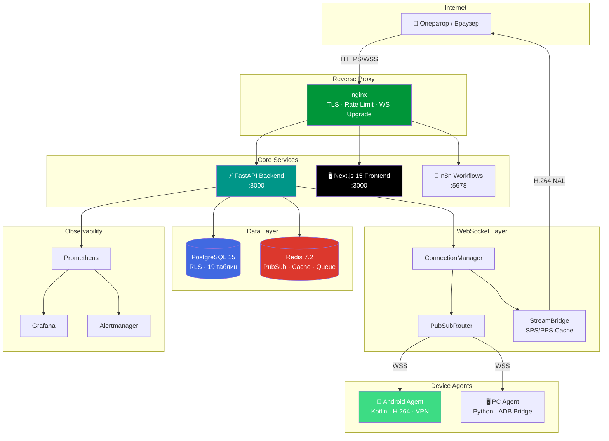
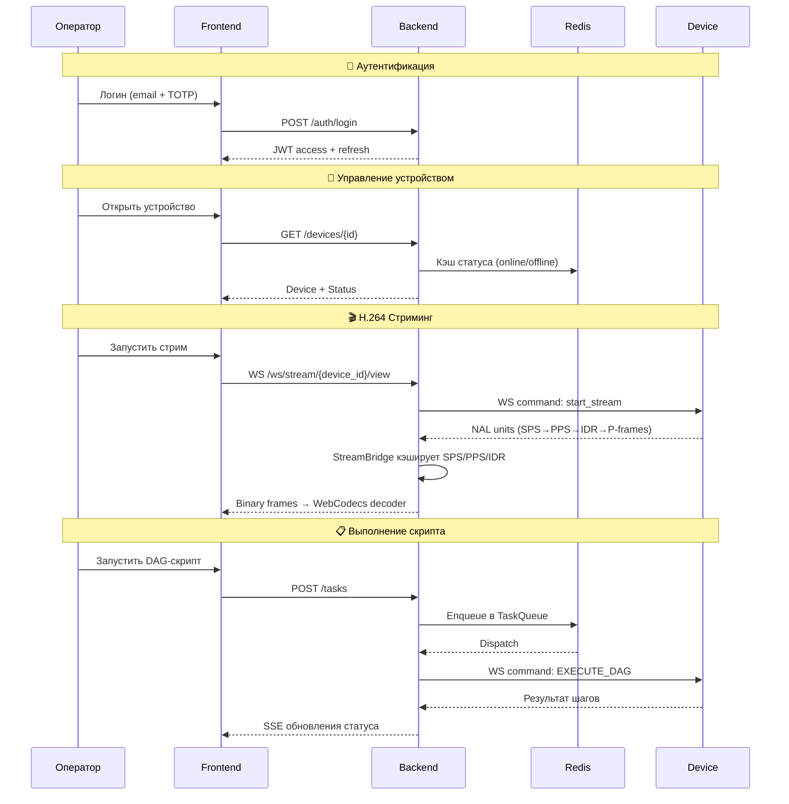
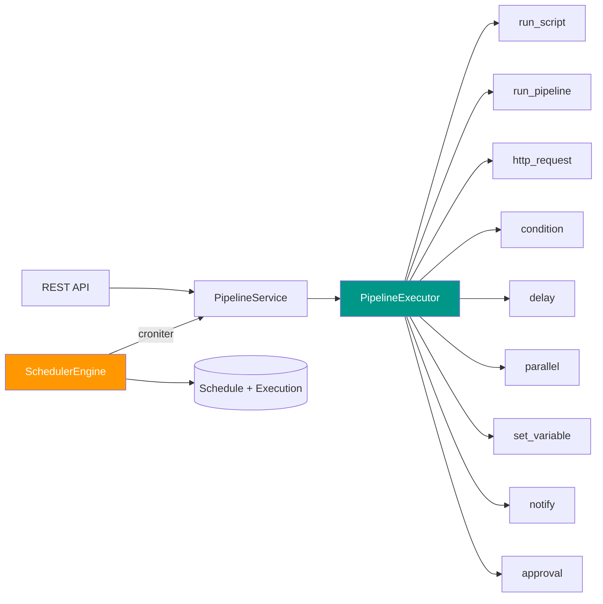
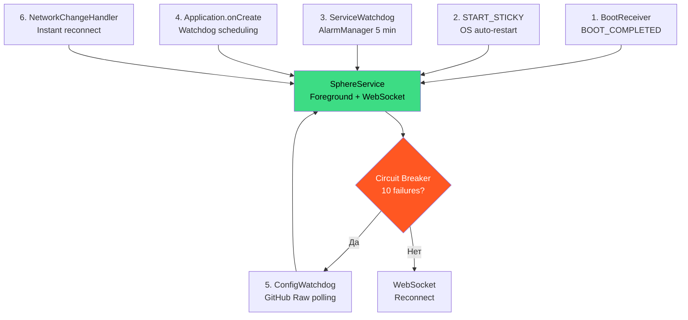
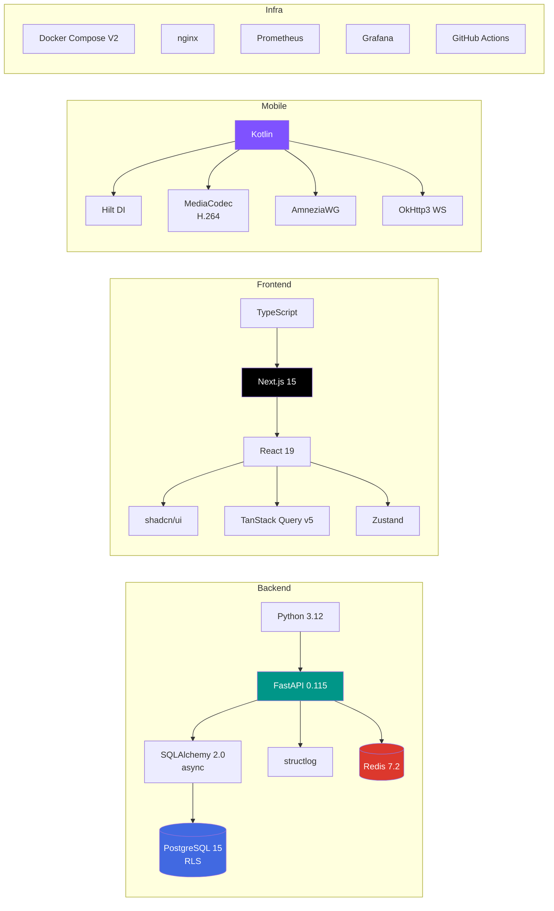

<div align="center">

<picture>
  <source media="(prefers-color-scheme: dark)" srcset="https://img.shields.io/badge/SPHERE-PLATFORM-00d4ff?style=for-the-badge&logo=satellite&logoColor=white">
  
</picture>

### Enterprise Android Device Management & Automation Platform

[](VERSION)
[](backend/)
[](android/)
[](frontend/)
[](backend/)
[](infrastructure/postgres/)
[](infrastructure/redis/)
[](docker-compose.yml)
[](LICENSE)
[](https://github.com/RootOne1337/sphere-platform/actions)
[](https://github.com/RootOne1337/sphere-platform/actions)

**Управляй тысячами Android-устройств. В реальном времени. Без компромиссов.**

[Документация](docs/) · [Web UI Guide](docs/web-ui-guide.md) · [API Reference](docs/api-reference.md) · [**Full Deploy Guide**](FULL-DEPLOYMENT-GUIDE.md) · [Deployment](docs/deployment.md) · [Changelog](CHANGELOG.md) · [Contributing](CONTRIBUTING.md)

---

</div>

## Что такое Sphere Platform?

Sphere Platform — production-grade система для **управления, мониторинга и автоматизации** крупных парков Android-устройств. H.264 видеостриминг в реальном времени, DAG-движок скриптов, pipeline-оркестратор, cron-планировщик, zero-touch provisioning 1000+ эмуляторов и защищённый VPN — всё в одной платформе.

> **Для кого:** DevOps-команды, тестировочные фермы, мобильные фермы, автоматизация QA, enterprise fleet management.

---

## Возможности

<table>
<tr>
<td width="50%">

### Управление флотом
- Регистрация, группировка, тегирование **1000+ устройств**
- Статус устройств в реальном времени через Redis
- Bulk-операции на группы (перезагрузка, обновление, команды)
- Zero-touch auto-enrollment для LDPlayer эмуляторов

</td>
<td width="50%">

### H.264 Стриминг
- **MediaProjection → MediaCodec → NAL-unit → WebSocket → WebCodecs**
- SPS/PPS/IDR кэширование — мгновенный старт для нового viewer
- Adaptive bitrate + frame drop при перегрузке
- Persistent decoder — reconnect без чёрного экрана

</td>
</tr>
<tr>
<td width="50%">

### Автоматизация скриптов
- DAG v7 — направленный ациклический граф действий
- Wave/Batch исполнение по группам устройств
- 9 типов шагов: `run_script`, `condition`, `parallel`, `http_request`...
- Pipeline chaining — цепочки скриптов с условной логикой

</td>
<td width="50%">

### Планировщик и Оркестратор
- DB-backed Cron Scheduler (croniter + SKIP LOCKED)
- Conflict policies: `skip` / `queue` / `cancel_previous`
- Pipeline Executor — параллельные и последовательные шаги
- Мгновенная диспетчеризация через Redis TaskQueue

</td>
</tr>
<tr>
<td width="50%">

### VPN-туннелирование
- **AmneziaWG** — обфусцированный WireGuard
- Per-device туннели с автоматическим IP-пулом
- Self-healing + Kill Switch
- Полный API для управления VPN-пирами

</td>
<td width="50%">

### Мониторинг и Безопасность
- Prometheus + Grafana + Alertmanager
- Структурированное логирование (structlog)
- JWT + TOTP MFA + RBAC + Row-Level Security
- Аудит-лог всех действий

</td>
</tr>
</table>

---

## Архитектура



### Потоки данных



### Pipeline Orchestrator



### Agent Resilience (6-уровневая гарантия)



> Полная архитектурная документация: [docs/architecture.md](docs/architecture.md)

---

## Быстрый старт

### Требования

| Компонент | Минимум | Рекомендуется |
|-----------|---------|---------------|
| Docker Desktop | 4.x+ (Compose V2) | Последняя версия |
| RAM | 4 ГБ | 8+ ГБ |
| CPU | 2 cores | 4+ cores |
| Порты | 80, 443 | + 5432, 6379 (dev) |

### Развёртывание одной командой

```bash
git clone https://github.com/RootOne1337/sphere-platform.git
cd sphere-platform
bash scripts/full-deploy.sh
```

> **Windows:** `powershell -ExecutionPolicy Bypass -File scripts\full-deploy.ps1`
>
> Подробнее: **[Full Deploy Guide](FULL-DEPLOYMENT-GUIDE.md)** (15 секций, от нуля до продакшна)

### 1 — Клонирование и настройка (ручной режим)

```bash
git clone https://github.com/RootOne1337/sphere-platform.git
cd sphere-platform

# Генерация секретов (.env.local)
python scripts/generate_secrets.py
```

### 2 — Запуск

```bash
# 🔧 Разработка (hot-reload backend + frontend)
docker compose -f docker-compose.yml \
               -f docker-compose.full.yml \
               -f docker-compose.override.yml up -d

# 🚀 Продакшн
docker compose -f docker-compose.yml \
               -f docker-compose.production.yml up -d

# ✅ Проверка статуса
docker compose ps
```

### 3 — Инициализация

```bash
# Миграции базы данных
docker compose exec backend alembic upgrade head

# Создание суперадминистратора
docker compose exec backend python scripts/create_admin.py
```

### 4 — Доступ к сервисам

| Сервис | URL | Описание |
|--------|-----|----------|
| 🖥️ Web UI | `http://localhost` | Основной интерфейс |
| 📖 Swagger | `http://localhost/api/v1/docs` | Интерактивная API-документация |
| 📘 ReDoc | `http://localhost/api/v1/redoc` | Альтернативная API-документация |
| 📊 Grafana | `http://localhost:3001` | Дашборды мониторинга |
| 🔗 n8n | `http://localhost:5678` | No-code автоматизация |

---

## Структура проекта

```
sphere-platform/
│
├── backend/                    # ⚡ FastAPI Backend (Python 3.12)
│   ├── api/v1/                 #    REST-эндпоинты (22 модуля)
│   ├── api/ws/                 #    WebSocket-маршруты (agent, stream, events)
│   ├── core/                   #    Конфигурация, RBAC, JWT, зависимости
│   ├── models/                 #    SQLAlchemy ORM (19 таблиц)
│   ├── schemas/                #    Pydantic v2 request/response схемы
│   ├── services/               #    Бизнес-логика (orchestrator, scheduler, vpn)
│   ├── tasks/                  #    Background asyncio tasks
│   ├── websocket/              #    ConnectionManager + PubSubRouter + StreamBridge
│   └── monitoring/             #    Prometheus-метрики, healthcheck
│
├── frontend/                   # 🖥️ Next.js 15 App Router (React 19)
│   ├── app/(auth)/             #    Авторизация
│   ├── app/(dashboard)/        #    Dashboard, Devices, Scripts, Stream, VPN,
│   │                           #    Tasks, Fleet, Monitoring, Orchestration
│   ├── components/             #    shadcn/ui компоненты
│   ├── hooks/                  #    TanStack Query v5 хуки
│   └── lib/                    #    Axios, Zustand, H264Decoder
│
├── android/                    # 📱 Android Agent (Kotlin + Hilt)
│   └── app/src/main/           #    Services, VPN, Streaming, ConfigWatchdog
│
├── pc-agent/                   # 🖥️ PC Agent (Python asyncio)
│   └── modules/                #    ADB bridge, LDPlayer, telemetry
│
├── infrastructure/             # 🏗️ Инфраструктура
│   ├── nginx/                  #    Reverse proxy + TLS
│   ├── postgres/               #    Init SQL, RLS-политики
│   ├── redis/                  #    Конфигурация Redis
│   ├── monitoring/             #    Prometheus, Grafana, Alertmanager
│   └── traefik/                #    Альтернативный reverse proxy
│
├── specs/                      # 📋 Технические спецификации (14 модулей)
│   ├── TZ-00-Constitution/     #    Репозиторий, Docker, PostgreSQL, Redis, CI/CD
│   ├── TZ-01-Auth-Service/     #    JWT, MFA, RBAC, API Keys, Audit
│   ├── TZ-02-Device-Registry/  #    CRUD, Groups, Status, Bulk, Discovery
│   ├── TZ-03-WebSocket-Layer/  #    ConnectionManager, PubSub, Backpressure
│   ├── TZ-04-Script-Engine/    #    DAG Schema, CRUD, TaskQueue, Wave/Batch
│   ├── TZ-05-H264-Streaming/   #    MediaProjection, MediaCodec, NAL, WebCodecs
│   ├── TZ-06-VPN-AmneziaWG/    #    Config, Pool, Self-Healing, Kill Switch
│   ├── TZ-07-Android-Agent/    #    Architecture, WebSocket, Commands, OTA
│   ├── TZ-08-PC-Agent/         #    Architecture, LDPlayer, Telemetry, ADB
│   ├── TZ-09-n8n-Integration/  #    Setup, DevicePool, ExecuteScript, Events
│   ├── TZ-10-Web-Frontend/     #    Setup, Dashboard, Remote, VPN UI, Scripts
│   ├── TZ-11-Monitoring/       #    Prometheus, Grafana, Alertmanager, Logging
│   ├── TZ-12-Agent-Discovery/  #    Zero-touch provisioning plan
│   └── TZ-12-Orchestrator/     #    Pipeline Engine, Scheduler, Events (5 SPLITs)
│
├── agent-config/               # ⚙️ Zero-touch provisioning конфигурации
├── n8n-nodes/                  # 🔗 Кастомные n8n-ноды
├── alembic/                    # 🗃️ Миграции базы данных
├── tests/                      # 🧪 Pytest-тесты (80 файлов)
├── scripts/                    # 🛠️ Утилиты и деплой-скрипты
│   ├── full-deploy.sh          #    Полное развёртывание Linux/macOS (8 шагов)
│   ├── full-deploy.ps1         #    Полное развёртывание Windows PowerShell
│   ├── health-check.sh         #    Проверка здоровья всех сервисов
│   ├── backup-database.sh      #    Бэкап PostgreSQL + Redis с ротацией
│   ├── generate_secrets.py     #    Генерация криптографических секретов
│   └── create_admin.py         #    Создание суперадминистратора
│
├── docs/                       # 📖 Документация проекта
└── .github/                    # 🔄 CI/CD workflows
```

---

## Технологический стек



<details>
<summary><b>Полная таблица технологий</b></summary>

### Backend
| Компонент | Технология | Назначение |
|-----------|------------|------------|
| Фреймворк | FastAPI 0.115+ | Async REST + WebSocket API |
| ORM | SQLAlchemy 2.0 (async) | Data access layer |
| БД | PostgreSQL 15 | Primary data store + RLS |
| Кэш / Брокер | Redis 7.2 | PubSub, кэш, очередь задач |
| Auth | JWT HS256 + TOTP MFA | Двухфакторная аутентификация |
| Задачи | asyncio + Redis PubSub | Background task execution |
| Метрики | Prometheus + structlog | Observability |
| Миграции | Alembic | Schema version control |
| Валидация | Pydantic v2 | Request/Response schemas |

### Frontend
| Компонент | Технология | Назначение |
|-----------|------------|------------|
| Фреймворк | Next.js 15.1 (App Router) | SSR + Client components |
| UI библиотека | shadcn/ui + Radix UI | Accessible component library |
| Стилизация | Tailwind CSS | Utility-first CSS |
| Стейт (серверный) | TanStack Query v5 | Cache, sync, background refetch |
| Стейт (клиентский) | Zustand | Lightweight state management |
| Графы | @xyflow/react | DAG визуализация |
| Декодер | WebCodecs API | H.264 hardware decode |

### Android Agent
| Компонент | Технология | Назначение |
|-----------|------------|------------|
| Язык | Kotlin (compileSdk 35) | Modern Android development |
| DI | Hilt + WorkManager | Dependency injection + scheduled work |
| Стриминг | MediaProjection + MediaCodec | H.264 hardware encoding |
| VPN | AmneziaWG | Obfuscated WireGuard tunnels |
| Транспорт | OkHttp3 WebSocket | Bidirectional communication |
| Discovery | CloneDetector + ZeroTouchProvisioner | Auto-enrollment |
| Resilience | ConfigWatchdog + ServiceWatchdog + CircuitBreaker | 6-level uptime |

### Инфраструктура
| Компонент | Технология | Назначение |
|-----------|------------|------------|
| Reverse Proxy | nginx | TLS termination, rate limiting |
| Контейнеры | Docker Compose V2 | Service orchestration |
| CI/CD | GitHub Actions | Automated testing + deployment |
| Мониторинг | Prometheus + Grafana + Alertmanager | Full observability stack |
| Tunnel | Serveo SSH | Dev environment tunneling |

</details>

---

## API обзор

<details>
<summary><b>REST API Endpoints (22 модуля)</b></summary>

| Модуль | Базовый путь | Описание |
|--------|-------------|----------|
| Auth | `/api/v1/auth` | Логин, регистрация, refresh token, TOTP |
| Users | `/api/v1/users` | CRUD пользователей, роли |
| Devices | `/api/v1/devices` | CRUD устройств, статус, register |
| Groups | `/api/v1/groups` | Группы устройств, тегирование |
| Scripts | `/api/v1/scripts` | DAG-скрипты, версионирование |
| Tasks | `/api/v1/tasks` | Создание задач, статус, результаты |
| Batches | `/api/v1/batches` | Батч-задачи, wave-исполнение |
| Bulk | `/api/v1/bulk` | Массовые операции на устройства |
| Pipelines | `/api/v1/pipelines` | Pipeline CRUD, выполнение |
| Schedules | `/api/v1/schedules` | Cron-расписания, конфликт-политики |
| VPN | `/api/v1/vpn` | Управление WireGuard-пирами |
| Streaming | `/api/v1/streaming` | H.264 стрим-сессии |
| Discovery | `/api/v1/discovery` | Auto-enrollment, workstations |
| Config | `/api/v1/config` | Agent конфигурация |
| Updates | `/api/v1/updates` | OTA-обновления APK |
| Audit | `/api/v1/audit` | Аудит-лог |
| Logs | `/api/v1/logs` | Логи устройств |
| Locations | `/api/v1/locations` | Геолокация устройств |
| Monitoring | `/api/v1/monitoring` | Prometheus-метрики |
| Health | `/api/v1/health` | Healthcheck endpoint |
| n8n | `/api/v1/n8n` | n8n webhook integration |

**WebSocket Endpoints:**

| Путь | Описание |
|------|----------|
| `/ws/android/{device_id}` | Подключение Android-агента |
| `/ws/agent/{agent_id}` | Подключение PC-агента |
| `/ws/stream/{device_id}/view` | H.264 viewer (бинарные фреймы) |
| `/ws/events` | Server-Sent Events (real-time updates) |

</details>

> Интерактивная документация: **Swagger UI** по адресу `/api/v1/docs`

---

## Документация

| Документ | Описание |
|----------|----------|
| 📐 [Architecture](docs/architecture.md) | Дизайн системы, потоки данных, компонентные диаграммы |
| 📖 [API Reference](docs/api-reference.md) | REST-эндпоинты, схемы запросов/ответов |
| 🚀 [**Full Deploy Guide**](FULL-DEPLOYMENT-GUIDE.md) | **Полный гайд развёртывания — от нуля до продакшна за 15 минут** |
| 🚀 [Deployment Guide](docs/deployment.md) | Docker, продакшн, staging, tunnel setup |
| ⚙️ [Configuration](docs/configuration.md) | Справочник переменных окружения |
| 🔒 [Security](docs/security.md) | Auth, RBAC, шифрование, модель угроз |
| 🛠️ [Developer Guide](docs/development.md) | Локальная настройка, тестирование, стандарты |
| �️ [Web UI Guide](docs/web-ui-guide.md) | Полный гайд по веб-интерфейсу — все страницы, кнопки, модальные окна |
| �📱 [Android Agent](docs/android-agent.md) | Сборка APK, развёртывание, обновления |
| 🖥️ [PC Agent](docs/pc-agent.md) | Установка, ADB-мост, LDPlayer |
| ⚙️ [Agent Config](agent-config/README.md) | Zero-touch provisioning |
| 📋 [Technical Specs](specs/) | 14 модулей технических спецификаций (70+ SPLIT-документов) |
| 📝 [ADR](docs/adr/) | Architecture Decision Records |
| 🚨 [Runbooks](docs/runbooks/) | Процедуры реагирования на инциденты |
| 🤝 [Contributing](CONTRIBUTING.md) | Руководство по контрибуции |
| 🛡️ [Security Policy](SECURITY.md) | Процесс отчёта об уязвимостях |
| 📰 [Changelog](CHANGELOG.md) | История релизов |

---

## Разработка

```bash
# Форк, клонирование, создание ветки
git checkout -b feat/SPHERE-XXX-short-description

# Установка pre-commit хуков (ruff, mypy, bandit)
pre-commit install

# Запуск тестов
cd backend && pytest -x

# Линтинг
ruff check backend/
mypy backend/ --ignore-missing-imports
```

Подробности о стандартах кода, стратегии ветвления и CI/CD — в [CONTRIBUTING.md](CONTRIBUTING.md).

---

<div align="center">

### Статистика проекта

| Метрика | Значение |
|---------|----------|
| ORM-моделей | 19 таблиц |
| REST-модулей | 22 |
| WebSocket-эндпоинтов | 4 |
| Тестовых файлов | 80+ |
| Технических спецификаций | 14 модулей / 70+ документов |
| Docker-сервисов | 10+ |
| Алембик-миграций | 15+ |

---

**MIT License** · Built with ❤️ by [RootOne1337](https://github.com/RootOne1337)

</div>
