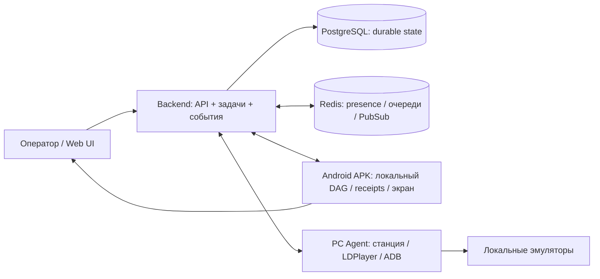

<div align="center">

# Sphere Platform

### Управление Android-парком · Локальное выполнение заданий · Наблюдаемое восстановление

[](docs/operations/READINESS.md)
[](https://github.com/RootOne1337/sphere-platform/actions/workflows/ci-backend.yml)
[](https://github.com/RootOne1337/sphere-platform/actions/workflows/ci-android.yml)
[](https://github.com/RootOne1337/sphere-platform/actions/workflows/ci-frontend.yml)

**Один интерфейс для устройств, заданий, экранов и состояния системы.**

[Начать](#начать-работу) · [Документация](docs/README.md) · [Реальная готовность](docs/operations/READINESS.md) · [Аудит](docs/audits/2026-09-05/AUDIT-REPORT.md) · [Changelog](CHANGELOG.md)

</div>

---

> **Состояние на 20 сентября 2026:** активная разработка и эксплуатационный аудит.
> Цель — сотни/тысячи подключённых устройств, с десятками эмуляторов на каждой
> станции. Подтверждённого capacity limit, SLA и совместимости со всеми телефонами
> пока нет. В документации отделены реализованные механизмы, проверенные сценарии
> и проектные решения. [Текущие приоритеты и критерии готовности →](docs/operations/READINESS.md)

> **Повторная ночь остановилась через 3 ч 33 мин:** 106 циклов, 223 native DAG
> подтверждены; в цикле 107 не запустился второй стрим. Оба APK сохранили PID,
> новых crash-записей нет. Восемь часов не пройдены.
> [Итог и исправление AUD-125](docs/audits/2026-09-05/STREAM-START-DELIVERY.md).

| Проверенная возможность | Последний результат | Доказательства и границы |
| --- | --- | --- |
| Несколько просмотров одного экрана | Исправлено вытеснение предыдущего viewer; три/два/один зритель получают новые кадры на обоих APK | [Причина, 112 tests и native-приёмка](docs/audits/2026-09-05/STREAM-MULTI-VIEWER.md) · [Усиленный критерий ночного теста](docs/audits/2026-09-05/SOAK-VIEWER-MOTION.md) |
| Диагностика команд | 12 успешных shell/logcat-запросов больше не создают 12 ложных предупреждений; настоящие task-результаты сохраняются | [Контракт интерактивных ответов](docs/audits/2026-09-05/INTERACTIVE-RESULT-IDENTITY.md) |
| История выполнения | Сверены 190 задач на восьми страницах; после двух новых DAG веб сам показал 192 | [Task Engine: исправление и приёмка](docs/audits/2026-09-05/TASK-HISTORY.md) |
| Самостоятельное обновление | Оба rooted Android 9 получили **1.2.7 / 10207** через APK OTA, без ADB install или ручных разрешений | [Текущий стенд и свежая APK](docs/operations/LOCAL-PILOT.md#apk-именно-для-нового-стенда) |
| Восстановление связи | После отказов Android, серверного входа и обеих сторон возвращаются команды, DAG и видео | [Матрица реальных отказов](docs/audits/2026-09-05/NETWORK-RECOVERY-NATIVE.md) |
| Повторные обрывы | Устранено накопление задержек между успешными соединениями | [Причина, failing regression и native retest](docs/audits/2026-09-05/ANDROID-RECONNECT-DEBT.md) |
| Длительная работа с задачами | Подтверждённые задачи больше не занимают ограниченный pending-буфер; миграция и replay protection проверены | [Компактный журнал подтверждений](docs/audits/2026-09-05/ANDROID-JOURNAL-CAPACITY.md) |
| Экран и веб | Три цикла захвата/остановки на каждом новом APK; веб восстанавливает кадры без F5 | [Приёмка новой APK](docs/audits/2026-09-05/ANDROID-RECONNECT-DEBT.md) · [Веб reconnect](docs/audits/2026-09-05/WEB-STREAM-RECOVERY.md) |
| Смена адреса и запуск Android | Signed discovery и самозапуск после reboot ранее проверены без Windows launcher; история версий сохранена | [Discovery](docs/audits/2026-09-05/SIGNED-DISCOVERY-NATIVE.md) · [Boot](docs/audits/2026-09-05/ANDROID-BOOT-RECOVERY.md) |

Это приёмка двух эмуляторов, а не всего парка. Независимый внешний ingress,
полный успешный ночной прогон, сотни одновременных подключений, физические
телефоны и VPN end-to-end остаются открытыми. [Остаточные риски и порядок работ](docs/operations/READINESS.md).

## Для чего Sphere

Sphere объединяет управление Android-устройствами, локальную автоматизацию,
наблюдение экрана, рабочие станции и серверную координацию задач. APK получает
задание и выполняет его локально; backend хранит состояние, принимает результаты
и управляет парком. PC-agent связывает станцию с LDPlayer/ADB. Web UI даёт оператору
точку управления и диагностики.

Главный критерий качества — оператору не приходится вручную переподключать или
переустанавливать сотни APK после обычного сбоя. Сейчас именно этот сценарий,
достоверность результатов и обнаружение причин отказа определяют порядок работ.

## Выберите свой маршрут

| Вам нужно | Начните здесь |
| --- | --- |
| Открыть подготовленный локальный стенд рядом со старым Docker project | [Local pilot: веб, APK, вход и границы проверки](docs/operations/LOCAL-PILOT.md) |
| Проверить ночной прогон Android, остановить его или прочитать результаты | [Безопасные DAG, pipeline controls, стрим и evidence](docs/operations/ANDROID-OVERNIGHT-SOAK.md) |
| Понять, что уже работает и что мешает эксплуатации | [Эксплуатационная готовность](docs/operations/READINESS.md) |
| Дойти до первого рабочего пилота и понять сроки | [План приёмки: веб → APK → задача → VPN](docs/operations/PILOT-ACCEPTANCE.md) |
| Подготовить локальный стек | [Разработка](docs/development.md) → [Конфигурация](docs/configuration.md) |
| Подключить эмулятор или телефон | [Android Agent](docs/android-agent.md) |
| Менять адреса сервера без переустановки APK | [Bootstrap discovery: решение, текущие пробелы и приёмка](docs/architecture/ANDROID-BOOTSTRAP-DISCOVERY.md) |
| Подключить рабочую станцию | [PC Agent](docs/pc-agent.md) |
| Разобраться с интерфейсом | [Web UI Guide](docs/web-ui-guide.md) |
| Найти причину сбоя | [Диагностика и её текущие ограничения](docs/operations/READINESS.md#наблюдаемость-ответ-на-что-случилось-в-1432-на-устройстве-x) → [Runbooks](docs/runbooks/README.md) |
| Проверить API и payload | [Генерируемый каталог](docs/api-endpoints.md) · [OpenAPI](docs/openapi.json) |
| Проверить исправление и доказательства | [Audit report](docs/audits/2026-09-05/AUDIT-REPORT.md) · [Regression harness](tests/production/README.md) |
| Подготовить deployment | [Deployment](docs/deployment.md) · [Полный guide](FULL-DEPLOYMENT-GUIDE.md) |
| Оценить будущую моторную AI-модель | [AI readiness: анализ без внедрения](docs/architecture/AI-READINESS.md) |

## Как устроена платформа


```mermaid
flowchart LR
    O[Оператор / Web UI] --> B[Backend: API + задачи + события]
    B --> P[(PostgreSQL: durable state)]
    B <--> R[(Redis: presence / очереди / PubSub)]
    B <--> A[Android APK: локальный DAG / receipts / экран]
    B <--> C[PC Agent: станция / LDPlayer / ADB]
    C --> E[Локальные эмуляторы]
    A --> O
```

Диаграмма показывает роли компонентов. Она не означает подтверждённую HA-топологию:
второй URL на тот же сервер не переживает потерю этого сервера. APK уже сохраняет
основной и резервный адрес одной установки, переключает WS и refresh после отказа
и подтверждает новый маршрут по `auth_ok`, без обязательного GitHub discovery.
[Настройка и границы проверки](docs/architecture/ANDROID-SAVED-ROUTES.md): реальные
OS/network/fleet drills и инфраструктурная HA ещё требуются.

## Возможности и доказательства

| Область | Реализованная основа | Что ещё проверяется |
| --- | --- | --- |
| Парк устройств | Регистрация, идентификаторы, группы/теги, presence, API/WS | Массовый reconnect, provisioning всех станций, физические телефоны |
| Автоматизация | DAG/Lua, задания, batches/waves, scheduler/pipelines, локальный журнал | Полный crash recovery, unknown physical outcomes, отмена при отказах |
| Связь | [Фоновая регистрация и актуальный device ID](docs/architecture/ANDROID-BACKGROUND-ENROLLMENT.md), отменяемая регистрация с единым commit identity, подтверждение авторизации, recoverable refresh, [сохранённый основной/резервный маршрут](docs/architecture/ANDROID-SAVED-ROUTES.md), discovery без credentials | Реальные OS/network/fleet drills, durable config version/rollback и HA backend |
| Экран и управление | H.264 / WebCodecs, touch/key primitives, backpressure | Codec/OS recovery, latency под нагрузкой, измеренный ресурсный бюджет |
| PC-agent | Workstation ownership, registration, command result routing/recovery | Durable results, повторная topology, реальный LDPlayer/ADB/host reboot |
| VPN | SQL lease/intents, ограничения адресов, recovery/fencing | Provider reconciliation и реальные маршруты/инвентарь |
| Web UI | Страницы, API hooks, identity/cache separation, mutation flows | Все пользовательские действия и отсутствие synthetic metrics на каждом экране |
| Диагностика | Structured backend logs, request ID, metrics, APK file logs/upload | Работающий общий metrics stack, correlation timeline и support bundle |

Границы тестирования важны: JVM/MockWebServer не заменяют Android OS, React/JSDOM
не заменяет браузер, Compose config не заменяет запуск сервисов. В [отчёте](docs/audits/2026-09-05/AUDIT-REPORT.md)
у каждого исправления есть severity, root cause, before/after evidence, tests и
residual risk. PR остаётся draft до завершения эксплуатационных критериев.

## Начать работу

### 1. Подготовить окружение

Нужны Git, Docker Engine/Desktop с Compose v2 и настроенный `.env`. Для отдельных
компонентов используются Python 3.12, Node.js и JDK/Android SDK; точные команды и
версии сборки приведены в [development guide](docs/development.md) и исходных manifests.
APK имеет `minSdk=26`; это нижняя граница установки, а не обещание всех функций на
любом Android 8+ устройстве.

```powershell
git clone https://github.com/RootOne1337/sphere-platform.git
cd sphere-platform
Copy-Item .env.example .env
```

Заполните параметры по [configuration guide](docs/configuration.md). Не публикуйте
`.env`, tokens и signing keys. Для development и deployment действуют разные
Compose/configuration contracts; не смешивайте их автоматически.

### 2. Проверить выбранную конфигурацию

Для текущего development-рецепта:

```powershell
docker compose -f docker-compose.yml -f docker-compose.full.yml config --quiet
```

Команда проверяет Compose/interpolation, не запускает сервисы и не проверяет SQL
миграции, готовность API или работу APK. Отсутствующий обязательный параметр должен
быть исправлен до запуска.

### 3. Запустить development-стек

Существующий launcher:

```powershell
./scripts/start-dev.ps1
```

Он запускает `docker-compose.yml` + `docker-compose.full.yml`. Frontend в этом
рецепте работает в dev mode. Launcher останавливается при ошибке Docker/config/build/up
и ждёт готовности PostgreSQL, Redis, API и frontend; default wait — 180 s.
[AUD-68 и startup contract](docs/operations/STARTUP.md) описывают 17 regression cases.
Проверка миграций, runtime grants, APK auth и задания остаётся отдельным этапом.

Для запуска из prepared images и эксплуатационного окружения используйте
[deployment guide](docs/deployment.md). Runtime database roles, миграции, ключи,
backup/restore и persistence имеют явные rollout ограничения. Аудит не выполнял
production rollout. Автоматический запуск при boot требует отдельного reboot/restore drill на подготовленном
стенде; subprocess tests launcher не заменяют такой прогон.

### 4. Подключить первое устройство

Следуйте [APK guide](docs/android-agent.md): flavor/package/signature, provisioning,
server origin, device identity, permissions, регистрация и first-message WS auth.
Начните с одного изолированного устройства и одного простого задания. Для PC станции
нужны существующая workstation identity, соответствующий agent key и рабочие пути
к локальным executable — [точный PC-контракт](docs/pc-agent.md).

Не удаляйте credentials/journal как универсальный способ «починить reconnect»:
так теряются identity и доказательства исполнения. Нужен диагностируемый recovery.

## Если что-то пошло не так

Запишите время с часовым поясом, device/workstation ID, task/command ID, действие
в UI, ожидаемый и фактический результат, версии APK/backend и момент последнего
успешного подключения. После этого можно сузить поиск до соответствующих событий,
воспроизвести сценарий и сохранить regression test.

Сегодня сквозной поиск ещё неполон. [План наблюдаемости](docs/operations/READINESS.md)
определяет требуемый timeline. [Runbooks](docs/runbooks/README.md) сверены с текущими
именами сервисов и health paths; их команды выбираются для вашего Compose project.
Это инструкции диагностики, а не доказательство пройденного recovery drill.

## Работа с кодом

| Каталог | Назначение |
| --- | --- |
| [backend/](backend/) | FastAPI, orchestration, models, WS, background services |
| [frontend/](frontend/) | Next.js UI и API/WS clients |
| [android/](android/) | Kotlin APK, локальный исполнитель и streaming |
| [pc-agent/](pc-agent/) | Python agent для рабочих станций |
| [alembic/](alembic/) | Версионированные миграции |
| [infrastructure/](infrastructure/) | Proxy, monitoring и конфигурация сервисов |
| [tests/](tests/) | Unit, isolated-service и deployment regressions |
| [docs/](docs/README.md) | Guides, решения, evidence и rollout contracts |

Изменения ведутся атомарными коммитами: воспроизведение → минимальный fix → проверка
→ актуальная документация → PR/CI. Исправление не считается проверенным только
потому, что собрался APK или прошёл lint. Тесты с PostgreSQL/Redis разрешены только
на выделенных локальных test services; [предохранители и команды](tests/production/README.md).

[Contributing](CONTRIBUTING.md) · [Changelog](CHANGELOG.md) · [Архитектурные решения](docs/adr/README.md) · [Лицензия платформы](LICENSE)
