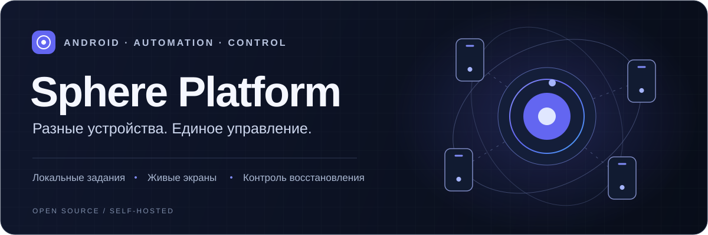
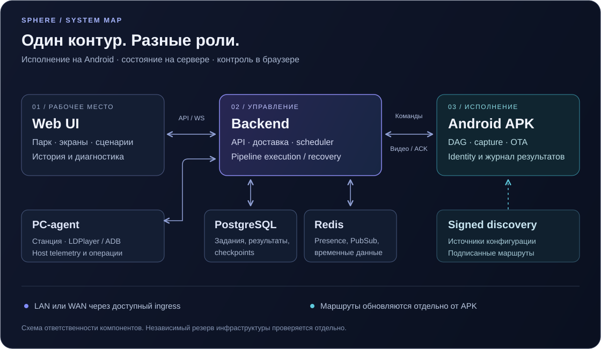
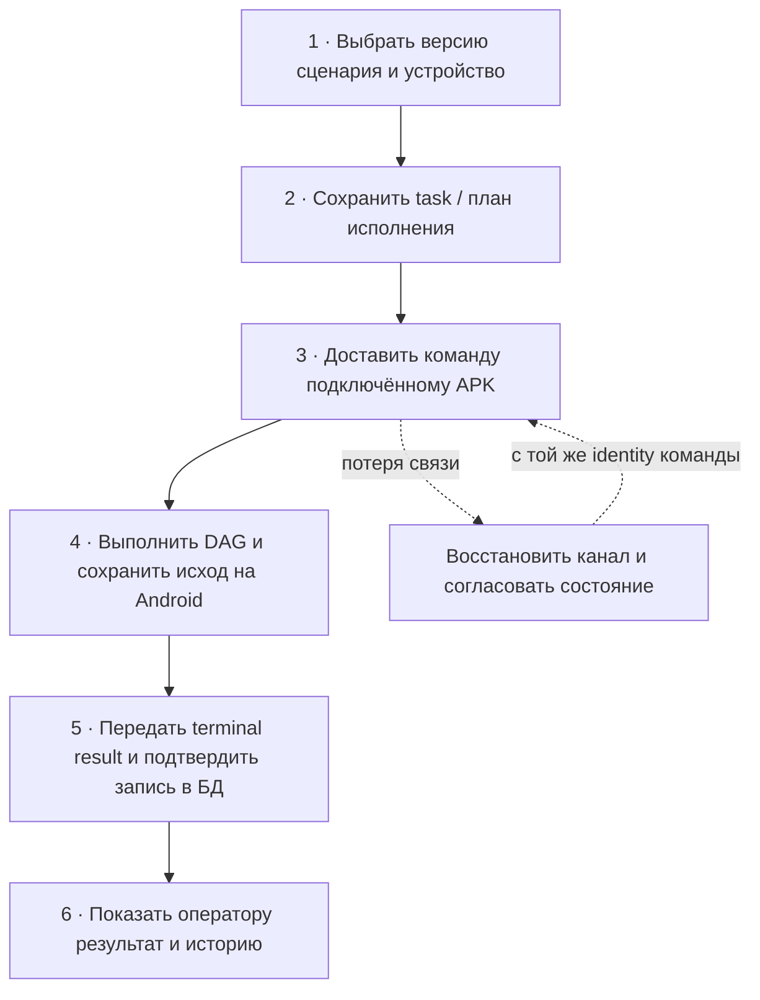

<div align="center">



**Android-парк. Локальное исполнение. Контроль из браузера.**

Управляйте устройствами в разных сетях, собирайте сценарии в задания<br />
и отслеживайте весь путь — от отправки команды до сохранённого результата.

[](https://github.com/RootOne1337/sphere-platform/actions/workflows/ci-backend.yml) [](https://github.com/RootOne1337/sphere-platform/actions/workflows/ci-frontend.yml) [](https://github.com/RootOne1337/sphere-platform/actions/workflows/ci-android.yml) [](LICENSE)

**[🚀 Запуск](#start) · [📚 Документация](#docs) · [🧩 Архитектура](#architecture) · [🔬 Готовность](#status)**

[Возможности](#capabilities) · [Android и связь](#android) · [Задания](#automation) · [Веб и видео](#workspace) · [План работ](ROADMAP.md) · [Поддержка](SUPPORT.md)

</div>

> [!NOTE]
> **Активная разработка · подготовка к 32 реальным эмуляторам.** На 24 сентября 2026
> подтверждены отдельные сценарии на двух rooted Android 9; удалённый видеокадр
> пока не принят. Массовый прогон, полный успешный 8h soak и VPN end-to-end ещё
> предстоят. [Установленные версии и доказательства ↓](#status)

---

<a id="overview"></a>
## 🧭 Что такое Sphere

Sphere — self-hosted платформа управления Android-устройствами и эмуляторами.
Она объединяет **веб оператора, сервер заданий, Android APK и агент рабочей станции**.
Сервер и устройства могут находиться в разных сетях: для подключения нужен доступный
маршрут к вашей установке, а не физическое присутствие рядом с каждым Android.

APK получает сценарий и выполняет его на устройстве. Backend хранит задания,
управляет очередями и оркестрацией; веб показывает состояние, экраны и результаты.
Работа платформы строится вокруг проверяемого исполнения: потеря соединения,
перезапуск и отмена задания должны оставлять понятный результат для оператора.

| Для кого | Основной сценарий |
| --- | --- |
| **Оператор парка** | Подключить устройства, распределить по группам, наблюдать экраны и запускать задания |
| **Автор автоматизации** | Подготовить версионируемый DAG, связать шаги в pipeline и проверить результаты |
| **Администратор установки** | Развернуть сервисы, следить за ресурсами, обновлять APK и разбирать сбои |
| **Разработчик интеграции** | Работать с HTTP API, событиями и контрактами исполнения; расширять платформу |

Предметные модули пока включают игровые аккаунты и специализированные сценарии.
Универсальные проекты и будущий AI-контур — отдельные этапы [roadmap](ROADMAP.md).

<a id="capabilities"></a>
## ✨ Возможности по компонентам

<table>
<tr>
<td width="50%" valign="top">
<h3>📱 Android-парк</h3>
<p>Регистрация устройств, собственная identity, группы и состояние связи. APK работает на самом Android; агент станции добавляет операции с эмуляторами.</p>
<p><a href="docs/android-agent.md">Android agent →</a> · <a href="docs/pc-agent.md">PC-agent →</a></p>
</td>
<td width="50%" valign="top">
<h3>⚙️ Исполнение сценариев</h3>
<p>Версии скриптов, локальные DAG, задания по устройствам, batches, расписания и серверные pipelines. Результат отслеживается отдельно от отправки команды.</p>
<p><a href="docs/security/task-control-protocol.md">Контракт исполнения →</a></p>
</td>
</tr>
<tr>
<td width="50%" valign="top">
<h3>🖥️ Экран и управление</h3>
<p>H.264-поток с Android в браузер, несколько просмотров, обработка перегрузки декодера и восстановление потока. Профиль для 32 экранов ещё дорабатывается.</p>
<p><a href="docs/audits/2026-09-20/DECODER-RECOVERY.md">Декодер и проверенные сценарии →</a></p>
</td>
<td width="50%" valign="top">
<h3>🔄 Восстановление связи</h3>
<p>Подписанный discovery, сохранённые адреса, reconnect и обновление device credentials. Возврат соединения согласуется с журналом результатов на APK.</p>
<p><a href="docs/architecture/ANDROID-CONNECTION-PROTOCOL.md">Протокол подключения →</a></p>
</td>
</tr>
<tr>
<td width="50%" valign="top">
<h3>📦 Обслуживание устройств</h3>
<p>Каталог обновлений APK, адресная OTA-доставка, boot/service recovery и root-возможности на подготовленных устройствах. Совместимость принимается для конкретного Android.</p>
<p><a href="docs/operations/LOCAL-PILOT.md">Текущий APK и установка →</a></p>
</td>
<td width="50%" valign="top">
<h3>🔎 Наблюдение и разбор сбоев</h3>
<p>Task/pipeline IDs, receipts, история, логи и runtime evidence. Runbooks связывают симптом с проверкой; подключение всех fleet-метрик остаётся в работе.</p>
<p><a href="SUPPORT.md">Что собрать при сбое →</a> · <a href="docs/runbooks/README.md">Runbooks →</a></p>
</td>
</tr>
</table>

VPN, webhooks/n8n и управление рабочими станциями входят в кодовую базу.
Их эксплуатационные ограничения перечислены [ниже](#status); наличие раздела
в интерфейсе само по себе не означает завершённую end-to-end приёмку.

<a id="architecture"></a>
<a id="-как-связаны-компоненты"></a>
## 🧩 Как устроена платформа



*Схема компонентов и их ответственности. Это не скриншот интерфейса и не схема развёрнутого HA-кластера.*

| Компонент | За что отвечает | Где смотреть |
| --- | --- | --- |
| **Web UI** | Рабочее место оператора: парк, экраны, сценарии, задания, настройки | [frontend/](frontend/) · [Web guide](docs/web-ui-guide.md) |
| **Backend** | API, identity, task delivery, scheduler, pipeline execution и recovery | [backend/](backend/) · [API-каталог](docs/api-endpoints.md) |
| **Android APK** | Подключение, локальное исполнение, журнал результатов, capture и OTA | [android/](android/) · [Android guide](docs/android-agent.md) |
| **PC-agent** | Операции рабочей станции, локальные LDPlayer/ADB-инструменты и telemetry | [pc-agent/](pc-agent/) · [PC-agent guide](docs/pc-agent.md) |
| **PostgreSQL** | Сохранённые задания, результаты, версии сценариев и состояние оркестрации | [alembic/](alembic/) · [RLS contract](docs/security/postgresql-rls.md) |
| **Redis** | Presence, PubSub и оперативное состояние; ограничения памяти и persistence | [Memory runbook](docs/operations/REDIS-MEMORY.md) |
| **Ingress / discovery** | Доступ к установке и распространение подписанных актуальных маршрутов | [Remote pilot](docs/operations/REMOTE-PILOT.md) · [Publisher](docs/operations/DISCOVERY-PUBLISHER.md) |

**Стек:** FastAPI · SQLAlchemy / Alembic · PostgreSQL · Redis · Next.js / React ·
TypeScript · Kotlin / Coroutines · MediaCodec / H.264 · Docker Compose.
VPN-модуль использует WireGuard-совместимые механизмы; рабочий provider и routing
проверяются отдельно. [Архитектурный справочник](docs/architecture.md) · [ADR](docs/adr/README.md).

<a id="android"></a>
## 📱 APK: подключение, автономность и обновления

### Найти установку и сохранить соединение

В signed discovery режиме APK знает **источники конфигурации, installation ID и
открытый ключ проверки**. Актуальный адрес управления приходит из подписанного
документа. Это позволяет менять маршрут без пересборки APK при сохранении доверия
к той же установке.

| Этап | Поведение |
| --- | --- |
| **Первое подключение** | Provisioning выбирает конфигурацию, получает адрес установки и выполняет регистрацию |
| **Подтверждение канала** | WebSocket должен получить корректный `auth_ok`; сам факт открытия сокета недостаточен |
| **Обрыв связи** | APK выполняет повторные попытки с backoff/jitter; события прежней попытки не оживляют устаревшее соединение |
| **Недоступен основной маршрут** | Используются сохранённые кандидаты той же установки; перебор не требует доступного GitHub |
| **Изменились адреса** | Подписанный manifest обновляет маршруты; источники конфигурации можно резервировать |
| **Истёк access token** | Device refresh имеет собственный recovery-контракт; устройство сохраняет identity |

Источники discovery и резервные адреса — разные уровни. Несколько URL одного
backend не защищают от потери его хоста или БД. Постоянный независимый WAN failover
ещё не принят; [фактическая топология pilot](docs/operations/REMOTE-PILOT.md) описана явно.

[Signed discovery](docs/architecture/ANDROID-SIGNED-DISCOVERY.md) ·
[Сохранённые маршруты](docs/architecture/ANDROID-SAVED-ROUTES.md) ·
[WS protocol](docs/architecture/ANDROID-CONNECTION-PROTOCOL.md) ·
[Device refresh](docs/security/device-refresh-recovery.md)

### Выполнять и обслуживаться на самом Android

- **Локальный DAG:** уже полученный сценарий исполняется APK; каждый шаг не требует
  отдельной команды с Windows. Потеря связи и рестарт процесса — разные сценарии recovery.
- **Сохранённые результаты:** журнал и receipts связывают команду с исходом;
  возврат сети не должен превращать повтор доставки в повтор побочного эффекта.
- **Boot и service recovery:** автозапуск и watchdog работают средствами Android;
  Windows-agent не является обязательным посредником management-соединения APK.
- **Root-возможности:** в подготовленных эмуляторах проверялись автоматические
  разрешения, capture и установка обновления без ручного ADB install.
- **OTA:** подписанный совместимым ключом APK доставляется через каталог/команду
  обновления. Приёмка включает установленную версию и восстановление процесса.

`minSdk 26` допускает установку с Android 8; это не обещание одинакового поведения
на всех прошивках. На обычном телефоне могут потребоваться системные согласия.
Конкурентная запись OTA-каталога и прерывание долгого `sleep` остаются в реестре.

[Boot recovery](docs/audits/2026-09-05/ANDROID-BOOT-RECOVERY.md) ·
[Root capabilities](docs/audits/2026-09-05/ANDROID-UNATTENDED-CAPABILITIES.md) ·
[OTA recovery](docs/audits/2026-09-05/ANDROID-OTA-RECOVERY.md) ·
[Последняя native приёмка](docs/audits/2026-09-20/CANARY-20260921.md)

<a id="automation"></a>
## ⚙️ От сценария до подтверждённого результата

Sphere разделяет **описание работы, конкретный запуск и полученное подтверждение**.
Это позволяет разбирать ситуацию «команда принята, но действие не завершилось»
без подмены фактического результата статусом отправки.

| Сущность | Назначение |
| --- | --- |
| **Script / version** | Сохранённое описание DAG с версией; изменения сценария отделены от уже созданного запуска |
| **Task** | Конкретное исполнение на устройстве с собственным ID, состоянием и результатом |
| **Batch** | План распределения по выбранным устройствам, волны и сохранённые identities задач |
| **Pipeline** | Серверная последовательность шагов и дочерних запусков, ожидания и checkpoints |
| **Schedule** | Запуск по расписанию с сохранением результата срабатывания |
| **Receipt** | Подтверждение приёма/результата; terminal receipt сообщает окончательный исход |


```mermaid
flowchart TD
    A["1 · Выбрать версию сценария и устройство"] --> B["2 · Сохранить task / план исполнения"]
    B --> C["3 · Доставить команду подключённому APK"]
    C --> D["4 · Выполнить DAG и сохранить исход на Android"]
    D --> E["5 · Передать terminal result и подтвердить запись в БД"]
    E --> F["6 · Показать оператору результат и историю"]
    C -. "потеря связи" .-> R["Восстановить канал и согласовать состояние"]
    R -. "с той же identity команды" .-> C
```

**Отмена — тоже операция с подтверждением.** Сохранённый stop intent не означает,
что устройство уже остановилось. До terminal result сохраняется барьер для следующей
работы. Неопределённые внешние эффекты требуют reconciliation; обещания универсального
«exactly once» для любого root-действия нет.

В изолированных regressions проверены потеря executor, восстановление batch/pipeline,
non-owner RLS и потерянные ответы commit. Native canary проверяет конкретные сценарии
двух APK. Compound loop/parallel и смешанная нагрузка 32 устройств ещё впереди.

[Task control](docs/security/task-control-protocol.md) ·
[Durable cancellation](docs/audits/2026-09-20/DURABLE-CANCELLATION.md) ·
[Pipeline recovery](docs/audits/2026-09-20/PIPELINE-RECOVERY.md) ·
[Batch recovery](docs/audits/2026-09-20/BATCH-RECOVERY.md) ·
[Scheduler](docs/audits/2026-09-20/SCHEDULER-RUNTIME.md)

<a id="workspace"></a>
## 🖥️ Рабочее место оператора

Веб объединяет повседневные операции и диагностику. Следующая карта показывает
существующие разделы; актуальная приёмка конкретного сценария — в [readiness](docs/operations/READINESS.md).

| Область | Разделы | Задача оператора |
| --- | --- | --- |
| **Парк** | Devices, Fleet, Groups, Locations | Найти устройство, посмотреть состояние, организовать парк |
| **Видео** | Device Stream | Открыть экраны, наблюдать свежие кадры и восстановление просмотра |
| **Исполнение** | Scripts, Tasks, Orchestration | Подготовить сценарий, запустить и проверить исход |
| **Автоматические запуски** | Orchestration → Schedules, Event Triggers | Настроить условия и проследить созданную работу |
| **Обслуживание** | Updates, Discovery, VPN | Управлять обновлениями и настройками подключения; учитывать ограничения provider |
| **Диагностика** | Events, Logs, Audit, Monitoring | Сопоставить событие, устройство и задание во времени |
| **Доступ и интеграции** | Users, Settings, Webhooks | Управлять правами и подключаемыми процессами |

### Живой экран: важна свежесть, а не просто картинка

Поток проходит через Android capture/encoder, сеть, backend и браузерный decoder.
Поэтому online-статус, открытый сокет и новый декодированный кадр измеряются отдельно.

| Уже проверялось | Следующая граница нагрузки |
| --- | --- |
| Два native потока и возврат после backend restart без F5 | 32 одновременных экрана и совокупный CPU/GPU/RAM/network профиль |
| Ограничение decode queue и восстановление после codec error | Задержки при перегруженном браузере и потерях сети |
| Несколько viewers и освобождение capture после закрытия последнего | Сквозной облегчённый профиль до encoder и корректная цепочка H.264 кадров |
| Раздельная фиксация online и новых кадров | Возраст кадра и задержка управляющей команды на насыщенном канале |

Для будущих AI consumers нужен такой же измеряемый путь наблюдения и действия.
Сами модели и inference в текущий этап не входят.
[Видео: evidence](docs/audits/2026-09-20/DECODER-RECOVERY.md) ·
[Multi-viewer](docs/audits/2026-09-05/STREAM-MULTI-VIEWER.md) ·
[Профиль Fleet32](docs/audits/2026-09-20/FLEET32-PREFLIGHT.md) ·
[Web guide](docs/web-ui-guide.md)

<a id="start"></a>
## 🚀 От checkout до первого устройства

### 1. Выберите правильный маршрут

| Ситуация | Действие |
| --- | --- |
| **Работаете с уже подготовленным pilot** | Откройте [Local pilot](docs/operations/LOCAL-PILOT.md): адрес веба, вход, APK и отдельный Compose project |
| **Новая установка** | Подготовьте отдельное окружение по [Startup](docs/operations/STARTUP.md#first-install) |
| **Устройства в другой сети** | Добавьте доступный HTTPS/WSS ingress и signed discovery по [Remote pilot](docs/operations/REMOTE-PILOT.md) |
| **Разрабатываете компонент** | Настройте инструменты по [Developer guide](docs/development.md) |

### 2. Получите согласованную ревизию

```sh
git clone https://github.com/RootOne1337/sphere-platform.git
cd sphere-platform
git switch codex/enterprise-audit-20260905
```

Исправления текущего аудита находятся в draft
[PR #19](https://github.com/RootOne1337/sphere-platform/pull/19).
Обычный clone без переключения открывает `main`. Документация, backend image,
миграции и APK должны соответствовать выбранному rollout.

### 3. Подготовьте установку

Для Windows нужны **PowerShell 7, Python 3.12, Git и Docker Compose v2**.
Для production overlay — Compose **2.24.4+**. Заполните конфигурацию, выберите
свободные порты и постоянный project name, затем выполните
[bootstrap](docs/operations/STARTUP.md#first-install).

Порядок launcher: **PG/Redis → миграции → admin/enrollment → backend/frontend →
readiness**. Существующий pilot использует собственные env/volumes и порт 18080;
общий recipe не является командой обновления этого стенда.

### 4. Войдите в веб и подключите APK

Используйте учётные данные администратора, созданные bootstrap. Публичная регистрация
не выдаёт super_admin. Для устройства нужна сборка под вашу установку: discovery
identity, доверенный ключ и параметры enrollment; APK из чужой установки не подходит.

**[Где взять текущую pilot APK →](docs/operations/LOCAL-PILOT.md#apk-именно-для-нового-стенда)** ·
[Самостоятельная сборка](docs/android-agent.md) · [Конфигурация](docs/configuration.md)

### 5. Проверьте работу до расширения парка

- Веб принимает учётные данные; устройство получает собственную identity и подключается.
- Безопасное тестовое задание завершается с сохранённым terminal receipt.
- Экран показывает **новые** кадры; после закрытия просмотра capture освобождается.
- После контролируемого обрыва устройство возвращается, исход задания не теряется.
- Версии, условия, время и результат записаны в приёмку.

[Пошаговая приёмка pilot](docs/operations/PILOT-ACCEPTANCE.md) ·
[Длительный безопасный прогон](docs/operations/ANDROID-OVERNIGHT-SOAK.md)

<a id="status"></a>
## 🔬 Состояние проекта и границы проверки

**Контрольная точка: 25 сентября 2026, 14:17 Asia/Yekaterinburg.** Состояние
контейнеров и readiness проверены в это время; API и ADB snapshot устройств ниже
остаются последними ранее сохранёнными read-only срезами. Source fixes, которые
ещё не развёрнуты, отдельно помечены ниже. [Решение по удалённому видео и OTA](docs/audits/2026-09-24/REMOTE-VIDEO-OTA-DECISION.md) ·
[A/B ingress](docs/audits/2026-09-24/REMOTE-INGRESS-AB.md) ·
[Open и кадры](docs/audits/2026-09-25/ANDROID-STREAM-OBSERVABILITY.md) ·
[Enrollment 401](docs/audits/2026-09-25/CLONED-ENROLLMENT-401.md) ·
[OTA receipts](docs/audits/2026-09-25/OTA-TERMINAL-RECEIPTS.md).

| Поверхность / проверка | Версия / результат | Доказательство |
| --- | --- | --- |
| Backend / frontend pilot | Image `b491a66`, healthy; readiness `200` при контрольной проверке; source fixes ещё не развёрнуты | [Local pilot](docs/operations/LOCAL-PILOT.md) |
| Android, локальные устройства | `emulator-5554`: **1.2.20-dev / 10220** (ручная установка); `emulator-5556`: **1.2.19-dev / 10219** | [OTA и текущий gate](docs/architecture/ANDROID-OTA-RELIABILITY.md) |
| Android candidate | **1.2.21-dev / 10221**, SHA-256 `69A275B0…1DEB98F8`; собран и подписан, не установлен и не опубликован | [OTA receipts](docs/audits/2026-09-25/OTA-TERMINAL-RECEIPTS.md) |
| Clone/re-enrollment · read-only ADB check 04:26 | `emulator-5556` repeatedly receives HTTP 401 at registration; both local emulators have the same bootstrap credential fingerprint, which does not match isolated-pilot config. Exact server for the saved 401 is not proven | [AUD-172 evidence and limits](docs/audits/2026-09-25/CLONED-ENROLLMENT-401.md) |
| Backend OTA catalog · last read-only snapshot 04:11 | Latest `android/dev`: **1.2.9-dev / 10209**; latest `android-canary/dev`: **1.2.19-dev / 10219** | [OTA reliability](docs/architecture/ANDROID-OTA-RELIABILITY.md) |
| Task / pipeline · приёмка 21 сентября | 15 terminal task receipts; два pipeline runs | [Независимая сверка результатов](docs/audits/2026-09-20/CANARY-20260921.md) |
| Видео | В независимых viewer-сессиях локальный `PH000` передавал IDR/P, удалённый `PH008` — SPS/PPS без IDR/P. Android egress A/B не завершён; Cloudflare не доказан причиной | [AUD-164](docs/audits/2026-09-24/REMOTE-INGRESS-AB.md) · [AUD-170](docs/audits/2026-09-25/ANDROID-STREAM-OBSERVABILITY.md) |
| Redis | Source Compose: 512 MiB dataset / 2048 MiB ceiling; three isolated AOF probes pass (peak 1.49–2.00 GiB); 32-stream/live rollout open | [AUD-143 evidence and rollout boundary](docs/audits/2026-09-20/REDIS-PERSISTENCE-HEADROOM.md) |
| Сетевые отказы | Проверены отдельные отказы Android, серверного входа и обеих сторон | [Матрица и версии проверок](docs/audits/2026-09-05/NETWORK-RECOVERY-NATIVE.md) |
| Fleet / identities | **NO-GO:** 10 records; 6 со статусом `online`, но только 3 свежих heartbeat; у 9 APK version code неизвестен. Это не подтверждает 20 удалённых уникальных устройств | [Readiness](docs/operations/READINESS.md) · [Clone identity](docs/audits/2026-09-20/CLONE-IDENTITY.md) |

### Ближайшие эксплуатационные задачи

| Порядок | Работа | Условие завершения |
| --- | --- | --- |
| **01 · Видео и команды** | Довести профиль до APK encoder, свежесть кадров и общий video/control budget | Профиль реально применён; управление и видео измерены под нагрузкой |
| **02 · Наблюдаемость** | Fleet/worker metrics, ресурсы, logging/backup и Redis recovery | Сбой можно связать с устройством, заданием и временным окном |
| **03 · Масштаб** | 4 → 8 → 16 → 32, затем смешанный fault/soak | Сверены receipts, новые кадры, crash buffers и ресурсы; прогон завершён |
| **04 · Смежные функции** | VPN, OTA catalog concurrency, PC-agent receipts, webhooks и независимый ingress | Принят конкретный end-to-end сценарий используемого режима |

**32 устройства и восемь часов пока не приняты.** Последний длинный прогон завершился
ошибкой через **3 ч 33 мин**. `running`, зелёный build или доступная login page
не заменяют завершённый runtime тест.

**[Полный реестр Fleet32 →](docs/audits/2026-09-20/FLEET32-PREFLIGHT.md)** ·
[Readiness](docs/operations/READINESS.md) · [Roadmap](ROADMAP.md) ·
[История аудита](docs/audits/2026-09-05/AUDIT-REPORT.md) · [Changelog](CHANGELOG.md)

<a id="docs"></a>
## 📚 Документация по задачам

<table>
<tr>
<td width="50%" valign="top">
<h3>🚀 Запустить и подключить</h3>
<p><a href="docs/operations/STARTUP.md">Startup и bootstrap</a><br />
<a href="docs/operations/LOCAL-PILOT.md">Веб, доступ и APK текущего pilot</a><br />
<a href="docs/operations/REMOTE-PILOT.md">Подключение из других сетей</a><br />
<a href="docs/configuration.md">Параметры конфигурации</a></p>
</td>
<td width="50%" valign="top">
<h3>🔎 Эксплуатировать и восстанавливать</h3>
<p><a href="docs/runbooks/README.md">Runbooks по отказам</a><br />
<a href="docs/operations/REDIS-MEMORY.md">Ресурсы и память Redis</a><br />
<a href="docs/operations/DISCOVERY-PUBLISHER.md">Публикация маршрутов</a><br />
<a href="SUPPORT.md">Диагностика и обращение о сбое</a></p>
</td>
</tr>
<tr>
<td width="50%" valign="top">
<h3>🧩 Разрабатывать и интегрировать</h3>
<p><a href="docs/development.md">Среда и команды проверок</a><br />
<a href="docs/api-endpoints.md">Генерируемый API-каталог</a> · <a href="docs/openapi.json">OpenAPI</a><br />
<a href="docs/security/postgresql-rls.md">PostgreSQL и tenant isolation</a><br />
<a href="docs/architecture/FLEET-OPERATIONS-AND-OBSERVABILITY.md">Fleet, стримы и единая диагностика: целевая архитектура и gates</a><br />
<a href="docs/architecture/AI-READINESS.md">Будущий AI-контур: анализ</a></p>
</td>
<td width="50%" valign="top">
<h3>🔬 Проверять и принимать</h3>
<p><a href="tests/production/README.md">Реальные PostgreSQL/Redis regressions</a><br />
<a href="tests/containers/README.md">Container probes</a><br />
<a href="docs/operations/ANDROID-OVERNIGHT-SOAK.md">Безопасный soak</a><br />
<a href="docs/audits/2026-09-20/FLEET32-PREFLIGHT.md">Fleet32: findings и gates</a></p>
</td>
</tr>
</table>

**[Открыть полный каталог документации →](docs/README.md)** ·
[Как поддерживается актуальность](docs/DOCUMENTATION.md)

<details>
<summary><strong>🗂️ Карта исходников</strong></summary>

| Каталог | Содержимое |
| --- | --- |
| [backend/](backend/) | HTTP/WS, модели, scheduler, task delivery и orchestration |
| [frontend/](frontend/) | Next.js UI, hooks, transport и video decoder |
| [android/](android/) | Kotlin APK, provisioning, DAG, journal, capture и OTA |
| [pc-agent/](pc-agent/) | Python agent рабочей станции |
| [alembic/](alembic/) | Миграции данных и runtime grants |
| [agent-config/](agent-config/) | Схемы и шаблоны конфигурации устройств |
| [infrastructure/](infrastructure/) | Proxy, monitoring и deployment resources |
| [scripts/](scripts/) | Bootstrap, инструменты эксплуатации и приёмки |
| [tests/](tests/) | Unit, integration, container и load проверки |
| [docs/](docs/) | Контракты, руководства, evidence и история аудита |

</details>

<a id="faq"></a>
## 💬 Частые вопросы

<details>
<summary><strong>Нужны ли Windows, LDPlayer или ADB для каждого подключения APK?</strong></summary>

Management-соединение, исполнение DAG и recovery находятся в APK.
PC-agent нужен для операций самой рабочей станции и её эмуляторов. Он не является
обязательным посредником между каждым Android и backend.
Root/boot/capture совместимость принимается на целевом устройстве отдельно.

</details>

<details>
<summary><strong>Можно ли сменить адрес сервера без переустановки парка?</strong></summary>

Signed discovery и сохранённые маршруты предназначены для этого. APK должен
изначально доверять источникам и ключу нужной установки; произвольный чужой сервер
не становится резервом. Проверены именованные сценарии смены маршрута, а постоянный
независимый WAN failover остаётся открытым.

</details>

<details>
<summary><strong>Обновление APK и разрешения полностью автоматические?</strong></summary>

На двух подготовленных rooted Android 9 последняя OTA прошла без ADB install,
ручной выдачи разрешений и запуска приложения. Это адресная runtime-проверка;
полный периодический цикл update worker и все прошивки этим не подтверждены.
Без root/управляемого режима Android может запросить системное согласие.

</details>

<details>
<summary><strong>Уже можно считать 32 экрана и VPN production-ready?</strong></summary>

Нет. Текущий приоритет — сквозной профиль стриминга, latency, наблюдаемость и
постепенная native приёмка до 32 устройств. VPN provider/routing/kill switch
требуют отдельного end-to-end прогона. Конкретные открытые работы — в Fleet32.

</details>

<details>
<summary><strong>Когда появится управление через нейросети?</strong></summary>

Сейчас выполняются аудит и стабилизация базового контура. Для будущего внешнего
AI-worker изучены observation/action interfaces, свежесть кадров и владение
управлением. Inference и модельные интеграции не реализованы и не входят в этот этап.

</details>

<a id="contribute"></a>
## 🤝 Участие и обратная связь

Хороший отчёт связывает **версию → время → устройство/задачу → симптом → evidence**.
Для этого есть отдельные формы; опубликованные пароли и полный raw log не нужны.

| Обращение | Канал |
| --- | --- |
| Дефект поведения | [🐛 Bug report](https://github.com/RootOne1337/sphere-platform/issues/new?template=bug_report.yml) |
| Краш, задержка или recovery | [⚡ Runtime / performance](https://github.com/RootOne1337/sphere-platform/issues/new?template=performance.yml) |
| Неверная инструкция | [📚 Documentation](https://github.com/RootOne1337/sphere-platform/issues/new?template=documentation.yml) |
| Новая возможность | [✨ Feature request](https://github.com/RootOne1337/sphere-platform/issues/new?template=feature_request.yml) |
| Настройка и использование | [💬 Question](https://github.com/RootOne1337/sphere-platform/issues/new?template=question.yml) |
| Уязвимость или раскрытие секрета | [🛡️ Приватное сообщение](SECURITY.md) |

Новые issue forms активируются в меню GitHub после merge в default branch.
До этого структура обращения доступна в [Support](SUPPORT.md).

Изменения проходят путь **воспроизведение → минимальный fix → regression →
документация → review → runtime acceptance**, когда изменение затрагивает работу
системы. [Contributing](CONTRIBUTING.md) · [Шаблон PR](.github/pull_request_template.md) ·
[Кодекс поведения](CODE_OF_CONDUCT.md) · [Правила репозитория](.github/REPOSITORY-GUIDE.md).

---

<div align="center">

**Sphere Platform**<br />
Собственная инфраструктура. Проверяемое исполнение. Понятное состояние.

[Документация](docs/README.md) · [Roadmap](ROADMAP.md) · [Changelog](CHANGELOG.md) · [MIT](LICENSE) · [@RootOne1337](https://github.com/RootOne1337)

</div>
