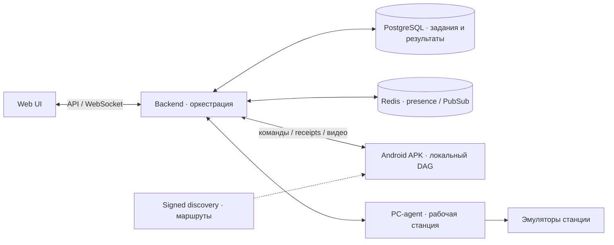

<div align="center">


**Устройства в разных сетях. Задания на самом Android. Управление из одного веба.**

[](https://github.com/RootOne1337/sphere-platform/actions/workflows/ci-backend.yml) [](https://github.com/RootOne1337/sphere-platform/actions/workflows/ci-frontend.yml) [](https://github.com/RootOne1337/sphere-platform/actions/workflows/ci-android.yml) [](LICENSE)

[Начать](#start) · [Документация](docs/README.md) · [Готовность](docs/operations/READINESS.md) · [План работ](ROADMAP.md) · [Сообщить о проблеме](SUPPORT.md)

</div>

> [!IMPORTANT]
> **Активная разработка · проверка перед 32 эмуляторами.** На 21 сентября 2026
> приняты отдельные сценарии на двух rooted Android 9. Массовый тест на 32,
> полный успешный 8-часовой прогон и VPN end-to-end ещё не пройдены.
> [Что исправлено, что осталось и чем это доказано →](docs/audits/2026-09-20/FLEET32-PREFLIGHT.md)

<a id="overview"></a>
## 🧭 Один контур управления

Sphere объединяет Android APK, серверную оркестрацию и веб-интерфейс.
Сервер хранит задания и результаты; APK выполняет последовательность действий
локально, возвращает подтверждения и передаёт экран. PC-agent добавляет управление
рабочей станцией и её эмуляторами.

Цель — переживать обычные обрывы связи без ручной перенастройки каждого устройства
и понимать, что произошло с заданием. У каждого подтверждённого сценария есть
версия, условия проверки и ограничения.

| 📱 Устройства | ⚙️ Автоматизация | 🖥️ Оператор |
| --- | --- | --- |
| Регистрация, identity, группы и состояние связи | Локальные DAG, batches, scheduler и pipelines | Экраны устройств, задания, история и диагностика |
| Signed discovery, сохранённые маршруты, reconnect | Сохранённые результаты, отмена и recovery checkpoints | Ограниченные очереди декодера и возврат стримов |
| [Android / подключение](docs/android-agent.md) | [Исполнение и подтверждения](docs/security/task-control-protocol.md) | [Руководство по вебу](docs/web-ui-guide.md) |

**Границы:** unattended boot, root-разрешения и OTA проверялись в описанных
эмуляторных окружениях; обычный телефон может требовать системного согласия.
VPN, PC-agent и внешние интеграции имеют собственные незакрытые проверки.
Универсализация предметных модулей и AI — [последующие этапы](ROADMAP.md).

<a id="start"></a>
## 🚀 Начать работу

| Ваша ситуация | Маршрут |
| --- | --- |
| **Уже подготовлен наш pilot** | [Адрес веба, вход, свежая APK и изоляция от старого Docker project](docs/operations/LOCAL-PILOT.md) |
| **Первый запуск в новой установке** | [Подготовка и bootstrap](docs/operations/STARTUP.md#first-install) → [проверка веб → APK → задача](docs/operations/PILOT-ACCEPTANCE.md) |
| **Разработка компонентов** | [Окружение и команды](docs/development.md) → [правила изменений](CONTRIBUTING.md) |
| **Устройства находятся в другой сети** | [Удалённый pilot](docs/operations/REMOTE-PILOT.md) → [signed discovery](docs/architecture/ANDROID-SIGNED-DISCOVERY.md) |

Для получения исходников:

```sh
git clone https://github.com/RootOne1337/sphere-platform.git
cd sphere-platform
git switch codex/enterprise-audit-20260905
```

Последние эксплуатационные исправления пока находятся в
[draft PR19](https://github.com/RootOne1337/sphere-platform/pull/19), ветка
`codex/enterprise-audit-20260905`. Последняя команда явно выбирает эту ветку;
обычный clone без переключения открывает `main`. Инструкция запуска различает новую установку,
повторный старт и уже настроенный pilot — у них разные конфигурации.

**APK:** сборка должна соответствовать вашей установке и discovery-ключам.
`minSdk 26` задаёт нижнюю границу установки, а не гарантирует все возможности на
любом Android 8+. [Сборка и подключение](docs/android-agent.md) ·
[текущая pilot APK](docs/operations/LOCAL-PILOT.md#apk-именно-для-нового-стенда).

<a id="status"></a>
## 🔎 Что проверено сейчас

Срез от **21 сентября 2026**. CI-badges выше относятся к ветке аудита;
версии ниже — к установленному pilot. Успешная сборка не заменяет проверку работы.

| Контур | Подтверждённый результат | Доказательства |
| --- | --- | --- |
| Установленный комплект | Backend `c42bb5b`, frontend `9924eb1`, оба APK **1.2.8-dev / 10208** | [Canary и OTA](docs/audits/2026-09-20/CANARY-20260921.md) |
| Задания и восстановление | 15 task receipts, два pipeline; stop/timeout при потере сети и restart сервера | [Сценарии и ограничения](docs/audits/2026-09-20/CANARY-20260921.md) |
| Живой экран | Два потока вернулись после restart backend без F5; захват освобождён после просмотра | [Декодер и приёмка](docs/audits/2026-09-20/DECODER-RECOVERY.md) |
| Redis | Исправлен воспроизведённый OOM; pressure, AOF/RDB и restart проверены; лимит pilot изменён без restart | [Память и оставшиеся риски](docs/audits/2026-09-20/REDIS-MEMORY.md) |
| Связь APK | Проверены отказы сети Android, серверного входа и обеих сторон | [Матрица восстановления](docs/audits/2026-09-05/NETWORK-RECOVERY-NATIVE.md) |

**Дальше:** облегчённый профиль 32 экранов → свежесть видео и задержки команд →
наблюдаемость и ресурсный профиль → смешанный прогон с отказами.
Последняя длинная ночь завершилась ошибкой через **3 ч 33 мин**; это не 8h passed.
[Полный реестр оставшихся работ](docs/audits/2026-09-20/FLEET32-PREFLIGHT.md) ·
[Roadmap](ROADMAP.md).

<a id="architecture"></a>
## 🧩 Как связаны компоненты


```mermaid
flowchart LR
    Web["Web UI"] <-->|"API / WebSocket"| API["Backend · оркестрация"]
    API <--> SQL[("PostgreSQL · задания и результаты")]
    API <--> Redis[("Redis · presence / PubSub")]
    API <-->|"команды / receipts / видео"| APK["Android APK · локальный DAG"]
    API <--> PC["PC-agent · рабочая станция"]
    PC --> Emulators["Эмуляторы станции"]
    Discovery["Signed discovery · маршруты"] -.-> APK
```

Это схема ролей, а не обещание высокой доступности инфраструктуры. Два адреса
одного сервера не заменяют независимый резервный сервер.
[Архитектура](docs/architecture.md) · [Протокол связи](docs/architecture/ANDROID-CONNECTION-PROTOCOL.md) ·
[Сохранённые маршруты](docs/architecture/ANDROID-SAVED-ROUTES.md) · [ADR](docs/adr/README.md).

<a id="docs"></a>
## 📚 Всё по месту

| Запуск и эксплуатация | Разработка и контракты | Проверки и дальнейшая работа |
| --- | --- | --- |
| [Конфигурация](docs/configuration.md) | [Backend / API](docs/api-endpoints.md) | [Аудит и доказательства](docs/audits/2026-09-05/AUDIT-REPORT.md) |
| [Deployment](docs/deployment.md) | [Android](docs/android-agent.md) · [PC-agent](docs/pc-agent.md) | [Подготовка Fleet32](docs/audits/2026-09-20/FLEET32-PREFLIGHT.md) |
| [Диагностика и runbooks](docs/runbooks/README.md) | [PostgreSQL / RLS](docs/security/postgresql-rls.md) | [Изолированные runtime-тесты](tests/production/README.md) |
| [Ночной прогон](docs/operations/ANDROID-OVERNIGHT-SOAK.md) | [OpenAPI](docs/openapi.json) · [Контракт отмены](docs/audits/2026-09-20/DURABLE-CANCELLATION.md) | [Будущий AI — анализ](docs/architecture/AI-READINESS.md) |

→ **[Весь каталог документации](docs/README.md)** · [Как определяем актуальность](docs/DOCUMENTATION.md)

<details>
<summary><strong>Карта репозитория</strong></summary>

| Каталог | Назначение |
| --- | --- |
| [backend/](backend/) | FastAPI, модели, фоновые службы, WebSocket и оркестрация |
| [frontend/](frontend/) | Next.js, экраны оператора и видеодекодер |
| [android/](android/) | Kotlin APK, DAG, reconnect, OTA и захват |
| [pc-agent/](pc-agent/) | Python agent рабочей станции |
| [alembic/](alembic/) | Миграции PostgreSQL |
| [infrastructure/](infrastructure/) | Proxy, deployment и monitoring |
| [scripts/](scripts/) | Bootstrap, обслуживание и приёмка |
| [tests/](tests/) | Регрессии, контейнерные и изолированные runtime-проверки |

</details>

<a id="contribute"></a>
## 🤝 Участие и обратная связь

Нашли сбой? Время с часовым поясом, версии и task/device ID помогают перейти
от симптома к конкретному сценарию. В формах есть поля для этих данных.

[🐛 Ошибка](https://github.com/RootOne1337/sphere-platform/issues/new?template=bug_report.yml) ·
[📉 Скорость / recovery](https://github.com/RootOne1337/sphere-platform/issues/new?template=performance.yml) ·
[📖 Документация](https://github.com/RootOne1337/sphere-platform/issues/new?template=documentation.yml) ·
[💡 Идея](https://github.com/RootOne1337/sphere-platform/issues/new?template=feature_request.yml)

Изменения проходят путь **воспроизведение → минимальный fix → regression →
документация → PR**. Для готовности к эксплуатации дополнительно нужна приёмка
установленной версии. [Contributing](CONTRIBUTING.md) · [Поддержка](SUPPORT.md) ·
[Security policy](SECURITY.md) · [Кодекс поведения](CODE_OF_CONDUCT.md).

---

<div align="center">

**Sphere Platform** · [MIT](LICENSE) · [Changelog](CHANGELOG.md) · [Владелец](https://github.com/RootOne1337)

</div>
