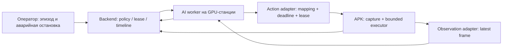

# Будущий AI-контур: готовность и границы интеграции

**10 сентября 2026 · исследование и проектные требования · AI не внедряется.**

[Главная](../../README.md) · [Эксплуатационная готовность](../operations/READINESS.md) ·
[Архитектура платформы](../architecture.md) · [Контракт task control](../security/task-control-protocol.md)

## Вывод

Sphere имеет полезные строительные блоки: device registry, экранный поток,
touch/key primitives, локальные DAG, receipts, task scheduling и отдельные PC agents.
Этого достаточно, чтобы **спроектировать внешний inference worker**, но недостаточно,
чтобы обещать надёжное управление игрой моделью. Главные разрывы: синхронизация
наблюдения и действия, удержание/отпускание кнопок, владельцы управления, устаревшие
кадры, deadlines, backpressure и воспроизводимые evaluation episodes.

Не требуется переносить модель в APK или переписывать backend. Предпочтительное
направление — отдельная AI-станция, общий model-adapter interface и ограниченный
execution adapter для устройств. Это архитектурная оценка по исходникам, не
завершённый прототип или результат latency benchmark.

## NitroGen: что подтверждено первоисточниками

Имеется в виду **NitroGen** (репозиторий MineDojo). Авторы описывают исследовательскую
модель примерно на 500M параметров, которая реагирует на последний кадр, без
долгосрочного планирования. Референсный runner рассчитан на Windows games; inference
можно обслуживать с Linux. Это не готовый Android control adapter и не официальный
продукт NVIDIA. [Исходный README](https://github.com/MineDojo/NitroGen).

В NVIDIA model card указаны около 493M параметров, RGB 256×256 на входе, gamepad
actions на выходе, архитектура SigLip2 + DiT. Модель ориентирована на gamepad игры;
mouse/keyboard-heavy игры подходят хуже. Размер модели сам по себе не доказывает
FPS, VRAM или throughput на вашей AI-станции. [Model card](https://huggingface.co/nvidia/NitroGen).

В опубликованной лицензии репозитория, §3.3, использование ограничено non-commercial
research. Поэтому эту модель нельзя заранее считать выбранной для коммерческого
deployment Sphere; перед таким этапом нужны совместимые права или другая модель.
Это конкретное ограничение выбора компонента, а не причина останавливать нынешнюю
отладку платформы. [Лицензия кода](https://github.com/MineDojo/NitroGen/blob/main/LICENSE).
Model card отдельно ссылается на [NVIDIA noncommercial license](https://developer.download.nvidia.com/licenses/NVIDIA-OneWay-Noncommercial-License-22Mar2022.pdf);
при выборе checkpoint необходимо закрепить условия именно кода и весов.

Исследование описывает обучение на игровом видео с восстановленными действиями и
оценку обобщения между играми. Оно не устанавливает результат для вашей игры,
эмулятора, touch mapping или одновременных сотен агентов. [Статья](https://arxiv.org/abs/2601.02427).

Источники проверены 10 сентября 2026. Перед реализацией закрепляются commit/model
revision, checksum, license и dataset provenance; сейчас weights не скачивались,
сторонний код не запускался, аппаратные показатели не измерялись.

## Что можно использовать из Sphere

| Возможность | Источник | Что не установлено |
| --- | --- | --- |
| Поток изображения | [FramePackager](../../android/app/src/main/kotlin/com/sphereplatform/agent/streaming/FramePackager.kt), [stream router](../../backend/api/ws/stream/router.py) | Per-observation ID, absolute capture clock, max frame age, GPU ingestion и cross-host clock mapping |
| Touch/key управление | [stream router](../../backend/api/ws/stream/router.py), [AdbActionExecutor](../../android/app/src/main/kotlin/com/sphereplatform/agent/commands/AdbActionExecutor.kt) | Gamepad-to-touch calibration, multi-touch, continuous axis, timed hold/release и latency budget |
| Локальное автономное задание | [DagRunner](../../android/app/src/main/kotlin/com/sphereplatform/agent/commands/DagRunner.kt) | Моторный loop не является обычным длинным DAG; у него иная частота и semantics stale actions |
| Результаты и дедупликация | [CommandJournal](../../android/app/src/main/kotlin/com/sphereplatform/agent/commands/CommandJournal.kt) | Нельзя писать receipt на каждый frame/action без оценки объёма; нужен отдельный bounded episode/control contract |
| Task ownership/control | [Task control protocol](../security/task-control-protocol.md) | Взаимоисключение human/DAG/AI, lease expiry и stop при потере inference |
| Отдельные станции | [PC guide](../pc-agent.md), backend registry | GPU scheduler/admission, model health и inference routing ещё отсутствуют |

## Предлагаемый контур

Backend управляет жизненным циклом эпизода, а высокочастотный inference data path
выделяется после измерений. Ни Kafka, ни отдельный оркестратор GPU не считаются
обязательными заранее. Начальный prototype — один worker, одно устройство, один
game adapter с подменяемой моделью.

### Контракты до первой интеграции

- **Observation:** device/episode/session, frame ID, capture time и receive time,
  resolution, crop/orientation, encoding, max age, game/scene metadata при наличии.
- **Action:** episode/control lease, sequence, observation ID, issued/deadline time,
  duration, buttons/axes или touch primitives, adapter version и policy revision.
- **Result:** accepted/rejected/applied/expired/unknown, reason code, applied sequence,
  фактическая длительность, исходный observation ID. Accepted не равен applied.
- **Capabilities:** input/capture/root/SDK/orientation/game profile, доступные controls
  и ограничения concurrency; неподдерживаемая команда отклоняется явно.

Это требования, а не уже существующие API. Сначала проверяется совместимость с
имеющимися device/task identities, чтобы не создать конкурирующую модель ownership.

### Failure semantics

Поздний кадр отбрасывается; очередь observation хранит последнее пригодное наблюдение,
а не секунды устаревшей картинки. Позднее действие не воспроизводится автоматически.
После потери AI worker истекает короткая control lease и отпускаются удержанные input
controls. Manual takeover прекращает AI lease. Потеря сети не должна оставлять
нажатую кнопку/газ и не должна запускать две конкурирующие модели на одном устройстве.

Для медленных задач допустим локальный DAG/checkpoint; для моторных действий нужен
deadline и bounded action horizon. Universal APK не означает универсальный game
adapter: привязка gamepad output к touch UI и координатам зависит от игры и emulator.

## Наблюдаемость и воспроизводимость

Каждый episode сохраняет model/checkpoint/config/adapter/game/build версии, seed
при поддержке, action rate, latency distribution и outcome. Trace/event IDs связывают
observation, inference, action dispatch и device receipt. Изображения записываются
с ограничением объёма и выбранным retention, отдельно от текстового журнала.

Replay должен различать повторный inference по сохранённым кадрам и физическое
выполнение действий. Для регрессий предпочтителен offline replay и simulator/fake
executor; повтор действий на реальном устройстве требует выделенного эпизода.

Нужны метрики capture→inference queue→inference→dispatch→apply, frame age, dropped/
expired actions, GPU memory/utilization, per-model concurrency и fairness. Суммарный
FPS модели не заменяет p99 end-to-end latency и правильность controls.

## Порядок будущей работы

1. Завершить P0 эксплуатационные проверки APK, восстановления, журналов и truthful UI.
2. Выбрать одну игру, поддержанный тип ввода, один emulator/device, конкретную GPU и
   разрешённую модель. Подтвердить license/model/game assumptions.
3. Реализовать observation/action adapter без модели; воспроизвести stop/deadline/
   lease expiry/manual takeover и калибровку координат.
4. Подключить одну модель к одному эпизоду; записать baseline latency/VRAM/outcomes.
5. Добавить supervised evaluation и регрессионный replay; затем 2/8/16 устройств,
   admission limit и fairness. Не выводить ёмкость из числа параметров модели.
6. Только после acceptance — каталог моделей, model rollout/rollback, scheduling,
   policy/reward/memory/planner. Долгосрочный планировщик — отдельный компонент от
   реактивной моторной модели.

**Сейчас выполняется только анализ.** Новые AI services, зависимости, weights,
управление игрой и hardware deployment в этот этап не входят.
