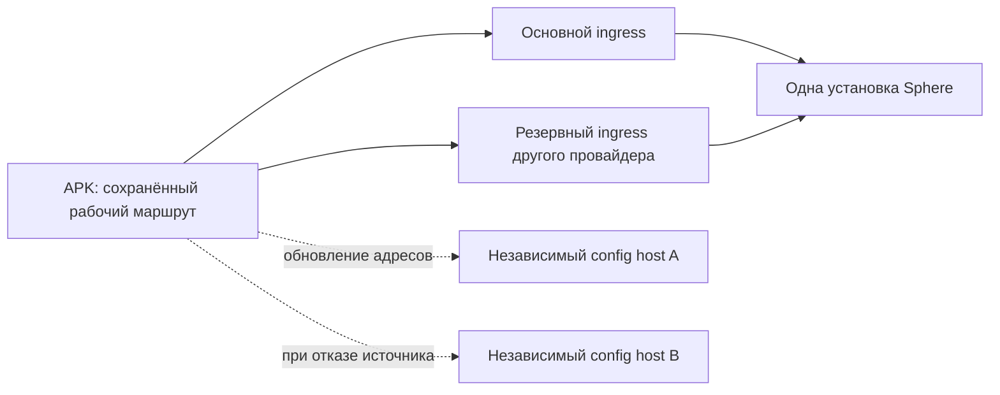

# APK: смена адресов без переустановки

**Решение от 12 сентября 2026. Signed discovery, mirrors и durable version floor
реализованы как opt-in; миграция проверена на одном APK, постоянная инфраструктура открыта.**

[Точный реализованный контракт, настройки, CLI и ограничения](ANDROID-SIGNED-DISCOVERY.md).
Ниже сохраняются архитектурное решение и весь целевой объём, включая открытые части.

[Готовность](../operations/READINESS.md) · [Тестовый стенд](../operations/LOCAL-PILOT.md) ·
[Текущий discovery](ANDROID-DISCOVERY-RECOVERY.md) · [Сохранённые маршруты](ANDROID-SAVED-ROUTES.md)

## Решение

Адреса backend должны обновляться из небольшого конфигурационного документа.
В APK остаются начальные адреса **источников документа**, идентификатор установки
и открытые ключи проверки подписи. Enrollment credential задаётся отдельно при
подготовке устройства/пакета; он не публикуется в этом документе.

Для первого внедрения достаточно двух независимых источников конфигурации и двух
путей к одной установке backend. GitHub может быть одним источником. Второй должен
находиться у другого провайдера, вне основного сервера и его туннеля. Два доменных
имени одного CDN не обеспечивают независимость от блокировки этого CDN.

Нельзя убрать из новой установки APK вообще все начальные сведения: после установки
он должен получить их из APK, MDM, файла или QR. Для требуемого сценария «установил
и запустил» выбирается подготовленный для установки пакет со стабильными bootstrap
URL. Изменения рабочих адресов затем не требуют пересборки APK.

Config host передаёт небольшой JSON, а не команды или видеопоток. Поэтому его
доступность не должна участвовать в каждом действии, задержке управления или
обычном восстановлении по уже сохранённым маршрутам.

## Что уже есть в коде и что отсутствует

| Часть | Проверенное состояние |
| --- | --- |
| Поиск при первом запуске | `ZeroTouchProvisioner`: MDM → локальный файл → один HTTP `CONFIG_URL` → BuildConfig |
| Работа после регистрации | `AuthTokenStore` сохраняет выбранный адрес и пару кандидатов; WS и refresh перебирают их без обращения к GitHub |
| Применение discovery | `ConfigWatchdog` сохраняет кандидатов; рабочий WS не разрывается ради нового адреса; выбранный адрес меняется после device-bound `auth_ok` |
| Отказ config host | Ошибка/дедлайн не очищает identity и прежние маршруты; HTTP ограничен 10 s и 64 KiB |
| Параллельные уведомления | Принудительные проверки объединяются в одну текущую проверку; остановка отменяет HTTP |
| Первая регистрация через резерв | AUD-89: fallback после transport error/408/5xx; 401/403/429 не вызывают слепой обход на другой адрес |
| Начальные источники | До трёх заданных при сборке sources; signed mode получает ответы параллельно |
| Доверие документу | В opt-in signed mode: RSA/SHA-256, installation binding, freshness, AtomicFile version floor; legacy mode сохраняет старый контракт |
| Новый адрес для первоначальной регистрации | Signed manifest связывает новый адрес с локальным enrollment key после проверки подписи/установки. AUD-93 не допускает смешивания адреса и ключа разных ответов |
| Пилот 12 сентября | Один временный Quick Tunnel; config endpoint находится в том же туннеле. Это не независимый резерв и не готовая схема на месяц |

В legacy `/api/v1/config/agent` поля `installation_id`/`config_version` сами по себе
не включают проверку. Новый `/bootstrap/agent.signed.json` — отдельный envelope,
проверяемый только явно подготовленной signed сборкой. Нельзя подменять им старый
endpoint и рассчитывать, что legacy APK автоматически поймёт новый формат.

## Контракт следующей реализации

1. **Проверяемый документ.** Формат envelope содержит точные подписанные байты
   payload, signature и key ID. Payload содержит schema version, installation ID,
   возрастающую configuration version, время выпуска/актуальности, небольшой
   список HTTPS management endpoints и при необходимости новые config mirrors.
   Выбор алгоритма/библиотеки подтверждается на minSdk 26; поддержка современного
   Android сама по себе не доказывает совместимость старых эмуляторов.
2. **Доверие до credentials.** APK проверяет подпись закреплённым открытым ключом,
   installation ID, схему, URL и версию до сохранения кандидатов и отправки любого
   enrollment/device token. Один публичный `installation_id` не подтверждает
   принадлежность сервера. JSON не содержит паролей, enrollment key или token.
3. **Устойчивое сохранение.** Принятые версия, кандидаты и metadata записываются
   атомарно. Старый выбранный адрес остаётся доступным, пока новый не прошёл auth.
   Ошибка диска, HTML вместо JSON, неверная подпись и старое зеркало ничего не
   стирают. Запланированный rollback публикуется как новая, большая версия.
4. **Источники без общего отказа.** APK хранит начальные mirrors и последний
   подтверждённый список. Один недоступный источник не блокирует второй.
   Не требуется согласие всех зеркал: это уничтожило бы доступность при отказе
   одного. При нескольких валидных ответах выбирается самая новая версия.
5. **Быстрый возврат.** Уже зарегистрированный агент сначала использует сохранённые
   маршруты. Обновление JSON идёт независимо; не задерживает этот reconnect.
   При первой установке без сохранённого маршрута нужен хотя бы один доступный
   источник и один доступный backend ingress.
6. **Без шторма запросов.** Один discovery cycle на APK, общий ограниченный deadline,
   ограниченная конкуренция зеркал и jitter/backoff. Connected polling выполняется
   редко; при потере связи — чаще, с ограничением частоты. ETag/304 сокращает трафик.
   Конкретные интервалы выбираются после измерений; нынешние 120/60 s не являются
   подтверждёнными оптимальными значениями для тысячи эмуляторов.
7. **Ротация и часы.** Переход на новый verification key требует заранее доверенного
   старого ключа/перекрытия ключей. Перевод системных часов не должен очищать рабочие
   маршруты. Просроченный документ не разрешает новую миграцию адресов; действующий
   подтверждённый маршрут может продолжать работу, пока его auth остаётся валидной.
8. **Наблюдаемость.** События фиксируют build SHA, device/installation ID, config
   version, source ID, route ID, причину отказа, длительность и следующую попытку.
   Tokens и URL query не логируются. UI различает «сервер недоступен», «источник
   конфигурации недоступен», «конфигурация отклонена» и «ожидается повтор».

Это расширение не должно отменять уже проверенные cancellation, stale-response
guards, idempotent refresh и сохранение identity.

## Публикация адресов и границы отказоустойчивости

Стабильные ingress URL предпочтительнее постоянно меняющихся бесплатных адресов.
Плановая смена: поднять новый путь → проверить HTTPS/WSS к нужной установке →
опубликовать подписанный документ на оба зеркала → подтвердить получение парком →
вывести прежний путь из эксплуатации. Старый адрес нельзя отключать сразу после
публикации: часть устройств могла долго быть offline.

Для меняющегося Quick Tunnel реализован [host publisher](../operations/DISCOVERY-PUBLISHER.md):
получить URL выбранного connector, проверить установку/readiness, подписать и
опубликовать update в GitHub и local gateway mirror. Native автоматическая смена
принята на Windows pilot. Ключ публикации/подписи не передаётся APK. Независимый
второй внешний source, host reboot и долгосрочная renewal приёмка остаются открытыми.

Оба ingress ведут к одной identity/task системе. Второй пустой backend с другой
БД не является резервом. Отказ общего backend, PostgreSQL, хоста или его интернета
остаётся отдельным сценарием HA. Во время полного отсутствия маршрута APK сохраняет
задание/результаты в пределах своего журнала и повторяет соединение; доставить новую
команду без доступного сетевого пути невозможно.

Cloudflare прямо описывает Quick Tunnel как временный механизм разработки без
SLA со случайным адресом и лимитом 200 одновременных запросов. Этот лимит нельзя
переводить в подтверждённое количество APK. Текущий pilot connector используется
для runtime-проверок, а не как обещание обслуживания сотен устройств.
[Документация Cloudflare](https://developers.cloudflare.com/cloudflare-one/networks/connectors/cloudflare-tunnel/do-more-with-tunnels/trycloudflare/).

## Порядок внедрения и приёмки

1. Завершить текущие дефекты первого подключения и доставки команд; сохранить
   before/after evidence. Зафиксировать свежий APK по SHA, а не по одной строке
   `1.2.0-dev`, общей у нескольких сборок.
2. Реализовать подписанный контракт, проверку установки/версии и атомарное хранение;
   затем независимые bootstrap mirrors и первоначальный enrollment по новым адресам.
3. Развернуть два config hosts и два действительно доступных ingress. Сейчас
   постоянный Cloudflare DNS route не создан из-за недоступных прав зоны; Serveo
   требует регистрации ключа владельцем учётной записи. Подготовленные profiles
   не считаются запущенными и проверенными резервами.
4. На одном установленном APK проверить: primary config down; primary ingress down;
   оба старых адреса сменились; старое зеркало; invalid signature; process restart
   после получения новой версии; возврат сети; неизменность device ID и задания.
5. Повторить на нескольких эмуляторах, затем 10/64/100+ с измерением p95/p99 возврата,
   числа регистраций, HTTP requests/s, CPU/RAM и ошибок. Физический телефон и OEM
   ограничения фона проверяются отдельно.

Без этого набора испытаний статус остаётся «внедрение и пилот», даже если APK
собирается и один WebSocket однажды подключился.
