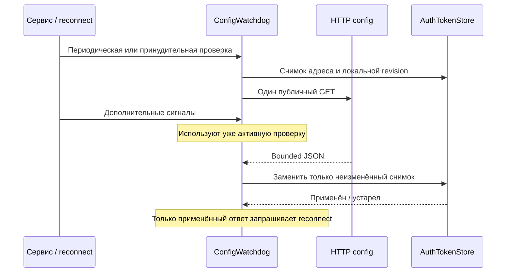

# Android discovery: восстановление конфигурации

**Контракт AUD-73 · 10 сентября 2026 · резервный command route ещё не реализован.**

[Документация](../README.md) · [APK](../android-agent.md) ·
[Подтверждение подключения](ANDROID-CONNECTION-PROTOCOL.md) ·
[Массовый offline](../runbooks/04-fleet-offline.md) ·
[Готовность и дальнейший failover](../operations/READINESS.md)

## Что делает текущий механизм

`ConfigWatchdog` периодически получает JSON с одного `CONFIG_URL`. Если ответ
валиден и адрес отличается от сохранённого, watchdog обновляет адрес и запрашивает
переподключение WS. Device ID, access/refresh credentials и журнал заданий сохраняются.
Само получение JSON не проверяет доступность нового backend; рабочим WS считается
только после корректного `auth_ok` по контракту AUD-72.

| Источник / настройка | Текущее поведение |
| --- | --- |
| Enterprise `SPHERE_CONFIG_URL` | Задаётся при сборке APK, попадает в `BuildConfig.CONFIG_URL`; допустим локальный endpoint установки |
| Dev `CONFIG_URL` | В текущем flavor указывает на GitHub Raw; динамический список источников пока не добавлен |
| Пустой `CONFIG_URL` | HTTP discovery выключен; это не запрет работы с уже сохранённым server URL |
| Первичное provisioning | MDM → локальные JSON-файлы → HTTP config → BuildConfig defaults |
| Уже зарегистрированный APK | Watchdog опрашивает HTTP config; изменение MDM/локального файла само по себе не является live discovery |
| Периодический опрос | Первая проверка через 5 s; после завершения проверки 120 s connected / 60 s disconnected |
| Принудительный опрос | Network failure/circuit notification запрашивает проверку; сигналы во время активного запроса объединяются |
| `config_poll_interval_seconds` | Поле парсится, но watchdog пока использует интервалы выше |

## Публичный запрос и ограниченный ответ

Discovery отправляет `GET CONFIG_URL` с `Accept: application/json`, **без**
`X-API-Key`, `Authorization` и cookies устройства. Используется отдельный HTTP
client, без interceptor основного авторизованного клиента.

Backend `/api/v1/config/agent` уже позволяет получить базовую конфигурацию без
credentials. Его опциональный `X-API-Key` предназначен для API-ключей. Device JWT
в этом заголовке получает `401`: это был реальный сбой watchdog после enrollment
или refresh. Исправление не расширяет серверные разрешения и не ослабляет WS auth.
На чужой config host токены устройства теперь не отправляются.

Минимальный ответ:

```json
{
  "server_url": "https://sphere.example.internal"
}
```

Дополнительные bootstrap-поля, включая `features.auto_register` и
`enrollment_api_key`, продолжают парситься. При обновлении работающего агента
watchdog использует адрес; он не заменяет credentials данными discovery.
`server_url` должен быть HTTP(S) URL без user/password, query и fragment.
Валидный синтаксис не подтверждает сертификат, доступность или принадлежность
endpoint нужной установке. Действующие Android flavor/TLS ограничения сохраняются.

На HTTP-запрос действует собственный дедлайн **10 s**, включая ожидание body.
Отмена вызывающей coroutine или watchdog отменяет соответствующий OkHttp `Call`.
Parent cancellation пробрасывается; обычная ошибка/собственный deadline возвращает
отсутствие конфигурации и сохраняет текущий адрес. Callback только разбирает значения
и закрывает response, не меняя state агента.

HTTP body ограничен **64 KiB до разбора**. Для chunked ответа читается ограниченный
probe; размер внутреннего буфера допускает одно дополнительное чтение блока.
Oversized JSON не обрезается до выглядящего валидным префикса. Malformed JSON,
невалидный URL и неуспешный HTTP ответ не меняют адрес.

## Конкурентность и остановка



Один periodic owner и одна активная проверка принадлежат поколению сервиса.
`stop()` или отмена periodic owner отменяет также принудительную проверку,
запущенную через application scope. Уведомления после stop игнорируются;
новый `run()` открывает новое поколение. Старый ответ не меняет его адрес.

Изменение server URL через store инвалидирует snapshot запроса, в том числе
при выборе A → B → A. Проверка revision и запись выполняются под одним lock.
Это **локальная revision процесса**, не серверный `config_version`, не durable
история конфигураций и не защита от устаревшего JSON в следующем отдельном опросе.
Существующая запись preferences через `apply()` не стала синхронным disk commit.

## Проверки и оставшиеся ограничения

Исходные 13 Android-сценариев: [9 failures / 4 controls](../audits/2026-09-05/evidence/android-config-recovery-before-summary.json),
[Gradle baseline](../audits/2026-09-05/evidence/android-config-recovery-before.txt).
Baseline использует код `02f55b4` с добавленным constructor seam для подстановки
config URL/client; логика запроса/watchdog не менялась до воспроизведения.
Полный итоговый [Gradle run](../audits/2026-09-05/evidence/android-config-recovery-after.txt):
[399 tests / 31 suites](../audits/2026-09-05/evidence/android-config-recovery-summary.json), без failures/errors/skips.
`ConfigRecoveryTest` сохраняет 21 случай: credentials, deadline/cancel, 64 signals,
oversized body, stop/restart, duplicate owner, local revision/ABA и failure controls.
[SQL/ASGI contract](../audits/2026-09-05/evidence/backend-config-recovery-contract.txt)
проверяет issued/refreshed JWT: старый запрос `401`, публичный `200`, та же identity
по-прежнему получает `auth_ok`.

Robolectric предоставляет Android JSON API, OkHttp interceptors заменяют сеть,
preferences подменены. Это не установленный APK, LAN/DNS отказ или измерение парка.
Произвольный некооперативный interceptor/Source может удерживать HTTP thread после
cancel; callback всё равно не получает права менять route. Блокирующий disk/keystore
и чтение локальных provisioning-файлов не входят в новый HTTP budget.

Сохранённый secondary endpoint, health trial/rollback нового адреса, durable
config revision и независимое от GitHub discovery остаются **открытыми P0**.
Недоступный, но синтаксически корректный адрес из нового ответа всё ещё может
заменить доступный текущий адрес. Следующий этап должен сохранять рабочий маршрут
до проверки кандидата и не полагаться на доступность внешнего discovery.

Изменение AUD-73 требует обновления APK с сохранением signing identity/app data.
Новой миграции или нового backend API для него нет. Требование AUD-72 обновить все
backend workers до ACK-совместимой версии перед новым APK остаётся в силе.
