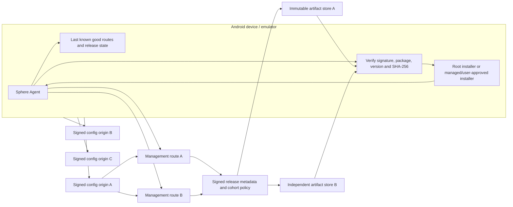

# Отказоустойчивое обновление Android-агента

**Статус: архитектура и текущие границы зафиксированы 24 сентября 2026.**
Быстрая проверка OTA на старте/reconnect уже добавлена в source branch; независимое
резервирование artifact delivery, staged rollout и удалённая приёмка остаются открыты.

[Решение по видео и OTA AUD-163](../audits/2026-09-24/REMOTE-VIDEO-OTA-DECISION.md) ·
[Подписанный bootstrap](ANDROID-SIGNED-DISCOVERY.md) ·
[Сохранённые серверные маршруты](ANDROID-SAVED-ROUTES.md) ·
[Remote pilot](../operations/REMOTE-PILOT.md) ·
[Fleet32 gates](../audits/2026-09-20/FLEET32-PREFLIGHT.md)

## Решение

Не считать один GitHub URL, один Cloudflare tunnel или шестичасовой таймер
надёжным каналом обновления. APK должна отдельно уметь найти подписанную
конфигурацию, подключиться к control plane, получить проверенное описание релиза,
скачать неизменяемый APK по одному из независимых artifact routes, проверить его и
подтвердить запуск уже обновлённого агента.

Гарантия формулируется как **eventual delivery при восстановлении хотя бы одного
доверенного сетевого пути**. Если устройство полностью лишено сети, а доступного
локального сервера/заранее загруженного пакета нет, удалённая доставка физически
невозможна. Агент должен сохранить рабочую версию и продолжить попытки, а не
объявлять обновление успешным.

Ручная установка полезна как проверка одного canary или recovery-процедура. Она не
должна быть штатным способом обновлять десятки эмуляторов. Проверка одного
локального устройства также не доказывает доставку на удалённые LDPlayer, физические
телефоны, устройства без root или иные эмуляторы.

## Что сейчас доказано

| Слой | Текущее поведение и доказательство | Ограничение |
| --- | --- | --- |
| Bootstrap/config | APK умеет проверять несколько HTTPS источников подписанной конфигурации; принятая конфигурация и версия сохраняются атомарно. См. [signed discovery](ANDROID-SIGNED-DISCOVERY.md). | Проверка конфигурации даёт адреса, но не резервирует доставку APK. Все зеркала за одним провайдером остаются одним failure domain. |
| Management | Агент использует сохранённые management routes и допускает переключение только после target-bound `auth_ok`. | В текущем pilot подписанный manifest содержал один публичный tunnel route; рабочего независимого WAN ingress не было. |
| Проверка OTA | `UpdateCheckWorker` запрашивает `/api/v1/updates/latest`; раньше он запускался по периодическому WorkManager расписанию раз в 6 часов. Source branch теперь дополнительно ставит сетевую one-time проверку при старте приложения и после авторизованного WS reconnect. Запросы объединяются `KEEP`, а reconnect/boot получают случайную задержку до 120 секунд, чтобы флот не ударил в каталог одновременно. | WorkManager соблюдает ограничения ОС, поэтому время запуска периодической работы не является точным. Ошибки HTTP/auth или отсутствие сети всё ещё задерживают проверку. Этот source fix не означает, что уже установленный APK на устройствах получил его. |
| Выбор релиза | Backend выбирает наибольший `version_code` для platform/flavor. В локальном pilot `android/dev` оставался 1.2.9/10209; `android-canary/dev` получил только адресную проверку кандидата 1.2.18/10218. | Нет полноценного per-device/per-cohort rollout в обычном `latest`; публикация максимума в общем канале затрагивает всех соответствующих агентов. |
| Доставка APK | Клиент проверяет HTTPS, ограничивает URL тем же host, что и management server, ограничивает размер и проверяет SHA-256. При транспортном сбое делает ограниченный повтор через HTTP/1.1. APK хранится в artifact store backend. | Нет независимого списка разрешённых artifact mirrors; смена tunnel/DNS меняет и control plane, и download path. Внешнее зеркало не пройдёт текущую same-host проверку. |
| Установка | На rooted pilot-эмуляторе root `pm install` сработал; при отказе есть PackageInstaller путь. После установки Android заменяет процесс, а агент стартует и заново авторизуется. | Без root/Device Owner/системной привилегии нельзя обещать бесшумную установку на любом обычном Android-телефоне. User-mediated PackageInstaller может требовать подтверждения. |
| Runtime-подтверждение | В ограниченном локальном canary emulator-5554 PackageManager после OTA показал 1.2.18/10218, процесс агента поднялся и обычный WS заново авторизовался; crash buffer не показал нового падения приложения. Recovery grant был отозван. | Backend сохранил `received`/`running`, но терминального `completed` receipt не было. Второй локальный emulator-5556 остался 1.2.9/10209; удалённые устройства этой проверкой не подтверждены. Это не доказывает remote OTA или исправление video stream. |

Исходная причина отсутствия обновы на локальном устройстве была конкретной:
кандидат 1.2.18 не находился в обычном `android/dev` latest, а periodic-only
проверка могла ждать до следующего окна. APK из CI и релиз в `sphere-agent-config`
не публикуют запись в работающий backend OTA catalog. Репозиторий
`sphere-agent-config` — bootstrap/discovery configuration, не источник APK.

## Целевая схема



Origins A/B/C must be genuinely separate failure domains: different operators or
networks, DNS/control panels, certificate renewal paths and hosting dependencies.
Three hostnames behind one Cloudflare account, one DNS provider and one storage
bucket do not constitute three independent backups. The first implementation should
use the current backend artifact store as primary and add one independently operated
HTTPS mirror only after the same APK hash and end-to-end download have passed from
the remote station. Do not add an unowned free tunnel as a production dependency.

### Trust and release metadata

1. The APK contains a verification public key (or a small, explicitly versioned key
   set) and installation identity. Private signing keys stay outside the repository
   and build logs. Key rotation is signed by an already trusted key; an endpoint may
   not replace its own trust root.
2. The signed release document binds `release_id`, channel, platform/flavor,
   `version_code`, version name, minimum supported agent, artifact size, SHA-256,
   expected Android package and signing-certificate digest, `issued_at`, expiry,
   rollout policy, and an ordered set of allowed mirror URLs. A stale response,
   downgrade, wrong package, invalid signature or unapproved host is rejected.
3. APK bytes are immutable and addressed by digest, for example
   `sha256/<digest>.apk`. Every mirror serves byte-identical content. The device
   never sends its management bearer token to an arbitrary third-party mirror;
   use a short-lived artifact capability scoped to one release/device or an
   equivalent origin-owned authorization mechanism.
4. A mirror URL is accepted only if the signed metadata and local allowlist authorize
   its exact HTTPS origin. Keep content verification independent of which mirror
   answered. Try each mirror a bounded number of times, use short connect/read
   timeouts, and apply cooldown/backoff before retrying a failed origin.
5. Preserve the last-known-good management route, trusted key set and installed
   package while discovery or download fails. Do not erase working credentials just
   because a new config endpoint is unreachable. Do not install unless the complete
   body passes size, digest, package/signature and monotonic-version checks.

The current OTA client already verifies HTTPS, same-host policy, a bounded APK size,
SHA-256, and has a bounded HTTP/1.1 retry. The proposed mirror support must replace
the same-host rule with a **signed exact-origin allowlist**, never with arbitrary
URLs. Android's package manager still verifies that an update can replace the
installed package; including the signer digest in signed metadata makes the failure
reason observable before installation.

### Device scheduling and retry

The source branch implements this trigger policy:

- At app process start, enqueue one network-constrained update check with up to two
  minutes of random jitter.
- After the first successful, authenticated management WebSocket connection in a
  service lifetime, enqueue the same uniquely named check. An in-memory gate prevents
  a flapping socket from creating a new check on every reconnect; `KEEP` also coalesces
  pending work. A restarted app/service gets a fresh trigger.
- Retain the six-hour periodic WorkManager request as a recovery path for a missed
  callback, and let WorkManager keep it pending while its network constraint is
  unmet. HTTP/auth/download errors return retry with exponential backoff.
- Check the device's own current version and channel after clone rebind. Do not
  use a master's copied token before instance registration. Do not trigger an APK
  install before enrollment and identity binding are valid.
- On app/process restart after PackageInstaller replaces the process, report the
  actual installed `versionCode`, signer/package health and new authenticated
  connection. A downloaded file or `received` command is not an install receipt.

WorkManager's periodic schedule is intentionally a fallback, not a real-time SLA:
Android may defer work due to constraints, battery policy and Doze. A missed check is
recovered by app start, authenticated reconnect or the next periodic opportunity;
an unavailable network cannot be bypassed by client code. See [Android WorkManager
request timing](https://developer.android.com/develop/background-work/background-tasks/persistent/getting-started/define-work).

For a fleet restart, per-device jitter plus server-side cohorting prevents hundreds
of APK requests at one instant. A future policy should use stable rollout buckets
derived from the server-issued device ID, not Android ID or emulator serial, because
cloned images may duplicate those values before rebind. Increase rollout only after
terminal receipts and health gates pass.

### Install and recovery policy

Rooted LDPlayer can use the tested root installation path. Managed dedicated devices
can use an authorized Device Owner/DPC installation path. An ordinary personal phone
may require a visible user-confirmation flow; the project must not promise silent
installation on every Android version/device. Android documents background
foreground-service restrictions and device-management APIs separately:
[background FGS limits](https://developer.android.com/develop/background-work/services/fgs/restrictions-bg-start),
[Android 14 foreground-service types](https://developer.android.com/about/versions/14/changes/fgs-types-required),
[DevicePolicyManager](https://developer.android.com/reference/android/app/admin/DevicePolicyManager),
[PackageInstaller](https://developer.android.com/reference/android/content/pm/PackageInstaller).

Keep a known-good signed APK in the release store and retain the prior release
metadata for recovery. Automatic package rollback is enabled only on installer modes
where it is supported and tested; otherwise hold the device in a diagnosable
degraded state and issue a forward fix or a documented operator recovery. Never
silently downgrade based only on a failed health ping.

## Observable update state

Persist one correlated lifecycle per `device_id + release_id + attempt_id`:

```text
eligible → offered → check_started → download_started → download_complete
         → digest_verified → install_started → install_result
         → process_restarted → version_confirmed → authenticated → health_passed
```

Failure states include `not_eligible`, `auth_retry`, `no_route`,
`mirror_unreachable`, `download_incomplete`, `digest_mismatch`, `signature_mismatch`,
`installer_denied`, `installer_failed`, `restart_timeout`, `version_mismatch`, and
`health_failed`. Receipts need a monotonic sequence or idempotency key so reconnects
cannot create ambiguous duplicate terminal state. Keep sensitive authorization data
out of logs; diagnostic events carry a redacted device identifier, release ID,
route/mirror ID, latency, byte count, HTTP class and attempt number.

The operator view should distinguish **connected**, **check due**, **release offered**,
**downloaded**, **verified**, **install requested**, **version confirmed**, and
**post-update healthy**. A green online badge or HTTP 200 is not an OTA success.
Remote artifact access log is not proof that the APK read the full response.

The local 1.2.18 canary exposed a concrete receipt gap: Android PackageManager and
normal WS reconnect proved installation on emulator-5554, but the saved backend
recovery command had only `received`/`running`, with no terminal `completed`. Before
Fleet32, recovery commands and ordinary WorkManager OTA must converge on one durable
device-side result contract and server terminal receipt.

## Failure behavior

| Failure | Required behavior | Proof before Fleet32 |
| --- | --- | --- |
| One config origin blocked or DNS broken | Query remaining signed origins; keep active route/cache while trying | Disable origin A; discover and authenticate through B without reinstall |
| One management/tunnel route down | Try next signed route with bounded backoff; promote only after target-bound auth | Drop route A during idle and active stream; reconnect, resume commands, then video |
| One APK mirror blocked/reset | Continue/restart from another authorized mirror; verify identical digest | Abort body mid-download on A; install from B; no partial file or token leak |
| All public paths down temporarily | Keep installed agent and pending work; retry after Android reports connectivity | Drop internet on agent side, restore, measure time to authenticated update check |
| Backend temporarily down | WorkManager retries with backoff; retain credentials and pending version | Stop isolated pilot backend, restart it, verify receipt and installed version |
| Process killed or Android rebooted | Boot recovery and WorkManager resume; reconcile actual package version before re-downloading | Force-stop/reboot rooted test emulator during check and during download |
| Duplicate cloned identity | Require server rebind before credential use; never merge physical instances by display name | Start 32 clones from golden image and confirm 32 unique IDs before OTA |
| Bad/corrupt/foreign APK | Reject signature/hash/package/version; preserve current app | Mutate bytes, metadata, signer or version and assert no install |
| New APK crashes after install | Report restart/version failure; stop cohort expansion and follow tested recovery policy | Canary kill/restart and recovery exercise with retained previous signed package |

## Implementation order and gates

1. **P1 — Prompt check and coalescing (source fix in this branch).** Unit-test startup/reconnect request constraints, uniqueness and six-hour fallback; build both flavors. Confirm logs reveal the trigger and result without secrets.
2. **P1 — Terminal receipt.** Unify recovery and ordinary OTA attempt IDs. Backend receipt must distinguish queued, delivered, installed, restarted, version-confirmed and health-passed. Handle result replay idempotently.
3. **P1 — Release catalog safety.** Replace an uncoordinated mutable JSON catalog with a transactional/atomic versioned store, enforce unique release IDs, channel/cohort targeting and staged promotion. A release build in CI must not publish itself.
4. **P1 — Artifact failover.** Add one independently operated mirror, signed per-release mirror set, scoped artifact authorization and red/green tests for host allowlist and failover. Measure remote transfer before changing the default route.
5. **P1 — Bootstrap/control-plane independence.** Publish the same signed config through at least two reachable and operationally independent providers. Keep current last-known-good routes; test the case where GitHub or a single tunnel domain is blocked.
6. **P1 — Clone and fleet rollout.** Rebind each cloned Android instance before OTA, server-assign unique identity, enroll devices into stable cohorts, then accept 1 → 3 → 10 → 32 with install and health receipts.
7. **P2 — Device-mode support.** Document/automate the root-enabled LDPlayer path and separately validate managed Device Owner and user-approved personal-phone install flows. Do not conflate those guarantees.

**Mass-test gate:** 32 unique device identities; 32 current-version reports; no
cross-device credential reuse; an OTA canary has terminal install and health receipts;
each mirror and route failure has been injected one at a time; recovery after both
agent-side and server-side network loss has measured bounds; no package crash/reinstall
loop; and the existing stream gate passes on local and remote networks. A green build
alone is insufficient.

## Regression matrix

| Test level | Required cases |
| --- | --- |
| Android unit | Startup and reconnect triggers are unique; network constraint remains; 401/429/5xx and IO failures retry; clone rebind happens before token use; stale/equal/lower version never installs; cancellation cleans partial APK; checksum and signer errors reject; duplicate command does not reinstall. |
| Backend/API | Channel/cohort eligibility, per-device recovery authorization, immutable SHA lookup, idempotent receipts, atomic concurrent release publication, artifact expiry and terminal result replay. |
| Container integration | Stop/restart PostgreSQL or Redis during release lookup/receipt; backend process restart preserves catalog and attempt state; mirror outage does not corrupt active release. |
| Android runtime | Rooted Android 9 LDPlayer update, process replacement/restart, clone rebind, screen capture reconnect, no new app crash; then Android 14+ background-start and install behavior on a physical/managed device. |
| Fleet soak | At least 32 independently identified agents; synchronized boot with jitter; one provider/tunnel disabled at a time; agent-only and server-only network loss; artifact interruption; reconnect and receipt reconciliation; CPU, memory, request rate and update completion distribution. |

Keep the raw soak evidence private and store a sanitized summary, source hashes,
release IDs, timestamps and test command in the audit report/PR.
