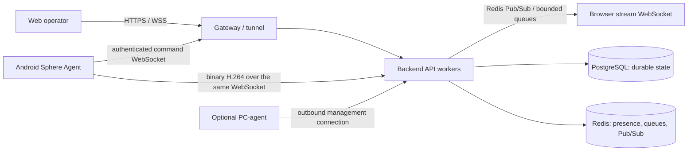
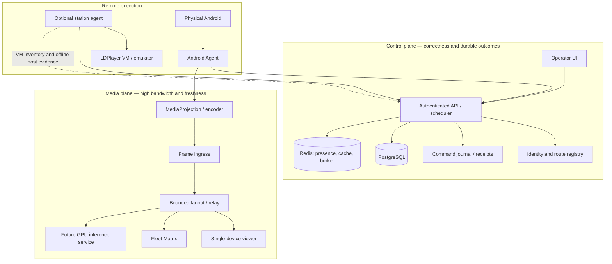
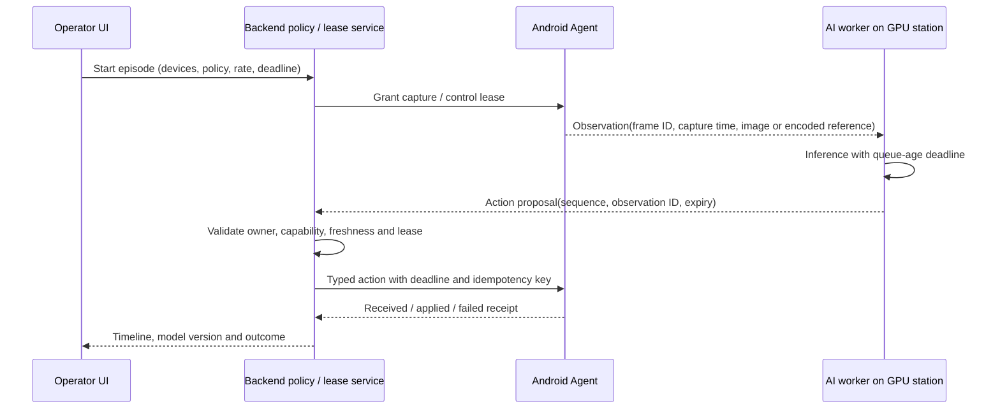

# Sphere fleet operations, observability, and media-plane architecture

> **Status:** architecture and audit specification; most target capabilities below are not implemented yet.<br>
> **Evidence cut:** 23 September 2026, current source branch `codex/enterprise-audit-20260905`.<br>
> **Audience:** operator, backend / Android / frontend engineers, release owner, future AI-runtime owner.<br>
> **Decision scope:** improve reliable operation and diagnosis of remote Android devices, emulators, streams, and future image consumers without turning the current pilot into an unmeasured distributed platform.

[Documentation index](../README.md) · [Current pilot](../operations/LOCAL-PILOT.md) · [Fleet32 gates](../audits/2026-09-20/FLEET32-PREFLIGHT.md) · [Current live stream evidence](../audits/2026-09-23/REMOTE-FLEET-LIVE-FOLLOWUP.md) · [AI readiness](AI-READINESS.md) · [Support evidence form](../../SUPPORT.md)

## 1. How to read this document

This document separates four kinds of statements. That separation is deliberate: a
diagram of a target design is not evidence that the design is already running.

| Marker | Meaning | Example |
| --- | --- | --- |
| **Observed** | Directly read from code, a checked-in config, a test, or a recorded pilot run. | The Android command and binary video frames share one OkHttp WebSocket object. |
| **Reproduced** | A test or bounded live exercise demonstrated the behavior. | A new regression test proves that an active Android stream reports encoder and local queue counters in pong. |
| **Proposal** | A recommended future contract or operator workflow. | Store an incident bundle in object storage and show its event timeline in one UI panel. |
| **Open** | Evidence is absent, incomplete, or contradictory. | The remote PH006 stream still has no server-received IDR or P-frame. |

An “enterprise” label describes the level of engineering discipline requested; it is
not a claim of production readiness, an SLA, or an audited certification. The acceptance
gates later in this document are the evidence required to change that status.

The system has a current local pilot and a target architecture. The pilot is useful for
source verification and controlled tests. It is not a substitute for a production
deployment with independent ingress, measured backups, resource budgets, and on-call
procedures.

## 2. Executive assessment

Sphere already has important building blocks: durable task and pipeline receipts,
authenticated Android WebSockets, route discovery, device registration, a bounded video
bridge, Redis Pub/Sub fanout, browser H.264 decoding, local Android logs, command-based
log collection, Prometheus metrics, Grafana, Alertmanager, and station-agent code.
They do not yet form a single evidence path that answers, for one device and one time
window, “what was running, what failed, and at which boundary did it fail?”

The current highest-priority operational gap is the remote stream failure. On the
23 September live run, the server accepted only SPS/PPS from remote PH006 and no IDR or
P-frame; the local device delivered an IDR and P-frames through the same public
Quick Tunnel. That evidence does not prove whether the remote encoder stopped, Android
failed to queue frames, or the specific WAN path dropped them. [AUD-148](../audits/2026-09-23/REMOTE-FLEET-LIVE-FOLLOWUP.md)
records the boundary accurately.

This pass reproduced two additional correctness problems in the operator UI and fixed
them in source: Fleet Matrix displayed generated ping and battery history as measured
data, and the Android frame receiver emitted frequent INFO logs in its binary hot path.
The stream metrics path was also present in code but dormant: Android never included
stream statistics in pong, a counter was a literal no-op, and “dropped frames” were
estimated from an assumed 30 FPS. A source fix now reports stage-specific encoder and
WebSocket queue data and expires a stalled FPS window. Its code and tests still need a
release build, installation, pilot rollout, and a new remote acceptance run before this
telemetry exists on real devices.

The proposed system should give one operator action—**Create incident report**—a
bounded, redacted evidence bundle and a linked timeline. That action cannot retrieve
live Android logs from a powered-off device over the public internet. For a stopped or
disconnected emulator, an optional host station agent is required to report the local
LDPlayer process/VM inventory and collect host-side evidence. For a physical Android
device without the agent, the UI must say what was last observed and when.

The immediate recommendation is to keep the existing authenticated control channel,
instrument the capture-to-view path, pass the 32-device acceptance gates, and compare
media transports with measured data. A TURN relay or managed tunnel may improve some
routes, but neither a tunnel nor VNC can repair an Android permission restriction,
duplicate emulator identity, stopped VM, or failing encoder. Choose those components
only after the test matrix here identifies the boundary that needs them.

## 3. Goals and non-goals

### 3.1 Goals for the next mass test

- Register every one of 32 running emulator instances as a separate, stable device.
- Distinguish an absent VM, stopped APK, stale heartbeat, unauthenticated WebSocket,
  unavailable route, denied screen capture, encoder stall, send-queue rejection,
  missing server frame, and browser decode failure.
- Reconnect after loss of internet on the Android side, backend side, station side,
  or ingress side without manual reinstallation or editing an IP address.
- Make the web UI show facts with their source and freshness. Unknown is not zero;
  offline is not a root cause; a command accepted by a queue is not a completed action.
- Open one device at high quality for interactive debugging and show a bounded,
  intentionally lower-cost fleet matrix for up to 32 devices.
- Capture a useful incident report without requiring an operator to copy millions of
  lines from separate terminals.
- Run a measured eight-hour soak with saved receipts, crash-buffer comparison, and
  backend/Redis/PostgreSQL/network fault injection before declaring Fleet32 ready.

### 3.2 Future goals that need separate acceptance

- Deploy one or more AI workers close to a GPU workstation on the user’s LAN.
- Deliver configurable observations at 0.5–4 frames per second per selected device.
- Route actions back to the correct device with an episode lease, deadline, sequence,
  and durable outcome.
- Scale from 32 to 64 web tiles and then to 100–200 machine-controlled devices based
  on measured GPU, network, codec, Redis, and host capacity.
- Add game or project adapters without embedding one game’s assumptions into the
  generic device identity, stream transport, or browser shell.

### 3.3 Explicit non-goals of this specification

- This document does not implement an AI model, select a model license, or claim that
  NitroGen or any other model is ready for a particular game.
- It does not promise silent screen-capture consent on every Android release or vendor
  image. Rooted emulators and physical devices are separate compatibility targets.
- It does not replace the existing task, command-journal, tenant, or RLS contracts.
- It does not recommend opening inbound ports on the remote workstation as a default.
- It does not call the development Quick Tunnel a production ingress.
- It does not prescribe Kubernetes, Kafka, a paid relay, or a multi-region database
  before one controlled 32-device run proves a need.
- It does not turn VNC into the primary Android capture system.

## 4. Current implementation: facts and limits

### 4.1 Main connection and video path

The current source has these paths. “Implemented” means the source has a code path; it
does not mean every route or scale has been accepted.



The installed topology varies by Compose project. The current local pilot, the older
development Compose stack, and the tunnel project are distinct resources. Do not infer
one is running from the other. See [Local pilot](../operations/LOCAL-PILOT.md) and
[Remote pilot](../operations/REMOTE-PILOT.md).

| Boundary | Current source behavior | What it does not prove |
| --- | --- | --- |
| Android identity | APK registers, stores server-assigned identity and binding-v2 data, then authenticates the command WebSocket. | That all 20 remote clones have unique VM serials or that every card is online. |
| Control | JSON commands, pings/pongs, command results, local command journal, retry/recovery. | A task card being present does not prove the current socket is authenticated. |
| Capture | Android screen-capture request activity and foreground capture service use MediaProjection and an H.264 encoder. | An Android status-bar capture icon does not prove encoder output, WebSocket queue acceptance, server receipt, or browser decode. |
| Device video upload | Encoded binary frame messages are sent over the Android management WebSocket. `SphereWebSocketClient.sendBinary()` returns whether OkHttp accepted the message into its local queue, not whether the server received it. | Successful network delivery or display in a browser. |
| Server video | Android WebSocket handler forwards binary payloads to `VideoStreamBridge`; Redis Pub/Sub can move frames to viewers on another backend worker; each viewer has a bounded queue. | That all backend workers expose a global, persistent per-device delivery history. |
| Viewer | `DeviceStream` opens a viewer WebSocket and runs a browser H.264 decoder. The page has reconnect and decoder recovery behavior. | That the browser has received a keyframe or produced fresh decoded pixels. |
| Device logs | Online device log requests are delivered as Android commands; APK has a bounded app log store, and the backend caps request volume. | Logcat retrieval from an offline APK or a powered-off VM. |
| Infrastructure graphs | Prometheus, Grafana, Alertmanager, and DB/Redis exporters have Compose definitions under `infrastructure/monitoring`. | That the monitoring Compose file is included in the pilot or that its dashboards reflect every worker. |

Implementation references: [Android dispatcher](../../android/app/src/main/kotlin/com/sphereplatform/agent/commands/CommandDispatcher.kt),
[stream capture](../../android/app/src/main/kotlin/com/sphereplatform/agent/streaming/StreamingManagerImpl.kt),
[WebSocket client](../../android/app/src/main/kotlin/com/sphereplatform/agent/ws/SphereWebSocketClient.kt),
[Android WebSocket handler](../../backend/api/ws/android/router.py),
[stream bridge](../../backend/websocket/stream_bridge.py),
[video queue](../../backend/websocket/video_queue.py),
[viewer page](../../frontend/app/(dashboard)/stream/[id]/page.tsx),
[DeviceStream](../../frontend/components/sphere/DeviceStream.tsx).

### 4.2 Current source audit findings

The records below preserve the distinction between a source fix and a live rollout.
The live stream incident began at AUD-148; this register is extended by the dated
follow-ups AUD-149 through AUD-161.

| ID | Severity | Finding and evidence | Source result | Release / residual gate |
| --- | --- | --- | --- | --- |
| AUD-149 | P2 | Android binary frame handler logged the first 50 and every 100th video message at INFO. The 250-frame regression reproduced 52 INFO calls. The log field `has_viewer` also held an un-awaited coroutine because `is_streaming()` is synchronous. | Fixed in commit `61bb667`; all 250 frames still reach the bridge and the INFO assertion passes. | Source-only at the time of this document. It was not part of the running pilot until a new backend image is built and rolled out. |
| AUD-150 | P2 | Fleet Matrix generated a deterministic millisecond value from row index and generated battery / ping sparklines from one current sample. The device API exposes current battery and access flags, not those histories or an RTT measurement. | Fixed in commit `0e0e043`; the component regression requires no generated ms value or polylines. | Source-only at the time of this document. Existing deployed frontend may still show the old values. |
| AUD-151 | P1 | Android quality counters were not sent in pong; backend expected them. Byte counter performed `inc(0)`, and frame drops were approximated as `30 - fps`. Android labeled encoder output as bytes sent although it was counted before `sendBinary`. FPS history did not expire on reads when the encoder stopped. Cached SPS/PPS replay on viewer join also bypassed the initial queue counters. | Source fix now reports versioned encoder output separately from every `StreamingManagerImpl.sendBinary` attempt, including cached codec-config replay; it clears invalid/inactive metrics and evicts stale FPS timestamps on read. Red/green tests reproduced missing telemetry, stale FPS, and uncounted codec-config replay. | Focused Android dev and enterprise tests and backend stream/handler/monitoring regressions pass. Build, signed APK, OTA catalog update, install, and remote acceptance are still OPEN. Local queue acceptance remains weaker than a server receipt. |
| AUD-152 | P1 | Infrastructure Monitoring fabricates CPU/RAM history from random jitter around the current sample, hard-codes active tunnels to zero, uses cumulative interface bytes as “bandwidth”, and the frontend substitutes zero values and “ALL SYSTEMS NOMINAL” when API requests fail. | Open. The values can mislead an operator during an outage. | Replace with measured samples and explicit `unknown / unavailable`; do not display a green system status when topology fetch failed. |
| AUD-153 | P1 | Backend is launched with four Gunicorn workers. The Prometheus client uses the default process registry; no `PROMETHEUS_MULTIPROC_DIR` or `MultiProcessCollector` integration was found in the app source. A scrape routed to one worker can miss metrics held by the other workers. | Open. | Verify actual pilot scrape behavior, then either configure supported multiprocess collection with startup/worker cleanup or scrape every worker separately. Never aggregate counters by summing repeated snapshots. |
| AUD-154 | P1 | A disconnected Android app cannot upload new logs or answer a diagnostics command. PC-agent source can invoke host tools, but there is no accepted Windows LDPlayer station-inventory and offline-diagnostics rollout. | Open capability / acceptance gap. | Optional station agent with outbound-only control connection, explicit least-privilege permissions, signed updates, host/VM inventory and evidence TTL. |
| AUD-155 | P1 | The current local pilot uses a Cloudflare Quick Tunnel for testing. Quick Tunnel has no SLA and is explicitly intended for testing/development. | Open deployment risk, not proof of current packet loss. | Keep the route for controlled diagnosis; select managed tunnel or independent ingress only after measuring a second path. |
| AUD-156 | P1 | Android capture startup and restart have OS permission / foreground-service prerequisites. `targetSdk=35`; MediaProjection is not universally restartable from a boot receiver on modern Android. | Platform constraint, not an APK exception to hide. | Define separate guarantees for rooted emulator builds and stock physical devices; test every supported Android/ROM family. |
| AUD-157 | P2 | MultiStreamGrid displays a fixed `ERR_CONN_REFUSED` string whenever a device is offline, regardless of the actual cause. | Open. | Change it to an explicitly observed status such as “device offline” plus last-seen time; use a real transport error only when the client recorded that code. |
| AUD-158 | P2 | Current stream status endpoint reports local viewer presence as `is_streaming` / `viewer_connected`. It does not mean Android capture is active, frames are arriving, or browser decode is fresh. | Naming is narrower than UI wording. | Return separate capture, server-frame, viewer-connected, and decoded-frame ages; preserve compatibility until consumers migrate. |
| AUD-159 | P1 | Remote PH006 has repeated SPS/PPS but no image NALs on the server, while one local device sent IDR/P frames through the same Quick Tunnel. | Live reproduction recorded in AUD-148. AUD-161 then reproduced a source-level Android startup path that can suppress the first stationary-screen buffer; its causal role on the remote device remains unverified until a new APK canary. | Do not attribute the remaining remote failure to Cloudflare or Rostelecom without a canary that reports Android encoder/queue counters and an independent-route comparison. |
| [AUD-160](../audits/2026-09-23/REMOTE-INGRESS-FAILOVER.md) | P1 | `UPDATE_CONFIG` stored only `server_url`, cleared any saved fallback, and left an already-connected WebSocket on its previous route. A signed route change therefore could not be applied to a healthy-but-unusable media path or used for a one-device provider A/B. | Fixed in source: preserve an explicitly supplied primary/fallback pair, give the completion ACK time to queue, then force only that agent to reconnect; unchanged routes do not reconnect. Red/green regressions are recorded in the linked audit. | Version 1.2.12-dev / 10212 was not signed or OTA-published. Remote route A/B and a browser-decoded frame remain open. This fix does not itself prove Cloudflare caused the missing frames. |
| [AUD-161](../audits/2026-09-23/ANDROID-INITIAL-FRAME-RACE.md) | P1 | `StreamingManagerImpl` ignored ImageReader callbacks until `VirtualDisplay.createVirtualDisplay()` returned. The first still-screen buffer could be left unacquired, matching the observed viewer session with SPS/PPS/EOS and no picture NAL. | Fixed in source: mark the current session active before display creation, acquire/close a first buffer safely, and release partially initialized capture if display creation fails. The deterministic early-callback regression failed before and passes after the fix; Android CI and the full two-flavor test matrix pass. | A signed local pilot candidate, 1.2.13-dev / 10213, is built and its package, version, digest, and pilot signer are verified. It is not installed or published. PH006 is live, but its prior viewer session contained no IDR/P; a read-only device command timed out with HTTP 504, while the pilot OTA catalog still targets the older dev release. Session resets occur roughly once per minute; available tunnel logs are insufficient to attribute them to Cloudflare. Do not advance the global OTA catalog or start a fleet wave until a one-device canary proves encoder output, backend receipt, viewer delivery, decoded browser frames, and reconnect stability. |
| [AUD-162](../audits/2026-09-24/REMOTE-RECONNECT-INCIDENT.md) | P1 | The deployed APK path treats refresh `401` as transient and reuses the rejected access token. A two-hour pilot window recorded 1,929 refresh `401` responses and 1,956 Android `invalid_token` events; one anonymized device identity accounts for the invalid-token loop. | Fixed in source and covered by a red/green Android regression: durably clear the rejected credential pair, retain identity/binding/routes, then use the existing enrollment guard. Policy/ingress `403` and transient network/`5xx` do not trigger re-enrollment. | APK 1.2.14 / 10214 is a local candidate only. No remote install or OTA publication is claimed. Same-window WS `101` proves only transport upgrade; no active Android encoder/queue telemetry appeared in a point-in-time metrics read, so the no-frame boundary and other session evictions still need an instrumented one-device canary. |

Severity uses the repository’s operational impact convention: P0 blocks safe service;
P1 blocks the current 32-device acceptance or makes an important failure hard to
diagnose; P2 creates misleading output, avoidable resource use, or a manageable
operational burden. P2 does not mean “ignore before a mass test” when the UI displays
fabricated health data.

### 4.3 Current proof boundary for remote streaming

The live comparison on 23 September recorded the following. The numbers are frame
payloads received by the server-side viewer path; they are not browser decode receipts.

| Source | Duration | Frames at server | What can be concluded |
| --- | ---: | --- | --- |
| Remote PH006 | 42.06 s | 2 SPS + 2 PPS; 0 IDR; 0 P | A moving video picture could not be decoded from this session. |
| Remote PH006 | 20.00 s | 1 SPS + 1 PPS; no IDR/P; first config after 8.172 s | Command and config bytes reached the server; no picture slice did. |
| Remote PH006 | 18.02 s | 1 SPS + 1 PPS; no IDR/P | The same visible failure repeated. |
| Local `auto-ph-000` | 12.78 s | SPS=1, PPS=1, IDR=1, P=3; 42,789 total bytes | The local encoder, viewer, and this Quick Tunnel route can carry an IDR larger than 16 KiB. |

The comparison narrows the search. It does not rule out remote-specific edge routing,
packet loss, LDPlayer capture/codec differences, resource pressure, or a client sender
failure. A capture icon, an online card, a `start_stream` command, or a WSS connection
are different signals; none substitutes for a server-received IDR and a browser-decoded
frame. The source audit in [AUD-161](../audits/2026-09-23/ANDROID-INITIAL-FRAME-RACE.md)
reproduced one Android-side startup race: the first ImageReader callback could return
before acquiring its buffer because the stream was marked active only after display
creation. The fix and regression now pass in source; no remote runtime acceptance is
claimed until a canary confirms encoder output, server receipt, and browser decode.
The independent device-level timeline in section 9 is designed to make each boundary
visible.

## 5. Reliability vocabulary and truth model

### 5.1 Never collapse these states into one “online” flag

An operator view needs separate signals and a timestamp for each one.

| Dimension | Example values | Source of truth | Stale behavior |
| --- | --- | --- | --- |
| VM host state | `running`, `stopped`, `not_seen`, `unknown` | Station agent inventory, when installed | `unknown` after station lease expires; it is not Android offline. |
| Android boot | `booting`, `boot_completed`, `locked`, `unknown` | APK event / host diagnostics | Keep the last event and its age; do not infer current screen state. |
| APK process | `running`, `not_responding`, `crashed`, `unknown` | Android heartbeat or station agent process inspection | A missed heartbeat alone is `unknown` until another source confirms the process stopped. |
| Enrollment | `unregistered`, `pending`, `bound`, `collision`, `revoked` | Backend enrollment and binding record | `collision` blocks command delivery until identity is resolved. |
| Route discovery | `current_route_id`, `candidate_count`, `generation`, `last_refresh` | APK signed discovery state and server registry | Show route age and last failure. Never expose bootstrap secrets. |
| Authenticated command socket | `connected`, `reconnecting`, `auth_rejected`, `unknown` | Backend session record and Android connect state | Use session generation to prevent an old disconnect from deleting a new session. |
| Command path | `queued`, `sent`, `received`, `started`, `completed`, `failed`, `unknown` | Durable task / command receipt chain | A timeout after send is `unknown` until idempotency/reconciliation resolves it. |
| Screen permission | `granted_for_session`, `denied`, `revoked`, `not_requested`, `unknown` | Android MediaProjection callback / capture service | Token expiry or OS stop invalidates the current capture session. |
| Encoder | `starting`, `active`, `zero_fps`, `failed`, `stopped`, `unknown` | Android encoder events and counters | `zero_fps` only after sample window expires; include sample time. |
| Android WS queue | `accepted`, `rejected`, `backpressured`, `unknown` | APK `sendBinary` return and queue-size limit | Local queue acceptance is never called server delivery. |
| Server frame ingress | `frames_received`, `last_nal_kind`, `last_frame_at` | Authenticated Android WebSocket handler | No frame is `unknown/no recent receipt`, not “camera permission denied”. |
| Viewer delivery | `frames_queued`, `frames_sent`, `drops`, `last_send_at` | Video bridge and viewer socket | Distinguish frame eviction from socket write error. |
| Browser decoder | `config_received`, `keyframe_received`, `decoded`, `stalled`, `error` | `VideoDecoder` / renderer callbacks | Show last decoded time and decoded FPS separately from network FPS. |
| VPN assignment | `assigned`, `unassigned`, `unknown` | Assignment table | Assignment is not handshake or end-to-end reachability. |
| VPN tunnel health | `handshake_fresh`, `handshake_stale`, `route_failed`, `unknown` | Provider handshake / route check | A VPN card is not healthy just because an IP is allocated. |
| APK release | `versionName`, `versionCode`, `signer`, `artifact_sha256` | APK and signed catalog | Display installed versus candidate/catalog versions separately. |

### 5.2 State freshness contract

Every time-varying fact has these fields:

| Field | Rule |
| --- | --- |
| `observed_at` | Wall-clock UTC at the component that saw the event. |
| `observed_monotonic_ms` | Monotonic time on that same component when ordering or elapsed duration matters. |
| `received_at` | Wall-clock UTC when backend accepted the event. |
| `age_ms` | Calculated at read time from backend time and `received_at`; not persisted as a ticking value. |
| `source` | Enumerated producer such as `android_agent`, `backend_ingress`, `browser_viewer`, or `station_agent`. |
| `quality` | `measured`, `derived`, `inferred`, or `unknown`. |
| `session_id` | Current connection or capture session; never reused after restart. |
| `sequence` | Monotonic sequence within the event stream or session. |

The UI should show “last reported 42 s ago” beside a measurement. It should not present
a cached value as live after the sample expires. A reported 0% CPU is a measurement; a
missing CPU sample is unknown. A probe timeout is unavailable; it is not 0 ms latency.

### 5.3 Command delivery vocabulary

Use these words precisely across API, UI, event history, and support reports:

- **Created:** durable task row and task ID exist.
- **Queued:** scheduler accepted work but has not written it to the device socket.
- **Published:** backend broker accepted a control message for a consumer. This is not
  a device receipt.
- **Socket write accepted:** local WebSocket library accepted a write into its queue.
- **Received:** device agent parsed the command and wrote a `received` receipt.
- **Started:** device executor recorded that a handler began.
- **Applied:** the target OS/API acknowledged the requested operation where an
  acknowledgement exists. A tap command may have no authoritative app-level proof.
- **Completed:** agent returned a terminal result and backend durably saved it.
- **Failed:** terminal failure with a stable reason code.
- **Unknown:** delivery or side effect might have happened but no authoritative receipt
  proves it. Do not retry a non-idempotent action automatically in this state.

The existing task-control and command-journal contracts remain authoritative:
[task control](../security/task-control-protocol.md) ·
[durable cancellation](../audits/2026-09-20/DURABLE-CANCELLATION.md) ·
[pipeline recovery](../audits/2026-09-20/PIPELINE-RECOVERY.md).

## 6. Target component architecture

### 6.1 Separate responsibilities before adding new infrastructure



The diagram has separate boxes because control receipts and image freshness have
different load, storage, retry, privacy, and latency rules. It does **not** prescribe
separate servers on day one. First collect measurements from the current path; split
processes or transports only where the data shows a bottleneck or failure boundary.

### 6.2 Control plane responsibilities

The control plane owns:

- organization-scoped device identity and binding history;
- short-lived enrollment grants and session credentials;
- signed route discovery and a last-known-good route cache;
- one authenticated current command socket per device binding;
- durable commands, tasks, task receipts, cancellation fences, pipeline run records,
  and idempotency keys;
- browser control permissions and stream session grants;
- lifecycle of incident reports, retention, and access audit;
- catalog metadata for signed APK releases and staged rollout waves.

PostgreSQL is the durable source for these records. Redis may hold fast presence,
stream fanout, transient leases, and bounded caches. A cache eviction must not silently
erase the only command receipt, identity binding, OTA outcome, or incident manifest.

### 6.3 Media plane responsibilities

The media plane owns:

- capture session ID, codec configuration and dimensions;
- observation sequence and capture timestamps;
- encoder output counters and encoder errors;
- bounded frame send queue and drops;
- server ingress receipt and frame classification;
- browser or AI consumer delivery, queueing, decoding, and frame age;
- bandwidth admission, quality adaptation, and per-consumer limits.

Do not write every video frame to PostgreSQL, application logs, or task receipts. Keep
high-rate payloads in a streaming path. Persist short session summaries and explicit
failure events; optionally persist sampled frames in separately secured object storage
when an operator or AI evaluation explicitly enables retention.

### 6.4 Storage responsibilities and loss behavior

| Store | Good fit | Must not become |
| --- | --- | --- |
| PostgreSQL | Identity, durable tasks, OTA rollout records, report metadata, audit and retention metadata. | A 4 FPS image queue or unbounded per-frame event table. |
| Redis | Presence TTL, short-lived coordination, Pub/Sub fanout, bounded work queues with explicit recovery. | The only durable place holding a command result or identity binding. |
| Local Android ring | Recent bounded diagnostics and crash markers available after reconnect. | An unbounded file or a place to store access tokens in plaintext. |
| Station disk spool | Bounded host evidence during network outage; later upload with a unique idempotency ID. | An unlimited queue that fills the system drive or silently replays stale commands. |
| S3-compatible object store | Optional incident bundle, approved screenshots, APK artifacts and checksums. | A substitute for tenant authorization, lifecycle, encryption, or retention policies. |
| Prometheus TSDB | Operational counters, gauges, histograms, alert rules. | An event archive keyed by arbitrary device, user, task, or frame IDs. |

## 7. Device identity and clone lifecycle

### 7.1 The master-image and clone-rebind rule

The golden emulator image may be fully configured and the Sphere APK may be launched
in the master so an operator can grant the permissions available on that Android image.
Cloning an enrolled master is supported only after a canary proves that each VM gets a
different stable identity. The clone can contain copied device credentials; every
credential consumer must wait for clone rebind before network use. Do not treat
credentials copied from a master as proof that two clones are the same device.

On the first boot of a clone:

1. Before opening a management WebSocket, refreshing a token, checking OTA, uploading
   logs, or downloading an APK, the app reads the target's current stable identity.
2. If the saved identity differs, or is missing, the app discovers the management
   route and re-enrolls using a supported enrollment credential.
3. The backend binds the new instance to one tenant and returns a new device ID,
   credential, binding version, and expiry metadata.
4. The APK persists the acknowledged binding and credentials atomically before
   starting normal command delivery.
5. If rebind cannot complete, the app retains the old local credentials for retry but
   sends no management request using them. It reports a retryable identity/bootstrap
   state instead of showing the clone as fully online.
6. The next heartbeat includes the server-assigned ID, binding version, APK identity,
   and boot/session ID. A mismatched acknowledgement does not silently fall back to
   a copied master ID.

The current Android v2 path uses emulator VM serial. It separates the two locally
observed LDPlayer 9 Android 9 instances, but remote clone uniqueness is not yet
proven. If a hypervisor returns the same serial for the master and clone, v2 cannot
infer a new identity from copied app state. The Android-only product path must report
an identity conflict and block silent merging; a host adapter may exist later as an
optional integration for environments that need it. The common identity contract,
LDPlayer clone acceptance, Android permission limits and test matrix are in
[Golden image and portable clone provisioning](ANDROID-EMULATOR-GOLDEN-IMAGE.md).

Android `ANDROID_ID` has documented scope by app-signing key, Android user, and
device. It is a useful signal but does not prove that a snapshot-based VM clone has
unique underlying identity; the current two-instance read found the same value on
both local LDPlayers. [Android identifier behavior](https://developer.android.com/about/versions/oreo/android-8.0-changes)
The v2 source fix and open remote acceptance gates are recorded in
[Clone binding v2](../audits/2026-09-20/CLONE-BINDING-V2.md).

### 7.2 Identity records

The target record separates physical/logical device identity from the currently
connected process:

| Field | Purpose | Change behavior |
| --- | --- | --- |
| `device_id` | Stable backend UUID shown in tasks, logs and operator URLs. | Stable while the same enrolled instance remains valid. |
| `binding_id` | Server-issued binding generation. | Rotates on controlled re-enrollment; old generation is revoked. |
| `instance_public_key` | Proof of possession for an instance credential where supported. | Private key stays on instance; a cloned key triggers a binding conflict. |
| `station_id` | Stable identity of an optional workstation agent. | Stable for the host installation; not a substitute for VM identity. |
| `vm_id` | Stable identifier from the emulator manager. | Unique per running LDPlayer instance, not the master template filename. |
| `vm_generation` | Incarnation of a recreated VM that reuses an index or display name. | Changes on destructive recreate/reset; historical device remains auditable. |
| `install_id` | Random install-level diagnostic ID. | Useful correlation signal; not trusted as the only clone-unique ID if app data is copied. |
| `android_id` | Android-provided identity signal. | Store as a redacted/hashable attribute subject to privacy; do not use as sole clone guard. |
| `serial_fingerprint` | Hash of normalized VM / hardware signals. | Recomputed on enrollment; raw serial is not written to public logs. |
| `apk_version` / `signer_digest` | Identify code and signer on the running APK. | Updated only after installer success and next heartbeat. |

The database needs uniqueness constraints for active bindings at the tenant boundary.
When two connections claim one binding simultaneously, the backend must select one
current session generation. The displaced connection gets a reasoned close or
quarantine result; it must not delete the new connection during late cleanup.

### 7.3 Collision policy

Identity collision is a first-class state, not an invisible “one device went offline”
side effect.

| Collision | Safe response |
| --- | --- |
| Same `device_id`, same current binding, reconnect on a new socket | Rotate session generation; accept latest authenticated connection; close old socket. |
| Same copied binding from two different station VM IDs | Quarantine both until backend issues a fresh one-time enrollment challenge. Preserve last valid audit history. |
| Same station VM index, generation differs | Create or link a new device incarnation according to owner policy; never merge task history automatically. |
| Same display name such as `PH006`, different binding | Keep both distinct; display name is mutable metadata, not identity. |
| Same Android ID on two VMs | Require another proof signal; show `identity_conflict` if proof is insufficient. |
| Unknown station ID with a previously bound device | Do not accept a silent move unless owner policy allows a controlled transfer. |
| Lost or reset app data | Re-enrollment must recover or rotate binding explicitly; do not create a new row on every reinstall. |
| Expired enrollment grant | Reject with a stable reason code and issue a new grant through owner workflow. |

### 7.4 Station inventory and unattended cloning

An optional Windows station agent is the practical path to “clone once, then manage
many” without assuming Android can inspect its own emulator host. It should expose a
small versioned adapter contract, not make the APK depend on LDPlayer-specific APIs.

Station agent responsibilities:

- connect outbound to the server and renew a short station lease;
- enumerate emulator manager instance IDs, indices, VM generation, Android ADB serial,
  process state, boot completion, and available disk/memory;
- report `running`, `stopped`, `starting`, `not installed`, `agent offline`, and
  `unknown` separately;
- associate one station VM with one backend device binding after a challenge;
- install or update an APK only when the operator’s rollout policy explicitly enables
  station-side installation;
- collect bounded `adb logcat -b crash`, package info, `dumpsys media_projection`,
  codec inventory, process status, emulator log, and a consented screenshot for an
  offline APK while the VM still runs;
- spool encrypted / redacted evidence with TTL when server connectivity is down and
  upload it later with duplicate-safe request IDs;
- never execute arbitrary shell text sent from a browser. Commands map to a small,
  typed allowlist with deadlines and per-operation audit receipts;
- report adapter version, host OS, LDPlayer version, ADB binary digest and privilege
  scope to the station detail page.

The station agent is **optional for remote Android enrollment and command delivery**.
The APK itself must connect directly to the configured server route. The station agent
adds inventory, clone repair and offline-host diagnostics. A remote Android device with
no station agent can still operate but has fewer offline diagnostic signals.

### 7.5 Station identity and security boundary

The station agent needs a different credential from an Android APK. It has access to
host process and ADB surfaces, so its grant must be scoped to one station, organization,
and adapter version. It must not reuse an Android device JWT or super-admin web session.

- Pair the station using an expiring owner-generated grant or signed install package.
- Store a station key in Windows-protected storage or the platform key store.
- Let an owner revoke one station without rotating every APK credential.
- Do not accept station-supplied `device_id` as authoritative; the backend resolves the
  VM binding from a signed/enrolled station identity.
- Apply per-operation timeouts and output-byte budgets. Do not capture arbitrary
  desktop images by default.
- Put host logs and Android logs in separate sections with explicit source and time.
- Keep station-agent installation and update behind a signed manifest and staged ring.
- Record who requested remote logcat, screenshot, reboot, install, or host command.

## 8. Route discovery and connection recovery

### 8.1 Control route model

The APK should know a bootstrap mechanism and retain a last-known-good route. The
bootstrap mechanism is not itself a backup for the command socket. The connection state
machine should use a deterministic order:

1. Start from the last server-signed route set persisted from a successful enrollment.
2. Try healthy routes in the signed priority order with paced exponential backoff and
   jitter. Pin route generation and avoid retrying the same broken route first forever.
3. On route failure, request the signed discovery manifest over every independent
   bootstrap origin still reachable.
4. Validate signer, environment, route expiry, protocol version, and monotonic manifest
   generation before replacing the stored route set.
5. Preserve the last-known-good set if all discovery origins fail.
6. When one route authenticates, reset its transport failure streak and record which
   route succeeded. Do not rewrite device identity as part of route failover.
7. When configuration is ambiguous or expired, remain in `route_unknown` and show the
   exact last attempt time and reason. Do not silently hard-code an obsolete IP.

An external GitHub-hosted manifest may be one discovery source, but it is not a
guaranteed backup if GitHub is blocked, unavailable, rate-limited, or the phone has no
internet. A route set should be signed by Sphere’s release/config signing key, served
from at least two operationally independent domains/providers where possible, and
cacheable by the APK. A local mirror operated by the station can serve the signed
manifest while the WAN bootstrap is unavailable; it cannot make a powered-off server
reachable.

### 8.2 Availability classes

| Failure | Recovery path | Operator-visible result |
| --- | --- | --- |
| One Android DNS resolver fails | Try second signed bootstrap route and cached route. | Route failover event with destination class, not token or raw credential. |
| One public edge closes WebSocket | Jittered reconnect to another route; then refresh discovery. | `reconnecting`, elapsed outage, last accepted route. |
| Quick Tunnel process restarts and URL changes | Discovery must publish a new signed generation. | `route_generation_changed`; devices converge without changing APK. |
| GitHub or one config host unavailable | Use another signed origin or saved manifest. | `discovery_degraded`; keep last-known-good route. |
| Entire internet from Android station drops | APK queues only durable/idempotent safe work and continues bounded local state. | Show last contact and age; no false online state. |
| Backend restarts but URL is stable | Agent reconnects; new authenticated session replaces old one. | Short outage with reconnect receipt and new session ID. |
| Backend address changes | Signed route manifest and cache; no IP editing in APK. | Route migration timeline. |
| Redis unavailable | Control socket liveness and durable database work are reported separately from stream broker availability. | Presence cache degraded; video fanout unavailable if Redis transport path depends on it. |
| PostgreSQL unavailable | Fail durable writes closed; do not claim task/OTA acceptance without commit. | Database degraded and rejected operation IDs. |
| DNS and all route origins unavailable | No automatic network path exists. Preserve state and retry with backoff. | `route_unknown`; station evidence can show host internet is also down. |

Do not promise “connects under every possible outage.” State what continues during each
failure and which durable guarantees remain. The control plane cannot reach an
unpowered server; the station agent can only preserve local facts until service returns.

### 8.3 Reconnect load control

At 200 devices, synchronized retry can turn one recovered network into a second outage.
Use independent jitter, cap retry frequency, and spread discovery refreshes.

- Preserve device-specific random jitter across process restarts where safe.
- Apply exponential delay with a bounded cap; reset only after authenticated success.
- Give auth/config errors their own reason path; do not circuit-break an expired token
  as if it were packet loss.
- Limit concurrent DNS/TLS handshakes per station where many clones boot at once.
- Add a randomized startup delay window after VM host boot.
- Use manifest version and ETag / digest to avoid fetching identical configs every retry.
- Do not poll GitHub from every emulator continuously. The station may cache the
  signed artifact, while each APK verifies the signature itself.
- Keep connection and update retry loops independent so a failed large APK download
  cannot block command reconnection.
- Export retry attempt, selected route class, backoff duration, TLS category, and
  authenticated-success duration as bounded metrics and structured events.

## 9. Stream architecture and quality model

### 9.1 Stage-by-stage receipt chain

One stream session receives a unique `capture_session_id`. Every stage stores aggregate
counters and first/last timestamps; the data path does not log individual frames.

| Stage | Event / counter | Owner | Acceptance evidence |
| --- | --- | --- | --- |
| Viewer asks for stream | `viewer_session_opened` | Backend stream API | Viewer ID, device binding, session ID, permission decision. |
| Server requests capture | `capture_start_sent` | Backend command path | Command ID and transport publish result. |
| APK receives request | `capture_start_received` | Android dispatcher | Command receipt and app version. |
| Permission flow | `projection_consent_requested`, `granted`, `denied`, `revoked` | Android Activity/service | Android SDK, result category, time. No token or Intent data logged. |
| Capture session | `projection_started`, `projection_stopped` | Android MediaProjection callback | Session ID, dimensions, stop reason. |
| Image capture | `image_acquired_total`, `image_acquire_errors_total` | ImageReader | Counter, last capture timestamp, queue pressure. |
| Encoder | `encoded_frames_total`, `encoded_bytes_total`, `encoder_fps`, `encoder_errors_total`, keyframe ratio | MediaCodec callback | Session snapshot. |
| Local sender | `ws_queue_attempts_total`, `ws_queue_accepted_total`, `ws_queue_rejected_total`, accepted bytes | APK WebSocket client | `true` means local OkHttp send accepted; not server receipt. |
| Android ingress | `server_frames_received_total`, bytes, NAL kind, last frame/IDR time | Authenticated backend Android socket | Receipt proves the backend parsed the packet boundary. |
| Bridge | `frames_queued_total`, `frames_dropped_total`, queue age | Backend bridge / Redis | Per-device state in bounded TTL store plus aggregate Prometheus counters. |
| Viewer socket | `viewer_frames_sent_total`, `viewer_bytes_sent_total`, `viewer_write_errors_total` | Backend viewer loop | Socket write result for each viewer session. |
| Browser network input | `viewer_frames_received_total`, `last_frame_received_at` | DeviceStream transport | Browser-side byte/frame receive; separate from decoder. |
| Browser decoder | `decoder_configured`, `keyframe_received`, `decoded_frames_total`, `decoder_dropped`, `decode_errors_total` | WebCodecs / rendering loop | Last decoded time, decode FPS, frame age and visible state. |
| User-visible freshness | `last_decoded_frame_at`, `frame_age_ms`, `first_frame_latency_ms` | Browser | Freshness displayed in the viewer, not a backend estimate. |

The source fix in AUD-151 implements Android media-frame encoder output and local queue
stages in the heartbeat payload. Codec-config SPS/PPS are excluded from media FPS and
encoded-frame totals, but every binary send—including a cached SPS/PPS replay for a new
viewer—is counted at the local queue stage. It does not instrument every stage in this
table or expose those values in a user-facing incident timeline. A rollout-profile APK
must be built, signed appropriately, and installed before these Android fields can be
observed on the pilot. Local debug package builds do not meet that gate.

### 9.2 Telemetry semantics

The current source payload proposal is intentionally low-frequency and aggregate:

```json
{
  "type": "pong",
  "ts": 1790172000.125,
  "stream": {
    "schema_version": 1,
    "active": true,
    "stage": "encoder_and_ws_queue",
    "encoder_fps": 17,
    "encoded_frames_total": 88,
    "encoded_bytes_total": 456789,
    "key_frame_ratio": 0.125,
    "ws_queue_attempts_total": 92,
    "ws_queue_accepted_total": 90,
    "ws_queue_rejected_total": 2,
    "ws_queue_accepted_bytes_total": 440000
  }
}
```

This is a versioned protocol contract candidate. It contains session cumulative values
and a trailing one-second FPS sample. The backend validates numeric types and bounds,
uses active-session gauges, and clears them on stop/disconnect. It must not call
`ws_queue_accepted_total` a delivered-frame counter. Queue attempts include cached
SPS/PPS resent for a newly connected viewer, although those cached packets are not
additional encoder output. A server receipt exists only after
the backend receives the binary frame.

The `pong` interval is currently approximately 30 seconds. That is suitable for a
low-cost fleet heartbeat and coarse incident trail, but it is too slow for a per-frame
AI loop or tight interactive feedback. A future data channel needs an explicit
sampling cadence, freshness deadline, and backpressure policy; do not shorten fleet
heartbeat globally just to feed inference.

### 9.3 Binary frame envelope

The current Android path includes a frame header and H.264 Annex-B payload. Any
envelope evolution must be backward-compatible and define:

- protocol version and header length;
- device binding ID and capture session ID;
- per-session frame sequence;
- monotonic capture time, with a documented unit;
- wall-clock capture time only for cross-system display, never as the sole ordering key;
- pixel dimensions, rotation, crop, codec/profile, and payload length;
- frame type (`config`, `IDR`, `P`, other) after safe parsing;
- optional checksum or integrity field if needed for corruption diagnosis;
- maximum accepted payload and behavior on malformed/truncated input;
- whether a frame can be omitted, replaced by a newer frame, or must be delivered.

Do not include an authentication secret in the frame envelope. The authenticated
session binds the frame to the device. A generated frame ID can be a stable composite
of `capture_session_id` plus sequence rather than a UUID allocation per frame.

### 9.4 Backpressure and browser latency

Interactive viewing prefers the newest useful frame over a long queue of stale frames.
The queue policy should be visible and tested:

- Queue is bounded by both frame count and bytes.
- When the viewer is slow, discard oldest non-key frames first where decoder recovery
  remains possible; request an IDR after a discontinuity.
- Never discard the only codec config or the first IDR needed to initialize a decoder.
- After dropping a reference-dependent P-frame, either discard until next IDR or use a
  codec-aware recovery boundary. Do not feed an invalid dependency chain to WebCodecs.
- Use a per-viewer queue so one slow browser cannot stall other viewers.
- Maintain one Android capture session per device while at least one eligible consumer
  exists; multiple viewers should fan out the same encoded source unless a higher
  profile was explicitly admitted.
- Stop capture after the last viewer lease expires with a short grace period; report
  stop delivery as pending if the control route is down.
- Report frame age and drop reason. A stable 30 FPS with 8-second-old frames is not
  smooth or suitable for control.

The single-device view and fleet matrix have different policies:

| View | Target use | Proposed quality policy | What to display |
| --- | --- | --- | --- |
| Device Stream | One device, operator interaction, diagnosis | Highest admitted profile; low latency; codec recovery prioritized; one or few viewers. | Decoded FPS, frame age, first-frame time, capture state, resolution, queue and error boundary. |
| Fleet Matrix | Visual overview of 32; later 64 tiles | Lower resolution and adaptive 1–5 FPS; lazy start only for visible/selected tiles; reduce quality on tab background. | Device identity, stream freshness, offline state, selected feed quality; no fake ping or trend. |
| Browser screenshot endpoint | One-shot support or evidence | Demand-driven and rate-limited. | Capture timestamp, exact device binding/session, saved artifact ID if retained. |
| AI observation consumer | Future inference, independent of operator browser | Per-device 0–4 FPS configurable, last-frame-wins, inference-aware image size and deadline. | Frame sequence, capture and receive times, model queue age, inference result and action linkage. |

### 9.5 Media transport choices

No transport is a universal “works everywhere” guarantee. Compare the same device,
same APK, same encoder settings, and same viewer over controlled routes.

| Option | Strengths | Costs / risks | Sphere recommendation |
| --- | --- | --- | --- |
| Current H.264 over WebSocket | Existing end-to-end code, authenticated control session, easy local debug, browser and server already understand payloads. | Control/video share a socket; TCP head-of-line delay; slow consumer queue; remote PH006 has no image slices; proxy and idle timeout behavior matter. | Keep for the next measurable fix; add stage counters and frame freshness first. |
| WebRTC with ICE/TURN | Designed for real-time media; attempts direct paths and can relay where direct NAT connectivity fails. WebRTC signaling is separate; TURN is a real relay service with egress and operations cost. | Android/browser SDK integration, ICE diagnostics, STUN/TURN credentials, UDP reachability, TURN cost, quality tuning, NAT/firewall differences. | A/B prototype after current source stages identify WAN/TCP as the remaining boundary. Use TURN as an explicit route, not a free assumption. |
| Managed tunnel / outbound connector | Remote station can initiate outbound connections; avoids asking the user to open inbound ports; good control/API ingress and managed routing. | Provider edge and protocol support; tunnel failure domain; route may still be TCP proxied; Quick Tunnel has no SLA and a 200 in-flight request limit. | Production control/API ingress can use a managed HA configuration; do not infer media fitness from HTTP health. |
| VNC / remote desktop on host | Useful to debug a running emulator host, inspect VM screen, or recover station software if the host agent exposes a secure support action. | Does not prove Sphere APK state; host-level exposure and authorization; Android screen permissions remain; not a universal offline physical-device solution. | Optional station-only support feature behind owner permission. Not the default stream plane. |
| ADB over the network | Deep emulator diagnostics, install and logcat control if already authorized and reachable from the station. | ADB authorization and reachable host agent are prerequisites; never expose unauthenticated ADB to the public internet. | Keep ADB local to the station; expose typed audited operations through the station agent. |

Official WebRTC references explain that peers exchange ICE candidates and TURN may
relay traffic: [peer connections](https://webrtc.org/getting-started/peer-connections) ·
[TURN server](https://webrtc.org/getting-started/turn-server). Cloudflare describes
Quick Tunnel as development/testing with no SLA and a 200 in-flight request limit:
[Quick Tunnel limitations](https://developers.cloudflare.com/cloudflare-one/networks/connectors/cloudflare-tunnel/do-more-with-tunnels/trycloudflare/).
Cloudflare’s managed tunnel availability details differ from Quick Tunnel:
[tunnel availability](https://developers.cloudflare.com/cloudflare-one/networks/connectors/cloudflare-tunnel/configure-tunnels/tunnel-availability/).

## 10. Android constraints, autoplay, and OTA

### 10.1 Agent reconnect and screen capture are separate promises

The agent can start at boot, enroll, reconnect, and receive commands subject to OS and
vendor restrictions. Screen capture is a separate OS capability with its own token,
foreground-service type, user consent, and stop callback. A working boot receiver does
not imply that Android will permit unattended screen capture after every reboot.

The Android MediaProjection documentation requires a valid capture consent result and a
foreground service type; Android 14 restricts token reuse, and Android 15 restricts
launching a mediaProjection foreground service from a `BOOT_COMPLETED` receiver:
[MediaProjection](https://developer.android.com/media/grow/media-projection) ·
[foreground service type changes](https://developer.android.com/develop/background-work/services/fgs/service-types) ·
[Android 15 behavior changes](https://developer.android.com/about/versions/15/behavior-changes-15).

Acceptance profiles must remain explicit:

| Profile | Connection after boot | Capture after boot | Required evidence |
| --- | --- | --- | --- |
| LDPlayer Android 9 rooted, current tested image | Expected by APK + root/watchdog path; verify after cold boot and clone. | Root/ROM may permit extra automation, but verify actual `MediaProjection` path and crash state. | 32 instance serials, permission/session state, first decoded IDR after boot, 8h soak. |
| Android 9 rooted physical / custom image | May differ by vendor ROM, key store and root manager. | May differ by projection service / root API. | Device model, ROM, target SDK, API result, cold boot and app update. |
| Stock Android 12/13 | Agent connection has Android background restrictions and OEM battery policy. | User consent / service state applies. | Doze, swipe-away, reboot, permission revocation, screen lock. |
| Stock Android 14/15+ | Agent connection subject to newer service restrictions. | Do not promise boot-triggered autonomous capture; projection permission and service restrictions apply. | Real device tests with exact target SDK and permission flow. |

### 10.2 OTA safety contract

Automatic update is a chain, not a boolean flag:

1. signed catalog resolves a release compatible with app ID, signer, environment,
   minimum backend protocol and device ABI;
2. APK downloads from a route reachable by that device, validates signature and SHA-256;
3. installer accepts the package and reports whether user action was required;
4. app process restarts, authenticates, acknowledges the expected binding version, and
   reports installed version/signer;
5. backend verifies success and keeps the last-known-good release available for staged
   rollback or repair;
6. cohort widens only after canary health and crash-buffer checks pass.

PackageInstaller can return `STATUS_PENDING_USER_ACTION`; silent update cannot be
promised for every Android/device profile. [PackageInstaller API](https://developer.android.com/reference/android/content/pm/PackageInstaller).
Rooted emulator `su` install is a specific capability that must have its own tested
path and receipt. The master image workflow can install a new APK once before cloning,
but every clone still needs unique enrollment after its first boot.

APK and config availability need independent routes. A route manifest might be fetched
from two signed endpoints while the binary artifact comes from a content-addressed CDN
or station cache. Cache correctness requires signature, SHA-256, expiry, rollback
policy, minimum protocol, and monotonic version. A cached old artifact is not proof that
the newest release will install.

### 10.3 Rollout rings

| Ring | Scope | Promotion gate |
| --- | --- | --- |
| Build verification | CI + local emulator; dev signer only. | Unit tests, manifest and signer verification, package ID/version match. |
| Internal canary | One local rooted emulator and one remote rooted emulator. | Connect, command receipt, update receipt, crash-buffer comparison, one remote decoded IDR. |
| Station canary | One golden image and one new clone on each station. | Both have different server IDs and the expected APK SHA; one outage/reconnect drill. |
| 5-device wave | Mixed clone generation and location. | No identity collision; route reconnect; stream first-frame and resource budget. |
| 20-device wave | Reported remote group. | Every VM accounted for, no duplicate binding, online and stream summaries match. |
| 32-device wave | User’s pre-mass-test target. | Fleet32 gates and 8-hour soak pass; owner authorizes activation. |

Stop a wave automatically if device crashes rise above the approved limit, binding
collisions occur, backend error budgets are breached, queue rejections climb, or a
previously healthy route loses devices. Do not “roll forward harder” through an
unexplained outage.

## 11. Observability data model

### 11.1 Event envelope

Every diagnostic event should use a versioned, structured envelope. This schema is a
proposal; it is not an API promise until generated OpenAPI and client validators are
updated.

```json
{
  "schema_version": 1,
  "event_id": "01J...",
  "event_name": "stream.server_frame_received",
  "severity": "info",
  "source": "backend_android_ingress",
  "organization_id": "tenant-scoped-id",
  "device_id": "server-issued-device-id",
  "binding_id": "current-binding-generation",
  "station_id": "optional-station-id",
  "boot_id": "android-boot-session-id",
  "agent_session_id": "authenticated-command-socket-id",
  "capture_session_id": "one-screen-capture-session-id",
  "viewer_session_id": "one-browser-viewer-id",
  "task_id": null,
  "command_id": null,
  "trace_id": "optional-w3c-trace-id",
  "span_id": "optional-w3c-span-id",
  "sequence": 411,
  "observed_at": "2026-09-23T10:00:00.123Z",
  "observed_monotonic_ms": 123456789,
  "received_at": "2026-09-23T10:00:00.242Z",
  "reason_code": null,
  "attributes": {
    "nal_kind": "IDR",
    "payload_bytes": 40351,
    "codec": "h264"
  }
}
```

Requirements for event production:

- Validate the event name, severity, field types, byte limits, enum values, and schema
  version at the receiving boundary.
- Generate backend-owned IDs for backend sessions; do not trust a client to select a
  tenant or overwrite another device’s event association.
- Use a source name and a stable reason code. Human-readable detail can change without
  breaking alert rules.
- Correlate one command across scheduler, Redis publisher, WebSocket, APK journal,
  terminal result, and UI using `command_id` and trace context where available.
- Correlate a stream across capture, server ingress, viewer and decoder with
  `capture_session_id`, sequence and timestamps.
- Keep trace IDs in structured logs and reports. Do not put them in Prometheus labels.
- Limit event payloads to 16 KiB for routine control events; use an authenticated
  object reference for larger reports or attachments.
- Deduplicate station-spooled events by `event_id` and reject replay beyond TTL unless
  a report explicitly imports archived evidence.
- Preserve client and backend times. Clock skew is a field to diagnose, not a reason to
  overwrite source time.

OpenTelemetry recommends correlating log records with trace and span IDs and resource
identity: [logs specification](https://opentelemetry.io/docs/specs/otel/logs/) ·
[log data model](https://opentelemetry.io/docs/specs/otel/logs/data-model/). Sphere can
adopt the correlation fields without adopting every OpenTelemetry collector/exporter
on the first phase.

### 11.2 Event taxonomy

The first useful taxonomy is a small list of stable event names; do not create a new
event name for every string or device:

| Domain | Event names |
| --- | --- |
| Enrollment | `device.enrollment_started`, `device.binding_acknowledged`, `device.binding_conflict`, `device.credential_rotated`, `device.enrollment_failed` |
| Route | `agent.route_selected`, `agent.route_failed`, `agent.discovery_refreshed`, `agent.discovery_rejected`, `agent.reconnected` |
| Socket | `agent.socket_authenticated`, `agent.heartbeat_timeout`, `agent.socket_replaced`, `agent.socket_closed` |
| APK lifecycle | `agent.boot_started`, `agent.service_started`, `agent.process_recovered`, `agent.crash_detected`, `agent.version_reported` |
| OTA | `ota.catalog_resolved`, `ota.download_started`, `ota.download_resumed`, `ota.signature_verified`, `ota.install_pending_user`, `ota.install_succeeded`, `ota.install_failed`, `ota.post_update_authenticated` |
| Command | `command.created`, `command.published`, `command.received`, `command.started`, `command.completed`, `command.failed`, `command.outcome_unknown`, `command.cancelled` |
| Capture | `stream.start_requested`, `stream.permission_result`, `stream.capture_started`, `stream.capture_stopped`, `stream.encoder_started`, `stream.encoder_error`, `stream.encoder_stalled` |
| Frame | `stream.encoder_snapshot`, `stream.ws_queue_snapshot`, `stream.server_frame_received`, `stream.server_frame_missing`, `stream.viewer_write_failed`, `stream.decoder_configured`, `stream.browser_frame_decoded`, `stream.decoder_error` |
| Station | `station.heartbeat`, `station.vm_discovered`, `station.vm_state_changed`, `station.adb_command_started`, `station.adb_command_completed`, `station.spool_uploaded` |
| Incident | `incident.created`, `incident.evidence_requested`, `incident.evidence_received`, `incident.report_ready`, `incident.report_expired`, `incident.exported` |
| Infrastructure | `dependency.state_changed`, `worker.started`, `worker.draining`, `worker.restarted`, `ingress.route_changed`, `backup.completed`, `backup.restore_tested` |

### 11.3 Log policy

| Level | Use | Example |
| --- | --- | --- |
| ERROR | Operation failed and needs operator/engineer attention. | `stream.encoder_error` with session and bounded reason. |
| WARN | Recoverable degradation or uncertainty. | `agent.route_failed`, `stream.viewer_write_failed`, `device.binding_conflict`. |
| INFO | State transition, release decision, startup/shutdown, once-per-session summary. | `stream.capture_started`, `ota.install_succeeded`. |
| DEBUG | Detailed temporary development context, disabled or sampled in normal operation. | Parsed discovery version or queue transition in a dev build. |
| TRACE | Local-only sensitive troubleshooting behind explicit enable and TTL. | No default remote upload. |

Rules:

- No per-frame INFO or DEBUG logs in a high-throughput loop. Use aggregate counters,
  histograms, and bounded session summaries. The AUD-149 regression prevents the old
  INFO hot path from returning.
- Never log access tokens, JWTs, bootstrap credentials, private keys, APK signing
  material, full screen contents, raw user passwords, or full game-account secrets.
- Redact public IP / phone / email / device serial unless the report permission allows
  the corresponding class and the report stores a protected value.
- For stack traces, store the exception class and a stable fingerprint; full stack is
  sampled and access-controlled.
- Never concatenate user-controlled text into a log message. Use structured fields
  with length caps.
- Record dropped-log counts in the local ring, not only a warning that may itself be
  dropped.
- Preserve `event_name`, `device_id`, `task_id`, `command_id`, `session_id`, `trace_id`,
  `severity`, and `reason_code` as queryable fields.

### 11.4 Metrics policy

Prometheus dimensions should stay bounded. High-cardinality identifiers belong in
structured event storage, traces, or a database query—not as unlimited labels.
Prometheus recommends keeping most label cardinalities low and using another system
when a dimension may grow beyond roughly 100 values: [instrumentation practice](https://prometheus.io/docs/practices/instrumentation/).

| Metric type | Appropriate examples | Do not encode |
| --- | --- | --- |
| Counter | command outcomes by command type/status; reconnect by route class/reason; frames by stage/NAL type; OTA outcomes. | `device_id`, `task_id`, `command_id`, frame sequence, user ID. |
| Gauge | active connections, queue depth, process memory, currently active stream snapshots with lifecycle cleanup. | A stale value with no `sample_timestamp` or explicit TTL. |
| Histogram | command delivery latency, first decoded-frame time, API duration, reconnect duration, queue age, download duration. | One time series per operation ID. |
| Info / build gauge | backend commit, APK version family, protocol version, station adapter version. | Full build strings with unique per-run IDs. |

Per-device short-lived stream gauges are acceptable for the active controlled fleet only
with strict lifecycle cleanup, TTL, and a tested cap. Prometheus should retain stable
aggregate metrics after a stream ends; the incident event timeline keeps the device
specific history.

### 11.5 Trace boundaries

The target trace spans these processes where context can be propagated safely:

```text
operator request
  -> backend auth + tenant scope
  -> command / viewer session creation
  -> Redis publish or WebSocket send
  -> Android command receipt / capture start
  -> selected encoder/send snapshot
  -> backend binary ingress
  -> bridge fanout / viewer socket write
  -> browser decode callback
```

An Android capture can outlive the original HTTP request; create a linked trace or span
link rather than holding one HTTP span open for minutes. A periodic heartbeat may use a
new span linked to the current capture session. Do not export every frame as a span.

## 12. One-click incident report

### 12.1 Operator flow

The operator should be able to open a device, choose **Create incident report**, select
a time window, and receive one report page with source status and missing evidence.

The report must be useful if the user gives only “PH006 stopped streaming around
18:40.” It should not require an exact PID, raw SQL, shell command, or manual log copy.

Proposed interaction:

1. Select a device, fleet subset, task, pipeline, stream, or time range.
2. Show which sources are available now: backend, Redis, PostgreSQL, viewer browser,
   Android app, station agent, VM manager, tunnel provider.
3. Ask for confirmation only for evidence that changes device state or captures screen
   contents. Log gathering is bounded and records the actor.
4. Create a durable `incident_id`, evidence request set, deadline, and retention policy.
5. Dispatch independent typed requests to online Android and station agents.
6. Collect backend / DB / Redis / ingress history from the report time window.
7. Store large artifacts encrypted in object storage; store manifest, checksums,
   timestamp ranges and consent/audit metadata in PostgreSQL.
8. Render a chronological timeline and a “last proven boundary” summary.
9. Display `missing` or `not reachable` for sources that could not answer.
10. Let the operator export a redacted ZIP/JSON bundle and copy a short shareable report
    ID. Never make raw device logs public by default.

### 12.2 Report manifest

```json
{
  "report_id": "server-generated-id",
  "organization_id": "tenant-scoped-id",
  "subject": {"device_id": "...", "capture_session_id": "..."},
  "requested_by": "user-id",
  "requested_at": "2026-09-23T18:40:00Z",
  "window": {"from": "2026-09-23T18:30:00Z", "to": "2026-09-23T18:50:00Z"},
  "sources": [
    {"source": "backend", "state": "collected", "count": 24},
    {"source": "android_agent", "state": "unreachable", "last_seen_at": "..."},
    {"source": "station_agent", "state": "not_enrolled"},
    {"source": "browser_viewer", "state": "collected", "last_decoded_at": null}
  ],
  "artifacts": [
    {"kind": "redacted_log_bundle", "sha256": "...", "size_bytes": 12564, "expires_at": "..."}
  ],
  "redaction_profile": "support-default-v1",
  "retention_days": 7,
  "status": "partial"
}
```

### 12.3 Required evidence sections

| Section | Contents | Source |
| --- | --- | --- |
| Identity | Device ID, binding version/generation, station and VM generation if available, clone-collision status. | PostgreSQL plus station registry. |
| Release | Backend commit/image, frontend commit/image, APK version/code/signer/hash, Android API, LDPlayer version and protocol versions. | Deployment manifest, APK heartbeat, station inventory. |
| Connection | Last route set version, successful route, DNS/TLS/WebSocket failures by class, reconnect duration, current session ID. | Android events and backend socket lifecycle. |
| Presence | Last authenticated pong, stale threshold, Redis freshness, DB last-seen, source precedence. | Backend and Redis. |
| Commands | Pending task/command IDs, publish/receipt/terminal receipts, idempotency key state, unknown-outcome marker. | PostgreSQL, Redis, Android journal. |
| Android process | Crash count delta from baseline, app ANR, last process start, bounded Sphere log ring. | APK and optional station ADB. |
| Screen capture | Consent state, projection session, capture service, ImageReader, encoder output and stop reason. | APK. |
| Video | Encoder FPS, encoded bytes/frames, local queue accepts/rejects, server NAL counters, viewer queue/send, browser receive/decode/FPS/frame age. | APK, backend, browser. |
| Network | Android HTTP/WSS connectivity probe category, station probe, tunnel connector metrics, route result, never a fabricated “ping.” | Agent and infrastructure exporter. |
| Dependencies | PostgreSQL readiness/pool, Redis ping/memory/evictions, API worker PID/image, task scheduler health. | Monitoring backend and exporters. |
| Actions taken | Stream start/stop, keyframe request, OTA, device reboot, station shell adapter operation, actor and receipt. | Audit log. |
| Evidence gaps | Source offline, field unsupported, timestamp skew, permission denied, artifact expired, report partially collected. | Incident orchestrator. |

### 12.4 The report’s conclusion format

Do not output a confident root cause if evidence stops at an earlier boundary. The
summary should use this pattern:

```text
Example only — values below are illustrative, not recorded evidence:
Last proven boundary: Android encoder produced 92 frames at 14 FPS.
Last proven time: 2026-09-23T18:44:12Z (Android monotonic clock, mapped to server within ±80 ms).
Next unproven boundary: Android WebSocket queue accepted only 0 of 92 frame sends.
Most likely failing component: local sender / connection backpressure (hypothesis).
Confirmed cause: not yet established.
Missing evidence: Android queue rejection reason and server-side frame sequence 90–92.
Next safe action: capture a 60-second bounded Android sender report; do not reinstall APK.
```

This separates a fact, an inference, and the next test. “Tunnel problem” and “Android
crash” remain hypotheses until the timeline proves them.

## 13. User interface: operational surfaces

### 13.1 Fleet overview

The first screen is an operational truth table, not an animated mock NOC. It should
answer: how many instances are enrolled, running, authenticated, stale, streaming,
crashed, updating, or in identity conflict?

Recommended top-level cards:

| Card | Value source | Click action |
| --- | --- | --- |
| Enrolled bindings | Active binding rows | Filter fleet to each state. |
| Station VM inventory | Latest station lease snapshot | Show unaccounted / stopped / running VM differences. |
| Authenticated agents | Current session registry, fresh threshold | Open reconnect failures and route group. |
| Fresh telemetry | Count with heartbeat age under selected threshold | Show stale counts and age buckets. |
| Capture active | Android capture session signal, not viewer presence | Open streams with no recent encoder output. |
| Fresh decoded viewers | Browser receipt/decoder heartbeat | Show viewer frame age and decode errors. |
| Crashes since baseline | Delta from report’s persisted crash cursor | Open crash fingerprint and affected APK build. |
| OTA wave | Catalog rollout receipts | Pause / resume staged wave; view failed devices. |
| Dependency health | Real DB/Redis/API/tunnel probes and exporter data | Open the matching runbook. |

Every card must state measurement time and scope. If a source is missing, say
“unavailable” and retain its previous measured timestamp. A backend process that
returns a default JSON object is not proof that the dependency is healthy.

### 13.2 Device detail page

Keep an at-a-glance identity and session header pinned while the operator switches
tabs. The header contains:

- display name and stable device UUID;
- binding generation and collision badge;
- Android model/API/boot ID;
- station and VM ID / generation when enrolled;
- APK version, signer status and candidate update;
- authenticated socket and last heartbeat age;
- VM process state if station agent is present;
- current task and last durable receipt;
- a **Create incident report** action;
- a concise explanation when one state is stale or unknown.

Recommended tabs:

1. **Overview:** truth table, state history, last-seen ages, current task, recent
   warnings.
2. **Stream:** single-device viewer with capture / encoder / network / decoder stages.
3. **Commands:** durable task history and receipt semantics, with idempotency keys
   hidden unless debugging requires them.
4. **Logs:** Sphere app ring, Android logcat, station logs, backend correlation; each
   source uses a separate badge and retention time.
5. **Identity:** binding history, first-seen, station VM association and clone
   conflicts; no secret credential display.
6. **Release:** installed and desired APK versions, signature/checksum, rollout wave.
7. **Host:** optional VM process/ADB capabilities; hidden when no station is enrolled.

### 13.3 Device Stream

The stream overlay should show only measured items:

| Signal | Display |
| --- | --- |
| Capture permission | Granted for this session / denied / revoked / unknown. |
| Encoder | Starting / `17 FPS` measured over 1 s / zero for 3 s / error reason. |
| Android send queue | `90 accepted / 2 rejected` this session. |
| Server ingress | Last IDR at time, frames since start, seconds since last NAL. |
| Browser | Frames received / decoded, decoder FPS, frame age, dropped count. |
| Route | Current route label and reconnect count, not raw secret-bearing URL query data. |
| Quality | Resolution, encoder bitrate if measured, adaptive profile, active viewers. |
| Actions | Start, stop, request keyframe, refresh session, incident report; each gets an ID and result. |

Show a black canvas with a reason state (“waiting for first IDR”, “encoder produced
no frame for 8 s”, “backend received frames, decoder configuration missing”) instead of
one generic “Connecting” spinner.

### 13.4 Fleet Matrix

The fleet matrix is not a substitute for Device Stream:

- Do not open 32 full-quality encoders automatically when the page loads.
- Start only visible cells or a selected set after the user clicks Start.
- Keep server subscriptions and capture leases balanced when sorting/filtering pages.
- Give a simple per-device quality and freshness indicator, not fabricated RTT or
  generated battery history.
- Use one low-cost preview profile and browser decode budget. Make selected devices
  higher quality without re-creating every stream.
- Pause or downsample when the browser tab is backgrounded, with a clear resume state.
- Virtualize offscreen tiles. Do not allocate a decoder or canvas for a placeholder.
- Display offline, no agent heartbeat, no capture permission, no server frames, and
  browser decode error as separate states.
- Use unique device UUID as React key and as stream subscription identity; display name
  remains mutable.

### 13.5 Monitoring and topology

Infrastructure Monitoring should derive its status from real dependency probes and
measured history. It must not:

- generate random sparkline values around a CPU/RAM sample;
- present missing metrics as 0;
- claim “ALL SYSTEMS NOMINAL” when the topology request failed or returned no nodes;
- show `activeTunnels=0` when no tunnel exporter is configured;
- call cumulative network bytes “Mbps”;
- assign fixed `HEALTHY`, `STABLE`, or `MODERATE` badges based on constants.

Historical data should be queried from Prometheus over a defined interval. A single
sample should be presented as a single sample, with no fabricated trend. Network rate
requires two time-separated byte-counter samples and elapsed time. The monitoring page
must show which host/container interface was measured.

## 14. Offline diagnostics and evidence limits

### 14.1 What the APK can and cannot provide

The app can persist a bounded local ring and send it after it reconnects. It cannot
upload new logs while the Android process is dead or its network route is unavailable.
An operator seeing “offline” can still retrieve host/VM diagnostics only if a station
agent is installed, enrolled, permitted, and the VM host is reachable.

| Target state | APK diagnostics | Station diagnostics |
| --- | --- | --- |
| App online / VM running | Commands, Sphere ring, selected logcat, runtime metrics. | ADB and emulator process/host facts. |
| App crashed / VM running | Only previously uploaded evidence and crash buffer after app restart. | `logcat -b crash`, PID/exit reason, VM logs, package metadata. |
| App force-stopped / VM running | No app response until restarted. | Can inspect process and request a safe package start if configured. |
| VM stopped / station online | No current Android evidence. | VM stopped state, last VM manager exit event, last spool. |
| Station offline / WAN blocked | Cached backend state only. | Local station spool; upload after reconnect. |
| Host powered off | No live evidence. | Last durable inventory and heartbeat age; no remote tool can query a powered-off host. |

### 14.2 Ring-buffer design

The Android and station rings should be bounded by bytes, count, and age. Suggested
initial values are starting points for a 32-device pilot, not final constants:

| Ring | Suggested initial limit | Notes |
| --- | ---: | --- |
| Android Sphere structured events | 2 MiB or 2,000 events per install, whichever comes first. | Keep state transitions and warnings; drop/summarize low-severity repeats first. |
| Android crash buffer cursor | 64 KiB per crash fingerprint, up to 20 fingerprints. | Compare to stored preflight buffer; do not count old baseline crash as new. |
| Android selected logcat response | 64 KiB per explicit request, with line cap. | Existing endpoint has a request budget; preserve it. |
| Station inventory history | 7 days or 10,000 transitions per VM. | Compress repeated identical state. |
| Station offline spool | 100 MiB total, 24-hour age. | Encrypt at rest where the platform allows; stop collecting when full and surface a counter. |
| Incident bundle | 20 MiB compressed by default; larger screenshots require explicit request. | Short retention, per-tenant ACL, checksum and audit record. |

Before upload, redact auth headers, tokens, passwords, full command payloads that may
contain account secrets, and screenshots unless the operator explicitly requests them.
Make redaction version visible in the report. A failed redaction step blocks export
rather than silently returning raw secrets.

## 15. Future AI observation and action plane

### 15.1 Keep AI as a consumer and controller, not an implicit APK mode

The future AI workstation should have an explicit registration and lease. It consumes
observation messages from selected devices and emits versioned actions. The APK remains
the device execution agent. The server arbitrates ownership between an operator, a
deterministic DAG and an AI controller.



### 15.2 Observation contract

Minimum proposal fields:

| Field | Requirement |
| --- | --- |
| `episode_id` | Unique durable episode; belongs to one tenant and policy owner. |
| `device_id` / `binding_id` | Stable target and current instance generation. |
| `capture_session_id` | Ties observations to one projection/encoder lifecycle. |
| `frame_sequence` | Monotonic within capture session; gap detection. |
| `captured_at` | Android source wall-clock UTC; paired with monotonic source time. |
| `backend_received_at` | Server receive wall-clock. |
| `frame_age_ms` | Calculated at inference admission; rejects stale input. |
| `width`, `height`, `rotation`, `color_space` | Required to interpret pixels. |
| `encoding` and `payload_ref` | A bounded image encoding or a short-lived authenticated object reference. |
| `quality_profile` | Sampling rate, JPEG/H.264 profile, crop and target resolution. |
| `trace_id` | Optional W3C correlation ID for the observation-to-action transaction. |

### 15.3 Action contract

Minimum proposal fields:

| Field | Requirement |
| --- | --- |
| `episode_id` | Target running episode. |
| `action_sequence` | Monotonic per episode; duplicate requests are idempotent. |
| `observation_sequence` | Frame that caused the action. |
| `issued_at` and `deadline_at` | Reject after deadline; never replay stale movement input. |
| `control_lease_id` | Ensures one active controller per device. |
| `adapter_id` and `adapter_version` | Maps model output to app/device controls. |
| `action_type` | Allowlisted tap, swipe, key/button state, or approved device primitive. |
| `duration_ms` | Maximum bounded hold duration; auto-release on timeout or socket loss. |
| `idempotency_key` | Safe retry identity. |
| `result_state` | `accepted`, `received`, `applied`, `expired`, `rejected`, or `unknown`. |

Rules:

- The last accepted action does not mean it was applied on Android.
- Every held key/button has a maximum duration and a safety release on control lease
  expiry, process restart, or connection loss.
- A manual operator action revokes or pauses the AI lease according to explicit policy.
- Two AI workers cannot control one device concurrently unless the owner creates an
  intentional arbitration strategy.
- A stale observation does not create a fresh action. Reject if frame age exceeds the
  episode limit.
- On inference backlog, replace old queued observations with the newest allowed frame
  instead of building seconds of stale images.
- On AI worker loss, stop accepting new AI actions; do not leave game input held.
- Persist action and outcome summaries, not each raw image by default.
- Store model name, immutable revision, weights checksum, license, preprocessing,
  adapter version, and safety configuration on the episode.

### 15.4 Capacity arithmetic

The values below are payload estimates for planning. They are not Sphere benchmarks;
real costs include headers, TLS/WebSocket overhead, retransmits, image variance,
compression CPU, queueing, and storage replication.

For **200 devices × 4 screenshots/s**, the system receives **800 frames/s**.

| Representation / assumed size | Aggregate at 800 frames/s | Implication |
| --- | ---: | --- |
| Raw 720×1280 RGBA, 4 bytes/pixel = 3,686,400 bytes/frame | 2,949,120,000 B/s ≈ 2.95 GB/s ≈ 23.6 Gbit/s | Not a practical general WAN transport. Resize/compress near the emulator. |
| JPEG 100 KiB/frame | 78.125 MiB/s ≈ 655 Mbit/s | Still substantial; concurrent storage/egress multiplies it. |
| JPEG 300 KiB/frame | 234.375 MiB/s ≈ 1.97 Gbit/s | Requires explicit egress/network capacity and adaptive quality. |
| H.264 1.5 Mbit/s/device | 300 Mbit/s for 200 continuous streams | Based on an example bitrate, before relay copies and protocol overhead. |
| Current start request target 2.0 Mbit/s/device | 400 Mbit/s for 200 continuous streams | Configuration target is not a measured average. |
| Fleet preview 250 kbit/s/device, 32 visible devices | 8 Mbit/s aggregate source rate | Candidate matrix budget; measure and tune. |
| Fleet preview 250 kbit/s/device, 64 visible devices | 16 Mbit/s aggregate source rate | Candidate upper display count; browser decode remains an independent cap. |

The AI worker should preferably be close to the emulator station or receive compressed,
bounded frames over a designed relay. If the browser, backend, and GPU station are in
three different regions, image traffic may traverse the backend once and the GPU route
again. The design should measure bytes at each copy point before choosing a central
relay. Compression and resolution can be adjusted per device; 4 FPS is a burst target,
not a mandatory duty cycle for every device.

### 15.5 Admission and dynamic sampling

Each device observation policy can choose 0, 0.5, 1, 2, or 4 FPS subject to global
resource budgets. Suggested admission inputs:

- GPU worker queue age and batch capacity;
- memory and VRAM headroom;
- source encoder bitrate and device CPU;
- station upstream bandwidth and packet loss;
- capture freshness and frame dimensions;
- episode priority and action deadline;
- per-tenant limits;
- browser preview load, independent from AI consumers.

If the worker is behind, shed or coalesce observations and emit `observation_skipped`
with a reason. Do not increase latency by keeping every old frame. Each control loop
should define its maximum frame age before implementation. A game adapter can require
4 FPS for a high-speed scene and 0.5 FPS for an idle/loading scene; the classifier must
prove scene selection is stable before it controls a real device.

See [AI readiness](AI-READINESS.md) for the current source-level API/action analysis and
model-license status. AI remains a future phase in this specification.

## 16. PostgreSQL, Redis, and report retention

### 16.1 PostgreSQL entities to add only after contracts are agreed

| Entity | Key fields | Retention / purpose |
| --- | --- | --- |
| `device_binding_history` | device, binding generation, signer/key digest, source, actor, validity interval, revocation reason | Durable identity audit. Never store a private key. |
| `station_registry` | station ID, organization, public-key digest, adapter versions, state, last lease | Durable station lifecycle. |
| `station_vm_inventory` | station, VM ID, generation, status, Android serial hash, sample time | Current snapshot plus bounded transition history. |
| `agent_session` | device, binding, boot ID, route ID, generation, auth time, close reason | Short retention or compacted lifecycle; no token data. |
| `stream_session` | device, capture ID, start/stop, profile, codec, stop reason | Session summary; not one row per frame. |
| `incident_report` | report ID, tenant, owner, requested window, status, redaction version, expiry | Durable index for object-store evidence. |
| `incident_source_result` | report, source, state, start/end, count, error code, artifact reference | Makes partial results explicit. |
| `ota_wave` / `ota_receipt` | catalog version, cohort, device, attempt, artifact digest, install result, post-update auth | Release accountability and rollback decision. |
| `ai_episode` / `ai_action_receipt` | device, lease, model revision, action sequence, observation link, deadline, outcome | Only after AI task contract passes review. |

Use existing organization IDs, RLS policies, runtime roles, migration order, and tenant
context. Do not put volatile per-frame counters in Postgres. Any new async worker that
queries these tables requires the same non-owner RLS tests as the existing pipeline and
task workers.

### 16.2 Redis key families

Redis keys should use a namespace, explicit TTL, bounded cardinality and documented
recovery source. Example key families for future implementation:

| Family | Example logical data | TTL / recovery |
| --- | --- | --- |
| `sphere:presence:{device}` | Current session generation, heartbeat receipt timestamp | 90–180 s; rehydrated by next authenticated pong. |
| `sphere:stream:session:{device}` | Active capture/viewer leases and session ID | Short TTL renewed by authenticated state; durable session summary in DB. |
| `sphere:stream:last:{device}` | Last aggregate encoder/ingress/viewer snapshot | 5–15 min; expire and expose unknown. |
| `sphere:station:lease:{station}` | Current station generation and last inventory sequence | Short lease; reconnect and re-enumerate after expiry. |
| `sphere:incident:work:{report}` | Outstanding bounded evidence requests | Report deadline; PostgreSQL manifest remains source of truth. |
| `sphere:ai:lease:{device}` | Active owner and lease generation | Very short deadline; database episode preserves durable outcome. |

Keep frame payload Pub/Sub separate from task control. If Pub/Sub drops a frame, the
viewer gets a gap and asks for a keyframe; a lost `command_result` must be recovered
from the durable command journal, not the video channel. Monitor memory budget, AOF
fork headroom, evictions, rejected writes, and per-key TTLs as separate signals.
Existing [Redis budget](../operations/REDIS-MEMORY.md) and
[Redis persistence headroom](../audits/2026-09-20/REDIS-PERSISTENCE-HEADROOM.md)
remain authoritative.

### 16.3 Retention and deletion

Initial proposal, pending owner approval and legal/privacy review:

| Data | Default retention candidate | Delete behavior |
| --- | ---: | --- |
| Prometheus metrics | 15–30 days according to disk and scrape interval. | TSDB retention, not app-level row deletes. |
| Routine Android diagnostic ring upload | 7 days. | Purge object and index on expiry. |
| Incident bundle | 7 days by default; owner can export before expiry. | Delete object and report artifacts; retain minimal audit record if policy requires. |
| Screenshots / AI images | Off by default; explicit episode/report retention. | Delete frames plus thumbnails/cache copies. |
| Device binding audit | Long-lived minimal history while device/tenant exists. | Tenant deletion workflow handles export, tombstone and compliance window. |
| Station spool | 24 hours or configured byte limit. | Stop spool at capacity; never silently overwrite the only new crash record. |
| OTA artifacts | Release policy; at least last-known-good and current stable. | Keep rollback artifact until the compatible wave is retired. |

Retention is a requirement, not permission to collect data. Enable screenshots only when
needed, show the retention period, and avoid collecting account screens or personal
notifications by default.

## 17. Failure semantics and recovery playbook

### 17.1 Android internet loss

1. Android socket close or heartbeat timeout is recorded with route class and failure
   category.
2. Current Android command session is marked stale, then offline only after the
   configured threshold or authoritative socket close.
3. APK keeps its binding, cached route manifest and durable pending receipts.
4. Do not create duplicate task IDs after reconnect. Reconcile outstanding command IDs
   before retrying a non-idempotent action.
5. Stream session becomes stale; browser shows last decoded frame age and stops
   rendering stale pixels as if live.
6. After network restore, APK tries last-known-good routes with jitter, refreshes signed
   discovery and sends pending receipts once authenticated.
7. Backend replaces old session generation; late close from old socket cannot mark the
   new one offline.
8. If the host station remains online, it adds VM/process diagnostics but does not
   claim Android authenticated presence.

### 17.2 Backend process restart

1. Readiness fails or active worker generation changes; load balancer withdraws the
   instance before termination when graceful drain is configured.
2. Viewer sockets close and reconnect with bounded client backoff.
3. Android sockets reconnect; command state reloads from durable source and journal.
4. New session generation replaces prior presence.
5. The stream bridge re-reads viewer lease and requests fresh config/keyframe if a
   viewer remains active.
6. Compare device command receipts before retrying pending commands.
7. Report one restart event with release commit and reason; do not log every socket close
   as a separate outage if it shares the same deployment event.

### 17.3 Redis failure

1. Mark cache/broker dependencies independently; keep PostgreSQL-backed operation
   availability visible.
2. Do not report a new task as accepted if durable enqueue/write failed.
3. Android WebSocket liveness can remain authenticated even when presence cache update
   fails; show control socket and cached presence as separate facts.
4. Video Pub/Sub subscribers may lose frames or subscriptions; bound retry loops and
   resubscribe after recovery.
5. Preserve command result in Android durable journal until backend returns an ACK.
6. On Redis recovery, replay only durable/idempotent control intents; do not replay stale
   video frames or old touch actions.
7. Check memory, evictions, persistence fork headroom and connection count before
   returning the service to normal.

### 17.4 PostgreSQL failure

1. Readiness reports DB failure and user-facing writes fail closed.
2. No task, report, OTA, binding, or pipeline is described as durable before transaction
   commit.
3. An in-flight command with unknown DB result remains `unknown` until idempotency lookup
   resolves it.
4. Existing authenticated socket may answer ping, but scheduler and new authorization
   operations follow their DB-dependency contract.
5. After restore, validate Alembic head, RLS, tenant context, pool state, and command
   reconciliation before accepting task traffic.
6. Do not silently switch to a new empty database or wipe local data.

### 17.5 Route/tunnel failure

1. Track device-to-edge and edge-to-origin separately.
2. Compare direct backend health from origin host with outside client route.
3. Preserve old route while a new signed route validates.
4. Restarting a tunnel process does not prove new device sessions succeeded.
5. Require Android authenticated reconnect and a command receipt after edge change.
6. Require a browser IDR and decoded frame after media-route change.
7. Keep provider metrics (active tunnels, errors, throughput) source-tagged; if the
   provider exporter is missing, show unavailable.

### 17.6 Device crash or repeated restart

1. Establish a pre-test crash-buffer baseline by device ID, boot ID and package.
2. On next station/APK contact, collect only the delta from that baseline.
3. Treat Android system codec crash, emulator graphics crash, APK exception, and host
   VM process exit as different fingerprints.
4. Exclude crash records that predate the test run.
5. Record first occurrence, recurrence, and APK build; do not collapse multiple device
   crashes into one generic alert.
6. Quarantine an APK wave if its crash rate grows; keep a last-known-good build and
   known-good server catalog.

## 18. Operational dashboards and alerting

### 18.1 Minimum dashboards

| Dashboard | Panels |
| --- | --- |
| Service overview | Ready API replicas, worker restarts, request p50/p95/p99, 5xx rate, DB/Redis health, disk. |
| Fleet presence | Enrolled, authenticated, stale, disconnected, collision, station inventory delta, heartbeat age buckets. |
| Reconnect / route | Reconnect duration, failures by route class / DNS / TLS / auth / timeout, discovery age, route generation. |
| Task correctness | Queue age/depth, publish-to-receive latency, terminal receipts, unknown outcomes, expired/cancelled tasks. |
| Stream stages | Encoder FPS, queue accepts/rejects, server ingress by NAL, viewer queue drops, first decoded frame, frame age. |
| OTA | Catalog version, download bytes/retry, install result, post-update auth, failure rate by build and device profile. |
| Station agent | Host heartbeat, VM counts, inventory freshness, ADB capability, spool bytes, adapter version, disk pressure. |
| PostgreSQL | Connections, pool wait, transactions, slow query groups, lock time, RLS-denied startup probe. |
| Redis | Memory, fragmentation, evictions, AOF rewrite/fork, connected clients, command errors, Pub/Sub subscribers. |
| Tunnel / ingress | Connector health, active connections, origin errors, handshake results, provider and route labels. |

### 18.2 Alert classes

| Alert | Example condition | Runbook |
| --- | --- | --- |
| Fleet reconnect storm | More than agreed fraction reconnects in one window. | [Fleet offline](../runbooks/README.md) and route report. |
| Identity collision | Any active binding claimed by multiple instance proofs. | Clone binding v2 report; pause affected station wave. |
| Stale device | Freshness outside profile threshold. | Determine station VM, Android process, socket, then route; do not reboot first. |
| Stream encoder stalled | Active projection has zero new encoder frames past deadline. | Capture Android stage bundle; compare crash baseline. |
| Server has no frames | APK queue accepts grow while backend receipt stays flat. | Compare WAN route, socket generation and station capture. |
| Browser decode stalled | Backend sends frames but viewer has no new decoded frame. | Check codec config/keyframe, decoder errors and browser resource. |
| Queue rejection | Per-device or aggregate send queue rejection exceeds budget. | Reduce profile; inspect socket pressure before raising queue cap. |
| PostgreSQL pressure | Pool wait, connection or lock threshold exceeded. | PostgreSQL runbook; pause task admission if writes are at risk. |
| Redis memory headroom | Memory/AOF peak approaches tested limit or evictions affect required keys. | Redis memory runbook. |
| OTA canary failure | Install, signature, or post-update auth fails beyond gate. | Stop wave; preserve last-known-good; do not retry blind. |
| Report source unavailable | Incident report cannot gather an expected source. | Show partial report and source last-seen; do not label complete. |

Alerts should use one durable incident key and severity. Avoid alerting once per device
frame or repeated reconnect; group by deployment, station, route class, or release wave.

### 18.3 Suggested first SLOs (proposals, to measure before adoption)

These are candidate targets for a controlled 32-device pilot, not established production
guarantees:

| Objective | Candidate threshold | Measurement |
| --- | --- | --- |
| Valid device reconnect after network restoration | p95 ≤ 30 s; no manual re-enrollment for healthy binding. | Last network-recovered test signal to authenticated new session. |
| Device command receipt under healthy route | p95 ≤ 2 s for a small idempotent ping/test command. | Server durable publish timestamp to APK `received` receipt. |
| Browser first decoded frame, local route | p95 ≤ 3 s. | Viewer open to browser decoded callback. |
| Browser first decoded frame, remote route | p95 ≤ 5 s for supported WAN route. | Same measurement, grouped by route and profile. |
| Stream freshness in single-device interactive mode | p95 frame age ≤ 500 ms at the selected profile. | Browser capture clock mapping to decode time. |
| Fleet identity | 32/32 VMs represented by 32 stable IDs; 0 duplicate active bindings. | Station inventory compared with DB/API by VM ID/generation. |
| Eight-hour agent soak | 32/32 remain recoverable; 0 unaccounted terminal command outcomes. | Receipts, online intervals, crash-buffer deltas. |
| Queue boundedness | No queue exceeds configured byte/count cap; drop reason observed. | APK, bridge, browser queue gauges and fault test. |
| Service resource headroom | ≥ 30% CPU / memory/network headroom during 32-device profile. | Measured host/container, not synthetic history. |
| OTA | 1/1 canary and then agreed wave install, verify signer/hash, reconnect and report. | Signed catalog and post-update receipts. |

Agree thresholds with the actual target PCs and networks. If the measurement mechanism
is not yet correct, the SLO is not measurable and must not appear green.

## 19. Test and acceptance matrix

### 19.1 Evidence record required for every acceptance run

Store a report manifest with:

- immutable backend, frontend, APK and station-agent builds;
- Compose project and container image IDs for only the pilot under test;
- device ID, binding generation, VM ID, VM generation and station ID for each emulator;
- APK signer digest and SHA-256 from the actual installed artifact where readable;
- start/end time in UTC, local timezone, and monotonic duration;
- saved task and pipeline receipts compared with live APIs;
- baseline and after crash buffers for both test and control devices;
- first and last frame boundary for each selected stream;
- worker PID/start time per backend worker, or an explicit statement that this was not
  collected;
- Prometheus scrape path and worker aggregation method;
- resource samples with source and sample time;
- every injected failure, exact duration, and restoration time;
- known gaps, unsupported probes, skipped tests, and observed warnings.

Do not retain access tokens or raw private keys in the report. Keep any unredacted raw
log bundle private and access-controlled; publish the redacted summary in the PR.

### 19.2 Registration, identity, and clone tests

| # | Scenario | Required result |
| ---: | --- | --- |
| 1 | Enroll one clean VM from an unregistered golden image. | One durable row, one binding generation, one current session. |
| 2 | Clone the image before enrollment, then boot two clones. | Two unique VM identities and two server device IDs. |
| 3 | Clone an already enrolled image with copied app data. | Detect duplicate binding; quarantine or safely re-enroll without merging tasks. |
| 4 | Clone 20 instances with APK installed on master. | 20 unique active bindings; no manual APK reinstall. |
| 5 | Add two local devices to the 20 remote instances. | 22 API identities map one-to-one to 22 VM/device instances. |
| 6 | Reboot one clone repeatedly. | Same device ID and binding; no duplicate rows. |
| 7 | Reinstall same signed APK with preserved state. | Same binding or explicit recoverable binding rotation, per policy. |
| 8 | Reset app data on one VM. | Re-enrollment is explicit; old binding history is retained. |
| 9 | Recreate VM at same LDPlayer index. | New VM generation prevents old and new device histories from merging. |
| 10 | Rename a device while connected. | Display name changes; IDs, tasks, stream subscriptions remain stable. |
| 11 | Two clones claim one ID at the same time. | Exactly one current session or both quarantined; no last-writer data loss. |
| 12 | Old socket disconnects after a replacement socket authenticates. | Late cleanup cannot mark the new session offline. |
| 13 | Change tenant context on station request. | RLS prevents cross-tenant inventory or evidence reads/writes. |
| 14 | Station is revoked while VM remains alive. | Station actions stop; APK direct connection can continue if separately valid. |
| 15 | Station reconnects after 24 hours offline. | Spool uploads are deduplicated, aged out per policy and ordered by source timestamp. |
| 16 | Two devices share Android ID signal but differ by VM proof. | Backend keeps distinct bindings and records signal conflict without using the display name. |
| 17 | Device VM ID is unavailable. | UI reports identity proof missing; strict mode does not invent an ID. |
| 18 | Rotate binding credential. | Old credential fails; new credential authenticates; task result reconciliation is preserved. |

### 19.3 Connection and recovery tests

| # | Scenario | Required result |
| ---: | --- | --- |
| 19 | Android network drops for 10 s. | Socket closes/stales; APK reconnects after network return without reinstall. |
| 20 | Android network drops for 5 min. | Retry rate remains bounded; battery/log volume does not grow without limit. |
| 21 | Android DNS resolver fails, second resolver works. | Alternate route reaches authenticated ACK and preserves binding. |
| 22 | One discovery host is unreachable. | Other signed discovery source or cached route works; generation is validated. |
| 23 | All discovery hosts unavailable but cached route works. | APK tries cached route and labels discovery degraded. |
| 24 | Cached route and all discovery hosts unavailable. | No stale hard-coded IP; clear route-unknown state; station can buffer evidence. |
| 25 | Config manifest signature is invalid. | Manifest is rejected; prior route set remains intact; rejection reason is visible. |
| 26 | Manifest generation is older than stored generation. | Rollback rejected except an explicit signed rollback policy. |
| 27 | Quick Tunnel hostname changes. | Signed route generation updates; devices converge without hand-editing APK config. |
| 28 | Android reconnects while an old backend worker is draining. | New authenticated session replaces old; no duplicate task execution. |
| 29 | Kill one backend worker during an open stream. | Viewer and APK reconnect/re-subscribe; new IDR appears; no stuck stale capture. |
| 30 | Restart all backend workers. | Durable receipts remain; online state converges; no endless reconnect storm. |
| 31 | Remove backend internet for 60 s, then restore it. | Local internal health is distinguished from public route; remote agent recovers. |
| 32 | Remove Android-station internet for 60 s, then restore it. | All VMs reconnect with jitter; station inventory agrees with API. |
| 33 | Restart the optional station agent, leave LDPlayer running. | APK direct socket remains independent; inventory recovers with station lease. |
| 34 | Restart Windows host and LDPlayer services. | Agent/VM startup states show independently; no false screen-capture guarantee. |
| 35 | Launch all 32 VMs at once. | Retry and enrollment requests spread over the allowed startup window. |
| 36 | Change VPN route while command socket is live. | VPN assigned/handshake/routing signals are separate; application route revalidates. |
| 37 | TLS certificate rotates. | Current and staged certificate overlap; APK reconnects and reports actual cert failure reason if it does not. |
| 38 | API returns 503 while browser retains cached device list. | UI shows stale data age and service unavailable; no new task claims success. |
| 39 | Revoke access token during WebSocket session. | Defined server policy closes or reauthenticates session; no silent stale privilege. |
| 40 | Trigger backend graceful deploy. | Drain duration and reconnect wave stay within target; no forced hard process termination. |

### 19.4 Command, task, database and Redis tests

| # | Scenario | Required result |
| ---: | --- | --- |
| 41 | Send idempotent health command twice. | One logical effect, duplicate receipt linked to same idempotency key. |
| 42 | Drop ACK after Android executes command. | Backend enters `unknown`, reconciles durable journal, and does not repeat non-idempotent work blindly. |
| 43 | Restart APK with pending terminal result. | Command journal flushes once and backend saves one terminal receipt. |
| 44 | PostgreSQL is unavailable before task creation. | Task is not reported as durably created. |
| 45 | PostgreSQL transaction commits but HTTP response is lost. | Client retry resolves by idempotency key and returns existing task. |
| 46 | Kill worker during a pipeline wait. | Recovery resumes only a safe checkpoint and preserves unknown side effects. |
| 47 | Tenant A requests Tenant B task status. | RLS/API returns no data; incident bundle does not leak across tenants. |
| 48 | Redis goes down during presence refresh. | Authenticated socket and Redis cached presence are reported separately. |
| 49 | Redis goes down during video Pub/Sub. | Bounded queue / retry behavior is visible; stream shows no new server frame. |
| 50 | Redis evicts a transient viewer lease. | Viewer lease is re-established or stream stops safely; durable task records remain. |
| 51 | Redis memory reaches configured pressure threshold. | Alert fires before container OOM; tests retain configured reserve for AOF rewrite. |
| 52 | AOF rewrite overlaps high write rate. | Measured memory peak stays under container limit and no required receipts are lost. |
| 53 | PostgreSQL pool exhausts under 32 stream viewers. | Admission or short SQL session policy prevents all workers from deadlocking. |
| 54 | Slow database query delays one heartbeat update. | Socket heartbeat remains independent; diagnostic event records cache-write failure. |
| 55 | Run non-owner RLS tests for every new station/report worker. | No new worker bypasses organization context. |
| 56 | Delete one device after report retention expires. | Report artifacts follow documented deletion and tenant audit policy. |
| 57 | Database backup restore is tested. | Exact migration head, RLS and receipts are verified after restore. |
| 58 | Worker restarts with multi-process Prometheus enabled. | Scrape reflects all intended workers exactly once; no stale PID files remain. |
| 59 | Scrape two different Gunicorn workers. | Aggregate counts match known synthetic requests regardless of worker selection. |
| 60 | One worker crashes during scrape. | Remaining metrics are available and worker disappearance is visible. |

### 19.5 Stream and browser tests

| # | Scenario | Required result |
| ---: | --- | --- |
| 61 | Start stream with valid consent. | Capture session ID appears in APK and backend. |
| 62 | Deny screen capture permission. | UI says permission denied, not network connection failure. |
| 63 | Revoke projection from Android system chip. | Callback stops encoder, releases resources, and server sees capture stop. |
| 64 | Reboot Android while stream is active. | No stale `active` gauge; new projection needs the platform-approved flow. |
| 65 | Encoder outputs SPS/PPS only. | UI says waiting for image keyframe; browser does not claim video is live. |
| 66 | Encoder produces zero frames after being active. | Trailing FPS expires to zero after one-second window and stall deadline fires. |
| 67 | Encoder produces 30 frames but WS queue rejects 5. | Report distinguishes encoder frames from accepted/rejected queue counts. |
| 68 | OkHttp queue accepts frames but WAN drops connection. | APK reports local acceptance; backend ingress remains lower; report does not call frames delivered. |
| 69 | Backend receives SPS/PPS but no IDR. | Viewer shows “waiting for keyframe”; keyframe request gets a command receipt. |
| 70 | Backend receives large IDR over remote route. | Binary frame length matches, server event records receipt, browser decodes frame. |
| 71 | Redis Pub/Sub subscriber worker restarts. | Viewer resubscribes; Android capture is retained only if lease remains active. |
| 72 | Browser WebSocket opens but receives no frames. | UI exposes viewer connected and no-frame state separately. |
| 73 | Browser receives frames but WebCodecs rejects codec config. | Decoder error reason appears; backend receipt is not misreported as displayed video. |
| 74 | Decoder receives config but no IDR. | No stale frame; “waiting for keyframe” with last config time. |
| 75 | Browser decodes but page render loop stalls. | Last decoded frame age rises; backend transport stays a separate green signal. |
| 76 | One browser is deliberately slow. | Its bounded queue drops frames; a second viewer remains smooth. |
| 77 | Five browser tabs subscribe to one device. | One capture lease, bounded fanout, correct viewer counts and cleanup. |
| 78 | Last viewer closes abruptly. | Capture stop is retried or marked pending; no indefinite capture leak. |
| 79 | Viewer closes and reconnects during stop grace period. | Delayed stop is cancelled and existing capture resumes. |
| 80 | Stream is idle for 10 min with no viewers. | Android projection, encoder, bitmap and image-reader resources are released. |
| 81 | 32 selected viewers start simultaneously. | CPU, browser decode, Redis throughput, worker queues and network are sampled. |
| 82 | 32 matrix tiles are visible but no broadcast starts. | No hidden subscriptions or decoders are active. |
| 83 | Matrix filters from 32 devices to 8. | Removed cells unsubscribe; remaining cells keep stable sessions. |
| 84 | Browser tab moves to background. | Adaptive matrix policy reduces/pause preview according to explicit rule. |
| 85 | Landscape/portrait rotates. | Frame dimensions, rotation and coordinate mapping remain correct. |
| 86 | Android resolution changes while capture runs. | Projection callback recreates resources safely and sends new codec configuration. |
| 87 | Wrong frame length or malformed header is sent in a test. | Backend rejects safely with bounded warning and no process crash. |
| 88 | IDR exceeds configured payload limit. | Explicit frame-size error; not an unbounded memory allocation. |
| 89 | One tenant opens another tenant’s device stream. | Authorization denies before command, media subscription or report creation. |
| 90 | Capture starts but browser viewer permissions change. | Server revokes only affected viewer; Android capture stops if no consumer remains. |

### 19.6 OTA, crash, and station tests

| # | Scenario | Required result |
| ---: | --- | --- |
| 91 | Correct signed APK downloads. | SHA, signer, package, version and protocol checks pass before install. |
| 92 | Artifact bytes are truncated mid-download. | Bounded retry resumes or restarts safely; partial file is not installable. |
| 93 | Manifest hash mismatch. | Install is blocked and reason is visible. |
| 94 | Wrong signer / package. | Install is blocked and existing working package remains. |
| 95 | Installer requires user action on stock Android. | State reports pending user action; no false silent success. |
| 96 | Rooted emulator installs silently via approved root path. | Installer receipt and post-update authenticated session are still required. |
| 97 | OTA process is killed before package commit. | Next startup detects state; old package or safe recovery path remains. |
| 98 | OTA succeeds but APK cannot authenticate backend. | Rollout receipt is failure/unknown, not success based only on PackageManager version. |
| 99 | New APK crashes after boot. | Crash-buffer delta points to build and wave; pause cohort. |
| 100 | Old codec crash exists in preflight baseline. | It is not counted as a new Sphere crash. |
| 101 | 32 devices check OTA catalog at once. | Catalog server and CDN remain within request/concurrency limits. |
| 102 | Config host unavailable during artifact download. | APK uses independent artifact route/cache or reports precisely which dependency failed. |
| 103 | Station manager shows a stopped VM. | UI says VM stopped, not APK crash. |
| 104 | VM runs but APK process is absent. | Station reports package/process state; backend waits for APK authentication. |
| 105 | ADB unauthorized on host. | Capability reports unavailable; no retry flood or public ADB exposure. |
| 106 | Station local disk fills while offline. | Spool stops at limit, counters and alert fire; host system remains safe. |
| 107 | Station updates while 32 VMs run. | Agent restarts without silently terminating all VMs; each VM state reconverges. |
| 108 | One VM crashes while station agent remains connected. | Host-side exit and Android app crash are separate events. |
| 109 | Screenshot evidence requested. | Operator authorization, source, timestamp, purpose, retention and audit are recorded. |
| 110 | Incident source does not respond. | Report is partial and names the missing source/last-seen age. |

### 19.7 AI-path tests (future gate)

| # | Scenario | Required result |
| ---: | --- | --- |
| 111 | Start a one-device episode at 0.5 FPS. | Observations meet configured rate within tolerance and include timestamps. |
| 112 | Start a one-device episode at 4 FPS. | Freshness, GPU queue and throughput measured before adding devices. |
| 113 | Scale to 32 observations at 2 FPS. | 64 frames/s, bounded inference age and no task-queue coupling. |
| 114 | Scale synthetic source to 200 devices at 4 FPS. | 800 frame/s load shape; measure compressed payload and actual NIC/VRAM pressure. |
| 115 | Inference queue falls behind by 2 s. | Old frames are coalesced/dropped; action with stale observation is rejected. |
| 116 | AI worker restarts during a held action. | Lease expires and held controls release within the safety bound. |
| 117 | Operator takes manual control. | AI lease is revoked/paused; only one executor owns the device. |
| 118 | Duplicate AI action arrives. | Idempotency key prevents duplicate movement/tap. |
| 119 | Action arrives after deadline. | APK/server rejects and returns `expired`; no delayed execution. |
| 120 | Model revision changes during episode. | Existing episode pins immutable model and adapter revision. |
| 121 | AI service loses network while APK is online. | No stale action replay; app continues safe local behavior. |
| 122 | AI sends unsupported touch primitive. | Capability validation rejects it with reason; APK does not improvise. |
| 123 | Capture image contains sensitive notification. | Privacy filter or capture policy prevents unintended upload/retention. |
| 124 | Model returns non-finite/invalid coordinates. | Adapter validates bounds and rejects before Android command. |
| 125 | Multi-tenant GPU worker receives mixed devices. | Tenant identity remains attached through observation and action; isolation tests pass. |
| 126 | Replay saved observations. | Replay is read-only and cannot send actions unless a separate explicit simulation target is selected. |

## 20. 32-device acceptance gates

Do not start with all of the features at once. The following gates isolate the riskiest
boundaries and leave a useful report after each phase.

### Gate A — inventory and identity

- Station inventory sees all 32 intended VMs, including stopped instances.
- Each running VM yields a unique stable device binding.
- Each clone completes its own identity rebind before any copied device credential is used; enrollment itself uses only the scoped enrollment key.
- Online and offline card counts match station inventory and backend records.
- Clone collision tests and concurrent reconnect pass.
- Backend, frontend, APK, station versions and artifact SHA are recorded.

**Pass evidence:** 32-entry signed/authorized inventory export plus API reconciliation,
0 duplicate bindings, 0 unexplained cards, every sample tied to a VM generation.

### Gate B — command delivery and reconnect

- Run only safe idempotent diagnostics and a reversible tap/timing probe on a test app.
- Save created, published, received and terminal receipts.
- Drop Android internet, restore it, then restart backend and repeat.
- Drop Redis and PostgreSQL in separate windows with expected failure mode.
- Verify no device requires APK reinstallation after an ordinary route outage.

**Pass evidence:** every operation has one terminal or explicit unknown outcome; all 32
reconnect without identity changes; task receipts match the API and database.

### Gate C — one real remote stream

- Select one remote VM and leave the other devices idle.
- Verify projection permission state and capture start.
- Verify encoder produced an IDR, Android WS queue accepted it, server received it,
  viewer wrote it and browser decoded it.
- Keep a 60-second live stream; compare a local device through the same ingress.
- Repeat through one independent route before attributing a public-provider issue.

**Pass evidence:** first decoded frame, at least 30 seconds of moving frames, no stale
frame masquerading as live, correlated timestamps and an incident report.

### Gate D — fleet matrix

- Open 8, 16, then 32 selected tiles at a low-cost profile.
- Record browser CPU/GPU, memory, decoder count, server CPU, Redis traffic, connector
  load, WAN Mbps and queue/drop metrics.
- Close page, filter devices, and restart one stream; verify subscriber and capture
  cleanup.
- Confirm a slow viewer cannot stall selected Device Stream.

**Pass evidence:** agreed headroom, bounded queues, no orphan captures, and all UI
health facts have a measured source or display unavailable.

### Gate E — eight-hour soak

- Run an immutable named test with no code/image/APK changes during observation.
- Use a defined safe Android workload: heartbeat, bounded diagnostic command, local
  reversible OS setting or test app action, and one scheduled stream window.
- Record worker process IDs/generations, backend readiness, DB/Redis metrics, station
  heartbeat, task/pipeline receipts and per-device reconnect intervals.
- Compare crash buffers to each device’s baseline; ignore entries predating the run.
- Restart one backend worker and inject one short network outage in planned windows.
- Do not claim passed while status is `running` or when evidence is incomplete.

**Pass evidence:** 8 h elapsed, receipt/API consistency, 32 expected identities,
zero unexplained crashes, bounded resource use, all injected failures recovered, and
reviewed summary committed without raw secrets.

### Gate F — readiness decision

The release owner reviews all evidence and marks each item `PASS`, `FAIL`, or
`NOT TESTED`. `NOT TESTED` is not implicitly passed. Record allowed limitations and a
rollback path before staging the next cohort.

## 21. Phased implementation plan

### Phase 0 — close the present remote stream loop

1. Build and sign a new APK containing the AUD-151 telemetry source fix.
2. Build a matching backend image containing the stream metric schema and cleanup.
3. Deploy only to the new pilot, never to the older Compose stack.
4. Verify telemetry arrives with `stage=encoder_and_ws_queue` and values decay to zero
   after stop.
5. Run one local and one remote PH006 stream. Compare encoder, local queue, server
   ingress, viewer and browser decode counters.
6. Update the live audit with the new factual boundary. Do not label it fixed until a
   remote moving frame is decoded.

### Phase 1 — correct operational truth surfaces

1. Replace synthetic monitoring histories, fixed zero tunnel count, and fabricated
   failure defaults with measured/unavailable values (AUD-152).
2. Remove the static `ERR_CONN_REFUSED` label and use actual client failure categories
   (AUD-157).
3. Rename stream state and expose capture/receipt/decoder dimensions (AUD-158).
4. Add a one-page fleet identity/release/freshness table.
5. Test Prometheus multi-worker collection and configure a supported aggregator (AUD-153).
6. Add one error-budget dashboard and operational alert runbooks.

### Phase 2 — release the 32-device canary

1. Verify 32 distinct VM IDs and binding generations on the actual stations.
2. Roll out APK and backend to one canary, then 5, 20, and 32.
3. Run connection, command, single-stream, matrix and soak gates.
4. Capture redacted incident reports for one injected failure of each major class.
5. Resolve every P1 that blocks acceptance or document an explicit owner-approved limit.

### Phase 3 — station diagnostics

1. Define the station agent registration and operation allowlist.
2. Implement read-only inventory first; prove it matches LDPlayer/ADB actual state.
3. Add bounded offline diagnostics and encrypted spool.
4. Add optional installation/update operations with explicit owner intent and a signed
   canary rollout.
5. Test host restart, station-agent restart, 32-Vm inventory churn and lost WAN.

### Phase 4 — media-plane A/B

1. Preserve same device, APK, bitrate, resolution and time window.
2. Test current WebSocket route, independent managed ingress, then WebRTC candidate.
3. Include a forced TURN relay case and measure egress/cost; test UDP-blocked networks.
4. Compare time-to-first-IDR, first decoded frame, frame age, jitter, loss, CPU, network,
   recovery on edge restart, proxy compatibility, and operator debug ability.
5. Select only the path that meets measured route coverage and operational cost.

### Phase 5 — AI observation prototype

1. Agree observation/action schemas, control lease, max frame age, and manual takeover.
2. Test one device at 0.5, 1, 2, then 4 FPS.
3. Add last-frame-wins queue and model worker health.
4. Test 32 devices before 64; record NIC and GPU headroom.
5. Scale synthetic payloads to 200 devices before enabling 200 real devices.
6. Approve model code/weights/data licenses and action adapter for each game/task.

## 22. Decisions and trade-offs

| Decision | Recommendation | Reason | Revisit trigger |
| --- | --- | --- | --- |
| One primary transport for every purpose? | No; control, interactive video, matrix preview and AI observation have different SLOs. | Prevent the highest-bandwidth consumer from governing command delivery or AI freshness. | Current separate queues still cause control stalls or measured route gap. |
| Replace current video transport immediately? | No; first instrument and fix current capture-to-browser evidence path. | Local H.264 over current route worked; remote failure remains boundary-unknown. | Remote sender/ingress metrics prove current TCP path is the limiting stage. |
| Make VNC the default Android stream? | No; keep it as optional host debugging for enrolled stations. | Android capture permissions, device identity, and safe internet relay remain independent. | A specific managed emulator capability demonstrates better support with acceptable isolation. |
| Require a station agent for APK connection? | No; Android connects directly to signed server routes. | A portable APK must work away from the original station. | A platform policy explicitly makes all devices station-managed. |
| Require a station agent for offline emulator diagnostics? | Yes, if the operator needs host-side evidence while the APK is offline. | A dead/offline app cannot upload current Android data by itself. | A tested emulator/cloud provider supplies an equivalent authenticated inventory API. |
| Store every frame for diagnosis? | No; store bounded metadata and opt-in sampled frames. | Cost, privacy, storage churn, and unnecessary retention. | A scoped AI evaluation or incident requires explicit frame retention. |
| Put device IDs in all metrics? | No; aggregate Prometheus dimensions, use short-lived gauges carefully, keep device IDs in events. | Avoid unbounded cardinality and stale series. | Fleet size and selected metric backend justify a bounded alternative. |
| Automatically re-enroll on every collision? | No; quarantine and resolve through proof/owner policy. | Prevent copied credentials from merging devices or tasks. | Station supplies a verified new VM incarnation and explicit owner policy allows rotation. |
| Use Redis as frame archive? | No; use bounded transient fanout and optional object storage for selected artifacts. | Pub/Sub is not durable media retention. | A selected durable-stream product has its own storage design. |
| Promise no-touch user experience on Android? | Only for named tested rooted images; not universal stock Android. | MediaProjection / FGS rules differ by Android and vendor. | Specific OEM provides an approved device-owner/system API. |
| Run the 32-device soak now? | Not until remote IDR/decode, unique identities and current APK/backend rollout are proven. | Current Fleet32 preflight remains NO-GO. | The outstanding gates in section 20 pass. |

## 23. Risk register

| Risk | Likelihood before gates | Impact | Mitigation / evidence |
| --- | --- | --- | --- |
| Cloned VM identity collision | High for already enrolled master images | Fleet rows merge, one device evicts another, wrong task target | Golden-image rule, VM generation binding, 32-clone test, collision quarantine. |
| Remote encoder sends config only | Observed on remote PH006 | Black viewer despite online device | Encoder/queue/ingress/viewer/decode stage telemetry; remote test. |
| WAN path blocks or resets long WebSocket stream | Plausible, not proved | Missing frames and reconnect | Same-device route A/B, tunnel metrics, WebRTC/TURN prototype if measured. |
| Tunnel process or provider unavailable | Expected failure class | Remote fleet cannot reconnect | Signed cached routes, independent ingress, deployment HA acceptance. |
| Synthetic monitoring values mislead operator | Confirmed in source | False “healthy” incident response | AUD-152 correction and UI regression. |
| Prometheus misses Gunicorn worker metrics | Strong source-level concern | Incorrect dashboards and alert decisions | Multiprocess scrape acceptance with known request counters. |
| Per-device labels leak series after device churn | Possible | Prometheus memory growth and stale dashboard | Active-session gauge cleanup, churn test, no device label on unbounded counters. |
| Local queue acceptance mistaken for delivery | Easy semantic error | Wrong root-cause claim | Explicit metric names and separate server receipt counter. |
| Android capture permission revoked after boot | Platform-dependent | Stream fails while control appears healthy | Separate state and version-specific acceptance. |
| Offline APK cannot send diagnostics | Certain | No new Android logs until recovery | Optional station agent, bounded local ring and clear evidence gap. |
| Incident bundle contains account tokens/screenshots | Possible | Sensitive data exposure | Redaction profile, access audit, screenshot opt-in and short retention. |
| 32 browser decoders exhaust user PC | Unmeasured | Browser tab becomes unusable | Matrix preview profile, decoder admission, 8/16/32 resource tests. |
| AI frame rate overwhelms uplink/GPU | High if raw frames used | Cost and stale inference | Compression, local GPU proximity, dynamic admission, last-frame-wins. |
| APK self-update fails on stock physical Android | Platform-dependent | Manual update required | PackageInstaller status mapping and profile-specific OTA guarantees. |
| Health page returns green on API failure | Confirmed behavior | Operator acts on stale/default state | Query error state and source timestamp; never equate default JSON with healthy. |

## 24. Implementation ownership and change rules

Every feature in this specification should ship in small reviewable commits. A contract
change spans its server schema, Android serializer, frontend type, docs, tests and
compatibility notes. Do not land a new metric name without updating dashboard queries
and expiration behavior.

| Area | Required change set |
| --- | --- |
| Android protocol | Serializer, validator/dispatcher tests, current/new backend compatibility, APK build metadata. |
| Backend API | Tenant authorization, strict request validation, RLS, OpenAPI regeneration, timeout and byte caps. |
| Redis | Key/TTL documentation, pressure budget, outage recovery test and cleanup. |
| PostgreSQL | Alembic migration, RLS policies, runtime-role test, rollback plan, backup validation. |
| Frontend | Loading/error/stale/unknown states, component regression, accessibility labels, browser decode proof. |
| Station agent | Signed identity, allowlisted operations, Windows installer, spool cap, host update canary. |
| Deployment | Exact Compose project, image digest, health checks, independent tunnel proof, rollback procedure. |
| Documentation | Update this spec’s status, current pilot version table, runbooks and support form with evidence. |

Keep PR descriptions current with the actual scope, tests, rollout boundary, residual
risk and rollback. Do not report a source-only fix as “deployed.” Keep secrets, raw
device logs, screenshots and account data out of public PR text. Link a redacted report
instead.

## 25. Research and source references

### 25.1 Android platform behavior

| Source | Design point |
| --- | --- |
| [MediaProjection guide](https://developer.android.com/media/grow/media-projection) | Screen capture uses a MediaProjection token and foreground service; Android 14+ consent/session rules affect restart. |
| [Foreground service types](https://developer.android.com/develop/background-work/services/fgs/service-types) | MediaProjection FGS has runtime prerequisites; Android 15 restricts starting it from `BOOT_COMPLETED`. |
| [Android 15 behavior changes](https://developer.android.com/about/versions/15/behavior-changes-15) | Boot receiver FGS restrictions should be tested on the app’s actual target and runtime SDK. |
| [Android 8 identifier changes](https://developer.android.com/about/versions/oreo/android-8.0-changes) | `ANDROID_ID` scope is not proof of unique snapshot-clone VM identity. |
| [PackageInstaller reference](https://developer.android.com/reference/android/content/pm/PackageInstaller) | Package commit can require user action; installer result must be part of OTA receipt. |

### 25.2 Network and monitoring behavior

| Source | Design point |
| --- | --- |
| [Cloudflare WebSockets](https://developers.cloudflare.com/network/websockets/) | WebSocket lifecycle and keepalive behavior must be included in route tests. |
| [Cloudflare Quick Tunnels](https://developers.cloudflare.com/cloudflare-one/networks/connectors/cloudflare-tunnel/do-more-with-tunnels/trycloudflare/) | Development/testing only; no SLA; hard concurrent request limit. |
| [Cloudflare tunnel availability](https://developers.cloudflare.com/cloudflare-one/networks/connectors/cloudflare-tunnel/configure-tunnels/tunnel-availability/) | Managed tunnel replicas/connector availability are different from Quick Tunnel. |
| [Cloudflare tunnel metrics](https://developers.cloudflare.com/cloudflare-one/networks/connectors/cloudflare-tunnel/monitor-tunnels/metrics/) | Connector exports metrics such as active requests and errors; they need to be collected into the operational report. |
| [WebRTC peer connections](https://webrtc.org/getting-started/peer-connections) | Signaling exchanges ICE candidates; candidate exchange alone does not guarantee a usable path. |
| [WebRTC TURN](https://webrtc.org/getting-started/turn-server) | TURN relays when direct connectivity is not possible and adds a real service/egress requirement. |
| [Prometheus instrumentation guidance](https://prometheus.io/docs/practices/instrumentation/) | Avoid unbounded metric label cardinality and use measured timestamps. |
| [OpenTelemetry log specification](https://opentelemetry.io/docs/specs/otel/logs/) | Trace/span and resource context improve cross-component log correlation. |

### 25.3 Repository sources

- [Current operation and images](../operations/LOCAL-PILOT.md)
- [Remote pilot and ingress](../operations/REMOTE-PILOT.md)
- [Current remote stream evidence](../audits/2026-09-23/REMOTE-FLEET-LIVE-FOLLOWUP.md)
- [Fleet32 preflight and remaining gates](../audits/2026-09-20/FLEET32-PREFLIGHT.md)
- [Clone binding v2](../audits/2026-09-20/CLONE-BINDING-V2.md)
- [H.264 browser decoder recovery](../audits/2026-09-20/DECODER-RECOVERY.md)
- [Android keyframe startup](../audits/2026-09-20/ANDROID-KEYFRAME-STARTUP.md)
- [Android connection protocol](ANDROID-CONNECTION-PROTOCOL.md)
- [Android signed route discovery](ANDROID-SIGNED-DISCOVERY.md)
- [Android saved route behavior](ANDROID-SAVED-ROUTES.md)
- [PC-agent contract](../pc-agent.md)
- [Monitoring Compose stack](../../infrastructure/monitoring/docker-compose.monitoring.yml)
- [Redis memory budget](../operations/REDIS-MEMORY.md)
- [PostgreSQL RLS contract](../security/postgresql-rls.md)
- [Production test index](../../tests/production/README.md)

## 26. Open questions for the design record

These are engineering decisions to make from measured evidence, not blockers to writing
or testing source changes that do not depend on them.

1. Which host inventory interface provides stable LDPlayer VM ID and generation on
   every target LDPlayer 9 Android 9 image?
2. Does the current remote PH006 encoder produce an IDR after keyframe request, and if
   so does `sendBinary` accept it?
3. Which independent ingress path can be tested without changing the user’s remote
   workstation firewall or opening inbound ports?
4. Which release profiles must support physical Android: Android 9, 12/13, or 14/15+?
5. Is station-side APK installation desired as an optional ring, or should updates stay
   exclusively in APK OTA for the first mass test?
6. What is the desired retention for incident bundles, screenshots, and AI episode
   frames?
7. Which browser PCs must handle 32 simultaneous previews and what headroom is
   available for GPU decode?
8. Is all AI inference colocated on the station LAN or split across a central service?
9. What are the owner-approved freshness and maximum action latency targets for AI?
10. Which metrics and incident report fields are safe for support export outside the
    organization, and which must stay local?

## 27. Current status and exit criteria

As of this evidence cut, source regressions for synthetic Fleet Matrix telemetry and
per-frame INFO logging are fixed and pushed. Stream diagnostics are now split into
encoder output and Android WebSocket queue acceptance in source, and stale FPS expires
after encoder output stops. Focused Android dev and enterprise tests, backend metrics /
WebSocket / monitoring tests, and the complete frontend unit suite pass. These source
changes do not alter the running pilot automatically.

Remote PH006 still needs a new APK, matching backend rollout, and a correlated test that
reaches browser decode. The remaining fleet still needs 32 unique VM identities, a
measured current tunnel/independent route comparison, actual Monitoring truth fixes,
multi-worker Prometheus validation, offline station diagnostics, and the full 8-hour
acceptance run. Until those gates pass, this specification describes the next
production-quality target and **Fleet32 remains NO-GO**.
