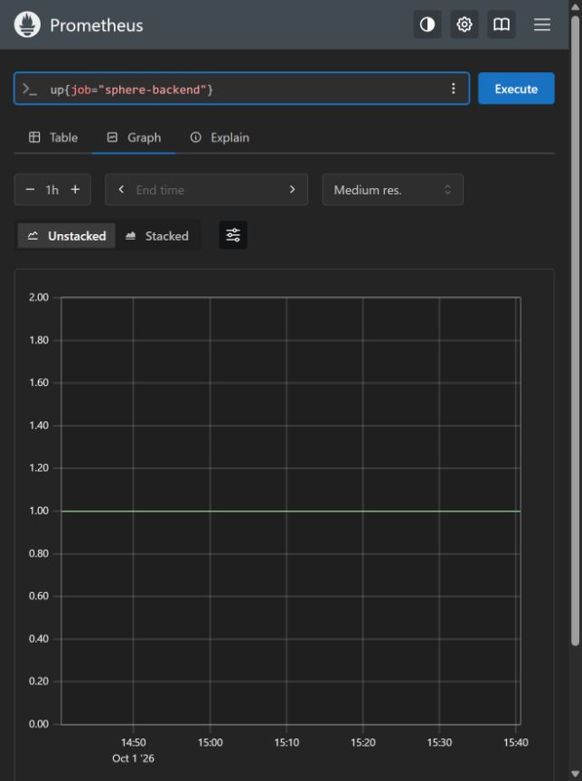

# Sphere Platform — полный аудит веб-интерфейса и возможностей backend

Дата: **1 октября 2026**. Режим: **анализ без изменения приложения и данных**.

**Вердикт:** интерфейс ещё нельзя принять как законченный административный продукт. Основные разделы и настоящие источники данных существуют, но обнаружены ошибки сохранения, недостоверная метрика, неполные каталоги и недостающие операционные workflows. Это не заключение, что весь продукт не работает: ниже отдельно перечислены уже работающие защиты и остающиеся пробелы.

Документ фиксирует ревизию исходников, а не обещание «идеально» или сертификацию. Приложения с API, схемами и контролами нужны для прослеживаемости каждого поля и действия. Они не заменяют смысловую оценку 41 замечания и визуальное принятие.

## Навигация по документу

- [01. Границы и фактическая среда](#scope)
- [02. Доказательства, ограничения и визуальный контроль](#evidence)
- [03. Сводный реестр замечаний](#findings-index)
- [04. Подробные замечания F01–F41](#findings)
- [05. Карточки всех маршрутов](#pages)
- [06. Меню, оболочка и модальные окна](#shell)
- [07. Наполнение и информационная архитектура](#information)
- [08. Реальное время, видео и действия](#realtime)
- [09. Масштаб, доступность, дизайн и отказоустойчивость](#quality)
- [10. Порядок доработки и приёмка](#delivery)
- [A. Все REST-операции](#api-catalog)
- [B. Все схемы и поля OpenAPI](#schema-catalog)
- [C. Все найденные AST-контролы](#control-catalog)
- [D. Все декларации содержимого Dialog](#modal-catalog)
- [E. WebSocket и специальные Next API](#ws-catalog)
- [F. Роли и разрешения](#roles)
- [G. Исходные файлы, тесты, лицензии и официальные ссылки](#provenance)
- [H. Все декларации меню, вкладок, опций и форм](#menu-catalog)

## 01. Границы и фактическая среда

Последний запрос пользователя задаёт остановку изменений: посмотреть все страницы/меню, искать и доказывать недоработки, подготовить подробный документ. Разрешённый результат этой проходки — документация и доказательства анализа.

В этой проходке не изменялись frontend/backend/APK, конфигурация туннелей, runtime-процессы и бизнес-данные. Не запускались удаление устройств, Discovery Scan, Reboot, shell, Android Logcat-команды, автоматизация, запуск стрима, OTA, публикация релизов и развёртывание. Не выполнялся login/refresh, который создал бы новый сеанс.

Прочитаны исходники и контракты; выполнены AST-инвентаризация, девять изолированных проверок исходных выражений/сериализации, GET-проверки и просмотр допустимой поверхности браузера. Созданы только артефакты аудита. Сборка и новые функциональные тесты не запускались.

- Аудируемый source HEAD: `1354d66660041ba17afb64399d567ca29dd91866`; branch `codex/enterprise-audit-20260905`.
- PR: [#19](https://github.com/RootOne1337/sphere-platform/pull/19), draft; merge/deploy в этой работе не выполнялись.
- Исторически установленный review frontend: `8f615c6`, локальный UI `3015` через relay к `3023`; источник и текущая визуальная поверхность не отождествляются.
- Свежий GET backend build: `8d64ca453e1028f37923c877523dbfe85acaad21`, service `backend-api`, version `4.0.0`; readyz отвечает `ready`.
- Старый fleet snapshot 19 записей / 14 online / 5 offline относится к предыдущей проходке. В этом аудите актуальный authenticated fleet snapshot не получен.
- Ранее адресно установленные APK canary `1.2.40-dev/10240` на PH010/PH025 — историческое состояние. В этой проходке версии каждого Android не перечитывались и массовое обновление не объявляется завершённым.
- Часовой пояс документа: Asia/Yekaterinburg UTC+5. Evidence JSON хранит точное UTC-время наблюдения.
- Документ сформирован: `2026-10-01T16:43:44.720960+00:00`. Время генерации не является временем измерения каждого источника.

| Покрытие | Количество | Что именно посчитано |
|---|---:|---|
| Frontend source files | 156 | Файлы в AST-наборе; не claim чтения каждой строки вручную |
| Page declarations | 30 | page.tsx; два объявления root route |
| Уникальные маршруты | 29 | С учётом скрытых, detail, login и builder |
| AST-контролы | 565 | JSX-декларации; повторяемые строки/обёртки не равны 565 живым кнопкам |
| Dialog content | 41 | Декларации DialogContent/Dialog.Content; не число открытых окон |
| Menu/tab/options/forms | 266 | Дополнительный JSX-индекс; пересекается с controls, не число бизнес-действий |
| REST-операции | 169 | Checked-in OpenAPI, сопоставленный с router AST |
| Схемы | 151 | OpenAPI components/schemas |
| Поля | 1112 | Top-level properties схем; вложенность через refs |
| WebSocket handlers | 4 | Android, browser stream, fleet events, legacy PC agent |
| Замечания | 41 | Ошибки исходников, недостающие workflows и риски разделены |
| Изолированные проверки | 9 | Не React/browser/Android E2E |

## 02. Доказательства, ограничения и визуальный контроль

### 02.1 Уровни доказательств

- **S — source:** обнаружена конкретная ветка, формула, payload или отсутствие маршрута в проверенном коде. Не утверждается, что ошибка уже произошла в действующих данных.
- **C — capability gap:** backend/Android даёт возможность, для которой не найден законченный операторский workflow. Это не отказ существующей кнопки.
- **R — risk/acceptance gap:** значимый риск или непроверенная часть. Не выдаётся за воспроизведённый сбой.
- **GET:** ответ конкретного URL в указанное время. Не доказательство полного бизнес-процесса или плавности видео.
- **V-current:** свежая допустимая визуальная поверхность.
- **V-history:** сохранённый снимок другой ревизии; только историческое свидетельство компоновки.

Приоритеты: P1 — достоверность или риск неправильной записи; P2 — существенный операторский workflow/масштаб/управление; P3 — расширение уже существующей модели. P0 не назначен: доказанной аварии/потери данных этой проходкой не получено.

### 02.2 Текущие GET-проверки

13 запросов выполнены около 15:56:42 UTC / 20:56:42 UTC+5. Сохранены статус, время, форма ответа и разрешённые агрегаты; токены, cookies и строки пользователей/устройств не опубликованы.

Истёкший сохранённый private JWT дал 401 на защищённых чтениях. Это ожидаемый отказ аутентификации; считать его доказательством offline всех Android или неисправности API нельзя. Сеанс не обновлялся в read-only проходке.

| GET `/api/v1…` | Статус | Результат | UTC |
|---|---:|---|---|
| `/health/build` | 200 | revision 8d64ca4 / backend-api / 4.0.0 | 2026-10-01T15:56:42.524504+00:00 |
| `/health/readyz` | 200 | ready | 2026-10-01T15:56:42.525792+00:00 |
| `/devices?per_page=1` | 401 | expired-session отказ; данных нет | 2026-10-01T15:56:42.526091+00:00 |
| `/tasks?per_page=1` | 401 | expired-session отказ; данных нет | 2026-10-01T15:56:42.638788+00:00 |
| `/scripts?per_page=1` | 401 | expired-session отказ; данных нет | 2026-10-01T15:56:42.639366+00:00 |
| `/pipelines?per_page=1` | 401 | expired-session отказ; данных нет | 2026-10-01T15:56:42.645344+00:00 |
| `/schedules?per_page=1` | 401 | expired-session отказ; данных нет | 2026-10-01T15:56:42.646218+00:00 |
| `/groups` | 401 | expired-session отказ; данных нет | 2026-10-01T15:56:42.655074+00:00 |
| `/locations` | 401 | expired-session отказ; данных нет | 2026-10-01T15:56:42.661794+00:00 |
| `/users?per_page=1` | 401 | expired-session отказ; данных нет | 2026-10-01T15:56:42.662292+00:00 |
| `/updates/` | 401 | expired-session отказ; данных нет | 2026-10-01T15:56:42.669521+00:00 |
| `/monitoring/nodes` | 401 | expired-session отказ; данных нет | 2026-10-01T15:56:42.672698+00:00 |
| `/monitoring/metrics` | 401 | expired-session отказ; данных нет | 2026-10-01T15:56:42.680166+00:00 |

Перед завершением документа повторно прочитан public health, без credentials; результаты:

- `/api/v1/health/build`: HTTP 200, `{"service":"backend-api","version":"4.0.0","revision":"8d64ca453e1028f37923c877523dbfe85acaad21"}`; UTC `2026-10-01T16:42:51.473171+00:00`.
- `/api/v1/health/readyz`: HTTP 200, `{"status":"ready"}`; UTC `2026-10-01T16:42:51.488185+00:00`.

### 02.3 Девять проверок исходного контракта

Все девять проверок завершились успешно в смысле подтверждения найденного условия. «Passed» здесь означает, что доказательство дефекта/условия совпало с исходником; это не означает исправленный продукт.

- **PASS-RATE-FORMULA**: Actual JSX expression returns 100% for nodesExecuted=1 and failedNodes=1; failedNodes is not consulted.
  Метод: source-condition / isolated expression; no HTTP mutation; SHA-256 файла: `db277bed43a1d6466c3dc0232098ca5586b67ef4e1d62003d0f1f6a10fc7fd31`; live browser reproduced: **нет**.
- **TASK-ERROR-AS-NOT-FOUND**: Page does not consume the detail-query error state before its not-found branch.
  Метод: source-condition / isolated expression; no HTTP mutation; SHA-256 файла: `db277bed43a1d6466c3dc0232098ca5586b67ef4e1d62003d0f1f6a10fc7fd31`; live browser reproduced: **нет**.
- **LOCATION-CLEAR-OMITTED**: Clearing both controls serializes to an object with neither optional property; PUT cannot convey the requested clear.
  Метод: source-condition / isolated expression; no HTTP mutation; SHA-256 файла: `63bf518720477bdfde79490385a862c499f5a1496b70e9f7bbe1a6224db18a2f`; live browser reproduced: **нет**.
- **ACCOUNT-LAWFULNESS-OMITTED**: Create dialog stores lawfulness, but the complete submit function does not reference it.
  Метод: source-condition / isolated expression; no HTTP mutation; SHA-256 файла: `54fe46eb6a0d57152a511849c8e85645680a8aef340fd32dd775553c453ffe55`; live browser reproduced: **нет**.
- **ACCOUNT-DEBOUNCE-CLEANUP**: Cleanup is returned from an event callback; it is not the cleanup of a React effect and the caller does not use it.
  Метод: source-condition / isolated expression; no HTTP mutation; SHA-256 файла: `54fe46eb6a0d57152a511849c8e85645680a8aef340fd32dd775553c453ffe55`; live browser reproduced: **нет**.
- **EDITOR-FAILED-LOAD-SAVE**: Load failure sets loaded=true. Save is disabled for saving only; it can export the initial graph to the existing script ID.
  Метод: source-condition / isolated expression; no HTTP mutation; SHA-256 файла: `cc50a0f9bfeb4a7d48c90dc99723b97ff150c3d1cdcf1a7a64b2d261a491f916`; live browser reproduced: **нет**.
- **CONFIG-DIRTY-RESET**: Every changed settings cache value reinitializes the local form without a dirty guard.
  Метод: source-condition / isolated expression; no HTTP mutation; SHA-256 файла: `9a9d4acd1fd5a22b584d90f799c81f99f995f394e4063585e78b8050267bca32`; live browser reproduced: **нет**.
- **OTA-UNFENCED-FILTER-READ**: Concurrent filter reads can commit in completion order, with no latest-request owner check.
  Метод: source-condition / isolated expression; no HTTP mutation; SHA-256 файла: `628b360231e370f7fc4f80510e61850bfb2347109073e8c9d4ec03618527ca12`; live browser reproduced: **нет**.
- **TASK-SCREENSHOT-ROUTE**: Task image uses /api/files/{key}; no corresponding Next API route exists in the audited source. Backend supplies /tasks/{id}/screenshots.
  Метод: source-condition / isolated expression; no HTTP mutation; SHA-256 файла: `db277bed43a1d6466c3dc0232098ca5586b67ef4e1d62003d0f1f6a10fc7fd31`; live browser reproduced: **нет**.

### 02.4 Текущий визуальный контроль

**Открытый пробел:** полный свежий визуальный обход Sphere не выполнен. Встроенный браузер ранее явно отклонил URL `3015/login` по своей URL policy. Этот запрет не обходился другим браузером, Playwright, CDP, localhost-алиасом, прокси или renderer. Здесь нельзя честно поставить отметку «визуально проверены все страницы».

В доступном пользовательском tab Prometheus выполнено read-only обновление. На свежем изображении запрос `up{job="sphere-backend"}` за час показывает 1.0 для backend:8000. Это доказывает успешный scrape в наблюдаемом диапазоне, а не здоровье стрима/APK/DB-операций. В первоначально открытой старой вкладке было предупреждение server time out of sync; после reload оно исчезло. Постоянный clock skew не доказан.

Сохранённые изображения Sphere прочитаны визуально, но относятся к более старым ревизиям:

- `devices-96ea973-desktop.png`: светлая AdminCN-inspired оболочка, summary/filters/table, page-scope объяснение агрегатов; это не снимок текущего UI.
- `device-inspector-4018756-desktop.png`: тёмная PH025-карточка, tabs/summary/telemetry и версия 1.2.34; это не подтверждение текущей установленной версии.
- `device-inspector-0e04459-mobile.png`: мобильный inspector 390×844, вкладки 3+2 и вертикальный scroll; текущая доступность всех controls не подтверждается этим старым кадром.

Исторические снимки содержат идентификаторы среды, поэтому не копируются в публичный audit bundle. В evidence manifest записаны только путь, ревизия и SHA-256.

### 02.5 CI

Свежая read-only проверка PR #19 показала SUCCESS для frontend tests/types/build, backend tests/lint/RLS/Alembic/bootstrap/security, Android tests/signed smoke и repository guard. Deploy — **SKIPPED**. Это относится к исходникам PR, а не автоматически к запущенному UI. Новая сборка этой проходкой не создавалась.

Источники: [backend run](https://github.com/RootOne1337/sphere-platform/actions/runs/36868959684), [frontend run](https://github.com/RootOne1337/sphere-platform/actions/runs/36868959701), [Android run](https://github.com/RootOne1337/sphere-platform/actions/runs/36868959770), [guard/deploy run](https://github.com/RootOne1337/sphere-platform/actions/runs/36868959937).

### 02.6 Контрпримеры, которые предотвращают неверные выводы

- Современные Events, Sessions, Groups, Locations разделяют load error и empty. F09 нельзя переносить на все страницы.
- Bulk delete имеет специальное подтверждение и тесты; legacy F24 — другой маршрут, не доказательство текущего отказа DEL.
- У RunScriptModal/DeviceSelector есть неполнота списка/owner guards; не заявляется, что «все» всегда означает тихие первые 1000 устройств.
- Grid использует активный H.264 DeviceStream. Это не уже реализованная сетка дешёвых JPEG-скриншотов.
- Diagnostic polling 15 секунд включается открытым diagnostic panel; это не автоматические 64 диагностических poller на всех плитках.
- Некоторые DialogContent уже имеют max-height/scroll. F22 относится к базовому контракту и конкретным формам без ограничения высоты.
- Current command palette уже имеет initial focus, Tab wrap, Escape и inert вложенного меню. Пробел — restore focus и полнота навигации.
- Current single viewer имеет pointer-events-none у status banner и допускает static input при enableStaticInput; прежний скриншот блокировки не доказывает, что та же ошибка остаётся в HEAD.
- Settings/TeamTab.tsx и старый src/components/streaming/DeviceStream.tsx не достигаются активными page imports; их controls не выдаются за действующий основной workflow. /fleet доступен напрямую, но не находится в sidebar.
- В WebSocket AST guards пусты, поскольку аутентификация может выполняться внутри handshake. Это не признак открытого доступа.
- Отсутствие exact static `api.*` match не равно отсутствию UI: authApi, WebSocket и dynamic paths требуют отдельной проверки.
- Legacy PC-agent endpoint существует в репозитории, но не является новым обязательным Windows-компонентом Android-only архитектуры.
CI metadata в evidence дополнительно фиксирует exact headRefOid `1354d66660041ba17afb64399d567ca29dd91866`, состояние draft и даты completion каждого check. Новые GitHub checks этим аудитом не создавались.

## 03. Сводный реестр замечаний

| ID | Приоритет | Основание | Замечание |
|---|---|---|---|
| [F01](#f01) | P1 | S | Задание: недостоверный Pass Rate |
| [F02](#f02) | P1 | S | Задание: ошибка API подменяется отсутствием записи |
| [F03](#f03) | P1 | S | Редактор: разрешена запись после провала загрузки DAG |
| [F04](#f04) | P1 | S | Настройки pipeline: можно сохранить неподтверждённые defaults |
| [F05](#f05) | P1 | S | Настройки pipeline: несохранённая форма сбрасывается |
| [F06](#f06) | P2 | S | Локации: очистка текста не передаётся серверу |
| [F07](#f07) | P2 | S | Аккаунты: законопослушность не отправляется при создании |
| [F08](#f08) | P2 | S | Аккаунты: debounce фактически не отменяет прошлые таймеры |
| [F09](#f09) | P2 | S | Аккаунты и триггеры: ошибка списка выглядит пустым каталогом |
| [F10](#f10) | P2 | S | OTA: поздний ответ фильтра может заменить новый |
| [F11](#f11) | P2 | S | OTA: ошибка соседствует с ложным empty state |
| [F12](#f12) | P2 | S | Сценарии: первая страница без доступа к остальным |
| [F13](#f13) | P2 | S | Оркестрация: три списка обрезаны до 100 записей |
| [F14](#f14) | P2 | S | Триггеры: поиск ограничен первыми 100 |
| [F15](#f15) | P2 | S | Логи: выбрать устройство можно только из первой страницы |
| [F16](#f16) | P2 | S | Задание: несогласованный путь к скриншотам шагов |
| [F17](#f17) | P2 | S | Задание: restart теряет параметры оригинала |
| [F18](#f18) | P2 | S | Задание: ошибки Stop/Cancel/Restart не показаны |
| [F19](#f19) | P2 | S | Обнаружение: текст противоречит auto-register |
| [F20](#f20) | P2 | S | Обнаружение: заголовок результата использует новый CIDR |
| [F21](#f21) | P2 | S | Мобильное меню: offscreen ссылки остаются активными |
| [F22](#f22) | P2 | S | Общий DialogContent: нет ограничения высоты по умолчанию |
| [F23](#f23) | P2 | S | Command palette: частичная навигация и нет restore focus |
| [F24](#f24) | P2 | S | Legacy /fleet: настоящая кнопка без действия |
| [F25](#f25) | P2 | C | Группы: редактирование и состав не раскрыты |
| [F26](#f26) | P3 | C | Локации: backend география/иерархия не доступны в форме |
| [F27](#f27) | P2 | C | Сценарии: архив/rollback есть в backend, нет workflow |
| [F28](#f28) | P2 | C | Pipeline: отсутствует полноценный detail/edit workflow |
| [F29](#f29) | P2 | C | Расписания: нет доступа к истории срабатываний |
| [F30](#f30) | P2 | S | Расписание one-shot: ISO offset подаётся в datetime-local |
| [F31](#f31) | P2 | S | VPN → Logs теряет контекст устройства |
| [F32](#f32) | P2 | S | VPN: mutate без отображения ошибок/результатов |
| [F33](#f33) | P2 | C | OTA: recovery и адресный rollout не доступны оператору |
| [F34](#f34) | P2 | C | Матричный режим использует полноценный H.264 для каждого окна |
| [F35](#f35) | P2 | C | XPath-инспектор на видеокарточке ещё отсутствует |
| [F36](#f36) | P2 | C | Управление quality/FPS не раскрыто в single stream |
| [F37](#f37) | P2 | C | Аудит: фильтры и CSV действуют на текущую страницу |
| [F38](#f38) | P2 | C | Пользователи: форма не связывает backend validation с полями |
| [F39](#f39) | P2 | R | Role-aware оболочка не закрывает UX отказов доступа |
| [F40](#f40) | P2 | R | Низкая полнота текущего визуального acceptance |
| [F41](#f41) | P2 | R | Зелёный CI не покрывает перечисленные operator outcomes |

Итоги приоритетов: P1: 5, P2: 35, P3: 1.
Итоги оснований: C: 11, R: 3, S: 27.

Все замечания имеют статус **выявлено / исправление не выполнялось в этой проходке**. Приёмочные сценарии ниже — будущее проверяемое условие закрытия, а не выполненный тест.

## 04. Подробные замечания

### F01. Задание: недостоверный Pass Rate

- Приоритет: **P1**; основание: **S**; статус: **открыто**.
- Source: [frontend/app/(dashboard)/tasks/[id]/page.tsx:276](https://github.com/RootOne1337/sphere-platform/blob/1354d66660041ba17afb64399d567ca29dd91866/frontend/app/%28dashboard%29/tasks/%5Bid%5D/page.tsx#L276); SHA-256: `db277bed43a1d6466c3dc0232098ca5586b67ef4e1d62003d0f1f6a10fc7fd31`.
- Якорь: `label="Pass Rate"`.
- Найдено: Значение равно 100%, если nodesExecuted > 0; success/error отдельных шагов не участвуют в расчёте. Комментарий прямо называет это эстетическим приближением.
- Влияние: Оператор получает положительную оценку выполнения при наличии неуспешных шагов. Метрика непригодна для triage и сравнения качества сценариев.
- Доказательство и предел вывода: Изолированное вычисление действующего JSX-выражения: один выполненный и один неуспешный шаг → 100%. Это доказательство формулы, не живой запуск задания.
- Предлагаемая доработка, сейчас не выполнена: Считать успешные/оценённые попытки по согласованному контракту; до получения знаменателя показывать «не измерено». Не смешивать шаги, циклы и задачи.
- Приёмка после изменения: Наборы all-success / mixed / all-failed / no-report / retry / loop должны показывать разные корректные значения и явную область расчёта.

### F02. Задание: ошибка API подменяется отсутствием записи

- Приоритет: **P1**; основание: **S**; статус: **открыто**.
- Source: [frontend/app/(dashboard)/tasks/[id]/page.tsx:63](https://github.com/RootOne1337/sphere-platform/blob/1354d66660041ba17afb64399d567ca29dd91866/frontend/app/%28dashboard%29/tasks/%5Bid%5D/page.tsx#L63); SHA-256: `db277bed43a1d6466c3dc0232098ca5586b67ef4e1d62003d0f1f6a10fc7fd31`.
- Якорь: `const { data: task, isLoading }`.
- Найдено: Страница не читает isError из useTask и после окончания загрузки при !task выводит Task not found.
- Влияние: 401/403/500/timeout выглядят как потерянное задание; пользователь не видит причину и корректный способ восстановления.
- Доказательство и предел вывода: При первом неуспешном чтении query.data отсутствует; исходник направляет такой результат в ту же ветку, что и 404. Текущий 404 в браузере не воспроизводился.
- Предлагаемая доработка, сейчас не выполнена: Развести 404, отказ доступа, истечение сеанса, сетевую ошибку и сохранённые данные. Добавить повтор чтения без повторного выполнения задания.
- Приёмка после изменения: Замонтировать страницу с ответами 404/403/500/timeout и cached+error; только настоящий 404 может называться отсутствием записи.

### F03. Редактор: разрешена запись после провала загрузки DAG

- Приоритет: **P1**; основание: **S**; статус: **открыто**.
- Source: [frontend/app/(dashboard)/scripts/builder/page.tsx:253](https://github.com/RootOne1337/sphere-platform/blob/1354d66660041ba17afb64399d567ca29dd91866/frontend/app/%28dashboard%29/scripts/builder/page.tsx#L253); SHA-256: `cc50a0f9bfeb4a7d48c90dc99723b97ff150c3d1cdcf1a7a64b2d261a491f916`.
- Якорь: `if (!cancelled) setLoaded(true)`.
- Найдено: catch оставляет начальный граф; finally включает loaded; Save заблокирован только saving. При editId handleSave отправляет PUT существующему сценарию.
- Влияние: Правка существующего сценария после ошибки чтения может заменить его граф первоначальным шаблоном. validateDag проверяет связи/End, но не факт успешного чтения ресурса.
- Доказательство и предел вывода: Исходные ветки и условия кнопки проверены; фактическое повреждение сценария не выполнялось. Backend вправе отвергнуть часть графов, но UI не должен опираться на это как на защиту загрузки.
- Предлагаемая доработка, сейчас не выполнена: Разрешать редактирование/сохранение существующего сценария только после подтверждённой загрузки его версии; дать retry, исходную версию и защиту от конфликтов.
- Приёмка после изменения: GET существующего DAG → timeout/500: Save недоступен, PUT не отправлен; успешный retry открывает исходный граф; смена id не сохраняет предыдущий граф.

### F04. Настройки pipeline: можно сохранить неподтверждённые defaults

- Приоритет: **P1**; основание: **S**; статус: **открыто**.
- Source: [frontend/app/(dashboard)/pipeline-settings/page.tsx:59](https://github.com/RootOne1337/sphere-platform/blob/1354d66660041ba17afb64399d567ca29dd91866/frontend/app/%28dashboard%29/pipeline-settings/page.tsx#L59); SHA-256: `9a9d4acd1fd5a22b584d90f799c81f99f995f394e4063585e78b8050267bca32`.
- Якорь: `const { data: settings, isLoading }`.
- Найдено: Форма начинается с локальных defaults; isError/isSuccess не проверяются. После ошибки чтения экран доступен; изменение поля и Save отправляют полный набор локальных значений.
- Влияние: Неудачное чтение может привести к перезаписи реально существующих параметров оркестрации значениями, которых оператор не видел на сервере.
- Доказательство и предел вывода: Подтверждено цепочкой page state → handleSave → useUpdatePipelineSettings PATCH. Никакой настройки в работающем backend аудит не менял.
- Предлагаемая доработка, сейчас не выполнена: Блокировать запись до успешного актуального чтения; сохранять намеренные поля, показывать baseline/version и корректный отказ доступа.
- Приёмка после изменения: Первый GET 500/401: редактирование/Save не доступны. Cached+error явно помечен. PATCH не должен содержать неподтверждённые defaults.

### F05. Настройки pipeline: несохранённая форма сбрасывается

- Приоритет: **P1**; основание: **S**; статус: **открыто**.
- Source: [frontend/app/(dashboard)/pipeline-settings/page.tsx:104](https://github.com/RootOne1337/sphere-platform/blob/1354d66660041ba17afb64399d567ca29dd91866/frontend/app/%28dashboard%29/pipeline-settings/page.tsx#L104); SHA-256: `9a9d4acd1fd5a22b584d90f799c81f99f995f394e4063585e78b8050267bca32`.
- Якорь: `setIsDirty(false)`.
- Найдено: Effect на settings всегда setForm/setIsDirty(false), без dirty guard. Toggle hook кладёт новый ответ в тот же query cache; повтор чтения при focus тоже может изменить settings.
- Влияние: Изменённые поля теряются после отдельного переключателя или обновления данных. UI сообщает «не dirty» и скрывает необходимость сохранения.
- Доказательство и предел вывода: Проверены effect и onSuccess toggle → qc.setQueryData. Не заявляется, что любой refetch всегда сбрасывает форму: TanStack может сохранить ссылку для одинакового ответа.
- Предлагаемая доработка, сейчас не выполнена: Отделить baseline, draft и server state; согласовывать частичные toggle-ответы, предупреждать о конфликте, сохранять draft при изменении unrelated полей.
- Приёмка после изменения: Изменить notes без Save, затем toggle scheduler; notes/dirtiness сохраняются. Отдельно проверить refetch с изменённым серверным значением и выбор resolve/reload.

### F06. Локации: очистка текста не передаётся серверу

- Приоритет: **P2**; основание: **S**; статус: **открыто**.
- Source: [frontend/app/(dashboard)/locations/page.tsx:84](https://github.com/RootOne1337/sphere-platform/blob/1354d66660041ba17afb64399d567ca29dd91866/frontend/app/%28dashboard%29/locations/page.tsx#L84); SHA-256: `63bf518720477bdfde79490385a862c499f5a1496b70e9f7bbe1a6224db18a2f`.
- Якорь: `editDescription.trim() || undefined`.
- Найдено: Пустые description/address превращаются в undefined и исчезают при JSON serialization. Backend меняет эти поля только при ненулевом присланном значении.
- Влияние: Оператор удаляет текст, сохраняет, получает успешный ответ, но старое значение остаётся.
- Доказательство и предел вывода: Изолированная сериализация даёт {} для двух очищенных полей; service проверяет is not None. Backend допускает пустую строку, поэтому нельзя предлагать null без изменения контракта.
- Предлагаемая доработка, сейчас не выполнена: Согласовать clear-семантику: для существующего контракта отправлять намеренно пустую строку либо явно расширить backend clear/null; отличать untouched от cleared.
- Приёмка после изменения: Существующее описание/адрес → пусто → сохранение → повтор GET: пустое значение. Неправленное поле должно сохраниться.

### F07. Аккаунты: законопослушность не отправляется при создании

- Приоритет: **P2**; основание: **S**; статус: **открыто**.
- Source: [frontend/app/(dashboard)/accounts/page.tsx:727](https://github.com/RootOne1337/sphere-platform/blob/1354d66660041ba17afb64399d567ca29dd91866/frontend/app/%28dashboard%29/accounts/page.tsx#L727); SHA-256: `54fe46eb6a0d57152a511849c8e85645680a8aef340fd32dd775553c453ffe55`.
- Якорь: `const [lawfulness, setLawfulness]`.
- Найдено: CreateAccountDialog хранит значение lawfulness и рисует input, но handleSubmit не включает его в payload. Backend CreateGameAccountRequest поддерживает поле.
- Влияние: Введённое оператором значение теряется; интерфейс создаёт впечатление сохранённой информации.
- Доказательство и предел вывода: Проверен полный handleSubmit create-диалога и backend schema. У edit-формы есть другая ветка lawfulness: утверждение касается именно create.
- Предлагаемая доработка, сейчас не выполнена: Передавать валидированное целое 0–100; отличать 0 от отсутствия; связывать 422 с полем.
- Приёмка после изменения: Создать в изолированной среде со значениями 0/37/100 и прочитать запись; -1/101/дробь должны отклоняться понятным сообщением.

### F08. Аккаунты: debounce фактически не отменяет прошлые таймеры

- Приоритет: **P2**; основание: **S**; статус: **открыто**.
- Source: [frontend/app/(dashboard)/accounts/page.tsx:151](https://github.com/RootOne1337/sphere-platform/blob/1354d66660041ba17afb64399d567ca29dd91866/frontend/app/%28dashboard%29/accounts/page.tsx#L151); SHA-256: `54fe46eb6a0d57152a511849c8e85645680a8aef340fd32dd775553c453ffe55`.
- Якорь: `return () => clearTimeout(timer)`.
- Найдено: Функция очистки возвращается из event callback useCallback, а не useEffect. onChange не вызывает возврат; каждый ввод создаёт свой timer.
- Влияние: Быстрый поиск вызывает лишние запросы и промежуточные значения; на больших реестрах ухудшается отзывчивость.
- Доказательство и предел вывода: Проверен callback и его вызов. React не воспринимает возвращённую onChange функцию как lifecycle cleanup.
- Предлагаемая доработка, сейчас не выполнена: Использовать существующий useDebounce или ref+явную отмену; при уходе со страницы отменять timer.
- Приёмка после изменения: Fake timers: пять вводов за 250 мс → ровно один итоговый debounced value, отмена при unmount, сброс page один раз.

### F09. Аккаунты и триггеры: ошибка списка выглядит пустым каталогом

- Приоритет: **P2**; основание: **S**; статус: **открыто**.
- Source: [frontend/app/(dashboard)/event-triggers/page.tsx:99](https://github.com/RootOne1337/sphere-platform/blob/1354d66660041ba17afb64399d567ca29dd91866/frontend/app/%28dashboard%29/event-triggers/page.tsx#L99); SHA-256: `4ff9bf1bcf3793810eccf9c95e311d7b861ee4ee661a04cc7c9c4723e32e20cf`.
- Якорь: `const { data, isLoading, refetch }`.
- Найдено: EventTriggers не использует query isError и при !isLoading/пустом items рисует «Нет триггеров». Accounts аналогично не читает isError и подставляет items/total defaults.
- Влияние: Отказ доступа или сетевой сбой воспринимается как отсутствие сущностей, провоцируя повторное создание.
- Доказательство и предел вывода: Исходные состояния списка и empty branches подтверждены. Events, Sessions, Groups и Locations уже разделяют ошибки и пустоту; переносить обвинение на них нельзя.
- Предлагаемая доработка, сейчас не выполнена: Единый query-state контракт с initial error, cached-stale, empty, recovery; отдельные состояния зависимостей для stats/options.
- Приёмка после изменения: Для каждой из двух страниц: 500 без cache не даёт empty; stale+error сохраняет данные с датой; retry не запускает mutations.

### F10. OTA: поздний ответ фильтра может заменить новый

- Приоритет: **P2**; основание: **S**; статус: **открыто**.
- Source: [frontend/app/(dashboard)/updates/page.tsx:51](https://github.com/RootOne1337/sphere-platform/blob/1354d66660041ba17afb64399d567ca29dd91866/frontend/app/%28dashboard%29/updates/page.tsx#L51); SHA-256: `628b360231e370f7fc4f80510e61850bfb2347109073e8c9d4ec03618527ca12`.
- Якорь: `const fetchReleases = async`.
- Найдено: useReleases использует useEffect/fetch и setData без AbortController, sequence либо queryKey. Несколько запросов фильтров могут завершиться в обратном порядке.
- Влияние: Видимый platform/flavor не гарантирует принадлежность отображаемого release list; особенно опасно рядом с публикацией и удалением релизов.
- Доказательство и предел вывода: Проверен fetch owner: в отличие от других current query hooks он отсутствует. Реальную перестановку ответов на production не внедряли.
- Предлагаемая доработка, сейчас не выполнена: Перенести reads на query keyed by filters либо owner-fenced request; явно помечать текущие фильтры и загрузку.
- Приёмка после изменения: Два deferred ответа A/B, B завершился первым: после A список остаётся B; unmount/session switch не меняют активный экран.

### F11. OTA: ошибка соседствует с ложным empty state

- Приоритет: **P2**; основание: **S**; статус: **открыто**.
- Source: [frontend/app/(dashboard)/updates/page.tsx:280](https://github.com/RootOne1337/sphere-platform/blob/1354d66660041ba17afb64399d567ca29dd91866/frontend/app/%28dashboard%29/updates/page.tsx#L280); SHA-256: `628b360231e370f7fc4f80510e61850bfb2347109073e8c9d4ec03618527ca12`.
- Якорь: `!loading && releases.length === 0`.
- Найдено: Ветка empty не требует !error, поэтому initial request failure одновременно рисует Error и No releases yet.
- Влияние: Оператор видит противоречивое состояние каталога и не может уверенно отличить отсутствие публикаций от недоступности API.
- Доказательство и предел вывода: Условие render проверено в исходнике; это условная воспроизводимость, а не screenshot текущего браузера.
- Предлагаемая доработка, сейчас не выполнена: Разделить query state; показывать сохранённые releases только с явной stale-пометкой; дать повтор чтения.
- Приёмка после изменения: GET 500 без данных → только error/retry; успешный [] → только empty; cached+500 → stale catalog.

### F12. Сценарии: первая страница без доступа к остальным

- Приоритет: **P2**; основание: **S**; статус: **открыто**.
- Source: [frontend/app/(dashboard)/scripts/page.tsx:15](https://github.com/RootOne1337/sphere-platform/blob/1354d66660041ba17afb64399d567ca29dd91866/frontend/app/%28dashboard%29/scripts/page.tsx#L15); SHA-256: `f0089cbebd3518712427f1694fbef8095e11143a70553985744b83e12511f90c`.
- Якорь: `useScripts()`.
- Найдено: Страница вызывает useScripts без page/query и не содержит управления пагинацией/поиском. Backend default per_page=50, поддерживает page/query.
- Влияние: 51-й и последующие сценарии нельзя найти из каталога; сообщение «показано из total» сообщает ограничение, но не даёт действия.
- Доказательство и предел вывода: Сопоставлены page, useScripts и router Query. Это не баг ограничения backend, а неполная интеграция его возможностей.
- Предлагаемая доработка, сейчас не выполнена: Server-side поиск и пагинация, permalink на выбранный сценарий, отсутствие тихого обрезания picker options.
- Приёмка после изменения: 51/201 сценарий: последний находится по поиску и через следующую страницу; фильтр меняет page на 1 и total соответствует области.

### F13. Оркестрация: три списка обрезаны до 100 записей

- Приоритет: **P2**; основание: **S**; статус: **открыто**.
- Source: [frontend/app/(dashboard)/orchestration/page.tsx:173](https://github.com/RootOne1337/sphere-platform/blob/1354d66660041ba17afb64399d567ca29dd91866/frontend/app/%28dashboard%29/orchestration/page.tsx#L173); SHA-256: `2e08f1028010ca3080eb9ba343ba6a90ff69b93d4cff3b9911058d634d8d0e36`.
- Якорь: `/pipelines/runs?per_page=100`.
- Найдено: Pipelines/runs/schedules читают одну страницу по 100; parseListItems возвращает только items, total/pages исчезают. Видимые счётчики считаются по этим массивам.
- Влияние: При количестве >100 оператор не видит остальной парк автоматизации; агрегаты нельзя читать как общий итог организации.
- Доказательство и предел вывода: Проверены три hooks и helper listPayload. Наличие корректных error notices не решает loss of pagination metadata.
- Предлагаемая доработка, сейчас не выполнена: Сохранить envelope, server filters/paging и область агрегатов; разделить активную очередь и историю завершений.
- Приёмка после изменения: 101 run/schedule/pipeline: вся область доступна; totals не равны случайному размеру первой страницы; поиск находит запись за первой страницей.

### F14. Триггеры: поиск ограничен первыми 100

- Приоритет: **P2**; основание: **S**; статус: **открыто**.
- Source: [frontend/app/(dashboard)/event-triggers/page.tsx:95](https://github.com/RootOne1337/sphere-platform/blob/1354d66660041ba17afb64399d567ca29dd91866/frontend/app/%28dashboard%29/event-triggers/page.tsx#L95); SHA-256: `4ff9bf1bcf3793810eccf9c95e311d7b861ee4ee661a04cc7c9c4723e32e20cf`.
- Якорь: `per_page: 100`.
- Найдено: query не содержит page/search; клиент фильтрует только возвращённые items и не даёт перехода дальше.
- Влияние: На >100 триггерах поиск сообщает отсутствие реально существующей конфигурации.
- Доказательство и предел вывода: API router поддерживает paging. Серверный search отдельно проверяется по контракту, не предполагается автоматически.
- Предлагаемая доработка, сейчас не выполнена: Добавить paging и ясную область local search либо backend-supported search; сохранить total.
- Приёмка после изменения: 101 триггер: последний можно открыть/редактировать без ручного URL/API; локальный поиск не объявляется глобальным.

### F15. Логи: выбрать устройство можно только из первой страницы

- Приоритет: **P2**; основание: **S**; статус: **открыто**.
- Source: [frontend/app/(dashboard)/logs/page.tsx:88](https://github.com/RootOne1337/sphere-platform/blob/1354d66660041ba17afb64399d567ca29dd91866/frontend/app/%28dashboard%29/logs/page.tsx#L88); SHA-256: `93a8be12935000d2776c4831f6356e92068153960de7d85ecb60a7bc44b1325f`.
- Якорь: `useDevices({})`.
- Найдено: Selector строится из useDevices({}) с backend/default page size 50, без server search или следующей страницы.
- Влияние: Для 500–1000 устройств большая часть архивов недоступна через страницу логов.
- Доказательство и предел вывода: Проверены источник списка и markup selector. Карточка конкретного устройства имеет собственный сохранённый-log panel и частично обходится без этого списка.
- Предлагаемая доработка, сейчас не выполнена: Использовать query-driven searchable device picker с точным ID, не загружать все устройства ради выбора одного.
- Приёмка после изменения: На 501 устройствах выбрать последнее по имени/ID, URL сохраняет выбранное устройство; ошибка поиска не означает отсутствие логов.

### F16. Задание: несогласованный путь к скриншотам шагов

- Приоритет: **P2**; основание: **S**; статус: **открыто**.
- Source: [frontend/app/(dashboard)/tasks/[id]/page.tsx:516](https://github.com/RootOne1337/sphere-platform/blob/1354d66660041ba17afb64399d567ca29dd91866/frontend/app/%28dashboard%29/tasks/%5Bid%5D/page.tsx#L516); SHA-256: `db277bed43a1d6466c3dc0232098ca5586b67ef4e1d62003d0f1f6a10fc7fd31`.
- Якорь: ``src={`/api/files/${log.screenshot_key}`}``.
- Найдено: Изображение обращается к /api/files/{key}, но в Next app/api нет такого handler и backend API files не найден. Backend tasks/{id}/screenshots выдаёт presigned URLs.
- Влияние: При screenshot_key UI может неизменно показывать Screenshot unavailable, несмотря на существующий объект в storage.
- Доказательство и предел вывода: Проверены маршруты frontend/backend/rewrites. Вне репозитория может существовать отдельный proxy mapping: это нужно проверить перед утверждением о текущем 404.
- Предлагаемая доработка, сейчас не выполнена: Потреблять согласованный screenshot manifest с ownership, сроком URL и явным loading/error/retry; не гадать публичный путь storage key.
- Приёмка после изменения: Задание с реальным snapshot: картинка открывается; expired URL обновляется; чужой task/org запрещён; storage failure имеет ясную причину.

### F17. Задание: restart теряет параметры оригинала

- Приоритет: **P2**; основание: **S**; статус: **открыто**.
- Source: [frontend/app/(dashboard)/tasks/[id]/page.tsx:194](https://github.com/RootOne1337/sphere-platform/blob/1354d66660041ba17afb64399d567ca29dd91866/frontend/app/%28dashboard%29/tasks/%5Bid%5D/page.tsx#L194); SHA-256: `db277bed43a1d6466c3dc0232098ca5586b67ef4e1d62003d0f1f6a10fc7fd31`.
- Якорь: `priority: task.priority`.
- Найдено: Restart Task создаёт новую задачу только с script_id/device_id/priority; input_params и script_version_id исходной задачи не передаются.
- Влияние: Название restart обещает воспроизведение, но новая задача может исполнять другую версию и другой набор входов.
- Доказательство и предел вывода: Проверены payload страницы и тип useCreateTask. Есть backend retry endpoint; его семантику нужно выбрать явно, а не автоматически считать идентичной.
- Предлагаемая доработка, сейчас не выполнена: Развести «повторить тот же запуск» и «запустить текущую версию», показать версии/входы/новый task id.
- Приёмка после изменения: Старый version + custom input: повтор сохраняет согласованную семантику и открывает новую задачу; API error отображается, дубль не создаётся автоповтором.

### F18. Задание: ошибки Stop/Cancel/Restart не показаны

- Приоритет: **P2**; основание: **S**; статус: **открыто**.
- Source: [frontend/app/(dashboard)/tasks/[id]/page.tsx:162](https://github.com/RootOne1337/sphere-platform/blob/1354d66660041ba17afb64399d567ca29dd91866/frontend/app/%28dashboard%29/tasks/%5Bid%5D/page.tsx#L162); SHA-256: `db277bed43a1d6466c3dc0232098ca5586b67ef4e1d62003d0f1f6a10fc7fd31`.
- Якорь: `onClick={() => stopTask.mutate(task.id)}`.
- Найдено: Stop/Cancel вызывают hooks без page onError; restart имеет try/finally без catch и не использует mutation error state.
- Влияние: После отказа API кнопка перестаёт быть pending, но оператор не видит, исполнено ли действие. Неподтверждённый повтор может быть неверным.
- Доказательство и предел вывода: useCancelTask/useStopTask/useCreateTask не дают toast ошибок для этих вызовов; page не читает errors.
- Предлагаемая доработка, сейчас не выполнена: Показывать owner-bound outcome, pending/cancel requested/confirmed/unknown; не считать HTTP timeout доказательством отказа устройства.
- Приёмка после изменения: 403/409/500/timeout каждой команды: причина и state отражены; исходное задание сохраняется; повтор требует проверки неизвестного результата.

### F19. Обнаружение: текст противоречит auto-register

- Приоритет: **P2**; основание: **S**; статус: **открыто**.
- Source: [frontend/app/(dashboard)/discovery/page.tsx:67](https://github.com/RootOne1337/sphere-platform/blob/1354d66660041ba17afb64399d567ca29dd91866/frontend/app/%28dashboard%29/discovery/page.tsx#L67); SHA-256: `1e240b7df850a19ee454c6f3540d8309e722d525895c996c86f5d3cebf69ab12`.
- Якорь: `Результаты сканирования не меняют состояние устройств`.
- Найдено: Копирайт говорит, что auto-register не меняет состояние, а discovery_service создаёт устройства для request.auto_register и увеличивает registered_count.
- Влияние: Оператор не может понять, является ли действие только диагностикой или добавит сущности в каталог.
- Доказательство и предел вывода: Сопоставлены строка UI и service if not already and request.auto_register. Сканирование аудитом не запускалось.
- Предлагаемая доработка, сейчас не выполнена: Ясно разделить scan-only и scan+registration, предупредить о зоне сети/источнике, показывать registered vs found.
- Приёмка после изменения: Mock result для обоих режимов: текст совпадает с payload; auto-register off не обещает созданных записей; retry mutation явно подписан.

### F20. Обнаружение: заголовок результата использует новый CIDR

- Приоритет: **P2**; основание: **S**; статус: **открыто**.
- Source: [frontend/app/(dashboard)/discovery/page.tsx:125](https://github.com/RootOne1337/sphere-platform/blob/1354d66660041ba17afb64399d567ca29dd91866/frontend/app/%28dashboard%29/discovery/page.tsx#L125); SHA-256: `1e240b7df850a19ee454c6f3540d8309e722d525895c996c86f5d3cebf69ab12`.
- Якорь: `Подсеть <span`.
- Найдено: Результат scan mutation остаётся в data, но result header использует editable subnet state; отдельного captured request scope нет.
- Влияние: После изменения поля старые результаты могут оказаться подписаны новой сетью.
- Доказательство и предел вывода: Проверена привязка вывода к state; в живой сети scan не выполнялся.
- Предлагаемая доработка, сейчас не выполнена: Сохранять параметры конкретного запроса/receipt вместе с ответом и временем; не менять provenance при правке следующего запроса.
- Приёмка после изменения: Scan A завершился → поле заменено на B без запуска → старые результаты по-прежнему помечены A.

### F21. Мобильное меню: offscreen ссылки остаются активными

- Приоритет: **P2**; основание: **S**; статус: **открыто**.
- Source: [frontend/src/features/navigation/NOCSidebar.tsx:128](https://github.com/RootOne1337/sphere-platform/blob/1354d66660041ba17afb64399d567ca29dd91866/frontend/src/features/navigation/NOCSidebar.tsx#L128); SHA-256: `d7a950c297f32ef648a6e24cc86ecf2a7c4a8723ff6f43d857f6976308cbb235`.
- Якорь: `-translate-x-full lg:translate-x-0`.
- Найдено: Скрытие mobile aside выполнено translate; aside/nav остаются в DOM без inert/hidden. Для открытого mobile drawer нет собственного focus trap/Escape lifecycle.
- Влияние: Клавиатура может уходить в невидимое меню; открытая панель не гарантирует последовательное управление фокусом.
- Доказательство и предел вывода: Исходник не использует modal primitive/focus trap. Это source risk; текущий keyboard trace на Sphere URL заблокирован инструментом.
- Предлагаемая доработка, сейчас не выполнена: Доступный mobile drawer с правильным breakpoint/inert, Escape и возвратом фокуса; desktop nav остаётся доступным.
- Приёмка после изменения: 390×844: закрытые ссылки отсутствуют в Tab order; открытые Tab/Shift+Tab остаются в панели; Escape возвращает focus на opener.
- Критерии клавиатуры/модальности: [WAI-ARIA APG Dialog](https://www.w3.org/WAI/ARIA/apg/patterns/dialog-modal/). Это критерий проверки, не декларация compliance.

### F22. Общий DialogContent: нет ограничения высоты по умолчанию

- Приоритет: **P2**; основание: **S**; статус: **открыто**.
- Source: [frontend/components/ui/dialog.tsx:35](https://github.com/RootOne1337/sphere-platform/blob/1354d66660041ba17afb64399d567ca29dd91866/frontend/components/ui/dialog.tsx#L35); SHA-256: `94fa746aa46a8a840499d1590c9eba7f28c6dcf2eb23a77ccb84e4c3fdfffa23`.
- Якорь: `max-w-lg`.
- Найдено: Центрированный fixed content ограничивает ширину, но не высоту/внутренний scroll. Ряд длинных consumer forms не добавляет max-height/overflow, в том числе schedule и release forms.
- Влияние: На низком viewport, увеличенном тексте и экранной клавиатуре часть формы/submit может стать недоступной.
- Доказательство и предел вывода: AST зафиксировал 41 content declaration; несколько потребителей уже задают bound correctly. Само clipping на текущем Sphere не воспроизведено.
- Предлагаемая доработка, сейчас не выполнена: Единый контракт max-dvh/scroll/sticky actions и safe margins; сложные формы использовать sheet/full-screen mobile там, где это облегчает работу.
- Приёмка после изменения: Для всех 41 деклараций: 390×844, 844×390, zoom 200%, text 18px и keyboard; header/close/errors/submit достижимы без прокрутки body за modal.
- Критерии клавиатуры/модальности: [WAI-ARIA APG Dialog](https://www.w3.org/WAI/ARIA/apg/patterns/dialog-modal/). Это критерий проверки, не декларация compliance.

### F23. Command palette: частичная навигация и нет restore focus

- Приоритет: **P2**; основание: **S**; статус: **открыто**.
- Source: [frontend/src/features/navigation/GlobalCommandPalette.tsx:105](https://github.com/RootOne1337/sphere-platform/blob/1354d66660041ba17afb64399d567ca29dd91866/frontend/src/features/navigation/GlobalCommandPalette.tsx#L105); SHA-256: `75d13f6722b7cc199822b292ef10c04bdb2251ed08ad29f22a0f393383b73930`.
- Якорь: `router.push("/audit")`.
- Найдено: Палитра покрывает пять destination routes (dashboard/devices/audit/vpn/builder), а sidebar содержит 22. После закрытия opener не сохраняется и не восстанавливается.
- Влияние: Global search по разделам не находит большинство разделов; клавиатурный workflow после Escape теряет контекст.
- Доказательство и предел вывода: Проверен полный файл: начальный focus/Tab wrap/Escape уже есть. Утверждение «focus trap вообще отсутствует» было бы неверным.
- Предлагаемая доработка, сейчас не выполнена: Общий navigation registry, role-aware search и restore focus, включая opener исчезнувшей виртуальной строки.
- Приёмка после изменения: Все 22 раздела доступны по названиям/синонимам; закрытие Escape/overlay возвращает focus; themes submenu не ломает Tab.
- Критерии клавиатуры/модальности: [WAI-ARIA APG Dialog](https://www.w3.org/WAI/ARIA/apg/patterns/dialog-modal/). Это критерий проверки, не декларация compliance.

### F24. Legacy /fleet: настоящая кнопка без действия

- Приоритет: **P2**; основание: **S**; статус: **открыто**.
- Source: [frontend/app/(dashboard)/fleet/page.tsx:153](https://github.com/RootOne1337/sphere-platform/blob/1354d66660041ba17afb64399d567ca29dd91866/frontend/app/%28dashboard%29/fleet/page.tsx#L153); SHA-256: `7469bc5c328fc22702185b0a461f94ce85ea282114d954c3ad1e4633312fdd16`.
- Якорь: `<Settings2 className`.
- Найдено: Icon Button Settings2 не содержит onClick, Link либо DialogTrigger; карточки имеют cursor-pointer без action.
- Влияние: По прямому /fleet пользователю показывается видимое управление, которое ничего не выполняет. Маршрут также дублирует /groups и старый дизайн.
- Доказательство и предел вывода: Проверен consumer markup. /fleet не находится в sidebar, поэтому не следует считать этот дефект текущей кнопкой DEL на /devices.
- Предлагаемая доработка, сейчас не выполнена: Определить судьбу legacy route: согласованный redirect либо полноценный групповой интерфейс. Не оставлять пустые affordances.
- Приёмка после изменения: Прямой /fleet и старые bookmarks приводят к работающей групповой операции; keyboard/icon labels понятны.

### F25. Группы: редактирование и состав не раскрыты

- Приоритет: **P2**; основание: **C**; статус: **открыто**.
- Source: [frontend/app/(dashboard)/groups/page.tsx:4](https://github.com/RootOne1337/sphere-platform/blob/1354d66660041ba17afb64399d567ca29dd91866/frontend/app/%28dashboard%29/groups/page.tsx#L4); SHA-256: `95d723f6f948efca67c110cac6a080446abc20f00c5c6d69018d9b707edf1572`.
- Якорь: `useCreateGroup`.
- Найдено: UI даёт create/delete и counts; backend поддерживает update группы и move devices. В странице групп нет edit/detail/members entry.
- Влияние: Управление большим парком заставляет искать обходной путь через реестр; название/описание существующей группы нельзя поправить здесь.
- Доказательство и предел вывода: Сопоставлены страница, useGroups и API. Это недостающий workflow, не доказательство отказа существующего create/delete.
- Предлагаемая доработка, сейчас не выполнена: Добавить detail/edit и filtered devices link с подтверждённым group id; показать влияние удаления на членство.
- Приёмка после изменения: Открыть группу, увидеть состав через тот же server filter, изменить metadata, проверить duplicate-name/conflict и права.

### F26. Локации: backend география/иерархия не доступны в форме

- Приоритет: **P3**; основание: **C**; статус: **открыто**.
- Source: [backend/schemas/locations.py:25](https://github.com/RootOne1337/sphere-platform/blob/1354d66660041ba17afb64399d567ca29dd91866/backend/schemas/locations.py#L25); SHA-256: `16707deae01344ce9136c833a66f7e5d26c202a48a399c8969c160bffca51f21`.
- Якорь: `parent_location_id`.
- Найдено: Контракт включает latitude/longitude/parent_location_id, UI редактирует name/description/address/color.
- Влияние: Нельзя использовать уже существующую hierarchy/location model через административный интерфейс; не нужно выдумывать её по IP Android.
- Доказательство и предел вывода: Сравнение schema и формы. Наличие поля не требует автоматического вывода чувствительных координат всем ролям.
- Предлагаемая доработка, сейчас не выполнена: Согласовать необходимые операторам hierarchy/geo поля и права; давать дерево/список, не покупать внешний map service без задачи.
- Приёмка после изменения: Создать/изменить parent и допустимые координаты в тестовой среде; invalid parent/cycle/range показаны согласно backend validation.

### F27. Сценарии: архив/rollback есть в backend, нет workflow

- Приоритет: **P2**; основание: **C**; статус: **открыто**.
- Source: [frontend/lib/hooks/useScripts.ts:140](https://github.com/RootOne1337/sphere-platform/blob/1354d66660041ba17afb64399d567ca29dd91866/frontend/lib/hooks/useScripts.ts#L140); SHA-256: `38ffb11612fbb22a445b386b0c992623fbe774366f8b7499a478a7fb587c94bb`.
- Якорь: `export function useRollbackScript`.
- Найдено: Hooks archive/rollback определены, но каталог/редактор не предлагают их; история показывает версии без действия выбора/rollback.
- Влияние: Оператор не может управляемо восстановить версию из UI; работу приходится делать напрямую через API.
- Доказательство и предел вывода: Проверены useScripts и consumers. Архивированный сценарий уже блокирует Run: это положительная сторона текущего UI.
- Предлагаемая доработка, сейчас не выполнена: Версионный viewer/diff и подтверждённый rollback; archive с impact preview и доступом к истории.
- Приёмка после изменения: Rollback создаёт согласованный текущий version/hash; новый Run явно показывает выбранную версию; 403/409 не скрываются.

### F28. Pipeline: отсутствует полноценный detail/edit workflow

- Приоритет: **P2**; основание: **C**; статус: **открыто**.
- Source: [backend/api/v1/pipelines/router.py:264](https://github.com/RootOne1337/sphere-platform/blob/1354d66660041ba17afb64399d567ca29dd91866/backend/api/v1/pipelines/router.py#L264); SHA-256: `4dc9f800d158142ecf78e0ea59ae568fa7dc2f028093d5f118c3fd5de773e360`.
- Якорь: `async def update_pipeline`.
- Найдено: Backend предоставляет GET detail/PATCH/DELETE; UI преимущественно использует list expand, create, toggle и run, не подключает detail/edit endpoint.
- Влияние: Изменение существующих steps/input_schema/recovery параметров не имеет полноценного безопасного пути в вебе.
- Доказательство и предел вывода: Сопоставлены API inventory и полный перечень source calls оркестрации; отсутствие static call само по себе не было единственным доказательством.
- Предлагаемая доработка, сейчас не выполнена: Ресурсная карточка, version/baseline, изменённые поля, валидируемые переходы/retries/timeouts; показывать runtime run отдельно от pipeline definition.
- Приёмка после изменения: Существующий pipeline открывается по id, редактирование не меняет текущую уже запущенную сессию неявно; конфликт/validation доступны в форме.

### F29. Расписания: нет доступа к истории срабатываний

- Приоритет: **P2**; основание: **C**; статус: **открыто**.
- Source: [backend/api/v1/schedules/router.py:219](https://github.com/RootOne1337/sphere-platform/blob/1354d66660041ba17afb64399d567ca29dd91866/backend/api/v1/schedules/router.py#L219); SHA-256: `9d103c668af22a177750d78588a03791f12ad0dadf0e8767dcd281f7356e382f`.
- Якорь: `/{schedule_id}/executions`.
- Найдено: API поддерживает schedule execution history; таблица расписаний не запрашивает его.
- Влияние: Оператор не отличает расписание «включено» от реально отработавшего trigger/run и не видит причины skip/conflict.
- Доказательство и предел вывода: Endpoint и static call inventory сопоставлены. Отдельная страница /schedules не обязательна: история может жить в sheet на /orchestration.
- Предлагаемая доработка, сейчас не выполнена: Schedule detail с timezone/next_fire/history/associated run and task, конфликтами и safe fire-now receipt.
- Приёмка после изменения: Для cron/interval/one-shot показать последнее срабатывание, skipped/failed и связь с run; empty history не выдаёт success.

### F30. Расписание one-shot: ISO offset подаётся в datetime-local

- Приоритет: **P2**; основание: **S**; статус: **открыто**.
- Source: [frontend/app/(dashboard)/orchestration/page.tsx:1778](https://github.com/RootOne1337/sphere-platform/blob/1354d66660041ba17afb64399d567ca29dd91866/frontend/app/%28dashboard%29/orchestration/page.tsx#L1778); SHA-256: `2e08f1028010ca3080eb9ba343ba6a90ff69b93d4cff3b9911058d634d8d0e36`.
- Якорь: `setOneShotAt(schedule.one_shot_at ||`.
- Найдено: Edit берёт server ISO напрямую в type=datetime-local; этот input требует локальную строку без timezone. Submit добавляет :00Z к строке без offset.
- Влияние: Дата при edit может оказаться пустой/невалидной; timezone intent не очевиден; строка с уже существующими секундами может получить лишнее :00.
- Доказательство и предел вывода: Контракты Input/ISO date-time и JS conversion проверены исходниками. Конкретный browser sanitizer ещё нужно проверить на разрешённом Sphere.
- Предлагаемая доработка, сейчас не выполнена: Явно определить пользовательскую timezone для one-shot; нормализовать value для input и превращать обратно в aware instant без конкатенации.
- Приёмка после изменения: ISO Z/+05:00, дата со секундами, UTC/Asia-Yekaterinburg, DST где применимо: edit roundtrip сохраняет исходный instant.
- Контракт: [MDN datetime-local](https://developer.mozilla.org/en-US/docs/Web/HTML/Reference/Elements/input/datetime-local) — поле хранит локальное время без timezone; преобразование в UTC должно быть явным.

### F31. VPN → Logs теряет контекст устройства

- Приоритет: **P2**; основание: **S**; статус: **открыто**.
- Source: [frontend/app/(dashboard)/vpn/page.tsx:246](https://github.com/RootOne1337/sphere-platform/blob/1354d66660041ba17afb64399d567ca29dd91866/frontend/app/%28dashboard%29/vpn/page.tsx#L246); SHA-256: `56a18381a7ed1a7dfd26bb249133cb526b6a6263241045950fbeb616434c411a`.
- Якорь: `/audit?device_id=`.
- Найдено: Кнопка Logs ведёт на /audit?device_id, но AuditPage не читает searchParams и отправляет только page/per_page.
- Влияние: Оператор ожидает журнал выбранного peer/device, а получает общий аудит. Это реальный пример перехода без нужной глубины.
- Доказательство и предел вывода: Проверены обе стороны маршрута. Audit и APK Logcat — разные источники; их нельзя подписывать одним словом без пояснения.
- Предлагаемая доработка, сейчас не выполнена: Дать явные действия «аудит устройства»/«архив APK»/«Logcat» и поддержать глубокие фильтрованные ссылки.
- Приёмка после изменения: Нажать Logs peer X: destination явно показывает X и query filter; журнал другой машины не выглядит относящимся к X.

### F32. VPN: mutate без отображения ошибок/результатов

- Приоритет: **P2**; основание: **S**; статус: **открыто**.
- Source: [frontend/app/(dashboard)/vpn/page.tsx:396](https://github.com/RootOne1337/sphere-platform/blob/1354d66660041ba17afb64399d567ca29dd91866/frontend/app/%28dashboard%29/vpn/page.tsx#L396); SHA-256: `56a18381a7ed1a7dfd26bb249133cb526b6a6263241045950fbeb616434c411a`.
- Якорь: `rotateVpn.mutate({ device_ids`.
- Найдено: Rotate/Kill Switch/Reboot вызывают mutate; configure закрывается сразу. Страница не отображает соответствующие error/partial results, hooks не дают onError UI.
- Влияние: Ротация или блокировка может не подтвердиться, но оператор видит закрывшуюся панель и не знает outcome для каждой машины.
- Доказательство и предел вывода: Проверены hooks и consumer handlers; работающие VPN endpoints/данные не доказывают принятие каждой команды.
- Предлагаемая доработка, сейчас не выполнена: Адресный receipt и отдельные success/failure/unknown для bulk; impact confirmation там, где команда нарушает связь.
- Приёмка после изменения: Результаты success/partial/403/timeout: видно по каждому device, повтор только нужных failures, неизвестное не переигрывается автоматом.

### F33. OTA: recovery и адресный rollout не доступны оператору

- Приоритет: **P2**; основание: **C**; статус: **открыто**.
- Source: [backend/api/v1/updates/router.py:162](https://github.com/RootOne1337/sphere-platform/blob/1354d66660041ba17afb64399d567ca29dd91866/backend/api/v1/updates/router.py#L162); SHA-256: `31a14e3bd54b4dee18c732052a6653d8fc7089008a61a28bc1e18050d584a51a`.
- Якорь: `/recovery`.
- Найдено: UI release catalog прямо сообщает, что не подтверждает установку/не таргетирует device; backend имеет recovery create/status/revoke.
- Влияние: Нужные пользователю «обновить одну/всех и доказать установленную версию» не закрываются одним OTA catalog screen.
- Доказательство и предел вывода: Сопоставлены API и UI; публикация release сама по себе не установка и не гарантирует reconnect офлайн Android.
- Предлагаемая доработка, сейчас не выполнена: Отдельный контролируемый rollout workflow с исходной версией, package/flavor/signer, manifest/artifact, scope, receipt, deadline и recovery consent.
- Приёмка после изменения: Canary → confirmed install+heartbeat → расширение; failure/offline/old agent отдельно; revoke recovery не удаляет журнал результата.

### F34. Матричный режим использует полноценный H.264 для каждого окна

- Приоритет: **P2**; основание: **C**; статус: **открыто**.
- Source: [frontend/src/features/devices/MultiStreamGrid.tsx:139](https://github.com/RootOne1337/sphere-platform/blob/1354d66660041ba17afb64399d567ca29dd91866/frontend/src/features/devices/MultiStreamGrid.tsx#L139); SHA-256: `404284f270aa38010135cb7966d22813bf34ac048b9edc5c7aeccbeeeb9b8f22`.
- Якорь: `<DeviceStream deviceId={device.id}`.
- Найдено: Grid и single device используют тот же DeviceStream; нет отдельного дешёвого preview transport/profile, как просил пользователь для 64+ плиток.
- Влияние: Многооконный визуальный контроль может потреблять десятки encoder/decoder sessions и bandwidth без нужды. Текущая производительность 64 сессий не измерена.
- Доказательство и предел вывода: Проверены imports/current consumers: старый src/components streaming не является активным single-device renderer. Не заявляется, что здесь передаются JPEG.
- Предлагаемая доработка, сейчас не выполнена: Развести preview budget и выбранный интерактивный поток; измерить нагрузку, видимость/offscreen pause, лимит активных сессий и честные quality labels.
- Приёмка после изменения: Сравнить 1/8/32/64 плиток: CPU/RAM/bandwidth/frame age; открытие одной карточки не деградирует её input latency из-за фоновых previews.

### F35. XPath-инспектор на видеокарточке ещё отсутствует

- Приоритет: **P2**; основание: **C**; статус: **открыто**.
- Source: [frontend/src/features/devices/DeviceInspectorDetail.tsx:78](https://github.com/RootOne1337/sphere-platform/blob/1354d66660041ba17afb64399d567ca29dd91866/frontend/src/features/devices/DeviceInspectorDetail.tsx#L78); SHA-256: `ccab650c5fdd1262c939cd7182b47161e03f44881031d31355b9f21b12081cc9`.
- Якорь: `enableStaticInput`.
- Найдено: В действующих single stream consumers нет переключателя inspect/XPath, hierarchy overlay и structured selected element panel. Android findElement умеет XPath, но это другой workflow.
- Влияние: Нельзя выполнить заявленный просмотр element attributes/bounds/path по клику в видеокадре; наличие XPath engine не означает готовый UI inspector.
- Доказательство и предел вывода: Поиск по frontend production source и Android AdbActionExecutor подтверждает границу возможностей. Android uses uiautomator dump/XPath 1.0; это не доказанный Appium UIAutomator2 server.
- Предлагаемая доработка, сейчас не выполнена: Сначала согласовать hierarchy API и snapshot/frame ownership; затем inspect mode без отправки tap, hit test, attributes, copy selectors, stale protection.
- Приёмка после изменения: Выбор узла на portrait/landscape/rotated frame не нажимает Android; attributes привязаны к тому же устройству/снимку; Canvas/game surface без accessibility tree честно описан.

### F36. Управление quality/FPS не раскрыто в single stream

- Приоритет: **P2**; основание: **C**; статус: **открыто**.
- Source: [frontend/components/sphere/DeviceStream.tsx:263](https://github.com/RootOne1337/sphere-platform/blob/1354d66660041ba17afb64399d567ca29dd91866/frontend/components/sphere/DeviceStream.tsx#L263); SHA-256: `6ba3be0545683158a5d676312f0df1ddae9e4cf0f775f680416f3a589d1f221f`.
- Якорь: `newWs.send(JSON.stringify({ token: accessToken }))`.
- Найдено: Current viewer handshake передаёт token; UI показывает диагностические FPS, но не профиль target fps/resolution/bitrate и итог принятых параметров.
- Влияние: Оператор не видит разницу requested/accepted/measured; настройки дисплея эмулятора и энкодера легко принять за одну и ту же частоту.
- Доказательство и предел вывода: Проверены viewer и control contract; наличие backend streaming start endpoint не означает, что произвольные параметры поддержаны APK.
- Предлагаемая доработка, сейчас не выполнена: Показывать capability/version и активный negotiated profile; менять только реально поддержанные параметры, без обещания кадров выше source refresh rate.
- Приёмка после изменения: Источник 5/10/60 Hz и profile cap30: measured FPS/PTS/quality/latency отражают реальность; unsupported option не изображает successful change.

### F37. Аудит: фильтры и CSV действуют на текущую страницу

- Приоритет: **P2**; основание: **C**; статус: **открыто**.
- Source: [frontend/app/(dashboard)/audit/page.tsx:66](https://github.com/RootOne1337/sphere-platform/blob/1354d66660041ba17afb64399d567ca29dd91866/frontend/app/%28dashboard%29/audit/page.tsx#L66); SHA-256: `af3fb018e8c58cd3c4a56e8875c59c0c9217c247e95cbf85976d16cc01abd0f9`.
- Якорь: `params: { page, per_page: PAGE_SIZE }`.
- Найдено: Search/action/user/status фильтруют events текущей страницы; CSV экспортирует filteredEvents. Backend query получает только paging.
- Влияние: Для расследования за сутки нельзя считать такой поиск/экспорт полным журналом. Footer уже объясняет page scope — это положительный guard.
- Доказательство и предел вывода: Проверены queryFn/filter/exportCsv. Не заявляется, что footer скрывает ограничение; пробел относится к полноценному расследованию.
- Предлагаемая доработка, сейчас не выполнена: Backend-supported filters/time range и bounded export workflow; глобальные агрегаты отдельно от counters страницы; no formula injection при CSV уже учтён.
- Приёмка после изменения: Событие за пределами первой страницы находится по нужному фильтру/диапазону; export scope указан, ограничение объёма и продолжение понятны.

### F38. Пользователи: форма не связывает backend validation с полями

- Приоритет: **P2**; основание: **C**; статус: **открыто**.
- Source: [frontend/app/(dashboard)/users/page.tsx:40](https://github.com/RootOne1337/sphere-platform/blob/1354d66660041ba17afb64399d567ca29dd91866/frontend/app/%28dashboard%29/users/page.tsx#L40); SHA-256: `8aafe4a0ce82e34be570bd6decdbdc346499cc8846a89f413c268a9ee0deb620`.
- Якорь: `const handleCreate`.
- Найдено: Create использует click вне form; type=email не запускает form native validity. Ошибка create/role/deactivate в основном generic page notice.
- Влияние: Неверный email/password/permission/last-owner ограничение трудно отличить; администратору нужен точный результат адресной операции.
- Доказательство и предел вывода: В отличие от вебхуков, users create не имеет onSubmit form. Backend validation остаётся обязательной и не объявляется обходом защиты.
- Предлагаемая доработка, сейчас не выполнена: Использовать form + field-level errors и общую серверную ошибку, role-aware actions, подтверждение self/owner impact по реальному backend правилу.
- Приёмка после изменения: Invalid email/422/403/conflict: фокус и сообщение на нужном поле, role mutation отображает target user, не теряет действующую роль на ошибке.

### F39. Role-aware оболочка не закрывает UX отказов доступа

- Приоритет: **P2**; основание: **R**; статус: **открыто**.
- Source: [frontend/src/features/navigation/NOCSidebar.tsx:150](https://github.com/RootOne1337/sphere-platform/blob/1354d66660041ba17afb64399d567ca29dd91866/frontend/src/features/navigation/NOCSidebar.tsx#L150); SHA-256: `d7a950c297f32ef648a6e24cc86ecf2a7c4a8723ff6f43d857f6976308cbb235`.
- Якорь: `NAV_GROUPS.map`.
- Найдено: Sidebar перечисляет разделы независимо от текущих capabilities/role. Некоторые страницы дают только generic loading/empty/error, а кнопки появляются до уточнения прав.
- Влияние: Viewer видит административные affordances, получает 403 в разных форматах; отсутствует единый «почему недоступно».
- Доказательство и предел вывода: Backend guards находятся в inventory. Видимая кнопка не означает authorization bypass; подтверждённого обхода защиты аудит не обнаружил.
- Предлагаемая доработка, сейчас не выполнена: Общий capability contract для nav/actions/read-only states, пояснение 403; backend всегда остаётся источником enforcement.
- Приёмка после изменения: Матрица viewer/script_runner/device_manager/org_admin/org_owner: правильные доступные действия и понятные отказы на deep link; смена identity очищает cache.

### F40. Низкая полнота текущего визуального acceptance

- Приоритет: **P2**; основание: **R**; статус: **открыто**.
- Source: [frontend/app/(dashboard)/layout.tsx:11](https://github.com/RootOne1337/sphere-platform/blob/1354d66660041ba17afb64399d567ca29dd91866/frontend/app/%28dashboard%29/layout.tsx#L11); SHA-256: `d2287274a57a56fdb5e9f84155a577b084c408911b6311cd58723dc168a78d07`.
- Якорь: `AppearanceDrawer`.
- Найдено: Current Sphere UI не осмотрен инструментом: ранее URL 3015/login явно отклонён browser policy. Проверены сохранённые screenshots и разрешённый текущий Prometheus.
- Влияние: Нельзя назвать все 30 страниц, 41 modal declaration и каждый breakpoint визуально принятыми по source/CI.
- Доказательство и предел вывода: Исторические 96ea973/4018756/0e04459 изображения различаются с нынешним 8f615c6; fresh Prometheus after reload показывает up=1 без первоначального stale time warning.
- Предлагаемая доработка, сейчас не выполнена: Провести оставшийся browser walkthrough на разрешённой поверхности, сохранить source/build/viewport/state для каждого acceptance screenshot.
- Приёмка после изменения: Для 22 sidebar sections + hidden/detail routes: desktop/mobile/light/dark, scroll, focus, error и long-data states; ни один исторический кадр не выдаётся за свежий.

### F41. Зелёный CI не покрывает перечисленные operator outcomes

- Приоритет: **P2**; основание: **R**; статус: **открыто**.
- Source: [frontend/package.json:12](https://github.com/RootOne1337/sphere-platform/blob/1354d66660041ba17afb64399d567ca29dd91866/frontend/package.json#L12); SHA-256: `88cb80729fdcb2cf89ba363ec0447f1e6d25ddd133b6ae14451f089c58ac2860`.
- Якорь: `"test":`.
- Найдено: PR HEAD checks зелёные; source inventory содержит специализированные tests. Тем не менее доказанные F01/F03/F04/F07 остаются в исходниках.
- Влияние: Release decision по одному test count повторит прежнюю ситуацию: много коммитов, но реальный workflow не принят.
- Доказательство и предел вывода: Свежий GET gh pr checks подтверждает SUCCESS relevant checks и deploy SKIPPED. Новые функциональные тесты/сборки в этом read-only аудите не запускались.
- Предлагаемая доработка, сейчас не выполнена: Привязать каждый P1/P2 к конкретной regression и browser/API acceptance; не считать skipped deploy rollout-подтверждением.
- Приёмка после изменения: Gate требует подтверждения конкретных сценариев и build SHA, а не только общего числа passed tests; role/network/large-fleet cases обязательны.

## 05. Карточки всех маршрутов
Каждый route имеет смысловую карточку. AST dependencies — потенциальная транзитивная зависимость, а не доказательство вызова каждого hook модуля. Детальный индекс контролов находится в приложении C; отсутствие aria-label не является дефектом само по себе при существующем text/Label.

### PAGE-01. `/` — Вход в рабочую область

- Существующая интеграция: Redirect к dashboard; две page.tsx декларации с одинаковым назначением.
- Требуемая глубина: Согласовать единственного владельца root route без ненужного изменения бизнес-логики.
- Оставшаяся приёмка: Прямой / с/без сеанса, back/forward и правильный protected redirect.
- Визуальный статус текущей ревизии: **не принят; live Sphere walkthrough недоступен**.
- Смысловые замечания по странице или потенциальным dependencies: нет отдельного defect ID; это не гарантия отсутствия ошибок.
- Page source: [frontend/app/(dashboard)/page.tsx:1](https://github.com/RootOne1337/sphere-platform/blob/1354d66660041ba17afb64399d567ca29dd91866/frontend/app/%28dashboard%29/page.tsx#L1); 6 строк; direct AST controls=0, modal-related JSX=0.
- Потенциальные внутренние dependencies:
  - [frontend/app/(dashboard)/page.tsx:1](https://github.com/RootOne1337/sphere-platform/blob/1354d66660041ba17afb64399d567ca29dd91866/frontend/app/%28dashboard%29/page.tsx#L1)
- Page source: [frontend/app/page.tsx:1](https://github.com/RootOne1337/sphere-platform/blob/1354d66660041ba17afb64399d567ca29dd91866/frontend/app/page.tsx#L1); 8 строк; direct AST controls=0, modal-related JSX=0.
- Потенциальные внутренние dependencies:
  - [frontend/app/page.tsx:1](https://github.com/RootOne1337/sphere-platform/blob/1354d66660041ba17afb64399d567ca29dd91866/frontend/app/page.tsx#L1)

### PAGE-02. `/accounts` — Текущий предметный учёт аккаунтов

- Существующая интеграция: Большой field catalog, create/edit/import/assign/release/delete/details, server filters.
- Требуемая глубина: F07/F08/F09, clear/null semantics, secret lifetime и понятная import result scope.
- Оставшаяся приёмка: Неверный import/duplicate/missing permission и empty stats; поля create совпадают с backend. Domain не удаляется в текущей работе.
- Визуальный статус текущей ревизии: **не принят; live Sphere walkthrough недоступен**.
- Смысловые замечания по странице или потенциальным dependencies: [F07](#f07), [F08](#f08), [F22](#f22).
- Page source: [frontend/app/(dashboard)/accounts/page.tsx:1](https://github.com/RootOne1337/sphere-platform/blob/1354d66660041ba17afb64399d567ca29dd91866/frontend/app/%28dashboard%29/accounts/page.tsx#L1); 1455 строк; direct AST controls=60, modal-related JSX=48.
- Потенциальные внутренние dependencies:
  - [frontend/app/(dashboard)/accounts/page.tsx:1](https://github.com/RootOne1337/sphere-platform/blob/1354d66660041ba17afb64399d567ca29dd91866/frontend/app/%28dashboard%29/accounts/page.tsx#L1)
  - [frontend/lib/hooks/useGameAccounts.ts:1](https://github.com/RootOne1337/sphere-platform/blob/1354d66660041ba17afb64399d567ca29dd91866/frontend/lib/hooks/useGameAccounts.ts#L1)
  - [frontend/lib/api.ts:1](https://github.com/RootOne1337/sphere-platform/blob/1354d66660041ba17afb64399d567ca29dd91866/frontend/lib/api.ts#L1)
  - [frontend/lib/store.ts:1](https://github.com/RootOne1337/sphere-platform/blob/1354d66660041ba17afb64399d567ca29dd91866/frontend/lib/store.ts#L1)
  - [frontend/components/sphere/DeviceSearchSelect.tsx:1](https://github.com/RootOne1337/sphere-platform/blob/1354d66660041ba17afb64399d567ca29dd91866/frontend/components/sphere/DeviceSearchSelect.tsx#L1)
  - [frontend/components/ui/input.tsx:1](https://github.com/RootOne1337/sphere-platform/blob/1354d66660041ba17afb64399d567ca29dd91866/frontend/components/ui/input.tsx#L1)
  - [frontend/lib/utils.ts:1](https://github.com/RootOne1337/sphere-platform/blob/1354d66660041ba17afb64399d567ca29dd91866/frontend/lib/utils.ts#L1)
  - [frontend/components/ui/select.tsx:1](https://github.com/RootOne1337/sphere-platform/blob/1354d66660041ba17afb64399d567ca29dd91866/frontend/components/ui/select.tsx#L1)
  - [frontend/components/sphere/DeviceStatusBadge.tsx:1](https://github.com/RootOne1337/sphere-platform/blob/1354d66660041ba17afb64399d567ca29dd91866/frontend/components/sphere/DeviceStatusBadge.tsx#L1)
  - [frontend/components/ui/badge.tsx:1](https://github.com/RootOne1337/sphere-platform/blob/1354d66660041ba17afb64399d567ca29dd91866/frontend/components/ui/badge.tsx#L1)
  - [frontend/lib/hooks/useDebounce.ts:1](https://github.com/RootOne1337/sphere-platform/blob/1354d66660041ba17afb64399d567ca29dd91866/frontend/lib/hooks/useDebounce.ts#L1)
  - [frontend/lib/hooks/useDevices.ts:1](https://github.com/RootOne1337/sphere-platform/blob/1354d66660041ba17afb64399d567ca29dd91866/frontend/lib/hooks/useDevices.ts#L1)
  - [frontend/src/shared/ui/button.tsx:1](https://github.com/RootOne1337/sphere-platform/blob/1354d66660041ba17afb64399d567ca29dd91866/frontend/src/shared/ui/button.tsx#L1)
  - [frontend/src/shared/lib/utils.ts:1](https://github.com/RootOne1337/sphere-platform/blob/1354d66660041ba17afb64399d567ca29dd91866/frontend/src/shared/lib/utils.ts#L1)
  - [frontend/src/shared/ui/badge.tsx:1](https://github.com/RootOne1337/sphere-platform/blob/1354d66660041ba17afb64399d567ca29dd91866/frontend/src/shared/ui/badge.tsx#L1)
  - [frontend/components/ui/dialog.tsx:1](https://github.com/RootOne1337/sphere-platform/blob/1354d66660041ba17afb64399d567ca29dd91866/frontend/components/ui/dialog.tsx#L1)
  - [frontend/components/ui/label.tsx:1](https://github.com/RootOne1337/sphere-platform/blob/1354d66660041ba17afb64399d567ca29dd91866/frontend/components/ui/label.tsx#L1)
  - [frontend/components/ui/textarea.tsx:1](https://github.com/RootOne1337/sphere-platform/blob/1354d66660041ba17afb64399d567ca29dd91866/frontend/components/ui/textarea.tsx#L1)

### PAGE-03. `/audit` — История административных действий

- Существующая интеграция: Normalized status including UNKNOWN, safe CSV, pagination, detail drawer/errors.
- Требуемая глубина: Server-wide filters/ranges/correlation and supported device deep link; current CSV page-only.
- Оставшаяся приёмка: Отличать total organization от counters page; invalid/unknown outcome не превращается в success.
- Визуальный статус текущей ревизии: **не принят; live Sphere walkthrough недоступен**.
- Смысловые замечания по странице или потенциальным dependencies: [F22](#f22), [F37](#f37).
- Page source: [frontend/app/(dashboard)/audit/page.tsx:1](https://github.com/RootOne1337/sphere-platform/blob/1354d66660041ba17afb64399d567ca29dd91866/frontend/app/%28dashboard%29/audit/page.tsx#L1); 284 строк; direct AST controls=10, modal-related JSX=1.
- Потенциальные внутренние dependencies:
  - [frontend/app/(dashboard)/audit/page.tsx:1](https://github.com/RootOne1337/sphere-platform/blob/1354d66660041ba17afb64399d567ca29dd91866/frontend/app/%28dashboard%29/audit/page.tsx#L1)
  - [frontend/lib/api.ts:1](https://github.com/RootOne1337/sphere-platform/blob/1354d66660041ba17afb64399d567ca29dd91866/frontend/lib/api.ts#L1)
  - [frontend/lib/store.ts:1](https://github.com/RootOne1337/sphere-platform/blob/1354d66660041ba17afb64399d567ca29dd91866/frontend/lib/store.ts#L1)
  - [frontend/src/features/audit/AuditQueryBuilder.tsx:1](https://github.com/RootOne1337/sphere-platform/blob/1354d66660041ba17afb64399d567ca29dd91866/frontend/src/features/audit/AuditQueryBuilder.tsx#L1)
  - [frontend/src/features/audit/AuditDrawer.tsx:1](https://github.com/RootOne1337/sphere-platform/blob/1354d66660041ba17afb64399d567ca29dd91866/frontend/src/features/audit/AuditDrawer.tsx#L1)
  - [frontend/src/features/audit/types.ts:1](https://github.com/RootOne1337/sphere-platform/blob/1354d66660041ba17afb64399d567ca29dd91866/frontend/src/features/audit/types.ts#L1)
  - [frontend/src/shared/ui/badge.tsx:1](https://github.com/RootOne1337/sphere-platform/blob/1354d66660041ba17afb64399d567ca29dd91866/frontend/src/shared/ui/badge.tsx#L1)
  - [frontend/src/shared/lib/utils.ts:1](https://github.com/RootOne1337/sphere-platform/blob/1354d66660041ba17afb64399d567ca29dd91866/frontend/src/shared/lib/utils.ts#L1)
  - [frontend/components/ui/dialog.tsx:1](https://github.com/RootOne1337/sphere-platform/blob/1354d66660041ba17afb64399d567ca29dd91866/frontend/components/ui/dialog.tsx#L1)
  - [frontend/lib/utils.ts:1](https://github.com/RootOne1337/sphere-platform/blob/1354d66660041ba17afb64399d567ca29dd91866/frontend/lib/utils.ts#L1)
  - [frontend/src/shared/ui/button.tsx:1](https://github.com/RootOne1337/sphere-platform/blob/1354d66660041ba17afb64399d567ca29dd91866/frontend/src/shared/ui/button.tsx#L1)
  - [frontend/components/ui/card.tsx:1](https://github.com/RootOne1337/sphere-platform/blob/1354d66660041ba17afb64399d567ca29dd91866/frontend/components/ui/card.tsx#L1)
  - [frontend/src/shared/ui/page-layout.tsx:1](https://github.com/RootOne1337/sphere-platform/blob/1354d66660041ba17afb64399d567ca29dd91866/frontend/src/shared/ui/page-layout.tsx#L1)

### PAGE-04. `/dashboard` — Операционный обзор

- Существующая интеграция: Fleet/health/VPN/events, data freshness и настоящее API происхождение.
- Требуемая глубина: Нужны task/run outcomes, actionable triage и time-window агрегаты; пять источников не заменяют health всех устройств.
- Оставшаяся приёмка: Источник каждой карточки, stale/empty/error, согласованный denominator и переход к тому же filtered scope.
- Визуальный статус текущей ревизии: **не принят; live Sphere walkthrough недоступен**.
- Смысловые замечания по странице или потенциальным dependencies: нет отдельного defect ID; это не гарантия отсутствия ошибок.
- Page source: [frontend/app/(dashboard)/dashboard/page.tsx:1](https://github.com/RootOne1337/sphere-platform/blob/1354d66660041ba17afb64399d567ca29dd91866/frontend/app/%28dashboard%29/dashboard/page.tsx#L1); 443 строк; direct AST controls=14, modal-related JSX=0.
- Потенциальные внутренние dependencies:
  - [frontend/app/(dashboard)/dashboard/page.tsx:1](https://github.com/RootOne1337/sphere-platform/blob/1354d66660041ba17afb64399d567ca29dd91866/frontend/app/%28dashboard%29/dashboard/page.tsx#L1)
  - [frontend/lib/api.ts:1](https://github.com/RootOne1337/sphere-platform/blob/1354d66660041ba17afb64399d567ca29dd91866/frontend/lib/api.ts#L1)
  - [frontend/lib/store.ts:1](https://github.com/RootOne1337/sphere-platform/blob/1354d66660041ba17afb64399d567ca29dd91866/frontend/lib/store.ts#L1)
  - [frontend/lib/hooks/useDeviceEvents.ts:1](https://github.com/RootOne1337/sphere-platform/blob/1354d66660041ba17afb64399d567ca29dd91866/frontend/lib/hooks/useDeviceEvents.ts#L1)
  - [frontend/lib/queryPollIntervals.ts:1](https://github.com/RootOne1337/sphere-platform/blob/1354d66660041ba17afb64399d567ca29dd91866/frontend/lib/queryPollIntervals.ts#L1)
  - [frontend/lib/hooks/useVpn.ts:1](https://github.com/RootOne1337/sphere-platform/blob/1354d66660041ba17afb64399d567ca29dd91866/frontend/lib/hooks/useVpn.ts#L1)
  - [frontend/src/features/dashboard/dataFreshness.ts:1](https://github.com/RootOne1337/sphere-platform/blob/1354d66660041ba17afb64399d567ca29dd91866/frontend/src/features/dashboard/dataFreshness.ts#L1)
  - [frontend/src/shared/ui/badge.tsx:1](https://github.com/RootOne1337/sphere-platform/blob/1354d66660041ba17afb64399d567ca29dd91866/frontend/src/shared/ui/badge.tsx#L1)
  - [frontend/src/shared/lib/utils.ts:1](https://github.com/RootOne1337/sphere-platform/blob/1354d66660041ba17afb64399d567ca29dd91866/frontend/src/shared/lib/utils.ts#L1)
  - [frontend/src/shared/ui/button.tsx:1](https://github.com/RootOne1337/sphere-platform/blob/1354d66660041ba17afb64399d567ca29dd91866/frontend/src/shared/ui/button.tsx#L1)
  - [frontend/src/shared/ui/card.tsx:1](https://github.com/RootOne1337/sphere-platform/blob/1354d66660041ba17afb64399d567ca29dd91866/frontend/src/shared/ui/card.tsx#L1)

### PAGE-05. `/devices` — Каталог и массовое управление

- Существующая интеграция: Server paging/search/status counts, virtualized table, bulk result/error/delete confirmation.
- Требуемая глубина: Единый operator detail и saved filters; полнота telemetry и version rollout видна не везде.
- Оставшаяся приёмка: Page selection ownership, partial outcome, role403, 1000 rows, modal pending и отсутствие real-delete при аудите.
- Визуальный статус текущей ревизии: **не принят; live Sphere walkthrough недоступен**.
- Смысловые замечания по странице или потенциальным dependencies: [F22](#f22), [F34](#f34), [F36](#f36).
- Page source: [frontend/app/(dashboard)/devices/page.tsx:1](https://github.com/RootOne1337/sphere-platform/blob/1354d66660041ba17afb64399d567ca29dd91866/frontend/app/%28dashboard%29/devices/page.tsx#L1); 816 строк; direct AST controls=30, modal-related JSX=23.
- Потенциальные внутренние dependencies:
  - [frontend/app/(dashboard)/devices/page.tsx:1](https://github.com/RootOne1337/sphere-platform/blob/1354d66660041ba17afb64399d567ca29dd91866/frontend/app/%28dashboard%29/devices/page.tsx#L1)
  - [frontend/lib/hooks/useDevices.ts:1](https://github.com/RootOne1337/sphere-platform/blob/1354d66660041ba17afb64399d567ca29dd91866/frontend/lib/hooks/useDevices.ts#L1)
  - [frontend/lib/api.ts:1](https://github.com/RootOne1337/sphere-platform/blob/1354d66660041ba17afb64399d567ca29dd91866/frontend/lib/api.ts#L1)
  - [frontend/lib/store.ts:1](https://github.com/RootOne1337/sphere-platform/blob/1354d66660041ba17afb64399d567ca29dd91866/frontend/lib/store.ts#L1)
  - [frontend/lib/hooks/useVpn.ts:1](https://github.com/RootOne1337/sphere-platform/blob/1354d66660041ba17afb64399d567ca29dd91866/frontend/lib/hooks/useVpn.ts#L1)
  - [frontend/lib/queryPollIntervals.ts:1](https://github.com/RootOne1337/sphere-platform/blob/1354d66660041ba17afb64399d567ca29dd91866/frontend/lib/queryPollIntervals.ts#L1)
  - [frontend/lib/apiError.ts:1](https://github.com/RootOne1337/sphere-platform/blob/1354d66660041ba17afb64399d567ca29dd91866/frontend/lib/apiError.ts#L1)
  - [frontend/lib/hooks/useDebounce.ts:1](https://github.com/RootOne1337/sphere-platform/blob/1354d66660041ba17afb64399d567ca29dd91866/frontend/lib/hooks/useDebounce.ts#L1)
  - [frontend/src/features/devices/deviceListFilters.ts:1](https://github.com/RootOne1337/sphere-platform/blob/1354d66660041ba17afb64399d567ca29dd91866/frontend/src/features/devices/deviceListFilters.ts#L1)
  - [frontend/lib/hooks/useGroups.ts:1](https://github.com/RootOne1337/sphere-platform/blob/1354d66660041ba17afb64399d567ca29dd91866/frontend/lib/hooks/useGroups.ts#L1)
  - [frontend/lib/hooks/useLocations.ts:1](https://github.com/RootOne1337/sphere-platform/blob/1354d66660041ba17afb64399d567ca29dd91866/frontend/lib/hooks/useLocations.ts#L1)
  - [frontend/src/features/devices/FleetMatrix.tsx:1](https://github.com/RootOne1337/sphere-platform/blob/1354d66660041ba17afb64399d567ca29dd91866/frontend/src/features/devices/FleetMatrix.tsx#L1)
  - [frontend/components/sphere/DeviceStatusBadge.tsx:1](https://github.com/RootOne1337/sphere-platform/blob/1354d66660041ba17afb64399d567ca29dd91866/frontend/components/sphere/DeviceStatusBadge.tsx#L1)
  - [frontend/components/ui/badge.tsx:1](https://github.com/RootOne1337/sphere-platform/blob/1354d66660041ba17afb64399d567ca29dd91866/frontend/components/ui/badge.tsx#L1)
  - [frontend/lib/utils.ts:1](https://github.com/RootOne1337/sphere-platform/blob/1354d66660041ba17afb64399d567ca29dd91866/frontend/lib/utils.ts#L1)
  - [frontend/components/ui/checkbox.tsx:1](https://github.com/RootOne1337/sphere-platform/blob/1354d66660041ba17afb64399d567ca29dd91866/frontend/components/ui/checkbox.tsx#L1)
  - [frontend/src/shared/ui/badge.tsx:1](https://github.com/RootOne1337/sphere-platform/blob/1354d66660041ba17afb64399d567ca29dd91866/frontend/src/shared/ui/badge.tsx#L1)
  - [frontend/src/shared/lib/utils.ts:1](https://github.com/RootOne1337/sphere-platform/blob/1354d66660041ba17afb64399d567ca29dd91866/frontend/src/shared/lib/utils.ts#L1)
  - [frontend/src/shared/ui/button.tsx:1](https://github.com/RootOne1337/sphere-platform/blob/1354d66660041ba17afb64399d567ca29dd91866/frontend/src/shared/ui/button.tsx#L1)
  - [frontend/src/features/inspector/inspectorStore.ts:1](https://github.com/RootOne1337/sphere-platform/blob/1354d66660041ba17afb64399d567ca29dd91866/frontend/src/features/inspector/inspectorStore.ts#L1)
  - [frontend/components/ui/dropdown-menu.tsx:1](https://github.com/RootOne1337/sphere-platform/blob/1354d66660041ba17afb64399d567ca29dd91866/frontend/components/ui/dropdown-menu.tsx#L1)
  - [frontend/src/features/devices/MultiStreamGrid.tsx:1](https://github.com/RootOne1337/sphere-platform/blob/1354d66660041ba17afb64399d567ca29dd91866/frontend/src/features/devices/MultiStreamGrid.tsx#L1)
  - [frontend/src/shared/store/useStreamStore.ts:1](https://github.com/RootOne1337/sphere-platform/blob/1354d66660041ba17afb64399d567ca29dd91866/frontend/src/shared/store/useStreamStore.ts#L1)
  - [frontend/components/sphere/DeviceStream.tsx:1](https://github.com/RootOne1337/sphere-platform/blob/1354d66660041ba17afb64399d567ca29dd91866/frontend/components/sphere/DeviceStream.tsx#L1)
  - [frontend/lib/h264-decoder.ts:1](https://github.com/RootOne1337/sphere-platform/blob/1354d66660041ba17afb64399d567ca29dd91866/frontend/lib/h264-decoder.ts#L1)
  - [frontend/src/features/stream/streamAspectRatio.ts:1](https://github.com/RootOne1337/sphere-platform/blob/1354d66660041ba17afb64399d567ca29dd91866/frontend/src/features/stream/streamAspectRatio.ts#L1)
  - [frontend/src/features/stream/AndroidNavigationBar.tsx:1](https://github.com/RootOne1337/sphere-platform/blob/1354d66660041ba17afb64399d567ca29dd91866/frontend/src/features/stream/AndroidNavigationBar.tsx#L1)
  - [frontend/src/features/devices/interactiveResult.ts:1](https://github.com/RootOne1337/sphere-platform/blob/1354d66660041ba17afb64399d567ca29dd91866/frontend/src/features/devices/interactiveResult.ts#L1)
  - [frontend/src/features/devices/DeviceBulkDeleteButton.tsx:1](https://github.com/RootOne1337/sphere-platform/blob/1354d66660041ba17afb64399d567ca29dd91866/frontend/src/features/devices/DeviceBulkDeleteButton.tsx#L1)
  - [frontend/src/features/devices/DeviceDeleteConfirmationDialog.tsx:1](https://github.com/RootOne1337/sphere-platform/blob/1354d66660041ba17afb64399d567ca29dd91866/frontend/src/features/devices/DeviceDeleteConfirmationDialog.tsx#L1)
  - [frontend/components/ui/dialog.tsx:1](https://github.com/RootOne1337/sphere-platform/blob/1354d66660041ba17afb64399d567ca29dd91866/frontend/components/ui/dialog.tsx#L1)
  - [frontend/src/features/devices/constants.ts:1](https://github.com/RootOne1337/sphere-platform/blob/1354d66660041ba17afb64399d567ca29dd91866/frontend/src/features/devices/constants.ts#L1)
  - [frontend/components/ui/input.tsx:1](https://github.com/RootOne1337/sphere-platform/blob/1354d66660041ba17afb64399d567ca29dd91866/frontend/components/ui/input.tsx#L1)
  - [frontend/components/ui/label.tsx:1](https://github.com/RootOne1337/sphere-platform/blob/1354d66660041ba17afb64399d567ca29dd91866/frontend/components/ui/label.tsx#L1)
  - [frontend/components/ui/select.tsx:1](https://github.com/RootOne1337/sphere-platform/blob/1354d66660041ba17afb64399d567ca29dd91866/frontend/components/ui/select.tsx#L1)
  - [frontend/lib/hooks/usePipelineSettings.ts:1](https://github.com/RootOne1337/sphere-platform/blob/1354d66660041ba17afb64399d567ca29dd91866/frontend/lib/hooks/usePipelineSettings.ts#L1)

### PAGE-06. `/devices/[id]` — Полная карточка Android

- Существующая интеграция: Единый DeviceInspectorDetail, summary/tasks/events/diagnostics/saved logs/stream/shell.
- Требуемая глубина: XPath inspect и richer update/reconnect/permission receipts; capability-aware actions.
- Оставшаяся приёмка: Один owner id/token/frame, offline archive, stale query gating и commands completion отдельно от heartbeat.
- Визуальный статус текущей ревизии: **не принят; live Sphere walkthrough недоступен**.
- Смысловые замечания по странице или потенциальным dependencies: [F22](#f22), [F35](#f35), [F36](#f36).
- Page source: [frontend/app/(dashboard)/devices/[id]/page.tsx:1](https://github.com/RootOne1337/sphere-platform/blob/1354d66660041ba17afb64399d567ca29dd91866/frontend/app/%28dashboard%29/devices/%5Bid%5D/page.tsx#L1); 17 строк; direct AST controls=4, modal-related JSX=0.
- Потенциальные внутренние dependencies:
  - [frontend/app/(dashboard)/devices/[id]/page.tsx:1](https://github.com/RootOne1337/sphere-platform/blob/1354d66660041ba17afb64399d567ca29dd91866/frontend/app/%28dashboard%29/devices/%5Bid%5D/page.tsx#L1)
  - [frontend/src/shared/ui/button.tsx:1](https://github.com/RootOne1337/sphere-platform/blob/1354d66660041ba17afb64399d567ca29dd91866/frontend/src/shared/ui/button.tsx#L1)
  - [frontend/src/shared/lib/utils.ts:1](https://github.com/RootOne1337/sphere-platform/blob/1354d66660041ba17afb64399d567ca29dd91866/frontend/src/shared/lib/utils.ts#L1)
  - [frontend/src/shared/ui/page-layout.tsx:1](https://github.com/RootOne1337/sphere-platform/blob/1354d66660041ba17afb64399d567ca29dd91866/frontend/src/shared/ui/page-layout.tsx#L1)
  - [frontend/src/features/devices/DeviceInspectorDetail.tsx:1](https://github.com/RootOne1337/sphere-platform/blob/1354d66660041ba17afb64399d567ca29dd91866/frontend/src/features/devices/DeviceInspectorDetail.tsx#L1)
  - [frontend/lib/api.ts:1](https://github.com/RootOne1337/sphere-platform/blob/1354d66660041ba17afb64399d567ca29dd91866/frontend/lib/api.ts#L1)
  - [frontend/lib/store.ts:1](https://github.com/RootOne1337/sphere-platform/blob/1354d66660041ba17afb64399d567ca29dd91866/frontend/lib/store.ts#L1)
  - [frontend/lib/apiError.ts:1](https://github.com/RootOne1337/sphere-platform/blob/1354d66660041ba17afb64399d567ca29dd91866/frontend/lib/apiError.ts#L1)
  - [frontend/lib/hooks/useDeviceSnapshot.ts:1](https://github.com/RootOne1337/sphere-platform/blob/1354d66660041ba17afb64399d567ca29dd91866/frontend/lib/hooks/useDeviceSnapshot.ts#L1)
  - [frontend/lib/hooks/useDevices.ts:1](https://github.com/RootOne1337/sphere-platform/blob/1354d66660041ba17afb64399d567ca29dd91866/frontend/lib/hooks/useDevices.ts#L1)
  - [frontend/src/shared/ui/badge.tsx:1](https://github.com/RootOne1337/sphere-platform/blob/1354d66660041ba17afb64399d567ca29dd91866/frontend/src/shared/ui/badge.tsx#L1)
  - [frontend/components/sphere/DeviceStatusBadge.tsx:1](https://github.com/RootOne1337/sphere-platform/blob/1354d66660041ba17afb64399d567ca29dd91866/frontend/components/sphere/DeviceStatusBadge.tsx#L1)
  - [frontend/components/ui/badge.tsx:1](https://github.com/RootOne1337/sphere-platform/blob/1354d66660041ba17afb64399d567ca29dd91866/frontend/components/ui/badge.tsx#L1)
  - [frontend/lib/utils.ts:1](https://github.com/RootOne1337/sphere-platform/blob/1354d66660041ba17afb64399d567ca29dd91866/frontend/lib/utils.ts#L1)
  - [frontend/components/ui/dialog.tsx:1](https://github.com/RootOne1337/sphere-platform/blob/1354d66660041ba17afb64399d567ca29dd91866/frontend/components/ui/dialog.tsx#L1)
  - [frontend/components/ui/tabs.tsx:1](https://github.com/RootOne1337/sphere-platform/blob/1354d66660041ba17afb64399d567ca29dd91866/frontend/components/ui/tabs.tsx#L1)
  - [frontend/components/sphere/DeviceStream.tsx:1](https://github.com/RootOne1337/sphere-platform/blob/1354d66660041ba17afb64399d567ca29dd91866/frontend/components/sphere/DeviceStream.tsx#L1)
  - [frontend/lib/h264-decoder.ts:1](https://github.com/RootOne1337/sphere-platform/blob/1354d66660041ba17afb64399d567ca29dd91866/frontend/lib/h264-decoder.ts#L1)
  - [frontend/src/features/stream/streamAspectRatio.ts:1](https://github.com/RootOne1337/sphere-platform/blob/1354d66660041ba17afb64399d567ca29dd91866/frontend/src/features/stream/streamAspectRatio.ts#L1)
  - [frontend/src/features/stream/AndroidNavigationBar.tsx:1](https://github.com/RootOne1337/sphere-platform/blob/1354d66660041ba17afb64399d567ca29dd91866/frontend/src/features/stream/AndroidNavigationBar.tsx#L1)
  - [frontend/src/features/devices/interactiveResult.ts:1](https://github.com/RootOne1337/sphere-platform/blob/1354d66660041ba17afb64399d567ca29dd91866/frontend/src/features/devices/interactiveResult.ts#L1)
  - [frontend/src/features/devices/WebTerminal.tsx:1](https://github.com/RootOne1337/sphere-platform/blob/1354d66660041ba17afb64399d567ca29dd91866/frontend/src/features/devices/WebTerminal.tsx#L1)
  - [frontend/src/features/devices/LogcatViewer.tsx:1](https://github.com/RootOne1337/sphere-platform/blob/1354d66660041ba17afb64399d567ca29dd91866/frontend/src/features/devices/LogcatViewer.tsx#L1)
  - [frontend/src/features/devices/RunScriptTab.tsx:1](https://github.com/RootOne1337/sphere-platform/blob/1354d66660041ba17afb64399d567ca29dd91866/frontend/src/features/devices/RunScriptTab.tsx#L1)
  - [frontend/src/features/devices/DeviceOperationsPanels.tsx:1](https://github.com/RootOne1337/sphere-platform/blob/1354d66660041ba17afb64399d567ca29dd91866/frontend/src/features/devices/DeviceOperationsPanels.tsx#L1)
  - [frontend/lib/task-status.ts:1](https://github.com/RootOne1337/sphere-platform/blob/1354d66660041ba17afb64399d567ca29dd91866/frontend/lib/task-status.ts#L1)

### PAGE-07. `/discovery` — Server-side обнаружение

- Существующая интеграция: Ports/subnet/options и backend scan response.
- Требуемая глубина: Точная copy/register semantics, request-bound scope/results; происхождение server network и legacy ADB limitations.
- Оставшаяся приёмка: Только fixture/fake scan в этой стадии: live network mutation не выполняется.
- Визуальный статус текущей ревизии: **не принят; live Sphere walkthrough недоступен**.
- Смысловые замечания по странице или потенциальным dependencies: [F19](#f19), [F20](#f20).
- Page source: [frontend/app/(dashboard)/discovery/page.tsx:1](https://github.com/RootOne1337/sphere-platform/blob/1354d66660041ba17afb64399d567ca29dd91866/frontend/app/%28dashboard%29/discovery/page.tsx#L1); 173 строк; direct AST controls=5, modal-related JSX=0.
- Потенциальные внутренние dependencies:
  - [frontend/app/(dashboard)/discovery/page.tsx:1](https://github.com/RootOne1337/sphere-platform/blob/1354d66660041ba17afb64399d567ca29dd91866/frontend/app/%28dashboard%29/discovery/page.tsx#L1)
  - [frontend/lib/api.ts:1](https://github.com/RootOne1337/sphere-platform/blob/1354d66660041ba17afb64399d567ca29dd91866/frontend/lib/api.ts#L1)
  - [frontend/lib/store.ts:1](https://github.com/RootOne1337/sphere-platform/blob/1354d66660041ba17afb64399d567ca29dd91866/frontend/lib/store.ts#L1)
  - [frontend/components/ui/button.tsx:1](https://github.com/RootOne1337/sphere-platform/blob/1354d66660041ba17afb64399d567ca29dd91866/frontend/components/ui/button.tsx#L1)
  - [frontend/lib/utils.ts:1](https://github.com/RootOne1337/sphere-platform/blob/1354d66660041ba17afb64399d567ca29dd91866/frontend/lib/utils.ts#L1)
  - [frontend/components/ui/input.tsx:1](https://github.com/RootOne1337/sphere-platform/blob/1354d66660041ba17afb64399d567ca29dd91866/frontend/components/ui/input.tsx#L1)
  - [frontend/components/ui/label.tsx:1](https://github.com/RootOne1337/sphere-platform/blob/1354d66660041ba17afb64399d567ca29dd91866/frontend/components/ui/label.tsx#L1)
  - [frontend/components/ui/badge.tsx:1](https://github.com/RootOne1337/sphere-platform/blob/1354d66660041ba17afb64399d567ca29dd91866/frontend/components/ui/badge.tsx#L1)
  - [frontend/components/ui/card.tsx:1](https://github.com/RootOne1337/sphere-platform/blob/1354d66660041ba17afb64399d567ca29dd91866/frontend/components/ui/card.tsx#L1)
  - [frontend/src/shared/ui/page-layout.tsx:1](https://github.com/RootOne1337/sphere-platform/blob/1354d66660041ba17afb64399d567ca29dd91866/frontend/src/shared/ui/page-layout.tsx#L1)
  - [frontend/src/shared/lib/utils.ts:1](https://github.com/RootOne1337/sphere-platform/blob/1354d66660041ba17afb64399d567ca29dd91866/frontend/src/shared/lib/utils.ts#L1)

### PAGE-08. `/event-triggers` — Политики реакций на события

- Существующая интеграция: Pattern/pipeline/cooldown/limit/template и CRUD/toggle.
- Требуемая глубина: F09/F14, form clear, target options errors/paging и history/reason for rate limit.
- Оставшаяся приёмка: Нет ложного empty; invalid JSON/type/422 field message; 101-й trigger и disabled pipeline ясны.
- Визуальный статус текущей ревизии: **не принят; live Sphere walkthrough недоступен**.
- Смысловые замечания по странице или потенциальным dependencies: [F09](#f09), [F14](#f14), [F22](#f22).
- Page source: [frontend/app/(dashboard)/event-triggers/page.tsx:1](https://github.com/RootOne1337/sphere-platform/blob/1354d66660041ba17afb64399d567ca29dd91866/frontend/app/%28dashboard%29/event-triggers/page.tsx#L1); 583 строк; direct AST controls=16, modal-related JSX=8.
- Потенциальные внутренние dependencies:
  - [frontend/app/(dashboard)/event-triggers/page.tsx:1](https://github.com/RootOne1337/sphere-platform/blob/1354d66660041ba17afb64399d567ca29dd91866/frontend/app/%28dashboard%29/event-triggers/page.tsx#L1)
  - [frontend/src/shared/ui/button.tsx:1](https://github.com/RootOne1337/sphere-platform/blob/1354d66660041ba17afb64399d567ca29dd91866/frontend/src/shared/ui/button.tsx#L1)
  - [frontend/src/shared/lib/utils.ts:1](https://github.com/RootOne1337/sphere-platform/blob/1354d66660041ba17afb64399d567ca29dd91866/frontend/src/shared/lib/utils.ts#L1)
  - [frontend/src/shared/ui/input.tsx:1](https://github.com/RootOne1337/sphere-platform/blob/1354d66660041ba17afb64399d567ca29dd91866/frontend/src/shared/ui/input.tsx#L1)
  - [frontend/src/shared/ui/badge.tsx:1](https://github.com/RootOne1337/sphere-platform/blob/1354d66660041ba17afb64399d567ca29dd91866/frontend/src/shared/ui/badge.tsx#L1)
  - [frontend/components/ui/label.tsx:1](https://github.com/RootOne1337/sphere-platform/blob/1354d66660041ba17afb64399d567ca29dd91866/frontend/components/ui/label.tsx#L1)
  - [frontend/lib/utils.ts:1](https://github.com/RootOne1337/sphere-platform/blob/1354d66660041ba17afb64399d567ca29dd91866/frontend/lib/utils.ts#L1)
  - [frontend/components/ui/dialog.tsx:1](https://github.com/RootOne1337/sphere-platform/blob/1354d66660041ba17afb64399d567ca29dd91866/frontend/components/ui/dialog.tsx#L1)
  - [frontend/components/ui/select.tsx:1](https://github.com/RootOne1337/sphere-platform/blob/1354d66660041ba17afb64399d567ca29dd91866/frontend/components/ui/select.tsx#L1)
  - [frontend/lib/hooks/useEventTriggers.ts:1](https://github.com/RootOne1337/sphere-platform/blob/1354d66660041ba17afb64399d567ca29dd91866/frontend/lib/hooks/useEventTriggers.ts#L1)
  - [frontend/lib/api.ts:1](https://github.com/RootOne1337/sphere-platform/blob/1354d66660041ba17afb64399d567ca29dd91866/frontend/lib/api.ts#L1)
  - [frontend/lib/store.ts:1](https://github.com/RootOne1337/sphere-platform/blob/1354d66660041ba17afb64399d567ca29dd91866/frontend/lib/store.ts#L1)

### PAGE-09. `/events` — События Android/автоматизации

- Существующая интеграция: Server filter/search/paging/stats, mark processed и detail payload.
- Требуемая глубина: Correlation timeline/trace links, precise processed semantics and operator handoff.
- Оставшаяся приёмка: Severity/status constraints, counters scope, cached error, selected event remains owned after refresh.
- Визуальный статус текущей ревизии: **не принят; live Sphere walkthrough недоступен**.
- Смысловые замечания по странице или потенциальным dependencies: [F22](#f22).
- Page source: [frontend/app/(dashboard)/events/page.tsx:1](https://github.com/RootOne1337/sphere-platform/blob/1354d66660041ba17afb64399d567ca29dd91866/frontend/app/%28dashboard%29/events/page.tsx#L1); 649 строк; direct AST controls=11, modal-related JSX=5.
- Потенциальные внутренние dependencies:
  - [frontend/app/(dashboard)/events/page.tsx:1](https://github.com/RootOne1337/sphere-platform/blob/1354d66660041ba17afb64399d567ca29dd91866/frontend/app/%28dashboard%29/events/page.tsx#L1)
  - [frontend/lib/hooks/useDeviceEvents.ts:1](https://github.com/RootOne1337/sphere-platform/blob/1354d66660041ba17afb64399d567ca29dd91866/frontend/lib/hooks/useDeviceEvents.ts#L1)
  - [frontend/lib/api.ts:1](https://github.com/RootOne1337/sphere-platform/blob/1354d66660041ba17afb64399d567ca29dd91866/frontend/lib/api.ts#L1)
  - [frontend/lib/store.ts:1](https://github.com/RootOne1337/sphere-platform/blob/1354d66660041ba17afb64399d567ca29dd91866/frontend/lib/store.ts#L1)
  - [frontend/lib/queryPollIntervals.ts:1](https://github.com/RootOne1337/sphere-platform/blob/1354d66660041ba17afb64399d567ca29dd91866/frontend/lib/queryPollIntervals.ts#L1)
  - [frontend/src/shared/ui/button.tsx:1](https://github.com/RootOne1337/sphere-platform/blob/1354d66660041ba17afb64399d567ca29dd91866/frontend/src/shared/ui/button.tsx#L1)
  - [frontend/src/shared/lib/utils.ts:1](https://github.com/RootOne1337/sphere-platform/blob/1354d66660041ba17afb64399d567ca29dd91866/frontend/src/shared/lib/utils.ts#L1)
  - [frontend/components/ui/card.tsx:1](https://github.com/RootOne1337/sphere-platform/blob/1354d66660041ba17afb64399d567ca29dd91866/frontend/components/ui/card.tsx#L1)
  - [frontend/lib/utils.ts:1](https://github.com/RootOne1337/sphere-platform/blob/1354d66660041ba17afb64399d567ca29dd91866/frontend/lib/utils.ts#L1)
  - [frontend/src/shared/ui/page-layout.tsx:1](https://github.com/RootOne1337/sphere-platform/blob/1354d66660041ba17afb64399d567ca29dd91866/frontend/src/shared/ui/page-layout.tsx#L1)
  - [frontend/lib/hooks/useDebounce.ts:1](https://github.com/RootOne1337/sphere-platform/blob/1354d66660041ba17afb64399d567ca29dd91866/frontend/lib/hooks/useDebounce.ts#L1)
  - [frontend/components/ui/input.tsx:1](https://github.com/RootOne1337/sphere-platform/blob/1354d66660041ba17afb64399d567ca29dd91866/frontend/components/ui/input.tsx#L1)
  - [frontend/src/shared/ui/badge.tsx:1](https://github.com/RootOne1337/sphere-platform/blob/1354d66660041ba17afb64399d567ca29dd91866/frontend/src/shared/ui/badge.tsx#L1)
  - [frontend/components/ui/select.tsx:1](https://github.com/RootOne1337/sphere-platform/blob/1354d66660041ba17afb64399d567ca29dd91866/frontend/components/ui/select.tsx#L1)
  - [frontend/components/ui/dialog.tsx:1](https://github.com/RootOne1337/sphere-platform/blob/1354d66660041ba17afb64399d567ca29dd91866/frontend/components/ui/dialog.tsx#L1)

### PAGE-10. `/fleet` — Legacy групповой маршрут

- Существующая интеграция: Direct route сохраняет старую FleetGroups реализацию.
- Требуемая глубина: Пустая settings affordance, query errors, старый дизайн; решение redirect/retire нужно отдельно.
- Оставшаяся приёмка: Старый bookmark получает понятное работающие group workflow без «мертвой» кнопки.
- Визуальный статус текущей ревизии: **не принят; live Sphere walkthrough недоступен**.
- Смысловые замечания по странице или потенциальным dependencies: [F22](#f22), [F24](#f24).
- Page source: [frontend/app/(dashboard)/fleet/page.tsx:1](https://github.com/RootOne1337/sphere-platform/blob/1354d66660041ba17afb64399d567ca29dd91866/frontend/app/%28dashboard%29/fleet/page.tsx#L1); 165 строк; direct AST controls=8, modal-related JSX=6.
- Потенциальные внутренние dependencies:
  - [frontend/app/(dashboard)/fleet/page.tsx:1](https://github.com/RootOne1337/sphere-platform/blob/1354d66660041ba17afb64399d567ca29dd91866/frontend/app/%28dashboard%29/fleet/page.tsx#L1)
  - [frontend/src/shared/ui/button.tsx:1](https://github.com/RootOne1337/sphere-platform/blob/1354d66660041ba17afb64399d567ca29dd91866/frontend/src/shared/ui/button.tsx#L1)
  - [frontend/src/shared/lib/utils.ts:1](https://github.com/RootOne1337/sphere-platform/blob/1354d66660041ba17afb64399d567ca29dd91866/frontend/src/shared/lib/utils.ts#L1)
  - [frontend/src/shared/ui/badge.tsx:1](https://github.com/RootOne1337/sphere-platform/blob/1354d66660041ba17afb64399d567ca29dd91866/frontend/src/shared/ui/badge.tsx#L1)
  - [frontend/src/shared/ui/input.tsx:1](https://github.com/RootOne1337/sphere-platform/blob/1354d66660041ba17afb64399d567ca29dd91866/frontend/src/shared/ui/input.tsx#L1)
  - [frontend/lib/hooks/useGroups.ts:1](https://github.com/RootOne1337/sphere-platform/blob/1354d66660041ba17afb64399d567ca29dd91866/frontend/lib/hooks/useGroups.ts#L1)
  - [frontend/lib/api.ts:1](https://github.com/RootOne1337/sphere-platform/blob/1354d66660041ba17afb64399d567ca29dd91866/frontend/lib/api.ts#L1)
  - [frontend/lib/store.ts:1](https://github.com/RootOne1337/sphere-platform/blob/1354d66660041ba17afb64399d567ca29dd91866/frontend/lib/store.ts#L1)
  - [frontend/components/ui/dialog.tsx:1](https://github.com/RootOne1337/sphere-platform/blob/1354d66660041ba17afb64399d567ca29dd91866/frontend/components/ui/dialog.tsx#L1)
  - [frontend/lib/utils.ts:1](https://github.com/RootOne1337/sphere-platform/blob/1354d66660041ba17afb64399d567ca29dd91866/frontend/lib/utils.ts#L1)

### PAGE-11. `/groups` — Группировка устройств

- Существующая интеграция: Create/delete/counts/load errors and retry; metadata forms.
- Требуемая глубина: Edit/details/member navigation, explicit delete impact and stable selections.
- Оставшаяся приёмка: Duplicate name/permissions, reload list, группа→filtered registry с тем же id.
- Визуальный статус текущей ревизии: **не принят; live Sphere walkthrough недоступен**.
- Смысловые замечания по странице или потенциальным dependencies: [F22](#f22), [F25](#f25).
- Page source: [frontend/app/(dashboard)/groups/page.tsx:1](https://github.com/RootOne1337/sphere-platform/blob/1354d66660041ba17afb64399d567ca29dd91866/frontend/app/%28dashboard%29/groups/page.tsx#L1); 111 строк; direct AST controls=8, modal-related JSX=5.
- Потенциальные внутренние dependencies:
  - [frontend/app/(dashboard)/groups/page.tsx:1](https://github.com/RootOne1337/sphere-platform/blob/1354d66660041ba17afb64399d567ca29dd91866/frontend/app/%28dashboard%29/groups/page.tsx#L1)
  - [frontend/lib/hooks/useGroups.ts:1](https://github.com/RootOne1337/sphere-platform/blob/1354d66660041ba17afb64399d567ca29dd91866/frontend/lib/hooks/useGroups.ts#L1)
  - [frontend/lib/api.ts:1](https://github.com/RootOne1337/sphere-platform/blob/1354d66660041ba17afb64399d567ca29dd91866/frontend/lib/api.ts#L1)
  - [frontend/lib/store.ts:1](https://github.com/RootOne1337/sphere-platform/blob/1354d66660041ba17afb64399d567ca29dd91866/frontend/lib/store.ts#L1)
  - [frontend/components/ui/button.tsx:1](https://github.com/RootOne1337/sphere-platform/blob/1354d66660041ba17afb64399d567ca29dd91866/frontend/components/ui/button.tsx#L1)
  - [frontend/lib/utils.ts:1](https://github.com/RootOne1337/sphere-platform/blob/1354d66660041ba17afb64399d567ca29dd91866/frontend/lib/utils.ts#L1)
  - [frontend/components/ui/input.tsx:1](https://github.com/RootOne1337/sphere-platform/blob/1354d66660041ba17afb64399d567ca29dd91866/frontend/components/ui/input.tsx#L1)
  - [frontend/components/ui/label.tsx:1](https://github.com/RootOne1337/sphere-platform/blob/1354d66660041ba17afb64399d567ca29dd91866/frontend/components/ui/label.tsx#L1)
  - [frontend/components/ui/badge.tsx:1](https://github.com/RootOne1337/sphere-platform/blob/1354d66660041ba17afb64399d567ca29dd91866/frontend/components/ui/badge.tsx#L1)
  - [frontend/components/ui/card.tsx:1](https://github.com/RootOne1337/sphere-platform/blob/1354d66660041ba17afb64399d567ca29dd91866/frontend/components/ui/card.tsx#L1)
  - [frontend/components/ui/dialog.tsx:1](https://github.com/RootOne1337/sphere-platform/blob/1354d66660041ba17afb64399d567ca29dd91866/frontend/components/ui/dialog.tsx#L1)
  - [frontend/src/shared/ui/page-layout.tsx:1](https://github.com/RootOne1337/sphere-platform/blob/1354d66660041ba17afb64399d567ca29dd91866/frontend/src/shared/ui/page-layout.tsx#L1)
  - [frontend/src/shared/lib/utils.ts:1](https://github.com/RootOne1337/sphere-platform/blob/1354d66660041ba17afb64399d567ca29dd91866/frontend/src/shared/lib/utils.ts#L1)

### PAGE-12. `/locations` — Организация по локациям

- Существующая интеграция: Create/update/delete/name/description/address/color/counts и errors.
- Требуемая глубина: Clear semantics, parent/coordinates/member workflow с backend ownership.
- Оставшаяся приёмка: Редактирование и очистка, 409/422, mobile modal и link to devices.
- Визуальный статус текущей ревизии: **не принят; live Sphere walkthrough недоступен**.
- Смысловые замечания по странице или потенциальным dependencies: [F06](#f06), [F22](#f22).
- Page source: [frontend/app/(dashboard)/locations/page.tsx:1](https://github.com/RootOne1337/sphere-platform/blob/1354d66660041ba17afb64399d567ca29dd91866/frontend/app/%28dashboard%29/locations/page.tsx#L1); 153 строк; direct AST controls=11, modal-related JSX=9.
- Потенциальные внутренние dependencies:
  - [frontend/app/(dashboard)/locations/page.tsx:1](https://github.com/RootOne1337/sphere-platform/blob/1354d66660041ba17afb64399d567ca29dd91866/frontend/app/%28dashboard%29/locations/page.tsx#L1)
  - [frontend/lib/hooks/useLocations.ts:1](https://github.com/RootOne1337/sphere-platform/blob/1354d66660041ba17afb64399d567ca29dd91866/frontend/lib/hooks/useLocations.ts#L1)
  - [frontend/lib/api.ts:1](https://github.com/RootOne1337/sphere-platform/blob/1354d66660041ba17afb64399d567ca29dd91866/frontend/lib/api.ts#L1)
  - [frontend/lib/store.ts:1](https://github.com/RootOne1337/sphere-platform/blob/1354d66660041ba17afb64399d567ca29dd91866/frontend/lib/store.ts#L1)
  - [frontend/components/ui/button.tsx:1](https://github.com/RootOne1337/sphere-platform/blob/1354d66660041ba17afb64399d567ca29dd91866/frontend/components/ui/button.tsx#L1)
  - [frontend/lib/utils.ts:1](https://github.com/RootOne1337/sphere-platform/blob/1354d66660041ba17afb64399d567ca29dd91866/frontend/lib/utils.ts#L1)
  - [frontend/components/ui/input.tsx:1](https://github.com/RootOne1337/sphere-platform/blob/1354d66660041ba17afb64399d567ca29dd91866/frontend/components/ui/input.tsx#L1)
  - [frontend/components/ui/label.tsx:1](https://github.com/RootOne1337/sphere-platform/blob/1354d66660041ba17afb64399d567ca29dd91866/frontend/components/ui/label.tsx#L1)
  - [frontend/components/ui/badge.tsx:1](https://github.com/RootOne1337/sphere-platform/blob/1354d66660041ba17afb64399d567ca29dd91866/frontend/components/ui/badge.tsx#L1)
  - [frontend/components/ui/card.tsx:1](https://github.com/RootOne1337/sphere-platform/blob/1354d66660041ba17afb64399d567ca29dd91866/frontend/components/ui/card.tsx#L1)
  - [frontend/components/ui/dialog.tsx:1](https://github.com/RootOne1337/sphere-platform/blob/1354d66660041ba17afb64399d567ca29dd91866/frontend/components/ui/dialog.tsx#L1)
  - [frontend/src/shared/ui/page-layout.tsx:1](https://github.com/RootOne1337/sphere-platform/blob/1354d66660041ba17afb64399d567ca29dd91866/frontend/src/shared/ui/page-layout.tsx#L1)
  - [frontend/src/shared/lib/utils.ts:1](https://github.com/RootOne1337/sphere-platform/blob/1354d66660041ba17afb64399d567ca29dd91866/frontend/src/shared/lib/utils.ts#L1)

### PAGE-13. `/login` — Вход и второй шаг MFA

- Существующая интеграция: Раздельный auth client, sessionVersion fencing, формы login/TOTP.
- Требуемая глубина: Точное recovery состояние при истечении MFA challenge, повторном входе и tunnel-origin cookie.
- Оставшаяся приёмка: 401/429/invalid TOTP/expired challenge/session switch без хранения пароля в audit output.
- Визуальный статус текущей ревизии: **не принят; live Sphere walkthrough недоступен**.
- Смысловые замечания по странице или потенциальным dependencies: нет отдельного defect ID; это не гарантия отсутствия ошибок.
- Page source: [frontend/app/(auth)/login/page.tsx:1](https://github.com/RootOne1337/sphere-platform/blob/1354d66660041ba17afb64399d567ca29dd91866/frontend/app/%28auth%29/login/page.tsx#L1); 179 строк; direct AST controls=6, modal-related JSX=0.
- Потенциальные внутренние dependencies:
  - [frontend/app/(auth)/login/page.tsx:1](https://github.com/RootOne1337/sphere-platform/blob/1354d66660041ba17afb64399d567ca29dd91866/frontend/app/%28auth%29/login/page.tsx#L1)
  - [frontend/components/ui/button.tsx:1](https://github.com/RootOne1337/sphere-platform/blob/1354d66660041ba17afb64399d567ca29dd91866/frontend/components/ui/button.tsx#L1)
  - [frontend/lib/utils.ts:1](https://github.com/RootOne1337/sphere-platform/blob/1354d66660041ba17afb64399d567ca29dd91866/frontend/lib/utils.ts#L1)
  - [frontend/components/ui/input.tsx:1](https://github.com/RootOne1337/sphere-platform/blob/1354d66660041ba17afb64399d567ca29dd91866/frontend/components/ui/input.tsx#L1)
  - [frontend/components/ui/label.tsx:1](https://github.com/RootOne1337/sphere-platform/blob/1354d66660041ba17afb64399d567ca29dd91866/frontend/components/ui/label.tsx#L1)
  - [frontend/components/ui/card.tsx:1](https://github.com/RootOne1337/sphere-platform/blob/1354d66660041ba17afb64399d567ca29dd91866/frontend/components/ui/card.tsx#L1)
  - [frontend/lib/store.ts:1](https://github.com/RootOne1337/sphere-platform/blob/1354d66660041ba17afb64399d567ca29dd91866/frontend/lib/store.ts#L1)

### PAGE-14. `/logs` — Сохранённый архив логов APK

- Существующая интеграция: Bounded GET/search, owner request sequence, auto-refresh optional, clear confirmation.
- Требуемая глубина: Полный searchable device picker, retention/correlation/export scopes; не считать архив live Logcat.
- Оставшаяся приёмка: Устройство за первой page, stale response after switching device, pause/autoscroll и destructive scope confirmation in fixtures.
- Визуальный статус текущей ревизии: **не принят; live Sphere walkthrough недоступен**.
- Смысловые замечания по странице или потенциальным dependencies: [F15](#f15), [F22](#f22).
- Page source: [frontend/app/(dashboard)/logs/page.tsx:1](https://github.com/RootOne1337/sphere-platform/blob/1354d66660041ba17afb64399d567ca29dd91866/frontend/app/%28dashboard%29/logs/page.tsx#L1); 311 строк; direct AST controls=10, modal-related JSX=6.
- Потенциальные внутренние dependencies:
  - [frontend/app/(dashboard)/logs/page.tsx:1](https://github.com/RootOne1337/sphere-platform/blob/1354d66660041ba17afb64399d567ca29dd91866/frontend/app/%28dashboard%29/logs/page.tsx#L1)
  - [frontend/lib/api.ts:1](https://github.com/RootOne1337/sphere-platform/blob/1354d66660041ba17afb64399d567ca29dd91866/frontend/lib/api.ts#L1)
  - [frontend/lib/store.ts:1](https://github.com/RootOne1337/sphere-platform/blob/1354d66660041ba17afb64399d567ca29dd91866/frontend/lib/store.ts#L1)
  - [frontend/lib/hooks/useDevices.ts:1](https://github.com/RootOne1337/sphere-platform/blob/1354d66660041ba17afb64399d567ca29dd91866/frontend/lib/hooks/useDevices.ts#L1)
  - [frontend/lib/hooks/useDebounce.ts:1](https://github.com/RootOne1337/sphere-platform/blob/1354d66660041ba17afb64399d567ca29dd91866/frontend/lib/hooks/useDebounce.ts#L1)
  - [frontend/src/shared/ui/badge.tsx:1](https://github.com/RootOne1337/sphere-platform/blob/1354d66660041ba17afb64399d567ca29dd91866/frontend/src/shared/ui/badge.tsx#L1)
  - [frontend/src/shared/lib/utils.ts:1](https://github.com/RootOne1337/sphere-platform/blob/1354d66660041ba17afb64399d567ca29dd91866/frontend/src/shared/lib/utils.ts#L1)
  - [frontend/src/shared/ui/button.tsx:1](https://github.com/RootOne1337/sphere-platform/blob/1354d66660041ba17afb64399d567ca29dd91866/frontend/src/shared/ui/button.tsx#L1)
  - [frontend/src/shared/ui/card.tsx:1](https://github.com/RootOne1337/sphere-platform/blob/1354d66660041ba17afb64399d567ca29dd91866/frontend/src/shared/ui/card.tsx#L1)
  - [frontend/src/shared/ui/input.tsx:1](https://github.com/RootOne1337/sphere-platform/blob/1354d66660041ba17afb64399d567ca29dd91866/frontend/src/shared/ui/input.tsx#L1)
  - [frontend/components/ui/dialog.tsx:1](https://github.com/RootOne1337/sphere-platform/blob/1354d66660041ba17afb64399d567ca29dd91866/frontend/components/ui/dialog.tsx#L1)
  - [frontend/lib/utils.ts:1](https://github.com/RootOne1337/sphere-platform/blob/1354d66660041ba17afb64399d567ca29dd91866/frontend/lib/utils.ts#L1)
  - [frontend/components/ui/select.tsx:1](https://github.com/RootOne1337/sphere-platform/blob/1354d66660041ba17afb64399d567ca29dd91866/frontend/components/ui/select.tsx#L1)

### PAGE-15. `/monitoring` — Инфраструктура и история

- Существующая интеграция: Actual API nodes/metrics; Prometheus history; Grafana через same-origin authenticated routes.
- Требуемая глубина: Trace/log correlation и actionable cause; не путать process probe с рабочим Android stream.
- Оставшаяся приёмка: API stale/timeskew/no series, Grafana TTL/403/logout, target down и физические единицы метрик.
- Визуальный статус текущей ревизии: **не принят; live Sphere walkthrough недоступен**.
- Смысловые замечания по странице или потенциальным dependencies: нет отдельного defect ID; это не гарантия отсутствия ошибок.
- Page source: [frontend/app/(dashboard)/monitoring/page.tsx:1](https://github.com/RootOne1337/sphere-platform/blob/1354d66660041ba17afb64399d567ca29dd91866/frontend/app/%28dashboard%29/monitoring/page.tsx#L1); 335 строк; direct AST controls=3, modal-related JSX=0.
- Потенциальные внутренние dependencies:
  - [frontend/app/(dashboard)/monitoring/page.tsx:1](https://github.com/RootOne1337/sphere-platform/blob/1354d66660041ba17afb64399d567ca29dd91866/frontend/app/%28dashboard%29/monitoring/page.tsx#L1)
  - [frontend/lib/api.ts:1](https://github.com/RootOne1337/sphere-platform/blob/1354d66660041ba17afb64399d567ca29dd91866/frontend/lib/api.ts#L1)
  - [frontend/lib/store.ts:1](https://github.com/RootOne1337/sphere-platform/blob/1354d66660041ba17afb64399d567ca29dd91866/frontend/lib/store.ts#L1)
  - [frontend/src/shared/ui/badge.tsx:1](https://github.com/RootOne1337/sphere-platform/blob/1354d66660041ba17afb64399d567ca29dd91866/frontend/src/shared/ui/badge.tsx#L1)
  - [frontend/src/shared/lib/utils.ts:1](https://github.com/RootOne1337/sphere-platform/blob/1354d66660041ba17afb64399d567ca29dd91866/frontend/src/shared/lib/utils.ts#L1)
  - [frontend/src/shared/ui/button.tsx:1](https://github.com/RootOne1337/sphere-platform/blob/1354d66660041ba17afb64399d567ca29dd91866/frontend/src/shared/ui/button.tsx#L1)
  - [frontend/src/shared/ui/card.tsx:1](https://github.com/RootOne1337/sphere-platform/blob/1354d66660041ba17afb64399d567ca29dd91866/frontend/src/shared/ui/card.tsx#L1)
  - [frontend/src/shared/ui/input.tsx:1](https://github.com/RootOne1337/sphere-platform/blob/1354d66660041ba17afb64399d567ca29dd91866/frontend/src/shared/ui/input.tsx#L1)
  - [frontend/src/features/monitoring/ClusterHeatmap.tsx:1](https://github.com/RootOne1337/sphere-platform/blob/1354d66660041ba17afb64399d567ca29dd91866/frontend/src/features/monitoring/ClusterHeatmap.tsx#L1)
  - [frontend/src/features/monitoring/monitoringTypes.ts:1](https://github.com/RootOne1337/sphere-platform/blob/1354d66660041ba17afb64399d567ca29dd91866/frontend/src/features/monitoring/monitoringTypes.ts#L1)
  - [frontend/src/features/monitoring/probePresentation.ts:1](https://github.com/RootOne1337/sphere-platform/blob/1354d66660041ba17afb64399d567ca29dd91866/frontend/src/features/monitoring/probePresentation.ts#L1)
  - [frontend/src/features/monitoring/ObservabilityPanel.tsx:1](https://github.com/RootOne1337/sphere-platform/blob/1354d66660041ba17afb64399d567ca29dd91866/frontend/src/features/monitoring/ObservabilityPanel.tsx#L1)
  - [frontend/lib/queryPollIntervals.ts:1](https://github.com/RootOne1337/sphere-platform/blob/1354d66660041ba17afb64399d567ca29dd91866/frontend/lib/queryPollIntervals.ts#L1)
  - [frontend/src/features/monitoring/observabilityTypes.ts:1](https://github.com/RootOne1337/sphere-platform/blob/1354d66660041ba17afb64399d567ca29dd91866/frontend/src/features/monitoring/observabilityTypes.ts#L1)

### PAGE-16. `/orchestration` — Pipelines, runs и расписания

- Существующая интеграция: Вкладки, create/run/batch, cancel/pause/resume, schedule create/edit/toggle/fire-now.
- Требуемая глубина: Envelope/paging, full detail/edit pipeline, executions history, timezone and clear target list.
- Оставшаяся приёмка: 101+ resources, conflict policy, safe fire-now, edit roundtrip and same-definition vs live-run separation.
- Визуальный статус текущей ревизии: **не принят; live Sphere walkthrough недоступен**.
- Смысловые замечания по странице или потенциальным dependencies: [F13](#f13), [F22](#f22), [F27](#f27), [F30](#f30).
- Page source: [frontend/app/(dashboard)/orchestration/page.tsx:1](https://github.com/RootOne1337/sphere-platform/blob/1354d66660041ba17afb64399d567ca29dd91866/frontend/app/%28dashboard%29/orchestration/page.tsx#L1); 2279 строк; direct AST controls=72, modal-related JSX=27.
- Потенциальные внутренние dependencies:
  - [frontend/app/(dashboard)/orchestration/page.tsx:1](https://github.com/RootOne1337/sphere-platform/blob/1354d66660041ba17afb64399d567ca29dd91866/frontend/app/%28dashboard%29/orchestration/page.tsx#L1)
  - [frontend/lib/api.ts:1](https://github.com/RootOne1337/sphere-platform/blob/1354d66660041ba17afb64399d567ca29dd91866/frontend/lib/api.ts#L1)
  - [frontend/lib/store.ts:1](https://github.com/RootOne1337/sphere-platform/blob/1354d66660041ba17afb64399d567ca29dd91866/frontend/lib/store.ts#L1)
  - [frontend/src/shared/ui/button.tsx:1](https://github.com/RootOne1337/sphere-platform/blob/1354d66660041ba17afb64399d567ca29dd91866/frontend/src/shared/ui/button.tsx#L1)
  - [frontend/src/shared/lib/utils.ts:1](https://github.com/RootOne1337/sphere-platform/blob/1354d66660041ba17afb64399d567ca29dd91866/frontend/src/shared/lib/utils.ts#L1)
  - [frontend/src/shared/ui/input.tsx:1](https://github.com/RootOne1337/sphere-platform/blob/1354d66660041ba17afb64399d567ca29dd91866/frontend/src/shared/ui/input.tsx#L1)
  - [frontend/src/shared/ui/badge.tsx:1](https://github.com/RootOne1337/sphere-platform/blob/1354d66660041ba17afb64399d567ca29dd91866/frontend/src/shared/ui/badge.tsx#L1)
  - [frontend/components/ui/label.tsx:1](https://github.com/RootOne1337/sphere-platform/blob/1354d66660041ba17afb64399d567ca29dd91866/frontend/components/ui/label.tsx#L1)
  - [frontend/lib/utils.ts:1](https://github.com/RootOne1337/sphere-platform/blob/1354d66660041ba17afb64399d567ca29dd91866/frontend/lib/utils.ts#L1)
  - [frontend/components/ui/dialog.tsx:1](https://github.com/RootOne1337/sphere-platform/blob/1354d66660041ba17afb64399d567ca29dd91866/frontend/components/ui/dialog.tsx#L1)
  - [frontend/components/sphere/DeviceSelector.tsx:1](https://github.com/RootOne1337/sphere-platform/blob/1354d66660041ba17afb64399d567ca29dd91866/frontend/components/sphere/DeviceSelector.tsx#L1)
  - [frontend/lib/hooks/useDevices.ts:1](https://github.com/RootOne1337/sphere-platform/blob/1354d66660041ba17afb64399d567ca29dd91866/frontend/lib/hooks/useDevices.ts#L1)
  - [frontend/lib/hooks/useGroups.ts:1](https://github.com/RootOne1337/sphere-platform/blob/1354d66660041ba17afb64399d567ca29dd91866/frontend/lib/hooks/useGroups.ts#L1)
  - [frontend/lib/hooks/useLocations.ts:1](https://github.com/RootOne1337/sphere-platform/blob/1354d66660041ba17afb64399d567ca29dd91866/frontend/lib/hooks/useLocations.ts#L1)
  - [frontend/lib/hooks/useDebounce.ts:1](https://github.com/RootOne1337/sphere-platform/blob/1354d66660041ba17afb64399d567ca29dd91866/frontend/lib/hooks/useDebounce.ts#L1)
  - [frontend/components/ui/checkbox.tsx:1](https://github.com/RootOne1337/sphere-platform/blob/1354d66660041ba17afb64399d567ca29dd91866/frontend/components/ui/checkbox.tsx#L1)
  - [frontend/components/ui/input.tsx:1](https://github.com/RootOne1337/sphere-platform/blob/1354d66660041ba17afb64399d567ca29dd91866/frontend/components/ui/input.tsx#L1)
  - [frontend/components/ui/select.tsx:1](https://github.com/RootOne1337/sphere-platform/blob/1354d66660041ba17afb64399d567ca29dd91866/frontend/components/ui/select.tsx#L1)
  - [frontend/components/sphere/DeviceStatusBadge.tsx:1](https://github.com/RootOne1337/sphere-platform/blob/1354d66660041ba17afb64399d567ca29dd91866/frontend/components/sphere/DeviceStatusBadge.tsx#L1)
  - [frontend/components/ui/badge.tsx:1](https://github.com/RootOne1337/sphere-platform/blob/1354d66660041ba17afb64399d567ca29dd91866/frontend/components/ui/badge.tsx#L1)
  - [frontend/lib/hooks/useScripts.ts:1](https://github.com/RootOne1337/sphere-platform/blob/1354d66660041ba17afb64399d567ca29dd91866/frontend/lib/hooks/useScripts.ts#L1)
  - [frontend/components/orchestration/PipelineResumeControl.tsx:1](https://github.com/RootOne1337/sphere-platform/blob/1354d66660041ba17afb64399d567ca29dd91866/frontend/components/orchestration/PipelineResumeControl.tsx#L1)
  - [frontend/src/features/orchestration/listPayload.ts:1](https://github.com/RootOne1337/sphere-platform/blob/1354d66660041ba17afb64399d567ca29dd91866/frontend/src/features/orchestration/listPayload.ts#L1)

### PAGE-17. `/pipeline-settings` — Персистентные настройки автоматизации

- Существующая интеграция: Настройки, switches, runtime status и script IDs идут из API.
- Требуемая глубина: Successful read before write, dirty draft preservation, baseline conflict and precise error fields.
- Оставшаяся приёмка: 500 initial load, edit+toggle, server update after focus; ни одного default overwrite.
- Визуальный статус текущей ревизии: **не принят; live Sphere walkthrough недоступен**.
- Смысловые замечания по странице или потенциальным dependencies: [F04](#f04), [F05](#f05), [F27](#f27).
- Page source: [frontend/app/(dashboard)/pipeline-settings/page.tsx:1](https://github.com/RootOne1337/sphere-platform/blob/1354d66660041ba17afb64399d567ca29dd91866/frontend/app/%28dashboard%29/pipeline-settings/page.tsx#L1); 611 строк; direct AST controls=17, modal-related JSX=0.
- Потенциальные внутренние dependencies:
  - [frontend/app/(dashboard)/pipeline-settings/page.tsx:1](https://github.com/RootOne1337/sphere-platform/blob/1354d66660041ba17afb64399d567ca29dd91866/frontend/app/%28dashboard%29/pipeline-settings/page.tsx#L1)
  - [frontend/src/shared/ui/button.tsx:1](https://github.com/RootOne1337/sphere-platform/blob/1354d66660041ba17afb64399d567ca29dd91866/frontend/src/shared/ui/button.tsx#L1)
  - [frontend/src/shared/lib/utils.ts:1](https://github.com/RootOne1337/sphere-platform/blob/1354d66660041ba17afb64399d567ca29dd91866/frontend/src/shared/lib/utils.ts#L1)
  - [frontend/src/shared/ui/input.tsx:1](https://github.com/RootOne1337/sphere-platform/blob/1354d66660041ba17afb64399d567ca29dd91866/frontend/src/shared/ui/input.tsx#L1)
  - [frontend/src/shared/ui/badge.tsx:1](https://github.com/RootOne1337/sphere-platform/blob/1354d66660041ba17afb64399d567ca29dd91866/frontend/src/shared/ui/badge.tsx#L1)
  - [frontend/components/ui/label.tsx:1](https://github.com/RootOne1337/sphere-platform/blob/1354d66660041ba17afb64399d567ca29dd91866/frontend/components/ui/label.tsx#L1)
  - [frontend/lib/utils.ts:1](https://github.com/RootOne1337/sphere-platform/blob/1354d66660041ba17afb64399d567ca29dd91866/frontend/lib/utils.ts#L1)
  - [frontend/components/ui/switch.tsx:1](https://github.com/RootOne1337/sphere-platform/blob/1354d66660041ba17afb64399d567ca29dd91866/frontend/components/ui/switch.tsx#L1)
  - [frontend/components/ui/select.tsx:1](https://github.com/RootOne1337/sphere-platform/blob/1354d66660041ba17afb64399d567ca29dd91866/frontend/components/ui/select.tsx#L1)
  - [frontend/lib/hooks/usePipelineSettings.ts:1](https://github.com/RootOne1337/sphere-platform/blob/1354d66660041ba17afb64399d567ca29dd91866/frontend/lib/hooks/usePipelineSettings.ts#L1)
  - [frontend/lib/api.ts:1](https://github.com/RootOne1337/sphere-platform/blob/1354d66660041ba17afb64399d567ca29dd91866/frontend/lib/api.ts#L1)
  - [frontend/lib/store.ts:1](https://github.com/RootOne1337/sphere-platform/blob/1354d66660041ba17afb64399d567ca29dd91866/frontend/lib/store.ts#L1)
  - [frontend/lib/hooks/useScripts.ts:1](https://github.com/RootOne1337/sphere-platform/blob/1354d66660041ba17afb64399d567ca29dd91866/frontend/lib/hooks/useScripts.ts#L1)

### PAGE-18. `/scripts` — Каталог DAG и версий

- Существующая интеграция: Read-only DAG, hash/history, redaction; Run modal; archived Run blocked.
- Требуемая глубина: Server paging/search, archive/rollback workflow and chosen version.
- Оставшаяся приёмка: 51+ сценарий доступен, history truth, missing DAG !=empty/no steps.
- Визуальный статус текущей ревизии: **не принят; live Sphere walkthrough недоступен**.
- Смысловые замечания по странице или потенциальным dependencies: [F12](#f12), [F22](#f22), [F27](#f27).
- Page source: [frontend/app/(dashboard)/scripts/page.tsx:1](https://github.com/RootOne1337/sphere-platform/blob/1354d66660041ba17afb64399d567ca29dd91866/frontend/app/%28dashboard%29/scripts/page.tsx#L1); 136 строк; direct AST controls=12, modal-related JSX=1.
- Потенциальные внутренние dependencies:
  - [frontend/app/(dashboard)/scripts/page.tsx:1](https://github.com/RootOne1337/sphere-platform/blob/1354d66660041ba17afb64399d567ca29dd91866/frontend/app/%28dashboard%29/scripts/page.tsx#L1)
  - [frontend/lib/hooks/useScripts.ts:1](https://github.com/RootOne1337/sphere-platform/blob/1354d66660041ba17afb64399d567ca29dd91866/frontend/lib/hooks/useScripts.ts#L1)
  - [frontend/lib/api.ts:1](https://github.com/RootOne1337/sphere-platform/blob/1354d66660041ba17afb64399d567ca29dd91866/frontend/lib/api.ts#L1)
  - [frontend/lib/store.ts:1](https://github.com/RootOne1337/sphere-platform/blob/1354d66660041ba17afb64399d567ca29dd91866/frontend/lib/store.ts#L1)
  - [frontend/components/ui/button.tsx:1](https://github.com/RootOne1337/sphere-platform/blob/1354d66660041ba17afb64399d567ca29dd91866/frontend/components/ui/button.tsx#L1)
  - [frontend/lib/utils.ts:1](https://github.com/RootOne1337/sphere-platform/blob/1354d66660041ba17afb64399d567ca29dd91866/frontend/lib/utils.ts#L1)
  - [frontend/components/ui/badge.tsx:1](https://github.com/RootOne1337/sphere-platform/blob/1354d66660041ba17afb64399d567ca29dd91866/frontend/components/ui/badge.tsx#L1)
  - [frontend/components/ui/card.tsx:1](https://github.com/RootOne1337/sphere-platform/blob/1354d66660041ba17afb64399d567ca29dd91866/frontend/components/ui/card.tsx#L1)
  - [frontend/components/sphere/RunScriptModal.tsx:1](https://github.com/RootOne1337/sphere-platform/blob/1354d66660041ba17afb64399d567ca29dd91866/frontend/components/sphere/RunScriptModal.tsx#L1)
  - [frontend/lib/hooks/useGroups.ts:1](https://github.com/RootOne1337/sphere-platform/blob/1354d66660041ba17afb64399d567ca29dd91866/frontend/lib/hooks/useGroups.ts#L1)
  - [frontend/lib/hooks/useDevices.ts:1](https://github.com/RootOne1337/sphere-platform/blob/1354d66660041ba17afb64399d567ca29dd91866/frontend/lib/hooks/useDevices.ts#L1)
  - [frontend/lib/hooks/useTasks.ts:1](https://github.com/RootOne1337/sphere-platform/blob/1354d66660041ba17afb64399d567ca29dd91866/frontend/lib/hooks/useTasks.ts#L1)
  - [frontend/lib/hooks/useBatches.ts:1](https://github.com/RootOne1337/sphere-platform/blob/1354d66660041ba17afb64399d567ca29dd91866/frontend/lib/hooks/useBatches.ts#L1)
  - [frontend/components/ui/dialog.tsx:1](https://github.com/RootOne1337/sphere-platform/blob/1354d66660041ba17afb64399d567ca29dd91866/frontend/components/ui/dialog.tsx#L1)
  - [frontend/components/ui/input.tsx:1](https://github.com/RootOne1337/sphere-platform/blob/1354d66660041ba17afb64399d567ca29dd91866/frontend/components/ui/input.tsx#L1)
  - [frontend/components/ui/label.tsx:1](https://github.com/RootOne1337/sphere-platform/blob/1354d66660041ba17afb64399d567ca29dd91866/frontend/components/ui/label.tsx#L1)
  - [frontend/components/ui/checkbox.tsx:1](https://github.com/RootOne1337/sphere-platform/blob/1354d66660041ba17afb64399d567ca29dd91866/frontend/components/ui/checkbox.tsx#L1)
  - [frontend/components/ui/select.tsx:1](https://github.com/RootOne1337/sphere-platform/blob/1354d66660041ba17afb64399d567ca29dd91866/frontend/components/ui/select.tsx#L1)
  - [frontend/src/shared/ui/page-layout.tsx:1](https://github.com/RootOne1337/sphere-platform/blob/1354d66660041ba17afb64399d567ca29dd91866/frontend/src/shared/ui/page-layout.tsx#L1)
  - [frontend/src/shared/lib/utils.ts:1](https://github.com/RootOne1337/sphere-platform/blob/1354d66660041ba17afb64399d567ca29dd91866/frontend/src/shared/lib/utils.ts#L1)
  - [frontend/src/features/scripts/scriptPresentation.ts:1](https://github.com/RootOne1337/sphere-platform/blob/1354d66660041ba17afb64399d567ca29dd91866/frontend/src/features/scripts/scriptPresentation.ts#L1)

### PAGE-19. `/scripts/builder` — Визуальный редактор DAG

- Существующая интеграция: ReactFlow/Monaco, import/export, шесть add-node типов, backend create/update.
- Требуемая глубина: Failed-load save guard, node capability catalog, unsaved/concurrent edits, accessible mobile editor.
- Оставшаяся приёмка: Существующий graph после GET error не сохраняется шаблоном; validation/error/retry и roundtrip.
- Визуальный статус текущей ревизии: **не принят; live Sphere walkthrough недоступен**.
- Смысловые замечания по странице или потенциальным dependencies: [F03](#f03).
- Page source: [frontend/app/(dashboard)/scripts/builder/page.tsx:1](https://github.com/RootOne1337/sphere-platform/blob/1354d66660041ba17afb64399d567ca29dd91866/frontend/app/%28dashboard%29/scripts/builder/page.tsx#L1); 417 строк; direct AST controls=9, modal-related JSX=0.
- Потенциальные внутренние dependencies:
  - [frontend/app/(dashboard)/scripts/builder/page.tsx:1](https://github.com/RootOne1337/sphere-platform/blob/1354d66660041ba17afb64399d567ca29dd91866/frontend/app/%28dashboard%29/scripts/builder/page.tsx#L1)
  - [frontend/lib/dag/nodeTypes.ts:1](https://github.com/RootOne1337/sphere-platform/blob/1354d66660041ba17afb64399d567ca29dd91866/frontend/lib/dag/nodeTypes.ts#L1)
  - [frontend/components/sphere/dag/TapNode.tsx:1](https://github.com/RootOne1337/sphere-platform/blob/1354d66660041ba17afb64399d567ca29dd91866/frontend/components/sphere/dag/TapNode.tsx#L1)
  - [frontend/components/sphere/dag/SwipeNode.tsx:1](https://github.com/RootOne1337/sphere-platform/blob/1354d66660041ba17afb64399d567ca29dd91866/frontend/components/sphere/dag/SwipeNode.tsx#L1)
  - [frontend/components/sphere/dag/SleepNode.tsx:1](https://github.com/RootOne1337/sphere-platform/blob/1354d66660041ba17afb64399d567ca29dd91866/frontend/components/sphere/dag/SleepNode.tsx#L1)
  - [frontend/components/sphere/dag/LuaNode.tsx:1](https://github.com/RootOne1337/sphere-platform/blob/1354d66660041ba17afb64399d567ca29dd91866/frontend/components/sphere/dag/LuaNode.tsx#L1)
  - [frontend/components/sphere/dag/ConditionNode.tsx:1](https://github.com/RootOne1337/sphere-platform/blob/1354d66660041ba17afb64399d567ca29dd91866/frontend/components/sphere/dag/ConditionNode.tsx#L1)
  - [frontend/components/sphere/dag/StartNode.tsx:1](https://github.com/RootOne1337/sphere-platform/blob/1354d66660041ba17afb64399d567ca29dd91866/frontend/components/sphere/dag/StartNode.tsx#L1)
  - [frontend/components/sphere/dag/EndNode.tsx:1](https://github.com/RootOne1337/sphere-platform/blob/1354d66660041ba17afb64399d567ca29dd91866/frontend/components/sphere/dag/EndNode.tsx#L1)
  - [frontend/components/sphere/dag/ScreenshotNode.tsx:1](https://github.com/RootOne1337/sphere-platform/blob/1354d66660041ba17afb64399d567ca29dd91866/frontend/components/sphere/dag/ScreenshotNode.tsx#L1)
  - [frontend/lib/dag/export.ts:1](https://github.com/RootOne1337/sphere-platform/blob/1354d66660041ba17afb64399d567ca29dd91866/frontend/lib/dag/export.ts#L1)
  - [frontend/src/shared/ui/button.tsx:1](https://github.com/RootOne1337/sphere-platform/blob/1354d66660041ba17afb64399d567ca29dd91866/frontend/src/shared/ui/button.tsx#L1)
  - [frontend/src/shared/lib/utils.ts:1](https://github.com/RootOne1337/sphere-platform/blob/1354d66660041ba17afb64399d567ca29dd91866/frontend/src/shared/lib/utils.ts#L1)
  - [frontend/components/ui/input.tsx:1](https://github.com/RootOne1337/sphere-platform/blob/1354d66660041ba17afb64399d567ca29dd91866/frontend/components/ui/input.tsx#L1)
  - [frontend/lib/utils.ts:1](https://github.com/RootOne1337/sphere-platform/blob/1354d66660041ba17afb64399d567ca29dd91866/frontend/lib/utils.ts#L1)
  - [frontend/components/ui/label.tsx:1](https://github.com/RootOne1337/sphere-platform/blob/1354d66660041ba17afb64399d567ca29dd91866/frontend/components/ui/label.tsx#L1)
  - [frontend/lib/api.ts:1](https://github.com/RootOne1337/sphere-platform/blob/1354d66660041ba17afb64399d567ca29dd91866/frontend/lib/api.ts#L1)
  - [frontend/lib/store.ts:1](https://github.com/RootOne1337/sphere-platform/blob/1354d66660041ba17afb64399d567ca29dd91866/frontend/lib/store.ts#L1)

### PAGE-20. `/sessions` — Сессии аккаунтов и end reason

- Существующая интеграция: Server paging/sort, stats, detail/end modal and stale/error states.
- Требуемая глубина: Связь account/device/task/run + server-time duration; глобальный поиск вместо page-local при нужде.
- Оставшаяся приёмка: Текущий page-local search уже подписан; end outcome, stale response, invalid reason и boundaries дат.
- Визуальный статус текущей ревизии: **не принят; live Sphere walkthrough недоступен**.
- Смысловые замечания по странице или потенциальным dependencies: [F22](#f22).
- Page source: [frontend/app/(dashboard)/sessions/page.tsx:1](https://github.com/RootOne1337/sphere-platform/blob/1354d66660041ba17afb64399d567ca29dd91866/frontend/app/%28dashboard%29/sessions/page.tsx#L1); 775 строк; direct AST controls=13, modal-related JSX=10.
- Потенциальные внутренние dependencies:
  - [frontend/app/(dashboard)/sessions/page.tsx:1](https://github.com/RootOne1337/sphere-platform/blob/1354d66660041ba17afb64399d567ca29dd91866/frontend/app/%28dashboard%29/sessions/page.tsx#L1)
  - [frontend/lib/hooks/useAccountSessions.ts:1](https://github.com/RootOne1337/sphere-platform/blob/1354d66660041ba17afb64399d567ca29dd91866/frontend/lib/hooks/useAccountSessions.ts#L1)
  - [frontend/lib/api.ts:1](https://github.com/RootOne1337/sphere-platform/blob/1354d66660041ba17afb64399d567ca29dd91866/frontend/lib/api.ts#L1)
  - [frontend/lib/store.ts:1](https://github.com/RootOne1337/sphere-platform/blob/1354d66660041ba17afb64399d567ca29dd91866/frontend/lib/store.ts#L1)
  - [frontend/src/shared/ui/button.tsx:1](https://github.com/RootOne1337/sphere-platform/blob/1354d66660041ba17afb64399d567ca29dd91866/frontend/src/shared/ui/button.tsx#L1)
  - [frontend/src/shared/lib/utils.ts:1](https://github.com/RootOne1337/sphere-platform/blob/1354d66660041ba17afb64399d567ca29dd91866/frontend/src/shared/lib/utils.ts#L1)
  - [frontend/components/ui/card.tsx:1](https://github.com/RootOne1337/sphere-platform/blob/1354d66660041ba17afb64399d567ca29dd91866/frontend/components/ui/card.tsx#L1)
  - [frontend/lib/utils.ts:1](https://github.com/RootOne1337/sphere-platform/blob/1354d66660041ba17afb64399d567ca29dd91866/frontend/lib/utils.ts#L1)
  - [frontend/src/shared/ui/page-layout.tsx:1](https://github.com/RootOne1337/sphere-platform/blob/1354d66660041ba17afb64399d567ca29dd91866/frontend/src/shared/ui/page-layout.tsx#L1)
  - [frontend/components/ui/input.tsx:1](https://github.com/RootOne1337/sphere-platform/blob/1354d66660041ba17afb64399d567ca29dd91866/frontend/components/ui/input.tsx#L1)
  - [frontend/src/shared/ui/badge.tsx:1](https://github.com/RootOne1337/sphere-platform/blob/1354d66660041ba17afb64399d567ca29dd91866/frontend/src/shared/ui/badge.tsx#L1)
  - [frontend/components/ui/select.tsx:1](https://github.com/RootOne1337/sphere-platform/blob/1354d66660041ba17afb64399d567ca29dd91866/frontend/components/ui/select.tsx#L1)
  - [frontend/components/ui/dialog.tsx:1](https://github.com/RootOne1337/sphere-platform/blob/1354d66660041ba17afb64399d567ca29dd91866/frontend/components/ui/dialog.tsx#L1)

### PAGE-21. `/settings` — Профиль, MFA, API keys

- Существующая интеграция: Account-owned queries, masked one-time secrets, pending locks, error notices/confirmation.
- Требуемая глубина: Полная связка session freshness/capabilities; remaining modal height/keyboard and consistent preference stores.
- Оставшаяся приёмка: Logout/role change/query failures, one-time secret no retention, dialog while pending, actual profile vs cached protection state.
- Визуальный статус текущей ревизии: **не принят; live Sphere walkthrough недоступен**.
- Смысловые замечания по странице или потенциальным dependencies: [F22](#f22).
- Page source: [frontend/app/(dashboard)/settings/page.tsx:1](https://github.com/RootOne1337/sphere-platform/blob/1354d66660041ba17afb64399d567ca29dd91866/frontend/app/%28dashboard%29/settings/page.tsx#L1); 250 строк; direct AST controls=22, modal-related JSX=13.
- Потенциальные внутренние dependencies:
  - [frontend/app/(dashboard)/settings/page.tsx:1](https://github.com/RootOne1337/sphere-platform/blob/1354d66660041ba17afb64399d567ca29dd91866/frontend/app/%28dashboard%29/settings/page.tsx#L1)
  - [frontend/lib/api.ts:1](https://github.com/RootOne1337/sphere-platform/blob/1354d66660041ba17afb64399d567ca29dd91866/frontend/lib/api.ts#L1)
  - [frontend/lib/store.ts:1](https://github.com/RootOne1337/sphere-platform/blob/1354d66660041ba17afb64399d567ca29dd91866/frontend/lib/store.ts#L1)
  - [frontend/lib/apiError.ts:1](https://github.com/RootOne1337/sphere-platform/blob/1354d66660041ba17afb64399d567ca29dd91866/frontend/lib/apiError.ts#L1)
  - [frontend/src/shared/ui/button.tsx:1](https://github.com/RootOne1337/sphere-platform/blob/1354d66660041ba17afb64399d567ca29dd91866/frontend/src/shared/ui/button.tsx#L1)
  - [frontend/src/shared/lib/utils.ts:1](https://github.com/RootOne1337/sphere-platform/blob/1354d66660041ba17afb64399d567ca29dd91866/frontend/src/shared/lib/utils.ts#L1)
  - [frontend/components/ui/input.tsx:1](https://github.com/RootOne1337/sphere-platform/blob/1354d66660041ba17afb64399d567ca29dd91866/frontend/components/ui/input.tsx#L1)
  - [frontend/lib/utils.ts:1](https://github.com/RootOne1337/sphere-platform/blob/1354d66660041ba17afb64399d567ca29dd91866/frontend/lib/utils.ts#L1)
  - [frontend/components/ui/tabs.tsx:1](https://github.com/RootOne1337/sphere-platform/blob/1354d66660041ba17afb64399d567ca29dd91866/frontend/components/ui/tabs.tsx#L1)
  - [frontend/components/ui/dialog.tsx:1](https://github.com/RootOne1337/sphere-platform/blob/1354d66660041ba17afb64399d567ca29dd91866/frontend/components/ui/dialog.tsx#L1)

### PAGE-22. `/stream` — Плиточный обзор парка

- Существующая интеграция: Bounded server page size; aspect ratio из frames; запуск/стоп конкретного viewer.
- Требуемая глубина: Отдельный дешёвый preview mode; видимость/offscreen budgets; контроль нагрузки десятков декодеров.
- Оставшаяся приёмка: 1/8/32/64 плитки, page-local sort явно объяснён, stale/offline/waiting не теряют смысла.
- Визуальный статус текущей ревизии: **не принят; live Sphere walkthrough недоступен**.
- Смысловые замечания по странице или потенциальным dependencies: [F36](#f36).
- Page source: [frontend/app/(dashboard)/stream/page.tsx:1](https://github.com/RootOne1337/sphere-platform/blob/1354d66660041ba17afb64399d567ca29dd91866/frontend/app/%28dashboard%29/stream/page.tsx#L1); 468 строк; direct AST controls=13, modal-related JSX=0.
- Потенциальные внутренние dependencies:
  - [frontend/app/(dashboard)/stream/page.tsx:1](https://github.com/RootOne1337/sphere-platform/blob/1354d66660041ba17afb64399d567ca29dd91866/frontend/app/%28dashboard%29/stream/page.tsx#L1)
  - [frontend/components/sphere/DeviceStream.tsx:1](https://github.com/RootOne1337/sphere-platform/blob/1354d66660041ba17afb64399d567ca29dd91866/frontend/components/sphere/DeviceStream.tsx#L1)
  - [frontend/lib/h264-decoder.ts:1](https://github.com/RootOne1337/sphere-platform/blob/1354d66660041ba17afb64399d567ca29dd91866/frontend/lib/h264-decoder.ts#L1)
  - [frontend/lib/store.ts:1](https://github.com/RootOne1337/sphere-platform/blob/1354d66660041ba17afb64399d567ca29dd91866/frontend/lib/store.ts#L1)
  - [frontend/lib/api.ts:1](https://github.com/RootOne1337/sphere-platform/blob/1354d66660041ba17afb64399d567ca29dd91866/frontend/lib/api.ts#L1)
  - [frontend/src/features/stream/streamAspectRatio.ts:1](https://github.com/RootOne1337/sphere-platform/blob/1354d66660041ba17afb64399d567ca29dd91866/frontend/src/features/stream/streamAspectRatio.ts#L1)
  - [frontend/src/features/stream/AndroidNavigationBar.tsx:1](https://github.com/RootOne1337/sphere-platform/blob/1354d66660041ba17afb64399d567ca29dd91866/frontend/src/features/stream/AndroidNavigationBar.tsx#L1)
  - [frontend/lib/apiError.ts:1](https://github.com/RootOne1337/sphere-platform/blob/1354d66660041ba17afb64399d567ca29dd91866/frontend/lib/apiError.ts#L1)
  - [frontend/src/features/devices/interactiveResult.ts:1](https://github.com/RootOne1337/sphere-platform/blob/1354d66660041ba17afb64399d567ca29dd91866/frontend/src/features/devices/interactiveResult.ts#L1)
  - [frontend/src/shared/ui/button.tsx:1](https://github.com/RootOne1337/sphere-platform/blob/1354d66660041ba17afb64399d567ca29dd91866/frontend/src/shared/ui/button.tsx#L1)
  - [frontend/src/shared/lib/utils.ts:1](https://github.com/RootOne1337/sphere-platform/blob/1354d66660041ba17afb64399d567ca29dd91866/frontend/src/shared/lib/utils.ts#L1)
  - [frontend/lib/hooks/useDevices.ts:1](https://github.com/RootOne1337/sphere-platform/blob/1354d66660041ba17afb64399d567ca29dd91866/frontend/lib/hooks/useDevices.ts#L1)
  - [frontend/lib/hooks/useDebounce.ts:1](https://github.com/RootOne1337/sphere-platform/blob/1354d66660041ba17afb64399d567ca29dd91866/frontend/lib/hooks/useDebounce.ts#L1)
  - [frontend/lib/hooks/useGroups.ts:1](https://github.com/RootOne1337/sphere-platform/blob/1354d66660041ba17afb64399d567ca29dd91866/frontend/lib/hooks/useGroups.ts#L1)
  - [frontend/lib/hooks/useLocations.ts:1](https://github.com/RootOne1337/sphere-platform/blob/1354d66660041ba17afb64399d567ca29dd91866/frontend/lib/hooks/useLocations.ts#L1)
  - [frontend/src/features/devices/deviceListFilters.ts:1](https://github.com/RootOne1337/sphere-platform/blob/1354d66660041ba17afb64399d567ca29dd91866/frontend/src/features/devices/deviceListFilters.ts#L1)

### PAGE-23. `/stream/[id]` — Интерактивный поток одного устройства

- Существующая интеграция: Native H.264 + WebCodecs; диагностика; frame PNG; Android navigation; static input.
- Требуемая глубина: Согласованные quality profiles, input→picture latency, XPath/tree inspector и portable capability hints.
- Оставшаяся приёмка: Реальный движущийся экран, sourceHz, disconnect/reconnect и свежий кадр новой session; no fabricated FPS.
- Визуальный статус текущей ревизии: **не принят; live Sphere walkthrough недоступен**.
- Смысловые замечания по странице или потенциальным dependencies: [F36](#f36).
- Page source: [frontend/app/(dashboard)/stream/[id]/page.tsx:1](https://github.com/RootOne1337/sphere-platform/blob/1354d66660041ba17afb64399d567ca29dd91866/frontend/app/%28dashboard%29/stream/%5Bid%5D/page.tsx#L1); 32 строк; direct AST controls=2, modal-related JSX=0.
- Потенциальные внутренние dependencies:
  - [frontend/app/(dashboard)/stream/[id]/page.tsx:1](https://github.com/RootOne1337/sphere-platform/blob/1354d66660041ba17afb64399d567ca29dd91866/frontend/app/%28dashboard%29/stream/%5Bid%5D/page.tsx#L1)
  - [frontend/components/sphere/DeviceStream.tsx:1](https://github.com/RootOne1337/sphere-platform/blob/1354d66660041ba17afb64399d567ca29dd91866/frontend/components/sphere/DeviceStream.tsx#L1)
  - [frontend/lib/h264-decoder.ts:1](https://github.com/RootOne1337/sphere-platform/blob/1354d66660041ba17afb64399d567ca29dd91866/frontend/lib/h264-decoder.ts#L1)
  - [frontend/lib/store.ts:1](https://github.com/RootOne1337/sphere-platform/blob/1354d66660041ba17afb64399d567ca29dd91866/frontend/lib/store.ts#L1)
  - [frontend/lib/api.ts:1](https://github.com/RootOne1337/sphere-platform/blob/1354d66660041ba17afb64399d567ca29dd91866/frontend/lib/api.ts#L1)
  - [frontend/src/features/stream/streamAspectRatio.ts:1](https://github.com/RootOne1337/sphere-platform/blob/1354d66660041ba17afb64399d567ca29dd91866/frontend/src/features/stream/streamAspectRatio.ts#L1)
  - [frontend/src/features/stream/AndroidNavigationBar.tsx:1](https://github.com/RootOne1337/sphere-platform/blob/1354d66660041ba17afb64399d567ca29dd91866/frontend/src/features/stream/AndroidNavigationBar.tsx#L1)
  - [frontend/lib/apiError.ts:1](https://github.com/RootOne1337/sphere-platform/blob/1354d66660041ba17afb64399d567ca29dd91866/frontend/lib/apiError.ts#L1)
  - [frontend/src/features/devices/interactiveResult.ts:1](https://github.com/RootOne1337/sphere-platform/blob/1354d66660041ba17afb64399d567ca29dd91866/frontend/src/features/devices/interactiveResult.ts#L1)
  - [frontend/src/shared/ui/button.tsx:1](https://github.com/RootOne1337/sphere-platform/blob/1354d66660041ba17afb64399d567ca29dd91866/frontend/src/shared/ui/button.tsx#L1)
  - [frontend/src/shared/lib/utils.ts:1](https://github.com/RootOne1337/sphere-platform/blob/1354d66660041ba17afb64399d567ca29dd91866/frontend/src/shared/lib/utils.ts#L1)
  - [frontend/components/ui/button.tsx:1](https://github.com/RootOne1337/sphere-platform/blob/1354d66660041ba17afb64399d567ca29dd91866/frontend/components/ui/button.tsx#L1)
  - [frontend/lib/utils.ts:1](https://github.com/RootOne1337/sphere-platform/blob/1354d66660041ba17afb64399d567ca29dd91866/frontend/lib/utils.ts#L1)
  - [frontend/src/shared/ui/page-layout.tsx:1](https://github.com/RootOne1337/sphere-platform/blob/1354d66660041ba17afb64399d567ca29dd91866/frontend/src/shared/ui/page-layout.tsx#L1)

### PAGE-24. `/tasks` — Очередь и история задач

- Существующая интеграция: Server search/paging/counts, active queue and pipeline context, batch broadcast.
- Требуемая глубина: Адресные outcomes/inputs/version and stable batch scope for large fleets.
- Оставшаяся приёмка: Partial batch create/unknown receipt, busy vs online selection, archived scripts, no silent first-page only picker.
- Визуальный статус текущей ревизии: **не принят; live Sphere walkthrough недоступен**.
- Смысловые замечания по странице или потенциальным dependencies: [F22](#f22), [F27](#f27).
- Page source: [frontend/app/(dashboard)/tasks/page.tsx:1](https://github.com/RootOne1337/sphere-platform/blob/1354d66660041ba17afb64399d567ca29dd91866/frontend/app/%28dashboard%29/tasks/page.tsx#L1); 382 строк; direct AST controls=19, modal-related JSX=6.
- Потенциальные внутренние dependencies:
  - [frontend/app/(dashboard)/tasks/page.tsx:1](https://github.com/RootOne1337/sphere-platform/blob/1354d66660041ba17afb64399d567ca29dd91866/frontend/app/%28dashboard%29/tasks/page.tsx#L1)
  - [frontend/src/shared/ui/button.tsx:1](https://github.com/RootOne1337/sphere-platform/blob/1354d66660041ba17afb64399d567ca29dd91866/frontend/src/shared/ui/button.tsx#L1)
  - [frontend/src/shared/lib/utils.ts:1](https://github.com/RootOne1337/sphere-platform/blob/1354d66660041ba17afb64399d567ca29dd91866/frontend/src/shared/lib/utils.ts#L1)
  - [frontend/src/shared/ui/input.tsx:1](https://github.com/RootOne1337/sphere-platform/blob/1354d66660041ba17afb64399d567ca29dd91866/frontend/src/shared/ui/input.tsx#L1)
  - [frontend/src/shared/ui/badge.tsx:1](https://github.com/RootOne1337/sphere-platform/blob/1354d66660041ba17afb64399d567ca29dd91866/frontend/src/shared/ui/badge.tsx#L1)
  - [frontend/components/ui/dialog.tsx:1](https://github.com/RootOne1337/sphere-platform/blob/1354d66660041ba17afb64399d567ca29dd91866/frontend/components/ui/dialog.tsx#L1)
  - [frontend/lib/utils.ts:1](https://github.com/RootOne1337/sphere-platform/blob/1354d66660041ba17afb64399d567ca29dd91866/frontend/lib/utils.ts#L1)
  - [frontend/components/ui/select.tsx:1](https://github.com/RootOne1337/sphere-platform/blob/1354d66660041ba17afb64399d567ca29dd91866/frontend/components/ui/select.tsx#L1)
  - [frontend/components/ui/label.tsx:1](https://github.com/RootOne1337/sphere-platform/blob/1354d66660041ba17afb64399d567ca29dd91866/frontend/components/ui/label.tsx#L1)
  - [frontend/lib/hooks/useTasks.ts:1](https://github.com/RootOne1337/sphere-platform/blob/1354d66660041ba17afb64399d567ca29dd91866/frontend/lib/hooks/useTasks.ts#L1)
  - [frontend/lib/api.ts:1](https://github.com/RootOne1337/sphere-platform/blob/1354d66660041ba17afb64399d567ca29dd91866/frontend/lib/api.ts#L1)
  - [frontend/lib/store.ts:1](https://github.com/RootOne1337/sphere-platform/blob/1354d66660041ba17afb64399d567ca29dd91866/frontend/lib/store.ts#L1)
  - [frontend/lib/task-status.ts:1](https://github.com/RootOne1337/sphere-platform/blob/1354d66660041ba17afb64399d567ca29dd91866/frontend/lib/task-status.ts#L1)
  - [frontend/lib/hooks/usePipelineRuns.ts:1](https://github.com/RootOne1337/sphere-platform/blob/1354d66660041ba17afb64399d567ca29dd91866/frontend/lib/hooks/usePipelineRuns.ts#L1)
  - [frontend/lib/hooks/useDebounce.ts:1](https://github.com/RootOne1337/sphere-platform/blob/1354d66660041ba17afb64399d567ca29dd91866/frontend/lib/hooks/useDebounce.ts#L1)
  - [frontend/lib/hooks/useBatches.ts:1](https://github.com/RootOne1337/sphere-platform/blob/1354d66660041ba17afb64399d567ca29dd91866/frontend/lib/hooks/useBatches.ts#L1)
  - [frontend/lib/hooks/useScripts.ts:1](https://github.com/RootOne1337/sphere-platform/blob/1354d66660041ba17afb64399d567ca29dd91866/frontend/lib/hooks/useScripts.ts#L1)
  - [frontend/lib/hooks/useDevices.ts:1](https://github.com/RootOne1337/sphere-platform/blob/1354d66660041ba17afb64399d567ca29dd91866/frontend/lib/hooks/useDevices.ts#L1)
  - [frontend/lib/task-status-summary.ts:1](https://github.com/RootOne1337/sphere-platform/blob/1354d66660041ba17afb64399d567ca29dd91866/frontend/lib/task-status-summary.ts#L1)
  - [frontend/lib/apiError.ts:1](https://github.com/RootOne1337/sphere-platform/blob/1354d66660041ba17afb64399d567ca29dd91866/frontend/lib/apiError.ts#L1)

### PAGE-25. `/tasks/[id]` — Ход и результат задания

- Существующая интеграция: Result JSON, node timeline, progress/live logs, stop/cancel/restart controls.
- Требуемая глубина: F01/F02/F16/F17/F18: truth of rate, errors, snapshots, repeat semantics и receipts.
- Оставшаяся приёмка: Одно mixed-success task с snapshot, failed reads and commands, retry input/version; без mutation на live during audit.
- Визуальный статус текущей ревизии: **не принят; live Sphere walkthrough недоступен**.
- Смысловые замечания по странице или потенциальным dependencies: [F01](#f01), [F02](#f02), [F16](#f16), [F17](#f17), [F18](#f18).
- Page source: [frontend/app/(dashboard)/tasks/[id]/page.tsx:1](https://github.com/RootOne1337/sphere-platform/blob/1354d66660041ba17afb64399d567ca29dd91866/frontend/app/%28dashboard%29/tasks/%5Bid%5D/page.tsx#L1); 548 строк; direct AST controls=6, modal-related JSX=0.
- Потенциальные внутренние dependencies:
  - [frontend/app/(dashboard)/tasks/[id]/page.tsx:1](https://github.com/RootOne1337/sphere-platform/blob/1354d66660041ba17afb64399d567ca29dd91866/frontend/app/%28dashboard%29/tasks/%5Bid%5D/page.tsx#L1)
  - [frontend/lib/hooks/useTasks.ts:1](https://github.com/RootOne1337/sphere-platform/blob/1354d66660041ba17afb64399d567ca29dd91866/frontend/lib/hooks/useTasks.ts#L1)
  - [frontend/lib/api.ts:1](https://github.com/RootOne1337/sphere-platform/blob/1354d66660041ba17afb64399d567ca29dd91866/frontend/lib/api.ts#L1)
  - [frontend/lib/store.ts:1](https://github.com/RootOne1337/sphere-platform/blob/1354d66660041ba17afb64399d567ca29dd91866/frontend/lib/store.ts#L1)
  - [frontend/components/ui/badge.tsx:1](https://github.com/RootOne1337/sphere-platform/blob/1354d66660041ba17afb64399d567ca29dd91866/frontend/components/ui/badge.tsx#L1)
  - [frontend/lib/utils.ts:1](https://github.com/RootOne1337/sphere-platform/blob/1354d66660041ba17afb64399d567ca29dd91866/frontend/lib/utils.ts#L1)
  - [frontend/components/ui/button.tsx:1](https://github.com/RootOne1337/sphere-platform/blob/1354d66660041ba17afb64399d567ca29dd91866/frontend/components/ui/button.tsx#L1)
  - [frontend/lib/task-status.ts:1](https://github.com/RootOne1337/sphere-platform/blob/1354d66660041ba17afb64399d567ca29dd91866/frontend/lib/task-status.ts#L1)

### PAGE-26. `/updates` — Каталог доступных OTA releases

- Существующая интеграция: Platform/flavor/version/hash/download/changelog и честная scheduled eligibility copy.
- Требуемая глубина: Owner-fenced filters, modern form/errors, targeted rollout/recovery/install receipt and artifact completeness.
- Оставшаяся приёмка: Filter race, 422 fields, stale state, correct artifact/package/flavor/signer и confirmed installed version; no release published in audit.
- Визуальный статус текущей ревизии: **не принят; live Sphere walkthrough недоступен**.
- Смысловые замечания по странице или потенциальным dependencies: [F10](#f10), [F11](#f11), [F22](#f22).
- Page source: [frontend/app/(dashboard)/updates/page.tsx:1](https://github.com/RootOne1337/sphere-platform/blob/1354d66660041ba17afb64399d567ca29dd91866/frontend/app/%28dashboard%29/updates/page.tsx#L1); 331 строк; direct AST controls=14, modal-related JSX=7.
- Потенциальные внутренние dependencies:
  - [frontend/app/(dashboard)/updates/page.tsx:1](https://github.com/RootOne1337/sphere-platform/blob/1354d66660041ba17afb64399d567ca29dd91866/frontend/app/%28dashboard%29/updates/page.tsx#L1)
  - [frontend/lib/api.ts:1](https://github.com/RootOne1337/sphere-platform/blob/1354d66660041ba17afb64399d567ca29dd91866/frontend/lib/api.ts#L1)
  - [frontend/lib/store.ts:1](https://github.com/RootOne1337/sphere-platform/blob/1354d66660041ba17afb64399d567ca29dd91866/frontend/lib/store.ts#L1)
  - [frontend/components/ui/button.tsx:1](https://github.com/RootOne1337/sphere-platform/blob/1354d66660041ba17afb64399d567ca29dd91866/frontend/components/ui/button.tsx#L1)
  - [frontend/lib/utils.ts:1](https://github.com/RootOne1337/sphere-platform/blob/1354d66660041ba17afb64399d567ca29dd91866/frontend/lib/utils.ts#L1)
  - [frontend/components/ui/input.tsx:1](https://github.com/RootOne1337/sphere-platform/blob/1354d66660041ba17afb64399d567ca29dd91866/frontend/components/ui/input.tsx#L1)
  - [frontend/components/ui/badge.tsx:1](https://github.com/RootOne1337/sphere-platform/blob/1354d66660041ba17afb64399d567ca29dd91866/frontend/components/ui/badge.tsx#L1)
  - [frontend/components/ui/select.tsx:1](https://github.com/RootOne1337/sphere-platform/blob/1354d66660041ba17afb64399d567ca29dd91866/frontend/components/ui/select.tsx#L1)
  - [frontend/components/ui/dialog.tsx:1](https://github.com/RootOne1337/sphere-platform/blob/1354d66660041ba17afb64399d567ca29dd91866/frontend/components/ui/dialog.tsx#L1)
  - [frontend/components/ui/label.tsx:1](https://github.com/RootOne1337/sphere-platform/blob/1354d66660041ba17afb64399d567ca29dd91866/frontend/components/ui/label.tsx#L1)

### PAGE-27. `/users` — Пользователи и роли

- Существующая интеграция: Paging50, real role/deactivation и MFA indicator; generic errors present.
- Требуемая глубина: Field errors, target-bound receipts, capability-aware create/deactivate and owner safeguards.
- Оставшаяся приёмка: Viewer/admin/owner, invalid email/password, self/last-owner by backend contract, pending row target remains stable.
- Визуальный статус текущей ревизии: **не принят; live Sphere walkthrough недоступен**.
- Смысловые замечания по странице или потенциальным dependencies: [F22](#f22), [F38](#f38).
- Page source: [frontend/app/(dashboard)/users/page.tsx:1](https://github.com/RootOne1337/sphere-platform/blob/1354d66660041ba17afb64399d567ca29dd91866/frontend/app/%28dashboard%29/users/page.tsx#L1); 113 строк; direct AST controls=10, modal-related JSX=5.
- Потенциальные внутренние dependencies:
  - [frontend/app/(dashboard)/users/page.tsx:1](https://github.com/RootOne1337/sphere-platform/blob/1354d66660041ba17afb64399d567ca29dd91866/frontend/app/%28dashboard%29/users/page.tsx#L1)
  - [frontend/lib/hooks/useUsers.ts:1](https://github.com/RootOne1337/sphere-platform/blob/1354d66660041ba17afb64399d567ca29dd91866/frontend/lib/hooks/useUsers.ts#L1)
  - [frontend/lib/api.ts:1](https://github.com/RootOne1337/sphere-platform/blob/1354d66660041ba17afb64399d567ca29dd91866/frontend/lib/api.ts#L1)
  - [frontend/lib/store.ts:1](https://github.com/RootOne1337/sphere-platform/blob/1354d66660041ba17afb64399d567ca29dd91866/frontend/lib/store.ts#L1)
  - [frontend/components/ui/badge.tsx:1](https://github.com/RootOne1337/sphere-platform/blob/1354d66660041ba17afb64399d567ca29dd91866/frontend/components/ui/badge.tsx#L1)
  - [frontend/lib/utils.ts:1](https://github.com/RootOne1337/sphere-platform/blob/1354d66660041ba17afb64399d567ca29dd91866/frontend/lib/utils.ts#L1)
  - [frontend/components/ui/button.tsx:1](https://github.com/RootOne1337/sphere-platform/blob/1354d66660041ba17afb64399d567ca29dd91866/frontend/components/ui/button.tsx#L1)
  - [frontend/components/ui/input.tsx:1](https://github.com/RootOne1337/sphere-platform/blob/1354d66660041ba17afb64399d567ca29dd91866/frontend/components/ui/input.tsx#L1)
  - [frontend/components/ui/label.tsx:1](https://github.com/RootOne1337/sphere-platform/blob/1354d66660041ba17afb64399d567ca29dd91866/frontend/components/ui/label.tsx#L1)
  - [frontend/components/ui/card.tsx:1](https://github.com/RootOne1337/sphere-platform/blob/1354d66660041ba17afb64399d567ca29dd91866/frontend/components/ui/card.tsx#L1)
  - [frontend/components/ui/dialog.tsx:1](https://github.com/RootOne1337/sphere-platform/blob/1354d66660041ba17afb64399d567ca29dd91866/frontend/components/ui/dialog.tsx#L1)
  - [frontend/src/shared/ui/page-layout.tsx:1](https://github.com/RootOne1337/sphere-platform/blob/1354d66660041ba17afb64399d567ca29dd91866/frontend/src/shared/ui/page-layout.tsx#L1)
  - [frontend/src/shared/lib/utils.ts:1](https://github.com/RootOne1337/sphere-platform/blob/1354d66660041ba17afb64399d567ca29dd91866/frontend/src/shared/lib/utils.ts#L1)

### PAGE-28. `/vpn` — Существующая VPN инфраструктура

- Существующая интеграция: Peers/pool/health/assign/rotate/killswitch и реальные device IDs.
- Требуемая глубина: Receipts и Logs deep link; здесь не начинается новая Amnezia интеграция.
- Оставшаяся приёмка: Адресные errors/partial results, offline peer !=online Android, role policy и hostname/data provenance.
- Визуальный статус текущей ревизии: **не принят; live Sphere walkthrough недоступен**.
- Смысловые замечания по странице или потенциальным dependencies: [F22](#f22), [F31](#f31), [F32](#f32).
- Page source: [frontend/app/(dashboard)/vpn/page.tsx:1](https://github.com/RootOne1337/sphere-platform/blob/1354d66660041ba17afb64399d567ca29dd91866/frontend/app/%28dashboard%29/vpn/page.tsx#L1); 425 строк; direct AST controls=12, modal-related JSX=12.
- Потенциальные внутренние dependencies:
  - [frontend/app/(dashboard)/vpn/page.tsx:1](https://github.com/RootOne1337/sphere-platform/blob/1354d66660041ba17afb64399d567ca29dd91866/frontend/app/%28dashboard%29/vpn/page.tsx#L1)
  - [frontend/src/shared/ui/button.tsx:1](https://github.com/RootOne1337/sphere-platform/blob/1354d66660041ba17afb64399d567ca29dd91866/frontend/src/shared/ui/button.tsx#L1)
  - [frontend/src/shared/lib/utils.ts:1](https://github.com/RootOne1337/sphere-platform/blob/1354d66660041ba17afb64399d567ca29dd91866/frontend/src/shared/lib/utils.ts#L1)
  - [frontend/src/shared/ui/input.tsx:1](https://github.com/RootOne1337/sphere-platform/blob/1354d66660041ba17afb64399d567ca29dd91866/frontend/src/shared/ui/input.tsx#L1)
  - [frontend/src/shared/ui/badge.tsx:1](https://github.com/RootOne1337/sphere-platform/blob/1354d66660041ba17afb64399d567ca29dd91866/frontend/src/shared/ui/badge.tsx#L1)
  - [frontend/src/features/vpn/VPNMap.tsx:1](https://github.com/RootOne1337/sphere-platform/blob/1354d66660041ba17afb64399d567ca29dd91866/frontend/src/features/vpn/VPNMap.tsx#L1)
  - [frontend/components/ui/badge.tsx:1](https://github.com/RootOne1337/sphere-platform/blob/1354d66660041ba17afb64399d567ca29dd91866/frontend/components/ui/badge.tsx#L1)
  - [frontend/lib/utils.ts:1](https://github.com/RootOne1337/sphere-platform/blob/1354d66660041ba17afb64399d567ca29dd91866/frontend/lib/utils.ts#L1)
  - [frontend/components/ui/dialog.tsx:1](https://github.com/RootOne1337/sphere-platform/blob/1354d66660041ba17afb64399d567ca29dd91866/frontend/components/ui/dialog.tsx#L1)
  - [frontend/components/ui/label.tsx:1](https://github.com/RootOne1337/sphere-platform/blob/1354d66660041ba17afb64399d567ca29dd91866/frontend/components/ui/label.tsx#L1)
  - [frontend/components/sphere/DeviceSearchSelect.tsx:1](https://github.com/RootOne1337/sphere-platform/blob/1354d66660041ba17afb64399d567ca29dd91866/frontend/components/sphere/DeviceSearchSelect.tsx#L1)
  - [frontend/components/ui/input.tsx:1](https://github.com/RootOne1337/sphere-platform/blob/1354d66660041ba17afb64399d567ca29dd91866/frontend/components/ui/input.tsx#L1)
  - [frontend/components/ui/select.tsx:1](https://github.com/RootOne1337/sphere-platform/blob/1354d66660041ba17afb64399d567ca29dd91866/frontend/components/ui/select.tsx#L1)
  - [frontend/components/sphere/DeviceStatusBadge.tsx:1](https://github.com/RootOne1337/sphere-platform/blob/1354d66660041ba17afb64399d567ca29dd91866/frontend/components/sphere/DeviceStatusBadge.tsx#L1)
  - [frontend/lib/hooks/useDebounce.ts:1](https://github.com/RootOne1337/sphere-platform/blob/1354d66660041ba17afb64399d567ca29dd91866/frontend/lib/hooks/useDebounce.ts#L1)
  - [frontend/lib/hooks/useDevices.ts:1](https://github.com/RootOne1337/sphere-platform/blob/1354d66660041ba17afb64399d567ca29dd91866/frontend/lib/hooks/useDevices.ts#L1)
  - [frontend/lib/api.ts:1](https://github.com/RootOne1337/sphere-platform/blob/1354d66660041ba17afb64399d567ca29dd91866/frontend/lib/api.ts#L1)
  - [frontend/lib/store.ts:1](https://github.com/RootOne1337/sphere-platform/blob/1354d66660041ba17afb64399d567ca29dd91866/frontend/lib/store.ts#L1)
  - [frontend/lib/hooks/useVpn.ts:1](https://github.com/RootOne1337/sphere-platform/blob/1354d66660041ba17afb64399d567ca29dd91866/frontend/lib/hooks/useVpn.ts#L1)
  - [frontend/lib/queryPollIntervals.ts:1](https://github.com/RootOne1337/sphere-platform/blob/1354d66660041ba17afb64399d567ca29dd91866/frontend/lib/queryPollIntervals.ts#L1)
  - [frontend/lib/apiError.ts:1](https://github.com/RootOne1337/sphere-platform/blob/1354d66660041ba17afb64399d567ca29dd91866/frontend/lib/apiError.ts#L1)

### PAGE-29. `/webhooks` — Выход событий во внешние обработчики

- Существующая интеграция: Create/toggle/delete, once-only secret receipt, copy error fallback and query errors.
- Требуемая глубина: Endpoint edit/events/tag workflow, operation ownership при закрытии create, delivery status if server provides it.
- Оставшаяся приёмка: Close while pending, secret only returned once, validation and controlled deletion in fixtures; no external messages sent during audit.
- Визуальный статус текущей ревизии: **не принят; live Sphere walkthrough недоступен**.
- Смысловые замечания по странице или потенциальным dependencies: [F22](#f22).
- Page source: [frontend/app/(dashboard)/webhooks/page.tsx:1](https://github.com/RootOne1337/sphere-platform/blob/1354d66660041ba17afb64399d567ca29dd91866/frontend/app/%28dashboard%29/webhooks/page.tsx#L1); 144 строк; direct AST controls=11, modal-related JSX=5.
- Потенциальные внутренние dependencies:
  - [frontend/app/(dashboard)/webhooks/page.tsx:1](https://github.com/RootOne1337/sphere-platform/blob/1354d66660041ba17afb64399d567ca29dd91866/frontend/app/%28dashboard%29/webhooks/page.tsx#L1)
  - [frontend/lib/api.ts:1](https://github.com/RootOne1337/sphere-platform/blob/1354d66660041ba17afb64399d567ca29dd91866/frontend/lib/api.ts#L1)
  - [frontend/lib/store.ts:1](https://github.com/RootOne1337/sphere-platform/blob/1354d66660041ba17afb64399d567ca29dd91866/frontend/lib/store.ts#L1)
  - [frontend/components/ui/button.tsx:1](https://github.com/RootOne1337/sphere-platform/blob/1354d66660041ba17afb64399d567ca29dd91866/frontend/components/ui/button.tsx#L1)
  - [frontend/lib/utils.ts:1](https://github.com/RootOne1337/sphere-platform/blob/1354d66660041ba17afb64399d567ca29dd91866/frontend/lib/utils.ts#L1)
  - [frontend/components/ui/input.tsx:1](https://github.com/RootOne1337/sphere-platform/blob/1354d66660041ba17afb64399d567ca29dd91866/frontend/components/ui/input.tsx#L1)
  - [frontend/components/ui/label.tsx:1](https://github.com/RootOne1337/sphere-platform/blob/1354d66660041ba17afb64399d567ca29dd91866/frontend/components/ui/label.tsx#L1)
  - [frontend/components/ui/badge.tsx:1](https://github.com/RootOne1337/sphere-platform/blob/1354d66660041ba17afb64399d567ca29dd91866/frontend/components/ui/badge.tsx#L1)
  - [frontend/components/ui/card.tsx:1](https://github.com/RootOne1337/sphere-platform/blob/1354d66660041ba17afb64399d567ca29dd91866/frontend/components/ui/card.tsx#L1)
  - [frontend/components/ui/dialog.tsx:1](https://github.com/RootOne1337/sphere-platform/blob/1354d66660041ba17afb64399d567ca29dd91866/frontend/components/ui/dialog.tsx#L1)
  - [frontend/src/shared/ui/page-layout.tsx:1](https://github.com/RootOne1337/sphere-platform/blob/1354d66660041ba17afb64399d567ca29dd91866/frontend/src/shared/ui/page-layout.tsx#L1)
  - [frontend/src/shared/lib/utils.ts:1](https://github.com/RootOne1337/sphere-platform/blob/1354d66660041ba17afb64399d567ca29dd91866/frontend/src/shared/lib/utils.ts#L1)

## 06. Меню, оболочка и модальные окна

### 06.1 Сайдбар

22 раздела сгруппированы по операторским задачам; скрытые маршруты /fleet, details, builder и login добавлены к общему каталогу. Нужен один navigation registry для sidebar, breadcrumb, command palette, search, role visibility и документированных redirects.

- Главная → `/dashboard`; [frontend/src/features/navigation/NOCSidebar.tsx:41](https://github.com/RootOne1337/sphere-platform/blob/1354d66660041ba17afb64399d567ca29dd91866/frontend/src/features/navigation/NOCSidebar.tsx#L41).
- Инфраструктура → `/monitoring`; [frontend/src/features/navigation/NOCSidebar.tsx:42](https://github.com/RootOne1337/sphere-platform/blob/1354d66660041ba17afb64399d567ca29dd91866/frontend/src/features/navigation/NOCSidebar.tsx#L42).
- Парк устройств → `/devices`; [frontend/src/features/navigation/NOCSidebar.tsx:48](https://github.com/RootOne1337/sphere-platform/blob/1354d66660041ba17afb64399d567ca29dd91866/frontend/src/features/navigation/NOCSidebar.tsx#L48).
- Видеопоток → `/stream`; [frontend/src/features/navigation/NOCSidebar.tsx:49](https://github.com/RootOne1337/sphere-platform/blob/1354d66660041ba17afb64399d567ca29dd91866/frontend/src/features/navigation/NOCSidebar.tsx#L49).
- Обнаружение → `/discovery`; [frontend/src/features/navigation/NOCSidebar.tsx:50](https://github.com/RootOne1337/sphere-platform/blob/1354d66660041ba17afb64399d567ca29dd91866/frontend/src/features/navigation/NOCSidebar.tsx#L50).
- Группы → `/groups`; [frontend/src/features/navigation/NOCSidebar.tsx:51](https://github.com/RootOne1337/sphere-platform/blob/1354d66660041ba17afb64399d567ca29dd91866/frontend/src/features/navigation/NOCSidebar.tsx#L51).
- Локации → `/locations`; [frontend/src/features/navigation/NOCSidebar.tsx:52](https://github.com/RootOne1337/sphere-platform/blob/1354d66660041ba17afb64399d567ca29dd91866/frontend/src/features/navigation/NOCSidebar.tsx#L52).
- Задания → `/tasks`; [frontend/src/features/navigation/NOCSidebar.tsx:58](https://github.com/RootOne1337/sphere-platform/blob/1354d66660041ba17afb64399d567ca29dd91866/frontend/src/features/navigation/NOCSidebar.tsx#L58).
- Оркестрация → `/orchestration`; [frontend/src/features/navigation/NOCSidebar.tsx:59](https://github.com/RootOne1337/sphere-platform/blob/1354d66660041ba17afb64399d567ca29dd91866/frontend/src/features/navigation/NOCSidebar.tsx#L59).
- Пайплайны → `/pipeline-settings`; [frontend/src/features/navigation/NOCSidebar.tsx:60](https://github.com/RootOne1337/sphere-platform/blob/1354d66660041ba17afb64399d567ca29dd91866/frontend/src/features/navigation/NOCSidebar.tsx#L60).
- Игровые аккаунты → `/accounts`; [frontend/src/features/navigation/NOCSidebar.tsx:61](https://github.com/RootOne1337/sphere-platform/blob/1354d66660041ba17afb64399d567ca29dd91866/frontend/src/features/navigation/NOCSidebar.tsx#L61).
- Скрипты → `/scripts`; [frontend/src/features/navigation/NOCSidebar.tsx:62](https://github.com/RootOne1337/sphere-platform/blob/1354d66660041ba17afb64399d567ca29dd91866/frontend/src/features/navigation/NOCSidebar.tsx#L62).
- События устройств → `/events`; [frontend/src/features/navigation/NOCSidebar.tsx:68](https://github.com/RootOne1337/sphere-platform/blob/1354d66660041ba17afb64399d567ca29dd91866/frontend/src/features/navigation/NOCSidebar.tsx#L68).
- Триггеры событий → `/event-triggers`; [frontend/src/features/navigation/NOCSidebar.tsx:69](https://github.com/RootOne1337/sphere-platform/blob/1354d66660041ba17afb64399d567ca29dd91866/frontend/src/features/navigation/NOCSidebar.tsx#L69).
- Сессии → `/sessions`; [frontend/src/features/navigation/NOCSidebar.tsx:70](https://github.com/RootOne1337/sphere-platform/blob/1354d66660041ba17afb64399d567ca29dd91866/frontend/src/features/navigation/NOCSidebar.tsx#L70).
- Туннели и VPN → `/vpn`; [frontend/src/features/navigation/NOCSidebar.tsx:71](https://github.com/RootOne1337/sphere-platform/blob/1354d66660041ba17afb64399d567ca29dd91866/frontend/src/features/navigation/NOCSidebar.tsx#L71).
- Вебхуки → `/webhooks`; [frontend/src/features/navigation/NOCSidebar.tsx:72](https://github.com/RootOne1337/sphere-platform/blob/1354d66660041ba17afb64399d567ca29dd91866/frontend/src/features/navigation/NOCSidebar.tsx#L72).
- Пользователи → `/users`; [frontend/src/features/navigation/NOCSidebar.tsx:78](https://github.com/RootOne1337/sphere-platform/blob/1354d66660041ba17afb64399d567ca29dd91866/frontend/src/features/navigation/NOCSidebar.tsx#L78).
- Журнал аудита → `/audit`; [frontend/src/features/navigation/NOCSidebar.tsx:79](https://github.com/RootOne1337/sphere-platform/blob/1354d66660041ba17afb64399d567ca29dd91866/frontend/src/features/navigation/NOCSidebar.tsx#L79).
- Системные логи → `/logs`; [frontend/src/features/navigation/NOCSidebar.tsx:80](https://github.com/RootOne1337/sphere-platform/blob/1354d66660041ba17afb64399d567ca29dd91866/frontend/src/features/navigation/NOCSidebar.tsx#L80).
- Обновления → `/updates`; [frontend/src/features/navigation/NOCSidebar.tsx:81](https://github.com/RootOne1337/sphere-platform/blob/1354d66660041ba17afb64399d567ca29dd91866/frontend/src/features/navigation/NOCSidebar.tsx#L81).
- Конфигурация → `/settings`; [frontend/src/features/navigation/NOCSidebar.tsx:82](https://github.com/RootOne1337/sphere-platform/blob/1354d66660041ba17afb64399d567ca29dd91866/frontend/src/features/navigation/NOCSidebar.tsx#L82).

### 06.2 Глобальные меню и окна

- Header: mobile menu, breadcrumb, FleetConnectionStatus, BuildProvenance, Ctrl-K, theme, AppearanceDrawer. «Fleet events connected» не равно «все Android online».
- Sidebar: сворачивание, appearance, выход. Role-aware navigation остаётся отдельным UX пробелом F39.
- Command palette: nav и themes submenu; F23 фиксирует пять destinations и отсутствие restore opener.
- AppearanceDrawer / ThemeSwitcherModal: theme/accent/font/density/stream settings. Нужна единая persistence semantics двух theme stores; подтверждённого рассогласования этой проходкой нет.
- ContextInspector: общая device side sheet; focus restore учитывает исчезновение виртуализированной строки. Это полезная уже существующая защита.
- Табличные row/bulk меню: scope selection, pending, partial result, error receipt и offscreen context. Проверять конкретную кнопку в активной странице, а не похожий legacy component.
- Settings: profile, MFA, API key once-only receipt и revoke confirmation; protected data нельзя сохранять в общий screenshot bundle.
- Automation: version viewer, run target selector, create/edit schedule, pipeline run/batch, cancel/pause/resume; граф определения и уже запущенный run должны различаться.
- Account dialogs: create/edit/assign/release/delete/import/detail; реальные личные данные заменяются длинными синтетическими fixtures только в будущей isolated UI приёмке.
- Events/Sessions/Audit: detail drawers, filters и completion/end actions. Даты, status и raw JSON должны соответствовать одному resource owner.

### 06.3 Общий контракт модального окна

Это спецификация будущей проверки. Окна сейчас не открывались через запрещённый Sphere URL и destructive submit не нажимался.

| Аспект | Принимаемый результат | Проверка |
|---|---|---|
| Открытие | Видимы title, назначение и target resource | Mouse + keyboard opener |
| Фокус | Уходит внутрь, Tab не уходит в фон | Tab/Shift+Tab/Escape; APG |
| Возврат | Opener либо согласованный fallback | Виртуализированная строка исчезла |
| Высота | Close/errors/submit достижимы | Portrait/landscape, zoom, экранная клавиатура |
| Scroll | Body не сдвигается за modal; длинный content доступен | 50 полей, длинный JSON, stack dialogs |
| Pending | Нет повторного submit; закрытие имеет явную семантику | Slow request + repeated click |
| Ownership | Ответ относится к открытому target | Закрыть A, открыть B, поздний A |
| Ошибка | 422 у поля, 403 по правам, timeout как unknown | Не подменять blank/default/success |
| Успех | Подтверждён server resource/result | Повтор GET, версия, адресный receipt |
| Секреты | Once-only, masked по умолчанию, no global logs | API key/MFA/webhook receipt |

Source declarations и локальные CSS ограничения всех 41 содержимых окон вынесены в приложение D. Автоматический поиск max-h/h-dvh не является измерением geometry или WCAG compliance.

## 07. Наполнение и информационная архитектура

### 07.1 Три уровня плотности

1. **Обзор организации:** health источников, counts с denominators, очередь внимания и последние outcomes. Для каждой карточки — источник, timestamp, interval и состояние данных.
2. **Реестр:** search/filter/sort/page/selection и компактные основные значения. Остальная информация через columns, inspector и saved views, а не бесконечную строку.
3. **Карточка ресурса:** история, команды, связи, текущая telemetry, версии, receipts и timeline. Не смешивать сохранённые данные с живым состоянием без дат.

AdminCN остаётся главным визуальным направлением: спокойная оболочка, согласованные токены, ясная иерархия и таблицы. Увеличение числа карточек не заменяет наполненность реальными outcomes.

### 07.2 Полезная глубина по областям

| Область | Информация для оператора | Где показывать | Источник/ограничение |
|---|---|---|---|
| Android online | Connected since, heartbeat age, last disconnect reason, reconnect count/window | Registry columns + inspector | Не выводить только из last_seen; проверить реальный контракт |
| APK | Package/flavor/versionCode/versionName/signer/capabilities | Inspector + OTA rollout | VersionName без package/signer недостаточен |
| Commands | Target, requested/acked/executed/failed/unknown, timings, command ID | Device actions/timeline | ACK != выполнение != обновлённая картинка |
| Video | Source dimensions/Hz, requested/accepted/measured FPS, bitrate, PTS/arrival/render/drop | Single stream diagnostics | Не вычислять живой FPS из одного статичного кадра |
| Preview | Last image age, visibility, budget/profile, online state | Matrix tiles | Отдельный дешёвый профиль ещё не реализован |
| Automation | Script/version/inputs/run/step/attempt/error/snapshot | Task/run inspector | F01, F16, F17 — сначала достоверность |
| Schedules | Timezone/next fire/history/conflicts/skips/linked run | Orchestration sheet | Executions endpoint существует |
| Groups | Metadata/count/members/moves | Group detail + registry link | Counts не заменяют состав |
| Locations | Parent/path/address/optional geo/member list | Location detail | Разрешения на чувствительную географию отдельно |
| Events | Type/severity/source/time/correlation/processed reason | Events + resource timeline | Processed flag != автоматизация завершилась |
| Logs | Device/session/version, severity/query/time range/archive retention | Logs + inspector | Archive и Android live Logcat различаются |
| Infrastructure | Probe + metric trend + alert cause + log/trace links | Monitoring | Prom up != business health |
| OTA | Desired/downloaded/verified/install requested/installed/failed, recovery | Updates + device | Release published != установлено |
| Access | Current role/capabilities/denied reason, MFA/session age | Shell + admin | Visible action != backend permission |

Таблица — проектирование наполнения, а не утверждение, что каждое перечисленное поле уже есть в API. Точный текущий каталог 1112 schema properties находится в B. Missing telemetry надо явно внести в future backend contract, не рисовать нулевой показатель как настоящий.

### 07.3 Правила данных

- `0` — измеренное нулевое значение; `—` — не сообщено; `нет доступа` — права; `ошибка` — запрос; `устарело` — известные старые данные.
- Device uptime, session uptime, emulator uptime и время активности аккаунта — разные интервалы.
- Все counters имеют scope: organization/filter/current page/selected rows и дату измерения.
- Selection переносится между страницами только по явно выбранной модели; «выбрать все» не может молча расширять destructive scope.
- Displayed resource ID/token/session owner не заменяется поздним ответом от другой страницы/организации.
- Сортировка текущей страницы не объявляется глобальной; поиск по cached page не объявляется server-wide.
- В detail панели есть путь обратно к исходному фильтру; deep link сохраняет target и логическую вкладку.
- Raw JSON дополняет структурированный summary; не заменяет понятные статусы/ошибки/единицы.
- Серверные timestamps переводятся для просмотра, но сохраняют UTC в export/correlation; elapsed вычисляется от согласованного server time.

### 07.4 Наблюдаемость готовыми инструментами

Monitoring уже имеет API nodes/metrics, Prometheus history и authenticated Grafana integration. В этой проходке не устанавливались новые сервисы. Следующая задача — полезные correlation links, семантика alert и health данных, а не размещение ещё нескольких iframe.

Метрики, логи и traces рассматриваются как разные сигналы с совместным correlation context. Наличие одного не доказывает наличие остальных. Критерий основан на [OpenTelemetry observability primer](https://opentelemetry.io/docs/concepts/observability-primer/).

Предлагаемый минимальный context: org/resource/agent-session/command/task/run/step/version/build/request ID плюс UTC. В Prometheus не следует переносить device/task/command IDs с неограниченным количеством значений в labels; подробности связываются с логом/trace. Подход к instrumentation: [Prometheus practices](https://prometheus.io/docs/practices/instrumentation/).

Grafana auth proxy должен доверять только известному proxy, а embed — действующему сеансу. Logout/role switch/TTL должны завершать доступ. Основание: [Grafana Auth Proxy](https://grafana.com/docs/grafana/latest/setup-grafana/configure-access/configure-authentication/auth-proxy/).

Retention — отдельная конфигурация хранения: время, объём, лимит на устройство, error priority, compression и удаление по сроку. «Хранить всё» не является требованием бесконечного хранения. Фактический retention каждого store этой проходкой не измерен; значения «неделя» не объявляются установленными.

## 08. Реальное время, видео и действия

### 08.1 Уже существующее

- Query layer отделяет read caches от mutations; providers привязаны к user/org/sessionVersion и очищают данные при смене identity.
- Fleet events WebSocket помогает invalidation/reconnect/freshness; browser socket connected и Android connected — разные состояния.
- Активный DeviceStream декодирует H.264 через WebCodecs и показывает реальные dimensions/first-frame/stale/retry.
- Single viewer имеет PNG из canvas и Android navigation. Navigation root-dependent; принятие команды не доказывает возврат нового кадра.
- Device operations panels читают tasks/events/diagnostics/saved agent logs; небольшой recent список не является полным архивом.
- WebTerminal и Logcat — команды Android с ответом/таймаутом; открытие панели не даёт права произвольно запускать команды в этом аудите.

Для [VideoDecoder](https://developer.mozilla.org/en-US/docs/Web/API/VideoDecoder) важны состояние decoder и очередь; перенос видео через Python backend сам по себе не доказывает причину задержки. Исходники/метрики нужны для разделения capture, encode, transport, decode, render.

### 08.2 Требуемое разделение режимов

| Режим | Цель | Budget | Приёмка |
|---|---|---|---|
| Preview matrix | Визуальный контроль десятков устройств | Низкая частота, bounded visibility/traffic | Не отъедает ресурсы single viewer |
| Single interactive | Управление одной машинкой | Хороший bitrate и минимальная очередь | Requested/accepted/source/measured FPS различены |
| Inspect XPath | Изучение hierarchy | Snapshot + frame ownership | Клик выбирает узел, не нажимает Android |
| Automation debug | Показ шагов/attempts/targets | Opt-in bounded overlay | Не меняет production run timings неявно |

В HEAD matrix ещё использует полноценные H.264 viewers, inspect отсутствует, debug overlays не приняты. Это очередность будущей работы, а не уже готовые функции.

### 08.3 Измеряемая цепочка задержки

1. Browser input создан: monotonic timestamp и request/command id.
2. Server принял: queue age и выбранная agent session.
3. Android получил/выполнил input: отдельно ACK/execute/error.
4. Display изменился/capture получил frame: timestamp/PTS.
5. Encoder выпустил frame: codec/profile/size/keyframe.
6. Bridge получил/передал: arrival gap/queue/drop.
7. Browser decoded/rendered: decode/render gap, present age.

Межмашинные clocks нельзя вычитать без синхронизации и bound погрешности. Monotonic times применимы внутри одного процесса; end-to-end измерение требует correlation. Исторические canary счётчики/PTS не являются новым полным latency acceptance.

### 08.4 Статичный экран и stale input

Неподвижный экран может не давать новых изображений. Но это не повод скрывать связь и управление. Требуется различать live transport, frame age, permission/capture, device heartbeat и пригодность последнего кадра для input.

Source HEAD уже имеет `enableStaticInput` и не перехватывающий input status banner. Нельзя обещать, что каждый старый APK/runtime получил это изменение. Смена устройства/session, decoder reset и offline должны закрывать доступ к устаревшим координатам. Нужна свежая браузерная проверка fixed build; её статус здесь открыт.

### 08.5 Android ограничения

Захват через MediaProjection связан с consent и foreground service; Android 14+ меняет требования к повторному использованию consent/session. Нельзя обещать автоматический старт захвата на любом телефоне после любого отключения. Основание: [официальная MediaProjection документация](https://developer.android.com/media/grow/media-projection).

На source display 5/10 Hz нельзя честно получить 30 уникальных кадров в секунду. Готовый H.264 encoder не создаёт отсутствующие изменения. UI должен объяснять source refresh/capability; плохой input latency измеряется отдельно от source FPS.

XPath Android helper уже существует, но это не готовый Appium UIAutomator2 server и не полный accessibility tree для Canvas-игры. Scope инспектора должен явно показывать доступность hierarchy, snapshot time и неподдерживаемые поверхности.

## 09. Масштаб, доступность, дизайн и отказоустойчивость

### 09.1 Дизайн

Current globals.css содержит светлые semantic tokens, configurable accent/font/density, radius, reduced-motion и контрастные замены отдельных dark utility colors. Это полезная основа. Числовой contrast и clipping всех страниц не измерены, поэтому объявлять WCAG compliance нельзя.

В будущем единый набор page header/filter/table/card/dialog/error/pending/receipt устраняет разнобой. Слишком маленький HUD 8–10 px в плотной сетке оценивается на целевом viewport и density; source class не заменяет visual measurement.

Для будущей приёмки: keyboard 2.1.1, focus 2.4.7/2.4.11, reflow 1.4.10, contrast 1.4.3/1.4.11, labels 3.3.2, status messages 4.1.3 из [WCAG 2.2](https://www.w3.org/TR/WCAG22/). Использование документа в 2026 году не превращает его в новый «стандарт 2026».

Viewport matrix: 390×844, 844×390, 1366×768, 1920×1080, 2560×1440; light/dark, compact/base, text 14/16/18 и zoom 200%. План содержит состояния empty/loading/error/stale/long-data/pending, а не только красивый normal screenshot.

### 09.2 Большой парк

- Каталоги требуют server search/filter/sort/page и сохранённого envelope; виртуализация таблицы не решает обрезанную серверную выдачу.
- Query key должен включать фильтр/страницу/identity; поздний ответ не присваивается другому owner.
- Не загружать 5000 записей ради выбора одного устройства; searchable picker с remote query предпочтительнее глобального DOM select.
- Server stats не смешиваются с counters текущей страницы; сортировка/CSV scope всегда подписаны.
- Работающие вкладки/hidden panels не должны продолжать неограниченный polling/decoder sessions; фактический performance profile 64 плиток ещё предстоит измерить.
- Для mutation network timeout — unknown receipt, а не гарантированное «не выполнено». Reconcile before retry, особенно create/run/delete/update.
- Требуемая устойчивость: session expiry, role switch, org switch, network offline/reconnect, 429/403/409/422/500, slow responses и две параллельные вкладки.

Пагинация/сохранение предыдущих данных должны сохранять правильный scope, а не просто скрывать spinner. Reference: [TanStack Query paginated queries](https://tanstack.com/query/latest/docs/framework/react/guides/paginated-queries).

### 09.3 Предлагаемые измерения, ещё не результаты

| Профиль | Сценарий | Что записать |
|---|---|---|
| 500 устройств | Search/filter/page/inspector | p50/p95 времени ответа, long tasks, DOM nodes, память |
| 1000 устройств | Selection + change page | Scope invariants и число API requests |
| 1 viewer | Input + движущийся экран | input→execute→picture, capture/encode/decode/render FPS |
| 8/32/64 preview | Visible/offscreen | CPU/RAM/traffic/queue/frame age |
| 201 scripts | Search + history | Полнота каталога, выбранная версия |
| 101 pipelines/runs/schedules | Navigate + filter | Total/pages и ability найти последнюю запись |
| 101 triggers | Filter/detail | Локальность поиска и paging |
| 20–30 Android | Stream + harmless bounded scripts | Long duration connection/outcomes/OTA receipts |

Порог latency/CPU/traffic следует утверждать после baseline на целевой машине и сети. В этом документе нет выдуманного результата 30 FPS, 1000 устройств или многосуточного теста.

## 10. Порядок доработки и приёмка

### 10.1 Сначала достоверность и защита сохранения

1. F03/F04: запрет записи неподтверждённого исходного ресурса после GET failure.
2. F05: сохранение dirty draft при toggle/cache update и conflict workflow.
3. F01/F02: честная метрика и точное состояние detail query.
4. F06/F07/F17: create/edit/clear/restart payload contract.
5. F10/F18/F20/F32: target-bound late responses и outcomes.

Для каждого исправления отдельная осмысленная regression проверяет пользовательский риск; тест не должен просто повторять новую реализацию. Пока изменения запрещены, этот список остаётся планом.

### 10.2 Затем полнота больших каталогов

F12–F15/F37: сохранённый envelope, server paging/filter/range, честный export scope, searchable picker. Следом F25/F27–F29/F33: группы, версии, pipelines, history и OTA recovery.

### 10.3 Затем окна и единая оболочка

F21–F24/F38/F39: общий navigation/capability registry, default modal height/scroll, mobile focus, palette restore, legacy route решение, field-level errors. Visual baseline должен включать длинные данные и все состояния, сохраняя основной AdminCN reference.

### 10.4 Отдельная приёмка видео

F34–F36: preview budget, single viewer quality/latency и XPath snapshot contract. Устройство с source 5 Hz не используется как доказательство 20–30 FPS; target FPS и actual frame timings явно разделяются. Новый VPN и удаление предметных Accounts/Pipeline моделей сейчас не разрабатываются.

### 10.5 Release gate

- Все P1 закрыты конкретными source/test/browser свидетельствами, без подмены ошибочного чтения defaults.
- Все 29 маршрутов и 22 sidebar destinations имеют fresh build/viewport/state evidence либо явное approved исключение.
- Все active modal workflows приняты с keyboard/pending/error/long-data/role states; legacy unreachable окна маркированы отдельно.
- Every consequential action показывает target и verified/failed/unknown outcome; timeout не создаёт авто duplicate.
- Runtime backend/frontend/APK provenance совпадает с рассматриваемой проверкой; зелёный CI другой версии не засчитывается.
- Full remote acceptance подтверждён на реальных устройствах; historical user reports учитываются как свидетельство, но не заменяют свежий замер.
- Документация ссылается на code SHA, evidence date, artifact hash; фиксация известных ограничений предшествует merge/deploy.

### 10.6 Что ещё не принято

Current Sphere visual walkthrough заблокирован инструментом; protected GET fleet state не получен из-за истёкшего сеанса; live destructive workflows не запускались; большой нагрузочный тест не выполнен; XPath/preview separation отсутствуют. Поэтому документ не закрывает PR19 и не выдаёт «production ready» сертификат.

Ни одно замечание не исправлялось этой проходкой. Пользователь может оценить документ и выбрать следующий implementation batch на основании конкретных рисков; немедленно менять всё приложение ради числа строк не требуется.

## Приложение A. Все REST-операции
Источник — checked-in docs/openapi.json, SHA-256 `46de6735f8f2d230d434b3bf58dda0af9d5093fbb2c675b05d69a3fc30cd4f15`. 121 из 169 операций имеют exact normalized static api.* match; 48 не имеют такого match. Это индекс кандидатов, не 48 доказанных отсутствующих UI workflows. Router AST соответствует 167 операциям; два health aliases определены в backend/main.py.
Права ниже — найденные Depends/require_permission guards. Они не исчерпывают service/RLS/ownership/internal auth. Клиентский вызов hook — существующий source call, не доказательство, что кнопка доступна и успешна в runtime. Request/response refs раскрываются в B.

### API-001. GET `/api/v1/account-sessions`

- Назначение: List Account Sessions.
- OpenAPI tags: `account-sessions`; operationId: `list_account_sessions_api_v1_account_sessions_get`.
- Security declarations: `[{"HTTPBearer":[]}]`. Не заменяют фактические guards.
- Handler: [backend/api/v1/account_sessions/router.py:55](https://github.com/RootOne1337/sphere-platform/blob/1354d66660041ba17afb64399d567ca29dd91866/backend/api/v1/account_sessions/router.py#L55); `list_account_sessions`.
- Source guards: `require_permission('session:read')`; `Depends(get_account_session_service)`; `Depends(get_db)`.
- Параметры:
  - `account_id` / query; required=False; type=`string | null`; `{"anyOf[0].format":"uuid"}`; default=`"не задан"`.
  - `device_id` / query; required=False; type=`string | null`; `{"anyOf[0].format":"uuid"}`; default=`"не задан"`.
  - `end_reason` / query; required=False; type=`string | null`; `не заданы в OpenAPI`; default=`"не задан"`.
  - `active_only` / query; required=False; type=`boolean`; `не заданы в OpenAPI`; default=`false`.
  - `sort_by` / query; required=False; type=`string`; `не заданы в OpenAPI`; default=`"started_at"`.
  - `sort_dir` / query; required=False; type=`string`; `{"pattern":"^(asc|desc)$"}`; default=`"desc"`.
  - `page` / query; required=False; type=`integer`; `{"minimum":1}`; default=`1`.
  - `per_page` / query; required=False; type=`integer`; `{"minimum":1,"maximum":5000}`; default=`50`.
- Request body: не объявлен.
- Ответы:
  - 200: Successful Response; `application/json: AccountSessionListResponse`.
  - 422: Validation Error; `application/json: HTTPValidationError`.
- Exact static client occurrences: **1**.
  - [frontend/lib/hooks/useAccountSessions.ts:99](https://github.com/RootOne1337/sphere-platform/blob/1354d66660041ba17afb64399d567ca29dd91866/frontend/lib/hooks/useAccountSessions.ts#L99) → `GET '/account-sessions'`.
- Live state этой проходки: операция не исполнялась; для части GET доступны только статусы из 02.2, не body acceptance.

### API-002. POST `/api/v1/account-sessions`

- Назначение: Start Session.
- OpenAPI tags: `account-sessions`; operationId: `start_session_api_v1_account_sessions_post`.
- Security declarations: `[{"HTTPBearer":[]}]`. Не заменяют фактические guards.
- Handler: [backend/api/v1/account_sessions/router.py:88](https://github.com/RootOne1337/sphere-platform/blob/1354d66660041ba17afb64399d567ca29dd91866/backend/api/v1/account_sessions/router.py#L88); `start_session`.
- Source guards: `require_permission('session:write')`; `Depends(get_account_session_service)`; `Depends(get_db)`.
- Параметры: отсутствуют в OpenAPI declaration.
- Request body: required=True; application/json: StartSessionRequest.
- Ответы:
  - 201: Successful Response; `application/json: AccountSessionResponse`.
  - 422: Validation Error; `application/json: HTTPValidationError`.
- Exact static client occurrences: **1**.
  - [frontend/lib/hooks/useAccountSessions.ts:137](https://github.com/RootOne1337/sphere-platform/blob/1354d66660041ba17afb64399d567ca29dd91866/frontend/lib/hooks/useAccountSessions.ts#L137) → `POST '/account-sessions'`.
- Live state этой проходки: операция не исполнялась; для части GET доступны только статусы из 02.2, не body acceptance.

### API-003. GET `/api/v1/account-sessions/stats`

- Назначение: Get Session Stats.
- OpenAPI tags: `account-sessions`; operationId: `get_session_stats_api_v1_account_sessions_stats_get`.
- Security declarations: `[{"HTTPBearer":[]}]`. Не заменяют фактические guards.
- Handler: [backend/api/v1/account_sessions/router.py:40](https://github.com/RootOne1337/sphere-platform/blob/1354d66660041ba17afb64399d567ca29dd91866/backend/api/v1/account_sessions/router.py#L40); `get_session_stats`.
- Source guards: `require_permission('session:read')`; `Depends(get_account_session_service)`.
- Параметры:
  - `account_id` / query; required=False; type=`string | null`; `{"anyOf[0].format":"uuid"}`; default=`"не задан"`.
  - `device_id` / query; required=False; type=`string | null`; `{"anyOf[0].format":"uuid"}`; default=`"не задан"`.
- Request body: не объявлен.
- Ответы:
  - 200: Successful Response; `application/json: SessionStatsResponse`.
  - 422: Validation Error; `application/json: HTTPValidationError`.
- Exact static client occurrences: **1**.
  - [frontend/lib/hooks/useAccountSessions.ts:125](https://github.com/RootOne1337/sphere-platform/blob/1354d66660041ba17afb64399d567ca29dd91866/frontend/lib/hooks/useAccountSessions.ts#L125) → `GET '/account-sessions/stats'`.
- Live state этой проходки: операция не исполнялась; для части GET доступны только статусы из 02.2, не body acceptance.

### API-004. GET `/api/v1/account-sessions/{session_id}`

- Назначение: Get Session.
- OpenAPI tags: `account-sessions`; operationId: `get_session_api_v1_account_sessions__session_id__get`.
- Security declarations: `[{"HTTPBearer":[]}]`. Не заменяют фактические guards.
- Handler: [backend/api/v1/account_sessions/router.py:101](https://github.com/RootOne1337/sphere-platform/blob/1354d66660041ba17afb64399d567ca29dd91866/backend/api/v1/account_sessions/router.py#L101); `get_session`.
- Source guards: `require_permission('session:read')`; `Depends(get_account_session_service)`.
- Параметры:
  - `session_id` / path; required=True; type=`string`; `{"format":"uuid"}`; default=`"не задан"`.
- Request body: не объявлен.
- Ответы:
  - 200: Successful Response; `application/json: AccountSessionResponse`.
  - 422: Validation Error; `application/json: HTTPValidationError`.
- Exact static client occurrences: **1**.
  - [frontend/lib/hooks/useAccountSessions.ts:111](https://github.com/RootOne1337/sphere-platform/blob/1354d66660041ba17afb64399d567ca29dd91866/frontend/lib/hooks/useAccountSessions.ts#L111) → `` GET `/account-sessions/${id}` ``.
- Live state этой проходки: операция не исполнялась; для части GET доступны только статусы из 02.2, не body acceptance.

### API-005. POST `/api/v1/account-sessions/{session_id}/end`

- Назначение: End Session.
- OpenAPI tags: `account-sessions`; operationId: `end_session_api_v1_account_sessions__session_id__end_post`.
- Security declarations: `[{"HTTPBearer":[]}]`. Не заменяют фактические guards.
- Handler: [backend/api/v1/account_sessions/router.py:111](https://github.com/RootOne1337/sphere-platform/blob/1354d66660041ba17afb64399d567ca29dd91866/backend/api/v1/account_sessions/router.py#L111); `end_session`.
- Source guards: `require_permission('session:write')`; `Depends(get_account_session_service)`; `Depends(get_db)`.
- Параметры:
  - `session_id` / path; required=True; type=`string`; `{"format":"uuid"}`; default=`"не задан"`.
- Request body: required=True; application/json: EndSessionRequest.
- Ответы:
  - 200: Successful Response; `application/json: AccountSessionResponse`.
  - 422: Validation Error; `application/json: HTTPValidationError`.
- Exact static client occurrences: **1**.
  - [frontend/lib/hooks/useAccountSessions.ts:150](https://github.com/RootOne1337/sphere-platform/blob/1354d66660041ba17afb64399d567ca29dd91866/frontend/lib/hooks/useAccountSessions.ts#L150) → `` POST `/account-sessions/${id}/end` ``.
- Live state этой проходки: операция не исполнялась; для части GET доступны только статусы из 02.2, не body acceptance.

### API-006. GET `/api/v1/audit/logs`

- Назначение: SPLIT-5: Журнал аудита.
- OpenAPI tags: `audit`; operationId: `list_audit_logs_api_v1_audit_logs_get`.
- Security declarations: `[{"HTTPBearer":[]}]`. Не заменяют фактические guards.
- Handler: [backend/api/v1/audit/router.py:27](https://github.com/RootOne1337/sphere-platform/blob/1354d66660041ba17afb64399d567ca29dd91866/backend/api/v1/audit/router.py#L27); `list_audit_logs`.
- Source guards: `require_permission('audit:read')`; `Depends(get_db)`.
- Параметры:
  - `action` / query; required=False; type=`string | null`; `не заданы в OpenAPI`; default=`"не задан"`.
  - `resource_type` / query; required=False; type=`string | null`; `не заданы в OpenAPI`; default=`"не задан"`.
  - `user_id` / query; required=False; type=`string | null`; `{"anyOf[0].format":"uuid"}`; default=`"не задан"`.
  - `from` / query; required=False; type=`string | null`; `{"anyOf[0].format":"date-time"}`; default=`"не задан"`.
  - `to` / query; required=False; type=`string | null`; `{"anyOf[0].format":"date-time"}`; default=`"не задан"`.
  - `page` / query; required=False; type=`integer`; `{"minimum":1}`; default=`1`.
  - `per_page` / query; required=False; type=`integer`; `{"maximum":100}`; default=`50`.
- Request body: не объявлен.
- Ответы:
  - 200: Successful Response; `application/json: PaginatedResponse`.
  - 422: Validation Error; `application/json: HTTPValidationError`.
- Exact static client occurrences: **1**.
  - [frontend/app/(dashboard)/audit/page.tsx:65](https://github.com/RootOne1337/sphere-platform/blob/1354d66660041ba17afb64399d567ca29dd91866/frontend/app/%28dashboard%29/audit/page.tsx#L65) → `GET '/audit/logs'`.
- Live state этой проходки: операция не исполнялась; для части GET доступны только статусы из 02.2, не body acceptance.

### API-007. GET `/api/v1/auth/api-keys`

- Назначение: SPLIT-4: Список API ключей.
- OpenAPI tags: `auth`; operationId: `list_api_keys_api_v1_auth_api_keys_get`.
- Security declarations: `[{"HTTPBearer":[]}]`. Не заменяют фактические guards.
- Handler: [backend/api/v1/auth/router.py:387](https://github.com/RootOne1337/sphere-platform/blob/1354d66660041ba17afb64399d567ca29dd91866/backend/api/v1/auth/router.py#L387); `list_api_keys`.
- Source guards: `require_permission('api_key:read')`; `Depends(get_db)`.
- Параметры: отсутствуют в OpenAPI declaration.
- Request body: не объявлен.
- Ответы:
  - 200: Successful Response; `application/json: array<APIKeyResponse>`.
- Exact static client occurrences: **1**.
  - [frontend/app/(dashboard)/settings/page.tsx:75](https://github.com/RootOne1337/sphere-platform/blob/1354d66660041ba17afb64399d567ca29dd91866/frontend/app/%28dashboard%29/settings/page.tsx#L75) → `GET '/auth/api-keys'`.
- Live state этой проходки: операция не исполнялась; для части GET доступны только статусы из 02.2, не body acceptance.

### API-008. POST `/api/v1/auth/api-keys`

- Назначение: SPLIT-4: Создать API ключ.
- OpenAPI tags: `auth`; operationId: `create_api_key_api_v1_auth_api_keys_post`.
- Security declarations: `[{"HTTPBearer":[]}]`. Не заменяют фактические guards.
- Handler: [backend/api/v1/auth/router.py:348](https://github.com/RootOne1337/sphere-platform/blob/1354d66660041ba17afb64399d567ca29dd91866/backend/api/v1/auth/router.py#L348); `create_api_key`.
- Source guards: `require_permission('api_key:write')`; `Depends(get_db)`.
- Параметры: отсутствуют в OpenAPI declaration.
- Request body: required=True; application/json: CreateAPIKeyRequest.
- Ответы:
  - 201: Successful Response; `application/json: APIKeyCreatedResponse`.
  - 422: Validation Error; `application/json: HTTPValidationError`.
- Exact static client occurrences: **1**.
  - [frontend/app/(dashboard)/settings/page.tsx:84](https://github.com/RootOne1337/sphere-platform/blob/1354d66660041ba17afb64399d567ca29dd91866/frontend/app/%28dashboard%29/settings/page.tsx#L84) → `POST '/auth/api-keys'`.
- Live state этой проходки: операция не исполнялась; для части GET доступны только статусы из 02.2, не body acceptance.

### API-009. DELETE `/api/v1/auth/api-keys/{key_id}`

- Назначение: SPLIT-4: Отозвать API ключ.
- OpenAPI tags: `auth`; operationId: `revoke_api_key_api_v1_auth_api_keys__key_id__delete`.
- Security declarations: `[{"HTTPBearer":[]}]`. Не заменяют фактические guards.
- Handler: [backend/api/v1/auth/router.py:403](https://github.com/RootOne1337/sphere-platform/blob/1354d66660041ba17afb64399d567ca29dd91866/backend/api/v1/auth/router.py#L403); `revoke_api_key`.
- Source guards: `require_permission('api_key:write')`; `Depends(get_db)`.
- Параметры:
  - `key_id` / path; required=True; type=`string`; `{"format":"uuid"}`; default=`"не задан"`.
- Request body: не объявлен.
- Ответы:
  - 200: Successful Response; `application/json: не указан`.
  - 422: Validation Error; `application/json: HTTPValidationError`.
- Exact static client occurrences: **1**.
  - [frontend/app/(dashboard)/settings/page.tsx:92](https://github.com/RootOne1337/sphere-platform/blob/1354d66660041ba17afb64399d567ca29dd91866/frontend/app/%28dashboard%29/settings/page.tsx#L92) → `` DELETE `/auth/api-keys/${id}` ``.
- Live state этой проходки: операция не исполнялась; для части GET доступны только статусы из 02.2, не body acceptance.

### API-010. POST `/api/v1/auth/login`

- Назначение: Login: получить access token + refresh cookie.
- OpenAPI tags: `auth`; operationId: `login_api_v1_auth_login_post`.
- Security declarations: `[]`. Не заменяют фактические guards.
- Handler: [backend/api/v1/auth/router.py:69](https://github.com/RootOne1337/sphere-platform/blob/1354d66660041ba17afb64399d567ca29dd91866/backend/api/v1/auth/router.py#L69); `login`.
- Source guards: `Depends(get_auth_service)`.
- Параметры: отсутствуют в OpenAPI declaration.
- Request body: required=True; application/json: LoginRequest.
- Ответы:
  - 200: Successful Response; `application/json: TokenResponse | MFARequiredResponse`.
  - 422: Validation Error; `application/json: HTTPValidationError`.
- Exact static client occurrences: **0**.
- Mapping state: требует ручной classification machine/internal/authApi/WS/dynamic/missing workflow; отсутствие match само по себе не дефект.
- Live state этой проходки: операция не исполнялась; для части GET доступны только статусы из 02.2, не body acceptance.

### API-011. POST `/api/v1/auth/login/mfa`

- Назначение: Второй шаг MFA login: подтвердить TOTP-код.
- OpenAPI tags: `auth`; operationId: `login_mfa_api_v1_auth_login_mfa_post`.
- Security declarations: `[]`. Не заменяют фактические guards.
- Handler: [backend/api/v1/auth/router.py:115](https://github.com/RootOne1337/sphere-platform/blob/1354d66660041ba17afb64399d567ca29dd91866/backend/api/v1/auth/router.py#L115); `login_mfa`.
- Source guards: `Depends(get_auth_service)`.
- Параметры: отсутствуют в OpenAPI declaration.
- Request body: required=True; application/json: MFALoginRequest.
- Ответы:
  - 200: Successful Response; `application/json: TokenResponse`.
  - 422: Validation Error; `application/json: HTTPValidationError`.
- Exact static client occurrences: **0**.
- Mapping state: требует ручной classification machine/internal/authApi/WS/dynamic/missing workflow; отсутствие match само по себе не дефект.
- Live state этой проходки: операция не исполнялась; для части GET доступны только статусы из 02.2, не body acceptance.

### API-012. POST `/api/v1/auth/logout`

- Назначение: Logout: инвалидировать токены.
- OpenAPI tags: `auth`; operationId: `logout_api_v1_auth_logout_post`.
- Security declarations: `[{"HTTPBearer":[]}]`. Не заменяют фактические guards.
- Handler: [backend/api/v1/auth/router.py:218](https://github.com/RootOne1337/sphere-platform/blob/1354d66660041ba17afb64399d567ca29dd91866/backend/api/v1/auth/router.py#L218); `logout`.
- Source guards: `Depends(bearer_scheme)`; `Depends(get_auth_service)`.
- Параметры:
  - `refresh_token` / cookie; required=False; type=`string | null`; `не заданы в OpenAPI`; default=`"не задан"`.
- Request body: не объявлен.
- Ответы:
  - 204: Successful Response; `body schema не объявлена`.
  - 422: Validation Error; `application/json: HTTPValidationError`.
- Exact static client occurrences: **0**.
- Mapping state: требует ручной classification machine/internal/authApi/WS/dynamic/missing workflow; отсутствие match само по себе не дефект.
- Live state этой проходки: операция не исполнялась; для части GET доступны только статусы из 02.2, не body acceptance.

### API-013. GET `/api/v1/auth/me`

- Назначение: Информация о текущем пользователе.
- OpenAPI tags: `auth`; operationId: `me_api_v1_auth_me_get`.
- Security declarations: `[{"HTTPBearer":[]}]`. Не заменяют фактические guards.
- Handler: [backend/api/v1/auth/router.py:258](https://github.com/RootOne1337/sphere-platform/blob/1354d66660041ba17afb64399d567ca29dd91866/backend/api/v1/auth/router.py#L258); `me`.
- Source guards: `Depends(get_current_user)`.
- Параметры: отсутствуют в OpenAPI declaration.
- Request body: не объявлен.
- Ответы:
  - 200: Successful Response; `application/json: UserResponse`.
- Exact static client occurrences: **1**.
  - [frontend/app/(dashboard)/settings/page.tsx:67](https://github.com/RootOne1337/sphere-platform/blob/1354d66660041ba17afb64399d567ca29dd91866/frontend/app/%28dashboard%29/settings/page.tsx#L67) → `GET '/auth/me'`.
- Live state этой проходки: операция не исполнялась; для части GET доступны только статусы из 02.2, не body acceptance.

### API-014. DELETE `/api/v1/auth/mfa`

- Назначение: SPLIT-2: Отключить MFA.
- OpenAPI tags: `auth`; operationId: `mfa_disable_api_v1_auth_mfa_delete`.
- Security declarations: `[{"HTTPBearer":[]}]`. Не заменяют фактические guards.
- Handler: [backend/api/v1/auth/router.py:329](https://github.com/RootOne1337/sphere-platform/blob/1354d66660041ba17afb64399d567ca29dd91866/backend/api/v1/auth/router.py#L329); `mfa_disable`.
- Source guards: `Depends(get_current_user)`; `Depends(get_db)`.
- Параметры: отсутствуют в OpenAPI declaration.
- Request body: не объявлен.
- Ответы:
  - 200: Successful Response; `application/json: не указан`.
- Exact static client occurrences: **1**.
  - [frontend/app/(dashboard)/settings/page.tsx:118](https://github.com/RootOne1337/sphere-platform/blob/1354d66660041ba17afb64399d567ca29dd91866/frontend/app/%28dashboard%29/settings/page.tsx#L118) → `DELETE '/auth/mfa'`.
- Live state этой проходки: операция не исполнялась; для части GET доступны только статусы из 02.2, не body acceptance.

### API-015. POST `/api/v1/auth/mfa/setup`

- Назначение: SPLIT-2: Шаг 1 — Сгенерировать TOTP QR-код.
- OpenAPI tags: `auth`; operationId: `mfa_setup_api_v1_auth_mfa_setup_post`.
- Security declarations: `[{"HTTPBearer":[]}]`. Не заменяют фактические guards.
- Handler: [backend/api/v1/auth/router.py:270](https://github.com/RootOne1337/sphere-platform/blob/1354d66660041ba17afb64399d567ca29dd91866/backend/api/v1/auth/router.py#L270); `mfa_setup`.
- Source guards: `Depends(get_current_user)`.
- Параметры: отсутствуют в OpenAPI declaration.
- Request body: не объявлен.
- Ответы:
  - 200: Successful Response; `application/json: MFASetupResponse`.
- Exact static client occurrences: **1**.
  - [frontend/app/(dashboard)/settings/page.tsx:99](https://github.com/RootOne1337/sphere-platform/blob/1354d66660041ba17afb64399d567ca29dd91866/frontend/app/%28dashboard%29/settings/page.tsx#L99) → `POST '/auth/mfa/setup'`.
- Live state этой проходки: операция не исполнялась; для части GET доступны только статусы из 02.2, не body acceptance.

### API-016. POST `/api/v1/auth/mfa/verify-setup`

- Назначение: SPLIT-2: Шаг 2 — Подтвердить TOTP-код и включить MFA.
- OpenAPI tags: `auth`; operationId: `mfa_verify_setup_api_v1_auth_mfa_verify_setup_post`.
- Security declarations: `[{"HTTPBearer":[]}]`. Не заменяют фактические guards.
- Handler: [backend/api/v1/auth/router.py:292](https://github.com/RootOne1337/sphere-platform/blob/1354d66660041ba17afb64399d567ca29dd91866/backend/api/v1/auth/router.py#L292); `mfa_verify_setup`.
- Source guards: `Depends(get_current_user)`; `Depends(get_db)`.
- Параметры: отсутствуют в OpenAPI declaration.
- Request body: required=True; application/json: MFAVerifySetupRequest.
- Ответы:
  - 200: Successful Response; `application/json: не указан`.
  - 422: Validation Error; `application/json: HTTPValidationError`.
- Exact static client occurrences: **1**.
  - [frontend/app/(dashboard)/settings/page.tsx:113](https://github.com/RootOne1337/sphere-platform/blob/1354d66660041ba17afb64399d567ca29dd91866/frontend/app/%28dashboard%29/settings/page.tsx#L113) → `POST '/auth/mfa/verify-setup'`.
- Live state этой проходки: операция не исполнялась; для части GET доступны только статусы из 02.2, не body acceptance.

### API-017. POST `/api/v1/auth/refresh`

- Назначение: Обновить access token по refresh cookie или header.
- OpenAPI tags: `auth`; operationId: `refresh_api_v1_auth_refresh_post`.
- Security declarations: `[]`. Не заменяют фактические guards.
- Handler: [backend/api/v1/auth/router.py:154](https://github.com/RootOne1337/sphere-platform/blob/1354d66660041ba17afb64399d567ca29dd91866/backend/api/v1/auth/router.py#L154); `refresh`.
- Source guards: `Depends(get_auth_service)`.
- Параметры:
  - `refresh_token` / cookie; required=False; type=`string | null`; `не заданы в OpenAPI`; default=`"не задан"`.
- Request body: не объявлен.
- Ответы:
  - 200: Successful Response; `application/json: TokenResponse`.
  - 422: Validation Error; `application/json: HTTPValidationError`.
- Exact static client occurrences: **0**.
- Mapping state: требует ручной classification machine/internal/authApi/WS/dynamic/missing workflow; отсутствие match само по себе не дефект.
- Live state этой проходки: операция не исполнялась; для части GET доступны только статусы из 02.2, не body acceptance.

### API-018. POST `/api/v1/batches`

- Назначение: Запустить скрипт на N устройствах волнами (202 Accepted).
- OpenAPI tags: `batches`; operationId: `start_batch_api_v1_batches_post`.
- Security declarations: `[{"HTTPBearer":[]}]`. Не заменяют фактические guards.
- Handler: [backend/api/v1/batches/router.py:66](https://github.com/RootOne1337/sphere-platform/blob/1354d66660041ba17afb64399d567ca29dd91866/backend/api/v1/batches/router.py#L66); `start_batch`.
- Source guards: `require_permission('script:execute')`; `Depends(get_batch_service)`; `Depends(get_db)`.
- Параметры: отсутствуют в OpenAPI declaration.
- Request body: required=True; application/json: BatchExecutionRequest.
- Ответы:
  - 202: Successful Response; `application/json: BatchResponse`.
  - 422: Validation Error; `application/json: HTTPValidationError`.
- Exact static client occurrences: **1**.
  - [frontend/lib/hooks/useBatches.ts:40](https://github.com/RootOne1337/sphere-platform/blob/1354d66660041ba17afb64399d567ca29dd91866/frontend/lib/hooks/useBatches.ts#L40) → `POST '/batches'`.
- Live state этой проходки: операция не исполнялась; для части GET доступны только статусы из 02.2, не body acceptance.

### API-019. POST `/api/v1/batches/broadcast`

- Назначение: Запустить скрипт на ВСЕХ онлайн-устройствах организации (202 Accepted).
- OpenAPI tags: `batches`; operationId: `broadcast_batch_api_v1_batches_broadcast_post`.
- Security declarations: `[{"HTTPBearer":[]}]`. Не заменяют фактические guards.
- Handler: [backend/api/v1/batches/router.py:90](https://github.com/RootOne1337/sphere-platform/blob/1354d66660041ba17afb64399d567ca29dd91866/backend/api/v1/batches/router.py#L90); `broadcast_batch`.
- Source guards: `require_permission('script:execute')`; `Depends(get_batch_service)`; `Depends(get_db)`.
- Параметры: отсутствуют в OpenAPI declaration.
- Request body: required=True; application/json: BroadcastBatchRequest.
- Ответы:
  - 202: Successful Response; `application/json: BroadcastBatchResponse`.
  - 422: Validation Error; `application/json: HTTPValidationError`.
- Exact static client occurrences: **1**.
  - [frontend/lib/hooks/useBatches.ts:89](https://github.com/RootOne1337/sphere-platform/blob/1354d66660041ba17afb64399d567ca29dd91866/frontend/lib/hooks/useBatches.ts#L89) → `POST '/batches/broadcast'`.
- Live state этой проходки: операция не исполнялась; для части GET доступны только статусы из 02.2, не body acceptance.

### API-020. DELETE `/api/v1/batches/{batch_id}`

- Назначение: Отменить батч (незапущенные задачи → CANCELLED).
- OpenAPI tags: `batches`; operationId: `cancel_batch_api_v1_batches__batch_id__delete`.
- Security declarations: `[{"HTTPBearer":[]}]`. Не заменяют фактические guards.
- Handler: [backend/api/v1/batches/router.py:133](https://github.com/RootOne1337/sphere-platform/blob/1354d66660041ba17afb64399d567ca29dd91866/backend/api/v1/batches/router.py#L133); `cancel_batch`.
- Source guards: `require_permission('script:execute')`; `Depends(get_batch_service)`; `Depends(get_db)`.
- Параметры:
  - `batch_id` / path; required=True; type=`string`; `{"format":"uuid"}`; default=`"не задан"`.
- Request body: не объявлен.
- Ответы:
  - 204: Successful Response; `body schema не объявлена`.
  - 422: Validation Error; `application/json: HTTPValidationError`.
- Exact static client occurrences: **1**.
  - [frontend/lib/hooks/useBatches.ts:63](https://github.com/RootOne1337/sphere-platform/blob/1354d66660041ba17afb64399d567ca29dd91866/frontend/lib/hooks/useBatches.ts#L63) → `` DELETE `/batches/${batchId}` ``.
- Live state этой проходки: операция не исполнялась; для части GET доступны только статусы из 02.2, не body acceptance.

### API-021. GET `/api/v1/batches/{batch_id}`

- Назначение: Статус и прогресс батча.
- OpenAPI tags: `batches`; operationId: `get_batch_status_api_v1_batches__batch_id__get`.
- Security declarations: `[{"HTTPBearer":[]}]`. Не заменяют фактические guards.
- Handler: [backend/api/v1/batches/router.py:116](https://github.com/RootOne1337/sphere-platform/blob/1354d66660041ba17afb64399d567ca29dd91866/backend/api/v1/batches/router.py#L116); `get_batch_status`.
- Source guards: `require_permission('script:read')`; `Depends(get_batch_service)`.
- Параметры:
  - `batch_id` / path; required=True; type=`string`; `{"format":"uuid"}`; default=`"не задан"`.
- Request body: не объявлен.
- Ответы:
  - 200: Successful Response; `application/json: BatchDetailResponse`.
  - 422: Validation Error; `application/json: HTTPValidationError`.
- Exact static client occurrences: **1**.
  - [frontend/lib/hooks/useBatches.ts:51](https://github.com/RootOne1337/sphere-platform/blob/1354d66660041ba17afb64399d567ca29dd91866/frontend/lib/hooks/useBatches.ts#L51) → `` GET `/batches/${batchId}` ``.
- Live state этой проходки: операция не исполнялась; для части GET доступны только статусы из 02.2, не body acceptance.

### API-022. GET `/api/v1/config/agent`

- Назначение: Конфигурация для агента (zero-touch provisioning).
- OpenAPI tags: `config`; operationId: `get_agent_config_api_v1_config_agent_get`.
- Security declarations: `[]`. Не заменяют фактические guards.
- Handler: [backend/api/v1/config/router.py:92](https://github.com/RootOne1337/sphere-platform/blob/1354d66660041ba17afb64399d567ca29dd91866/backend/api/v1/config/router.py#L92); `get_agent_config`.
- Source guards: `Depends(get_db)`; `Depends(get_redis)`.
- Параметры:
  - `X-API-Key` / header; required=False; type=`string | null`; `не заданы в OpenAPI`; default=`"не задан"`.
  - `X-Agent-Fingerprint` / header; required=False; type=`string | null`; `не заданы в OpenAPI`; default=`"не задан"`.
- Request body: не объявлен.
- Ответы:
  - 200: Successful Response; `application/json: AgentConfigResponse`.
  - 422: Validation Error; `application/json: HTTPValidationError`.
- Exact static client occurrences: **0**.
- Mapping state: требует ручной classification machine/internal/authApi/WS/dynamic/missing workflow; отсутствие match само по себе не дефект.
- Live state этой проходки: операция не исполнялась; для части GET доступны только статусы из 02.2, не body acceptance.

### API-023. GET `/api/v1/device-events`

- Назначение: List Device Events.
- OpenAPI tags: `device-events`; operationId: `list_device_events_api_v1_device_events_get`.
- Security declarations: `[{"HTTPBearer":[]}]`. Не заменяют фактические guards.
- Handler: [backend/api/v1/device_events/router.py:52](https://github.com/RootOne1337/sphere-platform/blob/1354d66660041ba17afb64399d567ca29dd91866/backend/api/v1/device_events/router.py#L52); `list_device_events`.
- Source guards: `require_permission('event:read')`; `Depends(get_device_event_service)`; `Depends(get_db)`.
- Параметры:
  - `device_id` / query; required=False; type=`string | null`; `{"anyOf[0].format":"uuid"}`; default=`"не задан"`.
  - `event_type` / query; required=False; type=`string | null`; `не заданы в OpenAPI`; default=`"не задан"`.
  - `severity` / query; required=False; type=`string | null`; `не заданы в OpenAPI`; default=`"не задан"`.
  - `account_id` / query; required=False; type=`string | null`; `{"anyOf[0].format":"uuid"}`; default=`"не задан"`.
  - `processed` / query; required=False; type=`boolean | null`; `не заданы в OpenAPI`; default=`"не задан"`.
  - `search` / query; required=False; type=`string | null`; `не заданы в OpenAPI`; default=`"не задан"`.
  - `sort_by` / query; required=False; type=`string`; `не заданы в OpenAPI`; default=`"occurred_at"`.
  - `sort_dir` / query; required=False; type=`string`; `{"pattern":"^(asc|desc)$"}`; default=`"desc"`.
  - `page` / query; required=False; type=`integer`; `{"minimum":1}`; default=`1`.
  - `per_page` / query; required=False; type=`integer`; `{"minimum":1,"maximum":5000}`; default=`50`.
- Request body: не объявлен.
- Ответы:
  - 200: Successful Response; `application/json: DeviceEventListResponse`.
  - 422: Validation Error; `application/json: HTTPValidationError`.
- Exact static client occurrences: **1**.
  - [frontend/lib/hooks/useDeviceEvents.ts:76](https://github.com/RootOne1337/sphere-platform/blob/1354d66660041ba17afb64399d567ca29dd91866/frontend/lib/hooks/useDeviceEvents.ts#L76) → `GET '/device-events'`.
- Live state этой проходки: операция не исполнялась; для части GET доступны только статусы из 02.2, не body acceptance.

### API-024. POST `/api/v1/device-events`

- Назначение: Create Device Event.
- OpenAPI tags: `device-events`; operationId: `create_device_event_api_v1_device_events_post`.
- Security declarations: `[{"HTTPBearer":[]}]`. Не заменяют фактические guards.
- Handler: [backend/api/v1/device_events/router.py:89](https://github.com/RootOne1337/sphere-platform/blob/1354d66660041ba17afb64399d567ca29dd91866/backend/api/v1/device_events/router.py#L89); `create_device_event`.
- Source guards: `require_permission('event:write')`; `Depends(get_device_event_service)`; `Depends(get_db)`.
- Параметры: отсутствуют в OpenAPI declaration.
- Request body: required=True; application/json: CreateDeviceEventRequest.
- Ответы:
  - 201: Successful Response; `application/json: DeviceEventResponse`.
  - 422: Validation Error; `application/json: HTTPValidationError`.
- Exact static client occurrences: **1**.
  - [frontend/lib/hooks/useDeviceEvents.ts:112](https://github.com/RootOne1337/sphere-platform/blob/1354d66660041ba17afb64399d567ca29dd91866/frontend/lib/hooks/useDeviceEvents.ts#L112) → `POST '/device-events'`.
- Live state этой проходки: операция не исполнялась; для части GET доступны только статусы из 02.2, не body acceptance.

### API-025. GET `/api/v1/device-events/stats`

- Назначение: Get Event Stats.
- OpenAPI tags: `device-events`; operationId: `get_event_stats_api_v1_device_events_stats_get`.
- Security declarations: `[{"HTTPBearer":[]}]`. Не заменяют фактические guards.
- Handler: [backend/api/v1/device_events/router.py:39](https://github.com/RootOne1337/sphere-platform/blob/1354d66660041ba17afb64399d567ca29dd91866/backend/api/v1/device_events/router.py#L39); `get_event_stats`.
- Source guards: `require_permission('event:read')`; `Depends(get_device_event_service)`.
- Параметры:
  - `device_id` / query; required=False; type=`string | null`; `{"anyOf[0].format":"uuid"}`; default=`"не задан"`.
- Request body: не объявлен.
- Ответы:
  - 200: Successful Response; `application/json: EventStatsResponse`.
  - 422: Validation Error; `application/json: HTTPValidationError`.
- Exact static client occurrences: **1**.
  - [frontend/lib/hooks/useDeviceEvents.ts:100](https://github.com/RootOne1337/sphere-platform/blob/1354d66660041ba17afb64399d567ca29dd91866/frontend/lib/hooks/useDeviceEvents.ts#L100) → `GET '/device-events/stats'`.
- Live state этой проходки: операция не исполнялась; для части GET доступны только статусы из 02.2, не body acceptance.

### API-026. GET `/api/v1/device-events/{event_id}`

- Назначение: Get Device Event.
- OpenAPI tags: `device-events`; operationId: `get_device_event_api_v1_device_events__event_id__get`.
- Security declarations: `[{"HTTPBearer":[]}]`. Не заменяют фактические guards.
- Handler: [backend/api/v1/device_events/router.py:102](https://github.com/RootOne1337/sphere-platform/blob/1354d66660041ba17afb64399d567ca29dd91866/backend/api/v1/device_events/router.py#L102); `get_device_event`.
- Source guards: `require_permission('event:read')`; `Depends(get_device_event_service)`.
- Параметры:
  - `event_id` / path; required=True; type=`string`; `{"format":"uuid"}`; default=`"не задан"`.
- Request body: не объявлен.
- Ответы:
  - 200: Successful Response; `application/json: DeviceEventResponse`.
  - 422: Validation Error; `application/json: HTTPValidationError`.
- Exact static client occurrences: **1**.
  - [frontend/lib/hooks/useDeviceEvents.ts:88](https://github.com/RootOne1337/sphere-platform/blob/1354d66660041ba17afb64399d567ca29dd91866/frontend/lib/hooks/useDeviceEvents.ts#L88) → `` GET `/device-events/${id}` ``.
- Live state этой проходки: операция не исполнялась; для части GET доступны только статусы из 02.2, не body acceptance.

### API-027. POST `/api/v1/device-events/{event_id}/processed`

- Назначение: Mark Event Processed.
- OpenAPI tags: `device-events`; operationId: `mark_event_processed_api_v1_device_events__event_id__processed_post`.
- Security declarations: `[{"HTTPBearer":[]}]`. Не заменяют фактические guards.
- Handler: [backend/api/v1/device_events/router.py:112](https://github.com/RootOne1337/sphere-platform/blob/1354d66660041ba17afb64399d567ca29dd91866/backend/api/v1/device_events/router.py#L112); `mark_event_processed`.
- Source guards: `require_permission('event:write')`; `Depends(get_device_event_service)`; `Depends(get_db)`.
- Параметры:
  - `event_id` / path; required=True; type=`string`; `{"format":"uuid"}`; default=`"не задан"`.
- Request body: не объявлен.
- Ответы:
  - 200: Successful Response; `application/json: не указан`.
  - 422: Validation Error; `application/json: HTTPValidationError`.
- Exact static client occurrences: **1**.
  - [frontend/lib/hooks/useDeviceEvents.ts:125](https://github.com/RootOne1337/sphere-platform/blob/1354d66660041ba17afb64399d567ca29dd91866/frontend/lib/hooks/useDeviceEvents.ts#L125) → `` POST `/device-events/${eventId}/processed` ``.
- Live state этой проходки: операция не исполнялась; для части GET доступны только статусы из 02.2, не body acceptance.

### API-028. GET `/api/v1/devices`

- Назначение: Список устройств с пагинацией и фильтрацией.
- OpenAPI tags: `devices`; operationId: `list_devices_api_v1_devices_get`.
- Security declarations: `[{"HTTPBearer":[]}]`. Не заменяют фактические guards.
- Handler: [backend/api/v1/devices/router.py:117](https://github.com/RootOne1337/sphere-platform/blob/1354d66660041ba17afb64399d567ca29dd91866/backend/api/v1/devices/router.py#L117); `list_devices`.
- Source guards: `require_permission('device:read')`; `Depends(get_device_service)`; `Depends(get_status_cache)`.
- Параметры:
  - `status` / query; required=False; type=`string | null`; `не заданы в OpenAPI`; default=`"не задан"`.
  - `group_id` / query; required=False; type=`string | null`; `{"anyOf[0].format":"uuid"}`; default=`"не задан"`.
  - `location_id` / query; required=False; type=`string | null`; `{"anyOf[0].format":"uuid"}`; default=`"не задан"`.
  - `type` / query; required=False; type=`string | null`; `не заданы в OpenAPI`; default=`"не задан"`.
  - `search` / query; required=False; type=`string | null`; `не заданы в OpenAPI`; default=`"не задан"`.
  - `live_status` / query; required=False; type=`string | null`; `{"anyOf[0].enum":["online","busy","connecting","offline","attention"]}`; default=`"не задан"`.
  - `page` / query; required=False; type=`integer`; `{"minimum":1}`; default=`1`.
  - `per_page` / query; required=False; type=`integer`; `{"minimum":1,"maximum":5000}`; default=`50`.
- Request body: не объявлен.
- Ответы:
  - 200: Successful Response; `application/json: DeviceListResponse`.
  - 422: Validation Error; `application/json: HTTPValidationError`.
- Exact static client occurrences: **1**.
  - [frontend/lib/hooks/useDevices.ts:76](https://github.com/RootOne1337/sphere-platform/blob/1354d66660041ba17afb64399d567ca29dd91866/frontend/lib/hooks/useDevices.ts#L76) → `GET '/devices'`.
- Live state этой проходки: операция не исполнялась; для части GET доступны только статусы из 02.2, не body acceptance.

### API-029. POST `/api/v1/devices`

- Назначение: Создать устройство.
- OpenAPI tags: `devices`; operationId: `create_device_api_v1_devices_post`.
- Security declarations: `[{"HTTPBearer":[]}]`. Не заменяют фактические guards.
- Handler: [backend/api/v1/devices/router.py:354](https://github.com/RootOne1337/sphere-platform/blob/1354d66660041ba17afb64399d567ca29dd91866/backend/api/v1/devices/router.py#L354); `create_device`.
- Source guards: `require_permission('device:write')`; `Depends(get_device_service)`; `Depends(get_db)`.
- Параметры: отсутствуют в OpenAPI declaration.
- Request body: required=True; application/json: CreateDeviceRequest.
- Ответы:
  - 201: Successful Response; `application/json: DeviceResponse`.
  - 422: Validation Error; `application/json: HTTPValidationError`.
- Exact static client occurrences: **0**.
- Mapping state: требует ручной classification machine/internal/authApi/WS/dynamic/missing workflow; отсутствие match само по себе не дефект.
- Live state этой проходки: операция не исполнялась; для части GET доступны только статусы из 02.2, не body acceptance.

### API-030. DELETE `/api/v1/devices/bulk`

- Назначение: Убрать устройства из активного каталога, сохранив историю (org_admin+).
- OpenAPI tags: `devices, bulk`; operationId: `bulk_delete_api_v1_devices_bulk_delete`.
- Security declarations: `[{"HTTPBearer":[]}]`. Не заменяют фактические guards.
- Handler: [backend/api/v1/bulk/router.py:61](https://github.com/RootOne1337/sphere-platform/blob/1354d66660041ba17afb64399d567ca29dd91866/backend/api/v1/bulk/router.py#L61); `bulk_delete`.
- Source guards: `require_permission('device:delete')`; `Depends(get_device_service_simple)`; `Depends(get_db)`.
- Параметры: отсутствуют в OpenAPI declaration.
- Request body: required=True; application/json: BulkDeleteRequest.
- Ответы:
  - 200: Successful Response; `application/json: BulkDeleteResponse`.
  - 422: Validation Error; `application/json: HTTPValidationError`.
- Exact static client occurrences: **1**.
  - [frontend/lib/hooks/useDevices.ts:133](https://github.com/RootOne1337/sphere-platform/blob/1354d66660041ba17afb64399d567ca29dd91866/frontend/lib/hooks/useDevices.ts#L133) → `DELETE '/devices/bulk'`.
- Live state этой проходки: операция не исполнялась; для части GET доступны только статусы из 02.2, не body acceptance.

### API-031. POST `/api/v1/devices/bulk/action`

- Назначение: Массовая операция над устройствами (max 500 за раз).
- OpenAPI tags: `devices, bulk`; operationId: `bulk_action_api_v1_devices_bulk_action_post`.
- Security declarations: `[{"HTTPBearer":[]}]`. Не заменяют фактические guards.
- Handler: [backend/api/v1/bulk/router.py:43](https://github.com/RootOne1337/sphere-platform/blob/1354d66660041ba17afb64399d567ca29dd91866/backend/api/v1/bulk/router.py#L43); `bulk_action`.
- Source guards: `require_permission('device:write')`; `Depends(get_bulk_service)`; `Depends(get_db)`.
- Параметры: отсутствуют в OpenAPI declaration.
- Request body: required=True; application/json: BulkActionRequest.
- Ответы:
  - 200: Successful Response; `application/json: BulkActionResponse`.
  - 422: Validation Error; `application/json: HTTPValidationError`.
- Exact static client occurrences: **1**.
  - [frontend/lib/hooks/useDevices.ts:100](https://github.com/RootOne1337/sphere-platform/blob/1354d66660041ba17afb64399d567ca29dd91866/frontend/lib/hooks/useDevices.ts#L100) → `POST '/devices/bulk/action'`.
- Live state этой проходки: операция не исполнялась; для части GET доступны только статусы из 02.2, не body acceptance.

### API-032. GET `/api/v1/devices/me`

- Назначение: Информация об устройстве по X-API-Key (для агента).
- OpenAPI tags: `devices, devices`; operationId: `get_device_me_api_v1_devices_me_get`.
- Security declarations: `[]`. Не заменяют фактические guards.
- Handler: [backend/api/v1/devices/router.py:73](https://github.com/RootOne1337/sphere-platform/blob/1354d66660041ba17afb64399d567ca29dd91866/backend/api/v1/devices/router.py#L73); `get_device_me`.
- Source guards: `Depends(get_db)`; `Depends(get_device_service)`.
- Параметры:
  - `X-API-Key` / header; required=False; type=`string | null`; `не заданы в OpenAPI`; default=`"не задан"`.
  - `X-Device-Id` / header; required=False; type=`string | null`; `не заданы в OpenAPI`; default=`"не задан"`.
- Request body: не объявлен.
- Ответы:
  - 200: Successful Response; `application/json: DeviceResponse | null`.
  - 422: Validation Error; `application/json: HTTPValidationError`.
- Exact static client occurrences: **0**.
- Mapping state: требует ручной classification machine/internal/authApi/WS/dynamic/missing workflow; отсутствие match само по себе не дефект.
- Live state этой проходки: операция не исполнялась; для части GET доступны только статусы из 02.2, не body acceptance.

### API-033. POST `/api/v1/devices/refresh`

- Назначение: Refresh Device.
- OpenAPI tags: `devices`; operationId: `refresh_device_api_v1_devices_refresh_post`.
- Security declarations: `[]`. Не заменяют фактические guards.
- Handler: [backend/api/v1/devices/router.py:276](https://github.com/RootOne1337/sphere-platform/blob/1354d66660041ba17afb64399d567ca29dd91866/backend/api/v1/devices/router.py#L276); `refresh_device`.
- Source guards: `Depends(get_db)`.
- Параметры:
  - `X-Refresh-Request-Id` / header; required=False; type=`string | null`; `{"anyOf[0].format":"uuid"}`; default=`"не задан"`.
  - `refresh_token` / cookie; required=False; type=`string | null`; `не заданы в OpenAPI`; default=`"не задан"`.
- Request body: не объявлен.
- Ответы:
  - 200: Successful Response; `application/json: DeviceRegisterResponse`.
  - 422: Validation Error; `application/json: HTTPValidationError`.
- Exact static client occurrences: **0**.
- Mapping state: требует ручной classification machine/internal/authApi/WS/dynamic/missing workflow; отсутствие match само по себе не дефект.
- Live state этой проходки: операция не исполнялась; для части GET доступны только статусы из 02.2, не body acceptance.

### API-034. POST `/api/v1/devices/register`

- Назначение: Автоматическая регистрация устройства (для агентов).
- OpenAPI tags: `devices`; operationId: `register_device_api_v1_devices_register_post`.
- Security declarations: `[]`. Не заменяют фактические guards.
- Handler: [backend/api/v1/devices/router.py:304](https://github.com/RootOne1337/sphere-platform/blob/1354d66660041ba17afb64399d567ca29dd91866/backend/api/v1/devices/router.py#L304); `register_device`.
- Source guards: `Depends(get_db)`.
- Параметры:
  - `X-API-Key` / header; required=True; type=`string`; `не заданы в OpenAPI`; default=`"не задан"`.
- Request body: required=True; application/json: DeviceRegisterRequest.
- Ответы:
  - 201: Successful Response; `application/json: DeviceRegisterResponse`.
  - 422: Validation Error; `application/json: HTTPValidationError`.
- Exact static client occurrences: **0**.
- Mapping state: требует ручной classification machine/internal/authApi/WS/dynamic/missing workflow; отсутствие match само по себе не дефект.
- Live state этой проходки: операция не исполнялась; для части GET доступны только статусы из 02.2, не body acceptance.

### API-035. POST `/api/v1/devices/status/bulk`

- Назначение: Live статус для batch устройств (MGET — одна RTT до Redis).
- OpenAPI tags: `devices`; operationId: `get_bulk_status_api_v1_devices_status_bulk_post`.
- Security declarations: `[{"HTTPBearer":[]}]`. Не заменяют фактические guards.
- Handler: [backend/api/v1/devices/router.py:241](https://github.com/RootOne1337/sphere-platform/blob/1354d66660041ba17afb64399d567ca29dd91866/backend/api/v1/devices/router.py#L241); `get_bulk_status`.
- Source guards: `require_permission('device:read')`; `Depends(get_device_service)`; `Depends(get_status_cache)`.
- Параметры: отсутствуют в OpenAPI declaration.
- Request body: required=True; application/json: BulkStatusRequest.
- Ответы:
  - 200: Successful Response; `application/json: FleetStatusResponse`.
  - 422: Validation Error; `application/json: HTTPValidationError`.
- Exact static client occurrences: **0**.
- Mapping state: требует ручной classification machine/internal/authApi/WS/dynamic/missing workflow; отсутствие match само по себе не дефект.
- Live state этой проходки: операция не исполнялась; для части GET доступны только статусы из 02.2, не body acceptance.

### API-036. GET `/api/v1/devices/status/fleet`

- Назначение: Сводный статус всего fleet организации.
- OpenAPI tags: `devices`; operationId: `get_fleet_status_api_v1_devices_status_fleet_get`.
- Security declarations: `[{"HTTPBearer":[]}]`. Не заменяют фактические guards.
- Handler: [backend/api/v1/devices/router.py:258](https://github.com/RootOne1337/sphere-platform/blob/1354d66660041ba17afb64399d567ca29dd91866/backend/api/v1/devices/router.py#L258); `get_fleet_status`.
- Source guards: `require_permission('device:read')`; `Depends(get_device_service)`; `Depends(get_status_cache)`.
- Параметры: отсутствуют в OpenAPI declaration.
- Request body: не объявлен.
- Ответы:
  - 200: Successful Response; `application/json: FleetSummaryResponse`.
- Exact static client occurrences: **1**.
  - [frontend/app/(dashboard)/dashboard/page.tsx:51](https://github.com/RootOne1337/sphere-platform/blob/1354d66660041ba17afb64399d567ca29dd91866/frontend/app/%28dashboard%29/dashboard/page.tsx#L51) → `GET '/devices/status/fleet'`.
- Live state этой проходки: операция не исполнялась; для части GET доступны только статусы из 02.2, не body acceptance.

### API-037. DELETE `/api/v1/devices/{device_id}`

- Назначение: Убрать устройство из активного каталога, сохранив историю.
- OpenAPI tags: `devices`; operationId: `delete_device_api_v1_devices__device_id__delete`.
- Security declarations: `[{"HTTPBearer":[]}]`. Не заменяют фактические guards.
- Handler: [backend/api/v1/devices/router.py:425](https://github.com/RootOne1337/sphere-platform/blob/1354d66660041ba17afb64399d567ca29dd91866/backend/api/v1/devices/router.py#L425); `delete_device`.
- Source guards: `require_permission('device:delete')`; `Depends(get_device_service)`; `Depends(get_db)`.
- Параметры:
  - `device_id` / path; required=True; type=`string`; `{"format":"uuid"}`; default=`"не задан"`.
- Request body: не объявлен.
- Ответы:
  - 204: Successful Response; `body schema не объявлена`.
  - 422: Validation Error; `application/json: HTTPValidationError`.
- Exact static client occurrences: **1**.
  - [frontend/lib/hooks/useDevices.ts:123](https://github.com/RootOne1337/sphere-platform/blob/1354d66660041ba17afb64399d567ca29dd91866/frontend/lib/hooks/useDevices.ts#L123) → `` DELETE `/devices/${deviceId}` ``.
- Live state этой проходки: операция не исполнялась; для части GET доступны только статусы из 02.2, не body acceptance.

### API-038. GET `/api/v1/devices/{device_id}`

- Назначение: Получить устройство по ID.
- OpenAPI tags: `devices`; operationId: `get_device_api_v1_devices__device_id__get`.
- Security declarations: `[{"HTTPBearer":[]}]`. Не заменяют фактические guards.
- Handler: [backend/api/v1/devices/router.py:373](https://github.com/RootOne1337/sphere-platform/blob/1354d66660041ba17afb64399d567ca29dd91866/backend/api/v1/devices/router.py#L373); `get_device`.
- Source guards: `require_permission('device:read')`; `Depends(get_device_service)`; `Depends(get_status_cache)`.
- Параметры:
  - `device_id` / path; required=True; type=`string`; `{"format":"uuid"}`; default=`"не задан"`.
- Request body: не объявлен.
- Ответы:
  - 200: Successful Response; `application/json: DeviceResponse`.
  - 422: Validation Error; `application/json: HTTPValidationError`.
- Exact static client occurrences: **1**.
  - [frontend/lib/hooks/useDeviceSnapshot.ts:40](https://github.com/RootOne1337/sphere-platform/blob/1354d66660041ba17afb64399d567ca29dd91866/frontend/lib/hooks/useDeviceSnapshot.ts#L40) → `` GET `/devices/${encodeURIComponent(deviceId)}` ``.
- Live state этой проходки: операция не исполнялась; для части GET доступны только статусы из 02.2, не body acceptance.

### API-039. PUT `/api/v1/devices/{device_id}`

- Назначение: Обновить устройство.
- OpenAPI tags: `devices`; operationId: `update_device_api_v1_devices__device_id__put`.
- Security declarations: `[{"HTTPBearer":[]}]`. Не заменяют фактические guards.
- Handler: [backend/api/v1/devices/router.py:404](https://github.com/RootOne1337/sphere-platform/blob/1354d66660041ba17afb64399d567ca29dd91866/backend/api/v1/devices/router.py#L404); `update_device`.
- Source guards: `require_permission('device:write')`; `Depends(get_device_service)`; `Depends(get_db)`.
- Параметры:
  - `device_id` / path; required=True; type=`string`; `{"format":"uuid"}`; default=`"не задан"`.
- Request body: required=True; application/json: UpdateDeviceRequest.
- Ответы:
  - 200: Successful Response; `application/json: DeviceResponse`.
  - 422: Validation Error; `application/json: HTTPValidationError`.
- Exact static client occurrences: **1**.
  - [frontend/lib/hooks/useDevices.ts:113](https://github.com/RootOne1337/sphere-platform/blob/1354d66660041ba17afb64399d567ca29dd91866/frontend/lib/hooks/useDevices.ts#L113) → `` PUT `/devices/${id}` ``.
- Live state этой проходки: операция не исполнялась; для части GET доступны только статусы из 02.2, не body acceptance.

### API-040. POST `/api/v1/devices/{device_id}/connect`

- Назначение: Инициировать ADB подключение через PC Agent (TZ-03 stub).
- OpenAPI tags: `devices`; operationId: `connect_device_api_v1_devices__device_id__connect_post`.
- Security declarations: `[{"HTTPBearer":[]}]`. Не заменяют фактические guards.
- Handler: [backend/api/v1/devices/router.py:516](https://github.com/RootOne1337/sphere-platform/blob/1354d66660041ba17afb64399d567ca29dd91866/backend/api/v1/devices/router.py#L516); `connect_device`.
- Source guards: `require_permission('device:write')`; `Depends(get_device_service)`; `Depends(get_db)`.
- Параметры:
  - `device_id` / path; required=True; type=`string`; `{"format":"uuid"}`; default=`"не задан"`.
- Request body: не объявлен.
- Ответы:
  - 204: Successful Response; `body schema не объявлена`.
  - 422: Validation Error; `application/json: HTTPValidationError`.
- Exact static client occurrences: **0**.
- Mapping state: требует ручной classification machine/internal/authApi/WS/dynamic/missing workflow; отсутствие match само по себе не дефект.
- Live state этой проходки: операция не исполнялась; для части GET доступны только статусы из 02.2, не body acceptance.

### API-041. POST `/api/v1/devices/{device_id}/logcat`

- Назначение: Запросить logcat устройства.
- OpenAPI tags: `devices`; operationId: `request_logcat_api_v1_devices__device_id__logcat_post`.
- Security declarations: `[{"HTTPBearer":[]}]`. Не заменяют фактические guards.
- Handler: [backend/api/v1/devices/router.py:607](https://github.com/RootOne1337/sphere-platform/blob/1354d66660041ba17afb64399d567ca29dd91866/backend/api/v1/devices/router.py#L607); `request_logcat`.
- Source guards: `require_permission('device:read')`; `Depends(get_db)`; `Depends(get_device_service)`.
- Параметры:
  - `device_id` / path; required=True; type=`string`; `{"format":"uuid"}`; default=`"не задан"`.
- Request body: required=True; application/json: RequestLogcatRequest.
- Ответы:
  - 200: Successful Response; `application/json: object`.
  - 422: Validation Error; `application/json: HTTPValidationError`.
- Exact static client occurrences: **1**.
  - [frontend/src/features/devices/LogcatViewer.tsx:22](https://github.com/RootOne1337/sphere-platform/blob/1354d66660041ba17afb64399d567ca29dd91866/frontend/src/features/devices/LogcatViewer.tsx#L22) → `` POST `/devices/${encodeURIComponent(deviceId)}/logcat` ``.
- Live state этой проходки: операция не исполнялась; для части GET доступны только статусы из 02.2, не body acceptance.

### API-042. POST `/api/v1/devices/{device_id}/reboot`

- Назначение: Перезагрузить устройство через агент.
- OpenAPI tags: `devices`; operationId: `reboot_device_api_v1_devices__device_id__reboot_post`.
- Security declarations: `[{"HTTPBearer":[]}]`. Не заменяют фактические guards.
- Handler: [backend/api/v1/devices/router.py:643](https://github.com/RootOne1337/sphere-platform/blob/1354d66660041ba17afb64399d567ca29dd91866/backend/api/v1/devices/router.py#L643); `reboot_device`.
- Source guards: `require_permission('device:write')`; `Depends(get_db)`; `Depends(get_device_service)`.
- Параметры:
  - `device_id` / path; required=True; type=`string`; `{"format":"uuid"}`; default=`"не задан"`.
- Request body: не объявлен.
- Ответы:
  - 200: Successful Response; `application/json: object`.
  - 422: Validation Error; `application/json: HTTPValidationError`.
- Exact static client occurrences: **1**.
  - [frontend/src/features/devices/DeviceInspectorDetail.tsx:50](https://github.com/RootOne1337/sphere-platform/blob/1354d66660041ba17afb64399d567ca29dd91866/frontend/src/features/devices/DeviceInspectorDetail.tsx#L50) → `` POST `/devices/${encodeURIComponent(deviceId)}/reboot` ``.
- Live state этой проходки: операция не исполнялась; для части GET доступны только статусы из 02.2, не body acceptance.

### API-043. GET `/api/v1/devices/{device_id}/screenshot`

- Назначение: Запросить скриншот устройства (TZ-03 stub).
- OpenAPI tags: `devices`; operationId: `take_screenshot_api_v1_devices__device_id__screenshot_get`.
- Security declarations: `[{"HTTPBearer":[]}]`. Не заменяют фактические guards.
- Handler: [backend/api/v1/devices/router.py:533](https://github.com/RootOne1337/sphere-platform/blob/1354d66660041ba17afb64399d567ca29dd91866/backend/api/v1/devices/router.py#L533); `take_screenshot`.
- Source guards: `require_permission('device:read')`; `Depends(get_device_service)`.
- Параметры:
  - `device_id` / path; required=True; type=`string`; `{"format":"uuid"}`; default=`"не задан"`.
- Request body: не объявлен.
- Ответы:
  - 200: Successful Response; `application/json: object`.
  - 422: Validation Error; `application/json: HTTPValidationError`.
- Exact static client occurrences: **0**.
- Mapping state: требует ручной classification machine/internal/authApi/WS/dynamic/missing workflow; отсутствие match само по себе не дефект.
- Live state этой проходки: операция не исполнялась; для части GET доступны только статусы из 02.2, не body acceptance.

### API-044. POST `/api/v1/devices/{device_id}/shell`

- Назначение: Выполнить команду shell на устройстве.
- OpenAPI tags: `devices`; operationId: `execute_shell_api_v1_devices__device_id__shell_post`.
- Security declarations: `[{"HTTPBearer":[]}]`. Не заменяют фактические guards.
- Handler: [backend/api/v1/devices/router.py:580](https://github.com/RootOne1337/sphere-platform/blob/1354d66660041ba17afb64399d567ca29dd91866/backend/api/v1/devices/router.py#L580); `execute_shell`.
- Source guards: `require_permission('device:write')`; `Depends(get_db)`; `Depends(get_device_service)`.
- Параметры:
  - `device_id` / path; required=True; type=`string`; `{"format":"uuid"}`; default=`"не задан"`.
- Request body: required=True; application/json: ExecuteShellRequest.
- Ответы:
  - 200: Successful Response; `application/json: object`.
  - 422: Validation Error; `application/json: HTTPValidationError`.
- Exact static client occurrences: **3**.
  - [frontend/src/features/devices/RunScriptTab.tsx:62](https://github.com/RootOne1337/sphere-platform/blob/1354d66660041ba17afb64399d567ca29dd91866/frontend/src/features/devices/RunScriptTab.tsx#L62) → `` POST `/devices/${deviceId}/shell` ``.
  - [frontend/src/features/devices/WebTerminal.tsx:45](https://github.com/RootOne1337/sphere-platform/blob/1354d66660041ba17afb64399d567ca29dd91866/frontend/src/features/devices/WebTerminal.tsx#L45) → `` POST `/devices/${encodeURIComponent(deviceId)}/shell` ``.
  - [frontend/src/features/stream/AndroidNavigationBar.tsx:62](https://github.com/RootOne1337/sphere-platform/blob/1354d66660041ba17afb64399d567ca29dd91866/frontend/src/features/stream/AndroidNavigationBar.tsx#L62) → `` POST `/devices/${encodeURIComponent(deviceId)}/shell` ``.
- Live state этой проходки: операция не исполнялась; для части GET доступны только статусы из 02.2, не body acceptance.

### API-045. GET `/api/v1/devices/{device_id}/status`

- Назначение: DB данные + live Redis статус устройства.
- OpenAPI tags: `devices`; operationId: `get_device_status_api_v1_devices__device_id__status_get`.
- Security declarations: `[{"HTTPBearer":[]}]`. Не заменяют фактические guards.
- Handler: [backend/api/v1/devices/router.py:443](https://github.com/RootOne1337/sphere-platform/blob/1354d66660041ba17afb64399d567ca29dd91866/backend/api/v1/devices/router.py#L443); `get_device_status`.
- Source guards: `require_permission('device:read')`; `Depends(get_device_service)`.
- Параметры:
  - `device_id` / path; required=True; type=`string`; `{"format":"uuid"}`; default=`"не задан"`.
- Request body: не объявлен.
- Ответы:
  - 200: Successful Response; `application/json: DeviceStatusResponse`.
  - 422: Validation Error; `application/json: HTTPValidationError`.
- Exact static client occurrences: **0**.
- Mapping state: требует ручной classification machine/internal/authApi/WS/dynamic/missing workflow; отсутствие match само по себе не дефект.
- Live state этой проходки: операция не исполнялась; для части GET доступны только статусы из 02.2, не body acceptance.

### API-046. GET `/api/v1/devices/{device_id}/stream-diagnostics`

- Назначение: Последний подтверждённый heartbeat-отчёт о стадиях Android-стрима.
- OpenAPI tags: `devices`; operationId: `get_device_stream_diagnostics_api_v1_devices__device_id__stream_diagnostics_get`.
- Security declarations: `[{"HTTPBearer":[]}]`. Не заменяют фактические guards.
- Handler: [backend/api/v1/devices/router.py:456](https://github.com/RootOne1337/sphere-platform/blob/1354d66660041ba17afb64399d567ca29dd91866/backend/api/v1/devices/router.py#L456); `get_device_stream_diagnostics`.
- Source guards: `require_permission('device:read')`; `Depends(get_device_service)`; `Depends(get_status_cache)`.
- Параметры:
  - `device_id` / path; required=True; type=`string`; `{"format":"uuid"}`; default=`"не задан"`.
- Request body: не объявлен.
- Ответы:
  - 200: Successful Response; `application/json: StreamDiagnosticsResponse`.
  - 422: Validation Error; `application/json: HTTPValidationError`.
- Exact static client occurrences: **2**.
  - [frontend/src/features/devices/DeviceOperationsPanels.tsx:90](https://github.com/RootOne1337/sphere-platform/blob/1354d66660041ba17afb64399d567ca29dd91866/frontend/src/features/devices/DeviceOperationsPanels.tsx#L90) → `` GET `/devices/${encodeURIComponent(deviceId)}/stream-diagnostics` ``.
  - [frontend/components/sphere/DeviceStream.tsx:338](https://github.com/RootOne1337/sphere-platform/blob/1354d66660041ba17afb64399d567ca29dd91866/frontend/components/sphere/DeviceStream.tsx#L338) → `` GET `/devices/${deviceId}/stream-diagnostics` ``.
- Live state этой проходки: операция не исполнялась; для части GET доступны только статусы из 02.2, не body acceptance.

### API-047. POST `/api/v1/discovery/scan`

- Назначение: Сканировать подсеть через PC Agent для обнаружения ADB-устройств.
- OpenAPI tags: `discovery`; operationId: `scan_subnet_api_v1_discovery_scan_post`.
- Security declarations: `[{"HTTPBearer":[]}]`. Не заменяют фактические guards.
- Handler: [backend/api/v1/discovery/router.py:29](https://github.com/RootOne1337/sphere-platform/blob/1354d66660041ba17afb64399d567ca29dd91866/backend/api/v1/discovery/router.py#L29); `scan_subnet`.
- Source guards: `require_permission('device:write')`; `Depends(get_discovery_service)`; `Depends(get_db)`.
- Параметры: отсутствуют в OpenAPI declaration.
- Request body: required=True; application/json: DiscoverRequest.
- Ответы:
  - 200: Successful Response; `application/json: DiscoverResponse`.
  - 422: Validation Error; `application/json: HTTPValidationError`.
- Exact static client occurrences: **1**.
  - [frontend/app/(dashboard)/discovery/page.tsx:36](https://github.com/RootOne1337/sphere-platform/blob/1354d66660041ba17afb64399d567ca29dd91866/frontend/app/%28dashboard%29/discovery/page.tsx#L36) → `POST '/discovery/scan'`.
- Live state этой проходки: операция не исполнялась; для части GET доступны только статусы из 02.2, не body acceptance.

### API-048. GET `/api/v1/event-triggers`

- Назначение: Список EventTrigger'ов с фильтрацией.
- OpenAPI tags: `event-triggers`; operationId: `list_event_triggers_api_v1_event_triggers_get`.
- Security declarations: `[{"HTTPBearer":[]}]`. Не заменяют фактические guards.
- Handler: [backend/api/v1/event_triggers/router.py:41](https://github.com/RootOne1337/sphere-platform/blob/1354d66660041ba17afb64399d567ca29dd91866/backend/api/v1/event_triggers/router.py#L41); `list_event_triggers`.
- Source guards: `require_permission('pipeline:read')`; `Depends(get_db)`.
- Параметры:
  - `is_active` / query; required=False; type=`boolean | null`; `не заданы в OpenAPI`; default=`"не задан"`.
  - `event_type_pattern` / query; required=False; type=`string | null`; `не заданы в OpenAPI`; default=`"не задан"`.
  - `pipeline_id` / query; required=False; type=`string | null`; `{"anyOf[0].format":"uuid"}`; default=`"не задан"`.
  - `page` / query; required=False; type=`integer`; `{"minimum":1}`; default=`1`.
  - `per_page` / query; required=False; type=`integer`; `{"minimum":1,"maximum":200}`; default=`50`.
- Request body: не объявлен.
- Ответы:
  - 200: Successful Response; `application/json: EventTriggerListResponse`.
  - 422: Validation Error; `application/json: HTTPValidationError`.
- Exact static client occurrences: **1**.
  - [frontend/lib/hooks/useEventTriggers.ts:71](https://github.com/RootOne1337/sphere-platform/blob/1354d66660041ba17afb64399d567ca29dd91866/frontend/lib/hooks/useEventTriggers.ts#L71) → `GET '/event-triggers'`.
- Live state этой проходки: операция не исполнялась; для части GET доступны только статусы из 02.2, не body acceptance.

### API-049. POST `/api/v1/event-triggers`

- Назначение: Создать EventTrigger.
- OpenAPI tags: `event-triggers`; operationId: `create_event_trigger_api_v1_event_triggers_post`.
- Security declarations: `[{"HTTPBearer":[]}]`. Не заменяют фактические guards.
- Handler: [backend/api/v1/event_triggers/router.py:90](https://github.com/RootOne1337/sphere-platform/blob/1354d66660041ba17afb64399d567ca29dd91866/backend/api/v1/event_triggers/router.py#L90); `create_event_trigger`.
- Source guards: `require_permission('pipeline:write')`; `Depends(get_db)`.
- Параметры: отсутствуют в OpenAPI declaration.
- Request body: required=True; application/json: CreateEventTriggerRequest.
- Ответы:
  - 201: Successful Response; `application/json: EventTriggerResponse`.
  - 422: Validation Error; `application/json: HTTPValidationError`.
- Exact static client occurrences: **1**.
  - [frontend/lib/hooks/useEventTriggers.ts:84](https://github.com/RootOne1337/sphere-platform/blob/1354d66660041ba17afb64399d567ca29dd91866/frontend/lib/hooks/useEventTriggers.ts#L84) → `POST '/event-triggers'`.
- Live state этой проходки: операция не исполнялась; для части GET доступны только статусы из 02.2, не body acceptance.

### API-050. DELETE `/api/v1/event-triggers/{trigger_id}`

- Назначение: Удалить EventTrigger (жёсткое удаление).
- OpenAPI tags: `event-triggers`; operationId: `delete_event_trigger_api_v1_event_triggers__trigger_id__delete`.
- Security declarations: `[{"HTTPBearer":[]}]`. Не заменяют фактические guards.
- Handler: [backend/api/v1/event_triggers/router.py:184](https://github.com/RootOne1337/sphere-platform/blob/1354d66660041ba17afb64399d567ca29dd91866/backend/api/v1/event_triggers/router.py#L184); `delete_event_trigger`.
- Source guards: `require_permission('pipeline:write')`; `Depends(get_db)`.
- Параметры:
  - `trigger_id` / path; required=True; type=`string`; `{"format":"uuid"}`; default=`"не задан"`.
- Request body: не объявлен.
- Ответы:
  - 204: Successful Response; `body schema не объявлена`.
  - 422: Validation Error; `application/json: HTTPValidationError`.
- Exact static client occurrences: **1**.
  - [frontend/lib/hooks/useEventTriggers.ts:120](https://github.com/RootOne1337/sphere-platform/blob/1354d66660041ba17afb64399d567ca29dd91866/frontend/lib/hooks/useEventTriggers.ts#L120) → `` DELETE `/event-triggers/${id}` ``.
- Live state этой проходки: операция не исполнялась; для части GET доступны только статусы из 02.2, не body acceptance.

### API-051. GET `/api/v1/event-triggers/{trigger_id}`

- Назначение: Получить EventTrigger по ID.
- OpenAPI tags: `event-triggers`; operationId: `get_event_trigger_api_v1_event_triggers__trigger_id__get`.
- Security declarations: `[{"HTTPBearer":[]}]`. Не заменяют фактические guards.
- Handler: [backend/api/v1/event_triggers/router.py:129](https://github.com/RootOne1337/sphere-platform/blob/1354d66660041ba17afb64399d567ca29dd91866/backend/api/v1/event_triggers/router.py#L129); `get_event_trigger`.
- Source guards: `require_permission('pipeline:read')`; `Depends(get_db)`.
- Параметры:
  - `trigger_id` / path; required=True; type=`string`; `{"format":"uuid"}`; default=`"не задан"`.
- Request body: не объявлен.
- Ответы:
  - 200: Successful Response; `application/json: EventTriggerResponse`.
  - 422: Validation Error; `application/json: HTTPValidationError`.
- Exact static client occurrences: **0**.
- Mapping state: требует ручной classification machine/internal/authApi/WS/dynamic/missing workflow; отсутствие match само по себе не дефект.
- Live state этой проходки: операция не исполнялась; для части GET доступны только статусы из 02.2, не body acceptance.

### API-052. PATCH `/api/v1/event-triggers/{trigger_id}`

- Назначение: Обновить EventTrigger.
- OpenAPI tags: `event-triggers`; operationId: `update_event_trigger_api_v1_event_triggers__trigger_id__patch`.
- Security declarations: `[{"HTTPBearer":[]}]`. Не заменяют фактические guards.
- Handler: [backend/api/v1/event_triggers/router.py:145](https://github.com/RootOne1337/sphere-platform/blob/1354d66660041ba17afb64399d567ca29dd91866/backend/api/v1/event_triggers/router.py#L145); `update_event_trigger`.
- Source guards: `require_permission('pipeline:write')`; `Depends(get_db)`.
- Параметры:
  - `trigger_id` / path; required=True; type=`string`; `{"format":"uuid"}`; default=`"не задан"`.
- Request body: required=True; application/json: UpdateEventTriggerRequest.
- Ответы:
  - 200: Successful Response; `application/json: EventTriggerResponse`.
  - 422: Validation Error; `application/json: HTTPValidationError`.
- Exact static client occurrences: **1**.
  - [frontend/lib/hooks/useEventTriggers.ts:96](https://github.com/RootOne1337/sphere-platform/blob/1354d66660041ba17afb64399d567ca29dd91866/frontend/lib/hooks/useEventTriggers.ts#L96) → `` PATCH `/event-triggers/${id}` ``.
- Live state этой проходки: операция не исполнялась; для части GET доступны только статусы из 02.2, не body acceptance.

### API-053. POST `/api/v1/event-triggers/{trigger_id}/toggle`

- Назначение: Включить / выключить EventTrigger.
- OpenAPI tags: `event-triggers`; operationId: `toggle_event_trigger_api_v1_event_triggers__trigger_id__toggle_post`.
- Security declarations: `[{"HTTPBearer":[]}]`. Не заменяют фактические guards.
- Handler: [backend/api/v1/event_triggers/router.py:209](https://github.com/RootOne1337/sphere-platform/blob/1354d66660041ba17afb64399d567ca29dd91866/backend/api/v1/event_triggers/router.py#L209); `toggle_event_trigger`.
- Source guards: `require_permission('pipeline:write')`; `Depends(get_db)`.
- Параметры:
  - `trigger_id` / path; required=True; type=`string`; `{"format":"uuid"}`; default=`"не задан"`.
  - `active` / query; required=True; type=`boolean`; `не заданы в OpenAPI`; default=`"не задан"`.
- Request body: не объявлен.
- Ответы:
  - 200: Successful Response; `application/json: EventTriggerResponse`.
  - 422: Validation Error; `application/json: HTTPValidationError`.
- Exact static client occurrences: **1**.
  - [frontend/lib/hooks/useEventTriggers.ts:108](https://github.com/RootOne1337/sphere-platform/blob/1354d66660041ba17afb64399d567ca29dd91866/frontend/lib/hooks/useEventTriggers.ts#L108) → `` POST `/event-triggers/${id}/toggle` ``.
- Live state этой проходки: операция не исполнялась; для части GET доступны только статусы из 02.2, не body acceptance.

### API-054. GET `/api/v1/game-accounts`

- Назначение: Список игровых аккаунтов с пагинацией, фильтрацией и сортировкой.
- OpenAPI tags: `game-accounts`; operationId: `list_game_accounts_api_v1_game_accounts_get`.
- Security declarations: `[{"HTTPBearer":[]}]`. Не заменяют фактические guards.
- Handler: [backend/api/v1/game_accounts/router.py:88](https://github.com/RootOne1337/sphere-platform/blob/1354d66660041ba17afb64399d567ca29dd91866/backend/api/v1/game_accounts/router.py#L88); `list_game_accounts`.
- Source guards: `require_permission('account:read')`; `Depends(get_game_account_service)`; `Depends(get_db)`.
- Параметры:
  - `game` / query; required=False; type=`string | null`; `не заданы в OpenAPI`; default=`"не задан"`.
  - `status` / query; required=False; type=`string | null`; `не заданы в OpenAPI`; default=`"не задан"`.
  - `device_id` / query; required=False; type=`string | null`; `{"anyOf[0].format":"uuid"}`; default=`"не задан"`.
  - `server_name` / query; required=False; type=`string | null`; `не заданы в OpenAPI`; default=`"не задан"`.
  - `search` / query; required=False; type=`string | null`; `не заданы в OpenAPI`; default=`"не задан"`.
  - `sort_by` / query; required=False; type=`string`; `не заданы в OpenAPI`; default=`"created_at"`.
  - `sort_dir` / query; required=False; type=`string`; `{"pattern":"^(asc|desc)$"}`; default=`"desc"`.
  - `page` / query; required=False; type=`integer`; `{"minimum":1}`; default=`1`.
  - `per_page` / query; required=False; type=`integer`; `{"minimum":1,"maximum":5000}`; default=`50`.
- Request body: не объявлен.
- Ответы:
  - 200: Successful Response; `application/json: GameAccountListResponse`.
  - 422: Validation Error; `application/json: HTTPValidationError`.
- Exact static client occurrences: **1**.
  - [frontend/lib/hooks/useGameAccounts.ts:118](https://github.com/RootOne1337/sphere-platform/blob/1354d66660041ba17afb64399d567ca29dd91866/frontend/lib/hooks/useGameAccounts.ts#L118) → `GET '/game-accounts'`.
- Live state этой проходки: операция не исполнялась; для части GET доступны только статусы из 02.2, не body acceptance.

### API-055. POST `/api/v1/game-accounts`

- Назначение: Создать игровой аккаунт.
- OpenAPI tags: `game-accounts`; operationId: `create_game_account_api_v1_game_accounts_post`.
- Security declarations: `[{"HTTPBearer":[]}]`. Не заменяют фактические guards.
- Handler: [backend/api/v1/game_accounts/router.py:130](https://github.com/RootOne1337/sphere-platform/blob/1354d66660041ba17afb64399d567ca29dd91866/backend/api/v1/game_accounts/router.py#L130); `create_game_account`.
- Source guards: `require_permission('account:write')`; `Depends(get_game_account_service)`; `Depends(get_db)`.
- Параметры: отсутствуют в OpenAPI declaration.
- Request body: required=True; application/json: CreateGameAccountRequest.
- Ответы:
  - 201: Successful Response; `application/json: GameAccountResponse`.
  - 422: Validation Error; `application/json: HTTPValidationError`.
- Exact static client occurrences: **1**.
  - [frontend/lib/hooks/useGameAccounts.ts:182](https://github.com/RootOne1337/sphere-platform/blob/1354d66660041ba17afb64399d567ca29dd91866/frontend/lib/hooks/useGameAccounts.ts#L182) → `POST '/game-accounts'`.
- Live state этой проходки: операция не исполнялась; для части GET доступны только статусы из 02.2, не body acceptance.

### API-056. POST `/api/v1/game-accounts/import`

- Назначение: Массовый импорт аккаунтов (до 1000 за раз).
- OpenAPI tags: `game-accounts`; operationId: `import_game_accounts_api_v1_game_accounts_import_post`.
- Security declarations: `[{"HTTPBearer":[]}]`. Не заменяют фактические guards.
- Handler: [backend/api/v1/game_accounts/router.py:149](https://github.com/RootOne1337/sphere-platform/blob/1354d66660041ba17afb64399d567ca29dd91866/backend/api/v1/game_accounts/router.py#L149); `import_game_accounts`.
- Source guards: `require_permission('account:write')`; `Depends(get_game_account_service)`; `Depends(get_db)`.
- Параметры: отсутствуют в OpenAPI declaration.
- Request body: required=True; application/json: ImportAccountsRequest.
- Ответы:
  - 200: Successful Response; `application/json: ImportAccountsResponse`.
  - 422: Validation Error; `application/json: HTTPValidationError`.
- Exact static client occurrences: **1**.
  - [frontend/lib/hooks/useGameAccounts.ts:286](https://github.com/RootOne1337/sphere-platform/blob/1354d66660041ba17afb64399d567ca29dd91866/frontend/lib/hooks/useGameAccounts.ts#L286) → `POST '/game-accounts/import'`.
- Live state этой проходки: операция не исполнялась; для части GET доступны только статусы из 02.2, не body acceptance.

### API-057. GET `/api/v1/game-accounts/servers`

- Назначение: Список всех игровых серверов (90 серверов Black Russia).
- OpenAPI tags: `game-accounts`; operationId: `list_servers_api_v1_game_accounts_servers_get`.
- Security declarations: `[{"HTTPBearer":[]}]`. Не заменяют фактические guards.
- Handler: [backend/api/v1/game_accounts/router.py:69](https://github.com/RootOne1337/sphere-platform/blob/1354d66660041ba17afb64399d567ca29dd91866/backend/api/v1/game_accounts/router.py#L69); `list_servers`.
- Source guards: `require_permission('account:read')`.
- Параметры: отсутствуют в OpenAPI declaration.
- Request body: не объявлен.
- Ответы:
  - 200: Successful Response; `application/json: ServerListResponse`.
- Exact static client occurrences: **1**.
  - [frontend/lib/hooks/useGameAccounts.ts:158](https://github.com/RootOne1337/sphere-platform/blob/1354d66660041ba17afb64399d567ca29dd91866/frontend/lib/hooks/useGameAccounts.ts#L158) → `GET '/game-accounts/servers'`.
- Live state этой проходки: операция не исполнялась; для части GET доступны только статусы из 02.2, не body acceptance.

### API-058. GET `/api/v1/game-accounts/stats`

- Назначение: Статистика аккаунтов: количество по статусам + список игр.
- OpenAPI tags: `game-accounts`; operationId: `get_account_stats_api_v1_game_accounts_stats_get`.
- Security declarations: `[{"HTTPBearer":[]}]`. Не заменяют фактические guards.
- Handler: [backend/api/v1/game_accounts/router.py:55](https://github.com/RootOne1337/sphere-platform/blob/1354d66660041ba17afb64399d567ca29dd91866/backend/api/v1/game_accounts/router.py#L55); `get_account_stats`.
- Source guards: `require_permission('account:read')`; `Depends(get_game_account_service)`.
- Параметры: отсутствуют в OpenAPI declaration.
- Request body: не объявлен.
- Ответы:
  - 200: Successful Response; `application/json: AccountStatsResponse`.
- Exact static client occurrences: **1**.
  - [frontend/lib/hooks/useGameAccounts.ts:145](https://github.com/RootOne1337/sphere-platform/blob/1354d66660041ba17afb64399d567ca29dd91866/frontend/lib/hooks/useGameAccounts.ts#L145) → `GET '/game-accounts/stats'`.
- Live state этой проходки: операция не исполнялась; для части GET доступны только статусы из 02.2, не body acceptance.

### API-059. DELETE `/api/v1/game-accounts/{account_id}`

- Назначение: Удалить аккаунт.
- OpenAPI tags: `game-accounts`; operationId: `delete_game_account_api_v1_game_accounts__account_id__delete`.
- Security declarations: `[{"HTTPBearer":[]}]`. Не заменяют фактические guards.
- Handler: [backend/api/v1/game_accounts/router.py:217](https://github.com/RootOne1337/sphere-platform/blob/1354d66660041ba17afb64399d567ca29dd91866/backend/api/v1/game_accounts/router.py#L217); `delete_game_account`.
- Source guards: `require_permission('account:write')`; `Depends(get_game_account_service)`; `Depends(get_db)`.
- Параметры:
  - `account_id` / path; required=True; type=`string`; `{"format":"uuid"}`; default=`"не задан"`.
- Request body: не объявлен.
- Ответы:
  - 200: Successful Response; `application/json: не указан`.
  - 422: Validation Error; `application/json: HTTPValidationError`.
- Exact static client occurrences: **1**.
  - [frontend/lib/hooks/useGameAccounts.ts:228](https://github.com/RootOne1337/sphere-platform/blob/1354d66660041ba17afb64399d567ca29dd91866/frontend/lib/hooks/useGameAccounts.ts#L228) → `` DELETE `/game-accounts/${id}` ``.
- Live state этой проходки: операция не исполнялась; для части GET доступны только статусы из 02.2, не body acceptance.

### API-060. GET `/api/v1/game-accounts/{account_id}`

- Назначение: Получить аккаунт по ID.
- OpenAPI tags: `game-accounts`; operationId: `get_game_account_api_v1_game_accounts__account_id__get`.
- Security declarations: `[{"HTTPBearer":[]}]`. Не заменяют фактические guards.
- Handler: [backend/api/v1/game_accounts/router.py:168](https://github.com/RootOne1337/sphere-platform/blob/1354d66660041ba17afb64399d567ca29dd91866/backend/api/v1/game_accounts/router.py#L168); `get_game_account`.
- Source guards: `require_permission('account:read')`; `Depends(get_game_account_service)`.
- Параметры:
  - `account_id` / path; required=True; type=`string`; `{"format":"uuid"}`; default=`"не задан"`.
  - `show_password` / query; required=False; type=`boolean`; `не заданы в OpenAPI`; default=`false`.
- Request body: не объявлен.
- Ответы:
  - 200: Successful Response; `application/json: GameAccountResponse | GameAccountWithPasswordResponse`.
  - 422: Validation Error; `application/json: HTTPValidationError`.
- Exact static client occurrences: **1**.
  - [frontend/lib/hooks/useGameAccounts.ts:131](https://github.com/RootOne1337/sphere-platform/blob/1354d66660041ba17afb64399d567ca29dd91866/frontend/lib/hooks/useGameAccounts.ts#L131) → `` GET `/game-accounts/${id}` ``.
- Live state этой проходки: операция не исполнялась; для части GET доступны только статусы из 02.2, не body acceptance.

### API-061. PATCH `/api/v1/game-accounts/{account_id}`

- Назначение: Обновить поля аккаунта (PATCH-семантика).
- OpenAPI tags: `game-accounts`; operationId: `update_game_account_api_v1_game_accounts__account_id__patch`.
- Security declarations: `[{"HTTPBearer":[]}]`. Не заменяют фактические guards.
- Handler: [backend/api/v1/game_accounts/router.py:194](https://github.com/RootOne1337/sphere-platform/blob/1354d66660041ba17afb64399d567ca29dd91866/backend/api/v1/game_accounts/router.py#L194); `update_game_account`.
- Source guards: `require_permission('account:write')`; `Depends(get_game_account_service)`; `Depends(get_db)`.
- Параметры:
  - `account_id` / path; required=True; type=`string`; `{"format":"uuid"}`; default=`"не задан"`.
- Request body: required=True; application/json: UpdateGameAccountRequest.
- Ответы:
  - 200: Successful Response; `application/json: GameAccountResponse`.
  - 422: Validation Error; `application/json: HTTPValidationError`.
- Exact static client occurrences: **1**.
  - [frontend/lib/hooks/useGameAccounts.ts:215](https://github.com/RootOne1337/sphere-platform/blob/1354d66660041ba17afb64399d567ca29dd91866/frontend/lib/hooks/useGameAccounts.ts#L215) → `` PATCH `/game-accounts/${id}` ``.
- Live state этой проходки: операция не исполнялась; для части GET доступны только статусы из 02.2, не body acceptance.

### API-062. POST `/api/v1/game-accounts/{account_id}/assign`

- Назначение: Назначить аккаунт на устройство.
- OpenAPI tags: `game-accounts`; operationId: `assign_game_account_api_v1_game_accounts__account_id__assign_post`.
- Security declarations: `[{"HTTPBearer":[]}]`. Не заменяют фактические guards.
- Handler: [backend/api/v1/game_accounts/router.py:236](https://github.com/RootOne1337/sphere-platform/blob/1354d66660041ba17afb64399d567ca29dd91866/backend/api/v1/game_accounts/router.py#L236); `assign_game_account`.
- Source guards: `require_permission('account:write')`; `Depends(get_game_account_service)`; `Depends(get_db)`.
- Параметры:
  - `account_id` / path; required=True; type=`string`; `{"format":"uuid"}`; default=`"не задан"`.
- Request body: required=True; application/json: AssignAccountRequest.
- Ответы:
  - 200: Successful Response; `application/json: GameAccountResponse`.
  - 422: Validation Error; `application/json: HTTPValidationError`.
- Exact static client occurrences: **1**.
  - [frontend/lib/hooks/useGameAccounts.ts:240](https://github.com/RootOne1337/sphere-platform/blob/1354d66660041ba17afb64399d567ca29dd91866/frontend/lib/hooks/useGameAccounts.ts#L240) → `` POST `/game-accounts/${id}/assign` ``.
- Live state этой проходки: операция не исполнялась; для части GET доступны только статусы из 02.2, не body acceptance.

### API-063. POST `/api/v1/game-accounts/{account_id}/release`

- Назначение: Освободить аккаунт (снять с устройства).
- OpenAPI tags: `game-accounts`; operationId: `release_game_account_api_v1_game_accounts__account_id__release_post`.
- Security declarations: `[{"HTTPBearer":[]}]`. Не заменяют фактические guards.
- Handler: [backend/api/v1/game_accounts/router.py:260](https://github.com/RootOne1337/sphere-platform/blob/1354d66660041ba17afb64399d567ca29dd91866/backend/api/v1/game_accounts/router.py#L260); `release_game_account`.
- Source guards: `require_permission('account:write')`; `Depends(get_game_account_service)`; `Depends(get_db)`.
- Параметры:
  - `account_id` / path; required=True; type=`string`; `{"format":"uuid"}`; default=`"не задан"`.
- Request body: required=True; application/json: ReleaseAccountRequest.
- Ответы:
  - 200: Successful Response; `application/json: GameAccountResponse`.
  - 422: Validation Error; `application/json: HTTPValidationError`.
- Exact static client occurrences: **1**.
  - [frontend/lib/hooks/useGameAccounts.ts:260](https://github.com/RootOne1337/sphere-platform/blob/1354d66660041ba17afb64399d567ca29dd91866/frontend/lib/hooks/useGameAccounts.ts#L260) → `` POST `/game-accounts/${id}/release` ``.
- Live state этой проходки: операция не исполнялась; для части GET доступны только статусы из 02.2, не body acceptance.

### API-064. GET `/api/v1/groups`

- Назначение: Список групп с количеством устройств online/total.
- OpenAPI tags: `groups`; operationId: `list_groups_api_v1_groups_get`.
- Security declarations: `[{"HTTPBearer":[]}]`. Не заменяют фактические guards.
- Handler: [backend/api/v1/groups/router.py:36](https://github.com/RootOne1337/sphere-platform/blob/1354d66660041ba17afb64399d567ca29dd91866/backend/api/v1/groups/router.py#L36); `list_groups`.
- Source guards: `require_permission('device:read')`; `Depends(get_group_service)`.
- Параметры: отсутствуют в OpenAPI declaration.
- Request body: не объявлен.
- Ответы:
  - 200: Successful Response; `application/json: array<GroupResponse>`.
- Exact static client occurrences: **1**.
  - [frontend/lib/hooks/useGroups.ts:19](https://github.com/RootOne1337/sphere-platform/blob/1354d66660041ba17afb64399d567ca29dd91866/frontend/lib/hooks/useGroups.ts#L19) → `GET '/groups'`.
- Live state этой проходки: операция не исполнялась; для части GET доступны только статусы из 02.2, не body acceptance.

### API-065. POST `/api/v1/groups`

- Назначение: Создать группу устройств.
- OpenAPI tags: `groups`; operationId: `create_group_api_v1_groups_post`.
- Security declarations: `[{"HTTPBearer":[]}]`. Не заменяют фактические guards.
- Handler: [backend/api/v1/groups/router.py:51](https://github.com/RootOne1337/sphere-platform/blob/1354d66660041ba17afb64399d567ca29dd91866/backend/api/v1/groups/router.py#L51); `create_group`.
- Source guards: `require_permission('device:write')`; `Depends(get_group_service)`; `Depends(get_db)`.
- Параметры: отсутствуют в OpenAPI declaration.
- Request body: required=True; application/json: CreateGroupRequest.
- Ответы:
  - 201: Successful Response; `application/json: GroupResponse`.
  - 422: Validation Error; `application/json: HTTPValidationError`.
- Exact static client occurrences: **1**.
  - [frontend/lib/hooks/useGroups.ts:29](https://github.com/RootOne1337/sphere-platform/blob/1354d66660041ba17afb64399d567ca29dd91866/frontend/lib/hooks/useGroups.ts#L29) → `POST '/groups'`.
- Live state этой проходки: операция не исполнялась; для части GET доступны только статусы из 02.2, не body acceptance.

### API-066. PUT `/api/v1/groups/devices/{device_id}/tags`

- Назначение: Заменить теги устройства (идемпотентно).
- OpenAPI tags: `groups`; operationId: `set_device_tags_api_v1_groups_devices__device_id__tags_put`.
- Security declarations: `[{"HTTPBearer":[]}]`. Не заменяют фактические guards.
- Handler: [backend/api/v1/groups/router.py:139](https://github.com/RootOne1337/sphere-platform/blob/1354d66660041ba17afb64399d567ca29dd91866/backend/api/v1/groups/router.py#L139); `set_device_tags`.
- Source guards: `require_permission('device:write')`; `Depends(get_group_service)`; `Depends(get_db)`.
- Параметры:
  - `device_id` / path; required=True; type=`string`; `не заданы в OpenAPI`; default=`"не задан"`.
- Request body: required=True; application/json: SetTagsRequest.
- Ответы:
  - 204: Successful Response; `body schema не объявлена`.
  - 422: Validation Error; `application/json: HTTPValidationError`.
- Exact static client occurrences: **0**.
- Mapping state: требует ручной classification machine/internal/authApi/WS/dynamic/missing workflow; отсутствие match само по себе не дефект.
- Live state этой проходки: операция не исполнялась; для части GET доступны только статусы из 02.2, не body acceptance.

### API-067. GET `/api/v1/groups/tags`

- Назначение: Все теги в организации (для автодополнения).
- OpenAPI tags: `groups`; operationId: `list_tags_api_v1_groups_tags_get`.
- Security declarations: `[{"HTTPBearer":[]}]`. Не заменяют фактические guards.
- Handler: [backend/api/v1/groups/router.py:126](https://github.com/RootOne1337/sphere-platform/blob/1354d66660041ba17afb64399d567ca29dd91866/backend/api/v1/groups/router.py#L126); `list_tags`.
- Source guards: `require_permission('device:read')`; `Depends(get_group_service)`.
- Параметры: отсутствуют в OpenAPI declaration.
- Request body: не объявлен.
- Ответы:
  - 200: Successful Response; `application/json: array<string>`.
- Exact static client occurrences: **1**.
  - [frontend/lib/hooks/useGroups.ts:80](https://github.com/RootOne1337/sphere-platform/blob/1354d66660041ba17afb64399d567ca29dd91866/frontend/lib/hooks/useGroups.ts#L80) → `GET '/groups/tags'`.
- Live state этой проходки: операция не исполнялась; для части GET доступны только статусы из 02.2, не body acceptance.

### API-068. DELETE `/api/v1/groups/{group_id}`

- Назначение: Удалить группу устройств.
- OpenAPI tags: `groups`; operationId: `delete_group_api_v1_groups__group_id__delete`.
- Security declarations: `[{"HTTPBearer":[]}]`. Не заменяют фактические guards.
- Handler: [backend/api/v1/groups/router.py:89](https://github.com/RootOne1337/sphere-platform/blob/1354d66660041ba17afb64399d567ca29dd91866/backend/api/v1/groups/router.py#L89); `delete_group`.
- Source guards: `require_permission('device:delete')`; `Depends(get_group_service)`; `Depends(get_db)`.
- Параметры:
  - `group_id` / path; required=True; type=`string`; `{"format":"uuid"}`; default=`"не задан"`.
- Request body: не объявлен.
- Ответы:
  - 204: Successful Response; `body schema не объявлена`.
  - 422: Validation Error; `application/json: HTTPValidationError`.
- Exact static client occurrences: **1**.
  - [frontend/lib/hooks/useGroups.ts:39](https://github.com/RootOne1337/sphere-platform/blob/1354d66660041ba17afb64399d567ca29dd91866/frontend/lib/hooks/useGroups.ts#L39) → `` DELETE `/groups/${groupId}` ``.
- Live state этой проходки: операция не исполнялась; для части GET доступны только статусы из 02.2, не body acceptance.

### API-069. PUT `/api/v1/groups/{group_id}`

- Назначение: Обновить группу устройств.
- OpenAPI tags: `groups`; operationId: `update_group_api_v1_groups__group_id__put`.
- Security declarations: `[{"HTTPBearer":[]}]`. Не заменяют фактические guards.
- Handler: [backend/api/v1/groups/router.py:69](https://github.com/RootOne1337/sphere-platform/blob/1354d66660041ba17afb64399d567ca29dd91866/backend/api/v1/groups/router.py#L69); `update_group`.
- Source guards: `require_permission('device:write')`; `Depends(get_group_service)`; `Depends(get_db)`.
- Параметры:
  - `group_id` / path; required=True; type=`string`; `{"format":"uuid"}`; default=`"не задан"`.
- Request body: required=True; application/json: UpdateGroupRequest.
- Ответы:
  - 200: Successful Response; `application/json: GroupResponse`.
  - 422: Validation Error; `application/json: HTTPValidationError`.
- Exact static client occurrences: **1**.
  - [frontend/lib/hooks/useGroups.ts:55](https://github.com/RootOne1337/sphere-platform/blob/1354d66660041ba17afb64399d567ca29dd91866/frontend/lib/hooks/useGroups.ts#L55) → `` PUT `/groups/${groupId}` ``.
- Live state этой проходки: операция не исполнялась; для части GET доступны только статусы из 02.2, не body acceptance.

### API-070. POST `/api/v1/groups/{group_id}/devices/move`

- Назначение: Переместить устройства в группу.
- OpenAPI tags: `groups`; operationId: `move_devices_api_v1_groups__group_id__devices_move_post`.
- Security declarations: `[{"HTTPBearer":[]}]`. Не заменяют фактические guards.
- Handler: [backend/api/v1/groups/router.py:105](https://github.com/RootOne1337/sphere-platform/blob/1354d66660041ba17afb64399d567ca29dd91866/backend/api/v1/groups/router.py#L105); `move_devices`.
- Source guards: `require_permission('device:write')`; `Depends(get_group_service)`; `Depends(get_db)`.
- Параметры:
  - `group_id` / path; required=True; type=`string`; `{"format":"uuid"}`; default=`"не задан"`.
- Request body: required=True; application/json: MoveDevicesRequest.
- Ответы:
  - 200: Successful Response; `application/json: object`.
  - 422: Validation Error; `application/json: HTTPValidationError`.
- Exact static client occurrences: **1**.
  - [frontend/lib/hooks/useGroups.ts:66](https://github.com/RootOne1337/sphere-platform/blob/1354d66660041ba17afb64399d567ca29dd91866/frontend/lib/hooks/useGroups.ts#L66) → `` POST `/groups/${groupId}/devices/move` ``.
- Live state этой проходки: операция не исполнялась; для части GET доступны только статусы из 02.2, не body acceptance.

### API-071. GET `/api/v1/health`

- Назначение: Health Check.
- OpenAPI tags: `health`; operationId: `health_check_api_v1_health_get`.
- Security declarations: `[]`. Не заменяют фактические guards.
- Handler alias: [backend/main.py:1](https://github.com/RootOne1337/sphere-platform/blob/1354d66660041ba17afb64399d567ca29dd91866/backend/main.py#L1); exact router match отсутствует, не считается отсутствующим endpoint.
- Параметры: отсутствуют в OpenAPI declaration.
- Request body: не объявлен.
- Ответы:
  - 200: Successful Response; `application/json: не указан`.
- Exact static client occurrences: **1**.
  - [frontend/app/(dashboard)/dashboard/page.tsx:63](https://github.com/RootOne1337/sphere-platform/blob/1354d66660041ba17afb64399d567ca29dd91866/frontend/app/%28dashboard%29/dashboard/page.tsx#L63) → `GET '/health'`.
- Live state этой проходки: операция не исполнялась; для части GET доступны только статусы из 02.2, не body acceptance.

### API-072. GET `/api/v1/health/build`

- Назначение: Build Info.
- OpenAPI tags: `health`; operationId: `build_info_api_v1_health_build_get`.
- Security declarations: `[]`. Не заменяют фактические guards.
- Handler: [backend/api/v1/health/router.py:30](https://github.com/RootOne1337/sphere-platform/blob/1354d66660041ba17afb64399d567ca29dd91866/backend/api/v1/health/router.py#L30); `build_info`.
- Source guards: не извлечены; проверить body/auth flow.
- Параметры: отсутствуют в OpenAPI declaration.
- Request body: не объявлен.
- Ответы:
  - 200: Successful Response; `application/json: BuildInfoResponse`.
- Exact static client occurrences: **0**.
- Mapping state: требует ручной classification machine/internal/authApi/WS/dynamic/missing workflow; отсутствие match само по себе не дефект.
- Live state этой проходки: операция не исполнялась; для части GET доступны только статусы из 02.2, не body acceptance.

### API-073. GET `/api/v1/health/full`

- Назначение: Full Health.
- OpenAPI tags: `health`; operationId: `full_health_api_v1_health_full_get`.
- Security declarations: `[]`. Не заменяют фактические guards.
- Handler: [backend/api/v1/health/router.py:79](https://github.com/RootOne1337/sphere-platform/blob/1354d66660041ba17afb64399d567ca29dd91866/backend/api/v1/health/router.py#L79); `full_health`.
- Source guards: `Depends(get_health_service)`.
- Параметры: отсутствуют в OpenAPI declaration.
- Request body: не объявлен.
- Ответы:
  - 200: Successful Response; `application/json: SystemHealth`.
- Exact static client occurrences: **0**.
- Mapping state: требует ручной classification machine/internal/authApi/WS/dynamic/missing workflow; отсутствие match само по себе не дефект.
- Live state этой проходки: операция не исполнялась; для части GET доступны только статусы из 02.2, не body acceptance.

### API-074. GET `/api/v1/health/healthz`

- Назначение: Liveness.
- OpenAPI tags: `health`; operationId: `liveness_api_v1_health_healthz_get`.
- Security declarations: `[]`. Не заменяют фактические guards.
- Handler: [backend/api/v1/health/router.py:43](https://github.com/RootOne1337/sphere-platform/blob/1354d66660041ba17afb64399d567ca29dd91866/backend/api/v1/health/router.py#L43); `liveness`.
- Source guards: не извлечены; проверить body/auth flow.
- Параметры: отсутствуют в OpenAPI declaration.
- Request body: не объявлен.
- Ответы:
  - 200: Successful Response; `application/json: не указан`.
- Exact static client occurrences: **0**.
- Mapping state: требует ручной classification machine/internal/authApi/WS/dynamic/missing workflow; отсутствие match само по себе не дефект.
- Live state этой проходки: операция не исполнялась; для части GET доступны только статусы из 02.2, не body acceptance.

### API-075. GET `/api/v1/health/ready`

- Назначение: Readiness Check.
- OpenAPI tags: `health`; operationId: `readiness_check_api_v1_health_ready_get`.
- Security declarations: `[]`. Не заменяют фактические guards.
- Handler alias: [backend/main.py:1](https://github.com/RootOne1337/sphere-platform/blob/1354d66660041ba17afb64399d567ca29dd91866/backend/main.py#L1); exact router match отсутствует, не считается отсутствующим endpoint.
- Параметры: отсутствуют в OpenAPI declaration.
- Request body: не объявлен.
- Ответы:
  - 200: Successful Response; `application/json: не указан`.
- Exact static client occurrences: **0**.
- Mapping state: требует ручной classification machine/internal/authApi/WS/dynamic/missing workflow; отсутствие match само по себе не дефект.
- Live state этой проходки: операция не исполнялась; для части GET доступны только статусы из 02.2, не body acceptance.

### API-076. GET `/api/v1/health/readyz`

- Назначение: Readiness.
- OpenAPI tags: `health`; operationId: `readiness_api_v1_health_readyz_get`.
- Security declarations: `[]`. Не заменяют фактические guards.
- Handler: [backend/api/v1/health/router.py:61](https://github.com/RootOne1337/sphere-platform/blob/1354d66660041ba17afb64399d567ca29dd91866/backend/api/v1/health/router.py#L61); `readiness`.
- Source guards: `Depends(get_health_service)`.
- Параметры: отсутствуют в OpenAPI declaration.
- Request body: не объявлен.
- Ответы:
  - 200: Successful Response; `application/json: не указан`.
- Exact static client occurrences: **0**.
- Mapping state: требует ручной classification machine/internal/authApi/WS/dynamic/missing workflow; отсутствие match само по себе не дефект.
- Live state этой проходки: операция не исполнялась; для части GET доступны только статусы из 02.2, не body acceptance.

### API-077. GET `/api/v1/locations`

- Назначение: Список локаций с количеством устройств online/total.
- OpenAPI tags: `locations`; operationId: `list_locations_api_v1_locations_get`.
- Security declarations: `[{"HTTPBearer":[]}]`. Не заменяют фактические guards.
- Handler: [backend/api/v1/locations/router.py:36](https://github.com/RootOne1337/sphere-platform/blob/1354d66660041ba17afb64399d567ca29dd91866/backend/api/v1/locations/router.py#L36); `list_locations`.
- Source guards: `require_permission('device:read')`; `Depends(get_location_service)`.
- Параметры: отсутствуют в OpenAPI declaration.
- Request body: не объявлен.
- Ответы:
  - 200: Successful Response; `application/json: array<LocationResponse>`.
- Exact static client occurrences: **1**.
  - [frontend/lib/hooks/useLocations.ts:22](https://github.com/RootOne1337/sphere-platform/blob/1354d66660041ba17afb64399d567ca29dd91866/frontend/lib/hooks/useLocations.ts#L22) → `GET '/locations'`.
- Live state этой проходки: операция не исполнялась; для части GET доступны только статусы из 02.2, не body acceptance.

### API-078. POST `/api/v1/locations`

- Назначение: Создать локацию.
- OpenAPI tags: `locations`; operationId: `create_location_api_v1_locations_post`.
- Security declarations: `[{"HTTPBearer":[]}]`. Не заменяют фактические guards.
- Handler: [backend/api/v1/locations/router.py:51](https://github.com/RootOne1337/sphere-platform/blob/1354d66660041ba17afb64399d567ca29dd91866/backend/api/v1/locations/router.py#L51); `create_location`.
- Source guards: `require_permission('device:write')`; `Depends(get_location_service)`; `Depends(get_db)`.
- Параметры: отсутствуют в OpenAPI declaration.
- Request body: required=True; application/json: CreateLocationRequest.
- Ответы:
  - 201: Successful Response; `application/json: LocationResponse`.
  - 422: Validation Error; `application/json: HTTPValidationError`.
- Exact static client occurrences: **1**.
  - [frontend/lib/hooks/useLocations.ts:40](https://github.com/RootOne1337/sphere-platform/blob/1354d66660041ba17afb64399d567ca29dd91866/frontend/lib/hooks/useLocations.ts#L40) → `POST '/locations'`.
- Live state этой проходки: операция не исполнялась; для части GET доступны только статусы из 02.2, не body acceptance.

### API-079. DELETE `/api/v1/locations/{location_id}`

- Назначение: Удалить локацию.
- OpenAPI tags: `locations`; operationId: `delete_location_api_v1_locations__location_id__delete`.
- Security declarations: `[{"HTTPBearer":[]}]`. Не заменяют фактические guards.
- Handler: [backend/api/v1/locations/router.py:89](https://github.com/RootOne1337/sphere-platform/blob/1354d66660041ba17afb64399d567ca29dd91866/backend/api/v1/locations/router.py#L89); `delete_location`.
- Source guards: `require_permission('device:delete')`; `Depends(get_location_service)`; `Depends(get_db)`.
- Параметры:
  - `location_id` / path; required=True; type=`string`; `{"format":"uuid"}`; default=`"не задан"`.
- Request body: не объявлен.
- Ответы:
  - 204: Successful Response; `body schema не объявлена`.
  - 422: Validation Error; `application/json: HTTPValidationError`.
- Exact static client occurrences: **1**.
  - [frontend/lib/hooks/useLocations.ts:61](https://github.com/RootOne1337/sphere-platform/blob/1354d66660041ba17afb64399d567ca29dd91866/frontend/lib/hooks/useLocations.ts#L61) → `` DELETE `/locations/${locationId}` ``.
- Live state этой проходки: операция не исполнялась; для части GET доступны только статусы из 02.2, не body acceptance.

### API-080. PUT `/api/v1/locations/{location_id}`

- Назначение: Обновить локацию.
- OpenAPI tags: `locations`; operationId: `update_location_api_v1_locations__location_id__put`.
- Security declarations: `[{"HTTPBearer":[]}]`. Не заменяют фактические guards.
- Handler: [backend/api/v1/locations/router.py:69](https://github.com/RootOne1337/sphere-platform/blob/1354d66660041ba17afb64399d567ca29dd91866/backend/api/v1/locations/router.py#L69); `update_location`.
- Source guards: `require_permission('device:write')`; `Depends(get_location_service)`; `Depends(get_db)`.
- Параметры:
  - `location_id` / path; required=True; type=`string`; `{"format":"uuid"}`; default=`"не задан"`.
- Request body: required=True; application/json: UpdateLocationRequest.
- Ответы:
  - 200: Successful Response; `application/json: LocationResponse`.
  - 422: Validation Error; `application/json: HTTPValidationError`.
- Exact static client occurrences: **1**.
  - [frontend/lib/hooks/useLocations.ts:51](https://github.com/RootOne1337/sphere-platform/blob/1354d66660041ba17afb64399d567ca29dd91866/frontend/lib/hooks/useLocations.ts#L51) → `` PUT `/locations/${id}` ``.
- Live state этой проходки: операция не исполнялась; для части GET доступны только статусы из 02.2, не body acceptance.

### API-081. DELETE `/api/v1/locations/{location_id}/devices`

- Назначение: Убрать устройства из локации.
- OpenAPI tags: `locations`; operationId: `remove_devices_api_v1_locations__location_id__devices_delete`.
- Security declarations: `[{"HTTPBearer":[]}]`. Не заменяют фактические guards.
- Handler: [backend/api/v1/locations/router.py:125](https://github.com/RootOne1337/sphere-platform/blob/1354d66660041ba17afb64399d567ca29dd91866/backend/api/v1/locations/router.py#L125); `remove_devices`.
- Source guards: `require_permission('device:write')`; `Depends(get_location_service)`; `Depends(get_db)`.
- Параметры:
  - `location_id` / path; required=True; type=`string`; `{"format":"uuid"}`; default=`"не задан"`.
- Request body: required=True; application/json: MoveDevicesToLocationRequest.
- Ответы:
  - 200: Successful Response; `application/json: object`.
  - 422: Validation Error; `application/json: HTTPValidationError`.
- Exact static client occurrences: **1**.
  - [frontend/lib/hooks/useLocations.ts:84](https://github.com/RootOne1337/sphere-platform/blob/1354d66660041ba17afb64399d567ca29dd91866/frontend/lib/hooks/useLocations.ts#L84) → `` DELETE `/locations/${locationId}/devices` ``.
- Live state этой проходки: операция не исполнялась; для части GET доступны только статусы из 02.2, не body acceptance.

### API-082. POST `/api/v1/locations/{location_id}/devices`

- Назначение: Назначить устройства в локацию (аддитивно).
- OpenAPI tags: `locations`; operationId: `assign_devices_api_v1_locations__location_id__devices_post`.
- Security declarations: `[{"HTTPBearer":[]}]`. Не заменяют фактические guards.
- Handler: [backend/api/v1/locations/router.py:105](https://github.com/RootOne1337/sphere-platform/blob/1354d66660041ba17afb64399d567ca29dd91866/backend/api/v1/locations/router.py#L105); `assign_devices`.
- Source guards: `require_permission('device:write')`; `Depends(get_location_service)`; `Depends(get_db)`.
- Параметры:
  - `location_id` / path; required=True; type=`string`; `{"format":"uuid"}`; default=`"не задан"`.
- Request body: required=True; application/json: MoveDevicesToLocationRequest.
- Ответы:
  - 200: Successful Response; `application/json: object`.
  - 422: Validation Error; `application/json: HTTPValidationError`.
- Exact static client occurrences: **1**.
  - [frontend/lib/hooks/useLocations.ts:70](https://github.com/RootOne1337/sphere-platform/blob/1354d66660041ba17afb64399d567ca29dd91866/frontend/lib/hooks/useLocations.ts#L70) → `` POST `/locations/${locationId}/devices` ``.
- Live state этой проходки: операция не исполнялась; для части GET доступны только статусы из 02.2, не body acceptance.

### API-083. POST `/api/v1/logs/upload`

- Назначение: Upload Logs.
- OpenAPI tags: `logs`; operationId: `upload_logs_api_v1_logs_upload_post`.
- Security declarations: `[]`. Не заменяют фактические guards.
- Handler: [backend/api/v1/logs/router.py:82](https://github.com/RootOne1337/sphere-platform/blob/1354d66660041ba17afb64399d567ca29dd91866/backend/api/v1/logs/router.py#L82); `upload_logs`.
- Source guards: `Depends(get_db)`.
- Параметры:
  - `device_id` / query; required=False; type=`string | null`; `не заданы в OpenAPI`; default=`"не задан"`.
  - `X-Device-Id` / header; required=False; type=`string | null`; `не заданы в OpenAPI`; default=`"не задан"`.
  - `X-API-Key` / header; required=False; type=`string | null`; `не заданы в OpenAPI`; default=`"не задан"`.
- Request body: не объявлен.
- Ответы:
  - 200: Successful Response; `application/json: не указан`.
  - 422: Validation Error; `application/json: HTTPValidationError`.
- Exact static client occurrences: **0**.
- Mapping state: требует ручной classification machine/internal/authApi/WS/dynamic/missing workflow; отсутствие match само по себе не дефект.
- Live state этой проходки: операция не исполнялась; для части GET доступны только статусы из 02.2, не body acceptance.

### API-084. DELETE `/api/v1/logs/{device_id}`

- Назначение: Delete Device Logs.
- OpenAPI tags: `logs`; operationId: `delete_device_logs_api_v1_logs__device_id__delete`.
- Security declarations: `[{"HTTPBearer":[]}]`. Не заменяют фактические guards.
- Handler: [backend/api/v1/logs/router.py:183](https://github.com/RootOne1337/sphere-platform/blob/1354d66660041ba17afb64399d567ca29dd91866/backend/api/v1/logs/router.py#L183); `delete_device_logs`.
- Source guards: `require_permission('device:delete')`; `Depends(get_db)`.
- Параметры:
  - `device_id` / path; required=True; type=`string`; `не заданы в OpenAPI`; default=`"не задан"`.
- Request body: не объявлен.
- Ответы:
  - 200: Successful Response; `application/json: не указан`.
  - 422: Validation Error; `application/json: HTTPValidationError`.
- Exact static client occurrences: **1**.
  - [frontend/app/(dashboard)/logs/page.tsx:179](https://github.com/RootOne1337/sphere-platform/blob/1354d66660041ba17afb64399d567ca29dd91866/frontend/app/%28dashboard%29/logs/page.tsx#L179) → `` DELETE `/logs/${encodeURIComponent(selectedDevice)}` ``.
- Live state этой проходки: операция не исполнялась; для части GET доступны только статусы из 02.2, не body acceptance.

### API-085. GET `/api/v1/logs/{device_id}`

- Назначение: Get Device Logs.
- OpenAPI tags: `logs`; operationId: `get_device_logs_api_v1_logs__device_id__get`.
- Security declarations: `[{"HTTPBearer":[]}]`. Не заменяют фактические guards.
- Handler: [backend/api/v1/logs/router.py:136](https://github.com/RootOne1337/sphere-platform/blob/1354d66660041ba17afb64399d567ca29dd91866/backend/api/v1/logs/router.py#L136); `get_device_logs`.
- Source guards: `require_permission('device:read')`; `Depends(get_db)`.
- Параметры:
  - `device_id` / path; required=True; type=`string`; `не заданы в OpenAPI`; default=`"не задан"`.
  - `lines` / query; required=False; type=`integer`; `{"minimum":1,"maximum":10000}`; default=`500`.
  - `date` / query; required=False; type=`string | null`; `не заданы в OpenAPI`; default=`"не задан"`.
  - `search` / query; required=False; type=`string | null`; `не заданы в OpenAPI`; default=`"не задан"`.
- Request body: не объявлен.
- Ответы:
  - 200: Successful Response; `application/json: не указан`.
  - 422: Validation Error; `application/json: HTTPValidationError`.
- Exact static client occurrences: **2**.
  - [frontend/app/(dashboard)/logs/page.tsx:120](https://github.com/RootOne1337/sphere-platform/blob/1354d66660041ba17afb64399d567ca29dd91866/frontend/app/%28dashboard%29/logs/page.tsx#L120) → `` GET `/logs/${encodeURIComponent(deviceId)}?${params}` ``.
  - [frontend/src/features/devices/DeviceOperationsPanels.tsx:117](https://github.com/RootOne1337/sphere-platform/blob/1354d66660041ba17afb64399d567ca29dd91866/frontend/src/features/devices/DeviceOperationsPanels.tsx#L117) → `` GET `/logs/${encodeURIComponent(deviceId)}` ``.
- Live state этой проходки: операция не исполнялась; для части GET доступны только статусы из 02.2, не body acceptance.

### API-086. POST `/api/v1/monitoring/alerts`

- Назначение: Receive Alerts.
- OpenAPI tags: `monitoring`; operationId: `receive_alerts_api_v1_monitoring_alerts_post`.
- Security declarations: `[]`. Не заменяют фактические guards.
- Handler: [backend/api/v1/monitoring/router.py:51](https://github.com/RootOne1337/sphere-platform/blob/1354d66660041ba17afb64399d567ca29dd91866/backend/api/v1/monitoring/router.py#L51); `receive_alerts`.
- Source guards: не извлечены; проверить body/auth flow.
- Параметры: отсутствуют в OpenAPI declaration.
- Request body: required=True; application/json: AlertmanagerPayload.
- Ответы:
  - 200: Successful Response; `application/json: object`.
  - 422: Validation Error; `application/json: HTTPValidationError`.
- Exact static client occurrences: **0**.
- Mapping state: требует ручной classification machine/internal/authApi/WS/dynamic/missing workflow; отсутствие match само по себе не дефект.
- Live state этой проходки: операция не исполнялась; для части GET доступны только статусы из 02.2, не body acceptance.

### API-087. GET `/api/v1/monitoring/metrics`

- Назначение: Агрегированные метрики инфраструктуры.
- OpenAPI tags: `monitoring`; operationId: `get_monitoring_metrics_api_v1_monitoring_metrics_get`.
- Security declarations: `[{"HTTPBearer":[]}]`. Не заменяют фактические guards.
- Handler: [backend/api/v1/monitoring/router.py:108](https://github.com/RootOne1337/sphere-platform/blob/1354d66660041ba17afb64399d567ca29dd91866/backend/api/v1/monitoring/router.py#L108); `get_monitoring_metrics`.
- Source guards: `Depends(get_redis)`; `require_permission('monitoring:read')`.
- Параметры: отсутствуют в OpenAPI declaration.
- Request body: не объявлен.
- Ответы:
  - 200: Successful Response; `application/json: object`.
- Exact static client occurrences: **1**.
  - [frontend/app/(dashboard)/monitoring/page.tsx:135](https://github.com/RootOne1337/sphere-platform/blob/1354d66660041ba17afb64399d567ca29dd91866/frontend/app/%28dashboard%29/monitoring/page.tsx#L135) → `GET '/monitoring/metrics'`.
- Live state этой проходки: операция не исполнялась; для части GET доступны только статусы из 02.2, не body acceptance.

### API-088. GET `/api/v1/monitoring/nodes`

- Назначение: Топология кластера (список нод).
- OpenAPI tags: `monitoring`; operationId: `get_monitoring_nodes_api_v1_monitoring_nodes_get`.
- Security declarations: `[{"HTTPBearer":[]}]`. Не заменяют фактические guards.
- Handler: [backend/api/v1/monitoring/router.py:158](https://github.com/RootOne1337/sphere-platform/blob/1354d66660041ba17afb64399d567ca29dd91866/backend/api/v1/monitoring/router.py#L158); `get_monitoring_nodes`.
- Source guards: `Depends(get_health_service)`; `require_permission('monitoring:read')`.
- Параметры: отсутствуют в OpenAPI declaration.
- Request body: не объявлен.
- Ответы:
  - 200: Successful Response; `application/json: array<object>`.
- Exact static client occurrences: **1**.
  - [frontend/app/(dashboard)/monitoring/page.tsx:146](https://github.com/RootOne1337/sphere-platform/blob/1354d66660041ba17afb64399d567ca29dd91866/frontend/app/%28dashboard%29/monitoring/page.tsx#L146) → `GET '/monitoring/nodes'`.
- Live state этой проходки: операция не исполнялась; для части GET доступны только статусы из 02.2, не body acceptance.

### API-089. POST `/api/v1/n8n/tasks`

- Назначение: Create task from n8n (supports webhook callback).
- OpenAPI tags: `n8n`; operationId: `create_task_api_v1_n8n_tasks_post`.
- Security declarations: `[{"HTTPBearer":[]}]`. Не заменяют фактические guards.
- Handler: [backend/api/v1/n8n/router.py:155](https://github.com/RootOne1337/sphere-platform/blob/1354d66660041ba17afb64399d567ca29dd91866/backend/api/v1/n8n/router.py#L155); `create_task`.
- Source guards: `Depends(get_db)`; `require_permission('script:execute')`.
- Параметры: отсутствуют в OpenAPI declaration.
- Request body: required=True; application/json: N8nTaskCreate.
- Ответы:
  - 201: Successful Response; `application/json: N8nTaskResponse`.
  - 422: Validation Error; `application/json: HTTPValidationError`.
- Exact static client occurrences: **0**.
- Mapping state: требует ручной classification machine/internal/authApi/WS/dynamic/missing workflow; отсутствие match само по себе не дефект.
- Live state этой проходки: операция не исполнялась; для части GET доступны только статусы из 02.2, не body acceptance.

### API-090. GET `/api/v1/n8n/tasks/{task_id}`

- Назначение: Poll task status.
- OpenAPI tags: `n8n`; operationId: `get_task_status_api_v1_n8n_tasks__task_id__get`.
- Security declarations: `[{"HTTPBearer":[]}]`. Не заменяют фактические guards.
- Handler: [backend/api/v1/n8n/router.py:190](https://github.com/RootOne1337/sphere-platform/blob/1354d66660041ba17afb64399d567ca29dd91866/backend/api/v1/n8n/router.py#L190); `get_task_status`.
- Source guards: `Depends(get_db)`; `Depends(get_current_user)`.
- Параметры:
  - `task_id` / path; required=True; type=`string`; `{"format":"uuid"}`; default=`"не задан"`.
- Request body: не объявлен.
- Ответы:
  - 200: Successful Response; `application/json: N8nTaskResponse`.
  - 422: Validation Error; `application/json: HTTPValidationError`.
- Exact static client occurrences: **0**.
- Mapping state: требует ручной classification machine/internal/authApi/WS/dynamic/missing workflow; отсутствие match само по себе не дефект.
- Live state этой проходки: операция не исполнялась; для части GET доступны только статусы из 02.2, не body acceptance.

### API-091. GET `/api/v1/n8n/webhooks`

- Назначение: List registered webhooks.
- OpenAPI tags: `n8n`; operationId: `list_webhooks_api_v1_n8n_webhooks_get`.
- Security declarations: `[{"HTTPBearer":[]}]`. Не заменяют фактические guards.
- Handler: [backend/api/v1/n8n/router.py:60](https://github.com/RootOne1337/sphere-platform/blob/1354d66660041ba17afb64399d567ca29dd91866/backend/api/v1/n8n/router.py#L60); `list_webhooks`.
- Source guards: `Depends(get_db)`; `Depends(get_current_user)`.
- Параметры: отсутствуют в OpenAPI declaration.
- Request body: не объявлен.
- Ответы:
  - 200: Successful Response; `application/json: WebhookListResponse`.
- Exact static client occurrences: **1**.
  - [frontend/app/(dashboard)/webhooks/page.tsx:33](https://github.com/RootOne1337/sphere-platform/blob/1354d66660041ba17afb64399d567ca29dd91866/frontend/app/%28dashboard%29/webhooks/page.tsx#L33) → `GET '/n8n/webhooks'`.
- Live state этой проходки: операция не исполнялась; для части GET доступны только статусы из 02.2, не body acceptance.

### API-092. POST `/api/v1/n8n/webhooks`

- Назначение: Register n8n webhook.
- OpenAPI tags: `n8n`; operationId: `create_webhook_api_v1_n8n_webhooks_post`.
- Security declarations: `[{"HTTPBearer":[]}]`. Не заменяют фактические guards.
- Handler: [backend/api/v1/n8n/router.py:32](https://github.com/RootOne1337/sphere-platform/blob/1354d66660041ba17afb64399d567ca29dd91866/backend/api/v1/n8n/router.py#L32); `create_webhook`.
- Source guards: `Depends(get_db)`; `Depends(get_current_user)`.
- Параметры: отсутствуют в OpenAPI declaration.
- Request body: required=True; application/json: WebhookCreate.
- Ответы:
  - 201: Successful Response; `application/json: WebhookResponse`.
  - 422: Validation Error; `application/json: HTTPValidationError`.
- Exact static client occurrences: **1**.
  - [frontend/app/(dashboard)/webhooks/page.tsx:47](https://github.com/RootOne1337/sphere-platform/blob/1354d66660041ba17afb64399d567ca29dd91866/frontend/app/%28dashboard%29/webhooks/page.tsx#L47) → `POST '/n8n/webhooks'`.
- Live state этой проходки: операция не исполнялась; для части GET доступны только статусы из 02.2, не body acceptance.

### API-093. DELETE `/api/v1/n8n/webhooks/{webhook_id}`

- Назначение: Delete webhook.
- OpenAPI tags: `n8n`; operationId: `delete_webhook_api_v1_n8n_webhooks__webhook_id__delete`.
- Security declarations: `[{"HTTPBearer":[]}]`. Не заменяют фактические guards.
- Handler: [backend/api/v1/n8n/router.py:114](https://github.com/RootOne1337/sphere-platform/blob/1354d66660041ba17afb64399d567ca29dd91866/backend/api/v1/n8n/router.py#L114); `delete_webhook`.
- Source guards: `Depends(get_db)`; `Depends(get_current_user)`.
- Параметры:
  - `webhook_id` / path; required=True; type=`string`; `{"format":"uuid"}`; default=`"не задан"`.
- Request body: не объявлен.
- Ответы:
  - 200: Successful Response; `application/json: не указан`.
  - 422: Validation Error; `application/json: HTTPValidationError`.
- Exact static client occurrences: **1**.
  - [frontend/app/(dashboard)/webhooks/page.tsx:62](https://github.com/RootOne1337/sphere-platform/blob/1354d66660041ba17afb64399d567ca29dd91866/frontend/app/%28dashboard%29/webhooks/page.tsx#L62) → `` DELETE `/n8n/webhooks/${id}` ``.
- Live state этой проходки: операция не исполнялась; для части GET доступны только статусы из 02.2, не body acceptance.

### API-094. GET `/api/v1/n8n/webhooks/{webhook_id}`

- Назначение: Get webhook by ID.
- OpenAPI tags: `n8n`; operationId: `get_webhook_api_v1_n8n_webhooks__webhook_id__get`.
- Security declarations: `[{"HTTPBearer":[]}]`. Не заменяют фактические guards.
- Handler: [backend/api/v1/n8n/router.py:74](https://github.com/RootOne1337/sphere-platform/blob/1354d66660041ba17afb64399d567ca29dd91866/backend/api/v1/n8n/router.py#L74); `get_webhook`.
- Source guards: `Depends(get_db)`; `Depends(get_current_user)`.
- Параметры:
  - `webhook_id` / path; required=True; type=`string`; `{"format":"uuid"}`; default=`"не задан"`.
- Request body: не объявлен.
- Ответы:
  - 200: Successful Response; `application/json: WebhookResponse`.
  - 422: Validation Error; `application/json: HTTPValidationError`.
- Exact static client occurrences: **0**.
- Mapping state: требует ручной classification machine/internal/authApi/WS/dynamic/missing workflow; отсутствие match само по себе не дефект.
- Live state этой проходки: операция не исполнялась; для части GET доступны только статусы из 02.2, не body acceptance.

### API-095. PATCH `/api/v1/n8n/webhooks/{webhook_id}`

- Назначение: Update webhook.
- OpenAPI tags: `n8n`; operationId: `update_webhook_api_v1_n8n_webhooks__webhook_id__patch`.
- Security declarations: `[{"HTTPBearer":[]}]`. Не заменяют фактические guards.
- Handler: [backend/api/v1/n8n/router.py:88](https://github.com/RootOne1337/sphere-platform/blob/1354d66660041ba17afb64399d567ca29dd91866/backend/api/v1/n8n/router.py#L88); `update_webhook`.
- Source guards: `Depends(get_db)`; `Depends(get_current_user)`.
- Параметры:
  - `webhook_id` / path; required=True; type=`string`; `{"format":"uuid"}`; default=`"не задан"`.
- Request body: required=True; application/json: WebhookUpdate.
- Ответы:
  - 200: Successful Response; `application/json: WebhookResponse`.
  - 422: Validation Error; `application/json: HTTPValidationError`.
- Exact static client occurrences: **1**.
  - [frontend/app/(dashboard)/webhooks/page.tsx:64](https://github.com/RootOne1337/sphere-platform/blob/1354d66660041ba17afb64399d567ca29dd91866/frontend/app/%28dashboard%29/webhooks/page.tsx#L64) → `` PATCH `/n8n/webhooks/${id}` ``.
- Live state этой проходки: операция не исполнялась; для части GET доступны только статусы из 02.2, не body acceptance.

### API-096. GET `/api/v1/pipeline-settings`

- Назначение: Получить настройки оркестрации.
- OpenAPI tags: `pipeline-settings`; operationId: `get_settings_api_v1_pipeline_settings_get`.
- Security declarations: `[{"HTTPBearer":[]}]`. Не заменяют фактические guards.
- Handler: [backend/api/v1/pipeline_settings/router.py:61](https://github.com/RootOne1337/sphere-platform/blob/1354d66660041ba17afb64399d567ca29dd91866/backend/api/v1/pipeline_settings/router.py#L61); `get_settings`.
- Source guards: `require_permission('pipeline:read')`; `Depends(get_settings_service)`; `Depends(get_db)`.
- Параметры: отсутствуют в OpenAPI declaration.
- Request body: не объявлен.
- Ответы:
  - 200: Successful Response; `application/json: PipelineSettingsResponse`.
- Exact static client occurrences: **1**.
  - [frontend/lib/hooks/usePipelineSettings.ts:77](https://github.com/RootOne1337/sphere-platform/blob/1354d66660041ba17afb64399d567ca29dd91866/frontend/lib/hooks/usePipelineSettings.ts#L77) → `GET '/pipeline-settings'`.
- Live state этой проходки: операция не исполнялась; для части GET доступны только статусы из 02.2, не body acceptance.

### API-097. PATCH `/api/v1/pipeline-settings`

- Назначение: Обновить настройки оркестрации (partial update).
- OpenAPI tags: `pipeline-settings`; operationId: `update_settings_api_v1_pipeline_settings_patch`.
- Security declarations: `[{"HTTPBearer":[]}]`. Не заменяют фактические guards.
- Handler: [backend/api/v1/pipeline_settings/router.py:81](https://github.com/RootOne1337/sphere-platform/blob/1354d66660041ba17afb64399d567ca29dd91866/backend/api/v1/pipeline_settings/router.py#L81); `update_settings`.
- Source guards: `require_permission('pipeline:write')`; `Depends(get_settings_service)`; `Depends(get_db)`.
- Параметры: отсутствуют в OpenAPI declaration.
- Request body: required=True; application/json: UpdatePipelineSettingsRequest.
- Ответы:
  - 200: Successful Response; `application/json: PipelineSettingsResponse`.
  - 422: Validation Error; `application/json: HTTPValidationError`.
- Exact static client occurrences: **1**.
  - [frontend/lib/hooks/usePipelineSettings.ts:89](https://github.com/RootOne1337/sphere-platform/blob/1354d66660041ba17afb64399d567ca29dd91866/frontend/lib/hooks/usePipelineSettings.ts#L89) → `PATCH '/pipeline-settings'`.
- Live state этой проходки: операция не исполнялась; для части GET доступны только статусы из 02.2, не body acceptance.

### API-098. POST `/api/v1/pipeline-settings/nick/check`

- Назначение: Проверить доступность никнейма.
- OpenAPI tags: `pipeline-settings`; operationId: `check_nick_api_v1_pipeline_settings_nick_check_post`.
- Security declarations: `[{"HTTPBearer":[]}]`. Не заменяют фактические guards.
- Handler: [backend/api/v1/pipeline_settings/router.py:332](https://github.com/RootOne1337/sphere-platform/blob/1354d66660041ba17afb64399d567ca29dd91866/backend/api/v1/pipeline_settings/router.py#L332); `check_nick`.
- Source guards: `require_permission('pipeline:read')`; `Depends(get_db)`.
- Параметры: отсутствуют в OpenAPI declaration.
- Request body: required=True; application/json: NickCheckRequest.
- Ответы:
  - 200: Successful Response; `application/json: NickCheckResponse`.
  - 422: Validation Error; `application/json: HTTPValidationError`.
- Exact static client occurrences: **1**.
  - [frontend/lib/hooks/usePipelineSettings.ts:167](https://github.com/RootOne1337/sphere-platform/blob/1354d66660041ba17afb64399d567ca29dd91866/frontend/lib/hooks/usePipelineSettings.ts#L167) → `POST '/pipeline-settings/nick/check'`.
- Live state этой проходки: операция не исполнялась; для части GET доступны только статусы из 02.2, не body acceptance.

### API-099. POST `/api/v1/pipeline-settings/nick/generate`

- Назначение: Сгенерировать уникальные никнеймы.
- OpenAPI tags: `pipeline-settings`; operationId: `generate_nicks_api_v1_pipeline_settings_nick_generate_post`.
- Security declarations: `[{"HTTPBearer":[]}]`. Не заменяют фактические guards.
- Handler: [backend/api/v1/pipeline_settings/router.py:311](https://github.com/RootOne1337/sphere-platform/blob/1354d66660041ba17afb64399d567ca29dd91866/backend/api/v1/pipeline_settings/router.py#L311); `generate_nicks`.
- Source guards: `require_permission('pipeline:write')`; `Depends(get_db)`.
- Параметры: отсутствуют в OpenAPI declaration.
- Request body: required=True; application/json: NickGenerateRequest.
- Ответы:
  - 200: Successful Response; `application/json: NickGenerateResponse`.
  - 422: Validation Error; `application/json: HTTPValidationError`.
- Exact static client occurrences: **1**.
  - [frontend/lib/hooks/usePipelineSettings.ts:154](https://github.com/RootOne1337/sphere-platform/blob/1354d66660041ba17afb64399d567ca29dd91866/frontend/lib/hooks/usePipelineSettings.ts#L154) → `POST '/pipeline-settings/nick/generate'`.
- Live state этой проходки: операция не исполнялась; для части GET доступны только статусы из 02.2, не body acceptance.

### API-100. GET `/api/v1/pipeline-settings/servers`

- Назначение: Список доступных игровых серверов.
- OpenAPI tags: `pipeline-settings`; operationId: `list_servers_api_v1_pipeline_settings_servers_get`.
- Security declarations: `[{"HTTPBearer":[]}]`. Не заменяют фактические guards.
- Handler: [backend/api/v1/pipeline_settings/router.py:293](https://github.com/RootOne1337/sphere-platform/blob/1354d66660041ba17afb64399d567ca29dd91866/backend/api/v1/pipeline_settings/router.py#L293); `list_servers`.
- Source guards: `require_permission('pipeline:read')`.
- Параметры: отсутствуют в OpenAPI declaration.
- Request body: не объявлен.
- Ответы:
  - 200: Successful Response; `application/json: array<backend__schemas__pipeline_settings__ServerInfo>`.
- Exact static client occurrences: **1**.
  - [frontend/lib/hooks/usePipelineSettings.ts:143](https://github.com/RootOne1337/sphere-platform/blob/1354d66660041ba17afb64399d567ca29dd91866/frontend/lib/hooks/usePipelineSettings.ts#L143) → `GET '/pipeline-settings/servers'`.
- Live state этой проходки: операция не исполнялась; для части GET доступны только статусы из 02.2, не body acceptance.

### API-101. GET `/api/v1/pipeline-settings/status`

- Назначение: Текущий статус оркестрации (runtime).
- OpenAPI tags: `pipeline-settings`; operationId: `get_orchestration_status_api_v1_pipeline_settings_status_get`.
- Security declarations: `[{"HTTPBearer":[]}]`. Не заменяют фактические guards.
- Handler: [backend/api/v1/pipeline_settings/router.py:185](https://github.com/RootOne1337/sphere-platform/blob/1354d66660041ba17afb64399d567ca29dd91866/backend/api/v1/pipeline_settings/router.py#L185); `get_orchestration_status`.
- Source guards: `require_permission('pipeline:read')`; `Depends(get_settings_service)`; `Depends(get_db)`.
- Параметры: отсутствуют в OpenAPI declaration.
- Request body: не объявлен.
- Ответы:
  - 200: Successful Response; `application/json: OrchestrationStatusResponse`.
- Exact static client occurrences: **1**.
  - [frontend/lib/hooks/usePipelineSettings.ts:130](https://github.com/RootOne1337/sphere-platform/blob/1354d66660041ba17afb64399d567ca29dd91866/frontend/lib/hooks/usePipelineSettings.ts#L130) → `GET '/pipeline-settings/status'`.
- Live state этой проходки: операция не исполнялась; для части GET доступны только статусы из 02.2, не body acceptance.

### API-102. POST `/api/v1/pipeline-settings/toggle/farming`

- Назначение: Вкл/выкл авто-фарм.
- OpenAPI tags: `pipeline-settings`; operationId: `toggle_farming_api_v1_pipeline_settings_toggle_farming_post`.
- Security declarations: `[{"HTTPBearer":[]}]`. Не заменяют фактические guards.
- Handler: [backend/api/v1/pipeline_settings/router.py:164](https://github.com/RootOne1337/sphere-platform/blob/1354d66660041ba17afb64399d567ca29dd91866/backend/api/v1/pipeline_settings/router.py#L164); `toggle_farming`.
- Source guards: `require_permission('pipeline:write')`; `Depends(get_settings_service)`; `Depends(get_db)`.
- Параметры: отсутствуют в OpenAPI declaration.
- Request body: required=True; application/json: ToggleRequest.
- Ответы:
  - 200: Successful Response; `application/json: PipelineSettingsResponse`.
  - 422: Validation Error; `application/json: HTTPValidationError`.
- Exact static client occurrences: **0**.
- Mapping state: требует ручной classification machine/internal/authApi/WS/dynamic/missing workflow; отсутствие match само по себе не дефект.
- Live state этой проходки: операция не исполнялась; для части GET доступны только статусы из 02.2, не body acceptance.

### API-103. POST `/api/v1/pipeline-settings/toggle/orchestration`

- Назначение: Вкл/выкл оркестрацию.
- OpenAPI tags: `pipeline-settings`; operationId: `toggle_orchestration_api_v1_pipeline_settings_toggle_orchestration_post`.
- Security declarations: `[{"HTTPBearer":[]}]`. Не заменяют фактические guards.
- Handler: [backend/api/v1/pipeline_settings/router.py:108](https://github.com/RootOne1337/sphere-platform/blob/1354d66660041ba17afb64399d567ca29dd91866/backend/api/v1/pipeline_settings/router.py#L108); `toggle_orchestration`.
- Source guards: `require_permission('pipeline:write')`; `Depends(get_settings_service)`; `Depends(get_db)`.
- Параметры: отсутствуют в OpenAPI declaration.
- Request body: required=True; application/json: ToggleRequest.
- Ответы:
  - 200: Successful Response; `application/json: PipelineSettingsResponse`.
  - 422: Validation Error; `application/json: HTTPValidationError`.
- Exact static client occurrences: **0**.
- Mapping state: требует ручной classification machine/internal/authApi/WS/dynamic/missing workflow; отсутствие match само по себе не дефект.
- Live state этой проходки: операция не исполнялась; для части GET доступны только статусы из 02.2, не body acceptance.

### API-104. POST `/api/v1/pipeline-settings/toggle/registration`

- Назначение: Вкл/выкл авто-регистрацию.
- OpenAPI tags: `pipeline-settings`; operationId: `toggle_registration_api_v1_pipeline_settings_toggle_registration_post`.
- Security declarations: `[{"HTTPBearer":[]}]`. Не заменяют фактические guards.
- Handler: [backend/api/v1/pipeline_settings/router.py:146](https://github.com/RootOne1337/sphere-platform/blob/1354d66660041ba17afb64399d567ca29dd91866/backend/api/v1/pipeline_settings/router.py#L146); `toggle_registration`.
- Source guards: `require_permission('pipeline:write')`; `Depends(get_settings_service)`; `Depends(get_db)`.
- Параметры: отсутствуют в OpenAPI declaration.
- Request body: required=True; application/json: ToggleRequest.
- Ответы:
  - 200: Successful Response; `application/json: PipelineSettingsResponse`.
  - 422: Validation Error; `application/json: HTTPValidationError`.
- Exact static client occurrences: **0**.
- Mapping state: требует ручной classification machine/internal/authApi/WS/dynamic/missing workflow; отсутствие match само по себе не дефект.
- Live state этой проходки: операция не исполнялась; для части GET доступны только статусы из 02.2, не body acceptance.

### API-105. POST `/api/v1/pipeline-settings/toggle/scheduler`

- Назначение: Вкл/выкл планировщик задач.
- OpenAPI tags: `pipeline-settings`; operationId: `toggle_scheduler_api_v1_pipeline_settings_toggle_scheduler_post`.
- Security declarations: `[{"HTTPBearer":[]}]`. Не заменяют фактические guards.
- Handler: [backend/api/v1/pipeline_settings/router.py:127](https://github.com/RootOne1337/sphere-platform/blob/1354d66660041ba17afb64399d567ca29dd91866/backend/api/v1/pipeline_settings/router.py#L127); `toggle_scheduler`.
- Source guards: `require_permission('pipeline:write')`; `Depends(get_settings_service)`; `Depends(get_db)`.
- Параметры: отсутствуют в OpenAPI declaration.
- Request body: required=True; application/json: ToggleRequest.
- Ответы:
  - 200: Successful Response; `application/json: PipelineSettingsResponse`.
  - 422: Validation Error; `application/json: HTTPValidationError`.
- Exact static client occurrences: **0**.
- Mapping state: требует ручной classification machine/internal/authApi/WS/dynamic/missing workflow; отсутствие match само по себе не дефект.
- Live state этой проходки: операция не исполнялась; для части GET доступны только статусы из 02.2, не body acceptance.

### API-106. GET `/api/v1/pipelines`

- Назначение: Список pipeline с фильтрацией.
- OpenAPI tags: `pipelines`; operationId: `list_pipelines_api_v1_pipelines_get`.
- Security declarations: `[{"HTTPBearer":[]}]`. Не заменяют фактические guards.
- Handler: [backend/api/v1/pipelines/router.py:84](https://github.com/RootOne1337/sphere-platform/blob/1354d66660041ba17afb64399d567ca29dd91866/backend/api/v1/pipelines/router.py#L84); `list_pipelines`.
- Source guards: `require_permission('pipeline:read')`; `Depends(get_pipeline_service)`.
- Параметры:
  - `is_active` / query; required=False; type=`boolean | null`; `не заданы в OpenAPI`; default=`"не задан"`.
  - `tag` / query; required=False; type=`string | null`; `не заданы в OpenAPI`; default=`"не задан"`.
  - `page` / query; required=False; type=`integer`; `{"minimum":1}`; default=`1`.
  - `per_page` / query; required=False; type=`integer`; `{"minimum":1,"maximum":200}`; default=`50`.
- Request body: не объявлен.
- Ответы:
  - 200: Successful Response; `application/json: PipelineListResponse`.
  - 422: Validation Error; `application/json: HTTPValidationError`.
- Exact static client occurrences: **2**.
  - [frontend/app/(dashboard)/event-triggers/page.tsx:64](https://github.com/RootOne1337/sphere-platform/blob/1354d66660041ba17afb64399d567ca29dd91866/frontend/app/%28dashboard%29/event-triggers/page.tsx#L64) → `GET '/pipelines?per_page=200'`.
  - [frontend/app/(dashboard)/orchestration/page.tsx:162](https://github.com/RootOne1337/sphere-platform/blob/1354d66660041ba17afb64399d567ca29dd91866/frontend/app/%28dashboard%29/orchestration/page.tsx#L162) → `GET '/pipelines?per_page=100'`.
- Live state этой проходки: операция не исполнялась; для части GET доступны только статусы из 02.2, не body acceptance.

### API-107. POST `/api/v1/pipelines`

- Назначение: Создать pipeline.
- OpenAPI tags: `pipelines`; operationId: `create_pipeline_api_v1_pipelines_post`.
- Security declarations: `[{"HTTPBearer":[]}]`. Не заменяют фактические guards.
- Handler: [backend/api/v1/pipelines/router.py:115](https://github.com/RootOne1337/sphere-platform/blob/1354d66660041ba17afb64399d567ca29dd91866/backend/api/v1/pipelines/router.py#L115); `create_pipeline`.
- Source guards: `require_permission('pipeline:write')`; `Depends(get_pipeline_service)`; `Depends(get_db)`.
- Параметры: отсутствуют в OpenAPI declaration.
- Request body: required=True; application/json: CreatePipelineRequest.
- Ответы:
  - 201: Successful Response; `application/json: PipelineResponse`.
  - 422: Validation Error; `application/json: HTTPValidationError`.
- Exact static client occurrences: **1**.
  - [frontend/app/(dashboard)/orchestration/page.tsx:1079](https://github.com/RootOne1337/sphere-platform/blob/1354d66660041ba17afb64399d567ca29dd91866/frontend/app/%28dashboard%29/orchestration/page.tsx#L1079) → `POST '/pipelines'`.
- Live state этой проходки: операция не исполнялась; для части GET доступны только статусы из 02.2, не body acceptance.

### API-108. GET `/api/v1/pipelines/runs`

- Назначение: Список pipeline runs с фильтрацией.
- OpenAPI tags: `pipelines`; operationId: `list_pipeline_runs_api_v1_pipelines_runs_get`.
- Security declarations: `[{"HTTPBearer":[]}]`. Не заменяют фактические guards.
- Handler: [backend/api/v1/pipelines/router.py:146](https://github.com/RootOne1337/sphere-platform/blob/1354d66660041ba17afb64399d567ca29dd91866/backend/api/v1/pipelines/router.py#L146); `list_pipeline_runs`.
- Source guards: `require_permission('pipeline:read')`; `Depends(get_pipeline_service)`.
- Параметры:
  - `pipeline_id` / query; required=False; type=`string | null`; `{"anyOf[0].format":"uuid"}`; default=`"не задан"`.
  - `device_id` / query; required=False; type=`string | null`; `{"anyOf[0].format":"uuid"}`; default=`"не задан"`.
  - `status` / query; required=False; type=`PipelineRunStatus | null`; `не заданы в OpenAPI`; default=`"не задан"`.
  - `active_only` / query; required=False; type=`boolean`; `не заданы в OpenAPI`; default=`false`.
  - `page` / query; required=False; type=`integer`; `{"minimum":1}`; default=`1`.
  - `per_page` / query; required=False; type=`integer`; `{"minimum":1,"maximum":200}`; default=`50`.
- Request body: не объявлен.
- Ответы:
  - 200: Successful Response; `application/json: PipelineRunListResponse`.
  - 422: Validation Error; `application/json: HTTPValidationError`.
- Exact static client occurrences: **2**.
  - [frontend/app/(dashboard)/orchestration/page.tsx:173](https://github.com/RootOne1337/sphere-platform/blob/1354d66660041ba17afb64399d567ca29dd91866/frontend/app/%28dashboard%29/orchestration/page.tsx#L173) → `GET '/pipelines/runs?per_page=100'`.
  - [frontend/lib/hooks/usePipelineRuns.ts:18](https://github.com/RootOne1337/sphere-platform/blob/1354d66660041ba17afb64399d567ca29dd91866/frontend/lib/hooks/usePipelineRuns.ts#L18) → `GET '/pipelines/runs'`.
- Live state этой проходки: операция не исполнялась; для части GET доступны только статусы из 02.2, не body acceptance.

### API-109. GET `/api/v1/pipelines/runs/{run_id}`

- Назначение: Получить pipeline run по ID.
- OpenAPI tags: `pipelines`; operationId: `get_pipeline_run_api_v1_pipelines_runs__run_id__get`.
- Security declarations: `[{"HTTPBearer":[]}]`. Не заменяют фактические guards.
- Handler: [backend/api/v1/pipelines/router.py:180](https://github.com/RootOne1337/sphere-platform/blob/1354d66660041ba17afb64399d567ca29dd91866/backend/api/v1/pipelines/router.py#L180); `get_pipeline_run`.
- Source guards: `require_permission('pipeline:read')`; `Depends(get_pipeline_service)`.
- Параметры:
  - `run_id` / path; required=True; type=`string`; `{"format":"uuid"}`; default=`"не задан"`.
- Request body: не объявлен.
- Ответы:
  - 200: Successful Response; `application/json: PipelineRunResponse`.
  - 422: Validation Error; `application/json: HTTPValidationError`.
- Exact static client occurrences: **0**.
- Mapping state: требует ручной classification machine/internal/authApi/WS/dynamic/missing workflow; отсутствие match само по себе не дефект.
- Live state этой проходки: операция не исполнялась; для части GET доступны только статусы из 02.2, не body acceptance.

### API-110. POST `/api/v1/pipelines/runs/{run_id}/cancel`

- Назначение: Отменить pipeline run.
- OpenAPI tags: `pipelines`; operationId: `cancel_pipeline_run_api_v1_pipelines_runs__run_id__cancel_post`.
- Security declarations: `[{"HTTPBearer":[]}]`. Не заменяют фактические guards.
- Handler: [backend/api/v1/pipelines/router.py:194](https://github.com/RootOne1337/sphere-platform/blob/1354d66660041ba17afb64399d567ca29dd91866/backend/api/v1/pipelines/router.py#L194); `cancel_pipeline_run`.
- Source guards: `require_permission('pipeline:execute')`; `Depends(get_pipeline_service)`; `Depends(get_db)`.
- Параметры:
  - `run_id` / path; required=True; type=`string`; `{"format":"uuid"}`; default=`"не задан"`.
- Request body: не объявлен.
- Ответы:
  - 200: Successful Response; `application/json: PipelineRunResponse`.
  - 422: Validation Error; `application/json: HTTPValidationError`.
- Exact static client occurrences: **1**.
  - [frontend/app/(dashboard)/orchestration/page.tsx:641](https://github.com/RootOne1337/sphere-platform/blob/1354d66660041ba17afb64399d567ca29dd91866/frontend/app/%28dashboard%29/orchestration/page.tsx#L641) → `` POST `/pipelines/runs/${runId}/cancel` ``.
- Live state этой проходки: операция не исполнялась; для части GET доступны только статусы из 02.2, не body acceptance.

### API-111. POST `/api/v1/pipelines/runs/{run_id}/pause`

- Назначение: Приостановить pipeline run.
- OpenAPI tags: `pipelines`; operationId: `pause_pipeline_run_api_v1_pipelines_runs__run_id__pause_post`.
- Security declarations: `[{"HTTPBearer":[]}]`. Не заменяют фактические guards.
- Handler: [backend/api/v1/pipelines/router.py:211](https://github.com/RootOne1337/sphere-platform/blob/1354d66660041ba17afb64399d567ca29dd91866/backend/api/v1/pipelines/router.py#L211); `pause_pipeline_run`.
- Source guards: `require_permission('pipeline:execute')`; `Depends(get_pipeline_service)`; `Depends(get_db)`.
- Параметры:
  - `run_id` / path; required=True; type=`string`; `{"format":"uuid"}`; default=`"не задан"`.
- Request body: не объявлен.
- Ответы:
  - 200: Successful Response; `application/json: PipelineRunResponse`.
  - 422: Validation Error; `application/json: HTTPValidationError`.
- Exact static client occurrences: **1**.
  - [frontend/app/(dashboard)/orchestration/page.tsx:650](https://github.com/RootOne1337/sphere-platform/blob/1354d66660041ba17afb64399d567ca29dd91866/frontend/app/%28dashboard%29/orchestration/page.tsx#L650) → `` POST `/pipelines/runs/${runId}/pause` ``.
- Live state этой проходки: операция не исполнялась; для части GET доступны только статусы из 02.2, не body acceptance.

### API-112. POST `/api/v1/pipelines/runs/{run_id}/resume`

- Назначение: Возобновить pipeline run.
- OpenAPI tags: `pipelines`; operationId: `resume_pipeline_run_api_v1_pipelines_runs__run_id__resume_post`.
- Security declarations: `[{"HTTPBearer":[]}]`. Не заменяют фактические guards.
- Handler: [backend/api/v1/pipelines/router.py:228](https://github.com/RootOne1337/sphere-platform/blob/1354d66660041ba17afb64399d567ca29dd91866/backend/api/v1/pipelines/router.py#L228); `resume_pipeline_run`.
- Source guards: `require_permission('pipeline:execute')`; `Depends(get_pipeline_service)`; `Depends(get_db)`.
- Параметры:
  - `run_id` / path; required=True; type=`string`; `{"format":"uuid"}`; default=`"не задан"`.
- Request body: не объявлен.
- Ответы:
  - 200: Successful Response; `application/json: PipelineRunResponse`.
  - 422: Validation Error; `application/json: HTTPValidationError`.
- Exact static client occurrences: **1**.
  - [frontend/app/(dashboard)/orchestration/page.tsx:656](https://github.com/RootOne1337/sphere-platform/blob/1354d66660041ba17afb64399d567ca29dd91866/frontend/app/%28dashboard%29/orchestration/page.tsx#L656) → `` POST `/pipelines/runs/${runId}/resume` ``.
- Live state этой проходки: операция не исполнялась; для части GET доступны только статусы из 02.2, не body acceptance.

### API-113. DELETE `/api/v1/pipelines/{pipeline_id}`

- Назначение: Деактивировать pipeline.
- OpenAPI tags: `pipelines`; operationId: `delete_pipeline_api_v1_pipelines__pipeline_id__delete`.
- Security declarations: `[{"HTTPBearer":[]}]`. Не заменяют фактические guards.
- Handler: [backend/api/v1/pipelines/router.py:286](https://github.com/RootOne1337/sphere-platform/blob/1354d66660041ba17afb64399d567ca29dd91866/backend/api/v1/pipelines/router.py#L286); `delete_pipeline`.
- Source guards: `require_permission('pipeline:write')`; `Depends(get_pipeline_service)`; `Depends(get_db)`.
- Параметры:
  - `pipeline_id` / path; required=True; type=`string`; `{"format":"uuid"}`; default=`"не задан"`.
- Request body: не объявлен.
- Ответы:
  - 204: Successful Response; `body schema не объявлена`.
  - 422: Validation Error; `application/json: HTTPValidationError`.
- Exact static client occurrences: **0**.
- Mapping state: требует ручной classification machine/internal/authApi/WS/dynamic/missing workflow; отсутствие match само по себе не дефект.
- Live state этой проходки: операция не исполнялась; для части GET доступны только статусы из 02.2, не body acceptance.

### API-114. GET `/api/v1/pipelines/{pipeline_id}`

- Назначение: Получить pipeline по ID.
- OpenAPI tags: `pipelines`; operationId: `get_pipeline_api_v1_pipelines__pipeline_id__get`.
- Security declarations: `[{"HTTPBearer":[]}]`. Не заменяют фактические guards.
- Handler: [backend/api/v1/pipelines/router.py:250](https://github.com/RootOne1337/sphere-platform/blob/1354d66660041ba17afb64399d567ca29dd91866/backend/api/v1/pipelines/router.py#L250); `get_pipeline`.
- Source guards: `require_permission('pipeline:read')`; `Depends(get_pipeline_service)`.
- Параметры:
  - `pipeline_id` / path; required=True; type=`string`; `{"format":"uuid"}`; default=`"не задан"`.
- Request body: не объявлен.
- Ответы:
  - 200: Successful Response; `application/json: PipelineResponse`.
  - 422: Validation Error; `application/json: HTTPValidationError`.
- Exact static client occurrences: **0**.
- Mapping state: требует ручной classification machine/internal/authApi/WS/dynamic/missing workflow; отсутствие match само по себе не дефект.
- Live state этой проходки: операция не исполнялась; для части GET доступны только статусы из 02.2, не body acceptance.

### API-115. PATCH `/api/v1/pipelines/{pipeline_id}`

- Назначение: Обновить pipeline.
- OpenAPI tags: `pipelines`; operationId: `update_pipeline_api_v1_pipelines__pipeline_id__patch`.
- Security declarations: `[{"HTTPBearer":[]}]`. Не заменяют фактические guards.
- Handler: [backend/api/v1/pipelines/router.py:264](https://github.com/RootOne1337/sphere-platform/blob/1354d66660041ba17afb64399d567ca29dd91866/backend/api/v1/pipelines/router.py#L264); `update_pipeline`.
- Source guards: `require_permission('pipeline:write')`; `Depends(get_pipeline_service)`; `Depends(get_db)`.
- Параметры:
  - `pipeline_id` / path; required=True; type=`string`; `{"format":"uuid"}`; default=`"не задан"`.
- Request body: required=True; application/json: UpdatePipelineRequest.
- Ответы:
  - 200: Successful Response; `application/json: PipelineResponse`.
  - 422: Validation Error; `application/json: HTTPValidationError`.
- Exact static client occurrences: **0**.
- Mapping state: требует ручной classification machine/internal/authApi/WS/dynamic/missing workflow; отсутствие match само по себе не дефект.
- Live state этой проходки: операция не исполнялась; для части GET доступны только статусы из 02.2, не body acceptance.

### API-116. POST `/api/v1/pipelines/{pipeline_id}/run`

- Назначение: Запустить pipeline на одном устройстве.
- OpenAPI tags: `pipelines`; operationId: `run_pipeline_api_v1_pipelines__pipeline_id__run_post`.
- Security declarations: `[{"HTTPBearer":[]}]`. Не заменяют фактические guards.
- Handler: [backend/api/v1/pipelines/router.py:326](https://github.com/RootOne1337/sphere-platform/blob/1354d66660041ba17afb64399d567ca29dd91866/backend/api/v1/pipelines/router.py#L326); `run_pipeline`.
- Source guards: `require_permission('pipeline:execute')`; `Depends(get_pipeline_service)`; `Depends(get_db)`.
- Параметры:
  - `pipeline_id` / path; required=True; type=`string`; `{"format":"uuid"}`; default=`"не задан"`.
- Request body: required=True; application/json: RunPipelineRequest.
- Ответы:
  - 201: Successful Response; `application/json: PipelineRunResponse`.
  - 422: Validation Error; `application/json: HTTPValidationError`.
- Exact static client occurrences: **2**.
  - [frontend/app/(dashboard)/orchestration/page.tsx:1088](https://github.com/RootOne1337/sphere-platform/blob/1354d66660041ba17afb64399d567ca29dd91866/frontend/app/%28dashboard%29/orchestration/page.tsx#L1088) → `` POST `/pipelines/${pipeline.id}/run` ``.
  - [frontend/app/(dashboard)/orchestration/page.tsx:1439](https://github.com/RootOne1337/sphere-platform/blob/1354d66660041ba17afb64399d567ca29dd91866/frontend/app/%28dashboard%29/orchestration/page.tsx#L1439) → `` POST `/pipelines/${pipeline.id}/run` ``.
- Live state этой проходки: операция не исполнялась; для части GET доступны только статусы из 02.2, не body acceptance.

### API-117. POST `/api/v1/pipelines/{pipeline_id}/run-batch`

- Назначение: Массовый запуск pipeline на нескольких устройствах.
- OpenAPI tags: `pipelines`; operationId: `run_pipeline_batch_api_v1_pipelines__pipeline_id__run_batch_post`.
- Security declarations: `[{"HTTPBearer":[]}]`. Не заменяют фактические guards.
- Handler: [backend/api/v1/pipelines/router.py:349](https://github.com/RootOne1337/sphere-platform/blob/1354d66660041ba17afb64399d567ca29dd91866/backend/api/v1/pipelines/router.py#L349); `run_pipeline_batch`.
- Source guards: `require_permission('pipeline:execute')`; `Depends(get_pipeline_service)`; `Depends(get_db)`.
- Параметры:
  - `pipeline_id` / path; required=True; type=`string`; `{"format":"uuid"}`; default=`"не задан"`.
- Request body: required=True; application/json: RunPipelineBatchRequest.
- Ответы:
  - 201: Successful Response; `application/json: PipelineBatchResponse`.
  - 422: Validation Error; `application/json: HTTPValidationError`.
- Exact static client occurrences: **2**.
  - [frontend/app/(dashboard)/orchestration/page.tsx:1093](https://github.com/RootOne1337/sphere-platform/blob/1354d66660041ba17afb64399d567ca29dd91866/frontend/app/%28dashboard%29/orchestration/page.tsx#L1093) → `` POST `/pipelines/${pipeline.id}/run-batch` ``.
  - [frontend/app/(dashboard)/orchestration/page.tsx:1446](https://github.com/RootOne1337/sphere-platform/blob/1354d66660041ba17afb64399d567ca29dd91866/frontend/app/%28dashboard%29/orchestration/page.tsx#L1446) → `` POST `/pipelines/${pipeline.id}/run-batch` ``.
- Live state этой проходки: операция не исполнялась; для части GET доступны только статусы из 02.2, не body acceptance.

### API-118. POST `/api/v1/pipelines/{pipeline_id}/toggle`

- Назначение: Включить / выключить pipeline.
- OpenAPI tags: `pipelines`; operationId: `toggle_pipeline_api_v1_pipelines__pipeline_id__toggle_post`.
- Security declarations: `[{"HTTPBearer":[]}]`. Не заменяют фактические guards.
- Handler: [backend/api/v1/pipelines/router.py:301](https://github.com/RootOne1337/sphere-platform/blob/1354d66660041ba17afb64399d567ca29dd91866/backend/api/v1/pipelines/router.py#L301); `toggle_pipeline`.
- Source guards: `require_permission('pipeline:write')`; `Depends(get_pipeline_service)`; `Depends(get_db)`.
- Параметры:
  - `pipeline_id` / path; required=True; type=`string`; `{"format":"uuid"}`; default=`"не задан"`.
  - `active` / query; required=True; type=`boolean`; `не заданы в OpenAPI`; default=`"не задан"`.
- Request body: не объявлен.
- Ответы:
  - 200: Successful Response; `application/json: PipelineResponse`.
  - 422: Validation Error; `application/json: HTTPValidationError`.
- Exact static client occurrences: **1**.
  - [frontend/app/(dashboard)/orchestration/page.tsx:505](https://github.com/RootOne1337/sphere-platform/blob/1354d66660041ba17afb64399d567ca29dd91866/frontend/app/%28dashboard%29/orchestration/page.tsx#L505) → `` POST `/pipelines/${p.id}/toggle` ``.
- Live state этой проходки: операция не исполнялась; для части GET доступны только статусы из 02.2, не body acceptance.

### API-119. GET `/api/v1/schedules`

- Назначение: Список расписаний.
- OpenAPI tags: `schedules`; operationId: `list_schedules_api_v1_schedules_get`.
- Security declarations: `[{"HTTPBearer":[]}]`. Не заменяют фактические guards.
- Handler: [backend/api/v1/schedules/router.py:79](https://github.com/RootOne1337/sphere-platform/blob/1354d66660041ba17afb64399d567ca29dd91866/backend/api/v1/schedules/router.py#L79); `list_schedules`.
- Source guards: `require_permission('schedule:read')`; `Depends(get_schedule_service)`.
- Параметры:
  - `is_active` / query; required=False; type=`boolean | null`; `не заданы в OpenAPI`; default=`"не задан"`.
  - `target_type` / query; required=False; type=`string | null`; `не заданы в OpenAPI`; default=`"не задан"`.
  - `page` / query; required=False; type=`integer`; `{"minimum":1}`; default=`1`.
  - `per_page` / query; required=False; type=`integer`; `{"minimum":1,"maximum":200}`; default=`50`.
- Request body: не объявлен.
- Ответы:
  - 200: Successful Response; `application/json: ScheduleListResponse`.
  - 422: Validation Error; `application/json: HTTPValidationError`.
- Exact static client occurrences: **1**.
  - [frontend/app/(dashboard)/orchestration/page.tsx:184](https://github.com/RootOne1337/sphere-platform/blob/1354d66660041ba17afb64399d567ca29dd91866/frontend/app/%28dashboard%29/orchestration/page.tsx#L184) → `GET '/schedules?per_page=100'`.
- Live state этой проходки: операция не исполнялась; для части GET доступны только статусы из 02.2, не body acceptance.

### API-120. POST `/api/v1/schedules`

- Назначение: Создать расписание.
- OpenAPI tags: `schedules`; operationId: `create_schedule_api_v1_schedules_post`.
- Security declarations: `[{"HTTPBearer":[]}]`. Не заменяют фактические guards.
- Handler: [backend/api/v1/schedules/router.py:110](https://github.com/RootOne1337/sphere-platform/blob/1354d66660041ba17afb64399d567ca29dd91866/backend/api/v1/schedules/router.py#L110); `create_schedule`.
- Source guards: `require_permission('schedule:write')`; `Depends(get_schedule_service)`; `Depends(get_db)`.
- Параметры: отсутствуют в OpenAPI declaration.
- Request body: required=True; application/json: CreateScheduleRequest.
- Ответы:
  - 201: Successful Response; `application/json: ScheduleResponse`.
  - 422: Validation Error; `application/json: HTTPValidationError`.
- Exact static client occurrences: **1**.
  - [frontend/app/(dashboard)/orchestration/page.tsx:2072](https://github.com/RootOne1337/sphere-platform/blob/1354d66660041ba17afb64399d567ca29dd91866/frontend/app/%28dashboard%29/orchestration/page.tsx#L2072) → `POST '/schedules'`.
- Live state этой проходки: операция не исполнялась; для части GET доступны только статусы из 02.2, не body acceptance.

### API-121. DELETE `/api/v1/schedules/{schedule_id}`

- Назначение: Деактивировать расписание.
- OpenAPI tags: `schedules`; operationId: `delete_schedule_api_v1_schedules__schedule_id__delete`.
- Security declarations: `[{"HTTPBearer":[]}]`. Не заменяют фактические guards.
- Handler: [backend/api/v1/schedules/router.py:165](https://github.com/RootOne1337/sphere-platform/blob/1354d66660041ba17afb64399d567ca29dd91866/backend/api/v1/schedules/router.py#L165); `delete_schedule`.
- Source guards: `require_permission('schedule:write')`; `Depends(get_schedule_service)`; `Depends(get_db)`.
- Параметры:
  - `schedule_id` / path; required=True; type=`string`; `{"format":"uuid"}`; default=`"не задан"`.
- Request body: не объявлен.
- Ответы:
  - 204: Successful Response; `body schema не объявлена`.
  - 422: Validation Error; `application/json: HTTPValidationError`.
- Exact static client occurrences: **1**.
  - [frontend/app/(dashboard)/orchestration/page.tsx:844](https://github.com/RootOne1337/sphere-platform/blob/1354d66660041ba17afb64399d567ca29dd91866/frontend/app/%28dashboard%29/orchestration/page.tsx#L844) → `` DELETE `/schedules/${id}` ``.
- Live state этой проходки: операция не исполнялась; для части GET доступны только статусы из 02.2, не body acceptance.

### API-122. GET `/api/v1/schedules/{schedule_id}`

- Назначение: Получить расписание по ID.
- OpenAPI tags: `schedules`; operationId: `get_schedule_api_v1_schedules__schedule_id__get`.
- Security declarations: `[{"HTTPBearer":[]}]`. Не заменяют фактические guards.
- Handler: [backend/api/v1/schedules/router.py:132](https://github.com/RootOne1337/sphere-platform/blob/1354d66660041ba17afb64399d567ca29dd91866/backend/api/v1/schedules/router.py#L132); `get_schedule`.
- Source guards: `require_permission('schedule:read')`; `Depends(get_schedule_service)`.
- Параметры:
  - `schedule_id` / path; required=True; type=`string`; `{"format":"uuid"}`; default=`"не задан"`.
- Request body: не объявлен.
- Ответы:
  - 200: Successful Response; `application/json: ScheduleResponse`.
  - 422: Validation Error; `application/json: HTTPValidationError`.
- Exact static client occurrences: **0**.
- Mapping state: требует ручной classification machine/internal/authApi/WS/dynamic/missing workflow; отсутствие match само по себе не дефект.
- Live state этой проходки: операция не исполнялась; для части GET доступны только статусы из 02.2, не body acceptance.

### API-123. PATCH `/api/v1/schedules/{schedule_id}`

- Назначение: Обновить расписание.
- OpenAPI tags: `schedules`; operationId: `update_schedule_api_v1_schedules__schedule_id__patch`.
- Security declarations: `[{"HTTPBearer":[]}]`. Не заменяют фактические guards.
- Handler: [backend/api/v1/schedules/router.py:146](https://github.com/RootOne1337/sphere-platform/blob/1354d66660041ba17afb64399d567ca29dd91866/backend/api/v1/schedules/router.py#L146); `update_schedule`.
- Source guards: `require_permission('schedule:write')`; `Depends(get_schedule_service)`; `Depends(get_db)`.
- Параметры:
  - `schedule_id` / path; required=True; type=`string`; `{"format":"uuid"}`; default=`"не задан"`.
- Request body: required=True; application/json: UpdateScheduleRequest.
- Ответы:
  - 200: Successful Response; `application/json: ScheduleResponse`.
  - 422: Validation Error; `application/json: HTTPValidationError`.
- Exact static client occurrences: **1**.
  - [frontend/app/(dashboard)/orchestration/page.tsx:1816](https://github.com/RootOne1337/sphere-platform/blob/1354d66660041ba17afb64399d567ca29dd91866/frontend/app/%28dashboard%29/orchestration/page.tsx#L1816) → `` PATCH `/schedules/${schedule.id}` ``.
- Live state этой проходки: операция не исполнялась; для части GET доступны только статусы из 02.2, не body acceptance.

### API-124. GET `/api/v1/schedules/{schedule_id}/executions`

- Назначение: История срабатываний расписания.
- OpenAPI tags: `schedules`; operationId: `list_schedule_executions_api_v1_schedules__schedule_id__executions_get`.
- Security declarations: `[{"HTTPBearer":[]}]`. Не заменяют фактические guards.
- Handler: [backend/api/v1/schedules/router.py:223](https://github.com/RootOne1337/sphere-platform/blob/1354d66660041ba17afb64399d567ca29dd91866/backend/api/v1/schedules/router.py#L223); `list_schedule_executions`.
- Source guards: `require_permission('schedule:read')`; `Depends(get_schedule_service)`.
- Параметры:
  - `schedule_id` / path; required=True; type=`string`; `{"format":"uuid"}`; default=`"не задан"`.
  - `page` / query; required=False; type=`integer`; `{"minimum":1}`; default=`1`.
  - `per_page` / query; required=False; type=`integer`; `{"minimum":1,"maximum":200}`; default=`50`.
- Request body: не объявлен.
- Ответы:
  - 200: Successful Response; `application/json: ScheduleExecutionListResponse`.
  - 422: Validation Error; `application/json: HTTPValidationError`.
- Exact static client occurrences: **0**.
- Mapping state: требует ручной classification machine/internal/authApi/WS/dynamic/missing workflow; отсутствие match само по себе не дефект.
- Live state этой проходки: операция не исполнялась; для части GET доступны только статусы из 02.2, не body acceptance.

### API-125. POST `/api/v1/schedules/{schedule_id}/fire-now`

- Назначение: Принудительно запустить расписание сейчас.
- OpenAPI tags: `schedules`; operationId: `fire_schedule_now_api_v1_schedules__schedule_id__fire_now_post`.
- Security declarations: `[{"HTTPBearer":[]}]`. Не заменяют фактические guards.
- Handler: [backend/api/v1/schedules/router.py:202](https://github.com/RootOne1337/sphere-platform/blob/1354d66660041ba17afb64399d567ca29dd91866/backend/api/v1/schedules/router.py#L202); `fire_schedule_now`.
- Source guards: `require_permission('schedule:write')`; `Depends(get_schedule_service)`; `Depends(get_db)`.
- Параметры:
  - `schedule_id` / path; required=True; type=`string`; `{"format":"uuid"}`; default=`"не задан"`.
- Request body: не объявлен.
- Ответы:
  - 200: Successful Response; `application/json: ScheduleResponse`.
  - 422: Validation Error; `application/json: HTTPValidationError`.
- Exact static client occurrences: **1**.
  - [frontend/app/(dashboard)/orchestration/page.tsx:838](https://github.com/RootOne1337/sphere-platform/blob/1354d66660041ba17afb64399d567ca29dd91866/frontend/app/%28dashboard%29/orchestration/page.tsx#L838) → `` POST `/schedules/${id}/fire-now` ``.
- Live state этой проходки: операция не исполнялась; для части GET доступны только статусы из 02.2, не body acceptance.

### API-126. POST `/api/v1/schedules/{schedule_id}/toggle`

- Назначение: Включить / выключить расписание.
- OpenAPI tags: `schedules`; operationId: `toggle_schedule_api_v1_schedules__schedule_id__toggle_post`.
- Security declarations: `[{"HTTPBearer":[]}]`. Не заменяют фактические guards.
- Handler: [backend/api/v1/schedules/router.py:185](https://github.com/RootOne1337/sphere-platform/blob/1354d66660041ba17afb64399d567ca29dd91866/backend/api/v1/schedules/router.py#L185); `toggle_schedule`.
- Source guards: `require_permission('schedule:write')`; `Depends(get_schedule_service)`; `Depends(get_db)`.
- Параметры:
  - `schedule_id` / path; required=True; type=`string`; `{"format":"uuid"}`; default=`"не задан"`.
  - `active` / query; required=True; type=`boolean`; `не заданы в OpenAPI`; default=`"не задан"`.
- Request body: не объявлен.
- Ответы:
  - 200: Successful Response; `application/json: ScheduleResponse`.
  - 422: Validation Error; `application/json: HTTPValidationError`.
- Exact static client occurrences: **1**.
  - [frontend/app/(dashboard)/orchestration/page.tsx:832](https://github.com/RootOne1337/sphere-platform/blob/1354d66660041ba17afb64399d567ca29dd91866/frontend/app/%28dashboard%29/orchestration/page.tsx#L832) → `` POST `/schedules/${id}/toggle?active=${active}` ``.
- Live state этой проходки: операция не исполнялась; для части GET доступны только статусы из 02.2, не body acceptance.

### API-127. GET `/api/v1/scripts`

- Назначение: Список скриптов с пагинацией.
- OpenAPI tags: `scripts`; operationId: `list_scripts_api_v1_scripts_get`.
- Security declarations: `[{"HTTPBearer":[]}]`. Не заменяют фактические guards.
- Handler: [backend/api/v1/scripts/router.py:52](https://github.com/RootOne1337/sphere-platform/blob/1354d66660041ba17afb64399d567ca29dd91866/backend/api/v1/scripts/router.py#L52); `list_scripts`.
- Source guards: `require_permission('script:read')`; `Depends(get_script_service)`.
- Параметры:
  - `query` / query; required=False; type=`string | null`; `не заданы в OpenAPI`; default=`"не задан"`.
  - `page` / query; required=False; type=`integer`; `{"minimum":1}`; default=`1`.
  - `per_page` / query; required=False; type=`integer`; `{"minimum":1,"maximum":200}`; default=`50`.
- Request body: не объявлен.
- Ответы:
  - 200: Successful Response; `application/json: ScriptListResponse`.
  - 422: Validation Error; `application/json: HTTPValidationError`.
- Exact static client occurrences: **1**.
  - [frontend/lib/hooks/useScripts.ts:50](https://github.com/RootOne1337/sphere-platform/blob/1354d66660041ba17afb64399d567ca29dd91866/frontend/lib/hooks/useScripts.ts#L50) → `GET '/scripts'`.
- Live state этой проходки: операция не исполнялась; для части GET доступны только статусы из 02.2, не body acceptance.

### API-128. POST `/api/v1/scripts`

- Назначение: Создать скрипт с DAG.
- OpenAPI tags: `scripts`; operationId: `create_script_api_v1_scripts_post`.
- Security declarations: `[{"HTTPBearer":[]}]`. Не заменяют фактические guards.
- Handler: [backend/api/v1/scripts/router.py:85](https://github.com/RootOne1337/sphere-platform/blob/1354d66660041ba17afb64399d567ca29dd91866/backend/api/v1/scripts/router.py#L85); `create_script`.
- Source guards: `require_permission('script:write')`; `Depends(get_script_service)`; `Depends(get_db)`.
- Параметры: отсутствуют в OpenAPI declaration.
- Request body: required=True; application/json: CreateScriptRequest.
- Ответы:
  - 201: Successful Response; `application/json: ScriptResponse`.
  - 422: Validation Error; `application/json: HTTPValidationError`.
- Exact static client occurrences: **2**.
  - [frontend/app/(dashboard)/scripts/builder/page.tsx:302](https://github.com/RootOne1337/sphere-platform/blob/1354d66660041ba17afb64399d567ca29dd91866/frontend/app/%28dashboard%29/scripts/builder/page.tsx#L302) → `POST '/scripts'`.
  - [frontend/lib/hooks/useScripts.ts:102](https://github.com/RootOne1337/sphere-platform/blob/1354d66660041ba17afb64399d567ca29dd91866/frontend/lib/hooks/useScripts.ts#L102) → `POST '/scripts'`.
- Live state этой проходки: операция не исполнялась; для части GET доступны только статусы из 02.2, не body acceptance.

### API-129. DELETE `/api/v1/scripts/{script_id}`

- Назначение: Архивировать скрипт (soft delete, не удаляет версии).
- OpenAPI tags: `scripts`; operationId: `archive_script_api_v1_scripts__script_id__delete`.
- Security declarations: `[{"HTTPBearer":[]}]`. Не заменяют фактические guards.
- Handler: [backend/api/v1/scripts/router.py:156](https://github.com/RootOne1337/sphere-platform/blob/1354d66660041ba17afb64399d567ca29dd91866/backend/api/v1/scripts/router.py#L156); `archive_script`.
- Source guards: `require_permission('script:write')`; `Depends(get_script_service)`; `Depends(get_db)`.
- Параметры:
  - `script_id` / path; required=True; type=`string`; `{"format":"uuid"}`; default=`"не задан"`.
- Request body: не объявлен.
- Ответы:
  - 204: Successful Response; `body schema не объявлена`.
  - 422: Validation Error; `application/json: HTTPValidationError`.
- Exact static client occurrences: **1**.
  - [frontend/lib/hooks/useScripts.ts:134](https://github.com/RootOne1337/sphere-platform/blob/1354d66660041ba17afb64399d567ca29dd91866/frontend/lib/hooks/useScripts.ts#L134) → `` DELETE `/scripts/${scriptId}` ``.
- Live state этой проходки: операция не исполнялась; для части GET доступны только статусы из 02.2, не body acceptance.

### API-130. GET `/api/v1/scripts/{script_id}`

- Назначение: Получить скрипт с историей версий.
- OpenAPI tags: `scripts`; operationId: `get_script_api_v1_scripts__script_id__get`.
- Security declarations: `[{"HTTPBearer":[]}]`. Не заменяют фактические guards.
- Handler: [backend/api/v1/scripts/router.py:105](https://github.com/RootOne1337/sphere-platform/blob/1354d66660041ba17afb64399d567ca29dd91866/backend/api/v1/scripts/router.py#L105); `get_script`.
- Source guards: `require_permission('script:read')`; `Depends(get_script_service)`.
- Параметры:
  - `script_id` / path; required=True; type=`string`; `{"format":"uuid"}`; default=`"не задан"`.
  - `include_dag` / query; required=False; type=`boolean`; `не заданы в OpenAPI`; default=`true`.
- Request body: не объявлен.
- Ответы:
  - 200: Successful Response; `application/json: ScriptDetailResponse`.
  - 422: Validation Error; `application/json: HTTPValidationError`.
- Exact static client occurrences: **2**.
  - [frontend/app/(dashboard)/scripts/builder/page.tsx:241](https://github.com/RootOne1337/sphere-platform/blob/1354d66660041ba17afb64399d567ca29dd91866/frontend/app/%28dashboard%29/scripts/builder/page.tsx#L241) → `` GET `/scripts/${editId}?include_dag=true` ``.
  - [frontend/lib/hooks/useScripts.ts:66](https://github.com/RootOne1337/sphere-platform/blob/1354d66660041ba17afb64399d567ca29dd91866/frontend/lib/hooks/useScripts.ts#L66) → `` GET `/scripts/${scriptId}` ``.
- Live state этой проходки: операция не исполнялась; для части GET доступны только статусы из 02.2, не body acceptance.

### API-131. PUT `/api/v1/scripts/{script_id}`

- Назначение: Обновить скрипт (создаёт новую версию при изменении DAG).
- OpenAPI tags: `scripts`; operationId: `update_script_api_v1_scripts__script_id__put`.
- Security declarations: `[{"HTTPBearer":[]}]`. Не заменяют фактические guards.
- Handler: [backend/api/v1/scripts/router.py:133](https://github.com/RootOne1337/sphere-platform/blob/1354d66660041ba17afb64399d567ca29dd91866/backend/api/v1/scripts/router.py#L133); `update_script`.
- Source guards: `require_permission('script:write')`; `Depends(get_script_service)`; `Depends(get_db)`.
- Параметры:
  - `script_id` / path; required=True; type=`string`; `{"format":"uuid"}`; default=`"не задан"`.
- Request body: required=True; application/json: UpdateScriptRequest.
- Ответы:
  - 200: Successful Response; `application/json: ScriptResponse`.
  - 422: Validation Error; `application/json: HTTPValidationError`.
- Exact static client occurrences: **2**.
  - [frontend/app/(dashboard)/scripts/builder/page.tsx:300](https://github.com/RootOne1337/sphere-platform/blob/1354d66660041ba17afb64399d567ca29dd91866/frontend/app/%28dashboard%29/scripts/builder/page.tsx#L300) → `` PUT `/scripts/${editId}` ``.
  - [frontend/lib/hooks/useScripts.ts:120](https://github.com/RootOne1337/sphere-platform/blob/1354d66660041ba17afb64399d567ca29dd91866/frontend/lib/hooks/useScripts.ts#L120) → `` PUT `/scripts/${scriptId}` ``.
- Live state этой проходки: операция не исполнялась; для части GET доступны только статусы из 02.2, не body acceptance.

### API-132. GET `/api/v1/scripts/{script_id}/versions`

- Назначение: История версий скрипта.
- OpenAPI tags: `scripts`; operationId: `list_versions_api_v1_scripts__script_id__versions_get`.
- Security declarations: `[{"HTTPBearer":[]}]`. Не заменяют фактические guards.
- Handler: [backend/api/v1/scripts/router.py:173](https://github.com/RootOne1337/sphere-platform/blob/1354d66660041ba17afb64399d567ca29dd91866/backend/api/v1/scripts/router.py#L173); `list_versions`.
- Source guards: `require_permission('script:read')`; `Depends(get_script_service)`.
- Параметры:
  - `script_id` / path; required=True; type=`string`; `{"format":"uuid"}`; default=`"не задан"`.
  - `include_dag` / query; required=False; type=`boolean`; `не заданы в OpenAPI`; default=`false`.
- Request body: не объявлен.
- Ответы:
  - 200: Successful Response; `application/json: array<ScriptVersionResponse>`.
  - 422: Validation Error; `application/json: HTTPValidationError`.
- Exact static client occurrences: **1**.
  - [frontend/lib/hooks/useScripts.ts:81](https://github.com/RootOne1337/sphere-platform/blob/1354d66660041ba17afb64399d567ca29dd91866/frontend/lib/hooks/useScripts.ts#L81) → `` GET `/scripts/${scriptId}/versions` ``.
- Live state этой проходки: операция не исполнялась; для части GET доступны только статусы из 02.2, не body acceptance.

### API-133. POST `/api/v1/scripts/{script_id}/versions/{version_id}/rollback`

- Назначение: Откатить скрипт к указанной версии (создаёт новую версию).
- OpenAPI tags: `scripts`; operationId: `rollback_api_v1_scripts__script_id__versions__version_id__rollback_post`.
- Security declarations: `[{"HTTPBearer":[]}]`. Не заменяют фактические guards.
- Handler: [backend/api/v1/scripts/router.py:188](https://github.com/RootOne1337/sphere-platform/blob/1354d66660041ba17afb64399d567ca29dd91866/backend/api/v1/scripts/router.py#L188); `rollback`.
- Source guards: `require_permission('script:write')`; `Depends(get_script_service)`; `Depends(get_db)`.
- Параметры:
  - `script_id` / path; required=True; type=`string`; `{"format":"uuid"}`; default=`"не задан"`.
  - `version_id` / path; required=True; type=`string`; `{"format":"uuid"}`; default=`"не задан"`.
- Request body: не объявлен.
- Ответы:
  - 200: Successful Response; `application/json: ScriptResponse`.
  - 422: Validation Error; `application/json: HTTPValidationError`.
- Exact static client occurrences: **1**.
  - [frontend/lib/hooks/useScripts.ts:144](https://github.com/RootOne1337/sphere-platform/blob/1354d66660041ba17afb64399d567ca29dd91866/frontend/lib/hooks/useScripts.ts#L144) → `` POST `/scripts/${scriptId}/versions/${versionId}/rollback` ``.
- Live state этой проходки: операция не исполнялась; для части GET доступны только статусы из 02.2, не body acceptance.

### API-134. POST `/api/v1/streaming/{device_id}/keyframe`

- Назначение: Request Keyframe.
- OpenAPI tags: `streaming`; operationId: `request_keyframe_api_v1_streaming__device_id__keyframe_post`.
- Security declarations: `[{"HTTPBearer":[]}]`. Не заменяют фактические guards.
- Handler: [backend/api/v1/streaming/router.py:121](https://github.com/RootOne1337/sphere-platform/blob/1354d66660041ba17afb64399d567ca29dd91866/backend/api/v1/streaming/router.py#L121); `request_keyframe`.
- Source guards: `Depends(get_db)`; `require_permission('stream:control')`.
- Параметры:
  - `device_id` / path; required=True; type=`string`; `не заданы в OpenAPI`; default=`"не задан"`.
- Request body: не объявлен.
- Ответы:
  - 200: Successful Response; `application/json: object`.
  - 422: Validation Error; `application/json: HTTPValidationError`.
- Exact static client occurrences: **0**.
- Mapping state: требует ручной classification machine/internal/authApi/WS/dynamic/missing workflow; отсутствие match само по себе не дефект.
- Live state этой проходки: операция не исполнялась; для части GET доступны только статусы из 02.2, не body acceptance.

### API-135. POST `/api/v1/streaming/{device_id}/start`

- Назначение: Request Stream Start.
- OpenAPI tags: `streaming`; operationId: `request_stream_start_api_v1_streaming__device_id__start_post`.
- Security declarations: `[{"HTTPBearer":[]}]`. Не заменяют фактические guards.
- Handler: [backend/api/v1/streaming/router.py:86](https://github.com/RootOne1337/sphere-platform/blob/1354d66660041ba17afb64399d567ca29dd91866/backend/api/v1/streaming/router.py#L86); `request_stream_start`.
- Source guards: `Depends(get_db)`; `require_permission('stream:control')`.
- Параметры:
  - `device_id` / path; required=True; type=`string`; `не заданы в OpenAPI`; default=`"не задан"`.
- Request body: не объявлен.
- Ответы:
  - 200: Successful Response; `application/json: object`.
  - 422: Validation Error; `application/json: HTTPValidationError`.
- Exact static client occurrences: **0**.
- Mapping state: требует ручной classification machine/internal/authApi/WS/dynamic/missing workflow; отсутствие match само по себе не дефект.
- Live state этой проходки: операция не исполнялась; для части GET доступны только статусы из 02.2, не body acceptance.

### API-136. GET `/api/v1/streaming/{device_id}/status`

- Назначение: Get Stream Status.
- OpenAPI tags: `streaming`; operationId: `get_stream_status_api_v1_streaming__device_id__status_get`.
- Security declarations: `[{"HTTPBearer":[]}]`. Не заменяют фактические guards.
- Handler: [backend/api/v1/streaming/router.py:66](https://github.com/RootOne1337/sphere-platform/blob/1354d66660041ba17afb64399d567ca29dd91866/backend/api/v1/streaming/router.py#L66); `get_stream_status`.
- Source guards: `Depends(get_db)`; `require_permission('stream:read')`.
- Параметры:
  - `device_id` / path; required=True; type=`string`; `не заданы в OpenAPI`; default=`"не задан"`.
- Request body: не объявлен.
- Ответы:
  - 200: Successful Response; `application/json: StreamStatusResponse`.
  - 422: Validation Error; `application/json: HTTPValidationError`.
- Exact static client occurrences: **0**.
- Mapping state: требует ручной classification machine/internal/authApi/WS/dynamic/missing workflow; отсутствие match само по себе не дефект.
- Live state этой проходки: операция не исполнялась; для части GET доступны только статусы из 02.2, не body acceptance.

### API-137. POST `/api/v1/streaming/{device_id}/stop`

- Назначение: Request Stream Stop.
- OpenAPI tags: `streaming`; operationId: `request_stream_stop_api_v1_streaming__device_id__stop_post`.
- Security declarations: `[{"HTTPBearer":[]}]`. Не заменяют фактические guards.
- Handler: [backend/api/v1/streaming/router.py:107](https://github.com/RootOne1337/sphere-platform/blob/1354d66660041ba17afb64399d567ca29dd91866/backend/api/v1/streaming/router.py#L107); `request_stream_stop`.
- Source guards: `Depends(get_db)`; `require_permission('stream:control')`.
- Параметры:
  - `device_id` / path; required=True; type=`string`; `не заданы в OpenAPI`; default=`"не задан"`.
- Request body: не объявлен.
- Ответы:
  - 200: Successful Response; `application/json: object`.
  - 422: Validation Error; `application/json: HTTPValidationError`.
- Exact static client occurrences: **0**.
- Mapping state: требует ручной classification machine/internal/authApi/WS/dynamic/missing workflow; отсутствие match само по себе не дефект.
- Live state этой проходки: операция не исполнялась; для части GET доступны только статусы из 02.2, не body acceptance.

### API-138. GET `/api/v1/tasks`

- Назначение: Список задач с фильтрацией.
- OpenAPI tags: `tasks`; operationId: `list_tasks_api_v1_tasks_get`.
- Security declarations: `[{"HTTPBearer":[]}]`. Не заменяют фактические guards.
- Handler: [backend/api/v1/tasks/router.py:89](https://github.com/RootOne1337/sphere-platform/blob/1354d66660041ba17afb64399d567ca29dd91866/backend/api/v1/tasks/router.py#L89); `list_tasks`.
- Source guards: `require_permission('script:read')`; `Depends(get_task_service)`.
- Параметры:
  - `device_id` / query; required=False; type=`string | null`; `{"anyOf[0].format":"uuid"}`; default=`"не задан"`.
  - `script_id` / query; required=False; type=`string | null`; `{"anyOf[0].format":"uuid"}`; default=`"не задан"`.
  - `status` / query; required=False; type=`TaskStatus | null`; `не заданы в OpenAPI`; default=`"не задан"`.
  - `batch_id` / query; required=False; type=`string | null`; `{"anyOf[0].format":"uuid"}`; default=`"не задан"`.
  - `page` / query; required=False; type=`integer`; `{"minimum":1}`; default=`1`.
  - `per_page` / query; required=False; type=`integer`; `{"minimum":1,"maximum":200}`; default=`50`.
  - `search` / query; required=False; type=`string`; `{"maxLength":200}`; default=`""`.
  - `sort_by` / query; required=False; type=`string`; `{"enum":["created_at","status","script_name","priority"]}`; default=`"created_at"`.
  - `sort_dir` / query; required=False; type=`string`; `{"enum":["asc","desc"]}`; default=`"desc"`.
  - `active_only` / query; required=False; type=`boolean`; `не заданы в OpenAPI`; default=`false`.
  - `include_counts` / query; required=False; type=`boolean`; `не заданы в OpenAPI`; default=`false`.
- Request body: не объявлен.
- Ответы:
  - 200: Successful Response; `application/json: TaskListResponse`.
  - 422: Validation Error; `application/json: HTTPValidationError`.
- Exact static client occurrences: **1**.
  - [frontend/lib/hooks/useTasks.ts:68](https://github.com/RootOne1337/sphere-platform/blob/1354d66660041ba17afb64399d567ca29dd91866/frontend/lib/hooks/useTasks.ts#L68) → `GET '/tasks'`.
- Live state этой проходки: операция не исполнялась; для части GET доступны только статусы из 02.2, не body acceptance.

### API-139. POST `/api/v1/tasks`

- Назначение: Поставить задачу в очередь.
- OpenAPI tags: `tasks`; operationId: `create_task_api_v1_tasks_post`.
- Security declarations: `[{"HTTPBearer":[]}]`. Не заменяют фактические guards.
- Handler: [backend/api/v1/tasks/router.py:137](https://github.com/RootOne1337/sphere-platform/blob/1354d66660041ba17afb64399d567ca29dd91866/backend/api/v1/tasks/router.py#L137); `create_task`.
- Source guards: `require_permission('script:execute')`; `Depends(get_task_service)`; `Depends(get_db)`.
- Параметры: отсутствуют в OpenAPI declaration.
- Request body: required=True; application/json: CreateTaskRequest.
- Ответы:
  - 201: Successful Response; `application/json: TaskResponse`.
  - 422: Validation Error; `application/json: HTTPValidationError`.
- Exact static client occurrences: **2**.
  - [frontend/lib/hooks/useTasks.ts:146](https://github.com/RootOne1337/sphere-platform/blob/1354d66660041ba17afb64399d567ca29dd91866/frontend/lib/hooks/useTasks.ts#L146) → `POST '/tasks'`.
  - [frontend/lib/hooks/useTasks.ts:182](https://github.com/RootOne1337/sphere-platform/blob/1354d66660041ba17afb64399d567ca29dd91866/frontend/lib/hooks/useTasks.ts#L182) → `POST '/tasks'`.
- Live state этой проходки: операция не исполнялась; для части GET доступны только статусы из 02.2, не body acceptance.

### API-140. DELETE `/api/v1/tasks/{task_id}`

- Назначение: Отменить задачу (только QUEUED/ASSIGNED).
- OpenAPI tags: `tasks`; operationId: `cancel_task_api_v1_tasks__task_id__delete`.
- Security declarations: `[{"HTTPBearer":[]}]`. Не заменяют фактические guards.
- Handler: [backend/api/v1/tasks/router.py:293](https://github.com/RootOne1337/sphere-platform/blob/1354d66660041ba17afb64399d567ca29dd91866/backend/api/v1/tasks/router.py#L293); `cancel_task`.
- Source guards: `require_permission('script:execute')`; `Depends(get_task_service)`; `Depends(get_db)`.
- Параметры:
  - `task_id` / path; required=True; type=`string`; `{"format":"uuid"}`; default=`"не задан"`.
- Request body: не объявлен.
- Ответы:
  - 204: Successful Response; `body schema не объявлена`.
  - 422: Validation Error; `application/json: HTTPValidationError`.
- Exact static client occurrences: **1**.
  - [frontend/lib/hooks/useTasks.ts:157](https://github.com/RootOne1337/sphere-platform/blob/1354d66660041ba17afb64399d567ca29dd91866/frontend/lib/hooks/useTasks.ts#L157) → `` DELETE `/tasks/${taskId}` ``.
- Live state этой проходки: операция не исполнялась; для части GET доступны только статусы из 02.2, не body acceptance.

### API-141. GET `/api/v1/tasks/{task_id}`

- Назначение: Получить задачу по ID.
- OpenAPI tags: `tasks`; operationId: `get_task_api_v1_tasks__task_id__get`.
- Security declarations: `[{"HTTPBearer":[]}]`. Не заменяют фактические guards.
- Handler: [backend/api/v1/tasks/router.py:169](https://github.com/RootOne1337/sphere-platform/blob/1354d66660041ba17afb64399d567ca29dd91866/backend/api/v1/tasks/router.py#L169); `get_task`.
- Source guards: `require_permission('script:read')`; `Depends(get_task_service)`.
- Параметры:
  - `task_id` / path; required=True; type=`string`; `{"format":"uuid"}`; default=`"не задан"`.
- Request body: не объявлен.
- Ответы:
  - 200: Successful Response; `application/json: TaskDetailResponse`.
  - 422: Validation Error; `application/json: HTTPValidationError`.
- Exact static client occurrences: **1**.
  - [frontend/lib/hooks/useTasks.ts:79](https://github.com/RootOne1337/sphere-platform/blob/1354d66660041ba17afb64399d567ca29dd91866/frontend/lib/hooks/useTasks.ts#L79) → `` GET `/tasks/${taskId}` ``.
- Live state этой проходки: операция не исполнялась; для части GET доступны только статусы из 02.2, не body acceptance.

### API-142. GET `/api/v1/tasks/{task_id}/live-logs`

- Назначение: Live node execution log entries (from Redis, for running tasks).
- OpenAPI tags: `tasks`; operationId: `get_task_live_logs_api_v1_tasks__task_id__live_logs_get`.
- Security declarations: `[{"HTTPBearer":[]}]`. Не заменяют фактические guards.
- Handler: [backend/api/v1/tasks/router.py:232](https://github.com/RootOne1337/sphere-platform/blob/1354d66660041ba17afb64399d567ca29dd91866/backend/api/v1/tasks/router.py#L232); `get_task_live_logs`.
- Source guards: `require_permission('script:read')`; `Depends(get_db)`; `Depends(get_redis)`.
- Параметры:
  - `task_id` / path; required=True; type=`string`; `{"format":"uuid"}`; default=`"не задан"`.
- Request body: не объявлен.
- Ответы:
  - 200: Successful Response; `application/json: array<object>`.
  - 422: Validation Error; `application/json: HTTPValidationError`.
- Exact static client occurrences: **1**.
  - [frontend/lib/hooks/useTasks.ts:130](https://github.com/RootOne1337/sphere-platform/blob/1354d66660041ba17afb64399d567ca29dd91866/frontend/lib/hooks/useTasks.ts#L130) → `` GET `/tasks/${taskId}/live-logs` ``.
- Live state этой проходки: операция не исполнялась; для части GET доступны только статусы из 02.2, не body acceptance.

### API-143. GET `/api/v1/tasks/{task_id}/logs`

- Назначение: Логи выполнения задачи (per-node).
- OpenAPI tags: `tasks`; operationId: `get_task_logs_api_v1_tasks__task_id__logs_get`.
- Security declarations: `[{"HTTPBearer":[]}]`. Не заменяют фактические guards.
- Handler: [backend/api/v1/tasks/router.py:185](https://github.com/RootOne1337/sphere-platform/blob/1354d66660041ba17afb64399d567ca29dd91866/backend/api/v1/tasks/router.py#L185); `get_task_logs`.
- Source guards: `require_permission('script:read')`; `Depends(get_task_service)`.
- Параметры:
  - `task_id` / path; required=True; type=`string`; `{"format":"uuid"}`; default=`"не задан"`.
- Request body: не объявлен.
- Ответы:
  - 200: Successful Response; `application/json: array<NodeExecutionLog>`.
  - 422: Validation Error; `application/json: HTTPValidationError`.
- Exact static client occurrences: **1**.
  - [frontend/lib/hooks/useTasks.ts:91](https://github.com/RootOne1337/sphere-platform/blob/1354d66660041ba17afb64399d567ca29dd91866/frontend/lib/hooks/useTasks.ts#L91) → `` GET `/tasks/${taskId}/logs` ``.
- Live state этой проходки: операция не исполнялась; для части GET доступны только статусы из 02.2, не body acceptance.

### API-144. GET `/api/v1/tasks/{task_id}/progress`

- Назначение: Live-прогресс выполнения задачи (из Redis кэша).
- OpenAPI tags: `tasks`; operationId: `get_task_progress_api_v1_tasks__task_id__progress_get`.
- Security declarations: `[{"HTTPBearer":[]}]`. Не заменяют фактические guards.
- Handler: [backend/api/v1/tasks/router.py:203](https://github.com/RootOne1337/sphere-platform/blob/1354d66660041ba17afb64399d567ca29dd91866/backend/api/v1/tasks/router.py#L203); `get_task_progress`.
- Source guards: `require_permission('script:read')`; `Depends(get_db)`; `Depends(get_redis)`.
- Параметры:
  - `task_id` / path; required=True; type=`string`; `{"format":"uuid"}`; default=`"не задан"`.
- Request body: не объявлен.
- Ответы:
  - 200: Successful Response; `application/json: object`.
  - 422: Validation Error; `application/json: HTTPValidationError`.
- Exact static client occurrences: **1**.
  - [frontend/lib/hooks/useTasks.ts:112](https://github.com/RootOne1337/sphere-platform/blob/1354d66660041ba17afb64399d567ca29dd91866/frontend/lib/hooks/useTasks.ts#L112) → `` GET `/tasks/${taskId}/progress` ``.
- Live state этой проходки: операция не исполнялась; для части GET доступны только статусы из 02.2, не body acceptance.

### API-145. GET `/api/v1/tasks/{task_id}/screenshots`

- Назначение: Presigned URLs к скриншотам задачи (TTL 1 час).
- OpenAPI tags: `tasks`; operationId: `get_task_screenshots_api_v1_tasks__task_id__screenshots_get`.
- Security declarations: `[{"HTTPBearer":[]}]`. Не заменяют фактические guards.
- Handler: [backend/api/v1/tasks/router.py:255](https://github.com/RootOne1337/sphere-platform/blob/1354d66660041ba17afb64399d567ca29dd91866/backend/api/v1/tasks/router.py#L255); `get_task_screenshots`.
- Source guards: `require_permission('script:read')`; `Depends(get_task_service)`.
- Параметры:
  - `task_id` / path; required=True; type=`string`; `{"format":"uuid"}`; default=`"не задан"`.
- Request body: не объявлен.
- Ответы:
  - 200: Successful Response; `application/json: object`.
  - 422: Validation Error; `application/json: HTTPValidationError`.
- Exact static client occurrences: **0**.
- Mapping state: требует ручной classification machine/internal/authApi/WS/dynamic/missing workflow; отсутствие match само по себе не дефект.
- Live state этой проходки: операция не исполнялась; для части GET доступны только статусы из 02.2, не body acceptance.

### API-146. POST `/api/v1/tasks/{task_id}/stop`

- Назначение: Принудительно остановить задачу (QUEUED/ASSIGNED/RUNNING).
- OpenAPI tags: `tasks`; operationId: `force_stop_task_api_v1_tasks__task_id__stop_post`.
- Security declarations: `[{"HTTPBearer":[]}]`. Не заменяют фактические guards.
- Handler: [backend/api/v1/tasks/router.py:311](https://github.com/RootOne1337/sphere-platform/blob/1354d66660041ba17afb64399d567ca29dd91866/backend/api/v1/tasks/router.py#L311); `force_stop_task`.
- Source guards: `require_permission('script:execute')`; `Depends(get_task_service)`; `Depends(get_db)`.
- Параметры:
  - `task_id` / path; required=True; type=`string`; `{"format":"uuid"}`; default=`"не задан"`.
- Request body: не объявлен.
- Ответы:
  - 200: Successful Response; `application/json: object`.
  - 202: Cancellation persisted; waiting for the device's terminal result; `body schema не объявлена`.
  - 422: Validation Error; `application/json: HTTPValidationError`.
- Exact static client occurrences: **1**.
  - [frontend/lib/hooks/useTasks.ts:167](https://github.com/RootOne1337/sphere-platform/blob/1354d66660041ba17afb64399d567ca29dd91866/frontend/lib/hooks/useTasks.ts#L167) → `` POST `/tasks/${taskId}/stop` ``.
- Live state этой проходки: операция не исполнялась; для части GET доступны только статусы из 02.2, не body acceptance.

### API-147. GET `/api/v1/updates/`

- Назначение: List Releases.
- OpenAPI tags: `updates`; operationId: `list_releases_api_v1_updates__get`.
- Security declarations: `[{"HTTPBearer":[]}]`. Не заменяют фактические guards.
- Handler: [backend/api/v1/updates/router.py:339](https://github.com/RootOne1337/sphere-platform/blob/1354d66660041ba17afb64399d567ca29dd91866/backend/api/v1/updates/router.py#L339); `list_releases`.
- Source guards: `require_permission('device:read')`.
- Параметры:
  - `platform` / query; required=False; type=`string | null`; `не заданы в OpenAPI`; default=`"не задан"`.
  - `flavor` / query; required=False; type=`string | null`; `не заданы в OpenAPI`; default=`"не задан"`.
- Request body: не объявлен.
- Ответы:
  - 200: Successful Response; `application/json: не указан`.
  - 422: Validation Error; `application/json: HTTPValidationError`.
- Exact static client occurrences: **1**.
  - [frontend/app/(dashboard)/updates/page.tsx:58](https://github.com/RootOne1337/sphere-platform/blob/1354d66660041ba17afb64399d567ca29dd91866/frontend/app/%28dashboard%29/updates/page.tsx#L58) → `` GET `/updates/?${params}` ``.
- Live state этой проходки: операция не исполнялась; для части GET доступны только статусы из 02.2, не body acceptance.

### API-148. POST `/api/v1/updates/`

- Назначение: Create Release.
- OpenAPI tags: `updates`; operationId: `create_release_api_v1_updates__post`.
- Security declarations: `[{"HTTPBearer":[]}]`. Не заменяют фактические guards.
- Handler: [backend/api/v1/updates/router.py:356](https://github.com/RootOne1337/sphere-platform/blob/1354d66660041ba17afb64399d567ca29dd91866/backend/api/v1/updates/router.py#L356); `create_release`.
- Source guards: не извлечены; проверить body/auth flow.
- Параметры: отсутствуют в OpenAPI declaration.
- Request body: required=True; application/json: CreateReleaseRequest.
- Ответы:
  - 201: Successful Response; `application/json: не указан`.
  - 422: Validation Error; `application/json: HTTPValidationError`.
- Exact static client occurrences: **1**.
  - [frontend/app/(dashboard)/updates/page.tsx:92](https://github.com/RootOne1337/sphere-platform/blob/1354d66660041ba17afb64399d567ca29dd91866/frontend/app/%28dashboard%29/updates/page.tsx#L92) → `POST '/updates/'`.
- Live state этой проходки: операция не исполнялась; для части GET доступны только статусы из 02.2, не body acceptance.

### API-149. GET `/api/v1/updates/artifacts/{sha256}`

- Назначение: Download Artifact.
- OpenAPI tags: `updates`; operationId: `download_artifact_api_v1_updates_artifacts__sha256__get`.
- Security declarations: `[]`. Не заменяют фактические guards.
- Handler: [backend/api/v1/updates/router.py:316](https://github.com/RootOne1337/sphere-platform/blob/1354d66660041ba17afb64399d567ca29dd91866/backend/api/v1/updates/router.py#L316); `download_artifact`.
- Source guards: `Depends(get_db)`.
- Параметры:
  - `sha256` / path; required=True; type=`string`; `не заданы в OpenAPI`; default=`"не задан"`.
  - `authorization` / header; required=False; type=`string | null`; `не заданы в OpenAPI`; default=`"не задан"`.
- Request body: не объявлен.
- Ответы:
  - 200: Successful Response; `application/json: не указан`.
  - 422: Validation Error; `application/json: HTTPValidationError`.
- Exact static client occurrences: **0**.
- Mapping state: требует ручной classification machine/internal/authApi/WS/dynamic/missing workflow; отсутствие match само по себе не дефект.
- Live state этой проходки: операция не исполнялась; для части GET доступны только статусы из 02.2, не body acceptance.

### API-150. GET `/api/v1/updates/latest`

- Назначение: Get Latest.
- OpenAPI tags: `updates`; operationId: `get_latest_api_v1_updates_latest_get`.
- Security declarations: `[]`. Не заменяют фактические guards.
- Handler: [backend/api/v1/updates/router.py:259](https://github.com/RootOne1337/sphere-platform/blob/1354d66660041ba17afb64399d567ca29dd91866/backend/api/v1/updates/router.py#L259); `get_latest`.
- Source guards: `Depends(get_db)`.
- Параметры:
  - `platform` / query; required=False; type=`string`; `не заданы в OpenAPI`; default=`"android"`.
  - `flavor` / query; required=False; type=`string`; `не заданы в OpenAPI`; default=`"enterprise"`.
  - `version_code` / query; required=False; type=`integer`; `не заданы в OpenAPI`; default=`0`.
  - `X-API-Key` / header; required=False; type=`string | null`; `не заданы в OpenAPI`; default=`"не задан"`.
- Request body: не объявлен.
- Ответы:
  - 200: Successful Response; `application/json: не указан`.
  - 422: Validation Error; `application/json: HTTPValidationError`.
- Exact static client occurrences: **0**.
- Mapping state: требует ручной classification machine/internal/authApi/WS/dynamic/missing workflow; отсутствие match само по себе не дефект.
- Live state этой проходки: операция не исполнялась; для части GET доступны только статусы из 02.2, не body acceptance.

### API-151. POST `/api/v1/updates/recovery`

- Назначение: Create Recovery.
- OpenAPI tags: `updates`; operationId: `create_recovery_api_v1_updates_recovery_post`.
- Security declarations: `[{"HTTPBearer":[]}]`. Не заменяют фактические guards.
- Handler: [backend/api/v1/updates/router.py:163](https://github.com/RootOne1337/sphere-platform/blob/1354d66660041ba17afb64399d567ca29dd91866/backend/api/v1/updates/router.py#L163); `create_recovery`.
- Source guards: `Depends(get_db)`.
- Параметры: отсутствуют в OpenAPI declaration.
- Request body: required=True; application/json: CreateRecoveryRequest.
- Ответы:
  - 201: Successful Response; `application/json: object`.
  - 422: Validation Error; `application/json: HTTPValidationError`.
- Exact static client occurrences: **0**.
- Mapping state: требует ручной classification machine/internal/authApi/WS/dynamic/missing workflow; отсутствие match само по себе не дефект.
- Live state этой проходки: операция не исполнялась; для части GET доступны только статусы из 02.2, не body acceptance.

### API-152. DELETE `/api/v1/updates/recovery/{device_id}`

- Назначение: Revoke Recovery.
- OpenAPI tags: `updates`; operationId: `revoke_recovery_api_v1_updates_recovery__device_id__delete`.
- Security declarations: `[{"HTTPBearer":[]}]`. Не заменяют фактические guards.
- Handler: [backend/api/v1/updates/router.py:243](https://github.com/RootOne1337/sphere-platform/blob/1354d66660041ba17afb64399d567ca29dd91866/backend/api/v1/updates/router.py#L243); `revoke_recovery`.
- Source guards: `Depends(get_db)`.
- Параметры:
  - `device_id` / path; required=True; type=`string`; `{"format":"uuid"}`; default=`"не задан"`.
- Request body: не объявлен.
- Ответы:
  - 204: Successful Response; `body schema не объявлена`.
  - 422: Validation Error; `application/json: HTTPValidationError`.
- Exact static client occurrences: **0**.
- Mapping state: требует ручной classification machine/internal/authApi/WS/dynamic/missing workflow; отсутствие match само по себе не дефект.
- Live state этой проходки: операция не исполнялась; для части GET доступны только статусы из 02.2, не body acceptance.

### API-153. GET `/api/v1/updates/recovery/{device_id}`

- Назначение: Get Recovery Status.
- OpenAPI tags: `updates`; operationId: `get_recovery_status_api_v1_updates_recovery__device_id__get`.
- Security declarations: `[{"HTTPBearer":[]}]`. Не заменяют фактические guards.
- Handler: [backend/api/v1/updates/router.py:190](https://github.com/RootOne1337/sphere-platform/blob/1354d66660041ba17afb64399d567ca29dd91866/backend/api/v1/updates/router.py#L190); `get_recovery_status`.
- Source guards: `require_permission('device:read')`; `Depends(get_db)`.
- Параметры:
  - `device_id` / path; required=True; type=`string`; `{"format":"uuid"}`; default=`"не задан"`.
- Request body: не объявлен.
- Ответы:
  - 200: Successful Response; `application/json: object`.
  - 422: Validation Error; `application/json: HTTPValidationError`.
- Exact static client occurrences: **0**.
- Mapping state: требует ручной classification machine/internal/authApi/WS/dynamic/missing workflow; отсутствие match само по себе не дефект.
- Live state этой проходки: операция не исполнялась; для части GET доступны только статусы из 02.2, не body acceptance.

### API-154. DELETE `/api/v1/updates/{release_id}`

- Назначение: Delete Release.
- OpenAPI tags: `updates`; operationId: `delete_release_api_v1_updates__release_id__delete`.
- Security declarations: `[{"HTTPBearer":[]}]`. Не заменяют фактические guards.
- Handler: [backend/api/v1/updates/router.py:400](https://github.com/RootOne1337/sphere-platform/blob/1354d66660041ba17afb64399d567ca29dd91866/backend/api/v1/updates/router.py#L400); `delete_release`.
- Source guards: не извлечены; проверить body/auth flow.
- Параметры:
  - `release_id` / path; required=True; type=`string`; `не заданы в OpenAPI`; default=`"не задан"`.
- Request body: не объявлен.
- Ответы:
  - 200: Successful Response; `application/json: не указан`.
  - 422: Validation Error; `application/json: HTTPValidationError`.
- Exact static client occurrences: **1**.
  - [frontend/app/(dashboard)/updates/page.tsx:223](https://github.com/RootOne1337/sphere-platform/blob/1354d66660041ba17afb64399d567ca29dd91866/frontend/app/%28dashboard%29/updates/page.tsx#L223) → `` DELETE `/updates/${id}` ``.
- Live state этой проходки: операция не исполнялась; для части GET доступны только статусы из 02.2, не body acceptance.

### API-155. GET `/api/v1/users`

- Назначение: Список пользователей организации.
- OpenAPI tags: `users`; operationId: `list_users_api_v1_users_get`.
- Security declarations: `[{"HTTPBearer":[]}]`. Не заменяют фактические guards.
- Handler: [backend/api/v1/users/router.py:43](https://github.com/RootOne1337/sphere-platform/blob/1354d66660041ba17afb64399d567ca29dd91866/backend/api/v1/users/router.py#L43); `list_users`.
- Source guards: `Depends(get_db)`.
- Параметры:
  - `page` / query; required=False; type=`integer`; `{"minimum":1}`; default=`1`.
  - `per_page` / query; required=False; type=`integer`; `{"maximum":100}`; default=`50`.
- Request body: не объявлен.
- Ответы:
  - 200: Successful Response; `application/json: PaginatedResponse`.
  - 422: Validation Error; `application/json: HTTPValidationError`.
- Exact static client occurrences: **2**.
  - [frontend/app/(dashboard)/settings/TeamTab.tsx:30](https://github.com/RootOne1337/sphere-platform/blob/1354d66660041ba17afb64399d567ca29dd91866/frontend/app/%28dashboard%29/settings/TeamTab.tsx#L30) → `GET '/users?per_page=100'`.
  - [frontend/lib/hooks/useUsers.ts:27](https://github.com/RootOne1337/sphere-platform/blob/1354d66660041ba17afb64399d567ca29dd91866/frontend/lib/hooks/useUsers.ts#L27) → `GET '/users'`.
- Live state этой проходки: операция не исполнялась; для части GET доступны только статусы из 02.2, не body acceptance.

### API-156. POST `/api/v1/users`

- Назначение: Создать пользователя.
- OpenAPI tags: `users`; operationId: `create_user_api_v1_users_post`.
- Security declarations: `[{"HTTPBearer":[]}]`. Не заменяют фактические guards.
- Handler: [backend/api/v1/users/router.py:80](https://github.com/RootOne1337/sphere-platform/blob/1354d66660041ba17afb64399d567ca29dd91866/backend/api/v1/users/router.py#L80); `create_user`.
- Source guards: `Depends(get_db)`; `Depends(get_audit_service)`.
- Параметры: отсутствуют в OpenAPI declaration.
- Request body: required=True; application/json: CreateUserRequest.
- Ответы:
  - 201: Successful Response; `application/json: UserResponse`.
  - 422: Validation Error; `application/json: HTTPValidationError`.
- Exact static client occurrences: **2**.
  - [frontend/app/(dashboard)/settings/TeamTab.tsx:41](https://github.com/RootOne1337/sphere-platform/blob/1354d66660041ba17afb64399d567ca29dd91866/frontend/app/%28dashboard%29/settings/TeamTab.tsx#L41) → `POST '/users'`.
  - [frontend/lib/hooks/useUsers.ts:37](https://github.com/RootOne1337/sphere-platform/blob/1354d66660041ba17afb64399d567ca29dd91866/frontend/lib/hooks/useUsers.ts#L37) → `POST '/users'`.
- Live state этой проходки: операция не исполнялась; для части GET доступны только статусы из 02.2, не body acceptance.

### API-157. GET `/api/v1/users/{user_id}`

- Назначение: Профиль пользователя.
- OpenAPI tags: `users`; operationId: `get_user_api_v1_users__user_id__get`.
- Security declarations: `[{"HTTPBearer":[]}]`. Не заменяют фактические guards.
- Handler: [backend/api/v1/users/router.py:126](https://github.com/RootOne1337/sphere-platform/blob/1354d66660041ba17afb64399d567ca29dd91866/backend/api/v1/users/router.py#L126); `get_user`.
- Source guards: `Depends(get_db)`.
- Параметры:
  - `user_id` / path; required=True; type=`string`; `{"format":"uuid"}`; default=`"не задан"`.
- Request body: не объявлен.
- Ответы:
  - 200: Successful Response; `application/json: UserResponse`.
  - 422: Validation Error; `application/json: HTTPValidationError`.
- Exact static client occurrences: **0**.
- Mapping state: требует ручной classification machine/internal/authApi/WS/dynamic/missing workflow; отсутствие match само по себе не дефект.
- Live state этой проходки: операция не исполнялась; для части GET доступны только статусы из 02.2, не body acceptance.

### API-158. PATCH `/api/v1/users/{user_id}/deactivate`

- Назначение: Деактивировать пользователя.
- OpenAPI tags: `users`; operationId: `deactivate_user_api_v1_users__user_id__deactivate_patch`.
- Security declarations: `[{"HTTPBearer":[]}]`. Не заменяют фактические guards.
- Handler: [backend/api/v1/users/router.py:203](https://github.com/RootOne1337/sphere-platform/blob/1354d66660041ba17afb64399d567ca29dd91866/backend/api/v1/users/router.py#L203); `deactivate_user`.
- Source guards: `Depends(get_db)`; `Depends(get_audit_service)`.
- Параметры:
  - `user_id` / path; required=True; type=`string`; `{"format":"uuid"}`; default=`"не задан"`.
- Request body: не объявлен.
- Ответы:
  - 200: Successful Response; `application/json: не указан`.
  - 422: Validation Error; `application/json: HTTPValidationError`.
- Exact static client occurrences: **2**.
  - [frontend/app/(dashboard)/settings/TeamTab.tsx:55](https://github.com/RootOne1337/sphere-platform/blob/1354d66660041ba17afb64399d567ca29dd91866/frontend/app/%28dashboard%29/settings/TeamTab.tsx#L55) → `` PATCH `/users/${id}/deactivate` ``.
  - [frontend/lib/hooks/useUsers.ts:59](https://github.com/RootOne1337/sphere-platform/blob/1354d66660041ba17afb64399d567ca29dd91866/frontend/lib/hooks/useUsers.ts#L59) → `` PATCH `/users/${userId}/deactivate` ``.
- Live state этой проходки: операция не исполнялась; для части GET доступны только статусы из 02.2, не body acceptance.

### API-159. PUT `/api/v1/users/{user_id}/role`

- Назначение: Изменить роль пользователя.
- OpenAPI tags: `users`; operationId: `update_user_role_api_v1_users__user_id__role_put`.
- Security declarations: `[{"HTTPBearer":[]}]`. Не заменяют фактические guards.
- Handler: [backend/api/v1/users/router.py:146](https://github.com/RootOne1337/sphere-platform/blob/1354d66660041ba17afb64399d567ca29dd91866/backend/api/v1/users/router.py#L146); `update_user_role`.
- Source guards: `Depends(get_db)`; `Depends(get_audit_service)`.
- Параметры:
  - `user_id` / path; required=True; type=`string`; `{"format":"uuid"}`; default=`"не задан"`.
- Request body: required=True; application/json: UpdateRoleRequest.
- Ответы:
  - 200: Successful Response; `application/json: UserResponse`.
  - 422: Validation Error; `application/json: HTTPValidationError`.
- Exact static client occurrences: **2**.
  - [frontend/app/(dashboard)/settings/TeamTab.tsx:62](https://github.com/RootOne1337/sphere-platform/blob/1354d66660041ba17afb64399d567ca29dd91866/frontend/app/%28dashboard%29/settings/TeamTab.tsx#L62) → `` PUT `/users/${id}/role` ``.
  - [frontend/lib/hooks/useUsers.ts:48](https://github.com/RootOne1337/sphere-platform/blob/1354d66660041ba17afb64399d567ca29dd91866/frontend/lib/hooks/useUsers.ts#L48) → `` PUT `/users/${userId}/role` ``.
- Live state этой проходки: операция не исполнялась; для части GET доступны только статусы из 02.2, не body acceptance.

### API-160. POST `/api/v1/vpn/admin/config-preview`

- Назначение: Preview AWG config (dev/test only).
- OpenAPI tags: `vpn`; operationId: `preview_config_api_v1_vpn_admin_config_preview_post`.
- Security declarations: `[]`. Не заменяют фактические guards.
- Handler: [backend/api/v1/vpn/router.py:105](https://github.com/RootOne1337/sphere-platform/blob/1354d66660041ba17afb64399d567ca29dd91866/backend/api/v1/vpn/router.py#L105); `preview_config`.
- Source guards: `Depends(get_awg_config_builder)`.
- Параметры: отсутствуют в OpenAPI declaration.
- Request body: required=True; application/json: AWGConfigPreviewRequest.
- Ответы:
  - 200: Successful Response; `application/json: AWGConfigPreviewResponse`.
  - 422: Validation Error; `application/json: HTTPValidationError`.
- Exact static client occurrences: **0**.
- Mapping state: требует ручной classification machine/internal/authApi/WS/dynamic/missing workflow; отсутствие match само по себе не дефект.
- Live state этой проходки: операция не исполнялась; для части GET доступны только статусы из 02.2, не body acceptance.

### API-161. POST `/api/v1/vpn/admin/keypair`

- Назначение: Generate WireGuard keypair.
- OpenAPI tags: `vpn`; operationId: `generate_keypair_api_v1_vpn_admin_keypair_post`.
- Security declarations: `[]`. Не заменяют фактические guards.
- Handler: [backend/api/v1/vpn/router.py:93](https://github.com/RootOne1337/sphere-platform/blob/1354d66660041ba17afb64399d567ca29dd91866/backend/api/v1/vpn/router.py#L93); `generate_keypair`.
- Source guards: `Depends(get_awg_config_builder)`.
- Параметры: отсутствуют в OpenAPI declaration.
- Request body: не объявлен.
- Ответы:
  - 200: Successful Response; `application/json: AWGKeypairResponse`.
- Exact static client occurrences: **0**.
- Mapping state: требует ручной classification machine/internal/authApi/WS/dynamic/missing workflow; отсутствие match само по себе не дефект.
- Live state этой проходки: операция не исполнялась; для части GET доступны только статусы из 02.2, не body acceptance.

### API-162. POST `/api/v1/vpn/assign`

- Назначение: Assign VPN peer to device.
- OpenAPI tags: `vpn`; operationId: `assign_vpn_api_v1_vpn_assign_post`.
- Security declarations: `[{"HTTPBearer":[]}]`. Не заменяют фактические guards.
- Handler: [backend/api/v1/vpn/router.py:143](https://github.com/RootOne1337/sphere-platform/blob/1354d66660041ba17afb64399d567ca29dd91866/backend/api/v1/vpn/router.py#L143); `assign_vpn`.
- Source guards: `require_permission('vpn:write')`; `Depends(get_pool_service)`.
- Параметры: отсутствуют в OpenAPI declaration.
- Request body: required=True; application/json: VPNAssignRequest.
- Ответы:
  - 200: Successful Response; `application/json: VPNAssignResponse`.
  - 422: Validation Error; `application/json: HTTPValidationError`.
- Exact static client occurrences: **1**.
  - [frontend/lib/hooks/useVpn.ts:83](https://github.com/RootOne1337/sphere-platform/blob/1354d66660041ba17afb64399d567ca29dd91866/frontend/lib/hooks/useVpn.ts#L83) → `POST '/vpn/assign'`.
- Live state этой проходки: операция не исполнялась; для части GET доступны только статусы из 02.2, не body acceptance.

### API-163. GET `/api/v1/vpn/health`

- Назначение: VPN subsystem health check.
- OpenAPI tags: `vpn`; operationId: `vpn_health_api_v1_vpn_health_get`.
- Security declarations: `[{"HTTPBearer":[]}]`. Не заменяют фактические guards.
- Handler: [backend/api/v1/vpn/router.py:235](https://github.com/RootOne1337/sphere-platform/blob/1354d66660041ba17afb64399d567ca29dd91866/backend/api/v1/vpn/router.py#L235); `vpn_health`.
- Source guards: `require_permission('vpn:read')`.
- Параметры: отсутствуют в OpenAPI declaration.
- Request body: не объявлен.
- Ответы:
  - 200: Successful Response; `application/json: object`.
- Exact static client occurrences: **1**.
  - [frontend/lib/hooks/useVpn.ts:69](https://github.com/RootOne1337/sphere-platform/blob/1354d66660041ba17afb64399d567ca29dd91866/frontend/lib/hooks/useVpn.ts#L69) → `GET '/vpn/health'`.
- Live state этой проходки: операция не исполнялась; для части GET доступны только статусы из 02.2, не body acceptance.

### API-164. POST `/api/v1/vpn/killswitch`

- Назначение: Enable/disable Kill Switch on devices.
- OpenAPI tags: `vpn`; operationId: `manage_killswitch_api_v1_vpn_killswitch_post`.
- Security declarations: `[{"HTTPBearer":[]}]`. Не заменяют фактические guards.
- Handler: [backend/api/v1/vpn/router.py:399](https://github.com/RootOne1337/sphere-platform/blob/1354d66660041ba17afb64399d567ca29dd91866/backend/api/v1/vpn/router.py#L399); `manage_killswitch`.
- Source guards: `require_permission('vpn:mass_operation')`; `Depends(get_killswitch_service)`.
- Параметры: отсутствуют в OpenAPI declaration.
- Request body: required=True; application/json: KillSwitchRequest.
- Ответы:
  - 200: Successful Response; `application/json: KillSwitchResponse`.
  - 422: Validation Error; `application/json: HTTPValidationError`.
- Exact static client occurrences: **3**.
  - [frontend/app/(dashboard)/vpn/_tabs/VpnKillSwitchTab.tsx:24](https://github.com/RootOne1337/sphere-platform/blob/1354d66660041ba17afb64399d567ca29dd91866/frontend/app/%28dashboard%29/vpn/_tabs/VpnKillSwitchTab.tsx#L24) → `POST '/vpn/killswitch'`.
  - [frontend/app/(dashboard)/vpn/_tabs/VpnKillSwitchTab.tsx:36](https://github.com/RootOne1337/sphere-platform/blob/1354d66660041ba17afb64399d567ca29dd91866/frontend/app/%28dashboard%29/vpn/_tabs/VpnKillSwitchTab.tsx#L36) → `POST '/vpn/killswitch'`.
  - [frontend/lib/hooks/useVpn.ts:136](https://github.com/RootOne1337/sphere-platform/blob/1354d66660041ba17afb64399d567ca29dd91866/frontend/lib/hooks/useVpn.ts#L136) → `POST '/vpn/killswitch'`.
- Live state этой проходки: операция не исполнялась; для части GET доступны только статусы из 02.2, не body acceptance.

### API-165. GET `/api/v1/vpn/peers`

- Назначение: List VPN peers.
- OpenAPI tags: `vpn`; operationId: `list_peers_api_v1_vpn_peers_get`.
- Security declarations: `[{"HTTPBearer":[]}]`. Не заменяют фактические guards.
- Handler: [backend/api/v1/vpn/router.py:251](https://github.com/RootOne1337/sphere-platform/blob/1354d66660041ba17afb64399d567ca29dd91866/backend/api/v1/vpn/router.py#L251); `list_peers`.
- Source guards: `Depends(get_db)`; `require_permission('vpn:read')`.
- Параметры:
  - `status` / query; required=False; type=`string | null`; `не заданы в OpenAPI`; default=`"не задан"`.
  - `device_id` / query; required=False; type=`string | null`; `не заданы в OpenAPI`; default=`"не задан"`.
- Request body: не объявлен.
- Ответы:
  - 200: Successful Response; `application/json: array<VPNPeerResponse>`.
  - 422: Validation Error; `application/json: HTTPValidationError`.
- Exact static client occurrences: **1**.
  - [frontend/lib/hooks/useVpn.ts:45](https://github.com/RootOne1337/sphere-platform/blob/1354d66660041ba17afb64399d567ca29dd91866/frontend/lib/hooks/useVpn.ts#L45) → `GET '/vpn/peers'`.
- Live state этой проходки: операция не исполнялась; для части GET доступны только статусы из 02.2, не body acceptance.

### API-166. GET `/api/v1/vpn/pool/stats`

- Назначение: VPN pool statistics.
- OpenAPI tags: `vpn`; operationId: `pool_stats_api_v1_vpn_pool_stats_get`.
- Security declarations: `[{"HTTPBearer":[]}]`. Не заменяют фактические guards.
- Handler: [backend/api/v1/vpn/router.py:289](https://github.com/RootOne1337/sphere-platform/blob/1354d66660041ba17afb64399d567ca29dd91866/backend/api/v1/vpn/router.py#L289); `pool_stats`.
- Source guards: `Depends(get_db)`; `require_permission('vpn:read')`; `Depends(get_ip_pool)`.
- Параметры: отсутствуют в OpenAPI declaration.
- Request body: не объявлен.
- Ответы:
  - 200: Successful Response; `application/json: VPNPoolStats`.
- Exact static client occurrences: **1**.
  - [frontend/lib/hooks/useVpn.ts:57](https://github.com/RootOne1337/sphere-platform/blob/1354d66660041ba17afb64399d567ca29dd91866/frontend/lib/hooks/useVpn.ts#L57) → `GET '/vpn/pool/stats'`.
- Live state этой проходки: операция не исполнялась; для части GET доступны только статусы из 02.2, не body acceptance.

### API-167. POST `/api/v1/vpn/revoke/bulk`

- Назначение: Revoke VPN peers for selected devices.
- OpenAPI tags: `vpn`; operationId: `bulk_revoke_vpn_api_v1_vpn_revoke_bulk_post`.
- Security declarations: `[{"HTTPBearer":[]}]`. Не заменяют фактические guards.
- Handler: [backend/api/v1/vpn/router.py:192](https://github.com/RootOne1337/sphere-platform/blob/1354d66660041ba17afb64399d567ca29dd91866/backend/api/v1/vpn/router.py#L192); `bulk_revoke_vpn`.
- Source guards: `require_permission('vpn:mass_operation')`; `Depends(get_pool_service)`.
- Параметры: отсутствуют в OpenAPI declaration.
- Request body: required=True; application/json: VPNBulkRevokeRequest.
- Ответы:
  - 200: Successful Response; `application/json: VPNBulkRevokeResponse`.
  - 422: Validation Error; `application/json: HTTPValidationError`.
- Exact static client occurrences: **1**.
  - [frontend/lib/hooks/useVpn.ts:109](https://github.com/RootOne1337/sphere-platform/blob/1354d66660041ba17afb64399d567ca29dd91866/frontend/lib/hooks/useVpn.ts#L109) → `POST '/vpn/revoke/bulk'`.
- Live state этой проходки: операция не исполнялась; для части GET доступны только статусы из 02.2, не body acceptance.

### API-168. DELETE `/api/v1/vpn/revoke/{device_id}`

- Назначение: Revoke VPN peer of device.
- OpenAPI tags: `vpn`; operationId: `revoke_vpn_api_v1_vpn_revoke__device_id__delete`.
- Security declarations: `[{"HTTPBearer":[]}]`. Не заменяют фактические guards.
- Handler: [backend/api/v1/vpn/router.py:174](https://github.com/RootOne1337/sphere-platform/blob/1354d66660041ba17afb64399d567ca29dd91866/backend/api/v1/vpn/router.py#L174); `revoke_vpn`.
- Source guards: `require_permission('vpn:write')`; `Depends(get_pool_service)`.
- Параметры:
  - `device_id` / path; required=True; type=`string`; `{"format":"uuid"}`; default=`"не задан"`.
- Request body: не объявлен.
- Ответы:
  - 204: Successful Response; `body schema не объявлена`.
  - 422: Validation Error; `application/json: HTTPValidationError`.
- Exact static client occurrences: **1**.
  - [frontend/lib/hooks/useVpn.ts:96](https://github.com/RootOne1337/sphere-platform/blob/1354d66660041ba17afb64399d567ca29dd91866/frontend/lib/hooks/useVpn.ts#L96) → `` DELETE `/vpn/revoke/${deviceId}` ``.
- Live state этой проходки: операция не исполнялась; для части GET доступны только статусы из 02.2, не body acceptance.

### API-169. POST `/api/v1/vpn/rotate`

- Назначение: Bulk rotate VPN IPs.
- OpenAPI tags: `vpn`; operationId: `bulk_rotate_api_v1_vpn_rotate_post`.
- Security declarations: `[{"HTTPBearer":[]}]`. Не заменяют фактические guards.
- Handler: [backend/api/v1/vpn/router.py:334](https://github.com/RootOne1337/sphere-platform/blob/1354d66660041ba17afb64399d567ca29dd91866/backend/api/v1/vpn/router.py#L334); `bulk_rotate`.
- Source guards: `Depends(get_db)`; `require_permission('vpn:mass_operation')`; `Depends(get_pool_service)`.
- Параметры: отсутствуют в OpenAPI declaration.
- Request body: required=True; application/json: VPNBulkRotateRequest.
- Ответы:
  - 200: Successful Response; `application/json: VPNBulkRotateResponse`.
  - 422: Validation Error; `application/json: HTTPValidationError`.
- Exact static client occurrences: **3**.
  - [frontend/app/(dashboard)/vpn/_tabs/VpnRotateTab.tsx:32](https://github.com/RootOne1337/sphere-platform/blob/1354d66660041ba17afb64399d567ca29dd91866/frontend/app/%28dashboard%29/vpn/_tabs/VpnRotateTab.tsx#L32) → `POST '/vpn/rotate'`.
  - [frontend/app/(dashboard)/vpn/_tabs/VpnRotateTab.tsx:45](https://github.com/RootOne1337/sphere-platform/blob/1354d66660041ba17afb64399d567ca29dd91866/frontend/app/%28dashboard%29/vpn/_tabs/VpnRotateTab.tsx#L45) → `POST '/vpn/rotate'`.
  - [frontend/lib/hooks/useVpn.ts:126](https://github.com/RootOne1337/sphere-platform/blob/1354d66660041ba17afb64399d567ca29dd91866/frontend/lib/hooks/useVpn.ts#L126) → `POST '/vpn/rotate'`.
- Live state этой проходки: операция не исполнялась; для части GET доступны только статусы из 02.2, не body acceptance.

## Приложение B. Все схемы и поля OpenAPI
Это точный inventory контракта, а не список полей, которые надо обязательно показать всем пользователям. Request fields, response fields, secret receipts, internal/machine-only models и unions имеют разные владельцы. Default/constraints фиксируются из схемы; runtime values не опубликованы. Constraints внутри anyOf/oneOf/allOf/items сохраняются с префиксом ветки. Required означает обязательность ключа, не non-null. «Default не задан» означает отсутствие явного ключа default в OpenAPI, не отсутствие Python/service default. Null/пустая строка/omitted различаются; фактическая clear-семантика зависит от service.

### SCHEMA-001. `APIKeyCreatedResponse`

- Тип схемы: `object`; properties=7; required=`created_at, id, key_prefix, name, permissions, raw_key`.
- Source model: [backend/schemas/auth.py:84](https://github.com/RootOne1337/sphere-platform/blob/1354d66660041ba17afb64399d567ca29dd91866/backend/schemas/auth.py#L84).
- Direct REST refs: `POST /api/v1/auth/api-keys`.

#### `APIKeyCreatedResponse.created_at`

- Тип/union/ref: `string`.
- Required key: **да**; title: `Created At`.
- Ограничения: `{"format":"date-time"}`.
- Default: `"не задан"`.

#### `APIKeyCreatedResponse.expires_at`

- Тип/union/ref: `string | null`.
- Required key: **нет**; title: `Expires At`.
- Ограничения: `{"anyOf[0].format":"date-time"}`.
- Default: `"не задан"`.

#### `APIKeyCreatedResponse.id`

- Тип/union/ref: `string`.
- Required key: **да**; title: `Id`.
- Ограничения: `{"format":"uuid"}`.
- Default: `"не задан"`.

#### `APIKeyCreatedResponse.key_prefix`

- Тип/union/ref: `string`.
- Required key: **да**; title: `Key Prefix`.
- Ограничения: `не заданы в OpenAPI`.
- Default: `"не задан"`.

#### `APIKeyCreatedResponse.name`

- Тип/union/ref: `string`.
- Required key: **да**; title: `Name`.
- Ограничения: `не заданы в OpenAPI`.
- Default: `"не задан"`.

#### `APIKeyCreatedResponse.permissions`

- Тип/union/ref: `array<string>`.
- Required key: **да**; title: `Permissions`.
- Ограничения: `не заданы в OpenAPI`.
- Default: `"не задан"`.

#### `APIKeyCreatedResponse.raw_key`

- Тип/union/ref: `string`.
- Required key: **да**; title: `Raw Key`.
- Ограничения: `не заданы в OpenAPI`.
- Default: `"не задан"`.
- Обращение в UI: sensitive/identity/auth field; role/masking/once-only семантика согласуется отдельно, значения в аудит не включены.

### SCHEMA-002. `APIKeyResponse`

- Тип схемы: `object`; properties=8; required=`created_at, id, is_active, key_prefix, name, permissions`.
- Описание контракта: Список API ключей (raw_key НЕ включается)..
- Source model: [backend/schemas/auth.py:96](https://github.com/RootOne1337/sphere-platform/blob/1354d66660041ba17afb64399d567ca29dd91866/backend/schemas/auth.py#L96).
- Direct REST refs: `GET /api/v1/auth/api-keys`.

#### `APIKeyResponse.created_at`

- Тип/union/ref: `string`.
- Required key: **да**; title: `Created At`.
- Ограничения: `{"format":"date-time"}`.
- Default: `"не задан"`.

#### `APIKeyResponse.expires_at`

- Тип/union/ref: `string | null`.
- Required key: **нет**; title: `Expires At`.
- Ограничения: `{"anyOf[0].format":"date-time"}`.
- Default: `"не задан"`.

#### `APIKeyResponse.id`

- Тип/union/ref: `string`.
- Required key: **да**; title: `Id`.
- Ограничения: `{"format":"uuid"}`.
- Default: `"не задан"`.

#### `APIKeyResponse.is_active`

- Тип/union/ref: `boolean`.
- Required key: **да**; title: `Is Active`.
- Ограничения: `не заданы в OpenAPI`.
- Default: `"не задан"`.

#### `APIKeyResponse.key_prefix`

- Тип/union/ref: `string`.
- Required key: **да**; title: `Key Prefix`.
- Ограничения: `не заданы в OpenAPI`.
- Default: `"не задан"`.

#### `APIKeyResponse.last_used_at`

- Тип/union/ref: `string | null`.
- Required key: **нет**; title: `Last Used At`.
- Ограничения: `{"anyOf[0].format":"date-time"}`.
- Default: `"не задан"`.

#### `APIKeyResponse.name`

- Тип/union/ref: `string`.
- Required key: **да**; title: `Name`.
- Ограничения: `не заданы в OpenAPI`.
- Default: `"не задан"`.

#### `APIKeyResponse.permissions`

- Тип/union/ref: `array<string>`.
- Required key: **да**; title: `Permissions`.
- Ограничения: `не заданы в OpenAPI`.
- Default: `"не задан"`.

### SCHEMA-003. `AWGConfigPreviewRequest`

- Тип схемы: `object`; properties=3; required=`assigned_ip`.
- Описание контракта: Запрос на предпросмотр конфига (только для разработки/тестирования)..
- Source model: [backend/schemas/vpn/config.py:28](https://github.com/RootOne1337/sphere-platform/blob/1354d66660041ba17afb64399d567ca29dd91866/backend/schemas/vpn/config.py#L28).
- Direct REST refs: `POST /api/v1/vpn/admin/config-preview`.

#### `AWGConfigPreviewRequest.assigned_ip`

- Тип/union/ref: `string`.
- Required key: **да**; title: `Assigned Ip`.
- Ограничения: `не заданы в OpenAPI`.
- Default: `"не задан"`.
- Семантика из контракта: Tunnel IP для клиента, напр. 10.100.0.1.

#### `AWGConfigPreviewRequest.include_psk`

- Тип/union/ref: `boolean`.
- Required key: **нет**; title: `Include Psk`.
- Ограничения: `не заданы в OpenAPI`.
- Default: `true`.
- Семантика из контракта: Включить Pre-Shared Key.

#### `AWGConfigPreviewRequest.split_tunnel`

- Тип/union/ref: `boolean`.
- Required key: **нет**; title: `Split Tunnel`.
- Ограничения: `не заданы в OpenAPI`.
- Default: `true`.
- Семантика из контракта: True → AllowedIPs=0.0.0.0/0.

### SCHEMA-004. `AWGConfigPreviewResponse`

- Тип схемы: `object`; properties=5; required=`config_text, obfuscation, public_key, qr_code_b64, tunnel_ip`.
- Описание контракта: Ответ с полным клиентским конфигом и QR-кодом..
- Source model: [backend/schemas/vpn/config.py:36](https://github.com/RootOne1337/sphere-platform/blob/1354d66660041ba17afb64399d567ca29dd91866/backend/schemas/vpn/config.py#L36).
- Direct REST refs: `POST /api/v1/vpn/admin/config-preview`.

#### `AWGConfigPreviewResponse.config_text`

- Тип/union/ref: `string`.
- Required key: **да**; title: `Config Text`.
- Ограничения: `не заданы в OpenAPI`.
- Default: `"не задан"`.
- Семантика из контракта: Клиентский .conf файл AmneziaWG.

#### `AWGConfigPreviewResponse.obfuscation`

- Тип/union/ref: `AWGObfuscationParamsSchema`.
- Required key: **да**; title: `не задан`.
- Ограничения: `не заданы в OpenAPI`.
- Default: `"не задан"`.

#### `AWGConfigPreviewResponse.public_key`

- Тип/union/ref: `string`.
- Required key: **да**; title: `Public Key`.
- Ограничения: `не заданы в OpenAPI`.
- Default: `"не задан"`.
- Семантика из контракта: Публичный ключ клиента.

#### `AWGConfigPreviewResponse.qr_code_b64`

- Тип/union/ref: `string`.
- Required key: **да**; title: `Qr Code B64`.
- Ограничения: `не заданы в OpenAPI`.
- Default: `"не задан"`.
- Семантика из контракта: Base64 PNG QR-код для сканирования.

#### `AWGConfigPreviewResponse.tunnel_ip`

- Тип/union/ref: `string`.
- Required key: **да**; title: `Tunnel Ip`.
- Ограничения: `не заданы в OpenAPI`.
- Default: `"не задан"`.
- Семантика из контракта: Assigned tunnel IP.

### SCHEMA-005. `AWGKeypairResponse`

- Тип схемы: `object`; properties=1; required=`public_key`.
- Описание контракта: Результат генерации WireGuard keypair. Private key НИКОГДА не возвращается..
- Source model: [backend/schemas/vpn/config.py:22](https://github.com/RootOne1337/sphere-platform/blob/1354d66660041ba17afb64399d567ca29dd91866/backend/schemas/vpn/config.py#L22).
- Direct REST refs: `POST /api/v1/vpn/admin/keypair`.

#### `AWGKeypairResponse.public_key`

- Тип/union/ref: `string`.
- Required key: **да**; title: `Public Key`.
- Ограничения: `не заданы в OpenAPI`.
- Default: `"не задан"`.
- Семантика из контракта: WireGuard public key (base64).

### SCHEMA-006. `AWGObfuscationParamsSchema`

- Тип схемы: `object`; properties=9; required=`h1, h2, h3, h4, jc, jmax, jmin, s1, s2`.
- Описание контракта: Параметры обфускации AmneziaWG (read-only, возвращается в ответе)..
- Source model: [backend/schemas/vpn/config.py:8](https://github.com/RootOne1337/sphere-platform/blob/1354d66660041ba17afb64399d567ca29dd91866/backend/schemas/vpn/config.py#L8).
- Direct REST refs: нет direct op ref; возможна вложенная ссылка другой схемы.

#### `AWGObfuscationParamsSchema.h1`

- Тип/union/ref: `integer`.
- Required key: **да**; title: `H1`.
- Ограничения: `{"minimum":1.0}`.
- Default: `"не задан"`.
- Семантика из контракта: Init Handshake header.

#### `AWGObfuscationParamsSchema.h2`

- Тип/union/ref: `integer`.
- Required key: **да**; title: `H2`.
- Ограничения: `{"minimum":1.0}`.
- Default: `"не задан"`.
- Семантика из контракта: Response Handshake header.

#### `AWGObfuscationParamsSchema.h3`

- Тип/union/ref: `integer`.
- Required key: **да**; title: `H3`.
- Ограничения: `{"minimum":1.0}`.
- Default: `"не задан"`.
- Семантика из контракта: Under load Handshake header.

#### `AWGObfuscationParamsSchema.h4`

- Тип/union/ref: `integer`.
- Required key: **да**; title: `H4`.
- Ограничения: `{"minimum":1.0}`.
- Default: `"не задан"`.
- Семантика из контракта: Cookie reply Handshake header.

#### `AWGObfuscationParamsSchema.jc`

- Тип/union/ref: `integer`.
- Required key: **да**; title: `Jc`.
- Ограничения: `{"minimum":1.0,"maximum":128.0}`.
- Default: `"не задан"`.
- Семантика из контракта: Junk packet Count.

#### `AWGObfuscationParamsSchema.jmax`

- Тип/union/ref: `integer`.
- Required key: **да**; title: `Jmax`.
- Ограничения: `{"minimum":1.0,"maximum":2280.0}`.
- Default: `"не задан"`.
- Семантика из контракта: Junk packet Max size.

#### `AWGObfuscationParamsSchema.jmin`

- Тип/union/ref: `integer`.
- Required key: **да**; title: `Jmin`.
- Ограничения: `{"minimum":0.0,"maximum":1280.0}`.
- Default: `"не задан"`.
- Семантика из контракта: Junk packet Min size.

#### `AWGObfuscationParamsSchema.s1`

- Тип/union/ref: `integer`.
- Required key: **да**; title: `S1`.
- Ограничения: `{"minimum":1.0,"maximum":2048.0}`.
- Default: `"не задан"`.
- Семантика из контракта: Init packet magic Header.

#### `AWGObfuscationParamsSchema.s2`

- Тип/union/ref: `integer`.
- Required key: **да**; title: `S2`.
- Ограничения: `{"minimum":1.0,"maximum":2048.0}`.
- Default: `"не задан"`.
- Семантика из контракта: Response packet magic Header.

### SCHEMA-007. `AccountSessionListResponse`

- Тип схемы: `object`; properties=5; required=`items, page, pages, per_page, total`.
- Описание контракта: Пагинированный список сессий..
- Source model: [backend/schemas/account_sessions.py:76](https://github.com/RootOne1337/sphere-platform/blob/1354d66660041ba17afb64399d567ca29dd91866/backend/schemas/account_sessions.py#L76).
- Direct REST refs: `GET /api/v1/account-sessions`.

#### `AccountSessionListResponse.items`

- Тип/union/ref: `array<AccountSessionResponse>`.
- Required key: **да**; title: `Items`.
- Ограничения: `не заданы в OpenAPI`.
- Default: `"не задан"`.

#### `AccountSessionListResponse.page`

- Тип/union/ref: `integer`.
- Required key: **да**; title: `Page`.
- Ограничения: `не заданы в OpenAPI`.
- Default: `"не задан"`.

#### `AccountSessionListResponse.pages`

- Тип/union/ref: `integer`.
- Required key: **да**; title: `Pages`.
- Ограничения: `не заданы в OpenAPI`.
- Default: `"не задан"`.

#### `AccountSessionListResponse.per_page`

- Тип/union/ref: `integer`.
- Required key: **да**; title: `Per Page`.
- Ограничения: `не заданы в OpenAPI`.
- Default: `"не задан"`.

#### `AccountSessionListResponse.total`

- Тип/union/ref: `integer`.
- Required key: **да**; title: `Total`.
- Ограничения: `не заданы в OpenAPI`.
- Default: `"не задан"`.

### SCHEMA-008. `AccountSessionResponse`

- Тип схемы: `object`; properties=24; required=`account_id, created_at, device_id, id, org_id, started_at, updated_at`.
- Описание контракта: Ответ с данными сессии..
- Source model: [backend/schemas/account_sessions.py:45](https://github.com/RootOne1337/sphere-platform/blob/1354d66660041ba17afb64399d567ca29dd91866/backend/schemas/account_sessions.py#L45).
- Direct REST refs: `POST /api/v1/account-sessions`; `GET /api/v1/account-sessions/{session_id}`; `POST /api/v1/account-sessions/{session_id}/end`.

#### `AccountSessionResponse.account_game`

- Тип/union/ref: `string | null`.
- Required key: **нет**; title: `Account Game`.
- Ограничения: `не заданы в OpenAPI`.
- Default: `"не задан"`.

#### `AccountSessionResponse.account_id`

- Тип/union/ref: `string`.
- Required key: **да**; title: `Account Id`.
- Ограничения: `{"format":"uuid"}`.
- Default: `"не задан"`.

#### `AccountSessionResponse.account_login`

- Тип/union/ref: `string | null`.
- Required key: **нет**; title: `Account Login`.
- Ограничения: `не заданы в OpenAPI`.
- Default: `"не задан"`.

#### `AccountSessionResponse.balance_after`

- Тип/union/ref: `number | null`.
- Required key: **нет**; title: `Balance After`.
- Ограничения: `не заданы в OpenAPI`.
- Default: `"не задан"`.

#### `AccountSessionResponse.balance_before`

- Тип/union/ref: `number | null`.
- Required key: **нет**; title: `Balance Before`.
- Ограничения: `не заданы в OpenAPI`.
- Default: `"не задан"`.

#### `AccountSessionResponse.created_at`

- Тип/union/ref: `string`.
- Required key: **да**; title: `Created At`.
- Ограничения: `{"format":"date-time"}`.
- Default: `"не задан"`.

#### `AccountSessionResponse.device_id`

- Тип/union/ref: `string`.
- Required key: **да**; title: `Device Id`.
- Ограничения: `{"format":"uuid"}`.
- Default: `"не задан"`.

#### `AccountSessionResponse.device_name`

- Тип/union/ref: `string | null`.
- Required key: **нет**; title: `Device Name`.
- Ограничения: `не заданы в OpenAPI`.
- Default: `"не задан"`.

#### `AccountSessionResponse.duration_seconds`

- Тип/union/ref: `integer | null`.
- Required key: **нет**; title: `Duration Seconds`.
- Ограничения: `не заданы в OpenAPI`.
- Default: `"не задан"`.

#### `AccountSessionResponse.end_reason`

- Тип/union/ref: `string | null`.
- Required key: **нет**; title: `End Reason`.
- Ограничения: `не заданы в OpenAPI`.
- Default: `"не задан"`.

#### `AccountSessionResponse.ended_at`

- Тип/union/ref: `string | null`.
- Required key: **нет**; title: `Ended At`.
- Ограничения: `{"anyOf[0].format":"date-time"}`.
- Default: `"не задан"`.

#### `AccountSessionResponse.error_message`

- Тип/union/ref: `string | null`.
- Required key: **нет**; title: `Error Message`.
- Ограничения: `не заданы в OpenAPI`.
- Default: `"не задан"`.

#### `AccountSessionResponse.errors_count`

- Тип/union/ref: `integer`.
- Required key: **нет**; title: `Errors Count`.
- Ограничения: `не заданы в OpenAPI`.
- Default: `0`.

#### `AccountSessionResponse.id`

- Тип/union/ref: `string`.
- Required key: **да**; title: `Id`.
- Ограничения: `{"format":"uuid"}`.
- Default: `"не задан"`.

#### `AccountSessionResponse.level_after`

- Тип/union/ref: `integer | null`.
- Required key: **нет**; title: `Level After`.
- Ограничения: `не заданы в OpenAPI`.
- Default: `"не задан"`.

#### `AccountSessionResponse.level_before`

- Тип/union/ref: `integer | null`.
- Required key: **нет**; title: `Level Before`.
- Ограничения: `не заданы в OpenAPI`.
- Default: `"не задан"`.

#### `AccountSessionResponse.meta`

- Тип/union/ref: `object`.
- Required key: **нет**; title: `Meta`.
- Ограничения: `не заданы в OpenAPI`.
- Default: `"не задан"`.

#### `AccountSessionResponse.nodes_executed`

- Тип/union/ref: `integer`.
- Required key: **нет**; title: `Nodes Executed`.
- Ограничения: `не заданы в OpenAPI`.
- Default: `0`.

#### `AccountSessionResponse.org_id`

- Тип/union/ref: `string`.
- Required key: **да**; title: `Org Id`.
- Ограничения: `{"format":"uuid"}`.
- Default: `"не задан"`.

#### `AccountSessionResponse.pipeline_run_id`

- Тип/union/ref: `string | null`.
- Required key: **нет**; title: `Pipeline Run Id`.
- Ограничения: `{"anyOf[0].format":"uuid"}`.
- Default: `"не задан"`.

#### `AccountSessionResponse.script_id`

- Тип/union/ref: `string | null`.
- Required key: **нет**; title: `Script Id`.
- Ограничения: `{"anyOf[0].format":"uuid"}`.
- Default: `"не задан"`.

#### `AccountSessionResponse.started_at`

- Тип/union/ref: `string`.
- Required key: **да**; title: `Started At`.
- Ограничения: `{"format":"date-time"}`.
- Default: `"не задан"`.

#### `AccountSessionResponse.task_id`

- Тип/union/ref: `string | null`.
- Required key: **нет**; title: `Task Id`.
- Ограничения: `{"anyOf[0].format":"uuid"}`.
- Default: `"не задан"`.

#### `AccountSessionResponse.updated_at`

- Тип/union/ref: `string`.
- Required key: **да**; title: `Updated At`.
- Ограничения: `{"format":"date-time"}`.
- Default: `"не задан"`.

### SCHEMA-009. `AccountStatsResponse`

- Тип схемы: `object`; properties=13; required=`нет`.
- Описание контракта: Агрегированная статистика аккаунтов для дашборда..
- Source model: [backend/schemas/game_accounts.py:325](https://github.com/RootOne1337/sphere-platform/blob/1354d66660041ba17afb64399d567ca29dd91866/backend/schemas/game_accounts.py#L325).
- Direct REST refs: `GET /api/v1/game-accounts/stats`.

#### `AccountStatsResponse.archived`

- Тип/union/ref: `integer`.
- Required key: **нет**; title: `Archived`.
- Ограничения: `не заданы в OpenAPI`.
- Default: `0`.

#### `AccountStatsResponse.banned`

- Тип/union/ref: `integer`.
- Required key: **нет**; title: `Banned`.
- Ограничения: `не заданы в OpenAPI`.
- Default: `0`.

#### `AccountStatsResponse.captcha`

- Тип/union/ref: `integer`.
- Required key: **нет**; title: `Captcha`.
- Ограничения: `не заданы в OpenAPI`.
- Default: `0`.

#### `AccountStatsResponse.cooldown`

- Тип/union/ref: `integer`.
- Required key: **нет**; title: `Cooldown`.
- Ограничения: `не заданы в OpenAPI`.
- Default: `0`.

#### `AccountStatsResponse.disabled`

- Тип/union/ref: `integer`.
- Required key: **нет**; title: `Disabled`.
- Ограничения: `не заданы в OpenAPI`.
- Default: `0`.

#### `AccountStatsResponse.free`

- Тип/union/ref: `integer`.
- Required key: **нет**; title: `Free`.
- Ограничения: `не заданы в OpenAPI`.
- Default: `0`.

#### `AccountStatsResponse.games`

- Тип/union/ref: `array<string>`.
- Required key: **нет**; title: `Games`.
- Ограничения: `не заданы в OpenAPI`.
- Default: `"не задан"`.
- Семантика из контракта: Уникальные игры.

#### `AccountStatsResponse.in_use`

- Тип/union/ref: `integer`.
- Required key: **нет**; title: `In Use`.
- Ограничения: `не заданы в OpenAPI`.
- Default: `0`.

#### `AccountStatsResponse.leveled`

- Тип/union/ref: `integer`.
- Required key: **нет**; title: `Leveled`.
- Ограничения: `не заданы в OpenAPI`.
- Default: `0`.

#### `AccountStatsResponse.pending_registration`

- Тип/union/ref: `integer`.
- Required key: **нет**; title: `Pending Registration`.
- Ограничения: `не заданы в OpenAPI`.
- Default: `0`.

#### `AccountStatsResponse.phone_verify`

- Тип/union/ref: `integer`.
- Required key: **нет**; title: `Phone Verify`.
- Ограничения: `не заданы в OpenAPI`.
- Default: `0`.

#### `AccountStatsResponse.servers`

- Тип/union/ref: `array<string>`.
- Required key: **нет**; title: `Servers`.
- Ограничения: `не заданы в OpenAPI`.
- Default: `"не задан"`.
- Семантика из контракта: Уникальные серверы.

#### `AccountStatsResponse.total`

- Тип/union/ref: `integer`.
- Required key: **нет**; title: `Total`.
- Ограничения: `не заданы в OpenAPI`.
- Default: `0`.

### SCHEMA-010. `AgentConfigResponse`

- Тип схемы: `object`; properties=11; required=`server_url`.
- Описание контракта: Ответ эндпоинта GET /api/v1/config/agent. Агент использует этот конфиг для: - Определения актуального server_url - Получения feature flags - Проверки необходимости обновления (min_agent_version).
- Source model: [backend/schemas/agent_config.py:8](https://github.com/RootOne1337/sphere-platform/blob/1354d66660041ba17afb64399d567ca29dd91866/backend/schemas/agent_config.py#L8).
- Direct REST refs: `GET /api/v1/config/agent`.

#### `AgentConfigResponse.config_poll_interval_seconds`

- Тип/union/ref: `integer`.
- Required key: **нет**; title: `Config Poll Interval Seconds`.
- Ограничения: `не заданы в OpenAPI`.
- Default: `86400`.
- Семантика из контракта: Рекомендуемый интервал повторного запроса конфига (секунды)..

#### `AgentConfigResponse.config_version`

- Тип/union/ref: `integer`.
- Required key: **нет**; title: `Config Version`.
- Ограничения: `не заданы в OpenAPI`.
- Default: `1`.
- Семантика из контракта: Версия формата конфига. Агент игнорирует если > поддерживаемой..

#### `AgentConfigResponse.enrollment_allowed`

- Тип/union/ref: `boolean`.
- Required key: **нет**; title: `Enrollment Allowed`.
- Ограничения: `не заданы в OpenAPI`.
- Default: `false`.
- Семантика из контракта: Имеет ли предъявленный API-ключ право на device:register..

#### `AgentConfigResponse.enrollment_api_key`

- Тип/union/ref: `string | null`.
- Required key: **нет**; title: `Enrollment Api Key`.
- Ограничения: `не заданы в OpenAPI`.
- Default: `"не задан"`.
- Семантика из контракта: Enrollment API-ключ для автоматической регистрации устройства. Загружается из agent-config/environments/{env}.json. Агент использует этот ключ для POST /api/v1/devices/register..

#### `AgentConfigResponse.environment`

- Тип/union/ref: `string`.
- Required key: **нет**; title: `Environment`.
- Ограничения: `не заданы в OpenAPI`.
- Default: `"production"`.
- Семантика из контракта: Текущее окружение сервера..

#### `AgentConfigResponse.fallback_server_url`

- Тип/union/ref: `string | null`.
- Required key: **нет**; title: `Fallback Server Url`.
- Ограничения: `не заданы в OpenAPI`.
- Default: `"не задан"`.
- Семантика из контракта: Опциональный резервный URL той же установки Sphere; сохраняется APK для WS и refresh..

#### `AgentConfigResponse.features`

- Тип/union/ref: `object<string,boolean>`.
- Required key: **нет**; title: `Features`.
- Ограничения: `{"additionalProperties":"schema:boolean"}`.
- Default: `"не задан"`.
- Семантика из контракта: Feature flags для агента..

#### `AgentConfigResponse.min_agent_version`

- Тип/union/ref: `string`.
- Required key: **нет**; title: `Min Agent Version`.
- Ограничения: `не заданы в OpenAPI`.
- Default: `"1.0.0"`.
- Семантика из контракта: Минимальная поддерживаемая версия агента. Ниже — принудительный OTA..

#### `AgentConfigResponse.org_id`

- Тип/union/ref: `string | null`.
- Required key: **нет**; title: `Org Id`.
- Ограничения: `не заданы в OpenAPI`.
- Default: `"не задан"`.
- Семантика из контракта: UUID организации (если аутентифицирован по API-ключу)..

#### `AgentConfigResponse.server_url`

- Тип/union/ref: `string`.
- Required key: **да**; title: `Server Url`.
- Ограничения: `не заданы в OpenAPI`.
- Default: `"не задан"`.
- Семантика из контракта: Актуальный URL бэкенда. Агент использует для WS-подключения..

#### `AgentConfigResponse.ws_path`

- Тип/union/ref: `string`.
- Required key: **нет**; title: `Ws Path`.
- Ограничения: `не заданы в OpenAPI`.
- Default: `"/ws/android"`.
- Семантика из контракта: Путь WebSocket эндпоинта..

### SCHEMA-011. `AgentStreamTelemetry`

- Тип схемы: `object`; properties=21; required=`active, encoded_bytes_total, encoded_frames_total, encoder_fps, key_frame_ratio, schema_version, stage, ws_queue_accepted_bytes_total, ws_queue_accepted_total, ws_queue_attempts_total, ws_queue_rejected_total`.
- Описание контракта: Cumulative counters reported by one Android capture session. Version 1 is accepted for already-installed agents. Version 2 adds capture and surface-render stages so a zero encoder rate can be localized..
- Source model: [backend/schemas/stream_diagnostics.py:12](https://github.com/RootOne1337/sphere-platform/blob/1354d66660041ba17afb64399d567ca29dd91866/backend/schemas/stream_diagnostics.py#L12).
- Direct REST refs: нет direct op ref; возможна вложенная ссылка другой схемы.

#### `AgentStreamTelemetry.active`

- Тип/union/ref: `boolean`.
- Required key: **да**; title: `Active`.
- Ограничения: `{"enum":[true]}`.
- Default: `"не задан"`.

#### `AgentStreamTelemetry.capture_fps`

- Тип/union/ref: `integer | null`.
- Required key: **нет**; title: `Capture Fps`.
- Ограничения: `{"anyOf[0].minimum":0.0,"anyOf[0].maximum":240.0}`.
- Default: `"не задан"`.

#### `AgentStreamTelemetry.capture_frames_total`

- Тип/union/ref: `integer | null`.
- Required key: **нет**; title: `Capture Frames Total`.
- Ограничения: `{"anyOf[0].minimum":0.0,"anyOf[0].maximum":9007199254740992.0}`.
- Default: `"не задан"`.

#### `AgentStreamTelemetry.capture_read_failures_total`

- Тип/union/ref: `integer | null`.
- Required key: **нет**; title: `Capture Read Failures Total`.
- Ограничения: `{"anyOf[0].minimum":0.0,"anyOf[0].maximum":9007199254740992.0}`.
- Default: `"не задан"`.

#### `AgentStreamTelemetry.capture_throttle_drops_total`

- Тип/union/ref: `integer | null`.
- Required key: **нет**; title: `Capture Throttle Drops Total`.
- Ограничения: `{"anyOf[0].minimum":0.0,"anyOf[0].maximum":9007199254740992.0}`.
- Default: `"не задан"`.

#### `AgentStreamTelemetry.encoded_bytes_total`

- Тип/union/ref: `integer`.
- Required key: **да**; title: `Encoded Bytes Total`.
- Ограничения: `{"minimum":0.0,"maximum":9007199254740992.0}`.
- Default: `"не задан"`.

#### `AgentStreamTelemetry.encoded_frames_total`

- Тип/union/ref: `integer`.
- Required key: **да**; title: `Encoded Frames Total`.
- Ограничения: `{"minimum":0.0,"maximum":9007199254740992.0}`.
- Default: `"не задан"`.

#### `AgentStreamTelemetry.encoder_errors_total`

- Тип/union/ref: `integer | null`.
- Required key: **нет**; title: `Encoder Errors Total`.
- Ограничения: `{"anyOf[0].minimum":0.0,"anyOf[0].maximum":9007199254740992.0}`.
- Default: `"не задан"`.

#### `AgentStreamTelemetry.encoder_fps`

- Тип/union/ref: `integer`.
- Required key: **да**; title: `Encoder Fps`.
- Ограничения: `{"minimum":0.0,"maximum":240.0}`.
- Default: `"не задан"`.

#### `AgentStreamTelemetry.encoder_input_drops_total`

- Тип/union/ref: `integer | null`.
- Required key: **нет**; title: `Encoder Input Drops Total`.
- Ограничения: `{"anyOf[0].minimum":0.0,"anyOf[0].maximum":9007199254740992.0}`.
- Default: `"не задан"`.

#### `AgentStreamTelemetry.frame_throttle_drops_total`

- Тип/union/ref: `integer | null`.
- Required key: **нет**; title: `Frame Throttle Drops Total`.
- Ограничения: `{"anyOf[0].minimum":0.0,"anyOf[0].maximum":9007199254740992.0}`.
- Default: `"не задан"`.

#### `AgentStreamTelemetry.key_frame_ratio`

- Тип/union/ref: `number`.
- Required key: **да**; title: `Key Frame Ratio`.
- Ограничения: `{"minimum":0.0,"maximum":1.0}`.
- Default: `"не задан"`.

#### `AgentStreamTelemetry.render_failures_total`

- Тип/union/ref: `integer | null`.
- Required key: **нет**; title: `Render Failures Total`.
- Ограничения: `{"anyOf[0].minimum":0.0,"anyOf[0].maximum":9007199254740992.0}`.
- Default: `"не задан"`.

#### `AgentStreamTelemetry.render_fps`

- Тип/union/ref: `integer | null`.
- Required key: **нет**; title: `Render Fps`.
- Ограничения: `{"anyOf[0].minimum":0.0,"anyOf[0].maximum":240.0}`.
- Default: `"не задан"`.

#### `AgentStreamTelemetry.rendered_frames_total`

- Тип/union/ref: `integer | null`.
- Required key: **нет**; title: `Rendered Frames Total`.
- Ограничения: `{"anyOf[0].minimum":0.0,"anyOf[0].maximum":9007199254740992.0}`.
- Default: `"не задан"`.

#### `AgentStreamTelemetry.schema_version`

- Тип/union/ref: `integer`.
- Required key: **да**; title: `Schema Version`.
- Ограничения: `{"enum":[1,2]}`.
- Default: `"не задан"`.

#### `AgentStreamTelemetry.stage`

- Тип/union/ref: `string`.
- Required key: **да**; title: `Stage`.
- Ограничения: `{"enum":["encoder_and_ws_queue","capture_encoder_ws_queue"]}`.
- Default: `"не задан"`.

#### `AgentStreamTelemetry.ws_queue_accepted_bytes_total`

- Тип/union/ref: `integer`.
- Required key: **да**; title: `Ws Queue Accepted Bytes Total`.
- Ограничения: `{"minimum":0.0,"maximum":9007199254740992.0}`.
- Default: `"не задан"`.

#### `AgentStreamTelemetry.ws_queue_accepted_total`

- Тип/union/ref: `integer`.
- Required key: **да**; title: `Ws Queue Accepted Total`.
- Ограничения: `{"minimum":0.0,"maximum":9007199254740992.0}`.
- Default: `"не задан"`.

#### `AgentStreamTelemetry.ws_queue_attempts_total`

- Тип/union/ref: `integer`.
- Required key: **да**; title: `Ws Queue Attempts Total`.
- Ограничения: `{"minimum":0.0,"maximum":9007199254740992.0}`.
- Default: `"не задан"`.

#### `AgentStreamTelemetry.ws_queue_rejected_total`

- Тип/union/ref: `integer`.
- Required key: **да**; title: `Ws Queue Rejected Total`.
- Ограничения: `{"minimum":0.0,"maximum":9007199254740992.0}`.
- Default: `"не задан"`.

### SCHEMA-012. `Alert`

- Тип схемы: `object`; properties=3; required=`status`.
- Source model: [backend/api/v1/monitoring/router.py:33](https://github.com/RootOne1337/sphere-platform/blob/1354d66660041ba17afb64399d567ca29dd91866/backend/api/v1/monitoring/router.py#L33).
- Direct REST refs: нет direct op ref; возможна вложенная ссылка другой схемы.

#### `Alert.annotations`

- Тип/union/ref: `AlertAnnotations`.
- Required key: **нет**; title: `не задан`.
- Ограничения: `не заданы в OpenAPI`.
- Default: `{"summary":"","description":"","runbook":""}`.

#### `Alert.labels`

- Тип/union/ref: `object<string,string>`.
- Required key: **нет**; title: `Labels`.
- Ограничения: `{"additionalProperties":"schema:string"}`.
- Default: `{}`.

#### `Alert.status`

- Тип/union/ref: `string`.
- Required key: **да**; title: `Status`.
- Ограничения: `не заданы в OpenAPI`.
- Default: `"не задан"`.

### SCHEMA-013. `AlertAnnotations`

- Тип схемы: `object`; properties=3; required=`нет`.
- Source model: [backend/api/v1/monitoring/router.py:27](https://github.com/RootOne1337/sphere-platform/blob/1354d66660041ba17afb64399d567ca29dd91866/backend/api/v1/monitoring/router.py#L27).
- Direct REST refs: нет direct op ref; возможна вложенная ссылка другой схемы.

#### `AlertAnnotations.description`

- Тип/union/ref: `string`.
- Required key: **нет**; title: `Description`.
- Ограничения: `не заданы в OpenAPI`.
- Default: `""`.

#### `AlertAnnotations.runbook`

- Тип/union/ref: `string`.
- Required key: **нет**; title: `Runbook`.
- Ограничения: `не заданы в OpenAPI`.
- Default: `""`.

#### `AlertAnnotations.summary`

- Тип/union/ref: `string`.
- Required key: **нет**; title: `Summary`.
- Ограничения: `не заданы в OpenAPI`.
- Default: `""`.

### SCHEMA-014. `AlertmanagerPayload`

- Тип схемы: `object`; properties=8; required=`нет`.
- Source model: [backend/api/v1/monitoring/router.py:39](https://github.com/RootOne1337/sphere-platform/blob/1354d66660041ba17afb64399d567ca29dd91866/backend/api/v1/monitoring/router.py#L39).
- Direct REST refs: `POST /api/v1/monitoring/alerts`.

#### `AlertmanagerPayload.alerts`

- Тип/union/ref: `array<Alert>`.
- Required key: **нет**; title: `Alerts`.
- Ограничения: `не заданы в OpenAPI`.
- Default: `[]`.

#### `AlertmanagerPayload.commonAnnotations`

- Тип/union/ref: `object<string,string>`.
- Required key: **нет**; title: `Commonannotations`.
- Ограничения: `{"additionalProperties":"schema:string"}`.
- Default: `{}`.

#### `AlertmanagerPayload.commonLabels`

- Тип/union/ref: `object<string,string>`.
- Required key: **нет**; title: `Commonlabels`.
- Ограничения: `{"additionalProperties":"schema:string"}`.
- Default: `{}`.

#### `AlertmanagerPayload.externalURL`

- Тип/union/ref: `string`.
- Required key: **нет**; title: `Externalurl`.
- Ограничения: `не заданы в OpenAPI`.
- Default: `""`.

#### `AlertmanagerPayload.groupLabels`

- Тип/union/ref: `object<string,string>`.
- Required key: **нет**; title: `Grouplabels`.
- Ограничения: `{"additionalProperties":"schema:string"}`.
- Default: `{}`.

#### `AlertmanagerPayload.receiver`

- Тип/union/ref: `string`.
- Required key: **нет**; title: `Receiver`.
- Ограничения: `не заданы в OpenAPI`.
- Default: `""`.

#### `AlertmanagerPayload.status`

- Тип/union/ref: `string`.
- Required key: **нет**; title: `Status`.
- Ограничения: `не заданы в OpenAPI`.
- Default: `""`.

#### `AlertmanagerPayload.version`

- Тип/union/ref: `string`.
- Required key: **нет**; title: `Version`.
- Ограничения: `не заданы в OpenAPI`.
- Default: `""`.

### SCHEMA-015. `AssignAccountRequest`

- Тип схемы: `object`; properties=1; required=`device_id`.
- Описание контракта: Привязать аккаунт к устройству..
- Source model: [backend/schemas/game_accounts.py:236](https://github.com/RootOne1337/sphere-platform/blob/1354d66660041ba17afb64399d567ca29dd91866/backend/schemas/game_accounts.py#L236).
- Direct REST refs: `POST /api/v1/game-accounts/{account_id}/assign`.

#### `AssignAccountRequest.device_id`

- Тип/union/ref: `string`.
- Required key: **да**; title: `Device Id`.
- Ограничения: `{"format":"uuid"}`.
- Default: `"не задан"`.

### SCHEMA-016. `BatchDetailResponse`

- Тип схемы: `object`; properties=17; required=`created_at, failed, id, org_id, script_id, status, succeeded, total, updated_at, wave_config`.
- Описание контракта: Расширенный ответ с прогрессом волн..
- Source model: [backend/schemas/batch.py:114](https://github.com/RootOne1337/sphere-platform/blob/1354d66660041ba17afb64399d567ca29dd91866/backend/schemas/batch.py#L114).
- Direct REST refs: `GET /api/v1/batches/{batch_id}`.

#### `BatchDetailResponse.admission_receipts`

- Тип/union/ref: `array<object>`.
- Required key: **нет**; title: `Admission Receipts`.
- Ограничения: `не заданы в OpenAPI`.
- Default: `"не задан"`.

#### `BatchDetailResponse.admission_state`

- Тип/union/ref: `string`.
- Required key: **нет**; title: `Admission State`.
- Ограничения: `не заданы в OpenAPI`.
- Default: `"legacy_unknown"`.

#### `BatchDetailResponse.created_at`

- Тип/union/ref: `string`.
- Required key: **да**; title: `Created At`.
- Ограничения: `{"format":"date-time"}`.
- Default: `"не задан"`.

#### `BatchDetailResponse.failed`

- Тип/union/ref: `integer`.
- Required key: **да**; title: `Failed`.
- Ограничения: `не заданы в OpenAPI`.
- Default: `"не задан"`.

#### `BatchDetailResponse.id`

- Тип/union/ref: `string`.
- Required key: **да**; title: `Id`.
- Ограничения: `{"format":"uuid"}`.
- Default: `"не задан"`.

#### `BatchDetailResponse.name`

- Тип/union/ref: `string | null`.
- Required key: **нет**; title: `Name`.
- Ограничения: `не заданы в OpenAPI`.
- Default: `"не задан"`.

#### `BatchDetailResponse.next_wave_at`

- Тип/union/ref: `string | null`.
- Required key: **нет**; title: `Next Wave At`.
- Ограничения: `{"anyOf[0].format":"date-time"}`.
- Default: `"не задан"`.

#### `BatchDetailResponse.next_wave_index`

- Тип/union/ref: `integer`.
- Required key: **нет**; title: `Next Wave Index`.
- Ограничения: `не заданы в OpenAPI`.
- Default: `0`.

#### `BatchDetailResponse.notes`

- Тип/union/ref: `string | null`.
- Required key: **нет**; title: `Notes`.
- Ограничения: `не заданы в OpenAPI`.
- Default: `"не задан"`.

#### `BatchDetailResponse.org_id`

- Тип/union/ref: `string`.
- Required key: **да**; title: `Org Id`.
- Ограничения: `{"format":"uuid"}`.
- Default: `"не задан"`.

#### `BatchDetailResponse.script_id`

- Тип/union/ref: `string`.
- Required key: **да**; title: `Script Id`.
- Ограничения: `{"format":"uuid"}`.
- Default: `"не задан"`.

#### `BatchDetailResponse.script_version_id`

- Тип/union/ref: `string | null`.
- Required key: **нет**; title: `Script Version Id`.
- Ограничения: `{"anyOf[0].format":"uuid"}`.
- Default: `"не задан"`.

#### `BatchDetailResponse.status`

- Тип/union/ref: `string`.
- Required key: **да**; title: `Status`.
- Ограничения: `не заданы в OpenAPI`.
- Default: `"не задан"`.

#### `BatchDetailResponse.succeeded`

- Тип/union/ref: `integer`.
- Required key: **да**; title: `Succeeded`.
- Ограничения: `не заданы в OpenAPI`.
- Default: `"не задан"`.

#### `BatchDetailResponse.total`

- Тип/union/ref: `integer`.
- Required key: **да**; title: `Total`.
- Ограничения: `не заданы в OpenAPI`.
- Default: `"не задан"`.

#### `BatchDetailResponse.updated_at`

- Тип/union/ref: `string`.
- Required key: **да**; title: `Updated At`.
- Ограничения: `{"format":"date-time"}`.
- Default: `"не задан"`.

#### `BatchDetailResponse.wave_config`

- Тип/union/ref: `object`.
- Required key: **да**; title: `Wave Config`.
- Ограничения: `не заданы в OpenAPI`.
- Default: `"не задан"`.

### SCHEMA-017. `BatchExecutionRequest`

- Тип схемы: `object`; properties=9; required=`device_ids, script_id`.
- Source model: [backend/schemas/batch.py:12](https://github.com/RootOne1337/sphere-platform/blob/1354d66660041ba17afb64399d567ca29dd91866/backend/schemas/batch.py#L12).
- Direct REST refs: `POST /api/v1/batches`.

#### `BatchExecutionRequest.device_ids`

- Тип/union/ref: `array<string>`.
- Required key: **да**; title: `Device Ids`.
- Ограничения: `{"minItems":1,"maxItems":1000,"items.format":"uuid"}`.
- Default: `"не задан"`.
- Семантика из контракта: Список UUID устройств для запуска.

#### `BatchExecutionRequest.jitter_ms`

- Тип/union/ref: `integer`.
- Required key: **нет**; title: `Jitter Ms`.
- Ограничения: `{"minimum":0.0,"maximum":30000.0}`.
- Default: `1000`.
- Семантика из контракта: Случайный разброс задержки (мс).

#### `BatchExecutionRequest.name`

- Тип/union/ref: `string | null`.
- Required key: **нет**; title: `Name`.
- Ограничения: `{"anyOf[0].maxLength":255}`.
- Default: `"не задан"`.

#### `BatchExecutionRequest.priority`

- Тип/union/ref: `integer`.
- Required key: **нет**; title: `Priority`.
- Ограничения: `{"minimum":1.0,"maximum":10.0}`.
- Default: `5`.

#### `BatchExecutionRequest.script_id`

- Тип/union/ref: `string`.
- Required key: **да**; title: `Script Id`.
- Ограничения: `{"format":"uuid"}`.
- Default: `"не задан"`.

#### `BatchExecutionRequest.stagger_by_workstation`

- Тип/union/ref: `boolean`.
- Required key: **нет**; title: `Stagger By Workstation`.
- Ограничения: `не заданы в OpenAPI`.
- Default: `true`.
- Семантика из контракта: Распределять волны по рабочим станциям равномерно.

#### `BatchExecutionRequest.wave_delay_ms`

- Тип/union/ref: `integer`.
- Required key: **нет**; title: `Wave Delay Ms`.
- Ограничения: `{"minimum":0.0,"maximum":3600000.0}`.
- Default: `5000`.
- Семантика из контракта: Задержка между волнами (мс).

#### `BatchExecutionRequest.wave_size`

- Тип/union/ref: `integer`.
- Required key: **нет**; title: `Wave Size`.
- Ограничения: `{"minimum":1.0,"maximum":100.0}`.
- Default: `10`.
- Семантика из контракта: Кол-во устройств в одной волне.

#### `BatchExecutionRequest.webhook_url`

- Тип/union/ref: `string | null`.
- Required key: **нет**; title: `Webhook Url`.
- Ограничения: `{"anyOf[0].maxLength":2048}`.
- Default: `"не задан"`.
- Семантика из контракта: Зарезервированный URL callback; доставка ещё не реализована, используйте GET /batches/{id}.

### SCHEMA-018. `BatchResponse`

- Тип схемы: `object`; properties=15; required=`created_at, failed, id, org_id, script_id, status, succeeded, total, updated_at, wave_config`.
- Source model: [backend/schemas/batch.py:94](https://github.com/RootOne1337/sphere-platform/blob/1354d66660041ba17afb64399d567ca29dd91866/backend/schemas/batch.py#L94).
- Direct REST refs: `POST /api/v1/batches`.

#### `BatchResponse.admission_state`

- Тип/union/ref: `string`.
- Required key: **нет**; title: `Admission State`.
- Ограничения: `не заданы в OpenAPI`.
- Default: `"legacy_unknown"`.

#### `BatchResponse.created_at`

- Тип/union/ref: `string`.
- Required key: **да**; title: `Created At`.
- Ограничения: `{"format":"date-time"}`.
- Default: `"не задан"`.

#### `BatchResponse.failed`

- Тип/union/ref: `integer`.
- Required key: **да**; title: `Failed`.
- Ограничения: `не заданы в OpenAPI`.
- Default: `"не задан"`.

#### `BatchResponse.id`

- Тип/union/ref: `string`.
- Required key: **да**; title: `Id`.
- Ограничения: `{"format":"uuid"}`.
- Default: `"не задан"`.

#### `BatchResponse.name`

- Тип/union/ref: `string | null`.
- Required key: **нет**; title: `Name`.
- Ограничения: `не заданы в OpenAPI`.
- Default: `"не задан"`.

#### `BatchResponse.next_wave_at`

- Тип/union/ref: `string | null`.
- Required key: **нет**; title: `Next Wave At`.
- Ограничения: `{"anyOf[0].format":"date-time"}`.
- Default: `"не задан"`.

#### `BatchResponse.next_wave_index`

- Тип/union/ref: `integer`.
- Required key: **нет**; title: `Next Wave Index`.
- Ограничения: `не заданы в OpenAPI`.
- Default: `0`.

#### `BatchResponse.org_id`

- Тип/union/ref: `string`.
- Required key: **да**; title: `Org Id`.
- Ограничения: `{"format":"uuid"}`.
- Default: `"не задан"`.

#### `BatchResponse.script_id`

- Тип/union/ref: `string`.
- Required key: **да**; title: `Script Id`.
- Ограничения: `{"format":"uuid"}`.
- Default: `"не задан"`.

#### `BatchResponse.script_version_id`

- Тип/union/ref: `string | null`.
- Required key: **нет**; title: `Script Version Id`.
- Ограничения: `{"anyOf[0].format":"uuid"}`.
- Default: `"не задан"`.

#### `BatchResponse.status`

- Тип/union/ref: `string`.
- Required key: **да**; title: `Status`.
- Ограничения: `не заданы в OpenAPI`.
- Default: `"не задан"`.

#### `BatchResponse.succeeded`

- Тип/union/ref: `integer`.
- Required key: **да**; title: `Succeeded`.
- Ограничения: `не заданы в OpenAPI`.
- Default: `"не задан"`.

#### `BatchResponse.total`

- Тип/union/ref: `integer`.
- Required key: **да**; title: `Total`.
- Ограничения: `не заданы в OpenAPI`.
- Default: `"не задан"`.

#### `BatchResponse.updated_at`

- Тип/union/ref: `string`.
- Required key: **да**; title: `Updated At`.
- Ограничения: `{"format":"date-time"}`.
- Default: `"не задан"`.

#### `BatchResponse.wave_config`

- Тип/union/ref: `object`.
- Required key: **да**; title: `Wave Config`.
- Ограничения: `не заданы в OpenAPI`.
- Default: `"не задан"`.

### SCHEMA-019. `BroadcastBatchRequest`

- Тип схемы: `object`; properties=8; required=`script_id`.
- Описание контракта: Запуск скрипта на ВСЕХ онлайн-устройствах организации..
- Source model: [backend/schemas/batch.py:57](https://github.com/RootOne1337/sphere-platform/blob/1354d66660041ba17afb64399d567ca29dd91866/backend/schemas/batch.py#L57).
- Direct REST refs: `POST /api/v1/batches/broadcast`.

#### `BroadcastBatchRequest.jitter_ms`

- Тип/union/ref: `integer`.
- Required key: **нет**; title: `Jitter Ms`.
- Ограничения: `{"minimum":0.0,"maximum":30000.0}`.
- Default: `1000`.
- Семантика из контракта: Случайный разброс задержки (мс).

#### `BroadcastBatchRequest.name`

- Тип/union/ref: `string | null`.
- Required key: **нет**; title: `Name`.
- Ограничения: `{"anyOf[0].maxLength":255}`.
- Default: `"не задан"`.

#### `BroadcastBatchRequest.priority`

- Тип/union/ref: `integer`.
- Required key: **нет**; title: `Priority`.
- Ограничения: `{"minimum":1.0,"maximum":10.0}`.
- Default: `5`.

#### `BroadcastBatchRequest.script_id`

- Тип/union/ref: `string`.
- Required key: **да**; title: `Script Id`.
- Ограничения: `{"format":"uuid"}`.
- Default: `"не задан"`.

#### `BroadcastBatchRequest.stagger_by_workstation`

- Тип/union/ref: `boolean`.
- Required key: **нет**; title: `Stagger By Workstation`.
- Ограничения: `не заданы в OpenAPI`.
- Default: `true`.
- Семантика из контракта: Распределять волны по рабочим станциям равномерно.

#### `BroadcastBatchRequest.wave_delay_ms`

- Тип/union/ref: `integer`.
- Required key: **нет**; title: `Wave Delay Ms`.
- Ограничения: `{"minimum":0.0,"maximum":3600000.0}`.
- Default: `5000`.
- Семантика из контракта: Задержка между волнами (мс).

#### `BroadcastBatchRequest.wave_size`

- Тип/union/ref: `integer`.
- Required key: **нет**; title: `Wave Size`.
- Ограничения: `{"minimum":1.0,"maximum":100.0}`.
- Default: `10`.
- Семантика из контракта: Кол-во устройств в одной волне.

#### `BroadcastBatchRequest.webhook_url`

- Тип/union/ref: `string | null`.
- Required key: **нет**; title: `Webhook Url`.
- Ограничения: `{"anyOf[0].maxLength":2048}`.
- Default: `"не задан"`.
- Семантика из контракта: Зарезервированный URL callback; доставка ещё не реализована, используйте GET /batches/{id}.

### SCHEMA-020. `BroadcastBatchResponse`

- Тип схемы: `object`; properties=16; required=`created_at, failed, id, online_devices, org_id, script_id, status, succeeded, total, updated_at, wave_config`.
- Описание контракта: Ответ broadcast-запуска — дополнительно содержит число онлайн-устройств..
- Source model: [backend/schemas/batch.py:122](https://github.com/RootOne1337/sphere-platform/blob/1354d66660041ba17afb64399d567ca29dd91866/backend/schemas/batch.py#L122).
- Direct REST refs: `POST /api/v1/batches/broadcast`.

#### `BroadcastBatchResponse.admission_state`

- Тип/union/ref: `string`.
- Required key: **нет**; title: `Admission State`.
- Ограничения: `не заданы в OpenAPI`.
- Default: `"legacy_unknown"`.

#### `BroadcastBatchResponse.created_at`

- Тип/union/ref: `string`.
- Required key: **да**; title: `Created At`.
- Ограничения: `{"format":"date-time"}`.
- Default: `"не задан"`.

#### `BroadcastBatchResponse.failed`

- Тип/union/ref: `integer`.
- Required key: **да**; title: `Failed`.
- Ограничения: `не заданы в OpenAPI`.
- Default: `"не задан"`.

#### `BroadcastBatchResponse.id`

- Тип/union/ref: `string`.
- Required key: **да**; title: `Id`.
- Ограничения: `{"format":"uuid"}`.
- Default: `"не задан"`.

#### `BroadcastBatchResponse.name`

- Тип/union/ref: `string | null`.
- Required key: **нет**; title: `Name`.
- Ограничения: `не заданы в OpenAPI`.
- Default: `"не задан"`.

#### `BroadcastBatchResponse.next_wave_at`

- Тип/union/ref: `string | null`.
- Required key: **нет**; title: `Next Wave At`.
- Ограничения: `{"anyOf[0].format":"date-time"}`.
- Default: `"не задан"`.

#### `BroadcastBatchResponse.next_wave_index`

- Тип/union/ref: `integer`.
- Required key: **нет**; title: `Next Wave Index`.
- Ограничения: `не заданы в OpenAPI`.
- Default: `0`.

#### `BroadcastBatchResponse.online_devices`

- Тип/union/ref: `integer`.
- Required key: **да**; title: `Online Devices`.
- Ограничения: `не заданы в OpenAPI`.
- Default: `"не задан"`.
- Семантика из контракта: Кол-во онлайн-устройств, включённых в батч.

#### `BroadcastBatchResponse.org_id`

- Тип/union/ref: `string`.
- Required key: **да**; title: `Org Id`.
- Ограничения: `{"format":"uuid"}`.
- Default: `"не задан"`.

#### `BroadcastBatchResponse.script_id`

- Тип/union/ref: `string`.
- Required key: **да**; title: `Script Id`.
- Ограничения: `{"format":"uuid"}`.
- Default: `"не задан"`.

#### `BroadcastBatchResponse.script_version_id`

- Тип/union/ref: `string | null`.
- Required key: **нет**; title: `Script Version Id`.
- Ограничения: `{"anyOf[0].format":"uuid"}`.
- Default: `"не задан"`.

#### `BroadcastBatchResponse.status`

- Тип/union/ref: `string`.
- Required key: **да**; title: `Status`.
- Ограничения: `не заданы в OpenAPI`.
- Default: `"не задан"`.

#### `BroadcastBatchResponse.succeeded`

- Тип/union/ref: `integer`.
- Required key: **да**; title: `Succeeded`.
- Ограничения: `не заданы в OpenAPI`.
- Default: `"не задан"`.

#### `BroadcastBatchResponse.total`

- Тип/union/ref: `integer`.
- Required key: **да**; title: `Total`.
- Ограничения: `не заданы в OpenAPI`.
- Default: `"не задан"`.

#### `BroadcastBatchResponse.updated_at`

- Тип/union/ref: `string`.
- Required key: **да**; title: `Updated At`.
- Ограничения: `{"format":"date-time"}`.
- Default: `"не задан"`.

#### `BroadcastBatchResponse.wave_config`

- Тип/union/ref: `object`.
- Required key: **да**; title: `Wave Config`.
- Ограничения: `не заданы в OpenAPI`.
- Default: `"не задан"`.

### SCHEMA-021. `BuildInfoResponse`

- Тип схемы: `object`; properties=3; required=`revision`.
- Source model: [backend/api/v1/health/router.py:23](https://github.com/RootOne1337/sphere-platform/blob/1354d66660041ba17afb64399d567ca29dd91866/backend/api/v1/health/router.py#L23).
- Direct REST refs: `GET /api/v1/health/build`.

#### `BuildInfoResponse.revision`

- Тип/union/ref: `string`.
- Required key: **да**; title: `Revision`.
- Ограничения: `{"pattern":"^(unknown|[0-9a-f]{7,40})$"}`.
- Default: `"не задан"`.

#### `BuildInfoResponse.service`

- Тип/union/ref: `string`.
- Required key: **нет**; title: `Service`.
- Ограничения: `не заданы в OpenAPI`.
- Default: `"backend-api"`.

#### `BuildInfoResponse.version`

- Тип/union/ref: `string`.
- Required key: **нет**; title: `Version`.
- Ограничения: `не заданы в OpenAPI`.
- Default: `"4.0.0"`.

### SCHEMA-022. `BulkActionItemResult`

- Тип схемы: `object`; properties=3; required=`device_id, success`.
- Source model: [backend/schemas/bulk.py:35](https://github.com/RootOne1337/sphere-platform/blob/1354d66660041ba17afb64399d567ca29dd91866/backend/schemas/bulk.py#L35).
- Direct REST refs: нет direct op ref; возможна вложенная ссылка другой схемы.

#### `BulkActionItemResult.device_id`

- Тип/union/ref: `string`.
- Required key: **да**; title: `Device Id`.
- Ограничения: `не заданы в OpenAPI`.
- Default: `"не задан"`.

#### `BulkActionItemResult.error`

- Тип/union/ref: `string | null`.
- Required key: **нет**; title: `Error`.
- Ограничения: `не заданы в OpenAPI`.
- Default: `"не задан"`.

#### `BulkActionItemResult.success`

- Тип/union/ref: `boolean`.
- Required key: **да**; title: `Success`.
- Ограничения: `не заданы в OpenAPI`.
- Default: `"не задан"`.

### SCHEMA-023. `BulkActionRequest`

- Тип схемы: `object`; properties=3; required=`action, device_ids`.
- Source model: [backend/schemas/bulk.py:19](https://github.com/RootOne1337/sphere-platform/blob/1354d66660041ba17afb64399d567ca29dd91866/backend/schemas/bulk.py#L19).
- Direct REST refs: `POST /api/v1/devices/bulk/action`.

#### `BulkActionRequest.action`

- Тип/union/ref: `BulkActionType`.
- Required key: **да**; title: `не задан`.
- Ограничения: `не заданы в OpenAPI`.
- Default: `"не задан"`.

#### `BulkActionRequest.device_ids`

- Тип/union/ref: `array<string>`.
- Required key: **да**; title: `Device Ids`.
- Ограничения: `{"minItems":1,"maxItems":500}`.
- Default: `"не задан"`.

#### `BulkActionRequest.params`

- Тип/union/ref: `object`.
- Required key: **нет**; title: `Params`.
- Ограничения: `не заданы в OpenAPI`.
- Default: `"не задан"`.

### SCHEMA-024. `BulkActionResponse`

- Тип схемы: `object`; properties=4; required=`failed, results, succeeded, total`.
- Source model: [backend/schemas/bulk.py:41](https://github.com/RootOne1337/sphere-platform/blob/1354d66660041ba17afb64399d567ca29dd91866/backend/schemas/bulk.py#L41).
- Direct REST refs: `POST /api/v1/devices/bulk/action`.

#### `BulkActionResponse.failed`

- Тип/union/ref: `integer`.
- Required key: **да**; title: `Failed`.
- Ограничения: `не заданы в OpenAPI`.
- Default: `"не задан"`.

#### `BulkActionResponse.results`

- Тип/union/ref: `array<BulkActionItemResult>`.
- Required key: **да**; title: `Results`.
- Ограничения: `не заданы в OpenAPI`.
- Default: `"не задан"`.

#### `BulkActionResponse.succeeded`

- Тип/union/ref: `integer`.
- Required key: **да**; title: `Succeeded`.
- Ограничения: `не заданы в OpenAPI`.
- Default: `"не задан"`.

#### `BulkActionResponse.total`

- Тип/union/ref: `integer`.
- Required key: **да**; title: `Total`.
- Ограничения: `не заданы в OpenAPI`.
- Default: `"не задан"`.

### SCHEMA-025. `BulkActionType`

- Тип схемы: `string`; properties=0; required=`нет`.
- Source model: [backend/schemas/bulk.py:10](https://github.com/RootOne1337/sphere-platform/blob/1354d66660041ba17afb64399d567ca29dd91866/backend/schemas/bulk.py#L10).
- Direct REST refs: нет direct op ref; возможна вложенная ссылка другой схемы.
- Top-level properties отсутствуют; contract: `{"type":"string","enum":["reboot","connect_adb","disconnect_adb","set_group","set_tags","send_command"]}`.

### SCHEMA-026. `BulkDeleteRequest`

- Тип схемы: `object`; properties=1; required=`device_ids`.
- Source model: [backend/schemas/bulk.py:48](https://github.com/RootOne1337/sphere-platform/blob/1354d66660041ba17afb64399d567ca29dd91866/backend/schemas/bulk.py#L48).
- Direct REST refs: `DELETE /api/v1/devices/bulk`.

#### `BulkDeleteRequest.device_ids`

- Тип/union/ref: `array<string>`.
- Required key: **да**; title: `Device Ids`.
- Ограничения: `{"minItems":1,"maxItems":500}`.
- Default: `"не задан"`.

### SCHEMA-027. `BulkDeleteResponse`

- Тип схемы: `object`; properties=1; required=`deleted`.
- Source model: [backend/schemas/bulk.py:52](https://github.com/RootOne1337/sphere-platform/blob/1354d66660041ba17afb64399d567ca29dd91866/backend/schemas/bulk.py#L52).
- Direct REST refs: `DELETE /api/v1/devices/bulk`.

#### `BulkDeleteResponse.deleted`

- Тип/union/ref: `integer`.
- Required key: **да**; title: `Deleted`.
- Ограничения: `не заданы в OpenAPI`.
- Default: `"не задан"`.
- Семантика из контракта: Устройства, убранные из активного каталога; история и ссылки в задачах сохраняются..

### SCHEMA-028. `BulkStatusRequest`

- Тип схемы: `object`; properties=1; required=`device_ids`.
- Source model: [backend/schemas/device_status.py:32](https://github.com/RootOne1337/sphere-platform/blob/1354d66660041ba17afb64399d567ca29dd91866/backend/schemas/device_status.py#L32).
- Direct REST refs: `POST /api/v1/devices/status/bulk`.

#### `BulkStatusRequest.device_ids`

- Тип/union/ref: `array<string>`.
- Required key: **да**; title: `Device Ids`.
- Ограничения: `{"minItems":1,"maxItems":500}`.
- Default: `"не задан"`.

### SCHEMA-029. `ComponentHealth`

- Тип схемы: `object`; properties=4; required=`latency_ms, name, status`.
- Source model: [backend/services/health_service.py:25](https://github.com/RootOne1337/sphere-platform/blob/1354d66660041ba17afb64399d567ca29dd91866/backend/services/health_service.py#L25).
- Direct REST refs: нет direct op ref; возможна вложенная ссылка другой схемы.

#### `ComponentHealth.details`

- Тип/union/ref: `object`.
- Required key: **нет**; title: `Details`.
- Ограничения: `не заданы в OpenAPI`.
- Default: `{}`.

#### `ComponentHealth.latency_ms`

- Тип/union/ref: `number`.
- Required key: **да**; title: `Latency Ms`.
- Ограничения: `не заданы в OpenAPI`.
- Default: `"не задан"`.

#### `ComponentHealth.name`

- Тип/union/ref: `string`.
- Required key: **да**; title: `Name`.
- Ограничения: `не заданы в OpenAPI`.
- Default: `"не задан"`.

#### `ComponentHealth.status`

- Тип/union/ref: `string`.
- Required key: **да**; title: `Status`.
- Ограничения: `не заданы в OpenAPI`.
- Default: `"не задан"`.

### SCHEMA-030. `CreateAPIKeyRequest`

- Тип схемы: `object`; properties=4; required=`name`.
- Source model: [backend/schemas/auth.py:77](https://github.com/RootOne1337/sphere-platform/blob/1354d66660041ba17afb64399d567ca29dd91866/backend/schemas/auth.py#L77).
- Direct REST refs: `POST /api/v1/auth/api-keys`.

#### `CreateAPIKeyRequest.expires_at`

- Тип/union/ref: `string | null`.
- Required key: **нет**; title: `Expires At`.
- Ограничения: `{"anyOf[0].format":"date-time"}`.
- Default: `"не задан"`.

#### `CreateAPIKeyRequest.key_type`

- Тип/union/ref: `string`.
- Required key: **нет**; title: `Key Type`.
- Ограничения: `{"pattern":"^(user|agent)$"}`.
- Default: `"user"`.

#### `CreateAPIKeyRequest.name`

- Тип/union/ref: `string`.
- Required key: **да**; title: `Name`.
- Ограничения: `{"minLength":1,"maxLength":255}`.
- Default: `"не задан"`.

#### `CreateAPIKeyRequest.permissions`

- Тип/union/ref: `array<string>`.
- Required key: **нет**; title: `Permissions`.
- Ограничения: `не заданы в OpenAPI`.
- Default: `"не задан"`.

### SCHEMA-031. `CreateDeviceEventRequest`

- Тип схемы: `object`; properties=9; required=`device_id, event_type`.
- Описание контракта: Запрос на создание события (от агента или внутреннего сервиса)..
- Source model: [backend/schemas/device_events.py:11](https://github.com/RootOne1337/sphere-platform/blob/1354d66660041ba17afb64399d567ca29dd91866/backend/schemas/device_events.py#L11).
- Direct REST refs: `POST /api/v1/device-events`.

#### `CreateDeviceEventRequest.account_id`

- Тип/union/ref: `string | null`.
- Required key: **нет**; title: `Account Id`.
- Ограничения: `{"anyOf[0].format":"uuid"}`.
- Default: `"не задан"`.

#### `CreateDeviceEventRequest.data`

- Тип/union/ref: `object`.
- Required key: **нет**; title: `Data`.
- Ограничения: `не заданы в OpenAPI`.
- Default: `"не задан"`.

#### `CreateDeviceEventRequest.device_id`

- Тип/union/ref: `string`.
- Required key: **да**; title: `Device Id`.
- Ограничения: `{"format":"uuid"}`.
- Default: `"не задан"`.

#### `CreateDeviceEventRequest.event_type`

- Тип/union/ref: `string`.
- Required key: **да**; title: `Event Type`.
- Ограничения: `{"minLength":1,"maxLength":100}`.
- Default: `"не задан"`.

#### `CreateDeviceEventRequest.message`

- Тип/union/ref: `string | null`.
- Required key: **нет**; title: `Message`.
- Ограничения: `{"anyOf[0].maxLength":2000}`.
- Default: `"не задан"`.

#### `CreateDeviceEventRequest.occurred_at`

- Тип/union/ref: `string | null`.
- Required key: **нет**; title: `Occurred At`.
- Ограничения: `{"anyOf[0].format":"date-time"}`.
- Default: `"не задан"`.

#### `CreateDeviceEventRequest.pipeline_run_id`

- Тип/union/ref: `string | null`.
- Required key: **нет**; title: `Pipeline Run Id`.
- Ограничения: `{"anyOf[0].format":"uuid"}`.
- Default: `"не задан"`.

#### `CreateDeviceEventRequest.severity`

- Тип/union/ref: `string`.
- Required key: **нет**; title: `Severity`.
- Ограничения: `не заданы в OpenAPI`.
- Default: `"info"`.

#### `CreateDeviceEventRequest.task_id`

- Тип/union/ref: `string | null`.
- Required key: **нет**; title: `Task Id`.
- Ограничения: `{"anyOf[0].format":"uuid"}`.
- Default: `"не задан"`.

### SCHEMA-032. `CreateDeviceRequest`

- Тип схемы: `object`; properties=11; required=`name`.
- Source model: [backend/schemas/devices.py:22](https://github.com/RootOne1337/sphere-platform/blob/1354d66660041ba17afb64399d567ca29dd91866/backend/schemas/devices.py#L22).
- Direct REST refs: `POST /api/v1/devices`.

#### `CreateDeviceRequest.adb_port`

- Тип/union/ref: `integer | null`.
- Required key: **нет**; title: `Adb Port`.
- Ограничения: `{"anyOf[0].minimum":1.0,"anyOf[0].maximum":65535.0}`.
- Default: `"не задан"`.

#### `CreateDeviceRequest.android_version`

- Тип/union/ref: `string | null`.
- Required key: **нет**; title: `Android Version`.
- Ограничения: `{"anyOf[0].maxLength":50}`.
- Default: `"не задан"`.

#### `CreateDeviceRequest.device_model`

- Тип/union/ref: `string | null`.
- Required key: **нет**; title: `Device Model`.
- Ограничения: `{"anyOf[0].maxLength":255}`.
- Default: `"не задан"`.

#### `CreateDeviceRequest.group_id`

- Тип/union/ref: `string | null`.
- Required key: **нет**; title: `Group Id`.
- Ограничения: `{"anyOf[0].format":"uuid"}`.
- Default: `"не задан"`.

#### `CreateDeviceRequest.ip_address`

- Тип/union/ref: `string | null`.
- Required key: **нет**; title: `Ip Address`.
- Ограничения: `не заданы в OpenAPI`.
- Default: `"не задан"`.

#### `CreateDeviceRequest.name`

- Тип/union/ref: `string`.
- Required key: **да**; title: `Name`.
- Ограничения: `{"minLength":1,"maxLength":255}`.
- Default: `"не задан"`.

#### `CreateDeviceRequest.notes`

- Тип/union/ref: `string | null`.
- Required key: **нет**; title: `Notes`.
- Ограничения: `не заданы в OpenAPI`.
- Default: `"не задан"`.

#### `CreateDeviceRequest.serial`

- Тип/union/ref: `string | null`.
- Required key: **нет**; title: `Serial`.
- Ограничения: `{"anyOf[0].maxLength":100}`.
- Default: `"не задан"`.
- Семантика из контракта: ADB serial / device identifier: emulator-5554, ld:0, sphere_abc123.

#### `CreateDeviceRequest.tags`

- Тип/union/ref: `array<string>`.
- Required key: **нет**; title: `Tags`.
- Ограничения: `{"maxItems":20}`.
- Default: `"не задан"`.

#### `CreateDeviceRequest.type`

- Тип/union/ref: `string`.
- Required key: **нет**; title: `Type`.
- Ограничения: `{"enum":["ldplayer","physical","remote"]}`.
- Default: `"ldplayer"`.

#### `CreateDeviceRequest.workstation_id`

- Тип/union/ref: `string | null`.
- Required key: **нет**; title: `Workstation Id`.
- Ограничения: `{"anyOf[0].format":"uuid"}`.
- Default: `"не задан"`.

### SCHEMA-033. `CreateEventTriggerRequest`

- Тип схемы: `object`; properties=7; required=`event_type_pattern, name, pipeline_id`.
- Описание контракта: Создание нового EventTrigger..
- Source model: [backend/schemas/event_trigger.py:11](https://github.com/RootOne1337/sphere-platform/blob/1354d66660041ba17afb64399d567ca29dd91866/backend/schemas/event_trigger.py#L11).
- Direct REST refs: `POST /api/v1/event-triggers`.

#### `CreateEventTriggerRequest.cooldown_seconds`

- Тип/union/ref: `integer`.
- Required key: **нет**; title: `Cooldown Seconds`.
- Ограничения: `{"minimum":0.0}`.
- Default: `60`.
- Семантика из контракта: Минимальный интервал между срабатываниями (сек).

#### `CreateEventTriggerRequest.description`

- Тип/union/ref: `string | null`.
- Required key: **нет**; title: `Description`.
- Ограничения: `не заданы в OpenAPI`.
- Default: `"не задан"`.
- Семантика из контракта: Описание триггера.

#### `CreateEventTriggerRequest.event_type_pattern`

- Тип/union/ref: `string`.
- Required key: **да**; title: `Event Type Pattern`.
- Ограничения: `{"minLength":1,"maxLength":200}`.
- Default: `"не задан"`.
- Семантика из контракта: Glob-паттерн для event_type: account.banned, account.*, task.* итд.

#### `CreateEventTriggerRequest.input_params_template`

- Тип/union/ref: `object`.
- Required key: **нет**; title: `Input Params Template`.
- Ограничения: `не заданы в OpenAPI`.
- Default: `"не задан"`.
- Семантика из контракта: Шаблон параметров. Плейсхолдеры: {device_id}, {account_id}, {event_type}, {event_id}.

#### `CreateEventTriggerRequest.max_triggers_per_hour`

- Тип/union/ref: `integer`.
- Required key: **нет**; title: `Max Triggers Per Hour`.
- Ограничения: `{"minimum":0.0}`.
- Default: `100`.
- Семантика из контракта: Максимум срабатываний в час (0 = без лимита).

#### `CreateEventTriggerRequest.name`

- Тип/union/ref: `string`.
- Required key: **да**; title: `Name`.
- Ограничения: `{"minLength":1,"maxLength":255}`.
- Default: `"не задан"`.
- Семантика из контракта: Имя триггера.

#### `CreateEventTriggerRequest.pipeline_id`

- Тип/union/ref: `string`.
- Required key: **да**; title: `Pipeline Id`.
- Ограничения: `{"format":"uuid"}`.
- Default: `"не задан"`.
- Семантика из контракта: Pipeline для запуска при срабатывании.

### SCHEMA-034. `CreateGameAccountRequest`

- Тип схемы: `object`; properties=19; required=`game, login, password`.
- Описание контракта: Запрос на создание игрового аккаунта..
- Source model: [backend/schemas/game_accounts.py:31](https://github.com/RootOne1337/sphere-platform/blob/1354d66660041ba17afb64399d567ca29dd91866/backend/schemas/game_accounts.py#L31).
- Direct REST refs: `POST /api/v1/game-accounts`.

#### `CreateGameAccountRequest.balance_bc`

- Тип/union/ref: `number | null`.
- Required key: **нет**; title: `Balance Bc`.
- Ограничения: `{"anyOf[0].minimum":0.0}`.
- Default: `"не задан"`.
- Семантика из контракта: Баланс BC (донат-валюта).

#### `CreateGameAccountRequest.balance_rub`

- Тип/union/ref: `number | null`.
- Required key: **нет**; title: `Balance Rub`.
- Ограничения: `{"anyOf[0].minimum":0.0}`.
- Default: `"не задан"`.
- Семантика из контракта: Баланс игровых рублей.

#### `CreateGameAccountRequest.experience`

- Тип/union/ref: `integer | null`.
- Required key: **нет**; title: `Experience`.
- Ограничения: `{"anyOf[0].minimum":0.0}`.
- Default: `"не задан"`.
- Семантика из контракта: Текущий опыт (EXP).

#### `CreateGameAccountRequest.game`

- Тип/union/ref: `string`.
- Required key: **да**; title: `Game`.
- Ограничения: `{"minLength":1,"maxLength":100}`.
- Default: `"не задан"`.
- Семантика из контракта: Название игры / приложения.

#### `CreateGameAccountRequest.gender`

- Тип/union/ref: `string | null`.
- Required key: **нет**; title: `Gender`.
- Ограничения: `не заданы в OpenAPI`.
- Default: `"не задан"`.
- Семантика из контракта: Пол персонажа (male / female).

#### `CreateGameAccountRequest.lawfulness`

- Тип/union/ref: `integer | null`.
- Required key: **нет**; title: `Lawfulness`.
- Ограничения: `{"anyOf[0].minimum":0.0,"anyOf[0].maximum":100.0}`.
- Default: `"не задан"`.
- Семантика из контракта: Законопослушность (0–100).

#### `CreateGameAccountRequest.level`

- Тип/union/ref: `integer | null`.
- Required key: **нет**; title: `Level`.
- Ограничения: `{"anyOf[0].minimum":0.0}`.
- Default: `"не задан"`.
- Семантика из контракта: Уровень аккаунта.

#### `CreateGameAccountRequest.login`

- Тип/union/ref: `string`.
- Required key: **да**; title: `Login`.
- Ограничения: `{"minLength":1,"maxLength":255}`.
- Default: `"не задан"`.
- Семантика из контракта: Логин / email / username.

#### `CreateGameAccountRequest.meta`

- Тип/union/ref: `object | null`.
- Required key: **нет**; title: `Meta`.
- Ограничения: `не заданы в OpenAPI`.
- Default: `"не задан"`.
- Семантика из контракта: Произвольные метаданные.

#### `CreateGameAccountRequest.nickname`

- Тип/union/ref: `string | null`.
- Required key: **нет**; title: `Nickname`.
- Ограничения: `{"anyOf[0].maxLength":100}`.
- Default: `"не задан"`.
- Семантика из контракта: Никнейм персонажа (Имя_Фамилия).

#### `CreateGameAccountRequest.password`

- Тип/union/ref: `string`.
- Required key: **да**; title: `Password`.
- Ограничения: `{"minLength":1,"maxLength":500}`.
- Default: `"не задан"`.
- Семантика из контракта: Пароль.
- Обращение в UI: sensitive/identity/auth field; role/masking/once-only семантика согласуется отдельно, значения в аудит не включены.

#### `CreateGameAccountRequest.registered_at`

- Тип/union/ref: `string | null`.
- Required key: **нет**; title: `Registered At`.
- Ограничения: `{"anyOf[0].format":"date-time"}`.
- Default: `"не задан"`.
- Семантика из контракта: Дата регистрации в игре.

#### `CreateGameAccountRequest.registration_ip`

- Тип/union/ref: `string | null`.
- Required key: **нет**; title: `Registration Ip`.
- Ограничения: `{"anyOf[0].maxLength":45}`.
- Default: `"не задан"`.
- Семантика из контракта: IP регистрации.

#### `CreateGameAccountRequest.registration_location`

- Тип/union/ref: `string | null`.
- Required key: **нет**; title: `Registration Location`.
- Ограничения: `{"anyOf[0].maxLength":200}`.
- Default: `"не задан"`.
- Семантика из контракта: Локация спавна.

#### `CreateGameAccountRequest.registration_provider`

- Тип/union/ref: `string | null`.
- Required key: **нет**; title: `Registration Provider`.
- Ограничения: `не заданы в OpenAPI`.
- Default: `"не задан"`.
- Семантика из контракта: Провайдер регистрации (manual / auto / guest).

#### `CreateGameAccountRequest.server_name`

- Тип/union/ref: `string | null`.
- Required key: **нет**; title: `Server Name`.
- Ограничения: `{"anyOf[0].maxLength":50}`.
- Default: `"не задан"`.
- Семантика из контракта: Название сервера (RED, MOSCOW, KAZAN...).

#### `CreateGameAccountRequest.target_level`

- Тип/union/ref: `integer | null`.
- Required key: **нет**; title: `Target Level`.
- Ограничения: `{"anyOf[0].minimum":0.0}`.
- Default: `"не задан"`.
- Семантика из контракта: Целевой уровень прокачки.

#### `CreateGameAccountRequest.vip_expires_at`

- Тип/union/ref: `string | null`.
- Required key: **нет**; title: `Vip Expires At`.
- Ограничения: `{"anyOf[0].format":"date-time"}`.
- Default: `"не задан"`.
- Семантика из контракта: Дата окончания VIP.

#### `CreateGameAccountRequest.vip_type`

- Тип/union/ref: `string | null`.
- Required key: **нет**; title: `Vip Type`.
- Ограничения: `не заданы в OpenAPI`.
- Default: `"не задан"`.
- Семантика из контракта: Тип VIP (none / silver / gold / platinum / diamond).

### SCHEMA-035. `CreateGroupRequest`

- Тип схемы: `object`; properties=4; required=`name`.
- Source model: [backend/schemas/groups.py:16](https://github.com/RootOne1337/sphere-platform/blob/1354d66660041ba17afb64399d567ca29dd91866/backend/schemas/groups.py#L16).
- Direct REST refs: `POST /api/v1/groups`.

#### `CreateGroupRequest.color`

- Тип/union/ref: `string | null`.
- Required key: **нет**; title: `Color`.
- Ограничения: `не заданы в OpenAPI`.
- Default: `"не задан"`.

#### `CreateGroupRequest.description`

- Тип/union/ref: `string | null`.
- Required key: **нет**; title: `Description`.
- Ограничения: `{"anyOf[0].maxLength":1000}`.
- Default: `"не задан"`.

#### `CreateGroupRequest.name`

- Тип/union/ref: `string`.
- Required key: **да**; title: `Name`.
- Ограничения: `{"minLength":1,"maxLength":255}`.
- Default: `"не задан"`.

#### `CreateGroupRequest.parent_group_id`

- Тип/union/ref: `string | null`.
- Required key: **нет**; title: `Parent Group Id`.
- Ограничения: `{"anyOf[0].format":"uuid"}`.
- Default: `"не задан"`.

### SCHEMA-036. `CreateLocationRequest`

- Тип схемы: `object`; properties=7; required=`name`.
- Описание контракта: Создание локации..
- Source model: [backend/schemas/locations.py:17](https://github.com/RootOne1337/sphere-platform/blob/1354d66660041ba17afb64399d567ca29dd91866/backend/schemas/locations.py#L17).
- Direct REST refs: `POST /api/v1/locations`.

#### `CreateLocationRequest.address`

- Тип/union/ref: `string | null`.
- Required key: **нет**; title: `Address`.
- Ограничения: `{"anyOf[0].maxLength":500}`.
- Default: `"не задан"`.

#### `CreateLocationRequest.color`

- Тип/union/ref: `string | null`.
- Required key: **нет**; title: `Color`.
- Ограничения: `не заданы в OpenAPI`.
- Default: `"не задан"`.

#### `CreateLocationRequest.description`

- Тип/union/ref: `string | null`.
- Required key: **нет**; title: `Description`.
- Ограничения: `{"anyOf[0].maxLength":1000}`.
- Default: `"не задан"`.

#### `CreateLocationRequest.latitude`

- Тип/union/ref: `number | null`.
- Required key: **нет**; title: `Latitude`.
- Ограничения: `{"anyOf[0].minimum":-90.0,"anyOf[0].maximum":90.0}`.
- Default: `"не задан"`.

#### `CreateLocationRequest.longitude`

- Тип/union/ref: `number | null`.
- Required key: **нет**; title: `Longitude`.
- Ограничения: `{"anyOf[0].minimum":-180.0,"anyOf[0].maximum":180.0}`.
- Default: `"не задан"`.

#### `CreateLocationRequest.name`

- Тип/union/ref: `string`.
- Required key: **да**; title: `Name`.
- Ограничения: `{"minLength":1,"maxLength":255}`.
- Default: `"не задан"`.

#### `CreateLocationRequest.parent_location_id`

- Тип/union/ref: `string | null`.
- Required key: **нет**; title: `Parent Location Id`.
- Ограничения: `{"anyOf[0].format":"uuid"}`.
- Default: `"не задан"`.

### SCHEMA-037. `CreatePipelineRequest`

- Тип схемы: `object`; properties=7; required=`name, steps`.
- Описание контракта: Создание нового pipeline..
- Source model: [backend/schemas/pipeline.py:34](https://github.com/RootOne1337/sphere-platform/blob/1354d66660041ba17afb64399d567ca29dd91866/backend/schemas/pipeline.py#L34).
- Direct REST refs: `POST /api/v1/pipelines`.

#### `CreatePipelineRequest.description`

- Тип/union/ref: `string | null`.
- Required key: **нет**; title: `Description`.
- Ограничения: `не заданы в OpenAPI`.
- Default: `"не задан"`.

#### `CreatePipelineRequest.global_timeout_ms`

- Тип/union/ref: `integer`.
- Required key: **нет**; title: `Global Timeout Ms`.
- Ограничения: `{"minimum":10000.0,"maximum":259200000.0}`.
- Default: `86400000`.

#### `CreatePipelineRequest.input_schema`

- Тип/union/ref: `object`.
- Required key: **нет**; title: `Input Schema`.
- Ограничения: `не заданы в OpenAPI`.
- Default: `"не задан"`.

#### `CreatePipelineRequest.max_retries`

- Тип/union/ref: `integer`.
- Required key: **нет**; title: `Max Retries`.
- Ограничения: `{"minimum":0.0,"maximum":5.0}`.
- Default: `0`.

#### `CreatePipelineRequest.name`

- Тип/union/ref: `string`.
- Required key: **да**; title: `Name`.
- Ограничения: `{"minLength":1,"maxLength":255}`.
- Default: `"не задан"`.

#### `CreatePipelineRequest.steps`

- Тип/union/ref: `array<PipelineStepSchema>`.
- Required key: **да**; title: `Steps`.
- Ограничения: `{"minItems":1,"maxItems":100}`.
- Default: `"не задан"`.

#### `CreatePipelineRequest.tags`

- Тип/union/ref: `array<string>`.
- Required key: **нет**; title: `Tags`.
- Ограничения: `{"maxItems":20}`.
- Default: `"не задан"`.

### SCHEMA-038. `CreateRecoveryRequest`

- Тип схемы: `object`; properties=3; required=`device_id, sha256`.
- Описание контракта: Явное разрешение восстановления ровно одним опубликованным APK..
- Source model: [backend/api/v1/updates/router.py:154](https://github.com/RootOne1337/sphere-platform/blob/1354d66660041ba17afb64399d567ca29dd91866/backend/api/v1/updates/router.py#L154).
- Direct REST refs: `POST /api/v1/updates/recovery`.

#### `CreateRecoveryRequest.device_id`

- Тип/union/ref: `string`.
- Required key: **да**; title: `Device Id`.
- Ограничения: `{"format":"uuid"}`.
- Default: `"не задан"`.

#### `CreateRecoveryRequest.duration_seconds`

- Тип/union/ref: `integer`.
- Required key: **нет**; title: `Duration Seconds`.
- Ограничения: `{"minimum":60.0,"maximum":3600.0}`.
- Default: `1800`.

#### `CreateRecoveryRequest.sha256`

- Тип/union/ref: `string`.
- Required key: **да**; title: `Sha256`.
- Ограничения: `{"pattern":"^[0-9a-f]{64}$"}`.
- Default: `"не задан"`.

### SCHEMA-039. `CreateReleaseRequest`

- Тип схемы: `object`; properties=8; required=`download_url, sha256, version_code, version_name`.
- Source model: [backend/api/v1/updates/router.py:143](https://github.com/RootOne1337/sphere-platform/blob/1354d66660041ba17afb64399d567ca29dd91866/backend/api/v1/updates/router.py#L143).
- Direct REST refs: `POST /api/v1/updates/`.

#### `CreateReleaseRequest.changelog`

- Тип/union/ref: `string | null`.
- Required key: **нет**; title: `Changelog`.
- Ограничения: `не заданы в OpenAPI`.
- Default: `"не задан"`.

#### `CreateReleaseRequest.download_url`

- Тип/union/ref: `string`.
- Required key: **да**; title: `Download Url`.
- Ограничения: `не заданы в OpenAPI`.
- Default: `"не задан"`.

#### `CreateReleaseRequest.flavor`

- Тип/union/ref: `string`.
- Required key: **нет**; title: `Flavor`.
- Ограничения: `не заданы в OpenAPI`.
- Default: `"enterprise"`.

#### `CreateReleaseRequest.mandatory`

- Тип/union/ref: `boolean`.
- Required key: **нет**; title: `Mandatory`.
- Ограничения: `не заданы в OpenAPI`.
- Default: `false`.

#### `CreateReleaseRequest.platform`

- Тип/union/ref: `string`.
- Required key: **нет**; title: `Platform`.
- Ограничения: `не заданы в OpenAPI`.
- Default: `"android"`.

#### `CreateReleaseRequest.sha256`

- Тип/union/ref: `string`.
- Required key: **да**; title: `Sha256`.
- Ограничения: `не заданы в OpenAPI`.
- Default: `"не задан"`.

#### `CreateReleaseRequest.version_code`

- Тип/union/ref: `integer`.
- Required key: **да**; title: `Version Code`.
- Ограничения: `{"minimum":1.0,"maximum":2147483647.0}`.
- Default: `"не задан"`.

#### `CreateReleaseRequest.version_name`

- Тип/union/ref: `string`.
- Required key: **да**; title: `Version Name`.
- Ограничения: `не заданы в OpenAPI`.
- Default: `"не задан"`.

### SCHEMA-040. `CreateScheduleRequest`

- Тип схемы: `object`; properties=18; required=`name, target_type`.
- Описание контракта: Создание расписания. Обязателен ровно один триггер: cron_expression, interval_seconds или one_shot_at. Обязательна минимум одна стратегия таргетирования: device_ids, group_id или device_tags..
- Source model: [backend/schemas/schedule.py:14](https://github.com/RootOne1337/sphere-platform/blob/1354d66660041ba17afb64399d567ca29dd91866/backend/schemas/schedule.py#L14).
- Direct REST refs: `POST /api/v1/schedules`.

#### `CreateScheduleRequest.active_from`

- Тип/union/ref: `string | null`.
- Required key: **нет**; title: `Active From`.
- Ограничения: `{"anyOf[0].format":"date-time"}`.
- Default: `"не задан"`.

#### `CreateScheduleRequest.active_until`

- Тип/union/ref: `string | null`.
- Required key: **нет**; title: `Active Until`.
- Ограничения: `{"anyOf[0].format":"date-time"}`.
- Default: `"не задан"`.

#### `CreateScheduleRequest.conflict_policy`

- Тип/union/ref: `string`.
- Required key: **нет**; title: `Conflict Policy`.
- Ограничения: `не заданы в OpenAPI`.
- Default: `"skip"`.
- Семантика из контракта: skip | queue | cancel.

#### `CreateScheduleRequest.cron_expression`

- Тип/union/ref: `string | null`.
- Required key: **нет**; title: `Cron Expression`.
- Ограничения: `{"anyOf[0].maxLength":128}`.
- Default: `"не задан"`.
- Семантика из контракта: Cron 5 полей: '5,25,45 * * * *'.

#### `CreateScheduleRequest.description`

- Тип/union/ref: `string | null`.
- Required key: **нет**; title: `Description`.
- Ограничения: `не заданы в OpenAPI`.
- Default: `"не задан"`.

#### `CreateScheduleRequest.device_ids`

- Тип/union/ref: `array<string> | null`.
- Required key: **нет**; title: `Device Ids`.
- Ограничения: `{"anyOf[0].items.format":"uuid"}`.
- Default: `"не задан"`.

#### `CreateScheduleRequest.device_tags`

- Тип/union/ref: `array<string> | null`.
- Required key: **нет**; title: `Device Tags`.
- Ограничения: `не заданы в OpenAPI`.
- Default: `"не задан"`.

#### `CreateScheduleRequest.group_id`

- Тип/union/ref: `string | null`.
- Required key: **нет**; title: `Group Id`.
- Ограничения: `{"anyOf[0].format":"uuid"}`.
- Default: `"не задан"`.

#### `CreateScheduleRequest.input_params`

- Тип/union/ref: `object`.
- Required key: **нет**; title: `Input Params`.
- Ограничения: `не заданы в OpenAPI`.
- Default: `"не задан"`.

#### `CreateScheduleRequest.interval_seconds`

- Тип/union/ref: `integer | null`.
- Required key: **нет**; title: `Interval Seconds`.
- Ограничения: `{"anyOf[0].minimum":60.0,"anyOf[0].maximum":86400.0}`.
- Default: `"не задан"`.
- Семантика из контракта: Интервал (60..86400 сек).

#### `CreateScheduleRequest.max_runs`

- Тип/union/ref: `integer | null`.
- Required key: **нет**; title: `Max Runs`.
- Ограничения: `{"anyOf[0].minimum":1.0,"anyOf[0].maximum":100000.0}`.
- Default: `"не задан"`.

#### `CreateScheduleRequest.name`

- Тип/union/ref: `string`.
- Required key: **да**; title: `Name`.
- Ограничения: `{"minLength":1,"maxLength":255}`.
- Default: `"не задан"`.

#### `CreateScheduleRequest.one_shot_at`

- Тип/union/ref: `string | null`.
- Required key: **нет**; title: `One Shot At`.
- Ограничения: `{"anyOf[0].format":"date-time"}`.
- Default: `"не задан"`.
- Семантика из контракта: Однократный запуск в указанное время (UTC).

#### `CreateScheduleRequest.only_online`

- Тип/union/ref: `boolean`.
- Required key: **нет**; title: `Only Online`.
- Ограничения: `не заданы в OpenAPI`.
- Default: `true`.

#### `CreateScheduleRequest.pipeline_id`

- Тип/union/ref: `string | null`.
- Required key: **нет**; title: `Pipeline Id`.
- Ограничения: `{"anyOf[0].format":"uuid"}`.
- Default: `"не задан"`.

#### `CreateScheduleRequest.script_id`

- Тип/union/ref: `string | null`.
- Required key: **нет**; title: `Script Id`.
- Ограничения: `{"anyOf[0].format":"uuid"}`.
- Default: `"не задан"`.

#### `CreateScheduleRequest.target_type`

- Тип/union/ref: `string`.
- Required key: **да**; title: `Target Type`.
- Ограничения: `не заданы в OpenAPI`.
- Default: `"не задан"`.
- Семантика из контракта: script | pipeline.

#### `CreateScheduleRequest.timezone`

- Тип/union/ref: `string`.
- Required key: **нет**; title: `Timezone`.
- Ограничения: `{"maxLength":64}`.
- Default: `"UTC"`.
- Семантика из контракта: IANA таймзона для cron.

### SCHEMA-041. `CreateScriptRequest`

- Тип схемы: `object`; properties=4; required=`dag, name`.
- Source model: [backend/schemas/script.py:12](https://github.com/RootOne1337/sphere-platform/blob/1354d66660041ba17afb64399d567ca29dd91866/backend/schemas/script.py#L12).
- Direct REST refs: `POST /api/v1/scripts`.

#### `CreateScriptRequest.changelog`

- Тип/union/ref: `string | null`.
- Required key: **нет**; title: `Changelog`.
- Ограничения: `{"anyOf[0].maxLength":1000}`.
- Default: `"не задан"`.
- Семантика из контракта: Описание первой версии.

#### `CreateScriptRequest.dag`

- Тип/union/ref: `object`.
- Required key: **да**; title: `Dag`.
- Ограничения: `не заданы в OpenAPI`.
- Default: `"не задан"`.

#### `CreateScriptRequest.description`

- Тип/union/ref: `string | null`.
- Required key: **нет**; title: `Description`.
- Ограничения: `{"anyOf[0].maxLength":2000}`.
- Default: `"не задан"`.

#### `CreateScriptRequest.name`

- Тип/union/ref: `string`.
- Required key: **да**; title: `Name`.
- Ограничения: `{"minLength":1,"maxLength":255}`.
- Default: `"не задан"`.

### SCHEMA-042. `CreateTaskRequest`

- Тип схемы: `object`; properties=5; required=`device_id, script_id`.
- Source model: [backend/schemas/task.py:12](https://github.com/RootOne1337/sphere-platform/blob/1354d66660041ba17afb64399d567ca29dd91866/backend/schemas/task.py#L12).
- Direct REST refs: `POST /api/v1/tasks`.

#### `CreateTaskRequest.account_id`

- Тип/union/ref: `string | null`.
- Required key: **нет**; title: `Account Id`.
- Ограничения: `{"anyOf[0].format":"uuid"}`.
- Default: `"не задан"`.
- Семантика из контракта: ID игрового аккаунта для подстановки переменных в DAG ({{account.xxx}}).

#### `CreateTaskRequest.device_id`

- Тип/union/ref: `string`.
- Required key: **да**; title: `Device Id`.
- Ограничения: `{"format":"uuid"}`.
- Default: `"не задан"`.

#### `CreateTaskRequest.priority`

- Тип/union/ref: `integer`.
- Required key: **нет**; title: `Priority`.
- Ограничения: `{"minimum":1.0,"maximum":10.0}`.
- Default: `5`.

#### `CreateTaskRequest.script_id`

- Тип/union/ref: `string`.
- Required key: **да**; title: `Script Id`.
- Ограничения: `{"format":"uuid"}`.
- Default: `"не задан"`.

#### `CreateTaskRequest.webhook_url`

- Тип/union/ref: `string | null`.
- Required key: **нет**; title: `Webhook Url`.
- Ограничения: `{"anyOf[0].maxLength":2048}`.
- Default: `"не задан"`.
- Семантика из контракта: URL для callback при завершении задачи.

### SCHEMA-043. `CreateUserRequest`

- Тип схемы: `object`; properties=3; required=`email, password`.
- Source model: [backend/schemas/auth.py:65](https://github.com/RootOne1337/sphere-platform/blob/1354d66660041ba17afb64399d567ca29dd91866/backend/schemas/auth.py#L65).
- Direct REST refs: `POST /api/v1/users`.

#### `CreateUserRequest.email`

- Тип/union/ref: `string`.
- Required key: **да**; title: `Email`.
- Ограничения: `{"format":"email"}`.
- Default: `"не задан"`.

#### `CreateUserRequest.password`

- Тип/union/ref: `string`.
- Required key: **да**; title: `Password`.
- Ограничения: `{"minLength":8,"maxLength":128}`.
- Default: `"не задан"`.
- Обращение в UI: sensitive/identity/auth field; role/masking/once-only семантика согласуется отдельно, значения в аудит не включены.

#### `CreateUserRequest.role`

- Тип/union/ref: `string`.
- Required key: **нет**; title: `Role`.
- Ограничения: `{"pattern":"^(super_admin|org_owner|org_admin|device_manager|script_runner|viewer|api_user)$"}`.
- Default: `"viewer"`.

### SCHEMA-044. `DeviceEventListResponse`

- Тип схемы: `object`; properties=5; required=`items, page, pages, per_page, total`.
- Описание контракта: Пагинированный список событий..
- Source model: [backend/schemas/device_events.py:66](https://github.com/RootOne1337/sphere-platform/blob/1354d66660041ba17afb64399d567ca29dd91866/backend/schemas/device_events.py#L66).
- Direct REST refs: `GET /api/v1/device-events`.

#### `DeviceEventListResponse.items`

- Тип/union/ref: `array<DeviceEventResponse>`.
- Required key: **да**; title: `Items`.
- Ограничения: `не заданы в OpenAPI`.
- Default: `"не задан"`.

#### `DeviceEventListResponse.page`

- Тип/union/ref: `integer`.
- Required key: **да**; title: `Page`.
- Ограничения: `не заданы в OpenAPI`.
- Default: `"не задан"`.

#### `DeviceEventListResponse.pages`

- Тип/union/ref: `integer`.
- Required key: **да**; title: `Pages`.
- Ограничения: `не заданы в OpenAPI`.
- Default: `"не задан"`.

#### `DeviceEventListResponse.per_page`

- Тип/union/ref: `integer`.
- Required key: **да**; title: `Per Page`.
- Ограничения: `не заданы в OpenAPI`.
- Default: `"не задан"`.

#### `DeviceEventListResponse.total`

- Тип/union/ref: `integer`.
- Required key: **да**; title: `Total`.
- Ограничения: `не заданы в OpenAPI`.
- Default: `"не задан"`.

### SCHEMA-045. `DeviceEventResponse`

- Тип схемы: `object`; properties=16; required=`created_at, device_id, event_type, id, occurred_at, org_id, severity, updated_at`.
- Описание контракта: Ответ с данными события..
- Source model: [backend/schemas/device_events.py:43](https://github.com/RootOne1337/sphere-platform/blob/1354d66660041ba17afb64399d567ca29dd91866/backend/schemas/device_events.py#L43).
- Direct REST refs: `POST /api/v1/device-events`; `GET /api/v1/device-events/{event_id}`.

#### `DeviceEventResponse.account_id`

- Тип/union/ref: `string | null`.
- Required key: **нет**; title: `Account Id`.
- Ограничения: `{"anyOf[0].format":"uuid"}`.
- Default: `"не задан"`.

#### `DeviceEventResponse.account_login`

- Тип/union/ref: `string | null`.
- Required key: **нет**; title: `Account Login`.
- Ограничения: `не заданы в OpenAPI`.
- Default: `"не задан"`.

#### `DeviceEventResponse.created_at`

- Тип/union/ref: `string`.
- Required key: **да**; title: `Created At`.
- Ограничения: `{"format":"date-time"}`.
- Default: `"не задан"`.

#### `DeviceEventResponse.data`

- Тип/union/ref: `object`.
- Required key: **нет**; title: `Data`.
- Ограничения: `не заданы в OpenAPI`.
- Default: `"не задан"`.

#### `DeviceEventResponse.device_id`

- Тип/union/ref: `string`.
- Required key: **да**; title: `Device Id`.
- Ограничения: `{"format":"uuid"}`.
- Default: `"не задан"`.

#### `DeviceEventResponse.device_name`

- Тип/union/ref: `string | null`.
- Required key: **нет**; title: `Device Name`.
- Ограничения: `не заданы в OpenAPI`.
- Default: `"не задан"`.

#### `DeviceEventResponse.event_type`

- Тип/union/ref: `string`.
- Required key: **да**; title: `Event Type`.
- Ограничения: `не заданы в OpenAPI`.
- Default: `"не задан"`.

#### `DeviceEventResponse.id`

- Тип/union/ref: `string`.
- Required key: **да**; title: `Id`.
- Ограничения: `{"format":"uuid"}`.
- Default: `"не задан"`.

#### `DeviceEventResponse.message`

- Тип/union/ref: `string | null`.
- Required key: **нет**; title: `Message`.
- Ограничения: `не заданы в OpenAPI`.
- Default: `"не задан"`.

#### `DeviceEventResponse.occurred_at`

- Тип/union/ref: `string`.
- Required key: **да**; title: `Occurred At`.
- Ограничения: `{"format":"date-time"}`.
- Default: `"не задан"`.

#### `DeviceEventResponse.org_id`

- Тип/union/ref: `string`.
- Required key: **да**; title: `Org Id`.
- Ограничения: `{"format":"uuid"}`.
- Default: `"не задан"`.

#### `DeviceEventResponse.pipeline_run_id`

- Тип/union/ref: `string | null`.
- Required key: **нет**; title: `Pipeline Run Id`.
- Ограничения: `{"anyOf[0].format":"uuid"}`.
- Default: `"не задан"`.

#### `DeviceEventResponse.processed`

- Тип/union/ref: `boolean`.
- Required key: **нет**; title: `Processed`.
- Ограничения: `не заданы в OpenAPI`.
- Default: `false`.

#### `DeviceEventResponse.severity`

- Тип/union/ref: `string`.
- Required key: **да**; title: `Severity`.
- Ограничения: `не заданы в OpenAPI`.
- Default: `"не задан"`.

#### `DeviceEventResponse.task_id`

- Тип/union/ref: `string | null`.
- Required key: **нет**; title: `Task Id`.
- Ограничения: `{"anyOf[0].format":"uuid"}`.
- Default: `"не задан"`.

#### `DeviceEventResponse.updated_at`

- Тип/union/ref: `string`.
- Required key: **да**; title: `Updated At`.
- Ограничения: `{"format":"date-time"}`.
- Default: `"не задан"`.

### SCHEMA-046. `DeviceListResponse`

- Тип схемы: `object`; properties=9; required=`items, page, pages, per_page, total`.
- Source model: [backend/schemas/devices.py:180](https://github.com/RootOne1337/sphere-platform/blob/1354d66660041ba17afb64399d567ca29dd91866/backend/schemas/devices.py#L180).
- Direct REST refs: `GET /api/v1/devices`.

#### `DeviceListResponse.as_of`

- Тип/union/ref: `string | null`.
- Required key: **нет**; title: `As Of`.
- Ограничения: `{"anyOf[0].format":"date-time"}`.
- Default: `"не задан"`.

#### `DeviceListResponse.items`

- Тип/union/ref: `array<DeviceResponse>`.
- Required key: **да**; title: `Items`.
- Ограничения: `не заданы в OpenAPI`.
- Default: `"не задан"`.

#### `DeviceListResponse.page`

- Тип/union/ref: `integer`.
- Required key: **да**; title: `Page`.
- Ограничения: `не заданы в OpenAPI`.
- Default: `"не задан"`.

#### `DeviceListResponse.pages`

- Тип/union/ref: `integer`.
- Required key: **да**; title: `Pages`.
- Ограничения: `не заданы в OpenAPI`.
- Default: `"не задан"`.

#### `DeviceListResponse.per_page`

- Тип/union/ref: `integer`.
- Required key: **да**; title: `Per Page`.
- Ограничения: `не заданы в OpenAPI`.
- Default: `"не задан"`.

#### `DeviceListResponse.presence_available`

- Тип/union/ref: `boolean`.
- Required key: **нет**; title: `Presence Available`.
- Ограничения: `не заданы в OpenAPI`.
- Default: `true`.

#### `DeviceListResponse.scope_total`

- Тип/union/ref: `integer`.
- Required key: **нет**; title: `Scope Total`.
- Ограничения: `{"minimum":0.0}`.
- Default: `0`.

#### `DeviceListResponse.status_counts`

- Тип/union/ref: `DeviceStatusCounts`.
- Required key: **нет**; title: `не задан`.
- Ограничения: `не заданы в OpenAPI`.
- Default: `"не задан"`.

#### `DeviceListResponse.total`

- Тип/union/ref: `integer`.
- Required key: **да**; title: `Total`.
- Ограничения: `не заданы в OpenAPI`.
- Default: `"не задан"`.

### SCHEMA-047. `DeviceLiveStatus`

- Тип схемы: `object`; properties=15; required=`device_id`.
- Source model: [backend/schemas/device_status.py:12](https://github.com/RootOne1337/sphere-platform/blob/1354d66660041ba17afb64399d567ca29dd91866/backend/schemas/device_status.py#L12).
- Direct REST refs: нет direct op ref; возможна вложенная ссылка другой схемы.

#### `DeviceLiveStatus.adb_connected`

- Тип/union/ref: `boolean`.
- Required key: **нет**; title: `Adb Connected`.
- Ограничения: `не заданы в OpenAPI`.
- Default: `false`.

#### `DeviceLiveStatus.agent_version`

- Тип/union/ref: `string | null`.
- Required key: **нет**; title: `Agent Version`.
- Ограничения: `{"anyOf[0].minLength":1,"anyOf[0].maxLength":100}`.
- Default: `"не задан"`.

#### `DeviceLiveStatus.agent_version_code`

- Тип/union/ref: `integer | null`.
- Required key: **нет**; title: `Agent Version Code`.
- Ограничения: `{"anyOf[0].minimum":1.0,"anyOf[0].maximum":2147483647.0}`.
- Default: `"не задан"`.

#### `DeviceLiveStatus.android_version`

- Тип/union/ref: `string | null`.
- Required key: **нет**; title: `Android Version`.
- Ограничения: `не заданы в OpenAPI`.
- Default: `"не задан"`.

#### `DeviceLiveStatus.battery`

- Тип/union/ref: `integer | null`.
- Required key: **нет**; title: `Battery`.
- Ограничения: `{"anyOf[0].minimum":0.0,"anyOf[0].maximum":100.0}`.
- Default: `"не задан"`.

#### `DeviceLiveStatus.connected_since`

- Тип/union/ref: `string | null`.
- Required key: **нет**; title: `Connected Since`.
- Ограничения: `{"anyOf[0].format":"date-time"}`.
- Default: `"не задан"`.

#### `DeviceLiveStatus.cpu_usage`

- Тип/union/ref: `number | null`.
- Required key: **нет**; title: `Cpu Usage`.
- Ограничения: `{"anyOf[0].minimum":0.0,"anyOf[0].maximum":100.0}`.
- Default: `"не задан"`.

#### `DeviceLiveStatus.current_task_id`

- Тип/union/ref: `string | null`.
- Required key: **нет**; title: `Current Task Id`.
- Ограничения: `{"anyOf[0].format":"uuid"}`.
- Default: `"не задан"`.

#### `DeviceLiveStatus.device_id`

- Тип/union/ref: `string`.
- Required key: **да**; title: `Device Id`.
- Ограничения: `не заданы в OpenAPI`.
- Default: `"не задан"`.

#### `DeviceLiveStatus.last_heartbeat`

- Тип/union/ref: `string | null`.
- Required key: **нет**; title: `Last Heartbeat`.
- Ограничения: `{"anyOf[0].format":"date-time"}`.
- Default: `"не задан"`.

#### `DeviceLiveStatus.ram_usage_mb`

- Тип/union/ref: `integer | null`.
- Required key: **нет**; title: `Ram Usage Mb`.
- Ограничения: `не заданы в OpenAPI`.
- Default: `"не задан"`.

#### `DeviceLiveStatus.screen_on`

- Тип/union/ref: `boolean | null`.
- Required key: **нет**; title: `Screen On`.
- Ограничения: `не заданы в OpenAPI`.
- Default: `"не задан"`.

#### `DeviceLiveStatus.status`

- Тип/union/ref: `string`.
- Required key: **нет**; title: `Status`.
- Ограничения: `{"enum":["online","offline","busy","error","connecting"]}`.
- Default: `"offline"`.

#### `DeviceLiveStatus.vpn_active`

- Тип/union/ref: `boolean | null`.
- Required key: **нет**; title: `Vpn Active`.
- Ограничения: `не заданы в OpenAPI`.
- Default: `"не задан"`.

#### `DeviceLiveStatus.ws_session_id`

- Тип/union/ref: `string | null`.
- Required key: **нет**; title: `Ws Session Id`.
- Ограничения: `не заданы в OpenAPI`.
- Default: `"не задан"`.

### SCHEMA-048. `DeviceRegisterRequest`

- Тип схемы: `object`; properties=11; required=`fingerprint`.
- Описание контракта: Запрос автоматической регистрации устройства. Вызывается Android/PC агентом при первом подключении. API-ключ с правом device:register передаётся в заголовке X-API-Key..
- Source model: [backend/schemas/device_register.py:21](https://github.com/RootOne1337/sphere-platform/blob/1354d66660041ba17afb64399d567ca29dd91866/backend/schemas/device_register.py#L21).
- Direct REST refs: `POST /api/v1/devices/register`.

#### `DeviceRegisterRequest.android_version`

- Тип/union/ref: `string | null`.
- Required key: **нет**; title: `Android Version`.
- Ограничения: `{"anyOf[0].maxLength":50}`.
- Default: `"не задан"`.

#### `DeviceRegisterRequest.device_type`

- Тип/union/ref: `string`.
- Required key: **нет**; title: `Device Type`.
- Ограничения: `не заданы в OpenAPI`.
- Default: `"ldplayer"`.
- Семантика из контракта: Тип устройства: ldplayer, physical, remote..

#### `DeviceRegisterRequest.fingerprint`

- Тип/union/ref: `string`.
- Required key: **да**; title: `Fingerprint`.
- Ограничения: `{"minLength":8,"maxLength":200}`.
- Default: `"не задан"`.
- Семантика из контракта: Уникальный отпечаток устройства (SHA-256 composite fingerprint)..

#### `DeviceRegisterRequest.instance_binding`

- Тип/union/ref: `string | null`.
- Required key: **нет**; title: `Instance Binding`.
- Ограничения: `{"anyOf[0].pattern":"^[0-9a-f]{64}$"}`.
- Default: `"не задан"`.
- Семантика из контракта: SHA-256 привязки экземпляра вне копируемых данных APK; не IP и не boot ID..

#### `DeviceRegisterRequest.instance_binding_version`

- Тип/union/ref: `integer | null`.
- Required key: **нет**; title: `Instance Binding Version`.
- Ограничения: `{"anyOf[0].minimum":1.0,"anyOf[0].maximum":2.0}`.
- Default: `"не задан"`.
- Семантика из контракта: Версия алгоритма instance_binding; отсутствующее значение означает v1..

#### `DeviceRegisterRequest.instance_index`

- Тип/union/ref: `integer | null`.
- Required key: **нет**; title: `Instance Index`.
- Ограничения: `{"anyOf[0].minimum":0.0}`.
- Default: `"не задан"`.
- Семантика из контракта: Индекс LDPlayer инстанса (0-based)..

#### `DeviceRegisterRequest.location`

- Тип/union/ref: `string | null`.
- Required key: **нет**; title: `Location`.
- Ограничения: `{"anyOf[0].maxLength":50}`.
- Default: `"не задан"`.
- Семантика из контракта: Код локации (msk-office-1)..

#### `DeviceRegisterRequest.meta`

- Тип/union/ref: `object`.
- Required key: **нет**; title: `Meta`.
- Ограничения: `не заданы в OpenAPI`.
- Default: `"не задан"`.
- Семантика из контракта: Дополнительные метаданные (ldplayer_name, clone_source и т.д.)..

#### `DeviceRegisterRequest.model`

- Тип/union/ref: `string | null`.
- Required key: **нет**; title: `Model`.
- Ограничения: `{"anyOf[0].maxLength":255}`.
- Default: `"не задан"`.

#### `DeviceRegisterRequest.name`

- Тип/union/ref: `string | null`.
- Required key: **нет**; title: `Name`.
- Ограничения: `{"anyOf[0].maxLength":255}`.
- Default: `"не задан"`.
- Семантика из контракта: Имя устройства. Если null — автогенерация по шаблону..

#### `DeviceRegisterRequest.workstation_id`

- Тип/union/ref: `string | null`.
- Required key: **нет**; title: `Workstation Id`.
- Ограничения: `{"anyOf[0].maxLength":100}`.
- Default: `"не задан"`.
- Семантика из контракта: ID воркстанции (PC-хоста). Для LDPlayer клонов..

### SCHEMA-049. `DeviceRegisterResponse`

- Тип схемы: `object`; properties=10; required=`access_token, device_id, expires_in, name, refresh_token, server_url`.
- Описание контракта: Ответ на успешную регистрацию устройства. Содержит device_id + JWT-токены для немедленного WS-подключения..
- Source model: [backend/schemas/device_register.py:116](https://github.com/RootOne1337/sphere-platform/blob/1354d66660041ba17afb64399d567ca29dd91866/backend/schemas/device_register.py#L116).
- Direct REST refs: `POST /api/v1/devices/refresh`; `POST /api/v1/devices/register`.

#### `DeviceRegisterResponse.access_token`

- Тип/union/ref: `string`.
- Required key: **да**; title: `Access Token`.
- Ограничения: `не заданы в OpenAPI`.
- Default: `"не задан"`.
- Семантика из контракта: JWT access token для WS-аутентификации..
- Обращение в UI: sensitive/identity/auth field; role/masking/once-only семантика согласуется отдельно, значения в аудит не включены.

#### `DeviceRegisterResponse.created_at`

- Тип/union/ref: `string | null`.
- Required key: **нет**; title: `Created At`.
- Ограничения: `{"anyOf[0].format":"date-time"}`.
- Default: `"не задан"`.
- Семантика из контракта: Дата создания устройства..

#### `DeviceRegisterResponse.device_id`

- Тип/union/ref: `string`.
- Required key: **да**; title: `Device Id`.
- Ограничения: `{"format":"uuid"}`.
- Default: `"не задан"`.
- Семантика из контракта: UUID зарегистрированного устройства..

#### `DeviceRegisterResponse.expires_in`

- Тип/union/ref: `integer`.
- Required key: **да**; title: `Expires In`.
- Ограничения: `не заданы в OpenAPI`.
- Default: `"не задан"`.
- Семантика из контракта: Время жизни access_token в секундах..

#### `DeviceRegisterResponse.instance_binding`

- Тип/union/ref: `string | null`.
- Required key: **нет**; title: `Instance Binding`.
- Ограничения: `не заданы в OpenAPI`.
- Default: `"не задан"`.
- Семантика из контракта: Подтверждённая сервером привязка экземпляра..

#### `DeviceRegisterResponse.instance_binding_version`

- Тип/union/ref: `integer | null`.
- Required key: **нет**; title: `Instance Binding Version`.
- Ограничения: `не заданы в OpenAPI`.
- Default: `"не задан"`.
- Семантика из контракта: Подтверждённая версия привязки экземпляра..

#### `DeviceRegisterResponse.is_new`

- Тип/union/ref: `boolean`.
- Required key: **нет**; title: `Is New`.
- Ограничения: `не заданы в OpenAPI`.
- Default: `true`.
- Семантика из контракта: true — новое устройство, false — re-enrollment существующего..

#### `DeviceRegisterResponse.name`

- Тип/union/ref: `string`.
- Required key: **да**; title: `Name`.
- Ограничения: `не заданы в OpenAPI`.
- Default: `"не задан"`.
- Семантика из контракта: Имя устройства (автоматическое или пользовательское)..

#### `DeviceRegisterResponse.refresh_token`

- Тип/union/ref: `string`.
- Required key: **да**; title: `Refresh Token`.
- Ограничения: `не заданы в OpenAPI`.
- Default: `"не задан"`.
- Семантика из контракта: Opaque rotating refresh token; not a JWT..
- Обращение в UI: sensitive/identity/auth field; role/masking/once-only семантика согласуется отдельно, значения в аудит не включены.

#### `DeviceRegisterResponse.server_url`

- Тип/union/ref: `string`.
- Required key: **да**; title: `Server Url`.
- Ограничения: `не заданы в OpenAPI`.
- Default: `"не задан"`.
- Семантика из контракта: Актуальный server_url для WS-подключения..

### SCHEMA-050. `DeviceResponse`

- Тип схемы: `object`; properties=28; required=`created_at, id, is_active, name, status, updated_at`.
- Описание контракта: Ответ на GET/POST/PUT device — все поля из DB + meta + live-телеметрия из Redis..
- Source model: [backend/schemas/devices.py:125](https://github.com/RootOne1337/sphere-platform/blob/1354d66660041ba17afb64399d567ca29dd91866/backend/schemas/devices.py#L125).
- Direct REST refs: `POST /api/v1/devices`; `GET /api/v1/devices/me`; `GET /api/v1/devices/{device_id}`; `PUT /api/v1/devices/{device_id}`.

#### `DeviceResponse.adb_connected`

- Тип/union/ref: `boolean`.
- Required key: **нет**; title: `Adb Connected`.
- Ограничения: `не заданы в OpenAPI`.
- Default: `false`.

#### `DeviceResponse.adb_port`

- Тип/union/ref: `integer | null`.
- Required key: **нет**; title: `Adb Port`.
- Ограничения: `не заданы в OpenAPI`.
- Default: `"не задан"`.

#### `DeviceResponse.agent_version`

- Тип/union/ref: `string | null`.
- Required key: **нет**; title: `Agent Version`.
- Ограничения: `не заданы в OpenAPI`.
- Default: `"не задан"`.

#### `DeviceResponse.agent_version_code`

- Тип/union/ref: `integer | null`.
- Required key: **нет**; title: `Agent Version Code`.
- Ограничения: `не заданы в OpenAPI`.
- Default: `"не задан"`.

#### `DeviceResponse.android_version`

- Тип/union/ref: `string | null`.
- Required key: **нет**; title: `Android Version`.
- Ограничения: `не заданы в OpenAPI`.
- Default: `"не задан"`.

#### `DeviceResponse.battery_level`

- Тип/union/ref: `integer | null`.
- Required key: **нет**; title: `Battery Level`.
- Ограничения: `не заданы в OpenAPI`.
- Default: `"не задан"`.

#### `DeviceResponse.connected_since`

- Тип/union/ref: `string | null`.
- Required key: **нет**; title: `Connected Since`.
- Ограничения: `{"anyOf[0].format":"date-time"}`.
- Default: `"не задан"`.

#### `DeviceResponse.cpu_usage`

- Тип/union/ref: `number | null`.
- Required key: **нет**; title: `Cpu Usage`.
- Ограничения: `не заданы в OpenAPI`.
- Default: `"не задан"`.

#### `DeviceResponse.created_at`

- Тип/union/ref: `string`.
- Required key: **да**; title: `Created At`.
- Ограничения: `{"format":"date-time"}`.
- Default: `"не задан"`.

#### `DeviceResponse.device_model`

- Тип/union/ref: `string | null`.
- Required key: **нет**; title: `Device Model`.
- Ограничения: `не заданы в OpenAPI`.
- Default: `"не задан"`.

#### `DeviceResponse.group_ids`

- Тип/union/ref: `array<string>`.
- Required key: **нет**; title: `Group Ids`.
- Ограничения: `{"items.format":"uuid"}`.
- Default: `"не задан"`.

#### `DeviceResponse.id`

- Тип/union/ref: `string`.
- Required key: **да**; title: `Id`.
- Ограничения: `{"format":"uuid"}`.
- Default: `"не задан"`.

#### `DeviceResponse.ip_address`

- Тип/union/ref: `string | null`.
- Required key: **нет**; title: `Ip Address`.
- Ограничения: `не заданы в OpenAPI`.
- Default: `"не задан"`.

#### `DeviceResponse.is_active`

- Тип/union/ref: `boolean`.
- Required key: **да**; title: `Is Active`.
- Ограничения: `не заданы в OpenAPI`.
- Default: `"не задан"`.

#### `DeviceResponse.last_heartbeat`

- Тип/union/ref: `string | null`.
- Required key: **нет**; title: `Last Heartbeat`.
- Ограничения: `{"anyOf[0].format":"date-time"}`.
- Default: `"не задан"`.

#### `DeviceResponse.location_ids`

- Тип/union/ref: `array<string>`.
- Required key: **нет**; title: `Location Ids`.
- Ограничения: `{"items.format":"uuid"}`.
- Default: `"не задан"`.

#### `DeviceResponse.name`

- Тип/union/ref: `string`.
- Required key: **да**; title: `Name`.
- Ограничения: `не заданы в OpenAPI`.
- Default: `"не задан"`.

#### `DeviceResponse.notes`

- Тип/union/ref: `string | null`.
- Required key: **нет**; title: `Notes`.
- Ограничения: `не заданы в OpenAPI`.
- Default: `"не задан"`.

#### `DeviceResponse.ram_usage_mb`

- Тип/union/ref: `integer | null`.
- Required key: **нет**; title: `Ram Usage Mb`.
- Ограничения: `не заданы в OpenAPI`.
- Default: `"не задан"`.

#### `DeviceResponse.screen_on`

- Тип/union/ref: `boolean | null`.
- Required key: **нет**; title: `Screen On`.
- Ограничения: `не заданы в OpenAPI`.
- Default: `"не задан"`.

#### `DeviceResponse.serial`

- Тип/union/ref: `string | null`.
- Required key: **нет**; title: `Serial`.
- Ограничения: `не заданы в OpenAPI`.
- Default: `"не задан"`.

#### `DeviceResponse.server_name`

- Тип/union/ref: `string | null`.
- Required key: **нет**; title: `Server Name`.
- Ограничения: `не заданы в OpenAPI`.
- Default: `"не задан"`.

#### `DeviceResponse.status`

- Тип/union/ref: `string`.
- Required key: **да**; title: `Status`.
- Ограничения: `не заданы в OpenAPI`.
- Default: `"не задан"`.

#### `DeviceResponse.tags`

- Тип/union/ref: `array<string>`.
- Required key: **нет**; title: `Tags`.
- Ограничения: `не заданы в OpenAPI`.
- Default: `"не задан"`.

#### `DeviceResponse.type`

- Тип/union/ref: `string | null`.
- Required key: **нет**; title: `Type`.
- Ограничения: `не заданы в OpenAPI`.
- Default: `"не задан"`.

#### `DeviceResponse.updated_at`

- Тип/union/ref: `string`.
- Required key: **да**; title: `Updated At`.
- Ограничения: `{"format":"date-time"}`.
- Default: `"не задан"`.

#### `DeviceResponse.vpn_active`

- Тип/union/ref: `boolean | null`.
- Required key: **нет**; title: `Vpn Active`.
- Ограничения: `не заданы в OpenAPI`.
- Default: `"не задан"`.

#### `DeviceResponse.workstation_id`

- Тип/union/ref: `string | null`.
- Required key: **нет**; title: `Workstation Id`.
- Ограничения: `{"anyOf[0].format":"uuid"}`.
- Default: `"не задан"`.

### SCHEMA-051. `DeviceStatusCounts`

- Тип схемы: `object`; properties=5; required=`нет`.
- Описание контракта: Live status counts over the full server-filtered inventory scope..
- Source model: [backend/schemas/devices.py:170](https://github.com/RootOne1337/sphere-platform/blob/1354d66660041ba17afb64399d567ca29dd91866/backend/schemas/devices.py#L170).
- Direct REST refs: нет direct op ref; возможна вложенная ссылка другой схемы.

#### `DeviceStatusCounts.busy`

- Тип/union/ref: `integer`.
- Required key: **нет**; title: `Busy`.
- Ограничения: `{"minimum":0.0}`.
- Default: `0`.
- Семантика из контракта: Subset of online devices executing work.

#### `DeviceStatusCounts.connecting`

- Тип/union/ref: `integer`.
- Required key: **нет**; title: `Connecting`.
- Ограничения: `{"minimum":0.0}`.
- Default: `0`.

#### `DeviceStatusCounts.issues`

- Тип/union/ref: `integer`.
- Required key: **нет**; title: `Issues`.
- Ограничения: `{"minimum":0.0}`.
- Default: `0`.
- Семантика из контракта: Error, maintenance, or unknown state.

#### `DeviceStatusCounts.offline`

- Тип/union/ref: `integer`.
- Required key: **нет**; title: `Offline`.
- Ограничения: `{"minimum":0.0}`.
- Default: `0`.

#### `DeviceStatusCounts.online`

- Тип/union/ref: `integer`.
- Required key: **нет**; title: `Online`.
- Ограничения: `{"minimum":0.0}`.
- Default: `0`.
- Семантика из контракта: Reachable devices, including busy.

### SCHEMA-052. `DeviceStatusResponse`

- Тип схемы: `object`; properties=29; required=`created_at, id, is_active, name, status, updated_at`.
- Описание контракта: Расширенный ответ для GET /devices/{id}/status — добавляет live из Redis..
- Source model: [backend/schemas/devices.py:162](https://github.com/RootOne1337/sphere-platform/blob/1354d66660041ba17afb64399d567ca29dd91866/backend/schemas/devices.py#L162).
- Direct REST refs: `GET /api/v1/devices/{device_id}/status`.

#### `DeviceStatusResponse.adb_connected`

- Тип/union/ref: `boolean`.
- Required key: **нет**; title: `Adb Connected`.
- Ограничения: `не заданы в OpenAPI`.
- Default: `false`.

#### `DeviceStatusResponse.adb_port`

- Тип/union/ref: `integer | null`.
- Required key: **нет**; title: `Adb Port`.
- Ограничения: `не заданы в OpenAPI`.
- Default: `"не задан"`.

#### `DeviceStatusResponse.agent_version`

- Тип/union/ref: `string | null`.
- Required key: **нет**; title: `Agent Version`.
- Ограничения: `не заданы в OpenAPI`.
- Default: `"не задан"`.

#### `DeviceStatusResponse.agent_version_code`

- Тип/union/ref: `integer | null`.
- Required key: **нет**; title: `Agent Version Code`.
- Ограничения: `не заданы в OpenAPI`.
- Default: `"не задан"`.

#### `DeviceStatusResponse.android_version`

- Тип/union/ref: `string | null`.
- Required key: **нет**; title: `Android Version`.
- Ограничения: `не заданы в OpenAPI`.
- Default: `"не задан"`.

#### `DeviceStatusResponse.battery_level`

- Тип/union/ref: `integer | null`.
- Required key: **нет**; title: `Battery Level`.
- Ограничения: `не заданы в OpenAPI`.
- Default: `"не задан"`.

#### `DeviceStatusResponse.connected_since`

- Тип/union/ref: `string | null`.
- Required key: **нет**; title: `Connected Since`.
- Ограничения: `{"anyOf[0].format":"date-time"}`.
- Default: `"не задан"`.

#### `DeviceStatusResponse.cpu_usage`

- Тип/union/ref: `number | null`.
- Required key: **нет**; title: `Cpu Usage`.
- Ограничения: `не заданы в OpenAPI`.
- Default: `"не задан"`.

#### `DeviceStatusResponse.created_at`

- Тип/union/ref: `string`.
- Required key: **да**; title: `Created At`.
- Ограничения: `{"format":"date-time"}`.
- Default: `"не задан"`.

#### `DeviceStatusResponse.device_model`

- Тип/union/ref: `string | null`.
- Required key: **нет**; title: `Device Model`.
- Ограничения: `не заданы в OpenAPI`.
- Default: `"не задан"`.

#### `DeviceStatusResponse.group_ids`

- Тип/union/ref: `array<string>`.
- Required key: **нет**; title: `Group Ids`.
- Ограничения: `{"items.format":"uuid"}`.
- Default: `"не задан"`.

#### `DeviceStatusResponse.id`

- Тип/union/ref: `string`.
- Required key: **да**; title: `Id`.
- Ограничения: `{"format":"uuid"}`.
- Default: `"не задан"`.

#### `DeviceStatusResponse.ip_address`

- Тип/union/ref: `string | null`.
- Required key: **нет**; title: `Ip Address`.
- Ограничения: `не заданы в OpenAPI`.
- Default: `"не задан"`.

#### `DeviceStatusResponse.is_active`

- Тип/union/ref: `boolean`.
- Required key: **да**; title: `Is Active`.
- Ограничения: `не заданы в OpenAPI`.
- Default: `"не задан"`.

#### `DeviceStatusResponse.last_heartbeat`

- Тип/union/ref: `string | null`.
- Required key: **нет**; title: `Last Heartbeat`.
- Ограничения: `{"anyOf[0].format":"date-time"}`.
- Default: `"не задан"`.

#### `DeviceStatusResponse.live`

- Тип/union/ref: `string | null`.
- Required key: **нет**; title: `Live`.
- Ограничения: `не заданы в OpenAPI`.
- Default: `"не задан"`.

#### `DeviceStatusResponse.location_ids`

- Тип/union/ref: `array<string>`.
- Required key: **нет**; title: `Location Ids`.
- Ограничения: `{"items.format":"uuid"}`.
- Default: `"не задан"`.

#### `DeviceStatusResponse.name`

- Тип/union/ref: `string`.
- Required key: **да**; title: `Name`.
- Ограничения: `не заданы в OpenAPI`.
- Default: `"не задан"`.

#### `DeviceStatusResponse.notes`

- Тип/union/ref: `string | null`.
- Required key: **нет**; title: `Notes`.
- Ограничения: `не заданы в OpenAPI`.
- Default: `"не задан"`.

#### `DeviceStatusResponse.ram_usage_mb`

- Тип/union/ref: `integer | null`.
- Required key: **нет**; title: `Ram Usage Mb`.
- Ограничения: `не заданы в OpenAPI`.
- Default: `"не задан"`.

#### `DeviceStatusResponse.screen_on`

- Тип/union/ref: `boolean | null`.
- Required key: **нет**; title: `Screen On`.
- Ограничения: `не заданы в OpenAPI`.
- Default: `"не задан"`.

#### `DeviceStatusResponse.serial`

- Тип/union/ref: `string | null`.
- Required key: **нет**; title: `Serial`.
- Ограничения: `не заданы в OpenAPI`.
- Default: `"не задан"`.

#### `DeviceStatusResponse.server_name`

- Тип/union/ref: `string | null`.
- Required key: **нет**; title: `Server Name`.
- Ограничения: `не заданы в OpenAPI`.
- Default: `"не задан"`.

#### `DeviceStatusResponse.status`

- Тип/union/ref: `string`.
- Required key: **да**; title: `Status`.
- Ограничения: `не заданы в OpenAPI`.
- Default: `"не задан"`.

#### `DeviceStatusResponse.tags`

- Тип/union/ref: `array<string>`.
- Required key: **нет**; title: `Tags`.
- Ограничения: `не заданы в OpenAPI`.
- Default: `"не задан"`.

#### `DeviceStatusResponse.type`

- Тип/union/ref: `string | null`.
- Required key: **нет**; title: `Type`.
- Ограничения: `не заданы в OpenAPI`.
- Default: `"не задан"`.

#### `DeviceStatusResponse.updated_at`

- Тип/union/ref: `string`.
- Required key: **да**; title: `Updated At`.
- Ограничения: `{"format":"date-time"}`.
- Default: `"не задан"`.

#### `DeviceStatusResponse.vpn_active`

- Тип/union/ref: `boolean | null`.
- Required key: **нет**; title: `Vpn Active`.
- Ограничения: `не заданы в OpenAPI`.
- Default: `"не задан"`.

#### `DeviceStatusResponse.workstation_id`

- Тип/union/ref: `string | null`.
- Required key: **нет**; title: `Workstation Id`.
- Ограничения: `{"anyOf[0].format":"uuid"}`.
- Default: `"не задан"`.

### SCHEMA-053. `DiscoverRequest`

- Тип схемы: `object`; properties=6; required=`subnet, workstation_id`.
- Source model: [backend/schemas/discovery.py:11](https://github.com/RootOne1337/sphere-platform/blob/1354d66660041ba17afb64399d567ca29dd91866/backend/schemas/discovery.py#L11).
- Direct REST refs: `POST /api/v1/discovery/scan`.

#### `DiscoverRequest.auto_register`

- Тип/union/ref: `boolean`.
- Required key: **нет**; title: `Auto Register`.
- Ограничения: `не заданы в OpenAPI`.
- Default: `true`.

#### `DiscoverRequest.group_id`

- Тип/union/ref: `string | null`.
- Required key: **нет**; title: `Group Id`.
- Ограничения: `{"anyOf[0].format":"uuid"}`.
- Default: `"не задан"`.

#### `DiscoverRequest.port_range`

- Тип/union/ref: `array<integer>`.
- Required key: **нет**; title: `Port Range`.
- Ограничения: `{"minItems":2,"maxItems":2}`.
- Default: `[5554,5584]`.
- Семантика из контракта: [low_port, high_port] inclusive.

#### `DiscoverRequest.subnet`

- Тип/union/ref: `string`.
- Required key: **да**; title: `Subnet`.
- Ограничения: `не заданы в OpenAPI`.
- Default: `"не задан"`.
- Семантика из контракта: e.g. '192.168.1.0/24' or '10.0.0.0/16'.

#### `DiscoverRequest.timeout_ms`

- Тип/union/ref: `integer`.
- Required key: **нет**; title: `Timeout Ms`.
- Ограничения: `{"minimum":100.0,"maximum":5000.0}`.
- Default: `500`.

#### `DiscoverRequest.workstation_id`

- Тип/union/ref: `string`.
- Required key: **да**; title: `Workstation Id`.
- Ограничения: `{"format":"uuid"}`.
- Default: `"не задан"`.

### SCHEMA-054. `DiscoverResponse`

- Тип схемы: `object`; properties=5; required=`devices, duration_ms, found, registered, scanned`.
- Source model: [backend/schemas/discovery.py:61](https://github.com/RootOne1337/sphere-platform/blob/1354d66660041ba17afb64399d567ca29dd91866/backend/schemas/discovery.py#L61).
- Direct REST refs: `POST /api/v1/discovery/scan`.

#### `DiscoverResponse.devices`

- Тип/union/ref: `array<DiscoveredDevice>`.
- Required key: **да**; title: `Devices`.
- Ограничения: `не заданы в OpenAPI`.
- Default: `"не задан"`.

#### `DiscoverResponse.duration_ms`

- Тип/union/ref: `number`.
- Required key: **да**; title: `Duration Ms`.
- Ограничения: `не заданы в OpenAPI`.
- Default: `"не задан"`.

#### `DiscoverResponse.found`

- Тип/union/ref: `integer`.
- Required key: **да**; title: `Found`.
- Ограничения: `не заданы в OpenAPI`.
- Default: `"не задан"`.

#### `DiscoverResponse.registered`

- Тип/union/ref: `integer`.
- Required key: **да**; title: `Registered`.
- Ограничения: `не заданы в OpenAPI`.
- Default: `"не задан"`.

#### `DiscoverResponse.scanned`

- Тип/union/ref: `integer`.
- Required key: **да**; title: `Scanned`.
- Ограничения: `не заданы в OpenAPI`.
- Default: `"не задан"`.

### SCHEMA-055. `DiscoveredDevice`

- Тип схемы: `object`; properties=7; required=`already_registered, ip, port, serial`.
- Source model: [backend/schemas/discovery.py:51](https://github.com/RootOne1337/sphere-platform/blob/1354d66660041ba17afb64399d567ca29dd91866/backend/schemas/discovery.py#L51).
- Direct REST refs: нет direct op ref; возможна вложенная ссылка другой схемы.

#### `DiscoveredDevice.already_registered`

- Тип/union/ref: `boolean`.
- Required key: **да**; title: `Already Registered`.
- Ограничения: `не заданы в OpenAPI`.
- Default: `"не задан"`.

#### `DiscoveredDevice.android_version`

- Тип/union/ref: `string | null`.
- Required key: **нет**; title: `Android Version`.
- Ограничения: `не заданы в OpenAPI`.
- Default: `"не задан"`.

#### `DiscoveredDevice.ip`

- Тип/union/ref: `string`.
- Required key: **да**; title: `Ip`.
- Ограничения: `не заданы в OpenAPI`.
- Default: `"не задан"`.

#### `DiscoveredDevice.model`

- Тип/union/ref: `string | null`.
- Required key: **нет**; title: `Model`.
- Ограничения: `не заданы в OpenAPI`.
- Default: `"не задан"`.

#### `DiscoveredDevice.port`

- Тип/union/ref: `integer`.
- Required key: **да**; title: `Port`.
- Ограничения: `не заданы в OpenAPI`.
- Default: `"не задан"`.

#### `DiscoveredDevice.registered_id`

- Тип/union/ref: `string | null`.
- Required key: **нет**; title: `Registered Id`.
- Ограничения: `не заданы в OpenAPI`.
- Default: `"не задан"`.

#### `DiscoveredDevice.serial`

- Тип/union/ref: `string`.
- Required key: **да**; title: `Serial`.
- Ограничения: `не заданы в OpenAPI`.
- Default: `"не задан"`.

### SCHEMA-056. `EndSessionRequest`

- Тип схемы: `object`; properties=7; required=`end_reason`.
- Описание контракта: Запрос на завершение сессии (вызывается при release / бане / ошибке)..
- Source model: [backend/schemas/account_sessions.py:22](https://github.com/RootOne1337/sphere-platform/blob/1354d66660041ba17afb64399d567ca29dd91866/backend/schemas/account_sessions.py#L22).
- Direct REST refs: `POST /api/v1/account-sessions/{session_id}/end`.

#### `EndSessionRequest.balance_after`

- Тип/union/ref: `number | null`.
- Required key: **нет**; title: `Balance After`.
- Ограничения: `не заданы в OpenAPI`.
- Default: `"не задан"`.

#### `EndSessionRequest.end_reason`

- Тип/union/ref: `string`.
- Required key: **да**; title: `End Reason`.
- Ограничения: `{"minLength":1,"maxLength":50}`.
- Default: `"не задан"`.

#### `EndSessionRequest.error_message`

- Тип/union/ref: `string | null`.
- Required key: **нет**; title: `Error Message`.
- Ограничения: `{"anyOf[0].maxLength":2000}`.
- Default: `"не задан"`.

#### `EndSessionRequest.errors_count`

- Тип/union/ref: `integer`.
- Required key: **нет**; title: `Errors Count`.
- Ограничения: `{"minimum":0.0}`.
- Default: `0`.

#### `EndSessionRequest.level_after`

- Тип/union/ref: `integer | null`.
- Required key: **нет**; title: `Level After`.
- Ограничения: `не заданы в OpenAPI`.
- Default: `"не задан"`.

#### `EndSessionRequest.meta`

- Тип/union/ref: `object`.
- Required key: **нет**; title: `Meta`.
- Ограничения: `не заданы в OpenAPI`.
- Default: `"не задан"`.

#### `EndSessionRequest.nodes_executed`

- Тип/union/ref: `integer`.
- Required key: **нет**; title: `Nodes Executed`.
- Ограничения: `{"minimum":0.0}`.
- Default: `0`.

### SCHEMA-057. `EventStatsResponse`

- Тип схемы: `object`; properties=4; required=`нет`.
- Описание контракта: Агрегированная статистика событий..
- Source model: [backend/schemas/device_events.py:76](https://github.com/RootOne1337/sphere-platform/blob/1354d66660041ba17afb64399d567ca29dd91866/backend/schemas/device_events.py#L76).
- Direct REST refs: `GET /api/v1/device-events/stats`.

#### `EventStatsResponse.by_severity`

- Тип/union/ref: `object<string,integer>`.
- Required key: **нет**; title: `By Severity`.
- Ограничения: `{"additionalProperties":"schema:integer"}`.
- Default: `"не задан"`.

#### `EventStatsResponse.by_type`

- Тип/union/ref: `object<string,integer>`.
- Required key: **нет**; title: `By Type`.
- Ограничения: `{"additionalProperties":"schema:integer"}`.
- Default: `"не задан"`.

#### `EventStatsResponse.total`

- Тип/union/ref: `integer`.
- Required key: **нет**; title: `Total`.
- Ограничения: `не заданы в OpenAPI`.
- Default: `0`.

#### `EventStatsResponse.unprocessed`

- Тип/union/ref: `integer`.
- Required key: **нет**; title: `Unprocessed`.
- Ограничения: `не заданы в OpenAPI`.
- Default: `0`.

### SCHEMA-058. `EventTriggerListResponse`

- Тип схемы: `object`; properties=5; required=`items, page, pages, per_page, total`.
- Описание контракта: Пагинированный список EventTrigger'ов..
- Source model: [backend/schemas/event_trigger.py:65](https://github.com/RootOne1337/sphere-platform/blob/1354d66660041ba17afb64399d567ca29dd91866/backend/schemas/event_trigger.py#L65).
- Direct REST refs: `GET /api/v1/event-triggers`.

#### `EventTriggerListResponse.items`

- Тип/union/ref: `array<EventTriggerResponse>`.
- Required key: **да**; title: `Items`.
- Ограничения: `не заданы в OpenAPI`.
- Default: `"не задан"`.

#### `EventTriggerListResponse.page`

- Тип/union/ref: `integer`.
- Required key: **да**; title: `Page`.
- Ограничения: `не заданы в OpenAPI`.
- Default: `"не задан"`.

#### `EventTriggerListResponse.pages`

- Тип/union/ref: `integer`.
- Required key: **да**; title: `Pages`.
- Ограничения: `не заданы в OpenAPI`.
- Default: `"не задан"`.

#### `EventTriggerListResponse.per_page`

- Тип/union/ref: `integer`.
- Required key: **да**; title: `Per Page`.
- Ограничения: `не заданы в OpenAPI`.
- Default: `"не задан"`.

#### `EventTriggerListResponse.total`

- Тип/union/ref: `integer`.
- Required key: **да**; title: `Total`.
- Ограничения: `не заданы в OpenAPI`.
- Default: `"не задан"`.

### SCHEMA-059. `EventTriggerResponse`

- Тип схемы: `object`; properties=14; required=`cooldown_seconds, created_at, description, event_type_pattern, id, input_params_template, is_active, last_triggered_at, max_triggers_per_hour, name, org_id, pipeline_id, total_triggers, updated_at`.
- Описание контракта: Ответ с данными EventTrigger..
- Source model: [backend/schemas/event_trigger.py:44](https://github.com/RootOne1337/sphere-platform/blob/1354d66660041ba17afb64399d567ca29dd91866/backend/schemas/event_trigger.py#L44).
- Direct REST refs: `POST /api/v1/event-triggers`; `GET /api/v1/event-triggers/{trigger_id}`; `PATCH /api/v1/event-triggers/{trigger_id}`; `POST /api/v1/event-triggers/{trigger_id}/toggle`.

#### `EventTriggerResponse.cooldown_seconds`

- Тип/union/ref: `integer`.
- Required key: **да**; title: `Cooldown Seconds`.
- Ограничения: `не заданы в OpenAPI`.
- Default: `"не задан"`.

#### `EventTriggerResponse.created_at`

- Тип/union/ref: `string`.
- Required key: **да**; title: `Created At`.
- Ограничения: `{"format":"date-time"}`.
- Default: `"не задан"`.

#### `EventTriggerResponse.description`

- Тип/union/ref: `string | null`.
- Required key: **да**; title: `Description`.
- Ограничения: `не заданы в OpenAPI`.
- Default: `"не задан"`.

#### `EventTriggerResponse.event_type_pattern`

- Тип/union/ref: `string`.
- Required key: **да**; title: `Event Type Pattern`.
- Ограничения: `не заданы в OpenAPI`.
- Default: `"не задан"`.

#### `EventTriggerResponse.id`

- Тип/union/ref: `string`.
- Required key: **да**; title: `Id`.
- Ограничения: `{"format":"uuid"}`.
- Default: `"не задан"`.

#### `EventTriggerResponse.input_params_template`

- Тип/union/ref: `object`.
- Required key: **да**; title: `Input Params Template`.
- Ограничения: `не заданы в OpenAPI`.
- Default: `"не задан"`.

#### `EventTriggerResponse.is_active`

- Тип/union/ref: `boolean`.
- Required key: **да**; title: `Is Active`.
- Ограничения: `не заданы в OpenAPI`.
- Default: `"не задан"`.

#### `EventTriggerResponse.last_triggered_at`

- Тип/union/ref: `string | null`.
- Required key: **да**; title: `Last Triggered At`.
- Ограничения: `{"anyOf[0].format":"date-time"}`.
- Default: `"не задан"`.

#### `EventTriggerResponse.max_triggers_per_hour`

- Тип/union/ref: `integer`.
- Required key: **да**; title: `Max Triggers Per Hour`.
- Ограничения: `не заданы в OpenAPI`.
- Default: `"не задан"`.

#### `EventTriggerResponse.name`

- Тип/union/ref: `string`.
- Required key: **да**; title: `Name`.
- Ограничения: `не заданы в OpenAPI`.
- Default: `"не задан"`.

#### `EventTriggerResponse.org_id`

- Тип/union/ref: `string`.
- Required key: **да**; title: `Org Id`.
- Ограничения: `{"format":"uuid"}`.
- Default: `"не задан"`.

#### `EventTriggerResponse.pipeline_id`

- Тип/union/ref: `string`.
- Required key: **да**; title: `Pipeline Id`.
- Ограничения: `{"format":"uuid"}`.
- Default: `"не задан"`.

#### `EventTriggerResponse.total_triggers`

- Тип/union/ref: `integer`.
- Required key: **да**; title: `Total Triggers`.
- Ограничения: `не заданы в OpenAPI`.
- Default: `"не задан"`.

#### `EventTriggerResponse.updated_at`

- Тип/union/ref: `string`.
- Required key: **да**; title: `Updated At`.
- Ограничения: `{"format":"date-time"}`.
- Default: `"не задан"`.

### SCHEMA-060. `ExecuteShellRequest`

- Тип схемы: `object`; properties=1; required=`command`.
- Source model: [backend/api/v1/devices/router.py:572](https://github.com/RootOne1337/sphere-platform/blob/1354d66660041ba17afb64399d567ca29dd91866/backend/api/v1/devices/router.py#L572).
- Direct REST refs: `POST /api/v1/devices/{device_id}/shell`.

#### `ExecuteShellRequest.command`

- Тип/union/ref: `string`.
- Required key: **да**; title: `Command`.
- Ограничения: `{"minLength":1,"maxLength":4096}`.
- Default: `"не задан"`.

### SCHEMA-061. `FleetStatusResponse`

- Тип схемы: `object`; properties=6; required=`busy, devices, offline, online, total`.
- Source model: [backend/schemas/device_status.py:41](https://github.com/RootOne1337/sphere-platform/blob/1354d66660041ba17afb64399d567ca29dd91866/backend/schemas/device_status.py#L41).
- Direct REST refs: `POST /api/v1/devices/status/bulk`.

#### `FleetStatusResponse.busy`

- Тип/union/ref: `integer`.
- Required key: **да**; title: `Busy`.
- Ограничения: `не заданы в OpenAPI`.
- Default: `"не задан"`.

#### `FleetStatusResponse.connecting`

- Тип/union/ref: `integer`.
- Required key: **нет**; title: `Connecting`.
- Ограничения: `не заданы в OpenAPI`.
- Default: `0`.

#### `FleetStatusResponse.devices`

- Тип/union/ref: `object<string,DeviceLiveStatus | null>`.
- Required key: **да**; title: `Devices`.
- Ограничения: `{"additionalProperties":"schema:DeviceLiveStatus | null"}`.
- Default: `"не задан"`.

#### `FleetStatusResponse.offline`

- Тип/union/ref: `integer`.
- Required key: **да**; title: `Offline`.
- Ограничения: `не заданы в OpenAPI`.
- Default: `"не задан"`.

#### `FleetStatusResponse.online`

- Тип/union/ref: `integer`.
- Required key: **да**; title: `Online`.
- Ограничения: `не заданы в OpenAPI`.
- Default: `"не задан"`.

#### `FleetStatusResponse.total`

- Тип/union/ref: `integer`.
- Required key: **да**; title: `Total`.
- Ограничения: `не заданы в OpenAPI`.
- Default: `"не задан"`.

### SCHEMA-062. `FleetSummaryResponse`

- Тип схемы: `object`; properties=5; required=`busy, offline, online, total`.
- Source model: [backend/schemas/device_status.py:50](https://github.com/RootOne1337/sphere-platform/blob/1354d66660041ba17afb64399d567ca29dd91866/backend/schemas/device_status.py#L50).
- Direct REST refs: `GET /api/v1/devices/status/fleet`.

#### `FleetSummaryResponse.busy`

- Тип/union/ref: `integer`.
- Required key: **да**; title: `Busy`.
- Ограничения: `не заданы в OpenAPI`.
- Default: `"не задан"`.

#### `FleetSummaryResponse.connecting`

- Тип/union/ref: `integer`.
- Required key: **нет**; title: `Connecting`.
- Ограничения: `не заданы в OpenAPI`.
- Default: `0`.

#### `FleetSummaryResponse.offline`

- Тип/union/ref: `integer`.
- Required key: **да**; title: `Offline`.
- Ограничения: `не заданы в OpenAPI`.
- Default: `"не задан"`.

#### `FleetSummaryResponse.online`

- Тип/union/ref: `integer`.
- Required key: **да**; title: `Online`.
- Ограничения: `не заданы в OpenAPI`.
- Default: `"не задан"`.

#### `FleetSummaryResponse.total`

- Тип/union/ref: `integer`.
- Required key: **да**; title: `Total`.
- Ограничения: `не заданы в OpenAPI`.
- Default: `"не задан"`.

### SCHEMA-063. `GameAccountListResponse`

- Тип схемы: `object`; properties=5; required=`items, page, pages, per_page, total`.
- Описание контракта: Пагинированный список аккаунтов..
- Source model: [backend/schemas/game_accounts.py:312](https://github.com/RootOne1337/sphere-platform/blob/1354d66660041ba17afb64399d567ca29dd91866/backend/schemas/game_accounts.py#L312).
- Direct REST refs: `GET /api/v1/game-accounts`.

#### `GameAccountListResponse.items`

- Тип/union/ref: `array<GameAccountResponse>`.
- Required key: **да**; title: `Items`.
- Ограничения: `не заданы в OpenAPI`.
- Default: `"не задан"`.

#### `GameAccountListResponse.page`

- Тип/union/ref: `integer`.
- Required key: **да**; title: `Page`.
- Ограничения: `не заданы в OpenAPI`.
- Default: `"не задан"`.

#### `GameAccountListResponse.pages`

- Тип/union/ref: `integer`.
- Required key: **да**; title: `Pages`.
- Ограничения: `не заданы в OpenAPI`.
- Default: `"не задан"`.

#### `GameAccountListResponse.per_page`

- Тип/union/ref: `integer`.
- Required key: **да**; title: `Per Page`.
- Ограничения: `не заданы в OpenAPI`.
- Default: `"не задан"`.

#### `GameAccountListResponse.total`

- Тип/union/ref: `integer`.
- Required key: **да**; title: `Total`.
- Ограничения: `не заданы в OpenAPI`.
- Default: `"не задан"`.

### SCHEMA-064. `GameAccountResponse`

- Тип схемы: `object`; properties=34; required=`created_at, game, id, login, org_id, status, updated_at`.
- Описание контракта: Ответ — полная информация об аккаунте..
- Source model: [backend/schemas/game_accounts.py:251](https://github.com/RootOne1337/sphere-platform/blob/1354d66660041ba17afb64399d567ca29dd91866/backend/schemas/game_accounts.py#L251).
- Direct REST refs: `POST /api/v1/game-accounts`; `GET /api/v1/game-accounts/{account_id}`; `PATCH /api/v1/game-accounts/{account_id}`; `POST /api/v1/game-accounts/{account_id}/assign`; `POST /api/v1/game-accounts/{account_id}/release`.

#### `GameAccountResponse.assigned_at`

- Тип/union/ref: `string | null`.
- Required key: **нет**; title: `Assigned At`.
- Ограничения: `{"anyOf[0].format":"date-time"}`.
- Default: `"не задан"`.

#### `GameAccountResponse.balance_bc`

- Тип/union/ref: `number | null`.
- Required key: **нет**; title: `Balance Bc`.
- Ограничения: `не заданы в OpenAPI`.
- Default: `"не задан"`.

#### `GameAccountResponse.balance_rub`

- Тип/union/ref: `number | null`.
- Required key: **нет**; title: `Balance Rub`.
- Ограничения: `не заданы в OpenAPI`.
- Default: `"не задан"`.

#### `GameAccountResponse.ban_reason`

- Тип/union/ref: `string | null`.
- Required key: **нет**; title: `Ban Reason`.
- Ограничения: `не заданы в OpenAPI`.
- Default: `"не задан"`.

#### `GameAccountResponse.cooldown_until`

- Тип/union/ref: `string | null`.
- Required key: **нет**; title: `Cooldown Until`.
- Ограничения: `{"anyOf[0].format":"date-time"}`.
- Default: `"не задан"`.

#### `GameAccountResponse.created_at`

- Тип/union/ref: `string`.
- Required key: **да**; title: `Created At`.
- Ограничения: `{"format":"date-time"}`.
- Default: `"не задан"`.

#### `GameAccountResponse.device_id`

- Тип/union/ref: `string | null`.
- Required key: **нет**; title: `Device Id`.
- Ограничения: `{"anyOf[0].format":"uuid"}`.
- Default: `"не задан"`.

#### `GameAccountResponse.device_name`

- Тип/union/ref: `string | null`.
- Required key: **нет**; title: `Device Name`.
- Ограничения: `не заданы в OpenAPI`.
- Default: `"не задан"`.

#### `GameAccountResponse.experience`

- Тип/union/ref: `integer | null`.
- Required key: **нет**; title: `Experience`.
- Ограничения: `не заданы в OpenAPI`.
- Default: `"не задан"`.

#### `GameAccountResponse.game`

- Тип/union/ref: `string`.
- Required key: **да**; title: `Game`.
- Ограничения: `не заданы в OpenAPI`.
- Default: `"не задан"`.

#### `GameAccountResponse.gender`

- Тип/union/ref: `string | null`.
- Required key: **нет**; title: `Gender`.
- Ограничения: `не заданы в OpenAPI`.
- Default: `"не задан"`.

#### `GameAccountResponse.id`

- Тип/union/ref: `string`.
- Required key: **да**; title: `Id`.
- Ограничения: `{"format":"uuid"}`.
- Default: `"не задан"`.

#### `GameAccountResponse.is_leveled`

- Тип/union/ref: `boolean`.
- Required key: **нет**; title: `Is Leveled`.
- Ограничения: `не заданы в OpenAPI`.
- Default: `false`.

#### `GameAccountResponse.last_balance_update`

- Тип/union/ref: `string | null`.
- Required key: **нет**; title: `Last Balance Update`.
- Ограничения: `{"anyOf[0].format":"date-time"}`.
- Default: `"не задан"`.

#### `GameAccountResponse.last_ban_at`

- Тип/union/ref: `string | null`.
- Required key: **нет**; title: `Last Ban At`.
- Ограничения: `{"anyOf[0].format":"date-time"}`.
- Default: `"не задан"`.

#### `GameAccountResponse.last_session_end`

- Тип/union/ref: `string | null`.
- Required key: **нет**; title: `Last Session End`.
- Ограничения: `{"anyOf[0].format":"date-time"}`.
- Default: `"не задан"`.

#### `GameAccountResponse.lawfulness`

- Тип/union/ref: `integer | null`.
- Required key: **нет**; title: `Lawfulness`.
- Ограничения: `не заданы в OpenAPI`.
- Default: `"не задан"`.

#### `GameAccountResponse.level`

- Тип/union/ref: `integer | null`.
- Required key: **нет**; title: `Level`.
- Ограничения: `не заданы в OpenAPI`.
- Default: `"не задан"`.

#### `GameAccountResponse.login`

- Тип/union/ref: `string`.
- Required key: **да**; title: `Login`.
- Ограничения: `не заданы в OpenAPI`.
- Default: `"не задан"`.

#### `GameAccountResponse.meta`

- Тип/union/ref: `object`.
- Required key: **нет**; title: `Meta`.
- Ограничения: `не заданы в OpenAPI`.
- Default: `"не задан"`.

#### `GameAccountResponse.nickname`

- Тип/union/ref: `string | null`.
- Required key: **нет**; title: `Nickname`.
- Ограничения: `не заданы в OpenAPI`.
- Default: `"не задан"`.

#### `GameAccountResponse.org_id`

- Тип/union/ref: `string`.
- Required key: **да**; title: `Org Id`.
- Ограничения: `{"format":"uuid"}`.
- Default: `"не задан"`.

#### `GameAccountResponse.registered_at`

- Тип/union/ref: `string | null`.
- Required key: **нет**; title: `Registered At`.
- Ограничения: `{"anyOf[0].format":"date-time"}`.
- Default: `"не задан"`.

#### `GameAccountResponse.registration_provider`

- Тип/union/ref: `string | null`.
- Required key: **нет**; title: `Registration Provider`.
- Ограничения: `не заданы в OpenAPI`.
- Default: `"не задан"`.

#### `GameAccountResponse.server_name`

- Тип/union/ref: `string | null`.
- Required key: **нет**; title: `Server Name`.
- Ограничения: `не заданы в OpenAPI`.
- Default: `"не задан"`.

#### `GameAccountResponse.status`

- Тип/union/ref: `string`.
- Required key: **да**; title: `Status`.
- Ограничения: `не заданы в OpenAPI`.
- Default: `"не задан"`.

#### `GameAccountResponse.status_changed_at`

- Тип/union/ref: `string | null`.
- Required key: **нет**; title: `Status Changed At`.
- Ограничения: `{"anyOf[0].format":"date-time"}`.
- Default: `"не задан"`.

#### `GameAccountResponse.status_reason`

- Тип/union/ref: `string | null`.
- Required key: **нет**; title: `Status Reason`.
- Ограничения: `не заданы в OpenAPI`.
- Default: `"не задан"`.

#### `GameAccountResponse.target_level`

- Тип/union/ref: `integer | null`.
- Required key: **нет**; title: `Target Level`.
- Ограничения: `не заданы в OpenAPI`.
- Default: `"не задан"`.

#### `GameAccountResponse.total_bans`

- Тип/union/ref: `integer`.
- Required key: **нет**; title: `Total Bans`.
- Ограничения: `не заданы в OpenAPI`.
- Default: `0`.

#### `GameAccountResponse.total_sessions`

- Тип/union/ref: `integer`.
- Required key: **нет**; title: `Total Sessions`.
- Ограничения: `не заданы в OpenAPI`.
- Default: `0`.

#### `GameAccountResponse.updated_at`

- Тип/union/ref: `string`.
- Required key: **да**; title: `Updated At`.
- Ограничения: `{"format":"date-time"}`.
- Default: `"не задан"`.

#### `GameAccountResponse.vip_expires_at`

- Тип/union/ref: `string | null`.
- Required key: **нет**; title: `Vip Expires At`.
- Ограничения: `{"anyOf[0].format":"date-time"}`.
- Default: `"не задан"`.

#### `GameAccountResponse.vip_type`

- Тип/union/ref: `string | null`.
- Required key: **нет**; title: `Vip Type`.
- Ограничения: `не заданы в OpenAPI`.
- Default: `"не задан"`.

### SCHEMA-065. `GameAccountWithPasswordResponse`

- Тип схемы: `object`; properties=35; required=`created_at, game, id, login, org_id, password, status, updated_at`.
- Описание контракта: Ответ с паролем (для экспорта / детального просмотра)..
- Source model: [backend/schemas/game_accounts.py:306](https://github.com/RootOne1337/sphere-platform/blob/1354d66660041ba17afb64399d567ca29dd91866/backend/schemas/game_accounts.py#L306).
- Direct REST refs: `GET /api/v1/game-accounts/{account_id}`.

#### `GameAccountWithPasswordResponse.assigned_at`

- Тип/union/ref: `string | null`.
- Required key: **нет**; title: `Assigned At`.
- Ограничения: `{"anyOf[0].format":"date-time"}`.
- Default: `"не задан"`.

#### `GameAccountWithPasswordResponse.balance_bc`

- Тип/union/ref: `number | null`.
- Required key: **нет**; title: `Balance Bc`.
- Ограничения: `не заданы в OpenAPI`.
- Default: `"не задан"`.

#### `GameAccountWithPasswordResponse.balance_rub`

- Тип/union/ref: `number | null`.
- Required key: **нет**; title: `Balance Rub`.
- Ограничения: `не заданы в OpenAPI`.
- Default: `"не задан"`.

#### `GameAccountWithPasswordResponse.ban_reason`

- Тип/union/ref: `string | null`.
- Required key: **нет**; title: `Ban Reason`.
- Ограничения: `не заданы в OpenAPI`.
- Default: `"не задан"`.

#### `GameAccountWithPasswordResponse.cooldown_until`

- Тип/union/ref: `string | null`.
- Required key: **нет**; title: `Cooldown Until`.
- Ограничения: `{"anyOf[0].format":"date-time"}`.
- Default: `"не задан"`.

#### `GameAccountWithPasswordResponse.created_at`

- Тип/union/ref: `string`.
- Required key: **да**; title: `Created At`.
- Ограничения: `{"format":"date-time"}`.
- Default: `"не задан"`.

#### `GameAccountWithPasswordResponse.device_id`

- Тип/union/ref: `string | null`.
- Required key: **нет**; title: `Device Id`.
- Ограничения: `{"anyOf[0].format":"uuid"}`.
- Default: `"не задан"`.

#### `GameAccountWithPasswordResponse.device_name`

- Тип/union/ref: `string | null`.
- Required key: **нет**; title: `Device Name`.
- Ограничения: `не заданы в OpenAPI`.
- Default: `"не задан"`.

#### `GameAccountWithPasswordResponse.experience`

- Тип/union/ref: `integer | null`.
- Required key: **нет**; title: `Experience`.
- Ограничения: `не заданы в OpenAPI`.
- Default: `"не задан"`.

#### `GameAccountWithPasswordResponse.game`

- Тип/union/ref: `string`.
- Required key: **да**; title: `Game`.
- Ограничения: `не заданы в OpenAPI`.
- Default: `"не задан"`.

#### `GameAccountWithPasswordResponse.gender`

- Тип/union/ref: `string | null`.
- Required key: **нет**; title: `Gender`.
- Ограничения: `не заданы в OpenAPI`.
- Default: `"не задан"`.

#### `GameAccountWithPasswordResponse.id`

- Тип/union/ref: `string`.
- Required key: **да**; title: `Id`.
- Ограничения: `{"format":"uuid"}`.
- Default: `"не задан"`.

#### `GameAccountWithPasswordResponse.is_leveled`

- Тип/union/ref: `boolean`.
- Required key: **нет**; title: `Is Leveled`.
- Ограничения: `не заданы в OpenAPI`.
- Default: `false`.

#### `GameAccountWithPasswordResponse.last_balance_update`

- Тип/union/ref: `string | null`.
- Required key: **нет**; title: `Last Balance Update`.
- Ограничения: `{"anyOf[0].format":"date-time"}`.
- Default: `"не задан"`.

#### `GameAccountWithPasswordResponse.last_ban_at`

- Тип/union/ref: `string | null`.
- Required key: **нет**; title: `Last Ban At`.
- Ограничения: `{"anyOf[0].format":"date-time"}`.
- Default: `"не задан"`.

#### `GameAccountWithPasswordResponse.last_session_end`

- Тип/union/ref: `string | null`.
- Required key: **нет**; title: `Last Session End`.
- Ограничения: `{"anyOf[0].format":"date-time"}`.
- Default: `"не задан"`.

#### `GameAccountWithPasswordResponse.lawfulness`

- Тип/union/ref: `integer | null`.
- Required key: **нет**; title: `Lawfulness`.
- Ограничения: `не заданы в OpenAPI`.
- Default: `"не задан"`.

#### `GameAccountWithPasswordResponse.level`

- Тип/union/ref: `integer | null`.
- Required key: **нет**; title: `Level`.
- Ограничения: `не заданы в OpenAPI`.
- Default: `"не задан"`.

#### `GameAccountWithPasswordResponse.login`

- Тип/union/ref: `string`.
- Required key: **да**; title: `Login`.
- Ограничения: `не заданы в OpenAPI`.
- Default: `"не задан"`.

#### `GameAccountWithPasswordResponse.meta`

- Тип/union/ref: `object`.
- Required key: **нет**; title: `Meta`.
- Ограничения: `не заданы в OpenAPI`.
- Default: `"не задан"`.

#### `GameAccountWithPasswordResponse.nickname`

- Тип/union/ref: `string | null`.
- Required key: **нет**; title: `Nickname`.
- Ограничения: `не заданы в OpenAPI`.
- Default: `"не задан"`.

#### `GameAccountWithPasswordResponse.org_id`

- Тип/union/ref: `string`.
- Required key: **да**; title: `Org Id`.
- Ограничения: `{"format":"uuid"}`.
- Default: `"не задан"`.

#### `GameAccountWithPasswordResponse.password`

- Тип/union/ref: `string`.
- Required key: **да**; title: `Password`.
- Ограничения: `не заданы в OpenAPI`.
- Default: `"не задан"`.
- Обращение в UI: sensitive/identity/auth field; role/masking/once-only семантика согласуется отдельно, значения в аудит не включены.

#### `GameAccountWithPasswordResponse.registered_at`

- Тип/union/ref: `string | null`.
- Required key: **нет**; title: `Registered At`.
- Ограничения: `{"anyOf[0].format":"date-time"}`.
- Default: `"не задан"`.

#### `GameAccountWithPasswordResponse.registration_provider`

- Тип/union/ref: `string | null`.
- Required key: **нет**; title: `Registration Provider`.
- Ограничения: `не заданы в OpenAPI`.
- Default: `"не задан"`.

#### `GameAccountWithPasswordResponse.server_name`

- Тип/union/ref: `string | null`.
- Required key: **нет**; title: `Server Name`.
- Ограничения: `не заданы в OpenAPI`.
- Default: `"не задан"`.

#### `GameAccountWithPasswordResponse.status`

- Тип/union/ref: `string`.
- Required key: **да**; title: `Status`.
- Ограничения: `не заданы в OpenAPI`.
- Default: `"не задан"`.

#### `GameAccountWithPasswordResponse.status_changed_at`

- Тип/union/ref: `string | null`.
- Required key: **нет**; title: `Status Changed At`.
- Ограничения: `{"anyOf[0].format":"date-time"}`.
- Default: `"не задан"`.

#### `GameAccountWithPasswordResponse.status_reason`

- Тип/union/ref: `string | null`.
- Required key: **нет**; title: `Status Reason`.
- Ограничения: `не заданы в OpenAPI`.
- Default: `"не задан"`.

#### `GameAccountWithPasswordResponse.target_level`

- Тип/union/ref: `integer | null`.
- Required key: **нет**; title: `Target Level`.
- Ограничения: `не заданы в OpenAPI`.
- Default: `"не задан"`.

#### `GameAccountWithPasswordResponse.total_bans`

- Тип/union/ref: `integer`.
- Required key: **нет**; title: `Total Bans`.
- Ограничения: `не заданы в OpenAPI`.
- Default: `0`.

#### `GameAccountWithPasswordResponse.total_sessions`

- Тип/union/ref: `integer`.
- Required key: **нет**; title: `Total Sessions`.
- Ограничения: `не заданы в OpenAPI`.
- Default: `0`.

#### `GameAccountWithPasswordResponse.updated_at`

- Тип/union/ref: `string`.
- Required key: **да**; title: `Updated At`.
- Ограничения: `{"format":"date-time"}`.
- Default: `"не задан"`.

#### `GameAccountWithPasswordResponse.vip_expires_at`

- Тип/union/ref: `string | null`.
- Required key: **нет**; title: `Vip Expires At`.
- Ограничения: `{"anyOf[0].format":"date-time"}`.
- Default: `"не задан"`.

#### `GameAccountWithPasswordResponse.vip_type`

- Тип/union/ref: `string | null`.
- Required key: **нет**; title: `Vip Type`.
- Ограничения: `не заданы в OpenAPI`.
- Default: `"не задан"`.

### SCHEMA-066. `GroupResponse`

- Тип схемы: `object`; properties=8; required=`color, description, id, name, org_id, parent_group_id`.
- Source model: [backend/schemas/groups.py:61](https://github.com/RootOne1337/sphere-platform/blob/1354d66660041ba17afb64399d567ca29dd91866/backend/schemas/groups.py#L61).
- Direct REST refs: `GET /api/v1/groups`; `POST /api/v1/groups`; `PUT /api/v1/groups/{group_id}`.

#### `GroupResponse.color`

- Тип/union/ref: `string | null`.
- Required key: **да**; title: `Color`.
- Ограничения: `не заданы в OpenAPI`.
- Default: `"не задан"`.

#### `GroupResponse.description`

- Тип/union/ref: `string | null`.
- Required key: **да**; title: `Description`.
- Ограничения: `не заданы в OpenAPI`.
- Default: `"не задан"`.

#### `GroupResponse.id`

- Тип/union/ref: `string`.
- Required key: **да**; title: `Id`.
- Ограничения: `{"format":"uuid"}`.
- Default: `"не задан"`.

#### `GroupResponse.name`

- Тип/union/ref: `string`.
- Required key: **да**; title: `Name`.
- Ограничения: `не заданы в OpenAPI`.
- Default: `"не задан"`.

#### `GroupResponse.online_devices`

- Тип/union/ref: `integer`.
- Required key: **нет**; title: `Online Devices`.
- Ограничения: `не заданы в OpenAPI`.
- Default: `0`.

#### `GroupResponse.org_id`

- Тип/union/ref: `string`.
- Required key: **да**; title: `Org Id`.
- Ограничения: `{"format":"uuid"}`.
- Default: `"не задан"`.

#### `GroupResponse.parent_group_id`

- Тип/union/ref: `string | null`.
- Required key: **да**; title: `Parent Group Id`.
- Ограничения: `{"anyOf[0].format":"uuid"}`.
- Default: `"не задан"`.

#### `GroupResponse.total_devices`

- Тип/union/ref: `integer`.
- Required key: **нет**; title: `Total Devices`.
- Ограничения: `не заданы в OpenAPI`.
- Default: `0`.

### SCHEMA-067. `HTTPValidationError`

- Тип схемы: `object`; properties=1; required=`нет`.
- Source model: нет exact class match; проверить aliases/generated/formatted models.
- Direct REST refs: `GET /api/v1/account-sessions`; `POST /api/v1/account-sessions`; `GET /api/v1/account-sessions/stats`; `GET /api/v1/account-sessions/{session_id}`; `POST /api/v1/account-sessions/{session_id}/end`; `GET /api/v1/audit/logs`; `POST /api/v1/auth/api-keys`; `DELETE /api/v1/auth/api-keys/{key_id}`; `POST /api/v1/auth/login`; `POST /api/v1/auth/login/mfa`; `POST /api/v1/auth/logout`; `POST /api/v1/auth/mfa/verify-setup`; `POST /api/v1/auth/refresh`; `POST /api/v1/batches`; `POST /api/v1/batches/broadcast`; `DELETE /api/v1/batches/{batch_id}`; `GET /api/v1/batches/{batch_id}`; `GET /api/v1/config/agent`; `GET /api/v1/device-events`; `POST /api/v1/device-events`; `GET /api/v1/device-events/stats`; `GET /api/v1/device-events/{event_id}`; `POST /api/v1/device-events/{event_id}/processed`; `GET /api/v1/devices`; `POST /api/v1/devices`; `DELETE /api/v1/devices/bulk`; `POST /api/v1/devices/bulk/action`; `GET /api/v1/devices/me`; `POST /api/v1/devices/refresh`; `POST /api/v1/devices/register`; `POST /api/v1/devices/status/bulk`; `DELETE /api/v1/devices/{device_id}`; `GET /api/v1/devices/{device_id}`; `PUT /api/v1/devices/{device_id}`; `POST /api/v1/devices/{device_id}/connect`; `POST /api/v1/devices/{device_id}/logcat`; `POST /api/v1/devices/{device_id}/reboot`; `GET /api/v1/devices/{device_id}/screenshot`; `POST /api/v1/devices/{device_id}/shell`; `GET /api/v1/devices/{device_id}/status`; `GET /api/v1/devices/{device_id}/stream-diagnostics`; `POST /api/v1/discovery/scan`; `GET /api/v1/event-triggers`; `POST /api/v1/event-triggers`; `DELETE /api/v1/event-triggers/{trigger_id}`; `GET /api/v1/event-triggers/{trigger_id}`; `PATCH /api/v1/event-triggers/{trigger_id}`; `POST /api/v1/event-triggers/{trigger_id}/toggle`; `GET /api/v1/game-accounts`; `POST /api/v1/game-accounts`; `POST /api/v1/game-accounts/import`; `DELETE /api/v1/game-accounts/{account_id}`; `GET /api/v1/game-accounts/{account_id}`; `PATCH /api/v1/game-accounts/{account_id}`; `POST /api/v1/game-accounts/{account_id}/assign`; `POST /api/v1/game-accounts/{account_id}/release`; `POST /api/v1/groups`; `PUT /api/v1/groups/devices/{device_id}/tags`; `DELETE /api/v1/groups/{group_id}`; `PUT /api/v1/groups/{group_id}`; `POST /api/v1/groups/{group_id}/devices/move`; `POST /api/v1/locations`; `DELETE /api/v1/locations/{location_id}`; `PUT /api/v1/locations/{location_id}`; `DELETE /api/v1/locations/{location_id}/devices`; `POST /api/v1/locations/{location_id}/devices`; `POST /api/v1/logs/upload`; `DELETE /api/v1/logs/{device_id}`; `GET /api/v1/logs/{device_id}`; `POST /api/v1/monitoring/alerts`; `POST /api/v1/n8n/tasks`; `GET /api/v1/n8n/tasks/{task_id}`; `POST /api/v1/n8n/webhooks`; `DELETE /api/v1/n8n/webhooks/{webhook_id}`; `GET /api/v1/n8n/webhooks/{webhook_id}`; `PATCH /api/v1/n8n/webhooks/{webhook_id}`; `PATCH /api/v1/pipeline-settings`; `POST /api/v1/pipeline-settings/nick/check`; `POST /api/v1/pipeline-settings/nick/generate`; `POST /api/v1/pipeline-settings/toggle/farming`; `POST /api/v1/pipeline-settings/toggle/orchestration`; `POST /api/v1/pipeline-settings/toggle/registration`; `POST /api/v1/pipeline-settings/toggle/scheduler`; `GET /api/v1/pipelines`; `POST /api/v1/pipelines`; `GET /api/v1/pipelines/runs`; `GET /api/v1/pipelines/runs/{run_id}`; `POST /api/v1/pipelines/runs/{run_id}/cancel`; `POST /api/v1/pipelines/runs/{run_id}/pause`; `POST /api/v1/pipelines/runs/{run_id}/resume`; `DELETE /api/v1/pipelines/{pipeline_id}`; `GET /api/v1/pipelines/{pipeline_id}`; `PATCH /api/v1/pipelines/{pipeline_id}`; `POST /api/v1/pipelines/{pipeline_id}/run`; `POST /api/v1/pipelines/{pipeline_id}/run-batch`; `POST /api/v1/pipelines/{pipeline_id}/toggle`; `GET /api/v1/schedules`; `POST /api/v1/schedules`; `DELETE /api/v1/schedules/{schedule_id}`; `GET /api/v1/schedules/{schedule_id}`; `PATCH /api/v1/schedules/{schedule_id}`; `GET /api/v1/schedules/{schedule_id}/executions`; `POST /api/v1/schedules/{schedule_id}/fire-now`; `POST /api/v1/schedules/{schedule_id}/toggle`; `GET /api/v1/scripts`; `POST /api/v1/scripts`; `DELETE /api/v1/scripts/{script_id}`; `GET /api/v1/scripts/{script_id}`; `PUT /api/v1/scripts/{script_id}`; `GET /api/v1/scripts/{script_id}/versions`; `POST /api/v1/scripts/{script_id}/versions/{version_id}/rollback`; `POST /api/v1/streaming/{device_id}/keyframe`; `POST /api/v1/streaming/{device_id}/start`; `GET /api/v1/streaming/{device_id}/status`; `POST /api/v1/streaming/{device_id}/stop`; `GET /api/v1/tasks`; `POST /api/v1/tasks`; `DELETE /api/v1/tasks/{task_id}`; `GET /api/v1/tasks/{task_id}`; `GET /api/v1/tasks/{task_id}/live-logs`; `GET /api/v1/tasks/{task_id}/logs`; `GET /api/v1/tasks/{task_id}/progress`; `GET /api/v1/tasks/{task_id}/screenshots`; `POST /api/v1/tasks/{task_id}/stop`; `GET /api/v1/updates/`; `POST /api/v1/updates/`; `GET /api/v1/updates/artifacts/{sha256}`; `GET /api/v1/updates/latest`; `POST /api/v1/updates/recovery`; `DELETE /api/v1/updates/recovery/{device_id}`; `GET /api/v1/updates/recovery/{device_id}`; `DELETE /api/v1/updates/{release_id}`; `GET /api/v1/users`; `POST /api/v1/users`; `GET /api/v1/users/{user_id}`; `PATCH /api/v1/users/{user_id}/deactivate`; `PUT /api/v1/users/{user_id}/role`; `POST /api/v1/vpn/admin/config-preview`; `POST /api/v1/vpn/assign`; `POST /api/v1/vpn/killswitch`; `GET /api/v1/vpn/peers`; `POST /api/v1/vpn/revoke/bulk`; `DELETE /api/v1/vpn/revoke/{device_id}`; `POST /api/v1/vpn/rotate`.

#### `HTTPValidationError.detail`

- Тип/union/ref: `array<ValidationError>`.
- Required key: **нет**; title: `Detail`.
- Ограничения: `не заданы в OpenAPI`.
- Default: `"не задан"`.

### SCHEMA-068. `ImportAccountItem`

- Тип схемы: `object`; properties=9; required=`game, login, password`.
- Описание контракта: Один аккаунт в массовом импорте..
- Source model: [backend/schemas/game_accounts.py:189](https://github.com/RootOne1337/sphere-platform/blob/1354d66660041ba17afb64399d567ca29dd91866/backend/schemas/game_accounts.py#L189).
- Direct REST refs: нет direct op ref; возможна вложенная ссылка другой схемы.

#### `ImportAccountItem.balance_bc`

- Тип/union/ref: `number | null`.
- Required key: **нет**; title: `Balance Bc`.
- Ограничения: `{"anyOf[0].minimum":0.0}`.
- Default: `"не задан"`.

#### `ImportAccountItem.balance_rub`

- Тип/union/ref: `number | null`.
- Required key: **нет**; title: `Balance Rub`.
- Ограничения: `{"anyOf[0].minimum":0.0}`.
- Default: `"не задан"`.

#### `ImportAccountItem.game`

- Тип/union/ref: `string`.
- Required key: **да**; title: `Game`.
- Ограничения: `{"minLength":1,"maxLength":100}`.
- Default: `"не задан"`.

#### `ImportAccountItem.level`

- Тип/union/ref: `integer | null`.
- Required key: **нет**; title: `Level`.
- Ограничения: `{"anyOf[0].minimum":0.0}`.
- Default: `"не задан"`.

#### `ImportAccountItem.login`

- Тип/union/ref: `string`.
- Required key: **да**; title: `Login`.
- Ограничения: `{"minLength":1,"maxLength":255}`.
- Default: `"не задан"`.

#### `ImportAccountItem.meta`

- Тип/union/ref: `object | null`.
- Required key: **нет**; title: `Meta`.
- Ограничения: `не заданы в OpenAPI`.
- Default: `"не задан"`.

#### `ImportAccountItem.nickname`

- Тип/union/ref: `string | null`.
- Required key: **нет**; title: `Nickname`.
- Ограничения: `{"anyOf[0].maxLength":100}`.
- Default: `"не задан"`.

#### `ImportAccountItem.password`

- Тип/union/ref: `string`.
- Required key: **да**; title: `Password`.
- Ограничения: `{"minLength":1,"maxLength":500}`.
- Default: `"не задан"`.
- Обращение в UI: sensitive/identity/auth field; role/masking/once-only семантика согласуется отдельно, значения в аудит не включены.

#### `ImportAccountItem.server_name`

- Тип/union/ref: `string | null`.
- Required key: **нет**; title: `Server Name`.
- Ограничения: `{"anyOf[0].maxLength":50}`.
- Default: `"не задан"`.

### SCHEMA-069. `ImportAccountsRequest`

- Тип схемы: `object`; properties=1; required=`accounts`.
- Описание контракта: Массовый импорт аккаунтов (до 1000 за раз)..
- Source model: [backend/schemas/game_accounts.py:219](https://github.com/RootOne1337/sphere-platform/blob/1354d66660041ba17afb64399d567ca29dd91866/backend/schemas/game_accounts.py#L219).
- Direct REST refs: `POST /api/v1/game-accounts/import`.

#### `ImportAccountsRequest.accounts`

- Тип/union/ref: `array<ImportAccountItem>`.
- Required key: **да**; title: `Accounts`.
- Ограничения: `{"minItems":1,"maxItems":1000}`.
- Default: `"не задан"`.

### SCHEMA-070. `ImportAccountsResponse`

- Тип схемы: `object`; properties=3; required=`created, errors, skipped`.
- Описание контракта: Результат массового импорта..
- Source model: [backend/schemas/game_accounts.py:225](https://github.com/RootOne1337/sphere-platform/blob/1354d66660041ba17afb64399d567ca29dd91866/backend/schemas/game_accounts.py#L225).
- Direct REST refs: `POST /api/v1/game-accounts/import`.

#### `ImportAccountsResponse.created`

- Тип/union/ref: `integer`.
- Required key: **да**; title: `Created`.
- Ограничения: `не заданы в OpenAPI`.
- Default: `"не задан"`.

#### `ImportAccountsResponse.errors`

- Тип/union/ref: `array<string>`.
- Required key: **да**; title: `Errors`.
- Ограничения: `не заданы в OpenAPI`.
- Default: `"не задан"`.

#### `ImportAccountsResponse.skipped`

- Тип/union/ref: `integer`.
- Required key: **да**; title: `Skipped`.
- Ограничения: `не заданы в OpenAPI`.
- Default: `"не задан"`.

### SCHEMA-071. `KillSwitchRequest`

- Тип схемы: `object`; properties=3; required=`device_ids`.
- Source model: [backend/schemas/vpn/peer.py:99](https://github.com/RootOne1337/sphere-platform/blob/1354d66660041ba17afb64399d567ca29dd91866/backend/schemas/vpn/peer.py#L99).
- Direct REST refs: `POST /api/v1/vpn/killswitch`.

#### `KillSwitchRequest.action`

- Тип/union/ref: `string`.
- Required key: **нет**; title: `Action`.
- Ограничения: `не заданы в OpenAPI`.
- Default: `"enable"`.
- Семантика из контракта: enable | disable.

#### `KillSwitchRequest.device_ids`

- Тип/union/ref: `array<string>`.
- Required key: **да**; title: `Device Ids`.
- Ограничения: `не заданы в OpenAPI`.
- Default: `"не задан"`.

#### `KillSwitchRequest.method`

- Тип/union/ref: `string`.
- Required key: **нет**; title: `Method`.
- Ограничения: `не заданы в OpenAPI`.
- Default: `"vpnservice"`.
- Семантика из контракта: vpnservice (no-root) | iptables (root required).

### SCHEMA-072. `KillSwitchResponse`

- Тип схемы: `object`; properties=4; required=`action, results, success, total`.
- Source model: [backend/schemas/vpn/peer.py:105](https://github.com/RootOne1337/sphere-platform/blob/1354d66660041ba17afb64399d567ca29dd91866/backend/schemas/vpn/peer.py#L105).
- Direct REST refs: `POST /api/v1/vpn/killswitch`.

#### `KillSwitchResponse.action`

- Тип/union/ref: `string`.
- Required key: **да**; title: `Action`.
- Ограничения: `не заданы в OpenAPI`.
- Default: `"не задан"`.

#### `KillSwitchResponse.results`

- Тип/union/ref: `object<string,boolean>`.
- Required key: **да**; title: `Results`.
- Ограничения: `{"additionalProperties":"schema:boolean"}`.
- Default: `"не задан"`.

#### `KillSwitchResponse.success`

- Тип/union/ref: `integer`.
- Required key: **да**; title: `Success`.
- Ограничения: `не заданы в OpenAPI`.
- Default: `"не задан"`.

#### `KillSwitchResponse.total`

- Тип/union/ref: `integer`.
- Required key: **да**; title: `Total`.
- Ограничения: `не заданы в OpenAPI`.
- Default: `"не задан"`.

### SCHEMA-073. `LocationResponse`

- Тип схемы: `object`; properties=11; required=`address, color, description, id, latitude, longitude, name, org_id, parent_location_id`.
- Описание контракта: Ответ на GET/POST/PUT location..
- Source model: [backend/schemas/locations.py:70](https://github.com/RootOne1337/sphere-platform/blob/1354d66660041ba17afb64399d567ca29dd91866/backend/schemas/locations.py#L70).
- Direct REST refs: `GET /api/v1/locations`; `POST /api/v1/locations`; `PUT /api/v1/locations/{location_id}`.

#### `LocationResponse.address`

- Тип/union/ref: `string | null`.
- Required key: **да**; title: `Address`.
- Ограничения: `не заданы в OpenAPI`.
- Default: `"не задан"`.

#### `LocationResponse.color`

- Тип/union/ref: `string | null`.
- Required key: **да**; title: `Color`.
- Ограничения: `не заданы в OpenAPI`.
- Default: `"не задан"`.

#### `LocationResponse.description`

- Тип/union/ref: `string | null`.
- Required key: **да**; title: `Description`.
- Ограничения: `не заданы в OpenAPI`.
- Default: `"не задан"`.

#### `LocationResponse.id`

- Тип/union/ref: `string`.
- Required key: **да**; title: `Id`.
- Ограничения: `{"format":"uuid"}`.
- Default: `"не задан"`.

#### `LocationResponse.latitude`

- Тип/union/ref: `number | null`.
- Required key: **да**; title: `Latitude`.
- Ограничения: `не заданы в OpenAPI`.
- Default: `"не задан"`.

#### `LocationResponse.longitude`

- Тип/union/ref: `number | null`.
- Required key: **да**; title: `Longitude`.
- Ограничения: `не заданы в OpenAPI`.
- Default: `"не задан"`.

#### `LocationResponse.name`

- Тип/union/ref: `string`.
- Required key: **да**; title: `Name`.
- Ограничения: `не заданы в OpenAPI`.
- Default: `"не задан"`.

#### `LocationResponse.online_devices`

- Тип/union/ref: `integer`.
- Required key: **нет**; title: `Online Devices`.
- Ограничения: `не заданы в OpenAPI`.
- Default: `0`.

#### `LocationResponse.org_id`

- Тип/union/ref: `string`.
- Required key: **да**; title: `Org Id`.
- Ограничения: `{"format":"uuid"}`.
- Default: `"не задан"`.

#### `LocationResponse.parent_location_id`

- Тип/union/ref: `string | null`.
- Required key: **да**; title: `Parent Location Id`.
- Ограничения: `{"anyOf[0].format":"uuid"}`.
- Default: `"не задан"`.

#### `LocationResponse.total_devices`

- Тип/union/ref: `integer`.
- Required key: **нет**; title: `Total Devices`.
- Ограничения: `не заданы в OpenAPI`.
- Default: `0`.

### SCHEMA-074. `LoginRequest`

- Тип схемы: `object`; properties=2; required=`email, password`.
- Source model: [backend/schemas/auth.py:12](https://github.com/RootOne1337/sphere-platform/blob/1354d66660041ba17afb64399d567ca29dd91866/backend/schemas/auth.py#L12).
- Direct REST refs: `POST /api/v1/auth/login`.

#### `LoginRequest.email`

- Тип/union/ref: `string`.
- Required key: **да**; title: `Email`.
- Ограничения: `{"format":"email"}`.
- Default: `"не задан"`.

#### `LoginRequest.password`

- Тип/union/ref: `string`.
- Required key: **да**; title: `Password`.
- Ограничения: `{"minLength":8,"maxLength":128}`.
- Default: `"не задан"`.
- Обращение в UI: sensitive/identity/auth field; role/masking/once-only семантика согласуется отдельно, значения в аудит не включены.

### SCHEMA-075. `MFALoginRequest`

- Тип схемы: `object`; properties=2; required=`code, state_token`.
- Source model: [backend/schemas/auth.py:17](https://github.com/RootOne1337/sphere-platform/blob/1354d66660041ba17afb64399d567ca29dd91866/backend/schemas/auth.py#L17).
- Direct REST refs: `POST /api/v1/auth/login/mfa`.

#### `MFALoginRequest.code`

- Тип/union/ref: `string`.
- Required key: **да**; title: `Code`.
- Ограничения: `{"minLength":6,"maxLength":8}`.
- Default: `"не задан"`.

#### `MFALoginRequest.state_token`

- Тип/union/ref: `string`.
- Required key: **да**; title: `State Token`.
- Ограничения: `не заданы в OpenAPI`.
- Default: `"не задан"`.
- Обращение в UI: sensitive/identity/auth field; role/masking/once-only семантика согласуется отдельно, значения в аудит не включены.

### SCHEMA-076. `MFARequiredResponse`

- Тип схемы: `object`; properties=2; required=`state_token`.
- Source model: [backend/schemas/auth.py:30](https://github.com/RootOne1337/sphere-platform/blob/1354d66660041ba17afb64399d567ca29dd91866/backend/schemas/auth.py#L30).
- Direct REST refs: `POST /api/v1/auth/login`.

#### `MFARequiredResponse.mfa_required`

- Тип/union/ref: `boolean`.
- Required key: **нет**; title: `Mfa Required`.
- Ограничения: `не заданы в OpenAPI`.
- Default: `true`.

#### `MFARequiredResponse.state_token`

- Тип/union/ref: `string`.
- Required key: **да**; title: `State Token`.
- Ограничения: `не заданы в OpenAPI`.
- Default: `"не задан"`.
- Обращение в UI: sensitive/identity/auth field; role/masking/once-only семантика согласуется отдельно, значения в аудит не включены.

### SCHEMA-077. `MFASetupResponse`

- Тип схемы: `object`; properties=2; required=`qr_code, secret`.
- Source model: [backend/schemas/auth.py:37](https://github.com/RootOne1337/sphere-platform/blob/1354d66660041ba17afb64399d567ca29dd91866/backend/schemas/auth.py#L37).
- Direct REST refs: `POST /api/v1/auth/mfa/setup`.

#### `MFASetupResponse.qr_code`

- Тип/union/ref: `string`.
- Required key: **да**; title: `Qr Code`.
- Ограничения: `не заданы в OpenAPI`.
- Default: `"не задан"`.

#### `MFASetupResponse.secret`

- Тип/union/ref: `string`.
- Required key: **да**; title: `Secret`.
- Ограничения: `не заданы в OpenAPI`.
- Default: `"не задан"`.
- Обращение в UI: sensitive/identity/auth field; role/masking/once-only семантика согласуется отдельно, значения в аудит не включены.

### SCHEMA-078. `MFAVerifySetupRequest`

- Тип схемы: `object`; properties=1; required=`code`.
- Source model: [backend/schemas/auth.py:42](https://github.com/RootOne1337/sphere-platform/blob/1354d66660041ba17afb64399d567ca29dd91866/backend/schemas/auth.py#L42).
- Direct REST refs: `POST /api/v1/auth/mfa/verify-setup`.

#### `MFAVerifySetupRequest.code`

- Тип/union/ref: `string`.
- Required key: **да**; title: `Code`.
- Ограничения: `{"minLength":6,"maxLength":8}`.
- Default: `"не задан"`.

### SCHEMA-079. `MoveDevicesRequest`

- Тип схемы: `object`; properties=2; required=`device_ids`.
- Source model: [backend/schemas/groups.py:74](https://github.com/RootOne1337/sphere-platform/blob/1354d66660041ba17afb64399d567ca29dd91866/backend/schemas/groups.py#L74).
- Direct REST refs: `POST /api/v1/groups/{group_id}/devices/move`.

#### `MoveDevicesRequest.device_ids`

- Тип/union/ref: `array<string>`.
- Required key: **да**; title: `Device Ids`.
- Ограничения: `{"minItems":1,"maxItems":500}`.
- Default: `"не задан"`.

#### `MoveDevicesRequest.group_id`

- Тип/union/ref: `string | null`.
- Required key: **нет**; title: `Group Id`.
- Ограничения: `{"anyOf[0].format":"uuid"}`.
- Default: `"не задан"`.

### SCHEMA-080. `MoveDevicesToLocationRequest`

- Тип схемы: `object`; properties=1; required=`device_ids`.
- Описание контракта: Назначить/переместить устройства в локацию..
- Source model: [backend/schemas/locations.py:87](https://github.com/RootOne1337/sphere-platform/blob/1354d66660041ba17afb64399d567ca29dd91866/backend/schemas/locations.py#L87).
- Direct REST refs: `DELETE /api/v1/locations/{location_id}/devices`; `POST /api/v1/locations/{location_id}/devices`.

#### `MoveDevicesToLocationRequest.device_ids`

- Тип/union/ref: `array<string>`.
- Required key: **да**; title: `Device Ids`.
- Ограничения: `{"minItems":1,"maxItems":500}`.
- Default: `"не задан"`.

### SCHEMA-081. `N8nTaskCreate`

- Тип схемы: `object`; properties=4; required=`device_id, script_id`.
- Source model: [backend/api/v1/n8n/router.py:135](https://github.com/RootOne1337/sphere-platform/blob/1354d66660041ba17afb64399d567ca29dd91866/backend/api/v1/n8n/router.py#L135).
- Direct REST refs: `POST /api/v1/n8n/tasks`.

#### `N8nTaskCreate.device_id`

- Тип/union/ref: `string`.
- Required key: **да**; title: `Device Id`.
- Ограничения: `{"format":"uuid"}`.
- Default: `"не задан"`.

#### `N8nTaskCreate.priority`

- Тип/union/ref: `integer`.
- Required key: **нет**; title: `Priority`.
- Ограничения: `не заданы в OpenAPI`.
- Default: `5`.

#### `N8nTaskCreate.script_id`

- Тип/union/ref: `string`.
- Required key: **да**; title: `Script Id`.
- Ограничения: `{"format":"uuid"}`.
- Default: `"не задан"`.

#### `N8nTaskCreate.webhook_url`

- Тип/union/ref: `string | null`.
- Required key: **нет**; title: `Webhook Url`.
- Ограничения: `не заданы в OpenAPI`.
- Default: `"не задан"`.

### SCHEMA-082. `N8nTaskResponse`

- Тип схемы: `object`; properties=4; required=`device_id, id, script_id, status`.
- Source model: [backend/api/v1/n8n/router.py:142](https://github.com/RootOne1337/sphere-platform/blob/1354d66660041ba17afb64399d567ca29dd91866/backend/api/v1/n8n/router.py#L142).
- Direct REST refs: `POST /api/v1/n8n/tasks`; `GET /api/v1/n8n/tasks/{task_id}`.

#### `N8nTaskResponse.device_id`

- Тип/union/ref: `string`.
- Required key: **да**; title: `Device Id`.
- Ограничения: `не заданы в OpenAPI`.
- Default: `"не задан"`.

#### `N8nTaskResponse.id`

- Тип/union/ref: `string`.
- Required key: **да**; title: `Id`.
- Ограничения: `не заданы в OpenAPI`.
- Default: `"не задан"`.

#### `N8nTaskResponse.script_id`

- Тип/union/ref: `string`.
- Required key: **да**; title: `Script Id`.
- Ограничения: `не заданы в OpenAPI`.
- Default: `"не задан"`.

#### `N8nTaskResponse.status`

- Тип/union/ref: `string`.
- Required key: **да**; title: `Status`.
- Ограничения: `не заданы в OpenAPI`.
- Default: `"не задан"`.

### SCHEMA-083. `NickCheckRequest`

- Тип схемы: `object`; properties=1; required=`nickname`.
- Описание контракта: Запрос на проверку доступности ника..
- Source model: [backend/schemas/pipeline_settings.py:111](https://github.com/RootOne1337/sphere-platform/blob/1354d66660041ba17afb64399d567ca29dd91866/backend/schemas/pipeline_settings.py#L111).
- Direct REST refs: `POST /api/v1/pipeline-settings/nick/check`.

#### `NickCheckRequest.nickname`

- Тип/union/ref: `string`.
- Required key: **да**; title: `Nickname`.
- Ограничения: `{"minLength":2,"maxLength":100}`.
- Default: `"не задан"`.

### SCHEMA-084. `NickCheckResponse`

- Тип схемы: `object`; properties=2; required=`available, nickname`.
- Описание контракта: Ответ проверки доступности ника..
- Source model: [backend/schemas/pipeline_settings.py:117](https://github.com/RootOne1337/sphere-platform/blob/1354d66660041ba17afb64399d567ca29dd91866/backend/schemas/pipeline_settings.py#L117).
- Direct REST refs: `POST /api/v1/pipeline-settings/nick/check`.

#### `NickCheckResponse.available`

- Тип/union/ref: `boolean`.
- Required key: **да**; title: `Available`.
- Ограничения: `не заданы в OpenAPI`.
- Default: `"не задан"`.

#### `NickCheckResponse.nickname`

- Тип/union/ref: `string`.
- Required key: **да**; title: `Nickname`.
- Ограничения: `не заданы в OpenAPI`.
- Default: `"не задан"`.

### SCHEMA-085. `NickGenerateRequest`

- Тип схемы: `object`; properties=3; required=`нет`.
- Описание контракта: Запрос на генерацию никнейма..
- Source model: [backend/schemas/pipeline_settings.py:97](https://github.com/RootOne1337/sphere-platform/blob/1354d66660041ba17afb64399d567ca29dd91866/backend/schemas/pipeline_settings.py#L97).
- Direct REST refs: `POST /api/v1/pipeline-settings/nick/generate`.

#### `NickGenerateRequest.count`

- Тип/union/ref: `integer`.
- Required key: **нет**; title: `Count`.
- Ограничения: `{"minimum":1.0,"maximum":100.0}`.
- Default: `1`.
- Семантика из контракта: Количество ников для генерации.

#### `NickGenerateRequest.gender`

- Тип/union/ref: `string | null`.
- Required key: **нет**; title: `Gender`.
- Ограничения: `{"anyOf[0].pattern":"^(male|female)$"}`.
- Default: `"не задан"`.

#### `NickGenerateRequest.pattern`

- Тип/union/ref: `string`.
- Required key: **нет**; title: `Pattern`.
- Ограничения: `{"maxLength":100}`.
- Default: `"{first_name}_{last_name}"`.

### SCHEMA-086. `NickGenerateResponse`

- Тип схемы: `object`; properties=1; required=`nicknames`.
- Описание контракта: Ответ с сгенерированными никами..
- Source model: [backend/schemas/pipeline_settings.py:105](https://github.com/RootOne1337/sphere-platform/blob/1354d66660041ba17afb64399d567ca29dd91866/backend/schemas/pipeline_settings.py#L105).
- Direct REST refs: `POST /api/v1/pipeline-settings/nick/generate`.

#### `NickGenerateResponse.nicknames`

- Тип/union/ref: `array<string>`.
- Required key: **да**; title: `Nicknames`.
- Ограничения: `не заданы в OpenAPI`.
- Default: `"не задан"`.

### SCHEMA-087. `NodeExecutionLog`

- Тип схемы: `object`; properties=8; required=`node_id`.
- Описание контракта: Лог выполнения одного узла DAG..
- Source model: [backend/schemas/task_results.py:11](https://github.com/RootOne1337/sphere-platform/blob/1354d66660041ba17afb64399d567ca29dd91866/backend/schemas/task_results.py#L11).
- Direct REST refs: `GET /api/v1/tasks/{task_id}/logs`.

#### `NodeExecutionLog.action_type`

- Тип/union/ref: `string`.
- Required key: **нет**; title: `Action Type`.
- Ограничения: `не заданы в OpenAPI`.
- Default: `""`.

#### `NodeExecutionLog.duration_ms`

- Тип/union/ref: `integer`.
- Required key: **нет**; title: `Duration Ms`.
- Ограничения: `не заданы в OpenAPI`.
- Default: `0`.

#### `NodeExecutionLog.error`

- Тип/union/ref: `string | null`.
- Required key: **нет**; title: `Error`.
- Ограничения: `не заданы в OpenAPI`.
- Default: `"не задан"`.

#### `NodeExecutionLog.node_id`

- Тип/union/ref: `string`.
- Required key: **да**; title: `Node Id`.
- Ограничения: `не заданы в OpenAPI`.
- Default: `"не задан"`.

#### `NodeExecutionLog.output`

- Тип/union/ref: `object | string | null`.
- Required key: **нет**; title: `Output`.
- Ограничения: `не заданы в OpenAPI`.
- Default: `"не задан"`.

#### `NodeExecutionLog.screenshot_key`

- Тип/union/ref: `string | null`.
- Required key: **нет**; title: `Screenshot Key`.
- Ограничения: `не заданы в OpenAPI`.
- Default: `"не задан"`.

#### `NodeExecutionLog.started_at`

- Тип/union/ref: `string | null`.
- Required key: **нет**; title: `Started At`.
- Ограничения: `{"anyOf[0].format":"date-time"}`.
- Default: `"не задан"`.

#### `NodeExecutionLog.success`

- Тип/union/ref: `boolean`.
- Required key: **нет**; title: `Success`.
- Ограничения: `не заданы в OpenAPI`.
- Default: `true`.

### SCHEMA-088. `OrchestrationStatusResponse`

- Тип схемы: `object`; properties=13; required=`farming_enabled, orchestration_enabled, registration_enabled, scheduler_enabled`.
- Описание контракта: Текущий статус оркестрации (runtime info)..
- Source model: [backend/schemas/pipeline_settings.py:124](https://github.com/RootOne1337/sphere-platform/blob/1354d66660041ba17afb64399d567ca29dd91866/backend/schemas/pipeline_settings.py#L124).
- Direct REST refs: `GET /api/v1/pipeline-settings/status`.

#### `OrchestrationStatusResponse.active_farming_sessions`

- Тип/union/ref: `integer`.
- Required key: **нет**; title: `Active Farming Sessions`.
- Ограничения: `не заданы в OpenAPI`.
- Default: `0`.

#### `OrchestrationStatusResponse.active_registrations`

- Тип/union/ref: `integer`.
- Required key: **нет**; title: `Active Registrations`.
- Ограничения: `не заданы в OpenAPI`.
- Default: `0`.

#### `OrchestrationStatusResponse.bans_detected`

- Тип/union/ref: `integer`.
- Required key: **нет**; title: `Bans Detected`.
- Ограничения: `не заданы в OpenAPI`.
- Default: `0`.

#### `OrchestrationStatusResponse.farming_enabled`

- Тип/union/ref: `boolean`.
- Required key: **да**; title: `Farming Enabled`.
- Ограничения: `не заданы в OpenAPI`.
- Default: `"не задан"`.

#### `OrchestrationStatusResponse.orchestration_enabled`

- Тип/union/ref: `boolean`.
- Required key: **да**; title: `Orchestration Enabled`.
- Ограничения: `не заданы в OpenAPI`.
- Default: `"не задан"`.

#### `OrchestrationStatusResponse.pending_registrations`

- Тип/union/ref: `integer`.
- Required key: **нет**; title: `Pending Registrations`.
- Ограничения: `не заданы в OpenAPI`.
- Default: `0`.

#### `OrchestrationStatusResponse.registration_enabled`

- Тип/union/ref: `boolean`.
- Required key: **да**; title: `Registration Enabled`.
- Ограничения: `не заданы в OpenAPI`.
- Default: `"не задан"`.

#### `OrchestrationStatusResponse.registrations_completed`

- Тип/union/ref: `integer`.
- Required key: **нет**; title: `Registrations Completed`.
- Ограничения: `не заданы в OpenAPI`.
- Default: `0`.

#### `OrchestrationStatusResponse.registrations_failed`

- Тип/union/ref: `integer`.
- Required key: **нет**; title: `Registrations Failed`.
- Ограничения: `не заданы в OpenAPI`.
- Default: `0`.

#### `OrchestrationStatusResponse.scheduler_enabled`

- Тип/union/ref: `boolean`.
- Required key: **да**; title: `Scheduler Enabled`.
- Ограничения: `не заданы в OpenAPI`.
- Default: `"не задан"`.

#### `OrchestrationStatusResponse.total_banned_accounts`

- Тип/union/ref: `integer`.
- Required key: **нет**; title: `Total Banned Accounts`.
- Ограничения: `не заданы в OpenAPI`.
- Default: `0`.

#### `OrchestrationStatusResponse.total_devices_with_server`

- Тип/union/ref: `integer`.
- Required key: **нет**; title: `Total Devices With Server`.
- Ограничения: `не заданы в OpenAPI`.
- Default: `0`.

#### `OrchestrationStatusResponse.total_free_accounts`

- Тип/union/ref: `integer`.
- Required key: **нет**; title: `Total Free Accounts`.
- Ограничения: `не заданы в OpenAPI`.
- Default: `0`.

### SCHEMA-089. `PaginatedResponse`

- Тип схемы: `object`; properties=5; required=`items, page, pages, per_page, total`.
- Source model: [backend/schemas/auth.py:130](https://github.com/RootOne1337/sphere-platform/blob/1354d66660041ba17afb64399d567ca29dd91866/backend/schemas/auth.py#L130).
- Direct REST refs: `GET /api/v1/audit/logs`; `GET /api/v1/users`.

#### `PaginatedResponse.items`

- Тип/union/ref: `array<не указан>`.
- Required key: **да**; title: `Items`.
- Ограничения: `не заданы в OpenAPI`.
- Default: `"не задан"`.

#### `PaginatedResponse.page`

- Тип/union/ref: `integer`.
- Required key: **да**; title: `Page`.
- Ограничения: `не заданы в OpenAPI`.
- Default: `"не задан"`.

#### `PaginatedResponse.pages`

- Тип/union/ref: `integer`.
- Required key: **да**; title: `Pages`.
- Ограничения: `не заданы в OpenAPI`.
- Default: `"не задан"`.

#### `PaginatedResponse.per_page`

- Тип/union/ref: `integer`.
- Required key: **да**; title: `Per Page`.
- Ограничения: `не заданы в OpenAPI`.
- Default: `"не задан"`.

#### `PaginatedResponse.total`

- Тип/union/ref: `integer`.
- Required key: **да**; title: `Total`.
- Ограничения: `не заданы в OpenAPI`.
- Default: `"не задан"`.

### SCHEMA-090. `PipelineBatchResponse`

- Тип схемы: `object`; properties=11; required=`created_at, failed, id, org_id, pipeline_id, status, succeeded, total, updated_at, wave_config`.
- Описание контракта: Ответ массового запуска pipeline..
- Source model: [backend/schemas/pipeline.py:123](https://github.com/RootOne1337/sphere-platform/blob/1354d66660041ba17afb64399d567ca29dd91866/backend/schemas/pipeline.py#L123).
- Direct REST refs: `POST /api/v1/pipelines/{pipeline_id}/run-batch`.

#### `PipelineBatchResponse.created_at`

- Тип/union/ref: `string`.
- Required key: **да**; title: `Created At`.
- Ограничения: `{"format":"date-time"}`.
- Default: `"не задан"`.

#### `PipelineBatchResponse.created_by_id`

- Тип/union/ref: `string | null`.
- Required key: **нет**; title: `Created By Id`.
- Ограничения: `{"anyOf[0].format":"uuid"}`.
- Default: `"не задан"`.

#### `PipelineBatchResponse.failed`

- Тип/union/ref: `integer`.
- Required key: **да**; title: `Failed`.
- Ограничения: `не заданы в OpenAPI`.
- Default: `"не задан"`.

#### `PipelineBatchResponse.id`

- Тип/union/ref: `string`.
- Required key: **да**; title: `Id`.
- Ограничения: `{"format":"uuid"}`.
- Default: `"не задан"`.

#### `PipelineBatchResponse.org_id`

- Тип/union/ref: `string`.
- Required key: **да**; title: `Org Id`.
- Ограничения: `{"format":"uuid"}`.
- Default: `"не задан"`.

#### `PipelineBatchResponse.pipeline_id`

- Тип/union/ref: `string`.
- Required key: **да**; title: `Pipeline Id`.
- Ограничения: `{"format":"uuid"}`.
- Default: `"не задан"`.

#### `PipelineBatchResponse.status`

- Тип/union/ref: `string`.
- Required key: **да**; title: `Status`.
- Ограничения: `не заданы в OpenAPI`.
- Default: `"не задан"`.

#### `PipelineBatchResponse.succeeded`

- Тип/union/ref: `integer`.
- Required key: **да**; title: `Succeeded`.
- Ограничения: `не заданы в OpenAPI`.
- Default: `"не задан"`.

#### `PipelineBatchResponse.total`

- Тип/union/ref: `integer`.
- Required key: **да**; title: `Total`.
- Ограничения: `не заданы в OpenAPI`.
- Default: `"не задан"`.

#### `PipelineBatchResponse.updated_at`

- Тип/union/ref: `string`.
- Required key: **да**; title: `Updated At`.
- Ограничения: `{"format":"date-time"}`.
- Default: `"не задан"`.

#### `PipelineBatchResponse.wave_config`

- Тип/union/ref: `object`.
- Required key: **да**; title: `Wave Config`.
- Ограничения: `не заданы в OpenAPI`.
- Default: `"не задан"`.

### SCHEMA-091. `PipelineListResponse`

- Тип схемы: `object`; properties=5; required=`items, page, pages, per_page, total`.
- Source model: [backend/schemas/pipeline.py:143](https://github.com/RootOne1337/sphere-platform/blob/1354d66660041ba17afb64399d567ca29dd91866/backend/schemas/pipeline.py#L143).
- Direct REST refs: `GET /api/v1/pipelines`.

#### `PipelineListResponse.items`

- Тип/union/ref: `array<PipelineResponse>`.
- Required key: **да**; title: `Items`.
- Ограничения: `не заданы в OpenAPI`.
- Default: `"не задан"`.

#### `PipelineListResponse.page`

- Тип/union/ref: `integer`.
- Required key: **да**; title: `Page`.
- Ограничения: `не заданы в OpenAPI`.
- Default: `"не задан"`.

#### `PipelineListResponse.pages`

- Тип/union/ref: `integer`.
- Required key: **да**; title: `Pages`.
- Ограничения: `не заданы в OpenAPI`.
- Default: `"не задан"`.

#### `PipelineListResponse.per_page`

- Тип/union/ref: `integer`.
- Required key: **да**; title: `Per Page`.
- Ограничения: `не заданы в OpenAPI`.
- Default: `"не задан"`.

#### `PipelineListResponse.total`

- Тип/union/ref: `integer`.
- Required key: **да**; title: `Total`.
- Ограничения: `не заданы в OpenAPI`.
- Default: `"не задан"`.

### SCHEMA-092. `PipelineResponse`

- Тип схемы: `object`; properties=14; required=`created_at, global_timeout_ms, id, input_schema, is_active, max_retries, name, org_id, steps, tags, updated_at, version`.
- Описание контракта: Краткий ответ pipeline (для списков)..
- Source model: [backend/schemas/pipeline.py:76](https://github.com/RootOne1337/sphere-platform/blob/1354d66660041ba17afb64399d567ca29dd91866/backend/schemas/pipeline.py#L76).
- Direct REST refs: `POST /api/v1/pipelines`; `GET /api/v1/pipelines/{pipeline_id}`; `PATCH /api/v1/pipelines/{pipeline_id}`; `POST /api/v1/pipelines/{pipeline_id}/toggle`.

#### `PipelineResponse.created_at`

- Тип/union/ref: `string`.
- Required key: **да**; title: `Created At`.
- Ограничения: `{"format":"date-time"}`.
- Default: `"не задан"`.

#### `PipelineResponse.created_by_id`

- Тип/union/ref: `string | null`.
- Required key: **нет**; title: `Created By Id`.
- Ограничения: `{"anyOf[0].format":"uuid"}`.
- Default: `"не задан"`.

#### `PipelineResponse.description`

- Тип/union/ref: `string | null`.
- Required key: **нет**; title: `Description`.
- Ограничения: `не заданы в OpenAPI`.
- Default: `"не задан"`.

#### `PipelineResponse.global_timeout_ms`

- Тип/union/ref: `integer`.
- Required key: **да**; title: `Global Timeout Ms`.
- Ограничения: `не заданы в OpenAPI`.
- Default: `"не задан"`.

#### `PipelineResponse.id`

- Тип/union/ref: `string`.
- Required key: **да**; title: `Id`.
- Ограничения: `{"format":"uuid"}`.
- Default: `"не задан"`.

#### `PipelineResponse.input_schema`

- Тип/union/ref: `object`.
- Required key: **да**; title: `Input Schema`.
- Ограничения: `не заданы в OpenAPI`.
- Default: `"не задан"`.

#### `PipelineResponse.is_active`

- Тип/union/ref: `boolean`.
- Required key: **да**; title: `Is Active`.
- Ограничения: `не заданы в OpenAPI`.
- Default: `"не задан"`.

#### `PipelineResponse.max_retries`

- Тип/union/ref: `integer`.
- Required key: **да**; title: `Max Retries`.
- Ограничения: `не заданы в OpenAPI`.
- Default: `"не задан"`.

#### `PipelineResponse.name`

- Тип/union/ref: `string`.
- Required key: **да**; title: `Name`.
- Ограничения: `не заданы в OpenAPI`.
- Default: `"не задан"`.

#### `PipelineResponse.org_id`

- Тип/union/ref: `string`.
- Required key: **да**; title: `Org Id`.
- Ограничения: `{"format":"uuid"}`.
- Default: `"не задан"`.

#### `PipelineResponse.steps`

- Тип/union/ref: `array<object>`.
- Required key: **да**; title: `Steps`.
- Ограничения: `не заданы в OpenAPI`.
- Default: `"не задан"`.

#### `PipelineResponse.tags`

- Тип/union/ref: `array<string>`.
- Required key: **да**; title: `Tags`.
- Ограничения: `не заданы в OpenAPI`.
- Default: `"не задан"`.

#### `PipelineResponse.updated_at`

- Тип/union/ref: `string`.
- Required key: **да**; title: `Updated At`.
- Ограничения: `{"format":"date-time"}`.
- Default: `"не задан"`.

#### `PipelineResponse.version`

- Тип/union/ref: `integer`.
- Required key: **да**; title: `Version`.
- Ограничения: `не заданы в OpenAPI`.
- Default: `"не задан"`.

### SCHEMA-093. `PipelineRunListResponse`

- Тип схемы: `object`; properties=5; required=`items, page, pages, per_page, total`.
- Source model: [backend/schemas/pipeline.py:151](https://github.com/RootOne1337/sphere-platform/blob/1354d66660041ba17afb64399d567ca29dd91866/backend/schemas/pipeline.py#L151).
- Direct REST refs: `GET /api/v1/pipelines/runs`.

#### `PipelineRunListResponse.items`

- Тип/union/ref: `array<PipelineRunResponse>`.
- Required key: **да**; title: `Items`.
- Ограничения: `не заданы в OpenAPI`.
- Default: `"не задан"`.

#### `PipelineRunListResponse.page`

- Тип/union/ref: `integer`.
- Required key: **да**; title: `Page`.
- Ограничения: `не заданы в OpenAPI`.
- Default: `"не задан"`.

#### `PipelineRunListResponse.pages`

- Тип/union/ref: `integer`.
- Required key: **да**; title: `Pages`.
- Ограничения: `не заданы в OpenAPI`.
- Default: `"не задан"`.

#### `PipelineRunListResponse.per_page`

- Тип/union/ref: `integer`.
- Required key: **да**; title: `Per Page`.
- Ограничения: `не заданы в OpenAPI`.
- Default: `"не задан"`.

#### `PipelineRunListResponse.total`

- Тип/union/ref: `integer`.
- Required key: **да**; title: `Total`.
- Ограничения: `не заданы в OpenAPI`.
- Default: `"не задан"`.

### SCHEMA-094. `PipelineRunResponse`

- Тип схемы: `object`; properties=21; required=`context, created_at, device_id, id, input_params, org_id, pipeline_id, retry_count, status, step_logs, updated_at`.
- Описание контракта: Ответ одного pipeline run..
- Source model: [backend/schemas/pipeline.py:96](https://github.com/RootOne1337/sphere-platform/blob/1354d66660041ba17afb64399d567ca29dd91866/backend/schemas/pipeline.py#L96).
- Direct REST refs: `GET /api/v1/pipelines/runs/{run_id}`; `POST /api/v1/pipelines/runs/{run_id}/cancel`; `POST /api/v1/pipelines/runs/{run_id}/pause`; `POST /api/v1/pipelines/runs/{run_id}/resume`; `POST /api/v1/pipelines/{pipeline_id}/run`.

#### `PipelineRunResponse.cancel_requested_at`

- Тип/union/ref: `string | null`.
- Required key: **нет**; title: `Cancel Requested At`.
- Ограничения: `{"anyOf[0].format":"date-time"}`.
- Default: `"не задан"`.

#### `PipelineRunResponse.context`

- Тип/union/ref: `object`.
- Required key: **да**; title: `Context`.
- Ограничения: `не заданы в OpenAPI`.
- Default: `"не задан"`.

#### `PipelineRunResponse.created_at`

- Тип/union/ref: `string`.
- Required key: **да**; title: `Created At`.
- Ограничения: `{"format":"date-time"}`.
- Default: `"не задан"`.

#### `PipelineRunResponse.current_child_run_id`

- Тип/union/ref: `string | null`.
- Required key: **нет**; title: `Current Child Run Id`.
- Ограничения: `{"anyOf[0].format":"uuid"}`.
- Default: `"не задан"`.

#### `PipelineRunResponse.current_step_id`

- Тип/union/ref: `string | null`.
- Required key: **нет**; title: `Current Step Id`.
- Ограничения: `не заданы в OpenAPI`.
- Default: `"не задан"`.

#### `PipelineRunResponse.current_task_id`

- Тип/union/ref: `string | null`.
- Required key: **нет**; title: `Current Task Id`.
- Ограничения: `{"anyOf[0].format":"uuid"}`.
- Default: `"не задан"`.

#### `PipelineRunResponse.device_id`

- Тип/union/ref: `string`.
- Required key: **да**; title: `Device Id`.
- Ограничения: `{"format":"uuid"}`.
- Default: `"не задан"`.

#### `PipelineRunResponse.execution_generation`

- Тип/union/ref: `integer`.
- Required key: **нет**; title: `Execution Generation`.
- Ограничения: `не заданы в OpenAPI`.
- Default: `0`.

#### `PipelineRunResponse.execution_lease_until`

- Тип/union/ref: `string | null`.
- Required key: **нет**; title: `Execution Lease Until`.
- Ограничения: `{"anyOf[0].format":"date-time"}`.
- Default: `"не задан"`.

#### `PipelineRunResponse.execution_phase`

- Тип/union/ref: `string`.
- Required key: **нет**; title: `Execution Phase`.
- Ограничения: `не заданы в OpenAPI`.
- Default: `"ready"`.

#### `PipelineRunResponse.finished_at`

- Тип/union/ref: `string | null`.
- Required key: **нет**; title: `Finished At`.
- Ограничения: `{"anyOf[0].format":"date-time"}`.
- Default: `"не задан"`.

#### `PipelineRunResponse.id`

- Тип/union/ref: `string`.
- Required key: **да**; title: `Id`.
- Ограничения: `{"format":"uuid"}`.
- Default: `"не задан"`.

#### `PipelineRunResponse.input_params`

- Тип/union/ref: `object`.
- Required key: **да**; title: `Input Params`.
- Ограничения: `не заданы в OpenAPI`.
- Default: `"не задан"`.

#### `PipelineRunResponse.org_id`

- Тип/union/ref: `string`.
- Required key: **да**; title: `Org Id`.
- Ограничения: `{"format":"uuid"}`.
- Default: `"не задан"`.

#### `PipelineRunResponse.pipeline_id`

- Тип/union/ref: `string`.
- Required key: **да**; title: `Pipeline Id`.
- Ограничения: `{"format":"uuid"}`.
- Default: `"не задан"`.

#### `PipelineRunResponse.retry_count`

- Тип/union/ref: `integer`.
- Required key: **да**; title: `Retry Count`.
- Ограничения: `не заданы в OpenAPI`.
- Default: `"не задан"`.

#### `PipelineRunResponse.started_at`

- Тип/union/ref: `string | null`.
- Required key: **нет**; title: `Started At`.
- Ограничения: `{"anyOf[0].format":"date-time"}`.
- Default: `"не задан"`.

#### `PipelineRunResponse.status`

- Тип/union/ref: `string`.
- Required key: **да**; title: `Status`.
- Ограничения: `не заданы в OpenAPI`.
- Default: `"не задан"`.

#### `PipelineRunResponse.step_logs`

- Тип/union/ref: `array<object>`.
- Required key: **да**; title: `Step Logs`.
- Ограничения: `не заданы в OpenAPI`.
- Default: `"не задан"`.

#### `PipelineRunResponse.step_started_at`

- Тип/union/ref: `string | null`.
- Required key: **нет**; title: `Step Started At`.
- Ограничения: `{"anyOf[0].format":"date-time"}`.
- Default: `"не задан"`.

#### `PipelineRunResponse.updated_at`

- Тип/union/ref: `string`.
- Required key: **да**; title: `Updated At`.
- Ограничения: `{"format":"date-time"}`.
- Default: `"не задан"`.

### SCHEMA-095. `PipelineRunStatus`

- Тип схемы: `string`; properties=0; required=`нет`.
- Описание контракта: Статусы исполнения pipeline run..
- Source model: [backend/models/pipeline.py:31](https://github.com/RootOne1337/sphere-platform/blob/1354d66660041ba17afb64399d567ca29dd91866/backend/models/pipeline.py#L31).
- Direct REST refs: `GET /api/v1/pipelines/runs`.
- Top-level properties отсутствуют; contract: `{"type":"string","enum":["queued","running","paused","waiting","completed","failed","cancelled","timed_out"]}`.

### SCHEMA-096. `PipelineSettingsResponse`

- Тип схемы: `object`; properties=22; required=`auto_replace_banned, ban_detection_enabled, cooldown_between_sessions_minutes, created_at, default_target_level, farming_enabled, farming_script_id, farming_session_duration_seconds, id, max_concurrent_farming, max_concurrent_registrations, nick_generation_enabled, nick_pattern, orchestration_enabled, org_id, registration_enabled, registration_script_id, registration_timeout_seconds, scheduler_enabled, updated_at`.
- Описание контракта: Полный ответ с настройками оркестрации..
- Source model: [backend/schemas/pipeline_settings.py:12](https://github.com/RootOne1337/sphere-platform/blob/1354d66660041ba17afb64399d567ca29dd91866/backend/schemas/pipeline_settings.py#L12).
- Direct REST refs: `GET /api/v1/pipeline-settings`; `PATCH /api/v1/pipeline-settings`; `POST /api/v1/pipeline-settings/toggle/farming`; `POST /api/v1/pipeline-settings/toggle/orchestration`; `POST /api/v1/pipeline-settings/toggle/registration`; `POST /api/v1/pipeline-settings/toggle/scheduler`.

#### `PipelineSettingsResponse.auto_replace_banned`

- Тип/union/ref: `boolean`.
- Required key: **да**; title: `Auto Replace Banned`.
- Ограничения: `не заданы в OpenAPI`.
- Default: `"не задан"`.

#### `PipelineSettingsResponse.ban_detection_enabled`

- Тип/union/ref: `boolean`.
- Required key: **да**; title: `Ban Detection Enabled`.
- Ограничения: `не заданы в OpenAPI`.
- Default: `"не задан"`.

#### `PipelineSettingsResponse.cooldown_between_sessions_minutes`

- Тип/union/ref: `integer`.
- Required key: **да**; title: `Cooldown Between Sessions Minutes`.
- Ограничения: `не заданы в OpenAPI`.
- Default: `"не задан"`.

#### `PipelineSettingsResponse.created_at`

- Тип/union/ref: `string`.
- Required key: **да**; title: `Created At`.
- Ограничения: `{"format":"date-time"}`.
- Default: `"не задан"`.

#### `PipelineSettingsResponse.default_target_level`

- Тип/union/ref: `integer`.
- Required key: **да**; title: `Default Target Level`.
- Ограничения: `не заданы в OpenAPI`.
- Default: `"не задан"`.

#### `PipelineSettingsResponse.farming_enabled`

- Тип/union/ref: `boolean`.
- Required key: **да**; title: `Farming Enabled`.
- Ограничения: `не заданы в OpenAPI`.
- Default: `"не задан"`.

#### `PipelineSettingsResponse.farming_script_id`

- Тип/union/ref: `string | null`.
- Required key: **да**; title: `Farming Script Id`.
- Ограничения: `{"anyOf[0].format":"uuid"}`.
- Default: `"не задан"`.

#### `PipelineSettingsResponse.farming_session_duration_seconds`

- Тип/union/ref: `integer`.
- Required key: **да**; title: `Farming Session Duration Seconds`.
- Ограничения: `не заданы в OpenAPI`.
- Default: `"не задан"`.

#### `PipelineSettingsResponse.id`

- Тип/union/ref: `string`.
- Required key: **да**; title: `Id`.
- Ограничения: `{"format":"uuid"}`.
- Default: `"не задан"`.

#### `PipelineSettingsResponse.max_concurrent_farming`

- Тип/union/ref: `integer`.
- Required key: **да**; title: `Max Concurrent Farming`.
- Ограничения: `не заданы в OpenAPI`.
- Default: `"не задан"`.

#### `PipelineSettingsResponse.max_concurrent_registrations`

- Тип/union/ref: `integer`.
- Required key: **да**; title: `Max Concurrent Registrations`.
- Ограничения: `не заданы в OpenAPI`.
- Default: `"не задан"`.

#### `PipelineSettingsResponse.meta`

- Тип/union/ref: `object`.
- Required key: **нет**; title: `Meta`.
- Ограничения: `не заданы в OpenAPI`.
- Default: `"не задан"`.

#### `PipelineSettingsResponse.nick_generation_enabled`

- Тип/union/ref: `boolean`.
- Required key: **да**; title: `Nick Generation Enabled`.
- Ограничения: `не заданы в OpenAPI`.
- Default: `"не задан"`.

#### `PipelineSettingsResponse.nick_pattern`

- Тип/union/ref: `string`.
- Required key: **да**; title: `Nick Pattern`.
- Ограничения: `не заданы в OpenAPI`.
- Default: `"не задан"`.

#### `PipelineSettingsResponse.notes`

- Тип/union/ref: `string | null`.
- Required key: **нет**; title: `Notes`.
- Ограничения: `не заданы в OpenAPI`.
- Default: `"не задан"`.

#### `PipelineSettingsResponse.orchestration_enabled`

- Тип/union/ref: `boolean`.
- Required key: **да**; title: `Orchestration Enabled`.
- Ограничения: `не заданы в OpenAPI`.
- Default: `"не задан"`.

#### `PipelineSettingsResponse.org_id`

- Тип/union/ref: `string`.
- Required key: **да**; title: `Org Id`.
- Ограничения: `{"format":"uuid"}`.
- Default: `"не задан"`.

#### `PipelineSettingsResponse.registration_enabled`

- Тип/union/ref: `boolean`.
- Required key: **да**; title: `Registration Enabled`.
- Ограничения: `не заданы в OpenAPI`.
- Default: `"не задан"`.

#### `PipelineSettingsResponse.registration_script_id`

- Тип/union/ref: `string | null`.
- Required key: **да**; title: `Registration Script Id`.
- Ограничения: `{"anyOf[0].format":"uuid"}`.
- Default: `"не задан"`.

#### `PipelineSettingsResponse.registration_timeout_seconds`

- Тип/union/ref: `integer`.
- Required key: **да**; title: `Registration Timeout Seconds`.
- Ограничения: `не заданы в OpenAPI`.
- Default: `"не задан"`.

#### `PipelineSettingsResponse.scheduler_enabled`

- Тип/union/ref: `boolean`.
- Required key: **да**; title: `Scheduler Enabled`.
- Ограничения: `не заданы в OpenAPI`.
- Default: `"не задан"`.

#### `PipelineSettingsResponse.updated_at`

- Тип/union/ref: `string`.
- Required key: **да**; title: `Updated At`.
- Ограничения: `{"format":"date-time"}`.
- Default: `"не задан"`.

### SCHEMA-097. `PipelineStepSchema`

- Тип схемы: `object`; properties=8; required=`id, name, type`.
- Описание контракта: Описание шага pipeline. Каждый шаг содержит id (уникальный внутри pipeline), тип, параметры и ссылки на следующие шаги (on_success / on_failure)..
- Source model: [backend/schemas/pipeline.py:14](https://github.com/RootOne1337/sphere-platform/blob/1354d66660041ba17afb64399d567ca29dd91866/backend/schemas/pipeline.py#L14).
- Direct REST refs: нет direct op ref; возможна вложенная ссылка другой схемы.

#### `PipelineStepSchema.id`

- Тип/union/ref: `string`.
- Required key: **да**; title: `Id`.
- Ограничения: `{"minLength":1,"maxLength":128}`.
- Default: `"не задан"`.
- Семантика из контракта: Уникальный ID шага в pipeline.

#### `PipelineStepSchema.name`

- Тип/union/ref: `string`.
- Required key: **да**; title: `Name`.
- Ограничения: `{"minLength":1,"maxLength":255}`.
- Default: `"не задан"`.
- Семантика из контракта: Человекочитаемое имя шага.

#### `PipelineStepSchema.on_failure`

- Тип/union/ref: `string | null`.
- Required key: **нет**; title: `On Failure`.
- Ограничения: `не заданы в OpenAPI`.
- Default: `"не задан"`.
- Семантика из контракта: ID следующего шага при ошибке (null = fail pipeline).

#### `PipelineStepSchema.on_success`

- Тип/union/ref: `string | null`.
- Required key: **нет**; title: `On Success`.
- Ограничения: `не заданы в OpenAPI`.
- Default: `"не задан"`.
- Семантика из контракта: ID следующего шага при успехе (null = конец).

#### `PipelineStepSchema.params`

- Тип/union/ref: `object`.
- Required key: **нет**; title: `Params`.
- Ограничения: `не заданы в OpenAPI`.
- Default: `"не задан"`.
- Семантика из контракта: Параметры шага (зависят от type).

#### `PipelineStepSchema.retries`

- Тип/union/ref: `integer`.
- Required key: **нет**; title: `Retries`.
- Ограничения: `{"minimum":0.0,"maximum":10.0}`.
- Default: `0`.
- Семантика из контракта: Кол-во ретраев шага.

#### `PipelineStepSchema.timeout_ms`

- Тип/union/ref: `integer`.
- Required key: **нет**; title: `Timeout Ms`.
- Ограничения: `{"minimum":1000.0,"maximum":3600000.0}`.
- Default: `60000`.
- Семантика из контракта: Таймаут шага (мс).

#### `PipelineStepSchema.type`

- Тип/union/ref: `string`.
- Required key: **да**; title: `Type`.
- Ограничения: `не заданы в OpenAPI`.
- Default: `"не задан"`.
- Семантика из контракта: Тип шага: execute_script, condition, action, delay, parallel, wait_for_event, n8n_workflow, loop, sub_pipeline.

### SCHEMA-098. `ReleaseAccountRequest`

- Тип схемы: `object`; properties=1; required=`нет`.
- Описание контракта: Отвязать аккаунт от устройства (с опциональным кулдауном)..
- Source model: [backend/schemas/game_accounts.py:242](https://github.com/RootOne1337/sphere-platform/blob/1354d66660041ba17afb64399d567ca29dd91866/backend/schemas/game_accounts.py#L242).
- Direct REST refs: `POST /api/v1/game-accounts/{account_id}/release`.

#### `ReleaseAccountRequest.cooldown_minutes`

- Тип/union/ref: `integer | null`.
- Required key: **нет**; title: `Cooldown Minutes`.
- Ограничения: `{"anyOf[0].minimum":0.0,"anyOf[0].maximum":10080.0}`.
- Default: `"не задан"`.
- Семантика из контракта: Кулдаун в минутах (макс 7 дней).

### SCHEMA-099. `RequestLogcatRequest`

- Тип схемы: `object`; properties=2; required=`нет`.
- Source model: [backend/api/v1/devices/router.py:598](https://github.com/RootOne1337/sphere-platform/blob/1354d66660041ba17afb64399d567ca29dd91866/backend/api/v1/devices/router.py#L598).
- Direct REST refs: `POST /api/v1/devices/{device_id}/logcat`.

#### `RequestLogcatRequest.lines`

- Тип/union/ref: `integer`.
- Required key: **нет**; title: `Lines`.
- Ограничения: `{"minimum":1.0,"maximum":10000.0}`.
- Default: `500`.

#### `RequestLogcatRequest.mode`

- Тип/union/ref: `string`.
- Required key: **нет**; title: `Mode`.
- Ограничения: `не заданы в OpenAPI`.
- Default: `"sphere"`.

### SCHEMA-100. `RotateDetail`

- Тип схемы: `object`; properties=4; required=`device_id, error, new_ip, old_ip`.
- Source model: [backend/schemas/vpn/peer.py:83](https://github.com/RootOne1337/sphere-platform/blob/1354d66660041ba17afb64399d567ca29dd91866/backend/schemas/vpn/peer.py#L83).
- Direct REST refs: нет direct op ref; возможна вложенная ссылка другой схемы.

#### `RotateDetail.device_id`

- Тип/union/ref: `string`.
- Required key: **да**; title: `Device Id`.
- Ограничения: `{"format":"uuid"}`.
- Default: `"не задан"`.

#### `RotateDetail.error`

- Тип/union/ref: `string | null`.
- Required key: **да**; title: `Error`.
- Ограничения: `не заданы в OpenAPI`.
- Default: `"не задан"`.

#### `RotateDetail.new_ip`

- Тип/union/ref: `string | null`.
- Required key: **да**; title: `New Ip`.
- Ограничения: `не заданы в OpenAPI`.
- Default: `"не задан"`.

#### `RotateDetail.old_ip`

- Тип/union/ref: `string | null`.
- Required key: **да**; title: `Old Ip`.
- Ограничения: `не заданы в OpenAPI`.
- Default: `"не задан"`.

### SCHEMA-101. `RunPipelineBatchRequest`

- Тип схемы: `object`; properties=6; required=`нет`.
- Описание контракта: Массовый запуск pipeline на нескольких устройствах..
- Source model: [backend/schemas/pipeline.py:63](https://github.com/RootOne1337/sphere-platform/blob/1354d66660041ba17afb64399d567ca29dd91866/backend/schemas/pipeline.py#L63).
- Direct REST refs: `POST /api/v1/pipelines/{pipeline_id}/run-batch`.

#### `RunPipelineBatchRequest.device_ids`

- Тип/union/ref: `array<string> | null`.
- Required key: **нет**; title: `Device Ids`.
- Ограничения: `{"anyOf[0].items.format":"uuid"}`.
- Default: `"не задан"`.

#### `RunPipelineBatchRequest.device_tags`

- Тип/union/ref: `array<string> | null`.
- Required key: **нет**; title: `Device Tags`.
- Ограничения: `не заданы в OpenAPI`.
- Default: `"не задан"`.

#### `RunPipelineBatchRequest.group_id`

- Тип/union/ref: `string | null`.
- Required key: **нет**; title: `Group Id`.
- Ограничения: `{"anyOf[0].format":"uuid"}`.
- Default: `"не задан"`.

#### `RunPipelineBatchRequest.input_params`

- Тип/union/ref: `object`.
- Required key: **нет**; title: `Input Params`.
- Ограничения: `не заданы в OpenAPI`.
- Default: `"не задан"`.

#### `RunPipelineBatchRequest.wave_delay_seconds`

- Тип/union/ref: `integer`.
- Required key: **нет**; title: `Wave Delay Seconds`.
- Ограничения: `{"minimum":0.0,"maximum":3600.0}`.
- Default: `30`.
- Семантика из контракта: Задержка между волнами (секунды).

#### `RunPipelineBatchRequest.wave_size`

- Тип/union/ref: `integer`.
- Required key: **нет**; title: `Wave Size`.
- Ограничения: `{"minimum":0.0,"maximum":1000.0}`.
- Default: `0`.
- Семантика из контракта: Размер волны (0 = все сразу).

### SCHEMA-102. `RunPipelineRequest`

- Тип схемы: `object`; properties=2; required=`device_id`.
- Описание контракта: Запуск pipeline на одном устройстве..
- Source model: [backend/schemas/pipeline.py:57](https://github.com/RootOne1337/sphere-platform/blob/1354d66660041ba17afb64399d567ca29dd91866/backend/schemas/pipeline.py#L57).
- Direct REST refs: `POST /api/v1/pipelines/{pipeline_id}/run`.

#### `RunPipelineRequest.device_id`

- Тип/union/ref: `string`.
- Required key: **да**; title: `Device Id`.
- Ограничения: `{"format":"uuid"}`.
- Default: `"не задан"`.

#### `RunPipelineRequest.input_params`

- Тип/union/ref: `object`.
- Required key: **нет**; title: `Input Params`.
- Ограничения: `не заданы в OpenAPI`.
- Default: `"не задан"`.

### SCHEMA-103. `ScheduleExecutionListResponse`

- Тип схемы: `object`; properties=5; required=`items, page, pages, per_page, total`.
- Source model: [backend/schemas/schedule.py:211](https://github.com/RootOne1337/sphere-platform/blob/1354d66660041ba17afb64399d567ca29dd91866/backend/schemas/schedule.py#L211).
- Direct REST refs: `GET /api/v1/schedules/{schedule_id}/executions`.

#### `ScheduleExecutionListResponse.items`

- Тип/union/ref: `array<ScheduleExecutionResponse>`.
- Required key: **да**; title: `Items`.
- Ограничения: `не заданы в OpenAPI`.
- Default: `"не задан"`.

#### `ScheduleExecutionListResponse.page`

- Тип/union/ref: `integer`.
- Required key: **да**; title: `Page`.
- Ограничения: `не заданы в OpenAPI`.
- Default: `"не задан"`.

#### `ScheduleExecutionListResponse.pages`

- Тип/union/ref: `integer`.
- Required key: **да**; title: `Pages`.
- Ограничения: `не заданы в OpenAPI`.
- Default: `"не задан"`.

#### `ScheduleExecutionListResponse.per_page`

- Тип/union/ref: `integer`.
- Required key: **да**; title: `Per Page`.
- Ограничения: `не заданы в OpenAPI`.
- Default: `"не задан"`.

#### `ScheduleExecutionListResponse.total`

- Тип/union/ref: `integer`.
- Required key: **да**; title: `Total`.
- Ограничения: `не заданы в OpenAPI`.
- Default: `"не задан"`.

### SCHEMA-104. `ScheduleExecutionResponse`

- Тип схемы: `object`; properties=16; required=`actual_time, created_at, devices_targeted, fire_time, id, org_id, schedule_id, status, tasks_created, tasks_failed, tasks_succeeded, updated_at`.
- Описание контракта: Ответ срабатывания расписания..
- Source model: [backend/schemas/schedule.py:178](https://github.com/RootOne1337/sphere-platform/blob/1354d66660041ba17afb64399d567ca29dd91866/backend/schemas/schedule.py#L178).
- Direct REST refs: нет direct op ref; возможна вложенная ссылка другой схемы.

#### `ScheduleExecutionResponse.actual_time`

- Тип/union/ref: `string`.
- Required key: **да**; title: `Actual Time`.
- Ограничения: `{"format":"date-time"}`.
- Default: `"не задан"`.

#### `ScheduleExecutionResponse.batch_id`

- Тип/union/ref: `string | null`.
- Required key: **нет**; title: `Batch Id`.
- Ограничения: `{"anyOf[0].format":"uuid"}`.
- Default: `"не задан"`.

#### `ScheduleExecutionResponse.created_at`

- Тип/union/ref: `string`.
- Required key: **да**; title: `Created At`.
- Ограничения: `{"format":"date-time"}`.
- Default: `"не задан"`.

#### `ScheduleExecutionResponse.devices_targeted`

- Тип/union/ref: `integer`.
- Required key: **да**; title: `Devices Targeted`.
- Ограничения: `не заданы в OpenAPI`.
- Default: `"не задан"`.

#### `ScheduleExecutionResponse.finished_at`

- Тип/union/ref: `string | null`.
- Required key: **нет**; title: `Finished At`.
- Ограничения: `{"anyOf[0].format":"date-time"}`.
- Default: `"не задан"`.

#### `ScheduleExecutionResponse.fire_time`

- Тип/union/ref: `string`.
- Required key: **да**; title: `Fire Time`.
- Ограничения: `{"format":"date-time"}`.
- Default: `"не задан"`.

#### `ScheduleExecutionResponse.id`

- Тип/union/ref: `string`.
- Required key: **да**; title: `Id`.
- Ограничения: `{"format":"uuid"}`.
- Default: `"не задан"`.

#### `ScheduleExecutionResponse.org_id`

- Тип/union/ref: `string`.
- Required key: **да**; title: `Org Id`.
- Ограничения: `{"format":"uuid"}`.
- Default: `"не задан"`.

#### `ScheduleExecutionResponse.pipeline_batch_id`

- Тип/union/ref: `string | null`.
- Required key: **нет**; title: `Pipeline Batch Id`.
- Ограничения: `{"anyOf[0].format":"uuid"}`.
- Default: `"не задан"`.

#### `ScheduleExecutionResponse.schedule_id`

- Тип/union/ref: `string`.
- Required key: **да**; title: `Schedule Id`.
- Ограничения: `{"format":"uuid"}`.
- Default: `"не задан"`.

#### `ScheduleExecutionResponse.skip_reason`

- Тип/union/ref: `string | null`.
- Required key: **нет**; title: `Skip Reason`.
- Ограничения: `не заданы в OpenAPI`.
- Default: `"не задан"`.

#### `ScheduleExecutionResponse.status`

- Тип/union/ref: `string`.
- Required key: **да**; title: `Status`.
- Ограничения: `не заданы в OpenAPI`.
- Default: `"не задан"`.

#### `ScheduleExecutionResponse.tasks_created`

- Тип/union/ref: `integer`.
- Required key: **да**; title: `Tasks Created`.
- Ограничения: `не заданы в OpenAPI`.
- Default: `"не задан"`.

#### `ScheduleExecutionResponse.tasks_failed`

- Тип/union/ref: `integer`.
- Required key: **да**; title: `Tasks Failed`.
- Ограничения: `не заданы в OpenAPI`.
- Default: `"не задан"`.

#### `ScheduleExecutionResponse.tasks_succeeded`

- Тип/union/ref: `integer`.
- Required key: **да**; title: `Tasks Succeeded`.
- Ограничения: `не заданы в OpenAPI`.
- Default: `"не задан"`.

#### `ScheduleExecutionResponse.updated_at`

- Тип/union/ref: `string`.
- Required key: **да**; title: `Updated At`.
- Ограничения: `{"format":"date-time"}`.
- Default: `"не задан"`.

### SCHEMA-105. `ScheduleListResponse`

- Тип схемы: `object`; properties=5; required=`items, page, pages, per_page, total`.
- Source model: [backend/schemas/schedule.py:203](https://github.com/RootOne1337/sphere-platform/blob/1354d66660041ba17afb64399d567ca29dd91866/backend/schemas/schedule.py#L203).
- Direct REST refs: `GET /api/v1/schedules`.

#### `ScheduleListResponse.items`

- Тип/union/ref: `array<ScheduleResponse>`.
- Required key: **да**; title: `Items`.
- Ограничения: `не заданы в OpenAPI`.
- Default: `"не задан"`.

#### `ScheduleListResponse.page`

- Тип/union/ref: `integer`.
- Required key: **да**; title: `Page`.
- Ограничения: `не заданы в OpenAPI`.
- Default: `"не задан"`.

#### `ScheduleListResponse.pages`

- Тип/union/ref: `integer`.
- Required key: **да**; title: `Pages`.
- Ограничения: `не заданы в OpenAPI`.
- Default: `"не задан"`.

#### `ScheduleListResponse.per_page`

- Тип/union/ref: `integer`.
- Required key: **да**; title: `Per Page`.
- Ограничения: `не заданы в OpenAPI`.
- Default: `"не задан"`.

#### `ScheduleListResponse.total`

- Тип/union/ref: `integer`.
- Required key: **да**; title: `Total`.
- Ограничения: `не заданы в OpenAPI`.
- Default: `"не задан"`.

### SCHEMA-106. `ScheduleResponse`

- Тип схемы: `object`; properties=27; required=`conflict_policy, created_at, id, input_params, is_active, name, only_online, org_id, target_type, timezone, total_runs, updated_at`.
- Описание контракта: Ответ расписания..
- Source model: [backend/schemas/schedule.py:145](https://github.com/RootOne1337/sphere-platform/blob/1354d66660041ba17afb64399d567ca29dd91866/backend/schemas/schedule.py#L145).
- Direct REST refs: `POST /api/v1/schedules`; `GET /api/v1/schedules/{schedule_id}`; `PATCH /api/v1/schedules/{schedule_id}`; `POST /api/v1/schedules/{schedule_id}/fire-now`; `POST /api/v1/schedules/{schedule_id}/toggle`.

#### `ScheduleResponse.active_from`

- Тип/union/ref: `string | null`.
- Required key: **нет**; title: `Active From`.
- Ограничения: `{"anyOf[0].format":"date-time"}`.
- Default: `"не задан"`.

#### `ScheduleResponse.active_until`

- Тип/union/ref: `string | null`.
- Required key: **нет**; title: `Active Until`.
- Ограничения: `{"anyOf[0].format":"date-time"}`.
- Default: `"не задан"`.

#### `ScheduleResponse.conflict_policy`

- Тип/union/ref: `string`.
- Required key: **да**; title: `Conflict Policy`.
- Ограничения: `не заданы в OpenAPI`.
- Default: `"не задан"`.

#### `ScheduleResponse.created_at`

- Тип/union/ref: `string`.
- Required key: **да**; title: `Created At`.
- Ограничения: `{"format":"date-time"}`.
- Default: `"не задан"`.

#### `ScheduleResponse.created_by_id`

- Тип/union/ref: `string | null`.
- Required key: **нет**; title: `Created By Id`.
- Ограничения: `{"anyOf[0].format":"uuid"}`.
- Default: `"не задан"`.

#### `ScheduleResponse.cron_expression`

- Тип/union/ref: `string | null`.
- Required key: **нет**; title: `Cron Expression`.
- Ограничения: `не заданы в OpenAPI`.
- Default: `"не задан"`.

#### `ScheduleResponse.description`

- Тип/union/ref: `string | null`.
- Required key: **нет**; title: `Description`.
- Ограничения: `не заданы в OpenAPI`.
- Default: `"не задан"`.

#### `ScheduleResponse.device_ids`

- Тип/union/ref: `array<string> | null`.
- Required key: **нет**; title: `Device Ids`.
- Ограничения: `не заданы в OpenAPI`.
- Default: `"не задан"`.

#### `ScheduleResponse.device_tags`

- Тип/union/ref: `array<string> | null`.
- Required key: **нет**; title: `Device Tags`.
- Ограничения: `не заданы в OpenAPI`.
- Default: `"не задан"`.

#### `ScheduleResponse.group_id`

- Тип/union/ref: `string | null`.
- Required key: **нет**; title: `Group Id`.
- Ограничения: `{"anyOf[0].format":"uuid"}`.
- Default: `"не задан"`.

#### `ScheduleResponse.id`

- Тип/union/ref: `string`.
- Required key: **да**; title: `Id`.
- Ограничения: `{"format":"uuid"}`.
- Default: `"не задан"`.

#### `ScheduleResponse.input_params`

- Тип/union/ref: `object`.
- Required key: **да**; title: `Input Params`.
- Ограничения: `не заданы в OpenAPI`.
- Default: `"не задан"`.

#### `ScheduleResponse.interval_seconds`

- Тип/union/ref: `integer | null`.
- Required key: **нет**; title: `Interval Seconds`.
- Ограничения: `не заданы в OpenAPI`.
- Default: `"не задан"`.

#### `ScheduleResponse.is_active`

- Тип/union/ref: `boolean`.
- Required key: **да**; title: `Is Active`.
- Ограничения: `не заданы в OpenAPI`.
- Default: `"не задан"`.

#### `ScheduleResponse.last_fired_at`

- Тип/union/ref: `string | null`.
- Required key: **нет**; title: `Last Fired At`.
- Ограничения: `{"anyOf[0].format":"date-time"}`.
- Default: `"не задан"`.

#### `ScheduleResponse.max_runs`

- Тип/union/ref: `integer | null`.
- Required key: **нет**; title: `Max Runs`.
- Ограничения: `не заданы в OpenAPI`.
- Default: `"не задан"`.

#### `ScheduleResponse.name`

- Тип/union/ref: `string`.
- Required key: **да**; title: `Name`.
- Ограничения: `не заданы в OpenAPI`.
- Default: `"не задан"`.

#### `ScheduleResponse.next_fire_at`

- Тип/union/ref: `string | null`.
- Required key: **нет**; title: `Next Fire At`.
- Ограничения: `{"anyOf[0].format":"date-time"}`.
- Default: `"не задан"`.

#### `ScheduleResponse.one_shot_at`

- Тип/union/ref: `string | null`.
- Required key: **нет**; title: `One Shot At`.
- Ограничения: `{"anyOf[0].format":"date-time"}`.
- Default: `"не задан"`.

#### `ScheduleResponse.only_online`

- Тип/union/ref: `boolean`.
- Required key: **да**; title: `Only Online`.
- Ограничения: `не заданы в OpenAPI`.
- Default: `"не задан"`.

#### `ScheduleResponse.org_id`

- Тип/union/ref: `string`.
- Required key: **да**; title: `Org Id`.
- Ограничения: `{"format":"uuid"}`.
- Default: `"не задан"`.

#### `ScheduleResponse.pipeline_id`

- Тип/union/ref: `string | null`.
- Required key: **нет**; title: `Pipeline Id`.
- Ограничения: `{"anyOf[0].format":"uuid"}`.
- Default: `"не задан"`.

#### `ScheduleResponse.script_id`

- Тип/union/ref: `string | null`.
- Required key: **нет**; title: `Script Id`.
- Ограничения: `{"anyOf[0].format":"uuid"}`.
- Default: `"не задан"`.

#### `ScheduleResponse.target_type`

- Тип/union/ref: `string`.
- Required key: **да**; title: `Target Type`.
- Ограничения: `не заданы в OpenAPI`.
- Default: `"не задан"`.

#### `ScheduleResponse.timezone`

- Тип/union/ref: `string`.
- Required key: **да**; title: `Timezone`.
- Ограничения: `не заданы в OpenAPI`.
- Default: `"не задан"`.

#### `ScheduleResponse.total_runs`

- Тип/union/ref: `integer`.
- Required key: **да**; title: `Total Runs`.
- Ограничения: `не заданы в OpenAPI`.
- Default: `"не задан"`.

#### `ScheduleResponse.updated_at`

- Тип/union/ref: `string`.
- Required key: **да**; title: `Updated At`.
- Ограничения: `{"format":"date-time"}`.
- Default: `"не задан"`.

### SCHEMA-107. `ScriptDetailResponse`

- Тип схемы: `object`; properties=10; required=`created_at, id, is_archived, name, org_id, updated_at`.
- Описание контракта: Расширенный ответ для GET /scripts/{id} — включает все версии..
- Source model: [backend/schemas/script.py:55](https://github.com/RootOne1337/sphere-platform/blob/1354d66660041ba17afb64399d567ca29dd91866/backend/schemas/script.py#L55).
- Direct REST refs: `GET /api/v1/scripts/{script_id}`.

#### `ScriptDetailResponse.created_at`

- Тип/union/ref: `string`.
- Required key: **да**; title: `Created At`.
- Ограничения: `{"format":"date-time"}`.
- Default: `"не задан"`.

#### `ScriptDetailResponse.current_version`

- Тип/union/ref: `ScriptVersionResponse | null`.
- Required key: **нет**; title: `не задан`.
- Ограничения: `не заданы в OpenAPI`.
- Default: `"не задан"`.

#### `ScriptDetailResponse.current_version_id`

- Тип/union/ref: `string | null`.
- Required key: **нет**; title: `Current Version Id`.
- Ограничения: `{"anyOf[0].format":"uuid"}`.
- Default: `"не задан"`.

#### `ScriptDetailResponse.description`

- Тип/union/ref: `string | null`.
- Required key: **нет**; title: `Description`.
- Ограничения: `не заданы в OpenAPI`.
- Default: `"не задан"`.

#### `ScriptDetailResponse.id`

- Тип/union/ref: `string`.
- Required key: **да**; title: `Id`.
- Ограничения: `{"format":"uuid"}`.
- Default: `"не задан"`.

#### `ScriptDetailResponse.is_archived`

- Тип/union/ref: `boolean`.
- Required key: **да**; title: `Is Archived`.
- Ограничения: `не заданы в OpenAPI`.
- Default: `"не задан"`.

#### `ScriptDetailResponse.name`

- Тип/union/ref: `string`.
- Required key: **да**; title: `Name`.
- Ограничения: `не заданы в OpenAPI`.
- Default: `"не задан"`.

#### `ScriptDetailResponse.org_id`

- Тип/union/ref: `string`.
- Required key: **да**; title: `Org Id`.
- Ограничения: `{"format":"uuid"}`.
- Default: `"не задан"`.

#### `ScriptDetailResponse.updated_at`

- Тип/union/ref: `string`.
- Required key: **да**; title: `Updated At`.
- Ограничения: `{"format":"date-time"}`.
- Default: `"не задан"`.

#### `ScriptDetailResponse.versions`

- Тип/union/ref: `array<ScriptVersionResponse>`.
- Required key: **нет**; title: `Versions`.
- Ограничения: `не заданы в OpenAPI`.
- Default: `"не задан"`.

### SCHEMA-108. `ScriptListResponse`

- Тип схемы: `object`; properties=5; required=`items, page, pages, per_page, total`.
- Source model: [backend/schemas/script.py:64](https://github.com/RootOne1337/sphere-platform/blob/1354d66660041ba17afb64399d567ca29dd91866/backend/schemas/script.py#L64).
- Direct REST refs: `GET /api/v1/scripts`.

#### `ScriptListResponse.items`

- Тип/union/ref: `array<ScriptResponse>`.
- Required key: **да**; title: `Items`.
- Ограничения: `не заданы в OpenAPI`.
- Default: `"не задан"`.

#### `ScriptListResponse.page`

- Тип/union/ref: `integer`.
- Required key: **да**; title: `Page`.
- Ограничения: `не заданы в OpenAPI`.
- Default: `"не задан"`.

#### `ScriptListResponse.pages`

- Тип/union/ref: `integer`.
- Required key: **да**; title: `Pages`.
- Ограничения: `не заданы в OpenAPI`.
- Default: `"не задан"`.

#### `ScriptListResponse.per_page`

- Тип/union/ref: `integer`.
- Required key: **да**; title: `Per Page`.
- Ограничения: `не заданы в OpenAPI`.
- Default: `"не задан"`.

#### `ScriptListResponse.total`

- Тип/union/ref: `integer`.
- Required key: **да**; title: `Total`.
- Ограничения: `не заданы в OpenAPI`.
- Default: `"не задан"`.

### SCHEMA-109. `ScriptResponse`

- Тип схемы: `object`; properties=9; required=`created_at, id, is_archived, name, org_id, updated_at`.
- Source model: [backend/schemas/script.py:41](https://github.com/RootOne1337/sphere-platform/blob/1354d66660041ba17afb64399d567ca29dd91866/backend/schemas/script.py#L41).
- Direct REST refs: `POST /api/v1/scripts`; `PUT /api/v1/scripts/{script_id}`; `POST /api/v1/scripts/{script_id}/versions/{version_id}/rollback`.

#### `ScriptResponse.created_at`

- Тип/union/ref: `string`.
- Required key: **да**; title: `Created At`.
- Ограничения: `{"format":"date-time"}`.
- Default: `"не задан"`.

#### `ScriptResponse.current_version`

- Тип/union/ref: `ScriptVersionResponse | null`.
- Required key: **нет**; title: `не задан`.
- Ограничения: `не заданы в OpenAPI`.
- Default: `"не задан"`.

#### `ScriptResponse.current_version_id`

- Тип/union/ref: `string | null`.
- Required key: **нет**; title: `Current Version Id`.
- Ограничения: `{"anyOf[0].format":"uuid"}`.
- Default: `"не задан"`.

#### `ScriptResponse.description`

- Тип/union/ref: `string | null`.
- Required key: **нет**; title: `Description`.
- Ограничения: `не заданы в OpenAPI`.
- Default: `"не задан"`.

#### `ScriptResponse.id`

- Тип/union/ref: `string`.
- Required key: **да**; title: `Id`.
- Ограничения: `{"format":"uuid"}`.
- Default: `"не задан"`.

#### `ScriptResponse.is_archived`

- Тип/union/ref: `boolean`.
- Required key: **да**; title: `Is Archived`.
- Ограничения: `не заданы в OpenAPI`.
- Default: `"не задан"`.

#### `ScriptResponse.name`

- Тип/union/ref: `string`.
- Required key: **да**; title: `Name`.
- Ограничения: `не заданы в OpenAPI`.
- Default: `"не задан"`.

#### `ScriptResponse.org_id`

- Тип/union/ref: `string`.
- Required key: **да**; title: `Org Id`.
- Ограничения: `{"format":"uuid"}`.
- Default: `"не задан"`.

#### `ScriptResponse.updated_at`

- Тип/union/ref: `string`.
- Required key: **да**; title: `Updated At`.
- Ограничения: `{"format":"date-time"}`.
- Default: `"не задан"`.

### SCHEMA-110. `ScriptVersionResponse`

- Тип схемы: `object`; properties=8; required=`created_at, id, script_id, version`.
- Source model: [backend/schemas/script.py:28](https://github.com/RootOne1337/sphere-platform/blob/1354d66660041ba17afb64399d567ca29dd91866/backend/schemas/script.py#L28).
- Direct REST refs: `GET /api/v1/scripts/{script_id}/versions`.

#### `ScriptVersionResponse.created_at`

- Тип/union/ref: `string`.
- Required key: **да**; title: `Created At`.
- Ограничения: `{"format":"date-time"}`.
- Default: `"не задан"`.

#### `ScriptVersionResponse.created_by_id`

- Тип/union/ref: `string | null`.
- Required key: **нет**; title: `Created By Id`.
- Ограничения: `{"anyOf[0].format":"uuid"}`.
- Default: `"не задан"`.

#### `ScriptVersionResponse.dag`

- Тип/union/ref: `object | null`.
- Required key: **нет**; title: `Dag`.
- Ограничения: `не заданы в OpenAPI`.
- Default: `"не задан"`.

#### `ScriptVersionResponse.dag_hash`

- Тип/union/ref: `string | null`.
- Required key: **нет**; title: `Dag Hash`.
- Ограничения: `не заданы в OpenAPI`.
- Default: `"не задан"`.

#### `ScriptVersionResponse.id`

- Тип/union/ref: `string`.
- Required key: **да**; title: `Id`.
- Ограничения: `{"format":"uuid"}`.
- Default: `"не задан"`.

#### `ScriptVersionResponse.notes`

- Тип/union/ref: `string | null`.
- Required key: **нет**; title: `Notes`.
- Ограничения: `не заданы в OpenAPI`.
- Default: `"не задан"`.

#### `ScriptVersionResponse.script_id`

- Тип/union/ref: `string`.
- Required key: **да**; title: `Script Id`.
- Ограничения: `{"format":"uuid"}`.
- Default: `"не задан"`.

#### `ScriptVersionResponse.version`

- Тип/union/ref: `integer`.
- Required key: **да**; title: `Version`.
- Ограничения: `не заданы в OpenAPI`.
- Default: `"не задан"`.

### SCHEMA-111. `ServerListResponse`

- Тип схемы: `object`; properties=2; required=`servers, total`.
- Описание контракта: Список всех серверов..
- Source model: [backend/schemas/game_accounts.py:352](https://github.com/RootOne1337/sphere-platform/blob/1354d66660041ba17afb64399d567ca29dd91866/backend/schemas/game_accounts.py#L352); [backend/schemas/pipeline_settings.py:146](https://github.com/RootOne1337/sphere-platform/blob/1354d66660041ba17afb64399d567ca29dd91866/backend/schemas/pipeline_settings.py#L146).
- Direct REST refs: `GET /api/v1/game-accounts/servers`.

#### `ServerListResponse.servers`

- Тип/union/ref: `array<backend__schemas__game_accounts__ServerInfo>`.
- Required key: **да**; title: `Servers`.
- Ограничения: `не заданы в OpenAPI`.
- Default: `"не задан"`.

#### `ServerListResponse.total`

- Тип/union/ref: `integer`.
- Required key: **да**; title: `Total`.
- Ограничения: `не заданы в OpenAPI`.
- Default: `"не задан"`.

### SCHEMA-112. `SessionStatsResponse`

- Тип схемы: `object`; properties=6; required=`нет`.
- Описание контракта: Агрегированная статистика сессий..
- Source model: [backend/schemas/account_sessions.py:86](https://github.com/RootOne1337/sphere-platform/blob/1354d66660041ba17afb64399d567ca29dd91866/backend/schemas/account_sessions.py#L86).
- Direct REST refs: `GET /api/v1/account-sessions/stats`.

#### `SessionStatsResponse.active_sessions`

- Тип/union/ref: `integer`.
- Required key: **нет**; title: `Active Sessions`.
- Ограничения: `не заданы в OpenAPI`.
- Default: `0`.

#### `SessionStatsResponse.avg_duration_seconds`

- Тип/union/ref: `number | null`.
- Required key: **нет**; title: `Avg Duration Seconds`.
- Ограничения: `не заданы в OpenAPI`.
- Default: `"не задан"`.

#### `SessionStatsResponse.by_end_reason`

- Тип/union/ref: `object<string,integer>`.
- Required key: **нет**; title: `By End Reason`.
- Ограничения: `{"additionalProperties":"schema:integer"}`.
- Default: `"не задан"`.

#### `SessionStatsResponse.total_errors`

- Тип/union/ref: `integer`.
- Required key: **нет**; title: `Total Errors`.
- Ограничения: `не заданы в OpenAPI`.
- Default: `0`.

#### `SessionStatsResponse.total_nodes_executed`

- Тип/union/ref: `integer`.
- Required key: **нет**; title: `Total Nodes Executed`.
- Ограничения: `не заданы в OpenAPI`.
- Default: `0`.

#### `SessionStatsResponse.total_sessions`

- Тип/union/ref: `integer`.
- Required key: **нет**; title: `Total Sessions`.
- Ограничения: `не заданы в OpenAPI`.
- Default: `0`.

### SCHEMA-113. `SetTagsRequest`

- Тип схемы: `object`; properties=1; required=`нет`.
- Source model: [backend/schemas/groups.py:79](https://github.com/RootOne1337/sphere-platform/blob/1354d66660041ba17afb64399d567ca29dd91866/backend/schemas/groups.py#L79).
- Direct REST refs: `PUT /api/v1/groups/devices/{device_id}/tags`.

#### `SetTagsRequest.tags`

- Тип/union/ref: `array<string>`.
- Required key: **нет**; title: `Tags`.
- Ограничения: `{"maxItems":20}`.
- Default: `"не задан"`.

### SCHEMA-114. `StartSessionRequest`

- Тип схемы: `object`; properties=6; required=`account_id, device_id`.
- Описание контракта: Запрос на начало сессии (вызывается при assign аккаунта)..
- Source model: [backend/schemas/account_sessions.py:11](https://github.com/RootOne1337/sphere-platform/blob/1354d66660041ba17afb64399d567ca29dd91866/backend/schemas/account_sessions.py#L11).
- Direct REST refs: `POST /api/v1/account-sessions`.

#### `StartSessionRequest.account_id`

- Тип/union/ref: `string`.
- Required key: **да**; title: `Account Id`.
- Ограничения: `{"format":"uuid"}`.
- Default: `"не задан"`.

#### `StartSessionRequest.device_id`

- Тип/union/ref: `string`.
- Required key: **да**; title: `Device Id`.
- Ограничения: `{"format":"uuid"}`.
- Default: `"не задан"`.

#### `StartSessionRequest.meta`

- Тип/union/ref: `object`.
- Required key: **нет**; title: `Meta`.
- Ограничения: `не заданы в OpenAPI`.
- Default: `"не задан"`.

#### `StartSessionRequest.pipeline_run_id`

- Тип/union/ref: `string | null`.
- Required key: **нет**; title: `Pipeline Run Id`.
- Ограничения: `{"anyOf[0].format":"uuid"}`.
- Default: `"не задан"`.

#### `StartSessionRequest.script_id`

- Тип/union/ref: `string | null`.
- Required key: **нет**; title: `Script Id`.
- Ограничения: `{"anyOf[0].format":"uuid"}`.
- Default: `"не задан"`.

#### `StartSessionRequest.task_id`

- Тип/union/ref: `string | null`.
- Required key: **нет**; title: `Task Id`.
- Ограничения: `{"anyOf[0].format":"uuid"}`.
- Default: `"не задан"`.

### SCHEMA-115. `StoredStreamDiagnostics`

- Тип схемы: `object`; properties=3; required=`observed_at, telemetry`.
- Описание контракта: Latest small snapshot; never contains video data or credentials..
- Source model: [backend/schemas/stream_diagnostics.py:74](https://github.com/RootOne1337/sphere-platform/blob/1354d66660041ba17afb64399d567ca29dd91866/backend/schemas/stream_diagnostics.py#L74).
- Direct REST refs: нет direct op ref; возможна вложенная ссылка другой схемы.

#### `StoredStreamDiagnostics.agent_session_id`

- Тип/union/ref: `string | null`.
- Required key: **нет**; title: `Agent Session Id`.
- Ограничения: `{"anyOf[0].maxLength":128}`.
- Default: `"не задан"`.

#### `StoredStreamDiagnostics.observed_at`

- Тип/union/ref: `string`.
- Required key: **да**; title: `Observed At`.
- Ограничения: `{"format":"date-time"}`.
- Default: `"не задан"`.

#### `StoredStreamDiagnostics.telemetry`

- Тип/union/ref: `AgentStreamTelemetry`.
- Required key: **да**; title: `не задан`.
- Ограничения: `не заданы в OpenAPI`.
- Default: `"не задан"`.

### SCHEMA-116. `StreamDiagnosticsResponse`

- Тип схемы: `object`; properties=6; required=`device_id, state`.
- Source model: [backend/schemas/stream_diagnostics.py:82](https://github.com/RootOne1337/sphere-platform/blob/1354d66660041ba17afb64399d567ca29dd91866/backend/schemas/stream_diagnostics.py#L82).
- Direct REST refs: `GET /api/v1/devices/{device_id}/stream-diagnostics`.

#### `StreamDiagnosticsResponse.age_seconds`

- Тип/union/ref: `number | null`.
- Required key: **нет**; title: `Age Seconds`.
- Ограничения: `{"anyOf[0].minimum":0.0}`.
- Default: `"не задан"`.

#### `StreamDiagnosticsResponse.agent_status`

- Тип/union/ref: `string | null`.
- Required key: **нет**; title: `Agent Status`.
- Ограничения: `не заданы в OpenAPI`.
- Default: `"не задан"`.

#### `StreamDiagnosticsResponse.device_id`

- Тип/union/ref: `string`.
- Required key: **да**; title: `Device Id`.
- Ограничения: `не заданы в OpenAPI`.
- Default: `"не задан"`.

#### `StreamDiagnosticsResponse.diagnostics`

- Тип/union/ref: `StoredStreamDiagnostics | null`.
- Required key: **нет**; title: `не задан`.
- Ограничения: `не заданы в OpenAPI`.
- Default: `"не задан"`.

#### `StreamDiagnosticsResponse.last_heartbeat`

- Тип/union/ref: `string | null`.
- Required key: **нет**; title: `Last Heartbeat`.
- Ограничения: `{"anyOf[0].format":"date-time"}`.
- Default: `"не задан"`.

#### `StreamDiagnosticsResponse.state`

- Тип/union/ref: `string`.
- Required key: **да**; title: `State`.
- Ограничения: `{"enum":["active_report","not_streaming","stale","unavailable"]}`.
- Default: `"не задан"`.

### SCHEMA-117. `StreamStatusResponse`

- Тип схемы: `object`; properties=4; required=`device_id, drop_ratio, is_streaming, viewer_connected`.
- Source model: [backend/api/v1/streaming/router.py:23](https://github.com/RootOne1337/sphere-platform/blob/1354d66660041ba17afb64399d567ca29dd91866/backend/api/v1/streaming/router.py#L23).
- Direct REST refs: `GET /api/v1/streaming/{device_id}/status`.

#### `StreamStatusResponse.device_id`

- Тип/union/ref: `string`.
- Required key: **да**; title: `Device Id`.
- Ограничения: `не заданы в OpenAPI`.
- Default: `"не задан"`.

#### `StreamStatusResponse.drop_ratio`

- Тип/union/ref: `number`.
- Required key: **да**; title: `Drop Ratio`.
- Ограничения: `не заданы в OpenAPI`.
- Default: `"не задан"`.

#### `StreamStatusResponse.is_streaming`

- Тип/union/ref: `boolean`.
- Required key: **да**; title: `Is Streaming`.
- Ограничения: `не заданы в OpenAPI`.
- Default: `"не задан"`.

#### `StreamStatusResponse.viewer_connected`

- Тип/union/ref: `boolean`.
- Required key: **да**; title: `Viewer Connected`.
- Ограничения: `не заданы в OpenAPI`.
- Default: `"не задан"`.

### SCHEMA-118. `SystemHealth`

- Тип схемы: `object`; properties=5; required=`components, status, timestamp, uptime_seconds, version`.
- Source model: [backend/services/health_service.py:32](https://github.com/RootOne1337/sphere-platform/blob/1354d66660041ba17afb64399d567ca29dd91866/backend/services/health_service.py#L32).
- Direct REST refs: `GET /api/v1/health/full`.

#### `SystemHealth.components`

- Тип/union/ref: `array<ComponentHealth>`.
- Required key: **да**; title: `Components`.
- Ограничения: `не заданы в OpenAPI`.
- Default: `"не задан"`.

#### `SystemHealth.status`

- Тип/union/ref: `string`.
- Required key: **да**; title: `Status`.
- Ограничения: `не заданы в OpenAPI`.
- Default: `"не задан"`.

#### `SystemHealth.timestamp`

- Тип/union/ref: `string`.
- Required key: **да**; title: `Timestamp`.
- Ограничения: `не заданы в OpenAPI`.
- Default: `"не задан"`.

#### `SystemHealth.uptime_seconds`

- Тип/union/ref: `number`.
- Required key: **да**; title: `Uptime Seconds`.
- Ограничения: `не заданы в OpenAPI`.
- Default: `"не задан"`.

#### `SystemHealth.version`

- Тип/union/ref: `string`.
- Required key: **да**; title: `Version`.
- Ограничения: `не заданы в OpenAPI`.
- Default: `"не задан"`.

### SCHEMA-119. `TaskDetailResponse`

- Тип схемы: `object`; properties=20; required=`created_at, device_id, id, org_id, priority, script_id, status, updated_at`.
- Описание контракта: Расширенный ответ с результатом и ошибкой..
- Source model: [backend/schemas/task.py:51](https://github.com/RootOne1337/sphere-platform/blob/1354d66660041ba17afb64399d567ca29dd91866/backend/schemas/task.py#L51).
- Direct REST refs: `GET /api/v1/tasks/{task_id}`.

#### `TaskDetailResponse.batch_id`

- Тип/union/ref: `string | null`.
- Required key: **нет**; title: `Batch Id`.
- Ограничения: `{"anyOf[0].format":"uuid"}`.
- Default: `"не задан"`.

#### `TaskDetailResponse.cancel_requested_at`

- Тип/union/ref: `string | null`.
- Required key: **нет**; title: `Cancel Requested At`.
- Ограничения: `{"anyOf[0].format":"date-time"}`.
- Default: `"не задан"`.

#### `TaskDetailResponse.created_at`

- Тип/union/ref: `string`.
- Required key: **да**; title: `Created At`.
- Ограничения: `{"format":"date-time"}`.
- Default: `"не задан"`.

#### `TaskDetailResponse.device_id`

- Тип/union/ref: `string`.
- Required key: **да**; title: `Device Id`.
- Ограничения: `{"format":"uuid"}`.
- Default: `"не задан"`.

#### `TaskDetailResponse.device_name`

- Тип/union/ref: `string | null`.
- Required key: **нет**; title: `Device Name`.
- Ограничения: `не заданы в OpenAPI`.
- Default: `"не задан"`.

#### `TaskDetailResponse.error_message`

- Тип/union/ref: `string | null`.
- Required key: **нет**; title: `Error Message`.
- Ограничения: `не заданы в OpenAPI`.
- Default: `"не задан"`.

#### `TaskDetailResponse.finished_at`

- Тип/union/ref: `string | null`.
- Required key: **нет**; title: `Finished At`.
- Ограничения: `{"anyOf[0].format":"date-time"}`.
- Default: `"не задан"`.

#### `TaskDetailResponse.id`

- Тип/union/ref: `string`.
- Required key: **да**; title: `Id`.
- Ограничения: `{"format":"uuid"}`.
- Default: `"не задан"`.

#### `TaskDetailResponse.input_params`

- Тип/union/ref: `object | null`.
- Required key: **нет**; title: `Input Params`.
- Ограничения: `не заданы в OpenAPI`.
- Default: `"не задан"`.

#### `TaskDetailResponse.org_id`

- Тип/union/ref: `string`.
- Required key: **да**; title: `Org Id`.
- Ограничения: `{"format":"uuid"}`.
- Default: `"не задан"`.

#### `TaskDetailResponse.priority`

- Тип/union/ref: `integer`.
- Required key: **да**; title: `Priority`.
- Ограничения: `не заданы в OpenAPI`.
- Default: `"не задан"`.

#### `TaskDetailResponse.result`

- Тип/union/ref: `object | null`.
- Required key: **нет**; title: `Result`.
- Ограничения: `не заданы в OpenAPI`.
- Default: `"не задан"`.

#### `TaskDetailResponse.script_id`

- Тип/union/ref: `string`.
- Required key: **да**; title: `Script Id`.
- Ограничения: `{"format":"uuid"}`.
- Default: `"не задан"`.

#### `TaskDetailResponse.script_name`

- Тип/union/ref: `string | null`.
- Required key: **нет**; title: `Script Name`.
- Ограничения: `не заданы в OpenAPI`.
- Default: `"не задан"`.

#### `TaskDetailResponse.script_version_id`

- Тип/union/ref: `string | null`.
- Required key: **нет**; title: `Script Version Id`.
- Ограничения: `{"anyOf[0].format":"uuid"}`.
- Default: `"не задан"`.

#### `TaskDetailResponse.started_at`

- Тип/union/ref: `string | null`.
- Required key: **нет**; title: `Started At`.
- Ограничения: `{"anyOf[0].format":"date-time"}`.
- Default: `"не задан"`.

#### `TaskDetailResponse.status`

- Тип/union/ref: `string`.
- Required key: **да**; title: `Status`.
- Ограничения: `не заданы в OpenAPI`.
- Default: `"не задан"`.

#### `TaskDetailResponse.timeout_requested_at`

- Тип/union/ref: `string | null`.
- Required key: **нет**; title: `Timeout Requested At`.
- Ограничения: `{"anyOf[0].format":"date-time"}`.
- Default: `"не задан"`.

#### `TaskDetailResponse.updated_at`

- Тип/union/ref: `string`.
- Required key: **да**; title: `Updated At`.
- Ограничения: `{"format":"date-time"}`.
- Default: `"не задан"`.

#### `TaskDetailResponse.wave_index`

- Тип/union/ref: `integer | null`.
- Required key: **нет**; title: `Wave Index`.
- Ограничения: `не заданы в OpenAPI`.
- Default: `"не задан"`.

### SCHEMA-120. `TaskListResponse`

- Тип схемы: `object`; properties=6; required=`items, page, pages, per_page, total`.
- Source model: [backend/schemas/task.py:62](https://github.com/RootOne1337/sphere-platform/blob/1354d66660041ba17afb64399d567ca29dd91866/backend/schemas/task.py#L62).
- Direct REST refs: `GET /api/v1/tasks`.

#### `TaskListResponse.items`

- Тип/union/ref: `array<TaskResponse>`.
- Required key: **да**; title: `Items`.
- Ограничения: `не заданы в OpenAPI`.
- Default: `"не задан"`.

#### `TaskListResponse.page`

- Тип/union/ref: `integer`.
- Required key: **да**; title: `Page`.
- Ограничения: `не заданы в OpenAPI`.
- Default: `"не задан"`.

#### `TaskListResponse.pages`

- Тип/union/ref: `integer`.
- Required key: **да**; title: `Pages`.
- Ограничения: `не заданы в OpenAPI`.
- Default: `"не задан"`.

#### `TaskListResponse.per_page`

- Тип/union/ref: `integer`.
- Required key: **да**; title: `Per Page`.
- Ограничения: `не заданы в OpenAPI`.
- Default: `"не задан"`.

#### `TaskListResponse.status_counts`

- Тип/union/ref: `object<string,integer> | null`.
- Required key: **нет**; title: `Status Counts`.
- Ограничения: `{"anyOf[0].additionalProperties":"schema:integer"}`.
- Default: `"не задан"`.
- Семантика из контракта: Counts over the full filtered tenant history, before pagination; opt-in include_counts.

#### `TaskListResponse.total`

- Тип/union/ref: `integer`.
- Required key: **да**; title: `Total`.
- Ограничения: `не заданы в OpenAPI`.
- Default: `"не задан"`.

### SCHEMA-121. `TaskResponse`

- Тип схемы: `object`; properties=17; required=`created_at, device_id, id, org_id, priority, script_id, status, updated_at`.
- Source model: [backend/schemas/task.py:29](https://github.com/RootOne1337/sphere-platform/blob/1354d66660041ba17afb64399d567ca29dd91866/backend/schemas/task.py#L29).
- Direct REST refs: `POST /api/v1/tasks`.

#### `TaskResponse.batch_id`

- Тип/union/ref: `string | null`.
- Required key: **нет**; title: `Batch Id`.
- Ограничения: `{"anyOf[0].format":"uuid"}`.
- Default: `"не задан"`.

#### `TaskResponse.cancel_requested_at`

- Тип/union/ref: `string | null`.
- Required key: **нет**; title: `Cancel Requested At`.
- Ограничения: `{"anyOf[0].format":"date-time"}`.
- Default: `"не задан"`.

#### `TaskResponse.created_at`

- Тип/union/ref: `string`.
- Required key: **да**; title: `Created At`.
- Ограничения: `{"format":"date-time"}`.
- Default: `"не задан"`.

#### `TaskResponse.device_id`

- Тип/union/ref: `string`.
- Required key: **да**; title: `Device Id`.
- Ограничения: `{"format":"uuid"}`.
- Default: `"не задан"`.

#### `TaskResponse.device_name`

- Тип/union/ref: `string | null`.
- Required key: **нет**; title: `Device Name`.
- Ограничения: `не заданы в OpenAPI`.
- Default: `"не задан"`.

#### `TaskResponse.finished_at`

- Тип/union/ref: `string | null`.
- Required key: **нет**; title: `Finished At`.
- Ограничения: `{"anyOf[0].format":"date-time"}`.
- Default: `"не задан"`.

#### `TaskResponse.id`

- Тип/union/ref: `string`.
- Required key: **да**; title: `Id`.
- Ограничения: `{"format":"uuid"}`.
- Default: `"не задан"`.

#### `TaskResponse.org_id`

- Тип/union/ref: `string`.
- Required key: **да**; title: `Org Id`.
- Ограничения: `{"format":"uuid"}`.
- Default: `"не задан"`.

#### `TaskResponse.priority`

- Тип/union/ref: `integer`.
- Required key: **да**; title: `Priority`.
- Ограничения: `не заданы в OpenAPI`.
- Default: `"не задан"`.

#### `TaskResponse.script_id`

- Тип/union/ref: `string`.
- Required key: **да**; title: `Script Id`.
- Ограничения: `{"format":"uuid"}`.
- Default: `"не задан"`.

#### `TaskResponse.script_name`

- Тип/union/ref: `string | null`.
- Required key: **нет**; title: `Script Name`.
- Ограничения: `не заданы в OpenAPI`.
- Default: `"не задан"`.

#### `TaskResponse.script_version_id`

- Тип/union/ref: `string | null`.
- Required key: **нет**; title: `Script Version Id`.
- Ограничения: `{"anyOf[0].format":"uuid"}`.
- Default: `"не задан"`.

#### `TaskResponse.started_at`

- Тип/union/ref: `string | null`.
- Required key: **нет**; title: `Started At`.
- Ограничения: `{"anyOf[0].format":"date-time"}`.
- Default: `"не задан"`.

#### `TaskResponse.status`

- Тип/union/ref: `string`.
- Required key: **да**; title: `Status`.
- Ограничения: `не заданы в OpenAPI`.
- Default: `"не задан"`.

#### `TaskResponse.timeout_requested_at`

- Тип/union/ref: `string | null`.
- Required key: **нет**; title: `Timeout Requested At`.
- Ограничения: `{"anyOf[0].format":"date-time"}`.
- Default: `"не задан"`.

#### `TaskResponse.updated_at`

- Тип/union/ref: `string`.
- Required key: **да**; title: `Updated At`.
- Ограничения: `{"format":"date-time"}`.
- Default: `"не задан"`.

#### `TaskResponse.wave_index`

- Тип/union/ref: `integer | null`.
- Required key: **нет**; title: `Wave Index`.
- Ограничения: `не заданы в OpenAPI`.
- Default: `"не задан"`.

### SCHEMA-122. `TaskStatus`

- Тип схемы: `string`; properties=0; required=`нет`.
- Source model: [backend/models/task.py:17](https://github.com/RootOne1337/sphere-platform/blob/1354d66660041ba17afb64399d567ca29dd91866/backend/models/task.py#L17).
- Direct REST refs: `GET /api/v1/tasks`.
- Top-level properties отсутствуют; contract: `{"type":"string","enum":["queued","assigned","running","completed","failed","timeout","cancelled"]}`.

### SCHEMA-123. `ToggleRequest`

- Тип схемы: `object`; properties=1; required=`enabled`.
- Описание контракта: Запрос на переключение on/off..
- Source model: [backend/schemas/pipeline_settings.py:91](https://github.com/RootOne1337/sphere-platform/blob/1354d66660041ba17afb64399d567ca29dd91866/backend/schemas/pipeline_settings.py#L91).
- Direct REST refs: `POST /api/v1/pipeline-settings/toggle/farming`; `POST /api/v1/pipeline-settings/toggle/orchestration`; `POST /api/v1/pipeline-settings/toggle/registration`; `POST /api/v1/pipeline-settings/toggle/scheduler`.

#### `ToggleRequest.enabled`

- Тип/union/ref: `boolean`.
- Required key: **да**; title: `Enabled`.
- Ограничения: `не заданы в OpenAPI`.
- Default: `"не задан"`.

### SCHEMA-124. `TokenResponse`

- Тип схемы: `object`; properties=5; required=`access_token`.
- Source model: [backend/schemas/auth.py:22](https://github.com/RootOne1337/sphere-platform/blob/1354d66660041ba17afb64399d567ca29dd91866/backend/schemas/auth.py#L22).
- Direct REST refs: `POST /api/v1/auth/login`; `POST /api/v1/auth/login/mfa`; `POST /api/v1/auth/refresh`.

#### `TokenResponse.access_token`

- Тип/union/ref: `string`.
- Required key: **да**; title: `Access Token`.
- Ограничения: `не заданы в OpenAPI`.
- Default: `"не задан"`.
- Обращение в UI: sensitive/identity/auth field; role/masking/once-only семантика согласуется отдельно, значения в аудит не включены.

#### `TokenResponse.expires_in`

- Тип/union/ref: `integer | null`.
- Required key: **нет**; title: `Expires In`.
- Ограничения: `не заданы в OpenAPI`.
- Default: `"не задан"`.

#### `TokenResponse.refresh_token`

- Тип/union/ref: `string | null`.
- Required key: **нет**; title: `Refresh Token`.
- Ограничения: `не заданы в OpenAPI`.
- Default: `"не задан"`.
- Обращение в UI: sensitive/identity/auth field; role/masking/once-only семантика согласуется отдельно, значения в аудит не включены.

#### `TokenResponse.token_type`

- Тип/union/ref: `string`.
- Required key: **нет**; title: `Token Type`.
- Ограничения: `не заданы в OpenAPI`.
- Default: `"sensitive default скрыт; смотреть исходную схему с правами"`.
- Обращение в UI: sensitive/identity/auth field; role/masking/once-only семантика согласуется отдельно, значения в аудит не включены.

#### `TokenResponse.user`

- Тип/union/ref: `UserResponse | null`.
- Required key: **нет**; title: `не задан`.
- Ограничения: `не заданы в OpenAPI`.
- Default: `"не задан"`.

### SCHEMA-125. `UpdateDeviceRequest`

- Тип схемы: `object`; properties=13; required=`нет`.
- Source model: [backend/schemas/devices.py:75](https://github.com/RootOne1337/sphere-platform/blob/1354d66660041ba17afb64399d567ca29dd91866/backend/schemas/devices.py#L75).
- Direct REST refs: `PUT /api/v1/devices/{device_id}`.

#### `UpdateDeviceRequest.adb_port`

- Тип/union/ref: `integer | null`.
- Required key: **нет**; title: `Adb Port`.
- Ограничения: `{"anyOf[0].minimum":1.0,"anyOf[0].maximum":65535.0}`.
- Default: `"не задан"`.

#### `UpdateDeviceRequest.android_version`

- Тип/union/ref: `string | null`.
- Required key: **нет**; title: `Android Version`.
- Ограничения: `{"anyOf[0].maxLength":50}`.
- Default: `"не задан"`.

#### `UpdateDeviceRequest.device_model`

- Тип/union/ref: `string | null`.
- Required key: **нет**; title: `Device Model`.
- Ограничения: `{"anyOf[0].maxLength":255}`.
- Default: `"не задан"`.

#### `UpdateDeviceRequest.group_id`

- Тип/union/ref: `string | null`.
- Required key: **нет**; title: `Group Id`.
- Ограничения: `{"anyOf[0].format":"uuid"}`.
- Default: `"не задан"`.

#### `UpdateDeviceRequest.ip_address`

- Тип/union/ref: `string | null`.
- Required key: **нет**; title: `Ip Address`.
- Ограничения: `не заданы в OpenAPI`.
- Default: `"не задан"`.

#### `UpdateDeviceRequest.is_active`

- Тип/union/ref: `boolean | null`.
- Required key: **нет**; title: `Is Active`.
- Ограничения: `не заданы в OpenAPI`.
- Default: `"не задан"`.

#### `UpdateDeviceRequest.name`

- Тип/union/ref: `string | null`.
- Required key: **нет**; title: `Name`.
- Ограничения: `{"anyOf[0].minLength":1,"anyOf[0].maxLength":255}`.
- Default: `"не задан"`.

#### `UpdateDeviceRequest.notes`

- Тип/union/ref: `string | null`.
- Required key: **нет**; title: `Notes`.
- Ограничения: `не заданы в OpenAPI`.
- Default: `"не задан"`.

#### `UpdateDeviceRequest.serial`

- Тип/union/ref: `string | null`.
- Required key: **нет**; title: `Serial`.
- Ограничения: `{"anyOf[0].maxLength":100}`.
- Default: `"не задан"`.

#### `UpdateDeviceRequest.server_name`

- Тип/union/ref: `string | null`.
- Required key: **нет**; title: `Server Name`.
- Ограничения: `{"anyOf[0].maxLength":50}`.
- Default: `"не задан"`.
- Семантика из контракта: Привязанный игровой сервер (RED, MOSCOW, GROZNY).

#### `UpdateDeviceRequest.tags`

- Тип/union/ref: `array<string> | null`.
- Required key: **нет**; title: `Tags`.
- Ограничения: `не заданы в OpenAPI`.
- Default: `"не задан"`.

#### `UpdateDeviceRequest.type`

- Тип/union/ref: `string | null`.
- Required key: **нет**; title: `Type`.
- Ограничения: `{"anyOf[0].enum":["ldplayer","physical","remote"]}`.
- Default: `"не задан"`.

#### `UpdateDeviceRequest.workstation_id`

- Тип/union/ref: `string | null`.
- Required key: **нет**; title: `Workstation Id`.
- Ограничения: `{"anyOf[0].format":"uuid"}`.
- Default: `"не задан"`.

### SCHEMA-126. `UpdateEventTriggerRequest`

- Тип схемы: `object`; properties=8; required=`нет`.
- Описание контракта: Обновление EventTrigger (все поля опциональные)..
- Source model: [backend/schemas/event_trigger.py:31](https://github.com/RootOne1337/sphere-platform/blob/1354d66660041ba17afb64399d567ca29dd91866/backend/schemas/event_trigger.py#L31).
- Direct REST refs: `PATCH /api/v1/event-triggers/{trigger_id}`.

#### `UpdateEventTriggerRequest.cooldown_seconds`

- Тип/union/ref: `integer | null`.
- Required key: **нет**; title: `Cooldown Seconds`.
- Ограничения: `{"anyOf[0].minimum":0.0}`.
- Default: `"не задан"`.

#### `UpdateEventTriggerRequest.description`

- Тип/union/ref: `string | null`.
- Required key: **нет**; title: `Description`.
- Ограничения: `не заданы в OpenAPI`.
- Default: `"не задан"`.

#### `UpdateEventTriggerRequest.event_type_pattern`

- Тип/union/ref: `string | null`.
- Required key: **нет**; title: `Event Type Pattern`.
- Ограничения: `{"anyOf[0].minLength":1,"anyOf[0].maxLength":200}`.
- Default: `"не задан"`.

#### `UpdateEventTriggerRequest.input_params_template`

- Тип/union/ref: `object | null`.
- Required key: **нет**; title: `Input Params Template`.
- Ограничения: `не заданы в OpenAPI`.
- Default: `"не задан"`.

#### `UpdateEventTriggerRequest.is_active`

- Тип/union/ref: `boolean | null`.
- Required key: **нет**; title: `Is Active`.
- Ограничения: `не заданы в OpenAPI`.
- Default: `"не задан"`.

#### `UpdateEventTriggerRequest.max_triggers_per_hour`

- Тип/union/ref: `integer | null`.
- Required key: **нет**; title: `Max Triggers Per Hour`.
- Ограничения: `{"anyOf[0].minimum":0.0}`.
- Default: `"не задан"`.

#### `UpdateEventTriggerRequest.name`

- Тип/union/ref: `string | null`.
- Required key: **нет**; title: `Name`.
- Ограничения: `{"anyOf[0].minLength":1,"anyOf[0].maxLength":255}`.
- Default: `"не задан"`.

#### `UpdateEventTriggerRequest.pipeline_id`

- Тип/union/ref: `string | null`.
- Required key: **нет**; title: `Pipeline Id`.
- Ограничения: `{"anyOf[0].format":"uuid"}`.
- Default: `"не задан"`.

### SCHEMA-127. `UpdateGameAccountRequest`

- Тип схемы: `object`; properties=15; required=`нет`.
- Описание контракта: Запрос на обновление полей аккаунта (PATCH — только переданные поля)..
- Source model: [backend/schemas/game_accounts.py:120](https://github.com/RootOne1337/sphere-platform/blob/1354d66660041ba17afb64399d567ca29dd91866/backend/schemas/game_accounts.py#L120).
- Direct REST refs: `PATCH /api/v1/game-accounts/{account_id}`.

#### `UpdateGameAccountRequest.balance_bc`

- Тип/union/ref: `number | null`.
- Required key: **нет**; title: `Balance Bc`.
- Ограничения: `{"anyOf[0].minimum":0.0}`.
- Default: `"не задан"`.

#### `UpdateGameAccountRequest.balance_rub`

- Тип/union/ref: `number | null`.
- Required key: **нет**; title: `Balance Rub`.
- Ограничения: `{"anyOf[0].minimum":0.0}`.
- Default: `"не задан"`.

#### `UpdateGameAccountRequest.experience`

- Тип/union/ref: `integer | null`.
- Required key: **нет**; title: `Experience`.
- Ограничения: `{"anyOf[0].minimum":0.0}`.
- Default: `"не задан"`.

#### `UpdateGameAccountRequest.lawfulness`

- Тип/union/ref: `integer | null`.
- Required key: **нет**; title: `Lawfulness`.
- Ограничения: `{"anyOf[0].minimum":0.0,"anyOf[0].maximum":100.0}`.
- Default: `"не задан"`.

#### `UpdateGameAccountRequest.level`

- Тип/union/ref: `integer | null`.
- Required key: **нет**; title: `Level`.
- Ограничения: `{"anyOf[0].minimum":0.0}`.
- Default: `"не задан"`.

#### `UpdateGameAccountRequest.login`

- Тип/union/ref: `string | null`.
- Required key: **нет**; title: `Login`.
- Ограничения: `{"anyOf[0].minLength":1,"anyOf[0].maxLength":255}`.
- Default: `"не задан"`.

#### `UpdateGameAccountRequest.meta`

- Тип/union/ref: `object | null`.
- Required key: **нет**; title: `Meta`.
- Ограничения: `не заданы в OpenAPI`.
- Default: `"не задан"`.

#### `UpdateGameAccountRequest.nickname`

- Тип/union/ref: `string | null`.
- Required key: **нет**; title: `Nickname`.
- Ограничения: `{"anyOf[0].maxLength":100}`.
- Default: `"не задан"`.

#### `UpdateGameAccountRequest.password`

- Тип/union/ref: `string | null`.
- Required key: **нет**; title: `Password`.
- Ограничения: `{"anyOf[0].minLength":1,"anyOf[0].maxLength":500}`.
- Default: `"не задан"`.
- Обращение в UI: sensitive/identity/auth field; role/masking/once-only семантика согласуется отдельно, значения в аудит не включены.

#### `UpdateGameAccountRequest.server_name`

- Тип/union/ref: `string | null`.
- Required key: **нет**; title: `Server Name`.
- Ограничения: `{"anyOf[0].maxLength":50}`.
- Default: `"не задан"`.

#### `UpdateGameAccountRequest.status`

- Тип/union/ref: `string | null`.
- Required key: **нет**; title: `Status`.
- Ограничения: `не заданы в OpenAPI`.
- Default: `"не задан"`.
- Семантика из контракта: Новый статус (free, disabled, archived).

#### `UpdateGameAccountRequest.status_reason`

- Тип/union/ref: `string | null`.
- Required key: **нет**; title: `Status Reason`.
- Ограничения: `{"anyOf[0].maxLength":1000}`.
- Default: `"не задан"`.

#### `UpdateGameAccountRequest.target_level`

- Тип/union/ref: `integer | null`.
- Required key: **нет**; title: `Target Level`.
- Ограничения: `{"anyOf[0].minimum":0.0}`.
- Default: `"не задан"`.

#### `UpdateGameAccountRequest.vip_expires_at`

- Тип/union/ref: `string | null`.
- Required key: **нет**; title: `Vip Expires At`.
- Ограничения: `{"anyOf[0].format":"date-time"}`.
- Default: `"не задан"`.

#### `UpdateGameAccountRequest.vip_type`

- Тип/union/ref: `string | null`.
- Required key: **нет**; title: `Vip Type`.
- Ограничения: `не заданы в OpenAPI`.
- Default: `"не задан"`.

### SCHEMA-128. `UpdateGroupRequest`

- Тип схемы: `object`; properties=4; required=`нет`.
- Source model: [backend/schemas/groups.py:38](https://github.com/RootOne1337/sphere-platform/blob/1354d66660041ba17afb64399d567ca29dd91866/backend/schemas/groups.py#L38).
- Direct REST refs: `PUT /api/v1/groups/{group_id}`.

#### `UpdateGroupRequest.color`

- Тип/union/ref: `string | null`.
- Required key: **нет**; title: `Color`.
- Ограничения: `не заданы в OpenAPI`.
- Default: `"не задан"`.

#### `UpdateGroupRequest.description`

- Тип/union/ref: `string | null`.
- Required key: **нет**; title: `Description`.
- Ограничения: `{"anyOf[0].maxLength":1000}`.
- Default: `"не задан"`.

#### `UpdateGroupRequest.name`

- Тип/union/ref: `string | null`.
- Required key: **нет**; title: `Name`.
- Ограничения: `{"anyOf[0].minLength":1,"anyOf[0].maxLength":255}`.
- Default: `"не задан"`.

#### `UpdateGroupRequest.parent_group_id`

- Тип/union/ref: `string | null`.
- Required key: **нет**; title: `Parent Group Id`.
- Ограничения: `{"anyOf[0].format":"uuid"}`.
- Default: `"не задан"`.

### SCHEMA-129. `UpdateLocationRequest`

- Тип схемы: `object`; properties=7; required=`нет`.
- Описание контракта: Обновление локации (partial update)..
- Source model: [backend/schemas/locations.py:43](https://github.com/RootOne1337/sphere-platform/blob/1354d66660041ba17afb64399d567ca29dd91866/backend/schemas/locations.py#L43).
- Direct REST refs: `PUT /api/v1/locations/{location_id}`.

#### `UpdateLocationRequest.address`

- Тип/union/ref: `string | null`.
- Required key: **нет**; title: `Address`.
- Ограничения: `{"anyOf[0].maxLength":500}`.
- Default: `"не задан"`.

#### `UpdateLocationRequest.color`

- Тип/union/ref: `string | null`.
- Required key: **нет**; title: `Color`.
- Ограничения: `не заданы в OpenAPI`.
- Default: `"не задан"`.

#### `UpdateLocationRequest.description`

- Тип/union/ref: `string | null`.
- Required key: **нет**; title: `Description`.
- Ограничения: `{"anyOf[0].maxLength":1000}`.
- Default: `"не задан"`.

#### `UpdateLocationRequest.latitude`

- Тип/union/ref: `number | null`.
- Required key: **нет**; title: `Latitude`.
- Ограничения: `{"anyOf[0].minimum":-90.0,"anyOf[0].maximum":90.0}`.
- Default: `"не задан"`.

#### `UpdateLocationRequest.longitude`

- Тип/union/ref: `number | null`.
- Required key: **нет**; title: `Longitude`.
- Ограничения: `{"anyOf[0].minimum":-180.0,"anyOf[0].maximum":180.0}`.
- Default: `"не задан"`.

#### `UpdateLocationRequest.name`

- Тип/union/ref: `string | null`.
- Required key: **нет**; title: `Name`.
- Ограничения: `{"anyOf[0].minLength":1,"anyOf[0].maxLength":255}`.
- Default: `"не задан"`.

#### `UpdateLocationRequest.parent_location_id`

- Тип/union/ref: `string | null`.
- Required key: **нет**; title: `Parent Location Id`.
- Ограничения: `{"anyOf[0].format":"uuid"}`.
- Default: `"не задан"`.

### SCHEMA-130. `UpdatePipelineRequest`

- Тип схемы: `object`; properties=8; required=`нет`.
- Описание контракта: Обновление pipeline (частичное)..
- Source model: [backend/schemas/pipeline.py:45](https://github.com/RootOne1337/sphere-platform/blob/1354d66660041ba17afb64399d567ca29dd91866/backend/schemas/pipeline.py#L45).
- Direct REST refs: `PATCH /api/v1/pipelines/{pipeline_id}`.

#### `UpdatePipelineRequest.description`

- Тип/union/ref: `string | null`.
- Required key: **нет**; title: `Description`.
- Ограничения: `не заданы в OpenAPI`.
- Default: `"не задан"`.

#### `UpdatePipelineRequest.global_timeout_ms`

- Тип/union/ref: `integer | null`.
- Required key: **нет**; title: `Global Timeout Ms`.
- Ограничения: `{"anyOf[0].minimum":10000.0,"anyOf[0].maximum":259200000.0}`.
- Default: `"не задан"`.

#### `UpdatePipelineRequest.input_schema`

- Тип/union/ref: `object | null`.
- Required key: **нет**; title: `Input Schema`.
- Ограничения: `не заданы в OpenAPI`.
- Default: `"не задан"`.

#### `UpdatePipelineRequest.is_active`

- Тип/union/ref: `boolean | null`.
- Required key: **нет**; title: `Is Active`.
- Ограничения: `не заданы в OpenAPI`.
- Default: `"не задан"`.

#### `UpdatePipelineRequest.max_retries`

- Тип/union/ref: `integer | null`.
- Required key: **нет**; title: `Max Retries`.
- Ограничения: `{"anyOf[0].minimum":0.0,"anyOf[0].maximum":5.0}`.
- Default: `"не задан"`.

#### `UpdatePipelineRequest.name`

- Тип/union/ref: `string | null`.
- Required key: **нет**; title: `Name`.
- Ограничения: `{"anyOf[0].minLength":1,"anyOf[0].maxLength":255}`.
- Default: `"не задан"`.

#### `UpdatePipelineRequest.steps`

- Тип/union/ref: `array<PipelineStepSchema> | null`.
- Required key: **нет**; title: `Steps`.
- Ограничения: `не заданы в OpenAPI`.
- Default: `"не задан"`.

#### `UpdatePipelineRequest.tags`

- Тип/union/ref: `array<string> | null`.
- Required key: **нет**; title: `Tags`.
- Ограничения: `не заданы в OpenAPI`.
- Default: `"не задан"`.

### SCHEMA-131. `UpdatePipelineSettingsRequest`

- Тип схемы: `object`; properties=17; required=`нет`.
- Описание контракта: Запрос на обновление настроек (все поля опциональны — partial update)..
- Source model: [backend/schemas/pipeline_settings.py:56](https://github.com/RootOne1337/sphere-platform/blob/1354d66660041ba17afb64399d567ca29dd91866/backend/schemas/pipeline_settings.py#L56).
- Direct REST refs: `PATCH /api/v1/pipeline-settings`.

#### `UpdatePipelineSettingsRequest.auto_replace_banned`

- Тип/union/ref: `boolean | null`.
- Required key: **нет**; title: `Auto Replace Banned`.
- Ограничения: `не заданы в OpenAPI`.
- Default: `"не задан"`.

#### `UpdatePipelineSettingsRequest.ban_detection_enabled`

- Тип/union/ref: `boolean | null`.
- Required key: **нет**; title: `Ban Detection Enabled`.
- Ограничения: `не заданы в OpenAPI`.
- Default: `"не задан"`.

#### `UpdatePipelineSettingsRequest.cooldown_between_sessions_minutes`

- Тип/union/ref: `integer | null`.
- Required key: **нет**; title: `Cooldown Between Sessions Minutes`.
- Ограничения: `{"anyOf[0].minimum":0.0,"anyOf[0].maximum":1440.0}`.
- Default: `"не задан"`.

#### `UpdatePipelineSettingsRequest.default_target_level`

- Тип/union/ref: `integer | null`.
- Required key: **нет**; title: `Default Target Level`.
- Ограничения: `{"anyOf[0].minimum":1.0,"anyOf[0].maximum":100.0}`.
- Default: `"не задан"`.

#### `UpdatePipelineSettingsRequest.farming_enabled`

- Тип/union/ref: `boolean | null`.
- Required key: **нет**; title: `Farming Enabled`.
- Ограничения: `не заданы в OpenAPI`.
- Default: `"не задан"`.

#### `UpdatePipelineSettingsRequest.farming_script_id`

- Тип/union/ref: `string | null`.
- Required key: **нет**; title: `Farming Script Id`.
- Ограничения: `{"anyOf[0].format":"uuid"}`.
- Default: `"не задан"`.

#### `UpdatePipelineSettingsRequest.farming_session_duration_seconds`

- Тип/union/ref: `integer | null`.
- Required key: **нет**; title: `Farming Session Duration Seconds`.
- Ограничения: `{"anyOf[0].minimum":300.0,"anyOf[0].maximum":86400.0}`.
- Default: `"не задан"`.

#### `UpdatePipelineSettingsRequest.max_concurrent_farming`

- Тип/union/ref: `integer | null`.
- Required key: **нет**; title: `Max Concurrent Farming`.
- Ограничения: `{"anyOf[0].minimum":1.0,"anyOf[0].maximum":500.0}`.
- Default: `"не задан"`.

#### `UpdatePipelineSettingsRequest.max_concurrent_registrations`

- Тип/union/ref: `integer | null`.
- Required key: **нет**; title: `Max Concurrent Registrations`.
- Ограничения: `{"anyOf[0].minimum":1.0,"anyOf[0].maximum":100.0}`.
- Default: `"не задан"`.

#### `UpdatePipelineSettingsRequest.nick_generation_enabled`

- Тип/union/ref: `boolean | null`.
- Required key: **нет**; title: `Nick Generation Enabled`.
- Ограничения: `не заданы в OpenAPI`.
- Default: `"не задан"`.

#### `UpdatePipelineSettingsRequest.nick_pattern`

- Тип/union/ref: `string | null`.
- Required key: **нет**; title: `Nick Pattern`.
- Ограничения: `{"anyOf[0].minLength":3,"anyOf[0].maxLength":100}`.
- Default: `"не задан"`.

#### `UpdatePipelineSettingsRequest.notes`

- Тип/union/ref: `string | null`.
- Required key: **нет**; title: `Notes`.
- Ограничения: `не заданы в OpenAPI`.
- Default: `"не задан"`.

#### `UpdatePipelineSettingsRequest.orchestration_enabled`

- Тип/union/ref: `boolean | null`.
- Required key: **нет**; title: `Orchestration Enabled`.
- Ограничения: `не заданы в OpenAPI`.
- Default: `"не задан"`.

#### `UpdatePipelineSettingsRequest.registration_enabled`

- Тип/union/ref: `boolean | null`.
- Required key: **нет**; title: `Registration Enabled`.
- Ограничения: `не заданы в OpenAPI`.
- Default: `"не задан"`.

#### `UpdatePipelineSettingsRequest.registration_script_id`

- Тип/union/ref: `string | null`.
- Required key: **нет**; title: `Registration Script Id`.
- Ограничения: `{"anyOf[0].format":"uuid"}`.
- Default: `"не задан"`.

#### `UpdatePipelineSettingsRequest.registration_timeout_seconds`

- Тип/union/ref: `integer | null`.
- Required key: **нет**; title: `Registration Timeout Seconds`.
- Ограничения: `{"anyOf[0].minimum":60.0,"anyOf[0].maximum":7200.0}`.
- Default: `"не задан"`.

#### `UpdatePipelineSettingsRequest.scheduler_enabled`

- Тип/union/ref: `boolean | null`.
- Required key: **нет**; title: `Scheduler Enabled`.
- Ограничения: `не заданы в OpenAPI`.
- Default: `"не задан"`.

### SCHEMA-132. `UpdateRoleRequest`

- Тип схемы: `object`; properties=1; required=`role`.
- Source model: [backend/schemas/auth.py:71](https://github.com/RootOne1337/sphere-platform/blob/1354d66660041ba17afb64399d567ca29dd91866/backend/schemas/auth.py#L71).
- Direct REST refs: `PUT /api/v1/users/{user_id}/role`.

#### `UpdateRoleRequest.role`

- Тип/union/ref: `string`.
- Required key: **да**; title: `Role`.
- Ограничения: `{"pattern":"^(super_admin|org_owner|org_admin|device_manager|script_runner|viewer|api_user)$"}`.
- Default: `"не задан"`.

### SCHEMA-133. `UpdateScheduleRequest`

- Тип схемы: `object`; properties=19; required=`нет`.
- Описание контракта: Обновление расписания (частичное)..
- Source model: [backend/schemas/schedule.py:103](https://github.com/RootOne1337/sphere-platform/blob/1354d66660041ba17afb64399d567ca29dd91866/backend/schemas/schedule.py#L103).
- Direct REST refs: `PATCH /api/v1/schedules/{schedule_id}`.

#### `UpdateScheduleRequest.active_from`

- Тип/union/ref: `string | null`.
- Required key: **нет**; title: `Active From`.
- Ограничения: `{"anyOf[0].format":"date-time"}`.
- Default: `"не задан"`.

#### `UpdateScheduleRequest.active_until`

- Тип/union/ref: `string | null`.
- Required key: **нет**; title: `Active Until`.
- Ограничения: `{"anyOf[0].format":"date-time"}`.
- Default: `"не задан"`.

#### `UpdateScheduleRequest.conflict_policy`

- Тип/union/ref: `string | null`.
- Required key: **нет**; title: `Conflict Policy`.
- Ограничения: `не заданы в OpenAPI`.
- Default: `"не задан"`.

#### `UpdateScheduleRequest.cron_expression`

- Тип/union/ref: `string | null`.
- Required key: **нет**; title: `Cron Expression`.
- Ограничения: `не заданы в OpenAPI`.
- Default: `"не задан"`.

#### `UpdateScheduleRequest.description`

- Тип/union/ref: `string | null`.
- Required key: **нет**; title: `Description`.
- Ограничения: `не заданы в OpenAPI`.
- Default: `"не задан"`.

#### `UpdateScheduleRequest.device_ids`

- Тип/union/ref: `array<string> | null`.
- Required key: **нет**; title: `Device Ids`.
- Ограничения: `{"anyOf[0].items.format":"uuid"}`.
- Default: `"не задан"`.

#### `UpdateScheduleRequest.device_tags`

- Тип/union/ref: `array<string> | null`.
- Required key: **нет**; title: `Device Tags`.
- Ограничения: `не заданы в OpenAPI`.
- Default: `"не задан"`.

#### `UpdateScheduleRequest.group_id`

- Тип/union/ref: `string | null`.
- Required key: **нет**; title: `Group Id`.
- Ограничения: `{"anyOf[0].format":"uuid"}`.
- Default: `"не задан"`.

#### `UpdateScheduleRequest.input_params`

- Тип/union/ref: `object | null`.
- Required key: **нет**; title: `Input Params`.
- Ограничения: `не заданы в OpenAPI`.
- Default: `"не задан"`.

#### `UpdateScheduleRequest.interval_seconds`

- Тип/union/ref: `integer | null`.
- Required key: **нет**; title: `Interval Seconds`.
- Ограничения: `{"anyOf[0].minimum":60.0,"anyOf[0].maximum":86400.0}`.
- Default: `"не задан"`.

#### `UpdateScheduleRequest.is_active`

- Тип/union/ref: `boolean | null`.
- Required key: **нет**; title: `Is Active`.
- Ограничения: `не заданы в OpenAPI`.
- Default: `"не задан"`.

#### `UpdateScheduleRequest.max_runs`

- Тип/union/ref: `integer | null`.
- Required key: **нет**; title: `Max Runs`.
- Ограничения: `{"anyOf[0].minimum":1.0,"anyOf[0].maximum":100000.0}`.
- Default: `"не задан"`.

#### `UpdateScheduleRequest.name`

- Тип/union/ref: `string | null`.
- Required key: **нет**; title: `Name`.
- Ограничения: `{"anyOf[0].minLength":1,"anyOf[0].maxLength":255}`.
- Default: `"не задан"`.

#### `UpdateScheduleRequest.one_shot_at`

- Тип/union/ref: `string | null`.
- Required key: **нет**; title: `One Shot At`.
- Ограничения: `{"anyOf[0].format":"date-time"}`.
- Default: `"не задан"`.

#### `UpdateScheduleRequest.only_online`

- Тип/union/ref: `boolean | null`.
- Required key: **нет**; title: `Only Online`.
- Ограничения: `не заданы в OpenAPI`.
- Default: `"не задан"`.

#### `UpdateScheduleRequest.pipeline_id`

- Тип/union/ref: `string | null`.
- Required key: **нет**; title: `Pipeline Id`.
- Ограничения: `{"anyOf[0].format":"uuid"}`.
- Default: `"не задан"`.

#### `UpdateScheduleRequest.script_id`

- Тип/union/ref: `string | null`.
- Required key: **нет**; title: `Script Id`.
- Ограничения: `{"anyOf[0].format":"uuid"}`.
- Default: `"не задан"`.

#### `UpdateScheduleRequest.target_type`

- Тип/union/ref: `string | null`.
- Required key: **нет**; title: `Target Type`.
- Ограничения: `не заданы в OpenAPI`.
- Default: `"не задан"`.
- Семантика из контракта: script | pipeline.

#### `UpdateScheduleRequest.timezone`

- Тип/union/ref: `string | null`.
- Required key: **нет**; title: `Timezone`.
- Ограничения: `{"anyOf[0].maxLength":64}`.
- Default: `"не задан"`.

### SCHEMA-134. `UpdateScriptRequest`

- Тип схемы: `object`; properties=4; required=`нет`.
- Source model: [backend/schemas/script.py:19](https://github.com/RootOne1337/sphere-platform/blob/1354d66660041ba17afb64399d567ca29dd91866/backend/schemas/script.py#L19).
- Direct REST refs: `PUT /api/v1/scripts/{script_id}`.

#### `UpdateScriptRequest.changelog`

- Тип/union/ref: `string | null`.
- Required key: **нет**; title: `Changelog`.
- Ограничения: `{"anyOf[0].maxLength":1000}`.
- Default: `"не задан"`.

#### `UpdateScriptRequest.dag`

- Тип/union/ref: `object | null`.
- Required key: **нет**; title: `Dag`.
- Ограничения: `не заданы в OpenAPI`.
- Default: `"не задан"`.

#### `UpdateScriptRequest.description`

- Тип/union/ref: `string | null`.
- Required key: **нет**; title: `Description`.
- Ограничения: `{"anyOf[0].maxLength":2000}`.
- Default: `"не задан"`.

#### `UpdateScriptRequest.name`

- Тип/union/ref: `string | null`.
- Required key: **нет**; title: `Name`.
- Ограничения: `{"anyOf[0].minLength":1,"anyOf[0].maxLength":255}`.
- Default: `"не задан"`.

### SCHEMA-135. `UserResponse`

- Тип схемы: `object`; properties=8; required=`created_at, email, id, is_active, mfa_enabled, org_id, role`.
- Source model: [backend/schemas/auth.py:48](https://github.com/RootOne1337/sphere-platform/blob/1354d66660041ba17afb64399d567ca29dd91866/backend/schemas/auth.py#L48).
- Direct REST refs: `GET /api/v1/auth/me`; `POST /api/v1/users`; `GET /api/v1/users/{user_id}`; `PUT /api/v1/users/{user_id}/role`.

#### `UserResponse.created_at`

- Тип/union/ref: `string`.
- Required key: **да**; title: `Created At`.
- Ограничения: `{"format":"date-time"}`.
- Default: `"не задан"`.

#### `UserResponse.email`

- Тип/union/ref: `string`.
- Required key: **да**; title: `Email`.
- Ограничения: `не заданы в OpenAPI`.
- Default: `"не задан"`.

#### `UserResponse.id`

- Тип/union/ref: `string`.
- Required key: **да**; title: `Id`.
- Ограничения: `{"format":"uuid"}`.
- Default: `"не задан"`.

#### `UserResponse.is_active`

- Тип/union/ref: `boolean`.
- Required key: **да**; title: `Is Active`.
- Ограничения: `не заданы в OpenAPI`.
- Default: `"не задан"`.

#### `UserResponse.last_login_at`

- Тип/union/ref: `string | null`.
- Required key: **нет**; title: `Last Login At`.
- Ограничения: `{"anyOf[0].format":"date-time"}`.
- Default: `"не задан"`.

#### `UserResponse.mfa_enabled`

- Тип/union/ref: `boolean`.
- Required key: **да**; title: `Mfa Enabled`.
- Ограничения: `не заданы в OpenAPI`.
- Default: `"не задан"`.

#### `UserResponse.org_id`

- Тип/union/ref: `string`.
- Required key: **да**; title: `Org Id`.
- Ограничения: `{"format":"uuid"}`.
- Default: `"не задан"`.

#### `UserResponse.role`

- Тип/union/ref: `string`.
- Required key: **да**; title: `Role`.
- Ограничения: `не заданы в OpenAPI`.
- Default: `"не задан"`.

### SCHEMA-136. `VPNAssignRequest`

- Тип схемы: `object`; properties=2; required=`device_id`.
- Source model: [backend/schemas/vpn/peer.py:12](https://github.com/RootOne1337/sphere-platform/blob/1354d66660041ba17afb64399d567ca29dd91866/backend/schemas/vpn/peer.py#L12).
- Direct REST refs: `POST /api/v1/vpn/assign`.

#### `VPNAssignRequest.device_id`

- Тип/union/ref: `string`.
- Required key: **да**; title: `Device Id`.
- Ограничения: `{"format":"uuid"}`.
- Default: `"не задан"`.

#### `VPNAssignRequest.split_tunnel`

- Тип/union/ref: `boolean`.
- Required key: **нет**; title: `Split Tunnel`.
- Ограничения: `не заданы в OpenAPI`.
- Default: `true`.
- Семантика из контракта: True = весь трафик через VPN (0.0.0.0/0).

### SCHEMA-137. `VPNAssignResponse`

- Тип схемы: `object`; properties=6; required=`assigned_ip, config, device_id, peer_id, qr_code`.
- Source model: [backend/schemas/vpn/peer.py:17](https://github.com/RootOne1337/sphere-platform/blob/1354d66660041ba17afb64399d567ca29dd91866/backend/schemas/vpn/peer.py#L17).
- Direct REST refs: `POST /api/v1/vpn/assign`.

#### `VPNAssignResponse.assigned_ip`

- Тип/union/ref: `string`.
- Required key: **да**; title: `Assigned Ip`.
- Ограничения: `не заданы в OpenAPI`.
- Default: `"не задан"`.

#### `VPNAssignResponse.config`

- Тип/union/ref: `string`.
- Required key: **да**; title: `Config`.
- Ограничения: `не заданы в OpenAPI`.
- Default: `"не задан"`.
- Семантика из контракта: AmneziaWG .conf для клиента.

#### `VPNAssignResponse.device_id`

- Тип/union/ref: `string`.
- Required key: **да**; title: `Device Id`.
- Ограничения: `{"format":"uuid"}`.
- Default: `"не задан"`.

#### `VPNAssignResponse.peer_id`

- Тип/union/ref: `string`.
- Required key: **да**; title: `Peer Id`.
- Ограничения: `{"format":"uuid"}`.
- Default: `"не задан"`.

#### `VPNAssignResponse.public_key`

- Тип/union/ref: `string | null`.
- Required key: **нет**; title: `Public Key`.
- Ограничения: `не заданы в OpenAPI`.
- Default: `"не задан"`.

#### `VPNAssignResponse.qr_code`

- Тип/union/ref: `string`.
- Required key: **да**; title: `Qr Code`.
- Ограничения: `не заданы в OpenAPI`.
- Default: `"не задан"`.
- Семантика из контракта: Base64 PNG QR-код.

### SCHEMA-138. `VPNBulkRevokeItemResult`

- Тип схемы: `object`; properties=3; required=`device_id, success`.
- Source model: [backend/schemas/vpn/peer.py:36](https://github.com/RootOne1337/sphere-platform/blob/1354d66660041ba17afb64399d567ca29dd91866/backend/schemas/vpn/peer.py#L36).
- Direct REST refs: нет direct op ref; возможна вложенная ссылка другой схемы.

#### `VPNBulkRevokeItemResult.device_id`

- Тип/union/ref: `string`.
- Required key: **да**; title: `Device Id`.
- Ограничения: `{"format":"uuid"}`.
- Default: `"не задан"`.

#### `VPNBulkRevokeItemResult.error`

- Тип/union/ref: `string | null`.
- Required key: **нет**; title: `Error`.
- Ограничения: `не заданы в OpenAPI`.
- Default: `"не задан"`.

#### `VPNBulkRevokeItemResult.success`

- Тип/union/ref: `boolean`.
- Required key: **да**; title: `Success`.
- Ограничения: `не заданы в OpenAPI`.
- Default: `"не задан"`.

### SCHEMA-139. `VPNBulkRevokeRequest`

- Тип схемы: `object`; properties=1; required=`device_ids`.
- Source model: [backend/schemas/vpn/peer.py:26](https://github.com/RootOne1337/sphere-platform/blob/1354d66660041ba17afb64399d567ca29dd91866/backend/schemas/vpn/peer.py#L26).
- Direct REST refs: `POST /api/v1/vpn/revoke/bulk`.

#### `VPNBulkRevokeRequest.device_ids`

- Тип/union/ref: `array<string>`.
- Required key: **да**; title: `Device Ids`.
- Ограничения: `{"minItems":1,"maxItems":500,"items.format":"uuid"}`.
- Default: `"не задан"`.

### SCHEMA-140. `VPNBulkRevokeResponse`

- Тип схемы: `object`; properties=4; required=`failed, results, succeeded, total`.
- Source model: [backend/schemas/vpn/peer.py:42](https://github.com/RootOne1337/sphere-platform/blob/1354d66660041ba17afb64399d567ca29dd91866/backend/schemas/vpn/peer.py#L42).
- Direct REST refs: `POST /api/v1/vpn/revoke/bulk`.

#### `VPNBulkRevokeResponse.failed`

- Тип/union/ref: `integer`.
- Required key: **да**; title: `Failed`.
- Ограничения: `не заданы в OpenAPI`.
- Default: `"не задан"`.

#### `VPNBulkRevokeResponse.results`

- Тип/union/ref: `array<VPNBulkRevokeItemResult>`.
- Required key: **да**; title: `Results`.
- Ограничения: `не заданы в OpenAPI`.
- Default: `"не задан"`.

#### `VPNBulkRevokeResponse.succeeded`

- Тип/union/ref: `integer`.
- Required key: **да**; title: `Succeeded`.
- Ограничения: `не заданы в OpenAPI`.
- Default: `"не задан"`.

#### `VPNBulkRevokeResponse.total`

- Тип/union/ref: `integer`.
- Required key: **да**; title: `Total`.
- Ограничения: `не заданы в OpenAPI`.
- Default: `"не задан"`.

### SCHEMA-141. `VPNBulkRotateRequest`

- Тип схемы: `object`; properties=2; required=`нет`.
- Source model: [backend/schemas/vpn/peer.py:76](https://github.com/RootOne1337/sphere-platform/blob/1354d66660041ba17afb64399d567ca29dd91866/backend/schemas/vpn/peer.py#L76).
- Direct REST refs: `POST /api/v1/vpn/rotate`.

#### `VPNBulkRotateRequest.device_ids`

- Тип/union/ref: `array<string>`.
- Required key: **нет**; title: `Device Ids`.
- Ограничения: `{"items.format":"uuid"}`.
- Default: `[]`.
- Семантика из контракта: Пустой список = ротация всех устройств org.

#### `VPNBulkRotateRequest.reason`

- Тип/union/ref: `string`.
- Required key: **нет**; title: `Reason`.
- Ограничения: `не заданы в OpenAPI`.
- Default: `"scheduled_rotation"`.

### SCHEMA-142. `VPNBulkRotateResponse`

- Тип схемы: `object`; properties=4; required=`details, failed, success, total`.
- Source model: [backend/schemas/vpn/peer.py:90](https://github.com/RootOne1337/sphere-platform/blob/1354d66660041ba17afb64399d567ca29dd91866/backend/schemas/vpn/peer.py#L90).
- Direct REST refs: `POST /api/v1/vpn/rotate`.

#### `VPNBulkRotateResponse.details`

- Тип/union/ref: `array<RotateDetail>`.
- Required key: **да**; title: `Details`.
- Ограничения: `не заданы в OpenAPI`.
- Default: `"не задан"`.

#### `VPNBulkRotateResponse.failed`

- Тип/union/ref: `integer`.
- Required key: **да**; title: `Failed`.
- Ограничения: `не заданы в OpenAPI`.
- Default: `"не задан"`.

#### `VPNBulkRotateResponse.success`

- Тип/union/ref: `integer`.
- Required key: **да**; title: `Success`.
- Ограничения: `не заданы в OpenAPI`.
- Default: `"не задан"`.

#### `VPNBulkRotateResponse.total`

- Тип/union/ref: `integer`.
- Required key: **да**; title: `Total`.
- Ограничения: `не заданы в OpenAPI`.
- Default: `"не задан"`.

### SCHEMA-143. `VPNPeerResponse`

- Тип схемы: `object`; properties=8; required=`created_at, device_id, id, last_handshake_at, public_key, status`.
- Source model: [backend/schemas/vpn/peer.py:51](https://github.com/RootOne1337/sphere-platform/blob/1354d66660041ba17afb64399d567ca29dd91866/backend/schemas/vpn/peer.py#L51).
- Direct REST refs: `GET /api/v1/vpn/peers`.

#### `VPNPeerResponse.assigned_ip`

- Тип/union/ref: `string | null`.
- Required key: **нет**; title: `Assigned Ip`.
- Ограничения: `не заданы в OpenAPI`.
- Default: `"не задан"`.

#### `VPNPeerResponse.created_at`

- Тип/union/ref: `string`.
- Required key: **да**; title: `Created At`.
- Ограничения: `{"format":"date-time"}`.
- Default: `"не задан"`.

#### `VPNPeerResponse.device_id`

- Тип/union/ref: `string | null`.
- Required key: **да**; title: `Device Id`.
- Ограничения: `{"anyOf[0].format":"uuid"}`.
- Default: `"не задан"`.

#### `VPNPeerResponse.id`

- Тип/union/ref: `string`.
- Required key: **да**; title: `Id`.
- Ограничения: `{"format":"uuid"}`.
- Default: `"не задан"`.

#### `VPNPeerResponse.is_active`

- Тип/union/ref: `boolean`.
- Required key: **нет**; title: `Is Active`.
- Ограничения: `не заданы в OpenAPI`.
- Default: `false`.

#### `VPNPeerResponse.last_handshake_at`

- Тип/union/ref: `string | null`.
- Required key: **да**; title: `Last Handshake At`.
- Ограничения: `{"anyOf[0].format":"date-time"}`.
- Default: `"не задан"`.

#### `VPNPeerResponse.public_key`

- Тип/union/ref: `string`.
- Required key: **да**; title: `Public Key`.
- Ограничения: `не заданы в OpenAPI`.
- Default: `"не задан"`.

#### `VPNPeerResponse.status`

- Тип/union/ref: `string`.
- Required key: **да**; title: `Status`.
- Ограничения: `не заданы в OpenAPI`.
- Default: `"не задан"`.

### SCHEMA-144. `VPNPoolStats`

- Тип схемы: `object`; properties=5; required=`active_tunnels, allocated, free, stale_handshakes, total_ips`.
- Source model: [backend/schemas/vpn/peer.py:66](https://github.com/RootOne1337/sphere-platform/blob/1354d66660041ba17afb64399d567ca29dd91866/backend/schemas/vpn/peer.py#L66).
- Direct REST refs: `GET /api/v1/vpn/pool/stats`.

#### `VPNPoolStats.active_tunnels`

- Тип/union/ref: `integer`.
- Required key: **да**; title: `Active Tunnels`.
- Ограничения: `не заданы в OpenAPI`.
- Default: `"не задан"`.
- Семантика из контракта: Туннели с handshake < 3 мин.

#### `VPNPoolStats.allocated`

- Тип/union/ref: `integer`.
- Required key: **да**; title: `Allocated`.
- Ограничения: `не заданы в OpenAPI`.
- Default: `"не задан"`.
- Семантика из контракта: Удерживаемые IP текущей организации, включая незавершённые операции.

#### `VPNPoolStats.free`

- Тип/union/ref: `integer`.
- Required key: **да**; title: `Free`.
- Ограничения: `не заданы в OpenAPI`.
- Default: `"не задан"`.
- Семантика из контракта: Свободно глобально по подтверждённым PostgreSQL reservations.

#### `VPNPoolStats.stale_handshakes`

- Тип/union/ref: `integer`.
- Required key: **да**; title: `Stale Handshakes`.
- Ограничения: `не заданы в OpenAPI`.
- Default: `"не задан"`.
- Семантика из контракта: Туннели с handshake > 3 мин.

#### `VPNPoolStats.total_ips`

- Тип/union/ref: `integer`.
- Required key: **да**; title: `Total Ips`.
- Ограничения: `не заданы в OpenAPI`.
- Default: `"не задан"`.
- Семантика из контракта: Общая ёмкость платформенной подсети.

### SCHEMA-145. `ValidationError`

- Тип схемы: `object`; properties=5; required=`loc, msg, type`.
- Source model: [backend/core/exceptions.py:58](https://github.com/RootOne1337/sphere-platform/blob/1354d66660041ba17afb64399d567ca29dd91866/backend/core/exceptions.py#L58).
- Direct REST refs: нет direct op ref; возможна вложенная ссылка другой схемы.

#### `ValidationError.ctx`

- Тип/union/ref: `object`.
- Required key: **нет**; title: `Context`.
- Ограничения: `не заданы в OpenAPI`.
- Default: `"не задан"`.

#### `ValidationError.input`

- Тип/union/ref: `не указан`.
- Required key: **нет**; title: `Input`.
- Ограничения: `не заданы в OpenAPI`.
- Default: `"не задан"`.

#### `ValidationError.loc`

- Тип/union/ref: `array<string | integer>`.
- Required key: **да**; title: `Location`.
- Ограничения: `не заданы в OpenAPI`.
- Default: `"не задан"`.

#### `ValidationError.msg`

- Тип/union/ref: `string`.
- Required key: **да**; title: `Message`.
- Ограничения: `не заданы в OpenAPI`.
- Default: `"не задан"`.

#### `ValidationError.type`

- Тип/union/ref: `string`.
- Required key: **да**; title: `Error Type`.
- Ограничения: `не заданы в OpenAPI`.
- Default: `"не задан"`.

### SCHEMA-146. `WebhookCreate`

- Тип схемы: `object`; properties=5; required=`events, name, url`.
- Source model: [backend/schemas/webhook.py:11](https://github.com/RootOne1337/sphere-platform/blob/1354d66660041ba17afb64399d567ca29dd91866/backend/schemas/webhook.py#L11).
- Direct REST refs: `POST /api/v1/n8n/webhooks`.

#### `WebhookCreate.events`

- Тип/union/ref: `array<string>`.
- Required key: **да**; title: `Events`.
- Ограничения: `не заданы в OpenAPI`.
- Default: `"не задан"`.

#### `WebhookCreate.name`

- Тип/union/ref: `string`.
- Required key: **да**; title: `Name`.
- Ограничения: `не заданы в OpenAPI`.
- Default: `"не задан"`.

#### `WebhookCreate.secret`

- Тип/union/ref: `string | null`.
- Required key: **нет**; title: `Secret`.
- Ограничения: `не заданы в OpenAPI`.
- Default: `"не задан"`.
- Обращение в UI: sensitive/identity/auth field; role/masking/once-only семантика согласуется отдельно, значения в аудит не включены.

#### `WebhookCreate.tags`

- Тип/union/ref: `array<string>`.
- Required key: **нет**; title: `Tags`.
- Ограничения: `не заданы в OpenAPI`.
- Default: `[]`.

#### `WebhookCreate.url`

- Тип/union/ref: `string`.
- Required key: **да**; title: `Url`.
- Ограничения: `{"format":"uri","minLength":1,"maxLength":2083}`.
- Default: `"не задан"`.

### SCHEMA-147. `WebhookListResponse`

- Тип схемы: `object`; properties=2; required=`items, total`.
- Source model: [backend/schemas/webhook.py:56](https://github.com/RootOne1337/sphere-platform/blob/1354d66660041ba17afb64399d567ca29dd91866/backend/schemas/webhook.py#L56).
- Direct REST refs: `GET /api/v1/n8n/webhooks`.

#### `WebhookListResponse.items`

- Тип/union/ref: `array<WebhookResponse>`.
- Required key: **да**; title: `Items`.
- Ограничения: `не заданы в OpenAPI`.
- Default: `"не задан"`.

#### `WebhookListResponse.total`

- Тип/union/ref: `integer`.
- Required key: **да**; title: `Total`.
- Ограничения: `не заданы в OpenAPI`.
- Default: `"не задан"`.

### SCHEMA-148. `WebhookResponse`

- Тип схемы: `object`; properties=10; required=`created_at, events, failure_count, id, is_active, name, tags, url`.
- Source model: [backend/schemas/webhook.py:41](https://github.com/RootOne1337/sphere-platform/blob/1354d66660041ba17afb64399d567ca29dd91866/backend/schemas/webhook.py#L41).
- Direct REST refs: `POST /api/v1/n8n/webhooks`; `GET /api/v1/n8n/webhooks/{webhook_id}`; `PATCH /api/v1/n8n/webhooks/{webhook_id}`.

#### `WebhookResponse.created_at`

- Тип/union/ref: `string`.
- Required key: **да**; title: `Created At`.
- Ограничения: `{"format":"date-time"}`.
- Default: `"не задан"`.

#### `WebhookResponse.events`

- Тип/union/ref: `array<string>`.
- Required key: **да**; title: `Events`.
- Ограничения: `не заданы в OpenAPI`.
- Default: `"не задан"`.

#### `WebhookResponse.failure_count`

- Тип/union/ref: `integer`.
- Required key: **да**; title: `Failure Count`.
- Ограничения: `не заданы в OpenAPI`.
- Default: `"не задан"`.

#### `WebhookResponse.id`

- Тип/union/ref: `string`.
- Required key: **да**; title: `Id`.
- Ограничения: `{"format":"uuid"}`.
- Default: `"не задан"`.

#### `WebhookResponse.is_active`

- Тип/union/ref: `boolean`.
- Required key: **да**; title: `Is Active`.
- Ограничения: `не заданы в OpenAPI`.
- Default: `"не задан"`.

#### `WebhookResponse.last_triggered_at`

- Тип/union/ref: `string | null`.
- Required key: **нет**; title: `Last Triggered At`.
- Ограничения: `{"anyOf[0].format":"date-time"}`.
- Default: `"не задан"`.

#### `WebhookResponse.name`

- Тип/union/ref: `string`.
- Required key: **да**; title: `Name`.
- Ограничения: `не заданы в OpenAPI`.
- Default: `"не задан"`.

#### `WebhookResponse.secret`

- Тип/union/ref: `string | null`.
- Required key: **нет**; title: `Secret`.
- Ограничения: `не заданы в OpenAPI`.
- Default: `"не задан"`.
- Обращение в UI: sensitive/identity/auth field; role/masking/once-only семантика согласуется отдельно, значения в аудит не включены.

#### `WebhookResponse.tags`

- Тип/union/ref: `array<string>`.
- Required key: **да**; title: `Tags`.
- Ограничения: `не заданы в OpenAPI`.
- Default: `"не задан"`.

#### `WebhookResponse.url`

- Тип/union/ref: `string`.
- Required key: **да**; title: `Url`.
- Ограничения: `не заданы в OpenAPI`.
- Default: `"не задан"`.

### SCHEMA-149. `WebhookUpdate`

- Тип схемы: `object`; properties=4; required=`нет`.
- Source model: [backend/schemas/webhook.py:34](https://github.com/RootOne1337/sphere-platform/blob/1354d66660041ba17afb64399d567ca29dd91866/backend/schemas/webhook.py#L34).
- Direct REST refs: `PATCH /api/v1/n8n/webhooks/{webhook_id}`.

#### `WebhookUpdate.events`

- Тип/union/ref: `array<string> | null`.
- Required key: **нет**; title: `Events`.
- Ограничения: `не заданы в OpenAPI`.
- Default: `"не задан"`.

#### `WebhookUpdate.is_active`

- Тип/union/ref: `boolean | null`.
- Required key: **нет**; title: `Is Active`.
- Ограничения: `не заданы в OpenAPI`.
- Default: `"не задан"`.

#### `WebhookUpdate.name`

- Тип/union/ref: `string | null`.
- Required key: **нет**; title: `Name`.
- Ограничения: `не заданы в OpenAPI`.
- Default: `"не задан"`.

#### `WebhookUpdate.tags`

- Тип/union/ref: `array<string> | null`.
- Required key: **нет**; title: `Tags`.
- Ограничения: `не заданы в OpenAPI`.
- Default: `"не задан"`.

### SCHEMA-150. `backend__schemas__game_accounts__ServerInfo`

- Тип схемы: `object`; properties=4; required=`domain, id, name, port`.
- Описание контракта: Информация об одном игровом сервере..
- Source model: нет exact class match; проверить aliases/generated/formatted models.
- Direct REST refs: нет direct op ref; возможна вложенная ссылка другой схемы.

#### `backend__schemas__game_accounts__ServerInfo.domain`

- Тип/union/ref: `string`.
- Required key: **да**; title: `Domain`.
- Ограничения: `не заданы в OpenAPI`.
- Default: `"не задан"`.

#### `backend__schemas__game_accounts__ServerInfo.id`

- Тип/union/ref: `integer`.
- Required key: **да**; title: `Id`.
- Ограничения: `не заданы в OpenAPI`.
- Default: `"не задан"`.

#### `backend__schemas__game_accounts__ServerInfo.name`

- Тип/union/ref: `string`.
- Required key: **да**; title: `Name`.
- Ограничения: `не заданы в OpenAPI`.
- Default: `"не задан"`.

#### `backend__schemas__game_accounts__ServerInfo.port`

- Тип/union/ref: `integer`.
- Required key: **да**; title: `Port`.
- Ограничения: `не заданы в OpenAPI`.
- Default: `"не задан"`.

### SCHEMA-151. `backend__schemas__pipeline_settings__ServerInfo`

- Тип схемы: `object`; properties=4; required=`domain, id, name, port`.
- Описание контракта: Информация об игровом сервере..
- Source model: нет exact class match; проверить aliases/generated/formatted models.
- Direct REST refs: `GET /api/v1/pipeline-settings/servers`.

#### `backend__schemas__pipeline_settings__ServerInfo.domain`

- Тип/union/ref: `string`.
- Required key: **да**; title: `Domain`.
- Ограничения: `не заданы в OpenAPI`.
- Default: `"не задан"`.

#### `backend__schemas__pipeline_settings__ServerInfo.id`

- Тип/union/ref: `integer`.
- Required key: **да**; title: `Id`.
- Ограничения: `не заданы в OpenAPI`.
- Default: `"не задан"`.

#### `backend__schemas__pipeline_settings__ServerInfo.name`

- Тип/union/ref: `string`.
- Required key: **да**; title: `Name`.
- Ограничения: `не заданы в OpenAPI`.
- Default: `"не задан"`.

#### `backend__schemas__pipeline_settings__ServerInfo.port`

- Тип/union/ref: `integer`.
- Required key: **да**; title: `Port`.
- Ограничения: `не заданы в OpenAPI`.
- Default: `"не задан"`.

## Приложение C. Все найденные AST-контролы
565 JSX-деклараций из установленного TypeScript parser: кнопки, поля, select/checkbox и Link/Command elements. Это source index, не 565 различных живых действий и не proof их приёмки. onClick может отсутствовать у submit, Link, DialogTrigger, wrapper или контролируемого поля; такой факт не объявляется dead button. Длинные expressions ниже сокращены для читаемости; permalink ведёт к полному source. Visible strings могут быть dynamic JSX; отсутствие direct aria-label компенсируется Label/текстом/семантикой primitive.

### CONTROL-001. `Input` — [frontend/app/(auth)/login/page.tsx:109](https://github.com/RootOne1337/sphere-platform/blob/1354d66660041ba17afb64399d567ca29dd91866/frontend/app/%28auth%29/login/page.tsx#L109)

- Текст/accessible hint: `нет direct text; смотреть Label/wrapper/children`.
- Href/type: `нет direct href` / `"text"`.
- Direct handlers: `onChange={(e) => setMfaCode(e.target.value)}`.
- Disabled: `не задан direct disabled`; aria-label: `не задан direct aria-label`.
- Layout classes: `"h-11 font-mono tracking-[0.3em]"`.

### CONTROL-002. `Button` — [frontend/app/(auth)/login/page.tsx:112](https://github.com/RootOne1337/sphere-platform/blob/1354d66660041ba17afb64399d567ca29dd91866/frontend/app/%28auth%29/login/page.tsx#L112)

- Текст/accessible hint: `{loading ? 'Проверяем код…' : 'Подтвердить вход'} {!loading && <ArrowRight className="ml-2 h-4 w-4" aria-hidden="true" />}`.
- Href/type: `нет direct href` / `"submit"`.
- Direct handlers: `нет direct handler; проверить submit/Link/Trigger/wrapper`.
- Disabled: `{loading}`; aria-label: `не задан direct aria-label`.
- Layout classes: `"h-11 w-full"`.

### CONTROL-003. `Button` — [frontend/app/(auth)/login/page.tsx:116](https://github.com/RootOne1337/sphere-platform/blob/1354d66660041ba17afb64399d567ca29dd91866/frontend/app/%28auth%29/login/page.tsx#L116)

- Текст/accessible hint: `Вернуться ко входу`.
- Href/type: `нет direct href` / `"button"`.
- Direct handlers: `onClick={() => { beginLogin(); attemptVersion.current = null; setLoading(false); setMfaRequired(false); setMfaCode(''); setError(''); }}`.
- Disabled: `не задан direct disabled`; aria-label: `не задан direct aria-label`.
- Layout classes: `"w-full text-muted-foreground"`.

### CONTROL-004. `Input` — [frontend/app/(auth)/login/page.tsx:159](https://github.com/RootOne1337/sphere-platform/blob/1354d66660041ba17afb64399d567ca29dd91866/frontend/app/%28auth%29/login/page.tsx#L159)

- Текст/accessible hint: `нет direct text; смотреть Label/wrapper/children`.
- Href/type: `нет direct href` / `"email"`.
- Direct handlers: `onChange={(e) => setEmail(e.target.value)}`.
- Disabled: `не задан direct disabled`; aria-label: `не задан direct aria-label`.
- Layout classes: `"h-11"`.

### CONTROL-005. `Input` — [frontend/app/(auth)/login/page.tsx:163](https://github.com/RootOne1337/sphere-platform/blob/1354d66660041ba17afb64399d567ca29dd91866/frontend/app/%28auth%29/login/page.tsx#L163)

- Текст/accessible hint: `нет direct text; смотреть Label/wrapper/children`.
- Href/type: `нет direct href` / `"password"`.
- Direct handlers: `onChange={(e) => setPassword(e.target.value)}`.
- Disabled: `не задан direct disabled`; aria-label: `не задан direct aria-label`.
- Layout classes: `"h-11"`.

### CONTROL-006. `Button` — [frontend/app/(auth)/login/page.tsx:167](https://github.com/RootOne1337/sphere-platform/blob/1354d66660041ba17afb64399d567ca29dd91866/frontend/app/%28auth%29/login/page.tsx#L167)

- Текст/accessible hint: `{loading ? 'Входим…' : 'Войти в Sphere'} {!loading && <ArrowRight className="ml-2 h-4 w-4" aria-hidden="true" />}`.
- Href/type: `нет direct href` / `"submit"`.
- Direct handlers: `нет direct handler; проверить submit/Link/Trigger/wrapper`.
- Disabled: `{loading}`; aria-label: `не задан direct aria-label`.
- Layout classes: `"h-11 w-full"`.

### CONTROL-007. `Button` — [frontend/app/(dashboard)/accounts/page.tsx:216](https://github.com/RootOne1337/sphere-platform/blob/1354d66660041ba17afb64399d567ca29dd91866/frontend/app/%28dashboard%29/accounts/page.tsx#L216)

- Текст/accessible hint: `<RefreshCw className="w-3.5 h-3.5 mr-1" /> Обновить`.
- Href/type: `нет direct href` / `не задан direct type`.
- Direct handlers: `onClick={() => refetch()}`.
- Disabled: `не задан direct disabled`; aria-label: `не задан direct aria-label`.
- Layout classes: `нет local classes; styles могут наследоваться`.

### CONTROL-008. `Button` — [frontend/app/(dashboard)/accounts/page.tsx:220](https://github.com/RootOne1337/sphere-platform/blob/1354d66660041ba17afb64399d567ca29dd91866/frontend/app/%28dashboard%29/accounts/page.tsx#L220)

- Текст/accessible hint: `<Upload className="w-3.5 h-3.5 mr-1" /> Импорт`.
- Href/type: `нет direct href` / `не задан direct type`.
- Direct handlers: `onClick={() => setImportOpen(true)}`.
- Disabled: `не задан direct disabled`; aria-label: `не задан direct aria-label`.
- Layout classes: `нет local classes; styles могут наследоваться`.

### CONTROL-009. `Button` — [frontend/app/(dashboard)/accounts/page.tsx:224](https://github.com/RootOne1337/sphere-platform/blob/1354d66660041ba17afb64399d567ca29dd91866/frontend/app/%28dashboard%29/accounts/page.tsx#L224)

- Текст/accessible hint: `<Plus className="w-3.5 h-3.5 mr-1" /> Создать`.
- Href/type: `нет direct href` / `не задан direct type`.
- Direct handlers: `onClick={() => setCreateOpen(true)}`.
- Disabled: `не задан direct disabled`; aria-label: `не задан direct aria-label`.
- Layout classes: `нет local classes; styles могут наследоваться`.

### CONTROL-010. `Input` — [frontend/app/(dashboard)/accounts/page.tsx:250](https://github.com/RootOne1337/sphere-platform/blob/1354d66660041ba17afb64399d567ca29dd91866/frontend/app/%28dashboard%29/accounts/page.tsx#L250)

- Текст/accessible hint: `нет direct text; смотреть Label/wrapper/children`.
- Href/type: `нет direct href` / `не задан direct type`.
- Direct handlers: `onChange={(e) => handleSearchChange(e.target.value)}`.
- Disabled: `не задан direct disabled`; aria-label: `не задан direct aria-label`.
- Layout classes: `"pl-8 h-9 text-xs font-mono bg-background border-border"`.

### CONTROL-011. `Select` — [frontend/app/(dashboard)/accounts/page.tsx:258](https://github.com/RootOne1337/sphere-platform/blob/1354d66660041ba17afb64399d567ca29dd91866/frontend/app/%28dashboard%29/accounts/page.tsx#L258)

- Текст/accessible hint: `<SelectTrigger className="h-9 w-[140px] text-xs font-mono"> <SelectValue placeholder="Все игры" /> </SelectTrigger> <SelectContent> <SelectItem value="__all__">Все игры</SelectItem> {stats?.games.map((g) => ( <SelectItem key={g} value={g}>{g}</SelectItem> ))} </SelectContent>`.
- Href/type: `нет direct href` / `не задан direct type`.
- Direct handlers: `нет direct handler; проверить submit/Link/Trigger/wrapper`.
- Disabled: `не задан direct disabled`; aria-label: `не задан direct aria-label`.
- Layout classes: `нет local classes; styles могут наследоваться`.

### CONTROL-012. `Select` — [frontend/app/(dashboard)/accounts/page.tsx:270](https://github.com/RootOne1337/sphere-platform/blob/1354d66660041ba17afb64399d567ca29dd91866/frontend/app/%28dashboard%29/accounts/page.tsx#L270)

- Текст/accessible hint: `<SelectTrigger className="h-9 w-[150px] text-xs font-mono"> <SelectValue placeholder="Все статусы" /> </SelectTrigger> <SelectContent> <SelectItem value="__all__">Все статусы</SelectItem> {Object.entries(STATUS_CONFIG).map(([k, v]) => ( <SelectItem key={k} value={k}>{v.label}</SelectItem> ))} </Sel…`.
- Href/type: `нет direct href` / `не задан direct type`.
- Direct handlers: `нет direct handler; проверить submit/Link/Trigger/wrapper`.
- Disabled: `не задан direct disabled`; aria-label: `не задан direct aria-label`.
- Layout classes: `нет local classes; styles могут наследоваться`.

### CONTROL-013. `Select` — [frontend/app/(dashboard)/accounts/page.tsx:282](https://github.com/RootOne1337/sphere-platform/blob/1354d66660041ba17afb64399d567ca29dd91866/frontend/app/%28dashboard%29/accounts/page.tsx#L282)

- Текст/accessible hint: `<SelectTrigger className="h-9 w-[170px] text-xs font-mono"> <SelectValue placeholder="Все серверы" /> </SelectTrigger> <SelectContent> <SelectItem value="__all__">Все серверы</SelectItem> {serversList.map((s) => ( <SelectItem key={s.id} value={s.name}>#{s.id} {s.name}</SelectItem> ))} </SelectConte…`.
- Href/type: `нет direct href` / `не задан direct type`.
- Direct handlers: `нет direct handler; проверить submit/Link/Trigger/wrapper`.
- Disabled: `не задан direct disabled`; aria-label: `не задан direct aria-label`.
- Layout classes: `нет local classes; styles могут наследоваться`.

### CONTROL-014. `Button` — [frontend/app/(dashboard)/accounts/page.tsx:295](https://github.com/RootOne1337/sphere-platform/blob/1354d66660041ba17afb64399d567ca29dd91866/frontend/app/%28dashboard%29/accounts/page.tsx#L295)

- Текст/accessible hint: `<Filter className="w-3 h-3 mr-1" /> Сброс`.
- Href/type: `нет direct href` / `не задан direct type`.
- Direct handlers: `onClick={() => { setFilterGame("__all__"); setFilterStatus("__all__"); setFilterServer("__all__"); setSearch(""); setDebouncedSearch(""); setPage(1); }}`.
- Disabled: `не задан direct disabled`; aria-label: `не задан direct aria-label`.
- Layout classes: `"text-xs"`.

### CONTROL-015. `Button` — [frontend/app/(dashboard)/accounts/page.tsx:546](https://github.com/RootOne1337/sphere-platform/blob/1354d66660041ba17afb64399d567ca29dd91866/frontend/app/%28dashboard%29/accounts/page.tsx#L546)

- Текст/accessible hint: `<Edit className="w-3.5 h-3.5" />`.
- Href/type: `нет direct href` / `не задан direct type`.
- Direct handlers: `onClick={() => setEditAccount(acc)}`.
- Disabled: `не задан direct disabled`; aria-label: `не задан direct aria-label`.
- Layout classes: `"h-7 w-7 p-0"`.

### CONTROL-016. `Button` — [frontend/app/(dashboard)/accounts/page.tsx:550](https://github.com/RootOne1337/sphere-platform/blob/1354d66660041ba17afb64399d567ca29dd91866/frontend/app/%28dashboard%29/accounts/page.tsx#L550)

- Текст/accessible hint: `<Link className="w-3.5 h-3.5" />`.
- Href/type: `нет direct href` / `не задан direct type`.
- Direct handlers: `onClick={() => setAssignAccount(acc)}`.
- Disabled: `не задан direct disabled`; aria-label: `не задан direct aria-label`.
- Layout classes: `"h-7 w-7 p-0 text-blue-400"`.

### CONTROL-017. `Link` — [frontend/app/(dashboard)/accounts/page.tsx:551](https://github.com/RootOne1337/sphere-platform/blob/1354d66660041ba17afb64399d567ca29dd91866/frontend/app/%28dashboard%29/accounts/page.tsx#L551)

- Текст/accessible hint: `нет direct text; смотреть Label/wrapper/children`.
- Href/type: `нет direct href` / `не задан direct type`.
- Direct handlers: `нет direct handler; проверить submit/Link/Trigger/wrapper`.
- Disabled: `не задан direct disabled`; aria-label: `не задан direct aria-label`.
- Layout classes: `"w-3.5 h-3.5"`.

### CONTROL-018. `Button` — [frontend/app/(dashboard)/accounts/page.tsx:555](https://github.com/RootOne1337/sphere-platform/blob/1354d66660041ba17afb64399d567ca29dd91866/frontend/app/%28dashboard%29/accounts/page.tsx#L555)

- Текст/accessible hint: `<Unlink className="w-3.5 h-3.5" />`.
- Href/type: `нет direct href` / `не задан direct type`.
- Direct handlers: `onClick={() => setReleaseAccount(acc)}`.
- Disabled: `не задан direct disabled`; aria-label: `не задан direct aria-label`.
- Layout classes: `"h-7 w-7 p-0 text-amber-400"`.

### CONTROL-019. `Button` — [frontend/app/(dashboard)/accounts/page.tsx:559](https://github.com/RootOne1337/sphere-platform/blob/1354d66660041ba17afb64399d567ca29dd91866/frontend/app/%28dashboard%29/accounts/page.tsx#L559)

- Текст/accessible hint: `<Trash2 className="w-3.5 h-3.5" />`.
- Href/type: `нет direct href` / `не задан direct type`.
- Direct handlers: `onClick={() => setDeleteAccount(acc)}`.
- Disabled: `не задан direct disabled`; aria-label: `не задан direct aria-label`.
- Layout classes: `"h-7 w-7 p-0 text-destructive"`.

### CONTROL-020. `Button` — [frontend/app/(dashboard)/accounts/page.tsx:578](https://github.com/RootOne1337/sphere-platform/blob/1354d66660041ba17afb64399d567ca29dd91866/frontend/app/%28dashboard%29/accounts/page.tsx#L578)

- Текст/accessible hint: `<ChevronLeft className="w-3 h-3" />`.
- Href/type: `нет direct href` / `не задан direct type`.
- Direct handlers: `onClick={() => setPage(page - 1)}`.
- Disabled: `{page <= 1}`; aria-label: `не задан direct aria-label`.
- Layout classes: `"h-7"`.

### CONTROL-021. `Button` — [frontend/app/(dashboard)/accounts/page.tsx:581](https://github.com/RootOne1337/sphere-platform/blob/1354d66660041ba17afb64399d567ca29dd91866/frontend/app/%28dashboard%29/accounts/page.tsx#L581)

- Текст/accessible hint: `<ChevronRight className="w-3 h-3" />`.
- Href/type: `нет direct href` / `не задан direct type`.
- Direct handlers: `onClick={() => setPage(page + 1)}`.
- Disabled: `{page >= pages}`; aria-label: `не задан direct aria-label`.
- Layout classes: `"h-7"`.

### CONTROL-022. `Button` — [frontend/app/(dashboard)/accounts/page.tsx:690](https://github.com/RootOne1337/sphere-platform/blob/1354d66660041ba17afb64399d567ca29dd91866/frontend/app/%28dashboard%29/accounts/page.tsx#L690)

- Текст/accessible hint: `{visible ? <EyeOff className="w-2.5 h-2.5" /> : <Eye className="w-2.5 h-2.5" />}`.
- Href/type: `нет direct href` / `не задан direct type`.
- Direct handlers: `onClick={() => setVisible(!visible)}`.
- Disabled: `не задан direct disabled`; aria-label: `не задан direct aria-label`.
- Layout classes: `"h-5 w-5 p-0"`.

### CONTROL-023. `Button` — [frontend/app/(dashboard)/accounts/page.tsx:693](https://github.com/RootOne1337/sphere-platform/blob/1354d66660041ba17afb64399d567ca29dd91866/frontend/app/%28dashboard%29/accounts/page.tsx#L693)

- Текст/accessible hint: `<Copy className="w-2.5 h-2.5" />`.
- Href/type: `нет direct href` / `не задан direct type`.
- Direct handlers: `onClick={() => copyToClipboard(password)}`.
- Disabled: `не задан direct disabled`; aria-label: `не задан direct aria-label`.
- Layout classes: `"h-5 w-5 p-0"`.

### CONTROL-024. `Input` — [frontend/app/(dashboard)/accounts/page.tsx:773](https://github.com/RootOne1337/sphere-platform/blob/1354d66660041ba17afb64399d567ca29dd91866/frontend/app/%28dashboard%29/accounts/page.tsx#L773)

- Текст/accessible hint: `нет direct text; смотреть Label/wrapper/children`.
- Href/type: `нет direct href` / `не задан direct type`.
- Direct handlers: `onChange={(e) => setGame(e.target.value)}`.
- Disabled: `не задан direct disabled`; aria-label: `не задан direct aria-label`.
- Layout classes: `"text-xs font-mono"`.

### CONTROL-025. `Select` — [frontend/app/(dashboard)/accounts/page.tsx:777](https://github.com/RootOne1337/sphere-platform/blob/1354d66660041ba17afb64399d567ca29dd91866/frontend/app/%28dashboard%29/accounts/page.tsx#L777)

- Текст/accessible hint: `<SelectTrigger className="text-xs font-mono"><SelectValue /></SelectTrigger> <SelectContent> <SelectItem value="male">Мужской</SelectItem> <SelectItem value="female">Женский</SelectItem> </SelectContent>`.
- Href/type: `нет direct href` / `не задан direct type`.
- Direct handlers: `нет direct handler; проверить submit/Link/Trigger/wrapper`.
- Disabled: `не задан direct disabled`; aria-label: `не задан direct aria-label`.
- Layout classes: `нет local classes; styles могут наследоваться`.

### CONTROL-026. `Input` — [frontend/app/(dashboard)/accounts/page.tsx:791](https://github.com/RootOne1337/sphere-platform/blob/1354d66660041ba17afb64399d567ca29dd91866/frontend/app/%28dashboard%29/accounts/page.tsx#L791)

- Текст/accessible hint: `нет direct text; смотреть Label/wrapper/children`.
- Href/type: `нет direct href` / `не задан direct type`.
- Direct handlers: `onChange={(e) => { setLogin(e.target.value); setNickname(e.target.value); }}`.
- Disabled: `не задан direct disabled`; aria-label: `не задан direct aria-label`.
- Layout classes: `"text-xs font-mono"`.

### CONTROL-027. `Input` — [frontend/app/(dashboard)/accounts/page.tsx:800](https://github.com/RootOne1337/sphere-platform/blob/1354d66660041ba17afb64399d567ca29dd91866/frontend/app/%28dashboard%29/accounts/page.tsx#L800)

- Текст/accessible hint: `нет direct text; смотреть Label/wrapper/children`.
- Href/type: `нет direct href` / `"text"`.
- Direct handlers: `onChange={(e) => setPassword(e.target.value)}`.
- Disabled: `не задан direct disabled`; aria-label: `не задан direct aria-label`.
- Layout classes: `"text-xs font-mono"`.

### CONTROL-028. `Select` — [frontend/app/(dashboard)/accounts/page.tsx:807](https://github.com/RootOne1337/sphere-platform/blob/1354d66660041ba17afb64399d567ca29dd91866/frontend/app/%28dashboard%29/accounts/page.tsx#L807)

- Текст/accessible hint: `<SelectTrigger className="text-xs font-mono"><SelectValue placeholder="Выберите сервер" /></SelectTrigger> <SelectContent> {servers.map((s) => ( <SelectItem key={s.id} value={s.name}>#{s.id} {s.name}</SelectItem> ))} </SelectContent>`.
- Href/type: `нет direct href` / `не задан direct type`.
- Direct handlers: `нет direct handler; проверить submit/Link/Trigger/wrapper`.
- Disabled: `не задан direct disabled`; aria-label: `не задан direct aria-label`.
- Layout classes: `нет local classes; styles могут наследоваться`.

### CONTROL-029. `Input` — [frontend/app/(dashboard)/accounts/page.tsx:821](https://github.com/RootOne1337/sphere-platform/blob/1354d66660041ba17afb64399d567ca29dd91866/frontend/app/%28dashboard%29/accounts/page.tsx#L821)

- Текст/accessible hint: `нет direct text; смотреть Label/wrapper/children`.
- Href/type: `нет direct href` / `"number"`.
- Direct handlers: `onChange={(e) => setLevel(e.target.value)}`.
- Disabled: `не задан direct disabled`; aria-label: `не задан direct aria-label`.
- Layout classes: `"text-xs font-mono"`.

### CONTROL-030. `Input` — [frontend/app/(dashboard)/accounts/page.tsx:825](https://github.com/RootOne1337/sphere-platform/blob/1354d66660041ba17afb64399d567ca29dd91866/frontend/app/%28dashboard%29/accounts/page.tsx#L825)

- Текст/accessible hint: `нет direct text; смотреть Label/wrapper/children`.
- Href/type: `нет direct href` / `"number"`.
- Direct handlers: `onChange={(e) => setTargetLevel(e.target.value)}`.
- Disabled: `не задан direct disabled`; aria-label: `не задан direct aria-label`.
- Layout classes: `"text-xs font-mono"`.

### CONTROL-031. `Input` — [frontend/app/(dashboard)/accounts/page.tsx:829](https://github.com/RootOne1337/sphere-platform/blob/1354d66660041ba17afb64399d567ca29dd91866/frontend/app/%28dashboard%29/accounts/page.tsx#L829)

- Текст/accessible hint: `нет direct text; смотреть Label/wrapper/children`.
- Href/type: `нет direct href` / `"number"`.
- Direct handlers: `onChange={(e) => setLawfulness(e.target.value)}`.
- Disabled: `не задан direct disabled`; aria-label: `не задан direct aria-label`.
- Layout classes: `"text-xs font-mono"`.

### CONTROL-032. `Input` — [frontend/app/(dashboard)/accounts/page.tsx:837](https://github.com/RootOne1337/sphere-platform/blob/1354d66660041ba17afb64399d567ca29dd91866/frontend/app/%28dashboard%29/accounts/page.tsx#L837)

- Текст/accessible hint: `нет direct text; смотреть Label/wrapper/children`.
- Href/type: `нет direct href` / `"number"`.
- Direct handlers: `onChange={(e) => setBalanceRub(e.target.value)}`.
- Disabled: `не задан direct disabled`; aria-label: `не задан direct aria-label`.
- Layout classes: `"text-xs font-mono"`.

### CONTROL-033. `Input` — [frontend/app/(dashboard)/accounts/page.tsx:841](https://github.com/RootOne1337/sphere-platform/blob/1354d66660041ba17afb64399d567ca29dd91866/frontend/app/%28dashboard%29/accounts/page.tsx#L841)

- Текст/accessible hint: `нет direct text; смотреть Label/wrapper/children`.
- Href/type: `нет direct href` / `"number"`.
- Direct handlers: `onChange={(e) => setBalanceBc(e.target.value)}`.
- Disabled: `не задан direct disabled`; aria-label: `не задан direct aria-label`.
- Layout classes: `"text-xs font-mono"`.

### CONTROL-034. `Button` — [frontend/app/(dashboard)/accounts/page.tsx:846](https://github.com/RootOne1337/sphere-platform/blob/1354d66660041ba17afb64399d567ca29dd91866/frontend/app/%28dashboard%29/accounts/page.tsx#L846)

- Текст/accessible hint: `Отмена`.
- Href/type: `нет direct href` / `не задан direct type`.
- Direct handlers: `onClick={handleClose}`.
- Disabled: `не задан direct disabled`; aria-label: `не задан direct aria-label`.
- Layout classes: `нет local classes; styles могут наследоваться`.

### CONTROL-035. `Button` — [frontend/app/(dashboard)/accounts/page.tsx:847](https://github.com/RootOne1337/sphere-platform/blob/1354d66660041ba17afb64399d567ca29dd91866/frontend/app/%28dashboard%29/accounts/page.tsx#L847)

- Текст/accessible hint: `{isLoading ? <RefreshCw className="w-3.5 h-3.5 animate-spin mr-1" /> : <Plus className="w-3.5 h-3.5 mr-1" />} Создать`.
- Href/type: `нет direct href` / `не задан direct type`.
- Direct handlers: `onClick={handleSubmit}`.
- Disabled: `{!game.trim() || !login.trim() || !password || isLoading}`; aria-label: `не задан direct aria-label`.
- Layout classes: `нет local classes; styles могут наследоваться`.

### CONTROL-036. `Input` — [frontend/app/(dashboard)/accounts/page.tsx:931](https://github.com/RootOne1337/sphere-platform/blob/1354d66660041ba17afb64399d567ca29dd91866/frontend/app/%28dashboard%29/accounts/page.tsx#L931)

- Текст/accessible hint: `нет direct text; смотреть Label/wrapper/children`.
- Href/type: `нет direct href` / `не задан direct type`.
- Direct handlers: `onChange={(e) => { setLogin(e.target.value); setNickname(e.target.value); }}`.
- Disabled: `не задан direct disabled`; aria-label: `не задан direct aria-label`.
- Layout classes: `"text-xs font-mono"`.

### CONTROL-037. `Input` — [frontend/app/(dashboard)/accounts/page.tsx:935](https://github.com/RootOne1337/sphere-platform/blob/1354d66660041ba17afb64399d567ca29dd91866/frontend/app/%28dashboard%29/accounts/page.tsx#L935)

- Текст/accessible hint: `нет direct text; смотреть Label/wrapper/children`.
- Href/type: `нет direct href` / `"text"`.
- Direct handlers: `onChange={(e) => setPassword(e.target.value)}`.
- Disabled: `не задан direct disabled`; aria-label: `не задан direct aria-label`.
- Layout classes: `"text-xs font-mono"`.

### CONTROL-038. `Select` — [frontend/app/(dashboard)/accounts/page.tsx:941](https://github.com/RootOne1337/sphere-platform/blob/1354d66660041ba17afb64399d567ca29dd91866/frontend/app/%28dashboard%29/accounts/page.tsx#L941)

- Текст/accessible hint: `<SelectTrigger className="text-xs font-mono"><SelectValue /></SelectTrigger> <SelectContent> {Object.entries(STATUS_CONFIG).map(([k, v]) => ( <SelectItem key={k} value={k}>{v.label}</SelectItem> ))} </SelectContent>`.
- Href/type: `нет direct href` / `не задан direct type`.
- Direct handlers: `нет direct handler; проверить submit/Link/Trigger/wrapper`.
- Disabled: `не задан direct disabled`; aria-label: `не задан direct aria-label`.
- Layout classes: `нет local classes; styles могут наследоваться`.

### CONTROL-039. `Select` — [frontend/app/(dashboard)/accounts/page.tsx:952](https://github.com/RootOne1337/sphere-platform/blob/1354d66660041ba17afb64399d567ca29dd91866/frontend/app/%28dashboard%29/accounts/page.tsx#L952)

- Текст/accessible hint: `<SelectTrigger className="text-xs font-mono"><SelectValue /></SelectTrigger> <SelectContent> <SelectItem value="male">Мужской</SelectItem> <SelectItem value="female">Женский</SelectItem> </SelectContent>`.
- Href/type: `нет direct href` / `не задан direct type`.
- Direct handlers: `нет direct handler; проверить submit/Link/Trigger/wrapper`.
- Disabled: `не задан direct disabled`; aria-label: `не задан direct aria-label`.
- Layout classes: `нет local classes; styles могут наследоваться`.

### CONTROL-040. `Input` — [frontend/app/(dashboard)/accounts/page.tsx:962](https://github.com/RootOne1337/sphere-platform/blob/1354d66660041ba17afb64399d567ca29dd91866/frontend/app/%28dashboard%29/accounts/page.tsx#L962)

- Текст/accessible hint: `нет direct text; смотреть Label/wrapper/children`.
- Href/type: `нет direct href` / `не задан direct type`.
- Direct handlers: `onChange={(e) => setStatusReason(e.target.value)}`.
- Disabled: `не задан direct disabled`; aria-label: `не задан direct aria-label`.
- Layout classes: `"text-xs font-mono"`.

### CONTROL-041. `Select` — [frontend/app/(dashboard)/accounts/page.tsx:971](https://github.com/RootOne1337/sphere-platform/blob/1354d66660041ba17afb64399d567ca29dd91866/frontend/app/%28dashboard%29/accounts/page.tsx#L971)

- Текст/accessible hint: `<SelectTrigger className="text-xs font-mono"><SelectValue placeholder="Выберите сервер" /></SelectTrigger> <SelectContent> {servers.map((s) => ( <SelectItem key={s.id} value={s.name}>#{s.id} {s.name}</SelectItem> ))} </SelectContent>`.
- Href/type: `нет direct href` / `не задан direct type`.
- Direct handlers: `нет direct handler; проверить submit/Link/Trigger/wrapper`.
- Disabled: `не задан direct disabled`; aria-label: `не задан direct aria-label`.
- Layout classes: `нет local classes; styles могут наследоваться`.

### CONTROL-042. `Input` — [frontend/app/(dashboard)/accounts/page.tsx:997](https://github.com/RootOne1337/sphere-platform/blob/1354d66660041ba17afb64399d567ca29dd91866/frontend/app/%28dashboard%29/accounts/page.tsx#L997)

- Текст/accessible hint: `нет direct text; смотреть Label/wrapper/children`.
- Href/type: `нет direct href` / `"number"`.
- Direct handlers: `onChange={(e) => setLevel(e.target.value)}`.
- Disabled: `не задан direct disabled`; aria-label: `не задан direct aria-label`.
- Layout classes: `"text-xs font-mono"`.

### CONTROL-043. `Input` — [frontend/app/(dashboard)/accounts/page.tsx:1001](https://github.com/RootOne1337/sphere-platform/blob/1354d66660041ba17afb64399d567ca29dd91866/frontend/app/%28dashboard%29/accounts/page.tsx#L1001)

- Текст/accessible hint: `нет direct text; смотреть Label/wrapper/children`.
- Href/type: `нет direct href` / `"number"`.
- Direct handlers: `onChange={(e) => setTargetLevel(e.target.value)}`.
- Disabled: `не задан direct disabled`; aria-label: `не задан direct aria-label`.
- Layout classes: `"text-xs font-mono"`.

### CONTROL-044. `Input` — [frontend/app/(dashboard)/accounts/page.tsx:1005](https://github.com/RootOne1337/sphere-platform/blob/1354d66660041ba17afb64399d567ca29dd91866/frontend/app/%28dashboard%29/accounts/page.tsx#L1005)

- Текст/accessible hint: `нет direct text; смотреть Label/wrapper/children`.
- Href/type: `нет direct href` / `"number"`.
- Direct handlers: `onChange={(e) => setExperience(e.target.value)}`.
- Disabled: `не задан direct disabled`; aria-label: `не задан direct aria-label`.
- Layout classes: `"text-xs font-mono"`.

### CONTROL-045. `Input` — [frontend/app/(dashboard)/accounts/page.tsx:1011](https://github.com/RootOne1337/sphere-platform/blob/1354d66660041ba17afb64399d567ca29dd91866/frontend/app/%28dashboard%29/accounts/page.tsx#L1011)

- Текст/accessible hint: `нет direct text; смотреть Label/wrapper/children`.
- Href/type: `нет direct href` / `"number"`.
- Direct handlers: `onChange={(e) => setBalanceRub(e.target.value)}`.
- Disabled: `не задан direct disabled`; aria-label: `не задан direct aria-label`.
- Layout classes: `"text-xs font-mono"`.

### CONTROL-046. `Input` — [frontend/app/(dashboard)/accounts/page.tsx:1015](https://github.com/RootOne1337/sphere-platform/blob/1354d66660041ba17afb64399d567ca29dd91866/frontend/app/%28dashboard%29/accounts/page.tsx#L1015)

- Текст/accessible hint: `нет direct text; смотреть Label/wrapper/children`.
- Href/type: `нет direct href` / `"number"`.
- Direct handlers: `onChange={(e) => setBalanceBc(e.target.value)}`.
- Disabled: `не задан direct disabled`; aria-label: `не задан direct aria-label`.
- Layout classes: `"text-xs font-mono"`.

### CONTROL-047. `Input` — [frontend/app/(dashboard)/accounts/page.tsx:1019](https://github.com/RootOne1337/sphere-platform/blob/1354d66660041ba17afb64399d567ca29dd91866/frontend/app/%28dashboard%29/accounts/page.tsx#L1019)

- Текст/accessible hint: `нет direct text; смотреть Label/wrapper/children`.
- Href/type: `нет direct href` / `"number"`.
- Direct handlers: `onChange={(e) => setLawfulness(e.target.value)}`.
- Disabled: `не задан direct disabled`; aria-label: `не задан direct aria-label`.
- Layout classes: `"text-xs font-mono"`.

### CONTROL-048. `Select` — [frontend/app/(dashboard)/accounts/page.tsx:1028](https://github.com/RootOne1337/sphere-platform/blob/1354d66660041ba17afb64399d567ca29dd91866/frontend/app/%28dashboard%29/accounts/page.tsx#L1028)

- Текст/accessible hint: `<SelectTrigger className="text-xs font-mono"><SelectValue /></SelectTrigger> <SelectContent> <SelectItem value="none">Нет</SelectItem> <SelectItem value="silver">Silver</SelectItem> <SelectItem value="gold">Gold</SelectItem> <SelectItem value="platinum">Platinum</SelectItem> <SelectItem value="diam…`.
- Href/type: `нет direct href` / `не задан direct type`.
- Direct handlers: `нет direct handler; проверить submit/Link/Trigger/wrapper`.
- Disabled: `не задан direct disabled`; aria-label: `не задан direct aria-label`.
- Layout classes: `нет local classes; styles могут наследоваться`.

### CONTROL-049. `Textarea` — [frontend/app/(dashboard)/accounts/page.tsx:1049](https://github.com/RootOne1337/sphere-platform/blob/1354d66660041ba17afb64399d567ca29dd91866/frontend/app/%28dashboard%29/accounts/page.tsx#L1049)

- Текст/accessible hint: `нет direct text; смотреть Label/wrapper/children`.
- Href/type: `нет direct href` / `не задан direct type`.
- Direct handlers: `onChange={(e: React.ChangeEvent<HTMLTextAreaElement>) => setMeta(e.target.value)}`.
- Disabled: `не задан direct disabled`; aria-label: `не задан direct aria-label`.
- Layout classes: `"text-xs font-mono bg-background"`.

### CONTROL-050. `Button` — [frontend/app/(dashboard)/accounts/page.tsx:1059](https://github.com/RootOne1337/sphere-platform/blob/1354d66660041ba17afb64399d567ca29dd91866/frontend/app/%28dashboard%29/accounts/page.tsx#L1059)

- Текст/accessible hint: `Отмена`.
- Href/type: `нет direct href` / `не задан direct type`.
- Direct handlers: `onClick={onClose}`.
- Disabled: `не задан direct disabled`; aria-label: `не задан direct aria-label`.
- Layout classes: `нет local classes; styles могут наследоваться`.

### CONTROL-051. `Button` — [frontend/app/(dashboard)/accounts/page.tsx:1060](https://github.com/RootOne1337/sphere-platform/blob/1354d66660041ba17afb64399d567ca29dd91866/frontend/app/%28dashboard%29/accounts/page.tsx#L1060)

- Текст/accessible hint: `{isLoading ? <RefreshCw className="w-3.5 h-3.5 animate-spin mr-1" /> : null} Сохранить`.
- Href/type: `нет direct href` / `не задан direct type`.
- Direct handlers: `onClick={() => { const updates: Record<string, unknown> = {}; if (login !== account?.login) { updates.login = login; updates.nickname = login; } if (password) updates.password = password; if (status !== account?.status) updates.status = status; if…`.
- Disabled: `{isLoading}`; aria-label: `не задан direct aria-label`.
- Layout classes: `нет local classes; styles могут наследоваться`.

### CONTROL-052. `textarea` — [frontend/app/(dashboard)/accounts/page.tsx:1140](https://github.com/RootOne1337/sphere-platform/blob/1354d66660041ba17afb64399d567ca29dd91866/frontend/app/%28dashboard%29/accounts/page.tsx#L1140)

- Текст/accessible hint: `нет direct text; смотреть Label/wrapper/children`.
- Href/type: `нет direct href` / `не задан direct type`.
- Direct handlers: `onChange={(e) => setText(e.target.value)}`.
- Disabled: `не задан direct disabled`; aria-label: `не задан direct aria-label`.
- Layout classes: `"w-full h-48 p-3 text-xs font-mono bg-background border border-border rounded-md resize-none focus:outline-none focus:ring-1 focus:ring-primary"`.

### CONTROL-053. `Button` — [frontend/app/(dashboard)/accounts/page.tsx:1157](https://github.com/RootOne1337/sphere-platform/blob/1354d66660041ba17afb64399d567ca29dd91866/frontend/app/%28dashboard%29/accounts/page.tsx#L1157)

- Текст/accessible hint: `Закрыть`.
- Href/type: `нет direct href` / `не задан direct type`.
- Direct handlers: `onClick={() => { setText(""); onClose(); }}`.
- Disabled: `не задан direct disabled`; aria-label: `не задан direct aria-label`.
- Layout classes: `нет local classes; styles могут наследоваться`.

### CONTROL-054. `Button` — [frontend/app/(dashboard)/accounts/page.tsx:1158](https://github.com/RootOne1337/sphere-platform/blob/1354d66660041ba17afb64399d567ca29dd91866/frontend/app/%28dashboard%29/accounts/page.tsx#L1158)

- Текст/accessible hint: `{isLoading ? <RefreshCw className="w-3.5 h-3.5 animate-spin mr-1" /> : <Upload className="w-3.5 h-3.5 mr-1" />} Импортировать`.
- Href/type: `нет direct href` / `не задан direct type`.
- Direct handlers: `onClick={handleImport}`.
- Disabled: `{!text.trim() || isLoading}`; aria-label: `не задан direct aria-label`.
- Layout classes: `нет local classes; styles могут наследоваться`.

### CONTROL-055. `Link` — [frontend/app/(dashboard)/accounts/page.tsx:1190](https://github.com/RootOne1337/sphere-platform/blob/1354d66660041ba17afb64399d567ca29dd91866/frontend/app/%28dashboard%29/accounts/page.tsx#L1190)

- Текст/accessible hint: `нет direct text; смотреть Label/wrapper/children`.
- Href/type: `нет direct href` / `не задан direct type`.
- Direct handlers: `нет direct handler; проверить submit/Link/Trigger/wrapper`.
- Disabled: `не задан direct disabled`; aria-label: `не задан direct aria-label`.
- Layout classes: `"w-5 h-5 text-blue-400"`.

### CONTROL-056. `Button` — [frontend/app/(dashboard)/accounts/page.tsx:1206](https://github.com/RootOne1337/sphere-platform/blob/1354d66660041ba17afb64399d567ca29dd91866/frontend/app/%28dashboard%29/accounts/page.tsx#L1206)

- Текст/accessible hint: `Отмена`.
- Href/type: `нет direct href` / `не задан direct type`.
- Direct handlers: `onClick={() => { setDeviceId(""); onClose(); }}`.
- Disabled: `не задан direct disabled`; aria-label: `не задан direct aria-label`.
- Layout classes: `нет local classes; styles могут наследоваться`.

### CONTROL-057. `Button` — [frontend/app/(dashboard)/accounts/page.tsx:1207](https://github.com/RootOne1337/sphere-platform/blob/1354d66660041ba17afb64399d567ca29dd91866/frontend/app/%28dashboard%29/accounts/page.tsx#L1207)

- Текст/accessible hint: `{isLoading ? <RefreshCw className="w-3.5 h-3.5 animate-spin mr-1" /> : <Link className="w-3.5 h-3.5 mr-1" />} Назначить`.
- Href/type: `нет direct href` / `не задан direct type`.
- Direct handlers: `onClick={() => onAssign(deviceId)}`.
- Disabled: `{!deviceId || isLoading}`; aria-label: `не задан direct aria-label`.
- Layout classes: `нет local classes; styles могут наследоваться`.

### CONTROL-058. `Link` — [frontend/app/(dashboard)/accounts/page.tsx:1208](https://github.com/RootOne1337/sphere-platform/blob/1354d66660041ba17afb64399d567ca29dd91866/frontend/app/%28dashboard%29/accounts/page.tsx#L1208)

- Текст/accessible hint: `нет direct text; смотреть Label/wrapper/children`.
- Href/type: `нет direct href` / `не задан direct type`.
- Direct handlers: `нет direct handler; проверить submit/Link/Trigger/wrapper`.
- Disabled: `не задан direct disabled`; aria-label: `не задан direct aria-label`.
- Layout classes: `"w-3.5 h-3.5 mr-1"`.

### CONTROL-059. `Input` — [frontend/app/(dashboard)/accounts/page.tsx:1249](https://github.com/RootOne1337/sphere-platform/blob/1354d66660041ba17afb64399d567ca29dd91866/frontend/app/%28dashboard%29/accounts/page.tsx#L1249)

- Текст/accessible hint: `нет direct text; смотреть Label/wrapper/children`.
- Href/type: `нет direct href` / `"number"`.
- Direct handlers: `onChange={(e) => setCooldown(e.target.value)}`.
- Disabled: `не задан direct disabled`; aria-label: `не задан direct aria-label`.
- Layout classes: `"text-xs font-mono"`.

### CONTROL-060. `Button` — [frontend/app/(dashboard)/accounts/page.tsx:1262](https://github.com/RootOne1337/sphere-platform/blob/1354d66660041ba17afb64399d567ca29dd91866/frontend/app/%28dashboard%29/accounts/page.tsx#L1262)

- Текст/accessible hint: `Отмена`.
- Href/type: `нет direct href` / `не задан direct type`.
- Direct handlers: `onClick={() => { setCooldown(""); onClose(); }}`.
- Disabled: `не задан direct disabled`; aria-label: `не задан direct aria-label`.
- Layout classes: `нет local classes; styles могут наследоваться`.

### CONTROL-061. `Button` — [frontend/app/(dashboard)/accounts/page.tsx:1263](https://github.com/RootOne1337/sphere-platform/blob/1354d66660041ba17afb64399d567ca29dd91866/frontend/app/%28dashboard%29/accounts/page.tsx#L1263)

- Текст/accessible hint: `{isLoading ? <RefreshCw className="w-3.5 h-3.5 animate-spin mr-1" /> : <Unlink className="w-3.5 h-3.5 mr-1" />} Освободить`.
- Href/type: `нет direct href` / `не задан direct type`.
- Direct handlers: `onClick={() => onRelease(cooldown ? parseInt(cooldown) : undefined)}`.
- Disabled: `{isLoading}`; aria-label: `не задан direct aria-label`.
- Layout classes: `нет local classes; styles могут наследоваться`.

### CONTROL-062. `Button` — [frontend/app/(dashboard)/accounts/page.tsx:1301](https://github.com/RootOne1337/sphere-platform/blob/1354d66660041ba17afb64399d567ca29dd91866/frontend/app/%28dashboard%29/accounts/page.tsx#L1301)

- Текст/accessible hint: `Отмена`.
- Href/type: `нет direct href` / `не задан direct type`.
- Direct handlers: `onClick={onClose}`.
- Disabled: `не задан direct disabled`; aria-label: `не задан direct aria-label`.
- Layout classes: `нет local classes; styles могут наследоваться`.

### CONTROL-063. `Button` — [frontend/app/(dashboard)/accounts/page.tsx:1302](https://github.com/RootOne1337/sphere-platform/blob/1354d66660041ba17afb64399d567ca29dd91866/frontend/app/%28dashboard%29/accounts/page.tsx#L1302)

- Текст/accessible hint: `{isLoading ? <RefreshCw className="w-3.5 h-3.5 animate-spin mr-1" /> : <Trash2 className="w-3.5 h-3.5 mr-1" />} Удалить`.
- Href/type: `нет direct href` / `не задан direct type`.
- Direct handlers: `onClick={onConfirm}`.
- Disabled: `{isLoading}`; aria-label: `не задан direct aria-label`.
- Layout classes: `нет local classes; styles могут наследоваться`.

### CONTROL-064. `Button` — [frontend/app/(dashboard)/accounts/page.tsx:1358](https://github.com/RootOne1337/sphere-platform/blob/1354d66660041ba17afb64399d567ca29dd91866/frontend/app/%28dashboard%29/accounts/page.tsx#L1358)

- Текст/accessible hint: `{showPassword ? <EyeOff className="w-3 h-3" /> : <Eye className="w-3 h-3" />}`.
- Href/type: `нет direct href` / `не задан direct type`.
- Direct handlers: `onClick={onTogglePassword}`.
- Disabled: `не задан direct disabled`; aria-label: `не задан direct aria-label`.
- Layout classes: `"h-5 w-5 p-0"`.

### CONTROL-065. `Button` — [frontend/app/(dashboard)/accounts/page.tsx:1362](https://github.com/RootOne1337/sphere-platform/blob/1354d66660041ba17afb64399d567ca29dd91866/frontend/app/%28dashboard%29/accounts/page.tsx#L1362)

- Текст/accessible hint: `<Copy className="w-3 h-3" />`.
- Href/type: `нет direct href` / `не задан direct type`.
- Direct handlers: `onClick={() => copyToClipboard(account.password!)}`.
- Disabled: `не задан direct disabled`; aria-label: `не задан direct aria-label`.
- Layout classes: `"h-5 w-5 p-0"`.

### CONTROL-066. `Button` — [frontend/app/(dashboard)/accounts/page.tsx:1447](https://github.com/RootOne1337/sphere-platform/blob/1354d66660041ba17afb64399d567ca29dd91866/frontend/app/%28dashboard%29/accounts/page.tsx#L1447)

- Текст/accessible hint: `<Copy className="w-2.5 h-2.5" />`.
- Href/type: `нет direct href` / `не задан direct type`.
- Direct handlers: `onClick={() => copyToClipboard(value)}`.
- Disabled: `не задан direct disabled`; aria-label: `не задан direct aria-label`.
- Layout classes: `"h-4 w-4 p-0"`.

### CONTROL-067. `Button` — [frontend/app/(dashboard)/audit/page.tsx:144](https://github.com/RootOne1337/sphere-platform/blob/1354d66660041ba17afb64399d567ca29dd91866/frontend/app/%28dashboard%29/audit/page.tsx#L144)

- Текст/accessible hint: `{auditQuery.isFetching ? <Loader2 className="mr-2 h-4 w-4 animate-spin" /> : <RefreshCw className="mr-2 h-4 w-4" />} Обновить`.
- Href/type: `нет direct href` / `не задан direct type`.
- Direct handlers: `onClick={() => auditQuery.refetch()}`.
- Disabled: `{auditQuery.isFetching}`; aria-label: `не задан direct aria-label`.
- Layout classes: `нет local classes; styles могут наследоваться`.

### CONTROL-068. `Button` — [frontend/app/(dashboard)/audit/page.tsx:148](https://github.com/RootOne1337/sphere-platform/blob/1354d66660041ba17afb64399d567ca29dd91866/frontend/app/%28dashboard%29/audit/page.tsx#L148)

- Текст/accessible hint: `<Download className="mr-2 h-4 w-4" /> Экспорт CSV {filteredEvents.length > 0 && ({filteredEvents.length})}`.
- Href/type: `нет direct href` / `не задан direct type`.
- Direct handlers: `onClick={exportCsv}`.
- Disabled: `{filteredEvents.length === 0}`; aria-label: `не задан direct aria-label`.
- Layout classes: `нет local classes; styles могут наследоваться`.

### CONTROL-069. `Button` — [frontend/app/(dashboard)/audit/page.tsx:199](https://github.com/RootOne1337/sphere-platform/blob/1354d66660041ba17afb64399d567ca29dd91866/frontend/app/%28dashboard%29/audit/page.tsx#L199)

- Текст/accessible hint: `<Filter className="mr-2 h-4 w-4" /> Фильтры {hasFilters && }`.
- Href/type: `нет direct href` / `не задан direct type`.
- Direct handlers: `onClick={() => setFiltersOpen((open) => !open)}`.
- Disabled: `не задан direct disabled`; aria-label: `не задан direct aria-label`.
- Layout classes: `нет local classes; styles могут наследоваться`.

### CONTROL-070. `Button` — [frontend/app/(dashboard)/audit/page.tsx:204](https://github.com/RootOne1337/sphere-platform/blob/1354d66660041ba17afb64399d567ca29dd91866/frontend/app/%28dashboard%29/audit/page.tsx#L204)

- Текст/accessible hint: `Сбросить`.
- Href/type: `нет direct href` / `не задан direct type`.
- Direct handlers: `onClick={clearFilters}`.
- Disabled: `не задан direct disabled`; aria-label: `не задан direct aria-label`.
- Layout classes: `нет local classes; styles могут наследоваться`.

### CONTROL-071. `select` — [frontend/app/(dashboard)/audit/page.tsx:211](https://github.com/RootOne1337/sphere-platform/blob/1354d66660041ba17afb64399d567ca29dd91866/frontend/app/%28dashboard%29/audit/page.tsx#L211)

- Текст/accessible hint: `<option value="">Все результаты</option> <option value="SUCCESS">Успешно</option> <option value="FAILED">Ошибка</option> <option value="WARNING">Предупреждение</option> <option value="UNKNOWN">Не указано</option>`.
- Href/type: `нет direct href` / `не задан direct type`.
- Direct handlers: `onChange={(event) => setFilterStatus(event.target.value as AuditStatus | '')}`.
- Disabled: `не задан direct disabled`; aria-label: `не задан direct aria-label`.
- Layout classes: `"h-10 rounded-lg border border-input bg-background px-3 text-sm focus-visible:outline-none focus-visible:ring-2 focus-visible:ring-ring"`.

### CONTROL-072. `select` — [frontend/app/(dashboard)/audit/page.tsx:216](https://github.com/RootOne1337/sphere-platform/blob/1354d66660041ba17afb64399d567ca29dd91866/frontend/app/%28dashboard%29/audit/page.tsx#L216)

- Текст/accessible hint: `<option value="">Все действия</option> {filterAction && !uniqueActions.includes(filterAction) && <option value={filterAction}>{filterAction}</option>} {uniqueActions.map((action) => <option key={action} value={action}>{action}</option>)}`.
- Href/type: `нет direct href` / `не задан direct type`.
- Direct handlers: `onChange={(event) => setFilterAction(event.target.value)}`.
- Disabled: `не задан direct disabled`; aria-label: `не задан direct aria-label`.
- Layout classes: `"h-10 rounded-lg border border-input bg-background px-3 text-sm focus-visible:outline-none focus-visible:ring-2 focus-visible:ring-ring"`.

### CONTROL-073. `select` — [frontend/app/(dashboard)/audit/page.tsx:221](https://github.com/RootOne1337/sphere-platform/blob/1354d66660041ba17afb64399d567ca29dd91866/frontend/app/%28dashboard%29/audit/page.tsx#L221)

- Текст/accessible hint: `<option value="">Все пользователи</option> {filterUser && !uniqueUsers.includes(filterUser) && <option value={filterUser}>{filterUser}</option>} {uniqueUsers.map((user) => <option key={user} value={user}>{user}</option>)}`.
- Href/type: `нет direct href` / `не задан direct type`.
- Direct handlers: `onChange={(event) => setFilterUser(event.target.value)}`.
- Disabled: `не задан direct disabled`; aria-label: `не задан direct aria-label`.
- Layout classes: `"h-10 rounded-lg border border-input bg-background px-3 text-sm focus-visible:outline-none focus-visible:ring-2 focus-visible:ring-ring"`.

### CONTROL-074. `Button` — [frontend/app/(dashboard)/audit/page.tsx:247](https://github.com/RootOne1337/sphere-platform/blob/1354d66660041ba17afb64399d567ca29dd91866/frontend/app/%28dashboard%29/audit/page.tsx#L247)

- Текст/accessible hint: `Повторить запрос`.
- Href/type: `нет direct href` / `не задан direct type`.
- Direct handlers: `onClick={() => auditQuery.refetch()}`.
- Disabled: `не задан direct disabled`; aria-label: `не задан direct aria-label`.
- Layout classes: `"mt-4"`.

### CONTROL-075. `Button` — [frontend/app/(dashboard)/audit/page.tsx:272](https://github.com/RootOne1337/sphere-platform/blob/1354d66660041ba17afb64399d567ca29dd91866/frontend/app/%28dashboard%29/audit/page.tsx#L272)

- Текст/accessible hint: `<ChevronLeft className="h-4 w-4" /> Предыдущая`.
- Href/type: `нет direct href` / `не задан direct type`.
- Direct handlers: `onClick={() => setPage((current) => Math.max(1, current - 1))}`.
- Disabled: `{page <= 1 || auditQuery.isFetching}`; aria-label: `"Предыдущая страница"`.
- Layout classes: `нет local classes; styles могут наследоваться`.

### CONTROL-076. `Button` — [frontend/app/(dashboard)/audit/page.tsx:274](https://github.com/RootOne1337/sphere-platform/blob/1354d66660041ba17afb64399d567ca29dd91866/frontend/app/%28dashboard%29/audit/page.tsx#L274)

- Текст/accessible hint: `<ChevronRight className="h-4 w-4" /> Следующая`.
- Href/type: `нет direct href` / `не задан direct type`.
- Direct handlers: `onClick={() => setPage((current) => Math.min(totalPages, current + 1))}`.
- Disabled: `{page >= totalPages || auditQuery.isFetching}`; aria-label: `"Следующая страница"`.
- Layout classes: `нет local classes; styles могут наследоваться`.

### CONTROL-077. `Link` — [frontend/app/(dashboard)/dashboard/page.tsx:161](https://github.com/RootOne1337/sphere-platform/blob/1354d66660041ba17afb64399d567ca29dd91866/frontend/app/%28dashboard%29/dashboard/page.tsx#L161)

- Текст/accessible hint: `Открыть`.
- Href/type: `{deviceHref}` / `не задан direct type`.
- Direct handlers: `нет direct handler; проверить submit/Link/Trigger/wrapper`.
- Disabled: `не задан direct disabled`; aria-label: `не задан direct aria-label`.
- Layout classes: `"shrink-0 rounded text-primary hover:underline focus-visible:outline-none focus-visible:ring-2 focus-visible:ring-ring"`.

### CONTROL-078. `Button` — [frontend/app/(dashboard)/dashboard/page.tsx:301](https://github.com/RootOne1337/sphere-platform/blob/1354d66660041ba17afb64399d567ca29dd91866/frontend/app/%28dashboard%29/dashboard/page.tsx#L301)

- Текст/accessible hint: ``<RefreshCw className={`mr-2 h-4 w-4 ${refreshing ? 'animate-spin motion-reduce:animate-none' : ''}`} aria-hidden="true" /> {refreshing ? 'Обновляем…' : 'Обновить данные'}``.
- Href/type: `нет direct href` / `"button"`.
- Direct handlers: `onClick={() => { void refreshAll(); }}`.
- Disabled: `{refreshing}`; aria-label: `не задан direct aria-label`.
- Layout classes: `"h-10 rounded-lg"`.

### CONTROL-079. `Button` — [frontend/app/(dashboard)/dashboard/page.tsx:305](https://github.com/RootOne1337/sphere-platform/blob/1354d66660041ba17afb64399d567ca29dd91866/frontend/app/%28dashboard%29/dashboard/page.tsx#L305)

- Текст/accessible hint: `<Link href="/devices">Открыть реестр <ArrowRight className="ml-2 h-4 w-4" aria-hidden="true" /></Link>`.
- Href/type: `нет direct href` / `не задан direct type`.
- Direct handlers: `нет direct handler; проверить submit/Link/Trigger/wrapper`.
- Disabled: `не задан direct disabled`; aria-label: `не задан direct aria-label`.
- Layout classes: `"h-10 rounded-lg"`.

### CONTROL-080. `Link` — [frontend/app/(dashboard)/dashboard/page.tsx:306](https://github.com/RootOne1337/sphere-platform/blob/1354d66660041ba17afb64399d567ca29dd91866/frontend/app/%28dashboard%29/dashboard/page.tsx#L306)

- Текст/accessible hint: `Открыть реестр <ArrowRight className="ml-2 h-4 w-4" aria-hidden="true" />`.
- Href/type: `"/devices"` / `не задан direct type`.
- Direct handlers: `нет direct handler; проверить submit/Link/Trigger/wrapper`.
- Disabled: `не задан direct disabled`; aria-label: `не задан direct aria-label`.
- Layout classes: `нет local classes; styles могут наследоваться`.

### CONTROL-081. `Button` — [frontend/app/(dashboard)/dashboard/page.tsx:314](https://github.com/RootOne1337/sphere-platform/blob/1354d66660041ba17afb64399d567ca29dd91866/frontend/app/%28dashboard%29/dashboard/page.tsx#L314)

- Текст/accessible hint: `Повторить`.
- Href/type: `нет direct href` / `"button"`.
- Direct handlers: `onClick={() => { void fleet.refetch(); }}`.
- Disabled: `{fleet.isFetching}`; aria-label: `не задан direct aria-label`.
- Layout classes: `нет local classes; styles могут наследоваться`.

### CONTROL-082. `Button` — [frontend/app/(dashboard)/dashboard/page.tsx:346](https://github.com/RootOne1337/sphere-platform/blob/1354d66660041ba17afb64399d567ca29dd91866/frontend/app/%28dashboard%29/dashboard/page.tsx#L346)

- Текст/accessible hint: `<Link href="/devices">Диагностика устройств <ArrowRight className="ml-2 h-3.5 w-3.5" aria-hidden="true" /></Link>`.
- Href/type: `нет direct href` / `не задан direct type`.
- Direct handlers: `нет direct handler; проверить submit/Link/Trigger/wrapper`.
- Disabled: `не задан direct disabled`; aria-label: `не задан direct aria-label`.
- Layout classes: `"rounded-lg"`.

### CONTROL-083. `Link` — [frontend/app/(dashboard)/dashboard/page.tsx:347](https://github.com/RootOne1337/sphere-platform/blob/1354d66660041ba17afb64399d567ca29dd91866/frontend/app/%28dashboard%29/dashboard/page.tsx#L347)

- Текст/accessible hint: `Диагностика устройств <ArrowRight className="ml-2 h-3.5 w-3.5" aria-hidden="true" />`.
- Href/type: `"/devices"` / `не задан direct type`.
- Direct handlers: `нет direct handler; проверить submit/Link/Trigger/wrapper`.
- Disabled: `не задан direct disabled`; aria-label: `не задан direct aria-label`.
- Layout classes: `нет local classes; styles могут наследоваться`.

### CONTROL-084. `Button` — [frontend/app/(dashboard)/dashboard/page.tsx:392](https://github.com/RootOne1337/sphere-platform/blob/1354d66660041ba17afb64399d567ca29dd91866/frontend/app/%28dashboard%29/dashboard/page.tsx#L392)

- Текст/accessible hint: `<Link href="/monitoring">Инфраструктура <ExternalLink className="ml-2 h-3.5 w-3.5" aria-hidden="true" /></Link>`.
- Href/type: `нет direct href` / `не задан direct type`.
- Direct handlers: `нет direct handler; проверить submit/Link/Trigger/wrapper`.
- Disabled: `не задан direct disabled`; aria-label: `не задан direct aria-label`.
- Layout classes: `"rounded-lg"`.

### CONTROL-085. `Link` — [frontend/app/(dashboard)/dashboard/page.tsx:392](https://github.com/RootOne1337/sphere-platform/blob/1354d66660041ba17afb64399d567ca29dd91866/frontend/app/%28dashboard%29/dashboard/page.tsx#L392)

- Текст/accessible hint: `Инфраструктура <ExternalLink className="ml-2 h-3.5 w-3.5" aria-hidden="true" />`.
- Href/type: `"/monitoring"` / `не задан direct type`.
- Direct handlers: `нет direct handler; проверить submit/Link/Trigger/wrapper`.
- Disabled: `не задан direct disabled`; aria-label: `не задан direct aria-label`.
- Layout classes: `нет local classes; styles могут наследоваться`.

### CONTROL-086. `Button` — [frontend/app/(dashboard)/dashboard/page.tsx:393](https://github.com/RootOne1337/sphere-platform/blob/1354d66660041ba17afb64399d567ca29dd91866/frontend/app/%28dashboard%29/dashboard/page.tsx#L393)

- Текст/accessible hint: `<Link href="/vpn">Настройки VPN <ExternalLink className="ml-2 h-3.5 w-3.5" aria-hidden="true" /></Link>`.
- Href/type: `нет direct href` / `не задан direct type`.
- Direct handlers: `нет direct handler; проверить submit/Link/Trigger/wrapper`.
- Disabled: `не задан direct disabled`; aria-label: `не задан direct aria-label`.
- Layout classes: `"rounded-lg"`.

### CONTROL-087. `Link` — [frontend/app/(dashboard)/dashboard/page.tsx:393](https://github.com/RootOne1337/sphere-platform/blob/1354d66660041ba17afb64399d567ca29dd91866/frontend/app/%28dashboard%29/dashboard/page.tsx#L393)

- Текст/accessible hint: `Настройки VPN <ExternalLink className="ml-2 h-3.5 w-3.5" aria-hidden="true" />`.
- Href/type: `"/vpn"` / `не задан direct type`.
- Direct handlers: `нет direct handler; проверить submit/Link/Trigger/wrapper`.
- Disabled: `не задан direct disabled`; aria-label: `не задан direct aria-label`.
- Layout classes: `нет local classes; styles могут наследоваться`.

### CONTROL-088. `Button` — [frontend/app/(dashboard)/dashboard/page.tsx:406](https://github.com/RootOne1337/sphere-platform/blob/1354d66660041ba17afb64399d567ca29dd91866/frontend/app/%28dashboard%29/dashboard/page.tsx#L406)

- Текст/accessible hint: `<Link href="/events">Все события <ArrowRight className="ml-2 h-3.5 w-3.5" aria-hidden="true" /></Link>`.
- Href/type: `нет direct href` / `не задан direct type`.
- Direct handlers: `нет direct handler; проверить submit/Link/Trigger/wrapper`.
- Disabled: `не задан direct disabled`; aria-label: `не задан direct aria-label`.
- Layout classes: `"shrink-0 rounded-lg text-primary"`.

### CONTROL-089. `Link` — [frontend/app/(dashboard)/dashboard/page.tsx:406](https://github.com/RootOne1337/sphere-platform/blob/1354d66660041ba17afb64399d567ca29dd91866/frontend/app/%28dashboard%29/dashboard/page.tsx#L406)

- Текст/accessible hint: `Все события <ArrowRight className="ml-2 h-3.5 w-3.5" aria-hidden="true" />`.
- Href/type: `"/events"` / `не задан direct type`.
- Direct handlers: `нет direct handler; проверить submit/Link/Trigger/wrapper`.
- Disabled: `не задан direct disabled`; aria-label: `не задан direct aria-label`.
- Layout classes: `нет local classes; styles могут наследоваться`.

### CONTROL-090. `Link` — [frontend/app/(dashboard)/dashboard/page.tsx:431](https://github.com/RootOne1337/sphere-platform/blob/1354d66660041ba17afb64399d567ca29dd91866/frontend/app/%28dashboard%29/dashboard/page.tsx#L431)

- Текст/accessible hint: `<Icon className="h-4 w-4" aria-hidden="true" /> <Monitor className="mr-2 h-4 w-4" aria-hidden />Открыть поток</Link>``.
- Href/type: `нет direct href` / `не задан direct type`.
- Direct handlers: `нет direct handler; проверить submit/Link/Trigger/wrapper`.
- Disabled: `не задан direct disabled`; aria-label: `не задан direct aria-label`.
- Layout classes: `нет local classes; styles могут наследоваться`.

### CONTROL-092. `Link` — [frontend/app/(dashboard)/devices/[id]/page.tsx:13](https://github.com/RootOne1337/sphere-platform/blob/1354d66660041ba17afb64399d567ca29dd91866/frontend/app/%28dashboard%29/devices/%5Bid%5D/page.tsx#L13)

- Текст/accessible hint: `<Monitor className="mr-2 h-4 w-4" aria-hidden /> Открыть поток`.
- Href/type: ``{`/stream/${encodeURIComponent(id)}`}`` / `не задан direct type`.
- Direct handlers: `нет direct handler; проверить submit/Link/Trigger/wrapper`.
- Disabled: `не задан direct disabled`; aria-label: `не задан direct aria-label`.
- Layout classes: `нет local classes; styles могут наследоваться`.

### CONTROL-093. `Button` — [frontend/app/(dashboard)/devices/[id]/page.tsx:13](https://github.com/RootOne1337/sphere-platform/blob/1354d66660041ba17afb64399d567ca29dd91866/frontend/app/%28dashboard%29/devices/%5Bid%5D/page.tsx#L13)

- Текст/accessible hint: `<Link href="/devices"><ArrowLeft className="mr-2 h-4 w-4" aria-hidden />Реестр</Link>`.
- Href/type: `нет direct href` / `не задан direct type`.
- Direct handlers: `нет direct handler; проверить submit/Link/Trigger/wrapper`.
- Disabled: `не задан direct disabled`; aria-label: `не задан direct aria-label`.
- Layout classes: `нет local classes; styles могут наследоваться`.

### CONTROL-094. `Link` — [frontend/app/(dashboard)/devices/[id]/page.tsx:13](https://github.com/RootOne1337/sphere-platform/blob/1354d66660041ba17afb64399d567ca29dd91866/frontend/app/%28dashboard%29/devices/%5Bid%5D/page.tsx#L13)

- Текст/accessible hint: `<ArrowLeft className="mr-2 h-4 w-4" aria-hidden /> Реестр`.
- Href/type: `"/devices"` / `не задан direct type`.
- Direct handlers: `нет direct handler; проверить submit/Link/Trigger/wrapper`.
- Disabled: `не задан direct disabled`; aria-label: `не задан direct aria-label`.
- Layout classes: `нет local classes; styles могут наследоваться`.

### CONTROL-095. `Button` — [frontend/app/(dashboard)/devices/page.tsx:341](https://github.com/RootOne1337/sphere-platform/blob/1354d66660041ba17afb64399d567ca29dd91866/frontend/app/%28dashboard%29/devices/page.tsx#L341)

- Текст/accessible hint: `<List className="h-4 w-4" aria-hidden="true" />`.
- Href/type: `нет direct href` / `"button"`.
- Direct handlers: `onClick={() => setViewMode('table')}`.
- Disabled: `не задан direct disabled`; aria-label: `"Табличный вид"`.
- Layout classes: `"h-9 w-9 rounded-md"`.

### CONTROL-096. `Button` — [frontend/app/(dashboard)/devices/page.tsx:353](https://github.com/RootOne1337/sphere-platform/blob/1354d66660041ba17afb64399d567ca29dd91866/frontend/app/%28dashboard%29/devices/page.tsx#L353)

- Текст/accessible hint: `<LayoutGrid className="h-4 w-4" aria-hidden="true" />`.
- Href/type: `нет direct href` / `"button"`.
- Direct handlers: `onClick={() => setViewMode('grid')}`.
- Disabled: `не задан direct disabled`; aria-label: `"Сетка видеопотоков"`.
- Layout classes: `"h-9 w-9 rounded-md"`.

### CONTROL-097. `Button` — [frontend/app/(dashboard)/devices/page.tsx:366](https://github.com/RootOne1337/sphere-platform/blob/1354d66660041ba17afb64399d567ca29dd91866/frontend/app/%28dashboard%29/devices/page.tsx#L366)

- Текст/accessible hint: ``<RefreshCcw className={`mr-2 h-4 w-4 ${isFetching ? 'animate-spin motion-reduce:animate-none' : ''}`} aria-hidden="true" /> {isFetching ? 'Обновление…' : 'Обновить список'}``.
- Href/type: `нет direct href` / `не задан direct type`.
- Direct handlers: `onClick={() => { void refetch(); }}`.
- Disabled: `{isFetching}`; aria-label: `не задан direct aria-label`.
- Layout classes: `"h-11 rounded-lg px-4"`.

### CONTROL-098. `button` — [frontend/app/(dashboard)/devices/page.tsx:388](https://github.com/RootOne1337/sphere-platform/blob/1354d66660041ba17afb64399d567ca29dd91866/frontend/app/%28dashboard%29/devices/page.tsx#L388)

- Текст/accessible hint: ``
 
{label}
 <Icon className={`h-4 w-4 ${tone}`} aria-hidden="true" /> 
 
{va…``.
- Href/type: `нет direct href` / `"button"`.
- Direct handlers: `onClick={() => { setStatusFilter((current) => current === filter && filter !== 'all' ? 'all' : filter); resetPage(); }}`.
- Disabled: `не задан direct disabled`; aria-label: `не задан direct aria-label`.
- Layout classes: ``{`rounded-xl border bg-card p-3 text-left transition-all duration-150 hover:border-primary/40 hover:bg-accent/30 focus-visible:outline-none focus-visible:ring-2 focus-visible:ring-ring motion-reduce:transition-none sm:p-4 ${statusFilter === filter ? 'border-primary/50 ring-1 ring-primary/30' : 'border-border'}`}``.

### CONTROL-099. `Input` — [frontend/app/(dashboard)/devices/page.tsx:417](https://github.com/RootOne1337/sphere-platform/blob/1354d66660041ba17afb64399d567ca29dd91866/frontend/app/%28dashboard%29/devices/page.tsx#L417)

- Текст/accessible hint: `"Поиск устройств"`.
- Href/type: `нет direct href` / `не задан direct type`.
- Direct handlers: `onChange={(e) => { setSearch(e.target.value); resetPage(); }}`.
- Disabled: `не задан direct disabled`; aria-label: `"Поиск устройств"`.
- Layout classes: `"h-11 rounded-lg bg-background pl-9 font-sans text-sm placeholder:text-muted-foreground/70"`.

### CONTROL-100. `Select` — [frontend/app/(dashboard)/devices/page.tsx:427](https://github.com/RootOne1337/sphere-platform/blob/1354d66660041ba17afb64399d567ca29dd91866/frontend/app/%28dashboard%29/devices/page.tsx#L427)

- Текст/accessible hint: `<SelectTrigger aria-label="Фильтр по группе" className="h-11 w-full rounded-lg bg-background sm:w-[190px]"> <SelectValue placeholder="Все группы" /> </SelectTrigger> <SelectContent> <SelectItem value="__all__">Все группы</SelectItem> {groupsLoadError && !groups?.length && <SelectItem value="__group…`.
- Href/type: `нет direct href` / `не задан direct type`.
- Direct handlers: `нет direct handler; проверить submit/Link/Trigger/wrapper`.
- Disabled: `не задан direct disabled`; aria-label: `не задан direct aria-label`.
- Layout classes: `нет local classes; styles могут наследоваться`.

### CONTROL-101. `Select` — [frontend/app/(dashboard)/devices/page.tsx:445](https://github.com/RootOne1337/sphere-platform/blob/1354d66660041ba17afb64399d567ca29dd91866/frontend/app/%28dashboard%29/devices/page.tsx#L445)

- Текст/accessible hint: `<SelectTrigger aria-label="Фильтр по локации" className="h-11 w-full rounded-lg bg-background sm:w-[190px]"> <SelectValue placeholder="Все локации" /> </SelectTrigger> <SelectContent> <SelectItem value="__all__">Все локации</SelectItem> {locationsLoadError && !locations?.length && <SelectItem value…`.
- Href/type: `нет direct href` / `не задан direct type`.
- Direct handlers: `нет direct handler; проверить submit/Link/Trigger/wrapper`.
- Disabled: `не задан direct disabled`; aria-label: `не задан direct aria-label`.
- Layout classes: `нет local classes; styles могут наследоваться`.

### CONTROL-102. `Button` — [frontend/app/(dashboard)/devices/page.tsx:464](https://github.com/RootOne1337/sphere-platform/blob/1354d66660041ba17afb64399d567ca29dd91866/frontend/app/%28dashboard%29/devices/page.tsx#L464)

- Текст/accessible hint: `<Filter className="mr-2 h-4 w-4" aria-hidden="true" /> Сбросить фильтры`.
- Href/type: `нет direct href` / `не задан direct type`.
- Direct handlers: `onClick={() => { setFilterGroupId(''); setFilterLocationId(''); resetPage(); }}`.
- Disabled: `не задан direct disabled`; aria-label: `не задан direct aria-label`.
- Layout classes: `"col-span-2 h-11 rounded-lg px-3 text-sm"`.

### CONTROL-103. `Button` — [frontend/app/(dashboard)/devices/page.tsx:487](https://github.com/RootOne1337/sphere-platform/blob/1354d66660041ba17afb64399d567ca29dd91866/frontend/app/%28dashboard%29/devices/page.tsx#L487)

- Текст/accessible hint: `{isFetching ? 'Повтор…' : 'Повторить'}`.
- Href/type: `нет direct href` / `не задан direct type`.
- Direct handlers: `onClick={() => { void refetch(); }}`.
- Disabled: `{isFetching}`; aria-label: `не задан direct aria-label`.
- Layout classes: `"shrink-0"`.

### CONTROL-104. `Button` — [frontend/app/(dashboard)/devices/page.tsx:497](https://github.com/RootOne1337/sphere-platform/blob/1354d66660041ba17afb64399d567ca29dd91866/frontend/app/%28dashboard%29/devices/page.tsx#L497)

- Текст/accessible hint: ``<RefreshCcw className={`mr-2 h-4 w-4 ${bulkMutation.isPending ? 'animate-spin motion-reduce:animate-none' : ''}`} aria-hidden="true" /> {bulkMutation.isPending ? 'Отправка…' : 'Перезапустить'}``.
- Href/type: `нет direct href` / `не задан direct type`.
- Direct handlers: `onClick={handleBulkReboot}`.
- Disabled: `{bulkMutation.isPending || exceedsBulkLimit}`; aria-label: `не задан direct aria-label`.
- Layout classes: `"h-9 rounded-md"`.

### CONTROL-105. `Button` — [frontend/app/(dashboard)/devices/page.tsx:501](https://github.com/RootOne1337/sphere-platform/blob/1354d66660041ba17afb64399d567ca29dd91866/frontend/app/%28dashboard%29/devices/page.tsx#L501)

- Текст/accessible hint: `<FolderOpen className="mr-2 h-4 w-4" aria-hidden="true" /> Группа`.
- Href/type: `нет direct href` / `не задан direct type`.
- Direct handlers: `onClick={() => setAssignGroupDialog(true)}`.
- Disabled: `{exceedsBulkLimit || !groups?.length}`; aria-label: `не задан direct aria-label`.
- Layout classes: `"h-9 rounded-md"`.

### CONTROL-106. `Button` — [frontend/app/(dashboard)/devices/page.tsx:504](https://github.com/RootOne1337/sphere-platform/blob/1354d66660041ba17afb64399d567ca29dd91866/frontend/app/%28dashboard%29/devices/page.tsx#L504)

- Текст/accessible hint: `<MapPin className="mr-2 h-4 w-4" aria-hidden="true" /> Локация`.
- Href/type: `нет direct href` / `не задан direct type`.
- Direct handlers: `onClick={() => setAssignLocationDialog(true)}`.
- Disabled: `{exceedsBulkLimit || !locations?.length}`; aria-label: `не задан direct aria-label`.
- Layout classes: `"h-9 rounded-md"`.

### CONTROL-107. `Button` — [frontend/app/(dashboard)/devices/page.tsx:508](https://github.com/RootOne1337/sphere-platform/blob/1354d66660041ba17afb64399d567ca29dd91866/frontend/app/%28dashboard%29/devices/page.tsx#L508)

- Текст/accessible hint: `<Pencil className="mr-2 h-4 w-4" aria-hidden="true" /> Переименовать`.
- Href/type: `нет direct href` / `не задан direct type`.
- Direct handlers: `onClick={() => { const device = pageItems.find((item) => item.id === selectedIds[0]); if (!device) return; setRenameDialog({ open: true, deviceId: device.id, currentName: device.name }); setNewName(device.name); }}`.
- Disabled: `не задан direct disabled`; aria-label: `не задан direct aria-label`.
- Layout classes: `"h-9 rounded-md"`.

### CONTROL-108. `Button` — [frontend/app/(dashboard)/devices/page.tsx:522](https://github.com/RootOne1337/sphere-platform/blob/1354d66660041ba17afb64399d567ca29dd91866/frontend/app/%28dashboard%29/devices/page.tsx#L522)

- Текст/accessible hint: `{bulkRevokeVpn.isPending ? <Loader2 className="mr-2 h-4 w-4 animate-spin motion-reduce:animate-none" aria-hidden="true" /> : <ShieldOff className="mr-2 h-4 w-4" aria-hidden="true" />} {bulkRevokeVpn.isPending ? 'Отзываем VPN…' : 'Отозвать VPN'}`.
- Href/type: `нет direct href` / `не задан direct type`.
- Direct handlers: `onClick={() => { setVpnRevokeError(null); setVpnRevokeConfirmationOpen(true); }}`.
- Disabled: `{bulkRevokeVpn.isPending || exceedsBulkLimit}`; aria-label: `не задан direct aria-label`.
- Layout classes: `"h-9 rounded-md"`.

### CONTROL-109. `Button` — [frontend/app/(dashboard)/devices/page.tsx:558](https://github.com/RootOne1337/sphere-platform/blob/1354d66660041ba17afb64399d567ca29dd91866/frontend/app/%28dashboard%29/devices/page.tsx#L558)

- Текст/accessible hint: `{isFetching ? 'Повтор…' : 'Повторить загрузку'}`.
- Href/type: `нет direct href` / `не задан direct type`.
- Direct handlers: `onClick={() => { void refetch(); }}`.
- Disabled: `{isFetching}`; aria-label: `не задан direct aria-label`.
- Layout classes: `нет local classes; styles могут наследоваться`.

### CONTROL-110. `select` — [frontend/app/(dashboard)/devices/page.tsx:579](https://github.com/RootOne1337/sphere-platform/blob/1354d66660041ba17afb64399d567ca29dd91866/frontend/app/%28dashboard%29/devices/page.tsx#L579)

- Текст/accessible hint: `{[50, 100, 200].map((size) => <option key={size} value={size}>{size}</option>)}`.
- Href/type: `нет direct href` / `не задан direct type`.
- Direct handlers: `onChange={(event) => { setPageSize(Number(event.target.value)); resetPage(); }}`.
- Disabled: `не задан direct disabled`; aria-label: `не задан direct aria-label`.
- Layout classes: `"h-9 rounded-md border border-border bg-background px-2 text-sm text-foreground"`.

### CONTROL-111. `Button` — [frontend/app/(dashboard)/devices/page.tsx:587](https://github.com/RootOne1337/sphere-platform/blob/1354d66660041ba17afb64399d567ca29dd91866/frontend/app/%28dashboard%29/devices/page.tsx#L587)

- Текст/accessible hint: `<ChevronLeft className="h-4 w-4" aria-hidden="true" />`.
- Href/type: `нет direct href` / `не задан direct type`.
- Direct handlers: `onClick={() => { setPage((current) => Math.max(1, current - 1)); setRowSelection({}); }}`.
- Disabled: `{!data || data.page <= 1 || isFetching}`; aria-label: `"Предыдущая страница"`.
- Layout classes: `нет local classes; styles могут наследоваться`.

### CONTROL-112. `Button` — [frontend/app/(dashboard)/devices/page.tsx:590](https://github.com/RootOne1337/sphere-platform/blob/1354d66660041ba17afb64399d567ca29dd91866/frontend/app/%28dashboard%29/devices/page.tsx#L590)

- Текст/accessible hint: `<ChevronRight className="h-4 w-4" aria-hidden="true" />`.
- Href/type: `нет direct href` / `не задан direct type`.
- Direct handlers: `onClick={() => { setPage((current) => current + 1); setRowSelection({}); }}`.
- Disabled: `{!data || data.page >= data.pages || isFetching}`; aria-label: `"Следующая страница"`.
- Layout classes: `нет local classes; styles могут наследоваться`.

### CONTROL-113. `Button` — [frontend/app/(dashboard)/devices/page.tsx:637](https://github.com/RootOne1337/sphere-platform/blob/1354d66660041ba17afb64399d567ca29dd91866/frontend/app/%28dashboard%29/devices/page.tsx#L637)

- Текст/accessible hint: `Отмена`.
- Href/type: `нет direct href` / `"button"`.
- Direct handlers: `onClick={() => setVpnRevokeConfirmationOpen(false)}`.
- Disabled: `{bulkRevokeVpn.isPending}`; aria-label: `не задан direct aria-label`.
- Layout classes: `нет local classes; styles могут наследоваться`.

### CONTROL-114. `Button` — [frontend/app/(dashboard)/devices/page.tsx:645](https://github.com/RootOne1337/sphere-platform/blob/1354d66660041ba17afb64399d567ca29dd91866/frontend/app/%28dashboard%29/devices/page.tsx#L645)

- Текст/accessible hint: ``{bulkRevokeVpn.isPending ? <Loader2 className="mr-2 h-4 w-4 animate-spin motion-reduce:animate-none" aria-hidden="true" /> : <ShieldOff className="mr-2 h-4 w-4" aria-hidden="true" />} {bulkRevokeVpn.isPending ? 'Отзываем VPN…' : `Отозвать VPN (${selectedIds.length})`}``.
- Href/type: `нет direct href` / `"button"`.
- Direct handlers: `onClick={() => { void handleBulkRevokeVpn(); }}`.
- Disabled: `{bulkRevokeVpn.isPending || selectedIds.length === 0 || exceedsBulkLimit}`; aria-label: `не задан direct aria-label`.
- Layout classes: `нет local classes; styles могут наследоваться`.

### CONTROL-115. `Input` — [frontend/app/(dashboard)/devices/page.tsx:668](https://github.com/RootOne1337/sphere-platform/blob/1354d66660041ba17afb64399d567ca29dd91866/frontend/app/%28dashboard%29/devices/page.tsx#L668)

- Текст/accessible hint: `нет direct text; смотреть Label/wrapper/children`.
- Href/type: `нет direct href` / `не задан direct type`.
- Direct handlers: `onChange={(e) => setNewName(e.target.value)}`.
- Disabled: `не задан direct disabled`; aria-label: `не задан direct aria-label`.
- Layout classes: `нет local classes; styles могут наследоваться`.

### CONTROL-116. `Button` — [frontend/app/(dashboard)/devices/page.tsx:675](https://github.com/RootOne1337/sphere-platform/blob/1354d66660041ba17afb64399d567ca29dd91866/frontend/app/%28dashboard%29/devices/page.tsx#L675)

- Текст/accessible hint: `{updateDevice.isPending ? 'Сохранение…' : 'Сохранить'}`.
- Href/type: `нет direct href` / `не задан direct type`.
- Direct handlers: `onClick={handleRename}`.
- Disabled: `{updateDevice.isPending || !newName.trim()}`; aria-label: `не задан direct aria-label`.
- Layout classes: `"w-full"`.

### CONTROL-117. `button` — [frontend/app/(dashboard)/devices/page.tsx:692](https://github.com/RootOne1337/sphere-platform/blob/1354d66660041ba17afb64399d567ca29dd91866/frontend/app/%28dashboard%29/devices/page.tsx#L692)

- Текст/accessible hint: `Повторить`.
- Href/type: `нет direct href` / `"button"`.
- Direct handlers: `onClick={() => { void refetchGroups(); }}`.
- Disabled: `не задан direct disabled`; aria-label: `не задан direct aria-label`.
- Layout classes: `"underline underline-offset-2"`.

### CONTROL-118. `Select` — [frontend/app/(dashboard)/devices/page.tsx:697](https://github.com/RootOne1337/sphere-platform/blob/1354d66660041ba17afb64399d567ca29dd91866/frontend/app/%28dashboard%29/devices/page.tsx#L697)

- Текст/accessible hint: `<SelectTrigger id="fleet-bulk-group"> <SelectValue placeholder="Выбери группу" /> </SelectTrigger> <SelectContent> {groupsLoading && <SelectItem value="__groups_loading" disabled>Загрузка групп…</SelectItem>} {groupsLoadError && !groups?.length && <SelectItem value="__groups_unavailable" disabled>С…`.
- Href/type: `нет direct href` / `не задан direct type`.
- Direct handlers: `нет direct handler; проверить submit/Link/Trigger/wrapper`.
- Disabled: `не задан direct disabled`; aria-label: `не задан direct aria-label`.
- Layout classes: `нет local classes; styles могут наследоваться`.

### CONTROL-119. `Button` — [frontend/app/(dashboard)/devices/page.tsx:717](https://github.com/RootOne1337/sphere-platform/blob/1354d66660041ba17afb64399d567ca29dd91866/frontend/app/%28dashboard%29/devices/page.tsx#L717)

- Текст/accessible hint: `{moveDevices.isPending ? 'Назначение…' : 'Назначить'}`.
- Href/type: `нет direct href` / `не задан direct type`.
- Direct handlers: `onClick={handleAssignGroup}`.
- Disabled: `{moveDevices.isPending || !selectedGroupId || selectedIds.length === 0 || exceedsBulkLimit || !groups?.length}`; aria-label: `не задан direct aria-label`.
- Layout classes: `"w-full"`.

### CONTROL-120. `button` — [frontend/app/(dashboard)/devices/page.tsx:734](https://github.com/RootOne1337/sphere-platform/blob/1354d66660041ba17afb64399d567ca29dd91866/frontend/app/%28dashboard%29/devices/page.tsx#L734)

- Текст/accessible hint: `Повторить`.
- Href/type: `нет direct href` / `"button"`.
- Direct handlers: `onClick={() => { void refetchLocations(); }}`.
- Disabled: `не задан direct disabled`; aria-label: `не задан direct aria-label`.
- Layout classes: `"underline underline-offset-2"`.

### CONTROL-121. `Select` — [frontend/app/(dashboard)/devices/page.tsx:739](https://github.com/RootOne1337/sphere-platform/blob/1354d66660041ba17afb64399d567ca29dd91866/frontend/app/%28dashboard%29/devices/page.tsx#L739)

- Текст/accessible hint: `<SelectTrigger id="fleet-bulk-location"> <SelectValue placeholder="Выбери локацию" /> </SelectTrigger> <SelectContent> {locationsLoading && <SelectItem value="__locations_loading" disabled>Загрузка локаций…</SelectItem>} {locationsLoadError && !locations?.length && <SelectItem value="__locations_un…`.
- Href/type: `нет direct href` / `не задан direct type`.
- Direct handlers: `нет direct handler; проверить submit/Link/Trigger/wrapper`.
- Disabled: `не задан direct disabled`; aria-label: `не задан direct aria-label`.
- Layout classes: `нет local classes; styles могут наследоваться`.

### CONTROL-122. `Button` — [frontend/app/(dashboard)/devices/page.tsx:760](https://github.com/RootOne1337/sphere-platform/blob/1354d66660041ba17afb64399d567ca29dd91866/frontend/app/%28dashboard%29/devices/page.tsx#L760)

- Текст/accessible hint: `{assignToLocation.isPending ? 'Назначение…' : 'Назначить'}`.
- Href/type: `нет direct href` / `не задан direct type`.
- Direct handlers: `onClick={handleAssignLocation}`.
- Disabled: `{assignToLocation.isPending || !selectedLocationId || selectedIds.length === 0 || exceedsBulkLimit || !locations?.length}`; aria-label: `не задан direct aria-label`.
- Layout classes: `"w-full"`.

### CONTROL-123. `Select` — [frontend/app/(dashboard)/devices/page.tsx:784](https://github.com/RootOne1337/sphere-platform/blob/1354d66660041ba17afb64399d567ca29dd91866/frontend/app/%28dashboard%29/devices/page.tsx#L784)

- Текст/accessible hint: `<SelectTrigger> <SelectValue placeholder="Выбери сервер" /> </SelectTrigger> <SelectContent> <SelectItem value="__none__">— Снять привязку —</SelectItem> {gameServers?.map((s) => ( <SelectItem key={s.id} value={s.name}> #{s.id} {s.name} </SelectItem> ))} </SelectContent>`.
- Href/type: `нет direct href` / `не задан direct type`.
- Direct handlers: `нет direct handler; проверить submit/Link/Trigger/wrapper`.
- Disabled: `не задан direct disabled`; aria-label: `не задан direct aria-label`.
- Layout classes: `нет local classes; styles могут наследоваться`.

### CONTROL-124. `Button` — [frontend/app/(dashboard)/devices/page.tsx:803](https://github.com/RootOne1337/sphere-platform/blob/1354d66660041ba17afb64399d567ca29dd91866/frontend/app/%28dashboard%29/devices/page.tsx#L803)

- Текст/accessible hint: `{updateDevice.isPending ? 'Сохранение…' : 'Сохранить'}`.
- Href/type: `нет direct href` / `не задан direct type`.
- Direct handlers: `onClick={handleAssignServer}`.
- Disabled: `{updateDevice.isPending}`; aria-label: `не задан direct aria-label`.
- Layout classes: `"w-full"`.

### CONTROL-125. `Input` — [frontend/app/(dashboard)/discovery/page.tsx:75](https://github.com/RootOne1337/sphere-platform/blob/1354d66660041ba17afb64399d567ca29dd91866/frontend/app/%28dashboard%29/discovery/page.tsx#L75)

- Текст/accessible hint: `нет direct text; смотреть Label/wrapper/children`.
- Href/type: `нет direct href` / `не задан direct type`.
- Direct handlers: `onChange={(event) => setSubnet(event.target.value)}`.
- Disabled: `не задан direct disabled`; aria-label: `не задан direct aria-label`.
- Layout classes: `нет local classes; styles могут наследоваться`.

### CONTROL-126. `Input` — [frontend/app/(dashboard)/discovery/page.tsx:80](https://github.com/RootOne1337/sphere-platform/blob/1354d66660041ba17afb64399d567ca29dd91866/frontend/app/%28dashboard%29/discovery/page.tsx#L80)

- Текст/accessible hint: `нет direct text; смотреть Label/wrapper/children`.
- Href/type: `нет direct href` / `не задан direct type`.
- Direct handlers: `onChange={(event) => setPorts(event.target.value)}`.
- Disabled: `не задан direct disabled`; aria-label: `не задан direct aria-label`.
- Layout classes: `нет local classes; styles могут наследоваться`.

### CONTROL-127. `input` — [frontend/app/(dashboard)/discovery/page.tsx:86](https://github.com/RootOne1337/sphere-platform/blob/1354d66660041ba17afb64399d567ca29dd91866/frontend/app/%28dashboard%29/discovery/page.tsx#L86)

- Текст/accessible hint: `нет direct text; смотреть Label/wrapper/children`.
- Href/type: `нет direct href` / `"checkbox"`.
- Direct handlers: `onChange={(event) => setAutoRegister(event.target.checked)}`.
- Disabled: `не задан direct disabled`; aria-label: `не задан direct aria-label`.
- Layout classes: `"mt-0.5 h-4 w-4 shrink-0 accent-[hsl(var(--primary))]"`.

### CONTROL-128. `Button` — [frontend/app/(dashboard)/discovery/page.tsx:100](https://github.com/RootOne1337/sphere-platform/blob/1354d66660041ba17afb64399d567ca29dd91866/frontend/app/%28dashboard%29/discovery/page.tsx#L100)

- Текст/accessible hint: `{scan.isPending ? <RefreshCw className="mr-2 h-4 w-4 animate-spin motion-reduce:animate-none" aria-hidden="true" /> : <Search className="mr-2 h-4 w-4" aria-hidden="true" />} {scan.isPending ? 'Сканируем…' : 'Начать поиск'}`.
- Href/type: `нет direct href` / `"submit"`.
- Direct handlers: `нет direct handler; проверить submit/Link/Trigger/wrapper`.
- Disabled: `{scan.isPending || !subnet.trim() || parsedPorts.length === 0}`; aria-label: `не задан direct aria-label`.
- Layout classes: `"min-w-40"`.

### CONTROL-129. `Button` — [frontend/app/(dashboard)/discovery/page.tsx:116](https://github.com/RootOne1337/sphere-platform/blob/1354d66660041ba17afb64399d567ca29dd91866/frontend/app/%28dashboard%29/discovery/page.tsx#L116)

- Текст/accessible hint: `Повторить`.
- Href/type: `нет direct href` / `"button"`.
- Direct handlers: `onClick={() => scan.mutate()}`.
- Disabled: `{scan.isPending}`; aria-label: `не задан direct aria-label`.
- Layout classes: `нет local classes; styles могут наследоваться`.

### CONTROL-130. `Input` — [frontend/app/(dashboard)/event-triggers/page.tsx:145](https://github.com/RootOne1337/sphere-platform/blob/1354d66660041ba17afb64399d567ca29dd91866/frontend/app/%28dashboard%29/event-triggers/page.tsx#L145)

- Текст/accessible hint: `нет direct text; смотреть Label/wrapper/children`.
- Href/type: `нет direct href` / `не задан direct type`.
- Direct handlers: `onChange={(e) => setSearch(e.target.value)}`.
- Disabled: `не задан direct disabled`; aria-label: `не задан direct aria-label`.
- Layout classes: `"pl-9 h-9 bg-black/50 border-border font-mono text-xs focus-visible:ring-primary/50"`.

### CONTROL-131. `Select` — [frontend/app/(dashboard)/event-triggers/page.tsx:152](https://github.com/RootOne1337/sphere-platform/blob/1354d66660041ba17afb64399d567ca29dd91866/frontend/app/%28dashboard%29/event-triggers/page.tsx#L152)

- Текст/accessible hint: `<SelectTrigger className="h-9 w-[140px] text-xs font-mono"> <SelectValue placeholder="Все" /> </SelectTrigger> <SelectContent> <SelectItem value="__all__">Все</SelectItem> <SelectItem value="true">Активные</SelectItem> <SelectItem value="false">Неактивные</SelectItem> </SelectContent>`.
- Href/type: `нет direct href` / `не задан direct type`.
- Direct handlers: `нет direct handler; проверить submit/Link/Trigger/wrapper`.
- Disabled: `не задан direct disabled`; aria-label: `не задан direct aria-label`.
- Layout classes: `нет local classes; styles могут наследоваться`.

### CONTROL-132. `Button` — [frontend/app/(dashboard)/event-triggers/page.tsx:162](https://github.com/RootOne1337/sphere-platform/blob/1354d66660041ba17afb64399d567ca29dd91866/frontend/app/%28dashboard%29/event-triggers/page.tsx#L162)

- Текст/accessible hint: `<RefreshCw className="w-3.5 h-3.5 mr-1" /> Обновить`.
- Href/type: `нет direct href` / `не задан direct type`.
- Direct handlers: `onClick={() => refetch()}`.
- Disabled: `не задан direct disabled`; aria-label: `не задан direct aria-label`.
- Layout classes: `"h-9"`.

### CONTROL-133. `Button` — [frontend/app/(dashboard)/event-triggers/page.tsx:165](https://github.com/RootOne1337/sphere-platform/blob/1354d66660041ba17afb64399d567ca29dd91866/frontend/app/%28dashboard%29/event-triggers/page.tsx#L165)

- Текст/accessible hint: `<Plus className="w-3.5 h-3.5 mr-1.5" /> Создать триггер`.
- Href/type: `нет direct href` / `не задан direct type`.
- Direct handlers: `onClick={() => setCreateOpen(true)}`.
- Disabled: `не задан direct disabled`; aria-label: `не задан direct aria-label`.
- Layout classes: `"h-9 font-mono text-xs uppercase tracking-wider"`.

### CONTROL-134. `Button` — [frontend/app/(dashboard)/event-triggers/page.tsx:251](https://github.com/RootOne1337/sphere-platform/blob/1354d66660041ba17afb64399d567ca29dd91866/frontend/app/%28dashboard%29/event-triggers/page.tsx#L251)

- Текст/accessible hint: `{t.is_active ? <ToggleRight className="w-4 h-4" /> : <ToggleLeft className="w-4 h-4" />}`.
- Href/type: `нет direct href` / `не задан direct type`.
- Direct handlers: `onClick={() => toggleMut.mutate(t.id, { onSuccess: () => toast.success(t.is_active ? 'Триггер деактивирован' : 'Триггер активирован'), onError: () => toast.error('Ошибка переключения'), })}`.
- Disabled: `{toggleMut.isPending}`; aria-label: `не задан direct aria-label`.
- Layout classes: ``{`h-7 w-7 ${t.is_active ? 'text-success hover:text-warning hover:bg-warning/10' : 'text-muted-foreground hover:text-success hover:bg-success/10' }`}``.

### CONTROL-135. `Button` — [frontend/app/(dashboard)/event-triggers/page.tsx:267](https://github.com/RootOne1337/sphere-platform/blob/1354d66660041ba17afb64399d567ca29dd91866/frontend/app/%28dashboard%29/event-triggers/page.tsx#L267)

- Текст/accessible hint: `<Pencil className="w-3.5 h-3.5" />`.
- Href/type: `нет direct href` / `не задан direct type`.
- Direct handlers: `onClick={() => setEditTarget(t)}`.
- Disabled: `не задан direct disabled`; aria-label: `не задан direct aria-label`.
- Layout classes: `"h-7 w-7 text-muted-foreground hover:text-primary hover:bg-primary/10"`.

### CONTROL-136. `Button` — [frontend/app/(dashboard)/event-triggers/page.tsx:276](https://github.com/RootOne1337/sphere-platform/blob/1354d66660041ba17afb64399d567ca29dd91866/frontend/app/%28dashboard%29/event-triggers/page.tsx#L276)

- Текст/accessible hint: `<Trash2 className="w-3.5 h-3.5" />`.
- Href/type: `нет direct href` / `не задан direct type`.
- Direct handlers: ``onClick={() => { if (confirm(`Удалить триггер "${t.name}"?`)) { deleteMut.mutate(t.id, { onSuccess: () => toast.success('Триггер удалён'), onError: () => toast.error('Ошибка удаления'), }); } }}``.
- Disabled: `{deleteMut.isPending}`; aria-label: `не задан direct aria-label`.
- Layout classes: `"h-7 w-7 text-muted-foreground hover:text-destructive hover:bg-destructive/10"`.

### CONTROL-137. `Input` — [frontend/app/(dashboard)/event-triggers/page.tsx:452](https://github.com/RootOne1337/sphere-platform/blob/1354d66660041ba17afb64399d567ca29dd91866/frontend/app/%28dashboard%29/event-triggers/page.tsx#L452)

- Текст/accessible hint: `нет direct text; смотреть Label/wrapper/children`.
- Href/type: `нет direct href` / `не задан direct type`.
- Direct handlers: `onChange={(e) => setName(e.target.value)}`.
- Disabled: `не задан direct disabled`; aria-label: `не задан direct aria-label`.
- Layout classes: `"font-mono text-xs"`.

### CONTROL-138. `Input` — [frontend/app/(dashboard)/event-triggers/page.tsx:465](https://github.com/RootOne1337/sphere-platform/blob/1354d66660041ba17afb64399d567ca29dd91866/frontend/app/%28dashboard%29/event-triggers/page.tsx#L465)

- Текст/accessible hint: `нет direct text; смотреть Label/wrapper/children`.
- Href/type: `нет direct href` / `не задан direct type`.
- Direct handlers: `onChange={(e) => setDescription(e.target.value)}`.
- Disabled: `не задан direct disabled`; aria-label: `не задан direct aria-label`.
- Layout classes: `"font-mono text-xs"`.

### CONTROL-139. `Input` — [frontend/app/(dashboard)/event-triggers/page.tsx:478](https://github.com/RootOne1337/sphere-platform/blob/1354d66660041ba17afb64399d567ca29dd91866/frontend/app/%28dashboard%29/event-triggers/page.tsx#L478)

- Текст/accessible hint: `нет direct text; смотреть Label/wrapper/children`.
- Href/type: `нет direct href` / `не задан direct type`.
- Direct handlers: `onChange={(e) => setPattern(e.target.value)}`.
- Disabled: `не задан direct disabled`; aria-label: `не задан direct aria-label`.
- Layout classes: `"font-mono text-xs"`.

### CONTROL-140. `Select` — [frontend/app/(dashboard)/event-triggers/page.tsx:503](https://github.com/RootOne1337/sphere-platform/blob/1354d66660041ba17afb64399d567ca29dd91866/frontend/app/%28dashboard%29/event-triggers/page.tsx#L503)

- Текст/accessible hint: `<SelectTrigger className="text-xs font-mono"> <SelectValue placeholder="Выберите pipeline..." /> </SelectTrigger> <SelectContent> {pipelines.length === 0 && ( <SelectItem value="__none__" disabled>Нет доступных pipelines</SelectItem> )} {pipelines.map(p => ( <SelectItem key={p.id} value={p.id}> <sp…`.
- Href/type: `нет direct href` / `не задан direct type`.
- Direct handlers: `нет direct handler; проверить submit/Link/Trigger/wrapper`.
- Disabled: `не задан direct disabled`; aria-label: `не задан direct aria-label`.
- Layout classes: `нет local classes; styles могут наследоваться`.

### CONTROL-141. `Input` — [frontend/app/(dashboard)/event-triggers/page.tsx:530](https://github.com/RootOne1337/sphere-platform/blob/1354d66660041ba17afb64399d567ca29dd91866/frontend/app/%28dashboard%29/event-triggers/page.tsx#L530)

- Текст/accessible hint: `нет direct text; смотреть Label/wrapper/children`.
- Href/type: `нет direct href` / `"number"`.
- Direct handlers: `onChange={(e) => setCooldown(Number(e.target.value))}`.
- Disabled: `не задан direct disabled`; aria-label: `не задан direct aria-label`.
- Layout classes: `"font-mono text-xs"`.

### CONTROL-142. `Input` — [frontend/app/(dashboard)/event-triggers/page.tsx:542](https://github.com/RootOne1337/sphere-platform/blob/1354d66660041ba17afb64399d567ca29dd91866/frontend/app/%28dashboard%29/event-triggers/page.tsx#L542)

- Текст/accessible hint: `нет direct text; смотреть Label/wrapper/children`.
- Href/type: `нет direct href` / `"number"`.
- Direct handlers: `onChange={(e) => setMaxPerHour(Number(e.target.value))}`.
- Disabled: `не задан direct disabled`; aria-label: `не задан direct aria-label`.
- Layout classes: `"font-mono text-xs"`.

### CONTROL-143. `textarea` — [frontend/app/(dashboard)/event-triggers/page.tsx:557](https://github.com/RootOne1337/sphere-platform/blob/1354d66660041ba17afb64399d567ca29dd91866/frontend/app/%28dashboard%29/event-triggers/page.tsx#L557)

- Текст/accessible hint: `нет direct text; смотреть Label/wrapper/children`.
- Href/type: `нет direct href` / `не задан direct type`.
- Direct handlers: `onChange={(e) => setParamsJson(e.target.value)}`.
- Disabled: `не задан direct disabled`; aria-label: `не задан direct aria-label`.
- Layout classes: `"w-full rounded-md border border-input bg-background px-3 py-2 text-xs font-mono ring-offset-background focus:outline-none focus:ring-2 focus:ring-ring"`.

### CONTROL-144. `Button` — [frontend/app/(dashboard)/event-triggers/page.tsx:571](https://github.com/RootOne1337/sphere-platform/blob/1354d66660041ba17afb64399d567ca29dd91866/frontend/app/%28dashboard%29/event-triggers/page.tsx#L571)

- Текст/accessible hint: `Отмена`.
- Href/type: `нет direct href` / `не задан direct type`.
- Direct handlers: `onClick={onClose}`.
- Disabled: `{isSubmitting}`; aria-label: `не задан direct aria-label`.
- Layout classes: `нет local classes; styles могут наследоваться`.

### CONTROL-145. `Button` — [frontend/app/(dashboard)/event-triggers/page.tsx:574](https://github.com/RootOne1337/sphere-platform/blob/1354d66660041ba17afb64399d567ca29dd91866/frontend/app/%28dashboard%29/event-triggers/page.tsx#L574)

- Текст/accessible hint: `{isSubmitting && <Loader2 className="w-4 h-4 mr-2 animate-spin" />} {mode === 'create' ? 'Создать' : 'Сохранить'}`.
- Href/type: `нет direct href` / `не задан direct type`.
- Direct handlers: `onClick={handleSubmit}`.
- Disabled: `{isSubmitting}`; aria-label: `не задан direct aria-label`.
- Layout classes: `нет local classes; styles могут наследоваться`.

### CONTROL-146. `Button` — [frontend/app/(dashboard)/events/page.tsx:191](https://github.com/RootOne1337/sphere-platform/blob/1354d66660041ba17afb64399d567ca29dd91866/frontend/app/%28dashboard%29/events/page.tsx#L191)

- Текст/accessible hint: ``<RefreshCw className={`mr-2 h-4 w-4 ${isFetching ? "animate-spin" : ""}`} aria-hidden="true" /> Обновить``.
- Href/type: `нет direct href` / `не задан direct type`.
- Direct handlers: `onClick={() => void refetch()}`.
- Disabled: `{isFetching}`; aria-label: `не задан direct aria-label`.
- Layout classes: `нет local classes; styles могут наследоваться`.

### CONTROL-147. `Input` — [frontend/app/(dashboard)/events/page.tsx:239](https://github.com/RootOne1337/sphere-platform/blob/1354d66660041ba17afb64399d567ca29dd91866/frontend/app/%28dashboard%29/events/page.tsx#L239)

- Текст/accessible hint: `"Поиск событий"`.
- Href/type: `нет direct href` / `не задан direct type`.
- Direct handlers: `onChange={(e) => setSearch(e.target.value)}`.
- Disabled: `не задан direct disabled`; aria-label: `"Поиск событий"`.
- Layout classes: `"pl-8 h-9 text-xs font-mono bg-background border-border"`.

### CONTROL-148. `Select` — [frontend/app/(dashboard)/events/page.tsx:248](https://github.com/RootOne1337/sphere-platform/blob/1354d66660041ba17afb64399d567ca29dd91866/frontend/app/%28dashboard%29/events/page.tsx#L248)

- Текст/accessible hint: `<SelectTrigger className="h-9 w-[160px] text-xs font-mono"> <SelectValue placeholder="Все уровни" /> </SelectTrigger> <SelectContent> <SelectItem value="__all__">Все уровни</SelectItem> {Object.entries(SEVERITY_CONFIG).map(([k, v]) => ( <SelectItem key={k} value={k}> {v.label} </SelectItem> ))} </S…`.
- Href/type: `нет direct href` / `не задан direct type`.
- Direct handlers: `нет direct handler; проверить submit/Link/Trigger/wrapper`.
- Disabled: `не задан direct disabled`; aria-label: `не задан direct aria-label`.
- Layout classes: `нет local classes; styles могут наследоваться`.

### CONTROL-149. `Select` — [frontend/app/(dashboard)/events/page.tsx:268](https://github.com/RootOne1337/sphere-platform/blob/1354d66660041ba17afb64399d567ca29dd91866/frontend/app/%28dashboard%29/events/page.tsx#L268)

- Текст/accessible hint: `<SelectTrigger className="h-9 w-[160px] text-xs font-mono"> <SelectValue placeholder="Обработка" /> </SelectTrigger> <SelectContent> <SelectItem value="__all__">Все</SelectItem> <SelectItem value="false">Не обработано</SelectItem> <SelectItem value="true">Обработано</SelectItem> </SelectContent>`.
- Href/type: `нет direct href` / `не задан direct type`.
- Direct handlers: `нет direct handler; проверить submit/Link/Trigger/wrapper`.
- Disabled: `не задан direct disabled`; aria-label: `не задан direct aria-label`.
- Layout classes: `нет local classes; styles могут наследоваться`.

### CONTROL-150. `Button` — [frontend/app/(dashboard)/events/page.tsx:286](https://github.com/RootOne1337/sphere-platform/blob/1354d66660041ba17afb64399d567ca29dd91866/frontend/app/%28dashboard%29/events/page.tsx#L286)

- Текст/accessible hint: `<Filter className="w-3 h-3 mr-1" /> Сброс`.
- Href/type: `нет direct href` / `не задан direct type`.
- Direct handlers: `onClick={() => { setFilterSeverity("__all__"); setFilterProcessed("__all__"); setSearch(""); setPage(1); }}`.
- Disabled: `не задан direct disabled`; aria-label: `не задан direct aria-label`.
- Layout classes: `"text-xs"`.

### CONTROL-151. `Button` — [frontend/app/(dashboard)/events/page.tsx:365](https://github.com/RootOne1337/sphere-platform/blob/1354d66660041ba17afb64399d567ca29dd91866/frontend/app/%28dashboard%29/events/page.tsx#L365)

- Текст/accessible hint: `Повторить запрос`.
- Href/type: `нет direct href` / `не задан direct type`.
- Direct handlers: `onClick={() => void refetch()}`.
- Disabled: `не задан direct disabled`; aria-label: `не задан direct aria-label`.
- Layout classes: `"mt-4"`.

### CONTROL-152. `Button` — [frontend/app/(dashboard)/events/page.tsx:425](https://github.com/RootOne1337/sphere-platform/blob/1354d66660041ba17afb64399d567ca29dd91866/frontend/app/%28dashboard%29/events/page.tsx#L425)

- Текст/accessible hint: `<Eye className="w-3.5 h-3.5" />`.
- Href/type: `нет direct href` / `не задан direct type`.
- Direct handlers: `onClick={() => setDetailEvent(evt)}`.
- Disabled: `не задан direct disabled`; aria-label: ``{`Открыть событие ${evt.event_type}`}``.
- Layout classes: `"h-7 w-7 p-0"`.

### CONTROL-153. `Button` — [frontend/app/(dashboard)/events/page.tsx:436](https://github.com/RootOne1337/sphere-platform/blob/1354d66660041ba17afb64399d567ca29dd91866/frontend/app/%28dashboard%29/events/page.tsx#L436)

- Текст/accessible hint: `<CheckCircle2 className="w-3.5 h-3.5" />`.
- Href/type: `нет direct href` / `не задан direct type`.
- Direct handlers: `onClick={() => handleMarkProcessed(evt)}`.
- Disabled: `{markProcessed.isPending}`; aria-label: ``{`Отметить событие ${evt.event_type} обработанным`}``.
- Layout classes: `"h-7 w-7 p-0 text-emerald-400"`.

### CONTROL-154. `Button` — [frontend/app/(dashboard)/events/page.tsx:464](https://github.com/RootOne1337/sphere-platform/blob/1354d66660041ba17afb64399d567ca29dd91866/frontend/app/%28dashboard%29/events/page.tsx#L464)

- Текст/accessible hint: `<ChevronLeft className="w-3 h-3" />`.
- Href/type: `нет direct href` / `не задан direct type`.
- Direct handlers: `onClick={() => setPage(page - 1)}`.
- Disabled: `{page <= 1}`; aria-label: `"Предыдущая страница"`.
- Layout classes: `"h-7"`.

### CONTROL-155. `Button` — [frontend/app/(dashboard)/events/page.tsx:474](https://github.com/RootOne1337/sphere-platform/blob/1354d66660041ba17afb64399d567ca29dd91866/frontend/app/%28dashboard%29/events/page.tsx#L474)

- Текст/accessible hint: `<ChevronRight className="w-3 h-3" />`.
- Href/type: `нет direct href` / `не задан direct type`.
- Direct handlers: `onClick={() => setPage(page + 1)}`.
- Disabled: `{page >= pages}`; aria-label: `"Следующая страница"`.
- Layout classes: `"h-7"`.

### CONTROL-156. `Button` — [frontend/app/(dashboard)/events/page.tsx:562](https://github.com/RootOne1337/sphere-platform/blob/1354d66660041ba17afb64399d567ca29dd91866/frontend/app/%28dashboard%29/events/page.tsx#L562)

- Текст/accessible hint: `<CheckCircle2 className="w-3.5 h-3.5 mr-1" /> Отметить обработанным`.
- Href/type: `нет direct href` / `не задан direct type`.
- Direct handlers: `onClick={() => handleMarkProcessed(detailEvent)}`.
- Disabled: `{markProcessed.isPending}`; aria-label: `не задан direct aria-label`.
- Layout classes: `"w-full"`.

### CONTROL-157. `Input` — [frontend/app/(dashboard)/fleet/page.tsx:67](https://github.com/RootOne1337/sphere-platform/blob/1354d66660041ba17afb64399d567ca29dd91866/frontend/app/%28dashboard%29/fleet/page.tsx#L67)

- Текст/accessible hint: `нет direct text; смотреть Label/wrapper/children`.
- Href/type: `нет direct href` / `не задан direct type`.
- Direct handlers: `onChange={(e) => setSearch(e.target.value)}`.
- Disabled: `не задан direct disabled`; aria-label: `не задан direct aria-label`.
- Layout classes: `"w-64 h-9 bg-black/50 border-border font-mono text-xs focus-visible:ring-primary/50"`.

### CONTROL-158. `Button` — [frontend/app/(dashboard)/fleet/page.tsx:75](https://github.com/RootOne1337/sphere-platform/blob/1354d66660041ba17afb64399d567ca29dd91866/frontend/app/%28dashboard%29/fleet/page.tsx#L75)

- Текст/accessible hint: `<Plus className="w-4 h-4 mr-2" /> Create Group`.
- Href/type: `нет direct href` / `не задан direct type`.
- Direct handlers: `нет direct handler; проверить submit/Link/Trigger/wrapper`.
- Disabled: `не задан direct disabled`; aria-label: `не задан direct aria-label`.
- Layout classes: `"h-9"`.

### CONTROL-159. `Input` — [frontend/app/(dashboard)/fleet/page.tsx:85](https://github.com/RootOne1337/sphere-platform/blob/1354d66660041ba17afb64399d567ca29dd91866/frontend/app/%28dashboard%29/fleet/page.tsx#L85)

- Текст/accessible hint: `нет direct text; смотреть Label/wrapper/children`.
- Href/type: `нет direct href` / `не задан direct type`.
- Direct handlers: `onChange={e => setNewName(e.target.value)}`.
- Disabled: `не задан direct disabled`; aria-label: `не задан direct aria-label`.
- Layout classes: `нет local classes; styles могут наследоваться`.

### CONTROL-160. `Input` — [frontend/app/(dashboard)/fleet/page.tsx:86](https://github.com/RootOne1337/sphere-platform/blob/1354d66660041ba17afb64399d567ca29dd91866/frontend/app/%28dashboard%29/fleet/page.tsx#L86)

- Текст/accessible hint: `нет direct text; смотреть Label/wrapper/children`.
- Href/type: `нет direct href` / `не задан direct type`.
- Direct handlers: `onChange={e => setNewDescription(e.target.value)}`.
- Disabled: `не задан direct disabled`; aria-label: `не задан direct aria-label`.
- Layout classes: `нет local classes; styles могут наследоваться`.

### CONTROL-161. `Button` — [frontend/app/(dashboard)/fleet/page.tsx:89](https://github.com/RootOne1337/sphere-platform/blob/1354d66660041ba17afb64399d567ca29dd91866/frontend/app/%28dashboard%29/fleet/page.tsx#L89)

- Текст/accessible hint: `Cancel`.
- Href/type: `нет direct href` / `не задан direct type`.
- Direct handlers: `onClick={() => setCreateOpen(false)}`.
- Disabled: `не задан direct disabled`; aria-label: `не задан direct aria-label`.
- Layout classes: `нет local classes; styles могут наследоваться`.

### CONTROL-162. `Button` — [frontend/app/(dashboard)/fleet/page.tsx:90](https://github.com/RootOne1337/sphere-platform/blob/1354d66660041ba17afb64399d567ca29dd91866/frontend/app/%28dashboard%29/fleet/page.tsx#L90)

- Текст/accessible hint: `{createGroup.isPending ? 'Creating...' : 'Create'}`.
- Href/type: `нет direct href` / `не задан direct type`.
- Direct handlers: `onClick={handleCreate}`.
- Disabled: `{createGroup.isPending || !newName.trim()}`; aria-label: `не задан direct aria-label`.
- Layout classes: `нет local classes; styles могут наследоваться`.

### CONTROL-163. `Button` — [frontend/app/(dashboard)/fleet/page.tsx:148](https://github.com/RootOne1337/sphere-platform/blob/1354d66660041ba17afb64399d567ca29dd91866/frontend/app/%28dashboard%29/fleet/page.tsx#L148)

- Текст/accessible hint: `<ShieldAlert className="w-4 h-4" />`.
- Href/type: `нет direct href` / `не задан direct type`.
- Direct handlers: `onClick={(e) => { e.stopPropagation(); handleDelete(group.id, group.name); }}`.
- Disabled: `не задан direct disabled`; aria-label: `не задан direct aria-label`.
- Layout classes: `"h-8 w-8 text-muted-foreground hover:text-destructive"`.

### CONTROL-164. `Button` — [frontend/app/(dashboard)/fleet/page.tsx:152](https://github.com/RootOne1337/sphere-platform/blob/1354d66660041ba17afb64399d567ca29dd91866/frontend/app/%28dashboard%29/fleet/page.tsx#L152)

- Текст/accessible hint: `<Settings2 className="w-4 h-4" />`.
- Href/type: `нет direct href` / `не задан direct type`.
- Direct handlers: `нет direct handler; проверить submit/Link/Trigger/wrapper`.
- Disabled: `не задан direct disabled`; aria-label: `не задан direct aria-label`.
- Layout classes: `"h-8 w-8 text-muted-foreground hover:text-primary"`.

### CONTROL-165. `Button` — [frontend/app/(dashboard)/groups/page.tsx:43](https://github.com/RootOne1337/sphere-platform/blob/1354d66660041ba17afb64399d567ca29dd91866/frontend/app/%28dashboard%29/groups/page.tsx#L43)

- Текст/accessible hint: `<Plus className="mr-2 h-4 w-4" aria-hidden="true" /> Создать группу`.
- Href/type: `нет direct href` / `не задан direct type`.
- Direct handlers: `нет direct handler; проверить submit/Link/Trigger/wrapper`.
- Disabled: `не задан direct disabled`; aria-label: `не задан direct aria-label`.
- Layout classes: `нет local classes; styles могут наследоваться`.

### CONTROL-166. `Input` — [frontend/app/(dashboard)/groups/page.tsx:48](https://github.com/RootOne1337/sphere-platform/blob/1354d66660041ba17afb64399d567ca29dd91866/frontend/app/%28dashboard%29/groups/page.tsx#L48)

- Текст/accessible hint: `нет direct text; смотреть Label/wrapper/children`.
- Href/type: `нет direct href` / `не задан direct type`.
- Direct handlers: `onChange={(event) => setName(event.target.value)}`.
- Disabled: `не задан direct disabled`; aria-label: `не задан direct aria-label`.
- Layout classes: `нет local classes; styles могут наследоваться`.

### CONTROL-167. `Input` — [frontend/app/(dashboard)/groups/page.tsx:49](https://github.com/RootOne1337/sphere-platform/blob/1354d66660041ba17afb64399d567ca29dd91866/frontend/app/%28dashboard%29/groups/page.tsx#L49)

- Текст/accessible hint: `нет direct text; смотреть Label/wrapper/children`.
- Href/type: `нет direct href` / `не задан direct type`.
- Direct handlers: `onChange={(event) => setDescription(event.target.value)}`.
- Disabled: `не задан direct disabled`; aria-label: `не задан direct aria-label`.
- Layout classes: `нет local classes; styles могут наследоваться`.

### CONTROL-168. `input` — [frontend/app/(dashboard)/groups/page.tsx:53](https://github.com/RootOne1337/sphere-platform/blob/1354d66660041ba17afb64399d567ca29dd91866/frontend/app/%28dashboard%29/groups/page.tsx#L53)

- Текст/accessible hint: `нет direct text; смотреть Label/wrapper/children`.
- Href/type: `нет direct href` / `"color"`.
- Direct handlers: `onChange={(event) => setColor(event.target.value)}`.
- Disabled: `не задан direct disabled`; aria-label: `не задан direct aria-label`.
- Layout classes: `"h-9 w-11 cursor-pointer rounded border-0 bg-transparent p-0"`.

### CONTROL-169. `Button` — [frontend/app/(dashboard)/groups/page.tsx:58](https://github.com/RootOne1337/sphere-platform/blob/1354d66660041ba17afb64399d567ca29dd91866/frontend/app/%28dashboard%29/groups/page.tsx#L58)

- Текст/accessible hint: `{createGroup.isPending ? 'Создаём…' : 'Создать группу'}`.
- Href/type: `нет direct href` / `не задан direct type`.
- Direct handlers: `onClick={() => { void handleCreate(); }}`.
- Disabled: `{createGroup.isPending || !name.trim()}`; aria-label: `не задан direct aria-label`.
- Layout classes: `"w-full"`.

### CONTROL-170. `Button` — [frontend/app/(dashboard)/groups/page.tsx:72](https://github.com/RootOne1337/sphere-platform/blob/1354d66660041ba17afb64399d567ca29dd91866/frontend/app/%28dashboard%29/groups/page.tsx#L72)

- Текст/accessible hint: `Повторить`.
- Href/type: `нет direct href` / `"button"`.
- Direct handlers: `onClick={() => { void refetch(); }}`.
- Disabled: `не задан direct disabled`; aria-label: `не задан direct aria-label`.
- Layout classes: `нет local classes; styles могут наследоваться`.

### CONTROL-171. `Button` — [frontend/app/(dashboard)/groups/page.tsx:82](https://github.com/RootOne1337/sphere-platform/blob/1354d66660041ba17afb64399d567ca29dd91866/frontend/app/%28dashboard%29/groups/page.tsx#L82)

- Текст/accessible hint: `<Plus className="mr-2 h-4 w-4" aria-hidden="true" /> Создать группу`.
- Href/type: `нет direct href` / `не задан direct type`.
- Direct handlers: `onClick={() => setDialogOpen(true)}`.
- Disabled: `не задан direct disabled`; aria-label: `не задан direct aria-label`.
- Layout classes: `"mt-5"`.

### CONTROL-172. `Button` — [frontend/app/(dashboard)/groups/page.tsx:95](https://github.com/RootOne1337/sphere-platform/blob/1354d66660041ba17afb64399d567ca29dd91866/frontend/app/%28dashboard%29/groups/page.tsx#L95)

- Текст/accessible hint: `<Trash2 className="h-4 w-4" aria-hidden="true" />`.
- Href/type: `нет direct href` / `"button"`.
- Direct handlers: ``onClick={() => { if (window.confirm(`Удалить группу «${group.name}»?`)) deleteGroup.mutate(group.id); }}``.
- Disabled: `{deleteGroup.isPending}`; aria-label: ``{`Удалить группу ${group.name}`}``.
- Layout classes: `"h-9 w-9 shrink-0 text-muted-foreground hover:bg-destructive/10 hover:text-destructive"`.

### CONTROL-173. `a` — [frontend/app/(dashboard)/layout.tsx:91](https://github.com/RootOne1337/sphere-platform/blob/1354d66660041ba17afb64399d567ca29dd91866/frontend/app/%28dashboard%29/layout.tsx#L91)

- Текст/accessible hint: `Перейти к содержимому`.
- Href/type: `"#main-content"` / `не задан direct type`.
- Direct handlers: `нет direct handler; проверить submit/Link/Trigger/wrapper`.
- Disabled: `не задан direct disabled`; aria-label: `не задан direct aria-label`.
- Layout classes: `"sr-only z-[200] rounded-md bg-card p-3 text-foreground focus:not-sr-only focus:fixed focus:left-4 focus:top-4 focus:ring-2 focus:ring-ring"`.

### CONTROL-174. `Button` — [frontend/app/(dashboard)/layout.tsx:104](https://github.com/RootOne1337/sphere-platform/blob/1354d66660041ba17afb64399d567ca29dd91866/frontend/app/%28dashboard%29/layout.tsx#L104)

- Текст/accessible hint: `<Menu className="h-5 w-5" aria-hidden="true" />`.
- Href/type: `нет direct href` / `"button"`.
- Direct handlers: `onClick={() => setIsMobileSidebarOpen(true)}`.
- Disabled: `не задан direct disabled`; aria-label: `"Открыть меню навигации"`.
- Layout classes: `"h-10 w-10 shrink-0 lg:hidden"`.

### CONTROL-175. `Link` — [frontend/app/(dashboard)/layout.tsx:115](https://github.com/RootOne1337/sphere-platform/blob/1354d66660041ba17afb64399d567ca29dd91866/frontend/app/%28dashboard%29/layout.tsx#L115)

- Текст/accessible hint: `Sphere`.
- Href/type: `"/dashboard"` / `не задан direct type`.
- Direct handlers: `нет direct handler; проверить submit/Link/Trigger/wrapper`.
- Disabled: `не задан direct disabled`; aria-label: `не задан direct aria-label`.
- Layout classes: `"hidden shrink-0 text-muted-foreground transition-colors hover:text-foreground sm:inline"`.

### CONTROL-176. `Button` — [frontend/app/(dashboard)/layout.tsx:124](https://github.com/RootOne1337/sphere-platform/blob/1354d66660041ba17afb64399d567ca29dd91866/frontend/app/%28dashboard%29/layout.tsx#L124)

- Текст/accessible hint: `<Search className="h-4 w-4" aria-hidden="true" /> Поиск <kbd className="hidden rounded border border-border bg-muted px-1.5 py-0.5 font-mono text-[10px] text-muted-foreground md:inline">Ctrl K</kbd>`.
- Href/type: `нет direct href` / `"button"`.
- Direct handlers: `onClick={toggleCommandPalette}`.
- Disabled: `не задан direct disabled`; aria-label: `"Поиск по разделам и командам"`.
- Layout classes: `"h-9 gap-2 px-2.5 text-muted-foreground sm:px-3"`.

### CONTROL-177. `Button` — [frontend/app/(dashboard)/layout.tsx:136](https://github.com/RootOne1337/sphere-platform/blob/1354d66660041ba17afb64399d567ca29dd91866/frontend/app/%28dashboard%29/layout.tsx#L136)

- Текст/accessible hint: `{isLight ? <Moon className="h-[18px] w-[18px]" aria-hidden="true" /> : <Sun className="h-[18px] w-[18px]" aria-hidden="true" />}`.
- Href/type: `нет direct href` / `"button"`.
- Direct handlers: `onClick={toggleTheme}`.
- Disabled: `не задан direct disabled`; aria-label: `{isLight ? 'Включить тёмную тему' : 'Включить светлую тему'}`.
- Layout classes: `"h-9 w-9 rounded-lg"`.

### CONTROL-178. `Button` — [frontend/app/(dashboard)/layout.tsx:147](https://github.com/RootOne1337/sphere-platform/blob/1354d66660041ba17afb64399d567ca29dd91866/frontend/app/%28dashboard%29/layout.tsx#L147)

- Текст/accessible hint: `S`.
- Href/type: `нет direct href` / `"button"`.
- Direct handlers: `onClick={() => setIsAppearanceOpen(true)}`.
- Disabled: `не задан direct disabled`; aria-label: `"Открыть настройки интерфейса"`.
- Layout classes: `"h-9 w-9 rounded-lg"`.

### CONTROL-179. `Input` — [frontend/app/(dashboard)/locations/page.tsx:38](https://github.com/RootOne1337/sphere-platform/blob/1354d66660041ba17afb64399d567ca29dd91866/frontend/app/%28dashboard%29/locations/page.tsx#L38)

- Текст/accessible hint: `нет direct text; смотреть Label/wrapper/children`.
- Href/type: `нет direct href` / `не задан direct type`.
- Direct handlers: `onChange={(event) => setName(event.target.value)}`.
- Disabled: `не задан direct disabled`; aria-label: `не задан direct aria-label`.
- Layout classes: `нет local classes; styles могут наследоваться`.

### CONTROL-180. `Input` — [frontend/app/(dashboard)/locations/page.tsx:39](https://github.com/RootOne1337/sphere-platform/blob/1354d66660041ba17afb64399d567ca29dd91866/frontend/app/%28dashboard%29/locations/page.tsx#L39)

- Текст/accessible hint: `нет direct text; смотреть Label/wrapper/children`.
- Href/type: `нет direct href` / `не задан direct type`.
- Direct handlers: `onChange={(event) => setDescription(event.target.value)}`.
- Disabled: `не задан direct disabled`; aria-label: `не задан direct aria-label`.
- Layout classes: `нет local classes; styles могут наследоваться`.

### CONTROL-181. `Input` — [frontend/app/(dashboard)/locations/page.tsx:40](https://github.com/RootOne1337/sphere-platform/blob/1354d66660041ba17afb64399d567ca29dd91866/frontend/app/%28dashboard%29/locations/page.tsx#L40)

- Текст/accessible hint: `нет direct text; смотреть Label/wrapper/children`.
- Href/type: `нет direct href` / `не задан direct type`.
- Direct handlers: `onChange={(event) => setAddress(event.target.value)}`.
- Disabled: `не задан direct disabled`; aria-label: `не задан direct aria-label`.
- Layout classes: `нет local classes; styles могут наследоваться`.

### CONTROL-182. `input` — [frontend/app/(dashboard)/locations/page.tsx:43](https://github.com/RootOne1337/sphere-platform/blob/1354d66660041ba17afb64399d567ca29dd91866/frontend/app/%28dashboard%29/locations/page.tsx#L43)

- Текст/accessible hint: `нет direct text; смотреть Label/wrapper/children`.
- Href/type: `нет direct href` / `"color"`.
- Direct handlers: `onChange={(event) => setColor(event.target.value)}`.
- Disabled: `не задан direct disabled`; aria-label: `не задан direct aria-label`.
- Layout classes: `"h-9 w-11 cursor-pointer rounded border-0 bg-transparent p-0"`.

### CONTROL-183. `Button` — [frontend/app/(dashboard)/locations/page.tsx:99](https://github.com/RootOne1337/sphere-platform/blob/1354d66660041ba17afb64399d567ca29dd91866/frontend/app/%28dashboard%29/locations/page.tsx#L99)

- Текст/accessible hint: `<Plus className="mr-2 h-4 w-4" aria-hidden="true" /> Создать локацию`.
- Href/type: `нет direct href` / `не задан direct type`.
- Direct handlers: `нет direct handler; проверить submit/Link/Trigger/wrapper`.
- Disabled: `не задан direct disabled`; aria-label: `не задан direct aria-label`.
- Layout classes: `нет local classes; styles могут наследоваться`.

### CONTROL-184. `Button` — [frontend/app/(dashboard)/locations/page.tsx:104](https://github.com/RootOne1337/sphere-platform/blob/1354d66660041ba17afb64399d567ca29dd91866/frontend/app/%28dashboard%29/locations/page.tsx#L104)

- Текст/accessible hint: `{createLocation.isPending ? 'Создаём…' : 'Создать локацию'}`.
- Href/type: `нет direct href` / `не задан direct type`.
- Direct handlers: `onClick={() => { void handleCreate(); }}`.
- Disabled: `{createLocation.isPending || !name.trim()}`; aria-label: `не задан direct aria-label`.
- Layout classes: `"mt-4 w-full"`.

### CONTROL-185. `Button` — [frontend/app/(dashboard)/locations/page.tsx:113](https://github.com/RootOne1337/sphere-platform/blob/1354d66660041ba17afb64399d567ca29dd91866/frontend/app/%28dashboard%29/locations/page.tsx#L113)

- Текст/accessible hint: `Повторить`.
- Href/type: `нет direct href` / `"button"`.
- Direct handlers: `onClick={() => { void refetch(); }}`.
- Disabled: `не задан direct disabled`; aria-label: `не задан direct aria-label`.
- Layout classes: `нет local classes; styles могут наследоваться`.

### CONTROL-186. `Button` — [frontend/app/(dashboard)/locations/page.tsx:117](https://github.com/RootOne1337/sphere-platform/blob/1354d66660041ba17afb64399d567ca29dd91866/frontend/app/%28dashboard%29/locations/page.tsx#L117)

- Текст/accessible hint: `<Plus className="mr-2 h-4 w-4" aria-hidden="true" /> Создать локацию`.
- Href/type: `нет direct href` / `не задан direct type`.
- Direct handlers: `onClick={() => setCreateDialog(true)}`.
- Disabled: `не задан direct disabled`; aria-label: `не задан direct aria-label`.
- Layout classes: `"mt-5"`.

### CONTROL-187. `Button` — [frontend/app/(dashboard)/locations/page.tsx:131](https://github.com/RootOne1337/sphere-platform/blob/1354d66660041ba17afb64399d567ca29dd91866/frontend/app/%28dashboard%29/locations/page.tsx#L131)

- Текст/accessible hint: `<Pencil className="h-4 w-4" aria-hidden="true" />`.
- Href/type: `нет direct href` / `"button"`.
- Direct handlers: `onClick={() => openEdit(location)}`.
- Disabled: `не задан direct disabled`; aria-label: ``{`Изменить локацию ${location.name}`}``.
- Layout classes: `"h-9 w-9 text-muted-foreground hover:text-primary"`.

### CONTROL-188. `Button` — [frontend/app/(dashboard)/locations/page.tsx:132](https://github.com/RootOne1337/sphere-platform/blob/1354d66660041ba17afb64399d567ca29dd91866/frontend/app/%28dashboard%29/locations/page.tsx#L132)

- Текст/accessible hint: `<Trash2 className="h-4 w-4" aria-hidden="true" />`.
- Href/type: `нет direct href` / `"button"`.
- Direct handlers: ``onClick={() => { if (window.confirm(`Удалить локацию «${location.name}»?`)) deleteLocation.mutate(location.id); }}``.
- Disabled: `{deleteLocation.isPending}`; aria-label: ``{`Удалить локацию ${location.name}`}``.
- Layout classes: `"h-9 w-9 text-muted-foreground hover:bg-destructive/10 hover:text-destructive"`.

### CONTROL-189. `Button` — [frontend/app/(dashboard)/locations/page.tsx:147](https://github.com/RootOne1337/sphere-platform/blob/1354d66660041ba17afb64399d567ca29dd91866/frontend/app/%28dashboard%29/locations/page.tsx#L147)

- Текст/accessible hint: `{updateLocation.isPending ? 'Сохраняем…' : 'Сохранить изменения'}`.
- Href/type: `нет direct href` / `не задан direct type`.
- Direct handlers: `onClick={() => { void handleUpdate(); }}`.
- Disabled: `{updateLocation.isPending || !editName.trim()}`; aria-label: `не задан direct aria-label`.
- Layout classes: `"mt-4 w-full"`.

### CONTROL-190. `Button` — [frontend/app/(dashboard)/logs/page.tsx:203](https://github.com/RootOne1337/sphere-platform/blob/1354d66660041ba17afb64399d567ca29dd91866/frontend/app/%28dashboard%29/logs/page.tsx#L203)

- Текст/accessible hint: `{autoRefresh ? <Pause className="mr-2 h-4 w-4" aria-hidden="true" /> : <Play className="mr-2 h-4 w-4" aria-hidden="true" />} {autoRefresh ? 'Пауза автообновления' : 'Автообновление · 5 с'}`.
- Href/type: `нет direct href` / `не задан direct type`.
- Direct handlers: `onClick={() => setAutoRefresh((current) => !current)}`.
- Disabled: `{!selectedDevice}`; aria-label: `не задан direct aria-label`.
- Layout classes: `нет local classes; styles могут наследоваться`.

### CONTROL-191. `Button` — [frontend/app/(dashboard)/logs/page.tsx:207](https://github.com/RootOne1337/sphere-platform/blob/1354d66660041ba17afb64399d567ca29dd91866/frontend/app/%28dashboard%29/logs/page.tsx#L207)

- Текст/accessible hint: ``<RefreshCw className={`mr-2 h-4 w-4 ${loading ? 'animate-spin motion-reduce:animate-none' : ''}`} aria-hidden="true" /> Обновить``.
- Href/type: `нет direct href` / `не задан direct type`.
- Direct handlers: `onClick={() => void fetchLogs(selectedDevice, false)}`.
- Disabled: `{!selectedDevice || loading}`; aria-label: `"Обновить логи"`.
- Layout classes: `нет local classes; styles могут наследоваться`.

### CONTROL-192. `Button` — [frontend/app/(dashboard)/logs/page.tsx:211](https://github.com/RootOne1337/sphere-platform/blob/1354d66660041ba17afb64399d567ca29dd91866/frontend/app/%28dashboard%29/logs/page.tsx#L211)

- Текст/accessible hint: `<Trash2 className="mr-2 h-4 w-4" aria-hidden="true" /> Очистить логи`.
- Href/type: `нет direct href` / `не задан direct type`.
- Direct handlers: `onClick={() => { setClearError(null); setClearOpen(true); }}`.
- Disabled: `{!selectedDevice || clearPending}`; aria-label: `не задан direct aria-label`.
- Layout classes: `нет local classes; styles могут наследоваться`.

### CONTROL-193. `Button` — [frontend/app/(dashboard)/logs/page.tsx:220](https://github.com/RootOne1337/sphere-platform/blob/1354d66660041ba17afb64399d567ca29dd91866/frontend/app/%28dashboard%29/logs/page.tsx#L220)

- Текст/accessible hint: `Повторить`.
- Href/type: `нет direct href` / `не задан direct type`.
- Direct handlers: `onClick={() => void devicesQuery.refetch()}`.
- Disabled: `не задан direct disabled`; aria-label: `не задан direct aria-label`.
- Layout classes: `нет local classes; styles могут наследоваться`.

### CONTROL-194. `Select` — [frontend/app/(dashboard)/logs/page.tsx:226](https://github.com/RootOne1337/sphere-platform/blob/1354d66660041ba17afb64399d567ca29dd91866/frontend/app/%28dashboard%29/logs/page.tsx#L226)

- Текст/accessible hint: `<SelectTrigger className="h-9 w-full rounded-lg sm:max-w-[310px]" aria-label="Устройство для просмотра логов"> <SelectValue placeholder={devicesQuery.isLoading ? 'Загружаем устройства…' : 'Выберите устройство'} /> </SelectTrigger> <SelectContent> {devices.map((device) => <SelectItem key={device.id}…`.
- Href/type: `нет direct href` / `не задан direct type`.
- Direct handlers: `нет direct handler; проверить submit/Link/Trigger/wrapper`.
- Disabled: `{devicesQuery.isLoading || devices.length === 0}`; aria-label: `не задан direct aria-label`.
- Layout classes: `нет local classes; styles могут наследоваться`.

### CONTROL-195. `Select` — [frontend/app/(dashboard)/logs/page.tsx:235](https://github.com/RootOne1337/sphere-platform/blob/1354d66660041ba17afb64399d567ca29dd91866/frontend/app/%28dashboard%29/logs/page.tsx#L235)

- Текст/accessible hint: `<SelectTrigger className="h-9 w-full rounded-lg sm:w-[190px]" aria-label="Фильтр уровня логов"><SelectValue /></SelectTrigger> <SelectContent>{LEVELS.map((level) => <SelectItem key={level} value={level}>{LEVEL_LABELS[level]}</SelectItem>)}</SelectContent>`.
- Href/type: `нет direct href` / `не задан direct type`.
- Direct handlers: `нет direct handler; проверить submit/Link/Trigger/wrapper`.
- Disabled: `не задан direct disabled`; aria-label: `не задан direct aria-label`.
- Layout classes: `нет local classes; styles могут наследоваться`.

### CONTROL-196. `Input` — [frontend/app/(dashboard)/logs/page.tsx:242](https://github.com/RootOne1337/sphere-platform/blob/1354d66660041ba17afb64399d567ca29dd91866/frontend/app/%28dashboard%29/logs/page.tsx#L242)

- Текст/accessible hint: `"Поиск в логах"`.
- Href/type: `нет direct href` / `не задан direct type`.
- Direct handlers: `onChange={(event) => setSearch(event.target.value)}`.
- Disabled: `{!selectedDevice}`; aria-label: `"Поиск в логах"`.
- Layout classes: `"h-9 rounded-lg pl-9"`.

### CONTROL-197. `Button` — [frontend/app/(dashboard)/logs/page.tsx:272](https://github.com/RootOne1337/sphere-platform/blob/1354d66660041ba17afb64399d567ca29dd91866/frontend/app/%28dashboard%29/logs/page.tsx#L272)

- Текст/accessible hint: `Повторить запрос`.
- Href/type: `нет direct href` / `не задан direct type`.
- Direct handlers: `onClick={() => void fetchLogs(selectedDevice, false)}`.
- Disabled: `не задан direct disabled`; aria-label: `не задан direct aria-label`.
- Layout classes: `нет local classes; styles могут наследоваться`.

### CONTROL-198. `Button` — [frontend/app/(dashboard)/logs/page.tsx:301](https://github.com/RootOne1337/sphere-platform/blob/1354d66660041ba17afb64399d567ca29dd91866/frontend/app/%28dashboard%29/logs/page.tsx#L301)

- Текст/accessible hint: `Отмена`.
- Href/type: `нет direct href` / `не задан direct type`.
- Direct handlers: `onClick={() => setClearOpen(false)}`.
- Disabled: `{clearPending}`; aria-label: `не задан direct aria-label`.
- Layout classes: `нет local classes; styles могут наследоваться`.

### CONTROL-199. `Button` — [frontend/app/(dashboard)/logs/page.tsx:302](https://github.com/RootOne1337/sphere-platform/blob/1354d66660041ba17afb64399d567ca29dd91866/frontend/app/%28dashboard%29/logs/page.tsx#L302)

- Текст/accessible hint: `{clearPending ? 'Удаляем…' : 'Удалить логи'}`.
- Href/type: `нет direct href` / `не задан direct type`.
- Direct handlers: `onClick={() => void handleClear()}`.
- Disabled: `{clearPending}`; aria-label: `не задан direct aria-label`.
- Layout classes: `нет local classes; styles могут наследоваться`.

### CONTROL-200. `Button` — [frontend/app/(dashboard)/monitoring/page.tsx:229](https://github.com/RootOne1337/sphere-platform/blob/1354d66660041ba17afb64399d567ca29dd91866/frontend/app/%28dashboard%29/monitoring/page.tsx#L229)

- Текст/accessible hint: ``<RefreshCw className={`mr-2 h-4 w-4 ${isRefreshing ? 'animate-spin motion-reduce:animate-none' : ''}`} aria-hidden="true" /> Обновить``.
- Href/type: `нет direct href` / `не задан direct type`.
- Direct handlers: `onClick={refreshNow}`.
- Disabled: `{isRefreshing}`; aria-label: `"Обновить метрики и проверки сервисов"`.
- Layout classes: `нет local classes; styles могут наследоваться`.

### CONTROL-201. `Button` — [frontend/app/(dashboard)/monitoring/page.tsx:298](https://github.com/RootOne1337/sphere-platform/blob/1354d66660041ba17afb64399d567ca29dd91866/frontend/app/%28dashboard%29/monitoring/page.tsx#L298)

- Текст/accessible hint: `{filter.label} {filter.count}`.
- Href/type: `нет direct href` / `"button"`.
- Direct handlers: `onClick={() => setStatusFilter(filter.id)}`.
- Disabled: `не задан direct disabled`; aria-label: `не задан direct aria-label`.
- Layout classes: `"h-8 rounded-lg px-2.5 text-xs"`.

### CONTROL-202. `Input` — [frontend/app/(dashboard)/monitoring/page.tsx:305](https://github.com/RootOne1337/sphere-platform/blob/1354d66660041ba17afb64399d567ca29dd91866/frontend/app/%28dashboard%29/monitoring/page.tsx#L305)

- Текст/accessible hint: `"Поиск сервисов"`.
- Href/type: `нет direct href` / `не задан direct type`.
- Direct handlers: `onChange={(event) => setSearch(event.target.value)}`.
- Disabled: `не задан direct disabled`; aria-label: `"Поиск сервисов"`.
- Layout classes: `"h-9 rounded-lg pl-9"`.

### CONTROL-203. `Input` — [frontend/app/(dashboard)/orchestration/page.tsx:317](https://github.com/RootOne1337/sphere-platform/blob/1354d66660041ba17afb64399d567ca29dd91866/frontend/app/%28dashboard%29/orchestration/page.tsx#L317)

- Текст/accessible hint: `нет direct text; смотреть Label/wrapper/children`.
- Href/type: `нет direct href` / `не задан direct type`.
- Direct handlers: `onChange={(e) => setSearch(e.target.value)}`.
- Disabled: `не задан direct disabled`; aria-label: `не задан direct aria-label`.
- Layout classes: `"pl-9 h-9 bg-black/50 border-border font-mono text-xs focus-visible:ring-primary/50"`.

### CONTROL-204. `button` — [frontend/app/(dashboard)/orchestration/page.tsx:353](https://github.com/RootOne1337/sphere-platform/blob/1354d66660041ba17afb64399d567ca29dd91866/frontend/app/%28dashboard%29/orchestration/page.tsx#L353)

- Текст/accessible hint: `{t.label} {t.count} {tab === t.key && ( 
 )}`.
- Href/type: `нет direct href` / `не задан direct type`.
- Direct handlers: `onClick={() => setTab(t.key)}`.
- Disabled: `не задан direct disabled`; aria-label: `не задан direct aria-label`.
- Layout classes: ``{`px-4 py-2 text-xs font-mono font-bold tracking-widest uppercase transition-colors relative ${tab === t.key ? 'text-primary' : 'text-muted-foreground hover:text-foreground' }`}``.

### CONTROL-205. `Button` — [frontend/app/(dashboard)/orchestration/page.tsx:415](https://github.com/RootOne1337/sphere-platform/blob/1354d66660041ba17afb64399d567ca29dd91866/frontend/app/%28dashboard%29/orchestration/page.tsx#L415)

- Текст/accessible hint: `{query.isFetching ? 'Повторяем…' : 'Повторить загрузку'}`.
- Href/type: `нет direct href` / `"button"`.
- Direct handlers: `onClick={() => { void onRetry(); }}`.
- Disabled: `{query.isFetching}`; aria-label: ``{`Повторить загрузку: ${source}`}``.
- Layout classes: `нет local classes; styles могут наследоваться`.

### CONTROL-206. `Button` — [frontend/app/(dashboard)/orchestration/page.tsx:546](https://github.com/RootOne1337/sphere-platform/blob/1354d66660041ba17afb64399d567ca29dd91866/frontend/app/%28dashboard%29/orchestration/page.tsx#L546)

- Текст/accessible hint: `{p.is_active ? <ToggleRight className="w-4 h-4" /> : <ToggleLeft className="w-4 h-4" /> }`.
- Href/type: `нет direct href` / `не задан direct type`.
- Direct handlers: `onClick={() => toggleActiveMut.mutate()}`.
- Disabled: `{toggleActiveMut.isPending}`; aria-label: `не задан direct aria-label`.
- Layout classes: `{p.is_active ? 'text-success hover:text-warning hover:bg-warning/10' : 'text-muted-foreground hover:text-success hover:bg-success/10' }`.

### CONTROL-207. `Button` — [frontend/app/(dashboard)/orchestration/page.tsx:562](https://github.com/RootOne1337/sphere-platform/blob/1354d66660041ba17afb64399d567ca29dd91866/frontend/app/%28dashboard%29/orchestration/page.tsx#L562)

- Текст/accessible hint: `<Play className="w-3 h-3" />`.
- Href/type: `нет direct href` / `не задан direct type`.
- Direct handlers: `onClick={onRunPipeline}`.
- Disabled: `не задан direct disabled`; aria-label: `не задан direct aria-label`.
- Layout classes: `"text-muted-foreground hover:text-success hover:bg-success/10"`.

### CONTROL-208. `Button` — [frontend/app/(dashboard)/orchestration/page.tsx:565](https://github.com/RootOne1337/sphere-platform/blob/1354d66660041ba17afb64399d567ca29dd91866/frontend/app/%28dashboard%29/orchestration/page.tsx#L565)

- Текст/accessible hint: `<Eye className="w-3 h-3" />`.
- Href/type: `нет direct href` / `не задан direct type`.
- Direct handlers: `onClick={onToggle}`.
- Disabled: `не задан direct disabled`; aria-label: `не задан direct aria-label`.
- Layout classes: `"text-muted-foreground hover:text-primary hover:bg-primary/10"`.

### CONTROL-209. `Button` — [frontend/app/(dashboard)/orchestration/page.tsx:765](https://github.com/RootOne1337/sphere-platform/blob/1354d66660041ba17afb64399d567ca29dd91866/frontend/app/%28dashboard%29/orchestration/page.tsx#L765)

- Текст/accessible hint: `<Pause className="w-3 h-3" />`.
- Href/type: `нет direct href` / `не задан direct type`.
- Direct handlers: `onClick={onPause}`.
- Disabled: `не задан direct disabled`; aria-label: `не задан direct aria-label`.
- Layout classes: `"text-muted-foreground hover:text-warning hover:bg-warning/10"`.

### CONTROL-210. `Button` — [frontend/app/(dashboard)/orchestration/page.tsx:768](https://github.com/RootOne1337/sphere-platform/blob/1354d66660041ba17afb64399d567ca29dd91866/frontend/app/%28dashboard%29/orchestration/page.tsx#L768)

- Текст/accessible hint: `<XCircle className="w-3 h-3" />`.
- Href/type: `нет direct href` / `не задан direct type`.
- Direct handlers: `onClick={onCancel}`.
- Disabled: `не задан direct disabled`; aria-label: `не задан direct aria-label`.
- Layout classes: `"text-muted-foreground hover:text-destructive hover:bg-destructive/10"`.

### CONTROL-211. `Button` — [frontend/app/(dashboard)/orchestration/page.tsx:776](https://github.com/RootOne1337/sphere-platform/blob/1354d66660041ba17afb64399d567ca29dd91866/frontend/app/%28dashboard%29/orchestration/page.tsx#L776)

- Текст/accessible hint: `<XCircle className="w-3 h-3" />`.
- Href/type: `нет direct href` / `не задан direct type`.
- Direct handlers: `onClick={onCancel}`.
- Disabled: `{!!run.cancel_requested_at}`; aria-label: `не задан direct aria-label`.
- Layout classes: `нет local classes; styles могут наследоваться`.

### CONTROL-212. `Button` — [frontend/app/(dashboard)/orchestration/page.tsx:862](https://github.com/RootOne1337/sphere-platform/blob/1354d66660041ba17afb64399d567ca29dd91866/frontend/app/%28dashboard%29/orchestration/page.tsx#L862)

- Текст/accessible hint: `<Plus className="w-3.5 h-3.5 mr-1.5" /> Новое расписание`.
- Href/type: `нет direct href` / `не задан direct type`.
- Direct handlers: `onClick={onCreateSchedule}`.
- Disabled: `не задан direct disabled`; aria-label: `не задан direct aria-label`.
- Layout classes: `"h-8 text-xs font-mono"`.

### CONTROL-213. `button` — [frontend/app/(dashboard)/orchestration/page.tsx:900](https://github.com/RootOne1337/sphere-platform/blob/1354d66660041ba17afb64399d567ca29dd91866/frontend/app/%28dashboard%29/orchestration/page.tsx#L900)

- Текст/accessible hint: `{s.is_active ? <ToggleRight className="w-5 h-5 text-success" /> : <ToggleLeft className="w-5 h-5 text-muted-foreground" /> }`.
- Href/type: `нет direct href` / `не задан direct type`.
- Direct handlers: `onClick={() => toggleMut.mutate({ id: s.id, active: !s.is_active })}`.
- Disabled: `не задан direct disabled`; aria-label: `не задан direct aria-label`.
- Layout classes: `"focus:outline-none"`.

### CONTROL-214. `Button` — [frontend/app/(dashboard)/orchestration/page.tsx:944](https://github.com/RootOne1337/sphere-platform/blob/1354d66660041ba17afb64399d567ca29dd91866/frontend/app/%28dashboard%29/orchestration/page.tsx#L944)

- Текст/accessible hint: `<Zap className="w-3 h-3" />`.
- Href/type: `нет direct href` / `не задан direct type`.
- Direct handlers: `onClick={() => fireNowMut.mutate(s.id)}`.
- Disabled: `не задан direct disabled`; aria-label: `не задан direct aria-label`.
- Layout classes: `"text-muted-foreground hover:text-success hover:bg-success/10"`.

### CONTROL-215. `Button` — [frontend/app/(dashboard)/orchestration/page.tsx:952](https://github.com/RootOne1337/sphere-platform/blob/1354d66660041ba17afb64399d567ca29dd91866/frontend/app/%28dashboard%29/orchestration/page.tsx#L952)

- Текст/accessible hint: `<Pencil className="w-3 h-3" />`.
- Href/type: `нет direct href` / `не задан direct type`.
- Direct handlers: `onClick={() => onEditSchedule(s)}`.
- Disabled: `не задан direct disabled`; aria-label: `не задан direct aria-label`.
- Layout classes: `"text-muted-foreground hover:text-primary hover:bg-primary/10"`.

### CONTROL-216. `Button` — [frontend/app/(dashboard)/orchestration/page.tsx:960](https://github.com/RootOne1337/sphere-platform/blob/1354d66660041ba17afb64399d567ca29dd91866/frontend/app/%28dashboard%29/orchestration/page.tsx#L960)

- Текст/accessible hint: `<Trash2 className="w-3 h-3" />`.
- Href/type: `нет direct href` / `не задан direct type`.
- Direct handlers: ``onClick={() => { if (confirm(`Удалить расписание «${s.name}»?`)) { deleteMut.mutate(s.id); } }}``.
- Disabled: `не задан direct disabled`; aria-label: `не задан direct aria-label`.
- Layout classes: `"text-muted-foreground hover:text-destructive hover:bg-destructive/10"`.

### CONTROL-217. `Button` — [frontend/app/(dashboard)/orchestration/page.tsx:1147](https://github.com/RootOne1337/sphere-platform/blob/1354d66660041ba17afb64399d567ca29dd91866/frontend/app/%28dashboard%29/orchestration/page.tsx#L1147)

- Текст/accessible hint: `<Plus className="w-4 h-4 mr-2" /> Новый Pipeline`.
- Href/type: `нет direct href` / `не задан direct type`.
- Direct handlers: `onClick={() => setOpen(true)}`.
- Disabled: `не задан direct disabled`; aria-label: `не задан direct aria-label`.
- Layout classes: `"h-9"`.

### CONTROL-218. `Input` — [frontend/app/(dashboard)/orchestration/page.tsx:1167](https://github.com/RootOne1337/sphere-platform/blob/1354d66660041ba17afb64399d567ca29dd91866/frontend/app/%28dashboard%29/orchestration/page.tsx#L1167)

- Текст/accessible hint: `нет direct text; смотреть Label/wrapper/children`.
- Href/type: `нет direct href` / `не задан direct type`.
- Direct handlers: `onChange={e => setName(e.target.value)}`.
- Disabled: `не задан direct disabled`; aria-label: `не задан direct aria-label`.
- Layout classes: `"h-9 bg-black/30 border-border font-mono text-xs"`.

### CONTROL-219. `Input` — [frontend/app/(dashboard)/orchestration/page.tsx:1176](https://github.com/RootOne1337/sphere-platform/blob/1354d66660041ba17afb64399d567ca29dd91866/frontend/app/%28dashboard%29/orchestration/page.tsx#L1176)

- Текст/accessible hint: `нет direct text; смотреть Label/wrapper/children`.
- Href/type: `нет direct href` / `не задан direct type`.
- Direct handlers: `onChange={e => setTags(e.target.value)}`.
- Disabled: `не задан direct disabled`; aria-label: `не задан direct aria-label`.
- Layout classes: `"h-9 bg-black/30 border-border font-mono text-xs"`.

### CONTROL-220. `textarea` — [frontend/app/(dashboard)/orchestration/page.tsx:1186](https://github.com/RootOne1337/sphere-platform/blob/1354d66660041ba17afb64399d567ca29dd91866/frontend/app/%28dashboard%29/orchestration/page.tsx#L1186)

- Текст/accessible hint: `нет direct text; смотреть Label/wrapper/children`.
- Href/type: `нет direct href` / `не задан direct type`.
- Direct handlers: `onChange={e => setDescription(e.target.value)}`.
- Disabled: `не задан direct disabled`; aria-label: `не задан direct aria-label`.
- Layout classes: `"w-full rounded-sm border border-border bg-black/30 px-3 py-2 text-xs font-mono text-foreground placeholder:text-muted-foreground focus:outline-none focus:ring-1 focus:ring-primary/50 resize-none"`.

### CONTROL-221. `Input` — [frontend/app/(dashboard)/orchestration/page.tsx:1197](https://github.com/RootOne1337/sphere-platform/blob/1354d66660041ba17afb64399d567ca29dd91866/frontend/app/%28dashboard%29/orchestration/page.tsx#L1197)

- Текст/accessible hint: `нет direct text; смотреть Label/wrapper/children`.
- Href/type: `нет direct href` / `"number"`.
- Direct handlers: `onChange={e => setGlobalTimeout(Number(e.target.value))}`.
- Disabled: `не задан direct disabled`; aria-label: `не задан direct aria-label`.
- Layout classes: `"h-9 bg-black/30 border-border font-mono text-xs"`.

### CONTROL-222. `Input` — [frontend/app/(dashboard)/orchestration/page.tsx:1208](https://github.com/RootOne1337/sphere-platform/blob/1354d66660041ba17afb64399d567ca29dd91866/frontend/app/%28dashboard%29/orchestration/page.tsx#L1208)

- Текст/accessible hint: `нет direct text; смотреть Label/wrapper/children`.
- Href/type: `нет direct href` / `"number"`.
- Direct handlers: `onChange={e => setMaxRetries(Number(e.target.value))}`.
- Disabled: `не задан direct disabled`; aria-label: `не задан direct aria-label`.
- Layout classes: `"h-9 bg-black/30 border-border font-mono text-xs"`.

### CONTROL-223. `Button` — [frontend/app/(dashboard)/orchestration/page.tsx:1226](https://github.com/RootOne1337/sphere-platform/blob/1354d66660041ba17afb64399d567ca29dd91866/frontend/app/%28dashboard%29/orchestration/page.tsx#L1226)

- Текст/accessible hint: `<Plus className="w-3 h-3 mr-1" /> Добавить шаг`.
- Href/type: `нет direct href` / `не задан direct type`.
- Direct handlers: `onClick={addStep}`.
- Disabled: `не задан direct disabled`; aria-label: `не задан direct aria-label`.
- Layout classes: `"h-7 text-[10px] font-mono"`.

### CONTROL-224. `Button` — [frontend/app/(dashboard)/orchestration/page.tsx:1243](https://github.com/RootOne1337/sphere-platform/blob/1354d66660041ba17afb64399d567ca29dd91866/frontend/app/%28dashboard%29/orchestration/page.tsx#L1243)

- Текст/accessible hint: `<ArrowUp className="w-3 h-3" />`.
- Href/type: `нет direct href` / `не задан direct type`.
- Direct handlers: `onClick={() => moveStep(idx, -1)}`.
- Disabled: `{idx === 0}`; aria-label: `не задан direct aria-label`.
- Layout classes: `нет local classes; styles могут наследоваться`.

### CONTROL-225. `Button` — [frontend/app/(dashboard)/orchestration/page.tsx:1246](https://github.com/RootOne1337/sphere-platform/blob/1354d66660041ba17afb64399d567ca29dd91866/frontend/app/%28dashboard%29/orchestration/page.tsx#L1246)

- Текст/accessible hint: `<ArrowDown className="w-3 h-3" />`.
- Href/type: `нет direct href` / `не задан direct type`.
- Direct handlers: `onClick={() => moveStep(idx, 1)}`.
- Disabled: `{idx === steps.length - 1}`; aria-label: `не задан direct aria-label`.
- Layout classes: `нет local classes; styles могут наследоваться`.

### CONTROL-226. `Button` — [frontend/app/(dashboard)/orchestration/page.tsx:1249](https://github.com/RootOne1337/sphere-platform/blob/1354d66660041ba17afb64399d567ca29dd91866/frontend/app/%28dashboard%29/orchestration/page.tsx#L1249)

- Текст/accessible hint: `<Copy className="w-3 h-3" />`.
- Href/type: `нет direct href` / `не задан direct type`.
- Direct handlers: `onClick={() => duplicateStep(idx)}`.
- Disabled: `не задан direct disabled`; aria-label: `не задан direct aria-label`.
- Layout classes: `нет local classes; styles могут наследоваться`.

### CONTROL-227. `Button` — [frontend/app/(dashboard)/orchestration/page.tsx:1252](https://github.com/RootOne1337/sphere-platform/blob/1354d66660041ba17afb64399d567ca29dd91866/frontend/app/%28dashboard%29/orchestration/page.tsx#L1252)

- Текст/accessible hint: `<Trash2 className="w-3 h-3" />`.
- Href/type: `нет direct href` / `не задан direct type`.
- Direct handlers: `onClick={() => removeStep(idx)}`.
- Disabled: `{steps.length <= 1}`; aria-label: `не задан direct aria-label`.
- Layout classes: `"hover:text-destructive"`.

### CONTROL-228. `Input` — [frontend/app/(dashboard)/orchestration/page.tsx:1262](https://github.com/RootOne1337/sphere-platform/blob/1354d66660041ba17afb64399d567ca29dd91866/frontend/app/%28dashboard%29/orchestration/page.tsx#L1262)

- Текст/accessible hint: `нет direct text; смотреть Label/wrapper/children`.
- Href/type: `нет direct href` / `не задан direct type`.
- Direct handlers: `onChange={e => updateStep(idx, { id: e.target.value })}`.
- Disabled: `не задан direct disabled`; aria-label: `не задан direct aria-label`.
- Layout classes: `"h-7 bg-black/30 border-border font-mono text-[11px]"`.

### CONTROL-229. `Input` — [frontend/app/(dashboard)/orchestration/page.tsx:1271](https://github.com/RootOne1337/sphere-platform/blob/1354d66660041ba17afb64399d567ca29dd91866/frontend/app/%28dashboard%29/orchestration/page.tsx#L1271)

- Текст/accessible hint: `нет direct text; смотреть Label/wrapper/children`.
- Href/type: `нет direct href` / `не задан direct type`.
- Direct handlers: `onChange={e => updateStep(idx, { name: e.target.value })}`.
- Disabled: `не задан direct disabled`; aria-label: `не задан direct aria-label`.
- Layout classes: `"h-7 bg-black/30 border-border font-mono text-[11px]"`.

### CONTROL-230. `select` — [frontend/app/(dashboard)/orchestration/page.tsx:1280](https://github.com/RootOne1337/sphere-platform/blob/1354d66660041ba17afb64399d567ca29dd91866/frontend/app/%28dashboard%29/orchestration/page.tsx#L1280)

- Текст/accessible hint: `{STEP_TYPES.map(st => ( <option key={st.value} value={st.value}>{st.label}</option> ))}`.
- Href/type: `нет direct href` / `не задан direct type`.
- Direct handlers: `onChange={e => updateStep(idx, { type: e.target.value })}`.
- Disabled: `не задан direct disabled`; aria-label: `не задан direct aria-label`.
- Layout classes: `"w-full h-7 rounded-sm border border-border bg-black/30 px-2 text-[11px] font-mono text-foreground focus:outline-none focus:ring-1 focus:ring-primary/50"`.

### CONTROL-231. `Input` — [frontend/app/(dashboard)/orchestration/page.tsx:1294](https://github.com/RootOne1337/sphere-platform/blob/1354d66660041ba17afb64399d567ca29dd91866/frontend/app/%28dashboard%29/orchestration/page.tsx#L1294)

- Текст/accessible hint: `нет direct text; смотреть Label/wrapper/children`.
- Href/type: `нет direct href` / `"number"`.
- Direct handlers: `onChange={e => updateStep(idx, { timeout_ms: Number(e.target.value) })}`.
- Disabled: `не задан direct disabled`; aria-label: `не задан direct aria-label`.
- Layout classes: `"h-7 bg-black/30 border-border font-mono text-[11px]"`.

### CONTROL-232. `Input` — [frontend/app/(dashboard)/orchestration/page.tsx:1305](https://github.com/RootOne1337/sphere-platform/blob/1354d66660041ba17afb64399d567ca29dd91866/frontend/app/%28dashboard%29/orchestration/page.tsx#L1305)

- Текст/accessible hint: `нет direct text; смотреть Label/wrapper/children`.
- Href/type: `нет direct href` / `"number"`.
- Direct handlers: `onChange={e => updateStep(idx, { retries: Number(e.target.value) })}`.
- Disabled: `не задан direct disabled`; aria-label: `не задан direct aria-label`.
- Layout classes: `"h-7 bg-black/30 border-border font-mono text-[11px]"`.

### CONTROL-233. `Input` — [frontend/app/(dashboard)/orchestration/page.tsx:1316](https://github.com/RootOne1337/sphere-platform/blob/1354d66660041ba17afb64399d567ca29dd91866/frontend/app/%28dashboard%29/orchestration/page.tsx#L1316)

- Текст/accessible hint: `нет direct text; смотреть Label/wrapper/children`.
- Href/type: `нет direct href` / `не задан direct type`.
- Direct handlers: `onChange={e => updateStep(idx, { on_success: e.target.value })}`.
- Disabled: `не задан direct disabled`; aria-label: `не задан direct aria-label`.
- Layout classes: `"h-7 bg-black/30 border-border font-mono text-[11px]"`.

### CONTROL-234. `Input` — [frontend/app/(dashboard)/orchestration/page.tsx:1325](https://github.com/RootOne1337/sphere-platform/blob/1354d66660041ba17afb64399d567ca29dd91866/frontend/app/%28dashboard%29/orchestration/page.tsx#L1325)

- Текст/accessible hint: `нет direct text; смотреть Label/wrapper/children`.
- Href/type: `нет direct href` / `не задан direct type`.
- Direct handlers: `onChange={e => updateStep(idx, { on_failure: e.target.value })}`.
- Disabled: `не задан direct disabled`; aria-label: `не задан direct aria-label`.
- Layout classes: `"h-7 bg-black/30 border-border font-mono text-[11px]"`.

### CONTROL-235. `select` — [frontend/app/(dashboard)/orchestration/page.tsx:1337](https://github.com/RootOne1337/sphere-platform/blob/1354d66660041ba17afb64399d567ca29dd91866/frontend/app/%28dashboard%29/orchestration/page.tsx#L1337)

- Текст/accessible hint: `<option value="">Выбери скрипт...</option> {scripts.filter(s => !s.is_archived).map(s => ( <option key={s.id} value={s.id}> {s.name} ({s.node_count} нод) </option> ))}`.
- Href/type: `нет direct href` / `не задан direct type`.
- Direct handlers: `onChange={e => { const sid = e.target.value; const scr = scripts.find(s => s.id === sid); updateStep(idx, { script_id: sid, name: step.name || scr?.name || '', }); }}`.
- Disabled: `не задан direct disabled`; aria-label: `не задан direct aria-label`.
- Layout classes: `"w-full h-7 rounded-sm border border-border bg-black/30 px-2 text-[11px] font-mono text-foreground focus:outline-none focus:ring-1 focus:ring-primary/50"`.

### CONTROL-236. `textarea` — [frontend/app/(dashboard)/orchestration/page.tsx:1360](https://github.com/RootOne1337/sphere-platform/blob/1354d66660041ba17afb64399d567ca29dd91866/frontend/app/%28dashboard%29/orchestration/page.tsx#L1360)

- Текст/accessible hint: `нет direct text; смотреть Label/wrapper/children`.
- Href/type: `нет direct href` / `не задан direct type`.
- Direct handlers: `onChange={e => updateStep(idx, { params: e.target.value })}`.
- Disabled: `не задан direct disabled`; aria-label: `не задан direct aria-label`.
- Layout classes: ``{`w-full rounded-sm border px-2 py-1.5 text-[11px] font-mono text-foreground bg-black/30 placeholder:text-muted-foreground focus:outline-none focus:ring-1 focus:ring-primary/50 resize-none ${ validateParamsJson(step.params) ? 'border-border' : 'border-destructive' }`}``.

### CONTROL-237. `Button` — [frontend/app/(dashboard)/orchestration/page.tsx:1377](https://github.com/RootOne1337/sphere-platform/blob/1354d66660041ba17afb64399d567ca29dd91866/frontend/app/%28dashboard%29/orchestration/page.tsx#L1377)

- Текст/accessible hint: `Отмена`.
- Href/type: `нет direct href` / `не задан direct type`.
- Direct handlers: `onClick={() => setOpen(false)}`.
- Disabled: `не задан direct disabled`; aria-label: `не задан direct aria-label`.
- Layout classes: `"font-mono text-xs"`.

### CONTROL-238. `Button` — [frontend/app/(dashboard)/orchestration/page.tsx:1380](https://github.com/RootOne1337/sphere-platform/blob/1354d66660041ba17afb64399d567ca29dd91866/frontend/app/%28dashboard%29/orchestration/page.tsx#L1380)

- Текст/accessible hint: `{createMut.isPending && <Loader2 className="w-3.5 h-3.5 mr-2 animate-spin" />} Создать Pipeline`.
- Href/type: `нет direct href` / `не задан direct type`.
- Direct handlers: `onClick={() => { setShowDeviceSelector(false); createMut.mutate(); }}`.
- Disabled: `{!canSubmit || createMut.isPending}`; aria-label: `не задан direct aria-label`.
- Layout classes: `"font-mono text-xs"`.

### CONTROL-239. `Button` — [frontend/app/(dashboard)/orchestration/page.tsx:1391](https://github.com/RootOne1337/sphere-platform/blob/1354d66660041ba17afb64399d567ca29dd91866/frontend/app/%28dashboard%29/orchestration/page.tsx#L1391)

- Текст/accessible hint: ``{createMut.isPending && <Loader2 className="w-3.5 h-3.5 mr-2 animate-spin" />} <Play className="w-3.5 h-3.5 mr-1.5" /> {showDeviceSelector ? `Создать и запустить (${targetDeviceIds.length})` : 'Создать и запустить' }``.
- Href/type: `нет direct href` / `не задан direct type`.
- Direct handlers: `onClick={() => { if (showDeviceSelector && targetDeviceIds.length > 0) { createMut.mutate(); } else { setShowDeviceSelector(!showDeviceSelector); } }}`.
- Disabled: `{(!canSubmit || createMut.isPending) || (showDeviceSelector && targetDeviceIds.length === 0)}`; aria-label: `не задан direct aria-label`.
- Layout classes: `"font-mono text-xs bg-success hover:bg-success/90 text-success-foreground"`.

### CONTROL-240. `textarea` — [frontend/app/(dashboard)/orchestration/page.tsx:1487](https://github.com/RootOne1337/sphere-platform/blob/1354d66660041ba17afb64399d567ca29dd91866/frontend/app/%28dashboard%29/orchestration/page.tsx#L1487)

- Текст/accessible hint: `нет direct text; смотреть Label/wrapper/children`.
- Href/type: `нет direct href` / `не задан direct type`.
- Direct handlers: `onChange={e => setInputParams(e.target.value)}`.
- Disabled: `не задан direct disabled`; aria-label: `не задан direct aria-label`.
- Layout classes: `"w-full rounded-sm border border-border bg-black/30 px-3 py-2 text-xs font-mono text-foreground placeholder:text-muted-foreground focus:outline-none focus:ring-1 focus:ring-primary/50 resize-none"`.

### CONTROL-241. `Button` — [frontend/app/(dashboard)/orchestration/page.tsx:1513](https://github.com/RootOne1337/sphere-platform/blob/1354d66660041ba17afb64399d567ca29dd91866/frontend/app/%28dashboard%29/orchestration/page.tsx#L1513)

- Текст/accessible hint: `Отмена`.
- Href/type: `нет direct href` / `не задан direct type`.
- Direct handlers: `onClick={() => onOpenChange(false)}`.
- Disabled: `не задан direct disabled`; aria-label: `не задан direct aria-label`.
- Layout classes: `"font-mono text-xs"`.

### CONTROL-242. `Button` — [frontend/app/(dashboard)/orchestration/page.tsx:1516](https://github.com/RootOne1337/sphere-platform/blob/1354d66660041ba17afb64399d567ca29dd91866/frontend/app/%28dashboard%29/orchestration/page.tsx#L1516)

- Текст/accessible hint: `{runMut.isPending && <Loader2 className="w-3.5 h-3.5 mr-2 animate-spin" />} <Play className="w-3.5 h-3.5 mr-1.5" /> Запустить ( {selectedDeviceIds.length} )`.
- Href/type: `нет direct href` / `не задан direct type`.
- Direct handlers: `onClick={() => runMut.mutate()}`.
- Disabled: `{!canSubmit || runMut.isPending}`; aria-label: `не задан direct aria-label`.
- Layout classes: `"font-mono text-xs bg-success hover:bg-success/90 text-success-foreground"`.

### CONTROL-243. `Button` — [frontend/app/(dashboard)/orchestration/page.tsx:1592](https://github.com/RootOne1337/sphere-platform/blob/1354d66660041ba17afb64399d567ca29dd91866/frontend/app/%28dashboard%29/orchestration/page.tsx#L1592)

- Текст/accessible hint: `{m === 'preset' ? 'Пресеты' : m === 'custom' ? 'Конструктор' : 'Ручной'}`.
- Href/type: `нет direct href` / `не задан direct type`.
- Direct handlers: `onClick={() => setMode(m)}`.
- Disabled: `не задан direct disabled`; aria-label: `не задан direct aria-label`.
- Layout classes: `"h-6 text-[9px] font-mono px-2"`.

### CONTROL-244. `Button` — [frontend/app/(dashboard)/orchestration/page.tsx:1608](https://github.com/RootOne1337/sphere-platform/blob/1354d66660041ba17afb64399d567ca29dd91866/frontend/app/%28dashboard%29/orchestration/page.tsx#L1608)

- Текст/accessible hint: `{p.label}`.
- Href/type: `нет direct href` / `не задан direct type`.
- Direct handlers: `onClick={() => onChange(p.cron)}`.
- Disabled: `не задан direct disabled`; aria-label: `не задан direct aria-label`.
- Layout classes: `"h-7 text-[10px] font-mono justify-start"`.

### CONTROL-245. `Button` — [frontend/app/(dashboard)/orchestration/page.tsx:1629](https://github.com/RootOne1337/sphere-platform/blob/1354d66660041ba17afb64399d567ca29dd91866/frontend/app/%28dashboard%29/orchestration/page.tsx#L1629)

- Текст/accessible hint: `: {String(m).padStart(2, '0')}`.
- Href/type: `нет direct href` / `не задан direct type`.
- Direct handlers: `onClick={() => toggleMinute(m)}`.
- Disabled: `не задан direct disabled`; aria-label: `не задан direct aria-label`.
- Layout classes: `"h-6 w-10 text-[10px] font-mono p-0"`.

### CONTROL-246. `Button` — [frontend/app/(dashboard)/orchestration/page.tsx:1647](https://github.com/RootOne1337/sphere-platform/blob/1354d66660041ba17afb64399d567ca29dd91866/frontend/app/%28dashboard%29/orchestration/page.tsx#L1647)

- Текст/accessible hint: `{String(h).padStart(2, '0')}`.
- Href/type: `нет direct href` / `не задан direct type`.
- Direct handlers: `onClick={() => toggleHour(h)}`.
- Disabled: `не задан direct disabled`; aria-label: `не задан direct aria-label`.
- Layout classes: `"h-6 w-9 text-[10px] font-mono p-0"`.

### CONTROL-247. `Button` — [frontend/app/(dashboard)/orchestration/page.tsx:1663](https://github.com/RootOne1337/sphere-platform/blob/1354d66660041ba17afb64399d567ca29dd91866/frontend/app/%28dashboard%29/orchestration/page.tsx#L1663)

- Текст/accessible hint: `{d.label}`.
- Href/type: `нет direct href` / `не задан direct type`.
- Direct handlers: `onClick={() => { setDayOfWeek(d.value); updateCustomCron(selectedMinutes, selectedHours, d.value, dayOfMonth); }}`.
- Disabled: `не задан direct disabled`; aria-label: `не задан direct aria-label`.
- Layout classes: `"h-6 text-[10px] font-mono px-2"`.

### CONTROL-248. `Input` — [frontend/app/(dashboard)/orchestration/page.tsx:1683](https://github.com/RootOne1337/sphere-platform/blob/1354d66660041ba17afb64399d567ca29dd91866/frontend/app/%28dashboard%29/orchestration/page.tsx#L1683)

- Текст/accessible hint: `нет direct text; смотреть Label/wrapper/children`.
- Href/type: `нет direct href` / `не задан direct type`.
- Direct handlers: `onChange={e => onChange(e.target.value)}`.
- Disabled: `не задан direct disabled`; aria-label: `не задан direct aria-label`.
- Layout classes: `"h-9 bg-black/30 border-border font-mono text-xs"`.

### CONTROL-249. `Input` — [frontend/app/(dashboard)/orchestration/page.tsx:1856](https://github.com/RootOne1337/sphere-platform/blob/1354d66660041ba17afb64399d567ca29dd91866/frontend/app/%28dashboard%29/orchestration/page.tsx#L1856)

- Текст/accessible hint: `нет direct text; смотреть Label/wrapper/children`.
- Href/type: `нет direct href` / `не задан direct type`.
- Direct handlers: `onChange={e => setName(e.target.value)}`.
- Disabled: `не задан direct disabled`; aria-label: `не задан direct aria-label`.
- Layout classes: `"h-9 bg-black/30 border-border font-mono text-xs"`.

### CONTROL-250. `Input` — [frontend/app/(dashboard)/orchestration/page.tsx:1865](https://github.com/RootOne1337/sphere-platform/blob/1354d66660041ba17afb64399d567ca29dd91866/frontend/app/%28dashboard%29/orchestration/page.tsx#L1865)

- Текст/accessible hint: `нет direct text; смотреть Label/wrapper/children`.
- Href/type: `нет direct href` / `не задан direct type`.
- Direct handlers: `onChange={e => setTimezone(e.target.value)}`.
- Disabled: `не задан direct disabled`; aria-label: `не задан direct aria-label`.
- Layout classes: `"h-9 bg-black/30 border-border font-mono text-xs"`.

### CONTROL-251. `Input` — [frontend/app/(dashboard)/orchestration/page.tsx:1876](https://github.com/RootOne1337/sphere-platform/blob/1354d66660041ba17afb64399d567ca29dd91866/frontend/app/%28dashboard%29/orchestration/page.tsx#L1876)

- Текст/accessible hint: `нет direct text; смотреть Label/wrapper/children`.
- Href/type: `нет direct href` / `не задан direct type`.
- Direct handlers: `onChange={e => setDescription(e.target.value)}`.
- Disabled: `не задан direct disabled`; aria-label: `не задан direct aria-label`.
- Layout classes: `"h-9 bg-black/30 border-border font-mono text-xs"`.

### CONTROL-252. `Button` — [frontend/app/(dashboard)/orchestration/page.tsx:1889](https://github.com/RootOne1337/sphere-platform/blob/1354d66660041ba17afb64399d567ca29dd91866/frontend/app/%28dashboard%29/orchestration/page.tsx#L1889)

- Текст/accessible hint: `{t === 'cron' ? 'CRON' : t === 'interval' ? 'INTERVAL' : 'ONE-SHOT'}`.
- Href/type: `нет direct href` / `не задан direct type`.
- Direct handlers: `onClick={() => setTriggerType(t)}`.
- Disabled: `не задан direct disabled`; aria-label: `не задан direct aria-label`.
- Layout classes: `"h-7 text-[10px] font-mono"`.

### CONTROL-253. `Input` — [frontend/app/(dashboard)/orchestration/page.tsx:1908](https://github.com/RootOne1337/sphere-platform/blob/1354d66660041ba17afb64399d567ca29dd91866/frontend/app/%28dashboard%29/orchestration/page.tsx#L1908)

- Текст/accessible hint: `нет direct text; смотреть Label/wrapper/children`.
- Href/type: `нет direct href` / `"number"`.
- Direct handlers: `onChange={e => setIntervalSeconds(Number(e.target.value))}`.
- Disabled: `не задан direct disabled`; aria-label: `не задан direct aria-label`.
- Layout classes: `"h-9 bg-black/30 border-border font-mono text-xs"`.

### CONTROL-254. `Input` — [frontend/app/(dashboard)/orchestration/page.tsx:1920](https://github.com/RootOne1337/sphere-platform/blob/1354d66660041ba17afb64399d567ca29dd91866/frontend/app/%28dashboard%29/orchestration/page.tsx#L1920)

- Текст/accessible hint: `нет direct text; смотреть Label/wrapper/children`.
- Href/type: `нет direct href` / `"datetime-local"`.
- Direct handlers: `onChange={e => setOneShotAt(e.target.value)}`.
- Disabled: `не задан direct disabled`; aria-label: `не задан direct aria-label`.
- Layout classes: `"h-9 bg-black/30 border-border font-mono text-xs"`.

### CONTROL-255. `Button` — [frontend/app/(dashboard)/orchestration/page.tsx:1934](https://github.com/RootOne1337/sphere-platform/blob/1354d66660041ba17afb64399d567ca29dd91866/frontend/app/%28dashboard%29/orchestration/page.tsx#L1934)

- Текст/accessible hint: `Pipeline`.
- Href/type: `нет direct href` / `не задан direct type`.
- Direct handlers: `onClick={() => setTargetType('pipeline')}`.
- Disabled: `не задан direct disabled`; aria-label: `не задан direct aria-label`.
- Layout classes: `"h-7 text-[10px] font-mono"`.

### CONTROL-256. `Button` — [frontend/app/(dashboard)/orchestration/page.tsx:1942](https://github.com/RootOne1337/sphere-platform/blob/1354d66660041ba17afb64399d567ca29dd91866/frontend/app/%28dashboard%29/orchestration/page.tsx#L1942)

- Текст/accessible hint: `Script`.
- Href/type: `нет direct href` / `не задан direct type`.
- Direct handlers: `onClick={() => setTargetType('script')}`.
- Disabled: `не задан direct disabled`; aria-label: `не задан direct aria-label`.
- Layout classes: `"h-7 text-[10px] font-mono"`.

### CONTROL-257. `select` — [frontend/app/(dashboard)/orchestration/page.tsx:1954](https://github.com/RootOne1337/sphere-platform/blob/1354d66660041ba17afb64399d567ca29dd91866/frontend/app/%28dashboard%29/orchestration/page.tsx#L1954)

- Текст/accessible hint: `<option value="skip">SKIP</option> <option value="queue">QUEUE</option> <option value="cancel">CANCEL PREVIOUS</option>`.
- Href/type: `нет direct href` / `не задан direct type`.
- Direct handlers: `onChange={e => setConflictPolicy(e.target.value as any)}`.
- Disabled: `не задан direct disabled`; aria-label: `не задан direct aria-label`.
- Layout classes: `"w-full h-9 rounded-sm border border-border bg-black/30 px-2 text-xs font-mono text-foreground focus:outline-none focus:ring-1 focus:ring-primary/50"`.

### CONTROL-258. `select` — [frontend/app/(dashboard)/orchestration/page.tsx:1969](https://github.com/RootOne1337/sphere-platform/blob/1354d66660041ba17afb64399d567ca29dd91866/frontend/app/%28dashboard%29/orchestration/page.tsx#L1969)

- Текст/accessible hint: `<option value="">Выбери pipeline...</option> {pipelines.map(p => ( <option key={p.id} value={p.id}>{p.name} (v{p.version})</option> ))}`.
- Href/type: `нет direct href` / `не задан direct type`.
- Direct handlers: `onChange={e => setPipelineId(e.target.value)}`.
- Disabled: `не задан direct disabled`; aria-label: `не задан direct aria-label`.
- Layout classes: `"w-full h-9 rounded-sm border border-border bg-black/30 px-2 text-xs font-mono text-foreground focus:outline-none focus:ring-1 focus:ring-primary/50"`.

### CONTROL-259. `select` — [frontend/app/(dashboard)/orchestration/page.tsx:1984](https://github.com/RootOne1337/sphere-platform/blob/1354d66660041ba17afb64399d567ca29dd91866/frontend/app/%28dashboard%29/orchestration/page.tsx#L1984)

- Текст/accessible hint: `<option value="">Выбери скрипт...</option> {scripts.filter(s => !s.is_archived).map(s => ( <option key={s.id} value={s.id}> {s.name} ({s.node_count} нод) </option> ))}`.
- Href/type: `нет direct href` / `не задан direct type`.
- Direct handlers: `onChange={e => setScriptId(e.target.value)}`.
- Disabled: `не задан direct disabled`; aria-label: `не задан direct aria-label`.
- Layout classes: `"w-full h-9 rounded-sm border border-border bg-black/30 px-2 text-xs font-mono text-foreground focus:outline-none focus:ring-1 focus:ring-primary/50"`.

### CONTROL-260. `Button` — [frontend/app/(dashboard)/orchestration/page.tsx:2007](https://github.com/RootOne1337/sphere-platform/blob/1354d66660041ba17afb64399d567ca29dd91866/frontend/app/%28dashboard%29/orchestration/page.tsx#L2007)

- Текст/accessible hint: `Отмена`.
- Href/type: `нет direct href` / `не задан direct type`.
- Direct handlers: `onClick={() => onOpenChange(false)}`.
- Disabled: `не задан direct disabled`; aria-label: `не задан direct aria-label`.
- Layout classes: `"font-mono text-xs"`.

### CONTROL-261. `Button` — [frontend/app/(dashboard)/orchestration/page.tsx:2010](https://github.com/RootOne1337/sphere-platform/blob/1354d66660041ba17afb64399d567ca29dd91866/frontend/app/%28dashboard%29/orchestration/page.tsx#L2010)

- Текст/accessible hint: `{updateMut.isPending && <Loader2 className="w-3.5 h-3.5 mr-2 animate-spin" />} Сохранить изменения`.
- Href/type: `нет direct href` / `не задан direct type`.
- Direct handlers: `onClick={() => updateMut.mutate()}`.
- Disabled: `{!canSubmit || updateMut.isPending}`; aria-label: `не задан direct aria-label`.
- Layout classes: `"font-mono text-xs"`.

### CONTROL-262. `Input` — [frontend/app/(dashboard)/orchestration/page.tsx:2112](https://github.com/RootOne1337/sphere-platform/blob/1354d66660041ba17afb64399d567ca29dd91866/frontend/app/%28dashboard%29/orchestration/page.tsx#L2112)

- Текст/accessible hint: `нет direct text; смотреть Label/wrapper/children`.
- Href/type: `нет direct href` / `не задан direct type`.
- Direct handlers: `onChange={e => setName(e.target.value)}`.
- Disabled: `не задан direct disabled`; aria-label: `не задан direct aria-label`.
- Layout classes: `"h-9 bg-black/30 border-border font-mono text-xs"`.

### CONTROL-263. `Input` — [frontend/app/(dashboard)/orchestration/page.tsx:2121](https://github.com/RootOne1337/sphere-platform/blob/1354d66660041ba17afb64399d567ca29dd91866/frontend/app/%28dashboard%29/orchestration/page.tsx#L2121)

- Текст/accessible hint: `нет direct text; смотреть Label/wrapper/children`.
- Href/type: `нет direct href` / `не задан direct type`.
- Direct handlers: `onChange={e => setTimezone(e.target.value)}`.
- Disabled: `не задан direct disabled`; aria-label: `не задан direct aria-label`.
- Layout classes: `"h-9 bg-black/30 border-border font-mono text-xs"`.

### CONTROL-264. `Input` — [frontend/app/(dashboard)/orchestration/page.tsx:2132](https://github.com/RootOne1337/sphere-platform/blob/1354d66660041ba17afb64399d567ca29dd91866/frontend/app/%28dashboard%29/orchestration/page.tsx#L2132)

- Текст/accessible hint: `нет direct text; смотреть Label/wrapper/children`.
- Href/type: `нет direct href` / `не задан direct type`.
- Direct handlers: `onChange={e => setDescription(e.target.value)}`.
- Disabled: `не задан direct disabled`; aria-label: `не задан direct aria-label`.
- Layout classes: `"h-9 bg-black/30 border-border font-mono text-xs"`.

### CONTROL-265. `Button` — [frontend/app/(dashboard)/orchestration/page.tsx:2145](https://github.com/RootOne1337/sphere-platform/blob/1354d66660041ba17afb64399d567ca29dd91866/frontend/app/%28dashboard%29/orchestration/page.tsx#L2145)

- Текст/accessible hint: `{t === 'cron' ? 'CRON' : t === 'interval' ? 'INTERVAL' : 'ONE-SHOT'}`.
- Href/type: `нет direct href` / `не задан direct type`.
- Direct handlers: `onClick={() => setTriggerType(t)}`.
- Disabled: `не задан direct disabled`; aria-label: `не задан direct aria-label`.
- Layout classes: `"h-7 text-[10px] font-mono"`.

### CONTROL-266. `Input` — [frontend/app/(dashboard)/orchestration/page.tsx:2164](https://github.com/RootOne1337/sphere-platform/blob/1354d66660041ba17afb64399d567ca29dd91866/frontend/app/%28dashboard%29/orchestration/page.tsx#L2164)

- Текст/accessible hint: `нет direct text; смотреть Label/wrapper/children`.
- Href/type: `нет direct href` / `"number"`.
- Direct handlers: `onChange={e => setIntervalSeconds(Number(e.target.value))}`.
- Disabled: `не задан direct disabled`; aria-label: `не задан direct aria-label`.
- Layout classes: `"h-9 bg-black/30 border-border font-mono text-xs"`.

### CONTROL-267. `Input` — [frontend/app/(dashboard)/orchestration/page.tsx:2176](https://github.com/RootOne1337/sphere-platform/blob/1354d66660041ba17afb64399d567ca29dd91866/frontend/app/%28dashboard%29/orchestration/page.tsx#L2176)

- Текст/accessible hint: `нет direct text; смотреть Label/wrapper/children`.
- Href/type: `нет direct href` / `"datetime-local"`.
- Direct handlers: `onChange={e => setOneShotAt(e.target.value)}`.
- Disabled: `не задан direct disabled`; aria-label: `не задан direct aria-label`.
- Layout classes: `"h-9 bg-black/30 border-border font-mono text-xs"`.

### CONTROL-268. `Button` — [frontend/app/(dashboard)/orchestration/page.tsx:2190](https://github.com/RootOne1337/sphere-platform/blob/1354d66660041ba17afb64399d567ca29dd91866/frontend/app/%28dashboard%29/orchestration/page.tsx#L2190)

- Текст/accessible hint: `Pipeline`.
- Href/type: `нет direct href` / `не задан direct type`.
- Direct handlers: `onClick={() => setTargetType('pipeline')}`.
- Disabled: `не задан direct disabled`; aria-label: `не задан direct aria-label`.
- Layout classes: `"h-7 text-[10px] font-mono"`.

### CONTROL-269. `Button` — [frontend/app/(dashboard)/orchestration/page.tsx:2198](https://github.com/RootOne1337/sphere-platform/blob/1354d66660041ba17afb64399d567ca29dd91866/frontend/app/%28dashboard%29/orchestration/page.tsx#L2198)

- Текст/accessible hint: `Script`.
- Href/type: `нет direct href` / `не задан direct type`.
- Direct handlers: `onClick={() => setTargetType('script')}`.
- Disabled: `не задан direct disabled`; aria-label: `не задан direct aria-label`.
- Layout classes: `"h-7 text-[10px] font-mono"`.

### CONTROL-270. `select` — [frontend/app/(dashboard)/orchestration/page.tsx:2210](https://github.com/RootOne1337/sphere-platform/blob/1354d66660041ba17afb64399d567ca29dd91866/frontend/app/%28dashboard%29/orchestration/page.tsx#L2210)

- Текст/accessible hint: `<option value="skip">SKIP</option> <option value="queue">QUEUE</option> <option value="cancel">CANCEL PREVIOUS</option>`.
- Href/type: `нет direct href` / `не задан direct type`.
- Direct handlers: `onChange={e => setConflictPolicy(e.target.value as any)}`.
- Disabled: `не задан direct disabled`; aria-label: `не задан direct aria-label`.
- Layout classes: `"w-full h-9 rounded-sm border border-border bg-black/30 px-2 text-xs font-mono text-foreground focus:outline-none focus:ring-1 focus:ring-primary/50"`.

### CONTROL-271. `select` — [frontend/app/(dashboard)/orchestration/page.tsx:2225](https://github.com/RootOne1337/sphere-platform/blob/1354d66660041ba17afb64399d567ca29dd91866/frontend/app/%28dashboard%29/orchestration/page.tsx#L2225)

- Текст/accessible hint: `<option value="">Выбери pipeline...</option> {pipelines.map(p => ( <option key={p.id} value={p.id}>{p.name} (v{p.version})</option> ))}`.
- Href/type: `нет direct href` / `не задан direct type`.
- Direct handlers: `onChange={e => setPipelineId(e.target.value)}`.
- Disabled: `не задан direct disabled`; aria-label: `не задан direct aria-label`.
- Layout classes: `"w-full h-9 rounded-sm border border-border bg-black/30 px-2 text-xs font-mono text-foreground focus:outline-none focus:ring-1 focus:ring-primary/50"`.

### CONTROL-272. `select` — [frontend/app/(dashboard)/orchestration/page.tsx:2240](https://github.com/RootOne1337/sphere-platform/blob/1354d66660041ba17afb64399d567ca29dd91866/frontend/app/%28dashboard%29/orchestration/page.tsx#L2240)

- Текст/accessible hint: `<option value="">Выбери скрипт...</option> {scripts.filter(s => !s.is_archived).map(s => ( <option key={s.id} value={s.id}> {s.name} ({s.node_count} нод) </option> ))}`.
- Href/type: `нет direct href` / `не задан direct type`.
- Direct handlers: `onChange={e => setScriptId(e.target.value)}`.
- Disabled: `не задан direct disabled`; aria-label: `не задан direct aria-label`.
- Layout classes: `"w-full h-9 rounded-sm border border-border bg-black/30 px-2 text-xs font-mono text-foreground focus:outline-none focus:ring-1 focus:ring-primary/50"`.

### CONTROL-273. `Button` — [frontend/app/(dashboard)/orchestration/page.tsx:2263](https://github.com/RootOne1337/sphere-platform/blob/1354d66660041ba17afb64399d567ca29dd91866/frontend/app/%28dashboard%29/orchestration/page.tsx#L2263)

- Текст/accessible hint: `Отмена`.
- Href/type: `нет direct href` / `не задан direct type`.
- Direct handlers: `onClick={() => onOpenChange(false)}`.
- Disabled: `не задан direct disabled`; aria-label: `не задан direct aria-label`.
- Layout classes: `"font-mono text-xs"`.

### CONTROL-274. `Button` — [frontend/app/(dashboard)/orchestration/page.tsx:2266](https://github.com/RootOne1337/sphere-platform/blob/1354d66660041ba17afb64399d567ca29dd91866/frontend/app/%28dashboard%29/orchestration/page.tsx#L2266)

- Текст/accessible hint: `{createMut.isPending && <Loader2 className="w-3.5 h-3.5 mr-2 animate-spin" />} Создать расписание`.
- Href/type: `нет direct href` / `не задан direct type`.
- Direct handlers: `onClick={() => createMut.mutate()}`.
- Disabled: `{!canSubmit || createMut.isPending}`; aria-label: `не задан direct aria-label`.
- Layout classes: `"font-mono text-xs"`.

### CONTROL-275. `Button` — [frontend/app/(dashboard)/pipeline-settings/page.tsx:153](https://github.com/RootOne1337/sphere-platform/blob/1354d66660041ba17afb64399d567ca29dd91866/frontend/app/%28dashboard%29/pipeline-settings/page.tsx#L153)

- Текст/accessible hint: `<RefreshCw className="w-3.5 h-3.5 mr-1.5" /> REFRESH`.
- Href/type: `нет direct href` / `не задан direct type`.
- Direct handlers: `onClick={() => refetchStatus()}`.
- Disabled: `не задан direct disabled`; aria-label: `не задан direct aria-label`.
- Layout classes: `"font-mono text-xs"`.

### CONTROL-276. `Button` — [frontend/app/(dashboard)/pipeline-settings/page.tsx:162](https://github.com/RootOne1337/sphere-platform/blob/1354d66660041ba17afb64399d567ca29dd91866/frontend/app/%28dashboard%29/pipeline-settings/page.tsx#L162)

- Текст/accessible hint: `{updateMutation.isPending ? ( <Loader2 className="w-3.5 h-3.5 mr-1.5 animate-spin" /> ) : ( <Save className="w-3.5 h-3.5 mr-1.5" /> )} СОХРАНИТЬ`.
- Href/type: `нет direct href` / `не задан direct type`.
- Direct handlers: `onClick={handleSave}`.
- Disabled: `{!isDirty || updateMutation.isPending}`; aria-label: `не задан direct aria-label`.
- Layout classes: `"font-mono text-xs"`.

### CONTROL-277. `Select` — [frontend/app/(dashboard)/pipeline-settings/page.tsx:281](https://github.com/RootOne1337/sphere-platform/blob/1354d66660041ba17afb64399d567ca29dd91866/frontend/app/%28dashboard%29/pipeline-settings/page.tsx#L281)

- Текст/accessible hint: `<SelectTrigger className="h-9 font-mono text-xs"> <SelectValue placeholder="Не выбран" /> </SelectTrigger> <SelectContent> <SelectItem value="__none__">— Не выбран —</SelectItem> {scripts.map((s) => ( <SelectItem key={s.id} value={s.id}> {s.name} ({s.node_count} узлов) </SelectItem> ))} </SelectCon…`.
- Href/type: `нет direct href` / `не задан direct type`.
- Direct handlers: `нет direct handler; проверить submit/Link/Trigger/wrapper`.
- Disabled: `не задан direct disabled`; aria-label: `не задан direct aria-label`.
- Layout classes: `нет local classes; styles могут наследоваться`.

### CONTROL-278. `Input` — [frontend/app/(dashboard)/pipeline-settings/page.tsx:303](https://github.com/RootOne1337/sphere-platform/blob/1354d66660041ba17afb64399d567ca29dd91866/frontend/app/%28dashboard%29/pipeline-settings/page.tsx#L303)

- Текст/accessible hint: `нет direct text; смотреть Label/wrapper/children`.
- Href/type: `нет direct href` / `"number"`.
- Direct handlers: `onChange={(e) => updateField('max_concurrent_registrations', Number(e.target.value))}`.
- Disabled: `не задан direct disabled`; aria-label: `не задан direct aria-label`.
- Layout classes: `"h-9 font-mono text-xs"`.

### CONTROL-279. `Input` — [frontend/app/(dashboard)/pipeline-settings/page.tsx:317](https://github.com/RootOne1337/sphere-platform/blob/1354d66660041ba17afb64399d567ca29dd91866/frontend/app/%28dashboard%29/pipeline-settings/page.tsx#L317)

- Текст/accessible hint: `нет direct text; смотреть Label/wrapper/children`.
- Href/type: `нет direct href` / `"number"`.
- Direct handlers: `onChange={(e) => updateField('registration_timeout_seconds', Number(e.target.value))}`.
- Disabled: `не задан direct disabled`; aria-label: `не задан direct aria-label`.
- Layout classes: `"h-9 font-mono text-xs"`.

### CONTROL-280. `Select` — [frontend/app/(dashboard)/pipeline-settings/page.tsx:341](https://github.com/RootOne1337/sphere-platform/blob/1354d66660041ba17afb64399d567ca29dd91866/frontend/app/%28dashboard%29/pipeline-settings/page.tsx#L341)

- Текст/accessible hint: `<SelectTrigger className="h-9 font-mono text-xs"> <SelectValue placeholder="Не выбран" /> </SelectTrigger> <SelectContent> <SelectItem value="__none__">— Не выбран —</SelectItem> {scripts.map((s) => ( <SelectItem key={s.id} value={s.id}> {s.name} ({s.node_count} узлов) </SelectItem> ))} </SelectCon…`.
- Href/type: `нет direct href` / `не задан direct type`.
- Direct handlers: `нет direct handler; проверить submit/Link/Trigger/wrapper`.
- Disabled: `не задан direct disabled`; aria-label: `не задан direct aria-label`.
- Layout classes: `нет local classes; styles могут наследоваться`.

### CONTROL-281. `Input` — [frontend/app/(dashboard)/pipeline-settings/page.tsx:363](https://github.com/RootOne1337/sphere-platform/blob/1354d66660041ba17afb64399d567ca29dd91866/frontend/app/%28dashboard%29/pipeline-settings/page.tsx#L363)

- Текст/accessible hint: `нет direct text; смотреть Label/wrapper/children`.
- Href/type: `нет direct href` / `"number"`.
- Direct handlers: `onChange={(e) => updateField('max_concurrent_farming', Number(e.target.value))}`.
- Disabled: `не задан direct disabled`; aria-label: `не задан direct aria-label`.
- Layout classes: `"h-9 font-mono text-xs"`.

### CONTROL-282. `Input` — [frontend/app/(dashboard)/pipeline-settings/page.tsx:377](https://github.com/RootOne1337/sphere-platform/blob/1354d66660041ba17afb64399d567ca29dd91866/frontend/app/%28dashboard%29/pipeline-settings/page.tsx#L377)

- Текст/accessible hint: `нет direct text; смотреть Label/wrapper/children`.
- Href/type: `нет direct href` / `"number"`.
- Direct handlers: `onChange={(e) => updateField('farming_session_duration_seconds', Number(e.target.value))}`.
- Disabled: `не задан direct disabled`; aria-label: `не задан direct aria-label`.
- Layout classes: `"h-9 font-mono text-xs"`.

### CONTROL-283. `Input` — [frontend/app/(dashboard)/pipeline-settings/page.tsx:401](https://github.com/RootOne1337/sphere-platform/blob/1354d66660041ba17afb64399d567ca29dd91866/frontend/app/%28dashboard%29/pipeline-settings/page.tsx#L401)

- Текст/accessible hint: `нет direct text; смотреть Label/wrapper/children`.
- Href/type: `нет direct href` / `"number"`.
- Direct handlers: `onChange={(e) => updateField('default_target_level', Number(e.target.value))}`.
- Disabled: `не задан direct disabled`; aria-label: `не задан direct aria-label`.
- Layout classes: `"h-9 font-mono text-xs"`.

### CONTROL-284. `Input` — [frontend/app/(dashboard)/pipeline-settings/page.tsx:415](https://github.com/RootOne1337/sphere-platform/blob/1354d66660041ba17afb64399d567ca29dd91866/frontend/app/%28dashboard%29/pipeline-settings/page.tsx#L415)

- Текст/accessible hint: `нет direct text; смотреть Label/wrapper/children`.
- Href/type: `нет direct href` / `"number"`.
- Direct handlers: `onChange={(e) => updateField('cooldown_between_sessions_minutes', Number(e.target.value))}`.
- Disabled: `не задан direct disabled`; aria-label: `не задан direct aria-label`.
- Layout classes: `"h-9 font-mono text-xs"`.

### CONTROL-285. `Switch` — [frontend/app/(dashboard)/pipeline-settings/page.tsx:442](https://github.com/RootOne1337/sphere-platform/blob/1354d66660041ba17afb64399d567ca29dd91866/frontend/app/%28dashboard%29/pipeline-settings/page.tsx#L442)

- Текст/accessible hint: `нет direct text; смотреть Label/wrapper/children`.
- Href/type: `нет direct href` / `не задан direct type`.
- Direct handlers: `нет direct handler; проверить submit/Link/Trigger/wrapper`.
- Disabled: `не задан direct disabled`; aria-label: `не задан direct aria-label`.
- Layout classes: `нет local classes; styles могут наследоваться`.

### CONTROL-286. `Input` — [frontend/app/(dashboard)/pipeline-settings/page.tsx:452](https://github.com/RootOne1337/sphere-platform/blob/1354d66660041ba17afb64399d567ca29dd91866/frontend/app/%28dashboard%29/pipeline-settings/page.tsx#L452)

- Текст/accessible hint: `нет direct text; смотреть Label/wrapper/children`.
- Href/type: `нет direct href` / `не задан direct type`.
- Direct handlers: `onChange={(e) => updateField('nick_pattern', e.target.value)}`.
- Disabled: `не задан direct disabled`; aria-label: `не задан direct aria-label`.
- Layout classes: `"h-9 font-mono text-xs"`.

### CONTROL-287. `Switch` — [frontend/app/(dashboard)/pipeline-settings/page.tsx:480](https://github.com/RootOne1337/sphere-platform/blob/1354d66660041ba17afb64399d567ca29dd91866/frontend/app/%28dashboard%29/pipeline-settings/page.tsx#L480)

- Текст/accessible hint: `нет direct text; смотреть Label/wrapper/children`.
- Href/type: `нет direct href` / `не задан direct type`.
- Direct handlers: `нет direct handler; проверить submit/Link/Trigger/wrapper`.
- Disabled: `не задан direct disabled`; aria-label: `не задан direct aria-label`.
- Layout classes: `нет local classes; styles могут наследоваться`.

### CONTROL-288. `Switch` — [frontend/app/(dashboard)/pipeline-settings/page.tsx:493](https://github.com/RootOne1337/sphere-platform/blob/1354d66660041ba17afb64399d567ca29dd91866/frontend/app/%28dashboard%29/pipeline-settings/page.tsx#L493)

- Текст/accessible hint: `нет direct text; смотреть Label/wrapper/children`.
- Href/type: `нет direct href` / `не задан direct type`.
- Direct handlers: `нет direct handler; проверить submit/Link/Trigger/wrapper`.
- Disabled: `не задан direct disabled`; aria-label: `не задан direct aria-label`.
- Layout classes: `нет local classes; styles могут наследоваться`.

### CONTROL-289. `textarea` — [frontend/app/(dashboard)/pipeline-settings/page.tsx:507](https://github.com/RootOne1337/sphere-platform/blob/1354d66660041ba17afb64399d567ca29dd91866/frontend/app/%28dashboard%29/pipeline-settings/page.tsx#L507)

- Текст/accessible hint: `нет direct text; смотреть Label/wrapper/children`.
- Href/type: `нет direct href` / `не задан direct type`.
- Direct handlers: `onChange={(e) => updateField('notes', e.target.value)}`.
- Disabled: `не задан direct disabled`; aria-label: `не задан direct aria-label`.
- Layout classes: `"w-full rounded-sm border border-border bg-background p-3 text-xs font-mono text-foreground placeholder:text-muted-foreground focus:outline-none focus:ring-1 focus:ring-primary resize-y"`.

### CONTROL-290. `Button` — [frontend/app/(dashboard)/pipeline-settings/page.tsx:519](https://github.com/RootOne1337/sphere-platform/blob/1354d66660041ba17afb64399d567ca29dd91866/frontend/app/%28dashboard%29/pipeline-settings/page.tsx#L519)

- Текст/accessible hint: `{updateMutation.isPending ? ( <Loader2 className="w-3.5 h-3.5 mr-1.5 animate-spin" /> ) : ( <Save className="w-3.5 h-3.5 mr-1.5" /> )} СОХРАНИТЬ ИЗМЕНЕНИЯ`.
- Href/type: `нет direct href` / `не задан direct type`.
- Direct handlers: `onClick={handleSave}`.
- Disabled: `{updateMutation.isPending}`; aria-label: `не задан direct aria-label`.
- Layout classes: `"font-mono text-xs"`.

### CONTROL-291. `Switch` — [frontend/app/(dashboard)/pipeline-settings/page.tsx:603](https://github.com/RootOne1337/sphere-platform/blob/1354d66660041ba17afb64399d567ca29dd91866/frontend/app/%28dashboard%29/pipeline-settings/page.tsx#L603)

- Текст/accessible hint: `нет direct text; смотреть Label/wrapper/children`.
- Href/type: `нет direct href` / `не задан direct type`.
- Direct handlers: `нет direct handler; проверить submit/Link/Trigger/wrapper`.
- Disabled: `{isPending}`; aria-label: `не задан direct aria-label`.
- Layout classes: `нет local classes; styles могут наследоваться`.

### CONTROL-292. `Input` — [frontend/app/(dashboard)/scripts/builder/page.tsx:107](https://github.com/RootOne1337/sphere-platform/blob/1354d66660041ba17afb64399d567ca29dd91866/frontend/app/%28dashboard%29/scripts/builder/page.tsx#L107)

- Текст/accessible hint: `нет direct text; смотреть Label/wrapper/children`.
- Href/type: `нет direct href` / `"number"`.
- Direct handlers: `onChange={(e) => set(key, Number(e.target.value))}`.
- Disabled: `не задан direct disabled`; aria-label: `не задан direct aria-label`.
- Layout classes: `"h-8 text-xs font-mono bg-muted border-border focus-visible:border-primary focus-visible:ring-1 focus-visible:ring-primary rounded-sm"`.

### CONTROL-293. `Button` — [frontend/app/(dashboard)/scripts/builder/page.tsx:123](https://github.com/RootOne1337/sphere-platform/blob/1354d66660041ba17afb64399d567ca29dd91866/frontend/app/%28dashboard%29/scripts/builder/page.tsx#L123)

- Текст/accessible hint: `<X className="w-4 h-4" />`.
- Href/type: `нет direct href` / `не задан direct type`.
- Direct handlers: `onClick={onClose}`.
- Disabled: `не задан direct disabled`; aria-label: `не задан direct aria-label`.
- Layout classes: `"h-6 w-6 hover:bg-secondary hover:text-white rounded-sm"`.

### CONTROL-294. `Input` — [frontend/app/(dashboard)/scripts/builder/page.tsx:140](https://github.com/RootOne1337/sphere-platform/blob/1354d66660041ba17afb64399d567ca29dd91866/frontend/app/%28dashboard%29/scripts/builder/page.tsx#L140)

- Текст/accessible hint: `нет direct text; смотреть Label/wrapper/children`.
- Href/type: `нет direct href` / `не задан direct type`.
- Direct handlers: `onChange={(e) => set('description', e.target.value)}`.
- Disabled: `не задан direct disabled`; aria-label: `не задан direct aria-label`.
- Layout classes: `"h-8 text-xs font-mono bg-muted border-border focus-visible:border-primary rounded-sm"`.

### CONTROL-295. `Input` — [frontend/app/(dashboard)/scripts/builder/page.tsx:196](https://github.com/RootOne1337/sphere-platform/blob/1354d66660041ba17afb64399d567ca29dd91866/frontend/app/%28dashboard%29/scripts/builder/page.tsx#L196)

- Текст/accessible hint: `нет direct text; смотреть Label/wrapper/children`.
- Href/type: `нет direct href` / `не задан direct type`.
- Direct handlers: `onChange={(e) => set('condition_expr', e.target.value)}`.
- Disabled: `не задан direct disabled`; aria-label: `не задан direct aria-label`.
- Layout classes: `"h-8 text-xs font-mono bg-muted border-border focus-visible:border-primary rounded-sm text-cyan-300"`.

### CONTROL-296. `input` — [frontend/app/(dashboard)/scripts/builder/page.tsx:208](https://github.com/RootOne1337/sphere-platform/blob/1354d66660041ba17afb64399d567ca29dd91866/frontend/app/%28dashboard%29/scripts/builder/page.tsx#L208)

- Текст/accessible hint: `нет direct text; смотреть Label/wrapper/children`.
- Href/type: `нет direct href` / `"checkbox"`.
- Direct handlers: `onChange={(e) => set('save_to_results', e.target.checked)}`.
- Disabled: `не задан direct disabled`; aria-label: `не задан direct aria-label`.
- Layout classes: `"w-4 h-4 bg-transparent border-[#555] checked:bg-primary rounded-sm"`.

### CONTROL-297. `Button` — [frontend/app/(dashboard)/scripts/builder/page.tsx:328](https://github.com/RootOne1337/sphere-platform/blob/1354d66660041ba17afb64399d567ca29dd91866/frontend/app/%28dashboard%29/scripts/builder/page.tsx#L328)

- Текст/accessible hint: `<ArrowLeft className="w-4 h-4" />`.
- Href/type: `нет direct href` / `не задан direct type`.
- Direct handlers: `onClick={() => router.push('/scripts')}`.
- Disabled: `не задан direct disabled`; aria-label: `не задан direct aria-label`.
- Layout classes: `"h-8 w-8 text-muted-foreground hover:bg-border hover:text-white"`.

### CONTROL-298. `input` — [frontend/app/(dashboard)/scripts/builder/page.tsx:333](https://github.com/RootOne1337/sphere-platform/blob/1354d66660041ba17afb64399d567ca29dd91866/frontend/app/%28dashboard%29/scripts/builder/page.tsx#L333)

- Текст/accessible hint: `нет direct text; смотреть Label/wrapper/children`.
- Href/type: `нет direct href` / `не задан direct type`.
- Direct handlers: `onChange={(e) => setScriptName(e.target.value)}`.
- Disabled: `не задан direct disabled`; aria-label: `не задан direct aria-label`.
- Layout classes: `"text-sm font-bold font-mono text-primary bg-transparent border-b border-transparent hover:border-border focus:border-primary outline-none transition-colors w-[250px]"`.

### CONTROL-299. `Button` — [frontend/app/(dashboard)/scripts/builder/page.tsx:344](https://github.com/RootOne1337/sphere-platform/blob/1354d66660041ba17afb64399d567ca29dd91866/frontend/app/%28dashboard%29/scripts/builder/page.tsx#L344)

- Текст/accessible hint: `{icon}`.
- Href/type: `нет direct href` / `не задан direct type`.
- Direct handlers: `onClick={() => addNode(type)}`.
- Disabled: `не задан direct disabled`; aria-label: `не задан direct aria-label`.
- Layout classes: `"h-8 bg-[#151515] border-border hover:border-primary hover:text-primary px-2"`.

### CONTROL-300. `Button` — [frontend/app/(dashboard)/scripts/builder/page.tsx:350](https://github.com/RootOne1337/sphere-platform/blob/1354d66660041ba17afb64399d567ca29dd91866/frontend/app/%28dashboard%29/scripts/builder/page.tsx#L350)

- Текст/accessible hint: `{saving ? 'COMMITING...' : editId ? 'UPDATE DAG' : 'DEPLOY DAG'} <Save className="w-3.5 h-3.5 ml-2" />`.
- Href/type: `нет direct href` / `не задан direct type`.
- Direct handlers: `onClick={handleSave}`.
- Disabled: `{saving}`; aria-label: `не задан direct aria-label`.
- Layout classes: `"h-8 px-6"`.

### CONTROL-301. `Button` — [frontend/app/(dashboard)/scripts/page.tsx:26](https://github.com/RootOne1337/sphere-platform/blob/1354d66660041ba17afb64399d567ca29dd91866/frontend/app/%28dashboard%29/scripts/page.tsx#L26)

- Текст/accessible hint: `<Link href="/scripts/builder"><Plus className="mr-2 h-4 w-4" aria-hidden="true" />Новый сценарий</Link>`.
- Href/type: `нет direct href` / `не задан direct type`.
- Direct handlers: `нет direct handler; проверить submit/Link/Trigger/wrapper`.
- Disabled: `не задан direct disabled`; aria-label: `не задан direct aria-label`.
- Layout classes: `нет local classes; styles могут наследоваться`.

### CONTROL-302. `Link` — [frontend/app/(dashboard)/scripts/page.tsx:26](https://github.com/RootOne1337/sphere-platform/blob/1354d66660041ba17afb64399d567ca29dd91866/frontend/app/%28dashboard%29/scripts/page.tsx#L26)

- Текст/accessible hint: `<Plus className="mr-2 h-4 w-4" aria-hidden="true" /> Новый сценарий`.
- Href/type: `"/scripts/builder"` / `не задан direct type`.
- Direct handlers: `нет direct handler; проверить submit/Link/Trigger/wrapper`.
- Disabled: `не задан direct disabled`; aria-label: `не задан direct aria-label`.
- Layout classes: `нет local classes; styles могут наследоваться`.

### CONTROL-303. `Button` — [frontend/app/(dashboard)/scripts/page.tsx:30](https://github.com/RootOne1337/sphere-platform/blob/1354d66660041ba17afb64399d567ca29dd91866/frontend/app/%28dashboard%29/scripts/page.tsx#L30)

- Текст/accessible hint: `<RefreshCw className="mr-2 h-4 w-4" aria-hidden="true" /> Повторить`.
- Href/type: `нет direct href` / `"button"`.
- Direct handlers: `onClick={() => { void refetch(); }}`.
- Disabled: `не задан direct disabled`; aria-label: `не задан direct aria-label`.
- Layout classes: `нет local classes; styles могут наследоваться`.

### CONTROL-304. `Button` — [frontend/app/(dashboard)/scripts/page.tsx:34](https://github.com/RootOne1337/sphere-platform/blob/1354d66660041ba17afb64399d567ca29dd91866/frontend/app/%28dashboard%29/scripts/page.tsx#L34)

- Текст/accessible hint: `<Link href="/scripts/builder"><Plus className="mr-2 h-4 w-4" aria-hidden="true" />Создать сценарий</Link>`.
- Href/type: `нет direct href` / `не задан direct type`.
- Direct handlers: `нет direct handler; проверить submit/Link/Trigger/wrapper`.
- Disabled: `не задан direct disabled`; aria-label: `не задан direct aria-label`.
- Layout classes: `"mt-5"`.

### CONTROL-305. `Link` — [frontend/app/(dashboard)/scripts/page.tsx:34](https://github.com/RootOne1337/sphere-platform/blob/1354d66660041ba17afb64399d567ca29dd91866/frontend/app/%28dashboard%29/scripts/page.tsx#L34)

- Текст/accessible hint: `<Plus className="mr-2 h-4 w-4" aria-hidden="true" /> Создать сценарий`.
- Href/type: `"/scripts/builder"` / `не задан direct type`.
- Direct handlers: `нет direct handler; проверить submit/Link/Trigger/wrapper`.
- Disabled: `не задан direct disabled`; aria-label: `не задан direct aria-label`.
- Layout classes: `нет local classes; styles могут наследоваться`.

### CONTROL-306. `Button` — [frontend/app/(dashboard)/scripts/page.tsx:52](https://github.com/RootOne1337/sphere-platform/blob/1354d66660041ba17afb64399d567ca29dd91866/frontend/app/%28dashboard%29/scripts/page.tsx#L52)

- Текст/accessible hint: `<Code2 className="mr-1.5 h-3.5 w-3.5" aria-hidden="true" /> {inspectedScriptId === script.id ? 'Скрыть DAG' : 'Посмотреть DAG'}`.
- Href/type: `нет direct href` / `"button"`.
- Direct handlers: `onClick={() => setInspectedScriptId((current) => current === script.id ? null : script.id)}`.
- Disabled: `не задан direct disabled`; aria-label: `не задан direct aria-label`.
- Layout classes: `нет local classes; styles могут наследоваться`.

### CONTROL-307. `Button` — [frontend/app/(dashboard)/scripts/page.tsx:62](https://github.com/RootOne1337/sphere-platform/blob/1354d66660041ba17afb64399d567ca29dd91866/frontend/app/%28dashboard%29/scripts/page.tsx#L62)

- Текст/accessible hint: `<Play className="mr-1.5 h-3.5 w-3.5" aria-hidden="true" /> Запустить`.
- Href/type: `нет direct href` / `"button"`.
- Direct handlers: `onClick={() => setRunTarget({ id: script.id, name: script.name })}`.
- Disabled: `{script.is_archived}`; aria-label: `не задан direct aria-label`.
- Layout classes: `нет local classes; styles могут наследоваться`.

### CONTROL-308. `Button` — [frontend/app/(dashboard)/scripts/page.tsx:63](https://github.com/RootOne1337/sphere-platform/blob/1354d66660041ba17afb64399d567ca29dd91866/frontend/app/%28dashboard%29/scripts/page.tsx#L63)

- Текст/accessible hint: ``<Link href={`/scripts/builder?id=${encodeURIComponent(script.id)}`}>Открыть <ArrowRight className="ml-1.5 h-3.5 w-3.5" aria-hidden="true" /></Link>``.
- Href/type: `нет direct href` / `не задан direct type`.
- Direct handlers: `нет direct handler; проверить submit/Link/Trigger/wrapper`.
- Disabled: `не задан direct disabled`; aria-label: `не задан direct aria-label`.
- Layout classes: `нет local classes; styles могут наследоваться`.

### CONTROL-309. `Link` — [frontend/app/(dashboard)/scripts/page.tsx:63](https://github.com/RootOne1337/sphere-platform/blob/1354d66660041ba17afb64399d567ca29dd91866/frontend/app/%28dashboard%29/scripts/page.tsx#L63)

- Текст/accessible hint: `Открыть <ArrowRight className="ml-1.5 h-3.5 w-3.5" aria-hidden="true" />`.
- Href/type: ``{`/scripts/builder?id=${encodeURIComponent(script.id)}`}`` / `не задан direct type`.
- Direct handlers: `нет direct handler; проверить submit/Link/Trigger/wrapper`.
- Disabled: `не задан direct disabled`; aria-label: `не задан direct aria-label`.
- Layout classes: `нет local classes; styles могут наследоваться`.

### CONTROL-310. `Button` — [frontend/app/(dashboard)/scripts/page.tsx:92](https://github.com/RootOne1337/sphere-platform/blob/1354d66660041ba17afb64399d567ca29dd91866/frontend/app/%28dashboard%29/scripts/page.tsx#L92)

- Текст/accessible hint: ``<RefreshCw className={`mr-1.5 h-3.5 w-3.5 ${isFetching ? 'animate-spin motion-reduce:animate-none' : ''}`} aria-hidden="true" /> Обновить DAG``.
- Href/type: `нет direct href` / `"button"`.
- Direct handlers: `onClick={() => { void refetch(); }}`.
- Disabled: `{isFetching}`; aria-label: `не задан direct aria-label`.
- Layout classes: `нет local classes; styles могут наследоваться`.

### CONTROL-311. `Button` — [frontend/app/(dashboard)/scripts/page.tsx:95](https://github.com/RootOne1337/sphere-platform/blob/1354d66660041ba17afb64399d567ca29dd91866/frontend/app/%28dashboard%29/scripts/page.tsx#L95)

- Текст/accessible hint: `Свернуть`.
- Href/type: `нет direct href` / `"button"`.
- Direct handlers: `onClick={onClose}`.
- Disabled: `не задан direct disabled`; aria-label: `не задан direct aria-label`.
- Layout classes: `нет local classes; styles могут наследоваться`.

### CONTROL-312. `Button` — [frontend/app/(dashboard)/scripts/page.tsx:104](https://github.com/RootOne1337/sphere-platform/blob/1354d66660041ba17afb64399d567ca29dd91866/frontend/app/%28dashboard%29/scripts/page.tsx#L104)

- Текст/accessible hint: `Повторить`.
- Href/type: `нет direct href` / `"button"`.
- Direct handlers: `onClick={() => { void refetch(); }}`.
- Disabled: `не задан direct disabled`; aria-label: `не задан direct aria-label`.
- Layout classes: `нет local classes; styles могут наследоваться`.

### CONTROL-313. `Button` — [frontend/app/(dashboard)/sessions/page.tsx:246](https://github.com/RootOne1337/sphere-platform/blob/1354d66660041ba17afb64399d567ca29dd91866/frontend/app/%28dashboard%29/sessions/page.tsx#L246)

- Текст/accessible hint: ``<RefreshCw className={`mr-2 h-4 w-4 ${isFetching ? "animate-spin" : ""}`} aria-hidden="true" /> Обновить``.
- Href/type: `нет direct href` / `не задан direct type`.
- Direct handlers: `onClick={() => void refetch()}`.
- Disabled: `{isFetching}`; aria-label: `не задан direct aria-label`.
- Layout classes: `нет local classes; styles могут наследоваться`.

### CONTROL-314. `Input` — [frontend/app/(dashboard)/sessions/page.tsx:304](https://github.com/RootOne1337/sphere-platform/blob/1354d66660041ba17afb64399d567ca29dd91866/frontend/app/%28dashboard%29/sessions/page.tsx#L304)

- Текст/accessible hint: `"Поиск сессий на текущей странице"`.
- Href/type: `нет direct href` / `не задан direct type`.
- Direct handlers: `onChange={(e) => { setSearch(e.target.value); setPage(1); }}`.
- Disabled: `не задан direct disabled`; aria-label: `"Поиск сессий на текущей странице"`.
- Layout classes: `"pl-8 h-9 text-xs font-mono bg-background border-border"`.

### CONTROL-315. `Select` — [frontend/app/(dashboard)/sessions/page.tsx:316](https://github.com/RootOne1337/sphere-platform/blob/1354d66660041ba17afb64399d567ca29dd91866/frontend/app/%28dashboard%29/sessions/page.tsx#L316)

- Текст/accessible hint: `<SelectTrigger className="h-9 w-[160px] text-xs font-mono"> <SelectValue placeholder="Все сессии" /> </SelectTrigger> <SelectContent> <SelectItem value="__all__">Все сессии</SelectItem> <SelectItem value="active">Только активные</SelectItem> </SelectContent>`.
- Href/type: `нет direct href` / `не задан direct type`.
- Direct handlers: `нет direct handler; проверить submit/Link/Trigger/wrapper`.
- Disabled: `не задан direct disabled`; aria-label: `не задан direct aria-label`.
- Layout classes: `нет local classes; styles могут наследоваться`.

### CONTROL-316. `Select` — [frontend/app/(dashboard)/sessions/page.tsx:332](https://github.com/RootOne1337/sphere-platform/blob/1354d66660041ba17afb64399d567ca29dd91866/frontend/app/%28dashboard%29/sessions/page.tsx#L332)

- Текст/accessible hint: `<SelectTrigger className="h-9 w-[170px] text-xs font-mono"> <SelectValue placeholder="Причина завершения" /> </SelectTrigger> <SelectContent> <SelectItem value="__all__">Все причины</SelectItem> {Object.entries(END_REASON_CONFIG).map(([k, v]) => ( <SelectItem key={k} value={k}> {v.label} </SelectIt…`.
- Href/type: `нет direct href` / `не задан direct type`.
- Direct handlers: `нет direct handler; проверить submit/Link/Trigger/wrapper`.
- Disabled: `не задан direct disabled`; aria-label: `не задан direct aria-label`.
- Layout classes: `нет local classes; styles могут наследоваться`.

### CONTROL-317. `Button` — [frontend/app/(dashboard)/sessions/page.tsx:353](https://github.com/RootOne1337/sphere-platform/blob/1354d66660041ba17afb64399d567ca29dd91866/frontend/app/%28dashboard%29/sessions/page.tsx#L353)

- Текст/accessible hint: `<Filter className="w-3 h-3 mr-1" /> Сброс`.
- Href/type: `нет direct href` / `не задан direct type`.
- Direct handlers: `onClick={() => { setFilterReason("__all__"); setFilterActive("__all__"); setSearch(""); setPage(1); }}`.
- Disabled: `не задан direct disabled`; aria-label: `не задан direct aria-label`.
- Layout classes: `"text-xs"`.

### CONTROL-318. `Button` — [frontend/app/(dashboard)/sessions/page.tsx:432](https://github.com/RootOne1337/sphere-platform/blob/1354d66660041ba17afb64399d567ca29dd91866/frontend/app/%28dashboard%29/sessions/page.tsx#L432)

- Текст/accessible hint: `Повторить запрос`.
- Href/type: `нет direct href` / `не задан direct type`.
- Direct handlers: `onClick={() => void refetch()}`.
- Disabled: `не задан direct disabled`; aria-label: `не задан direct aria-label`.
- Layout classes: `"mt-4"`.

### CONTROL-319. `Button` — [frontend/app/(dashboard)/sessions/page.tsx:496](https://github.com/RootOne1337/sphere-platform/blob/1354d66660041ba17afb64399d567ca29dd91866/frontend/app/%28dashboard%29/sessions/page.tsx#L496)

- Текст/accessible hint: `<Eye className="w-3.5 h-3.5" />`.
- Href/type: `нет direct href` / `не задан direct type`.
- Direct handlers: `onClick={() => setDetailSession(ses)}`.
- Disabled: `не задан direct disabled`; aria-label: ``{`Открыть сессию ${ses.account_login ?? ses.id}`}``.
- Layout classes: `"h-7 w-7 p-0"`.

### CONTROL-320. `Button` — [frontend/app/(dashboard)/sessions/page.tsx:507](https://github.com/RootOne1337/sphere-platform/blob/1354d66660041ba17afb64399d567ca29dd91866/frontend/app/%28dashboard%29/sessions/page.tsx#L507)

- Текст/accessible hint: `<Square className="w-3.5 h-3.5" />`.
- Href/type: `нет direct href` / `не задан direct type`.
- Direct handlers: `onClick={() => setSessionToEnd(ses)}`.
- Disabled: `{endSession.isPending}`; aria-label: ``{`Завершить сессию ${ses.account_login ?? ses.id}`}``.
- Layout classes: `"h-7 w-7 p-0 text-red-400"`.

### CONTROL-321. `Button` — [frontend/app/(dashboard)/sessions/page.tsx:535](https://github.com/RootOne1337/sphere-platform/blob/1354d66660041ba17afb64399d567ca29dd91866/frontend/app/%28dashboard%29/sessions/page.tsx#L535)

- Текст/accessible hint: `<ChevronLeft className="w-3 h-3" />`.
- Href/type: `нет direct href` / `не задан direct type`.
- Direct handlers: `onClick={() => setPage(page - 1)}`.
- Disabled: `{page <= 1}`; aria-label: `"Предыдущая страница"`.
- Layout classes: `"h-7"`.

### CONTROL-322. `Button` — [frontend/app/(dashboard)/sessions/page.tsx:545](https://github.com/RootOne1337/sphere-platform/blob/1354d66660041ba17afb64399d567ca29dd91866/frontend/app/%28dashboard%29/sessions/page.tsx#L545)

- Текст/accessible hint: `<ChevronRight className="w-3 h-3" />`.
- Href/type: `нет direct href` / `не задан direct type`.
- Direct handlers: `onClick={() => setPage(page + 1)}`.
- Disabled: `{page >= pages}`; aria-label: `"Следующая страница"`.
- Layout classes: `"h-7"`.

### CONTROL-323. `Button` — [frontend/app/(dashboard)/sessions/page.tsx:668](https://github.com/RootOne1337/sphere-platform/blob/1354d66660041ba17afb64399d567ca29dd91866/frontend/app/%28dashboard%29/sessions/page.tsx#L668)

- Текст/accessible hint: `<Square className="w-3.5 h-3.5 mr-1" /> Завершить сессию вручную`.
- Href/type: `нет direct href` / `не задан direct type`.
- Direct handlers: `onClick={() => setSessionToEnd(detailSession)}`.
- Disabled: `{endSession.isPending}`; aria-label: `не задан direct aria-label`.
- Layout classes: `"w-full"`.

### CONTROL-324. `Button` — [frontend/app/(dashboard)/sessions/page.tsx:691](https://github.com/RootOne1337/sphere-platform/blob/1354d66660041ba17afb64399d567ca29dd91866/frontend/app/%28dashboard%29/sessions/page.tsx#L691)

- Текст/accessible hint: `Отмена`.
- Href/type: `нет direct href` / `не задан direct type`.
- Direct handlers: `onClick={() => setSessionToEnd(null)}`.
- Disabled: `{endSession.isPending}`; aria-label: `не задан direct aria-label`.
- Layout classes: `нет local classes; styles могут наследоваться`.

### CONTROL-325. `Button` — [frontend/app/(dashboard)/sessions/page.tsx:692](https://github.com/RootOne1337/sphere-platform/blob/1354d66660041ba17afb64399d567ca29dd91866/frontend/app/%28dashboard%29/sessions/page.tsx#L692)

- Текст/accessible hint: `{endSession.isPending ? "Завершаем…" : "Завершить сессию"}`.
- Href/type: `нет direct href` / `не задан direct type`.
- Direct handlers: `onClick={confirmEndSession}`.
- Disabled: `{endSession.isPending}`; aria-label: `не задан direct aria-label`.
- Layout classes: `нет local classes; styles могут наследоваться`.

### CONTROL-326. `Button` — [frontend/app/(dashboard)/settings/TeamTab.tsx:92](https://github.com/RootOne1337/sphere-platform/blob/1354d66660041ba17afb64399d567ca29dd91866/frontend/app/%28dashboard%29/settings/TeamTab.tsx#L92)

- Текст/accessible hint: `<UserPlus className="w-3.5 h-3.5 mr-1.5" /> Добавить`.
- Href/type: `нет direct href` / `не задан direct type`.
- Direct handlers: `нет direct handler; проверить submit/Link/Trigger/wrapper`.
- Disabled: `не задан direct disabled`; aria-label: `не задан direct aria-label`.
- Layout classes: `"font-mono text-xs uppercase tracking-wider h-8"`.

### CONTROL-327. `Input` — [frontend/app/(dashboard)/settings/TeamTab.tsx:103](https://github.com/RootOne1337/sphere-platform/blob/1354d66660041ba17afb64399d567ca29dd91866/frontend/app/%28dashboard%29/settings/TeamTab.tsx#L103)

- Текст/accessible hint: `нет direct text; смотреть Label/wrapper/children`.
- Href/type: `нет direct href` / `"email"`.
- Direct handlers: `onChange={(e) => setForm({ ...form, email: e.target.value })}`.
- Disabled: `не задан direct disabled`; aria-label: `не задан direct aria-label`.
- Layout classes: `нет local classes; styles могут наследоваться`.

### CONTROL-328. `Input` — [frontend/app/(dashboard)/settings/TeamTab.tsx:112](https://github.com/RootOne1337/sphere-platform/blob/1354d66660041ba17afb64399d567ca29dd91866/frontend/app/%28dashboard%29/settings/TeamTab.tsx#L112)

- Текст/accessible hint: `нет direct text; смотреть Label/wrapper/children`.
- Href/type: `нет direct href` / `"password"`.
- Direct handlers: `onChange={(e) => setForm({ ...form, password: e.target.value })}`.
- Disabled: `не задан direct disabled`; aria-label: `не задан direct aria-label`.
- Layout classes: `нет local classes; styles могут наследоваться`.

### CONTROL-329. `Select` — [frontend/app/(dashboard)/settings/TeamTab.tsx:121](https://github.com/RootOne1337/sphere-platform/blob/1354d66660041ba17afb64399d567ca29dd91866/frontend/app/%28dashboard%29/settings/TeamTab.tsx#L121)

- Текст/accessible hint: `<SelectTrigger><SelectValue /></SelectTrigger> <SelectContent> <SelectItem value="viewer">Viewer</SelectItem> <SelectItem value="operator">Operator</SelectItem> <SelectItem value="org_admin">Organization Admin</SelectItem> </SelectContent>`.
- Href/type: `нет direct href` / `не задан direct type`.
- Direct handlers: `нет direct handler; проверить submit/Link/Trigger/wrapper`.
- Disabled: `не задан direct disabled`; aria-label: `не задан direct aria-label`.
- Layout classes: `нет local classes; styles могут наследоваться`.

### CONTROL-330. `Button` — [frontend/app/(dashboard)/settings/TeamTab.tsx:130](https://github.com/RootOne1337/sphere-platform/blob/1354d66660041ba17afb64399d567ca29dd91866/frontend/app/%28dashboard%29/settings/TeamTab.tsx#L130)

- Текст/accessible hint: `{createUser.isPending ? 'Создание…' : 'Создать участника'}`.
- Href/type: `нет direct href` / `не задан direct type`.
- Direct handlers: `onClick={() => createUser.mutate()}`.
- Disabled: `{createUser.isPending || !form.email || !form.password}`; aria-label: `не задан direct aria-label`.
- Layout classes: `"w-full mt-2 font-mono text-xs uppercase tracking-wider"`.

### CONTROL-331. `Select` — [frontend/app/(dashboard)/settings/TeamTab.tsx:165](https://github.com/RootOne1337/sphere-platform/blob/1354d66660041ba17afb64399d567ca29dd91866/frontend/app/%28dashboard%29/settings/TeamTab.tsx#L165)

- Текст/accessible hint: `<SelectTrigger className="h-8 w-[130px] text-xs"> <ShieldCheck className="w-3 h-3 mr-1.5 text-primary" /> <SelectValue /> </SelectTrigger> <SelectContent> <SelectItem value="viewer">Viewer</SelectItem> <SelectItem value="operator">Operator</SelectItem> <SelectItem value="org_admin">Org Admin</Selec…`.
- Href/type: `нет direct href` / `не задан direct type`.
- Direct handlers: `нет direct handler; проверить submit/Link/Trigger/wrapper`.
- Disabled: `{updateRole.isPending || (!['super_admin', 'org_owner'].includes(currentUser?.role || ''))}`; aria-label: `не задан direct aria-label`.
- Layout classes: `нет local classes; styles могут наследоваться`.

### CONTROL-332. `Button` — [frontend/app/(dashboard)/settings/TeamTab.tsx:182](https://github.com/RootOne1337/sphere-platform/blob/1354d66660041ba17afb64399d567ca29dd91866/frontend/app/%28dashboard%29/settings/TeamTab.tsx#L182)

- Текст/accessible hint: `<PowerOff className="w-3 h-3 mr-1.5" /> Deactivate`.
- Href/type: `нет direct href` / `не задан direct type`.
- Direct handlers: ``onClick={() => { if (confirm(`Deactivate ${u.email}?`)) { deactivateUser.mutate(u.id); } }}``.
- Disabled: `{u.id === currentUser?.id || !u.is_active || deactivateUser.isPending}`; aria-label: `не задан direct aria-label`.
- Layout classes: `"h-8 border-border text-destructive hover:bg-destructive/10 hover:border-destructive/30"`.

### CONTROL-333. `Button` — [frontend/app/(dashboard)/settings/page.tsx:154](https://github.com/RootOne1337/sphere-platform/blob/1354d66660041ba17afb64399d567ca29dd91866/frontend/app/%28dashboard%29/settings/page.tsx#L154)

- Текст/accessible hint: ``<RefreshCw className={`mr-2 h-4 w-4 ${profile.isFetching ? 'animate-spin motion-reduce:animate-none' : ''}`} aria-hidden="true" /> Обновить профиль``.
- Href/type: `нет direct href` / `не задан direct type`.
- Direct handlers: `onClick={() => { void profile.refetch(); }}`.
- Disabled: `{profile.isFetching || busy}`; aria-label: `не задан direct aria-label`.
- Layout classes: `нет local classes; styles могут наследоваться`.

### CONTROL-334. `TabsTrigger` — [frontend/app/(dashboard)/settings/page.tsx:170](https://github.com/RootOne1337/sphere-platform/blob/1354d66660041ba17afb64399d567ca29dd91866/frontend/app/%28dashboard%29/settings/page.tsx#L170)

- Текст/accessible hint: `<UserRound className="hidden h-4 w-4 sm:block" aria-hidden="true" /> Профиль`.
- Href/type: `нет direct href` / `не задан direct type`.
- Direct handlers: `нет direct handler; проверить submit/Link/Trigger/wrapper`.
- Disabled: `{busy}`; aria-label: `не задан direct aria-label`.
- Layout classes: `"flex-1 gap-1 px-2 text-xs sm:flex-none sm:gap-2 sm:px-3 sm:text-sm"`.

### CONTROL-335. `TabsTrigger` — [frontend/app/(dashboard)/settings/page.tsx:171](https://github.com/RootOne1337/sphere-platform/blob/1354d66660041ba17afb64399d567ca29dd91866/frontend/app/%28dashboard%29/settings/page.tsx#L171)

- Текст/accessible hint: `<ShieldCheck className="hidden h-4 w-4 sm:block" aria-hidden="true" /> Безопасность`.
- Href/type: `нет direct href` / `не задан direct type`.
- Direct handlers: `нет direct handler; проверить submit/Link/Trigger/wrapper`.
- Disabled: `{busy}`; aria-label: `не задан direct aria-label`.
- Layout classes: `"flex-1 gap-1 px-2 text-xs sm:flex-none sm:gap-2 sm:px-3 sm:text-sm"`.

### CONTROL-336. `TabsTrigger` — [frontend/app/(dashboard)/settings/page.tsx:172](https://github.com/RootOne1337/sphere-platform/blob/1354d66660041ba17afb64399d567ca29dd91866/frontend/app/%28dashboard%29/settings/page.tsx#L172)

- Текст/accessible hint: `<KeyRound className="hidden h-4 w-4 sm:block" aria-hidden="true" /> API-ключи`.
- Href/type: `нет direct href` / `не задан direct type`.
- Direct handlers: `нет direct handler; проверить submit/Link/Trigger/wrapper`.
- Disabled: `{busy}`; aria-label: `не задан direct aria-label`.
- Layout classes: `"flex-1 gap-1 px-2 text-xs sm:flex-none sm:gap-2 sm:px-3 sm:text-sm"`.

### CONTROL-337. `Button` — [frontend/app/(dashboard)/settings/page.tsx:179](https://github.com/RootOne1337/sphere-platform/blob/1354d66660041ba17afb64399d567ca29dd91866/frontend/app/%28dashboard%29/settings/page.tsx#L179)

- Текст/accessible hint: `{copied === label ? <Check className="h-4 w-4" /> : <Copy className="h-4 w-4" />}`.
- Href/type: `нет direct href` / `не задан direct type`.
- Direct handlers: `onClick={() => { void copyValue(value, label); }}`.
- Disabled: `не задан direct disabled`; aria-label: ``{`Скопировать ${label}`}``.
- Layout classes: `"h-7 w-7 shrink-0"`.

### CONTROL-338. `Button` — [frontend/app/(dashboard)/settings/page.tsx:191](https://github.com/RootOne1337/sphere-platform/blob/1354d66660041ba17afb64399d567ca29dd91866/frontend/app/%28dashboard%29/settings/page.tsx#L191)

- Текст/accessible hint: `Отключить MFA`.
- Href/type: `нет direct href` / `не задан direct type`.
- Direct handlers: `onClick={() => { setActionError(null); setConfirmation({ kind: 'mfa' }); }}`.
- Disabled: `{busy || !canChangeMfa}`; aria-label: `не задан direct aria-label`.
- Layout classes: `нет local classes; styles могут наследоваться`.

### CONTROL-339. `Button` — [frontend/app/(dashboard)/settings/page.tsx:192](https://github.com/RootOne1337/sphere-platform/blob/1354d66660041ba17afb64399d567ca29dd91866/frontend/app/%28dashboard%29/settings/page.tsx#L192)

- Текст/accessible hint: `{setupMfa.isPending ? 'Подготовка…' : 'Настроить MFA'}`.
- Href/type: `нет direct href` / `не задан direct type`.
- Direct handlers: `onClick={() => { void runAction(() => setupMfa.mutateAsync(), 'Не удалось подготовить MFA. Проверьте профиль и соединение.'); }}`.
- Disabled: `{busy || !canChangeMfa}`; aria-label: `не задан direct aria-label`.
- Layout classes: `нет local classes; styles могут наследоваться`.

### CONTROL-340. `Button` — [frontend/app/(dashboard)/settings/page.tsx:199](https://github.com/RootOne1337/sphere-platform/blob/1354d66660041ba17afb64399d567ca29dd91866/frontend/app/%28dashboard%29/settings/page.tsx#L199)

- Текст/accessible hint: `{showSecret ? <EyeOff className="h-4 w-4" /> : <Eye className="h-4 w-4" />}`.
- Href/type: `нет direct href` / `не задан direct type`.
- Direct handlers: `onClick={() => setShowSecret(!showSecret)}`.
- Disabled: `не задан direct disabled`; aria-label: `{showSecret ? 'Скрыть секрет MFA' : 'Показать секрет MFA'}`.
- Layout classes: `нет local classes; styles могут наследоваться`.

### CONTROL-341. `Button` — [frontend/app/(dashboard)/settings/page.tsx:199](https://github.com/RootOne1337/sphere-platform/blob/1354d66660041ba17afb64399d567ca29dd91866/frontend/app/%28dashboard%29/settings/page.tsx#L199)

- Текст/accessible hint: `<Copy className="h-4 w-4" />`.
- Href/type: `нет direct href` / `не задан direct type`.
- Direct handlers: `onClick={() => { void copyValue(setup.secret, 'mfa'); }}`.
- Disabled: `не задан direct disabled`; aria-label: `"Скопировать секрет MFA"`.
- Layout classes: `нет local classes; styles могут наследоваться`.

### CONTROL-342. `Input` — [frontend/app/(dashboard)/settings/page.tsx:201](https://github.com/RootOne1337/sphere-platform/blob/1354d66660041ba17afb64399d567ca29dd91866/frontend/app/%28dashboard%29/settings/page.tsx#L201)

- Текст/accessible hint: `нет direct text; смотреть Label/wrapper/children`.
- Href/type: `нет direct href` / `не задан direct type`.
- Direct handlers: `onChange={(event) => setCode(event.target.value.replace(/\D/g, '').slice(0, 6))}`.
- Disabled: `не задан direct disabled`; aria-label: `не задан direct aria-label`.
- Layout classes: `"max-w-56 font-mono text-lg tracking-widest"`.

### CONTROL-343. `Button` — [frontend/app/(dashboard)/settings/page.tsx:202](https://github.com/RootOne1337/sphere-platform/blob/1354d66660041ba17afb64399d567ca29dd91866/frontend/app/%28dashboard%29/settings/page.tsx#L202)

- Текст/accessible hint: `Подтвердить MFA`.
- Href/type: `нет direct href` / `"submit"`.
- Direct handlers: `нет direct handler; проверить submit/Link/Trigger/wrapper`.
- Disabled: `{code.length !== 6 || busy || !canChangeMfa}`; aria-label: `не задан direct aria-label`.
- Layout classes: `нет local classes; styles могут наследоваться`.

### CONTROL-344. `Button` — [frontend/app/(dashboard)/settings/page.tsx:202](https://github.com/RootOne1337/sphere-platform/blob/1354d66660041ba17afb64399d567ca29dd91866/frontend/app/%28dashboard%29/settings/page.tsx#L202)

- Текст/accessible hint: `Отменить настройку`.
- Href/type: `нет direct href` / `"button"`.
- Direct handlers: `onClick={clearSetup}`.
- Disabled: `{busy}`; aria-label: `не задан direct aria-label`.
- Layout classes: `нет local classes; styles могут наследоваться`.

### CONTROL-345. `Button` — [frontend/app/(dashboard)/settings/page.tsx:211](https://github.com/RootOne1337/sphere-platform/blob/1354d66660041ba17afb64399d567ca29dd91866/frontend/app/%28dashboard%29/settings/page.tsx#L211)

- Текст/accessible hint: `<RefreshCw className="mr-2 h-4 w-4" aria-hidden="true" /> Обновить ключи`.
- Href/type: `нет direct href` / `не задан direct type`.
- Direct handlers: `onClick={() => { void keys.refetch(); }}`.
- Disabled: `{keys.isFetching || busy}`; aria-label: `не задан direct aria-label`.
- Layout classes: `нет local classes; styles могут наследоваться`.

### CONTROL-346. `Button` — [frontend/app/(dashboard)/settings/page.tsx:211](https://github.com/RootOne1337/sphere-platform/blob/1354d66660041ba17afb64399d567ca29dd91866/frontend/app/%28dashboard%29/settings/page.tsx#L211)

- Текст/accessible hint: `<Plus className="mr-2 h-4 w-4" aria-hidden="true" /> Создать ключ`.
- Href/type: `нет direct href` / `не задан direct type`.
- Direct handlers: `onClick={() => { setKeyName(''); setNewKey(null); setActionError(null); setCreateOpen(true); }}`.
- Disabled: `{busy || keys.isError || !keys.isSuccess}`; aria-label: `не задан direct aria-label`.
- Layout classes: `нет local classes; styles могут наследоваться`.

### CONTROL-347. `Button` — [frontend/app/(dashboard)/settings/page.tsx:218](https://github.com/RootOne1337/sphere-platform/blob/1354d66660041ba17afb64399d567ca29dd91866/frontend/app/%28dashboard%29/settings/page.tsx#L218)

- Текст/accessible hint: `Отозвать`.
- Href/type: `нет direct href` / `не задан direct type`.
- Direct handlers: `onClick={() => { setActionError(null); setConfirmation({ kind: 'key', key }); }}`.
- Disabled: `{busy || keys.isError || !key.is_active}`; aria-label: ``{`Отозвать ключ ${key.name}`}``.
- Layout classes: `нет local classes; styles могут наследоваться`.

### CONTROL-348. `Button` — [frontend/app/(dashboard)/settings/page.tsx:231](https://github.com/RootOne1337/sphere-platform/blob/1354d66660041ba17afb64399d567ca29dd91866/frontend/app/%28dashboard%29/settings/page.tsx#L231)

- Текст/accessible hint: `<Copy className="mr-2 h-4 w-4" aria-hidden="true" /> {copied === 'new-key' ? 'Скопировано' : 'Скопировать ключ'}`.
- Href/type: `нет direct href` / `не задан direct type`.
- Direct handlers: `onClick={() => { void copyValue(newKey.raw_key, 'new-key'); }}`.
- Disabled: `не задан direct disabled`; aria-label: `не задан direct aria-label`.
- Layout classes: `"w-full"`.

### CONTROL-349. `Button` — [frontend/app/(dashboard)/settings/page.tsx:231](https://github.com/RootOne1337/sphere-platform/blob/1354d66660041ba17afb64399d567ca29dd91866/frontend/app/%28dashboard%29/settings/page.tsx#L231)

- Текст/accessible hint: `Закрыть и скрыть ключ`.
- Href/type: `нет direct href` / `не задан direct type`.
- Direct handlers: `onClick={closeCreate}`.
- Disabled: `не задан direct disabled`; aria-label: `не задан direct aria-label`.
- Layout classes: `нет local classes; styles могут наследоваться`.

### CONTROL-350. `Input` — [frontend/app/(dashboard)/settings/page.tsx:233](https://github.com/RootOne1337/sphere-platform/blob/1354d66660041ba17afb64399d567ca29dd91866/frontend/app/%28dashboard%29/settings/page.tsx#L233)

- Текст/accessible hint: `нет direct text; смотреть Label/wrapper/children`.
- Href/type: `нет direct href` / `не задан direct type`.
- Direct handlers: `onChange={(event) => setKeyName(event.target.value)}`.
- Disabled: `{busy}`; aria-label: `не задан direct aria-label`.
- Layout classes: `нет local classes; styles могут наследоваться`.

### CONTROL-351. `Button` — [frontend/app/(dashboard)/settings/page.tsx:233](https://github.com/RootOne1337/sphere-platform/blob/1354d66660041ba17afb64399d567ca29dd91866/frontend/app/%28dashboard%29/settings/page.tsx#L233)

- Текст/accessible hint: `Отмена`.
- Href/type: `нет direct href` / `"button"`.
- Direct handlers: `onClick={closeCreate}`.
- Disabled: `{busy}`; aria-label: `не задан direct aria-label`.
- Layout classes: `нет local classes; styles могут наследоваться`.

### CONTROL-352. `Button` — [frontend/app/(dashboard)/settings/page.tsx:233](https://github.com/RootOne1337/sphere-platform/blob/1354d66660041ba17afb64399d567ca29dd91866/frontend/app/%28dashboard%29/settings/page.tsx#L233)

- Текст/accessible hint: `{createKey.isPending ? 'Создание…' : 'Создать'}`.
- Href/type: `нет direct href` / `"submit"`.
- Direct handlers: `нет direct handler; проверить submit/Link/Trigger/wrapper`.
- Disabled: `{busy || !keyName.trim()}`; aria-label: `не задан direct aria-label`.
- Layout classes: `нет local classes; styles могут наследоваться`.

### CONTROL-353. `Button` — [frontend/app/(dashboard)/settings/page.tsx:241](https://github.com/RootOne1337/sphere-platform/blob/1354d66660041ba17afb64399d567ca29dd91866/frontend/app/%28dashboard%29/settings/page.tsx#L241)

- Текст/accessible hint: `Отмена`.
- Href/type: `нет direct href` / `не задан direct type`.
- Direct handlers: `onClick={() => { setConfirmation(null); setActionError(null); }}`.
- Disabled: `{busy}`; aria-label: `не задан direct aria-label`.
- Layout classes: `нет local classes; styles могут наследоваться`.

### CONTROL-354. `Button` — [frontend/app/(dashboard)/settings/page.tsx:241](https://github.com/RootOne1337/sphere-platform/blob/1354d66660041ba17afb64399d567ca29dd91866/frontend/app/%28dashboard%29/settings/page.tsx#L241)

- Текст/accessible hint: `{busy ? 'Сохранение…' : confirmation?.kind === 'key' ? 'Подтвердить отзыв' : 'Подтвердить отключение'}`.
- Href/type: `нет direct href` / `не задан direct type`.
- Direct handlers: `onClick={() => { if (confirmationBlocked) return; if (confirmation?.kind === 'key') void runAction(() => revokeKey.mutateAsync(confirmation.key.id), 'Отзыв ключа не подтверждён. Проверьте список перед повтором.'); if (confirmation?.kind === 'mfa')…`.
- Disabled: `{confirmationBlocked}`; aria-label: `не задан direct aria-label`.
- Layout classes: `нет local classes; styles могут наследоваться`.

### CONTROL-355. `Button` — [frontend/app/(dashboard)/stream/[id]/page.tsx:21](https://github.com/RootOne1337/sphere-platform/blob/1354d66660041ba17afb64399d567ca29dd91866/frontend/app/%28dashboard%29/stream/%5Bid%5D/page.tsx#L21)

- Текст/accessible hint: ``<Link href={`/devices/${encodeURIComponent(id)}`}><ArrowLeft className="mr-2 h-4 w-4" aria-hidden="true" />Карточка устройства</Link>``.
- Href/type: `нет direct href` / `не задан direct type`.
- Direct handlers: `нет direct handler; проверить submit/Link/Trigger/wrapper`.
- Disabled: `не задан direct disabled`; aria-label: `не задан direct aria-label`.
- Layout classes: `нет local classes; styles могут наследоваться`.

### CONTROL-356. `Link` — [frontend/app/(dashboard)/stream/[id]/page.tsx:21](https://github.com/RootOne1337/sphere-platform/blob/1354d66660041ba17afb64399d567ca29dd91866/frontend/app/%28dashboard%29/stream/%5Bid%5D/page.tsx#L21)

- Текст/accessible hint: `<ArrowLeft className="mr-2 h-4 w-4" aria-hidden="true" /> Карточка устройства`.
- Href/type: ``{`/devices/${encodeURIComponent(id)}`}`` / `не задан direct type`.
- Direct handlers: `нет direct handler; проверить submit/Link/Trigger/wrapper`.
- Disabled: `не задан direct disabled`; aria-label: `не задан direct aria-label`.
- Layout classes: `нет local classes; styles могут наследоваться`.

### CONTROL-357. `button` — [frontend/app/(dashboard)/stream/page.tsx:197](https://github.com/RootOne1337/sphere-platform/blob/1354d66660041ba17afb64399d567ca29dd91866/frontend/app/%28dashboard%29/stream/page.tsx#L197)

- Текст/accessible hint: ``<RefreshCw className={`h-4 w-4 ${isFetching ? 'animate-spin' : ''}`} aria-hidden="true" /> {isFetching ? 'Обновляем…' : 'Обновить данные'}``.
- Href/type: `нет direct href` / `"button"`.
- Direct handlers: `onClick={() => { void refetch(); }}`.
- Disabled: `{isFetching}`; aria-label: `"Обновить список устройств"`.
- Layout classes: `"inline-flex h-10 shrink-0 items-center justify-center gap-2 whitespace-nowrap rounded-md border border-border bg-card px-3 text-sm font-medium text-foreground transition-colors hover:bg-accent focus-visible:outline-none focus-visible:ring-2 focus-visible:ring-ring disabled:cursor-wait disabled:opacity-60 motion-reduc…`.

### CONTROL-358. `button` — [frontend/app/(dashboard)/stream/page.tsx:237](https://github.com/RootOne1337/sphere-platform/blob/1354d66660041ba17afb64399d567ca29dd91866/frontend/app/%28dashboard%29/stream/page.tsx#L237)

- Текст/accessible hint: `{size}`.
- Href/type: `нет direct href` / `"button"`.
- Direct handlers: `onClick={() => updateGridSize(size)}`.
- Disabled: `не задан direct disabled`; aria-label: ``{`Показывать до ${size} устройств`}``.
- Layout classes: ``{`min-h-8 min-w-9 rounded px-2 text-xs font-medium tabular-nums transition-colors focus-visible:outline-none focus-visible:ring-2 focus-visible:ring-ring motion-reduce:transition-none ${gridSize === size ? 'bg-primary text-primary-foreground shadow-sm' : 'text-muted-foreground hover:bg-accent hover:text-foreground'}`}``.

### CONTROL-359. `button` — [frontend/app/(dashboard)/stream/page.tsx:252](https://github.com/RootOne1337/sphere-platform/blob/1354d66660041ba17afb64399d567ca29dd91866/frontend/app/%28dashboard%29/stream/page.tsx#L252)

- Текст/accessible hint: `<WifiOff className="h-4 w-4" aria-hidden="true" /> Остановить просмотр ( {activeStreams.size} )`.
- Href/type: `нет direct href` / `"button"`.
- Direct handlers: `onClick={() => setActiveStreams(new Set())}`.
- Disabled: `не задан direct disabled`; aria-label: `не задан direct aria-label`.
- Layout classes: `"inline-flex min-h-9 items-center justify-center gap-2 self-start rounded-md bg-destructive px-3 text-sm font-medium text-destructive-foreground transition-colors hover:bg-destructive/90 focus-visible:outline-none focus-visible:ring-2 focus-visible:ring-ring xl:self-auto motion-reduce:transition-none"`.

### CONTROL-360. `input` — [frontend/app/(dashboard)/stream/page.tsx:266](https://github.com/RootOne1337/sphere-platform/blob/1354d66660041ba17afb64399d567ca29dd91866/frontend/app/%28dashboard%29/stream/page.tsx#L266)

- Текст/accessible hint: `нет direct text; смотреть Label/wrapper/children`.
- Href/type: `нет direct href` / `"search"`.
- Direct handlers: `onChange={(event) => updateFilter(() => setSearch(event.target.value))}`.
- Disabled: `не задан direct disabled`; aria-label: `не задан direct aria-label`.
- Layout classes: `"h-10 w-full rounded-md border border-input bg-background pl-9 pr-3 text-sm text-foreground outline-none transition-shadow placeholder:text-muted-foreground focus-visible:ring-2 focus-visible:ring-ring motion-reduce:transition-none"`.

### CONTROL-361. `select` — [frontend/app/(dashboard)/stream/page.tsx:277](https://github.com/RootOne1337/sphere-platform/blob/1354d66660041ba17afb64399d567ca29dd91866/frontend/app/%28dashboard%29/stream/page.tsx#L277)

- Текст/accessible hint: `<option value="">Все группы</option> {groups?.map((group) => <option key={group.id} value={group.id}>{group.name}</option>)}`.
- Href/type: `нет direct href` / `не задан direct type`.
- Direct handlers: `onChange={(event) => updateFilter(() => setFilterGroupId(event.target.value))}`.
- Disabled: `не задан direct disabled`; aria-label: `"Фильтр по группе"`.
- Layout classes: `"h-10 w-full rounded-md border border-input bg-background px-3 text-sm text-foreground outline-none focus-visible:ring-2 focus-visible:ring-ring"`.

### CONTROL-362. `select` — [frontend/app/(dashboard)/stream/page.tsx:285](https://github.com/RootOne1337/sphere-platform/blob/1354d66660041ba17afb64399d567ca29dd91866/frontend/app/%28dashboard%29/stream/page.tsx#L285)

- Текст/accessible hint: `<option value="">Все локации</option> {locations?.map((location) => <option key={location.id} value={location.id}>{location.name}</option>)}`.
- Href/type: `нет direct href` / `не задан direct type`.
- Direct handlers: `onChange={(event) => updateFilter(() => setFilterLocationId(event.target.value))}`.
- Disabled: `не задан direct disabled`; aria-label: `"Фильтр по локации"`.
- Layout classes: `"h-10 w-full rounded-md border border-input bg-background px-3 text-sm text-foreground outline-none focus-visible:ring-2 focus-visible:ring-ring"`.

### CONTROL-363. `button` — [frontend/app/(dashboard)/stream/page.tsx:294](https://github.com/RootOne1337/sphere-platform/blob/1354d66660041ba17afb64399d567ca29dd91866/frontend/app/%28dashboard%29/stream/page.tsx#L294)

- Текст/accessible hint: `{label} {statusFilterCounts[value] ?? '—'}`.
- Href/type: `нет direct href` / `"button"`.
- Direct handlers: `onClick={() => updateFilter(() => setStatusFilter(value))}`.
- Disabled: `не задан direct disabled`; aria-label: `не задан direct aria-label`.
- Layout classes: ``{`inline-flex min-h-9 items-center gap-2 rounded-full border px-3 text-xs font-medium transition-colors focus-visible:outline-none focus-visible:ring-2 focus-visible:ring-ring motion-reduce:transition-none ${statusFilter === value ? 'border-primary/50 bg-primary/10 text-primary' : 'border-border bg-background text-mut…``.

### CONTROL-364. `button` — [frontend/app/(dashboard)/stream/page.tsx:315](https://github.com/RootOne1337/sphere-platform/blob/1354d66660041ba17afb64399d567ca29dd91866/frontend/app/%28dashboard%29/stream/page.tsx#L315)

- Текст/accessible hint: `{label} {sortField === value &&  {sortDir === 'asc' ? '↑' : '↓'}} {sortField === value && , {sortDir === 'asc' ? 'по возрастанию' : 'по убыванию'}}`.
- Href/type: `нет direct href` / `"button"`.
- Direct handlers: `onClick={() => toggleSort(value)}`.
- Disabled: `не задан direct disabled`; aria-label: `не задан direct aria-label`.
- Layout classes: ``{`min-h-8 rounded px-2 text-xs transition-colors focus-visible:outline-none focus-visible:ring-2 focus-visible:ring-ring motion-reduce:transition-none ${sortField === value ? 'bg-primary/15 font-medium text-primary' : 'text-muted-foreground hover:bg-accent hover:text-foreground'}`}``.

### CONTROL-365. `button` — [frontend/app/(dashboard)/stream/page.tsx:340](https://github.com/RootOne1337/sphere-platform/blob/1354d66660041ba17afb64399d567ca29dd91866/frontend/app/%28dashboard%29/stream/page.tsx#L340)

- Текст/accessible hint: `Повторить`.
- Href/type: `нет direct href` / `"button"`.
- Direct handlers: `onClick={() => { void refetch(); }}`.
- Disabled: `не задан direct disabled`; aria-label: `не задан direct aria-label`.
- Layout classes: `"mt-3 rounded-md border border-border px-3 py-2 text-sm hover:bg-accent focus-visible:outline-none focus-visible:ring-2 focus-visible:ring-ring"`.

### CONTROL-366. `button` — [frontend/app/(dashboard)/stream/page.tsx:405](https://github.com/RootOne1337/sphere-platform/blob/1354d66660041ba17afb64399d567ca29dd91866/frontend/app/%28dashboard%29/stream/page.tsx#L405)

- Текст/accessible hint: `Стоп`.
- Href/type: `нет direct href` / `"button"`.
- Direct handlers: `onClick={() => stopStream(device.id)}`.
- Disabled: `не задан direct disabled`; aria-label: ``{`Остановить просмотр ${device.name}`}``.
- Layout classes: `"min-h-8 shrink-0 rounded-md border border-destructive/30 px-2.5 text-xs font-medium text-destructive transition-colors hover:bg-destructive/10 focus-visible:outline-none focus-visible:ring-2 focus-visible:ring-ring motion-reduce:transition-none"`.

### CONTROL-367. `button` — [frontend/app/(dashboard)/stream/page.tsx:407](https://github.com/RootOne1337/sphere-platform/blob/1354d66660041ba17afb64399d567ca29dd91866/frontend/app/%28dashboard%29/stream/page.tsx#L407)

- Текст/accessible hint: `Смотреть`.
- Href/type: `нет direct href` / `"button"`.
- Direct handlers: `onClick={() => startStream(device.id)}`.
- Disabled: `{!reachable}`; aria-label: ``{`Начать просмотр ${device.name}`}``.
- Layout classes: `"min-h-8 shrink-0 rounded-md bg-primary px-2.5 text-xs font-medium text-primary-foreground transition-colors hover:bg-primary/90 focus-visible:outline-none focus-visible:ring-2 focus-visible:ring-ring disabled:cursor-not-allowed disabled:opacity-40 motion-reduce:transition-none"`.

### CONTROL-368. `button` — [frontend/app/(dashboard)/stream/page.tsx:418](https://github.com/RootOne1337/sphere-platform/blob/1354d66660041ba17afb64399d567ca29dd91866/frontend/app/%28dashboard%29/stream/page.tsx#L418)

- Текст/accessible hint: `Назад`.
- Href/type: `нет direct href` / `"button"`.
- Direct handlers: `onClick={() => setListPage((page) => Math.max(1, page - 1))}`.
- Disabled: `{currentPage <= 1}`; aria-label: `"Предыдущая страница"`.
- Layout classes: `"min-h-9 rounded-md border border-border px-3 text-sm transition-colors hover:bg-accent disabled:cursor-not-allowed disabled:opacity-40 focus-visible:outline-none focus-visible:ring-2 focus-visible:ring-ring"`.

### CONTROL-369. `button` — [frontend/app/(dashboard)/stream/page.tsx:420](https://github.com/RootOne1337/sphere-platform/blob/1354d66660041ba17afb64399d567ca29dd91866/frontend/app/%28dashboard%29/stream/page.tsx#L420)

- Текст/accessible hint: `Вперёд`.
- Href/type: `нет direct href` / `"button"`.
- Direct handlers: `onClick={() => setListPage((page) => Math.min(totalPages, page + 1))}`.
- Disabled: `{currentPage >= totalPages}`; aria-label: `"Следующая страница"`.
- Layout classes: `"min-h-9 rounded-md border border-border px-3 text-sm transition-colors hover:bg-accent disabled:cursor-not-allowed disabled:opacity-40 focus-visible:outline-none focus-visible:ring-2 focus-visible:ring-ring"`.

### CONTROL-370. `Button` — [frontend/app/(dashboard)/tasks/[id]/page.tsx:94](https://github.com/RootOne1337/sphere-platform/blob/1354d66660041ba17afb64399d567ca29dd91866/frontend/app/%28dashboard%29/tasks/%5Bid%5D/page.tsx#L94)

- Текст/accessible hint: `<Link href="/tasks">Return to Terminal</Link>`.
- Href/type: `нет direct href` / `не задан direct type`.
- Direct handlers: `нет direct handler; проверить submit/Link/Trigger/wrapper`.
- Disabled: `не задан direct disabled`; aria-label: `не задан direct aria-label`.
- Layout classes: `"mt-4"`.

### CONTROL-371. `Link` — [frontend/app/(dashboard)/tasks/[id]/page.tsx:94](https://github.com/RootOne1337/sphere-platform/blob/1354d66660041ba17afb64399d567ca29dd91866/frontend/app/%28dashboard%29/tasks/%5Bid%5D/page.tsx#L94)

- Текст/accessible hint: `Return to Terminal`.
- Href/type: `"/tasks"` / `не задан direct type`.
- Direct handlers: `нет direct handler; проверить submit/Link/Trigger/wrapper`.
- Disabled: `не задан direct disabled`; aria-label: `не задан direct aria-label`.
- Layout classes: `нет local classes; styles могут наследоваться`.

### CONTROL-372. `Link` — [frontend/app/(dashboard)/tasks/[id]/page.tsx:136](https://github.com/RootOne1337/sphere-platform/blob/1354d66660041ba17afb64399d567ca29dd91866/frontend/app/%28dashboard%29/tasks/%5Bid%5D/page.tsx#L136)

- Текст/accessible hint: `<ArrowLeft className="w-5 h-5" />`.
- Href/type: `"/tasks"` / `не задан direct type`.
- Direct handlers: `нет direct handler; проверить submit/Link/Trigger/wrapper`.
- Disabled: `не задан direct disabled`; aria-label: `не задан direct aria-label`.
- Layout classes: `"p-2 hover:bg-white/5 rounded-lg transition-colors text-muted-foreground hover:text-foreground"`.

### CONTROL-373. `Button` — [frontend/app/(dashboard)/tasks/[id]/page.tsx:160](https://github.com/RootOne1337/sphere-platform/blob/1354d66660041ba17afb64399d567ca29dd91866/frontend/app/%28dashboard%29/tasks/%5Bid%5D/page.tsx#L160)

- Текст/accessible hint: `<Square className="w-4 h-4 fill-current" /> {isCancellationPending(task) ? 'Awaiting device result' : stopTask.isPending ? 'Requesting stop...' : 'Force Stop'}`.
- Href/type: `нет direct href` / `не задан direct type`.
- Direct handlers: `onClick={() => stopTask.mutate(task.id)}`.
- Disabled: `{stopTask.isPending || isCancellationPending(task)}`; aria-label: `не задан direct aria-label`.
- Layout classes: `"gap-2 shadow-[0_0_20px_rgba(239,68,68,0.3)] hover:shadow-[0_0_30px_rgba(239,68,68,0.5)] transition-all bg-red-600/90 hover:bg-red-500 text-white"`.

### CONTROL-374. `Button` — [frontend/app/(dashboard)/tasks/[id]/page.tsx:172](https://github.com/RootOne1337/sphere-platform/blob/1354d66660041ba17afb64399d567ca29dd91866/frontend/app/%28dashboard%29/tasks/%5Bid%5D/page.tsx#L172)

- Текст/accessible hint: `<Ban className="w-4 h-4" /> {isCancellationPending(task) ? 'Awaiting device result' : cancelTask.isPending ? 'Requesting stop...' : 'Cancel Task'}`.
- Href/type: `нет direct href` / `не задан direct type`.
- Direct handlers: `onClick={() => cancelTask.mutate(task.id)}`.
- Disabled: `{cancelTask.isPending || isCancellationPending(task)}`; aria-label: `не задан direct aria-label`.
- Layout classes: `"gap-2 bg-red-950 text-red-400 hover:bg-red-900/80 border border-red-900/50"`.

### CONTROL-375. `Button` — [frontend/app/(dashboard)/tasks/[id]/page.tsx:184](https://github.com/RootOne1337/sphere-platform/blob/1354d66660041ba17afb64399d567ca29dd91866/frontend/app/%28dashboard%29/tasks/%5Bid%5D/page.tsx#L184)

- Текст/accessible hint: ``<RotateCcw className={`w-4 h-4 ${restarting ? 'animate-spin' : ''}`} /> {restarting ? 'Deploying...' : 'Restart Task'}``.
- Href/type: `нет direct href` / `не задан direct type`.
- Direct handlers: `onClick={async () => { setRestarting(true); try { await createTask.mutateAsync({ script_id: task.script_id, device_id: task.device_id, priority: task.priority, }); } finally { setRestarting(false); } }}`.
- Disabled: `{restarting}`; aria-label: `не задан direct aria-label`.
- Layout classes: `"gap-2 bg-emerald-600 hover:bg-emerald-500 text-white shadow-[0_0_20px_rgba(16,185,129,0.2)] hover:shadow-[0_0_30px_rgba(16,185,129,0.4)] transition-all"`.

### CONTROL-376. `Input` — [frontend/app/(dashboard)/tasks/page.tsx:142](https://github.com/RootOne1337/sphere-platform/blob/1354d66660041ba17afb64399d567ca29dd91866/frontend/app/%28dashboard%29/tasks/page.tsx#L142)

- Текст/accessible hint: `"Поиск задач"`.
- Href/type: `нет direct href` / `не задан direct type`.
- Direct handlers: `onChange={(e) => { setSearch(e.target.value); setPage(1); }}`.
- Disabled: `не задан direct disabled`; aria-label: `"Поиск задач"`.
- Layout classes: `"h-10 min-w-[220px] flex-1 rounded-lg bg-background sm:w-64 sm:flex-none"`.

### CONTROL-377. `select` — [frontend/app/(dashboard)/tasks/page.tsx:149](https://github.com/RootOne1337/sphere-platform/blob/1354d66660041ba17afb64399d567ca29dd91866/frontend/app/%28dashboard%29/tasks/page.tsx#L149)

- Текст/accessible hint: `{STATUS_OPTIONS.map((s) => <option key={s} value={s}>{STATUS_LABELS[s]}</option>)}`.
- Href/type: `нет direct href` / `не задан direct type`.
- Direct handlers: `onChange={(e) => { setStatusFilter(e.target.value); setPage(1); }}`.
- Disabled: `не задан direct disabled`; aria-label: `"Статус задачи"`.
- Layout classes: `"h-10 rounded-lg border border-input bg-background px-3 text-sm text-foreground focus-visible:outline-none focus-visible:ring-2 focus-visible:ring-ring"`.

### CONTROL-378. `Button` — [frontend/app/(dashboard)/tasks/page.tsx:157](https://github.com/RootOne1337/sphere-platform/blob/1354d66660041ba17afb64399d567ca29dd91866/frontend/app/%28dashboard%29/tasks/page.tsx#L157)

- Текст/accessible hint: `<Workflow className="mr-2 h-4 w-4" aria-hidden="true" /> Новый сценарий`.
- Href/type: `нет direct href` / `не задан direct type`.
- Direct handlers: `onClick={() => router.push('/scripts/builder')}`.
- Disabled: `не задан direct disabled`; aria-label: `не задан direct aria-label`.
- Layout classes: `"h-10 rounded-lg"`.

### CONTROL-379. `Button` — [frontend/app/(dashboard)/tasks/page.tsx:160](https://github.com/RootOne1337/sphere-platform/blob/1354d66660041ba17afb64399d567ca29dd91866/frontend/app/%28dashboard%29/tasks/page.tsx#L160)

- Текст/accessible hint: `<Radio className="mr-2 h-4 w-4" aria-hidden="true" /> Запустить на парке  {onlineCount} в сети `.
- Href/type: `нет direct href` / `не задан direct type`.
- Direct handlers: `onClick={() => setBroadcastOpen(true)}`.
- Disabled: `не задан direct disabled`; aria-label: `не задан direct aria-label`.
- Layout classes: `"h-10 rounded-lg"`.

### CONTROL-380. `button` — [frontend/app/(dashboard)/tasks/page.tsx:198](https://github.com/RootOne1337/sphere-platform/blob/1354d66660041ba17afb64399d567ca29dd91866/frontend/app/%28dashboard%29/tasks/page.tsx#L198)

- Текст/accessible hint: `{taskName(task)} {executionStatusLabel(task)} {task.device_name || task.device_id} · {task.id}`.
- Href/type: `нет direct href` / `не задан direct type`.
- Direct handlers: ``onClick={() => router.push(`/tasks/${task.id}`)}``.
- Disabled: `не задан direct disabled`; aria-label: `не задан direct aria-label`.
- Layout classes: `"block w-full text-left border-t border-border pt-2"`.

### CONTROL-381. `Button` — [frontend/app/(dashboard)/tasks/page.tsx:213](https://github.com/RootOne1337/sphere-platform/blob/1354d66660041ba17afb64399d567ca29dd91866/frontend/app/%28dashboard%29/tasks/page.tsx#L213)

- Текст/accessible hint: `Открыть задачу`.
- Href/type: `нет direct href` / `не задан direct type`.
- Direct handlers: ``onClick={() => router.push(`/tasks/${run.current_task_id}`)}``.
- Disabled: `не задан direct disabled`; aria-label: ``{`Текущая задача pipeline ${run.id}`}``.
- Layout classes: `нет local classes; styles могут наследоваться`.

### CONTROL-382. `Button` — [frontend/app/(dashboard)/tasks/page.tsx:221](https://github.com/RootOne1337/sphere-platform/blob/1354d66660041ba17afb64399d567ca29dd91866/frontend/app/%28dashboard%29/tasks/page.tsx#L221)

- Текст/accessible hint: `Повторить загрузку`.
- Href/type: `нет direct href` / `не задан direct type`.
- Direct handlers: `onClick={() => history.refetch()}`.
- Disabled: `не задан direct disabled`; aria-label: `не задан direct aria-label`.
- Layout classes: `нет local classes; styles могут наследоваться`.

### CONTROL-383. `button` — [frontend/app/(dashboard)/tasks/page.tsx:227](https://github.com/RootOne1337/sphere-platform/blob/1354d66660041ba17afb64399d567ca29dd91866/frontend/app/%28dashboard%29/tasks/page.tsx#L227)

- Текст/accessible hint: `{label} {sortField===field ? (sortDir==='asc'?'↑':'↓') : ''}`.
- Href/type: `нет direct href` / `не задан direct type`.
- Direct handlers: `onClick={() => toggleSort(field)}`.
- Disabled: `не задан direct disabled`; aria-label: `не задан direct aria-label`.
- Layout classes: `нет local classes; styles могут наследоваться`.

### CONTROL-384. `button` — [frontend/app/(dashboard)/tasks/page.tsx:231](https://github.com/RootOne1337/sphere-platform/blob/1354d66660041ba17afb64399d567ca29dd91866/frontend/app/%28dashboard%29/tasks/page.tsx#L231)

- Текст/accessible hint: `{label} {sortField===field ? (sortDir==='asc'?'↑':'↓') : ''}`.
- Href/type: `нет direct href` / `не задан direct type`.
- Direct handlers: `onClick={() => toggleSort(field)}`.
- Disabled: `не задан direct disabled`; aria-label: `не задан direct aria-label`.
- Layout classes: `нет local classes; styles могут наследоваться`.

### CONTROL-385. `button` — [frontend/app/(dashboard)/tasks/page.tsx:240](https://github.com/RootOne1337/sphere-platform/blob/1354d66660041ba17afb64399d567ca29dd91866/frontend/app/%28dashboard%29/tasks/page.tsx#L240)

- Текст/accessible hint: `{taskName(task)} {task.id}`.
- Href/type: `нет direct href` / `не задан direct type`.
- Direct handlers: ``onClick={() => router.push(`/tasks/${task.id}`)}``.
- Disabled: `не задан direct disabled`; aria-label: `не задан direct aria-label`.
- Layout classes: `"text-left hover:text-primary"`.

### CONTROL-386. `Button` — [frontend/app/(dashboard)/tasks/page.tsx:246](https://github.com/RootOne1337/sphere-platform/blob/1354d66660041ba17afb64399d567ca29dd91866/frontend/app/%28dashboard%29/tasks/page.tsx#L246)

- Текст/accessible hint: `<RotateCcw className="w-4 h-4" />`.
- Href/type: `нет direct href` / `не задан direct type`.
- Direct handlers: `onClick={(e) => handleRetry(task,e)}`.
- Disabled: `{retryTask.isPending}`; aria-label: ``{`Перезапустить ${task.id}`}``.
- Layout classes: `нет local classes; styles могут наследоваться`.

### CONTROL-387. `Button` — [frontend/app/(dashboard)/tasks/page.tsx:255](https://github.com/RootOne1337/sphere-platform/blob/1354d66660041ba17afb64399d567ca29dd91866/frontend/app/%28dashboard%29/tasks/page.tsx#L255)

- Текст/accessible hint: `<ChevronLeft className="w-4 h-4" />`.
- Href/type: `нет direct href` / `не задан direct type`.
- Direct handlers: `onClick={() => setPage(p => p-1)}`.
- Disabled: `{page<=1 || isLoading || history.isError}`; aria-label: `"Предыдущая страница"`.
- Layout classes: `нет local classes; styles могут наследоваться`.

### CONTROL-388. `Button` — [frontend/app/(dashboard)/tasks/page.tsx:257](https://github.com/RootOne1337/sphere-platform/blob/1354d66660041ba17afb64399d567ca29dd91866/frontend/app/%28dashboard%29/tasks/page.tsx#L257)

- Текст/accessible hint: `<ChevronRight className="w-4 h-4" />`.
- Href/type: `нет direct href` / `не задан direct type`.
- Direct handlers: `onClick={() => setPage(p => p+1)}`.
- Disabled: `{page>=totalPages || isLoading || history.isError}`; aria-label: `"Следующая страница"`.
- Layout classes: `нет local classes; styles могут наследоваться`.

### CONTROL-389. `Select` — [frontend/app/(dashboard)/tasks/page.tsx:287](https://github.com/RootOne1337/sphere-platform/blob/1354d66660041ba17afb64399d567ca29dd91866/frontend/app/%28dashboard%29/tasks/page.tsx#L287)

- Текст/accessible hint: `<SelectTrigger className="bg-background border-border font-mono text-xs"> <SelectValue placeholder="Выберите скрипт..." /> </SelectTrigger> <SelectContent> {scripts.filter((s) => !s.is_archived).map((s) => ( <SelectItem key={s.id} value={s.id} className="font-mono text-xs"> {s.name} ({s.node_count}…`.
- Href/type: `нет direct href` / `не задан direct type`.
- Direct handlers: `нет direct handler; проверить submit/Link/Trigger/wrapper`.
- Disabled: `не задан direct disabled`; aria-label: `не задан direct aria-label`.
- Layout classes: `нет local classes; styles могут наследоваться`.

### CONTROL-390. `Input` — [frontend/app/(dashboard)/tasks/page.tsx:307](https://github.com/RootOne1337/sphere-platform/blob/1354d66660041ba17afb64399d567ca29dd91866/frontend/app/%28dashboard%29/tasks/page.tsx#L307)

- Текст/accessible hint: `нет direct text; смотреть Label/wrapper/children`.
- Href/type: `нет direct href` / `"number"`.
- Direct handlers: `onChange={(e) => setBcWaveSize(Number(e.target.value) || 10)}`.
- Disabled: `не задан direct disabled`; aria-label: `не задан direct aria-label`.
- Layout classes: `"bg-background border-border font-mono text-xs h-9"`.

### CONTROL-391. `Input` — [frontend/app/(dashboard)/tasks/page.tsx:320](https://github.com/RootOne1337/sphere-platform/blob/1354d66660041ba17afb64399d567ca29dd91866/frontend/app/%28dashboard%29/tasks/page.tsx#L320)

- Текст/accessible hint: `нет direct text; смотреть Label/wrapper/children`.
- Href/type: `нет direct href` / `"number"`.
- Direct handlers: `onChange={(e) => setBcWaveDelay(Number(e.target.value) || 5000)}`.
- Disabled: `не задан direct disabled`; aria-label: `не задан direct aria-label`.
- Layout classes: `"bg-background border-border font-mono text-xs h-9"`.

### CONTROL-392. `Select` — [frontend/app/(dashboard)/tasks/page.tsx:333](https://github.com/RootOne1337/sphere-platform/blob/1354d66660041ba17afb64399d567ca29dd91866/frontend/app/%28dashboard%29/tasks/page.tsx#L333)

- Текст/accessible hint: `<SelectTrigger className="bg-background border-border font-mono text-xs h-9"> <SelectValue /> </SelectTrigger> <SelectContent> {[1, 2, 3, 4, 5, 6, 7, 8, 9, 10].map((p) => ( <SelectItem key={p} value={String(p)} className="font-mono text-xs"> {p} {p <= 3 ? '(низкий)' : p <= 7 ? '(средний)' : '(высок…`.
- Href/type: `нет direct href` / `не задан direct type`.
- Direct handlers: `нет direct handler; проверить submit/Link/Trigger/wrapper`.
- Disabled: `не задан direct disabled`; aria-label: `не задан direct aria-label`.
- Layout classes: `нет local classes; styles могут наследоваться`.

### CONTROL-393. `Button` — [frontend/app/(dashboard)/tasks/page.tsx:358](https://github.com/RootOne1337/sphere-platform/blob/1354d66660041ba17afb64399d567ca29dd91866/frontend/app/%28dashboard%29/tasks/page.tsx#L358)

- Текст/accessible hint: `Отмена`.
- Href/type: `нет direct href` / `не задан direct type`.
- Direct handlers: `onClick={() => setBroadcastOpen(false)}`.
- Disabled: `не задан direct disabled`; aria-label: `не задан direct aria-label`.
- Layout classes: `"font-mono text-xs"`.

### CONTROL-394. `Button` — [frontend/app/(dashboard)/tasks/page.tsx:365](https://github.com/RootOne1337/sphere-platform/blob/1354d66660041ba17afb64399d567ca29dd91866/frontend/app/%28dashboard%29/tasks/page.tsx#L365)

- Текст/accessible hint: `{broadcastBatch.isPending ? ( <><Loader2 className="w-4 h-4 mr-2 animate-spin" /> Запуск...</> ) : ( <><Play className="w-4 h-4 mr-2" /> Запустить на {onlineCount} устройствах</> )}`.
- Href/type: `нет direct href` / `не задан direct type`.
- Direct handlers: `onClick={handleBroadcast}`.
- Disabled: `{!bcScriptId || onlineCount === 0 || broadcastBatch.isPending}`; aria-label: `не задан direct aria-label`.
- Layout classes: `"font-mono text-xs"`.

### CONTROL-395. `Button` — [frontend/app/(dashboard)/updates/page.tsx:109](https://github.com/RootOne1337/sphere-platform/blob/1354d66660041ba17afb64399d567ca29dd91866/frontend/app/%28dashboard%29/updates/page.tsx#L109)

- Текст/accessible hint: `+ New Release`.
- Href/type: `нет direct href` / `не задан direct type`.
- Direct handlers: `нет direct handler; проверить submit/Link/Trigger/wrapper`.
- Disabled: `не задан direct disabled`; aria-label: `не задан direct aria-label`.
- Layout classes: `нет local classes; styles могут наследоваться`.

### CONTROL-396. `Select` — [frontend/app/(dashboard)/updates/page.tsx:119](https://github.com/RootOne1337/sphere-platform/blob/1354d66660041ba17afb64399d567ca29dd91866/frontend/app/%28dashboard%29/updates/page.tsx#L119)

- Текст/accessible hint: `<SelectTrigger><SelectValue /></SelectTrigger> <SelectContent> <SelectItem value="android">Android</SelectItem> <SelectItem value="android-canary">Android canary</SelectItem> <SelectItem value="pc">PC (Windows)</SelectItem> </SelectContent>`.
- Href/type: `нет direct href` / `не задан direct type`.
- Direct handlers: `нет direct handler; проверить submit/Link/Trigger/wrapper`.
- Disabled: `не задан direct disabled`; aria-label: `не задан direct aria-label`.
- Layout classes: `нет local classes; styles могут наследоваться`.

### CONTROL-397. `Select` — [frontend/app/(dashboard)/updates/page.tsx:130](https://github.com/RootOne1337/sphere-platform/blob/1354d66660041ba17afb64399d567ca29dd91866/frontend/app/%28dashboard%29/updates/page.tsx#L130)

- Текст/accessible hint: `<SelectTrigger><SelectValue /></SelectTrigger> <SelectContent> <SelectItem value="enterprise">enterprise</SelectItem> <SelectItem value="dev">dev</SelectItem> </SelectContent>`.
- Href/type: `нет direct href` / `не задан direct type`.
- Direct handlers: `нет direct handler; проверить submit/Link/Trigger/wrapper`.
- Disabled: `не задан direct disabled`; aria-label: `не задан direct aria-label`.
- Layout classes: `нет local classes; styles могут наследоваться`.

### CONTROL-398. `Input` — [frontend/app/(dashboard)/updates/page.tsx:142](https://github.com/RootOne1337/sphere-platform/blob/1354d66660041ba17afb64399d567ca29dd91866/frontend/app/%28dashboard%29/updates/page.tsx#L142)

- Текст/accessible hint: `нет direct text; смотреть Label/wrapper/children`.
- Href/type: `нет direct href` / `"number"`.
- Direct handlers: `onChange={(e) => setForm((f) => ({ ...f, version_code: e.target.value }))}`.
- Disabled: `не задан direct disabled`; aria-label: `не задан direct aria-label`.
- Layout classes: `нет local classes; styles могут наследоваться`.

### CONTROL-399. `Input` — [frontend/app/(dashboard)/updates/page.tsx:152](https://github.com/RootOne1337/sphere-platform/blob/1354d66660041ba17afb64399d567ca29dd91866/frontend/app/%28dashboard%29/updates/page.tsx#L152)

- Текст/accessible hint: `нет direct text; смотреть Label/wrapper/children`.
- Href/type: `нет direct href` / `не задан direct type`.
- Direct handlers: `onChange={(e) => setForm((f) => ({ ...f, version_name: e.target.value }))}`.
- Disabled: `не задан direct disabled`; aria-label: `не задан direct aria-label`.
- Layout classes: `нет local classes; styles могут наследоваться`.

### CONTROL-400. `Input` — [frontend/app/(dashboard)/updates/page.tsx:162](https://github.com/RootOne1337/sphere-platform/blob/1354d66660041ba17afb64399d567ca29dd91866/frontend/app/%28dashboard%29/updates/page.tsx#L162)

- Текст/accessible hint: `нет direct text; смотреть Label/wrapper/children`.
- Href/type: `нет direct href` / `"url"`.
- Direct handlers: `onChange={(e) => setForm((f) => ({ ...f, download_url: e.target.value }))}`.
- Disabled: `не задан direct disabled`; aria-label: `не задан direct aria-label`.
- Layout classes: `нет local classes; styles могут наследоваться`.

### CONTROL-401. `Input` — [frontend/app/(dashboard)/updates/page.tsx:172](https://github.com/RootOne1337/sphere-platform/blob/1354d66660041ba17afb64399d567ca29dd91866/frontend/app/%28dashboard%29/updates/page.tsx#L172)

- Текст/accessible hint: `нет direct text; смотреть Label/wrapper/children`.
- Href/type: `нет direct href` / `не задан direct type`.
- Direct handlers: `onChange={(e) => setForm((f) => ({ ...f, sha256: e.target.value }))}`.
- Disabled: `не задан direct disabled`; aria-label: `не задан direct aria-label`.
- Layout classes: `нет local classes; styles могут наследоваться`.

### CONTROL-402. `Input` — [frontend/app/(dashboard)/updates/page.tsx:180](https://github.com/RootOne1337/sphere-platform/blob/1354d66660041ba17afb64399d567ca29dd91866/frontend/app/%28dashboard%29/updates/page.tsx#L180)

- Текст/accessible hint: `нет direct text; смотреть Label/wrapper/children`.
- Href/type: `нет direct href` / `не задан direct type`.
- Direct handlers: `onChange={(e) => setForm((f) => ({ ...f, changelog: e.target.value }))}`.
- Disabled: `не задан direct disabled`; aria-label: `не задан direct aria-label`.
- Layout classes: `нет local classes; styles могут наследоваться`.

### CONTROL-403. `input` — [frontend/app/(dashboard)/updates/page.tsx:187](https://github.com/RootOne1337/sphere-platform/blob/1354d66660041ba17afb64399d567ca29dd91866/frontend/app/%28dashboard%29/updates/page.tsx#L187)

- Текст/accessible hint: `нет direct text; смотреть Label/wrapper/children`.
- Href/type: `нет direct href` / `"checkbox"`.
- Direct handlers: `onChange={(e) => setForm((f) => ({ ...f, mandatory: e.target.checked }))}`.
- Disabled: `не задан direct disabled`; aria-label: `не задан direct aria-label`.
- Layout classes: `"h-4 w-4"`.

### CONTROL-404. `Button` — [frontend/app/(dashboard)/updates/page.tsx:197](https://github.com/RootOne1337/sphere-platform/blob/1354d66660041ba17afb64399d567ca29dd91866/frontend/app/%28dashboard%29/updates/page.tsx#L197)

- Текст/accessible hint: `Cancel`.
- Href/type: `нет direct href` / `"button"`.
- Direct handlers: `onClick={() => setOpen(false)}`.
- Disabled: `не задан direct disabled`; aria-label: `не задан direct aria-label`.
- Layout classes: `нет local classes; styles могут наследоваться`.

### CONTROL-405. `Button` — [frontend/app/(dashboard)/updates/page.tsx:198](https://github.com/RootOne1337/sphere-platform/blob/1354d66660041ba17afb64399d567ca29dd91866/frontend/app/%28dashboard%29/updates/page.tsx#L198)

- Текст/accessible hint: `{loading ? 'Creating…' : 'Create Release'}`.
- Href/type: `нет direct href` / `"submit"`.
- Direct handlers: `нет direct handler; проверить submit/Link/Trigger/wrapper`.
- Disabled: `{loading}`; aria-label: `не задан direct aria-label`.
- Layout classes: `нет local classes; styles могут наследоваться`.

### CONTROL-406. `Select` — [frontend/app/(dashboard)/updates/page.tsx:253](https://github.com/RootOne1337/sphere-platform/blob/1354d66660041ba17afb64399d567ca29dd91866/frontend/app/%28dashboard%29/updates/page.tsx#L253)

- Текст/accessible hint: `<SelectTrigger className="w-[180px]" aria-label="Platform filter"> <SelectValue /> </SelectTrigger> <SelectContent> <SelectItem value="all">All platforms</SelectItem> <SelectItem value="android">Android</SelectItem> <SelectItem value="android-canary">Android canary</SelectItem> <SelectItem value="p…`.
- Href/type: `нет direct href` / `не задан direct type`.
- Direct handlers: `нет direct handler; проверить submit/Link/Trigger/wrapper`.
- Disabled: `не задан direct disabled`; aria-label: `не задан direct aria-label`.
- Layout classes: `нет local classes; styles могут наследоваться`.

### CONTROL-407. `Select` — [frontend/app/(dashboard)/updates/page.tsx:264](https://github.com/RootOne1337/sphere-platform/blob/1354d66660041ba17afb64399d567ca29dd91866/frontend/app/%28dashboard%29/updates/page.tsx#L264)

- Текст/accessible hint: `<SelectTrigger className="w-[160px]"> <SelectValue /> </SelectTrigger> <SelectContent> <SelectItem value="all">All flavors</SelectItem> <SelectItem value="enterprise">enterprise</SelectItem> <SelectItem value="dev">dev</SelectItem> </SelectContent>`.
- Href/type: `нет direct href` / `не задан direct type`.
- Direct handlers: `нет direct handler; проверить submit/Link/Trigger/wrapper`.
- Disabled: `не задан direct disabled`; aria-label: `не задан direct aria-label`.
- Layout classes: `нет local classes; styles могут наследоваться`.

### CONTROL-408. `Button` — [frontend/app/(dashboard)/updates/page.tsx:315](https://github.com/RootOne1337/sphere-platform/blob/1354d66660041ba17afb64399d567ca29dd91866/frontend/app/%28dashboard%29/updates/page.tsx#L315)

- Текст/accessible hint: `Delete`.
- Href/type: `нет direct href` / `не задан direct type`.
- Direct handlers: `onClick={() => handleDelete(release.id)}`.
- Disabled: `не задан direct disabled`; aria-label: `не задан direct aria-label`.
- Layout classes: `"text-destructive hover:text-destructive shrink-0"`.

### CONTROL-409. `Button` — [frontend/app/(dashboard)/users/page.tsx:59](https://github.com/RootOne1337/sphere-platform/blob/1354d66660041ba17afb64399d567ca29dd91866/frontend/app/%28dashboard%29/users/page.tsx#L59)

- Текст/accessible hint: `<Plus className="mr-2 h-4 w-4" aria-hidden="true" /> Добавить пользователя`.
- Href/type: `нет direct href` / `не задан direct type`.
- Direct handlers: `нет direct handler; проверить submit/Link/Trigger/wrapper`.
- Disabled: `не задан direct disabled`; aria-label: `не задан direct aria-label`.
- Layout classes: `нет local classes; styles могут наследоваться`.

### CONTROL-410. `Input` — [frontend/app/(dashboard)/users/page.tsx:63](https://github.com/RootOne1337/sphere-platform/blob/1354d66660041ba17afb64399d567ca29dd91866/frontend/app/%28dashboard%29/users/page.tsx#L63)

- Текст/accessible hint: `нет direct text; смотреть Label/wrapper/children`.
- Href/type: `нет direct href` / `"email"`.
- Direct handlers: `onChange={(event) => setNewEmail(event.target.value)}`.
- Disabled: `не задан direct disabled`; aria-label: `не задан direct aria-label`.
- Layout classes: `нет local classes; styles могут наследоваться`.

### CONTROL-411. `Input` — [frontend/app/(dashboard)/users/page.tsx:64](https://github.com/RootOne1337/sphere-platform/blob/1354d66660041ba17afb64399d567ca29dd91866/frontend/app/%28dashboard%29/users/page.tsx#L64)

- Текст/accessible hint: `нет direct text; смотреть Label/wrapper/children`.
- Href/type: `нет direct href` / `"password"`.
- Direct handlers: `onChange={(event) => setNewPassword(event.target.value)}`.
- Disabled: `не задан direct disabled`; aria-label: `не задан direct aria-label`.
- Layout classes: `нет local classes; styles могут наследоваться`.

### CONTROL-412. `select` — [frontend/app/(dashboard)/users/page.tsx:65](https://github.com/RootOne1337/sphere-platform/blob/1354d66660041ba17afb64399d567ca29dd91866/frontend/app/%28dashboard%29/users/page.tsx#L65)

- Текст/accessible hint: `{ROLES.map((role) => <option key={role} value={role}>{ROLE_LABELS[role]}</option>)}`.
- Href/type: `нет direct href` / `не задан direct type`.
- Direct handlers: `onChange={(event) => setNewRole(event.target.value as (typeof ROLES)[number])}`.
- Disabled: `не задан direct disabled`; aria-label: `не задан direct aria-label`.
- Layout classes: `"h-10 w-full rounded-lg border border-input bg-background px-3 text-sm focus-visible:outline-none focus-visible:ring-2 focus-visible:ring-ring"`.

### CONTROL-413. `Button` — [frontend/app/(dashboard)/users/page.tsx:67](https://github.com/RootOne1337/sphere-platform/blob/1354d66660041ba17afb64399d567ca29dd91866/frontend/app/%28dashboard%29/users/page.tsx#L67)

- Текст/accessible hint: `{createUser.isPending ? 'Создаём…' : 'Создать пользователя'}`.
- Href/type: `нет direct href` / `не задан direct type`.
- Direct handlers: `onClick={() => { void handleCreate(); }}`.
- Disabled: `{createUser.isPending || !newEmail.trim() || !newPassword}`; aria-label: `не задан direct aria-label`.
- Layout classes: `"w-full"`.

### CONTROL-414. `Button` — [frontend/app/(dashboard)/users/page.tsx:77](https://github.com/RootOne1337/sphere-platform/blob/1354d66660041ba17afb64399d567ca29dd91866/frontend/app/%28dashboard%29/users/page.tsx#L77)

- Текст/accessible hint: `Повторить`.
- Href/type: `нет direct href` / `"button"`.
- Direct handlers: `onClick={() => { void refetch(); }}`.
- Disabled: `не задан direct disabled`; aria-label: `не задан direct aria-label`.
- Layout classes: `нет local classes; styles могут наследоваться`.

### CONTROL-415. `select` — [frontend/app/(dashboard)/users/page.tsx:96](https://github.com/RootOne1337/sphere-platform/blob/1354d66660041ba17afb64399d567ca29dd91866/frontend/app/%28dashboard%29/users/page.tsx#L96)

- Текст/accessible hint: `{ROLES.map((role) => <option key={role} value={role}>{ROLE_LABELS[role]}</option>)}`.
- Href/type: `нет direct href` / `не задан direct type`.
- Direct handlers: `onChange={(event) => updateRole.mutate({ userId: user.id, role: event.target.value }, { onError: refreshAfterMutationError })}`.
- Disabled: `{updateRole.isPending || !user.is_active}`; aria-label: ``{`Роль пользователя ${user.email}`}``.
- Layout classes: `"h-9 min-w-48 rounded-lg border border-input bg-background px-2.5 text-xs focus-visible:outline-none focus-visible:ring-2 focus-visible:ring-ring disabled:opacity-60"`.

### CONTROL-416. `Button` — [frontend/app/(dashboard)/users/page.tsx:100](https://github.com/RootOne1337/sphere-platform/blob/1354d66660041ba17afb64399d567ca29dd91866/frontend/app/%28dashboard%29/users/page.tsx#L100)

- Текст/accessible hint: `Отключить`.
- Href/type: `нет direct href` / `"button"`.
- Direct handlers: ``onClick={() => { if (window.confirm(`Отключить пользователя ${user.email}?`)) deactivateUser.mutate(user.id, { onError: refreshAfterMutationError }); }}``.
- Disabled: `{deactivateUser.isPending}`; aria-label: `не задан direct aria-label`.
- Layout classes: `"text-destructive hover:bg-destructive/10 hover:text-destructive"`.

### CONTROL-417. `Button` — [frontend/app/(dashboard)/users/page.tsx:107](https://github.com/RootOne1337/sphere-platform/blob/1354d66660041ba17afb64399d567ca29dd91866/frontend/app/%28dashboard%29/users/page.tsx#L107)

- Текст/accessible hint: `<ChevronLeft className="mr-1 h-4 w-4" aria-hidden="true" /> Назад`.
- Href/type: `нет direct href` / `не задан direct type`.
- Direct handlers: `onClick={() => setPage((current) => current - 1)}`.
- Disabled: `{page <= 1}`; aria-label: `не задан direct aria-label`.
- Layout classes: `нет local classes; styles могут наследоваться`.

### CONTROL-418. `Button` — [frontend/app/(dashboard)/users/page.tsx:107](https://github.com/RootOne1337/sphere-platform/blob/1354d66660041ba17afb64399d567ca29dd91866/frontend/app/%28dashboard%29/users/page.tsx#L107)

- Текст/accessible hint: `Далее <ChevronRight className="ml-1 h-4 w-4" aria-hidden="true" />`.
- Href/type: `нет direct href` / `не задан direct type`.
- Direct handlers: `onClick={() => setPage((current) => current + 1)}`.
- Disabled: `{page >= data.pages}`; aria-label: `не задан direct aria-label`.
- Layout classes: `нет local classes; styles могут наследоваться`.

### CONTROL-419. `Button` — [frontend/app/(dashboard)/vpn/_tabs/VpnAgentsTab.tsx:22](https://github.com/RootOne1337/sphere-platform/blob/1354d66660041ba17afb64399d567ca29dd91866/frontend/app/%28dashboard%29/vpn/_tabs/VpnAgentsTab.tsx#L22)

- Текст/accessible hint: `Revoke`.
- Href/type: `нет direct href` / `не задан direct type`.
- Direct handlers: `onClick={() => { if (peer.device_id) revoke.mutate(peer.device_id); }}`.
- Disabled: `{!peer.device_id || revoke.isPending}`; aria-label: `не задан direct aria-label`.
- Layout classes: `нет local classes; styles могут наследоваться`.

### CONTROL-420. `Input` — [frontend/app/(dashboard)/vpn/_tabs/VpnBatchTab.tsx:138](https://github.com/RootOne1337/sphere-platform/blob/1354d66660041ba17afb64399d567ca29dd91866/frontend/app/%28dashboard%29/vpn/_tabs/VpnBatchTab.tsx#L138)

- Текст/accessible hint: `"Поиск устройств для VPN"`.
- Href/type: `нет direct href` / `не задан direct type`.
- Direct handlers: `onChange={(event) => setSearch(event.target.value)}`.
- Disabled: `{isBusy}`; aria-label: `"Поиск устройств для VPN"`.
- Layout classes: `"sm:max-w-sm"`.

### CONTROL-421. `Button` — [frontend/app/(dashboard)/vpn/_tabs/VpnBatchTab.tsx:147](https://github.com/RootOne1337/sphere-platform/blob/1354d66660041ba17afb64399d567ca29dd91866/frontend/app/%28dashboard%29/vpn/_tabs/VpnBatchTab.tsx#L147)

- Текст/accessible hint: ``{isBusy ? 'Обработка…' : `Назначить VPN (${selected.size})`}``.
- Href/type: `нет direct href` / `не задан direct type`.
- Direct handlers: `onClick={handleBatchAssign}`.
- Disabled: `{selected.size === 0 || selected.size > MAX_VPN_BATCH_TARGETS || isBusy || isLoading || isError}`; aria-label: `не задан direct aria-label`.
- Layout classes: `нет local classes; styles могут наследоваться`.

### CONTROL-422. `Button` — [frontend/app/(dashboard)/vpn/_tabs/VpnBatchTab.tsx:154](https://github.com/RootOne1337/sphere-platform/blob/1354d66660041ba17afb64399d567ca29dd91866/frontend/app/%28dashboard%29/vpn/_tabs/VpnBatchTab.tsx#L154)

- Текст/accessible hint: ``{isBusy ? 'Обработка…' : `Отозвать VPN (${selected.size})`}``.
- Href/type: `нет direct href` / `не задан direct type`.
- Direct handlers: `onClick={handleBatchRevoke}`.
- Disabled: `{selected.size === 0 || selected.size > MAX_VPN_BATCH_TARGETS || isBusy || isLoading || isError}`; aria-label: `не задан direct aria-label`.
- Layout classes: `нет local classes; styles могут наследоваться`.

### CONTROL-423. `Button` — [frontend/app/(dashboard)/vpn/_tabs/VpnBatchTab.tsx:161](https://github.com/RootOne1337/sphere-platform/blob/1354d66660041ba17afb64399d567ca29dd91866/frontend/app/%28dashboard%29/vpn/_tabs/VpnBatchTab.tsx#L161)

- Текст/accessible hint: `Повторить загрузку`.
- Href/type: `нет direct href` / `не задан direct type`.
- Direct handlers: `onClick={() => void refetch()}`.
- Disabled: `не задан direct disabled`; aria-label: `не задан direct aria-label`.
- Layout classes: `нет local classes; styles могут наследоваться`.

### CONTROL-424. `Checkbox` — [frontend/app/(dashboard)/vpn/_tabs/VpnBatchTab.tsx:207](https://github.com/RootOne1337/sphere-platform/blob/1354d66660041ba17afb64399d567ca29dd91866/frontend/app/%28dashboard%29/vpn/_tabs/VpnBatchTab.tsx#L207)

- Текст/accessible hint: `нет direct text; смотреть Label/wrapper/children`.
- Href/type: `нет direct href` / `не задан direct type`.
- Direct handlers: `нет direct handler; проверить submit/Link/Trigger/wrapper`.
- Disabled: `{isBusy || (!selected.has(device.id) && selected.size >= MAX_VPN_BATCH_TARGETS)}`; aria-label: `не задан direct aria-label`.
- Layout classes: `нет local classes; styles могут наследоваться`.

### CONTROL-425. `Button` — [frontend/app/(dashboard)/vpn/_tabs/VpnKillSwitchTab.tsx:65](https://github.com/RootOne1337/sphere-platform/blob/1354d66660041ba17afb64399d567ca29dd91866/frontend/app/%28dashboard%29/vpn/_tabs/VpnKillSwitchTab.tsx#L65)

- Текст/accessible hint: `<ShieldAlert className="w-4 h-4 mr-2" /> Enable ( {selectedIds.size} )`.
- Href/type: `нет direct href` / `не задан direct type`.
- Direct handlers: `onClick={() => enableKs.mutate()}`.
- Disabled: `{enableKs.isPending || selectedIds.size === 0}`; aria-label: `не задан direct aria-label`.
- Layout classes: `нет local classes; styles могут наследоваться`.

### CONTROL-426. `Button` — [frontend/app/(dashboard)/vpn/_tabs/VpnKillSwitchTab.tsx:72](https://github.com/RootOne1337/sphere-platform/blob/1354d66660041ba17afb64399d567ca29dd91866/frontend/app/%28dashboard%29/vpn/_tabs/VpnKillSwitchTab.tsx#L72)

- Текст/accessible hint: `<ShieldOff className="w-4 h-4 mr-2" /> Disable ( {selectedIds.size} )`.
- Href/type: `нет direct href` / `не задан direct type`.
- Direct handlers: `onClick={() => disableKs.mutate()}`.
- Disabled: `{disableKs.isPending || selectedIds.size === 0}`; aria-label: `не задан direct aria-label`.
- Layout classes: `нет local classes; styles могут наследоваться`.

### CONTROL-427. `input` — [frontend/app/(dashboard)/vpn/_tabs/VpnKillSwitchTab.tsx:91](https://github.com/RootOne1337/sphere-platform/blob/1354d66660041ba17afb64399d567ca29dd91866/frontend/app/%28dashboard%29/vpn/_tabs/VpnKillSwitchTab.tsx#L91)

- Текст/accessible hint: `нет direct text; смотреть Label/wrapper/children`.
- Href/type: `нет direct href` / `"checkbox"`.
- Direct handlers: `onChange={() => { if (selectedIds.size === activePeers.length) setSelectedIds(new Set()); else setSelectedIds(new Set(activePeers.map((p) => p.device_id!))); }}`.
- Disabled: `не задан direct disabled`; aria-label: `не задан direct aria-label`.
- Layout classes: `нет local classes; styles могут наследоваться`.

### CONTROL-428. `input` — [frontend/app/(dashboard)/vpn/_tabs/VpnKillSwitchTab.tsx:109](https://github.com/RootOne1337/sphere-platform/blob/1354d66660041ba17afb64399d567ca29dd91866/frontend/app/%28dashboard%29/vpn/_tabs/VpnKillSwitchTab.tsx#L109)

- Текст/accessible hint: `нет direct text; смотреть Label/wrapper/children`.
- Href/type: `нет direct href` / `"checkbox"`.
- Direct handlers: `onChange={() => toggleSelect(peer.device_id!)}`.
- Disabled: `не задан direct disabled`; aria-label: `не задан direct aria-label`.
- Layout classes: `нет local classes; styles могут наследоваться`.

### CONTROL-429. `Button` — [frontend/app/(dashboard)/vpn/_tabs/VpnRotateTab.tsx:72](https://github.com/RootOne1337/sphere-platform/blob/1354d66660041ba17afb64399d567ca29dd91866/frontend/app/%28dashboard%29/vpn/_tabs/VpnRotateTab.tsx#L72)

- Текст/accessible hint: `<RotateCcw className="w-4 h-4 mr-2" /> Rotate Selected ( {selectedIds.size} )`.
- Href/type: `нет direct href` / `не задан direct type`.
- Direct handlers: `onClick={() => rotate.mutate()}`.
- Disabled: `{rotate.isPending || selectedIds.size === 0}`; aria-label: `не задан direct aria-label`.
- Layout classes: `нет local classes; styles могут наследоваться`.

### CONTROL-430. `Button` — [frontend/app/(dashboard)/vpn/_tabs/VpnRotateTab.tsx:80](https://github.com/RootOne1337/sphere-platform/blob/1354d66660041ba17afb64399d567ca29dd91866/frontend/app/%28dashboard%29/vpn/_tabs/VpnRotateTab.tsx#L80)

- Текст/accessible hint: `Rotate All`.
- Href/type: `нет direct href` / `не задан direct type`.
- Direct handlers: `onClick={() => rotateAll.mutate()}`.
- Disabled: `{rotateAll.isPending}`; aria-label: `не задан direct aria-label`.
- Layout classes: `нет local classes; styles могут наследоваться`.

### CONTROL-431. `input` — [frontend/app/(dashboard)/vpn/_tabs/VpnRotateTab.tsx:98](https://github.com/RootOne1337/sphere-platform/blob/1354d66660041ba17afb64399d567ca29dd91866/frontend/app/%28dashboard%29/vpn/_tabs/VpnRotateTab.tsx#L98)

- Текст/accessible hint: `нет direct text; смотреть Label/wrapper/children`.
- Href/type: `нет direct href` / `"checkbox"`.
- Direct handlers: `onChange={() => { if (selectedIds.size === assignedPeers.length) setSelectedIds(new Set()); else setSelectedIds(new Set(assignedPeers.map((p) => p.device_id!))); }}`.
- Disabled: `не задан direct disabled`; aria-label: `не задан direct aria-label`.
- Layout classes: `нет local classes; styles могут наследоваться`.

### CONTROL-432. `input` — [frontend/app/(dashboard)/vpn/_tabs/VpnRotateTab.tsx:116](https://github.com/RootOne1337/sphere-platform/blob/1354d66660041ba17afb64399d567ca29dd91866/frontend/app/%28dashboard%29/vpn/_tabs/VpnRotateTab.tsx#L116)

- Текст/accessible hint: `нет direct text; смотреть Label/wrapper/children`.
- Href/type: `нет direct href` / `"checkbox"`.
- Direct handlers: `onChange={() => toggleSelect(peer.device_id!)}`.
- Disabled: `не задан direct disabled`; aria-label: `не задан direct aria-label`.
- Layout classes: `нет local classes; styles могут наследоваться`.

### CONTROL-433. `Input` — [frontend/app/(dashboard)/vpn/page.tsx:130](https://github.com/RootOne1337/sphere-platform/blob/1354d66660041ba17afb64399d567ca29dd91866/frontend/app/%28dashboard%29/vpn/page.tsx#L130)

- Текст/accessible hint: `нет direct text; смотреть Label/wrapper/children`.
- Href/type: `нет direct href` / `не задан direct type`.
- Direct handlers: `onChange={(e) => setSearch(e.target.value)}`.
- Disabled: `не задан direct disabled`; aria-label: `не задан direct aria-label`.
- Layout classes: `"w-72 h-9 bg-black/50 border-border font-mono text-xs focus-visible:ring-primary/50"`.

### CONTROL-434. `Button` — [frontend/app/(dashboard)/vpn/page.tsx:138](https://github.com/RootOne1337/sphere-platform/blob/1354d66660041ba17afb64399d567ca29dd91866/frontend/app/%28dashboard%29/vpn/page.tsx#L138)

- Текст/accessible hint: `<Settings className="w-4 h-4 mr-2" /> Global Policy`.
- Href/type: `нет direct href` / `не задан direct type`.
- Direct handlers: `onClick={() => setPolicyDialogOpen(true)}`.
- Disabled: `не задан direct disabled`; aria-label: `не задан direct aria-label`.
- Layout classes: `"h-9 border-border hover:bg-border"`.

### CONTROL-435. `Button` — [frontend/app/(dashboard)/vpn/page.tsx:141](https://github.com/RootOne1337/sphere-platform/blob/1354d66660041ba17afb64399d567ca29dd91866/frontend/app/%28dashboard%29/vpn/page.tsx#L141)

- Текст/accessible hint: `<Plus className="w-4 h-4 mr-2" /> Provision Node`.
- Href/type: `нет direct href` / `не задан direct type`.
- Direct handlers: `onClick={() => { setProvisionDeviceId(''); setProvisionError(null); setProvisionDialogOpen(true); }}`.
- Disabled: `не задан direct disabled`; aria-label: `не задан direct aria-label`.
- Layout classes: `"h-9"`.

### CONTROL-436. `button` — [frontend/app/(dashboard)/vpn/page.tsx:211](https://github.com/RootOne1337/sphere-platform/blob/1354d66660041ba17afb64399d567ca29dd91866/frontend/app/%28dashboard%29/vpn/page.tsx#L211)

- Текст/accessible hint: `{tunnel.deviceId}`.
- Href/type: `нет direct href` / `"button"`.
- Direct handlers: ``onClick={() => router.push(`/devices/${tunnel.deviceId}`)}``.
- Disabled: `не задан direct disabled`; aria-label: `не задан direct aria-label`.
- Layout classes: `"mt-1 truncate font-mono text-xs text-primary hover:underline"`.

### CONTROL-437. `Button` — [frontend/app/(dashboard)/vpn/page.tsx:230](https://github.com/RootOne1337/sphere-platform/blob/1354d66660041ba17afb64399d567ca29dd91866/frontend/app/%28dashboard%29/vpn/page.tsx#L230)

- Текст/accessible hint: `<RotateCcw className="w-3 h-3 mr-1" /> Reboot`.
- Href/type: `нет direct href` / `не задан direct type`.
- Direct handlers: `onClick={() => { bulkAction.mutate({ device_ids: [tunnel.deviceId], action: 'reboot' }); }}`.
- Disabled: `{bulkAction.isPending}`; aria-label: `не задан direct aria-label`.
- Layout classes: `"h-8 text-[10px] uppercase font-bold tracking-widest text-muted-foreground hover:text-foreground"`.

### CONTROL-438. `Button` — [frontend/app/(dashboard)/vpn/page.tsx:241](https://github.com/RootOne1337/sphere-platform/blob/1354d66660041ba17afb64399d567ca29dd91866/frontend/app/%28dashboard%29/vpn/page.tsx#L241)

- Текст/accessible hint: `<FileText className="w-3 h-3 mr-1" /> Logs`.
- Href/type: `нет direct href` / `не задан direct type`.
- Direct handlers: ``onClick={() => { router.push(`/audit?device_id=${tunnel.deviceId}`); }}``.
- Disabled: `не задан direct disabled`; aria-label: `не задан direct aria-label`.
- Layout classes: `"h-8 text-[10px] uppercase font-bold tracking-widest text-muted-foreground hover:text-foreground"`.

### CONTROL-439. `Button` — [frontend/app/(dashboard)/vpn/page.tsx:251](https://github.com/RootOne1337/sphere-platform/blob/1354d66660041ba17afb64399d567ca29dd91866/frontend/app/%28dashboard%29/vpn/page.tsx#L251)

- Текст/accessible hint: `<Wrench className="w-3 h-3 mr-1" /> Configure`.
- Href/type: `нет direct href` / `не задан direct type`.
- Direct handlers: `onClick={() => setConfigureDialogOpen(tunnel.id)}`.
- Disabled: `не задан direct disabled`; aria-label: `не задан direct aria-label`.
- Layout classes: `"h-8 text-[10px] uppercase font-bold tracking-widest text-primary hover:text-primary hover:bg-primary/10"`.

### CONTROL-440. `Button` — [frontend/app/(dashboard)/vpn/page.tsx:294](https://github.com/RootOne1337/sphere-platform/blob/1354d66660041ba17afb64399d567ca29dd91866/frontend/app/%28dashboard%29/vpn/page.tsx#L294)

- Текст/accessible hint: `<Lock className="w-3 h-3 mr-1" /> Kill Switch ON (ALL)`.
- Href/type: `нет direct href` / `не задан direct type`.
- Direct handlers: `onClick={() => { const deviceIds = rawPeers.flatMap((peer) => peer.status === 'assigned' && peer.device_id ? [peer.device_id] : []); if (deviceIds.length > 0) killSwitch.mutate({ device_ids: deviceIds, enabled: true }); }}`.
- Disabled: `{killSwitch.isPending}`; aria-label: `не задан direct aria-label`.
- Layout classes: `"flex-1"`.

### CONTROL-441. `Button` — [frontend/app/(dashboard)/vpn/page.tsx:306](https://github.com/RootOne1337/sphere-platform/blob/1354d66660041ba17afb64399d567ca29dd91866/frontend/app/%28dashboard%29/vpn/page.tsx#L306)

- Текст/accessible hint: `Kill Switch OFF`.
- Href/type: `нет direct href` / `не задан direct type`.
- Direct handlers: `onClick={() => { const deviceIds = rawPeers.flatMap((peer) => peer.status === 'assigned' && peer.device_id ? [peer.device_id] : []); if (deviceIds.length > 0) killSwitch.mutate({ device_ids: deviceIds, enabled: false }); }}`.
- Disabled: `{killSwitch.isPending}`; aria-label: `не задан direct aria-label`.
- Layout classes: `"flex-1"`.

### CONTROL-442. `Button` — [frontend/app/(dashboard)/vpn/page.tsx:350](https://github.com/RootOne1337/sphere-platform/blob/1354d66660041ba17afb64399d567ca29dd91866/frontend/app/%28dashboard%29/vpn/page.tsx#L350)

- Текст/accessible hint: `{assignVpn.isPending ? 'Provisioning…' : 'Assign VPN'}`.
- Href/type: `нет direct href` / `не задан direct type`.
- Direct handlers: `onClick={async () => { if (!provisionDeviceId || peerDeviceIds.has(provisionDeviceId)) return; setProvisionError(null); try { await assignVpn.mutateAsync({ device_id: provisionDeviceId }); setProvisionDeviceId(''); setProvisionDialogOpen(false); }…`.
- Disabled: `{!provisionDeviceId || peerDeviceIds.has(provisionDeviceId) || assignVpn.isPending}`; aria-label: `не задан direct aria-label`.
- Layout classes: `"w-full"`.

### CONTROL-443. `Button` — [frontend/app/(dashboard)/vpn/page.tsx:390](https://github.com/RootOne1337/sphere-platform/blob/1354d66660041ba17afb64399d567ca29dd91866/frontend/app/%28dashboard%29/vpn/page.tsx#L390)

- Текст/accessible hint: `<RotateCcw className="w-3 h-3 mr-1" /> Rotate IP`.
- Href/type: `нет direct href` / `не задан direct type`.
- Direct handlers: `onClick={() => { if (!peer.device_id || peer.status !== 'assigned') return; rotateVpn.mutate({ device_ids: [peer.device_id] }); setConfigureDialogOpen(null); }}`.
- Disabled: `{rotateVpn.isPending || !peer.device_id || peer.status !== 'assigned'}`; aria-label: `не задан direct aria-label`.
- Layout classes: `"flex-1"`.

### CONTROL-444. `Button` — [frontend/app/(dashboard)/vpn/page.tsx:403](https://github.com/RootOne1337/sphere-platform/blob/1354d66660041ba17afb64399d567ca29dd91866/frontend/app/%28dashboard%29/vpn/page.tsx#L403)

- Текст/accessible hint: `<Lock className="w-3 h-3 mr-1" /> Kill Switch`.
- Href/type: `нет direct href` / `не задан direct type`.
- Direct handlers: `onClick={() => { if (!peer.device_id || peer.status !== 'assigned') return; killSwitch.mutate({ device_ids: [peer.device_id], enabled: true }); setConfigureDialogOpen(null); }}`.
- Disabled: `{killSwitch.isPending || !peer.device_id || peer.status !== 'assigned'}`; aria-label: `не задан direct aria-label`.
- Layout classes: `"flex-1"`.

### CONTROL-445. `Button` — [frontend/app/(dashboard)/webhooks/page.tsx:89](https://github.com/RootOne1337/sphere-platform/blob/1354d66660041ba17afb64399d567ca29dd91866/frontend/app/%28dashboard%29/webhooks/page.tsx#L89)

- Текст/accessible hint: `<Plus className="mr-2 h-4 w-4" aria-hidden="true" /> Добавить вебхук`.
- Href/type: `нет direct href` / `не задан direct type`.
- Direct handlers: `нет direct handler; проверить submit/Link/Trigger/wrapper`.
- Disabled: `не задан direct disabled`; aria-label: `не задан direct aria-label`.
- Layout classes: `нет local classes; styles могут наследоваться`.

### CONTROL-446. `Button` — [frontend/app/(dashboard)/webhooks/page.tsx:98](https://github.com/RootOne1337/sphere-platform/blob/1354d66660041ba17afb64399d567ca29dd91866/frontend/app/%28dashboard%29/webhooks/page.tsx#L98)

- Текст/accessible hint: `<Copy className="mr-2 h-4 w-4" aria-hidden="true" /> {copyState === 'copied' ? 'Секрет скопирован' : 'Скопировать секрет'}`.
- Href/type: `нет direct href` / `"button"`.
- Direct handlers: `onClick={() => { void copySecret(); }}`.
- Disabled: `{copyState === 'copied'}`; aria-label: `не задан direct aria-label`.
- Layout classes: `"w-full"`.

### CONTROL-447. `Button` — [frontend/app/(dashboard)/webhooks/page.tsx:104](https://github.com/RootOne1337/sphere-platform/blob/1354d66660041ba17afb64399d567ca29dd91866/frontend/app/%28dashboard%29/webhooks/page.tsx#L104)

- Текст/accessible hint: `<Check className="mr-2 h-4 w-4" aria-hidden="true" /> Готово`.
- Href/type: `нет direct href` / `не задан direct type`.
- Direct handlers: `onClick={() => closeDialog(false)}`.
- Disabled: `не задан direct disabled`; aria-label: `не задан direct aria-label`.
- Layout classes: `"w-full"`.

### CONTROL-448. `Input` — [frontend/app/(dashboard)/webhooks/page.tsx:108](https://github.com/RootOne1337/sphere-platform/blob/1354d66660041ba17afb64399d567ca29dd91866/frontend/app/%28dashboard%29/webhooks/page.tsx#L108)

- Текст/accessible hint: `нет direct text; смотреть Label/wrapper/children`.
- Href/type: `нет direct href` / `не задан direct type`.
- Direct handlers: `onChange={(event) => setName(event.target.value)}`.
- Disabled: `не задан direct disabled`; aria-label: `не задан direct aria-label`.
- Layout classes: `нет local classes; styles могут наследоваться`.

### CONTROL-449. `Input` — [frontend/app/(dashboard)/webhooks/page.tsx:109](https://github.com/RootOne1337/sphere-platform/blob/1354d66660041ba17afb64399d567ca29dd91866/frontend/app/%28dashboard%29/webhooks/page.tsx#L109)

- Текст/accessible hint: `нет direct text; смотреть Label/wrapper/children`.
- Href/type: `нет direct href` / `"url"`.
- Direct handlers: `onChange={(event) => setUrl(event.target.value)}`.
- Disabled: `не задан direct disabled`; aria-label: `не задан direct aria-label`.
- Layout classes: `нет local classes; styles могут наследоваться`.

### CONTROL-450. `Input` — [frontend/app/(dashboard)/webhooks/page.tsx:110](https://github.com/RootOne1337/sphere-platform/blob/1354d66660041ba17afb64399d567ca29dd91866/frontend/app/%28dashboard%29/webhooks/page.tsx#L110)

- Текст/accessible hint: `нет direct text; смотреть Label/wrapper/children`.
- Href/type: `нет direct href` / `не задан direct type`.
- Direct handlers: `onChange={(event) => setEvents(event.target.value)}`.
- Disabled: `не задан direct disabled`; aria-label: `не задан direct aria-label`.
- Layout classes: `нет local classes; styles могут наследоваться`.

### CONTROL-451. `Button` — [frontend/app/(dashboard)/webhooks/page.tsx:112](https://github.com/RootOne1337/sphere-platform/blob/1354d66660041ba17afb64399d567ca29dd91866/frontend/app/%28dashboard%29/webhooks/page.tsx#L112)

- Текст/accessible hint: `{createWebhook.isPending ? 'Создаём…' : 'Создать вебхук'}`.
- Href/type: `нет direct href` / `"submit"`.
- Direct handlers: `нет direct handler; проверить submit/Link/Trigger/wrapper`.
- Disabled: `{createWebhook.isPending || !name.trim() || !url.trim() || !events.trim()}`; aria-label: `не задан direct aria-label`.
- Layout classes: `"w-full"`.

### CONTROL-452. `Button` — [frontend/app/(dashboard)/webhooks/page.tsx:123](https://github.com/RootOne1337/sphere-platform/blob/1354d66660041ba17afb64399d567ca29dd91866/frontend/app/%28dashboard%29/webhooks/page.tsx#L123)

- Текст/accessible hint: `Повторить`.
- Href/type: `нет direct href` / `"button"`.
- Direct handlers: `onClick={() => { void refetch(); }}`.
- Disabled: `не задан direct disabled`; aria-label: `не задан direct aria-label`.
- Layout classes: `нет local classes; styles могут наследоваться`.

### CONTROL-453. `Button` — [frontend/app/(dashboard)/webhooks/page.tsx:127](https://github.com/RootOne1337/sphere-platform/blob/1354d66660041ba17afb64399d567ca29dd91866/frontend/app/%28dashboard%29/webhooks/page.tsx#L127)

- Текст/accessible hint: `<Plus className="mr-2 h-4 w-4" aria-hidden="true" /> Добавить вебхук`.
- Href/type: `нет direct href` / `не задан direct type`.
- Direct handlers: `onClick={() => setDialogOpen(true)}`.
- Disabled: `не задан direct disabled`; aria-label: `не задан direct aria-label`.
- Layout classes: `"mt-5"`.

### CONTROL-454. `Button` — [frontend/app/(dashboard)/webhooks/page.tsx:135](https://github.com/RootOne1337/sphere-platform/blob/1354d66660041ba17afb64399d567ca29dd91866/frontend/app/%28dashboard%29/webhooks/page.tsx#L135)

- Текст/accessible hint: `{webhook.is_active ? 'Отключить' : 'Включить'}`.
- Href/type: `нет direct href` / `"button"`.
- Direct handlers: `onClick={() => toggleWebhook.mutate({ id: webhook.id, isActive: !webhook.is_active })}`.
- Disabled: `{toggleWebhook.isPending}`; aria-label: `не задан direct aria-label`.
- Layout classes: `нет local classes; styles могут наследоваться`.

### CONTROL-455. `Button` — [frontend/app/(dashboard)/webhooks/page.tsx:135](https://github.com/RootOne1337/sphere-platform/blob/1354d66660041ba17afb64399d567ca29dd91866/frontend/app/%28dashboard%29/webhooks/page.tsx#L135)

- Текст/accessible hint: `<Trash2 className="h-4 w-4" aria-hidden="true" />`.
- Href/type: `нет direct href` / `"button"`.
- Direct handlers: ``onClick={() => { if (window.confirm(`Удалить вебхук «${webhook.name}»?`)) deleteWebhook.mutate(webhook.id); }}``.
- Disabled: `{deleteWebhook.isPending}`; aria-label: ``{`Удалить вебхук ${webhook.name}`}``.
- Layout classes: `"h-9 w-9 text-muted-foreground hover:bg-destructive/10 hover:text-destructive"`.

### CONTROL-456. `Button` — [frontend/components/orchestration/PipelineResumeControl.tsx:26](https://github.com/RootOne1337/sphere-platform/blob/1354d66660041ba17afb64399d567ca29dd91866/frontend/components/orchestration/PipelineResumeControl.tsx#L26)

- Текст/accessible hint: `<Play className="w-3 h-3" />`.
- Href/type: `нет direct href` / `не задан direct type`.
- Direct handlers: `onClick={onResume}`.
- Disabled: `{!!reason || pending}`; aria-label: `"Возобновить pipeline"`.
- Layout classes: `"text-muted-foreground hover:text-success hover:bg-success/10"`.

### CONTROL-457. `Input` — [frontend/components/sphere/DeviceSearchSelect.tsx:64](https://github.com/RootOne1337/sphere-platform/blob/1354d66660041ba17afb64399d567ca29dd91866/frontend/components/sphere/DeviceSearchSelect.tsx#L64)

- Текст/accessible hint: `"Поиск устройства"`.
- Href/type: `нет direct href` / `не задан direct type`.
- Direct handlers: `onChange={(event) => { setSearch(event.target.value); if (value) onChange(''); }}`.
- Disabled: `{disabled || isError}`; aria-label: `"Поиск устройства"`.
- Layout classes: `"h-8 pl-7 text-xs"`.

### CONTROL-458. `Select` — [frontend/components/sphere/DeviceSearchSelect.tsx:77](https://github.com/RootOne1337/sphere-platform/blob/1354d66660041ba17afb64399d567ca29dd91866/frontend/components/sphere/DeviceSearchSelect.tsx#L77)

- Текст/accessible hint: `<SelectTrigger className="text-xs font-mono" aria-label="Устройство"> <SelectValue placeholder={placeholder} /> </SelectTrigger> <SelectContent> {availableDevices.map((device) => ( <SelectItem key={device.id} value={device.id}>  <Monitor className="w-3 h-3 …`.
- Href/type: `нет direct href` / `не задан direct type`.
- Direct handlers: `нет direct handler; проверить submit/Link/Trigger/wrapper`.
- Disabled: `{isBusy || availableDevices.length === 0}`; aria-label: `не задан direct aria-label`.
- Layout classes: `нет local classes; styles могут наследоваться`.

### CONTROL-459. `button` — [frontend/components/sphere/DeviceSearchSelect.tsx:127](https://github.com/RootOne1337/sphere-platform/blob/1354d66660041ba17afb64399d567ca29dd91866/frontend/components/sphere/DeviceSearchSelect.tsx#L127)

- Текст/accessible hint: `<RefreshCw className="h-3 w-3" aria-hidden="true" /> Повторить`.
- Href/type: `нет direct href` / `"button"`.
- Direct handlers: `onClick={() => void refetch()}`.
- Disabled: `не задан direct disabled`; aria-label: `не задан direct aria-label`.
- Layout classes: `"inline-flex items-center gap-1 underline underline-offset-2"`.

### CONTROL-460. `Select` — [frontend/components/sphere/DeviceSelector.tsx:195](https://github.com/RootOne1337/sphere-platform/blob/1354d66660041ba17afb64399d567ca29dd91866/frontend/components/sphere/DeviceSelector.tsx#L195)

- Текст/accessible hint: `<SelectTrigger className="h-8 text-xs"> <SelectValue /> </SelectTrigger> <SelectContent> <SelectItem value="all">Все устройства</SelectItem> <SelectItem value="group">По группе</SelectItem> <SelectItem value="location">По локации</SelectItem> <SelectItem value="manual">Ручной выбор</SelectItem> </S…`.
- Href/type: `нет direct href` / `не задан direct type`.
- Direct handlers: `нет direct handler; проверить submit/Link/Trigger/wrapper`.
- Disabled: `не задан direct disabled`; aria-label: `не задан direct aria-label`.
- Layout classes: `нет local classes; styles могут наследоваться`.

### CONTROL-461. `Select` — [frontend/components/sphere/DeviceSelector.tsx:212](https://github.com/RootOne1337/sphere-platform/blob/1354d66660041ba17afb64399d567ca29dd91866/frontend/components/sphere/DeviceSelector.tsx#L212)

- Текст/accessible hint: `<SelectTrigger className="h-8 text-xs"> <SelectValue placeholder="Выбери группу" /> </SelectTrigger> <SelectContent> {groups?.map(g => ( <SelectItem key={g.id} value={g.id}>  {g.color &&  <SelectValue placeholder="Выбери локацию" /> </SelectTrigger> <SelectContent> {locations?.map(l => ( <SelectItem key={l.id} value={l.id}>  {l.color &&  setSearch(e.target.value)}`.
- Disabled: `{devicesError}`; aria-label: `не задан direct aria-label`.
- Layout classes: `"h-8 pl-7 text-xs"`.

### CONTROL-464. `button` — [frontend/components/sphere/DeviceSelector.tsx:283](https://github.com/RootOne1337/sphere-platform/blob/1354d66660041ba17afb64399d567ca29dd91866/frontend/components/sphere/DeviceSelector.tsx#L283)

- Текст/accessible hint: `Выбрать все`.
- Href/type: `нет direct href` / `"button"`.
- Direct handlers: `onClick={selectAllFiltered}`.
- Disabled: `{selectionIsBusy || scopeIsPartial}`; aria-label: `не задан direct aria-label`.
- Layout classes: `"hover:text-primary transition-colors disabled:cursor-not-allowed disabled:opacity-50"`.

### CONTROL-465. `button` — [frontend/components/sphere/DeviceSelector.tsx:286](https://github.com/RootOne1337/sphere-platform/blob/1354d66660041ba17afb64399d567ca29dd91866/frontend/components/sphere/DeviceSelector.tsx#L286)

- Текст/accessible hint: `Снять все`.
- Href/type: `нет direct href` / `"button"`.
- Direct handlers: `onClick={deselectAllFiltered}`.
- Disabled: `{selectionIsBusy}`; aria-label: `не задан direct aria-label`.
- Layout classes: `"hover:text-primary transition-colors disabled:cursor-not-allowed disabled:opacity-50"`.

### CONTROL-466. `Checkbox` — [frontend/components/sphere/DeviceSelector.tsx:298](https://github.com/RootOne1337/sphere-platform/blob/1354d66660041ba17afb64399d567ca29dd91866/frontend/components/sphere/DeviceSelector.tsx#L298)

- Текст/accessible hint: `нет direct text; смотреть Label/wrapper/children`.
- Href/type: `нет direct href` / `не задан direct type`.
- Direct handlers: `нет direct handler; проверить submit/Link/Trigger/wrapper`.
- Disabled: `{selectionIsBusy}`; aria-label: `не задан direct aria-label`.
- Layout classes: `"h-3.5 w-3.5"`.

### CONTROL-467. `button` — [frontend/components/sphere/DeviceSelector.tsx:338](https://github.com/RootOne1337/sphere-platform/blob/1354d66660041ba17afb64399d567ca29dd91866/frontend/components/sphere/DeviceSelector.tsx#L338)

- Текст/accessible hint: `Повторить`.
- Href/type: `нет direct href` / `"button"`.
- Direct handlers: `onClick={() => void refetchDevices()}`.
- Disabled: `не задан direct disabled`; aria-label: `не задан direct aria-label`.
- Layout classes: `"underline underline-offset-2"`.

### CONTROL-468. `button` — [frontend/components/sphere/DeviceStream.tsx:510](https://github.com/RootOne1337/sphere-platform/blob/1354d66660041ba17afb64399d567ca29dd91866/frontend/components/sphere/DeviceStream.tsx#L510)

- Текст/accessible hint: `Сохранить свежий кадр PNG`.
- Href/type: `нет direct href` / `"button"`.
- Direct handlers: `onClick={saveFrame}`.
- Disabled: `{!canSaveFrame}`; aria-label: `не задан direct aria-label`.
- Layout classes: `"rounded-lg border border-white/20 bg-black/80 px-3 py-2 text-xs text-white disabled:cursor-not-allowed disabled:opacity-50"`.

### CONTROL-469. `button` — [frontend/components/sphere/DeviceStream.tsx:554](https://github.com/RootOne1337/sphere-platform/blob/1354d66660041ba17afb64399d567ca29dd91866/frontend/components/sphere/DeviceStream.tsx#L554)

- Текст/accessible hint: `{diagnosticsOpen ? 'Скрыть диагностику' : 'Диагностика'}`.
- Href/type: `нет direct href` / `"button"`.
- Direct handlers: `onClick={() => setDiagnosticsOpen(value => !value)}`.
- Disabled: `не задан direct disabled`; aria-label: `не задан direct aria-label`.
- Layout classes: `"rounded border border-white/20 bg-black/80 px-2 py-1 text-xs text-white"`.

### CONTROL-470. `button` — [frontend/components/sphere/RunScriptModal.tsx:200](https://github.com/RootOne1337/sphere-platform/blob/1354d66660041ba17afb64399d567ca29dd91866/frontend/components/sphere/RunScriptModal.tsx#L200)

- Текст/accessible hint: `<Icon className="w-4 h-4" /> {label}`.
- Href/type: `нет direct href` / `не задан direct type`.
- Direct handlers: `onClick={() => { setTargetMode(value); setSelectedDeviceIds(new Set()); }}`.
- Disabled: `не задан direct disabled`; aria-label: `не задан direct aria-label`.
- Layout classes: ``{`flex flex-col items-center gap-1 rounded-lg border p-3 text-xs transition-colors ${ targetMode === value ? 'border-primary bg-primary/10 text-primary' : 'border-border hover:bg-accent/50' }`}``.

### CONTROL-471. `Select` — [frontend/components/sphere/RunScriptModal.tsx:223](https://github.com/RootOne1337/sphere-platform/blob/1354d66660041ba17afb64399d567ca29dd91866/frontend/components/sphere/RunScriptModal.tsx#L223)

- Текст/accessible hint: `<SelectTrigger id="group-select"> <SelectValue placeholder="Выберите группу…" /> </SelectTrigger> <SelectContent> {groups?.map((g) => ( <SelectItem key={g.id} value={g.id}> {g.name}  ({g.online_devices}/{g.total_devices} online)  </SelectI…`.
- Href/type: `нет direct href` / `не задан direct type`.
- Direct handlers: `нет direct handler; проверить submit/Link/Trigger/wrapper`.
- Disabled: `не задан direct disabled`; aria-label: `не задан direct aria-label`.
- Layout classes: `нет local classes; styles могут наследоваться`.

### CONTROL-472. `Input` — [frontend/components/sphere/RunScriptModal.tsx:253](https://github.com/RootOne1337/sphere-platform/blob/1354d66660041ba17afb64399d567ca29dd91866/frontend/components/sphere/RunScriptModal.tsx#L253)

- Текст/accessible hint: `"Поиск устройств"`.
- Href/type: `нет direct href` / `не задан direct type`.
- Direct handlers: `onChange={(event) => setDeviceSearch(event.target.value)}`.
- Disabled: `не задан direct disabled`; aria-label: `"Поиск устройств"`.
- Layout classes: `нет local classes; styles могут наследоваться`.

### CONTROL-473. `Checkbox` — [frontend/components/sphere/RunScriptModal.tsx:277](https://github.com/RootOne1337/sphere-platform/blob/1354d66660041ba17afb64399d567ca29dd91866/frontend/components/sphere/RunScriptModal.tsx#L277)

- Текст/accessible hint: `нет direct text; смотреть Label/wrapper/children`.
- Href/type: `нет direct href` / `не задан direct type`.
- Direct handlers: `нет direct handler; проверить submit/Link/Trigger/wrapper`.
- Disabled: `не задан direct disabled`; aria-label: `не задан direct aria-label`.
- Layout classes: `нет local classes; styles могут наследоваться`.

### CONTROL-474. `input` — [frontend/components/sphere/RunScriptModal.tsx:322](https://github.com/RootOne1337/sphere-platform/blob/1354d66660041ba17afb64399d567ca29dd91866/frontend/components/sphere/RunScriptModal.tsx#L322)

- Текст/accessible hint: `нет direct text; смотреть Label/wrapper/children`.
- Href/type: `нет direct href` / `"number"`.
- Direct handlers: `onChange={(e) => setPriority(Number(e.target.value))}`.
- Disabled: `не задан direct disabled`; aria-label: `не задан direct aria-label`.
- Layout classes: `"w-full rounded-md border bg-background px-3 py-2 text-sm"`.

### CONTROL-475. `input` — [frontend/components/sphere/RunScriptModal.tsx:336](https://github.com/RootOne1337/sphere-platform/blob/1354d66660041ba17afb64399d567ca29dd91866/frontend/components/sphere/RunScriptModal.tsx#L336)

- Текст/accessible hint: `нет direct text; смотреть Label/wrapper/children`.
- Href/type: `нет direct href` / `"number"`.
- Direct handlers: `onChange={(e) => setWaveSize(Number(e.target.value))}`.
- Disabled: `не задан direct disabled`; aria-label: `не задан direct aria-label`.
- Layout classes: `"w-full rounded-md border bg-background px-3 py-2 text-sm"`.

### CONTROL-476. `input` — [frontend/components/sphere/RunScriptModal.tsx:348](https://github.com/RootOne1337/sphere-platform/blob/1354d66660041ba17afb64399d567ca29dd91866/frontend/components/sphere/RunScriptModal.tsx#L348)

- Текст/accessible hint: `нет direct text; смотреть Label/wrapper/children`.
- Href/type: `нет direct href` / `"number"`.
- Direct handlers: `onChange={(e) => setWaveDelayMs(Number(e.target.value))}`.
- Disabled: `не задан direct disabled`; aria-label: `не задан direct aria-label`.
- Layout classes: `"w-full rounded-md border bg-background px-3 py-2 text-sm"`.

### CONTROL-477. `Button` — [frontend/components/sphere/RunScriptModal.tsx:372](https://github.com/RootOne1337/sphere-platform/blob/1354d66660041ba17afb64399d567ca29dd91866/frontend/components/sphere/RunScriptModal.tsx#L372)

- Текст/accessible hint: `Отмена`.
- Href/type: `нет direct href` / `не задан direct type`.
- Direct handlers: `onClick={onClose}`.
- Disabled: `{isSubmitting}`; aria-label: `не задан direct aria-label`.
- Layout classes: `нет local classes; styles могут наследоваться`.

### CONTROL-478. `Button` — [frontend/components/sphere/RunScriptModal.tsx:375](https://github.com/RootOne1337/sphere-platform/blob/1354d66660041ba17afb64399d567ca29dd91866/frontend/components/sphere/RunScriptModal.tsx#L375)

- Текст/accessible hint: ``{isSubmitting ? ( <Loader2 className="w-4 h-4 animate-spin" /> ) : ( <Play className="w-4 h-4" /> )} {isSubmitting ? 'Запуск…' : targetCount > 0 ? `Запустить на ${targetCount} уст.` : 'Запустить'}``.
- Href/type: `нет direct href` / `не задан direct type`.
- Direct handlers: `onClick={handleRun}`.
- Disabled: `{ isSubmitting || (targetMode === 'group' && !selectedGroupId) || (targetMode === 'select' && selectedDeviceIds.size === 0) || devicesLoading || devicesLoadError || scopeIsIncomplete || targetCount > MAX_BATCH_TARGETS || (hasResolvedScope && targetCount === 0) }`; aria-label: `не задан direct aria-label`.
- Layout classes: `"gap-2"`.

### CONTROL-479. `input` — [frontend/components/ui/input.tsx:9](https://github.com/RootOne1337/sphere-platform/blob/1354d66660041ba17afb64399d567ca29dd91866/frontend/components/ui/input.tsx#L9)

- Текст/accessible hint: `нет direct text; смотреть Label/wrapper/children`.
- Href/type: `нет direct href` / `{type}`.
- Direct handlers: `нет direct handler; проверить submit/Link/Trigger/wrapper`.
- Disabled: `не задан direct disabled`; aria-label: `не задан direct aria-label`.
- Layout classes: `{cn( 'flex h-10 w-full rounded-md border border-input bg-background px-3 py-2 text-sm ring-offset-background file:border-0 file:bg-transparent file:text-sm file:font-medium placeholder:text-muted-foreground focus-visible:outline-none focus-visible:ring-2 focus-visible:ring-ring focus-visible:ring-offset-2 disabled:cur…`.

### CONTROL-480. `textarea` — [frontend/components/ui/textarea.tsx:14](https://github.com/RootOne1337/sphere-platform/blob/1354d66660041ba17afb64399d567ca29dd91866/frontend/components/ui/textarea.tsx#L14)

- Текст/accessible hint: `нет direct text; смотреть Label/wrapper/children`.
- Href/type: `нет direct href` / `не задан direct type`.
- Direct handlers: `нет direct handler; проверить submit/Link/Trigger/wrapper`.
- Disabled: `не задан direct disabled`; aria-label: `не задан direct aria-label`.
- Layout classes: `{cn( "flex min-h-[60px] w-full rounded-md border border-input bg-transparent px-3 py-2 text-sm shadow-sm placeholder:text-muted-foreground focus-visible:outline-none focus-visible:ring-1 focus-visible:ring-ring disabled:cursor-not-allowed disabled:opacity-50", className )}`.

### CONTROL-481. `Input` — [frontend/src/components/streaming/RemoteControlWidget.tsx:38](https://github.com/RootOne1337/sphere-platform/blob/1354d66660041ba17afb64399d567ca29dd91866/frontend/src/components/streaming/RemoteControlWidget.tsx#L38)

- Текст/accessible hint: `нет direct text; смотреть Label/wrapper/children`.
- Href/type: `нет direct href` / `не задан direct type`.
- Direct handlers: `onChange={(e) => setTextInput(e.target.value)}`.
- Disabled: `не задан direct disabled`; aria-label: `не задан direct aria-label`.
- Layout classes: `"h-7 text-[10px] uppercase font-mono bg-background border-border min-w-[150px] placeholder:text-muted-foreground"`.

### CONTROL-482. `Button` — [frontend/src/components/streaming/RemoteControlWidget.tsx:45](https://github.com/RootOne1337/sphere-platform/blob/1354d66660041ba17afb64399d567ca29dd91866/frontend/src/components/streaming/RemoteControlWidget.tsx#L45)

- Текст/accessible hint: `<Send className="w-3.5 h-3.5" />`.
- Href/type: `нет direct href` / `"submit"`.
- Direct handlers: `нет direct handler; проверить submit/Link/Trigger/wrapper`.
- Disabled: `не задан direct disabled`; aria-label: `не задан direct aria-label`.
- Layout classes: `"h-7 w-7 bg-primary/20 text-primary hover:bg-primary/40 rounded-sm shrink-0"`.

### CONTROL-483. `Button` — [frontend/src/components/streaming/RemoteControlWidget.tsx:53](https://github.com/RootOne1337/sphere-platform/blob/1354d66660041ba17afb64399d567ca29dd91866/frontend/src/components/streaming/RemoteControlWidget.tsx#L53)

- Текст/accessible hint: `<Power className="w-4 h-4" />`.
- Href/type: `нет direct href` / `не задан direct type`.
- Direct handlers: `onClick={() => onSendKey(KEYCODE_POWER)}`.
- Disabled: `не задан direct disabled`; aria-label: `не задан direct aria-label`.
- Layout classes: `"h-8 w-8 text-destructive hover:bg-destructive/20 hover:text-destructive rounded-sm"`.

### CONTROL-484. `Button` — [frontend/src/components/streaming/RemoteControlWidget.tsx:65](https://github.com/RootOne1337/sphere-platform/blob/1354d66660041ba17afb64399d567ca29dd91866/frontend/src/components/streaming/RemoteControlWidget.tsx#L65)

- Текст/accessible hint: `<Volume2 className="w-4 h-4" />`.
- Href/type: `нет direct href` / `не задан direct type`.
- Direct handlers: `onClick={() => onSendKey(KEYCODE_VOLUME_UP)}`.
- Disabled: `не задан direct disabled`; aria-label: `не задан direct aria-label`.
- Layout classes: `"h-8 w-8 text-muted-foreground hover:bg-[#333] hover:text-foreground rounded-sm"`.

### CONTROL-485. `Button` — [frontend/src/components/streaming/RemoteControlWidget.tsx:74](https://github.com/RootOne1337/sphere-platform/blob/1354d66660041ba17afb64399d567ca29dd91866/frontend/src/components/streaming/RemoteControlWidget.tsx#L74)

- Текст/accessible hint: `<Volume1 className="w-4 h-4" />`.
- Href/type: `нет direct href` / `не задан direct type`.
- Direct handlers: `onClick={() => onSendKey(KEYCODE_VOLUME_DOWN)}`.
- Disabled: `не задан direct disabled`; aria-label: `не задан direct aria-label`.
- Layout classes: `"h-8 w-8 text-muted-foreground hover:bg-[#333] hover:text-foreground rounded-sm"`.

### CONTROL-486. `Button` — [frontend/src/components/streaming/RemoteControlWidget.tsx:86](https://github.com/RootOne1337/sphere-platform/blob/1354d66660041ba17afb64399d567ca29dd91866/frontend/src/components/streaming/RemoteControlWidget.tsx#L86)

- Текст/accessible hint: `<Type className="w-4 h-4" />`.
- Href/type: `нет direct href` / `не задан direct type`.
- Direct handlers: `onClick={() => setShowKeyboard(!showKeyboard)}`.
- Disabled: `не задан direct disabled`; aria-label: `не задан direct aria-label`.
- Layout classes: ``{`h-8 w-8 rounded-sm ${showKeyboard ? 'bg-primary/20 text-primary' : 'text-muted-foreground hover:bg-[#333] hover:text-foreground'}`}``.

### CONTROL-487. `Button` — [frontend/src/components/streaming/RemoteControlWidget.tsx:99](https://github.com/RootOne1337/sphere-platform/blob/1354d66660041ba17afb64399d567ca29dd91866/frontend/src/components/streaming/RemoteControlWidget.tsx#L99)

- Текст/accessible hint: `<MoreVertical className="w-4 h-4" />`.
- Href/type: `нет direct href` / `не задан direct type`.
- Direct handlers: `onClick={() => onSendKey(KEYCODE_MENU)}`.
- Disabled: `не задан direct disabled`; aria-label: `не задан direct aria-label`.
- Layout classes: `"h-8 w-8 text-muted-foreground hover:bg-background hover:text-foreground rounded-sm"`.

### CONTROL-488. `Button` — [frontend/src/components/streaming/RemoteControlWidget.tsx:108](https://github.com/RootOne1337/sphere-platform/blob/1354d66660041ba17afb64399d567ca29dd91866/frontend/src/components/streaming/RemoteControlWidget.tsx#L108)

- Текст/accessible hint: `<Home className="w-4 h-4" />`.
- Href/type: `нет direct href` / `не задан direct type`.
- Direct handlers: `onClick={() => onSendKey(KEYCODE_HOME)}`.
- Disabled: `не задан direct disabled`; aria-label: `не задан direct aria-label`.
- Layout classes: `"h-8 w-8 text-muted-foreground hover:bg-background hover:text-foreground rounded-sm"`.

### CONTROL-489. `Button` — [frontend/src/components/streaming/RemoteControlWidget.tsx:117](https://github.com/RootOne1337/sphere-platform/blob/1354d66660041ba17afb64399d567ca29dd91866/frontend/src/components/streaming/RemoteControlWidget.tsx#L117)

- Текст/accessible hint: `<ArrowLeft className="w-4 h-4" />`.
- Href/type: `нет direct href` / `не задан direct type`.
- Direct handlers: `onClick={() => onSendKey(KEYCODE_BACK)}`.
- Disabled: `не задан direct disabled`; aria-label: `не задан direct aria-label`.
- Layout classes: `"h-8 w-8 text-muted-foreground hover:bg-background hover:text-foreground rounded-sm"`.

### CONTROL-490. `input` — [frontend/src/features/audit/AuditQueryBuilder.tsx:25](https://github.com/RootOne1337/sphere-platform/blob/1354d66660041ba17afb64399d567ca29dd91866/frontend/src/features/audit/AuditQueryBuilder.tsx#L25)

- Текст/accessible hint: `"Поиск по журналу аудита"`.
- Href/type: `нет direct href` / `"search"`.
- Direct handlers: `onChange={(event) => onChange(event.target.value)}`.
- Disabled: `не задан direct disabled`; aria-label: `"Поиск по журналу аудита"`.
- Layout classes: `"h-10 min-w-0 flex-1 border-0 bg-transparent px-3 text-sm outline-none placeholder:text-muted-foreground/75 focus-visible:ring-0"`.

### CONTROL-491. `button` — [frontend/src/features/audit/AuditQueryBuilder.tsx:36](https://github.com/RootOne1337/sphere-platform/blob/1354d66660041ba17afb64399d567ca29dd91866/frontend/src/features/audit/AuditQueryBuilder.tsx#L36)

- Текст/accessible hint: `<X className="h-4 w-4" />`.
- Href/type: `нет direct href` / `"button"`.
- Direct handlers: `onClick={() => onChange('')}`.
- Disabled: `не задан direct disabled`; aria-label: `"Очистить запрос"`.
- Layout classes: `"mr-2 rounded-md p-1.5 text-muted-foreground transition-colors hover:bg-muted hover:text-foreground"`.

### CONTROL-492. `button` — [frontend/src/features/audit/AuditQueryBuilder.tsx:42](https://github.com/RootOne1337/sphere-platform/blob/1354d66660041ba17afb64399d567ca29dd91866/frontend/src/features/audit/AuditQueryBuilder.tsx#L42)

- Текст/accessible hint: `{suggestion}`.
- Href/type: `нет direct href` / `"button"`.
- Direct handlers: `onClick={() => appendSuggestion(suggestion)}`.
- Disabled: `не задан direct disabled`; aria-label: `не задан direct aria-label`.
- Layout classes: `"block w-full rounded-lg px-3 py-2 text-left font-mono text-xs text-muted-foreground transition-colors hover:bg-accent hover:text-accent-foreground focus-visible:outline-none focus-visible:ring-2 focus-visible:ring-ring"`.

### CONTROL-493. `Button` — [frontend/src/features/devices/DeviceBulkDeleteButton.tsx:73](https://github.com/RootOne1337/sphere-platform/blob/1354d66660041ba17afb64399d567ca29dd91866/frontend/src/features/devices/DeviceBulkDeleteButton.tsx#L73)

- Текст/accessible hint: `{busy ? ( <Loader2 className="mr-1.5 h-3.5 w-3.5 animate-spin motion-reduce:animate-none" aria-hidden="true" /> ) : ( <Trash2 className="mr-1.5 h-3.5 w-3.5" aria-hidden="true" /> )} {busy ? 'Удаление…' : 'Удалить'}`.
- Href/type: `нет direct href` / `не задан direct type`.
- Direct handlers: `onClick={openConfirmation}`.
- Disabled: `{busy || deviceIds.length === 0 || exceedsLimit}`; aria-label: ``{busy ? 'Удаление устройств' : `Удалить выбранные устройства (${deviceIds.length})`}``.
- Layout classes: `"h-9"`.

### CONTROL-494. `Button` — [frontend/src/features/devices/DeviceDeleteConfirmationDialog.tsx:58](https://github.com/RootOne1337/sphere-platform/blob/1354d66660041ba17afb64399d567ca29dd91866/frontend/src/features/devices/DeviceDeleteConfirmationDialog.tsx#L58)

- Текст/accessible hint: `Отмена`.
- Href/type: `нет direct href` / `"button"`.
- Direct handlers: `onClick={() => onOpenChange(false)}`.
- Disabled: `{isPending}`; aria-label: `не задан direct aria-label`.
- Layout classes: `нет local classes; styles могут наследоваться`.

### CONTROL-495. `Button` — [frontend/src/features/devices/DeviceDeleteConfirmationDialog.tsx:61](https://github.com/RootOne1337/sphere-platform/blob/1354d66660041ba17afb64399d567ca29dd91866/frontend/src/features/devices/DeviceDeleteConfirmationDialog.tsx#L61)

- Текст/accessible hint: `{isPending ? ( <Loader2 className="mr-2 h-4 w-4 animate-spin motion-reduce:animate-none" aria-hidden="true" /> ) : ( <Trash2 className="mr-2 h-4 w-4" aria-hidden="true" /> )} {isPending ? pendingLabel : confirmLabel}`.
- Href/type: `нет direct href` / `"button"`.
- Direct handlers: `onClick={onConfirm}`.
- Disabled: `{isPending}`; aria-label: `не задан direct aria-label`.
- Layout classes: `нет local classes; styles могут наследоваться`.

### CONTROL-496. `Button` — [frontend/src/features/devices/DeviceInspectorDetail.tsx:64](https://github.com/RootOne1337/sphere-platform/blob/1354d66660041ba17afb64399d567ca29dd91866/frontend/src/features/devices/DeviceInspectorDetail.tsx#L64)

- Текст/accessible hint: `Повторить запрос`.
- Href/type: `нет direct href` / `не задан direct type`.
- Direct handlers: `onClick={() => { void query.refetch(); }}`.
- Disabled: `{query.isFetching}`; aria-label: `не задан direct aria-label`.
- Layout classes: `нет local classes; styles могут наследоваться`.

### CONTROL-497. `Button` — [frontend/src/features/devices/DeviceInspectorDetail.tsx:69](https://github.com/RootOne1337/sphere-platform/blob/1354d66660041ba17afb64399d567ca29dd91866/frontend/src/features/devices/DeviceInspectorDetail.tsx#L69)

- Текст/accessible hint: `<RefreshCw className="mr-2 h-4 w-4" aria-hidden /> Обновить карточку`.
- Href/type: `нет direct href` / `не задан direct type`.
- Direct handlers: `onClick={() => { void query.refetch(); }}`.
- Disabled: `{query.isFetching}`; aria-label: `не задан direct aria-label`.
- Layout classes: `нет local classes; styles могут наследоваться`.

### CONTROL-498. `Button` — [frontend/src/features/devices/DeviceInspectorDetail.tsx:69](https://github.com/RootOne1337/sphere-platform/blob/1354d66660041ba17afb64399d567ca29dd91866/frontend/src/features/devices/DeviceInspectorDetail.tsx#L69)

- Текст/accessible hint: ``<Link href={`/devices/${encodeURIComponent(deviceId)}`}><ExternalLink className="mr-2 h-4 w-4" aria-hidden />Полная карточка</Link>``.
- Href/type: `нет direct href` / `не задан direct type`.
- Direct handlers: `нет direct handler; проверить submit/Link/Trigger/wrapper`.
- Disabled: `не задан direct disabled`; aria-label: `не задан direct aria-label`.
- Layout classes: `нет local classes; styles могут наследоваться`.

### CONTROL-499. `Link` — [frontend/src/features/devices/DeviceInspectorDetail.tsx:69](https://github.com/RootOne1337/sphere-platform/blob/1354d66660041ba17afb64399d567ca29dd91866/frontend/src/features/devices/DeviceInspectorDetail.tsx#L69)

- Текст/accessible hint: `<ExternalLink className="mr-2 h-4 w-4" aria-hidden /> Полная карточка`.
- Href/type: ``{`/devices/${encodeURIComponent(deviceId)}`}`` / `не задан direct type`.
- Direct handlers: `нет direct handler; проверить submit/Link/Trigger/wrapper`.
- Disabled: `не задан direct disabled`; aria-label: `не задан direct aria-label`.
- Layout classes: `нет local classes; styles могут наследоваться`.

### CONTROL-500. `TabsTrigger` — [frontend/src/features/devices/DeviceInspectorDetail.tsx:74](https://github.com/RootOne1337/sphere-platform/blob/1354d66660041ba17afb64399d567ca29dd91866/frontend/src/features/devices/DeviceInspectorDetail.tsx#L74)

- Текст/accessible hint: `{label}`.
- Href/type: `нет direct href` / `не задан direct type`.
- Direct handlers: `нет direct handler; проверить submit/Link/Trigger/wrapper`.
- Disabled: `не задан direct disabled`; aria-label: `не задан direct aria-label`.
- Layout classes: `"min-w-0 px-2 py-2 text-xs"`.

### CONTROL-501. `Button` — [frontend/src/features/devices/DeviceInspectorDetail.tsx:77](https://github.com/RootOne1337/sphere-platform/blob/1354d66660041ba17afb64399d567ca29dd91866/frontend/src/features/devices/DeviceInspectorDetail.tsx#L77)

- Текст/accessible hint: `Назад к обзору`.
- Href/type: `нет direct href` / `не задан direct type`.
- Direct handlers: `onClick={() => setView('summary')}`.
- Disabled: `не задан direct disabled`; aria-label: `не задан direct aria-label`.
- Layout classes: `нет local classes; styles могут наследоваться`.

### CONTROL-502. `Button` — [frontend/src/features/devices/DeviceInspectorDetail.tsx:97](https://github.com/RootOne1337/sphere-platform/blob/1354d66660041ba17afb64399d567ca29dd91866/frontend/src/features/devices/DeviceInspectorDetail.tsx#L97)

- Текст/accessible hint: `<MonitorPlay className="mr-2 h-4 w-4" aria-hidden /> Видеопоток`.
- Href/type: `нет direct href` / `не задан direct type`.
- Direct handlers: `onClick={() => setView('stream')}`.
- Disabled: `{!isReachable}`; aria-label: `не задан direct aria-label`.
- Layout classes: `нет local classes; styles могут наследоваться`.

### CONTROL-503. `Button` — [frontend/src/features/devices/DeviceInspectorDetail.tsx:98](https://github.com/RootOne1337/sphere-platform/blob/1354d66660041ba17afb64399d567ca29dd91866/frontend/src/features/devices/DeviceInspectorDetail.tsx#L98)

- Текст/accessible hint: `<Terminal className="mr-2 h-4 w-4" aria-hidden /> Терминал`.
- Href/type: `нет direct href` / `не задан direct type`.
- Direct handlers: `onClick={() => setView('terminal')}`.
- Disabled: `{!isReachable}`; aria-label: `не задан direct aria-label`.
- Layout classes: `нет local classes; styles могут наследоваться`.

### CONTROL-504. `Button` — [frontend/src/features/devices/DeviceInspectorDetail.tsx:99](https://github.com/RootOne1337/sphere-platform/blob/1354d66660041ba17afb64399d567ca29dd91866/frontend/src/features/devices/DeviceInspectorDetail.tsx#L99)

- Текст/accessible hint: `<FileText className="mr-2 h-4 w-4" aria-hidden /> Logcat`.
- Href/type: `нет direct href` / `не задан direct type`.
- Direct handlers: `onClick={() => setView('logcat')}`.
- Disabled: `{!isReachable}`; aria-label: `не задан direct aria-label`.
- Layout classes: `нет local classes; styles могут наследоваться`.

### CONTROL-505. `Button` — [frontend/src/features/devices/DeviceInspectorDetail.tsx:100](https://github.com/RootOne1337/sphere-platform/blob/1354d66660041ba17afb64399d567ca29dd91866/frontend/src/features/devices/DeviceInspectorDetail.tsx#L100)

- Текст/accessible hint: `<Code2 className="mr-2 h-4 w-4" aria-hidden /> Shell-скрипт`.
- Href/type: `нет direct href` / `не задан direct type`.
- Direct handlers: `onClick={() => setView('script')}`.
- Disabled: `{!isReachable}`; aria-label: `не задан direct aria-label`.
- Layout classes: `нет local classes; styles могут наследоваться`.

### CONTROL-506. `Button` — [frontend/src/features/devices/DeviceInspectorDetail.tsx:101](https://github.com/RootOne1337/sphere-platform/blob/1354d66660041ba17afb64399d567ca29dd91866/frontend/src/features/devices/DeviceInspectorDetail.tsx#L101)

- Текст/accessible hint: `<Camera className="mr-2 h-4 w-4" aria-hidden /> Снимок кадра`.
- Href/type: `нет direct href` / `не задан direct type`.
- Direct handlers: `onClick={() => setView('stream')}`.
- Disabled: `{!isReachable}`; aria-label: `не задан direct aria-label`.
- Layout classes: `нет local classes; styles могут наследоваться`.

### CONTROL-507. `Button` — [frontend/src/features/devices/DeviceInspectorDetail.tsx:102](https://github.com/RootOne1337/sphere-platform/blob/1354d66660041ba17afb64399d567ca29dd91866/frontend/src/features/devices/DeviceInspectorDetail.tsx#L102)

- Текст/accessible hint: `<RefreshCw className="mr-2 h-4 w-4" aria-hidden /> Перезагрузка`.
- Href/type: `нет direct href` / `не задан direct type`.
- Direct handlers: `onClick={() => setRebootOpen(true)}`.
- Disabled: `{!isReachable || rebootPending}`; aria-label: `не задан direct aria-label`.
- Layout classes: `нет local classes; styles могут наследоваться`.

### CONTROL-508. `Button` — [frontend/src/features/devices/DeviceInspectorDetail.tsx:115](https://github.com/RootOne1337/sphere-platform/blob/1354d66660041ba17afb64399d567ca29dd91866/frontend/src/features/devices/DeviceInspectorDetail.tsx#L115)

- Текст/accessible hint: `<Link href="/devices">Переименование, группы и удаление в реестре</Link>`.
- Href/type: `нет direct href` / `не задан direct type`.
- Direct handlers: `нет direct handler; проверить submit/Link/Trigger/wrapper`.
- Disabled: `не задан direct disabled`; aria-label: `не задан direct aria-label`.
- Layout classes: `нет local classes; styles могут наследоваться`.

### CONTROL-509. `Link` — [frontend/src/features/devices/DeviceInspectorDetail.tsx:115](https://github.com/RootOne1337/sphere-platform/blob/1354d66660041ba17afb64399d567ca29dd91866/frontend/src/features/devices/DeviceInspectorDetail.tsx#L115)

- Текст/accessible hint: `Переименование, группы и удаление в реестре`.
- Href/type: `"/devices"` / `не задан direct type`.
- Direct handlers: `нет direct handler; проверить submit/Link/Trigger/wrapper`.
- Disabled: `не задан direct disabled`; aria-label: `не задан direct aria-label`.
- Layout classes: `нет local classes; styles могут наследоваться`.

### CONTROL-510. `Button` — [frontend/src/features/devices/DeviceInspectorDetail.tsx:123](https://github.com/RootOne1337/sphere-platform/blob/1354d66660041ba17afb64399d567ca29dd91866/frontend/src/features/devices/DeviceInspectorDetail.tsx#L123)

- Текст/accessible hint: `Отмена`.
- Href/type: `нет direct href` / `не задан direct type`.
- Direct handlers: `onClick={() => setRebootOpen(false)}`.
- Disabled: `{rebootPending}`; aria-label: `не задан direct aria-label`.
- Layout classes: `нет local classes; styles могут наследоваться`.

### CONTROL-511. `Button` — [frontend/src/features/devices/DeviceInspectorDetail.tsx:123](https://github.com/RootOne1337/sphere-platform/blob/1354d66660041ba17afb64399d567ca29dd91866/frontend/src/features/devices/DeviceInspectorDetail.tsx#L123)

- Текст/accessible hint: `{rebootPending ? 'Ожидаем ответ…' : 'Подтвердить перезагрузку'}`.
- Href/type: `нет direct href` / `не задан direct type`.
- Direct handlers: `onClick={() => { void reboot(); }}`.
- Disabled: `{!isReachable || rebootPending}`; aria-label: `не задан direct aria-label`.
- Layout classes: `нет local classes; styles могут наследоваться`.

### CONTROL-512. `Button` — [frontend/src/features/devices/DeviceOperationsPanels.tsx:55](https://github.com/RootOne1337/sphere-platform/blob/1354d66660041ba17afb64399d567ca29dd91866/frontend/src/features/devices/DeviceOperationsPanels.tsx#L55)

- Текст/accessible hint: `<RefreshCw className="mr-2 h-4 w-4" aria-hidden /> Обновить историю`.
- Href/type: `нет direct href` / `не задан direct type`.
- Direct handlers: `onClick={() => { void query.refetch(); }}`.
- Disabled: `{query.isFetching}`; aria-label: `не задан direct aria-label`.
- Layout classes: `нет local classes; styles могут наследоваться`.

### CONTROL-513. `Link` — [frontend/src/features/devices/DeviceOperationsPanels.tsx:64](https://github.com/RootOne1337/sphere-platform/blob/1354d66660041ba17afb64399d567ca29dd91866/frontend/src/features/devices/DeviceOperationsPanels.tsx#L64)

- Текст/accessible hint: `Результат и шаги задачи`.
- Href/type: ``{`/tasks/${encodeURIComponent(kind === 'tasks' ? item.id : item.task_id!)}`}`` / `не задан direct type`.
- Direct handlers: `нет direct handler; проверить submit/Link/Trigger/wrapper`.
- Disabled: `не задан direct disabled`; aria-label: `не задан direct aria-label`.
- Layout classes: `"inline-block text-sm text-primary underline underline-offset-4"`.

### CONTROL-514. `Button` — [frontend/src/features/devices/DeviceOperationsPanels.tsx:95](https://github.com/RootOne1337/sphere-platform/blob/1354d66660041ba17afb64399d567ca29dd91866/frontend/src/features/devices/DeviceOperationsPanels.tsx#L95)

- Текст/accessible hint: `<RefreshCw className="mr-2 h-4 w-4" aria-hidden /> Обновить диагностику`.
- Href/type: `нет direct href` / `не задан direct type`.
- Direct handlers: `onClick={() => { void query.refetch(); }}`.
- Disabled: `{query.isFetching}`; aria-label: `не задан direct aria-label`.
- Layout classes: `нет local classes; styles могут наследоваться`.

### CONTROL-515. `Button` — [frontend/src/features/devices/DeviceOperationsPanels.tsx:103](https://github.com/RootOne1337/sphere-platform/blob/1354d66660041ba17afb64399d567ca29dd91866/frontend/src/features/devices/DeviceOperationsPanels.tsx#L103)

- Текст/accessible hint: ``<Link href={`/stream/${encodeURIComponent(deviceId)}`}>Открыть поток с диагностикой браузера</Link>``.
- Href/type: `нет direct href` / `не задан direct type`.
- Direct handlers: `нет direct handler; проверить submit/Link/Trigger/wrapper`.
- Disabled: `не задан direct disabled`; aria-label: `не задан direct aria-label`.
- Layout classes: `нет local classes; styles могут наследоваться`.

### CONTROL-516. `Link` — [frontend/src/features/devices/DeviceOperationsPanels.tsx:103](https://github.com/RootOne1337/sphere-platform/blob/1354d66660041ba17afb64399d567ca29dd91866/frontend/src/features/devices/DeviceOperationsPanels.tsx#L103)

- Текст/accessible hint: `Открыть поток с диагностикой браузера`.
- Href/type: ``{`/stream/${encodeURIComponent(deviceId)}`}`` / `не задан direct type`.
- Direct handlers: `нет direct handler; проверить submit/Link/Trigger/wrapper`.
- Disabled: `не задан direct disabled`; aria-label: `не задан direct aria-label`.
- Layout classes: `нет local classes; styles могут наследоваться`.

### CONTROL-517. `Button` — [frontend/src/features/devices/DeviceOperationsPanels.tsx:122](https://github.com/RootOne1337/sphere-platform/blob/1354d66660041ba17afb64399d567ca29dd91866/frontend/src/features/devices/DeviceOperationsPanels.tsx#L122)

- Текст/accessible hint: `<RefreshCw className="mr-2 h-4 w-4" aria-hidden /> Обновить логи`.
- Href/type: `нет direct href` / `не задан direct type`.
- Direct handlers: `onClick={() => { void query.refetch(); }}`.
- Disabled: `{query.isFetching}`; aria-label: `не задан direct aria-label`.
- Layout classes: `нет local classes; styles могут наследоваться`.

### CONTROL-518. `Checkbox` — [frontend/src/features/devices/FleetMatrix.tsx:79](https://github.com/RootOne1337/sphere-platform/blob/1354d66660041ba17afb64399d567ca29dd91866/frontend/src/features/devices/FleetMatrix.tsx#L79)

- Текст/accessible hint: `"Выбрать все видимые устройства"`.
- Href/type: `нет direct href` / `не задан direct type`.
- Direct handlers: `нет direct handler; проверить submit/Link/Trigger/wrapper`.
- Disabled: `не задан direct disabled`; aria-label: `"Выбрать все видимые устройства"`.
- Layout classes: `"border-muted-foreground/50 data-[state=checked]:bg-primary data-[state=checked]:border-primary"`.

### CONTROL-519. `Checkbox` — [frontend/src/features/devices/FleetMatrix.tsx:89](https://github.com/RootOne1337/sphere-platform/blob/1354d66660041ba17afb64399d567ca29dd91866/frontend/src/features/devices/FleetMatrix.tsx#L89)

- Текст/accessible hint: ``{`Выбрать ${row.original.name}`}``.
- Href/type: `нет direct href` / `не задан direct type`.
- Direct handlers: `нет direct handler; проверить submit/Link/Trigger/wrapper`.
- Disabled: `не задан direct disabled`; aria-label: ``{`Выбрать ${row.original.name}`}``.
- Layout classes: `"border-muted-foreground/50 data-[state=checked]:bg-primary data-[state=checked]:border-primary"`.

### CONTROL-520. `button` — [frontend/src/features/devices/FleetMatrix.tsx:107](https://github.com/RootOne1337/sphere-platform/blob/1354d66660041ba17afb64399d567ca29dd91866/frontend/src/features/devices/FleetMatrix.tsx#L107)

- Текст/accessible hint: `{device.name}`.
- Href/type: `нет direct href` / `"button"`.
- Direct handlers: `onClick={(event) => { event.stopPropagation(); openInspector("device", device.id, device); }}`.
- Disabled: `не задан direct disabled`; aria-label: ``{`Открыть устройство ${device.name}`}``.
- Layout classes: `"w-fit max-w-full truncate text-left font-mono text-[13px] font-semibold text-foreground transition-colors hover:text-primary focus-visible:outline-none focus-visible:ring-2 focus-visible:ring-primary motion-reduce:transition-none"`.

### CONTROL-521. `Button` — [frontend/src/features/devices/FleetMatrix.tsx:281](https://github.com/RootOne1337/sphere-platform/blob/1354d66660041ba17afb64399d567ca29dd91866/frontend/src/features/devices/FleetMatrix.tsx#L281)

- Текст/accessible hint: `<MoreHorizontal className="h-4 w-4" aria-hidden="true" />`.
- Href/type: `нет direct href` / `"button"`.
- Direct handlers: `нет direct handler; проверить submit/Link/Trigger/wrapper`.
- Disabled: `не задан direct disabled`; aria-label: ``{`Действия устройства ${device.name}`}``.
- Layout classes: `"h-8 w-8 rounded-sm text-muted-foreground opacity-0 transition-opacity hover:text-primary focus-visible:opacity-100 focus-visible:outline-none focus-visible:ring-2 focus-visible:ring-primary group-hover:opacity-100 motion-reduce:transition-none"`.

### CONTROL-522. `DropdownMenuItem` — [frontend/src/features/devices/FleetMatrix.tsx:293](https://github.com/RootOne1337/sphere-platform/blob/1354d66660041ba17afb64399d567ca29dd91866/frontend/src/features/devices/FleetMatrix.tsx#L293)

- Текст/accessible hint: `<Pencil className="w-3 h-3 mr-2" /> Переименовать`.
- Href/type: `нет direct href` / `не задан direct type`.
- Direct handlers: `onClick={() => onDeviceAction?.(device.id, 'rename')}`.
- Disabled: `не задан direct disabled`; aria-label: `не задан direct aria-label`.
- Layout classes: `"text-xs font-mono cursor-pointer"`.

### CONTROL-523. `DropdownMenuItem` — [frontend/src/features/devices/FleetMatrix.tsx:299](https://github.com/RootOne1337/sphere-platform/blob/1354d66660041ba17afb64399d567ca29dd91866/frontend/src/features/devices/FleetMatrix.tsx#L299)

- Текст/accessible hint: `<FolderOpen className="w-3 h-3 mr-2" /> В группу`.
- Href/type: `нет direct href` / `не задан direct type`.
- Direct handlers: `onClick={() => onDeviceAction?.(device.id, 'assign_group')}`.
- Disabled: `не задан direct disabled`; aria-label: `не задан direct aria-label`.
- Layout classes: `"text-xs font-mono cursor-pointer"`.

### CONTROL-524. `DropdownMenuItem` — [frontend/src/features/devices/FleetMatrix.tsx:305](https://github.com/RootOne1337/sphere-platform/blob/1354d66660041ba17afb64399d567ca29dd91866/frontend/src/features/devices/FleetMatrix.tsx#L305)

- Текст/accessible hint: `<MapPin className="w-3 h-3 mr-2" /> В локацию`.
- Href/type: `нет direct href` / `не задан direct type`.
- Direct handlers: `onClick={() => onDeviceAction?.(device.id, 'assign_location')}`.
- Disabled: `не задан direct disabled`; aria-label: `не задан direct aria-label`.
- Layout classes: `"text-xs font-mono cursor-pointer"`.

### CONTROL-525. `DropdownMenuItem` — [frontend/src/features/devices/FleetMatrix.tsx:311](https://github.com/RootOne1337/sphere-platform/blob/1354d66660041ba17afb64399d567ca29dd91866/frontend/src/features/devices/FleetMatrix.tsx#L311)

- Текст/accessible hint: `<Server className="w-3 h-3 mr-2" /> Игровой сервер`.
- Href/type: `нет direct href` / `не задан direct type`.
- Direct handlers: `onClick={() => onDeviceAction?.(device.id, 'assign_server')}`.
- Disabled: `не задан direct disabled`; aria-label: `не задан direct aria-label`.
- Layout classes: `"text-xs font-mono cursor-pointer"`.

### CONTROL-526. `DropdownMenuItem` — [frontend/src/features/devices/FleetMatrix.tsx:318](https://github.com/RootOne1337/sphere-platform/blob/1354d66660041ba17afb64399d567ca29dd91866/frontend/src/features/devices/FleetMatrix.tsx#L318)

- Текст/accessible hint: `<Trash2 className="w-3 h-3 mr-2" /> Удалить`.
- Href/type: `нет direct href` / `не задан direct type`.
- Direct handlers: `onClick={() => onDeviceAction?.(device.id, 'delete')}`.
- Disabled: `не задан direct disabled`; aria-label: `не задан direct aria-label`.
- Layout classes: `"text-xs font-mono cursor-pointer text-destructive focus:text-destructive"`.

### CONTROL-527. `button` — [frontend/src/features/devices/FleetMatrix.tsx:397](https://github.com/RootOne1337/sphere-platform/blob/1354d66660041ba17afb64399d567ca29dd91866/frontend/src/features/devices/FleetMatrix.tsx#L397)

- Текст/accessible hint: `{flexRender(header.column.columnDef.header, header.getContext())} {sorted === 'asc' && ↑} {sorted === 'desc' && ↓}`.
- Href/type: `нет direct href` / `"button"`.
- Direct handlers: `onClick={header.column.getToggleSortingHandler()}`.
- Disabled: `не задан direct disabled`; aria-label: ``{`Сортировать по ${typeof header.column.columnDef.header === 'string' ? header.column.columnDef.header : header.column.id}`}``.
- Layout classes: `"flex h-full w-full items-center text-left transition-colors hover:text-foreground focus-visible:outline-none focus-visible:ring-2 focus-visible:ring-primary motion-reduce:transition-none"`.

### CONTROL-528. `Button` — [frontend/src/features/devices/FleetMatrix.tsx:416](https://github.com/RootOne1337/sphere-platform/blob/1354d66660041ba17afb64399d567ca29dd91866/frontend/src/features/devices/FleetMatrix.tsx#L416)

- Текст/accessible hint: `<Columns3 className="w-3.5 h-3.5" />`.
- Href/type: `нет direct href` / `не задан direct type`.
- Direct handlers: `нет direct handler; проверить submit/Link/Trigger/wrapper`.
- Disabled: `не задан direct disabled`; aria-label: `"Настроить видимые колонки"`.
- Layout classes: `"h-7 w-7 rounded-md text-muted-foreground hover:text-primary"`.

### CONTROL-529. `Button` — [frontend/src/features/devices/LogcatViewer.tsx:37](https://github.com/RootOne1337/sphere-platform/blob/1354d66660041ba17afb64399d567ca29dd91866/frontend/src/features/devices/LogcatViewer.tsx#L37)

- Текст/accessible hint: `Запросить снова`.
- Href/type: `нет direct href` / `не задан direct type`.
- Direct handlers: `onClick={() => { void fetchLogs(); }}`.
- Disabled: `{!enabled || loading}`; aria-label: `не задан direct aria-label`.
- Layout classes: `нет local classes; styles могут наследоваться`.

### CONTROL-530. `Button` — [frontend/src/features/devices/MultiStreamGrid.tsx:75](https://github.com/RootOne1337/sphere-platform/blob/1354d66660041ba17afb64399d567ca29dd91866/frontend/src/features/devices/MultiStreamGrid.tsx#L75)

- Текст/accessible hint: `{broadcastActive ? ( <><Pause className="w-3 h-3" /> STOP</> ) : ( <><Play className="w-3 h-3" /> START</> )}`.
- Href/type: `нет direct href` / `не задан direct type`.
- Direct handlers: `onClick={() => setBroadcastActive(!broadcastActive)}`.
- Disabled: `не задан direct disabled`; aria-label: `{broadcastActive ? 'Остановить вещание' : 'Запустить вещание'}`.
- Layout classes: `"h-7 text-[10px] tracking-wider uppercase font-bold gap-1.5"`.

### CONTROL-531. `Button` — [frontend/src/features/devices/MultiStreamGrid.tsx:94](https://github.com/RootOne1337/sphere-platform/blob/1354d66660041ba17afb64399d567ca29dd91866/frontend/src/features/devices/MultiStreamGrid.tsx#L94)

- Текст/accessible hint: `{gridLabel(s)}`.
- Href/type: `нет direct href` / `"button"`.
- Direct handlers: `onClick={() => setGridSize(s)}`.
- Disabled: `не задан direct disabled`; aria-label: `не задан direct aria-label`.
- Layout classes: ``{`h-7 text-[10px] px-2 ${gridSize === s ? 'bg-background text-foreground' : 'text-muted-foreground'}`}``.

### CONTROL-532. `Button` — [frontend/src/features/devices/MultiStreamGrid.tsx:99](https://github.com/RootOne1337/sphere-platform/blob/1354d66660041ba17afb64399d567ca29dd91866/frontend/src/features/devices/MultiStreamGrid.tsx#L99)

- Текст/accessible hint: `HUD`.
- Href/type: `нет direct href` / `не задан direct type`.
- Direct handlers: `onClick={toggleHUD}`.
- Disabled: `не задан direct disabled`; aria-label: `не задан direct aria-label`.
- Layout classes: ``{`h-7 text-[10px] px-2 ${showHUD ? 'bg-primary/20 text-primary border border-primary/30' : 'bg-transparent text-muted-foreground'}`}``.

### CONTROL-533. `Button` — [frontend/src/features/devices/MultiStreamGrid.tsx:100](https://github.com/RootOne1337/sphere-platform/blob/1354d66660041ba17afb64399d567ca29dd91866/frontend/src/features/devices/MultiStreamGrid.tsx#L100)

- Текст/accessible hint: `Статистика`.
- Href/type: `нет direct href` / `не задан direct type`.
- Direct handlers: `onClick={toggleStats}`.
- Disabled: `не задан direct disabled`; aria-label: `не задан direct aria-label`.
- Layout classes: ``{`h-7 text-[10px] px-2 ${showStats ? 'bg-primary/20 text-primary border border-primary/30' : 'bg-transparent text-muted-foreground'}`}``.

### CONTROL-534. `Button` — [frontend/src/features/devices/MultiStreamGrid.tsx:101](https://github.com/RootOne1337/sphere-platform/blob/1354d66660041ba17afb64399d567ca29dd91866/frontend/src/features/devices/MultiStreamGrid.tsx#L101)

- Текст/accessible hint: `FIT: {objectFit.toUpperCase()}`.
- Href/type: `нет direct href` / `не задан direct type`.
- Direct handlers: `onClick={() => setObjectFit(objectFit === 'contain' ? 'cover' : 'contain')}`.
- Disabled: `не задан direct disabled`; aria-label: `"Изменить масштаб видео"`.
- Layout classes: `"h-7 text-[10px] px-2 text-muted-foreground hover:bg-border"`.

### CONTROL-535. `Button` — [frontend/src/features/devices/MultiStreamGrid.tsx:106](https://github.com/RootOne1337/sphere-platform/blob/1354d66660041ba17afb64399d567ca29dd91866/frontend/src/features/devices/MultiStreamGrid.tsx#L106)

- Текст/accessible hint: `<X className="w-3.5 h-3.5 mr-1.5" /> Остановить потоки`.
- Href/type: `нет direct href` / `не задан direct type`.
- Direct handlers: `onClick={() => { setBroadcastActive(false); onClose?.(); }}`.
- Disabled: `{!broadcastActive}`; aria-label: `"Остановить потоки"`.
- Layout classes: `"h-8 text-xs tracking-wide font-semibold"`.

### CONTROL-536. `Button` — [frontend/src/features/devices/RunScriptTab.tsx:141](https://github.com/RootOne1337/sphere-platform/blob/1354d66660041ba17afb64399d567ca29dd91866/frontend/src/features/devices/RunScriptTab.tsx#L141)

- Текст/accessible hint: `<ArrowLeft className="w-4 h-4 mr-2" /> назад`.
- Href/type: `нет direct href` / `не задан direct type`.
- Direct handlers: `onClick={onBack}`.
- Disabled: `не задан direct disabled`; aria-label: `не задан direct aria-label`.
- Layout classes: `"px-2 hover:bg-border"`.

### CONTROL-537. `textarea` — [frontend/src/features/devices/RunScriptTab.tsx:163](https://github.com/RootOne1337/sphere-platform/blob/1354d66660041ba17afb64399d567ca29dd91866/frontend/src/features/devices/RunScriptTab.tsx#L163)

- Текст/accessible hint: `"Команды shell: по одной на строку"`.
- Href/type: `нет direct href` / `не задан direct type`.
- Direct handlers: `onChange={(e) => setScript(e.target.value)}`.
- Disabled: `{isRunning || !isOnline}`; aria-label: `"Команды shell: по одной на строку"`.
- Layout classes: `"h-40 w-full resize-y bg-background p-3 font-mono text-sm leading-relaxed text-foreground outline-none placeholder:text-muted-foreground focus-visible:ring-2 focus-visible:ring-inset focus-visible:ring-ring disabled:opacity-60"`.

### CONTROL-538. `Button` — [frontend/src/features/devices/RunScriptTab.tsx:180](https://github.com/RootOne1337/sphere-platform/blob/1354d66660041ba17afb64399d567ca29dd91866/frontend/src/features/devices/RunScriptTab.tsx#L180)

- Текст/accessible hint: `<Trash2 className="w-3 h-3 mr-1" /> Очистить`.
- Href/type: `нет direct href` / `не задан direct type`.
- Direct handlers: `onClick={clearResults}`.
- Disabled: `не задан direct disabled`; aria-label: `не задан direct aria-label`.
- Layout classes: `"text-muted-foreground hover:text-destructive"`.

### CONTROL-539. `Button` — [frontend/src/features/devices/RunScriptTab.tsx:189](https://github.com/RootOne1337/sphere-platform/blob/1354d66660041ba17afb64399d567ca29dd91866/frontend/src/features/devices/RunScriptTab.tsx#L189)

- Текст/accessible hint: `{isRunning ? ( <> <Loader2 className="w-3 h-3 mr-1 animate-spin" /> Выполняется... </> ) : ( <> <Play className="mr-2 h-4 w-4" /> Выполнить </> )}`.
- Href/type: `нет direct href` / `не задан direct type`.
- Direct handlers: `onClick={executeScript}`.
- Disabled: `{!script.trim() || isRunning || !isOnline}`; aria-label: `не задан direct aria-label`.
- Layout classes: `нет local classes; styles могут наследоваться`.

### CONTROL-540. `Button` — [frontend/src/features/devices/RunScriptTab.tsx:236](https://github.com/RootOne1337/sphere-platform/blob/1354d66660041ba17afb64399d567ca29dd91866/frontend/src/features/devices/RunScriptTab.tsx#L236)

- Текст/accessible hint: `<Copy className="w-3 h-3" />`.
- Href/type: `нет direct href` / `не задан direct type`.
- Direct handlers: `onClick={() => copyOutput(result.output || result.error || "")}`.
- Disabled: `не задан direct disabled`; aria-label: `не задан direct aria-label`.
- Layout classes: `нет local classes; styles могут наследоваться`.

### CONTROL-541. `button` — [frontend/src/features/monitoring/ClusterHeatmap.tsx:82](https://github.com/RootOne1337/sphere-platform/blob/1354d66660041ba17afb64399d567ca29dd91866/frontend/src/features/monitoring/ClusterHeatmap.tsx#L82)

- Текст/accessible hint: ` {node.name}{node.id}  selectNode(node.id)}`.
- Disabled: `не задан direct disabled`; aria-label: ``{`${node.name}, ${node.type}, ${status}`}``.
- Layout classes: ``{`min-w-0 rounded-lg border p-3 text-left transition-colors focus-visible:outline-none focus-visible:ring-2 focus-visible:ring-ring focus-visible:ring-offset-2 focus-visible:ring-offset-background motion-reduce:transition-none ${statusTone(status)} ${isSelected ? 'ring-2 ring-primary/70 ring-offset-1 ring-offset-backg…``.

### CONTROL-542. `Button` — [frontend/src/features/monitoring/ObservabilityPanel.tsx:127](https://github.com/RootOne1337/sphere-platform/blob/1354d66660041ba17afb64399d567ca29dd91866/frontend/src/features/monitoring/ObservabilityPanel.tsx#L127)

- Текст/accessible hint: `{value === '1h' ? '1 час' : value === '6h' ? '6 часов' : '24 часа'}`.
- Href/type: `нет direct href` / `не задан direct type`.
- Direct handlers: `onClick={() => setWindow(value)}`.
- Disabled: `не задан direct disabled`; aria-label: `не задан direct aria-label`.
- Layout classes: `нет local classes; styles могут наследоваться`.

### CONTROL-543. `Button` — [frontend/src/features/monitoring/ObservabilityPanel.tsx:128](https://github.com/RootOne1337/sphere-platform/blob/1354d66660041ba17afb64399d567ca29dd91866/frontend/src/features/monitoring/ObservabilityPanel.tsx#L128)

- Текст/accessible hint: ``<RefreshCw className={`h-4 w-4 ${observation.isFetching ? 'animate-spin motion-reduce:animate-none' : ''}`} />``.
- Href/type: `нет direct href` / `не задан direct type`.
- Direct handlers: `onClick={() => void observation.refetch()}`.
- Disabled: `{observation.isFetching}`; aria-label: `"Обновить Prometheus"`.
- Layout classes: `нет local classes; styles могут наследоваться`.

### CONTROL-544. `Button` — [frontend/src/features/monitoring/ObservabilityPanel.tsx:129](https://github.com/RootOne1337/sphere-platform/blob/1354d66660041ba17afb64399d567ca29dd91866/frontend/src/features/monitoring/ObservabilityPanel.tsx#L129)

- Текст/accessible hint: `<ChartNoAxesCombined className="mr-2 h-4 w-4" /> {showGrafana ? 'Скрыть Grafana' : 'Открыть Grafana здесь'}`.
- Href/type: `нет direct href` / `не задан direct type`.
- Direct handlers: `onClick={() => setShowGrafana(value => !value)}`.
- Disabled: `не задан direct disabled`; aria-label: `не задан direct aria-label`.
- Layout classes: `нет local classes; styles могут наследоваться`.

### CONTROL-545. `Button` — [frontend/src/features/monitoring/ObservabilityPanel.tsx:153](https://github.com/RootOne1337/sphere-platform/blob/1354d66660041ba17afb64399d567ca29dd91866/frontend/src/features/monitoring/ObservabilityPanel.tsx#L153)

- Текст/accessible hint: `<X className="h-4 w-4" />`.
- Href/type: `нет direct href` / `не задан direct type`.
- Direct handlers: `onClick={() => setShowGrafana(false)}`.
- Disabled: `не задан direct disabled`; aria-label: `"Закрыть Grafana"`.
- Layout classes: `нет local classes; styles могут наследоваться`.

### CONTROL-546. `button` — [frontend/src/features/navigation/GlobalCommandPalette.tsx:76](https://github.com/RootOne1337/sphere-platform/blob/1354d66660041ba17afb64399d567ca29dd91866/frontend/src/features/navigation/GlobalCommandPalette.tsx#L76)

- Текст/accessible hint: `"Закрыть поиск"`.
- Href/type: `нет direct href` / `"button"`.
- Direct handlers: `onClick={close}`.
- Disabled: `не задан direct disabled`; aria-label: `"Закрыть поиск"`.
- Layout classes: `"absolute inset-0 cursor-default bg-slate-950/35 backdrop-blur-sm"`.

### CONTROL-547. `button` — [frontend/src/features/navigation/GlobalCommandPalette.tsx:132](https://github.com/RootOne1337/sphere-platform/blob/1354d66660041ba17afb64399d567ca29dd91866/frontend/src/features/navigation/GlobalCommandPalette.tsx#L132)

- Текст/accessible hint: `<ArrowLeft className="mr-2 h-4 w-4" aria-hidden="true" /> Назад к поиску`.
- Href/type: `нет direct href` / `"button"`.
- Direct handlers: `onClick={() => setActiveMenu("main")}`.
- Disabled: `не задан direct disabled`; aria-label: `не задан direct aria-label`.
- Layout classes: `"sticky top-0 z-10 flex min-h-12 w-full items-center border-b border-border bg-card/95 px-4 text-sm font-medium text-muted-foreground backdrop-blur transition-colors hover:text-foreground"`.

### CONTROL-548. `button` — [frontend/src/features/navigation/NOCSidebar.tsx:116](https://github.com/RootOne1337/sphere-platform/blob/1354d66660041ba17afb64399d567ca29dd91866/frontend/src/features/navigation/NOCSidebar.tsx#L116)

- Текст/accessible hint: `"Закрыть меню навигации"`.
- Href/type: `нет direct href` / `"button"`.
- Direct handlers: `onClick={onMobileClose}`.
- Disabled: `не задан direct disabled`; aria-label: `"Закрыть меню навигации"`.
- Layout classes: `"fixed inset-0 z-40 cursor-default border-0 bg-slate-950/30 p-0 backdrop-blur-sm lg:hidden"`.

### CONTROL-549. `Link` — [frontend/src/features/navigation/NOCSidebar.tsx:133](https://github.com/RootOne1337/sphere-platform/blob/1354d66660041ba17afb64399d567ca29dd91866/frontend/src/features/navigation/NOCSidebar.tsx#L133)

- Текст/accessible hint: `S {isExpanded && (  Sphere</s…`.
- Href/type: `"/dashboard"` / `не задан direct type`.
- Direct handlers: `onClick={handleNavClick}`.
- Disabled: `не задан direct disabled`; aria-label: `"Sphere — главная"`.
- Layout classes: `"flex min-w-0 items-center gap-3 rounded-lg focus-visible:outline-none focus-visible:ring-2 focus-visible:ring-ring"`.

### CONTROL-550. `Button` — [frontend/src/features/navigation/NOCSidebar.tsx:143](https://github.com/RootOne1337/sphere-platform/blob/1354d66660041ba17afb64399d567ca29dd91866/frontend/src/features/navigation/NOCSidebar.tsx#L143)

- Текст/accessible hint: `<X className="h-4 w-4" aria-hidden="true" />`.
- Href/type: `нет direct href` / `не задан direct type`.
- Direct handlers: `onClick={onMobileClose}`.
- Disabled: `не задан direct disabled`; aria-label: `"Закрыть меню навигации"`.
- Layout classes: `"h-9 w-9 shrink-0 lg:hidden"`.

### CONTROL-551. `Link` — [frontend/src/features/navigation/NOCSidebar.tsx:156](https://github.com/RootOne1337/sphere-platform/blob/1354d66660041ba17afb64399d567ca29dd91866/frontend/src/features/navigation/NOCSidebar.tsx#L156)

- Текст/accessible hint: `<Icon className="h-[18px] w-[18px] shrink-0" aria-hidden="true" /> {isExpanded && {label}} {isActive && }`.
- Href/type: `{href}` / `не задан direct type`.
- Direct handlers: `onClick={handleNavClick}`.
- Disabled: `не задан direct disabled`; aria-label: `{label}`.
- Layout classes: `{cn( "group relative flex min-h-10 items-center gap-3 rounded-lg border px-3 text-[13px] transition-colors duration-150 focus-visible:outline-none focus-visible:ring-2 focus-visible:ring-ring motion-reduce:transition-none", !isExpanded && "justify-center px-0", isActive ? "border-primary/15 bg-primary/10 font-semibold…`.

### CONTROL-552. `Button` — [frontend/src/features/navigation/NOCSidebar.tsx:182](https://github.com/RootOne1337/sphere-platform/blob/1354d66660041ba17afb64399d567ca29dd91866/frontend/src/features/navigation/NOCSidebar.tsx#L182)

- Текст/accessible hint: `<Settings className="h-[18px] w-[18px] shrink-0" aria-hidden="true" /> {isExpanded && Настройки интерфейса}`.
- Href/type: `нет direct href` / `не задан direct type`.
- Direct handlers: `onClick={() => { handleNavClick(); onOpenAppearance?.(); }}`.
- Disabled: `не задан direct disabled`; aria-label: `"Настройки интерфейса"`.
- Layout classes: `{cn("w-full text-muted-foreground hover:bg-primary/5 hover:text-primary", isExpanded ? "justify-start gap-3 px-3" : "mx-auto")}`.

### CONTROL-553. `Button` — [frontend/src/features/navigation/NOCSidebar.tsx:193](https://github.com/RootOne1337/sphere-platform/blob/1354d66660041ba17afb64399d567ca29dd91866/frontend/src/features/navigation/NOCSidebar.tsx#L193)

- Текст/accessible hint: `<LogOut className="h-[18px] w-[18px] shrink-0" aria-hidden="true" /> {isExpanded && Выйти}`.
- Href/type: `нет direct href` / `не задан direct type`.
- Direct handlers: `onClick={() => { void signOut(); router.replace('/login'); }}`.
- Disabled: `не задан direct disabled`; aria-label: `"Выйти"`.
- Layout classes: `{cn("w-full text-muted-foreground hover:bg-destructive/5 hover:text-destructive", isExpanded ? "justify-start gap-3 px-3" : "mx-auto")}`.

### CONTROL-554. `button` — [frontend/src/features/navigation/NOCSidebar.tsx:204](https://github.com/RootOne1337/sphere-platform/blob/1354d66660041ba17afb64399d567ca29dd91866/frontend/src/features/navigation/NOCSidebar.tsx#L204)

- Текст/accessible hint: `{isExpanded ? "Свернуть меню" : "Развернуть меню"}`.
- Href/type: `нет direct href` / `"button"`.
- Direct handlers: `onClick={toggleExpanded}`.
- Disabled: `не задан direct disabled`; aria-label: `{isExpanded ? "Свернуть меню" : "Развернуть меню"}`.
- Layout classes: `"mt-2 hidden h-9 w-full items-center justify-center rounded-lg text-xs font-medium text-muted-foreground transition-colors hover:bg-muted hover:text-foreground focus-visible:outline-none focus-visible:ring-2 focus-visible:ring-ring lg:flex"`.

### CONTROL-555. `button` — [frontend/src/features/preferences/AppearanceDrawer.tsx:68](https://github.com/RootOne1337/sphere-platform/blob/1354d66660041ba17afb64399d567ca29dd91866/frontend/src/features/preferences/AppearanceDrawer.tsx#L68)

- Текст/accessible hint: ` {item.swatches.map((color) => )}  {item.label}</spa…`.
- Href/type: `нет direct href` / `"button"`.
- Direct handlers: `onClick={() => chooseTheme(item.id)}`.
- Disabled: `не задан direct disabled`; aria-label: `не задан direct aria-label`.
- Layout classes: ``{`rounded-xl border p-3 text-left transition-colors focus-visible:outline-none focus-visible:ring-2 focus-visible:ring-ring motion-reduce:transition-none ${theme === item.id ? 'border-primary bg-primary/5 ring-1 ring-primary/20' : 'border-border bg-background hover:border-primary/40'}`}``.

### CONTROL-556. `button` — [frontend/src/features/preferences/AppearanceDrawer.tsx:89](https://github.com/RootOne1337/sphere-platform/blob/1354d66660041ba17afb64399d567ca29dd91866/frontend/src/features/preferences/AppearanceDrawer.tsx#L89)

- Текст/accessible hint: ``.
- Href/type: `нет direct href` / `"button"`.
- Direct handlers: `onClick={() => setAccentColor(accent.id)}`.
- Disabled: `не задан direct disabled`; aria-label: `{accent.label}`.
- Layout classes: ``{`flex h-10 w-10 items-center justify-center rounded-full border-2 transition-transform hover:scale-105 focus-visible:outline-none focus-visible:ring-2 focus-visible:ring-ring motion-reduce:transition-none ${accentColor === accent.id ? 'border-foreground' : 'border-transparent'}`}``.

### CONTROL-557. `button` — [frontend/src/features/preferences/AppearanceDrawer.tsx:111](https://github.com/RootOne1337/sphere-platform/blob/1354d66660041ba17afb64399d567ca29dd91866/frontend/src/features/preferences/AppearanceDrawer.tsx#L111)

- Текст/accessible hint: `{label}`.
- Href/type: `нет direct href` / `"button"`.
- Direct handlers: `onClick={() => setFontSize(id)}`.
- Disabled: `не задан direct disabled`; aria-label: `не задан direct aria-label`.
- Layout classes: ``{`min-h-9 rounded-lg px-2 text-xs font-medium transition-colors focus-visible:outline-none focus-visible:ring-2 focus-visible:ring-ring motion-reduce:transition-none ${fontSize === id ? 'bg-card text-foreground shadow-sm' : 'text-muted-foreground hover:text-foreground'}`}``.

### CONTROL-558. `button` — [frontend/src/features/preferences/AppearanceDrawer.tsx:128](https://github.com/RootOne1337/sphere-platform/blob/1354d66660041ba17afb64399d567ca29dd91866/frontend/src/features/preferences/AppearanceDrawer.tsx#L128)

- Текст/accessible hint: ``{item.label}{item.description}  chooseDensity(item.id, item.uiId)}`.
- Disabled: `не задан direct disabled`; aria-label: `не задан direct aria-label`.
- Layout classes: ``{`flex min-h-16 w-full items-center justify-between gap-4 rounded-xl border px-4 py-3 text-left transition-colors focus-visible:outline-none focus-visible:ring-2 focus-visible:ring-ring motion-reduce:transition-none ${density === item.id ? 'border-primary bg-primary/5' : 'border-border bg-background hover:border-prima…``.

### CONTROL-559. `button` — [frontend/src/features/settings/ThemeSwitcherModal.tsx:50](https://github.com/RootOne1337/sphere-platform/blob/1354d66660041ba17afb64399d567ca29dd91866/frontend/src/features/settings/ThemeSwitcherModal.tsx#L50)

- Текст/accessible hint: ` {swatches.map((color) => )}  <I…`.
- Href/type: `нет direct href` / `"button"`.
- Direct handlers: `onClick={() => chooseTheme(id)}`.
- Disabled: `не задан direct disabled`; aria-label: `не задан direct aria-label`.
- Layout classes: ``{`rounded-xl border p-3 text-left transition-colors focus-visible:outline-none focus-visible:ring-2 focus-visible:ring-ring motion-reduce:transition-none ${theme === id ? 'border-primary bg-primary/5 ring-1 ring-primary/20' : 'border-border bg-background hover:border-primary/40'}`}``.

### CONTROL-560. `button` — [frontend/src/features/settings/ThemeSwitcherModal.tsx:71](https://github.com/RootOne1337/sphere-platform/blob/1354d66660041ba17afb64399d567ca29dd91866/frontend/src/features/settings/ThemeSwitcherModal.tsx#L71)

- Текст/accessible hint: `<Icon className="h-4 w-4" aria-hidden="true" /> {label} chooseDensity(id, uiId)}`.
- Disabled: `не задан direct disabled`; aria-label: `не задан direct aria-label`.
- Layout classes: ``{`flex min-h-14 w-full items-center gap-3 rounded-xl border px-3 py-2.5 text-left transition-colors focus-visible:outline-none focus-visible:ring-2 focus-visible:ring-ring motion-reduce:transition-none ${density === id ? 'border-primary bg-primary/5' : 'border-border bg-background hover:border-primary/40'}`}``.

### CONTROL-561. `Button` — [frontend/src/features/settings/ThemeSwitcherModal.tsx:89](https://github.com/RootOne1337/sphere-platform/blob/1354d66660041ba17afb64399d567ca29dd91866/frontend/src/features/settings/ThemeSwitcherModal.tsx#L89)

- Текст/accessible hint: `Основное действие`.
- Href/type: `нет direct href` / `не задан direct type`.
- Direct handlers: `нет direct handler; проверить submit/Link/Trigger/wrapper`.
- Disabled: `не задан direct disabled`; aria-label: `не задан direct aria-label`.
- Layout classes: `нет local classes; styles могут наследоваться`.

### CONTROL-562. `Button` — [frontend/src/features/settings/ThemeSwitcherModal.tsx:90](https://github.com/RootOne1337/sphere-platform/blob/1354d66660041ba17afb64399d567ca29dd91866/frontend/src/features/settings/ThemeSwitcherModal.tsx#L90)

- Текст/accessible hint: `Вторичное`.
- Href/type: `нет direct href` / `не задан direct type`.
- Direct handlers: `нет direct handler; проверить submit/Link/Trigger/wrapper`.
- Disabled: `не задан direct disabled`; aria-label: `не задан direct aria-label`.
- Layout classes: `нет local classes; styles могут наследоваться`.

### CONTROL-563. `Button` — [frontend/src/features/settings/ThemeSwitcherModal.tsx:94](https://github.com/RootOne1337/sphere-platform/blob/1354d66660041ba17afb64399d567ca29dd91866/frontend/src/features/settings/ThemeSwitcherModal.tsx#L94)

- Текст/accessible hint: `Закрыть настройки`.
- Href/type: `нет direct href` / `не задан direct type`.
- Direct handlers: `onClick={onClose}`.
- Disabled: `не задан direct disabled`; aria-label: `не задан direct aria-label`.
- Layout classes: `"w-full"`.

### CONTROL-564. `Button` — [frontend/src/features/stream/AndroidNavigationBar.tsx:86](https://github.com/RootOne1337/sphere-platform/blob/1354d66660041ba17afb64399d567ca29dd91866/frontend/src/features/stream/AndroidNavigationBar.tsx#L86)

- Текст/accessible hint: `{pending && receipt.label === key.label ? <Loader2 className="mr-2 h-4 w-4 animate-spin motion-reduce:animate-none" aria-hidden="true" /> : <key.icon className="mr-2 h-4 w-4" aria-hidden="true" />} {key.label}`.
- Href/type: `нет direct href` / `"button"`.
- Direct handlers: `onClick={() => { void sendKey(key); }}`.
- Disabled: `{!available || pending}`; aria-label: `не задан direct aria-label`.
- Layout classes: `нет local classes; styles могут наследоваться`.

### CONTROL-565. `input` — [frontend/src/shared/ui/input.tsx:10](https://github.com/RootOne1337/sphere-platform/blob/1354d66660041ba17afb64399d567ca29dd91866/frontend/src/shared/ui/input.tsx#L10)

- Текст/accessible hint: `нет direct text; смотреть Label/wrapper/children`.
- Href/type: `нет direct href` / `{type}`.
- Direct handlers: `нет direct handler; проверить submit/Link/Trigger/wrapper`.
- Disabled: `не задан direct disabled`; aria-label: `не задан direct aria-label`.
- Layout classes: `{cn( "flex h-10 sm:h-9 w-full rounded-sm border border-input bg-background px-3 py-1 sm:py-2 text-sm shadow-sm transition-colors file:border-0 file:bg-transparent file:text-sm file:font-medium placeholder:text-muted-foreground focus-visible:outline-none focus-visible:ring-1 focus-visible:ring-ring disabled:cursor-not-…`.

## Приложение D. Все декларации содержимого Dialog
41 source declaration DialogContent/Dialog.Content. Здесь есть active workflows, общие primitives и legacy consumers; runtime reachability проверяется по route/dependencies, а не по наличию файла. Размеры и overflow ниже — только исходные CSS hints. Default DialogContent не задаёт максимальную высоту, поэтому отсутствие local bound требует visual проверки (F22).

### MODAL-001. [frontend/app/(dashboard)/accounts/page.tsx:758](https://github.com/RootOne1337/sphere-platform/blob/1354d66660041ba17afb64399d567ca29dd91866/frontend/app/%28dashboard%29/accounts/page.tsx#L758)

- Declaration: `DialogContent`; nearby title=`<Plus className="w-5 h-5 text-primary" /> Создать аккаунт`.
- Classes: `"sm:max-w-[600px] bg-card border-border max-h-[90vh] overflow-y-auto"`.
- Source height hint: есть h-dvh/h-[…]/max-h; geometry не измерена.
- Source scroll hint: есть overflow; nested scroll/pending footer ещё не приняты.
- Nearby owner/open state: `обычно задан в Dialog/родителе, не в Content`.
- Potential routes from imports: `/accounts`.
- Browser status: **не принято**; keyboard/zoom/pending/error/long content проверяются по 06.3.

### MODAL-002. [frontend/app/(dashboard)/accounts/page.tsx:914](https://github.com/RootOne1337/sphere-platform/blob/1354d66660041ba17afb64399d567ca29dd91866/frontend/app/%28dashboard%29/accounts/page.tsx#L914)

- Declaration: `DialogContent`; nearby title=`<Edit className="w-5 h-5 text-primary" /> Редактировать аккаунт`.
- Classes: `"sm:max-w-[680px] bg-card border-border max-h-[90vh] overflow-y-auto"`.
- Source height hint: есть h-dvh/h-[…]/max-h; geometry не измерена.
- Source scroll hint: есть overflow; nested scroll/pending footer ещё не приняты.
- Nearby owner/open state: `обычно задан в Dialog/родителе, не в Content`.
- Potential routes from imports: `/accounts`.
- Browser status: **не принято**; keyboard/zoom/pending/error/long content проверяются по 06.3.

### MODAL-003. [frontend/app/(dashboard)/accounts/page.tsx:1129](https://github.com/RootOne1337/sphere-platform/blob/1354d66660041ba17afb64399d567ca29dd91866/frontend/app/%28dashboard%29/accounts/page.tsx#L1129)

- Declaration: `DialogContent`; nearby title=`<Upload className="w-5 h-5 text-primary" /> Массовый импорт`.
- Classes: `"sm:max-w-[560px] bg-card border-border"`.
- Source height hint: нет local viewport height bound; учитывать shared defaults.
- Source scroll hint: нет local overflow; смотреть child wrappers.
- Nearby owner/open state: `обычно задан в Dialog/родителе, не в Content`.
- Potential routes from imports: `/accounts`.
- Browser status: **не принято**; keyboard/zoom/pending/error/long content проверяются по 06.3.

### MODAL-004. [frontend/app/(dashboard)/accounts/page.tsx:1187](https://github.com/RootOne1337/sphere-platform/blob/1354d66660041ba17afb64399d567ca29dd91866/frontend/app/%28dashboard%29/accounts/page.tsx#L1187)

- Declaration: `DialogContent`; nearby title=`<Link className="w-5 h-5 text-blue-400" /> Назначить на устройство`.
- Classes: `"sm:max-w-[420px] bg-card border-border"`.
- Source height hint: нет local viewport height bound; учитывать shared defaults.
- Source scroll hint: нет local overflow; смотреть child wrappers.
- Nearby owner/open state: `обычно задан в Dialog/родителе, не в Content`.
- Potential routes from imports: `/accounts`.
- Browser status: **не принято**; keyboard/zoom/pending/error/long content проверяются по 06.3.

### MODAL-005. [frontend/app/(dashboard)/accounts/page.tsx:1236](https://github.com/RootOne1337/sphere-platform/blob/1354d66660041ba17afb64399d567ca29dd91866/frontend/app/%28dashboard%29/accounts/page.tsx#L1236)

- Declaration: `DialogContent`; nearby title=`<Unlink className="w-5 h-5 text-amber-400" /> Освободить аккаунт`.
- Classes: `"sm:max-w-[420px] bg-card border-border"`.
- Source height hint: нет local viewport height bound; учитывать shared defaults.
- Source scroll hint: нет local overflow; смотреть child wrappers.
- Nearby owner/open state: `обычно задан в Dialog/родителе, не в Content`.
- Potential routes from imports: `/accounts`.
- Browser status: **не принято**; keyboard/zoom/pending/error/long content проверяются по 06.3.

### MODAL-006. [frontend/app/(dashboard)/accounts/page.tsx:1290](https://github.com/RootOne1337/sphere-platform/blob/1354d66660041ba17afb64399d567ca29dd91866/frontend/app/%28dashboard%29/accounts/page.tsx#L1290)

- Declaration: `DialogContent`; nearby title=`<Trash2 className="w-5 h-5 text-destructive" /> Удалить аккаунт`.
- Classes: `"sm:max-w-[400px] bg-card border-border"`.
- Source height hint: нет local viewport height bound; учитывать shared defaults.
- Source scroll hint: нет local overflow; смотреть child wrappers.
- Nearby owner/open state: `обычно задан в Dialog/родителе, не в Content`.
- Potential routes from imports: `/accounts`.
- Browser status: **не принято**; keyboard/zoom/pending/error/long content проверяются по 06.3.

### MODAL-007. [frontend/app/(dashboard)/accounts/page.tsx:1331](https://github.com/RootOne1337/sphere-platform/blob/1354d66660041ba17afb64399d567ca29dd91866/frontend/app/%28dashboard%29/accounts/page.tsx#L1331)

- Declaration: `DialogContent`; nearby title=`<Gamepad2 className="w-5 h-5 text-primary" /> {account?.nickname || account?.login}`.
- Classes: `"sm:max-w-[600px] bg-card border-border max-h-[85vh] overflow-y-auto"`.
- Source height hint: есть h-dvh/h-[…]/max-h; geometry не измерена.
- Source scroll hint: есть overflow; nested scroll/pending footer ещё не приняты.
- Nearby owner/open state: `обычно задан в Dialog/родителе, не в Content`.
- Potential routes from imports: `/accounts`.
- Browser status: **не принято**; keyboard/zoom/pending/error/long content проверяются по 06.3.

### MODAL-008. [frontend/app/(dashboard)/devices/page.tsx:621](https://github.com/RootOne1337/sphere-platform/blob/1354d66660041ba17afb64399d567ca29dd91866/frontend/app/%28dashboard%29/devices/page.tsx#L621)

- Declaration: `DialogContent`; nearby title=`<ShieldOff className="h-5 w-5 text-destructive" aria-hidden="true" /> Отозвать VPN у выбранных устройств?`.
- Classes: `"max-w-md"`.
- Source height hint: нет local viewport height bound; учитывать shared defaults.
- Source scroll hint: нет local overflow; смотреть child wrappers.
- Nearby owner/open state: `обычно задан в Dialog/родителе, не в Content`.
- Potential routes from imports: `/devices`.
- Browser status: **не принято**; keyboard/zoom/pending/error/long content проверяются по 06.3.

### MODAL-009. [frontend/app/(dashboard)/devices/page.tsx:661](https://github.com/RootOne1337/sphere-platform/blob/1354d66660041ba17afb64399d567ca29dd91866/frontend/app/%28dashboard%29/devices/page.tsx#L661)

- Declaration: `DialogContent`; nearby title=`Переименовать устройство`.
- Classes: `default/shared primitive`.
- Source height hint: нет local viewport height bound; учитывать shared defaults.
- Source scroll hint: нет local overflow; смотреть child wrappers.
- Nearby owner/open state: `обычно задан в Dialog/родителе, не в Content`.
- Potential routes from imports: `/devices`.
- Browser status: **не принято**; keyboard/zoom/pending/error/long content проверяются по 06.3.

### MODAL-010. [frontend/app/(dashboard)/devices/page.tsx:684](https://github.com/RootOne1337/sphere-platform/blob/1354d66660041ba17afb64399d567ca29dd91866/frontend/app/%28dashboard%29/devices/page.tsx#L684)

- Declaration: `DialogContent`; nearby title=`Назначить в группу`.
- Classes: `default/shared primitive`.
- Source height hint: нет local viewport height bound; учитывать shared defaults.
- Source scroll hint: нет local overflow; смотреть child wrappers.
- Nearby owner/open state: `обычно задан в Dialog/родителе, не в Content`.
- Potential routes from imports: `/devices`.
- Browser status: **не принято**; keyboard/zoom/pending/error/long content проверяются по 06.3.

### MODAL-011. [frontend/app/(dashboard)/devices/page.tsx:726](https://github.com/RootOne1337/sphere-platform/blob/1354d66660041ba17afb64399d567ca29dd91866/frontend/app/%28dashboard%29/devices/page.tsx#L726)

- Declaration: `DialogContent`; nearby title=`Назначить в локацию`.
- Classes: `default/shared primitive`.
- Source height hint: нет local viewport height bound; учитывать shared defaults.
- Source scroll hint: нет local overflow; смотреть child wrappers.
- Nearby owner/open state: `обычно задан в Dialog/родителе, не в Content`.
- Potential routes from imports: `/devices`.
- Browser status: **не принято**; keyboard/zoom/pending/error/long content проверяются по 06.3.

### MODAL-012. [frontend/app/(dashboard)/devices/page.tsx:774](https://github.com/RootOne1337/sphere-platform/blob/1354d66660041ba17afb64399d567ca29dd91866/frontend/app/%28dashboard%29/devices/page.tsx#L774)

- Declaration: `DialogContent`; nearby title=`<Server className="w-4 h-4" /> Назначить игровой сервер`.
- Classes: `default/shared primitive`.
- Source height hint: нет local viewport height bound; учитывать shared defaults.
- Source scroll hint: нет local overflow; смотреть child wrappers.
- Nearby owner/open state: `обычно задан в Dialog/родителе, не в Content`.
- Potential routes from imports: `/devices`.
- Browser status: **не принято**; keyboard/zoom/pending/error/long content проверяются по 06.3.

### MODAL-013. [frontend/app/(dashboard)/event-triggers/page.tsx:435](https://github.com/RootOne1337/sphere-platform/blob/1354d66660041ba17afb64399d567ca29dd91866/frontend/app/%28dashboard%29/event-triggers/page.tsx#L435)

- Declaration: `DialogContent`; nearby title=`<Zap className="w-4 h-4 text-primary" /> {mode === 'create' ? 'Создать Event Trigger' : 'Редактировать Trigger'}`.
- Classes: `"max-w-lg"`.
- Source height hint: нет local viewport height bound; учитывать shared defaults.
- Source scroll hint: нет local overflow; смотреть child wrappers.
- Nearby owner/open state: `обычно задан в Dialog/родителе, не в Content`.
- Potential routes from imports: `/event-triggers`.
- Browser status: **не принято**; keyboard/zoom/pending/error/long content проверяются по 06.3.

### MODAL-014. [frontend/app/(dashboard)/events/page.tsx:494](https://github.com/RootOne1337/sphere-platform/blob/1354d66660041ba17afb64399d567ca29dd91866/frontend/app/%28dashboard%29/events/page.tsx#L494)

- Declaration: `DialogContent`; nearby title=`<Zap className="w-5 h-5 text-primary" /> Событие: {detailEvent?.event_type}`.
- Classes: `"max-h-[90dvh] max-w-2xl overflow-y-auto"`.
- Source height hint: есть h-dvh/h-[…]/max-h; geometry не измерена.
- Source scroll hint: есть overflow; nested scroll/pending footer ещё не приняты.
- Nearby owner/open state: `обычно задан в Dialog/родителе, не в Content`.
- Potential routes from imports: `/events`.
- Browser status: **не принято**; keyboard/zoom/pending/error/long content проверяются по 06.3.

### MODAL-015. [frontend/app/(dashboard)/fleet/page.tsx:80](https://github.com/RootOne1337/sphere-platform/blob/1354d66660041ba17afb64399d567ca29dd91866/frontend/app/%28dashboard%29/fleet/page.tsx#L80)

- Declaration: `DialogContent`; nearby title=`Create Fleet Group`.
- Classes: `default/shared primitive`.
- Source height hint: нет local viewport height bound; учитывать shared defaults.
- Source scroll hint: нет local overflow; смотреть child wrappers.
- Nearby owner/open state: `обычно задан в Dialog/родителе, не в Content`.
- Potential routes from imports: `/fleet`.
- Browser status: **не принято**; keyboard/zoom/pending/error/long content проверяются по 06.3.

### MODAL-016. [frontend/app/(dashboard)/groups/page.tsx:45](https://github.com/RootOne1337/sphere-platform/blob/1354d66660041ba17afb64399d567ca29dd91866/frontend/app/%28dashboard%29/groups/page.tsx#L45)

- Declaration: `DialogContent`; nearby title=`Новая группа`.
- Classes: `default/shared primitive`.
- Source height hint: нет local viewport height bound; учитывать shared defaults.
- Source scroll hint: нет local overflow; смотреть child wrappers.
- Nearby owner/open state: `обычно задан в Dialog/родителе, не в Content`.
- Potential routes from imports: `/groups`.
- Browser status: **не принято**; keyboard/zoom/pending/error/long content проверяются по 06.3.

### MODAL-017. [frontend/app/(dashboard)/locations/page.tsx:100](https://github.com/RootOne1337/sphere-platform/blob/1354d66660041ba17afb64399d567ca29dd91866/frontend/app/%28dashboard%29/locations/page.tsx#L100)

- Declaration: `DialogContent`; nearby title=`Новая локация`.
- Classes: `default/shared primitive`.
- Source height hint: нет local viewport height bound; учитывать shared defaults.
- Source scroll hint: нет local overflow; смотреть child wrappers.
- Nearby owner/open state: `обычно задан в Dialog/родителе, не в Content`.
- Potential routes from imports: `/locations`.
- Browser status: **не принято**; keyboard/zoom/pending/error/long content проверяются по 06.3.

### MODAL-018. [frontend/app/(dashboard)/locations/page.tsx:143](https://github.com/RootOne1337/sphere-platform/blob/1354d66660041ba17afb64399d567ca29dd91866/frontend/app/%28dashboard%29/locations/page.tsx#L143)

- Declaration: `DialogContent`; nearby title=`Редактирование локации`.
- Classes: `default/shared primitive`.
- Source height hint: нет local viewport height bound; учитывать shared defaults.
- Source scroll hint: нет local overflow; смотреть child wrappers.
- Nearby owner/open state: `обычно задан в Dialog/родителе, не в Content`.
- Potential routes from imports: `/locations`.
- Browser status: **не принято**; keyboard/zoom/pending/error/long content проверяются по 06.3.

### MODAL-019. [frontend/app/(dashboard)/logs/page.tsx:294](https://github.com/RootOne1337/sphere-platform/blob/1354d66660041ba17afb64399d567ca29dd91866/frontend/app/%28dashboard%29/logs/page.tsx#L294)

- Declaration: `DialogContent`; nearby title=`Удалить архив логов?`.
- Classes: `default/shared primitive`.
- Source height hint: нет local viewport height bound; учитывать shared defaults.
- Source scroll hint: нет local overflow; смотреть child wrappers.
- Nearby owner/open state: `обычно задан в Dialog/родителе, не в Content`.
- Potential routes from imports: `/logs`.
- Browser status: **не принято**; keyboard/zoom/pending/error/long content проверяются по 06.3.

### MODAL-020. [frontend/app/(dashboard)/orchestration/page.tsx:1151](https://github.com/RootOne1337/sphere-platform/blob/1354d66660041ba17afb64399d567ca29dd91866/frontend/app/%28dashboard%29/orchestration/page.tsx#L1151)

- Declaration: `DialogContent`; nearby title=`<GitBranch className="w-5 h-5 text-primary" /> Создать Pipeline`.
- Classes: `"max-w-4xl max-h-[90vh] overflow-hidden flex flex-col bg-card border-border"`.
- Source height hint: есть h-dvh/h-[…]/max-h; geometry не измерена.
- Source scroll hint: есть overflow; nested scroll/pending footer ещё не приняты.
- Nearby owner/open state: `обычно задан в Dialog/родителе, не в Content`.
- Potential routes from imports: `/orchestration`.
- Browser status: **не принято**; keyboard/zoom/pending/error/long content проверяются по 06.3.

### MODAL-021. [frontend/app/(dashboard)/orchestration/page.tsx:1470](https://github.com/RootOne1337/sphere-platform/blob/1354d66660041ba17afb64399d567ca29dd91866/frontend/app/%28dashboard%29/orchestration/page.tsx#L1470)

- Declaration: `DialogContent`; nearby title=`<Play className="w-5 h-5 text-success" /> Запустить Pipeline`.
- Classes: `"max-w-2xl max-h-[85vh] overflow-hidden flex flex-col bg-card border-border"`.
- Source height hint: есть h-dvh/h-[…]/max-h; geometry не измерена.
- Source scroll hint: есть overflow; nested scroll/pending footer ещё не приняты.
- Nearby owner/open state: `обычно задан в Dialog/родителе, не в Content`.
- Potential routes from imports: `/orchestration`.
- Browser status: **не принято**; keyboard/zoom/pending/error/long content проверяются по 06.3.

### MODAL-022. [frontend/app/(dashboard)/orchestration/page.tsx:1841](https://github.com/RootOne1337/sphere-platform/blob/1354d66660041ba17afb64399d567ca29dd91866/frontend/app/%28dashboard%29/orchestration/page.tsx#L1841)

- Declaration: `DialogContent`; nearby title=`<Pencil className="w-5 h-5 text-primary" /> Редактировать расписание`.
- Classes: `"max-w-2xl bg-card border-border"`.
- Source height hint: нет local viewport height bound; учитывать shared defaults.
- Source scroll hint: нет local overflow; смотреть child wrappers.
- Nearby owner/open state: `обычно задан в Dialog/родителе, не в Content`.
- Potential routes from imports: `/orchestration`.
- Browser status: **не принято**; keyboard/zoom/pending/error/long content проверяются по 06.3.

### MODAL-023. [frontend/app/(dashboard)/orchestration/page.tsx:2097](https://github.com/RootOne1337/sphere-platform/blob/1354d66660041ba17afb64399d567ca29dd91866/frontend/app/%28dashboard%29/orchestration/page.tsx#L2097)

- Declaration: `DialogContent`; nearby title=`<CalendarClock className="w-5 h-5 text-primary" /> Создать расписание`.
- Classes: `"max-w-2xl bg-card border-border"`.
- Source height hint: нет local viewport height bound; учитывать shared defaults.
- Source scroll hint: нет local overflow; смотреть child wrappers.
- Nearby owner/open state: `обычно задан в Dialog/родителе, не в Content`.
- Potential routes from imports: `/orchestration`.
- Browser status: **не принято**; keyboard/zoom/pending/error/long content проверяются по 06.3.

### MODAL-024. [frontend/app/(dashboard)/sessions/page.tsx:565](https://github.com/RootOne1337/sphere-platform/blob/1354d66660041ba17afb64399d567ca29dd91866/frontend/app/%28dashboard%29/sessions/page.tsx#L565)

- Declaration: `DialogContent`; nearby title=`<History className="w-5 h-5 text-primary" /> Сессия: {detailSession?.account_login ?? "—"}`.
- Classes: `"max-h-[90dvh] max-w-2xl overflow-y-auto"`.
- Source height hint: есть h-dvh/h-[…]/max-h; geometry не измерена.
- Source scroll hint: есть overflow; nested scroll/pending footer ещё не приняты.
- Nearby owner/open state: `обычно задан в Dialog/родителе, не в Content`.
- Potential routes from imports: `/sessions`.
- Browser status: **не принято**; keyboard/zoom/pending/error/long content проверяются по 06.3.

### MODAL-025. [frontend/app/(dashboard)/sessions/page.tsx:685](https://github.com/RootOne1337/sphere-platform/blob/1354d66660041ba17afb64399d567ca29dd91866/frontend/app/%28dashboard%29/sessions/page.tsx#L685)

- Declaration: `DialogContent`; nearby title=`Завершить активную сессию?`.
- Classes: `"max-w-md"`.
- Source height hint: нет local viewport height bound; учитывать shared defaults.
- Source scroll hint: нет local overflow; смотреть child wrappers.
- Nearby owner/open state: `обычно задан в Dialog/родителе, не в Content`.
- Potential routes from imports: `/sessions`.
- Browser status: **не принято**; keyboard/zoom/pending/error/long content проверяются по 06.3.

### MODAL-026. [frontend/app/(dashboard)/settings/TeamTab.tsx:96](https://github.com/RootOne1337/sphere-platform/blob/1354d66660041ba17afb64399d567ca29dd91866/frontend/app/%28dashboard%29/settings/TeamTab.tsx#L96)

- Declaration: `DialogContent`; nearby title=`Новый участник`.
- Classes: `default/shared primitive`.
- Source height hint: нет local viewport height bound; учитывать shared defaults.
- Source scroll hint: нет local overflow; смотреть child wrappers.
- Nearby owner/open state: `обычно задан в Dialog/родителе, не в Content`.
- Potential routes from imports: `не достигнут page import graph; возможен shared/global/legacy consumer`.
- Browser status: **не принято**; keyboard/zoom/pending/error/long content проверяются по 06.3.

### MODAL-027. [frontend/app/(dashboard)/settings/page.tsx:228](https://github.com/RootOne1337/sphere-platform/blob/1354d66660041ba17afb64399d567ca29dd91866/frontend/app/%28dashboard%29/settings/page.tsx#L228)

- Declaration: `DialogContent`; nearby title=`{newKey ? 'Ключ создан' : 'Создать API-ключ'}`.
- Classes: `"max-h-[90dvh] w-[calc(100%-2rem)] overflow-y-auto rounded-xl"`.
- Source height hint: есть h-dvh/h-[…]/max-h; geometry не измерена.
- Source scroll hint: есть overflow; nested scroll/pending footer ещё не приняты.
- Nearby owner/open state: `обычно задан в Dialog/родителе, не в Content`.
- Potential routes from imports: `/settings`.
- Browser status: **не принято**; keyboard/zoom/pending/error/long content проверяются по 06.3.

### MODAL-028. [frontend/app/(dashboard)/settings/page.tsx:238](https://github.com/RootOne1337/sphere-platform/blob/1354d66660041ba17afb64399d567ca29dd91866/frontend/app/%28dashboard%29/settings/page.tsx#L238)

- Declaration: `DialogContent`; nearby title=`{confirmation?.kind === 'key' ? 'Отозвать API-ключ?' : 'Отключить MFA?'}`.
- Classes: `"w-[calc(100%-2rem)] rounded-xl"`.
- Source height hint: нет local viewport height bound; учитывать shared defaults.
- Source scroll hint: нет local overflow; смотреть child wrappers.
- Nearby owner/open state: `обычно задан в Dialog/родителе, не в Content`.
- Potential routes from imports: `/settings`.
- Browser status: **не принято**; keyboard/zoom/pending/error/long content проверяются по 06.3.

### MODAL-029. [frontend/app/(dashboard)/tasks/page.tsx:264](https://github.com/RootOne1337/sphere-platform/blob/1354d66660041ba17afb64399d567ca29dd91866/frontend/app/%28dashboard%29/tasks/page.tsx#L264)

- Declaration: `DialogContent`; nearby title=`<Radio className="w-5 h-5 text-primary" /> Запуск на всех устройствах`.
- Classes: `"sm:max-w-[480px] bg-card border-border"`.
- Source height hint: нет local viewport height bound; учитывать shared defaults.
- Source scroll hint: нет local overflow; смотреть child wrappers.
- Nearby owner/open state: `обычно задан в Dialog/родителе, не в Content`.
- Potential routes from imports: `/tasks`.
- Browser status: **не принято**; keyboard/zoom/pending/error/long content проверяются по 06.3.

### MODAL-030. [frontend/app/(dashboard)/updates/page.tsx:111](https://github.com/RootOne1337/sphere-platform/blob/1354d66660041ba17afb64399d567ca29dd91866/frontend/app/%28dashboard%29/updates/page.tsx#L111)

- Declaration: `DialogContent`; nearby title=`Register New APK Release`.
- Classes: `"sm:max-w-[520px]"`.
- Source height hint: нет local viewport height bound; учитывать shared defaults.
- Source scroll hint: нет local overflow; смотреть child wrappers.
- Nearby owner/open state: `обычно задан в Dialog/родителе, не в Content`.
- Potential routes from imports: `/updates`.
- Browser status: **не принято**; keyboard/zoom/pending/error/long content проверяются по 06.3.

### MODAL-031. [frontend/app/(dashboard)/users/page.tsx:60](https://github.com/RootOne1337/sphere-platform/blob/1354d66660041ba17afb64399d567ca29dd91866/frontend/app/%28dashboard%29/users/page.tsx#L60)

- Declaration: `DialogContent`; nearby title=`Новая учётная запись`.
- Classes: `default/shared primitive`.
- Source height hint: нет local viewport height bound; учитывать shared defaults.
- Source scroll hint: нет local overflow; смотреть child wrappers.
- Nearby owner/open state: `обычно задан в Dialog/родителе, не в Content`.
- Potential routes from imports: `/users`.
- Browser status: **не принято**; keyboard/zoom/pending/error/long content проверяются по 06.3.

### MODAL-032. [frontend/app/(dashboard)/vpn/page.tsx:268](https://github.com/RootOne1337/sphere-platform/blob/1354d66660041ba17afb64399d567ca29dd91866/frontend/app/%28dashboard%29/vpn/page.tsx#L268)

- Declaration: `DialogContent`; nearby title=`Global VPN Policy`.
- Classes: `default/shared primitive`.
- Source height hint: нет local viewport height bound; учитывать shared defaults.
- Source scroll hint: нет local overflow; смотреть child wrappers.
- Nearby owner/open state: `обычно задан в Dialog/родителе, не в Content`.
- Potential routes from imports: `/vpn`.
- Browser status: **не принято**; keyboard/zoom/pending/error/long content проверяются по 06.3.

### MODAL-033. [frontend/app/(dashboard)/vpn/page.tsx:331](https://github.com/RootOne1337/sphere-platform/blob/1354d66660041ba17afb64399d567ca29dd91866/frontend/app/%28dashboard%29/vpn/page.tsx#L331)

- Declaration: `DialogContent`; nearby title=`Provision VPN Node`.
- Classes: `default/shared primitive`.
- Source height hint: нет local viewport height bound; учитывать shared defaults.
- Source scroll hint: нет local overflow; смотреть child wrappers.
- Nearby owner/open state: `обычно задан в Dialog/родителе, не в Content`.
- Potential routes from imports: `/vpn`.
- Browser status: **не принято**; keyboard/zoom/pending/error/long content проверяются по 06.3.

### MODAL-034. [frontend/app/(dashboard)/vpn/page.tsx:373](https://github.com/RootOne1337/sphere-platform/blob/1354d66660041ba17afb64399d567ca29dd91866/frontend/app/%28dashboard%29/vpn/page.tsx#L373)

- Declaration: `DialogContent`; nearby title=`Configure Tunnel`.
- Classes: `default/shared primitive`.
- Source height hint: нет local viewport height bound; учитывать shared defaults.
- Source scroll hint: нет local overflow; смотреть child wrappers.
- Nearby owner/open state: `обычно задан в Dialog/родителе, не в Content`.
- Potential routes from imports: `/vpn`.
- Browser status: **не принято**; keyboard/zoom/pending/error/long content проверяются по 06.3.

### MODAL-035. [frontend/app/(dashboard)/webhooks/page.tsx:90](https://github.com/RootOne1337/sphere-platform/blob/1354d66660041ba17afb64399d567ca29dd91866/frontend/app/%28dashboard%29/webhooks/page.tsx#L90)

- Declaration: `DialogContent`; nearby title=`{webhookCreated ? 'Вебхук создан' : 'Новый вебхук'}`.
- Classes: `default/shared primitive`.
- Source height hint: нет local viewport height bound; учитывать shared defaults.
- Source scroll hint: нет local overflow; смотреть child wrappers.
- Nearby owner/open state: `обычно задан в Dialog/родителе, не в Content`.
- Potential routes from imports: `/webhooks`.
- Browser status: **не принято**; keyboard/zoom/pending/error/long content проверяются по 06.3.

### MODAL-036. [frontend/components/sphere/RunScriptModal.tsx:177](https://github.com/RootOne1337/sphere-platform/blob/1354d66660041ba17afb64399d567ca29dd91866/frontend/components/sphere/RunScriptModal.tsx#L177)

- Declaration: `DialogContent`; nearby title=`<Play className="w-4 h-4 text-green-500" /> Запустить: {scriptName}`.
- Classes: `"max-w-xl"`.
- Source height hint: нет local viewport height bound; учитывать shared defaults.
- Source scroll hint: нет local overflow; смотреть child wrappers.
- Nearby owner/open state: `обычно задан в Dialog/родителе, не в Content`.
- Potential routes from imports: `/scripts`.
- Browser status: **не принято**; keyboard/zoom/pending/error/long content проверяются по 06.3.

### MODAL-037. [frontend/src/features/audit/AuditDrawer.tsx:28](https://github.com/RootOne1337/sphere-platform/blob/1354d66660041ba17afb64399d567ca29dd91866/frontend/src/features/audit/AuditDrawer.tsx#L28)

- Declaration: `DialogContent`; nearby title=`{event.action}`.
- Classes: `"!fixed !left-auto !right-0 !top-0 !h-dvh !max-h-dvh !w-full !max-w-xl !translate-x-0 !translate-y-0 grid-rows-[auto_1fr] gap-0 rounded-none border-l p-0 sm:rounded-none"`.
- Source height hint: есть h-dvh/h-[…]/max-h; geometry не измерена.
- Source scroll hint: нет local overflow; смотреть child wrappers.
- Nearby owner/open state: `обычно задан в Dialog/родителе, не в Content`.
- Potential routes from imports: `/audit`.
- Browser status: **не принято**; keyboard/zoom/pending/error/long content проверяются по 06.3.

### MODAL-038. [frontend/src/features/devices/DeviceDeleteConfirmationDialog.tsx:44](https://github.com/RootOne1337/sphere-platform/blob/1354d66660041ba17afb64399d567ca29dd91866/frontend/src/features/devices/DeviceDeleteConfirmationDialog.tsx#L44)

- Declaration: `DialogContent`; nearby title=`<AlertTriangle className="h-5 w-5 text-destructive" aria-hidden="true" /> {title}`.
- Classes: `"max-w-md"`.
- Source height hint: нет local viewport height bound; учитывать shared defaults.
- Source scroll hint: нет local overflow; смотреть child wrappers.
- Nearby owner/open state: `обычно задан в Dialog/родителе, не в Content`.
- Potential routes from imports: `/devices`.
- Browser status: **не принято**; keyboard/zoom/pending/error/long content проверяются по 06.3.

### MODAL-039. [frontend/src/features/devices/DeviceInspectorDetail.tsx:123](https://github.com/RootOne1337/sphere-platform/blob/1354d66660041ba17afb64399d567ca29dd91866/frontend/src/features/devices/DeviceInspectorDetail.tsx#L123)

- Declaration: `DialogContent`; nearby title=`Перезагрузить «{device.name}»?`.
- Classes: `"w-[calc(100%-2rem)] rounded-xl"`.
- Source height hint: нет local viewport height bound; учитывать shared defaults.
- Source scroll hint: нет local overflow; смотреть child wrappers.
- Nearby owner/open state: `обычно задан в Dialog/родителе, не в Content`.
- Potential routes from imports: `/devices/[id]`.
- Browser status: **не принято**; keyboard/zoom/pending/error/long content проверяются по 06.3.

### MODAL-040. [frontend/src/features/inspector/ContextInspector.tsx:24](https://github.com/RootOne1337/sphere-platform/blob/1354d66660041ba17afb64399d567ca29dd91866/frontend/src/features/inspector/ContextInspector.tsx#L24)

- Declaration: `Dialog.Content`; nearby title=`{contentType === 'device' ? 'Устройство' : contentType === 'task' ? 'Задание' : contentType === 'script' ? 'Скрипт' : 'Инспектор'}`.
- Classes: `"fixed inset-y-0 right-0 z-50 flex h-dvh w-full max-w-[640px] flex-col border-l border-border bg-card shadow-2xl outline-none data-[state=open]:animate-in data-[state=open]:slide-in-from-right data-[state=closed]:animate-out data-[state=closed]:slide-out-to-right duration-200 motion-reduce:animate-none"`.
- Source height hint: есть h-dvh/h-[…]/max-h; geometry не измерена.
- Source scroll hint: нет local overflow; смотреть child wrappers.
- Nearby owner/open state: `обычно задан в Dialog/родителе, не в Content`.
- Potential routes from imports: `не достигнут page import graph; возможен shared/global/legacy consumer`.
- Browser status: **не принято**; keyboard/zoom/pending/error/long content проверяются по 06.3.

### MODAL-041. [frontend/src/features/preferences/AppearanceDrawer.tsx:50](https://github.com/RootOne1337/sphere-platform/blob/1354d66660041ba17afb64399d567ca29dd91866/frontend/src/features/preferences/AppearanceDrawer.tsx#L50)

- Declaration: `DialogContent`; nearby title=`Внешний вид`.
- Classes: `"fixed inset-y-0 left-auto right-0 top-0 z-[110] flex h-dvh w-[min(420px,100vw)] max-w-none translate-x-0 translate-y-0 flex-col gap-0 overflow-hidden rounded-none border-l border-border bg-card p-0 shadow-2xl duration-200 data-[state=open]:slide-in-from-right data-[state=closed]:slide-out-to-right sm:rounded-none"`.
- Source height hint: есть h-dvh/h-[…]/max-h; geometry не измерена.
- Source scroll hint: есть overflow; nested scroll/pending footer ещё не приняты.
- Nearby owner/open state: `обычно задан в Dialog/родителе, не в Content`.
- Potential routes from imports: `не достигнут page import graph; возможен shared/global/legacy consumer`.
- Browser status: **не принято**; keyboard/zoom/pending/error/long content проверяются по 06.3.

## Приложение E. WebSocket и специальные Next API

### `/ws/agent/{workstation_id}`

- Source: [backend/api/ws/agent/router.py:193](https://github.com/RootOne1337/sphere-platform/blob/1354d66660041ba17afb64399d567ca29dd91866/backend/api/ws/agent/router.py#L193); `pc_agent_ws`; SHA-256=`3b4284a7264390f8e9baa4dbaa6cd5bf858a0d5bf439a00be2a9af349d899d9b`.
- Auth: route decorator guards не извлечены; handshake/body должен проверяться отдельно. Не объявляется публичным unauthenticated endpoint.
- Назначение: Legacy/optional workstation transport; пользователь не просил делать его обязательным для Android.
- Live acceptance: подключение этим аудитом не запускалось; stream/Android metrics нового E2E не получены.

### `/ws/android/{device_id}`

- Source: [backend/api/ws/android/router.py:628](https://github.com/RootOne1337/sphere-platform/blob/1354d66660041ba17afb64399d567ca29dd91866/backend/api/ws/android/router.py#L628); `android_agent_ws`; SHA-256=`dbea1388d2b053cdb481fde7174448ac58e269c13c207f974f4c54b32b8185fa`.
- Auth: route decorator guards не извлечены; handshake/body должен проверяться отдельно. Не объявляется публичным unauthenticated endpoint.
- Назначение: Agent transport/heartbeat/telemetry — machine-facing, не обычная кнопка браузера.
- Live acceptance: подключение этим аудитом не запускалось; stream/Android metrics нового E2E не получены.

### `/ws/events`

- Source: [backend/api/ws/events/router.py:270](https://github.com/RootOne1337/sphere-platform/blob/1354d66660041ba17afb64399d567ca29dd91866/backend/api/ws/events/router.py#L270); `fleet_events_ws`; SHA-256=`49dccc0c32e76c2afdf97e4d4a6624e29ff94311dc9f05508b0407e98d105a82`.
- Auth: route decorator guards не извлечены; handshake/body должен проверяться отдельно. Не объявляется публичным unauthenticated endpoint.
- Назначение: Browser real-time events/invalidation/connection freshness.
- Live acceptance: подключение этим аудитом не запускалось; stream/Android metrics нового E2E не получены.

### `/ws/stream/{device_id}`

- Source: [backend/api/ws/stream/router.py:75](https://github.com/RootOne1337/sphere-platform/blob/1354d66660041ba17afb64399d567ca29dd91866/backend/api/ws/stream/router.py#L75); `stream_viewer_ws`; SHA-256=`67f3d84e3a26a710878a18527ab9f3a0c6ea7b2f5808f341edcb701128da7c97`.
- Auth: route decorator guards не извлечены; handshake/body должен проверяться отдельно. Не объявляется публичным unauthenticated endpoint.
- Назначение: Browser viewer/token/device ownership; H.264 и input, fresh session/first frame.
- Live acceptance: подключение этим аудитом не запускалось; stream/Android metrics нового E2E не получены.
- Next handler: [frontend/app/api/observability/route.ts:1](https://github.com/RootOne1337/sphere-platform/blob/1354d66660041ba17afb64399d567ca29dd91866/frontend/app/api/observability/route.ts#L1).
- Next handler: [frontend/app/api/observability/session/route.ts:1](https://github.com/RootOne1337/sphere-platform/blob/1354d66660041ba17afb64399d567ca29dd91866/frontend/app/api/observability/session/route.ts#L1).

Unmatched static calls (не ошибки автоматически):

- [frontend/src/features/devices/DeviceOperationsPanels.tsx:47](https://github.com/RootOne1337/sphere-platform/blob/1354d66660041ba17afb64399d567ca29dd91866/frontend/src/features/devices/DeviceOperationsPanels.tsx#L47) → `GET kind === 'tasks' ? '/tasks' : '/device-events'`; dynamic expression / Next API classification.
- [frontend/src/features/monitoring/ObservabilityPanel.tsx:65](https://github.com/RootOne1337/sphere-platform/blob/1354d66660041ba17afb64399d567ca29dd91866/frontend/src/features/monitoring/ObservabilityPanel.tsx#L65) → `GET '/api/observability'`; dynamic expression / Next API classification.
- [frontend/src/features/monitoring/ObservabilityPanel.tsx:90](https://github.com/RootOne1337/sphere-platform/blob/1354d66660041ba17afb64399d567ca29dd91866/frontend/src/features/monitoring/ObservabilityPanel.tsx#L90) → `POST '/api/observability/session'`; dynamic expression / Next API classification.
- [frontend/lib/hooks/usePipelineSettings.ts:113](https://github.com/RootOne1337/sphere-platform/blob/1354d66660041ba17afb64399d567ca29dd91866/frontend/lib/hooks/usePipelineSettings.ts#L113) → `` POST `/pipeline-settings/toggle/${feature}` ``; dynamic expression / Next API classification.

## Приложение F. Роли и разрешения
Матрица извлечена из backend/core/rbac.py без import приложения. Она описывает permission map, а не все проверки router/service/RLS. User role visibility в sidebar не фильтруется (F39); backend enforcement всё равно обязателен. API_USER не получает права автоматически через hierarchy; grants перечислены явно.

| Permission | viewer | script_runner | device_manager | org_admin | org_owner | super_admin | api_user |
|---|---|---|---|---|---|---|---|
| `device:register` | — | — | — | да | да | да | — |
| `device:read` | да | да | да | да | да | да | — |
| `device:write` | — | — | да | да | да | да | — |
| `device:delete` | — | — | — | да | да | да | — |
| `device:bulk_action` | — | — | да | да | да | да | — |
| `script:read` | да | да | да | да | да | да | — |
| `script:write` | — | — | да | да | да | да | — |
| `script:execute` | — | да | да | да | да | да | — |
| `vpn:read` | да | — | да | да | да | да | — |
| `vpn:write` | — | — | — | да | да | да | — |
| `vpn:mass_operation` | — | — | — | да | да | да | — |
| `user:read` | — | — | — | да | да | да | — |
| `user:write` | — | — | — | — | да | да | — |
| `monitoring:read` | да | да | да | да | да | да | — |
| `api_key:read` | — | — | — | да | да | да | — |
| `api_key:write` | — | — | — | — | да | да | — |
| `audit:read` | — | — | — | да | да | да | — |
| `stream:read` | да | да | да | да | да | да | — |
| `stream:control` | — | — | да | да | да | да | — |
| `pipeline:read` | да | да | да | да | да | да | — |
| `pipeline:write` | — | — | да | да | да | да | — |
| `pipeline:execute` | — | да | да | да | да | да | — |
| `schedule:read` | да | да | да | да | да | да | — |
| `schedule:write` | — | — | да | да | да | да | — |
| `account:read` | да | да | да | да | да | да | — |
| `account:write` | — | — | да | да | да | да | — |
| `account:credentials:read` | — | — | — | да | да | да | — |
| `event:read` | да | да | да | да | да | да | — |
| `event:write` | — | — | да | да | да | да | — |
| `session:read` | да | да | да | да | да | да | — |
| `session:write` | — | — | да | да | да | да | — |

Role management дополнительно ограничен can_manage_role; read permissions не дают права выдавать роль. Фактические 403 и cross-org acceptance не исполнялись. Sensitive account credentials имеют отдельный account:credentials:read.

## Приложение G. Исходные файлы, тесты, лицензии и официальные ссылки

### G.1 Хэши frontend source inventory

- FILE-001: [frontend/app/(auth)/layout.tsx:1](https://github.com/RootOne1337/sphere-platform/blob/1354d66660041ba17afb64399d567ca29dd91866/frontend/app/%28auth%29/layout.tsx#L1); 4 строк.
  SHA-256: `9446dfdc477c2368acd315c83050031f6b67cb99315d8d18b0c731d57b109904`; direct controls=0, api calls=0.
- FILE-002: [frontend/app/(auth)/login/page.tsx:1](https://github.com/RootOne1337/sphere-platform/blob/1354d66660041ba17afb64399d567ca29dd91866/frontend/app/%28auth%29/login/page.tsx#L1); 179 строк.
  SHA-256: `287763865294bdf2b21af0ee0114d331ae152755b033bb4b3e47e2b6817141c2`; direct controls=6, api calls=0.
- FILE-003: [frontend/app/(dashboard)/accounts/page.tsx:1](https://github.com/RootOne1337/sphere-platform/blob/1354d66660041ba17afb64399d567ca29dd91866/frontend/app/%28dashboard%29/accounts/page.tsx#L1); 1455 строк.
  SHA-256: `54fe46eb6a0d57152a511849c8e85645680a8aef340fd32dd775553c453ffe55`; direct controls=60, api calls=0.
- FILE-004: [frontend/app/(dashboard)/audit/page.tsx:1](https://github.com/RootOne1337/sphere-platform/blob/1354d66660041ba17afb64399d567ca29dd91866/frontend/app/%28dashboard%29/audit/page.tsx#L1); 284 строк.
  SHA-256: `af3fb018e8c58cd3c4a56e8875c59c0c9217c247e95cbf85976d16cc01abd0f9`; direct controls=10, api calls=1.
- FILE-005: [frontend/app/(dashboard)/dashboard/page.tsx:1](https://github.com/RootOne1337/sphere-platform/blob/1354d66660041ba17afb64399d567ca29dd91866/frontend/app/%28dashboard%29/dashboard/page.tsx#L1); 443 строк.
  SHA-256: `13827ad57808c5e1d72a0f0a8066a960fc75f4babb53a531381a13f0c1c4f514`; direct controls=14, api calls=2.
- FILE-006: [frontend/app/(dashboard)/devices/[id]/page.tsx:1](https://github.com/RootOne1337/sphere-platform/blob/1354d66660041ba17afb64399d567ca29dd91866/frontend/app/%28dashboard%29/devices/%5Bid%5D/page.tsx#L1); 17 строк.
  SHA-256: `6564a55b46847bc0c4a79897ee20d431f6f317d056593fca3d066cac39927913`; direct controls=4, api calls=0.
- FILE-007: [frontend/app/(dashboard)/devices/page.tsx:1](https://github.com/RootOne1337/sphere-platform/blob/1354d66660041ba17afb64399d567ca29dd91866/frontend/app/%28dashboard%29/devices/page.tsx#L1); 816 строк.
  SHA-256: `c2f6532c1fd48576617dd4e63ef3b778528497b43dd1f373a21c6b3372264df9`; direct controls=30, api calls=0.
- FILE-008: [frontend/app/(dashboard)/discovery/page.tsx:1](https://github.com/RootOne1337/sphere-platform/blob/1354d66660041ba17afb64399d567ca29dd91866/frontend/app/%28dashboard%29/discovery/page.tsx#L1); 173 строк.
  SHA-256: `1e240b7df850a19ee454c6f3540d8309e722d525895c996c86f5d3cebf69ab12`; direct controls=5, api calls=1.
- FILE-009: [frontend/app/(dashboard)/event-triggers/page.tsx:1](https://github.com/RootOne1337/sphere-platform/blob/1354d66660041ba17afb64399d567ca29dd91866/frontend/app/%28dashboard%29/event-triggers/page.tsx#L1); 583 строк.
  SHA-256: `4ff9bf1bcf3793810eccf9c95e311d7b861ee4ee661a04cc7c9c4723e32e20cf`; direct controls=16, api calls=1.
- FILE-010: [frontend/app/(dashboard)/events/page.tsx:1](https://github.com/RootOne1337/sphere-platform/blob/1354d66660041ba17afb64399d567ca29dd91866/frontend/app/%28dashboard%29/events/page.tsx#L1); 649 строк.
  SHA-256: `1ebf4c05acbc3741d95b77ea5bc7c090f36876fbedd99a735de019a975e0cb4e`; direct controls=11, api calls=0.
- FILE-011: [frontend/app/(dashboard)/fleet/page.tsx:1](https://github.com/RootOne1337/sphere-platform/blob/1354d66660041ba17afb64399d567ca29dd91866/frontend/app/%28dashboard%29/fleet/page.tsx#L1); 165 строк.
  SHA-256: `7469bc5c328fc22702185b0a461f94ce85ea282114d954c3ad1e4633312fdd16`; direct controls=8, api calls=0.
- FILE-012: [frontend/app/(dashboard)/groups/page.tsx:1](https://github.com/RootOne1337/sphere-platform/blob/1354d66660041ba17afb64399d567ca29dd91866/frontend/app/%28dashboard%29/groups/page.tsx#L1); 111 строк.
  SHA-256: `95d723f6f948efca67c110cac6a080446abc20f00c5c6d69018d9b707edf1572`; direct controls=8, api calls=0.
- FILE-013: [frontend/app/(dashboard)/layout.tsx:1](https://github.com/RootOne1337/sphere-platform/blob/1354d66660041ba17afb64399d567ca29dd91866/frontend/app/%28dashboard%29/layout.tsx#L1); 174 строк.
  SHA-256: `d2287274a57a56fdb5e9f84155a577b084c408911b6311cd58723dc168a78d07`; direct controls=6, api calls=0.
- FILE-014: [frontend/app/(dashboard)/locations/page.tsx:1](https://github.com/RootOne1337/sphere-platform/blob/1354d66660041ba17afb64399d567ca29dd91866/frontend/app/%28dashboard%29/locations/page.tsx#L1); 153 строк.
  SHA-256: `63bf518720477bdfde79490385a862c499f5a1496b70e9f7bbe1a6224db18a2f`; direct controls=11, api calls=0.
- FILE-015: [frontend/app/(dashboard)/logs/page.tsx:1](https://github.com/RootOne1337/sphere-platform/blob/1354d66660041ba17afb64399d567ca29dd91866/frontend/app/%28dashboard%29/logs/page.tsx#L1); 311 строк.
  SHA-256: `93a8be12935000d2776c4831f6356e92068153960de7d85ecb60a7bc44b1325f`; direct controls=10, api calls=2.
- FILE-016: [frontend/app/(dashboard)/monitoring/page.tsx:1](https://github.com/RootOne1337/sphere-platform/blob/1354d66660041ba17afb64399d567ca29dd91866/frontend/app/%28dashboard%29/monitoring/page.tsx#L1); 335 строк.
  SHA-256: `a6c3c137fa70fbd43f5a06588423346c47620a053a5708a8c1c45c4c23cfca2f`; direct controls=3, api calls=2.
- FILE-017: [frontend/app/(dashboard)/orchestration/page.tsx:1](https://github.com/RootOne1337/sphere-platform/blob/1354d66660041ba17afb64399d567ca29dd91866/frontend/app/%28dashboard%29/orchestration/page.tsx#L1); 2279 строк.
  SHA-256: `2e08f1028010ca3080eb9ba343ba6a90ff69b93d4cff3b9911058d634d8d0e36`; direct controls=72, api calls=17.
- FILE-018: [frontend/app/(dashboard)/page.tsx:1](https://github.com/RootOne1337/sphere-platform/blob/1354d66660041ba17afb64399d567ca29dd91866/frontend/app/%28dashboard%29/page.tsx#L1); 6 строк.
  SHA-256: `011faaad70e1834bf4ef7e2f4d2e083ecaacb9cbc437b56d4fd2c52e46be5263`; direct controls=0, api calls=0.
- FILE-019: [frontend/app/(dashboard)/pipeline-settings/page.tsx:1](https://github.com/RootOne1337/sphere-platform/blob/1354d66660041ba17afb64399d567ca29dd91866/frontend/app/%28dashboard%29/pipeline-settings/page.tsx#L1); 611 строк.
  SHA-256: `9a9d4acd1fd5a22b584d90f799c81f99f995f394e4063585e78b8050267bca32`; direct controls=17, api calls=0.
- FILE-020: [frontend/app/(dashboard)/scripts/builder/page.tsx:1](https://github.com/RootOne1337/sphere-platform/blob/1354d66660041ba17afb64399d567ca29dd91866/frontend/app/%28dashboard%29/scripts/builder/page.tsx#L1); 417 строк.
  SHA-256: `cc50a0f9bfeb4a7d48c90dc99723b97ff150c3d1cdcf1a7a64b2d261a491f916`; direct controls=9, api calls=3.
- FILE-021: [frontend/app/(dashboard)/scripts/page.tsx:1](https://github.com/RootOne1337/sphere-platform/blob/1354d66660041ba17afb64399d567ca29dd91866/frontend/app/%28dashboard%29/scripts/page.tsx#L1); 136 строк.
  SHA-256: `f0089cbebd3518712427f1694fbef8095e11143a70553985744b83e12511f90c`; direct controls=12, api calls=0.
- FILE-022: [frontend/app/(dashboard)/sessions/page.tsx:1](https://github.com/RootOne1337/sphere-platform/blob/1354d66660041ba17afb64399d567ca29dd91866/frontend/app/%28dashboard%29/sessions/page.tsx#L1); 775 строк.
  SHA-256: `0ffb593db132587eb2abdd5bc0f9fcb0141d87714e15bba2bdd34db495db78e3`; direct controls=13, api calls=0.
- FILE-023: [frontend/app/(dashboard)/settings/TeamTab.tsx:1](https://github.com/RootOne1337/sphere-platform/blob/1354d66660041ba17afb64399d567ca29dd91866/frontend/app/%28dashboard%29/settings/TeamTab.tsx#L1); 205 строк.
  SHA-256: `f36383d99de74714f4d7e2d5fd8541adc9544baf615c700d5281f3127525bd43`; direct controls=7, api calls=4.
- FILE-024: [frontend/app/(dashboard)/settings/page.tsx:1](https://github.com/RootOne1337/sphere-platform/blob/1354d66660041ba17afb64399d567ca29dd91866/frontend/app/%28dashboard%29/settings/page.tsx#L1); 250 строк.
  SHA-256: `5984d356fa8fc0bda2153a313fe0cd7e073850a860a1a89d755b09b678a88494`; direct controls=22, api calls=7.
- FILE-025: [frontend/app/(dashboard)/stream/[id]/page.tsx:1](https://github.com/RootOne1337/sphere-platform/blob/1354d66660041ba17afb64399d567ca29dd91866/frontend/app/%28dashboard%29/stream/%5Bid%5D/page.tsx#L1); 32 строк.
  SHA-256: `98d857bb590da1023b8805e2149da932cbdac80d513a5bc390119e4a07e7c68d`; direct controls=2, api calls=0.
- FILE-026: [frontend/app/(dashboard)/stream/page.tsx:1](https://github.com/RootOne1337/sphere-platform/blob/1354d66660041ba17afb64399d567ca29dd91866/frontend/app/%28dashboard%29/stream/page.tsx#L1); 468 строк.
  SHA-256: `7109481df841c236a32a917c183ff34fff7a5fc91fc3c203c4568e15c9d47985`; direct controls=13, api calls=0.
- FILE-027: [frontend/app/(dashboard)/tasks/[id]/page.tsx:1](https://github.com/RootOne1337/sphere-platform/blob/1354d66660041ba17afb64399d567ca29dd91866/frontend/app/%28dashboard%29/tasks/%5Bid%5D/page.tsx#L1); 548 строк.
  SHA-256: `db277bed43a1d6466c3dc0232098ca5586b67ef4e1d62003d0f1f6a10fc7fd31`; direct controls=6, api calls=0.
- FILE-028: [frontend/app/(dashboard)/tasks/page.tsx:1](https://github.com/RootOne1337/sphere-platform/blob/1354d66660041ba17afb64399d567ca29dd91866/frontend/app/%28dashboard%29/tasks/page.tsx#L1); 382 строк.
  SHA-256: `88b4029ad81cb5c4920565a4c6b32b4c03b951ccb107c0287d419586fb211388`; direct controls=19, api calls=0.
- FILE-029: [frontend/app/(dashboard)/updates/page.tsx:1](https://github.com/RootOne1337/sphere-platform/blob/1354d66660041ba17afb64399d567ca29dd91866/frontend/app/%28dashboard%29/updates/page.tsx#L1); 331 строк.
  SHA-256: `628b360231e370f7fc4f80510e61850bfb2347109073e8c9d4ec03618527ca12`; direct controls=14, api calls=3.
- FILE-030: [frontend/app/(dashboard)/users/page.tsx:1](https://github.com/RootOne1337/sphere-platform/blob/1354d66660041ba17afb64399d567ca29dd91866/frontend/app/%28dashboard%29/users/page.tsx#L1); 113 строк.
  SHA-256: `8aafe4a0ce82e34be570bd6decdbdc346499cc8846a89f413c268a9ee0deb620`; direct controls=10, api calls=0.
- FILE-031: [frontend/app/(dashboard)/vpn/_tabs/VpnAgentsTab.tsx:1](https://github.com/RootOne1337/sphere-platform/blob/1354d66660041ba17afb64399d567ca29dd91866/frontend/app/%28dashboard%29/vpn/_tabs/VpnAgentsTab.tsx#L1); 36 строк.
  SHA-256: `334072f326f6d4716cfdf6b7ba4c9928f186409217da456d97090dd01bdecbfe`; direct controls=1, api calls=0.
- FILE-032: [frontend/app/(dashboard)/vpn/_tabs/VpnBatchTab.tsx:1](https://github.com/RootOne1337/sphere-platform/blob/1354d66660041ba17afb64399d567ca29dd91866/frontend/app/%28dashboard%29/vpn/_tabs/VpnBatchTab.tsx#L1); 229 строк.
  SHA-256: `c49937e4628bc414c30f68cba7b98fcc9703e820e49d5a4990335d033f002c93`; direct controls=5, api calls=0.
- FILE-033: [frontend/app/(dashboard)/vpn/_tabs/VpnHealthTab.tsx:1](https://github.com/RootOne1337/sphere-platform/blob/1354d66660041ba17afb64399d567ca29dd91866/frontend/app/%28dashboard%29/vpn/_tabs/VpnHealthTab.tsx#L1); 45 строк.
  SHA-256: `c46c6aea80380e37e79a0c4c6b055ebb951ae8dffb05c8ec7fe26acf0d3c1233`; direct controls=0, api calls=0.
- FILE-034: [frontend/app/(dashboard)/vpn/_tabs/VpnKillSwitchTab.tsx:1](https://github.com/RootOne1337/sphere-platform/blob/1354d66660041ba17afb64399d567ca29dd91866/frontend/app/%28dashboard%29/vpn/_tabs/VpnKillSwitchTab.tsx#L1); 143 строк.
  SHA-256: `ac0cc17a27b49e30cb096a07d19f79e1c39e125f7e9996d1d65325b790fbec91`; direct controls=4, api calls=2.
- FILE-035: [frontend/app/(dashboard)/vpn/_tabs/VpnPoolTab.tsx:1](https://github.com/RootOne1337/sphere-platform/blob/1354d66660041ba17afb64399d567ca29dd91866/frontend/app/%28dashboard%29/vpn/_tabs/VpnPoolTab.tsx#L1); 67 строк.
  SHA-256: `66dec2d8151fe60fd06b81712970cd62ad7c8a3ef8ca428a7a207236b3199995`; direct controls=0, api calls=0.
- FILE-036: [frontend/app/(dashboard)/vpn/_tabs/VpnRotateTab.tsx:1](https://github.com/RootOne1337/sphere-platform/blob/1354d66660041ba17afb64399d567ca29dd91866/frontend/app/%28dashboard%29/vpn/_tabs/VpnRotateTab.tsx#L1); 158 строк.
  SHA-256: `f4ef22af7c7df8c0437340d1d1c59adbf830fbf43357254d243f93d740146dea`; direct controls=4, api calls=2.
- FILE-037: [frontend/app/(dashboard)/vpn/page.tsx:1](https://github.com/RootOne1337/sphere-platform/blob/1354d66660041ba17afb64399d567ca29dd91866/frontend/app/%28dashboard%29/vpn/page.tsx#L1); 425 строк.
  SHA-256: `56a18381a7ed1a7dfd26bb249133cb526b6a6263241045950fbeb616434c411a`; direct controls=12, api calls=0.
- FILE-038: [frontend/app/(dashboard)/webhooks/page.tsx:1](https://github.com/RootOne1337/sphere-platform/blob/1354d66660041ba17afb64399d567ca29dd91866/frontend/app/%28dashboard%29/webhooks/page.tsx#L1); 144 строк.
  SHA-256: `77cc14e2e5cfb6ac37c9bc0bfc62c1e0e26a3a05e4132bb706ae872777f3cad9`; direct controls=11, api calls=4.
- FILE-039: [frontend/app/api/observability/route.ts:1](https://github.com/RootOne1337/sphere-platform/blob/1354d66660041ba17afb64399d567ca29dd91866/frontend/app/api/observability/route.ts#L1); 5 строк.
  SHA-256: `25fa9fc2c6101b7ca32f16a94a2c6b20fee59898cb714b1105de57c8dd7a1942`; direct controls=0, api calls=0.
- FILE-040: [frontend/app/api/observability/session/route.ts:1](https://github.com/RootOne1337/sphere-platform/blob/1354d66660041ba17afb64399d567ca29dd91866/frontend/app/api/observability/session/route.ts#L1); 5 строк.
  SHA-256: `ee6204bffa72b36a15f720df2fef76433118c2bd3eec210453ee5f0dd0b714c1`; direct controls=0, api calls=0.
- FILE-041: [frontend/app/globals.css:1](https://github.com/RootOne1337/sphere-platform/blob/1354d66660041ba17afb64399d567ca29dd91866/frontend/app/globals.css#L1); 150 строк.
  SHA-256: `a0a318d6ae9689c5194f3d6a07b210596479b120f36271b5d096ce63e745396b`; direct controls=0, api calls=0.
- FILE-042: [frontend/app/layout.tsx:1](https://github.com/RootOne1337/sphere-platform/blob/1354d66660041ba17afb64399d567ca29dd91866/frontend/app/layout.tsx#L1); 34 строк.
  SHA-256: `f84703f68f4ac8f3dfd6159dc3ef96fd37c9055fb2b74b46650044dcf7374786`; direct controls=0, api calls=0.
- FILE-043: [frontend/app/observability/grafana/[[...path]]/route.ts:1](https://github.com/RootOne1337/sphere-platform/blob/1354d66660041ba17afb64399d567ca29dd91866/frontend/app/observability/grafana/%5B%5B...path%5D%5D/route.ts#L1); 8 строк.
  SHA-256: `801ad54a1f7dfae7682223ba975e28953cdb293e4b033dc32cfad21d69cb6020`; direct controls=0, api calls=0.
- FILE-044: [frontend/app/page.tsx:1](https://github.com/RootOne1337/sphere-platform/blob/1354d66660041ba17afb64399d567ca29dd91866/frontend/app/page.tsx#L1); 8 строк.
  SHA-256: `bf49a9825671cc53b62a74c6c64350e18a80274f3e8cc1d21c1b9f3d179ffe48`; direct controls=0, api calls=0.
- FILE-045: [frontend/app/providers.tsx:1](https://github.com/RootOne1337/sphere-platform/blob/1354d66660041ba17afb64399d567ca29dd91866/frontend/app/providers.tsx#L1); 75 строк.
  SHA-256: `14fb852d0a9e31e3823d52f5c378cd7f772e1370804db3a684ed2cbbb338693a`; direct controls=0, api calls=0.
- FILE-046: [frontend/components/orchestration/PipelineResumeControl.tsx:1](https://github.com/RootOne1337/sphere-platform/blob/1354d66660041ba17afb64399d567ca29dd91866/frontend/components/orchestration/PipelineResumeControl.tsx#L1); 34 строк.
  SHA-256: `bdc328c60bd21957e6a297135c66a9ee21c7d22ec34c674219fad62f19505356`; direct controls=1, api calls=0.
- FILE-047: [frontend/components/sphere/DeviceSearchSelect.tsx:1](https://github.com/RootOne1337/sphere-platform/blob/1354d66660041ba17afb64399d567ca29dd91866/frontend/components/sphere/DeviceSearchSelect.tsx#L1); 135 строк.
  SHA-256: `1442f347627ae21279d1f7372c66ab7c28c34b8686fd8f8f273cbabd3e4ab5fb`; direct controls=3, api calls=0.
- FILE-048: [frontend/components/sphere/DeviceSelector.tsx:1](https://github.com/RootOne1337/sphere-platform/blob/1354d66660041ba17afb64399d567ca29dd91866/frontend/components/sphere/DeviceSelector.tsx#L1); 352 строк.
  SHA-256: `ca277c64189db3788123c6809af8971d435adf85b5c4fbfc6fbbe58946cdda49`; direct controls=8, api calls=0.
- FILE-049: [frontend/components/sphere/DeviceStatusBadge.tsx:1](https://github.com/RootOne1337/sphere-platform/blob/1354d66660041ba17afb64399d567ca29dd91866/frontend/components/sphere/DeviceStatusBadge.tsx#L1); 60 строк.
  SHA-256: `9941e6d3d7337e7e3df51d84239e31934fbe3e01826fc48334ad9face2b1ac97`; direct controls=0, api calls=0.
- FILE-050: [frontend/components/sphere/DeviceStream.tsx:1](https://github.com/RootOne1337/sphere-platform/blob/1354d66660041ba17afb64399d567ca29dd91866/frontend/components/sphere/DeviceStream.tsx#L1); 637 строк.
  SHA-256: `6ba3be0545683158a5d676312f0df1ddae9e4cf0f775f680416f3a589d1f221f`; direct controls=2, api calls=1.
- FILE-051: [frontend/components/sphere/RunScriptModal.tsx:1](https://github.com/RootOne1337/sphere-platform/blob/1354d66660041ba17afb64399d567ca29dd91866/frontend/components/sphere/RunScriptModal.tsx#L1); 405 строк.
  SHA-256: `5650464591e6ea6f94857255d9f35a4333b20a4a46dcfa46484c055a7fbcc6a7`; direct controls=9, api calls=0.
- FILE-052: [frontend/components/sphere/dag/ConditionNode.tsx:1](https://github.com/RootOne1337/sphere-platform/blob/1354d66660041ba17afb64399d567ca29dd91866/frontend/components/sphere/dag/ConditionNode.tsx#L1); 41 строк.
  SHA-256: `3c9a4e0f1db03347a7fb0524637c289507bdda9f4afd530624bfb60cd79675c5`; direct controls=0, api calls=0.
- FILE-053: [frontend/components/sphere/dag/EndNode.tsx:1](https://github.com/RootOne1337/sphere-platform/blob/1354d66660041ba17afb64399d567ca29dd91866/frontend/components/sphere/dag/EndNode.tsx#L1); 17 строк.
  SHA-256: `2b2b524297b068396f6d43d0ef7fba4fe6d61551933a881a241e9373c6627058`; direct controls=0, api calls=0.
- FILE-054: [frontend/components/sphere/dag/LuaNode.tsx:1](https://github.com/RootOne1337/sphere-platform/blob/1354d66660041ba17afb64399d567ca29dd91866/frontend/components/sphere/dag/LuaNode.tsx#L1); 23 строк.
  SHA-256: `f3ddeafa697912aa00fe8589ca4ff2503256ca0fdb6faf02def86bbccbcfed14`; direct controls=0, api calls=0.
- FILE-055: [frontend/components/sphere/dag/ScreenshotNode.tsx:1](https://github.com/RootOne1337/sphere-platform/blob/1354d66660041ba17afb64399d567ca29dd91866/frontend/components/sphere/dag/ScreenshotNode.tsx#L1); 24 строк.
  SHA-256: `7ee9ac2535f1b919342519c96c335d6ec9323f72fce48c6bedd48ebd54a0b0bd`; direct controls=0, api calls=0.
- FILE-056: [frontend/components/sphere/dag/SleepNode.tsx:1](https://github.com/RootOne1337/sphere-platform/blob/1354d66660041ba17afb64399d567ca29dd91866/frontend/components/sphere/dag/SleepNode.tsx#L1); 22 строк.
  SHA-256: `141047ebd64be06c226cf09f17b9f7c38639477b253ce5ab50ef531ee74f3777`; direct controls=0, api calls=0.
- FILE-057: [frontend/components/sphere/dag/StartNode.tsx:1](https://github.com/RootOne1337/sphere-platform/blob/1354d66660041ba17afb64399d567ca29dd91866/frontend/components/sphere/dag/StartNode.tsx#L1); 17 строк.
  SHA-256: `dcc413aa3161873306890bb17d1c4b2b83dbf6c7bd79c0170273b1984e3b9917`; direct controls=0, api calls=0.
- FILE-058: [frontend/components/sphere/dag/SwipeNode.tsx:1](https://github.com/RootOne1337/sphere-platform/blob/1354d66660041ba17afb64399d567ca29dd91866/frontend/components/sphere/dag/SwipeNode.tsx#L1); 27 строк.
  SHA-256: `57deba45c5eae50b706642b01b5504e02ee4a9ba62a29c4b2d6d01e954f60056`; direct controls=0, api calls=0.
- FILE-059: [frontend/components/sphere/dag/TapNode.tsx:1](https://github.com/RootOne1337/sphere-platform/blob/1354d66660041ba17afb64399d567ca29dd91866/frontend/components/sphere/dag/TapNode.tsx#L1); 27 строк.
  SHA-256: `64bcf8ebfdcfa18efdb4cd5fad87f1024750b2b606b1e54d17ff644e5ce2b950`; direct controls=0, api calls=0.
- FILE-060: [frontend/components/ui/badge.tsx:1](https://github.com/RootOne1337/sphere-platform/blob/1354d66660041ba17afb64399d567ca29dd91866/frontend/components/ui/badge.tsx#L1); 33 строк.
  SHA-256: `806533aea3dd30277ac6c803b0bda2a0594befac9de6f2399b0c02e4e8a7b9b4`; direct controls=0, api calls=0.
- FILE-061: [frontend/components/ui/button.tsx:1](https://github.com/RootOne1337/sphere-platform/blob/1354d66660041ba17afb64399d567ca29dd91866/frontend/components/ui/button.tsx#L1); 49 строк.
  SHA-256: `2066d1dc37d4d40e72c112e386f2c09d4650eb8864ce9e0cbde3b8ef3c19a0b7`; direct controls=0, api calls=0.
- FILE-062: [frontend/components/ui/card.tsx:1](https://github.com/RootOne1337/sphere-platform/blob/1354d66660041ba17afb64399d567ca29dd91866/frontend/components/ui/card.tsx#L1); 56 строк.
  SHA-256: `c27b8891d5b67f213c16cc063881bd4e5385e35f4186b8c5cf9de91df1721bfa`; direct controls=0, api calls=0.
- FILE-063: [frontend/components/ui/checkbox.tsx:1](https://github.com/RootOne1337/sphere-platform/blob/1354d66660041ba17afb64399d567ca29dd91866/frontend/components/ui/checkbox.tsx#L1); 26 строк.
  SHA-256: `767eb474df014809fcc6284b2f09710a53c7d16e4333ac73eba84ae0f0fdf9bc`; direct controls=0, api calls=0.
- FILE-064: [frontend/components/ui/dialog.tsx:1](https://github.com/RootOne1337/sphere-platform/blob/1354d66660041ba17afb64399d567ca29dd91866/frontend/components/ui/dialog.tsx#L1); 99 строк.
  SHA-256: `94fa746aa46a8a840499d1590c9eba7f28c6dcf2eb23a77ccb84e4c3fdfffa23`; direct controls=0, api calls=0.
- FILE-065: [frontend/components/ui/dropdown-menu.tsx:1](https://github.com/RootOne1337/sphere-platform/blob/1354d66660041ba17afb64399d567ca29dd91866/frontend/components/ui/dropdown-menu.tsx#L1); 201 строк.
  SHA-256: `7f5f746ad3fc7a22c2ea141529af8e94c94b3fec3edd9db3bcdb516e3b84e182`; direct controls=0, api calls=0.
- FILE-066: [frontend/components/ui/input.tsx:1](https://github.com/RootOne1337/sphere-platform/blob/1354d66660041ba17afb64399d567ca29dd91866/frontend/components/ui/input.tsx#L1); 24 строк.
  SHA-256: `7a1de051ff9072d17fc5ffedf6958360d12c542fa4e06057a541953bccb75dd4`; direct controls=1, api calls=0.
- FILE-067: [frontend/components/ui/label.tsx:1](https://github.com/RootOne1337/sphere-platform/blob/1354d66660041ba17afb64399d567ca29dd91866/frontend/components/ui/label.tsx#L1); 19 строк.
  SHA-256: `d497de52d123d8187180957e33be045f5a62614435aadc781967fc40d14b1cd3`; direct controls=0, api calls=0.
- FILE-068: [frontend/components/ui/progress.tsx:1](https://github.com/RootOne1337/sphere-platform/blob/1354d66660041ba17afb64399d567ca29dd91866/frontend/components/ui/progress.tsx#L1); 23 строк.
  SHA-256: `21cebfea95387a4577e680d1fa3e04203a87083fe4e5d23582497f2233cf0589`; direct controls=0, api calls=0.
- FILE-069: [frontend/components/ui/select.tsx:1](https://github.com/RootOne1337/sphere-platform/blob/1354d66660041ba17afb64399d567ca29dd91866/frontend/components/ui/select.tsx#L1); 150 строк.
  SHA-256: `9851b2d5ebb98ebd592d563a8e9b5bc544cb77990591635a1746fe421201d8cb`; direct controls=0, api calls=0.
- FILE-070: [frontend/components/ui/switch.tsx:1](https://github.com/RootOne1337/sphere-platform/blob/1354d66660041ba17afb64399d567ca29dd91866/frontend/components/ui/switch.tsx#L1); 29 строк.
  SHA-256: `6a3c76cf45528fc0513c8916ea696215a125b340a5f7a858ddd21610d1ab717f`; direct controls=0, api calls=0.
- FILE-071: [frontend/components/ui/table.tsx:1](https://github.com/RootOne1337/sphere-platform/blob/1354d66660041ba17afb64399d567ca29dd91866/frontend/components/ui/table.tsx#L1); 95 строк.
  SHA-256: `5f5c5b201b9b95f574ce11c8152526395d1494403ad32f6757324aff9c47f96b`; direct controls=0, api calls=0.
- FILE-072: [frontend/components/ui/tabs.tsx:1](https://github.com/RootOne1337/sphere-platform/blob/1354d66660041ba17afb64399d567ca29dd91866/frontend/components/ui/tabs.tsx#L1); 53 строк.
  SHA-256: `8008c3118191002dd5bb9fa68a4f50ef007994262b4935fabfe9b33d364194a0`; direct controls=0, api calls=0.
- FILE-073: [frontend/components/ui/textarea.tsx:1](https://github.com/RootOne1337/sphere-platform/blob/1354d66660041ba17afb64399d567ca29dd91866/frontend/components/ui/textarea.tsx#L1); 27 строк.
  SHA-256: `0c825ae038fcd42944217cb6e8e364e2811d54bf4f62db1421b4beed370c49a2`; direct controls=1, api calls=0.
- FILE-074: [frontend/lib/api.ts:1](https://github.com/RootOne1337/sphere-platform/blob/1354d66660041ba17afb64399d567ca29dd91866/frontend/lib/api.ts#L1); 41 строк.
  SHA-256: `83605fb0a6316786621c988b1f258c855f0e92057e38ba7e46ec23b066b57f74`; direct controls=0, api calls=0.
- FILE-075: [frontend/lib/apiError.ts:1](https://github.com/RootOne1337/sphere-platform/blob/1354d66660041ba17afb64399d567ca29dd91866/frontend/lib/apiError.ts#L1); 9 строк.
  SHA-256: `db1fb74913c87fb43c4e9e28ad3f9c84180e90c586354b053d7dba3152206685`; direct controls=0, api calls=0.
- FILE-076: [frontend/lib/dag/export.ts:1](https://github.com/RootOne1337/sphere-platform/blob/1354d66660041ba17afb64399d567ca29dd91866/frontend/lib/dag/export.ts#L1); 67 строк.
  SHA-256: `40c0f3436fbefbc2fb44a950dab96c3b1297d181460170ac713c2cd2a6f022ab`; direct controls=0, api calls=0.
- FILE-077: [frontend/lib/dag/nodeTypes.ts:1](https://github.com/RootOne1337/sphere-platform/blob/1354d66660041ba17afb64399d567ca29dd91866/frontend/lib/dag/nodeTypes.ts#L1); 31 строк.
  SHA-256: `949e1acdcb514a2b648a9ba03537b68ba977e91e1baf7bdb49fcedeb0048e759`; direct controls=0, api calls=0.
- FILE-078: [frontend/lib/h264-decoder.ts:1](https://github.com/RootOne1337/sphere-platform/blob/1354d66660041ba17afb64399d567ca29dd91866/frontend/lib/h264-decoder.ts#L1); 339 строк.
  SHA-256: `83d95b3465050eadfd13a66301c9a148a241f3ba7df6ef1af97d3ba52358d09d`; direct controls=0, api calls=0.
- FILE-079: [frontend/lib/hooks/useAccountSessions.ts:1](https://github.com/RootOne1337/sphere-platform/blob/1354d66660041ba17afb64399d567ca29dd91866/frontend/lib/hooks/useAccountSessions.ts#L1); 159 строк.
  SHA-256: `88a1df12fa03a954f42bec7e2738aaa9fd2030a2861487d7e13584a6c0403742`; direct controls=0, api calls=5.
- FILE-080: [frontend/lib/hooks/useBatches.ts:1](https://github.com/RootOne1337/sphere-platform/blob/1354d66660041ba17afb64399d567ca29dd91866/frontend/lib/hooks/useBatches.ts#L1); 98 строк.
  SHA-256: `a88d1f8c1f149498d197427720acb804532e086cb51bce3f19e1917497d9b0c1`; direct controls=0, api calls=4.
- FILE-081: [frontend/lib/hooks/useDebounce.ts:1](https://github.com/RootOne1337/sphere-platform/blob/1354d66660041ba17afb64399d567ca29dd91866/frontend/lib/hooks/useDebounce.ts#L1); 22 строк.
  SHA-256: `c8fd31d1fc1121bd7812ecc95330f9bc841c213cd027e9aff72dfb4dac775f71`; direct controls=0, api calls=0.
- FILE-082: [frontend/lib/hooks/useDeviceEvents.ts:1](https://github.com/RootOne1337/sphere-platform/blob/1354d66660041ba17afb64399d567ca29dd91866/frontend/lib/hooks/useDeviceEvents.ts#L1); 132 строк.
  SHA-256: `ef25f44d048327654188595ffb9cfdb4b33c6e5a8831a57d57f14a528dd1a9d9`; direct controls=0, api calls=5.
- FILE-083: [frontend/lib/hooks/useDeviceSnapshot.ts:1](https://github.com/RootOne1337/sphere-platform/blob/1354d66660041ba17afb64399d567ca29dd91866/frontend/lib/hooks/useDeviceSnapshot.ts#L1); 50 строк.
  SHA-256: `fd42df052a18fff5fa156ec95c19bbf94d518ae3c3a8aa8ace096d1eb1abe9c9`; direct controls=0, api calls=1.
- FILE-084: [frontend/lib/hooks/useDevices.ts:1](https://github.com/RootOne1337/sphere-platform/blob/1354d66660041ba17afb64399d567ca29dd91866/frontend/lib/hooks/useDevices.ts#L1); 139 строк.
  SHA-256: `e76e2a01ca8e22e91779984e3bfcc925d47017b4554ed1357a139de38564d764`; direct controls=0, api calls=5.
- FILE-085: [frontend/lib/hooks/useEventTriggers.ts:1](https://github.com/RootOne1337/sphere-platform/blob/1354d66660041ba17afb64399d567ca29dd91866/frontend/lib/hooks/useEventTriggers.ts#L1); 125 строк.
  SHA-256: `24392abb83e9f40e9117c1f55ae837400d5c9db2e2ad43962afc2e55cdc6a5c7`; direct controls=0, api calls=5.
- FILE-086: [frontend/lib/hooks/useFleetEvents.ts:1](https://github.com/RootOne1337/sphere-platform/blob/1354d66660041ba17afb64399d567ca29dd91866/frontend/lib/hooks/useFleetEvents.ts#L1); 213 строк.
  SHA-256: `215bb24d2996fbe8bdb015d72b95d926f87d10f35ff335a523c532f0776a328e`; direct controls=0, api calls=0.
- FILE-087: [frontend/lib/hooks/useGameAccounts.ts:1](https://github.com/RootOne1337/sphere-platform/blob/1354d66660041ba17afb64399d567ca29dd91866/frontend/lib/hooks/useGameAccounts.ts#L1); 294 строк.
  SHA-256: `e76aadcb1c938df25a266d493c65aae3569e9b48a1981e3783152bf85c931d20`; direct controls=0, api calls=10.
- FILE-088: [frontend/lib/hooks/useGroups.ts:1](https://github.com/RootOne1337/sphere-platform/blob/1354d66660041ba17afb64399d567ca29dd91866/frontend/lib/hooks/useGroups.ts#L1); 85 строк.
  SHA-256: `bb2c97246a8598f5eee53c576ba8449d69769f932cf0e1d74d6148e7098f7431`; direct controls=0, api calls=6.
- FILE-089: [frontend/lib/hooks/useLocations.ts:1](https://github.com/RootOne1337/sphere-platform/blob/1354d66660041ba17afb64399d567ca29dd91866/frontend/lib/hooks/useLocations.ts#L1); 93 строк.
  SHA-256: `30dfc111b147a8ad701f171b11ea0df4b0ec2cea197b157b6d72e51a93b7f39b`; direct controls=0, api calls=6.
- FILE-090: [frontend/lib/hooks/usePipelineRuns.ts:1](https://github.com/RootOne1337/sphere-platform/blob/1354d66660041ba17afb64399d567ca29dd91866/frontend/lib/hooks/usePipelineRuns.ts#L1); 26 строк.
  SHA-256: `4db5ed26eac8b58dfbba7da71f4f45f218d6289da040d8a9ca127e12b58bc308`; direct controls=0, api calls=1.
- FILE-091: [frontend/lib/hooks/usePipelineSettings.ts:1](https://github.com/RootOne1337/sphere-platform/blob/1354d66660041ba17afb64399d567ca29dd91866/frontend/lib/hooks/usePipelineSettings.ts#L1); 172 строк.
  SHA-256: `91ae290b2bf1b3f77ae881b8e2008b2630652048f0260720e407d1f338b37d55`; direct controls=0, api calls=7.
- FILE-092: [frontend/lib/hooks/useScripts.ts:1](https://github.com/RootOne1337/sphere-platform/blob/1354d66660041ba17afb64399d567ca29dd91866/frontend/lib/hooks/useScripts.ts#L1); 153 строк.
  SHA-256: `38ffb11612fbb22a445b386b0c992623fbe774366f8b7499a478a7fb587c94bb`; direct controls=0, api calls=7.
- FILE-093: [frontend/lib/hooks/useTasks.ts:1](https://github.com/RootOne1337/sphere-platform/blob/1354d66660041ba17afb64399d567ca29dd91866/frontend/lib/hooks/useTasks.ts#L1); 192 строк.
  SHA-256: `2f27f1b5b10b0540788d22967d9cb73a0181960f65a4cd5253df3f6778251f2c`; direct controls=0, api calls=9.
- FILE-094: [frontend/lib/hooks/useUsers.ts:1](https://github.com/RootOne1337/sphere-platform/blob/1354d66660041ba17afb64399d567ca29dd91866/frontend/lib/hooks/useUsers.ts#L1); 64 строк.
  SHA-256: `2bfecb6910a0af256bc5d0ec8d49180b25666558c1cc5eb94a946c044c33f7ac`; direct controls=0, api calls=4.
- FILE-095: [frontend/lib/hooks/useVpn.ts:1](https://github.com/RootOne1337/sphere-platform/blob/1354d66660041ba17afb64399d567ca29dd91866/frontend/lib/hooks/useVpn.ts#L1); 140 строк.
  SHA-256: `adea49ce16bb846ae032cccca8eb495635da411337bff1b9bf8df2fab39f6075`; direct controls=0, api calls=8.
- FILE-096: [frontend/lib/queryPollIntervals.ts:1](https://github.com/RootOne1337/sphere-platform/blob/1354d66660041ba17afb64399d567ca29dd91866/frontend/lib/queryPollIntervals.ts#L1); 12 строк.
  SHA-256: `1752b018eba0cdc0293a4f8eff980ace372cd4c2c106be6f56f72e20dfb96d7c`; direct controls=0, api calls=0.
- FILE-097: [frontend/lib/server/observability.ts:1](https://github.com/RootOne1337/sphere-platform/blob/1354d66660041ba17afb64399d567ca29dd91866/frontend/lib/server/observability.ts#L1); 219 строк.
  SHA-256: `ce2d917bdbb22a7971dc470b5394d53b0329f6cf46a80a0ef18c25c28c33fa36`; direct controls=0, api calls=3.
- FILE-098: [frontend/lib/store.ts:1](https://github.com/RootOne1337/sphere-platform/blob/1354d66660041ba17afb64399d567ca29dd91866/frontend/lib/store.ts#L1); 151 строк.
  SHA-256: `5a5e54a91a7854d4687e15bba38feb5b9f325ac41e21624cc6615a3d0153de12`; direct controls=0, api calls=0.
- FILE-099: [frontend/lib/task-status-summary.ts:1](https://github.com/RootOne1337/sphere-platform/blob/1354d66660041ba17afb64399d567ca29dd91866/frontend/lib/task-status-summary.ts#L1); 21 строк.
  SHA-256: `cdc37c3ca90466e6f74b35637bd2e06506d79e578701601d90eb44c93c73f79b`; direct controls=0, api calls=0.
- FILE-100: [frontend/lib/task-status.ts:1](https://github.com/RootOne1337/sphere-platform/blob/1354d66660041ba17afb64399d567ca29dd91866/frontend/lib/task-status.ts#L1); 12 строк.
  SHA-256: `f1ecd3b5ecf28276311e9bf7791c6b1bd208cc20e485f462d81fc078c401d521`; direct controls=0, api calls=0.
- FILE-101: [frontend/lib/utils.ts:1](https://github.com/RootOne1337/sphere-platform/blob/1354d66660041ba17afb64399d567ca29dd91866/frontend/lib/utils.ts#L1); 7 строк.
  SHA-256: `6646b373ff8df919a16f37afaa2a1db98046ef4daaa140dc116c0d2f61b80dcc`; direct controls=0, api calls=0.
- FILE-102: [frontend/src/components/streaming/DeviceStream.tsx:1](https://github.com/RootOne1337/sphere-platform/blob/1354d66660041ba17afb64399d567ca29dd91866/frontend/src/components/streaming/DeviceStream.tsx#L1); 190 строк.
  SHA-256: `85ae517a41a0fdfc4800446be8431047fd082c438fa8af1bf5e80801b18de2d5`; direct controls=0, api calls=0.
- FILE-103: [frontend/src/components/streaming/RemoteControlWidget.tsx:1](https://github.com/RootOne1337/sphere-platform/blob/1354d66660041ba17afb64399d567ca29dd91866/frontend/src/components/streaming/RemoteControlWidget.tsx#L1); 131 строк.
  SHA-256: `86bcd82fb64e74c5f95445d237ea4ba207c264c3a8fb46ff042e9eabe5fb6506`; direct controls=9, api calls=0.
- FILE-104: [frontend/src/features/audit/AuditDrawer.tsx:1](https://github.com/RootOne1337/sphere-platform/blob/1354d66660041ba17afb64399d567ca29dd91866/frontend/src/features/audit/AuditDrawer.tsx#L1); 82 строк.
  SHA-256: `6e484ef2d848d9b5b1720e10291cb1737b0746750bb45ded839b696690afd451`; direct controls=0, api calls=0.
- FILE-105: [frontend/src/features/audit/AuditQueryBuilder.tsx:1](https://github.com/RootOne1337/sphere-platform/blob/1354d66660041ba17afb64399d567ca29dd91866/frontend/src/features/audit/AuditQueryBuilder.tsx#L1); 50 строк.
  SHA-256: `ec1c15f8aee67223cd257231a0a7fbe6f2179a2618f837cdc5b26b313ab61970`; direct controls=3, api calls=0.
- FILE-106: [frontend/src/features/audit/types.ts:1](https://github.com/RootOne1337/sphere-platform/blob/1354d66660041ba17afb64399d567ca29dd91866/frontend/src/features/audit/types.ts#L1); 67 строк.
  SHA-256: `7283e874a7f48be3015d63f055c6b5781aaa132acbac8fa42d7390a0d0926def`; direct controls=0, api calls=0.
- FILE-107: [frontend/src/features/dashboard/dataFreshness.ts:1](https://github.com/RootOne1337/sphere-platform/blob/1354d66660041ba17afb64399d567ca29dd91866/frontend/src/features/dashboard/dataFreshness.ts#L1); 69 строк.
  SHA-256: `d7564e39b77654de30228ccfaac27f2d1e83c776ffe21b5d79d2105ee3c1990b`; direct controls=0, api calls=0.
- FILE-108: [frontend/src/features/devices/DeviceBulkDeleteButton.tsx:1](https://github.com/RootOne1337/sphere-platform/blob/1354d66660041ba17afb64399d567ca29dd91866/frontend/src/features/devices/DeviceBulkDeleteButton.tsx#L1); 104 строк.
  SHA-256: `29b343241fbeda47dcb75e11eed163650f02d034f1d003904ec11c61dce6315f`; direct controls=1, api calls=0.
- FILE-109: [frontend/src/features/devices/DeviceDeleteConfirmationDialog.tsx:1](https://github.com/RootOne1337/sphere-platform/blob/1354d66660041ba17afb64399d567ca29dd91866/frontend/src/features/devices/DeviceDeleteConfirmationDialog.tsx#L1); 74 строк.
  SHA-256: `2fc76eea1d092b1defaa01f39acef79bdc3a4f26b1e1df2e7dd737d0071fefee`; direct controls=2, api calls=0.
- FILE-110: [frontend/src/features/devices/DeviceInspectorDetail.tsx:1](https://github.com/RootOne1337/sphere-platform/blob/1354d66660041ba17afb64399d567ca29dd91866/frontend/src/features/devices/DeviceInspectorDetail.tsx#L1); 126 строк.
  SHA-256: `ccab650c5fdd1262c939cd7182b47161e03f44881031d31355b9f21b12081cc9`; direct controls=16, api calls=1.
- FILE-111: [frontend/src/features/devices/DeviceOperationsPanels.tsx:1](https://github.com/RootOne1337/sphere-platform/blob/1354d66660041ba17afb64399d567ca29dd91866/frontend/src/features/devices/DeviceOperationsPanels.tsx#L1); 128 строк.
  SHA-256: `27be622463f8510140ba2ba98978c1d60557b15efdea6937d0dbff2f10b411a0`; direct controls=6, api calls=3.
- FILE-112: [frontend/src/features/devices/FleetMatrix.tsx:1](https://github.com/RootOne1337/sphere-platform/blob/1354d66660041ba17afb64399d567ca29dd91866/frontend/src/features/devices/FleetMatrix.tsx#L1); 494 строк.
  SHA-256: `a3b2300de527ee37248fd468bc6a8ed203213d42bd0e25626a35a5ce33c1b266`; direct controls=11, api calls=0.
- FILE-113: [frontend/src/features/devices/GridSparkline.tsx:1](https://github.com/RootOne1337/sphere-platform/blob/1354d66660041ba17afb64399d567ca29dd91866/frontend/src/features/devices/GridSparkline.tsx#L1); 57 строк.
  SHA-256: `111d1b37d51f2cf4e3e035a3e98046f9704526f635bdbec17b3ca5303a872a77`; direct controls=0, api calls=0.
- FILE-114: [frontend/src/features/devices/LogcatViewer.tsx:1](https://github.com/RootOne1337/sphere-platform/blob/1354d66660041ba17afb64399d567ca29dd91866/frontend/src/features/devices/LogcatViewer.tsx#L1); 45 строк.
  SHA-256: `cf9fca089203652d7423221175de9d2ce89d11680554935eacd473896e58d97d`; direct controls=1, api calls=1.
- FILE-115: [frontend/src/features/devices/MultiStreamGrid.tsx:1](https://github.com/RootOne1337/sphere-platform/blob/1354d66660041ba17afb64399d567ca29dd91866/frontend/src/features/devices/MultiStreamGrid.tsx#L1); 196 строк.
  SHA-256: `404284f270aa38010135cb7966d22813bf34ac048b9edc5c7aeccbeeeb9b8f22`; direct controls=6, api calls=0.
- FILE-116: [frontend/src/features/devices/RunScriptTab.tsx:1](https://github.com/RootOne1337/sphere-platform/blob/1354d66660041ba17afb64399d567ca29dd91866/frontend/src/features/devices/RunScriptTab.tsx#L1); 254 строк.
  SHA-256: `bff0daac60f1c5b3b63e55eafc4bfd9444e95c73932f4d909013994b517caae1`; direct controls=5, api calls=1.
- FILE-117: [frontend/src/features/devices/WebTerminal.tsx:1](https://github.com/RootOne1337/sphere-platform/blob/1354d66660041ba17afb64399d567ca29dd91866/frontend/src/features/devices/WebTerminal.tsx#L1); 83 строк.
  SHA-256: `8e751cdca419dda94178c2c3e6f988c9cb85077ab9192c267f5591968fdb4a4f`; direct controls=0, api calls=1.
- FILE-118: [frontend/src/features/devices/constants.ts:1](https://github.com/RootOne1337/sphere-platform/blob/1354d66660041ba17afb64399d567ca29dd91866/frontend/src/features/devices/constants.ts#L1); 3 строк.
  SHA-256: `6dd65c6c6d263f5d22c970b069c3bf1d6b60e1be88af28190c3ed84b94cc0655`; direct controls=0, api calls=0.
- FILE-119: [frontend/src/features/devices/deviceListFilters.ts:1](https://github.com/RootOne1337/sphere-platform/blob/1354d66660041ba17afb64399d567ca29dd91866/frontend/src/features/devices/deviceListFilters.ts#L1); 51 строк.
  SHA-256: `e684403b00d8adb04e105757b84c6c04c83f5d740bfef47ce527f16daacb219c`; direct controls=0, api calls=0.
- FILE-120: [frontend/src/features/devices/interactiveResult.ts:1](https://github.com/RootOne1337/sphere-platform/blob/1354d66660041ba17afb64399d567ca29dd91866/frontend/src/features/devices/interactiveResult.ts#L1); 14 строк.
  SHA-256: `166943d7d6ffd9ae96c14fd06517f94edbcaf049e10c9508429b023a7a8d64ff`; direct controls=0, api calls=0.
- FILE-121: [frontend/src/features/inspector/ContextInspector.tsx:1](https://github.com/RootOne1337/sphere-platform/blob/1354d66660041ba17afb64399d567ca29dd91866/frontend/src/features/inspector/ContextInspector.tsx#L1); 47 строк.
  SHA-256: `95800c7dca1a7312c927e71b41bda42c976f6fdeedc7751f2f0a56f82f408c6e`; direct controls=0, api calls=0.
- FILE-122: [frontend/src/features/inspector/inspectorStore.ts:1](https://github.com/RootOne1337/sphere-platform/blob/1354d66660041ba17afb64399d567ca29dd91866/frontend/src/features/inspector/inspectorStore.ts#L1); 27 строк.
  SHA-256: `afd411e59223334fed923102577f75adcc273269e37e998193c55d0413929c1e`; direct controls=0, api calls=0.
- FILE-123: [frontend/src/features/monitoring/ClusterHeatmap.tsx:1](https://github.com/RootOne1337/sphere-platform/blob/1354d66660041ba17afb64399d567ca29dd91866/frontend/src/features/monitoring/ClusterHeatmap.tsx#L1); 150 строк.
  SHA-256: `1688bcad0d42510fe053f4bdb6c19c8cd93bd38840906af27a44f0c6962b665d`; direct controls=1, api calls=0.
- FILE-124: [frontend/src/features/monitoring/ObservabilityPanel.tsx:1](https://github.com/RootOne1337/sphere-platform/blob/1354d66660041ba17afb64399d567ca29dd91866/frontend/src/features/monitoring/ObservabilityPanel.tsx#L1); 158 строк.
  SHA-256: `5bd5f68c385d7e95842d5b1f2c3e1844abf592b169c0409dc506121d7044db03`; direct controls=4, api calls=2.
- FILE-125: [frontend/src/features/monitoring/monitoringTypes.ts:1](https://github.com/RootOne1337/sphere-platform/blob/1354d66660041ba17afb64399d567ca29dd91866/frontend/src/features/monitoring/monitoringTypes.ts#L1); 157 строк.
  SHA-256: `905204f8e1563788968bcca0ddd9d81f0cde2caeb377b4734fddb6e8ff0d957c`; direct controls=0, api calls=0.
- FILE-126: [frontend/src/features/monitoring/observabilityTypes.ts:1](https://github.com/RootOne1337/sphere-platform/blob/1354d66660041ba17afb64399d567ca29dd91866/frontend/src/features/monitoring/observabilityTypes.ts#L1); 20 строк.
  SHA-256: `b33a1dee112af8507019279906896ede6a3cbed024292177571c5481e110999d`; direct controls=0, api calls=0.
- FILE-127: [frontend/src/features/monitoring/probePresentation.ts:1](https://github.com/RootOne1337/sphere-platform/blob/1354d66660041ba17afb64399d567ca29dd91866/frontend/src/features/monitoring/probePresentation.ts#L1); 61 строк.
  SHA-256: `28a8d4507c068dd451281d1ab1f9b89ecb2c3894d28842100f75b9bbc35442ca`; direct controls=0, api calls=0.
- FILE-128: [frontend/src/features/navigation/GlobalCommandPalette.tsx:1](https://github.com/RootOne1337/sphere-platform/blob/1354d66660041ba17afb64399d567ca29dd91866/frontend/src/features/navigation/GlobalCommandPalette.tsx#L1); 141 строк.
  SHA-256: `75d13f6722b7cc199822b292ef10c04bdb2251ed08ad29f22a0f393383b73930`; direct controls=2, api calls=0.
- FILE-129: [frontend/src/features/navigation/NOCSidebar.tsx:1](https://github.com/RootOne1337/sphere-platform/blob/1354d66660041ba17afb64399d567ca29dd91866/frontend/src/features/navigation/NOCSidebar.tsx#L1); 219 строк.
  SHA-256: `d7a950c297f32ef648a6e24cc86ecf2a7c4a8723ff6f43d857f6976308cbb235`; direct controls=7, api calls=0.
- FILE-130: [frontend/src/features/navigation/commandPaletteStore.ts:1](https://github.com/RootOne1337/sphere-platform/blob/1354d66660041ba17afb64399d567ca29dd91866/frontend/src/features/navigation/commandPaletteStore.ts#L1); 16 строк.
  SHA-256: `1d16e0432899cbb7773724c34e220a4b5531fcf11d9a93a948919418464a1e24`; direct controls=0, api calls=0.
- FILE-131: [frontend/src/features/orchestration/listPayload.ts:1](https://github.com/RootOne1337/sphere-platform/blob/1354d66660041ba17afb64399d567ca29dd91866/frontend/src/features/orchestration/listPayload.ts#L1); 14 строк.
  SHA-256: `7e3fe8f9dcbc2aa4b107e3781d5264da2b08256beca29cada6f45be7022447cf`; direct controls=0, api calls=0.
- FILE-132: [frontend/src/features/preferences/AppearanceDrawer.tsx:1](https://github.com/RootOne1337/sphere-platform/blob/1354d66660041ba17afb64399d567ca29dd91866/frontend/src/features/preferences/AppearanceDrawer.tsx#L1); 146 строк.
  SHA-256: `06ddfc5ad2b556e1de2b43fd3d2dceea49de13e2656f8244fadbdb58bfdd4e1f`; direct controls=4, api calls=0.
- FILE-133: [frontend/src/features/scripts/scriptPresentation.ts:1](https://github.com/RootOne1337/sphere-platform/blob/1354d66660041ba17afb64399d567ca29dd91866/frontend/src/features/scripts/scriptPresentation.ts#L1); 47 строк.
  SHA-256: `141feb4123a3fb30c9ce3227139c3ad6ae48d325a20f8f065e2adfa51c7939d2`; direct controls=0, api calls=0.
- FILE-134: [frontend/src/features/settings/ThemeSwitcherModal.tsx:1](https://github.com/RootOne1337/sphere-platform/blob/1354d66660041ba17afb64399d567ca29dd91866/frontend/src/features/settings/ThemeSwitcherModal.tsx#L1); 98 строк.
  SHA-256: `9855aad920b1d3080c30fafa01f9e876591e00668fe9851f89554775f4f2259b`; direct controls=5, api calls=0.
- FILE-135: [frontend/src/features/stream/AndroidNavigationBar.tsx:1](https://github.com/RootOne1337/sphere-platform/blob/1354d66660041ba17afb64399d567ca29dd91866/frontend/src/features/stream/AndroidNavigationBar.tsx#L1); 104 строк.
  SHA-256: `7655eb9832734fd1fa4a3d37145deeba46f2ffdb1b7dc5c2e5ec57008f1eaa43`; direct controls=1, api calls=1.
- FILE-136: [frontend/src/features/stream/streamAspectRatio.ts:1](https://github.com/RootOne1337/sphere-platform/blob/1354d66660041ba17afb64399d567ca29dd91866/frontend/src/features/stream/streamAspectRatio.ts#L1); 20 строк.
  SHA-256: `e63281dac2612e45104bdd71a4df666d293504f1e8346945e9d3c58c896110bc`; direct controls=0, api calls=0.
- FILE-137: [frontend/src/features/tasks/TaskGanttChart.tsx:1](https://github.com/RootOne1337/sphere-platform/blob/1354d66660041ba17afb64399d567ca29dd91866/frontend/src/features/tasks/TaskGanttChart.tsx#L1); 96 строк.
  SHA-256: `9058986c4967bfeb90dfb293e394baddb5ac5868ae305e9f7457d0a954a2caed`; direct controls=0, api calls=0.
- FILE-138: [frontend/src/features/tasks/WorkflowVisualizer.tsx:1](https://github.com/RootOne1337/sphere-platform/blob/1354d66660041ba17afb64399d567ca29dd91866/frontend/src/features/tasks/WorkflowVisualizer.tsx#L1); 86 строк.
  SHA-256: `cf9c9cdbd486e9fd0da25050ab8a5e0af6fa3ba9f44e735c227327d2960da738`; direct controls=0, api calls=0.
- FILE-139: [frontend/src/features/vpn/ThroughputChart.tsx:1](https://github.com/RootOne1337/sphere-platform/blob/1354d66660041ba17afb64399d567ca29dd91866/frontend/src/features/vpn/ThroughputChart.tsx#L1); 64 строк.
  SHA-256: `2dd92dbaf24d79d61734fb998b6691f9e44815d8673c437aaf6889d8cba2071a`; direct controls=0, api calls=0.
- FILE-140: [frontend/src/features/vpn/VPNMap.tsx:1](https://github.com/RootOne1337/sphere-platform/blob/1354d66660041ba17afb64399d567ca29dd91866/frontend/src/features/vpn/VPNMap.tsx#L1); 75 строк.
  SHA-256: `5de777313346be6be27aa4caeead47ae797b38ebd444422a34553cf346636536`; direct controls=0, api calls=0.
- FILE-141: [frontend/src/lib/streaming/H264Decoder.ts:1](https://github.com/RootOne1337/sphere-platform/blob/1354d66660041ba17afb64399d567ca29dd91866/frontend/src/lib/streaming/H264Decoder.ts#L1); 465 строк.
  SHA-256: `e825586ea35e51f6b5f7d91bb7b22439d68ee76a800c07c95ad14cc5896abe7e`; direct controls=0, api calls=0.
- FILE-142: [frontend/src/shared/buildInfo.ts:1](https://github.com/RootOne1337/sphere-platform/blob/1354d66660041ba17afb64399d567ca29dd91866/frontend/src/shared/buildInfo.ts#L1); 21 строк.
  SHA-256: `37cd365e15cab832bbef52335ce54bf7d66c1df21d69cc6c84ac030fac110b0a`; direct controls=0, api calls=0.
- FILE-143: [frontend/src/shared/lib/utils.ts:1](https://github.com/RootOne1337/sphere-platform/blob/1354d66660041ba17afb64399d567ca29dd91866/frontend/src/shared/lib/utils.ts#L1); 7 строк.
  SHA-256: `2c8128faea2617e92a21b5bf2d0626afd4c08b2cb7eb192556bac96bdf80e80a`; direct controls=0, api calls=0.
- FILE-144: [frontend/src/shared/store/themeStore.ts:1](https://github.com/RootOne1337/sphere-platform/blob/1354d66660041ba17afb64399d567ca29dd91866/frontend/src/shared/store/themeStore.ts#L1); 27 строк.
  SHA-256: `aef79ae4cb1b3e86844539af608ef2690148934da994d233871b14ff3f367fe4`; direct controls=0, api calls=0.
- FILE-145: [frontend/src/shared/store/useStreamStore.ts:1](https://github.com/RootOne1337/sphere-platform/blob/1354d66660041ba17afb64399d567ca29dd91866/frontend/src/shared/store/useStreamStore.ts#L1); 63 строк.
  SHA-256: `dc787a68e50438962be3eb3220f00c6003e31219e84b2b9e0f7077a5d508436c`; direct controls=0, api calls=0.
- FILE-146: [frontend/src/shared/store/useUIStore.ts:1](https://github.com/RootOne1337/sphere-platform/blob/1354d66660041ba17afb64399d567ca29dd91866/frontend/src/shared/store/useUIStore.ts#L1); 43 строк.
  SHA-256: `101dfa7dbaa76816f18d9616354b66c21b373aeffbecc66e2280120acb1965db`; direct controls=0, api calls=0.
- FILE-147: [frontend/src/shared/ui/AppToaster.tsx:1](https://github.com/RootOne1337/sphere-platform/blob/1354d66660041ba17afb64399d567ca29dd91866/frontend/src/shared/ui/AppToaster.tsx#L1); 20 строк.
  SHA-256: `218924837b1e0f66d9bb9abfe40fd054df59f6332ba6b433ec0fd735a764e912`; direct controls=0, api calls=0.
- FILE-148: [frontend/src/shared/ui/BuildProvenance.tsx:1](https://github.com/RootOne1337/sphere-platform/blob/1354d66660041ba17afb64399d567ca29dd91866/frontend/src/shared/ui/BuildProvenance.tsx#L1); 63 строк.
  SHA-256: `82d411b0c46eb7af1a0ec4636840f91930b8a1b35d90e38241fe097f982d137b`; direct controls=0, api calls=1.
- FILE-149: [frontend/src/shared/ui/FleetConnectionStatus.tsx:1](https://github.com/RootOne1337/sphere-platform/blob/1354d66660041ba17afb64399d567ca29dd91866/frontend/src/shared/ui/FleetConnectionStatus.tsx#L1); 22 строк.
  SHA-256: `e7cf839e0171d253297ca6eadc8ac9fe6950337a13efa0b76ca5b3d1c47abfbb`; direct controls=0, api calls=0.
- FILE-150: [frontend/src/shared/ui/ThemeProvider.tsx:1](https://github.com/RootOne1337/sphere-platform/blob/1354d66660041ba17afb64399d567ca29dd91866/frontend/src/shared/ui/ThemeProvider.tsx#L1); 143 строк.
  SHA-256: `a01c0cd75ff32bc8f03504229c4a6c6681c1c5d330c4455a7fac2587a2d57e54`; direct controls=0, api calls=0.
- FILE-151: [frontend/src/shared/ui/badge.tsx:1](https://github.com/RootOne1337/sphere-platform/blob/1354d66660041ba17afb64399d567ca29dd91866/frontend/src/shared/ui/badge.tsx#L1); 33 строк.
  SHA-256: `b862775412a7312fb744c38fa84c46a48cc1e6bf1981c4782b080dc76cf20ac4`; direct controls=0, api calls=0.
- FILE-152: [frontend/src/shared/ui/button.tsx:1](https://github.com/RootOne1337/sphere-platform/blob/1354d66660041ba17afb64399d567ca29dd91866/frontend/src/shared/ui/button.tsx#L1); 51 строк.
  SHA-256: `ff45707b2e9a3b7cc7057aec722a71be5c24f1eaf78f5e7ea044c7dbc70c5e92`; direct controls=0, api calls=0.
- FILE-153: [frontend/src/shared/ui/card.tsx:1](https://github.com/RootOne1337/sphere-platform/blob/1354d66660041ba17afb64399d567ca29dd91866/frontend/src/shared/ui/card.tsx#L1); 55 строк.
  SHA-256: `5d3086cda61f7c48df7d6e76abafbd61406d2cff6edb1fd109cd8c85188a6b47`; direct controls=0, api calls=0.
- FILE-154: [frontend/src/shared/ui/input.tsx:1](https://github.com/RootOne1337/sphere-platform/blob/1354d66660041ba17afb64399d567ca29dd91866/frontend/src/shared/ui/input.tsx#L1); 25 строк.
  SHA-256: `a89c9579dd037f58dfdb57d2d936ab93fd8aaeea51c7e69163bb75096b518b98`; direct controls=1, api calls=0.
- FILE-155: [frontend/src/shared/ui/page-layout.tsx:1](https://github.com/RootOne1337/sphere-platform/blob/1354d66660041ba17afb64399d567ca29dd91866/frontend/src/shared/ui/page-layout.tsx#L1); 44 строк.
  SHA-256: `ae39b04b8b049792f72d47c50d71bd766646f58e133550d05e33ecd6f80e7654`; direct controls=0, api calls=0.
- FILE-156: [frontend/src/shared/ui/progress.tsx:1](https://github.com/RootOne1337/sphere-platform/blob/1354d66660041ba17afb64399d567ca29dd91866/frontend/src/shared/ui/progress.tsx#L1); 23 строк.
  SHA-256: `1cbac4cff8ec20f43ff53fb4ad3e2565fc91b99b5dadca792ede23530874af23`; direct controls=0, api calls=0.

### G.2 Test inventory
Наличие файла теста не доказательство покрытия всех workflows. Jest --passWithNoTests присутствует в package.json, но тесты в этом repository реально есть. Список ниже — source inventory; новый запуск этой проходкой не выполнялся.

- [frontend/__tests__/audit/page.test.tsx:1](https://github.com/RootOne1337/sphere-platform/blob/1354d66660041ba17afb64399d567ca29dd91866/frontend/__tests__/audit/page.test.tsx#L1); SHA-256=`433004193d46bdc6279db9dfbf647cdccfbd472178b06c4e6ca477c8f769422c`.
- [frontend/__tests__/dashboard/dataFreshness.test.ts:1](https://github.com/RootOne1337/sphere-platform/blob/1354d66660041ba17afb64399d567ca29dd91866/frontend/__tests__/dashboard/dataFreshness.test.ts#L1); SHA-256=`48b5cee00faf6a5e66b87f6add65e8197e720d063e4ff94acf6a1f98cecab07e`.
- [frontend/__tests__/dashboard/page.test.tsx:1](https://github.com/RootOne1337/sphere-platform/blob/1354d66660041ba17afb64399d567ca29dd91866/frontend/__tests__/dashboard/page.test.tsx#L1); SHA-256=`0873820b9a32b929fc67cf3bb68125ef81ec74d5475c80a786557ef2c8029177`.
- [frontend/__tests__/devices/device-inspector.test.tsx:1](https://github.com/RootOne1337/sphere-platform/blob/1354d66660041ba17afb64399d567ca29dd91866/frontend/__tests__/devices/device-inspector.test.tsx#L1); SHA-256=`57c2372a150491790eddc3ba10a85cdb024b332bed2293b8baf0b2e5ae7cf631`.
- [frontend/__tests__/devices/device-interactive-actions.test.tsx:1](https://github.com/RootOne1337/sphere-platform/blob/1354d66660041ba17afb64399d567ca29dd91866/frontend/__tests__/devices/device-interactive-actions.test.tsx#L1); SHA-256=`9ca7e919c7a738802396bb8ebda94c678f951afc67630863e7c69d3369c1dd92`.
- [frontend/__tests__/devices/device-list-filters.test.ts:1](https://github.com/RootOne1337/sphere-platform/blob/1354d66660041ba17afb64399d567ca29dd91866/frontend/__tests__/devices/device-list-filters.test.ts#L1); SHA-256=`da52b95596b58aef501c0da8f2b7165fc18b69ea51ca2bdb72058a5ab2a84ce0`.
- [frontend/__tests__/devices/device-list-page.test.tsx:1](https://github.com/RootOne1337/sphere-platform/blob/1354d66660041ba17afb64399d567ca29dd91866/frontend/__tests__/devices/device-list-page.test.tsx#L1); SHA-256=`89e6168f713e61cb3901e1a8567addef636ac6dce5f98a72fce69d4781f078d0`.
- [frontend/__tests__/devices/device-search-select.test.tsx:1](https://github.com/RootOne1337/sphere-platform/blob/1354d66660041ba17afb64399d567ca29dd91866/frontend/__tests__/devices/device-search-select.test.tsx#L1); SHA-256=`38890e06fbe87646ab53e7916f2b2b10abd16dab5cd0c76c96983f7cbd1a5fab`.
- [frontend/__tests__/devices/device-selector.test.tsx:1](https://github.com/RootOne1337/sphere-platform/blob/1354d66660041ba17afb64399d567ca29dd91866/frontend/__tests__/devices/device-selector.test.tsx#L1); SHA-256=`075e2de8d637c0039a22466d07eeb7dc985d7c947339bf48a55d7a5575e1afc9`.
- [frontend/__tests__/devices/device-status-badge.test.tsx:1](https://github.com/RootOne1337/sphere-platform/blob/1354d66660041ba17afb64399d567ca29dd91866/frontend/__tests__/devices/device-status-badge.test.tsx#L1); SHA-256=`aa13f1cf22a7bfd30d90abb7643897b042c46be59a0159be490727157bf582f6`.
- [frontend/__tests__/devices/DeviceBulkDeleteButton.test.tsx:1](https://github.com/RootOne1337/sphere-platform/blob/1354d66660041ba17afb64399d567ca29dd91866/frontend/__tests__/devices/DeviceBulkDeleteButton.test.tsx#L1); SHA-256=`2a7f5281aa20e29d22002d34c7509e11150681a363f8f44eb01eb78567c87a2d`.
- [frontend/__tests__/devices/DeviceDeleteConfirmationDialog.test.tsx:1](https://github.com/RootOne1337/sphere-platform/blob/1354d66660041ba17afb64399d567ca29dd91866/frontend/__tests__/devices/DeviceDeleteConfirmationDialog.test.tsx#L1); SHA-256=`3c59443448e63b3a201795b067490fd58b3205bcc68574a066bc70a3a8a6124d`.
- [frontend/__tests__/devices/fleet-matrix-real-data.test.tsx:1](https://github.com/RootOne1337/sphere-platform/blob/1354d66660041ba17afb64399d567ca29dd91866/frontend/__tests__/devices/fleet-matrix-real-data.test.tsx#L1); SHA-256=`59e3f0ed1f4a28d9daed6728833029eb64a20676d0f2f97bb9c56049cc37dc2e`.
- [frontend/__tests__/devices/multi-stream-grid.test.tsx:1](https://github.com/RootOne1337/sphere-platform/blob/1354d66660041ba17afb64399d567ca29dd91866/frontend/__tests__/devices/multi-stream-grid.test.tsx#L1); SHA-256=`882da9e1fede69b157e66a1da3f448c54c803194877ef800035b6452a0795339`.
- [frontend/__tests__/events/page.test.tsx:1](https://github.com/RootOne1337/sphere-platform/blob/1354d66660041ba17afb64399d567ca29dd91866/frontend/__tests__/events/page.test.tsx#L1); SHA-256=`0726562f02b91eb027a5e75c165ec708c56441c8a70e35d6ca810d7667d521fb`.
- [frontend/__tests__/helpers.tsx:1](https://github.com/RootOne1337/sphere-platform/blob/1354d66660041ba17afb64399d567ca29dd91866/frontend/__tests__/helpers.tsx#L1); SHA-256=`2f5d9a7214ed1691eef3805eca690a867142dbd3448a04c79a65ca6dc26ac43b`.
- [frontend/__tests__/hooks/useBatches.test.ts:1](https://github.com/RootOne1337/sphere-platform/blob/1354d66660041ba17afb64399d567ca29dd91866/frontend/__tests__/hooks/useBatches.test.ts#L1); SHA-256=`42d0a16cc8fbcbdbc2d4b877d775bf1c4175c82c6d0cafa8a728654fcb9470d0`.
- [frontend/__tests__/hooks/useDebounce.test.ts:1](https://github.com/RootOne1337/sphere-platform/blob/1354d66660041ba17afb64399d567ca29dd91866/frontend/__tests__/hooks/useDebounce.test.ts#L1); SHA-256=`e6f4ecd4f2d4bad269c70e4d8e0e4c63122dea762eeaed2be2f746e6f3579d99`.
- [frontend/__tests__/hooks/useDevices.test.ts:1](https://github.com/RootOne1337/sphere-platform/blob/1354d66660041ba17afb64399d567ca29dd91866/frontend/__tests__/hooks/useDevices.test.ts#L1); SHA-256=`e91c9f272149f854708635c64893ce7b42779b5875e0ce67565c05161bc64f20`.
- [frontend/__tests__/hooks/useEventTriggers.test.ts:1](https://github.com/RootOne1337/sphere-platform/blob/1354d66660041ba17afb64399d567ca29dd91866/frontend/__tests__/hooks/useEventTriggers.test.ts#L1); SHA-256=`ba541f756a3ab727def0db777e013dd753fa52986b7def1f80991e9f4cc5df01`.
- [frontend/__tests__/hooks/useFleetEvents.test.tsx:1](https://github.com/RootOne1337/sphere-platform/blob/1354d66660041ba17afb64399d567ca29dd91866/frontend/__tests__/hooks/useFleetEvents.test.tsx#L1); SHA-256=`2455d4090f3c34c746021908ca981cd7461c0eeca4db0015b3a293f251b1db46`.
- [frontend/__tests__/hooks/useGroups.test.ts:1](https://github.com/RootOne1337/sphere-platform/blob/1354d66660041ba17afb64399d567ca29dd91866/frontend/__tests__/hooks/useGroups.test.ts#L1); SHA-256=`6872e9232e461a7e79253eb83c41806df364bd12dc88cf0bc82d4ebeaa2073cd`.
- [frontend/__tests__/hooks/useLocations.test.ts:1](https://github.com/RootOne1337/sphere-platform/blob/1354d66660041ba17afb64399d567ca29dd91866/frontend/__tests__/hooks/useLocations.test.ts#L1); SHA-256=`097dcfcf7abdf7c2e6326cb15a482bd99740eaab008d8b11f0df48fb2427d58f`.
- [frontend/__tests__/hooks/usePipelineRuns.test.ts:1](https://github.com/RootOne1337/sphere-platform/blob/1354d66660041ba17afb64399d567ca29dd91866/frontend/__tests__/hooks/usePipelineRuns.test.ts#L1); SHA-256=`5a90596c38ebd5f968a1c54d3b896dcc45fc3a1199cd9dac0629ee3cdc055287`.
- [frontend/__tests__/hooks/useScripts.test.ts:1](https://github.com/RootOne1337/sphere-platform/blob/1354d66660041ba17afb64399d567ca29dd91866/frontend/__tests__/hooks/useScripts.test.ts#L1); SHA-256=`8a85b3968f4c3878125535d134a4bc3b3208dd2881cecf16291d444fbc1d6dbe`.
- [frontend/__tests__/hooks/useTasks.test.ts:1](https://github.com/RootOne1337/sphere-platform/blob/1354d66660041ba17afb64399d567ca29dd91866/frontend/__tests__/hooks/useTasks.test.ts#L1); SHA-256=`af0896bc252dbe98c3b94e075805610458f2d7f4a9e56819f8409f15109c340a`.
- [frontend/__tests__/hooks/useUsers.test.ts:1](https://github.com/RootOne1337/sphere-platform/blob/1354d66660041ba17afb64399d567ca29dd91866/frontend/__tests__/hooks/useUsers.test.ts#L1); SHA-256=`49031d603fcb8c6c7ccc1f16f0aea225af756a1f92c238d7bd5edc1438912fb4`.
- [frontend/__tests__/hooks/useVpn.test.ts:1](https://github.com/RootOne1337/sphere-platform/blob/1354d66660041ba17afb64399d567ca29dd91866/frontend/__tests__/hooks/useVpn.test.ts#L1); SHA-256=`3b0d17e0ccbb82f152ba5ed8de594077fccf0328f44ee56a98fca17ec9c47762`.
- [frontend/__tests__/lib/api.test.ts:1](https://github.com/RootOne1337/sphere-platform/blob/1354d66660041ba17afb64399d567ca29dd91866/frontend/__tests__/lib/api.test.ts#L1); SHA-256=`66711ca936142708a9a61238f230ab39fa605d203e113fd9a584e06cfca9f705`.
- [frontend/__tests__/lib/utils.test.ts:1](https://github.com/RootOne1337/sphere-platform/blob/1354d66660041ba17afb64399d567ca29dd91866/frontend/__tests__/lib/utils.test.ts#L1); SHA-256=`3e6972321f4616f21ad0ccbc629165dbe4ce514287101cd744ece98969c85a66`.
- [frontend/__tests__/logs/page.test.tsx:1](https://github.com/RootOne1337/sphere-platform/blob/1354d66660041ba17afb64399d567ca29dd91866/frontend/__tests__/logs/page.test.tsx#L1); SHA-256=`e9e73b48e3c4bd3cbe828bc4df6dd701d0767f5dd07fe0eeee5158b37ee1dee9`.
- [frontend/__tests__/middleware/middleware.test.ts:1](https://github.com/RootOne1337/sphere-platform/blob/1354d66660041ba17afb64399d567ca29dd91866/frontend/__tests__/middleware/middleware.test.ts#L1); SHA-256=`13d6e9578282f6d8153aeefd7f1b3b253d53ffe4d7a8942c026d36d927adf148`.
- [frontend/__tests__/monitoring/monitoring-status.test.tsx:1](https://github.com/RootOne1337/sphere-platform/blob/1354d66660041ba17afb64399d567ca29dd91866/frontend/__tests__/monitoring/monitoring-status.test.tsx#L1); SHA-256=`370a446ca2021cc692eb67cf885a7f619d82477d91f9e42464d0d9bf218da923`.
- [frontend/__tests__/monitoring/observability-panel.test.tsx:1](https://github.com/RootOne1337/sphere-platform/blob/1354d66660041ba17afb64399d567ca29dd91866/frontend/__tests__/monitoring/observability-panel.test.tsx#L1); SHA-256=`45867b84facab8a993acd85c9073c9c377349974dad21df8a0fe6b123e922089`.
- [frontend/__tests__/monitoring/observability-server.test.ts:1](https://github.com/RootOne1337/sphere-platform/blob/1354d66660041ba17afb64399d567ca29dd91866/frontend/__tests__/monitoring/observability-server.test.ts#L1); SHA-256=`afd39723b9e456ce0a8cd24f1d2833f5fd08e9d3705907141f017fd79cd1acf2`.
- [frontend/__tests__/monitoring/page.test.tsx:1](https://github.com/RootOne1337/sphere-platform/blob/1354d66660041ba17afb64399d567ca29dd91866/frontend/__tests__/monitoring/page.test.tsx#L1); SHA-256=`10912419cf4b1436023f309a0b20873ba049dd8fcfbac7361a7f8d15f056cc27`.
- [frontend/__tests__/navigation/AppearanceDrawer.test.tsx:1](https://github.com/RootOne1337/sphere-platform/blob/1354d66660041ba17afb64399d567ca29dd91866/frontend/__tests__/navigation/AppearanceDrawer.test.tsx#L1); SHA-256=`40fa5338aeb7d1f69f3b04c900b3e456be9e5d4c11cebaadf9a27363342b791c`.
- [frontend/__tests__/navigation/ContextInspector.test.tsx:1](https://github.com/RootOne1337/sphere-platform/blob/1354d66660041ba17afb64399d567ca29dd91866/frontend/__tests__/navigation/ContextInspector.test.tsx#L1); SHA-256=`816e479d8b8f9f28c05acd8e3034f3eb2678f3c5816d203eeca4fdffe90ccb30`.
- [frontend/__tests__/navigation/GlobalCommandPalette.test.tsx:1](https://github.com/RootOne1337/sphere-platform/blob/1354d66660041ba17afb64399d567ca29dd91866/frontend/__tests__/navigation/GlobalCommandPalette.test.tsx#L1); SHA-256=`da0f950302a5f9b8259aea353058726533d70918aa35ec9e1aeaf77b9681ae10`.
- [frontend/__tests__/navigation/NOCSidebar.test.tsx:1](https://github.com/RootOne1337/sphere-platform/blob/1354d66660041ba17afb64399d567ca29dd91866/frontend/__tests__/navigation/NOCSidebar.test.tsx#L1); SHA-256=`17e56f50b3040f64fda6d2b23d557ca0df2dc5425a75822a2771b70184768cd5`.
- [frontend/__tests__/orchestration/listPayload.test.ts:1](https://github.com/RootOne1337/sphere-platform/blob/1354d66660041ba17afb64399d567ca29dd91866/frontend/__tests__/orchestration/listPayload.test.ts#L1); SHA-256=`ba514b3b6052b85cfaef213337075ac8de341328ae9a7b037100d19a52d4d8a8`.
- [frontend/__tests__/orchestration/page-errors.test.tsx:1](https://github.com/RootOne1337/sphere-platform/blob/1354d66660041ba17afb64399d567ca29dd91866/frontend/__tests__/orchestration/page-errors.test.tsx#L1); SHA-256=`a07ca651d6e1949b9b4bd542e8b5daf84eb798ae0decf071062b8d5e66abf76b`.
- [frontend/__tests__/orchestration/recovery.test.tsx:1](https://github.com/RootOne1337/sphere-platform/blob/1354d66660041ba17afb64399d567ca29dd91866/frontend/__tests__/orchestration/recovery.test.tsx#L1); SHA-256=`b0f510d94f00d1a9e16b7e6f28c6edfe0ec4b3c29a9b5ae36c2b2de63ffdb4c6`.
- [frontend/__tests__/scripts/page.test.tsx:1](https://github.com/RootOne1337/sphere-platform/blob/1354d66660041ba17afb64399d567ca29dd91866/frontend/__tests__/scripts/page.test.tsx#L1); SHA-256=`cb5f518ec141f001451c47ada464435c15511fc5ff2fa8a026b5d55c0ecdbfed`.
- [frontend/__tests__/scripts/presentation.test.ts:1](https://github.com/RootOne1337/sphere-platform/blob/1354d66660041ba17afb64399d567ca29dd91866/frontend/__tests__/scripts/presentation.test.ts#L1); SHA-256=`529a06826ada292d3f92a530d25c1f2740d6eb27a309bc345ca415ad723dde5b`.
- [frontend/__tests__/scripts/run-script-modal.test.tsx:1](https://github.com/RootOne1337/sphere-platform/blob/1354d66660041ba17afb64399d567ca29dd91866/frontend/__tests__/scripts/run-script-modal.test.tsx#L1); SHA-256=`7c1d54e9a111a910930c63e100760dbe5ca15dd075e9ceb76e8e76314ef47ed3`.
- [frontend/__tests__/session/login.test.tsx:1](https://github.com/RootOne1337/sphere-platform/blob/1354d66660041ba17afb64399d567ca29dd91866/frontend/__tests__/session/login.test.tsx#L1); SHA-256=`5c718f4f9d676a6768bede675a85b0c88b61f155af89e8221312534e918ccf72`.
- [frontend/__tests__/session/logout.test.tsx:1](https://github.com/RootOne1337/sphere-platform/blob/1354d66660041ba17afb64399d567ca29dd91866/frontend/__tests__/session/logout.test.tsx#L1); SHA-256=`0c958fa0242db7cd1b03f2ac1bc6e9a3e0922085d9e535ce3bcb481d5b8e678f`.
- [frontend/__tests__/session/providers.test.tsx:1](https://github.com/RootOne1337/sphere-platform/blob/1354d66660041ba17afb64399d567ca29dd91866/frontend/__tests__/session/providers.test.tsx#L1); SHA-256=`dc0dc5e24d314e74e9c47d152ecea000f109520fe3465f54c4c75f91cc464f09`.
- [frontend/__tests__/session/refresh-races.test.tsx:1](https://github.com/RootOne1337/sphere-platform/blob/1354d66660041ba17afb64399d567ca29dd91866/frontend/__tests__/session/refresh-races.test.tsx#L1); SHA-256=`11b6f23bb078ff0b705a8bb6e4366674a6fd5374945cc253d4a0e26cf8223b6e`.
- [frontend/__tests__/sessions/page.test.tsx:1](https://github.com/RootOne1337/sphere-platform/blob/1354d66660041ba17afb64399d567ca29dd91866/frontend/__tests__/sessions/page.test.tsx#L1); SHA-256=`aaf5976012dc77a5866acc0083167e0759c2b329d192727d937cc8a035e6367f`.
- [frontend/__tests__/settings/page.test.tsx:1](https://github.com/RootOne1337/sphere-platform/blob/1354d66660041ba17afb64399d567ca29dd91866/frontend/__tests__/settings/page.test.tsx#L1); SHA-256=`2c29e85c4595e38909c4a7077378bfdc37072a87c6e6d14d81d69c6b6b681e89`.
- [frontend/__tests__/setup.ts:1](https://github.com/RootOne1337/sphere-platform/blob/1354d66660041ba17afb64399d567ca29dd91866/frontend/__tests__/setup.ts#L1); SHA-256=`507319a961aeda6cd9cb9f64952086df38f283433bf7e68ea80c8e66172c4403`.
- [frontend/__tests__/shared/build-info.test.tsx:1](https://github.com/RootOne1337/sphere-platform/blob/1354d66660041ba17afb64399d567ca29dd91866/frontend/__tests__/shared/build-info.test.tsx#L1); SHA-256=`2d5ce0d470e5788a76d3b0859d65b5d199bebb25cb48b157227eba0ff14c1d3e`.
- [frontend/__tests__/stores/authStore.test.ts:1](https://github.com/RootOne1337/sphere-platform/blob/1354d66660041ba17afb64399d567ca29dd91866/frontend/__tests__/stores/authStore.test.ts#L1); SHA-256=`96861c470ed55796caf688f6eb216aeb7d668586aff886bca02194e293ac43c1`.
- [frontend/__tests__/stores/commandPaletteStore.test.ts:1](https://github.com/RootOne1337/sphere-platform/blob/1354d66660041ba17afb64399d567ca29dd91866/frontend/__tests__/stores/commandPaletteStore.test.ts#L1); SHA-256=`68c0b76e05242d940eeb4a8694cb9b06b2b7c678b50a13a15f99055986c49d3f`.
- [frontend/__tests__/stores/inspectorStore.test.ts:1](https://github.com/RootOne1337/sphere-platform/blob/1354d66660041ba17afb64399d567ca29dd91866/frontend/__tests__/stores/inspectorStore.test.ts#L1); SHA-256=`f3c9d264efeba16a06b51f3d69586b7f31c6b433570cd879f9288a8f563b6ea1`.
- [frontend/__tests__/stores/streamStore.test.ts:1](https://github.com/RootOne1337/sphere-platform/blob/1354d66660041ba17afb64399d567ca29dd91866/frontend/__tests__/stores/streamStore.test.ts#L1); SHA-256=`603cffaa1a5af8cc76ef6f1cd5797f2f999a0c1fdf3774fbdbc35f1eb57a1e27`.
- [frontend/__tests__/stores/themeStore.test.ts:1](https://github.com/RootOne1337/sphere-platform/blob/1354d66660041ba17afb64399d567ca29dd91866/frontend/__tests__/stores/themeStore.test.ts#L1); SHA-256=`eb5a54a03209003f31a96ab638efcd80e59bc77de6c2c0338795dfe2bc31e73f`.
- [frontend/__tests__/stores/uiStore.test.ts:1](https://github.com/RootOne1337/sphere-platform/blob/1354d66660041ba17afb64399d567ca29dd91866/frontend/__tests__/stores/uiStore.test.ts#L1); SHA-256=`5041fc4e8f3a675a9503cd19931bc686f643dadcb7207dee2143a5592fbec614`.
- [frontend/__tests__/stream/android-navigation.test.tsx:1](https://github.com/RootOne1337/sphere-platform/blob/1354d66660041ba17afb64399d567ca29dd91866/frontend/__tests__/stream/android-navigation.test.tsx#L1); SHA-256=`48b3f5537bf3b22410b9e6687969b001368f6fa38325429e61d7238ac1e0e693`.
- [frontend/__tests__/stream/aspect-ratio.test.ts:1](https://github.com/RootOne1337/sphere-platform/blob/1354d66660041ba17afb64399d567ca29dd91866/frontend/__tests__/stream/aspect-ratio.test.ts#L1); SHA-256=`497cc468d2567228dddb2f702e4463528d1bfedadf05e4c75a394b74c1c1d15d`.
- [frontend/__tests__/stream/device-presence.test.tsx:1](https://github.com/RootOne1337/sphere-platform/blob/1354d66660041ba17afb64399d567ca29dd91866/frontend/__tests__/stream/device-presence.test.tsx#L1); SHA-256=`c6997eb8223cf04f8375dbacde7ecd2bffccc114208fd89a86d21b48835ca7c4`.
- [frontend/__tests__/stream/device-stream-first-frame.test.tsx:1](https://github.com/RootOne1337/sphere-platform/blob/1354d66660041ba17afb64399d567ca29dd91866/frontend/__tests__/stream/device-stream-first-frame.test.tsx#L1); SHA-256=`c45c0bb957be66cd4609d6a9a1a7e57b659bff7b1235495d5c83043cf1a337c4`.
- [frontend/__tests__/stream/diagnostics.test.tsx:1](https://github.com/RootOne1337/sphere-platform/blob/1354d66660041ba17afb64399d567ca29dd91866/frontend/__tests__/stream/diagnostics.test.tsx#L1); SHA-256=`58ebee5f564ee422635d6a8bce9447062a90c79d3f49d35196b8c5948d159571`.
- [frontend/__tests__/stream/h264-decoder.test.ts:1](https://github.com/RootOne1337/sphere-platform/blob/1354d66660041ba17afb64399d567ca29dd91866/frontend/__tests__/stream/h264-decoder.test.ts#L1); SHA-256=`aef4a176d085006e63bac86a347f9ebdead35c0be99e19ccdfcbafbfc9dd7a77`.
- [frontend/__tests__/stream/navigation-availability.test.tsx:1](https://github.com/RootOne1337/sphere-platform/blob/1354d66660041ba17afb64399d567ca29dd91866/frontend/__tests__/stream/navigation-availability.test.tsx#L1); SHA-256=`c7ea3dfd4d15312cf4feed8077e144277783197054b3ac971bef6f5ad7200a63`.
- [frontend/__tests__/stream/pointer-control.test.tsx:1](https://github.com/RootOne1337/sphere-platform/blob/1354d66660041ba17afb64399d567ca29dd91866/frontend/__tests__/stream/pointer-control.test.tsx#L1); SHA-256=`92d968d877ad921059556529d46374dc073f3ddf8ab59806c9de507487f33513`.
- [frontend/__tests__/stream/reconnect.test.tsx:1](https://github.com/RootOne1337/sphere-platform/blob/1354d66660041ba17afb64399d567ca29dd91866/frontend/__tests__/stream/reconnect.test.tsx#L1); SHA-256=`7d807d1d144d8b7b014276a1d46615b1ac0786ec119cfa9090f9c797d89da0c1`.
- [frontend/__tests__/task-status-summary.test.ts:1](https://github.com/RootOne1337/sphere-platform/blob/1354d66660041ba17afb64399d567ca29dd91866/frontend/__tests__/task-status-summary.test.ts#L1); SHA-256=`8dae1ce08255b158f83c2259e6bbab1150d9fe69fcf7457fa739cf88b9230648`.
- [frontend/__tests__/tasks/cancellation-status.test.ts:1](https://github.com/RootOne1337/sphere-platform/blob/1354d66660041ba17afb64399d567ca29dd91866/frontend/__tests__/tasks/cancellation-status.test.ts#L1); SHA-256=`a954736c5b955b0d3d166d3e0665795d341d3abb6d45822577db2aac3ec559ec`.
- [frontend/__tests__/tasks/history.test.tsx:1](https://github.com/RootOne1337/sphere-platform/blob/1354d66660041ba17afb64399d567ca29dd91866/frontend/__tests__/tasks/history.test.tsx#L1); SHA-256=`a6cad3092a16878b775f70372452c2cb1577d259c465a60898595d2fa3b58891`.
- [frontend/__tests__/updates/catalog-contract.test.tsx:1](https://github.com/RootOne1337/sphere-platform/blob/1354d66660041ba17afb64399d567ca29dd91866/frontend/__tests__/updates/catalog-contract.test.tsx#L1); SHA-256=`adc08cb130ddbb10ca589b2552c08445fe939cb6baf8edb1d69f49bcd4a44ab1`.
- [frontend/__tests__/vpn/provision-device-picker.test.tsx:1](https://github.com/RootOne1337/sphere-platform/blob/1354d66660041ba17afb64399d567ca29dd91866/frontend/__tests__/vpn/provision-device-picker.test.tsx#L1); SHA-256=`9c73067113d99313e58e0b5218a42817e6dfca599ee07497dcd04a8ea6be2603`.
- [frontend/__tests__/vpn/vpn-batch-tab.test.tsx:1](https://github.com/RootOne1337/sphere-platform/blob/1354d66660041ba17afb64399d567ca29dd91866/frontend/__tests__/vpn/vpn-batch-tab.test.tsx#L1); SHA-256=`20ad16ca2b039df1f99d0d0bb5d0e8cd1acac3d73fe30d5d8c16b1f278979bb5`.

### G.3 Стек manifest, без обновления
Текущий package.json описывает следующие диапазоны/версии. Они не называются newest upstream и не заменяют resolved lockfile/runtime версии. В аудит не входит миграция стека.

#### dependencies

- `@fontsource/inter`: `^5.2.8`.
- `@fontsource/jetbrains-mono`: `^5.2.8`.
- `@monaco-editor/react`: `^4.7.0`.
- `@radix-ui/react-checkbox`: `^1.1.3`.
- `@radix-ui/react-dialog`: `^1.1.4`.
- `@radix-ui/react-dropdown-menu`: `^2.1.16`.
- `@radix-ui/react-label`: `^2.1.1`.
- `@radix-ui/react-progress`: `^1.1.1`.
- `@radix-ui/react-select`: `^2.2.6`.
- `@radix-ui/react-slot`: `^1.1.1`.
- `@radix-ui/react-switch`: `^1.2.6`.
- `@radix-ui/react-tabs`: `^1.1.2`.
- `@tanstack/react-query`: `^5.64.0`.
- `@tanstack/react-table`: `^8.21.2`.
- `@tanstack/react-virtual`: `^3.13.19`.
- `@types/recharts`: `^1.8.29`.
- `@xterm/addon-fit`: `^0.11.0`.
- `@xterm/xterm`: `^6.0.0`.
- `@xyflow/react`: `^12.3.6`.
- `axios`: `^1.7.9`.
- `class-variance-authority`: `^0.7.1`.
- `clsx`: `^2.1.1`.
- `cmdk`: `^1.1.1`.
- `jwt-decode`: `^4.0.0`.
- `lucide-react`: `^0.469.0`.
- `next`: `15.5.26`.
- `react`: `^19.0.0`.
- `react-dom`: `^19.0.0`.
- `recharts`: `^3.7.0`.
- `sonner`: `^2.0.7`.
- `tailwind-merge`: `^2.6.1`.
- `tailwindcss-animate`: `^1.0.7`.
- `zustand`: `^5.0.11`.

#### devDependencies

- `@testing-library/jest-dom`: `^6.9.1`.
- `@testing-library/react`: `^16.3.2`.
- `@testing-library/user-event`: `^14.6.1`.
- `@types/jest`: `^30.0.0`.
- `@types/node`: `20.19.33`.
- `@types/react`: `^19.2.14`.
- `@types/react-dom`: `^19.2.3`.
- `autoprefixer`: `^10.4.20`.
- `eslint`: `^9.0.0`.
- `eslint-config-next`: `15.5.26`.
- `jest`: `^30.2.0`.
- `jest-environment-jsdom`: `^30.2.0`.
- `openapi-typescript`: `^7.4.4`.
- `postcss`: `8.5.28`.
- `tailwindcss`: `^3.4.17`.
- `ts-jest`: `^29.4.6`.
- `typescript`: `5.9.3`.

### G.4 Авторство и лицензии

Аудит не импортирует новые шаблоны, CSS или assets. Историческое исследование AdminCN и Studio Admin сохранено; основной Sphere frontend использует своё приложение и работающую бизнес-логику.

- AdminCN Free: inspected revision `dd1afd2f3a794ea9e746197de314f81d43670ea1`, repository MIT notice Copyright (c) 2026 shadcn/studio. Separate website terms были отмечены в исследовании; это не новое юридическое заключение об их применимости.
- Studio Admin: inspected revision `3502692575348c01512d5c496648e9a948769bd6`, MIT notice Copyright (c) 2024 Mohammed Arham Khan; визуальный reference, не новая замена frontend.
- Перенос внешнего компонента требует сохранить notice и записать точную ревизию/файлы. «Бесплатный» не означает отсутствие авторства.
- Historical record: [docs/design/WEB-DESIGN-CONCEPTS-2026-09-28.md](../../../docs/design/WEB-DESIGN-CONCEPTS-2026-09-28.md).
- Historical record: [docs/design/previews/admincn-sphere-2026-09-28/THIRD-PARTY-NOTICES.md](../../../docs/design/previews/admincn-sphere-2026-09-28/THIRD-PARTY-NOTICES.md).
- Historical record: [docs/design/previews/admincn-sphere-2026-09-28/README.md](../../../docs/design/previews/admincn-sphere-2026-09-28/README.md).

### G.5 Официальные основания критериев

Использованы первичные документации, не обещания конкурентных продуктов. Ссылки задают узкие проверяемые критерии; выводы о нашем code сделаны отдельно по source.

| Источник | Для чего использован |
|---|---|
| [WAI-ARIA APG Dialog](https://www.w3.org/WAI/ARIA/apg/patterns/dialog-modal/) | Modal keyboard/focus/inert criteria |
| [WCAG 2.2](https://www.w3.org/TR/WCAG22/) | Future acceptance reflow/contrast/focus/labels/status |
| [TanStack Query pagination](https://tanstack.com/query/latest/docs/framework/react/guides/paginated-queries) | Server page/key/data-state model |
| [MDN datetime-local](https://developer.mozilla.org/en-US/docs/Web/HTML/Reference/Elements/input/datetime-local) | Local date/time без timezone |
| [MDN VideoDecoder](https://developer.mozilla.org/en-US/docs/Web/API/VideoDecoder) | Browser decoding lifecycle/queue |
| [Android MediaProjection](https://developer.android.com/media/grow/media-projection) | Capture consent/service/session limits |
| [Prometheus instrumentation](https://prometheus.io/docs/practices/instrumentation/) | Metrics design/cardinality |
| [OpenTelemetry primer](https://opentelemetry.io/docs/concepts/observability-primer/) | Correlation metrics/logs/traces |
| [Grafana Auth Proxy](https://grafana.com/docs/grafana/latest/setup-grafana/configure-access/configure-authentication/auth-proxy/) | Trusted proxy/identity integration |

### G.6 Как поддерживать актуальность

При следующем implementation batch сохранять finding ID, source SHA, точное изменение и regression/browser evidence. При смене runtime revision старые картинки остаются historical. Повтор инвентаризации обновляет structural catalogs, но не закрывает смысловые замечания автоматически.

Исправление не считается завершённым только потому, что исчезла строка, совпало число тестов или появился новый commit. Закрытие требует того operator outcome, который указан в карточке Fxx.

Machine-readable evidence: [WEB-FULL-CAPABILITY-AUDIT-EVIDENCE.json](WEB-FULL-CAPABILITY-AUDIT-EVIDENCE.json). Проверка артефакта: [AUDIT-VALIDATION.json](AUDIT-VALIDATION.json). Краткий вход в аудит: [README.md](README.md).

## Приложение H. Все декларации меню, вкладок, опций и форм
Дополнительный TypeScript AST-проход: Dropdown/Command/Tabs/SelectItem/SelectContent/SelectTrigger, HTML option/details/summary/form и явно объявленные menu/tab roles. 266 деклараций пересекаются с controls и включают shared primitives; их нельзя складывать в число уникальных функций. Dynamic map может создавать много runtime options из одной декларации. Действие кастомного меню на Button может быть в основном индексе C или в page source; этот список не доказательство всех открытых меню.
Восемь form declarations имеют onSubmit index; наличие Save Button вне form отдельно проверено на Users. Missing direct handler у SelectItem не означает ошибку: onValueChange обычно находится у родительского Select.

### MENU-001. `form` — [frontend/app/(auth)/login/page.tsx:106](https://github.com/RootOne1337/sphere-platform/blob/1354d66660041ba17afb64399d567ca29dd91866/frontend/app/%28auth%29/login/page.tsx#L106)

- Текст/дети: `
 <Label htmlFor="mfa-code">Код подтверждения</Label> <Input id="mfa-code" type="text" inputMode="numeric" autoComplete="one-time-code" maxLength={8} value={mfaCode} onChange={(e) => setMfaCode(e.target.value)} required className="h-11 font-mono tracking-[0.3em]" /> 
 {error && 
 <Label htmlFor="email">Электронная почта</Label> <Input id="email" type="email" autoComplete="username" value={email} onChange={(e) => setEmail(e.target.value)} required className="h-11" /> 
 
 
<Label htmlFor=…`.
- Value/role: `не задан` / `primitive/default`.
- Direct handlers: `onSubmit={handleSubmit}`.
- Disabled: `не задан direct disabled`; aria-label: `нет direct aria-label`.
- Layout: `"space-y-5"`.

### MENU-003. `SelectTrigger` — [frontend/app/(dashboard)/accounts/page.tsx:259](https://github.com/RootOne1337/sphere-platform/blob/1354d66660041ba17afb64399d567ca29dd91866/frontend/app/%28dashboard%29/accounts/page.tsx#L259)

- Текст/дети: `<SelectValue placeholder="Все игры" />`.
- Value/role: `не задан` / `primitive/default`.
- Direct handlers: `родитель/state/primitive; direct handler не найден`.
- Disabled: `не задан direct disabled`; aria-label: `нет direct aria-label`.
- Layout: `"h-9 w-[140px] text-xs font-mono"`.

### MENU-004. `SelectContent` — [frontend/app/(dashboard)/accounts/page.tsx:262](https://github.com/RootOne1337/sphere-platform/blob/1354d66660041ba17afb64399d567ca29dd91866/frontend/app/%28dashboard%29/accounts/page.tsx#L262)

- Текст/дети: `<SelectItem value="__all__">Все игры</SelectItem> {stats?.games.map((g) => ( <SelectItem key={g} value={g}>{g}</SelectItem> ))}`.
- Value/role: `не задан` / `primitive/default`.
- Direct handlers: `родитель/state/primitive; direct handler не найден`.
- Disabled: `не задан direct disabled`; aria-label: `нет direct aria-label`.
- Layout: `default/parent styles`.

### MENU-005. `SelectItem` — [frontend/app/(dashboard)/accounts/page.tsx:263](https://github.com/RootOne1337/sphere-platform/blob/1354d66660041ba17afb64399d567ca29dd91866/frontend/app/%28dashboard%29/accounts/page.tsx#L263)

- Текст/дети: `Все игры`.
- Value/role: `"__all__"` / `primitive/default`.
- Direct handlers: `родитель/state/primitive; direct handler не найден`.
- Disabled: `не задан direct disabled`; aria-label: `нет direct aria-label`.
- Layout: `default/parent styles`.

### MENU-006. `SelectItem` — [frontend/app/(dashboard)/accounts/page.tsx:265](https://github.com/RootOne1337/sphere-platform/blob/1354d66660041ba17afb64399d567ca29dd91866/frontend/app/%28dashboard%29/accounts/page.tsx#L265)

- Текст/дети: `{g}`.
- Value/role: `{g}` / `primitive/default`.
- Direct handlers: `родитель/state/primitive; direct handler не найден`.
- Disabled: `не задан direct disabled`; aria-label: `нет direct aria-label`.
- Layout: `default/parent styles`.

### MENU-007. `SelectTrigger` — [frontend/app/(dashboard)/accounts/page.tsx:271](https://github.com/RootOne1337/sphere-platform/blob/1354d66660041ba17afb64399d567ca29dd91866/frontend/app/%28dashboard%29/accounts/page.tsx#L271)

- Текст/дети: `<SelectValue placeholder="Все статусы" />`.
- Value/role: `не задан` / `primitive/default`.
- Direct handlers: `родитель/state/primitive; direct handler не найден`.
- Disabled: `не задан direct disabled`; aria-label: `нет direct aria-label`.
- Layout: `"h-9 w-[150px] text-xs font-mono"`.

### MENU-008. `SelectContent` — [frontend/app/(dashboard)/accounts/page.tsx:274](https://github.com/RootOne1337/sphere-platform/blob/1354d66660041ba17afb64399d567ca29dd91866/frontend/app/%28dashboard%29/accounts/page.tsx#L274)

- Текст/дети: `<SelectItem value="__all__">Все статусы</SelectItem> {Object.entries(STATUS_CONFIG).map(([k, v]) => ( <SelectItem key={k} value={k}>{v.label}</SelectItem> ))}`.
- Value/role: `не задан` / `primitive/default`.
- Direct handlers: `родитель/state/primitive; direct handler не найден`.
- Disabled: `не задан direct disabled`; aria-label: `нет direct aria-label`.
- Layout: `default/parent styles`.

### MENU-009. `SelectItem` — [frontend/app/(dashboard)/accounts/page.tsx:275](https://github.com/RootOne1337/sphere-platform/blob/1354d66660041ba17afb64399d567ca29dd91866/frontend/app/%28dashboard%29/accounts/page.tsx#L275)

- Текст/дети: `Все статусы`.
- Value/role: `"__all__"` / `primitive/default`.
- Direct handlers: `родитель/state/primitive; direct handler не найден`.
- Disabled: `не задан direct disabled`; aria-label: `нет direct aria-label`.
- Layout: `default/parent styles`.

### MENU-010. `SelectItem` — [frontend/app/(dashboard)/accounts/page.tsx:277](https://github.com/RootOne1337/sphere-platform/blob/1354d66660041ba17afb64399d567ca29dd91866/frontend/app/%28dashboard%29/accounts/page.tsx#L277)

- Текст/дети: `{v.label}`.
- Value/role: `{k}` / `primitive/default`.
- Direct handlers: `родитель/state/primitive; direct handler не найден`.
- Disabled: `не задан direct disabled`; aria-label: `нет direct aria-label`.
- Layout: `default/parent styles`.

### MENU-011. `SelectTrigger` — [frontend/app/(dashboard)/accounts/page.tsx:283](https://github.com/RootOne1337/sphere-platform/blob/1354d66660041ba17afb64399d567ca29dd91866/frontend/app/%28dashboard%29/accounts/page.tsx#L283)

- Текст/дети: `<SelectValue placeholder="Все серверы" />`.
- Value/role: `не задан` / `primitive/default`.
- Direct handlers: `родитель/state/primitive; direct handler не найден`.
- Disabled: `не задан direct disabled`; aria-label: `нет direct aria-label`.
- Layout: `"h-9 w-[170px] text-xs font-mono"`.

### MENU-012. `SelectContent` — [frontend/app/(dashboard)/accounts/page.tsx:286](https://github.com/RootOne1337/sphere-platform/blob/1354d66660041ba17afb64399d567ca29dd91866/frontend/app/%28dashboard%29/accounts/page.tsx#L286)

- Текст/дети: `<SelectItem value="__all__">Все серверы</SelectItem> {serversList.map((s) => ( <SelectItem key={s.id} value={s.name}>#{s.id} {s.name}</SelectItem> ))}`.
- Value/role: `не задан` / `primitive/default`.
- Direct handlers: `родитель/state/primitive; direct handler не найден`.
- Disabled: `не задан direct disabled`; aria-label: `нет direct aria-label`.
- Layout: `default/parent styles`.

### MENU-013. `SelectItem` — [frontend/app/(dashboard)/accounts/page.tsx:287](https://github.com/RootOne1337/sphere-platform/blob/1354d66660041ba17afb64399d567ca29dd91866/frontend/app/%28dashboard%29/accounts/page.tsx#L287)

- Текст/дети: `Все серверы`.
- Value/role: `"__all__"` / `primitive/default`.
- Direct handlers: `родитель/state/primitive; direct handler не найден`.
- Disabled: `не задан direct disabled`; aria-label: `нет direct aria-label`.
- Layout: `default/parent styles`.

### MENU-014. `SelectItem` — [frontend/app/(dashboard)/accounts/page.tsx:289](https://github.com/RootOne1337/sphere-platform/blob/1354d66660041ba17afb64399d567ca29dd91866/frontend/app/%28dashboard%29/accounts/page.tsx#L289)

- Текст/дети: `# {s.id} {s.name}`.
- Value/role: `{s.name}` / `primitive/default`.
- Direct handlers: `родитель/state/primitive; direct handler не найден`.
- Disabled: `не задан direct disabled`; aria-label: `нет direct aria-label`.
- Layout: `default/parent styles`.

### MENU-015. `SelectTrigger` — [frontend/app/(dashboard)/accounts/page.tsx:778](https://github.com/RootOne1337/sphere-platform/blob/1354d66660041ba17afb64399d567ca29dd91866/frontend/app/%28dashboard%29/accounts/page.tsx#L778)

- Текст/дети: `<SelectValue />`.
- Value/role: `не задан` / `primitive/default`.
- Direct handlers: `родитель/state/primitive; direct handler не найден`.
- Disabled: `не задан direct disabled`; aria-label: `нет direct aria-label`.
- Layout: `"text-xs font-mono"`.

### MENU-016. `SelectContent` — [frontend/app/(dashboard)/accounts/page.tsx:779](https://github.com/RootOne1337/sphere-platform/blob/1354d66660041ba17afb64399d567ca29dd91866/frontend/app/%28dashboard%29/accounts/page.tsx#L779)

- Текст/дети: `<SelectItem value="male">Мужской</SelectItem> <SelectItem value="female">Женский</SelectItem>`.
- Value/role: `не задан` / `primitive/default`.
- Direct handlers: `родитель/state/primitive; direct handler не найден`.
- Disabled: `не задан direct disabled`; aria-label: `нет direct aria-label`.
- Layout: `default/parent styles`.

### MENU-017. `SelectItem` — [frontend/app/(dashboard)/accounts/page.tsx:780](https://github.com/RootOne1337/sphere-platform/blob/1354d66660041ba17afb64399d567ca29dd91866/frontend/app/%28dashboard%29/accounts/page.tsx#L780)

- Текст/дети: `Мужской`.
- Value/role: `"male"` / `primitive/default`.
- Direct handlers: `родитель/state/primitive; direct handler не найден`.
- Disabled: `не задан direct disabled`; aria-label: `нет direct aria-label`.
- Layout: `default/parent styles`.

### MENU-018. `SelectItem` — [frontend/app/(dashboard)/accounts/page.tsx:781](https://github.com/RootOne1337/sphere-platform/blob/1354d66660041ba17afb64399d567ca29dd91866/frontend/app/%28dashboard%29/accounts/page.tsx#L781)

- Текст/дети: `Женский`.
- Value/role: `"female"` / `primitive/default`.
- Direct handlers: `родитель/state/primitive; direct handler не найден`.
- Disabled: `не задан direct disabled`; aria-label: `нет direct aria-label`.
- Layout: `default/parent styles`.

### MENU-019. `SelectTrigger` — [frontend/app/(dashboard)/accounts/page.tsx:808](https://github.com/RootOne1337/sphere-platform/blob/1354d66660041ba17afb64399d567ca29dd91866/frontend/app/%28dashboard%29/accounts/page.tsx#L808)

- Текст/дети: `<SelectValue placeholder="Выберите сервер" />`.
- Value/role: `не задан` / `primitive/default`.
- Direct handlers: `родитель/state/primitive; direct handler не найден`.
- Disabled: `не задан direct disabled`; aria-label: `нет direct aria-label`.
- Layout: `"text-xs font-mono"`.

### MENU-020. `SelectContent` — [frontend/app/(dashboard)/accounts/page.tsx:809](https://github.com/RootOne1337/sphere-platform/blob/1354d66660041ba17afb64399d567ca29dd91866/frontend/app/%28dashboard%29/accounts/page.tsx#L809)

- Текст/дети: `{servers.map((s) => ( <SelectItem key={s.id} value={s.name}>#{s.id} {s.name}</SelectItem> ))}`.
- Value/role: `не задан` / `primitive/default`.
- Direct handlers: `родитель/state/primitive; direct handler не найден`.
- Disabled: `не задан direct disabled`; aria-label: `нет direct aria-label`.
- Layout: `default/parent styles`.

### MENU-021. `SelectItem` — [frontend/app/(dashboard)/accounts/page.tsx:811](https://github.com/RootOne1337/sphere-platform/blob/1354d66660041ba17afb64399d567ca29dd91866/frontend/app/%28dashboard%29/accounts/page.tsx#L811)

- Текст/дети: `# {s.id} {s.name}`.
- Value/role: `{s.name}` / `primitive/default`.
- Direct handlers: `родитель/state/primitive; direct handler не найден`.
- Disabled: `не задан direct disabled`; aria-label: `нет direct aria-label`.
- Layout: `default/parent styles`.

### MENU-022. `SelectTrigger` — [frontend/app/(dashboard)/accounts/page.tsx:942](https://github.com/RootOne1337/sphere-platform/blob/1354d66660041ba17afb64399d567ca29dd91866/frontend/app/%28dashboard%29/accounts/page.tsx#L942)

- Текст/дети: `<SelectValue />`.
- Value/role: `не задан` / `primitive/default`.
- Direct handlers: `родитель/state/primitive; direct handler не найден`.
- Disabled: `не задан direct disabled`; aria-label: `нет direct aria-label`.
- Layout: `"text-xs font-mono"`.

### MENU-023. `SelectContent` — [frontend/app/(dashboard)/accounts/page.tsx:943](https://github.com/RootOne1337/sphere-platform/blob/1354d66660041ba17afb64399d567ca29dd91866/frontend/app/%28dashboard%29/accounts/page.tsx#L943)

- Текст/дети: `{Object.entries(STATUS_CONFIG).map(([k, v]) => ( <SelectItem key={k} value={k}>{v.label}</SelectItem> ))}`.
- Value/role: `не задан` / `primitive/default`.
- Direct handlers: `родитель/state/primitive; direct handler не найден`.
- Disabled: `не задан direct disabled`; aria-label: `нет direct aria-label`.
- Layout: `default/parent styles`.

### MENU-024. `SelectItem` — [frontend/app/(dashboard)/accounts/page.tsx:945](https://github.com/RootOne1337/sphere-platform/blob/1354d66660041ba17afb64399d567ca29dd91866/frontend/app/%28dashboard%29/accounts/page.tsx#L945)

- Текст/дети: `{v.label}`.
- Value/role: `{k}` / `primitive/default`.
- Direct handlers: `родитель/state/primitive; direct handler не найден`.
- Disabled: `не задан direct disabled`; aria-label: `нет direct aria-label`.
- Layout: `default/parent styles`.

### MENU-025. `SelectTrigger` — [frontend/app/(dashboard)/accounts/page.tsx:953](https://github.com/RootOne1337/sphere-platform/blob/1354d66660041ba17afb64399d567ca29dd91866/frontend/app/%28dashboard%29/accounts/page.tsx#L953)

- Текст/дети: `<SelectValue />`.
- Value/role: `не задан` / `primitive/default`.
- Direct handlers: `родитель/state/primitive; direct handler не найден`.
- Disabled: `не задан direct disabled`; aria-label: `нет direct aria-label`.
- Layout: `"text-xs font-mono"`.

### MENU-026. `SelectContent` — [frontend/app/(dashboard)/accounts/page.tsx:954](https://github.com/RootOne1337/sphere-platform/blob/1354d66660041ba17afb64399d567ca29dd91866/frontend/app/%28dashboard%29/accounts/page.tsx#L954)

- Текст/дети: `<SelectItem value="male">Мужской</SelectItem> <SelectItem value="female">Женский</SelectItem>`.
- Value/role: `не задан` / `primitive/default`.
- Direct handlers: `родитель/state/primitive; direct handler не найден`.
- Disabled: `не задан direct disabled`; aria-label: `нет direct aria-label`.
- Layout: `default/parent styles`.

### MENU-027. `SelectItem` — [frontend/app/(dashboard)/accounts/page.tsx:955](https://github.com/RootOne1337/sphere-platform/blob/1354d66660041ba17afb64399d567ca29dd91866/frontend/app/%28dashboard%29/accounts/page.tsx#L955)

- Текст/дети: `Мужской`.
- Value/role: `"male"` / `primitive/default`.
- Direct handlers: `родитель/state/primitive; direct handler не найден`.
- Disabled: `не задан direct disabled`; aria-label: `нет direct aria-label`.
- Layout: `default/parent styles`.

### MENU-028. `SelectItem` — [frontend/app/(dashboard)/accounts/page.tsx:956](https://github.com/RootOne1337/sphere-platform/blob/1354d66660041ba17afb64399d567ca29dd91866/frontend/app/%28dashboard%29/accounts/page.tsx#L956)

- Текст/дети: `Женский`.
- Value/role: `"female"` / `primitive/default`.
- Direct handlers: `родитель/state/primitive; direct handler не найден`.
- Disabled: `не задан direct disabled`; aria-label: `нет direct aria-label`.
- Layout: `default/parent styles`.

### MENU-029. `SelectTrigger` — [frontend/app/(dashboard)/accounts/page.tsx:972](https://github.com/RootOne1337/sphere-platform/blob/1354d66660041ba17afb64399d567ca29dd91866/frontend/app/%28dashboard%29/accounts/page.tsx#L972)

- Текст/дети: `<SelectValue placeholder="Выберите сервер" />`.
- Value/role: `не задан` / `primitive/default`.
- Direct handlers: `родитель/state/primitive; direct handler не найден`.
- Disabled: `не задан direct disabled`; aria-label: `нет direct aria-label`.
- Layout: `"text-xs font-mono"`.

### MENU-030. `SelectContent` — [frontend/app/(dashboard)/accounts/page.tsx:973](https://github.com/RootOne1337/sphere-platform/blob/1354d66660041ba17afb64399d567ca29dd91866/frontend/app/%28dashboard%29/accounts/page.tsx#L973)

- Текст/дети: `{servers.map((s) => ( <SelectItem key={s.id} value={s.name}>#{s.id} {s.name}</SelectItem> ))}`.
- Value/role: `не задан` / `primitive/default`.
- Direct handlers: `родитель/state/primitive; direct handler не найден`.
- Disabled: `не задан direct disabled`; aria-label: `нет direct aria-label`.
- Layout: `default/parent styles`.

### MENU-031. `SelectItem` — [frontend/app/(dashboard)/accounts/page.tsx:975](https://github.com/RootOne1337/sphere-platform/blob/1354d66660041ba17afb64399d567ca29dd91866/frontend/app/%28dashboard%29/accounts/page.tsx#L975)

- Текст/дети: `# {s.id} {s.name}`.
- Value/role: `{s.name}` / `primitive/default`.
- Direct handlers: `родитель/state/primitive; direct handler не найден`.
- Disabled: `не задан direct disabled`; aria-label: `нет direct aria-label`.
- Layout: `default/parent styles`.

### MENU-032. `SelectTrigger` — [frontend/app/(dashboard)/accounts/page.tsx:1029](https://github.com/RootOne1337/sphere-platform/blob/1354d66660041ba17afb64399d567ca29dd91866/frontend/app/%28dashboard%29/accounts/page.tsx#L1029)

- Текст/дети: `<SelectValue />`.
- Value/role: `не задан` / `primitive/default`.
- Direct handlers: `родитель/state/primitive; direct handler не найден`.
- Disabled: `не задан direct disabled`; aria-label: `нет direct aria-label`.
- Layout: `"text-xs font-mono"`.

### MENU-033. `SelectContent` — [frontend/app/(dashboard)/accounts/page.tsx:1030](https://github.com/RootOne1337/sphere-platform/blob/1354d66660041ba17afb64399d567ca29dd91866/frontend/app/%28dashboard%29/accounts/page.tsx#L1030)

- Текст/дети: `<SelectItem value="none">Нет</SelectItem> <SelectItem value="silver">Silver</SelectItem> <SelectItem value="gold">Gold</SelectItem> <SelectItem value="platinum">Platinum</SelectItem> <SelectItem value="diamond">Diamond</SelectItem>`.
- Value/role: `не задан` / `primitive/default`.
- Direct handlers: `родитель/state/primitive; direct handler не найден`.
- Disabled: `не задан direct disabled`; aria-label: `нет direct aria-label`.
- Layout: `default/parent styles`.

### MENU-034. `SelectItem` — [frontend/app/(dashboard)/accounts/page.tsx:1031](https://github.com/RootOne1337/sphere-platform/blob/1354d66660041ba17afb64399d567ca29dd91866/frontend/app/%28dashboard%29/accounts/page.tsx#L1031)

- Текст/дети: `Нет`.
- Value/role: `"none"` / `primitive/default`.
- Direct handlers: `родитель/state/primitive; direct handler не найден`.
- Disabled: `не задан direct disabled`; aria-label: `нет direct aria-label`.
- Layout: `default/parent styles`.

### MENU-035. `SelectItem` — [frontend/app/(dashboard)/accounts/page.tsx:1032](https://github.com/RootOne1337/sphere-platform/blob/1354d66660041ba17afb64399d567ca29dd91866/frontend/app/%28dashboard%29/accounts/page.tsx#L1032)

- Текст/дети: `Silver`.
- Value/role: `"silver"` / `primitive/default`.
- Direct handlers: `родитель/state/primitive; direct handler не найден`.
- Disabled: `не задан direct disabled`; aria-label: `нет direct aria-label`.
- Layout: `default/parent styles`.

### MENU-036. `SelectItem` — [frontend/app/(dashboard)/accounts/page.tsx:1033](https://github.com/RootOne1337/sphere-platform/blob/1354d66660041ba17afb64399d567ca29dd91866/frontend/app/%28dashboard%29/accounts/page.tsx#L1033)

- Текст/дети: `Gold`.
- Value/role: `"gold"` / `primitive/default`.
- Direct handlers: `родитель/state/primitive; direct handler не найден`.
- Disabled: `не задан direct disabled`; aria-label: `нет direct aria-label`.
- Layout: `default/parent styles`.

### MENU-037. `SelectItem` — [frontend/app/(dashboard)/accounts/page.tsx:1034](https://github.com/RootOne1337/sphere-platform/blob/1354d66660041ba17afb64399d567ca29dd91866/frontend/app/%28dashboard%29/accounts/page.tsx#L1034)

- Текст/дети: `Platinum`.
- Value/role: `"platinum"` / `primitive/default`.
- Direct handlers: `родитель/state/primitive; direct handler не найден`.
- Disabled: `не задан direct disabled`; aria-label: `нет direct aria-label`.
- Layout: `default/parent styles`.

### MENU-038. `SelectItem` — [frontend/app/(dashboard)/accounts/page.tsx:1035](https://github.com/RootOne1337/sphere-platform/blob/1354d66660041ba17afb64399d567ca29dd91866/frontend/app/%28dashboard%29/accounts/page.tsx#L1035)

- Текст/дети: `Diamond`.
- Value/role: `"diamond"` / `primitive/default`.
- Direct handlers: `родитель/state/primitive; direct handler не найден`.
- Disabled: `не задан direct disabled`; aria-label: `нет direct aria-label`.
- Layout: `default/parent styles`.

### MENU-039. `option` — [frontend/app/(dashboard)/audit/page.tsx:212](https://github.com/RootOne1337/sphere-platform/blob/1354d66660041ba17afb64399d567ca29dd91866/frontend/app/%28dashboard%29/audit/page.tsx#L212)

- Текст/дети: `Все результаты`.
- Value/role: `""` / `primitive/default`.
- Direct handlers: `родитель/state/primitive; direct handler не найден`.
- Disabled: `не задан direct disabled`; aria-label: `нет direct aria-label`.
- Layout: `default/parent styles`.

### MENU-040. `option` — [frontend/app/(dashboard)/audit/page.tsx:212](https://github.com/RootOne1337/sphere-platform/blob/1354d66660041ba17afb64399d567ca29dd91866/frontend/app/%28dashboard%29/audit/page.tsx#L212)

- Текст/дети: `Успешно`.
- Value/role: `"SUCCESS"` / `primitive/default`.
- Direct handlers: `родитель/state/primitive; direct handler не найден`.
- Disabled: `не задан direct disabled`; aria-label: `нет direct aria-label`.
- Layout: `default/parent styles`.

### MENU-041. `option` — [frontend/app/(dashboard)/audit/page.tsx:212](https://github.com/RootOne1337/sphere-platform/blob/1354d66660041ba17afb64399d567ca29dd91866/frontend/app/%28dashboard%29/audit/page.tsx#L212)

- Текст/дети: `Ошибка`.
- Value/role: `"FAILED"` / `primitive/default`.
- Direct handlers: `родитель/state/primitive; direct handler не найден`.
- Disabled: `не задан direct disabled`; aria-label: `нет direct aria-label`.
- Layout: `default/parent styles`.

### MENU-042. `option` — [frontend/app/(dashboard)/audit/page.tsx:212](https://github.com/RootOne1337/sphere-platform/blob/1354d66660041ba17afb64399d567ca29dd91866/frontend/app/%28dashboard%29/audit/page.tsx#L212)

- Текст/дети: `Предупреждение`.
- Value/role: `"WARNING"` / `primitive/default`.
- Direct handlers: `родитель/state/primitive; direct handler не найден`.
- Disabled: `не задан direct disabled`; aria-label: `нет direct aria-label`.
- Layout: `default/parent styles`.

### MENU-043. `option` — [frontend/app/(dashboard)/audit/page.tsx:212](https://github.com/RootOne1337/sphere-platform/blob/1354d66660041ba17afb64399d567ca29dd91866/frontend/app/%28dashboard%29/audit/page.tsx#L212)

- Текст/дети: `Не указано`.
- Value/role: `"UNKNOWN"` / `primitive/default`.
- Direct handlers: `родитель/state/primitive; direct handler не найден`.
- Disabled: `не задан direct disabled`; aria-label: `нет direct aria-label`.
- Layout: `default/parent styles`.

### MENU-044. `option` — [frontend/app/(dashboard)/audit/page.tsx:217](https://github.com/RootOne1337/sphere-platform/blob/1354d66660041ba17afb64399d567ca29dd91866/frontend/app/%28dashboard%29/audit/page.tsx#L217)

- Текст/дети: `Все действия`.
- Value/role: `""` / `primitive/default`.
- Direct handlers: `родитель/state/primitive; direct handler не найден`.
- Disabled: `не задан direct disabled`; aria-label: `нет direct aria-label`.
- Layout: `default/parent styles`.

### MENU-045. `option` — [frontend/app/(dashboard)/audit/page.tsx:217](https://github.com/RootOne1337/sphere-platform/blob/1354d66660041ba17afb64399d567ca29dd91866/frontend/app/%28dashboard%29/audit/page.tsx#L217)

- Текст/дети: `{filterAction}`.
- Value/role: `{filterAction}` / `primitive/default`.
- Direct handlers: `родитель/state/primitive; direct handler не найден`.
- Disabled: `не задан direct disabled`; aria-label: `нет direct aria-label`.
- Layout: `default/parent styles`.

### MENU-046. `option` — [frontend/app/(dashboard)/audit/page.tsx:217](https://github.com/RootOne1337/sphere-platform/blob/1354d66660041ba17afb64399d567ca29dd91866/frontend/app/%28dashboard%29/audit/page.tsx#L217)

- Текст/дети: `{action}`.
- Value/role: `{action}` / `primitive/default`.
- Direct handlers: `родитель/state/primitive; direct handler не найден`.
- Disabled: `не задан direct disabled`; aria-label: `нет direct aria-label`.
- Layout: `default/parent styles`.

### MENU-047. `option` — [frontend/app/(dashboard)/audit/page.tsx:222](https://github.com/RootOne1337/sphere-platform/blob/1354d66660041ba17afb64399d567ca29dd91866/frontend/app/%28dashboard%29/audit/page.tsx#L222)

- Текст/дети: `Все пользователи`.
- Value/role: `""` / `primitive/default`.
- Direct handlers: `родитель/state/primitive; direct handler не найден`.
- Disabled: `не задан direct disabled`; aria-label: `нет direct aria-label`.
- Layout: `default/parent styles`.

### MENU-048. `option` — [frontend/app/(dashboard)/audit/page.tsx:222](https://github.com/RootOne1337/sphere-platform/blob/1354d66660041ba17afb64399d567ca29dd91866/frontend/app/%28dashboard%29/audit/page.tsx#L222)

- Текст/дети: `{filterUser}`.
- Value/role: `{filterUser}` / `primitive/default`.
- Direct handlers: `родитель/state/primitive; direct handler не найден`.
- Disabled: `не задан direct disabled`; aria-label: `нет direct aria-label`.
- Layout: `default/parent styles`.

### MENU-049. `option` — [frontend/app/(dashboard)/audit/page.tsx:222](https://github.com/RootOne1337/sphere-platform/blob/1354d66660041ba17afb64399d567ca29dd91866/frontend/app/%28dashboard%29/audit/page.tsx#L222)

- Текст/дети: `{user}`.
- Value/role: `{user}` / `primitive/default`.
- Direct handlers: `родитель/state/primitive; direct handler не найден`.
- Disabled: `не задан direct disabled`; aria-label: `нет direct aria-label`.
- Layout: `default/parent styles`.

### MENU-050. `SelectTrigger` — [frontend/app/(dashboard)/devices/page.tsx:428](https://github.com/RootOne1337/sphere-platform/blob/1354d66660041ba17afb64399d567ca29dd91866/frontend/app/%28dashboard%29/devices/page.tsx#L428)

- Текст/дети: `<SelectValue placeholder="Все группы" />`.
- Value/role: `не задан` / `primitive/default`.
- Direct handlers: `родитель/state/primitive; direct handler не найден`.
- Disabled: `не задан direct disabled`; aria-label: `"Фильтр по группе"`.
- Layout: `"h-11 w-full rounded-lg bg-background sm:w-[190px]"`.

### MENU-051. `SelectContent` — [frontend/app/(dashboard)/devices/page.tsx:431](https://github.com/RootOne1337/sphere-platform/blob/1354d66660041ba17afb64399d567ca29dd91866/frontend/app/%28dashboard%29/devices/page.tsx#L431)

- Текст/дети: `<SelectItem value="__all__">Все группы</SelectItem> {groupsLoadError && !groups?.length && <SelectItem value="__groups_unavailable" disabled>Список групп недоступен</SelectItem>} {groupsLoading && <SelectItem value="__groups_loading" disabled>Загрузка групп…</SelectItem>} {groups?.map((g) => ( <SelectItem key={g.id} v…`.
- Value/role: `не задан` / `primitive/default`.
- Direct handlers: `родитель/state/primitive; direct handler не найден`.
- Disabled: `не задан direct disabled`; aria-label: `нет direct aria-label`.
- Layout: `default/parent styles`.

### MENU-052. `SelectItem` — [frontend/app/(dashboard)/devices/page.tsx:432](https://github.com/RootOne1337/sphere-platform/blob/1354d66660041ba17afb64399d567ca29dd91866/frontend/app/%28dashboard%29/devices/page.tsx#L432)

- Текст/дети: `Все группы`.
- Value/role: `"__all__"` / `primitive/default`.
- Direct handlers: `родитель/state/primitive; direct handler не найден`.
- Disabled: `не задан direct disabled`; aria-label: `нет direct aria-label`.
- Layout: `default/parent styles`.

### MENU-053. `SelectItem` — [frontend/app/(dashboard)/devices/page.tsx:433](https://github.com/RootOne1337/sphere-platform/blob/1354d66660041ba17afb64399d567ca29dd91866/frontend/app/%28dashboard%29/devices/page.tsx#L433)

- Текст/дети: `Список групп недоступен`.
- Value/role: `"__groups_unavailable"` / `primitive/default`.
- Direct handlers: `родитель/state/primitive; direct handler не найден`.
- Disabled: `True`; aria-label: `нет direct aria-label`.
- Layout: `default/parent styles`.

### MENU-054. `SelectItem` — [frontend/app/(dashboard)/devices/page.tsx:434](https://github.com/RootOne1337/sphere-platform/blob/1354d66660041ba17afb64399d567ca29dd91866/frontend/app/%28dashboard%29/devices/page.tsx#L434)

- Текст/дети: `Загрузка групп…`.
- Value/role: `"__groups_loading"` / `primitive/default`.
- Direct handlers: `родитель/state/primitive; direct handler не найден`.
- Disabled: `True`; aria-label: `нет direct aria-label`.
- Layout: `default/parent styles`.

### MENU-055. `SelectItem` — [frontend/app/(dashboard)/devices/page.tsx:436](https://github.com/RootOne1337/sphere-platform/blob/1354d66660041ba17afb64399d567ca29dd91866/frontend/app/%28dashboard%29/devices/page.tsx#L436)

- Текст/дети: ` {g.color && } {g.name} `.
- Value/role: `{g.id}` / `primitive/default`.
- Direct handlers: `родитель/state/primitive; direct handler не найден`.
- Disabled: `не задан direct disabled`; aria-label: `нет direct aria-label`.
- Layout: `default/parent styles`.

### MENU-056. `SelectTrigger` — [frontend/app/(dashboard)/devices/page.tsx:446](https://github.com/RootOne1337/sphere-platform/blob/1354d66660041ba17afb64399d567ca29dd91866/frontend/app/%28dashboard%29/devices/page.tsx#L446)

- Текст/дети: `<SelectValue placeholder="Все локации" />`.
- Value/role: `не задан` / `primitive/default`.
- Direct handlers: `родитель/state/primitive; direct handler не найден`.
- Disabled: `не задан direct disabled`; aria-label: `"Фильтр по локации"`.
- Layout: `"h-11 w-full rounded-lg bg-background sm:w-[190px]"`.

### MENU-057. `SelectContent` — [frontend/app/(dashboard)/devices/page.tsx:449](https://github.com/RootOne1337/sphere-platform/blob/1354d66660041ba17afb64399d567ca29dd91866/frontend/app/%28dashboard%29/devices/page.tsx#L449)

- Текст/дети: `<SelectItem value="__all__">Все локации</SelectItem> {locationsLoadError && !locations?.length && <SelectItem value="__locations_unavailable" disabled>Список локаций недоступен</SelectItem>} {locationsLoading && <SelectItem value="__locations_loading" disabled>Загрузка локаций…</SelectItem>} {locations?.map((l) => ( <…`.
- Value/role: `не задан` / `primitive/default`.
- Direct handlers: `родитель/state/primitive; direct handler не найден`.
- Disabled: `не задан direct disabled`; aria-label: `нет direct aria-label`.
- Layout: `default/parent styles`.

### MENU-058. `SelectItem` — [frontend/app/(dashboard)/devices/page.tsx:450](https://github.com/RootOne1337/sphere-platform/blob/1354d66660041ba17afb64399d567ca29dd91866/frontend/app/%28dashboard%29/devices/page.tsx#L450)

- Текст/дети: `Все локации`.
- Value/role: `"__all__"` / `primitive/default`.
- Direct handlers: `родитель/state/primitive; direct handler не найден`.
- Disabled: `не задан direct disabled`; aria-label: `нет direct aria-label`.
- Layout: `default/parent styles`.

### MENU-059. `SelectItem` — [frontend/app/(dashboard)/devices/page.tsx:451](https://github.com/RootOne1337/sphere-platform/blob/1354d66660041ba17afb64399d567ca29dd91866/frontend/app/%28dashboard%29/devices/page.tsx#L451)

- Текст/дети: `Список локаций недоступен`.
- Value/role: `"__locations_unavailable"` / `primitive/default`.
- Direct handlers: `родитель/state/primitive; direct handler не найден`.
- Disabled: `True`; aria-label: `нет direct aria-label`.
- Layout: `default/parent styles`.

### MENU-060. `SelectItem` — [frontend/app/(dashboard)/devices/page.tsx:452](https://github.com/RootOne1337/sphere-platform/blob/1354d66660041ba17afb64399d567ca29dd91866/frontend/app/%28dashboard%29/devices/page.tsx#L452)

- Текст/дети: `Загрузка локаций…`.
- Value/role: `"__locations_loading"` / `primitive/default`.
- Direct handlers: `родитель/state/primitive; direct handler не найден`.
- Disabled: `True`; aria-label: `нет direct aria-label`.
- Layout: `default/parent styles`.

### MENU-061. `SelectItem` — [frontend/app/(dashboard)/devices/page.tsx:454](https://github.com/RootOne1337/sphere-platform/blob/1354d66660041ba17afb64399d567ca29dd91866/frontend/app/%28dashboard%29/devices/page.tsx#L454)

- Текст/дети: ` {l.color && } {l.name} `.
- Value/role: `{l.id}` / `primitive/default`.
- Direct handlers: `родитель/state/primitive; direct handler не найден`.
- Disabled: `не задан direct disabled`; aria-label: `нет direct aria-label`.
- Layout: `default/parent styles`.

### MENU-062. `option` — [frontend/app/(dashboard)/devices/page.tsx:585](https://github.com/RootOne1337/sphere-platform/blob/1354d66660041ba17afb64399d567ca29dd91866/frontend/app/%28dashboard%29/devices/page.tsx#L585)

- Текст/дети: `{size}`.
- Value/role: `{size}` / `primitive/default`.
- Direct handlers: `родитель/state/primitive; direct handler не найден`.
- Disabled: `не задан direct disabled`; aria-label: `нет direct aria-label`.
- Layout: `default/parent styles`.

### MENU-063. `SelectTrigger` — [frontend/app/(dashboard)/devices/page.tsx:698](https://github.com/RootOne1337/sphere-platform/blob/1354d66660041ba17afb64399d567ca29dd91866/frontend/app/%28dashboard%29/devices/page.tsx#L698)

- Текст/дети: `<SelectValue placeholder="Выбери группу" />`.
- Value/role: `не задан` / `primitive/default`.
- Direct handlers: `родитель/state/primitive; direct handler не найден`.
- Disabled: `не задан direct disabled`; aria-label: `нет direct aria-label`.
- Layout: `default/parent styles`.

### MENU-064. `SelectContent` — [frontend/app/(dashboard)/devices/page.tsx:701](https://github.com/RootOne1337/sphere-platform/blob/1354d66660041ba17afb64399d567ca29dd91866/frontend/app/%28dashboard%29/devices/page.tsx#L701)

- Текст/дети: `{groupsLoading && <SelectItem value="__groups_loading" disabled>Загрузка групп…</SelectItem>} {groupsLoadError && !groups?.length && <SelectItem value="__groups_unavailable" disabled>Список групп недоступен</SelectItem>} {!groupsLoading && !groupsLoadError && !groups?.length && <SelectItem value="__groups_empty" disab…`.
- Value/role: `не задан` / `primitive/default`.
- Direct handlers: `родитель/state/primitive; direct handler не найден`.
- Disabled: `не задан direct disabled`; aria-label: `нет direct aria-label`.
- Layout: `default/parent styles`.

### MENU-065. `SelectItem` — [frontend/app/(dashboard)/devices/page.tsx:702](https://github.com/RootOne1337/sphere-platform/blob/1354d66660041ba17afb64399d567ca29dd91866/frontend/app/%28dashboard%29/devices/page.tsx#L702)

- Текст/дети: `Загрузка групп…`.
- Value/role: `"__groups_loading"` / `primitive/default`.
- Direct handlers: `родитель/state/primitive; direct handler не найден`.
- Disabled: `True`; aria-label: `нет direct aria-label`.
- Layout: `default/parent styles`.

### MENU-066. `SelectItem` — [frontend/app/(dashboard)/devices/page.tsx:703](https://github.com/RootOne1337/sphere-platform/blob/1354d66660041ba17afb64399d567ca29dd91866/frontend/app/%28dashboard%29/devices/page.tsx#L703)

- Текст/дети: `Список групп недоступен`.
- Value/role: `"__groups_unavailable"` / `primitive/default`.
- Direct handlers: `родитель/state/primitive; direct handler не найден`.
- Disabled: `True`; aria-label: `нет direct aria-label`.
- Layout: `default/parent styles`.

### MENU-067. `SelectItem` — [frontend/app/(dashboard)/devices/page.tsx:704](https://github.com/RootOne1337/sphere-platform/blob/1354d66660041ba17afb64399d567ca29dd91866/frontend/app/%28dashboard%29/devices/page.tsx#L704)

- Текст/дети: `Групп пока нет`.
- Value/role: `"__groups_empty"` / `primitive/default`.
- Direct handlers: `родитель/state/primitive; direct handler не найден`.
- Disabled: `True`; aria-label: `нет direct aria-label`.
- Layout: `default/parent styles`.

### MENU-068. `SelectItem` — [frontend/app/(dashboard)/devices/page.tsx:706](https://github.com/RootOne1337/sphere-platform/blob/1354d66660041ba17afb64399d567ca29dd91866/frontend/app/%28dashboard%29/devices/page.tsx#L706)

- Текст/дети: ` {g.color && } {g.name} `.
- Value/role: `{g.id}` / `primitive/default`.
- Direct handlers: `родитель/state/primitive; direct handler не найден`.
- Disabled: `не задан direct disabled`; aria-label: `нет direct aria-label`.
- Layout: `default/parent styles`.

### MENU-069. `SelectTrigger` — [frontend/app/(dashboard)/devices/page.tsx:740](https://github.com/RootOne1337/sphere-platform/blob/1354d66660041ba17afb64399d567ca29dd91866/frontend/app/%28dashboard%29/devices/page.tsx#L740)

- Текст/дети: `<SelectValue placeholder="Выбери локацию" />`.
- Value/role: `не задан` / `primitive/default`.
- Direct handlers: `родитель/state/primitive; direct handler не найден`.
- Disabled: `не задан direct disabled`; aria-label: `нет direct aria-label`.
- Layout: `default/parent styles`.

### MENU-070. `SelectContent` — [frontend/app/(dashboard)/devices/page.tsx:743](https://github.com/RootOne1337/sphere-platform/blob/1354d66660041ba17afb64399d567ca29dd91866/frontend/app/%28dashboard%29/devices/page.tsx#L743)

- Текст/дети: `{locationsLoading && <SelectItem value="__locations_loading" disabled>Загрузка локаций…</SelectItem>} {locationsLoadError && !locations?.length && <SelectItem value="__locations_unavailable" disabled>Список локаций недоступен</SelectItem>} {!locationsLoading && !locationsLoadError && !locations?.length && <SelectItem …`.
- Value/role: `не задан` / `primitive/default`.
- Direct handlers: `родитель/state/primitive; direct handler не найден`.
- Disabled: `не задан direct disabled`; aria-label: `нет direct aria-label`.
- Layout: `default/parent styles`.

### MENU-071. `SelectItem` — [frontend/app/(dashboard)/devices/page.tsx:744](https://github.com/RootOne1337/sphere-platform/blob/1354d66660041ba17afb64399d567ca29dd91866/frontend/app/%28dashboard%29/devices/page.tsx#L744)

- Текст/дети: `Загрузка локаций…`.
- Value/role: `"__locations_loading"` / `primitive/default`.
- Direct handlers: `родитель/state/primitive; direct handler не найден`.
- Disabled: `True`; aria-label: `нет direct aria-label`.
- Layout: `default/parent styles`.

### MENU-072. `SelectItem` — [frontend/app/(dashboard)/devices/page.tsx:745](https://github.com/RootOne1337/sphere-platform/blob/1354d66660041ba17afb64399d567ca29dd91866/frontend/app/%28dashboard%29/devices/page.tsx#L745)

- Текст/дети: `Список локаций недоступен`.
- Value/role: `"__locations_unavailable"` / `primitive/default`.
- Direct handlers: `родитель/state/primitive; direct handler не найден`.
- Disabled: `True`; aria-label: `нет direct aria-label`.
- Layout: `default/parent styles`.

### MENU-073. `SelectItem` — [frontend/app/(dashboard)/devices/page.tsx:746](https://github.com/RootOne1337/sphere-platform/blob/1354d66660041ba17afb64399d567ca29dd91866/frontend/app/%28dashboard%29/devices/page.tsx#L746)

- Текст/дети: `Локаций пока нет`.
- Value/role: `"__locations_empty"` / `primitive/default`.
- Direct handlers: `родитель/state/primitive; direct handler не найден`.
- Disabled: `True`; aria-label: `нет direct aria-label`.
- Layout: `default/parent styles`.

### MENU-074. `SelectItem` — [frontend/app/(dashboard)/devices/page.tsx:748](https://github.com/RootOne1337/sphere-platform/blob/1354d66660041ba17afb64399d567ca29dd91866/frontend/app/%28dashboard%29/devices/page.tsx#L748)

- Текст/дети: ` {l.color && } {l.name} {l.address && — {l.address}} `.
- Value/role: `{l.id}` / `primitive/default`.
- Direct handlers: `родитель/state/primitive; direct handler не найден`.
- Disabled: `не задан direct disabled`; aria-label: `нет direct aria-label`.
- Layout: `default/parent styles`.

### MENU-075. `SelectTrigger` — [frontend/app/(dashboard)/devices/page.tsx:785](https://github.com/RootOne1337/sphere-platform/blob/1354d66660041ba17afb64399d567ca29dd91866/frontend/app/%28dashboard%29/devices/page.tsx#L785)

- Текст/дети: `<SelectValue placeholder="Выбери сервер" />`.
- Value/role: `не задан` / `primitive/default`.
- Direct handlers: `родитель/state/primitive; direct handler не найден`.
- Disabled: `не задан direct disabled`; aria-label: `нет direct aria-label`.
- Layout: `default/parent styles`.

### MENU-076. `SelectContent` — [frontend/app/(dashboard)/devices/page.tsx:788](https://github.com/RootOne1337/sphere-platform/blob/1354d66660041ba17afb64399d567ca29dd91866/frontend/app/%28dashboard%29/devices/page.tsx#L788)

- Текст/дети: `<SelectItem value="__none__">— Снять привязку —</SelectItem> {gameServers?.map((s) => ( <SelectItem key={s.id} value={s.name}> #{s.id} {s.name} </SelectItem> ))}`.
- Value/role: `не задан` / `primitive/default`.
- Direct handlers: `родитель/state/primitive; direct handler не найден`.
- Disabled: `не задан direct disabled`; aria-label: `нет direct aria-label`.
- Layout: `default/parent styles`.

### MENU-077. `SelectItem` — [frontend/app/(dashboard)/devices/page.tsx:789](https://github.com/RootOne1337/sphere-platform/blob/1354d66660041ba17afb64399d567ca29dd91866/frontend/app/%28dashboard%29/devices/page.tsx#L789)

- Текст/дети: `— Снять привязку —`.
- Value/role: `"__none__"` / `primitive/default`.
- Direct handlers: `родитель/state/primitive; direct handler не найден`.
- Disabled: `не задан direct disabled`; aria-label: `нет direct aria-label`.
- Layout: `default/parent styles`.

### MENU-078. `SelectItem` — [frontend/app/(dashboard)/devices/page.tsx:791](https://github.com/RootOne1337/sphere-platform/blob/1354d66660041ba17afb64399d567ca29dd91866/frontend/app/%28dashboard%29/devices/page.tsx#L791)

- Текст/дети: `# {s.id} {s.name}`.
- Value/role: `{s.name}` / `primitive/default`.
- Direct handlers: `родитель/state/primitive; direct handler не найден`.
- Disabled: `не задан direct disabled`; aria-label: `нет direct aria-label`.
- Layout: `default/parent styles`.

### MENU-079. `form` — [frontend/app/(dashboard)/discovery/page.tsx:71](https://github.com/RootOne1337/sphere-platform/blob/1354d66660041ba17afb64399d567ca29dd91866/frontend/app/%28dashboard%29/discovery/page.tsx#L71)

- Текст/дети: `
 
 <Label htmlFor="discovery-subnet">Подсеть · CIDR</Label> <Input id="discovery-subnet" value={subnet} onChange={(event) => setSubnet(event.target.value)} placeholder="192.168.1.0/24" autoComplete="off…`.
- Value/role: `не задан` / `primitive/default`.
- Direct handlers: `onSubmit={handleSubmit}`.
- Disabled: `не задан direct disabled`; aria-label: `нет direct aria-label`.
- Layout: `"space-y-5"`.

### MENU-080. `SelectTrigger` — [frontend/app/(dashboard)/event-triggers/page.tsx:153](https://github.com/RootOne1337/sphere-platform/blob/1354d66660041ba17afb64399d567ca29dd91866/frontend/app/%28dashboard%29/event-triggers/page.tsx#L153)

- Текст/дети: `<SelectValue placeholder="Все" />`.
- Value/role: `не задан` / `primitive/default`.
- Direct handlers: `родитель/state/primitive; direct handler не найден`.
- Disabled: `не задан direct disabled`; aria-label: `нет direct aria-label`.
- Layout: `"h-9 w-[140px] text-xs font-mono"`.

### MENU-081. `SelectContent` — [frontend/app/(dashboard)/event-triggers/page.tsx:156](https://github.com/RootOne1337/sphere-platform/blob/1354d66660041ba17afb64399d567ca29dd91866/frontend/app/%28dashboard%29/event-triggers/page.tsx#L156)

- Текст/дети: `<SelectItem value="__all__">Все</SelectItem> <SelectItem value="true">Активные</SelectItem> <SelectItem value="false">Неактивные</SelectItem>`.
- Value/role: `не задан` / `primitive/default`.
- Direct handlers: `родитель/state/primitive; direct handler не найден`.
- Disabled: `не задан direct disabled`; aria-label: `нет direct aria-label`.
- Layout: `default/parent styles`.

### MENU-082. `SelectItem` — [frontend/app/(dashboard)/event-triggers/page.tsx:157](https://github.com/RootOne1337/sphere-platform/blob/1354d66660041ba17afb64399d567ca29dd91866/frontend/app/%28dashboard%29/event-triggers/page.tsx#L157)

- Текст/дети: `Все`.
- Value/role: `"__all__"` / `primitive/default`.
- Direct handlers: `родитель/state/primitive; direct handler не найден`.
- Disabled: `не задан direct disabled`; aria-label: `нет direct aria-label`.
- Layout: `default/parent styles`.

### MENU-083. `SelectItem` — [frontend/app/(dashboard)/event-triggers/page.tsx:158](https://github.com/RootOne1337/sphere-platform/blob/1354d66660041ba17afb64399d567ca29dd91866/frontend/app/%28dashboard%29/event-triggers/page.tsx#L158)

- Текст/дети: `Активные`.
- Value/role: `"true"` / `primitive/default`.
- Direct handlers: `родитель/state/primitive; direct handler не найден`.
- Disabled: `не задан direct disabled`; aria-label: `нет direct aria-label`.
- Layout: `default/parent styles`.

### MENU-084. `SelectItem` — [frontend/app/(dashboard)/event-triggers/page.tsx:159](https://github.com/RootOne1337/sphere-platform/blob/1354d66660041ba17afb64399d567ca29dd91866/frontend/app/%28dashboard%29/event-triggers/page.tsx#L159)

- Текст/дети: `Неактивные`.
- Value/role: `"false"` / `primitive/default`.
- Direct handlers: `родитель/state/primitive; direct handler не найден`.
- Disabled: `не задан direct disabled`; aria-label: `нет direct aria-label`.
- Layout: `default/parent styles`.

### MENU-085. `SelectTrigger` — [frontend/app/(dashboard)/event-triggers/page.tsx:504](https://github.com/RootOne1337/sphere-platform/blob/1354d66660041ba17afb64399d567ca29dd91866/frontend/app/%28dashboard%29/event-triggers/page.tsx#L504)

- Текст/дети: `<SelectValue placeholder="Выберите pipeline..." />`.
- Value/role: `не задан` / `primitive/default`.
- Direct handlers: `родитель/state/primitive; direct handler не найден`.
- Disabled: `не задан direct disabled`; aria-label: `нет direct aria-label`.
- Layout: `"text-xs font-mono"`.

### MENU-086. `SelectContent` — [frontend/app/(dashboard)/event-triggers/page.tsx:507](https://github.com/RootOne1337/sphere-platform/blob/1354d66660041ba17afb64399d567ca29dd91866/frontend/app/%28dashboard%29/event-triggers/page.tsx#L507)

- Текст/дети: `{pipelines.length === 0 && ( <SelectItem value="__none__" disabled>Нет доступных pipelines</SelectItem> )} {pipelines.map(p => ( <SelectItem key={p.id} value={p.id}>  <GitBranch className="w-3 h-3" /> {p.name} {!p.is_active && <Badge variant="secondary" className="text-[8px] m…`.
- Value/role: `не задан` / `primitive/default`.
- Direct handlers: `родитель/state/primitive; direct handler не найден`.
- Disabled: `не задан direct disabled`; aria-label: `нет direct aria-label`.
- Layout: `default/parent styles`.

### MENU-087. `SelectItem` — [frontend/app/(dashboard)/event-triggers/page.tsx:509](https://github.com/RootOne1337/sphere-platform/blob/1354d66660041ba17afb64399d567ca29dd91866/frontend/app/%28dashboard%29/event-triggers/page.tsx#L509)

- Текст/дети: `Нет доступных pipelines`.
- Value/role: `"__none__"` / `primitive/default`.
- Direct handlers: `родитель/state/primitive; direct handler не найден`.
- Disabled: `True`; aria-label: `нет direct aria-label`.
- Layout: `default/parent styles`.

### MENU-088. `SelectItem` — [frontend/app/(dashboard)/event-triggers/page.tsx:512](https://github.com/RootOne1337/sphere-platform/blob/1354d66660041ba17afb64399d567ca29dd91866/frontend/app/%28dashboard%29/event-triggers/page.tsx#L512)

- Текст/дети: ` <GitBranch className="w-3 h-3" /> {p.name} {!p.is_active && <Badge variant="secondary" className="text-[8px] ml-1">INACTIVE</Badge>} `.
- Value/role: `{p.id}` / `primitive/default`.
- Direct handlers: `родитель/state/primitive; direct handler не найден`.
- Disabled: `не задан direct disabled`; aria-label: `нет direct aria-label`.
- Layout: `default/parent styles`.

### MENU-089. `SelectTrigger` — [frontend/app/(dashboard)/events/page.tsx:255](https://github.com/RootOne1337/sphere-platform/blob/1354d66660041ba17afb64399d567ca29dd91866/frontend/app/%28dashboard%29/events/page.tsx#L255)

- Текст/дети: `<SelectValue placeholder="Все уровни" />`.
- Value/role: `не задан` / `primitive/default`.
- Direct handlers: `родитель/state/primitive; direct handler не найден`.
- Disabled: `не задан direct disabled`; aria-label: `нет direct aria-label`.
- Layout: `"h-9 w-[160px] text-xs font-mono"`.

### MENU-090. `SelectContent` — [frontend/app/(dashboard)/events/page.tsx:258](https://github.com/RootOne1337/sphere-platform/blob/1354d66660041ba17afb64399d567ca29dd91866/frontend/app/%28dashboard%29/events/page.tsx#L258)

- Текст/дети: `<SelectItem value="__all__">Все уровни</SelectItem> {Object.entries(SEVERITY_CONFIG).map(([k, v]) => ( <SelectItem key={k} value={k}> {v.label} </SelectItem> ))}`.
- Value/role: `не задан` / `primitive/default`.
- Direct handlers: `родитель/state/primitive; direct handler не найден`.
- Disabled: `не задан direct disabled`; aria-label: `нет direct aria-label`.
- Layout: `default/parent styles`.

### MENU-091. `SelectItem` — [frontend/app/(dashboard)/events/page.tsx:259](https://github.com/RootOne1337/sphere-platform/blob/1354d66660041ba17afb64399d567ca29dd91866/frontend/app/%28dashboard%29/events/page.tsx#L259)

- Текст/дети: `Все уровни`.
- Value/role: `"__all__"` / `primitive/default`.
- Direct handlers: `родитель/state/primitive; direct handler не найден`.
- Disabled: `не задан direct disabled`; aria-label: `нет direct aria-label`.
- Layout: `default/parent styles`.

### MENU-092. `SelectItem` — [frontend/app/(dashboard)/events/page.tsx:261](https://github.com/RootOne1337/sphere-platform/blob/1354d66660041ba17afb64399d567ca29dd91866/frontend/app/%28dashboard%29/events/page.tsx#L261)

- Текст/дети: `{v.label}`.
- Value/role: `{k}` / `primitive/default`.
- Direct handlers: `родитель/state/primitive; direct handler не найден`.
- Disabled: `не задан direct disabled`; aria-label: `нет direct aria-label`.
- Layout: `default/parent styles`.

### MENU-093. `SelectTrigger` — [frontend/app/(dashboard)/events/page.tsx:275](https://github.com/RootOne1337/sphere-platform/blob/1354d66660041ba17afb64399d567ca29dd91866/frontend/app/%28dashboard%29/events/page.tsx#L275)

- Текст/дети: `<SelectValue placeholder="Обработка" />`.
- Value/role: `не задан` / `primitive/default`.
- Direct handlers: `родитель/state/primitive; direct handler не найден`.
- Disabled: `не задан direct disabled`; aria-label: `нет direct aria-label`.
- Layout: `"h-9 w-[160px] text-xs font-mono"`.

### MENU-094. `SelectContent` — [frontend/app/(dashboard)/events/page.tsx:278](https://github.com/RootOne1337/sphere-platform/blob/1354d66660041ba17afb64399d567ca29dd91866/frontend/app/%28dashboard%29/events/page.tsx#L278)

- Текст/дети: `<SelectItem value="__all__">Все</SelectItem> <SelectItem value="false">Не обработано</SelectItem> <SelectItem value="true">Обработано</SelectItem>`.
- Value/role: `не задан` / `primitive/default`.
- Direct handlers: `родитель/state/primitive; direct handler не найден`.
- Disabled: `не задан direct disabled`; aria-label: `нет direct aria-label`.
- Layout: `default/parent styles`.

### MENU-095. `SelectItem` — [frontend/app/(dashboard)/events/page.tsx:279](https://github.com/RootOne1337/sphere-platform/blob/1354d66660041ba17afb64399d567ca29dd91866/frontend/app/%28dashboard%29/events/page.tsx#L279)

- Текст/дети: `Все`.
- Value/role: `"__all__"` / `primitive/default`.
- Direct handlers: `родитель/state/primitive; direct handler не найден`.
- Disabled: `не задан direct disabled`; aria-label: `нет direct aria-label`.
- Layout: `default/parent styles`.

### MENU-096. `SelectItem` — [frontend/app/(dashboard)/events/page.tsx:280](https://github.com/RootOne1337/sphere-platform/blob/1354d66660041ba17afb64399d567ca29dd91866/frontend/app/%28dashboard%29/events/page.tsx#L280)

- Текст/дети: `Не обработано`.
- Value/role: `"false"` / `primitive/default`.
- Direct handlers: `родитель/state/primitive; direct handler не найден`.
- Disabled: `не задан direct disabled`; aria-label: `нет direct aria-label`.
- Layout: `default/parent styles`.

### MENU-097. `SelectItem` — [frontend/app/(dashboard)/events/page.tsx:281](https://github.com/RootOne1337/sphere-platform/blob/1354d66660041ba17afb64399d567ca29dd91866/frontend/app/%28dashboard%29/events/page.tsx#L281)

- Текст/дети: `Обработано`.
- Value/role: `"true"` / `primitive/default`.
- Direct handlers: `родитель/state/primitive; direct handler не найден`.
- Disabled: `не задан direct disabled`; aria-label: `нет direct aria-label`.
- Layout: `default/parent styles`.

### MENU-098. `SelectTrigger` — [frontend/app/(dashboard)/logs/page.tsx:227](https://github.com/RootOne1337/sphere-platform/blob/1354d66660041ba17afb64399d567ca29dd91866/frontend/app/%28dashboard%29/logs/page.tsx#L227)

- Текст/дети: `<SelectValue placeholder={devicesQuery.isLoading ? 'Загружаем устройства…' : 'Выберите устройство'} />`.
- Value/role: `не задан` / `primitive/default`.
- Direct handlers: `родитель/state/primitive; direct handler не найден`.
- Disabled: `не задан direct disabled`; aria-label: `"Устройство для просмотра логов"`.
- Layout: `"h-9 w-full rounded-lg sm:max-w-[310px]"`.

### MENU-099. `SelectContent` — [frontend/app/(dashboard)/logs/page.tsx:230](https://github.com/RootOne1337/sphere-platform/blob/1354d66660041ba17afb64399d567ca29dd91866/frontend/app/%28dashboard%29/logs/page.tsx#L230)

- Текст/дети: `{devices.map((device) => <SelectItem key={device.id} value={device.id}>{device.name} · {device.id.slice(0, 8)}</SelectItem>)}`.
- Value/role: `не задан` / `primitive/default`.
- Direct handlers: `родитель/state/primitive; direct handler не найден`.
- Disabled: `не задан direct disabled`; aria-label: `нет direct aria-label`.
- Layout: `default/parent styles`.

### MENU-100. `SelectItem` — [frontend/app/(dashboard)/logs/page.tsx:231](https://github.com/RootOne1337/sphere-platform/blob/1354d66660041ba17afb64399d567ca29dd91866/frontend/app/%28dashboard%29/logs/page.tsx#L231)

- Текст/дети: `{device.name} · {device.id.slice(0, 8)}`.
- Value/role: `{device.id}` / `primitive/default`.
- Direct handlers: `родитель/state/primitive; direct handler не найден`.
- Disabled: `не задан direct disabled`; aria-label: `нет direct aria-label`.
- Layout: `default/parent styles`.

### MENU-101. `SelectTrigger` — [frontend/app/(dashboard)/logs/page.tsx:236](https://github.com/RootOne1337/sphere-platform/blob/1354d66660041ba17afb64399d567ca29dd91866/frontend/app/%28dashboard%29/logs/page.tsx#L236)

- Текст/дети: `<SelectValue />`.
- Value/role: `не задан` / `primitive/default`.
- Direct handlers: `родитель/state/primitive; direct handler не найден`.
- Disabled: `не задан direct disabled`; aria-label: `"Фильтр уровня логов"`.
- Layout: `"h-9 w-full rounded-lg sm:w-[190px]"`.

### MENU-102. `SelectContent` — [frontend/app/(dashboard)/logs/page.tsx:237](https://github.com/RootOne1337/sphere-platform/blob/1354d66660041ba17afb64399d567ca29dd91866/frontend/app/%28dashboard%29/logs/page.tsx#L237)

- Текст/дети: `{LEVELS.map((level) => <SelectItem key={level} value={level}>{LEVEL_LABELS[level]}</SelectItem>)}`.
- Value/role: `не задан` / `primitive/default`.
- Direct handlers: `родитель/state/primitive; direct handler не найден`.
- Disabled: `не задан direct disabled`; aria-label: `нет direct aria-label`.
- Layout: `default/parent styles`.

### MENU-103. `SelectItem` — [frontend/app/(dashboard)/logs/page.tsx:237](https://github.com/RootOne1337/sphere-platform/blob/1354d66660041ba17afb64399d567ca29dd91866/frontend/app/%28dashboard%29/logs/page.tsx#L237)

- Текст/дети: `{LEVEL_LABELS[level]}`.
- Value/role: `{level}` / `primitive/default`.
- Direct handlers: `родитель/state/primitive; direct handler не найден`.
- Disabled: `не задан direct disabled`; aria-label: `нет direct aria-label`.
- Layout: `default/parent styles`.

### MENU-104. `option` — [frontend/app/(dashboard)/orchestration/page.tsx:1286](https://github.com/RootOne1337/sphere-platform/blob/1354d66660041ba17afb64399d567ca29dd91866/frontend/app/%28dashboard%29/orchestration/page.tsx#L1286)

- Текст/дети: `{st.label}`.
- Value/role: `{st.value}` / `primitive/default`.
- Direct handlers: `родитель/state/primitive; direct handler не найден`.
- Disabled: `не задан direct disabled`; aria-label: `нет direct aria-label`.
- Layout: `default/parent styles`.

### MENU-105. `option` — [frontend/app/(dashboard)/orchestration/page.tsx:1349](https://github.com/RootOne1337/sphere-platform/blob/1354d66660041ba17afb64399d567ca29dd91866/frontend/app/%28dashboard%29/orchestration/page.tsx#L1349)

- Текст/дети: `Выбери скрипт...`.
- Value/role: `""` / `primitive/default`.
- Direct handlers: `родитель/state/primitive; direct handler не найден`.
- Disabled: `не задан direct disabled`; aria-label: `нет direct aria-label`.
- Layout: `default/parent styles`.

### MENU-106. `option` — [frontend/app/(dashboard)/orchestration/page.tsx:1351](https://github.com/RootOne1337/sphere-platform/blob/1354d66660041ba17afb64399d567ca29dd91866/frontend/app/%28dashboard%29/orchestration/page.tsx#L1351)

- Текст/дети: `{s.name} ( {s.node_count} нод)`.
- Value/role: `{s.id}` / `primitive/default`.
- Direct handlers: `родитель/state/primitive; direct handler не найден`.
- Disabled: `не задан direct disabled`; aria-label: `нет direct aria-label`.
- Layout: `default/parent styles`.

### MENU-107. `option` — [frontend/app/(dashboard)/orchestration/page.tsx:1959](https://github.com/RootOne1337/sphere-platform/blob/1354d66660041ba17afb64399d567ca29dd91866/frontend/app/%28dashboard%29/orchestration/page.tsx#L1959)

- Текст/дети: `SKIP`.
- Value/role: `"skip"` / `primitive/default`.
- Direct handlers: `родитель/state/primitive; direct handler не найден`.
- Disabled: `не задан direct disabled`; aria-label: `нет direct aria-label`.
- Layout: `default/parent styles`.

### MENU-108. `option` — [frontend/app/(dashboard)/orchestration/page.tsx:1960](https://github.com/RootOne1337/sphere-platform/blob/1354d66660041ba17afb64399d567ca29dd91866/frontend/app/%28dashboard%29/orchestration/page.tsx#L1960)

- Текст/дети: `QUEUE`.
- Value/role: `"queue"` / `primitive/default`.
- Direct handlers: `родитель/state/primitive; direct handler не найден`.
- Disabled: `не задан direct disabled`; aria-label: `нет direct aria-label`.
- Layout: `default/parent styles`.

### MENU-109. `option` — [frontend/app/(dashboard)/orchestration/page.tsx:1961](https://github.com/RootOne1337/sphere-platform/blob/1354d66660041ba17afb64399d567ca29dd91866/frontend/app/%28dashboard%29/orchestration/page.tsx#L1961)

- Текст/дети: `CANCEL PREVIOUS`.
- Value/role: `"cancel"` / `primitive/default`.
- Direct handlers: `родитель/state/primitive; direct handler не найден`.
- Disabled: `не задан direct disabled`; aria-label: `нет direct aria-label`.
- Layout: `default/parent styles`.

### MENU-110. `option` — [frontend/app/(dashboard)/orchestration/page.tsx:1974](https://github.com/RootOne1337/sphere-platform/blob/1354d66660041ba17afb64399d567ca29dd91866/frontend/app/%28dashboard%29/orchestration/page.tsx#L1974)

- Текст/дети: `Выбери pipeline...`.
- Value/role: `""` / `primitive/default`.
- Direct handlers: `родитель/state/primitive; direct handler не найден`.
- Disabled: `не задан direct disabled`; aria-label: `нет direct aria-label`.
- Layout: `default/parent styles`.

### MENU-111. `option` — [frontend/app/(dashboard)/orchestration/page.tsx:1976](https://github.com/RootOne1337/sphere-platform/blob/1354d66660041ba17afb64399d567ca29dd91866/frontend/app/%28dashboard%29/orchestration/page.tsx#L1976)

- Текст/дети: `{p.name} (v {p.version} )`.
- Value/role: `{p.id}` / `primitive/default`.
- Direct handlers: `родитель/state/primitive; direct handler не найден`.
- Disabled: `не задан direct disabled`; aria-label: `нет direct aria-label`.
- Layout: `default/parent styles`.

### MENU-112. `option` — [frontend/app/(dashboard)/orchestration/page.tsx:1989](https://github.com/RootOne1337/sphere-platform/blob/1354d66660041ba17afb64399d567ca29dd91866/frontend/app/%28dashboard%29/orchestration/page.tsx#L1989)

- Текст/дети: `Выбери скрипт...`.
- Value/role: `""` / `primitive/default`.
- Direct handlers: `родитель/state/primitive; direct handler не найден`.
- Disabled: `не задан direct disabled`; aria-label: `нет direct aria-label`.
- Layout: `default/parent styles`.

### MENU-113. `option` — [frontend/app/(dashboard)/orchestration/page.tsx:1991](https://github.com/RootOne1337/sphere-platform/blob/1354d66660041ba17afb64399d567ca29dd91866/frontend/app/%28dashboard%29/orchestration/page.tsx#L1991)

- Текст/дети: `{s.name} ( {s.node_count} нод)`.
- Value/role: `{s.id}` / `primitive/default`.
- Direct handlers: `родитель/state/primitive; direct handler не найден`.
- Disabled: `не задан direct disabled`; aria-label: `нет direct aria-label`.
- Layout: `default/parent styles`.

### MENU-114. `option` — [frontend/app/(dashboard)/orchestration/page.tsx:2215](https://github.com/RootOne1337/sphere-platform/blob/1354d66660041ba17afb64399d567ca29dd91866/frontend/app/%28dashboard%29/orchestration/page.tsx#L2215)

- Текст/дети: `SKIP`.
- Value/role: `"skip"` / `primitive/default`.
- Direct handlers: `родитель/state/primitive; direct handler не найден`.
- Disabled: `не задан direct disabled`; aria-label: `нет direct aria-label`.
- Layout: `default/parent styles`.

### MENU-115. `option` — [frontend/app/(dashboard)/orchestration/page.tsx:2216](https://github.com/RootOne1337/sphere-platform/blob/1354d66660041ba17afb64399d567ca29dd91866/frontend/app/%28dashboard%29/orchestration/page.tsx#L2216)

- Текст/дети: `QUEUE`.
- Value/role: `"queue"` / `primitive/default`.
- Direct handlers: `родитель/state/primitive; direct handler не найден`.
- Disabled: `не задан direct disabled`; aria-label: `нет direct aria-label`.
- Layout: `default/parent styles`.

### MENU-116. `option` — [frontend/app/(dashboard)/orchestration/page.tsx:2217](https://github.com/RootOne1337/sphere-platform/blob/1354d66660041ba17afb64399d567ca29dd91866/frontend/app/%28dashboard%29/orchestration/page.tsx#L2217)

- Текст/дети: `CANCEL PREVIOUS`.
- Value/role: `"cancel"` / `primitive/default`.
- Direct handlers: `родитель/state/primitive; direct handler не найден`.
- Disabled: `не задан direct disabled`; aria-label: `нет direct aria-label`.
- Layout: `default/parent styles`.

### MENU-117. `option` — [frontend/app/(dashboard)/orchestration/page.tsx:2230](https://github.com/RootOne1337/sphere-platform/blob/1354d66660041ba17afb64399d567ca29dd91866/frontend/app/%28dashboard%29/orchestration/page.tsx#L2230)

- Текст/дети: `Выбери pipeline...`.
- Value/role: `""` / `primitive/default`.
- Direct handlers: `родитель/state/primitive; direct handler не найден`.
- Disabled: `не задан direct disabled`; aria-label: `нет direct aria-label`.
- Layout: `default/parent styles`.

### MENU-118. `option` — [frontend/app/(dashboard)/orchestration/page.tsx:2232](https://github.com/RootOne1337/sphere-platform/blob/1354d66660041ba17afb64399d567ca29dd91866/frontend/app/%28dashboard%29/orchestration/page.tsx#L2232)

- Текст/дети: `{p.name} (v {p.version} )`.
- Value/role: `{p.id}` / `primitive/default`.
- Direct handlers: `родитель/state/primitive; direct handler не найден`.
- Disabled: `не задан direct disabled`; aria-label: `нет direct aria-label`.
- Layout: `default/parent styles`.

### MENU-119. `option` — [frontend/app/(dashboard)/orchestration/page.tsx:2245](https://github.com/RootOne1337/sphere-platform/blob/1354d66660041ba17afb64399d567ca29dd91866/frontend/app/%28dashboard%29/orchestration/page.tsx#L2245)

- Текст/дети: `Выбери скрипт...`.
- Value/role: `""` / `primitive/default`.
- Direct handlers: `родитель/state/primitive; direct handler не найден`.
- Disabled: `не задан direct disabled`; aria-label: `нет direct aria-label`.
- Layout: `default/parent styles`.

### MENU-120. `option` — [frontend/app/(dashboard)/orchestration/page.tsx:2247](https://github.com/RootOne1337/sphere-platform/blob/1354d66660041ba17afb64399d567ca29dd91866/frontend/app/%28dashboard%29/orchestration/page.tsx#L2247)

- Текст/дети: `{s.name} ( {s.node_count} нод)`.
- Value/role: `{s.id}` / `primitive/default`.
- Direct handlers: `родитель/state/primitive; direct handler не найден`.
- Disabled: `не задан direct disabled`; aria-label: `нет direct aria-label`.
- Layout: `default/parent styles`.

### MENU-121. `SelectTrigger` — [frontend/app/(dashboard)/pipeline-settings/page.tsx:285](https://github.com/RootOne1337/sphere-platform/blob/1354d66660041ba17afb64399d567ca29dd91866/frontend/app/%28dashboard%29/pipeline-settings/page.tsx#L285)

- Текст/дети: `<SelectValue placeholder="Не выбран" />`.
- Value/role: `не задан` / `primitive/default`.
- Direct handlers: `родитель/state/primitive; direct handler не найден`.
- Disabled: `не задан direct disabled`; aria-label: `нет direct aria-label`.
- Layout: `"h-9 font-mono text-xs"`.

### MENU-122. `SelectContent` — [frontend/app/(dashboard)/pipeline-settings/page.tsx:288](https://github.com/RootOne1337/sphere-platform/blob/1354d66660041ba17afb64399d567ca29dd91866/frontend/app/%28dashboard%29/pipeline-settings/page.tsx#L288)

- Текст/дети: `<SelectItem value="__none__">— Не выбран —</SelectItem> {scripts.map((s) => ( <SelectItem key={s.id} value={s.id}> {s.name} ({s.node_count} узлов) </SelectItem> ))}`.
- Value/role: `не задан` / `primitive/default`.
- Direct handlers: `родитель/state/primitive; direct handler не найден`.
- Disabled: `не задан direct disabled`; aria-label: `нет direct aria-label`.
- Layout: `default/parent styles`.

### MENU-123. `SelectItem` — [frontend/app/(dashboard)/pipeline-settings/page.tsx:289](https://github.com/RootOne1337/sphere-platform/blob/1354d66660041ba17afb64399d567ca29dd91866/frontend/app/%28dashboard%29/pipeline-settings/page.tsx#L289)

- Текст/дети: `— Не выбран —`.
- Value/role: `"__none__"` / `primitive/default`.
- Direct handlers: `родитель/state/primitive; direct handler не найден`.
- Disabled: `не задан direct disabled`; aria-label: `нет direct aria-label`.
- Layout: `default/parent styles`.

### MENU-124. `SelectItem` — [frontend/app/(dashboard)/pipeline-settings/page.tsx:291](https://github.com/RootOne1337/sphere-platform/blob/1354d66660041ba17afb64399d567ca29dd91866/frontend/app/%28dashboard%29/pipeline-settings/page.tsx#L291)

- Текст/дети: `{s.name} ( {s.node_count} узлов)`.
- Value/role: `{s.id}` / `primitive/default`.
- Direct handlers: `родитель/state/primitive; direct handler не найден`.
- Disabled: `не задан direct disabled`; aria-label: `нет direct aria-label`.
- Layout: `default/parent styles`.

### MENU-125. `SelectTrigger` — [frontend/app/(dashboard)/pipeline-settings/page.tsx:345](https://github.com/RootOne1337/sphere-platform/blob/1354d66660041ba17afb64399d567ca29dd91866/frontend/app/%28dashboard%29/pipeline-settings/page.tsx#L345)

- Текст/дети: `<SelectValue placeholder="Не выбран" />`.
- Value/role: `не задан` / `primitive/default`.
- Direct handlers: `родитель/state/primitive; direct handler не найден`.
- Disabled: `не задан direct disabled`; aria-label: `нет direct aria-label`.
- Layout: `"h-9 font-mono text-xs"`.

### MENU-126. `SelectContent` — [frontend/app/(dashboard)/pipeline-settings/page.tsx:348](https://github.com/RootOne1337/sphere-platform/blob/1354d66660041ba17afb64399d567ca29dd91866/frontend/app/%28dashboard%29/pipeline-settings/page.tsx#L348)

- Текст/дети: `<SelectItem value="__none__">— Не выбран —</SelectItem> {scripts.map((s) => ( <SelectItem key={s.id} value={s.id}> {s.name} ({s.node_count} узлов) </SelectItem> ))}`.
- Value/role: `не задан` / `primitive/default`.
- Direct handlers: `родитель/state/primitive; direct handler не найден`.
- Disabled: `не задан direct disabled`; aria-label: `нет direct aria-label`.
- Layout: `default/parent styles`.

### MENU-127. `SelectItem` — [frontend/app/(dashboard)/pipeline-settings/page.tsx:349](https://github.com/RootOne1337/sphere-platform/blob/1354d66660041ba17afb64399d567ca29dd91866/frontend/app/%28dashboard%29/pipeline-settings/page.tsx#L349)

- Текст/дети: `— Не выбран —`.
- Value/role: `"__none__"` / `primitive/default`.
- Direct handlers: `родитель/state/primitive; direct handler не найден`.
- Disabled: `не задан direct disabled`; aria-label: `нет direct aria-label`.
- Layout: `default/parent styles`.

### MENU-128. `SelectItem` — [frontend/app/(dashboard)/pipeline-settings/page.tsx:351](https://github.com/RootOne1337/sphere-platform/blob/1354d66660041ba17afb64399d567ca29dd91866/frontend/app/%28dashboard%29/pipeline-settings/page.tsx#L351)

- Текст/дети: `{s.name} ( {s.node_count} узлов)`.
- Value/role: `{s.id}` / `primitive/default`.
- Direct handlers: `родитель/state/primitive; direct handler не найден`.
- Disabled: `не задан direct disabled`; aria-label: `нет direct aria-label`.
- Layout: `default/parent styles`.

### MENU-129. `details` — [frontend/app/(dashboard)/scripts/page.tsx:119](https://github.com/RootOne1337/sphere-platform/blob/1354d66660041ba17afb64399d567ca29dd91866/frontend/app/%28dashboard%29/scripts/page.tsx#L119)

- Текст/дети: `
История версий · {data.versions.length}
 <ol className="mt-3 space-y-2"> {[...data.versions].sort((a, b) => b.version - a.version).map((version) => ( <li key={version.id} className="flex flex-wrap items-baseline justify-between gap-x-4 gap-y-1 border-t b…`.
- Value/role: `не задан` / `primitive/default`.
- Direct handlers: `родитель/state/primitive; direct handler не найден`.
- Disabled: `не задан direct disabled`; aria-label: `нет direct aria-label`.
- Layout: `"mt-3 rounded-lg border border-border/70 bg-background/60 p-3"`.

### MENU-130. `summary` — [frontend/app/(dashboard)/scripts/page.tsx:120](https://github.com/RootOne1337/sphere-platform/blob/1354d66660041ba17afb64399d567ca29dd91866/frontend/app/%28dashboard%29/scripts/page.tsx#L120)

- Текст/дети: `История версий · {data.versions.length}`.
- Value/role: `не задан` / `primitive/default`.
- Direct handlers: `родитель/state/primitive; direct handler не найден`.
- Disabled: `не задан direct disabled`; aria-label: `нет direct aria-label`.
- Layout: `"cursor-pointer text-xs font-medium"`.

### MENU-131. `SelectTrigger` — [frontend/app/(dashboard)/sessions/page.tsx:323](https://github.com/RootOne1337/sphere-platform/blob/1354d66660041ba17afb64399d567ca29dd91866/frontend/app/%28dashboard%29/sessions/page.tsx#L323)

- Текст/дети: `<SelectValue placeholder="Все сессии" />`.
- Value/role: `не задан` / `primitive/default`.
- Direct handlers: `родитель/state/primitive; direct handler не найден`.
- Disabled: `не задан direct disabled`; aria-label: `нет direct aria-label`.
- Layout: `"h-9 w-[160px] text-xs font-mono"`.

### MENU-132. `SelectContent` — [frontend/app/(dashboard)/sessions/page.tsx:326](https://github.com/RootOne1337/sphere-platform/blob/1354d66660041ba17afb64399d567ca29dd91866/frontend/app/%28dashboard%29/sessions/page.tsx#L326)

- Текст/дети: `<SelectItem value="__all__">Все сессии</SelectItem> <SelectItem value="active">Только активные</SelectItem>`.
- Value/role: `не задан` / `primitive/default`.
- Direct handlers: `родитель/state/primitive; direct handler не найден`.
- Disabled: `не задан direct disabled`; aria-label: `нет direct aria-label`.
- Layout: `default/parent styles`.

### MENU-133. `SelectItem` — [frontend/app/(dashboard)/sessions/page.tsx:327](https://github.com/RootOne1337/sphere-platform/blob/1354d66660041ba17afb64399d567ca29dd91866/frontend/app/%28dashboard%29/sessions/page.tsx#L327)

- Текст/дети: `Все сессии`.
- Value/role: `"__all__"` / `primitive/default`.
- Direct handlers: `родитель/state/primitive; direct handler не найден`.
- Disabled: `не задан direct disabled`; aria-label: `нет direct aria-label`.
- Layout: `default/parent styles`.

### MENU-134. `SelectItem` — [frontend/app/(dashboard)/sessions/page.tsx:328](https://github.com/RootOne1337/sphere-platform/blob/1354d66660041ba17afb64399d567ca29dd91866/frontend/app/%28dashboard%29/sessions/page.tsx#L328)

- Текст/дети: `Только активные`.
- Value/role: `"active"` / `primitive/default`.
- Direct handlers: `родитель/state/primitive; direct handler не найден`.
- Disabled: `не задан direct disabled`; aria-label: `нет direct aria-label`.
- Layout: `default/parent styles`.

### MENU-135. `SelectTrigger` — [frontend/app/(dashboard)/sessions/page.tsx:339](https://github.com/RootOne1337/sphere-platform/blob/1354d66660041ba17afb64399d567ca29dd91866/frontend/app/%28dashboard%29/sessions/page.tsx#L339)

- Текст/дети: `<SelectValue placeholder="Причина завершения" />`.
- Value/role: `не задан` / `primitive/default`.
- Direct handlers: `родитель/state/primitive; direct handler не найден`.
- Disabled: `не задан direct disabled`; aria-label: `нет direct aria-label`.
- Layout: `"h-9 w-[170px] text-xs font-mono"`.

### MENU-136. `SelectContent` — [frontend/app/(dashboard)/sessions/page.tsx:342](https://github.com/RootOne1337/sphere-platform/blob/1354d66660041ba17afb64399d567ca29dd91866/frontend/app/%28dashboard%29/sessions/page.tsx#L342)

- Текст/дети: `<SelectItem value="__all__">Все причины</SelectItem> {Object.entries(END_REASON_CONFIG).map(([k, v]) => ( <SelectItem key={k} value={k}> {v.label} </SelectItem> ))}`.
- Value/role: `не задан` / `primitive/default`.
- Direct handlers: `родитель/state/primitive; direct handler не найден`.
- Disabled: `не задан direct disabled`; aria-label: `нет direct aria-label`.
- Layout: `default/parent styles`.

### MENU-137. `SelectItem` — [frontend/app/(dashboard)/sessions/page.tsx:343](https://github.com/RootOne1337/sphere-platform/blob/1354d66660041ba17afb64399d567ca29dd91866/frontend/app/%28dashboard%29/sessions/page.tsx#L343)

- Текст/дети: `Все причины`.
- Value/role: `"__all__"` / `primitive/default`.
- Direct handlers: `родитель/state/primitive; direct handler не найден`.
- Disabled: `не задан direct disabled`; aria-label: `нет direct aria-label`.
- Layout: `default/parent styles`.

### MENU-138. `SelectItem` — [frontend/app/(dashboard)/sessions/page.tsx:345](https://github.com/RootOne1337/sphere-platform/blob/1354d66660041ba17afb64399d567ca29dd91866/frontend/app/%28dashboard%29/sessions/page.tsx#L345)

- Текст/дети: `{v.label}`.
- Value/role: `{k}` / `primitive/default`.
- Direct handlers: `родитель/state/primitive; direct handler не найден`.
- Disabled: `не задан direct disabled`; aria-label: `нет direct aria-label`.
- Layout: `default/parent styles`.

### MENU-139. `Tabs` — [frontend/app/(dashboard)/settings/page.tsx:168](https://github.com/RootOne1337/sphere-platform/blob/1354d66660041ba17afb64399d567ca29dd91866/frontend/app/%28dashboard%29/settings/page.tsx#L168)

- Текст/дети: `<TabsList aria-label="Разделы настроек" className="mb-5 h-auto w-full justify-start gap-1 overflow-x-auto rounded-lg p-1 sm:w-auto"> <TabsTrigger value="profile" disabled={busy} className="flex-1 gap-1 px-2 text-xs sm:flex-none sm:gap-2 sm:px-3 sm:text-sm"><UserRound className="hidden h-4 w-4 sm:block" aria-hidden="tr…`.
- Value/role: `{tab}` / `primitive/default`.
- Direct handlers: `onValueChange={(value) => { if (!busy) { if (value !== 'mfa') clearSetup(); setTab(value as TabId); setActionError(null); } }}`.
- Disabled: `не задан direct disabled`; aria-label: `нет direct aria-label`.
- Layout: `default/parent styles`.

### MENU-140. `TabsList` — [frontend/app/(dashboard)/settings/page.tsx:169](https://github.com/RootOne1337/sphere-platform/blob/1354d66660041ba17afb64399d567ca29dd91866/frontend/app/%28dashboard%29/settings/page.tsx#L169)

- Текст/дети: `<TabsTrigger value="profile" disabled={busy} className="flex-1 gap-1 px-2 text-xs sm:flex-none sm:gap-2 sm:px-3 sm:text-sm"><UserRound className="hidden h-4 w-4 sm:block" aria-hidden="true" />Профиль</TabsTrigger> <TabsTrigger value="mfa" disabled={busy} className="flex-1 gap-1 px-2 text-xs sm:flex-none sm:gap-2 sm:px…`.
- Value/role: `не задан` / `primitive/default`.
- Direct handlers: `родитель/state/primitive; direct handler не найден`.
- Disabled: `не задан direct disabled`; aria-label: `"Разделы настроек"`.
- Layout: `"mb-5 h-auto w-full justify-start gap-1 overflow-x-auto rounded-lg p-1 sm:w-auto"`.

### MENU-141. `TabsTrigger` — [frontend/app/(dashboard)/settings/page.tsx:170](https://github.com/RootOne1337/sphere-platform/blob/1354d66660041ba17afb64399d567ca29dd91866/frontend/app/%28dashboard%29/settings/page.tsx#L170)

- Текст/дети: `<UserRound className="hidden h-4 w-4 sm:block" aria-hidden="true" /> Профиль`.
- Value/role: `"profile"` / `primitive/default`.
- Direct handlers: `родитель/state/primitive; direct handler не найден`.
- Disabled: `{busy}`; aria-label: `нет direct aria-label`.
- Layout: `"flex-1 gap-1 px-2 text-xs sm:flex-none sm:gap-2 sm:px-3 sm:text-sm"`.

### MENU-142. `TabsTrigger` — [frontend/app/(dashboard)/settings/page.tsx:171](https://github.com/RootOne1337/sphere-platform/blob/1354d66660041ba17afb64399d567ca29dd91866/frontend/app/%28dashboard%29/settings/page.tsx#L171)

- Текст/дети: `<ShieldCheck className="hidden h-4 w-4 sm:block" aria-hidden="true" /> Безопасность`.
- Value/role: `"mfa"` / `primitive/default`.
- Direct handlers: `родитель/state/primitive; direct handler не найден`.
- Disabled: `{busy}`; aria-label: `нет direct aria-label`.
- Layout: `"flex-1 gap-1 px-2 text-xs sm:flex-none sm:gap-2 sm:px-3 sm:text-sm"`.

### MENU-143. `TabsTrigger` — [frontend/app/(dashboard)/settings/page.tsx:172](https://github.com/RootOne1337/sphere-platform/blob/1354d66660041ba17afb64399d567ca29dd91866/frontend/app/%28dashboard%29/settings/page.tsx#L172)

- Текст/дети: `<KeyRound className="hidden h-4 w-4 sm:block" aria-hidden="true" /> API-ключи`.
- Value/role: `"apikeys"` / `primitive/default`.
- Direct handlers: `родитель/state/primitive; direct handler не найден`.
- Disabled: `{busy}`; aria-label: `нет direct aria-label`.
- Layout: `"flex-1 gap-1 px-2 text-xs sm:flex-none sm:gap-2 sm:px-3 sm:text-sm"`.

### MENU-144. `TabsContent` — [frontend/app/(dashboard)/settings/page.tsx:174](https://github.com/RootOne1337/sphere-platform/blob/1354d66660041ba17afb64399d567ca29dd91866/frontend/app/%28dashboard%29/settings/page.tsx#L174)

- Текст/дети: `<Section title="Профиль пользователя" description="Идентификаторы и время последнего входа из серверного профиля. Это не время создания текущей сессии."> {profile.isLoading && 
Загрузка профиля…
} <dl className="divide-y divide-border">{profileFields.map(([l…`.
- Value/role: `"profile"` / `primitive/default`.
- Direct handlers: `родитель/state/primitive; direct handler не найден`.
- Disabled: `не задан direct disabled`; aria-label: `нет direct aria-label`.
- Layout: `"mt-0 space-y-5"`.

### MENU-145. `TabsContent` — [frontend/app/(dashboard)/settings/page.tsx:185](https://github.com/RootOne1337/sphere-platform/blob/1354d66660041ba17afb64399d567ca29dd91866/frontend/app/%28dashboard%29/settings/page.tsx#L185)

- Текст/дети: `
 <Section title="Двухфакторная аутентификация" description="Дополнительный TOTP-код при входе в ваш аккаунт."> {actionError && !confirmation && 
<ErrorNotice message={actionError} />
} {!setup && 
2. Код из аутентификатора</label> <Input id="mfa-code" autoComplete="one-time-code" inputMode="numeric" maxLength={6} value={code} onChange={(event) => setCode(event.target.value.replace(/\D/g, '').slice(0, 6))} placeholder="000000" className="max-w-56 fo…`.
- Value/role: `не задан` / `primitive/default`.
- Direct handlers: `onSubmit={(event) => { event.preventDefault(); if (code.length === 6 && !busy && canChangeMfa) void runAction(() => verifyMfa.mutateAsync(code), 'Код не подтверждён. Сеанс настройки мог истечь; начните настройку заново.'); }}`.
- Disabled: `не задан direct disabled`; aria-label: `нет direct aria-label`.
- Layout: `"space-y-3"`.

### MENU-147. `TabsContent` — [frontend/app/(dashboard)/settings/page.tsx:209](https://github.com/RootOne1337/sphere-platform/blob/1354d66660041ba17afb64399d567ca29dd91866/frontend/app/%28dashboard%29/settings/page.tsx#L209)

- Текст/дети: ``<Section title="Ключи интеграций" description="Сервер возвращает активные ключи текущей организации. Полный ключ доступен только один раз при создании."> 

{keys.data ? `${keys.data.length} в ответе API` …``.
- Value/role: `"apikeys"` / `primitive/default`.
- Direct handlers: `родитель/state/primitive; direct handler не найден`.
- Disabled: `не задан direct disabled`; aria-label: `нет direct aria-label`.
- Layout: `"mt-0 space-y-5"`.

### MENU-148. `form` — [frontend/app/(dashboard)/settings/page.tsx:232](https://github.com/RootOne1337/sphere-platform/blob/1354d66660041ba17afb64399d567ca29dd91866/frontend/app/%28dashboard%29/settings/page.tsx#L232)

- Текст/дети: `
<label htmlFor="key-name" className="mb-2 block text-sm font-medium">Название интеграции</label><Input id="key-name" maxLength={255} value={keyName} onChange={(event) => setKeyName(event.target.value)} placeholder="Например, CI pipeline" disabled={busy} />
 
Исполь…`.
- Value/role: `не задан` / `primitive/default`.
- Direct handlers: `onSubmit={(event) => { event.preventDefault(); if (keyName.trim() && !busy) void runAction(() => createKey.mutateAsync(keyName.trim()), 'Создание не подтверждено. Проверьте список ключей перед повторным запросом.'); }}`.
- Disabled: `не задан direct disabled`; aria-label: `нет direct aria-label`.
- Layout: `"space-y-4"`.

### MENU-149. `SelectTrigger` — [frontend/app/(dashboard)/settings/TeamTab.tsx:122](https://github.com/RootOne1337/sphere-platform/blob/1354d66660041ba17afb64399d567ca29dd91866/frontend/app/%28dashboard%29/settings/TeamTab.tsx#L122)

- Текст/дети: `<SelectValue />`.
- Value/role: `не задан` / `primitive/default`.
- Direct handlers: `родитель/state/primitive; direct handler не найден`.
- Disabled: `не задан direct disabled`; aria-label: `нет direct aria-label`.
- Layout: `default/parent styles`.

### MENU-150. `SelectContent` — [frontend/app/(dashboard)/settings/TeamTab.tsx:123](https://github.com/RootOne1337/sphere-platform/blob/1354d66660041ba17afb64399d567ca29dd91866/frontend/app/%28dashboard%29/settings/TeamTab.tsx#L123)

- Текст/дети: `<SelectItem value="viewer">Viewer</SelectItem> <SelectItem value="operator">Operator</SelectItem> <SelectItem value="org_admin">Organization Admin</SelectItem>`.
- Value/role: `не задан` / `primitive/default`.
- Direct handlers: `родитель/state/primitive; direct handler не найден`.
- Disabled: `не задан direct disabled`; aria-label: `нет direct aria-label`.
- Layout: `default/parent styles`.

### MENU-151. `SelectItem` — [frontend/app/(dashboard)/settings/TeamTab.tsx:124](https://github.com/RootOne1337/sphere-platform/blob/1354d66660041ba17afb64399d567ca29dd91866/frontend/app/%28dashboard%29/settings/TeamTab.tsx#L124)

- Текст/дети: `Viewer`.
- Value/role: `"viewer"` / `primitive/default`.
- Direct handlers: `родитель/state/primitive; direct handler не найден`.
- Disabled: `не задан direct disabled`; aria-label: `нет direct aria-label`.
- Layout: `default/parent styles`.

### MENU-152. `SelectItem` — [frontend/app/(dashboard)/settings/TeamTab.tsx:125](https://github.com/RootOne1337/sphere-platform/blob/1354d66660041ba17afb64399d567ca29dd91866/frontend/app/%28dashboard%29/settings/TeamTab.tsx#L125)

- Текст/дети: `Operator`.
- Value/role: `"operator"` / `primitive/default`.
- Direct handlers: `родитель/state/primitive; direct handler не найден`.
- Disabled: `не задан direct disabled`; aria-label: `нет direct aria-label`.
- Layout: `default/parent styles`.

### MENU-153. `SelectItem` — [frontend/app/(dashboard)/settings/TeamTab.tsx:126](https://github.com/RootOne1337/sphere-platform/blob/1354d66660041ba17afb64399d567ca29dd91866/frontend/app/%28dashboard%29/settings/TeamTab.tsx#L126)

- Текст/дети: `Organization Admin`.
- Value/role: `"org_admin"` / `primitive/default`.
- Direct handlers: `родитель/state/primitive; direct handler не найден`.
- Disabled: `не задан direct disabled`; aria-label: `нет direct aria-label`.
- Layout: `default/parent styles`.

### MENU-154. `SelectTrigger` — [frontend/app/(dashboard)/settings/TeamTab.tsx:170](https://github.com/RootOne1337/sphere-platform/blob/1354d66660041ba17afb64399d567ca29dd91866/frontend/app/%28dashboard%29/settings/TeamTab.tsx#L170)

- Текст/дети: `<ShieldCheck className="w-3 h-3 mr-1.5 text-primary" /> <SelectValue />`.
- Value/role: `не задан` / `primitive/default`.
- Direct handlers: `родитель/state/primitive; direct handler не найден`.
- Disabled: `не задан direct disabled`; aria-label: `нет direct aria-label`.
- Layout: `"h-8 w-[130px] text-xs"`.

### MENU-155. `SelectContent` — [frontend/app/(dashboard)/settings/TeamTab.tsx:174](https://github.com/RootOne1337/sphere-platform/blob/1354d66660041ba17afb64399d567ca29dd91866/frontend/app/%28dashboard%29/settings/TeamTab.tsx#L174)

- Текст/дети: `<SelectItem value="viewer">Viewer</SelectItem> <SelectItem value="operator">Operator</SelectItem> <SelectItem value="org_admin">Org Admin</SelectItem> <SelectItem value="org_owner">Org Owner</SelectItem>`.
- Value/role: `не задан` / `primitive/default`.
- Direct handlers: `родитель/state/primitive; direct handler не найден`.
- Disabled: `не задан direct disabled`; aria-label: `нет direct aria-label`.
- Layout: `default/parent styles`.

### MENU-156. `SelectItem` — [frontend/app/(dashboard)/settings/TeamTab.tsx:175](https://github.com/RootOne1337/sphere-platform/blob/1354d66660041ba17afb64399d567ca29dd91866/frontend/app/%28dashboard%29/settings/TeamTab.tsx#L175)

- Текст/дети: `Viewer`.
- Value/role: `"viewer"` / `primitive/default`.
- Direct handlers: `родитель/state/primitive; direct handler не найден`.
- Disabled: `не задан direct disabled`; aria-label: `нет direct aria-label`.
- Layout: `default/parent styles`.

### MENU-157. `SelectItem` — [frontend/app/(dashboard)/settings/TeamTab.tsx:176](https://github.com/RootOne1337/sphere-platform/blob/1354d66660041ba17afb64399d567ca29dd91866/frontend/app/%28dashboard%29/settings/TeamTab.tsx#L176)

- Текст/дети: `Operator`.
- Value/role: `"operator"` / `primitive/default`.
- Direct handlers: `родитель/state/primitive; direct handler не найден`.
- Disabled: `не задан direct disabled`; aria-label: `нет direct aria-label`.
- Layout: `default/parent styles`.

### MENU-158. `SelectItem` — [frontend/app/(dashboard)/settings/TeamTab.tsx:177](https://github.com/RootOne1337/sphere-platform/blob/1354d66660041ba17afb64399d567ca29dd91866/frontend/app/%28dashboard%29/settings/TeamTab.tsx#L177)

- Текст/дети: `Org Admin`.
- Value/role: `"org_admin"` / `primitive/default`.
- Direct handlers: `родитель/state/primitive; direct handler не найден`.
- Disabled: `не задан direct disabled`; aria-label: `нет direct aria-label`.
- Layout: `default/parent styles`.

### MENU-159. `SelectItem` — [frontend/app/(dashboard)/settings/TeamTab.tsx:178](https://github.com/RootOne1337/sphere-platform/blob/1354d66660041ba17afb64399d567ca29dd91866/frontend/app/%28dashboard%29/settings/TeamTab.tsx#L178)

- Текст/дети: `Org Owner`.
- Value/role: `"org_owner"` / `primitive/default`.
- Direct handlers: `родитель/state/primitive; direct handler не найден`.
- Disabled: `не задан direct disabled`; aria-label: `нет direct aria-label`.
- Layout: `default/parent styles`.

### MENU-160. `option` — [frontend/app/(dashboard)/stream/page.tsx:278](https://github.com/RootOne1337/sphere-platform/blob/1354d66660041ba17afb64399d567ca29dd91866/frontend/app/%28dashboard%29/stream/page.tsx#L278)

- Текст/дети: `Все группы`.
- Value/role: `""` / `primitive/default`.
- Direct handlers: `родитель/state/primitive; direct handler не найден`.
- Disabled: `не задан direct disabled`; aria-label: `нет direct aria-label`.
- Layout: `default/parent styles`.

### MENU-161. `option` — [frontend/app/(dashboard)/stream/page.tsx:279](https://github.com/RootOne1337/sphere-platform/blob/1354d66660041ba17afb64399d567ca29dd91866/frontend/app/%28dashboard%29/stream/page.tsx#L279)

- Текст/дети: `{group.name}`.
- Value/role: `{group.id}` / `primitive/default`.
- Direct handlers: `родитель/state/primitive; direct handler не найден`.
- Disabled: `не задан direct disabled`; aria-label: `нет direct aria-label`.
- Layout: `default/parent styles`.

### MENU-162. `option` — [frontend/app/(dashboard)/stream/page.tsx:286](https://github.com/RootOne1337/sphere-platform/blob/1354d66660041ba17afb64399d567ca29dd91866/frontend/app/%28dashboard%29/stream/page.tsx#L286)

- Текст/дети: `Все локации`.
- Value/role: `""` / `primitive/default`.
- Direct handlers: `родитель/state/primitive; direct handler не найден`.
- Disabled: `не задан direct disabled`; aria-label: `нет direct aria-label`.
- Layout: `default/parent styles`.

### MENU-163. `option` — [frontend/app/(dashboard)/stream/page.tsx:287](https://github.com/RootOne1337/sphere-platform/blob/1354d66660041ba17afb64399d567ca29dd91866/frontend/app/%28dashboard%29/stream/page.tsx#L287)

- Текст/дети: `{location.name}`.
- Value/role: `{location.id}` / `primitive/default`.
- Direct handlers: `родитель/state/primitive; direct handler не найден`.
- Disabled: `не задан direct disabled`; aria-label: `нет direct aria-label`.
- Layout: `default/parent styles`.

### MENU-164. `option` — [frontend/app/(dashboard)/tasks/page.tsx:155](https://github.com/RootOne1337/sphere-platform/blob/1354d66660041ba17afb64399d567ca29dd91866/frontend/app/%28dashboard%29/tasks/page.tsx#L155)

- Текст/дети: `{STATUS_LABELS[s]}`.
- Value/role: `{s}` / `primitive/default`.
- Direct handlers: `родитель/state/primitive; direct handler не найден`.
- Disabled: `не задан direct disabled`; aria-label: `нет direct aria-label`.
- Layout: `default/parent styles`.

### MENU-165. `SelectTrigger` — [frontend/app/(dashboard)/tasks/page.tsx:288](https://github.com/RootOne1337/sphere-platform/blob/1354d66660041ba17afb64399d567ca29dd91866/frontend/app/%28dashboard%29/tasks/page.tsx#L288)

- Текст/дети: `<SelectValue placeholder="Выберите скрипт..." />`.
- Value/role: `не задан` / `primitive/default`.
- Direct handlers: `родитель/state/primitive; direct handler не найден`.
- Disabled: `не задан direct disabled`; aria-label: `нет direct aria-label`.
- Layout: `"bg-background border-border font-mono text-xs"`.

### MENU-166. `SelectContent` — [frontend/app/(dashboard)/tasks/page.tsx:291](https://github.com/RootOne1337/sphere-platform/blob/1354d66660041ba17afb64399d567ca29dd91866/frontend/app/%28dashboard%29/tasks/page.tsx#L291)

- Текст/дети: `{scripts.filter((s) => !s.is_archived).map((s) => ( <SelectItem key={s.id} value={s.id} className="font-mono text-xs"> {s.name} ({s.node_count} узлов) </SelectItem> ))}`.
- Value/role: `не задан` / `primitive/default`.
- Direct handlers: `родитель/state/primitive; direct handler не найден`.
- Disabled: `не задан direct disabled`; aria-label: `нет direct aria-label`.
- Layout: `default/parent styles`.

### MENU-167. `SelectItem` — [frontend/app/(dashboard)/tasks/page.tsx:293](https://github.com/RootOne1337/sphere-platform/blob/1354d66660041ba17afb64399d567ca29dd91866/frontend/app/%28dashboard%29/tasks/page.tsx#L293)

- Текст/дети: `{s.name} ( {s.node_count} узлов)`.
- Value/role: `{s.id}` / `primitive/default`.
- Direct handlers: `родитель/state/primitive; direct handler не найден`.
- Disabled: `не задан direct disabled`; aria-label: `нет direct aria-label`.
- Layout: `"font-mono text-xs"`.

### MENU-168. `SelectTrigger` — [frontend/app/(dashboard)/tasks/page.tsx:334](https://github.com/RootOne1337/sphere-platform/blob/1354d66660041ba17afb64399d567ca29dd91866/frontend/app/%28dashboard%29/tasks/page.tsx#L334)

- Текст/дети: `<SelectValue />`.
- Value/role: `не задан` / `primitive/default`.
- Direct handlers: `родитель/state/primitive; direct handler не найден`.
- Disabled: `не задан direct disabled`; aria-label: `нет direct aria-label`.
- Layout: `"bg-background border-border font-mono text-xs h-9"`.

### MENU-169. `SelectContent` — [frontend/app/(dashboard)/tasks/page.tsx:337](https://github.com/RootOne1337/sphere-platform/blob/1354d66660041ba17afb64399d567ca29dd91866/frontend/app/%28dashboard%29/tasks/page.tsx#L337)

- Текст/дети: `{[1, 2, 3, 4, 5, 6, 7, 8, 9, 10].map((p) => ( <SelectItem key={p} value={String(p)} className="font-mono text-xs"> {p} {p <= 3 ? '(низкий)' : p <= 7 ? '(средний)' : '(высокий)'} </SelectItem> ))}`.
- Value/role: `не задан` / `primitive/default`.
- Direct handlers: `родитель/state/primitive; direct handler не найден`.
- Disabled: `не задан direct disabled`; aria-label: `нет direct aria-label`.
- Layout: `default/parent styles`.

### MENU-170. `SelectItem` — [frontend/app/(dashboard)/tasks/page.tsx:339](https://github.com/RootOne1337/sphere-platform/blob/1354d66660041ba17afb64399d567ca29dd91866/frontend/app/%28dashboard%29/tasks/page.tsx#L339)

- Текст/дети: `{p} {p <= 3 ? '(низкий)' : p <= 7 ? '(средний)' : '(высокий)'}`.
- Value/role: `{String(p)}` / `primitive/default`.
- Direct handlers: `родитель/state/primitive; direct handler не найден`.
- Disabled: `не задан direct disabled`; aria-label: `нет direct aria-label`.
- Layout: `"font-mono text-xs"`.

### MENU-171. `details` — [frontend/app/(dashboard)/tasks/[id]/page.tsx:331](https://github.com/RootOne1337/sphere-platform/blob/1354d66660041ba17afb64399d567ca29dd91866/frontend/app/%28dashboard%29/tasks/%5Bid%5D/page.tsx#L331)

- Текст/дети: `
 <ChevronRight className="w-5 h-5 text-muted-foreground transition-transform duration-300 group-open:rotate-90" /> <FileCode2 className="w…`.
- Value/role: `не задан` / `primitive/default`.
- Direct handlers: `родитель/state/primitive; direct handler не найден`.
- Disabled: `не задан direct disabled`; aria-label: `нет direct aria-label`.
- Layout: `"group"`.

### MENU-172. `summary` — [frontend/app/(dashboard)/tasks/[id]/page.tsx:332](https://github.com/RootOne1337/sphere-platform/blob/1354d66660041ba17afb64399d567ca29dd91866/frontend/app/%28dashboard%29/tasks/%5Bid%5D/page.tsx#L332)

- Текст/дети: `<ChevronRight className="w-5 h-5 text-muted-foreground transition-transform duration-300 group-open:rotate-90" /> <FileCode2 className="w-5 h-5 text-muted-foreground" /> Final Execution Result (JSON)`.
- Value/role: `не задан` / `primitive/default`.
- Direct handlers: `родитель/state/primitive; direct handler не найден`.
- Disabled: `не задан direct disabled`; aria-label: `нет direct aria-label`.
- Layout: `"p-4 bg-muted/30 border-b border-border text-base font-semibold cursor-pointer select-none list-none flex items-center gap-3 hover:bg-muted/50 transition-colors"`.

### MENU-173. `details` — [frontend/app/(dashboard)/tasks/[id]/page.tsx:501](https://github.com/RootOne1337/sphere-platform/blob/1354d66660041ba17afb64399d567ca29dd91866/frontend/app/%28dashboard%29/tasks/%5Bid%5D/page.tsx#L501)

- Текст/дети: `
 ▶ View Output Data 
 
▶ View Output Data`.
- Value/role: `не задан` / `primitive/default`.
- Direct handlers: `родитель/state/primitive; direct handler не найден`.
- Disabled: `не задан direct disabled`; aria-label: `нет direct aria-label`.
- Layout: `"cursor-pointer text-muted-foreground hover:text-cyan-400 transition-colors list-none flex items-center gap-2 font-mono"`.

### MENU-175. `form` — [frontend/app/(dashboard)/updates/page.tsx:115](https://github.com/RootOne1337/sphere-platform/blob/1354d66660041ba17afb64399d567ca29dd91866/frontend/app/%28dashboard%29/updates/page.tsx#L115)

- Текст/дети: `
 
 <Label>Platform</Label> <Select value={form.platform} onValueChange={(v) => setForm((f) => ({ ...f, platform: v }))}> <SelectTrigger><SelectValue /></SelectTrigger> <SelectContent> <SelectItem value="android">Android</SelectItem> <SelectItem value="android-canary">Android…`.
- Value/role: `не задан` / `primitive/default`.
- Direct handlers: `onSubmit={handleSubmit}`.
- Disabled: `не задан direct disabled`; aria-label: `нет direct aria-label`.
- Layout: `"grid gap-4 py-2"`.

### MENU-176. `SelectTrigger` — [frontend/app/(dashboard)/updates/page.tsx:120](https://github.com/RootOne1337/sphere-platform/blob/1354d66660041ba17afb64399d567ca29dd91866/frontend/app/%28dashboard%29/updates/page.tsx#L120)

- Текст/дети: `<SelectValue />`.
- Value/role: `не задан` / `primitive/default`.
- Direct handlers: `родитель/state/primitive; direct handler не найден`.
- Disabled: `не задан direct disabled`; aria-label: `нет direct aria-label`.
- Layout: `default/parent styles`.

### MENU-177. `SelectContent` — [frontend/app/(dashboard)/updates/page.tsx:121](https://github.com/RootOne1337/sphere-platform/blob/1354d66660041ba17afb64399d567ca29dd91866/frontend/app/%28dashboard%29/updates/page.tsx#L121)

- Текст/дети: `<SelectItem value="android">Android</SelectItem> <SelectItem value="android-canary">Android canary</SelectItem> <SelectItem value="pc">PC (Windows)</SelectItem>`.
- Value/role: `не задан` / `primitive/default`.
- Direct handlers: `родитель/state/primitive; direct handler не найден`.
- Disabled: `не задан direct disabled`; aria-label: `нет direct aria-label`.
- Layout: `default/parent styles`.

### MENU-178. `SelectItem` — [frontend/app/(dashboard)/updates/page.tsx:122](https://github.com/RootOne1337/sphere-platform/blob/1354d66660041ba17afb64399d567ca29dd91866/frontend/app/%28dashboard%29/updates/page.tsx#L122)

- Текст/дети: `Android`.
- Value/role: `"android"` / `primitive/default`.
- Direct handlers: `родитель/state/primitive; direct handler не найден`.
- Disabled: `не задан direct disabled`; aria-label: `нет direct aria-label`.
- Layout: `default/parent styles`.

### MENU-179. `SelectItem` — [frontend/app/(dashboard)/updates/page.tsx:123](https://github.com/RootOne1337/sphere-platform/blob/1354d66660041ba17afb64399d567ca29dd91866/frontend/app/%28dashboard%29/updates/page.tsx#L123)

- Текст/дети: `Android canary`.
- Value/role: `"android-canary"` / `primitive/default`.
- Direct handlers: `родитель/state/primitive; direct handler не найден`.
- Disabled: `не задан direct disabled`; aria-label: `нет direct aria-label`.
- Layout: `default/parent styles`.

### MENU-180. `SelectItem` — [frontend/app/(dashboard)/updates/page.tsx:124](https://github.com/RootOne1337/sphere-platform/blob/1354d66660041ba17afb64399d567ca29dd91866/frontend/app/%28dashboard%29/updates/page.tsx#L124)

- Текст/дети: `PC (Windows)`.
- Value/role: `"pc"` / `primitive/default`.
- Direct handlers: `родитель/state/primitive; direct handler не найден`.
- Disabled: `не задан direct disabled`; aria-label: `нет direct aria-label`.
- Layout: `default/parent styles`.

### MENU-181. `SelectTrigger` — [frontend/app/(dashboard)/updates/page.tsx:131](https://github.com/RootOne1337/sphere-platform/blob/1354d66660041ba17afb64399d567ca29dd91866/frontend/app/%28dashboard%29/updates/page.tsx#L131)

- Текст/дети: `<SelectValue />`.
- Value/role: `не задан` / `primitive/default`.
- Direct handlers: `родитель/state/primitive; direct handler не найден`.
- Disabled: `не задан direct disabled`; aria-label: `нет direct aria-label`.
- Layout: `default/parent styles`.

### MENU-182. `SelectContent` — [frontend/app/(dashboard)/updates/page.tsx:132](https://github.com/RootOne1337/sphere-platform/blob/1354d66660041ba17afb64399d567ca29dd91866/frontend/app/%28dashboard%29/updates/page.tsx#L132)

- Текст/дети: `<SelectItem value="enterprise">enterprise</SelectItem> <SelectItem value="dev">dev</SelectItem>`.
- Value/role: `не задан` / `primitive/default`.
- Direct handlers: `родитель/state/primitive; direct handler не найден`.
- Disabled: `не задан direct disabled`; aria-label: `нет direct aria-label`.
- Layout: `default/parent styles`.

### MENU-183. `SelectItem` — [frontend/app/(dashboard)/updates/page.tsx:133](https://github.com/RootOne1337/sphere-platform/blob/1354d66660041ba17afb64399d567ca29dd91866/frontend/app/%28dashboard%29/updates/page.tsx#L133)

- Текст/дети: `enterprise`.
- Value/role: `"enterprise"` / `primitive/default`.
- Direct handlers: `родитель/state/primitive; direct handler не найден`.
- Disabled: `не задан direct disabled`; aria-label: `нет direct aria-label`.
- Layout: `default/parent styles`.

### MENU-184. `SelectItem` — [frontend/app/(dashboard)/updates/page.tsx:134](https://github.com/RootOne1337/sphere-platform/blob/1354d66660041ba17afb64399d567ca29dd91866/frontend/app/%28dashboard%29/updates/page.tsx#L134)

- Текст/дети: `dev`.
- Value/role: `"dev"` / `primitive/default`.
- Direct handlers: `родитель/state/primitive; direct handler не найден`.
- Disabled: `не задан direct disabled`; aria-label: `нет direct aria-label`.
- Layout: `default/parent styles`.

### MENU-185. `SelectTrigger` — [frontend/app/(dashboard)/updates/page.tsx:254](https://github.com/RootOne1337/sphere-platform/blob/1354d66660041ba17afb64399d567ca29dd91866/frontend/app/%28dashboard%29/updates/page.tsx#L254)

- Текст/дети: `<SelectValue />`.
- Value/role: `не задан` / `primitive/default`.
- Direct handlers: `родитель/state/primitive; direct handler не найден`.
- Disabled: `не задан direct disabled`; aria-label: `"Platform filter"`.
- Layout: `"w-[180px]"`.

### MENU-186. `SelectContent` — [frontend/app/(dashboard)/updates/page.tsx:257](https://github.com/RootOne1337/sphere-platform/blob/1354d66660041ba17afb64399d567ca29dd91866/frontend/app/%28dashboard%29/updates/page.tsx#L257)

- Текст/дети: `<SelectItem value="all">All platforms</SelectItem> <SelectItem value="android">Android</SelectItem> <SelectItem value="android-canary">Android canary</SelectItem> <SelectItem value="pc">PC</SelectItem>`.
- Value/role: `не задан` / `primitive/default`.
- Direct handlers: `родитель/state/primitive; direct handler не найден`.
- Disabled: `не задан direct disabled`; aria-label: `нет direct aria-label`.
- Layout: `default/parent styles`.

### MENU-187. `SelectItem` — [frontend/app/(dashboard)/updates/page.tsx:258](https://github.com/RootOne1337/sphere-platform/blob/1354d66660041ba17afb64399d567ca29dd91866/frontend/app/%28dashboard%29/updates/page.tsx#L258)

- Текст/дети: `All platforms`.
- Value/role: `"all"` / `primitive/default`.
- Direct handlers: `родитель/state/primitive; direct handler не найден`.
- Disabled: `не задан direct disabled`; aria-label: `нет direct aria-label`.
- Layout: `default/parent styles`.

### MENU-188. `SelectItem` — [frontend/app/(dashboard)/updates/page.tsx:259](https://github.com/RootOne1337/sphere-platform/blob/1354d66660041ba17afb64399d567ca29dd91866/frontend/app/%28dashboard%29/updates/page.tsx#L259)

- Текст/дети: `Android`.
- Value/role: `"android"` / `primitive/default`.
- Direct handlers: `родитель/state/primitive; direct handler не найден`.
- Disabled: `не задан direct disabled`; aria-label: `нет direct aria-label`.
- Layout: `default/parent styles`.

### MENU-189. `SelectItem` — [frontend/app/(dashboard)/updates/page.tsx:260](https://github.com/RootOne1337/sphere-platform/blob/1354d66660041ba17afb64399d567ca29dd91866/frontend/app/%28dashboard%29/updates/page.tsx#L260)

- Текст/дети: `Android canary`.
- Value/role: `"android-canary"` / `primitive/default`.
- Direct handlers: `родитель/state/primitive; direct handler не найден`.
- Disabled: `не задан direct disabled`; aria-label: `нет direct aria-label`.
- Layout: `default/parent styles`.

### MENU-190. `SelectItem` — [frontend/app/(dashboard)/updates/page.tsx:261](https://github.com/RootOne1337/sphere-platform/blob/1354d66660041ba17afb64399d567ca29dd91866/frontend/app/%28dashboard%29/updates/page.tsx#L261)

- Текст/дети: `PC`.
- Value/role: `"pc"` / `primitive/default`.
- Direct handlers: `родитель/state/primitive; direct handler не найден`.
- Disabled: `не задан direct disabled`; aria-label: `нет direct aria-label`.
- Layout: `default/parent styles`.

### MENU-191. `SelectTrigger` — [frontend/app/(dashboard)/updates/page.tsx:265](https://github.com/RootOne1337/sphere-platform/blob/1354d66660041ba17afb64399d567ca29dd91866/frontend/app/%28dashboard%29/updates/page.tsx#L265)

- Текст/дети: `<SelectValue />`.
- Value/role: `не задан` / `primitive/default`.
- Direct handlers: `родитель/state/primitive; direct handler не найден`.
- Disabled: `не задан direct disabled`; aria-label: `нет direct aria-label`.
- Layout: `"w-[160px]"`.

### MENU-192. `SelectContent` — [frontend/app/(dashboard)/updates/page.tsx:268](https://github.com/RootOne1337/sphere-platform/blob/1354d66660041ba17afb64399d567ca29dd91866/frontend/app/%28dashboard%29/updates/page.tsx#L268)

- Текст/дети: `<SelectItem value="all">All flavors</SelectItem> <SelectItem value="enterprise">enterprise</SelectItem> <SelectItem value="dev">dev</SelectItem>`.
- Value/role: `не задан` / `primitive/default`.
- Direct handlers: `родитель/state/primitive; direct handler не найден`.
- Disabled: `не задан direct disabled`; aria-label: `нет direct aria-label`.
- Layout: `default/parent styles`.

### MENU-193. `SelectItem` — [frontend/app/(dashboard)/updates/page.tsx:269](https://github.com/RootOne1337/sphere-platform/blob/1354d66660041ba17afb64399d567ca29dd91866/frontend/app/%28dashboard%29/updates/page.tsx#L269)

- Текст/дети: `All flavors`.
- Value/role: `"all"` / `primitive/default`.
- Direct handlers: `родитель/state/primitive; direct handler не найден`.
- Disabled: `не задан direct disabled`; aria-label: `нет direct aria-label`.
- Layout: `default/parent styles`.

### MENU-194. `SelectItem` — [frontend/app/(dashboard)/updates/page.tsx:270](https://github.com/RootOne1337/sphere-platform/blob/1354d66660041ba17afb64399d567ca29dd91866/frontend/app/%28dashboard%29/updates/page.tsx#L270)

- Текст/дети: `enterprise`.
- Value/role: `"enterprise"` / `primitive/default`.
- Direct handlers: `родитель/state/primitive; direct handler не найден`.
- Disabled: `не задан direct disabled`; aria-label: `нет direct aria-label`.
- Layout: `default/parent styles`.

### MENU-195. `SelectItem` — [frontend/app/(dashboard)/updates/page.tsx:271](https://github.com/RootOne1337/sphere-platform/blob/1354d66660041ba17afb64399d567ca29dd91866/frontend/app/%28dashboard%29/updates/page.tsx#L271)

- Текст/дети: `dev`.
- Value/role: `"dev"` / `primitive/default`.
- Direct handlers: `родитель/state/primitive; direct handler не найден`.
- Disabled: `не задан direct disabled`; aria-label: `нет direct aria-label`.
- Layout: `default/parent styles`.

### MENU-196. `option` — [frontend/app/(dashboard)/users/page.tsx:65](https://github.com/RootOne1337/sphere-platform/blob/1354d66660041ba17afb64399d567ca29dd91866/frontend/app/%28dashboard%29/users/page.tsx#L65)

- Текст/дети: `{ROLE_LABELS[role]}`.
- Value/role: `{role}` / `primitive/default`.
- Direct handlers: `родитель/state/primitive; direct handler не найден`.
- Disabled: `не задан direct disabled`; aria-label: `нет direct aria-label`.
- Layout: `default/parent styles`.

### MENU-197. `option` — [frontend/app/(dashboard)/users/page.tsx:96](https://github.com/RootOne1337/sphere-platform/blob/1354d66660041ba17afb64399d567ca29dd91866/frontend/app/%28dashboard%29/users/page.tsx#L96)

- Текст/дети: `{ROLE_LABELS[role]}`.
- Value/role: `{role}` / `primitive/default`.
- Direct handlers: `родитель/state/primitive; direct handler не найден`.
- Disabled: `не задан direct disabled`; aria-label: `нет direct aria-label`.
- Layout: `default/parent styles`.

### MENU-198. `form` — [frontend/app/(dashboard)/webhooks/page.tsx:107](https://github.com/RootOne1337/sphere-platform/blob/1354d66660041ba17afb64399d567ca29dd91866/frontend/app/%28dashboard%29/webhooks/page.tsx#L107)

- Текст/дети: `
<Label htmlFor="webhook-name">Название</Label><Input id="webhook-name" value={name} onChange={(event) => setName(event.target.value)} placeholder="События автоматизации" autoComplete="off" />
 
<Label htmlFor="webhook-url">URL получателя</Label><Input id="webho…`.
- Value/role: `не задан` / `primitive/default`.
- Direct handlers: `onSubmit={(event) => { event.preventDefault(); createWebhook.mutate(); }}`.
- Disabled: `не задан direct disabled`; aria-label: `нет direct aria-label`.
- Layout: `"space-y-4 pt-2"`.

### MENU-199. `form` — [frontend/src/components/streaming/RemoteControlWidget.tsx:37](https://github.com/RootOne1337/sphere-platform/blob/1354d66660041ba17afb64399d567ca29dd91866/frontend/src/components/streaming/RemoteControlWidget.tsx#L37)

- Текст/дети: `<Input autoFocus value={textInput} onChange={(e) => setTextInput(e.target.value)} placeholder="[ TYPE TO DEVICE ]" className="h-7 text-[10px] uppercase font-mono bg-background border-border min-w-[150px] placeholder:text-muted-foreground" /> <Button type="submit" size="icon" className="h-7 w-7 bg-primary/20 text-prima…`.
- Value/role: `не задан` / `primitive/default`.
- Direct handlers: `onSubmit={handleSendText}`.
- Disabled: `не задан direct disabled`; aria-label: `нет direct aria-label`.
- Layout: `"flex items-center gap-1 bg-muted/90 backdrop-blur-md p-1.5 rounded-sm border border-border mb-1 animate-in slide-in-from-right-2"`.

### MENU-200. `Tabs` — [frontend/src/features/devices/DeviceInspectorDetail.tsx:73](https://github.com/RootOne1337/sphere-platform/blob/1354d66660041ba17afb64399d567ca29dd91866/frontend/src/features/devices/DeviceInspectorDetail.tsx#L73)

- Текст/дети: `<TabsList aria-label="Разделы карточки устройства" className="grid h-auto w-full grid-cols-3 gap-1 bg-muted/50 p-1 sm:grid-cols-5">{VIEWS.map(([key, label]) => <TabsTrigger key={key} value={key} className="min-w-0 px-2 py-2 text-xs">{label}</TabsTrigger>)}</TabsList> <TabsContent value="summary" className="mt-5 space-…`.
- Value/role: `{VIEWS.some(([key]) => key === view) ? view : 'summary'}` / `primitive/default`.
- Direct handlers: `onValueChange={(value) => setView(value as View)}`.
- Disabled: `не задан direct disabled`; aria-label: `нет direct aria-label`.
- Layout: `default/parent styles`.

### MENU-201. `TabsList` — [frontend/src/features/devices/DeviceInspectorDetail.tsx:74](https://github.com/RootOne1337/sphere-platform/blob/1354d66660041ba17afb64399d567ca29dd91866/frontend/src/features/devices/DeviceInspectorDetail.tsx#L74)

- Текст/дети: `{VIEWS.map(([key, label]) => <TabsTrigger key={key} value={key} className="min-w-0 px-2 py-2 text-xs">{label}</TabsTrigger>)}`.
- Value/role: `не задан` / `primitive/default`.
- Direct handlers: `родитель/state/primitive; direct handler не найден`.
- Disabled: `не задан direct disabled`; aria-label: `"Разделы карточки устройства"`.
- Layout: `"grid h-auto w-full grid-cols-3 gap-1 bg-muted/50 p-1 sm:grid-cols-5"`.

### MENU-202. `TabsTrigger` — [frontend/src/features/devices/DeviceInspectorDetail.tsx:74](https://github.com/RootOne1337/sphere-platform/blob/1354d66660041ba17afb64399d567ca29dd91866/frontend/src/features/devices/DeviceInspectorDetail.tsx#L74)

- Текст/дети: `{label}`.
- Value/role: `{key}` / `primitive/default`.
- Direct handlers: `родитель/state/primitive; direct handler не найден`.
- Disabled: `не задан direct disabled`; aria-label: `нет direct aria-label`.
- Layout: `"min-w-0 px-2 py-2 text-xs"`.

### MENU-203. `TabsContent` — [frontend/src/features/devices/DeviceInspectorDetail.tsx:75](https://github.com/RootOne1337/sphere-platform/blob/1354d66660041ba17afb64399d567ca29dd91866/frontend/src/features/devices/DeviceInspectorDetail.tsx#L75)

- Текст/дети: `{!VIEWS.some(([key]) => key === view) ? <> <Button variant="outline" size="sm" onClick={() => setView('summary')}>Назад к обзору</Button> {view === 'stream' && 
<DeviceStream deviceId={deviceId} enableDiagnostics enableScreenshot enableNavigation…`.
- Value/role: `"summary"` / `primitive/default`.
- Direct handlers: `родитель/state/primitive; direct handler не найден`.
- Disabled: `не задан direct disabled`; aria-label: `нет direct aria-label`.
- Layout: `"mt-5 space-y-5"`.

### MENU-204. `TabsContent` — [frontend/src/features/devices/DeviceInspectorDetail.tsx:118](https://github.com/RootOne1337/sphere-platform/blob/1354d66660041ba17afb64399d567ca29dd91866/frontend/src/features/devices/DeviceInspectorDetail.tsx#L118)

- Текст/дети: `<DeviceHistoryPanel deviceId={deviceId} kind="tasks" />`.
- Value/role: `"tasks"` / `primitive/default`.
- Direct handlers: `родитель/state/primitive; direct handler не найден`.
- Disabled: `не задан direct disabled`; aria-label: `нет direct aria-label`.
- Layout: `"mt-5"`.

### MENU-205. `TabsContent` — [frontend/src/features/devices/DeviceInspectorDetail.tsx:119](https://github.com/RootOne1337/sphere-platform/blob/1354d66660041ba17afb64399d567ca29dd91866/frontend/src/features/devices/DeviceInspectorDetail.tsx#L119)

- Текст/дети: `<DeviceHistoryPanel deviceId={deviceId} kind="events" />`.
- Value/role: `"events"` / `primitive/default`.
- Direct handlers: `родитель/state/primitive; direct handler не найден`.
- Disabled: `не задан direct disabled`; aria-label: `нет direct aria-label`.
- Layout: `"mt-5"`.

### MENU-206. `TabsContent` — [frontend/src/features/devices/DeviceInspectorDetail.tsx:120](https://github.com/RootOne1337/sphere-platform/blob/1354d66660041ba17afb64399d567ca29dd91866/frontend/src/features/devices/DeviceInspectorDetail.tsx#L120)

- Текст/дети: `<DeviceDiagnosticsPanel deviceId={deviceId} />`.
- Value/role: `"diagnostics"` / `primitive/default`.
- Direct handlers: `родитель/state/primitive; direct handler не найден`.
- Disabled: `не задан direct disabled`; aria-label: `нет direct aria-label`.
- Layout: `"mt-5"`.

### MENU-207. `TabsContent` — [frontend/src/features/devices/DeviceInspectorDetail.tsx:121](https://github.com/RootOne1337/sphere-platform/blob/1354d66660041ba17afb64399d567ca29dd91866/frontend/src/features/devices/DeviceInspectorDetail.tsx#L121)

- Текст/дети: `<DeviceSavedLogsPanel deviceId={deviceId} />`.
- Value/role: `"logs"` / `primitive/default`.
- Direct handlers: `родитель/state/primitive; direct handler не найден`.
- Disabled: `не задан direct disabled`; aria-label: `нет direct aria-label`.
- Layout: `"mt-5"`.

### MENU-208. `DropdownMenu` — [frontend/src/features/devices/FleetMatrix.tsx:279](https://github.com/RootOne1337/sphere-platform/blob/1354d66660041ba17afb64399d567ca29dd91866/frontend/src/features/devices/FleetMatrix.tsx#L279)

- Текст/дети: ``<DropdownMenuTrigger asChild> <Button type="button" variant="ghost" size="icon" aria-label={`Действия устройства ${device.name}`} title={`Действия устройства ${device.name}`} className="h-8 w-8 rounded-sm text-muted-foreground opacity-0 transition-opacity hover:text-primary focus-visible:opacity-100 focus-visible:outl…``.
- Value/role: `не задан` / `primitive/default`.
- Direct handlers: `родитель/state/primitive; direct handler не найден`.
- Disabled: `не задан direct disabled`; aria-label: `нет direct aria-label`.
- Layout: `default/parent styles`.

### MENU-209. `DropdownMenuTrigger` — [frontend/src/features/devices/FleetMatrix.tsx:280](https://github.com/RootOne1337/sphere-platform/blob/1354d66660041ba17afb64399d567ca29dd91866/frontend/src/features/devices/FleetMatrix.tsx#L280)

- Текст/дети: ``<Button type="button" variant="ghost" size="icon" aria-label={`Действия устройства ${device.name}`} title={`Действия устройства ${device.name}`} className="h-8 w-8 rounded-sm text-muted-foreground opacity-0 transition-opacity hover:text-primary focus-visible:opacity-100 focus-visible:outline-none focus-visible:ring-2 …``.
- Value/role: `не задан` / `primitive/default`.
- Direct handlers: `родитель/state/primitive; direct handler не найден`.
- Disabled: `не задан direct disabled`; aria-label: `нет direct aria-label`.
- Layout: `default/parent styles`.

### MENU-210. `DropdownMenuContent` — [frontend/src/features/devices/FleetMatrix.tsx:292](https://github.com/RootOne1337/sphere-platform/blob/1354d66660041ba17afb64399d567ca29dd91866/frontend/src/features/devices/FleetMatrix.tsx#L292)

- Текст/дети: `<DropdownMenuItem className="text-xs font-mono cursor-pointer" onClick={() => onDeviceAction?.(device.id, 'rename')} > <Pencil className="w-3 h-3 mr-2" /> Переименовать </DropdownMenuItem> <DropdownMenuItem className="text-xs font-mono cursor-pointer" onClick={() => onDeviceAction?.(device.id, 'assign_group')} > <Fold…`.
- Value/role: `не задан` / `primitive/default`.
- Direct handlers: `родитель/state/primitive; direct handler не найден`.
- Disabled: `не задан direct disabled`; aria-label: `нет direct aria-label`.
- Layout: `"w-44 bg-card border-border"`.

### MENU-211. `DropdownMenuItem` — [frontend/src/features/devices/FleetMatrix.tsx:293](https://github.com/RootOne1337/sphere-platform/blob/1354d66660041ba17afb64399d567ca29dd91866/frontend/src/features/devices/FleetMatrix.tsx#L293)

- Текст/дети: `<Pencil className="w-3 h-3 mr-2" /> Переименовать`.
- Value/role: `не задан` / `primitive/default`.
- Direct handlers: `родитель/state/primitive; direct handler не найден`.
- Disabled: `не задан direct disabled`; aria-label: `нет direct aria-label`.
- Layout: `"text-xs font-mono cursor-pointer"`.

### MENU-212. `DropdownMenuItem` — [frontend/src/features/devices/FleetMatrix.tsx:299](https://github.com/RootOne1337/sphere-platform/blob/1354d66660041ba17afb64399d567ca29dd91866/frontend/src/features/devices/FleetMatrix.tsx#L299)

- Текст/дети: `<FolderOpen className="w-3 h-3 mr-2" /> В группу`.
- Value/role: `не задан` / `primitive/default`.
- Direct handlers: `родитель/state/primitive; direct handler не найден`.
- Disabled: `не задан direct disabled`; aria-label: `нет direct aria-label`.
- Layout: `"text-xs font-mono cursor-pointer"`.

### MENU-213. `DropdownMenuItem` — [frontend/src/features/devices/FleetMatrix.tsx:305](https://github.com/RootOne1337/sphere-platform/blob/1354d66660041ba17afb64399d567ca29dd91866/frontend/src/features/devices/FleetMatrix.tsx#L305)

- Текст/дети: `<MapPin className="w-3 h-3 mr-2" /> В локацию`.
- Value/role: `не задан` / `primitive/default`.
- Direct handlers: `родитель/state/primitive; direct handler не найден`.
- Disabled: `не задан direct disabled`; aria-label: `нет direct aria-label`.
- Layout: `"text-xs font-mono cursor-pointer"`.

### MENU-214. `DropdownMenuItem` — [frontend/src/features/devices/FleetMatrix.tsx:311](https://github.com/RootOne1337/sphere-platform/blob/1354d66660041ba17afb64399d567ca29dd91866/frontend/src/features/devices/FleetMatrix.tsx#L311)

- Текст/дети: `<Server className="w-3 h-3 mr-2" /> Игровой сервер`.
- Value/role: `не задан` / `primitive/default`.
- Direct handlers: `родитель/state/primitive; direct handler не найден`.
- Disabled: `не задан direct disabled`; aria-label: `нет direct aria-label`.
- Layout: `"text-xs font-mono cursor-pointer"`.

### MENU-215. `DropdownMenuSeparator` — [frontend/src/features/devices/FleetMatrix.tsx:317](https://github.com/RootOne1337/sphere-platform/blob/1354d66660041ba17afb64399d567ca29dd91866/frontend/src/features/devices/FleetMatrix.tsx#L317)

- Текст/дети: `нет direct label; смотреть wrapper`.
- Value/role: `не задан` / `primitive/default`.
- Direct handlers: `родитель/state/primitive; direct handler не найден`.
- Disabled: `не задан direct disabled`; aria-label: `нет direct aria-label`.
- Layout: `"bg-border"`.

### MENU-216. `DropdownMenuItem` — [frontend/src/features/devices/FleetMatrix.tsx:318](https://github.com/RootOne1337/sphere-platform/blob/1354d66660041ba17afb64399d567ca29dd91866/frontend/src/features/devices/FleetMatrix.tsx#L318)

- Текст/дети: `<Trash2 className="w-3 h-3 mr-2" /> Удалить`.
- Value/role: `не задан` / `primitive/default`.
- Direct handlers: `родитель/state/primitive; direct handler не найден`.
- Disabled: `не задан direct disabled`; aria-label: `нет direct aria-label`.
- Layout: `"text-xs font-mono cursor-pointer text-destructive focus:text-destructive"`.

### MENU-217. `DropdownMenu` — [frontend/src/features/devices/FleetMatrix.tsx:414](https://github.com/RootOne1337/sphere-platform/blob/1354d66660041ba17afb64399d567ca29dd91866/frontend/src/features/devices/FleetMatrix.tsx#L414)

- Текст/дети: `<DropdownMenuTrigger asChild> <Button variant="ghost" size="icon" aria-label="Настроить видимые колонки" className="h-7 w-7 rounded-md text-muted-foreground hover:text-primary"> <Columns3 className="w-3.5 h-3.5" /> </Button> </DropdownMenuTrigger> <DropdownMenuContent align="end" className="w-40 bg-card border-border"…`.
- Value/role: `не задан` / `primitive/default`.
- Direct handlers: `родитель/state/primitive; direct handler не найден`.
- Disabled: `не задан direct disabled`; aria-label: `нет direct aria-label`.
- Layout: `default/parent styles`.

### MENU-218. `DropdownMenuTrigger` — [frontend/src/features/devices/FleetMatrix.tsx:415](https://github.com/RootOne1337/sphere-platform/blob/1354d66660041ba17afb64399d567ca29dd91866/frontend/src/features/devices/FleetMatrix.tsx#L415)

- Текст/дети: `<Button variant="ghost" size="icon" aria-label="Настроить видимые колонки" className="h-7 w-7 rounded-md text-muted-foreground hover:text-primary"> <Columns3 className="w-3.5 h-3.5" /> </Button>`.
- Value/role: `не задан` / `primitive/default`.
- Direct handlers: `родитель/state/primitive; direct handler не найден`.
- Disabled: `не задан direct disabled`; aria-label: `нет direct aria-label`.
- Layout: `default/parent styles`.

### MENU-219. `DropdownMenuContent` — [frontend/src/features/devices/FleetMatrix.tsx:420](https://github.com/RootOne1337/sphere-platform/blob/1354d66660041ba17afb64399d567ca29dd91866/frontend/src/features/devices/FleetMatrix.tsx#L420)

- Текст/дети: `<DropdownMenuLabel className="text-xs text-muted-foreground">Видимые колонки</DropdownMenuLabel> <DropdownMenuSeparator className="bg-border" /> {table .getAllColumns() .filter((column) => typeof column.accessorFn !== "undefined" && column.getCanHide()) .map((column) => { return ( <DropdownMenuCheckboxItem key={column…`.
- Value/role: `не задан` / `primitive/default`.
- Direct handlers: `родитель/state/primitive; direct handler не найден`.
- Disabled: `не задан direct disabled`; aria-label: `нет direct aria-label`.
- Layout: `"w-40 bg-card border-border"`.

### MENU-220. `DropdownMenuLabel` — [frontend/src/features/devices/FleetMatrix.tsx:421](https://github.com/RootOne1337/sphere-platform/blob/1354d66660041ba17afb64399d567ca29dd91866/frontend/src/features/devices/FleetMatrix.tsx#L421)

- Текст/дети: `Видимые колонки`.
- Value/role: `не задан` / `primitive/default`.
- Direct handlers: `родитель/state/primitive; direct handler не найден`.
- Disabled: `не задан direct disabled`; aria-label: `нет direct aria-label`.
- Layout: `"text-xs text-muted-foreground"`.

### MENU-221. `DropdownMenuSeparator` — [frontend/src/features/devices/FleetMatrix.tsx:422](https://github.com/RootOne1337/sphere-platform/blob/1354d66660041ba17afb64399d567ca29dd91866/frontend/src/features/devices/FleetMatrix.tsx#L422)

- Текст/дети: `нет direct label; смотреть wrapper`.
- Value/role: `не задан` / `primitive/default`.
- Direct handlers: `родитель/state/primitive; direct handler не найден`.
- Disabled: `не задан direct disabled`; aria-label: `нет direct aria-label`.
- Layout: `"bg-border"`.

### MENU-222. `DropdownMenuCheckboxItem` — [frontend/src/features/devices/FleetMatrix.tsx:428](https://github.com/RootOne1337/sphere-platform/blob/1354d66660041ba17afb64399d567ca29dd91866/frontend/src/features/devices/FleetMatrix.tsx#L428)

- Текст/дети: `{typeof column.columnDef.header === 'string' ? column.columnDef.header : column.id}`.
- Value/role: `не задан` / `primitive/default`.
- Direct handlers: `onCheckedChange={(value) => column.toggleVisibility(!!value)}`.
- Disabled: `не задан direct disabled`; aria-label: `нет direct aria-label`.
- Layout: `"capitalize text-xs font-mono font-bold"`.

### MENU-223. `Command.Input` — [frontend/src/features/navigation/GlobalCommandPalette.tsx:84](https://github.com/RootOne1337/sphere-platform/blob/1354d66660041ba17afb64399d567ca29dd91866/frontend/src/features/navigation/GlobalCommandPalette.tsx#L84)

- Текст/дети: `"Поиск по разделам и командам"`.
- Value/role: `не задан` / `primitive/default`.
- Direct handlers: `родитель/state/primitive; direct handler не найден`.
- Disabled: `не задан direct disabled`; aria-label: `"Поиск по разделам и командам"`.
- Layout: `"h-full w-full bg-transparent text-sm text-foreground outline-none placeholder:text-muted-foreground"`.

### MENU-224. `Command.List` — [frontend/src/features/navigation/GlobalCommandPalette.tsx:93](https://github.com/RootOne1337/sphere-platform/blob/1354d66660041ba17afb64399d567ca29dd91866/frontend/src/features/navigation/GlobalCommandPalette.tsx#L93)

- Текст/дети: `<Command.Empty className="p-8 text-center text-sm text-muted-foreground"> Ничего не найдено. Попробуйте изменить запрос. </Command.Empty> <Command.Group heading="Навигация" className={GROUP_CLASS}> <Command.Item onSelect={() => { router.push("/dashboard"); close(); }} className={ITEM_CLASS}> <Activity className="mr-3 …`.
- Value/role: `не задан` / `primitive/default`.
- Direct handlers: `родитель/state/primitive; direct handler не найден`.
- Disabled: `не задан direct disabled`; aria-label: `нет direct aria-label`.
- Layout: `"custom-scrollbar flex-1 overflow-y-auto p-2"`.

### MENU-225. `Command.Empty` — [frontend/src/features/navigation/GlobalCommandPalette.tsx:94](https://github.com/RootOne1337/sphere-platform/blob/1354d66660041ba17afb64399d567ca29dd91866/frontend/src/features/navigation/GlobalCommandPalette.tsx#L94)

- Текст/дети: `Ничего не найдено. Попробуйте изменить запрос.`.
- Value/role: `не задан` / `primitive/default`.
- Direct handlers: `родитель/state/primitive; direct handler не найден`.
- Disabled: `не задан direct disabled`; aria-label: `нет direct aria-label`.
- Layout: `"p-8 text-center text-sm text-muted-foreground"`.

### MENU-226. `Command.Group` — [frontend/src/features/navigation/GlobalCommandPalette.tsx:98](https://github.com/RootOne1337/sphere-platform/blob/1354d66660041ba17afb64399d567ca29dd91866/frontend/src/features/navigation/GlobalCommandPalette.tsx#L98)

- Текст/дети: `<Command.Item onSelect={() => { router.push("/dashboard"); close(); }} className={ITEM_CLASS}> <Activity className="mr-3 h-4 w-4" aria-hidden="true" />Обзор парка </Command.Item> <Command.Item onSelect={() => { router.push("/devices"); close(); }} className={ITEM_CLASS}> <Monitor className="mr-3 h-4 w-4" aria-hidden="…`.
- Value/role: `не задан` / `primitive/default`.
- Direct handlers: `родитель/state/primitive; direct handler не найден`.
- Disabled: `не задан direct disabled`; aria-label: `нет direct aria-label`.
- Layout: `{GROUP_CLASS}`.

### MENU-227. `Command.Item` — [frontend/src/features/navigation/GlobalCommandPalette.tsx:99](https://github.com/RootOne1337/sphere-platform/blob/1354d66660041ba17afb64399d567ca29dd91866/frontend/src/features/navigation/GlobalCommandPalette.tsx#L99)

- Текст/дети: `<Activity className="mr-3 h-4 w-4" aria-hidden="true" /> Обзор парка`.
- Value/role: `не задан` / `primitive/default`.
- Direct handlers: `onSelect={() => { router.push("/dashboard"); close(); }}`.
- Disabled: `не задан direct disabled`; aria-label: `нет direct aria-label`.
- Layout: `{ITEM_CLASS}`.

### MENU-228. `Command.Item` — [frontend/src/features/navigation/GlobalCommandPalette.tsx:102](https://github.com/RootOne1337/sphere-platform/blob/1354d66660041ba17afb64399d567ca29dd91866/frontend/src/features/navigation/GlobalCommandPalette.tsx#L102)

- Текст/дети: `<Monitor className="mr-3 h-4 w-4" aria-hidden="true" /> Реестр устройств`.
- Value/role: `не задан` / `primitive/default`.
- Direct handlers: `onSelect={() => { router.push("/devices"); close(); }}`.
- Disabled: `не задан direct disabled`; aria-label: `нет direct aria-label`.
- Layout: `{ITEM_CLASS}`.

### MENU-229. `Command.Item` — [frontend/src/features/navigation/GlobalCommandPalette.tsx:105](https://github.com/RootOne1337/sphere-platform/blob/1354d66660041ba17afb64399d567ca29dd91866/frontend/src/features/navigation/GlobalCommandPalette.tsx#L105)

- Текст/дети: `<ScrollText className="mr-3 h-4 w-4" aria-hidden="true" /> Журнал аудита`.
- Value/role: `не задан` / `primitive/default`.
- Direct handlers: `onSelect={() => { router.push("/audit"); close(); }}`.
- Disabled: `не задан direct disabled`; aria-label: `нет direct aria-label`.
- Layout: `{ITEM_CLASS}`.

### MENU-230. `Command.Group` — [frontend/src/features/navigation/GlobalCommandPalette.tsx:110](https://github.com/RootOne1337/sphere-platform/blob/1354d66660041ba17afb64399d567ca29dd91866/frontend/src/features/navigation/GlobalCommandPalette.tsx#L110)

- Текст/дети: `<Command.Item onSelect={() => setActiveMenu("themes")} className={ITEM_CLASS}> <PaintBucket className="mr-3 h-4 w-4" aria-hidden="true" />Тема и плотность интерфейса </Command.Item>`.
- Value/role: `не задан` / `primitive/default`.
- Direct handlers: `родитель/state/primitive; direct handler не найден`.
- Disabled: `не задан direct disabled`; aria-label: `нет direct aria-label`.
- Layout: ``{`${GROUP_CLASS} mt-2`}``.

### MENU-231. `Command.Item` — [frontend/src/features/navigation/GlobalCommandPalette.tsx:111](https://github.com/RootOne1337/sphere-platform/blob/1354d66660041ba17afb64399d567ca29dd91866/frontend/src/features/navigation/GlobalCommandPalette.tsx#L111)

- Текст/дети: `<PaintBucket className="mr-3 h-4 w-4" aria-hidden="true" /> Тема и плотность интерфейса`.
- Value/role: `не задан` / `primitive/default`.
- Direct handlers: `onSelect={() => setActiveMenu("themes")}`.
- Disabled: `не задан direct disabled`; aria-label: `нет direct aria-label`.
- Layout: `{ITEM_CLASS}`.

### MENU-232. `Command.Group` — [frontend/src/features/navigation/GlobalCommandPalette.tsx:116](https://github.com/RootOne1337/sphere-platform/blob/1354d66660041ba17afb64399d567ca29dd91866/frontend/src/features/navigation/GlobalCommandPalette.tsx#L116)

- Текст/дети: `<Command.Item onSelect={() => { router.push("/vpn"); close(); }} className={ITEM_CLASS}> <Wifi className="mr-3 h-4 w-4" aria-hidden="true" />Открыть мониторинг VPN </Command.Item> <Command.Item onSelect={() => { router.push("/scripts/builder"); close(); }} className={ITEM_CLASS}> <Code2 className="mr-3 h-4 w-4" aria-h…`.
- Value/role: `не задан` / `primitive/default`.
- Direct handlers: `родитель/state/primitive; direct handler не найден`.
- Disabled: `не задан direct disabled`; aria-label: `нет direct aria-label`.
- Layout: ``{`${GROUP_CLASS} mt-2`}``.

### MENU-233. `Command.Item` — [frontend/src/features/navigation/GlobalCommandPalette.tsx:117](https://github.com/RootOne1337/sphere-platform/blob/1354d66660041ba17afb64399d567ca29dd91866/frontend/src/features/navigation/GlobalCommandPalette.tsx#L117)

- Текст/дети: `<Wifi className="mr-3 h-4 w-4" aria-hidden="true" /> Открыть мониторинг VPN`.
- Value/role: `не задан` / `primitive/default`.
- Direct handlers: `onSelect={() => { router.push("/vpn"); close(); }}`.
- Disabled: `не задан direct disabled`; aria-label: `нет direct aria-label`.
- Layout: `{ITEM_CLASS}`.

### MENU-234. `Command.Item` — [frontend/src/features/navigation/GlobalCommandPalette.tsx:120](https://github.com/RootOne1337/sphere-platform/blob/1354d66660041ba17afb64399d567ca29dd91866/frontend/src/features/navigation/GlobalCommandPalette.tsx#L120)

- Текст/дети: `<Code2 className="mr-3 h-4 w-4" aria-hidden="true" /> Открыть конструктор скриптов`.
- Value/role: `не задан` / `primitive/default`.
- Direct handlers: `onSelect={() => { router.push("/scripts/builder"); close(); }}`.
- Disabled: `не задан direct disabled`; aria-label: `нет direct aria-label`.
- Layout: `{ITEM_CLASS}`.

### MENU-235. `SelectTrigger` — [frontend/components/sphere/DeviceSearchSelect.tsx:82](https://github.com/RootOne1337/sphere-platform/blob/1354d66660041ba17afb64399d567ca29dd91866/frontend/components/sphere/DeviceSearchSelect.tsx#L82)

- Текст/дети: `<SelectValue placeholder={placeholder} />`.
- Value/role: `не задан` / `primitive/default`.
- Direct handlers: `родитель/state/primitive; direct handler не найден`.
- Disabled: `не задан direct disabled`; aria-label: `"Устройство"`.
- Layout: `"text-xs font-mono"`.

### MENU-236. `SelectContent` — [frontend/components/sphere/DeviceSearchSelect.tsx:85](https://github.com/RootOne1337/sphere-platform/blob/1354d66660041ba17afb64399d567ca29dd91866/frontend/components/sphere/DeviceSearchSelect.tsx#L85)

- Текст/дети: `{availableDevices.map((device) => ( <SelectItem key={device.id} value={device.id}>  <Monitor className="w-3 h-3 shrink-0" aria-hidden="true" /> {device.name} <DeviceStatusBadge status={device.status} />  </SelectItem> ))}`.
- Value/role: `не задан` / `primitive/default`.
- Direct handlers: `родитель/state/primitive; direct handler не найден`.
- Disabled: `не задан direct disabled`; aria-label: `нет direct aria-label`.
- Layout: `default/parent styles`.

### MENU-237. `SelectItem` — [frontend/components/sphere/DeviceSearchSelect.tsx:87](https://github.com/RootOne1337/sphere-platform/blob/1354d66660041ba17afb64399d567ca29dd91866/frontend/components/sphere/DeviceSearchSelect.tsx#L87)

- Текст/дети: ` <Monitor className="w-3 h-3 shrink-0" aria-hidden="true" /> {device.name} <DeviceStatusBadge status={device.status} /> `.
- Value/role: `{device.id}` / `primitive/default`.
- Direct handlers: `родитель/state/primitive; direct handler не найден`.
- Disabled: `не задан direct disabled`; aria-label: `нет direct aria-label`.
- Layout: `default/parent styles`.

### MENU-238. `SelectTrigger` — [frontend/components/sphere/DeviceSelector.tsx:196](https://github.com/RootOne1337/sphere-platform/blob/1354d66660041ba17afb64399d567ca29dd91866/frontend/components/sphere/DeviceSelector.tsx#L196)

- Текст/дети: `<SelectValue />`.
- Value/role: `не задан` / `primitive/default`.
- Direct handlers: `родитель/state/primitive; direct handler не найден`.
- Disabled: `не задан direct disabled`; aria-label: `нет direct aria-label`.
- Layout: `"h-8 text-xs"`.

### MENU-239. `SelectContent` — [frontend/components/sphere/DeviceSelector.tsx:199](https://github.com/RootOne1337/sphere-platform/blob/1354d66660041ba17afb64399d567ca29dd91866/frontend/components/sphere/DeviceSelector.tsx#L199)

- Текст/дети: `<SelectItem value="all">Все устройства</SelectItem> <SelectItem value="group">По группе</SelectItem> <SelectItem value="location">По локации</SelectItem> <SelectItem value="manual">Ручной выбор</SelectItem>`.
- Value/role: `не задан` / `primitive/default`.
- Direct handlers: `родитель/state/primitive; direct handler не найден`.
- Disabled: `не задан direct disabled`; aria-label: `нет direct aria-label`.
- Layout: `default/parent styles`.

### MENU-240. `SelectItem` — [frontend/components/sphere/DeviceSelector.tsx:200](https://github.com/RootOne1337/sphere-platform/blob/1354d66660041ba17afb64399d567ca29dd91866/frontend/components/sphere/DeviceSelector.tsx#L200)

- Текст/дети: `Все устройства`.
- Value/role: `"all"` / `primitive/default`.
- Direct handlers: `родитель/state/primitive; direct handler не найден`.
- Disabled: `не задан direct disabled`; aria-label: `нет direct aria-label`.
- Layout: `default/parent styles`.

### MENU-241. `SelectItem` — [frontend/components/sphere/DeviceSelector.tsx:201](https://github.com/RootOne1337/sphere-platform/blob/1354d66660041ba17afb64399d567ca29dd91866/frontend/components/sphere/DeviceSelector.tsx#L201)

- Текст/дети: `По группе`.
- Value/role: `"group"` / `primitive/default`.
- Direct handlers: `родитель/state/primitive; direct handler не найден`.
- Disabled: `не задан direct disabled`; aria-label: `нет direct aria-label`.
- Layout: `default/parent styles`.

### MENU-242. `SelectItem` — [frontend/components/sphere/DeviceSelector.tsx:202](https://github.com/RootOne1337/sphere-platform/blob/1354d66660041ba17afb64399d567ca29dd91866/frontend/components/sphere/DeviceSelector.tsx#L202)

- Текст/дети: `По локации`.
- Value/role: `"location"` / `primitive/default`.
- Direct handlers: `родитель/state/primitive; direct handler не найден`.
- Disabled: `не задан direct disabled`; aria-label: `нет direct aria-label`.
- Layout: `default/parent styles`.

### MENU-243. `SelectItem` — [frontend/components/sphere/DeviceSelector.tsx:203](https://github.com/RootOne1337/sphere-platform/blob/1354d66660041ba17afb64399d567ca29dd91866/frontend/components/sphere/DeviceSelector.tsx#L203)

- Текст/дети: `Ручной выбор`.
- Value/role: `"manual"` / `primitive/default`.
- Direct handlers: `родитель/state/primitive; direct handler не найден`.
- Disabled: `не задан direct disabled`; aria-label: `нет direct aria-label`.
- Layout: `default/parent styles`.

### MENU-244. `SelectTrigger` — [frontend/components/sphere/DeviceSelector.tsx:219](https://github.com/RootOne1337/sphere-platform/blob/1354d66660041ba17afb64399d567ca29dd91866/frontend/components/sphere/DeviceSelector.tsx#L219)

- Текст/дети: `<SelectValue placeholder="Выбери группу" />`.
- Value/role: `не задан` / `primitive/default`.
- Direct handlers: `родитель/state/primitive; direct handler не найден`.
- Disabled: `не задан direct disabled`; aria-label: `нет direct aria-label`.
- Layout: `"h-8 text-xs"`.

### MENU-245. `SelectContent` — [frontend/components/sphere/DeviceSelector.tsx:222](https://github.com/RootOne1337/sphere-platform/blob/1354d66660041ba17afb64399d567ca29dd91866/frontend/components/sphere/DeviceSelector.tsx#L222)

- Текст/дети: `{groups?.map(g => ( <SelectItem key={g.id} value={g.id}>  {g.color && } <FolderOpen className="w-3 h-3" /> {g.name} ({g.total_devices})  </SelectItem> ))}`.
- Value/role: `не задан` / `primitive/default`.
- Direct handlers: `родитель/state/primitive; direct handler не найден`.
- Disabled: `не задан direct disabled`; aria-label: `нет direct aria-label`.
- Layout: `default/parent styles`.

### MENU-246. `SelectItem` — [frontend/components/sphere/DeviceSelector.tsx:224](https://github.com/RootOne1337/sphere-platform/blob/1354d66660041ba17afb64399d567ca29dd91866/frontend/components/sphere/DeviceSelector.tsx#L224)

- Текст/дети: ` {g.color && } <FolderOpen className="w-3 h-3" /> {g.name} ({g.total_devices}) `.
- Value/role: `{g.id}` / `primitive/default`.
- Direct handlers: `родитель/state/primitive; direct handler не найден`.
- Disabled: `не задан direct disabled`; aria-label: `нет direct aria-label`.
- Layout: `default/parent styles`.

### MENU-247. `SelectTrigger` — [frontend/components/sphere/DeviceSelector.tsx:248](https://github.com/RootOne1337/sphere-platform/blob/1354d66660041ba17afb64399d567ca29dd91866/frontend/components/sphere/DeviceSelector.tsx#L248)

- Текст/дети: `<SelectValue placeholder="Выбери локацию" />`.
- Value/role: `не задан` / `primitive/default`.
- Direct handlers: `родитель/state/primitive; direct handler не найден`.
- Disabled: `не задан direct disabled`; aria-label: `нет direct aria-label`.
- Layout: `"h-8 text-xs"`.

### MENU-248. `SelectContent` — [frontend/components/sphere/DeviceSelector.tsx:251](https://github.com/RootOne1337/sphere-platform/blob/1354d66660041ba17afb64399d567ca29dd91866/frontend/components/sphere/DeviceSelector.tsx#L251)

- Текст/дети: `{locations?.map(l => ( <SelectItem key={l.id} value={l.id}>  {l.color && } <MapPin className="w-3 h-3" /> {l.name} ({l.total_devices})  </SelectItem> ))}`.
- Value/role: `не задан` / `primitive/default`.
- Direct handlers: `родитель/state/primitive; direct handler не найден`.
- Disabled: `не задан direct disabled`; aria-label: `нет direct aria-label`.
- Layout: `default/parent styles`.

### MENU-249. `SelectItem` — [frontend/components/sphere/DeviceSelector.tsx:253](https://github.com/RootOne1337/sphere-platform/blob/1354d66660041ba17afb64399d567ca29dd91866/frontend/components/sphere/DeviceSelector.tsx#L253)

- Текст/дети: ` {l.color && } <MapPin className="w-3 h-3" /> {l.name} ({l.total_devices}) `.
- Value/role: `{l.id}` / `primitive/default`.
- Direct handlers: `родитель/state/primitive; direct handler не найден`.
- Disabled: `не задан direct disabled`; aria-label: `нет direct aria-label`.
- Layout: `default/parent styles`.

### MENU-250. `SelectTrigger` — [frontend/components/sphere/RunScriptModal.tsx:227](https://github.com/RootOne1337/sphere-platform/blob/1354d66660041ba17afb64399d567ca29dd91866/frontend/components/sphere/RunScriptModal.tsx#L227)

- Текст/дети: `<SelectValue placeholder="Выберите группу…" />`.
- Value/role: `не задан` / `primitive/default`.
- Direct handlers: `родитель/state/primitive; direct handler не найден`.
- Disabled: `не задан direct disabled`; aria-label: `нет direct aria-label`.
- Layout: `default/parent styles`.

### MENU-251. `SelectContent` — [frontend/components/sphere/RunScriptModal.tsx:230](https://github.com/RootOne1337/sphere-platform/blob/1354d66660041ba17afb64399d567ca29dd91866/frontend/components/sphere/RunScriptModal.tsx#L230)

- Текст/дети: `{groups?.map((g) => ( <SelectItem key={g.id} value={g.id}> {g.name}  ({g.online_devices}/{g.total_devices} online)  </SelectItem> ))}`.
- Value/role: `не задан` / `primitive/default`.
- Direct handlers: `родитель/state/primitive; direct handler не найден`.
- Disabled: `не задан direct disabled`; aria-label: `нет direct aria-label`.
- Layout: `default/parent styles`.

### MENU-252. `SelectItem` — [frontend/components/sphere/RunScriptModal.tsx:232](https://github.com/RootOne1337/sphere-platform/blob/1354d66660041ba17afb64399d567ca29dd91866/frontend/components/sphere/RunScriptModal.tsx#L232)

- Текст/дети: `{g.name}  ({g.online_devices}/{g.total_devices} online) `.
- Value/role: `{g.id}` / `primitive/default`.
- Direct handlers: `родитель/state/primitive; direct handler не найден`.
- Disabled: `не задан direct disabled`; aria-label: `нет direct aria-label`.
- Layout: `default/parent styles`.

### MENU-253. `DropdownMenuPrimitive.SubTrigger` — [frontend/components/ui/dropdown-menu.tsx:27](https://github.com/RootOne1337/sphere-platform/blob/1354d66660041ba17afb64399d567ca29dd91866/frontend/components/ui/dropdown-menu.tsx#L27)

- Текст/дети: `{children} <ChevronRight className="ml-auto" />`.
- Value/role: `не задан` / `primitive/default`.
- Direct handlers: `родитель/state/primitive; direct handler не найден`.
- Disabled: `не задан direct disabled`; aria-label: `нет direct aria-label`.
- Layout: `{cn( "flex cursor-default select-none items-center gap-2 rounded-sm px-2 py-1.5 text-sm outline-none focus:bg-accent data-[state=open]:bg-accent [&_svg]:pointer-events-none [&_svg]:size-4 [&_svg]:shrink-0", inset && "pl-8", className )}`.

### MENU-254. `DropdownMenuPrimitive.SubContent` — [frontend/components/ui/dropdown-menu.tsx:47](https://github.com/RootOne1337/sphere-platform/blob/1354d66660041ba17afb64399d567ca29dd91866/frontend/components/ui/dropdown-menu.tsx#L47)

- Текст/дети: `нет direct label; смотреть wrapper`.
- Value/role: `не задан` / `primitive/default`.
- Direct handlers: `родитель/state/primitive; direct handler не найден`.
- Disabled: `не задан direct disabled`; aria-label: `нет direct aria-label`.
- Layout: `{cn( "z-50 min-w-[8rem] overflow-hidden rounded-md border bg-popover p-1 text-popover-foreground shadow-lg data-[state=open]:animate-in data-[state=closed]:animate-out data-[state=closed]:fade-out-0 data-[state=open]:fade-in-0 data-[state=closed]:zoom-out-95 data-[state=open]:zoom-in-95 data-[side=…`.

### MENU-255. `DropdownMenuPrimitive.Portal` — [frontend/components/ui/dropdown-menu.tsx:63](https://github.com/RootOne1337/sphere-platform/blob/1354d66660041ba17afb64399d567ca29dd91866/frontend/components/ui/dropdown-menu.tsx#L63)

- Текст/дети: `<DropdownMenuPrimitive.Content ref={ref} sideOffset={sideOffset} className={cn( "z-50 max-h-[var(--radix-dropdown-menu-content-available-height)] min-w-[8rem] overflow-y-auto overflow-x-hidden rounded-md border bg-popover p-1 text-popover-foreground shadow-md data-[state=open]:animate-in data-[state=closed]:animate-ou…`.
- Value/role: `не задан` / `primitive/default`.
- Direct handlers: `родитель/state/primitive; direct handler не найден`.
- Disabled: `не задан direct disabled`; aria-label: `нет direct aria-label`.
- Layout: `default/parent styles`.

### MENU-256. `DropdownMenuPrimitive.Content` — [frontend/components/ui/dropdown-menu.tsx:64](https://github.com/RootOne1337/sphere-platform/blob/1354d66660041ba17afb64399d567ca29dd91866/frontend/components/ui/dropdown-menu.tsx#L64)

- Текст/дети: `нет direct label; смотреть wrapper`.
- Value/role: `не задан` / `primitive/default`.
- Direct handlers: `родитель/state/primitive; direct handler не найден`.
- Disabled: `не задан direct disabled`; aria-label: `нет direct aria-label`.
- Layout: `{cn( "z-50 max-h-[var(--radix-dropdown-menu-content-available-height)] min-w-[8rem] overflow-y-auto overflow-x-hidden rounded-md border bg-popover p-1 text-popover-foreground shadow-md data-[state=open]:animate-in data-[state=closed]:animate-out data-[state=closed]:fade-out-0 data-[state=open]:fade…`.

### MENU-257. `DropdownMenuPrimitive.Item` — [frontend/components/ui/dropdown-menu.tsx:83](https://github.com/RootOne1337/sphere-platform/blob/1354d66660041ba17afb64399d567ca29dd91866/frontend/components/ui/dropdown-menu.tsx#L83)

- Текст/дети: `нет direct label; смотреть wrapper`.
- Value/role: `не задан` / `primitive/default`.
- Direct handlers: `родитель/state/primitive; direct handler не найден`.
- Disabled: `не задан direct disabled`; aria-label: `нет direct aria-label`.
- Layout: `{cn( "relative flex cursor-default select-none items-center gap-2 rounded-sm px-2 py-1.5 text-sm outline-none transition-colors focus:bg-accent focus:text-accent-foreground data-[disabled]:pointer-events-none data-[disabled]:opacity-50 [&_svg]:pointer-events-none [&_svg]:size-4 [&_svg]:shrink-0", i…`.

### MENU-258. `DropdownMenuPrimitive.CheckboxItem` — [frontend/components/ui/dropdown-menu.tsx:99](https://github.com/RootOne1337/sphere-platform/blob/1354d66660041ba17afb64399d567ca29dd91866/frontend/components/ui/dropdown-menu.tsx#L99)

- Текст/дети: ` <DropdownMenuPrimitive.ItemIndicator> <Check className="h-4 w-4" /> </DropdownMenuPrimitive.ItemIndicator>  {children}`.
- Value/role: `не задан` / `primitive/default`.
- Direct handlers: `родитель/state/primitive; direct handler не найден`.
- Disabled: `не задан direct disabled`; aria-label: `нет direct aria-label`.
- Layout: `{cn( "relative flex cursor-default select-none items-center rounded-sm py-1.5 pl-8 pr-2 text-sm outline-none transition-colors focus:bg-accent focus:text-accent-foreground data-[disabled]:pointer-events-none data-[disabled]:opacity-50", className )}`.

### MENU-259. `DropdownMenuPrimitive.ItemIndicator` — [frontend/components/ui/dropdown-menu.tsx:109](https://github.com/RootOne1337/sphere-platform/blob/1354d66660041ba17afb64399d567ca29dd91866/frontend/components/ui/dropdown-menu.tsx#L109)

- Текст/дети: `<Check className="h-4 w-4" />`.
- Value/role: `не задан` / `primitive/default`.
- Direct handlers: `родитель/state/primitive; direct handler не найден`.
- Disabled: `не задан direct disabled`; aria-label: `нет direct aria-label`.
- Layout: `default/parent styles`.

### MENU-260. `DropdownMenuPrimitive.RadioItem` — [frontend/components/ui/dropdown-menu.tsx:123](https://github.com/RootOne1337/sphere-platform/blob/1354d66660041ba17afb64399d567ca29dd91866/frontend/components/ui/dropdown-menu.tsx#L123)

- Текст/дети: ` <DropdownMenuPrimitive.ItemIndicator> <Circle className="h-2 w-2 fill-current" /> </DropdownMenuPrimitive.ItemIndicator>  {children}`.
- Value/role: `не задан` / `primitive/default`.
- Direct handlers: `родитель/state/primitive; direct handler не найден`.
- Disabled: `не задан direct disabled`; aria-label: `нет direct aria-label`.
- Layout: `{cn( "relative flex cursor-default select-none items-center rounded-sm py-1.5 pl-8 pr-2 text-sm outline-none transition-colors focus:bg-accent focus:text-accent-foreground data-[disabled]:pointer-events-none data-[disabled]:opacity-50", className )}`.

### MENU-261. `DropdownMenuPrimitive.ItemIndicator` — [frontend/components/ui/dropdown-menu.tsx:132](https://github.com/RootOne1337/sphere-platform/blob/1354d66660041ba17afb64399d567ca29dd91866/frontend/components/ui/dropdown-menu.tsx#L132)

- Текст/дети: `<Circle className="h-2 w-2 fill-current" />`.
- Value/role: `не задан` / `primitive/default`.
- Direct handlers: `родитель/state/primitive; direct handler не найден`.
- Disabled: `не задан direct disabled`; aria-label: `нет direct aria-label`.
- Layout: `default/parent styles`.

### MENU-262. `DropdownMenuPrimitive.Label` — [frontend/components/ui/dropdown-menu.tsx:147](https://github.com/RootOne1337/sphere-platform/blob/1354d66660041ba17afb64399d567ca29dd91866/frontend/components/ui/dropdown-menu.tsx#L147)

- Текст/дети: `нет direct label; смотреть wrapper`.
- Value/role: `не задан` / `primitive/default`.
- Direct handlers: `родитель/state/primitive; direct handler не найден`.
- Disabled: `не задан direct disabled`; aria-label: `нет direct aria-label`.
- Layout: `{cn( "px-2 py-1.5 text-sm font-semibold", inset && "pl-8", className )}`.

### MENU-263. `DropdownMenuPrimitive.Separator` — [frontend/components/ui/dropdown-menu.tsx:163](https://github.com/RootOne1337/sphere-platform/blob/1354d66660041ba17afb64399d567ca29dd91866/frontend/components/ui/dropdown-menu.tsx#L163)

- Текст/дети: `нет direct label; смотреть wrapper`.
- Value/role: `не задан` / `primitive/default`.
- Direct handlers: `родитель/state/primitive; direct handler не найден`.
- Disabled: `не задан direct disabled`; aria-label: `нет direct aria-label`.
- Layout: `{cn("-mx-1 my-1 h-px bg-muted", className)}`.

### MENU-264. `TabsPrimitive.List` — [frontend/components/ui/tabs.tsx:11](https://github.com/RootOne1337/sphere-platform/blob/1354d66660041ba17afb64399d567ca29dd91866/frontend/components/ui/tabs.tsx#L11)

- Текст/дети: `нет direct label; смотреть wrapper`.
- Value/role: `не задан` / `primitive/default`.
- Direct handlers: `родитель/state/primitive; direct handler не найден`.
- Disabled: `не задан direct disabled`; aria-label: `нет direct aria-label`.
- Layout: `{cn( 'inline-flex h-10 items-center justify-center rounded-md bg-muted p-1 text-muted-foreground', className, )}`.

### MENU-265. `TabsPrimitive.Trigger` — [frontend/components/ui/tabs.tsx:26](https://github.com/RootOne1337/sphere-platform/blob/1354d66660041ba17afb64399d567ca29dd91866/frontend/components/ui/tabs.tsx#L26)

- Текст/дети: `нет direct label; смотреть wrapper`.
- Value/role: `не задан` / `primitive/default`.
- Direct handlers: `родитель/state/primitive; direct handler не найден`.
- Disabled: `не задан direct disabled`; aria-label: `нет direct aria-label`.
- Layout: `{cn( 'inline-flex items-center justify-center whitespace-nowrap rounded-sm px-3 py-1.5 text-sm font-medium ring-offset-background transition-all focus-visible:outline-none focus-visible:ring-2 focus-visible:ring-ring focus-visible:ring-offset-2 disabled:pointer-events-none disabled:opacity-50 data-…`.

### MENU-266. `TabsPrimitive.Content` — [frontend/components/ui/tabs.tsx:41](https://github.com/RootOne1337/sphere-platform/blob/1354d66660041ba17afb64399d567ca29dd91866/frontend/components/ui/tabs.tsx#L41)

- Текст/дети: `нет direct label; смотреть wrapper`.
- Value/role: `не задан` / `primitive/default`.
- Direct handlers: `родитель/state/primitive; direct handler не найден`.
- Disabled: `не задан direct disabled`; aria-label: `нет direct aria-label`.
- Layout: `{cn( 'mt-2 ring-offset-background focus-visible:outline-none focus-visible:ring-2 focus-visible:ring-ring focus-visible:ring-offset-2', className, )}`.
