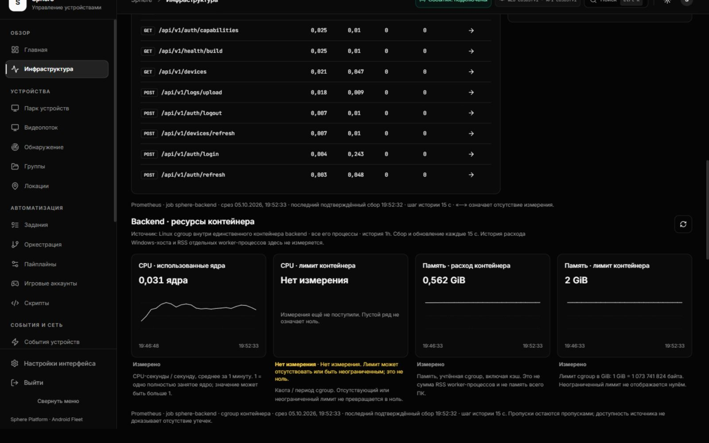

# EP-009 — backend container CPU and memory history

Date: **5 October 2026**. Implementation and acceptance are separate stages.
Initial source status was IMPLEMENTED / LIVE ACCEPTANCE PENDING.
Current acceptance: **ACCEPTED_FOR_EP_009**; live source `cb5b3f91640c86622060e6e3adea76c6d73a6093`,
19:55 UTC+5 on 5 October 2026.
[Portable evidence and ledger](ENTERPRISE-CONTAINER-RESOURCE-EVIDENCE.json).
The immutable [50-item product backlog](ENTERPRISE-PRODUCT-BACKLOG.json) is preserved.
EP-009 requires a named source/unit/interval, distinct process/cgroup/host scopes,
and missing CPU/memory represented as missing measurements.

## Observed gap and source selection

The reviewed REST endpoint returns `history=[]`. The running four-worker API uses
Prometheus multiprocess exposition; its fresh worker registry does not expose
default process CPU/RSS as a usable container history. On the actual Docker host,
the bounded preflight observed cgroup **v1** controllers: memory usage
565,608,448 bytes, memory limit 2,147,483,648 bytes, CPU cumulative
1,171,288,093,800 nanoseconds, and quota `-1` / period 100000 (unlimited quota).
This was a point-in-time source probe, not an accepted history or leak diagnosis.

The new producer reads its own cgroup namespace **once per `/metrics` scrape**.
It appends a separate short-lived collector registry to the unchanged existing
worker exposition. It does not register resource gauges in each worker's mmap
directory: summing four identical container readings would multiply the resource
usage by four. It creates no background thread/task, polling cache or disk file.
Existing HTTP worker aggregation and worker-retirement behavior remain tested.

Sources:

- [Producer](../../../backend/monitoring/container_resources.py).
- [Separate resource exposition](../../../backend/monitoring/resource_exposition.py).
- [API integration](../../../backend/main.py).
- [Prometheus allowlist](../../../infrastructure/monitoring/collection/prometheus.yml).
- [Bounded server query](../../../frontend/lib/server/resourceObservability.ts).
- [Live UI](../../../frontend/src/features/monitoring/ResourceMetricsPanel.tsx).
- [Snapshot contract](../../../frontend/src/features/monitoring/resourceMetricsTypes.ts).

## Units and boundaries

| Signal | Controller | Exposition | Display |
|---|---|---|---|
| CPU accumulated time | v1 `cpuacct.usage` ns; v2 `cpu.stat usage_usec` µs | `sphere_container_cpu_usage_seconds_total` | `rate(...[1m])` used cores; 1 means one fully used core |
| CPU quota | v1 quota/period; v2 `cpu.max` | `sphere_container_cpu_quota_cores` | Cores; no percentage denominator is invented |
| Charged memory | v1 `memory.usage_in_bytes`; v2 `memory.current` | `sphere_container_memory_usage_bytes` | GiB, dividing bytes by 1,073,741,824 |
| Memory limit | v1 `memory.limit_in_bytes`; v2 `memory.max` | `sphere_container_memory_limit_bytes` | GiB, omitted when unbounded or unavailable |
| Per-source availability | Successful finite controller read | `sphere_container_resource_available` | 1 valid / 0 unmeasured; this is not application health |
| Per-source read time | Time of successful controller read | `sphere_container_resource_read_timestamp_seconds` | Freshness guard; absent on failed reads |

Container charged memory includes cache; it is **not** RSS and **not** Windows
physical RAM/commit. CPU covers all processes inside the backend container, not
just the request worker. Windows host consumption, other containers, emulator
memory and per-worker RSS remain outside this panel. Availability alone does not
prove that memory has stopped growing or that a leak has been fixed.

The source selection follows the observed namespace. Missing/malformed v2 data
does not silently fall back to v1 values. Unreadable namespace detection produces
explicit `cgroup="unknown"` unavailable signals. No PID, container ID, device ID
or arbitrary controller path is added as a label. There are at most **12 samples**
per scrape and four fixed resource names. Controller reads are capped at 4096
ASCII characters each; numbers are bounded unsigned 64-bit values. A failed read
omits the value and timestamp, publishes availability zero, and does not retain a
previous value in producer memory. A valid measured zero remains a real zero.

## Collection, query and UI behavior

Prometheus job `sphere-backend` collects every **15 seconds**, timeout five
seconds, using the existing target. The existing retention/storage budget is
unchanged. No additional monitoring stack, exporter or port is installed.

The server exposes `/api/observability/resources`. Authorization is rechecked
against the live API before metrics are fetched; only `super_admin` can obtain
these platform-wide resources. URL parameters accept one `window` value: `1h`,
`6h`, or `24h`. Browser input never supplies PromQL, instance, labels or upstream
URL. Four fixed resource queries and one target-discovery request are concurrent,
bounded by the shared five-second request / 2 MB JSON limits. Each history has at
most one aggregate series and **1441 ordered nonnegative points**; unexpected
labels, timestamps, cardinality, nonfinite values or annotations fail closed.

CPU `rate` precedes aggregation and therefore follows Prometheus counter reset
handling. Resource values are masked by per-resource availability and read age
(-5 to 45 seconds). A stale controller value cannot survive Prometheus lookback
as a current resource reading. Every historical point also requires exactly one
backend target; discovery of multiple targets hides the panel rather than merging
different containers into one claim. Multi-target comparison is a future feature.

Steps are **15 / 30 / 60 seconds** for 1 / 6 / 24 hours. CPU averaging is one
minute; memory and quota are sampled gauges. No pre-deployment history is backfilled
or inferred. Missing points stay gaps in the chart. States `ready`, `empty`,
`partial`, `error`, and `stale` are separate. A quota with no finite value is
unmeasured: the UI does not guess whether the controller is absent or unlimited.

The open visible page requests a new snapshot every **15 seconds**. It cancels
requests on query disposal, stops polling in the background and refreshes when
focused. Query keys include user ID, session version and history window. Errors
or expired snapshot/scrape timestamps hide cached measurements; recovery can be
automatic or requested manually. The page is sampled monitoring, not instantaneous
push delivery. Depending on scrape and request phases, a new resource change can
take roughly two intervals to become visible, plus query/transport time.

Current REST health/probe coverage remains separate. Empty legacy REST history
arrays no longer generate a misleading whole-page CPU/RAM-history warning:
the Prometheus resource panel owns its actual history state. Missing current REST
probes (including active tunnels) remain explicitly unknown. The UI never promotes
missing host/RSS measurements or available `/metrics` to global platform health.

## Verification and acceptance

Source checks cover v1/v2 units and quotas, genuine zero, absent/unlimited limits,
malformed/oversized values, controller permission failure, registration without
reads and real four-worker exposition through retirement/replacement. Frontend
checks cover live authorization, fixed windows/query inputs, discovery ambiguity,
partial response isolation, invalid histories, gaps, stale snapshot/scrape times,
zero versus unknown, refresh after error and readable scope/units.

The initial acceptance gate required recording exact immutable API/UI images, unchanged
neighbors and mounts/log budgets, validated Prometheus configuration, real query
values/units and actual browser wide/mobile screenshots. The first source commit
does **not** close EP-009. Passing mocked queries is insufficient to demonstrate
valid PromQL or actual controller scope; real Prometheus/controller checks are
required. Historical failures remain alongside a later successful acceptance.

## References and upstream behavior

The [Prometheus Python multiprocess documentation](https://prometheus.github.io/client_python/multiprocess/)
describes fresh multiprocess registry handling and its collector restrictions.
This change preserves that worker registry and appends a separate scrape-time
resource registry.

The [Linux cgroup v2 reference](https://docs.kernel.org/admin-guide/cgroup-v2.html)
defines `cpu.stat`, `cpu.max`, `memory.current` and `memory.max`.
The [cgroup v1 CPU accounting reference](https://docs.kernel.org/admin-guide/cgroup-v1/cpuacct.html)
defines cumulative `cpuacct.usage` nanoseconds. The
[v1 memory reference](https://docs.kernel.org/admin-guide/cgroup-v1/memory.html)
is historical documentation; runtime controller values and Docker limits were
checked directly for this host. No third-party implementation was copied or
vendored and no new dependency was added.

## Accepted runtime, 5 October 2026

The immutable API and UI source is **`cb5b3f91640c86622060e6e3adea76c6d73a6093`**.
API image **`sha256:83b35df688e46bcbf4ae4ab6fa90a05bb2481c817e8b1a41295e66022b3eaa62`**;
UI image **`sha256:a626b0d87a408b60bcb4e576f20351cbc08b9d2304e7a291f6bac656b8397f82`**.
Both are archived committed source. API and UI replacements each retained the
other **45 containers**, mounts and rotation budgets. Prometheus accepted the
configuration through promtool and SIGHUP; **all 46 container identities/start
epochs** were retained at that stage. Existing retention 14d/2GB, ports, Grafana,
database, Android APK, OTA and tunnels remain unchanged. These are recorded
finite observations; neither replacement nor monitoring establishes zero downtime.

Actual controller comparison: cgroup **v1**, memory 616726528 bytes, kernel
before 615804928 / after 616857600 bytes, limit 2147483648 bytes. There were **10**
resource samples (four availability, three read timestamps, three values), no
PID labels or duplicate values. Quota was unmeasured, matching the actual unlimited
quota source. It did not appear as zero or as an inferred host core count.

At 14:47:41 UTC, real Prometheus queries for 1/6/24h returned **ready** CPU,
memory and memory limit; quota was **empty**. Latest CPU 0.033853669 used cores,
memory 0.559791565 GiB, limit 2 GiB. Requests took 15/16/31 ms in that specific trial;
this is not a latency SLA. Only 1–5 new points existed per series in that initial
window. No old history was backfilled. Returned 401 without auth, rejected uncontrolled
query with 400, and existing HTTP RPS stayed ready. A separate own-session logout 204
made the next resource request return 401; the human browser session was preserved.

The rollout record retains **14→12→13 online** around API replacement/recovery.
The later finite check contains six samples three seconds apart, all **14 online /
5 offline of 19**. That final recovery does not erase the transient loss, prove
unchanged connection epochs or establish sustained WAN stability. No device
commands were sent in this package. Fleet/load/soak remain separate open gates.

Validation: **120 suites / 1275 frontend tests** on local Node 25.1.0 with mocked
upstreams; TypeScript check and actual production build on Node 24 passed. Exact
API image: **27 tests**, network none/no application-source mounts, mypy **231
files**, Ruff passed. Real Prometheus queries and controller comparison are the
additional runtime acceptance, not claims made from mocks. Source CI is tracked
at its exact revision separately from later documentation-only commits.

Browser: 1600×1000 and 390×844, light/dark themes, all three windows, actual
resource values and absent quota. Page width matched viewport; mobile refresh
control was 40×40. The displayed resource snapshot advanced during a 62-second
observation without pressing refresh. Original dark theme and default viewport
were restored. No warning/error appeared in the bounded console read. This is
finite visual acceptance, not browser heap/GPU soak.

### Actual browser captures



[Light theme](assets/container-resources/wide-light-live.jpg) ·
[Mobile CPU](assets/container-resources/mobile-cpu-live.jpg) ·
[Mobile memory](assets/container-resources/mobile-memory-live.jpg).

### Ledger and next work

Run the frozen-artifact integrity check from the repository root:

```powershell
python -m scripts.audit.validate_resource_history
```

The [checker](../../../scripts/audit/validate_resource_history.py) checks recorded
Git blobs, previous ledger, public receipts and JPEG dimensions/hashes. It neither
reruns tests nor rechecks current live health. Text hashes normalize CRLF to LF.

EP-001–009 are accepted against their individual criteria: **9 accepted / 41
items with open criteria** out of 50. The original backlog remains immutable and
all original source-time states remain OPEN; the overlay evidence records later
acceptance. This closes cgroup resource-history criteria only. Windows host/RSS
history, disk/RAM writer attribution, EP-010 fleet/tunnel coverage, Studio/recording/
trace and mixed stream/script load/soak remain open. A container history panel is
not a declaration of enterprise platform readiness or a resolved memory leak.

### CI and documentation integrity

At source `cb5b3f91640c86622060e6e3adea76c6d73a6093`, the
[backend workflow](https://github.com/RootOne1337/sphere-platform/actions/runs/37327272456),
[frontend workflow](https://github.com/RootOne1337/sphere-platform/actions/runs/37327272244), and
[Android tests / signed release smoke build](https://github.com/RootOne1337/sphere-platform/actions/runs/37327272251)
completed successfully. The deployment job was skipped; local installation above
is verified independently. These results do not attest to a later Git revision
or declare a new APK installed on the fleet.

The current ten documentation entry points were checked: 697 local links and
19 anchors resolved. Frozen EP-007, EP-008 and EP-009 integrity checks passed;
the older ledgers retain their original 7/43 and 8/42 counts.
