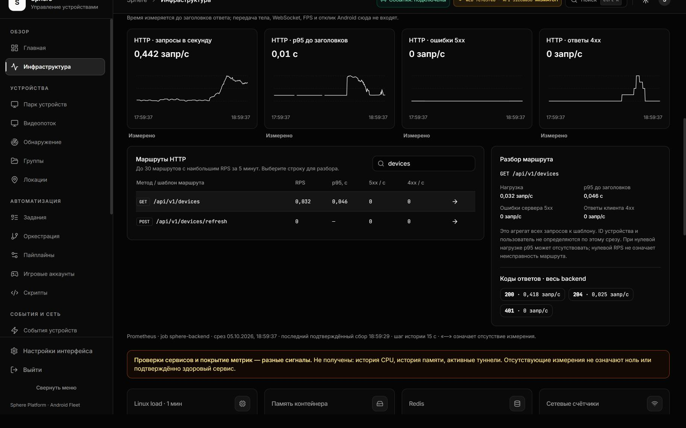

# EP-008: реальные HTTP-метрики и разбор маршрутов

**Дата:** 5 октября 2026, Asia/Yekaterinburg.
**Этап:** ACCEPTED_FOR_EP_008 · конечный HTTP-срез 14:00:36 UTC / 19:00:36 UTC+5;
Grafana повторно проверена 14:03:28 UTC / 19:03:28 UTC+5.

[Контракт и ограничения](../../operations/HTTP-METRICS.md) ·
[Текущее состояние](../../operations/CURRENT-STATE.md) ·
[Предыдущий пакет](ENTERPRISE-PRODUCT-FOLLOWUP.md) ·
[Source/runtime/визуальные доказательства](ENTERPRISE-HTTP-METRICS-EVIDENCE.json) ·
[Процедура маршрута review UI](../../operations/REVIEW-GATEWAY.md)

На [живой странице 3015](http://127.0.0.1:3015/monitoring) установлены четыре
HTTP-графика: запросы в секунду, p95 до заголовков ответа, 5xx/с и 4xx/с.
Таблица показывает до 30 наиболее нагруженных маршрутов; поиск и выбор строки
открывают их измеренные задержки и ошибки. Распределение кодов ответа относится
ко всему backend и явно отделено от выбранного маршрута. Данные читаются из
настоящего Prometheus, с обновлением каждые 15 секунд в видимой вкладке.

Исходный [реестр 50 замечаний](ENTERPRISE-PRODUCT-BACKLOG.json) сохранён неизменным.
Предыдущая приёмка закрыла EP-001–007. Этот пакет закрывает критерии **EP-008**:
единицы/window/scope, отдельные empty/stale/error/partial состояния, разбор
маршрутов и ограниченный список серверных запросов. **8 закрыто / 42 открыто.**
Это приёмка конкретного пункта, а не всей платформы или будущего нагрузочного теста.

## Установленные версии и источник данных

| Компонент | Source / результат |
| --- | --- |
| HTTP-функциональность | `72debfbc39d088df36707879b8a6bfbbd17806cf` |
| Установленный UI, включая мобильное исправление | `7c985febcfaff8db7e92fa9e48a5d7b9935a43ea` |
| Установленный API, сохранённый от предыдущего пакета | `51ccaa36f6fc81f725bf01f705d907b01ba56ccb` |
| Установленная конфигурация gateway / private UI network | `993d9eac0f09372573ba4b10b1323d61d94a19ad` |
| Проверка конфигурации перед запуском | `00ed391f81ef9897f4d4dea226170b7068495f4a` |
| Образ UI из неизменного git archive | `sha256:a50a08b7974ff87c644ba6d19470b3b4c884cdbceb35cf449f607dff1c6cd650` |

UI и API имеют разные source SHA; это видно в шапке. Совместимость проверена
по фактическому контракту и живым запросам, совпадение revision не заявляется.
Backend middleware уже считает общий request counter и histogram для worker
процессов и нормализует route templates. Повторная сборка/перезапуск API для
этого пакета не требовались. Набор PromQL фиксирован сервером; пользователь
не задаёт произвольные выражения, адрес источника или labels устройств.

Rate вычисляется за скользящие пять минут; выбранные 1/6/24 часа относятся
к длине истории. p95 — оценка histogram, измеряющая время **до заголовков**,
не передачу тела, WebSocket, FPS или отклик Android. Нулевой rate ошибок допустим
только при существующем базовом счётчике. Отсутствие данных не превращается в 0.
Последний scrape и возраст полученного среза ограничены 45 секундами.

## Живая HTTP-приёмка

Срез 14:00:35–36 UTC, без отправки команд Android:

| История | Шаг | Точек на график в ответе | Ответ | Время конечного запроса |
| --- | --- | --- | --- | --- |
| 1 h | 15 s | 241 | 41 793 B | 31 ms |
| 6 h | 30 s | 721 | 112 407 B | 63 ms |
| 24 h | 60 s | 1 328 | 209 117 B | 312 ms |

Все четыре сигнала вернули `ready`; последняя подтверждённая выборка
`sphere-backend` — 14:00:29.829 UTC. В этом срезе общий RPS 0,4421 запр/с,
оценка p95 0,014 s, rates 4xx/5xx равны измеренному 0. Получены 25 маршрутов
и коды 200/204/401. Более поздний браузерный срез уже показывал 4xx после
проверок отказа авторизации; это измеренный трафик, а не противоречие раннему 0.
Длительности трёх запросов не являются нагрузочным benchmark или SLA.

Без авторизации endpoint возвращает 401. Повторный параметр `window` и
произвольный PromQL возвращают 400. Logout только собственной тестовой сессии
вернул 204, следующий запрос с её токеном — 401. Viewer/tenant isolation,
частичные данные, пустые/NaN/несортированные серии, таймауты, ограничения размеров
и устаревшие источники проверены изолированными тестами; нарушения живого
Prometheus ради этих сценариев не создавались.

Grafana повторно вернула dashboard `sphere-collection`, пять панелей,
роль Viewer в org 1, `canEdit=false`, результат datasource query с frame.
Anonymous/tampered/direct spoofed header/revoked ticket — 401; попытка записи
dashboard — 405. Отзыв действующей ticket после собственного logout проверен
через 0,24 секунды после её выдачи. В браузере снова видны настоящие графики,
не Welcome. Native Grafana dashboard сохраняет только качество сбора;
новые HTTP-панели находятся в Sphere UI, его схема не выдаётся за обновлённую.

Конечный REST-срез: 19 устройств, 14 online, 5 offline, 0 connecting/busy/issues.
Этот срез не доказывает многодневную стабильность, воспроизведение видео
или выполнение сценариев на всех 14 устройствах.

## Дополнительный подтверждённый дефект gateway

При первой замене UI на мобильное исправление новый контейнер стал healthy,
но readiness через gateway получил 504. Guard вернул прежний UI; неудачная
попытка и rollback сохранены в журнале. Логи 13:48:55–13:49:02 UTC показывают
upstream **`192.168.0.1:3000`** для `/login` и HTTP-метрик вместо адреса review UI.
Отсутствие alias `review-ui` во время пересоздания допустило неправильное
разрешение имени. Конкретный внешний DNS, который выдал адрес, не установлен.

Теперь UI имеет постоянный private address `172.30.0.3`, отдельный internal
subnet `172.30.0.0/24`, dynamic pool `172.30.0.128/25`. Gateway использует
только этот литерал через проверяемый шаблон; Nginx variables остаются нетронуты
благодаря whitelist `envsubst`. Tools proxy остаётся `172.29.0.3`, совпадая
с существующим exact whitelist Grafana. API DNS и публичный UI 18080 не менялись.

Установка 13:56:11 UTC сохранила identity/image/start/mount/log config остальных
44 контейнеров. Контрольное пересоздание только UI закончилось в 13:57:25 UTC:
23 конечных GET `/login`, наблюдались **200 и 502**, конечный ответ 200; gateway
не перезапускался, оба записанных upstream error указывают `172.30.0.3:3000`.
**Пересоздание пока имеет короткий перерыв; zero downtime не заявляется.**
API, APK, базы и туннели этим пакетом не обновлялись.

## Тесты и визуальный контроль

**Проверки реализации:** 118 suites / 1235 frontend tests, 0 failures / pending;
TypeScript и ESLint изменённых файлов прошли с текущим `.eslintrc` в compatibility
mode. Первый запуск ESLint без этого режима остановился из-за отсутствия flat
config; это не было принято как successful lint. Два первых UI assertions
уточнены для повторяющихся видимых значений; затем 99 тематических tests прошли.
HTTP/Android в Jest mocked. На финальном UI `7c985feb` повторены четыре
monitoring suites: **99 tests**, 0 failures/pending; TypeScript и changed-file
lint прошли. Production Docker build из git archive прошёл.

Проверка review config: **14 изолированных Python tests**, Ruff, реальный
`docker compose config` и `nginx -t` в том же gateway image с network disabled.
Первый обычный pytest остановился в общих backend settings из-за отсутствующего
JWT secret; чистый запуск `--noconftest --override-ini addopts=` прошёл.
Проверка Compose escaping сначала выявила `$$` в rendered command; валидатор
теперь нормализует его и имеет отдельный regression case. Это setup failures,
сохранённые отдельно от успешных конечных проверок.

Браузер: тёмная и светлая темы, окна 1/24 h, обновление реальных измерений,
поиск маршрутов и выбранные детали. На 1600 px нет общего горизонтального
overflow; на 390 px прокручивается только таблица, детали располагаются ниже.
Первая мобильная проверка выявила сжатую кнопку обновления; исправление сохраняет
40×40 px. Позднее стандартное окно браузера 724 px подтвердило загрузку Grafana.
Все изображения ниже — реальные screenshots установленного UI `7c985feb`.

[Светлая тема /24 h](assets/http-metrics/wide-light-live.jpg) ·
[Мобильная панель /390 px](assets/http-metrics/mobile-live.jpg) ·
[Мобильные детали и прокрутка таблицы](assets/http-metrics/mobile-details-live.jpg) ·
[Grafana с реальными графиками /724 px](assets/http-metrics/grafana-final-live.jpg)

## Оставшиеся критерии и ресурсы

EP-009: история CPU/RAM с раздельными process/cgroup/host scope.
EP-010: active tunnels и fleet coverage, не синтезированные gauges.
Studio/recording/trace, расширенный реестр, логирование и итоговый stream+script
load/soak остаются в исходном плане. Перечень инструментов не заменяет их приёмку.

[Ночной resource recorder](HOST-STORAGE-NIGHT-WATCH.md) завершился:
241/241 срезов, 8 часов, C:−2,154 GiB; VHD allocated и pagefile logical не выросли,
exact VSS allocated 0 во всех срезах. Available physical RAM уменьшилась,
Windows commit вырос; это разные величины. Writer всё ещё UNDETERMINED;
ни дисковая, ни RAM-утечка не объявлены исправленными. Это отдельное измерение,
не объяснение задержек Android и не результат HTTP-панелей.

Проверка integrity manifest сверяет pinned git blobs, hashes screenshots,
предыдущий ledger и локальные ссылки. Она не повторяет живую приёмку и тесты:
`python scripts/audit/validate_http_metrics.py`.
Text artifact hashes нормализуют CRLF→LF и совпадают с Git text blobs;
image hashes относятся к неизменным JPEG bytes браузера. Первое сравнение
обнаружило JPEG content под расширением PNG: файлы переименованы без перекодирования.
