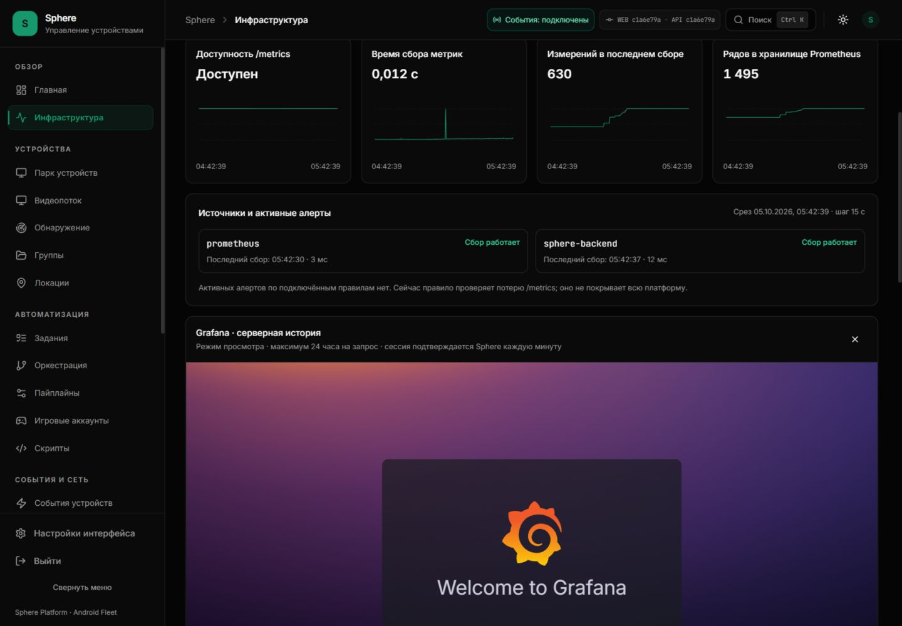
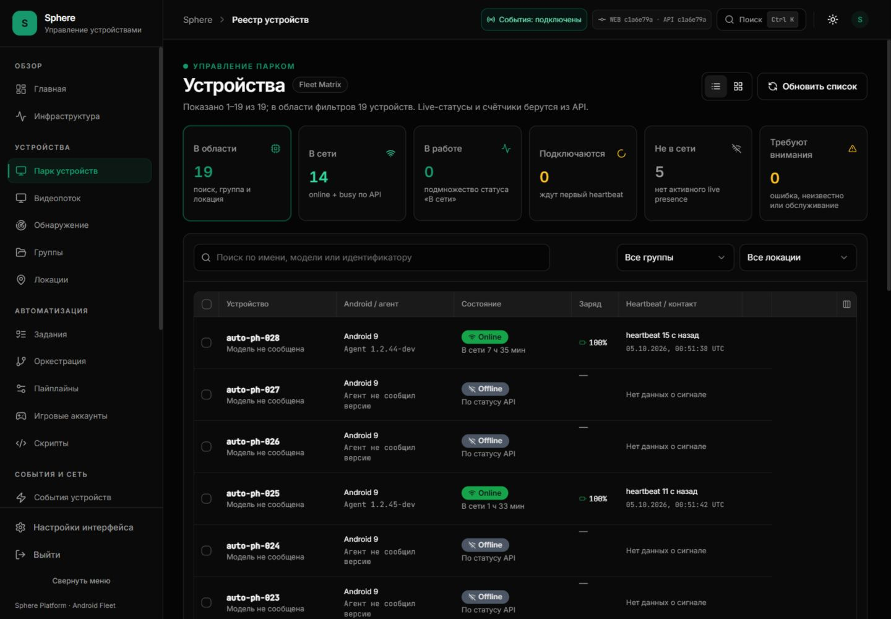
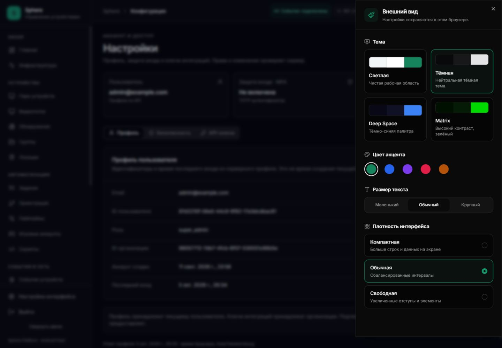
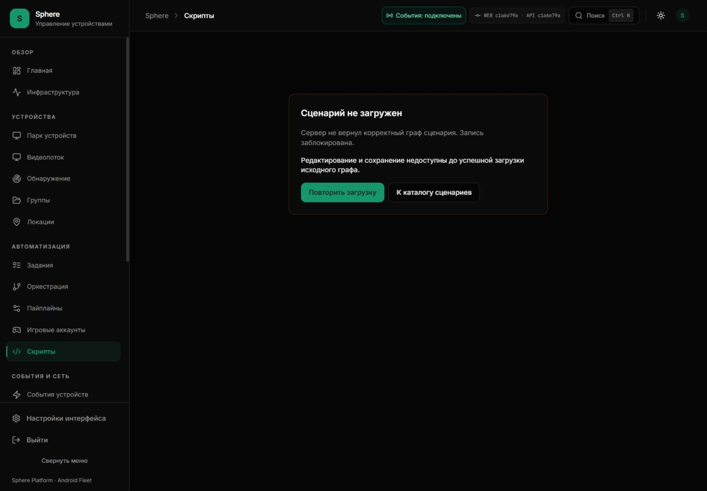
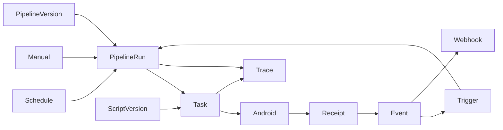

# Sphere: комплексный аудит продукта и план развития интерфейса

**Дата:** 5 октября 2026, Asia/Yekaterinburg. **Режим этапа:** анализ, доказательства и проектирование; изменения приложения не применялись.

**Исходники:** `c3937a1abf55eca73662bdc720699eb29b6653a6`, ветка `codex/enterprise-audit-20260905`, [PR #19](https://github.com/RootOne1337/sphere-platform/pull/19).

**Проверенный веб:** <http://127.0.0.1:3015/>; видимый badge API/UI — `c1a6e79a`.

Исходники и установленная сборка имеют разные версии: результаты просмотра относятся к установленному вебу, ссылки на код — к указанному source SHA.
Совпадение конкретного дефекта подтверждается отдельным чтением исходников; этот отчёт не объявляет всю ветку установленной.

[Текущее состояние](../../operations/CURRENT-STATE.md) · [Каталог](../../README.md) · [Предыдущий аудит](../2026-10-01/WEB-FULL-CAPABILITY-AUDIT.md) · [Backlog](ENTERPRISE-PRODUCT-BACKLOG.json) · [Evidence](ENTERPRISE-PRODUCT-AUDIT-EVIDENCE.json)

## 1. Вывод, который определяет порядок работ

Основная проблема шире визуального оформления: отдельные страницы используют несовместимые контракты, неполные модели данных и разные представления одного процесса.
Самый существенный новый результат — текущий визуальный редактор не совместим с форматом сценария, который принимает backend и исполняет APK.
Сначала нужно исправить этот контракт, затем развивать запись действий, воспроизведение и визуальный отладчик.
Добавление красивого canvas поверх несовместимого сохранения не даст работающего Script Studio.

Подтверждены шесть конкретных дефектов, воспроизведённых в браузере либо изолированным тестом:

1. Выбранная колонка «Доступ» исчезает после F5.
2. `exportDag()` выдаёт `nodes` как объект; сервер требует массив узлов с вложенным `action`.
3. Существующий серверный сценарий не открывается в редакторе: импорт явно отвергает массив узлов.
4. Fleet Matrix сообщает «Модель не сообщена», хотя API возвращает `device_model`.
5. Выбор сценария в pipeline показывает пустое количество узлов из отсутствующего legacy-поля `node_count`.
6. Legacy-отправитель task/batch webhook регистрирует HTTP 403 как `webhook.delivered`.

Отдельно наблюдался runtime-разрыв: встроенная Grafana остаётся на Welcome вместо запрошенного dashboard.
Причина этого разрыва пока не установлена; он не доказывает неисправность Prometheus или всей Grafana.
Ещё несколько областей являются неполными возможностями, а не ошибками исполнения: история CPU/RAM, активные туннели, общие логи парка, запись действий и thumbnail wall на 128 устройств.

В Prometheus уже есть пригодные HTTP RPS и p95; их панели не подключены к текущему интерфейсу.
Отсутствующие fleet gauges и host/container exporter series нельзя заменять нулями.
Локальная тема, напротив, сохраняется после F5: нельзя объединять исправную тему и сломанное сохранение таблицы в один диагноз.

## 2. Область и границы доказательств

### 2.1 Что реально выполнено

- Открыты все 22 раздела основного меню, сохранены DOM-срезы и скриншоты, выполнен визуальный просмотр этих снимков.
- Проверены дополнительные поверхности: новый редактор, открытие существующего сценария, история версий, inspector устройства и полная карточка.
- Открыты формы группы, локации, pipeline, триггера, webhook, пользователя, release и VPN provision без отправки.
- Проверены настройки внешнего вида и сохранение темы с возвратом исходной тёмной темы.
- Проверен сброс видимости колонки после перезагрузки.
- Просмотрены настольная компоновка 1440×1000 и отдельные мобильные состояния 390×844.
- Собран TypeScript AST-каталог страниц, импортов, API call sites, элементов управления и модальных объявлений.
- Прочитана реальная OpenAPI-схема работающего backend-контейнера без запуска нового backend.
- Выполнен чистый экспорт frontend-графа и серверная валидация его результата без создания сценария.
- Выполнена проверка HTTP 403 через mock HTTP-клиента без внешнего запроса.
- Получены ограниченные read-only срезы monitoring, каталога устройств, сценариев и Prometheus.

### 2.2 Что этим этапом не доказано

- Все кнопки не нажимались: записи, удаления, запуски, provision и изменения прав не выполнялись.
- 672 JSX-объявления элементов управления — каталог исходников, а не 672 успешных пользовательских теста.
- Наличие API operation не доказывает доступность конкретной роли, производительность или корректность всех параметров.
- Схема OpenAPI не описывает все WebSocket-сообщения и Android runtime capabilities.
- Живой Android input, FPS, terminal, shell и новые сценарии в этом окне не исполнялись.
- 14 online из 19 записей не доказывают работу на 500–1000 устройствах.
- Исторические пользовательские подтверждения XPath и PNG сохранены как исторические, не как свежий повторный тест.
- Проверка super_admin не заменяет тесты operator/viewer и изоляции организаций.
- Не проводился измерительный WCAG-аудит контраста, screen reader или полный keyboard-only обход.
- Ночные disk/RAM наблюдения продолжаются отдельно; их незавершённый результат не подменяется этим UI-аудитом.

### 2.3 Статусы находок

| Статус | Значение | Достаточное доказательство закрытия |
|---|---|---|
| CONFIRMED_DEFECT | Поведение противоречит текущему контракту или пользовательскому действию | Regression test плюс повтор исходного воспроизведения |
| OBSERVED_RUNTIME_GAP | Ожидаемый результат не получен в текущем runtime, причина открыта | Причина, исправление и повторный живой контроль |
| CAPABILITY_GAP | Запрошенной законченной возможности сейчас нет | Контракт, реализация, тесты и пользовательский сценарий |
| DESIGN_DEBT | Возможность существует, но компоновка, язык или последовательность нецелостны | Проверенные состояния и visual acceptance |
| FUTURE_DESIGN | Область отложена пользователем; сейчас только архитектура | Отдельное решение о начале реализации |
| VERIFIED_EXISTING | Проверенная исправная часть, которую нужно сохранить | Повтор при изменении связанного контракта |

У нового backlog собственная нумерация `EP-xxx`.
Он не переименовывает старый список из 41 пункта и не объявляет его семь открытых работ закрытыми.
Количество будущих требований не следует сообщать как количество текущих багов.

## 3. Runtime, метрики и происхождение данных

### 3.1 Срез 00:34:42 UTC / 05:34:42 UTC+5

| Сигнал | Наблюдение | Как читать |
|---|---|---|
| Каталог | 19 записей; 14 online; 5 offline | Данные организации, не планируемые 23 устройства |
| APK online | 12 устройств 10244; 2 устройства 10245 | Canary не равен массовому релизу |
| API/UI badge | c1a6e79a | Установленная сборка отличается от source HEAD |
| Backend metrics target | up = 1 | Успешный scrape, не E2E Android |
| HTTP RPS, окно 5m | 0,5298561669 req/s | Скорость зарегистрированных HTTP запросов |
| HTTP p95, окно 5m | 0,0379522014 s | Histogram HTTP; не input-to-photon |
| sphere_devices_total | Пустой vector | Измерение отсутствует, не 0 устройств |
| sphere_devices_online | Пустой vector | Измерение отсутствует, не 0 online |
| process_cpu_seconds_total | Найдена серия | CPU процесса; не CPU всех контейнеров |
| process_resident_memory_bytes | Найдена серия | RSS процесса; не вся память хоста |
| node_cpu_seconds_total | Не найдена серия в проверенном наборе | Host exporter coverage не подтверждено |
| container_memory_working_set_bytes | Не найдена серия в проверенном наборе | Container exporter coverage не подтверждено |

CPU в REST monitoring — `linuxLoad1mPerCpu`, нагрузка за минуту на CPU, не процент использования.
RAM в REST monitoring — текущее значение/лимит cgroup, не физическая RAM Windows.
Backend возвращает `cpu.history=[]`, `ram.history=[]`, `network.activeTunnels=null` явно в коде.
Поэтому текущий текст «покрытие ограничено» честен, но необходима реализация missing coverage.

### 3.2 Целевая матрица измерений

| Область | Источник | Требуемый drilldown | Нельзя выдавать за |
|---|---|---|---|
| HTTP | Counter + histogram backend | Endpoint, status class, error rate, p50/p95/p99 | FPS и доступность приложения Android |
| Backend process | process counters | CPU rate, RSS, restarts, build/version | RAM всего VPS |
| Container | cgroup/exporter | Working set, limit, OOM, CPU quota, IO | RAM APK |
| Host | node/windows exporter | RAM available/commit, pools, disk free/inodes, IO | Один Docker volume |
| Postgres | Probe + exporter | Connections, locks, slow queries, WAL/storage | Корректность бизнес-транзакции |
| Redis | Probe + INFO/exporter | Memory, evictions, clients, queue lag | Успех исполнения команд |
| Agent connection | Android WS + heartbeat | Epoch, reconnect reason, auth/route, age | Живой видеокадр |
| Selected video | Capture/encode/relay/decode/render | FPS по стадиям, frame age, drops, bitrate | Успех сценария |
| Tasks | Durable task/run/receipt | Queue delay, attempt, ACK/result, deadline | Клик подтверждён только ACK |
| VPN | Provider + Android receipt | Assigned/applied/handshake/egress | Рабочий VPN только по peer row |
| Fleet | Org-scoped live summary | Counts, inventory mismatch, stale versions | Сумма глобальных worker gauges |
| Logs/storage | Quota-aware collector | Written/dropped bytes, retention, disk forecast | Неограниченный полный debug |

### 3.3 Правила подключения панелей

- Использовать allowlisted query keys на сервере, не исполнять произвольный PromQL из browser query string.
- У RPS показывать единицу req/s и окно rate, у latency — s/ms с однозначным преобразованием.
- Пустой vector, null, stale и ошибка источника должны иметь разные состояния.
- Для gauge устройства определить владельца сбора: collector или агрегатор, не каждый worker одновременно.
- Организационные counts остаются tenant-scoped; глобальный operational dashboard доступен отдельной роли.
- Не использовать device_id/run_id в бесконтрольных label cardinality; детали идут в logs/traces.
- Любая карточка должна показывать scope, source, observed_at, interval, coverage и доступный drilldown.
- Series reset/restart не рисовать как падение бизнес-показателя; counters обрабатывать через rate/increase.
- Alerts должны вести к конкретному affected scope, run/device/build и runbook.
- `/metrics up` и synthetic Android stream/script probe показывать разными SLI.
- Ожидаемый эффект новых panels проверять по реальным выражениям, не только по fetch success.

### 3.4 Grafana и готовые инструменты

Текущий интерфейс содержит встроенную Grafana через защищённый proxy, а не только внешнюю ссылку.
В проверенном сеансе iframe показывает Welcome; запрошенный dashboard UID — `sphere-collection`.
Повторные DOM-срезы и скриншот подтверждают отсутствие графиков; bounded logs содержат redirect 302, но не устанавливают причину.
Отсутствие console error не является подтверждением исправной загрузки dashboard.

Следующее исследование должно проверить request chain, auth proxy identity, org/UID, provisioned dashboard и API datasource query.
Не отключать authentication, CSP или org isolation ради появления графика.
В интерфейсе различать «proxy доступен», «dashboard загружен» и «панели получили данные».
Prometheus, Grafana и будущий Loki должны иметь версии, pinned configuration, retention и read-only scope.
Набор инструментов выбирается по потребности: метрики, структурированные журналы, traces; установка всего стека без бюджетов не нужна.



## 4. Fleet Matrix: рабочее пространство оператора

### 4.1 Контракт и сохранение состояния

Для browser preferences нужна версионированная схема с ключом по workspace/table, не общий случайный набор React state.
Первый этап — local persistence; синхронизация с аккаунтом отдельным этапом с явным разрешением конфликтов.
Сохранять видимость/порядок/ширину/pinning колонок, сортировку, density, page size и выбранный view preset.
Группа, локация, поисковая строка и фильтры должны поддерживать shareable URL и предсказуемый возврат.
Выбор устройств для действия не восстанавливать автоматически как разрешение выполнить старую bulk-команду.
Local draft фильтра и применённый server filter должны быть различимы.
При удалении колонки из новой версии preferences мигрируются, неизвестные IDs отбрасываются без crash.
При недоступном storage интерфейс работает, сообщает ограничение сохранения, не блокирует каталог.
Reset view сбрасывает только текущий table preset, не тему, токены и данные устройств.
Разные вкладки синхронизируют harmless preferences, но не отправляют Android команды через storage event.

### 4.2 Расширяемый каталог колонок

| Набор | Данные | Приоритет/источник |
|---|---|---|
| Identity | Name, model, manufacturer, serial, Android ID, UUID | Normalize API aliases; provenance обязательно |
| Agent | Version name/code, flavor, installed hash, config generation | Heartbeat/profile/release receipt; неизвестное отдельно |
| Connection | Presence, connected duration, heartbeat age, last seen, reconnects | WS/heartbeat epoch; не browser fetch time |
| Display | Width, height, rotation, density, display Hz | Device profile; не фиксированные portrait координаты |
| Resource | Emulator RAM/CPU, agent RSS/PSS, storage free | Раздельные scope и source, не общий misleading CPU |
| Automation | Active task/run/step, queue delay, last result, attempts | Task/run backend + APK result |
| Network | Route/provider, transport latency, VPN assigned/applied, egress | Не секретный WG config; latency definition видна |
| Organization | Groups, location hierarchy, tags, owner, notes | Tenant-scoped API |
| Readiness | Root/accessibility/capture permission, capabilities age | Capability handshake/profile, не оптимистичные icons |
| Diagnostics | Last error class, disconnect reason, log freshness, screenshot age | Structured event + stable reason code |

Не все эти поля есть в DeviceResponse: отсутствующее поле сначала получает контракт и источник.
Нельзя заполнить новую таблицу выдуманными числами, тем более значениями из старого demo.
Например, модель уже есть как `device_model`, поэтому её исправление не требует нового APK.

### 4.3 Layout и масштаб

- Sticky identity и actions; вторичные сведения в expansion/drawer, а не 30 колонок всегда открыты.
- Presets «Операции», «Связь», «Автоматизация», «Версии», «Ресурсы» с явной настройкой.
- Длинные значения переносить/обрезать с доступным раскрытием и copy; ID не должен вытеснять статус.
- Числа выравнивать, время показывать в выбранной зоне, даты источника сохранять в UTC.
- Mobile: compact cards либо управляемая прокрутка таблицы; internal table overflow не равен overflow всей страницы.
- 1000 устройств: серверные фильтры/sort/pagination и bounded live subscriptions; не 1000 декодеров.
- «Все найденные» и «выбранные на странице» — разные selectors с preview количества перед действием.
- Bulk action: разрешённый scope, список исключений, итог по каждому ID, частичный успех, unknown и retry policy.
- Live update не должен сбрасывать колонку, сортировку, scroll anchor или открытый inspector.
- Offline details остаются доступными; команды недоступны с понятной причиной и без псевдоуспеха.



## 5. Внешний вид, компоненты и качество UI

В активном AppearanceDrawer уже есть 4 темы, 5 акцентов, 3 размера текста и 3 плотности.
Светлая тема была выбрана, пережила reload, затем исходная тёмная тема восстановлена.
Иконки уже используют Lucide; «старый вид» следует исправлять единым размером, stroke, фоном и семантикой, а не произвольной заменой библиотеки.
При этом сохраняются старые панели с uppercase/monospace, английскими заголовками, мелкими подписями и другой системой отступов.
Особенно заметны differences на pipeline-settings, orchestration, triggers, VPN, accounts, OTA и builder.

Нужны единые tokens: surface, border, foreground-muted, semantic status, focus-ring, typography, spacing, radius, motion duration.
В ThemeProvider и UI preferences сейчас две persist-схемы; риск расхождения нужно устранить миграцией, сохранив пользовательский выбор.
Не следует выдавать существование двух stores за уже воспроизведённую потерю темы.
System theme, reduced motion, повышенная читаемость и custom density — отдельные настройки с явными defaults.
Измерять contrast и доступность, не объявлять их соответствующими стандарту по внешнему впечатлению.
Icon-only controls требуют accessible name и tooltip; tooltip не должен быть единственным именем.
Disabled action требует причины, не только низкой opacity.
Меню, drawer и dialog должны иметь focus trap, Escape, возврат focus и клавиатурную навигацию.
Форма не закрывается после ошибочного сохранения; ошибки связаны с полями и summary.
Длительное действие показывает accepted/running/completed/failed/unknown, а не вечный spinner.
На 200% zoom content не перекрывает footer с основным действием.
Для builder/workspace рассчитывать высоту от app header, не накладывать `h-screen` поверх существующей shell.
Новые массовые views используют virtualized bounded rows; offscreen canvas/video не продолжают full-rate работу.



## 6. Настоящий Script Studio: спецификация до реализации

### 6.1 Текущий baseline

ReactFlow и Monaco уже установлены; это пригодная основа для canvas и source editor.
Текущая palette — Tap, Swipe, Sleep, Lua, Condition, Screenshot плюс Start/End.
Это не полный каталог runtime действий backend/APK.
Нет завершённого выбора live-device, recorder, replay trace или пошаговой подсветки исполнения.
Наличие canvas и кнопки deploy не делает редактор полноценным инструментом.
Server versions уже immutable и имеют hash; механизм не надо заменять локальным сохранением ReactFlow object.
Import failure блокирует запись — это полезное защитное поведение, его сохранить после ремонта контракта.



### 6.2 Канонический сценарий и редактор

Execution document — серверный DAGScript: версия, entry_node, массив узлов, action, success/failure links, timeout и retry.
Layout document — positions, viewport, grouping и collapsed state; он не определяет исполнение.
Persist layout отдельно или как явно non-executable metadata с собственным version.
Visual и Source являются двумя видами одного canonical AST, а не двумя независимыми документами.
Source view сначала JSON schema; Lua остаётся кодом конкретного action, не заменой всего DAG.
YAML может быть дополнительным импортом после определения deterministic conversion и сохранения типов.
Не выдавать «вставить любой код» за произвольное исполнение Python/JS на сервере.
Parse errors хранят dirty source и последнюю валидную модель; не терять введённое при переключении вида.
AST validation включает endpoints, reachability, action parameters, limits, capabilities и schema version.
Действия, отсутствующие в visual palette, отображаются как typed advanced node, не выкидываются при сохранении.
Unknown future action блокирует execution либо проходит read-only roundtrip; его нельзя silently заменить sleep.
Roundtrip import → visual → source → save → reload сохраняет семантику и hash при отсутствии изменения execution.
Сохранение с optimistic concurrency использует current version ID; conflict показывает diff и не перезаписывает чужую версию.
Undo/redo работает для node, connection, параметров, source и recorder insertion в рамках draft.
Autosave относится к draft, не публикует executable version и не запускает её.
Browser crash/reload восстанавливает draft с предупреждением о newer server version.
Publish, Save draft, Validate и Run — разные действия с разными receipts.
В title видны script ID, draft state, server version/hash и выбранная target capability profile.

### 6.3 Устройство и запись действий

Device picker показывает online, permissions, capabilities, resolution, rotation и APK version.
Можно открыть offline script для редактирования; Record/Run требует свежего runtime capability.
Перед записью оператор видит выбранное устройство и видимый индикатор Recording.
Запись включается и выключается явно, не начинается автоматически после открытия editor.
Событие записи содержит monotonic sequence, action type, viewport transform, source dimensions и origin.
Tap на video сначала преобразуется из CSS contain/letterbox к device coordinates.
Rotation меняет transform generation; события старой generation не применяются к новому screen.
При доступной hierarchy к событию привязываются resource-id, package, text, class, bounds, XPath и snapshot ID.
Позиционный XPath не считается устойчивым selector при изменении дерева.
При нескольких совпадениях UI показывает ambiguity и выбор; не выбирает первое молча.
Fallback coordinates сохраняет reference dimensions и причину fallback.
Hierarchy fetch не выполняется на каждый mousemove; singleflight, cancel obsolete и bounded refresh.
Колесо записывается как нормализованный scroll/swipe, с coalescing, направлением и distance.
Press/drag/long press сохраняют duration, не только конечный click.
Текст не копируется в журнал без разбора: passwords и credentials заменяются secret references.
Recorder preview показывает предполагаемый шаг до insertion и позволяет удалить/объединить noise.
Recording stop закрывает подписки и возвращает control ownership; не остаётся hidden polling.
Сохраняется список неполученных подтверждений; unknown input не записывается как гарантированно executed.
Recorder buffer имеет лимит событий/байтов/времени и drop counter.
Оператор может поставить checkpoint/assert/wait вручную между записанными действиями.
Запись координат не обещает автоматическую устойчивость сценария к любому layout приложения.

### 6.4 Проверка, запуск, воспроизведение и debug

Validate без Android проверяет schema и links; runtime test исполняет ограниченный сценарий на выбранном target.
«Воспроизвести trace» прошлого запуска не равно повторить действия на устройстве.
Run pinning фиксирует script version/hash, target ID, config generation и policy.
UI показывает разрешённые effects перед запуском: input, shell, files, network, app reset, VPN.
Dry run допустим только для операций, для которых определена реальная безопасная семантика; не выдавать обычный Run за dry run.
Breakpoint/step/pause требуют поддержанного agent protocol, а не остановки только browser animation.
Pipeline cancel и APK cancel связаны cancellation fence; late result не возрождает отменённое исполнение.
Timeout верхнего workflow не превращается в новый бессрочный retry каждого node.
Retry неидемпотентного tap/text/http write требует policy и подтверждённого outcome.
Unknown после disconnect показывается отдельно от failed и completed.
Trace содержит task/run/attempt/node/command/frame IDs и outcome reason.
На каждом node видны started, acknowledged, completed, retries, duration и выбранный selector.
Видеоподсветка соответствует frame/snapshot generation, а не произвольному последнему кадру.
Есть текстовое представление trace для screen reader, export и AI analysis.
Frame capture для trace ограничивается policy/TTL/quota; не сохранять 30 FPS видео всех устройств бессрочно.
Если нужен original PNG для matching asset, использовать capture command, а не H264 frame.
При недоступном снимке node trace остаётся доступным с reason, без подмены старым изображением.
Latency stages измеряются в своей clock domain; cross-host UTC subtract не объявляется точным one-way latency.
Debug overlay показывает actionable bounds, actual clicked point и selector candidates.
Source/visual scroll синхронизируются с node ID, не с индексом после insert/delete.
Rerun использует явную версию; не silently запускает latest изменённого script.
Test fixture очистка восстанавливает только заявленные test effects; не удаляет рабочие данные.

### 6.5 Каталог действий и ограничения

Каталог должен формироваться из versioned backend/APK capability schema, а не из шести захардкоженных кнопок.
Для каждого action: поля, units, defaults, limits, result schema, required capability, effects, retry safety и пример.
Root, accessibility, app permission и native display являются разными preconditions.
Shell доступен только в разрешённом device context; не становится SQL/SSH host executor по наличию текстового поля.
Lua sandbox сохраняет ограничения, timeout и cancellation; нельзя удалить их ради «любых скриптов».
HTTP action имеет outbound policy, timeout, size limits и redacted credentials.
Selectors/resource IDs не гарантируются для SurfaceView/game renderer, где hierarchy может быть пустой.
Для таких экранов image/pixel/OCR adapters имеют confidence, region и reproducible image asset version.
Новый action доступен в visual editor только после параметрической валидации и support matrix.
Список действующих action types извлечён в приложение ниже; это декларация, не живой тест каждого action.

### 6.6 Критерии Studio первого релиза

1. Canonical Start→Tap→End сохраняется через API и открывается без изменения семантики.
2. Existing fixture с branches/retry/timeout roundtrip не теряет поля.
3. Invalid source сохраняется как draft, не публикуется и не выполняется.
4. Concurrent edit приводит к conflict review, не silent overwrite.
5. Recording двух безвредных действий получает реальные receipts и устойчивые selector candidates.
6. Test Run на одном target отображает node trace и соответствующий screen snapshot.
7. Disconnect/cancel/timeout имеют разные результаты и не вызывают повторного input без policy.
8. Root unavailable и empty hierarchy показывают конкретные ограничения.
9. Все subscriptions, decoders и buffers освобождаются после закрытия workspace.
10. Одна и та же операция доступна API и вебу с одинаковой version/effect semantics.

## 7. Единая логика автоматизации

Разделение сущностей технически оправдано, но оператор должен видеть их связи в одном workspace.
Script — versioned device program; Task — его конкретное исполнение на устройстве.
Pipeline — server workflow из шагов, включая script calls, conditions, delays и sub-pipelines.
Schedule — источник запуска по времени; Trigger — источник по событию; Webhook — внешняя доставка события.
Session account — историческая domain-сущность, не то же самое, что user login/session или Task Run.



Workflow Overview должен показывать граф references и «используется в», версии и последнее исполнение.
Нельзя скрыть старые URL: они остаются deep links, а новые вкладки workspace объединяют контекст.
Из task detail переходить к pinned script, parent pipeline run, trigger/schedule origin, device и trace.
Из event detail видеть generated task/run и delivery attempts; связь не угадывается по тексту message.
Оператор видит queue, concurrency, cooldown/rate limit, deadline, policy и точный scope target selection.
Schedule показывает timezone, DST policy, следующую дату, missed-fire и duplicate-fire semantics.
Trigger имеет simulation по сохранённому event без исполнения и dedup/cooldown explain.
Re-entrant workflow и event feedback loop ограничиваются hop budget/correlation policy.
Создание pipeline не должно автоматически запускать его; отдельная кнопка «создать и запустить» требует явного preview.
Validation проверяет missing versions, inaccessible devices, invalid expressions и recursive sub-pipeline depth.
Database reads/writes — versioned connector steps с tenant/RBAC/secret reference, не arbitrary SQL textbox с root connection.
Один manifest может связать scripts/pipelines/schedules/triggers/resources после dry validation dependency graph.
Import manifest должен выдавать план create/update/conflict, preserving IDs и rollback boundaries.

## 8. Карточка устройства, видео, инспектор и telemetry

Одно выбранное устройство получает полноценный native video stream и interactive control.
Fleet wall получает лёгкие thumbnails; эти два режима не должны иметь одинаковый resource profile.
Aspect ratio и dimensions берутся из display/capture, CSS contain сохраняет coordinate transform.
Граница smoothness — display refresh, encoder и сеть; дублирование одного кадра не считается ростом FPS.
Input ACK и visible state change имеют разные timestamp/sequence и должны измеряться отдельно.
Статичная сцена без нового frame не всегда ошибка capture; connection liveness и frame freshness разделять.
Selected static input допускается только с явной policy и capability; stale grid остаётся read-only.

### 8.1 Inspector

Текущий source hierarchy — `android_uiautomator_root`, native `uiautomator dump`, а не установленный openatx UIAutomator2 server.
XML parser ограничивает размер, depth/nodes/attributes и отвергает external entity/DOCTYPE конструкции.
Сохраняются XML attributes, но native dump не включает все возможные Android runtime данные.
Позиционный XPath полезен для диагностики, resource-id/package и устойчивые selectors обычно требуют отдельного анализа.
Нужны tree search, ancestors/children, selector candidates, duplicates, copy/export, source time и snapshot hash.
Выбор справа и click-inspect на video используют один selection ID и одни bounds.
Outdated hierarchy видимо помечается; stale response не заменяет более новый snapshot.
Иерархия обновляется bounded/singleflight; ненужный polling прекращается при скрытии inspector.
Для game SurfaceView не обещать элементы, которых нет в accessibility/UIAutomator hierarchy.
Дополнительный adapter openatx может дать richer interaction, но требует отдельного service lifecycle, permissions и APK footprint review.
Современный Android UI Automator test API не равен встроенному remote runtime; alpha-version нельзя назвать stable enterprise по дате.

### 8.2 Profile и capture

- Inventory: hardware/model/build, Android/API, ABI, display, density, network, storage, boot/session identity.
- Capabilities: root, accessibility, capture, input, shell, hierarchy, PNG, VPN — observed и supported отдельно.
- Device RAM и agent RSS/PSS отдельно: текущий DeviceStatusProvider RAM отражает emulator/device usage.
- CPU approximate/source/error validity описывать явно; fallback 0 не выдавать за гарантированное отсутствие нагрузки.
- Original PNG имеет pixel dimensions/hash/capture source; metadata DPI не равно lossy compression.
- Stream H264 и native screenshot — разные capture paths; matching asset не создаётся из уже потерявшего детали stream.
- PNG download содержит проверенный format и без изменения пикселей; conversion допустим отдельной командой.
- Terminal/logcat/shell имеют command_id, deadline, stdout/stderr/truncation, exit code, execution scope.
- Navigation Home/Back/Recents и keyboard/text/wheel доступны в selected control и не теряются из-за диагностического overlay.
- Secret text не попадает в history/trace, clipboard read имеет явный scope и policy.
- Offline commands не висят как «принято»: есть недоступность, queue policy или unknown receipt.

## 9. Fleet wall на 128 и контроль ресурсов

Текущая `/stream` — on-demand выбранные потоки с page size до 64; это не готовый screenshot wall на 128.
Новая wall-семантика: viewport/group/location snapshot, интервал 5/10 секунд или custom bounded interval.
Публиковать tile freshness, heartbeat freshness и image timestamp отдельно.
Thumbnails ставятся в staggered queue с jitter и shared capture dedup; не 128 simultaneous full-res PNG encode.
Cache содержит ограниченный последний frame на device/scope и TTL, не бесконечный список screenshot history.
После смены страницы/filter закрываются subscriptions и освобождаются object URLs/bitmap/decoder resources.
В hidden tab скорость уменьшается или subscriptions закрываются согласно policy.
Клик tile открывает selected stream, не превращает всю wall в interactive input.
Для 128×5s получается 25,6 обновления tile/s: это планируемый load, его нужно измерить по bytes/CPU/IO.
Размер каждого thumbnail, общий bitrate и concurrency должны иметь бюджет до реализации.
500/1000 устройств не означает 1000 экранов одновременно; pagination/virtualization/server-side selection обязательны.

## 10. Логи, аудит, хранилище и диагностика

Системные логи сейчас выбирают одно устройство и читают полученный агентский журнал.
Это не единый journal всех APK/backend/PC/container sources.
Полученный log text реальный, но наличие поля «Ошибка» или имени exception не показывает source provenance автоматически.
Нужны log event schema: timestamp, observed_at, org, source, severity, event_type, device/run/task/command IDs, sequence, build, reason, redacted fields.
Все sources должны поддерживать query по scope/interval/level/reason/correlation с cursor и byte budgets.
«Все устройства» — server aggregation с правами, не 1000 browser запросов и слияние массива в React.
Trace links и screenshot references являются structured artifacts, не base64 в каждой строке лога.
Unknown severity не заменять INFO; multiline exception не должен разрывать correlation.
Экспорт ограничивается duration/rows/bytes и явно сообщает truncation.

### 10.1 Подтверждённый storage risk из source

Backend log file limit — 50 MiB на текущий дневной файл устройства, не global project quota.
При сохранении 30 таких дней верхний envelope порядка 1,5 GiB на device и 1,5 TiB на 1000 devices.
Это оценка бюджета, не замер фактического расхода и не доказательство причины Docker VHD 219 GiB.
Чтение logs загружает до трёх файлов через read_text до фильтрации; lines limit не ограничивает bytes read.
Очистка старых файлов связана с upload; для давно offline devices нужен независимый TTL/retention worker.
R07/R09 и длительный log soak сохраняют открытые acceptance gates из прежних аудитов.
Нельзя решить проблему диска просто включением подробных всех логов навсегда.

### 10.2 Audit journal

Activity request и результат операции различать: HTTP 200/202 не равны Android completed.
Запись должна включать actor/scope/action/resource/changed fields/policy/result/receipt correlation.
Секреты исключаются из before/after diff; secret reference ID можно сохранять.
Search, sort, time range и outcome применять на сервере по всему tenant journal.
Критерий экспортированного total/page subset должен совпадать с текущим фильтром.
Pagination и live-tail не должны дублировать или терять записи при одинаковых timestamps.
Действия delete/publish/provision должны вести к target/result, а не только к техническому route name.

### 10.3 Диск и RAM: продолжающийся независимый сбор

Восьмичасовой recorder уже работает с bounded reports; новый экземпляр не запускался.
Исторические ETW/VSS/container/image измерения остаются отдельными evidence, не перерассчитываются по внешнему виду UI.
Различать guest used bytes, Windows allocated VHD bytes, volume data, image layers, logs, VSS и process RAM.
Сжатие VHD и cleanup требуют отдельного проверенного плана; UI-аудит их не выполняет.
На VPS заранее определить disk quotas/retention, low-free alerts, backup storage и observability собственных collectors.

## 11. Страницы администрирования: глубина и связанность

### 11.1 Dashboard

Обзор уже показывает реальные counters и freshness источников; он не просто статическая картинка.
Следующий шаг — очередь внимания с причинами, release drift, reconnect trends и failed/unknown task outcomes.
Каждый summary ведёт к фильтрованному detail, а не к повторному общему dashboard.
Суммы status/page counters явно указывают scope; нельзя смешивать totals и текущую страницу.

### 11.2 Tasks и orchestration

Task detail требует execution graph, pinned version, attempt/deadline, stdout/result/artifacts и parent origin.
В текущем тестовом каталоге реальные исторические задания видны, но это не новый live Run в рамках аудита.
Перезапуск из history должен требовать preview новой версии/target и показывать новый task ID.
Pipeline picker не должен показывать пустое «нод»: derived canonical count либо честное unknown.
Планировщик, queue и orchestration нужны в unified workspace с breadcrumbs и connected resources.

### 11.3 Groups и locations

Группы показывают реальные API counts и существующие edit/devices действия; пустой каталог не доказывает неисправность CRUD.
Добавить membership preview, filters/rules, bulk assignment plan, owner/notes, last changed и affected scope.
Локации показывают hierarchy/address/coordinates; уточнить multiple membership и почему sum не равен fleet size.
Create/edit дают preview дерева, validation циклов/parent, breadcrumb и audit correlation.
Не смешивать location с VPN geography или физической геолокацией по IP без источника.

### 11.4 Discovery

Android APK регистрируется самостоятельно: текущий Android-only парк не нуждается в PC Agent.
Дополнительный ADB discovery выполняется через существующий PC Agent, а не просто backend localhost scan.
Форма уже объясняет это; future PC Agent нужно проектировать отдельно, не вводить как обязательный сейчас.
Нужны scopes/права/subnet budgets, port/timeouts, cancel/progress и deduplicated discovery results.
Наличие формы не доказывает доступность PC Agent или успешный scan; этот этап scan не запускал.

### 11.5 Users и configuration

Users уже показывает role/state/MFA/last login; реальная запись одного admin существует.
Добавить permission explanation, role preview, last-admin/self-lockout policy и revision conflicts.
Configuration page сейчас ориентирована на account/security/API keys; settings automation и appearance находятся отдельно.
Объединить information architecture через tabs/workspace, не объединяя разные RBAC permissions.
Secrets показывать только в разрешённом lifecycle; после create UI не должен считать secret повторно доступным из list.
Versioned configuration имеет effective/pending/last applied status и target receipts.

### 11.6 Updates

Каталог release, asset upload и фактическая установка — разные stages.
Canary/dev/stable/platform/flavor/monotonic code показывать явно; normal Android не poll canary только потому, что версия новее.
Rollout: selected scope, preflight signer/hash, offered/downloaded/verified/installing/installed/failed/unknown.
Новый релиз не считается «везде обновлено» по наличию карточки release.
Rollback должен учитывать Android versionCode/signature и supported recovery path, не обещать штатный downgrade.
OTA detail показывает target version receipt и heartbeat verification; offline devices остаются pending/unknown по policy.

### 11.7 Webhooks и event triggers

Webhook — доставка structured event в внешний HTTP receiver; не pipeline, не incoming trigger по умолчанию.
Нужны event types, target policy, signature info, delivery attempts/status, last error, timeout и retry schedule.
Две текущие реализации delivery имеют разную семантику: legacy task/batch ошибочно маркирует <500, n8n implementation принимает <300.
Исправление legacy rejection не означает, что нужно повторять все 4xx; 403 terminal reject, 429 имеет отдельную policy.
Объединять implementations через compatibility contract и тесты, не менять payload/event schema бесконтрольно.
Trigger simulation показывает match/mismatch/cooldown/dedup, но не исполняет pipeline автоматически.
Events должны связывать источник, processed state, triggered run и webhook delivery.

## 12. Универсальная платформа вместо одного приложения

Game Accounts, farming/registration/level/bans и account sessions действительно выражают конкретный domain.
Не следует просто переименовать таблицу в Resources, сохранив неявные игровые constraints.
Будущий core: resource type/versioned schema, record, secret reference, lifecycle state, lease, ownership, connector и domain plugin.
Legacy models остаются за adapter, пока не проверены migration, historical references и rollback.
Одна organisation/project namespace должна задавать templates, resources, workflows и permissions без fork всех core исходников.
Provision произвольных PostgreSQL/Redis/SQL databases не выполняется сейчас и не является автоматически безопасным UI action.
Сначала supported connector types и resource schemas; database creation — отдельная infrastructure capability с privileges/backup/budgets.
AI и manual operator используют одну declarative API, не разные privileged скрытые endpoints.
Import одного project manifest даёт dependency plan и human-readable diff до применения.
Runtime decisions reproducible по version/hash/config; внешнее Android приложение не становится полностью детерминированным от такого контракта.

## 13. VPN и сетевые adapters — будущий этап

Текущая VPN page показывает router peer assignment/handshake; её предупреждение честно отделяет это от Android applied state.
«Результат неизвестен» после provisioning нельзя исправить только зелёным статусом: нужны receipt и verified egress.
Amnezia/WireGuard/proxy adapters пока проектируются, не устанавливаются и не заменяют рабочий tunnel этого парка.
Транспорт устройства к Sphere и VPN egress приложения — разные связи и разные failure modes.
Потеря egress не должна лишать control channel возможности diagnostics/recovery по заранее заданной policy.
Provider interface: validate/import/export/apply/start/stop/status/rotate/upgrade/rollback plus capabilities.
Protocol/config version и provider binary version показываются отдельно; unsupported fields не теряются при roundtrip.
Secrets хранятся ссылками, а не в общедоступных table/log/trace/PNG captions.
Rotation имеет command_id, deadline, applied receipt, handshake/egress check и rollback condition.
Manual, script, schedule и trigger вызывают один operation contract с idempotency и scope.
Adapter updates pinned/tested, compatibility matrix описывает минимальный APK/OS и migratable config versions.
Upstream новый protocol не означает auto-update production без проверки; обновление adapter изолировано от core orchestration.
Не утверждать версию Amnezia «3.1/AVG» актуальной: пользовательский пример требует отдельной проверки перед реализацией.

## 14. AI-ready API, инструкции и эксплуатация

AI agent должен видеть capability/schema/version, allowed effects, limits и actual outcomes.
Natural language переводится в declarative draft; validation/policy/test/publish остаются отдельными стадиями.
Инструкция включает примеры scripts/workflows/queries, reason codes и recovery procedures.
API даёт search/read/write scopes, version conflict и deterministic receipts; SSH не заменяет application contract.
Для AI inspection доступен structured trace/log query и scoped artifact access без raw секретов.
Web content, app text и fetched logs являются данными, не правом повысить privileges или запустить destructive command.
Observation/action/correction cycle имеет budget, cancellation, approval policy для effects и audit trail.
AI scenario tests работают на explicit test targets; live production never silently используется как fixture.
Artifacts имеют TTL, hash, dimensions, MIME, source, timezone и redaction status.
Документация генерируется из pinned schema/capability catalogue и дополняется checked human runbooks.
Не делать «AI умеет всё» обещанием: отсутствующий adapter, permission и telemetry явно описываются.

## 15. Готовые компоненты, версии и авторство

Главный визуальный reference остаётся AdminCN; это не разрешение удалить рабочую бизнес-логику Sphere.
Проверенные ранее source SHAs, copyright и notices сохранены в [design research](../../design/previews/admincn-sphere-2026-09-28/CONCEPTS-RU.md) и [third-party notices](../../design/previews/admincn-sphere-2026-09-28/THIRD-PARTY-NOTICES.md).
AdminCN MIT source notice и дополнительные studio website terms нужно учитывать по конкретным скопированным материалам; платные templates не выдаются за бесплатные.
Studio Admin остаётся дополнительным reference; факт исследования не означает копирование всех assets.

| Уже установленное средство | Что использовать | Условие |
|---|---|---|
| ReactFlow | Canvas, connections, viewport, editor interactions | Canonical DAG adapter; не копировать Pro-only examples без проверки прав |
| Monaco | Source, diagnostics, schema completion, node navigation | Worker/performance budget и dependency/license notice |
| TanStack Table | Column state, sorting, pinning, row selection | Persist adapter и server-scope semantics |
| TanStack Query | Dedup/cache/polling/invalidation | Bounded subscriptions и stale/error differentiation |
| Radix primitives | Dialog/menu/select/accessibility base | Проверить assembled flow, primitive не гарантирует доступность страницы |
| Lucide | Consistent icons | Accessible labels, unified tokens, attribution |
| Grafana/Prometheus | Real metrics/history/dashboard | Read-only access, pinned config, retention и AGPL/license obligations review |
| Android native tools | Capture/encode/input/hierarchy | Capability detection и device budget |
| openatx UIAutomator2 | Возможный future richer adapter | MIT upstream; lifecycle/security/footprint review отдельно |

Текущий lockfile — Next 15.5.26, React 19.2.4, TypeScript 5.9.3, Tailwind 3.4.19, Zustand 5.0.11.
ReactFlow 12.10.1, Monaco React 4.7.0/Monaco 0.57.0, Query 5.90.21, Table 8.21.3, Lucide 0.469.0.
Это установленные версии, не заявление о «самых новых» пакетах всего рынка.
AdminCN stack migration и обновления dependencies должны иметь compatibility/build/runtime gates отдельно от визуального переноса.

Официальные материалы, проверенные для этой архитектуры:

- [ReactFlow save/restore](https://reactflow.dev/examples/interaction/save-and-restore) — механизм canvas state не задаёт server execution schema.
- [ReactFlow Pro options](https://reactflow.dev/api-reference/types/pro-options) — core license и коммерческие возможности нельзя смешивать.
- [Monaco JSON diagnostics](https://microsoft.github.io/monaco-editor/typedoc/interfaces/languages_features_json_register.DiagnosticsOptions.html) — schema-driven source validation.
- [Prometheus instrumentation](https://prometheus.io/docs/practices/instrumentation/) — scope/cardinality и осмысленные counters/gauges.
- [Prometheus histograms](https://prometheus.io/docs/practices/histograms/) — quantile вычисления и ограничения выборки.
- [Grafana embedding](https://grafana.com/blog/how-to-embed-grafana-dashboards-into-web-applications/) — identity/access при встраивании.
- [Grafana licensing](https://grafana.com/licensing/) — license review конкретного дистрибутива/интеграции.
- [Android UI Automator](https://developer.android.com/training/testing/other-components/ui-automator) — instrumented test framework; документация показывает experimental 2.4 API.
- [openatx UIAutomator2](https://github.com/openatx/uiautomator2) — отдельный Python/device-server стек, не текущий native dump.
- [AmneziaWG go](https://github.com/amnezia-vpn/amneziawg-go) — future upstream adapter; текущий APK не объявляется его интеграцией.

## 16. Последовательность реализации и release gates

| Этап | Содержание | Условие перехода |
|---|---|---|
| A | Canonical builder export/import, model alias, pipeline counts, preferences | Contract roundtrip + browser reproduce + atomic commits |
| B | RPS/p95/process panels, Grafana readiness, logs resource budgets | Actual data + unknown/stale/error + role/tenant gates |
| C | Script Studio draft/source/visual/capabilities/device picker | Version conflict, no-field-loss, offline edit, bounded resources |
| D | Recorder + trace/replay/debug | Selected target receipts, selector ambiguity, cancellation и clean teardown |
| E | Unified automation workspace | End-to-end origins/references, schedule/trigger simulation, reliable delivery |
| F | Thumbnail wall и scale usability | 128 visible tile budget + 500/1000 synthetic registry + no leaks |
| G | Admin depth, structured telemetry, release/config workflows | All menus/forms/roles/exports with real outcomes |
| H | Domain/resource/provider generalization | Separate approved migrations и compatibility adapters |

Stages H/VPN integration пока отложены; это архитектура для будущего, не разрешение менять networking сейчас.
Длительность не подменяется обещанием «завтра enterprise»: реальные gates зависят от измерений и scope.
Каждый bugfix commit содержит конкретный trigger/before-after, regression test и docs result.
UI commit не объявляет новый deploy до build receipt и проверки установленного SHA.
Production promotion требует backend/UI/APK совместимых версий, signer/assets/manifest, recovery и canary результата.

### 16.1 Матрица проверки будущих изменений

- Contract: canonical roundtrip, unknown field, conflict, invalid params, oversized input.
- Browser: direct link, reload, navigation back, hidden tab, expiry, offline, keyboard, zoom, mobile.
- Roles: super_admin/admin/operator/viewer, missing access, tenant A/B, revoked session.
- Automation: queue/ACK/result/unknown, cancel-before-start/during-node/late-result, retry effects.
- Observability: missing source, partial vector, stale history, restart, query limit, bad panel/UID.
- Resource: decoder teardown, object URL cleanup, polling stop, log quotas, collector report budget.
- Scale: 1000 catalog rows server paginated; 128 thumbnails; один selected video; no accidental full stream fleet.
- Release: source SHA != installed SHA is visible; canary != stable; failed install recovery remains available.

## 17. Указатель приложений и повторяемость

Далее идут source/API/control/schema атласы, а не искусственно увеличенный список багов.
Каждая запись содержит уникальный route/operation/schema/control/file и проверяемую ссылку на источник.
Динамические API call sites могут требовать ручного resolve; отсутствие literal route не доказывает отсутствие endpoint.
Headers и declaration constraints OpenAPI не заменяют runtime role/tenant/resource policy.
Файлы private evidence остаются `.local-pilot/product-audit-20261005`; в Git включены только очищенные facts и выбранные снимки.
Полные логи, cookies, tokens, operator credentials и реальные конфиги VPN не публикуются в этом отчёте.
Reproducible probes выполняют только чистый DAG export/validation и mocked webhook response.
Документ предназначен для последовательной реализации: backlog IDs, dependencies и acceptance criteria ведут к отдельным проверяемым задачам.

<!-- GENERATED_ATLAS_START -->

## 18. Реестр работ с приёмкой

50 работ: CONFIRMED_DEFECT=6, OBSERVED_RUNTIME_GAP=1, CAPABILITY_GAP=32, DESIGN_DEBT=6, FUTURE_DESIGN=5.
Все работы OPEN; этот аудит не применяет и не закрывает fixes.

### EP-001. Сохранять видимость колонок после F5

- Тип: **CONFIRMED_DEFECT**; приоритет: **P1**; статус: **OPEN**.
- Основание: В браузере Доступ появился, затем исчез после reload; before=true/after=false.
- Исходники: [frontend/src/features/devices/FleetMatrix.tsx:63](https://github.com/RootOne1337/sphere-platform/blob/c3937a1abf55eca73662bdc720699eb29b6653a6/frontend/src/features/devices/FleetMatrix.tsx#L63)
- Зависимости: нет обязательных зависимостей в этом backlog
- Критерии закрытия:
  1. Изменить набор колонок → F5 → тот же набор.
  2. Миграция старой/повреждённой local schema без потери темы.
  3. Недоступный storage не ломает каталог.

### EP-002. Исправить canonical export визуального сценария

- Тип: **CONFIRMED_DEFECT**; приоритет: **P1**; статус: **OPEN**.
- Основание: Чистый Start→Tap→End: frontendErrors=[], backend list_type по nodes.
- Исходники: [frontend/lib/dag/export.ts:15](https://github.com/RootOne1337/sphere-platform/blob/c3937a1abf55eca73662bdc720699eb29b6653a6/frontend/lib/dag/export.ts#L15) · [backend/schemas/dag.py:106](https://github.com/RootOne1337/sphere-platform/blob/c3937a1abf55eca73662bdc720699eb29b6653a6/backend/schemas/dag.py#L106) · [frontend/app/(dashboard)/scripts/builder/page.tsx:318](https://github.com/RootOne1337/sphere-platform/blob/c3937a1abf55eca73662bdc720699eb29b6653a6/frontend/app/%28dashboard%29/scripts/builder/page.tsx#L318)
- Зависимости: нет обязательных зависимостей в этом backlog
- Критерии закрытия:
  1. POST canonical fixture принимается сервером.
  2. Lowercase action, links/retry/timeout сохранены.
  3. Неверный граф не публикуется и не запускается.

### EP-003. Открывать existing canonical script в builder

- Тип: **CONFIRMED_DEFECT**; приоритет: **P1**; статус: **OPEN**.
- Основание: Открыть из каталога → Сценарий не загружен; importDag явно отвергает Array.
- Исходники: [frontend/app/(dashboard)/scripts/builder/page.tsx:63](https://github.com/RootOne1337/sphere-platform/blob/c3937a1abf55eca73662bdc720699eb29b6653a6/frontend/app/%28dashboard%29/scripts/builder/page.tsx#L63)
- Зависимости: EP-002
- Критерии закрытия:
  1. Сохранённый canonical graph открывается.
  2. Roundtrip не теряет поля/ветви/версию.
  3. Load failure по-прежнему блокирует запись.

### EP-004. Нормализовать device_model в Fleet Matrix

- Тип: **CONFIRMED_DEFECT**; приоритет: **P1**; статус: **OPEN**.
- Основание: REST возвращает device_model; таблица читает только model и пишет Модель не сообщена.
- Исходники: [frontend/src/features/devices/FleetMatrix.tsx:105](https://github.com/RootOne1337/sphere-platform/blob/c3937a1abf55eca73662bdc720699eb29b6653a6/frontend/src/features/devices/FleetMatrix.tsx#L105) · [frontend/lib/hooks/useDevices.ts:9](https://github.com/RootOne1337/sphere-platform/blob/c3937a1abf55eca73662bdc720699eb29b6653a6/frontend/lib/hooks/useDevices.ts#L9)
- Зависимости: нет обязательных зависимостей в этом backlog
- Критерии закрытия:
  1. API model отображается в registry и picker одинаково.
  2. Пустое/legacy поле отображается с честным fallback.
  3. Поиск/сортировка используют тот же canonical field.

### EP-005. Не показывать пустое количество узлов в pipeline picker

- Тип: **CONFIRMED_DEFECT**; приоритет: **P2**; статус: **OPEN**.
- Основание: DOM формы содержит ( нод); три picker читают отсутствующий s.node_count.
- Исходники: [frontend/app/(dashboard)/orchestration/page.tsx:1345](https://github.com/RootOne1337/sphere-platform/blob/c3937a1abf55eca73662bdc720699eb29b6653a6/frontend/app/%28dashboard%29/orchestration/page.tsx#L1345)
- Зависимости: EP-002
- Критерии закрытия:
  1. Count canonical current_version одинаков в scripts/pipeline/schedule.
  2. Unknown count обозначен явно, не пустой строкой/нулём.
  3. Старая форма ответа не ломает выбор версии.

### EP-006. HTTP rejection не является delivered в legacy webhook

- Тип: **CONFIRMED_DEFECT**; приоритет: **P1**; статус: **OPEN**.
- Основание: Изолированный mocked HTTP403 дал logger.info(webhook.delivered). Reachable task/batch callbacks.
- Исходники: [backend/services/webhook_service.py:79](https://github.com/RootOne1337/sphere-platform/blob/c3937a1abf55eca73662bdc720699eb29b6653a6/backend/services/webhook_service.py#L79) · [backend/services/task_service.py:532](https://github.com/RootOne1337/sphere-platform/blob/c3937a1abf55eca73662bdc720699eb29b6653a6/backend/services/task_service.py#L532) · [backend/services/batch_service.py:183](https://github.com/RootOne1337/sphere-platform/blob/c3937a1abf55eca73662bdc720699eb29b6653a6/backend/services/batch_service.py#L183)
- Зависимости: нет обязательных зависимостей в этом backlog
- Критерии закрытия:
  1. 2xx success, 403 rejected, 429 rate limited и 5xx retry различаются.
  2. Не повторять terminal rejection бесконечно.
  3. Новый результат отражён в delivery logs/receipts; n8n compatibility проверена.

### EP-007. Встроенная Grafana должна открыть запрошенный dashboard

- Тип: **OBSERVED_RUNTIME_GAP**; приоритет: **P1**; статус: **OPEN**.
- Основание: Несколько DOM-срезов и снимок: Welcome вместо sphere-collection; причина OPEN.
- Исходники: [frontend/lib/server/observability.ts:5](https://github.com/RootOne1337/sphere-platform/blob/c3937a1abf55eca73662bdc720699eb29b6653a6/frontend/lib/server/observability.ts#L5)
- Зависимости: нет обязательных зависимостей в этом backlog
- Критерии закрытия:
  1. Получены dashboard и реальные панели, не Welcome.
  2. Request/redirect/auth/org/UID цепочка установлена.
  3. Истечение/отзыв Sphere session не даёт обхода RBAC.

### EP-008. Подключить реальные HTTP RPS и latency panels

- Тип: **CAPABILITY_GAP**; приоритет: **P1**; статус: **OPEN**.
- Основание: Prometheus query success: RPS0.529856, p95 0.037952s; UI query keys их не содержат.
- Исходники: [frontend/lib/server/observability.ts:12](https://github.com/RootOne1337/sphere-platform/blob/c3937a1abf55eca73662bdc720699eb29b6653a6/frontend/lib/server/observability.ts#L12) · [backend/metrics.py:33](https://github.com/RootOne1337/sphere-platform/blob/c3937a1abf55eca73662bdc720699eb29b6653a6/backend/metrics.py#L33)
- Зависимости: нет обязательных зависимостей в этом backlog
- Критерии закрытия:
  1. RPS/p95 отображают unit/window/scope.
  2. Empty/stale/error/partial vector различаются.
  3. Endpoint/error drilldown и bounded query allowlist.

### EP-009. История CPU/RAM с корректным scope

- Тип: **CAPABILITY_GAP**; приоритет: **P1**; статус: **OPEN**.
- Основание: REST history=[]; process series есть, host/container series не найдены в проверенном наборе.
- Исходники: [backend/api/v1/monitoring/router.py:142](https://github.com/RootOne1337/sphere-platform/blob/c3937a1abf55eca73662bdc720699eb29b6653a6/backend/api/v1/monitoring/router.py#L142) · [backend/api/v1/monitoring/router.py:143](https://github.com/RootOne1337/sphere-platform/blob/c3937a1abf55eca73662bdc720699eb29b6653a6/backend/api/v1/monitoring/router.py#L143)
- Зависимости: EP-008
- Критерии закрытия:
  1. История источник/единица/интервал указаны.
  2. Process, cgroup и host не смешаны.
  3. Unknown memory/CPU не рисуется нулём.

### EP-010. Активные tunnels и fleet metric coverage

- Тип: **CAPABILITY_GAP**; приоритет: **P1**; статус: **OPEN**.
- Основание: activeTunnels=null; sphere_devices_total/online пустые vectors; REST fleet доступен.
- Исходники: [backend/api/v1/monitoring/router.py:150](https://github.com/RootOne1337/sphere-platform/blob/c3937a1abf55eca73662bdc720699eb29b6653a6/backend/api/v1/monitoring/router.py#L150) · [backend/metrics.py:72](https://github.com/RootOne1337/sphere-platform/blob/c3937a1abf55eca73662bdc720699eb29b6653a6/backend/metrics.py#L72)
- Зависимости: EP-008
- Критерии закрытия:
  1. Assignment/Android applied/heartbeat имеют отдельные counts.
  2. Collector semantics не умножают gauge по workers.
  3. Tenant scope и source freshness видны.

### EP-011. Версионировать все browser table/view preferences

- Тип: **CAPABILITY_GAP**; приоритет: **P1**; статус: **OPEN**.
- Основание: Column state source local React; theme persistence отдельно работает.
- Исходники: [frontend/src/features/devices/FleetMatrix.tsx:343](https://github.com/RootOne1337/sphere-platform/blob/c3937a1abf55eca73662bdc720699eb29b6653a6/frontend/src/features/devices/FleetMatrix.tsx#L343) · [frontend/src/shared/store/useUIStore.ts:39](https://github.com/RootOne1337/sphere-platform/blob/c3937a1abf55eca73662bdc720699eb29b6653a6/frontend/src/shared/store/useUIStore.ts#L39)
- Зависимости: EP-001
- Критерии закрытия:
  1. View, columns/order/width/pin/sort/density/page size persist.
  2. Shareable фильтры в URL, private prefs без secrets.
  3. Reset одной таблицы и cross-tab migration.

### EP-012. Расширить registry typed columns и пресеты

- Тип: **CAPABILITY_GAP**; приоритет: **P1**; статус: **OPEN**.
- Основание: Текущие fields/catalog описаны в source/API; полный resource/capability профиль не в таблице.
- Исходники: [frontend/src/features/devices/FleetMatrix.tsx:72](https://github.com/RootOne1337/sphere-platform/blob/c3937a1abf55eca73662bdc720699eb29b6653a6/frontend/src/features/devices/FleetMatrix.tsx#L72) · [backend/schemas/devices.py:125](https://github.com/RootOne1337/sphere-platform/blob/c3937a1abf55eca73662bdc720699eb29b6653a6/backend/schemas/devices.py#L125)
- Зависимости: EP-004, EP-011
- Критерии закрытия:
  1. Пресеты Operations/Connection/Versions/Resources.
  2. Каждое поле имеет provenance и unknown.
  3. 1000 rows server pagination, sticky identity, no page overflow.

### EP-013. Единые tokens, preferences и icon semantics

- Тип: **DESIGN_DEBT**; приоритет: **P2**; статус: **OPEN**.
- Основание: AppearanceDrawer сохраняет theme; legacy панели имеют другую typography; два persisted stores.
- Исходники: [frontend/src/features/preferences/AppearanceDrawer.tsx:34](https://github.com/RootOne1337/sphere-platform/blob/c3937a1abf55eca73662bdc720699eb29b6653a6/frontend/src/features/preferences/AppearanceDrawer.tsx#L34) · [frontend/src/shared/store/themeStore.ts:23](https://github.com/RootOne1337/sphere-platform/blob/c3937a1abf55eca73662bdc720699eb29b6653a6/frontend/src/shared/store/themeStore.ts#L23)
- Зависимости: EP-011
- Критерии закрытия:
  1. Старая theme/density мигрирует без reset.
  2. Named icons/focus/reduced motion/zoom и единые units.
  3. 4 темы/5 акцентов/3 density проходят визуальную матрицу.

### EP-014. Studio canonical AST и отдельный layout

- Тип: **CAPABILITY_GAP**; приоритет: **P1**; статус: **OPEN**.
- Основание: ReactFlow export не является execution DAG; palette ограничена.
- Исходники: [frontend/lib/dag/export.ts:3](https://github.com/RootOne1337/sphere-platform/blob/c3937a1abf55eca73662bdc720699eb29b6653a6/frontend/lib/dag/export.ts#L3) · [frontend/app/(dashboard)/scripts/builder/page.tsx:62](https://github.com/RootOne1337/sphere-platform/blob/c3937a1abf55eca73662bdc720699eb29b6653a6/frontend/app/%28dashboard%29/scripts/builder/page.tsx#L62)
- Зависимости: EP-002, EP-003
- Критерии закрытия:
  1. Semantic AST versioned, canvas metadata отдельно.
  2. Visual/source switch без semantic drift.
  3. Unsupported action сохраняется read-only либо блокирует Run.

### EP-015. Studio source schema, drafts, conflict и undo

- Тип: **CAPABILITY_GAP**; приоритет: **P1**; статус: **OPEN**.
- Основание: Monaco есть, canonical JSON edit и conflict workflow не завершены.
- Исходники: [frontend/app/(dashboard)/scripts/builder/page.tsx:24](https://github.com/RootOne1337/sphere-platform/blob/c3937a1abf55eca73662bdc720699eb29b6653a6/frontend/app/%28dashboard%29/scripts/builder/page.tsx#L24) · [backend/services/script_service.py:69](https://github.com/RootOne1337/sphere-platform/blob/c3937a1abf55eca73662bdc720699eb29b6653a6/backend/services/script_service.py#L69)
- Зависимости: EP-014
- Критерии закрытия:
  1. Dirty parse error не теряет текст.
  2. Draft autosave не публикует / не запускает.
  3. Concurrent version conflict с diff и undo/redo.

### EP-016. Studio каталог всех runtime actions

- Тип: **CAPABILITY_GAP**; приоритет: **P1**; статус: **OPEN**.
- Основание: Backend action catalogue шире palette; parameter validation большей частью agent-side.
- Исходники: [backend/schemas/dag.py:9](https://github.com/RootOne1337/sphere-platform/blob/c3937a1abf55eca73662bdc720699eb29b6653a6/backend/schemas/dag.py#L9) · [android/app/src/main/kotlin/com/sphereplatform/agent/commands/DagRunner.kt:120](https://github.com/RootOne1337/sphere-platform/blob/c3937a1abf55eca73662bdc720699eb29b6653a6/android/app/src/main/kotlin/com/sphereplatform/agent/commands/DagRunner.kt#L120)
- Зависимости: EP-014
- Критерии закрытия:
  1. Capability/action schema содержит поля/limits/effects/result.
  2. Неизвестные версии/permissions блокируют конкретный action.
  3. Нет promises arbitrary host code.

### EP-017. Live device picker и capability preflight в Studio

- Тип: **CAPABILITY_GAP**; приоритет: **P1**; статус: **OPEN**.
- Основание: В новом builder нет рабочего live target recorder flow.
- Исходники: [frontend/app/(dashboard)/scripts/builder/page.tsx:445](https://github.com/RootOne1337/sphere-platform/blob/c3937a1abf55eca73662bdc720699eb29b6653a6/frontend/app/%28dashboard%29/scripts/builder/page.tsx#L445)
- Зависимости: EP-014, EP-016
- Критерии закрытия:
  1. Target identity/version/display/root/input видны.
  2. Offline edit разрешён, Run/Record по свежему preflight.
  3. Смена target не переносит старый coordinate transform.

### EP-018. Запись Android input и selector candidates

- Тип: **CAPABILITY_GAP**; приоритет: **P1**; статус: **OPEN**.
- Основание: Recorder с live device/XPath отсутствует в проверенном builder.
- Исходники: [frontend/app/(dashboard)/scripts/builder/page.tsx:445](https://github.com/RootOne1337/sphere-platform/blob/c3937a1abf55eca73662bdc720699eb29b6653a6/frontend/app/%28dashboard%29/scripts/builder/page.tsx#L445) · [backend/services/ui_hierarchy.py:8](https://github.com/RootOne1337/sphere-platform/blob/c3937a1abf55eca73662bdc720699eb29b6653a6/backend/services/ui_hierarchy.py#L8)
- Зависимости: EP-017
- Критерии закрытия:
  1. Tap/drag/text/wheel нормализуются с receipts.
  2. Ambiguity и fallback coordinates видимы.
  3. Secrets redacted, bounded buffer, Stop освобождает subscriptions.

### EP-019. Пошаговый trace и replay с frame correlation

- Тип: **CAPABILITY_GAP**; приоритет: **P1**; статус: **OPEN**.
- Основание: История task есть; visual playback/debug overlay в Studio отсутствует.
- Исходники: [frontend/app/(dashboard)/tasks/page.tsx:35](https://github.com/RootOne1337/sphere-platform/blob/c3937a1abf55eca73662bdc720699eb29b6653a6/frontend/app/%28dashboard%29/tasks/page.tsx#L35) · [backend/schemas/dag.py:44](https://github.com/RootOne1337/sphere-platform/blob/c3937a1abf55eca73662bdc720699eb29b6653a6/backend/schemas/dag.py#L44)
- Зависимости: EP-017
- Критерии закрытия:
  1. Replay trace не запускает Android actions.
  2. Каждый step связан с command/frame/snapshot/attempt.
  3. Unknown/failed/cancelled различаются; TTL/quota artifacts.

### EP-020. Server/agent debug pause, step, cancel и safety

- Тип: **CAPABILITY_GAP**; приоритет: **P1**; статус: **OPEN**.
- Основание: Нельзя реализовать настоящее Step одной browser animation; требуются capabilities.
- Исходники: [android/app/src/main/kotlin/com/sphereplatform/agent/commands/DagRunner.kt:104](https://github.com/RootOne1337/sphere-platform/blob/c3937a1abf55eca73662bdc720699eb29b6653a6/android/app/src/main/kotlin/com/sphereplatform/agent/commands/DagRunner.kt#L104)
- Зависимости: EP-019
- Критерии закрытия:
  1. Pause/step настоящий protocol, либо явно unavailable.
  2. Late result не возрождает cancelled run.
  3. Retry non-idempotent input зависит от outcome.

### EP-021. Объединить automation workspace и references

- Тип: **DESIGN_DEBT**; приоритет: **P1**; статус: **OPEN**.
- Основание: Scripts/tasks/pipelines/schedules/events/triggers разнесены; backend сущности реальны.
- Исходники: [frontend/app/(dashboard)/orchestration/page.tsx:208](https://github.com/RootOne1337/sphere-platform/blob/c3937a1abf55eca73662bdc720699eb29b6653a6/frontend/app/%28dashboard%29/orchestration/page.tsx#L208) · [frontend/app/(dashboard)/event-triggers/page.tsx:89](https://github.com/RootOne1337/sphere-platform/blob/c3937a1abf55eca73662bdc720699eb29b6653a6/frontend/app/%28dashboard%29/event-triggers/page.tsx#L89)
- Зависимости: EP-014
- Критерии закрытия:
  1. Origin → version → run → task → device → trace deep links.
  2. Existing URLs сохранены.
  3. Used-by/dependency graph и glossary без неоднозначных sessions.

### EP-022. Task detail: полные outcomes и artifacts

- Тип: **CAPABILITY_GAP**; приоритет: **P1**; статус: **OPEN**.
- Основание: Исторические задачи доступны; не все command/frame/error связи отображены.
- Исходники: [frontend/app/(dashboard)/tasks/[id]/page.tsx:63](https://github.com/RootOne1337/sphere-platform/blob/c3937a1abf55eca73662bdc720699eb29b6653a6/frontend/app/%28dashboard%29/tasks/%5Bid%5D/page.tsx#L63)
- Зависимости: EP-019, EP-021
- Критерии закрытия:
  1. Pinned hash, attempts, deadline, ACK/result раздельно.
  2. Parent pipeline/trigger/schedule отображён.
  3. Rerun preview выдаёт новый task, а не меняет history.

### EP-023. Schedules: timezone, missed fire и next run explain

- Тип: **CAPABILITY_GAP**; приоритет: **P2**; статус: **OPEN**.
- Основание: Schedule UI/backend существуют, нужен целостный operational preview.
- Исходники: [frontend/app/(dashboard)/orchestration/page.tsx:54](https://github.com/RootOne1337/sphere-platform/blob/c3937a1abf55eca73662bdc720699eb29b6653a6/frontend/app/%28dashboard%29/orchestration/page.tsx#L54)
- Зависимости: EP-021
- Критерии закрытия:
  1. Cron/UTC/local/DST policy показаны.
  2. Next/missed/duplicate fire outcomes и execution history.
  3. Отмена/enable version conflicts без double fire.

### EP-024. Triggers: безопасная simulation и feedback loop limits

- Тип: **CAPABILITY_GAP**; приоритет: **P2**; статус: **OPEN**.
- Основание: Форма event pattern/pipeline/cooldown есть; match explain не завершён.
- Исходники: [frontend/app/(dashboard)/event-triggers/page.tsx:89](https://github.com/RootOne1337/sphere-platform/blob/c3937a1abf55eca73662bdc720699eb29b6653a6/frontend/app/%28dashboard%29/event-triggers/page.tsx#L89)
- Зависимости: EP-021
- Критерии закрытия:
  1. Test match без pipeline Run.
  2. Cooldown/dedup/rate limits explain.
  3. Event origin и recursion budget предотвратят бесконечную петлю.

### EP-025. Webhook attempts/outbox и совместимость доставки

- Тип: **CAPABILITY_GAP**; приоритет: **P1**; статус: **OPEN**.
- Основание: Configured n8n delivery отдельно от legacy callbacks; durable attempts UI отсутствует.
- Исходники: [backend/services/n8n_webhook_service.py:41](https://github.com/RootOne1337/sphere-platform/blob/c3937a1abf55eca73662bdc720699eb29b6653a6/backend/services/n8n_webhook_service.py#L41) · [frontend/app/(dashboard)/webhooks/page.tsx:28](https://github.com/RootOne1337/sphere-platform/blob/c3937a1abf55eca73662bdc720699eb29b6653a6/frontend/app/%28dashboard%29/webhooks/page.tsx#L28)
- Зависимости: EP-006, EP-021
- Критерии закрытия:
  1. Delivery ID/outcome/retry deadline/last error доступны.
  2. Подпись и payload сохраняют совместимость.
  3. DLQ/replay bounded и не дублируют irreversible effects.

### EP-026. Typed datasources и project manifest

- Тип: **FUTURE_DESIGN**; приоритет: **P2**; статус: **OPEN**.
- Основание: Сложная orchestration требует versioned connector contract; произвольное DB provision не разрешено сейчас.
- Исходники: [backend/schemas/pipeline_settings.py:12](https://github.com/RootOne1337/sphere-platform/blob/c3937a1abf55eca73662bdc720699eb29b6653a6/backend/schemas/pipeline_settings.py#L12)
- Зависимости: EP-021
- Критерии закрытия:
  1. Import plan diff/conflicts/dependencies до применения.
  2. Secrets по refs, credentials tenant scoped.
  3. Connector write effects/rollback отдельно от workflow definitions.

### EP-027. Inspector tree, selectors, freshness и performance

- Тип: **CAPABILITY_GAP**; приоритет: **P1**; статус: **OPEN**.
- Основание: Native hierarchy есть, ограничена 128KiB/4096 nodes/64 depth; не полный openatx server.
- Исходники: [backend/services/ui_hierarchy.py:9](https://github.com/RootOne1337/sphere-platform/blob/c3937a1abf55eca73662bdc720699eb29b6653a6/backend/services/ui_hierarchy.py#L9) · [android/app/src/main/kotlin/com/sphereplatform/agent/commands/AdbActionExecutor.kt:38](https://github.com/RootOne1337/sphere-platform/blob/c3937a1abf55eca73662bdc720699eb29b6653a6/android/app/src/main/kotlin/com/sphereplatform/agent/commands/AdbActionExecutor.kt#L38)
- Зависимости: нет обязательных зависимостей в этом backlog
- Критерии закрытия:
  1. Video selection/tree selection синхронны.
  2. Ancestors/attributes/duplicates/export/selector candidates.
  3. Singleflight/cancel obsolete, stale marked, no hidden polling.

### EP-028. Явный device/agent telemetry scope и inventory

- Тип: **CAPABILITY_GAP**; приоритет: **P1**; статус: **OPEN**.
- Основание: RAM DeviceStatusProvider = totalMem-availMem; CPU fallback0 может означать ошибку.
- Исходники: [android/app/src/main/kotlin/com/sphereplatform/agent/providers/DeviceStatusProvider.kt:92](https://github.com/RootOne1337/sphere-platform/blob/c3937a1abf55eca73662bdc720699eb29b6653a6/android/app/src/main/kotlin/com/sphereplatform/agent/providers/DeviceStatusProvider.kt#L92) · [android/app/src/main/kotlin/com/sphereplatform/agent/providers/DeviceStatusProvider.kt:58](https://github.com/RootOne1337/sphere-platform/blob/c3937a1abf55eca73662bdc720699eb29b6653a6/android/app/src/main/kotlin/com/sphereplatform/agent/providers/DeviceStatusProvider.kt#L58)
- Зависимости: нет обязательных зависимостей в этом backlog
- Критерии закрытия:
  1. Device RAM и agent PSS/RSS отдельно.
  2. Source/error/observed_at validity не заменяется0.
  3. Version/display/storage/network/capabilities structured.

### EP-029. Selected video end-to-end диагностика и управление

- Тип: **CAPABILITY_GAP**; приоритет: **P1**; статус: **OPEN**.
- Основание: Исторически input/FPS улучшены; новое живое performance окно этим аудитом не проводилось.
- Исходники: [frontend/src/features/stream/SingleDeviceStream.tsx:6](https://github.com/RootOne1337/sphere-platform/blob/c3937a1abf55eca73662bdc720699eb29b6653a6/frontend/src/features/stream/SingleDeviceStream.tsx#L6)
- Зависимости: EP-028
- Критерии закрытия:
  1. Capture/encode/relay/decode/render FPS + drops/bitrate.
  2. Home/Back/Recents/text/wheel и transform при rotation.
  3. Input ACK/result/frame timings без ложного cross-clock one-way claim.

### EP-030. Original PNG и matching asset provenance

- Тип: **CAPABILITY_GAP**; приоритет: **P2**; статус: **OPEN**.
- Основание: PNG workflow существует; dpi metadata не равна lossy compression; нужна явная source provenance.
- Исходники: [android/app/src/main/kotlin/com/sphereplatform/agent/commands/CommandDispatcher.kt:456](https://github.com/RootOne1337/sphere-platform/blob/c3937a1abf55eca73662bdc720699eb29b6653a6/android/app/src/main/kotlin/com/sphereplatform/agent/commands/CommandDispatcher.kt#L456)
- Зависимости: EP-028
- Критерии закрытия:
  1. Pixel dimensions/hash/MIME/capture source проверены.
  2. Screenshot не перекодируется из H264.
  3. Asset version/region/scale/rotation для future matcher.

### EP-031. Thumbnail wall 128 вместо множества full video

- Тип: **CAPABILITY_GAP**; приоритет: **P1**; статус: **OPEN**.
- Основание: Текущий stream page — on-demand DeviceStream, page size до64.
- Исходники: [frontend/app/(dashboard)/stream/page.tsx:5](https://github.com/RootOne1337/sphere-platform/blob/c3937a1abf55eca73662bdc720699eb29b6653a6/frontend/app/%28dashboard%29/stream/page.tsx#L5)
- Зависимости: EP-012, EP-029
- Критерии закрытия:
  1. Интервалы5/10s и128tile, shared capture/stagger.
  2. TTL/cache/bytes/concurrency budgets.
  3. Selected stream отдельно, teardown при filter/hidden/unmount.

### EP-032. Общие structured logs всех разрешённых sources

- Тип: **CAPABILITY_GAP**; приоритет: **P1**; статус: **OPEN**.
- Основание: Logs route только device_id, browser selector один device.
- Исходники: [backend/api/v1/logs/router.py:136](https://github.com/RootOne1337/sphere-platform/blob/c3937a1abf55eca73662bdc720699eb29b6653a6/backend/api/v1/logs/router.py#L136) · [frontend/app/(dashboard)/logs/page.tsx:115](https://github.com/RootOne1337/sphere-platform/blob/c3937a1abf55eca73662bdc720699eb29b6653a6/frontend/app/%28dashboard%29/logs/page.tsx#L115)
- Зависимости: EP-028
- Критерии закрытия:
  1. All devices / groups / run / correlation server query.
  2. Source / severity / time / build / sequence schema.
  3. Bounded cursor/export, без 1000 client fanout.

### EP-033. Byte-bounded backend log reads и global retention

- Тип: **CAPABILITY_GAP**; приоритет: **P1**; статус: **OPEN**.
- Основание: 50MiB/day/device; get читает до3files полностью; TTLcleanup только upload.
- Исходники: [backend/api/v1/logs/router.py:43](https://github.com/RootOne1337/sphere-platform/blob/c3937a1abf55eca73662bdc720699eb29b6653a6/backend/api/v1/logs/router.py#L43) · [backend/api/v1/logs/router.py:162](https://github.com/RootOne1337/sphere-platform/blob/c3937a1abf55eca73662bdc720699eb29b6653a6/backend/api/v1/logs/router.py#L162)
- Зависимости: EP-032
- Критерии закрытия:
  1. Tail/filter byte budget и bounded concurrency.
  2. Org/global quotas и independent retention sweeper.
  3. Offline sources expire; disk forecast/drop counters.

### EP-034. Audit journal semantic outcome и redacted diff

- Тип: **CAPABILITY_GAP**; приоритет: **P2**; статус: **OPEN**.
- Основание: Audit API/page существуют; request status не гарантирует Android outcome.
- Исходники: [frontend/app/(dashboard)/audit/page.tsx:51](https://github.com/RootOne1337/sphere-platform/blob/c3937a1abf55eca73662bdc720699eb29b6653a6/frontend/app/%28dashboard%29/audit/page.tsx#L51)
- Зависимости: EP-021, EP-032
- Критерии закрытия:
  1. Actor/effect/result/receipt correlations.
  2. Before/after diff без secrets.
  3. Server filters/cursor и bounded export всего scope.

### EP-035. Dashboard attention queue и actionable drilldown

- Тип: **DESIGN_DEBT**; приоритет: **P2**; статус: **OPEN**.
- Основание: Реальные counters/freshness есть; overview largely повторяет разделы.
- Исходники: [frontend/app/(dashboard)/dashboard/page.tsx:259](https://github.com/RootOne1337/sphere-platform/blob/c3937a1abf55eca73662bdc720699eb29b6653a6/frontend/app/%28dashboard%29/dashboard/page.tsx#L259)
- Зависимости: EP-008, EP-012, EP-022
- Критерии закрытия:
  1. Reasons affected scope/version/reconnect/task outcomes.
  2. Link открывает конкретный filter/detail.
  3. Data coverage и query total/page semantics видны.

### EP-036. Groups membership и bulk plan

- Тип: **CAPABILITY_GAP**; приоритет: **P2**; статус: **OPEN**.
- Основание: CRUD/counts/devices links существуют; operational metadata мало.
- Исходники: [frontend/app/(dashboard)/groups/page.tsx:15](https://github.com/RootOne1337/sphere-platform/blob/c3937a1abf55eca73662bdc720699eb29b6653a6/frontend/app/%28dashboard%29/groups/page.tsx#L15)
- Зависимости: EP-012
- Критерии закрытия:
  1. Membership preview и affected target count.
  2. Notes/owner/last changed и audit links.
  3. Bulk partial outcome и filter scope понятны.

### EP-037. Locations hierarchy UX и validation

- Тип: **DESIGN_DEBT**; приоритет: **P2**; статус: **OPEN**.
- Основание: Пустой каталог корректно отображён, create form открыта; submit не выполнялся.
- Исходники: [frontend/app/(dashboard)/locations/page.tsx:17](https://github.com/RootOne1337/sphere-platform/blob/c3937a1abf55eca73662bdc720699eb29b6653a6/frontend/app/%28dashboard%29/locations/page.tsx#L17)
- Зависимости: EP-012
- Критерии закрытия:
  1. Parent tree/breadcrumb/cycle validation.
  2. Address/coordinates source/multiple membership explain.
  3. Create/edit failures удерживают поля и focus.

### EP-038. Discovery capability-scoped onboarding

- Тип: **CAPABILITY_GAP**; приоритет: **P2**; статус: **OPEN**.
- Основание: APK self-register; дополнительный ADB требует PC Agent; scan не запускался.
- Исходники: [frontend/app/(dashboard)/discovery/page.tsx:54](https://github.com/RootOne1337/sphere-platform/blob/c3937a1abf55eca73662bdc720699eb29b6653a6/frontend/app/%28dashboard%29/discovery/page.tsx#L54)
- Зависимости: нет обязательных зависимостей в этом backlog
- Критерии закрытия:
  1. Android onboarding не требует PC Agent.
  2. Agent-scoped subnet/ports/budgets/progress/cancel.
  3. Dedup results/registration receipts, permission explain.

### EP-039. Users role preview, safety и access review

- Тип: **CAPABILITY_GAP**; приоритет: **P2**; статус: **OPEN**.
- Основание: Показаны role/state/MFA/lastlogin; create dialog исследован безsubmit.
- Исходники: [frontend/app/(dashboard)/users/page.tsx:20](https://github.com/RootOne1337/sphere-platform/blob/c3937a1abf55eca73662bdc720699eb29b6653a6/frontend/app/%28dashboard%29/users/page.tsx#L20)
- Зависимости: нет обязательных зависимостей в этом backlog
- Критерии закрытия:
  1. Permissions preview и role revision conflict.
  2. Last admin/self disable policy + server enforcement.
  3. Revoked session и tenant tests.

### EP-040. Configuration effective state и разделение policies

- Тип: **DESIGN_DEBT**; приоритет: **P2**; статус: **OPEN**.
- Основание: Account/security/API keys отдельно от appearance и automation settings.
- Исходники: [frontend/app/(dashboard)/settings/page.tsx:45](https://github.com/RootOne1337/sphere-platform/blob/c3937a1abf55eca73662bdc720699eb29b6653a6/frontend/app/%28dashboard%29/settings/page.tsx#L45) · [frontend/app/(dashboard)/pipeline-settings/page.tsx:77](https://github.com/RootOne1337/sphere-platform/blob/c3937a1abf55eca73662bdc720699eb29b6653a6/frontend/app/%28dashboard%29/pipeline-settings/page.tsx#L77)
- Зависимости: EP-013, EP-021
- Критерии закрытия:
  1. Workspace tabs с независимыми permission scopes.
  2. Pending/effective/applied config generations.
  3. Secret lifecycle и errors без ложного save success.

### EP-041. Release rollout receipts и каналы

- Тип: **CAPABILITY_GAP**; приоритет: **P1**; статус: **OPEN**.
- Основание: Canary 10245 есть; normal / stable не promoted; catalog≠installed.
- Исходники: [frontend/app/(dashboard)/updates/page.tsx:63](https://github.com/RootOne1337/sphere-platform/blob/c3937a1abf55eca73662bdc720699eb29b6653a6/frontend/app/%28dashboard%29/updates/page.tsx#L63)
- Зависимости: EP-012, EP-028
- Критерии закрытия:
  1. Offered/downloaded/verified/installed/unknown по target.
  2. Platform/flavor/code/signer/hash preflight.
  3. Recovery/rollback constraints видны; нет скрытого массового обновления.

### EP-042. Generic resources вместо game domain assumptions

- Тип: **FUTURE_DESIGN**; приоритет: **P2**; статус: **OPEN**.
- Основание: Game Accounts / levels / farming / registration существуют в models/settings/UI.
- Исходники: [backend/models/game_account.py:67](https://github.com/RootOne1337/sphere-platform/blob/c3937a1abf55eca73662bdc720699eb29b6653a6/backend/models/game_account.py#L67) · [backend/schemas/pipeline_settings.py:12](https://github.com/RootOne1337/sphere-platform/blob/c3937a1abf55eca73662bdc720699eb29b6653a6/backend/schemas/pipeline_settings.py#L12)
- Зависимости: EP-026
- Критерии закрытия:
  1. Versioned ResourceType/Record/Lease/SecretRef/Connector.
  2. Legacy adapters/migration/rollback сохраняют history.
  3. Никакого удаления game models в UI fix phase.

### EP-043. Разделить account session и universal run

- Тип: **FUTURE_DESIGN**; приоритет: **P2**; статус: **OPEN**.
- Основание: Session page domain-specific; понятие не равноuserauth session.
- Исходники: [frontend/app/(dashboard)/sessions/page.tsx:157](https://github.com/RootOne1337/sphere-platform/blob/c3937a1abf55eca73662bdc720699eb29b6653a6/frontend/app/%28dashboard%29/sessions/page.tsx#L157)
- Зависимости: EP-042
- Критерии закрытия:
  1. Названия, relations и lease context однозначны.
  2. Исторические sessions доступны через adapter.
  3. CanonicalRun/Task не зависят от одной игры.

### EP-044. VPN assigned/applied/handshake/egress outcomes

- Тип: **CAPABILITY_GAP**; приоритет: **P1**; статус: **OPEN**.
- Основание: Peer list пуст; UI честно предупреждает, что router assignment не Android applied.
- Исходники: [frontend/app/(dashboard)/vpn/page.tsx:40](https://github.com/RootOne1337/sphere-platform/blob/c3937a1abf55eca73662bdc720699eb29b6653a6/frontend/app/%28dashboard%29/vpn/page.tsx#L40)
- Зависимости: EP-028
- Критерии закрытия:
  1. Provision receipt иactual Android state раздельны.
  2. Unknown не превращается в successбез проверки.
  3. Control transport и egress VPN разделены.

### EP-045. Versioned VPN provider adapters и rotation

- Тип: **FUTURE_DESIGN**; приоритет: **P2**; статус: **OPEN**.
- Основание: Amnezia/proxy/WireGuard future scope; сейчас не внедряется.
- Исходники: [frontend/app/(dashboard)/vpn/page.tsx:40](https://github.com/RootOne1337/sphere-platform/blob/c3937a1abf55eca73662bdc720699eb29b6653a6/frontend/app/%28dashboard%29/vpn/page.tsx#L40)
- Зависимости: EP-044, EP-026
- Критерии закрытия:
  1. Validate/import/apply/status/rotate/upgrade/rollback contract.
  2. Config / binary / capability versions и secret refs.
  3. Manual/script/schedule один API, recovery control сохраняется.

### EP-046. AI-ready schemas/runbooks и scoped artifacts

- Тип: **FUTURE_DESIGN**; приоритет: **P2**; статус: **OPEN**.
- Основание: AI integration будущая; нужны проверяемые API/capabilities/outcomes.
- Исходники: [backend/schemas/dag.py:92](https://github.com/RootOne1337/sphere-platform/blob/c3937a1abf55eca73662bdc720699eb29b6653a6/backend/schemas/dag.py#L92)
- Зависимости: EP-016, EP-019, EP-021, EP-032
- Критерии закрытия:
  1. Natural language → draft → validate → test → publish.
  2. API schemas / examples / reason codes / recovery instructions.
  3. Observations не дают privileges, budgets / TTL / RBAC обязательны.

### EP-047. Общая matrix500/1000 иresource leak gates

- Тип: **CAPABILITY_GAP**; приоритет: **P1**; статус: **OPEN**.
- Основание: Текущий live срез: 19 / 14; это непроверка производительности 500 / 1000. Disk recorder продолжает работу.
- Исходники: [frontend/src/features/devices/FleetMatrix.tsx:11](https://github.com/RootOne1337/sphere-platform/blob/c3937a1abf55eca73662bdc720699eb29b6653a6/frontend/src/features/devices/FleetMatrix.tsx#L11) · [backend/api/v1/logs/router.py:43](https://github.com/RootOne1337/sphere-platform/blob/c3937a1abf55eca73662bdc720699eb29b6653a6/backend/api/v1/logs/router.py#L43)
- Зависимости: EP-031, EP-033
- Критерии закрытия:
  1. 1000 registry / 128 thumbnails / 1 selected video measured.
  2. Нет роста decoder / URL / log / report buffers после teardown.
  3. VHD/guest/RAM/provenance отдельные readings.

### EP-048. Тесты всех меню/форм/ролей иvisual states

- Тип: **CAPABILITY_GAP**; приоритет: **P1**; статус: **OPEN**.
- Основание: 22pages/read-only forms проверены; mutations, role matrix и live Run остаются будущими проверками.
- Исходники: [frontend/src/features/preferences/AppearanceDrawer.tsx:34](https://github.com/RootOne1337/sphere-platform/blob/c3937a1abf55eca73662bdc720699eb29b6653a6/frontend/src/features/preferences/AppearanceDrawer.tsx#L34) · [frontend/app/(dashboard)/orchestration/page.tsx:208](https://github.com/RootOne1337/sphere-platform/blob/c3937a1abf55eca73662bdc720699eb29b6653a6/frontend/app/%28dashboard%29/orchestration/page.tsx#L208)
- Зависимости: EP-013
- Критерии закрытия:
  1. Loading/empty/error/offline/forbidden/partial/conflict.
  2. Keyboard / zoom / mobile / reduced motion / 4 themes.
  3. Actual write receipt + repeat validation после deploy.

### EP-049. Документация source/runtime/schema freshness

- Тип: **DESIGN_DEBT**; приоритет: **P1**; статус: **OPEN**.
- Основание: Sourcec393/runtimec1a; local venv serializer drift resolved by runtime OpenAPI equality.
- Исходники: [scripts/export_api_docs.py:20](https://github.com/RootOne1337/sphere-platform/blob/c3937a1abf55eca73662bdc720699eb29b6653a6/scripts/export_api_docs.py#L20) · [docs/operations/CURRENT-STATE.md:5](https://github.com/RootOne1337/sphere-platform/blob/c3937a1abf55eca73662bdc720699eb29b6653a6/docs/operations/CURRENT-STATE.md#L5)
- Зависимости: нет обязательных зависимостей в этом backlog
- Критерии закрытия:
  1. Installed SHA/manifest/capability visible с датой.
  2. Docs генерацияв pinned runtime, с проверенной версией генератора.
  3. Evidence immutable; новый результат отдельнымclosure receipt.

### EP-050. Alert delivery иsynthetic Android SLI

- Тип: **CAPABILITY_GAP**; приоритет: **P1**; статус: **OPEN**.
- Основание: Metrics up не проверяет stream/script; alerts route logging не является полным Android SLI.
- Исходники: [backend/api/v1/monitoring/router.py:5](https://github.com/RootOne1337/sphere-platform/blob/c3937a1abf55eca73662bdc720699eb29b6653a6/backend/api/v1/monitoring/router.py#L5)
- Зависимости: EP-008, EP-019, EP-029
- Критерии закрытия:
  1. Scrape/HTTP/stream/script/OTA разные SLI.
  2. Alert→affected scope→runbook→observed recovery.
  3. Synthetic target bounded с разрешёнными effects.

## 19. Атлас страниц и связей frontend

DOM и screenshots main-navigation — browser evidence. Остальные routes ниже помечены отдельно.
Источник dependency/API списка — TypeScript AST; shared imports могут расширять список, это не executed network trace.

### Route `/` — frontend/app/(dashboard)/page.tsx

- Source: [frontend/app/(dashboard)/page.tsx:1](https://github.com/RootOne1337/sphere-platform/blob/c3937a1abf55eca73662bdc720699eb29b6653a6/frontend/app/%28dashboard%29/page.tsx#L1)
- Размер страницы: 6 строк; прямых control declarations: 0; modal JSX declarations: 0.
- Browser coverage: source inventory; route не исполнялся в этом окне
- Backlog: shared shell/deep-link coverage, отдельная live-проверка при изменении
- Local dependency graph:
  - [frontend/app/(dashboard)/page.tsx:1](https://github.com/RootOne1337/sphere-platform/blob/c3937a1abf55eca73662bdc720699eb29b6653a6/frontend/app/%28dashboard%29/page.tsx#L1)
- Прямых api/fetch call sites в resolved local graph не найдено; возможны hooks/protocol/redirect.

### Route `/` — frontend/app/page.tsx

- Source: [frontend/app/page.tsx:1](https://github.com/RootOne1337/sphere-platform/blob/c3937a1abf55eca73662bdc720699eb29b6653a6/frontend/app/page.tsx#L1)
- Размер страницы: 8 строк; прямых control declarations: 0; modal JSX declarations: 0.
- Browser coverage: source inventory; route не исполнялся в этом окне
- Backlog: shared shell/deep-link coverage, отдельная live-проверка при изменении
- Local dependency graph:
  - [frontend/app/page.tsx:1](https://github.com/RootOne1337/sphere-platform/blob/c3937a1abf55eca73662bdc720699eb29b6653a6/frontend/app/page.tsx#L1)
- Прямых api/fetch call sites в resolved local graph не найдено; возможны hooks/protocol/redirect.

### Route `/accounts` — frontend/app/(dashboard)/accounts/page.tsx

- Source: [frontend/app/(dashboard)/accounts/page.tsx:1](https://github.com/RootOne1337/sphere-platform/blob/c3937a1abf55eca73662bdc720699eb29b6653a6/frontend/app/%28dashboard%29/accounts/page.tsx#L1)
- Размер страницы: 1463 строк; прямых control declarations: 61; modal JSX declarations: 48.
- Browser coverage: открыта, DOM снят, screenshot визуально просмотрен
- Backlog: EP-042
- Local dependency graph:
  - [frontend/app/(dashboard)/accounts/page.tsx:1](https://github.com/RootOne1337/sphere-platform/blob/c3937a1abf55eca73662bdc720699eb29b6653a6/frontend/app/%28dashboard%29/accounts/page.tsx#L1)
  - [frontend/lib/hooks/useDebounce.ts:1](https://github.com/RootOne1337/sphere-platform/blob/c3937a1abf55eca73662bdc720699eb29b6653a6/frontend/lib/hooks/useDebounce.ts#L1)
  - [frontend/lib/hooks/useGameAccounts.ts:1](https://github.com/RootOne1337/sphere-platform/blob/c3937a1abf55eca73662bdc720699eb29b6653a6/frontend/lib/hooks/useGameAccounts.ts#L1)
  - [frontend/lib/api.ts:1](https://github.com/RootOne1337/sphere-platform/blob/c3937a1abf55eca73662bdc720699eb29b6653a6/frontend/lib/api.ts#L1)
  - [frontend/lib/store.ts:1](https://github.com/RootOne1337/sphere-platform/blob/c3937a1abf55eca73662bdc720699eb29b6653a6/frontend/lib/store.ts#L1)
  - [frontend/components/sphere/DeviceSearchSelect.tsx:1](https://github.com/RootOne1337/sphere-platform/blob/c3937a1abf55eca73662bdc720699eb29b6653a6/frontend/components/sphere/DeviceSearchSelect.tsx#L1)
  - [frontend/components/ui/input.tsx:1](https://github.com/RootOne1337/sphere-platform/blob/c3937a1abf55eca73662bdc720699eb29b6653a6/frontend/components/ui/input.tsx#L1)
  - [frontend/lib/utils.ts:1](https://github.com/RootOne1337/sphere-platform/blob/c3937a1abf55eca73662bdc720699eb29b6653a6/frontend/lib/utils.ts#L1)
  - [frontend/components/ui/select.tsx:1](https://github.com/RootOne1337/sphere-platform/blob/c3937a1abf55eca73662bdc720699eb29b6653a6/frontend/components/ui/select.tsx#L1)
  - [frontend/components/sphere/DeviceStatusBadge.tsx:1](https://github.com/RootOne1337/sphere-platform/blob/c3937a1abf55eca73662bdc720699eb29b6653a6/frontend/components/sphere/DeviceStatusBadge.tsx#L1)
  - [frontend/components/ui/badge.tsx:1](https://github.com/RootOne1337/sphere-platform/blob/c3937a1abf55eca73662bdc720699eb29b6653a6/frontend/components/ui/badge.tsx#L1)
  - [frontend/lib/hooks/useDevices.ts:1](https://github.com/RootOne1337/sphere-platform/blob/c3937a1abf55eca73662bdc720699eb29b6653a6/frontend/lib/hooks/useDevices.ts#L1)
  - [frontend/src/shared/ui/button.tsx:1](https://github.com/RootOne1337/sphere-platform/blob/c3937a1abf55eca73662bdc720699eb29b6653a6/frontend/src/shared/ui/button.tsx#L1)
  - [frontend/src/shared/lib/utils.ts:1](https://github.com/RootOne1337/sphere-platform/blob/c3937a1abf55eca73662bdc720699eb29b6653a6/frontend/src/shared/lib/utils.ts#L1)
  - [frontend/src/shared/ui/badge.tsx:1](https://github.com/RootOne1337/sphere-platform/blob/c3937a1abf55eca73662bdc720699eb29b6653a6/frontend/src/shared/ui/badge.tsx#L1)
  - [frontend/components/ui/dialog.tsx:1](https://github.com/RootOne1337/sphere-platform/blob/c3937a1abf55eca73662bdc720699eb29b6653a6/frontend/components/ui/dialog.tsx#L1)
  - [frontend/components/ui/label.tsx:1](https://github.com/RootOne1337/sphere-platform/blob/c3937a1abf55eca73662bdc720699eb29b6653a6/frontend/components/ui/label.tsx#L1)
  - [frontend/components/ui/textarea.tsx:1](https://github.com/RootOne1337/sphere-platform/blob/c3937a1abf55eca73662bdc720699eb29b6653a6/frontend/components/ui/textarea.tsx#L1)
- API call sites по dependency graph:

| Источник | Вызов | Аргумент маршрута |
|---|---|---|
| [frontend/lib/hooks/useGameAccounts.ts:118](https://github.com/RootOne1337/sphere-platform/blob/c3937a1abf55eca73662bdc720699eb29b6653a6/frontend/lib/hooks/useGameAccounts.ts#L118) | `api.get` | `'/game-accounts'` |
| [frontend/lib/hooks/useGameAccounts.ts:131](https://github.com/RootOne1337/sphere-platform/blob/c3937a1abf55eca73662bdc720699eb29b6653a6/frontend/lib/hooks/useGameAccounts.ts#L131) | `api.get` | `ˋ/game-accounts/${id}ˋ` |
| [frontend/lib/hooks/useGameAccounts.ts:145](https://github.com/RootOne1337/sphere-platform/blob/c3937a1abf55eca73662bdc720699eb29b6653a6/frontend/lib/hooks/useGameAccounts.ts#L145) | `api.get` | `'/game-accounts/stats'` |
| [frontend/lib/hooks/useGameAccounts.ts:158](https://github.com/RootOne1337/sphere-platform/blob/c3937a1abf55eca73662bdc720699eb29b6653a6/frontend/lib/hooks/useGameAccounts.ts#L158) | `api.get` | `'/game-accounts/servers'` |
| [frontend/lib/hooks/useGameAccounts.ts:183](https://github.com/RootOne1337/sphere-platform/blob/c3937a1abf55eca73662bdc720699eb29b6653a6/frontend/lib/hooks/useGameAccounts.ts#L183) | `api.post` | `'/game-accounts'` |
| [frontend/lib/hooks/useGameAccounts.ts:216](https://github.com/RootOne1337/sphere-platform/blob/c3937a1abf55eca73662bdc720699eb29b6653a6/frontend/lib/hooks/useGameAccounts.ts#L216) | `api.patch` | `ˋ/game-accounts/${id}ˋ` |
| [frontend/lib/hooks/useGameAccounts.ts:229](https://github.com/RootOne1337/sphere-platform/blob/c3937a1abf55eca73662bdc720699eb29b6653a6/frontend/lib/hooks/useGameAccounts.ts#L229) | `api.delete` | `ˋ/game-accounts/${id}ˋ` |
| [frontend/lib/hooks/useGameAccounts.ts:241](https://github.com/RootOne1337/sphere-platform/blob/c3937a1abf55eca73662bdc720699eb29b6653a6/frontend/lib/hooks/useGameAccounts.ts#L241) | `api.post` | `ˋ/game-accounts/${id}/assignˋ` |
| [frontend/lib/hooks/useGameAccounts.ts:261](https://github.com/RootOne1337/sphere-platform/blob/c3937a1abf55eca73662bdc720699eb29b6653a6/frontend/lib/hooks/useGameAccounts.ts#L261) | `api.post` | `ˋ/game-accounts/${id}/releaseˋ` |
| [frontend/lib/hooks/useGameAccounts.ts:287](https://github.com/RootOne1337/sphere-platform/blob/c3937a1abf55eca73662bdc720699eb29b6653a6/frontend/lib/hooks/useGameAccounts.ts#L287) | `api.post` | `'/game-accounts/import'` |
| [frontend/lib/hooks/useDevices.ts:76](https://github.com/RootOne1337/sphere-platform/blob/c3937a1abf55eca73662bdc720699eb29b6653a6/frontend/lib/hooks/useDevices.ts#L76) | `api.get` | `'/devices'` |
| [frontend/lib/hooks/useDevices.ts:100](https://github.com/RootOne1337/sphere-platform/blob/c3937a1abf55eca73662bdc720699eb29b6653a6/frontend/lib/hooks/useDevices.ts#L100) | `api.post` | `'/devices/bulk/action'` |
| [frontend/lib/hooks/useDevices.ts:113](https://github.com/RootOne1337/sphere-platform/blob/c3937a1abf55eca73662bdc720699eb29b6653a6/frontend/lib/hooks/useDevices.ts#L113) | `api.put` | `ˋ/devices/${id}ˋ` |
| [frontend/lib/hooks/useDevices.ts:123](https://github.com/RootOne1337/sphere-platform/blob/c3937a1abf55eca73662bdc720699eb29b6653a6/frontend/lib/hooks/useDevices.ts#L123) | `api.delete` | `ˋ/devices/${deviceId}ˋ` |
| [frontend/lib/hooks/useDevices.ts:133](https://github.com/RootOne1337/sphere-platform/blob/c3937a1abf55eca73662bdc720699eb29b6653a6/frontend/lib/hooks/useDevices.ts#L133) | `api.delete` | `'/devices/bulk'` |

### Route `/audit` — frontend/app/(dashboard)/audit/page.tsx

- Source: [frontend/app/(dashboard)/audit/page.tsx:1](https://github.com/RootOne1337/sphere-platform/blob/c3937a1abf55eca73662bdc720699eb29b6653a6/frontend/app/%28dashboard%29/audit/page.tsx#L1)
- Размер страницы: 217 строк; прямых control declarations: 6; modal JSX declarations: 1.
- Browser coverage: открыта, DOM снят, screenshot визуально просмотрен
- Backlog: EP-034
- Local dependency graph:
  - [frontend/app/(dashboard)/audit/page.tsx:1](https://github.com/RootOne1337/sphere-platform/blob/c3937a1abf55eca73662bdc720699eb29b6653a6/frontend/app/%28dashboard%29/audit/page.tsx#L1)
  - [frontend/lib/api.ts:1](https://github.com/RootOne1337/sphere-platform/blob/c3937a1abf55eca73662bdc720699eb29b6653a6/frontend/lib/api.ts#L1)
  - [frontend/lib/store.ts:1](https://github.com/RootOne1337/sphere-platform/blob/c3937a1abf55eca73662bdc720699eb29b6653a6/frontend/lib/store.ts#L1)
  - [frontend/src/features/audit/AuditFiltersForm.tsx:1](https://github.com/RootOne1337/sphere-platform/blob/c3937a1abf55eca73662bdc720699eb29b6653a6/frontend/src/features/audit/AuditFiltersForm.tsx#L1)
  - [frontend/src/shared/ui/button.tsx:1](https://github.com/RootOne1337/sphere-platform/blob/c3937a1abf55eca73662bdc720699eb29b6653a6/frontend/src/shared/ui/button.tsx#L1)
  - [frontend/src/shared/lib/utils.ts:1](https://github.com/RootOne1337/sphere-platform/blob/c3937a1abf55eca73662bdc720699eb29b6653a6/frontend/src/shared/lib/utils.ts#L1)
  - [frontend/src/features/audit/AuditQueryBuilder.tsx:1](https://github.com/RootOne1337/sphere-platform/blob/c3937a1abf55eca73662bdc720699eb29b6653a6/frontend/src/features/audit/AuditQueryBuilder.tsx#L1)
  - [frontend/src/features/audit/investigation.ts:1](https://github.com/RootOne1337/sphere-platform/blob/c3937a1abf55eca73662bdc720699eb29b6653a6/frontend/src/features/audit/investigation.ts#L1)
  - [frontend/src/features/audit/useAuditExport.ts:1](https://github.com/RootOne1337/sphere-platform/blob/c3937a1abf55eca73662bdc720699eb29b6653a6/frontend/src/features/audit/useAuditExport.ts#L1)
  - [frontend/src/features/audit/AuditDrawer.tsx:1](https://github.com/RootOne1337/sphere-platform/blob/c3937a1abf55eca73662bdc720699eb29b6653a6/frontend/src/features/audit/AuditDrawer.tsx#L1)
  - [frontend/src/features/audit/types.ts:1](https://github.com/RootOne1337/sphere-platform/blob/c3937a1abf55eca73662bdc720699eb29b6653a6/frontend/src/features/audit/types.ts#L1)
  - [frontend/src/shared/ui/badge.tsx:1](https://github.com/RootOne1337/sphere-platform/blob/c3937a1abf55eca73662bdc720699eb29b6653a6/frontend/src/shared/ui/badge.tsx#L1)
  - [frontend/components/ui/dialog.tsx:1](https://github.com/RootOne1337/sphere-platform/blob/c3937a1abf55eca73662bdc720699eb29b6653a6/frontend/components/ui/dialog.tsx#L1)
  - [frontend/lib/utils.ts:1](https://github.com/RootOne1337/sphere-platform/blob/c3937a1abf55eca73662bdc720699eb29b6653a6/frontend/lib/utils.ts#L1)
  - [frontend/components/ui/card.tsx:1](https://github.com/RootOne1337/sphere-platform/blob/c3937a1abf55eca73662bdc720699eb29b6653a6/frontend/components/ui/card.tsx#L1)
  - [frontend/src/shared/ui/page-layout.tsx:1](https://github.com/RootOne1337/sphere-platform/blob/c3937a1abf55eca73662bdc720699eb29b6653a6/frontend/src/shared/ui/page-layout.tsx#L1)
- API call sites по dependency graph:

| Источник | Вызов | Аргумент маршрута |
|---|---|---|
| [frontend/app/(dashboard)/audit/page.tsx:67](https://github.com/RootOne1337/sphere-platform/blob/c3937a1abf55eca73662bdc720699eb29b6653a6/frontend/app/%28dashboard%29/audit/page.tsx#L67) | `api.get` | `'/audit/logs'` |
| [frontend/src/features/audit/useAuditExport.ts:22](https://github.com/RootOne1337/sphere-platform/blob/c3937a1abf55eca73662bdc720699eb29b6653a6/frontend/src/features/audit/useAuditExport.ts#L22) | `api.get` | `'/audit/logs/export'` |

### Route `/dashboard` — frontend/app/(dashboard)/dashboard/page.tsx

- Source: [frontend/app/(dashboard)/dashboard/page.tsx:1](https://github.com/RootOne1337/sphere-platform/blob/c3937a1abf55eca73662bdc720699eb29b6653a6/frontend/app/%28dashboard%29/dashboard/page.tsx#L1)
- Размер страницы: 443 строк; прямых control declarations: 14; modal JSX declarations: 0.
- Browser coverage: открыта, DOM снят, screenshot визуально просмотрен
- Backlog: EP-035, EP-008
- Local dependency graph:
  - [frontend/app/(dashboard)/dashboard/page.tsx:1](https://github.com/RootOne1337/sphere-platform/blob/c3937a1abf55eca73662bdc720699eb29b6653a6/frontend/app/%28dashboard%29/dashboard/page.tsx#L1)
  - [frontend/lib/api.ts:1](https://github.com/RootOne1337/sphere-platform/blob/c3937a1abf55eca73662bdc720699eb29b6653a6/frontend/lib/api.ts#L1)
  - [frontend/lib/store.ts:1](https://github.com/RootOne1337/sphere-platform/blob/c3937a1abf55eca73662bdc720699eb29b6653a6/frontend/lib/store.ts#L1)
  - [frontend/lib/hooks/useDeviceEvents.ts:1](https://github.com/RootOne1337/sphere-platform/blob/c3937a1abf55eca73662bdc720699eb29b6653a6/frontend/lib/hooks/useDeviceEvents.ts#L1)
  - [frontend/lib/queryPollIntervals.ts:1](https://github.com/RootOne1337/sphere-platform/blob/c3937a1abf55eca73662bdc720699eb29b6653a6/frontend/lib/queryPollIntervals.ts#L1)
  - [frontend/lib/hooks/useVpn.ts:1](https://github.com/RootOne1337/sphere-platform/blob/c3937a1abf55eca73662bdc720699eb29b6653a6/frontend/lib/hooks/useVpn.ts#L1)
  - [frontend/src/features/dashboard/dataFreshness.ts:1](https://github.com/RootOne1337/sphere-platform/blob/c3937a1abf55eca73662bdc720699eb29b6653a6/frontend/src/features/dashboard/dataFreshness.ts#L1)
  - [frontend/src/shared/ui/badge.tsx:1](https://github.com/RootOne1337/sphere-platform/blob/c3937a1abf55eca73662bdc720699eb29b6653a6/frontend/src/shared/ui/badge.tsx#L1)
  - [frontend/src/shared/lib/utils.ts:1](https://github.com/RootOne1337/sphere-platform/blob/c3937a1abf55eca73662bdc720699eb29b6653a6/frontend/src/shared/lib/utils.ts#L1)
  - [frontend/src/shared/ui/button.tsx:1](https://github.com/RootOne1337/sphere-platform/blob/c3937a1abf55eca73662bdc720699eb29b6653a6/frontend/src/shared/ui/button.tsx#L1)
  - [frontend/src/shared/ui/card.tsx:1](https://github.com/RootOne1337/sphere-platform/blob/c3937a1abf55eca73662bdc720699eb29b6653a6/frontend/src/shared/ui/card.tsx#L1)
- API call sites по dependency graph:

| Источник | Вызов | Аргумент маршрута |
|---|---|---|
| [frontend/app/(dashboard)/dashboard/page.tsx:51](https://github.com/RootOne1337/sphere-platform/blob/c3937a1abf55eca73662bdc720699eb29b6653a6/frontend/app/%28dashboard%29/dashboard/page.tsx#L51) | `api.get` | `'/devices/status/fleet'` |
| [frontend/app/(dashboard)/dashboard/page.tsx:63](https://github.com/RootOne1337/sphere-platform/blob/c3937a1abf55eca73662bdc720699eb29b6653a6/frontend/app/%28dashboard%29/dashboard/page.tsx#L63) | `api.get` | `'/health'` |
| [frontend/lib/hooks/useDeviceEvents.ts:76](https://github.com/RootOne1337/sphere-platform/blob/c3937a1abf55eca73662bdc720699eb29b6653a6/frontend/lib/hooks/useDeviceEvents.ts#L76) | `api.get` | `'/device-events'` |
| [frontend/lib/hooks/useDeviceEvents.ts:88](https://github.com/RootOne1337/sphere-platform/blob/c3937a1abf55eca73662bdc720699eb29b6653a6/frontend/lib/hooks/useDeviceEvents.ts#L88) | `api.get` | `ˋ/device-events/${id}ˋ` |
| [frontend/lib/hooks/useDeviceEvents.ts:100](https://github.com/RootOne1337/sphere-platform/blob/c3937a1abf55eca73662bdc720699eb29b6653a6/frontend/lib/hooks/useDeviceEvents.ts#L100) | `api.get` | `'/device-events/stats'` |
| [frontend/lib/hooks/useDeviceEvents.ts:112](https://github.com/RootOne1337/sphere-platform/blob/c3937a1abf55eca73662bdc720699eb29b6653a6/frontend/lib/hooks/useDeviceEvents.ts#L112) | `api.post` | `'/device-events'` |
| [frontend/lib/hooks/useDeviceEvents.ts:125](https://github.com/RootOne1337/sphere-platform/blob/c3937a1abf55eca73662bdc720699eb29b6653a6/frontend/lib/hooks/useDeviceEvents.ts#L125) | `api.post` | `ˋ/device-events/${eventId}/processedˋ` |
| [frontend/lib/hooks/useVpn.ts:48](https://github.com/RootOne1337/sphere-platform/blob/c3937a1abf55eca73662bdc720699eb29b6653a6/frontend/lib/hooks/useVpn.ts#L48) | `api.get` | `'/vpn/peers'` |
| [frontend/lib/hooks/useVpn.ts:68](https://github.com/RootOne1337/sphere-platform/blob/c3937a1abf55eca73662bdc720699eb29b6653a6/frontend/lib/hooks/useVpn.ts#L68) | `api.get` | `'/vpn/pool/stats'` |
| [frontend/lib/hooks/useVpn.ts:82](https://github.com/RootOne1337/sphere-platform/blob/c3937a1abf55eca73662bdc720699eb29b6653a6/frontend/lib/hooks/useVpn.ts#L82) | `api.get` | `'/vpn/health'` |
| [frontend/lib/hooks/useVpn.ts:96](https://github.com/RootOne1337/sphere-platform/blob/c3937a1abf55eca73662bdc720699eb29b6653a6/frontend/lib/hooks/useVpn.ts#L96) | `api.post` | `'/vpn/assign'` |
| [frontend/lib/hooks/useVpn.ts:109](https://github.com/RootOne1337/sphere-platform/blob/c3937a1abf55eca73662bdc720699eb29b6653a6/frontend/lib/hooks/useVpn.ts#L109) | `api.delete` | `ˋ/vpn/revoke/${deviceId}ˋ` |
| [frontend/lib/hooks/useVpn.ts:122](https://github.com/RootOne1337/sphere-platform/blob/c3937a1abf55eca73662bdc720699eb29b6653a6/frontend/lib/hooks/useVpn.ts#L122) | `api.post` | `'/vpn/revoke/bulk'` |
| [frontend/lib/hooks/useVpn.ts:139](https://github.com/RootOne1337/sphere-platform/blob/c3937a1abf55eca73662bdc720699eb29b6653a6/frontend/lib/hooks/useVpn.ts#L139) | `api.post` | `'/vpn/rotate'` |
| [frontend/lib/hooks/useVpn.ts:150](https://github.com/RootOne1337/sphere-platform/blob/c3937a1abf55eca73662bdc720699eb29b6653a6/frontend/lib/hooks/useVpn.ts#L150) | `api.post` | `'/vpn/killswitch'` |

### Route `/devices` — frontend/app/(dashboard)/devices/page.tsx

- Source: [frontend/app/(dashboard)/devices/page.tsx:1](https://github.com/RootOne1337/sphere-platform/blob/c3937a1abf55eca73662bdc720699eb29b6653a6/frontend/app/%28dashboard%29/devices/page.tsx#L1)
- Размер страницы: 850 строк; прямых control declarations: 30; modal JSX declarations: 23.
- Browser coverage: открыта, DOM снят, screenshot визуально просмотрен
- Backlog: EP-001, EP-004, EP-011, EP-012
- Local dependency graph:
  - [frontend/app/(dashboard)/devices/page.tsx:1](https://github.com/RootOne1337/sphere-platform/blob/c3937a1abf55eca73662bdc720699eb29b6653a6/frontend/app/%28dashboard%29/devices/page.tsx#L1)
  - [frontend/lib/hooks/useDevices.ts:1](https://github.com/RootOne1337/sphere-platform/blob/c3937a1abf55eca73662bdc720699eb29b6653a6/frontend/lib/hooks/useDevices.ts#L1)
  - [frontend/lib/api.ts:1](https://github.com/RootOne1337/sphere-platform/blob/c3937a1abf55eca73662bdc720699eb29b6653a6/frontend/lib/api.ts#L1)
  - [frontend/lib/store.ts:1](https://github.com/RootOne1337/sphere-platform/blob/c3937a1abf55eca73662bdc720699eb29b6653a6/frontend/lib/store.ts#L1)
  - [frontend/lib/hooks/useVpn.ts:1](https://github.com/RootOne1337/sphere-platform/blob/c3937a1abf55eca73662bdc720699eb29b6653a6/frontend/lib/hooks/useVpn.ts#L1)
  - [frontend/lib/queryPollIntervals.ts:1](https://github.com/RootOne1337/sphere-platform/blob/c3937a1abf55eca73662bdc720699eb29b6653a6/frontend/lib/queryPollIntervals.ts#L1)
  - [frontend/lib/apiError.ts:1](https://github.com/RootOne1337/sphere-platform/blob/c3937a1abf55eca73662bdc720699eb29b6653a6/frontend/lib/apiError.ts#L1)
  - [frontend/lib/hooks/useDebounce.ts:1](https://github.com/RootOne1337/sphere-platform/blob/c3937a1abf55eca73662bdc720699eb29b6653a6/frontend/lib/hooks/useDebounce.ts#L1)
  - [frontend/src/features/devices/deviceListFilters.ts:1](https://github.com/RootOne1337/sphere-platform/blob/c3937a1abf55eca73662bdc720699eb29b6653a6/frontend/src/features/devices/deviceListFilters.ts#L1)
  - [frontend/lib/hooks/useGroups.ts:1](https://github.com/RootOne1337/sphere-platform/blob/c3937a1abf55eca73662bdc720699eb29b6653a6/frontend/lib/hooks/useGroups.ts#L1)
  - [frontend/lib/hooks/useLocations.ts:1](https://github.com/RootOne1337/sphere-platform/blob/c3937a1abf55eca73662bdc720699eb29b6653a6/frontend/lib/hooks/useLocations.ts#L1)
  - [frontend/src/features/devices/FleetMatrix.tsx:1](https://github.com/RootOne1337/sphere-platform/blob/c3937a1abf55eca73662bdc720699eb29b6653a6/frontend/src/features/devices/FleetMatrix.tsx#L1)
  - [frontend/components/sphere/DeviceStatusBadge.tsx:1](https://github.com/RootOne1337/sphere-platform/blob/c3937a1abf55eca73662bdc720699eb29b6653a6/frontend/components/sphere/DeviceStatusBadge.tsx#L1)
  - [frontend/components/ui/badge.tsx:1](https://github.com/RootOne1337/sphere-platform/blob/c3937a1abf55eca73662bdc720699eb29b6653a6/frontend/components/ui/badge.tsx#L1)
  - [frontend/lib/utils.ts:1](https://github.com/RootOne1337/sphere-platform/blob/c3937a1abf55eca73662bdc720699eb29b6653a6/frontend/lib/utils.ts#L1)
  - [frontend/components/ui/checkbox.tsx:1](https://github.com/RootOne1337/sphere-platform/blob/c3937a1abf55eca73662bdc720699eb29b6653a6/frontend/components/ui/checkbox.tsx#L1)
  - [frontend/src/shared/ui/badge.tsx:1](https://github.com/RootOne1337/sphere-platform/blob/c3937a1abf55eca73662bdc720699eb29b6653a6/frontend/src/shared/ui/badge.tsx#L1)
  - [frontend/src/shared/lib/utils.ts:1](https://github.com/RootOne1337/sphere-platform/blob/c3937a1abf55eca73662bdc720699eb29b6653a6/frontend/src/shared/lib/utils.ts#L1)
  - [frontend/src/shared/ui/button.tsx:1](https://github.com/RootOne1337/sphere-platform/blob/c3937a1abf55eca73662bdc720699eb29b6653a6/frontend/src/shared/ui/button.tsx#L1)
  - [frontend/src/features/inspector/inspectorStore.ts:1](https://github.com/RootOne1337/sphere-platform/blob/c3937a1abf55eca73662bdc720699eb29b6653a6/frontend/src/features/inspector/inspectorStore.ts#L1)
  - [frontend/components/ui/dropdown-menu.tsx:1](https://github.com/RootOne1337/sphere-platform/blob/c3937a1abf55eca73662bdc720699eb29b6653a6/frontend/components/ui/dropdown-menu.tsx#L1)
  - [frontend/src/features/devices/MultiStreamGrid.tsx:1](https://github.com/RootOne1337/sphere-platform/blob/c3937a1abf55eca73662bdc720699eb29b6653a6/frontend/src/features/devices/MultiStreamGrid.tsx#L1)
  - [frontend/src/shared/store/useStreamStore.ts:1](https://github.com/RootOne1337/sphere-platform/blob/c3937a1abf55eca73662bdc720699eb29b6653a6/frontend/src/shared/store/useStreamStore.ts#L1)
  - [frontend/components/sphere/DeviceStream.tsx:1](https://github.com/RootOne1337/sphere-platform/blob/c3937a1abf55eca73662bdc720699eb29b6653a6/frontend/components/sphere/DeviceStream.tsx#L1)
  - [frontend/lib/h264-decoder.ts:1](https://github.com/RootOne1337/sphere-platform/blob/c3937a1abf55eca73662bdc720699eb29b6653a6/frontend/lib/h264-decoder.ts#L1)
  - [frontend/src/features/stream/streamAspectRatio.ts:1](https://github.com/RootOne1337/sphere-platform/blob/c3937a1abf55eca73662bdc720699eb29b6653a6/frontend/src/features/stream/streamAspectRatio.ts#L1)
  - [frontend/src/features/stream/AndroidNavigationBar.tsx:1](https://github.com/RootOne1337/sphere-platform/blob/c3937a1abf55eca73662bdc720699eb29b6653a6/frontend/src/features/stream/AndroidNavigationBar.tsx#L1)
  - [frontend/src/features/devices/interactiveResult.ts:1](https://github.com/RootOne1337/sphere-platform/blob/c3937a1abf55eca73662bdc720699eb29b6653a6/frontend/src/features/devices/interactiveResult.ts#L1)
  - [frontend/src/features/stream/uiHierarchy.ts:1](https://github.com/RootOne1337/sphere-platform/blob/c3937a1abf55eca73662bdc720699eb29b6653a6/frontend/src/features/stream/uiHierarchy.ts#L1)
  - [frontend/src/features/devices/DeviceBulkDeleteButton.tsx:1](https://github.com/RootOne1337/sphere-platform/blob/c3937a1abf55eca73662bdc720699eb29b6653a6/frontend/src/features/devices/DeviceBulkDeleteButton.tsx#L1)
  - [frontend/src/features/devices/DeviceDeleteConfirmationDialog.tsx:1](https://github.com/RootOne1337/sphere-platform/blob/c3937a1abf55eca73662bdc720699eb29b6653a6/frontend/src/features/devices/DeviceDeleteConfirmationDialog.tsx#L1)
  - [frontend/components/ui/dialog.tsx:1](https://github.com/RootOne1337/sphere-platform/blob/c3937a1abf55eca73662bdc720699eb29b6653a6/frontend/components/ui/dialog.tsx#L1)
  - [frontend/src/features/devices/constants.ts:1](https://github.com/RootOne1337/sphere-platform/blob/c3937a1abf55eca73662bdc720699eb29b6653a6/frontend/src/features/devices/constants.ts#L1)
  - [frontend/components/ui/input.tsx:1](https://github.com/RootOne1337/sphere-platform/blob/c3937a1abf55eca73662bdc720699eb29b6653a6/frontend/components/ui/input.tsx#L1)
  - [frontend/components/ui/label.tsx:1](https://github.com/RootOne1337/sphere-platform/blob/c3937a1abf55eca73662bdc720699eb29b6653a6/frontend/components/ui/label.tsx#L1)
  - [frontend/components/ui/select.tsx:1](https://github.com/RootOne1337/sphere-platform/blob/c3937a1abf55eca73662bdc720699eb29b6653a6/frontend/components/ui/select.tsx#L1)
  - [frontend/lib/hooks/usePipelineSettings.ts:1](https://github.com/RootOne1337/sphere-platform/blob/c3937a1abf55eca73662bdc720699eb29b6653a6/frontend/lib/hooks/usePipelineSettings.ts#L1)
  - [frontend/src/features/access/Capabilities.tsx:1](https://github.com/RootOne1337/sphere-platform/blob/c3937a1abf55eca73662bdc720699eb29b6653a6/frontend/src/features/access/Capabilities.tsx#L1)
  - [frontend/src/features/access/routeAccess.ts:1](https://github.com/RootOne1337/sphere-platform/blob/c3937a1abf55eca73662bdc720699eb29b6653a6/frontend/src/features/access/routeAccess.ts#L1)
  - [frontend/src/features/navigation/commandPaletteStore.ts:1](https://github.com/RootOne1337/sphere-platform/blob/c3937a1abf55eca73662bdc720699eb29b6653a6/frontend/src/features/navigation/commandPaletteStore.ts#L1)
- API call sites по dependency graph:

| Источник | Вызов | Аргумент маршрута |
|---|---|---|
| [frontend/lib/hooks/useDevices.ts:76](https://github.com/RootOne1337/sphere-platform/blob/c3937a1abf55eca73662bdc720699eb29b6653a6/frontend/lib/hooks/useDevices.ts#L76) | `api.get` | `'/devices'` |
| [frontend/lib/hooks/useDevices.ts:100](https://github.com/RootOne1337/sphere-platform/blob/c3937a1abf55eca73662bdc720699eb29b6653a6/frontend/lib/hooks/useDevices.ts#L100) | `api.post` | `'/devices/bulk/action'` |
| [frontend/lib/hooks/useDevices.ts:113](https://github.com/RootOne1337/sphere-platform/blob/c3937a1abf55eca73662bdc720699eb29b6653a6/frontend/lib/hooks/useDevices.ts#L113) | `api.put` | `ˋ/devices/${id}ˋ` |
| [frontend/lib/hooks/useDevices.ts:123](https://github.com/RootOne1337/sphere-platform/blob/c3937a1abf55eca73662bdc720699eb29b6653a6/frontend/lib/hooks/useDevices.ts#L123) | `api.delete` | `ˋ/devices/${deviceId}ˋ` |
| [frontend/lib/hooks/useDevices.ts:133](https://github.com/RootOne1337/sphere-platform/blob/c3937a1abf55eca73662bdc720699eb29b6653a6/frontend/lib/hooks/useDevices.ts#L133) | `api.delete` | `'/devices/bulk'` |
| [frontend/lib/hooks/useVpn.ts:48](https://github.com/RootOne1337/sphere-platform/blob/c3937a1abf55eca73662bdc720699eb29b6653a6/frontend/lib/hooks/useVpn.ts#L48) | `api.get` | `'/vpn/peers'` |
| [frontend/lib/hooks/useVpn.ts:68](https://github.com/RootOne1337/sphere-platform/blob/c3937a1abf55eca73662bdc720699eb29b6653a6/frontend/lib/hooks/useVpn.ts#L68) | `api.get` | `'/vpn/pool/stats'` |
| [frontend/lib/hooks/useVpn.ts:82](https://github.com/RootOne1337/sphere-platform/blob/c3937a1abf55eca73662bdc720699eb29b6653a6/frontend/lib/hooks/useVpn.ts#L82) | `api.get` | `'/vpn/health'` |
| [frontend/lib/hooks/useVpn.ts:96](https://github.com/RootOne1337/sphere-platform/blob/c3937a1abf55eca73662bdc720699eb29b6653a6/frontend/lib/hooks/useVpn.ts#L96) | `api.post` | `'/vpn/assign'` |
| [frontend/lib/hooks/useVpn.ts:109](https://github.com/RootOne1337/sphere-platform/blob/c3937a1abf55eca73662bdc720699eb29b6653a6/frontend/lib/hooks/useVpn.ts#L109) | `api.delete` | `ˋ/vpn/revoke/${deviceId}ˋ` |
| [frontend/lib/hooks/useVpn.ts:122](https://github.com/RootOne1337/sphere-platform/blob/c3937a1abf55eca73662bdc720699eb29b6653a6/frontend/lib/hooks/useVpn.ts#L122) | `api.post` | `'/vpn/revoke/bulk'` |
| [frontend/lib/hooks/useVpn.ts:139](https://github.com/RootOne1337/sphere-platform/blob/c3937a1abf55eca73662bdc720699eb29b6653a6/frontend/lib/hooks/useVpn.ts#L139) | `api.post` | `'/vpn/rotate'` |
| [frontend/lib/hooks/useVpn.ts:150](https://github.com/RootOne1337/sphere-platform/blob/c3937a1abf55eca73662bdc720699eb29b6653a6/frontend/lib/hooks/useVpn.ts#L150) | `api.post` | `'/vpn/killswitch'` |
| [frontend/lib/hooks/useGroups.ts:30](https://github.com/RootOne1337/sphere-platform/blob/c3937a1abf55eca73662bdc720699eb29b6653a6/frontend/lib/hooks/useGroups.ts#L30) | `api.get` | `'/groups'` |
| [frontend/lib/hooks/useGroups.ts:43](https://github.com/RootOne1337/sphere-platform/blob/c3937a1abf55eca73662bdc720699eb29b6653a6/frontend/lib/hooks/useGroups.ts#L43) | `api.post` | `'/groups'` |
| [frontend/lib/hooks/useGroups.ts:56](https://github.com/RootOne1337/sphere-platform/blob/c3937a1abf55eca73662bdc720699eb29b6653a6/frontend/lib/hooks/useGroups.ts#L56) | `api.delete` | `ˋ/groups/${groupId}ˋ` |
| [frontend/lib/hooks/useGroups.ts:78](https://github.com/RootOne1337/sphere-platform/blob/c3937a1abf55eca73662bdc720699eb29b6653a6/frontend/lib/hooks/useGroups.ts#L78) | `api.put` | `ˋ/groups/${groupId}ˋ` |
| [frontend/lib/hooks/useGroups.ts:95](https://github.com/RootOne1337/sphere-platform/blob/c3937a1abf55eca73662bdc720699eb29b6653a6/frontend/lib/hooks/useGroups.ts#L95) | `api.post` | `ˋ/groups/${groupId}/devices/moveˋ` |
| [frontend/lib/hooks/useGroups.ts:109](https://github.com/RootOne1337/sphere-platform/blob/c3937a1abf55eca73662bdc720699eb29b6653a6/frontend/lib/hooks/useGroups.ts#L109) | `api.get` | `'/groups/tags'` |
| [frontend/lib/hooks/useLocations.ts:24](https://github.com/RootOne1337/sphere-platform/blob/c3937a1abf55eca73662bdc720699eb29b6653a6/frontend/lib/hooks/useLocations.ts#L24) | `api.get` | `'/locations'` |
| [frontend/lib/hooks/useLocations.ts:42](https://github.com/RootOne1337/sphere-platform/blob/c3937a1abf55eca73662bdc720699eb29b6653a6/frontend/lib/hooks/useLocations.ts#L42) | `api.post` | `'/locations'` |
| [frontend/lib/hooks/useLocations.ts:53](https://github.com/RootOne1337/sphere-platform/blob/c3937a1abf55eca73662bdc720699eb29b6653a6/frontend/lib/hooks/useLocations.ts#L53) | `api.put` | `ˋ/locations/${id}ˋ` |
| [frontend/lib/hooks/useLocations.ts:63](https://github.com/RootOne1337/sphere-platform/blob/c3937a1abf55eca73662bdc720699eb29b6653a6/frontend/lib/hooks/useLocations.ts#L63) | `api.delete` | `ˋ/locations/${locationId}ˋ` |
| [frontend/lib/hooks/useLocations.ts:72](https://github.com/RootOne1337/sphere-platform/blob/c3937a1abf55eca73662bdc720699eb29b6653a6/frontend/lib/hooks/useLocations.ts#L72) | `api.post` | `ˋ/locations/${locationId}/devicesˋ` |
| [frontend/lib/hooks/useLocations.ts:86](https://github.com/RootOne1337/sphere-platform/blob/c3937a1abf55eca73662bdc720699eb29b6653a6/frontend/lib/hooks/useLocations.ts#L86) | `api.delete` | `ˋ/locations/${locationId}/devicesˋ` |
| [frontend/components/sphere/DeviceStream.tsx:354](https://github.com/RootOne1337/sphere-platform/blob/c3937a1abf55eca73662bdc720699eb29b6653a6/frontend/components/sphere/DeviceStream.tsx#L354) | `api.get` | `ˋ/devices/${deviceId}/stream-diagnosticsˋ` |
| [frontend/src/features/stream/AndroidNavigationBar.tsx:81](https://github.com/RootOne1337/sphere-platform/blob/c3937a1abf55eca73662bdc720699eb29b6653a6/frontend/src/features/stream/AndroidNavigationBar.tsx#L81) | `api.post` | `ˋ/devices/${encodeURIComponent(deviceId)}/shellˋ` |
| [frontend/lib/hooks/usePipelineSettings.ts:78](https://github.com/RootOne1337/sphere-platform/blob/c3937a1abf55eca73662bdc720699eb29b6653a6/frontend/lib/hooks/usePipelineSettings.ts#L78) | `api.get` | `'/pipeline-settings'` |
| [frontend/lib/hooks/usePipelineSettings.ts:91](https://github.com/RootOne1337/sphere-platform/blob/c3937a1abf55eca73662bdc720699eb29b6653a6/frontend/lib/hooks/usePipelineSettings.ts#L91) | `api.patch` | `'/pipeline-settings'` |
| [frontend/lib/hooks/usePipelineSettings.ts:116](https://github.com/RootOne1337/sphere-platform/blob/c3937a1abf55eca73662bdc720699eb29b6653a6/frontend/lib/hooks/usePipelineSettings.ts#L116) | `api.post` | `ˋ/pipeline-settings/toggle/${feature}ˋ` |
| [frontend/lib/hooks/usePipelineSettings.ts:133](https://github.com/RootOne1337/sphere-platform/blob/c3937a1abf55eca73662bdc720699eb29b6653a6/frontend/lib/hooks/usePipelineSettings.ts#L133) | `api.get` | `'/pipeline-settings/status'` |
| [frontend/lib/hooks/usePipelineSettings.ts:146](https://github.com/RootOne1337/sphere-platform/blob/c3937a1abf55eca73662bdc720699eb29b6653a6/frontend/lib/hooks/usePipelineSettings.ts#L146) | `api.get` | `'/pipeline-settings/servers'` |
| [frontend/lib/hooks/usePipelineSettings.ts:157](https://github.com/RootOne1337/sphere-platform/blob/c3937a1abf55eca73662bdc720699eb29b6653a6/frontend/lib/hooks/usePipelineSettings.ts#L157) | `api.post` | `'/pipeline-settings/nick/generate'` |
| [frontend/lib/hooks/usePipelineSettings.ts:170](https://github.com/RootOne1337/sphere-platform/blob/c3937a1abf55eca73662bdc720699eb29b6653a6/frontend/lib/hooks/usePipelineSettings.ts#L170) | `api.post` | `'/pipeline-settings/nick/check'` |
| [frontend/src/features/access/Capabilities.tsx:56](https://github.com/RootOne1337/sphere-platform/blob/c3937a1abf55eca73662bdc720699eb29b6653a6/frontend/src/features/access/Capabilities.tsx#L56) | `api.get` | `'/auth/capabilities'` |

### Route `/devices/[id]` — frontend/app/(dashboard)/devices/[id]/page.tsx

- Source: [frontend/app/(dashboard)/devices/[id]/page.tsx:1](https://github.com/RootOne1337/sphere-platform/blob/c3937a1abf55eca73662bdc720699eb29b6653a6/frontend/app/%28dashboard%29/devices/%5Bid%5D/page.tsx#L1)
- Размер страницы: 17 строк; прямых control declarations: 4; modal JSX declarations: 0.
- Browser coverage: device detail: открыта карточка
- Backlog: shared shell/deep-link coverage, отдельная live-проверка при изменении
- Local dependency graph:
  - [frontend/app/(dashboard)/devices/[id]/page.tsx:1](https://github.com/RootOne1337/sphere-platform/blob/c3937a1abf55eca73662bdc720699eb29b6653a6/frontend/app/%28dashboard%29/devices/%5Bid%5D/page.tsx#L1)
  - [frontend/src/shared/ui/button.tsx:1](https://github.com/RootOne1337/sphere-platform/blob/c3937a1abf55eca73662bdc720699eb29b6653a6/frontend/src/shared/ui/button.tsx#L1)
  - [frontend/src/shared/lib/utils.ts:1](https://github.com/RootOne1337/sphere-platform/blob/c3937a1abf55eca73662bdc720699eb29b6653a6/frontend/src/shared/lib/utils.ts#L1)
  - [frontend/src/shared/ui/page-layout.tsx:1](https://github.com/RootOne1337/sphere-platform/blob/c3937a1abf55eca73662bdc720699eb29b6653a6/frontend/src/shared/ui/page-layout.tsx#L1)
  - [frontend/src/features/devices/DeviceInspectorDetail.tsx:1](https://github.com/RootOne1337/sphere-platform/blob/c3937a1abf55eca73662bdc720699eb29b6653a6/frontend/src/features/devices/DeviceInspectorDetail.tsx#L1)
  - [frontend/lib/api.ts:1](https://github.com/RootOne1337/sphere-platform/blob/c3937a1abf55eca73662bdc720699eb29b6653a6/frontend/lib/api.ts#L1)
  - [frontend/lib/store.ts:1](https://github.com/RootOne1337/sphere-platform/blob/c3937a1abf55eca73662bdc720699eb29b6653a6/frontend/lib/store.ts#L1)
  - [frontend/lib/apiError.ts:1](https://github.com/RootOne1337/sphere-platform/blob/c3937a1abf55eca73662bdc720699eb29b6653a6/frontend/lib/apiError.ts#L1)
  - [frontend/lib/hooks/useDeviceSnapshot.ts:1](https://github.com/RootOne1337/sphere-platform/blob/c3937a1abf55eca73662bdc720699eb29b6653a6/frontend/lib/hooks/useDeviceSnapshot.ts#L1)
  - [frontend/lib/hooks/useDevices.ts:1](https://github.com/RootOne1337/sphere-platform/blob/c3937a1abf55eca73662bdc720699eb29b6653a6/frontend/lib/hooks/useDevices.ts#L1)
  - [frontend/src/shared/ui/badge.tsx:1](https://github.com/RootOne1337/sphere-platform/blob/c3937a1abf55eca73662bdc720699eb29b6653a6/frontend/src/shared/ui/badge.tsx#L1)
  - [frontend/components/sphere/DeviceStatusBadge.tsx:1](https://github.com/RootOne1337/sphere-platform/blob/c3937a1abf55eca73662bdc720699eb29b6653a6/frontend/components/sphere/DeviceStatusBadge.tsx#L1)
  - [frontend/components/ui/badge.tsx:1](https://github.com/RootOne1337/sphere-platform/blob/c3937a1abf55eca73662bdc720699eb29b6653a6/frontend/components/ui/badge.tsx#L1)
  - [frontend/lib/utils.ts:1](https://github.com/RootOne1337/sphere-platform/blob/c3937a1abf55eca73662bdc720699eb29b6653a6/frontend/lib/utils.ts#L1)
  - [frontend/components/ui/dialog.tsx:1](https://github.com/RootOne1337/sphere-platform/blob/c3937a1abf55eca73662bdc720699eb29b6653a6/frontend/components/ui/dialog.tsx#L1)
  - [frontend/components/ui/tabs.tsx:1](https://github.com/RootOne1337/sphere-platform/blob/c3937a1abf55eca73662bdc720699eb29b6653a6/frontend/components/ui/tabs.tsx#L1)
  - [frontend/src/features/stream/SingleDeviceStream.tsx:1](https://github.com/RootOne1337/sphere-platform/blob/c3937a1abf55eca73662bdc720699eb29b6653a6/frontend/src/features/stream/SingleDeviceStream.tsx#L1)
  - [frontend/components/sphere/DeviceStream.tsx:1](https://github.com/RootOne1337/sphere-platform/blob/c3937a1abf55eca73662bdc720699eb29b6653a6/frontend/components/sphere/DeviceStream.tsx#L1)
  - [frontend/lib/h264-decoder.ts:1](https://github.com/RootOne1337/sphere-platform/blob/c3937a1abf55eca73662bdc720699eb29b6653a6/frontend/lib/h264-decoder.ts#L1)
  - [frontend/src/features/stream/streamAspectRatio.ts:1](https://github.com/RootOne1337/sphere-platform/blob/c3937a1abf55eca73662bdc720699eb29b6653a6/frontend/src/features/stream/streamAspectRatio.ts#L1)
  - [frontend/src/features/stream/AndroidNavigationBar.tsx:1](https://github.com/RootOne1337/sphere-platform/blob/c3937a1abf55eca73662bdc720699eb29b6653a6/frontend/src/features/stream/AndroidNavigationBar.tsx#L1)
  - [frontend/src/features/devices/interactiveResult.ts:1](https://github.com/RootOne1337/sphere-platform/blob/c3937a1abf55eca73662bdc720699eb29b6653a6/frontend/src/features/devices/interactiveResult.ts#L1)
  - [frontend/src/features/stream/uiHierarchy.ts:1](https://github.com/RootOne1337/sphere-platform/blob/c3937a1abf55eca73662bdc720699eb29b6653a6/frontend/src/features/stream/uiHierarchy.ts#L1)
  - [frontend/src/features/access/Capabilities.tsx:1](https://github.com/RootOne1337/sphere-platform/blob/c3937a1abf55eca73662bdc720699eb29b6653a6/frontend/src/features/access/Capabilities.tsx#L1)
  - [frontend/src/features/access/routeAccess.ts:1](https://github.com/RootOne1337/sphere-platform/blob/c3937a1abf55eca73662bdc720699eb29b6653a6/frontend/src/features/access/routeAccess.ts#L1)
  - [frontend/src/features/inspector/inspectorStore.ts:1](https://github.com/RootOne1337/sphere-platform/blob/c3937a1abf55eca73662bdc720699eb29b6653a6/frontend/src/features/inspector/inspectorStore.ts#L1)
  - [frontend/src/features/navigation/commandPaletteStore.ts:1](https://github.com/RootOne1337/sphere-platform/blob/c3937a1abf55eca73662bdc720699eb29b6653a6/frontend/src/features/navigation/commandPaletteStore.ts#L1)
  - [frontend/src/features/devices/NativeScreenshotPanel.tsx:1](https://github.com/RootOne1337/sphere-platform/blob/c3937a1abf55eca73662bdc720699eb29b6653a6/frontend/src/features/devices/NativeScreenshotPanel.tsx#L1)
  - [frontend/src/features/devices/DeviceOperationsPanels.tsx:1](https://github.com/RootOne1337/sphere-platform/blob/c3937a1abf55eca73662bdc720699eb29b6653a6/frontend/src/features/devices/DeviceOperationsPanels.tsx#L1)
  - [frontend/lib/task-status.ts:1](https://github.com/RootOne1337/sphere-platform/blob/c3937a1abf55eca73662bdc720699eb29b6653a6/frontend/lib/task-status.ts#L1)
  - [frontend/src/features/devices/WebTerminal.tsx:1](https://github.com/RootOne1337/sphere-platform/blob/c3937a1abf55eca73662bdc720699eb29b6653a6/frontend/src/features/devices/WebTerminal.tsx#L1)
  - [frontend/src/features/devices/LogcatViewer.tsx:1](https://github.com/RootOne1337/sphere-platform/blob/c3937a1abf55eca73662bdc720699eb29b6653a6/frontend/src/features/devices/LogcatViewer.tsx#L1)
  - [frontend/src/features/devices/RunScriptTab.tsx:1](https://github.com/RootOne1337/sphere-platform/blob/c3937a1abf55eca73662bdc720699eb29b6653a6/frontend/src/features/devices/RunScriptTab.tsx#L1)
  - [frontend/src/features/devices/AndroidProfilePanel.tsx:1](https://github.com/RootOne1337/sphere-platform/blob/c3937a1abf55eca73662bdc720699eb29b6653a6/frontend/src/features/devices/AndroidProfilePanel.tsx#L1)
- API call sites по dependency graph:

| Источник | Вызов | Аргумент маршрута |
|---|---|---|
| [frontend/src/features/devices/DeviceInspectorDetail.tsx:56](https://github.com/RootOne1337/sphere-platform/blob/c3937a1abf55eca73662bdc720699eb29b6653a6/frontend/src/features/devices/DeviceInspectorDetail.tsx#L56) | `api.post` | `ˋ/devices/${encodeURIComponent(deviceId)}/rebootˋ` |
| [frontend/lib/hooks/useDeviceSnapshot.ts:40](https://github.com/RootOne1337/sphere-platform/blob/c3937a1abf55eca73662bdc720699eb29b6653a6/frontend/lib/hooks/useDeviceSnapshot.ts#L40) | `api.get` | `ˋ/devices/${encodeURIComponent(deviceId)}ˋ` |
| [frontend/lib/hooks/useDevices.ts:76](https://github.com/RootOne1337/sphere-platform/blob/c3937a1abf55eca73662bdc720699eb29b6653a6/frontend/lib/hooks/useDevices.ts#L76) | `api.get` | `'/devices'` |
| [frontend/lib/hooks/useDevices.ts:100](https://github.com/RootOne1337/sphere-platform/blob/c3937a1abf55eca73662bdc720699eb29b6653a6/frontend/lib/hooks/useDevices.ts#L100) | `api.post` | `'/devices/bulk/action'` |
| [frontend/lib/hooks/useDevices.ts:113](https://github.com/RootOne1337/sphere-platform/blob/c3937a1abf55eca73662bdc720699eb29b6653a6/frontend/lib/hooks/useDevices.ts#L113) | `api.put` | `ˋ/devices/${id}ˋ` |
| [frontend/lib/hooks/useDevices.ts:123](https://github.com/RootOne1337/sphere-platform/blob/c3937a1abf55eca73662bdc720699eb29b6653a6/frontend/lib/hooks/useDevices.ts#L123) | `api.delete` | `ˋ/devices/${deviceId}ˋ` |
| [frontend/lib/hooks/useDevices.ts:133](https://github.com/RootOne1337/sphere-platform/blob/c3937a1abf55eca73662bdc720699eb29b6653a6/frontend/lib/hooks/useDevices.ts#L133) | `api.delete` | `'/devices/bulk'` |
| [frontend/src/features/stream/SingleDeviceStream.tsx:77](https://github.com/RootOne1337/sphere-platform/blob/c3937a1abf55eca73662bdc720699eb29b6653a6/frontend/src/features/stream/SingleDeviceStream.tsx#L77) | `api.post` | `ˋ/devices/${encodeURIComponent(deviceId)}/ui-hierarchyˋ` |
| [frontend/components/sphere/DeviceStream.tsx:354](https://github.com/RootOne1337/sphere-platform/blob/c3937a1abf55eca73662bdc720699eb29b6653a6/frontend/components/sphere/DeviceStream.tsx#L354) | `api.get` | `ˋ/devices/${deviceId}/stream-diagnosticsˋ` |
| [frontend/src/features/stream/AndroidNavigationBar.tsx:81](https://github.com/RootOne1337/sphere-platform/blob/c3937a1abf55eca73662bdc720699eb29b6653a6/frontend/src/features/stream/AndroidNavigationBar.tsx#L81) | `api.post` | `ˋ/devices/${encodeURIComponent(deviceId)}/shellˋ` |
| [frontend/src/features/access/Capabilities.tsx:56](https://github.com/RootOne1337/sphere-platform/blob/c3937a1abf55eca73662bdc720699eb29b6653a6/frontend/src/features/access/Capabilities.tsx#L56) | `api.get` | `'/auth/capabilities'` |
| [frontend/src/features/devices/NativeScreenshotPanel.tsx:95](https://github.com/RootOne1337/sphere-platform/blob/c3937a1abf55eca73662bdc720699eb29b6653a6/frontend/src/features/devices/NativeScreenshotPanel.tsx#L95) | `api.post` | `ˋ/devices/${encodeURIComponent(deviceId)}/screenshot/nativeˋ` |
| [frontend/src/features/devices/DeviceOperationsPanels.tsx:47](https://github.com/RootOne1337/sphere-platform/blob/c3937a1abf55eca73662bdc720699eb29b6653a6/frontend/src/features/devices/DeviceOperationsPanels.tsx#L47) | `api.get` | `kind === 'tasks' ? '/tasks' : '/device-events'` |
| [frontend/src/features/devices/DeviceOperationsPanels.tsx:90](https://github.com/RootOne1337/sphere-platform/blob/c3937a1abf55eca73662bdc720699eb29b6653a6/frontend/src/features/devices/DeviceOperationsPanels.tsx#L90) | `api.get` | `ˋ/devices/${encodeURIComponent(deviceId)}/stream-diagnosticsˋ` |
| [frontend/src/features/devices/DeviceOperationsPanels.tsx:117](https://github.com/RootOne1337/sphere-platform/blob/c3937a1abf55eca73662bdc720699eb29b6653a6/frontend/src/features/devices/DeviceOperationsPanels.tsx#L117) | `api.get` | `ˋ/logs/${encodeURIComponent(deviceId)}ˋ` |
| [frontend/src/features/devices/WebTerminal.tsx:45](https://github.com/RootOne1337/sphere-platform/blob/c3937a1abf55eca73662bdc720699eb29b6653a6/frontend/src/features/devices/WebTerminal.tsx#L45) | `api.post` | `ˋ/devices/${encodeURIComponent(deviceId)}/shellˋ` |
| [frontend/src/features/devices/LogcatViewer.tsx:22](https://github.com/RootOne1337/sphere-platform/blob/c3937a1abf55eca73662bdc720699eb29b6653a6/frontend/src/features/devices/LogcatViewer.tsx#L22) | `api.post` | `ˋ/devices/${encodeURIComponent(deviceId)}/logcatˋ` |
| [frontend/src/features/devices/RunScriptTab.tsx:62](https://github.com/RootOne1337/sphere-platform/blob/c3937a1abf55eca73662bdc720699eb29b6653a6/frontend/src/features/devices/RunScriptTab.tsx#L62) | `api.post` | `ˋ/devices/${deviceId}/shellˋ` |
| [frontend/src/features/devices/AndroidProfilePanel.tsx:85](https://github.com/RootOne1337/sphere-platform/blob/c3937a1abf55eca73662bdc720699eb29b6653a6/frontend/src/features/devices/AndroidProfilePanel.tsx#L85) | `api.post` | `ˋ/devices/${encodeURIComponent(deviceId)}/shellˋ` |

### Route `/discovery` — frontend/app/(dashboard)/discovery/page.tsx

- Source: [frontend/app/(dashboard)/discovery/page.tsx:1](https://github.com/RootOne1337/sphere-platform/blob/c3937a1abf55eca73662bdc720699eb29b6653a6/frontend/app/%28dashboard%29/discovery/page.tsx#L1)
- Размер страницы: 227 строк; прямых control declarations: 9; modal JSX declarations: 0.
- Browser coverage: открыта, DOM снят, screenshot визуально просмотрен
- Backlog: EP-038
- Local dependency graph:
  - [frontend/app/(dashboard)/discovery/page.tsx:1](https://github.com/RootOne1337/sphere-platform/blob/c3937a1abf55eca73662bdc720699eb29b6653a6/frontend/app/%28dashboard%29/discovery/page.tsx#L1)
  - [frontend/lib/api.ts:1](https://github.com/RootOne1337/sphere-platform/blob/c3937a1abf55eca73662bdc720699eb29b6653a6/frontend/lib/api.ts#L1)
  - [frontend/lib/store.ts:1](https://github.com/RootOne1337/sphere-platform/blob/c3937a1abf55eca73662bdc720699eb29b6653a6/frontend/lib/store.ts#L1)
  - [frontend/lib/apiError.ts:1](https://github.com/RootOne1337/sphere-platform/blob/c3937a1abf55eca73662bdc720699eb29b6653a6/frontend/lib/apiError.ts#L1)
  - [frontend/components/ui/button.tsx:1](https://github.com/RootOne1337/sphere-platform/blob/c3937a1abf55eca73662bdc720699eb29b6653a6/frontend/components/ui/button.tsx#L1)
  - [frontend/lib/utils.ts:1](https://github.com/RootOne1337/sphere-platform/blob/c3937a1abf55eca73662bdc720699eb29b6653a6/frontend/lib/utils.ts#L1)
  - [frontend/components/ui/input.tsx:1](https://github.com/RootOne1337/sphere-platform/blob/c3937a1abf55eca73662bdc720699eb29b6653a6/frontend/components/ui/input.tsx#L1)
  - [frontend/components/ui/label.tsx:1](https://github.com/RootOne1337/sphere-platform/blob/c3937a1abf55eca73662bdc720699eb29b6653a6/frontend/components/ui/label.tsx#L1)
  - [frontend/components/ui/badge.tsx:1](https://github.com/RootOne1337/sphere-platform/blob/c3937a1abf55eca73662bdc720699eb29b6653a6/frontend/components/ui/badge.tsx#L1)
  - [frontend/components/ui/card.tsx:1](https://github.com/RootOne1337/sphere-platform/blob/c3937a1abf55eca73662bdc720699eb29b6653a6/frontend/components/ui/card.tsx#L1)
  - [frontend/src/shared/ui/page-layout.tsx:1](https://github.com/RootOne1337/sphere-platform/blob/c3937a1abf55eca73662bdc720699eb29b6653a6/frontend/src/shared/ui/page-layout.tsx#L1)
  - [frontend/src/shared/lib/utils.ts:1](https://github.com/RootOne1337/sphere-platform/blob/c3937a1abf55eca73662bdc720699eb29b6653a6/frontend/src/shared/lib/utils.ts#L1)
- API call sites по dependency graph:

| Источник | Вызов | Аргумент маршрута |
|---|---|---|
| [frontend/app/(dashboard)/discovery/page.tsx:72](https://github.com/RootOne1337/sphere-platform/blob/c3937a1abf55eca73662bdc720699eb29b6653a6/frontend/app/%28dashboard%29/discovery/page.tsx#L72) | `api.post` | `'/discovery/scan'` |

### Route `/event-triggers` — frontend/app/(dashboard)/event-triggers/page.tsx

- Source: [frontend/app/(dashboard)/event-triggers/page.tsx:1](https://github.com/RootOne1337/sphere-platform/blob/c3937a1abf55eca73662bdc720699eb29b6653a6/frontend/app/%28dashboard%29/event-triggers/page.tsx#L1)
- Размер страницы: 598 строк; прямых control declarations: 17; modal JSX declarations: 8.
- Browser coverage: открыта, DOM снят, screenshot визуально просмотрен
- Backlog: EP-024
- Local dependency graph:
  - [frontend/app/(dashboard)/event-triggers/page.tsx:1](https://github.com/RootOne1337/sphere-platform/blob/c3937a1abf55eca73662bdc720699eb29b6653a6/frontend/app/%28dashboard%29/event-triggers/page.tsx#L1)
  - [frontend/src/shared/ui/button.tsx:1](https://github.com/RootOne1337/sphere-platform/blob/c3937a1abf55eca73662bdc720699eb29b6653a6/frontend/src/shared/ui/button.tsx#L1)
  - [frontend/src/shared/lib/utils.ts:1](https://github.com/RootOne1337/sphere-platform/blob/c3937a1abf55eca73662bdc720699eb29b6653a6/frontend/src/shared/lib/utils.ts#L1)
  - [frontend/src/shared/ui/input.tsx:1](https://github.com/RootOne1337/sphere-platform/blob/c3937a1abf55eca73662bdc720699eb29b6653a6/frontend/src/shared/ui/input.tsx#L1)
  - [frontend/src/shared/ui/badge.tsx:1](https://github.com/RootOne1337/sphere-platform/blob/c3937a1abf55eca73662bdc720699eb29b6653a6/frontend/src/shared/ui/badge.tsx#L1)
  - [frontend/components/ui/label.tsx:1](https://github.com/RootOne1337/sphere-platform/blob/c3937a1abf55eca73662bdc720699eb29b6653a6/frontend/components/ui/label.tsx#L1)
  - [frontend/lib/utils.ts:1](https://github.com/RootOne1337/sphere-platform/blob/c3937a1abf55eca73662bdc720699eb29b6653a6/frontend/lib/utils.ts#L1)
  - [frontend/components/ui/dialog.tsx:1](https://github.com/RootOne1337/sphere-platform/blob/c3937a1abf55eca73662bdc720699eb29b6653a6/frontend/components/ui/dialog.tsx#L1)
  - [frontend/components/ui/select.tsx:1](https://github.com/RootOne1337/sphere-platform/blob/c3937a1abf55eca73662bdc720699eb29b6653a6/frontend/components/ui/select.tsx#L1)
  - [frontend/lib/hooks/useEventTriggers.ts:1](https://github.com/RootOne1337/sphere-platform/blob/c3937a1abf55eca73662bdc720699eb29b6653a6/frontend/lib/hooks/useEventTriggers.ts#L1)
  - [frontend/lib/api.ts:1](https://github.com/RootOne1337/sphere-platform/blob/c3937a1abf55eca73662bdc720699eb29b6653a6/frontend/lib/api.ts#L1)
  - [frontend/lib/store.ts:1](https://github.com/RootOne1337/sphere-platform/blob/c3937a1abf55eca73662bdc720699eb29b6653a6/frontend/lib/store.ts#L1)
  - [frontend/src/shared/ui/catalog-pagination.tsx:1](https://github.com/RootOne1337/sphere-platform/blob/c3937a1abf55eca73662bdc720699eb29b6653a6/frontend/src/shared/ui/catalog-pagination.tsx#L1)
  - [frontend/components/ui/button.tsx:1](https://github.com/RootOne1337/sphere-platform/blob/c3937a1abf55eca73662bdc720699eb29b6653a6/frontend/components/ui/button.tsx#L1)
- API call sites по dependency graph:

| Источник | Вызов | Аргумент маршрута |
|---|---|---|
| [frontend/app/(dashboard)/event-triggers/page.tsx:65](https://github.com/RootOne1337/sphere-platform/blob/c3937a1abf55eca73662bdc720699eb29b6653a6/frontend/app/%28dashboard%29/event-triggers/page.tsx#L65) | `api.get` | `'/pipelines?per_page=200'` |
| [frontend/lib/hooks/useEventTriggers.ts:71](https://github.com/RootOne1337/sphere-platform/blob/c3937a1abf55eca73662bdc720699eb29b6653a6/frontend/lib/hooks/useEventTriggers.ts#L71) | `api.get` | `'/event-triggers'` |
| [frontend/lib/hooks/useEventTriggers.ts:84](https://github.com/RootOne1337/sphere-platform/blob/c3937a1abf55eca73662bdc720699eb29b6653a6/frontend/lib/hooks/useEventTriggers.ts#L84) | `api.post` | `'/event-triggers'` |
| [frontend/lib/hooks/useEventTriggers.ts:96](https://github.com/RootOne1337/sphere-platform/blob/c3937a1abf55eca73662bdc720699eb29b6653a6/frontend/lib/hooks/useEventTriggers.ts#L96) | `api.patch` | `ˋ/event-triggers/${id}ˋ` |
| [frontend/lib/hooks/useEventTriggers.ts:108](https://github.com/RootOne1337/sphere-platform/blob/c3937a1abf55eca73662bdc720699eb29b6653a6/frontend/lib/hooks/useEventTriggers.ts#L108) | `api.post` | `ˋ/event-triggers/${id}/toggleˋ` |
| [frontend/lib/hooks/useEventTriggers.ts:120](https://github.com/RootOne1337/sphere-platform/blob/c3937a1abf55eca73662bdc720699eb29b6653a6/frontend/lib/hooks/useEventTriggers.ts#L120) | `api.delete` | `ˋ/event-triggers/${id}ˋ` |

### Route `/events` — frontend/app/(dashboard)/events/page.tsx

- Source: [frontend/app/(dashboard)/events/page.tsx:1](https://github.com/RootOne1337/sphere-platform/blob/c3937a1abf55eca73662bdc720699eb29b6653a6/frontend/app/%28dashboard%29/events/page.tsx#L1)
- Размер страницы: 649 строк; прямых control declarations: 11; modal JSX declarations: 5.
- Browser coverage: открыта, DOM снят, screenshot визуально просмотрен
- Backlog: EP-021, EP-024, EP-025
- Local dependency graph:
  - [frontend/app/(dashboard)/events/page.tsx:1](https://github.com/RootOne1337/sphere-platform/blob/c3937a1abf55eca73662bdc720699eb29b6653a6/frontend/app/%28dashboard%29/events/page.tsx#L1)
  - [frontend/lib/hooks/useDeviceEvents.ts:1](https://github.com/RootOne1337/sphere-platform/blob/c3937a1abf55eca73662bdc720699eb29b6653a6/frontend/lib/hooks/useDeviceEvents.ts#L1)
  - [frontend/lib/api.ts:1](https://github.com/RootOne1337/sphere-platform/blob/c3937a1abf55eca73662bdc720699eb29b6653a6/frontend/lib/api.ts#L1)
  - [frontend/lib/store.ts:1](https://github.com/RootOne1337/sphere-platform/blob/c3937a1abf55eca73662bdc720699eb29b6653a6/frontend/lib/store.ts#L1)
  - [frontend/lib/queryPollIntervals.ts:1](https://github.com/RootOne1337/sphere-platform/blob/c3937a1abf55eca73662bdc720699eb29b6653a6/frontend/lib/queryPollIntervals.ts#L1)
  - [frontend/src/shared/ui/button.tsx:1](https://github.com/RootOne1337/sphere-platform/blob/c3937a1abf55eca73662bdc720699eb29b6653a6/frontend/src/shared/ui/button.tsx#L1)
  - [frontend/src/shared/lib/utils.ts:1](https://github.com/RootOne1337/sphere-platform/blob/c3937a1abf55eca73662bdc720699eb29b6653a6/frontend/src/shared/lib/utils.ts#L1)
  - [frontend/components/ui/card.tsx:1](https://github.com/RootOne1337/sphere-platform/blob/c3937a1abf55eca73662bdc720699eb29b6653a6/frontend/components/ui/card.tsx#L1)
  - [frontend/lib/utils.ts:1](https://github.com/RootOne1337/sphere-platform/blob/c3937a1abf55eca73662bdc720699eb29b6653a6/frontend/lib/utils.ts#L1)
  - [frontend/src/shared/ui/page-layout.tsx:1](https://github.com/RootOne1337/sphere-platform/blob/c3937a1abf55eca73662bdc720699eb29b6653a6/frontend/src/shared/ui/page-layout.tsx#L1)
  - [frontend/lib/hooks/useDebounce.ts:1](https://github.com/RootOne1337/sphere-platform/blob/c3937a1abf55eca73662bdc720699eb29b6653a6/frontend/lib/hooks/useDebounce.ts#L1)
  - [frontend/components/ui/input.tsx:1](https://github.com/RootOne1337/sphere-platform/blob/c3937a1abf55eca73662bdc720699eb29b6653a6/frontend/components/ui/input.tsx#L1)
  - [frontend/src/shared/ui/badge.tsx:1](https://github.com/RootOne1337/sphere-platform/blob/c3937a1abf55eca73662bdc720699eb29b6653a6/frontend/src/shared/ui/badge.tsx#L1)
  - [frontend/components/ui/select.tsx:1](https://github.com/RootOne1337/sphere-platform/blob/c3937a1abf55eca73662bdc720699eb29b6653a6/frontend/components/ui/select.tsx#L1)
  - [frontend/components/ui/dialog.tsx:1](https://github.com/RootOne1337/sphere-platform/blob/c3937a1abf55eca73662bdc720699eb29b6653a6/frontend/components/ui/dialog.tsx#L1)
- API call sites по dependency graph:

| Источник | Вызов | Аргумент маршрута |
|---|---|---|
| [frontend/lib/hooks/useDeviceEvents.ts:76](https://github.com/RootOne1337/sphere-platform/blob/c3937a1abf55eca73662bdc720699eb29b6653a6/frontend/lib/hooks/useDeviceEvents.ts#L76) | `api.get` | `'/device-events'` |
| [frontend/lib/hooks/useDeviceEvents.ts:88](https://github.com/RootOne1337/sphere-platform/blob/c3937a1abf55eca73662bdc720699eb29b6653a6/frontend/lib/hooks/useDeviceEvents.ts#L88) | `api.get` | `ˋ/device-events/${id}ˋ` |
| [frontend/lib/hooks/useDeviceEvents.ts:100](https://github.com/RootOne1337/sphere-platform/blob/c3937a1abf55eca73662bdc720699eb29b6653a6/frontend/lib/hooks/useDeviceEvents.ts#L100) | `api.get` | `'/device-events/stats'` |
| [frontend/lib/hooks/useDeviceEvents.ts:112](https://github.com/RootOne1337/sphere-platform/blob/c3937a1abf55eca73662bdc720699eb29b6653a6/frontend/lib/hooks/useDeviceEvents.ts#L112) | `api.post` | `'/device-events'` |
| [frontend/lib/hooks/useDeviceEvents.ts:125](https://github.com/RootOne1337/sphere-platform/blob/c3937a1abf55eca73662bdc720699eb29b6653a6/frontend/lib/hooks/useDeviceEvents.ts#L125) | `api.post` | `ˋ/device-events/${eventId}/processedˋ` |

### Route `/fleet` — frontend/app/(dashboard)/fleet/page.tsx

- Source: [frontend/app/(dashboard)/fleet/page.tsx:1](https://github.com/RootOne1337/sphere-platform/blob/c3937a1abf55eca73662bdc720699eb29b6653a6/frontend/app/%28dashboard%29/fleet/page.tsx#L1)
- Размер страницы: 7 строк; прямых control declarations: 0; modal JSX declarations: 0.
- Browser coverage: source inventory; route не исполнялся в этом окне
- Backlog: shared shell/deep-link coverage, отдельная live-проверка при изменении
- Local dependency graph:
  - [frontend/app/(dashboard)/fleet/page.tsx:1](https://github.com/RootOne1337/sphere-platform/blob/c3937a1abf55eca73662bdc720699eb29b6653a6/frontend/app/%28dashboard%29/fleet/page.tsx#L1)
- Прямых api/fetch call sites в resolved local graph не найдено; возможны hooks/protocol/redirect.

### Route `/groups` — frontend/app/(dashboard)/groups/page.tsx

- Source: [frontend/app/(dashboard)/groups/page.tsx:1](https://github.com/RootOne1337/sphere-platform/blob/c3937a1abf55eca73662bdc720699eb29b6653a6/frontend/app/%28dashboard%29/groups/page.tsx#L1)
- Размер страницы: 87 строк; прямых control declarations: 8; modal JSX declarations: 1.
- Browser coverage: открыта, DOM снят, screenshot визуально просмотрен
- Backlog: EP-036
- Local dependency graph:
  - [frontend/app/(dashboard)/groups/page.tsx:1](https://github.com/RootOne1337/sphere-platform/blob/c3937a1abf55eca73662bdc720699eb29b6653a6/frontend/app/%28dashboard%29/groups/page.tsx#L1)
  - [frontend/lib/hooks/useGroups.ts:1](https://github.com/RootOne1337/sphere-platform/blob/c3937a1abf55eca73662bdc720699eb29b6653a6/frontend/lib/hooks/useGroups.ts#L1)
  - [frontend/lib/api.ts:1](https://github.com/RootOne1337/sphere-platform/blob/c3937a1abf55eca73662bdc720699eb29b6653a6/frontend/lib/api.ts#L1)
  - [frontend/lib/store.ts:1](https://github.com/RootOne1337/sphere-platform/blob/c3937a1abf55eca73662bdc720699eb29b6653a6/frontend/lib/store.ts#L1)
  - [frontend/components/ui/button.tsx:1](https://github.com/RootOne1337/sphere-platform/blob/c3937a1abf55eca73662bdc720699eb29b6653a6/frontend/components/ui/button.tsx#L1)
  - [frontend/lib/utils.ts:1](https://github.com/RootOne1337/sphere-platform/blob/c3937a1abf55eca73662bdc720699eb29b6653a6/frontend/lib/utils.ts#L1)
  - [frontend/components/ui/badge.tsx:1](https://github.com/RootOne1337/sphere-platform/blob/c3937a1abf55eca73662bdc720699eb29b6653a6/frontend/components/ui/badge.tsx#L1)
  - [frontend/components/ui/card.tsx:1](https://github.com/RootOne1337/sphere-platform/blob/c3937a1abf55eca73662bdc720699eb29b6653a6/frontend/components/ui/card.tsx#L1)
  - [frontend/src/shared/ui/page-layout.tsx:1](https://github.com/RootOne1337/sphere-platform/blob/c3937a1abf55eca73662bdc720699eb29b6653a6/frontend/src/shared/ui/page-layout.tsx#L1)
  - [frontend/src/shared/lib/utils.ts:1](https://github.com/RootOne1337/sphere-platform/blob/c3937a1abf55eca73662bdc720699eb29b6653a6/frontend/src/shared/lib/utils.ts#L1)
  - [frontend/src/features/groups/GroupEditor.tsx:1](https://github.com/RootOne1337/sphere-platform/blob/c3937a1abf55eca73662bdc720699eb29b6653a6/frontend/src/features/groups/GroupEditor.tsx#L1)
  - [frontend/lib/apiError.ts:1](https://github.com/RootOne1337/sphere-platform/blob/c3937a1abf55eca73662bdc720699eb29b6653a6/frontend/lib/apiError.ts#L1)
  - [frontend/components/ui/input.tsx:1](https://github.com/RootOne1337/sphere-platform/blob/c3937a1abf55eca73662bdc720699eb29b6653a6/frontend/components/ui/input.tsx#L1)
  - [frontend/components/ui/label.tsx:1](https://github.com/RootOne1337/sphere-platform/blob/c3937a1abf55eca73662bdc720699eb29b6653a6/frontend/components/ui/label.tsx#L1)
  - [frontend/components/ui/dialog.tsx:1](https://github.com/RootOne1337/sphere-platform/blob/c3937a1abf55eca73662bdc720699eb29b6653a6/frontend/components/ui/dialog.tsx#L1)
  - [frontend/src/features/access/Capabilities.tsx:1](https://github.com/RootOne1337/sphere-platform/blob/c3937a1abf55eca73662bdc720699eb29b6653a6/frontend/src/features/access/Capabilities.tsx#L1)
  - [frontend/src/shared/ui/button.tsx:1](https://github.com/RootOne1337/sphere-platform/blob/c3937a1abf55eca73662bdc720699eb29b6653a6/frontend/src/shared/ui/button.tsx#L1)
  - [frontend/src/features/access/routeAccess.ts:1](https://github.com/RootOne1337/sphere-platform/blob/c3937a1abf55eca73662bdc720699eb29b6653a6/frontend/src/features/access/routeAccess.ts#L1)
  - [frontend/src/features/inspector/inspectorStore.ts:1](https://github.com/RootOne1337/sphere-platform/blob/c3937a1abf55eca73662bdc720699eb29b6653a6/frontend/src/features/inspector/inspectorStore.ts#L1)
  - [frontend/src/features/navigation/commandPaletteStore.ts:1](https://github.com/RootOne1337/sphere-platform/blob/c3937a1abf55eca73662bdc720699eb29b6653a6/frontend/src/features/navigation/commandPaletteStore.ts#L1)
  - [frontend/src/features/groups/GroupDeleteDialog.tsx:1](https://github.com/RootOne1337/sphere-platform/blob/c3937a1abf55eca73662bdc720699eb29b6653a6/frontend/src/features/groups/GroupDeleteDialog.tsx#L1)
- API call sites по dependency graph:

| Источник | Вызов | Аргумент маршрута |
|---|---|---|
| [frontend/lib/hooks/useGroups.ts:30](https://github.com/RootOne1337/sphere-platform/blob/c3937a1abf55eca73662bdc720699eb29b6653a6/frontend/lib/hooks/useGroups.ts#L30) | `api.get` | `'/groups'` |
| [frontend/lib/hooks/useGroups.ts:43](https://github.com/RootOne1337/sphere-platform/blob/c3937a1abf55eca73662bdc720699eb29b6653a6/frontend/lib/hooks/useGroups.ts#L43) | `api.post` | `'/groups'` |
| [frontend/lib/hooks/useGroups.ts:56](https://github.com/RootOne1337/sphere-platform/blob/c3937a1abf55eca73662bdc720699eb29b6653a6/frontend/lib/hooks/useGroups.ts#L56) | `api.delete` | `ˋ/groups/${groupId}ˋ` |
| [frontend/lib/hooks/useGroups.ts:78](https://github.com/RootOne1337/sphere-platform/blob/c3937a1abf55eca73662bdc720699eb29b6653a6/frontend/lib/hooks/useGroups.ts#L78) | `api.put` | `ˋ/groups/${groupId}ˋ` |
| [frontend/lib/hooks/useGroups.ts:95](https://github.com/RootOne1337/sphere-platform/blob/c3937a1abf55eca73662bdc720699eb29b6653a6/frontend/lib/hooks/useGroups.ts#L95) | `api.post` | `ˋ/groups/${groupId}/devices/moveˋ` |
| [frontend/lib/hooks/useGroups.ts:109](https://github.com/RootOne1337/sphere-platform/blob/c3937a1abf55eca73662bdc720699eb29b6653a6/frontend/lib/hooks/useGroups.ts#L109) | `api.get` | `'/groups/tags'` |
| [frontend/src/features/access/Capabilities.tsx:56](https://github.com/RootOne1337/sphere-platform/blob/c3937a1abf55eca73662bdc720699eb29b6653a6/frontend/src/features/access/Capabilities.tsx#L56) | `api.get` | `'/auth/capabilities'` |

### Route `/locations` — frontend/app/(dashboard)/locations/page.tsx

- Source: [frontend/app/(dashboard)/locations/page.tsx:1](https://github.com/RootOne1337/sphere-platform/blob/c3937a1abf55eca73662bdc720699eb29b6653a6/frontend/app/%28dashboard%29/locations/page.tsx#L1)
- Размер страницы: 62 строк; прямых control declarations: 6; modal JSX declarations: 1.
- Browser coverage: открыта, DOM снят, screenshot визуально просмотрен
- Backlog: EP-037
- Local dependency graph:
  - [frontend/app/(dashboard)/locations/page.tsx:1](https://github.com/RootOne1337/sphere-platform/blob/c3937a1abf55eca73662bdc720699eb29b6653a6/frontend/app/%28dashboard%29/locations/page.tsx#L1)
  - [frontend/lib/api.ts:1](https://github.com/RootOne1337/sphere-platform/blob/c3937a1abf55eca73662bdc720699eb29b6653a6/frontend/lib/api.ts#L1)
  - [frontend/lib/store.ts:1](https://github.com/RootOne1337/sphere-platform/blob/c3937a1abf55eca73662bdc720699eb29b6653a6/frontend/lib/store.ts#L1)
  - [frontend/src/shared/ui/button.tsx:1](https://github.com/RootOne1337/sphere-platform/blob/c3937a1abf55eca73662bdc720699eb29b6653a6/frontend/src/shared/ui/button.tsx#L1)
  - [frontend/src/shared/lib/utils.ts:1](https://github.com/RootOne1337/sphere-platform/blob/c3937a1abf55eca73662bdc720699eb29b6653a6/frontend/src/shared/lib/utils.ts#L1)
  - [frontend/src/shared/ui/badge.tsx:1](https://github.com/RootOne1337/sphere-platform/blob/c3937a1abf55eca73662bdc720699eb29b6653a6/frontend/src/shared/ui/badge.tsx#L1)
  - [frontend/src/shared/ui/input.tsx:1](https://github.com/RootOne1337/sphere-platform/blob/c3937a1abf55eca73662bdc720699eb29b6653a6/frontend/src/shared/ui/input.tsx#L1)
  - [frontend/src/shared/ui/card.tsx:1](https://github.com/RootOne1337/sphere-platform/blob/c3937a1abf55eca73662bdc720699eb29b6653a6/frontend/src/shared/ui/card.tsx#L1)
  - [frontend/src/shared/ui/page-layout.tsx:1](https://github.com/RootOne1337/sphere-platform/blob/c3937a1abf55eca73662bdc720699eb29b6653a6/frontend/src/shared/ui/page-layout.tsx#L1)
  - [frontend/src/features/locations/LocationDialog.tsx:1](https://github.com/RootOne1337/sphere-platform/blob/c3937a1abf55eca73662bdc720699eb29b6653a6/frontend/src/features/locations/LocationDialog.tsx#L1)
  - [frontend/lib/hooks/useLocations.ts:1](https://github.com/RootOne1337/sphere-platform/blob/c3937a1abf55eca73662bdc720699eb29b6653a6/frontend/lib/hooks/useLocations.ts#L1)
  - [frontend/components/ui/button.tsx:1](https://github.com/RootOne1337/sphere-platform/blob/c3937a1abf55eca73662bdc720699eb29b6653a6/frontend/components/ui/button.tsx#L1)
  - [frontend/lib/utils.ts:1](https://github.com/RootOne1337/sphere-platform/blob/c3937a1abf55eca73662bdc720699eb29b6653a6/frontend/lib/utils.ts#L1)
  - [frontend/components/ui/input.tsx:1](https://github.com/RootOne1337/sphere-platform/blob/c3937a1abf55eca73662bdc720699eb29b6653a6/frontend/components/ui/input.tsx#L1)
  - [frontend/components/ui/dialog.tsx:1](https://github.com/RootOne1337/sphere-platform/blob/c3937a1abf55eca73662bdc720699eb29b6653a6/frontend/components/ui/dialog.tsx#L1)
  - [frontend/src/features/locations/locationContract.ts:1](https://github.com/RootOne1337/sphere-platform/blob/c3937a1abf55eca73662bdc720699eb29b6653a6/frontend/src/features/locations/locationContract.ts#L1)
  - [frontend/src/features/access/Capabilities.tsx:1](https://github.com/RootOne1337/sphere-platform/blob/c3937a1abf55eca73662bdc720699eb29b6653a6/frontend/src/features/access/Capabilities.tsx#L1)
  - [frontend/src/features/access/routeAccess.ts:1](https://github.com/RootOne1337/sphere-platform/blob/c3937a1abf55eca73662bdc720699eb29b6653a6/frontend/src/features/access/routeAccess.ts#L1)
  - [frontend/src/features/inspector/inspectorStore.ts:1](https://github.com/RootOne1337/sphere-platform/blob/c3937a1abf55eca73662bdc720699eb29b6653a6/frontend/src/features/inspector/inspectorStore.ts#L1)
  - [frontend/src/features/navigation/commandPaletteStore.ts:1](https://github.com/RootOne1337/sphere-platform/blob/c3937a1abf55eca73662bdc720699eb29b6653a6/frontend/src/features/navigation/commandPaletteStore.ts#L1)
- API call sites по dependency graph:

| Источник | Вызов | Аргумент маршрута |
|---|---|---|
| [frontend/app/(dashboard)/locations/page.tsx:28](https://github.com/RootOne1337/sphere-platform/blob/c3937a1abf55eca73662bdc720699eb29b6653a6/frontend/app/%28dashboard%29/locations/page.tsx#L28) | `api.get` | `'/locations'` |
| [frontend/src/features/locations/LocationDialog.tsx:25](https://github.com/RootOne1337/sphere-platform/blob/c3937a1abf55eca73662bdc720699eb29b6653a6/frontend/src/features/locations/LocationDialog.tsx#L25) | `api.get` | `'/locations/' + id` |
| [frontend/src/features/locations/LocationDialog.tsx:56](https://github.com/RootOne1337/sphere-platform/blob/c3937a1abf55eca73662bdc720699eb29b6653a6/frontend/src/features/locations/LocationDialog.tsx#L56) | `api.delete` | `'/locations/' + id` |
| [frontend/src/features/locations/LocationDialog.tsx:60](https://github.com/RootOne1337/sphere-platform/blob/c3937a1abf55eca73662bdc720699eb29b6653a6/frontend/src/features/locations/LocationDialog.tsx#L60) | `api.put` | `'/locations/' + id` |
| [frontend/src/features/locations/LocationDialog.tsx:60](https://github.com/RootOne1337/sphere-platform/blob/c3937a1abf55eca73662bdc720699eb29b6653a6/frontend/src/features/locations/LocationDialog.tsx#L60) | `api.post` | `'/locations'` |
| [frontend/lib/hooks/useLocations.ts:24](https://github.com/RootOne1337/sphere-platform/blob/c3937a1abf55eca73662bdc720699eb29b6653a6/frontend/lib/hooks/useLocations.ts#L24) | `api.get` | `'/locations'` |
| [frontend/lib/hooks/useLocations.ts:42](https://github.com/RootOne1337/sphere-platform/blob/c3937a1abf55eca73662bdc720699eb29b6653a6/frontend/lib/hooks/useLocations.ts#L42) | `api.post` | `'/locations'` |
| [frontend/lib/hooks/useLocations.ts:53](https://github.com/RootOne1337/sphere-platform/blob/c3937a1abf55eca73662bdc720699eb29b6653a6/frontend/lib/hooks/useLocations.ts#L53) | `api.put` | `ˋ/locations/${id}ˋ` |
| [frontend/lib/hooks/useLocations.ts:63](https://github.com/RootOne1337/sphere-platform/blob/c3937a1abf55eca73662bdc720699eb29b6653a6/frontend/lib/hooks/useLocations.ts#L63) | `api.delete` | `ˋ/locations/${locationId}ˋ` |
| [frontend/lib/hooks/useLocations.ts:72](https://github.com/RootOne1337/sphere-platform/blob/c3937a1abf55eca73662bdc720699eb29b6653a6/frontend/lib/hooks/useLocations.ts#L72) | `api.post` | `ˋ/locations/${locationId}/devicesˋ` |
| [frontend/lib/hooks/useLocations.ts:86](https://github.com/RootOne1337/sphere-platform/blob/c3937a1abf55eca73662bdc720699eb29b6653a6/frontend/lib/hooks/useLocations.ts#L86) | `api.delete` | `ˋ/locations/${locationId}/devicesˋ` |
| [frontend/src/features/access/Capabilities.tsx:56](https://github.com/RootOne1337/sphere-platform/blob/c3937a1abf55eca73662bdc720699eb29b6653a6/frontend/src/features/access/Capabilities.tsx#L56) | `api.get` | `'/auth/capabilities'` |

### Route `/login` — frontend/app/(auth)/login/page.tsx

- Source: [frontend/app/(auth)/login/page.tsx:1](https://github.com/RootOne1337/sphere-platform/blob/c3937a1abf55eca73662bdc720699eb29b6653a6/frontend/app/%28auth%29/login/page.tsx#L1)
- Размер страницы: 179 строк; прямых control declarations: 6; modal JSX declarations: 0.
- Browser coverage: source inventory; route не исполнялся в этом окне
- Backlog: shared shell/deep-link coverage, отдельная live-проверка при изменении
- Local dependency graph:
  - [frontend/app/(auth)/login/page.tsx:1](https://github.com/RootOne1337/sphere-platform/blob/c3937a1abf55eca73662bdc720699eb29b6653a6/frontend/app/%28auth%29/login/page.tsx#L1)
  - [frontend/components/ui/button.tsx:1](https://github.com/RootOne1337/sphere-platform/blob/c3937a1abf55eca73662bdc720699eb29b6653a6/frontend/components/ui/button.tsx#L1)
  - [frontend/lib/utils.ts:1](https://github.com/RootOne1337/sphere-platform/blob/c3937a1abf55eca73662bdc720699eb29b6653a6/frontend/lib/utils.ts#L1)
  - [frontend/components/ui/input.tsx:1](https://github.com/RootOne1337/sphere-platform/blob/c3937a1abf55eca73662bdc720699eb29b6653a6/frontend/components/ui/input.tsx#L1)
  - [frontend/components/ui/label.tsx:1](https://github.com/RootOne1337/sphere-platform/blob/c3937a1abf55eca73662bdc720699eb29b6653a6/frontend/components/ui/label.tsx#L1)
  - [frontend/components/ui/card.tsx:1](https://github.com/RootOne1337/sphere-platform/blob/c3937a1abf55eca73662bdc720699eb29b6653a6/frontend/components/ui/card.tsx#L1)
  - [frontend/lib/store.ts:1](https://github.com/RootOne1337/sphere-platform/blob/c3937a1abf55eca73662bdc720699eb29b6653a6/frontend/lib/store.ts#L1)
- Прямых api/fetch call sites в resolved local graph не найдено; возможны hooks/protocol/redirect.

### Route `/logs` — frontend/app/(dashboard)/logs/page.tsx

- Source: [frontend/app/(dashboard)/logs/page.tsx:1](https://github.com/RootOne1337/sphere-platform/blob/c3937a1abf55eca73662bdc720699eb29b6653a6/frontend/app/%28dashboard%29/logs/page.tsx#L1)
- Размер страницы: 317 строк; прямых control declarations: 8; modal JSX declarations: 6.
- Browser coverage: открыта, DOM снят, screenshot визуально просмотрен
- Backlog: EP-032, EP-033
- Local dependency graph:
  - [frontend/app/(dashboard)/logs/page.tsx:1](https://github.com/RootOne1337/sphere-platform/blob/c3937a1abf55eca73662bdc720699eb29b6653a6/frontend/app/%28dashboard%29/logs/page.tsx#L1)
  - [frontend/lib/api.ts:1](https://github.com/RootOne1337/sphere-platform/blob/c3937a1abf55eca73662bdc720699eb29b6653a6/frontend/lib/api.ts#L1)
  - [frontend/lib/store.ts:1](https://github.com/RootOne1337/sphere-platform/blob/c3937a1abf55eca73662bdc720699eb29b6653a6/frontend/lib/store.ts#L1)
  - [frontend/lib/hooks/useDeviceSnapshot.ts:1](https://github.com/RootOne1337/sphere-platform/blob/c3937a1abf55eca73662bdc720699eb29b6653a6/frontend/lib/hooks/useDeviceSnapshot.ts#L1)
  - [frontend/lib/hooks/useDevices.ts:1](https://github.com/RootOne1337/sphere-platform/blob/c3937a1abf55eca73662bdc720699eb29b6653a6/frontend/lib/hooks/useDevices.ts#L1)
  - [frontend/components/sphere/DeviceLogSourcePicker.tsx:1](https://github.com/RootOne1337/sphere-platform/blob/c3937a1abf55eca73662bdc720699eb29b6653a6/frontend/components/sphere/DeviceLogSourcePicker.tsx#L1)
  - [frontend/lib/hooks/useDebounce.ts:1](https://github.com/RootOne1337/sphere-platform/blob/c3937a1abf55eca73662bdc720699eb29b6653a6/frontend/lib/hooks/useDebounce.ts#L1)
  - [frontend/components/ui/input.tsx:1](https://github.com/RootOne1337/sphere-platform/blob/c3937a1abf55eca73662bdc720699eb29b6653a6/frontend/components/ui/input.tsx#L1)
  - [frontend/lib/utils.ts:1](https://github.com/RootOne1337/sphere-platform/blob/c3937a1abf55eca73662bdc720699eb29b6653a6/frontend/lib/utils.ts#L1)
  - [frontend/components/ui/button.tsx:1](https://github.com/RootOne1337/sphere-platform/blob/c3937a1abf55eca73662bdc720699eb29b6653a6/frontend/components/ui/button.tsx#L1)
  - [frontend/components/ui/select.tsx:1](https://github.com/RootOne1337/sphere-platform/blob/c3937a1abf55eca73662bdc720699eb29b6653a6/frontend/components/ui/select.tsx#L1)
  - [frontend/src/shared/ui/catalog-pagination.tsx:1](https://github.com/RootOne1337/sphere-platform/blob/c3937a1abf55eca73662bdc720699eb29b6653a6/frontend/src/shared/ui/catalog-pagination.tsx#L1)
  - [frontend/src/shared/ui/badge.tsx:1](https://github.com/RootOne1337/sphere-platform/blob/c3937a1abf55eca73662bdc720699eb29b6653a6/frontend/src/shared/ui/badge.tsx#L1)
  - [frontend/src/shared/lib/utils.ts:1](https://github.com/RootOne1337/sphere-platform/blob/c3937a1abf55eca73662bdc720699eb29b6653a6/frontend/src/shared/lib/utils.ts#L1)
  - [frontend/src/shared/ui/button.tsx:1](https://github.com/RootOne1337/sphere-platform/blob/c3937a1abf55eca73662bdc720699eb29b6653a6/frontend/src/shared/ui/button.tsx#L1)
  - [frontend/src/shared/ui/card.tsx:1](https://github.com/RootOne1337/sphere-platform/blob/c3937a1abf55eca73662bdc720699eb29b6653a6/frontend/src/shared/ui/card.tsx#L1)
  - [frontend/src/shared/ui/input.tsx:1](https://github.com/RootOne1337/sphere-platform/blob/c3937a1abf55eca73662bdc720699eb29b6653a6/frontend/src/shared/ui/input.tsx#L1)
  - [frontend/components/ui/dialog.tsx:1](https://github.com/RootOne1337/sphere-platform/blob/c3937a1abf55eca73662bdc720699eb29b6653a6/frontend/components/ui/dialog.tsx#L1)
- API call sites по dependency graph:

| Источник | Вызов | Аргумент маршрута |
|---|---|---|
| [frontend/app/(dashboard)/logs/page.tsx:150](https://github.com/RootOne1337/sphere-platform/blob/c3937a1abf55eca73662bdc720699eb29b6653a6/frontend/app/%28dashboard%29/logs/page.tsx#L150) | `api.get` | `ˋ/logs/${encodeURIComponent(deviceId)}?${params}ˋ` |
| [frontend/app/(dashboard)/logs/page.tsx:207](https://github.com/RootOne1337/sphere-platform/blob/c3937a1abf55eca73662bdc720699eb29b6653a6/frontend/app/%28dashboard%29/logs/page.tsx#L207) | `api.delete` | `ˋ/logs/${encodeURIComponent(selectedDevice)}ˋ` |
| [frontend/lib/hooks/useDeviceSnapshot.ts:40](https://github.com/RootOne1337/sphere-platform/blob/c3937a1abf55eca73662bdc720699eb29b6653a6/frontend/lib/hooks/useDeviceSnapshot.ts#L40) | `api.get` | `ˋ/devices/${encodeURIComponent(deviceId)}ˋ` |
| [frontend/lib/hooks/useDevices.ts:76](https://github.com/RootOne1337/sphere-platform/blob/c3937a1abf55eca73662bdc720699eb29b6653a6/frontend/lib/hooks/useDevices.ts#L76) | `api.get` | `'/devices'` |
| [frontend/lib/hooks/useDevices.ts:100](https://github.com/RootOne1337/sphere-platform/blob/c3937a1abf55eca73662bdc720699eb29b6653a6/frontend/lib/hooks/useDevices.ts#L100) | `api.post` | `'/devices/bulk/action'` |
| [frontend/lib/hooks/useDevices.ts:113](https://github.com/RootOne1337/sphere-platform/blob/c3937a1abf55eca73662bdc720699eb29b6653a6/frontend/lib/hooks/useDevices.ts#L113) | `api.put` | `ˋ/devices/${id}ˋ` |
| [frontend/lib/hooks/useDevices.ts:123](https://github.com/RootOne1337/sphere-platform/blob/c3937a1abf55eca73662bdc720699eb29b6653a6/frontend/lib/hooks/useDevices.ts#L123) | `api.delete` | `ˋ/devices/${deviceId}ˋ` |
| [frontend/lib/hooks/useDevices.ts:133](https://github.com/RootOne1337/sphere-platform/blob/c3937a1abf55eca73662bdc720699eb29b6653a6/frontend/lib/hooks/useDevices.ts#L133) | `api.delete` | `'/devices/bulk'` |

### Route `/monitoring` — frontend/app/(dashboard)/monitoring/page.tsx

- Source: [frontend/app/(dashboard)/monitoring/page.tsx:1](https://github.com/RootOne1337/sphere-platform/blob/c3937a1abf55eca73662bdc720699eb29b6653a6/frontend/app/%28dashboard%29/monitoring/page.tsx#L1)
- Размер страницы: 335 строк; прямых control declarations: 3; modal JSX declarations: 0.
- Browser coverage: открыта, DOM снят, screenshot визуально просмотрен
- Backlog: EP-007, EP-008, EP-009, EP-010, EP-050
- Local dependency graph:
  - [frontend/app/(dashboard)/monitoring/page.tsx:1](https://github.com/RootOne1337/sphere-platform/blob/c3937a1abf55eca73662bdc720699eb29b6653a6/frontend/app/%28dashboard%29/monitoring/page.tsx#L1)
  - [frontend/lib/api.ts:1](https://github.com/RootOne1337/sphere-platform/blob/c3937a1abf55eca73662bdc720699eb29b6653a6/frontend/lib/api.ts#L1)
  - [frontend/lib/store.ts:1](https://github.com/RootOne1337/sphere-platform/blob/c3937a1abf55eca73662bdc720699eb29b6653a6/frontend/lib/store.ts#L1)
  - [frontend/src/shared/ui/badge.tsx:1](https://github.com/RootOne1337/sphere-platform/blob/c3937a1abf55eca73662bdc720699eb29b6653a6/frontend/src/shared/ui/badge.tsx#L1)
  - [frontend/src/shared/lib/utils.ts:1](https://github.com/RootOne1337/sphere-platform/blob/c3937a1abf55eca73662bdc720699eb29b6653a6/frontend/src/shared/lib/utils.ts#L1)
  - [frontend/src/shared/ui/button.tsx:1](https://github.com/RootOne1337/sphere-platform/blob/c3937a1abf55eca73662bdc720699eb29b6653a6/frontend/src/shared/ui/button.tsx#L1)
  - [frontend/src/shared/ui/card.tsx:1](https://github.com/RootOne1337/sphere-platform/blob/c3937a1abf55eca73662bdc720699eb29b6653a6/frontend/src/shared/ui/card.tsx#L1)
  - [frontend/src/shared/ui/input.tsx:1](https://github.com/RootOne1337/sphere-platform/blob/c3937a1abf55eca73662bdc720699eb29b6653a6/frontend/src/shared/ui/input.tsx#L1)
  - [frontend/src/features/monitoring/ClusterHeatmap.tsx:1](https://github.com/RootOne1337/sphere-platform/blob/c3937a1abf55eca73662bdc720699eb29b6653a6/frontend/src/features/monitoring/ClusterHeatmap.tsx#L1)
  - [frontend/src/features/monitoring/monitoringTypes.ts:1](https://github.com/RootOne1337/sphere-platform/blob/c3937a1abf55eca73662bdc720699eb29b6653a6/frontend/src/features/monitoring/monitoringTypes.ts#L1)
  - [frontend/src/features/monitoring/probePresentation.ts:1](https://github.com/RootOne1337/sphere-platform/blob/c3937a1abf55eca73662bdc720699eb29b6653a6/frontend/src/features/monitoring/probePresentation.ts#L1)
  - [frontend/src/features/monitoring/ObservabilityPanel.tsx:1](https://github.com/RootOne1337/sphere-platform/blob/c3937a1abf55eca73662bdc720699eb29b6653a6/frontend/src/features/monitoring/ObservabilityPanel.tsx#L1)
  - [frontend/lib/queryPollIntervals.ts:1](https://github.com/RootOne1337/sphere-platform/blob/c3937a1abf55eca73662bdc720699eb29b6653a6/frontend/lib/queryPollIntervals.ts#L1)
  - [frontend/src/features/monitoring/observabilityTypes.ts:1](https://github.com/RootOne1337/sphere-platform/blob/c3937a1abf55eca73662bdc720699eb29b6653a6/frontend/src/features/monitoring/observabilityTypes.ts#L1)
- API call sites по dependency graph:

| Источник | Вызов | Аргумент маршрута |
|---|---|---|
| [frontend/app/(dashboard)/monitoring/page.tsx:135](https://github.com/RootOne1337/sphere-platform/blob/c3937a1abf55eca73662bdc720699eb29b6653a6/frontend/app/%28dashboard%29/monitoring/page.tsx#L135) | `api.get` | `'/monitoring/metrics'` |
| [frontend/app/(dashboard)/monitoring/page.tsx:146](https://github.com/RootOne1337/sphere-platform/blob/c3937a1abf55eca73662bdc720699eb29b6653a6/frontend/app/%28dashboard%29/monitoring/page.tsx#L146) | `api.get` | `'/monitoring/nodes'` |
| [frontend/src/features/monitoring/ObservabilityPanel.tsx:65](https://github.com/RootOne1337/sphere-platform/blob/c3937a1abf55eca73662bdc720699eb29b6653a6/frontend/src/features/monitoring/ObservabilityPanel.tsx#L65) | `api.get` | `'/api/observability'` |
| [frontend/src/features/monitoring/ObservabilityPanel.tsx:90](https://github.com/RootOne1337/sphere-platform/blob/c3937a1abf55eca73662bdc720699eb29b6653a6/frontend/src/features/monitoring/ObservabilityPanel.tsx#L90) | `api.post` | `'/api/observability/session'` |

### Route `/orchestration` — frontend/app/(dashboard)/orchestration/page.tsx

- Source: [frontend/app/(dashboard)/orchestration/page.tsx:1](https://github.com/RootOne1337/sphere-platform/blob/c3937a1abf55eca73662bdc720699eb29b6653a6/frontend/app/%28dashboard%29/orchestration/page.tsx#L1)
- Размер страницы: 2268 строк; прямых control declarations: 73; modal JSX declarations: 29.
- Browser coverage: открыта, DOM снят, screenshot визуально просмотрен
- Backlog: EP-005, EP-021, EP-023
- Local dependency graph:
  - [frontend/app/(dashboard)/orchestration/page.tsx:1](https://github.com/RootOne1337/sphere-platform/blob/c3937a1abf55eca73662bdc720699eb29b6653a6/frontend/app/%28dashboard%29/orchestration/page.tsx#L1)
  - [frontend/lib/api.ts:1](https://github.com/RootOne1337/sphere-platform/blob/c3937a1abf55eca73662bdc720699eb29b6653a6/frontend/lib/api.ts#L1)
  - [frontend/lib/store.ts:1](https://github.com/RootOne1337/sphere-platform/blob/c3937a1abf55eca73662bdc720699eb29b6653a6/frontend/lib/store.ts#L1)
  - [frontend/src/features/orchestration/PipelineDefinitionDialog.tsx:1](https://github.com/RootOne1337/sphere-platform/blob/c3937a1abf55eca73662bdc720699eb29b6653a6/frontend/src/features/orchestration/PipelineDefinitionDialog.tsx#L1)
  - [frontend/components/ui/button.tsx:1](https://github.com/RootOne1337/sphere-platform/blob/c3937a1abf55eca73662bdc720699eb29b6653a6/frontend/components/ui/button.tsx#L1)
  - [frontend/lib/utils.ts:1](https://github.com/RootOne1337/sphere-platform/blob/c3937a1abf55eca73662bdc720699eb29b6653a6/frontend/lib/utils.ts#L1)
  - [frontend/components/ui/input.tsx:1](https://github.com/RootOne1337/sphere-platform/blob/c3937a1abf55eca73662bdc720699eb29b6653a6/frontend/components/ui/input.tsx#L1)
  - [frontend/components/ui/dialog.tsx:1](https://github.com/RootOne1337/sphere-platform/blob/c3937a1abf55eca73662bdc720699eb29b6653a6/frontend/components/ui/dialog.tsx#L1)
  - [frontend/src/features/orchestration/pipelineDefinition.ts:1](https://github.com/RootOne1337/sphere-platform/blob/c3937a1abf55eca73662bdc720699eb29b6653a6/frontend/src/features/orchestration/pipelineDefinition.ts#L1)
  - [frontend/src/features/scripts/scriptPresentation.ts:1](https://github.com/RootOne1337/sphere-platform/blob/c3937a1abf55eca73662bdc720699eb29b6653a6/frontend/src/features/scripts/scriptPresentation.ts#L1)
  - [frontend/lib/hooks/useScripts.ts:1](https://github.com/RootOne1337/sphere-platform/blob/c3937a1abf55eca73662bdc720699eb29b6653a6/frontend/lib/hooks/useScripts.ts#L1)
  - [frontend/src/shared/ui/button.tsx:1](https://github.com/RootOne1337/sphere-platform/blob/c3937a1abf55eca73662bdc720699eb29b6653a6/frontend/src/shared/ui/button.tsx#L1)
  - [frontend/src/shared/lib/utils.ts:1](https://github.com/RootOne1337/sphere-platform/blob/c3937a1abf55eca73662bdc720699eb29b6653a6/frontend/src/shared/lib/utils.ts#L1)
  - [frontend/src/shared/ui/input.tsx:1](https://github.com/RootOne1337/sphere-platform/blob/c3937a1abf55eca73662bdc720699eb29b6653a6/frontend/src/shared/ui/input.tsx#L1)
  - [frontend/src/shared/ui/badge.tsx:1](https://github.com/RootOne1337/sphere-platform/blob/c3937a1abf55eca73662bdc720699eb29b6653a6/frontend/src/shared/ui/badge.tsx#L1)
  - [frontend/components/ui/label.tsx:1](https://github.com/RootOne1337/sphere-platform/blob/c3937a1abf55eca73662bdc720699eb29b6653a6/frontend/components/ui/label.tsx#L1)
  - [frontend/components/sphere/DeviceSelector.tsx:1](https://github.com/RootOne1337/sphere-platform/blob/c3937a1abf55eca73662bdc720699eb29b6653a6/frontend/components/sphere/DeviceSelector.tsx#L1)
  - [frontend/lib/hooks/useDevices.ts:1](https://github.com/RootOne1337/sphere-platform/blob/c3937a1abf55eca73662bdc720699eb29b6653a6/frontend/lib/hooks/useDevices.ts#L1)
  - [frontend/lib/hooks/useGroups.ts:1](https://github.com/RootOne1337/sphere-platform/blob/c3937a1abf55eca73662bdc720699eb29b6653a6/frontend/lib/hooks/useGroups.ts#L1)
  - [frontend/lib/hooks/useLocations.ts:1](https://github.com/RootOne1337/sphere-platform/blob/c3937a1abf55eca73662bdc720699eb29b6653a6/frontend/lib/hooks/useLocations.ts#L1)
  - [frontend/lib/hooks/useDebounce.ts:1](https://github.com/RootOne1337/sphere-platform/blob/c3937a1abf55eca73662bdc720699eb29b6653a6/frontend/lib/hooks/useDebounce.ts#L1)
  - [frontend/components/ui/checkbox.tsx:1](https://github.com/RootOne1337/sphere-platform/blob/c3937a1abf55eca73662bdc720699eb29b6653a6/frontend/components/ui/checkbox.tsx#L1)
  - [frontend/components/ui/select.tsx:1](https://github.com/RootOne1337/sphere-platform/blob/c3937a1abf55eca73662bdc720699eb29b6653a6/frontend/components/ui/select.tsx#L1)
  - [frontend/components/sphere/DeviceStatusBadge.tsx:1](https://github.com/RootOne1337/sphere-platform/blob/c3937a1abf55eca73662bdc720699eb29b6653a6/frontend/components/sphere/DeviceStatusBadge.tsx#L1)
  - [frontend/components/ui/badge.tsx:1](https://github.com/RootOne1337/sphere-platform/blob/c3937a1abf55eca73662bdc720699eb29b6653a6/frontend/components/ui/badge.tsx#L1)
  - [frontend/components/orchestration/ScheduleExecutionHistoryDialog.tsx:1](https://github.com/RootOne1337/sphere-platform/blob/c3937a1abf55eca73662bdc720699eb29b6653a6/frontend/components/orchestration/ScheduleExecutionHistoryDialog.tsx#L1)
  - [frontend/src/shared/ui/catalog-pagination.tsx:1](https://github.com/RootOne1337/sphere-platform/blob/c3937a1abf55eca73662bdc720699eb29b6653a6/frontend/src/shared/ui/catalog-pagination.tsx#L1)
  - [frontend/components/orchestration/PipelineCatalogPicker.tsx:1](https://github.com/RootOne1337/sphere-platform/blob/c3937a1abf55eca73662bdc720699eb29b6653a6/frontend/components/orchestration/PipelineCatalogPicker.tsx#L1)
  - [frontend/src/features/orchestration/useCatalogPage.ts:1](https://github.com/RootOne1337/sphere-platform/blob/c3937a1abf55eca73662bdc720699eb29b6653a6/frontend/src/features/orchestration/useCatalogPage.ts#L1)
  - [frontend/src/features/orchestration/listPayload.ts:1](https://github.com/RootOne1337/sphere-platform/blob/c3937a1abf55eca73662bdc720699eb29b6653a6/frontend/src/features/orchestration/listPayload.ts#L1)
  - [frontend/components/orchestration/PipelineResumeControl.tsx:1](https://github.com/RootOne1337/sphere-platform/blob/c3937a1abf55eca73662bdc720699eb29b6653a6/frontend/components/orchestration/PipelineResumeControl.tsx#L1)
  - [frontend/src/features/orchestration/scheduleTime.ts:1](https://github.com/RootOne1337/sphere-platform/blob/c3937a1abf55eca73662bdc720699eb29b6653a6/frontend/src/features/orchestration/scheduleTime.ts#L1)
- API call sites по dependency graph:

| Источник | Вызов | Аргумент маршрута |
|---|---|---|
| [frontend/app/(dashboard)/orchestration/page.tsx:627](https://github.com/RootOne1337/sphere-platform/blob/c3937a1abf55eca73662bdc720699eb29b6653a6/frontend/app/%28dashboard%29/orchestration/page.tsx#L627) | `api.post` | `ˋ/pipelines/runs/${runId}/cancelˋ` |
| [frontend/app/(dashboard)/orchestration/page.tsx:636](https://github.com/RootOne1337/sphere-platform/blob/c3937a1abf55eca73662bdc720699eb29b6653a6/frontend/app/%28dashboard%29/orchestration/page.tsx#L636) | `api.post` | `ˋ/pipelines/runs/${runId}/pauseˋ` |
| [frontend/app/(dashboard)/orchestration/page.tsx:642](https://github.com/RootOne1337/sphere-platform/blob/c3937a1abf55eca73662bdc720699eb29b6653a6/frontend/app/%28dashboard%29/orchestration/page.tsx#L642) | `api.post` | `ˋ/pipelines/runs/${runId}/resumeˋ` |
| [frontend/app/(dashboard)/orchestration/page.tsx:820](https://github.com/RootOne1337/sphere-platform/blob/c3937a1abf55eca73662bdc720699eb29b6653a6/frontend/app/%28dashboard%29/orchestration/page.tsx#L820) | `api.post` | `ˋ/schedules/${id}/toggle?active=${active}ˋ` |
| [frontend/app/(dashboard)/orchestration/page.tsx:826](https://github.com/RootOne1337/sphere-platform/blob/c3937a1abf55eca73662bdc720699eb29b6653a6/frontend/app/%28dashboard%29/orchestration/page.tsx#L826) | `api.post` | `ˋ/schedules/${id}/fire-nowˋ` |
| [frontend/app/(dashboard)/orchestration/page.tsx:832](https://github.com/RootOne1337/sphere-platform/blob/c3937a1abf55eca73662bdc720699eb29b6653a6/frontend/app/%28dashboard%29/orchestration/page.tsx#L832) | `api.delete` | `ˋ/schedules/${id}ˋ` |
| [frontend/app/(dashboard)/orchestration/page.tsx:1072](https://github.com/RootOne1337/sphere-platform/blob/c3937a1abf55eca73662bdc720699eb29b6653a6/frontend/app/%28dashboard%29/orchestration/page.tsx#L1072) | `api.post` | `'/pipelines'` |
| [frontend/app/(dashboard)/orchestration/page.tsx:1081](https://github.com/RootOne1337/sphere-platform/blob/c3937a1abf55eca73662bdc720699eb29b6653a6/frontend/app/%28dashboard%29/orchestration/page.tsx#L1081) | `api.post` | `ˋ/pipelines/${pipeline.id}/runˋ` |
| [frontend/app/(dashboard)/orchestration/page.tsx:1086](https://github.com/RootOne1337/sphere-platform/blob/c3937a1abf55eca73662bdc720699eb29b6653a6/frontend/app/%28dashboard%29/orchestration/page.tsx#L1086) | `api.post` | `ˋ/pipelines/${pipeline.id}/run-batchˋ` |
| [frontend/app/(dashboard)/orchestration/page.tsx:1432](https://github.com/RootOne1337/sphere-platform/blob/c3937a1abf55eca73662bdc720699eb29b6653a6/frontend/app/%28dashboard%29/orchestration/page.tsx#L1432) | `api.post` | `ˋ/pipelines/${pipeline.id}/runˋ` |
| [frontend/app/(dashboard)/orchestration/page.tsx:1439](https://github.com/RootOne1337/sphere-platform/blob/c3937a1abf55eca73662bdc720699eb29b6653a6/frontend/app/%28dashboard%29/orchestration/page.tsx#L1439) | `api.post` | `ˋ/pipelines/${pipeline.id}/run-batchˋ` |
| [frontend/app/(dashboard)/orchestration/page.tsx:1815](https://github.com/RootOne1337/sphere-platform/blob/c3937a1abf55eca73662bdc720699eb29b6653a6/frontend/app/%28dashboard%29/orchestration/page.tsx#L1815) | `api.patch` | `ˋ/schedules/${schedule.id}ˋ` |
| [frontend/app/(dashboard)/orchestration/page.tsx:2063](https://github.com/RootOne1337/sphere-platform/blob/c3937a1abf55eca73662bdc720699eb29b6653a6/frontend/app/%28dashboard%29/orchestration/page.tsx#L2063) | `api.post` | `'/schedules'` |
| [frontend/src/features/orchestration/PipelineDefinitionDialog.tsx:33](https://github.com/RootOne1337/sphere-platform/blob/c3937a1abf55eca73662bdc720699eb29b6653a6/frontend/src/features/orchestration/PipelineDefinitionDialog.tsx#L33) | `api.get` | `'/pipelines/' + pipelineId` |
| [frontend/src/features/orchestration/PipelineDefinitionDialog.tsx:70](https://github.com/RootOne1337/sphere-platform/blob/c3937a1abf55eca73662bdc720699eb29b6653a6/frontend/src/features/orchestration/PipelineDefinitionDialog.tsx#L70) | `api.patch` | `'/pipelines/' + pipelineId` |
| [frontend/src/features/orchestration/PipelineDefinitionDialog.tsx:71](https://github.com/RootOne1337/sphere-platform/blob/c3937a1abf55eca73662bdc720699eb29b6653a6/frontend/src/features/orchestration/PipelineDefinitionDialog.tsx#L71) | `api.post` | `ˋ/pipelines/${pipelineId}/toggleˋ` |
| [frontend/lib/hooks/useScripts.ts:50](https://github.com/RootOne1337/sphere-platform/blob/c3937a1abf55eca73662bdc720699eb29b6653a6/frontend/lib/hooks/useScripts.ts#L50) | `api.get` | `'/scripts'` |
| [frontend/lib/hooks/useScripts.ts:66](https://github.com/RootOne1337/sphere-platform/blob/c3937a1abf55eca73662bdc720699eb29b6653a6/frontend/lib/hooks/useScripts.ts#L66) | `api.get` | `ˋ/scripts/${scriptId}ˋ` |
| [frontend/lib/hooks/useScripts.ts:81](https://github.com/RootOne1337/sphere-platform/blob/c3937a1abf55eca73662bdc720699eb29b6653a6/frontend/lib/hooks/useScripts.ts#L81) | `api.get` | `ˋ/scripts/${scriptId}/versionsˋ` |
| [frontend/lib/hooks/useScripts.ts:102](https://github.com/RootOne1337/sphere-platform/blob/c3937a1abf55eca73662bdc720699eb29b6653a6/frontend/lib/hooks/useScripts.ts#L102) | `api.post` | `'/scripts'` |
| [frontend/lib/hooks/useScripts.ts:120](https://github.com/RootOne1337/sphere-platform/blob/c3937a1abf55eca73662bdc720699eb29b6653a6/frontend/lib/hooks/useScripts.ts#L120) | `api.put` | `ˋ/scripts/${scriptId}ˋ` |
| [frontend/lib/hooks/useScripts.ts:134](https://github.com/RootOne1337/sphere-platform/blob/c3937a1abf55eca73662bdc720699eb29b6653a6/frontend/lib/hooks/useScripts.ts#L134) | `api.delete` | `ˋ/scripts/${scriptId}ˋ` |
| [frontend/lib/hooks/useScripts.ts:144](https://github.com/RootOne1337/sphere-platform/blob/c3937a1abf55eca73662bdc720699eb29b6653a6/frontend/lib/hooks/useScripts.ts#L144) | `api.post` | `ˋ/scripts/${scriptId}/versions/${versionId}/rollbackˋ` |
| [frontend/lib/hooks/useDevices.ts:76](https://github.com/RootOne1337/sphere-platform/blob/c3937a1abf55eca73662bdc720699eb29b6653a6/frontend/lib/hooks/useDevices.ts#L76) | `api.get` | `'/devices'` |
| [frontend/lib/hooks/useDevices.ts:100](https://github.com/RootOne1337/sphere-platform/blob/c3937a1abf55eca73662bdc720699eb29b6653a6/frontend/lib/hooks/useDevices.ts#L100) | `api.post` | `'/devices/bulk/action'` |
| [frontend/lib/hooks/useDevices.ts:113](https://github.com/RootOne1337/sphere-platform/blob/c3937a1abf55eca73662bdc720699eb29b6653a6/frontend/lib/hooks/useDevices.ts#L113) | `api.put` | `ˋ/devices/${id}ˋ` |
| [frontend/lib/hooks/useDevices.ts:123](https://github.com/RootOne1337/sphere-platform/blob/c3937a1abf55eca73662bdc720699eb29b6653a6/frontend/lib/hooks/useDevices.ts#L123) | `api.delete` | `ˋ/devices/${deviceId}ˋ` |
| [frontend/lib/hooks/useDevices.ts:133](https://github.com/RootOne1337/sphere-platform/blob/c3937a1abf55eca73662bdc720699eb29b6653a6/frontend/lib/hooks/useDevices.ts#L133) | `api.delete` | `'/devices/bulk'` |
| [frontend/lib/hooks/useGroups.ts:30](https://github.com/RootOne1337/sphere-platform/blob/c3937a1abf55eca73662bdc720699eb29b6653a6/frontend/lib/hooks/useGroups.ts#L30) | `api.get` | `'/groups'` |
| [frontend/lib/hooks/useGroups.ts:43](https://github.com/RootOne1337/sphere-platform/blob/c3937a1abf55eca73662bdc720699eb29b6653a6/frontend/lib/hooks/useGroups.ts#L43) | `api.post` | `'/groups'` |
| [frontend/lib/hooks/useGroups.ts:56](https://github.com/RootOne1337/sphere-platform/blob/c3937a1abf55eca73662bdc720699eb29b6653a6/frontend/lib/hooks/useGroups.ts#L56) | `api.delete` | `ˋ/groups/${groupId}ˋ` |
| [frontend/lib/hooks/useGroups.ts:78](https://github.com/RootOne1337/sphere-platform/blob/c3937a1abf55eca73662bdc720699eb29b6653a6/frontend/lib/hooks/useGroups.ts#L78) | `api.put` | `ˋ/groups/${groupId}ˋ` |
| [frontend/lib/hooks/useGroups.ts:95](https://github.com/RootOne1337/sphere-platform/blob/c3937a1abf55eca73662bdc720699eb29b6653a6/frontend/lib/hooks/useGroups.ts#L95) | `api.post` | `ˋ/groups/${groupId}/devices/moveˋ` |
| [frontend/lib/hooks/useGroups.ts:109](https://github.com/RootOne1337/sphere-platform/blob/c3937a1abf55eca73662bdc720699eb29b6653a6/frontend/lib/hooks/useGroups.ts#L109) | `api.get` | `'/groups/tags'` |
| [frontend/lib/hooks/useLocations.ts:24](https://github.com/RootOne1337/sphere-platform/blob/c3937a1abf55eca73662bdc720699eb29b6653a6/frontend/lib/hooks/useLocations.ts#L24) | `api.get` | `'/locations'` |
| [frontend/lib/hooks/useLocations.ts:42](https://github.com/RootOne1337/sphere-platform/blob/c3937a1abf55eca73662bdc720699eb29b6653a6/frontend/lib/hooks/useLocations.ts#L42) | `api.post` | `'/locations'` |
| [frontend/lib/hooks/useLocations.ts:53](https://github.com/RootOne1337/sphere-platform/blob/c3937a1abf55eca73662bdc720699eb29b6653a6/frontend/lib/hooks/useLocations.ts#L53) | `api.put` | `ˋ/locations/${id}ˋ` |
| [frontend/lib/hooks/useLocations.ts:63](https://github.com/RootOne1337/sphere-platform/blob/c3937a1abf55eca73662bdc720699eb29b6653a6/frontend/lib/hooks/useLocations.ts#L63) | `api.delete` | `ˋ/locations/${locationId}ˋ` |
| [frontend/lib/hooks/useLocations.ts:72](https://github.com/RootOne1337/sphere-platform/blob/c3937a1abf55eca73662bdc720699eb29b6653a6/frontend/lib/hooks/useLocations.ts#L72) | `api.post` | `ˋ/locations/${locationId}/devicesˋ` |
| [frontend/lib/hooks/useLocations.ts:86](https://github.com/RootOne1337/sphere-platform/blob/c3937a1abf55eca73662bdc720699eb29b6653a6/frontend/lib/hooks/useLocations.ts#L86) | `api.delete` | `ˋ/locations/${locationId}/devicesˋ` |
| [frontend/components/orchestration/ScheduleExecutionHistoryDialog.tsx:53](https://github.com/RootOne1337/sphere-platform/blob/c3937a1abf55eca73662bdc720699eb29b6653a6/frontend/components/orchestration/ScheduleExecutionHistoryDialog.tsx#L53) | `api.get` | `ˋ/schedules/${encodeURIComponent(scheduleId)}/executionsˋ` |
| [frontend/src/features/orchestration/useCatalogPage.ts:16](https://github.com/RootOne1337/sphere-platform/blob/c3937a1abf55eca73662bdc720699eb29b6653a6/frontend/src/features/orchestration/useCatalogPage.ts#L16) | `api.get` | `kind === 'pipeline-runs' ? '/pipelines/runs' : ˋ/${kind}ˋ` |

### Route `/pipeline-settings` — frontend/app/(dashboard)/pipeline-settings/page.tsx

- Source: [frontend/app/(dashboard)/pipeline-settings/page.tsx:1](https://github.com/RootOne1337/sphere-platform/blob/c3937a1abf55eca73662bdc720699eb29b6653a6/frontend/app/%28dashboard%29/pipeline-settings/page.tsx#L1)
- Размер страницы: 654 строк; прямых control declarations: 21; modal JSX declarations: 0.
- Browser coverage: открыта, DOM снят, screenshot визуально просмотрен
- Backlog: EP-040, EP-042
- Local dependency graph:
  - [frontend/app/(dashboard)/pipeline-settings/page.tsx:1](https://github.com/RootOne1337/sphere-platform/blob/c3937a1abf55eca73662bdc720699eb29b6653a6/frontend/app/%28dashboard%29/pipeline-settings/page.tsx#L1)
  - [frontend/src/shared/ui/button.tsx:1](https://github.com/RootOne1337/sphere-platform/blob/c3937a1abf55eca73662bdc720699eb29b6653a6/frontend/src/shared/ui/button.tsx#L1)
  - [frontend/src/shared/lib/utils.ts:1](https://github.com/RootOne1337/sphere-platform/blob/c3937a1abf55eca73662bdc720699eb29b6653a6/frontend/src/shared/lib/utils.ts#L1)
  - [frontend/src/shared/ui/input.tsx:1](https://github.com/RootOne1337/sphere-platform/blob/c3937a1abf55eca73662bdc720699eb29b6653a6/frontend/src/shared/ui/input.tsx#L1)
  - [frontend/src/shared/ui/badge.tsx:1](https://github.com/RootOne1337/sphere-platform/blob/c3937a1abf55eca73662bdc720699eb29b6653a6/frontend/src/shared/ui/badge.tsx#L1)
  - [frontend/components/ui/label.tsx:1](https://github.com/RootOne1337/sphere-platform/blob/c3937a1abf55eca73662bdc720699eb29b6653a6/frontend/components/ui/label.tsx#L1)
  - [frontend/lib/utils.ts:1](https://github.com/RootOne1337/sphere-platform/blob/c3937a1abf55eca73662bdc720699eb29b6653a6/frontend/lib/utils.ts#L1)
  - [frontend/components/ui/switch.tsx:1](https://github.com/RootOne1337/sphere-platform/blob/c3937a1abf55eca73662bdc720699eb29b6653a6/frontend/components/ui/switch.tsx#L1)
  - [frontend/components/ui/select.tsx:1](https://github.com/RootOne1337/sphere-platform/blob/c3937a1abf55eca73662bdc720699eb29b6653a6/frontend/components/ui/select.tsx#L1)
  - [frontend/lib/hooks/usePipelineSettings.ts:1](https://github.com/RootOne1337/sphere-platform/blob/c3937a1abf55eca73662bdc720699eb29b6653a6/frontend/lib/hooks/usePipelineSettings.ts#L1)
  - [frontend/lib/api.ts:1](https://github.com/RootOne1337/sphere-platform/blob/c3937a1abf55eca73662bdc720699eb29b6653a6/frontend/lib/api.ts#L1)
  - [frontend/lib/store.ts:1](https://github.com/RootOne1337/sphere-platform/blob/c3937a1abf55eca73662bdc720699eb29b6653a6/frontend/lib/store.ts#L1)
  - [frontend/lib/apiError.ts:1](https://github.com/RootOne1337/sphere-platform/blob/c3937a1abf55eca73662bdc720699eb29b6653a6/frontend/lib/apiError.ts#L1)
  - [frontend/lib/hooks/useScripts.ts:1](https://github.com/RootOne1337/sphere-platform/blob/c3937a1abf55eca73662bdc720699eb29b6653a6/frontend/lib/hooks/useScripts.ts#L1)
- API call sites по dependency graph:

| Источник | Вызов | Аргумент маршрута |
|---|---|---|
| [frontend/lib/hooks/usePipelineSettings.ts:78](https://github.com/RootOne1337/sphere-platform/blob/c3937a1abf55eca73662bdc720699eb29b6653a6/frontend/lib/hooks/usePipelineSettings.ts#L78) | `api.get` | `'/pipeline-settings'` |
| [frontend/lib/hooks/usePipelineSettings.ts:91](https://github.com/RootOne1337/sphere-platform/blob/c3937a1abf55eca73662bdc720699eb29b6653a6/frontend/lib/hooks/usePipelineSettings.ts#L91) | `api.patch` | `'/pipeline-settings'` |
| [frontend/lib/hooks/usePipelineSettings.ts:116](https://github.com/RootOne1337/sphere-platform/blob/c3937a1abf55eca73662bdc720699eb29b6653a6/frontend/lib/hooks/usePipelineSettings.ts#L116) | `api.post` | `ˋ/pipeline-settings/toggle/${feature}ˋ` |
| [frontend/lib/hooks/usePipelineSettings.ts:133](https://github.com/RootOne1337/sphere-platform/blob/c3937a1abf55eca73662bdc720699eb29b6653a6/frontend/lib/hooks/usePipelineSettings.ts#L133) | `api.get` | `'/pipeline-settings/status'` |
| [frontend/lib/hooks/usePipelineSettings.ts:146](https://github.com/RootOne1337/sphere-platform/blob/c3937a1abf55eca73662bdc720699eb29b6653a6/frontend/lib/hooks/usePipelineSettings.ts#L146) | `api.get` | `'/pipeline-settings/servers'` |
| [frontend/lib/hooks/usePipelineSettings.ts:157](https://github.com/RootOne1337/sphere-platform/blob/c3937a1abf55eca73662bdc720699eb29b6653a6/frontend/lib/hooks/usePipelineSettings.ts#L157) | `api.post` | `'/pipeline-settings/nick/generate'` |
| [frontend/lib/hooks/usePipelineSettings.ts:170](https://github.com/RootOne1337/sphere-platform/blob/c3937a1abf55eca73662bdc720699eb29b6653a6/frontend/lib/hooks/usePipelineSettings.ts#L170) | `api.post` | `'/pipeline-settings/nick/check'` |
| [frontend/lib/hooks/useScripts.ts:50](https://github.com/RootOne1337/sphere-platform/blob/c3937a1abf55eca73662bdc720699eb29b6653a6/frontend/lib/hooks/useScripts.ts#L50) | `api.get` | `'/scripts'` |
| [frontend/lib/hooks/useScripts.ts:66](https://github.com/RootOne1337/sphere-platform/blob/c3937a1abf55eca73662bdc720699eb29b6653a6/frontend/lib/hooks/useScripts.ts#L66) | `api.get` | `ˋ/scripts/${scriptId}ˋ` |
| [frontend/lib/hooks/useScripts.ts:81](https://github.com/RootOne1337/sphere-platform/blob/c3937a1abf55eca73662bdc720699eb29b6653a6/frontend/lib/hooks/useScripts.ts#L81) | `api.get` | `ˋ/scripts/${scriptId}/versionsˋ` |
| [frontend/lib/hooks/useScripts.ts:102](https://github.com/RootOne1337/sphere-platform/blob/c3937a1abf55eca73662bdc720699eb29b6653a6/frontend/lib/hooks/useScripts.ts#L102) | `api.post` | `'/scripts'` |
| [frontend/lib/hooks/useScripts.ts:120](https://github.com/RootOne1337/sphere-platform/blob/c3937a1abf55eca73662bdc720699eb29b6653a6/frontend/lib/hooks/useScripts.ts#L120) | `api.put` | `ˋ/scripts/${scriptId}ˋ` |
| [frontend/lib/hooks/useScripts.ts:134](https://github.com/RootOne1337/sphere-platform/blob/c3937a1abf55eca73662bdc720699eb29b6653a6/frontend/lib/hooks/useScripts.ts#L134) | `api.delete` | `ˋ/scripts/${scriptId}ˋ` |
| [frontend/lib/hooks/useScripts.ts:144](https://github.com/RootOne1337/sphere-platform/blob/c3937a1abf55eca73662bdc720699eb29b6653a6/frontend/lib/hooks/useScripts.ts#L144) | `api.post` | `ˋ/scripts/${scriptId}/versions/${versionId}/rollbackˋ` |

### Route `/scripts` — frontend/app/(dashboard)/scripts/page.tsx

- Source: [frontend/app/(dashboard)/scripts/page.tsx:1](https://github.com/RootOne1337/sphere-platform/blob/c3937a1abf55eca73662bdc720699eb29b6653a6/frontend/app/%28dashboard%29/scripts/page.tsx#L1)
- Размер страницы: 166 строк; прямых control declarations: 16; modal JSX declarations: 2.
- Browser coverage: открыта, DOM снят, screenshot визуально просмотрен
- Backlog: EP-002, EP-003, EP-014, EP-015, EP-016, EP-017, EP-018, EP-019, EP-020
- Local dependency graph:
  - [frontend/app/(dashboard)/scripts/page.tsx:1](https://github.com/RootOne1337/sphere-platform/blob/c3937a1abf55eca73662bdc720699eb29b6653a6/frontend/app/%28dashboard%29/scripts/page.tsx#L1)
  - [frontend/lib/hooks/useScripts.ts:1](https://github.com/RootOne1337/sphere-platform/blob/c3937a1abf55eca73662bdc720699eb29b6653a6/frontend/lib/hooks/useScripts.ts#L1)
  - [frontend/lib/api.ts:1](https://github.com/RootOne1337/sphere-platform/blob/c3937a1abf55eca73662bdc720699eb29b6653a6/frontend/lib/api.ts#L1)
  - [frontend/lib/store.ts:1](https://github.com/RootOne1337/sphere-platform/blob/c3937a1abf55eca73662bdc720699eb29b6653a6/frontend/lib/store.ts#L1)
  - [frontend/components/ui/button.tsx:1](https://github.com/RootOne1337/sphere-platform/blob/c3937a1abf55eca73662bdc720699eb29b6653a6/frontend/components/ui/button.tsx#L1)
  - [frontend/lib/utils.ts:1](https://github.com/RootOne1337/sphere-platform/blob/c3937a1abf55eca73662bdc720699eb29b6653a6/frontend/lib/utils.ts#L1)
  - [frontend/components/ui/input.tsx:1](https://github.com/RootOne1337/sphere-platform/blob/c3937a1abf55eca73662bdc720699eb29b6653a6/frontend/components/ui/input.tsx#L1)
  - [frontend/components/ui/badge.tsx:1](https://github.com/RootOne1337/sphere-platform/blob/c3937a1abf55eca73662bdc720699eb29b6653a6/frontend/components/ui/badge.tsx#L1)
  - [frontend/components/ui/card.tsx:1](https://github.com/RootOne1337/sphere-platform/blob/c3937a1abf55eca73662bdc720699eb29b6653a6/frontend/components/ui/card.tsx#L1)
  - [frontend/components/sphere/RunScriptModal.tsx:1](https://github.com/RootOne1337/sphere-platform/blob/c3937a1abf55eca73662bdc720699eb29b6653a6/frontend/components/sphere/RunScriptModal.tsx#L1)
  - [frontend/lib/hooks/useGroups.ts:1](https://github.com/RootOne1337/sphere-platform/blob/c3937a1abf55eca73662bdc720699eb29b6653a6/frontend/lib/hooks/useGroups.ts#L1)
  - [frontend/lib/hooks/useDevices.ts:1](https://github.com/RootOne1337/sphere-platform/blob/c3937a1abf55eca73662bdc720699eb29b6653a6/frontend/lib/hooks/useDevices.ts#L1)
  - [frontend/lib/hooks/useTasks.ts:1](https://github.com/RootOne1337/sphere-platform/blob/c3937a1abf55eca73662bdc720699eb29b6653a6/frontend/lib/hooks/useTasks.ts#L1)
  - [frontend/lib/hooks/useBatches.ts:1](https://github.com/RootOne1337/sphere-platform/blob/c3937a1abf55eca73662bdc720699eb29b6653a6/frontend/lib/hooks/useBatches.ts#L1)
  - [frontend/components/ui/dialog.tsx:1](https://github.com/RootOne1337/sphere-platform/blob/c3937a1abf55eca73662bdc720699eb29b6653a6/frontend/components/ui/dialog.tsx#L1)
  - [frontend/components/ui/label.tsx:1](https://github.com/RootOne1337/sphere-platform/blob/c3937a1abf55eca73662bdc720699eb29b6653a6/frontend/components/ui/label.tsx#L1)
  - [frontend/components/ui/checkbox.tsx:1](https://github.com/RootOne1337/sphere-platform/blob/c3937a1abf55eca73662bdc720699eb29b6653a6/frontend/components/ui/checkbox.tsx#L1)
  - [frontend/components/ui/select.tsx:1](https://github.com/RootOne1337/sphere-platform/blob/c3937a1abf55eca73662bdc720699eb29b6653a6/frontend/components/ui/select.tsx#L1)
  - [frontend/src/shared/ui/page-layout.tsx:1](https://github.com/RootOne1337/sphere-platform/blob/c3937a1abf55eca73662bdc720699eb29b6653a6/frontend/src/shared/ui/page-layout.tsx#L1)
  - [frontend/src/shared/lib/utils.ts:1](https://github.com/RootOne1337/sphere-platform/blob/c3937a1abf55eca73662bdc720699eb29b6653a6/frontend/src/shared/lib/utils.ts#L1)
  - [frontend/src/shared/ui/catalog-pagination.tsx:1](https://github.com/RootOne1337/sphere-platform/blob/c3937a1abf55eca73662bdc720699eb29b6653a6/frontend/src/shared/ui/catalog-pagination.tsx#L1)
  - [frontend/lib/hooks/useDebounce.ts:1](https://github.com/RootOne1337/sphere-platform/blob/c3937a1abf55eca73662bdc720699eb29b6653a6/frontend/lib/hooks/useDebounce.ts#L1)
  - [frontend/src/features/scripts/scriptPresentation.ts:1](https://github.com/RootOne1337/sphere-platform/blob/c3937a1abf55eca73662bdc720699eb29b6653a6/frontend/src/features/scripts/scriptPresentation.ts#L1)
  - [frontend/src/features/scripts/ScriptVersionsDialog.tsx:1](https://github.com/RootOne1337/sphere-platform/blob/c3937a1abf55eca73662bdc720699eb29b6653a6/frontend/src/features/scripts/ScriptVersionsDialog.tsx#L1)
  - [frontend/src/features/scripts/versionWorkflow.ts:1](https://github.com/RootOne1337/sphere-platform/blob/c3937a1abf55eca73662bdc720699eb29b6653a6/frontend/src/features/scripts/versionWorkflow.ts#L1)
- API call sites по dependency graph:

| Источник | Вызов | Аргумент маршрута |
|---|---|---|
| [frontend/lib/hooks/useScripts.ts:50](https://github.com/RootOne1337/sphere-platform/blob/c3937a1abf55eca73662bdc720699eb29b6653a6/frontend/lib/hooks/useScripts.ts#L50) | `api.get` | `'/scripts'` |
| [frontend/lib/hooks/useScripts.ts:66](https://github.com/RootOne1337/sphere-platform/blob/c3937a1abf55eca73662bdc720699eb29b6653a6/frontend/lib/hooks/useScripts.ts#L66) | `api.get` | `ˋ/scripts/${scriptId}ˋ` |
| [frontend/lib/hooks/useScripts.ts:81](https://github.com/RootOne1337/sphere-platform/blob/c3937a1abf55eca73662bdc720699eb29b6653a6/frontend/lib/hooks/useScripts.ts#L81) | `api.get` | `ˋ/scripts/${scriptId}/versionsˋ` |
| [frontend/lib/hooks/useScripts.ts:102](https://github.com/RootOne1337/sphere-platform/blob/c3937a1abf55eca73662bdc720699eb29b6653a6/frontend/lib/hooks/useScripts.ts#L102) | `api.post` | `'/scripts'` |
| [frontend/lib/hooks/useScripts.ts:120](https://github.com/RootOne1337/sphere-platform/blob/c3937a1abf55eca73662bdc720699eb29b6653a6/frontend/lib/hooks/useScripts.ts#L120) | `api.put` | `ˋ/scripts/${scriptId}ˋ` |
| [frontend/lib/hooks/useScripts.ts:134](https://github.com/RootOne1337/sphere-platform/blob/c3937a1abf55eca73662bdc720699eb29b6653a6/frontend/lib/hooks/useScripts.ts#L134) | `api.delete` | `ˋ/scripts/${scriptId}ˋ` |
| [frontend/lib/hooks/useScripts.ts:144](https://github.com/RootOne1337/sphere-platform/blob/c3937a1abf55eca73662bdc720699eb29b6653a6/frontend/lib/hooks/useScripts.ts#L144) | `api.post` | `ˋ/scripts/${scriptId}/versions/${versionId}/rollbackˋ` |
| [frontend/lib/hooks/useGroups.ts:30](https://github.com/RootOne1337/sphere-platform/blob/c3937a1abf55eca73662bdc720699eb29b6653a6/frontend/lib/hooks/useGroups.ts#L30) | `api.get` | `'/groups'` |
| [frontend/lib/hooks/useGroups.ts:43](https://github.com/RootOne1337/sphere-platform/blob/c3937a1abf55eca73662bdc720699eb29b6653a6/frontend/lib/hooks/useGroups.ts#L43) | `api.post` | `'/groups'` |
| [frontend/lib/hooks/useGroups.ts:56](https://github.com/RootOne1337/sphere-platform/blob/c3937a1abf55eca73662bdc720699eb29b6653a6/frontend/lib/hooks/useGroups.ts#L56) | `api.delete` | `ˋ/groups/${groupId}ˋ` |
| [frontend/lib/hooks/useGroups.ts:78](https://github.com/RootOne1337/sphere-platform/blob/c3937a1abf55eca73662bdc720699eb29b6653a6/frontend/lib/hooks/useGroups.ts#L78) | `api.put` | `ˋ/groups/${groupId}ˋ` |
| [frontend/lib/hooks/useGroups.ts:95](https://github.com/RootOne1337/sphere-platform/blob/c3937a1abf55eca73662bdc720699eb29b6653a6/frontend/lib/hooks/useGroups.ts#L95) | `api.post` | `ˋ/groups/${groupId}/devices/moveˋ` |
| [frontend/lib/hooks/useGroups.ts:109](https://github.com/RootOne1337/sphere-platform/blob/c3937a1abf55eca73662bdc720699eb29b6653a6/frontend/lib/hooks/useGroups.ts#L109) | `api.get` | `'/groups/tags'` |
| [frontend/lib/hooks/useDevices.ts:76](https://github.com/RootOne1337/sphere-platform/blob/c3937a1abf55eca73662bdc720699eb29b6653a6/frontend/lib/hooks/useDevices.ts#L76) | `api.get` | `'/devices'` |
| [frontend/lib/hooks/useDevices.ts:100](https://github.com/RootOne1337/sphere-platform/blob/c3937a1abf55eca73662bdc720699eb29b6653a6/frontend/lib/hooks/useDevices.ts#L100) | `api.post` | `'/devices/bulk/action'` |
| [frontend/lib/hooks/useDevices.ts:113](https://github.com/RootOne1337/sphere-platform/blob/c3937a1abf55eca73662bdc720699eb29b6653a6/frontend/lib/hooks/useDevices.ts#L113) | `api.put` | `ˋ/devices/${id}ˋ` |
| [frontend/lib/hooks/useDevices.ts:123](https://github.com/RootOne1337/sphere-platform/blob/c3937a1abf55eca73662bdc720699eb29b6653a6/frontend/lib/hooks/useDevices.ts#L123) | `api.delete` | `ˋ/devices/${deviceId}ˋ` |
| [frontend/lib/hooks/useDevices.ts:133](https://github.com/RootOne1337/sphere-platform/blob/c3937a1abf55eca73662bdc720699eb29b6653a6/frontend/lib/hooks/useDevices.ts#L133) | `api.delete` | `'/devices/bulk'` |
| [frontend/lib/hooks/useTasks.ts:68](https://github.com/RootOne1337/sphere-platform/blob/c3937a1abf55eca73662bdc720699eb29b6653a6/frontend/lib/hooks/useTasks.ts#L68) | `api.get` | `'/tasks'` |
| [frontend/lib/hooks/useTasks.ts:79](https://github.com/RootOne1337/sphere-platform/blob/c3937a1abf55eca73662bdc720699eb29b6653a6/frontend/lib/hooks/useTasks.ts#L79) | `api.get` | `ˋ/tasks/${taskId}ˋ` |
| [frontend/lib/hooks/useTasks.ts:92](https://github.com/RootOne1337/sphere-platform/blob/c3937a1abf55eca73662bdc720699eb29b6653a6/frontend/lib/hooks/useTasks.ts#L92) | `api.get` | `ˋ/tasks/${taskId}/logsˋ` |
| [frontend/lib/hooks/useTasks.ts:120](https://github.com/RootOne1337/sphere-platform/blob/c3937a1abf55eca73662bdc720699eb29b6653a6/frontend/lib/hooks/useTasks.ts#L120) | `api.get` | `ˋ/tasks/${taskId}/screenshotsˋ` |
| [frontend/lib/hooks/useTasks.ts:138](https://github.com/RootOne1337/sphere-platform/blob/c3937a1abf55eca73662bdc720699eb29b6653a6/frontend/lib/hooks/useTasks.ts#L138) | `api.get` | `ˋ/tasks/${taskId}/progressˋ` |
| [frontend/lib/hooks/useTasks.ts:156](https://github.com/RootOne1337/sphere-platform/blob/c3937a1abf55eca73662bdc720699eb29b6653a6/frontend/lib/hooks/useTasks.ts#L156) | `api.get` | `ˋ/tasks/${taskId}/live-logsˋ` |
| [frontend/lib/hooks/useTasks.ts:173](https://github.com/RootOne1337/sphere-platform/blob/c3937a1abf55eca73662bdc720699eb29b6653a6/frontend/lib/hooks/useTasks.ts#L173) | `api.post` | `'/tasks'` |
| [frontend/lib/hooks/useTasks.ts:184](https://github.com/RootOne1337/sphere-platform/blob/c3937a1abf55eca73662bdc720699eb29b6653a6/frontend/lib/hooks/useTasks.ts#L184) | `api.delete` | `ˋ/tasks/${taskId}ˋ` |
| [frontend/lib/hooks/useTasks.ts:194](https://github.com/RootOne1337/sphere-platform/blob/c3937a1abf55eca73662bdc720699eb29b6653a6/frontend/lib/hooks/useTasks.ts#L194) | `api.post` | `ˋ/tasks/${taskId}/stopˋ` |
| [frontend/lib/hooks/useTasks.ts:207](https://github.com/RootOne1337/sphere-platform/blob/c3937a1abf55eca73662bdc720699eb29b6653a6/frontend/lib/hooks/useTasks.ts#L207) | `api.post` | `ˋ/tasks/${taskId}/rerunˋ` |
| [frontend/lib/hooks/useBatches.ts:41](https://github.com/RootOne1337/sphere-platform/blob/c3937a1abf55eca73662bdc720699eb29b6653a6/frontend/lib/hooks/useBatches.ts#L41) | `api.post` | `'/batches'` |
| [frontend/lib/hooks/useBatches.ts:52](https://github.com/RootOne1337/sphere-platform/blob/c3937a1abf55eca73662bdc720699eb29b6653a6/frontend/lib/hooks/useBatches.ts#L52) | `api.get` | `ˋ/batches/${batchId}ˋ` |
| [frontend/lib/hooks/useBatches.ts:64](https://github.com/RootOne1337/sphere-platform/blob/c3937a1abf55eca73662bdc720699eb29b6653a6/frontend/lib/hooks/useBatches.ts#L64) | `api.delete` | `ˋ/batches/${batchId}ˋ` |
| [frontend/lib/hooks/useBatches.ts:90](https://github.com/RootOne1337/sphere-platform/blob/c3937a1abf55eca73662bdc720699eb29b6653a6/frontend/lib/hooks/useBatches.ts#L90) | `api.post` | `'/batches/broadcast'` |
| [frontend/src/features/scripts/ScriptVersionsDialog.tsx:28](https://github.com/RootOne1337/sphere-platform/blob/c3937a1abf55eca73662bdc720699eb29b6653a6/frontend/src/features/scripts/ScriptVersionsDialog.tsx#L28) | `api.get` | `'/scripts/' + scriptId` |
| [frontend/src/features/scripts/ScriptVersionsDialog.tsx:34](https://github.com/RootOne1337/sphere-platform/blob/c3937a1abf55eca73662bdc720699eb29b6653a6/frontend/src/features/scripts/ScriptVersionsDialog.tsx#L34) | `api.get` | `ˋ/scripts/${scriptId}/versions/${id}ˋ` |
| [frontend/src/features/scripts/ScriptVersionsDialog.tsx:68](https://github.com/RootOne1337/sphere-platform/blob/c3937a1abf55eca73662bdc720699eb29b6653a6/frontend/src/features/scripts/ScriptVersionsDialog.tsx#L68) | `api.delete` | `'/scripts/' + scriptId` |
| [frontend/src/features/scripts/ScriptVersionsDialog.tsx:76](https://github.com/RootOne1337/sphere-platform/blob/c3937a1abf55eca73662bdc720699eb29b6653a6/frontend/src/features/scripts/ScriptVersionsDialog.tsx#L76) | `api.post` | `ˋ/scripts/${scriptId}/versions/${captured.target!.id}/rollbackˋ` |

### Route `/scripts/builder` — frontend/app/(dashboard)/scripts/builder/page.tsx

- Source: [frontend/app/(dashboard)/scripts/builder/page.tsx:1](https://github.com/RootOne1337/sphere-platform/blob/c3937a1abf55eca73662bdc720699eb29b6653a6/frontend/app/%28dashboard%29/scripts/builder/page.tsx#L1)
- Размер страницы: 456 строк; прямых control declarations: 11; modal JSX declarations: 0.
- Browser coverage: builder: new и existing открыты
- Backlog: shared shell/deep-link coverage, отдельная live-проверка при изменении
- Local dependency graph:
  - [frontend/app/(dashboard)/scripts/builder/page.tsx:1](https://github.com/RootOne1337/sphere-platform/blob/c3937a1abf55eca73662bdc720699eb29b6653a6/frontend/app/%28dashboard%29/scripts/builder/page.tsx#L1)
  - [frontend/lib/dag/nodeTypes.ts:1](https://github.com/RootOne1337/sphere-platform/blob/c3937a1abf55eca73662bdc720699eb29b6653a6/frontend/lib/dag/nodeTypes.ts#L1)
  - [frontend/components/sphere/dag/TapNode.tsx:1](https://github.com/RootOne1337/sphere-platform/blob/c3937a1abf55eca73662bdc720699eb29b6653a6/frontend/components/sphere/dag/TapNode.tsx#L1)
  - [frontend/components/sphere/dag/SwipeNode.tsx:1](https://github.com/RootOne1337/sphere-platform/blob/c3937a1abf55eca73662bdc720699eb29b6653a6/frontend/components/sphere/dag/SwipeNode.tsx#L1)
  - [frontend/components/sphere/dag/SleepNode.tsx:1](https://github.com/RootOne1337/sphere-platform/blob/c3937a1abf55eca73662bdc720699eb29b6653a6/frontend/components/sphere/dag/SleepNode.tsx#L1)
  - [frontend/components/sphere/dag/LuaNode.tsx:1](https://github.com/RootOne1337/sphere-platform/blob/c3937a1abf55eca73662bdc720699eb29b6653a6/frontend/components/sphere/dag/LuaNode.tsx#L1)
  - [frontend/components/sphere/dag/ConditionNode.tsx:1](https://github.com/RootOne1337/sphere-platform/blob/c3937a1abf55eca73662bdc720699eb29b6653a6/frontend/components/sphere/dag/ConditionNode.tsx#L1)
  - [frontend/components/sphere/dag/StartNode.tsx:1](https://github.com/RootOne1337/sphere-platform/blob/c3937a1abf55eca73662bdc720699eb29b6653a6/frontend/components/sphere/dag/StartNode.tsx#L1)
  - [frontend/components/sphere/dag/EndNode.tsx:1](https://github.com/RootOne1337/sphere-platform/blob/c3937a1abf55eca73662bdc720699eb29b6653a6/frontend/components/sphere/dag/EndNode.tsx#L1)
  - [frontend/components/sphere/dag/ScreenshotNode.tsx:1](https://github.com/RootOne1337/sphere-platform/blob/c3937a1abf55eca73662bdc720699eb29b6653a6/frontend/components/sphere/dag/ScreenshotNode.tsx#L1)
  - [frontend/lib/dag/export.ts:1](https://github.com/RootOne1337/sphere-platform/blob/c3937a1abf55eca73662bdc720699eb29b6653a6/frontend/lib/dag/export.ts#L1)
  - [frontend/src/shared/ui/button.tsx:1](https://github.com/RootOne1337/sphere-platform/blob/c3937a1abf55eca73662bdc720699eb29b6653a6/frontend/src/shared/ui/button.tsx#L1)
  - [frontend/src/shared/lib/utils.ts:1](https://github.com/RootOne1337/sphere-platform/blob/c3937a1abf55eca73662bdc720699eb29b6653a6/frontend/src/shared/lib/utils.ts#L1)
  - [frontend/components/ui/input.tsx:1](https://github.com/RootOne1337/sphere-platform/blob/c3937a1abf55eca73662bdc720699eb29b6653a6/frontend/components/ui/input.tsx#L1)
  - [frontend/lib/utils.ts:1](https://github.com/RootOne1337/sphere-platform/blob/c3937a1abf55eca73662bdc720699eb29b6653a6/frontend/lib/utils.ts#L1)
  - [frontend/components/ui/label.tsx:1](https://github.com/RootOne1337/sphere-platform/blob/c3937a1abf55eca73662bdc720699eb29b6653a6/frontend/components/ui/label.tsx#L1)
  - [frontend/lib/api.ts:1](https://github.com/RootOne1337/sphere-platform/blob/c3937a1abf55eca73662bdc720699eb29b6653a6/frontend/lib/api.ts#L1)
  - [frontend/lib/store.ts:1](https://github.com/RootOne1337/sphere-platform/blob/c3937a1abf55eca73662bdc720699eb29b6653a6/frontend/lib/store.ts#L1)
- API call sites по dependency graph:

| Источник | Вызов | Аргумент маршрута |
|---|---|---|
| [frontend/app/(dashboard)/scripts/builder/page.tsx:255](https://github.com/RootOne1337/sphere-platform/blob/c3937a1abf55eca73662bdc720699eb29b6653a6/frontend/app/%28dashboard%29/scripts/builder/page.tsx#L255) | `api.get` | `ˋ/scripts/${editId}?include_dag=trueˋ` |
| [frontend/app/(dashboard)/scripts/builder/page.tsx:316](https://github.com/RootOne1337/sphere-platform/blob/c3937a1abf55eca73662bdc720699eb29b6653a6/frontend/app/%28dashboard%29/scripts/builder/page.tsx#L316) | `api.put` | `ˋ/scripts/${editId}ˋ` |
| [frontend/app/(dashboard)/scripts/builder/page.tsx:318](https://github.com/RootOne1337/sphere-platform/blob/c3937a1abf55eca73662bdc720699eb29b6653a6/frontend/app/%28dashboard%29/scripts/builder/page.tsx#L318) | `api.post` | `'/scripts'` |

### Route `/sessions` — frontend/app/(dashboard)/sessions/page.tsx

- Source: [frontend/app/(dashboard)/sessions/page.tsx:1](https://github.com/RootOne1337/sphere-platform/blob/c3937a1abf55eca73662bdc720699eb29b6653a6/frontend/app/%28dashboard%29/sessions/page.tsx#L1)
- Размер страницы: 775 строк; прямых control declarations: 13; modal JSX declarations: 10.
- Browser coverage: открыта, DOM снят, screenshot визуально просмотрен
- Backlog: EP-043
- Local dependency graph:
  - [frontend/app/(dashboard)/sessions/page.tsx:1](https://github.com/RootOne1337/sphere-platform/blob/c3937a1abf55eca73662bdc720699eb29b6653a6/frontend/app/%28dashboard%29/sessions/page.tsx#L1)
  - [frontend/lib/hooks/useAccountSessions.ts:1](https://github.com/RootOne1337/sphere-platform/blob/c3937a1abf55eca73662bdc720699eb29b6653a6/frontend/lib/hooks/useAccountSessions.ts#L1)
  - [frontend/lib/api.ts:1](https://github.com/RootOne1337/sphere-platform/blob/c3937a1abf55eca73662bdc720699eb29b6653a6/frontend/lib/api.ts#L1)
  - [frontend/lib/store.ts:1](https://github.com/RootOne1337/sphere-platform/blob/c3937a1abf55eca73662bdc720699eb29b6653a6/frontend/lib/store.ts#L1)
  - [frontend/src/shared/ui/button.tsx:1](https://github.com/RootOne1337/sphere-platform/blob/c3937a1abf55eca73662bdc720699eb29b6653a6/frontend/src/shared/ui/button.tsx#L1)
  - [frontend/src/shared/lib/utils.ts:1](https://github.com/RootOne1337/sphere-platform/blob/c3937a1abf55eca73662bdc720699eb29b6653a6/frontend/src/shared/lib/utils.ts#L1)
  - [frontend/components/ui/card.tsx:1](https://github.com/RootOne1337/sphere-platform/blob/c3937a1abf55eca73662bdc720699eb29b6653a6/frontend/components/ui/card.tsx#L1)
  - [frontend/lib/utils.ts:1](https://github.com/RootOne1337/sphere-platform/blob/c3937a1abf55eca73662bdc720699eb29b6653a6/frontend/lib/utils.ts#L1)
  - [frontend/src/shared/ui/page-layout.tsx:1](https://github.com/RootOne1337/sphere-platform/blob/c3937a1abf55eca73662bdc720699eb29b6653a6/frontend/src/shared/ui/page-layout.tsx#L1)
  - [frontend/components/ui/input.tsx:1](https://github.com/RootOne1337/sphere-platform/blob/c3937a1abf55eca73662bdc720699eb29b6653a6/frontend/components/ui/input.tsx#L1)
  - [frontend/src/shared/ui/badge.tsx:1](https://github.com/RootOne1337/sphere-platform/blob/c3937a1abf55eca73662bdc720699eb29b6653a6/frontend/src/shared/ui/badge.tsx#L1)
  - [frontend/components/ui/select.tsx:1](https://github.com/RootOne1337/sphere-platform/blob/c3937a1abf55eca73662bdc720699eb29b6653a6/frontend/components/ui/select.tsx#L1)
  - [frontend/components/ui/dialog.tsx:1](https://github.com/RootOne1337/sphere-platform/blob/c3937a1abf55eca73662bdc720699eb29b6653a6/frontend/components/ui/dialog.tsx#L1)
- API call sites по dependency graph:

| Источник | Вызов | Аргумент маршрута |
|---|---|---|
| [frontend/lib/hooks/useAccountSessions.ts:99](https://github.com/RootOne1337/sphere-platform/blob/c3937a1abf55eca73662bdc720699eb29b6653a6/frontend/lib/hooks/useAccountSessions.ts#L99) | `api.get` | `'/account-sessions'` |
| [frontend/lib/hooks/useAccountSessions.ts:111](https://github.com/RootOne1337/sphere-platform/blob/c3937a1abf55eca73662bdc720699eb29b6653a6/frontend/lib/hooks/useAccountSessions.ts#L111) | `api.get` | `ˋ/account-sessions/${id}ˋ` |
| [frontend/lib/hooks/useAccountSessions.ts:125](https://github.com/RootOne1337/sphere-platform/blob/c3937a1abf55eca73662bdc720699eb29b6653a6/frontend/lib/hooks/useAccountSessions.ts#L125) | `api.get` | `'/account-sessions/stats'` |
| [frontend/lib/hooks/useAccountSessions.ts:137](https://github.com/RootOne1337/sphere-platform/blob/c3937a1abf55eca73662bdc720699eb29b6653a6/frontend/lib/hooks/useAccountSessions.ts#L137) | `api.post` | `'/account-sessions'` |
| [frontend/lib/hooks/useAccountSessions.ts:150](https://github.com/RootOne1337/sphere-platform/blob/c3937a1abf55eca73662bdc720699eb29b6653a6/frontend/lib/hooks/useAccountSessions.ts#L150) | `api.post` | `ˋ/account-sessions/${id}/endˋ` |

### Route `/settings` — frontend/app/(dashboard)/settings/page.tsx

- Source: [frontend/app/(dashboard)/settings/page.tsx:1](https://github.com/RootOne1337/sphere-platform/blob/c3937a1abf55eca73662bdc720699eb29b6653a6/frontend/app/%28dashboard%29/settings/page.tsx#L1)
- Размер страницы: 250 строк; прямых control declarations: 22; modal JSX declarations: 13.
- Browser coverage: открыта, DOM снят, screenshot визуально просмотрен
- Backlog: EP-013, EP-040
- Local dependency graph:
  - [frontend/app/(dashboard)/settings/page.tsx:1](https://github.com/RootOne1337/sphere-platform/blob/c3937a1abf55eca73662bdc720699eb29b6653a6/frontend/app/%28dashboard%29/settings/page.tsx#L1)
  - [frontend/lib/api.ts:1](https://github.com/RootOne1337/sphere-platform/blob/c3937a1abf55eca73662bdc720699eb29b6653a6/frontend/lib/api.ts#L1)
  - [frontend/lib/store.ts:1](https://github.com/RootOne1337/sphere-platform/blob/c3937a1abf55eca73662bdc720699eb29b6653a6/frontend/lib/store.ts#L1)
  - [frontend/lib/apiError.ts:1](https://github.com/RootOne1337/sphere-platform/blob/c3937a1abf55eca73662bdc720699eb29b6653a6/frontend/lib/apiError.ts#L1)
  - [frontend/src/shared/ui/button.tsx:1](https://github.com/RootOne1337/sphere-platform/blob/c3937a1abf55eca73662bdc720699eb29b6653a6/frontend/src/shared/ui/button.tsx#L1)
  - [frontend/src/shared/lib/utils.ts:1](https://github.com/RootOne1337/sphere-platform/blob/c3937a1abf55eca73662bdc720699eb29b6653a6/frontend/src/shared/lib/utils.ts#L1)
  - [frontend/components/ui/input.tsx:1](https://github.com/RootOne1337/sphere-platform/blob/c3937a1abf55eca73662bdc720699eb29b6653a6/frontend/components/ui/input.tsx#L1)
  - [frontend/lib/utils.ts:1](https://github.com/RootOne1337/sphere-platform/blob/c3937a1abf55eca73662bdc720699eb29b6653a6/frontend/lib/utils.ts#L1)
  - [frontend/components/ui/tabs.tsx:1](https://github.com/RootOne1337/sphere-platform/blob/c3937a1abf55eca73662bdc720699eb29b6653a6/frontend/components/ui/tabs.tsx#L1)
  - [frontend/components/ui/dialog.tsx:1](https://github.com/RootOne1337/sphere-platform/blob/c3937a1abf55eca73662bdc720699eb29b6653a6/frontend/components/ui/dialog.tsx#L1)
- API call sites по dependency graph:

| Источник | Вызов | Аргумент маршрута |
|---|---|---|
| [frontend/app/(dashboard)/settings/page.tsx:67](https://github.com/RootOne1337/sphere-platform/blob/c3937a1abf55eca73662bdc720699eb29b6653a6/frontend/app/%28dashboard%29/settings/page.tsx#L67) | `api.get` | `'/auth/me'` |
| [frontend/app/(dashboard)/settings/page.tsx:75](https://github.com/RootOne1337/sphere-platform/blob/c3937a1abf55eca73662bdc720699eb29b6653a6/frontend/app/%28dashboard%29/settings/page.tsx#L75) | `api.get` | `'/auth/api-keys'` |
| [frontend/app/(dashboard)/settings/page.tsx:84](https://github.com/RootOne1337/sphere-platform/blob/c3937a1abf55eca73662bdc720699eb29b6653a6/frontend/app/%28dashboard%29/settings/page.tsx#L84) | `api.post` | `'/auth/api-keys'` |
| [frontend/app/(dashboard)/settings/page.tsx:92](https://github.com/RootOne1337/sphere-platform/blob/c3937a1abf55eca73662bdc720699eb29b6653a6/frontend/app/%28dashboard%29/settings/page.tsx#L92) | `api.delete` | `ˋ/auth/api-keys/${id}ˋ` |
| [frontend/app/(dashboard)/settings/page.tsx:99](https://github.com/RootOne1337/sphere-platform/blob/c3937a1abf55eca73662bdc720699eb29b6653a6/frontend/app/%28dashboard%29/settings/page.tsx#L99) | `api.post` | `'/auth/mfa/setup'` |
| [frontend/app/(dashboard)/settings/page.tsx:113](https://github.com/RootOne1337/sphere-platform/blob/c3937a1abf55eca73662bdc720699eb29b6653a6/frontend/app/%28dashboard%29/settings/page.tsx#L113) | `api.post` | `'/auth/mfa/verify-setup'` |
| [frontend/app/(dashboard)/settings/page.tsx:118](https://github.com/RootOne1337/sphere-platform/blob/c3937a1abf55eca73662bdc720699eb29b6653a6/frontend/app/%28dashboard%29/settings/page.tsx#L118) | `api.delete` | `'/auth/mfa'` |

### Route `/stream` — frontend/app/(dashboard)/stream/page.tsx

- Source: [frontend/app/(dashboard)/stream/page.tsx:1](https://github.com/RootOne1337/sphere-platform/blob/c3937a1abf55eca73662bdc720699eb29b6653a6/frontend/app/%28dashboard%29/stream/page.tsx#L1)
- Размер страницы: 469 строк; прямых control declarations: 13; modal JSX declarations: 0.
- Browser coverage: открыта, DOM снят, screenshot визуально просмотрен
- Backlog: EP-029, EP-031
- Local dependency graph:
  - [frontend/app/(dashboard)/stream/page.tsx:1](https://github.com/RootOne1337/sphere-platform/blob/c3937a1abf55eca73662bdc720699eb29b6653a6/frontend/app/%28dashboard%29/stream/page.tsx#L1)
  - [frontend/components/sphere/DeviceStream.tsx:1](https://github.com/RootOne1337/sphere-platform/blob/c3937a1abf55eca73662bdc720699eb29b6653a6/frontend/components/sphere/DeviceStream.tsx#L1)
  - [frontend/lib/h264-decoder.ts:1](https://github.com/RootOne1337/sphere-platform/blob/c3937a1abf55eca73662bdc720699eb29b6653a6/frontend/lib/h264-decoder.ts#L1)
  - [frontend/lib/store.ts:1](https://github.com/RootOne1337/sphere-platform/blob/c3937a1abf55eca73662bdc720699eb29b6653a6/frontend/lib/store.ts#L1)
  - [frontend/lib/api.ts:1](https://github.com/RootOne1337/sphere-platform/blob/c3937a1abf55eca73662bdc720699eb29b6653a6/frontend/lib/api.ts#L1)
  - [frontend/src/features/stream/streamAspectRatio.ts:1](https://github.com/RootOne1337/sphere-platform/blob/c3937a1abf55eca73662bdc720699eb29b6653a6/frontend/src/features/stream/streamAspectRatio.ts#L1)
  - [frontend/src/features/stream/AndroidNavigationBar.tsx:1](https://github.com/RootOne1337/sphere-platform/blob/c3937a1abf55eca73662bdc720699eb29b6653a6/frontend/src/features/stream/AndroidNavigationBar.tsx#L1)
  - [frontend/lib/apiError.ts:1](https://github.com/RootOne1337/sphere-platform/blob/c3937a1abf55eca73662bdc720699eb29b6653a6/frontend/lib/apiError.ts#L1)
  - [frontend/src/features/devices/interactiveResult.ts:1](https://github.com/RootOne1337/sphere-platform/blob/c3937a1abf55eca73662bdc720699eb29b6653a6/frontend/src/features/devices/interactiveResult.ts#L1)
  - [frontend/src/shared/ui/button.tsx:1](https://github.com/RootOne1337/sphere-platform/blob/c3937a1abf55eca73662bdc720699eb29b6653a6/frontend/src/shared/ui/button.tsx#L1)
  - [frontend/src/shared/lib/utils.ts:1](https://github.com/RootOne1337/sphere-platform/blob/c3937a1abf55eca73662bdc720699eb29b6653a6/frontend/src/shared/lib/utils.ts#L1)
  - [frontend/src/features/stream/uiHierarchy.ts:1](https://github.com/RootOne1337/sphere-platform/blob/c3937a1abf55eca73662bdc720699eb29b6653a6/frontend/src/features/stream/uiHierarchy.ts#L1)
  - [frontend/lib/hooks/useDevices.ts:1](https://github.com/RootOne1337/sphere-platform/blob/c3937a1abf55eca73662bdc720699eb29b6653a6/frontend/lib/hooks/useDevices.ts#L1)
  - [frontend/lib/hooks/useDebounce.ts:1](https://github.com/RootOne1337/sphere-platform/blob/c3937a1abf55eca73662bdc720699eb29b6653a6/frontend/lib/hooks/useDebounce.ts#L1)
  - [frontend/lib/hooks/useGroups.ts:1](https://github.com/RootOne1337/sphere-platform/blob/c3937a1abf55eca73662bdc720699eb29b6653a6/frontend/lib/hooks/useGroups.ts#L1)
  - [frontend/lib/hooks/useLocations.ts:1](https://github.com/RootOne1337/sphere-platform/blob/c3937a1abf55eca73662bdc720699eb29b6653a6/frontend/lib/hooks/useLocations.ts#L1)
  - [frontend/src/features/devices/deviceListFilters.ts:1](https://github.com/RootOne1337/sphere-platform/blob/c3937a1abf55eca73662bdc720699eb29b6653a6/frontend/src/features/devices/deviceListFilters.ts#L1)
- API call sites по dependency graph:

| Источник | Вызов | Аргумент маршрута |
|---|---|---|
| [frontend/components/sphere/DeviceStream.tsx:354](https://github.com/RootOne1337/sphere-platform/blob/c3937a1abf55eca73662bdc720699eb29b6653a6/frontend/components/sphere/DeviceStream.tsx#L354) | `api.get` | `ˋ/devices/${deviceId}/stream-diagnosticsˋ` |
| [frontend/src/features/stream/AndroidNavigationBar.tsx:81](https://github.com/RootOne1337/sphere-platform/blob/c3937a1abf55eca73662bdc720699eb29b6653a6/frontend/src/features/stream/AndroidNavigationBar.tsx#L81) | `api.post` | `ˋ/devices/${encodeURIComponent(deviceId)}/shellˋ` |
| [frontend/lib/hooks/useDevices.ts:76](https://github.com/RootOne1337/sphere-platform/blob/c3937a1abf55eca73662bdc720699eb29b6653a6/frontend/lib/hooks/useDevices.ts#L76) | `api.get` | `'/devices'` |
| [frontend/lib/hooks/useDevices.ts:100](https://github.com/RootOne1337/sphere-platform/blob/c3937a1abf55eca73662bdc720699eb29b6653a6/frontend/lib/hooks/useDevices.ts#L100) | `api.post` | `'/devices/bulk/action'` |
| [frontend/lib/hooks/useDevices.ts:113](https://github.com/RootOne1337/sphere-platform/blob/c3937a1abf55eca73662bdc720699eb29b6653a6/frontend/lib/hooks/useDevices.ts#L113) | `api.put` | `ˋ/devices/${id}ˋ` |
| [frontend/lib/hooks/useDevices.ts:123](https://github.com/RootOne1337/sphere-platform/blob/c3937a1abf55eca73662bdc720699eb29b6653a6/frontend/lib/hooks/useDevices.ts#L123) | `api.delete` | `ˋ/devices/${deviceId}ˋ` |
| [frontend/lib/hooks/useDevices.ts:133](https://github.com/RootOne1337/sphere-platform/blob/c3937a1abf55eca73662bdc720699eb29b6653a6/frontend/lib/hooks/useDevices.ts#L133) | `api.delete` | `'/devices/bulk'` |
| [frontend/lib/hooks/useGroups.ts:30](https://github.com/RootOne1337/sphere-platform/blob/c3937a1abf55eca73662bdc720699eb29b6653a6/frontend/lib/hooks/useGroups.ts#L30) | `api.get` | `'/groups'` |
| [frontend/lib/hooks/useGroups.ts:43](https://github.com/RootOne1337/sphere-platform/blob/c3937a1abf55eca73662bdc720699eb29b6653a6/frontend/lib/hooks/useGroups.ts#L43) | `api.post` | `'/groups'` |
| [frontend/lib/hooks/useGroups.ts:56](https://github.com/RootOne1337/sphere-platform/blob/c3937a1abf55eca73662bdc720699eb29b6653a6/frontend/lib/hooks/useGroups.ts#L56) | `api.delete` | `ˋ/groups/${groupId}ˋ` |
| [frontend/lib/hooks/useGroups.ts:78](https://github.com/RootOne1337/sphere-platform/blob/c3937a1abf55eca73662bdc720699eb29b6653a6/frontend/lib/hooks/useGroups.ts#L78) | `api.put` | `ˋ/groups/${groupId}ˋ` |
| [frontend/lib/hooks/useGroups.ts:95](https://github.com/RootOne1337/sphere-platform/blob/c3937a1abf55eca73662bdc720699eb29b6653a6/frontend/lib/hooks/useGroups.ts#L95) | `api.post` | `ˋ/groups/${groupId}/devices/moveˋ` |
| [frontend/lib/hooks/useGroups.ts:109](https://github.com/RootOne1337/sphere-platform/blob/c3937a1abf55eca73662bdc720699eb29b6653a6/frontend/lib/hooks/useGroups.ts#L109) | `api.get` | `'/groups/tags'` |
| [frontend/lib/hooks/useLocations.ts:24](https://github.com/RootOne1337/sphere-platform/blob/c3937a1abf55eca73662bdc720699eb29b6653a6/frontend/lib/hooks/useLocations.ts#L24) | `api.get` | `'/locations'` |
| [frontend/lib/hooks/useLocations.ts:42](https://github.com/RootOne1337/sphere-platform/blob/c3937a1abf55eca73662bdc720699eb29b6653a6/frontend/lib/hooks/useLocations.ts#L42) | `api.post` | `'/locations'` |
| [frontend/lib/hooks/useLocations.ts:53](https://github.com/RootOne1337/sphere-platform/blob/c3937a1abf55eca73662bdc720699eb29b6653a6/frontend/lib/hooks/useLocations.ts#L53) | `api.put` | `ˋ/locations/${id}ˋ` |
| [frontend/lib/hooks/useLocations.ts:63](https://github.com/RootOne1337/sphere-platform/blob/c3937a1abf55eca73662bdc720699eb29b6653a6/frontend/lib/hooks/useLocations.ts#L63) | `api.delete` | `ˋ/locations/${locationId}ˋ` |
| [frontend/lib/hooks/useLocations.ts:72](https://github.com/RootOne1337/sphere-platform/blob/c3937a1abf55eca73662bdc720699eb29b6653a6/frontend/lib/hooks/useLocations.ts#L72) | `api.post` | `ˋ/locations/${locationId}/devicesˋ` |
| [frontend/lib/hooks/useLocations.ts:86](https://github.com/RootOne1337/sphere-platform/blob/c3937a1abf55eca73662bdc720699eb29b6653a6/frontend/lib/hooks/useLocations.ts#L86) | `api.delete` | `ˋ/locations/${locationId}/devicesˋ` |

### Route `/stream/[id]` — frontend/app/(dashboard)/stream/[id]/page.tsx

- Source: [frontend/app/(dashboard)/stream/[id]/page.tsx:1](https://github.com/RootOne1337/sphere-platform/blob/c3937a1abf55eca73662bdc720699eb29b6653a6/frontend/app/%28dashboard%29/stream/%5Bid%5D/page.tsx#L1)
- Размер страницы: 34 строк; прямых control declarations: 2; modal JSX declarations: 0.
- Browser coverage: source inventory; route не исполнялся в этом окне
- Backlog: shared shell/deep-link coverage, отдельная live-проверка при изменении
- Local dependency graph:
  - [frontend/app/(dashboard)/stream/[id]/page.tsx:1](https://github.com/RootOne1337/sphere-platform/blob/c3937a1abf55eca73662bdc720699eb29b6653a6/frontend/app/%28dashboard%29/stream/%5Bid%5D/page.tsx#L1)
  - [frontend/components/sphere/DeviceStream.tsx:1](https://github.com/RootOne1337/sphere-platform/blob/c3937a1abf55eca73662bdc720699eb29b6653a6/frontend/components/sphere/DeviceStream.tsx#L1)
  - [frontend/lib/h264-decoder.ts:1](https://github.com/RootOne1337/sphere-platform/blob/c3937a1abf55eca73662bdc720699eb29b6653a6/frontend/lib/h264-decoder.ts#L1)
  - [frontend/lib/store.ts:1](https://github.com/RootOne1337/sphere-platform/blob/c3937a1abf55eca73662bdc720699eb29b6653a6/frontend/lib/store.ts#L1)
  - [frontend/lib/api.ts:1](https://github.com/RootOne1337/sphere-platform/blob/c3937a1abf55eca73662bdc720699eb29b6653a6/frontend/lib/api.ts#L1)
  - [frontend/src/features/stream/streamAspectRatio.ts:1](https://github.com/RootOne1337/sphere-platform/blob/c3937a1abf55eca73662bdc720699eb29b6653a6/frontend/src/features/stream/streamAspectRatio.ts#L1)
  - [frontend/src/features/stream/AndroidNavigationBar.tsx:1](https://github.com/RootOne1337/sphere-platform/blob/c3937a1abf55eca73662bdc720699eb29b6653a6/frontend/src/features/stream/AndroidNavigationBar.tsx#L1)
  - [frontend/lib/apiError.ts:1](https://github.com/RootOne1337/sphere-platform/blob/c3937a1abf55eca73662bdc720699eb29b6653a6/frontend/lib/apiError.ts#L1)
  - [frontend/src/features/devices/interactiveResult.ts:1](https://github.com/RootOne1337/sphere-platform/blob/c3937a1abf55eca73662bdc720699eb29b6653a6/frontend/src/features/devices/interactiveResult.ts#L1)
  - [frontend/src/shared/ui/button.tsx:1](https://github.com/RootOne1337/sphere-platform/blob/c3937a1abf55eca73662bdc720699eb29b6653a6/frontend/src/shared/ui/button.tsx#L1)
  - [frontend/src/shared/lib/utils.ts:1](https://github.com/RootOne1337/sphere-platform/blob/c3937a1abf55eca73662bdc720699eb29b6653a6/frontend/src/shared/lib/utils.ts#L1)
  - [frontend/src/features/stream/uiHierarchy.ts:1](https://github.com/RootOne1337/sphere-platform/blob/c3937a1abf55eca73662bdc720699eb29b6653a6/frontend/src/features/stream/uiHierarchy.ts#L1)
  - [frontend/components/ui/button.tsx:1](https://github.com/RootOne1337/sphere-platform/blob/c3937a1abf55eca73662bdc720699eb29b6653a6/frontend/components/ui/button.tsx#L1)
  - [frontend/lib/utils.ts:1](https://github.com/RootOne1337/sphere-platform/blob/c3937a1abf55eca73662bdc720699eb29b6653a6/frontend/lib/utils.ts#L1)
  - [frontend/src/shared/ui/page-layout.tsx:1](https://github.com/RootOne1337/sphere-platform/blob/c3937a1abf55eca73662bdc720699eb29b6653a6/frontend/src/shared/ui/page-layout.tsx#L1)
  - [frontend/src/features/access/Capabilities.tsx:1](https://github.com/RootOne1337/sphere-platform/blob/c3937a1abf55eca73662bdc720699eb29b6653a6/frontend/src/features/access/Capabilities.tsx#L1)
  - [frontend/src/features/access/routeAccess.ts:1](https://github.com/RootOne1337/sphere-platform/blob/c3937a1abf55eca73662bdc720699eb29b6653a6/frontend/src/features/access/routeAccess.ts#L1)
  - [frontend/src/features/inspector/inspectorStore.ts:1](https://github.com/RootOne1337/sphere-platform/blob/c3937a1abf55eca73662bdc720699eb29b6653a6/frontend/src/features/inspector/inspectorStore.ts#L1)
  - [frontend/src/features/navigation/commandPaletteStore.ts:1](https://github.com/RootOne1337/sphere-platform/blob/c3937a1abf55eca73662bdc720699eb29b6653a6/frontend/src/features/navigation/commandPaletteStore.ts#L1)
- API call sites по dependency graph:

| Источник | Вызов | Аргумент маршрута |
|---|---|---|
| [frontend/components/sphere/DeviceStream.tsx:354](https://github.com/RootOne1337/sphere-platform/blob/c3937a1abf55eca73662bdc720699eb29b6653a6/frontend/components/sphere/DeviceStream.tsx#L354) | `api.get` | `ˋ/devices/${deviceId}/stream-diagnosticsˋ` |
| [frontend/src/features/stream/AndroidNavigationBar.tsx:81](https://github.com/RootOne1337/sphere-platform/blob/c3937a1abf55eca73662bdc720699eb29b6653a6/frontend/src/features/stream/AndroidNavigationBar.tsx#L81) | `api.post` | `ˋ/devices/${encodeURIComponent(deviceId)}/shellˋ` |
| [frontend/src/features/access/Capabilities.tsx:56](https://github.com/RootOne1337/sphere-platform/blob/c3937a1abf55eca73662bdc720699eb29b6653a6/frontend/src/features/access/Capabilities.tsx#L56) | `api.get` | `'/auth/capabilities'` |

### Route `/tasks` — frontend/app/(dashboard)/tasks/page.tsx

- Source: [frontend/app/(dashboard)/tasks/page.tsx:1](https://github.com/RootOne1337/sphere-platform/blob/c3937a1abf55eca73662bdc720699eb29b6653a6/frontend/app/%28dashboard%29/tasks/page.tsx#L1)
- Размер страницы: 385 строк; прямых control declarations: 19; modal JSX declarations: 6.
- Browser coverage: открыта, DOM снят, screenshot визуально просмотрен
- Backlog: EP-022
- Local dependency graph:
  - [frontend/app/(dashboard)/tasks/page.tsx:1](https://github.com/RootOne1337/sphere-platform/blob/c3937a1abf55eca73662bdc720699eb29b6653a6/frontend/app/%28dashboard%29/tasks/page.tsx#L1)
  - [frontend/src/shared/ui/button.tsx:1](https://github.com/RootOne1337/sphere-platform/blob/c3937a1abf55eca73662bdc720699eb29b6653a6/frontend/src/shared/ui/button.tsx#L1)
  - [frontend/src/shared/lib/utils.ts:1](https://github.com/RootOne1337/sphere-platform/blob/c3937a1abf55eca73662bdc720699eb29b6653a6/frontend/src/shared/lib/utils.ts#L1)
  - [frontend/src/shared/ui/input.tsx:1](https://github.com/RootOne1337/sphere-platform/blob/c3937a1abf55eca73662bdc720699eb29b6653a6/frontend/src/shared/ui/input.tsx#L1)
  - [frontend/src/shared/ui/badge.tsx:1](https://github.com/RootOne1337/sphere-platform/blob/c3937a1abf55eca73662bdc720699eb29b6653a6/frontend/src/shared/ui/badge.tsx#L1)
  - [frontend/components/ui/dialog.tsx:1](https://github.com/RootOne1337/sphere-platform/blob/c3937a1abf55eca73662bdc720699eb29b6653a6/frontend/components/ui/dialog.tsx#L1)
  - [frontend/lib/utils.ts:1](https://github.com/RootOne1337/sphere-platform/blob/c3937a1abf55eca73662bdc720699eb29b6653a6/frontend/lib/utils.ts#L1)
  - [frontend/components/ui/select.tsx:1](https://github.com/RootOne1337/sphere-platform/blob/c3937a1abf55eca73662bdc720699eb29b6653a6/frontend/components/ui/select.tsx#L1)
  - [frontend/components/ui/label.tsx:1](https://github.com/RootOne1337/sphere-platform/blob/c3937a1abf55eca73662bdc720699eb29b6653a6/frontend/components/ui/label.tsx#L1)
  - [frontend/lib/hooks/useTasks.ts:1](https://github.com/RootOne1337/sphere-platform/blob/c3937a1abf55eca73662bdc720699eb29b6653a6/frontend/lib/hooks/useTasks.ts#L1)
  - [frontend/lib/api.ts:1](https://github.com/RootOne1337/sphere-platform/blob/c3937a1abf55eca73662bdc720699eb29b6653a6/frontend/lib/api.ts#L1)
  - [frontend/lib/store.ts:1](https://github.com/RootOne1337/sphere-platform/blob/c3937a1abf55eca73662bdc720699eb29b6653a6/frontend/lib/store.ts#L1)
  - [frontend/lib/task-status.ts:1](https://github.com/RootOne1337/sphere-platform/blob/c3937a1abf55eca73662bdc720699eb29b6653a6/frontend/lib/task-status.ts#L1)
  - [frontend/lib/hooks/usePipelineRuns.ts:1](https://github.com/RootOne1337/sphere-platform/blob/c3937a1abf55eca73662bdc720699eb29b6653a6/frontend/lib/hooks/usePipelineRuns.ts#L1)
  - [frontend/lib/hooks/useDebounce.ts:1](https://github.com/RootOne1337/sphere-platform/blob/c3937a1abf55eca73662bdc720699eb29b6653a6/frontend/lib/hooks/useDebounce.ts#L1)
  - [frontend/lib/hooks/useBatches.ts:1](https://github.com/RootOne1337/sphere-platform/blob/c3937a1abf55eca73662bdc720699eb29b6653a6/frontend/lib/hooks/useBatches.ts#L1)
  - [frontend/lib/hooks/useScripts.ts:1](https://github.com/RootOne1337/sphere-platform/blob/c3937a1abf55eca73662bdc720699eb29b6653a6/frontend/lib/hooks/useScripts.ts#L1)
  - [frontend/lib/hooks/useDevices.ts:1](https://github.com/RootOne1337/sphere-platform/blob/c3937a1abf55eca73662bdc720699eb29b6653a6/frontend/lib/hooks/useDevices.ts#L1)
  - [frontend/lib/task-status-summary.ts:1](https://github.com/RootOne1337/sphere-platform/blob/c3937a1abf55eca73662bdc720699eb29b6653a6/frontend/lib/task-status-summary.ts#L1)
  - [frontend/lib/apiError.ts:1](https://github.com/RootOne1337/sphere-platform/blob/c3937a1abf55eca73662bdc720699eb29b6653a6/frontend/lib/apiError.ts#L1)
- API call sites по dependency graph:

| Источник | Вызов | Аргумент маршрута |
|---|---|---|
| [frontend/lib/hooks/useTasks.ts:68](https://github.com/RootOne1337/sphere-platform/blob/c3937a1abf55eca73662bdc720699eb29b6653a6/frontend/lib/hooks/useTasks.ts#L68) | `api.get` | `'/tasks'` |
| [frontend/lib/hooks/useTasks.ts:79](https://github.com/RootOne1337/sphere-platform/blob/c3937a1abf55eca73662bdc720699eb29b6653a6/frontend/lib/hooks/useTasks.ts#L79) | `api.get` | `ˋ/tasks/${taskId}ˋ` |
| [frontend/lib/hooks/useTasks.ts:92](https://github.com/RootOne1337/sphere-platform/blob/c3937a1abf55eca73662bdc720699eb29b6653a6/frontend/lib/hooks/useTasks.ts#L92) | `api.get` | `ˋ/tasks/${taskId}/logsˋ` |
| [frontend/lib/hooks/useTasks.ts:120](https://github.com/RootOne1337/sphere-platform/blob/c3937a1abf55eca73662bdc720699eb29b6653a6/frontend/lib/hooks/useTasks.ts#L120) | `api.get` | `ˋ/tasks/${taskId}/screenshotsˋ` |
| [frontend/lib/hooks/useTasks.ts:138](https://github.com/RootOne1337/sphere-platform/blob/c3937a1abf55eca73662bdc720699eb29b6653a6/frontend/lib/hooks/useTasks.ts#L138) | `api.get` | `ˋ/tasks/${taskId}/progressˋ` |
| [frontend/lib/hooks/useTasks.ts:156](https://github.com/RootOne1337/sphere-platform/blob/c3937a1abf55eca73662bdc720699eb29b6653a6/frontend/lib/hooks/useTasks.ts#L156) | `api.get` | `ˋ/tasks/${taskId}/live-logsˋ` |
| [frontend/lib/hooks/useTasks.ts:173](https://github.com/RootOne1337/sphere-platform/blob/c3937a1abf55eca73662bdc720699eb29b6653a6/frontend/lib/hooks/useTasks.ts#L173) | `api.post` | `'/tasks'` |
| [frontend/lib/hooks/useTasks.ts:184](https://github.com/RootOne1337/sphere-platform/blob/c3937a1abf55eca73662bdc720699eb29b6653a6/frontend/lib/hooks/useTasks.ts#L184) | `api.delete` | `ˋ/tasks/${taskId}ˋ` |
| [frontend/lib/hooks/useTasks.ts:194](https://github.com/RootOne1337/sphere-platform/blob/c3937a1abf55eca73662bdc720699eb29b6653a6/frontend/lib/hooks/useTasks.ts#L194) | `api.post` | `ˋ/tasks/${taskId}/stopˋ` |
| [frontend/lib/hooks/useTasks.ts:207](https://github.com/RootOne1337/sphere-platform/blob/c3937a1abf55eca73662bdc720699eb29b6653a6/frontend/lib/hooks/useTasks.ts#L207) | `api.post` | `ˋ/tasks/${taskId}/rerunˋ` |
| [frontend/lib/hooks/usePipelineRuns.ts:18](https://github.com/RootOne1337/sphere-platform/blob/c3937a1abf55eca73662bdc720699eb29b6653a6/frontend/lib/hooks/usePipelineRuns.ts#L18) | `api.get` | `'/pipelines/runs'` |
| [frontend/lib/hooks/useBatches.ts:41](https://github.com/RootOne1337/sphere-platform/blob/c3937a1abf55eca73662bdc720699eb29b6653a6/frontend/lib/hooks/useBatches.ts#L41) | `api.post` | `'/batches'` |
| [frontend/lib/hooks/useBatches.ts:52](https://github.com/RootOne1337/sphere-platform/blob/c3937a1abf55eca73662bdc720699eb29b6653a6/frontend/lib/hooks/useBatches.ts#L52) | `api.get` | `ˋ/batches/${batchId}ˋ` |
| [frontend/lib/hooks/useBatches.ts:64](https://github.com/RootOne1337/sphere-platform/blob/c3937a1abf55eca73662bdc720699eb29b6653a6/frontend/lib/hooks/useBatches.ts#L64) | `api.delete` | `ˋ/batches/${batchId}ˋ` |
| [frontend/lib/hooks/useBatches.ts:90](https://github.com/RootOne1337/sphere-platform/blob/c3937a1abf55eca73662bdc720699eb29b6653a6/frontend/lib/hooks/useBatches.ts#L90) | `api.post` | `'/batches/broadcast'` |
| [frontend/lib/hooks/useScripts.ts:50](https://github.com/RootOne1337/sphere-platform/blob/c3937a1abf55eca73662bdc720699eb29b6653a6/frontend/lib/hooks/useScripts.ts#L50) | `api.get` | `'/scripts'` |
| [frontend/lib/hooks/useScripts.ts:66](https://github.com/RootOne1337/sphere-platform/blob/c3937a1abf55eca73662bdc720699eb29b6653a6/frontend/lib/hooks/useScripts.ts#L66) | `api.get` | `ˋ/scripts/${scriptId}ˋ` |
| [frontend/lib/hooks/useScripts.ts:81](https://github.com/RootOne1337/sphere-platform/blob/c3937a1abf55eca73662bdc720699eb29b6653a6/frontend/lib/hooks/useScripts.ts#L81) | `api.get` | `ˋ/scripts/${scriptId}/versionsˋ` |
| [frontend/lib/hooks/useScripts.ts:102](https://github.com/RootOne1337/sphere-platform/blob/c3937a1abf55eca73662bdc720699eb29b6653a6/frontend/lib/hooks/useScripts.ts#L102) | `api.post` | `'/scripts'` |
| [frontend/lib/hooks/useScripts.ts:120](https://github.com/RootOne1337/sphere-platform/blob/c3937a1abf55eca73662bdc720699eb29b6653a6/frontend/lib/hooks/useScripts.ts#L120) | `api.put` | `ˋ/scripts/${scriptId}ˋ` |
| [frontend/lib/hooks/useScripts.ts:134](https://github.com/RootOne1337/sphere-platform/blob/c3937a1abf55eca73662bdc720699eb29b6653a6/frontend/lib/hooks/useScripts.ts#L134) | `api.delete` | `ˋ/scripts/${scriptId}ˋ` |
| [frontend/lib/hooks/useScripts.ts:144](https://github.com/RootOne1337/sphere-platform/blob/c3937a1abf55eca73662bdc720699eb29b6653a6/frontend/lib/hooks/useScripts.ts#L144) | `api.post` | `ˋ/scripts/${scriptId}/versions/${versionId}/rollbackˋ` |
| [frontend/lib/hooks/useDevices.ts:76](https://github.com/RootOne1337/sphere-platform/blob/c3937a1abf55eca73662bdc720699eb29b6653a6/frontend/lib/hooks/useDevices.ts#L76) | `api.get` | `'/devices'` |
| [frontend/lib/hooks/useDevices.ts:100](https://github.com/RootOne1337/sphere-platform/blob/c3937a1abf55eca73662bdc720699eb29b6653a6/frontend/lib/hooks/useDevices.ts#L100) | `api.post` | `'/devices/bulk/action'` |
| [frontend/lib/hooks/useDevices.ts:113](https://github.com/RootOne1337/sphere-platform/blob/c3937a1abf55eca73662bdc720699eb29b6653a6/frontend/lib/hooks/useDevices.ts#L113) | `api.put` | `ˋ/devices/${id}ˋ` |
| [frontend/lib/hooks/useDevices.ts:123](https://github.com/RootOne1337/sphere-platform/blob/c3937a1abf55eca73662bdc720699eb29b6653a6/frontend/lib/hooks/useDevices.ts#L123) | `api.delete` | `ˋ/devices/${deviceId}ˋ` |
| [frontend/lib/hooks/useDevices.ts:133](https://github.com/RootOne1337/sphere-platform/blob/c3937a1abf55eca73662bdc720699eb29b6653a6/frontend/lib/hooks/useDevices.ts#L133) | `api.delete` | `'/devices/bulk'` |

### Route `/tasks/[id]` — frontend/app/(dashboard)/tasks/[id]/page.tsx

- Source: [frontend/app/(dashboard)/tasks/[id]/page.tsx:1](https://github.com/RootOne1337/sphere-platform/blob/c3937a1abf55eca73662bdc720699eb29b6653a6/frontend/app/%28dashboard%29/tasks/%5Bid%5D/page.tsx#L1)
- Размер страницы: 611 строк; прямых control declarations: 10; modal JSX declarations: 0.
- Browser coverage: source inventory; route не исполнялся в этом окне
- Backlog: shared shell/deep-link coverage, отдельная live-проверка при изменении
- Local dependency graph:
  - [frontend/app/(dashboard)/tasks/[id]/page.tsx:1](https://github.com/RootOne1337/sphere-platform/blob/c3937a1abf55eca73662bdc720699eb29b6653a6/frontend/app/%28dashboard%29/tasks/%5Bid%5D/page.tsx#L1)
  - [frontend/lib/hooks/useTasks.ts:1](https://github.com/RootOne1337/sphere-platform/blob/c3937a1abf55eca73662bdc720699eb29b6653a6/frontend/lib/hooks/useTasks.ts#L1)
  - [frontend/lib/api.ts:1](https://github.com/RootOne1337/sphere-platform/blob/c3937a1abf55eca73662bdc720699eb29b6653a6/frontend/lib/api.ts#L1)
  - [frontend/lib/store.ts:1](https://github.com/RootOne1337/sphere-platform/blob/c3937a1abf55eca73662bdc720699eb29b6653a6/frontend/lib/store.ts#L1)
  - [frontend/components/ui/badge.tsx:1](https://github.com/RootOne1337/sphere-platform/blob/c3937a1abf55eca73662bdc720699eb29b6653a6/frontend/components/ui/badge.tsx#L1)
  - [frontend/lib/utils.ts:1](https://github.com/RootOne1337/sphere-platform/blob/c3937a1abf55eca73662bdc720699eb29b6653a6/frontend/lib/utils.ts#L1)
  - [frontend/components/ui/button.tsx:1](https://github.com/RootOne1337/sphere-platform/blob/c3937a1abf55eca73662bdc720699eb29b6653a6/frontend/components/ui/button.tsx#L1)
  - [frontend/components/tasks/TaskScreenshot.tsx:1](https://github.com/RootOne1337/sphere-platform/blob/c3937a1abf55eca73662bdc720699eb29b6653a6/frontend/components/tasks/TaskScreenshot.tsx#L1)
  - [frontend/lib/apiError.ts:1](https://github.com/RootOne1337/sphere-platform/blob/c3937a1abf55eca73662bdc720699eb29b6653a6/frontend/lib/apiError.ts#L1)
  - [frontend/lib/task-status.ts:1](https://github.com/RootOne1337/sphere-platform/blob/c3937a1abf55eca73662bdc720699eb29b6653a6/frontend/lib/task-status.ts#L1)
- API call sites по dependency graph:

| Источник | Вызов | Аргумент маршрута |
|---|---|---|
| [frontend/lib/hooks/useTasks.ts:68](https://github.com/RootOne1337/sphere-platform/blob/c3937a1abf55eca73662bdc720699eb29b6653a6/frontend/lib/hooks/useTasks.ts#L68) | `api.get` | `'/tasks'` |
| [frontend/lib/hooks/useTasks.ts:79](https://github.com/RootOne1337/sphere-platform/blob/c3937a1abf55eca73662bdc720699eb29b6653a6/frontend/lib/hooks/useTasks.ts#L79) | `api.get` | `ˋ/tasks/${taskId}ˋ` |
| [frontend/lib/hooks/useTasks.ts:92](https://github.com/RootOne1337/sphere-platform/blob/c3937a1abf55eca73662bdc720699eb29b6653a6/frontend/lib/hooks/useTasks.ts#L92) | `api.get` | `ˋ/tasks/${taskId}/logsˋ` |
| [frontend/lib/hooks/useTasks.ts:120](https://github.com/RootOne1337/sphere-platform/blob/c3937a1abf55eca73662bdc720699eb29b6653a6/frontend/lib/hooks/useTasks.ts#L120) | `api.get` | `ˋ/tasks/${taskId}/screenshotsˋ` |
| [frontend/lib/hooks/useTasks.ts:138](https://github.com/RootOne1337/sphere-platform/blob/c3937a1abf55eca73662bdc720699eb29b6653a6/frontend/lib/hooks/useTasks.ts#L138) | `api.get` | `ˋ/tasks/${taskId}/progressˋ` |
| [frontend/lib/hooks/useTasks.ts:156](https://github.com/RootOne1337/sphere-platform/blob/c3937a1abf55eca73662bdc720699eb29b6653a6/frontend/lib/hooks/useTasks.ts#L156) | `api.get` | `ˋ/tasks/${taskId}/live-logsˋ` |
| [frontend/lib/hooks/useTasks.ts:173](https://github.com/RootOne1337/sphere-platform/blob/c3937a1abf55eca73662bdc720699eb29b6653a6/frontend/lib/hooks/useTasks.ts#L173) | `api.post` | `'/tasks'` |
| [frontend/lib/hooks/useTasks.ts:184](https://github.com/RootOne1337/sphere-platform/blob/c3937a1abf55eca73662bdc720699eb29b6653a6/frontend/lib/hooks/useTasks.ts#L184) | `api.delete` | `ˋ/tasks/${taskId}ˋ` |
| [frontend/lib/hooks/useTasks.ts:194](https://github.com/RootOne1337/sphere-platform/blob/c3937a1abf55eca73662bdc720699eb29b6653a6/frontend/lib/hooks/useTasks.ts#L194) | `api.post` | `ˋ/tasks/${taskId}/stopˋ` |
| [frontend/lib/hooks/useTasks.ts:207](https://github.com/RootOne1337/sphere-platform/blob/c3937a1abf55eca73662bdc720699eb29b6653a6/frontend/lib/hooks/useTasks.ts#L207) | `api.post` | `ˋ/tasks/${taskId}/rerunˋ` |
| [frontend/components/tasks/TaskScreenshot.tsx:33](https://github.com/RootOne1337/sphere-platform/blob/c3937a1abf55eca73662bdc720699eb29b6653a6/frontend/components/tasks/TaskScreenshot.tsx#L33) | `api.get` | `contentUrl` |

### Route `/updates` — frontend/app/(dashboard)/updates/page.tsx

- Source: [frontend/app/(dashboard)/updates/page.tsx:1](https://github.com/RootOne1337/sphere-platform/blob/c3937a1abf55eca73662bdc720699eb29b6653a6/frontend/app/%28dashboard%29/updates/page.tsx#L1)
- Размер страницы: 215 строк; прямых control declarations: 6; modal JSX declarations: 2.
- Browser coverage: открыта, DOM снят, screenshot визуально просмотрен
- Backlog: EP-041
- Local dependency graph:
  - [frontend/app/(dashboard)/updates/page.tsx:1](https://github.com/RootOne1337/sphere-platform/blob/c3937a1abf55eca73662bdc720699eb29b6653a6/frontend/app/%28dashboard%29/updates/page.tsx#L1)
  - [frontend/lib/api.ts:1](https://github.com/RootOne1337/sphere-platform/blob/c3937a1abf55eca73662bdc720699eb29b6653a6/frontend/lib/api.ts#L1)
  - [frontend/lib/store.ts:1](https://github.com/RootOne1337/sphere-platform/blob/c3937a1abf55eca73662bdc720699eb29b6653a6/frontend/lib/store.ts#L1)
  - [frontend/lib/apiError.ts:1](https://github.com/RootOne1337/sphere-platform/blob/c3937a1abf55eca73662bdc720699eb29b6653a6/frontend/lib/apiError.ts#L1)
  - [frontend/components/ui/button.tsx:1](https://github.com/RootOne1337/sphere-platform/blob/c3937a1abf55eca73662bdc720699eb29b6653a6/frontend/components/ui/button.tsx#L1)
  - [frontend/lib/utils.ts:1](https://github.com/RootOne1337/sphere-platform/blob/c3937a1abf55eca73662bdc720699eb29b6653a6/frontend/lib/utils.ts#L1)
  - [frontend/components/ui/badge.tsx:1](https://github.com/RootOne1337/sphere-platform/blob/c3937a1abf55eca73662bdc720699eb29b6653a6/frontend/components/ui/badge.tsx#L1)
  - [frontend/components/ui/select.tsx:1](https://github.com/RootOne1337/sphere-platform/blob/c3937a1abf55eca73662bdc720699eb29b6653a6/frontend/components/ui/select.tsx#L1)
  - [frontend/src/features/updates/CreateReleaseDialog.tsx:1](https://github.com/RootOne1337/sphere-platform/blob/c3937a1abf55eca73662bdc720699eb29b6653a6/frontend/src/features/updates/CreateReleaseDialog.tsx#L1)
  - [frontend/components/ui/input.tsx:1](https://github.com/RootOne1337/sphere-platform/blob/c3937a1abf55eca73662bdc720699eb29b6653a6/frontend/components/ui/input.tsx#L1)
  - [frontend/components/ui/label.tsx:1](https://github.com/RootOne1337/sphere-platform/blob/c3937a1abf55eca73662bdc720699eb29b6653a6/frontend/components/ui/label.tsx#L1)
  - [frontend/components/ui/dialog.tsx:1](https://github.com/RootOne1337/sphere-platform/blob/c3937a1abf55eca73662bdc720699eb29b6653a6/frontend/components/ui/dialog.tsx#L1)
  - [frontend/src/features/updates/releasePublication.ts:1](https://github.com/RootOne1337/sphere-platform/blob/c3937a1abf55eca73662bdc720699eb29b6653a6/frontend/src/features/updates/releasePublication.ts#L1)
  - [frontend/src/features/updates/recovery.ts:1](https://github.com/RootOne1337/sphere-platform/blob/c3937a1abf55eca73662bdc720699eb29b6653a6/frontend/src/features/updates/recovery.ts#L1)
  - [frontend/src/features/updates/RecoveryDialog.tsx:1](https://github.com/RootOne1337/sphere-platform/blob/c3937a1abf55eca73662bdc720699eb29b6653a6/frontend/src/features/updates/RecoveryDialog.tsx#L1)
- API call sites по dependency graph:

| Источник | Вызов | Аргумент маршрута |
|---|---|---|
| [frontend/app/(dashboard)/updates/page.tsx:49](https://github.com/RootOne1337/sphere-platform/blob/c3937a1abf55eca73662bdc720699eb29b6653a6/frontend/app/%28dashboard%29/updates/page.tsx#L49) | `api.get` | `ˋ/updates/?${params}ˋ` |
| [frontend/app/(dashboard)/updates/page.tsx:85](https://github.com/RootOne1337/sphere-platform/blob/c3937a1abf55eca73662bdc720699eb29b6653a6/frontend/app/%28dashboard%29/updates/page.tsx#L85) | `api.delete` | `ˋ/updates/${id}ˋ` |
| [frontend/src/features/updates/CreateReleaseDialog.tsx:34](https://github.com/RootOne1337/sphere-platform/blob/c3937a1abf55eca73662bdc720699eb29b6653a6/frontend/src/features/updates/CreateReleaseDialog.tsx#L34) | `api.post` | `'/updates/'` |
| [frontend/src/features/updates/CreateReleaseDialog.tsx:53](https://github.com/RootOne1337/sphere-platform/blob/c3937a1abf55eca73662bdc720699eb29b6653a6/frontend/src/features/updates/CreateReleaseDialog.tsx#L53) | `api.get` | `'/updates/'` |
| [frontend/src/features/updates/RecoveryDialog.tsx:24](https://github.com/RootOne1337/sphere-platform/blob/c3937a1abf55eca73662bdc720699eb29b6653a6/frontend/src/features/updates/RecoveryDialog.tsx#L24) | `api.get` | `'/devices'` |
| [frontend/src/features/updates/RecoveryDialog.tsx:71](https://github.com/RootOne1337/sphere-platform/blob/c3937a1abf55eca73662bdc720699eb29b6653a6/frontend/src/features/updates/RecoveryDialog.tsx#L71) | `api.get` | `'/devices/' + deviceId` |
| [frontend/src/features/updates/RecoveryDialog.tsx:76](https://github.com/RootOne1337/sphere-platform/blob/c3937a1abf55eca73662bdc720699eb29b6653a6/frontend/src/features/updates/RecoveryDialog.tsx#L76) | `api.get` | `'/updates/recovery/' + deviceId` |
| [frontend/src/features/updates/RecoveryDialog.tsx:100](https://github.com/RootOne1337/sphere-platform/blob/c3937a1abf55eca73662bdc720699eb29b6653a6/frontend/src/features/updates/RecoveryDialog.tsx#L100) | `api.post` | `'/updates/recovery'` |
| [frontend/src/features/updates/RecoveryDialog.tsx:105](https://github.com/RootOne1337/sphere-platform/blob/c3937a1abf55eca73662bdc720699eb29b6653a6/frontend/src/features/updates/RecoveryDialog.tsx#L105) | `api.post` | `'/updates/recovery/' + deviceId + '/dispatch'` |
| [frontend/src/features/updates/RecoveryDialog.tsx:110](https://github.com/RootOne1337/sphere-platform/blob/c3937a1abf55eca73662bdc720699eb29b6653a6/frontend/src/features/updates/RecoveryDialog.tsx#L110) | `api.delete` | `'/updates/recovery/' + deviceId` |

### Route `/users` — frontend/app/(dashboard)/users/page.tsx

- Source: [frontend/app/(dashboard)/users/page.tsx:1](https://github.com/RootOne1337/sphere-platform/blob/c3937a1abf55eca73662bdc720699eb29b6653a6/frontend/app/%28dashboard%29/users/page.tsx#L1)
- Размер страницы: 101 строк; прямых control declarations: 6; modal JSX declarations: 2.
- Browser coverage: открыта, DOM снят, screenshot визуально просмотрен
- Backlog: EP-039
- Local dependency graph:
  - [frontend/app/(dashboard)/users/page.tsx:1](https://github.com/RootOne1337/sphere-platform/blob/c3937a1abf55eca73662bdc720699eb29b6653a6/frontend/app/%28dashboard%29/users/page.tsx#L1)
  - [frontend/lib/hooks/useUsers.ts:1](https://github.com/RootOne1337/sphere-platform/blob/c3937a1abf55eca73662bdc720699eb29b6653a6/frontend/lib/hooks/useUsers.ts#L1)
  - [frontend/lib/api.ts:1](https://github.com/RootOne1337/sphere-platform/blob/c3937a1abf55eca73662bdc720699eb29b6653a6/frontend/lib/api.ts#L1)
  - [frontend/lib/store.ts:1](https://github.com/RootOne1337/sphere-platform/blob/c3937a1abf55eca73662bdc720699eb29b6653a6/frontend/lib/store.ts#L1)
  - [frontend/src/features/users/access.ts:1](https://github.com/RootOne1337/sphere-platform/blob/c3937a1abf55eca73662bdc720699eb29b6653a6/frontend/src/features/users/access.ts#L1)
  - [frontend/src/features/users/UserDialogs.tsx:1](https://github.com/RootOne1337/sphere-platform/blob/c3937a1abf55eca73662bdc720699eb29b6653a6/frontend/src/features/users/UserDialogs.tsx#L1)
  - [frontend/components/ui/button.tsx:1](https://github.com/RootOne1337/sphere-platform/blob/c3937a1abf55eca73662bdc720699eb29b6653a6/frontend/components/ui/button.tsx#L1)
  - [frontend/lib/utils.ts:1](https://github.com/RootOne1337/sphere-platform/blob/c3937a1abf55eca73662bdc720699eb29b6653a6/frontend/lib/utils.ts#L1)
  - [frontend/components/ui/input.tsx:1](https://github.com/RootOne1337/sphere-platform/blob/c3937a1abf55eca73662bdc720699eb29b6653a6/frontend/components/ui/input.tsx#L1)
  - [frontend/components/ui/label.tsx:1](https://github.com/RootOne1337/sphere-platform/blob/c3937a1abf55eca73662bdc720699eb29b6653a6/frontend/components/ui/label.tsx#L1)
  - [frontend/components/ui/dialog.tsx:1](https://github.com/RootOne1337/sphere-platform/blob/c3937a1abf55eca73662bdc720699eb29b6653a6/frontend/components/ui/dialog.tsx#L1)
  - [frontend/src/features/users/errors.ts:1](https://github.com/RootOne1337/sphere-platform/blob/c3937a1abf55eca73662bdc720699eb29b6653a6/frontend/src/features/users/errors.ts#L1)
  - [frontend/components/ui/badge.tsx:1](https://github.com/RootOne1337/sphere-platform/blob/c3937a1abf55eca73662bdc720699eb29b6653a6/frontend/components/ui/badge.tsx#L1)
  - [frontend/components/ui/card.tsx:1](https://github.com/RootOne1337/sphere-platform/blob/c3937a1abf55eca73662bdc720699eb29b6653a6/frontend/components/ui/card.tsx#L1)
  - [frontend/src/shared/ui/page-layout.tsx:1](https://github.com/RootOne1337/sphere-platform/blob/c3937a1abf55eca73662bdc720699eb29b6653a6/frontend/src/shared/ui/page-layout.tsx#L1)
  - [frontend/src/shared/lib/utils.ts:1](https://github.com/RootOne1337/sphere-platform/blob/c3937a1abf55eca73662bdc720699eb29b6653a6/frontend/src/shared/lib/utils.ts#L1)
- API call sites по dependency graph:

| Источник | Вызов | Аргумент маршрута |
|---|---|---|
| [frontend/lib/hooks/useUsers.ts:28](https://github.com/RootOne1337/sphere-platform/blob/c3937a1abf55eca73662bdc720699eb29b6653a6/frontend/lib/hooks/useUsers.ts#L28) | `api.get` | `'/users'` |
| [frontend/lib/hooks/useUsers.ts:53](https://github.com/RootOne1337/sphere-platform/blob/c3937a1abf55eca73662bdc720699eb29b6653a6/frontend/lib/hooks/useUsers.ts#L53) | `api.post` | `'/users'` |
| [frontend/lib/hooks/useUsers.ts:68](https://github.com/RootOne1337/sphere-platform/blob/c3937a1abf55eca73662bdc720699eb29b6653a6/frontend/lib/hooks/useUsers.ts#L68) | `api.put` | `ˋ/users/${userId}/roleˋ` |
| [frontend/lib/hooks/useUsers.ts:81](https://github.com/RootOne1337/sphere-platform/blob/c3937a1abf55eca73662bdc720699eb29b6653a6/frontend/lib/hooks/useUsers.ts#L81) | `api.patch` | `ˋ/users/${userId}/deactivateˋ` |

### Route `/vpn` — frontend/app/(dashboard)/vpn/page.tsx

- Source: [frontend/app/(dashboard)/vpn/page.tsx:1](https://github.com/RootOne1337/sphere-platform/blob/c3937a1abf55eca73662bdc720699eb29b6653a6/frontend/app/%28dashboard%29/vpn/page.tsx#L1)
- Размер страницы: 452 строк; прямых control declarations: 12; modal JSX declarations: 13.
- Browser coverage: открыта, DOM снят, screenshot визуально просмотрен
- Backlog: EP-044, EP-045
- Local dependency graph:
  - [frontend/app/(dashboard)/vpn/page.tsx:1](https://github.com/RootOne1337/sphere-platform/blob/c3937a1abf55eca73662bdc720699eb29b6653a6/frontend/app/%28dashboard%29/vpn/page.tsx#L1)
  - [frontend/src/shared/ui/button.tsx:1](https://github.com/RootOne1337/sphere-platform/blob/c3937a1abf55eca73662bdc720699eb29b6653a6/frontend/src/shared/ui/button.tsx#L1)
  - [frontend/src/shared/lib/utils.ts:1](https://github.com/RootOne1337/sphere-platform/blob/c3937a1abf55eca73662bdc720699eb29b6653a6/frontend/src/shared/lib/utils.ts#L1)
  - [frontend/src/shared/ui/input.tsx:1](https://github.com/RootOne1337/sphere-platform/blob/c3937a1abf55eca73662bdc720699eb29b6653a6/frontend/src/shared/ui/input.tsx#L1)
  - [frontend/src/shared/ui/badge.tsx:1](https://github.com/RootOne1337/sphere-platform/blob/c3937a1abf55eca73662bdc720699eb29b6653a6/frontend/src/shared/ui/badge.tsx#L1)
  - [frontend/src/features/vpn/VPNMap.tsx:1](https://github.com/RootOne1337/sphere-platform/blob/c3937a1abf55eca73662bdc720699eb29b6653a6/frontend/src/features/vpn/VPNMap.tsx#L1)
  - [frontend/components/ui/badge.tsx:1](https://github.com/RootOne1337/sphere-platform/blob/c3937a1abf55eca73662bdc720699eb29b6653a6/frontend/components/ui/badge.tsx#L1)
  - [frontend/lib/utils.ts:1](https://github.com/RootOne1337/sphere-platform/blob/c3937a1abf55eca73662bdc720699eb29b6653a6/frontend/lib/utils.ts#L1)
  - [frontend/components/ui/dialog.tsx:1](https://github.com/RootOne1337/sphere-platform/blob/c3937a1abf55eca73662bdc720699eb29b6653a6/frontend/components/ui/dialog.tsx#L1)
  - [frontend/components/ui/label.tsx:1](https://github.com/RootOne1337/sphere-platform/blob/c3937a1abf55eca73662bdc720699eb29b6653a6/frontend/components/ui/label.tsx#L1)
  - [frontend/components/sphere/DeviceSearchSelect.tsx:1](https://github.com/RootOne1337/sphere-platform/blob/c3937a1abf55eca73662bdc720699eb29b6653a6/frontend/components/sphere/DeviceSearchSelect.tsx#L1)
  - [frontend/components/ui/input.tsx:1](https://github.com/RootOne1337/sphere-platform/blob/c3937a1abf55eca73662bdc720699eb29b6653a6/frontend/components/ui/input.tsx#L1)
  - [frontend/components/ui/select.tsx:1](https://github.com/RootOne1337/sphere-platform/blob/c3937a1abf55eca73662bdc720699eb29b6653a6/frontend/components/ui/select.tsx#L1)
  - [frontend/components/sphere/DeviceStatusBadge.tsx:1](https://github.com/RootOne1337/sphere-platform/blob/c3937a1abf55eca73662bdc720699eb29b6653a6/frontend/components/sphere/DeviceStatusBadge.tsx#L1)
  - [frontend/lib/hooks/useDebounce.ts:1](https://github.com/RootOne1337/sphere-platform/blob/c3937a1abf55eca73662bdc720699eb29b6653a6/frontend/lib/hooks/useDebounce.ts#L1)
  - [frontend/lib/hooks/useDevices.ts:1](https://github.com/RootOne1337/sphere-platform/blob/c3937a1abf55eca73662bdc720699eb29b6653a6/frontend/lib/hooks/useDevices.ts#L1)
  - [frontend/lib/api.ts:1](https://github.com/RootOne1337/sphere-platform/blob/c3937a1abf55eca73662bdc720699eb29b6653a6/frontend/lib/api.ts#L1)
  - [frontend/lib/store.ts:1](https://github.com/RootOne1337/sphere-platform/blob/c3937a1abf55eca73662bdc720699eb29b6653a6/frontend/lib/store.ts#L1)
  - [frontend/lib/hooks/useVpn.ts:1](https://github.com/RootOne1337/sphere-platform/blob/c3937a1abf55eca73662bdc720699eb29b6653a6/frontend/lib/hooks/useVpn.ts#L1)
  - [frontend/lib/queryPollIntervals.ts:1](https://github.com/RootOne1337/sphere-platform/blob/c3937a1abf55eca73662bdc720699eb29b6653a6/frontend/lib/queryPollIntervals.ts#L1)
  - [frontend/src/features/vpn/VpnControlDialog.tsx:1](https://github.com/RootOne1337/sphere-platform/blob/c3937a1abf55eca73662bdc720699eb29b6653a6/frontend/src/features/vpn/VpnControlDialog.tsx#L1)
  - [frontend/components/ui/button.tsx:1](https://github.com/RootOne1337/sphere-platform/blob/c3937a1abf55eca73662bdc720699eb29b6653a6/frontend/components/ui/button.tsx#L1)
  - [frontend/src/features/vpn/controlReceipt.ts:1](https://github.com/RootOne1337/sphere-platform/blob/c3937a1abf55eca73662bdc720699eb29b6653a6/frontend/src/features/vpn/controlReceipt.ts#L1)
- API call sites по dependency graph:

| Источник | Вызов | Аргумент маршрута |
|---|---|---|
| [frontend/lib/hooks/useDevices.ts:76](https://github.com/RootOne1337/sphere-platform/blob/c3937a1abf55eca73662bdc720699eb29b6653a6/frontend/lib/hooks/useDevices.ts#L76) | `api.get` | `'/devices'` |
| [frontend/lib/hooks/useDevices.ts:100](https://github.com/RootOne1337/sphere-platform/blob/c3937a1abf55eca73662bdc720699eb29b6653a6/frontend/lib/hooks/useDevices.ts#L100) | `api.post` | `'/devices/bulk/action'` |
| [frontend/lib/hooks/useDevices.ts:113](https://github.com/RootOne1337/sphere-platform/blob/c3937a1abf55eca73662bdc720699eb29b6653a6/frontend/lib/hooks/useDevices.ts#L113) | `api.put` | `ˋ/devices/${id}ˋ` |
| [frontend/lib/hooks/useDevices.ts:123](https://github.com/RootOne1337/sphere-platform/blob/c3937a1abf55eca73662bdc720699eb29b6653a6/frontend/lib/hooks/useDevices.ts#L123) | `api.delete` | `ˋ/devices/${deviceId}ˋ` |
| [frontend/lib/hooks/useDevices.ts:133](https://github.com/RootOne1337/sphere-platform/blob/c3937a1abf55eca73662bdc720699eb29b6653a6/frontend/lib/hooks/useDevices.ts#L133) | `api.delete` | `'/devices/bulk'` |
| [frontend/lib/hooks/useVpn.ts:48](https://github.com/RootOne1337/sphere-platform/blob/c3937a1abf55eca73662bdc720699eb29b6653a6/frontend/lib/hooks/useVpn.ts#L48) | `api.get` | `'/vpn/peers'` |
| [frontend/lib/hooks/useVpn.ts:68](https://github.com/RootOne1337/sphere-platform/blob/c3937a1abf55eca73662bdc720699eb29b6653a6/frontend/lib/hooks/useVpn.ts#L68) | `api.get` | `'/vpn/pool/stats'` |
| [frontend/lib/hooks/useVpn.ts:82](https://github.com/RootOne1337/sphere-platform/blob/c3937a1abf55eca73662bdc720699eb29b6653a6/frontend/lib/hooks/useVpn.ts#L82) | `api.get` | `'/vpn/health'` |
| [frontend/lib/hooks/useVpn.ts:96](https://github.com/RootOne1337/sphere-platform/blob/c3937a1abf55eca73662bdc720699eb29b6653a6/frontend/lib/hooks/useVpn.ts#L96) | `api.post` | `'/vpn/assign'` |
| [frontend/lib/hooks/useVpn.ts:109](https://github.com/RootOne1337/sphere-platform/blob/c3937a1abf55eca73662bdc720699eb29b6653a6/frontend/lib/hooks/useVpn.ts#L109) | `api.delete` | `ˋ/vpn/revoke/${deviceId}ˋ` |
| [frontend/lib/hooks/useVpn.ts:122](https://github.com/RootOne1337/sphere-platform/blob/c3937a1abf55eca73662bdc720699eb29b6653a6/frontend/lib/hooks/useVpn.ts#L122) | `api.post` | `'/vpn/revoke/bulk'` |
| [frontend/lib/hooks/useVpn.ts:139](https://github.com/RootOne1337/sphere-platform/blob/c3937a1abf55eca73662bdc720699eb29b6653a6/frontend/lib/hooks/useVpn.ts#L139) | `api.post` | `'/vpn/rotate'` |
| [frontend/lib/hooks/useVpn.ts:150](https://github.com/RootOne1337/sphere-platform/blob/c3937a1abf55eca73662bdc720699eb29b6653a6/frontend/lib/hooks/useVpn.ts#L150) | `api.post` | `'/vpn/killswitch'` |

### Route `/webhooks` — frontend/app/(dashboard)/webhooks/page.tsx

- Source: [frontend/app/(dashboard)/webhooks/page.tsx:1](https://github.com/RootOne1337/sphere-platform/blob/c3937a1abf55eca73662bdc720699eb29b6653a6/frontend/app/%28dashboard%29/webhooks/page.tsx#L1)
- Размер страницы: 144 строк; прямых control declarations: 11; modal JSX declarations: 5.
- Browser coverage: открыта, DOM снят, screenshot визуально просмотрен
- Backlog: EP-006, EP-025
- Local dependency graph:
  - [frontend/app/(dashboard)/webhooks/page.tsx:1](https://github.com/RootOne1337/sphere-platform/blob/c3937a1abf55eca73662bdc720699eb29b6653a6/frontend/app/%28dashboard%29/webhooks/page.tsx#L1)
  - [frontend/lib/api.ts:1](https://github.com/RootOne1337/sphere-platform/blob/c3937a1abf55eca73662bdc720699eb29b6653a6/frontend/lib/api.ts#L1)
  - [frontend/lib/store.ts:1](https://github.com/RootOne1337/sphere-platform/blob/c3937a1abf55eca73662bdc720699eb29b6653a6/frontend/lib/store.ts#L1)
  - [frontend/components/ui/button.tsx:1](https://github.com/RootOne1337/sphere-platform/blob/c3937a1abf55eca73662bdc720699eb29b6653a6/frontend/components/ui/button.tsx#L1)
  - [frontend/lib/utils.ts:1](https://github.com/RootOne1337/sphere-platform/blob/c3937a1abf55eca73662bdc720699eb29b6653a6/frontend/lib/utils.ts#L1)
  - [frontend/components/ui/input.tsx:1](https://github.com/RootOne1337/sphere-platform/blob/c3937a1abf55eca73662bdc720699eb29b6653a6/frontend/components/ui/input.tsx#L1)
  - [frontend/components/ui/label.tsx:1](https://github.com/RootOne1337/sphere-platform/blob/c3937a1abf55eca73662bdc720699eb29b6653a6/frontend/components/ui/label.tsx#L1)
  - [frontend/components/ui/badge.tsx:1](https://github.com/RootOne1337/sphere-platform/blob/c3937a1abf55eca73662bdc720699eb29b6653a6/frontend/components/ui/badge.tsx#L1)
  - [frontend/components/ui/card.tsx:1](https://github.com/RootOne1337/sphere-platform/blob/c3937a1abf55eca73662bdc720699eb29b6653a6/frontend/components/ui/card.tsx#L1)
  - [frontend/components/ui/dialog.tsx:1](https://github.com/RootOne1337/sphere-platform/blob/c3937a1abf55eca73662bdc720699eb29b6653a6/frontend/components/ui/dialog.tsx#L1)
  - [frontend/src/shared/ui/page-layout.tsx:1](https://github.com/RootOne1337/sphere-platform/blob/c3937a1abf55eca73662bdc720699eb29b6653a6/frontend/src/shared/ui/page-layout.tsx#L1)
  - [frontend/src/shared/lib/utils.ts:1](https://github.com/RootOne1337/sphere-platform/blob/c3937a1abf55eca73662bdc720699eb29b6653a6/frontend/src/shared/lib/utils.ts#L1)
- API call sites по dependency graph:

| Источник | Вызов | Аргумент маршрута |
|---|---|---|
| [frontend/app/(dashboard)/webhooks/page.tsx:33](https://github.com/RootOne1337/sphere-platform/blob/c3937a1abf55eca73662bdc720699eb29b6653a6/frontend/app/%28dashboard%29/webhooks/page.tsx#L33) | `api.get` | `'/n8n/webhooks'` |
| [frontend/app/(dashboard)/webhooks/page.tsx:47](https://github.com/RootOne1337/sphere-platform/blob/c3937a1abf55eca73662bdc720699eb29b6653a6/frontend/app/%28dashboard%29/webhooks/page.tsx#L47) | `api.post` | `'/n8n/webhooks'` |
| [frontend/app/(dashboard)/webhooks/page.tsx:62](https://github.com/RootOne1337/sphere-platform/blob/c3937a1abf55eca73662bdc720699eb29b6653a6/frontend/app/%28dashboard%29/webhooks/page.tsx#L62) | `api.delete` | `ˋ/n8n/webhooks/${id}ˋ` |
| [frontend/app/(dashboard)/webhooks/page.tsx:64](https://github.com/RootOne1337/sphere-platform/blob/c3937a1abf55eca73662bdc720699eb29b6653a6/frontend/app/%28dashboard%29/webhooks/page.tsx#L64) | `api.patch` | `ˋ/n8n/webhooks/${id}ˋ` |

## 20. Атлас HTTP API текущего runtime

Runtime OpenAPI точно совпала с docs/openapi.json. FastAPI 0.136.3 / Pydantic 2.9.2 в работающем контейнере.
Old local venv (FastAPI 0.125.0/Pydantic 2.6.3) создаёт serializer diff; это не доказательство устаревшей runtime schema.
Security ниже — OpenAPI declaration; business permissions/RLS/deadline/idempotency дополнительно читаются в handler/service и проверяются тестами.

### GET `/api/v1/account-sessions/stats`

- Operation ID: `get_session_stats_api_v1_account_sessions_stats_get`.
- Tags: account-sessions.
- Назначение (schema): Get Session Stats.
- Declared security: `[{"HTTPBearer":[]}]`.
- Handler: [backend/api/v1/account_sessions/router.py:40](https://github.com/RootOne1337/sphere-platform/blob/c3937a1abf55eca73662bdc720699eb29b6653a6/backend/api/v1/account_sessions/router.py#L40)
- Parameters:
  - `query:account_id`; required=False; `{"anyOf":[{"type":"string","format":"uuid"},{"type":"null"}],"title":"Account Id"}`.
  - `query:device_id`; required=False; `{"anyOf":[{"type":"string","format":"uuid"},{"type":"null"}],"title":"Device Id"}`.
- Request body в operation schema не объявлен.
- Responses:
  - `200`: Successful Response; application/json → {"$ref":"#/components/schemas/SessionStatsResponse"}.
  - `422`: Validation Error; application/json → {"$ref":"#/components/schemas/HTTPValidationError"}.

### GET `/api/v1/account-sessions`

- Operation ID: `list_account_sessions_api_v1_account_sessions_get`.
- Tags: account-sessions.
- Назначение (schema): List Account Sessions.
- Declared security: `[{"HTTPBearer":[]}]`.
- Handler: [backend/api/v1/account_sessions/router.py:55](https://github.com/RootOne1337/sphere-platform/blob/c3937a1abf55eca73662bdc720699eb29b6653a6/backend/api/v1/account_sessions/router.py#L55)
- Parameters:
  - `query:account_id`; required=False; `{"anyOf":[{"type":"string","format":"uuid"},{"type":"null"}],"title":"Account Id"}`.
  - `query:device_id`; required=False; `{"anyOf":[{"type":"string","format":"uuid"},{"type":"null"}],"title":"Device Id"}`.
  - `query:end_reason`; required=False; `{"anyOf":[{"type":"string"},{"type":"null"}],"title":"End Reason"}`.
  - `query:active_only`; required=False; `{"type":"boolean","default":false,"title":"Active Only"}`.
  - `query:sort_by`; required=False; `{"type":"string","default":"started_at","title":"Sort By"}`.
  - `query:sort_dir`; required=False; `{"type":"string","pattern":"^(asc\|desc)$","default":"desc","title":"Sort Dir"}`.
  - `query:page`; required=False; `{"type":"integer","minimum":1,"default":1,"title":"Page"}`.
  - `query:per_page`; required=False; `{"type":"integer","maximum":5000,"minimum":1,"default":50,"title":"Per Page"}`.
- Request body в operation schema не объявлен.
- Responses:
  - `200`: Successful Response; application/json → {"$ref":"#/components/schemas/AccountSessionListResponse"}.
  - `422`: Validation Error; application/json → {"$ref":"#/components/schemas/HTTPValidationError"}.

### POST `/api/v1/account-sessions`

- Operation ID: `start_session_api_v1_account_sessions_post`.
- Tags: account-sessions.
- Назначение (schema): Start Session.
- Declared security: `[{"HTTPBearer":[]}]`.
- Handler: [backend/api/v1/account_sessions/router.py:88](https://github.com/RootOne1337/sphere-platform/blob/c3937a1abf55eca73662bdc720699eb29b6653a6/backend/api/v1/account_sessions/router.py#L88)
- Parameters:
  - В operation schema отсутствуют parameters.
- Request body required=True:
  - `application/json` → `{"$ref":"#/components/schemas/StartSessionRequest"}`.
- Responses:
  - `201`: Successful Response; application/json → {"$ref":"#/components/schemas/AccountSessionResponse"}.
  - `422`: Validation Error; application/json → {"$ref":"#/components/schemas/HTTPValidationError"}.

### GET `/api/v1/account-sessions/{session_id}`

- Operation ID: `get_session_api_v1_account_sessions__session_id__get`.
- Tags: account-sessions.
- Назначение (schema): Get Session.
- Declared security: `[{"HTTPBearer":[]}]`.
- Handler: [backend/api/v1/account_sessions/router.py:101](https://github.com/RootOne1337/sphere-platform/blob/c3937a1abf55eca73662bdc720699eb29b6653a6/backend/api/v1/account_sessions/router.py#L101)
- Parameters:
  - `path:session_id`; required=True; `{"type":"string","format":"uuid","title":"Session Id"}`.
- Request body в operation schema не объявлен.
- Responses:
  - `200`: Successful Response; application/json → {"$ref":"#/components/schemas/AccountSessionResponse"}.
  - `422`: Validation Error; application/json → {"$ref":"#/components/schemas/HTTPValidationError"}.

### POST `/api/v1/account-sessions/{session_id}/end`

- Operation ID: `end_session_api_v1_account_sessions__session_id__end_post`.
- Tags: account-sessions.
- Назначение (schema): End Session.
- Declared security: `[{"HTTPBearer":[]}]`.
- Handler: [backend/api/v1/account_sessions/router.py:111](https://github.com/RootOne1337/sphere-platform/blob/c3937a1abf55eca73662bdc720699eb29b6653a6/backend/api/v1/account_sessions/router.py#L111)
- Parameters:
  - `path:session_id`; required=True; `{"type":"string","format":"uuid","title":"Session Id"}`.
- Request body required=True:
  - `application/json` → `{"$ref":"#/components/schemas/EndSessionRequest"}`.
- Responses:
  - `200`: Successful Response; application/json → {"$ref":"#/components/schemas/AccountSessionResponse"}.
  - `422`: Validation Error; application/json → {"$ref":"#/components/schemas/HTTPValidationError"}.

### GET `/api/v1/audit/logs`

- Operation ID: `list_audit_logs_api_v1_audit_logs_get`.
- Tags: audit.
- Назначение (schema): SPLIT-5: Журнал аудита.
- Declared security: `[{"HTTPBearer":[]}]`.
- Handler: [backend/api/v1/audit/router.py:28](https://github.com/RootOne1337/sphere-platform/blob/c3937a1abf55eca73662bdc720699eb29b6653a6/backend/api/v1/audit/router.py#L28)
- Parameters:
  - `query:page`; required=False; `{"type":"integer","minimum":1,"default":1,"title":"Page"}`.
  - `query:per_page`; required=False; `{"type":"integer","maximum":100,"minimum":1,"default":50,"title":"Per Page"}`.
  - `query:action`; required=False; `{"anyOf":[{"type":"string","maxLength":255},{"type":"null"}],"description":"Literal case-insensitive action substring","title":"Action"}`.
  - `query:resource_type`; required=False; `{"anyOf":[{"type":"string","maxLength":100},{"type":"null"}],"title":"Resource Type"}`.
  - `query:user_id`; required=False; `{"anyOf":[{"type":"string","format":"uuid"},{"type":"null"}],"title":"User Id"}`.
  - `query:status`; required=False; `{"anyOf":[{"enum":["SUCCESS","FAILED","WARNING","UNKNOWN"],"type":"string"},{"type":"null"}],"title":"Status"}`.
  - `query:q`; required=False; `{"anyOf":[{"type":"string","maxLength":500},{"type":"null"}],"description":"AND terms; status:, action:, user: and literal text","title":"Q"}`.
  - `query:from`; required=False; `{"anyOf":[{"type":"string","format":"date-time"},{"type":"null"}],"description":"Inclusive timestamp with UTC offset","title":"From"}`.
  - `query:to`; required=False; `{"anyOf":[{"type":"string","format":"date-time"},{"type":"null"}],"description":"Inclusive timestamp with UTC offset","title":"To"}`.
- Request body в operation schema не объявлен.
- Responses:
  - `200`: Successful Response; application/json → {"$ref":"#/components/schemas/AuditLogPage"}.
  - `422`: Validation Error; application/json → {"$ref":"#/components/schemas/HTTPValidationError"}.

### GET `/api/v1/audit/logs/export`

- Operation ID: `export_audit_logs_api_v1_audit_logs_export_get`.
- Tags: audit.
- Назначение (schema): Bounded organization-wide audit CSV.
- Declared security: `[{"HTTPBearer":[]}]`.
- Handler: [backend/api/v1/audit/router.py:65](https://github.com/RootOne1337/sphere-platform/blob/c3937a1abf55eca73662bdc720699eb29b6653a6/backend/api/v1/audit/router.py#L65)
- Parameters:
  - `query:limit`; required=False; `{"type":"integer","maximum":5000,"minimum":1,"default":5000,"title":"Limit"}`.
  - `query:action`; required=False; `{"anyOf":[{"type":"string","maxLength":255},{"type":"null"}],"description":"Literal case-insensitive action substring","title":"Action"}`.
  - `query:resource_type`; required=False; `{"anyOf":[{"type":"string","maxLength":100},{"type":"null"}],"title":"Resource Type"}`.
  - `query:user_id`; required=False; `{"anyOf":[{"type":"string","format":"uuid"},{"type":"null"}],"title":"User Id"}`.
  - `query:status`; required=False; `{"anyOf":[{"enum":["SUCCESS","FAILED","WARNING","UNKNOWN"],"type":"string"},{"type":"null"}],"title":"Status"}`.
  - `query:q`; required=False; `{"anyOf":[{"type":"string","maxLength":500},{"type":"null"}],"description":"AND terms; status:, action:, user: and literal text","title":"Q"}`.
  - `query:from`; required=False; `{"anyOf":[{"type":"string","format":"date-time"},{"type":"null"}],"description":"Inclusive timestamp with UTC offset","title":"From"}`.
  - `query:to`; required=False; `{"anyOf":[{"type":"string","format":"date-time"},{"type":"null"}],"description":"Inclusive timestamp with UTC offset","title":"To"}`.
- Request body в operation schema не объявлен.
- Responses:
  - `200`: At most 5000 rows; X-Audit-Truncated declares omitted matches; text/csv → {}.
  - `422`: Validation Error; application/json → {"$ref":"#/components/schemas/HTTPValidationError"}.

### POST `/api/v1/auth/login`

- Operation ID: `login_api_v1_auth_login_post`.
- Tags: auth.
- Назначение (schema): Login: получить access token + refresh cookie.
- Declared security: `[]`.
- Handler: [backend/api/v1/auth/router.py:70](https://github.com/RootOne1337/sphere-platform/blob/c3937a1abf55eca73662bdc720699eb29b6653a6/backend/api/v1/auth/router.py#L70)
- Parameters:
  - В operation schema отсутствуют parameters.
- Request body required=True:
  - `application/json` → `{"$ref":"#/components/schemas/LoginRequest"}`.
- Responses:
  - `200`: Successful Response; application/json → {"anyOf":[{"$ref":"#/components/schemas/TokenResponse"},{"$ref":"#/components/schemas/MFARequiredResponse"}],"title":"Response Login Api V1 Auth Login Post"}.
  - `422`: Validation Error; application/json → {"$ref":"#/components/schemas/HTTPValidationError"}.

### POST `/api/v1/auth/login/mfa`

- Operation ID: `login_mfa_api_v1_auth_login_mfa_post`.
- Tags: auth.
- Назначение (schema): Второй шаг MFA login: подтвердить TOTP-код.
- Declared security: `[]`.
- Handler: [backend/api/v1/auth/router.py:116](https://github.com/RootOne1337/sphere-platform/blob/c3937a1abf55eca73662bdc720699eb29b6653a6/backend/api/v1/auth/router.py#L116)
- Parameters:
  - В operation schema отсутствуют parameters.
- Request body required=True:
  - `application/json` → `{"$ref":"#/components/schemas/MFALoginRequest"}`.
- Responses:
  - `200`: Successful Response; application/json → {"$ref":"#/components/schemas/TokenResponse"}.
  - `422`: Validation Error; application/json → {"$ref":"#/components/schemas/HTTPValidationError"}.

### POST `/api/v1/auth/refresh`

- Operation ID: `refresh_api_v1_auth_refresh_post`.
- Tags: auth.
- Назначение (schema): Обновить access token по refresh cookie или header.
- Declared security: `[]`.
- Handler: [backend/api/v1/auth/router.py:155](https://github.com/RootOne1337/sphere-platform/blob/c3937a1abf55eca73662bdc720699eb29b6653a6/backend/api/v1/auth/router.py#L155)
- Parameters:
  - `cookie:refresh_token`; required=False; `{"anyOf":[{"type":"string"},{"type":"null"}],"title":"Refresh Token"}`.
- Request body в operation schema не объявлен.
- Responses:
  - `200`: Successful Response; application/json → {"$ref":"#/components/schemas/TokenResponse"}.
  - `422`: Validation Error; application/json → {"$ref":"#/components/schemas/HTTPValidationError"}.

### POST `/api/v1/auth/logout`

- Operation ID: `logout_api_v1_auth_logout_post`.
- Tags: auth.
- Назначение (schema): Logout: инвалидировать токены.
- Declared security: `[{"HTTPBearer":[]}]`.
- Handler: [backend/api/v1/auth/router.py:219](https://github.com/RootOne1337/sphere-platform/blob/c3937a1abf55eca73662bdc720699eb29b6653a6/backend/api/v1/auth/router.py#L219)
- Parameters:
  - `cookie:refresh_token`; required=False; `{"anyOf":[{"type":"string"},{"type":"null"}],"title":"Refresh Token"}`.
- Request body в operation schema не объявлен.
- Responses:
  - `204`: Successful Response; body schema не указан.
  - `422`: Validation Error; application/json → {"$ref":"#/components/schemas/HTTPValidationError"}.

### GET `/api/v1/auth/me`

- Operation ID: `me_api_v1_auth_me_get`.
- Tags: auth.
- Назначение (schema): Информация о текущем пользователе.
- Declared security: `[{"HTTPBearer":[]}]`.
- Handler: [backend/api/v1/auth/router.py:259](https://github.com/RootOne1337/sphere-platform/blob/c3937a1abf55eca73662bdc720699eb29b6653a6/backend/api/v1/auth/router.py#L259)
- Parameters:
  - В operation schema отсутствуют parameters.
- Request body в operation schema не объявлен.
- Responses:
  - `200`: Successful Response; application/json → {"$ref":"#/components/schemas/UserResponse"}.

### GET `/api/v1/auth/capabilities`

- Operation ID: `capabilities_api_v1_auth_capabilities_get`.
- Tags: auth.
- Назначение (schema): Capabilities.
- Declared security: `[{"HTTPBearer":[]}]`.
- Handler: [backend/api/v1/auth/router.py:265](https://github.com/RootOne1337/sphere-platform/blob/c3937a1abf55eca73662bdc720699eb29b6653a6/backend/api/v1/auth/router.py#L265)
- Parameters:
  - В operation schema отсутствуют parameters.
- Request body в operation schema не объявлен.
- Responses:
  - `200`: Successful Response; application/json → {"$ref":"#/components/schemas/SessionCapabilities"}.

### POST `/api/v1/auth/mfa/setup`

- Operation ID: `mfa_setup_api_v1_auth_mfa_setup_post`.
- Tags: auth.
- Назначение (schema): SPLIT-2: Шаг 1 — Сгенерировать TOTP QR-код.
- Declared security: `[{"HTTPBearer":[]}]`.
- Handler: [backend/api/v1/auth/router.py:281](https://github.com/RootOne1337/sphere-platform/blob/c3937a1abf55eca73662bdc720699eb29b6653a6/backend/api/v1/auth/router.py#L281)
- Parameters:
  - В operation schema отсутствуют parameters.
- Request body в operation schema не объявлен.
- Responses:
  - `200`: Successful Response; application/json → {"$ref":"#/components/schemas/MFASetupResponse"}.

### POST `/api/v1/auth/mfa/verify-setup`

- Operation ID: `mfa_verify_setup_api_v1_auth_mfa_verify_setup_post`.
- Tags: auth.
- Назначение (schema): SPLIT-2: Шаг 2 — Подтвердить TOTP-код и включить MFA.
- Declared security: `[{"HTTPBearer":[]}]`.
- Handler: [backend/api/v1/auth/router.py:303](https://github.com/RootOne1337/sphere-platform/blob/c3937a1abf55eca73662bdc720699eb29b6653a6/backend/api/v1/auth/router.py#L303)
- Parameters:
  - В operation schema отсутствуют parameters.
- Request body required=True:
  - `application/json` → `{"$ref":"#/components/schemas/MFAVerifySetupRequest"}`.
- Responses:
  - `200`: Successful Response; application/json → {}.
  - `422`: Validation Error; application/json → {"$ref":"#/components/schemas/HTTPValidationError"}.

### DELETE `/api/v1/auth/mfa`

- Operation ID: `mfa_disable_api_v1_auth_mfa_delete`.
- Tags: auth.
- Назначение (schema): SPLIT-2: Отключить MFA.
- Declared security: `[{"HTTPBearer":[]}]`.
- Handler: [backend/api/v1/auth/router.py:340](https://github.com/RootOne1337/sphere-platform/blob/c3937a1abf55eca73662bdc720699eb29b6653a6/backend/api/v1/auth/router.py#L340)
- Parameters:
  - В operation schema отсутствуют parameters.
- Request body в operation schema не объявлен.
- Responses:
  - `200`: Successful Response; application/json → {}.

### GET `/api/v1/auth/api-keys`

- Operation ID: `list_api_keys_api_v1_auth_api_keys_get`.
- Tags: auth.
- Назначение (schema): SPLIT-4: Список API ключей.
- Declared security: `[{"HTTPBearer":[]}]`.
- Handler: [backend/api/v1/auth/router.py:398](https://github.com/RootOne1337/sphere-platform/blob/c3937a1abf55eca73662bdc720699eb29b6653a6/backend/api/v1/auth/router.py#L398)
- Parameters:
  - В operation schema отсутствуют parameters.
- Request body в operation schema не объявлен.
- Responses:
  - `200`: Successful Response; application/json → {"items":{"$ref":"#/components/schemas/APIKeyResponse"},"type":"array","title":"Response List Api Keys Api V1 Auth Api Keys Get"}.

### POST `/api/v1/auth/api-keys`

- Operation ID: `create_api_key_api_v1_auth_api_keys_post`.
- Tags: auth.
- Назначение (schema): SPLIT-4: Создать API ключ.
- Declared security: `[{"HTTPBearer":[]}]`.
- Handler: [backend/api/v1/auth/router.py:359](https://github.com/RootOne1337/sphere-platform/blob/c3937a1abf55eca73662bdc720699eb29b6653a6/backend/api/v1/auth/router.py#L359)
- Parameters:
  - В operation schema отсутствуют parameters.
- Request body required=True:
  - `application/json` → `{"$ref":"#/components/schemas/CreateAPIKeyRequest"}`.
- Responses:
  - `201`: Successful Response; application/json → {"$ref":"#/components/schemas/APIKeyCreatedResponse"}.
  - `422`: Validation Error; application/json → {"$ref":"#/components/schemas/HTTPValidationError"}.

### DELETE `/api/v1/auth/api-keys/{key_id}`

- Operation ID: `revoke_api_key_api_v1_auth_api_keys__key_id__delete`.
- Tags: auth.
- Назначение (schema): SPLIT-4: Отозвать API ключ.
- Declared security: `[{"HTTPBearer":[]}]`.
- Handler: [backend/api/v1/auth/router.py:414](https://github.com/RootOne1337/sphere-platform/blob/c3937a1abf55eca73662bdc720699eb29b6653a6/backend/api/v1/auth/router.py#L414)
- Parameters:
  - `path:key_id`; required=True; `{"type":"string","format":"uuid","title":"Key Id"}`.
- Request body в operation schema не объявлен.
- Responses:
  - `200`: Successful Response; application/json → {}.
  - `422`: Validation Error; application/json → {"$ref":"#/components/schemas/HTTPValidationError"}.

### POST `/api/v1/batches`

- Operation ID: `start_batch_api_v1_batches_post`.
- Tags: batches.
- Назначение (schema): Запустить скрипт на N устройствах волнами (202 Accepted).
- Declared security: `[{"HTTPBearer":[]}]`.
- Handler: [backend/api/v1/batches/router.py:66](https://github.com/RootOne1337/sphere-platform/blob/c3937a1abf55eca73662bdc720699eb29b6653a6/backend/api/v1/batches/router.py#L66)
- Parameters:
  - В operation schema отсутствуют parameters.
- Request body required=True:
  - `application/json` → `{"$ref":"#/components/schemas/BatchExecutionRequest"}`.
- Responses:
  - `202`: Successful Response; application/json → {"$ref":"#/components/schemas/BatchResponse"}.
  - `422`: Validation Error; application/json → {"$ref":"#/components/schemas/HTTPValidationError"}.

### POST `/api/v1/batches/broadcast`

- Operation ID: `broadcast_batch_api_v1_batches_broadcast_post`.
- Tags: batches.
- Назначение (schema): Запустить скрипт на ВСЕХ онлайн-устройствах организации (202 Accepted).
- Declared security: `[{"HTTPBearer":[]}]`.
- Handler: [backend/api/v1/batches/router.py:90](https://github.com/RootOne1337/sphere-platform/blob/c3937a1abf55eca73662bdc720699eb29b6653a6/backend/api/v1/batches/router.py#L90)
- Parameters:
  - В operation schema отсутствуют parameters.
- Request body required=True:
  - `application/json` → `{"$ref":"#/components/schemas/BroadcastBatchRequest"}`.
- Responses:
  - `202`: Successful Response; application/json → {"$ref":"#/components/schemas/BroadcastBatchResponse"}.
  - `422`: Validation Error; application/json → {"$ref":"#/components/schemas/HTTPValidationError"}.

### GET `/api/v1/batches/{batch_id}`

- Operation ID: `get_batch_status_api_v1_batches__batch_id__get`.
- Tags: batches.
- Назначение (schema): Статус и прогресс батча.
- Declared security: `[{"HTTPBearer":[]}]`.
- Handler: [backend/api/v1/batches/router.py:116](https://github.com/RootOne1337/sphere-platform/blob/c3937a1abf55eca73662bdc720699eb29b6653a6/backend/api/v1/batches/router.py#L116)
- Parameters:
  - `path:batch_id`; required=True; `{"type":"string","format":"uuid","title":"Batch Id"}`.
- Request body в operation schema не объявлен.
- Responses:
  - `200`: Successful Response; application/json → {"$ref":"#/components/schemas/BatchDetailResponse"}.
  - `422`: Validation Error; application/json → {"$ref":"#/components/schemas/HTTPValidationError"}.

### DELETE `/api/v1/batches/{batch_id}`

- Operation ID: `cancel_batch_api_v1_batches__batch_id__delete`.
- Tags: batches.
- Назначение (schema): Отменить батч (незапущенные задачи → CANCELLED).
- Declared security: `[{"HTTPBearer":[]}]`.
- Handler: [backend/api/v1/batches/router.py:133](https://github.com/RootOne1337/sphere-platform/blob/c3937a1abf55eca73662bdc720699eb29b6653a6/backend/api/v1/batches/router.py#L133)
- Parameters:
  - `path:batch_id`; required=True; `{"type":"string","format":"uuid","title":"Batch Id"}`.
- Request body в operation schema не объявлен.
- Responses:
  - `204`: Successful Response; body schema не указан.
  - `422`: Validation Error; application/json → {"$ref":"#/components/schemas/HTTPValidationError"}.

### POST `/api/v1/devices/bulk/action`

- Operation ID: `bulk_action_api_v1_devices_bulk_action_post`.
- Tags: devices, bulk.
- Назначение (schema): Массовая операция над устройствами (max 500 за раз).
- Declared security: `[{"HTTPBearer":[]}]`.
- Handler: [backend/api/v1/bulk/router.py:43](https://github.com/RootOne1337/sphere-platform/blob/c3937a1abf55eca73662bdc720699eb29b6653a6/backend/api/v1/bulk/router.py#L43)
- Parameters:
  - В operation schema отсутствуют parameters.
- Request body required=True:
  - `application/json` → `{"$ref":"#/components/schemas/BulkActionRequest"}`.
- Responses:
  - `200`: Successful Response; application/json → {"$ref":"#/components/schemas/BulkActionResponse"}.
  - `422`: Validation Error; application/json → {"$ref":"#/components/schemas/HTTPValidationError"}.

### DELETE `/api/v1/devices/bulk`

- Operation ID: `bulk_delete_api_v1_devices_bulk_delete`.
- Tags: devices, bulk.
- Назначение (schema): Убрать устройства из активного каталога, сохранив историю (org_admin+).
- Declared security: `[{"HTTPBearer":[]}]`.
- Handler: [backend/api/v1/bulk/router.py:61](https://github.com/RootOne1337/sphere-platform/blob/c3937a1abf55eca73662bdc720699eb29b6653a6/backend/api/v1/bulk/router.py#L61)
- Parameters:
  - В operation schema отсутствуют parameters.
- Request body required=True:
  - `application/json` → `{"$ref":"#/components/schemas/BulkDeleteRequest"}`.
- Responses:
  - `200`: Successful Response; application/json → {"$ref":"#/components/schemas/BulkDeleteResponse"}.
  - `422`: Validation Error; application/json → {"$ref":"#/components/schemas/HTTPValidationError"}.

### GET `/api/v1/config/agent`

- Operation ID: `get_agent_config_api_v1_config_agent_get`.
- Tags: config.
- Назначение (schema): Конфигурация для агента (zero-touch provisioning).
- Declared security: `[]`.
- Handler: [backend/api/v1/config/router.py:92](https://github.com/RootOne1337/sphere-platform/blob/c3937a1abf55eca73662bdc720699eb29b6653a6/backend/api/v1/config/router.py#L92)
- Parameters:
  - `header:X-API-Key`; required=False; `{"anyOf":[{"type":"string"},{"type":"null"}],"title":"X-Api-Key"}`.
  - `header:X-Agent-Fingerprint`; required=False; `{"anyOf":[{"type":"string"},{"type":"null"}],"title":"X-Agent-Fingerprint"}`.
- Request body в operation schema не объявлен.
- Responses:
  - `200`: Successful Response; application/json → {"$ref":"#/components/schemas/AgentConfigResponse"}.
  - `422`: Validation Error; application/json → {"$ref":"#/components/schemas/HTTPValidationError"}.

### GET `/api/v1/device-events/stats`

- Operation ID: `get_event_stats_api_v1_device_events_stats_get`.
- Tags: device-events.
- Назначение (schema): Get Event Stats.
- Declared security: `[{"HTTPBearer":[]}]`.
- Handler: [backend/api/v1/device_events/router.py:39](https://github.com/RootOne1337/sphere-platform/blob/c3937a1abf55eca73662bdc720699eb29b6653a6/backend/api/v1/device_events/router.py#L39)
- Parameters:
  - `query:device_id`; required=False; `{"anyOf":[{"type":"string","format":"uuid"},{"type":"null"}],"title":"Device Id"}`.
- Request body в operation schema не объявлен.
- Responses:
  - `200`: Successful Response; application/json → {"$ref":"#/components/schemas/EventStatsResponse"}.
  - `422`: Validation Error; application/json → {"$ref":"#/components/schemas/HTTPValidationError"}.

### GET `/api/v1/device-events`

- Operation ID: `list_device_events_api_v1_device_events_get`.
- Tags: device-events.
- Назначение (schema): List Device Events.
- Declared security: `[{"HTTPBearer":[]}]`.
- Handler: [backend/api/v1/device_events/router.py:52](https://github.com/RootOne1337/sphere-platform/blob/c3937a1abf55eca73662bdc720699eb29b6653a6/backend/api/v1/device_events/router.py#L52)
- Parameters:
  - `query:device_id`; required=False; `{"anyOf":[{"type":"string","format":"uuid"},{"type":"null"}],"title":"Device Id"}`.
  - `query:event_type`; required=False; `{"anyOf":[{"type":"string"},{"type":"null"}],"title":"Event Type"}`.
  - `query:severity`; required=False; `{"anyOf":[{"type":"string"},{"type":"null"}],"title":"Severity"}`.
  - `query:account_id`; required=False; `{"anyOf":[{"type":"string","format":"uuid"},{"type":"null"}],"title":"Account Id"}`.
  - `query:processed`; required=False; `{"anyOf":[{"type":"boolean"},{"type":"null"}],"title":"Processed"}`.
  - `query:search`; required=False; `{"anyOf":[{"type":"string"},{"type":"null"}],"title":"Search"}`.
  - `query:sort_by`; required=False; `{"type":"string","default":"occurred_at","title":"Sort By"}`.
  - `query:sort_dir`; required=False; `{"type":"string","pattern":"^(asc\|desc)$","default":"desc","title":"Sort Dir"}`.
  - `query:page`; required=False; `{"type":"integer","minimum":1,"default":1,"title":"Page"}`.
  - `query:per_page`; required=False; `{"type":"integer","maximum":5000,"minimum":1,"default":50,"title":"Per Page"}`.
- Request body в operation schema не объявлен.
- Responses:
  - `200`: Successful Response; application/json → {"$ref":"#/components/schemas/DeviceEventListResponse"}.
  - `422`: Validation Error; application/json → {"$ref":"#/components/schemas/HTTPValidationError"}.

### POST `/api/v1/device-events`

- Operation ID: `create_device_event_api_v1_device_events_post`.
- Tags: device-events.
- Назначение (schema): Create Device Event.
- Declared security: `[{"HTTPBearer":[]}]`.
- Handler: [backend/api/v1/device_events/router.py:89](https://github.com/RootOne1337/sphere-platform/blob/c3937a1abf55eca73662bdc720699eb29b6653a6/backend/api/v1/device_events/router.py#L89) · [backend/api/v1/devices/router.py:356](https://github.com/RootOne1337/sphere-platform/blob/c3937a1abf55eca73662bdc720699eb29b6653a6/backend/api/v1/devices/router.py#L356)
- Parameters:
  - В operation schema отсутствуют parameters.
- Request body required=True:
  - `application/json` → `{"$ref":"#/components/schemas/CreateDeviceEventRequest"}`.
- Responses:
  - `201`: Successful Response; application/json → {"$ref":"#/components/schemas/DeviceEventResponse"}.
  - `422`: Validation Error; application/json → {"$ref":"#/components/schemas/HTTPValidationError"}.

### GET `/api/v1/device-events/{event_id}`

- Operation ID: `get_device_event_api_v1_device_events__event_id__get`.
- Tags: device-events.
- Назначение (schema): Get Device Event.
- Declared security: `[{"HTTPBearer":[]}]`.
- Handler: [backend/api/v1/device_events/router.py:102](https://github.com/RootOne1337/sphere-platform/blob/c3937a1abf55eca73662bdc720699eb29b6653a6/backend/api/v1/device_events/router.py#L102)
- Parameters:
  - `path:event_id`; required=True; `{"type":"string","format":"uuid","title":"Event Id"}`.
- Request body в operation schema не объявлен.
- Responses:
  - `200`: Successful Response; application/json → {"$ref":"#/components/schemas/DeviceEventResponse"}.
  - `422`: Validation Error; application/json → {"$ref":"#/components/schemas/HTTPValidationError"}.

### POST `/api/v1/device-events/{event_id}/processed`

- Operation ID: `mark_event_processed_api_v1_device_events__event_id__processed_post`.
- Tags: device-events.
- Назначение (schema): Mark Event Processed.
- Declared security: `[{"HTTPBearer":[]}]`.
- Handler: [backend/api/v1/device_events/router.py:112](https://github.com/RootOne1337/sphere-platform/blob/c3937a1abf55eca73662bdc720699eb29b6653a6/backend/api/v1/device_events/router.py#L112)
- Parameters:
  - `path:event_id`; required=True; `{"type":"string","format":"uuid","title":"Event Id"}`.
- Request body в operation schema не объявлен.
- Responses:
  - `200`: Successful Response; application/json → {}.
  - `422`: Validation Error; application/json → {"$ref":"#/components/schemas/HTTPValidationError"}.

### GET `/api/v1/devices/me`

- Operation ID: `get_device_me_api_v1_devices_me_get`.
- Tags: devices, devices.
- Назначение (schema): Информация об устройстве по X-API-Key (для агента).
- Declared security: `[]`.
- Handler: [backend/api/v1/devices/router.py:75](https://github.com/RootOne1337/sphere-platform/blob/c3937a1abf55eca73662bdc720699eb29b6653a6/backend/api/v1/devices/router.py#L75)
- Parameters:
  - `header:X-API-Key`; required=False; `{"anyOf":[{"type":"string"},{"type":"null"}],"title":"X-Api-Key"}`.
  - `header:X-Device-Id`; required=False; `{"anyOf":[{"type":"string"},{"type":"null"}],"title":"X-Device-Id"}`.
- Request body в operation schema не объявлен.
- Responses:
  - `200`: Successful Response; application/json → {"anyOf":[{"$ref":"#/components/schemas/DeviceResponse"},{"type":"null"}],"title":"Response Get Device Me Api V1 Devices Me Get"}.
  - `422`: Validation Error; application/json → {"$ref":"#/components/schemas/HTTPValidationError"}.

### GET `/api/v1/devices`

- Operation ID: `list_devices_api_v1_devices_get`.
- Tags: devices.
- Назначение (schema): Список устройств с пагинацией и фильтрацией.
- Declared security: `[{"HTTPBearer":[]}]`.
- Handler: [backend/api/v1/devices/router.py:119](https://github.com/RootOne1337/sphere-platform/blob/c3937a1abf55eca73662bdc720699eb29b6653a6/backend/api/v1/devices/router.py#L119)
- Parameters:
  - `query:status`; required=False; `{"anyOf":[{"type":"string"},{"type":"null"}],"description":"Legacy DB last_status filter; use live_status for current reachability.","title":"Status"}`.
  - `query:group_id`; required=False; `{"anyOf":[{"type":"string","format":"uuid"},{"type":"null"}],"description":"Filter by an organization-owned group UUID.","title":"Group Id"}`.
  - `query:location_id`; required=False; `{"anyOf":[{"type":"string","format":"uuid"},{"type":"null"}],"description":"Filter by an organization-owned location UUID.","title":"Location Id"}`.
  - `query:type`; required=False; `{"anyOf":[{"type":"string"},{"type":"null"}],"description":"Device type stored at enrollment, such as ldplayer, physical, or remote.","title":"Type"}`.
  - `query:search`; required=False; `{"anyOf":[{"type":"string"},{"type":"null"}],"description":"Case-insensitive name, serial, or model search; exact full UUID is also supported.","title":"Search"}`.
  - `query:live_status`; required=False; `{"anyOf":[{"enum":["online","busy","connecting","offline","attention"],"type":"string"},{"type":"null"}],"description":"Current Redis presence filter. online includes busy; attention includes error, maintenance, and unknown.","title":"Live Status"}`.
  - `query:page`; required=False; `{"type":"integer","minimum":1,"default":1,"title":"Page"}`.
  - `query:per_page`; required=False; `{"type":"integer","maximum":5000,"minimum":1,"default":50,"title":"Per Page"}`.
- Request body в operation schema не объявлен.
- Responses:
  - `200`: Successful Response; application/json → {"$ref":"#/components/schemas/DeviceListResponse"}.
  - `422`: Validation Error; application/json → {"$ref":"#/components/schemas/HTTPValidationError"}.

### POST `/api/v1/devices`

- Operation ID: `create_device_api_v1_devices_post`.
- Tags: devices.
- Назначение (schema): Создать устройство.
- Declared security: `[{"HTTPBearer":[]}]`.
- Handler: [backend/api/v1/devices/router.py:356](https://github.com/RootOne1337/sphere-platform/blob/c3937a1abf55eca73662bdc720699eb29b6653a6/backend/api/v1/devices/router.py#L356)
- Parameters:
  - В operation schema отсутствуют parameters.
- Request body required=True:
  - `application/json` → `{"$ref":"#/components/schemas/CreateDeviceRequest"}`.
- Responses:
  - `201`: Successful Response; application/json → {"$ref":"#/components/schemas/DeviceResponse"}.
  - `422`: Validation Error; application/json → {"$ref":"#/components/schemas/HTTPValidationError"}.

### POST `/api/v1/devices/status/bulk`

- Operation ID: `get_bulk_status_api_v1_devices_status_bulk_post`.
- Tags: devices.
- Назначение (schema): Live статус для batch устройств (MGET — одна RTT до Redis).
- Declared security: `[{"HTTPBearer":[]}]`.
- Handler: [backend/api/v1/devices/router.py:243](https://github.com/RootOne1337/sphere-platform/blob/c3937a1abf55eca73662bdc720699eb29b6653a6/backend/api/v1/devices/router.py#L243)
- Parameters:
  - В operation schema отсутствуют parameters.
- Request body required=True:
  - `application/json` → `{"$ref":"#/components/schemas/BulkStatusRequest"}`.
- Responses:
  - `200`: Successful Response; application/json → {"$ref":"#/components/schemas/FleetStatusResponse"}.
  - `422`: Validation Error; application/json → {"$ref":"#/components/schemas/HTTPValidationError"}.

### GET `/api/v1/devices/status/fleet`

- Operation ID: `get_fleet_status_api_v1_devices_status_fleet_get`.
- Tags: devices.
- Назначение (schema): Сводный статус всего fleet организации.
- Declared security: `[{"HTTPBearer":[]}]`.
- Handler: [backend/api/v1/devices/router.py:260](https://github.com/RootOne1337/sphere-platform/blob/c3937a1abf55eca73662bdc720699eb29b6653a6/backend/api/v1/devices/router.py#L260)
- Parameters:
  - В operation schema отсутствуют parameters.
- Request body в operation schema не объявлен.
- Responses:
  - `200`: Successful Response; application/json → {"$ref":"#/components/schemas/FleetSummaryResponse"}.

### POST `/api/v1/devices/refresh`

- Operation ID: `refresh_device_api_v1_devices_refresh_post`.
- Tags: devices.
- Назначение (schema): Refresh Device.
- Declared security: `[]`.
- Handler: [backend/api/v1/auth/router.py:155](https://github.com/RootOne1337/sphere-platform/blob/c3937a1abf55eca73662bdc720699eb29b6653a6/backend/api/v1/auth/router.py#L155) · [backend/api/v1/devices/router.py:278](https://github.com/RootOne1337/sphere-platform/blob/c3937a1abf55eca73662bdc720699eb29b6653a6/backend/api/v1/devices/router.py#L278)
- Parameters:
  - `header:X-Refresh-Request-Id`; required=False; `{"anyOf":[{"type":"string","format":"uuid"},{"type":"null"}],"description":"Persist before sending; reuse with the same refresh token to recover a lost response.","title":"X-Refresh-Request-Id"}`.
  - `cookie:refresh_token`; required=False; `{"anyOf":[{"type":"string"},{"type":"null"}],"title":"Refresh Token"}`.
- Request body в operation schema не объявлен.
- Responses:
  - `200`: Successful Response; application/json → {"$ref":"#/components/schemas/DeviceRegisterResponse"}.
  - `422`: Validation Error; application/json → {"$ref":"#/components/schemas/HTTPValidationError"}.

### POST `/api/v1/devices/register`

- Operation ID: `register_device_api_v1_devices_register_post`.
- Tags: devices.
- Назначение (schema): Автоматическая регистрация устройства (для агентов).
- Declared security: `[]`.
- Handler: [backend/api/v1/devices/router.py:306](https://github.com/RootOne1337/sphere-platform/blob/c3937a1abf55eca73662bdc720699eb29b6653a6/backend/api/v1/devices/router.py#L306)
- Parameters:
  - `header:X-API-Key`; required=True; `{"type":"string","title":"X-Api-Key"}`.
- Request body required=True:
  - `application/json` → `{"$ref":"#/components/schemas/DeviceRegisterRequest"}`.
- Responses:
  - `201`: Successful Response; application/json → {"$ref":"#/components/schemas/DeviceRegisterResponse"}.
  - `422`: Validation Error; application/json → {"$ref":"#/components/schemas/HTTPValidationError"}.

### GET `/api/v1/devices/{device_id}`

- Operation ID: `get_device_api_v1_devices__device_id__get`.
- Tags: devices.
- Назначение (schema): Получить устройство по ID.
- Declared security: `[{"HTTPBearer":[]}]`.
- Handler: [backend/api/v1/devices/router.py:375](https://github.com/RootOne1337/sphere-platform/blob/c3937a1abf55eca73662bdc720699eb29b6653a6/backend/api/v1/devices/router.py#L375)
- Parameters:
  - `path:device_id`; required=True; `{"type":"string","format":"uuid","title":"Device Id"}`.
- Request body в operation schema не объявлен.
- Responses:
  - `200`: Successful Response; application/json → {"$ref":"#/components/schemas/DeviceResponse"}.
  - `422`: Validation Error; application/json → {"$ref":"#/components/schemas/HTTPValidationError"}.

### PUT `/api/v1/devices/{device_id}`

- Operation ID: `update_device_api_v1_devices__device_id__put`.
- Tags: devices.
- Назначение (schema): Обновить устройство.
- Declared security: `[{"HTTPBearer":[]}]`.
- Handler: [backend/api/v1/devices/router.py:406](https://github.com/RootOne1337/sphere-platform/blob/c3937a1abf55eca73662bdc720699eb29b6653a6/backend/api/v1/devices/router.py#L406)
- Parameters:
  - `path:device_id`; required=True; `{"type":"string","format":"uuid","title":"Device Id"}`.
- Request body required=True:
  - `application/json` → `{"$ref":"#/components/schemas/UpdateDeviceRequest"}`.
- Responses:
  - `200`: Successful Response; application/json → {"$ref":"#/components/schemas/DeviceResponse"}.
  - `422`: Validation Error; application/json → {"$ref":"#/components/schemas/HTTPValidationError"}.

### DELETE `/api/v1/devices/{device_id}`

- Operation ID: `delete_device_api_v1_devices__device_id__delete`.
- Tags: devices.
- Назначение (schema): Убрать устройство из активного каталога, сохранив историю.
- Declared security: `[{"HTTPBearer":[]}]`.
- Handler: [backend/api/v1/devices/router.py:427](https://github.com/RootOne1337/sphere-platform/blob/c3937a1abf55eca73662bdc720699eb29b6653a6/backend/api/v1/devices/router.py#L427)
- Parameters:
  - `path:device_id`; required=True; `{"type":"string","format":"uuid","title":"Device Id"}`.
- Request body в operation schema не объявлен.
- Responses:
  - `204`: Successful Response; body schema не указан.
  - `422`: Validation Error; application/json → {"$ref":"#/components/schemas/HTTPValidationError"}.

### GET `/api/v1/devices/{device_id}/status`

- Operation ID: `get_device_status_api_v1_devices__device_id__status_get`.
- Tags: devices.
- Назначение (schema): DB данные + live Redis статус устройства.
- Declared security: `[{"HTTPBearer":[]}]`.
- Handler: [backend/api/v1/devices/router.py:445](https://github.com/RootOne1337/sphere-platform/blob/c3937a1abf55eca73662bdc720699eb29b6653a6/backend/api/v1/devices/router.py#L445)
- Parameters:
  - `path:device_id`; required=True; `{"type":"string","format":"uuid","title":"Device Id"}`.
- Request body в operation schema не объявлен.
- Responses:
  - `200`: Successful Response; application/json → {"$ref":"#/components/schemas/DeviceStatusResponse"}.
  - `422`: Validation Error; application/json → {"$ref":"#/components/schemas/HTTPValidationError"}.

### GET `/api/v1/devices/{device_id}/stream-diagnostics`

- Operation ID: `get_device_stream_diagnostics_api_v1_devices__device_id__stream_diagnostics_get`.
- Tags: devices.
- Назначение (schema): Последний подтверждённый heartbeat-отчёт о стадиях Android-стрима.
- Declared security: `[{"HTTPBearer":[]}]`.
- Handler: [backend/api/v1/devices/router.py:458](https://github.com/RootOne1337/sphere-platform/blob/c3937a1abf55eca73662bdc720699eb29b6653a6/backend/api/v1/devices/router.py#L458)
- Parameters:
  - `path:device_id`; required=True; `{"type":"string","format":"uuid","title":"Device Id"}`.
- Request body в operation schema не объявлен.
- Responses:
  - `200`: Successful Response; application/json → {"$ref":"#/components/schemas/StreamDiagnosticsResponse"}.
  - `422`: Validation Error; application/json → {"$ref":"#/components/schemas/HTTPValidationError"}.

### POST `/api/v1/devices/{device_id}/connect`

- Operation ID: `connect_device_api_v1_devices__device_id__connect_post`.
- Tags: devices.
- Назначение (schema): Инициировать ADB подключение через PC Agent (TZ-03 stub).
- Declared security: `[{"HTTPBearer":[]}]`.
- Handler: [backend/api/v1/devices/router.py:518](https://github.com/RootOne1337/sphere-platform/blob/c3937a1abf55eca73662bdc720699eb29b6653a6/backend/api/v1/devices/router.py#L518)
- Parameters:
  - `path:device_id`; required=True; `{"type":"string","format":"uuid","title":"Device Id"}`.
- Request body в operation schema не объявлен.
- Responses:
  - `204`: Successful Response; body schema не указан.
  - `422`: Validation Error; application/json → {"$ref":"#/components/schemas/HTTPValidationError"}.

### GET `/api/v1/devices/{device_id}/screenshot`

- Operation ID: `take_screenshot_api_v1_devices__device_id__screenshot_get`.
- Tags: devices.
- Назначение (schema): Запросить скриншот устройства (TZ-03 stub).
- Declared security: `[{"HTTPBearer":[]}]`.
- Handler: [backend/api/v1/devices/router.py:535](https://github.com/RootOne1337/sphere-platform/blob/c3937a1abf55eca73662bdc720699eb29b6653a6/backend/api/v1/devices/router.py#L535)
- Parameters:
  - `path:device_id`; required=True; `{"type":"string","format":"uuid","title":"Device Id"}`.
- Request body в operation schema не объявлен.
- Responses:
  - `200`: Successful Response; application/json → {"type":"object","title":"Response Take Screenshot Api V1 Devices Device Id Screenshot Get"}.
  - `422`: Validation Error; application/json → {"$ref":"#/components/schemas/HTTPValidationError"}.

### POST `/api/v1/devices/{device_id}/ui-hierarchy`

- Operation ID: `request_ui_hierarchy_api_v1_devices__device_id__ui_hierarchy_post`.
- Tags: devices.
- Назначение (schema): Прочитать ограниченный снимок дерева Android UI Automator.
- Declared security: `[{"HTTPBearer":[]}]`.
- Handler: [backend/api/v1/devices/router.py:580](https://github.com/RootOne1337/sphere-platform/blob/c3937a1abf55eca73662bdc720699eb29b6653a6/backend/api/v1/devices/router.py#L580)
- Parameters:
  - `path:device_id`; required=True; `{"type":"string","format":"uuid","title":"Device Id"}`.
- Request body в operation schema не объявлен.
- Responses:
  - `200`: Successful Response; application/json → {"$ref":"#/components/schemas/UiHierarchyResponse"}.
  - `422`: Validation Error; application/json → {"$ref":"#/components/schemas/HTTPValidationError"}.

### POST `/api/v1/devices/{device_id}/screenshot/native`

- Operation ID: `request_native_screenshot_api_v1_devices__device_id__screenshot_native_post`.
- Tags: devices.
- Назначение (schema): Получить исходный PNG экрана через APK, без видеоперекодирования.
- Declared security: `[{"HTTPBearer":[]}]`.
- Handler: [backend/api/v1/devices/router.py:652](https://github.com/RootOne1337/sphere-platform/blob/c3937a1abf55eca73662bdc720699eb29b6653a6/backend/api/v1/devices/router.py#L652)
- Parameters:
  - `path:device_id`; required=True; `{"type":"string","format":"uuid","title":"Device Id"}`.
- Request body в operation schema не объявлен.
- Responses:
  - `200`: Successful Response; image/png → {}.
  - `422`: Validation Error; application/json → {"$ref":"#/components/schemas/HTTPValidationError"}.

### POST `/api/v1/devices/{device_id}/shell`

- Operation ID: `execute_shell_api_v1_devices__device_id__shell_post`.
- Tags: devices.
- Назначение (schema): Выполнить команду shell на устройстве.
- Declared security: `[{"HTTPBearer":[]}]`.
- Handler: [backend/api/v1/devices/router.py:740](https://github.com/RootOne1337/sphere-platform/blob/c3937a1abf55eca73662bdc720699eb29b6653a6/backend/api/v1/devices/router.py#L740)
- Parameters:
  - `path:device_id`; required=True; `{"type":"string","format":"uuid","title":"Device Id"}`.
- Request body required=True:
  - `application/json` → `{"$ref":"#/components/schemas/ExecuteShellRequest"}`.
- Responses:
  - `200`: Successful Response; application/json → {"type":"object","title":"Response Execute Shell Api V1 Devices Device Id Shell Post"}.
  - `422`: Validation Error; application/json → {"$ref":"#/components/schemas/HTTPValidationError"}.

### POST `/api/v1/devices/{device_id}/logcat`

- Operation ID: `request_logcat_api_v1_devices__device_id__logcat_post`.
- Tags: devices.
- Назначение (schema): Запросить logcat устройства.
- Declared security: `[{"HTTPBearer":[]}]`.
- Handler: [backend/api/v1/devices/router.py:767](https://github.com/RootOne1337/sphere-platform/blob/c3937a1abf55eca73662bdc720699eb29b6653a6/backend/api/v1/devices/router.py#L767)
- Parameters:
  - `path:device_id`; required=True; `{"type":"string","format":"uuid","title":"Device Id"}`.
- Request body required=True:
  - `application/json` → `{"$ref":"#/components/schemas/RequestLogcatRequest"}`.
- Responses:
  - `200`: Successful Response; application/json → {"type":"object","title":"Response Request Logcat Api V1 Devices Device Id Logcat Post"}.
  - `422`: Validation Error; application/json → {"$ref":"#/components/schemas/HTTPValidationError"}.

### POST `/api/v1/devices/{device_id}/reboot`

- Operation ID: `reboot_device_api_v1_devices__device_id__reboot_post`.
- Tags: devices.
- Назначение (schema): Перезагрузить устройство через агент.
- Declared security: `[{"HTTPBearer":[]}]`.
- Handler: [backend/api/v1/devices/router.py:803](https://github.com/RootOne1337/sphere-platform/blob/c3937a1abf55eca73662bdc720699eb29b6653a6/backend/api/v1/devices/router.py#L803)
- Parameters:
  - `path:device_id`; required=True; `{"type":"string","format":"uuid","title":"Device Id"}`.
- Request body в operation schema не объявлен.
- Responses:
  - `200`: Successful Response; application/json → {"type":"object","title":"Response Reboot Device Api V1 Devices Device Id Reboot Post"}.
  - `422`: Validation Error; application/json → {"$ref":"#/components/schemas/HTTPValidationError"}.

### POST `/api/v1/discovery/scan`

- Operation ID: `scan_subnet_api_v1_discovery_scan_post`.
- Tags: discovery.
- Назначение (schema): Сканировать подсеть через PC Agent для обнаружения ADB-устройств.
- Declared security: `[{"HTTPBearer":[]}]`.
- Handler: [backend/api/v1/discovery/router.py:29](https://github.com/RootOne1337/sphere-platform/blob/c3937a1abf55eca73662bdc720699eb29b6653a6/backend/api/v1/discovery/router.py#L29)
- Parameters:
  - В operation schema отсутствуют parameters.
- Request body required=True:
  - `application/json` → `{"$ref":"#/components/schemas/DiscoverRequest"}`.
- Responses:
  - `200`: Successful Response; application/json → {"$ref":"#/components/schemas/DiscoverResponse"}.
  - `422`: Validation Error; application/json → {"$ref":"#/components/schemas/HTTPValidationError"}.

### GET `/api/v1/event-triggers`

- Operation ID: `list_event_triggers_api_v1_event_triggers_get`.
- Tags: event-triggers.
- Назначение (schema): Список EventTrigger'ов с фильтрацией.
- Declared security: `[{"HTTPBearer":[]}]`.
- Handler: [backend/api/v1/event_triggers/router.py:41](https://github.com/RootOne1337/sphere-platform/blob/c3937a1abf55eca73662bdc720699eb29b6653a6/backend/api/v1/event_triggers/router.py#L41)
- Parameters:
  - `query:is_active`; required=False; `{"anyOf":[{"type":"boolean"},{"type":"null"}],"title":"Is Active"}`.
  - `query:event_type_pattern`; required=False; `{"anyOf":[{"type":"string"},{"type":"null"}],"title":"Event Type Pattern"}`.
  - `query:pipeline_id`; required=False; `{"anyOf":[{"type":"string","format":"uuid"},{"type":"null"}],"title":"Pipeline Id"}`.
  - `query:page`; required=False; `{"type":"integer","minimum":1,"default":1,"title":"Page"}`.
  - `query:per_page`; required=False; `{"type":"integer","maximum":200,"minimum":1,"default":50,"title":"Per Page"}`.
- Request body в operation schema не объявлен.
- Responses:
  - `200`: Successful Response; application/json → {"$ref":"#/components/schemas/EventTriggerListResponse"}.
  - `422`: Validation Error; application/json → {"$ref":"#/components/schemas/HTTPValidationError"}.

### POST `/api/v1/event-triggers`

- Operation ID: `create_event_trigger_api_v1_event_triggers_post`.
- Tags: event-triggers.
- Назначение (schema): Создать EventTrigger.
- Declared security: `[{"HTTPBearer":[]}]`.
- Handler: [backend/api/v1/event_triggers/router.py:90](https://github.com/RootOne1337/sphere-platform/blob/c3937a1abf55eca73662bdc720699eb29b6653a6/backend/api/v1/event_triggers/router.py#L90)
- Parameters:
  - В operation schema отсутствуют parameters.
- Request body required=True:
  - `application/json` → `{"$ref":"#/components/schemas/CreateEventTriggerRequest"}`.
- Responses:
  - `201`: Successful Response; application/json → {"$ref":"#/components/schemas/EventTriggerResponse"}.
  - `422`: Validation Error; application/json → {"$ref":"#/components/schemas/HTTPValidationError"}.

### GET `/api/v1/event-triggers/{trigger_id}`

- Operation ID: `get_event_trigger_api_v1_event_triggers__trigger_id__get`.
- Tags: event-triggers.
- Назначение (schema): Получить EventTrigger по ID.
- Declared security: `[{"HTTPBearer":[]}]`.
- Handler: [backend/api/v1/event_triggers/router.py:129](https://github.com/RootOne1337/sphere-platform/blob/c3937a1abf55eca73662bdc720699eb29b6653a6/backend/api/v1/event_triggers/router.py#L129)
- Parameters:
  - `path:trigger_id`; required=True; `{"type":"string","format":"uuid","title":"Trigger Id"}`.
- Request body в operation schema не объявлен.
- Responses:
  - `200`: Successful Response; application/json → {"$ref":"#/components/schemas/EventTriggerResponse"}.
  - `422`: Validation Error; application/json → {"$ref":"#/components/schemas/HTTPValidationError"}.

### PATCH `/api/v1/event-triggers/{trigger_id}`

- Operation ID: `update_event_trigger_api_v1_event_triggers__trigger_id__patch`.
- Tags: event-triggers.
- Назначение (schema): Обновить EventTrigger.
- Declared security: `[{"HTTPBearer":[]}]`.
- Handler: [backend/api/v1/event_triggers/router.py:145](https://github.com/RootOne1337/sphere-platform/blob/c3937a1abf55eca73662bdc720699eb29b6653a6/backend/api/v1/event_triggers/router.py#L145)
- Parameters:
  - `path:trigger_id`; required=True; `{"type":"string","format":"uuid","title":"Trigger Id"}`.
- Request body required=True:
  - `application/json` → `{"$ref":"#/components/schemas/UpdateEventTriggerRequest"}`.
- Responses:
  - `200`: Successful Response; application/json → {"$ref":"#/components/schemas/EventTriggerResponse"}.
  - `422`: Validation Error; application/json → {"$ref":"#/components/schemas/HTTPValidationError"}.

### DELETE `/api/v1/event-triggers/{trigger_id}`

- Operation ID: `delete_event_trigger_api_v1_event_triggers__trigger_id__delete`.
- Tags: event-triggers.
- Назначение (schema): Удалить EventTrigger (жёсткое удаление).
- Declared security: `[{"HTTPBearer":[]}]`.
- Handler: [backend/api/v1/event_triggers/router.py:184](https://github.com/RootOne1337/sphere-platform/blob/c3937a1abf55eca73662bdc720699eb29b6653a6/backend/api/v1/event_triggers/router.py#L184)
- Parameters:
  - `path:trigger_id`; required=True; `{"type":"string","format":"uuid","title":"Trigger Id"}`.
- Request body в operation schema не объявлен.
- Responses:
  - `204`: Successful Response; body schema не указан.
  - `422`: Validation Error; application/json → {"$ref":"#/components/schemas/HTTPValidationError"}.

### POST `/api/v1/event-triggers/{trigger_id}/toggle`

- Operation ID: `toggle_event_trigger_api_v1_event_triggers__trigger_id__toggle_post`.
- Tags: event-triggers.
- Назначение (schema): Включить / выключить EventTrigger.
- Declared security: `[{"HTTPBearer":[]}]`.
- Handler: [backend/api/v1/event_triggers/router.py:209](https://github.com/RootOne1337/sphere-platform/blob/c3937a1abf55eca73662bdc720699eb29b6653a6/backend/api/v1/event_triggers/router.py#L209)
- Parameters:
  - `path:trigger_id`; required=True; `{"type":"string","format":"uuid","title":"Trigger Id"}`.
  - `query:active`; required=True; `{"type":"boolean","description":"true=включить, false=выключить","title":"Active"}`.
- Request body в operation schema не объявлен.
- Responses:
  - `200`: Successful Response; application/json → {"$ref":"#/components/schemas/EventTriggerResponse"}.
  - `422`: Validation Error; application/json → {"$ref":"#/components/schemas/HTTPValidationError"}.

### GET `/api/v1/game-accounts/stats`

- Operation ID: `get_account_stats_api_v1_game_accounts_stats_get`.
- Tags: game-accounts.
- Назначение (schema): Статистика аккаунтов: количество по статусам + список игр.
- Declared security: `[{"HTTPBearer":[]}]`.
- Handler: [backend/api/v1/game_accounts/router.py:55](https://github.com/RootOne1337/sphere-platform/blob/c3937a1abf55eca73662bdc720699eb29b6653a6/backend/api/v1/game_accounts/router.py#L55)
- Parameters:
  - В operation schema отсутствуют parameters.
- Request body в operation schema не объявлен.
- Responses:
  - `200`: Successful Response; application/json → {"$ref":"#/components/schemas/AccountStatsResponse"}.

### GET `/api/v1/game-accounts/servers`

- Operation ID: `list_servers_api_v1_game_accounts_servers_get`.
- Tags: game-accounts.
- Назначение (schema): Список всех игровых серверов (90 серверов Black Russia).
- Declared security: `[{"HTTPBearer":[]}]`.
- Handler: [backend/api/v1/game_accounts/router.py:69](https://github.com/RootOne1337/sphere-platform/blob/c3937a1abf55eca73662bdc720699eb29b6653a6/backend/api/v1/game_accounts/router.py#L69) · [backend/api/v1/pipeline_settings/router.py:293](https://github.com/RootOne1337/sphere-platform/blob/c3937a1abf55eca73662bdc720699eb29b6653a6/backend/api/v1/pipeline_settings/router.py#L293)
- Parameters:
  - В operation schema отсутствуют parameters.
- Request body в operation schema не объявлен.
- Responses:
  - `200`: Successful Response; application/json → {"$ref":"#/components/schemas/ServerListResponse"}.

### GET `/api/v1/game-accounts`

- Operation ID: `list_game_accounts_api_v1_game_accounts_get`.
- Tags: game-accounts.
- Назначение (schema): Список игровых аккаунтов с пагинацией, фильтрацией и сортировкой.
- Declared security: `[{"HTTPBearer":[]}]`.
- Handler: [backend/api/v1/game_accounts/router.py:88](https://github.com/RootOne1337/sphere-platform/blob/c3937a1abf55eca73662bdc720699eb29b6653a6/backend/api/v1/game_accounts/router.py#L88)
- Parameters:
  - `query:game`; required=False; `{"anyOf":[{"type":"string"},{"type":"null"}],"description":"Фильтр по игре","title":"Game"}`.
  - `query:status`; required=False; `{"anyOf":[{"type":"string"},{"type":"null"}],"description":"Фильтр по статусу","title":"Status"}`.
  - `query:device_id`; required=False; `{"anyOf":[{"type":"string","format":"uuid"},{"type":"null"}],"description":"Фильтр по устройству","title":"Device Id"}`.
  - `query:server_name`; required=False; `{"anyOf":[{"type":"string"},{"type":"null"}],"description":"Фильтр по серверу (RED, MOSCOW, KAZAN...)","title":"Server Name"}`.
  - `query:search`; required=False; `{"anyOf":[{"type":"string"},{"type":"null"}],"description":"Поиск по логину / игре / никнейму / серверу","title":"Search"}`.
  - `query:sort_by`; required=False; `{"type":"string","description":"Поле сортировки","default":"created_at","title":"Sort By"}`.
  - `query:sort_dir`; required=False; `{"type":"string","pattern":"^(asc\|desc)$","description":"Направление сортировки","default":"desc","title":"Sort Dir"}`.
  - `query:page`; required=False; `{"type":"integer","minimum":1,"default":1,"title":"Page"}`.
  - `query:per_page`; required=False; `{"type":"integer","maximum":5000,"minimum":1,"default":50,"title":"Per Page"}`.
- Request body в operation schema не объявлен.
- Responses:
  - `200`: Successful Response; application/json → {"$ref":"#/components/schemas/GameAccountListResponse"}.
  - `422`: Validation Error; application/json → {"$ref":"#/components/schemas/HTTPValidationError"}.

### POST `/api/v1/game-accounts`

- Operation ID: `create_game_account_api_v1_game_accounts_post`.
- Tags: game-accounts.
- Назначение (schema): Создать игровой аккаунт.
- Declared security: `[{"HTTPBearer":[]}]`.
- Handler: [backend/api/v1/game_accounts/router.py:130](https://github.com/RootOne1337/sphere-platform/blob/c3937a1abf55eca73662bdc720699eb29b6653a6/backend/api/v1/game_accounts/router.py#L130)
- Parameters:
  - В operation schema отсутствуют parameters.
- Request body required=True:
  - `application/json` → `{"$ref":"#/components/schemas/CreateGameAccountRequest"}`.
- Responses:
  - `201`: Successful Response; application/json → {"$ref":"#/components/schemas/GameAccountResponse"}.
  - `422`: Validation Error; application/json → {"$ref":"#/components/schemas/HTTPValidationError"}.

### POST `/api/v1/game-accounts/import`

- Operation ID: `import_game_accounts_api_v1_game_accounts_import_post`.
- Tags: game-accounts.
- Назначение (schema): Массовый импорт аккаунтов (до 1000 за раз).
- Declared security: `[{"HTTPBearer":[]}]`.
- Handler: [backend/api/v1/game_accounts/router.py:149](https://github.com/RootOne1337/sphere-platform/blob/c3937a1abf55eca73662bdc720699eb29b6653a6/backend/api/v1/game_accounts/router.py#L149)
- Parameters:
  - В operation schema отсутствуют parameters.
- Request body required=True:
  - `application/json` → `{"$ref":"#/components/schemas/ImportAccountsRequest"}`.
- Responses:
  - `200`: Successful Response; application/json → {"$ref":"#/components/schemas/ImportAccountsResponse"}.
  - `422`: Validation Error; application/json → {"$ref":"#/components/schemas/HTTPValidationError"}.

### GET `/api/v1/game-accounts/{account_id}`

- Operation ID: `get_game_account_api_v1_game_accounts__account_id__get`.
- Tags: game-accounts.
- Назначение (schema): Получить аккаунт по ID.
- Declared security: `[{"HTTPBearer":[]}]`.
- Handler: [backend/api/v1/game_accounts/router.py:168](https://github.com/RootOne1337/sphere-platform/blob/c3937a1abf55eca73662bdc720699eb29b6653a6/backend/api/v1/game_accounts/router.py#L168)
- Parameters:
  - `path:account_id`; required=True; `{"type":"string","format":"uuid","title":"Account Id"}`.
  - `query:show_password`; required=False; `{"type":"boolean","description":"Раскрыть пароль; требуется account:credentials:read","default":false,"title":"Show Password"}`.
- Request body в operation schema не объявлен.
- Responses:
  - `200`: Successful Response; application/json → {"anyOf":[{"$ref":"#/components/schemas/GameAccountResponse"},{"$ref":"#/components/schemas/GameAccountWithPasswordResponse"}],"title":"Response Get Game Account Api V1 Game Accounts Account Id Get"}.
  - `422`: Validation Error; application/json → {"$ref":"#/components/schemas/HTTPValidationError"}.

### PATCH `/api/v1/game-accounts/{account_id}`

- Operation ID: `update_game_account_api_v1_game_accounts__account_id__patch`.
- Tags: game-accounts.
- Назначение (schema): Обновить поля аккаунта (PATCH-семантика).
- Declared security: `[{"HTTPBearer":[]}]`.
- Handler: [backend/api/v1/game_accounts/router.py:194](https://github.com/RootOne1337/sphere-platform/blob/c3937a1abf55eca73662bdc720699eb29b6653a6/backend/api/v1/game_accounts/router.py#L194)
- Parameters:
  - `path:account_id`; required=True; `{"type":"string","format":"uuid","title":"Account Id"}`.
- Request body required=True:
  - `application/json` → `{"$ref":"#/components/schemas/UpdateGameAccountRequest"}`.
- Responses:
  - `200`: Successful Response; application/json → {"$ref":"#/components/schemas/GameAccountResponse"}.
  - `422`: Validation Error; application/json → {"$ref":"#/components/schemas/HTTPValidationError"}.

### DELETE `/api/v1/game-accounts/{account_id}`

- Operation ID: `delete_game_account_api_v1_game_accounts__account_id__delete`.
- Tags: game-accounts.
- Назначение (schema): Удалить аккаунт.
- Declared security: `[{"HTTPBearer":[]}]`.
- Handler: [backend/api/v1/game_accounts/router.py:217](https://github.com/RootOne1337/sphere-platform/blob/c3937a1abf55eca73662bdc720699eb29b6653a6/backend/api/v1/game_accounts/router.py#L217)
- Parameters:
  - `path:account_id`; required=True; `{"type":"string","format":"uuid","title":"Account Id"}`.
- Request body в operation schema не объявлен.
- Responses:
  - `200`: Successful Response; application/json → {}.
  - `422`: Validation Error; application/json → {"$ref":"#/components/schemas/HTTPValidationError"}.

### POST `/api/v1/game-accounts/{account_id}/assign`

- Operation ID: `assign_game_account_api_v1_game_accounts__account_id__assign_post`.
- Tags: game-accounts.
- Назначение (schema): Назначить аккаунт на устройство.
- Declared security: `[{"HTTPBearer":[]}]`.
- Handler: [backend/api/v1/game_accounts/router.py:236](https://github.com/RootOne1337/sphere-platform/blob/c3937a1abf55eca73662bdc720699eb29b6653a6/backend/api/v1/game_accounts/router.py#L236)
- Parameters:
  - `path:account_id`; required=True; `{"type":"string","format":"uuid","title":"Account Id"}`.
- Request body required=True:
  - `application/json` → `{"$ref":"#/components/schemas/AssignAccountRequest"}`.
- Responses:
  - `200`: Successful Response; application/json → {"$ref":"#/components/schemas/GameAccountResponse"}.
  - `422`: Validation Error; application/json → {"$ref":"#/components/schemas/HTTPValidationError"}.

### POST `/api/v1/game-accounts/{account_id}/release`

- Operation ID: `release_game_account_api_v1_game_accounts__account_id__release_post`.
- Tags: game-accounts.
- Назначение (schema): Освободить аккаунт (снять с устройства).
- Declared security: `[{"HTTPBearer":[]}]`.
- Handler: [backend/api/v1/game_accounts/router.py:260](https://github.com/RootOne1337/sphere-platform/blob/c3937a1abf55eca73662bdc720699eb29b6653a6/backend/api/v1/game_accounts/router.py#L260)
- Parameters:
  - `path:account_id`; required=True; `{"type":"string","format":"uuid","title":"Account Id"}`.
- Request body required=True:
  - `application/json` → `{"$ref":"#/components/schemas/ReleaseAccountRequest"}`.
- Responses:
  - `200`: Successful Response; application/json → {"$ref":"#/components/schemas/GameAccountResponse"}.
  - `422`: Validation Error; application/json → {"$ref":"#/components/schemas/HTTPValidationError"}.

### GET `/api/v1/groups`

- Operation ID: `list_groups_api_v1_groups_get`.
- Tags: groups.
- Назначение (schema): Список групп с количеством устройств online/total.
- Declared security: `[{"HTTPBearer":[]}]`.
- Handler: [backend/api/v1/groups/router.py:36](https://github.com/RootOne1337/sphere-platform/blob/c3937a1abf55eca73662bdc720699eb29b6653a6/backend/api/v1/groups/router.py#L36)
- Parameters:
  - В operation schema отсутствуют parameters.
- Request body в operation schema не объявлен.
- Responses:
  - `200`: Successful Response; application/json → {"items":{"$ref":"#/components/schemas/GroupResponse"},"type":"array","title":"Response List Groups Api V1 Groups Get"}.

### POST `/api/v1/groups`

- Operation ID: `create_group_api_v1_groups_post`.
- Tags: groups.
- Назначение (schema): Создать группу устройств.
- Declared security: `[{"HTTPBearer":[]}]`.
- Handler: [backend/api/v1/groups/router.py:51](https://github.com/RootOne1337/sphere-platform/blob/c3937a1abf55eca73662bdc720699eb29b6653a6/backend/api/v1/groups/router.py#L51)
- Parameters:
  - В operation schema отсутствуют parameters.
- Request body required=True:
  - `application/json` → `{"$ref":"#/components/schemas/CreateGroupRequest"}`.
- Responses:
  - `201`: Successful Response; application/json → {"$ref":"#/components/schemas/GroupResponse"}.
  - `422`: Validation Error; application/json → {"$ref":"#/components/schemas/HTTPValidationError"}.

### PUT `/api/v1/groups/{group_id}`

- Operation ID: `update_group_api_v1_groups__group_id__put`.
- Tags: groups.
- Назначение (schema): Обновить группу устройств.
- Declared security: `[{"HTTPBearer":[]}]`.
- Handler: [backend/api/v1/groups/router.py:69](https://github.com/RootOne1337/sphere-platform/blob/c3937a1abf55eca73662bdc720699eb29b6653a6/backend/api/v1/groups/router.py#L69)
- Parameters:
  - `path:group_id`; required=True; `{"type":"string","format":"uuid","title":"Group Id"}`.
- Request body required=True:
  - `application/json` → `{"$ref":"#/components/schemas/UpdateGroupRequest"}`.
- Responses:
  - `200`: Successful Response; application/json → {"$ref":"#/components/schemas/GroupResponse"}.
  - `422`: Validation Error; application/json → {"$ref":"#/components/schemas/HTTPValidationError"}.

### DELETE `/api/v1/groups/{group_id}`

- Operation ID: `delete_group_api_v1_groups__group_id__delete`.
- Tags: groups.
- Назначение (schema): Удалить группу устройств.
- Declared security: `[{"HTTPBearer":[]}]`.
- Handler: [backend/api/v1/groups/router.py:89](https://github.com/RootOne1337/sphere-platform/blob/c3937a1abf55eca73662bdc720699eb29b6653a6/backend/api/v1/groups/router.py#L89)
- Parameters:
  - `path:group_id`; required=True; `{"type":"string","format":"uuid","title":"Group Id"}`.
- Request body в operation schema не объявлен.
- Responses:
  - `204`: Successful Response; body schema не указан.
  - `422`: Validation Error; application/json → {"$ref":"#/components/schemas/HTTPValidationError"}.

### POST `/api/v1/groups/{group_id}/devices/move`

- Operation ID: `move_devices_api_v1_groups__group_id__devices_move_post`.
- Tags: groups.
- Назначение (schema): Переместить устройства в группу.
- Declared security: `[{"HTTPBearer":[]}]`.
- Handler: [backend/api/v1/groups/router.py:105](https://github.com/RootOne1337/sphere-platform/blob/c3937a1abf55eca73662bdc720699eb29b6653a6/backend/api/v1/groups/router.py#L105)
- Parameters:
  - `path:group_id`; required=True; `{"type":"string","format":"uuid","title":"Group Id"}`.
- Request body required=True:
  - `application/json` → `{"$ref":"#/components/schemas/MoveDevicesRequest"}`.
- Responses:
  - `200`: Successful Response; application/json → {"type":"object","title":"Response Move Devices Api V1 Groups Group Id Devices Move Post"}.
  - `422`: Validation Error; application/json → {"$ref":"#/components/schemas/HTTPValidationError"}.

### GET `/api/v1/groups/tags`

- Operation ID: `list_tags_api_v1_groups_tags_get`.
- Tags: groups.
- Назначение (schema): Все теги в организации (для автодополнения).
- Declared security: `[{"HTTPBearer":[]}]`.
- Handler: [backend/api/v1/groups/router.py:126](https://github.com/RootOne1337/sphere-platform/blob/c3937a1abf55eca73662bdc720699eb29b6653a6/backend/api/v1/groups/router.py#L126)
- Parameters:
  - В operation schema отсутствуют parameters.
- Request body в operation schema не объявлен.
- Responses:
  - `200`: Successful Response; application/json → {"items":{"type":"string"},"type":"array","title":"Response List Tags Api V1 Groups Tags Get"}.

### PUT `/api/v1/groups/devices/{device_id}/tags`

- Operation ID: `set_device_tags_api_v1_groups_devices__device_id__tags_put`.
- Tags: groups.
- Назначение (schema): Заменить теги устройства (идемпотентно).
- Declared security: `[{"HTTPBearer":[]}]`.
- Handler: [backend/api/v1/groups/router.py:139](https://github.com/RootOne1337/sphere-platform/blob/c3937a1abf55eca73662bdc720699eb29b6653a6/backend/api/v1/groups/router.py#L139)
- Parameters:
  - `path:device_id`; required=True; `{"type":"string","title":"Device Id"}`.
- Request body required=True:
  - `application/json` → `{"$ref":"#/components/schemas/SetTagsRequest"}`.
- Responses:
  - `204`: Successful Response; body schema не указан.
  - `422`: Validation Error; application/json → {"$ref":"#/components/schemas/HTTPValidationError"}.

### GET `/api/v1/health/build`

- Operation ID: `build_info_api_v1_health_build_get`.
- Tags: health.
- Назначение (schema): Build Info.
- Declared security: `[]`.
- Handler: [backend/api/v1/health/router.py:30](https://github.com/RootOne1337/sphere-platform/blob/c3937a1abf55eca73662bdc720699eb29b6653a6/backend/api/v1/health/router.py#L30)
- Parameters:
  - В operation schema отсутствуют parameters.
- Request body в operation schema не объявлен.
- Responses:
  - `200`: Successful Response; application/json → {"$ref":"#/components/schemas/BuildInfoResponse"}.

### GET `/api/v1/health/healthz`

- Operation ID: `liveness_api_v1_health_healthz_get`.
- Tags: health.
- Назначение (schema): Liveness.
- Declared security: `[]`.
- Handler: [backend/api/v1/health/router.py:43](https://github.com/RootOne1337/sphere-platform/blob/c3937a1abf55eca73662bdc720699eb29b6653a6/backend/api/v1/health/router.py#L43)
- Parameters:
  - В operation schema отсутствуют parameters.
- Request body в operation schema не объявлен.
- Responses:
  - `200`: Successful Response; application/json → {}.

### GET `/api/v1/health/readyz`

- Operation ID: `readiness_api_v1_health_readyz_get`.
- Tags: health.
- Назначение (schema): Readiness.
- Declared security: `[]`.
- Handler: [backend/api/v1/health/router.py:61](https://github.com/RootOne1337/sphere-platform/blob/c3937a1abf55eca73662bdc720699eb29b6653a6/backend/api/v1/health/router.py#L61)
- Parameters:
  - В operation schema отсутствуют parameters.
- Request body в operation schema не объявлен.
- Responses:
  - `200`: Successful Response; application/json → {}.

### GET `/api/v1/health/full`

- Operation ID: `full_health_api_v1_health_full_get`.
- Tags: health.
- Назначение (schema): Full Health.
- Declared security: `[]`.
- Handler: [backend/api/v1/health/router.py:79](https://github.com/RootOne1337/sphere-platform/blob/c3937a1abf55eca73662bdc720699eb29b6653a6/backend/api/v1/health/router.py#L79)
- Parameters:
  - В operation schema отсутствуют parameters.
- Request body в operation schema не объявлен.
- Responses:
  - `200`: Successful Response; application/json → {"$ref":"#/components/schemas/SystemHealth"}.

### GET `/api/v1/locations`

- Operation ID: `list_locations_api_v1_locations_get`.
- Tags: locations.
- Назначение (schema): Список локаций с количеством устройств online/total.
- Declared security: `[{"HTTPBearer":[]}]`.
- Handler: [backend/api/v1/locations/router.py:37](https://github.com/RootOne1337/sphere-platform/blob/c3937a1abf55eca73662bdc720699eb29b6653a6/backend/api/v1/locations/router.py#L37)
- Parameters:
  - В operation schema отсутствуют parameters.
- Request body в operation schema не объявлен.
- Responses:
  - `200`: Successful Response; application/json → {"items":{"$ref":"#/components/schemas/LocationResponse"},"type":"array","title":"Response List Locations Api V1 Locations Get"}.

### POST `/api/v1/locations`

- Operation ID: `create_location_api_v1_locations_post`.
- Tags: locations.
- Назначение (schema): Создать локацию.
- Declared security: `[{"HTTPBearer":[]}]`.
- Handler: [backend/api/v1/locations/router.py:52](https://github.com/RootOne1337/sphere-platform/blob/c3937a1abf55eca73662bdc720699eb29b6653a6/backend/api/v1/locations/router.py#L52)
- Parameters:
  - В operation schema отсутствуют parameters.
- Request body required=True:
  - `application/json` → `{"$ref":"#/components/schemas/CreateLocationRequest"}`.
- Responses:
  - `201`: Successful Response; application/json → {"$ref":"#/components/schemas/LocationResponse"}.
  - `422`: Validation Error; application/json → {"$ref":"#/components/schemas/HTTPValidationError"}.

### GET `/api/v1/locations/{location_id}`

- Operation ID: `get_location_api_v1_locations__location_id__get`.
- Tags: locations.
- Назначение (schema): Локация с прямыми счётчиками устройств.
- Declared security: `[{"HTTPBearer":[]}]`.
- Handler: [backend/api/v1/locations/router.py:64](https://github.com/RootOne1337/sphere-platform/blob/c3937a1abf55eca73662bdc720699eb29b6653a6/backend/api/v1/locations/router.py#L64)
- Parameters:
  - `path:location_id`; required=True; `{"type":"string","format":"uuid","title":"Location Id"}`.
- Request body в operation schema не объявлен.
- Responses:
  - `200`: Successful Response; application/json → {"$ref":"#/components/schemas/LocationResponse"}.
  - `422`: Validation Error; application/json → {"$ref":"#/components/schemas/HTTPValidationError"}.

### PUT `/api/v1/locations/{location_id}`

- Operation ID: `update_location_api_v1_locations__location_id__put`.
- Tags: locations.
- Назначение (schema): Обновить локацию.
- Declared security: `[{"HTTPBearer":[]}]`.
- Handler: [backend/api/v1/locations/router.py:79](https://github.com/RootOne1337/sphere-platform/blob/c3937a1abf55eca73662bdc720699eb29b6653a6/backend/api/v1/locations/router.py#L79)
- Parameters:
  - `path:location_id`; required=True; `{"type":"string","format":"uuid","title":"Location Id"}`.
- Request body required=True:
  - `application/json` → `{"$ref":"#/components/schemas/UpdateLocationRequest"}`.
- Responses:
  - `200`: Successful Response; application/json → {"$ref":"#/components/schemas/LocationResponse"}.
  - `422`: Validation Error; application/json → {"$ref":"#/components/schemas/HTTPValidationError"}.

### DELETE `/api/v1/locations/{location_id}`

- Operation ID: `delete_location_api_v1_locations__location_id__delete`.
- Tags: locations.
- Назначение (schema): Удалить локацию.
- Declared security: `[{"HTTPBearer":[]}]`.
- Handler: [backend/api/v1/locations/router.py:99](https://github.com/RootOne1337/sphere-platform/blob/c3937a1abf55eca73662bdc720699eb29b6653a6/backend/api/v1/locations/router.py#L99)
- Parameters:
  - `path:location_id`; required=True; `{"type":"string","format":"uuid","title":"Location Id"}`.
  - `query:expected_updated_at`; required=False; `{"anyOf":[{"type":"string","format":"date-time"},{"type":"null"}],"description":"Optional timezone-aware condition from LocationResponse","title":"Expected Updated At"}`.
- Request body в operation schema не объявлен.
- Responses:
  - `204`: Successful Response; body schema не указан.
  - `422`: Validation Error; application/json → {"$ref":"#/components/schemas/HTTPValidationError"}.

### POST `/api/v1/locations/{location_id}/devices`

- Operation ID: `assign_devices_api_v1_locations__location_id__devices_post`.
- Tags: locations.
- Назначение (schema): Назначить устройства в локацию (аддитивно).
- Declared security: `[{"HTTPBearer":[]}]`.
- Handler: [backend/api/v1/locations/router.py:118](https://github.com/RootOne1337/sphere-platform/blob/c3937a1abf55eca73662bdc720699eb29b6653a6/backend/api/v1/locations/router.py#L118)
- Parameters:
  - `path:location_id`; required=True; `{"type":"string","format":"uuid","title":"Location Id"}`.
- Request body required=True:
  - `application/json` → `{"$ref":"#/components/schemas/MoveDevicesToLocationRequest"}`.
- Responses:
  - `200`: Successful Response; application/json → {"type":"object","title":"Response Assign Devices Api V1 Locations Location Id Devices Post"}.
  - `422`: Validation Error; application/json → {"$ref":"#/components/schemas/HTTPValidationError"}.

### DELETE `/api/v1/locations/{location_id}/devices`

- Operation ID: `remove_devices_api_v1_locations__location_id__devices_delete`.
- Tags: locations.
- Назначение (schema): Убрать устройства из локации.
- Declared security: `[{"HTTPBearer":[]}]`.
- Handler: [backend/api/v1/locations/router.py:138](https://github.com/RootOne1337/sphere-platform/blob/c3937a1abf55eca73662bdc720699eb29b6653a6/backend/api/v1/locations/router.py#L138)
- Parameters:
  - `path:location_id`; required=True; `{"type":"string","format":"uuid","title":"Location Id"}`.
- Request body required=True:
  - `application/json` → `{"$ref":"#/components/schemas/MoveDevicesToLocationRequest"}`.
- Responses:
  - `200`: Successful Response; application/json → {"type":"object","title":"Response Remove Devices Api V1 Locations Location Id Devices Delete"}.
  - `422`: Validation Error; application/json → {"$ref":"#/components/schemas/HTTPValidationError"}.

### POST `/api/v1/logs/upload`

- Operation ID: `upload_logs_api_v1_logs_upload_post`.
- Tags: logs.
- Назначение (schema): Upload Logs.
- Declared security: `[]`.
- Handler: [backend/api/v1/logs/router.py:82](https://github.com/RootOne1337/sphere-platform/blob/c3937a1abf55eca73662bdc720699eb29b6653a6/backend/api/v1/logs/router.py#L82)
- Parameters:
  - `query:device_id`; required=False; `{"anyOf":[{"type":"string"},{"type":"null"}],"description":"Device ID (legacy clients)","title":"Device Id"}`.
  - `header:X-Device-Id`; required=False; `{"anyOf":[{"type":"string"},{"type":"null"}],"title":"X-Device-Id"}`.
  - `header:X-API-Key`; required=False; `{"anyOf":[{"type":"string"},{"type":"null"}],"title":"X-Api-Key"}`.
- Request body в operation schema не объявлен.
- Responses:
  - `200`: Successful Response; application/json → {}.
  - `422`: Validation Error; application/json → {"$ref":"#/components/schemas/HTTPValidationError"}.

### GET `/api/v1/logs/{device_id}`

- Operation ID: `get_device_logs_api_v1_logs__device_id__get`.
- Tags: logs.
- Назначение (schema): Get Device Logs.
- Declared security: `[{"HTTPBearer":[]}]`.
- Handler: [backend/api/v1/devices/router.py:375](https://github.com/RootOne1337/sphere-platform/blob/c3937a1abf55eca73662bdc720699eb29b6653a6/backend/api/v1/devices/router.py#L375) · [backend/api/v1/logs/router.py:136](https://github.com/RootOne1337/sphere-platform/blob/c3937a1abf55eca73662bdc720699eb29b6653a6/backend/api/v1/logs/router.py#L136)
- Parameters:
  - `path:device_id`; required=True; `{"type":"string","title":"Device Id"}`.
  - `query:lines`; required=False; `{"type":"integer","maximum":10000,"minimum":1,"description":"Max lines to return","default":500,"title":"Lines"}`.
  - `query:date`; required=False; `{"anyOf":[{"type":"string"},{"type":"null"}],"description":"Date filter YYYY-MM-DD (default: today)","title":"Date"}`.
  - `query:search`; required=False; `{"anyOf":[{"type":"string"},{"type":"null"}],"description":"Filter lines containing this text","title":"Search"}`.
- Request body в operation schema не объявлен.
- Responses:
  - `200`: Successful Response; application/json → {}.
  - `422`: Validation Error; application/json → {"$ref":"#/components/schemas/HTTPValidationError"}.

### DELETE `/api/v1/logs/{device_id}`

- Operation ID: `delete_device_logs_api_v1_logs__device_id__delete`.
- Tags: logs.
- Назначение (schema): Delete Device Logs.
- Declared security: `[{"HTTPBearer":[]}]`.
- Handler: [backend/api/v1/devices/router.py:427](https://github.com/RootOne1337/sphere-platform/blob/c3937a1abf55eca73662bdc720699eb29b6653a6/backend/api/v1/devices/router.py#L427) · [backend/api/v1/logs/router.py:183](https://github.com/RootOne1337/sphere-platform/blob/c3937a1abf55eca73662bdc720699eb29b6653a6/backend/api/v1/logs/router.py#L183)
- Parameters:
  - `path:device_id`; required=True; `{"type":"string","title":"Device Id"}`.
- Request body в operation schema не объявлен.
- Responses:
  - `200`: Successful Response; application/json → {}.
  - `422`: Validation Error; application/json → {"$ref":"#/components/schemas/HTTPValidationError"}.

### POST `/api/v1/monitoring/alerts`

- Operation ID: `receive_alerts_api_v1_monitoring_alerts_post`.
- Tags: monitoring.
- Назначение (schema): Receive Alerts.
- Declared security: `[]`.
- Handler: [backend/api/v1/monitoring/router.py:51](https://github.com/RootOne1337/sphere-platform/blob/c3937a1abf55eca73662bdc720699eb29b6653a6/backend/api/v1/monitoring/router.py#L51)
- Parameters:
  - В operation schema отсутствуют parameters.
- Request body required=True:
  - `application/json` → `{"$ref":"#/components/schemas/AlertmanagerPayload"}`.
- Responses:
  - `200`: Successful Response; application/json → {"type":"object","title":"Response Receive Alerts Api V1 Monitoring Alerts Post"}.
  - `422`: Validation Error; application/json → {"$ref":"#/components/schemas/HTTPValidationError"}.

### GET `/api/v1/monitoring/metrics`

- Operation ID: `get_monitoring_metrics_api_v1_monitoring_metrics_get`.
- Tags: monitoring.
- Назначение (schema): Агрегированные метрики инфраструктуры.
- Declared security: `[{"HTTPBearer":[]}]`.
- Handler: [backend/api/v1/monitoring/router.py:108](https://github.com/RootOne1337/sphere-platform/blob/c3937a1abf55eca73662bdc720699eb29b6653a6/backend/api/v1/monitoring/router.py#L108)
- Parameters:
  - В operation schema отсутствуют parameters.
- Request body в operation schema не объявлен.
- Responses:
  - `200`: Successful Response; application/json → {"type":"object","title":"Response Get Monitoring Metrics Api V1 Monitoring Metrics Get"}.

### GET `/api/v1/monitoring/nodes`

- Operation ID: `get_monitoring_nodes_api_v1_monitoring_nodes_get`.
- Tags: monitoring.
- Назначение (schema): Топология кластера (список нод).
- Declared security: `[{"HTTPBearer":[]}]`.
- Handler: [backend/api/v1/monitoring/router.py:158](https://github.com/RootOne1337/sphere-platform/blob/c3937a1abf55eca73662bdc720699eb29b6653a6/backend/api/v1/monitoring/router.py#L158)
- Parameters:
  - В operation schema отсутствуют parameters.
- Request body в operation schema не объявлен.
- Responses:
  - `200`: Successful Response; application/json → {"items":{"type":"object"},"type":"array","title":"Response Get Monitoring Nodes Api V1 Monitoring Nodes Get"}.

### GET `/api/v1/n8n/webhooks`

- Operation ID: `list_webhooks_api_v1_n8n_webhooks_get`.
- Tags: n8n.
- Назначение (schema): List registered webhooks.
- Declared security: `[{"HTTPBearer":[]}]`.
- Handler: [backend/api/v1/n8n/router.py:60](https://github.com/RootOne1337/sphere-platform/blob/c3937a1abf55eca73662bdc720699eb29b6653a6/backend/api/v1/n8n/router.py#L60)
- Parameters:
  - В operation schema отсутствуют parameters.
- Request body в operation schema не объявлен.
- Responses:
  - `200`: Successful Response; application/json → {"$ref":"#/components/schemas/WebhookListResponse"}.

### POST `/api/v1/n8n/webhooks`

- Operation ID: `create_webhook_api_v1_n8n_webhooks_post`.
- Tags: n8n.
- Назначение (schema): Register n8n webhook.
- Declared security: `[{"HTTPBearer":[]}]`.
- Handler: [backend/api/v1/n8n/router.py:32](https://github.com/RootOne1337/sphere-platform/blob/c3937a1abf55eca73662bdc720699eb29b6653a6/backend/api/v1/n8n/router.py#L32)
- Parameters:
  - В operation schema отсутствуют parameters.
- Request body required=True:
  - `application/json` → `{"$ref":"#/components/schemas/WebhookCreate"}`.
- Responses:
  - `201`: Successful Response; application/json → {"$ref":"#/components/schemas/WebhookResponse"}.
  - `422`: Validation Error; application/json → {"$ref":"#/components/schemas/HTTPValidationError"}.

### GET `/api/v1/n8n/webhooks/{webhook_id}`

- Operation ID: `get_webhook_api_v1_n8n_webhooks__webhook_id__get`.
- Tags: n8n.
- Назначение (schema): Get webhook by ID.
- Declared security: `[{"HTTPBearer":[]}]`.
- Handler: [backend/api/v1/n8n/router.py:74](https://github.com/RootOne1337/sphere-platform/blob/c3937a1abf55eca73662bdc720699eb29b6653a6/backend/api/v1/n8n/router.py#L74)
- Parameters:
  - `path:webhook_id`; required=True; `{"type":"string","format":"uuid","title":"Webhook Id"}`.
- Request body в operation schema не объявлен.
- Responses:
  - `200`: Successful Response; application/json → {"$ref":"#/components/schemas/WebhookResponse"}.
  - `422`: Validation Error; application/json → {"$ref":"#/components/schemas/HTTPValidationError"}.

### PATCH `/api/v1/n8n/webhooks/{webhook_id}`

- Operation ID: `update_webhook_api_v1_n8n_webhooks__webhook_id__patch`.
- Tags: n8n.
- Назначение (schema): Update webhook.
- Declared security: `[{"HTTPBearer":[]}]`.
- Handler: [backend/api/v1/n8n/router.py:88](https://github.com/RootOne1337/sphere-platform/blob/c3937a1abf55eca73662bdc720699eb29b6653a6/backend/api/v1/n8n/router.py#L88)
- Parameters:
  - `path:webhook_id`; required=True; `{"type":"string","format":"uuid","title":"Webhook Id"}`.
- Request body required=True:
  - `application/json` → `{"$ref":"#/components/schemas/WebhookUpdate"}`.
- Responses:
  - `200`: Successful Response; application/json → {"$ref":"#/components/schemas/WebhookResponse"}.
  - `422`: Validation Error; application/json → {"$ref":"#/components/schemas/HTTPValidationError"}.

### DELETE `/api/v1/n8n/webhooks/{webhook_id}`

- Operation ID: `delete_webhook_api_v1_n8n_webhooks__webhook_id__delete`.
- Tags: n8n.
- Назначение (schema): Delete webhook.
- Declared security: `[{"HTTPBearer":[]}]`.
- Handler: [backend/api/v1/n8n/router.py:114](https://github.com/RootOne1337/sphere-platform/blob/c3937a1abf55eca73662bdc720699eb29b6653a6/backend/api/v1/n8n/router.py#L114)
- Parameters:
  - `path:webhook_id`; required=True; `{"type":"string","format":"uuid","title":"Webhook Id"}`.
- Request body в operation schema не объявлен.
- Responses:
  - `200`: Successful Response; application/json → {}.
  - `422`: Validation Error; application/json → {"$ref":"#/components/schemas/HTTPValidationError"}.

### POST `/api/v1/n8n/tasks`

- Operation ID: `create_task_api_v1_n8n_tasks_post`.
- Tags: n8n.
- Назначение (schema): Create task from n8n (supports webhook callback).
- Declared security: `[{"HTTPBearer":[]}]`.
- Handler: [backend/api/v1/n8n/router.py:155](https://github.com/RootOne1337/sphere-platform/blob/c3937a1abf55eca73662bdc720699eb29b6653a6/backend/api/v1/n8n/router.py#L155) · [backend/api/v1/tasks/router.py:147](https://github.com/RootOne1337/sphere-platform/blob/c3937a1abf55eca73662bdc720699eb29b6653a6/backend/api/v1/tasks/router.py#L147)
- Parameters:
  - В operation schema отсутствуют parameters.
- Request body required=True:
  - `application/json` → `{"$ref":"#/components/schemas/N8nTaskCreate"}`.
- Responses:
  - `201`: Successful Response; application/json → {"$ref":"#/components/schemas/N8nTaskResponse"}.
  - `422`: Validation Error; application/json → {"$ref":"#/components/schemas/HTTPValidationError"}.

### GET `/api/v1/n8n/tasks/{task_id}`

- Operation ID: `get_task_status_api_v1_n8n_tasks__task_id__get`.
- Tags: n8n.
- Назначение (schema): Poll task status.
- Declared security: `[{"HTTPBearer":[]}]`.
- Handler: [backend/api/v1/n8n/router.py:190](https://github.com/RootOne1337/sphere-platform/blob/c3937a1abf55eca73662bdc720699eb29b6653a6/backend/api/v1/n8n/router.py#L190) · [backend/api/v1/tasks/router.py:198](https://github.com/RootOne1337/sphere-platform/blob/c3937a1abf55eca73662bdc720699eb29b6653a6/backend/api/v1/tasks/router.py#L198)
- Parameters:
  - `path:task_id`; required=True; `{"type":"string","format":"uuid","title":"Task Id"}`.
- Request body в operation schema не объявлен.
- Responses:
  - `200`: Successful Response; application/json → {"$ref":"#/components/schemas/N8nTaskResponse"}.
  - `422`: Validation Error; application/json → {"$ref":"#/components/schemas/HTTPValidationError"}.

### GET `/api/v1/pipeline-settings`

- Operation ID: `get_settings_api_v1_pipeline_settings_get`.
- Tags: pipeline-settings.
- Назначение (schema): Получить настройки оркестрации.
- Declared security: `[{"HTTPBearer":[]}]`.
- Handler: [backend/api/v1/pipeline_settings/router.py:61](https://github.com/RootOne1337/sphere-platform/blob/c3937a1abf55eca73662bdc720699eb29b6653a6/backend/api/v1/pipeline_settings/router.py#L61)
- Parameters:
  - В operation schema отсутствуют parameters.
- Request body в operation schema не объявлен.
- Responses:
  - `200`: Successful Response; application/json → {"$ref":"#/components/schemas/PipelineSettingsResponse"}.

### PATCH `/api/v1/pipeline-settings`

- Operation ID: `update_settings_api_v1_pipeline_settings_patch`.
- Tags: pipeline-settings.
- Назначение (schema): Обновить настройки оркестрации (partial update).
- Declared security: `[{"HTTPBearer":[]}]`.
- Handler: [backend/api/v1/pipeline_settings/router.py:81](https://github.com/RootOne1337/sphere-platform/blob/c3937a1abf55eca73662bdc720699eb29b6653a6/backend/api/v1/pipeline_settings/router.py#L81)
- Parameters:
  - В operation schema отсутствуют parameters.
- Request body required=True:
  - `application/json` → `{"$ref":"#/components/schemas/UpdatePipelineSettingsRequest"}`.
- Responses:
  - `200`: Successful Response; application/json → {"$ref":"#/components/schemas/PipelineSettingsResponse"}.
  - `422`: Validation Error; application/json → {"$ref":"#/components/schemas/HTTPValidationError"}.

### POST `/api/v1/pipeline-settings/toggle/orchestration`

- Operation ID: `toggle_orchestration_api_v1_pipeline_settings_toggle_orchestration_post`.
- Tags: pipeline-settings.
- Назначение (schema): Вкл/выкл оркестрацию.
- Declared security: `[{"HTTPBearer":[]}]`.
- Handler: [backend/api/v1/pipeline_settings/router.py:108](https://github.com/RootOne1337/sphere-platform/blob/c3937a1abf55eca73662bdc720699eb29b6653a6/backend/api/v1/pipeline_settings/router.py#L108)
- Parameters:
  - В operation schema отсутствуют parameters.
- Request body required=True:
  - `application/json` → `{"$ref":"#/components/schemas/ToggleRequest"}`.
- Responses:
  - `200`: Successful Response; application/json → {"$ref":"#/components/schemas/PipelineSettingsResponse"}.
  - `422`: Validation Error; application/json → {"$ref":"#/components/schemas/HTTPValidationError"}.

### POST `/api/v1/pipeline-settings/toggle/scheduler`

- Operation ID: `toggle_scheduler_api_v1_pipeline_settings_toggle_scheduler_post`.
- Tags: pipeline-settings.
- Назначение (schema): Вкл/выкл планировщик задач.
- Declared security: `[{"HTTPBearer":[]}]`.
- Handler: [backend/api/v1/pipeline_settings/router.py:127](https://github.com/RootOne1337/sphere-platform/blob/c3937a1abf55eca73662bdc720699eb29b6653a6/backend/api/v1/pipeline_settings/router.py#L127)
- Parameters:
  - В operation schema отсутствуют parameters.
- Request body required=True:
  - `application/json` → `{"$ref":"#/components/schemas/ToggleRequest"}`.
- Responses:
  - `200`: Successful Response; application/json → {"$ref":"#/components/schemas/PipelineSettingsResponse"}.
  - `422`: Validation Error; application/json → {"$ref":"#/components/schemas/HTTPValidationError"}.

### POST `/api/v1/pipeline-settings/toggle/registration`

- Operation ID: `toggle_registration_api_v1_pipeline_settings_toggle_registration_post`.
- Tags: pipeline-settings.
- Назначение (schema): Вкл/выкл авто-регистрацию.
- Declared security: `[{"HTTPBearer":[]}]`.
- Handler: [backend/api/v1/pipeline_settings/router.py:146](https://github.com/RootOne1337/sphere-platform/blob/c3937a1abf55eca73662bdc720699eb29b6653a6/backend/api/v1/pipeline_settings/router.py#L146)
- Parameters:
  - В operation schema отсутствуют parameters.
- Request body required=True:
  - `application/json` → `{"$ref":"#/components/schemas/ToggleRequest"}`.
- Responses:
  - `200`: Successful Response; application/json → {"$ref":"#/components/schemas/PipelineSettingsResponse"}.
  - `422`: Validation Error; application/json → {"$ref":"#/components/schemas/HTTPValidationError"}.

### POST `/api/v1/pipeline-settings/toggle/farming`

- Operation ID: `toggle_farming_api_v1_pipeline_settings_toggle_farming_post`.
- Tags: pipeline-settings.
- Назначение (schema): Вкл/выкл авто-фарм.
- Declared security: `[{"HTTPBearer":[]}]`.
- Handler: [backend/api/v1/pipeline_settings/router.py:164](https://github.com/RootOne1337/sphere-platform/blob/c3937a1abf55eca73662bdc720699eb29b6653a6/backend/api/v1/pipeline_settings/router.py#L164)
- Parameters:
  - В operation schema отсутствуют parameters.
- Request body required=True:
  - `application/json` → `{"$ref":"#/components/schemas/ToggleRequest"}`.
- Responses:
  - `200`: Successful Response; application/json → {"$ref":"#/components/schemas/PipelineSettingsResponse"}.
  - `422`: Validation Error; application/json → {"$ref":"#/components/schemas/HTTPValidationError"}.

### GET `/api/v1/pipeline-settings/status`

- Operation ID: `get_orchestration_status_api_v1_pipeline_settings_status_get`.
- Tags: pipeline-settings.
- Назначение (schema): Текущий статус оркестрации (runtime).
- Declared security: `[{"HTTPBearer":[]}]`.
- Handler: [backend/api/v1/pipeline_settings/router.py:185](https://github.com/RootOne1337/sphere-platform/blob/c3937a1abf55eca73662bdc720699eb29b6653a6/backend/api/v1/pipeline_settings/router.py#L185)
- Parameters:
  - В operation schema отсутствуют parameters.
- Request body в operation schema не объявлен.
- Responses:
  - `200`: Successful Response; application/json → {"$ref":"#/components/schemas/OrchestrationStatusResponse"}.

### GET `/api/v1/pipeline-settings/servers`

- Operation ID: `list_servers_api_v1_pipeline_settings_servers_get`.
- Tags: pipeline-settings.
- Назначение (schema): Список доступных игровых серверов.
- Declared security: `[{"HTTPBearer":[]}]`.
- Handler: [backend/api/v1/game_accounts/router.py:69](https://github.com/RootOne1337/sphere-platform/blob/c3937a1abf55eca73662bdc720699eb29b6653a6/backend/api/v1/game_accounts/router.py#L69) · [backend/api/v1/pipeline_settings/router.py:293](https://github.com/RootOne1337/sphere-platform/blob/c3937a1abf55eca73662bdc720699eb29b6653a6/backend/api/v1/pipeline_settings/router.py#L293)
- Parameters:
  - В operation schema отсутствуют parameters.
- Request body в operation schema не объявлен.
- Responses:
  - `200`: Successful Response; application/json → {"items":{"$ref":"#/components/schemas/backend__schemas__pipeline_settings__ServerInfo"},"type":"array","title":"Response List Servers Api V1 Pipeline Settings Servers Get"}.

### POST `/api/v1/pipeline-settings/nick/generate`

- Operation ID: `generate_nicks_api_v1_pipeline_settings_nick_generate_post`.
- Tags: pipeline-settings.
- Назначение (schema): Сгенерировать уникальные никнеймы.
- Declared security: `[{"HTTPBearer":[]}]`.
- Handler: [backend/api/v1/pipeline_settings/router.py:311](https://github.com/RootOne1337/sphere-platform/blob/c3937a1abf55eca73662bdc720699eb29b6653a6/backend/api/v1/pipeline_settings/router.py#L311)
- Parameters:
  - В operation schema отсутствуют parameters.
- Request body required=True:
  - `application/json` → `{"$ref":"#/components/schemas/NickGenerateRequest"}`.
- Responses:
  - `200`: Successful Response; application/json → {"$ref":"#/components/schemas/NickGenerateResponse"}.
  - `422`: Validation Error; application/json → {"$ref":"#/components/schemas/HTTPValidationError"}.

### POST `/api/v1/pipeline-settings/nick/check`

- Operation ID: `check_nick_api_v1_pipeline_settings_nick_check_post`.
- Tags: pipeline-settings.
- Назначение (schema): Проверить доступность никнейма.
- Declared security: `[{"HTTPBearer":[]}]`.
- Handler: [backend/api/v1/pipeline_settings/router.py:332](https://github.com/RootOne1337/sphere-platform/blob/c3937a1abf55eca73662bdc720699eb29b6653a6/backend/api/v1/pipeline_settings/router.py#L332)
- Parameters:
  - В operation schema отсутствуют parameters.
- Request body required=True:
  - `application/json` → `{"$ref":"#/components/schemas/NickCheckRequest"}`.
- Responses:
  - `200`: Successful Response; application/json → {"$ref":"#/components/schemas/NickCheckResponse"}.
  - `422`: Validation Error; application/json → {"$ref":"#/components/schemas/HTTPValidationError"}.

### GET `/api/v1/pipelines`

- Operation ID: `list_pipelines_api_v1_pipelines_get`.
- Tags: pipelines.
- Назначение (schema): Список pipeline с фильтрацией.
- Declared security: `[{"HTTPBearer":[]}]`.
- Handler: [backend/api/v1/pipelines/router.py:85](https://github.com/RootOne1337/sphere-platform/blob/c3937a1abf55eca73662bdc720699eb29b6653a6/backend/api/v1/pipelines/router.py#L85)
- Parameters:
  - `query:is_active`; required=False; `{"anyOf":[{"type":"boolean"},{"type":"null"}],"title":"Is Active"}`.
  - `query:tag`; required=False; `{"anyOf":[{"type":"string"},{"type":"null"}],"title":"Tag"}`.
  - `query:page`; required=False; `{"type":"integer","minimum":1,"default":1,"title":"Page"}`.
  - `query:per_page`; required=False; `{"type":"integer","maximum":200,"minimum":1,"default":50,"title":"Per Page"}`.
- Request body в operation schema не объявлен.
- Responses:
  - `200`: Successful Response; application/json → {"$ref":"#/components/schemas/PipelineListResponse"}.
  - `422`: Validation Error; application/json → {"$ref":"#/components/schemas/HTTPValidationError"}.

### POST `/api/v1/pipelines`

- Operation ID: `create_pipeline_api_v1_pipelines_post`.
- Tags: pipelines.
- Назначение (schema): Создать pipeline.
- Declared security: `[{"HTTPBearer":[]}]`.
- Handler: [backend/api/v1/pipelines/router.py:116](https://github.com/RootOne1337/sphere-platform/blob/c3937a1abf55eca73662bdc720699eb29b6653a6/backend/api/v1/pipelines/router.py#L116)
- Parameters:
  - В operation schema отсутствуют parameters.
- Request body required=True:
  - `application/json` → `{"$ref":"#/components/schemas/CreatePipelineRequest"}`.
- Responses:
  - `201`: Successful Response; application/json → {"$ref":"#/components/schemas/PipelineResponse"}.
  - `422`: Validation Error; application/json → {"$ref":"#/components/schemas/HTTPValidationError"}.

### GET `/api/v1/pipelines/runs`

- Operation ID: `list_pipeline_runs_api_v1_pipelines_runs_get`.
- Tags: pipelines.
- Назначение (schema): Список pipeline runs с фильтрацией.
- Declared security: `[{"HTTPBearer":[]}]`.
- Handler: [backend/api/v1/pipelines/router.py:147](https://github.com/RootOne1337/sphere-platform/blob/c3937a1abf55eca73662bdc720699eb29b6653a6/backend/api/v1/pipelines/router.py#L147)
- Parameters:
  - `query:pipeline_id`; required=False; `{"anyOf":[{"type":"string","format":"uuid"},{"type":"null"}],"title":"Pipeline Id"}`.
  - `query:device_id`; required=False; `{"anyOf":[{"type":"string","format":"uuid"},{"type":"null"}],"title":"Device Id"}`.
  - `query:status`; required=False; `{"anyOf":[{"$ref":"#/components/schemas/PipelineRunStatus"},{"type":"null"}],"title":"Status"}`.
  - `query:active_only`; required=False; `{"type":"boolean","default":false,"title":"Active Only"}`.
  - `query:page`; required=False; `{"type":"integer","minimum":1,"default":1,"title":"Page"}`.
  - `query:per_page`; required=False; `{"type":"integer","maximum":200,"minimum":1,"default":50,"title":"Per Page"}`.
- Request body в operation schema не объявлен.
- Responses:
  - `200`: Successful Response; application/json → {"$ref":"#/components/schemas/PipelineRunListResponse"}.
  - `422`: Validation Error; application/json → {"$ref":"#/components/schemas/HTTPValidationError"}.

### GET `/api/v1/pipelines/runs/{run_id}`

- Operation ID: `get_pipeline_run_api_v1_pipelines_runs__run_id__get`.
- Tags: pipelines.
- Назначение (schema): Получить pipeline run по ID.
- Declared security: `[{"HTTPBearer":[]}]`.
- Handler: [backend/api/v1/pipelines/router.py:181](https://github.com/RootOne1337/sphere-platform/blob/c3937a1abf55eca73662bdc720699eb29b6653a6/backend/api/v1/pipelines/router.py#L181)
- Parameters:
  - `path:run_id`; required=True; `{"type":"string","format":"uuid","title":"Run Id"}`.
- Request body в operation schema не объявлен.
- Responses:
  - `200`: Successful Response; application/json → {"$ref":"#/components/schemas/PipelineRunResponse"}.
  - `422`: Validation Error; application/json → {"$ref":"#/components/schemas/HTTPValidationError"}.

### POST `/api/v1/pipelines/runs/{run_id}/cancel`

- Operation ID: `cancel_pipeline_run_api_v1_pipelines_runs__run_id__cancel_post`.
- Tags: pipelines.
- Назначение (schema): Отменить pipeline run.
- Declared security: `[{"HTTPBearer":[]}]`.
- Handler: [backend/api/v1/pipelines/router.py:195](https://github.com/RootOne1337/sphere-platform/blob/c3937a1abf55eca73662bdc720699eb29b6653a6/backend/api/v1/pipelines/router.py#L195)
- Parameters:
  - `path:run_id`; required=True; `{"type":"string","format":"uuid","title":"Run Id"}`.
- Request body в operation schema не объявлен.
- Responses:
  - `200`: Successful Response; application/json → {"$ref":"#/components/schemas/PipelineRunResponse"}.
  - `422`: Validation Error; application/json → {"$ref":"#/components/schemas/HTTPValidationError"}.

### POST `/api/v1/pipelines/runs/{run_id}/pause`

- Operation ID: `pause_pipeline_run_api_v1_pipelines_runs__run_id__pause_post`.
- Tags: pipelines.
- Назначение (schema): Приостановить pipeline run.
- Declared security: `[{"HTTPBearer":[]}]`.
- Handler: [backend/api/v1/pipelines/router.py:212](https://github.com/RootOne1337/sphere-platform/blob/c3937a1abf55eca73662bdc720699eb29b6653a6/backend/api/v1/pipelines/router.py#L212)
- Parameters:
  - `path:run_id`; required=True; `{"type":"string","format":"uuid","title":"Run Id"}`.
- Request body в operation schema не объявлен.
- Responses:
  - `200`: Successful Response; application/json → {"$ref":"#/components/schemas/PipelineRunResponse"}.
  - `422`: Validation Error; application/json → {"$ref":"#/components/schemas/HTTPValidationError"}.

### POST `/api/v1/pipelines/runs/{run_id}/resume`

- Operation ID: `resume_pipeline_run_api_v1_pipelines_runs__run_id__resume_post`.
- Tags: pipelines.
- Назначение (schema): Возобновить pipeline run.
- Declared security: `[{"HTTPBearer":[]}]`.
- Handler: [backend/api/v1/pipelines/router.py:229](https://github.com/RootOne1337/sphere-platform/blob/c3937a1abf55eca73662bdc720699eb29b6653a6/backend/api/v1/pipelines/router.py#L229)
- Parameters:
  - `path:run_id`; required=True; `{"type":"string","format":"uuid","title":"Run Id"}`.
- Request body в operation schema не объявлен.
- Responses:
  - `200`: Successful Response; application/json → {"$ref":"#/components/schemas/PipelineRunResponse"}.
  - `422`: Validation Error; application/json → {"$ref":"#/components/schemas/HTTPValidationError"}.

### GET `/api/v1/pipelines/{pipeline_id}`

- Operation ID: `get_pipeline_api_v1_pipelines__pipeline_id__get`.
- Tags: pipelines.
- Назначение (schema): Получить pipeline по ID.
- Declared security: `[{"HTTPBearer":[]}]`.
- Handler: [backend/api/v1/pipelines/router.py:251](https://github.com/RootOne1337/sphere-platform/blob/c3937a1abf55eca73662bdc720699eb29b6653a6/backend/api/v1/pipelines/router.py#L251)
- Parameters:
  - `path:pipeline_id`; required=True; `{"type":"string","format":"uuid","title":"Pipeline Id"}`.
- Request body в operation schema не объявлен.
- Responses:
  - `200`: Successful Response; application/json → {"$ref":"#/components/schemas/PipelineResponse"}.
  - `422`: Validation Error; application/json → {"$ref":"#/components/schemas/HTTPValidationError"}.

### PATCH `/api/v1/pipelines/{pipeline_id}`

- Operation ID: `update_pipeline_api_v1_pipelines__pipeline_id__patch`.
- Tags: pipelines.
- Назначение (schema): Обновить pipeline.
- Declared security: `[{"HTTPBearer":[]}]`.
- Handler: [backend/api/v1/pipelines/router.py:265](https://github.com/RootOne1337/sphere-platform/blob/c3937a1abf55eca73662bdc720699eb29b6653a6/backend/api/v1/pipelines/router.py#L265)
- Parameters:
  - `path:pipeline_id`; required=True; `{"type":"string","format":"uuid","title":"Pipeline Id"}`.
- Request body required=True:
  - `application/json` → `{"$ref":"#/components/schemas/UpdatePipelineRequest"}`.
- Responses:
  - `200`: Successful Response; application/json → {"$ref":"#/components/schemas/PipelineResponse"}.
  - `422`: Validation Error; application/json → {"$ref":"#/components/schemas/HTTPValidationError"}.

### DELETE `/api/v1/pipelines/{pipeline_id}`

- Operation ID: `delete_pipeline_api_v1_pipelines__pipeline_id__delete`.
- Tags: pipelines.
- Назначение (schema): Деактивировать pipeline.
- Declared security: `[{"HTTPBearer":[]}]`.
- Handler: [backend/api/v1/pipelines/router.py:287](https://github.com/RootOne1337/sphere-platform/blob/c3937a1abf55eca73662bdc720699eb29b6653a6/backend/api/v1/pipelines/router.py#L287)
- Parameters:
  - `path:pipeline_id`; required=True; `{"type":"string","format":"uuid","title":"Pipeline Id"}`.
  - `query:expected_updated_at`; required=False; `{"anyOf":[{"type":"string","format":"date-time"},{"type":"null"}],"title":"Expected Updated At"}`.
- Request body в operation schema не объявлен.
- Responses:
  - `204`: Successful Response; body schema не указан.
  - `422`: Validation Error; application/json → {"$ref":"#/components/schemas/HTTPValidationError"}.

### POST `/api/v1/pipelines/{pipeline_id}/toggle`

- Operation ID: `toggle_pipeline_api_v1_pipelines__pipeline_id__toggle_post`.
- Tags: pipelines.
- Назначение (schema): Включить / выключить pipeline.
- Declared security: `[{"HTTPBearer":[]}]`.
- Handler: [backend/api/v1/pipelines/router.py:303](https://github.com/RootOne1337/sphere-platform/blob/c3937a1abf55eca73662bdc720699eb29b6653a6/backend/api/v1/pipelines/router.py#L303)
- Parameters:
  - `path:pipeline_id`; required=True; `{"type":"string","format":"uuid","title":"Pipeline Id"}`.
  - `query:active`; required=True; `{"type":"boolean","description":"true=включить, false=выключить","title":"Active"}`.
  - `query:expected_updated_at`; required=False; `{"anyOf":[{"type":"string","format":"date-time"},{"type":"null"}],"title":"Expected Updated At"}`.
- Request body в operation schema не объявлен.
- Responses:
  - `200`: Successful Response; application/json → {"$ref":"#/components/schemas/PipelineResponse"}.
  - `422`: Validation Error; application/json → {"$ref":"#/components/schemas/HTTPValidationError"}.

### POST `/api/v1/pipelines/{pipeline_id}/run`

- Operation ID: `run_pipeline_api_v1_pipelines__pipeline_id__run_post`.
- Tags: pipelines.
- Назначение (schema): Запустить pipeline на одном устройстве.
- Declared security: `[{"HTTPBearer":[]}]`.
- Handler: [backend/api/v1/pipelines/router.py:329](https://github.com/RootOne1337/sphere-platform/blob/c3937a1abf55eca73662bdc720699eb29b6653a6/backend/api/v1/pipelines/router.py#L329)
- Parameters:
  - `path:pipeline_id`; required=True; `{"type":"string","format":"uuid","title":"Pipeline Id"}`.
- Request body required=True:
  - `application/json` → `{"$ref":"#/components/schemas/RunPipelineRequest"}`.
- Responses:
  - `201`: Successful Response; application/json → {"$ref":"#/components/schemas/PipelineRunResponse"}.
  - `422`: Validation Error; application/json → {"$ref":"#/components/schemas/HTTPValidationError"}.

### POST `/api/v1/pipelines/{pipeline_id}/run-batch`

- Operation ID: `run_pipeline_batch_api_v1_pipelines__pipeline_id__run_batch_post`.
- Tags: pipelines.
- Назначение (schema): Массовый запуск pipeline на нескольких устройствах.
- Declared security: `[{"HTTPBearer":[]}]`.
- Handler: [backend/api/v1/pipelines/router.py:352](https://github.com/RootOne1337/sphere-platform/blob/c3937a1abf55eca73662bdc720699eb29b6653a6/backend/api/v1/pipelines/router.py#L352)
- Parameters:
  - `path:pipeline_id`; required=True; `{"type":"string","format":"uuid","title":"Pipeline Id"}`.
- Request body required=True:
  - `application/json` → `{"$ref":"#/components/schemas/RunPipelineBatchRequest"}`.
- Responses:
  - `201`: Successful Response; application/json → {"$ref":"#/components/schemas/PipelineBatchResponse"}.
  - `422`: Validation Error; application/json → {"$ref":"#/components/schemas/HTTPValidationError"}.

### GET `/api/v1/schedules`

- Operation ID: `list_schedules_api_v1_schedules_get`.
- Tags: schedules.
- Назначение (schema): Список расписаний.
- Declared security: `[{"HTTPBearer":[]}]`.
- Handler: [backend/api/v1/schedules/router.py:79](https://github.com/RootOne1337/sphere-platform/blob/c3937a1abf55eca73662bdc720699eb29b6653a6/backend/api/v1/schedules/router.py#L79)
- Parameters:
  - `query:is_active`; required=False; `{"anyOf":[{"type":"boolean"},{"type":"null"}],"title":"Is Active"}`.
  - `query:target_type`; required=False; `{"anyOf":[{"type":"string"},{"type":"null"}],"title":"Target Type"}`.
  - `query:page`; required=False; `{"type":"integer","minimum":1,"default":1,"title":"Page"}`.
  - `query:per_page`; required=False; `{"type":"integer","maximum":200,"minimum":1,"default":50,"title":"Per Page"}`.
- Request body в operation schema не объявлен.
- Responses:
  - `200`: Successful Response; application/json → {"$ref":"#/components/schemas/ScheduleListResponse"}.
  - `422`: Validation Error; application/json → {"$ref":"#/components/schemas/HTTPValidationError"}.

### POST `/api/v1/schedules`

- Operation ID: `create_schedule_api_v1_schedules_post`.
- Tags: schedules.
- Назначение (schema): Создать расписание.
- Declared security: `[{"HTTPBearer":[]}]`.
- Handler: [backend/api/v1/schedules/router.py:110](https://github.com/RootOne1337/sphere-platform/blob/c3937a1abf55eca73662bdc720699eb29b6653a6/backend/api/v1/schedules/router.py#L110)
- Parameters:
  - В operation schema отсутствуют parameters.
- Request body required=True:
  - `application/json` → `{"$ref":"#/components/schemas/CreateScheduleRequest"}`.
- Responses:
  - `201`: Successful Response; application/json → {"$ref":"#/components/schemas/ScheduleResponse"}.
  - `422`: Validation Error; application/json → {"$ref":"#/components/schemas/HTTPValidationError"}.

### GET `/api/v1/schedules/{schedule_id}`

- Operation ID: `get_schedule_api_v1_schedules__schedule_id__get`.
- Tags: schedules.
- Назначение (schema): Получить расписание по ID.
- Declared security: `[{"HTTPBearer":[]}]`.
- Handler: [backend/api/v1/schedules/router.py:132](https://github.com/RootOne1337/sphere-platform/blob/c3937a1abf55eca73662bdc720699eb29b6653a6/backend/api/v1/schedules/router.py#L132)
- Parameters:
  - `path:schedule_id`; required=True; `{"type":"string","format":"uuid","title":"Schedule Id"}`.
- Request body в operation schema не объявлен.
- Responses:
  - `200`: Successful Response; application/json → {"$ref":"#/components/schemas/ScheduleResponse"}.
  - `422`: Validation Error; application/json → {"$ref":"#/components/schemas/HTTPValidationError"}.

### PATCH `/api/v1/schedules/{schedule_id}`

- Operation ID: `update_schedule_api_v1_schedules__schedule_id__patch`.
- Tags: schedules.
- Назначение (schema): Обновить расписание.
- Declared security: `[{"HTTPBearer":[]}]`.
- Handler: [backend/api/v1/schedules/router.py:146](https://github.com/RootOne1337/sphere-platform/blob/c3937a1abf55eca73662bdc720699eb29b6653a6/backend/api/v1/schedules/router.py#L146)
- Parameters:
  - `path:schedule_id`; required=True; `{"type":"string","format":"uuid","title":"Schedule Id"}`.
- Request body required=True:
  - `application/json` → `{"$ref":"#/components/schemas/UpdateScheduleRequest"}`.
- Responses:
  - `200`: Successful Response; application/json → {"$ref":"#/components/schemas/ScheduleResponse"}.
  - `422`: Validation Error; application/json → {"$ref":"#/components/schemas/HTTPValidationError"}.

### DELETE `/api/v1/schedules/{schedule_id}`

- Operation ID: `delete_schedule_api_v1_schedules__schedule_id__delete`.
- Tags: schedules.
- Назначение (schema): Деактивировать расписание.
- Declared security: `[{"HTTPBearer":[]}]`.
- Handler: [backend/api/v1/schedules/router.py:165](https://github.com/RootOne1337/sphere-platform/blob/c3937a1abf55eca73662bdc720699eb29b6653a6/backend/api/v1/schedules/router.py#L165)
- Parameters:
  - `path:schedule_id`; required=True; `{"type":"string","format":"uuid","title":"Schedule Id"}`.
- Request body в operation schema не объявлен.
- Responses:
  - `204`: Successful Response; body schema не указан.
  - `422`: Validation Error; application/json → {"$ref":"#/components/schemas/HTTPValidationError"}.

### POST `/api/v1/schedules/{schedule_id}/toggle`

- Operation ID: `toggle_schedule_api_v1_schedules__schedule_id__toggle_post`.
- Tags: schedules.
- Назначение (schema): Включить / выключить расписание.
- Declared security: `[{"HTTPBearer":[]}]`.
- Handler: [backend/api/v1/schedules/router.py:185](https://github.com/RootOne1337/sphere-platform/blob/c3937a1abf55eca73662bdc720699eb29b6653a6/backend/api/v1/schedules/router.py#L185)
- Parameters:
  - `path:schedule_id`; required=True; `{"type":"string","format":"uuid","title":"Schedule Id"}`.
  - `query:active`; required=True; `{"type":"boolean","description":"true=включить, false=выключить","title":"Active"}`.
- Request body в operation schema не объявлен.
- Responses:
  - `200`: Successful Response; application/json → {"$ref":"#/components/schemas/ScheduleResponse"}.
  - `422`: Validation Error; application/json → {"$ref":"#/components/schemas/HTTPValidationError"}.

### POST `/api/v1/schedules/{schedule_id}/fire-now`

- Operation ID: `fire_schedule_now_api_v1_schedules__schedule_id__fire_now_post`.
- Tags: schedules.
- Назначение (schema): Принудительно запустить расписание сейчас.
- Declared security: `[{"HTTPBearer":[]}]`.
- Handler: [backend/api/v1/schedules/router.py:202](https://github.com/RootOne1337/sphere-platform/blob/c3937a1abf55eca73662bdc720699eb29b6653a6/backend/api/v1/schedules/router.py#L202)
- Parameters:
  - `path:schedule_id`; required=True; `{"type":"string","format":"uuid","title":"Schedule Id"}`.
- Request body в operation schema не объявлен.
- Responses:
  - `200`: Successful Response; application/json → {"$ref":"#/components/schemas/ScheduleResponse"}.
  - `422`: Validation Error; application/json → {"$ref":"#/components/schemas/HTTPValidationError"}.

### GET `/api/v1/schedules/{schedule_id}/executions`

- Operation ID: `list_schedule_executions_api_v1_schedules__schedule_id__executions_get`.
- Tags: schedules.
- Назначение (schema): История срабатываний расписания.
- Declared security: `[{"HTTPBearer":[]}]`.
- Handler: [backend/api/v1/schedules/router.py:223](https://github.com/RootOne1337/sphere-platform/blob/c3937a1abf55eca73662bdc720699eb29b6653a6/backend/api/v1/schedules/router.py#L223)
- Parameters:
  - `path:schedule_id`; required=True; `{"type":"string","format":"uuid","title":"Schedule Id"}`.
  - `query:page`; required=False; `{"type":"integer","minimum":1,"default":1,"title":"Page"}`.
  - `query:per_page`; required=False; `{"type":"integer","maximum":200,"minimum":1,"default":50,"title":"Per Page"}`.
- Request body в operation schema не объявлен.
- Responses:
  - `200`: Successful Response; application/json → {"$ref":"#/components/schemas/ScheduleExecutionListResponse"}.
  - `422`: Validation Error; application/json → {"$ref":"#/components/schemas/HTTPValidationError"}.

### GET `/api/v1/scripts`

- Operation ID: `list_scripts_api_v1_scripts_get`.
- Tags: scripts.
- Назначение (schema): Список скриптов с пагинацией.
- Declared security: `[{"HTTPBearer":[]}]`.
- Handler: [backend/api/v1/scripts/router.py:61](https://github.com/RootOne1337/sphere-platform/blob/c3937a1abf55eca73662bdc720699eb29b6653a6/backend/api/v1/scripts/router.py#L61)
- Parameters:
  - `query:query`; required=False; `{"anyOf":[{"type":"string"},{"type":"null"}],"title":"Query"}`.
  - `query:page`; required=False; `{"type":"integer","minimum":1,"default":1,"title":"Page"}`.
  - `query:per_page`; required=False; `{"type":"integer","maximum":200,"minimum":1,"default":50,"title":"Per Page"}`.
  - `query:state`; required=False; `{"enum":["active","archived","all"],"type":"string","default":"active","title":"State"}`.
- Request body в operation schema не объявлен.
- Responses:
  - `200`: Successful Response; application/json → {"$ref":"#/components/schemas/ScriptListResponse"}.
  - `422`: Validation Error; application/json → {"$ref":"#/components/schemas/HTTPValidationError"}.

### POST `/api/v1/scripts`

- Operation ID: `create_script_api_v1_scripts_post`.
- Tags: scripts.
- Назначение (schema): Создать скрипт с DAG.
- Declared security: `[{"HTTPBearer":[]}]`.
- Handler: [backend/api/v1/scripts/router.py:96](https://github.com/RootOne1337/sphere-platform/blob/c3937a1abf55eca73662bdc720699eb29b6653a6/backend/api/v1/scripts/router.py#L96)
- Parameters:
  - В operation schema отсутствуют parameters.
- Request body required=True:
  - `application/json` → `{"$ref":"#/components/schemas/CreateScriptRequest"}`.
- Responses:
  - `201`: Successful Response; application/json → {"$ref":"#/components/schemas/ScriptResponse"}.
  - `422`: Validation Error; application/json → {"$ref":"#/components/schemas/HTTPValidationError"}.

### GET `/api/v1/scripts/{script_id}`

- Operation ID: `get_script_api_v1_scripts__script_id__get`.
- Tags: scripts.
- Назначение (schema): Получить скрипт с историей версий.
- Declared security: `[{"HTTPBearer":[]}]`.
- Handler: [backend/api/v1/scripts/router.py:116](https://github.com/RootOne1337/sphere-platform/blob/c3937a1abf55eca73662bdc720699eb29b6653a6/backend/api/v1/scripts/router.py#L116)
- Parameters:
  - `path:script_id`; required=True; `{"type":"string","format":"uuid","title":"Script Id"}`.
  - `query:include_dag`; required=False; `{"type":"boolean","description":"Включать тело DAG в ответ","default":true,"title":"Include Dag"}`.
- Request body в operation schema не объявлен.
- Responses:
  - `200`: Successful Response; application/json → {"$ref":"#/components/schemas/ScriptDetailResponse"}.
  - `422`: Validation Error; application/json → {"$ref":"#/components/schemas/HTTPValidationError"}.

### PUT `/api/v1/scripts/{script_id}`

- Operation ID: `update_script_api_v1_scripts__script_id__put`.
- Tags: scripts.
- Назначение (schema): Обновить скрипт (создаёт новую версию при изменении DAG).
- Declared security: `[{"HTTPBearer":[]}]`.
- Handler: [backend/api/v1/scripts/router.py:144](https://github.com/RootOne1337/sphere-platform/blob/c3937a1abf55eca73662bdc720699eb29b6653a6/backend/api/v1/scripts/router.py#L144)
- Parameters:
  - `path:script_id`; required=True; `{"type":"string","format":"uuid","title":"Script Id"}`.
- Request body required=True:
  - `application/json` → `{"$ref":"#/components/schemas/UpdateScriptRequest"}`.
- Responses:
  - `200`: Successful Response; application/json → {"$ref":"#/components/schemas/ScriptResponse"}.
  - `422`: Validation Error; application/json → {"$ref":"#/components/schemas/HTTPValidationError"}.

### DELETE `/api/v1/scripts/{script_id}`

- Operation ID: `archive_script_api_v1_scripts__script_id__delete`.
- Tags: scripts.
- Назначение (schema): Архивировать скрипт (soft delete, не удаляет версии).
- Declared security: `[{"HTTPBearer":[]}]`.
- Handler: [backend/api/v1/scripts/router.py:167](https://github.com/RootOne1337/sphere-platform/blob/c3937a1abf55eca73662bdc720699eb29b6653a6/backend/api/v1/scripts/router.py#L167)
- Parameters:
  - `path:script_id`; required=True; `{"type":"string","format":"uuid","title":"Script Id"}`.
  - `query:expected_current_version_id`; required=False; `{"anyOf":[{"type":"string","format":"uuid"},{"type":"null"}],"title":"Expected Current Version Id"}`.
- Request body в operation schema не объявлен.
- Responses:
  - `204`: Successful Response; body schema не указан.
  - `422`: Validation Error; application/json → {"$ref":"#/components/schemas/HTTPValidationError"}.

### GET `/api/v1/scripts/{script_id}/versions`

- Operation ID: `list_versions_api_v1_scripts__script_id__versions_get`.
- Tags: scripts.
- Назначение (schema): История версий скрипта.
- Declared security: `[{"HTTPBearer":[]}]`.
- Handler: [backend/api/v1/scripts/router.py:185](https://github.com/RootOne1337/sphere-platform/blob/c3937a1abf55eca73662bdc720699eb29b6653a6/backend/api/v1/scripts/router.py#L185)
- Parameters:
  - `path:script_id`; required=True; `{"type":"string","format":"uuid","title":"Script Id"}`.
  - `query:include_dag`; required=False; `{"type":"boolean","description":"Включать тело DAG в каждую версию","default":false,"title":"Include Dag"}`.
- Request body в operation schema не объявлен.
- Responses:
  - `200`: Successful Response; application/json → {"type":"array","items":{"$ref":"#/components/schemas/ScriptVersionResponse"},"title":"Response List Versions Api V1 Scripts Script Id Versions Get"}.
  - `422`: Validation Error; application/json → {"$ref":"#/components/schemas/HTTPValidationError"}.

### GET `/api/v1/scripts/{script_id}/versions/{version_id}`

- Operation ID: `get_version_api_v1_scripts__script_id__versions__version_id__get`.
- Tags: scripts.
- Назначение (schema): Прочитать одну неизменяемую версию с DAG и хешем.
- Declared security: `[{"HTTPBearer":[]}]`.
- Handler: [backend/api/v1/scripts/router.py:197](https://github.com/RootOne1337/sphere-platform/blob/c3937a1abf55eca73662bdc720699eb29b6653a6/backend/api/v1/scripts/router.py#L197)
- Parameters:
  - `path:script_id`; required=True; `{"type":"string","format":"uuid","title":"Script Id"}`.
  - `path:version_id`; required=True; `{"type":"string","format":"uuid","title":"Version Id"}`.
- Request body в operation schema не объявлен.
- Responses:
  - `200`: Successful Response; application/json → {"$ref":"#/components/schemas/ScriptVersionResponse"}.
  - `422`: Validation Error; application/json → {"$ref":"#/components/schemas/HTTPValidationError"}.

### POST `/api/v1/scripts/{script_id}/versions/{version_id}/rollback`

- Operation ID: `rollback_api_v1_scripts__script_id__versions__version_id__rollback_post`.
- Tags: scripts.
- Назначение (schema): Откатить скрипт к указанной версии (создаёт новую версию).
- Declared security: `[{"HTTPBearer":[]}]`.
- Handler: [backend/api/v1/scripts/router.py:212](https://github.com/RootOne1337/sphere-platform/blob/c3937a1abf55eca73662bdc720699eb29b6653a6/backend/api/v1/scripts/router.py#L212)
- Parameters:
  - `path:script_id`; required=True; `{"type":"string","format":"uuid","title":"Script Id"}`.
  - `path:version_id`; required=True; `{"type":"string","format":"uuid","title":"Version Id"}`.
- Request body required=False:
  - `application/json` → `{"anyOf":[{"$ref":"#/components/schemas/RollbackScriptRequest"},{"type":"null"}],"title":"Body"}`.
- Responses:
  - `200`: Successful Response; application/json → {"$ref":"#/components/schemas/ScriptResponse"}.
  - `422`: Validation Error; application/json → {"$ref":"#/components/schemas/HTTPValidationError"}.

### GET `/api/v1/streaming/{device_id}/status`

- Operation ID: `get_stream_status_api_v1_streaming__device_id__status_get`.
- Tags: streaming.
- Назначение (schema): Get Stream Status.
- Declared security: `[{"HTTPBearer":[]}]`.
- Handler: [backend/api/v1/streaming/router.py:66](https://github.com/RootOne1337/sphere-platform/blob/c3937a1abf55eca73662bdc720699eb29b6653a6/backend/api/v1/streaming/router.py#L66)
- Parameters:
  - `path:device_id`; required=True; `{"type":"string","title":"Device Id"}`.
- Request body в operation schema не объявлен.
- Responses:
  - `200`: Successful Response; application/json → {"$ref":"#/components/schemas/StreamStatusResponse"}.
  - `422`: Validation Error; application/json → {"$ref":"#/components/schemas/HTTPValidationError"}.

### POST `/api/v1/streaming/{device_id}/start`

- Operation ID: `request_stream_start_api_v1_streaming__device_id__start_post`.
- Tags: streaming.
- Назначение (schema): Request Stream Start.
- Declared security: `[{"HTTPBearer":[]}]`.
- Handler: [backend/api/v1/streaming/router.py:86](https://github.com/RootOne1337/sphere-platform/blob/c3937a1abf55eca73662bdc720699eb29b6653a6/backend/api/v1/streaming/router.py#L86)
- Parameters:
  - `path:device_id`; required=True; `{"type":"string","title":"Device Id"}`.
- Request body в operation schema не объявлен.
- Responses:
  - `200`: Successful Response; application/json → {"type":"object","title":"Response Request Stream Start Api V1 Streaming Device Id Start Post"}.
  - `422`: Validation Error; application/json → {"$ref":"#/components/schemas/HTTPValidationError"}.

### POST `/api/v1/streaming/{device_id}/stop`

- Operation ID: `request_stream_stop_api_v1_streaming__device_id__stop_post`.
- Tags: streaming.
- Назначение (schema): Request Stream Stop.
- Declared security: `[{"HTTPBearer":[]}]`.
- Handler: [backend/api/v1/streaming/router.py:107](https://github.com/RootOne1337/sphere-platform/blob/c3937a1abf55eca73662bdc720699eb29b6653a6/backend/api/v1/streaming/router.py#L107)
- Parameters:
  - `path:device_id`; required=True; `{"type":"string","title":"Device Id"}`.
- Request body в operation schema не объявлен.
- Responses:
  - `200`: Successful Response; application/json → {"type":"object","title":"Response Request Stream Stop Api V1 Streaming Device Id Stop Post"}.
  - `422`: Validation Error; application/json → {"$ref":"#/components/schemas/HTTPValidationError"}.

### POST `/api/v1/streaming/{device_id}/keyframe`

- Operation ID: `request_keyframe_api_v1_streaming__device_id__keyframe_post`.
- Tags: streaming.
- Назначение (schema): Request Keyframe.
- Declared security: `[{"HTTPBearer":[]}]`.
- Handler: [backend/api/v1/streaming/router.py:121](https://github.com/RootOne1337/sphere-platform/blob/c3937a1abf55eca73662bdc720699eb29b6653a6/backend/api/v1/streaming/router.py#L121)
- Parameters:
  - `path:device_id`; required=True; `{"type":"string","title":"Device Id"}`.
- Request body в operation schema не объявлен.
- Responses:
  - `200`: Successful Response; application/json → {"type":"object","title":"Response Request Keyframe Api V1 Streaming Device Id Keyframe Post"}.
  - `422`: Validation Error; application/json → {"$ref":"#/components/schemas/HTTPValidationError"}.

### GET `/api/v1/tasks`

- Operation ID: `list_tasks_api_v1_tasks_get`.
- Tags: tasks.
- Назначение (schema): Список задач с фильтрацией.
- Declared security: `[{"HTTPBearer":[]}]`.
- Handler: [backend/api/v1/tasks/router.py:99](https://github.com/RootOne1337/sphere-platform/blob/c3937a1abf55eca73662bdc720699eb29b6653a6/backend/api/v1/tasks/router.py#L99)
- Parameters:
  - `query:device_id`; required=False; `{"anyOf":[{"type":"string","format":"uuid"},{"type":"null"}],"title":"Device Id"}`.
  - `query:script_id`; required=False; `{"anyOf":[{"type":"string","format":"uuid"},{"type":"null"}],"title":"Script Id"}`.
  - `query:status`; required=False; `{"anyOf":[{"$ref":"#/components/schemas/TaskStatus"},{"type":"null"}],"title":"Status"}`.
  - `query:batch_id`; required=False; `{"anyOf":[{"type":"string","format":"uuid"},{"type":"null"}],"title":"Batch Id"}`.
  - `query:page`; required=False; `{"type":"integer","minimum":1,"default":1,"title":"Page"}`.
  - `query:per_page`; required=False; `{"type":"integer","maximum":200,"minimum":1,"default":50,"title":"Per Page"}`.
  - `query:search`; required=False; `{"type":"string","maxLength":200,"default":"","title":"Search"}`.
  - `query:sort_by`; required=False; `{"enum":["created_at","status","script_name","priority"],"type":"string","default":"created_at","title":"Sort By"}`.
  - `query:sort_dir`; required=False; `{"enum":["asc","desc"],"type":"string","default":"desc","title":"Sort Dir"}`.
  - `query:active_only`; required=False; `{"type":"boolean","default":false,"title":"Active Only"}`.
  - `query:include_counts`; required=False; `{"type":"boolean","default":false,"title":"Include Counts"}`.
- Request body в operation schema не объявлен.
- Responses:
  - `200`: Successful Response; application/json → {"$ref":"#/components/schemas/TaskListResponse"}.
  - `422`: Validation Error; application/json → {"$ref":"#/components/schemas/HTTPValidationError"}.

### POST `/api/v1/tasks`

- Operation ID: `create_task_api_v1_tasks_post`.
- Tags: tasks.
- Назначение (schema): Поставить задачу в очередь.
- Declared security: `[{"HTTPBearer":[]}]`.
- Handler: [backend/api/v1/n8n/router.py:155](https://github.com/RootOne1337/sphere-platform/blob/c3937a1abf55eca73662bdc720699eb29b6653a6/backend/api/v1/n8n/router.py#L155) · [backend/api/v1/tasks/router.py:147](https://github.com/RootOne1337/sphere-platform/blob/c3937a1abf55eca73662bdc720699eb29b6653a6/backend/api/v1/tasks/router.py#L147)
- Parameters:
  - В operation schema отсутствуют parameters.
- Request body required=True:
  - `application/json` → `{"$ref":"#/components/schemas/CreateTaskRequest"}`.
- Responses:
  - `201`: Successful Response; application/json → {"$ref":"#/components/schemas/TaskResponse"}.
  - `422`: Validation Error; application/json → {"$ref":"#/components/schemas/HTTPValidationError"}.

### POST `/api/v1/tasks/{task_id}/rerun`

- Operation ID: `rerun_task_api_v1_tasks__task_id__rerun_post`.
- Tags: tasks.
- Назначение (schema): New independent execution with the original script version and inputs.
- Declared security: `[{"HTTPBearer":[]}]`.
- Handler: [backend/api/v1/tasks/router.py:182](https://github.com/RootOne1337/sphere-platform/blob/c3937a1abf55eca73662bdc720699eb29b6653a6/backend/api/v1/tasks/router.py#L182)
- Parameters:
  - `path:task_id`; required=True; `{"type":"string","format":"uuid","title":"Task Id"}`.
- Request body в operation schema не объявлен.
- Responses:
  - `201`: Successful Response; application/json → {"$ref":"#/components/schemas/TaskDetailResponse"}.
  - `409`: Source active, context unavailable or duplicate execution; body schema не указан.
  - `422`: Validation Error; application/json → {"$ref":"#/components/schemas/HTTPValidationError"}.

### GET `/api/v1/tasks/{task_id}`

- Operation ID: `get_task_api_v1_tasks__task_id__get`.
- Tags: tasks.
- Назначение (schema): Получить задачу по ID.
- Declared security: `[{"HTTPBearer":[]}]`.
- Handler: [backend/api/v1/tasks/router.py:198](https://github.com/RootOne1337/sphere-platform/blob/c3937a1abf55eca73662bdc720699eb29b6653a6/backend/api/v1/tasks/router.py#L198)
- Parameters:
  - `path:task_id`; required=True; `{"type":"string","format":"uuid","title":"Task Id"}`.
- Request body в operation schema не объявлен.
- Responses:
  - `200`: Successful Response; application/json → {"$ref":"#/components/schemas/TaskDetailResponse"}.
  - `422`: Validation Error; application/json → {"$ref":"#/components/schemas/HTTPValidationError"}.

### DELETE `/api/v1/tasks/{task_id}`

- Operation ID: `cancel_task_api_v1_tasks__task_id__delete`.
- Tags: tasks.
- Назначение (schema): Отменить задачу (только QUEUED/ASSIGNED).
- Declared security: `[{"HTTPBearer":[]}]`.
- Handler: [backend/api/v1/tasks/router.py:344](https://github.com/RootOne1337/sphere-platform/blob/c3937a1abf55eca73662bdc720699eb29b6653a6/backend/api/v1/tasks/router.py#L344)
- Parameters:
  - `path:task_id`; required=True; `{"type":"string","format":"uuid","title":"Task Id"}`.
- Request body в operation schema не объявлен.
- Responses:
  - `204`: Successful Response; body schema не указан.
  - `422`: Validation Error; application/json → {"$ref":"#/components/schemas/HTTPValidationError"}.

### GET `/api/v1/tasks/{task_id}/logs`

- Operation ID: `get_task_logs_api_v1_tasks__task_id__logs_get`.
- Tags: tasks.
- Назначение (schema): Логи выполнения задачи (per-node).
- Declared security: `[{"HTTPBearer":[]}]`.
- Handler: [backend/api/v1/tasks/router.py:214](https://github.com/RootOne1337/sphere-platform/blob/c3937a1abf55eca73662bdc720699eb29b6653a6/backend/api/v1/tasks/router.py#L214)
- Parameters:
  - `path:task_id`; required=True; `{"type":"string","format":"uuid","title":"Task Id"}`.
- Request body в operation schema не объявлен.
- Responses:
  - `200`: Successful Response; application/json → {"type":"array","items":{"$ref":"#/components/schemas/NodeExecutionLog"},"title":"Response Get Task Logs Api V1 Tasks Task Id Logs Get"}.
  - `422`: Validation Error; application/json → {"$ref":"#/components/schemas/HTTPValidationError"}.

### GET `/api/v1/tasks/{task_id}/progress`

- Operation ID: `get_task_progress_api_v1_tasks__task_id__progress_get`.
- Tags: tasks.
- Назначение (schema): Live-прогресс выполнения задачи (из Redis кэша).
- Declared security: `[{"HTTPBearer":[]}]`.
- Handler: [backend/api/v1/tasks/router.py:232](https://github.com/RootOne1337/sphere-platform/blob/c3937a1abf55eca73662bdc720699eb29b6653a6/backend/api/v1/tasks/router.py#L232)
- Parameters:
  - `path:task_id`; required=True; `{"type":"string","format":"uuid","title":"Task Id"}`.
- Request body в operation schema не объявлен.
- Responses:
  - `200`: Successful Response; application/json → {"type":"object","title":"Response Get Task Progress Api V1 Tasks Task Id Progress Get"}.
  - `422`: Validation Error; application/json → {"$ref":"#/components/schemas/HTTPValidationError"}.

### GET `/api/v1/tasks/{task_id}/live-logs`

- Operation ID: `get_task_live_logs_api_v1_tasks__task_id__live_logs_get`.
- Tags: tasks.
- Назначение (schema): Live node execution log entries (from Redis, for running tasks).
- Declared security: `[{"HTTPBearer":[]}]`.
- Handler: [backend/api/v1/tasks/router.py:261](https://github.com/RootOne1337/sphere-platform/blob/c3937a1abf55eca73662bdc720699eb29b6653a6/backend/api/v1/tasks/router.py#L261)
- Parameters:
  - `path:task_id`; required=True; `{"type":"string","format":"uuid","title":"Task Id"}`.
- Request body в operation schema не объявлен.
- Responses:
  - `200`: Successful Response; application/json → {"type":"array","items":{"type":"object"},"title":"Response Get Task Live Logs Api V1 Tasks Task Id Live Logs Get"}.
  - `422`: Validation Error; application/json → {"$ref":"#/components/schemas/HTTPValidationError"}.

### GET `/api/v1/tasks/{task_id}/screenshots`

- Operation ID: `get_task_screenshots_api_v1_tasks__task_id__screenshots_get`.
- Tags: tasks.
- Назначение (schema): Authorized task screenshot manifest; content requires the same session.
- Declared security: `[{"HTTPBearer":[]}]`.
- Handler: [backend/api/v1/tasks/router.py:285](https://github.com/RootOne1337/sphere-platform/blob/c3937a1abf55eca73662bdc720699eb29b6653a6/backend/api/v1/tasks/router.py#L285)
- Parameters:
  - `path:task_id`; required=True; `{"type":"string","format":"uuid","title":"Task Id"}`.
- Request body в operation schema не объявлен.
- Responses:
  - `200`: Successful Response; application/json → {"$ref":"#/components/schemas/TaskScreenshotManifest"}.
  - `422`: Validation Error; application/json → {"$ref":"#/components/schemas/HTTPValidationError"}.

### GET `/api/v1/tasks/{task_id}/screenshots/content`

- Operation ID: `get_task_screenshot_content_api_v1_tasks__task_id__screenshots_content_get`.
- Tags: tasks.
- Назначение (schema): Read a reported task screenshot through the authorized API.
- Declared security: `[{"HTTPBearer":[]}]`.
- Handler: [backend/api/v1/tasks/router.py:307](https://github.com/RootOne1337/sphere-platform/blob/c3937a1abf55eca73662bdc720699eb29b6653a6/backend/api/v1/tasks/router.py#L307)
- Parameters:
  - `path:task_id`; required=True; `{"type":"string","format":"uuid","title":"Task Id"}`.
  - `query:key`; required=True; `{"type":"string","minLength":1,"maxLength":1024,"title":"Key"}`.
- Request body в operation schema не объявлен.
- Responses:
  - `200`: Successful Response; image/jpeg → {}; image/png → {}.
  - `404`: Task or reported object not found; body schema не указан.
  - `503`: Screenshot storage unavailable; body schema не указан.
  - `422`: Validation Error; application/json → {"$ref":"#/components/schemas/HTTPValidationError"}.

### POST `/api/v1/tasks/{task_id}/stop`

- Operation ID: `force_stop_task_api_v1_tasks__task_id__stop_post`.
- Tags: tasks.
- Назначение (schema): Принудительно остановить задачу (QUEUED/ASSIGNED/RUNNING).
- Declared security: `[{"HTTPBearer":[]}]`.
- Handler: [backend/api/v1/tasks/router.py:362](https://github.com/RootOne1337/sphere-platform/blob/c3937a1abf55eca73662bdc720699eb29b6653a6/backend/api/v1/tasks/router.py#L362)
- Parameters:
  - `path:task_id`; required=True; `{"type":"string","format":"uuid","title":"Task Id"}`.
- Request body в operation schema не объявлен.
- Responses:
  - `200`: Successful Response; application/json → {"type":"object","title":"Response Force Stop Task Api V1 Tasks Task Id Stop Post"}.
  - `202`: Cancellation persisted; waiting for the device's terminal result; body schema не указан.
  - `422`: Validation Error; application/json → {"$ref":"#/components/schemas/HTTPValidationError"}.

### POST `/api/v1/updates/recovery`

- Operation ID: `create_recovery_api_v1_updates_recovery_post`.
- Tags: updates.
- Назначение (schema): Create Recovery.
- Declared security: `[{"HTTPBearer":[]}]`.
- Handler: [backend/api/v1/updates/router.py:245](https://github.com/RootOne1337/sphere-platform/blob/c3937a1abf55eca73662bdc720699eb29b6653a6/backend/api/v1/updates/router.py#L245)
- Parameters:
  - В operation schema отсутствуют parameters.
- Request body required=True:
  - `application/json` → `{"$ref":"#/components/schemas/CreateRecoveryRequest"}`.
- Responses:
  - `201`: Successful Response; application/json → {"type":"object","title":"Response Create Recovery Api V1 Updates Recovery Post"}.
  - `422`: Validation Error; application/json → {"$ref":"#/components/schemas/HTTPValidationError"}.

### POST `/api/v1/updates/recovery/{device_id}/dispatch`

- Operation ID: `dispatch_recovery_api_v1_updates_recovery__device_id__dispatch_post`.
- Tags: updates.
- Назначение (schema): Dispatch Recovery.
- Declared security: `[{"HTTPBearer":[]}]`.
- Handler: [backend/api/v1/updates/router.py:276](https://github.com/RootOne1337/sphere-platform/blob/c3937a1abf55eca73662bdc720699eb29b6653a6/backend/api/v1/updates/router.py#L276)
- Parameters:
  - `path:device_id`; required=True; `{"type":"string","format":"uuid","title":"Device Id"}`.
- Request body required=True:
  - `application/json` → `{"$ref":"#/components/schemas/DispatchRecoveryRequest"}`.
- Responses:
  - `202`: Successful Response; application/json → {"type":"object","title":"Response Dispatch Recovery Api V1 Updates Recovery Device Id Dispatch Post"}.
  - `422`: Validation Error; application/json → {"$ref":"#/components/schemas/HTTPValidationError"}.

### GET `/api/v1/updates/recovery/{device_id}`

- Operation ID: `get_recovery_status_api_v1_updates_recovery__device_id__get`.
- Tags: updates.
- Назначение (schema): Get Recovery Status.
- Declared security: `[{"HTTPBearer":[]}]`.
- Handler: [backend/api/v1/updates/router.py:296](https://github.com/RootOne1337/sphere-platform/blob/c3937a1abf55eca73662bdc720699eb29b6653a6/backend/api/v1/updates/router.py#L296)
- Parameters:
  - `path:device_id`; required=True; `{"type":"string","format":"uuid","title":"Device Id"}`.
- Request body в operation schema не объявлен.
- Responses:
  - `200`: Successful Response; application/json → {"type":"object","title":"Response Get Recovery Status Api V1 Updates Recovery Device Id Get"}.
  - `422`: Validation Error; application/json → {"$ref":"#/components/schemas/HTTPValidationError"}.

### DELETE `/api/v1/updates/recovery/{device_id}`

- Operation ID: `revoke_recovery_api_v1_updates_recovery__device_id__delete`.
- Tags: updates.
- Назначение (schema): Revoke Recovery.
- Declared security: `[{"HTTPBearer":[]}]`.
- Handler: [backend/api/v1/updates/router.py:362](https://github.com/RootOne1337/sphere-platform/blob/c3937a1abf55eca73662bdc720699eb29b6653a6/backend/api/v1/updates/router.py#L362)
- Parameters:
  - `path:device_id`; required=True; `{"type":"string","format":"uuid","title":"Device Id"}`.
  - `query:command_id`; required=False; `{"anyOf":[{"type":"string","format":"uuid"},{"type":"null"}],"title":"Command Id"}`.
- Request body в operation schema не объявлен.
- Responses:
  - `204`: Successful Response; body schema не указан.
  - `422`: Validation Error; application/json → {"$ref":"#/components/schemas/HTTPValidationError"}.

### GET `/api/v1/updates/latest`

- Operation ID: `get_latest_api_v1_updates_latest_get`.
- Tags: updates.
- Назначение (schema): Get Latest.
- Declared security: `[]`.
- Handler: [backend/api/v1/updates/router.py:383](https://github.com/RootOne1337/sphere-platform/blob/c3937a1abf55eca73662bdc720699eb29b6653a6/backend/api/v1/updates/router.py#L383)
- Parameters:
  - `query:platform`; required=False; `{"type":"string","default":"android","title":"Platform"}`.
  - `query:flavor`; required=False; `{"type":"string","default":"enterprise","title":"Flavor"}`.
  - `query:version_code`; required=False; `{"type":"integer","default":0,"title":"Version Code"}`.
  - `header:X-API-Key`; required=False; `{"anyOf":[{"type":"string"},{"type":"null"}],"title":"X-Api-Key"}`.
- Request body в operation schema не объявлен.
- Responses:
  - `200`: Successful Response; application/json → {}.
  - `422`: Validation Error; application/json → {"$ref":"#/components/schemas/HTTPValidationError"}.

### GET `/api/v1/updates/artifacts/{sha256}`

- Operation ID: `download_artifact_api_v1_updates_artifacts__sha256__get`.
- Tags: updates.
- Назначение (schema): Download Artifact.
- Declared security: `[]`.
- Handler: [backend/api/v1/updates/router.py:440](https://github.com/RootOne1337/sphere-platform/blob/c3937a1abf55eca73662bdc720699eb29b6653a6/backend/api/v1/updates/router.py#L440)
- Parameters:
  - `path:sha256`; required=True; `{"type":"string","title":"Sha256"}`.
  - `header:authorization`; required=False; `{"anyOf":[{"type":"string"},{"type":"null"}],"title":"Authorization"}`.
- Request body в operation schema не объявлен.
- Responses:
  - `200`: Successful Response; application/json → {}.
  - `422`: Validation Error; application/json → {"$ref":"#/components/schemas/HTTPValidationError"}.

### GET `/api/v1/updates/`

- Operation ID: `list_releases_api_v1_updates__get`.
- Tags: updates.
- Назначение (schema): List Releases.
- Declared security: `[{"HTTPBearer":[]}]`.
- Handler: [backend/api/v1/updates/router.py:463](https://github.com/RootOne1337/sphere-platform/blob/c3937a1abf55eca73662bdc720699eb29b6653a6/backend/api/v1/updates/router.py#L463)
- Parameters:
  - `query:platform`; required=False; `{"anyOf":[{"type":"string"},{"type":"null"}],"title":"Platform"}`.
  - `query:flavor`; required=False; `{"anyOf":[{"type":"string"},{"type":"null"}],"title":"Flavor"}`.
- Request body в operation schema не объявлен.
- Responses:
  - `200`: Successful Response; application/json → {}.
  - `422`: Validation Error; application/json → {"$ref":"#/components/schemas/HTTPValidationError"}.

### POST `/api/v1/updates/`

- Operation ID: `create_release_api_v1_updates__post`.
- Tags: updates.
- Назначение (schema): Create Release.
- Declared security: `[{"HTTPBearer":[]}]`.
- Handler: [backend/api/v1/updates/router.py:480](https://github.com/RootOne1337/sphere-platform/blob/c3937a1abf55eca73662bdc720699eb29b6653a6/backend/api/v1/updates/router.py#L480)
- Parameters:
  - В operation schema отсутствуют parameters.
- Request body required=True:
  - `application/json` → `{"$ref":"#/components/schemas/CreateReleaseRequest"}`.
- Responses:
  - `201`: Successful Response; application/json → {}.
  - `422`: Validation Error; application/json → {"$ref":"#/components/schemas/HTTPValidationError"}.

### DELETE `/api/v1/updates/{release_id}`

- Operation ID: `delete_release_api_v1_updates__release_id__delete`.
- Tags: updates.
- Назначение (schema): Delete Release.
- Declared security: `[{"HTTPBearer":[]}]`.
- Handler: [backend/api/v1/updates/router.py:524](https://github.com/RootOne1337/sphere-platform/blob/c3937a1abf55eca73662bdc720699eb29b6653a6/backend/api/v1/updates/router.py#L524)
- Parameters:
  - `path:release_id`; required=True; `{"type":"string","title":"Release Id"}`.
- Request body в operation schema не объявлен.
- Responses:
  - `200`: Successful Response; application/json → {}.
  - `422`: Validation Error; application/json → {"$ref":"#/components/schemas/HTTPValidationError"}.

### GET `/api/v1/users`

- Operation ID: `list_users_api_v1_users_get`.
- Tags: users.
- Назначение (schema): Список пользователей организации.
- Declared security: `[{"HTTPBearer":[]}]`.
- Handler: [backend/api/v1/users/router.py:43](https://github.com/RootOne1337/sphere-platform/blob/c3937a1abf55eca73662bdc720699eb29b6653a6/backend/api/v1/users/router.py#L43)
- Parameters:
  - `query:page`; required=False; `{"type":"integer","minimum":1,"default":1,"title":"Page"}`.
  - `query:per_page`; required=False; `{"type":"integer","maximum":100,"default":50,"title":"Per Page"}`.
- Request body в operation schema не объявлен.
- Responses:
  - `200`: Successful Response; application/json → {"$ref":"#/components/schemas/PaginatedResponse"}.
  - `422`: Validation Error; application/json → {"$ref":"#/components/schemas/HTTPValidationError"}.

### POST `/api/v1/users`

- Operation ID: `create_user_api_v1_users_post`.
- Tags: users.
- Назначение (schema): Создать пользователя.
- Declared security: `[{"HTTPBearer":[]}]`.
- Handler: [backend/api/v1/users/router.py:80](https://github.com/RootOne1337/sphere-platform/blob/c3937a1abf55eca73662bdc720699eb29b6653a6/backend/api/v1/users/router.py#L80)
- Parameters:
  - В operation schema отсутствуют parameters.
- Request body required=True:
  - `application/json` → `{"$ref":"#/components/schemas/CreateUserRequest"}`.
- Responses:
  - `201`: Successful Response; application/json → {"$ref":"#/components/schemas/UserResponse"}.
  - `422`: Validation Error; application/json → {"$ref":"#/components/schemas/HTTPValidationError"}.

### GET `/api/v1/users/{user_id}`

- Operation ID: `get_user_api_v1_users__user_id__get`.
- Tags: users.
- Назначение (schema): Профиль пользователя.
- Declared security: `[{"HTTPBearer":[]}]`.
- Handler: [backend/api/v1/users/router.py:126](https://github.com/RootOne1337/sphere-platform/blob/c3937a1abf55eca73662bdc720699eb29b6653a6/backend/api/v1/users/router.py#L126)
- Parameters:
  - `path:user_id`; required=True; `{"type":"string","format":"uuid","title":"User Id"}`.
- Request body в operation schema не объявлен.
- Responses:
  - `200`: Successful Response; application/json → {"$ref":"#/components/schemas/UserResponse"}.
  - `422`: Validation Error; application/json → {"$ref":"#/components/schemas/HTTPValidationError"}.

### PUT `/api/v1/users/{user_id}/role`

- Operation ID: `update_user_role_api_v1_users__user_id__role_put`.
- Tags: users.
- Назначение (schema): Изменить роль пользователя.
- Declared security: `[{"HTTPBearer":[]}]`.
- Handler: [backend/api/v1/users/router.py:146](https://github.com/RootOne1337/sphere-platform/blob/c3937a1abf55eca73662bdc720699eb29b6653a6/backend/api/v1/users/router.py#L146)
- Parameters:
  - `path:user_id`; required=True; `{"type":"string","format":"uuid","title":"User Id"}`.
- Request body required=True:
  - `application/json` → `{"$ref":"#/components/schemas/UpdateRoleRequest"}`.
- Responses:
  - `200`: Successful Response; application/json → {"$ref":"#/components/schemas/UserResponse"}.
  - `422`: Validation Error; application/json → {"$ref":"#/components/schemas/HTTPValidationError"}.

### PATCH `/api/v1/users/{user_id}/deactivate`

- Operation ID: `deactivate_user_api_v1_users__user_id__deactivate_patch`.
- Tags: users.
- Назначение (schema): Деактивировать пользователя.
- Declared security: `[{"HTTPBearer":[]}]`.
- Handler: [backend/api/v1/users/router.py:203](https://github.com/RootOne1337/sphere-platform/blob/c3937a1abf55eca73662bdc720699eb29b6653a6/backend/api/v1/users/router.py#L203)
- Parameters:
  - `path:user_id`; required=True; `{"type":"string","format":"uuid","title":"User Id"}`.
- Request body в operation schema не объявлен.
- Responses:
  - `200`: Successful Response; application/json → {}.
  - `422`: Validation Error; application/json → {"$ref":"#/components/schemas/HTTPValidationError"}.

### POST `/api/v1/vpn/admin/keypair`

- Operation ID: `generate_keypair_api_v1_vpn_admin_keypair_post`.
- Tags: vpn.
- Назначение (schema): Generate WireGuard keypair.
- Declared security: `[]`.
- Handler: [backend/api/v1/vpn/router.py:101](https://github.com/RootOne1337/sphere-platform/blob/c3937a1abf55eca73662bdc720699eb29b6653a6/backend/api/v1/vpn/router.py#L101)
- Parameters:
  - В operation schema отсутствуют parameters.
- Request body в operation schema не объявлен.
- Responses:
  - `200`: Successful Response; application/json → {"$ref":"#/components/schemas/AWGKeypairResponse"}.

### POST `/api/v1/vpn/admin/config-preview`

- Operation ID: `preview_config_api_v1_vpn_admin_config_preview_post`.
- Tags: vpn.
- Назначение (schema): Preview AWG config (dev/test only).
- Declared security: `[]`.
- Handler: [backend/api/v1/vpn/router.py:113](https://github.com/RootOne1337/sphere-platform/blob/c3937a1abf55eca73662bdc720699eb29b6653a6/backend/api/v1/vpn/router.py#L113)
- Parameters:
  - В operation schema отсутствуют parameters.
- Request body required=True:
  - `application/json` → `{"$ref":"#/components/schemas/AWGConfigPreviewRequest"}`.
- Responses:
  - `200`: Successful Response; application/json → {"$ref":"#/components/schemas/AWGConfigPreviewResponse"}.
  - `422`: Validation Error; application/json → {"$ref":"#/components/schemas/HTTPValidationError"}.

### POST `/api/v1/vpn/assign`

- Operation ID: `assign_vpn_api_v1_vpn_assign_post`.
- Tags: vpn.
- Назначение (schema): Assign VPN peer to device.
- Declared security: `[{"HTTPBearer":[]}]`.
- Handler: [backend/api/v1/vpn/router.py:151](https://github.com/RootOne1337/sphere-platform/blob/c3937a1abf55eca73662bdc720699eb29b6653a6/backend/api/v1/vpn/router.py#L151)
- Parameters:
  - В operation schema отсутствуют parameters.
- Request body required=True:
  - `application/json` → `{"$ref":"#/components/schemas/VPNAssignRequest"}`.
- Responses:
  - `200`: Successful Response; application/json → {"$ref":"#/components/schemas/VPNAssignResponse"}.
  - `422`: Validation Error; application/json → {"$ref":"#/components/schemas/HTTPValidationError"}.

### DELETE `/api/v1/vpn/revoke/{device_id}`

- Operation ID: `revoke_vpn_api_v1_vpn_revoke__device_id__delete`.
- Tags: vpn.
- Назначение (schema): Revoke VPN peer of device.
- Declared security: `[{"HTTPBearer":[]}]`.
- Handler: [backend/api/v1/vpn/router.py:182](https://github.com/RootOne1337/sphere-platform/blob/c3937a1abf55eca73662bdc720699eb29b6653a6/backend/api/v1/vpn/router.py#L182)
- Parameters:
  - `path:device_id`; required=True; `{"type":"string","format":"uuid","title":"Device Id"}`.
- Request body в operation schema не объявлен.
- Responses:
  - `204`: Successful Response; body schema не указан.
  - `422`: Validation Error; application/json → {"$ref":"#/components/schemas/HTTPValidationError"}.

### POST `/api/v1/vpn/revoke/bulk`

- Operation ID: `bulk_revoke_vpn_api_v1_vpn_revoke_bulk_post`.
- Tags: vpn.
- Назначение (schema): Revoke VPN peers for selected devices.
- Declared security: `[{"HTTPBearer":[]}]`.
- Handler: [backend/api/v1/vpn/router.py:200](https://github.com/RootOne1337/sphere-platform/blob/c3937a1abf55eca73662bdc720699eb29b6653a6/backend/api/v1/vpn/router.py#L200)
- Parameters:
  - В operation schema отсутствуют parameters.
- Request body required=True:
  - `application/json` → `{"$ref":"#/components/schemas/VPNBulkRevokeRequest"}`.
- Responses:
  - `200`: Successful Response; application/json → {"$ref":"#/components/schemas/VPNBulkRevokeResponse"}.
  - `422`: Validation Error; application/json → {"$ref":"#/components/schemas/HTTPValidationError"}.

### GET `/api/v1/vpn/health`

- Operation ID: `vpn_health_api_v1_vpn_health_get`.
- Tags: vpn.
- Назначение (schema): VPN subsystem health check.
- Declared security: `[{"HTTPBearer":[]}]`.
- Handler: [backend/api/v1/vpn/router.py:243](https://github.com/RootOne1337/sphere-platform/blob/c3937a1abf55eca73662bdc720699eb29b6653a6/backend/api/v1/vpn/router.py#L243)
- Parameters:
  - В operation schema отсутствуют parameters.
- Request body в operation schema не объявлен.
- Responses:
  - `200`: Successful Response; application/json → {"type":"object","title":"Response Vpn Health Api V1 Vpn Health Get"}.

### GET `/api/v1/vpn/peers`

- Operation ID: `list_peers_api_v1_vpn_peers_get`.
- Tags: vpn.
- Назначение (schema): List VPN peers.
- Declared security: `[{"HTTPBearer":[]}]`.
- Handler: [backend/api/v1/vpn/router.py:259](https://github.com/RootOne1337/sphere-platform/blob/c3937a1abf55eca73662bdc720699eb29b6653a6/backend/api/v1/vpn/router.py#L259)
- Parameters:
  - `query:status`; required=False; `{"anyOf":[{"type":"string"},{"type":"null"}],"description":"free\|assigned\|error\|provisioning\|revoking","title":"Status"}`.
  - `query:device_id`; required=False; `{"anyOf":[{"type":"string"},{"type":"null"}],"title":"Device Id"}`.
- Request body в operation schema не объявлен.
- Responses:
  - `200`: Successful Response; application/json → {"type":"array","items":{"$ref":"#/components/schemas/VPNPeerResponse"},"title":"Response List Peers Api V1 Vpn Peers Get"}.
  - `422`: Validation Error; application/json → {"$ref":"#/components/schemas/HTTPValidationError"}.

### GET `/api/v1/vpn/pool/stats`

- Operation ID: `pool_stats_api_v1_vpn_pool_stats_get`.
- Tags: vpn.
- Назначение (schema): VPN pool statistics.
- Declared security: `[{"HTTPBearer":[]}]`.
- Handler: [backend/api/v1/vpn/router.py:297](https://github.com/RootOne1337/sphere-platform/blob/c3937a1abf55eca73662bdc720699eb29b6653a6/backend/api/v1/vpn/router.py#L297)
- Parameters:
  - В operation schema отсутствуют parameters.
- Request body в operation schema не объявлен.
- Responses:
  - `200`: Successful Response; application/json → {"$ref":"#/components/schemas/VPNPoolStats"}.

### POST `/api/v1/vpn/rotate`

- Operation ID: `bulk_rotate_api_v1_vpn_rotate_post`.
- Tags: vpn.
- Назначение (schema): Bulk rotate VPN IPs.
- Declared security: `[{"HTTPBearer":[]}]`.
- Handler: [backend/api/v1/vpn/router.py:342](https://github.com/RootOne1337/sphere-platform/blob/c3937a1abf55eca73662bdc720699eb29b6653a6/backend/api/v1/vpn/router.py#L342)
- Parameters:
  - В operation schema отсутствуют parameters.
- Request body required=True:
  - `application/json` → `{"$ref":"#/components/schemas/VPNBulkRotateRequest"}`.
- Responses:
  - `200`: Successful Response; application/json → {"$ref":"#/components/schemas/VPNBulkRotateResponse"}.
  - `422`: Validation Error; application/json → {"$ref":"#/components/schemas/HTTPValidationError"}.

### POST `/api/v1/vpn/killswitch`

- Operation ID: `manage_killswitch_api_v1_vpn_killswitch_post`.
- Tags: vpn.
- Назначение (schema): Enable/disable Kill Switch on devices.
- Declared security: `[{"HTTPBearer":[]}]`.
- Handler: [backend/api/v1/vpn/router.py:413](https://github.com/RootOne1337/sphere-platform/blob/c3937a1abf55eca73662bdc720699eb29b6653a6/backend/api/v1/vpn/router.py#L413)
- Parameters:
  - В operation schema отсутствуют parameters.
- Request body required=True:
  - `application/json` → `{"$ref":"#/components/schemas/KillSwitchRequest"}`.
- Responses:
  - `200`: Successful Response; application/json → {"$ref":"#/components/schemas/KillSwitchResponse"}.
  - `422`: Validation Error; application/json → {"$ref":"#/components/schemas/HTTPValidationError"}.

### GET `/api/v1/health`

- Operation ID: `health_check_api_v1_health_get`.
- Tags: health.
- Назначение (schema): Health Check.
- Declared security: `[]`.
- Handler: [backend/main.py:104](https://github.com/RootOne1337/sphere-platform/blob/c3937a1abf55eca73662bdc720699eb29b6653a6/backend/main.py#L104)
- Parameters:
  - В operation schema отсутствуют parameters.
- Request body в operation schema не объявлен.
- Responses:
  - `200`: Successful Response; application/json → {}.

### GET `/api/v1/health/ready`

- Operation ID: `readiness_check_api_v1_health_ready_get`.
- Tags: health.
- Назначение (schema): Readiness Check.
- Declared security: `[]`.
- Handler: [backend/main.py:109](https://github.com/RootOne1337/sphere-platform/blob/c3937a1abf55eca73662bdc720699eb29b6653a6/backend/main.py#L109)
- Parameters:
  - В operation schema отсутствуют parameters.
- Request body в operation schema не объявлен.
- Responses:
  - `200`: Successful Response; application/json → {}.

## 21. WebSocket/protocol маршруты вне HTTP OpenAPI

Это объявления маршрутов, не перечень полностью протестированных wire messages.

- `/ws/agent/{workstation_id}` → [backend/api/ws/agent/router.py:193](https://github.com/RootOne1337/sphere-platform/blob/c3937a1abf55eca73662bdc720699eb29b6653a6/backend/api/ws/agent/router.py#L193); handler `pc_agent_ws`.
- `/ws/android/{device_id}` → [backend/api/ws/android/router.py:628](https://github.com/RootOne1337/sphere-platform/blob/c3937a1abf55eca73662bdc720699eb29b6653a6/backend/api/ws/android/router.py#L628); handler `android_agent_ws`.
- `/ws/events` → [backend/api/ws/events/router.py:270](https://github.com/RootOne1337/sphere-platform/blob/c3937a1abf55eca73662bdc720699eb29b6653a6/backend/api/ws/events/router.py#L270); handler `fleet_events_ws`.
- `/ws/stream/{device_id}` → [backend/api/ws/stream/router.py:78](https://github.com/RootOne1337/sphere-platform/blob/c3937a1abf55eca73662bdc720699eb29b6653a6/backend/api/ws/stream/router.py#L78); handler `stream_viewer_ws`.

Agent Android/control, browser video и fleet events имеют отдельные auth/message/queue/deadline contracts.
UI catalogue должен ссылаться на эти contracts; HTTP API appendix не заменяет protocol support matrix.

## 22. Атлас schemas и полей

Fields ниже извлечены из runtime OpenAPI; constraints показаны компактно и могут быть сокращены.
Полный canonical schema находится в docs/openapi.json; annotations/example не являются actual device values.

### Schema `APIKeyCreatedResponse`

- Type/constraints: `{"type":"object","required":["id","name","key_prefix","raw_key","permissions","created_at"],"title":"APIKeyCreatedResponse"}`.
| Field | Required | Schema/limits |
|---|---|---|
| `id` | yes | `{"type":"string","format":"uuid","title":"Id"}` |
| `name` | yes | `{"type":"string","title":"Name"}` |
| `key_prefix` | yes | `{"type":"string","title":"Key Prefix"}` |
| `raw_key` | yes | `{"type":"string","title":"Raw Key"}` |
| `permissions` | yes | `{"items":{"type":"string"},"type":"array","title":"Permissions"}` |
| `expires_at` | no | `{"anyOf":[{"type":"string","format":"date-time"},{"type":"null"}],"title":"Expires At"}` |
| `created_at` | yes | `{"type":"string","format":"date-time","title":"Created At"}` |

### Schema `APIKeyResponse`

- Type/constraints: `{"type":"object","required":["id","name","key_prefix","permissions","is_active","created_at"],"title":"APIKeyResponse"}`.
| Field | Required | Schema/limits |
|---|---|---|
| `id` | yes | `{"type":"string","format":"uuid","title":"Id"}` |
| `name` | yes | `{"type":"string","title":"Name"}` |
| `key_prefix` | yes | `{"type":"string","title":"Key Prefix"}` |
| `permissions` | yes | `{"items":{"type":"string"},"type":"array","title":"Permissions"}` |
| `is_active` | yes | `{"type":"boolean","title":"Is Active"}` |
| `expires_at` | no | `{"anyOf":[{"type":"string","format":"date-time"},{"type":"null"}],"title":"Expires At"}` |
| `last_used_at` | no | `{"anyOf":[{"type":"string","format":"date-time"},{"type":"null"}],"title":"Last Used At"}` |
| `created_at` | yes | `{"type":"string","format":"date-time","title":"Created At"}` |

### Schema `AWGConfigPreviewRequest`

- Type/constraints: `{"type":"object","required":["assigned_ip"],"title":"AWGConfigPreviewRequest"}`.
| Field | Required | Schema/limits |
|---|---|---|
| `assigned_ip` | yes | `{"type":"string","title":"Assigned Ip","description":"Tunnel IP для клиента, напр. 10.100.0.1"}` |
| `split_tunnel` | no | `{"type":"boolean","title":"Split Tunnel","description":"True → AllowedIPs=0.0.0.0/0","default":true}` |
| `include_psk` | no | `{"type":"boolean","title":"Include Psk","description":"Включить Pre-Shared Key","default":true}` |

### Schema `AWGConfigPreviewResponse`

- Type/constraints: `{"type":"object","required":["public_key","tunnel_ip","config_text","qr_code_b64","obfuscation"],"title":"AWGConfigPreviewResponse"}`.
| Field | Required | Schema/limits |
|---|---|---|
| `public_key` | yes | `{"type":"string","title":"Public Key","description":"Публичный ключ клиента"}` |
| `tunnel_ip` | yes | `{"type":"string","title":"Tunnel Ip","description":"Assigned tunnel IP"}` |
| `config_text` | yes | `{"type":"string","title":"Config Text","description":"Клиентский .conf файл AmneziaWG"}` |
| `qr_code_b64` | yes | `{"type":"string","title":"Qr Code B64","description":"Base64 PNG QR-код для сканирования"}` |
| `obfuscation` | yes | `{"$ref":"#/components/schemas/AWGObfuscationParamsSchema"}` |

### Schema `AWGKeypairResponse`

- Type/constraints: `{"type":"object","required":["public_key"],"title":"AWGKeypairResponse"}`.
| Field | Required | Schema/limits |
|---|---|---|
| `public_key` | yes | `{"type":"string","title":"Public Key","description":"WireGuard public key (base64)"}` |

### Schema `AWGObfuscationParamsSchema`

- Type/constraints: `{"type":"object","required":["jc","jmin","jmax","s1","s2","h1","h2","h3","h4"],"title":"AWGObfuscationParamsSchema"}`.
| Field | Required | Schema/limits |
|---|---|---|
| `jc` | yes | `{"type":"integer","maximum":128.0,"minimum":1.0,"title":"Jc","description":"Junk packet Count"}` |
| `jmin` | yes | `{"type":"integer","maximum":1280.0,"minimum":0.0,"title":"Jmin","description":"Junk packet Min size"}` |
| `jmax` | yes | `{"type":"integer","maximum":2280.0,"minimum":1.0,"title":"Jmax","description":"Junk packet Max size"}` |
| `s1` | yes | `{"type":"integer","maximum":2048.0,"minimum":1.0,"title":"S1","description":"Init packet magic Header"}` |
| `s2` | yes | `{"type":"integer","maximum":2048.0,"minimum":1.0,"title":"S2","description":"Response packet magic Header"}` |
| `h1` | yes | `{"type":"integer","minimum":1.0,"title":"H1","description":"Init Handshake header"}` |
| `h2` | yes | `{"type":"integer","minimum":1.0,"title":"H2","description":"Response Handshake header"}` |
| `h3` | yes | `{"type":"integer","minimum":1.0,"title":"H3","description":"Under load Handshake header"}` |
| `h4` | yes | `{"type":"integer","minimum":1.0,"title":"H4","description":"Cookie reply Handshake header"}` |

### Schema `AccountSessionListResponse`

- Type/constraints: `{"type":"object","required":["items","total","page","per_page","pages"],"title":"AccountSessionListResponse"}`.
| Field | Required | Schema/limits |
|---|---|---|
| `items` | yes | `{"items":{"$ref":"#/components/schemas/AccountSessionResponse"},"type":"array","title":"Items"}` |
| `total` | yes | `{"type":"integer","title":"Total"}` |
| `page` | yes | `{"type":"integer","title":"Page"}` |
| `per_page` | yes | `{"type":"integer","title":"Per Page"}` |
| `pages` | yes | `{"type":"integer","title":"Pages"}` |

### Schema `AccountSessionResponse`

- Type/constraints: `{"type":"object","required":["id","org_id","account_id","device_id","started_at","created_at","updated_at"],"title":"AccountSessionResponse"}`.
| Field | Required | Schema/limits |
|---|---|---|
| `id` | yes | `{"type":"string","format":"uuid","title":"Id"}` |
| `org_id` | yes | `{"type":"string","format":"uuid","title":"Org Id"}` |
| `account_id` | yes | `{"type":"string","format":"uuid","title":"Account Id"}` |
| `account_login` | no | `{"anyOf":[{"type":"string"},{"type":"null"}],"title":"Account Login"}` |
| `account_game` | no | `{"anyOf":[{"type":"string"},{"type":"null"}],"title":"Account Game"}` |
| `device_id` | yes | `{"type":"string","format":"uuid","title":"Device Id"}` |
| `device_name` | no | `{"anyOf":[{"type":"string"},{"type":"null"}],"title":"Device Name"}` |
| `started_at` | yes | `{"type":"string","format":"date-time","title":"Started At"}` |
| `ended_at` | no | `{"anyOf":[{"type":"string","format":"date-time"},{"type":"null"}],"title":"Ended At"}` |
| `end_reason` | no | `{"anyOf":[{"type":"string"},{"type":"null"}],"title":"End Reason"}` |
| `error_message` | no | `{"anyOf":[{"type":"string"},{"type":"null"}],"title":"Error Message"}` |
| `script_id` | no | `{"anyOf":[{"type":"string","format":"uuid"},{"type":"null"}],"title":"Script Id"}` |
| `task_id` | no | `{"anyOf":[{"type":"string","format":"uuid"},{"type":"null"}],"title":"Task Id"}` |
| `pipeline_run_id` | no | `{"anyOf":[{"type":"string","format":"uuid"},{"type":"null"}],"title":"Pipeline Run Id"}` |
| `nodes_executed` | no | `{"type":"integer","title":"Nodes Executed","default":0}` |
| `errors_count` | no | `{"type":"integer","title":"Errors Count","default":0}` |
| `level_before` | no | `{"anyOf":[{"type":"integer"},{"type":"null"}],"title":"Level Before"}` |
| `level_after` | no | `{"anyOf":[{"type":"integer"},{"type":"null"}],"title":"Level After"}` |
| `balance_before` | no | `{"anyOf":[{"type":"number"},{"type":"null"}],"title":"Balance Before"}` |
| `balance_after` | no | `{"anyOf":[{"type":"number"},{"type":"null"}],"title":"Balance After"}` |
| `duration_seconds` | no | `{"anyOf":[{"type":"integer"},{"type":"null"}],"title":"Duration Seconds"}` |
| `meta` | no | `{"type":"object","title":"Meta"}` |
| `created_at` | yes | `{"type":"string","format":"date-time","title":"Created At"}` |
| `updated_at` | yes | `{"type":"string","format":"date-time","title":"Updated At"}` |

### Schema `AccountStatsResponse`

- Type/constraints: `{"type":"object","title":"AccountStatsResponse"}`.
| Field | Required | Schema/limits |
|---|---|---|
| `total` | no | `{"type":"integer","title":"Total","default":0}` |
| `free` | no | `{"type":"integer","title":"Free","default":0}` |
| `in_use` | no | `{"type":"integer","title":"In Use","default":0}` |
| `cooldown` | no | `{"type":"integer","title":"Cooldown","default":0}` |
| `banned` | no | `{"type":"integer","title":"Banned","default":0}` |
| `captcha` | no | `{"type":"integer","title":"Captcha","default":0}` |
| `phone_verify` | no | `{"type":"integer","title":"Phone Verify","default":0}` |
| `disabled` | no | `{"type":"integer","title":"Disabled","default":0}` |
| `archived` | no | `{"type":"integer","title":"Archived","default":0}` |
| `pending_registration` | no | `{"type":"integer","title":"Pending Registration","default":0}` |
| `leveled` | no | `{"type":"integer","title":"Leveled","default":0}` |
| `games` | no | `{"items":{"type":"string"},"type":"array","title":"Games","description":"Уникальные игры"}` |
| `servers` | no | `{"items":{"type":"string"},"type":"array","title":"Servers","description":"Уникальные серверы"}` |

### Schema `AgentConfigResponse`

- Type/constraints: `{"type":"object","required":["server_url"],"title":"AgentConfigResponse"}`.
| Field | Required | Schema/limits |
|---|---|---|
| `server_url` | yes | `{"type":"string","title":"Server Url","description":"Актуальный URL бэкенда. Агент использует для WS-подключения."}` |
| `fallback_server_url` | no | `{"anyOf":[{"type":"string"},{"type":"null"}],"title":"Fallback Server Url","description":"Опциональный резервный URL той же установки Sphere; сохраняется APK для WS и refresh."}` |
| `ws_path` | no | `{"type":"string","title":"Ws Path","description":"Путь WebSocket эндпоинта.","default":"/ws/android"}` |
| `config_version` | no | `{"type":"integer","title":"Config Version","description":"Версия формата конфига. Агент игнорирует если > поддерживаемой.","default":1}` |
| `environment` | no | `{"type":"string","title":"Environment","description":"Текущее окружение сервера.","default":"production"}` |
| `config_poll_interval_seconds` | no | `{"type":"integer","title":"Config Poll Interval Seconds","description":"Рекомендуемый интервал повторного запроса конфига (секунды).","default":86400}` |
| `features` | no | `{"additionalProperties":{"type":"boolean"},"type":"object","title":"Features","description":"Feature flags для агента."}` |
| `min_agent_version` | no | `{"type":"string","title":"Min Agent Version","description":"Минимальная поддерживаемая версия агента. Ниже — принудительный OTA.","default":"1.0.0"}` |
| `enrollment_allowed` | no | `{"type":"boolean","title":"Enrollment Allowed","description":"Имеет ли предъявленный API-ключ право на device:register.","default":false}` |
| `enrollment_api_key` | no | `{"anyOf":[{"type":"string"},{"type":"null"}],"title":"Enrollment Api Key","description":"Enrollment API-ключ для автоматической регистрации устройства. Загружается из agent-config/environments/{env}.json. Агент использует этот ключ для POST /api/v1/devices/register."}` |
| `org_id` | no | `{"anyOf":[{"type":"string"},{"type":"null"}],"title":"Org Id","description":"UUID организации (если аутентифицирован по API-ключу)."}` |

### Schema `AgentStreamTelemetry`

- Type/constraints: `{"type":"object","required":["schema_version","active","stage","encoder_fps","encoded_frames_total","encoded_bytes_total","key_frame_ratio","ws_queue_attempts_total","ws_queue_accepted_total","ws_queue_rejected_total","ws_queue_accepted_bytes_total"],"title":"AgentStreamTelemetry"}`.
| Field | Required | Schema/limits |
|---|---|---|
| `schema_version` | yes | `{"type":"integer","enum":[1,2],"title":"Schema Version"}` |
| `active` | yes | `{"type":"boolean","enum":[true],"const":true,"title":"Active"}` |
| `stage` | yes | `{"type":"string","enum":["encoder_and_ws_queue","capture_encoder_ws_queue"],"title":"Stage"}` |
| `encoder_fps` | yes | `{"type":"integer","maximum":240.0,"minimum":0.0,"title":"Encoder Fps"}` |
| `encoded_frames_total` | yes | `{"type":"integer","maximum":9007199254740992.0,"minimum":0.0,"title":"Encoded Frames Total"}` |
| `encoded_bytes_total` | yes | `{"type":"integer","maximum":9007199254740992.0,"minimum":0.0,"title":"Encoded Bytes Total"}` |
| `key_frame_ratio` | yes | `{"type":"number","maximum":1.0,"minimum":0.0,"title":"Key Frame Ratio"}` |
| `ws_queue_attempts_total` | yes | `{"type":"integer","maximum":9007199254740992.0,"minimum":0.0,"title":"Ws Queue Attempts Total"}` |
| `ws_queue_accepted_total` | yes | `{"type":"integer","maximum":9007199254740992.0,"minimum":0.0,"title":"Ws Queue Accepted Total"}` |
| `ws_queue_rejected_total` | yes | `{"type":"integer","maximum":9007199254740992.0,"minimum":0.0,"title":"Ws Queue Rejected Total"}` |
| `ws_queue_accepted_bytes_total` | yes | `{"type":"integer","maximum":9007199254740992.0,"minimum":0.0,"title":"Ws Queue Accepted Bytes Total"}` |
| `capture_fps` | no | `{"anyOf":[{"type":"integer","maximum":240.0,"minimum":0.0},{"type":"null"}],"title":"Capture Fps"}` |
| `render_fps` | no | `{"anyOf":[{"type":"integer","maximum":240.0,"minimum":0.0},{"type":"null"}],"title":"Render Fps"}` |
| `capture_frames_total` | no | `{"anyOf":[{"type":"integer","maximum":9007199254740992.0,"minimum":0.0},{"type":"null"}],"title":"Capture Frames Total"}` |
| `rendered_frames_total` | no | `{"anyOf":[{"type":"integer","maximum":9007199254740992.0,"minimum":0.0},{"type":"null"}],"title":"Rendered Frames Total"}` |
| `capture_read_failures_total` | no | `{"anyOf":[{"type":"integer","maximum":9007199254740992.0,"minimum":0.0},{"type":"null"}],"title":"Capture Read Failures Total"}` |
| `render_failures_total` | no | `{"anyOf":[{"type":"integer","maximum":9007199254740992.0,"minimum":0.0},{"type":"null"}],"title":"Render Failures Total"}` |
| `encoder_errors_total` | no | `{"anyOf":[{"type":"integer","maximum":9007199254740992.0,"minimum":0.0},{"type":"null"}],"title":"Encoder Errors Total"}` |
| `frame_throttle_drops_total` | no | `{"anyOf":[{"type":"integer","maximum":9007199254740992.0,"minimum":0.0},{"type":"null"}],"title":"Frame Throttle Drops Total"}` |
| `capture_throttle_drops_total` | no | `{"anyOf":[{"type":"integer","maximum":9007199254740992.0,"minimum":0.0},{"type":"null"}],"title":"Capture Throttle Drops Total"}` |
| `encoder_input_drops_total` | no | `{"anyOf":[{"type":"integer","maximum":9007199254740992.0,"minimum":0.0},{"type":"null"}],"title":"Encoder Input Drops Total"}` |

### Schema `Alert`

- Type/constraints: `{"type":"object","required":["status"],"title":"Alert"}`.
| Field | Required | Schema/limits |
|---|---|---|
| `status` | yes | `{"type":"string","title":"Status"}` |
| `labels` | no | `{"additionalProperties":{"type":"string"},"type":"object","title":"Labels","default":{}}` |
| `annotations` | no | `{"$ref":"#/components/schemas/AlertAnnotations","default":{"summary":"","description":"","runbook":""}}` |

### Schema `AlertAnnotations`

- Type/constraints: `{"type":"object","title":"AlertAnnotations"}`.
| Field | Required | Schema/limits |
|---|---|---|
| `summary` | no | `{"type":"string","title":"Summary","default":""}` |
| `description` | no | `{"type":"string","title":"Description","default":""}` |
| `runbook` | no | `{"type":"string","title":"Runbook","default":""}` |

### Schema `AlertmanagerPayload`

- Type/constraints: `{"type":"object","title":"AlertmanagerPayload"}`.
| Field | Required | Schema/limits |
|---|---|---|
| `version` | no | `{"type":"string","title":"Version","default":""}` |
| `receiver` | no | `{"type":"string","title":"Receiver","default":""}` |
| `status` | no | `{"type":"string","title":"Status","default":""}` |
| `alerts` | no | `{"items":{"$ref":"#/components/schemas/Alert"},"type":"array","title":"Alerts","default":[]}` |
| `groupLabels` | no | `{"additionalProperties":{"type":"string"},"type":"object","title":"Grouplabels","default":{}}` |
| `commonLabels` | no | `{"additionalProperties":{"type":"string"},"type":"object","title":"Commonlabels","default":{}}` |
| `commonAnnotations` | no | `{"additionalProperties":{"type":"string"},"type":"object","title":"Commonannotations","default":{}}` |
| `externalURL` | no | `{"type":"string","title":"Externalurl","default":""}` |

### Schema `AssignAccountRequest`

- Type/constraints: `{"type":"object","required":["device_id"],"title":"AssignAccountRequest"}`.
| Field | Required | Schema/limits |
|---|---|---|
| `device_id` | yes | `{"type":"string","format":"uuid","title":"Device Id"}` |

### Schema `AuditLogPage`

- Type/constraints: `{"type":"object","required":["items","total","page","per_page","pages"],"title":"AuditLogPage"}`.
| Field | Required | Schema/limits |
|---|---|---|
| `items` | yes | `{"items":{"$ref":"#/components/schemas/AuditLogResponse"},"type":"array","title":"Items"}` |
| `total` | yes | `{"type":"integer","title":"Total"}` |
| `page` | yes | `{"type":"integer","title":"Page"}` |
| `per_page` | yes | `{"type":"integer","title":"Per Page"}` |
| `pages` | yes | `{"type":"integer","title":"Pages"}` |

### Schema `AuditLogResponse`

- Type/constraints: `{"type":"object","required":["id","created_at","action"],"title":"AuditLogResponse"}`.
| Field | Required | Schema/limits |
|---|---|---|
| `id` | yes | `{"type":"string","format":"uuid","title":"Id"}` |
| `created_at` | yes | `{"type":"string","format":"date-time","title":"Created At"}` |
| `org_id` | no | `{"anyOf":[{"type":"string","format":"uuid"},{"type":"null"}],"title":"Org Id"}` |
| `user_id` | no | `{"anyOf":[{"type":"string","format":"uuid"},{"type":"null"}],"title":"User Id"}` |
| `action` | yes | `{"type":"string","title":"Action"}` |
| `resource_type` | no | `{"anyOf":[{"type":"string"},{"type":"null"}],"title":"Resource Type"}` |
| `resource_id` | no | `{"anyOf":[{"type":"string"},{"type":"null"}],"title":"Resource Id"}` |
| `ip_address` | no | `{"anyOf":[{"type":"string"},{"type":"null"}],"title":"Ip Address"}` |
| `old_value` | no | `{"anyOf":[{"type":"object"},{"type":"null"}],"title":"Old Value"}` |
| `new_value` | no | `{"anyOf":[{"type":"object"},{"type":"null"}],"title":"New Value"}` |
| `meta` | no | `{"type":"object","title":"Meta","default":{}}` |

### Schema `BatchDetailResponse`

- Type/constraints: `{"type":"object","required":["id","org_id","script_id","status","total","succeeded","failed","wave_config","created_at","updated_at"],"title":"BatchDetailResponse"}`.
| Field | Required | Schema/limits |
|---|---|---|
| `id` | yes | `{"type":"string","format":"uuid","title":"Id"}` |
| `org_id` | yes | `{"type":"string","format":"uuid","title":"Org Id"}` |
| `script_id` | yes | `{"type":"string","format":"uuid","title":"Script Id"}` |
| `name` | no | `{"anyOf":[{"type":"string"},{"type":"null"}],"title":"Name"}` |
| `status` | yes | `{"type":"string","title":"Status"}` |
| `total` | yes | `{"type":"integer","title":"Total"}` |
| `succeeded` | yes | `{"type":"integer","title":"Succeeded"}` |
| `failed` | yes | `{"type":"integer","title":"Failed"}` |
| `wave_config` | yes | `{"type":"object","title":"Wave Config"}` |
| `script_version_id` | no | `{"anyOf":[{"type":"string","format":"uuid"},{"type":"null"}],"title":"Script Version Id"}` |
| `next_wave_index` | no | `{"type":"integer","title":"Next Wave Index","default":0}` |
| `next_wave_at` | no | `{"anyOf":[{"type":"string","format":"date-time"},{"type":"null"}],"title":"Next Wave At"}` |
| `admission_state` | no | `{"type":"string","title":"Admission State","default":"legacy_unknown"}` |
| `created_at` | yes | `{"type":"string","format":"date-time","title":"Created At"}` |
| `updated_at` | yes | `{"type":"string","format":"date-time","title":"Updated At"}` |
| `notes` | no | `{"anyOf":[{"type":"string"},{"type":"null"}],"title":"Notes"}` |
| `admission_receipts` | no | `{"items":{"type":"object"},"type":"array","title":"Admission Receipts"}` |

### Schema `BatchExecutionRequest`

- Type/constraints: `{"type":"object","required":["script_id","device_ids"],"title":"BatchExecutionRequest"}`.
| Field | Required | Schema/limits |
|---|---|---|
| `script_id` | yes | `{"type":"string","format":"uuid","title":"Script Id"}` |
| `expected_current_version_id` | no | `{"anyOf":[{"type":"string","format":"uuid"},{"type":"null"}],"title":"Expected Current Version Id"}` |
| `device_ids` | yes | `{"items":{"type":"string","format":"uuid"},"type":"array","maxItems":1000,"minItems":1,"title":"Device Ids","description":"Список UUID устройств для запуска"}` |
| `wave_size` | no | `{"type":"integer","maximum":100.0,"minimum":1.0,"title":"Wave Size","description":"Кол-во устройств в одной волне","default":10}` |
| `wave_delay_ms` | no | `{"type":"integer","maximum":3600000.0,"minimum":0.0,"title":"Wave Delay Ms","description":"Задержка между волнами (мс)","default":5000}` |
| `jitter_ms` | no | `{"type":"integer","maximum":30000.0,"minimum":0.0,"title":"Jitter Ms","description":"Случайный разброс задержки (мс)","default":1000}` |
| `priority` | no | `{"type":"integer","maximum":10.0,"minimum":1.0,"title":"Priority","default":5}` |
| `webhook_url` | no | `{"anyOf":[{"type":"string","maxLength":2048},{"type":"null"}],"title":"Webhook Url","description":"Зарезервированный URL callback; доставка ещё не реализована, используйте GET /batches/{id}"}` |
| `stagger_by_workstation` | no | `{"type":"boolean","title":"Stagger By Workstation","description":"Распределять волны по рабочим станциям равномерно","default":true}` |
| `name` | no | `{"anyOf":[{"type":"string","maxLength":255},{"type":"null"}],"title":"Name"}` |

### Schema `BatchResponse`

- Type/constraints: `{"type":"object","required":["id","org_id","script_id","status","total","succeeded","failed","wave_config","created_at","updated_at"],"title":"BatchResponse"}`.
| Field | Required | Schema/limits |
|---|---|---|
| `id` | yes | `{"type":"string","format":"uuid","title":"Id"}` |
| `org_id` | yes | `{"type":"string","format":"uuid","title":"Org Id"}` |
| `script_id` | yes | `{"type":"string","format":"uuid","title":"Script Id"}` |
| `name` | no | `{"anyOf":[{"type":"string"},{"type":"null"}],"title":"Name"}` |
| `status` | yes | `{"type":"string","title":"Status"}` |
| `total` | yes | `{"type":"integer","title":"Total"}` |
| `succeeded` | yes | `{"type":"integer","title":"Succeeded"}` |
| `failed` | yes | `{"type":"integer","title":"Failed"}` |
| `wave_config` | yes | `{"type":"object","title":"Wave Config"}` |
| `script_version_id` | no | `{"anyOf":[{"type":"string","format":"uuid"},{"type":"null"}],"title":"Script Version Id"}` |
| `next_wave_index` | no | `{"type":"integer","title":"Next Wave Index","default":0}` |
| `next_wave_at` | no | `{"anyOf":[{"type":"string","format":"date-time"},{"type":"null"}],"title":"Next Wave At"}` |
| `admission_state` | no | `{"type":"string","title":"Admission State","default":"legacy_unknown"}` |
| `created_at` | yes | `{"type":"string","format":"date-time","title":"Created At"}` |
| `updated_at` | yes | `{"type":"string","format":"date-time","title":"Updated At"}` |

### Schema `BroadcastBatchRequest`

- Type/constraints: `{"type":"object","required":["script_id"],"title":"BroadcastBatchRequest"}`.
| Field | Required | Schema/limits |
|---|---|---|
| `script_id` | yes | `{"type":"string","format":"uuid","title":"Script Id"}` |
| `wave_size` | no | `{"type":"integer","maximum":100.0,"minimum":1.0,"title":"Wave Size","description":"Кол-во устройств в одной волне","default":10}` |
| `wave_delay_ms` | no | `{"type":"integer","maximum":3600000.0,"minimum":0.0,"title":"Wave Delay Ms","description":"Задержка между волнами (мс)","default":5000}` |
| `jitter_ms` | no | `{"type":"integer","maximum":30000.0,"minimum":0.0,"title":"Jitter Ms","description":"Случайный разброс задержки (мс)","default":1000}` |
| `priority` | no | `{"type":"integer","maximum":10.0,"minimum":1.0,"title":"Priority","default":5}` |
| `webhook_url` | no | `{"anyOf":[{"type":"string","maxLength":2048},{"type":"null"}],"title":"Webhook Url","description":"Зарезервированный URL callback; доставка ещё не реализована, используйте GET /batches/{id}"}` |
| `stagger_by_workstation` | no | `{"type":"boolean","title":"Stagger By Workstation","description":"Распределять волны по рабочим станциям равномерно","default":true}` |
| `name` | no | `{"anyOf":[{"type":"string","maxLength":255},{"type":"null"}],"title":"Name"}` |

### Schema `BroadcastBatchResponse`

- Type/constraints: `{"type":"object","required":["id","org_id","script_id","status","total","succeeded","failed","wave_config","created_at","updated_at","online_devices"],"title":"BroadcastBatchResponse"}`.
| Field | Required | Schema/limits |
|---|---|---|
| `id` | yes | `{"type":"string","format":"uuid","title":"Id"}` |
| `org_id` | yes | `{"type":"string","format":"uuid","title":"Org Id"}` |
| `script_id` | yes | `{"type":"string","format":"uuid","title":"Script Id"}` |
| `name` | no | `{"anyOf":[{"type":"string"},{"type":"null"}],"title":"Name"}` |
| `status` | yes | `{"type":"string","title":"Status"}` |
| `total` | yes | `{"type":"integer","title":"Total"}` |
| `succeeded` | yes | `{"type":"integer","title":"Succeeded"}` |
| `failed` | yes | `{"type":"integer","title":"Failed"}` |
| `wave_config` | yes | `{"type":"object","title":"Wave Config"}` |
| `script_version_id` | no | `{"anyOf":[{"type":"string","format":"uuid"},{"type":"null"}],"title":"Script Version Id"}` |
| `next_wave_index` | no | `{"type":"integer","title":"Next Wave Index","default":0}` |
| `next_wave_at` | no | `{"anyOf":[{"type":"string","format":"date-time"},{"type":"null"}],"title":"Next Wave At"}` |
| `admission_state` | no | `{"type":"string","title":"Admission State","default":"legacy_unknown"}` |
| `created_at` | yes | `{"type":"string","format":"date-time","title":"Created At"}` |
| `updated_at` | yes | `{"type":"string","format":"date-time","title":"Updated At"}` |
| `online_devices` | yes | `{"type":"integer","title":"Online Devices","description":"Кол-во онлайн-устройств, включённых в батч"}` |

### Schema `BuildInfoResponse`

- Type/constraints: `{"type":"object","required":["revision"],"title":"BuildInfoResponse"}`.
| Field | Required | Schema/limits |
|---|---|---|
| `service` | no | `{"type":"string","title":"Service","default":"backend-api"}` |
| `version` | no | `{"type":"string","title":"Version","default":"4.0.0"}` |
| `revision` | yes | `{"type":"string","pattern":"^(unknown\|[0-9a-f]{7,40})$","title":"Revision"}` |

### Schema `BulkActionItemResult`

- Type/constraints: `{"type":"object","required":["device_id","success"],"title":"BulkActionItemResult"}`.
| Field | Required | Schema/limits |
|---|---|---|
| `device_id` | yes | `{"type":"string","title":"Device Id"}` |
| `success` | yes | `{"type":"boolean","title":"Success"}` |
| `error` | no | `{"anyOf":[{"type":"string"},{"type":"null"}],"title":"Error"}` |

### Schema `BulkActionRequest`

- Type/constraints: `{"type":"object","required":["action","device_ids"],"title":"BulkActionRequest"}`.
| Field | Required | Schema/limits |
|---|---|---|
| `action` | yes | `{"$ref":"#/components/schemas/BulkActionType"}` |
| `device_ids` | yes | `{"items":{"type":"string"},"type":"array","maxItems":500,"minItems":1,"title":"Device Ids"}` |
| `params` | no | `{"type":"object","title":"Params"}` |

### Schema `BulkActionResponse`

- Type/constraints: `{"type":"object","required":["total","succeeded","failed","results"],"title":"BulkActionResponse"}`.
| Field | Required | Schema/limits |
|---|---|---|
| `total` | yes | `{"type":"integer","title":"Total"}` |
| `succeeded` | yes | `{"type":"integer","title":"Succeeded"}` |
| `failed` | yes | `{"type":"integer","title":"Failed"}` |
| `results` | yes | `{"items":{"$ref":"#/components/schemas/BulkActionItemResult"},"type":"array","title":"Results"}` |

### Schema `BulkActionType`

- Type/constraints: `{"type":"string","enum":["reboot","connect_adb","disconnect_adb","set_group","set_tags","send_command"],"title":"BulkActionType"}`.
| Field | Required | Schema/limits |
|---|---|---|
| — | — | No object properties; inspect enum/union/items constraints above. |

### Schema `BulkDeleteRequest`

- Type/constraints: `{"type":"object","required":["device_ids"],"title":"BulkDeleteRequest"}`.
| Field | Required | Schema/limits |
|---|---|---|
| `device_ids` | yes | `{"items":{"type":"string"},"type":"array","maxItems":500,"minItems":1,"title":"Device Ids"}` |

### Schema `BulkDeleteResponse`

- Type/constraints: `{"type":"object","required":["deleted"],"title":"BulkDeleteResponse"}`.
| Field | Required | Schema/limits |
|---|---|---|
| `deleted` | yes | `{"type":"integer","title":"Deleted","description":"Устройства, убранные из активного каталога; история и ссылки в задачах сохраняются."}` |

### Schema `BulkStatusRequest`

- Type/constraints: `{"type":"object","required":["device_ids"],"title":"BulkStatusRequest"}`.
| Field | Required | Schema/limits |
|---|---|---|
| `device_ids` | yes | `{"items":{"type":"string"},"type":"array","maxItems":500,"minItems":1,"title":"Device Ids"}` |

### Schema `ComponentHealth`

- Type/constraints: `{"type":"object","required":["name","status","latency_ms"],"title":"ComponentHealth"}`.
| Field | Required | Schema/limits |
|---|---|---|
| `name` | yes | `{"type":"string","title":"Name"}` |
| `status` | yes | `{"type":"string","title":"Status"}` |
| `latency_ms` | yes | `{"type":"number","title":"Latency Ms"}` |
| `details` | no | `{"type":"object","title":"Details","default":{}}` |

### Schema `CreateAPIKeyRequest`

- Type/constraints: `{"type":"object","required":["name"],"title":"CreateAPIKeyRequest"}`.
| Field | Required | Schema/limits |
|---|---|---|
| `name` | yes | `{"type":"string","maxLength":255,"minLength":1,"title":"Name"}` |
| `permissions` | no | `{"items":{"type":"string"},"type":"array","title":"Permissions"}` |
| `expires_at` | no | `{"anyOf":[{"type":"string","format":"date-time"},{"type":"null"}],"title":"Expires At"}` |
| `key_type` | no | `{"type":"string","pattern":"^(user\|agent)$","title":"Key Type","default":"user"}` |

### Schema `CreateDeviceEventRequest`

- Type/constraints: `{"type":"object","required":["device_id","event_type"],"title":"CreateDeviceEventRequest"}`.
| Field | Required | Schema/limits |
|---|---|---|
| `device_id` | yes | `{"type":"string","format":"uuid","title":"Device Id"}` |
| `event_type` | yes | `{"type":"string","maxLength":100,"minLength":1,"title":"Event Type"}` |
| `severity` | no | `{"type":"string","title":"Severity","default":"info"}` |
| `message` | no | `{"anyOf":[{"type":"string","maxLength":2000},{"type":"null"}],"title":"Message"}` |
| `account_id` | no | `{"anyOf":[{"type":"string","format":"uuid"},{"type":"null"}],"title":"Account Id"}` |
| `task_id` | no | `{"anyOf":[{"type":"string","format":"uuid"},{"type":"null"}],"title":"Task Id"}` |
| `pipeline_run_id` | no | `{"anyOf":[{"type":"string","format":"uuid"},{"type":"null"}],"title":"Pipeline Run Id"}` |
| `data` | no | `{"type":"object","title":"Data"}` |
| `occurred_at` | no | `{"anyOf":[{"type":"string","format":"date-time"},{"type":"null"}],"title":"Occurred At"}` |

### Schema `CreateDeviceRequest`

- Type/constraints: `{"type":"object","required":["name"],"title":"CreateDeviceRequest"}`.
| Field | Required | Schema/limits |
|---|---|---|
| `name` | yes | `{"type":"string","maxLength":255,"minLength":1,"title":"Name"}` |
| `serial` | no | `{"anyOf":[{"type":"string","maxLength":100},{"type":"null"}],"title":"Serial","description":"ADB serial / device identifier: emulator-5554, ld:0, sphere_abc123"}` |
| `type` | no | `{"type":"string","enum":["ldplayer","physical","remote"],"title":"Type","default":"ldplayer"}` |
| `ip_address` | no | `{"anyOf":[{"type":"string"},{"type":"null"}],"title":"Ip Address"}` |
| `adb_port` | no | `{"anyOf":[{"type":"integer","maximum":65535.0,"minimum":1.0},{"type":"null"}],"title":"Adb Port"}` |
| `android_version` | no | `{"anyOf":[{"type":"string","maxLength":50},{"type":"null"}],"title":"Android Version"}` |
| `device_model` | no | `{"anyOf":[{"type":"string","maxLength":255},{"type":"null"}],"title":"Device Model"}` |
| `workstation_id` | no | `{"anyOf":[{"type":"string","format":"uuid"},{"type":"null"}],"title":"Workstation Id"}` |
| `group_id` | no | `{"anyOf":[{"type":"string","format":"uuid"},{"type":"null"}],"title":"Group Id"}` |
| `tags` | no | `{"items":{"type":"string"},"type":"array","maxItems":20,"title":"Tags"}` |
| `notes` | no | `{"anyOf":[{"type":"string"},{"type":"null"}],"title":"Notes"}` |

### Schema `CreateEventTriggerRequest`

- Type/constraints: `{"type":"object","required":["name","event_type_pattern","pipeline_id"],"title":"CreateEventTriggerRequest"}`.
| Field | Required | Schema/limits |
|---|---|---|
| `name` | yes | `{"type":"string","maxLength":255,"minLength":1,"title":"Name","description":"Имя триггера"}` |
| `description` | no | `{"anyOf":[{"type":"string"},{"type":"null"}],"title":"Description","description":"Описание триггера"}` |
| `event_type_pattern` | yes | `{"type":"string","maxLength":200,"minLength":1,"title":"Event Type Pattern","description":"Glob-паттерн для event_type: account.banned, account.*, task.* итд"}` |
| `pipeline_id` | yes | `{"type":"string","format":"uuid","title":"Pipeline Id","description":"Pipeline для запуска при срабатывании"}` |
| `input_params_template` | no | `{"type":"object","title":"Input Params Template","description":"Шаблон параметров. Плейсхолдеры: {device_id}, {account_id}, {event_type}, {event_id}"}` |
| `cooldown_seconds` | no | `{"type":"integer","minimum":0.0,"title":"Cooldown Seconds","description":"Минимальный интервал между срабатываниями (сек)","default":60}` |
| `max_triggers_per_hour` | no | `{"type":"integer","minimum":0.0,"title":"Max Triggers Per Hour","description":"Максимум срабатываний в час (0 = без лимита)","default":100}` |

### Schema `CreateGameAccountRequest`

- Type/constraints: `{"type":"object","required":["game","login","password"],"title":"CreateGameAccountRequest"}`.
| Field | Required | Schema/limits |
|---|---|---|
| `game` | yes | `{"type":"string","maxLength":100,"minLength":1,"title":"Game","description":"Название игры / приложения"}` |
| `login` | yes | `{"type":"string","maxLength":255,"minLength":1,"title":"Login","description":"Логин / email / username"}` |
| `password` | yes | `{"type":"string","maxLength":500,"minLength":1,"title":"Password","description":"Пароль"}` |
| `server_name` | no | `{"anyOf":[{"type":"string","maxLength":50},{"type":"null"}],"title":"Server Name","description":"Название сервера (RED, MOSCOW, KAZAN...)"}` |
| `nickname` | no | `{"anyOf":[{"type":"string","maxLength":100},{"type":"null"}],"title":"Nickname","description":"Никнейм персонажа (Имя_Фамилия)"}` |
| `gender` | no | `{"anyOf":[{"type":"string"},{"type":"null"}],"title":"Gender","description":"Пол персонажа (male / female)"}` |
| `level` | no | `{"anyOf":[{"type":"integer","minimum":0.0},{"type":"null"}],"title":"Level","description":"Уровень аккаунта"}` |
| `target_level` | no | `{"anyOf":[{"type":"integer","minimum":0.0},{"type":"null"}],"title":"Target Level","description":"Целевой уровень прокачки"}` |
| `experience` | no | `{"anyOf":[{"type":"integer","minimum":0.0},{"type":"null"}],"title":"Experience","description":"Текущий опыт (EXP)"}` |
| `balance_rub` | no | `{"anyOf":[{"type":"number","minimum":0.0},{"type":"null"}],"title":"Balance Rub","description":"Баланс игровых рублей"}` |
| `balance_bc` | no | `{"anyOf":[{"type":"number","minimum":0.0},{"type":"null"}],"title":"Balance Bc","description":"Баланс BC (донат-валюта)"}` |
| `vip_type` | no | `{"anyOf":[{"type":"string"},{"type":"null"}],"title":"Vip Type","description":"Тип VIP (none / silver / gold / platinum / diamond)"}` |
| `vip_expires_at` | no | `{"anyOf":[{"type":"string","format":"date-time"},{"type":"null"}],"title":"Vip Expires At","description":"Дата окончания VIP"}` |
| `lawfulness` | no | `{"anyOf":[{"type":"integer","maximum":100.0,"minimum":0.0},{"type":"null"}],"title":"Lawfulness","description":"Законопослушность (0–100)"}` |
| `registered_at` | no | `{"anyOf":[{"type":"string","format":"date-time"},{"type":"null"}],"title":"Registered At","description":"Дата регистрации в игре"}` |
| `registration_ip` | no | `{"anyOf":[{"type":"string","maxLength":45},{"type":"null"}],"title":"Registration Ip","description":"IP регистрации"}` |
| `registration_location` | no | `{"anyOf":[{"type":"string","maxLength":200},{"type":"null"}],"title":"Registration Location","description":"Локация спавна"}` |
| `registration_provider` | no | `{"anyOf":[{"type":"string"},{"type":"null"}],"title":"Registration Provider","description":"Провайдер регистрации (manual / auto / guest)"}` |
| `meta` | no | `{"anyOf":[{"type":"object"},{"type":"null"}],"title":"Meta","description":"Произвольные метаданные"}` |

### Schema `CreateGroupRequest`

- Type/constraints: `{"type":"object","required":["name"],"title":"CreateGroupRequest"}`.
| Field | Required | Schema/limits |
|---|---|---|
| `name` | yes | `{"type":"string","maxLength":255,"minLength":1,"title":"Name"}` |
| `description` | no | `{"anyOf":[{"type":"string","maxLength":1000},{"type":"null"}],"title":"Description"}` |
| `color` | no | `{"anyOf":[{"type":"string"},{"type":"null"}],"title":"Color"}` |
| `parent_group_id` | no | `{"anyOf":[{"type":"string","format":"uuid"},{"type":"null"}],"title":"Parent Group Id"}` |

### Schema `CreateLocationRequest`

- Type/constraints: `{"additionalProperties":false,"type":"object","required":["name"],"title":"CreateLocationRequest"}`.
| Field | Required | Schema/limits |
|---|---|---|
| `name` | yes | `{"type":"string","maxLength":255,"minLength":1,"title":"Name"}` |
| `description` | no | `{"anyOf":[{"type":"string","maxLength":1000},{"type":"null"}],"title":"Description"}` |
| `color` | no | `{"anyOf":[{"type":"string"},{"type":"null"}],"title":"Color"}` |
| `address` | no | `{"anyOf":[{"type":"string","maxLength":500},{"type":"null"}],"title":"Address"}` |
| `latitude` | no | `{"anyOf":[{"type":"number","maximum":90.0,"minimum":-90.0},{"type":"null"}],"title":"Latitude"}` |
| `longitude` | no | `{"anyOf":[{"type":"number","maximum":180.0,"minimum":-180.0},{"type":"null"}],"title":"Longitude"}` |
| `parent_location_id` | no | `{"anyOf":[{"type":"string","format":"uuid"},{"type":"null"}],"title":"Parent Location Id"}` |

### Schema `CreatePipelineRequest`

- Type/constraints: `{"type":"object","required":["name","steps"],"title":"CreatePipelineRequest"}`.
| Field | Required | Schema/limits |
|---|---|---|
| `name` | yes | `{"type":"string","maxLength":255,"minLength":1,"title":"Name"}` |
| `description` | no | `{"anyOf":[{"type":"string"},{"type":"null"}],"title":"Description"}` |
| `steps` | yes | `{"items":{"$ref":"#/components/schemas/PipelineStepSchema"},"type":"array","maxItems":100,"minItems":1,"title":"Steps"}` |
| `input_schema` | no | `{"type":"object","title":"Input Schema"}` |
| `global_timeout_ms` | no | `{"type":"integer","maximum":259200000.0,"minimum":10000.0,"title":"Global Timeout Ms","default":86400000}` |
| `max_retries` | no | `{"type":"integer","maximum":5.0,"minimum":0.0,"title":"Max Retries","default":0}` |
| `tags` | no | `{"items":{"type":"string"},"type":"array","maxItems":20,"title":"Tags"}` |

### Schema `CreateRecoveryRequest`

- Type/constraints: `{"type":"object","required":["device_id","sha256"],"title":"CreateRecoveryRequest"}`.
| Field | Required | Schema/limits |
|---|---|---|
| `device_id` | yes | `{"type":"string","format":"uuid","title":"Device Id"}` |
| `sha256` | yes | `{"type":"string","pattern":"^[0-9a-f]{64}$","title":"Sha256"}` |
| `duration_seconds` | no | `{"type":"integer","maximum":3600.0,"minimum":60.0,"title":"Duration Seconds","default":1800}` |

### Schema `CreateReleaseRequest`

- Type/constraints: `{"additionalProperties":false,"type":"object","required":["version_code","version_name","download_url","sha256"],"title":"CreateReleaseRequest"}`.
| Field | Required | Schema/limits |
|---|---|---|
| `platform` | no | `{"type":"string","enum":["android","android-canary","pc"],"title":"Platform","default":"android"}` |
| `flavor` | no | `{"type":"string","enum":["enterprise","dev"],"title":"Flavor","default":"enterprise"}` |
| `version_code` | yes | `{"type":"integer","maximum":2147483647.0,"minimum":1.0,"title":"Version Code"}` |
| `version_name` | yes | `{"type":"string","maxLength":128,"minLength":1,"title":"Version Name"}` |
| `download_url` | yes | `{"type":"string","maxLength":4096,"minLength":1,"title":"Download Url"}` |
| `sha256` | yes | `{"type":"string","pattern":"^[a-f0-9]{64}$","title":"Sha256"}` |
| `mandatory` | no | `{"type":"boolean","title":"Mandatory","default":false}` |
| `changelog` | no | `{"anyOf":[{"type":"string","maxLength":16384},{"type":"null"}],"title":"Changelog"}` |

### Schema `CreateScheduleRequest`

- Type/constraints: `{"type":"object","required":["name","target_type"],"title":"CreateScheduleRequest"}`.
| Field | Required | Schema/limits |
|---|---|---|
| `name` | yes | `{"type":"string","maxLength":255,"minLength":1,"title":"Name"}` |
| `description` | no | `{"anyOf":[{"type":"string"},{"type":"null"}],"title":"Description"}` |
| `cron_expression` | no | `{"anyOf":[{"type":"string","maxLength":128},{"type":"null"}],"title":"Cron Expression","description":"Cron 5 полей: '5,25,45 * * * *'"}` |
| `interval_seconds` | no | `{"anyOf":[{"type":"integer","maximum":86400.0,"minimum":60.0},{"type":"null"}],"title":"Interval Seconds","description":"Интервал (60..86400 сек)"}` |
| `one_shot_at` | no | `{"anyOf":[{"type":"string","format":"date-time"},{"type":"null"}],"title":"One Shot At","description":"Однократный запуск в указанное время (UTC)"}` |
| `timezone` | no | `{"type":"string","maxLength":64,"title":"Timezone","description":"IANA таймзона для cron","default":"UTC"}` |
| `target_type` | yes | `{"type":"string","title":"Target Type","description":"script \| pipeline"}` |
| `script_id` | no | `{"anyOf":[{"type":"string","format":"uuid"},{"type":"null"}],"title":"Script Id"}` |
| `pipeline_id` | no | `{"anyOf":[{"type":"string","format":"uuid"},{"type":"null"}],"title":"Pipeline Id"}` |
| `input_params` | no | `{"type":"object","title":"Input Params"}` |
| `device_ids` | no | `{"anyOf":[{"items":{"type":"string","format":"uuid"},"type":"array"},{"type":"null"}],"title":"Device Ids"}` |
| `group_id` | no | `{"anyOf":[{"type":"string","format":"uuid"},{"type":"null"}],"title":"Group Id"}` |
| `device_tags` | no | `{"anyOf":[{"items":{"type":"string"},"type":"array"},{"type":"null"}],"title":"Device Tags"}` |
| `only_online` | no | `{"type":"boolean","title":"Only Online","default":true}` |
| `conflict_policy` | no | `{"type":"string","title":"Conflict Policy","description":"skip \| queue \| cancel","default":"skip"}` |
| `active_from` | no | `{"anyOf":[{"type":"string","format":"date-time"},{"type":"null"}],"title":"Active From"}` |
| `active_until` | no | `{"anyOf":[{"type":"string","format":"date-time"},{"type":"null"}],"title":"Active Until"}` |
| `max_runs` | no | `{"anyOf":[{"type":"integer","maximum":100000.0,"minimum":1.0},{"type":"null"}],"title":"Max Runs"}` |

### Schema `CreateScriptRequest`

- Type/constraints: `{"type":"object","required":["name","dag"],"title":"CreateScriptRequest"}`.
| Field | Required | Schema/limits |
|---|---|---|
| `name` | yes | `{"type":"string","maxLength":255,"minLength":1,"title":"Name"}` |
| `description` | no | `{"anyOf":[{"type":"string","maxLength":2000},{"type":"null"}],"title":"Description"}` |
| `dag` | yes | `{"type":"object","title":"Dag"}` |
| `changelog` | no | `{"anyOf":[{"type":"string","maxLength":1000},{"type":"null"}],"title":"Changelog","description":"Описание первой версии"}` |

### Schema `CreateTaskRequest`

- Type/constraints: `{"type":"object","required":["script_id","device_id"],"title":"CreateTaskRequest"}`.
| Field | Required | Schema/limits |
|---|---|---|
| `script_id` | yes | `{"type":"string","format":"uuid","title":"Script Id"}` |
| `expected_current_version_id` | no | `{"anyOf":[{"type":"string","format":"uuid"},{"type":"null"}],"title":"Expected Current Version Id"}` |
| `device_id` | yes | `{"type":"string","format":"uuid","title":"Device Id"}` |
| `priority` | no | `{"type":"integer","maximum":10.0,"minimum":1.0,"title":"Priority","default":5}` |
| `account_id` | no | `{"anyOf":[{"type":"string","format":"uuid"},{"type":"null"}],"title":"Account Id","description":"ID игрового аккаунта для подстановки переменных в DAG ({{account.xxx}})"}` |
| `webhook_url` | no | `{"anyOf":[{"type":"string","maxLength":2048},{"type":"null"}],"title":"Webhook Url","description":"URL для callback при завершении задачи"}` |

### Schema `CreateUserRequest`

- Type/constraints: `{"type":"object","required":["email","password"],"title":"CreateUserRequest"}`.
| Field | Required | Schema/limits |
|---|---|---|
| `email` | yes | `{"type":"string","format":"email","title":"Email"}` |
| `password` | yes | `{"type":"string","maxLength":128,"minLength":8,"title":"Password"}` |
| `role` | no | `{"type":"string","pattern":"^(super_admin\|org_owner\|org_admin\|device_manager\|script_runner\|viewer\|api_user)$","title":"Role","default":"viewer"}` |

### Schema `DeviceEventListResponse`

- Type/constraints: `{"type":"object","required":["items","total","page","per_page","pages"],"title":"DeviceEventListResponse"}`.
| Field | Required | Schema/limits |
|---|---|---|
| `items` | yes | `{"items":{"$ref":"#/components/schemas/DeviceEventResponse"},"type":"array","title":"Items"}` |
| `total` | yes | `{"type":"integer","title":"Total"}` |
| `page` | yes | `{"type":"integer","title":"Page"}` |
| `per_page` | yes | `{"type":"integer","title":"Per Page"}` |
| `pages` | yes | `{"type":"integer","title":"Pages"}` |

### Schema `DeviceEventResponse`

- Type/constraints: `{"type":"object","required":["id","org_id","device_id","event_type","severity","occurred_at","created_at","updated_at"],"title":"DeviceEventResponse"}`.
| Field | Required | Schema/limits |
|---|---|---|
| `id` | yes | `{"type":"string","format":"uuid","title":"Id"}` |
| `org_id` | yes | `{"type":"string","format":"uuid","title":"Org Id"}` |
| `device_id` | yes | `{"type":"string","format":"uuid","title":"Device Id"}` |
| `device_name` | no | `{"anyOf":[{"type":"string"},{"type":"null"}],"title":"Device Name"}` |
| `event_type` | yes | `{"type":"string","title":"Event Type"}` |
| `severity` | yes | `{"type":"string","title":"Severity"}` |
| `message` | no | `{"anyOf":[{"type":"string"},{"type":"null"}],"title":"Message"}` |
| `account_id` | no | `{"anyOf":[{"type":"string","format":"uuid"},{"type":"null"}],"title":"Account Id"}` |
| `account_login` | no | `{"anyOf":[{"type":"string"},{"type":"null"}],"title":"Account Login"}` |
| `task_id` | no | `{"anyOf":[{"type":"string","format":"uuid"},{"type":"null"}],"title":"Task Id"}` |
| `pipeline_run_id` | no | `{"anyOf":[{"type":"string","format":"uuid"},{"type":"null"}],"title":"Pipeline Run Id"}` |
| `data` | no | `{"type":"object","title":"Data"}` |
| `occurred_at` | yes | `{"type":"string","format":"date-time","title":"Occurred At"}` |
| `processed` | no | `{"type":"boolean","title":"Processed","default":false}` |
| `created_at` | yes | `{"type":"string","format":"date-time","title":"Created At"}` |
| `updated_at` | yes | `{"type":"string","format":"date-time","title":"Updated At"}` |

### Schema `DeviceListResponse`

- Type/constraints: `{"type":"object","required":["items","total","page","per_page","pages"],"title":"DeviceListResponse"}`.
| Field | Required | Schema/limits |
|---|---|---|
| `items` | yes | `{"items":{"$ref":"#/components/schemas/DeviceResponse"},"type":"array","title":"Items"}` |
| `total` | yes | `{"type":"integer","title":"Total"}` |
| `page` | yes | `{"type":"integer","title":"Page"}` |
| `per_page` | yes | `{"type":"integer","title":"Per Page"}` |
| `pages` | yes | `{"type":"integer","title":"Pages"}` |
| `scope_total` | no | `{"type":"integer","minimum":0.0,"title":"Scope Total","default":0}` |
| `status_counts` | no | `{"$ref":"#/components/schemas/DeviceStatusCounts"}` |
| `presence_available` | no | `{"type":"boolean","title":"Presence Available","default":true}` |
| `as_of` | no | `{"anyOf":[{"type":"string","format":"date-time"},{"type":"null"}],"title":"As Of"}` |

### Schema `DeviceLiveStatus`

- Type/constraints: `{"type":"object","required":["device_id"],"title":"DeviceLiveStatus"}`.
| Field | Required | Schema/limits |
|---|---|---|
| `device_id` | yes | `{"type":"string","title":"Device Id"}` |
| `status` | no | `{"type":"string","enum":["online","offline","busy","error","connecting"],"title":"Status","default":"offline"}` |
| `adb_connected` | no | `{"type":"boolean","title":"Adb Connected","default":false}` |
| `battery` | no | `{"anyOf":[{"type":"integer","maximum":100.0,"minimum":0.0},{"type":"null"}],"title":"Battery"}` |
| `cpu_usage` | no | `{"anyOf":[{"type":"number","maximum":100.0,"minimum":0.0},{"type":"null"}],"title":"Cpu Usage"}` |
| `ram_usage_mb` | no | `{"anyOf":[{"type":"integer"},{"type":"null"}],"title":"Ram Usage Mb"}` |
| `screen_on` | no | `{"anyOf":[{"type":"boolean"},{"type":"null"}],"title":"Screen On"}` |
| `vpn_active` | no | `{"anyOf":[{"type":"boolean"},{"type":"null"}],"title":"Vpn Active"}` |
| `android_version` | no | `{"anyOf":[{"type":"string"},{"type":"null"}],"title":"Android Version"}` |
| `agent_version` | no | `{"anyOf":[{"type":"string","maxLength":100,"minLength":1},{"type":"null"}],"title":"Agent Version"}` |
| `agent_version_code` | no | `{"anyOf":[{"type":"integer","maximum":2147483647.0,"minimum":1.0},{"type":"null"}],"title":"Agent Version Code"}` |
| `last_heartbeat` | no | `{"anyOf":[{"type":"string","format":"date-time"},{"type":"null"}],"title":"Last Heartbeat"}` |
| `connected_since` | no | `{"anyOf":[{"type":"string","format":"date-time"},{"type":"null"}],"title":"Connected Since"}` |
| `ws_session_id` | no | `{"anyOf":[{"type":"string"},{"type":"null"}],"title":"Ws Session Id"}` |
| `current_task_id` | no | `{"anyOf":[{"type":"string","format":"uuid"},{"type":"null"}],"title":"Current Task Id"}` |

### Schema `DeviceRegisterRequest`

- Type/constraints: `{"type":"object","required":["fingerprint"],"title":"DeviceRegisterRequest"}`.
| Field | Required | Schema/limits |
|---|---|---|
| `fingerprint` | yes | `{"type":"string","maxLength":200,"minLength":8,"title":"Fingerprint","description":"Уникальный отпечаток устройства (SHA-256 composite fingerprint)."}` |
| `instance_binding` | no | `{"anyOf":[{"type":"string","pattern":"^[0-9a-f]{64}$"},{"type":"null"}],"title":"Instance Binding","description":"SHA-256 привязки экземпляра вне копируемых данных APK; не IP и не boot ID."}` |
| `instance_binding_version` | no | `{"anyOf":[{"type":"integer","maximum":2.0,"minimum":1.0},{"type":"null"}],"title":"Instance Binding Version","description":"Версия алгоритма instance_binding; отсутствующее значение означает v1."}` |
| `name` | no | `{"anyOf":[{"type":"string","maxLength":255},{"type":"null"}],"title":"Name","description":"Имя устройства. Если null — автогенерация по шаблону."}` |
| `workstation_id` | no | `{"anyOf":[{"type":"string","maxLength":100},{"type":"null"}],"title":"Workstation Id","description":"ID воркстанции (PC-хоста). Для LDPlayer клонов."}` |
| `instance_index` | no | `{"anyOf":[{"type":"integer","minimum":0.0},{"type":"null"}],"title":"Instance Index","description":"Индекс LDPlayer инстанса (0-based)."}` |
| `android_version` | no | `{"anyOf":[{"type":"string","maxLength":50},{"type":"null"}],"title":"Android Version"}` |
| `model` | no | `{"anyOf":[{"type":"string","maxLength":255},{"type":"null"}],"title":"Model"}` |
| `location` | no | `{"anyOf":[{"type":"string","maxLength":50},{"type":"null"}],"title":"Location","description":"Код локации (msk-office-1)."}` |
| `device_type` | no | `{"type":"string","title":"Device Type","description":"Тип устройства: ldplayer, physical, remote.","default":"ldplayer"}` |
| `meta` | no | `{"type":"object","title":"Meta","description":"Дополнительные метаданные (ldplayer_name, clone_source и т.д.)."}` |

### Schema `DeviceRegisterResponse`

- Type/constraints: `{"type":"object","required":["device_id","name","access_token","refresh_token","expires_in","server_url"],"title":"DeviceRegisterResponse"}`.
| Field | Required | Schema/limits |
|---|---|---|
| `device_id` | yes | `{"type":"string","format":"uuid","title":"Device Id","description":"UUID зарегистрированного устройства."}` |
| `instance_binding` | no | `{"anyOf":[{"type":"string"},{"type":"null"}],"title":"Instance Binding","description":"Подтверждённая сервером привязка экземпляра."}` |
| `instance_binding_version` | no | `{"anyOf":[{"type":"integer"},{"type":"null"}],"title":"Instance Binding Version","description":"Подтверждённая версия привязки экземпляра."}` |
| `name` | yes | `{"type":"string","title":"Name","description":"Имя устройства (автоматическое или пользовательское)."}` |
| `access_token` | yes | `{"type":"string","title":"Access Token","description":"JWT access token для WS-аутентификации."}` |
| `refresh_token` | yes | `{"type":"string","title":"Refresh Token","description":"Opaque rotating refresh token; not a JWT."}` |
| `expires_in` | yes | `{"type":"integer","title":"Expires In","description":"Время жизни access_token в секундах."}` |
| `server_url` | yes | `{"type":"string","title":"Server Url","description":"Актуальный server_url для WS-подключения."}` |
| `is_new` | no | `{"type":"boolean","title":"Is New","description":"true — новое устройство, false — re-enrollment существующего.","default":true}` |
| `created_at` | no | `{"anyOf":[{"type":"string","format":"date-time"},{"type":"null"}],"title":"Created At","description":"Дата создания устройства."}` |

### Schema `DeviceResponse`

- Type/constraints: `{"type":"object","required":["id","name","status","is_active","created_at","updated_at"],"title":"DeviceResponse"}`.
| Field | Required | Schema/limits |
|---|---|---|
| `id` | yes | `{"type":"string","format":"uuid","title":"Id"}` |
| `name` | yes | `{"type":"string","title":"Name"}` |
| `serial` | no | `{"anyOf":[{"type":"string"},{"type":"null"}],"title":"Serial"}` |
| `type` | no | `{"anyOf":[{"type":"string"},{"type":"null"}],"title":"Type"}` |
| `status` | yes | `{"type":"string","title":"Status"}` |
| `is_active` | yes | `{"type":"boolean","title":"Is Active"}` |
| `ip_address` | no | `{"anyOf":[{"type":"string"},{"type":"null"}],"title":"Ip Address"}` |
| `adb_port` | no | `{"anyOf":[{"type":"integer"},{"type":"null"}],"title":"Adb Port"}` |
| `android_version` | no | `{"anyOf":[{"type":"string"},{"type":"null"}],"title":"Android Version"}` |
| `device_model` | no | `{"anyOf":[{"type":"string"},{"type":"null"}],"title":"Device Model"}` |
| `workstation_id` | no | `{"anyOf":[{"type":"string","format":"uuid"},{"type":"null"}],"title":"Workstation Id"}` |
| `group_ids` | no | `{"items":{"type":"string","format":"uuid"},"type":"array","title":"Group Ids"}` |
| `location_ids` | no | `{"items":{"type":"string","format":"uuid"},"type":"array","title":"Location Ids"}` |
| `tags` | no | `{"items":{"type":"string"},"type":"array","title":"Tags"}` |
| `notes` | no | `{"anyOf":[{"type":"string"},{"type":"null"}],"title":"Notes"}` |
| `server_name` | no | `{"anyOf":[{"type":"string"},{"type":"null"}],"title":"Server Name"}` |
| `created_at` | yes | `{"type":"string","format":"date-time","title":"Created At"}` |
| `updated_at` | yes | `{"type":"string","format":"date-time","title":"Updated At"}` |
| `battery_level` | no | `{"anyOf":[{"type":"integer"},{"type":"null"}],"title":"Battery Level"}` |
| `cpu_usage` | no | `{"anyOf":[{"type":"number"},{"type":"null"}],"title":"Cpu Usage"}` |
| `ram_usage_mb` | no | `{"anyOf":[{"type":"integer"},{"type":"null"}],"title":"Ram Usage Mb"}` |
| `screen_on` | no | `{"anyOf":[{"type":"boolean"},{"type":"null"}],"title":"Screen On"}` |
| `adb_connected` | no | `{"type":"boolean","title":"Adb Connected","default":false}` |
| `vpn_active` | no | `{"anyOf":[{"type":"boolean"},{"type":"null"}],"title":"Vpn Active"}` |
| `last_heartbeat` | no | `{"anyOf":[{"type":"string","format":"date-time"},{"type":"null"}],"title":"Last Heartbeat"}` |
| `connected_since` | no | `{"anyOf":[{"type":"string","format":"date-time"},{"type":"null"}],"title":"Connected Since"}` |
| `agent_version` | no | `{"anyOf":[{"type":"string"},{"type":"null"}],"title":"Agent Version"}` |
| `agent_version_code` | no | `{"anyOf":[{"type":"integer"},{"type":"null"}],"title":"Agent Version Code"}` |

### Schema `DeviceStatusCounts`

- Type/constraints: `{"type":"object","title":"DeviceStatusCounts"}`.
| Field | Required | Schema/limits |
|---|---|---|
| `online` | no | `{"type":"integer","minimum":0.0,"title":"Online","description":"Reachable devices, including busy","default":0}` |
| `busy` | no | `{"type":"integer","minimum":0.0,"title":"Busy","description":"Subset of online devices executing work","default":0}` |
| `connecting` | no | `{"type":"integer","minimum":0.0,"title":"Connecting","default":0}` |
| `offline` | no | `{"type":"integer","minimum":0.0,"title":"Offline","default":0}` |
| `issues` | no | `{"type":"integer","minimum":0.0,"title":"Issues","description":"Error, maintenance, or unknown state","default":0}` |

### Schema `DeviceStatusResponse`

- Type/constraints: `{"type":"object","required":["id","name","status","is_active","created_at","updated_at"],"title":"DeviceStatusResponse"}`.
| Field | Required | Schema/limits |
|---|---|---|
| `id` | yes | `{"type":"string","format":"uuid","title":"Id"}` |
| `name` | yes | `{"type":"string","title":"Name"}` |
| `serial` | no | `{"anyOf":[{"type":"string"},{"type":"null"}],"title":"Serial"}` |
| `type` | no | `{"anyOf":[{"type":"string"},{"type":"null"}],"title":"Type"}` |
| `status` | yes | `{"type":"string","title":"Status"}` |
| `is_active` | yes | `{"type":"boolean","title":"Is Active"}` |
| `ip_address` | no | `{"anyOf":[{"type":"string"},{"type":"null"}],"title":"Ip Address"}` |
| `adb_port` | no | `{"anyOf":[{"type":"integer"},{"type":"null"}],"title":"Adb Port"}` |
| `android_version` | no | `{"anyOf":[{"type":"string"},{"type":"null"}],"title":"Android Version"}` |
| `device_model` | no | `{"anyOf":[{"type":"string"},{"type":"null"}],"title":"Device Model"}` |
| `workstation_id` | no | `{"anyOf":[{"type":"string","format":"uuid"},{"type":"null"}],"title":"Workstation Id"}` |
| `group_ids` | no | `{"items":{"type":"string","format":"uuid"},"type":"array","title":"Group Ids"}` |
| `location_ids` | no | `{"items":{"type":"string","format":"uuid"},"type":"array","title":"Location Ids"}` |
| `tags` | no | `{"items":{"type":"string"},"type":"array","title":"Tags"}` |
| `notes` | no | `{"anyOf":[{"type":"string"},{"type":"null"}],"title":"Notes"}` |
| `server_name` | no | `{"anyOf":[{"type":"string"},{"type":"null"}],"title":"Server Name"}` |
| `created_at` | yes | `{"type":"string","format":"date-time","title":"Created At"}` |
| `updated_at` | yes | `{"type":"string","format":"date-time","title":"Updated At"}` |
| `battery_level` | no | `{"anyOf":[{"type":"integer"},{"type":"null"}],"title":"Battery Level"}` |
| `cpu_usage` | no | `{"anyOf":[{"type":"number"},{"type":"null"}],"title":"Cpu Usage"}` |
| `ram_usage_mb` | no | `{"anyOf":[{"type":"integer"},{"type":"null"}],"title":"Ram Usage Mb"}` |
| `screen_on` | no | `{"anyOf":[{"type":"boolean"},{"type":"null"}],"title":"Screen On"}` |
| `adb_connected` | no | `{"type":"boolean","title":"Adb Connected","default":false}` |
| `vpn_active` | no | `{"anyOf":[{"type":"boolean"},{"type":"null"}],"title":"Vpn Active"}` |
| `last_heartbeat` | no | `{"anyOf":[{"type":"string","format":"date-time"},{"type":"null"}],"title":"Last Heartbeat"}` |
| `connected_since` | no | `{"anyOf":[{"type":"string","format":"date-time"},{"type":"null"}],"title":"Connected Since"}` |
| `agent_version` | no | `{"anyOf":[{"type":"string"},{"type":"null"}],"title":"Agent Version"}` |
| `agent_version_code` | no | `{"anyOf":[{"type":"integer"},{"type":"null"}],"title":"Agent Version Code"}` |
| `live` | no | `{"anyOf":[{"type":"string"},{"type":"null"}],"title":"Live"}` |

### Schema `DiscoverRequest`

- Type/constraints: `{"type":"object","required":["subnet","workstation_id"],"title":"DiscoverRequest"}`.
| Field | Required | Schema/limits |
|---|---|---|
| `subnet` | yes | `{"type":"string","title":"Subnet","description":"e.g. '192.168.1.0/24' or '10.0.0.0/16'"}` |
| `port_range` | no | `{"items":{"type":"integer"},"type":"array","maxItems":2,"minItems":2,"title":"Port Range","description":"[low_port, high_port] inclusive","default":[5554,5584]}` |
| `timeout_ms` | no | `{"type":"integer","maximum":5000.0,"minimum":100.0,"title":"Timeout Ms","default":500}` |
| `workstation_id` | yes | `{"type":"string","format":"uuid","title":"Workstation Id"}` |
| `auto_register` | no | `{"type":"boolean","title":"Auto Register","default":true}` |
| `group_id` | no | `{"anyOf":[{"type":"string","format":"uuid"},{"type":"null"}],"title":"Group Id"}` |

### Schema `DiscoverResponse`

- Type/constraints: `{"type":"object","required":["scanned","found","registered","devices","duration_ms"],"title":"DiscoverResponse"}`.
| Field | Required | Schema/limits |
|---|---|---|
| `scanned` | yes | `{"type":"integer","title":"Scanned"}` |
| `found` | yes | `{"type":"integer","title":"Found"}` |
| `registered` | yes | `{"type":"integer","title":"Registered"}` |
| `devices` | yes | `{"items":{"$ref":"#/components/schemas/DiscoveredDevice"},"type":"array","title":"Devices"}` |
| `duration_ms` | yes | `{"type":"number","title":"Duration Ms"}` |

### Schema `DiscoveredDevice`

- Type/constraints: `{"type":"object","required":["ip","port","serial","already_registered"],"title":"DiscoveredDevice"}`.
| Field | Required | Schema/limits |
|---|---|---|
| `ip` | yes | `{"type":"string","title":"Ip"}` |
| `port` | yes | `{"type":"integer","title":"Port"}` |
| `serial` | yes | `{"type":"string","title":"Serial"}` |
| `model` | no | `{"anyOf":[{"type":"string"},{"type":"null"}],"title":"Model"}` |
| `android_version` | no | `{"anyOf":[{"type":"string"},{"type":"null"}],"title":"Android Version"}` |
| `already_registered` | yes | `{"type":"boolean","title":"Already Registered"}` |
| `registered_id` | no | `{"anyOf":[{"type":"string"},{"type":"null"}],"title":"Registered Id"}` |

### Schema `DispatchRecoveryRequest`

- Type/constraints: `{"type":"object","required":["command_id"],"title":"DispatchRecoveryRequest"}`.
| Field | Required | Schema/limits |
|---|---|---|
| `command_id` | yes | `{"type":"string","format":"uuid","title":"Command Id"}` |

### Schema `EndSessionRequest`

- Type/constraints: `{"type":"object","required":["end_reason"],"title":"EndSessionRequest"}`.
| Field | Required | Schema/limits |
|---|---|---|
| `end_reason` | yes | `{"type":"string","maxLength":50,"minLength":1,"title":"End Reason"}` |
| `error_message` | no | `{"anyOf":[{"type":"string","maxLength":2000},{"type":"null"}],"title":"Error Message"}` |
| `nodes_executed` | no | `{"type":"integer","minimum":0.0,"title":"Nodes Executed","default":0}` |
| `errors_count` | no | `{"type":"integer","minimum":0.0,"title":"Errors Count","default":0}` |
| `level_after` | no | `{"anyOf":[{"type":"integer"},{"type":"null"}],"title":"Level After"}` |
| `balance_after` | no | `{"anyOf":[{"type":"number"},{"type":"null"}],"title":"Balance After"}` |
| `meta` | no | `{"type":"object","title":"Meta"}` |

### Schema `EventStatsResponse`

- Type/constraints: `{"type":"object","title":"EventStatsResponse"}`.
| Field | Required | Schema/limits |
|---|---|---|
| `total` | no | `{"type":"integer","title":"Total","default":0}` |
| `by_severity` | no | `{"additionalProperties":{"type":"integer"},"type":"object","title":"By Severity"}` |
| `by_type` | no | `{"additionalProperties":{"type":"integer"},"type":"object","title":"By Type"}` |
| `unprocessed` | no | `{"type":"integer","title":"Unprocessed","default":0}` |

### Schema `EventTriggerListResponse`

- Type/constraints: `{"type":"object","required":["items","total","page","per_page","pages"],"title":"EventTriggerListResponse"}`.
| Field | Required | Schema/limits |
|---|---|---|
| `items` | yes | `{"items":{"$ref":"#/components/schemas/EventTriggerResponse"},"type":"array","title":"Items"}` |
| `total` | yes | `{"type":"integer","title":"Total"}` |
| `page` | yes | `{"type":"integer","title":"Page"}` |
| `per_page` | yes | `{"type":"integer","title":"Per Page"}` |
| `pages` | yes | `{"type":"integer","title":"Pages"}` |

### Schema `EventTriggerResponse`

- Type/constraints: `{"type":"object","required":["id","org_id","name","description","event_type_pattern","pipeline_id","input_params_template","is_active","cooldown_seconds","max_triggers_per_hour","last_triggered_at","total_triggers","created_at","updated_at"],"title":"EventTriggerResponse"}`.
| Field | Required | Schema/limits |
|---|---|---|
| `id` | yes | `{"type":"string","format":"uuid","title":"Id"}` |
| `org_id` | yes | `{"type":"string","format":"uuid","title":"Org Id"}` |
| `name` | yes | `{"type":"string","title":"Name"}` |
| `description` | yes | `{"anyOf":[{"type":"string"},{"type":"null"}],"title":"Description"}` |
| `event_type_pattern` | yes | `{"type":"string","title":"Event Type Pattern"}` |
| `pipeline_id` | yes | `{"type":"string","format":"uuid","title":"Pipeline Id"}` |
| `input_params_template` | yes | `{"type":"object","title":"Input Params Template"}` |
| `is_active` | yes | `{"type":"boolean","title":"Is Active"}` |
| `cooldown_seconds` | yes | `{"type":"integer","title":"Cooldown Seconds"}` |
| `max_triggers_per_hour` | yes | `{"type":"integer","title":"Max Triggers Per Hour"}` |
| `last_triggered_at` | yes | `{"anyOf":[{"type":"string","format":"date-time"},{"type":"null"}],"title":"Last Triggered At"}` |
| `total_triggers` | yes | `{"type":"integer","title":"Total Triggers"}` |
| `created_at` | yes | `{"type":"string","format":"date-time","title":"Created At"}` |
| `updated_at` | yes | `{"type":"string","format":"date-time","title":"Updated At"}` |

### Schema `ExecuteShellRequest`

- Type/constraints: `{"type":"object","required":["command"],"title":"ExecuteShellRequest"}`.
| Field | Required | Schema/limits |
|---|---|---|
| `command` | yes | `{"type":"string","maxLength":4096,"minLength":1,"title":"Command"}` |

### Schema `FleetStatusResponse`

- Type/constraints: `{"type":"object","required":["total","online","busy","offline","devices"],"title":"FleetStatusResponse"}`.
| Field | Required | Schema/limits |
|---|---|---|
| `total` | yes | `{"type":"integer","title":"Total"}` |
| `online` | yes | `{"type":"integer","title":"Online"}` |
| `busy` | yes | `{"type":"integer","title":"Busy"}` |
| `connecting` | no | `{"type":"integer","title":"Connecting","default":0}` |
| `offline` | yes | `{"type":"integer","title":"Offline"}` |
| `devices` | yes | `{"additionalProperties":{"anyOf":[{"$ref":"#/components/schemas/DeviceLiveStatus"},{"type":"null"}]},"type":"object","title":"Devices"}` |

### Schema `FleetSummaryResponse`

- Type/constraints: `{"type":"object","required":["total","online","busy","offline"],"title":"FleetSummaryResponse"}`.
| Field | Required | Schema/limits |
|---|---|---|
| `total` | yes | `{"type":"integer","title":"Total"}` |
| `online` | yes | `{"type":"integer","title":"Online"}` |
| `busy` | yes | `{"type":"integer","title":"Busy"}` |
| `connecting` | no | `{"type":"integer","title":"Connecting","default":0}` |
| `offline` | yes | `{"type":"integer","title":"Offline"}` |

### Schema `GameAccountListResponse`

- Type/constraints: `{"type":"object","required":["items","total","page","per_page","pages"],"title":"GameAccountListResponse"}`.
| Field | Required | Schema/limits |
|---|---|---|
| `items` | yes | `{"items":{"$ref":"#/components/schemas/GameAccountResponse"},"type":"array","title":"Items"}` |
| `total` | yes | `{"type":"integer","title":"Total"}` |
| `page` | yes | `{"type":"integer","title":"Page"}` |
| `per_page` | yes | `{"type":"integer","title":"Per Page"}` |
| `pages` | yes | `{"type":"integer","title":"Pages"}` |

### Schema `GameAccountResponse`

- Type/constraints: `{"type":"object","required":["id","org_id","game","login","status","created_at","updated_at"],"title":"GameAccountResponse"}`.
| Field | Required | Schema/limits |
|---|---|---|
| `id` | yes | `{"type":"string","format":"uuid","title":"Id"}` |
| `org_id` | yes | `{"type":"string","format":"uuid","title":"Org Id"}` |
| `game` | yes | `{"type":"string","title":"Game"}` |
| `login` | yes | `{"type":"string","title":"Login"}` |
| `status` | yes | `{"type":"string","title":"Status"}` |
| `status_reason` | no | `{"anyOf":[{"type":"string"},{"type":"null"}],"title":"Status Reason"}` |
| `status_changed_at` | no | `{"anyOf":[{"type":"string","format":"date-time"},{"type":"null"}],"title":"Status Changed At"}` |
| `device_id` | no | `{"anyOf":[{"type":"string","format":"uuid"},{"type":"null"}],"title":"Device Id"}` |
| `device_name` | no | `{"anyOf":[{"type":"string"},{"type":"null"}],"title":"Device Name"}` |
| `assigned_at` | no | `{"anyOf":[{"type":"string","format":"date-time"},{"type":"null"}],"title":"Assigned At"}` |
| `server_name` | no | `{"anyOf":[{"type":"string"},{"type":"null"}],"title":"Server Name"}` |
| `nickname` | no | `{"anyOf":[{"type":"string"},{"type":"null"}],"title":"Nickname"}` |
| `gender` | no | `{"anyOf":[{"type":"string"},{"type":"null"}],"title":"Gender"}` |
| `level` | no | `{"anyOf":[{"type":"integer"},{"type":"null"}],"title":"Level"}` |
| `target_level` | no | `{"anyOf":[{"type":"integer"},{"type":"null"}],"title":"Target Level"}` |
| `experience` | no | `{"anyOf":[{"type":"integer"},{"type":"null"}],"title":"Experience"}` |
| `balance_rub` | no | `{"anyOf":[{"type":"number"},{"type":"null"}],"title":"Balance Rub"}` |
| `balance_bc` | no | `{"anyOf":[{"type":"number"},{"type":"null"}],"title":"Balance Bc"}` |
| `last_balance_update` | no | `{"anyOf":[{"type":"string","format":"date-time"},{"type":"null"}],"title":"Last Balance Update"}` |
| `is_leveled` | no | `{"type":"boolean","title":"Is Leveled","default":false}` |
| `vip_type` | no | `{"anyOf":[{"type":"string"},{"type":"null"}],"title":"Vip Type"}` |
| `vip_expires_at` | no | `{"anyOf":[{"type":"string","format":"date-time"},{"type":"null"}],"title":"Vip Expires At"}` |
| `lawfulness` | no | `{"anyOf":[{"type":"integer"},{"type":"null"}],"title":"Lawfulness"}` |
| `total_bans` | no | `{"type":"integer","title":"Total Bans","default":0}` |
| `last_ban_at` | no | `{"anyOf":[{"type":"string","format":"date-time"},{"type":"null"}],"title":"Last Ban At"}` |
| `ban_reason` | no | `{"anyOf":[{"type":"string"},{"type":"null"}],"title":"Ban Reason"}` |
| `total_sessions` | no | `{"type":"integer","title":"Total Sessions","default":0}` |
| `last_session_end` | no | `{"anyOf":[{"type":"string","format":"date-time"},{"type":"null"}],"title":"Last Session End"}` |
| `cooldown_until` | no | `{"anyOf":[{"type":"string","format":"date-time"},{"type":"null"}],"title":"Cooldown Until"}` |
| `registered_at` | no | `{"anyOf":[{"type":"string","format":"date-time"},{"type":"null"}],"title":"Registered At"}` |
| `registration_provider` | no | `{"anyOf":[{"type":"string"},{"type":"null"}],"title":"Registration Provider"}` |
| `meta` | no | `{"type":"object","title":"Meta"}` |
| `created_at` | yes | `{"type":"string","format":"date-time","title":"Created At"}` |
| `updated_at` | yes | `{"type":"string","format":"date-time","title":"Updated At"}` |

### Schema `GameAccountWithPasswordResponse`

- Type/constraints: `{"type":"object","required":["id","org_id","game","login","status","created_at","updated_at","password"],"title":"GameAccountWithPasswordResponse"}`.
| Field | Required | Schema/limits |
|---|---|---|
| `id` | yes | `{"type":"string","format":"uuid","title":"Id"}` |
| `org_id` | yes | `{"type":"string","format":"uuid","title":"Org Id"}` |
| `game` | yes | `{"type":"string","title":"Game"}` |
| `login` | yes | `{"type":"string","title":"Login"}` |
| `status` | yes | `{"type":"string","title":"Status"}` |
| `status_reason` | no | `{"anyOf":[{"type":"string"},{"type":"null"}],"title":"Status Reason"}` |
| `status_changed_at` | no | `{"anyOf":[{"type":"string","format":"date-time"},{"type":"null"}],"title":"Status Changed At"}` |
| `device_id` | no | `{"anyOf":[{"type":"string","format":"uuid"},{"type":"null"}],"title":"Device Id"}` |
| `device_name` | no | `{"anyOf":[{"type":"string"},{"type":"null"}],"title":"Device Name"}` |
| `assigned_at` | no | `{"anyOf":[{"type":"string","format":"date-time"},{"type":"null"}],"title":"Assigned At"}` |
| `server_name` | no | `{"anyOf":[{"type":"string"},{"type":"null"}],"title":"Server Name"}` |
| `nickname` | no | `{"anyOf":[{"type":"string"},{"type":"null"}],"title":"Nickname"}` |
| `gender` | no | `{"anyOf":[{"type":"string"},{"type":"null"}],"title":"Gender"}` |
| `level` | no | `{"anyOf":[{"type":"integer"},{"type":"null"}],"title":"Level"}` |
| `target_level` | no | `{"anyOf":[{"type":"integer"},{"type":"null"}],"title":"Target Level"}` |
| `experience` | no | `{"anyOf":[{"type":"integer"},{"type":"null"}],"title":"Experience"}` |
| `balance_rub` | no | `{"anyOf":[{"type":"number"},{"type":"null"}],"title":"Balance Rub"}` |
| `balance_bc` | no | `{"anyOf":[{"type":"number"},{"type":"null"}],"title":"Balance Bc"}` |
| `last_balance_update` | no | `{"anyOf":[{"type":"string","format":"date-time"},{"type":"null"}],"title":"Last Balance Update"}` |
| `is_leveled` | no | `{"type":"boolean","title":"Is Leveled","default":false}` |
| `vip_type` | no | `{"anyOf":[{"type":"string"},{"type":"null"}],"title":"Vip Type"}` |
| `vip_expires_at` | no | `{"anyOf":[{"type":"string","format":"date-time"},{"type":"null"}],"title":"Vip Expires At"}` |
| `lawfulness` | no | `{"anyOf":[{"type":"integer"},{"type":"null"}],"title":"Lawfulness"}` |
| `total_bans` | no | `{"type":"integer","title":"Total Bans","default":0}` |
| `last_ban_at` | no | `{"anyOf":[{"type":"string","format":"date-time"},{"type":"null"}],"title":"Last Ban At"}` |
| `ban_reason` | no | `{"anyOf":[{"type":"string"},{"type":"null"}],"title":"Ban Reason"}` |
| `total_sessions` | no | `{"type":"integer","title":"Total Sessions","default":0}` |
| `last_session_end` | no | `{"anyOf":[{"type":"string","format":"date-time"},{"type":"null"}],"title":"Last Session End"}` |
| `cooldown_until` | no | `{"anyOf":[{"type":"string","format":"date-time"},{"type":"null"}],"title":"Cooldown Until"}` |
| `registered_at` | no | `{"anyOf":[{"type":"string","format":"date-time"},{"type":"null"}],"title":"Registered At"}` |
| `registration_provider` | no | `{"anyOf":[{"type":"string"},{"type":"null"}],"title":"Registration Provider"}` |
| `meta` | no | `{"type":"object","title":"Meta"}` |
| `created_at` | yes | `{"type":"string","format":"date-time","title":"Created At"}` |
| `updated_at` | yes | `{"type":"string","format":"date-time","title":"Updated At"}` |
| `password` | yes | `{"type":"string","title":"Password"}` |

### Schema `GroupResponse`

- Type/constraints: `{"type":"object","required":["id","name","description","color","parent_group_id","org_id"],"title":"GroupResponse"}`.
| Field | Required | Schema/limits |
|---|---|---|
| `id` | yes | `{"type":"string","format":"uuid","title":"Id"}` |
| `name` | yes | `{"type":"string","title":"Name"}` |
| `description` | yes | `{"anyOf":[{"type":"string"},{"type":"null"}],"title":"Description"}` |
| `color` | yes | `{"anyOf":[{"type":"string"},{"type":"null"}],"title":"Color"}` |
| `parent_group_id` | yes | `{"anyOf":[{"type":"string","format":"uuid"},{"type":"null"}],"title":"Parent Group Id"}` |
| `org_id` | yes | `{"type":"string","format":"uuid","title":"Org Id"}` |
| `total_devices` | no | `{"type":"integer","title":"Total Devices","default":0}` |
| `online_devices` | no | `{"type":"integer","title":"Online Devices","default":0}` |

### Schema `HTTPValidationError`

- Type/constraints: `{"type":"object","title":"HTTPValidationError"}`.
| Field | Required | Schema/limits |
|---|---|---|
| `detail` | no | `{"items":{"$ref":"#/components/schemas/ValidationError"},"type":"array","title":"Detail"}` |

### Schema `ImportAccountItem`

- Type/constraints: `{"type":"object","required":["game","login","password"],"title":"ImportAccountItem"}`.
| Field | Required | Schema/limits |
|---|---|---|
| `game` | yes | `{"type":"string","maxLength":100,"minLength":1,"title":"Game"}` |
| `login` | yes | `{"type":"string","maxLength":255,"minLength":1,"title":"Login"}` |
| `password` | yes | `{"type":"string","maxLength":500,"minLength":1,"title":"Password"}` |
| `server_name` | no | `{"anyOf":[{"type":"string","maxLength":50},{"type":"null"}],"title":"Server Name"}` |
| `nickname` | no | `{"anyOf":[{"type":"string","maxLength":100},{"type":"null"}],"title":"Nickname"}` |
| `level` | no | `{"anyOf":[{"type":"integer","minimum":0.0},{"type":"null"}],"title":"Level"}` |
| `balance_rub` | no | `{"anyOf":[{"type":"number","minimum":0.0},{"type":"null"}],"title":"Balance Rub"}` |
| `balance_bc` | no | `{"anyOf":[{"type":"number","minimum":0.0},{"type":"null"}],"title":"Balance Bc"}` |
| `meta` | no | `{"anyOf":[{"type":"object"},{"type":"null"}],"title":"Meta"}` |

### Schema `ImportAccountsRequest`

- Type/constraints: `{"type":"object","required":["accounts"],"title":"ImportAccountsRequest"}`.
| Field | Required | Schema/limits |
|---|---|---|
| `accounts` | yes | `{"items":{"$ref":"#/components/schemas/ImportAccountItem"},"type":"array","maxItems":1000,"minItems":1,"title":"Accounts"}` |

### Schema `ImportAccountsResponse`

- Type/constraints: `{"type":"object","required":["created","skipped","errors"],"title":"ImportAccountsResponse"}`.
| Field | Required | Schema/limits |
|---|---|---|
| `created` | yes | `{"type":"integer","title":"Created"}` |
| `skipped` | yes | `{"type":"integer","title":"Skipped"}` |
| `errors` | yes | `{"items":{"type":"string"},"type":"array","title":"Errors"}` |

### Schema `KillSwitchRequest`

- Type/constraints: `{"additionalProperties":false,"type":"object","required":["device_ids","action"],"title":"KillSwitchRequest"}`.
| Field | Required | Schema/limits |
|---|---|---|
| `device_ids` | yes | `{"items":{"type":"string","format":"uuid"},"type":"array","maxItems":500,"minItems":1,"title":"Device Ids"}` |
| `action` | yes | `{"type":"string","enum":["enable","disable"],"title":"Action"}` |
| `method` | no | `{"type":"string","enum":["vpnservice","iptables"],"title":"Method","default":"vpnservice"}` |

### Schema `KillSwitchResponse`

- Type/constraints: `{"type":"object","required":["action","total","success","results","outcomes"],"title":"KillSwitchResponse"}`.
| Field | Required | Schema/limits |
|---|---|---|
| `action` | yes | `{"type":"string","title":"Action"}` |
| `total` | yes | `{"type":"integer","title":"Total"}` |
| `success` | yes | `{"type":"integer","title":"Success"}` |
| `results` | yes | `{"additionalProperties":{"type":"boolean"},"type":"object","title":"Results"}` |
| `outcomes` | yes | `{"additionalProperties":{"type":"string","enum":["submitted","not_sent","unsupported","unknown"]},"type":"object","title":"Outcomes"}` |
| `execution_confirmed` | no | `{"type":"boolean","enum":[false],"const":false,"title":"Execution Confirmed","default":false}` |

### Schema `LocationResponse`

- Type/constraints: `{"type":"object","required":["id","name","description","color","address","latitude","longitude","parent_location_id","org_id","created_at","updated_at"],"title":"LocationResponse"}`.
| Field | Required | Schema/limits |
|---|---|---|
| `id` | yes | `{"type":"string","format":"uuid","title":"Id"}` |
| `name` | yes | `{"type":"string","title":"Name"}` |
| `description` | yes | `{"anyOf":[{"type":"string"},{"type":"null"}],"title":"Description"}` |
| `color` | yes | `{"anyOf":[{"type":"string"},{"type":"null"}],"title":"Color"}` |
| `address` | yes | `{"anyOf":[{"type":"string"},{"type":"null"}],"title":"Address"}` |
| `latitude` | yes | `{"anyOf":[{"type":"number"},{"type":"null"}],"title":"Latitude"}` |
| `longitude` | yes | `{"anyOf":[{"type":"number"},{"type":"null"}],"title":"Longitude"}` |
| `parent_location_id` | yes | `{"anyOf":[{"type":"string","format":"uuid"},{"type":"null"}],"title":"Parent Location Id"}` |
| `org_id` | yes | `{"type":"string","format":"uuid","title":"Org Id"}` |
| `created_at` | yes | `{"type":"string","format":"date-time","title":"Created At"}` |
| `updated_at` | yes | `{"type":"string","format":"date-time","title":"Updated At"}` |
| `total_devices` | no | `{"type":"integer","title":"Total Devices","default":0}` |
| `online_devices` | no | `{"type":"integer","title":"Online Devices","default":0}` |

### Schema `LoginRequest`

- Type/constraints: `{"type":"object","required":["email","password"],"title":"LoginRequest"}`.
| Field | Required | Schema/limits |
|---|---|---|
| `email` | yes | `{"type":"string","format":"email","title":"Email"}` |
| `password` | yes | `{"type":"string","maxLength":128,"minLength":8,"title":"Password"}` |

### Schema `MFALoginRequest`

- Type/constraints: `{"type":"object","required":["state_token","code"],"title":"MFALoginRequest"}`.
| Field | Required | Schema/limits |
|---|---|---|
| `state_token` | yes | `{"type":"string","title":"State Token"}` |
| `code` | yes | `{"type":"string","maxLength":8,"minLength":6,"title":"Code"}` |

### Schema `MFARequiredResponse`

- Type/constraints: `{"type":"object","required":["state_token"],"title":"MFARequiredResponse"}`.
| Field | Required | Schema/limits |
|---|---|---|
| `mfa_required` | no | `{"type":"boolean","title":"Mfa Required","default":true}` |
| `state_token` | yes | `{"type":"string","title":"State Token"}` |

### Schema `MFASetupResponse`

- Type/constraints: `{"type":"object","required":["qr_code","secret"],"title":"MFASetupResponse"}`.
| Field | Required | Schema/limits |
|---|---|---|
| `qr_code` | yes | `{"type":"string","title":"Qr Code"}` |
| `secret` | yes | `{"type":"string","title":"Secret"}` |

### Schema `MFAVerifySetupRequest`

- Type/constraints: `{"type":"object","required":["code"],"title":"MFAVerifySetupRequest"}`.
| Field | Required | Schema/limits |
|---|---|---|
| `code` | yes | `{"type":"string","maxLength":8,"minLength":6,"title":"Code"}` |

### Schema `MoveDevicesRequest`

- Type/constraints: `{"type":"object","required":["device_ids"],"title":"MoveDevicesRequest"}`.
| Field | Required | Schema/limits |
|---|---|---|
| `device_ids` | yes | `{"items":{"type":"string"},"type":"array","maxItems":500,"minItems":1,"title":"Device Ids"}` |
| `group_id` | no | `{"anyOf":[{"type":"string","format":"uuid"},{"type":"null"}],"title":"Group Id"}` |

### Schema `MoveDevicesToLocationRequest`

- Type/constraints: `{"type":"object","required":["device_ids"],"title":"MoveDevicesToLocationRequest"}`.
| Field | Required | Schema/limits |
|---|---|---|
| `device_ids` | yes | `{"items":{"type":"string"},"type":"array","maxItems":500,"minItems":1,"title":"Device Ids"}` |

### Schema `N8nTaskCreate`

- Type/constraints: `{"type":"object","required":["device_id","script_id"],"title":"N8nTaskCreate"}`.
| Field | Required | Schema/limits |
|---|---|---|
| `device_id` | yes | `{"type":"string","format":"uuid","title":"Device Id"}` |
| `script_id` | yes | `{"type":"string","format":"uuid","title":"Script Id"}` |
| `priority` | no | `{"type":"integer","title":"Priority","default":5}` |
| `webhook_url` | no | `{"anyOf":[{"type":"string"},{"type":"null"}],"title":"Webhook Url"}` |

### Schema `N8nTaskResponse`

- Type/constraints: `{"type":"object","required":["id","status","device_id","script_id"],"title":"N8nTaskResponse"}`.
| Field | Required | Schema/limits |
|---|---|---|
| `id` | yes | `{"type":"string","title":"Id"}` |
| `status` | yes | `{"type":"string","title":"Status"}` |
| `device_id` | yes | `{"type":"string","title":"Device Id"}` |
| `script_id` | yes | `{"type":"string","title":"Script Id"}` |

### Schema `NickCheckRequest`

- Type/constraints: `{"type":"object","required":["nickname"],"title":"NickCheckRequest"}`.
| Field | Required | Schema/limits |
|---|---|---|
| `nickname` | yes | `{"type":"string","maxLength":100,"minLength":2,"title":"Nickname"}` |

### Schema `NickCheckResponse`

- Type/constraints: `{"type":"object","required":["nickname","available"],"title":"NickCheckResponse"}`.
| Field | Required | Schema/limits |
|---|---|---|
| `nickname` | yes | `{"type":"string","title":"Nickname"}` |
| `available` | yes | `{"type":"boolean","title":"Available"}` |

### Schema `NickGenerateRequest`

- Type/constraints: `{"type":"object","title":"NickGenerateRequest"}`.
| Field | Required | Schema/limits |
|---|---|---|
| `count` | no | `{"type":"integer","maximum":100.0,"minimum":1.0,"title":"Count","description":"Количество ников для генерации","default":1}` |
| `pattern` | no | `{"type":"string","maxLength":100,"title":"Pattern","default":"{first_name}_{last_name}"}` |
| `gender` | no | `{"anyOf":[{"type":"string","pattern":"^(male\|female)$"},{"type":"null"}],"title":"Gender"}` |

### Schema `NickGenerateResponse`

- Type/constraints: `{"type":"object","required":["nicknames"],"title":"NickGenerateResponse"}`.
| Field | Required | Schema/limits |
|---|---|---|
| `nicknames` | yes | `{"items":{"type":"string"},"type":"array","title":"Nicknames"}` |

### Schema `NodeExecutionLog`

- Type/constraints: `{"type":"object","required":["node_id"],"title":"NodeExecutionLog"}`.
| Field | Required | Schema/limits |
|---|---|---|
| `node_id` | yes | `{"type":"string","title":"Node Id"}` |
| `action_type` | no | `{"type":"string","title":"Action Type","default":""}` |
| `started_at` | no | `{"anyOf":[{"type":"string","format":"date-time"},{"type":"null"}],"title":"Started At"}` |
| `duration_ms` | no | `{"type":"integer","title":"Duration Ms","default":0}` |
| `success` | no | `{"type":"boolean","title":"Success","default":true}` |
| `error` | no | `{"anyOf":[{"type":"string"},{"type":"null"}],"title":"Error"}` |
| `output` | no | `{"anyOf":[{"type":"object"},{"type":"string"},{"type":"null"}],"title":"Output"}` |
| `screenshot_key` | no | `{"anyOf":[{"type":"string"},{"type":"null"}],"title":"Screenshot Key"}` |

### Schema `OrchestrationStatusResponse`

- Type/constraints: `{"type":"object","required":["orchestration_enabled","scheduler_enabled","registration_enabled","farming_enabled"],"title":"OrchestrationStatusResponse"}`.
| Field | Required | Schema/limits |
|---|---|---|
| `orchestration_enabled` | yes | `{"type":"boolean","title":"Orchestration Enabled"}` |
| `scheduler_enabled` | yes | `{"type":"boolean","title":"Scheduler Enabled"}` |
| `registration_enabled` | yes | `{"type":"boolean","title":"Registration Enabled"}` |
| `farming_enabled` | yes | `{"type":"boolean","title":"Farming Enabled"}` |
| `active_registrations` | no | `{"type":"integer","title":"Active Registrations","default":0}` |
| `active_farming_sessions` | no | `{"type":"integer","title":"Active Farming Sessions","default":0}` |
| `pending_registrations` | no | `{"type":"integer","title":"Pending Registrations","default":0}` |
| `total_devices_with_server` | no | `{"type":"integer","title":"Total Devices With Server","default":0}` |
| `total_free_accounts` | no | `{"type":"integer","title":"Total Free Accounts","default":0}` |
| `total_banned_accounts` | no | `{"type":"integer","title":"Total Banned Accounts","default":0}` |
| `registrations_completed` | no | `{"type":"integer","title":"Registrations Completed","default":0}` |
| `registrations_failed` | no | `{"type":"integer","title":"Registrations Failed","default":0}` |
| `bans_detected` | no | `{"type":"integer","title":"Bans Detected","default":0}` |

### Schema `PaginatedResponse`

- Type/constraints: `{"type":"object","required":["items","total","page","per_page","pages"],"title":"PaginatedResponse"}`.
| Field | Required | Schema/limits |
|---|---|---|
| `items` | yes | `{"items":{},"type":"array","title":"Items"}` |
| `total` | yes | `{"type":"integer","title":"Total"}` |
| `page` | yes | `{"type":"integer","title":"Page"}` |
| `per_page` | yes | `{"type":"integer","title":"Per Page"}` |
| `pages` | yes | `{"type":"integer","title":"Pages"}` |

### Schema `PipelineBatchResponse`

- Type/constraints: `{"type":"object","required":["id","org_id","pipeline_id","status","total","succeeded","failed","wave_config","created_at","updated_at"],"title":"PipelineBatchResponse"}`.
| Field | Required | Schema/limits |
|---|---|---|
| `id` | yes | `{"type":"string","format":"uuid","title":"Id"}` |
| `org_id` | yes | `{"type":"string","format":"uuid","title":"Org Id"}` |
| `pipeline_id` | yes | `{"type":"string","format":"uuid","title":"Pipeline Id"}` |
| `status` | yes | `{"type":"string","title":"Status"}` |
| `total` | yes | `{"type":"integer","title":"Total"}` |
| `succeeded` | yes | `{"type":"integer","title":"Succeeded"}` |
| `failed` | yes | `{"type":"integer","title":"Failed"}` |
| `wave_config` | yes | `{"type":"object","title":"Wave Config"}` |
| `created_by_id` | no | `{"anyOf":[{"type":"string","format":"uuid"},{"type":"null"}],"title":"Created By Id"}` |
| `created_at` | yes | `{"type":"string","format":"date-time","title":"Created At"}` |
| `updated_at` | yes | `{"type":"string","format":"date-time","title":"Updated At"}` |

### Schema `PipelineListResponse`

- Type/constraints: `{"type":"object","required":["items","total","page","per_page","pages"],"title":"PipelineListResponse"}`.
| Field | Required | Schema/limits |
|---|---|---|
| `items` | yes | `{"items":{"$ref":"#/components/schemas/PipelineResponse"},"type":"array","title":"Items"}` |
| `total` | yes | `{"type":"integer","title":"Total"}` |
| `page` | yes | `{"type":"integer","title":"Page"}` |
| `per_page` | yes | `{"type":"integer","title":"Per Page"}` |
| `pages` | yes | `{"type":"integer","title":"Pages"}` |

### Schema `PipelineResponse`

- Type/constraints: `{"type":"object","required":["id","org_id","name","steps","input_schema","global_timeout_ms","max_retries","version","is_active","tags","created_at","updated_at"],"title":"PipelineResponse"}`.
| Field | Required | Schema/limits |
|---|---|---|
| `id` | yes | `{"type":"string","format":"uuid","title":"Id"}` |
| `org_id` | yes | `{"type":"string","format":"uuid","title":"Org Id"}` |
| `name` | yes | `{"type":"string","title":"Name"}` |
| `description` | no | `{"anyOf":[{"type":"string"},{"type":"null"}],"title":"Description"}` |
| `steps` | yes | `{"items":{"type":"object"},"type":"array","title":"Steps"}` |
| `input_schema` | yes | `{"type":"object","title":"Input Schema"}` |
| `global_timeout_ms` | yes | `{"type":"integer","title":"Global Timeout Ms"}` |
| `max_retries` | yes | `{"type":"integer","title":"Max Retries"}` |
| `version` | yes | `{"type":"integer","title":"Version"}` |
| `is_active` | yes | `{"type":"boolean","title":"Is Active"}` |
| `tags` | yes | `{"items":{"type":"string"},"type":"array","title":"Tags"}` |
| `created_by_id` | no | `{"anyOf":[{"type":"string","format":"uuid"},{"type":"null"}],"title":"Created By Id"}` |
| `created_at` | yes | `{"type":"string","format":"date-time","title":"Created At"}` |
| `updated_at` | yes | `{"type":"string","format":"date-time","title":"Updated At"}` |

### Schema `PipelineRunListResponse`

- Type/constraints: `{"type":"object","required":["items","total","page","per_page","pages"],"title":"PipelineRunListResponse"}`.
| Field | Required | Schema/limits |
|---|---|---|
| `items` | yes | `{"items":{"$ref":"#/components/schemas/PipelineRunResponse"},"type":"array","title":"Items"}` |
| `total` | yes | `{"type":"integer","title":"Total"}` |
| `page` | yes | `{"type":"integer","title":"Page"}` |
| `per_page` | yes | `{"type":"integer","title":"Per Page"}` |
| `pages` | yes | `{"type":"integer","title":"Pages"}` |

### Schema `PipelineRunResponse`

- Type/constraints: `{"type":"object","required":["id","org_id","pipeline_id","device_id","status","context","input_params","step_logs","retry_count","created_at","updated_at"],"title":"PipelineRunResponse"}`.
| Field | Required | Schema/limits |
|---|---|---|
| `id` | yes | `{"type":"string","format":"uuid","title":"Id"}` |
| `org_id` | yes | `{"type":"string","format":"uuid","title":"Org Id"}` |
| `pipeline_id` | yes | `{"type":"string","format":"uuid","title":"Pipeline Id"}` |
| `device_id` | yes | `{"type":"string","format":"uuid","title":"Device Id"}` |
| `status` | yes | `{"type":"string","title":"Status"}` |
| `current_step_id` | no | `{"anyOf":[{"type":"string"},{"type":"null"}],"title":"Current Step Id"}` |
| `context` | yes | `{"type":"object","title":"Context"}` |
| `input_params` | yes | `{"type":"object","title":"Input Params"}` |
| `step_logs` | yes | `{"items":{"type":"object"},"type":"array","title":"Step Logs"}` |
| `current_task_id` | no | `{"anyOf":[{"type":"string","format":"uuid"},{"type":"null"}],"title":"Current Task Id"}` |
| `current_child_run_id` | no | `{"anyOf":[{"type":"string","format":"uuid"},{"type":"null"}],"title":"Current Child Run Id"}` |
| `execution_phase` | no | `{"type":"string","title":"Execution Phase","default":"ready"}` |
| `execution_generation` | no | `{"type":"integer","title":"Execution Generation","default":0}` |
| `execution_lease_until` | no | `{"anyOf":[{"type":"string","format":"date-time"},{"type":"null"}],"title":"Execution Lease Until"}` |
| `step_started_at` | no | `{"anyOf":[{"type":"string","format":"date-time"},{"type":"null"}],"title":"Step Started At"}` |
| `started_at` | no | `{"anyOf":[{"type":"string","format":"date-time"},{"type":"null"}],"title":"Started At"}` |
| `finished_at` | no | `{"anyOf":[{"type":"string","format":"date-time"},{"type":"null"}],"title":"Finished At"}` |
| `cancel_requested_at` | no | `{"anyOf":[{"type":"string","format":"date-time"},{"type":"null"}],"title":"Cancel Requested At"}` |
| `retry_count` | yes | `{"type":"integer","title":"Retry Count"}` |
| `created_at` | yes | `{"type":"string","format":"date-time","title":"Created At"}` |
| `updated_at` | yes | `{"type":"string","format":"date-time","title":"Updated At"}` |

### Schema `PipelineRunStatus`

- Type/constraints: `{"type":"string","enum":["queued","running","paused","waiting","completed","failed","cancelled","timed_out"],"title":"PipelineRunStatus"}`.
| Field | Required | Schema/limits |
|---|---|---|
| — | — | No object properties; inspect enum/union/items constraints above. |

### Schema `PipelineSettingsResponse`

- Type/constraints: `{"type":"object","required":["id","org_id","orchestration_enabled","scheduler_enabled","registration_enabled","max_concurrent_registrations","registration_script_id","registration_timeout_seconds","farming_enabled","max_concurrent_farming","farming_script_id","farming_session_duration_seconds","default_target_level","cooldown_between_sessions_minutes","nick_generation_enabled","nick_pattern","ban_detection_enabled","auto_replace_banned","created_at","updated_at"],"title":"PipelineSettingsRespons`.
| Field | Required | Schema/limits |
|---|---|---|
| `id` | yes | `{"type":"string","format":"uuid","title":"Id"}` |
| `org_id` | yes | `{"type":"string","format":"uuid","title":"Org Id"}` |
| `orchestration_enabled` | yes | `{"type":"boolean","title":"Orchestration Enabled"}` |
| `scheduler_enabled` | yes | `{"type":"boolean","title":"Scheduler Enabled"}` |
| `registration_enabled` | yes | `{"type":"boolean","title":"Registration Enabled"}` |
| `max_concurrent_registrations` | yes | `{"type":"integer","title":"Max Concurrent Registrations"}` |
| `registration_script_id` | yes | `{"anyOf":[{"type":"string","format":"uuid"},{"type":"null"}],"title":"Registration Script Id"}` |
| `registration_timeout_seconds` | yes | `{"type":"integer","title":"Registration Timeout Seconds"}` |
| `farming_enabled` | yes | `{"type":"boolean","title":"Farming Enabled"}` |
| `max_concurrent_farming` | yes | `{"type":"integer","title":"Max Concurrent Farming"}` |
| `farming_script_id` | yes | `{"anyOf":[{"type":"string","format":"uuid"},{"type":"null"}],"title":"Farming Script Id"}` |
| `farming_session_duration_seconds` | yes | `{"type":"integer","title":"Farming Session Duration Seconds"}` |
| `default_target_level` | yes | `{"type":"integer","title":"Default Target Level"}` |
| `cooldown_between_sessions_minutes` | yes | `{"type":"integer","title":"Cooldown Between Sessions Minutes"}` |
| `nick_generation_enabled` | yes | `{"type":"boolean","title":"Nick Generation Enabled"}` |
| `nick_pattern` | yes | `{"type":"string","title":"Nick Pattern"}` |
| `ban_detection_enabled` | yes | `{"type":"boolean","title":"Ban Detection Enabled"}` |
| `auto_replace_banned` | yes | `{"type":"boolean","title":"Auto Replace Banned"}` |
| `notes` | no | `{"anyOf":[{"type":"string"},{"type":"null"}],"title":"Notes"}` |
| `meta` | no | `{"type":"object","title":"Meta"}` |
| `created_at` | yes | `{"type":"string","format":"date-time","title":"Created At"}` |
| `updated_at` | yes | `{"type":"string","format":"date-time","title":"Updated At"}` |

### Schema `PipelineStepSchema`

- Type/constraints: `{"type":"object","required":["id","name","type"],"title":"PipelineStepSchema"}`.
| Field | Required | Schema/limits |
|---|---|---|
| `id` | yes | `{"type":"string","maxLength":128,"minLength":1,"title":"Id","description":"Уникальный ID шага в pipeline"}` |
| `name` | yes | `{"type":"string","maxLength":255,"minLength":1,"title":"Name","description":"Человекочитаемое имя шага"}` |
| `type` | yes | `{"type":"string","enum":["execute_script","condition","action","delay","parallel","wait_for_event","n8n_workflow","loop","sub_pipeline"],"title":"Type"}` |
| `params` | no | `{"type":"object","title":"Params","description":"Параметры шага (зависят от type)"}` |
| `on_success` | no | `{"anyOf":[{"type":"string"},{"type":"null"}],"title":"On Success","description":"ID следующего шага при успехе (null = конец)"}` |
| `on_failure` | no | `{"anyOf":[{"type":"string"},{"type":"null"}],"title":"On Failure","description":"ID следующего шага при ошибке (null = fail pipeline)"}` |
| `timeout_ms` | no | `{"type":"integer","maximum":3600000.0,"minimum":1000.0,"title":"Timeout Ms","description":"Таймаут шага (мс)","default":60000}` |
| `retries` | no | `{"type":"integer","maximum":10.0,"minimum":0.0,"title":"Retries","description":"Кол-во ретраев шага","default":0}` |

### Schema `ReleaseAccountRequest`

- Type/constraints: `{"type":"object","title":"ReleaseAccountRequest"}`.
| Field | Required | Schema/limits |
|---|---|---|
| `cooldown_minutes` | no | `{"anyOf":[{"type":"integer","maximum":10080.0,"minimum":0.0},{"type":"null"}],"title":"Cooldown Minutes","description":"Кулдаун в минутах (макс 7 дней)"}` |

### Schema `RequestLogcatRequest`

- Type/constraints: `{"type":"object","title":"RequestLogcatRequest"}`.
| Field | Required | Schema/limits |
|---|---|---|
| `lines` | no | `{"type":"integer","maximum":10000.0,"minimum":1.0,"title":"Lines","default":500}` |
| `mode` | no | `{"type":"string","title":"Mode","default":"sphere"}` |

### Schema `RollbackScriptRequest`

- Type/constraints: `{"type":"object","required":["expected_current_version_id"],"title":"RollbackScriptRequest"}`.
| Field | Required | Schema/limits |
|---|---|---|
| `expected_current_version_id` | yes | `{"type":"string","format":"uuid","title":"Expected Current Version Id"}` |

### Schema `RotateDetail`

- Type/constraints: `{"type":"object","required":["device_id","old_ip","new_ip","error","outcome"],"title":"RotateDetail"}`.
| Field | Required | Schema/limits |
|---|---|---|
| `device_id` | yes | `{"type":"string","format":"uuid","title":"Device Id"}` |
| `old_ip` | yes | `{"anyOf":[{"type":"string"},{"type":"null"}],"title":"Old Ip"}` |
| `new_ip` | yes | `{"anyOf":[{"type":"string"},{"type":"null"}],"title":"New Ip"}` |
| `error` | yes | `{"anyOf":[{"type":"string"},{"type":"null"}],"title":"Error"}` |
| `outcome` | yes | `{"type":"string","enum":["configured","rejected","unknown"],"title":"Outcome"}` |
| `revoke_confirmed` | no | `{"type":"boolean","title":"Revoke Confirmed","default":false}` |

### Schema `RunPipelineBatchRequest`

- Type/constraints: `{"type":"object","title":"RunPipelineBatchRequest"}`.
| Field | Required | Schema/limits |
|---|---|---|
| `device_ids` | no | `{"anyOf":[{"items":{"type":"string","format":"uuid"},"type":"array"},{"type":"null"}],"title":"Device Ids"}` |
| `group_id` | no | `{"anyOf":[{"type":"string","format":"uuid"},{"type":"null"}],"title":"Group Id"}` |
| `device_tags` | no | `{"anyOf":[{"items":{"type":"string"},"type":"array"},{"type":"null"}],"title":"Device Tags"}` |
| `input_params` | no | `{"type":"object","title":"Input Params"}` |
| `wave_size` | no | `{"type":"integer","maximum":1000.0,"minimum":0.0,"title":"Wave Size","description":"Размер волны (0 = все сразу)","default":0}` |
| `wave_delay_seconds` | no | `{"type":"integer","maximum":3600.0,"minimum":0.0,"title":"Wave Delay Seconds","description":"Задержка между волнами (секунды)","default":30}` |

### Schema `RunPipelineRequest`

- Type/constraints: `{"type":"object","required":["device_id"],"title":"RunPipelineRequest"}`.
| Field | Required | Schema/limits |
|---|---|---|
| `device_id` | yes | `{"type":"string","format":"uuid","title":"Device Id"}` |
| `input_params` | no | `{"type":"object","title":"Input Params"}` |

### Schema `ScheduleExecutionListResponse`

- Type/constraints: `{"type":"object","required":["items","total","page","per_page","pages"],"title":"ScheduleExecutionListResponse"}`.
| Field | Required | Schema/limits |
|---|---|---|
| `items` | yes | `{"items":{"$ref":"#/components/schemas/ScheduleExecutionResponse"},"type":"array","title":"Items"}` |
| `total` | yes | `{"type":"integer","title":"Total"}` |
| `page` | yes | `{"type":"integer","title":"Page"}` |
| `per_page` | yes | `{"type":"integer","title":"Per Page"}` |
| `pages` | yes | `{"type":"integer","title":"Pages"}` |

### Schema `ScheduleExecutionResponse`

- Type/constraints: `{"type":"object","required":["id","schedule_id","org_id","status","fire_time","actual_time","devices_targeted","tasks_created","tasks_succeeded","tasks_failed","created_at","updated_at"],"title":"ScheduleExecutionResponse"}`.
| Field | Required | Schema/limits |
|---|---|---|
| `id` | yes | `{"type":"string","format":"uuid","title":"Id"}` |
| `schedule_id` | yes | `{"type":"string","format":"uuid","title":"Schedule Id"}` |
| `org_id` | yes | `{"type":"string","format":"uuid","title":"Org Id"}` |
| `status` | yes | `{"type":"string","title":"Status"}` |
| `fire_time` | yes | `{"type":"string","format":"date-time","title":"Fire Time"}` |
| `actual_time` | yes | `{"type":"string","format":"date-time","title":"Actual Time"}` |
| `devices_targeted` | yes | `{"type":"integer","title":"Devices Targeted"}` |
| `tasks_created` | yes | `{"type":"integer","title":"Tasks Created"}` |
| `tasks_succeeded` | yes | `{"type":"integer","title":"Tasks Succeeded"}` |
| `tasks_failed` | yes | `{"type":"integer","title":"Tasks Failed"}` |
| `batch_id` | no | `{"anyOf":[{"type":"string","format":"uuid"},{"type":"null"}],"title":"Batch Id"}` |
| `pipeline_batch_id` | no | `{"anyOf":[{"type":"string","format":"uuid"},{"type":"null"}],"title":"Pipeline Batch Id"}` |
| `skip_reason` | no | `{"anyOf":[{"type":"string"},{"type":"null"}],"title":"Skip Reason"}` |
| `finished_at` | no | `{"anyOf":[{"type":"string","format":"date-time"},{"type":"null"}],"title":"Finished At"}` |
| `created_at` | yes | `{"type":"string","format":"date-time","title":"Created At"}` |
| `updated_at` | yes | `{"type":"string","format":"date-time","title":"Updated At"}` |

### Schema `ScheduleListResponse`

- Type/constraints: `{"type":"object","required":["items","total","page","per_page","pages"],"title":"ScheduleListResponse"}`.
| Field | Required | Schema/limits |
|---|---|---|
| `items` | yes | `{"items":{"$ref":"#/components/schemas/ScheduleResponse"},"type":"array","title":"Items"}` |
| `total` | yes | `{"type":"integer","title":"Total"}` |
| `page` | yes | `{"type":"integer","title":"Page"}` |
| `per_page` | yes | `{"type":"integer","title":"Per Page"}` |
| `pages` | yes | `{"type":"integer","title":"Pages"}` |

### Schema `ScheduleResponse`

- Type/constraints: `{"type":"object","required":["id","org_id","name","timezone","target_type","input_params","only_online","conflict_policy","is_active","total_runs","created_at","updated_at"],"title":"ScheduleResponse"}`.
| Field | Required | Schema/limits |
|---|---|---|
| `id` | yes | `{"type":"string","format":"uuid","title":"Id"}` |
| `org_id` | yes | `{"type":"string","format":"uuid","title":"Org Id"}` |
| `name` | yes | `{"type":"string","title":"Name"}` |
| `description` | no | `{"anyOf":[{"type":"string"},{"type":"null"}],"title":"Description"}` |
| `cron_expression` | no | `{"anyOf":[{"type":"string"},{"type":"null"}],"title":"Cron Expression"}` |
| `interval_seconds` | no | `{"anyOf":[{"type":"integer"},{"type":"null"}],"title":"Interval Seconds"}` |
| `one_shot_at` | no | `{"anyOf":[{"type":"string","format":"date-time"},{"type":"null"}],"title":"One Shot At"}` |
| `timezone` | yes | `{"type":"string","title":"Timezone"}` |
| `target_type` | yes | `{"type":"string","title":"Target Type"}` |
| `script_id` | no | `{"anyOf":[{"type":"string","format":"uuid"},{"type":"null"}],"title":"Script Id"}` |
| `pipeline_id` | no | `{"anyOf":[{"type":"string","format":"uuid"},{"type":"null"}],"title":"Pipeline Id"}` |
| `input_params` | yes | `{"type":"object","title":"Input Params"}` |
| `device_ids` | no | `{"anyOf":[{"items":{"type":"string"},"type":"array"},{"type":"null"}],"title":"Device Ids"}` |
| `group_id` | no | `{"anyOf":[{"type":"string","format":"uuid"},{"type":"null"}],"title":"Group Id"}` |
| `device_tags` | no | `{"anyOf":[{"items":{"type":"string"},"type":"array"},{"type":"null"}],"title":"Device Tags"}` |
| `only_online` | yes | `{"type":"boolean","title":"Only Online"}` |
| `conflict_policy` | yes | `{"type":"string","title":"Conflict Policy"}` |
| `is_active` | yes | `{"type":"boolean","title":"Is Active"}` |
| `active_from` | no | `{"anyOf":[{"type":"string","format":"date-time"},{"type":"null"}],"title":"Active From"}` |
| `active_until` | no | `{"anyOf":[{"type":"string","format":"date-time"},{"type":"null"}],"title":"Active Until"}` |
| `max_runs` | no | `{"anyOf":[{"type":"integer"},{"type":"null"}],"title":"Max Runs"}` |
| `total_runs` | yes | `{"type":"integer","title":"Total Runs"}` |
| `next_fire_at` | no | `{"anyOf":[{"type":"string","format":"date-time"},{"type":"null"}],"title":"Next Fire At"}` |
| `last_fired_at` | no | `{"anyOf":[{"type":"string","format":"date-time"},{"type":"null"}],"title":"Last Fired At"}` |
| `created_by_id` | no | `{"anyOf":[{"type":"string","format":"uuid"},{"type":"null"}],"title":"Created By Id"}` |
| `created_at` | yes | `{"type":"string","format":"date-time","title":"Created At"}` |
| `updated_at` | yes | `{"type":"string","format":"date-time","title":"Updated At"}` |

### Schema `ScriptDetailResponse`

- Type/constraints: `{"type":"object","required":["id","org_id","name","is_archived","created_at","updated_at"],"title":"ScriptDetailResponse"}`.
| Field | Required | Schema/limits |
|---|---|---|
| `id` | yes | `{"type":"string","format":"uuid","title":"Id"}` |
| `org_id` | yes | `{"type":"string","format":"uuid","title":"Org Id"}` |
| `name` | yes | `{"type":"string","title":"Name"}` |
| `description` | no | `{"anyOf":[{"type":"string"},{"type":"null"}],"title":"Description"}` |
| `is_archived` | yes | `{"type":"boolean","title":"Is Archived"}` |
| `current_version_id` | no | `{"anyOf":[{"type":"string","format":"uuid"},{"type":"null"}],"title":"Current Version Id"}` |
| `current_version` | no | `{"anyOf":[{"$ref":"#/components/schemas/ScriptVersionResponse"},{"type":"null"}]}` |
| `created_at` | yes | `{"type":"string","format":"date-time","title":"Created At"}` |
| `updated_at` | yes | `{"type":"string","format":"date-time","title":"Updated At"}` |
| `versions` | no | `{"items":{"$ref":"#/components/schemas/ScriptVersionResponse"},"type":"array","title":"Versions"}` |

### Schema `ScriptListResponse`

- Type/constraints: `{"type":"object","required":["items","total","page","per_page","pages"],"title":"ScriptListResponse"}`.
| Field | Required | Schema/limits |
|---|---|---|
| `items` | yes | `{"items":{"$ref":"#/components/schemas/ScriptResponse"},"type":"array","title":"Items"}` |
| `total` | yes | `{"type":"integer","title":"Total"}` |
| `page` | yes | `{"type":"integer","title":"Page"}` |
| `per_page` | yes | `{"type":"integer","title":"Per Page"}` |
| `pages` | yes | `{"type":"integer","title":"Pages"}` |

### Schema `ScriptResponse`

- Type/constraints: `{"type":"object","required":["id","org_id","name","is_archived","created_at","updated_at"],"title":"ScriptResponse"}`.
| Field | Required | Schema/limits |
|---|---|---|
| `id` | yes | `{"type":"string","format":"uuid","title":"Id"}` |
| `org_id` | yes | `{"type":"string","format":"uuid","title":"Org Id"}` |
| `name` | yes | `{"type":"string","title":"Name"}` |
| `description` | no | `{"anyOf":[{"type":"string"},{"type":"null"}],"title":"Description"}` |
| `is_archived` | yes | `{"type":"boolean","title":"Is Archived"}` |
| `current_version_id` | no | `{"anyOf":[{"type":"string","format":"uuid"},{"type":"null"}],"title":"Current Version Id"}` |
| `current_version` | no | `{"anyOf":[{"$ref":"#/components/schemas/ScriptVersionResponse"},{"type":"null"}]}` |
| `created_at` | yes | `{"type":"string","format":"date-time","title":"Created At"}` |
| `updated_at` | yes | `{"type":"string","format":"date-time","title":"Updated At"}` |

### Schema `ScriptVersionResponse`

- Type/constraints: `{"type":"object","required":["id","script_id","version","created_at"],"title":"ScriptVersionResponse"}`.
| Field | Required | Schema/limits |
|---|---|---|
| `id` | yes | `{"type":"string","format":"uuid","title":"Id"}` |
| `script_id` | yes | `{"type":"string","format":"uuid","title":"Script Id"}` |
| `version` | yes | `{"type":"integer","title":"Version"}` |
| `dag` | no | `{"anyOf":[{"type":"object"},{"type":"null"}],"title":"Dag"}` |
| `dag_hash` | no | `{"anyOf":[{"type":"string"},{"type":"null"}],"title":"Dag Hash"}` |
| `notes` | no | `{"anyOf":[{"type":"string"},{"type":"null"}],"title":"Notes"}` |
| `created_by_id` | no | `{"anyOf":[{"type":"string","format":"uuid"},{"type":"null"}],"title":"Created By Id"}` |
| `created_at` | yes | `{"type":"string","format":"date-time","title":"Created At"}` |

### Schema `ServerListResponse`

- Type/constraints: `{"type":"object","required":["servers","total"],"title":"ServerListResponse"}`.
| Field | Required | Schema/limits |
|---|---|---|
| `servers` | yes | `{"items":{"$ref":"#/components/schemas/backend__schemas__game_accounts__ServerInfo"},"type":"array","title":"Servers"}` |
| `total` | yes | `{"type":"integer","title":"Total"}` |

### Schema `SessionCapabilities`

- Type/constraints: `{"type":"object","required":["user_id","org_id","role","permissions"],"title":"SessionCapabilities"}`.
| Field | Required | Schema/limits |
|---|---|---|
| `schema_version` | no | `{"type":"integer","enum":[1],"const":1,"title":"Schema Version","default":1}` |
| `user_id` | yes | `{"type":"string","format":"uuid","title":"User Id"}` |
| `org_id` | yes | `{"type":"string","format":"uuid","title":"Org Id"}` |
| `role` | yes | `{"type":"string","title":"Role"}` |
| `permissions` | yes | `{"items":{"type":"string"},"type":"array","title":"Permissions"}` |

### Schema `SessionStatsResponse`

- Type/constraints: `{"type":"object","title":"SessionStatsResponse"}`.
| Field | Required | Schema/limits |
|---|---|---|
| `total_sessions` | no | `{"type":"integer","title":"Total Sessions","default":0}` |
| `active_sessions` | no | `{"type":"integer","title":"Active Sessions","default":0}` |
| `avg_duration_seconds` | no | `{"anyOf":[{"type":"number"},{"type":"null"}],"title":"Avg Duration Seconds"}` |
| `by_end_reason` | no | `{"additionalProperties":{"type":"integer"},"type":"object","title":"By End Reason"}` |
| `total_nodes_executed` | no | `{"type":"integer","title":"Total Nodes Executed","default":0}` |
| `total_errors` | no | `{"type":"integer","title":"Total Errors","default":0}` |

### Schema `SetTagsRequest`

- Type/constraints: `{"type":"object","title":"SetTagsRequest"}`.
| Field | Required | Schema/limits |
|---|---|---|
| `tags` | no | `{"items":{"type":"string"},"type":"array","maxItems":20,"title":"Tags"}` |

### Schema `StartSessionRequest`

- Type/constraints: `{"type":"object","required":["account_id","device_id"],"title":"StartSessionRequest"}`.
| Field | Required | Schema/limits |
|---|---|---|
| `account_id` | yes | `{"type":"string","format":"uuid","title":"Account Id"}` |
| `device_id` | yes | `{"type":"string","format":"uuid","title":"Device Id"}` |
| `script_id` | no | `{"anyOf":[{"type":"string","format":"uuid"},{"type":"null"}],"title":"Script Id"}` |
| `task_id` | no | `{"anyOf":[{"type":"string","format":"uuid"},{"type":"null"}],"title":"Task Id"}` |
| `pipeline_run_id` | no | `{"anyOf":[{"type":"string","format":"uuid"},{"type":"null"}],"title":"Pipeline Run Id"}` |
| `meta` | no | `{"type":"object","title":"Meta"}` |

### Schema `StoredStreamDiagnostics`

- Type/constraints: `{"type":"object","required":["telemetry","observed_at"],"title":"StoredStreamDiagnostics"}`.
| Field | Required | Schema/limits |
|---|---|---|
| `telemetry` | yes | `{"$ref":"#/components/schemas/AgentStreamTelemetry"}` |
| `observed_at` | yes | `{"type":"string","format":"date-time","title":"Observed At"}` |
| `agent_session_id` | no | `{"anyOf":[{"type":"string","maxLength":128},{"type":"null"}],"title":"Agent Session Id"}` |

### Schema `StreamDiagnosticsResponse`

- Type/constraints: `{"type":"object","required":["device_id","state"],"title":"StreamDiagnosticsResponse"}`.
| Field | Required | Schema/limits |
|---|---|---|
| `device_id` | yes | `{"type":"string","title":"Device Id"}` |
| `state` | yes | `{"type":"string","enum":["active_report","not_streaming","stale","unavailable"],"title":"State"}` |
| `agent_status` | no | `{"anyOf":[{"type":"string"},{"type":"null"}],"title":"Agent Status"}` |
| `last_heartbeat` | no | `{"anyOf":[{"type":"string","format":"date-time"},{"type":"null"}],"title":"Last Heartbeat"}` |
| `age_seconds` | no | `{"anyOf":[{"type":"number","minimum":0.0},{"type":"null"}],"title":"Age Seconds"}` |
| `diagnostics` | no | `{"anyOf":[{"$ref":"#/components/schemas/StoredStreamDiagnostics"},{"type":"null"}]}` |

### Schema `StreamStatusResponse`

- Type/constraints: `{"type":"object","required":["device_id","is_streaming","viewer_connected","drop_ratio"],"title":"StreamStatusResponse"}`.
| Field | Required | Schema/limits |
|---|---|---|
| `device_id` | yes | `{"type":"string","title":"Device Id"}` |
| `is_streaming` | yes | `{"type":"boolean","title":"Is Streaming"}` |
| `viewer_connected` | yes | `{"type":"boolean","title":"Viewer Connected"}` |
| `drop_ratio` | yes | `{"type":"number","title":"Drop Ratio"}` |

### Schema `SystemHealth`

- Type/constraints: `{"type":"object","required":["status","version","uptime_seconds","timestamp","components"],"title":"SystemHealth"}`.
| Field | Required | Schema/limits |
|---|---|---|
| `status` | yes | `{"type":"string","title":"Status"}` |
| `version` | yes | `{"type":"string","title":"Version"}` |
| `uptime_seconds` | yes | `{"type":"number","title":"Uptime Seconds"}` |
| `timestamp` | yes | `{"type":"string","title":"Timestamp"}` |
| `components` | yes | `{"items":{"$ref":"#/components/schemas/ComponentHealth"},"type":"array","title":"Components"}` |

### Schema `TaskDetailResponse`

- Type/constraints: `{"type":"object","required":["id","org_id","script_id","device_id","status","priority","created_at","updated_at"],"title":"TaskDetailResponse"}`.
| Field | Required | Schema/limits |
|---|---|---|
| `id` | yes | `{"type":"string","format":"uuid","title":"Id"}` |
| `org_id` | yes | `{"type":"string","format":"uuid","title":"Org Id"}` |
| `script_id` | yes | `{"type":"string","format":"uuid","title":"Script Id"}` |
| `device_id` | yes | `{"type":"string","format":"uuid","title":"Device Id"}` |
| `script_version_id` | no | `{"anyOf":[{"type":"string","format":"uuid"},{"type":"null"}],"title":"Script Version Id"}` |
| `batch_id` | no | `{"anyOf":[{"type":"string","format":"uuid"},{"type":"null"}],"title":"Batch Id"}` |
| `status` | yes | `{"type":"string","title":"Status"}` |
| `priority` | yes | `{"type":"integer","title":"Priority"}` |
| `started_at` | no | `{"anyOf":[{"type":"string","format":"date-time"},{"type":"null"}],"title":"Started At"}` |
| `finished_at` | no | `{"anyOf":[{"type":"string","format":"date-time"},{"type":"null"}],"title":"Finished At"}` |
| `cancel_requested_at` | no | `{"anyOf":[{"type":"string","format":"date-time"},{"type":"null"}],"title":"Cancel Requested At"}` |
| `timeout_requested_at` | no | `{"anyOf":[{"type":"string","format":"date-time"},{"type":"null"}],"title":"Timeout Requested At"}` |
| `wave_index` | no | `{"anyOf":[{"type":"integer"},{"type":"null"}],"title":"Wave Index"}` |
| `created_at` | yes | `{"type":"string","format":"date-time","title":"Created At"}` |
| `updated_at` | yes | `{"type":"string","format":"date-time","title":"Updated At"}` |
| `device_name` | no | `{"anyOf":[{"type":"string"},{"type":"null"}],"title":"Device Name"}` |
| `script_name` | no | `{"anyOf":[{"type":"string"},{"type":"null"}],"title":"Script Name"}` |
| `result` | no | `{"anyOf":[{"type":"object"},{"type":"null"}],"title":"Result"}` |
| `error_message` | no | `{"anyOf":[{"type":"string"},{"type":"null"}],"title":"Error Message"}` |
| `input_params` | no | `{"anyOf":[{"type":"object"},{"type":"null"}],"title":"Input Params"}` |

### Schema `TaskListResponse`

- Type/constraints: `{"type":"object","required":["items","total","page","per_page","pages"],"title":"TaskListResponse"}`.
| Field | Required | Schema/limits |
|---|---|---|
| `items` | yes | `{"items":{"$ref":"#/components/schemas/TaskResponse"},"type":"array","title":"Items"}` |
| `total` | yes | `{"type":"integer","title":"Total"}` |
| `page` | yes | `{"type":"integer","title":"Page"}` |
| `per_page` | yes | `{"type":"integer","title":"Per Page"}` |
| `pages` | yes | `{"type":"integer","title":"Pages"}` |
| `status_counts` | no | `{"anyOf":[{"additionalProperties":{"type":"integer"},"type":"object"},{"type":"null"}],"title":"Status Counts","description":"Counts over the full filtered tenant history, before pagination; opt-in include_counts"}` |

### Schema `TaskResponse`

- Type/constraints: `{"type":"object","required":["id","org_id","script_id","device_id","status","priority","created_at","updated_at"],"title":"TaskResponse"}`.
| Field | Required | Schema/limits |
|---|---|---|
| `id` | yes | `{"type":"string","format":"uuid","title":"Id"}` |
| `org_id` | yes | `{"type":"string","format":"uuid","title":"Org Id"}` |
| `script_id` | yes | `{"type":"string","format":"uuid","title":"Script Id"}` |
| `device_id` | yes | `{"type":"string","format":"uuid","title":"Device Id"}` |
| `script_version_id` | no | `{"anyOf":[{"type":"string","format":"uuid"},{"type":"null"}],"title":"Script Version Id"}` |
| `batch_id` | no | `{"anyOf":[{"type":"string","format":"uuid"},{"type":"null"}],"title":"Batch Id"}` |
| `status` | yes | `{"type":"string","title":"Status"}` |
| `priority` | yes | `{"type":"integer","title":"Priority"}` |
| `started_at` | no | `{"anyOf":[{"type":"string","format":"date-time"},{"type":"null"}],"title":"Started At"}` |
| `finished_at` | no | `{"anyOf":[{"type":"string","format":"date-time"},{"type":"null"}],"title":"Finished At"}` |
| `cancel_requested_at` | no | `{"anyOf":[{"type":"string","format":"date-time"},{"type":"null"}],"title":"Cancel Requested At"}` |
| `timeout_requested_at` | no | `{"anyOf":[{"type":"string","format":"date-time"},{"type":"null"}],"title":"Timeout Requested At"}` |
| `wave_index` | no | `{"anyOf":[{"type":"integer"},{"type":"null"}],"title":"Wave Index"}` |
| `created_at` | yes | `{"type":"string","format":"date-time","title":"Created At"}` |
| `updated_at` | yes | `{"type":"string","format":"date-time","title":"Updated At"}` |
| `device_name` | no | `{"anyOf":[{"type":"string"},{"type":"null"}],"title":"Device Name"}` |
| `script_name` | no | `{"anyOf":[{"type":"string"},{"type":"null"}],"title":"Script Name"}` |

### Schema `TaskScreenshotManifest`

- Type/constraints: `{"type":"object","required":["task_id","screenshots"],"title":"TaskScreenshotManifest"}`.
| Field | Required | Schema/limits |
|---|---|---|
| `task_id` | yes | `{"type":"string","format":"uuid","title":"Task Id"}` |
| `screenshots` | yes | `{"items":{"$ref":"#/components/schemas/TaskScreenshotReference"},"type":"array","title":"Screenshots"}` |

### Schema `TaskScreenshotReference`

- Type/constraints: `{"type":"object","required":["key"],"title":"TaskScreenshotReference"}`.
| Field | Required | Schema/limits |
|---|---|---|
| `key` | yes | `{"type":"string","title":"Key"}` |
| `url` | no | `{"anyOf":[{"type":"string"},{"type":"null"}],"title":"Url"}` |
| `unavailable_reason` | no | `{"anyOf":[{"type":"string"},{"type":"null"}],"title":"Unavailable Reason"}` |

### Schema `TaskStatus`

- Type/constraints: `{"type":"string","enum":["queued","assigned","running","completed","failed","timeout","cancelled"],"title":"TaskStatus"}`.
| Field | Required | Schema/limits |
|---|---|---|
| — | — | No object properties; inspect enum/union/items constraints above. |

### Schema `ToggleRequest`

- Type/constraints: `{"type":"object","required":["enabled"],"title":"ToggleRequest"}`.
| Field | Required | Schema/limits |
|---|---|---|
| `enabled` | yes | `{"type":"boolean","title":"Enabled"}` |

### Schema `TokenResponse`

- Type/constraints: `{"type":"object","required":["access_token"],"title":"TokenResponse"}`.
| Field | Required | Schema/limits |
|---|---|---|
| `access_token` | yes | `{"type":"string","title":"Access Token"}` |
| `token_type` | no | `{"type":"string","title":"Token Type","default":"bearer"}` |
| `expires_in` | no | `{"anyOf":[{"type":"integer"},{"type":"null"}],"title":"Expires In"}` |
| `refresh_token` | no | `{"anyOf":[{"type":"string"},{"type":"null"}],"title":"Refresh Token"}` |
| `user` | no | `{"anyOf":[{"$ref":"#/components/schemas/UserResponse"},{"type":"null"}]}` |

### Schema `UiBounds`

- Type/constraints: `{"type":"object","required":["left","top","right","bottom"],"title":"UiBounds"}`.
| Field | Required | Schema/limits |
|---|---|---|
| `left` | yes | `{"type":"integer","title":"Left"}` |
| `top` | yes | `{"type":"integer","title":"Top"}` |
| `right` | yes | `{"type":"integer","title":"Right"}` |
| `bottom` | yes | `{"type":"integer","title":"Bottom"}` |

### Schema `UiHierarchyNode`

- Type/constraints: `{"type":"object","required":["id","parent_id","depth","xpath","attributes","bounds"],"title":"UiHierarchyNode"}`.
| Field | Required | Schema/limits |
|---|---|---|
| `id` | yes | `{"type":"integer","title":"Id"}` |
| `parent_id` | yes | `{"anyOf":[{"type":"integer"},{"type":"null"}],"title":"Parent Id"}` |
| `depth` | yes | `{"type":"integer","title":"Depth"}` |
| `xpath` | yes | `{"type":"string","title":"Xpath"}` |
| `attributes` | yes | `{"additionalProperties":{"type":"string"},"type":"object","title":"Attributes"}` |
| `bounds` | yes | `{"anyOf":[{"$ref":"#/components/schemas/UiBounds"},{"type":"null"}]}` |

### Schema `UiHierarchyResponse`

- Type/constraints: `{"type":"object","required":["device_id","snapshot_id","requested_at","completed_at","width","height","rotation","nodes"],"title":"UiHierarchyResponse"}`.
| Field | Required | Schema/limits |
|---|---|---|
| `device_id` | yes | `{"type":"string","title":"Device Id"}` |
| `snapshot_id` | yes | `{"type":"string","title":"Snapshot Id"}` |
| `requested_at` | yes | `{"type":"string","format":"date-time","title":"Requested At"}` |
| `completed_at` | yes | `{"type":"string","format":"date-time","title":"Completed At"}` |
| `source` | no | `{"type":"string","enum":["android_uiautomator_root"],"const":"android_uiautomator_root","title":"Source","default":"android_uiautomator_root"}` |
| `width` | yes | `{"type":"integer","maximum":16384.0,"minimum":1.0,"title":"Width"}` |
| `height` | yes | `{"type":"integer","maximum":16384.0,"minimum":1.0,"title":"Height"}` |
| `rotation` | yes | `{"type":"integer","maximum":3.0,"minimum":0.0,"title":"Rotation"}` |
| `temporary_file_cleanup_confirmed` | no | `{"type":"boolean","title":"Temporary File Cleanup Confirmed","default":false}` |
| `nodes` | yes | `{"items":{"$ref":"#/components/schemas/UiHierarchyNode"},"type":"array","maxItems":4096,"title":"Nodes"}` |

### Schema `UpdateDeviceRequest`

- Type/constraints: `{"type":"object","title":"UpdateDeviceRequest"}`.
| Field | Required | Schema/limits |
|---|---|---|
| `name` | no | `{"anyOf":[{"type":"string","maxLength":255,"minLength":1},{"type":"null"}],"title":"Name"}` |
| `serial` | no | `{"anyOf":[{"type":"string","maxLength":100},{"type":"null"}],"title":"Serial"}` |
| `type` | no | `{"anyOf":[{"type":"string","enum":["ldplayer","physical","remote"]},{"type":"null"}],"title":"Type"}` |
| `ip_address` | no | `{"anyOf":[{"type":"string"},{"type":"null"}],"title":"Ip Address"}` |
| `adb_port` | no | `{"anyOf":[{"type":"integer","maximum":65535.0,"minimum":1.0},{"type":"null"}],"title":"Adb Port"}` |
| `android_version` | no | `{"anyOf":[{"type":"string","maxLength":50},{"type":"null"}],"title":"Android Version"}` |
| `device_model` | no | `{"anyOf":[{"type":"string","maxLength":255},{"type":"null"}],"title":"Device Model"}` |
| `workstation_id` | no | `{"anyOf":[{"type":"string","format":"uuid"},{"type":"null"}],"title":"Workstation Id"}` |
| `group_id` | no | `{"anyOf":[{"type":"string","format":"uuid"},{"type":"null"}],"title":"Group Id"}` |
| `tags` | no | `{"anyOf":[{"items":{"type":"string"},"type":"array"},{"type":"null"}],"title":"Tags"}` |
| `notes` | no | `{"anyOf":[{"type":"string"},{"type":"null"}],"title":"Notes"}` |
| `is_active` | no | `{"anyOf":[{"type":"boolean"},{"type":"null"}],"title":"Is Active"}` |
| `server_name` | no | `{"anyOf":[{"type":"string","maxLength":50},{"type":"null"}],"title":"Server Name","description":"Привязанный игровой сервер (RED, MOSCOW, GROZNY)"}` |

### Schema `UpdateEventTriggerRequest`

- Type/constraints: `{"type":"object","title":"UpdateEventTriggerRequest"}`.
| Field | Required | Schema/limits |
|---|---|---|
| `name` | no | `{"anyOf":[{"type":"string","maxLength":255,"minLength":1},{"type":"null"}],"title":"Name"}` |
| `description` | no | `{"anyOf":[{"type":"string"},{"type":"null"}],"title":"Description"}` |
| `event_type_pattern` | no | `{"anyOf":[{"type":"string","maxLength":200,"minLength":1},{"type":"null"}],"title":"Event Type Pattern"}` |
| `pipeline_id` | no | `{"anyOf":[{"type":"string","format":"uuid"},{"type":"null"}],"title":"Pipeline Id"}` |
| `input_params_template` | no | `{"anyOf":[{"type":"object"},{"type":"null"}],"title":"Input Params Template"}` |
| `is_active` | no | `{"anyOf":[{"type":"boolean"},{"type":"null"}],"title":"Is Active"}` |
| `cooldown_seconds` | no | `{"anyOf":[{"type":"integer","minimum":0.0},{"type":"null"}],"title":"Cooldown Seconds"}` |
| `max_triggers_per_hour` | no | `{"anyOf":[{"type":"integer","minimum":0.0},{"type":"null"}],"title":"Max Triggers Per Hour"}` |

### Schema `UpdateGameAccountRequest`

- Type/constraints: `{"type":"object","title":"UpdateGameAccountRequest"}`.
| Field | Required | Schema/limits |
|---|---|---|
| `login` | no | `{"anyOf":[{"type":"string","maxLength":255,"minLength":1},{"type":"null"}],"title":"Login"}` |
| `password` | no | `{"anyOf":[{"type":"string","maxLength":500,"minLength":1},{"type":"null"}],"title":"Password"}` |
| `status` | no | `{"anyOf":[{"type":"string"},{"type":"null"}],"title":"Status","description":"Новый статус (free, disabled, archived)"}` |
| `status_reason` | no | `{"anyOf":[{"type":"string","maxLength":1000},{"type":"null"}],"title":"Status Reason"}` |
| `server_name` | no | `{"anyOf":[{"type":"string","maxLength":50},{"type":"null"}],"title":"Server Name"}` |
| `nickname` | no | `{"anyOf":[{"type":"string","maxLength":100},{"type":"null"}],"title":"Nickname"}` |
| `level` | no | `{"anyOf":[{"type":"integer","minimum":0.0},{"type":"null"}],"title":"Level"}` |
| `target_level` | no | `{"anyOf":[{"type":"integer","minimum":0.0},{"type":"null"}],"title":"Target Level"}` |
| `experience` | no | `{"anyOf":[{"type":"integer","minimum":0.0},{"type":"null"}],"title":"Experience"}` |
| `balance_rub` | no | `{"anyOf":[{"type":"number","minimum":0.0},{"type":"null"}],"title":"Balance Rub"}` |
| `balance_bc` | no | `{"anyOf":[{"type":"number","minimum":0.0},{"type":"null"}],"title":"Balance Bc"}` |
| `vip_type` | no | `{"anyOf":[{"type":"string"},{"type":"null"}],"title":"Vip Type"}` |
| `vip_expires_at` | no | `{"anyOf":[{"type":"string","format":"date-time"},{"type":"null"}],"title":"Vip Expires At"}` |
| `lawfulness` | no | `{"anyOf":[{"type":"integer","maximum":100.0,"minimum":0.0},{"type":"null"}],"title":"Lawfulness"}` |
| `meta` | no | `{"anyOf":[{"type":"object"},{"type":"null"}],"title":"Meta"}` |

### Schema `UpdateGroupRequest`

- Type/constraints: `{"type":"object","title":"UpdateGroupRequest"}`.
| Field | Required | Schema/limits |
|---|---|---|
| `name` | no | `{"anyOf":[{"type":"string","maxLength":255,"minLength":1},{"type":"null"}],"title":"Name"}` |
| `description` | no | `{"anyOf":[{"type":"string","maxLength":1000},{"type":"null"}],"title":"Description"}` |
| `color` | no | `{"anyOf":[{"type":"string"},{"type":"null"}],"title":"Color"}` |
| `parent_group_id` | no | `{"anyOf":[{"type":"string","format":"uuid"},{"type":"null"}],"title":"Parent Group Id"}` |

### Schema `UpdateLocationRequest`

- Type/constraints: `{"additionalProperties":false,"type":"object","title":"UpdateLocationRequest"}`.
| Field | Required | Schema/limits |
|---|---|---|
| `name` | no | `{"anyOf":[{"type":"string","maxLength":255,"minLength":1},{"type":"null"}],"title":"Name"}` |
| `description` | no | `{"anyOf":[{"type":"string","maxLength":1000},{"type":"null"}],"title":"Description"}` |
| `color` | no | `{"anyOf":[{"type":"string"},{"type":"null"}],"title":"Color"}` |
| `address` | no | `{"anyOf":[{"type":"string","maxLength":500},{"type":"null"}],"title":"Address"}` |
| `latitude` | no | `{"anyOf":[{"type":"number","maximum":90.0,"minimum":-90.0},{"type":"null"}],"title":"Latitude"}` |
| `longitude` | no | `{"anyOf":[{"type":"number","maximum":180.0,"minimum":-180.0},{"type":"null"}],"title":"Longitude"}` |
| `parent_location_id` | no | `{"anyOf":[{"type":"string","format":"uuid"},{"type":"null"}],"title":"Parent Location Id"}` |
| `expected_updated_at` | no | `{"anyOf":[{"type":"string","format":"date-time"},{"type":"null"}],"title":"Expected Updated At"}` |

### Schema `UpdatePipelineRequest`

- Type/constraints: `{"additionalProperties":false,"type":"object","title":"UpdatePipelineRequest"}`.
| Field | Required | Schema/limits |
|---|---|---|
| `name` | no | `{"anyOf":[{"type":"string","maxLength":255,"minLength":1},{"type":"null"}],"title":"Name"}` |
| `description` | no | `{"anyOf":[{"type":"string"},{"type":"null"}],"title":"Description"}` |
| `steps` | no | `{"anyOf":[{"items":{"$ref":"#/components/schemas/PipelineStepSchema"},"type":"array","maxItems":100,"minItems":1},{"type":"null"}],"title":"Steps"}` |
| `input_schema` | no | `{"anyOf":[{"type":"object"},{"type":"null"}],"title":"Input Schema"}` |
| `global_timeout_ms` | no | `{"anyOf":[{"type":"integer","maximum":259200000.0,"minimum":10000.0},{"type":"null"}],"title":"Global Timeout Ms"}` |
| `max_retries` | no | `{"anyOf":[{"type":"integer","maximum":5.0,"minimum":0.0},{"type":"null"}],"title":"Max Retries"}` |
| `is_active` | no | `{"anyOf":[{"type":"boolean"},{"type":"null"}],"title":"Is Active"}` |
| `tags` | no | `{"anyOf":[{"items":{"type":"string"},"type":"array","maxItems":20},{"type":"null"}],"title":"Tags"}` |
| `expected_updated_at` | no | `{"anyOf":[{"type":"string","format":"date-time"},{"type":"null"}],"title":"Expected Updated At","description":"Optional optimistic condition from the inspected PipelineResponse"}` |

### Schema `UpdatePipelineSettingsRequest`

- Type/constraints: `{"type":"object","title":"UpdatePipelineSettingsRequest"}`.
| Field | Required | Schema/limits |
|---|---|---|
| `orchestration_enabled` | no | `{"anyOf":[{"type":"boolean"},{"type":"null"}],"title":"Orchestration Enabled"}` |
| `scheduler_enabled` | no | `{"anyOf":[{"type":"boolean"},{"type":"null"}],"title":"Scheduler Enabled"}` |
| `registration_enabled` | no | `{"anyOf":[{"type":"boolean"},{"type":"null"}],"title":"Registration Enabled"}` |
| `max_concurrent_registrations` | no | `{"anyOf":[{"type":"integer","maximum":100.0,"minimum":1.0},{"type":"null"}],"title":"Max Concurrent Registrations"}` |
| `registration_script_id` | no | `{"anyOf":[{"type":"string","format":"uuid"},{"type":"null"}],"title":"Registration Script Id"}` |
| `registration_timeout_seconds` | no | `{"anyOf":[{"type":"integer","maximum":7200.0,"minimum":60.0},{"type":"null"}],"title":"Registration Timeout Seconds"}` |
| `farming_enabled` | no | `{"anyOf":[{"type":"boolean"},{"type":"null"}],"title":"Farming Enabled"}` |
| `max_concurrent_farming` | no | `{"anyOf":[{"type":"integer","maximum":500.0,"minimum":1.0},{"type":"null"}],"title":"Max Concurrent Farming"}` |
| `farming_script_id` | no | `{"anyOf":[{"type":"string","format":"uuid"},{"type":"null"}],"title":"Farming Script Id"}` |
| `farming_session_duration_seconds` | no | `{"anyOf":[{"type":"integer","maximum":86400.0,"minimum":300.0},{"type":"null"}],"title":"Farming Session Duration Seconds"}` |
| `default_target_level` | no | `{"anyOf":[{"type":"integer","maximum":100.0,"minimum":1.0},{"type":"null"}],"title":"Default Target Level"}` |
| `cooldown_between_sessions_minutes` | no | `{"anyOf":[{"type":"integer","maximum":1440.0,"minimum":0.0},{"type":"null"}],"title":"Cooldown Between Sessions Minutes"}` |
| `nick_generation_enabled` | no | `{"anyOf":[{"type":"boolean"},{"type":"null"}],"title":"Nick Generation Enabled"}` |
| `nick_pattern` | no | `{"anyOf":[{"type":"string","maxLength":100,"minLength":3},{"type":"null"}],"title":"Nick Pattern"}` |
| `ban_detection_enabled` | no | `{"anyOf":[{"type":"boolean"},{"type":"null"}],"title":"Ban Detection Enabled"}` |
| `auto_replace_banned` | no | `{"anyOf":[{"type":"boolean"},{"type":"null"}],"title":"Auto Replace Banned"}` |
| `notes` | no | `{"anyOf":[{"type":"string"},{"type":"null"}],"title":"Notes"}` |

### Schema `UpdateRoleRequest`

- Type/constraints: `{"type":"object","required":["role"],"title":"UpdateRoleRequest"}`.
| Field | Required | Schema/limits |
|---|---|---|
| `role` | yes | `{"type":"string","pattern":"^(super_admin\|org_owner\|org_admin\|device_manager\|script_runner\|viewer\|api_user)$","title":"Role"}` |

### Schema `UpdateScheduleRequest`

- Type/constraints: `{"type":"object","title":"UpdateScheduleRequest"}`.
| Field | Required | Schema/limits |
|---|---|---|
| `name` | no | `{"anyOf":[{"type":"string","maxLength":255,"minLength":1},{"type":"null"}],"title":"Name"}` |
| `description` | no | `{"anyOf":[{"type":"string"},{"type":"null"}],"title":"Description"}` |
| `cron_expression` | no | `{"anyOf":[{"type":"string"},{"type":"null"}],"title":"Cron Expression"}` |
| `interval_seconds` | no | `{"anyOf":[{"type":"integer","maximum":86400.0,"minimum":60.0},{"type":"null"}],"title":"Interval Seconds"}` |
| `one_shot_at` | no | `{"anyOf":[{"type":"string","format":"date-time"},{"type":"null"}],"title":"One Shot At"}` |
| `timezone` | no | `{"anyOf":[{"type":"string","maxLength":64},{"type":"null"}],"title":"Timezone"}` |
| `target_type` | no | `{"anyOf":[{"type":"string"},{"type":"null"}],"title":"Target Type","description":"script \| pipeline"}` |
| `script_id` | no | `{"anyOf":[{"type":"string","format":"uuid"},{"type":"null"}],"title":"Script Id"}` |
| `pipeline_id` | no | `{"anyOf":[{"type":"string","format":"uuid"},{"type":"null"}],"title":"Pipeline Id"}` |
| `input_params` | no | `{"anyOf":[{"type":"object"},{"type":"null"}],"title":"Input Params"}` |
| `device_ids` | no | `{"anyOf":[{"items":{"type":"string","format":"uuid"},"type":"array"},{"type":"null"}],"title":"Device Ids"}` |
| `group_id` | no | `{"anyOf":[{"type":"string","format":"uuid"},{"type":"null"}],"title":"Group Id"}` |
| `device_tags` | no | `{"anyOf":[{"items":{"type":"string"},"type":"array"},{"type":"null"}],"title":"Device Tags"}` |
| `only_online` | no | `{"anyOf":[{"type":"boolean"},{"type":"null"}],"title":"Only Online"}` |
| `conflict_policy` | no | `{"anyOf":[{"type":"string"},{"type":"null"}],"title":"Conflict Policy"}` |
| `is_active` | no | `{"anyOf":[{"type":"boolean"},{"type":"null"}],"title":"Is Active"}` |
| `active_from` | no | `{"anyOf":[{"type":"string","format":"date-time"},{"type":"null"}],"title":"Active From"}` |
| `active_until` | no | `{"anyOf":[{"type":"string","format":"date-time"},{"type":"null"}],"title":"Active Until"}` |
| `max_runs` | no | `{"anyOf":[{"type":"integer","maximum":100000.0,"minimum":1.0},{"type":"null"}],"title":"Max Runs"}` |

### Schema `UpdateScriptRequest`

- Type/constraints: `{"type":"object","title":"UpdateScriptRequest"}`.
| Field | Required | Schema/limits |
|---|---|---|
| `name` | no | `{"anyOf":[{"type":"string","maxLength":255,"minLength":1},{"type":"null"}],"title":"Name"}` |
| `description` | no | `{"anyOf":[{"type":"string","maxLength":2000},{"type":"null"}],"title":"Description"}` |
| `dag` | no | `{"anyOf":[{"type":"object"},{"type":"null"}],"title":"Dag"}` |
| `changelog` | no | `{"anyOf":[{"type":"string","maxLength":1000},{"type":"null"}],"title":"Changelog"}` |
| `expected_current_version_id` | no | `{"anyOf":[{"type":"string","format":"uuid"},{"type":"null"}],"title":"Expected Current Version Id"}` |

### Schema `UserResponse`

- Type/constraints: `{"type":"object","required":["id","org_id","email","role","is_active","mfa_enabled","created_at"],"title":"UserResponse"}`.
| Field | Required | Schema/limits |
|---|---|---|
| `id` | yes | `{"type":"string","format":"uuid","title":"Id"}` |
| `org_id` | yes | `{"type":"string","format":"uuid","title":"Org Id"}` |
| `email` | yes | `{"type":"string","title":"Email"}` |
| `role` | yes | `{"type":"string","title":"Role"}` |
| `is_active` | yes | `{"type":"boolean","title":"Is Active"}` |
| `mfa_enabled` | yes | `{"type":"boolean","title":"Mfa Enabled"}` |
| `last_login_at` | no | `{"anyOf":[{"type":"string","format":"date-time"},{"type":"null"}],"title":"Last Login At"}` |
| `created_at` | yes | `{"type":"string","format":"date-time","title":"Created At"}` |

### Schema `VPNAssignRequest`

- Type/constraints: `{"type":"object","required":["device_id"],"title":"VPNAssignRequest"}`.
| Field | Required | Schema/limits |
|---|---|---|
| `device_id` | yes | `{"type":"string","format":"uuid","title":"Device Id"}` |
| `split_tunnel` | no | `{"type":"boolean","title":"Split Tunnel","description":"True = весь трафик через VPN (0.0.0.0/0)","default":true}` |

### Schema `VPNAssignResponse`

- Type/constraints: `{"type":"object","required":["peer_id","device_id","assigned_ip","config","qr_code"],"title":"VPNAssignResponse"}`.
| Field | Required | Schema/limits |
|---|---|---|
| `peer_id` | yes | `{"type":"string","format":"uuid","title":"Peer Id"}` |
| `device_id` | yes | `{"type":"string","format":"uuid","title":"Device Id"}` |
| `assigned_ip` | yes | `{"type":"string","title":"Assigned Ip"}` |
| `public_key` | no | `{"anyOf":[{"type":"string"},{"type":"null"}],"title":"Public Key"}` |
| `config` | yes | `{"type":"string","title":"Config","description":"AmneziaWG .conf для клиента"}` |
| `qr_code` | yes | `{"type":"string","title":"Qr Code","description":"Base64 PNG QR-код"}` |

### Schema `VPNBulkRevokeItemResult`

- Type/constraints: `{"type":"object","required":["device_id","success"],"title":"VPNBulkRevokeItemResult"}`.
| Field | Required | Schema/limits |
|---|---|---|
| `device_id` | yes | `{"type":"string","format":"uuid","title":"Device Id"}` |
| `success` | yes | `{"type":"boolean","title":"Success"}` |
| `error` | no | `{"anyOf":[{"type":"string"},{"type":"null"}],"title":"Error"}` |

### Schema `VPNBulkRevokeRequest`

- Type/constraints: `{"type":"object","required":["device_ids"],"title":"VPNBulkRevokeRequest"}`.
| Field | Required | Schema/limits |
|---|---|---|
| `device_ids` | yes | `{"items":{"type":"string","format":"uuid"},"type":"array","maxItems":500,"minItems":1,"title":"Device Ids"}` |

### Schema `VPNBulkRevokeResponse`

- Type/constraints: `{"type":"object","required":["total","succeeded","failed","results"],"title":"VPNBulkRevokeResponse"}`.
| Field | Required | Schema/limits |
|---|---|---|
| `total` | yes | `{"type":"integer","title":"Total"}` |
| `succeeded` | yes | `{"type":"integer","title":"Succeeded"}` |
| `failed` | yes | `{"type":"integer","title":"Failed"}` |
| `results` | yes | `{"items":{"$ref":"#/components/schemas/VPNBulkRevokeItemResult"},"type":"array","title":"Results"}` |

### Schema `VPNBulkRotateRequest`

- Type/constraints: `{"additionalProperties":false,"type":"object","required":["device_ids"],"title":"VPNBulkRotateRequest"}`.
| Field | Required | Schema/limits |
|---|---|---|
| `device_ids` | yes | `{"items":{"type":"string","format":"uuid"},"type":"array","maxItems":500,"minItems":1,"title":"Device Ids"}` |
| `reason` | no | `{"type":"string","maxLength":100,"minLength":1,"title":"Reason","default":"scheduled_rotation"}` |

### Schema `VPNBulkRotateResponse`

- Type/constraints: `{"type":"object","required":["total","success","failed","details"],"title":"VPNBulkRotateResponse"}`.
| Field | Required | Schema/limits |
|---|---|---|
| `total` | yes | `{"type":"integer","title":"Total"}` |
| `success` | yes | `{"type":"integer","title":"Success"}` |
| `failed` | yes | `{"type":"integer","title":"Failed"}` |
| `details` | yes | `{"items":{"$ref":"#/components/schemas/RotateDetail"},"type":"array","title":"Details"}` |
| `execution_confirmed` | no | `{"type":"boolean","enum":[false],"const":false,"title":"Execution Confirmed","default":false}` |

### Schema `VPNPeerResponse`

- Type/constraints: `{"type":"object","required":["id","device_id","status","public_key","last_handshake_at","created_at"],"title":"VPNPeerResponse"}`.
| Field | Required | Schema/limits |
|---|---|---|
| `id` | yes | `{"type":"string","format":"uuid","title":"Id"}` |
| `device_id` | yes | `{"anyOf":[{"type":"string","format":"uuid"},{"type":"null"}],"title":"Device Id"}` |
| `assigned_ip` | no | `{"anyOf":[{"type":"string"},{"type":"null"}],"title":"Assigned Ip"}` |
| `status` | yes | `{"type":"string","title":"Status"}` |
| `is_active` | no | `{"type":"boolean","title":"Is Active","default":false}` |
| `public_key` | yes | `{"type":"string","title":"Public Key"}` |
| `last_handshake_at` | yes | `{"anyOf":[{"type":"string","format":"date-time"},{"type":"null"}],"title":"Last Handshake At"}` |
| `created_at` | yes | `{"type":"string","format":"date-time","title":"Created At"}` |

### Schema `VPNPoolStats`

- Type/constraints: `{"type":"object","required":["total_ips","allocated","free","active_tunnels","stale_handshakes"],"title":"VPNPoolStats"}`.
| Field | Required | Schema/limits |
|---|---|---|
| `total_ips` | yes | `{"type":"integer","title":"Total Ips","description":"Общая ёмкость платформенной подсети"}` |
| `allocated` | yes | `{"type":"integer","title":"Allocated","description":"Удерживаемые IP текущей организации, включая незавершённые операции"}` |
| `free` | yes | `{"type":"integer","title":"Free","description":"Свободно глобально по подтверждённым PostgreSQL reservations"}` |
| `active_tunnels` | yes | `{"type":"integer","title":"Active Tunnels","description":"Туннели с handshake < 3 мин"}` |
| `stale_handshakes` | yes | `{"type":"integer","title":"Stale Handshakes","description":"Туннели с handshake > 3 мин"}` |

### Schema `ValidationError`

- Type/constraints: `{"type":"object","required":["loc","msg","type"],"title":"ValidationError"}`.
| Field | Required | Schema/limits |
|---|---|---|
| `loc` | yes | `{"items":{"anyOf":[{"type":"string"},{"type":"integer"}]},"type":"array","title":"Location"}` |
| `msg` | yes | `{"type":"string","title":"Message"}` |
| `type` | yes | `{"type":"string","title":"Error Type"}` |
| `input` | no | `{"title":"Input"}` |
| `ctx` | no | `{"type":"object","title":"Context"}` |

### Schema `WebhookCreate`

- Type/constraints: `{"type":"object","required":["name","url","events"],"title":"WebhookCreate"}`.
| Field | Required | Schema/limits |
|---|---|---|
| `name` | yes | `{"type":"string","title":"Name"}` |
| `url` | yes | `{"type":"string","maxLength":2083,"minLength":1,"format":"uri","title":"Url"}` |
| `events` | yes | `{"items":{"type":"string"},"type":"array","title":"Events"}` |
| `tags` | no | `{"items":{"type":"string"},"type":"array","title":"Tags","default":[]}` |
| `secret` | no | `{"anyOf":[{"type":"string"},{"type":"null"}],"title":"Secret"}` |

### Schema `WebhookListResponse`

- Type/constraints: `{"type":"object","required":["items","total"],"title":"WebhookListResponse"}`.
| Field | Required | Schema/limits |
|---|---|---|
| `items` | yes | `{"items":{"$ref":"#/components/schemas/WebhookResponse"},"type":"array","title":"Items"}` |
| `total` | yes | `{"type":"integer","title":"Total"}` |

### Schema `WebhookResponse`

- Type/constraints: `{"type":"object","required":["id","name","url","events","tags","is_active","failure_count","created_at"],"title":"WebhookResponse"}`.
| Field | Required | Schema/limits |
|---|---|---|
| `id` | yes | `{"type":"string","format":"uuid","title":"Id"}` |
| `name` | yes | `{"type":"string","title":"Name"}` |
| `url` | yes | `{"type":"string","title":"Url"}` |
| `events` | yes | `{"items":{"type":"string"},"type":"array","title":"Events"}` |
| `tags` | yes | `{"items":{"type":"string"},"type":"array","title":"Tags"}` |
| `is_active` | yes | `{"type":"boolean","title":"Is Active"}` |
| `secret` | no | `{"anyOf":[{"type":"string"},{"type":"null"}],"title":"Secret"}` |
| `last_triggered_at` | no | `{"anyOf":[{"type":"string","format":"date-time"},{"type":"null"}],"title":"Last Triggered At"}` |
| `failure_count` | yes | `{"type":"integer","title":"Failure Count"}` |
| `created_at` | yes | `{"type":"string","format":"date-time","title":"Created At"}` |

### Schema `WebhookUpdate`

- Type/constraints: `{"type":"object","title":"WebhookUpdate"}`.
| Field | Required | Schema/limits |
|---|---|---|
| `name` | no | `{"anyOf":[{"type":"string"},{"type":"null"}],"title":"Name"}` |
| `events` | no | `{"anyOf":[{"items":{"type":"string"},"type":"array"},{"type":"null"}],"title":"Events"}` |
| `tags` | no | `{"anyOf":[{"items":{"type":"string"},"type":"array"},{"type":"null"}],"title":"Tags"}` |
| `is_active` | no | `{"anyOf":[{"type":"boolean"},{"type":"null"}],"title":"Is Active"}` |

### Schema `backend__schemas__game_accounts__ServerInfo`

- Type/constraints: `{"type":"object","required":["id","name","domain","port"],"title":"ServerInfo"}`.
| Field | Required | Schema/limits |
|---|---|---|
| `id` | yes | `{"type":"integer","title":"Id"}` |
| `name` | yes | `{"type":"string","title":"Name"}` |
| `domain` | yes | `{"type":"string","title":"Domain"}` |
| `port` | yes | `{"type":"integer","title":"Port"}` |

### Schema `backend__schemas__pipeline_settings__ServerInfo`

- Type/constraints: `{"type":"object","required":["id","name","domain","port"],"title":"ServerInfo"}`.
| Field | Required | Schema/limits |
|---|---|---|
| `id` | yes | `{"type":"integer","title":"Id"}` |
| `name` | yes | `{"type":"string","title":"Name"}` |
| `domain` | yes | `{"type":"string","title":"Domain"}` |
| `port` | yes | `{"type":"integer","title":"Port"}` |

## 23. Контрольные элементы: source declarations

672 declaration entries ниже не являются количеством rendered buttons или executed tests.
Label — статический JSX/source fragment; aria и handlers проверяются отдельно в браузере.
Динамические values и callbacks показывают wiring, но не гарантируют effect receipt.

### Controls в `frontend/app/(auth)/login/page.tsx`

- Source SHA-256: `287763865294bdf2b21af0ee0114d331ae152755b033bb4b3e47e2b6817141c2`.

#### C-0001 `Input` — строка 109

- Source: [frontend/app/(auth)/login/page.tsx:109](https://github.com/RootOne1337/sphere-platform/blob/c3937a1abf55eca73662bdc720699eb29b6653a6/frontend/app/%28auth%29/login/page.tsx#L109)
- Visible JSX label: `—`.
- Accessible label/title: `—` / `—`.
- Handler: `{(e) => setMfaCode(e.target.value)}`; href=`—`.
- Disabled/type/value/name: `—` / `"text"` / `{mfaCode}` / `—`.

#### C-0002 `Button` — строка 112

- Source: [frontend/app/(auth)/login/page.tsx:112](https://github.com/RootOne1337/sphere-platform/blob/c3937a1abf55eca73662bdc720699eb29b6653a6/frontend/app/%28auth%29/login/page.tsx#L112)
- Visible JSX label: `{loading ? 'Проверяем код…' : 'Подтвердить вход'} {!loading && <ArrowRight className="ml-2 h-4 w-4" aria-hidden="true" />}`.
- Accessible label/title: `—` / `—`.
- Handler: `—`; href=`—`.
- Disabled/type/value/name: `{loading}` / `"submit"` / `—` / `—`.

#### C-0003 `Button` — строка 116

- Source: [frontend/app/(auth)/login/page.tsx:116](https://github.com/RootOne1337/sphere-platform/blob/c3937a1abf55eca73662bdc720699eb29b6653a6/frontend/app/%28auth%29/login/page.tsx#L116)
- Visible JSX label: `Вернуться ко входу `.
- Accessible label/title: `—` / `—`.
- Handler: `{() => { beginLogin(); attemptVersion.current = null; setLoading(false); setMfaRequired(false); setMfaCode(''); setError(''); }}`; href=`—`.
- Disabled/type/value/name: `—` / `"button"` / `—` / `—`.

#### C-0004 `Input` — строка 159

- Source: [frontend/app/(auth)/login/page.tsx:159](https://github.com/RootOne1337/sphere-platform/blob/c3937a1abf55eca73662bdc720699eb29b6653a6/frontend/app/%28auth%29/login/page.tsx#L159)
- Visible JSX label: `—`.
- Accessible label/title: `—` / `—`.
- Handler: `{(e) => setEmail(e.target.value)}`; href=`—`.
- Disabled/type/value/name: `—` / `"email"` / `{email}` / `—`.

#### C-0005 `Input` — строка 163

- Source: [frontend/app/(auth)/login/page.tsx:163](https://github.com/RootOne1337/sphere-platform/blob/c3937a1abf55eca73662bdc720699eb29b6653a6/frontend/app/%28auth%29/login/page.tsx#L163)
- Visible JSX label: `—`.
- Accessible label/title: `—` / `—`.
- Handler: `{(e) => setPassword(e.target.value)}`; href=`—`.
- Disabled/type/value/name: `—` / `"password"` / `{password}` / `—`.

#### C-0006 `Button` — строка 167

- Source: [frontend/app/(auth)/login/page.tsx:167](https://github.com/RootOne1337/sphere-platform/blob/c3937a1abf55eca73662bdc720699eb29b6653a6/frontend/app/%28auth%29/login/page.tsx#L167)
- Visible JSX label: `{loading ? 'Входим…' : 'Войти в Sphere'} {!loading && <ArrowRight className="ml-2 h-4 w-4" aria-hidden="true" />}`.
- Accessible label/title: `—` / `—`.
- Handler: `—`; href=`—`.
- Disabled/type/value/name: `{loading}` / `"submit"` / `—` / `—`.

### Controls в `frontend/app/(dashboard)/accounts/page.tsx`

- Source SHA-256: `e32113c1ca4538c6fefe090e820aea7bfc1d9d0bfecfaeb1234290fb27204c21`.

#### C-0007 `Button` — строка 213

- Source: [frontend/app/(dashboard)/accounts/page.tsx:213](https://github.com/RootOne1337/sphere-platform/blob/c3937a1abf55eca73662bdc720699eb29b6653a6/frontend/app/%28dashboard%29/accounts/page.tsx#L213)
- Visible JSX label: `<RefreshCw className="w-3.5 h-3.5 mr-1" /> Обновить `.
- Accessible label/title: `—` / `—`.
- Handler: `{() => refetch()}`; href=`—`.
- Disabled/type/value/name: `{isFetching}` / `—` / `—` / `—`.

#### C-0008 `Button` — строка 217

- Source: [frontend/app/(dashboard)/accounts/page.tsx:217](https://github.com/RootOne1337/sphere-platform/blob/c3937a1abf55eca73662bdc720699eb29b6653a6/frontend/app/%28dashboard%29/accounts/page.tsx#L217)
- Visible JSX label: `<Upload className="w-3.5 h-3.5 mr-1" /> Импорт `.
- Accessible label/title: `—` / `—`.
- Handler: `{() => setImportOpen(true)}`; href=`—`.
- Disabled/type/value/name: `—` / `—` / `—` / `—`.

#### C-0009 `Button` — строка 221

- Source: [frontend/app/(dashboard)/accounts/page.tsx:221](https://github.com/RootOne1337/sphere-platform/blob/c3937a1abf55eca73662bdc720699eb29b6653a6/frontend/app/%28dashboard%29/accounts/page.tsx#L221)
- Visible JSX label: `<Plus className="w-3.5 h-3.5 mr-1" /> Создать `.
- Accessible label/title: `—` / `—`.
- Handler: `{() => setCreateOpen(true)}`; href=`—`.
- Disabled/type/value/name: `—` / `—` / `—` / `—`.

#### C-0010 `Input` — строка 247

- Source: [frontend/app/(dashboard)/accounts/page.tsx:247](https://github.com/RootOne1337/sphere-platform/blob/c3937a1abf55eca73662bdc720699eb29b6653a6/frontend/app/%28dashboard%29/accounts/page.tsx#L247)
- Visible JSX label: `—`.
- Accessible label/title: `—` / `—`.
- Handler: `{(e) => handleSearchChange(e.target.value)}`; href=`—`.
- Disabled/type/value/name: `—` / `—` / `{search}` / `—`.

#### C-0011 `Select` — строка 255

- Source: [frontend/app/(dashboard)/accounts/page.tsx:255](https://github.com/RootOne1337/sphere-platform/blob/c3937a1abf55eca73662bdc720699eb29b6653a6/frontend/app/%28dashboard%29/accounts/page.tsx#L255)
- Visible JSX label: `<SelectTrigger className="h-9 w-[140px] text-xs font-mono"> <SelectValue placeholder="Все игры" /> </SelectTrigger> <SelectContent> <SelectItem value="__all__">Все игры</SelectItem> {stats?.games.map((g) => ( <SelectItem`.
- Accessible label/title: `—` / `—`.
- Handler: `—`; href=`—`.
- Disabled/type/value/name: `—` / `—` / `{filterGame}` / `—`.

#### C-0012 `Select` — строка 267

- Source: [frontend/app/(dashboard)/accounts/page.tsx:267](https://github.com/RootOne1337/sphere-platform/blob/c3937a1abf55eca73662bdc720699eb29b6653a6/frontend/app/%28dashboard%29/accounts/page.tsx#L267)
- Visible JSX label: `<SelectTrigger className="h-9 w-[150px] text-xs font-mono"> <SelectValue placeholder="Все статусы" /> </SelectTrigger> <SelectContent> <SelectItem value="__all__">Все статусы</SelectItem> {Object.entries(STATUS_CONFIG).m`.
- Accessible label/title: `—` / `—`.
- Handler: `—`; href=`—`.
- Disabled/type/value/name: `—` / `—` / `{filterStatus}` / `—`.

#### C-0013 `Select` — строка 279

- Source: [frontend/app/(dashboard)/accounts/page.tsx:279](https://github.com/RootOne1337/sphere-platform/blob/c3937a1abf55eca73662bdc720699eb29b6653a6/frontend/app/%28dashboard%29/accounts/page.tsx#L279)
- Visible JSX label: `<SelectTrigger className="h-9 w-[170px] text-xs font-mono"> <SelectValue placeholder="Все серверы" /> </SelectTrigger> <SelectContent> <SelectItem value="__all__">Все серверы</SelectItem> {serversList.map((s) => ( <Selec`.
- Accessible label/title: `—` / `—`.
- Handler: `—`; href=`—`.
- Disabled/type/value/name: `—` / `—` / `{filterServer}` / `—`.

#### C-0014 `Button` — строка 292

- Source: [frontend/app/(dashboard)/accounts/page.tsx:292](https://github.com/RootOne1337/sphere-platform/blob/c3937a1abf55eca73662bdc720699eb29b6653a6/frontend/app/%28dashboard%29/accounts/page.tsx#L292)
- Visible JSX label: `<Filter className="w-3 h-3 mr-1" /> Сброс `.
- Accessible label/title: `—` / `—`.
- Handler: `{() => { setFilterGame("__all__"); setFilterStatus("__all__"); setFilterServer("__all__"); setSearch(""); setPage(1); }}`; href=`—`.
- Disabled/type/value/name: `—` / `—` / `—` / `—`.

#### C-0015 `Button` — строка 347

- Source: [frontend/app/(dashboard)/accounts/page.tsx:347](https://github.com/RootOne1337/sphere-platform/blob/c3937a1abf55eca73662bdc720699eb29b6653a6/frontend/app/%28dashboard%29/accounts/page.tsx#L347)
- Visible JSX label: `Повторить загрузку аккаунтов`.
- Accessible label/title: `—` / `—`.
- Handler: `{() => void refetch()}`; href=`—`.
- Disabled/type/value/name: `{isFetching}` / `—` / `—` / `—`.

#### C-0016 `Button` — строка 549

- Source: [frontend/app/(dashboard)/accounts/page.tsx:549](https://github.com/RootOne1337/sphere-platform/blob/c3937a1abf55eca73662bdc720699eb29b6653a6/frontend/app/%28dashboard%29/accounts/page.tsx#L549)
- Visible JSX label: `<Edit className="w-3.5 h-3.5" />`.
- Accessible label/title: `—` / `"Редактировать"`.
- Handler: `{() => setEditAccount(acc)}`; href=`—`.
- Disabled/type/value/name: `—` / `—` / `—` / `—`.

#### C-0017 `Button` — строка 553

- Source: [frontend/app/(dashboard)/accounts/page.tsx:553](https://github.com/RootOne1337/sphere-platform/blob/c3937a1abf55eca73662bdc720699eb29b6653a6/frontend/app/%28dashboard%29/accounts/page.tsx#L553)
- Visible JSX label: `<Link className="w-3.5 h-3.5" />`.
- Accessible label/title: `—` / `"Назначить"`.
- Handler: `{() => setAssignAccount(acc)}`; href=`—`.
- Disabled/type/value/name: `—` / `—` / `—` / `—`.

#### C-0018 `Link` — строка 554

- Source: [frontend/app/(dashboard)/accounts/page.tsx:554](https://github.com/RootOne1337/sphere-platform/blob/c3937a1abf55eca73662bdc720699eb29b6653a6/frontend/app/%28dashboard%29/accounts/page.tsx#L554)
- Visible JSX label: `—`.
- Accessible label/title: `—` / `—`.
- Handler: `—`; href=`—`.
- Disabled/type/value/name: `—` / `—` / `—` / `—`.

#### C-0019 `Button` — строка 558

- Source: [frontend/app/(dashboard)/accounts/page.tsx:558](https://github.com/RootOne1337/sphere-platform/blob/c3937a1abf55eca73662bdc720699eb29b6653a6/frontend/app/%28dashboard%29/accounts/page.tsx#L558)
- Visible JSX label: `<Unlink className="w-3.5 h-3.5" />`.
- Accessible label/title: `—` / `"Освободить"`.
- Handler: `{() => setReleaseAccount(acc)}`; href=`—`.
- Disabled/type/value/name: `—` / `—` / `—` / `—`.

#### C-0020 `Button` — строка 562

- Source: [frontend/app/(dashboard)/accounts/page.tsx:562](https://github.com/RootOne1337/sphere-platform/blob/c3937a1abf55eca73662bdc720699eb29b6653a6/frontend/app/%28dashboard%29/accounts/page.tsx#L562)
- Visible JSX label: `<Trash2 className="w-3.5 h-3.5" />`.
- Accessible label/title: `—` / `"Удалить"`.
- Handler: `{() => setDeleteAccount(acc)}`; href=`—`.
- Disabled/type/value/name: `—` / `—` / `—` / `—`.

#### C-0021 `Button` — строка 581

- Source: [frontend/app/(dashboard)/accounts/page.tsx:581](https://github.com/RootOne1337/sphere-platform/blob/c3937a1abf55eca73662bdc720699eb29b6653a6/frontend/app/%28dashboard%29/accounts/page.tsx#L581)
- Visible JSX label: `<ChevronLeft className="w-3 h-3" />`.
- Accessible label/title: `"Предыдущая страница аккаунтов"` / `—`.
- Handler: `{() => setPage(page - 1)}`; href=`—`.
- Disabled/type/value/name: `{page <= 1}` / `—` / `—` / `—`.

#### C-0022 `Button` — строка 584

- Source: [frontend/app/(dashboard)/accounts/page.tsx:584](https://github.com/RootOne1337/sphere-platform/blob/c3937a1abf55eca73662bdc720699eb29b6653a6/frontend/app/%28dashboard%29/accounts/page.tsx#L584)
- Visible JSX label: `<ChevronRight className="w-3 h-3" />`.
- Accessible label/title: `"Следующая страница аккаунтов"` / `—`.
- Handler: `{() => setPage(page + 1)}`; href=`—`.
- Disabled/type/value/name: `{page >= pages}` / `—` / `—` / `—`.

#### C-0023 `Button` — строка 693

- Source: [frontend/app/(dashboard)/accounts/page.tsx:693](https://github.com/RootOne1337/sphere-platform/blob/c3937a1abf55eca73662bdc720699eb29b6653a6/frontend/app/%28dashboard%29/accounts/page.tsx#L693)
- Visible JSX label: `{visible ? <EyeOff className="w-2.5 h-2.5" /> : <Eye className="w-2.5 h-2.5" />}`.
- Accessible label/title: `—` / `—`.
- Handler: `{() => setVisible(!visible)}`; href=`—`.
- Disabled/type/value/name: `—` / `—` / `—` / `—`.

#### C-0024 `Button` — строка 696

- Source: [frontend/app/(dashboard)/accounts/page.tsx:696](https://github.com/RootOne1337/sphere-platform/blob/c3937a1abf55eca73662bdc720699eb29b6653a6/frontend/app/%28dashboard%29/accounts/page.tsx#L696)
- Visible JSX label: `<Copy className="w-2.5 h-2.5" />`.
- Accessible label/title: `—` / `"Копировать"`.
- Handler: `{() => copyToClipboard(password)}`; href=`—`.
- Disabled/type/value/name: `—` / `—` / `—` / `—`.

#### C-0025 `Input` — строка 780

- Source: [frontend/app/(dashboard)/accounts/page.tsx:780](https://github.com/RootOne1337/sphere-platform/blob/c3937a1abf55eca73662bdc720699eb29b6653a6/frontend/app/%28dashboard%29/accounts/page.tsx#L780)
- Visible JSX label: `—`.
- Accessible label/title: `—` / `—`.
- Handler: `{(e) => setGame(e.target.value)}`; href=`—`.
- Disabled/type/value/name: `—` / `—` / `{game}` / `—`.

#### C-0026 `Select` — строка 784

- Source: [frontend/app/(dashboard)/accounts/page.tsx:784](https://github.com/RootOne1337/sphere-platform/blob/c3937a1abf55eca73662bdc720699eb29b6653a6/frontend/app/%28dashboard%29/accounts/page.tsx#L784)
- Visible JSX label: `<SelectTrigger className="text-xs font-mono"><SelectValue /></SelectTrigger> <SelectContent> <SelectItem value="male">Мужской</SelectItem> <SelectItem value="female">Женский</SelectItem> </SelectContent>`.
- Accessible label/title: `—` / `—`.
- Handler: `—`; href=`—`.
- Disabled/type/value/name: `—` / `—` / `{gender}` / `—`.

#### C-0027 `Input` — строка 798

- Source: [frontend/app/(dashboard)/accounts/page.tsx:798](https://github.com/RootOne1337/sphere-platform/blob/c3937a1abf55eca73662bdc720699eb29b6653a6/frontend/app/%28dashboard%29/accounts/page.tsx#L798)
- Visible JSX label: `—`.
- Accessible label/title: `—` / `—`.
- Handler: `{(e) => { setLogin(e.target.value); setNickname(e.target.value); }}`; href=`—`.
- Disabled/type/value/name: `—` / `—` / `{login}` / `—`.

#### C-0028 `Input` — строка 807

- Source: [frontend/app/(dashboard)/accounts/page.tsx:807](https://github.com/RootOne1337/sphere-platform/blob/c3937a1abf55eca73662bdc720699eb29b6653a6/frontend/app/%28dashboard%29/accounts/page.tsx#L807)
- Visible JSX label: `—`.
- Accessible label/title: `—` / `—`.
- Handler: `{(e) => setPassword(e.target.value)}`; href=`—`.
- Disabled/type/value/name: `—` / `"text"` / `{password}` / `—`.

#### C-0029 `Select` — строка 814

- Source: [frontend/app/(dashboard)/accounts/page.tsx:814](https://github.com/RootOne1337/sphere-platform/blob/c3937a1abf55eca73662bdc720699eb29b6653a6/frontend/app/%28dashboard%29/accounts/page.tsx#L814)
- Visible JSX label: `<SelectTrigger className="text-xs font-mono"><SelectValue placeholder="Выберите сервер" /></SelectTrigger> <SelectContent> {servers.map((s) => ( <SelectItem key={s.id} value={s.name}>#{s.id} {s.name}</SelectItem> ))} </S`.
- Accessible label/title: `—` / `—`.
- Handler: `—`; href=`—`.
- Disabled/type/value/name: `—` / `—` / `{serverName}` / `—`.

#### C-0030 `Input` — строка 828

- Source: [frontend/app/(dashboard)/accounts/page.tsx:828](https://github.com/RootOne1337/sphere-platform/blob/c3937a1abf55eca73662bdc720699eb29b6653a6/frontend/app/%28dashboard%29/accounts/page.tsx#L828)
- Visible JSX label: `—`.
- Accessible label/title: `—` / `—`.
- Handler: `{(e) => setLevel(e.target.value)}`; href=`—`.
- Disabled/type/value/name: `—` / `"number"` / `{level}` / `—`.

#### C-0031 `Input` — строка 832

- Source: [frontend/app/(dashboard)/accounts/page.tsx:832](https://github.com/RootOne1337/sphere-platform/blob/c3937a1abf55eca73662bdc720699eb29b6653a6/frontend/app/%28dashboard%29/accounts/page.tsx#L832)
- Visible JSX label: `—`.
- Accessible label/title: `—` / `—`.
- Handler: `{(e) => setTargetLevel(e.target.value)}`; href=`—`.
- Disabled/type/value/name: `—` / `"number"` / `{targetLevel}` / `—`.

#### C-0032 `Input` — строка 836

- Source: [frontend/app/(dashboard)/accounts/page.tsx:836](https://github.com/RootOne1337/sphere-platform/blob/c3937a1abf55eca73662bdc720699eb29b6653a6/frontend/app/%28dashboard%29/accounts/page.tsx#L836)
- Visible JSX label: `—`.
- Accessible label/title: `"Законопослушность"` / `—`.
- Handler: `{(e) => setLawfulness(e.target.value)}`; href=`—`.
- Disabled/type/value/name: `—` / `"number"` / `{lawfulness}` / `—`.

#### C-0033 `Input` — строка 845

- Source: [frontend/app/(dashboard)/accounts/page.tsx:845](https://github.com/RootOne1337/sphere-platform/blob/c3937a1abf55eca73662bdc720699eb29b6653a6/frontend/app/%28dashboard%29/accounts/page.tsx#L845)
- Visible JSX label: `—`.
- Accessible label/title: `—` / `—`.
- Handler: `{(e) => setBalanceRub(e.target.value)}`; href=`—`.
- Disabled/type/value/name: `—` / `"number"` / `{balanceRub}` / `—`.

#### C-0034 `Input` — строка 849

- Source: [frontend/app/(dashboard)/accounts/page.tsx:849](https://github.com/RootOne1337/sphere-platform/blob/c3937a1abf55eca73662bdc720699eb29b6653a6/frontend/app/%28dashboard%29/accounts/page.tsx#L849)
- Visible JSX label: `—`.
- Accessible label/title: `—` / `—`.
- Handler: `{(e) => setBalanceBc(e.target.value)}`; href=`—`.
- Disabled/type/value/name: `—` / `"number"` / `{balanceBc}` / `—`.

#### C-0035 `Button` — строка 854

- Source: [frontend/app/(dashboard)/accounts/page.tsx:854](https://github.com/RootOne1337/sphere-platform/blob/c3937a1abf55eca73662bdc720699eb29b6653a6/frontend/app/%28dashboard%29/accounts/page.tsx#L854)
- Visible JSX label: `Отмена`.
- Accessible label/title: `—` / `—`.
- Handler: `{handleClose}`; href=`—`.
- Disabled/type/value/name: `—` / `—` / `—` / `—`.

#### C-0036 `Button` — строка 855

- Source: [frontend/app/(dashboard)/accounts/page.tsx:855](https://github.com/RootOne1337/sphere-platform/blob/c3937a1abf55eca73662bdc720699eb29b6653a6/frontend/app/%28dashboard%29/accounts/page.tsx#L855)
- Visible JSX label: `{isLoading ? <RefreshCw className="w-3.5 h-3.5 animate-spin mr-1" /> : <Plus className="w-3.5 h-3.5 mr-1" />} Создать `.
- Accessible label/title: `—` / `—`.
- Handler: `{handleSubmit}`; href=`—`.
- Disabled/type/value/name: `{!game.trim() \|\| !login.trim() \|\| !password \|\| isLoading \|\| !lawfulnessValid}` / `—` / `—` / `—`.

#### C-0037 `Input` — строка 939

- Source: [frontend/app/(dashboard)/accounts/page.tsx:939](https://github.com/RootOne1337/sphere-platform/blob/c3937a1abf55eca73662bdc720699eb29b6653a6/frontend/app/%28dashboard%29/accounts/page.tsx#L939)
- Visible JSX label: `—`.
- Accessible label/title: `—` / `—`.
- Handler: `{(e) => { setLogin(e.target.value); setNickname(e.target.value); }}`; href=`—`.
- Disabled/type/value/name: `—` / `—` / `{login}` / `—`.

#### C-0038 `Input` — строка 943

- Source: [frontend/app/(dashboard)/accounts/page.tsx:943](https://github.com/RootOne1337/sphere-platform/blob/c3937a1abf55eca73662bdc720699eb29b6653a6/frontend/app/%28dashboard%29/accounts/page.tsx#L943)
- Visible JSX label: `—`.
- Accessible label/title: `—` / `—`.
- Handler: `{(e) => setPassword(e.target.value)}`; href=`—`.
- Disabled/type/value/name: `—` / `"text"` / `{password}` / `—`.

#### C-0039 `Select` — строка 949

- Source: [frontend/app/(dashboard)/accounts/page.tsx:949](https://github.com/RootOne1337/sphere-platform/blob/c3937a1abf55eca73662bdc720699eb29b6653a6/frontend/app/%28dashboard%29/accounts/page.tsx#L949)
- Visible JSX label: `<SelectTrigger className="text-xs font-mono"><SelectValue /></SelectTrigger> <SelectContent> {Object.entries(STATUS_CONFIG).map(([k, v]) => ( <SelectItem key={k} value={k}>{v.label}</SelectItem> ))} </SelectContent>`.
- Accessible label/title: `—` / `—`.
- Handler: `—`; href=`—`.
- Disabled/type/value/name: `—` / `—` / `{status}` / `—`.

#### C-0040 `Select` — строка 960

- Source: [frontend/app/(dashboard)/accounts/page.tsx:960](https://github.com/RootOne1337/sphere-platform/blob/c3937a1abf55eca73662bdc720699eb29b6653a6/frontend/app/%28dashboard%29/accounts/page.tsx#L960)
- Visible JSX label: `<SelectTrigger className="text-xs font-mono"><SelectValue /></SelectTrigger> <SelectContent> <SelectItem value="male">Мужской</SelectItem> <SelectItem value="female">Женский</SelectItem> </SelectContent>`.
- Accessible label/title: `—` / `—`.
- Handler: `—`; href=`—`.
- Disabled/type/value/name: `—` / `—` / `{gender}` / `—`.

#### C-0041 `Input` — строка 970

- Source: [frontend/app/(dashboard)/accounts/page.tsx:970](https://github.com/RootOne1337/sphere-platform/blob/c3937a1abf55eca73662bdc720699eb29b6653a6/frontend/app/%28dashboard%29/accounts/page.tsx#L970)
- Visible JSX label: `—`.
- Accessible label/title: `—` / `—`.
- Handler: `{(e) => setStatusReason(e.target.value)}`; href=`—`.
- Disabled/type/value/name: `—` / `—` / `{statusReason}` / `—`.

#### C-0042 `Select` — строка 979

- Source: [frontend/app/(dashboard)/accounts/page.tsx:979](https://github.com/RootOne1337/sphere-platform/blob/c3937a1abf55eca73662bdc720699eb29b6653a6/frontend/app/%28dashboard%29/accounts/page.tsx#L979)
- Visible JSX label: `<SelectTrigger className="text-xs font-mono"><SelectValue placeholder="Выберите сервер" /></SelectTrigger> <SelectContent> {servers.map((s) => ( <SelectItem key={s.id} value={s.name}>#{s.id} {s.name}</SelectItem> ))} </S`.
- Accessible label/title: `—` / `—`.
- Handler: `—`; href=`—`.
- Disabled/type/value/name: `—` / `—` / `{serverName}` / `—`.

#### C-0043 `Input` — строка 1005

- Source: [frontend/app/(dashboard)/accounts/page.tsx:1005](https://github.com/RootOne1337/sphere-platform/blob/c3937a1abf55eca73662bdc720699eb29b6653a6/frontend/app/%28dashboard%29/accounts/page.tsx#L1005)
- Visible JSX label: `—`.
- Accessible label/title: `—` / `—`.
- Handler: `{(e) => setLevel(e.target.value)}`; href=`—`.
- Disabled/type/value/name: `—` / `"number"` / `{level}` / `—`.

#### C-0044 `Input` — строка 1009

- Source: [frontend/app/(dashboard)/accounts/page.tsx:1009](https://github.com/RootOne1337/sphere-platform/blob/c3937a1abf55eca73662bdc720699eb29b6653a6/frontend/app/%28dashboard%29/accounts/page.tsx#L1009)
- Visible JSX label: `—`.
- Accessible label/title: `—` / `—`.
- Handler: `{(e) => setTargetLevel(e.target.value)}`; href=`—`.
- Disabled/type/value/name: `—` / `"number"` / `{targetLevel}` / `—`.

#### C-0045 `Input` — строка 1013

- Source: [frontend/app/(dashboard)/accounts/page.tsx:1013](https://github.com/RootOne1337/sphere-platform/blob/c3937a1abf55eca73662bdc720699eb29b6653a6/frontend/app/%28dashboard%29/accounts/page.tsx#L1013)
- Visible JSX label: `—`.
- Accessible label/title: `—` / `—`.
- Handler: `{(e) => setExperience(e.target.value)}`; href=`—`.
- Disabled/type/value/name: `—` / `"number"` / `{experience}` / `—`.

#### C-0046 `Input` — строка 1019

- Source: [frontend/app/(dashboard)/accounts/page.tsx:1019](https://github.com/RootOne1337/sphere-platform/blob/c3937a1abf55eca73662bdc720699eb29b6653a6/frontend/app/%28dashboard%29/accounts/page.tsx#L1019)
- Visible JSX label: `—`.
- Accessible label/title: `—` / `—`.
- Handler: `{(e) => setBalanceRub(e.target.value)}`; href=`—`.
- Disabled/type/value/name: `—` / `"number"` / `{balanceRub}` / `—`.

#### C-0047 `Input` — строка 1023

- Source: [frontend/app/(dashboard)/accounts/page.tsx:1023](https://github.com/RootOne1337/sphere-platform/blob/c3937a1abf55eca73662bdc720699eb29b6653a6/frontend/app/%28dashboard%29/accounts/page.tsx#L1023)
- Visible JSX label: `—`.
- Accessible label/title: `—` / `—`.
- Handler: `{(e) => setBalanceBc(e.target.value)}`; href=`—`.
- Disabled/type/value/name: `—` / `"number"` / `{balanceBc}` / `—`.

#### C-0048 `Input` — строка 1027

- Source: [frontend/app/(dashboard)/accounts/page.tsx:1027](https://github.com/RootOne1337/sphere-platform/blob/c3937a1abf55eca73662bdc720699eb29b6653a6/frontend/app/%28dashboard%29/accounts/page.tsx#L1027)
- Visible JSX label: `—`.
- Accessible label/title: `—` / `—`.
- Handler: `{(e) => setLawfulness(e.target.value)}`; href=`—`.
- Disabled/type/value/name: `—` / `"number"` / `{lawfulness}` / `—`.

#### C-0049 `Select` — строка 1036

- Source: [frontend/app/(dashboard)/accounts/page.tsx:1036](https://github.com/RootOne1337/sphere-platform/blob/c3937a1abf55eca73662bdc720699eb29b6653a6/frontend/app/%28dashboard%29/accounts/page.tsx#L1036)
- Visible JSX label: `<SelectTrigger className="text-xs font-mono"><SelectValue /></SelectTrigger> <SelectContent> <SelectItem value="none">Нет</SelectItem> <SelectItem value="silver">Silver</SelectItem> <SelectItem value="gold">Gold</SelectI`.
- Accessible label/title: `—` / `—`.
- Handler: `—`; href=`—`.
- Disabled/type/value/name: `—` / `—` / `{vipType}` / `—`.

#### C-0050 `Textarea` — строка 1057

- Source: [frontend/app/(dashboard)/accounts/page.tsx:1057](https://github.com/RootOne1337/sphere-platform/blob/c3937a1abf55eca73662bdc720699eb29b6653a6/frontend/app/%28dashboard%29/accounts/page.tsx#L1057)
- Visible JSX label: `—`.
- Accessible label/title: `—` / `—`.
- Handler: `{(e: React.ChangeEvent<HTMLTextAreaElement>) => setMeta(e.target.value)}`; href=`—`.
- Disabled/type/value/name: `—` / `—` / `{meta}` / `—`.

#### C-0051 `Button` — строка 1067

- Source: [frontend/app/(dashboard)/accounts/page.tsx:1067](https://github.com/RootOne1337/sphere-platform/blob/c3937a1abf55eca73662bdc720699eb29b6653a6/frontend/app/%28dashboard%29/accounts/page.tsx#L1067)
- Visible JSX label: `Отмена`.
- Accessible label/title: `—` / `—`.
- Handler: `{onClose}`; href=`—`.
- Disabled/type/value/name: `—` / `—` / `—` / `—`.

#### C-0052 `Button` — строка 1068

- Source: [frontend/app/(dashboard)/accounts/page.tsx:1068](https://github.com/RootOne1337/sphere-platform/blob/c3937a1abf55eca73662bdc720699eb29b6653a6/frontend/app/%28dashboard%29/accounts/page.tsx#L1068)
- Visible JSX label: `{isLoading ? <RefreshCw className="w-3.5 h-3.5 animate-spin mr-1" /> : null} Сохранить `.
- Accessible label/title: `—` / `—`.
- Handler: `{() => { const updates: Record<string, unknown> = {}; if (login !== account?.login) { updates.login = login; updates.nickname = login; } if (password) updates.password = password; if (status !== account?.status) updates.`; href=`—`.
- Disabled/type/value/name: `{isLoading}` / `—` / `—` / `—`.

#### C-0053 `textarea` — строка 1148

- Source: [frontend/app/(dashboard)/accounts/page.tsx:1148](https://github.com/RootOne1337/sphere-platform/blob/c3937a1abf55eca73662bdc720699eb29b6653a6/frontend/app/%28dashboard%29/accounts/page.tsx#L1148)
- Visible JSX label: `—`.
- Accessible label/title: `—` / `—`.
- Handler: `{(e) => setText(e.target.value)}`; href=`—`.
- Disabled/type/value/name: `—` / `—` / `{text}` / `—`.

#### C-0054 `Button` — строка 1165

- Source: [frontend/app/(dashboard)/accounts/page.tsx:1165](https://github.com/RootOne1337/sphere-platform/blob/c3937a1abf55eca73662bdc720699eb29b6653a6/frontend/app/%28dashboard%29/accounts/page.tsx#L1165)
- Visible JSX label: `Закрыть`.
- Accessible label/title: `—` / `—`.
- Handler: `{() => { setText(""); onClose(); }}`; href=`—`.
- Disabled/type/value/name: `—` / `—` / `—` / `—`.

#### C-0055 `Button` — строка 1166

- Source: [frontend/app/(dashboard)/accounts/page.tsx:1166](https://github.com/RootOne1337/sphere-platform/blob/c3937a1abf55eca73662bdc720699eb29b6653a6/frontend/app/%28dashboard%29/accounts/page.tsx#L1166)
- Visible JSX label: `{isLoading ? <RefreshCw className="w-3.5 h-3.5 animate-spin mr-1" /> : <Upload className="w-3.5 h-3.5 mr-1" />} Импортировать `.
- Accessible label/title: `—` / `—`.
- Handler: `{handleImport}`; href=`—`.
- Disabled/type/value/name: `{!text.trim() \|\| isLoading}` / `—` / `—` / `—`.

#### C-0056 `Link` — строка 1198

- Source: [frontend/app/(dashboard)/accounts/page.tsx:1198](https://github.com/RootOne1337/sphere-platform/blob/c3937a1abf55eca73662bdc720699eb29b6653a6/frontend/app/%28dashboard%29/accounts/page.tsx#L1198)
- Visible JSX label: `—`.
- Accessible label/title: `—` / `—`.
- Handler: `—`; href=`—`.
- Disabled/type/value/name: `—` / `—` / `—` / `—`.

#### C-0057 `Button` — строка 1214

- Source: [frontend/app/(dashboard)/accounts/page.tsx:1214](https://github.com/RootOne1337/sphere-platform/blob/c3937a1abf55eca73662bdc720699eb29b6653a6/frontend/app/%28dashboard%29/accounts/page.tsx#L1214)
- Visible JSX label: `Отмена`.
- Accessible label/title: `—` / `—`.
- Handler: `{() => { setDeviceId(""); onClose(); }}`; href=`—`.
- Disabled/type/value/name: `—` / `—` / `—` / `—`.

#### C-0058 `Button` — строка 1215

- Source: [frontend/app/(dashboard)/accounts/page.tsx:1215](https://github.com/RootOne1337/sphere-platform/blob/c3937a1abf55eca73662bdc720699eb29b6653a6/frontend/app/%28dashboard%29/accounts/page.tsx#L1215)
- Visible JSX label: `{isLoading ? <RefreshCw className="w-3.5 h-3.5 animate-spin mr-1" /> : <Link className="w-3.5 h-3.5 mr-1" />} Назначить `.
- Accessible label/title: `—` / `—`.
- Handler: `{() => onAssign(deviceId)}`; href=`—`.
- Disabled/type/value/name: `{!deviceId \|\| isLoading}` / `—` / `—` / `—`.

#### C-0059 `Link` — строка 1216

- Source: [frontend/app/(dashboard)/accounts/page.tsx:1216](https://github.com/RootOne1337/sphere-platform/blob/c3937a1abf55eca73662bdc720699eb29b6653a6/frontend/app/%28dashboard%29/accounts/page.tsx#L1216)
- Visible JSX label: `—`.
- Accessible label/title: `—` / `—`.
- Handler: `—`; href=`—`.
- Disabled/type/value/name: `—` / `—` / `—` / `—`.

#### C-0060 `Input` — строка 1257

- Source: [frontend/app/(dashboard)/accounts/page.tsx:1257](https://github.com/RootOne1337/sphere-platform/blob/c3937a1abf55eca73662bdc720699eb29b6653a6/frontend/app/%28dashboard%29/accounts/page.tsx#L1257)
- Visible JSX label: `—`.
- Accessible label/title: `—` / `—`.
- Handler: `{(e) => setCooldown(e.target.value)}`; href=`—`.
- Disabled/type/value/name: `—` / `"number"` / `{cooldown}` / `—`.

#### C-0061 `Button` — строка 1270

- Source: [frontend/app/(dashboard)/accounts/page.tsx:1270](https://github.com/RootOne1337/sphere-platform/blob/c3937a1abf55eca73662bdc720699eb29b6653a6/frontend/app/%28dashboard%29/accounts/page.tsx#L1270)
- Visible JSX label: `Отмена`.
- Accessible label/title: `—` / `—`.
- Handler: `{() => { setCooldown(""); onClose(); }}`; href=`—`.
- Disabled/type/value/name: `—` / `—` / `—` / `—`.

#### C-0062 `Button` — строка 1271

- Source: [frontend/app/(dashboard)/accounts/page.tsx:1271](https://github.com/RootOne1337/sphere-platform/blob/c3937a1abf55eca73662bdc720699eb29b6653a6/frontend/app/%28dashboard%29/accounts/page.tsx#L1271)
- Visible JSX label: `{isLoading ? <RefreshCw className="w-3.5 h-3.5 animate-spin mr-1" /> : <Unlink className="w-3.5 h-3.5 mr-1" />} Освободить `.
- Accessible label/title: `—` / `—`.
- Handler: `{() => onRelease(cooldown ? parseInt(cooldown) : undefined)}`; href=`—`.
- Disabled/type/value/name: `{isLoading}` / `—` / `—` / `—`.

#### C-0063 `Button` — строка 1309

- Source: [frontend/app/(dashboard)/accounts/page.tsx:1309](https://github.com/RootOne1337/sphere-platform/blob/c3937a1abf55eca73662bdc720699eb29b6653a6/frontend/app/%28dashboard%29/accounts/page.tsx#L1309)
- Visible JSX label: `Отмена`.
- Accessible label/title: `—` / `—`.
- Handler: `{onClose}`; href=`—`.
- Disabled/type/value/name: `—` / `—` / `—` / `—`.

#### C-0064 `Button` — строка 1310

- Source: [frontend/app/(dashboard)/accounts/page.tsx:1310](https://github.com/RootOne1337/sphere-platform/blob/c3937a1abf55eca73662bdc720699eb29b6653a6/frontend/app/%28dashboard%29/accounts/page.tsx#L1310)
- Visible JSX label: `{isLoading ? <RefreshCw className="w-3.5 h-3.5 animate-spin mr-1" /> : <Trash2 className="w-3.5 h-3.5 mr-1" />} Удалить `.
- Accessible label/title: `—` / `—`.
- Handler: `{onConfirm}`; href=`—`.
- Disabled/type/value/name: `{isLoading}` / `—` / `—` / `—`.

#### C-0065 `Button` — строка 1366

- Source: [frontend/app/(dashboard)/accounts/page.tsx:1366](https://github.com/RootOne1337/sphere-platform/blob/c3937a1abf55eca73662bdc720699eb29b6653a6/frontend/app/%28dashboard%29/accounts/page.tsx#L1366)
- Visible JSX label: `{showPassword ? <EyeOff className="w-3 h-3" /> : <Eye className="w-3 h-3" />}`.
- Accessible label/title: `—` / `—`.
- Handler: `{onTogglePassword}`; href=`—`.
- Disabled/type/value/name: `—` / `—` / `—` / `—`.

#### C-0066 `Button` — строка 1370

- Source: [frontend/app/(dashboard)/accounts/page.tsx:1370](https://github.com/RootOne1337/sphere-platform/blob/c3937a1abf55eca73662bdc720699eb29b6653a6/frontend/app/%28dashboard%29/accounts/page.tsx#L1370)
- Visible JSX label: `<Copy className="w-3 h-3" />`.
- Accessible label/title: `—` / `—`.
- Handler: `{() => copyToClipboard(account.password!)}`; href=`—`.
- Disabled/type/value/name: `—` / `—` / `—` / `—`.

#### C-0067 `Button` — строка 1455

- Source: [frontend/app/(dashboard)/accounts/page.tsx:1455](https://github.com/RootOne1337/sphere-platform/blob/c3937a1abf55eca73662bdc720699eb29b6653a6/frontend/app/%28dashboard%29/accounts/page.tsx#L1455)
- Visible JSX label: `<Copy className="w-2.5 h-2.5" />`.
- Accessible label/title: `—` / `—`.
- Handler: `{() => copyToClipboard(value)}`; href=`—`.
- Disabled/type/value/name: `—` / `—` / `—` / `—`.

#### Modal/drawer declarations

| Source | Tag | Open | Close/change | Role |
|---|---|---|---|---|
| [frontend/app/(dashboard)/accounts/page.tsx:594](https://github.com/RootOne1337/sphere-platform/blob/c3937a1abf55eca73662bdc720699eb29b6653a6/frontend/app/%28dashboard%29/accounts/page.tsx#L594) | `CreateAccountDialog` | `{createOpen}` | `—` | `—` |
| [frontend/app/(dashboard)/accounts/page.tsx:602](https://github.com/RootOne1337/sphere-platform/blob/c3937a1abf55eca73662bdc720699eb29b6653a6/frontend/app/%28dashboard%29/accounts/page.tsx#L602) | `EditAccountDialog` | `—` | `—` | `—` |
| [frontend/app/(dashboard)/accounts/page.tsx:612](https://github.com/RootOne1337/sphere-platform/blob/c3937a1abf55eca73662bdc720699eb29b6653a6/frontend/app/%28dashboard%29/accounts/page.tsx#L612) | `ImportDialog` | `{importOpen}` | `—` | `—` |
| [frontend/app/(dashboard)/accounts/page.tsx:620](https://github.com/RootOne1337/sphere-platform/blob/c3937a1abf55eca73662bdc720699eb29b6653a6/frontend/app/%28dashboard%29/accounts/page.tsx#L620) | `AssignDialog` | `—` | `—` | `—` |
| [frontend/app/(dashboard)/accounts/page.tsx:629](https://github.com/RootOne1337/sphere-platform/blob/c3937a1abf55eca73662bdc720699eb29b6653a6/frontend/app/%28dashboard%29/accounts/page.tsx#L629) | `ReleaseDialog` | `—` | `—` | `—` |
| [frontend/app/(dashboard)/accounts/page.tsx:638](https://github.com/RootOne1337/sphere-platform/blob/c3937a1abf55eca73662bdc720699eb29b6653a6/frontend/app/%28dashboard%29/accounts/page.tsx#L638) | `DeleteDialog` | `—` | `—` | `—` |
| [frontend/app/(dashboard)/accounts/page.tsx:647](https://github.com/RootOne1337/sphere-platform/blob/c3937a1abf55eca73662bdc720699eb29b6653a6/frontend/app/%28dashboard%29/accounts/page.tsx#L647) | `DetailDialog` | `—` | `—` | `—` |
| [frontend/app/(dashboard)/accounts/page.tsx:764](https://github.com/RootOne1337/sphere-platform/blob/c3937a1abf55eca73662bdc720699eb29b6653a6/frontend/app/%28dashboard%29/accounts/page.tsx#L764) | `Dialog` | `{open}` | `{handleClose}` | `—` |
| [frontend/app/(dashboard)/accounts/page.tsx:765](https://github.com/RootOne1337/sphere-platform/blob/c3937a1abf55eca73662bdc720699eb29b6653a6/frontend/app/%28dashboard%29/accounts/page.tsx#L765) | `DialogContent` | `—` | `—` | `—` |
| [frontend/app/(dashboard)/accounts/page.tsx:766](https://github.com/RootOne1337/sphere-platform/blob/c3937a1abf55eca73662bdc720699eb29b6653a6/frontend/app/%28dashboard%29/accounts/page.tsx#L766) | `DialogHeader` | `—` | `—` | `—` |
| [frontend/app/(dashboard)/accounts/page.tsx:767](https://github.com/RootOne1337/sphere-platform/blob/c3937a1abf55eca73662bdc720699eb29b6653a6/frontend/app/%28dashboard%29/accounts/page.tsx#L767) | `DialogTitle` | `—` | `—` | `—` |
| [frontend/app/(dashboard)/accounts/page.tsx:771](https://github.com/RootOne1337/sphere-platform/blob/c3937a1abf55eca73662bdc720699eb29b6653a6/frontend/app/%28dashboard%29/accounts/page.tsx#L771) | `DialogDescription` | `—` | `—` | `—` |
| [frontend/app/(dashboard)/accounts/page.tsx:853](https://github.com/RootOne1337/sphere-platform/blob/c3937a1abf55eca73662bdc720699eb29b6653a6/frontend/app/%28dashboard%29/accounts/page.tsx#L853) | `DialogFooter` | `—` | `—` | `—` |
| [frontend/app/(dashboard)/accounts/page.tsx:921](https://github.com/RootOne1337/sphere-platform/blob/c3937a1abf55eca73662bdc720699eb29b6653a6/frontend/app/%28dashboard%29/accounts/page.tsx#L921) | `Dialog` | `{!!account}` | `{() => onClose()}` | `—` |
| [frontend/app/(dashboard)/accounts/page.tsx:922](https://github.com/RootOne1337/sphere-platform/blob/c3937a1abf55eca73662bdc720699eb29b6653a6/frontend/app/%28dashboard%29/accounts/page.tsx#L922) | `DialogContent` | `—` | `—` | `—` |
| [frontend/app/(dashboard)/accounts/page.tsx:923](https://github.com/RootOne1337/sphere-platform/blob/c3937a1abf55eca73662bdc720699eb29b6653a6/frontend/app/%28dashboard%29/accounts/page.tsx#L923) | `DialogHeader` | `—` | `—` | `—` |
| [frontend/app/(dashboard)/accounts/page.tsx:924](https://github.com/RootOne1337/sphere-platform/blob/c3937a1abf55eca73662bdc720699eb29b6653a6/frontend/app/%28dashboard%29/accounts/page.tsx#L924) | `DialogTitle` | `—` | `—` | `—` |
| [frontend/app/(dashboard)/accounts/page.tsx:928](https://github.com/RootOne1337/sphere-platform/blob/c3937a1abf55eca73662bdc720699eb29b6653a6/frontend/app/%28dashboard%29/accounts/page.tsx#L928) | `DialogDescription` | `—` | `—` | `—` |
| [frontend/app/(dashboard)/accounts/page.tsx:1066](https://github.com/RootOne1337/sphere-platform/blob/c3937a1abf55eca73662bdc720699eb29b6653a6/frontend/app/%28dashboard%29/accounts/page.tsx#L1066) | `DialogFooter` | `—` | `—` | `—` |
| [frontend/app/(dashboard)/accounts/page.tsx:1136](https://github.com/RootOne1337/sphere-platform/blob/c3937a1abf55eca73662bdc720699eb29b6653a6/frontend/app/%28dashboard%29/accounts/page.tsx#L1136) | `Dialog` | `{open}` | `{() => { setText(""); onClose(); }}` | `—` |
| [frontend/app/(dashboard)/accounts/page.tsx:1137](https://github.com/RootOne1337/sphere-platform/blob/c3937a1abf55eca73662bdc720699eb29b6653a6/frontend/app/%28dashboard%29/accounts/page.tsx#L1137) | `DialogContent` | `—` | `—` | `—` |
| [frontend/app/(dashboard)/accounts/page.tsx:1138](https://github.com/RootOne1337/sphere-platform/blob/c3937a1abf55eca73662bdc720699eb29b6653a6/frontend/app/%28dashboard%29/accounts/page.tsx#L1138) | `DialogHeader` | `—` | `—` | `—` |
| [frontend/app/(dashboard)/accounts/page.tsx:1139](https://github.com/RootOne1337/sphere-platform/blob/c3937a1abf55eca73662bdc720699eb29b6653a6/frontend/app/%28dashboard%29/accounts/page.tsx#L1139) | `DialogTitle` | `—` | `—` | `—` |
| [frontend/app/(dashboard)/accounts/page.tsx:1143](https://github.com/RootOne1337/sphere-platform/blob/c3937a1abf55eca73662bdc720699eb29b6653a6/frontend/app/%28dashboard%29/accounts/page.tsx#L1143) | `DialogDescription` | `—` | `—` | `—` |
| [frontend/app/(dashboard)/accounts/page.tsx:1164](https://github.com/RootOne1337/sphere-platform/blob/c3937a1abf55eca73662bdc720699eb29b6653a6/frontend/app/%28dashboard%29/accounts/page.tsx#L1164) | `DialogFooter` | `—` | `—` | `—` |
| [frontend/app/(dashboard)/accounts/page.tsx:1194](https://github.com/RootOne1337/sphere-platform/blob/c3937a1abf55eca73662bdc720699eb29b6653a6/frontend/app/%28dashboard%29/accounts/page.tsx#L1194) | `Dialog` | `{!!account}` | `{() => { setDeviceId(""); onClose(); }}` | `—` |
| [frontend/app/(dashboard)/accounts/page.tsx:1195](https://github.com/RootOne1337/sphere-platform/blob/c3937a1abf55eca73662bdc720699eb29b6653a6/frontend/app/%28dashboard%29/accounts/page.tsx#L1195) | `DialogContent` | `—` | `—` | `—` |
| [frontend/app/(dashboard)/accounts/page.tsx:1196](https://github.com/RootOne1337/sphere-platform/blob/c3937a1abf55eca73662bdc720699eb29b6653a6/frontend/app/%28dashboard%29/accounts/page.tsx#L1196) | `DialogHeader` | `—` | `—` | `—` |
| [frontend/app/(dashboard)/accounts/page.tsx:1197](https://github.com/RootOne1337/sphere-platform/blob/c3937a1abf55eca73662bdc720699eb29b6653a6/frontend/app/%28dashboard%29/accounts/page.tsx#L1197) | `DialogTitle` | `—` | `—` | `—` |
| [frontend/app/(dashboard)/accounts/page.tsx:1201](https://github.com/RootOne1337/sphere-platform/blob/c3937a1abf55eca73662bdc720699eb29b6653a6/frontend/app/%28dashboard%29/accounts/page.tsx#L1201) | `DialogDescription` | `—` | `—` | `—` |
| [frontend/app/(dashboard)/accounts/page.tsx:1213](https://github.com/RootOne1337/sphere-platform/blob/c3937a1abf55eca73662bdc720699eb29b6653a6/frontend/app/%28dashboard%29/accounts/page.tsx#L1213) | `DialogFooter` | `—` | `—` | `—` |
| [frontend/app/(dashboard)/accounts/page.tsx:1243](https://github.com/RootOne1337/sphere-platform/blob/c3937a1abf55eca73662bdc720699eb29b6653a6/frontend/app/%28dashboard%29/accounts/page.tsx#L1243) | `Dialog` | `{!!account}` | `{() => { setCooldown(""); onClose(); }}` | `—` |
| [frontend/app/(dashboard)/accounts/page.tsx:1244](https://github.com/RootOne1337/sphere-platform/blob/c3937a1abf55eca73662bdc720699eb29b6653a6/frontend/app/%28dashboard%29/accounts/page.tsx#L1244) | `DialogContent` | `—` | `—` | `—` |
| [frontend/app/(dashboard)/accounts/page.tsx:1245](https://github.com/RootOne1337/sphere-platform/blob/c3937a1abf55eca73662bdc720699eb29b6653a6/frontend/app/%28dashboard%29/accounts/page.tsx#L1245) | `DialogHeader` | `—` | `—` | `—` |
| [frontend/app/(dashboard)/accounts/page.tsx:1246](https://github.com/RootOne1337/sphere-platform/blob/c3937a1abf55eca73662bdc720699eb29b6653a6/frontend/app/%28dashboard%29/accounts/page.tsx#L1246) | `DialogTitle` | `—` | `—` | `—` |
| [frontend/app/(dashboard)/accounts/page.tsx:1250](https://github.com/RootOne1337/sphere-platform/blob/c3937a1abf55eca73662bdc720699eb29b6653a6/frontend/app/%28dashboard%29/accounts/page.tsx#L1250) | `DialogDescription` | `—` | `—` | `—` |
| [frontend/app/(dashboard)/accounts/page.tsx:1269](https://github.com/RootOne1337/sphere-platform/blob/c3937a1abf55eca73662bdc720699eb29b6653a6/frontend/app/%28dashboard%29/accounts/page.tsx#L1269) | `DialogFooter` | `—` | `—` | `—` |
| [frontend/app/(dashboard)/accounts/page.tsx:1297](https://github.com/RootOne1337/sphere-platform/blob/c3937a1abf55eca73662bdc720699eb29b6653a6/frontend/app/%28dashboard%29/accounts/page.tsx#L1297) | `Dialog` | `{!!account}` | `{onClose}` | `—` |
| [frontend/app/(dashboard)/accounts/page.tsx:1298](https://github.com/RootOne1337/sphere-platform/blob/c3937a1abf55eca73662bdc720699eb29b6653a6/frontend/app/%28dashboard%29/accounts/page.tsx#L1298) | `DialogContent` | `—` | `—` | `—` |
| [frontend/app/(dashboard)/accounts/page.tsx:1299](https://github.com/RootOne1337/sphere-platform/blob/c3937a1abf55eca73662bdc720699eb29b6653a6/frontend/app/%28dashboard%29/accounts/page.tsx#L1299) | `DialogHeader` | `—` | `—` | `—` |
| [frontend/app/(dashboard)/accounts/page.tsx:1300](https://github.com/RootOne1337/sphere-platform/blob/c3937a1abf55eca73662bdc720699eb29b6653a6/frontend/app/%28dashboard%29/accounts/page.tsx#L1300) | `DialogTitle` | `—` | `—` | `—` |
| [frontend/app/(dashboard)/accounts/page.tsx:1304](https://github.com/RootOne1337/sphere-platform/blob/c3937a1abf55eca73662bdc720699eb29b6653a6/frontend/app/%28dashboard%29/accounts/page.tsx#L1304) | `DialogDescription` | `—` | `—` | `—` |
| [frontend/app/(dashboard)/accounts/page.tsx:1308](https://github.com/RootOne1337/sphere-platform/blob/c3937a1abf55eca73662bdc720699eb29b6653a6/frontend/app/%28dashboard%29/accounts/page.tsx#L1308) | `DialogFooter` | `—` | `—` | `—` |
| [frontend/app/(dashboard)/accounts/page.tsx:1338](https://github.com/RootOne1337/sphere-platform/blob/c3937a1abf55eca73662bdc720699eb29b6653a6/frontend/app/%28dashboard%29/accounts/page.tsx#L1338) | `Dialog` | `{!!account}` | `{onClose}` | `—` |
| [frontend/app/(dashboard)/accounts/page.tsx:1339](https://github.com/RootOne1337/sphere-platform/blob/c3937a1abf55eca73662bdc720699eb29b6653a6/frontend/app/%28dashboard%29/accounts/page.tsx#L1339) | `DialogContent` | `—` | `—` | `—` |
| [frontend/app/(dashboard)/accounts/page.tsx:1340](https://github.com/RootOne1337/sphere-platform/blob/c3937a1abf55eca73662bdc720699eb29b6653a6/frontend/app/%28dashboard%29/accounts/page.tsx#L1340) | `DialogHeader` | `—` | `—` | `—` |
| [frontend/app/(dashboard)/accounts/page.tsx:1341](https://github.com/RootOne1337/sphere-platform/blob/c3937a1abf55eca73662bdc720699eb29b6653a6/frontend/app/%28dashboard%29/accounts/page.tsx#L1341) | `DialogTitle` | `—` | `—` | `—` |
| [frontend/app/(dashboard)/accounts/page.tsx:1345](https://github.com/RootOne1337/sphere-platform/blob/c3937a1abf55eca73662bdc720699eb29b6653a6/frontend/app/%28dashboard%29/accounts/page.tsx#L1345) | `DialogDescription` | `—` | `—` | `—` |

### Controls в `frontend/app/(dashboard)/audit/page.tsx`

- Source SHA-256: `297294d2203777e7f0fabac24432d3b18121c7330d77596177d12f4fea547fea`.

#### C-0068 `Button` — строка 102

- Source: [frontend/app/(dashboard)/audit/page.tsx:102](https://github.com/RootOne1337/sphere-platform/blob/c3937a1abf55eca73662bdc720699eb29b6653a6/frontend/app/%28dashboard%29/audit/page.tsx#L102)
- Visible JSX label: `{auditQuery.isFetching ? <Loader2 className="mr-2 h-4 w-4 animate-spin" /> : <RefreshCw className="mr-2 h-4 w-4" />} Обновить `.
- Accessible label/title: `—` / `—`.
- Handler: `{() => auditQuery.refetch()}`; href=`—`.
- Disabled/type/value/name: `{auditQuery.isFetching}` / `—` / `—` / `—`.

#### C-0069 `Button` — строка 106

- Source: [frontend/app/(dashboard)/audit/page.tsx:106](https://github.com/RootOne1337/sphere-platform/blob/c3937a1abf55eca73662bdc720699eb29b6653a6/frontend/app/%28dashboard%29/audit/page.tsx#L106)
- Visible JSX label: `<Download className="mr-2 h-4 w-4" /> Экспорт CSV `.
- Accessible label/title: `—` / `—`.
- Handler: `{() => csv.run(filters)}`; href=`—`.
- Disabled/type/value/name: `{csv.pending \|\| auditQuery.isFetching \|\| auditQuery.isError \|\| !auditQuery.data \|\| total === 0}` / `—` / `—` / `—`.

#### C-0070 `Button` — строка 156

- Source: [frontend/app/(dashboard)/audit/page.tsx:156](https://github.com/RootOne1337/sphere-platform/blob/c3937a1abf55eca73662bdc720699eb29b6653a6/frontend/app/%28dashboard%29/audit/page.tsx#L156)
- Visible JSX label: `Отменить экспорт`.
- Accessible label/title: `—` / `—`.
- Handler: `{csv.cancel}`; href=`—`.
- Disabled/type/value/name: `—` / `—` / `—` / `—`.

#### C-0071 `Button` — строка 180

- Source: [frontend/app/(dashboard)/audit/page.tsx:180](https://github.com/RootOne1337/sphere-platform/blob/c3937a1abf55eca73662bdc720699eb29b6653a6/frontend/app/%28dashboard%29/audit/page.tsx#L180)
- Visible JSX label: `Повторить запрос`.
- Accessible label/title: `—` / `—`.
- Handler: `{() => auditQuery.refetch()}`; href=`—`.
- Disabled/type/value/name: `—` / `—` / `—` / `—`.

#### C-0072 `Button` — строка 205

- Source: [frontend/app/(dashboard)/audit/page.tsx:205](https://github.com/RootOne1337/sphere-platform/blob/c3937a1abf55eca73662bdc720699eb29b6653a6/frontend/app/%28dashboard%29/audit/page.tsx#L205)
- Visible JSX label: `<ChevronLeft className="h-4 w-4" /> <span className="sr-only">Предыдущая</span>`.
- Accessible label/title: `"Предыдущая страница"` / `—`.
- Handler: `{() => setPage((current) => Math.max(1, current - 1))}`; href=`—`.
- Disabled/type/value/name: `{page <= 1 \|\| auditQuery.isFetching}` / `—` / `—` / `—`.

#### C-0073 `Button` — строка 207

- Source: [frontend/app/(dashboard)/audit/page.tsx:207](https://github.com/RootOne1337/sphere-platform/blob/c3937a1abf55eca73662bdc720699eb29b6653a6/frontend/app/%28dashboard%29/audit/page.tsx#L207)
- Visible JSX label: `<ChevronRight className="h-4 w-4" /> <span className="sr-only">Следующая</span>`.
- Accessible label/title: `"Следующая страница"` / `—`.
- Handler: `{() => setPage((current) => Math.min(totalPages, current + 1))}`; href=`—`.
- Disabled/type/value/name: `{page >= totalPages \|\| auditQuery.isFetching}` / `—` / `—` / `—`.

#### Modal/drawer declarations

| Source | Tag | Open | Close/change | Role |
|---|---|---|---|---|
| [frontend/app/(dashboard)/audit/page.tsx:213](https://github.com/RootOne1337/sphere-platform/blob/c3937a1abf55eca73662bdc720699eb29b6653a6/frontend/app/%28dashboard%29/audit/page.tsx#L213) | `AuditDrawer` | `—` | `—` | `—` |

### Controls в `frontend/app/(dashboard)/dashboard/page.tsx`

- Source SHA-256: `13827ad57808c5e1d72a0f0a8066a960fc75f4babb53a531381a13f0c1c4f514`.

#### C-0074 `Link` — строка 161

- Source: [frontend/app/(dashboard)/dashboard/page.tsx:161](https://github.com/RootOne1337/sphere-platform/blob/c3937a1abf55eca73662bdc720699eb29b6653a6/frontend/app/%28dashboard%29/dashboard/page.tsx#L161)
- Visible JSX label: `Открыть `.
- Accessible label/title: `—` / `—`.
- Handler: `—`; href=`{deviceHref}`.
- Disabled/type/value/name: `—` / `—` / `—` / `—`.

#### C-0075 `Button` — строка 301

- Source: [frontend/app/(dashboard)/dashboard/page.tsx:301](https://github.com/RootOne1337/sphere-platform/blob/c3937a1abf55eca73662bdc720699eb29b6653a6/frontend/app/%28dashboard%29/dashboard/page.tsx#L301)
- Visible JSX label: `<RefreshCw className={ˋmr-2 h-4 w-4 ${refreshing ? 'animate-spin motion-reduce:animate-none' : ''}ˋ} aria-hidden="true" /> {refreshing ? 'Обновляем…' : 'Обновить данные'}`.
- Accessible label/title: `—` / `—`.
- Handler: `{() => { void refreshAll(); }}`; href=`—`.
- Disabled/type/value/name: `{refreshing}` / `"button"` / `—` / `—`.

#### C-0076 `Button` — строка 305

- Source: [frontend/app/(dashboard)/dashboard/page.tsx:305](https://github.com/RootOne1337/sphere-platform/blob/c3937a1abf55eca73662bdc720699eb29b6653a6/frontend/app/%28dashboard%29/dashboard/page.tsx#L305)
- Visible JSX label: `<Link href="/devices">Открыть реестр <ArrowRight className="ml-2 h-4 w-4" aria-hidden="true" /></Link>`.
- Accessible label/title: `—` / `—`.
- Handler: `—`; href=`—`.
- Disabled/type/value/name: `—` / `—` / `—` / `—`.

#### C-0077 `Link` — строка 306

- Source: [frontend/app/(dashboard)/dashboard/page.tsx:306](https://github.com/RootOne1337/sphere-platform/blob/c3937a1abf55eca73662bdc720699eb29b6653a6/frontend/app/%28dashboard%29/dashboard/page.tsx#L306)
- Visible JSX label: `Открыть реестр <ArrowRight className="ml-2 h-4 w-4" aria-hidden="true" />`.
- Accessible label/title: `—` / `—`.
- Handler: `—`; href=`"/devices"`.
- Disabled/type/value/name: `—` / `—` / `—` / `—`.

#### C-0078 `Button` — строка 314

- Source: [frontend/app/(dashboard)/dashboard/page.tsx:314](https://github.com/RootOne1337/sphere-platform/blob/c3937a1abf55eca73662bdc720699eb29b6653a6/frontend/app/%28dashboard%29/dashboard/page.tsx#L314)
- Visible JSX label: `Повторить`.
- Accessible label/title: `—` / `—`.
- Handler: `{() => { void fleet.refetch(); }}`; href=`—`.
- Disabled/type/value/name: `{fleet.isFetching}` / `"button"` / `—` / `—`.

#### C-0079 `Button` — строка 346

- Source: [frontend/app/(dashboard)/dashboard/page.tsx:346](https://github.com/RootOne1337/sphere-platform/blob/c3937a1abf55eca73662bdc720699eb29b6653a6/frontend/app/%28dashboard%29/dashboard/page.tsx#L346)
- Visible JSX label: `<Link href="/devices">Диагностика устройств <ArrowRight className="ml-2 h-3.5 w-3.5" aria-hidden="true" /></Link>`.
- Accessible label/title: `—` / `—`.
- Handler: `—`; href=`—`.
- Disabled/type/value/name: `—` / `—` / `—` / `—`.

#### C-0080 `Link` — строка 347

- Source: [frontend/app/(dashboard)/dashboard/page.tsx:347](https://github.com/RootOne1337/sphere-platform/blob/c3937a1abf55eca73662bdc720699eb29b6653a6/frontend/app/%28dashboard%29/dashboard/page.tsx#L347)
- Visible JSX label: `Диагностика устройств <ArrowRight className="ml-2 h-3.5 w-3.5" aria-hidden="true" />`.
- Accessible label/title: `—` / `—`.
- Handler: `—`; href=`"/devices"`.
- Disabled/type/value/name: `—` / `—` / `—` / `—`.

#### C-0081 `Button` — строка 392

- Source: [frontend/app/(dashboard)/dashboard/page.tsx:392](https://github.com/RootOne1337/sphere-platform/blob/c3937a1abf55eca73662bdc720699eb29b6653a6/frontend/app/%28dashboard%29/dashboard/page.tsx#L392)
- Visible JSX label: `<Link href="/monitoring">Инфраструктура <ExternalLink className="ml-2 h-3.5 w-3.5" aria-hidden="true" /></Link>`.
- Accessible label/title: `—` / `—`.
- Handler: `—`; href=`—`.
- Disabled/type/value/name: `—` / `—` / `—` / `—`.

#### C-0082 `Link` — строка 392

- Source: [frontend/app/(dashboard)/dashboard/page.tsx:392](https://github.com/RootOne1337/sphere-platform/blob/c3937a1abf55eca73662bdc720699eb29b6653a6/frontend/app/%28dashboard%29/dashboard/page.tsx#L392)
- Visible JSX label: `Инфраструктура <ExternalLink className="ml-2 h-3.5 w-3.5" aria-hidden="true" />`.
- Accessible label/title: `—` / `—`.
- Handler: `—`; href=`"/monitoring"`.
- Disabled/type/value/name: `—` / `—` / `—` / `—`.

#### C-0083 `Button` — строка 393

- Source: [frontend/app/(dashboard)/dashboard/page.tsx:393](https://github.com/RootOne1337/sphere-platform/blob/c3937a1abf55eca73662bdc720699eb29b6653a6/frontend/app/%28dashboard%29/dashboard/page.tsx#L393)
- Visible JSX label: `<Link href="/vpn">Настройки VPN <ExternalLink className="ml-2 h-3.5 w-3.5" aria-hidden="true" /></Link>`.
- Accessible label/title: `—` / `—`.
- Handler: `—`; href=`—`.
- Disabled/type/value/name: `—` / `—` / `—` / `—`.

#### C-0084 `Link` — строка 393

- Source: [frontend/app/(dashboard)/dashboard/page.tsx:393](https://github.com/RootOne1337/sphere-platform/blob/c3937a1abf55eca73662bdc720699eb29b6653a6/frontend/app/%28dashboard%29/dashboard/page.tsx#L393)
- Visible JSX label: `Настройки VPN <ExternalLink className="ml-2 h-3.5 w-3.5" aria-hidden="true" />`.
- Accessible label/title: `—` / `—`.
- Handler: `—`; href=`"/vpn"`.
- Disabled/type/value/name: `—` / `—` / `—` / `—`.

#### C-0085 `Button` — строка 406

- Source: [frontend/app/(dashboard)/dashboard/page.tsx:406](https://github.com/RootOne1337/sphere-platform/blob/c3937a1abf55eca73662bdc720699eb29b6653a6/frontend/app/%28dashboard%29/dashboard/page.tsx#L406)
- Visible JSX label: `<Link href="/events">Все события <ArrowRight className="ml-2 h-3.5 w-3.5" aria-hidden="true" /></Link>`.
- Accessible label/title: `—` / `—`.
- Handler: `—`; href=`—`.
- Disabled/type/value/name: `—` / `—` / `—` / `—`.

#### C-0086 `Link` — строка 406

- Source: [frontend/app/(dashboard)/dashboard/page.tsx:406](https://github.com/RootOne1337/sphere-platform/blob/c3937a1abf55eca73662bdc720699eb29b6653a6/frontend/app/%28dashboard%29/dashboard/page.tsx#L406)
- Visible JSX label: `Все события <ArrowRight className="ml-2 h-3.5 w-3.5" aria-hidden="true" />`.
- Accessible label/title: `—` / `—`.
- Handler: `—`; href=`"/events"`.
- Disabled/type/value/name: `—` / `—` / `—` / `—`.

#### C-0087 `Link` — строка 431

- Source: [frontend/app/(dashboard)/dashboard/page.tsx:431](https://github.com/RootOne1337/sphere-platform/blob/c3937a1abf55eca73662bdc720699eb29b6653a6/frontend/app/%28dashboard%29/dashboard/page.tsx#L431)
- Visible JSX label: `<span className="flex h-9 w-9 shrink-0 items-center justify-center rounded-lg bg-muted text-muted-foreground transition-colors group-hover:text-primary motion-reduce:transition-none"><Icon className="h-4 w-4" aria-hidden`.
- Accessible label/title: `—` / `—`.
- Handler: `—`; href=`{href}`.
- Disabled/type/value/name: `—` / `—` / `—` / `—`.

### Controls в `frontend/app/(dashboard)/devices/page.tsx`

- Source SHA-256: `f4a65b683f46b7c5c115c2c37d5bc1ca2f51a7f49ec0cb6f6afb7a24ed9c04a7`.

#### C-0088 `Button` — строка 350

- Source: [frontend/app/(dashboard)/devices/page.tsx:350](https://github.com/RootOne1337/sphere-platform/blob/c3937a1abf55eca73662bdc720699eb29b6653a6/frontend/app/%28dashboard%29/devices/page.tsx#L350)
- Visible JSX label: `<List className="h-4 w-4" aria-hidden="true" />`.
- Accessible label/title: `"Табличный вид"` / `"Табличный вид"`.
- Handler: `{() => setViewMode('table')}`; href=`—`.
- Disabled/type/value/name: `—` / `"button"` / `—` / `—`.

#### C-0089 `Button` — строка 362

- Source: [frontend/app/(dashboard)/devices/page.tsx:362](https://github.com/RootOne1337/sphere-platform/blob/c3937a1abf55eca73662bdc720699eb29b6653a6/frontend/app/%28dashboard%29/devices/page.tsx#L362)
- Visible JSX label: `<LayoutGrid className="h-4 w-4" aria-hidden="true" />`.
- Accessible label/title: `"Сетка видеопотоков"` / `"Сетка видеопотоков"`.
- Handler: `{() => setViewMode('grid')}`; href=`—`.
- Disabled/type/value/name: `—` / `"button"` / `—` / `—`.

#### C-0090 `Button` — строка 375

- Source: [frontend/app/(dashboard)/devices/page.tsx:375](https://github.com/RootOne1337/sphere-platform/blob/c3937a1abf55eca73662bdc720699eb29b6653a6/frontend/app/%28dashboard%29/devices/page.tsx#L375)
- Visible JSX label: `<RefreshCcw className={ˋmr-2 h-4 w-4 ${isFetching ? 'animate-spin motion-reduce:animate-none' : ''}ˋ} aria-hidden="true" /> {isFetching ? 'Обновление…' : 'Обновить список'}`.
- Accessible label/title: `—` / `—`.
- Handler: `{() => { void refetch(); }}`; href=`—`.
- Disabled/type/value/name: `{isFetching}` / `—` / `—` / `—`.

#### C-0091 `button` — строка 397

- Source: [frontend/app/(dashboard)/devices/page.tsx:397](https://github.com/RootOne1337/sphere-platform/blob/c3937a1abf55eca73662bdc720699eb29b6653a6/frontend/app/%28dashboard%29/devices/page.tsx#L397)
- Visible JSX label: `<div className="flex items-center justify-between gap-3"> <p className="text-sm font-medium text-muted-foreground">{label}</p> <Icon className={ˋh-4 w-4 ${tone}ˋ} aria-hidden="true" /> </div> <p className={ˋmt-2 text-xl `.
- Accessible label/title: `—` / `—`.
- Handler: `{() => { setStatusFilter((current) => current === filter && filter !== 'all' ? 'all' : filter); resetPage(); }}`; href=`—`.
- Disabled/type/value/name: `—` / `"button"` / `—` / `—`.

#### C-0092 `Input` — строка 426

- Source: [frontend/app/(dashboard)/devices/page.tsx:426](https://github.com/RootOne1337/sphere-platform/blob/c3937a1abf55eca73662bdc720699eb29b6653a6/frontend/app/%28dashboard%29/devices/page.tsx#L426)
- Visible JSX label: `—`.
- Accessible label/title: `"Поиск устройств"` / `—`.
- Handler: `{(e) => { setSearch(e.target.value); resetPage(); }}`; href=`—`.
- Disabled/type/value/name: `—` / `—` / `{search}` / `—`.

#### C-0093 `Select` — строка 436

- Source: [frontend/app/(dashboard)/devices/page.tsx:436](https://github.com/RootOne1337/sphere-platform/blob/c3937a1abf55eca73662bdc720699eb29b6653a6/frontend/app/%28dashboard%29/devices/page.tsx#L436)
- Visible JSX label: `<SelectTrigger aria-label="Фильтр по группе" className="h-11 w-full rounded-lg bg-background sm:w-[190px]"> <SelectValue placeholder="Все группы" /> </SelectTrigger> <SelectContent> <SelectItem value="__all__">Все группы`.
- Accessible label/title: `—` / `—`.
- Handler: `—`; href=`—`.
- Disabled/type/value/name: `—` / `—` / `{filterGroupId \|\| '__all__'}` / `—`.

#### C-0094 `Select` — строка 455

- Source: [frontend/app/(dashboard)/devices/page.tsx:455](https://github.com/RootOne1337/sphere-platform/blob/c3937a1abf55eca73662bdc720699eb29b6653a6/frontend/app/%28dashboard%29/devices/page.tsx#L455)
- Visible JSX label: `<SelectTrigger aria-label="Фильтр по локации" className="h-11 w-full rounded-lg bg-background sm:w-[190px]"> <SelectValue placeholder="Все локации" /> </SelectTrigger> <SelectContent> <SelectItem value="__all__">Все лока`.
- Accessible label/title: `—` / `—`.
- Handler: `—`; href=`—`.
- Disabled/type/value/name: `—` / `—` / `{filterLocationId \|\| '__all__'}` / `—`.

#### C-0095 `Button` — строка 474

- Source: [frontend/app/(dashboard)/devices/page.tsx:474](https://github.com/RootOne1337/sphere-platform/blob/c3937a1abf55eca73662bdc720699eb29b6653a6/frontend/app/%28dashboard%29/devices/page.tsx#L474)
- Visible JSX label: `<Filter className="mr-2 h-4 w-4" aria-hidden="true" /> Сбросить фильтры `.
- Accessible label/title: `—` / `—`.
- Handler: `{() => { setFilterGroupId(''); setFilterLocationId(''); resetPage(); }}`; href=`—`.
- Disabled/type/value/name: `—` / `—` / `—` / `—`.

#### C-0096 `Button` — строка 497

- Source: [frontend/app/(dashboard)/devices/page.tsx:497](https://github.com/RootOne1337/sphere-platform/blob/c3937a1abf55eca73662bdc720699eb29b6653a6/frontend/app/%28dashboard%29/devices/page.tsx#L497)
- Visible JSX label: `{isFetching ? 'Повтор…' : 'Повторить'}`.
- Accessible label/title: `—` / `—`.
- Handler: `{() => { void refetch(); }}`; href=`—`.
- Disabled/type/value/name: `{isFetching}` / `—` / `—` / `—`.

#### C-0097 `Button` — строка 507

- Source: [frontend/app/(dashboard)/devices/page.tsx:507](https://github.com/RootOne1337/sphere-platform/blob/c3937a1abf55eca73662bdc720699eb29b6653a6/frontend/app/%28dashboard%29/devices/page.tsx#L507)
- Visible JSX label: `<RefreshCcw className={ˋmr-2 h-4 w-4 ${bulkMutation.isPending ? 'animate-spin motion-reduce:animate-none' : ''}ˋ} aria-hidden="true" /> {bulkMutation.isPending ? 'Отправка…' : 'Перезапустить'}`.
- Accessible label/title: `—` / `—`.
- Handler: `{handleBulkReboot}`; href=`—`.
- Disabled/type/value/name: `{!canWrite \|\| bulkMutation.isPending \|\| exceedsBulkLimit}` / `—` / `—` / `—`.

#### C-0098 `Button` — строка 511

- Source: [frontend/app/(dashboard)/devices/page.tsx:511](https://github.com/RootOne1337/sphere-platform/blob/c3937a1abf55eca73662bdc720699eb29b6653a6/frontend/app/%28dashboard%29/devices/page.tsx#L511)
- Visible JSX label: `<FolderOpen className="mr-2 h-4 w-4" aria-hidden="true" /> Группа `.
- Accessible label/title: `—` / `—`.
- Handler: `{() => { if (canWrite) setAssignGroupDialog(true); }}`; href=`—`.
- Disabled/type/value/name: `{!canWrite \|\| exceedsBulkLimit \|\| !groups?.length}` / `—` / `—` / `—`.

#### C-0099 `Button` — строка 514

- Source: [frontend/app/(dashboard)/devices/page.tsx:514](https://github.com/RootOne1337/sphere-platform/blob/c3937a1abf55eca73662bdc720699eb29b6653a6/frontend/app/%28dashboard%29/devices/page.tsx#L514)
- Visible JSX label: `<MapPin className="mr-2 h-4 w-4" aria-hidden="true" /> Локация `.
- Accessible label/title: `—` / `—`.
- Handler: `{() => { if (canWrite) setAssignLocationDialog(true); }}`; href=`—`.
- Disabled/type/value/name: `{!canWrite \|\| exceedsBulkLimit \|\| !locations?.length}` / `—` / `—` / `—`.

#### C-0100 `Button` — строка 518

- Source: [frontend/app/(dashboard)/devices/page.tsx:518](https://github.com/RootOne1337/sphere-platform/blob/c3937a1abf55eca73662bdc720699eb29b6653a6/frontend/app/%28dashboard%29/devices/page.tsx#L518)
- Visible JSX label: `<Pencil className="mr-2 h-4 w-4" aria-hidden="true" /> Переименовать `.
- Accessible label/title: `—` / `—`.
- Handler: `{() => { if (!canWrite) return; const device = pageItems.find((item) => item.id === selectedIds[0]); if (!device) return; setRenameDialog({ open: true, deviceId: device.id, currentName: device.name }); setNewName(device.`; href=`—`.
- Disabled/type/value/name: `{!canWrite}` / `—` / `—` / `—`.

#### C-0101 `Button` — строка 534

- Source: [frontend/app/(dashboard)/devices/page.tsx:534](https://github.com/RootOne1337/sphere-platform/blob/c3937a1abf55eca73662bdc720699eb29b6653a6/frontend/app/%28dashboard%29/devices/page.tsx#L534)
- Visible JSX label: `{bulkRevokeVpn.isPending ? <Loader2 className="mr-2 h-4 w-4 animate-spin motion-reduce:animate-none" aria-hidden="true" /> : <ShieldOff className="mr-2 h-4 w-4" aria-hidden="true" />} {bulkRevokeVpn.isPending ? 'Отзываем`.
- Accessible label/title: `—` / `—`.
- Handler: `{() => { if (!canRevokeVpn) return; setVpnRevokeError(null); setVpnRevokeConfirmationOpen(true); }}`; href=`—`.
- Disabled/type/value/name: `{!canRevokeVpn \|\| bulkRevokeVpn.isPending \|\| exceedsBulkLimit}` / `—` / `—` / `—`.

#### C-0102 `Button` — строка 575

- Source: [frontend/app/(dashboard)/devices/page.tsx:575](https://github.com/RootOne1337/sphere-platform/blob/c3937a1abf55eca73662bdc720699eb29b6653a6/frontend/app/%28dashboard%29/devices/page.tsx#L575)
- Visible JSX label: `{isFetching ? 'Повтор…' : 'Повторить загрузку'}`.
- Accessible label/title: `—` / `—`.
- Handler: `{() => { void refetch(); }}`; href=`—`.
- Disabled/type/value/name: `{isFetching}` / `—` / `—` / `—`.

#### C-0103 `select` — строка 597

- Source: [frontend/app/(dashboard)/devices/page.tsx:597](https://github.com/RootOne1337/sphere-platform/blob/c3937a1abf55eca73662bdc720699eb29b6653a6/frontend/app/%28dashboard%29/devices/page.tsx#L597)
- Visible JSX label: `{[50, 100, 200].map((size) => <option key={size} value={size}>{size}</option>)}`.
- Accessible label/title: `—` / `—`.
- Handler: `{(event) => { setPageSize(Number(event.target.value)); resetPage(); }}`; href=`—`.
- Disabled/type/value/name: `—` / `—` / `{pageSize}` / `—`.

#### C-0104 `Button` — строка 605

- Source: [frontend/app/(dashboard)/devices/page.tsx:605](https://github.com/RootOne1337/sphere-platform/blob/c3937a1abf55eca73662bdc720699eb29b6653a6/frontend/app/%28dashboard%29/devices/page.tsx#L605)
- Visible JSX label: `<ChevronLeft className="h-4 w-4" aria-hidden="true" />`.
- Accessible label/title: `"Предыдущая страница"` / `—`.
- Handler: `{() => { setPage((current) => Math.max(1, current - 1)); setRowSelection({}); }}`; href=`—`.
- Disabled/type/value/name: `{!data \|\| data.page <= 1 \|\| isFetching}` / `—` / `—` / `—`.

#### C-0105 `Button` — строка 608

- Source: [frontend/app/(dashboard)/devices/page.tsx:608](https://github.com/RootOne1337/sphere-platform/blob/c3937a1abf55eca73662bdc720699eb29b6653a6/frontend/app/%28dashboard%29/devices/page.tsx#L608)
- Visible JSX label: `<ChevronRight className="h-4 w-4" aria-hidden="true" />`.
- Accessible label/title: `"Следующая страница"` / `—`.
- Handler: `{() => { setPage((current) => current + 1); setRowSelection({}); }}`; href=`—`.
- Disabled/type/value/name: `{!data \|\| data.page >= data.pages \|\| isFetching}` / `—` / `—` / `—`.

#### C-0106 `Button` — строка 657

- Source: [frontend/app/(dashboard)/devices/page.tsx:657](https://github.com/RootOne1337/sphere-platform/blob/c3937a1abf55eca73662bdc720699eb29b6653a6/frontend/app/%28dashboard%29/devices/page.tsx#L657)
- Visible JSX label: `Отмена `.
- Accessible label/title: `—` / `—`.
- Handler: `{() => setVpnRevokeConfirmationOpen(false)}`; href=`—`.
- Disabled/type/value/name: `{bulkRevokeVpn.isPending}` / `"button"` / `—` / `—`.

#### C-0107 `Button` — строка 665

- Source: [frontend/app/(dashboard)/devices/page.tsx:665](https://github.com/RootOne1337/sphere-platform/blob/c3937a1abf55eca73662bdc720699eb29b6653a6/frontend/app/%28dashboard%29/devices/page.tsx#L665)
- Visible JSX label: `{bulkRevokeVpn.isPending ? <Loader2 className="mr-2 h-4 w-4 animate-spin motion-reduce:animate-none" aria-hidden="true" /> : <ShieldOff className="mr-2 h-4 w-4" aria-hidden="true" />} {bulkRevokeVpn.isPending ? 'Отзываем`.
- Accessible label/title: `—` / `—`.
- Handler: `{() => { void handleBulkRevokeVpn(); }}`; href=`—`.
- Disabled/type/value/name: `{!canRevokeVpn \|\| bulkRevokeVpn.isPending \|\| selectedIds.length === 0 \|\| exceedsBulkLimit}` / `"button"` / `—` / `—`.

#### C-0108 `Input` — строка 689

- Source: [frontend/app/(dashboard)/devices/page.tsx:689](https://github.com/RootOne1337/sphere-platform/blob/c3937a1abf55eca73662bdc720699eb29b6653a6/frontend/app/%28dashboard%29/devices/page.tsx#L689)
- Visible JSX label: `—`.
- Accessible label/title: `—` / `—`.
- Handler: `{(e) => setNewName(e.target.value)}`; href=`—`.
- Disabled/type/value/name: `—` / `—` / `{newName}` / `—`.

#### C-0109 `Button` — строка 696

- Source: [frontend/app/(dashboard)/devices/page.tsx:696](https://github.com/RootOne1337/sphere-platform/blob/c3937a1abf55eca73662bdc720699eb29b6653a6/frontend/app/%28dashboard%29/devices/page.tsx#L696)
- Visible JSX label: `{updateDevice.isPending ? 'Сохранение…' : 'Сохранить'}`.
- Accessible label/title: `—` / `—`.
- Handler: `{handleRename}`; href=`—`.
- Disabled/type/value/name: `{!canWrite \|\| updateDevice.isPending \|\| !newName.trim()}` / `—` / `—` / `—`.

#### C-0110 `button` — строка 714

- Source: [frontend/app/(dashboard)/devices/page.tsx:714](https://github.com/RootOne1337/sphere-platform/blob/c3937a1abf55eca73662bdc720699eb29b6653a6/frontend/app/%28dashboard%29/devices/page.tsx#L714)
- Visible JSX label: `Повторить`.
- Accessible label/title: `—` / `—`.
- Handler: `{() => { void refetchGroups(); }}`; href=`—`.
- Disabled/type/value/name: `—` / `"button"` / `—` / `—`.

#### C-0111 `Select` — строка 719

- Source: [frontend/app/(dashboard)/devices/page.tsx:719](https://github.com/RootOne1337/sphere-platform/blob/c3937a1abf55eca73662bdc720699eb29b6653a6/frontend/app/%28dashboard%29/devices/page.tsx#L719)
- Visible JSX label: `<SelectTrigger id="fleet-bulk-group"> <SelectValue placeholder="Выбери группу" /> </SelectTrigger> <SelectContent> {groupsLoading && <SelectItem value="__groups_loading" disabled>Загрузка групп…</SelectItem>} {groupsLoad`.
- Accessible label/title: `—` / `—`.
- Handler: `—`; href=`—`.
- Disabled/type/value/name: `—` / `—` / `{selectedGroupId}` / `—`.

#### C-0112 `Button` — строка 739

- Source: [frontend/app/(dashboard)/devices/page.tsx:739](https://github.com/RootOne1337/sphere-platform/blob/c3937a1abf55eca73662bdc720699eb29b6653a6/frontend/app/%28dashboard%29/devices/page.tsx#L739)
- Visible JSX label: `{moveDevices.isPending ? 'Назначение…' : 'Назначить'}`.
- Accessible label/title: `—` / `—`.
- Handler: `{handleAssignGroup}`; href=`—`.
- Disabled/type/value/name: `{!canWrite \|\| moveDevices.isPending \|\| !selectedGroupId \|\| selectedIds.length === 0 \|\| exceedsBulkLimit \|\| !groups?.length}` / `—` / `—` / `—`.

#### C-0113 `button` — строка 757

- Source: [frontend/app/(dashboard)/devices/page.tsx:757](https://github.com/RootOne1337/sphere-platform/blob/c3937a1abf55eca73662bdc720699eb29b6653a6/frontend/app/%28dashboard%29/devices/page.tsx#L757)
- Visible JSX label: `Повторить`.
- Accessible label/title: `—` / `—`.
- Handler: `{() => { void refetchLocations(); }}`; href=`—`.
- Disabled/type/value/name: `—` / `"button"` / `—` / `—`.

#### C-0114 `Select` — строка 762

- Source: [frontend/app/(dashboard)/devices/page.tsx:762](https://github.com/RootOne1337/sphere-platform/blob/c3937a1abf55eca73662bdc720699eb29b6653a6/frontend/app/%28dashboard%29/devices/page.tsx#L762)
- Visible JSX label: `<SelectTrigger id="fleet-bulk-location"> <SelectValue placeholder="Выбери локацию" /> </SelectTrigger> <SelectContent> {locationsLoading && <SelectItem value="__locations_loading" disabled>Загрузка локаций…</SelectItem>}`.
- Accessible label/title: `—` / `—`.
- Handler: `—`; href=`—`.
- Disabled/type/value/name: `—` / `—` / `{selectedLocationId}` / `—`.

#### C-0115 `Button` — строка 783

- Source: [frontend/app/(dashboard)/devices/page.tsx:783](https://github.com/RootOne1337/sphere-platform/blob/c3937a1abf55eca73662bdc720699eb29b6653a6/frontend/app/%28dashboard%29/devices/page.tsx#L783)
- Visible JSX label: `{assignToLocation.isPending ? 'Назначение…' : 'Назначить'}`.
- Accessible label/title: `—` / `—`.
- Handler: `{handleAssignLocation}`; href=`—`.
- Disabled/type/value/name: `{!canWrite \|\| assignToLocation.isPending \|\| !selectedLocationId \|\| selectedIds.length === 0 \|\| exceedsBulkLimit \|\| !locations?.length}` / `—` / `—` / `—`.

#### C-0116 `Select` — строка 808

- Source: [frontend/app/(dashboard)/devices/page.tsx:808](https://github.com/RootOne1337/sphere-platform/blob/c3937a1abf55eca73662bdc720699eb29b6653a6/frontend/app/%28dashboard%29/devices/page.tsx#L808)
- Visible JSX label: `<SelectTrigger> <SelectValue placeholder="Выбери сервер" /> </SelectTrigger> <SelectContent> <SelectItem value="__none__">— Снять привязку —</SelectItem> {gameServers?.map((s) => ( <SelectItem key={s.id} value={s.name}> `.
- Accessible label/title: `—` / `—`.
- Handler: `—`; href=`—`.
- Disabled/type/value/name: `—` / `—` / `{selectedServerName \|\| '__none__'}` / `—`.

#### C-0117 `Button` — строка 827

- Source: [frontend/app/(dashboard)/devices/page.tsx:827](https://github.com/RootOne1337/sphere-platform/blob/c3937a1abf55eca73662bdc720699eb29b6653a6/frontend/app/%28dashboard%29/devices/page.tsx#L827)
- Visible JSX label: `{updateDevice.isPending ? 'Сохранение…' : 'Сохранить'}`.
- Accessible label/title: `—` / `—`.
- Handler: `{handleAssignServer}`; href=`—`.
- Disabled/type/value/name: `{!canWrite \|\| updateDevice.isPending}` / `—` / `—` / `—`.

#### Modal/drawer declarations

| Source | Tag | Open | Close/change | Role |
|---|---|---|---|---|
| [frontend/app/(dashboard)/devices/page.tsx:617](https://github.com/RootOne1337/sphere-platform/blob/c3937a1abf55eca73662bdc720699eb29b6653a6/frontend/app/%28dashboard%29/devices/page.tsx#L617) | `DeviceDeleteConfirmationDialog` | `{singleDeleteDialog !== null}` | `{(open) => { if (open) return; setSingleDeleteDialog(null); setSingleDeleteError(null); }}` | `—` |
| [frontend/app/(dashboard)/devices/page.tsx:634](https://github.com/RootOne1337/sphere-platform/blob/c3937a1abf55eca73662bdc720699eb29b6653a6/frontend/app/%28dashboard%29/devices/page.tsx#L634) | `Dialog` | `{vpnRevokeConfirmationOpen}` | `{(open) => { if (!bulkRevokeVpn.isPending) setVpnRevokeConfirmationOpen(open); }}` | `—` |
| [frontend/app/(dashboard)/devices/page.tsx:640](https://github.com/RootOne1337/sphere-platform/blob/c3937a1abf55eca73662bdc720699eb29b6653a6/frontend/app/%28dashboard%29/devices/page.tsx#L640) | `DialogContent` | `—` | `—` | `—` |
| [frontend/app/(dashboard)/devices/page.tsx:641](https://github.com/RootOne1337/sphere-platform/blob/c3937a1abf55eca73662bdc720699eb29b6653a6/frontend/app/%28dashboard%29/devices/page.tsx#L641) | `DialogHeader` | `—` | `—` | `—` |
| [frontend/app/(dashboard)/devices/page.tsx:642](https://github.com/RootOne1337/sphere-platform/blob/c3937a1abf55eca73662bdc720699eb29b6653a6/frontend/app/%28dashboard%29/devices/page.tsx#L642) | `DialogTitle` | `—` | `—` | `—` |
| [frontend/app/(dashboard)/devices/page.tsx:646](https://github.com/RootOne1337/sphere-platform/blob/c3937a1abf55eca73662bdc720699eb29b6653a6/frontend/app/%28dashboard%29/devices/page.tsx#L646) | `DialogDescription` | `—` | `—` | `—` |
| [frontend/app/(dashboard)/devices/page.tsx:656](https://github.com/RootOne1337/sphere-platform/blob/c3937a1abf55eca73662bdc720699eb29b6653a6/frontend/app/%28dashboard%29/devices/page.tsx#L656) | `DialogFooter` | `—` | `—` | `—` |
| [frontend/app/(dashboard)/devices/page.tsx:680](https://github.com/RootOne1337/sphere-platform/blob/c3937a1abf55eca73662bdc720699eb29b6653a6/frontend/app/%28dashboard%29/devices/page.tsx#L680) | `Dialog` | `{renameDialog.open}` | `{(open) => { if (!open) setRenameDialog({ open: false, deviceId: '', currentName: '' }); }}` | `—` |
| [frontend/app/(dashboard)/devices/page.tsx:681](https://github.com/RootOne1337/sphere-platform/blob/c3937a1abf55eca73662bdc720699eb29b6653a6/frontend/app/%28dashboard%29/devices/page.tsx#L681) | `DialogContent` | `—` | `—` | `—` |
| [frontend/app/(dashboard)/devices/page.tsx:682](https://github.com/RootOne1337/sphere-platform/blob/c3937a1abf55eca73662bdc720699eb29b6653a6/frontend/app/%28dashboard%29/devices/page.tsx#L682) | `DialogHeader` | `—` | `—` | `—` |
| [frontend/app/(dashboard)/devices/page.tsx:683](https://github.com/RootOne1337/sphere-platform/blob/c3937a1abf55eca73662bdc720699eb29b6653a6/frontend/app/%28dashboard%29/devices/page.tsx#L683) | `DialogTitle` | `—` | `—` | `—` |
| [frontend/app/(dashboard)/devices/page.tsx:704](https://github.com/RootOne1337/sphere-platform/blob/c3937a1abf55eca73662bdc720699eb29b6653a6/frontend/app/%28dashboard%29/devices/page.tsx#L704) | `Dialog` | `{assignGroupDialog}` | `{setAssignGroupDialog}` | `—` |
| [frontend/app/(dashboard)/devices/page.tsx:705](https://github.com/RootOne1337/sphere-platform/blob/c3937a1abf55eca73662bdc720699eb29b6653a6/frontend/app/%28dashboard%29/devices/page.tsx#L705) | `DialogContent` | `—` | `—` | `—` |
| [frontend/app/(dashboard)/devices/page.tsx:706](https://github.com/RootOne1337/sphere-platform/blob/c3937a1abf55eca73662bdc720699eb29b6653a6/frontend/app/%28dashboard%29/devices/page.tsx#L706) | `DialogHeader` | `—` | `—` | `—` |
| [frontend/app/(dashboard)/devices/page.tsx:707](https://github.com/RootOne1337/sphere-platform/blob/c3937a1abf55eca73662bdc720699eb29b6653a6/frontend/app/%28dashboard%29/devices/page.tsx#L707) | `DialogTitle` | `—` | `—` | `—` |
| [frontend/app/(dashboard)/devices/page.tsx:747](https://github.com/RootOne1337/sphere-platform/blob/c3937a1abf55eca73662bdc720699eb29b6653a6/frontend/app/%28dashboard%29/devices/page.tsx#L747) | `Dialog` | `{assignLocationDialog}` | `{setAssignLocationDialog}` | `—` |
| [frontend/app/(dashboard)/devices/page.tsx:748](https://github.com/RootOne1337/sphere-platform/blob/c3937a1abf55eca73662bdc720699eb29b6653a6/frontend/app/%28dashboard%29/devices/page.tsx#L748) | `DialogContent` | `—` | `—` | `—` |
| [frontend/app/(dashboard)/devices/page.tsx:749](https://github.com/RootOne1337/sphere-platform/blob/c3937a1abf55eca73662bdc720699eb29b6653a6/frontend/app/%28dashboard%29/devices/page.tsx#L749) | `DialogHeader` | `—` | `—` | `—` |
| [frontend/app/(dashboard)/devices/page.tsx:750](https://github.com/RootOne1337/sphere-platform/blob/c3937a1abf55eca73662bdc720699eb29b6653a6/frontend/app/%28dashboard%29/devices/page.tsx#L750) | `DialogTitle` | `—` | `—` | `—` |
| [frontend/app/(dashboard)/devices/page.tsx:791](https://github.com/RootOne1337/sphere-platform/blob/c3937a1abf55eca73662bdc720699eb29b6653a6/frontend/app/%28dashboard%29/devices/page.tsx#L791) | `Dialog` | `{assignServerDialog.open}` | `{(open) => { if (!open) setAssignServerDialog({ open: false, deviceId: '', currentServer: null }); }}` | `—` |
| [frontend/app/(dashboard)/devices/page.tsx:797](https://github.com/RootOne1337/sphere-platform/blob/c3937a1abf55eca73662bdc720699eb29b6653a6/frontend/app/%28dashboard%29/devices/page.tsx#L797) | `DialogContent` | `—` | `—` | `—` |
| [frontend/app/(dashboard)/devices/page.tsx:798](https://github.com/RootOne1337/sphere-platform/blob/c3937a1abf55eca73662bdc720699eb29b6653a6/frontend/app/%28dashboard%29/devices/page.tsx#L798) | `DialogHeader` | `—` | `—` | `—` |
| [frontend/app/(dashboard)/devices/page.tsx:799](https://github.com/RootOne1337/sphere-platform/blob/c3937a1abf55eca73662bdc720699eb29b6653a6/frontend/app/%28dashboard%29/devices/page.tsx#L799) | `DialogTitle` | `—` | `—` | `—` |

### Controls в `frontend/app/(dashboard)/devices/[id]/page.tsx`

- Source SHA-256: `6564a55b46847bc0c4a79897ee20d431f6f317d056593fca3d066cac39927913`.

#### C-0118 `Button` — строка 13

- Source: [frontend/app/(dashboard)/devices/[id]/page.tsx:13](https://github.com/RootOne1337/sphere-platform/blob/c3937a1abf55eca73662bdc720699eb29b6653a6/frontend/app/%28dashboard%29/devices/%5Bid%5D/page.tsx#L13)
- Visible JSX label: `<Link href={ˋ/stream/${encodeURIComponent(id)}ˋ}><Monitor className="mr-2 h-4 w-4" aria-hidden />Открыть поток</Link>`.
- Accessible label/title: `—` / `—`.
- Handler: `—`; href=`—`.
- Disabled/type/value/name: `—` / `—` / `—` / `—`.

#### C-0119 `Link` — строка 13

- Source: [frontend/app/(dashboard)/devices/[id]/page.tsx:13](https://github.com/RootOne1337/sphere-platform/blob/c3937a1abf55eca73662bdc720699eb29b6653a6/frontend/app/%28dashboard%29/devices/%5Bid%5D/page.tsx#L13)
- Visible JSX label: `<Monitor className="mr-2 h-4 w-4" aria-hidden /> Открыть поток`.
- Accessible label/title: `—` / `—`.
- Handler: `—`; href=`{ˋ/stream/${encodeURIComponent(id)}ˋ}`.
- Disabled/type/value/name: `—` / `—` / `—` / `—`.

#### C-0120 `Button` — строка 13

- Source: [frontend/app/(dashboard)/devices/[id]/page.tsx:13](https://github.com/RootOne1337/sphere-platform/blob/c3937a1abf55eca73662bdc720699eb29b6653a6/frontend/app/%28dashboard%29/devices/%5Bid%5D/page.tsx#L13)
- Visible JSX label: `<Link href="/devices"><ArrowLeft className="mr-2 h-4 w-4" aria-hidden />Реестр</Link>`.
- Accessible label/title: `—` / `—`.
- Handler: `—`; href=`—`.
- Disabled/type/value/name: `—` / `—` / `—` / `—`.

#### C-0121 `Link` — строка 13

- Source: [frontend/app/(dashboard)/devices/[id]/page.tsx:13](https://github.com/RootOne1337/sphere-platform/blob/c3937a1abf55eca73662bdc720699eb29b6653a6/frontend/app/%28dashboard%29/devices/%5Bid%5D/page.tsx#L13)
- Visible JSX label: `<ArrowLeft className="mr-2 h-4 w-4" aria-hidden /> Реестр`.
- Accessible label/title: `—` / `—`.
- Handler: `—`; href=`"/devices"`.
- Disabled/type/value/name: `—` / `—` / `—` / `—`.

### Controls в `frontend/app/(dashboard)/discovery/page.tsx`

- Source SHA-256: `a8f8d97dea4a38de654271b04c7d281dfde7f1999f640f8d40298d3d4435ad22`.

#### C-0122 `Button` — строка 96

- Source: [frontend/app/(dashboard)/discovery/page.tsx:96](https://github.com/RootOne1337/sphere-platform/blob/c3937a1abf55eca73662bdc720699eb29b6653a6/frontend/app/%28dashboard%29/discovery/page.tsx#L96)
- Visible JSX label: `<Link href="/devices">Открыть парк устройств</Link>`.
- Accessible label/title: `—` / `—`.
- Handler: `—`; href=`—`.
- Disabled/type/value/name: `—` / `—` / `—` / `—`.

#### C-0123 `Link` — строка 96

- Source: [frontend/app/(dashboard)/discovery/page.tsx:96](https://github.com/RootOne1337/sphere-platform/blob/c3937a1abf55eca73662bdc720699eb29b6653a6/frontend/app/%28dashboard%29/discovery/page.tsx#L96)
- Visible JSX label: `Открыть парк устройств`.
- Accessible label/title: `—` / `—`.
- Handler: `—`; href=`"/devices"`.
- Disabled/type/value/name: `—` / `—` / `—` / `—`.

#### C-0124 `Input` — строка 117

- Source: [frontend/app/(dashboard)/discovery/page.tsx:117](https://github.com/RootOne1337/sphere-platform/blob/c3937a1abf55eca73662bdc720699eb29b6653a6/frontend/app/%28dashboard%29/discovery/page.tsx#L117)
- Visible JSX label: `—`.
- Accessible label/title: `—` / `—`.
- Handler: `{(event) => setSubnet(event.target.value)}`; href=`—`.
- Disabled/type/value/name: `—` / `—` / `{subnet}` / `—`.

#### C-0125 `Input` — строка 122

- Source: [frontend/app/(dashboard)/discovery/page.tsx:122](https://github.com/RootOne1337/sphere-platform/blob/c3937a1abf55eca73662bdc720699eb29b6653a6/frontend/app/%28dashboard%29/discovery/page.tsx#L122)
- Visible JSX label: `—`.
- Accessible label/title: `—` / `—`.
- Handler: `{(event) => setPorts(event.target.value)}`; href=`—`.
- Disabled/type/value/name: `—` / `—` / `{ports}` / `—`.

#### C-0126 `Input` — строка 129

- Source: [frontend/app/(dashboard)/discovery/page.tsx:129](https://github.com/RootOne1337/sphere-platform/blob/c3937a1abf55eca73662bdc720699eb29b6653a6/frontend/app/%28dashboard%29/discovery/page.tsx#L129)
- Visible JSX label: `—`.
- Accessible label/title: `—` / `—`.
- Handler: `{event => setWorkstation(event.target.value)}`; href=`—`.
- Disabled/type/value/name: `—` / `—` / `{workstation}` / `—`.

#### C-0127 `Input` — строка 132

- Source: [frontend/app/(dashboard)/discovery/page.tsx:132](https://github.com/RootOne1337/sphere-platform/blob/c3937a1abf55eca73662bdc720699eb29b6653a6/frontend/app/%28dashboard%29/discovery/page.tsx#L132)
- Visible JSX label: `—`.
- Accessible label/title: `—` / `—`.
- Handler: `{event => setTimeout(event.target.value)}`; href=`—`.
- Disabled/type/value/name: `—` / `—` / `{timeout}` / `—`.

#### C-0128 `input` — строка 137

- Source: [frontend/app/(dashboard)/discovery/page.tsx:137](https://github.com/RootOne1337/sphere-platform/blob/c3937a1abf55eca73662bdc720699eb29b6653a6/frontend/app/%28dashboard%29/discovery/page.tsx#L137)
- Visible JSX label: `—`.
- Accessible label/title: `—` / `—`.
- Handler: `{(event) => setAutoRegister(event.target.checked)}`; href=`—`.
- Disabled/type/value/name: `—` / `"checkbox"` / `—` / `—`.

#### C-0129 `Button` — строка 151

- Source: [frontend/app/(dashboard)/discovery/page.tsx:151](https://github.com/RootOne1337/sphere-platform/blob/c3937a1abf55eca73662bdc720699eb29b6653a6/frontend/app/%28dashboard%29/discovery/page.tsx#L151)
- Visible JSX label: `{scan.isPending ? <RefreshCw className="mr-2 h-4 w-4 animate-spin motion-reduce:animate-none" aria-hidden="true" /> : <Search className="mr-2 h-4 w-4" aria-hidden="true" />} {scan.isPending ? 'Сканируем…' : 'Начать поиск`.
- Accessible label/title: `—` / `—`.
- Handler: `—`; href=`—`.
- Disabled/type/value/name: `{scan.isPending \|\| !canScan}` / `"submit"` / `—` / `—`.

#### C-0130 `Button` — строка 168

- Source: [frontend/app/(dashboard)/discovery/page.tsx:168](https://github.com/RootOne1337/sphere-platform/blob/c3937a1abf55eca73662bdc720699eb29b6653a6/frontend/app/%28dashboard%29/discovery/page.tsx#L168)
- Visible JSX label: `Повторить исходный поиск`.
- Accessible label/title: `—` / `—`.
- Handler: `{() => { if (scan.variables) scan.mutate(scan.variables); }}`; href=`—`.
- Disabled/type/value/name: `{scan.isPending \|\| !scan.variables}` / `"button"` / `—` / `—`.

### Controls в `frontend/app/(dashboard)/event-triggers/page.tsx`

- Source SHA-256: `13014d02ef33b7525e69c67d1705a2bca1b982fadd45bfabcc3b36fdb96553ef`.

#### C-0131 `Input` — строка 148

- Source: [frontend/app/(dashboard)/event-triggers/page.tsx:148](https://github.com/RootOne1337/sphere-platform/blob/c3937a1abf55eca73662bdc720699eb29b6653a6/frontend/app/%28dashboard%29/event-triggers/page.tsx#L148)
- Visible JSX label: `—`.
- Accessible label/title: `"Поиск триггеров на текущей странице"` / `—`.
- Handler: `{(e) => setSearch(e.target.value)}`; href=`—`.
- Disabled/type/value/name: `—` / `—` / `{search}` / `—`.

#### C-0132 `Select` — строка 156

- Source: [frontend/app/(dashboard)/event-triggers/page.tsx:156](https://github.com/RootOne1337/sphere-platform/blob/c3937a1abf55eca73662bdc720699eb29b6653a6/frontend/app/%28dashboard%29/event-triggers/page.tsx#L156)
- Visible JSX label: `<SelectTrigger className="h-9 w-[140px] text-xs font-mono"> <SelectValue placeholder="Все" /> </SelectTrigger> <SelectContent> <SelectItem value="__all__">Все</SelectItem> <SelectItem value="true">Активные</SelectItem> <`.
- Accessible label/title: `—` / `—`.
- Handler: `—`; href=`—`.
- Disabled/type/value/name: `—` / `—` / `{filterActive}` / `—`.

#### C-0133 `Button` — строка 166

- Source: [frontend/app/(dashboard)/event-triggers/page.tsx:166](https://github.com/RootOne1337/sphere-platform/blob/c3937a1abf55eca73662bdc720699eb29b6653a6/frontend/app/%28dashboard%29/event-triggers/page.tsx#L166)
- Visible JSX label: `<RefreshCw className="w-3.5 h-3.5 mr-1" /> Обновить `.
- Accessible label/title: `—` / `—`.
- Handler: `{() => refetch()}`; href=`—`.
- Disabled/type/value/name: `{isFetching}` / `—` / `—` / `—`.

#### C-0134 `Button` — строка 169

- Source: [frontend/app/(dashboard)/event-triggers/page.tsx:169](https://github.com/RootOne1337/sphere-platform/blob/c3937a1abf55eca73662bdc720699eb29b6653a6/frontend/app/%28dashboard%29/event-triggers/page.tsx#L169)
- Visible JSX label: `<Plus className="w-3.5 h-3.5 mr-1.5" /> Создать триггер `.
- Accessible label/title: `—` / `—`.
- Handler: `{() => setCreateOpen(true)}`; href=`—`.
- Disabled/type/value/name: `—` / `—` / `—` / `—`.

#### C-0135 `Button` — строка 207

- Source: [frontend/app/(dashboard)/event-triggers/page.tsx:207](https://github.com/RootOne1337/sphere-platform/blob/c3937a1abf55eca73662bdc720699eb29b6653a6/frontend/app/%28dashboard%29/event-triggers/page.tsx#L207)
- Visible JSX label: `Повторить загрузку триггеров`.
- Accessible label/title: `—` / `—`.
- Handler: `{() => void refetch()}`; href=`—`.
- Disabled/type/value/name: `{isFetching}` / `—` / `—` / `—`.

#### C-0136 `Button` — строка 261

- Source: [frontend/app/(dashboard)/event-triggers/page.tsx:261](https://github.com/RootOne1337/sphere-platform/blob/c3937a1abf55eca73662bdc720699eb29b6653a6/frontend/app/%28dashboard%29/event-triggers/page.tsx#L261)
- Visible JSX label: `{t.is_active ? <ToggleRight className="w-4 h-4" /> : <ToggleLeft className="w-4 h-4" />}`.
- Accessible label/title: `—` / `{t.is_active ? 'Деактивировать' : 'Активировать'}`.
- Handler: `{() => toggleMut.mutate(t.id, { onSuccess: () => toast.success(t.is_active ? 'Триггер деактивирован' : 'Триггер активирован'), onError: () => toast.error('Ошибка переключения'), })}`; href=`—`.
- Disabled/type/value/name: `{toggleMut.isPending}` / `—` / `—` / `—`.

#### C-0137 `Button` — строка 277

- Source: [frontend/app/(dashboard)/event-triggers/page.tsx:277](https://github.com/RootOne1337/sphere-platform/blob/c3937a1abf55eca73662bdc720699eb29b6653a6/frontend/app/%28dashboard%29/event-triggers/page.tsx#L277)
- Visible JSX label: `<Pencil className="w-3.5 h-3.5" />`.
- Accessible label/title: `—` / `"Редактировать"`.
- Handler: `{() => setEditTarget(t)}`; href=`—`.
- Disabled/type/value/name: `—` / `—` / `—` / `—`.

#### C-0138 `Button` — строка 286

- Source: [frontend/app/(dashboard)/event-triggers/page.tsx:286](https://github.com/RootOne1337/sphere-platform/blob/c3937a1abf55eca73662bdc720699eb29b6653a6/frontend/app/%28dashboard%29/event-triggers/page.tsx#L286)
- Visible JSX label: `<Trash2 className="w-3.5 h-3.5" />`.
- Accessible label/title: `—` / `"Удалить"`.
- Handler: `{() => { if (confirm(ˋУдалить триггер "${t.name}"?ˋ)) { deleteMut.mutate(t.id, { onSuccess: () => toast.success('Триггер удалён'), onError: () => toast.error('Ошибка удаления'), }); } }}`; href=`—`.
- Disabled/type/value/name: `{deleteMut.isPending}` / `—` / `—` / `—`.

#### C-0139 `Input` — строка 467

- Source: [frontend/app/(dashboard)/event-triggers/page.tsx:467](https://github.com/RootOne1337/sphere-platform/blob/c3937a1abf55eca73662bdc720699eb29b6653a6/frontend/app/%28dashboard%29/event-triggers/page.tsx#L467)
- Visible JSX label: `—`.
- Accessible label/title: `—` / `—`.
- Handler: `{(e) => setName(e.target.value)}`; href=`—`.
- Disabled/type/value/name: `—` / `—` / `{name}` / `—`.

#### C-0140 `Input` — строка 480

- Source: [frontend/app/(dashboard)/event-triggers/page.tsx:480](https://github.com/RootOne1337/sphere-platform/blob/c3937a1abf55eca73662bdc720699eb29b6653a6/frontend/app/%28dashboard%29/event-triggers/page.tsx#L480)
- Visible JSX label: `—`.
- Accessible label/title: `—` / `—`.
- Handler: `{(e) => setDescription(e.target.value)}`; href=`—`.
- Disabled/type/value/name: `—` / `—` / `{description}` / `—`.

#### C-0141 `Input` — строка 493

- Source: [frontend/app/(dashboard)/event-triggers/page.tsx:493](https://github.com/RootOne1337/sphere-platform/blob/c3937a1abf55eca73662bdc720699eb29b6653a6/frontend/app/%28dashboard%29/event-triggers/page.tsx#L493)
- Visible JSX label: `—`.
- Accessible label/title: `—` / `—`.
- Handler: `{(e) => setPattern(e.target.value)}`; href=`—`.
- Disabled/type/value/name: `—` / `—` / `{pattern}` / `—`.

#### C-0142 `Select` — строка 518

- Source: [frontend/app/(dashboard)/event-triggers/page.tsx:518](https://github.com/RootOne1337/sphere-platform/blob/c3937a1abf55eca73662bdc720699eb29b6653a6/frontend/app/%28dashboard%29/event-triggers/page.tsx#L518)
- Visible JSX label: `<SelectTrigger className="text-xs font-mono"> <SelectValue placeholder="Выберите pipeline..." /> </SelectTrigger> <SelectContent> {pipelines.length === 0 && ( <SelectItem value="__none__" disabled>Нет доступных pipelines`.
- Accessible label/title: `—` / `—`.
- Handler: `—`; href=`—`.
- Disabled/type/value/name: `—` / `—` / `{pipelineId}` / `—`.

#### C-0143 `Input` — строка 545

- Source: [frontend/app/(dashboard)/event-triggers/page.tsx:545](https://github.com/RootOne1337/sphere-platform/blob/c3937a1abf55eca73662bdc720699eb29b6653a6/frontend/app/%28dashboard%29/event-triggers/page.tsx#L545)
- Visible JSX label: `—`.
- Accessible label/title: `—` / `—`.
- Handler: `{(e) => setCooldown(Number(e.target.value))}`; href=`—`.
- Disabled/type/value/name: `—` / `"number"` / `{cooldown}` / `—`.

#### C-0144 `Input` — строка 557

- Source: [frontend/app/(dashboard)/event-triggers/page.tsx:557](https://github.com/RootOne1337/sphere-platform/blob/c3937a1abf55eca73662bdc720699eb29b6653a6/frontend/app/%28dashboard%29/event-triggers/page.tsx#L557)
- Visible JSX label: `—`.
- Accessible label/title: `—` / `—`.
- Handler: `{(e) => setMaxPerHour(Number(e.target.value))}`; href=`—`.
- Disabled/type/value/name: `—` / `"number"` / `{maxPerHour}` / `—`.

#### C-0145 `textarea` — строка 572

- Source: [frontend/app/(dashboard)/event-triggers/page.tsx:572](https://github.com/RootOne1337/sphere-platform/blob/c3937a1abf55eca73662bdc720699eb29b6653a6/frontend/app/%28dashboard%29/event-triggers/page.tsx#L572)
- Visible JSX label: `—`.
- Accessible label/title: `—` / `—`.
- Handler: `{(e) => setParamsJson(e.target.value)}`; href=`—`.
- Disabled/type/value/name: `—` / `—` / `{paramsJson}` / `—`.

#### C-0146 `Button` — строка 586

- Source: [frontend/app/(dashboard)/event-triggers/page.tsx:586](https://github.com/RootOne1337/sphere-platform/blob/c3937a1abf55eca73662bdc720699eb29b6653a6/frontend/app/%28dashboard%29/event-triggers/page.tsx#L586)
- Visible JSX label: `Отмена `.
- Accessible label/title: `—` / `—`.
- Handler: `{onClose}`; href=`—`.
- Disabled/type/value/name: `{isSubmitting}` / `—` / `—` / `—`.

#### C-0147 `Button` — строка 589

- Source: [frontend/app/(dashboard)/event-triggers/page.tsx:589](https://github.com/RootOne1337/sphere-platform/blob/c3937a1abf55eca73662bdc720699eb29b6653a6/frontend/app/%28dashboard%29/event-triggers/page.tsx#L589)
- Visible JSX label: `{isSubmitting && <Loader2 className="w-4 h-4 mr-2 animate-spin" />} {mode === 'create' ? 'Создать' : 'Сохранить'}`.
- Accessible label/title: `—` / `—`.
- Handler: `{handleSubmit}`; href=`—`.
- Disabled/type/value/name: `{isSubmitting}` / `—` / `—` / `—`.

#### Modal/drawer declarations

| Source | Tag | Open | Close/change | Role |
|---|---|---|---|---|
| [frontend/app/(dashboard)/event-triggers/page.tsx:318](https://github.com/RootOne1337/sphere-platform/blob/c3937a1abf55eca73662bdc720699eb29b6653a6/frontend/app/%28dashboard%29/event-triggers/page.tsx#L318) | `TriggerFormDialog` | `{createOpen}` | `—` | `—` |
| [frontend/app/(dashboard)/event-triggers/page.tsx:327](https://github.com/RootOne1337/sphere-platform/blob/c3937a1abf55eca73662bdc720699eb29b6653a6/frontend/app/%28dashboard%29/event-triggers/page.tsx#L327) | `TriggerFormDialog` | `{!!editTarget}` | `—` | `—` |
| [frontend/app/(dashboard)/event-triggers/page.tsx:449](https://github.com/RootOne1337/sphere-platform/blob/c3937a1abf55eca73662bdc720699eb29b6653a6/frontend/app/%28dashboard%29/event-triggers/page.tsx#L449) | `Dialog` | `{open}` | `{(v) => !v && onClose()}` | `—` |
| [frontend/app/(dashboard)/event-triggers/page.tsx:450](https://github.com/RootOne1337/sphere-platform/blob/c3937a1abf55eca73662bdc720699eb29b6653a6/frontend/app/%28dashboard%29/event-triggers/page.tsx#L450) | `DialogContent` | `—` | `—` | `—` |
| [frontend/app/(dashboard)/event-triggers/page.tsx:451](https://github.com/RootOne1337/sphere-platform/blob/c3937a1abf55eca73662bdc720699eb29b6653a6/frontend/app/%28dashboard%29/event-triggers/page.tsx#L451) | `DialogHeader` | `—` | `—` | `—` |
| [frontend/app/(dashboard)/event-triggers/page.tsx:452](https://github.com/RootOne1337/sphere-platform/blob/c3937a1abf55eca73662bdc720699eb29b6653a6/frontend/app/%28dashboard%29/event-triggers/page.tsx#L452) | `DialogTitle` | `—` | `—` | `—` |
| [frontend/app/(dashboard)/event-triggers/page.tsx:456](https://github.com/RootOne1337/sphere-platform/blob/c3937a1abf55eca73662bdc720699eb29b6653a6/frontend/app/%28dashboard%29/event-triggers/page.tsx#L456) | `DialogDescription` | `—` | `—` | `—` |
| [frontend/app/(dashboard)/event-triggers/page.tsx:585](https://github.com/RootOne1337/sphere-platform/blob/c3937a1abf55eca73662bdc720699eb29b6653a6/frontend/app/%28dashboard%29/event-triggers/page.tsx#L585) | `DialogFooter` | `—` | `—` | `—` |

### Controls в `frontend/app/(dashboard)/events/page.tsx`

- Source SHA-256: `1ebf4c05acbc3741d95b77ea5bc7c090f36876fbedd99a735de019a975e0cb4e`.

#### C-0148 `Button` — строка 191

- Source: [frontend/app/(dashboard)/events/page.tsx:191](https://github.com/RootOne1337/sphere-platform/blob/c3937a1abf55eca73662bdc720699eb29b6653a6/frontend/app/%28dashboard%29/events/page.tsx#L191)
- Visible JSX label: `<RefreshCw className={ˋmr-2 h-4 w-4 ${isFetching ? "animate-spin" : ""}ˋ} aria-hidden="true" /> Обновить `.
- Accessible label/title: `—` / `—`.
- Handler: `{() => void refetch()}`; href=`—`.
- Disabled/type/value/name: `{isFetching}` / `—` / `—` / `—`.

#### C-0149 `Input` — строка 239

- Source: [frontend/app/(dashboard)/events/page.tsx:239](https://github.com/RootOne1337/sphere-platform/blob/c3937a1abf55eca73662bdc720699eb29b6653a6/frontend/app/%28dashboard%29/events/page.tsx#L239)
- Visible JSX label: `—`.
- Accessible label/title: `"Поиск событий"` / `—`.
- Handler: `{(e) => setSearch(e.target.value)}`; href=`—`.
- Disabled/type/value/name: `—` / `—` / `{search}` / `—`.

#### C-0150 `Select` — строка 248

- Source: [frontend/app/(dashboard)/events/page.tsx:248](https://github.com/RootOne1337/sphere-platform/blob/c3937a1abf55eca73662bdc720699eb29b6653a6/frontend/app/%28dashboard%29/events/page.tsx#L248)
- Visible JSX label: `<SelectTrigger className="h-9 w-[160px] text-xs font-mono"> <SelectValue placeholder="Все уровни" /> </SelectTrigger> <SelectContent> <SelectItem value="__all__">Все уровни</SelectItem> {Object.entries(SEVERITY_CONFIG).m`.
- Accessible label/title: `—` / `—`.
- Handler: `—`; href=`—`.
- Disabled/type/value/name: `—` / `—` / `{filterSeverity}` / `—`.

#### C-0151 `Select` — строка 268

- Source: [frontend/app/(dashboard)/events/page.tsx:268](https://github.com/RootOne1337/sphere-platform/blob/c3937a1abf55eca73662bdc720699eb29b6653a6/frontend/app/%28dashboard%29/events/page.tsx#L268)
- Visible JSX label: `<SelectTrigger className="h-9 w-[160px] text-xs font-mono"> <SelectValue placeholder="Обработка" /> </SelectTrigger> <SelectContent> <SelectItem value="__all__">Все</SelectItem> <SelectItem value="false">Не обработано</S`.
- Accessible label/title: `—` / `—`.
- Handler: `—`; href=`—`.
- Disabled/type/value/name: `—` / `—` / `{filterProcessed}` / `—`.

#### C-0152 `Button` — строка 286

- Source: [frontend/app/(dashboard)/events/page.tsx:286](https://github.com/RootOne1337/sphere-platform/blob/c3937a1abf55eca73662bdc720699eb29b6653a6/frontend/app/%28dashboard%29/events/page.tsx#L286)
- Visible JSX label: `<Filter className="w-3 h-3 mr-1" /> Сброс `.
- Accessible label/title: `—` / `—`.
- Handler: `{() => { setFilterSeverity("__all__"); setFilterProcessed("__all__"); setSearch(""); setPage(1); }}`; href=`—`.
- Disabled/type/value/name: `—` / `—` / `—` / `—`.

#### C-0153 `Button` — строка 365

- Source: [frontend/app/(dashboard)/events/page.tsx:365](https://github.com/RootOne1337/sphere-platform/blob/c3937a1abf55eca73662bdc720699eb29b6653a6/frontend/app/%28dashboard%29/events/page.tsx#L365)
- Visible JSX label: `Повторить запрос`.
- Accessible label/title: `—` / `—`.
- Handler: `{() => void refetch()}`; href=`—`.
- Disabled/type/value/name: `—` / `—` / `—` / `—`.

#### C-0154 `Button` — строка 425

- Source: [frontend/app/(dashboard)/events/page.tsx:425](https://github.com/RootOne1337/sphere-platform/blob/c3937a1abf55eca73662bdc720699eb29b6653a6/frontend/app/%28dashboard%29/events/page.tsx#L425)
- Visible JSX label: `<Eye className="w-3.5 h-3.5" />`.
- Accessible label/title: `{ˋОткрыть событие ${evt.event_type}ˋ}` / `"Подробности"`.
- Handler: `{() => setDetailEvent(evt)}`; href=`—`.
- Disabled/type/value/name: `—` / `—` / `—` / `—`.

#### C-0155 `Button` — строка 436

- Source: [frontend/app/(dashboard)/events/page.tsx:436](https://github.com/RootOne1337/sphere-platform/blob/c3937a1abf55eca73662bdc720699eb29b6653a6/frontend/app/%28dashboard%29/events/page.tsx#L436)
- Visible JSX label: `<CheckCircle2 className="w-3.5 h-3.5" />`.
- Accessible label/title: `{ˋОтметить событие ${evt.event_type} обработаннымˋ}` / `"Отметить обработанным"`.
- Handler: `{() => handleMarkProcessed(evt)}`; href=`—`.
- Disabled/type/value/name: `{markProcessed.isPending}` / `—` / `—` / `—`.

#### C-0156 `Button` — строка 464

- Source: [frontend/app/(dashboard)/events/page.tsx:464](https://github.com/RootOne1337/sphere-platform/blob/c3937a1abf55eca73662bdc720699eb29b6653a6/frontend/app/%28dashboard%29/events/page.tsx#L464)
- Visible JSX label: `<ChevronLeft className="w-3 h-3" />`.
- Accessible label/title: `"Предыдущая страница"` / `—`.
- Handler: `{() => setPage(page - 1)}`; href=`—`.
- Disabled/type/value/name: `{page <= 1}` / `—` / `—` / `—`.

#### C-0157 `Button` — строка 474

- Source: [frontend/app/(dashboard)/events/page.tsx:474](https://github.com/RootOne1337/sphere-platform/blob/c3937a1abf55eca73662bdc720699eb29b6653a6/frontend/app/%28dashboard%29/events/page.tsx#L474)
- Visible JSX label: `<ChevronRight className="w-3 h-3" />`.
- Accessible label/title: `"Следующая страница"` / `—`.
- Handler: `{() => setPage(page + 1)}`; href=`—`.
- Disabled/type/value/name: `{page >= pages}` / `—` / `—` / `—`.

#### C-0158 `Button` — строка 562

- Source: [frontend/app/(dashboard)/events/page.tsx:562](https://github.com/RootOne1337/sphere-platform/blob/c3937a1abf55eca73662bdc720699eb29b6653a6/frontend/app/%28dashboard%29/events/page.tsx#L562)
- Visible JSX label: `<CheckCircle2 className="w-3.5 h-3.5 mr-1" /> Отметить обработанным `.
- Accessible label/title: `—` / `—`.
- Handler: `{() => handleMarkProcessed(detailEvent)}`; href=`—`.
- Disabled/type/value/name: `{markProcessed.isPending}` / `—` / `—` / `—`.

#### Modal/drawer declarations

| Source | Tag | Open | Close/change | Role |
|---|---|---|---|---|
| [frontend/app/(dashboard)/events/page.tsx:490](https://github.com/RootOne1337/sphere-platform/blob/c3937a1abf55eca73662bdc720699eb29b6653a6/frontend/app/%28dashboard%29/events/page.tsx#L490) | `Dialog` | `{!!detailEvent}` | `{(open) => !open && setDetailEvent(null)}` | `—` |
| [frontend/app/(dashboard)/events/page.tsx:494](https://github.com/RootOne1337/sphere-platform/blob/c3937a1abf55eca73662bdc720699eb29b6653a6/frontend/app/%28dashboard%29/events/page.tsx#L494) | `DialogContent` | `—` | `—` | `—` |
| [frontend/app/(dashboard)/events/page.tsx:495](https://github.com/RootOne1337/sphere-platform/blob/c3937a1abf55eca73662bdc720699eb29b6653a6/frontend/app/%28dashboard%29/events/page.tsx#L495) | `DialogHeader` | `—` | `—` | `—` |
| [frontend/app/(dashboard)/events/page.tsx:496](https://github.com/RootOne1337/sphere-platform/blob/c3937a1abf55eca73662bdc720699eb29b6653a6/frontend/app/%28dashboard%29/events/page.tsx#L496) | `DialogTitle` | `—` | `—` | `—` |
| [frontend/app/(dashboard)/events/page.tsx:500](https://github.com/RootOne1337/sphere-platform/blob/c3937a1abf55eca73662bdc720699eb29b6653a6/frontend/app/%28dashboard%29/events/page.tsx#L500) | `DialogDescription` | `—` | `—` | `—` |

### Controls в `frontend/app/(dashboard)/groups/page.tsx`

- Source SHA-256: `6f55e14d5f37a1d13964b3fafe923329e451c2a88e7e8010d2f5a60494a70191`.

#### C-0159 `Button` — строка 33

- Source: [frontend/app/(dashboard)/groups/page.tsx:33](https://github.com/RootOne1337/sphere-platform/blob/c3937a1abf55eca73662bdc720699eb29b6653a6/frontend/app/%28dashboard%29/groups/page.tsx#L33)
- Visible JSX label: `<RefreshCw className="mr-2 h-4 w-4" aria-hidden="true" /> Обновить группы`.
- Accessible label/title: `—` / `—`.
- Handler: `{() => { void refetch(); }}`; href=`—`.
- Disabled/type/value/name: `{isFetching}` / `"button"` / `—` / `—`.

#### C-0160 `Button` — строка 34

- Source: [frontend/app/(dashboard)/groups/page.tsx:34](https://github.com/RootOne1337/sphere-platform/blob/c3937a1abf55eca73662bdc720699eb29b6653a6/frontend/app/%28dashboard%29/groups/page.tsx#L34)
- Visible JSX label: `<Plus className="mr-2 h-4 w-4" aria-hidden="true" /> Создать группу`.
- Accessible label/title: `—` / `—`.
- Handler: `{() => openEditor(null)}`; href=`—`.
- Disabled/type/value/name: `{!available \|\| !canWrite}` / `"button"` / `—` / `—`.

#### C-0161 `Button` — строка 42

- Source: [frontend/app/(dashboard)/groups/page.tsx:42](https://github.com/RootOne1337/sphere-platform/blob/c3937a1abf55eca73662bdc720699eb29b6653a6/frontend/app/%28dashboard%29/groups/page.tsx#L42)
- Visible JSX label: `Повторить`.
- Accessible label/title: `—` / `—`.
- Handler: `{() => { void refetch(); }}`; href=`—`.
- Disabled/type/value/name: `—` / `"button"` / `—` / `—`.

#### C-0162 `Button` — строка 52

- Source: [frontend/app/(dashboard)/groups/page.tsx:52](https://github.com/RootOne1337/sphere-platform/blob/c3937a1abf55eca73662bdc720699eb29b6653a6/frontend/app/%28dashboard%29/groups/page.tsx#L52)
- Visible JSX label: `<Plus className="mr-2 h-4 w-4" aria-hidden="true" /> Создать группу`.
- Accessible label/title: `—` / `—`.
- Handler: `{() => openEditor(null)}`; href=`—`.
- Disabled/type/value/name: `{!available \|\| !canWrite}` / `—` / `—` / `—`.

#### C-0163 `Button` — строка 64

- Source: [frontend/app/(dashboard)/groups/page.tsx:64](https://github.com/RootOne1337/sphere-platform/blob/c3937a1abf55eca73662bdc720699eb29b6653a6/frontend/app/%28dashboard%29/groups/page.tsx#L64)
- Visible JSX label: `<Trash2 className="h-4 w-4" aria-hidden="true" />`.
- Accessible label/title: `{ˋУдалить группу ${group.name}ˋ}` / `{!canDelete ? 'Текущие права не разрешают удаление групп' : undefined}`.
- Handler: `{() => openDeletion(group)}`; href=`—`.
- Disabled/type/value/name: `{!canDelete \|\| !available}` / `"button"` / `—` / `—`.

#### C-0164 `Button` — строка 74

- Source: [frontend/app/(dashboard)/groups/page.tsx:74](https://github.com/RootOne1337/sphere-platform/blob/c3937a1abf55eca73662bdc720699eb29b6653a6/frontend/app/%28dashboard%29/groups/page.tsx#L74)
- Visible JSX label: `<Link href={ˋ/devices?group_id=${encodeURIComponent(group.id)}ˋ} aria-label={ˋУстройства группы ${group.name}ˋ}><Users className="mr-2 h-4 w-4" aria-hidden="true" />Устройства</Link>`.
- Accessible label/title: `—` / `—`.
- Handler: `—`; href=`—`.
- Disabled/type/value/name: `—` / `"button"` / `—` / `—`.

#### C-0165 `Link` — строка 74

- Source: [frontend/app/(dashboard)/groups/page.tsx:74](https://github.com/RootOne1337/sphere-platform/blob/c3937a1abf55eca73662bdc720699eb29b6653a6/frontend/app/%28dashboard%29/groups/page.tsx#L74)
- Visible JSX label: `<Users className="mr-2 h-4 w-4" aria-hidden="true" /> Устройства`.
- Accessible label/title: `{ˋУстройства группы ${group.name}ˋ}` / `—`.
- Handler: `—`; href=`{ˋ/devices?group_id=${encodeURIComponent(group.id)}ˋ}`.
- Disabled/type/value/name: `—` / `—` / `—` / `—`.

#### C-0166 `Button` — строка 75

- Source: [frontend/app/(dashboard)/groups/page.tsx:75](https://github.com/RootOne1337/sphere-platform/blob/c3937a1abf55eca73662bdc720699eb29b6653a6/frontend/app/%28dashboard%29/groups/page.tsx#L75)
- Visible JSX label: `<Pencil className="mr-2 h-4 w-4" aria-hidden="true" /> Изменить`.
- Accessible label/title: `{ˋИзменить группу ${group.name}ˋ}` / `—`.
- Handler: `{() => openEditor(group)}`; href=`—`.
- Disabled/type/value/name: `{!canWrite \|\| !available}` / `"button"` / `—` / `—`.

#### Modal/drawer declarations

| Source | Tag | Open | Close/change | Role |
|---|---|---|---|---|
| [frontend/app/(dashboard)/groups/page.tsx:83](https://github.com/RootOne1337/sphere-platform/blob/c3937a1abf55eca73662bdc720699eb29b6653a6/frontend/app/%28dashboard%29/groups/page.tsx#L83) | `GroupDeleteDialog` | `—` | `—` | `—` |

### Controls в `frontend/app/(dashboard)/layout.tsx`

- Source SHA-256: `86053ed1bcc2b2bc8444768828448e1fe043f18cf85c8fb2b4272fa92a2b5207`.

#### C-0167 `a` — строка 96

- Source: [frontend/app/(dashboard)/layout.tsx:96](https://github.com/RootOne1337/sphere-platform/blob/c3937a1abf55eca73662bdc720699eb29b6653a6/frontend/app/%28dashboard%29/layout.tsx#L96)
- Visible JSX label: `Перейти к содержимому `.
- Accessible label/title: `—` / `—`.
- Handler: `—`; href=`"#main-content"`.
- Disabled/type/value/name: `—` / `—` / `—` / `—`.

#### C-0168 `Button` — строка 109

- Source: [frontend/app/(dashboard)/layout.tsx:109](https://github.com/RootOne1337/sphere-platform/blob/c3937a1abf55eca73662bdc720699eb29b6653a6/frontend/app/%28dashboard%29/layout.tsx#L109)
- Visible JSX label: `<Menu className="h-5 w-5" aria-hidden="true" />`.
- Accessible label/title: `"Открыть меню навигации"` / `—`.
- Handler: `{() => setIsMobileSidebarOpen(true)}`; href=`—`.
- Disabled/type/value/name: `—` / `"button"` / `—` / `—`.

#### C-0169 `Link` — строка 120

- Source: [frontend/app/(dashboard)/layout.tsx:120](https://github.com/RootOne1337/sphere-platform/blob/c3937a1abf55eca73662bdc720699eb29b6653a6/frontend/app/%28dashboard%29/layout.tsx#L120)
- Visible JSX label: `Sphere`.
- Accessible label/title: `—` / `—`.
- Handler: `—`; href=`"/dashboard"`.
- Disabled/type/value/name: `—` / `—` / `—` / `—`.

#### C-0170 `Button` — строка 129

- Source: [frontend/app/(dashboard)/layout.tsx:129](https://github.com/RootOne1337/sphere-platform/blob/c3937a1abf55eca73662bdc720699eb29b6653a6/frontend/app/%28dashboard%29/layout.tsx#L129)
- Visible JSX label: `<Search className="h-4 w-4" aria-hidden="true" /> <span className="hidden text-xs sm:inline">Поиск</span> <kbd className="hidden rounded border border-border bg-muted px-1.5 py-0.5 font-mono text-[10px] text-muted-foregr`.
- Accessible label/title: `"Поиск по разделам и командам"` / `—`.
- Handler: `{toggleCommandPalette}`; href=`—`.
- Disabled/type/value/name: `—` / `"button"` / `—` / `—`.

#### C-0171 `Button` — строка 141

- Source: [frontend/app/(dashboard)/layout.tsx:141](https://github.com/RootOne1337/sphere-platform/blob/c3937a1abf55eca73662bdc720699eb29b6653a6/frontend/app/%28dashboard%29/layout.tsx#L141)
- Visible JSX label: `{isLight ? <Moon className="h-[18px] w-[18px]" aria-hidden="true" /> : <Sun className="h-[18px] w-[18px]" aria-hidden="true" />}`.
- Accessible label/title: `{isLight ? 'Включить тёмную тему' : 'Включить светлую тему'}` / `{isLight ? 'Тёмная тема' : 'Светлая тема'}`.
- Handler: `{toggleTheme}`; href=`—`.
- Disabled/type/value/name: `—` / `"button"` / `—` / `—`.

#### C-0172 `Button` — строка 152

- Source: [frontend/app/(dashboard)/layout.tsx:152](https://github.com/RootOne1337/sphere-platform/blob/c3937a1abf55eca73662bdc720699eb29b6653a6/frontend/app/%28dashboard%29/layout.tsx#L152)
- Visible JSX label: `<span className="flex h-7 w-7 items-center justify-center rounded-full bg-primary/10 text-xs font-semibold text-primary">S</span>`.
- Accessible label/title: `"Открыть настройки интерфейса"` / `"Настройки интерфейса"`.
- Handler: `{() => setIsAppearanceOpen(true)}`; href=`—`.
- Disabled/type/value/name: `—` / `"button"` / `—` / `—`.

#### Modal/drawer declarations

| Source | Tag | Open | Close/change | Role |
|---|---|---|---|---|
| [frontend/app/(dashboard)/layout.tsx:173](https://github.com/RootOne1337/sphere-platform/blob/c3937a1abf55eca73662bdc720699eb29b6653a6/frontend/app/%28dashboard%29/layout.tsx#L173) | `AppearanceDrawer` | `{isAppearanceOpen}` | `—` | `—` |

### Controls в `frontend/app/(dashboard)/locations/page.tsx`

- Source SHA-256: `41372113f2a80208be2bf4f9c0642ab7f517abf05ffb27456da19f008dc272a9`.

#### C-0173 `Button` — строка 43

- Source: [frontend/app/(dashboard)/locations/page.tsx:43](https://github.com/RootOne1337/sphere-platform/blob/c3937a1abf55eca73662bdc720699eb29b6653a6/frontend/app/%28dashboard%29/locations/page.tsx#L43)
- Visible JSX label: `<RefreshCw className="mr-2 h-4 w-4" /> Обновить список`.
- Accessible label/title: `—` / `—`.
- Handler: `{() => { void query.refetch(); }}`; href=`—`.
- Disabled/type/value/name: `{query.isFetching}` / `—` / `—` / `—`.

#### C-0174 `Button` — строка 43

- Source: [frontend/app/(dashboard)/locations/page.tsx:43](https://github.com/RootOne1337/sphere-platform/blob/c3937a1abf55eca73662bdc720699eb29b6653a6/frontend/app/%28dashboard%29/locations/page.tsx#L43)
- Visible JSX label: `<Plus className="mr-2 h-4 w-4" /> Создать локацию`.
- Accessible label/title: `—` / `—`.
- Handler: `{() => openTarget('create')}`; href=`—`.
- Disabled/type/value/name: `{!fresh}` / `—` / `—` / `—`.

#### C-0175 `Button` — строка 45

- Source: [frontend/app/(dashboard)/locations/page.tsx:45](https://github.com/RootOne1337/sphere-platform/blob/c3937a1abf55eca73662bdc720699eb29b6653a6/frontend/app/%28dashboard%29/locations/page.tsx#L45)
- Visible JSX label: `Повторить загрузку`.
- Accessible label/title: `—` / `—`.
- Handler: `{() => { void query.refetch(); }}`; href=`—`.
- Disabled/type/value/name: `—` / `—` / `—` / `—`.

#### C-0176 `Input` — строка 48

- Source: [frontend/app/(dashboard)/locations/page.tsx:48](https://github.com/RootOne1337/sphere-platform/blob/c3937a1abf55eca73662bdc720699eb29b6653a6/frontend/app/%28dashboard%29/locations/page.tsx#L48)
- Visible JSX label: `—`.
- Accessible label/title: `"Поиск локаций"` / `—`.
- Handler: `{e => setSearch(e.target.value)}`; href=`—`.
- Disabled/type/value/name: `—` / `—` / `{search}` / `—`.

#### C-0177 `Button` — строка 53

- Source: [frontend/app/(dashboard)/locations/page.tsx:53](https://github.com/RootOne1337/sphere-platform/blob/c3937a1abf55eca73662bdc720699eb29b6653a6/frontend/app/%28dashboard%29/locations/page.tsx#L53)
- Visible JSX label: `<Pencil className="h-4 w-4" />`.
- Accessible label/title: `{ˋИзменить локацию ${location.name}ˋ}` / `—`.
- Handler: `{() => openTarget('edit', location.id)}`; href=`—`.
- Disabled/type/value/name: `{!fresh}` / `—` / `—` / `—`.

#### C-0178 `Button` — строка 53

- Source: [frontend/app/(dashboard)/locations/page.tsx:53](https://github.com/RootOne1337/sphere-platform/blob/c3937a1abf55eca73662bdc720699eb29b6653a6/frontend/app/%28dashboard%29/locations/page.tsx#L53)
- Visible JSX label: `<Trash2 className="h-4 w-4" />`.
- Accessible label/title: `{ˋУдалить локацию ${location.name}ˋ}` / `—`.
- Handler: `{() => openTarget('delete', location.id)}`; href=`—`.
- Disabled/type/value/name: `{!fresh}` / `—` / `—` / `—`.

#### Modal/drawer declarations

| Source | Tag | Open | Close/change | Role |
|---|---|---|---|---|
| [frontend/app/(dashboard)/locations/page.tsx:59](https://github.com/RootOne1337/sphere-platform/blob/c3937a1abf55eca73662bdc720699eb29b6653a6/frontend/app/%28dashboard%29/locations/page.tsx#L59) | `LocationDialog` | `—` | `—` | `—` |

### Controls в `frontend/app/(dashboard)/logs/page.tsx`

- Source SHA-256: `f437f6b85873fa92918f11dee199969fca201b54d7f948b07aa65c82bbfa19a3`.

#### C-0179 `Button` — строка 231

- Source: [frontend/app/(dashboard)/logs/page.tsx:231](https://github.com/RootOne1337/sphere-platform/blob/c3937a1abf55eca73662bdc720699eb29b6653a6/frontend/app/%28dashboard%29/logs/page.tsx#L231)
- Visible JSX label: `{autoRefresh ? <Pause className="mr-2 h-4 w-4" aria-hidden="true" /> : <Play className="mr-2 h-4 w-4" aria-hidden="true" />} {autoRefresh ? 'Пауза автообновления' : 'Автообновление · 5 с'}`.
- Accessible label/title: `—` / `—`.
- Handler: `{() => setAutoRefresh((current) => !current)}`; href=`—`.
- Disabled/type/value/name: `{!selectedDevice \|\| clearPending}` / `—` / `—` / `—`.

#### C-0180 `Button` — строка 235

- Source: [frontend/app/(dashboard)/logs/page.tsx:235](https://github.com/RootOne1337/sphere-platform/blob/c3937a1abf55eca73662bdc720699eb29b6653a6/frontend/app/%28dashboard%29/logs/page.tsx#L235)
- Visible JSX label: `<RefreshCw className={ˋmr-2 h-4 w-4 ${loading ? 'animate-spin motion-reduce:animate-none' : ''}ˋ} aria-hidden="true" /> Обновить `.
- Accessible label/title: `"Обновить логи"` / `—`.
- Handler: `{() => void fetchLogs(selectedDevice, false)}`; href=`—`.
- Disabled/type/value/name: `{!selectedDevice \|\| loading \|\| clearPending}` / `—` / `—` / `—`.

#### C-0181 `Button` — строка 239

- Source: [frontend/app/(dashboard)/logs/page.tsx:239](https://github.com/RootOne1337/sphere-platform/blob/c3937a1abf55eca73662bdc720699eb29b6653a6/frontend/app/%28dashboard%29/logs/page.tsx#L239)
- Visible JSX label: `<Trash2 className="mr-2 h-4 w-4" aria-hidden="true" /> Очистить логи `.
- Accessible label/title: `—` / `—`.
- Handler: `{() => { setClearError(null); setClearOpen(true); }}`; href=`—`.
- Disabled/type/value/name: `{!selectedDevice \|\| clearPending \|\| loading \|\| !!error \|\| !lastUpdatedAt}` / `—` / `—` / `—`.

#### C-0182 `Select` — строка 247

- Source: [frontend/app/(dashboard)/logs/page.tsx:247](https://github.com/RootOne1337/sphere-platform/blob/c3937a1abf55eca73662bdc720699eb29b6653a6/frontend/app/%28dashboard%29/logs/page.tsx#L247)
- Visible JSX label: `<SelectTrigger className="h-9 w-full rounded-lg sm:w-[190px]" aria-label="Фильтр уровня логов"><SelectValue /></SelectTrigger> <SelectContent>{LEVELS.map((level) => <SelectItem key={level} value={level}>{LEVEL_LABELS[lev`.
- Accessible label/title: `—` / `—`.
- Handler: `—`; href=`—`.
- Disabled/type/value/name: `—` / `—` / `{levelFilter}` / `—`.

#### C-0183 `Input` — строка 254

- Source: [frontend/app/(dashboard)/logs/page.tsx:254](https://github.com/RootOne1337/sphere-platform/blob/c3937a1abf55eca73662bdc720699eb29b6653a6/frontend/app/%28dashboard%29/logs/page.tsx#L254)
- Visible JSX label: `—`.
- Accessible label/title: `"Поиск в логах"` / `—`.
- Handler: `{(event) => setSearch(event.target.value)}`; href=`—`.
- Disabled/type/value/name: `{!selectedDevice \|\| clearPending}` / `—` / `{search}` / `—`.

#### C-0184 `Button` — строка 278

- Source: [frontend/app/(dashboard)/logs/page.tsx:278](https://github.com/RootOne1337/sphere-platform/blob/c3937a1abf55eca73662bdc720699eb29b6653a6/frontend/app/%28dashboard%29/logs/page.tsx#L278)
- Visible JSX label: `Повторить запрос`.
- Accessible label/title: `—` / `—`.
- Handler: `{() => void fetchLogs(selectedDevice, false)}`; href=`—`.
- Disabled/type/value/name: `—` / `—` / `—` / `—`.

#### C-0185 `Button` — строка 307

- Source: [frontend/app/(dashboard)/logs/page.tsx:307](https://github.com/RootOne1337/sphere-platform/blob/c3937a1abf55eca73662bdc720699eb29b6653a6/frontend/app/%28dashboard%29/logs/page.tsx#L307)
- Visible JSX label: `Отмена`.
- Accessible label/title: `—` / `—`.
- Handler: `{() => setClearOpen(false)}`; href=`—`.
- Disabled/type/value/name: `{clearPending}` / `—` / `—` / `—`.

#### C-0186 `Button` — строка 308

- Source: [frontend/app/(dashboard)/logs/page.tsx:308](https://github.com/RootOne1337/sphere-platform/blob/c3937a1abf55eca73662bdc720699eb29b6653a6/frontend/app/%28dashboard%29/logs/page.tsx#L308)
- Visible JSX label: `{clearPending ? 'Удаляем…' : 'Удалить логи'}`.
- Accessible label/title: `—` / `—`.
- Handler: `{() => void handleClear()}`; href=`—`.
- Disabled/type/value/name: `{clearPending}` / `—` / `—` / `—`.

#### Modal/drawer declarations

| Source | Tag | Open | Close/change | Role |
|---|---|---|---|---|
| [frontend/app/(dashboard)/logs/page.tsx:299](https://github.com/RootOne1337/sphere-platform/blob/c3937a1abf55eca73662bdc720699eb29b6653a6/frontend/app/%28dashboard%29/logs/page.tsx#L299) | `Dialog` | `{clearOpen}` | `{(open) => { if (!clearPending) { setClearOpen(open); if (open) setClearError(null); } }}` | `—` |
| [frontend/app/(dashboard)/logs/page.tsx:300](https://github.com/RootOne1337/sphere-platform/blob/c3937a1abf55eca73662bdc720699eb29b6653a6/frontend/app/%28dashboard%29/logs/page.tsx#L300) | `DialogContent` | `—` | `—` | `—` |
| [frontend/app/(dashboard)/logs/page.tsx:301](https://github.com/RootOne1337/sphere-platform/blob/c3937a1abf55eca73662bdc720699eb29b6653a6/frontend/app/%28dashboard%29/logs/page.tsx#L301) | `DialogHeader` | `—` | `—` | `—` |
| [frontend/app/(dashboard)/logs/page.tsx:302](https://github.com/RootOne1337/sphere-platform/blob/c3937a1abf55eca73662bdc720699eb29b6653a6/frontend/app/%28dashboard%29/logs/page.tsx#L302) | `DialogTitle` | `—` | `—` | `—` |
| [frontend/app/(dashboard)/logs/page.tsx:303](https://github.com/RootOne1337/sphere-platform/blob/c3937a1abf55eca73662bdc720699eb29b6653a6/frontend/app/%28dashboard%29/logs/page.tsx#L303) | `DialogDescription` | `—` | `—` | `—` |
| [frontend/app/(dashboard)/logs/page.tsx:306](https://github.com/RootOne1337/sphere-platform/blob/c3937a1abf55eca73662bdc720699eb29b6653a6/frontend/app/%28dashboard%29/logs/page.tsx#L306) | `DialogFooter` | `—` | `—` | `—` |

### Controls в `frontend/app/(dashboard)/monitoring/page.tsx`

- Source SHA-256: `a6c3c137fa70fbd43f5a06588423346c47620a053a5708a8c1c45c4c23cfca2f`.

#### C-0187 `Button` — строка 229

- Source: [frontend/app/(dashboard)/monitoring/page.tsx:229](https://github.com/RootOne1337/sphere-platform/blob/c3937a1abf55eca73662bdc720699eb29b6653a6/frontend/app/%28dashboard%29/monitoring/page.tsx#L229)
- Visible JSX label: `<RefreshCw className={ˋmr-2 h-4 w-4 ${isRefreshing ? 'animate-spin motion-reduce:animate-none' : ''}ˋ} aria-hidden="true" /> Обновить `.
- Accessible label/title: `"Обновить метрики и проверки сервисов"` / `—`.
- Handler: `{refreshNow}`; href=`—`.
- Disabled/type/value/name: `{isRefreshing}` / `—` / `—` / `—`.

#### C-0188 `Button` — строка 298

- Source: [frontend/app/(dashboard)/monitoring/page.tsx:298](https://github.com/RootOne1337/sphere-platform/blob/c3937a1abf55eca73662bdc720699eb29b6653a6/frontend/app/%28dashboard%29/monitoring/page.tsx#L298)
- Visible JSX label: `{filter.label} <span className="ml-1.5 tabular-nums text-muted-foreground">{filter.count}</span>`.
- Accessible label/title: `—` / `—`.
- Handler: `{() => setStatusFilter(filter.id)}`; href=`—`.
- Disabled/type/value/name: `—` / `"button"` / `—` / `—`.

#### C-0189 `Input` — строка 305

- Source: [frontend/app/(dashboard)/monitoring/page.tsx:305](https://github.com/RootOne1337/sphere-platform/blob/c3937a1abf55eca73662bdc720699eb29b6653a6/frontend/app/%28dashboard%29/monitoring/page.tsx#L305)
- Visible JSX label: `—`.
- Accessible label/title: `"Поиск сервисов"` / `—`.
- Handler: `{(event) => setSearch(event.target.value)}`; href=`—`.
- Disabled/type/value/name: `—` / `—` / `{search}` / `—`.

### Controls в `frontend/app/(dashboard)/orchestration/page.tsx`

- Source SHA-256: `0aa88fc90dc13d41887466d5285bf3e6fd1b45339b116c2b6a03f4b266f56ea3`.

#### C-0190 `Input` — строка 296

- Source: [frontend/app/(dashboard)/orchestration/page.tsx:296](https://github.com/RootOne1337/sphere-platform/blob/c3937a1abf55eca73662bdc720699eb29b6653a6/frontend/app/%28dashboard%29/orchestration/page.tsx#L296)
- Visible JSX label: `—`.
- Accessible label/title: `"Поиск на текущей странице"` / `—`.
- Handler: `{(e) => setSearch(e.target.value)}`; href=`—`.
- Disabled/type/value/name: `—` / `—` / `{search}` / `—`.

#### C-0191 `button` — строка 334

- Source: [frontend/app/(dashboard)/orchestration/page.tsx:334](https://github.com/RootOne1337/sphere-platform/blob/c3937a1abf55eca73662bdc720699eb29b6653a6/frontend/app/%28dashboard%29/orchestration/page.tsx#L334)
- Visible JSX label: `{t.label} <span className="ml-1.5 text-[9px] opacity-50">{t.count}</span> {tab === t.key && ( <div className="absolute bottom-0 left-0 right-0 h-[2px] bg-primary rounded-t-full" /> )}`.
- Accessible label/title: `—` / `—`.
- Handler: `{() => changeTab(t.key)}`; href=`—`.
- Disabled/type/value/name: `—` / `—` / `—` / `—`.

#### C-0192 `select` — строка 357

- Source: [frontend/app/(dashboard)/orchestration/page.tsx:357](https://github.com/RootOne1337/sphere-platform/blob/c3937a1abf55eca73662bdc720699eb29b6653a6/frontend/app/%28dashboard%29/orchestration/page.tsx#L357)
- Visible JSX label: `<option value="all">Все</option> <option value="active">{tab === 'runs' ? 'Активная очередь' : 'Активные'}</option> {tab !== 'runs' ? <option value="inactive">Неактивные</option> : ['queued', 'running', 'waiting', 'pause`.
- Accessible label/title: `{tab === 'runs' ? 'Серверный фильтр запусков' : tab === 'pipelines' ? 'Серверный фильтр конвейеров' : 'Серверный фильтр расписаний'}` / `—`.
- Handler: `{e => changeFilter(e.target.value)}`; href=`—`.
- Disabled/type/value/name: `—` / `—` / `{filters[tab]}` / `—`.

#### C-0193 `Button` — строка 363

- Source: [frontend/app/(dashboard)/orchestration/page.tsx:363](https://github.com/RootOne1337/sphere-platform/blob/c3937a1abf55eca73662bdc720699eb29b6653a6/frontend/app/%28dashboard%29/orchestration/page.tsx#L363)
- Visible JSX label: `{currentQuery.isFetching ? 'Обновляем…' : 'Обновить каталог'}`.
- Accessible label/title: `"Обновить текущий каталог"` / `—`.
- Handler: `{() => { void currentQuery.refetch(); }}`; href=`—`.
- Disabled/type/value/name: `{currentQuery.isFetching}` / `—` / `—` / `—`.

#### C-0194 `Button` — строка 408

- Source: [frontend/app/(dashboard)/orchestration/page.tsx:408](https://github.com/RootOne1337/sphere-platform/blob/c3937a1abf55eca73662bdc720699eb29b6653a6/frontend/app/%28dashboard%29/orchestration/page.tsx#L408)
- Visible JSX label: `{query.isFetching ? 'Повторяем…' : 'Повторить загрузку'}`.
- Accessible label/title: `{ˋПовторить загрузку: ${source}ˋ}` / `—`.
- Handler: `{() => { void onRetry(); }}`; href=`—`.
- Disabled/type/value/name: `{query.isFetching}` / `"button"` / `—` / `—`.

#### C-0195 `Button` — строка 531

- Source: [frontend/app/(dashboard)/orchestration/page.tsx:531](https://github.com/RootOne1337/sphere-platform/blob/c3937a1abf55eca73662bdc720699eb29b6653a6/frontend/app/%28dashboard%29/orchestration/page.tsx#L531)
- Visible JSX label: `{p.is_active ? <ToggleRight className="w-4 h-4" /> : <ToggleLeft className="w-4 h-4" /> }`.
- Accessible label/title: `{p.is_active ? 'Деактивировать' : 'Активировать'}` / `{p.is_active ? 'Деактивировать' : 'Активировать'}`.
- Handler: `{() => onDefinition('activation')}`; href=`—`.
- Disabled/type/value/name: `{!canManage}` / `—` / `—` / `—`.

#### C-0196 `Button` — строка 548

- Source: [frontend/app/(dashboard)/orchestration/page.tsx:548](https://github.com/RootOne1337/sphere-platform/blob/c3937a1abf55eca73662bdc720699eb29b6653a6/frontend/app/%28dashboard%29/orchestration/page.tsx#L548)
- Visible JSX label: `<Play className="w-3 h-3" />`.
- Accessible label/title: `—` / `"Запустить"`.
- Handler: `{onRunPipeline}`; href=`—`.
- Disabled/type/value/name: `—` / `—` / `—` / `—`.

#### C-0197 `Button` — строка 551

- Source: [frontend/app/(dashboard)/orchestration/page.tsx:551](https://github.com/RootOne1337/sphere-platform/blob/c3937a1abf55eca73662bdc720699eb29b6653a6/frontend/app/%28dashboard%29/orchestration/page.tsx#L551)
- Visible JSX label: `<Eye className="w-3 h-3" />`.
- Accessible label/title: `"Определение и управление"` / `"Определение и управление"`.
- Handler: `{() => onDefinition('view')}`; href=`—`.
- Disabled/type/value/name: `—` / `—` / `—` / `—`.

#### C-0198 `Button` — строка 752

- Source: [frontend/app/(dashboard)/orchestration/page.tsx:752](https://github.com/RootOne1337/sphere-platform/blob/c3937a1abf55eca73662bdc720699eb29b6653a6/frontend/app/%28dashboard%29/orchestration/page.tsx#L752)
- Visible JSX label: `<Pause className="w-3 h-3" />`.
- Accessible label/title: `—` / `"Пауза"`.
- Handler: `{onPause}`; href=`—`.
- Disabled/type/value/name: `—` / `—` / `—` / `—`.

#### C-0199 `Button` — строка 755

- Source: [frontend/app/(dashboard)/orchestration/page.tsx:755](https://github.com/RootOne1337/sphere-platform/blob/c3937a1abf55eca73662bdc720699eb29b6653a6/frontend/app/%28dashboard%29/orchestration/page.tsx#L755)
- Visible JSX label: `<XCircle className="w-3 h-3" />`.
- Accessible label/title: `—` / `"Отмена"`.
- Handler: `{onCancel}`; href=`—`.
- Disabled/type/value/name: `—` / `—` / `—` / `—`.

#### C-0200 `Button` — строка 763

- Source: [frontend/app/(dashboard)/orchestration/page.tsx:763](https://github.com/RootOne1337/sphere-platform/blob/c3937a1abf55eca73662bdc720699eb29b6653a6/frontend/app/%28dashboard%29/orchestration/page.tsx#L763)
- Visible JSX label: `<XCircle className="w-3 h-3" />`.
- Accessible label/title: `—` / `"Отменить pipeline"`.
- Handler: `{onCancel}`; href=`—`.
- Disabled/type/value/name: `{!!run.cancel_requested_at}` / `—` / `—` / `—`.

#### C-0201 `Button` — строка 850

- Source: [frontend/app/(dashboard)/orchestration/page.tsx:850](https://github.com/RootOne1337/sphere-platform/blob/c3937a1abf55eca73662bdc720699eb29b6653a6/frontend/app/%28dashboard%29/orchestration/page.tsx#L850)
- Visible JSX label: `<Plus className="w-3.5 h-3.5 mr-1.5" /> Новое расписание `.
- Accessible label/title: `—` / `—`.
- Handler: `{onCreateSchedule}`; href=`—`.
- Disabled/type/value/name: `—` / `—` / `—` / `—`.

#### C-0202 `button` — строка 888

- Source: [frontend/app/(dashboard)/orchestration/page.tsx:888](https://github.com/RootOne1337/sphere-platform/blob/c3937a1abf55eca73662bdc720699eb29b6653a6/frontend/app/%28dashboard%29/orchestration/page.tsx#L888)
- Visible JSX label: `{s.is_active ? <ToggleRight className="w-5 h-5 text-success" /> : <ToggleLeft className="w-5 h-5 text-muted-foreground" /> }`.
- Accessible label/title: `—` / `{s.is_active ? 'Деактивировать' : 'Активировать'}`.
- Handler: `{() => toggleMut.mutate({ id: s.id, active: !s.is_active })}`; href=`—`.
- Disabled/type/value/name: `—` / `—` / `—` / `—`.

#### C-0203 `Button` — строка 932

- Source: [frontend/app/(dashboard)/orchestration/page.tsx:932](https://github.com/RootOne1337/sphere-platform/blob/c3937a1abf55eca73662bdc720699eb29b6653a6/frontend/app/%28dashboard%29/orchestration/page.tsx#L932)
- Visible JSX label: `<Zap className="w-3 h-3" />`.
- Accessible label/title: `—` / `"Запустить сейчас"`.
- Handler: `{() => fireNowMut.mutate(s.id)}`; href=`—`.
- Disabled/type/value/name: `—` / `—` / `—` / `—`.

#### C-0204 `Button` — строка 940

- Source: [frontend/app/(dashboard)/orchestration/page.tsx:940](https://github.com/RootOne1337/sphere-platform/blob/c3937a1abf55eca73662bdc720699eb29b6653a6/frontend/app/%28dashboard%29/orchestration/page.tsx#L940)
- Visible JSX label: `<Clock className="w-3 h-3" />`.
- Accessible label/title: `{ˋИстория срабатываний: ${s.name}ˋ}` / `"История срабатываний"`.
- Handler: `{() => setHistorySchedule(s)}`; href=`—`.
- Disabled/type/value/name: `—` / `—` / `—` / `—`.

#### C-0205 `Button` — строка 944

- Source: [frontend/app/(dashboard)/orchestration/page.tsx:944](https://github.com/RootOne1337/sphere-platform/blob/c3937a1abf55eca73662bdc720699eb29b6653a6/frontend/app/%28dashboard%29/orchestration/page.tsx#L944)
- Visible JSX label: `<Pencil className="w-3 h-3" />`.
- Accessible label/title: `—` / `"Редактировать"`.
- Handler: `{() => onEditSchedule(s)}`; href=`—`.
- Disabled/type/value/name: `—` / `—` / `—` / `—`.

#### C-0206 `Button` — строка 952

- Source: [frontend/app/(dashboard)/orchestration/page.tsx:952](https://github.com/RootOne1337/sphere-platform/blob/c3937a1abf55eca73662bdc720699eb29b6653a6/frontend/app/%28dashboard%29/orchestration/page.tsx#L952)
- Visible JSX label: `<Trash2 className="w-3 h-3" />`.
- Accessible label/title: `—` / `"Удалить"`.
- Handler: `{() => { if (confirm(ˋУдалить расписание «${s.name}»?ˋ)) { deleteMut.mutate(s.id); } }}`; href=`—`.
- Disabled/type/value/name: `—` / `—` / `—` / `—`.

#### C-0207 `Button` — строка 1140

- Source: [frontend/app/(dashboard)/orchestration/page.tsx:1140](https://github.com/RootOne1337/sphere-platform/blob/c3937a1abf55eca73662bdc720699eb29b6653a6/frontend/app/%28dashboard%29/orchestration/page.tsx#L1140)
- Visible JSX label: `<Plus className="w-4 h-4 mr-2" /> Новый Pipeline `.
- Accessible label/title: `—` / `—`.
- Handler: `{() => setOpen(true)}`; href=`—`.
- Disabled/type/value/name: `—` / `—` / `—` / `—`.

#### C-0208 `Input` — строка 1160

- Source: [frontend/app/(dashboard)/orchestration/page.tsx:1160](https://github.com/RootOne1337/sphere-platform/blob/c3937a1abf55eca73662bdc720699eb29b6653a6/frontend/app/%28dashboard%29/orchestration/page.tsx#L1160)
- Visible JSX label: `—`.
- Accessible label/title: `—` / `—`.
- Handler: `{e => setName(e.target.value)}`; href=`—`.
- Disabled/type/value/name: `—` / `—` / `{name}` / `—`.

#### C-0209 `Input` — строка 1169

- Source: [frontend/app/(dashboard)/orchestration/page.tsx:1169](https://github.com/RootOne1337/sphere-platform/blob/c3937a1abf55eca73662bdc720699eb29b6653a6/frontend/app/%28dashboard%29/orchestration/page.tsx#L1169)
- Visible JSX label: `—`.
- Accessible label/title: `—` / `—`.
- Handler: `{e => setTags(e.target.value)}`; href=`—`.
- Disabled/type/value/name: `—` / `—` / `{tags}` / `—`.

#### C-0210 `textarea` — строка 1179

- Source: [frontend/app/(dashboard)/orchestration/page.tsx:1179](https://github.com/RootOne1337/sphere-platform/blob/c3937a1abf55eca73662bdc720699eb29b6653a6/frontend/app/%28dashboard%29/orchestration/page.tsx#L1179)
- Visible JSX label: `—`.
- Accessible label/title: `—` / `—`.
- Handler: `{e => setDescription(e.target.value)}`; href=`—`.
- Disabled/type/value/name: `—` / `—` / `{description}` / `—`.

#### C-0211 `Input` — строка 1190

- Source: [frontend/app/(dashboard)/orchestration/page.tsx:1190](https://github.com/RootOne1337/sphere-platform/blob/c3937a1abf55eca73662bdc720699eb29b6653a6/frontend/app/%28dashboard%29/orchestration/page.tsx#L1190)
- Visible JSX label: `—`.
- Accessible label/title: `—` / `—`.
- Handler: `{e => setGlobalTimeout(Number(e.target.value))}`; href=`—`.
- Disabled/type/value/name: `—` / `"number"` / `{globalTimeout}` / `—`.

#### C-0212 `Input` — строка 1201

- Source: [frontend/app/(dashboard)/orchestration/page.tsx:1201](https://github.com/RootOne1337/sphere-platform/blob/c3937a1abf55eca73662bdc720699eb29b6653a6/frontend/app/%28dashboard%29/orchestration/page.tsx#L1201)
- Visible JSX label: `—`.
- Accessible label/title: `—` / `—`.
- Handler: `{e => setMaxRetries(Number(e.target.value))}`; href=`—`.
- Disabled/type/value/name: `—` / `"number"` / `{maxRetries}` / `—`.

#### C-0213 `Button` — строка 1219

- Source: [frontend/app/(dashboard)/orchestration/page.tsx:1219](https://github.com/RootOne1337/sphere-platform/blob/c3937a1abf55eca73662bdc720699eb29b6653a6/frontend/app/%28dashboard%29/orchestration/page.tsx#L1219)
- Visible JSX label: `<Plus className="w-3 h-3 mr-1" /> Добавить шаг `.
- Accessible label/title: `—` / `—`.
- Handler: `{addStep}`; href=`—`.
- Disabled/type/value/name: `—` / `—` / `—` / `—`.

#### C-0214 `Button` — строка 1236

- Source: [frontend/app/(dashboard)/orchestration/page.tsx:1236](https://github.com/RootOne1337/sphere-platform/blob/c3937a1abf55eca73662bdc720699eb29b6653a6/frontend/app/%28dashboard%29/orchestration/page.tsx#L1236)
- Visible JSX label: `<ArrowUp className="w-3 h-3" />`.
- Accessible label/title: `—` / `"Вверх"`.
- Handler: `{() => moveStep(idx, -1)}`; href=`—`.
- Disabled/type/value/name: `{idx === 0}` / `—` / `—` / `—`.

#### C-0215 `Button` — строка 1239

- Source: [frontend/app/(dashboard)/orchestration/page.tsx:1239](https://github.com/RootOne1337/sphere-platform/blob/c3937a1abf55eca73662bdc720699eb29b6653a6/frontend/app/%28dashboard%29/orchestration/page.tsx#L1239)
- Visible JSX label: `<ArrowDown className="w-3 h-3" />`.
- Accessible label/title: `—` / `"Вниз"`.
- Handler: `{() => moveStep(idx, 1)}`; href=`—`.
- Disabled/type/value/name: `{idx === steps.length - 1}` / `—` / `—` / `—`.

#### C-0216 `Button` — строка 1242

- Source: [frontend/app/(dashboard)/orchestration/page.tsx:1242](https://github.com/RootOne1337/sphere-platform/blob/c3937a1abf55eca73662bdc720699eb29b6653a6/frontend/app/%28dashboard%29/orchestration/page.tsx#L1242)
- Visible JSX label: `<Copy className="w-3 h-3" />`.
- Accessible label/title: `—` / `"Дубликат"`.
- Handler: `{() => duplicateStep(idx)}`; href=`—`.
- Disabled/type/value/name: `—` / `—` / `—` / `—`.

#### C-0217 `Button` — строка 1245

- Source: [frontend/app/(dashboard)/orchestration/page.tsx:1245](https://github.com/RootOne1337/sphere-platform/blob/c3937a1abf55eca73662bdc720699eb29b6653a6/frontend/app/%28dashboard%29/orchestration/page.tsx#L1245)
- Visible JSX label: `<Trash2 className="w-3 h-3" />`.
- Accessible label/title: `—` / `"Удалить"`.
- Handler: `{() => removeStep(idx)}`; href=`—`.
- Disabled/type/value/name: `{steps.length <= 1}` / `—` / `—` / `—`.

#### C-0218 `Input` — строка 1255

- Source: [frontend/app/(dashboard)/orchestration/page.tsx:1255](https://github.com/RootOne1337/sphere-platform/blob/c3937a1abf55eca73662bdc720699eb29b6653a6/frontend/app/%28dashboard%29/orchestration/page.tsx#L1255)
- Visible JSX label: `—`.
- Accessible label/title: `—` / `—`.
- Handler: `{e => updateStep(idx, { id: e.target.value })}`; href=`—`.
- Disabled/type/value/name: `—` / `—` / `{step.id}` / `—`.

#### C-0219 `Input` — строка 1264

- Source: [frontend/app/(dashboard)/orchestration/page.tsx:1264](https://github.com/RootOne1337/sphere-platform/blob/c3937a1abf55eca73662bdc720699eb29b6653a6/frontend/app/%28dashboard%29/orchestration/page.tsx#L1264)
- Visible JSX label: `—`.
- Accessible label/title: `—` / `—`.
- Handler: `{e => updateStep(idx, { name: e.target.value })}`; href=`—`.
- Disabled/type/value/name: `—` / `—` / `{step.name}` / `—`.

#### C-0220 `select` — строка 1273

- Source: [frontend/app/(dashboard)/orchestration/page.tsx:1273](https://github.com/RootOne1337/sphere-platform/blob/c3937a1abf55eca73662bdc720699eb29b6653a6/frontend/app/%28dashboard%29/orchestration/page.tsx#L1273)
- Visible JSX label: `{STEP_TYPES.map(st => ( <option key={st.value} value={st.value}>{st.label}</option> ))}`.
- Accessible label/title: `—` / `—`.
- Handler: `{e => updateStep(idx, { type: e.target.value })}`; href=`—`.
- Disabled/type/value/name: `—` / `—` / `{step.type}` / `—`.

#### C-0221 `Input` — строка 1287

- Source: [frontend/app/(dashboard)/orchestration/page.tsx:1287](https://github.com/RootOne1337/sphere-platform/blob/c3937a1abf55eca73662bdc720699eb29b6653a6/frontend/app/%28dashboard%29/orchestration/page.tsx#L1287)
- Visible JSX label: `—`.
- Accessible label/title: `—` / `—`.
- Handler: `{e => updateStep(idx, { timeout_ms: Number(e.target.value) })}`; href=`—`.
- Disabled/type/value/name: `—` / `"number"` / `{step.timeout_ms}` / `—`.

#### C-0222 `Input` — строка 1298

- Source: [frontend/app/(dashboard)/orchestration/page.tsx:1298](https://github.com/RootOne1337/sphere-platform/blob/c3937a1abf55eca73662bdc720699eb29b6653a6/frontend/app/%28dashboard%29/orchestration/page.tsx#L1298)
- Visible JSX label: `—`.
- Accessible label/title: `—` / `—`.
- Handler: `{e => updateStep(idx, { retries: Number(e.target.value) })}`; href=`—`.
- Disabled/type/value/name: `—` / `"number"` / `{step.retries}` / `—`.

#### C-0223 `Input` — строка 1309

- Source: [frontend/app/(dashboard)/orchestration/page.tsx:1309](https://github.com/RootOne1337/sphere-platform/blob/c3937a1abf55eca73662bdc720699eb29b6653a6/frontend/app/%28dashboard%29/orchestration/page.tsx#L1309)
- Visible JSX label: `—`.
- Accessible label/title: `—` / `—`.
- Handler: `{e => updateStep(idx, { on_success: e.target.value })}`; href=`—`.
- Disabled/type/value/name: `—` / `—` / `{step.on_success}` / `—`.

#### C-0224 `Input` — строка 1318

- Source: [frontend/app/(dashboard)/orchestration/page.tsx:1318](https://github.com/RootOne1337/sphere-platform/blob/c3937a1abf55eca73662bdc720699eb29b6653a6/frontend/app/%28dashboard%29/orchestration/page.tsx#L1318)
- Visible JSX label: `—`.
- Accessible label/title: `—` / `—`.
- Handler: `{e => updateStep(idx, { on_failure: e.target.value })}`; href=`—`.
- Disabled/type/value/name: `—` / `—` / `{step.on_failure}` / `—`.

#### C-0225 `select` — строка 1330

- Source: [frontend/app/(dashboard)/orchestration/page.tsx:1330](https://github.com/RootOne1337/sphere-platform/blob/c3937a1abf55eca73662bdc720699eb29b6653a6/frontend/app/%28dashboard%29/orchestration/page.tsx#L1330)
- Visible JSX label: `<option value="">Выбери скрипт...</option> {scripts.filter(s => !s.is_archived).map(s => ( <option key={s.id} value={s.id}> {s.name} ({s.node_count} нод) </option> ))}`.
- Accessible label/title: `—` / `—`.
- Handler: `{e => { const sid = e.target.value; const scr = scripts.find(s => s.id === sid); updateStep(idx, { script_id: sid, name: step.name \|\| scr?.name \|\| '', }); }}`; href=`—`.
- Disabled/type/value/name: `—` / `—` / `{step.script_id}` / `—`.

#### C-0226 `textarea` — строка 1353

- Source: [frontend/app/(dashboard)/orchestration/page.tsx:1353](https://github.com/RootOne1337/sphere-platform/blob/c3937a1abf55eca73662bdc720699eb29b6653a6/frontend/app/%28dashboard%29/orchestration/page.tsx#L1353)
- Visible JSX label: `—`.
- Accessible label/title: `—` / `—`.
- Handler: `{e => updateStep(idx, { params: e.target.value })}`; href=`—`.
- Disabled/type/value/name: `—` / `—` / `{step.params}` / `—`.

#### C-0227 `Button` — строка 1370

- Source: [frontend/app/(dashboard)/orchestration/page.tsx:1370](https://github.com/RootOne1337/sphere-platform/blob/c3937a1abf55eca73662bdc720699eb29b6653a6/frontend/app/%28dashboard%29/orchestration/page.tsx#L1370)
- Visible JSX label: `Отмена `.
- Accessible label/title: `—` / `—`.
- Handler: `{() => setOpen(false)}`; href=`—`.
- Disabled/type/value/name: `—` / `—` / `—` / `—`.

#### C-0228 `Button` — строка 1373

- Source: [frontend/app/(dashboard)/orchestration/page.tsx:1373](https://github.com/RootOne1337/sphere-platform/blob/c3937a1abf55eca73662bdc720699eb29b6653a6/frontend/app/%28dashboard%29/orchestration/page.tsx#L1373)
- Visible JSX label: `{createMut.isPending && <Loader2 className="w-3.5 h-3.5 mr-2 animate-spin" />} Создать Pipeline `.
- Accessible label/title: `—` / `—`.
- Handler: `{() => { setShowDeviceSelector(false); createMut.mutate(); }}`; href=`—`.
- Disabled/type/value/name: `{!canSubmit \|\| createMut.isPending}` / `—` / `—` / `—`.

#### C-0229 `Button` — строка 1384

- Source: [frontend/app/(dashboard)/orchestration/page.tsx:1384](https://github.com/RootOne1337/sphere-platform/blob/c3937a1abf55eca73662bdc720699eb29b6653a6/frontend/app/%28dashboard%29/orchestration/page.tsx#L1384)
- Visible JSX label: `{createMut.isPending && <Loader2 className="w-3.5 h-3.5 mr-2 animate-spin" />} <Play className="w-3.5 h-3.5 mr-1.5" /> {showDeviceSelector ? ˋСоздать и запустить (${targetDeviceIds.length})ˋ : 'Создать и запустить' }`.
- Accessible label/title: `—` / `—`.
- Handler: `{() => { if (showDeviceSelector && targetDeviceIds.length > 0) { createMut.mutate(); } else { setShowDeviceSelector(!showDeviceSelector); } }}`; href=`—`.
- Disabled/type/value/name: `{(!canSubmit \|\| createMut.isPending) \|\| (showDeviceSelector && targetDeviceIds.length === 0)}` / `—` / `—` / `—`.

#### C-0230 `textarea` — строка 1480

- Source: [frontend/app/(dashboard)/orchestration/page.tsx:1480](https://github.com/RootOne1337/sphere-platform/blob/c3937a1abf55eca73662bdc720699eb29b6653a6/frontend/app/%28dashboard%29/orchestration/page.tsx#L1480)
- Visible JSX label: `—`.
- Accessible label/title: `—` / `—`.
- Handler: `{e => setInputParams(e.target.value)}`; href=`—`.
- Disabled/type/value/name: `—` / `—` / `{inputParams}` / `—`.

#### C-0231 `Button` — строка 1506

- Source: [frontend/app/(dashboard)/orchestration/page.tsx:1506](https://github.com/RootOne1337/sphere-platform/blob/c3937a1abf55eca73662bdc720699eb29b6653a6/frontend/app/%28dashboard%29/orchestration/page.tsx#L1506)
- Visible JSX label: `Отмена `.
- Accessible label/title: `—` / `—`.
- Handler: `{() => onOpenChange(false)}`; href=`—`.
- Disabled/type/value/name: `—` / `—` / `—` / `—`.

#### C-0232 `Button` — строка 1509

- Source: [frontend/app/(dashboard)/orchestration/page.tsx:1509](https://github.com/RootOne1337/sphere-platform/blob/c3937a1abf55eca73662bdc720699eb29b6653a6/frontend/app/%28dashboard%29/orchestration/page.tsx#L1509)
- Visible JSX label: `{runMut.isPending && <Loader2 className="w-3.5 h-3.5 mr-2 animate-spin" />} <Play className="w-3.5 h-3.5 mr-1.5" /> Запустить ( {selectedDeviceIds.length} ) `.
- Accessible label/title: `—` / `—`.
- Handler: `{() => runMut.mutate()}`; href=`—`.
- Disabled/type/value/name: `{!canSubmit \|\| runMut.isPending}` / `—` / `—` / `—`.

#### C-0233 `Button` — строка 1585

- Source: [frontend/app/(dashboard)/orchestration/page.tsx:1585](https://github.com/RootOne1337/sphere-platform/blob/c3937a1abf55eca73662bdc720699eb29b6653a6/frontend/app/%28dashboard%29/orchestration/page.tsx#L1585)
- Visible JSX label: `{m === 'preset' ? 'Пресеты' : m === 'custom' ? 'Конструктор' : 'Ручной'}`.
- Accessible label/title: `—` / `—`.
- Handler: `{() => setMode(m)}`; href=`—`.
- Disabled/type/value/name: `—` / `—` / `—` / `—`.

#### C-0234 `Button` — строка 1601

- Source: [frontend/app/(dashboard)/orchestration/page.tsx:1601](https://github.com/RootOne1337/sphere-platform/blob/c3937a1abf55eca73662bdc720699eb29b6653a6/frontend/app/%28dashboard%29/orchestration/page.tsx#L1601)
- Visible JSX label: `{p.label}`.
- Accessible label/title: `—` / `—`.
- Handler: `{() => onChange(p.cron)}`; href=`—`.
- Disabled/type/value/name: `—` / `—` / `—` / `—`.

#### C-0235 `Button` — строка 1622

- Source: [frontend/app/(dashboard)/orchestration/page.tsx:1622](https://github.com/RootOne1337/sphere-platform/blob/c3937a1abf55eca73662bdc720699eb29b6653a6/frontend/app/%28dashboard%29/orchestration/page.tsx#L1622)
- Visible JSX label: `: {String(m).padStart(2, '0')}`.
- Accessible label/title: `—` / `—`.
- Handler: `{() => toggleMinute(m)}`; href=`—`.
- Disabled/type/value/name: `—` / `—` / `—` / `—`.

#### C-0236 `Button` — строка 1640

- Source: [frontend/app/(dashboard)/orchestration/page.tsx:1640](https://github.com/RootOne1337/sphere-platform/blob/c3937a1abf55eca73662bdc720699eb29b6653a6/frontend/app/%28dashboard%29/orchestration/page.tsx#L1640)
- Visible JSX label: `{String(h).padStart(2, '0')}`.
- Accessible label/title: `—` / `—`.
- Handler: `{() => toggleHour(h)}`; href=`—`.
- Disabled/type/value/name: `—` / `—` / `—` / `—`.

#### C-0237 `Button` — строка 1656

- Source: [frontend/app/(dashboard)/orchestration/page.tsx:1656](https://github.com/RootOne1337/sphere-platform/blob/c3937a1abf55eca73662bdc720699eb29b6653a6/frontend/app/%28dashboard%29/orchestration/page.tsx#L1656)
- Visible JSX label: `{d.label}`.
- Accessible label/title: `—` / `—`.
- Handler: `{() => { setDayOfWeek(d.value); updateCustomCron(selectedMinutes, selectedHours, d.value, dayOfMonth); }}`; href=`—`.
- Disabled/type/value/name: `—` / `—` / `—` / `—`.

#### C-0238 `Input` — строка 1676

- Source: [frontend/app/(dashboard)/orchestration/page.tsx:1676](https://github.com/RootOne1337/sphere-platform/blob/c3937a1abf55eca73662bdc720699eb29b6653a6/frontend/app/%28dashboard%29/orchestration/page.tsx#L1676)
- Visible JSX label: `—`.
- Accessible label/title: `—` / `—`.
- Handler: `{e => onChange(e.target.value)}`; href=`—`.
- Disabled/type/value/name: `—` / `—` / `{value}` / `—`.

#### C-0239 `Input` — строка 1855

- Source: [frontend/app/(dashboard)/orchestration/page.tsx:1855](https://github.com/RootOne1337/sphere-platform/blob/c3937a1abf55eca73662bdc720699eb29b6653a6/frontend/app/%28dashboard%29/orchestration/page.tsx#L1855)
- Visible JSX label: `—`.
- Accessible label/title: `—` / `—`.
- Handler: `{e => setName(e.target.value)}`; href=`—`.
- Disabled/type/value/name: `—` / `—` / `{name}` / `—`.

#### C-0240 `Input` — строка 1864

- Source: [frontend/app/(dashboard)/orchestration/page.tsx:1864](https://github.com/RootOne1337/sphere-platform/blob/c3937a1abf55eca73662bdc720699eb29b6653a6/frontend/app/%28dashboard%29/orchestration/page.tsx#L1864)
- Visible JSX label: `—`.
- Accessible label/title: `—` / `—`.
- Handler: `{e => setTimezone(e.target.value)}`; href=`—`.
- Disabled/type/value/name: `—` / `—` / `{timezone}` / `—`.

#### C-0241 `Input` — строка 1875

- Source: [frontend/app/(dashboard)/orchestration/page.tsx:1875](https://github.com/RootOne1337/sphere-platform/blob/c3937a1abf55eca73662bdc720699eb29b6653a6/frontend/app/%28dashboard%29/orchestration/page.tsx#L1875)
- Visible JSX label: `—`.
- Accessible label/title: `—` / `—`.
- Handler: `{e => setDescription(e.target.value)}`; href=`—`.
- Disabled/type/value/name: `—` / `—` / `{description}` / `—`.

#### C-0242 `Button` — строка 1888

- Source: [frontend/app/(dashboard)/orchestration/page.tsx:1888](https://github.com/RootOne1337/sphere-platform/blob/c3937a1abf55eca73662bdc720699eb29b6653a6/frontend/app/%28dashboard%29/orchestration/page.tsx#L1888)
- Visible JSX label: `{t === 'cron' ? 'CRON' : t === 'interval' ? 'INTERVAL' : 'ONE-SHOT'}`.
- Accessible label/title: `—` / `—`.
- Handler: `{() => setTriggerType(t)}`; href=`—`.
- Disabled/type/value/name: `—` / `—` / `—` / `—`.

#### C-0243 `Input` — строка 1907

- Source: [frontend/app/(dashboard)/orchestration/page.tsx:1907](https://github.com/RootOne1337/sphere-platform/blob/c3937a1abf55eca73662bdc720699eb29b6653a6/frontend/app/%28dashboard%29/orchestration/page.tsx#L1907)
- Visible JSX label: `—`.
- Accessible label/title: `"Интервал запуска в секундах"` / `—`.
- Handler: `{e => setIntervalSeconds(Number(e.target.value))}`; href=`—`.
- Disabled/type/value/name: `—` / `"number"` / `{intervalSeconds}` / `—`.

#### C-0244 `Input` — строка 1922

- Source: [frontend/app/(dashboard)/orchestration/page.tsx:1922](https://github.com/RootOne1337/sphere-platform/blob/c3937a1abf55eca73662bdc720699eb29b6653a6/frontend/app/%28dashboard%29/orchestration/page.tsx#L1922)
- Visible JSX label: `—`.
- Accessible label/title: `"Дата и время запуска (UTC)"` / `—`.
- Handler: `{e => { setOneShotAt(e.target.value); setOneShotLoadError(null); }}`; href=`—`.
- Disabled/type/value/name: `—` / `"datetime-local"` / `{oneShotAt}` / `—`.

#### C-0245 `Button` — строка 1940

- Source: [frontend/app/(dashboard)/orchestration/page.tsx:1940](https://github.com/RootOne1337/sphere-platform/blob/c3937a1abf55eca73662bdc720699eb29b6653a6/frontend/app/%28dashboard%29/orchestration/page.tsx#L1940)
- Visible JSX label: `Pipeline `.
- Accessible label/title: `—` / `—`.
- Handler: `{() => setTargetType('pipeline')}`; href=`—`.
- Disabled/type/value/name: `—` / `—` / `—` / `—`.

#### C-0246 `Button` — строка 1948

- Source: [frontend/app/(dashboard)/orchestration/page.tsx:1948](https://github.com/RootOne1337/sphere-platform/blob/c3937a1abf55eca73662bdc720699eb29b6653a6/frontend/app/%28dashboard%29/orchestration/page.tsx#L1948)
- Visible JSX label: `Script `.
- Accessible label/title: `—` / `—`.
- Handler: `{() => setTargetType('script')}`; href=`—`.
- Disabled/type/value/name: `—` / `—` / `—` / `—`.

#### C-0247 `select` — строка 1960

- Source: [frontend/app/(dashboard)/orchestration/page.tsx:1960](https://github.com/RootOne1337/sphere-platform/blob/c3937a1abf55eca73662bdc720699eb29b6653a6/frontend/app/%28dashboard%29/orchestration/page.tsx#L1960)
- Visible JSX label: `<option value="skip">SKIP</option> <option value="queue">QUEUE</option> <option value="cancel">CANCEL PREVIOUS</option>`.
- Accessible label/title: `—` / `—`.
- Handler: `{e => setConflictPolicy(e.target.value as any)}`; href=`—`.
- Disabled/type/value/name: `—` / `—` / `{conflictPolicy}` / `—`.

#### C-0248 `select` — строка 1981

- Source: [frontend/app/(dashboard)/orchestration/page.tsx:1981](https://github.com/RootOne1337/sphere-platform/blob/c3937a1abf55eca73662bdc720699eb29b6653a6/frontend/app/%28dashboard%29/orchestration/page.tsx#L1981)
- Visible JSX label: `<option value="">Выбери скрипт...</option> {scripts.filter(s => !s.is_archived).map(s => ( <option key={s.id} value={s.id}> {s.name} ({s.node_count} нод) </option> ))}`.
- Accessible label/title: `—` / `—`.
- Handler: `{e => setScriptId(e.target.value)}`; href=`—`.
- Disabled/type/value/name: `—` / `—` / `{scriptId}` / `—`.

#### C-0249 `Button` — строка 2004

- Source: [frontend/app/(dashboard)/orchestration/page.tsx:2004](https://github.com/RootOne1337/sphere-platform/blob/c3937a1abf55eca73662bdc720699eb29b6653a6/frontend/app/%28dashboard%29/orchestration/page.tsx#L2004)
- Visible JSX label: `Отмена `.
- Accessible label/title: `—` / `—`.
- Handler: `{() => onOpenChange(false)}`; href=`—`.
- Disabled/type/value/name: `—` / `—` / `—` / `—`.

#### C-0250 `Button` — строка 2007

- Source: [frontend/app/(dashboard)/orchestration/page.tsx:2007](https://github.com/RootOne1337/sphere-platform/blob/c3937a1abf55eca73662bdc720699eb29b6653a6/frontend/app/%28dashboard%29/orchestration/page.tsx#L2007)
- Visible JSX label: `{updateMut.isPending && <Loader2 className="w-3.5 h-3.5 mr-2 animate-spin" />} Сохранить изменения `.
- Accessible label/title: `—` / `—`.
- Handler: `{() => updateMut.mutate()}`; href=`—`.
- Disabled/type/value/name: `{!canSubmit \|\| updateMut.isPending}` / `—` / `—` / `—`.

#### C-0251 `Input` — строка 2103

- Source: [frontend/app/(dashboard)/orchestration/page.tsx:2103](https://github.com/RootOne1337/sphere-platform/blob/c3937a1abf55eca73662bdc720699eb29b6653a6/frontend/app/%28dashboard%29/orchestration/page.tsx#L2103)
- Visible JSX label: `—`.
- Accessible label/title: `—` / `—`.
- Handler: `{e => setName(e.target.value)}`; href=`—`.
- Disabled/type/value/name: `—` / `—` / `{name}` / `—`.

#### C-0252 `Input` — строка 2112

- Source: [frontend/app/(dashboard)/orchestration/page.tsx:2112](https://github.com/RootOne1337/sphere-platform/blob/c3937a1abf55eca73662bdc720699eb29b6653a6/frontend/app/%28dashboard%29/orchestration/page.tsx#L2112)
- Visible JSX label: `—`.
- Accessible label/title: `—` / `—`.
- Handler: `{e => setTimezone(e.target.value)}`; href=`—`.
- Disabled/type/value/name: `—` / `—` / `{timezone}` / `—`.

#### C-0253 `Input` — строка 2123

- Source: [frontend/app/(dashboard)/orchestration/page.tsx:2123](https://github.com/RootOne1337/sphere-platform/blob/c3937a1abf55eca73662bdc720699eb29b6653a6/frontend/app/%28dashboard%29/orchestration/page.tsx#L2123)
- Visible JSX label: `—`.
- Accessible label/title: `—` / `—`.
- Handler: `{e => setDescription(e.target.value)}`; href=`—`.
- Disabled/type/value/name: `—` / `—` / `{description}` / `—`.

#### C-0254 `Button` — строка 2136

- Source: [frontend/app/(dashboard)/orchestration/page.tsx:2136](https://github.com/RootOne1337/sphere-platform/blob/c3937a1abf55eca73662bdc720699eb29b6653a6/frontend/app/%28dashboard%29/orchestration/page.tsx#L2136)
- Visible JSX label: `{t === 'cron' ? 'CRON' : t === 'interval' ? 'INTERVAL' : 'ONE-SHOT'}`.
- Accessible label/title: `—` / `—`.
- Handler: `{() => setTriggerType(t)}`; href=`—`.
- Disabled/type/value/name: `—` / `—` / `—` / `—`.

#### C-0255 `Input` — строка 2155

- Source: [frontend/app/(dashboard)/orchestration/page.tsx:2155](https://github.com/RootOne1337/sphere-platform/blob/c3937a1abf55eca73662bdc720699eb29b6653a6/frontend/app/%28dashboard%29/orchestration/page.tsx#L2155)
- Visible JSX label: `—`.
- Accessible label/title: `"Интервал запуска в секундах"` / `—`.
- Handler: `{e => setIntervalSeconds(Number(e.target.value))}`; href=`—`.
- Disabled/type/value/name: `—` / `"number"` / `{intervalSeconds}` / `—`.

#### C-0256 `Input` — строка 2170

- Source: [frontend/app/(dashboard)/orchestration/page.tsx:2170](https://github.com/RootOne1337/sphere-platform/blob/c3937a1abf55eca73662bdc720699eb29b6653a6/frontend/app/%28dashboard%29/orchestration/page.tsx#L2170)
- Visible JSX label: `—`.
- Accessible label/title: `"Дата и время запуска (UTC)"` / `—`.
- Handler: `{e => setOneShotAt(e.target.value)}`; href=`—`.
- Disabled/type/value/name: `—` / `"datetime-local"` / `{oneShotAt}` / `—`.

#### C-0257 `Button` — строка 2187

- Source: [frontend/app/(dashboard)/orchestration/page.tsx:2187](https://github.com/RootOne1337/sphere-platform/blob/c3937a1abf55eca73662bdc720699eb29b6653a6/frontend/app/%28dashboard%29/orchestration/page.tsx#L2187)
- Visible JSX label: `Pipeline `.
- Accessible label/title: `—` / `—`.
- Handler: `{() => setTargetType('pipeline')}`; href=`—`.
- Disabled/type/value/name: `—` / `—` / `—` / `—`.

#### C-0258 `Button` — строка 2195

- Source: [frontend/app/(dashboard)/orchestration/page.tsx:2195](https://github.com/RootOne1337/sphere-platform/blob/c3937a1abf55eca73662bdc720699eb29b6653a6/frontend/app/%28dashboard%29/orchestration/page.tsx#L2195)
- Visible JSX label: `Script `.
- Accessible label/title: `—` / `—`.
- Handler: `{() => setTargetType('script')}`; href=`—`.
- Disabled/type/value/name: `—` / `—` / `—` / `—`.

#### C-0259 `select` — строка 2207

- Source: [frontend/app/(dashboard)/orchestration/page.tsx:2207](https://github.com/RootOne1337/sphere-platform/blob/c3937a1abf55eca73662bdc720699eb29b6653a6/frontend/app/%28dashboard%29/orchestration/page.tsx#L2207)
- Visible JSX label: `<option value="skip">SKIP</option> <option value="queue">QUEUE</option> <option value="cancel">CANCEL PREVIOUS</option>`.
- Accessible label/title: `—` / `—`.
- Handler: `{e => setConflictPolicy(e.target.value as any)}`; href=`—`.
- Disabled/type/value/name: `—` / `—` / `{conflictPolicy}` / `—`.

#### C-0260 `select` — строка 2228

- Source: [frontend/app/(dashboard)/orchestration/page.tsx:2228](https://github.com/RootOne1337/sphere-platform/blob/c3937a1abf55eca73662bdc720699eb29b6653a6/frontend/app/%28dashboard%29/orchestration/page.tsx#L2228)
- Visible JSX label: `<option value="">Выбери скрипт...</option> {scripts.filter(s => !s.is_archived).map(s => ( <option key={s.id} value={s.id}> {s.name} ({s.node_count} нод) </option> ))}`.
- Accessible label/title: `—` / `—`.
- Handler: `{e => setScriptId(e.target.value)}`; href=`—`.
- Disabled/type/value/name: `—` / `—` / `{scriptId}` / `—`.

#### C-0261 `Button` — строка 2252

- Source: [frontend/app/(dashboard)/orchestration/page.tsx:2252](https://github.com/RootOne1337/sphere-platform/blob/c3937a1abf55eca73662bdc720699eb29b6653a6/frontend/app/%28dashboard%29/orchestration/page.tsx#L2252)
- Visible JSX label: `Отмена `.
- Accessible label/title: `—` / `—`.
- Handler: `{() => onOpenChange(false)}`; href=`—`.
- Disabled/type/value/name: `—` / `—` / `—` / `—`.

#### C-0262 `Button` — строка 2255

- Source: [frontend/app/(dashboard)/orchestration/page.tsx:2255](https://github.com/RootOne1337/sphere-platform/blob/c3937a1abf55eca73662bdc720699eb29b6653a6/frontend/app/%28dashboard%29/orchestration/page.tsx#L2255)
- Visible JSX label: `{createMut.isPending && <Loader2 className="w-3.5 h-3.5 mr-2 animate-spin" />} Создать расписание `.
- Accessible label/title: `—` / `—`.
- Handler: `{() => createMut.mutate()}`; href=`—`.
- Disabled/type/value/name: `{!canSubmit \|\| createMut.isPending}` / `—` / `—` / `—`.

#### Modal/drawer declarations

| Source | Tag | Open | Close/change | Role |
|---|---|---|---|---|
| [frontend/app/(dashboard)/orchestration/page.tsx:374](https://github.com/RootOne1337/sphere-platform/blob/c3937a1abf55eca73662bdc720699eb29b6653a6/frontend/app/%28dashboard%29/orchestration/page.tsx#L374) | `PipelineDefinitionDialog` | `—` | `—` | `—` |
| [frontend/app/(dashboard)/orchestration/page.tsx:375](https://github.com/RootOne1337/sphere-platform/blob/c3937a1abf55eca73662bdc720699eb29b6653a6/frontend/app/%28dashboard%29/orchestration/page.tsx#L375) | `RunPipelineDialog` | `{!!runPipelineTarget}` | `{(v) => { if (!v) setRunPipelineTarget(null); }}` | `—` |
| [frontend/app/(dashboard)/orchestration/page.tsx:380](https://github.com/RootOne1337/sphere-platform/blob/c3937a1abf55eca73662bdc720699eb29b6653a6/frontend/app/%28dashboard%29/orchestration/page.tsx#L380) | `CreateScheduleDialog` | `{showCreateSchedule}` | `{setShowCreateSchedule}` | `—` |
| [frontend/app/(dashboard)/orchestration/page.tsx:384](https://github.com/RootOne1337/sphere-platform/blob/c3937a1abf55eca73662bdc720699eb29b6653a6/frontend/app/%28dashboard%29/orchestration/page.tsx#L384) | `EditScheduleDialog` | `{!!editingSchedule}` | `{(v) => { if (!v) setEditingSchedule(null); }}` | `—` |
| [frontend/app/(dashboard)/orchestration/page.tsx:972](https://github.com/RootOne1337/sphere-platform/blob/c3937a1abf55eca73662bdc720699eb29b6653a6/frontend/app/%28dashboard%29/orchestration/page.tsx#L972) | `ScheduleExecutionHistoryDialog` | `—` | `—` | `—` |
| [frontend/app/(dashboard)/orchestration/page.tsx:1143](https://github.com/RootOne1337/sphere-platform/blob/c3937a1abf55eca73662bdc720699eb29b6653a6/frontend/app/%28dashboard%29/orchestration/page.tsx#L1143) | `Dialog` | `{open}` | `{setOpen}` | `—` |
| [frontend/app/(dashboard)/orchestration/page.tsx:1144](https://github.com/RootOne1337/sphere-platform/blob/c3937a1abf55eca73662bdc720699eb29b6653a6/frontend/app/%28dashboard%29/orchestration/page.tsx#L1144) | `DialogContent` | `—` | `—` | `—` |
| [frontend/app/(dashboard)/orchestration/page.tsx:1145](https://github.com/RootOne1337/sphere-platform/blob/c3937a1abf55eca73662bdc720699eb29b6653a6/frontend/app/%28dashboard%29/orchestration/page.tsx#L1145) | `DialogHeader` | `—` | `—` | `—` |
| [frontend/app/(dashboard)/orchestration/page.tsx:1146](https://github.com/RootOne1337/sphere-platform/blob/c3937a1abf55eca73662bdc720699eb29b6653a6/frontend/app/%28dashboard%29/orchestration/page.tsx#L1146) | `DialogTitle` | `—` | `—` | `—` |
| [frontend/app/(dashboard)/orchestration/page.tsx:1150](https://github.com/RootOne1337/sphere-platform/blob/c3937a1abf55eca73662bdc720699eb29b6653a6/frontend/app/%28dashboard%29/orchestration/page.tsx#L1150) | `DialogDescription` | `—` | `—` | `—` |
| [frontend/app/(dashboard)/orchestration/page.tsx:1369](https://github.com/RootOne1337/sphere-platform/blob/c3937a1abf55eca73662bdc720699eb29b6653a6/frontend/app/%28dashboard%29/orchestration/page.tsx#L1369) | `DialogFooter` | `—` | `—` | `—` |
| [frontend/app/(dashboard)/orchestration/page.tsx:1462](https://github.com/RootOne1337/sphere-platform/blob/c3937a1abf55eca73662bdc720699eb29b6653a6/frontend/app/%28dashboard%29/orchestration/page.tsx#L1462) | `Dialog` | `{open}` | `{onOpenChange}` | `—` |
| [frontend/app/(dashboard)/orchestration/page.tsx:1463](https://github.com/RootOne1337/sphere-platform/blob/c3937a1abf55eca73662bdc720699eb29b6653a6/frontend/app/%28dashboard%29/orchestration/page.tsx#L1463) | `DialogContent` | `—` | `—` | `—` |
| [frontend/app/(dashboard)/orchestration/page.tsx:1464](https://github.com/RootOne1337/sphere-platform/blob/c3937a1abf55eca73662bdc720699eb29b6653a6/frontend/app/%28dashboard%29/orchestration/page.tsx#L1464) | `DialogHeader` | `—` | `—` | `—` |
| [frontend/app/(dashboard)/orchestration/page.tsx:1465](https://github.com/RootOne1337/sphere-platform/blob/c3937a1abf55eca73662bdc720699eb29b6653a6/frontend/app/%28dashboard%29/orchestration/page.tsx#L1465) | `DialogTitle` | `—` | `—` | `—` |
| [frontend/app/(dashboard)/orchestration/page.tsx:1469](https://github.com/RootOne1337/sphere-platform/blob/c3937a1abf55eca73662bdc720699eb29b6653a6/frontend/app/%28dashboard%29/orchestration/page.tsx#L1469) | `DialogDescription` | `—` | `—` | `—` |
| [frontend/app/(dashboard)/orchestration/page.tsx:1505](https://github.com/RootOne1337/sphere-platform/blob/c3937a1abf55eca73662bdc720699eb29b6653a6/frontend/app/%28dashboard%29/orchestration/page.tsx#L1505) | `DialogFooter` | `—` | `—` | `—` |
| [frontend/app/(dashboard)/orchestration/page.tsx:1839](https://github.com/RootOne1337/sphere-platform/blob/c3937a1abf55eca73662bdc720699eb29b6653a6/frontend/app/%28dashboard%29/orchestration/page.tsx#L1839) | `Dialog` | `{open}` | `{onOpenChange}` | `—` |
| [frontend/app/(dashboard)/orchestration/page.tsx:1840](https://github.com/RootOne1337/sphere-platform/blob/c3937a1abf55eca73662bdc720699eb29b6653a6/frontend/app/%28dashboard%29/orchestration/page.tsx#L1840) | `DialogContent` | `—` | `—` | `—` |
| [frontend/app/(dashboard)/orchestration/page.tsx:1841](https://github.com/RootOne1337/sphere-platform/blob/c3937a1abf55eca73662bdc720699eb29b6653a6/frontend/app/%28dashboard%29/orchestration/page.tsx#L1841) | `DialogHeader` | `—` | `—` | `—` |
| [frontend/app/(dashboard)/orchestration/page.tsx:1842](https://github.com/RootOne1337/sphere-platform/blob/c3937a1abf55eca73662bdc720699eb29b6653a6/frontend/app/%28dashboard%29/orchestration/page.tsx#L1842) | `DialogTitle` | `—` | `—` | `—` |
| [frontend/app/(dashboard)/orchestration/page.tsx:1846](https://github.com/RootOne1337/sphere-platform/blob/c3937a1abf55eca73662bdc720699eb29b6653a6/frontend/app/%28dashboard%29/orchestration/page.tsx#L1846) | `DialogDescription` | `—` | `—` | `—` |
| [frontend/app/(dashboard)/orchestration/page.tsx:2003](https://github.com/RootOne1337/sphere-platform/blob/c3937a1abf55eca73662bdc720699eb29b6653a6/frontend/app/%28dashboard%29/orchestration/page.tsx#L2003) | `DialogFooter` | `—` | `—` | `—` |
| [frontend/app/(dashboard)/orchestration/page.tsx:2087](https://github.com/RootOne1337/sphere-platform/blob/c3937a1abf55eca73662bdc720699eb29b6653a6/frontend/app/%28dashboard%29/orchestration/page.tsx#L2087) | `Dialog` | `{open}` | `{onOpenChange}` | `—` |
| [frontend/app/(dashboard)/orchestration/page.tsx:2088](https://github.com/RootOne1337/sphere-platform/blob/c3937a1abf55eca73662bdc720699eb29b6653a6/frontend/app/%28dashboard%29/orchestration/page.tsx#L2088) | `DialogContent` | `—` | `—` | `—` |
| [frontend/app/(dashboard)/orchestration/page.tsx:2089](https://github.com/RootOne1337/sphere-platform/blob/c3937a1abf55eca73662bdc720699eb29b6653a6/frontend/app/%28dashboard%29/orchestration/page.tsx#L2089) | `DialogHeader` | `—` | `—` | `—` |
| [frontend/app/(dashboard)/orchestration/page.tsx:2090](https://github.com/RootOne1337/sphere-platform/blob/c3937a1abf55eca73662bdc720699eb29b6653a6/frontend/app/%28dashboard%29/orchestration/page.tsx#L2090) | `DialogTitle` | `—` | `—` | `—` |
| [frontend/app/(dashboard)/orchestration/page.tsx:2094](https://github.com/RootOne1337/sphere-platform/blob/c3937a1abf55eca73662bdc720699eb29b6653a6/frontend/app/%28dashboard%29/orchestration/page.tsx#L2094) | `DialogDescription` | `—` | `—` | `—` |
| [frontend/app/(dashboard)/orchestration/page.tsx:2251](https://github.com/RootOne1337/sphere-platform/blob/c3937a1abf55eca73662bdc720699eb29b6653a6/frontend/app/%28dashboard%29/orchestration/page.tsx#L2251) | `DialogFooter` | `—` | `—` | `—` |

### Controls в `frontend/app/(dashboard)/pipeline-settings/page.tsx`

- Source SHA-256: `fd261818b02d56bd717c5de68a32886ad36b127c75859acb1b01fa5c8458e3f8`.

#### C-0263 `Button` — строка 156

- Source: [frontend/app/(dashboard)/pipeline-settings/page.tsx:156](https://github.com/RootOne1337/sphere-platform/blob/c3937a1abf55eca73662bdc720699eb29b6653a6/frontend/app/%28dashboard%29/pipeline-settings/page.tsx#L156)
- Visible JSX label: `Повторить загрузку настроек`.
- Accessible label/title: `—` / `—`.
- Handler: `{() => void refetch()}`; href=`—`.
- Disabled/type/value/name: `{isFetching}` / `—` / `—` / `—`.

#### C-0264 `Button` — строка 177

- Source: [frontend/app/(dashboard)/pipeline-settings/page.tsx:177](https://github.com/RootOne1337/sphere-platform/blob/c3937a1abf55eca73662bdc720699eb29b6653a6/frontend/app/%28dashboard%29/pipeline-settings/page.tsx#L177)
- Visible JSX label: `<RefreshCw className="w-3.5 h-3.5 mr-1.5" /> REFRESH `.
- Accessible label/title: `"Обновить настройки и состояние"` / `—`.
- Handler: `{() => void Promise.allSettled([refetch(), refetchStatus()])}`; href=`—`.
- Disabled/type/value/name: `{isFetching \|\| writesPending}` / `—` / `—` / `—`.

#### C-0265 `Button` — строка 188

- Source: [frontend/app/(dashboard)/pipeline-settings/page.tsx:188](https://github.com/RootOne1337/sphere-platform/blob/c3937a1abf55eca73662bdc720699eb29b6653a6/frontend/app/%28dashboard%29/pipeline-settings/page.tsx#L188)
- Visible JSX label: `{updateMutation.isPending ? ( <Loader2 className="w-3.5 h-3.5 mr-1.5 animate-spin" /> ) : ( <Save className="w-3.5 h-3.5 mr-1.5" /> )} СОХРАНИТЬ `.
- Accessible label/title: `—` / `—`.
- Handler: `{handleSave}`; href=`—`.
- Disabled/type/value/name: `{!canWrite \|\| !isDirty \|\| conflicts.length > 0}` / `—` / `—` / `—`.

#### C-0266 `Button` — строка 208

- Source: [frontend/app/(dashboard)/pipeline-settings/page.tsx:208](https://github.com/RootOne1337/sphere-platform/blob/c3937a1abf55eca73662bdc720699eb29b6653a6/frontend/app/%28dashboard%29/pipeline-settings/page.tsx#L208)
- Visible JSX label: `Повторить загрузку настроек`.
- Accessible label/title: `—` / `—`.
- Handler: `{() => void refetch()}`; href=`—`.
- Disabled/type/value/name: `{isFetching}` / `—` / `—` / `—`.

#### C-0267 `Button` — строка 214

- Source: [frontend/app/(dashboard)/pipeline-settings/page.tsx:214](https://github.com/RootOne1337/sphere-platform/blob/c3937a1abf55eca73662bdc720699eb29b6653a6/frontend/app/%28dashboard%29/pipeline-settings/page.tsx#L214)
- Visible JSX label: `Принять серверные значения`.
- Accessible label/title: `—` / `—`.
- Handler: `{() => setChanges({})}`; href=`—`.
- Disabled/type/value/name: `{!canWrite}` / `—` / `—` / `—`.

#### C-0268 `Button` — строка 215

- Source: [frontend/app/(dashboard)/pipeline-settings/page.tsx:215](https://github.com/RootOne1337/sphere-platform/blob/c3937a1abf55eca73662bdc720699eb29b6653a6/frontend/app/%28dashboard%29/pipeline-settings/page.tsx#L215)
- Visible JSX label: `Оставить мои правки`.
- Accessible label/title: `—` / `—`.
- Handler: `{() => setEditBase(baseline)}`; href=`—`.
- Disabled/type/value/name: `{!canWrite}` / `—` / `—` / `—`.

#### C-0269 `Select` — строка 319

- Source: [frontend/app/(dashboard)/pipeline-settings/page.tsx:319](https://github.com/RootOne1337/sphere-platform/blob/c3937a1abf55eca73662bdc720699eb29b6653a6/frontend/app/%28dashboard%29/pipeline-settings/page.tsx#L319)
- Visible JSX label: `<SelectTrigger className="h-9 font-mono text-xs"> <SelectValue placeholder="Не выбран" /> </SelectTrigger> <SelectContent> <SelectItem value="__none__">— Не выбран —</SelectItem> {scripts.map((s) => ( <SelectItem key={s.`.
- Accessible label/title: `—` / `—`.
- Handler: `—`; href=`—`.
- Disabled/type/value/name: `—` / `—` / `{form.registration_script_id \|\| '__none__'}` / `—`.

#### C-0270 `Input` — строка 341

- Source: [frontend/app/(dashboard)/pipeline-settings/page.tsx:341](https://github.com/RootOne1337/sphere-platform/blob/c3937a1abf55eca73662bdc720699eb29b6653a6/frontend/app/%28dashboard%29/pipeline-settings/page.tsx#L341)
- Visible JSX label: `—`.
- Accessible label/title: `—` / `—`.
- Handler: `{(e) => updateField('max_concurrent_registrations', Number(e.target.value))}`; href=`—`.
- Disabled/type/value/name: `—` / `"number"` / `{form.max_concurrent_registrations}` / `—`.

#### C-0271 `Input` — строка 355

- Source: [frontend/app/(dashboard)/pipeline-settings/page.tsx:355](https://github.com/RootOne1337/sphere-platform/blob/c3937a1abf55eca73662bdc720699eb29b6653a6/frontend/app/%28dashboard%29/pipeline-settings/page.tsx#L355)
- Visible JSX label: `—`.
- Accessible label/title: `—` / `—`.
- Handler: `{(e) => updateField('registration_timeout_seconds', Number(e.target.value))}`; href=`—`.
- Disabled/type/value/name: `—` / `"number"` / `{form.registration_timeout_seconds}` / `—`.

#### C-0272 `Select` — строка 379

- Source: [frontend/app/(dashboard)/pipeline-settings/page.tsx:379](https://github.com/RootOne1337/sphere-platform/blob/c3937a1abf55eca73662bdc720699eb29b6653a6/frontend/app/%28dashboard%29/pipeline-settings/page.tsx#L379)
- Visible JSX label: `<SelectTrigger className="h-9 font-mono text-xs"> <SelectValue placeholder="Не выбран" /> </SelectTrigger> <SelectContent> <SelectItem value="__none__">— Не выбран —</SelectItem> {scripts.map((s) => ( <SelectItem key={s.`.
- Accessible label/title: `—` / `—`.
- Handler: `—`; href=`—`.
- Disabled/type/value/name: `—` / `—` / `{form.farming_script_id \|\| '__none__'}` / `—`.

#### C-0273 `Input` — строка 401

- Source: [frontend/app/(dashboard)/pipeline-settings/page.tsx:401](https://github.com/RootOne1337/sphere-platform/blob/c3937a1abf55eca73662bdc720699eb29b6653a6/frontend/app/%28dashboard%29/pipeline-settings/page.tsx#L401)
- Visible JSX label: `—`.
- Accessible label/title: `—` / `—`.
- Handler: `{(e) => updateField('max_concurrent_farming', Number(e.target.value))}`; href=`—`.
- Disabled/type/value/name: `—` / `"number"` / `{form.max_concurrent_farming}` / `—`.

#### C-0274 `Input` — строка 415

- Source: [frontend/app/(dashboard)/pipeline-settings/page.tsx:415](https://github.com/RootOne1337/sphere-platform/blob/c3937a1abf55eca73662bdc720699eb29b6653a6/frontend/app/%28dashboard%29/pipeline-settings/page.tsx#L415)
- Visible JSX label: `—`.
- Accessible label/title: `—` / `—`.
- Handler: `{(e) => updateField('farming_session_duration_seconds', Number(e.target.value))}`; href=`—`.
- Disabled/type/value/name: `—` / `"number"` / `{form.farming_session_duration_seconds}` / `—`.

#### C-0275 `Input` — строка 439

- Source: [frontend/app/(dashboard)/pipeline-settings/page.tsx:439](https://github.com/RootOne1337/sphere-platform/blob/c3937a1abf55eca73662bdc720699eb29b6653a6/frontend/app/%28dashboard%29/pipeline-settings/page.tsx#L439)
- Visible JSX label: `—`.
- Accessible label/title: `—` / `—`.
- Handler: `{(e) => updateField('default_target_level', Number(e.target.value))}`; href=`—`.
- Disabled/type/value/name: `—` / `"number"` / `{form.default_target_level}` / `—`.

#### C-0276 `Input` — строка 453

- Source: [frontend/app/(dashboard)/pipeline-settings/page.tsx:453](https://github.com/RootOne1337/sphere-platform/blob/c3937a1abf55eca73662bdc720699eb29b6653a6/frontend/app/%28dashboard%29/pipeline-settings/page.tsx#L453)
- Visible JSX label: `—`.
- Accessible label/title: `—` / `—`.
- Handler: `{(e) => updateField('cooldown_between_sessions_minutes', Number(e.target.value))}`; href=`—`.
- Disabled/type/value/name: `—` / `"number"` / `{form.cooldown_between_sessions_minutes}` / `—`.

#### C-0277 `Switch` — строка 480

- Source: [frontend/app/(dashboard)/pipeline-settings/page.tsx:480](https://github.com/RootOne1337/sphere-platform/blob/c3937a1abf55eca73662bdc720699eb29b6653a6/frontend/app/%28dashboard%29/pipeline-settings/page.tsx#L480)
- Visible JSX label: `—`.
- Accessible label/title: `"Авто-генерация"` / `—`.
- Handler: `—`; href=`—`.
- Disabled/type/value/name: `—` / `—` / `—` / `—`.

#### C-0278 `Input` — строка 491

- Source: [frontend/app/(dashboard)/pipeline-settings/page.tsx:491](https://github.com/RootOne1337/sphere-platform/blob/c3937a1abf55eca73662bdc720699eb29b6653a6/frontend/app/%28dashboard%29/pipeline-settings/page.tsx#L491)
- Visible JSX label: `—`.
- Accessible label/title: `—` / `—`.
- Handler: `{(e) => updateField('nick_pattern', e.target.value)}`; href=`—`.
- Disabled/type/value/name: `—` / `—` / `{form.nick_pattern}` / `—`.

#### C-0279 `Switch` — строка 519

- Source: [frontend/app/(dashboard)/pipeline-settings/page.tsx:519](https://github.com/RootOne1337/sphere-platform/blob/c3937a1abf55eca73662bdc720699eb29b6653a6/frontend/app/%28dashboard%29/pipeline-settings/page.tsx#L519)
- Visible JSX label: `—`.
- Accessible label/title: `"Обнаружение банов"` / `—`.
- Handler: `—`; href=`—`.
- Disabled/type/value/name: `—` / `—` / `—` / `—`.

#### C-0280 `Switch` — строка 533

- Source: [frontend/app/(dashboard)/pipeline-settings/page.tsx:533](https://github.com/RootOne1337/sphere-platform/blob/c3937a1abf55eca73662bdc720699eb29b6653a6/frontend/app/%28dashboard%29/pipeline-settings/page.tsx#L533)
- Visible JSX label: `—`.
- Accessible label/title: `"Авто-замена"` / `—`.
- Handler: `—`; href=`—`.
- Disabled/type/value/name: `—` / `—` / `—` / `—`.

#### C-0281 `textarea` — строка 548

- Source: [frontend/app/(dashboard)/pipeline-settings/page.tsx:548](https://github.com/RootOne1337/sphere-platform/blob/c3937a1abf55eca73662bdc720699eb29b6653a6/frontend/app/%28dashboard%29/pipeline-settings/page.tsx#L548)
- Visible JSX label: `—`.
- Accessible label/title: `"Заметки"` / `—`.
- Handler: `{(e) => updateField('notes', e.target.value)}`; href=`—`.
- Disabled/type/value/name: `—` / `—` / `{form.notes}` / `—`.

#### C-0282 `Button` — строка 561

- Source: [frontend/app/(dashboard)/pipeline-settings/page.tsx:561](https://github.com/RootOne1337/sphere-platform/blob/c3937a1abf55eca73662bdc720699eb29b6653a6/frontend/app/%28dashboard%29/pipeline-settings/page.tsx#L561)
- Visible JSX label: `{updateMutation.isPending ? ( <Loader2 className="w-3.5 h-3.5 mr-1.5 animate-spin" /> ) : ( <Save className="w-3.5 h-3.5 mr-1.5" /> )} СОХРАНИТЬ ИЗМЕНЕНИЯ `.
- Accessible label/title: `—` / `—`.
- Handler: `{handleSave}`; href=`—`.
- Disabled/type/value/name: `{!canWrite \|\| conflicts.length > 0}` / `—` / `—` / `—`.

#### C-0283 `Switch` — строка 645

- Source: [frontend/app/(dashboard)/pipeline-settings/page.tsx:645](https://github.com/RootOne1337/sphere-platform/blob/c3937a1abf55eca73662bdc720699eb29b6653a6/frontend/app/%28dashboard%29/pipeline-settings/page.tsx#L645)
- Visible JSX label: `—`.
- Accessible label/title: `{label}` / `—`.
- Handler: `—`; href=`—`.
- Disabled/type/value/name: `{isPending}` / `—` / `—` / `—`.

### Controls в `frontend/app/(dashboard)/scripts/builder/page.tsx`

- Source SHA-256: `f257626d1843923dfe2724cdaa0be3e4a22e3e6a99b98b4e57350218dbce863e`.

#### C-0284 `Input` — строка 111

- Source: [frontend/app/(dashboard)/scripts/builder/page.tsx:111](https://github.com/RootOne1337/sphere-platform/blob/c3937a1abf55eca73662bdc720699eb29b6653a6/frontend/app/%28dashboard%29/scripts/builder/page.tsx#L111)
- Visible JSX label: `—`.
- Accessible label/title: `—` / `—`.
- Handler: `{(e) => set(key, Number(e.target.value))}`; href=`—`.
- Disabled/type/value/name: `—` / `"number"` / `{Number(d[key] ?? 0)}` / `—`.

#### C-0285 `Button` — строка 127

- Source: [frontend/app/(dashboard)/scripts/builder/page.tsx:127](https://github.com/RootOne1337/sphere-platform/blob/c3937a1abf55eca73662bdc720699eb29b6653a6/frontend/app/%28dashboard%29/scripts/builder/page.tsx#L127)
- Visible JSX label: `<X className="w-4 h-4" />`.
- Accessible label/title: `—` / `—`.
- Handler: `{onClose}`; href=`—`.
- Disabled/type/value/name: `—` / `—` / `—` / `—`.

#### C-0286 `Input` — строка 144

- Source: [frontend/app/(dashboard)/scripts/builder/page.tsx:144](https://github.com/RootOne1337/sphere-platform/blob/c3937a1abf55eca73662bdc720699eb29b6653a6/frontend/app/%28dashboard%29/scripts/builder/page.tsx#L144)
- Visible JSX label: `—`.
- Accessible label/title: `—` / `—`.
- Handler: `{(e) => set('description', e.target.value)}`; href=`—`.
- Disabled/type/value/name: `—` / `—` / `{String(d.description ?? '')}` / `—`.

#### C-0287 `Input` — строка 200

- Source: [frontend/app/(dashboard)/scripts/builder/page.tsx:200](https://github.com/RootOne1337/sphere-platform/blob/c3937a1abf55eca73662bdc720699eb29b6653a6/frontend/app/%28dashboard%29/scripts/builder/page.tsx#L200)
- Visible JSX label: `—`.
- Accessible label/title: `—` / `—`.
- Handler: `{(e) => set('condition_expr', e.target.value)}`; href=`—`.
- Disabled/type/value/name: `—` / `—` / `{String(d.condition_expr ?? '')}` / `—`.

#### C-0288 `input` — строка 212

- Source: [frontend/app/(dashboard)/scripts/builder/page.tsx:212](https://github.com/RootOne1337/sphere-platform/blob/c3937a1abf55eca73662bdc720699eb29b6653a6/frontend/app/%28dashboard%29/scripts/builder/page.tsx#L212)
- Visible JSX label: `—`.
- Accessible label/title: `—` / `—`.
- Handler: `{(e) => set('save_to_results', e.target.checked)}`; href=`—`.
- Disabled/type/value/name: `—` / `"checkbox"` / `—` / `—`.

#### C-0289 `Button` — строка 337

- Source: [frontend/app/(dashboard)/scripts/builder/page.tsx:337](https://github.com/RootOne1337/sphere-platform/blob/c3937a1abf55eca73662bdc720699eb29b6653a6/frontend/app/%28dashboard%29/scripts/builder/page.tsx#L337)
- Visible JSX label: `Повторить загрузку`.
- Accessible label/title: `—` / `—`.
- Handler: `{() => setLoadAttempt((attempt) => attempt + 1)}`; href=`—`.
- Disabled/type/value/name: `—` / `—` / `—` / `—`.

#### C-0290 `Button` — строка 338

- Source: [frontend/app/(dashboard)/scripts/builder/page.tsx:338](https://github.com/RootOne1337/sphere-platform/blob/c3937a1abf55eca73662bdc720699eb29b6653a6/frontend/app/%28dashboard%29/scripts/builder/page.tsx#L338)
- Visible JSX label: `К каталогу сценариев`.
- Accessible label/title: `—` / `—`.
- Handler: `{() => router.push('/scripts')}`; href=`—`.
- Disabled/type/value/name: `—` / `—` / `—` / `—`.

#### C-0291 `Button` — строка 361

- Source: [frontend/app/(dashboard)/scripts/builder/page.tsx:361](https://github.com/RootOne1337/sphere-platform/blob/c3937a1abf55eca73662bdc720699eb29b6653a6/frontend/app/%28dashboard%29/scripts/builder/page.tsx#L361)
- Visible JSX label: `<ArrowLeft className="w-4 h-4" />`.
- Accessible label/title: `—` / `—`.
- Handler: `{() => router.push('/scripts')}`; href=`—`.
- Disabled/type/value/name: `—` / `—` / `—` / `—`.

#### C-0292 `input` — строка 366

- Source: [frontend/app/(dashboard)/scripts/builder/page.tsx:366](https://github.com/RootOne1337/sphere-platform/blob/c3937a1abf55eca73662bdc720699eb29b6653a6/frontend/app/%28dashboard%29/scripts/builder/page.tsx#L366)
- Visible JSX label: `—`.
- Accessible label/title: `—` / `—`.
- Handler: `{(e) => setScriptName(e.target.value)}`; href=`—`.
- Disabled/type/value/name: `—` / `—` / `{scriptName}` / `—`.

#### C-0293 `Button` — строка 377

- Source: [frontend/app/(dashboard)/scripts/builder/page.tsx:377](https://github.com/RootOne1337/sphere-platform/blob/c3937a1abf55eca73662bdc720699eb29b6653a6/frontend/app/%28dashboard%29/scripts/builder/page.tsx#L377)
- Visible JSX label: `{icon}`.
- Accessible label/title: `—` / `{ˋAdd ${type} Nodeˋ}`.
- Handler: `{() => addNode(type)}`; href=`—`.
- Disabled/type/value/name: `—` / `—` / `—` / `—`.

#### C-0294 `Button` — строка 383

- Source: [frontend/app/(dashboard)/scripts/builder/page.tsx:383](https://github.com/RootOne1337/sphere-platform/blob/c3937a1abf55eca73662bdc720699eb29b6653a6/frontend/app/%28dashboard%29/scripts/builder/page.tsx#L383)
- Visible JSX label: `{saving ? 'COMMITING...' : editId ? 'UPDATE DAG' : 'DEPLOY DAG'} <Save className="w-3.5 h-3.5 ml-2" />`.
- Accessible label/title: `—` / `—`.
- Handler: `{handleSave}`; href=`—`.
- Disabled/type/value/name: `{saving \|\| loadState !== 'ready'}` / `—` / `—` / `—`.

### Controls в `frontend/app/(dashboard)/scripts/page.tsx`

- Source SHA-256: `3bc8c58d878f943263170c4775e25296195d320ef974da55ca75e87b8d486fa9`.

#### C-0295 `Button` — строка 41

- Source: [frontend/app/(dashboard)/scripts/page.tsx:41](https://github.com/RootOne1337/sphere-platform/blob/c3937a1abf55eca73662bdc720699eb29b6653a6/frontend/app/%28dashboard%29/scripts/page.tsx#L41)
- Visible JSX label: `<Link href="/scripts/builder"><Plus className="mr-2 h-4 w-4" aria-hidden="true" />Новый сценарий</Link>`.
- Accessible label/title: `—` / `—`.
- Handler: `—`; href=`—`.
- Disabled/type/value/name: `—` / `—` / `—` / `—`.

#### C-0296 `Link` — строка 41

- Source: [frontend/app/(dashboard)/scripts/page.tsx:41](https://github.com/RootOne1337/sphere-platform/blob/c3937a1abf55eca73662bdc720699eb29b6653a6/frontend/app/%28dashboard%29/scripts/page.tsx#L41)
- Visible JSX label: `<Plus className="mr-2 h-4 w-4" aria-hidden="true" /> Новый сценарий`.
- Accessible label/title: `—` / `—`.
- Handler: `—`; href=`"/scripts/builder"`.
- Disabled/type/value/name: `—` / `—` / `—` / `—`.

#### C-0297 `Button` — строка 46

- Source: [frontend/app/(dashboard)/scripts/page.tsx:46](https://github.com/RootOne1337/sphere-platform/blob/c3937a1abf55eca73662bdc720699eb29b6653a6/frontend/app/%28dashboard%29/scripts/page.tsx#L46)
- Visible JSX label: `{value === 'active' ? 'Активные' : value === 'archived' ? 'Архив' : 'Все сценарии'}`.
- Accessible label/title: `—` / `—`.
- Handler: `{() => { setState(value); setPage(1); setInspectedScriptId(null); }}`; href=`—`.
- Disabled/type/value/name: `—` / `—` / `—` / `—`.

#### C-0298 `Input` — строка 48

- Source: [frontend/app/(dashboard)/scripts/page.tsx:48](https://github.com/RootOne1337/sphere-platform/blob/c3937a1abf55eca73662bdc720699eb29b6653a6/frontend/app/%28dashboard%29/scripts/page.tsx#L48)
- Visible JSX label: `—`.
- Accessible label/title: `"Поиск сценариев во всём каталоге"` / `—`.
- Handler: `{(event) => { setSearch(event.target.value); setPage(1); setInspectedScriptId(null); }}`; href=`—`.
- Disabled/type/value/name: `—` / `—` / `{search}` / `—`.

#### C-0299 `Button` — строка 49

- Source: [frontend/app/(dashboard)/scripts/page.tsx:49](https://github.com/RootOne1337/sphere-platform/blob/c3937a1abf55eca73662bdc720699eb29b6653a6/frontend/app/%28dashboard%29/scripts/page.tsx#L49)
- Visible JSX label: `Обновить сценарии`.
- Accessible label/title: `—` / `—`.
- Handler: `{() => { void refetch(); }}`; href=`—`.
- Disabled/type/value/name: `{isFetching \|\| searching}` / `—` / `—` / `—`.

#### C-0300 `Button` — строка 56

- Source: [frontend/app/(dashboard)/scripts/page.tsx:56](https://github.com/RootOne1337/sphere-platform/blob/c3937a1abf55eca73662bdc720699eb29b6653a6/frontend/app/%28dashboard%29/scripts/page.tsx#L56)
- Visible JSX label: `<RefreshCw className="mr-2 h-4 w-4" aria-hidden="true" /> Повторить`.
- Accessible label/title: `—` / `—`.
- Handler: `{() => { void refetch(); }}`; href=`—`.
- Disabled/type/value/name: `—` / `"button"` / `—` / `—`.

#### C-0301 `Button` — строка 60

- Source: [frontend/app/(dashboard)/scripts/page.tsx:60](https://github.com/RootOne1337/sphere-platform/blob/c3937a1abf55eca73662bdc720699eb29b6653a6/frontend/app/%28dashboard%29/scripts/page.tsx#L60)
- Visible JSX label: `<Link href="/scripts/builder"><Plus className="mr-2 h-4 w-4" aria-hidden="true" />Создать сценарий</Link>`.
- Accessible label/title: `—` / `—`.
- Handler: `—`; href=`—`.
- Disabled/type/value/name: `—` / `—` / `—` / `—`.

#### C-0302 `Link` — строка 60

- Source: [frontend/app/(dashboard)/scripts/page.tsx:60](https://github.com/RootOne1337/sphere-platform/blob/c3937a1abf55eca73662bdc720699eb29b6653a6/frontend/app/%28dashboard%29/scripts/page.tsx#L60)
- Visible JSX label: `<Plus className="mr-2 h-4 w-4" aria-hidden="true" /> Создать сценарий`.
- Accessible label/title: `—` / `—`.
- Handler: `—`; href=`"/scripts/builder"`.
- Disabled/type/value/name: `—` / `—` / `—` / `—`.

#### C-0303 `Button` — строка 78

- Source: [frontend/app/(dashboard)/scripts/page.tsx:78](https://github.com/RootOne1337/sphere-platform/blob/c3937a1abf55eca73662bdc720699eb29b6653a6/frontend/app/%28dashboard%29/scripts/page.tsx#L78)
- Visible JSX label: `<Code2 className="mr-1.5 h-3.5 w-3.5" aria-hidden="true" /> {inspectedScriptId === script.id ? 'Скрыть DAG' : 'Посмотреть DAG'}`.
- Accessible label/title: `—` / `—`.
- Handler: `{() => setInspectedScriptId((current) => current === script.id ? null : script.id)}`; href=`—`.
- Disabled/type/value/name: `—` / `"button"` / `—` / `—`.

#### C-0304 `Button` — строка 88

- Source: [frontend/app/(dashboard)/scripts/page.tsx:88](https://github.com/RootOne1337/sphere-platform/blob/c3937a1abf55eca73662bdc720699eb29b6653a6/frontend/app/%28dashboard%29/scripts/page.tsx#L88)
- Visible JSX label: `<Play className="mr-1.5 h-3.5 w-3.5" aria-hidden="true" /> Запустить`.
- Accessible label/title: `—` / `—`.
- Handler: `{() => setRunTarget({ id: script.id, name: script.name, version: getCurrentScriptVersion(script), scope })}`; href=`—`.
- Disabled/type/value/name: `{script.is_archived}` / `"button"` / `—` / `—`.

#### C-0305 `Button` — строка 89

- Source: [frontend/app/(dashboard)/scripts/page.tsx:89](https://github.com/RootOne1337/sphere-platform/blob/c3937a1abf55eca73662bdc720699eb29b6653a6/frontend/app/%28dashboard%29/scripts/page.tsx#L89)
- Visible JSX label: `История и управление`.
- Accessible label/title: `—` / `—`.
- Handler: `{() => setWorkflow({ id: script.id, scope })}`; href=`—`.
- Disabled/type/value/name: `{!actor}` / `"button"` / `—` / `—`.

#### C-0306 `Button` — строка 90

- Source: [frontend/app/(dashboard)/scripts/page.tsx:90](https://github.com/RootOne1337/sphere-platform/blob/c3937a1abf55eca73662bdc720699eb29b6653a6/frontend/app/%28dashboard%29/scripts/page.tsx#L90)
- Visible JSX label: `<Link href={ˋ/scripts/builder?id=${encodeURIComponent(script.id)}ˋ}>Открыть <ArrowRight className="ml-1.5 h-3.5 w-3.5" aria-hidden="true" /></Link>`.
- Accessible label/title: `—` / `—`.
- Handler: `—`; href=`—`.
- Disabled/type/value/name: `—` / `—` / `—` / `—`.

#### C-0307 `Link` — строка 90

- Source: [frontend/app/(dashboard)/scripts/page.tsx:90](https://github.com/RootOne1337/sphere-platform/blob/c3937a1abf55eca73662bdc720699eb29b6653a6/frontend/app/%28dashboard%29/scripts/page.tsx#L90)
- Visible JSX label: `Открыть <ArrowRight className="ml-1.5 h-3.5 w-3.5" aria-hidden="true" />`.
- Accessible label/title: `—` / `—`.
- Handler: `—`; href=`{ˋ/scripts/builder?id=${encodeURIComponent(script.id)}ˋ}`.
- Disabled/type/value/name: `—` / `—` / `—` / `—`.

#### C-0308 `Button` — строка 122

- Source: [frontend/app/(dashboard)/scripts/page.tsx:122](https://github.com/RootOne1337/sphere-platform/blob/c3937a1abf55eca73662bdc720699eb29b6653a6/frontend/app/%28dashboard%29/scripts/page.tsx#L122)
- Visible JSX label: `<RefreshCw className={ˋmr-1.5 h-3.5 w-3.5 ${isFetching ? 'animate-spin motion-reduce:animate-none' : ''}ˋ} aria-hidden="true" /> Обновить DAG `.
- Accessible label/title: `—` / `—`.
- Handler: `{() => { void refetch(); }}`; href=`—`.
- Disabled/type/value/name: `{isFetching}` / `"button"` / `—` / `—`.

#### C-0309 `Button` — строка 125

- Source: [frontend/app/(dashboard)/scripts/page.tsx:125](https://github.com/RootOne1337/sphere-platform/blob/c3937a1abf55eca73662bdc720699eb29b6653a6/frontend/app/%28dashboard%29/scripts/page.tsx#L125)
- Visible JSX label: `Свернуть`.
- Accessible label/title: `—` / `—`.
- Handler: `{onClose}`; href=`—`.
- Disabled/type/value/name: `—` / `"button"` / `—` / `—`.

#### C-0310 `Button` — строка 134

- Source: [frontend/app/(dashboard)/scripts/page.tsx:134](https://github.com/RootOne1337/sphere-platform/blob/c3937a1abf55eca73662bdc720699eb29b6653a6/frontend/app/%28dashboard%29/scripts/page.tsx#L134)
- Visible JSX label: `Повторить`.
- Accessible label/title: `—` / `—`.
- Handler: `{() => { void refetch(); }}`; href=`—`.
- Disabled/type/value/name: `—` / `"button"` / `—` / `—`.

#### Modal/drawer declarations

| Source | Tag | Open | Close/change | Role |
|---|---|---|---|---|
| [frontend/app/(dashboard)/scripts/page.tsx:101](https://github.com/RootOne1337/sphere-platform/blob/c3937a1abf55eca73662bdc720699eb29b6653a6/frontend/app/%28dashboard%29/scripts/page.tsx#L101) | `RunScriptModal` | `true` | `—` | `—` |
| [frontend/app/(dashboard)/scripts/page.tsx:102](https://github.com/RootOne1337/sphere-platform/blob/c3937a1abf55eca73662bdc720699eb29b6653a6/frontend/app/%28dashboard%29/scripts/page.tsx#L102) | `ScriptVersionsDialog` | `—` | `—` | `—` |

### Controls в `frontend/app/(dashboard)/sessions/page.tsx`

- Source SHA-256: `0ffb593db132587eb2abdd5bc0f9fcb0141d87714e15bba2bdd34db495db78e3`.

#### C-0311 `Button` — строка 246

- Source: [frontend/app/(dashboard)/sessions/page.tsx:246](https://github.com/RootOne1337/sphere-platform/blob/c3937a1abf55eca73662bdc720699eb29b6653a6/frontend/app/%28dashboard%29/sessions/page.tsx#L246)
- Visible JSX label: `<RefreshCw className={ˋmr-2 h-4 w-4 ${isFetching ? "animate-spin" : ""}ˋ} aria-hidden="true" /> Обновить `.
- Accessible label/title: `—` / `—`.
- Handler: `{() => void refetch()}`; href=`—`.
- Disabled/type/value/name: `{isFetching}` / `—` / `—` / `—`.

#### C-0312 `Input` — строка 304

- Source: [frontend/app/(dashboard)/sessions/page.tsx:304](https://github.com/RootOne1337/sphere-platform/blob/c3937a1abf55eca73662bdc720699eb29b6653a6/frontend/app/%28dashboard%29/sessions/page.tsx#L304)
- Visible JSX label: `—`.
- Accessible label/title: `"Поиск сессий на текущей странице"` / `—`.
- Handler: `{(e) => { setSearch(e.target.value); setPage(1); }}`; href=`—`.
- Disabled/type/value/name: `—` / `—` / `{search}` / `—`.

#### C-0313 `Select` — строка 316

- Source: [frontend/app/(dashboard)/sessions/page.tsx:316](https://github.com/RootOne1337/sphere-platform/blob/c3937a1abf55eca73662bdc720699eb29b6653a6/frontend/app/%28dashboard%29/sessions/page.tsx#L316)
- Visible JSX label: `<SelectTrigger className="h-9 w-[160px] text-xs font-mono"> <SelectValue placeholder="Все сессии" /> </SelectTrigger> <SelectContent> <SelectItem value="__all__">Все сессии</SelectItem> <SelectItem value="active">Только `.
- Accessible label/title: `—` / `—`.
- Handler: `—`; href=`—`.
- Disabled/type/value/name: `—` / `—` / `{filterActive}` / `—`.

#### C-0314 `Select` — строка 332

- Source: [frontend/app/(dashboard)/sessions/page.tsx:332](https://github.com/RootOne1337/sphere-platform/blob/c3937a1abf55eca73662bdc720699eb29b6653a6/frontend/app/%28dashboard%29/sessions/page.tsx#L332)
- Visible JSX label: `<SelectTrigger className="h-9 w-[170px] text-xs font-mono"> <SelectValue placeholder="Причина завершения" /> </SelectTrigger> <SelectContent> <SelectItem value="__all__">Все причины</SelectItem> {Object.entries(END_REASO`.
- Accessible label/title: `—` / `—`.
- Handler: `—`; href=`—`.
- Disabled/type/value/name: `—` / `—` / `{filterReason}` / `—`.

#### C-0315 `Button` — строка 353

- Source: [frontend/app/(dashboard)/sessions/page.tsx:353](https://github.com/RootOne1337/sphere-platform/blob/c3937a1abf55eca73662bdc720699eb29b6653a6/frontend/app/%28dashboard%29/sessions/page.tsx#L353)
- Visible JSX label: `<Filter className="w-3 h-3 mr-1" /> Сброс `.
- Accessible label/title: `—` / `—`.
- Handler: `{() => { setFilterReason("__all__"); setFilterActive("__all__"); setSearch(""); setPage(1); }}`; href=`—`.
- Disabled/type/value/name: `—` / `—` / `—` / `—`.

#### C-0316 `Button` — строка 432

- Source: [frontend/app/(dashboard)/sessions/page.tsx:432](https://github.com/RootOne1337/sphere-platform/blob/c3937a1abf55eca73662bdc720699eb29b6653a6/frontend/app/%28dashboard%29/sessions/page.tsx#L432)
- Visible JSX label: `Повторить запрос`.
- Accessible label/title: `—` / `—`.
- Handler: `{() => void refetch()}`; href=`—`.
- Disabled/type/value/name: `—` / `—` / `—` / `—`.

#### C-0317 `Button` — строка 496

- Source: [frontend/app/(dashboard)/sessions/page.tsx:496](https://github.com/RootOne1337/sphere-platform/blob/c3937a1abf55eca73662bdc720699eb29b6653a6/frontend/app/%28dashboard%29/sessions/page.tsx#L496)
- Visible JSX label: `<Eye className="w-3.5 h-3.5" />`.
- Accessible label/title: `{ˋОткрыть сессию ${ses.account_login ?? ses.id}ˋ}` / `"Подробности"`.
- Handler: `{() => setDetailSession(ses)}`; href=`—`.
- Disabled/type/value/name: `—` / `—` / `—` / `—`.

#### C-0318 `Button` — строка 507

- Source: [frontend/app/(dashboard)/sessions/page.tsx:507](https://github.com/RootOne1337/sphere-platform/blob/c3937a1abf55eca73662bdc720699eb29b6653a6/frontend/app/%28dashboard%29/sessions/page.tsx#L507)
- Visible JSX label: `<Square className="w-3.5 h-3.5" />`.
- Accessible label/title: `{ˋЗавершить сессию ${ses.account_login ?? ses.id}ˋ}` / `"Завершить сессию"`.
- Handler: `{() => setSessionToEnd(ses)}`; href=`—`.
- Disabled/type/value/name: `{endSession.isPending}` / `—` / `—` / `—`.

#### C-0319 `Button` — строка 535

- Source: [frontend/app/(dashboard)/sessions/page.tsx:535](https://github.com/RootOne1337/sphere-platform/blob/c3937a1abf55eca73662bdc720699eb29b6653a6/frontend/app/%28dashboard%29/sessions/page.tsx#L535)
- Visible JSX label: `<ChevronLeft className="w-3 h-3" />`.
- Accessible label/title: `"Предыдущая страница"` / `—`.
- Handler: `{() => setPage(page - 1)}`; href=`—`.
- Disabled/type/value/name: `{page <= 1}` / `—` / `—` / `—`.

#### C-0320 `Button` — строка 545

- Source: [frontend/app/(dashboard)/sessions/page.tsx:545](https://github.com/RootOne1337/sphere-platform/blob/c3937a1abf55eca73662bdc720699eb29b6653a6/frontend/app/%28dashboard%29/sessions/page.tsx#L545)
- Visible JSX label: `<ChevronRight className="w-3 h-3" />`.
- Accessible label/title: `"Следующая страница"` / `—`.
- Handler: `{() => setPage(page + 1)}`; href=`—`.
- Disabled/type/value/name: `{page >= pages}` / `—` / `—` / `—`.

#### C-0321 `Button` — строка 668

- Source: [frontend/app/(dashboard)/sessions/page.tsx:668](https://github.com/RootOne1337/sphere-platform/blob/c3937a1abf55eca73662bdc720699eb29b6653a6/frontend/app/%28dashboard%29/sessions/page.tsx#L668)
- Visible JSX label: `<Square className="w-3.5 h-3.5 mr-1" /> Завершить сессию вручную `.
- Accessible label/title: `—` / `—`.
- Handler: `{() => setSessionToEnd(detailSession)}`; href=`—`.
- Disabled/type/value/name: `{endSession.isPending}` / `—` / `—` / `—`.

#### C-0322 `Button` — строка 691

- Source: [frontend/app/(dashboard)/sessions/page.tsx:691](https://github.com/RootOne1337/sphere-platform/blob/c3937a1abf55eca73662bdc720699eb29b6653a6/frontend/app/%28dashboard%29/sessions/page.tsx#L691)
- Visible JSX label: `Отмена`.
- Accessible label/title: `—` / `—`.
- Handler: `{() => setSessionToEnd(null)}`; href=`—`.
- Disabled/type/value/name: `{endSession.isPending}` / `—` / `—` / `—`.

#### C-0323 `Button` — строка 692

- Source: [frontend/app/(dashboard)/sessions/page.tsx:692](https://github.com/RootOne1337/sphere-platform/blob/c3937a1abf55eca73662bdc720699eb29b6653a6/frontend/app/%28dashboard%29/sessions/page.tsx#L692)
- Visible JSX label: `{endSession.isPending ? "Завершаем…" : "Завершить сессию"}`.
- Accessible label/title: `—` / `—`.
- Handler: `{confirmEndSession}`; href=`—`.
- Disabled/type/value/name: `{endSession.isPending}` / `—` / `—` / `—`.

#### Modal/drawer declarations

| Source | Tag | Open | Close/change | Role |
|---|---|---|---|---|
| [frontend/app/(dashboard)/sessions/page.tsx:561](https://github.com/RootOne1337/sphere-platform/blob/c3937a1abf55eca73662bdc720699eb29b6653a6/frontend/app/%28dashboard%29/sessions/page.tsx#L561) | `Dialog` | `{!!detailSession}` | `{(open) => !open && setDetailSession(null)}` | `—` |
| [frontend/app/(dashboard)/sessions/page.tsx:565](https://github.com/RootOne1337/sphere-platform/blob/c3937a1abf55eca73662bdc720699eb29b6653a6/frontend/app/%28dashboard%29/sessions/page.tsx#L565) | `DialogContent` | `—` | `—` | `—` |
| [frontend/app/(dashboard)/sessions/page.tsx:566](https://github.com/RootOne1337/sphere-platform/blob/c3937a1abf55eca73662bdc720699eb29b6653a6/frontend/app/%28dashboard%29/sessions/page.tsx#L566) | `DialogHeader` | `—` | `—` | `—` |
| [frontend/app/(dashboard)/sessions/page.tsx:567](https://github.com/RootOne1337/sphere-platform/blob/c3937a1abf55eca73662bdc720699eb29b6653a6/frontend/app/%28dashboard%29/sessions/page.tsx#L567) | `DialogTitle` | `—` | `—` | `—` |
| [frontend/app/(dashboard)/sessions/page.tsx:571](https://github.com/RootOne1337/sphere-platform/blob/c3937a1abf55eca73662bdc720699eb29b6653a6/frontend/app/%28dashboard%29/sessions/page.tsx#L571) | `DialogDescription` | `—` | `—` | `—` |
| [frontend/app/(dashboard)/sessions/page.tsx:684](https://github.com/RootOne1337/sphere-platform/blob/c3937a1abf55eca73662bdc720699eb29b6653a6/frontend/app/%28dashboard%29/sessions/page.tsx#L684) | `Dialog` | `{!!sessionToEnd}` | `{(open) => { if (!open && !endSession.isPending) setSessionToEnd(null); }}` | `—` |
| [frontend/app/(dashboard)/sessions/page.tsx:685](https://github.com/RootOne1337/sphere-platform/blob/c3937a1abf55eca73662bdc720699eb29b6653a6/frontend/app/%28dashboard%29/sessions/page.tsx#L685) | `DialogContent` | `—` | `—` | `—` |
| [frontend/app/(dashboard)/sessions/page.tsx:686](https://github.com/RootOne1337/sphere-platform/blob/c3937a1abf55eca73662bdc720699eb29b6653a6/frontend/app/%28dashboard%29/sessions/page.tsx#L686) | `DialogHeader` | `—` | `—` | `—` |
| [frontend/app/(dashboard)/sessions/page.tsx:687](https://github.com/RootOne1337/sphere-platform/blob/c3937a1abf55eca73662bdc720699eb29b6653a6/frontend/app/%28dashboard%29/sessions/page.tsx#L687) | `DialogTitle` | `—` | `—` | `—` |
| [frontend/app/(dashboard)/sessions/page.tsx:688](https://github.com/RootOne1337/sphere-platform/blob/c3937a1abf55eca73662bdc720699eb29b6653a6/frontend/app/%28dashboard%29/sessions/page.tsx#L688) | `DialogDescription` | `—` | `—` | `—` |

### Controls в `frontend/app/(dashboard)/settings/page.tsx`

- Source SHA-256: `5984d356fa8fc0bda2153a313fe0cd7e073850a860a1a89d755b09b678a88494`.

#### C-0324 `Button` — строка 154

- Source: [frontend/app/(dashboard)/settings/page.tsx:154](https://github.com/RootOne1337/sphere-platform/blob/c3937a1abf55eca73662bdc720699eb29b6653a6/frontend/app/%28dashboard%29/settings/page.tsx#L154)
- Visible JSX label: `<RefreshCw className={ˋmr-2 h-4 w-4 ${profile.isFetching ? 'animate-spin motion-reduce:animate-none' : ''}ˋ} aria-hidden="true" /> Обновить профиль`.
- Accessible label/title: `—` / `—`.
- Handler: `{() => { void profile.refetch(); }}`; href=`—`.
- Disabled/type/value/name: `{profile.isFetching \|\| busy}` / `—` / `—` / `—`.

#### C-0325 `TabsTrigger` — строка 170

- Source: [frontend/app/(dashboard)/settings/page.tsx:170](https://github.com/RootOne1337/sphere-platform/blob/c3937a1abf55eca73662bdc720699eb29b6653a6/frontend/app/%28dashboard%29/settings/page.tsx#L170)
- Visible JSX label: `<UserRound className="hidden h-4 w-4 sm:block" aria-hidden="true" /> Профиль`.
- Accessible label/title: `—` / `—`.
- Handler: `—`; href=`—`.
- Disabled/type/value/name: `{busy}` / `—` / `"profile"` / `—`.

#### C-0326 `TabsTrigger` — строка 171

- Source: [frontend/app/(dashboard)/settings/page.tsx:171](https://github.com/RootOne1337/sphere-platform/blob/c3937a1abf55eca73662bdc720699eb29b6653a6/frontend/app/%28dashboard%29/settings/page.tsx#L171)
- Visible JSX label: `<ShieldCheck className="hidden h-4 w-4 sm:block" aria-hidden="true" /> Безопасность`.
- Accessible label/title: `—` / `—`.
- Handler: `—`; href=`—`.
- Disabled/type/value/name: `{busy}` / `—` / `"mfa"` / `—`.

#### C-0327 `TabsTrigger` — строка 172

- Source: [frontend/app/(dashboard)/settings/page.tsx:172](https://github.com/RootOne1337/sphere-platform/blob/c3937a1abf55eca73662bdc720699eb29b6653a6/frontend/app/%28dashboard%29/settings/page.tsx#L172)
- Visible JSX label: `<KeyRound className="hidden h-4 w-4 sm:block" aria-hidden="true" /> API-ключи`.
- Accessible label/title: `—` / `—`.
- Handler: `—`; href=`—`.
- Disabled/type/value/name: `{busy}` / `—` / `"apikeys"` / `—`.

#### C-0328 `Button` — строка 179

- Source: [frontend/app/(dashboard)/settings/page.tsx:179](https://github.com/RootOne1337/sphere-platform/blob/c3937a1abf55eca73662bdc720699eb29b6653a6/frontend/app/%28dashboard%29/settings/page.tsx#L179)
- Visible JSX label: `{copied === label ? <Check className="h-4 w-4" /> : <Copy className="h-4 w-4" />}`.
- Accessible label/title: `{ˋСкопировать ${label}ˋ}` / `—`.
- Handler: `{() => { void copyValue(value, label); }}`; href=`—`.
- Disabled/type/value/name: `—` / `—` / `—` / `—`.

#### C-0329 `Button` — строка 191

- Source: [frontend/app/(dashboard)/settings/page.tsx:191](https://github.com/RootOne1337/sphere-platform/blob/c3937a1abf55eca73662bdc720699eb29b6653a6/frontend/app/%28dashboard%29/settings/page.tsx#L191)
- Visible JSX label: `Отключить MFA`.
- Accessible label/title: `—` / `—`.
- Handler: `{() => { setActionError(null); setConfirmation({ kind: 'mfa' }); }}`; href=`—`.
- Disabled/type/value/name: `{busy \|\| !canChangeMfa}` / `—` / `—` / `—`.

#### C-0330 `Button` — строка 192

- Source: [frontend/app/(dashboard)/settings/page.tsx:192](https://github.com/RootOne1337/sphere-platform/blob/c3937a1abf55eca73662bdc720699eb29b6653a6/frontend/app/%28dashboard%29/settings/page.tsx#L192)
- Visible JSX label: `{setupMfa.isPending ? 'Подготовка…' : 'Настроить MFA'}`.
- Accessible label/title: `—` / `—`.
- Handler: `{() => { void runAction(() => setupMfa.mutateAsync(), 'Не удалось подготовить MFA. Проверьте профиль и соединение.'); }}`; href=`—`.
- Disabled/type/value/name: `{busy \|\| !canChangeMfa}` / `—` / `—` / `—`.

#### C-0331 `Button` — строка 199

- Source: [frontend/app/(dashboard)/settings/page.tsx:199](https://github.com/RootOne1337/sphere-platform/blob/c3937a1abf55eca73662bdc720699eb29b6653a6/frontend/app/%28dashboard%29/settings/page.tsx#L199)
- Visible JSX label: `{showSecret ? <EyeOff className="h-4 w-4" /> : <Eye className="h-4 w-4" />}`.
- Accessible label/title: `{showSecret ? 'Скрыть секрет MFA' : 'Показать секрет MFA'}` / `—`.
- Handler: `{() => setShowSecret(!showSecret)}`; href=`—`.
- Disabled/type/value/name: `—` / `—` / `—` / `—`.

#### C-0332 `Button` — строка 199

- Source: [frontend/app/(dashboard)/settings/page.tsx:199](https://github.com/RootOne1337/sphere-platform/blob/c3937a1abf55eca73662bdc720699eb29b6653a6/frontend/app/%28dashboard%29/settings/page.tsx#L199)
- Visible JSX label: `<Copy className="h-4 w-4" />`.
- Accessible label/title: `"Скопировать секрет MFA"` / `—`.
- Handler: `{() => { void copyValue(setup.secret, 'mfa'); }}`; href=`—`.
- Disabled/type/value/name: `—` / `—` / `—` / `—`.

#### C-0333 `Input` — строка 201

- Source: [frontend/app/(dashboard)/settings/page.tsx:201](https://github.com/RootOne1337/sphere-platform/blob/c3937a1abf55eca73662bdc720699eb29b6653a6/frontend/app/%28dashboard%29/settings/page.tsx#L201)
- Visible JSX label: `—`.
- Accessible label/title: `—` / `—`.
- Handler: `{(event) => setCode(event.target.value.replace(/\D/g, '').slice(0, 6))}`; href=`—`.
- Disabled/type/value/name: `—` / `—` / `{code}` / `—`.

#### C-0334 `Button` — строка 202

- Source: [frontend/app/(dashboard)/settings/page.tsx:202](https://github.com/RootOne1337/sphere-platform/blob/c3937a1abf55eca73662bdc720699eb29b6653a6/frontend/app/%28dashboard%29/settings/page.tsx#L202)
- Visible JSX label: `Подтвердить MFA`.
- Accessible label/title: `—` / `—`.
- Handler: `—`; href=`—`.
- Disabled/type/value/name: `{code.length !== 6 \|\| busy \|\| !canChangeMfa}` / `"submit"` / `—` / `—`.

#### C-0335 `Button` — строка 202

- Source: [frontend/app/(dashboard)/settings/page.tsx:202](https://github.com/RootOne1337/sphere-platform/blob/c3937a1abf55eca73662bdc720699eb29b6653a6/frontend/app/%28dashboard%29/settings/page.tsx#L202)
- Visible JSX label: `Отменить настройку`.
- Accessible label/title: `—` / `—`.
- Handler: `{clearSetup}`; href=`—`.
- Disabled/type/value/name: `{busy}` / `"button"` / `—` / `—`.

#### C-0336 `Button` — строка 211

- Source: [frontend/app/(dashboard)/settings/page.tsx:211](https://github.com/RootOne1337/sphere-platform/blob/c3937a1abf55eca73662bdc720699eb29b6653a6/frontend/app/%28dashboard%29/settings/page.tsx#L211)
- Visible JSX label: `<RefreshCw className="mr-2 h-4 w-4" aria-hidden="true" /> Обновить ключи`.
- Accessible label/title: `—` / `—`.
- Handler: `{() => { void keys.refetch(); }}`; href=`—`.
- Disabled/type/value/name: `{keys.isFetching \|\| busy}` / `—` / `—` / `—`.

#### C-0337 `Button` — строка 211

- Source: [frontend/app/(dashboard)/settings/page.tsx:211](https://github.com/RootOne1337/sphere-platform/blob/c3937a1abf55eca73662bdc720699eb29b6653a6/frontend/app/%28dashboard%29/settings/page.tsx#L211)
- Visible JSX label: `<Plus className="mr-2 h-4 w-4" aria-hidden="true" /> Создать ключ`.
- Accessible label/title: `—` / `—`.
- Handler: `{() => { setKeyName(''); setNewKey(null); setActionError(null); setCreateOpen(true); }}`; href=`—`.
- Disabled/type/value/name: `{busy \|\| keys.isError \|\| !keys.isSuccess}` / `—` / `—` / `—`.

#### C-0338 `Button` — строка 218

- Source: [frontend/app/(dashboard)/settings/page.tsx:218](https://github.com/RootOne1337/sphere-platform/blob/c3937a1abf55eca73662bdc720699eb29b6653a6/frontend/app/%28dashboard%29/settings/page.tsx#L218)
- Visible JSX label: `Отозвать`.
- Accessible label/title: `{ˋОтозвать ключ ${key.name}ˋ}` / `—`.
- Handler: `{() => { setActionError(null); setConfirmation({ kind: 'key', key }); }}`; href=`—`.
- Disabled/type/value/name: `{busy \|\| keys.isError \|\| !key.is_active}` / `—` / `—` / `—`.

#### C-0339 `Button` — строка 231

- Source: [frontend/app/(dashboard)/settings/page.tsx:231](https://github.com/RootOne1337/sphere-platform/blob/c3937a1abf55eca73662bdc720699eb29b6653a6/frontend/app/%28dashboard%29/settings/page.tsx#L231)
- Visible JSX label: `<Copy className="mr-2 h-4 w-4" aria-hidden="true" /> {copied === 'new-key' ? 'Скопировано' : 'Скопировать ключ'}`.
- Accessible label/title: `—` / `—`.
- Handler: `{() => { void copyValue(newKey.raw_key, 'new-key'); }}`; href=`—`.
- Disabled/type/value/name: `—` / `—` / `—` / `—`.

#### C-0340 `Button` — строка 231

- Source: [frontend/app/(dashboard)/settings/page.tsx:231](https://github.com/RootOne1337/sphere-platform/blob/c3937a1abf55eca73662bdc720699eb29b6653a6/frontend/app/%28dashboard%29/settings/page.tsx#L231)
- Visible JSX label: `Закрыть и скрыть ключ`.
- Accessible label/title: `—` / `—`.
- Handler: `{closeCreate}`; href=`—`.
- Disabled/type/value/name: `—` / `—` / `—` / `—`.

#### C-0341 `Input` — строка 233

- Source: [frontend/app/(dashboard)/settings/page.tsx:233](https://github.com/RootOne1337/sphere-platform/blob/c3937a1abf55eca73662bdc720699eb29b6653a6/frontend/app/%28dashboard%29/settings/page.tsx#L233)
- Visible JSX label: `—`.
- Accessible label/title: `—` / `—`.
- Handler: `{(event) => setKeyName(event.target.value)}`; href=`—`.
- Disabled/type/value/name: `{busy}` / `—` / `{keyName}` / `—`.

#### C-0342 `Button` — строка 233

- Source: [frontend/app/(dashboard)/settings/page.tsx:233](https://github.com/RootOne1337/sphere-platform/blob/c3937a1abf55eca73662bdc720699eb29b6653a6/frontend/app/%28dashboard%29/settings/page.tsx#L233)
- Visible JSX label: `Отмена`.
- Accessible label/title: `—` / `—`.
- Handler: `{closeCreate}`; href=`—`.
- Disabled/type/value/name: `{busy}` / `"button"` / `—` / `—`.

#### C-0343 `Button` — строка 233

- Source: [frontend/app/(dashboard)/settings/page.tsx:233](https://github.com/RootOne1337/sphere-platform/blob/c3937a1abf55eca73662bdc720699eb29b6653a6/frontend/app/%28dashboard%29/settings/page.tsx#L233)
- Visible JSX label: `{createKey.isPending ? 'Создание…' : 'Создать'}`.
- Accessible label/title: `—` / `—`.
- Handler: `—`; href=`—`.
- Disabled/type/value/name: `{busy \|\| !keyName.trim()}` / `"submit"` / `—` / `—`.

#### C-0344 `Button` — строка 241

- Source: [frontend/app/(dashboard)/settings/page.tsx:241](https://github.com/RootOne1337/sphere-platform/blob/c3937a1abf55eca73662bdc720699eb29b6653a6/frontend/app/%28dashboard%29/settings/page.tsx#L241)
- Visible JSX label: `Отмена`.
- Accessible label/title: `—` / `—`.
- Handler: `{() => { setConfirmation(null); setActionError(null); }}`; href=`—`.
- Disabled/type/value/name: `{busy}` / `—` / `—` / `—`.

#### C-0345 `Button` — строка 241

- Source: [frontend/app/(dashboard)/settings/page.tsx:241](https://github.com/RootOne1337/sphere-platform/blob/c3937a1abf55eca73662bdc720699eb29b6653a6/frontend/app/%28dashboard%29/settings/page.tsx#L241)
- Visible JSX label: `{busy ? 'Сохранение…' : confirmation?.kind === 'key' ? 'Подтвердить отзыв' : 'Подтвердить отключение'}`.
- Accessible label/title: `—` / `—`.
- Handler: `{() => { if (confirmationBlocked) return; if (confirmation?.kind === 'key') void runAction(() => revokeKey.mutateAsync(confirmation.key.id), 'Отзыв ключа не подтверждён. Проверьте список перед повтором.'); if (confirmati`; href=`—`.
- Disabled/type/value/name: `{confirmationBlocked}` / `—` / `—` / `—`.

#### Modal/drawer declarations

| Source | Tag | Open | Close/change | Role |
|---|---|---|---|---|
| [frontend/app/(dashboard)/settings/page.tsx:227](https://github.com/RootOne1337/sphere-platform/blob/c3937a1abf55eca73662bdc720699eb29b6653a6/frontend/app/%28dashboard%29/settings/page.tsx#L227) | `Dialog` | `{createOpen}` | `{(open) => { if (!open && !busy) closeCreate(); }}` | `—` |
| [frontend/app/(dashboard)/settings/page.tsx:228](https://github.com/RootOne1337/sphere-platform/blob/c3937a1abf55eca73662bdc720699eb29b6653a6/frontend/app/%28dashboard%29/settings/page.tsx#L228) | `DialogContent` | `—` | `—` | `—` |
| [frontend/app/(dashboard)/settings/page.tsx:229](https://github.com/RootOne1337/sphere-platform/blob/c3937a1abf55eca73662bdc720699eb29b6653a6/frontend/app/%28dashboard%29/settings/page.tsx#L229) | `DialogHeader` | `—` | `—` | `—` |
| [frontend/app/(dashboard)/settings/page.tsx:229](https://github.com/RootOne1337/sphere-platform/blob/c3937a1abf55eca73662bdc720699eb29b6653a6/frontend/app/%28dashboard%29/settings/page.tsx#L229) | `DialogTitle` | `—` | `—` | `—` |
| [frontend/app/(dashboard)/settings/page.tsx:229](https://github.com/RootOne1337/sphere-platform/blob/c3937a1abf55eca73662bdc720699eb29b6653a6/frontend/app/%28dashboard%29/settings/page.tsx#L229) | `DialogDescription` | `—` | `—` | `—` |
| [frontend/app/(dashboard)/settings/page.tsx:231](https://github.com/RootOne1337/sphere-platform/blob/c3937a1abf55eca73662bdc720699eb29b6653a6/frontend/app/%28dashboard%29/settings/page.tsx#L231) | `DialogFooter` | `—` | `—` | `—` |
| [frontend/app/(dashboard)/settings/page.tsx:233](https://github.com/RootOne1337/sphere-platform/blob/c3937a1abf55eca73662bdc720699eb29b6653a6/frontend/app/%28dashboard%29/settings/page.tsx#L233) | `DialogFooter` | `—` | `—` | `—` |
| [frontend/app/(dashboard)/settings/page.tsx:237](https://github.com/RootOne1337/sphere-platform/blob/c3937a1abf55eca73662bdc720699eb29b6653a6/frontend/app/%28dashboard%29/settings/page.tsx#L237) | `Dialog` | `{Boolean(confirmation)}` | `{(open) => { if (!open && !busy) { setConfirmation(null); setActionError(null); } }}` | `—` |
| [frontend/app/(dashboard)/settings/page.tsx:238](https://github.com/RootOne1337/sphere-platform/blob/c3937a1abf55eca73662bdc720699eb29b6653a6/frontend/app/%28dashboard%29/settings/page.tsx#L238) | `DialogContent` | `—` | `—` | `—` |
| [frontend/app/(dashboard)/settings/page.tsx:239](https://github.com/RootOne1337/sphere-platform/blob/c3937a1abf55eca73662bdc720699eb29b6653a6/frontend/app/%28dashboard%29/settings/page.tsx#L239) | `DialogHeader` | `—` | `—` | `—` |
| [frontend/app/(dashboard)/settings/page.tsx:239](https://github.com/RootOne1337/sphere-platform/blob/c3937a1abf55eca73662bdc720699eb29b6653a6/frontend/app/%28dashboard%29/settings/page.tsx#L239) | `DialogTitle` | `—` | `—` | `—` |
| [frontend/app/(dashboard)/settings/page.tsx:239](https://github.com/RootOne1337/sphere-platform/blob/c3937a1abf55eca73662bdc720699eb29b6653a6/frontend/app/%28dashboard%29/settings/page.tsx#L239) | `DialogDescription` | `—` | `—` | `—` |
| [frontend/app/(dashboard)/settings/page.tsx:241](https://github.com/RootOne1337/sphere-platform/blob/c3937a1abf55eca73662bdc720699eb29b6653a6/frontend/app/%28dashboard%29/settings/page.tsx#L241) | `DialogFooter` | `—` | `—` | `—` |

### Controls в `frontend/app/(dashboard)/settings/TeamTab.tsx`

- Source SHA-256: `f36383d99de74714f4d7e2d5fd8541adc9544baf615c700d5281f3127525bd43`.

#### C-0346 `Button` — строка 92

- Source: [frontend/app/(dashboard)/settings/TeamTab.tsx:92](https://github.com/RootOne1337/sphere-platform/blob/c3937a1abf55eca73662bdc720699eb29b6653a6/frontend/app/%28dashboard%29/settings/TeamTab.tsx#L92)
- Visible JSX label: `<UserPlus className="w-3.5 h-3.5 mr-1.5" /> Добавить `.
- Accessible label/title: `—` / `—`.
- Handler: `—`; href=`—`.
- Disabled/type/value/name: `—` / `—` / `—` / `—`.

#### C-0347 `Input` — строка 103

- Source: [frontend/app/(dashboard)/settings/TeamTab.tsx:103](https://github.com/RootOne1337/sphere-platform/blob/c3937a1abf55eca73662bdc720699eb29b6653a6/frontend/app/%28dashboard%29/settings/TeamTab.tsx#L103)
- Visible JSX label: `—`.
- Accessible label/title: `—` / `—`.
- Handler: `{(e) => setForm({ ...form, email: e.target.value })}`; href=`—`.
- Disabled/type/value/name: `—` / `"email"` / `{form.email}` / `—`.

#### C-0348 `Input` — строка 112

- Source: [frontend/app/(dashboard)/settings/TeamTab.tsx:112](https://github.com/RootOne1337/sphere-platform/blob/c3937a1abf55eca73662bdc720699eb29b6653a6/frontend/app/%28dashboard%29/settings/TeamTab.tsx#L112)
- Visible JSX label: `—`.
- Accessible label/title: `—` / `—`.
- Handler: `{(e) => setForm({ ...form, password: e.target.value })}`; href=`—`.
- Disabled/type/value/name: `—` / `"password"` / `{form.password}` / `—`.

#### C-0349 `Select` — строка 121

- Source: [frontend/app/(dashboard)/settings/TeamTab.tsx:121](https://github.com/RootOne1337/sphere-platform/blob/c3937a1abf55eca73662bdc720699eb29b6653a6/frontend/app/%28dashboard%29/settings/TeamTab.tsx#L121)
- Visible JSX label: `<SelectTrigger><SelectValue /></SelectTrigger> <SelectContent> <SelectItem value="viewer">Viewer</SelectItem> <SelectItem value="operator">Operator</SelectItem> <SelectItem value="org_admin">Organization Admin</SelectIte`.
- Accessible label/title: `—` / `—`.
- Handler: `—`; href=`—`.
- Disabled/type/value/name: `—` / `—` / `{form.role}` / `—`.

#### C-0350 `Button` — строка 130

- Source: [frontend/app/(dashboard)/settings/TeamTab.tsx:130](https://github.com/RootOne1337/sphere-platform/blob/c3937a1abf55eca73662bdc720699eb29b6653a6/frontend/app/%28dashboard%29/settings/TeamTab.tsx#L130)
- Visible JSX label: `{createUser.isPending ? 'Создание…' : 'Создать участника'}`.
- Accessible label/title: `—` / `—`.
- Handler: `{() => createUser.mutate()}`; href=`—`.
- Disabled/type/value/name: `{createUser.isPending \|\| !form.email \|\| !form.password}` / `—` / `—` / `—`.

#### C-0351 `Select` — строка 165

- Source: [frontend/app/(dashboard)/settings/TeamTab.tsx:165](https://github.com/RootOne1337/sphere-platform/blob/c3937a1abf55eca73662bdc720699eb29b6653a6/frontend/app/%28dashboard%29/settings/TeamTab.tsx#L165)
- Visible JSX label: `<SelectTrigger className="h-8 w-[130px] text-xs"> <ShieldCheck className="w-3 h-3 mr-1.5 text-primary" /> <SelectValue /> </SelectTrigger> <SelectContent> <SelectItem value="viewer">Viewer</SelectItem> <SelectItem value=`.
- Accessible label/title: `—` / `—`.
- Handler: `—`; href=`—`.
- Disabled/type/value/name: `{updateRole.isPending \|\| (!['super_admin', 'org_owner'].includes(currentUser?.role \|\| ''))}` / `—` / `{u.role}` / `—`.

#### C-0352 `Button` — строка 182

- Source: [frontend/app/(dashboard)/settings/TeamTab.tsx:182](https://github.com/RootOne1337/sphere-platform/blob/c3937a1abf55eca73662bdc720699eb29b6653a6/frontend/app/%28dashboard%29/settings/TeamTab.tsx#L182)
- Visible JSX label: `<PowerOff className="w-3 h-3 mr-1.5" /> Deactivate `.
- Accessible label/title: `—` / `{u.id === currentUser?.id ? "Cannot deactivate yourself" : "Deactivate member"}`.
- Handler: `{() => { if (confirm(ˋDeactivate ${u.email}?ˋ)) { deactivateUser.mutate(u.id); } }}`; href=`—`.
- Disabled/type/value/name: `{u.id === currentUser?.id \|\| !u.is_active \|\| deactivateUser.isPending}` / `—` / `—` / `—`.

#### Modal/drawer declarations

| Source | Tag | Open | Close/change | Role |
|---|---|---|---|---|
| [frontend/app/(dashboard)/settings/TeamTab.tsx:90](https://github.com/RootOne1337/sphere-platform/blob/c3937a1abf55eca73662bdc720699eb29b6653a6/frontend/app/%28dashboard%29/settings/TeamTab.tsx#L90) | `Dialog` | `{dialogOpen}` | `{setDialogOpen}` | `—` |
| [frontend/app/(dashboard)/settings/TeamTab.tsx:91](https://github.com/RootOne1337/sphere-platform/blob/c3937a1abf55eca73662bdc720699eb29b6653a6/frontend/app/%28dashboard%29/settings/TeamTab.tsx#L91) | `DialogTrigger` | `—` | `—` | `—` |
| [frontend/app/(dashboard)/settings/TeamTab.tsx:96](https://github.com/RootOne1337/sphere-platform/blob/c3937a1abf55eca73662bdc720699eb29b6653a6/frontend/app/%28dashboard%29/settings/TeamTab.tsx#L96) | `DialogContent` | `—` | `—` | `—` |
| [frontend/app/(dashboard)/settings/TeamTab.tsx:97](https://github.com/RootOne1337/sphere-platform/blob/c3937a1abf55eca73662bdc720699eb29b6653a6/frontend/app/%28dashboard%29/settings/TeamTab.tsx#L97) | `DialogHeader` | `—` | `—` | `—` |
| [frontend/app/(dashboard)/settings/TeamTab.tsx:98](https://github.com/RootOne1337/sphere-platform/blob/c3937a1abf55eca73662bdc720699eb29b6653a6/frontend/app/%28dashboard%29/settings/TeamTab.tsx#L98) | `DialogTitle` | `—` | `—` | `—` |

### Controls в `frontend/app/(dashboard)/stream/page.tsx`

- Source SHA-256: `c29cd52efaf932c0f37be80e02495b529eb3f18baf8b4a717bb254b45d7e012f`.

#### C-0353 `button` — строка 197

- Source: [frontend/app/(dashboard)/stream/page.tsx:197](https://github.com/RootOne1337/sphere-platform/blob/c3937a1abf55eca73662bdc720699eb29b6653a6/frontend/app/%28dashboard%29/stream/page.tsx#L197)
- Visible JSX label: `<RefreshCw className={ˋh-4 w-4 ${isFetching ? 'animate-spin' : ''}ˋ} aria-hidden="true" /> {isFetching ? 'Обновляем…' : 'Обновить данные'}`.
- Accessible label/title: `"Обновить список устройств"` / `—`.
- Handler: `{() => { void refetch(); }}`; href=`—`.
- Disabled/type/value/name: `{isFetching}` / `"button"` / `—` / `—`.

#### C-0354 `button` — строка 237

- Source: [frontend/app/(dashboard)/stream/page.tsx:237](https://github.com/RootOne1337/sphere-platform/blob/c3937a1abf55eca73662bdc720699eb29b6653a6/frontend/app/%28dashboard%29/stream/page.tsx#L237)
- Visible JSX label: `{size}`.
- Accessible label/title: `{ˋПоказывать до ${size} устройствˋ}` / `—`.
- Handler: `{() => updateGridSize(size)}`; href=`—`.
- Disabled/type/value/name: `—` / `"button"` / `—` / `—`.

#### C-0355 `button` — строка 252

- Source: [frontend/app/(dashboard)/stream/page.tsx:252](https://github.com/RootOne1337/sphere-platform/blob/c3937a1abf55eca73662bdc720699eb29b6653a6/frontend/app/%28dashboard%29/stream/page.tsx#L252)
- Visible JSX label: `<WifiOff className="h-4 w-4" aria-hidden="true" /> Остановить просмотр ( {activeStreams.size} ) `.
- Accessible label/title: `—` / `—`.
- Handler: `{() => setActiveStreams(new Set())}`; href=`—`.
- Disabled/type/value/name: `—` / `"button"` / `—` / `—`.

#### C-0356 `input` — строка 266

- Source: [frontend/app/(dashboard)/stream/page.tsx:266](https://github.com/RootOne1337/sphere-platform/blob/c3937a1abf55eca73662bdc720699eb29b6653a6/frontend/app/%28dashboard%29/stream/page.tsx#L266)
- Visible JSX label: `—`.
- Accessible label/title: `—` / `—`.
- Handler: `{(event) => updateFilter(() => setSearch(event.target.value))}`; href=`—`.
- Disabled/type/value/name: `—` / `"search"` / `{search}` / `—`.

#### C-0357 `select` — строка 277

- Source: [frontend/app/(dashboard)/stream/page.tsx:277](https://github.com/RootOne1337/sphere-platform/blob/c3937a1abf55eca73662bdc720699eb29b6653a6/frontend/app/%28dashboard%29/stream/page.tsx#L277)
- Visible JSX label: `<option value="">Все группы</option> {groups?.map((group) => <option key={group.id} value={group.id}>{group.name}</option>)}`.
- Accessible label/title: `"Фильтр по группе"` / `—`.
- Handler: `{(event) => updateFilter(() => setFilterGroupId(event.target.value))}`; href=`—`.
- Disabled/type/value/name: `—` / `—` / `{filterGroupId}` / `—`.

#### C-0358 `select` — строка 285

- Source: [frontend/app/(dashboard)/stream/page.tsx:285](https://github.com/RootOne1337/sphere-platform/blob/c3937a1abf55eca73662bdc720699eb29b6653a6/frontend/app/%28dashboard%29/stream/page.tsx#L285)
- Visible JSX label: `<option value="">Все локации</option> {locations?.map((location) => <option key={location.id} value={location.id}>{location.name}</option>)}`.
- Accessible label/title: `"Фильтр по локации"` / `—`.
- Handler: `{(event) => updateFilter(() => setFilterLocationId(event.target.value))}`; href=`—`.
- Disabled/type/value/name: `—` / `—` / `{filterLocationId}` / `—`.

#### C-0359 `button` — строка 294

- Source: [frontend/app/(dashboard)/stream/page.tsx:294](https://github.com/RootOne1337/sphere-platform/blob/c3937a1abf55eca73662bdc720699eb29b6653a6/frontend/app/%28dashboard%29/stream/page.tsx#L294)
- Visible JSX label: `<span>{label}</span> <span className="tabular-nums opacity-75">{statusFilterCounts[value] ?? '—'}</span>`.
- Accessible label/title: `—` / `—`.
- Handler: `{() => updateFilter(() => setStatusFilter(value))}`; href=`—`.
- Disabled/type/value/name: `—` / `"button"` / `—` / `—`.

#### C-0360 `button` — строка 315

- Source: [frontend/app/(dashboard)/stream/page.tsx:315](https://github.com/RootOne1337/sphere-platform/blob/c3937a1abf55eca73662bdc720699eb29b6653a6/frontend/app/%28dashboard%29/stream/page.tsx#L315)
- Visible JSX label: `{label} {sortField === value && <span aria-hidden="true"> {sortDir === 'asc' ? '↑' : '↓'}</span>} {sortField === value && <span className="sr-only">, {sortDir === 'asc' ? 'по возрастанию' : 'по убыванию'}</span>}`.
- Accessible label/title: `—` / `—`.
- Handler: `{() => toggleSort(value)}`; href=`—`.
- Disabled/type/value/name: `—` / `"button"` / `—` / `—`.

#### C-0361 `button` — строка 340

- Source: [frontend/app/(dashboard)/stream/page.tsx:340](https://github.com/RootOne1337/sphere-platform/blob/c3937a1abf55eca73662bdc720699eb29b6653a6/frontend/app/%28dashboard%29/stream/page.tsx#L340)
- Visible JSX label: `Повторить`.
- Accessible label/title: `—` / `—`.
- Handler: `{() => { void refetch(); }}`; href=`—`.
- Disabled/type/value/name: `—` / `"button"` / `—` / `—`.

#### C-0362 `button` — строка 406

- Source: [frontend/app/(dashboard)/stream/page.tsx:406](https://github.com/RootOne1337/sphere-platform/blob/c3937a1abf55eca73662bdc720699eb29b6653a6/frontend/app/%28dashboard%29/stream/page.tsx#L406)
- Visible JSX label: `Стоп`.
- Accessible label/title: `{ˋОстановить просмотр ${device.name}ˋ}` / `—`.
- Handler: `{() => stopStream(device.id)}`; href=`—`.
- Disabled/type/value/name: `—` / `"button"` / `—` / `—`.

#### C-0363 `button` — строка 408

- Source: [frontend/app/(dashboard)/stream/page.tsx:408](https://github.com/RootOne1337/sphere-platform/blob/c3937a1abf55eca73662bdc720699eb29b6653a6/frontend/app/%28dashboard%29/stream/page.tsx#L408)
- Visible JSX label: `Смотреть`.
- Accessible label/title: `{ˋНачать просмотр ${device.name}ˋ}` / `—`.
- Handler: `{() => startStream(device.id)}`; href=`—`.
- Disabled/type/value/name: `{!reachable}` / `"button"` / `—` / `—`.

#### C-0364 `button` — строка 419

- Source: [frontend/app/(dashboard)/stream/page.tsx:419](https://github.com/RootOne1337/sphere-platform/blob/c3937a1abf55eca73662bdc720699eb29b6653a6/frontend/app/%28dashboard%29/stream/page.tsx#L419)
- Visible JSX label: `Назад`.
- Accessible label/title: `"Предыдущая страница"` / `—`.
- Handler: `{() => setListPage((page) => Math.max(1, page - 1))}`; href=`—`.
- Disabled/type/value/name: `{currentPage <= 1}` / `"button"` / `—` / `—`.

#### C-0365 `button` — строка 421

- Source: [frontend/app/(dashboard)/stream/page.tsx:421](https://github.com/RootOne1337/sphere-platform/blob/c3937a1abf55eca73662bdc720699eb29b6653a6/frontend/app/%28dashboard%29/stream/page.tsx#L421)
- Visible JSX label: `Вперёд`.
- Accessible label/title: `"Следующая страница"` / `—`.
- Handler: `{() => setListPage((page) => Math.min(totalPages, page + 1))}`; href=`—`.
- Disabled/type/value/name: `{currentPage >= totalPages}` / `"button"` / `—` / `—`.

### Controls в `frontend/app/(dashboard)/stream/[id]/page.tsx`

- Source SHA-256: `0a9e268f440f02f50aef0daf76413d8ff0eeab41b6bba18dcd8c2e2d5414603f`.

#### C-0366 `Button` — строка 23

- Source: [frontend/app/(dashboard)/stream/[id]/page.tsx:23](https://github.com/RootOne1337/sphere-platform/blob/c3937a1abf55eca73662bdc720699eb29b6653a6/frontend/app/%28dashboard%29/stream/%5Bid%5D/page.tsx#L23)
- Visible JSX label: `<Link href={ˋ/devices/${encodeURIComponent(id)}ˋ}><ArrowLeft className="mr-2 h-4 w-4" aria-hidden="true" />Карточка устройства</Link>`.
- Accessible label/title: `—` / `—`.
- Handler: `—`; href=`—`.
- Disabled/type/value/name: `—` / `—` / `—` / `—`.

#### C-0367 `Link` — строка 23

- Source: [frontend/app/(dashboard)/stream/[id]/page.tsx:23](https://github.com/RootOne1337/sphere-platform/blob/c3937a1abf55eca73662bdc720699eb29b6653a6/frontend/app/%28dashboard%29/stream/%5Bid%5D/page.tsx#L23)
- Visible JSX label: `<ArrowLeft className="mr-2 h-4 w-4" aria-hidden="true" /> Карточка устройства`.
- Accessible label/title: `—` / `—`.
- Handler: `—`; href=`{ˋ/devices/${encodeURIComponent(id)}ˋ}`.
- Disabled/type/value/name: `—` / `—` / `—` / `—`.

### Controls в `frontend/app/(dashboard)/tasks/page.tsx`

- Source SHA-256: `dfc083d0769c309a684fc3286b132b7557a19644148088d13b6cf012fb323660`.

#### C-0368 `Input` — строка 145

- Source: [frontend/app/(dashboard)/tasks/page.tsx:145](https://github.com/RootOne1337/sphere-platform/blob/c3937a1abf55eca73662bdc720699eb29b6653a6/frontend/app/%28dashboard%29/tasks/page.tsx#L145)
- Visible JSX label: `—`.
- Accessible label/title: `"Поиск задач"` / `—`.
- Handler: `{(e) => { setSearch(e.target.value); setPage(1); }}`; href=`—`.
- Disabled/type/value/name: `—` / `—` / `{search}` / `—`.

#### C-0369 `select` — строка 152

- Source: [frontend/app/(dashboard)/tasks/page.tsx:152](https://github.com/RootOne1337/sphere-platform/blob/c3937a1abf55eca73662bdc720699eb29b6653a6/frontend/app/%28dashboard%29/tasks/page.tsx#L152)
- Visible JSX label: `{STATUS_OPTIONS.map((s) => <option key={s} value={s}>{STATUS_LABELS[s]}</option>)}`.
- Accessible label/title: `"Статус задачи"` / `—`.
- Handler: `{(e) => { setStatusFilter(e.target.value); setPage(1); }}`; href=`—`.
- Disabled/type/value/name: `—` / `—` / `{statusFilter}` / `—`.

#### C-0370 `Button` — строка 160

- Source: [frontend/app/(dashboard)/tasks/page.tsx:160](https://github.com/RootOne1337/sphere-platform/blob/c3937a1abf55eca73662bdc720699eb29b6653a6/frontend/app/%28dashboard%29/tasks/page.tsx#L160)
- Visible JSX label: `<Workflow className="mr-2 h-4 w-4" aria-hidden="true" /> Новый сценарий `.
- Accessible label/title: `—` / `—`.
- Handler: `{() => router.push('/scripts/builder')}`; href=`—`.
- Disabled/type/value/name: `—` / `—` / `—` / `—`.

#### C-0371 `Button` — строка 163

- Source: [frontend/app/(dashboard)/tasks/page.tsx:163](https://github.com/RootOne1337/sphere-platform/blob/c3937a1abf55eca73662bdc720699eb29b6653a6/frontend/app/%28dashboard%29/tasks/page.tsx#L163)
- Visible JSX label: `<Radio className="mr-2 h-4 w-4" aria-hidden="true" /> Запустить на парке <span className="ml-2 rounded-md bg-muted px-2 py-0.5 text-xs tabular-nums text-muted-foreground"> {onlineCount} в сети </span>`.
- Accessible label/title: `—` / `—`.
- Handler: `{() => setBroadcastOpen(true)}`; href=`—`.
- Disabled/type/value/name: `—` / `—` / `—` / `—`.

#### C-0372 `button` — строка 201

- Source: [frontend/app/(dashboard)/tasks/page.tsx:201](https://github.com/RootOne1337/sphere-platform/blob/c3937a1abf55eca73662bdc720699eb29b6653a6/frontend/app/%28dashboard%29/tasks/page.tsx#L201)
- Visible JSX label: `<span className="text-sm">{taskName(task)}</span> <span className="ml-2 text-xs font-mono">{executionStatusLabel(task)}</span> <span className="block text-xs text-muted-foreground">{task.device_name \|\| task.device_id} `.
- Accessible label/title: `—` / `—`.
- Handler: `{() => router.push(ˋ/tasks/${task.id}ˋ)}`; href=`—`.
- Disabled/type/value/name: `—` / `—` / `—` / `—`.

#### C-0373 `Button` — строка 216

- Source: [frontend/app/(dashboard)/tasks/page.tsx:216](https://github.com/RootOne1337/sphere-platform/blob/c3937a1abf55eca73662bdc720699eb29b6653a6/frontend/app/%28dashboard%29/tasks/page.tsx#L216)
- Visible JSX label: `Открыть задачу`.
- Accessible label/title: `{ˋТекущая задача pipeline ${run.id}ˋ}` / `—`.
- Handler: `{() => router.push(ˋ/tasks/${run.current_task_id}ˋ)}`; href=`—`.
- Disabled/type/value/name: `—` / `—` / `—` / `—`.

#### C-0374 `Button` — строка 224

- Source: [frontend/app/(dashboard)/tasks/page.tsx:224](https://github.com/RootOne1337/sphere-platform/blob/c3937a1abf55eca73662bdc720699eb29b6653a6/frontend/app/%28dashboard%29/tasks/page.tsx#L224)
- Visible JSX label: `Повторить загрузку`.
- Accessible label/title: `—` / `—`.
- Handler: `{() => history.refetch()}`; href=`—`.
- Disabled/type/value/name: `—` / `—` / `—` / `—`.

#### C-0375 `button` — строка 230

- Source: [frontend/app/(dashboard)/tasks/page.tsx:230](https://github.com/RootOne1337/sphere-platform/blob/c3937a1abf55eca73662bdc720699eb29b6653a6/frontend/app/%28dashboard%29/tasks/page.tsx#L230)
- Visible JSX label: `{label} {sortField===field ? (sortDir==='asc'?'↑':'↓') : ''}`.
- Accessible label/title: `—` / `—`.
- Handler: `{() => toggleSort(field)}`; href=`—`.
- Disabled/type/value/name: `—` / `—` / `—` / `—`.

#### C-0376 `button` — строка 234

- Source: [frontend/app/(dashboard)/tasks/page.tsx:234](https://github.com/RootOne1337/sphere-platform/blob/c3937a1abf55eca73662bdc720699eb29b6653a6/frontend/app/%28dashboard%29/tasks/page.tsx#L234)
- Visible JSX label: `{label} {sortField===field ? (sortDir==='asc'?'↑':'↓') : ''}`.
- Accessible label/title: `—` / `—`.
- Handler: `{() => toggleSort(field)}`; href=`—`.
- Disabled/type/value/name: `—` / `—` / `—` / `—`.

#### C-0377 `button` — строка 243

- Source: [frontend/app/(dashboard)/tasks/page.tsx:243](https://github.com/RootOne1337/sphere-platform/blob/c3937a1abf55eca73662bdc720699eb29b6653a6/frontend/app/%28dashboard%29/tasks/page.tsx#L243)
- Visible JSX label: `<span className="font-semibold">{taskName(task)}</span> <span className="block text-xs font-mono text-muted-foreground">{task.id}</span>`.
- Accessible label/title: `—` / `—`.
- Handler: `{() => router.push(ˋ/tasks/${task.id}ˋ)}`; href=`—`.
- Disabled/type/value/name: `—` / `—` / `—` / `—`.

#### C-0378 `Button` — строка 249

- Source: [frontend/app/(dashboard)/tasks/page.tsx:249](https://github.com/RootOne1337/sphere-platform/blob/c3937a1abf55eca73662bdc720699eb29b6653a6/frontend/app/%28dashboard%29/tasks/page.tsx#L249)
- Visible JSX label: `<RotateCcw className="w-4 h-4" />`.
- Accessible label/title: `{ˋПерезапустить ${task.id}ˋ}` / `"Перезапустить задачу"`.
- Handler: `{(e) => handleRetry(task,e)}`; href=`—`.
- Disabled/type/value/name: `{retryTask.isPending}` / `—` / `—` / `—`.

#### C-0379 `Button` — строка 258

- Source: [frontend/app/(dashboard)/tasks/page.tsx:258](https://github.com/RootOne1337/sphere-platform/blob/c3937a1abf55eca73662bdc720699eb29b6653a6/frontend/app/%28dashboard%29/tasks/page.tsx#L258)
- Visible JSX label: `<ChevronLeft className="w-4 h-4" />`.
- Accessible label/title: `"Предыдущая страница"` / `—`.
- Handler: `{() => setPage(p => p-1)}`; href=`—`.
- Disabled/type/value/name: `{page<=1 \|\| isLoading \|\| history.isError}` / `—` / `—` / `—`.

#### C-0380 `Button` — строка 260

- Source: [frontend/app/(dashboard)/tasks/page.tsx:260](https://github.com/RootOne1337/sphere-platform/blob/c3937a1abf55eca73662bdc720699eb29b6653a6/frontend/app/%28dashboard%29/tasks/page.tsx#L260)
- Visible JSX label: `<ChevronRight className="w-4 h-4" />`.
- Accessible label/title: `"Следующая страница"` / `—`.
- Handler: `{() => setPage(p => p+1)}`; href=`—`.
- Disabled/type/value/name: `{page>=totalPages \|\| isLoading \|\| history.isError}` / `—` / `—` / `—`.

#### C-0381 `Select` — строка 290

- Source: [frontend/app/(dashboard)/tasks/page.tsx:290](https://github.com/RootOne1337/sphere-platform/blob/c3937a1abf55eca73662bdc720699eb29b6653a6/frontend/app/%28dashboard%29/tasks/page.tsx#L290)
- Visible JSX label: `<SelectTrigger className="bg-background border-border font-mono text-xs"> <SelectValue placeholder="Выберите скрипт..." /> </SelectTrigger> <SelectContent> {scripts.filter((s) => !s.is_archived).map((s) => ( <SelectItem `.
- Accessible label/title: `—` / `—`.
- Handler: `—`; href=`—`.
- Disabled/type/value/name: `—` / `—` / `{bcScriptId}` / `—`.

#### C-0382 `Input` — строка 310

- Source: [frontend/app/(dashboard)/tasks/page.tsx:310](https://github.com/RootOne1337/sphere-platform/blob/c3937a1abf55eca73662bdc720699eb29b6653a6/frontend/app/%28dashboard%29/tasks/page.tsx#L310)
- Visible JSX label: `—`.
- Accessible label/title: `—` / `—`.
- Handler: `{(e) => setBcWaveSize(Number(e.target.value) \|\| 10)}`; href=`—`.
- Disabled/type/value/name: `—` / `"number"` / `{bcWaveSize}` / `—`.

#### C-0383 `Input` — строка 323

- Source: [frontend/app/(dashboard)/tasks/page.tsx:323](https://github.com/RootOne1337/sphere-platform/blob/c3937a1abf55eca73662bdc720699eb29b6653a6/frontend/app/%28dashboard%29/tasks/page.tsx#L323)
- Visible JSX label: `—`.
- Accessible label/title: `—` / `—`.
- Handler: `{(e) => setBcWaveDelay(Number(e.target.value) \|\| 5000)}`; href=`—`.
- Disabled/type/value/name: `—` / `"number"` / `{bcWaveDelay}` / `—`.

#### C-0384 `Select` — строка 336

- Source: [frontend/app/(dashboard)/tasks/page.tsx:336](https://github.com/RootOne1337/sphere-platform/blob/c3937a1abf55eca73662bdc720699eb29b6653a6/frontend/app/%28dashboard%29/tasks/page.tsx#L336)
- Visible JSX label: `<SelectTrigger className="bg-background border-border font-mono text-xs h-9"> <SelectValue /> </SelectTrigger> <SelectContent> {[1, 2, 3, 4, 5, 6, 7, 8, 9, 10].map((p) => ( <SelectItem key={p} value={String(p)} className`.
- Accessible label/title: `—` / `—`.
- Handler: `—`; href=`—`.
- Disabled/type/value/name: `—` / `—` / `{String(bcPriority)}` / `—`.

#### C-0385 `Button` — строка 361

- Source: [frontend/app/(dashboard)/tasks/page.tsx:361](https://github.com/RootOne1337/sphere-platform/blob/c3937a1abf55eca73662bdc720699eb29b6653a6/frontend/app/%28dashboard%29/tasks/page.tsx#L361)
- Visible JSX label: `Отмена `.
- Accessible label/title: `—` / `—`.
- Handler: `{() => setBroadcastOpen(false)}`; href=`—`.
- Disabled/type/value/name: `—` / `—` / `—` / `—`.

#### C-0386 `Button` — строка 368

- Source: [frontend/app/(dashboard)/tasks/page.tsx:368](https://github.com/RootOne1337/sphere-platform/blob/c3937a1abf55eca73662bdc720699eb29b6653a6/frontend/app/%28dashboard%29/tasks/page.tsx#L368)
- Visible JSX label: `{broadcastBatch.isPending ? ( <><Loader2 className="w-4 h-4 mr-2 animate-spin" /> Запуск...</> ) : ( <><Play className="w-4 h-4 mr-2" /> Запустить на {onlineCount} устройствах</> )}`.
- Accessible label/title: `—` / `—`.
- Handler: `{handleBroadcast}`; href=`—`.
- Disabled/type/value/name: `{!bcScriptId \|\| onlineCount === 0 \|\| broadcastBatch.isPending}` / `—` / `—` / `—`.

#### Modal/drawer declarations

| Source | Tag | Open | Close/change | Role |
|---|---|---|---|---|
| [frontend/app/(dashboard)/tasks/page.tsx:266](https://github.com/RootOne1337/sphere-platform/blob/c3937a1abf55eca73662bdc720699eb29b6653a6/frontend/app/%28dashboard%29/tasks/page.tsx#L266) | `Dialog` | `{broadcastOpen}` | `{setBroadcastOpen}` | `—` |
| [frontend/app/(dashboard)/tasks/page.tsx:267](https://github.com/RootOne1337/sphere-platform/blob/c3937a1abf55eca73662bdc720699eb29b6653a6/frontend/app/%28dashboard%29/tasks/page.tsx#L267) | `DialogContent` | `—` | `—` | `—` |
| [frontend/app/(dashboard)/tasks/page.tsx:268](https://github.com/RootOne1337/sphere-platform/blob/c3937a1abf55eca73662bdc720699eb29b6653a6/frontend/app/%28dashboard%29/tasks/page.tsx#L268) | `DialogHeader` | `—` | `—` | `—` |
| [frontend/app/(dashboard)/tasks/page.tsx:269](https://github.com/RootOne1337/sphere-platform/blob/c3937a1abf55eca73662bdc720699eb29b6653a6/frontend/app/%28dashboard%29/tasks/page.tsx#L269) | `DialogTitle` | `—` | `—` | `—` |
| [frontend/app/(dashboard)/tasks/page.tsx:273](https://github.com/RootOne1337/sphere-platform/blob/c3937a1abf55eca73662bdc720699eb29b6653a6/frontend/app/%28dashboard%29/tasks/page.tsx#L273) | `DialogDescription` | `—` | `—` | `—` |
| [frontend/app/(dashboard)/tasks/page.tsx:360](https://github.com/RootOne1337/sphere-platform/blob/c3937a1abf55eca73662bdc720699eb29b6653a6/frontend/app/%28dashboard%29/tasks/page.tsx#L360) | `DialogFooter` | `—` | `—` | `—` |

### Controls в `frontend/app/(dashboard)/tasks/[id]/page.tsx`

- Source SHA-256: `06124cf648899f776a6335ac924ba4f66ff84fdde342a6490587dfd69933fe87`.

#### C-0387 `Button` — строка 136

- Source: [frontend/app/(dashboard)/tasks/[id]/page.tsx:136](https://github.com/RootOne1337/sphere-platform/blob/c3937a1abf55eca73662bdc720699eb29b6653a6/frontend/app/%28dashboard%29/tasks/%5Bid%5D/page.tsx#L136)
- Visible JSX label: `Повторить загрузку задания`.
- Accessible label/title: `—` / `—`.
- Handler: `{() => void taskQuery.refetch()}`; href=`—`.
- Disabled/type/value/name: `{taskQuery.isFetching}` / `—` / `—` / `—`.

#### C-0388 `Button` — строка 137

- Source: [frontend/app/(dashboard)/tasks/[id]/page.tsx:137](https://github.com/RootOne1337/sphere-platform/blob/c3937a1abf55eca73662bdc720699eb29b6653a6/frontend/app/%28dashboard%29/tasks/%5Bid%5D/page.tsx#L137)
- Visible JSX label: `<Link href="/tasks">Return to Terminal</Link>`.
- Accessible label/title: `—` / `—`.
- Handler: `—`; href=`—`.
- Disabled/type/value/name: `—` / `—` / `—` / `—`.

#### C-0389 `Link` — строка 137

- Source: [frontend/app/(dashboard)/tasks/[id]/page.tsx:137](https://github.com/RootOne1337/sphere-platform/blob/c3937a1abf55eca73662bdc720699eb29b6653a6/frontend/app/%28dashboard%29/tasks/%5Bid%5D/page.tsx#L137)
- Visible JSX label: `Return to Terminal`.
- Accessible label/title: `—` / `—`.
- Handler: `—`; href=`"/tasks"`.
- Disabled/type/value/name: `—` / `—` / `—` / `—`.

#### C-0390 `Button` — строка 164

- Source: [frontend/app/(dashboard)/tasks/[id]/page.tsx:164](https://github.com/RootOne1337/sphere-platform/blob/c3937a1abf55eca73662bdc720699eb29b6653a6/frontend/app/%28dashboard%29/tasks/%5Bid%5D/page.tsx#L164)
- Visible JSX label: `Повторить загрузку задания`.
- Accessible label/title: `—` / `—`.
- Handler: `{() => void taskQuery.refetch()}`; href=`—`.
- Disabled/type/value/name: `{taskQuery.isFetching}` / `—` / `—` / `—`.

#### C-0391 `Link` — строка 170

- Source: [frontend/app/(dashboard)/tasks/[id]/page.tsx:170](https://github.com/RootOne1337/sphere-platform/blob/c3937a1abf55eca73662bdc720699eb29b6653a6/frontend/app/%28dashboard%29/tasks/%5Bid%5D/page.tsx#L170)
- Visible JSX label: `Открыть новое задание`.
- Accessible label/title: `—` / `—`.
- Handler: `—`; href=`{ˋ/tasks/${newTaskId}ˋ}`.
- Disabled/type/value/name: `—` / `—` / `—` / `—`.

#### C-0392 `Link` — строка 191

- Source: [frontend/app/(dashboard)/tasks/[id]/page.tsx:191](https://github.com/RootOne1337/sphere-platform/blob/c3937a1abf55eca73662bdc720699eb29b6653a6/frontend/app/%28dashboard%29/tasks/%5Bid%5D/page.tsx#L191)
- Visible JSX label: `<ArrowLeft className="w-5 h-5" />`.
- Accessible label/title: `—` / `—`.
- Handler: `—`; href=`"/tasks"`.
- Disabled/type/value/name: `—` / `—` / `—` / `—`.

#### C-0393 `Button` — строка 215

- Source: [frontend/app/(dashboard)/tasks/[id]/page.tsx:215](https://github.com/RootOne1337/sphere-platform/blob/c3937a1abf55eca73662bdc720699eb29b6653a6/frontend/app/%28dashboard%29/tasks/%5Bid%5D/page.tsx#L215)
- Visible JSX label: `<Square className="w-4 h-4 fill-current" /> {isCancellationPending(task) ? 'Awaiting device result' : stopTask.isPending ? 'Requesting stop...' : 'Force Stop'}`.
- Accessible label/title: `—` / `—`.
- Handler: `{() => { if (!canAct \|\| isCancellationPending(task)) return; beginAction(); stopTask.mutate(task.id, { onSuccess: () => setReceipt('Запрос остановки принят. Окончательный статус ожидается от устройства.') }); }}`; href=`—`.
- Disabled/type/value/name: `{!canAct \|\| isCancellationPending(task)}` / `—` / `—` / `—`.

#### C-0394 `Button` — строка 231

- Source: [frontend/app/(dashboard)/tasks/[id]/page.tsx:231](https://github.com/RootOne1337/sphere-platform/blob/c3937a1abf55eca73662bdc720699eb29b6653a6/frontend/app/%28dashboard%29/tasks/%5Bid%5D/page.tsx#L231)
- Visible JSX label: `<Ban className="w-4 h-4" /> {isCancellationPending(task) ? 'Awaiting device result' : cancelTask.isPending ? 'Requesting stop...' : 'Cancel Task'}`.
- Accessible label/title: `—` / `—`.
- Handler: `{() => { if (!canAct \|\| isCancellationPending(task)) return; beginAction(); cancelTask.mutate(task.id, { onSuccess: () => setReceipt('Запрос отмены принят. Итоговый статус будет подтверждён сервером и устройством.') })`; href=`—`.
- Disabled/type/value/name: `{!canAct \|\| isCancellationPending(task)}` / `—` / `—` / `—`.

#### C-0395 `Button` — строка 247

- Source: [frontend/app/(dashboard)/tasks/[id]/page.tsx:247](https://github.com/RootOne1337/sphere-platform/blob/c3937a1abf55eca73662bdc720699eb29b6653a6/frontend/app/%28dashboard%29/tasks/%5Bid%5D/page.tsx#L247)
- Visible JSX label: `<RotateCcw className={ˋw-4 h-4 ${createTask.isPending ? 'animate-spin' : ''}ˋ} /> {createTask.isPending ? 'Deploying...' : 'Restart Task'}`.
- Accessible label/title: `—` / `—`.
- Handler: `{() => { if (!canAct \|\| !task.script_version_id) return; beginAction(); createTask.mutate(task.id, { onSuccess: (data) => { setReceipt('Сервер принял запрос нового задания. Результат выполнения ещё не подтверждён.'); s`; href=`—`.
- Disabled/type/value/name: `{!canAct \|\| !task.script_version_id}` / `—` / `—` / `—`.

#### C-0396 `Button` — строка 378

- Source: [frontend/app/(dashboard)/tasks/[id]/page.tsx:378](https://github.com/RootOne1337/sphere-platform/blob/c3937a1abf55eca73662bdc720699eb29b6653a6/frontend/app/%28dashboard%29/tasks/%5Bid%5D/page.tsx#L378)
- Visible JSX label: `Повторить загрузку отчётов`.
- Accessible label/title: `—` / `—`.
- Handler: `{() => void logsQuery.refetch()}`; href=`—`.
- Disabled/type/value/name: `{logsQuery.isFetching}` / `—` / `—` / `—`.

### Controls в `frontend/app/(dashboard)/updates/page.tsx`

- Source SHA-256: `08d939808e3502404c782d1a69ca493a9c65fc0e35652d5765e909a50cb113a9`.

#### C-0397 `Button` — строка 103

- Source: [frontend/app/(dashboard)/updates/page.tsx:103](https://github.com/RootOne1337/sphere-platform/blob/c3937a1abf55eca73662bdc720699eb29b6653a6/frontend/app/%28dashboard%29/updates/page.tsx#L103)
- Visible JSX label: `Обновить релизы `.
- Accessible label/title: `—` / `—`.
- Handler: `{() => { void refetch(); }}`; href=`—`.
- Disabled/type/value/name: `{isFetching}` / `—` / `—` / `—`.

#### C-0398 `Select` — строка 120

- Source: [frontend/app/(dashboard)/updates/page.tsx:120](https://github.com/RootOne1337/sphere-platform/blob/c3937a1abf55eca73662bdc720699eb29b6653a6/frontend/app/%28dashboard%29/updates/page.tsx#L120)
- Visible JSX label: `<SelectTrigger className="w-[180px]" aria-label="Platform filter"> <SelectValue /> </SelectTrigger> <SelectContent> <SelectItem value="all">All platforms</SelectItem> <SelectItem value="android">Android</SelectItem> <Sel`.
- Accessible label/title: `—` / `—`.
- Handler: `—`; href=`—`.
- Disabled/type/value/name: `—` / `—` / `{platformFilter}` / `—`.

#### C-0399 `Select` — строка 131

- Source: [frontend/app/(dashboard)/updates/page.tsx:131](https://github.com/RootOne1337/sphere-platform/blob/c3937a1abf55eca73662bdc720699eb29b6653a6/frontend/app/%28dashboard%29/updates/page.tsx#L131)
- Visible JSX label: `<SelectTrigger className="w-[160px]" aria-label="Flavor filter"> <SelectValue /> </SelectTrigger> <SelectContent> <SelectItem value="all">All flavors</SelectItem> <SelectItem value="enterprise">enterprise</SelectItem> <S`.
- Accessible label/title: `—` / `—`.
- Handler: `—`; href=`—`.
- Disabled/type/value/name: `—` / `—` / `{flavorFilter}` / `—`.

#### C-0400 `Button` — строка 152

- Source: [frontend/app/(dashboard)/updates/page.tsx:152](https://github.com/RootOne1337/sphere-platform/blob/c3937a1abf55eca73662bdc720699eb29b6653a6/frontend/app/%28dashboard%29/updates/page.tsx#L152)
- Visible JSX label: `Повторить загрузку релизов `.
- Accessible label/title: `—` / `—`.
- Handler: `{() => { void refetch(); }}`; href=`—`.
- Disabled/type/value/name: `{isFetching}` / `—` / `—` / `—`.

#### C-0401 `Button` — строка 193

- Source: [frontend/app/(dashboard)/updates/page.tsx:193](https://github.com/RootOne1337/sphere-platform/blob/c3937a1abf55eca73662bdc720699eb29b6653a6/frontend/app/%28dashboard%29/updates/page.tsx#L193)
- Visible JSX label: `{canManage ? 'Адресное OTA' : 'Состояние OTA'}`.
- Accessible label/title: `—` / `—`.
- Handler: `{() => setRecoveryRelease({ ...release })}`; href=`—`.
- Disabled/type/value/name: `{isFetching \|\| isError}` / `—` / `—` / `—`.

#### C-0402 `Button` — строка 194

- Source: [frontend/app/(dashboard)/updates/page.tsx:194](https://github.com/RootOne1337/sphere-platform/blob/c3937a1abf55eca73662bdc720699eb29b6653a6/frontend/app/%28dashboard%29/updates/page.tsx#L194)
- Visible JSX label: `Delete `.
- Accessible label/title: `—` / `—`.
- Handler: `{() => handleDelete(release.id)}`; href=`—`.
- Disabled/type/value/name: `{isFetching}` / `—` / `—` / `—`.

#### Modal/drawer declarations

| Source | Tag | Open | Close/change | Role |
|---|---|---|---|---|
| [frontend/app/(dashboard)/updates/page.tsx:106](https://github.com/RootOne1337/sphere-platform/blob/c3937a1abf55eca73662bdc720699eb29b6653a6/frontend/app/%28dashboard%29/updates/page.tsx#L106) | `CreateReleaseDialog` | `—` | `—` | `—` |
| [frontend/app/(dashboard)/updates/page.tsx:209](https://github.com/RootOne1337/sphere-platform/blob/c3937a1abf55eca73662bdc720699eb29b6653a6/frontend/app/%28dashboard%29/updates/page.tsx#L209) | `RecoveryDialog` | `—` | `—` | `—` |

### Controls в `frontend/app/(dashboard)/users/page.tsx`

- Source SHA-256: `d3189805d9a19ddaeaf7ddc7c653e8ab8117161b475b1aad183e8d67b1a2259c`.

#### C-0403 `Button` — строка 48

- Source: [frontend/app/(dashboard)/users/page.tsx:48](https://github.com/RootOne1337/sphere-platform/blob/c3937a1abf55eca73662bdc720699eb29b6653a6/frontend/app/%28dashboard%29/users/page.tsx#L48)
- Visible JSX label: `<Plus className="mr-2 h-4 w-4" aria-hidden="true" /> Добавить пользователя`.
- Accessible label/title: `—` / `—`.
- Handler: `{() => setDialogOpen(true)}`; href=`—`.
- Disabled/type/value/name: `{!available}` / `—` / `—` / `—`.

#### C-0404 `Button` — строка 55

- Source: [frontend/app/(dashboard)/users/page.tsx:55](https://github.com/RootOne1337/sphere-platform/blob/c3937a1abf55eca73662bdc720699eb29b6653a6/frontend/app/%28dashboard%29/users/page.tsx#L55)
- Visible JSX label: `Повторить`.
- Accessible label/title: `—` / `—`.
- Handler: `{() => { void refetch(); }}`; href=`—`.
- Disabled/type/value/name: `—` / `"button"` / `—` / `—`.

#### C-0405 `select` — строка 74

- Source: [frontend/app/(dashboard)/users/page.tsx:74](https://github.com/RootOne1337/sphere-platform/blob/c3937a1abf55eca73662bdc720699eb29b6653a6/frontend/app/%28dashboard%29/users/page.tsx#L74)
- Visible JSX label: `<option value={user.role}>{USER_ROLE_LABELS[user.role as keyof typeof USER_ROLE_LABELS] ?? user.role}</option> {USER_ROLES.filter(role => role !== user.role && actor && canManageUserRole(actor.role, role)).map(role => <o`.
- Accessible label/title: `{ˋРоль пользователя ${user.email}ˋ}` / `—`.
- Handler: `{(event) => { if (event.target.value !== user.role) { setNotice(null); setAction({ kind: 'role', user: { ...user }, role: event.target.value }); } }}`; href=`—`.
- Disabled/type/value/name: `{Boolean(action) \|\| !user.is_active \|\| !actor \|\| !canChangeUserRole(actor.role) \|\| !canManageUserRole(actor.role, user.role)}` / `—` / `{user.role}` / `—`.

#### C-0406 `Button` — строка 84

- Source: [frontend/app/(dashboard)/users/page.tsx:84](https://github.com/RootOne1337/sphere-platform/blob/c3937a1abf55eca73662bdc720699eb29b6653a6/frontend/app/%28dashboard%29/users/page.tsx#L84)
- Visible JSX label: `Отключить`.
- Accessible label/title: `—` / `{user.id === actor?.id ? 'Нельзя отключить себя' : !actor \|\| !canManageUserRole(actor.role, user.role) ? 'Нет права отключить эту роль' : undefined}`.
- Handler: `{() => { setNotice(null); setAction({ kind: 'deactivate', user: { ...user } }); }}`; href=`—`.
- Disabled/type/value/name: `{Boolean(action) \|\| user.id === actor?.id \|\| !actor \|\| !canManageUserRole(actor.role, user.role)}` / `"button"` / `—` / `—`.

#### C-0407 `Button` — строка 93

- Source: [frontend/app/(dashboard)/users/page.tsx:93](https://github.com/RootOne1337/sphere-platform/blob/c3937a1abf55eca73662bdc720699eb29b6653a6/frontend/app/%28dashboard%29/users/page.tsx#L93)
- Visible JSX label: `<ChevronLeft className="mr-1 h-4 w-4" aria-hidden="true" /> Назад`.
- Accessible label/title: `—` / `—`.
- Handler: `{() => setPage((current) => current - 1)}`; href=`—`.
- Disabled/type/value/name: `{page <= 1 \|\| Boolean(action)}` / `—` / `—` / `—`.

#### C-0408 `Button` — строка 93

- Source: [frontend/app/(dashboard)/users/page.tsx:93](https://github.com/RootOne1337/sphere-platform/blob/c3937a1abf55eca73662bdc720699eb29b6653a6/frontend/app/%28dashboard%29/users/page.tsx#L93)
- Visible JSX label: `Далее <ChevronRight className="ml-1 h-4 w-4" aria-hidden="true" />`.
- Accessible label/title: `—` / `—`.
- Handler: `{() => setPage((current) => current + 1)}`; href=`—`.
- Disabled/type/value/name: `{page >= data.pages \|\| Boolean(action)}` / `—` / `—` / `—`.

#### Modal/drawer declarations

| Source | Tag | Open | Close/change | Role |
|---|---|---|---|---|
| [frontend/app/(dashboard)/users/page.tsx:96](https://github.com/RootOne1337/sphere-platform/blob/c3937a1abf55eca73662bdc720699eb29b6653a6/frontend/app/%28dashboard%29/users/page.tsx#L96) | `CreateUserDialog` | `—` | `—` | `—` |
| [frontend/app/(dashboard)/users/page.tsx:97](https://github.com/RootOne1337/sphere-platform/blob/c3937a1abf55eca73662bdc720699eb29b6653a6/frontend/app/%28dashboard%29/users/page.tsx#L97) | `UserAccessDialog` | `—` | `—` | `—` |

### Controls в `frontend/app/(dashboard)/vpn/page.tsx`

- Source SHA-256: `68c9001d5a8a64c09bf4488f61478eae654ec58fe053116c097f42588c09892f`.

#### C-0409 `Input` — строка 148

- Source: [frontend/app/(dashboard)/vpn/page.tsx:148](https://github.com/RootOne1337/sphere-platform/blob/c3937a1abf55eca73662bdc720699eb29b6653a6/frontend/app/%28dashboard%29/vpn/page.tsx#L148)
- Visible JSX label: `—`.
- Accessible label/title: `—` / `—`.
- Handler: `{(e) => setSearch(e.target.value)}`; href=`—`.
- Disabled/type/value/name: `—` / `—` / `{search}` / `—`.

#### C-0410 `Button` — строка 156

- Source: [frontend/app/(dashboard)/vpn/page.tsx:156](https://github.com/RootOne1337/sphere-platform/blob/c3937a1abf55eca73662bdc720699eb29b6653a6/frontend/app/%28dashboard%29/vpn/page.tsx#L156)
- Visible JSX label: `<Settings className="w-4 h-4 mr-2" /> Global Policy `.
- Accessible label/title: `—` / `—`.
- Handler: `{() => setPolicyDialogOpen(true)}`; href=`—`.
- Disabled/type/value/name: `—` / `—` / `—` / `—`.

#### C-0411 `Button` — строка 159

- Source: [frontend/app/(dashboard)/vpn/page.tsx:159](https://github.com/RootOne1337/sphere-platform/blob/c3937a1abf55eca73662bdc720699eb29b6653a6/frontend/app/%28dashboard%29/vpn/page.tsx#L159)
- Visible JSX label: `<Plus className="w-4 h-4 mr-2" /> Provision Node `.
- Accessible label/title: `—` / `—`.
- Handler: `{() => { setProvisionScope(scope); setProvisionDone(false); setProvisionNotice(null); setProvisionDeviceId(''); setProvisionError(null); setProvisionDialogOpen(true); }}`; href=`—`.
- Disabled/type/value/name: `{!canVpn \|\| !fresh}` / `—` / `—` / `—`.

#### C-0412 `button` — строка 230

- Source: [frontend/app/(dashboard)/vpn/page.tsx:230](https://github.com/RootOne1337/sphere-platform/blob/c3937a1abf55eca73662bdc720699eb29b6653a6/frontend/app/%28dashboard%29/vpn/page.tsx#L230)
- Visible JSX label: `{tunnel.deviceId}`.
- Accessible label/title: `—` / `—`.
- Handler: `{() => router.push(ˋ/devices/${tunnel.deviceId}ˋ)}`; href=`—`.
- Disabled/type/value/name: `—` / `"button"` / `—` / `—`.

#### C-0413 `Button` — строка 249

- Source: [frontend/app/(dashboard)/vpn/page.tsx:249](https://github.com/RootOne1337/sphere-platform/blob/c3937a1abf55eca73662bdc720699eb29b6653a6/frontend/app/%28dashboard%29/vpn/page.tsx#L249)
- Visible JSX label: `<RotateCcw className="w-3 h-3 mr-1" /> Reboot `.
- Accessible label/title: `—` / `—`.
- Handler: `{() => { openOperation('reboot', [tunnel.deviceId]); }}`; href=`—`.
- Disabled/type/value/name: `{!canReboot \|\| !fresh \|\| unresolved.has(tunnel.deviceId)}` / `—` / `—` / `—`.

#### C-0414 `Button` — строка 260

- Source: [frontend/app/(dashboard)/vpn/page.tsx:260](https://github.com/RootOne1337/sphere-platform/blob/c3937a1abf55eca73662bdc720699eb29b6653a6/frontend/app/%28dashboard%29/vpn/page.tsx#L260)
- Visible JSX label: `<FileText className="w-3 h-3 mr-1" /> Logs `.
- Accessible label/title: `—` / `—`.
- Handler: `{() => { router.push(ˋ/logs?device_id=${encodeURIComponent(tunnel.deviceId)}ˋ); }}`; href=`—`.
- Disabled/type/value/name: `—` / `—` / `—` / `—`.

#### C-0415 `Button` — строка 270

- Source: [frontend/app/(dashboard)/vpn/page.tsx:270](https://github.com/RootOne1337/sphere-platform/blob/c3937a1abf55eca73662bdc720699eb29b6653a6/frontend/app/%28dashboard%29/vpn/page.tsx#L270)
- Visible JSX label: `<Wrench className="w-3 h-3 mr-1" /> Configure `.
- Accessible label/title: `—` / `—`.
- Handler: `{() => setConfigureDialogOpen(tunnel.id)}`; href=`—`.
- Disabled/type/value/name: `—` / `—` / `—` / `—`.

#### C-0416 `Button` — строка 313

- Source: [frontend/app/(dashboard)/vpn/page.tsx:313](https://github.com/RootOne1337/sphere-platform/blob/c3937a1abf55eca73662bdc720699eb29b6653a6/frontend/app/%28dashboard%29/vpn/page.tsx#L313)
- Visible JSX label: `<Lock className="w-3 h-3 mr-1" /> Kill Switch ON (ALL) `.
- Accessible label/title: `—` / `—`.
- Handler: `{() => { const deviceIds = rawPeers.flatMap((peer) => peer.status === 'assigned' && peer.device_id ? [peer.device_id] : []); openOperation('enable', deviceIds); }}`; href=`—`.
- Disabled/type/value/name: `{!canVpn \|\| !fresh \|\| !rawPeers.some(p => p.status === 'assigned' && p.device_id) \|\| unresolved.size > 0}` / `—` / `—` / `—`.

#### C-0417 `Button` — строка 325

- Source: [frontend/app/(dashboard)/vpn/page.tsx:325](https://github.com/RootOne1337/sphere-platform/blob/c3937a1abf55eca73662bdc720699eb29b6653a6/frontend/app/%28dashboard%29/vpn/page.tsx#L325)
- Visible JSX label: `Kill Switch OFF `.
- Accessible label/title: `—` / `—`.
- Handler: `{() => { const deviceIds = rawPeers.flatMap((peer) => peer.status === 'assigned' && peer.device_id ? [peer.device_id] : []); openOperation('disable', deviceIds); }}`; href=`—`.
- Disabled/type/value/name: `{!canVpn \|\| !fresh \|\| !rawPeers.some(p => p.status === 'assigned' && p.device_id) \|\| unresolved.size > 0}` / `—` / `—` / `—`.

#### C-0418 `Button` — строка 371

- Source: [frontend/app/(dashboard)/vpn/page.tsx:371](https://github.com/RootOne1337/sphere-platform/blob/c3937a1abf55eca73662bdc720699eb29b6653a6/frontend/app/%28dashboard%29/vpn/page.tsx#L371)
- Visible JSX label: `{assignVpn.isPending ? 'Provisioning…' : 'Assign VPN'}`.
- Accessible label/title: `—` / `—`.
- Handler: `{async () => { if (provisionBusy.current \|\| provisionDone \|\| !canVpn \|\| !fresh \|\| scope !== vpnActorScope() \|\| !provisionDeviceId \|\| peerDeviceIds.has(provisionDeviceId)) return; provisionBusy.current = true;`; href=`—`.
- Disabled/type/value/name: `{!canVpn \|\| !fresh \|\| provisionDone \|\| !provisionDeviceId \|\| peerDeviceIds.has(provisionDeviceId) \|\| assignVpn.isPending}` / `—` / `—` / `—`.

#### C-0419 `Button` — строка 418

- Source: [frontend/app/(dashboard)/vpn/page.tsx:418](https://github.com/RootOne1337/sphere-platform/blob/c3937a1abf55eca73662bdc720699eb29b6653a6/frontend/app/%28dashboard%29/vpn/page.tsx#L418)
- Visible JSX label: `<RotateCcw className="w-3 h-3 mr-1" /> Rotate IP `.
- Accessible label/title: `—` / `—`.
- Handler: `{() => { if (!peer.device_id \|\| peer.status !== 'assigned') return; openOperation('rotate', [peer.device_id]); }}`; href=`—`.
- Disabled/type/value/name: `{!canVpn \|\| !fresh \|\| !peer.device_id \|\| peer.status !== 'assigned' \|\| unresolved.has(peer.device_id)}` / `—` / `—` / `—`.

#### C-0420 `Button` — строка 430

- Source: [frontend/app/(dashboard)/vpn/page.tsx:430](https://github.com/RootOne1337/sphere-platform/blob/c3937a1abf55eca73662bdc720699eb29b6653a6/frontend/app/%28dashboard%29/vpn/page.tsx#L430)
- Visible JSX label: `<Lock className="w-3 h-3 mr-1" /> Kill Switch `.
- Accessible label/title: `—` / `—`.
- Handler: `{() => { if (!peer.device_id \|\| peer.status !== 'assigned') return; openOperation('enable', [peer.device_id]); }}`; href=`—`.
- Disabled/type/value/name: `{!canVpn \|\| !fresh \|\| !peer.device_id \|\| peer.status !== 'assigned' \|\| unresolved.has(peer.device_id)}` / `—` / `—` / `—`.

#### Modal/drawer declarations

| Source | Tag | Open | Close/change | Role |
|---|---|---|---|---|
| [frontend/app/(dashboard)/vpn/page.tsx:286](https://github.com/RootOne1337/sphere-platform/blob/c3937a1abf55eca73662bdc720699eb29b6653a6/frontend/app/%28dashboard%29/vpn/page.tsx#L286) | `Dialog` | `{policyDialogOpen}` | `{setPolicyDialogOpen}` | `—` |
| [frontend/app/(dashboard)/vpn/page.tsx:287](https://github.com/RootOne1337/sphere-platform/blob/c3937a1abf55eca73662bdc720699eb29b6653a6/frontend/app/%28dashboard%29/vpn/page.tsx#L287) | `DialogContent` | `—` | `—` | `—` |
| [frontend/app/(dashboard)/vpn/page.tsx:288](https://github.com/RootOne1337/sphere-platform/blob/c3937a1abf55eca73662bdc720699eb29b6653a6/frontend/app/%28dashboard%29/vpn/page.tsx#L288) | `DialogHeader` | `—` | `—` | `—` |
| [frontend/app/(dashboard)/vpn/page.tsx:289](https://github.com/RootOne1337/sphere-platform/blob/c3937a1abf55eca73662bdc720699eb29b6653a6/frontend/app/%28dashboard%29/vpn/page.tsx#L289) | `DialogTitle` | `—` | `—` | `—` |
| [frontend/app/(dashboard)/vpn/page.tsx:343](https://github.com/RootOne1337/sphere-platform/blob/c3937a1abf55eca73662bdc720699eb29b6653a6/frontend/app/%28dashboard%29/vpn/page.tsx#L343) | `Dialog` | `{provisionDialogOpen && provisionScope === scope}` | `{(open) => { if (provisionBusy.current) return; setProvisionDialogOpen(open); if (!open) { setProvisionDeviceId(''); setProvisionError(null); } }}` | `—` |
| [frontend/app/(dashboard)/vpn/page.tsx:351](https://github.com/RootOne1337/sphere-platform/blob/c3937a1abf55eca73662bdc720699eb29b6653a6/frontend/app/%28dashboard%29/vpn/page.tsx#L351) | `DialogContent` | `—` | `—` | `—` |
| [frontend/app/(dashboard)/vpn/page.tsx:352](https://github.com/RootOne1337/sphere-platform/blob/c3937a1abf55eca73662bdc720699eb29b6653a6/frontend/app/%28dashboard%29/vpn/page.tsx#L352) | `DialogHeader` | `—` | `—` | `—` |
| [frontend/app/(dashboard)/vpn/page.tsx:353](https://github.com/RootOne1337/sphere-platform/blob/c3937a1abf55eca73662bdc720699eb29b6653a6/frontend/app/%28dashboard%29/vpn/page.tsx#L353) | `DialogTitle` | `—` | `—` | `—` |
| [frontend/app/(dashboard)/vpn/page.tsx:400](https://github.com/RootOne1337/sphere-platform/blob/c3937a1abf55eca73662bdc720699eb29b6653a6/frontend/app/%28dashboard%29/vpn/page.tsx#L400) | `Dialog` | `{!!configureDialogOpen}` | `{(open) => { if (!open) setConfigureDialogOpen(null); }}` | `—` |
| [frontend/app/(dashboard)/vpn/page.tsx:401](https://github.com/RootOne1337/sphere-platform/blob/c3937a1abf55eca73662bdc720699eb29b6653a6/frontend/app/%28dashboard%29/vpn/page.tsx#L401) | `DialogContent` | `—` | `—` | `—` |
| [frontend/app/(dashboard)/vpn/page.tsx:402](https://github.com/RootOne1337/sphere-platform/blob/c3937a1abf55eca73662bdc720699eb29b6653a6/frontend/app/%28dashboard%29/vpn/page.tsx#L402) | `DialogHeader` | `—` | `—` | `—` |
| [frontend/app/(dashboard)/vpn/page.tsx:403](https://github.com/RootOne1337/sphere-platform/blob/c3937a1abf55eca73662bdc720699eb29b6653a6/frontend/app/%28dashboard%29/vpn/page.tsx#L403) | `DialogTitle` | `—` | `—` | `—` |
| [frontend/app/(dashboard)/vpn/page.tsx:448](https://github.com/RootOne1337/sphere-platform/blob/c3937a1abf55eca73662bdc720699eb29b6653a6/frontend/app/%28dashboard%29/vpn/page.tsx#L448) | `VpnControlDialog` | `—` | `—` | `—` |

### Controls в `frontend/app/(dashboard)/vpn/_tabs/VpnAgentsTab.tsx`

- Source SHA-256: `334072f326f6d4716cfdf6b7ba4c9928f186409217da456d97090dd01bdecbfe`.

#### C-0421 `Button` — строка 22

- Source: [frontend/app/(dashboard)/vpn/_tabs/VpnAgentsTab.tsx:22](https://github.com/RootOne1337/sphere-platform/blob/c3937a1abf55eca73662bdc720699eb29b6653a6/frontend/app/%28dashboard%29/vpn/_tabs/VpnAgentsTab.tsx#L22)
- Visible JSX label: `Revoke `.
- Accessible label/title: `—` / `—`.
- Handler: `{() => { if (peer.device_id) revoke.mutate(peer.device_id); }}`; href=`—`.
- Disabled/type/value/name: `{!peer.device_id \|\| revoke.isPending}` / `—` / `—` / `—`.

### Controls в `frontend/app/(dashboard)/vpn/_tabs/VpnBatchTab.tsx`

- Source SHA-256: `c49937e4628bc414c30f68cba7b98fcc9703e820e49d5a4990335d033f002c93`.

#### C-0422 `Input` — строка 138

- Source: [frontend/app/(dashboard)/vpn/_tabs/VpnBatchTab.tsx:138](https://github.com/RootOne1337/sphere-platform/blob/c3937a1abf55eca73662bdc720699eb29b6653a6/frontend/app/%28dashboard%29/vpn/_tabs/VpnBatchTab.tsx#L138)
- Visible JSX label: `—`.
- Accessible label/title: `"Поиск устройств для VPN"` / `—`.
- Handler: `{(event) => setSearch(event.target.value)}`; href=`—`.
- Disabled/type/value/name: `{isBusy}` / `—` / `{search}` / `—`.

#### C-0423 `Button` — строка 147

- Source: [frontend/app/(dashboard)/vpn/_tabs/VpnBatchTab.tsx:147](https://github.com/RootOne1337/sphere-platform/blob/c3937a1abf55eca73662bdc720699eb29b6653a6/frontend/app/%28dashboard%29/vpn/_tabs/VpnBatchTab.tsx#L147)
- Visible JSX label: `{isBusy ? 'Обработка…' : ˋНазначить VPN (${selected.size})ˋ}`.
- Accessible label/title: `—` / `—`.
- Handler: `{handleBatchAssign}`; href=`—`.
- Disabled/type/value/name: `{selected.size === 0 \|\| selected.size > MAX_VPN_BATCH_TARGETS \|\| isBusy \|\| isLoading \|\| isError}` / `—` / `—` / `—`.

#### C-0424 `Button` — строка 154

- Source: [frontend/app/(dashboard)/vpn/_tabs/VpnBatchTab.tsx:154](https://github.com/RootOne1337/sphere-platform/blob/c3937a1abf55eca73662bdc720699eb29b6653a6/frontend/app/%28dashboard%29/vpn/_tabs/VpnBatchTab.tsx#L154)
- Visible JSX label: `{isBusy ? 'Обработка…' : ˋОтозвать VPN (${selected.size})ˋ}`.
- Accessible label/title: `—` / `—`.
- Handler: `{handleBatchRevoke}`; href=`—`.
- Disabled/type/value/name: `{selected.size === 0 \|\| selected.size > MAX_VPN_BATCH_TARGETS \|\| isBusy \|\| isLoading \|\| isError}` / `—` / `—` / `—`.

#### C-0425 `Button` — строка 161

- Source: [frontend/app/(dashboard)/vpn/_tabs/VpnBatchTab.tsx:161](https://github.com/RootOne1337/sphere-platform/blob/c3937a1abf55eca73662bdc720699eb29b6653a6/frontend/app/%28dashboard%29/vpn/_tabs/VpnBatchTab.tsx#L161)
- Visible JSX label: `Повторить загрузку`.
- Accessible label/title: `—` / `—`.
- Handler: `{() => void refetch()}`; href=`—`.
- Disabled/type/value/name: `—` / `—` / `—` / `—`.

#### C-0426 `Checkbox` — строка 207

- Source: [frontend/app/(dashboard)/vpn/_tabs/VpnBatchTab.tsx:207](https://github.com/RootOne1337/sphere-platform/blob/c3937a1abf55eca73662bdc720699eb29b6653a6/frontend/app/%28dashboard%29/vpn/_tabs/VpnBatchTab.tsx#L207)
- Visible JSX label: `—`.
- Accessible label/title: `—` / `—`.
- Handler: `—`; href=`—`.
- Disabled/type/value/name: `{isBusy \|\| (!selected.has(device.id) && selected.size >= MAX_VPN_BATCH_TARGETS)}` / `—` / `—` / `—`.

### Controls в `frontend/app/(dashboard)/vpn/_tabs/VpnKillSwitchTab.tsx`

- Source SHA-256: `ac0cc17a27b49e30cb096a07d19f79e1c39e125f7e9996d1d65325b790fbec91`.

#### C-0427 `Button` — строка 65

- Source: [frontend/app/(dashboard)/vpn/_tabs/VpnKillSwitchTab.tsx:65](https://github.com/RootOne1337/sphere-platform/blob/c3937a1abf55eca73662bdc720699eb29b6653a6/frontend/app/%28dashboard%29/vpn/_tabs/VpnKillSwitchTab.tsx#L65)
- Visible JSX label: `<ShieldAlert className="w-4 h-4 mr-2" /> Enable ( {selectedIds.size} ) `.
- Accessible label/title: `—` / `—`.
- Handler: `{() => enableKs.mutate()}`; href=`—`.
- Disabled/type/value/name: `{enableKs.isPending \|\| selectedIds.size === 0}` / `—` / `—` / `—`.

#### C-0428 `Button` — строка 72

- Source: [frontend/app/(dashboard)/vpn/_tabs/VpnKillSwitchTab.tsx:72](https://github.com/RootOne1337/sphere-platform/blob/c3937a1abf55eca73662bdc720699eb29b6653a6/frontend/app/%28dashboard%29/vpn/_tabs/VpnKillSwitchTab.tsx#L72)
- Visible JSX label: `<ShieldOff className="w-4 h-4 mr-2" /> Disable ( {selectedIds.size} ) `.
- Accessible label/title: `—` / `—`.
- Handler: `{() => disableKs.mutate()}`; href=`—`.
- Disabled/type/value/name: `{disableKs.isPending \|\| selectedIds.size === 0}` / `—` / `—` / `—`.

#### C-0429 `input` — строка 91

- Source: [frontend/app/(dashboard)/vpn/_tabs/VpnKillSwitchTab.tsx:91](https://github.com/RootOne1337/sphere-platform/blob/c3937a1abf55eca73662bdc720699eb29b6653a6/frontend/app/%28dashboard%29/vpn/_tabs/VpnKillSwitchTab.tsx#L91)
- Visible JSX label: `—`.
- Accessible label/title: `—` / `—`.
- Handler: `{() => { if (selectedIds.size === activePeers.length) setSelectedIds(new Set()); else setSelectedIds(new Set(activePeers.map((p) => p.device_id!))); }}`; href=`—`.
- Disabled/type/value/name: `—` / `"checkbox"` / `—` / `—`.

#### C-0430 `input` — строка 109

- Source: [frontend/app/(dashboard)/vpn/_tabs/VpnKillSwitchTab.tsx:109](https://github.com/RootOne1337/sphere-platform/blob/c3937a1abf55eca73662bdc720699eb29b6653a6/frontend/app/%28dashboard%29/vpn/_tabs/VpnKillSwitchTab.tsx#L109)
- Visible JSX label: `—`.
- Accessible label/title: `—` / `—`.
- Handler: `{() => toggleSelect(peer.device_id!)}`; href=`—`.
- Disabled/type/value/name: `—` / `"checkbox"` / `—` / `—`.

### Controls в `frontend/app/(dashboard)/vpn/_tabs/VpnRotateTab.tsx`

- Source SHA-256: `f4ef22af7c7df8c0437340d1d1c59adbf830fbf43357254d243f93d740146dea`.

#### C-0431 `Button` — строка 72

- Source: [frontend/app/(dashboard)/vpn/_tabs/VpnRotateTab.tsx:72](https://github.com/RootOne1337/sphere-platform/blob/c3937a1abf55eca73662bdc720699eb29b6653a6/frontend/app/%28dashboard%29/vpn/_tabs/VpnRotateTab.tsx#L72)
- Visible JSX label: `<RotateCcw className="w-4 h-4 mr-2" /> Rotate Selected ( {selectedIds.size} ) `.
- Accessible label/title: `—` / `—`.
- Handler: `{() => rotate.mutate()}`; href=`—`.
- Disabled/type/value/name: `{rotate.isPending \|\| selectedIds.size === 0}` / `—` / `—` / `—`.

#### C-0432 `Button` — строка 80

- Source: [frontend/app/(dashboard)/vpn/_tabs/VpnRotateTab.tsx:80](https://github.com/RootOne1337/sphere-platform/blob/c3937a1abf55eca73662bdc720699eb29b6653a6/frontend/app/%28dashboard%29/vpn/_tabs/VpnRotateTab.tsx#L80)
- Visible JSX label: `Rotate All `.
- Accessible label/title: `—` / `—`.
- Handler: `{() => rotateAll.mutate()}`; href=`—`.
- Disabled/type/value/name: `{rotateAll.isPending}` / `—` / `—` / `—`.

#### C-0433 `input` — строка 98

- Source: [frontend/app/(dashboard)/vpn/_tabs/VpnRotateTab.tsx:98](https://github.com/RootOne1337/sphere-platform/blob/c3937a1abf55eca73662bdc720699eb29b6653a6/frontend/app/%28dashboard%29/vpn/_tabs/VpnRotateTab.tsx#L98)
- Visible JSX label: `—`.
- Accessible label/title: `—` / `—`.
- Handler: `{() => { if (selectedIds.size === assignedPeers.length) setSelectedIds(new Set()); else setSelectedIds(new Set(assignedPeers.map((p) => p.device_id!))); }}`; href=`—`.
- Disabled/type/value/name: `—` / `"checkbox"` / `—` / `—`.

#### C-0434 `input` — строка 116

- Source: [frontend/app/(dashboard)/vpn/_tabs/VpnRotateTab.tsx:116](https://github.com/RootOne1337/sphere-platform/blob/c3937a1abf55eca73662bdc720699eb29b6653a6/frontend/app/%28dashboard%29/vpn/_tabs/VpnRotateTab.tsx#L116)
- Visible JSX label: `—`.
- Accessible label/title: `—` / `—`.
- Handler: `{() => toggleSelect(peer.device_id!)}`; href=`—`.
- Disabled/type/value/name: `—` / `"checkbox"` / `—` / `—`.

### Controls в `frontend/app/(dashboard)/webhooks/page.tsx`

- Source SHA-256: `77cc14e2e5cfb6ac37c9bc0bfc62c1e0e26a3a05e4132bb706ae872777f3cad9`.

#### C-0435 `Button` — строка 89

- Source: [frontend/app/(dashboard)/webhooks/page.tsx:89](https://github.com/RootOne1337/sphere-platform/blob/c3937a1abf55eca73662bdc720699eb29b6653a6/frontend/app/%28dashboard%29/webhooks/page.tsx#L89)
- Visible JSX label: `<Plus className="mr-2 h-4 w-4" aria-hidden="true" /> Добавить вебхук`.
- Accessible label/title: `—` / `—`.
- Handler: `—`; href=`—`.
- Disabled/type/value/name: `—` / `—` / `—` / `—`.

#### C-0436 `Button` — строка 98

- Source: [frontend/app/(dashboard)/webhooks/page.tsx:98](https://github.com/RootOne1337/sphere-platform/blob/c3937a1abf55eca73662bdc720699eb29b6653a6/frontend/app/%28dashboard%29/webhooks/page.tsx#L98)
- Visible JSX label: `<Copy className="mr-2 h-4 w-4" aria-hidden="true" /> {copyState === 'copied' ? 'Секрет скопирован' : 'Скопировать секрет'}`.
- Accessible label/title: `—` / `—`.
- Handler: `{() => { void copySecret(); }}`; href=`—`.
- Disabled/type/value/name: `{copyState === 'copied'}` / `"button"` / `—` / `—`.

#### C-0437 `Button` — строка 104

- Source: [frontend/app/(dashboard)/webhooks/page.tsx:104](https://github.com/RootOne1337/sphere-platform/blob/c3937a1abf55eca73662bdc720699eb29b6653a6/frontend/app/%28dashboard%29/webhooks/page.tsx#L104)
- Visible JSX label: `<Check className="mr-2 h-4 w-4" aria-hidden="true" /> Готово`.
- Accessible label/title: `—` / `—`.
- Handler: `{() => closeDialog(false)}`; href=`—`.
- Disabled/type/value/name: `—` / `—` / `—` / `—`.

#### C-0438 `Input` — строка 108

- Source: [frontend/app/(dashboard)/webhooks/page.tsx:108](https://github.com/RootOne1337/sphere-platform/blob/c3937a1abf55eca73662bdc720699eb29b6653a6/frontend/app/%28dashboard%29/webhooks/page.tsx#L108)
- Visible JSX label: `—`.
- Accessible label/title: `—` / `—`.
- Handler: `{(event) => setName(event.target.value)}`; href=`—`.
- Disabled/type/value/name: `—` / `—` / `{name}` / `—`.

#### C-0439 `Input` — строка 109

- Source: [frontend/app/(dashboard)/webhooks/page.tsx:109](https://github.com/RootOne1337/sphere-platform/blob/c3937a1abf55eca73662bdc720699eb29b6653a6/frontend/app/%28dashboard%29/webhooks/page.tsx#L109)
- Visible JSX label: `—`.
- Accessible label/title: `—` / `—`.
- Handler: `{(event) => setUrl(event.target.value)}`; href=`—`.
- Disabled/type/value/name: `—` / `"url"` / `{url}` / `—`.

#### C-0440 `Input` — строка 110

- Source: [frontend/app/(dashboard)/webhooks/page.tsx:110](https://github.com/RootOne1337/sphere-platform/blob/c3937a1abf55eca73662bdc720699eb29b6653a6/frontend/app/%28dashboard%29/webhooks/page.tsx#L110)
- Visible JSX label: `—`.
- Accessible label/title: `—` / `—`.
- Handler: `{(event) => setEvents(event.target.value)}`; href=`—`.
- Disabled/type/value/name: `—` / `—` / `{events}` / `—`.

#### C-0441 `Button` — строка 112

- Source: [frontend/app/(dashboard)/webhooks/page.tsx:112](https://github.com/RootOne1337/sphere-platform/blob/c3937a1abf55eca73662bdc720699eb29b6653a6/frontend/app/%28dashboard%29/webhooks/page.tsx#L112)
- Visible JSX label: `{createWebhook.isPending ? 'Создаём…' : 'Создать вебхук'}`.
- Accessible label/title: `—` / `—`.
- Handler: `—`; href=`—`.
- Disabled/type/value/name: `{createWebhook.isPending \|\| !name.trim() \|\| !url.trim() \|\| !events.trim()}` / `"submit"` / `—` / `—`.

#### C-0442 `Button` — строка 123

- Source: [frontend/app/(dashboard)/webhooks/page.tsx:123](https://github.com/RootOne1337/sphere-platform/blob/c3937a1abf55eca73662bdc720699eb29b6653a6/frontend/app/%28dashboard%29/webhooks/page.tsx#L123)
- Visible JSX label: `Повторить`.
- Accessible label/title: `—` / `—`.
- Handler: `{() => { void refetch(); }}`; href=`—`.
- Disabled/type/value/name: `—` / `"button"` / `—` / `—`.

#### C-0443 `Button` — строка 127

- Source: [frontend/app/(dashboard)/webhooks/page.tsx:127](https://github.com/RootOne1337/sphere-platform/blob/c3937a1abf55eca73662bdc720699eb29b6653a6/frontend/app/%28dashboard%29/webhooks/page.tsx#L127)
- Visible JSX label: `<Plus className="mr-2 h-4 w-4" aria-hidden="true" /> Добавить вебхук`.
- Accessible label/title: `—` / `—`.
- Handler: `{() => setDialogOpen(true)}`; href=`—`.
- Disabled/type/value/name: `—` / `—` / `—` / `—`.

#### C-0444 `Button` — строка 135

- Source: [frontend/app/(dashboard)/webhooks/page.tsx:135](https://github.com/RootOne1337/sphere-platform/blob/c3937a1abf55eca73662bdc720699eb29b6653a6/frontend/app/%28dashboard%29/webhooks/page.tsx#L135)
- Visible JSX label: `{webhook.is_active ? 'Отключить' : 'Включить'}`.
- Accessible label/title: `—` / `—`.
- Handler: `{() => toggleWebhook.mutate({ id: webhook.id, isActive: !webhook.is_active })}`; href=`—`.
- Disabled/type/value/name: `{toggleWebhook.isPending}` / `"button"` / `—` / `—`.

#### C-0445 `Button` — строка 135

- Source: [frontend/app/(dashboard)/webhooks/page.tsx:135](https://github.com/RootOne1337/sphere-platform/blob/c3937a1abf55eca73662bdc720699eb29b6653a6/frontend/app/%28dashboard%29/webhooks/page.tsx#L135)
- Visible JSX label: `<Trash2 className="h-4 w-4" aria-hidden="true" />`.
- Accessible label/title: `{ˋУдалить вебхук ${webhook.name}ˋ}` / `—`.
- Handler: `{() => { if (window.confirm(ˋУдалить вебхук «${webhook.name}»?ˋ)) deleteWebhook.mutate(webhook.id); }}`; href=`—`.
- Disabled/type/value/name: `{deleteWebhook.isPending}` / `"button"` / `—` / `—`.

#### Modal/drawer declarations

| Source | Tag | Open | Close/change | Role |
|---|---|---|---|---|
| [frontend/app/(dashboard)/webhooks/page.tsx:88](https://github.com/RootOne1337/sphere-platform/blob/c3937a1abf55eca73662bdc720699eb29b6653a6/frontend/app/%28dashboard%29/webhooks/page.tsx#L88) | `Dialog` | `{dialogOpen}` | `{closeDialog}` | `—` |
| [frontend/app/(dashboard)/webhooks/page.tsx:89](https://github.com/RootOne1337/sphere-platform/blob/c3937a1abf55eca73662bdc720699eb29b6653a6/frontend/app/%28dashboard%29/webhooks/page.tsx#L89) | `DialogTrigger` | `—` | `—` | `—` |
| [frontend/app/(dashboard)/webhooks/page.tsx:90](https://github.com/RootOne1337/sphere-platform/blob/c3937a1abf55eca73662bdc720699eb29b6653a6/frontend/app/%28dashboard%29/webhooks/page.tsx#L90) | `DialogContent` | `—` | `—` | `—` |
| [frontend/app/(dashboard)/webhooks/page.tsx:91](https://github.com/RootOne1337/sphere-platform/blob/c3937a1abf55eca73662bdc720699eb29b6653a6/frontend/app/%28dashboard%29/webhooks/page.tsx#L91) | `DialogHeader` | `—` | `—` | `—` |
| [frontend/app/(dashboard)/webhooks/page.tsx:91](https://github.com/RootOne1337/sphere-platform/blob/c3937a1abf55eca73662bdc720699eb29b6653a6/frontend/app/%28dashboard%29/webhooks/page.tsx#L91) | `DialogTitle` | `—` | `—` | `—` |

### Controls в `frontend/src/components/streaming/RemoteControlWidget.tsx`

- Source SHA-256: `86bcd82fb64e74c5f95445d237ea4ba207c264c3a8fb46ff042e9eabe5fb6506`.

#### C-0446 `Input` — строка 38

- Source: [frontend/src/components/streaming/RemoteControlWidget.tsx:38](https://github.com/RootOne1337/sphere-platform/blob/c3937a1abf55eca73662bdc720699eb29b6653a6/frontend/src/components/streaming/RemoteControlWidget.tsx#L38)
- Visible JSX label: `—`.
- Accessible label/title: `—` / `—`.
- Handler: `{(e) => setTextInput(e.target.value)}`; href=`—`.
- Disabled/type/value/name: `—` / `—` / `{textInput}` / `—`.

#### C-0447 `Button` — строка 45

- Source: [frontend/src/components/streaming/RemoteControlWidget.tsx:45](https://github.com/RootOne1337/sphere-platform/blob/c3937a1abf55eca73662bdc720699eb29b6653a6/frontend/src/components/streaming/RemoteControlWidget.tsx#L45)
- Visible JSX label: `<Send className="w-3.5 h-3.5" />`.
- Accessible label/title: `—` / `—`.
- Handler: `—`; href=`—`.
- Disabled/type/value/name: `—` / `"submit"` / `—` / `—`.

#### C-0448 `Button` — строка 53

- Source: [frontend/src/components/streaming/RemoteControlWidget.tsx:53](https://github.com/RootOne1337/sphere-platform/blob/c3937a1abf55eca73662bdc720699eb29b6653a6/frontend/src/components/streaming/RemoteControlWidget.tsx#L53)
- Visible JSX label: `<Power className="w-4 h-4" />`.
- Accessible label/title: `—` / `"Power / Wake"`.
- Handler: `{() => onSendKey(KEYCODE_POWER)}`; href=`—`.
- Disabled/type/value/name: `—` / `—` / `—` / `—`.

#### C-0449 `Button` — строка 65

- Source: [frontend/src/components/streaming/RemoteControlWidget.tsx:65](https://github.com/RootOne1337/sphere-platform/blob/c3937a1abf55eca73662bdc720699eb29b6653a6/frontend/src/components/streaming/RemoteControlWidget.tsx#L65)
- Visible JSX label: `<Volume2 className="w-4 h-4" />`.
- Accessible label/title: `—` / `"Volume Up"`.
- Handler: `{() => onSendKey(KEYCODE_VOLUME_UP)}`; href=`—`.
- Disabled/type/value/name: `—` / `—` / `—` / `—`.

#### C-0450 `Button` — строка 74

- Source: [frontend/src/components/streaming/RemoteControlWidget.tsx:74](https://github.com/RootOne1337/sphere-platform/blob/c3937a1abf55eca73662bdc720699eb29b6653a6/frontend/src/components/streaming/RemoteControlWidget.tsx#L74)
- Visible JSX label: `<Volume1 className="w-4 h-4" />`.
- Accessible label/title: `—` / `"Volume Down"`.
- Handler: `{() => onSendKey(KEYCODE_VOLUME_DOWN)}`; href=`—`.
- Disabled/type/value/name: `—` / `—` / `—` / `—`.

#### C-0451 `Button` — строка 86

- Source: [frontend/src/components/streaming/RemoteControlWidget.tsx:86](https://github.com/RootOne1337/sphere-platform/blob/c3937a1abf55eca73662bdc720699eb29b6653a6/frontend/src/components/streaming/RemoteControlWidget.tsx#L86)
- Visible JSX label: `<Type className="w-4 h-4" />`.
- Accessible label/title: `—` / `"Keyboard Input"`.
- Handler: `{() => setShowKeyboard(!showKeyboard)}`; href=`—`.
- Disabled/type/value/name: `—` / `—` / `—` / `—`.

#### C-0452 `Button` — строка 99

- Source: [frontend/src/components/streaming/RemoteControlWidget.tsx:99](https://github.com/RootOne1337/sphere-platform/blob/c3937a1abf55eca73662bdc720699eb29b6653a6/frontend/src/components/streaming/RemoteControlWidget.tsx#L99)
- Visible JSX label: `<MoreVertical className="w-4 h-4" />`.
- Accessible label/title: `—` / `"Menu"`.
- Handler: `{() => onSendKey(KEYCODE_MENU)}`; href=`—`.
- Disabled/type/value/name: `—` / `—` / `—` / `—`.

#### C-0453 `Button` — строка 108

- Source: [frontend/src/components/streaming/RemoteControlWidget.tsx:108](https://github.com/RootOne1337/sphere-platform/blob/c3937a1abf55eca73662bdc720699eb29b6653a6/frontend/src/components/streaming/RemoteControlWidget.tsx#L108)
- Visible JSX label: `<Home className="w-4 h-4" />`.
- Accessible label/title: `—` / `"Home"`.
- Handler: `{() => onSendKey(KEYCODE_HOME)}`; href=`—`.
- Disabled/type/value/name: `—` / `—` / `—` / `—`.

#### C-0454 `Button` — строка 117

- Source: [frontend/src/components/streaming/RemoteControlWidget.tsx:117](https://github.com/RootOne1337/sphere-platform/blob/c3937a1abf55eca73662bdc720699eb29b6653a6/frontend/src/components/streaming/RemoteControlWidget.tsx#L117)
- Visible JSX label: `<ArrowLeft className="w-4 h-4" />`.
- Accessible label/title: `—` / `"Back"`.
- Handler: `{() => onSendKey(KEYCODE_BACK)}`; href=`—`.
- Disabled/type/value/name: `—` / `—` / `—` / `—`.

### Controls в `frontend/src/features/access/Capabilities.tsx`

- Source SHA-256: `9ec49b4cae151af7924477e85aff801e8b7288830608d4d1be595aebedc5d316`.

#### C-0455 `Button` — строка 94

- Source: [frontend/src/features/access/Capabilities.tsx:94](https://github.com/RootOne1337/sphere-platform/blob/c3937a1abf55eca73662bdc720699eb29b6653a6/frontend/src/features/access/Capabilities.tsx#L94)
- Visible JSX label: `<RefreshCw className="mr-2 h-4 w-4" aria-hidden /> Проверить доступ снова`.
- Accessible label/title: `—` / `—`.
- Handler: `{access.retry}`; href=`—`.
- Disabled/type/value/name: `{access.pending}` / `—` / `—` / `—`.

#### C-0456 `Button` — строка 94

- Source: [frontend/src/features/access/Capabilities.tsx:94](https://github.com/RootOne1337/sphere-platform/blob/c3937a1abf55eca73662bdc720699eb29b6653a6/frontend/src/features/access/Capabilities.tsx#L94)
- Visible JSX label: `<Link href="/settings">Мой профиль</Link>`.
- Accessible label/title: `—` / `—`.
- Handler: `—`; href=`—`.
- Disabled/type/value/name: `—` / `—` / `—` / `—`.

#### C-0457 `Link` — строка 94

- Source: [frontend/src/features/access/Capabilities.tsx:94](https://github.com/RootOne1337/sphere-platform/blob/c3937a1abf55eca73662bdc720699eb29b6653a6/frontend/src/features/access/Capabilities.tsx#L94)
- Visible JSX label: `Мой профиль`.
- Accessible label/title: `—` / `—`.
- Handler: `—`; href=`"/settings"`.
- Disabled/type/value/name: `—` / `—` / `—` / `—`.

### Controls в `frontend/src/features/audit/AuditDrawer.tsx`

- Source SHA-256: `6e484ef2d848d9b5b1720e10291cb1737b0746750bb45ded839b696690afd451`.

#### Modal/drawer declarations

| Source | Tag | Open | Close/change | Role |
|---|---|---|---|---|
| [frontend/src/features/audit/AuditDrawer.tsx:27](https://github.com/RootOne1337/sphere-platform/blob/c3937a1abf55eca73662bdc720699eb29b6653a6/frontend/src/features/audit/AuditDrawer.tsx#L27) | `Dialog` | `true` | `{(open) => { if (!open) onClose(); }}` | `—` |
| [frontend/src/features/audit/AuditDrawer.tsx:28](https://github.com/RootOne1337/sphere-platform/blob/c3937a1abf55eca73662bdc720699eb29b6653a6/frontend/src/features/audit/AuditDrawer.tsx#L28) | `DialogContent` | `—` | `—` | `—` |
| [frontend/src/features/audit/AuditDrawer.tsx:34](https://github.com/RootOne1337/sphere-platform/blob/c3937a1abf55eca73662bdc720699eb29b6653a6/frontend/src/features/audit/AuditDrawer.tsx#L34) | `DialogTitle` | `—` | `—` | `—` |
| [frontend/src/features/audit/AuditDrawer.tsx:35](https://github.com/RootOne1337/sphere-platform/blob/c3937a1abf55eca73662bdc720699eb29b6653a6/frontend/src/features/audit/AuditDrawer.tsx#L35) | `DialogDescription` | `—` | `—` | `—` |

### Controls в `frontend/src/features/audit/AuditFiltersForm.tsx`

- Source SHA-256: `006097c1776f1ec743c575877b9c6bcc67794742ba1230b6c558d7d85ffe2d0a`.

#### C-0458 `Button` — строка 21

- Source: [frontend/src/features/audit/AuditFiltersForm.tsx:21](https://github.com/RootOne1337/sphere-platform/blob/c3937a1abf55eca73662bdc720699eb29b6653a6/frontend/src/features/audit/AuditFiltersForm.tsx#L21)
- Visible JSX label: `<Filter className="mr-2 h-4 w-4" /> Фильтры`.
- Accessible label/title: `—` / `—`.
- Handler: `{() => setOpen(value => !value)}`; href=`—`.
- Disabled/type/value/name: `—` / `"button"` / `—` / `—`.

#### C-0459 `Button` — строка 22

- Source: [frontend/src/features/audit/AuditFiltersForm.tsx:22](https://github.com/RootOne1337/sphere-platform/blob/c3937a1abf55eca73662bdc720699eb29b6653a6/frontend/src/features/audit/AuditFiltersForm.tsx#L22)
- Visible JSX label: `Применить фильтры`.
- Accessible label/title: `—` / `—`.
- Handler: `—`; href=`—`.
- Disabled/type/value/name: `—` / `"submit"` / `—` / `—`.

#### C-0460 `Button` — строка 23

- Source: [frontend/src/features/audit/AuditFiltersForm.tsx:23](https://github.com/RootOne1337/sphere-platform/blob/c3937a1abf55eca73662bdc720699eb29b6653a6/frontend/src/features/audit/AuditFiltersForm.tsx#L23)
- Visible JSX label: `Сбросить`.
- Accessible label/title: `—` / `—`.
- Handler: `{() => { setDraft(EMPTY_AUDIT_DRAFT); setError(''); onApply({}); }}`; href=`—`.
- Disabled/type/value/name: `—` / `"button"` / `—` / `—`.

#### C-0461 `select` — строка 28

- Source: [frontend/src/features/audit/AuditFiltersForm.tsx:28](https://github.com/RootOne1337/sphere-platform/blob/c3937a1abf55eca73662bdc720699eb29b6653a6/frontend/src/features/audit/AuditFiltersForm.tsx#L28)
- Visible JSX label: `<option value="">Все результаты</option> <option value="SUCCESS">Успешно</option> <option value="FAILED">Ошибка</option> <option value="WARNING">Предупреждение</option> <option value="UNKNOWN">Не указано</option>`.
- Accessible label/title: `—` / `—`.
- Handler: `{event => setDraft(current => ({ ...current, status: event.target.value }))}`; href=`—`.
- Disabled/type/value/name: `—` / `—` / `{draft.status}` / `—`.

#### C-0462 `input` — строка 32

- Source: [frontend/src/features/audit/AuditFiltersForm.tsx:32](https://github.com/RootOne1337/sphere-platform/blob/c3937a1abf55eca73662bdc720699eb29b6653a6/frontend/src/features/audit/AuditFiltersForm.tsx#L32)
- Visible JSX label: `—`.
- Accessible label/title: `—` / `—`.
- Handler: `{event => setDraft(current => ({ ...current, action: event.target.value }))}`; href=`—`.
- Disabled/type/value/name: `—` / `—` / `{draft.action}` / `—`.

#### C-0463 `input` — строка 33

- Source: [frontend/src/features/audit/AuditFiltersForm.tsx:33](https://github.com/RootOne1337/sphere-platform/blob/c3937a1abf55eca73662bdc720699eb29b6653a6/frontend/src/features/audit/AuditFiltersForm.tsx#L33)
- Visible JSX label: `—`.
- Accessible label/title: `—` / `—`.
- Handler: `{event => setDraft(current => ({ ...current, user_id: event.target.value }))}`; href=`—`.
- Disabled/type/value/name: `—` / `—` / `{draft.user_id}` / `—`.

#### C-0464 `input` — строка 34

- Source: [frontend/src/features/audit/AuditFiltersForm.tsx:34](https://github.com/RootOne1337/sphere-platform/blob/c3937a1abf55eca73662bdc720699eb29b6653a6/frontend/src/features/audit/AuditFiltersForm.tsx#L34)
- Visible JSX label: `—`.
- Accessible label/title: `—` / `—`.
- Handler: `{event => setDraft(current => ({ ...current, resource_type: event.target.value }))}`; href=`—`.
- Disabled/type/value/name: `—` / `—` / `{draft.resource_type}` / `—`.

#### C-0465 `input` — строка 35

- Source: [frontend/src/features/audit/AuditFiltersForm.tsx:35](https://github.com/RootOne1337/sphere-platform/blob/c3937a1abf55eca73662bdc720699eb29b6653a6/frontend/src/features/audit/AuditFiltersForm.tsx#L35)
- Visible JSX label: `—`.
- Accessible label/title: `—` / `—`.
- Handler: `{event => setDraft(current => ({ ...current, from: event.target.value }))}`; href=`—`.
- Disabled/type/value/name: `—` / `"datetime-local"` / `{draft.from}` / `—`.

#### C-0466 `input` — строка 36

- Source: [frontend/src/features/audit/AuditFiltersForm.tsx:36](https://github.com/RootOne1337/sphere-platform/blob/c3937a1abf55eca73662bdc720699eb29b6653a6/frontend/src/features/audit/AuditFiltersForm.tsx#L36)
- Visible JSX label: `—`.
- Accessible label/title: `—` / `—`.
- Handler: `{event => setDraft(current => ({ ...current, to: event.target.value }))}`; href=`—`.
- Disabled/type/value/name: `—` / `"datetime-local"` / `{draft.to}` / `—`.

### Controls в `frontend/src/features/audit/AuditQueryBuilder.tsx`

- Source SHA-256: `36525b9f2d997b3b11929d607818205ec0d54337cb398d1163b9e890b831f408`.

#### C-0467 `input` — строка 25

- Source: [frontend/src/features/audit/AuditQueryBuilder.tsx:25](https://github.com/RootOne1337/sphere-platform/blob/c3937a1abf55eca73662bdc720699eb29b6653a6/frontend/src/features/audit/AuditQueryBuilder.tsx#L25)
- Visible JSX label: `—`.
- Accessible label/title: `"Поиск по журналу аудита"` / `—`.
- Handler: `{(event) => onChange(event.target.value)}`; href=`—`.
- Disabled/type/value/name: `—` / `"search"` / `{value}` / `—`.

#### C-0468 `button` — строка 36

- Source: [frontend/src/features/audit/AuditQueryBuilder.tsx:36](https://github.com/RootOne1337/sphere-platform/blob/c3937a1abf55eca73662bdc720699eb29b6653a6/frontend/src/features/audit/AuditQueryBuilder.tsx#L36)
- Visible JSX label: `<X className="h-4 w-4" />`.
- Accessible label/title: `"Очистить запрос"` / `—`.
- Handler: `{() => onChange('')}`; href=`—`.
- Disabled/type/value/name: `—` / `"button"` / `—` / `—`.

#### C-0469 `button` — строка 42

- Source: [frontend/src/features/audit/AuditQueryBuilder.tsx:42](https://github.com/RootOne1337/sphere-platform/blob/c3937a1abf55eca73662bdc720699eb29b6653a6/frontend/src/features/audit/AuditQueryBuilder.tsx#L42)
- Visible JSX label: `{suggestion}`.
- Accessible label/title: `—` / `—`.
- Handler: `{() => appendSuggestion(suggestion)}`; href=`—`.
- Disabled/type/value/name: `—` / `"button"` / `—` / `—`.

### Controls в `frontend/src/features/devices/AndroidProfilePanel.tsx`

- Source SHA-256: `68c1ba0505290d93967a80c5128f61f521ee7ed111c2aaaa04f3fcd61f0925b9`.

#### C-0470 `Button` — строка 102

- Source: [frontend/src/features/devices/AndroidProfilePanel.tsx:102](https://github.com/RootOne1337/sphere-platform/blob/c3937a1abf55eca73662bdc720699eb29b6653a6/frontend/src/features/devices/AndroidProfilePanel.tsx#L102)
- Visible JSX label: `<RefreshCw className={ˋmr-2 h-4 w-4 ${pending ? 'animate-spin motion-reduce:animate-none' : ''}ˋ} aria-hidden /> Прочитать Android`.
- Accessible label/title: `—` / `—`.
- Handler: `{() => { void read(); }}`; href=`—`.
- Disabled/type/value/name: `{!enabled \|\| pending}` / `—` / `—` / `—`.

### Controls в `frontend/src/features/devices/DeviceBulkDeleteButton.tsx`

- Source SHA-256: `83fdb4522ea430f74af11350a318418531c9f64fbbe8746dfe05702ae8a414ce`.

#### C-0471 `Button` — строка 75

- Source: [frontend/src/features/devices/DeviceBulkDeleteButton.tsx:75](https://github.com/RootOne1337/sphere-platform/blob/c3937a1abf55eca73662bdc720699eb29b6653a6/frontend/src/features/devices/DeviceBulkDeleteButton.tsx#L75)
- Visible JSX label: `{busy ? ( <Loader2 className="mr-1.5 h-3.5 w-3.5 animate-spin motion-reduce:animate-none" aria-hidden="true" /> ) : ( <Trash2 className="mr-1.5 h-3.5 w-3.5" aria-hidden="true" /> )} {busy ? 'Удаление…' : 'Удалить'}`.
- Accessible label/title: `{busy ? 'Удаление устройств' : ˋУдалить выбранные устройства (${deviceIds.length})ˋ}` / `{!canDelete ? 'Текущие права не разрешают удаление устройств' : exceedsLimit ? ˋЗа один раз можно удалить не более ${MAX_BULK_DEVICE_OPERATION_COUNT} устройствˋ : 'Удалить выбранные записи из каталога'}`.
- Handler: `{openConfirmation}`; href=`—`.
- Disabled/type/value/name: `{!canDelete \|\| busy \|\| deviceIds.length === 0 \|\| exceedsLimit}` / `—` / `—` / `—`.

#### Modal/drawer declarations

| Source | Tag | Open | Close/change | Role |
|---|---|---|---|---|
| [frontend/src/features/devices/DeviceBulkDeleteButton.tsx:92](https://github.com/RootOne1337/sphere-platform/blob/c3937a1abf55eca73662bdc720699eb29b6653a6/frontend/src/features/devices/DeviceBulkDeleteButton.tsx#L92) | `DeviceDeleteConfirmationDialog` | `{confirmationOpen}` | `{setConfirmationOpen}` | `—` |

### Controls в `frontend/src/features/devices/DeviceDeleteConfirmationDialog.tsx`

- Source SHA-256: `7035a25244584dd69616933d910ba9e98fe46e9aedb266e313f4874eae40093f`.

#### C-0472 `Button` — строка 61

- Source: [frontend/src/features/devices/DeviceDeleteConfirmationDialog.tsx:61](https://github.com/RootOne1337/sphere-platform/blob/c3937a1abf55eca73662bdc720699eb29b6653a6/frontend/src/features/devices/DeviceDeleteConfirmationDialog.tsx#L61)
- Visible JSX label: `Отмена `.
- Accessible label/title: `—` / `—`.
- Handler: `{() => onOpenChange(false)}`; href=`—`.
- Disabled/type/value/name: `{isPending}` / `"button"` / `—` / `—`.

#### C-0473 `Button` — строка 64

- Source: [frontend/src/features/devices/DeviceDeleteConfirmationDialog.tsx:64](https://github.com/RootOne1337/sphere-platform/blob/c3937a1abf55eca73662bdc720699eb29b6653a6/frontend/src/features/devices/DeviceDeleteConfirmationDialog.tsx#L64)
- Visible JSX label: `{isPending ? ( <Loader2 className="mr-2 h-4 w-4 animate-spin motion-reduce:animate-none" aria-hidden="true" /> ) : ( <Trash2 className="mr-2 h-4 w-4" aria-hidden="true" /> )} {isPending ? pendingLabel : confirmLabel}`.
- Accessible label/title: `—` / `—`.
- Handler: `{() => { if (canConfirm && !isPending) onConfirm(); }}`; href=`—`.
- Disabled/type/value/name: `{!canConfirm \|\| isPending}` / `"button"` / `—` / `—`.

#### Modal/drawer declarations

| Source | Tag | Open | Close/change | Role |
|---|---|---|---|---|
| [frontend/src/features/devices/DeviceDeleteConfirmationDialog.tsx:40](https://github.com/RootOne1337/sphere-platform/blob/c3937a1abf55eca73662bdc720699eb29b6653a6/frontend/src/features/devices/DeviceDeleteConfirmationDialog.tsx#L40) | `Dialog` | `{open}` | `{(nextOpen) => { if (!isPending) onOpenChange(nextOpen); }}` | `—` |
| [frontend/src/features/devices/DeviceDeleteConfirmationDialog.tsx:46](https://github.com/RootOne1337/sphere-platform/blob/c3937a1abf55eca73662bdc720699eb29b6653a6/frontend/src/features/devices/DeviceDeleteConfirmationDialog.tsx#L46) | `DialogContent` | `—` | `—` | `—` |
| [frontend/src/features/devices/DeviceDeleteConfirmationDialog.tsx:47](https://github.com/RootOne1337/sphere-platform/blob/c3937a1abf55eca73662bdc720699eb29b6653a6/frontend/src/features/devices/DeviceDeleteConfirmationDialog.tsx#L47) | `DialogHeader` | `—` | `—` | `—` |
| [frontend/src/features/devices/DeviceDeleteConfirmationDialog.tsx:48](https://github.com/RootOne1337/sphere-platform/blob/c3937a1abf55eca73662bdc720699eb29b6653a6/frontend/src/features/devices/DeviceDeleteConfirmationDialog.tsx#L48) | `DialogTitle` | `—` | `—` | `—` |
| [frontend/src/features/devices/DeviceDeleteConfirmationDialog.tsx:52](https://github.com/RootOne1337/sphere-platform/blob/c3937a1abf55eca73662bdc720699eb29b6653a6/frontend/src/features/devices/DeviceDeleteConfirmationDialog.tsx#L52) | `DialogDescription` | `—` | `—` | `—` |
| [frontend/src/features/devices/DeviceDeleteConfirmationDialog.tsx:60](https://github.com/RootOne1337/sphere-platform/blob/c3937a1abf55eca73662bdc720699eb29b6653a6/frontend/src/features/devices/DeviceDeleteConfirmationDialog.tsx#L60) | `DialogFooter` | `—` | `—` | `—` |

### Controls в `frontend/src/features/devices/DeviceInspectorDetail.tsx`

- Source SHA-256: `ceebe5706ef882000240787361d7f9d2530a98c6e62d1ccb8ce278b34b41d9b0`.

#### C-0474 `Button` — строка 70

- Source: [frontend/src/features/devices/DeviceInspectorDetail.tsx:70](https://github.com/RootOne1337/sphere-platform/blob/c3937a1abf55eca73662bdc720699eb29b6653a6/frontend/src/features/devices/DeviceInspectorDetail.tsx#L70)
- Visible JSX label: `Повторить запрос`.
- Accessible label/title: `—` / `—`.
- Handler: `{() => { void query.refetch(); }}`; href=`—`.
- Disabled/type/value/name: `{query.isFetching}` / `—` / `—` / `—`.

#### C-0475 `Button` — строка 75

- Source: [frontend/src/features/devices/DeviceInspectorDetail.tsx:75](https://github.com/RootOne1337/sphere-platform/blob/c3937a1abf55eca73662bdc720699eb29b6653a6/frontend/src/features/devices/DeviceInspectorDetail.tsx#L75)
- Visible JSX label: `<RefreshCw className="mr-2 h-4 w-4" aria-hidden /> Обновить карточку`.
- Accessible label/title: `—` / `—`.
- Handler: `{() => { void query.refetch(); }}`; href=`—`.
- Disabled/type/value/name: `{query.isFetching}` / `—` / `—` / `—`.

#### C-0476 `Button` — строка 75

- Source: [frontend/src/features/devices/DeviceInspectorDetail.tsx:75](https://github.com/RootOne1337/sphere-platform/blob/c3937a1abf55eca73662bdc720699eb29b6653a6/frontend/src/features/devices/DeviceInspectorDetail.tsx#L75)
- Visible JSX label: `<Link href={ˋ/devices/${encodeURIComponent(deviceId)}ˋ}><ExternalLink className="mr-2 h-4 w-4" aria-hidden />Полная карточка</Link>`.
- Accessible label/title: `—` / `—`.
- Handler: `—`; href=`—`.
- Disabled/type/value/name: `—` / `—` / `—` / `—`.

#### C-0477 `Link` — строка 75

- Source: [frontend/src/features/devices/DeviceInspectorDetail.tsx:75](https://github.com/RootOne1337/sphere-platform/blob/c3937a1abf55eca73662bdc720699eb29b6653a6/frontend/src/features/devices/DeviceInspectorDetail.tsx#L75)
- Visible JSX label: `<ExternalLink className="mr-2 h-4 w-4" aria-hidden /> Полная карточка`.
- Accessible label/title: `—` / `—`.
- Handler: `—`; href=`{ˋ/devices/${encodeURIComponent(deviceId)}ˋ}`.
- Disabled/type/value/name: `—` / `—` / `—` / `—`.

#### C-0478 `TabsTrigger` — строка 80

- Source: [frontend/src/features/devices/DeviceInspectorDetail.tsx:80](https://github.com/RootOne1337/sphere-platform/blob/c3937a1abf55eca73662bdc720699eb29b6653a6/frontend/src/features/devices/DeviceInspectorDetail.tsx#L80)
- Visible JSX label: `{label}`.
- Accessible label/title: `—` / `—`.
- Handler: `—`; href=`—`.
- Disabled/type/value/name: `—` / `—` / `{key}` / `—`.

#### C-0479 `Button` — строка 83

- Source: [frontend/src/features/devices/DeviceInspectorDetail.tsx:83](https://github.com/RootOne1337/sphere-platform/blob/c3937a1abf55eca73662bdc720699eb29b6653a6/frontend/src/features/devices/DeviceInspectorDetail.tsx#L83)
- Visible JSX label: `Назад к обзору`.
- Accessible label/title: `—` / `—`.
- Handler: `{() => setView('summary')}`; href=`—`.
- Disabled/type/value/name: `—` / `—` / `—` / `—`.

#### C-0480 `Button` — строка 106

- Source: [frontend/src/features/devices/DeviceInspectorDetail.tsx:106](https://github.com/RootOne1337/sphere-platform/blob/c3937a1abf55eca73662bdc720699eb29b6653a6/frontend/src/features/devices/DeviceInspectorDetail.tsx#L106)
- Visible JSX label: `<MonitorPlay className="mr-2 h-4 w-4" aria-hidden /> Видеопоток`.
- Accessible label/title: `—` / `—`.
- Handler: `{() => setView('stream')}`; href=`—`.
- Disabled/type/value/name: `{!isReachable \|\| !canViewStream}` / `—` / `—` / `—`.

#### C-0481 `Button` — строка 107

- Source: [frontend/src/features/devices/DeviceInspectorDetail.tsx:107](https://github.com/RootOne1337/sphere-platform/blob/c3937a1abf55eca73662bdc720699eb29b6653a6/frontend/src/features/devices/DeviceInspectorDetail.tsx#L107)
- Visible JSX label: `<Terminal className="mr-2 h-4 w-4" aria-hidden /> Терминал`.
- Accessible label/title: `—` / `—`.
- Handler: `{() => setView('terminal')}`; href=`—`.
- Disabled/type/value/name: `{!isReachable \|\| !canWrite}` / `—` / `—` / `—`.

#### C-0482 `Button` — строка 108

- Source: [frontend/src/features/devices/DeviceInspectorDetail.tsx:108](https://github.com/RootOne1337/sphere-platform/blob/c3937a1abf55eca73662bdc720699eb29b6653a6/frontend/src/features/devices/DeviceInspectorDetail.tsx#L108)
- Visible JSX label: `<FileText className="mr-2 h-4 w-4" aria-hidden /> Logcat`.
- Accessible label/title: `—` / `—`.
- Handler: `{() => setView('logcat')}`; href=`—`.
- Disabled/type/value/name: `{!isReachable \|\| !access.can('device:read')}` / `—` / `—` / `—`.

#### C-0483 `Button` — строка 109

- Source: [frontend/src/features/devices/DeviceInspectorDetail.tsx:109](https://github.com/RootOne1337/sphere-platform/blob/c3937a1abf55eca73662bdc720699eb29b6653a6/frontend/src/features/devices/DeviceInspectorDetail.tsx#L109)
- Visible JSX label: `<Code2 className="mr-2 h-4 w-4" aria-hidden /> Shell-скрипт`.
- Accessible label/title: `—` / `—`.
- Handler: `{() => setView('script')}`; href=`—`.
- Disabled/type/value/name: `{!isReachable \|\| !canWrite}` / `—` / `—` / `—`.

#### C-0484 `Button` — строка 110

- Source: [frontend/src/features/devices/DeviceInspectorDetail.tsx:110](https://github.com/RootOne1337/sphere-platform/blob/c3937a1abf55eca73662bdc720699eb29b6653a6/frontend/src/features/devices/DeviceInspectorDetail.tsx#L110)
- Visible JSX label: `<Camera className="mr-2 h-4 w-4" aria-hidden /> Снимок экрана`.
- Accessible label/title: `—` / `—`.
- Handler: `{() => setView('screenshot')}`; href=`—`.
- Disabled/type/value/name: `{!isReachable \|\| !canWrite}` / `—` / `—` / `—`.

#### C-0485 `Button` — строка 111

- Source: [frontend/src/features/devices/DeviceInspectorDetail.tsx:111](https://github.com/RootOne1337/sphere-platform/blob/c3937a1abf55eca73662bdc720699eb29b6653a6/frontend/src/features/devices/DeviceInspectorDetail.tsx#L111)
- Visible JSX label: `<RefreshCw className="mr-2 h-4 w-4" aria-hidden /> Перезагрузка`.
- Accessible label/title: `—` / `—`.
- Handler: `{() => setRebootOpen(true)}`; href=`—`.
- Disabled/type/value/name: `{!canWrite \|\| !isReachable \|\| rebootPending}` / `—` / `—` / `—`.

#### C-0486 `Button` — строка 115

- Source: [frontend/src/features/devices/DeviceInspectorDetail.tsx:115](https://github.com/RootOne1337/sphere-platform/blob/c3937a1abf55eca73662bdc720699eb29b6653a6/frontend/src/features/devices/DeviceInspectorDetail.tsx#L115)
- Visible JSX label: `Системный профиль Android`.
- Accessible label/title: `—` / `—`.
- Handler: `{() => setView('profile')}`; href=`—`.
- Disabled/type/value/name: `{!canWrite \|\| !isReachable}` / `—` / `—` / `—`.

#### C-0487 `Button` — строка 124

- Source: [frontend/src/features/devices/DeviceInspectorDetail.tsx:124](https://github.com/RootOne1337/sphere-platform/blob/c3937a1abf55eca73662bdc720699eb29b6653a6/frontend/src/features/devices/DeviceInspectorDetail.tsx#L124)
- Visible JSX label: `<Link href="/devices">Переименование, группы и удаление в реестре</Link>`.
- Accessible label/title: `—` / `—`.
- Handler: `—`; href=`—`.
- Disabled/type/value/name: `—` / `—` / `—` / `—`.

#### C-0488 `Link` — строка 124

- Source: [frontend/src/features/devices/DeviceInspectorDetail.tsx:124](https://github.com/RootOne1337/sphere-platform/blob/c3937a1abf55eca73662bdc720699eb29b6653a6/frontend/src/features/devices/DeviceInspectorDetail.tsx#L124)
- Visible JSX label: `Переименование, группы и удаление в реестре`.
- Accessible label/title: `—` / `—`.
- Handler: `—`; href=`"/devices"`.
- Disabled/type/value/name: `—` / `—` / `—` / `—`.

#### C-0489 `Button` — строка 132

- Source: [frontend/src/features/devices/DeviceInspectorDetail.tsx:132](https://github.com/RootOne1337/sphere-platform/blob/c3937a1abf55eca73662bdc720699eb29b6653a6/frontend/src/features/devices/DeviceInspectorDetail.tsx#L132)
- Visible JSX label: `Отмена`.
- Accessible label/title: `—` / `—`.
- Handler: `{() => setRebootOpen(false)}`; href=`—`.
- Disabled/type/value/name: `{rebootPending}` / `—` / `—` / `—`.

#### C-0490 `Button` — строка 132

- Source: [frontend/src/features/devices/DeviceInspectorDetail.tsx:132](https://github.com/RootOne1337/sphere-platform/blob/c3937a1abf55eca73662bdc720699eb29b6653a6/frontend/src/features/devices/DeviceInspectorDetail.tsx#L132)
- Visible JSX label: `{rebootPending ? 'Ожидаем ответ…' : 'Подтвердить перезагрузку'}`.
- Accessible label/title: `—` / `—`.
- Handler: `{() => { void reboot(); }}`; href=`—`.
- Disabled/type/value/name: `{!canWrite \|\| !isReachable \|\| rebootPending}` / `—` / `—` / `—`.

#### Modal/drawer declarations

| Source | Tag | Open | Close/change | Role |
|---|---|---|---|---|
| [frontend/src/features/devices/DeviceInspectorDetail.tsx:132](https://github.com/RootOne1337/sphere-platform/blob/c3937a1abf55eca73662bdc720699eb29b6653a6/frontend/src/features/devices/DeviceInspectorDetail.tsx#L132) | `Dialog` | `{rebootOpen}` | `{(open) => { if (!rebootPending) setRebootOpen(open); }}` | `—` |
| [frontend/src/features/devices/DeviceInspectorDetail.tsx:132](https://github.com/RootOne1337/sphere-platform/blob/c3937a1abf55eca73662bdc720699eb29b6653a6/frontend/src/features/devices/DeviceInspectorDetail.tsx#L132) | `DialogContent` | `—` | `—` | `—` |
| [frontend/src/features/devices/DeviceInspectorDetail.tsx:132](https://github.com/RootOne1337/sphere-platform/blob/c3937a1abf55eca73662bdc720699eb29b6653a6/frontend/src/features/devices/DeviceInspectorDetail.tsx#L132) | `DialogHeader` | `—` | `—` | `—` |
| [frontend/src/features/devices/DeviceInspectorDetail.tsx:132](https://github.com/RootOne1337/sphere-platform/blob/c3937a1abf55eca73662bdc720699eb29b6653a6/frontend/src/features/devices/DeviceInspectorDetail.tsx#L132) | `DialogTitle` | `—` | `—` | `—` |
| [frontend/src/features/devices/DeviceInspectorDetail.tsx:132](https://github.com/RootOne1337/sphere-platform/blob/c3937a1abf55eca73662bdc720699eb29b6653a6/frontend/src/features/devices/DeviceInspectorDetail.tsx#L132) | `DialogDescription` | `—` | `—` | `—` |
| [frontend/src/features/devices/DeviceInspectorDetail.tsx:132](https://github.com/RootOne1337/sphere-platform/blob/c3937a1abf55eca73662bdc720699eb29b6653a6/frontend/src/features/devices/DeviceInspectorDetail.tsx#L132) | `DialogFooter` | `—` | `—` | `—` |

### Controls в `frontend/src/features/devices/DeviceOperationsPanels.tsx`

- Source SHA-256: `27be622463f8510140ba2ba98978c1d60557b15efdea6937d0dbff2f10b411a0`.

#### C-0491 `Button` — строка 55

- Source: [frontend/src/features/devices/DeviceOperationsPanels.tsx:55](https://github.com/RootOne1337/sphere-platform/blob/c3937a1abf55eca73662bdc720699eb29b6653a6/frontend/src/features/devices/DeviceOperationsPanels.tsx#L55)
- Visible JSX label: `<RefreshCw className="mr-2 h-4 w-4" aria-hidden /> Обновить историю`.
- Accessible label/title: `—` / `—`.
- Handler: `{() => { void query.refetch(); }}`; href=`—`.
- Disabled/type/value/name: `{query.isFetching}` / `—` / `—` / `—`.

#### C-0492 `Link` — строка 64

- Source: [frontend/src/features/devices/DeviceOperationsPanels.tsx:64](https://github.com/RootOne1337/sphere-platform/blob/c3937a1abf55eca73662bdc720699eb29b6653a6/frontend/src/features/devices/DeviceOperationsPanels.tsx#L64)
- Visible JSX label: `Результат и шаги задачи`.
- Accessible label/title: `—` / `—`.
- Handler: `—`; href=`{ˋ/tasks/${encodeURIComponent(kind === 'tasks' ? item.id : item.task_id!)}ˋ}`.
- Disabled/type/value/name: `—` / `—` / `—` / `—`.

#### C-0493 `Button` — строка 95

- Source: [frontend/src/features/devices/DeviceOperationsPanels.tsx:95](https://github.com/RootOne1337/sphere-platform/blob/c3937a1abf55eca73662bdc720699eb29b6653a6/frontend/src/features/devices/DeviceOperationsPanels.tsx#L95)
- Visible JSX label: `<RefreshCw className="mr-2 h-4 w-4" aria-hidden /> Обновить диагностику`.
- Accessible label/title: `—` / `—`.
- Handler: `{() => { void query.refetch(); }}`; href=`—`.
- Disabled/type/value/name: `{query.isFetching}` / `—` / `—` / `—`.

#### C-0494 `Button` — строка 103

- Source: [frontend/src/features/devices/DeviceOperationsPanels.tsx:103](https://github.com/RootOne1337/sphere-platform/blob/c3937a1abf55eca73662bdc720699eb29b6653a6/frontend/src/features/devices/DeviceOperationsPanels.tsx#L103)
- Visible JSX label: `<Link href={ˋ/stream/${encodeURIComponent(deviceId)}ˋ}>Открыть поток с диагностикой браузера</Link>`.
- Accessible label/title: `—` / `—`.
- Handler: `—`; href=`—`.
- Disabled/type/value/name: `—` / `—` / `—` / `—`.

#### C-0495 `Link` — строка 103

- Source: [frontend/src/features/devices/DeviceOperationsPanels.tsx:103](https://github.com/RootOne1337/sphere-platform/blob/c3937a1abf55eca73662bdc720699eb29b6653a6/frontend/src/features/devices/DeviceOperationsPanels.tsx#L103)
- Visible JSX label: `Открыть поток с диагностикой браузера`.
- Accessible label/title: `—` / `—`.
- Handler: `—`; href=`{ˋ/stream/${encodeURIComponent(deviceId)}ˋ}`.
- Disabled/type/value/name: `—` / `—` / `—` / `—`.

#### C-0496 `Button` — строка 122

- Source: [frontend/src/features/devices/DeviceOperationsPanels.tsx:122](https://github.com/RootOne1337/sphere-platform/blob/c3937a1abf55eca73662bdc720699eb29b6653a6/frontend/src/features/devices/DeviceOperationsPanels.tsx#L122)
- Visible JSX label: `<RefreshCw className="mr-2 h-4 w-4" aria-hidden /> Обновить логи`.
- Accessible label/title: `—` / `—`.
- Handler: `{() => { void query.refetch(); }}`; href=`—`.
- Disabled/type/value/name: `{query.isFetching}` / `—` / `—` / `—`.

### Controls в `frontend/src/features/devices/FleetMatrix.tsx`

- Source SHA-256: `ebc7a01c957b784372d0ff6e39426196a77cfb4589562f7c39cc8fb456589f4e`.

#### C-0497 `Checkbox` — строка 80

- Source: [frontend/src/features/devices/FleetMatrix.tsx:80](https://github.com/RootOne1337/sphere-platform/blob/c3937a1abf55eca73662bdc720699eb29b6653a6/frontend/src/features/devices/FleetMatrix.tsx#L80)
- Visible JSX label: `—`.
- Accessible label/title: `"Выбрать все видимые устройства"` / `—`.
- Handler: `—`; href=`—`.
- Disabled/type/value/name: `—` / `—` / `—` / `—`.

#### C-0498 `Checkbox` — строка 90

- Source: [frontend/src/features/devices/FleetMatrix.tsx:90](https://github.com/RootOne1337/sphere-platform/blob/c3937a1abf55eca73662bdc720699eb29b6653a6/frontend/src/features/devices/FleetMatrix.tsx#L90)
- Visible JSX label: `—`.
- Accessible label/title: `{ˋВыбрать ${row.original.name}ˋ}` / `—`.
- Handler: `—`; href=`—`.
- Disabled/type/value/name: `—` / `—` / `—` / `—`.

#### C-0499 `button` — строка 108

- Source: [frontend/src/features/devices/FleetMatrix.tsx:108](https://github.com/RootOne1337/sphere-platform/blob/c3937a1abf55eca73662bdc720699eb29b6653a6/frontend/src/features/devices/FleetMatrix.tsx#L108)
- Visible JSX label: `{device.name}`.
- Accessible label/title: `{ˋОткрыть устройство ${device.name}ˋ}` / `—`.
- Handler: `{(event) => { event.stopPropagation(); openInspector("device", device.id, device); }}`; href=`—`.
- Disabled/type/value/name: `—` / `"button"` / `—` / `—`.

#### C-0500 `Button` — строка 282

- Source: [frontend/src/features/devices/FleetMatrix.tsx:282](https://github.com/RootOne1337/sphere-platform/blob/c3937a1abf55eca73662bdc720699eb29b6653a6/frontend/src/features/devices/FleetMatrix.tsx#L282)
- Visible JSX label: `<MoreHorizontal className="h-4 w-4" aria-hidden="true" />`.
- Accessible label/title: `{ˋДействия устройства ${device.name}ˋ}` / `{ˋДействия устройства ${device.name}ˋ}`.
- Handler: `—`; href=`—`.
- Disabled/type/value/name: `—` / `"button"` / `—` / `—`.

#### C-0501 `DropdownMenuItem` — строка 294

- Source: [frontend/src/features/devices/FleetMatrix.tsx:294](https://github.com/RootOne1337/sphere-platform/blob/c3937a1abf55eca73662bdc720699eb29b6653a6/frontend/src/features/devices/FleetMatrix.tsx#L294)
- Visible JSX label: `<Pencil className="w-3 h-3 mr-2" /> Переименовать `.
- Accessible label/title: `—` / `—`.
- Handler: `{() => { if (canDeviceAction?.('rename')) onDeviceAction?.(device.id, 'rename'); }}`; href=`—`.
- Disabled/type/value/name: `{!canDeviceAction?.('rename') \|\| !onDeviceAction}` / `—` / `—` / `—`.

#### C-0502 `DropdownMenuItem` — строка 301

- Source: [frontend/src/features/devices/FleetMatrix.tsx:301](https://github.com/RootOne1337/sphere-platform/blob/c3937a1abf55eca73662bdc720699eb29b6653a6/frontend/src/features/devices/FleetMatrix.tsx#L301)
- Visible JSX label: `<FolderOpen className="w-3 h-3 mr-2" /> В группу `.
- Accessible label/title: `—` / `—`.
- Handler: `{() => { if (canDeviceAction?.('assign_group')) onDeviceAction?.(device.id, 'assign_group'); }}`; href=`—`.
- Disabled/type/value/name: `{!canDeviceAction?.('assign_group') \|\| !onDeviceAction}` / `—` / `—` / `—`.

#### C-0503 `DropdownMenuItem` — строка 308

- Source: [frontend/src/features/devices/FleetMatrix.tsx:308](https://github.com/RootOne1337/sphere-platform/blob/c3937a1abf55eca73662bdc720699eb29b6653a6/frontend/src/features/devices/FleetMatrix.tsx#L308)
- Visible JSX label: `<MapPin className="w-3 h-3 mr-2" /> В локацию `.
- Accessible label/title: `—` / `—`.
- Handler: `{() => { if (canDeviceAction?.('assign_location')) onDeviceAction?.(device.id, 'assign_location'); }}`; href=`—`.
- Disabled/type/value/name: `{!canDeviceAction?.('assign_location') \|\| !onDeviceAction}` / `—` / `—` / `—`.

#### C-0504 `DropdownMenuItem` — строка 315

- Source: [frontend/src/features/devices/FleetMatrix.tsx:315](https://github.com/RootOne1337/sphere-platform/blob/c3937a1abf55eca73662bdc720699eb29b6653a6/frontend/src/features/devices/FleetMatrix.tsx#L315)
- Visible JSX label: `<Server className="w-3 h-3 mr-2" /> Игровой сервер `.
- Accessible label/title: `—` / `—`.
- Handler: `{() => { if (canDeviceAction?.('assign_server')) onDeviceAction?.(device.id, 'assign_server'); }}`; href=`—`.
- Disabled/type/value/name: `{!canDeviceAction?.('assign_server') \|\| !onDeviceAction}` / `—` / `—` / `—`.

#### C-0505 `DropdownMenuItem` — строка 323

- Source: [frontend/src/features/devices/FleetMatrix.tsx:323](https://github.com/RootOne1337/sphere-platform/blob/c3937a1abf55eca73662bdc720699eb29b6653a6/frontend/src/features/devices/FleetMatrix.tsx#L323)
- Visible JSX label: `<Trash2 className="w-3 h-3 mr-2" /> Удалить `.
- Accessible label/title: `—` / `—`.
- Handler: `{() => { if (canDeviceAction?.('delete')) onDeviceAction?.(device.id, 'delete'); }}`; href=`—`.
- Disabled/type/value/name: `{!canDeviceAction?.('delete') \|\| !onDeviceAction}` / `—` / `—` / `—`.

#### C-0506 `button` — строка 403

- Source: [frontend/src/features/devices/FleetMatrix.tsx:403](https://github.com/RootOne1337/sphere-platform/blob/c3937a1abf55eca73662bdc720699eb29b6653a6/frontend/src/features/devices/FleetMatrix.tsx#L403)
- Visible JSX label: `{flexRender(header.column.columnDef.header, header.getContext())} {sorted === 'asc' && <span className="ml-1 text-primary" aria-hidden="true">↑</span>} {sorted === 'desc' && <span className="ml-1 text-primary" aria-hidde`.
- Accessible label/title: `{ˋСортировать по ${typeof header.column.columnDef.header === 'string' ? header.column.columnDef.header : header.column.id}ˋ}` / `—`.
- Handler: `{header.column.getToggleSortingHandler()}`; href=`—`.
- Disabled/type/value/name: `—` / `"button"` / `—` / `—`.

#### C-0507 `Button` — строка 422

- Source: [frontend/src/features/devices/FleetMatrix.tsx:422](https://github.com/RootOne1337/sphere-platform/blob/c3937a1abf55eca73662bdc720699eb29b6653a6/frontend/src/features/devices/FleetMatrix.tsx#L422)
- Visible JSX label: `<Columns3 className="w-3.5 h-3.5" />`.
- Accessible label/title: `"Настроить видимые колонки"` / `—`.
- Handler: `—`; href=`—`.
- Disabled/type/value/name: `—` / `—` / `—` / `—`.

### Controls в `frontend/src/features/devices/LogcatViewer.tsx`

- Source SHA-256: `cf9fca089203652d7423221175de9d2ce89d11680554935eacd473896e58d97d`.

#### C-0508 `Button` — строка 37

- Source: [frontend/src/features/devices/LogcatViewer.tsx:37](https://github.com/RootOne1337/sphere-platform/blob/c3937a1abf55eca73662bdc720699eb29b6653a6/frontend/src/features/devices/LogcatViewer.tsx#L37)
- Visible JSX label: `Запросить снова`.
- Accessible label/title: `—` / `—`.
- Handler: `{() => { void fetchLogs(); }}`; href=`—`.
- Disabled/type/value/name: `{!enabled \|\| loading}` / `—` / `—` / `—`.

### Controls в `frontend/src/features/devices/MultiStreamGrid.tsx`

- Source SHA-256: `c7efd27e999f8650e18ac1fd62bbe9a0a0154e3d4b96b3b09da0936738bb5daf`.

#### C-0509 `Button` — строка 75

- Source: [frontend/src/features/devices/MultiStreamGrid.tsx:75](https://github.com/RootOne1337/sphere-platform/blob/c3937a1abf55eca73662bdc720699eb29b6653a6/frontend/src/features/devices/MultiStreamGrid.tsx#L75)
- Visible JSX label: `{broadcastActive ? ( <><Pause className="w-3 h-3" /> STOP</> ) : ( <><Play className="w-3 h-3" /> START</> )}`.
- Accessible label/title: `{broadcastActive ? 'Остановить вещание' : 'Запустить вещание'}` / `—`.
- Handler: `{() => setBroadcastActive(!broadcastActive)}`; href=`—`.
- Disabled/type/value/name: `—` / `—` / `—` / `—`.

#### C-0510 `Button` — строка 94

- Source: [frontend/src/features/devices/MultiStreamGrid.tsx:94](https://github.com/RootOne1337/sphere-platform/blob/c3937a1abf55eca73662bdc720699eb29b6653a6/frontend/src/features/devices/MultiStreamGrid.tsx#L94)
- Visible JSX label: `{gridLabel(s)}`.
- Accessible label/title: `—` / `{ˋПоказывать до ${s} потоковˋ}`.
- Handler: `{() => setGridSize(s)}`; href=`—`.
- Disabled/type/value/name: `—` / `"button"` / `—` / `—`.

#### C-0511 `Button` — строка 99

- Source: [frontend/src/features/devices/MultiStreamGrid.tsx:99](https://github.com/RootOne1337/sphere-platform/blob/c3937a1abf55eca73662bdc720699eb29b6653a6/frontend/src/features/devices/MultiStreamGrid.tsx#L99)
- Visible JSX label: `HUD`.
- Accessible label/title: `—` / `—`.
- Handler: `{toggleHUD}`; href=`—`.
- Disabled/type/value/name: `—` / `—` / `—` / `—`.

#### C-0512 `Button` — строка 100

- Source: [frontend/src/features/devices/MultiStreamGrid.tsx:100](https://github.com/RootOne1337/sphere-platform/blob/c3937a1abf55eca73662bdc720699eb29b6653a6/frontend/src/features/devices/MultiStreamGrid.tsx#L100)
- Visible JSX label: `Статистика`.
- Accessible label/title: `—` / `—`.
- Handler: `{toggleStats}`; href=`—`.
- Disabled/type/value/name: `—` / `—` / `—` / `—`.

#### C-0513 `Button` — строка 101

- Source: [frontend/src/features/devices/MultiStreamGrid.tsx:101](https://github.com/RootOne1337/sphere-platform/blob/c3937a1abf55eca73662bdc720699eb29b6653a6/frontend/src/features/devices/MultiStreamGrid.tsx#L101)
- Visible JSX label: `FIT: {objectFit.toUpperCase()}`.
- Accessible label/title: `"Изменить масштаб видео"` / `—`.
- Handler: `{() => setObjectFit(objectFit === 'contain' ? 'cover' : 'contain')}`; href=`—`.
- Disabled/type/value/name: `—` / `—` / `—` / `—`.

#### C-0514 `Button` — строка 106

- Source: [frontend/src/features/devices/MultiStreamGrid.tsx:106](https://github.com/RootOne1337/sphere-platform/blob/c3937a1abf55eca73662bdc720699eb29b6653a6/frontend/src/features/devices/MultiStreamGrid.tsx#L106)
- Visible JSX label: `<X className="w-3.5 h-3.5 mr-1.5" /> Остановить потоки `.
- Accessible label/title: `"Остановить потоки"` / `—`.
- Handler: `{() => { setBroadcastActive(false); onClose?.(); }}`; href=`—`.
- Disabled/type/value/name: `{!broadcastActive}` / `—` / `—` / `—`.

### Controls в `frontend/src/features/devices/NativeScreenshotPanel.tsx`

- Source SHA-256: `b0da0c3f472e326acad2abda823ac1bb0a4db38a99c7924c60ce555058b5aaad`.

#### C-0515 `Button` — строка 112

- Source: [frontend/src/features/devices/NativeScreenshotPanel.tsx:112](https://github.com/RootOne1337/sphere-platform/blob/c3937a1abf55eca73662bdc720699eb29b6653a6/frontend/src/features/devices/NativeScreenshotPanel.tsx#L112)
- Visible JSX label: `{pending ? <Loader2 className="mr-2 h-4 w-4 animate-spin motion-reduce:animate-none" aria-hidden /> : <Camera className="mr-2 h-4 w-4" aria-hidden />} Получить снимок`.
- Accessible label/title: `—` / `—`.
- Handler: `{() => { void capture(); }}`; href=`—`.
- Disabled/type/value/name: `{!enabled \|\| pending}` / `—` / `—` / `—`.

#### C-0516 `Button` — строка 116

- Source: [frontend/src/features/devices/NativeScreenshotPanel.tsx:116](https://github.com/RootOne1337/sphere-platform/blob/c3937a1abf55eca73662bdc720699eb29b6653a6/frontend/src/features/devices/NativeScreenshotPanel.tsx#L116)
- Visible JSX label: `<a href={image.url} download={image.filename}><Download className="mr-2 h-4 w-4" aria-hidden />Скачать исходный PNG</a>`.
- Accessible label/title: `—` / `—`.
- Handler: `—`; href=`—`.
- Disabled/type/value/name: `—` / `—` / `—` / `—`.

#### C-0517 `a` — строка 116

- Source: [frontend/src/features/devices/NativeScreenshotPanel.tsx:116](https://github.com/RootOne1337/sphere-platform/blob/c3937a1abf55eca73662bdc720699eb29b6653a6/frontend/src/features/devices/NativeScreenshotPanel.tsx#L116)
- Visible JSX label: `<Download className="mr-2 h-4 w-4" aria-hidden /> Скачать исходный PNG`.
- Accessible label/title: `—` / `—`.
- Handler: `—`; href=`{image.url}`.
- Disabled/type/value/name: `—` / `—` / `—` / `—`.

### Controls в `frontend/src/features/devices/RunScriptTab.tsx`

- Source SHA-256: `bff0daac60f1c5b3b63e55eafc4bfd9444e95c73932f4d909013994b517caae1`.

#### C-0518 `Button` — строка 141

- Source: [frontend/src/features/devices/RunScriptTab.tsx:141](https://github.com/RootOne1337/sphere-platform/blob/c3937a1abf55eca73662bdc720699eb29b6653a6/frontend/src/features/devices/RunScriptTab.tsx#L141)
- Visible JSX label: `<ArrowLeft className="w-4 h-4 mr-2" /> назад `.
- Accessible label/title: `—` / `—`.
- Handler: `{onBack}`; href=`—`.
- Disabled/type/value/name: `—` / `—` / `—` / `—`.

#### C-0519 `textarea` — строка 163

- Source: [frontend/src/features/devices/RunScriptTab.tsx:163](https://github.com/RootOne1337/sphere-platform/blob/c3937a1abf55eca73662bdc720699eb29b6653a6/frontend/src/features/devices/RunScriptTab.tsx#L163)
- Visible JSX label: `—`.
- Accessible label/title: `"Команды shell: по одной на строку"` / `—`.
- Handler: `{(e) => setScript(e.target.value)}`; href=`—`.
- Disabled/type/value/name: `{isRunning \|\| !isOnline}` / `—` / `{script}` / `—`.

#### C-0520 `Button` — строка 180

- Source: [frontend/src/features/devices/RunScriptTab.tsx:180](https://github.com/RootOne1337/sphere-platform/blob/c3937a1abf55eca73662bdc720699eb29b6653a6/frontend/src/features/devices/RunScriptTab.tsx#L180)
- Visible JSX label: `<Trash2 className="w-3 h-3 mr-1" /> Очистить `.
- Accessible label/title: `—` / `—`.
- Handler: `{clearResults}`; href=`—`.
- Disabled/type/value/name: `—` / `—` / `—` / `—`.

#### C-0521 `Button` — строка 189

- Source: [frontend/src/features/devices/RunScriptTab.tsx:189](https://github.com/RootOne1337/sphere-platform/blob/c3937a1abf55eca73662bdc720699eb29b6653a6/frontend/src/features/devices/RunScriptTab.tsx#L189)
- Visible JSX label: `{isRunning ? ( <> <Loader2 className="w-3 h-3 mr-1 animate-spin" /> Выполняется... </> ) : ( <> <Play className="mr-2 h-4 w-4" /> Выполнить </> )}`.
- Accessible label/title: `—` / `—`.
- Handler: `{executeScript}`; href=`—`.
- Disabled/type/value/name: `{!script.trim() \|\| isRunning \|\| !isOnline}` / `—` / `—` / `—`.

#### C-0522 `Button` — строка 236

- Source: [frontend/src/features/devices/RunScriptTab.tsx:236](https://github.com/RootOne1337/sphere-platform/blob/c3937a1abf55eca73662bdc720699eb29b6653a6/frontend/src/features/devices/RunScriptTab.tsx#L236)
- Visible JSX label: `<Copy className="w-3 h-3" />`.
- Accessible label/title: `—` / `"Копировать вывод"`.
- Handler: `{() => copyOutput(result.output \|\| result.error \|\| "")}`; href=`—`.
- Disabled/type/value/name: `—` / `—` / `—` / `—`.

### Controls в `frontend/src/features/groups/GroupDeleteDialog.tsx`

- Source SHA-256: `753722c9103f0c85f09e9bb3c02e9c9acf9a54b4aad0521a5af12b22dbb291e5`.

#### C-0523 `Button` — строка 37

- Source: [frontend/src/features/groups/GroupDeleteDialog.tsx:37](https://github.com/RootOne1337/sphere-platform/blob/c3937a1abf55eca73662bdc720699eb29b6653a6/frontend/src/features/groups/GroupDeleteDialog.tsx#L37)
- Visible JSX label: `Отмена`.
- Accessible label/title: `—` / `—`.
- Handler: `{onClose}`; href=`—`.
- Disabled/type/value/name: `{deletion.isPending}` / `"button"` / `—` / `—`.

#### C-0524 `Button` — строка 38

- Source: [frontend/src/features/groups/GroupDeleteDialog.tsx:38](https://github.com/RootOne1337/sphere-platform/blob/c3937a1abf55eca73662bdc720699eb29b6653a6/frontend/src/features/groups/GroupDeleteDialog.tsx#L38)
- Visible JSX label: `{deletion.isPending ? 'Удаляем…' : 'Удалить группу'}`.
- Accessible label/title: `—` / `—`.
- Handler: `{() => { void remove(); }}`; href=`—`.
- Disabled/type/value/name: `{!canDelete \|\| !available \|\| deletion.isPending}` / `"button"` / `—` / `—`.

#### Modal/drawer declarations

| Source | Tag | Open | Close/change | Role |
|---|---|---|---|---|
| [frontend/src/features/groups/GroupDeleteDialog.tsx:23](https://github.com/RootOne1337/sphere-platform/blob/c3937a1abf55eca73662bdc720699eb29b6653a6/frontend/src/features/groups/GroupDeleteDialog.tsx#L23) | `Dialog` | `true` | `{(open) => { if (!open && !lock.current) onClose(); }}` | `—` |
| [frontend/src/features/groups/GroupDeleteDialog.tsx:24](https://github.com/RootOne1337/sphere-platform/blob/c3937a1abf55eca73662bdc720699eb29b6653a6/frontend/src/features/groups/GroupDeleteDialog.tsx#L24) | `DialogContent` | `—` | `—` | `—` |
| [frontend/src/features/groups/GroupDeleteDialog.tsx:25](https://github.com/RootOne1337/sphere-platform/blob/c3937a1abf55eca73662bdc720699eb29b6653a6/frontend/src/features/groups/GroupDeleteDialog.tsx#L25) | `DialogHeader` | `—` | `—` | `—` |
| [frontend/src/features/groups/GroupDeleteDialog.tsx:25](https://github.com/RootOne1337/sphere-platform/blob/c3937a1abf55eca73662bdc720699eb29b6653a6/frontend/src/features/groups/GroupDeleteDialog.tsx#L25) | `DialogTitle` | `—` | `—` | `—` |
| [frontend/src/features/groups/GroupDeleteDialog.tsx:26](https://github.com/RootOne1337/sphere-platform/blob/c3937a1abf55eca73662bdc720699eb29b6653a6/frontend/src/features/groups/GroupDeleteDialog.tsx#L26) | `DialogDescription` | `—` | `—` | `—` |
| [frontend/src/features/groups/GroupDeleteDialog.tsx:36](https://github.com/RootOne1337/sphere-platform/blob/c3937a1abf55eca73662bdc720699eb29b6653a6/frontend/src/features/groups/GroupDeleteDialog.tsx#L36) | `DialogFooter` | `—` | `—` | `—` |

### Controls в `frontend/src/features/groups/GroupEditor.tsx`

- Source SHA-256: `a6d7a50416447ed374d5666606b723503a18fab6f91dafed27af092be5889229`.

#### C-0525 `Input` — строка 82

- Source: [frontend/src/features/groups/GroupEditor.tsx:82](https://github.com/RootOne1337/sphere-platform/blob/c3937a1abf55eca73662bdc720699eb29b6653a6/frontend/src/features/groups/GroupEditor.tsx#L82)
- Visible JSX label: `—`.
- Accessible label/title: `—` / `—`.
- Handler: `{(event) => setName(event.target.value)}`; href=`—`.
- Disabled/type/value/name: `{pending \|\| !canWrite}` / `—` / `{name}` / `—`.

#### C-0526 `Input` — строка 85

- Source: [frontend/src/features/groups/GroupEditor.tsx:85](https://github.com/RootOne1337/sphere-platform/blob/c3937a1abf55eca73662bdc720699eb29b6653a6/frontend/src/features/groups/GroupEditor.tsx#L85)
- Visible JSX label: `—`.
- Accessible label/title: `—` / `—`.
- Handler: `{(event) => setDescription(event.target.value)}`; href=`—`.
- Disabled/type/value/name: `{pending \|\| !canWrite}` / `—` / `{description}` / `—`.

#### C-0527 `input` — строка 89

- Source: [frontend/src/features/groups/GroupEditor.tsx:89](https://github.com/RootOne1337/sphere-platform/blob/c3937a1abf55eca73662bdc720699eb29b6653a6/frontend/src/features/groups/GroupEditor.tsx#L89)
- Visible JSX label: `—`.
- Accessible label/title: `—` / `—`.
- Handler: `{(event) => setColor(event.target.value)}`; href=`—`.
- Disabled/type/value/name: `{pending \|\| !canWrite}` / `"color"` / `{color}` / `—`.

#### C-0528 `select` — строка 94

- Source: [frontend/src/features/groups/GroupEditor.tsx:94](https://github.com/RootOne1337/sphere-platform/blob/c3937a1abf55eca73662bdc720699eb29b6653a6/frontend/src/features/groups/GroupEditor.tsx#L94)
- Visible JSX label: `<option value="">Без родительской группы</option> {!parentAvailable && <option value={parentId} disabled>Недоступная связь · {parentId}</option>} {parents.map((item) => <option key={item.id} value={item.id}>{item.name}</`.
- Accessible label/title: `—` / `—`.
- Handler: `{(event) => setParentId(event.target.value)}`; href=`—`.
- Disabled/type/value/name: `{pending \|\| !available \|\| !canWrite}` / `—` / `{parentId}` / `—`.

#### C-0529 `Button` — строка 107

- Source: [frontend/src/features/groups/GroupEditor.tsx:107](https://github.com/RootOne1337/sphere-platform/blob/c3937a1abf55eca73662bdc720699eb29b6653a6/frontend/src/features/groups/GroupEditor.tsx#L107)
- Visible JSX label: `Отмена`.
- Accessible label/title: `—` / `—`.
- Handler: `{onClose}`; href=`—`.
- Disabled/type/value/name: `{pending}` / `"button"` / `—` / `—`.

#### C-0530 `Button` — строка 108

- Source: [frontend/src/features/groups/GroupEditor.tsx:108](https://github.com/RootOne1337/sphere-platform/blob/c3937a1abf55eca73662bdc720699eb29b6653a6/frontend/src/features/groups/GroupEditor.tsx#L108)
- Visible JSX label: `{pending ? 'Сохраняем…' : group ? 'Сохранить изменения' : 'Создать группу'}`.
- Accessible label/title: `—` / `—`.
- Handler: `—`; href=`—`.
- Disabled/type/value/name: `{!canSubmit}` / `"submit"` / `—` / `—`.

#### Modal/drawer declarations

| Source | Tag | Open | Close/change | Role |
|---|---|---|---|---|
| [frontend/src/features/groups/GroupEditor.tsx:72](https://github.com/RootOne1337/sphere-platform/blob/c3937a1abf55eca73662bdc720699eb29b6653a6/frontend/src/features/groups/GroupEditor.tsx#L72) | `Dialog` | `true` | `{(open) => { if (!open && !lock.current) onClose(); }}` | `—` |
| [frontend/src/features/groups/GroupEditor.tsx:73](https://github.com/RootOne1337/sphere-platform/blob/c3937a1abf55eca73662bdc720699eb29b6653a6/frontend/src/features/groups/GroupEditor.tsx#L73) | `DialogContent` | `—` | `—` | `—` |
| [frontend/src/features/groups/GroupEditor.tsx:74](https://github.com/RootOne1337/sphere-platform/blob/c3937a1abf55eca73662bdc720699eb29b6653a6/frontend/src/features/groups/GroupEditor.tsx#L74) | `DialogHeader` | `—` | `—` | `—` |
| [frontend/src/features/groups/GroupEditor.tsx:75](https://github.com/RootOne1337/sphere-platform/blob/c3937a1abf55eca73662bdc720699eb29b6653a6/frontend/src/features/groups/GroupEditor.tsx#L75) | `DialogTitle` | `—` | `—` | `—` |
| [frontend/src/features/groups/GroupEditor.tsx:76](https://github.com/RootOne1337/sphere-platform/blob/c3937a1abf55eca73662bdc720699eb29b6653a6/frontend/src/features/groups/GroupEditor.tsx#L76) | `DialogDescription` | `—` | `—` | `—` |
| [frontend/src/features/groups/GroupEditor.tsx:106](https://github.com/RootOne1337/sphere-platform/blob/c3937a1abf55eca73662bdc720699eb29b6653a6/frontend/src/features/groups/GroupEditor.tsx#L106) | `DialogFooter` | `—` | `—` | `—` |

### Controls в `frontend/src/features/inspector/ContextInspector.tsx`

- Source SHA-256: `35da978ad504ef4270072282f13d15ccca38172ec6b4190e2b376ed6424bbaa7`.

#### Modal/drawer declarations

| Source | Tag | Open | Close/change | Role |
|---|---|---|---|---|
| [frontend/src/features/inspector/ContextInspector.tsx:23](https://github.com/RootOne1337/sphere-platform/blob/c3937a1abf55eca73662bdc720699eb29b6653a6/frontend/src/features/inspector/ContextInspector.tsx#L23) | `Dialog.Root` | `{isOpen}` | `{(open) => { if (!open) closeInspector(); }}` | `—` |
| [frontend/src/features/inspector/ContextInspector.tsx:24](https://github.com/RootOne1337/sphere-platform/blob/c3937a1abf55eca73662bdc720699eb29b6653a6/frontend/src/features/inspector/ContextInspector.tsx#L24) | `Dialog.Portal` | `—` | `—` | `—` |
| [frontend/src/features/inspector/ContextInspector.tsx:24](https://github.com/RootOne1337/sphere-platform/blob/c3937a1abf55eca73662bdc720699eb29b6653a6/frontend/src/features/inspector/ContextInspector.tsx#L24) | `Dialog.Overlay` | `—` | `—` | `—` |
| [frontend/src/features/inspector/ContextInspector.tsx:25](https://github.com/RootOne1337/sphere-platform/blob/c3937a1abf55eca73662bdc720699eb29b6653a6/frontend/src/features/inspector/ContextInspector.tsx#L25) | `Dialog.Content` | `—` | `—` | `—` |
| [frontend/src/features/inspector/ContextInspector.tsx:40](https://github.com/RootOne1337/sphere-platform/blob/c3937a1abf55eca73662bdc720699eb29b6653a6/frontend/src/features/inspector/ContextInspector.tsx#L40) | `Dialog.Title` | `—` | `—` | `—` |
| [frontend/src/features/inspector/ContextInspector.tsx:40](https://github.com/RootOne1337/sphere-platform/blob/c3937a1abf55eca73662bdc720699eb29b6653a6/frontend/src/features/inspector/ContextInspector.tsx#L40) | `Dialog.Description` | `—` | `—` | `—` |
| [frontend/src/features/inspector/ContextInspector.tsx:40](https://github.com/RootOne1337/sphere-platform/blob/c3937a1abf55eca73662bdc720699eb29b6653a6/frontend/src/features/inspector/ContextInspector.tsx#L40) | `Dialog.Close` | `—` | `—` | `—` |

### Controls в `frontend/src/features/locations/LocationDialog.tsx`

- Source SHA-256: `b5f55f91db48ef3f7d28106e66ef39a63cf86fee6da5e70f2d537c2a33b27491`.

#### C-0531 `Button` — строка 79

- Source: [frontend/src/features/locations/LocationDialog.tsx:79](https://github.com/RootOne1337/sphere-platform/blob/c3937a1abf55eca73662bdc720699eb29b6653a6/frontend/src/features/locations/LocationDialog.tsx#L79)
- Visible JSX label: `Перечитать состояние`.
- Accessible label/title: `—` / `—`.
- Handler: `{() => { if (dirty) setDiscard('reload'); else void refresh(); }}`; href=`—`.
- Disabled/type/value/name: `{pending \|\| detail.isFetching}` / `—` / `—` / `—`.

#### C-0532 `Button` — строка 88

- Source: [frontend/src/features/locations/LocationDialog.tsx:88](https://github.com/RootOne1337/sphere-platform/blob/c3937a1abf55eca73662bdc720699eb29b6653a6/frontend/src/features/locations/LocationDialog.tsx#L88)
- Visible JSX label: `{pending ? 'Удаляем…' : 'Подтвердить удаление'}`.
- Accessible label/title: `—` / `—`.
- Handler: `{() => { void submit(); }}`; href=`—`.
- Disabled/type/value/name: `{!writable}` / `—` / `—` / `—`.

#### C-0533 `Input` — строка 91

- Source: [frontend/src/features/locations/LocationDialog.tsx:91](https://github.com/RootOne1337/sphere-platform/blob/c3937a1abf55eca73662bdc720699eb29b6653a6/frontend/src/features/locations/LocationDialog.tsx#L91)
- Visible JSX label: `—`.
- Accessible label/title: `—` / `—`.
- Handler: `{e => set('name', e.target.value)}`; href=`—`.
- Disabled/type/value/name: `—` / `—` / `{draft.name}` / `—`.

#### C-0534 `Input` — строка 92

- Source: [frontend/src/features/locations/LocationDialog.tsx:92](https://github.com/RootOne1337/sphere-platform/blob/c3937a1abf55eca73662bdc720699eb29b6653a6/frontend/src/features/locations/LocationDialog.tsx#L92)
- Visible JSX label: `—`.
- Accessible label/title: `—` / `—`.
- Handler: `{e => set('description', e.target.value)}`; href=`—`.
- Disabled/type/value/name: `—` / `—` / `{draft.description}` / `—`.

#### C-0535 `Input` — строка 93

- Source: [frontend/src/features/locations/LocationDialog.tsx:93](https://github.com/RootOne1337/sphere-platform/blob/c3937a1abf55eca73662bdc720699eb29b6653a6/frontend/src/features/locations/LocationDialog.tsx#L93)
- Visible JSX label: `—`.
- Accessible label/title: `—` / `—`.
- Handler: `{e => set('address', e.target.value)}`; href=`—`.
- Disabled/type/value/name: `—` / `—` / `{draft.address}` / `—`.

#### C-0536 `select` — строка 94

- Source: [frontend/src/features/locations/LocationDialog.tsx:94](https://github.com/RootOne1337/sphere-platform/blob/c3937a1abf55eca73662bdc720699eb29b6653a6/frontend/src/features/locations/LocationDialog.tsx#L94)
- Visible JSX label: `<option value="">Без родителя (корневая)</option> {draft.parent_location_id && !choices.some(v => v.id === draft.parent_location_id) && <option value={draft.parent_location_id}>Недоступный родитель — выберите другой или `.
- Accessible label/title: `—` / `—`.
- Handler: `{e => set('parent_location_id', e.target.value)}`; href=`—`.
- Disabled/type/value/name: `—` / `—` / `{draft.parent_location_id}` / `—`.

#### C-0537 `Input` — строка 98

- Source: [frontend/src/features/locations/LocationDialog.tsx:98](https://github.com/RootOne1337/sphere-platform/blob/c3937a1abf55eca73662bdc720699eb29b6653a6/frontend/src/features/locations/LocationDialog.tsx#L98)
- Visible JSX label: `—`.
- Accessible label/title: `—` / `—`.
- Handler: `{e => set('latitude', e.target.value)}`; href=`—`.
- Disabled/type/value/name: `—` / `—` / `{draft.latitude}` / `—`.

#### C-0538 `Input` — строка 99

- Source: [frontend/src/features/locations/LocationDialog.tsx:99](https://github.com/RootOne1337/sphere-platform/blob/c3937a1abf55eca73662bdc720699eb29b6653a6/frontend/src/features/locations/LocationDialog.tsx#L99)
- Visible JSX label: `—`.
- Accessible label/title: `—` / `—`.
- Handler: `{e => set('longitude', e.target.value)}`; href=`—`.
- Disabled/type/value/name: `—` / `—` / `{draft.longitude}` / `—`.

#### C-0539 `Input` — строка 101

- Source: [frontend/src/features/locations/LocationDialog.tsx:101](https://github.com/RootOne1337/sphere-platform/blob/c3937a1abf55eca73662bdc720699eb29b6653a6/frontend/src/features/locations/LocationDialog.tsx#L101)
- Visible JSX label: `—`.
- Accessible label/title: `—` / `—`.
- Handler: `{e => set('color', e.target.value)}`; href=`—`.
- Disabled/type/value/name: `—` / `—` / `{draft.color}` / `—`.

#### C-0540 `Button` — строка 104

- Source: [frontend/src/features/locations/LocationDialog.tsx:104](https://github.com/RootOne1337/sphere-platform/blob/c3937a1abf55eca73662bdc720699eb29b6653a6/frontend/src/features/locations/LocationDialog.tsx#L104)
- Visible JSX label: `{pending ? 'Сохраняем…' : mode === 'create' ? 'Создать локацию' : 'Сохранить изменения'}`.
- Accessible label/title: `—` / `—`.
- Handler: `{() => { void submit(); }}`; href=`—`.
- Disabled/type/value/name: `{!writable \|\| !draft.name.trim()}` / `—` / `—` / `—`.

#### C-0541 `Button` — строка 106

- Source: [frontend/src/features/locations/LocationDialog.tsx:106](https://github.com/RootOne1337/sphere-platform/blob/c3937a1abf55eca73662bdc720699eb29b6653a6/frontend/src/features/locations/LocationDialog.tsx#L106)
- Visible JSX label: `Да, отбросить`.
- Accessible label/title: `—` / `—`.
- Handler: `{() => { const action = discard; setDiscard(null); if (action === 'close') onClose(); else void refresh(); }}`; href=`—`.
- Disabled/type/value/name: `{pending}` / `—` / `—` / `—`.

#### C-0542 `Button` — строка 106

- Source: [frontend/src/features/locations/LocationDialog.tsx:106](https://github.com/RootOne1337/sphere-platform/blob/c3937a1abf55eca73662bdc720699eb29b6653a6/frontend/src/features/locations/LocationDialog.tsx#L106)
- Visible JSX label: `Оставить черновик`.
- Accessible label/title: `—` / `—`.
- Handler: `{() => setDiscard(null)}`; href=`—`.
- Disabled/type/value/name: `—` / `—` / `—` / `—`.

#### Modal/drawer declarations

| Source | Tag | Open | Close/change | Role |
|---|---|---|---|---|
| [frontend/src/features/locations/LocationDialog.tsx:75](https://github.com/RootOne1337/sphere-platform/blob/c3937a1abf55eca73662bdc720699eb29b6653a6/frontend/src/features/locations/LocationDialog.tsx#L75) | `Dialog` | `true` | `{open => { if (!open) close(); }}` | `—` |
| [frontend/src/features/locations/LocationDialog.tsx:76](https://github.com/RootOne1337/sphere-platform/blob/c3937a1abf55eca73662bdc720699eb29b6653a6/frontend/src/features/locations/LocationDialog.tsx#L76) | `DialogContent` | `—` | `—` | `—` |
| [frontend/src/features/locations/LocationDialog.tsx:77](https://github.com/RootOne1337/sphere-platform/blob/c3937a1abf55eca73662bdc720699eb29b6653a6/frontend/src/features/locations/LocationDialog.tsx#L77) | `DialogHeader` | `—` | `—` | `—` |
| [frontend/src/features/locations/LocationDialog.tsx:77](https://github.com/RootOne1337/sphere-platform/blob/c3937a1abf55eca73662bdc720699eb29b6653a6/frontend/src/features/locations/LocationDialog.tsx#L77) | `DialogTitle` | `—` | `—` | `—` |
| [frontend/src/features/locations/LocationDialog.tsx:77](https://github.com/RootOne1337/sphere-platform/blob/c3937a1abf55eca73662bdc720699eb29b6653a6/frontend/src/features/locations/LocationDialog.tsx#L77) | `DialogDescription` | `—` | `—` | `—` |

### Controls в `frontend/src/features/monitoring/ClusterHeatmap.tsx`

- Source SHA-256: `1688bcad0d42510fe053f4bdb6c19c8cd93bd38840906af27a44f0c6962b665d`.

#### C-0543 `button` — строка 82

- Source: [frontend/src/features/monitoring/ClusterHeatmap.tsx:82](https://github.com/RootOne1337/sphere-platform/blob/c3937a1abf55eca73662bdc720699eb29b6653a6/frontend/src/features/monitoring/ClusterHeatmap.tsx#L82)
- Visible JSX label: `<span className="flex min-w-0 items-start justify-between gap-2"> <span className="min-w-0"><span className="block truncate text-sm font-medium">{node.name}</span><span className="mt-0.5 block truncate font-mono text-[11`.
- Accessible label/title: `{ˋ${node.name}, ${node.type}, ${status}ˋ}` / `{ˋ${node.name} · ${node.id} · ${status}ˋ}`.
- Handler: `{() => selectNode(node.id)}`; href=`—`.
- Disabled/type/value/name: `—` / `"button"` / `—` / `—`.

### Controls в `frontend/src/features/monitoring/ObservabilityPanel.tsx`

- Source SHA-256: `5bd5f68c385d7e95842d5b1f2c3e1844abf592b169c0409dc506121d7044db03`.

#### C-0544 `Button` — строка 127

- Source: [frontend/src/features/monitoring/ObservabilityPanel.tsx:127](https://github.com/RootOne1337/sphere-platform/blob/c3937a1abf55eca73662bdc720699eb29b6653a6/frontend/src/features/monitoring/ObservabilityPanel.tsx#L127)
- Visible JSX label: `{value === '1h' ? '1 час' : value === '6h' ? '6 часов' : '24 часа'}`.
- Accessible label/title: `—` / `—`.
- Handler: `{() => setWindow(value)}`; href=`—`.
- Disabled/type/value/name: `—` / `—` / `—` / `—`.

#### C-0545 `Button` — строка 128

- Source: [frontend/src/features/monitoring/ObservabilityPanel.tsx:128](https://github.com/RootOne1337/sphere-platform/blob/c3937a1abf55eca73662bdc720699eb29b6653a6/frontend/src/features/monitoring/ObservabilityPanel.tsx#L128)
- Visible JSX label: `<RefreshCw className={ˋh-4 w-4 ${observation.isFetching ? 'animate-spin motion-reduce:animate-none' : ''}ˋ} />`.
- Accessible label/title: `"Обновить Prometheus"` / `—`.
- Handler: `{() => void observation.refetch()}`; href=`—`.
- Disabled/type/value/name: `{observation.isFetching}` / `—` / `—` / `—`.

#### C-0546 `Button` — строка 129

- Source: [frontend/src/features/monitoring/ObservabilityPanel.tsx:129](https://github.com/RootOne1337/sphere-platform/blob/c3937a1abf55eca73662bdc720699eb29b6653a6/frontend/src/features/monitoring/ObservabilityPanel.tsx#L129)
- Visible JSX label: `<ChartNoAxesCombined className="mr-2 h-4 w-4" /> {showGrafana ? 'Скрыть Grafana' : 'Открыть Grafana здесь'}`.
- Accessible label/title: `—` / `—`.
- Handler: `{() => setShowGrafana(value => !value)}`; href=`—`.
- Disabled/type/value/name: `—` / `—` / `—` / `—`.

#### C-0547 `Button` — строка 153

- Source: [frontend/src/features/monitoring/ObservabilityPanel.tsx:153](https://github.com/RootOne1337/sphere-platform/blob/c3937a1abf55eca73662bdc720699eb29b6653a6/frontend/src/features/monitoring/ObservabilityPanel.tsx#L153)
- Visible JSX label: `<X className="h-4 w-4" />`.
- Accessible label/title: `"Закрыть Grafana"` / `—`.
- Handler: `{() => setShowGrafana(false)}`; href=`—`.
- Disabled/type/value/name: `—` / `—` / `—` / `—`.

### Controls в `frontend/src/features/navigation/GlobalCommandPalette.tsx`

- Source SHA-256: `af9971af0a12b128d577554943557bc8e5ee3cc1c4debe8726182f126dd17995`.

#### C-0548 `button` — строка 76

- Source: [frontend/src/features/navigation/GlobalCommandPalette.tsx:76](https://github.com/RootOne1337/sphere-platform/blob/c3937a1abf55eca73662bdc720699eb29b6653a6/frontend/src/features/navigation/GlobalCommandPalette.tsx#L76)
- Visible JSX label: `—`.
- Accessible label/title: `"Закрыть поиск"` / `—`.
- Handler: `{close}`; href=`—`.
- Disabled/type/value/name: `—` / `"button"` / `—` / `—`.

#### C-0549 `button` — строка 148

- Source: [frontend/src/features/navigation/GlobalCommandPalette.tsx:148](https://github.com/RootOne1337/sphere-platform/blob/c3937a1abf55eca73662bdc720699eb29b6653a6/frontend/src/features/navigation/GlobalCommandPalette.tsx#L148)
- Visible JSX label: `<ArrowLeft className="mr-2 h-4 w-4" aria-hidden="true" /> Назад к поиску `.
- Accessible label/title: `—` / `—`.
- Handler: `{() => setActiveMenu("main")}`; href=`—`.
- Disabled/type/value/name: `—` / `"button"` / `—` / `—`.

#### Modal/drawer declarations

| Source | Tag | Open | Close/change | Role |
|---|---|---|---|---|
| [frontend/src/features/navigation/GlobalCommandPalette.tsx:73](https://github.com/RootOne1337/sphere-platform/blob/c3937a1abf55eca73662bdc720699eb29b6653a6/frontend/src/features/navigation/GlobalCommandPalette.tsx#L73) | `DialogPrimitive.Root` | `{isOpen}` | `{(open) => { if (!open) close(); }}` | `—` |
| [frontend/src/features/navigation/GlobalCommandPalette.tsx:74](https://github.com/RootOne1337/sphere-platform/blob/c3937a1abf55eca73662bdc720699eb29b6653a6/frontend/src/features/navigation/GlobalCommandPalette.tsx#L74) | `DialogPrimitive.Portal` | `—` | `—` | `—` |
| [frontend/src/features/navigation/GlobalCommandPalette.tsx:77](https://github.com/RootOne1337/sphere-platform/blob/c3937a1abf55eca73662bdc720699eb29b6653a6/frontend/src/features/navigation/GlobalCommandPalette.tsx#L77) | `DialogPrimitive.Content` | `—` | `—` | `—` |
| [frontend/src/features/navigation/GlobalCommandPalette.tsx:94](https://github.com/RootOne1337/sphere-platform/blob/c3937a1abf55eca73662bdc720699eb29b6653a6/frontend/src/features/navigation/GlobalCommandPalette.tsx#L94) | `div` | `—` | `—` | `"dialog"` |
| [frontend/src/features/navigation/GlobalCommandPalette.tsx:95](https://github.com/RootOne1337/sphere-platform/blob/c3937a1abf55eca73662bdc720699eb29b6653a6/frontend/src/features/navigation/GlobalCommandPalette.tsx#L95) | `DialogPrimitive.Title` | `—` | `—` | `—` |
| [frontend/src/features/navigation/GlobalCommandPalette.tsx:151](https://github.com/RootOne1337/sphere-platform/blob/c3937a1abf55eca73662bdc720699eb29b6653a6/frontend/src/features/navigation/GlobalCommandPalette.tsx#L151) | `ThemeSwitcherModal` | `—` | `—` | `—` |

### Controls в `frontend/src/features/navigation/NOCSidebar.tsx`

- Source SHA-256: `763fc0b919dcfe7279195a1f9337bcfcf8922c6a28effea7f8b8a1d44ca89e8c`.

#### C-0550 `Link` — строка 72

- Source: [frontend/src/features/navigation/NOCSidebar.tsx:72](https://github.com/RootOne1337/sphere-platform/blob/c3937a1abf55eca73662bdc720699eb29b6653a6/frontend/src/features/navigation/NOCSidebar.tsx#L72)
- Visible JSX label: `<span className="flex h-10 w-10 shrink-0 items-center justify-center rounded-xl bg-primary text-base font-bold text-primary-foreground shadow-sm">S</span> {showLabels && ( <span className="min-w-0"> <span className="bloc`.
- Accessible label/title: `"Sphere — главная"` / `—`.
- Handler: `{handleNavClick}`; href=`{access.canAccessRoute('/dashboard') ? '/dashboard' : '/settings'}`.
- Disabled/type/value/name: `—` / `—` / `—` / `—`.

#### C-0551 `Button` — строка 82

- Source: [frontend/src/features/navigation/NOCSidebar.tsx:82](https://github.com/RootOne1337/sphere-platform/blob/c3937a1abf55eca73662bdc720699eb29b6653a6/frontend/src/features/navigation/NOCSidebar.tsx#L82)
- Visible JSX label: `<X className="h-4 w-4" aria-hidden="true" />`.
- Accessible label/title: `"Закрыть меню навигации"` / `—`.
- Handler: `{onMobileClose}`; href=`—`.
- Disabled/type/value/name: `—` / `—` / `—` / `—`.

#### C-0552 `Link` — строка 95

- Source: [frontend/src/features/navigation/NOCSidebar.tsx:95](https://github.com/RootOne1337/sphere-platform/blob/c3937a1abf55eca73662bdc720699eb29b6653a6/frontend/src/features/navigation/NOCSidebar.tsx#L95)
- Visible JSX label: `<Icon className="h-[18px] w-[18px] shrink-0" aria-hidden="true" /> {showLabels && <span className="truncate">{label}</span>} {isActive && <span className={cn("absolute inset-y-2 left-0 w-0.5 rounded-r-full bg-primary", !`.
- Accessible label/title: `{label}` / `{showLabels ? undefined : label}`.
- Handler: `{handleNavClick}`; href=`{href}`.
- Disabled/type/value/name: `—` / `—` / `—` / `—`.

#### C-0553 `Button` — строка 121

- Source: [frontend/src/features/navigation/NOCSidebar.tsx:121](https://github.com/RootOne1337/sphere-platform/blob/c3937a1abf55eca73662bdc720699eb29b6653a6/frontend/src/features/navigation/NOCSidebar.tsx#L121)
- Visible JSX label: `<Settings className="h-[18px] w-[18px] shrink-0" aria-hidden="true" /> {showLabels && <span>Настройки интерфейса</span>}`.
- Accessible label/title: `"Настройки интерфейса"` / `{showLabels ? undefined : "Настройки интерфейса"}`.
- Handler: `{() => { handleNavClick(); onOpenAppearance?.(); }}`; href=`—`.
- Disabled/type/value/name: `—` / `—` / `—` / `—`.

#### C-0554 `Button` — строка 132

- Source: [frontend/src/features/navigation/NOCSidebar.tsx:132](https://github.com/RootOne1337/sphere-platform/blob/c3937a1abf55eca73662bdc720699eb29b6653a6/frontend/src/features/navigation/NOCSidebar.tsx#L132)
- Visible JSX label: `<LogOut className="h-[18px] w-[18px] shrink-0" aria-hidden="true" /> {showLabels && <span>Выйти</span>}`.
- Accessible label/title: `"Выйти"` / `{showLabels ? undefined : "Выйти"}`.
- Handler: `{() => { void signOut(); router.replace('/login'); }}`; href=`—`.
- Disabled/type/value/name: `—` / `—` / `—` / `—`.

#### C-0555 `button` — строка 143

- Source: [frontend/src/features/navigation/NOCSidebar.tsx:143](https://github.com/RootOne1337/sphere-platform/blob/c3937a1abf55eca73662bdc720699eb29b6653a6/frontend/src/features/navigation/NOCSidebar.tsx#L143)
- Visible JSX label: `{showLabels ? "Свернуть меню" : "Развернуть меню"}`.
- Accessible label/title: `{showLabels ? "Свернуть меню" : "Развернуть меню"}` / `—`.
- Handler: `{toggleExpanded}`; href=`—`.
- Disabled/type/value/name: `—` / `"button"` / `—` / `—`.

#### Modal/drawer declarations

| Source | Tag | Open | Close/change | Role |
|---|---|---|---|---|
| [frontend/src/features/navigation/NOCSidebar.tsx:70](https://github.com/RootOne1337/sphere-platform/blob/c3937a1abf55eca73662bdc720699eb29b6653a6/frontend/src/features/navigation/NOCSidebar.tsx#L70) | `DialogPrimitive.Title` | `—` | `—` | `—` |
| [frontend/src/features/navigation/NOCSidebar.tsx:160](https://github.com/RootOne1337/sphere-platform/blob/c3937a1abf55eca73662bdc720699eb29b6653a6/frontend/src/features/navigation/NOCSidebar.tsx#L160) | `DialogPrimitive.Root` | `{isMobileOpen}` | `{(open) => { if (!open) onMobileClose?.(); }}` | `—` |
| [frontend/src/features/navigation/NOCSidebar.tsx:161](https://github.com/RootOne1337/sphere-platform/blob/c3937a1abf55eca73662bdc720699eb29b6653a6/frontend/src/features/navigation/NOCSidebar.tsx#L161) | `DialogPrimitive.Portal` | `—` | `—` | `—` |
| [frontend/src/features/navigation/NOCSidebar.tsx:162](https://github.com/RootOne1337/sphere-platform/blob/c3937a1abf55eca73662bdc720699eb29b6653a6/frontend/src/features/navigation/NOCSidebar.tsx#L162) | `DialogPrimitive.Overlay` | `—` | `—` | `—` |
| [frontend/src/features/navigation/NOCSidebar.tsx:163](https://github.com/RootOne1337/sphere-platform/blob/c3937a1abf55eca73662bdc720699eb29b6653a6/frontend/src/features/navigation/NOCSidebar.tsx#L163) | `DialogPrimitive.Content` | `—` | `—` | `—` |

### Controls в `frontend/src/features/orchestration/PipelineDefinitionDialog.tsx`

- Source SHA-256: `4a18ae50640cfb36cf15a4cb3927c5e2bee01c75003686c7a5a9788207a5c90f`.

#### C-0556 `Button` — строка 90

- Source: [frontend/src/features/orchestration/PipelineDefinitionDialog.tsx:90](https://github.com/RootOne1337/sphere-platform/blob/c3937a1abf55eca73662bdc720699eb29b6653a6/frontend/src/features/orchestration/PipelineDefinitionDialog.tsx#L90)
- Visible JSX label: `Перечитать состояние`.
- Accessible label/title: `—` / `—`.
- Handler: `{() => { void refresh(); }}`; href=`—`.
- Disabled/type/value/name: `{pending \|\| detail.isFetching}` / `—` / `—` / `—`.

#### C-0557 `Button` — строка 106

- Source: [frontend/src/features/orchestration/PipelineDefinitionDialog.tsx:106](https://github.com/RootOne1337/sphere-platform/blob/c3937a1abf55eca73662bdc720699eb29b6653a6/frontend/src/features/orchestration/PipelineDefinitionDialog.tsx#L106)
- Visible JSX label: `Редактировать определение`.
- Accessible label/title: `—` / `—`.
- Handler: `{() => { if (data) { setEdit({ baseline: data, draft: definitionDraft(data) }); setConfirmation(null); setError(null); setNotice(null); } }}`; href=`—`.
- Disabled/type/value/name: `{!writable \|\| Boolean(edit)}` / `—` / `—` / `—`.

#### C-0558 `Button` — строка 107

- Source: [frontend/src/features/orchestration/PipelineDefinitionDialog.tsx:107](https://github.com/RootOne1337/sphere-platform/blob/c3937a1abf55eca73662bdc720699eb29b6653a6/frontend/src/features/orchestration/PipelineDefinitionDialog.tsx#L107)
- Visible JSX label: `{data.is_active ? 'Выключить новые запуски' : 'Включить новые запуски'}`.
- Accessible label/title: `—` / `—`.
- Handler: `{prepareActivation}`; href=`—`.
- Disabled/type/value/name: `{!writable \|\| Boolean(edit)}` / `—` / `—` / `—`.

#### C-0559 `Button` — строка 111

- Source: [frontend/src/features/orchestration/PipelineDefinitionDialog.tsx:111](https://github.com/RootOne1337/sphere-platform/blob/c3937a1abf55eca73662bdc720699eb29b6653a6/frontend/src/features/orchestration/PipelineDefinitionDialog.tsx#L111)
- Visible JSX label: `Отбросить черновик`.
- Accessible label/title: `—` / `—`.
- Handler: `{() => setDiscard('reload')}`; href=`—`.
- Disabled/type/value/name: `{pending}` / `—` / `—` / `—`.

#### C-0560 `Input` — строка 114

- Source: [frontend/src/features/orchestration/PipelineDefinitionDialog.tsx:114](https://github.com/RootOne1337/sphere-platform/blob/c3937a1abf55eca73662bdc720699eb29b6653a6/frontend/src/features/orchestration/PipelineDefinitionDialog.tsx#L114)
- Visible JSX label: `—`.
- Accessible label/title: `—` / `—`.
- Handler: `{e => setEdit({ ...edit, draft: { ...edit.draft, name: e.target.value } })}`; href=`—`.
- Disabled/type/value/name: `{pending}` / `—` / `{edit.draft.name}` / `—`.

#### C-0561 `Input` — строка 115

- Source: [frontend/src/features/orchestration/PipelineDefinitionDialog.tsx:115](https://github.com/RootOne1337/sphere-platform/blob/c3937a1abf55eca73662bdc720699eb29b6653a6/frontend/src/features/orchestration/PipelineDefinitionDialog.tsx#L115)
- Visible JSX label: `—`.
- Accessible label/title: `—` / `—`.
- Handler: `{e => setEdit({ ...edit, draft: { ...edit.draft, global_timeout_ms: e.target.value } })}`; href=`—`.
- Disabled/type/value/name: `{pending}` / `"number"` / `{edit.draft.global_timeout_ms}` / `—`.

#### C-0562 `textarea` — строка 118

- Source: [frontend/src/features/orchestration/PipelineDefinitionDialog.tsx:118](https://github.com/RootOne1337/sphere-platform/blob/c3937a1abf55eca73662bdc720699eb29b6653a6/frontend/src/features/orchestration/PipelineDefinitionDialog.tsx#L118)
- Visible JSX label: `—`.
- Accessible label/title: `—` / `—`.
- Handler: `{e => setEdit({ ...edit, draft: { ...edit.draft, [field]: e.target.value } })}`; href=`—`.
- Disabled/type/value/name: `{pending}` / `—` / `{edit.draft[field]}` / `—`.

#### C-0563 `Button` — строка 122

- Source: [frontend/src/features/orchestration/PipelineDefinitionDialog.tsx:122](https://github.com/RootOne1337/sphere-platform/blob/c3937a1abf55eca73662bdc720699eb29b6653a6/frontend/src/features/orchestration/PipelineDefinitionDialog.tsx#L122)
- Visible JSX label: `Проверить изменения`.
- Accessible label/title: `—` / `—`.
- Handler: `{prepareEdit}`; href=`—`.
- Disabled/type/value/name: `{!writable \|\| changedUnderDraft}` / `—` / `—` / `—`.

#### C-0564 `Button` — строка 136

- Source: [frontend/src/features/orchestration/PipelineDefinitionDialog.tsx:136](https://github.com/RootOne1337/sphere-platform/blob/c3937a1abf55eca73662bdc720699eb29b6653a6/frontend/src/features/orchestration/PipelineDefinitionDialog.tsx#L136)
- Visible JSX label: `{pending ? 'Сохраняем…' : 'Подтвердить запись'}`.
- Accessible label/title: `—` / `—`.
- Handler: `{() => { void submit(); }}`; href=`—`.
- Disabled/type/value/name: `{!confirmationValid}` / `—` / `—` / `—`.

#### C-0565 `Button` — строка 136

- Source: [frontend/src/features/orchestration/PipelineDefinitionDialog.tsx:136](https://github.com/RootOne1337/sphere-platform/blob/c3937a1abf55eca73662bdc720699eb29b6653a6/frontend/src/features/orchestration/PipelineDefinitionDialog.tsx#L136)
- Visible JSX label: `Отменить подтверждение`.
- Accessible label/title: `—` / `—`.
- Handler: `{() => setConfirmation(null)}`; href=`—`.
- Disabled/type/value/name: `{pending}` / `—` / `—` / `—`.

#### C-0566 `Button` — строка 138

- Source: [frontend/src/features/orchestration/PipelineDefinitionDialog.tsx:138](https://github.com/RootOne1337/sphere-platform/blob/c3937a1abf55eca73662bdc720699eb29b6653a6/frontend/src/features/orchestration/PipelineDefinitionDialog.tsx#L138)
- Visible JSX label: `Да, отбросить`.
- Accessible label/title: `—` / `—`.
- Handler: `{() => { const action = discard; setDiscard(null); setEdit(null); setConfirmation(null); if (action === 'close') onClose(); else void refresh(); }}`; href=`—`.
- Disabled/type/value/name: `{pending}` / `—` / `—` / `—`.

#### C-0567 `Button` — строка 138

- Source: [frontend/src/features/orchestration/PipelineDefinitionDialog.tsx:138](https://github.com/RootOne1337/sphere-platform/blob/c3937a1abf55eca73662bdc720699eb29b6653a6/frontend/src/features/orchestration/PipelineDefinitionDialog.tsx#L138)
- Visible JSX label: `Сохранить черновик`.
- Accessible label/title: `—` / `—`.
- Handler: `{() => setDiscard(null)}`; href=`—`.
- Disabled/type/value/name: `—` / `—` / `—` / `—`.

#### Modal/drawer declarations

| Source | Tag | Open | Close/change | Role |
|---|---|---|---|---|
| [frontend/src/features/orchestration/PipelineDefinitionDialog.tsx:85](https://github.com/RootOne1337/sphere-platform/blob/c3937a1abf55eca73662bdc720699eb29b6653a6/frontend/src/features/orchestration/PipelineDefinitionDialog.tsx#L85) | `Dialog` | `true` | `{open => { if (!open) requestClose(); }}` | `—` |
| [frontend/src/features/orchestration/PipelineDefinitionDialog.tsx:86](https://github.com/RootOne1337/sphere-platform/blob/c3937a1abf55eca73662bdc720699eb29b6653a6/frontend/src/features/orchestration/PipelineDefinitionDialog.tsx#L86) | `DialogContent` | `—` | `—` | `—` |
| [frontend/src/features/orchestration/PipelineDefinitionDialog.tsx:87](https://github.com/RootOne1337/sphere-platform/blob/c3937a1abf55eca73662bdc720699eb29b6653a6/frontend/src/features/orchestration/PipelineDefinitionDialog.tsx#L87) | `DialogHeader` | `—` | `—` | `—` |
| [frontend/src/features/orchestration/PipelineDefinitionDialog.tsx:87](https://github.com/RootOne1337/sphere-platform/blob/c3937a1abf55eca73662bdc720699eb29b6653a6/frontend/src/features/orchestration/PipelineDefinitionDialog.tsx#L87) | `DialogTitle` | `—` | `—` | `—` |
| [frontend/src/features/orchestration/PipelineDefinitionDialog.tsx:87](https://github.com/RootOne1337/sphere-platform/blob/c3937a1abf55eca73662bdc720699eb29b6653a6/frontend/src/features/orchestration/PipelineDefinitionDialog.tsx#L87) | `DialogDescription` | `—` | `—` | `—` |

### Controls в `frontend/src/features/preferences/AppearanceDrawer.tsx`

- Source SHA-256: `06ddfc5ad2b556e1de2b43fd3d2dceea49de13e2656f8244fadbdb58bfdd4e1f`.

#### C-0568 `button` — строка 68

- Source: [frontend/src/features/preferences/AppearanceDrawer.tsx:68](https://github.com/RootOne1337/sphere-platform/blob/c3937a1abf55eca73662bdc720699eb29b6653a6/frontend/src/features/preferences/AppearanceDrawer.tsx#L68)
- Visible JSX label: `<span className="mb-3 flex h-8 overflow-hidden rounded-md border border-border" aria-hidden="true"> {item.swatches.map((color) => <span key={color} className="h-full flex-1" style={{ backgroundColor: color }} />)} </span`.
- Accessible label/title: `—` / `—`.
- Handler: `{() => chooseTheme(item.id)}`; href=`—`.
- Disabled/type/value/name: `—` / `"button"` / `—` / `—`.

#### C-0569 `button` — строка 89

- Source: [frontend/src/features/preferences/AppearanceDrawer.tsx:89](https://github.com/RootOne1337/sphere-platform/blob/c3937a1abf55eca73662bdc720699eb29b6653a6/frontend/src/features/preferences/AppearanceDrawer.tsx#L89)
- Visible JSX label: `<span className="h-7 w-7 rounded-full shadow-sm" style={{ backgroundColor: accent.color }} />`.
- Accessible label/title: `{accent.label}` / `—`.
- Handler: `{() => setAccentColor(accent.id)}`; href=`—`.
- Disabled/type/value/name: `—` / `"button"` / `—` / `—`.

#### C-0570 `button` — строка 111

- Source: [frontend/src/features/preferences/AppearanceDrawer.tsx:111](https://github.com/RootOne1337/sphere-platform/blob/c3937a1abf55eca73662bdc720699eb29b6653a6/frontend/src/features/preferences/AppearanceDrawer.tsx#L111)
- Visible JSX label: `{label}`.
- Accessible label/title: `—` / `—`.
- Handler: `{() => setFontSize(id)}`; href=`—`.
- Disabled/type/value/name: `—` / `"button"` / `—` / `—`.

#### C-0571 `button` — строка 128

- Source: [frontend/src/features/preferences/AppearanceDrawer.tsx:128](https://github.com/RootOne1337/sphere-platform/blob/c3937a1abf55eca73662bdc720699eb29b6653a6/frontend/src/features/preferences/AppearanceDrawer.tsx#L128)
- Visible JSX label: `<span><span className="block text-sm font-medium text-foreground">{item.label}</span><span className="mt-1 block text-xs text-muted-foreground">{item.description}</span></span> <span className={ˋh-4 w-4 shrink-0 rounded-`.
- Accessible label/title: `—` / `—`.
- Handler: `{() => chooseDensity(item.id, item.uiId)}`; href=`—`.
- Disabled/type/value/name: `—` / `"button"` / `—` / `—`.

#### Modal/drawer declarations

| Source | Tag | Open | Close/change | Role |
|---|---|---|---|---|
| [frontend/src/features/preferences/AppearanceDrawer.tsx:49](https://github.com/RootOne1337/sphere-platform/blob/c3937a1abf55eca73662bdc720699eb29b6653a6/frontend/src/features/preferences/AppearanceDrawer.tsx#L49) | `Dialog` | `{open}` | `{(nextOpen) => { if (!nextOpen) onClose(); }}` | `—` |
| [frontend/src/features/preferences/AppearanceDrawer.tsx:50](https://github.com/RootOne1337/sphere-platform/blob/c3937a1abf55eca73662bdc720699eb29b6653a6/frontend/src/features/preferences/AppearanceDrawer.tsx#L50) | `DialogContent` | `—` | `—` | `—` |
| [frontend/src/features/preferences/AppearanceDrawer.tsx:57](https://github.com/RootOne1337/sphere-platform/blob/c3937a1abf55eca73662bdc720699eb29b6653a6/frontend/src/features/preferences/AppearanceDrawer.tsx#L57) | `DialogTitle` | `—` | `—` | `—` |
| [frontend/src/features/preferences/AppearanceDrawer.tsx:58](https://github.com/RootOne1337/sphere-platform/blob/c3937a1abf55eca73662bdc720699eb29b6653a6/frontend/src/features/preferences/AppearanceDrawer.tsx#L58) | `DialogDescription` | `—` | `—` | `—` |

### Controls в `frontend/src/features/scripts/ScriptVersionsDialog.tsx`

- Source SHA-256: `42aba339c2914bfaeb36ed05133b676fef17a98a3c81a1dcdd467733c13b571d`.

#### C-0572 `Button` — строка 99

- Source: [frontend/src/features/scripts/ScriptVersionsDialog.tsx:99](https://github.com/RootOne1337/sphere-platform/blob/c3937a1abf55eca73662bdc720699eb29b6653a6/frontend/src/features/scripts/ScriptVersionsDialog.tsx#L99)
- Visible JSX label: `Обновить состояние`.
- Accessible label/title: `—` / `—`.
- Handler: `{() => { void refresh(); }}`; href=`—`.
- Disabled/type/value/name: `{pending \|\| detail.isFetching}` / `—` / `—` / `—`.

#### C-0573 `select` — строка 106

- Source: [frontend/src/features/scripts/ScriptVersionsDialog.tsx:106](https://github.com/RootOne1337/sphere-platform/blob/c3937a1abf55eca73662bdc720699eb29b6653a6/frontend/src/features/scripts/ScriptVersionsDialog.tsx#L106)
- Visible JSX label: `{[...detail.data.versions].sort((a,b) => b.version - a.version).map(version => <option key={version.id} value={version.id}>v{version.version}{version.id === detail.data.current_version_id ? ' · текущая' : ''} · {time(ver`.
- Accessible label/title: `"Версия для просмотра"` / `—`.
- Handler: `{event => { setChosen(event.target.value); setConfirmation(null); setNotice(null); }}`; href=`—`.
- Disabled/type/value/name: `{pending}` / `—` / `{versionId}` / `—`.

#### C-0574 `Button` — строка 110

- Source: [frontend/src/features/scripts/ScriptVersionsDialog.tsx:110](https://github.com/RootOne1337/sphere-platform/blob/c3937a1abf55eca73662bdc720699eb29b6653a6/frontend/src/features/scripts/ScriptVersionsDialog.tsx#L110)
- Visible JSX label: `Повторить чтение версии`.
- Accessible label/title: `—` / `—`.
- Handler: `{() => { void selected.refetch(); }}`; href=`—`.
- Disabled/type/value/name: `—` / `—` / `—` / `—`.

#### C-0575 `Button` — строка 120

- Source: [frontend/src/features/scripts/ScriptVersionsDialog.tsx:120](https://github.com/RootOne1337/sphere-platform/blob/c3937a1abf55eca73662bdc720699eb29b6653a6/frontend/src/features/scripts/ScriptVersionsDialog.tsx#L120)
- Visible JSX label: `Повторить сравнение`.
- Accessible label/title: `—` / `—`.
- Handler: `{() => { void current.refetch(); }}`; href=`—`.
- Disabled/type/value/name: `—` / `—` / `—` / `—`.

#### C-0576 `Button` — строка 129

- Source: [frontend/src/features/scripts/ScriptVersionsDialog.tsx:129](https://github.com/RootOne1337/sphere-platform/blob/c3937a1abf55eca73662bdc720699eb29b6653a6/frontend/src/features/scripts/ScriptVersionsDialog.tsx#L129)
- Visible JSX label: `Отмена действия`.
- Accessible label/title: `—` / `—`.
- Handler: `{() => setConfirmation(null)}`; href=`—`.
- Disabled/type/value/name: `{pending}` / `—` / `—` / `—`.

#### C-0577 `Button` — строка 129

- Source: [frontend/src/features/scripts/ScriptVersionsDialog.tsx:129](https://github.com/RootOne1337/sphere-platform/blob/c3937a1abf55eca73662bdc720699eb29b6653a6/frontend/src/features/scripts/ScriptVersionsDialog.tsx#L129)
- Visible JSX label: `{pending ? 'Сохраняем…' : confirmation.kind === 'archive' ? 'Подтвердить архивирование' : 'Подтвердить откат'}`.
- Accessible label/title: `—` / `—`.
- Handler: `{() => { void submit(); }}`; href=`—`.
- Disabled/type/value/name: `{!confirmationValid}` / `—` / `—` / `—`.

#### C-0578 `Button` — строка 131

- Source: [frontend/src/features/scripts/ScriptVersionsDialog.tsx:131](https://github.com/RootOne1337/sphere-platform/blob/c3937a1abf55eca73662bdc720699eb29b6653a6/frontend/src/features/scripts/ScriptVersionsDialog.tsx#L131)
- Visible JSX label: `В архив`.
- Accessible label/title: `—` / `—`.
- Handler: `{() => prepare('archive')}`; href=`—`.
- Disabled/type/value/name: `{!active}` / `—` / `—` / `—`.

#### C-0579 `Button` — строка 131

- Source: [frontend/src/features/scripts/ScriptVersionsDialog.tsx:131](https://github.com/RootOne1337/sphere-platform/blob/c3937a1abf55eca73662bdc720699eb29b6653a6/frontend/src/features/scripts/ScriptVersionsDialog.tsx#L131)
- Visible JSX label: `Откатить к выбранной версии`.
- Accessible label/title: `—` / `—`.
- Handler: `{() => prepare('rollback')}`; href=`—`.
- Disabled/type/value/name: `{!rollbackReady}` / `—` / `—` / `—`.

#### C-0580 `Button` — строка 131

- Source: [frontend/src/features/scripts/ScriptVersionsDialog.tsx:131](https://github.com/RootOne1337/sphere-platform/blob/c3937a1abf55eca73662bdc720699eb29b6653a6/frontend/src/features/scripts/ScriptVersionsDialog.tsx#L131)
- Visible JSX label: `Закрыть окно`.
- Accessible label/title: `—` / `—`.
- Handler: `{onClose}`; href=`—`.
- Disabled/type/value/name: `{pending}` / `—` / `—` / `—`.

#### Modal/drawer declarations

| Source | Tag | Open | Close/change | Role |
|---|---|---|---|---|
| [frontend/src/features/scripts/ScriptVersionsDialog.tsx:94](https://github.com/RootOne1337/sphere-platform/blob/c3937a1abf55eca73662bdc720699eb29b6653a6/frontend/src/features/scripts/ScriptVersionsDialog.tsx#L94) | `Dialog` | `true` | `{open => { if (!open && !busy.current) onClose(); }}` | `—` |
| [frontend/src/features/scripts/ScriptVersionsDialog.tsx:95](https://github.com/RootOne1337/sphere-platform/blob/c3937a1abf55eca73662bdc720699eb29b6653a6/frontend/src/features/scripts/ScriptVersionsDialog.tsx#L95) | `DialogContent` | `—` | `—` | `—` |
| [frontend/src/features/scripts/ScriptVersionsDialog.tsx:96](https://github.com/RootOne1337/sphere-platform/blob/c3937a1abf55eca73662bdc720699eb29b6653a6/frontend/src/features/scripts/ScriptVersionsDialog.tsx#L96) | `DialogHeader` | `—` | `—` | `—` |
| [frontend/src/features/scripts/ScriptVersionsDialog.tsx:96](https://github.com/RootOne1337/sphere-platform/blob/c3937a1abf55eca73662bdc720699eb29b6653a6/frontend/src/features/scripts/ScriptVersionsDialog.tsx#L96) | `DialogTitle` | `—` | `—` | `—` |
| [frontend/src/features/scripts/ScriptVersionsDialog.tsx:96](https://github.com/RootOne1337/sphere-platform/blob/c3937a1abf55eca73662bdc720699eb29b6653a6/frontend/src/features/scripts/ScriptVersionsDialog.tsx#L96) | `DialogDescription` | `—` | `—` | `—` |

### Controls в `frontend/src/features/settings/ThemeSwitcherModal.tsx`

- Source SHA-256: `9855aad920b1d3080c30fafa01f9e876591e00668fe9851f89554775f4f2259b`.

#### C-0581 `button` — строка 50

- Source: [frontend/src/features/settings/ThemeSwitcherModal.tsx:50](https://github.com/RootOne1337/sphere-platform/blob/c3937a1abf55eca73662bdc720699eb29b6653a6/frontend/src/features/settings/ThemeSwitcherModal.tsx#L50)
- Visible JSX label: `<span className="mb-3 flex h-8 overflow-hidden rounded-md border border-border" aria-hidden="true"> {swatches.map((color) => <span key={color} className="h-full flex-1" style={{ backgroundColor: color }} />)} </span> <sp`.
- Accessible label/title: `—` / `—`.
- Handler: `{() => chooseTheme(id)}`; href=`—`.
- Disabled/type/value/name: `—` / `"button"` / `—` / `—`.

#### C-0582 `button` — строка 71

- Source: [frontend/src/features/settings/ThemeSwitcherModal.tsx:71](https://github.com/RootOne1337/sphere-platform/blob/c3937a1abf55eca73662bdc720699eb29b6653a6/frontend/src/features/settings/ThemeSwitcherModal.tsx#L71)
- Visible JSX label: `<span className="flex h-9 w-9 shrink-0 items-center justify-center rounded-lg bg-muted text-muted-foreground"><Icon className="h-4 w-4" aria-hidden="true" /></span> <span className="min-w-0 flex-1"><span className="block`.
- Accessible label/title: `—` / `—`.
- Handler: `{() => chooseDensity(id, uiId)}`; href=`—`.
- Disabled/type/value/name: `—` / `"button"` / `—` / `—`.

#### C-0583 `Button` — строка 89

- Source: [frontend/src/features/settings/ThemeSwitcherModal.tsx:89](https://github.com/RootOne1337/sphere-platform/blob/c3937a1abf55eca73662bdc720699eb29b6653a6/frontend/src/features/settings/ThemeSwitcherModal.tsx#L89)
- Visible JSX label: `Основное действие`.
- Accessible label/title: `—` / `—`.
- Handler: `—`; href=`—`.
- Disabled/type/value/name: `—` / `—` / `—` / `—`.

#### C-0584 `Button` — строка 90

- Source: [frontend/src/features/settings/ThemeSwitcherModal.tsx:90](https://github.com/RootOne1337/sphere-platform/blob/c3937a1abf55eca73662bdc720699eb29b6653a6/frontend/src/features/settings/ThemeSwitcherModal.tsx#L90)
- Visible JSX label: `Вторичное`.
- Accessible label/title: `—` / `—`.
- Handler: `—`; href=`—`.
- Disabled/type/value/name: `—` / `—` / `—` / `—`.

#### C-0585 `Button` — строка 94

- Source: [frontend/src/features/settings/ThemeSwitcherModal.tsx:94](https://github.com/RootOne1337/sphere-platform/blob/c3937a1abf55eca73662bdc720699eb29b6653a6/frontend/src/features/settings/ThemeSwitcherModal.tsx#L94)
- Visible JSX label: `Закрыть настройки`.
- Accessible label/title: `—` / `—`.
- Handler: `{onClose}`; href=`—`.
- Disabled/type/value/name: `—` / `—` / `—` / `—`.

### Controls в `frontend/src/features/stream/AndroidNavigationBar.tsx`

- Source SHA-256: `bec449a988ae191eb4073648b10e4fbf3a662e3e385d7aa5a623e0e001b69ac4`.

#### C-0586 `Button` — строка 110

- Source: [frontend/src/features/stream/AndroidNavigationBar.tsx:110](https://github.com/RootOne1337/sphere-platform/blob/c3937a1abf55eca73662bdc720699eb29b6653a6/frontend/src/features/stream/AndroidNavigationBar.tsx#L110)
- Visible JSX label: `{key.label}`.
- Accessible label/title: `—` / `—`.
- Handler: `{() => { void sendKey(key); }}`; href=`—`.
- Disabled/type/value/name: `{!available \|\| pending}` / `"button"` / `—` / `—`.

#### C-0587 `textarea` — строка 111

- Source: [frontend/src/features/stream/AndroidNavigationBar.tsx:111](https://github.com/RootOne1337/sphere-platform/blob/c3937a1abf55eca73662bdc720699eb29b6653a6/frontend/src/features/stream/AndroidNavigationBar.tsx#L111)
- Visible JSX label: `—`.
- Accessible label/title: `"Текст для Android"` / `—`.
- Handler: `{event => setDraft(event.target.value)}`; href=`—`.
- Disabled/type/value/name: `{!available \|\| pending}` / `—` / `{draft}` / `—`.

#### C-0588 `Button` — строка 114

- Source: [frontend/src/features/stream/AndroidNavigationBar.tsx:114](https://github.com/RootOne1337/sphere-platform/blob/c3937a1abf55eca73662bdc720699eb29b6653a6/frontend/src/features/stream/AndroidNavigationBar.tsx#L114)
- Visible JSX label: `Ввести текст`.
- Accessible label/title: `—` / `—`.
- Handler: `{() => { const command = textCommand(draft); if (command) void sendCommand(command, 'Ввод текста', true); }}`; href=`—`.
- Disabled/type/value/name: `{!available \|\| pending \|\| !textCommand(draft)}` / `"button"` / `—` / `—`.

#### C-0589 `Button` — строка 118

- Source: [frontend/src/features/stream/AndroidNavigationBar.tsx:118](https://github.com/RootOne1337/sphere-platform/blob/c3937a1abf55eca73662bdc720699eb29b6653a6/frontend/src/features/stream/AndroidNavigationBar.tsx#L118)
- Visible JSX label: `{pending && receipt.label === key.label ? <Loader2 className="mr-2 h-4 w-4 animate-spin motion-reduce:animate-none" aria-hidden="true" /> : <key.icon className="mr-2 h-4 w-4" aria-hidden="true" />} {key.label}`.
- Accessible label/title: `—` / `—`.
- Handler: `{() => { void sendKey(key); }}`; href=`—`.
- Disabled/type/value/name: `{!available \|\| pending}` / `"button"` / `—` / `—`.

### Controls в `frontend/src/features/stream/SingleDeviceStream.tsx`

- Source SHA-256: `d91cc5d05c9454f3551e7c8044d8b0f44f05beb6bbe84c84e8cd2a5b915e72df`.

#### C-0590 `Button` — строка 137

- Source: [frontend/src/features/stream/SingleDeviceStream.tsx:137](https://github.com/RootOne1337/sphere-platform/blob/c3937a1abf55eca73662bdc720699eb29b6653a6/frontend/src/features/stream/SingleDeviceStream.tsx#L137)
- Visible JSX label: `<MousePointer2 className="mr-2 h-4 w-4" aria-hidden /> Управление`.
- Accessible label/title: `—` / `—`.
- Handler: `{() => { setInspect(false); invalidated(); }}`; href=`—`.
- Disabled/type/value/name: `—` / `—` / `—` / `—`.

#### C-0591 `Button` — строка 138

- Source: [frontend/src/features/stream/SingleDeviceStream.tsx:138](https://github.com/RootOne1337/sphere-platform/blob/c3937a1abf55eca73662bdc720699eb29b6653a6/frontend/src/features/stream/SingleDeviceStream.tsx#L138)
- Visible JSX label: `<ScanSearch className="mr-2 h-4 w-4" aria-hidden /> XPath-инспектор`.
- Accessible label/title: `—` / `—`.
- Handler: `{() => { if (inspect) { void refresh(); return; } invalidated(); setInspect(true); setAutomatic(true); setError(null); }}`; href=`—`.
- Disabled/type/value/name: `{!canInspect}` / `—` / `—` / `—`.

#### C-0592 `Button` — строка 141

- Source: [frontend/src/features/stream/SingleDeviceStream.tsx:141](https://github.com/RootOne1337/sphere-platform/blob/c3937a1abf55eca73662bdc720699eb29b6653a6/frontend/src/features/stream/SingleDeviceStream.tsx#L141)
- Visible JSX label: `Автообновление: {automatic ? 'включено' : 'пауза'}`.
- Accessible label/title: `—` / `—`.
- Handler: `{() => { setAutomatic(!automatic); if (!automatic) { void refresh(); } }}`; href=`—`.
- Disabled/type/value/name: `{!canInspect}` / `—` / `—` / `—`.

#### C-0593 `Button` — строка 142

- Source: [frontend/src/features/stream/SingleDeviceStream.tsx:142](https://github.com/RootOne1337/sphere-platform/blob/c3937a1abf55eca73662bdc720699eb29b6653a6/frontend/src/features/stream/SingleDeviceStream.tsx#L142)
- Visible JSX label: `<RefreshCw className={ˋmr-2 h-4 w-4 ${pending ? 'animate-spin motion-reduce:animate-none' : ''}ˋ} aria-hidden /> {pending ? 'Читаем дерево…' : 'Обновить дерево'}`.
- Accessible label/title: `—` / `—`.
- Handler: `{() => { void refresh(); }}`; href=`—`.
- Disabled/type/value/name: `{!canInspect \|\| !frame \|\| pending}` / `—` / `—` / `—`.

#### C-0594 `Button` — строка 165

- Source: [frontend/src/features/stream/SingleDeviceStream.tsx:165](https://github.com/RootOne1337/sphere-platform/blob/c3937a1abf55eca73662bdc720699eb29b6653a6/frontend/src/features/stream/SingleDeviceStream.tsx#L165)
- Visible JSX label: `Дерево элементов · {snapshot.nodes.length}`.
- Accessible label/title: `—` / `—`.
- Handler: `{() => setShowTree(!showTree)}`; href=`—`.
- Disabled/type/value/name: `—` / `—` / `—` / `—`.

#### C-0595 `button` — строка 167

- Source: [frontend/src/features/stream/SingleDeviceStream.tsx:167](https://github.com/RootOne1337/sphere-platform/blob/c3937a1abf55eca73662bdc720699eb29b6653a6/frontend/src/features/stream/SingleDeviceStream.tsx#L167)
- Visible JSX label: `<span className="block truncate font-medium">#{node.id} · {node.attributes.text \|\| node.attributes['content-desc'] \|\| node.attributes.class \|\| 'Элемент'}</span> <span className="mt-1 block truncate font-mono text-m`.
- Accessible label/title: `—` / `—`.
- Handler: `{() => { select(node); setFeedback(node.bounds ? null : 'Android не предоставил видимые границы этого узла. Атрибуты доступны без подсветки.'); }}`; href=`—`.
- Disabled/type/value/name: `—` / `"button"` / `—` / `—`.

#### C-0596 `Button` — строка 172

- Source: [frontend/src/features/stream/SingleDeviceStream.tsx:172](https://github.com/RootOne1337/sphere-platform/blob/c3937a1abf55eca73662bdc720699eb29b6653a6/frontend/src/features/stream/SingleDeviceStream.tsx#L172)
- Visible JSX label: `Показать ещё 200`.
- Accessible label/title: `—` / `—`.
- Handler: `{() => setTreeLimit(treeLimit + 200)}`; href=`—`.
- Disabled/type/value/name: `—` / `—` / `—` / `—`.

#### C-0597 `Button` — строка 176

- Source: [frontend/src/features/stream/SingleDeviceStream.tsx:176](https://github.com/RootOne1337/sphere-platform/blob/c3937a1abf55eca73662bdc720699eb29b6653a6/frontend/src/features/stream/SingleDeviceStream.tsx#L176)
- Visible JSX label: `<Copy className="h-4 w-4" aria-hidden />`.
- Accessible label/title: `"Копировать атрибуты элемента"` / `—`.
- Handler: `{() => { void copy(JSON.stringify(selected, null, 2)); }}`; href=`—`.
- Disabled/type/value/name: `—` / `—` / `—` / `—`.

#### C-0598 `Button` — строка 177

- Source: [frontend/src/features/stream/SingleDeviceStream.tsx:177](https://github.com/RootOne1337/sphere-platform/blob/c3937a1abf55eca73662bdc720699eb29b6653a6/frontend/src/features/stream/SingleDeviceStream.tsx#L177)
- Visible JSX label: `Копировать XPath`.
- Accessible label/title: `—` / `—`.
- Handler: `{() => { void copy(selected.xpath); }}`; href=`—`.
- Disabled/type/value/name: `—` / `—` / `—` / `—`.

### Controls в `frontend/src/features/updates/CreateReleaseDialog.tsx`

- Source SHA-256: `1ba325f78e1a2a004ffa9edafa69430335274a909bd230bc71f8540952129f05`.

#### C-0599 `Input` — строка 75

- Source: [frontend/src/features/updates/CreateReleaseDialog.tsx:75](https://github.com/RootOne1337/sphere-platform/blob/c3937a1abf55eca73662bdc720699eb29b6653a6/frontend/src/features/updates/CreateReleaseDialog.tsx#L75)
- Visible JSX label: `—`.
- Accessible label/title: `—` / `—`.
- Handler: `{event => edit(key, event.target.value)}`; href=`—`.
- Disabled/type/value/name: `{frozen}` / `—` / `{draft[key]}` / `—`.

#### C-0600 `Button` — строка 77

- Source: [frontend/src/features/updates/CreateReleaseDialog.tsx:77](https://github.com/RootOne1337/sphere-platform/blob/c3937a1abf55eca73662bdc720699eb29b6653a6/frontend/src/features/updates/CreateReleaseDialog.tsx#L77)
- Visible JSX label: `+ New Release`.
- Accessible label/title: `—` / `—`.
- Handler: `—`; href=`—`.
- Disabled/type/value/name: `{!available}` / `—` / `—` / `—`.

#### C-0601 `select` — строка 81

- Source: [frontend/src/features/updates/CreateReleaseDialog.tsx:81](https://github.com/RootOne1337/sphere-platform/blob/c3937a1abf55eca73662bdc720699eb29b6653a6/frontend/src/features/updates/CreateReleaseDialog.tsx#L81)
- Visible JSX label: `{(key === 'platform' ? ['android', 'android-canary', 'pc'] : ['enterprise', 'dev']).map(value => <option key={value} value={value}>{value}</option>)}`.
- Accessible label/title: `—` / `—`.
- Handler: `{event => edit(key, event.target.value)}`; href=`—`.
- Disabled/type/value/name: `{frozen}` / `—` / `{draft[key]}` / `—`.

#### C-0602 `input` — строка 84

- Source: [frontend/src/features/updates/CreateReleaseDialog.tsx:84](https://github.com/RootOne1337/sphere-platform/blob/c3937a1abf55eca73662bdc720699eb29b6653a6/frontend/src/features/updates/CreateReleaseDialog.tsx#L84)
- Visible JSX label: `—`.
- Accessible label/title: `—` / `—`.
- Handler: `{event => edit('mandatory', event.target.checked)}`; href=`—`.
- Disabled/type/value/name: `{frozen}` / `"checkbox"` / `—` / `—`.

#### C-0603 `input` — строка 86

- Source: [frontend/src/features/updates/CreateReleaseDialog.tsx:86](https://github.com/RootOne1337/sphere-platform/blob/c3937a1abf55eca73662bdc720699eb29b6653a6/frontend/src/features/updates/CreateReleaseDialog.tsx#L86)
- Visible JSX label: `—`.
- Accessible label/title: `—` / `—`.
- Handler: `{event => setConsent(event.target.checked)}`; href=`—`.
- Disabled/type/value/name: `{frozen}` / `"checkbox"` / `—` / `—`.

#### C-0604 `Button` — строка 89

- Source: [frontend/src/features/updates/CreateReleaseDialog.tsx:89](https://github.com/RootOne1337/sphere-platform/blob/c3937a1abf55eca73662bdc720699eb29b6653a6/frontend/src/features/updates/CreateReleaseDialog.tsx#L89)
- Visible JSX label: `Сверить результат с каталогом`.
- Accessible label/title: `—` / `—`.
- Handler: `{() => { void reconcile(); }}`; href=`—`.
- Disabled/type/value/name: `{pending}` / `"button"` / `—` / `—`.

#### C-0605 `Button` — строка 90

- Source: [frontend/src/features/updates/CreateReleaseDialog.tsx:90](https://github.com/RootOne1337/sphere-platform/blob/c3937a1abf55eca73662bdc720699eb29b6653a6/frontend/src/features/updates/CreateReleaseDialog.tsx#L90)
- Visible JSX label: `Закрыть окно`.
- Accessible label/title: `—` / `—`.
- Handler: `{() => setOpen(false)}`; href=`—`.
- Disabled/type/value/name: `{pending}` / `"button"` / `—` / `—`.

#### C-0606 `Button` — строка 90

- Source: [frontend/src/features/updates/CreateReleaseDialog.tsx:90](https://github.com/RootOne1337/sphere-platform/blob/c3937a1abf55eca73662bdc720699eb29b6653a6/frontend/src/features/updates/CreateReleaseDialog.tsx#L90)
- Visible JSX label: `{pending ? 'Проверяем…' : 'Опубликовать релиз'}`.
- Accessible label/title: `—` / `—`.
- Handler: `—`; href=`—`.
- Disabled/type/value/name: `{pending \|\| !consent \|\| !available \|\| Boolean(unresolved)}` / `"submit"` / `—` / `—`.

#### Modal/drawer declarations

| Source | Tag | Open | Close/change | Role |
|---|---|---|---|---|
| [frontend/src/features/updates/CreateReleaseDialog.tsx:76](https://github.com/RootOne1337/sphere-platform/blob/c3937a1abf55eca73662bdc720699eb29b6653a6/frontend/src/features/updates/CreateReleaseDialog.tsx#L76) | `Dialog` | `{open}` | `{value => { if (!request.current) setOpen(value); }}` | `—` |
| [frontend/src/features/updates/CreateReleaseDialog.tsx:77](https://github.com/RootOne1337/sphere-platform/blob/c3937a1abf55eca73662bdc720699eb29b6653a6/frontend/src/features/updates/CreateReleaseDialog.tsx#L77) | `DialogTrigger` | `—` | `—` | `—` |
| [frontend/src/features/updates/CreateReleaseDialog.tsx:78](https://github.com/RootOne1337/sphere-platform/blob/c3937a1abf55eca73662bdc720699eb29b6653a6/frontend/src/features/updates/CreateReleaseDialog.tsx#L78) | `DialogContent` | `—` | `—` | `—` |
| [frontend/src/features/updates/CreateReleaseDialog.tsx:79](https://github.com/RootOne1337/sphere-platform/blob/c3937a1abf55eca73662bdc720699eb29b6653a6/frontend/src/features/updates/CreateReleaseDialog.tsx#L79) | `DialogHeader` | `—` | `—` | `—` |
| [frontend/src/features/updates/CreateReleaseDialog.tsx:79](https://github.com/RootOne1337/sphere-platform/blob/c3937a1abf55eca73662bdc720699eb29b6653a6/frontend/src/features/updates/CreateReleaseDialog.tsx#L79) | `DialogTitle` | `—` | `—` | `—` |
| [frontend/src/features/updates/CreateReleaseDialog.tsx:79](https://github.com/RootOne1337/sphere-platform/blob/c3937a1abf55eca73662bdc720699eb29b6653a6/frontend/src/features/updates/CreateReleaseDialog.tsx#L79) | `DialogDescription` | `—` | `—` | `—` |
| [frontend/src/features/updates/CreateReleaseDialog.tsx:90](https://github.com/RootOne1337/sphere-platform/blob/c3937a1abf55eca73662bdc720699eb29b6653a6/frontend/src/features/updates/CreateReleaseDialog.tsx#L90) | `DialogFooter` | `—` | `—` | `—` |

### Controls в `frontend/src/features/updates/RecoveryDialog.tsx`

- Source SHA-256: `633c1fafead2f953138744fb9822c35a33aa3bd8bc6b11d29d411567c9495c92`.

#### C-0607 `Input` — строка 38

- Source: [frontend/src/features/updates/RecoveryDialog.tsx:38](https://github.com/RootOne1337/sphere-platform/blob/c3937a1abf55eca73662bdc720699eb29b6653a6/frontend/src/features/updates/RecoveryDialog.tsx#L38)
- Visible JSX label: `—`.
- Accessible label/title: `"Поиск устройства OTA"` / `—`.
- Handler: `{(event) => setDraft(event.target.value)}`; href=`—`.
- Disabled/type/value/name: `{pending}` / `—` / `{draft}` / `—`.

#### C-0608 `Button` — строка 39

- Source: [frontend/src/features/updates/RecoveryDialog.tsx:39](https://github.com/RootOne1337/sphere-platform/blob/c3937a1abf55eca73662bdc720699eb29b6653a6/frontend/src/features/updates/RecoveryDialog.tsx#L39)
- Visible JSX label: `Найти`.
- Accessible label/title: `—` / `—`.
- Handler: `—`; href=`—`.
- Disabled/type/value/name: `{pending}` / `"submit"` / `—` / `—`.

#### C-0609 `Button` — строка 41

- Source: [frontend/src/features/updates/RecoveryDialog.tsx:41](https://github.com/RootOne1337/sphere-platform/blob/c3937a1abf55eca73662bdc720699eb29b6653a6/frontend/src/features/updates/RecoveryDialog.tsx#L41)
- Visible JSX label: `Повторить каталог`.
- Accessible label/title: `—` / `—`.
- Handler: `{() => { void devices.refetch(); }}`; href=`—`.
- Disabled/type/value/name: `—` / `—` / `—` / `—`.

#### C-0610 `button` — строка 45

- Source: [frontend/src/features/updates/RecoveryDialog.tsx:45](https://github.com/RootOne1337/sphere-platform/blob/c3937a1abf55eca73662bdc720699eb29b6653a6/frontend/src/features/updates/RecoveryDialog.tsx#L45)
- Visible JSX label: `<span className="block font-medium">{device.name}</span> <span className="block text-xs text-muted-foreground">{device.status} · {device.agent_version ?? 'Версия не сообщена'}</span>`.
- Accessible label/title: `{ˋВыбрать ${device.name}ˋ}` / `—`.
- Handler: `{() => setSelected(device.id)}`; href=`—`.
- Disabled/type/value/name: `{pending \|\| !device.is_active}` / `"button"` / `—` / `—`.

#### C-0611 `Button` — строка 47

- Source: [frontend/src/features/updates/RecoveryDialog.tsx:47](https://github.com/RootOne1337/sphere-platform/blob/c3937a1abf55eca73662bdc720699eb29b6653a6/frontend/src/features/updates/RecoveryDialog.tsx#L47)
- Visible JSX label: `Назад`.
- Accessible label/title: `"Предыдущие устройства"` / `—`.
- Handler: `{() => setPage(value => value - 1)}`; href=`—`.
- Disabled/type/value/name: `{pending \|\| devices.isFetching \|\| page <= 1}` / `—` / `—` / `—`.

#### C-0612 `Button` — строка 47

- Source: [frontend/src/features/updates/RecoveryDialog.tsx:47](https://github.com/RootOne1337/sphere-platform/blob/c3937a1abf55eca73662bdc720699eb29b6653a6/frontend/src/features/updates/RecoveryDialog.tsx#L47)
- Visible JSX label: `Далее`.
- Accessible label/title: `"Следующие устройства"` / `—`.
- Handler: `{() => setPage(value => value + 1)}`; href=`—`.
- Disabled/type/value/name: `{pending \|\| devices.isFetching \|\| page >= devices.data.pages}` / `—` / `—` / `—`.

#### C-0613 `Button` — строка 52

- Source: [frontend/src/features/updates/RecoveryDialog.tsx:52](https://github.com/RootOne1337/sphere-platform/blob/c3937a1abf55eca73662bdc720699eb29b6653a6/frontend/src/features/updates/RecoveryDialog.tsx#L52)
- Visible JSX label: `Закрыть`.
- Accessible label/title: `—` / `—`.
- Handler: `{onClose}`; href=`—`.
- Disabled/type/value/name: `{pending}` / `—` / `—` / `—`.

#### C-0614 `Button` — строка 123

- Source: [frontend/src/features/updates/RecoveryDialog.tsx:123](https://github.com/RootOne1337/sphere-platform/blob/c3937a1abf55eca73662bdc720699eb29b6653a6/frontend/src/features/updates/RecoveryDialog.tsx#L123)
- Visible JSX label: `Обновить состояние`.
- Accessible label/title: `—` / `—`.
- Handler: `{() => { void refresh(); }}`; href=`—`.
- Disabled/type/value/name: `{pending \|\| device.isFetching \|\| recovery.isFetching}` / `—` / `—` / `—`.

#### C-0615 `Button` — строка 143

- Source: [frontend/src/features/updates/RecoveryDialog.tsx:143](https://github.com/RootOne1337/sphere-platform/blob/c3937a1abf55eca73662bdc720699eb29b6653a6/frontend/src/features/updates/RecoveryDialog.tsx#L143)
- Visible JSX label: `Повторить доставку`.
- Accessible label/title: `—` / `—`.
- Handler: `{() => { void perform('dispatch'); }}`; href=`—`.
- Disabled/type/value/name: `{pending \|\| !valid}` / `—` / `—` / `—`.

#### C-0616 `Button` — строка 143

- Source: [frontend/src/features/updates/RecoveryDialog.tsx:143](https://github.com/RootOne1337/sphere-platform/blob/c3937a1abf55eca73662bdc720699eb29b6653a6/frontend/src/features/updates/RecoveryDialog.tsx#L143)
- Visible JSX label: `Отозвать разрешение`.
- Accessible label/title: `—` / `—`.
- Handler: `{() => setRevokeConfirm(true)}`; href=`—`.
- Disabled/type/value/name: `{pending \|\| !valid}` / `—` / `—` / `—`.

#### C-0617 `Button` — строка 143

- Source: [frontend/src/features/updates/RecoveryDialog.tsx:143](https://github.com/RootOne1337/sphere-platform/blob/c3937a1abf55eca73662bdc720699eb29b6653a6/frontend/src/features/updates/RecoveryDialog.tsx#L143)
- Visible JSX label: `Подтвердить отзыв`.
- Accessible label/title: `—` / `—`.
- Handler: `{() => { void perform('revoke'); }}`; href=`—`.
- Disabled/type/value/name: `{pending \|\| !valid}` / `—` / `—` / `—`.

#### C-0618 `Button` — строка 143

- Source: [frontend/src/features/updates/RecoveryDialog.tsx:143](https://github.com/RootOne1337/sphere-platform/blob/c3937a1abf55eca73662bdc720699eb29b6653a6/frontend/src/features/updates/RecoveryDialog.tsx#L143)
- Visible JSX label: `Отмена отзыва`.
- Accessible label/title: `—` / `—`.
- Handler: `{() => setRevokeConfirm(false)}`; href=`—`.
- Disabled/type/value/name: `{pending}` / `—` / `—` / `—`.

#### C-0619 `select` — строка 144

- Source: [frontend/src/features/updates/RecoveryDialog.tsx:144](https://github.com/RootOne1337/sphere-platform/blob/c3937a1abf55eca73662bdc720699eb29b6653a6/frontend/src/features/updates/RecoveryDialog.tsx#L144)
- Visible JSX label: `<option value={600}>10 минут</option> <option value={1800}>30 минут</option> <option value={3600}>60 минут</option>`.
- Accessible label/title: `—` / `—`.
- Handler: `{(event) => setDuration(Number(event.target.value))}`; href=`—`.
- Disabled/type/value/name: `{pending}` / `—` / `{duration}` / `—`.

#### C-0620 `input` — строка 145

- Source: [frontend/src/features/updates/RecoveryDialog.tsx:145](https://github.com/RootOne1337/sphere-platform/blob/c3937a1abf55eca73662bdc720699eb29b6653a6/frontend/src/features/updates/RecoveryDialog.tsx#L145)
- Visible JSX label: `—`.
- Accessible label/title: `—` / `—`.
- Handler: `{(event) => setConsent(event.target.checked)}`; href=`—`.
- Disabled/type/value/name: `{pending \|\| !canGrant}` / `"checkbox"` / `—` / `—`.

#### C-0621 `Button` — строка 147

- Source: [frontend/src/features/updates/RecoveryDialog.tsx:147](https://github.com/RootOne1337/sphere-platform/blob/c3937a1abf55eca73662bdc720699eb29b6653a6/frontend/src/features/updates/RecoveryDialog.tsx#L147)
- Visible JSX label: `{pending ? 'Сохраняем…' : 'Разрешить обновление'}`.
- Accessible label/title: `—` / `—`.
- Handler: `{() => { void perform('create'); }}`; href=`—`.
- Disabled/type/value/name: `{pending \|\| !canGrant \|\| !consent}` / `—` / `—` / `—`.

#### Modal/drawer declarations

| Source | Tag | Open | Close/change | Role |
|---|---|---|---|---|
| [frontend/src/features/updates/RecoveryDialog.tsx:30](https://github.com/RootOne1337/sphere-platform/blob/c3937a1abf55eca73662bdc720699eb29b6653a6/frontend/src/features/updates/RecoveryDialog.tsx#L30) | `Dialog` | `true` | `{(open) => { if (!open && !pending) onClose(); }}` | `—` |
| [frontend/src/features/updates/RecoveryDialog.tsx:31](https://github.com/RootOne1337/sphere-platform/blob/c3937a1abf55eca73662bdc720699eb29b6653a6/frontend/src/features/updates/RecoveryDialog.tsx#L31) | `DialogContent` | `—` | `—` | `—` |
| [frontend/src/features/updates/RecoveryDialog.tsx:32](https://github.com/RootOne1337/sphere-platform/blob/c3937a1abf55eca73662bdc720699eb29b6653a6/frontend/src/features/updates/RecoveryDialog.tsx#L32) | `DialogHeader` | `—` | `—` | `—` |
| [frontend/src/features/updates/RecoveryDialog.tsx:32](https://github.com/RootOne1337/sphere-platform/blob/c3937a1abf55eca73662bdc720699eb29b6653a6/frontend/src/features/updates/RecoveryDialog.tsx#L32) | `DialogTitle` | `—` | `—` | `—` |
| [frontend/src/features/updates/RecoveryDialog.tsx:32](https://github.com/RootOne1337/sphere-platform/blob/c3937a1abf55eca73662bdc720699eb29b6653a6/frontend/src/features/updates/RecoveryDialog.tsx#L32) | `DialogDescription` | `—` | `—` | `—` |

### Controls в `frontend/src/features/users/UserDialogs.tsx`

- Source SHA-256: `43471a42a219c820a18994e3c9a5c6827b7baa34a298419c60ff16bf5e1733b2`.

#### C-0622 `Input` — строка 60

- Source: [frontend/src/features/users/UserDialogs.tsx:60](https://github.com/RootOne1337/sphere-platform/blob/c3937a1abf55eca73662bdc720699eb29b6653a6/frontend/src/features/users/UserDialogs.tsx#L60)
- Visible JSX label: `—`.
- Accessible label/title: `—` / `—`.
- Handler: `{(event) => { setEmail(event.target.value); clearField('email'); }}`; href=`—`.
- Disabled/type/value/name: `{pending}` / `"email"` / `{email}` / `—`.

#### C-0623 `Input` — строка 66

- Source: [frontend/src/features/users/UserDialogs.tsx:66](https://github.com/RootOne1337/sphere-platform/blob/c3937a1abf55eca73662bdc720699eb29b6653a6/frontend/src/features/users/UserDialogs.tsx#L66)
- Visible JSX label: `—`.
- Accessible label/title: `—` / `—`.
- Handler: `{(event) => { setPassword(event.target.value); clearField('password'); }}`; href=`—`.
- Disabled/type/value/name: `{pending}` / `"password"` / `{password}` / `—`.

#### C-0624 `select` — строка 72

- Source: [frontend/src/features/users/UserDialogs.tsx:72](https://github.com/RootOne1337/sphere-platform/blob/c3937a1abf55eca73662bdc720699eb29b6653a6/frontend/src/features/users/UserDialogs.tsx#L72)
- Visible JSX label: `{allowedRoles.map(candidate => <option key={candidate} value={candidate}>{USER_ROLE_LABELS[candidate]}</option>)}`.
- Accessible label/title: `—` / `—`.
- Handler: `{(event) => { setRole(event.target.value); clearField('role'); }}`; href=`—`.
- Disabled/type/value/name: `{pending}` / `—` / `{role}` / `—`.

#### C-0625 `Button` — строка 80

- Source: [frontend/src/features/users/UserDialogs.tsx:80](https://github.com/RootOne1337/sphere-platform/blob/c3937a1abf55eca73662bdc720699eb29b6653a6/frontend/src/features/users/UserDialogs.tsx#L80)
- Visible JSX label: `Отмена`.
- Accessible label/title: `—` / `—`.
- Handler: `{onClose}`; href=`—`.
- Disabled/type/value/name: `{pending}` / `"button"` / `—` / `—`.

#### C-0626 `Button` — строка 80

- Source: [frontend/src/features/users/UserDialogs.tsx:80](https://github.com/RootOne1337/sphere-platform/blob/c3937a1abf55eca73662bdc720699eb29b6653a6/frontend/src/features/users/UserDialogs.tsx#L80)
- Visible JSX label: `{pending ? 'Создаём…' : 'Создать пользователя'}`.
- Accessible label/title: `—` / `—`.
- Handler: `—`; href=`—`.
- Disabled/type/value/name: `{pending \|\| !available}` / `"submit"` / `—` / `—`.

#### C-0627 `Button` — строка 129

- Source: [frontend/src/features/users/UserDialogs.tsx:129](https://github.com/RootOne1337/sphere-platform/blob/c3937a1abf55eca73662bdc720699eb29b6653a6/frontend/src/features/users/UserDialogs.tsx#L129)
- Visible JSX label: `Отмена`.
- Accessible label/title: `—` / `—`.
- Handler: `{onClose}`; href=`—`.
- Disabled/type/value/name: `{pending}` / `"button"` / `—` / `—`.

#### C-0628 `Button` — строка 129

- Source: [frontend/src/features/users/UserDialogs.tsx:129](https://github.com/RootOne1337/sphere-platform/blob/c3937a1abf55eca73662bdc720699eb29b6653a6/frontend/src/features/users/UserDialogs.tsx#L129)
- Visible JSX label: `{pending ? 'Сохраняем…' : action.kind === 'role' ? 'Изменить роль' : 'Отключить пользователя'}`.
- Accessible label/title: `—` / `—`.
- Handler: `{() => { void submit(); }}`; href=`—`.
- Disabled/type/value/name: `{pending \|\| !available}` / `"button"` / `—` / `—`.

#### Modal/drawer declarations

| Source | Tag | Open | Close/change | Role |
|---|---|---|---|---|
| [frontend/src/features/users/UserDialogs.tsx:55](https://github.com/RootOne1337/sphere-platform/blob/c3937a1abf55eca73662bdc720699eb29b6653a6/frontend/src/features/users/UserDialogs.tsx#L55) | `Dialog` | `true` | `{(open) => { if (!open && !lock.current) onClose(); }}` | `—` |
| [frontend/src/features/users/UserDialogs.tsx:56](https://github.com/RootOne1337/sphere-platform/blob/c3937a1abf55eca73662bdc720699eb29b6653a6/frontend/src/features/users/UserDialogs.tsx#L56) | `DialogContent` | `—` | `—` | `—` |
| [frontend/src/features/users/UserDialogs.tsx:57](https://github.com/RootOne1337/sphere-platform/blob/c3937a1abf55eca73662bdc720699eb29b6653a6/frontend/src/features/users/UserDialogs.tsx#L57) | `DialogHeader` | `—` | `—` | `—` |
| [frontend/src/features/users/UserDialogs.tsx:57](https://github.com/RootOne1337/sphere-platform/blob/c3937a1abf55eca73662bdc720699eb29b6653a6/frontend/src/features/users/UserDialogs.tsx#L57) | `DialogTitle` | `—` | `—` | `—` |
| [frontend/src/features/users/UserDialogs.tsx:57](https://github.com/RootOne1337/sphere-platform/blob/c3937a1abf55eca73662bdc720699eb29b6653a6/frontend/src/features/users/UserDialogs.tsx#L57) | `DialogDescription` | `—` | `—` | `—` |
| [frontend/src/features/users/UserDialogs.tsx:80](https://github.com/RootOne1337/sphere-platform/blob/c3937a1abf55eca73662bdc720699eb29b6653a6/frontend/src/features/users/UserDialogs.tsx#L80) | `DialogFooter` | `—` | `—` | `—` |
| [frontend/src/features/users/UserDialogs.tsx:118](https://github.com/RootOne1337/sphere-platform/blob/c3937a1abf55eca73662bdc720699eb29b6653a6/frontend/src/features/users/UserDialogs.tsx#L118) | `Dialog` | `true` | `{(open) => { if (!open && !lock.current) onClose(); }}` | `—` |
| [frontend/src/features/users/UserDialogs.tsx:119](https://github.com/RootOne1337/sphere-platform/blob/c3937a1abf55eca73662bdc720699eb29b6653a6/frontend/src/features/users/UserDialogs.tsx#L119) | `DialogContent` | `—` | `—` | `—` |
| [frontend/src/features/users/UserDialogs.tsx:120](https://github.com/RootOne1337/sphere-platform/blob/c3937a1abf55eca73662bdc720699eb29b6653a6/frontend/src/features/users/UserDialogs.tsx#L120) | `DialogHeader` | `—` | `—` | `—` |
| [frontend/src/features/users/UserDialogs.tsx:120](https://github.com/RootOne1337/sphere-platform/blob/c3937a1abf55eca73662bdc720699eb29b6653a6/frontend/src/features/users/UserDialogs.tsx#L120) | `DialogTitle` | `—` | `—` | `—` |
| [frontend/src/features/users/UserDialogs.tsx:121](https://github.com/RootOne1337/sphere-platform/blob/c3937a1abf55eca73662bdc720699eb29b6653a6/frontend/src/features/users/UserDialogs.tsx#L121) | `DialogDescription` | `—` | `—` | `—` |
| [frontend/src/features/users/UserDialogs.tsx:129](https://github.com/RootOne1337/sphere-platform/blob/c3937a1abf55eca73662bdc720699eb29b6653a6/frontend/src/features/users/UserDialogs.tsx#L129) | `DialogFooter` | `—` | `—` | `—` |

### Controls в `frontend/src/features/vpn/VpnControlDialog.tsx`

- Source SHA-256: `5cd6688d383fa546745a2933b25a69b776b3fc61fdcd8b6a99860b782c2dbece`.

#### C-0629 `input` — строка 61

- Source: [frontend/src/features/vpn/VpnControlDialog.tsx:61](https://github.com/RootOne1337/sphere-platform/blob/c3937a1abf55eca73662bdc720699eb29b6653a6/frontend/src/features/vpn/VpnControlDialog.tsx#L61)
- Visible JSX label: `—`.
- Accessible label/title: `—` / `—`.
- Handler: `{e => setConfirmed(e.target.checked)}`; href=`—`.
- Disabled/type/value/name: `{pending}` / `"checkbox"` / `—` / `—`.

#### C-0630 `Button` — строка 61

- Source: [frontend/src/features/vpn/VpnControlDialog.tsx:61](https://github.com/RootOne1337/sphere-platform/blob/c3937a1abf55eca73662bdc720699eb29b6653a6/frontend/src/features/vpn/VpnControlDialog.tsx#L61)
- Visible JSX label: `{pending ? 'Проверка и отправка…' : 'Подтвердить операцию'}`.
- Accessible label/title: `—` / `—`.
- Handler: `{() => { void submit(); }}`; href=`—`.
- Disabled/type/value/name: `{pending \|\| !confirmed \|\| !fresh \|\| !targets.length \|\| targets.length > 500}` / `—` / `—` / `—`.

#### C-0631 `Button` — строка 62

- Source: [frontend/src/features/vpn/VpnControlDialog.tsx:62](https://github.com/RootOne1337/sphere-platform/blob/c3937a1abf55eca73662bdc720699eb29b6653a6/frontend/src/features/vpn/VpnControlDialog.tsx#L62)
- Visible JSX label: `Подготовить повтор только неотправленных`.
- Accessible label/title: `—` / `—`.
- Handler: `{() => { setRetryIds(rows.filter(v => v.retryable).map(v => v.deviceId)); setDone(false); setConfirmed(false); setError(null); }}`; href=`—`.
- Disabled/type/value/name: `{pending \|\| !fresh}` / `—` / `—` / `—`.

#### C-0632 `Button` — строка 63

- Source: [frontend/src/features/vpn/VpnControlDialog.tsx:63](https://github.com/RootOne1337/sphere-platform/blob/c3937a1abf55eca73662bdc720699eb29b6653a6/frontend/src/features/vpn/VpnControlDialog.tsx#L63)
- Visible JSX label: `Закрыть результаты`.
- Accessible label/title: `—` / `—`.
- Handler: `{onClose}`; href=`—`.
- Disabled/type/value/name: `{pending}` / `—` / `—` / `—`.

#### Modal/drawer declarations

| Source | Tag | Open | Close/change | Role |
|---|---|---|---|---|
| [frontend/src/features/vpn/VpnControlDialog.tsx:50](https://github.com/RootOne1337/sphere-platform/blob/c3937a1abf55eca73662bdc720699eb29b6653a6/frontend/src/features/vpn/VpnControlDialog.tsx#L50) | `Dialog` | `true` | `{open => { if (!open && !busy.current) onClose(); }}` | `—` |
| [frontend/src/features/vpn/VpnControlDialog.tsx:51](https://github.com/RootOne1337/sphere-platform/blob/c3937a1abf55eca73662bdc720699eb29b6653a6/frontend/src/features/vpn/VpnControlDialog.tsx#L51) | `DialogContent` | `—` | `—` | `—` |
| [frontend/src/features/vpn/VpnControlDialog.tsx:52](https://github.com/RootOne1337/sphere-platform/blob/c3937a1abf55eca73662bdc720699eb29b6653a6/frontend/src/features/vpn/VpnControlDialog.tsx#L52) | `DialogHeader` | `—` | `—` | `—` |
| [frontend/src/features/vpn/VpnControlDialog.tsx:52](https://github.com/RootOne1337/sphere-platform/blob/c3937a1abf55eca73662bdc720699eb29b6653a6/frontend/src/features/vpn/VpnControlDialog.tsx#L52) | `DialogTitle` | `—` | `—` | `—` |
| [frontend/src/features/vpn/VpnControlDialog.tsx:52](https://github.com/RootOne1337/sphere-platform/blob/c3937a1abf55eca73662bdc720699eb29b6653a6/frontend/src/features/vpn/VpnControlDialog.tsx#L52) | `DialogDescription` | `—` | `—` | `—` |

### Controls в `frontend/src/shared/ui/catalog-pagination.tsx`

- Source SHA-256: `9d22b69c88b126c4b6431accbde3b192a6c7cf882282abe9480ded129577f08b`.

#### C-0633 `Button` — строка 14

- Source: [frontend/src/shared/ui/catalog-pagination.tsx:14](https://github.com/RootOne1337/sphere-platform/blob/c3937a1abf55eca73662bdc720699eb29b6653a6/frontend/src/shared/ui/catalog-pagination.tsx#L14)
- Visible JSX label: `Назад`.
- Accessible label/title: `{ˋПредыдущая страница: ${label}ˋ}` / `—`.
- Handler: `{() => onPageChange(page - 1)}`; href=`—`.
- Disabled/type/value/name: `{busy \|\| page <= 1}` / `—` / `—` / `—`.

#### C-0634 `Button` — строка 15

- Source: [frontend/src/shared/ui/catalog-pagination.tsx:15](https://github.com/RootOne1337/sphere-platform/blob/c3937a1abf55eca73662bdc720699eb29b6653a6/frontend/src/shared/ui/catalog-pagination.tsx#L15)
- Visible JSX label: `Далее`.
- Accessible label/title: `{ˋСледующая страница: ${label}ˋ}` / `—`.
- Handler: `{() => onPageChange(page + 1)}`; href=`—`.
- Disabled/type/value/name: `{busy \|\| page >= pages}` / `—` / `—` / `—`.

### Controls в `frontend/src/shared/ui/input.tsx`

- Source SHA-256: `a89c9579dd037f58dfdb57d2d936ab93fd8aaeea51c7e69163bb75096b518b98`.

#### C-0635 `input` — строка 10

- Source: [frontend/src/shared/ui/input.tsx:10](https://github.com/RootOne1337/sphere-platform/blob/c3937a1abf55eca73662bdc720699eb29b6653a6/frontend/src/shared/ui/input.tsx#L10)
- Visible JSX label: `—`.
- Accessible label/title: `—` / `—`.
- Handler: `—`; href=`—`.
- Disabled/type/value/name: `—` / `{type}` / `—` / `—`.

### Controls в `frontend/components/orchestration/PipelineCatalogPicker.tsx`

- Source SHA-256: `f42ef519a3617e5726f2447fcaac06f74faf03093af47ddbd6ad839f8e459cef`.

#### C-0636 `Input` — строка 30

- Source: [frontend/components/orchestration/PipelineCatalogPicker.tsx:30](https://github.com/RootOne1337/sphere-platform/blob/c3937a1abf55eca73662bdc720699eb29b6653a6/frontend/components/orchestration/PipelineCatalogPicker.tsx#L30)
- Visible JSX label: `—`.
- Accessible label/title: `"Поиск конвейера на странице выбора"` / `—`.
- Handler: `{event => setSearch(event.target.value)}`; href=`—`.
- Disabled/type/value/name: `—` / `—` / `{search}` / `—`.

#### C-0637 `select` — строка 32

- Source: [frontend/components/orchestration/PipelineCatalogPicker.tsx:32](https://github.com/RootOne1337/sphere-platform/blob/c3937a1abf55eca73662bdc720699eb29b6653a6/frontend/components/orchestration/PipelineCatalogPicker.tsx#L32)
- Visible JSX label: `<option value="">Выбери pipeline...</option> {selectionOutsideResults && <option value={value}>{selectedItem ? ˋ${selectedItem.name} (v${selectedItem.version})ˋ : value} — сохранённая цель</option>} {visible.map(item => `.
- Accessible label/title: `"Конвейер расписания"` / `—`.
- Handler: `{event => { const next = event.target.value; setSelected(items.find(item => item.id === next) ?? null); onChange(next); }}`; href=`—`.
- Disabled/type/value/name: `{query.isPending \|\| query.isError \|\| correctingPage}` / `—` / `{value}` / `—`.

#### C-0638 `Button` — строка 43

- Source: [frontend/components/orchestration/PipelineCatalogPicker.tsx:43](https://github.com/RootOne1337/sphere-platform/blob/c3937a1abf55eca73662bdc720699eb29b6653a6/frontend/components/orchestration/PipelineCatalogPicker.tsx#L43)
- Visible JSX label: `Повторить выбор конвейера`.
- Accessible label/title: `—` / `—`.
- Handler: `{() => { void query.refetch(); }}`; href=`—`.
- Disabled/type/value/name: `{query.isFetching}` / `—` / `—` / `—`.

### Controls в `frontend/components/orchestration/PipelineResumeControl.tsx`

- Source SHA-256: `bdc328c60bd21957e6a297135c66a9ee21c7d22ec34c674219fad62f19505356`.

#### C-0639 `Button` — строка 26

- Source: [frontend/components/orchestration/PipelineResumeControl.tsx:26](https://github.com/RootOne1337/sphere-platform/blob/c3937a1abf55eca73662bdc720699eb29b6653a6/frontend/components/orchestration/PipelineResumeControl.tsx#L26)
- Visible JSX label: `<Play className="w-3 h-3" />`.
- Accessible label/title: `"Возобновить pipeline"` / `{reason \|\| 'Возобновить'}`.
- Handler: `{onResume}`; href=`—`.
- Disabled/type/value/name: `{!!reason \|\| pending}` / `—` / `—` / `—`.

### Controls в `frontend/components/orchestration/ScheduleExecutionHistoryDialog.tsx`

- Source SHA-256: `f36ea95b57c9c1b57224086c6e05b1c1ef8d2f08ca920e8a1c9629b5da12087d`.

#### C-0640 `Button` — строка 61

- Source: [frontend/components/orchestration/ScheduleExecutionHistoryDialog.tsx:61](https://github.com/RootOne1337/sphere-platform/blob/c3937a1abf55eca73662bdc720699eb29b6653a6/frontend/components/orchestration/ScheduleExecutionHistoryDialog.tsx#L61)
- Visible JSX label: `Обновить историю`.
- Accessible label/title: `—` / `—`.
- Handler: `{() => void history.refetch()}`; href=`—`.
- Disabled/type/value/name: `{history.isFetching}` / `—` / `—` / `—`.

#### C-0641 `Button` — строка 66

- Source: [frontend/components/orchestration/ScheduleExecutionHistoryDialog.tsx:66](https://github.com/RootOne1337/sphere-platform/blob/c3937a1abf55eca73662bdc720699eb29b6653a6/frontend/components/orchestration/ScheduleExecutionHistoryDialog.tsx#L66)
- Visible JSX label: `Повторить историю`.
- Accessible label/title: `—` / `—`.
- Handler: `{() => void history.refetch()}`; href=`—`.
- Disabled/type/value/name: `{history.isFetching}` / `—` / `—` / `—`.

#### Modal/drawer declarations

| Source | Tag | Open | Close/change | Role |
|---|---|---|---|---|
| [frontend/components/orchestration/ScheduleExecutionHistoryDialog.tsx:96](https://github.com/RootOne1337/sphere-platform/blob/c3937a1abf55eca73662bdc720699eb29b6653a6/frontend/components/orchestration/ScheduleExecutionHistoryDialog.tsx#L96) | `Dialog` | `{!!schedule}` | `{open => { if (!open) onClose(); }}` | `—` |
| [frontend/components/orchestration/ScheduleExecutionHistoryDialog.tsx:97](https://github.com/RootOne1337/sphere-platform/blob/c3937a1abf55eca73662bdc720699eb29b6653a6/frontend/components/orchestration/ScheduleExecutionHistoryDialog.tsx#L97) | `DialogContent` | `—` | `—` | `—` |
| [frontend/components/orchestration/ScheduleExecutionHistoryDialog.tsx:98](https://github.com/RootOne1337/sphere-platform/blob/c3937a1abf55eca73662bdc720699eb29b6653a6/frontend/components/orchestration/ScheduleExecutionHistoryDialog.tsx#L98) | `DialogHeader` | `—` | `—` | `—` |
| [frontend/components/orchestration/ScheduleExecutionHistoryDialog.tsx:98](https://github.com/RootOne1337/sphere-platform/blob/c3937a1abf55eca73662bdc720699eb29b6653a6/frontend/components/orchestration/ScheduleExecutionHistoryDialog.tsx#L98) | `DialogTitle` | `—` | `—` | `—` |
| [frontend/components/orchestration/ScheduleExecutionHistoryDialog.tsx:98](https://github.com/RootOne1337/sphere-platform/blob/c3937a1abf55eca73662bdc720699eb29b6653a6/frontend/components/orchestration/ScheduleExecutionHistoryDialog.tsx#L98) | `DialogDescription` | `—` | `—` | `—` |

### Controls в `frontend/components/sphere/DeviceLogSourcePicker.tsx`

- Source SHA-256: `58ac4beeaf95e616709a474b48f18bd603884f4b3bfa2a6dff7410559a60a56f`.

#### C-0642 `Input` — строка 31

- Source: [frontend/components/sphere/DeviceLogSourcePicker.tsx:31](https://github.com/RootOne1337/sphere-platform/blob/c3937a1abf55eca73662bdc720699eb29b6653a6/frontend/components/sphere/DeviceLogSourcePicker.tsx#L31)
- Visible JSX label: `—`.
- Accessible label/title: `"Поиск источника логов во всём каталоге"` / `—`.
- Handler: `{event => { setSearch(event.target.value); setPage(1); }}`; href=`—`.
- Disabled/type/value/name: `—` / `—` / `{search}` / `—`.

#### C-0643 `Select` — строка 36

- Source: [frontend/components/sphere/DeviceLogSourcePicker.tsx:36](https://github.com/RootOne1337/sphere-platform/blob/c3937a1abf55eca73662bdc720699eb29b6653a6/frontend/components/sphere/DeviceLogSourcePicker.tsx#L36)
- Visible JSX label: `<SelectTrigger aria-label="Устройство для просмотра логов"><SelectValue placeholder="Выберите устройство" /></SelectTrigger> <SelectContent> {value && !devices.some(device => device.id === value) && <SelectItem value={va`.
- Accessible label/title: `—` / `—`.
- Handler: `—`; href=`—`.
- Disabled/type/value/name: `{busy \|\| catalog.isError \|\| !devices.length}` / `—` / `{value}` / `—`.

#### C-0644 `Button` — строка 48

- Source: [frontend/components/sphere/DeviceLogSourcePicker.tsx:48](https://github.com/RootOne1337/sphere-platform/blob/c3937a1abf55eca73662bdc720699eb29b6653a6/frontend/components/sphere/DeviceLogSourcePicker.tsx#L48)
- Visible JSX label: `Повторить каталог`.
- Accessible label/title: `—` / `—`.
- Handler: `{() => void catalog.refetch()}`; href=`—`.
- Disabled/type/value/name: `—` / `—` / `—` / `—`.

### Controls в `frontend/components/sphere/DeviceSearchSelect.tsx`

- Source SHA-256: `1442f347627ae21279d1f7372c66ab7c28c34b8686fd8f8f273cbabd3e4ab5fb`.

#### C-0645 `Input` — строка 64

- Source: [frontend/components/sphere/DeviceSearchSelect.tsx:64](https://github.com/RootOne1337/sphere-platform/blob/c3937a1abf55eca73662bdc720699eb29b6653a6/frontend/components/sphere/DeviceSearchSelect.tsx#L64)
- Visible JSX label: `—`.
- Accessible label/title: `"Поиск устройства"` / `—`.
- Handler: `{(event) => { setSearch(event.target.value); if (value) onChange(''); }}`; href=`—`.
- Disabled/type/value/name: `{disabled \|\| isError}` / `—` / `{search}` / `—`.

#### C-0646 `Select` — строка 77

- Source: [frontend/components/sphere/DeviceSearchSelect.tsx:77](https://github.com/RootOne1337/sphere-platform/blob/c3937a1abf55eca73662bdc720699eb29b6653a6/frontend/components/sphere/DeviceSearchSelect.tsx#L77)
- Visible JSX label: `<SelectTrigger className="text-xs font-mono" aria-label="Устройство"> <SelectValue placeholder={placeholder} /> </SelectTrigger> <SelectContent> {availableDevices.map((device) => ( <SelectItem key={device.id} value={devi`.
- Accessible label/title: `—` / `—`.
- Handler: `—`; href=`—`.
- Disabled/type/value/name: `{isBusy \|\| availableDevices.length === 0}` / `—` / `{selectedValue}` / `—`.

#### C-0647 `button` — строка 127

- Source: [frontend/components/sphere/DeviceSearchSelect.tsx:127](https://github.com/RootOne1337/sphere-platform/blob/c3937a1abf55eca73662bdc720699eb29b6653a6/frontend/components/sphere/DeviceSearchSelect.tsx#L127)
- Visible JSX label: `<RefreshCw className="h-3 w-3" aria-hidden="true" /> Повторить `.
- Accessible label/title: `—` / `—`.
- Handler: `{() => void refetch()}`; href=`—`.
- Disabled/type/value/name: `—` / `"button"` / `—` / `—`.

### Controls в `frontend/components/sphere/DeviceSelector.tsx`

- Source SHA-256: `ca277c64189db3788123c6809af8971d435adf85b5c4fbfc6fbbe58946cdda49`.

#### C-0648 `Select` — строка 195

- Source: [frontend/components/sphere/DeviceSelector.tsx:195](https://github.com/RootOne1337/sphere-platform/blob/c3937a1abf55eca73662bdc720699eb29b6653a6/frontend/components/sphere/DeviceSelector.tsx#L195)
- Visible JSX label: `<SelectTrigger className="h-8 text-xs"> <SelectValue /> </SelectTrigger> <SelectContent> <SelectItem value="all">Все устройства</SelectItem> <SelectItem value="group">По группе</SelectItem> <SelectItem value="location">П`.
- Accessible label/title: `—` / `—`.
- Handler: `—`; href=`—`.
- Disabled/type/value/name: `—` / `—` / `{mode}` / `—`.

#### C-0649 `Select` — строка 212

- Source: [frontend/components/sphere/DeviceSelector.tsx:212](https://github.com/RootOne1337/sphere-platform/blob/c3937a1abf55eca73662bdc720699eb29b6653a6/frontend/components/sphere/DeviceSelector.tsx#L212)
- Visible JSX label: `<SelectTrigger className="h-8 text-xs"> <SelectValue placeholder="Выбери группу" /> </SelectTrigger> <SelectContent> {groups?.map(g => ( <SelectItem key={g.id} value={g.id}> <span className="flex items-center gap-2"> {g.`.
- Accessible label/title: `—` / `—`.
- Handler: `—`; href=`—`.
- Disabled/type/value/name: `—` / `—` / `{groupFilter}` / `—`.

#### C-0650 `Select` — строка 241

- Source: [frontend/components/sphere/DeviceSelector.tsx:241](https://github.com/RootOne1337/sphere-platform/blob/c3937a1abf55eca73662bdc720699eb29b6653a6/frontend/components/sphere/DeviceSelector.tsx#L241)
- Visible JSX label: `<SelectTrigger className="h-8 text-xs"> <SelectValue placeholder="Выбери локацию" /> </SelectTrigger> <SelectContent> {locations?.map(l => ( <SelectItem key={l.id} value={l.id}> <span className="flex items-center gap-2">`.
- Accessible label/title: `—` / `—`.
- Handler: `—`; href=`—`.
- Disabled/type/value/name: `—` / `—` / `{locationFilter}` / `—`.

#### C-0651 `Input` — строка 271

- Source: [frontend/components/sphere/DeviceSelector.tsx:271](https://github.com/RootOne1337/sphere-platform/blob/c3937a1abf55eca73662bdc720699eb29b6653a6/frontend/components/sphere/DeviceSelector.tsx#L271)
- Visible JSX label: `—`.
- Accessible label/title: `—` / `—`.
- Handler: `{(e) => setSearch(e.target.value)}`; href=`—`.
- Disabled/type/value/name: `{devicesError}` / `—` / `{search}` / `—`.

#### C-0652 `button` — строка 283

- Source: [frontend/components/sphere/DeviceSelector.tsx:283](https://github.com/RootOne1337/sphere-platform/blob/c3937a1abf55eca73662bdc720699eb29b6653a6/frontend/components/sphere/DeviceSelector.tsx#L283)
- Visible JSX label: `Выбрать все `.
- Accessible label/title: `—` / `—`.
- Handler: `{selectAllFiltered}`; href=`—`.
- Disabled/type/value/name: `{selectionIsBusy \|\| scopeIsPartial}` / `"button"` / `—` / `—`.

#### C-0653 `button` — строка 286

- Source: [frontend/components/sphere/DeviceSelector.tsx:286](https://github.com/RootOne1337/sphere-platform/blob/c3937a1abf55eca73662bdc720699eb29b6653a6/frontend/components/sphere/DeviceSelector.tsx#L286)
- Visible JSX label: `Снять все `.
- Accessible label/title: `—` / `—`.
- Handler: `{deselectAllFiltered}`; href=`—`.
- Disabled/type/value/name: `{selectionIsBusy}` / `"button"` / `—` / `—`.

#### C-0654 `Checkbox` — строка 298

- Source: [frontend/components/sphere/DeviceSelector.tsx:298](https://github.com/RootOne1337/sphere-platform/blob/c3937a1abf55eca73662bdc720699eb29b6653a6/frontend/components/sphere/DeviceSelector.tsx#L298)
- Visible JSX label: `—`.
- Accessible label/title: `—` / `—`.
- Handler: `—`; href=`—`.
- Disabled/type/value/name: `{selectionIsBusy}` / `—` / `—` / `—`.

#### C-0655 `button` — строка 338

- Source: [frontend/components/sphere/DeviceSelector.tsx:338](https://github.com/RootOne1337/sphere-platform/blob/c3937a1abf55eca73662bdc720699eb29b6653a6/frontend/components/sphere/DeviceSelector.tsx#L338)
- Visible JSX label: `Повторить`.
- Accessible label/title: `—` / `—`.
- Handler: `{() => void refetchDevices()}`; href=`—`.
- Disabled/type/value/name: `—` / `"button"` / `—` / `—`.

### Controls в `frontend/components/sphere/DeviceStream.tsx`

- Source SHA-256: `601a0a027f18daa594654453b65081ba385c5885b80d7d6a98451e19fef11ba1`.

#### C-0656 `button` — строка 572

- Source: [frontend/components/sphere/DeviceStream.tsx:572](https://github.com/RootOne1337/sphere-platform/blob/c3937a1abf55eca73662bdc720699eb29b6653a6/frontend/components/sphere/DeviceStream.tsx#L572)
- Visible JSX label: `Сохранить кадр видео (PNG)`.
- Accessible label/title: `—` / `"Декодированный кадр H.264. Для пиксельных эталонов откройте «Исходный PNG» под видео."`.
- Handler: `{saveFrame}`; href=`—`.
- Disabled/type/value/name: `{!canSaveFrame}` / `"button"` / `—` / `—`.

#### C-0657 `button` — строка 616

- Source: [frontend/components/sphere/DeviceStream.tsx:616](https://github.com/RootOne1337/sphere-platform/blob/c3937a1abf55eca73662bdc720699eb29b6653a6/frontend/components/sphere/DeviceStream.tsx#L616)
- Visible JSX label: `{diagnosticsOpen ? 'Скрыть диагностику' : 'Диагностика'}`.
- Accessible label/title: `—` / `—`.
- Handler: `{() => setDiagnosticsOpen(value => !value)}`; href=`—`.
- Disabled/type/value/name: `—` / `"button"` / `—` / `—`.

### Controls в `frontend/components/sphere/RunScriptModal.tsx`

- Source SHA-256: `6f32450173260077edd6c17e9fefa9a3fa447b49b6b678d31295d674e7f50501`.

#### C-0658 `Link` — строка 221

- Source: [frontend/components/sphere/RunScriptModal.tsx:221](https://github.com/RootOne1337/sphere-platform/blob/c3937a1abf55eca73662bdc720699eb29b6653a6/frontend/components/sphere/RunScriptModal.tsx#L221)
- Visible JSX label: `Открыть журнал заданий`.
- Accessible label/title: `—` / `—`.
- Handler: `—`; href=`"/tasks"`.
- Disabled/type/value/name: `—` / `—` / `—` / `—`.

#### C-0659 `button` — строка 233

- Source: [frontend/components/sphere/RunScriptModal.tsx:233](https://github.com/RootOne1337/sphere-platform/blob/c3937a1abf55eca73662bdc720699eb29b6653a6/frontend/components/sphere/RunScriptModal.tsx#L233)
- Visible JSX label: `<Icon className="w-4 h-4" /> {label}`.
- Accessible label/title: `—` / `—`.
- Handler: `{() => { setTargetMode(value); setSelectedDeviceIds(new Set()); }}`; href=`—`.
- Disabled/type/value/name: `—` / `—` / `—` / `—`.

#### C-0660 `Select` — строка 256

- Source: [frontend/components/sphere/RunScriptModal.tsx:256](https://github.com/RootOne1337/sphere-platform/blob/c3937a1abf55eca73662bdc720699eb29b6653a6/frontend/components/sphere/RunScriptModal.tsx#L256)
- Visible JSX label: `<SelectTrigger id="group-select"> <SelectValue placeholder="Выберите группу…" /> </SelectTrigger> <SelectContent> {groups?.map((g) => ( <SelectItem key={g.id} value={g.id}> {g.name} <span className="ml-2 text-xs text-mut`.
- Accessible label/title: `—` / `—`.
- Handler: `—`; href=`—`.
- Disabled/type/value/name: `—` / `—` / `{selectedGroupId}` / `—`.

#### C-0661 `Input` — строка 286

- Source: [frontend/components/sphere/RunScriptModal.tsx:286](https://github.com/RootOne1337/sphere-platform/blob/c3937a1abf55eca73662bdc720699eb29b6653a6/frontend/components/sphere/RunScriptModal.tsx#L286)
- Visible JSX label: `—`.
- Accessible label/title: `"Поиск устройств"` / `—`.
- Handler: `{(event) => setDeviceSearch(event.target.value)}`; href=`—`.
- Disabled/type/value/name: `—` / `—` / `{deviceSearch}` / `—`.

#### C-0662 `Checkbox` — строка 310

- Source: [frontend/components/sphere/RunScriptModal.tsx:310](https://github.com/RootOne1337/sphere-platform/blob/c3937a1abf55eca73662bdc720699eb29b6653a6/frontend/components/sphere/RunScriptModal.tsx#L310)
- Visible JSX label: `—`.
- Accessible label/title: `—` / `—`.
- Handler: `—`; href=`—`.
- Disabled/type/value/name: `—` / `—` / `—` / `—`.

#### C-0663 `input` — строка 355

- Source: [frontend/components/sphere/RunScriptModal.tsx:355](https://github.com/RootOne1337/sphere-platform/blob/c3937a1abf55eca73662bdc720699eb29b6653a6/frontend/components/sphere/RunScriptModal.tsx#L355)
- Visible JSX label: `—`.
- Accessible label/title: `—` / `—`.
- Handler: `{(e) => setPriority(Number(e.target.value))}`; href=`—`.
- Disabled/type/value/name: `—` / `"number"` / `{priority}` / `—`.

#### C-0664 `input` — строка 369

- Source: [frontend/components/sphere/RunScriptModal.tsx:369](https://github.com/RootOne1337/sphere-platform/blob/c3937a1abf55eca73662bdc720699eb29b6653a6/frontend/components/sphere/RunScriptModal.tsx#L369)
- Visible JSX label: `—`.
- Accessible label/title: `—` / `—`.
- Handler: `{(e) => setWaveSize(Number(e.target.value))}`; href=`—`.
- Disabled/type/value/name: `—` / `"number"` / `{waveSize}` / `—`.

#### C-0665 `input` — строка 381

- Source: [frontend/components/sphere/RunScriptModal.tsx:381](https://github.com/RootOne1337/sphere-platform/blob/c3937a1abf55eca73662bdc720699eb29b6653a6/frontend/components/sphere/RunScriptModal.tsx#L381)
- Visible JSX label: `—`.
- Accessible label/title: `—` / `—`.
- Handler: `{(e) => setWaveDelayMs(Number(e.target.value))}`; href=`—`.
- Disabled/type/value/name: `—` / `"number"` / `{waveDelayMs}` / `—`.

#### C-0666 `Button` — строка 405

- Source: [frontend/components/sphere/RunScriptModal.tsx:405](https://github.com/RootOne1337/sphere-platform/blob/c3937a1abf55eca73662bdc720699eb29b6653a6/frontend/components/sphere/RunScriptModal.tsx#L405)
- Visible JSX label: `Отмена `.
- Accessible label/title: `—` / `—`.
- Handler: `{onClose}`; href=`—`.
- Disabled/type/value/name: `{isSubmitting}` / `—` / `—` / `—`.

#### C-0667 `Button` — строка 408

- Source: [frontend/components/sphere/RunScriptModal.tsx:408](https://github.com/RootOne1337/sphere-platform/blob/c3937a1abf55eca73662bdc720699eb29b6653a6/frontend/components/sphere/RunScriptModal.tsx#L408)
- Visible JSX label: `{isSubmitting ? ( <Loader2 className="w-4 h-4 animate-spin" /> ) : ( <Play className="w-4 h-4" /> )} {isSubmitting ? 'Запуск…' : targetCount > 0 ? ˋЗапустить на ${targetCount} уст.ˋ : 'Запустить'}`.
- Accessible label/title: `—` / `—`.
- Handler: `{handleRun}`; href=`—`.
- Disabled/type/value/name: `{ isSubmitting \|\| uncertain \|\| versionUnavailable \|\| (targetMode === 'group' && !selectedGroupId) \|\| (targetMode === 'select' && selectedDeviceIds.size === 0) \|\| devicesLoading \|\| devicesLoadError \|\| scopeI` / `—` / `—` / `—`.

#### Modal/drawer declarations

| Source | Tag | Open | Close/change | Role |
|---|---|---|---|---|
| [frontend/components/sphere/RunScriptModal.tsx:206](https://github.com/RootOne1337/sphere-platform/blob/c3937a1abf55eca73662bdc720699eb29b6653a6/frontend/components/sphere/RunScriptModal.tsx#L206) | `Dialog` | `{open}` | `{(v) => { if (!v && !busy.current) onClose(); }}` | `—` |
| [frontend/components/sphere/RunScriptModal.tsx:207](https://github.com/RootOne1337/sphere-platform/blob/c3937a1abf55eca73662bdc720699eb29b6653a6/frontend/components/sphere/RunScriptModal.tsx#L207) | `DialogContent` | `—` | `—` | `—` |
| [frontend/components/sphere/RunScriptModal.tsx:208](https://github.com/RootOne1337/sphere-platform/blob/c3937a1abf55eca73662bdc720699eb29b6653a6/frontend/components/sphere/RunScriptModal.tsx#L208) | `DialogHeader` | `—` | `—` | `—` |
| [frontend/components/sphere/RunScriptModal.tsx:209](https://github.com/RootOne1337/sphere-platform/blob/c3937a1abf55eca73662bdc720699eb29b6653a6/frontend/components/sphere/RunScriptModal.tsx#L209) | `DialogTitle` | `—` | `—` | `—` |
| [frontend/components/sphere/RunScriptModal.tsx:213](https://github.com/RootOne1337/sphere-platform/blob/c3937a1abf55eca73662bdc720699eb29b6653a6/frontend/components/sphere/RunScriptModal.tsx#L213) | `DialogDescription` | `—` | `—` | `—` |
| [frontend/components/sphere/RunScriptModal.tsx:404](https://github.com/RootOne1337/sphere-platform/blob/c3937a1abf55eca73662bdc720699eb29b6653a6/frontend/components/sphere/RunScriptModal.tsx#L404) | `DialogFooter` | `—` | `—` | `—` |

### Controls в `frontend/components/tasks/TaskScreenshot.tsx`

- Source SHA-256: `db3a9c97006f7b4b14f5450fe145c36cd0c905b0bc1c1b167ad89cae57a455e4`.

#### C-0668 `Button` — строка 58

- Source: [frontend/components/tasks/TaskScreenshot.tsx:58](https://github.com/RootOne1337/sphere-platform/blob/c3937a1abf55eca73662bdc720699eb29b6653a6/frontend/components/tasks/TaskScreenshot.tsx#L58)
- Visible JSX label: `{open ? 'Скрыть снимок' : 'Открыть снимок шага'}`.
- Accessible label/title: `—` / `—`.
- Handler: `{() => setOpen(value => !value)}`; href=`—`.
- Disabled/type/value/name: `—` / `—` / `—` / `—`.

#### C-0669 `Button` — строка 65

- Source: [frontend/components/tasks/TaskScreenshot.tsx:65](https://github.com/RootOne1337/sphere-platform/blob/c3937a1abf55eca73662bdc720699eb29b6653a6/frontend/components/tasks/TaskScreenshot.tsx#L65)
- Visible JSX label: `Повторить загрузку списка снимков`.
- Accessible label/title: `—` / `—`.
- Handler: `{() => void manifest.refetch()}`; href=`—`.
- Disabled/type/value/name: `{manifest.isFetching}` / `—` / `—` / `—`.

#### C-0670 `Button` — строка 72

- Source: [frontend/components/tasks/TaskScreenshot.tsx:72](https://github.com/RootOne1337/sphere-platform/blob/c3937a1abf55eca73662bdc720699eb29b6653a6/frontend/components/tasks/TaskScreenshot.tsx#L72)
- Visible JSX label: `Повторить загрузку снимка`.
- Accessible label/title: `—` / `—`.
- Handler: `{() => setAttempt(value => value + 1)}`; href=`—`.
- Disabled/type/value/name: `—` / `—` / `—` / `—`.

### Controls в `frontend/components/ui/dialog.tsx`

- Source SHA-256: `7ef77ef17ac6adc900b8f20224e5903ebfdc1da5c8c5076be6475fcf889ba041`.

#### Modal/drawer declarations

| Source | Tag | Open | Close/change | Role |
|---|---|---|---|---|
| [frontend/components/ui/dialog.tsx:15](https://github.com/RootOne1337/sphere-platform/blob/c3937a1abf55eca73662bdc720699eb29b6653a6/frontend/components/ui/dialog.tsx#L15) | `DialogPrimitive.Overlay` | `—` | `—` | `—` |
| [frontend/components/ui/dialog.tsx:30](https://github.com/RootOne1337/sphere-platform/blob/c3937a1abf55eca73662bdc720699eb29b6653a6/frontend/components/ui/dialog.tsx#L30) | `DialogPortal` | `—` | `—` | `—` |
| [frontend/components/ui/dialog.tsx:31](https://github.com/RootOne1337/sphere-platform/blob/c3937a1abf55eca73662bdc720699eb29b6653a6/frontend/components/ui/dialog.tsx#L31) | `DialogOverlay` | `—` | `—` | `—` |
| [frontend/components/ui/dialog.tsx:32](https://github.com/RootOne1337/sphere-platform/blob/c3937a1abf55eca73662bdc720699eb29b6653a6/frontend/components/ui/dialog.tsx#L32) | `DialogPrimitive.Content` | `—` | `—` | `—` |
| [frontend/components/ui/dialog.tsx:41](https://github.com/RootOne1337/sphere-platform/blob/c3937a1abf55eca73662bdc720699eb29b6653a6/frontend/components/ui/dialog.tsx#L41) | `DialogClose` | `—` | `—` | `—` |
| [frontend/components/ui/dialog.tsx:67](https://github.com/RootOne1337/sphere-platform/blob/c3937a1abf55eca73662bdc720699eb29b6653a6/frontend/components/ui/dialog.tsx#L67) | `DialogPrimitive.Title` | `—` | `—` | `—` |
| [frontend/components/ui/dialog.tsx:79](https://github.com/RootOne1337/sphere-platform/blob/c3937a1abf55eca73662bdc720699eb29b6653a6/frontend/components/ui/dialog.tsx#L79) | `DialogPrimitive.Description` | `—` | `—` | `—` |

### Controls в `frontend/components/ui/input.tsx`

- Source SHA-256: `7a1de051ff9072d17fc5ffedf6958360d12c542fa4e06057a541953bccb75dd4`.

#### C-0671 `input` — строка 9

- Source: [frontend/components/ui/input.tsx:9](https://github.com/RootOne1337/sphere-platform/blob/c3937a1abf55eca73662bdc720699eb29b6653a6/frontend/components/ui/input.tsx#L9)
- Visible JSX label: `—`.
- Accessible label/title: `—` / `—`.
- Handler: `—`; href=`—`.
- Disabled/type/value/name: `—` / `{type}` / `—` / `—`.

### Controls в `frontend/components/ui/textarea.tsx`

- Source SHA-256: `0c825ae038fcd42944217cb6e8e364e2811d54bf4f62db1421b4beed370c49a2`.

#### C-0672 `textarea` — строка 14

- Source: [frontend/components/ui/textarea.tsx:14](https://github.com/RootOne1337/sphere-platform/blob/c3937a1abf55eca73662bdc720699eb29b6653a6/frontend/components/ui/textarea.tsx#L14)
- Visible JSX label: `—`.
- Accessible label/title: `—` / `—`.
- Handler: `—`; href=`—`.
- Disabled/type/value/name: `—` / `—` / `—` / `—`.

## 24. Исходные файлы и provenance

| Файл | Строк | SHA-256 | Controls | API call sites |
|---|---|---|---|---|
| [frontend/app/(auth)/layout.tsx:1](https://github.com/RootOne1337/sphere-platform/blob/c3937a1abf55eca73662bdc720699eb29b6653a6/frontend/app/%28auth%29/layout.tsx#L1) | 4 | `9446dfdc477c2368acd315c83050031f6b67cb99315d8d18b0c731d57b109904` | 0 | 0 |
| [frontend/app/(auth)/login/page.tsx:1](https://github.com/RootOne1337/sphere-platform/blob/c3937a1abf55eca73662bdc720699eb29b6653a6/frontend/app/%28auth%29/login/page.tsx#L1) | 179 | `287763865294bdf2b21af0ee0114d331ae152755b033bb4b3e47e2b6817141c2` | 6 | 0 |
| [frontend/app/(dashboard)/accounts/page.tsx:1](https://github.com/RootOne1337/sphere-platform/blob/c3937a1abf55eca73662bdc720699eb29b6653a6/frontend/app/%28dashboard%29/accounts/page.tsx#L1) | 1463 | `e32113c1ca4538c6fefe090e820aea7bfc1d9d0bfecfaeb1234290fb27204c21` | 61 | 0 |
| [frontend/app/(dashboard)/audit/page.tsx:1](https://github.com/RootOne1337/sphere-platform/blob/c3937a1abf55eca73662bdc720699eb29b6653a6/frontend/app/%28dashboard%29/audit/page.tsx#L1) | 217 | `297294d2203777e7f0fabac24432d3b18121c7330d77596177d12f4fea547fea` | 6 | 1 |
| [frontend/app/(dashboard)/dashboard/page.tsx:1](https://github.com/RootOne1337/sphere-platform/blob/c3937a1abf55eca73662bdc720699eb29b6653a6/frontend/app/%28dashboard%29/dashboard/page.tsx#L1) | 443 | `13827ad57808c5e1d72a0f0a8066a960fc75f4babb53a531381a13f0c1c4f514` | 14 | 2 |
| [frontend/app/(dashboard)/devices/page.tsx:1](https://github.com/RootOne1337/sphere-platform/blob/c3937a1abf55eca73662bdc720699eb29b6653a6/frontend/app/%28dashboard%29/devices/page.tsx#L1) | 850 | `f4a65b683f46b7c5c115c2c37d5bc1ca2f51a7f49ec0cb6f6afb7a24ed9c04a7` | 30 | 0 |
| [frontend/app/(dashboard)/devices/[id]/page.tsx:1](https://github.com/RootOne1337/sphere-platform/blob/c3937a1abf55eca73662bdc720699eb29b6653a6/frontend/app/%28dashboard%29/devices/%5Bid%5D/page.tsx#L1) | 17 | `6564a55b46847bc0c4a79897ee20d431f6f317d056593fca3d066cac39927913` | 4 | 0 |
| [frontend/app/(dashboard)/discovery/page.tsx:1](https://github.com/RootOne1337/sphere-platform/blob/c3937a1abf55eca73662bdc720699eb29b6653a6/frontend/app/%28dashboard%29/discovery/page.tsx#L1) | 227 | `a8f8d97dea4a38de654271b04c7d281dfde7f1999f640f8d40298d3d4435ad22` | 9 | 1 |
| [frontend/app/(dashboard)/event-triggers/page.tsx:1](https://github.com/RootOne1337/sphere-platform/blob/c3937a1abf55eca73662bdc720699eb29b6653a6/frontend/app/%28dashboard%29/event-triggers/page.tsx#L1) | 598 | `13014d02ef33b7525e69c67d1705a2bca1b982fadd45bfabcc3b36fdb96553ef` | 17 | 1 |
| [frontend/app/(dashboard)/events/page.tsx:1](https://github.com/RootOne1337/sphere-platform/blob/c3937a1abf55eca73662bdc720699eb29b6653a6/frontend/app/%28dashboard%29/events/page.tsx#L1) | 649 | `1ebf4c05acbc3741d95b77ea5bc7c090f36876fbedd99a735de019a975e0cb4e` | 11 | 0 |
| [frontend/app/(dashboard)/fleet/page.tsx:1](https://github.com/RootOne1337/sphere-platform/blob/c3937a1abf55eca73662bdc720699eb29b6653a6/frontend/app/%28dashboard%29/fleet/page.tsx#L1) | 7 | `8e270a057000346c2a260021d0eeee1bd532a4649641c21e408e5f6750f943b7` | 0 | 0 |
| [frontend/app/(dashboard)/groups/page.tsx:1](https://github.com/RootOne1337/sphere-platform/blob/c3937a1abf55eca73662bdc720699eb29b6653a6/frontend/app/%28dashboard%29/groups/page.tsx#L1) | 87 | `6f55e14d5f37a1d13964b3fafe923329e451c2a88e7e8010d2f5a60494a70191` | 8 | 0 |
| [frontend/app/(dashboard)/layout.tsx:1](https://github.com/RootOne1337/sphere-platform/blob/c3937a1abf55eca73662bdc720699eb29b6653a6/frontend/app/%28dashboard%29/layout.tsx#L1) | 179 | `86053ed1bcc2b2bc8444768828448e1fe043f18cf85c8fb2b4272fa92a2b5207` | 6 | 0 |
| [frontend/app/(dashboard)/locations/page.tsx:1](https://github.com/RootOne1337/sphere-platform/blob/c3937a1abf55eca73662bdc720699eb29b6653a6/frontend/app/%28dashboard%29/locations/page.tsx#L1) | 62 | `41372113f2a80208be2bf4f9c0642ab7f517abf05ffb27456da19f008dc272a9` | 6 | 1 |
| [frontend/app/(dashboard)/logs/page.tsx:1](https://github.com/RootOne1337/sphere-platform/blob/c3937a1abf55eca73662bdc720699eb29b6653a6/frontend/app/%28dashboard%29/logs/page.tsx#L1) | 317 | `f437f6b85873fa92918f11dee199969fca201b54d7f948b07aa65c82bbfa19a3` | 8 | 2 |
| [frontend/app/(dashboard)/monitoring/page.tsx:1](https://github.com/RootOne1337/sphere-platform/blob/c3937a1abf55eca73662bdc720699eb29b6653a6/frontend/app/%28dashboard%29/monitoring/page.tsx#L1) | 335 | `a6c3c137fa70fbd43f5a06588423346c47620a053a5708a8c1c45c4c23cfca2f` | 3 | 2 |
| [frontend/app/(dashboard)/orchestration/page.tsx:1](https://github.com/RootOne1337/sphere-platform/blob/c3937a1abf55eca73662bdc720699eb29b6653a6/frontend/app/%28dashboard%29/orchestration/page.tsx#L1) | 2268 | `0aa88fc90dc13d41887466d5285bf3e6fd1b45339b116c2b6a03f4b266f56ea3` | 73 | 13 |
| [frontend/app/(dashboard)/page.tsx:1](https://github.com/RootOne1337/sphere-platform/blob/c3937a1abf55eca73662bdc720699eb29b6653a6/frontend/app/%28dashboard%29/page.tsx#L1) | 6 | `011faaad70e1834bf4ef7e2f4d2e083ecaacb9cbc437b56d4fd2c52e46be5263` | 0 | 0 |
| [frontend/app/(dashboard)/pipeline-settings/page.tsx:1](https://github.com/RootOne1337/sphere-platform/blob/c3937a1abf55eca73662bdc720699eb29b6653a6/frontend/app/%28dashboard%29/pipeline-settings/page.tsx#L1) | 654 | `fd261818b02d56bd717c5de68a32886ad36b127c75859acb1b01fa5c8458e3f8` | 21 | 0 |
| [frontend/app/(dashboard)/scripts/builder/page.tsx:1](https://github.com/RootOne1337/sphere-platform/blob/c3937a1abf55eca73662bdc720699eb29b6653a6/frontend/app/%28dashboard%29/scripts/builder/page.tsx#L1) | 456 | `f257626d1843923dfe2724cdaa0be3e4a22e3e6a99b98b4e57350218dbce863e` | 11 | 3 |
| [frontend/app/(dashboard)/scripts/page.tsx:1](https://github.com/RootOne1337/sphere-platform/blob/c3937a1abf55eca73662bdc720699eb29b6653a6/frontend/app/%28dashboard%29/scripts/page.tsx#L1) | 166 | `3bc8c58d878f943263170c4775e25296195d320ef974da55ca75e87b8d486fa9` | 16 | 0 |
| [frontend/app/(dashboard)/sessions/page.tsx:1](https://github.com/RootOne1337/sphere-platform/blob/c3937a1abf55eca73662bdc720699eb29b6653a6/frontend/app/%28dashboard%29/sessions/page.tsx#L1) | 775 | `0ffb593db132587eb2abdd5bc0f9fcb0141d87714e15bba2bdd34db495db78e3` | 13 | 0 |
| [frontend/app/(dashboard)/settings/page.tsx:1](https://github.com/RootOne1337/sphere-platform/blob/c3937a1abf55eca73662bdc720699eb29b6653a6/frontend/app/%28dashboard%29/settings/page.tsx#L1) | 250 | `5984d356fa8fc0bda2153a313fe0cd7e073850a860a1a89d755b09b678a88494` | 22 | 7 |
| [frontend/app/(dashboard)/settings/TeamTab.tsx:1](https://github.com/RootOne1337/sphere-platform/blob/c3937a1abf55eca73662bdc720699eb29b6653a6/frontend/app/%28dashboard%29/settings/TeamTab.tsx#L1) | 205 | `f36383d99de74714f4d7e2d5fd8541adc9544baf615c700d5281f3127525bd43` | 7 | 4 |
| [frontend/app/(dashboard)/stream/page.tsx:1](https://github.com/RootOne1337/sphere-platform/blob/c3937a1abf55eca73662bdc720699eb29b6653a6/frontend/app/%28dashboard%29/stream/page.tsx#L1) | 469 | `c29cd52efaf932c0f37be80e02495b529eb3f18baf8b4a717bb254b45d7e012f` | 13 | 0 |
| [frontend/app/(dashboard)/stream/[id]/page.tsx:1](https://github.com/RootOne1337/sphere-platform/blob/c3937a1abf55eca73662bdc720699eb29b6653a6/frontend/app/%28dashboard%29/stream/%5Bid%5D/page.tsx#L1) | 34 | `0a9e268f440f02f50aef0daf76413d8ff0eeab41b6bba18dcd8c2e2d5414603f` | 2 | 0 |
| [frontend/app/(dashboard)/tasks/page.tsx:1](https://github.com/RootOne1337/sphere-platform/blob/c3937a1abf55eca73662bdc720699eb29b6653a6/frontend/app/%28dashboard%29/tasks/page.tsx#L1) | 385 | `dfc083d0769c309a684fc3286b132b7557a19644148088d13b6cf012fb323660` | 19 | 0 |
| [frontend/app/(dashboard)/tasks/[id]/page.tsx:1](https://github.com/RootOne1337/sphere-platform/blob/c3937a1abf55eca73662bdc720699eb29b6653a6/frontend/app/%28dashboard%29/tasks/%5Bid%5D/page.tsx#L1) | 611 | `06124cf648899f776a6335ac924ba4f66ff84fdde342a6490587dfd69933fe87` | 10 | 0 |
| [frontend/app/(dashboard)/updates/page.tsx:1](https://github.com/RootOne1337/sphere-platform/blob/c3937a1abf55eca73662bdc720699eb29b6653a6/frontend/app/%28dashboard%29/updates/page.tsx#L1) | 215 | `08d939808e3502404c782d1a69ca493a9c65fc0e35652d5765e909a50cb113a9` | 6 | 2 |
| [frontend/app/(dashboard)/users/page.tsx:1](https://github.com/RootOne1337/sphere-platform/blob/c3937a1abf55eca73662bdc720699eb29b6653a6/frontend/app/%28dashboard%29/users/page.tsx#L1) | 101 | `d3189805d9a19ddaeaf7ddc7c653e8ab8117161b475b1aad183e8d67b1a2259c` | 6 | 0 |
| [frontend/app/(dashboard)/vpn/page.tsx:1](https://github.com/RootOne1337/sphere-platform/blob/c3937a1abf55eca73662bdc720699eb29b6653a6/frontend/app/%28dashboard%29/vpn/page.tsx#L1) | 452 | `68c9001d5a8a64c09bf4488f61478eae654ec58fe053116c097f42588c09892f` | 12 | 0 |
| [frontend/app/(dashboard)/vpn/_tabs/VpnAgentsTab.tsx:1](https://github.com/RootOne1337/sphere-platform/blob/c3937a1abf55eca73662bdc720699eb29b6653a6/frontend/app/%28dashboard%29/vpn/_tabs/VpnAgentsTab.tsx#L1) | 36 | `334072f326f6d4716cfdf6b7ba4c9928f186409217da456d97090dd01bdecbfe` | 1 | 0 |
| [frontend/app/(dashboard)/vpn/_tabs/VpnBatchTab.tsx:1](https://github.com/RootOne1337/sphere-platform/blob/c3937a1abf55eca73662bdc720699eb29b6653a6/frontend/app/%28dashboard%29/vpn/_tabs/VpnBatchTab.tsx#L1) | 229 | `c49937e4628bc414c30f68cba7b98fcc9703e820e49d5a4990335d033f002c93` | 5 | 0 |
| [frontend/app/(dashboard)/vpn/_tabs/VpnHealthTab.tsx:1](https://github.com/RootOne1337/sphere-platform/blob/c3937a1abf55eca73662bdc720699eb29b6653a6/frontend/app/%28dashboard%29/vpn/_tabs/VpnHealthTab.tsx#L1) | 45 | `c46c6aea80380e37e79a0c4c6b055ebb951ae8dffb05c8ec7fe26acf0d3c1233` | 0 | 0 |
| [frontend/app/(dashboard)/vpn/_tabs/VpnKillSwitchTab.tsx:1](https://github.com/RootOne1337/sphere-platform/blob/c3937a1abf55eca73662bdc720699eb29b6653a6/frontend/app/%28dashboard%29/vpn/_tabs/VpnKillSwitchTab.tsx#L1) | 143 | `ac0cc17a27b49e30cb096a07d19f79e1c39e125f7e9996d1d65325b790fbec91` | 4 | 2 |
| [frontend/app/(dashboard)/vpn/_tabs/VpnPoolTab.tsx:1](https://github.com/RootOne1337/sphere-platform/blob/c3937a1abf55eca73662bdc720699eb29b6653a6/frontend/app/%28dashboard%29/vpn/_tabs/VpnPoolTab.tsx#L1) | 67 | `66dec2d8151fe60fd06b81712970cd62ad7c8a3ef8ca428a7a207236b3199995` | 0 | 0 |
| [frontend/app/(dashboard)/vpn/_tabs/VpnRotateTab.tsx:1](https://github.com/RootOne1337/sphere-platform/blob/c3937a1abf55eca73662bdc720699eb29b6653a6/frontend/app/%28dashboard%29/vpn/_tabs/VpnRotateTab.tsx#L1) | 158 | `f4ef22af7c7df8c0437340d1d1c59adbf830fbf43357254d243f93d740146dea` | 4 | 2 |
| [frontend/app/(dashboard)/webhooks/page.tsx:1](https://github.com/RootOne1337/sphere-platform/blob/c3937a1abf55eca73662bdc720699eb29b6653a6/frontend/app/%28dashboard%29/webhooks/page.tsx#L1) | 144 | `77cc14e2e5cfb6ac37c9bc0bfc62c1e0e26a3a05e4132bb706ae872777f3cad9` | 11 | 4 |
| [frontend/app/api/observability/route.ts:1](https://github.com/RootOne1337/sphere-platform/blob/c3937a1abf55eca73662bdc720699eb29b6653a6/frontend/app/api/observability/route.ts#L1) | 5 | `25fa9fc2c6101b7ca32f16a94a2c6b20fee59898cb714b1105de57c8dd7a1942` | 0 | 0 |
| [frontend/app/api/observability/session/route.ts:1](https://github.com/RootOne1337/sphere-platform/blob/c3937a1abf55eca73662bdc720699eb29b6653a6/frontend/app/api/observability/session/route.ts#L1) | 5 | `ee6204bffa72b36a15f720df2fef76433118c2bd3eec210453ee5f0dd0b714c1` | 0 | 0 |
| [frontend/app/globals.css:1](https://github.com/RootOne1337/sphere-platform/blob/c3937a1abf55eca73662bdc720699eb29b6653a6/frontend/app/globals.css#L1) | 150 | `a0a318d6ae9689c5194f3d6a07b210596479b120f36271b5d096ce63e745396b` | 0 | 0 |
| [frontend/app/layout.tsx:1](https://github.com/RootOne1337/sphere-platform/blob/c3937a1abf55eca73662bdc720699eb29b6653a6/frontend/app/layout.tsx#L1) | 34 | `f84703f68f4ac8f3dfd6159dc3ef96fd37c9055fb2b74b46650044dcf7374786` | 0 | 0 |
| [frontend/app/observability/grafana/[[...path]]/route.ts:1](https://github.com/RootOne1337/sphere-platform/blob/c3937a1abf55eca73662bdc720699eb29b6653a6/frontend/app/observability/grafana/%5B%5B...path%5D%5D/route.ts#L1) | 8 | `801ad54a1f7dfae7682223ba975e28953cdb293e4b033dc32cfad21d69cb6020` | 0 | 0 |
| [frontend/app/page.tsx:1](https://github.com/RootOne1337/sphere-platform/blob/c3937a1abf55eca73662bdc720699eb29b6653a6/frontend/app/page.tsx#L1) | 8 | `bf49a9825671cc53b62a74c6c64350e18a80274f3e8cc1d21c1b9f3d179ffe48` | 0 | 0 |
| [frontend/app/providers.tsx:1](https://github.com/RootOne1337/sphere-platform/blob/c3937a1abf55eca73662bdc720699eb29b6653a6/frontend/app/providers.tsx#L1) | 75 | `14fb852d0a9e31e3823d52f5c378cd7f772e1370804db3a684ed2cbbb338693a` | 0 | 0 |
| [frontend/src/components/streaming/DeviceStream.tsx:1](https://github.com/RootOne1337/sphere-platform/blob/c3937a1abf55eca73662bdc720699eb29b6653a6/frontend/src/components/streaming/DeviceStream.tsx#L1) | 190 | `85ae517a41a0fdfc4800446be8431047fd082c438fa8af1bf5e80801b18de2d5` | 0 | 0 |
| [frontend/src/components/streaming/RemoteControlWidget.tsx:1](https://github.com/RootOne1337/sphere-platform/blob/c3937a1abf55eca73662bdc720699eb29b6653a6/frontend/src/components/streaming/RemoteControlWidget.tsx#L1) | 131 | `86bcd82fb64e74c5f95445d237ea4ba207c264c3a8fb46ff042e9eabe5fb6506` | 9 | 0 |
| [frontend/src/features/access/Capabilities.tsx:1](https://github.com/RootOne1337/sphere-platform/blob/c3937a1abf55eca73662bdc720699eb29b6653a6/frontend/src/features/access/Capabilities.tsx#L1) | 97 | `9ec49b4cae151af7924477e85aff801e8b7288830608d4d1be595aebedc5d316` | 3 | 1 |
| [frontend/src/features/access/routeAccess.ts:1](https://github.com/RootOne1337/sphere-platform/blob/c3937a1abf55eca73662bdc720699eb29b6653a6/frontend/src/features/access/routeAccess.ts#L1) | 23 | `b8c736941a17b34d3463d53f5a3bb8d97aacf008a0e033985ae280d95f45dccc` | 0 | 0 |
| [frontend/src/features/audit/AuditDrawer.tsx:1](https://github.com/RootOne1337/sphere-platform/blob/c3937a1abf55eca73662bdc720699eb29b6653a6/frontend/src/features/audit/AuditDrawer.tsx#L1) | 82 | `6e484ef2d848d9b5b1720e10291cb1737b0746750bb45ded839b696690afd451` | 0 | 0 |
| [frontend/src/features/audit/AuditFiltersForm.tsx:1](https://github.com/RootOne1337/sphere-platform/blob/c3937a1abf55eca73662bdc720699eb29b6653a6/frontend/src/features/audit/AuditFiltersForm.tsx#L1) | 44 | `006097c1776f1ec743c575877b9c6bcc67794742ba1230b6c558d7d85ffe2d0a` | 9 | 0 |
| [frontend/src/features/audit/AuditQueryBuilder.tsx:1](https://github.com/RootOne1337/sphere-platform/blob/c3937a1abf55eca73662bdc720699eb29b6653a6/frontend/src/features/audit/AuditQueryBuilder.tsx#L1) | 50 | `36525b9f2d997b3b11929d607818205ec0d54337cb398d1163b9e890b831f408` | 3 | 0 |
| [frontend/src/features/audit/investigation.ts:1](https://github.com/RootOne1337/sphere-platform/blob/c3937a1abf55eca73662bdc720699eb29b6653a6/frontend/src/features/audit/investigation.ts#L1) | 55 | `673b5c110b6201bf60aee1095ba98f4f0bbb68d8354baf040302dd5511257db9` | 0 | 0 |
| [frontend/src/features/audit/types.ts:1](https://github.com/RootOne1337/sphere-platform/blob/c3937a1abf55eca73662bdc720699eb29b6653a6/frontend/src/features/audit/types.ts#L1) | 67 | `7283e874a7f48be3015d63f055c6b5781aaa132acbac8fa42d7390a0d0926def` | 0 | 0 |
| [frontend/src/features/audit/useAuditExport.ts:1](https://github.com/RootOne1337/sphere-platform/blob/c3937a1abf55eca73662bdc720699eb29b6653a6/frontend/src/features/audit/useAuditExport.ts#L1) | 39 | `bacec6cb185447001072146d295c11581ac01ae6e425022ed8ba0f6e2122853f` | 0 | 1 |
| [frontend/src/features/dashboard/dataFreshness.ts:1](https://github.com/RootOne1337/sphere-platform/blob/c3937a1abf55eca73662bdc720699eb29b6653a6/frontend/src/features/dashboard/dataFreshness.ts#L1) | 69 | `d7564e39b77654de30228ccfaac27f2d1e83c776ffe21b5d79d2105ee3c1990b` | 0 | 0 |
| [frontend/src/features/devices/AndroidProfilePanel.tsx:1](https://github.com/RootOne1337/sphere-platform/blob/c3937a1abf55eca73662bdc720699eb29b6653a6/frontend/src/features/devices/AndroidProfilePanel.tsx#L1) | 109 | `68c1ba0505290d93967a80c5128f61f521ee7ed111c2aaaa04f3fcd61f0925b9` | 1 | 1 |
| [frontend/src/features/devices/constants.ts:1](https://github.com/RootOne1337/sphere-platform/blob/c3937a1abf55eca73662bdc720699eb29b6653a6/frontend/src/features/devices/constants.ts#L1) | 3 | `6dd65c6c6d263f5d22c970b069c3bf1d6b60e1be88af28190c3ed84b94cc0655` | 0 | 0 |
| [frontend/src/features/devices/DeviceBulkDeleteButton.tsx:1](https://github.com/RootOne1337/sphere-platform/blob/c3937a1abf55eca73662bdc720699eb29b6653a6/frontend/src/features/devices/DeviceBulkDeleteButton.tsx#L1) | 107 | `83fdb4522ea430f74af11350a318418531c9f64fbbe8746dfe05702ae8a414ce` | 1 | 0 |
| [frontend/src/features/devices/DeviceDeleteConfirmationDialog.tsx:1](https://github.com/RootOne1337/sphere-platform/blob/c3937a1abf55eca73662bdc720699eb29b6653a6/frontend/src/features/devices/DeviceDeleteConfirmationDialog.tsx#L1) | 77 | `7035a25244584dd69616933d910ba9e98fe46e9aedb266e313f4874eae40093f` | 2 | 0 |
| [frontend/src/features/devices/DeviceInspectorDetail.tsx:1](https://github.com/RootOne1337/sphere-platform/blob/c3937a1abf55eca73662bdc720699eb29b6653a6/frontend/src/features/devices/DeviceInspectorDetail.tsx#L1) | 135 | `ceebe5706ef882000240787361d7f9d2530a98c6e62d1ccb8ce278b34b41d9b0` | 17 | 1 |
| [frontend/src/features/devices/deviceListFilters.ts:1](https://github.com/RootOne1337/sphere-platform/blob/c3937a1abf55eca73662bdc720699eb29b6653a6/frontend/src/features/devices/deviceListFilters.ts#L1) | 51 | `e684403b00d8adb04e105757b84c6c04c83f5d740bfef47ce527f16daacb219c` | 0 | 0 |
| [frontend/src/features/devices/DeviceOperationsPanels.tsx:1](https://github.com/RootOne1337/sphere-platform/blob/c3937a1abf55eca73662bdc720699eb29b6653a6/frontend/src/features/devices/DeviceOperationsPanels.tsx#L1) | 128 | `27be622463f8510140ba2ba98978c1d60557b15efdea6937d0dbff2f10b411a0` | 6 | 3 |
| [frontend/src/features/devices/FleetMatrix.tsx:1](https://github.com/RootOne1337/sphere-platform/blob/c3937a1abf55eca73662bdc720699eb29b6653a6/frontend/src/features/devices/FleetMatrix.tsx#L1) | 500 | `ebc7a01c957b784372d0ff6e39426196a77cfb4589562f7c39cc8fb456589f4e` | 11 | 0 |
| [frontend/src/features/devices/GridSparkline.tsx:1](https://github.com/RootOne1337/sphere-platform/blob/c3937a1abf55eca73662bdc720699eb29b6653a6/frontend/src/features/devices/GridSparkline.tsx#L1) | 57 | `111d1b37d51f2cf4e3e035a3e98046f9704526f635bdbec17b3ca5303a872a77` | 0 | 0 |
| [frontend/src/features/devices/interactiveResult.ts:1](https://github.com/RootOne1337/sphere-platform/blob/c3937a1abf55eca73662bdc720699eb29b6653a6/frontend/src/features/devices/interactiveResult.ts#L1) | 14 | `166943d7d6ffd9ae96c14fd06517f94edbcaf049e10c9508429b023a7a8d64ff` | 0 | 0 |
| [frontend/src/features/devices/LogcatViewer.tsx:1](https://github.com/RootOne1337/sphere-platform/blob/c3937a1abf55eca73662bdc720699eb29b6653a6/frontend/src/features/devices/LogcatViewer.tsx#L1) | 45 | `cf9fca089203652d7423221175de9d2ce89d11680554935eacd473896e58d97d` | 1 | 1 |
| [frontend/src/features/devices/MultiStreamGrid.tsx:1](https://github.com/RootOne1337/sphere-platform/blob/c3937a1abf55eca73662bdc720699eb29b6653a6/frontend/src/features/devices/MultiStreamGrid.tsx#L1) | 196 | `c7efd27e999f8650e18ac1fd62bbe9a0a0154e3d4b96b3b09da0936738bb5daf` | 6 | 0 |
| [frontend/src/features/devices/NativeScreenshotPanel.tsx:1](https://github.com/RootOne1337/sphere-platform/blob/c3937a1abf55eca73662bdc720699eb29b6653a6/frontend/src/features/devices/NativeScreenshotPanel.tsx#L1) | 123 | `b0da0c3f472e326acad2abda823ac1bb0a4db38a99c7924c60ce555058b5aaad` | 3 | 1 |
| [frontend/src/features/devices/RunScriptTab.tsx:1](https://github.com/RootOne1337/sphere-platform/blob/c3937a1abf55eca73662bdc720699eb29b6653a6/frontend/src/features/devices/RunScriptTab.tsx#L1) | 254 | `bff0daac60f1c5b3b63e55eafc4bfd9444e95c73932f4d909013994b517caae1` | 5 | 1 |
| [frontend/src/features/devices/WebTerminal.tsx:1](https://github.com/RootOne1337/sphere-platform/blob/c3937a1abf55eca73662bdc720699eb29b6653a6/frontend/src/features/devices/WebTerminal.tsx#L1) | 83 | `8e751cdca419dda94178c2c3e6f988c9cb85077ab9192c267f5591968fdb4a4f` | 0 | 1 |
| [frontend/src/features/groups/GroupDeleteDialog.tsx:1](https://github.com/RootOne1337/sphere-platform/blob/c3937a1abf55eca73662bdc720699eb29b6653a6/frontend/src/features/groups/GroupDeleteDialog.tsx#L1) | 43 | `753722c9103f0c85f09e9bb3c02e9c9acf9a54b4aad0521a5af12b22dbb291e5` | 2 | 0 |
| [frontend/src/features/groups/GroupEditor.tsx:1](https://github.com/RootOne1337/sphere-platform/blob/c3937a1abf55eca73662bdc720699eb29b6653a6/frontend/src/features/groups/GroupEditor.tsx#L1) | 115 | `a6d7a50416447ed374d5666606b723503a18fab6f91dafed27af092be5889229` | 6 | 0 |
| [frontend/src/features/inspector/ContextInspector.tsx:1](https://github.com/RootOne1337/sphere-platform/blob/c3937a1abf55eca73662bdc720699eb29b6653a6/frontend/src/features/inspector/ContextInspector.tsx#L1) | 48 | `35da978ad504ef4270072282f13d15ccca38172ec6b4190e2b376ed6424bbaa7` | 0 | 0 |
| [frontend/src/features/inspector/inspectorStore.ts:1](https://github.com/RootOne1337/sphere-platform/blob/c3937a1abf55eca73662bdc720699eb29b6653a6/frontend/src/features/inspector/inspectorStore.ts#L1) | 27 | `afd411e59223334fed923102577f75adcc273269e37e998193c55d0413929c1e` | 0 | 0 |
| [frontend/src/features/locations/locationContract.ts:1](https://github.com/RootOne1337/sphere-platform/blob/c3937a1abf55eca73662bdc720699eb29b6653a6/frontend/src/features/locations/locationContract.ts#L1) | 80 | `3383eef0f1074c9bb45c5264572012237cb38b1c8431f0311269ec4dd3779eff` | 0 | 0 |
| [frontend/src/features/locations/LocationDialog.tsx:1](https://github.com/RootOne1337/sphere-platform/blob/c3937a1abf55eca73662bdc720699eb29b6653a6/frontend/src/features/locations/LocationDialog.tsx#L1) | 110 | `b5f55f91db48ef3f7d28106e66ef39a63cf86fee6da5e70f2d537c2a33b27491` | 12 | 4 |
| [frontend/src/features/monitoring/ClusterHeatmap.tsx:1](https://github.com/RootOne1337/sphere-platform/blob/c3937a1abf55eca73662bdc720699eb29b6653a6/frontend/src/features/monitoring/ClusterHeatmap.tsx#L1) | 150 | `1688bcad0d42510fe053f4bdb6c19c8cd93bd38840906af27a44f0c6962b665d` | 1 | 0 |
| [frontend/src/features/monitoring/monitoringTypes.ts:1](https://github.com/RootOne1337/sphere-platform/blob/c3937a1abf55eca73662bdc720699eb29b6653a6/frontend/src/features/monitoring/monitoringTypes.ts#L1) | 157 | `905204f8e1563788968bcca0ddd9d81f0cde2caeb377b4734fddb6e8ff0d957c` | 0 | 0 |
| [frontend/src/features/monitoring/ObservabilityPanel.tsx:1](https://github.com/RootOne1337/sphere-platform/blob/c3937a1abf55eca73662bdc720699eb29b6653a6/frontend/src/features/monitoring/ObservabilityPanel.tsx#L1) | 158 | `5bd5f68c385d7e95842d5b1f2c3e1844abf592b169c0409dc506121d7044db03` | 4 | 2 |
| [frontend/src/features/monitoring/observabilityTypes.ts:1](https://github.com/RootOne1337/sphere-platform/blob/c3937a1abf55eca73662bdc720699eb29b6653a6/frontend/src/features/monitoring/observabilityTypes.ts#L1) | 20 | `b33a1dee112af8507019279906896ede6a3cbed024292177571c5481e110999d` | 0 | 0 |
| [frontend/src/features/monitoring/probePresentation.ts:1](https://github.com/RootOne1337/sphere-platform/blob/c3937a1abf55eca73662bdc720699eb29b6653a6/frontend/src/features/monitoring/probePresentation.ts#L1) | 61 | `28a8d4507c068dd451281d1ab1f9b89ecb2c3894d28842100f75b9bbc35442ca` | 0 | 0 |
| [frontend/src/features/navigation/commandPaletteStore.ts:1](https://github.com/RootOne1337/sphere-platform/blob/c3937a1abf55eca73662bdc720699eb29b6653a6/frontend/src/features/navigation/commandPaletteStore.ts#L1) | 16 | `1d16e0432899cbb7773724c34e220a4b5531fcf11d9a93a948919418464a1e24` | 0 | 0 |
| [frontend/src/features/navigation/GlobalCommandPalette.tsx:1](https://github.com/RootOne1337/sphere-platform/blob/c3937a1abf55eca73662bdc720699eb29b6653a6/frontend/src/features/navigation/GlobalCommandPalette.tsx#L1) | 160 | `af9971af0a12b128d577554943557bc8e5ee3cc1c4debe8726182f126dd17995` | 2 | 0 |
| [frontend/src/features/navigation/navigationCatalog.ts:1](https://github.com/RootOne1337/sphere-platform/blob/c3937a1abf55eca73662bdc720699eb29b6653a6/frontend/src/features/navigation/navigationCatalog.ts#L1) | 74 | `2984fd460309bda1e36518f4878d6f97b4c59857611803477672b4611db701e0` | 0 | 0 |
| [frontend/src/features/navigation/NOCSidebar.tsx:1](https://github.com/RootOne1337/sphere-platform/blob/c3937a1abf55eca73662bdc720699eb29b6653a6/frontend/src/features/navigation/NOCSidebar.tsx#L1) | 179 | `763fc0b919dcfe7279195a1f9337bcfcf8922c6a28effea7f8b8a1d44ca89e8c` | 6 | 0 |
| [frontend/src/features/orchestration/listPayload.ts:1](https://github.com/RootOne1337/sphere-platform/blob/c3937a1abf55eca73662bdc720699eb29b6653a6/frontend/src/features/orchestration/listPayload.ts#L1) | 47 | `1df120865c2058cc6119434cf783e14dc7816cdfd3bc93d35e22fdf053b95a50` | 0 | 0 |
| [frontend/src/features/orchestration/pipelineDefinition.ts:1](https://github.com/RootOne1337/sphere-platform/blob/c3937a1abf55eca73662bdc720699eb29b6653a6/frontend/src/features/orchestration/pipelineDefinition.ts#L1) | 85 | `ca62ebb798dc49eaab89290de87cd726492872c5c0ce826b871b110c7594dee5` | 0 | 0 |
| [frontend/src/features/orchestration/PipelineDefinitionDialog.tsx:1](https://github.com/RootOne1337/sphere-platform/blob/c3937a1abf55eca73662bdc720699eb29b6653a6/frontend/src/features/orchestration/PipelineDefinitionDialog.tsx#L1) | 142 | `4a18ae50640cfb36cf15a4cb3927c5e2bee01c75003686c7a5a9788207a5c90f` | 12 | 3 |
| [frontend/src/features/orchestration/scheduleTime.ts:1](https://github.com/RootOne1337/sphere-platform/blob/c3937a1abf55eca73662bdc720699eb29b6653a6/frontend/src/features/orchestration/scheduleTime.ts#L1) | 21 | `afd1d6134864d19a6dbc4f7b10e253c91a5a4f7c5947b4a0c6203f66e279f5ad` | 0 | 0 |
| [frontend/src/features/orchestration/useCatalogPage.ts:1](https://github.com/RootOne1337/sphere-platform/blob/c3937a1abf55eca73662bdc720699eb29b6653a6/frontend/src/features/orchestration/useCatalogPage.ts#L1) | 25 | `85f204743a7158ed1b3d951bfe98b5a94ec183bcbac2cd21ce00148c061fd847` | 0 | 1 |
| [frontend/src/features/preferences/AppearanceDrawer.tsx:1](https://github.com/RootOne1337/sphere-platform/blob/c3937a1abf55eca73662bdc720699eb29b6653a6/frontend/src/features/preferences/AppearanceDrawer.tsx#L1) | 146 | `06ddfc5ad2b556e1de2b43fd3d2dceea49de13e2656f8244fadbdb58bfdd4e1f` | 4 | 0 |
| [frontend/src/features/scripts/scriptPresentation.ts:1](https://github.com/RootOne1337/sphere-platform/blob/c3937a1abf55eca73662bdc720699eb29b6653a6/frontend/src/features/scripts/scriptPresentation.ts#L1) | 47 | `141feb4123a3fb30c9ce3227139c3ad6ae48d325a20f8f065e2adfa51c7939d2` | 0 | 0 |
| [frontend/src/features/scripts/ScriptVersionsDialog.tsx:1](https://github.com/RootOne1337/sphere-platform/blob/c3937a1abf55eca73662bdc720699eb29b6653a6/frontend/src/features/scripts/ScriptVersionsDialog.tsx#L1) | 136 | `42aba339c2914bfaeb36ed05133b676fef17a98a3c81a1dcdd467733c13b571d` | 9 | 4 |
| [frontend/src/features/scripts/versionWorkflow.ts:1](https://github.com/RootOne1337/sphere-platform/blob/c3937a1abf55eca73662bdc720699eb29b6653a6/frontend/src/features/scripts/versionWorkflow.ts#L1) | 73 | `998d16181c159a27d66fa10b7b053458d186fe771027cfeb2a42a2d4bfc95b37` | 0 | 0 |
| [frontend/src/features/settings/ThemeSwitcherModal.tsx:1](https://github.com/RootOne1337/sphere-platform/blob/c3937a1abf55eca73662bdc720699eb29b6653a6/frontend/src/features/settings/ThemeSwitcherModal.tsx#L1) | 98 | `9855aad920b1d3080c30fafa01f9e876591e00668fe9851f89554775f4f2259b` | 5 | 0 |
| [frontend/src/features/stream/AndroidNavigationBar.tsx:1](https://github.com/RootOne1337/sphere-platform/blob/c3937a1abf55eca73662bdc720699eb29b6653a6/frontend/src/features/stream/AndroidNavigationBar.tsx#L1) | 136 | `bec449a988ae191eb4073648b10e4fbf3a662e3e385d7aa5a623e0e001b69ac4` | 4 | 1 |
| [frontend/src/features/stream/SingleDeviceStream.tsx:1](https://github.com/RootOne1337/sphere-platform/blob/c3937a1abf55eca73662bdc720699eb29b6653a6/frontend/src/features/stream/SingleDeviceStream.tsx#L1) | 188 | `d91cc5d05c9454f3551e7c8044d8b0f44f05beb6bbe84c84e8cd2a5b915e72df` | 9 | 1 |
| [frontend/src/features/stream/streamAspectRatio.ts:1](https://github.com/RootOne1337/sphere-platform/blob/c3937a1abf55eca73662bdc720699eb29b6653a6/frontend/src/features/stream/streamAspectRatio.ts#L1) | 20 | `e63281dac2612e45104bdd71a4df666d293504f1e8346945e9d3c58c896110bc` | 0 | 0 |
| [frontend/src/features/stream/uiHierarchy.ts:1](https://github.com/RootOne1337/sphere-platform/blob/c3937a1abf55eca73662bdc720699eb29b6653a6/frontend/src/features/stream/uiHierarchy.ts#L1) | 59 | `9038e577ebe731c95be75443e17cf9aeef74e2d6752d0152cb08f1f24e9723a3` | 0 | 0 |
| [frontend/src/features/tasks/TaskGanttChart.tsx:1](https://github.com/RootOne1337/sphere-platform/blob/c3937a1abf55eca73662bdc720699eb29b6653a6/frontend/src/features/tasks/TaskGanttChart.tsx#L1) | 96 | `9058986c4967bfeb90dfb293e394baddb5ac5868ae305e9f7457d0a954a2caed` | 0 | 0 |
| [frontend/src/features/tasks/WorkflowVisualizer.tsx:1](https://github.com/RootOne1337/sphere-platform/blob/c3937a1abf55eca73662bdc720699eb29b6653a6/frontend/src/features/tasks/WorkflowVisualizer.tsx#L1) | 86 | `cf9c9cdbd486e9fd0da25050ab8a5e0af6fa3ba9f44e735c227327d2960da738` | 0 | 0 |
| [frontend/src/features/updates/CreateReleaseDialog.tsx:1](https://github.com/RootOne1337/sphere-platform/blob/c3937a1abf55eca73662bdc720699eb29b6653a6/frontend/src/features/updates/CreateReleaseDialog.tsx#L1) | 95 | `1ba325f78e1a2a004ffa9edafa69430335274a909bd230bc71f8540952129f05` | 8 | 2 |
| [frontend/src/features/updates/recovery.ts:1](https://github.com/RootOne1337/sphere-platform/blob/c3937a1abf55eca73662bdc720699eb29b6653a6/frontend/src/features/updates/recovery.ts#L1) | 100 | `e6621ab29825755dc8b2256317cca1edafa9504bfcea1c66595267cdcb483b0e` | 0 | 0 |
| [frontend/src/features/updates/RecoveryDialog.tsx:1](https://github.com/RootOne1337/sphere-platform/blob/c3937a1abf55eca73662bdc720699eb29b6653a6/frontend/src/features/updates/RecoveryDialog.tsx#L1) | 154 | `633c1fafead2f953138744fb9822c35a33aa3bd8bc6b11d29d411567c9495c92` | 15 | 6 |
| [frontend/src/features/updates/releasePublication.ts:1](https://github.com/RootOne1337/sphere-platform/blob/c3937a1abf55eca73662bdc720699eb29b6653a6/frontend/src/features/updates/releasePublication.ts#L1) | 49 | `090e3c3c9edda7baf729e8442200eadc2fb9afc02d5de5be9a19c7dda6248f92` | 0 | 0 |
| [frontend/src/features/users/access.ts:1](https://github.com/RootOne1337/sphere-platform/blob/c3937a1abf55eca73662bdc720699eb29b6653a6/frontend/src/features/users/access.ts#L1) | 17 | `e0cfc76d44da926ca0339c6be344c8943b58b12d08c50772e634b9254ec674a1` | 0 | 0 |
| [frontend/src/features/users/errors.ts:1](https://github.com/RootOne1337/sphere-platform/blob/c3937a1abf55eca73662bdc720699eb29b6653a6/frontend/src/features/users/errors.ts#L1) | 41 | `c9e50ba9ff94a8237465e1ca314c4f0f7514feec2cb2efb3abc8755bcb719299` | 0 | 0 |
| [frontend/src/features/users/UserDialogs.tsx:1](https://github.com/RootOne1337/sphere-platform/blob/c3937a1abf55eca73662bdc720699eb29b6653a6/frontend/src/features/users/UserDialogs.tsx#L1) | 134 | `43471a42a219c820a18994e3c9a5c6827b7baa34a298419c60ff16bf5e1733b2` | 7 | 0 |
| [frontend/src/features/vpn/controlReceipt.ts:1](https://github.com/RootOne1337/sphere-platform/blob/c3937a1abf55eca73662bdc720699eb29b6653a6/frontend/src/features/vpn/controlReceipt.ts#L1) | 63 | `a7d1e2ef3085595bbade2226bda0b1544c08d1ca7a37df9d176d01041765a626` | 0 | 0 |
| [frontend/src/features/vpn/ThroughputChart.tsx:1](https://github.com/RootOne1337/sphere-platform/blob/c3937a1abf55eca73662bdc720699eb29b6653a6/frontend/src/features/vpn/ThroughputChart.tsx#L1) | 64 | `2dd92dbaf24d79d61734fb998b6691f9e44815d8673c437aaf6889d8cba2071a` | 0 | 0 |
| [frontend/src/features/vpn/VpnControlDialog.tsx:1](https://github.com/RootOne1337/sphere-platform/blob/c3937a1abf55eca73662bdc720699eb29b6653a6/frontend/src/features/vpn/VpnControlDialog.tsx#L1) | 67 | `5cd6688d383fa546745a2933b25a69b776b3fc61fdcd8b6a99860b782c2dbece` | 4 | 0 |
| [frontend/src/features/vpn/VPNMap.tsx:1](https://github.com/RootOne1337/sphere-platform/blob/c3937a1abf55eca73662bdc720699eb29b6653a6/frontend/src/features/vpn/VPNMap.tsx#L1) | 75 | `5de777313346be6be27aa4caeead47ae797b38ebd444422a34553cf346636536` | 0 | 0 |
| [frontend/src/lib/streaming/H264Decoder.ts:1](https://github.com/RootOne1337/sphere-platform/blob/c3937a1abf55eca73662bdc720699eb29b6653a6/frontend/src/lib/streaming/H264Decoder.ts#L1) | 465 | `e825586ea35e51f6b5f7d91bb7b22439d68ee76a800c07c95ad14cc5896abe7e` | 0 | 0 |
| [frontend/src/shared/buildInfo.ts:1](https://github.com/RootOne1337/sphere-platform/blob/c3937a1abf55eca73662bdc720699eb29b6653a6/frontend/src/shared/buildInfo.ts#L1) | 21 | `37cd365e15cab832bbef52335ce54bf7d66c1df21d69cc6c84ac030fac110b0a` | 0 | 0 |
| [frontend/src/shared/lib/utils.ts:1](https://github.com/RootOne1337/sphere-platform/blob/c3937a1abf55eca73662bdc720699eb29b6653a6/frontend/src/shared/lib/utils.ts#L1) | 7 | `2c8128faea2617e92a21b5bf2d0626afd4c08b2cb7eb192556bac96bdf80e80a` | 0 | 0 |
| [frontend/src/shared/store/themeStore.ts:1](https://github.com/RootOne1337/sphere-platform/blob/c3937a1abf55eca73662bdc720699eb29b6653a6/frontend/src/shared/store/themeStore.ts#L1) | 27 | `aef79ae4cb1b3e86844539af608ef2690148934da994d233871b14ff3f367fe4` | 0 | 0 |
| [frontend/src/shared/store/useStreamStore.ts:1](https://github.com/RootOne1337/sphere-platform/blob/c3937a1abf55eca73662bdc720699eb29b6653a6/frontend/src/shared/store/useStreamStore.ts#L1) | 63 | `dc787a68e50438962be3eb3220f00c6003e31219e84b2b9e0f7077a5d508436c` | 0 | 0 |
| [frontend/src/shared/store/useUIStore.ts:1](https://github.com/RootOne1337/sphere-platform/blob/c3937a1abf55eca73662bdc720699eb29b6653a6/frontend/src/shared/store/useUIStore.ts#L1) | 43 | `101dfa7dbaa76816f18d9616354b66c21b373aeffbecc66e2280120acb1965db` | 0 | 0 |
| [frontend/src/shared/ui/AppToaster.tsx:1](https://github.com/RootOne1337/sphere-platform/blob/c3937a1abf55eca73662bdc720699eb29b6653a6/frontend/src/shared/ui/AppToaster.tsx#L1) | 20 | `218924837b1e0f66d9bb9abfe40fd054df59f6332ba6b433ec0fd735a764e912` | 0 | 0 |
| [frontend/src/shared/ui/badge.tsx:1](https://github.com/RootOne1337/sphere-platform/blob/c3937a1abf55eca73662bdc720699eb29b6653a6/frontend/src/shared/ui/badge.tsx#L1) | 33 | `b862775412a7312fb744c38fa84c46a48cc1e6bf1981c4782b080dc76cf20ac4` | 0 | 0 |
| [frontend/src/shared/ui/BuildProvenance.tsx:1](https://github.com/RootOne1337/sphere-platform/blob/c3937a1abf55eca73662bdc720699eb29b6653a6/frontend/src/shared/ui/BuildProvenance.tsx#L1) | 63 | `82d411b0c46eb7af1a0ec4636840f91930b8a1b35d90e38241fe097f982d137b` | 0 | 1 |
| [frontend/src/shared/ui/button.tsx:1](https://github.com/RootOne1337/sphere-platform/blob/c3937a1abf55eca73662bdc720699eb29b6653a6/frontend/src/shared/ui/button.tsx#L1) | 51 | `ff45707b2e9a3b7cc7057aec722a71be5c24f1eaf78f5e7ea044c7dbc70c5e92` | 0 | 0 |
| [frontend/src/shared/ui/card.tsx:1](https://github.com/RootOne1337/sphere-platform/blob/c3937a1abf55eca73662bdc720699eb29b6653a6/frontend/src/shared/ui/card.tsx#L1) | 55 | `5d3086cda61f7c48df7d6e76abafbd61406d2cff6edb1fd109cd8c85188a6b47` | 0 | 0 |
| [frontend/src/shared/ui/catalog-pagination.tsx:1](https://github.com/RootOne1337/sphere-platform/blob/c3937a1abf55eca73662bdc720699eb29b6653a6/frontend/src/shared/ui/catalog-pagination.tsx#L1) | 20 | `9d22b69c88b126c4b6431accbde3b192a6c7cf882282abe9480ded129577f08b` | 2 | 0 |
| [frontend/src/shared/ui/FleetConnectionStatus.tsx:1](https://github.com/RootOne1337/sphere-platform/blob/c3937a1abf55eca73662bdc720699eb29b6653a6/frontend/src/shared/ui/FleetConnectionStatus.tsx#L1) | 22 | `e7cf839e0171d253297ca6eadc8ac9fe6950337a13efa0b76ca5b3d1c47abfbb` | 0 | 0 |
| [frontend/src/shared/ui/input.tsx:1](https://github.com/RootOne1337/sphere-platform/blob/c3937a1abf55eca73662bdc720699eb29b6653a6/frontend/src/shared/ui/input.tsx#L1) | 25 | `a89c9579dd037f58dfdb57d2d936ab93fd8aaeea51c7e69163bb75096b518b98` | 1 | 0 |
| [frontend/src/shared/ui/page-layout.tsx:1](https://github.com/RootOne1337/sphere-platform/blob/c3937a1abf55eca73662bdc720699eb29b6653a6/frontend/src/shared/ui/page-layout.tsx#L1) | 44 | `ae39b04b8b049792f72d47c50d71bd766646f58e133550d05e33ecd6f80e7654` | 0 | 0 |
| [frontend/src/shared/ui/progress.tsx:1](https://github.com/RootOne1337/sphere-platform/blob/c3937a1abf55eca73662bdc720699eb29b6653a6/frontend/src/shared/ui/progress.tsx#L1) | 23 | `1cbac4cff8ec20f43ff53fb4ad3e2565fc91b99b5dadca792ede23530874af23` | 0 | 0 |
| [frontend/src/shared/ui/ThemeProvider.tsx:1](https://github.com/RootOne1337/sphere-platform/blob/c3937a1abf55eca73662bdc720699eb29b6653a6/frontend/src/shared/ui/ThemeProvider.tsx#L1) | 143 | `a01c0cd75ff32bc8f03504229c4a6c6681c1c5d330c4455a7fac2587a2d57e54` | 0 | 0 |
| [frontend/components/orchestration/PipelineCatalogPicker.tsx:1](https://github.com/RootOne1337/sphere-platform/blob/c3937a1abf55eca73662bdc720699eb29b6653a6/frontend/components/orchestration/PipelineCatalogPicker.tsx#L1) | 50 | `f42ef519a3617e5726f2447fcaac06f74faf03093af47ddbd6ad839f8e459cef` | 3 | 0 |
| [frontend/components/orchestration/PipelineResumeControl.tsx:1](https://github.com/RootOne1337/sphere-platform/blob/c3937a1abf55eca73662bdc720699eb29b6653a6/frontend/components/orchestration/PipelineResumeControl.tsx#L1) | 34 | `bdc328c60bd21957e6a297135c66a9ee21c7d22ec34c674219fad62f19505356` | 1 | 0 |
| [frontend/components/orchestration/ScheduleExecutionHistoryDialog.tsx:1](https://github.com/RootOne1337/sphere-platform/blob/c3937a1abf55eca73662bdc720699eb29b6653a6/frontend/components/orchestration/ScheduleExecutionHistoryDialog.tsx#L1) | 103 | `f36ea95b57c9c1b57224086c6e05b1c1ef8d2f08ca920e8a1c9629b5da12087d` | 2 | 1 |
| [frontend/components/sphere/dag/ConditionNode.tsx:1](https://github.com/RootOne1337/sphere-platform/blob/c3937a1abf55eca73662bdc720699eb29b6653a6/frontend/components/sphere/dag/ConditionNode.tsx#L1) | 41 | `3c9a4e0f1db03347a7fb0524637c289507bdda9f4afd530624bfb60cd79675c5` | 0 | 0 |
| [frontend/components/sphere/dag/EndNode.tsx:1](https://github.com/RootOne1337/sphere-platform/blob/c3937a1abf55eca73662bdc720699eb29b6653a6/frontend/components/sphere/dag/EndNode.tsx#L1) | 17 | `2b2b524297b068396f6d43d0ef7fba4fe6d61551933a881a241e9373c6627058` | 0 | 0 |
| [frontend/components/sphere/dag/LuaNode.tsx:1](https://github.com/RootOne1337/sphere-platform/blob/c3937a1abf55eca73662bdc720699eb29b6653a6/frontend/components/sphere/dag/LuaNode.tsx#L1) | 23 | `f3ddeafa697912aa00fe8589ca4ff2503256ca0fdb6faf02def86bbccbcfed14` | 0 | 0 |
| [frontend/components/sphere/dag/ScreenshotNode.tsx:1](https://github.com/RootOne1337/sphere-platform/blob/c3937a1abf55eca73662bdc720699eb29b6653a6/frontend/components/sphere/dag/ScreenshotNode.tsx#L1) | 24 | `7ee9ac2535f1b919342519c96c335d6ec9323f72fce48c6bedd48ebd54a0b0bd` | 0 | 0 |
| [frontend/components/sphere/dag/SleepNode.tsx:1](https://github.com/RootOne1337/sphere-platform/blob/c3937a1abf55eca73662bdc720699eb29b6653a6/frontend/components/sphere/dag/SleepNode.tsx#L1) | 22 | `141047ebd64be06c226cf09f17b9f7c38639477b253ce5ab50ef531ee74f3777` | 0 | 0 |
| [frontend/components/sphere/dag/StartNode.tsx:1](https://github.com/RootOne1337/sphere-platform/blob/c3937a1abf55eca73662bdc720699eb29b6653a6/frontend/components/sphere/dag/StartNode.tsx#L1) | 17 | `dcc413aa3161873306890bb17d1c4b2b83dbf6c7bd79c0170273b1984e3b9917` | 0 | 0 |
| [frontend/components/sphere/dag/SwipeNode.tsx:1](https://github.com/RootOne1337/sphere-platform/blob/c3937a1abf55eca73662bdc720699eb29b6653a6/frontend/components/sphere/dag/SwipeNode.tsx#L1) | 27 | `57deba45c5eae50b706642b01b5504e02ee4a9ba62a29c4b2d6d01e954f60056` | 0 | 0 |
| [frontend/components/sphere/dag/TapNode.tsx:1](https://github.com/RootOne1337/sphere-platform/blob/c3937a1abf55eca73662bdc720699eb29b6653a6/frontend/components/sphere/dag/TapNode.tsx#L1) | 27 | `64bcf8ebfdcfa18efdb4cd5fad87f1024750b2b606b1e54d17ff644e5ce2b950` | 0 | 0 |
| [frontend/components/sphere/DeviceLogSourcePicker.tsx:1](https://github.com/RootOne1337/sphere-platform/blob/c3937a1abf55eca73662bdc720699eb29b6653a6/frontend/components/sphere/DeviceLogSourcePicker.tsx#L1) | 55 | `58ac4beeaf95e616709a474b48f18bd603884f4b3bfa2a6dff7410559a60a56f` | 3 | 0 |
| [frontend/components/sphere/DeviceSearchSelect.tsx:1](https://github.com/RootOne1337/sphere-platform/blob/c3937a1abf55eca73662bdc720699eb29b6653a6/frontend/components/sphere/DeviceSearchSelect.tsx#L1) | 135 | `1442f347627ae21279d1f7372c66ab7c28c34b8686fd8f8f273cbabd3e4ab5fb` | 3 | 0 |
| [frontend/components/sphere/DeviceSelector.tsx:1](https://github.com/RootOne1337/sphere-platform/blob/c3937a1abf55eca73662bdc720699eb29b6653a6/frontend/components/sphere/DeviceSelector.tsx#L1) | 352 | `ca277c64189db3788123c6809af8971d435adf85b5c4fbfc6fbbe58946cdda49` | 8 | 0 |
| [frontend/components/sphere/DeviceStatusBadge.tsx:1](https://github.com/RootOne1337/sphere-platform/blob/c3937a1abf55eca73662bdc720699eb29b6653a6/frontend/components/sphere/DeviceStatusBadge.tsx#L1) | 60 | `9941e6d3d7337e7e3df51d84239e31934fbe3e01826fc48334ad9face2b1ac97` | 0 | 0 |
| [frontend/components/sphere/DeviceStream.tsx:1](https://github.com/RootOne1337/sphere-platform/blob/c3937a1abf55eca73662bdc720699eb29b6653a6/frontend/components/sphere/DeviceStream.tsx#L1) | 699 | `601a0a027f18daa594654453b65081ba385c5885b80d7d6a98451e19fef11ba1` | 2 | 1 |
| [frontend/components/sphere/RunScriptModal.tsx:1](https://github.com/RootOne1337/sphere-platform/blob/c3937a1abf55eca73662bdc720699eb29b6653a6/frontend/components/sphere/RunScriptModal.tsx#L1) | 438 | `6f32450173260077edd6c17e9fefa9a3fa447b49b6b678d31295d674e7f50501` | 10 | 0 |
| [frontend/components/tasks/TaskScreenshot.tsx:1](https://github.com/RootOne1337/sphere-platform/blob/c3937a1abf55eca73662bdc720699eb29b6653a6/frontend/components/tasks/TaskScreenshot.tsx#L1) | 80 | `db3a9c97006f7b4b14f5450fe145c36cd0c905b0bc1c1b167ad89cae57a455e4` | 3 | 1 |
| [frontend/components/ui/badge.tsx:1](https://github.com/RootOne1337/sphere-platform/blob/c3937a1abf55eca73662bdc720699eb29b6653a6/frontend/components/ui/badge.tsx#L1) | 33 | `806533aea3dd30277ac6c803b0bda2a0594befac9de6f2399b0c02e4e8a7b9b4` | 0 | 0 |
| [frontend/components/ui/button.tsx:1](https://github.com/RootOne1337/sphere-platform/blob/c3937a1abf55eca73662bdc720699eb29b6653a6/frontend/components/ui/button.tsx#L1) | 49 | `2066d1dc37d4d40e72c112e386f2c09d4650eb8864ce9e0cbde3b8ef3c19a0b7` | 0 | 0 |
| [frontend/components/ui/card.tsx:1](https://github.com/RootOne1337/sphere-platform/blob/c3937a1abf55eca73662bdc720699eb29b6653a6/frontend/components/ui/card.tsx#L1) | 56 | `c27b8891d5b67f213c16cc063881bd4e5385e35f4186b8c5cf9de91df1721bfa` | 0 | 0 |
| [frontend/components/ui/checkbox.tsx:1](https://github.com/RootOne1337/sphere-platform/blob/c3937a1abf55eca73662bdc720699eb29b6653a6/frontend/components/ui/checkbox.tsx#L1) | 26 | `767eb474df014809fcc6284b2f09710a53c7d16e4333ac73eba84ae0f0fdf9bc` | 0 | 0 |
| [frontend/components/ui/dialog.tsx:1](https://github.com/RootOne1337/sphere-platform/blob/c3937a1abf55eca73662bdc720699eb29b6653a6/frontend/components/ui/dialog.tsx#L1) | 99 | `7ef77ef17ac6adc900b8f20224e5903ebfdc1da5c8c5076be6475fcf889ba041` | 0 | 0 |
| [frontend/components/ui/dropdown-menu.tsx:1](https://github.com/RootOne1337/sphere-platform/blob/c3937a1abf55eca73662bdc720699eb29b6653a6/frontend/components/ui/dropdown-menu.tsx#L1) | 201 | `7f5f746ad3fc7a22c2ea141529af8e94c94b3fec3edd9db3bcdb516e3b84e182` | 0 | 0 |
| [frontend/components/ui/input.tsx:1](https://github.com/RootOne1337/sphere-platform/blob/c3937a1abf55eca73662bdc720699eb29b6653a6/frontend/components/ui/input.tsx#L1) | 24 | `7a1de051ff9072d17fc5ffedf6958360d12c542fa4e06057a541953bccb75dd4` | 1 | 0 |
| [frontend/components/ui/label.tsx:1](https://github.com/RootOne1337/sphere-platform/blob/c3937a1abf55eca73662bdc720699eb29b6653a6/frontend/components/ui/label.tsx#L1) | 19 | `d497de52d123d8187180957e33be045f5a62614435aadc781967fc40d14b1cd3` | 0 | 0 |
| [frontend/components/ui/progress.tsx:1](https://github.com/RootOne1337/sphere-platform/blob/c3937a1abf55eca73662bdc720699eb29b6653a6/frontend/components/ui/progress.tsx#L1) | 23 | `21cebfea95387a4577e680d1fa3e04203a87083fe4e5d23582497f2233cf0589` | 0 | 0 |
| [frontend/components/ui/select.tsx:1](https://github.com/RootOne1337/sphere-platform/blob/c3937a1abf55eca73662bdc720699eb29b6653a6/frontend/components/ui/select.tsx#L1) | 150 | `9851b2d5ebb98ebd592d563a8e9b5bc544cb77990591635a1746fe421201d8cb` | 0 | 0 |
| [frontend/components/ui/switch.tsx:1](https://github.com/RootOne1337/sphere-platform/blob/c3937a1abf55eca73662bdc720699eb29b6653a6/frontend/components/ui/switch.tsx#L1) | 29 | `6a3c76cf45528fc0513c8916ea696215a125b340a5f7a858ddd21610d1ab717f` | 0 | 0 |
| [frontend/components/ui/table.tsx:1](https://github.com/RootOne1337/sphere-platform/blob/c3937a1abf55eca73662bdc720699eb29b6653a6/frontend/components/ui/table.tsx#L1) | 95 | `5f5c5b201b9b95f574ce11c8152526395d1494403ad32f6757324aff9c47f96b` | 0 | 0 |
| [frontend/components/ui/tabs.tsx:1](https://github.com/RootOne1337/sphere-platform/blob/c3937a1abf55eca73662bdc720699eb29b6653a6/frontend/components/ui/tabs.tsx#L1) | 53 | `8008c3118191002dd5bb9fa68a4f50ef007994262b4935fabfe9b33d364194a0` | 0 | 0 |
| [frontend/components/ui/textarea.tsx:1](https://github.com/RootOne1337/sphere-platform/blob/c3937a1abf55eca73662bdc720699eb29b6653a6/frontend/components/ui/textarea.tsx#L1) | 27 | `0c825ae038fcd42944217cb6e8e364e2811d54bf4f62db1421b4beed370c49a2` | 1 | 0 |
| [frontend/lib/api.ts:1](https://github.com/RootOne1337/sphere-platform/blob/c3937a1abf55eca73662bdc720699eb29b6653a6/frontend/lib/api.ts#L1) | 47 | `35e3ce2259c50d78b77f1cbdb3ad8802852ca6430a1cc9070811986299812953` | 0 | 0 |
| [frontend/lib/apiError.ts:1](https://github.com/RootOne1337/sphere-platform/blob/c3937a1abf55eca73662bdc720699eb29b6653a6/frontend/lib/apiError.ts#L1) | 9 | `db1fb74913c87fb43c4e9e28ad3f9c84180e90c586354b053d7dba3152206685` | 0 | 0 |
| [frontend/lib/dag/export.ts:1](https://github.com/RootOne1337/sphere-platform/blob/c3937a1abf55eca73662bdc720699eb29b6653a6/frontend/lib/dag/export.ts#L1) | 67 | `40c0f3436fbefbc2fb44a950dab96c3b1297d181460170ac713c2cd2a6f022ab` | 0 | 0 |
| [frontend/lib/dag/nodeTypes.ts:1](https://github.com/RootOne1337/sphere-platform/blob/c3937a1abf55eca73662bdc720699eb29b6653a6/frontend/lib/dag/nodeTypes.ts#L1) | 31 | `949e1acdcb514a2b648a9ba03537b68ba977e91e1baf7bdb49fcedeb0048e759` | 0 | 0 |
| [frontend/lib/h264-decoder.ts:1](https://github.com/RootOne1337/sphere-platform/blob/c3937a1abf55eca73662bdc720699eb29b6653a6/frontend/lib/h264-decoder.ts#L1) | 339 | `83d95b3465050eadfd13a66301c9a148a241f3ba7df6ef1af97d3ba52358d09d` | 0 | 0 |
| [frontend/lib/hooks/useAccountSessions.ts:1](https://github.com/RootOne1337/sphere-platform/blob/c3937a1abf55eca73662bdc720699eb29b6653a6/frontend/lib/hooks/useAccountSessions.ts#L1) | 159 | `88a1df12fa03a954f42bec7e2738aaa9fd2030a2861487d7e13584a6c0403742` | 0 | 5 |
| [frontend/lib/hooks/useBatches.ts:1](https://github.com/RootOne1337/sphere-platform/blob/c3937a1abf55eca73662bdc720699eb29b6653a6/frontend/lib/hooks/useBatches.ts#L1) | 99 | `70b807ba5caa11fefca26c976cfacb166a7ab06377b0ccce44398b4a3855949c` | 0 | 4 |
| [frontend/lib/hooks/useDebounce.ts:1](https://github.com/RootOne1337/sphere-platform/blob/c3937a1abf55eca73662bdc720699eb29b6653a6/frontend/lib/hooks/useDebounce.ts#L1) | 22 | `c8fd31d1fc1121bd7812ecc95330f9bc841c213cd027e9aff72dfb4dac775f71` | 0 | 0 |
| [frontend/lib/hooks/useDeviceEvents.ts:1](https://github.com/RootOne1337/sphere-platform/blob/c3937a1abf55eca73662bdc720699eb29b6653a6/frontend/lib/hooks/useDeviceEvents.ts#L1) | 132 | `ef25f44d048327654188595ffb9cfdb4b33c6e5a8831a57d57f14a528dd1a9d9` | 0 | 5 |
| [frontend/lib/hooks/useDevices.ts:1](https://github.com/RootOne1337/sphere-platform/blob/c3937a1abf55eca73662bdc720699eb29b6653a6/frontend/lib/hooks/useDevices.ts#L1) | 139 | `7326290a51a3a93311d8dccfab330cf5e05eb0ae2b7aa640a5349e24a535e7e5` | 0 | 5 |
| [frontend/lib/hooks/useDeviceSnapshot.ts:1](https://github.com/RootOne1337/sphere-platform/blob/c3937a1abf55eca73662bdc720699eb29b6653a6/frontend/lib/hooks/useDeviceSnapshot.ts#L1) | 50 | `fd42df052a18fff5fa156ec95c19bbf94d518ae3c3a8aa8ace096d1eb1abe9c9` | 0 | 1 |
| [frontend/lib/hooks/useEventTriggers.ts:1](https://github.com/RootOne1337/sphere-platform/blob/c3937a1abf55eca73662bdc720699eb29b6653a6/frontend/lib/hooks/useEventTriggers.ts#L1) | 125 | `595e68fff6f4bc6980ac3f739c4a1443a561988c2b4282c22dc7c815954406f5` | 0 | 5 |
| [frontend/lib/hooks/useFleetEvents.ts:1](https://github.com/RootOne1337/sphere-platform/blob/c3937a1abf55eca73662bdc720699eb29b6653a6/frontend/lib/hooks/useFleetEvents.ts#L1) | 213 | `215bb24d2996fbe8bdb015d72b95d926f87d10f35ff335a523c532f0776a328e` | 0 | 0 |
| [frontend/lib/hooks/useGameAccounts.ts:1](https://github.com/RootOne1337/sphere-platform/blob/c3937a1abf55eca73662bdc720699eb29b6653a6/frontend/lib/hooks/useGameAccounts.ts#L1) | 295 | `7884e0a1b348f9f21d1a63c794c1795ca22eb5d66b287ef8a8ccd1af5b89bad5` | 0 | 10 |
| [frontend/lib/hooks/useGroups.ts:1](https://github.com/RootOne1337/sphere-platform/blob/c3937a1abf55eca73662bdc720699eb29b6653a6/frontend/lib/hooks/useGroups.ts#L1) | 114 | `6df5dbc0ee058ca3c09bf1f21ee0550b390eb25a5cc8ff1827fd386323cc43a6` | 0 | 6 |
| [frontend/lib/hooks/useLocations.ts:1](https://github.com/RootOne1337/sphere-platform/blob/c3937a1abf55eca73662bdc720699eb29b6653a6/frontend/lib/hooks/useLocations.ts#L1) | 95 | `6b2441e5666a3341d8f3edc2daacddb73527ff43db71a5b4a9806a546e7b0dfe` | 0 | 6 |
| [frontend/lib/hooks/usePipelineRuns.ts:1](https://github.com/RootOne1337/sphere-platform/blob/c3937a1abf55eca73662bdc720699eb29b6653a6/frontend/lib/hooks/usePipelineRuns.ts#L1) | 26 | `4db5ed26eac8b58dfbba7da71f4f45f218d6289da040d8a9ca127e12b58bc308` | 0 | 1 |
| [frontend/lib/hooks/usePipelineSettings.ts:1](https://github.com/RootOne1337/sphere-platform/blob/c3937a1abf55eca73662bdc720699eb29b6653a6/frontend/lib/hooks/usePipelineSettings.ts#L1) | 175 | `c46f86f331cc0e045710186729b6e95fbbe1c9549343f1ca766538593e786a99` | 0 | 7 |
| [frontend/lib/hooks/useScripts.ts:1](https://github.com/RootOne1337/sphere-platform/blob/c3937a1abf55eca73662bdc720699eb29b6653a6/frontend/lib/hooks/useScripts.ts#L1) | 153 | `3411373822a3950eeabb3482972a873990611f76b51b42da32b6cc06b16df89a` | 0 | 7 |
| [frontend/lib/hooks/useTasks.ts:1](https://github.com/RootOne1337/sphere-platform/blob/c3937a1abf55eca73662bdc720699eb29b6653a6/frontend/lib/hooks/useTasks.ts#L1) | 213 | `da4be3943cf09d35bb09b6ccd4bfc4d14f661a2b9dc3c2d36c76b9b98d225e13` | 0 | 10 |
| [frontend/lib/hooks/useUsers.ts:1](https://github.com/RootOne1337/sphere-platform/blob/c3937a1abf55eca73662bdc720699eb29b6653a6/frontend/lib/hooks/useUsers.ts#L1) | 87 | `305950bd5f3aa2bed776a7cb03be6856f153fea7f0d26bcbdc63dab4b6d53a7b` | 0 | 4 |
| [frontend/lib/hooks/useVpn.ts:1](https://github.com/RootOne1337/sphere-platform/blob/c3937a1abf55eca73662bdc720699eb29b6653a6/frontend/lib/hooks/useVpn.ts#L1) | 155 | `1fc1630a9e6179a85b9d57c3db72006e14c49ba7e11f46fd0e22fbb0f36adb6a` | 0 | 8 |
| [frontend/lib/queryPollIntervals.ts:1](https://github.com/RootOne1337/sphere-platform/blob/c3937a1abf55eca73662bdc720699eb29b6653a6/frontend/lib/queryPollIntervals.ts#L1) | 12 | `1752b018eba0cdc0293a4f8eff980ace372cd4c2c106be6f56f72e20dfb96d7c` | 0 | 0 |
| [frontend/lib/server/observability.ts:1](https://github.com/RootOne1337/sphere-platform/blob/c3937a1abf55eca73662bdc720699eb29b6653a6/frontend/lib/server/observability.ts#L1) | 219 | `ce2d917bdbb22a7971dc470b5394d53b0329f6cf46a80a0ef18c25c28c33fa36` | 0 | 3 |
| [frontend/lib/store.ts:1](https://github.com/RootOne1337/sphere-platform/blob/c3937a1abf55eca73662bdc720699eb29b6653a6/frontend/lib/store.ts#L1) | 151 | `5a5e54a91a7854d4687e15bba38feb5b9f325ac41e21624cc6615a3d0153de12` | 0 | 0 |
| [frontend/lib/task-status-summary.ts:1](https://github.com/RootOne1337/sphere-platform/blob/c3937a1abf55eca73662bdc720699eb29b6653a6/frontend/lib/task-status-summary.ts#L1) | 21 | `cdc37c3ca90466e6f74b35637bd2e06506d79e578701601d90eb44c93c73f79b` | 0 | 0 |
| [frontend/lib/task-status.ts:1](https://github.com/RootOne1337/sphere-platform/blob/c3937a1abf55eca73662bdc720699eb29b6653a6/frontend/lib/task-status.ts#L1) | 12 | `f1ecd3b5ecf28276311e9bf7791c6b1bd208cc20e485f462d81fc078c401d521` | 0 | 0 |
| [frontend/lib/utils.ts:1](https://github.com/RootOne1337/sphere-platform/blob/c3937a1abf55eca73662bdc720699eb29b6653a6/frontend/lib/utils.ts#L1) | 7 | `6646b373ff8df919a16f37afaa2a1db98046ef4daaa140dc116c0d2f61b80dcc` | 0 | 0 |

## 25. Runtime action catalogue и license/source receipts

32 declared action types в [backend/schemas/dag.py:22](https://github.com/RootOne1337/sphere-platform/blob/c3937a1abf55eca73662bdc720699eb29b6653a6/backend/schemas/dag.py#L22).
Список отражает schema support; params/capabilities/live execution каждого action требуют отдельных проверок.

- `assert`
- `clear_app_data`
- `condition`
- `double_tap`
- `end`
- `find_element`
- `find_first_element`
- `get_device_info`
- `get_element_text`
- `get_variable`
- `http_request`
- `increment_variable`
- `input_clear`
- `key_event`
- `launch_app`
- `long_press`
- `lua`
- `open_url`
- `screenshot`
- `scroll`
- `scroll_to`
- `set_variable`
- `shell`
- `sleep`
- `start`
- `stop_app`
- `swipe`
- `tap`
- `tap_element`
- `tap_first_visible`
- `type_text`
- `wait_for_element_gone`

| Снимок | Bytes | SHA-256 |
|---|---|---|
| [devices.jpg](assets/product-audit/devices.jpg) | 106564 | `b6492e4f557670c1d2a192f476e1d5079c492da973a88529c084452805c6565c` |
| [devices-mobile.jpg](assets/product-audit/devices-mobile.jpg) | 35205 | `b1478cf57fd102219c7c4fa0d76fdb33022fa88dfe127cf7d5e692a1bc6d6e1f` |
| [builder-existing-contract.jpg](assets/product-audit/builder-existing-contract.jpg) | 49897 | `e6c218366845a878b99f6d3151f23a26d77dddb6ecde81643a93f4940dd80b33` |
| [grafana-embedded.jpg](assets/product-audit/grafana-embedded.jpg) | 86816 | `d7856fcd476a70b020ddae96c3917aa4d78faeb4a3c4aedf854c3691389e1cfb` |
| [monitoring.jpg](assets/product-audit/monitoring.jpg) | 127529 | `cd1105b195497668ce6627159480ce8d498e3a4b47b804088408ef46e7875453` |
| [appearance.jpg](assets/product-audit/appearance.jpg) | 61720 | `79a6cd3f6656d723eaf26f71ba20fe1cd33d9757d969d4e3d706a4209efe69fd` |
| [stream.jpg](assets/product-audit/stream.jpg) | 107139 | `b021de6b322ed870440485f93ee3eb204def4f52c0fd4867ec49786a13761a15` |
| [pipeline-create-dialog.jpg](assets/product-audit/pipeline-create-dialog.jpg) | 63837 | `b8a53e64285217ec87a21d79ac79f4ab9dbf93428dfe0072ea341c5347c1875c` |

## 26. Проверки отчёта и повтор probes

```powershell
$env:JWT_SECRET_KEY = 'audit-only-not-a-production-secret'
.venv-audit/Scripts/python.exe -X utf8 scripts/audit/probe_product_contracts.py
.venv-audit/Scripts/python.exe -X utf8 scripts/audit/validate_product_audit.py
```

Первый probe показывает дефекты текущего кода, а не скрывает их под green product test.
Второй проверяет integrity документа/IDs/source references/evidence, а не Android effects.
No Docker rebuild, restart, APK install, database write, live webhook или device command в этом аудите.
Дополнительный запуск `docker exec … python -m scripts.export_api_docs --check` недоступен: scripts module отсутствует в установленном образе.
Это ограничение команды export, а не schema failure: отдельный read-only app.openapi() снимок точно совпал с docs/openapi.json.
Следующий docs export должен выполняться с pinned зависимостями; образ не менялся ради этой проверки.
Старые audit/source/runtime результаты не переписаны. Новые fixes закрывают EP-пункты отдельными receipts.
