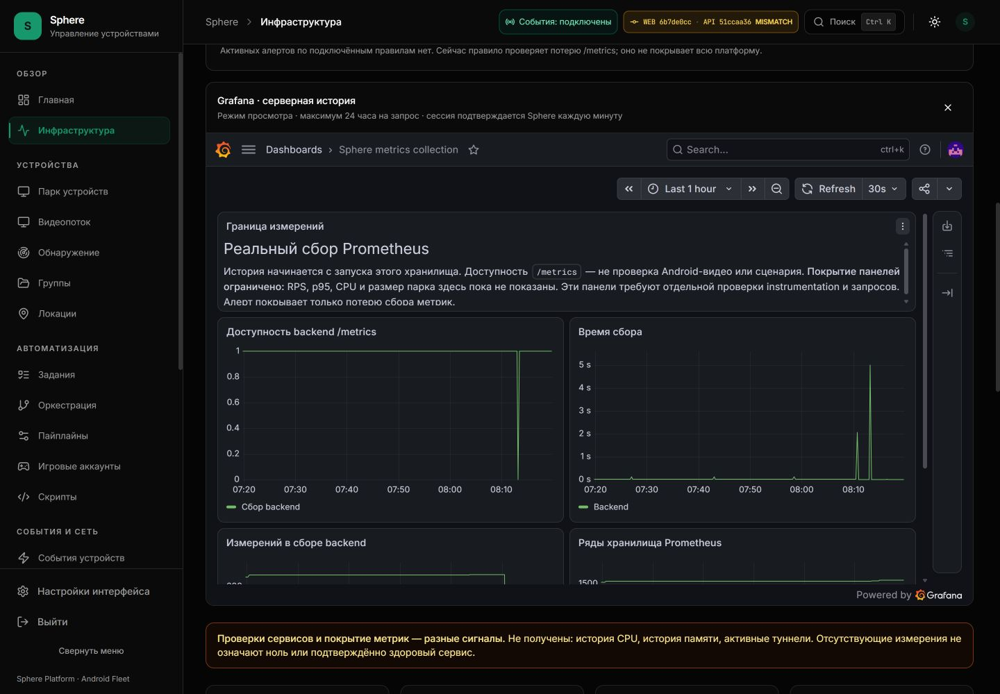

# Второй пакет исправлений продуктового аудита

Дата: 5 октября 2026, Asia/Yekaterinburg. PR #19, исходная точка `7293057`.

[Замороженный аудит](ENTERPRISE-PRODUCT-AUDIT.md), [50 исходных работ](ENTERPRISE-PRODUCT-BACKLOG.json)
и [приёмка первого пакета](ENTERPRISE-PRODUCT-IMPLEMENTATION.md) сохраняются отдельно.
Этот журнал фиксирует последующие изменения; историческое OPEN в baseline не переписывается.

**Установлено и принято в описанном объёме: 5 октября 2026, 08:19 UTC+5 / 03:19 UTC.**
API `51ccaa36`, review UI `6b7de0cc`, network topology `52403b4`;
финальный HTTP probe `030f09c`. [Живой веб](http://127.0.0.1:3015/monitoring).
EP-006 и EP-007 закрыты по своим критериям ниже; вместе с первым пакетом —
**7 закрытых / 43 работы с открытыми критериями из 50**.
Это не полная production readiness всей платформы.
[Машинные доказательства](ENTERPRISE-PRODUCT-FOLLOWUP-EVIDENCE.json) связывают
10 committed Git blobs, два образа, проверки, установку, HTTP и screenshot.

API/UI имеют разные SHA: backend изменён в отдельном коммите, а frontend содержит
его последующие изменения. Надпись MISMATCH в текущем header сохраняется честно;
совместимость этих сборок подтверждена конкретными HTTP проверками ниже,
а не совпадением номеров. Публичный UI18080 этим пакетом не обновлялся.

## EP-006: task/batch webhook acknowledgements

Статус: **SOURCE_FIXED / IMAGE_REGRESSION_VERIFIED / INSTALLED_HTTP_CANARY_VERIFIED**.

Подтверждённый дефект: `status_code < 500` записывал HTTP 403 и 429 как
`webhook.delivered`. Это достижимая ветка task completion и batch completion;
регистрация n8n использует отдельный сервис, который не заменён этим изменением.

Новый контракт:

| Ответ | Итог / повторы |
| --- | --- |
| 200…299 | `delivered`, остановка |
| 429 | `rate_limited`, до трёх повторов |
| 500+ | `server_error`, до трёх повторов |
| Сетевая ошибка httpx | `transport_error`, до трёх повторов |
| Остальные HTTP ответы, включая redirect/403 | `rejected`, без повторов |

Backoff 5/30/120 секунд; Retry-After для 429 принимает целые секунды или HTTP date,
ограничивается 0…120 секунд, неверное/слишком длинное значение использует backoff.
Это локальный бюджет callback, не гарантия выполнения произвольного срока получателя.
Максимум четыре HTTP попытки с timeout 10 секунд. Redirect не выполняется.
Сериализованные bytes, HMAC и `X-Sphere-Delivery` неизменны при повторах.
Один httpx client закрывается после доставки; cancellation передаётся вызывающему коду.

Structured logs содержат `delivery_id`, `event_type`, attempt/status/outcome,
retryability/следующую задержку и один окончательный failure receipt. URL, тело,
секрет подписи и текст transport exception не записываются этой веткой.
Это коррелируемые логи, **не новая таблица durable delivery receipts** и не новая
панель истории вебхуков. Task/batch результат не отменяется отказом callback.

Проверки: 38 webhook tests, в том числе 5 проверок прежнего n8n signed receiver
contract (200/204/403/429/503); до добавления этих пяти прошли 65 tests для
webhook + batch service + n8n API. Ruff и mypy целевого backend-файла проходят.
Предупреждения Pydantic Field/deprecated regex относятся к существующим схемам.

[`probe_webhook_delivery.py`](../../../scripts/audit/probe_webhook_delivery.py)
проверяет настоящий httpx POST на временный loopback HTTP receiver: 204, 403,
429→204, 503→204, исчерпание четырёх 503. Задержки только записываются и пропускаются,
поэтому этот probe не измеряет 155 секунд wall-clock retry. Нет внешних получателей,
DB/task/Android команд; receiver закрывается. После установки probe выполнен
в самом работающем backend container: импортированный service — из установленного
образа `51ccaa36`, probe receipt — source `030f09c`, 03:21:55 UTC.
Получены 1/1/2/2/4 HTTP попытки; 403 записан rejected + один окончательный failure,
а не delivered. HMAC, body и delivery ID сохранились при повторах; receiver закрыт.
httpx/AnyIO `sleep(0)` scheduling checkpoints считаются отдельно от положительных
callback retry delays; они не означают дополнительные HTTP попытки.

## EP-007: Grafana auth proxy и привязка Sphere session

Статус: **SOURCE_FIXED / REGRESSION_VERIFIED / LIVE_HTTP_AND_BROWSER_VERIFIED**.

В 02:53 UTC браузер на UI `6ff6bc2` снова показал Welcome. Grafana log того же
запроса содержит `auth-proxy.invalid-ip`, HTTP 302, peer `172.27.0.3`.
Whitelist фактически был `172.27.0.1` — gateway для прежнего host preview.
Следовательно, этот срез доказывает rejection текущего Docker frontend;
он не доказывает исчезновение UID или проблему Prometheus datasource.

Согласованный compose overlay задаёт review-ui постоянный IPv4 в private tools
сети с явно указанным IPAM subnet. Grafana принимает только **этот** адрес.
Новая сеть вместо удаления занятой сети сохраняет возможность rollback.
Для новой установки обязательны имя/непересекающаяся подсеть, проверка владельца
адреса и совместное применение frontend/Grafana конфигурации.
Динамическая выдача адресов ограничена отдельным pool, исключающим proxy IP;
это предотвращает конфликт при запуске Grafana/Prometheus раньше frontend.
Нет широкого CIDR whitelist, anonymous login или Editor permission.
Контракт проверен по [официальной документации Grafana](https://grafana.com/docs/grafana/latest/setup-grafana/configure-access/configure-authentication/auth-proxy/)
5 октября 2026; подробная инструкция — [OBSERVABILITY](../../operations/OBSERVABILITY.md).

Cookie теперь AEAD ticket AES-256-GCM: random nonce, отдельный derived key,
проверка целостности/формата/90-секундного срока, HttpOnly/SameSite/path/Secure.
Зашифрованный исходный Sphere token никогда не передаётся Grafana. Перед каждым
upstream запросом проверяются auth/me, blacklist и актуальная роль super_admin;
тот же user ID обязателен. Fail-closed при недоступной авторизации. Это устраняет
прежнее окно доступа до конца TTL после logout/понижения роли. Уже переданные
данные/ответ нельзя отозвать задним числом. Cookie старого формата отвергается;
повторное открытие iframe выдаёт новый ticket.

Upstream 401/403/login redirect больше не скрывается переходом в Welcome:
прокси выдаёт явную ошибку 503 конфигурации Grafana, без upstream cookies.
60 frontend tests (server bridge + panel lifecycle) проходят, TypeScript проходит.
Проверены tampering, random nonce, key rotation, oversized cookie/token, revoked
token, current role/identity change, auth outage, safe/unsafe redirects, read-only
mutation/feature endpoint allowlist.

Фактическая сеть — `sphere-observability-stable_tools`, subnet `172.29.0.0/24`,
dynamic pool `172.29.0.128/25`. Review UI имеет явный static IPv4 `172.29.0.3`,
Grafana whitelist ровно тот же адрес. IPAMConfig проверен после установки;
dynamic pool не может выдать proxy IP Grafana или Prometheus. Прежняя сеть
оставлена для rollback. Grafana 13.2.3, образы и data volumes мониторинга сохранены.

HTTP приёмка в **03:19:27 UTC**:

| Проверка | Полученный результат |
| --- | --- |
| Grafana profile через Sphere | 200, Org1, Viewer, не Grafana admin |
| Dashboard JSON + HTML | 200, UID `sphere-collection`, 5 панелей, canEdit=false |
| Datasource query | 200, один реальный data frame |
| Feature read | 200 |
| Anonymous / испорченная cookie | 401 / 401 |
| Запись через proxy | 405 |
| Подмена X-WEBAUTH-USER напрямую с loopback | 401 |
| Logout собственного canary Sphere session | 204 |
| Прежняя ещё действующая ticket cookie после logout | 401 через 0,39 секунды после выдачи |
| Повторная выдача ticket по отозванному token | 401 |

Выход выполнен только для созданной проверкой собственной сессии;
операторская browser session не отзывалась. На Prometheus availability history
получена 241 точка. Браузер показывает **Sphere metrics collection** и реальные
графики вместо Welcome; отсутствие Edit соответствует роли Viewer.
На графике сохранён провал сбора во время перезапусков, он не замаскирован.
Mobile layout в этом пакете заново не проверялся.

**Повторный живой срез06:47:14 UTC:** те же образы остаются healthy, dashboard,
Viewer, query200 и защитные границы повторно подтверждены. Отзыв ticket401
через0,17 секунды после выдачи; парк14 online/5 offline. Receipt сохранён отдельно,
первое окно03:19 не перезаписано. Это два конечных среза, не непрерывная запись stream SLA.

## Проверки сборок и установка

- **116 suites / 1196 frontend tests**, 0 failed / 0 pending; TypeScript и Docker
  production build прошли. HTTP и Android в этих тестах mocked; они не заменяют live receipt.
- **70 backend checks в production image**: webhook38 + batch/n8n32, 0 failures/errors/skipped.
  Application source из образа, test source mounted read-only, network none,
  memory limit768MiB. Это целевой regression pack, не вся backend test suite.
- **mypy: 229 source files**, Ruff backend и frozen OpenAPI/catalog check проходят
  в том же образе. API schema не изменилась. Образы собраны из committed Git archive.
- React act/Node localStorage warnings и существующий FastAPI regex deprecation
  сохранены в журналах. Первый mypy запуск исчерпал tmpfs для cache; повтор с
  no-incremental/cache-dir=/dev/null прошёл. Первый Ruff запуск без pyproject
  дал forward-reference false positives; с canonical config проверка прошла.

API accepted install: **03:14:47 UTC**, 45 других контейнеров сохранили
id/image/start epoch/mounts/log rotation. Observability accepted install:
**03:18:08 UTC**, изменены только review UI, Grafana и Prometheus; 43 остальных
сохранены, API не перезапускался этим этапом. PostgreSQL/Redis/data volumes,
APK и Tuna/прочие туннели не менялись. Предыдущие образы и конфиги сохранены.

**Установка не была без перерыва.** Две первые API попытки guard откатил:
точное поле первой ошибки не сохранено, во второй receipt доказан только иной
порядок mounts. После сортировки по Destination guard сравнивает те же данные.
Всего backend пересоздан пять раз: candidate/rollback дважды и финальный candidate.
Первую observability попытку guard тоже откатил: Docker Desktop записал тот же
bind source как Windows path и `/run/desktop/mnt/host/c/...`. После нормализации
эквивалентных путей второй install принят; проверка ownership/image/mount не отключалась.
Неуспешные install receipts и rollback logs сохранены локально.

Исходно 14 online; промежуточно перед последним API restart7, сразу после4.
К **03:19:27 UTC** парк восстановился до **14 online / 5 offline**, всего19,
без connecting/busy/issues в этом срезе. Это восстановление конечного окна,
не подтверждение многодневного SLA. Android commands не отправлялись.

## Оставшиеся работы и воспроизводимость

EP-008 (RPS/p95/endpoint drilldown) и EP-009 (process/container/host resource history)
открыты. Панели доступности Grafana/Prometheus не закрывают эти требования.
Полный Studio/source editor/action catalog, запись Android действий, пошаговый
trace, полные preference presets, подробные карточки и нагрузка остаются в
[исходном плане](ENTERPRISE-PRODUCT-BACKLOG.json). Новая durable история callback
также не добавлена. VPN/Amnezia и AI остаются будущими этапами.

Конечный восьмичасовой [storage/VSS/RAM recorder](HOST-STORAGE-NIGHT-WATCH.md)
продолжает работу; предполагаемый рост диска/ОЗУ этим пакетом не объявлен устранённым.
Следующая интерпретация — после завершения окна и сравнения exact allocation counters.

Integrity checks читают только evidence, pinned Git и изображения:
`python scripts/audit/validate_product_audit.py`,
`python scripts/audit/validate_product_implementation.py`,
[`python scripts/audit/validate_product_followup.py`](../../../scripts/audit/validate_product_followup.py).
Они не запускают сеть/устройства и не перепроверяют текущую работоспособность.
Первый пакет и исходный аудит сохраняют свои собственные SHA/снимки/числа.

На source `52403b4` frontend/Android CI и lint/security/RLS/bootstrap прошли.
Backend Tests job завершился отказом только Codecov upload; regression, schema
и Redis шаги прошли. Предыдущий `7293057` имел тот же отдельный отказ upload.
Это не объявляется зелёным CI. Проверки конечного
коммита документации фиксируются отдельно в PR, а не подменяются прежним результатом.
