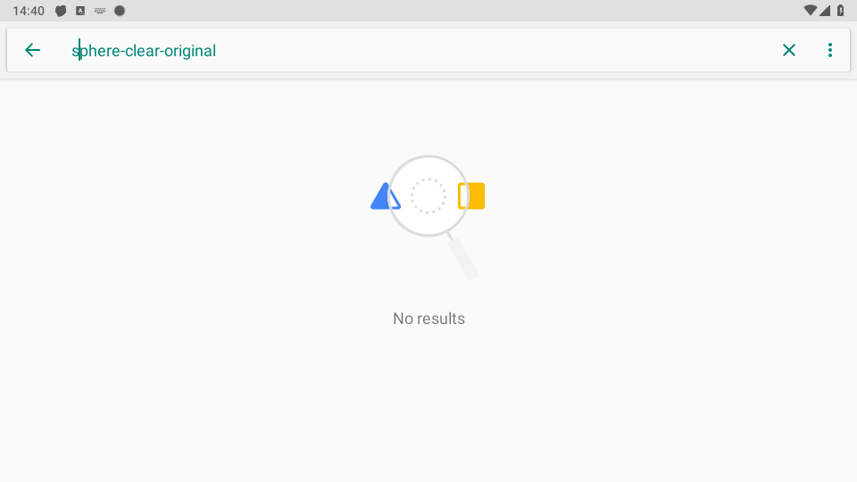
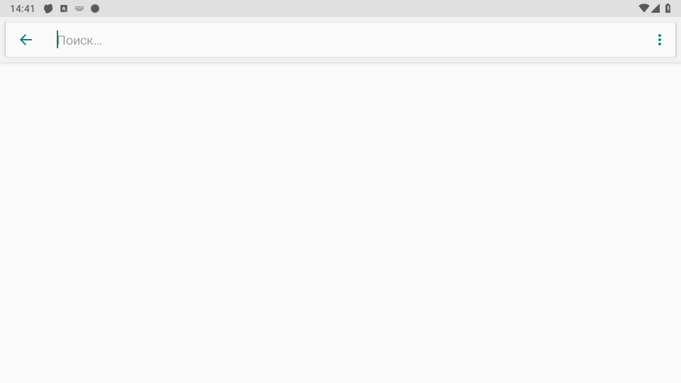

# Android: корректная очистка сфокусированного поля

Дата: **6 октября 2026**. Область: P1 из [аудита recorder](STUDIO-COMMAND-RECORDING.md#дополнительная-находка-apk-очистка-поля).
Версия исходников APK: **1.2.46 / 10246**, source **`6a9f570f`**. Это отдельный Android этап; установленный
UI `1c26ffc7`, API `eb7a7c26` и ранее принятые receipts не переписываются.

## Доказанный дефект

`input_clear` и `type_text.clear_first:true` в DagRunner использовали keycode 277
как CTRL_A, затем DEL. В [Android KeyEvent](https://developer.android.com/reference/android/view/KeyEvent#KEYCODE_CUT)
277 означает CUT. Последовательность могла изменить clipboard и удалить только
выделение или один символ. Нет отдельного keycode «Ctrl+A»: нужен настоящий chord.
Исходники старого обработчика закреплены raw Git hash в recording evidence.

## Изменение и границы контракта

- [RootInputBridge](../../../android/app/src/main/java/com/sphereplatform/agent/commands/RootInputBridge.java)
  запускается root `app_process` из **собственного установленного APK**. Принимает
  только `clear-focused`; не получает текст, selectors, clipboard или произвольные команды.
- [RootTextClearSequence](../../../android/app/src/main/java/com/sphereplatform/agent/commands/RootTextClearSequence.java)
  нажимает Ctrl-left/A с META_CTRL_ON/META_CTRL_LEFT_ON, отпускает их, затем Delete.
  Инъекция ждёт WAIT_FOR_FINISH. При ошибке независимо пытается отпустить каждую
  клавишу; удаления повторно нет. CUT/clipboard операции отсутствуют.
- [AdbActionExecutor](../../../android/app/src/main/kotlin/com/sphereplatform/agent/commands/AdbActionExecutor.kt)
  ставит helper в **ту же FIFO root-сессию**, что предыдущий tap/key. Не создаёт
  конкурирующий su-процесс, который мог бы очистить поле раньше клика.
- [RootCommandAcknowledgement](../../../android/app/src/main/kotlin/com/sphereplatform/agent/commands/RootCommandAcknowledgement.kt)
  принимает только уникальный marker и exit code; deadline 5 s, суммарный drain
  256 KiB, tail 128 characters. Предыдущие stdout/stderr не сохраняются и не логируются.
  Дополнительных reader threads или файлов нет. Ожидание работает на Dispatchers.IO
  под lock владения root, не на Android main loop.
- Неизвестный исход, невалидный marker, timeout, injection failure или отмена
  инвалидируют root ownership. Не выполняются CUT fallback, автоматический retry,
  ввод замены или on_failure переход. Уже доставленную команду это не отменяет;
  результат требует проверки экрана. Lifecycle root descendants остаётся отдельным gate.
- [DagRunner](../../../android/app/src/main/kotlin/com/sphereplatform/agent/commands/DagRunner.kt)
  использует один adapter в обоих actions. `input_clear` сообщает
  `adapter=root-key-chord, field_verified=false` в существующем string output.
  ACK input dispatch **не подтверждает**, что произвольное приложение очистило поле.
- [R8 rule](../../../android/app/proguard-rules.pro) сохраняет динамический main entrypoint.
  Новых библиотек, assets, сервисов, accessibility grants или сетевых endpoint нет.

Android 26–33 использует InputManager, 34+ — InputManagerGlobal. Это отражает
[смену AOSP manager](https://android.googlesource.com/platform/frameworks/base/+/dc79a130f72423868cae7ef70575a669d5e4bb51%5E%21/),
[официальный keyboard input path](https://android.googlesource.com/platform/prebuilts/fullsdk/sources/android-29/+/refs/heads/main/com/android/commands/input/Input.java)
и [модификаторы Android](https://developer.android.com/reference/android/view/KeyEvent#META_CTRL_LEFT_ON).
OEM hidden-API/SELinux/root поведение требует собственной runtime проверки.
Custom canvas, IME, password/editor ограничения и неверный focus могут не поддержать
shortcut; adapter не обходит их. Очистка существующего Unicode текста не означает
поддержку Unicode **ввода** через прежний `input text`.

## Проверка и доставка

**45 focused source tests**, 0 failures/errors/skips: DagRunner 33, root adapter 4,
marker 5 и editor model 3. Проверены очистка всего модельного multiline/Unicode
текста без clipboard изменений, rejected/throwing injection, независимые releases,
FIFO root-session ownership, unknown result без retry/typing/failure route, cancellation,
partial/stale/malformed marker, exited process и bounded drain.

Полные локальные DevDebug и EnterpriseDebug suites: **по 855 passed / 1 assumption-skipped**,
71 suite, 0 failures/errors. Повторение тех же cases в двух flavors не даёт 1710
уникальных проверок. Пропущенный существующий `ConfigRecoveryTest` требует
непустых baked DEFAULT_SERVER_URL/API_KEY; manifest-driven candidate не выполняет
это условие. Focused 45 входят в общий набор, их также нельзя складывать с ним.

Обе debug flavors собраны offline из закреплённого Android tree. Pilot candidate:

| Поле | Проверенное значение |
| --- | --- |
| Source commit | `6a9f570f2c0a4dc54a90b0be57a289dadc85d534` |
| APK | `SphereAgent-pilot-candidate-1.2.46-dev-6a9f570.apk`, 8477355 bytes |
| SHA256 | `87db8510a091de310481c39804899ac6255a243df8f8de630db65d428d3dafc4` |
| Package/version | `com.sphereplatform.agent.pilot.debug`, `1.2.46-dev / 10246` |
| Certificate SHA256 | `3ab40797d26e4f52f9e440afc6fe69f197caef71a5a27c63c86735bb1801871f` |
| Built at | 6 октября, 12:34:28 UTC |
| Delivery | **Не установлен, не опубликован в OTA** |

Подпись соответствует прежнему локальному pilot baseline; apksigner, package/version,
private bootstrap/manifest source checks прошли. Отдельно проверены ZIP CRC и
SHA-1/Adler32 каждого DEX. Артефакт хранится локально в `.local-pilot/apk/`; APK,
секреты, BuildConfig и raw build logs в репозиторий не опубликованы. В нём сохранён
прежний debug video probe: planar input включён, GPU bridge выключен. Это не
приёмка production stream strategy или подписанного производственного release.

**Source CI `6a9f570f`**: backend/frontend/Android/Preview success, snapshot
12:43 UTC. Android job построил и проверил signed release smoke с **одноразовым
CI-only key**; это другой signer и не runtime proof на устройстве. Preview guard
прошёл, deploy skipped. Последующий документационный head имеет собственный CI.

## Реальное поле Android: helper без переустановки агента

6 октября, **12:41:02 UTC**, один локальный `emulator-5554`, Android 9 / SDK 28,
960×540, подтверждённый UID 0. На нём остался установленный Agent **1.2.44-dev / 10244**.
Из кандидата загружен только root helper через временный CLASSPATH в
`/data/local/tmp`; установка package, service restart или OTA не выполнялись.
Тест использовал пустой поиск Android Settings Intelligence, не рабочие данные.

1. Визуально подтверждён пустой поиск. XML возвращает его placeholder «Поиск…»
   как text; сравнивался исходный placeholder, а не предположение `text == ""`.
2. Введено тестовое `sphere-clear-original`, курсор перемещён с конца в начало
   строки и на один символ вправо. Снимок ниже показывает это положение.
3. Helper удалил **всю строку**, поле снова показало исходный placeholder.
4. Повторный вызов на пустом поле сохранил пустое поле. Последующий `after-clear`
   появился корректно: модификатор не оставил обычный ввод в Ctrl-состоянии.
5. После теста выполнен Home; временные APK/XML удалены, отсутствие проверено.

Один helper round-trip составил **1734 ms**, включая ADB/root/app_process startup.
Это не frame latency, FPS или fleet p95. Начальная попытка fixture не смогла снять
XML сразу после открытия поиска; затем установлены настоящий package
`com.android.settings.intelligence` и ID `android:id/search_src_text`. Только чтение
иерархии допускает до трёх ограниченных попыток; helper input не переотправляется.





Это **native helper proof**, не полный canary нового установленного AdbActionExecutor:
FIFO/marker/unknown/cancel contract проверен source unit tests, а установленный
агент пока старый. Реальный clipboard не читался; неизменность его содержимого
проверена моделью, отсутствие CUT — исходниками. Unicode/multiline проверены моделью,
но не введены в реальное поле. SDK 26/34+, vendor root/SELinux/hidden APIs, password,
IME/custom editors, focus races и полный `type_text.clear_first:true` canary после
адресной установки остаются открытыми воротами.

Первый Enterprise full run имел 19 ClassFormatError из-за одного повреждённого
сгенерированного `.class`. Raw compiler output был корректен; подтверждённо неверный
1753-byte transformed output сохранён privately и адресно пересоздан. Повторный
полный Enterprise suite прошёл. Причина повреждения **не установлена**, это не
исправление NTFS и не доказательство disk-growth writer:
[отдельный host incident](HOST-FILESYSTEM-INCIDENT.md#повреждённый-generated-class-в-android-сборке).

[Frozen receipts/source hashes/PNG](ANDROID-FOCUSED-TEXT-CLEAR-EVIDENCE.json) и
[offline validator](../../../scripts/audit/validate_android_focused_text_clear.py)
проверяют целостность документов без API/Android команд:

```powershell
& '.venv-audit/Scripts/python.exe' -m scripts.audit.validate_android_focused_text_clear
```

**Установка/OTA публикация 1.2.46 ещё не выполнена.** Remote PH025 с APK 1.2.45-dev
не приобретает handler от обновления веба. Общий backlog **9 принято / 41 открыто**
не изменён; source fix и два debug suites не закрывают весь Enterprise release gate.
