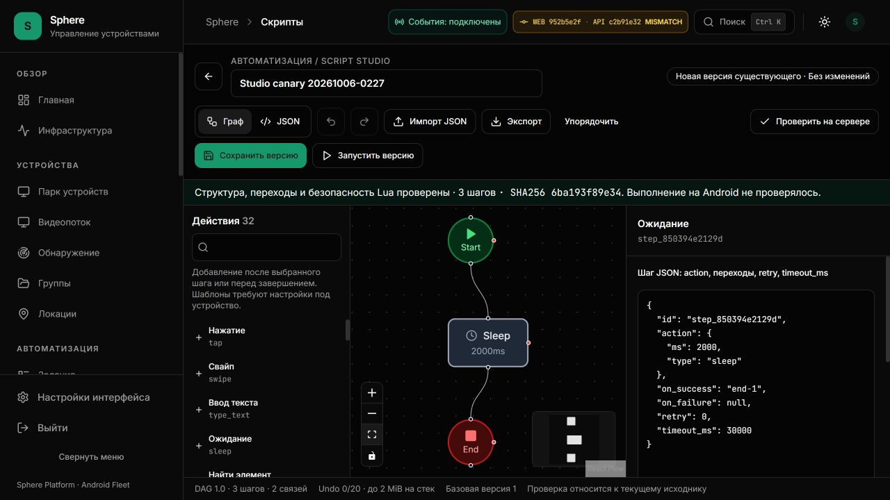

# Script Studio: рабочее основание конструктора

6 октября 2026, Asia/Yekaterinburg. Первоначальный аудит: исходники `15aede54`,
тогда установленные API `76596c39`, UI `5405d465`. Текущая установка этапа A:
**API `c2b91e32`, UI `952b5e2f`**; результат и доказательства ниже.
**EP-014…020 OPEN**; счёт 9 принято / 41 открыто
сохраняется. По прямому запросу пользователя Studio сейчас выделен в отдельный
этап; оставшиеся ресурсные/release gates не снимаются.

[Приоритеты](ENTERPRISE-PRIORITIES.md) · [Immutable backlog](../2026-10-05/ENTERPRISE-PRODUCT-BACKLOG.json) ·
[Текущее состояние](../../operations/CURRENT-STATE.md).

## Подтверждённые разрывы

| Область | Доказательство | Следствие |
|---|---|---|
| Palette | builder показывает 6 типов; backend допускает 32 | Поддерживаемые действия нельзя нормально добавить из интерфейса |
| Source | JSON целого сценария не редактируется; imported generic action только pre | Нельзя вставить сценарий, изменить сложные параметры и увидеть граф |
| Layout | В native browser workspace 656 px, содержимое 720 px | Высота редактора учитывает viewport вместо доступной рабочей области |
| Validation | Проверка только внутри save; endpoint без сохранения отсутствует | Оператор не получает серверную проверку до публикации версии |
| Draft/history | Нет undo/redo и восстановления черновика | Ошибка JSON или уход со страницы рискуют потерять работу |
| Graph identity | Pydantic принимает повтор `id=end` | Canonical map и Android индекс неоднозначны |
| Branch types | `condition.on_true=['end']` даёт TypeError, не ValidationError | Неверный source может получить 500 вместо понятного 422 |

Встроенный browser: «Новый сценарий» → `/scripts/builder`; исходный screenshot
[before](assets/script-studio/before.jpg). Исходник: [builder](../../../frontend/app/%28dashboard%29/scripts/builder/page.tsx),
[wire export/import](../../../frontend/lib/dag/export.ts), [server DAG](../../../backend/schemas/dag.py),
[APK runner](../../../android/app/src/main/kotlin/com/sphereplatform/agent/commands/DagRunner.kt).
Repro типов выполнен напрямую через `DAGScript.model_validate`, без записи БД или
Android-команд. Это не HTTP/RLS proof. Полная серверная проверка параметров всех
actions пока отсутствует: accepted graph не равен capability/preflight/успешному run.

## Этап A: предметный результат

1. Отделить source DAG 1.0 от canvas layout. Visual/source переход атомарен;
   invalid JSON остаётся в редакторе, save/run не используют прежний скрытый граф.
2. Сделать searchable palette всех canonical actions. Для complex actions оставить
   полноценное редактирование JSON параметров; не называть read-only pre редактором.
3. Серверная проверка draft без version/task/command создания: normalized DAG,
   SHA256, число узлов и точный scope проверки. Ошибки не возвращают исходные payloads.
4. Исправить duplicate identity и неверные condition references до hash/map lookup.
5. Bounded undo/redo; явное opt-in для одного локального draft на identity, TTL/size
   и явное восстановление. Ни autosave, ни restore не публикуют сценарий.
6. Сохранить optimistic version guard. Conflict не стирает source и не делает
   автоматический retry; stale validation не подтверждает новый source.
7. Запуск только сохранённой известной версии через существующий task admission,
   с явным выбором устройств. Не выдавать local playback animation за Android execution.
8. Перекомпоновать Studio в доступную высоту, с переносом toolbar, scrollable
   panels, читаемой светлой/тёмной темой и accessible labels.

## Следующие отдельные этапы

- EP-016: versioned action/capability schema, все параметры/limits/effects/results;
  strict runtime compatibility для конкретного APK. Каталог сам по себе не proof.
- EP-017/018: live target metadata, native stream, input receipts/recording,
  selector candidates, ambiguity/fallback, ownership и координаты после смены target.
- EP-019/020: step trace с command/frame/snapshot/attempt, replay без input,
  настоящий pause/step/cancel protocol, cancel/late-result safety.
- EP-021: единое automation workspace с schedules/triggers/resources references;
  не объединять сущности через декоративные ссылки без согласованных контрактов.

## Приёмка этапа

Unit/regression: visual/source roundtrip, malformed/duplicate refs, source parse error
с сохранением текста, concurrent conflict, stale validation, identity switch,
draft byte/TTL/storage failure, bounded history и отсутствие API writes от restore.
Backend route tests должны подтвердить отсутствие создания сценария/версии/задания
и обычную auth boundary; общая auth/audit активность учитывается отдельно.
Затем exact-source production build/types и текущий frontend suite, schema check,
установка с сохранением прочих компонентов и визуальная проверка в native browser.
Живой canary, если запускается, только отдельный безопасный start/sleep/end сценарий;
нельзя подменять его mocked result. APK/OTA не обновляются без отдельной причины.

## Ресурсные и эксплуатационные границы

Никаких бесконечных polling/сканеров или неограниченных draft/history buffers.
Local draft содержит полный source только на этом ПК; layout остаётся отдельно в canvas, сохранение включается
оператором, ошибки storage видны. History не является backup/version history БД.
Backend schema currently checks structure/types/routes and Lua safety, не доступность
selectors на экране, root/UIA2 permissions, retry side effects или сеть устройства.
Live stream/script 20–30/500/1000 devices и backup/restore остаются независимыми gates.

## Установленный результат этапа A — 6 октября, 02:35 UTC+5

Рабочий путь: [Новый сценарий](http://127.0.0.1:3015/scripts/builder) →
[сохранённый canary](http://127.0.0.1:3015/scripts/builder?id=fbffbc95-3c16-4f1e-8833-d77271ac1b28).
Это установленный веб с настоящим API и устройствами. Demo datasets и mocked
Android execution в приведённом живом прогоне не использовались.

[Инструкция оператора](../../operations/SCRIPT-STUDIO.md) ·
[Manifest доказательств](SCRIPT-STUDIO-EVIDENCE.json) ·
[Проверка целостности](../../../scripts/audit/validate_script_studio.py).

| Реализовано | Контракт и границы |
|---|---|
| Граф ↔ JSON | Один DAG 1.0; переход применяет валидный source атомарно. Invalid source остаётся для исправления и блокирует публикацию/проверку/запуск; старый граф не подставляется |
| Каталог 32 действий | Поиск, добавление шаблона, JSON всех параметров узла. Шаблон — пример, не capability proof конкретного APK |
| Переходы и параметры | `action`, вложенные selectors/headers, success/failure routes, retry и timeout редактируются целиком. ID узла меняется в source вместе с references |
| Import/export | Локальный `.json` до 512 KiB UTF-8. Оригинальный сохранённый DAG возвращается без canvas-позиций; импорт не запускает устройство |
| Undo/redo | 20 записей и 2 MiB на каждый стек. Недопустимый текст также можно исправить через Undo |
| Draft | Явный opt-in, один документ на org/user, restore только для совпавшего resource, TTL 7 дней, source 512 KiB / encoded envelope 528 KiB, debounce 700 ms |
| Проверка API | `POST /scripts/validate`, `script:read`, normalized DAG/hash/node_count/action_types; scope `structure-routes-lua-safety`, execution verified всегда false |
| Identity и права | Отдельные read/write/execute guards; смена org/user/session отменяет прежние запросы и не применяет поздние receipts к новой identity |
| Публикация | Существующие create/update, известный expected version; 409 сохраняет локальные изменения и не повторяется автоматически |
| Запуск | Только чистая сохранённая версия с известным hash; существующий admission dialog открывается в режиме явного выбора, с нулём выбранных устройств |
| Layout | Доступная высота вместо полного viewport, тематические controls/minimap, расположение по маршрутам, canvas 380 px в узком stacked режиме |

Unknown action не становится новым Android handler. В текущем schema/import
такой сценарий не проходит validation; известные сложные параметры сохраняются
как source. Полнота и типизация **всех** runtime-параметров ещё требуют EP-016.
Native textarea здесь является редактором source; Monaco/CDN, schema autocomplete,
recorder и визуальный replay не объявляются реализованными.

### Атомарные изменения

| Commit | Изменение |
|---|---|
| `5ada4cc` | Исходный аудит, acceptance этапа и реальный screenshot до изменения |
| `561d08a` | Draft endpoint; duplicate ID и неправильные hashable references/code отвергаются как 422, а не TypeError/500 |
| `c2b91e3` | Studio, полный source/node editor, bounded draft/history, permissions/identity guards, адресный запуск и инструкция |
| `61f84bc` | Layout по execution routes, тема controls/minimap и предел encoded draft |
| `952b5e2` | Измеримая высота узкого canvas, обнаруженная настоящей браузерной проверкой |
| `2dbe82e` | Test-only follow-up: дождаться настоящего heartbeat commit, проверить normal и delayed renewal |

API построен из immutable Git archive `c2b91e3202948860e4d99b3f35cbe441d2842538`,
image `sha256:c274bb4aa5b7af17413101a9442a9ba7716785425df6fad396b034419990c28c`.
UI — из `952b5e2f6ed6bde8a4bcbbbdff28be24f302b15c`, image
`sha256:b913ea01d8b0b00c9361706f98010b6e6c56833ce3e112efb79a594e04754d27`.
После `c2b91e3` backend tree не менялся; два frontend fixes не требуют замены
API. Разные revisions остаются видимыми в header. Badge MISMATCH означает разные
commit SHA, сам по себе не доказывает несовместимость контракта или отказ API.

### Тесты и scope

| Проверка | Записанный результат |
|---|---|
| Exact API image | 596 device/status/WS/VPN/script cases + 35 resource cases = **631 passed**, без failures/errors/skips |
| Новая draft route + DAG/service subset | 59 cases входят в 596, не добавляются повторно к общему числу |
| API types/lint/schema | mypy по backend, scoped Ruff и exporter `--check` прошли в этом image; network none, application source не примонтирован |
| Frontend `952b5e2f` | **1353 passed / 122 suites**, failures/pending/runtime errors 0; local Jest, не тесты внутри production UI image |
| Production UI | Node24 build и TypeScript на immutable archive `952b5e2f` прошли; 30 маршрутов |
| Offline evidence checker | 23 компактных receipts, 20 source hashes, 2 image JUnit + отдельный recovery JUnit, 5 настоящих screenshots; проверка предыдущего upload evidence и immutable backlog |

UI tests охватывают восстановление invalid source, параметры visual/source,
stale validation после identity switch, отсутствие write permission, явное
восстановление draft без API write и byte/TTL/history bounds. Старые load/version
регрессии сохранены. Это не полный proof всех конкурентных сценариев Studio,
не 500/1000-load и не soak браузерного heap/GPU.

Первый packaged test harness захватил operational soak tests, требующие
`scripts.pilot`, которых нет в production image. Collection не прошёл; проверка
повторена с явным application subset и прошла. Host backend source не монтировали,
чтобы скрыть отсутствие production module. Один локальный hash probe сначала
использовал compact separators; исправлен **probe**, не алгоритм сервиса.
Полный локальный Ruff новой версии отмечал unrelated E721 в
`backend/services/account_credentials.py:52`; это не исправлялось в данной работе.
Записанный packaged scoped Ruff и отдельный source CI lint имеют собственный scope.

### Живой HTTP-контракт draft

Окно 5 октября **21:25:46 UTC** / 6 октября **02:25:46 UTC+5**:
anonymous 401, валидный authenticated запрос 200; hash нормализованного DAG
независимо вычислен по существующему алгоритму сервиса. Duplicate ID, list вместо
action type, list вместо condition branch и object вместо Lua code дали **422**.
Ошибки не отражают исходные input/context в ответе.

До/после: **17 scripts / 20 versions / 435 tasks**. Проверка не публикует script,
version, task или Android command. Это не «никаких DB writes вообще»: общий
auth/audit lifecycle намеренно исключён из этой проверки. Production RLS/permission
и конкурентная нагрузка имеют отдельные gates.
[HTTP receipt](evidence/script-studio/draft-api-live.json).

### Настоящий canary на удалённом Android

Создан через браузер, сохранён, повторно открыт из каталога и запущен с **одним**
явно выбранным `auto-ph-025` (PH025, remote); APK **1.2.45-dev**.
Сценарий безопасен: start → sleep **2000 ms** → end. Нет ввода, открытия приложений,
изменения настроек/файлов или сетевых команд. Это не проверка всех 32 действий.

| Идентификатор | Значение |
|---|---|
| Script | `fbffbc95-3c16-4f1e-8833-d77271ac1b28` |
| Immutable version | `843654ef-e486-4b63-8e50-578a4226df44`, v1 |
| SHA256 | `6ba193f89e34a2b93efc41c60d547e21923d54417e69d3f6b795e8c7128c6916` |
| Device | `b410464a-5f26-4803-a756-7840cc17b128`, `auto-ph-025` |
| Task | `b47cb4f2-7a92-46f2-8290-851635fe7890` |
| Start / finish | `2026-10-05T21:30:34.799041Z` / `21:30:37.324879Z` |
| Result | `completed`, success true, **3 executed / 3 successful reports**, sleep duration 2000 ms |

Task version ID совпал с сохранённой immutable v1; для этого script найдено ровно
одно задание. Прямое API-чтение результата и реальная браузерная timeline совпали.
Сценарий оставлен в каталоге как review artifact; его можно открыть самостоятельно.
Он не является autonomous flight mission, fault recovery или нагрузочным прогоном.
[Sanitized result](evidence/script-studio/canary-live.json) ·
[Реальный завершённый task](assets/script-studio/canary-completed.jpg).

Экспорт вернул настоящий `sphere-scenario.json`, **723 bytes**. Прочитанный файл
в точности совпал с сохранённым DAG; независимый semantic hash совпал с v1 и
серверной проверкой. Native file chooser импортировал этот файл обратно; source
остался «Без изменений» и повторная проверка вернула тот же hash. Второго run нет.
Browser automation download event имел timeout 10 s, поэтому успех подтверждён
фактическим файлом и import, а не ложным assertion об успешном event.
[Export receipt](evidence/script-studio/export-file.json).

### Установка, ресурсный preflight и presence

Каждая установка заменяла только свой API/UI container; **45 соседей** сохранили
identity/image/start/mount/log configuration. API logs volume и rotation сохранены;
UI read-only/cap-drop/network settings проверены installer. APK/OTA и туннели не
обновлялись в этом этапе. Ресурсный preflight конечный, без directory walks/prune.
Перед последним build: свободно C: 58,662 GB, RAM available 10,016 GB,
commit 75,588 / 95,153 GB; это bytes, переведённые в десятичные GB, не leak diagnosis.

Перезапуск API в **21:24:22 UTC** дал presence **0 online / 19 offline** после
14/5 перед заменой; уже в **21:24:45 UTC** записано 14/5. HTTP draft-срез в
21:25:46 — 13/6. Последняя UI-установка в **21:35:31 UTC** — 14/5 до и после.
Эти события сохранены; утверждения zero downtime, reconnect fix, непрерывного WAN
SLA или устранения host storage writer не делаются.

### Визуальная проверка

Native browser проверил invalid JSON и Undo, добавление sleep, node parameters,
server receipt, create/reopen, select-one admission, completed timeline,
import/export, светлую/тёмную тему и узкую компоновку. На desktop **1280×720**
main height/scroll height **656/656 px**; canvas 391 px. На **390×844** document
width **390 px**, canvas **380 px**, stacked content прокручивается по высоте.
Viewport override сброшен, тёмная тема восстановлена.

Два визуальных дефекта найдены **после** успешного build: несогласованные позиции
узлов/белая oversized minimap и нулевая высота canvas на узком экране. Исправления
`61f84bc` / `952b5e2` установлены и проверены повторно. Canvas допускает pan/zoom;
кнопка Fit View показывает весь граф, не меняя DAG. Не заявлена pixel acceptance
каждого existing modal всех остальных разделов по одному screenshot Studio.



[Светлая тема](assets/script-studio/desktop-light.jpg) ·
[Узкий экран](assets/script-studio/mobile-light.jpg) ·
[Browser receipt](evidence/script-studio/browser-live.json).

### CI и оставшаяся приёмка

CI snapshot source **`952b5e2f`** (точное время в receipt): frontend tests/types/build,
backend lint/security/bootstrap/RLS, Android и preview guard прошли. Backend Tests
завершились с **1 failed / 2842 passed / 30 skipped**, coverage 80,17%: test heartbeat
сравнивал deadline после фиксированных 160 ms, до завершения реального renewal commit.
Такой sleep не является synchronization на загруженном runner. Полный CI source
**не принят**. Устранение зависимости теста от тайминга и новый CI учитываются отдельно;
production heartbeat не меняется без доказательства runtime defect. Последующий documentation
head не наследует status этих runs. [Source-linked snapshot](evidence/script-studio/source-ci.json).

Test-only follow-up **`2dbe82e`** дождался исходного `_renew_lease_result` после commit,
без mock SQL outcome. Normal и delayed-first-renewal 250 ms сохраняют owner/generation,
не допускают competing worker и отвергают продление terminal lease.
**47 реальных PostgreSQL/Redis recovery/admission cases прошли**, scoped Ruff прошёл;
local 573 warnings не объявлены устранёнными. Running images остались прежними.
Отдельный CI follow-up завершился успешно: **2844 passed / 30 skipped / 0 failed**,
один warning, coverage **80,20%**, pytest **822,67 s**. Backend tests, lint,
security, image bootstrap, RLS, frontend, Android и preview guard source `2dbe82e`
прошли. Это не меняет исторический failed status `952b5e2f` и не принимается как
CI будущего documentation head; установленным API/UI не приписывается новый image.
[Разбор](PIPELINE-HEARTBEAT-TEST-REVIEW.md) · [Регрессия](evidence/script-studio/pipeline-regression.json) ·
[Follow-up CI](evidence/script-studio/followup-ci.json).

Документационные targets проверены в восьми изменённых документах: **590**
local links, 24 anchors и 41 unique open priority ID. Старые исторические отчёты
не переписывались как новый deploy; immutable baseline и previous evidence hash сохранены.

**9 принято / 41 открыто** сохраняется. Этап A не закрывает целиком EP-014…020.
Следующие критерии, от основания к live automation:

1. EP-015: server-version diff при 409, явный merge/reload workflow и dirty navigation
   blocker для общего sidebar; восстановление editor при ошибках/истечении capability.
2. EP-016: versioned action schema всех обязательных полей, bounds/effects/results,
   capabilities и preflight конкретного APK до irreversible input.
3. EP-017: выбор живой машинки в редакторе, stream/selector candidates/frame identity,
   права/ownership и корректные координаты при смене устройства.
4. EP-018: recorder с input receipts, XPath candidates/ambiguity, undo/drop, generation
   правильного source и отсутствие записи приватного текста по умолчанию.
5. EP-019/020: correlation command/frame/snapshot/attempt, replay без повторного input,
   настоящий pause/step/cancel protocol и обработка late results.

Полный source draft сохраняется только по opt-in и может содержать private text,
headers/code; размеры/history ограничены, но org-wide quotas/retention не добавлены.
Локальная история не заменяет DB versions/backup. Retry side effects, network
recovery, root/UIA2, long run/fault/load и 20–30 устройств всё ещё требуют отдельных
проверок. Общие storage/release/stream gates остаются в
[приоритетах](ENTERPRISE-PRIORITIES.md), их нельзя закрыть удачным sleep-canary.

## Воспроизводимая проверка артефактов

### Уточнение EP-016: параметры и фактические Android handlers

**6 октября, 03:07 UTC+5.** Дополнительно выполнена конечная offline-проверка
Pydantic schema и source inventory. Запросы к серверу, БД и команды Android не
выполнялись. [Probe](../../../scripts/audit/probe_studio_action_contract.py) ·
[Receipt с hashes](evidence/script-studio/action-contract.json).

Canonical backend и frontend наборы совпали: **32 типа**. В `executeNodeInternal`
найдено **33 handlers**: все 32 опубликованных и дополнительный `loop`. Следовательно,
«32 шаблона» не означает «весь runtime Android». Loop пока не проходит API validation;
его нельзя просто открыть в каталоге без рекурсивной schema, limits/effects и
capability negotiation. Это воспроизводимое расхождение source, не доказательство
наличия этих handlers во всех установленных версиях APK.

| Offline case | Pydantic принял структуру | Что требует runtime |
|---|---|---|
| `tap` без `x/y` | Да | Handler читает оба обязательных поля как Int |
| `sleep.ms = "not-a-number"` | Да | Handler читает Long, а не произвольную строку |
| `set_variable.value = {}` | Да | Handler читает JsonPrimitive; object не является primitive |
| `condition.params = []` | Да | Handler ожидает JsonObject |
| `loop` с body/count | Нет | Handler существует, API тип не публикует |

Такие drafts могут пройти именно **структурную** проверку. Часть блокируется
frontend проверкой, но это не защита прямых API clients. Четыре accepted cases
не отправлялись устройству; Android exception/result для них не заявляется живым
фактом. Основание: [backend schema](../../../backend/schemas/dag.py),
[frontend validator](../../../frontend/lib/dag/export.ts),
[Android runner](../../../android/app/src/main/kotlin/com/sphereplatform/agent/commands/DagRunner.kt).
Hashes четырёх файлов совпадают с соответствующими installed-source entries manifest;
четвёртый — [AdbActionExecutor](../../../android/app/src/main/kotlin/com/sphereplatform/agent/commands/AdbActionExecutor.kt).

Дополнительные границы, подтверждённые чтением этого runner:

| Область | Факт source | Требование следующего этапа |
|---|---|---|
| Timeout HTTP | `action.timeout_ms` передаётся helper, но parameter помечен UNUSED; helper вызывает blocking `execute()` общего OkHttp client | Отдельно доказать call timeout и cancellation, не считать это установленным request deadline |
| HTTP response | Один `reader.read` в buffer 262144 **chars**, затем stream закрывается; exception чтения заменяется пустым body | Bounded последовательное чтение, явный partial/error outcome; chars не равны bytes, один read не гарантирует весь body |
| Условие battery | Если полученная shell-строка не разбирается в Int, применяется fallback 100 | Отделить unknown/unavailable от подтверждённого заряда; неизвестное значение не должно выдавать healthy check |
| Condition / assert | `condition.text_contains` читает `params.text`; `assert.text_contains` — `params.value` | Раздельные discriminated sub-schemas и подсказки, не один общий объект params |
| Condition text read | `condition.text_contains` использует `findElement`, который возвращает центр `"x,y"`, затем ищет substring в координатах | Использовать существующий `readElementText`, проверить совпадение/несовпадение/отсутствие и маршруты, затем адресный Android canary |
| Context value | `set_variable` выбирает value → from_node → from_device_info; `increment_variable` сохраняет строку | Описать типы, precedence, отсутствие результата и явные conversions |
| Snapshot | DAG screenshot возвращает local path в result/context | Не объявлять downloadable durable artifact без upload/retention/ownership receipt |
| Маршруты | Циклы API разрешены; Android ограничивает routing hops 500 дополнительно к timeout | Preflight должен показывать оба бюджета; время не единственная граница |
| Retry | Exception допускает retry/backoff; timeout не повторяется, root outcome unknown выходит отдельно | Учитывать side effects/idempotency; число retry не обещает безопасную повторную команду |
| Control nodes | Top-level start/end переходят через `on_success`; end с таким переходом не принудительно завершает граф | Явная семантика маршрута и предупреждение редактора, а не вывод из названия «Завершение» |
| Nested loop | Depth меньше 10; diagnostics limit 200; body продолжает исполнение после log cap | Проверять вложенные budgets; diagnostics truncation не ограничивает фактические команды |
| Логи результата | Error до 512 chars, output до 2048 chars; progress отправляется только при connected WS | Не представлять snippets как полный typed result или durable realtime trace |

HTTP/battery observations пока являются source findings. Отдельный runtime network
probe, installed APK acceptance и исправление этих handlers **не выполнены** этим
этапом. Unit loop tests есть в source, но заново здесь не запускались.

Рабочий порядок EP-016: сначала versioned contract с required/type/range/size,
effects, retry policy и typed outcome для каждого action; затем server validation
и renderer на одном контракте; затем capability/preflight конкретного APK и
адресный live тест. Нельзя добавить UI label/галочку и объявить поддержку действия.
EP-015 conflict/dirty navigation остаётся отдельным предшествующим gate.

```powershell
python -m scripts.audit.validate_script_studio
python -m scripts.audit.validate_log_upload_budget
python -m scripts.audit.probe_studio_action_contract
```

Первый checker сверяет сохранённые bytes/source hashes/JUnit/receipts/target-version
и ограничения утверждений; второй сохраняет прежний upload proof. Они не делают
live HTTP, не посылают команды Android, не удаляют историю и не перезапускают
компоненты. Исходные приватные auth/log/Compose файлы не опубликованы; JUnit
содержит только counters/names/timings, screenshots — настоящий безопасный canary.
