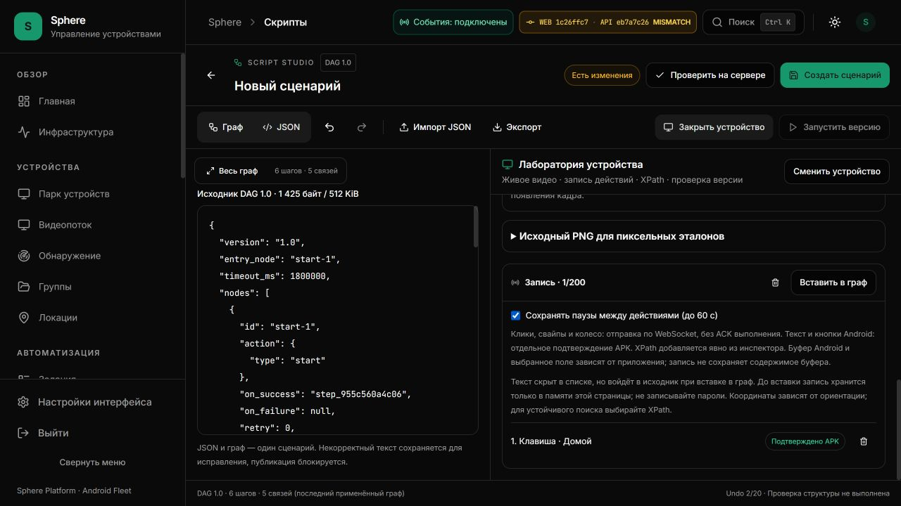
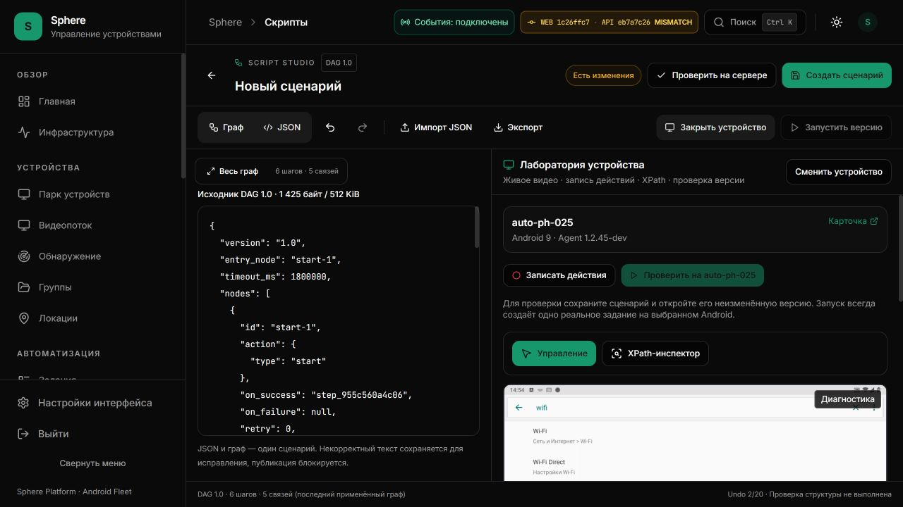
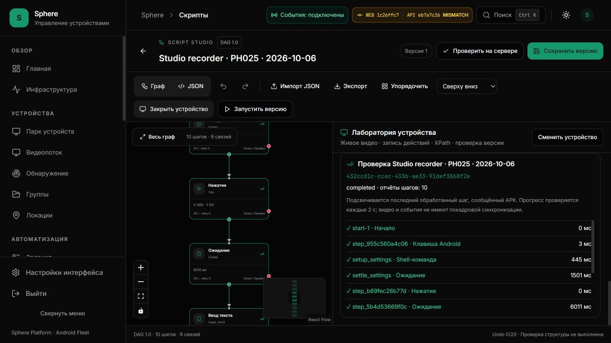
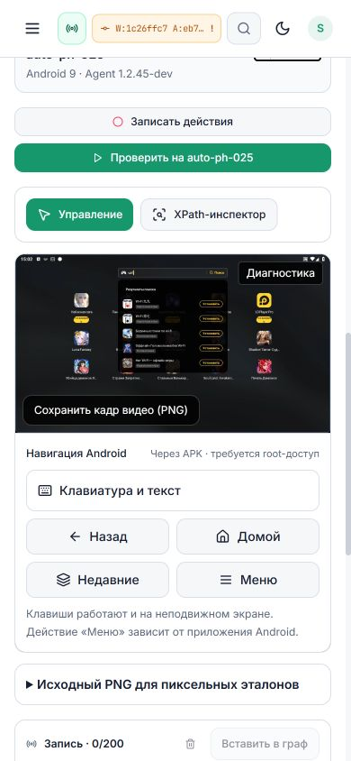

# Script Studio: запись подтверждённого ввода Android

Дата: 2026-10-06. Область: часть EP-018. PR: [#19](https://github.com/RootOne1337/sphere-platform/pull/19).

## Исходная проблема и область изменения

Установленная metadata-only сборка `eb7a7c26` записывала только click/swipe
WebSocket. AndroidNavigationBar отправлял текст и keyevent через `/devices/{id}/shell`
и проверял результат APK, но этот отдельный путь не попадал в запись Studio.
Сценарий после ручной проверки мог потерять Back/Home/Enter и введённый текст.
Подтверждение APK и отправка WebSocket имеют разные контракты.

Изменение добавляет наблюдение HTTP-команды в момент отправки и её отдельный
результат. Backend endpoint, APK transport, root требования, существующие
ограничения текста, selector insert и task launch не заменяются.
Новые библиотеки и лицензии не добавлены. Это разработка Sphere поверх
существующих React Flow/ELK и компонентов, с прежним учётом авторства.

## Исходники

- [Общий контракт наблюдений и текстового канала](../../../frontend/src/features/stream/controlObservation.ts).
- [AndroidNavigationBar](../../../frontend/src/features/stream/AndroidNavigationBar.tsx).
- [Передача наблюдений через DeviceStream](../../../frontend/components/sphere/DeviceStream.tsx).
- [SingleDeviceStream](../../../frontend/src/features/stream/SingleDeviceStream.tsx).
- [Запись и перевод в DAG](../../../frontend/src/features/scripts/studio/recording.ts).
- [Лаборатория, guards и список действий](../../../frontend/src/features/scripts/studio/DeviceWorkbench.tsx).
- [Инструкция оператора](../../operations/SCRIPT-STUDIO.md#запись-действий).

## Семантика и границы

| Событие | Статус | Условие переноса |
| --- | --- | --- |
| click/swipe/wheel | transport-submitted | WS send завершился; Android выполнение не подтверждено |
| key/text отправлен | android-pending | Перенос заблокирован |
| валидный SHELL output, включая пустой | android-confirmed | key_event/type_text с исходными параметрами |
| ошибка, timeout, malformed reply, abort | android-unknown | Проверка экрана и явное удаление; без автоматического повтора |

Таймстамп берётся при отправке. Поздний ответ меняет исходную строку по
request ID, device ID, исходному времени, dimensions и command. Он не добавляет
действие после Stop/Clear или в новую auth session. Повторный submitted/result
не удваивает запись. Команды не сохраняют произвольный shell-текст: известные
keycodes переводятся в `key_event`, ввод — в `type_text` с `clear_first:false`.

Геометрия копируется с первого успешно нарисованного кадра текущего socket.
Поворот экрана во время HTTP ожидания не переписывает метаданные старой команды.
Смена устройства/session/unmount прерывает локальное ожидание, не отменяет
уже доставленную команду. Наблюдатель не может превратить успех APK в ложную
ошибку или изменить переданную команду.

Ожидание HTTP результата вычитается из следующей паузы: DAG исполнение уже
ожидает key/text. Это приближение операторских пауз, а не синхронизация с frame ID.
Неизвестные результаты блокируют весь перенос, а не исчезают из графа молча.
Лимит 200 распространяется на все действия; при превышении запись прекращается
с ошибкой, существующие строки сохраняются. Управление Android не отменяется.

Текст не выводится в строках receipts/timeline и не копируется в clipboard.
До вставки он находится только в памяти страницы; после вставки входит в DAG
и подчиняется обычному явному сохранению/экспорту/опциональному local draft.
Содержимое Android clipboard не записывается. Его keycodes остаются зависимыми
от текущего выделения и буфера; это не переносимый снимок окружения.

## Проверки и доставка

На этапе подготовки: 197 тестов в 9 suites прошли; TypeScript прошёл.
Это включает существующие stream/inspector проверки и новые tests lifecycle,
foreign/late replies, bounds, pause conversion, interrupted wait, скрытие текста,
close/run/transfer guards, auth session isolation. В существующем тесте
single-device-inspection были React `act` warnings; это не native browser logs.
Полный frontend набор после изменения: **1546 passed / 128 suites**, без
failed/pending; финальный TypeScript прошёл. После изменения только текста
подсказки отдельно прошли builder-load/builder-contract: **67 tests / 2 suites**. Ошибка вызова
несуществующего `studio-builder.test.tsx` была ошибкой пути проверки, не
провалом runtime теста; используется фактически существующий набор.
UI **`1c26ffc7def8c1a16ac90d2f0607f857b21d28cb`** собран из проверенного Git archive
6 октября 11:49:01–11:49:57 UTC и установлен 11:50:09–11:50:17 UTC на
[3015/scripts/builder](http://127.0.0.1:3015/scripts/builder). Image:
`sha256:9c408135c5bcee80814886361e4ec15934e94e407cb4509d9ada4b90209331ae`.
API остаётся **`eb7a7c26c2e644f24eb3f785b3da1c29a65929be`**; изменён только UI,
сохранены 45 соседних контейнеров. APK/OTA/туннели не заменялись. API ready;
конечные срезы установки и canary: 14 online / 5 offline из 19, presence доступен.
Это не zero downtime, SLA или непрерывный замер reconnect.

Все четыре source workflow `1c26ffc7` завершились success: backend, frontend,
Android и Preview. У Preview deploy skipped, guard success. Source CI не означает
hosted deploy или проверку последующего документационного head.
Разные UI/API Git revisions отображаются как MISMATCH; это факт UI-only установки,
а не самостоятельное доказательство несовместимого контракта.

[Pinned evidence](STUDIO-COMMAND-RECORDING-EVIDENCE.json) содержит шесть UTF-8
receipts, восемь raw Git source hashes и пять native JPEG. Частный collector
canary использовал Windows cp1252; перед публикацией его известная кодировка
прочитана явно. Токены, private Compose/env, произвольные shell output и raw
логи тестов не опубликованы. Offline проверка целостности:

```powershell
& '.venv-audit/Scripts/python.exe' -m scripts.audit.validate_studio_command_recording
```

## Реальная удалённая проверка записанного сценария

Через native Codex browser выбрана только **auto-ph-025 / PH025**, Android 9,
Agent **1.2.45-dev**, фактический landscape кадр **960×540**. Записаны Home,
клик по поиску настроек, безопасный текст `wifi`, затем Home. HTTP команды
подтвердились в строках записи; перенос создал `key_event` и `type_text` с
`clear_first:false`. Клик сохранил исходные координаты **488,84**.
Видеокадр после ввода показал поисковые результаты Android.

Открытие Settings при подготовке было вне recorder. Поэтому перед сохранением
**явно** добавлены shell `am start -a android.settings.SETTINGS`, ожидание
1500 ms перед кликом и 2000 ms для наблюдения результата. Recorder не объявляется
автоматическим сборщиком этих prerequisites. Настройки Android не менялись.

Через UI создан один сценарий **Studio recorder · PH025 · 2026-10-06**,
одна версия v1 и одно задание. Сценарий повторно открыт из настоящего каталога;
read-only API сверил version ID, hash и 10 узлов:

| Поле | Подтверждённое значение |
| --- | --- |
| Script ID | `ceae4cfb-7719-4430-8882-ddfd5bbf11de` |
| Version ID | `0c35217a-9ae5-4ae1-a946-93f7165f8aa3` |
| DAG SHA256 | `a7e1761f0d843456f973b4b985e8f6388ffd5cdbab2e2e9f1f1ed0b997023298` |
| Task ID | `432ccd1c-ccac-433b-ae33-91def3860f2e` |
| Device ID | `b410464a-5f26-4803-a756-7840cc17b128` |
| Task started / finished | 11:57:37.552489 / 11:57:47.915902 UTC |
| Итог | completed, **10/10 успешных отчётов APK**, error null |

Reported step duration: start 0, Home 3, Settings shell 445, settle 1501,
tap 0, operator pause 6011, text 152, observe 2000, Home 1, end 0 ms.
Это отчёты handlers APK, не точное время появления результата на видеокадре.
Из UI отдельно прочитаны HTTP ACK 2228 / 3682 / 2134 ms. Эти три значения
не являются p95, input-to-frame latency или FPS; задержка остаётся отдельным gate.
Collector только прочитал результат, повторного задания не создавал.

Native QA проверил тёмную и светлую темы и ширины 1280/390 px: document width
совпадает с viewport, на 390 px видны видео, запись, навигация и текстовый блок.
Временный viewport reset выполнен; сохранённая версия оставлена открытой для
оператора. Captured browser warnings/errors: 0. На узком экране граф и лаборатория
идут вертикально; схема имеет собственное масштабирование. Network/heap/FPS
профилирование этой проверкой не выполнялось.









## Дополнительная находка APK: очистка поля

В [DagRunner](../../../android/app/src/main/kotlin/com/sphereplatform/agent/commands/DagRunner.kt)
в закреплённом source `1c26ffc7` ветки `input_clear` и `type_text.clear_first:true` используют keycode 277 с
комментарием CTRL_A. По [официальному Android KeyEvent](https://developer.android.com/reference/android/view/KeyEvent#KEYCODE_CUT)
277 — CUT, а не SELECT_ALL. Такая последовательность может удалить только
выделение/символ, затронуть буфер и не очистить поле полностью. Это отдельный
подтверждённый кодовый дефект; исправление требует корректного input adapter и
Android runtime проверки. Новый recorder не вызывает эти ветки неявно:
записанный ввод сохраняет `clear_first:false`, CUT записывается именно как CUT.

**Последующий Android этап:** [source fix/candidate 1.2.46 и native helper proof](ANDROID-FOCUSED-TEXT-CLEAR.md)
закреплён отдельно на `6a9f570f`, с двумя full debug suites и четырьмя source CI.
Установка/OTA пока не выполнена. Исходные recording receipts `1c26ffc7` и canary
на PH025 / 1.2.45-dev сохраняются; они не заменяются результатами новой версии.

## Оставшиеся ворота

EP-018 остаётся частично открытым: automatic selector candidates, snapshot
provenance, переносимый Unicode/IME/Accessibility input и state prerequisites.
EP-019/020 frame-correlated trace, replay и agent debug step/pause не закрыты.
Backend/API наличие действий не гарантирует поддержку каждого установленного APK.
Общая приёмка 20–30 устройств, FPS/input latency/soak и storage writer attribution
не подменяются этими source тестами.
