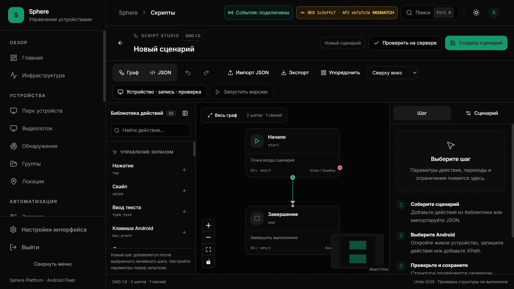

# Script Studio: свободная сборка и незавершённый граф

Дата: **6 октября 2026, Asia/Yekaterinburg**. Исходная ревизия: **a9d8b85**.
PR [#19](https://github.com/RootOne1337/sphere-platform/pull/19).
Статус: **source fix; новая сборка ещё не установлена и не принята визуально**.
Установлены UI **1c26ffc7** на3015 и API **eb7a7c26**; APK не менялся.

Связано с [follow-up](STUDIO-INTERACTION-FOLLOWUP.md), EP-014/015,
[контрактом параметров](STUDIO-ACTION-PARAMETERS.md) и
[основным аудитом продукта](../2026-10-05/ENTERPRISE-PRODUCT-AUDIT.md).
Общая приёмка **9 accepted /41 open** не изменяется этим исправлением.

## Проблема и доказательство

Библиотека вызывала только `insertAction`: выбранный линейный шаг перенаправлялся
на новый, новый — на прежнюю цель. Произвольного drop и отдельного узла не было.
`syncGraph`, применение параметров и добавление пользовались строгим парсером:
после разрыва связи недостижимый шаг блокировал дальнейшие операции. Удаление
End оставляло один узел, который парсер не принимал. Применение параметров
повторно раскладывало весь граф.

Источник — [builder](../../../frontend/app/(dashboard)/scripts/builder/page.tsx)
и [model](../../../frontend/lib/dag/studio.ts). Сценарии воспроизведены через
rendered UI handlers; эти тесты не выдаются за настоящую мышь в браузере.

## Итоговое поведение

1. **Отдельный узел** — способ по умолчанию. Нажатие создаёт шаг возле центра
   текущей области, ищет свободное место и выделяет для настройки. Существующие
   переходы сохраняются. Кнопка доступна без HTML drag-and-drop.
2. **Вставить в цепочку** — явный выбор. Сохраняет вставку после выбранного
   линейного шага либо перед существующим End; не выбирает ветку condition за
   оператора. Android key presets подчиняются тому же выбору.
3. **Перетаскивание** — всегда отдельный узел в точке отпускания, независимо
   от способа по нажатию. Собственный MIME принимает только точный тип из32
   опубликованных действий. Внешний текст/файл не превращается в действие.
4. Drop проходит `screenToFlowPosition`: учитываются DOM position, pan и zoom.
   Повторное вычитание DOM offset не применяется. Точка относится к середине
   заголовка узла. Drop не запускает fitView.
5. Расположение существующих узлов сохраняется при добавлении, применении
   параметров, настройке сценария и переключении исходник↔граф. Раскладка
   остаётся явной командой; положение не входит в executable DAG/hash.
6. **Удалить шаг** удаляет шаг и его входящие/исходящие связи. Скрытого
   соединения соседей нет. Начальный шаг защищён кнопкой и `onBeforeDelete`
   клавиатурного удаления; другой вход можно выбрать в настройках сценария.
7. Undo/Redo в графе возвращают граф, включая разорванные/незавершённые ветки.
   Непредставимый JSON открывается в исходнике с ошибкой. В режиме исходника
   история остаётся исходником.
8. Линии получают скругление18px, offset30px и стрелку цвета перехода.
   Цвет дополняют подписи Да/Нет/Ошибка. Остаются interaction width28px,
   reconnect radius16px и явный editor связи.

## Черновик и опубликованный сценарий

| Ограничение | Редактируемый граф | Проверка/публикация |
| --- | --- | --- |
| Узлы | 1–500 | 2–500 |
| Недостижимые узлы | Разрешены; замечания видны | Отказ до HTTP |
| Отсутствующие on_true/on_false | Разрешены для поэтапной сборки | Отказ до HTTP |
| Пустая/числовая ссылка, отсутствующая цель | Отказ | Отказ |
| Повтор ID / неизвестный тип / неверный entry | Отказ | Отказ |
| Невалидные базовые координаты/retry/таймауты | Отказ | Отказ |
| Action contract1.0 | Форма показывает ограничения | Обязателен локально и на новом API |
| Выполнение на Android | Не происходит | Отдельное сохранённое задание |

`parseDraftSource` явно включает editing. Строгие `parseSource`, `importDag`
по умолчанию и resource loader не ослаблены. `getDraftDag` для check/save
использует строгий парсер и action parameter validator. Backend не меняется.
Импорт плохого JSON сохраняет текст для исправления, не публикует старый граф.
Сворачиваемый блок показывает count и первые20 замечаний. Это не положительный
receipt; публикация запрещена и при свёрнутом блоке.

## Ограничения и ресурсы

- История20 документов /2MiB; исходник512KiB; граф500 шагов.
- Поиск места: максимум961 кандидат, с измеренными размерами старых узлов.
  При отсутствии места — отказ и предложение deliberate drop.
- Read-only, busy, pending parameters и JSON блокируют добавление. Drop повторно
  проверяет guard, включая смену прав после начала drag.
- Clipboard/private code не читаются. Android command/task/script API при
  добавлении, удалении и соединении не отправляются.
- Позиции/viewport не сохраняются в DAG, локальном исходнике и structural Undo.
  Возвращённый удалённый узел может получить новую позицию. Layout-history и
  durable workspace layout требуют отдельного контракта.
- Touch drag этим этапом не реализован; доступна кнопка добавления.
- Continuous injector, rich recorder, crop/pixel evidence, subgraphs,
  orchestration nodes и frame-correlated replay остаются отдельными этапами.

## Проверки и источники

[Draft validation](../../../frontend/lib/dag/export.ts) ·
[Free action model](../../../frontend/lib/dag/studio.ts) ·
[Placement/MIME](../../../frontend/lib/dag/canvasPlacement.ts) ·
[Pure tests](../../../frontend/__tests__/scripts/studio-free-canvas.test.ts) ·
[Rendered builder tests](../../../frontend/__tests__/scripts/builder-load.test.tsx).

**395 tests /17 scripts suites passed**, TypeScript passed. Проверены отдельный
узел→отказ публикации→ручное соединение→save, incomplete condition roundtrip,
разрыв→добавление→правка, одна вершина→новый End, entry guard/переназначение,
Undo/Redo, zoom/offset conversion call, foreign MIME/unknown type, stale drop,
read-only, pending parameters и прежние structural DAG rules.
React Flow замокан: реальные pointer events, SVG и размеры viewport этим
прогоном не проверены.

Используется уже установленный **React Flow**, без новой зависимости или
коммерческого шаблона. Первичные источники:
[drag-and-drop](https://reactflow.dev/examples/interaction/drag-and-drop),
[screenToFlowPosition](https://reactflow.dev/api-reference/types/react-flow-instance),
[reconnect](https://reactflow.dev/examples/edges/reconnect-edge).
Лицензии/авторство: [notices](../../design/previews/admincn-sphere-2026-09-28/THIRD-PARTY-NOTICES.md).

## Не закрытая визуальная приёмка

### Повторный browser baseline на установленной версии

В **23:27 UTC+5** открыт новый временный tab на3015/scripts/builder, новый
непубликованный документ. Header подтверждает UI1c26ffc7/APIeb7a7c26; исходный
пользовательский task tab не изменён. DOM показывает старое automatic insertion
описание, отсутствуют новые mode selector, key presets и contract card.
Снимок1280×720 подтверждает тесную библиотеку и занимающий часть End minimap.
Это доказательство установленного baseline, **не screenshot нового source**.

По результату контроля source palette уточнена: select способа добавления
находится в header; шесть быстрых клавиш по умолчанию свёрнуты внутри общего
прокручиваемого каталога. Они не занимают неподвижные три ряда над библиотекой.
Узкий catalog ограничен420px вместо288px, при этом тело остаётся прокручиваемым.
Rendered test проверяет закрытое состояние, раскрытие и реальное добавление
key_event;395 scripts tests и TypeScript повторно проверены. Новые размеры
в настоящем browser ещё не проверены. Временный tab закрыт.

Повторный host read: C: **Warning /Full Repair Needed**, свободно
**41 089 921 024B**; last boot **4 октября21:39 UTC+5**. Postboot repair acceptance
не появился, build/deploy gate не снимается этим browser чтением.

[Host repair gate](HOST-FILESYSTEM-INCIDENT.md) остаётся закрытым; новый local
Next/Android/Docker build и установка не выполнялись. После восстановления:

1. CI этой ревизии, immutable UI build, установка и проверка версии.
2. Light/dark,1280/1920/4K и узкая область с открытым DeviceWorkbench.
3. Drag при pan/zoom0.65/1/1.8, возле границы/узла/связи, отмена drag.
4. Keyboard add, выбор способа, несколько отдельных узлов подряд.
5. Да/Нет/Ошибка: соединение, reconnection, разрыв, Undo/Redo, published JSON.
6. Read-only, pending form, unload, смена устройства и запись без потери buffer.
7. Скриншоты и критика компоновки: overlays/labels не закрывают handles или видео.
   Только затем обновление visual/runtime acceptance.
