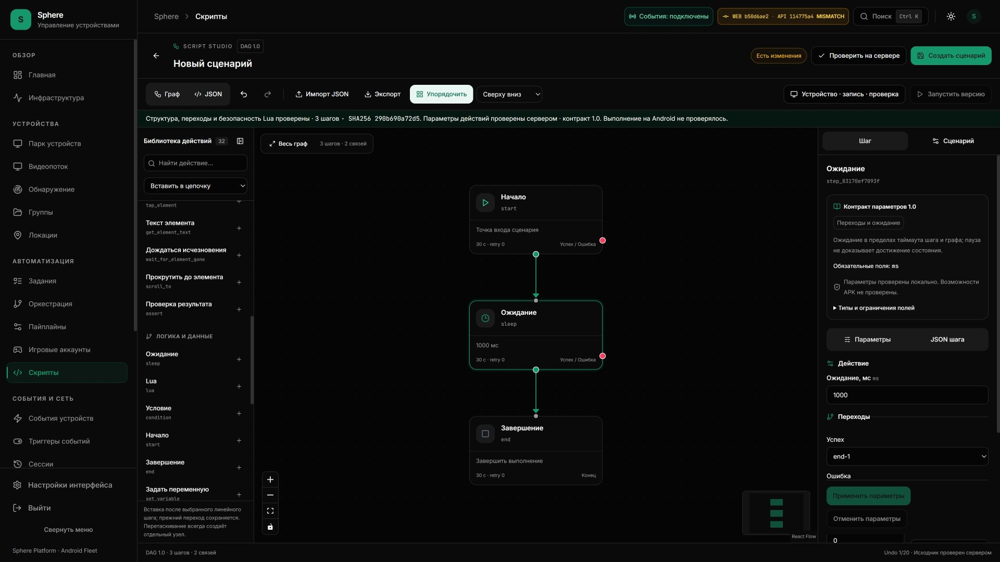

# Backend: доставка того же проверенного production image

Дата: **7 октября 2026, Asia/Yekaterinburg**. PR [#19](https://github.com/RootOne1337/sphere-platform/pull/19).
Статус актуального продолжения: **API 114775a установлен 7 октября, 03:35 +05**
из того же проверенного CI image. UI **b50d6ae**, APK и остальные 45 контейнеров
сохранены. Предыдущие source-only gates ниже относятся к этапу подготовки.
Общий product ledger **9 accepted / 41 open** не изменён.

**Source follow-up7октября:** installer дополнительно допускает только
reviewed WS router и pure viewer_input.py для discrete input admission.
Dependency/schema/bootstrap/RBAC/connection-manager delta запрещены.
[Source defect, tests и ещё открытая доставка](VIEWER-INPUT-ADMISSION.md).
Installed114775a receipt ниже сохраняет собственные версии и scope.

[Текущее состояние](../../operations/CURRENT-STATE.md) ·
[Action contract](../2026-10-06/STUDIO-ACTION-PARAMETERS.md) ·
[Проверенный UI и открытые границы](STUDIO-RESIZE-INSTALLED-ACCEPTANCE.json).

## Приёмка live API, 7 октября

[Exact image/CI/runtime/browser receipt](BACKEND-CONTRACT-INSTALLED-ACCEPTANCE.json).
Backend workflow [37539920295](https://github.com/RootOne1337/sphere-platform/actions/runs/37539920295)
для full SHA `114775a481f579e840ff63a154f1520b2f37dd0d` завершён success:
**3050 passed / 37 skipped / 112 subtests**, coverage **80.41%**. Все шесть jobs,
включая lint/security/RLS/production image/Alembic single head, прошли.
Frontend [37539920276](https://github.com/RootOne1337/sphere-platform/actions/runs/37539920276)
и Android [37539920262](https://github.com/RootOne1337/sphere-platform/actions/runs/37539920262)
того же source также success, attempt 1.

Artifact **11447958740**, Docker-save gzip **236 141 252 B**. Downloaded ZIP
**236 142 884 B** прошёл independent GitHub SHA-256; архив — byte/config admission.
CI config ID `sha256:228efeb59880d9a1ab8badbd96a61318b72f6014de6fbee4b73a14130769b2b9`
связан с Docker Desktop loaded manifest в отдельном receipt. ZIP удалён после
проверки; raw tar и повторный local build не создавались. Archive сохранён для
воспроизводимости; прежний runtime image сохранён для возврата. Это не общая
очистка Docker и не решение неизвестного storage-growth writer.

Read-only plan подтвердил только шесть разрешённых source files, неизменные
requirements, SQL head `20261006_script_catalog_metadata`, environment и четыре
mount targets. Перед apply в текущем tenant было 0 running/assigned/queued tasks.
Установщик заменил только backend, сохранил 45 остальных container identities/
images/start epochs/status, OTA hash и SQL head; миграций и APK rollout не было.
Gateway `/health/ready` подтвердил PostgreSQL/Redis, `/health/build` — exact source.
Rollback не потребовался; его отказные границы приняты в local tests.

Реальный authenticated canary на 3015:

- Action contract **1.0 / 32 actions**, `Cache-Control: no-store`; без auth — **401**.
- Корректный draft sleep→end — **200**, `action_parameters_verified=true`.
- Структурно допустимый tap без x/y — **422**, даже при прямом REST-запросе.
- Все 25 catalog rows и их fingerprint сохранены; исторический task detail — **200**.
- **14/19 online** восстановлены; у всех 14 heartbeat и connected_since позже
  старта нового API. Это finite reconnect evidence, не fleet execution/soak.
- В native browser на UI b50d6ae сценарий Start→sleep→End, 3 шага / 2 связи,
  получил server contract 1.0. ELK layout сохранил результат проверки и тот же
  executable hash. В captured browser logs — 0 error/warning. Ничего не опубликовано.

UI/API SHA различаются: banner `MISMATCH` показывает разницу сборок, а не
результат APK capability admission. Новый server contract проверяет параметры;
он не утверждает выполнение на Android. Pilot environment остаётся development
с реальной авторизацией; VPS production-role rollout отдельно не принят.

## Подтверждённый разрыв доставки

От installed eb7a7c26 до source 0b889a4 изменены шесть backend-файлов:
router, script service, DAG/response schemas и два новых файла action contract.
Requirements, Alembic и Dockerfile в этой разнице не менялись. Новый frontend
явно сообщает, что старый сервер подтвердил только структуру/Lua safety.
Прямой API-клиент старого сервера может передать tap без x/y; новый publication
guard уже реализован и прошёл source CI, но source success не обновляет live API.

Backend CI собирал и проверял production image, затем сохранял только отчёты.
Повторная локальная сборка увеличивала Docker footprint на incident SSD и не
являлась тем же артефактом, который проходил packaged probes.

## Изменение CI и артефакт

[Workflow](../../../.github/workflows/ci-backend.yml) checkout каждого job закреплён
за PR head/push SHA; persist-credentials отключён. Image bootstrap строит один
Linux/amd64 image `sphere-reviewed-backend:<full source>` с SPHERE_BUILD_SHA,
OCI revision и CI run/attempt labels. Остальные tests/lint/security/RLS/Alembic
проверяют тот же checkout. Старые receipts сохраняют свои run/head facts.

После packaged bootstrap, disposable PostgreSQL/Redis runtime, multiprocess
metrics и PostgreSQL init probes [packager](../../../tests/containers/package_reviewed_backend.py)
сохраняет **тот же image ID**, без второго Docker build или pip install.
Проверяются exact image IDs в обоих structured probe receipts, cleanup,
отсутствие host ports/source mount и один packaged migration head.

Новый [runtime probe](../../../tests/containers/backend_runtime_probe.py) после
реального login проверяет GET action-contract: 32 actions, version 1.0,
no-store, 401 без auth и false capability/execution flags. POST validate
принимает корректный sleep и отвергает структурно допустимый tap без координат.
Обе проверки повторяются в новом process после повторной bootstrap-инициализации.
Это disposable development ASGI, не live production-role/Android проверка.

Artifact `sphere-reviewed-backend-<full source>` содержит только:

- `image.tar.gz`: Docker-save stream → gzip level 1, без промежуточного tar;
  максимум **300 MiB compressed / 1 GiB uncompressed**, timeout save 180 s.
- `receipt.json`: source/repository/run/attempt, config ID, platform,
  archive bytes/hash, requirements/action-contract hashes, migration head и
  scope packaged probes. Полные environment/config/token/logs не копируются.

Официальный Docker поддерживает потоковый save и gzip; это Docker-save archive,
а не новый собственный image format. [Docker image save](https://docs.docker.com/reference/cli/docker/image/save/).
Retention в GitHub — **3 дня**, upload compression 0, immutable artifact name,
action закреплён тем же v7 commit, который уже используется frontend workflow.
[Upload options](https://github.com/actions/upload-artifact#inputs).
Local Docker image/volume retention этим не изменяется. Generated artifacts
исключены из Git и Docker context; `.local-pilot` по-прежнему приватен.

## Read-only admission

[`reviewed_backend_artifact.py`](../../../scripts/pilot/reviewed_backend_artifact.py)
использует [общий bounded reader](../../../scripts/pilot/reviewed_image_archive.py)
с существующим UI admission: digest, exact single manifest/tag/config,
budget, traversal/link/duplicate rejection, наличие именно regular layer files.
Архив не извлекается, Docker не вызывается, ничего не устанавливается.
UI policy и backend policy отдельны: backend требует shipped user `sphere`,
gunicorn/entrypoint, один SPHERE_BUILD_SHA и совпадающие source/run/attempt labels.

Artifact receipt не является подписью. Перед load требуется отдельно получить
repository/workflow/head/run/attempt и успешное завершение **всего CI workflow**,
проверить independent image ID из authenticated CI log и artifact digest.
Успешный image-bootstrap job при failed/cancelled tests не допускает установку.
Флаги liveApiVerified, productionRoleRolloutVerified, androidExecutionVerified
и runtimeInstalled в artifact остаются false.

## Проверки и оставшиеся gates

### Установщик без миграций

[`install_reviewed_backend.py`](../../../scripts/pilot/install_reviewed_backend.py)
по умолчанию создаёт только read-only план. Требует independent CI config ID,
полный успешно завершённый backend workflow, ожидаемый installed SHA, live Compose
owner/config/env, совпадающий SQL head и только шесть разрешённых action-contract
source changes. Requirements, migrations и bootstrap changes этим путём запрещены.
Единственный допустимый Compose delta — backend image и удаление build recipe;
четыре существующих mount targets (включая отдельный OTA bind) сохраняются, source overlay/entry/user/ports override
не допускаются. Полные environment/SQL URL не выводятся.

Явный `--apply` после host guard загружает admitted archive и выполняет только
`backend up --no-deps --no-build --pull never`: shutdown grace 35 s, readiness
90 s. До и после проверяет identity/epoch/status всех остальных контейнеров,
SQL head, OTA catalog hash и exact revision через gateway 3015. Краткая повторная
проверка health выполняет только GET, до 8 попыток с timeout 2 s и паузой 2 s,
чтобы пережить resolver valid=10s существующего gateway; команды управления/Android не повторяет.
При сбое возвращает прежний image только при сохранённой ownership границе;
чужой runtime не останавливает, database rollback не выполняет. После установки
liveContractVerified и agentReconnectVerified остаются false до отдельного canary.

**51 local unittest methods passed**: прежние 35 плюс 16 operational installer
regressions. Проверены read-only plan, отказ до image load при volume warning или
SQL mismatch, изменение зависимого сервиса/env/mount, CI partial/cancelled/foreign,
canonical Git bytes, health revision/budget, успех с сохранением dependencies,
owned rollback и запрет остановки чужого image. Scoped Ruff passed.
На этапе написания установщика hosted run/live update ещё ожидались.
Фактическая приёмка завершена отдельным датированным срезом выше; 51 local
methods и exact-source CI относятся к разным проверкам.

**35 local unittest methods passed:** 22 существующих UI/archive/installer
и 13 backend/archive/packager; внутри методов отдельные негативные subcases.
Проверены неправильные source/CI/platform/entry, непроверенный live claim,
hash tamper, traversal/link/duplicate/second image, directory вместо layer,
byte budgets, short SHA, mismatch probe receipts, stream preservation,
failed save cleanup и сохранность уже существующего файла при exclusive-open failure.
Локальная тяжёлая сборка/установка не выполнялась.

Исторический план до установки: exact hosted CI → скачать admitted artifact → read-only plan
по live Compose owner/config/env, версии SQL и source/dependency delta → bounded
backend-only install/rollback → реальные authenticated contract/negative validate,
catalog/task read и agent reconnect. UI, PostgreSQL, Redis, APK, OTA и gateway
не должны менять image/env/volumes/identity этим обновлением. Новый schema head
нельзя мигрировать скрыто; текущий кандидат не содержит schema/dependency change.
Continuous input, rich recording, fleet soak и причина роста storage остаются
отдельными работами. Этот документ не объявляет их завершёнными.
