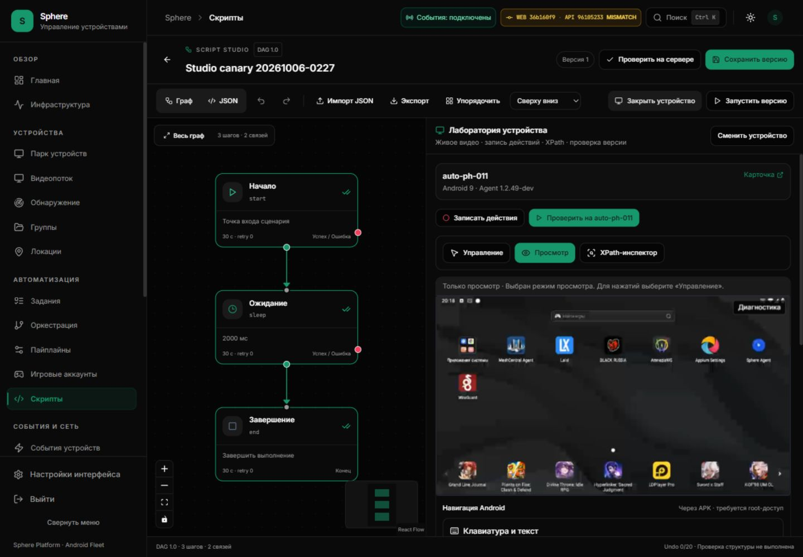
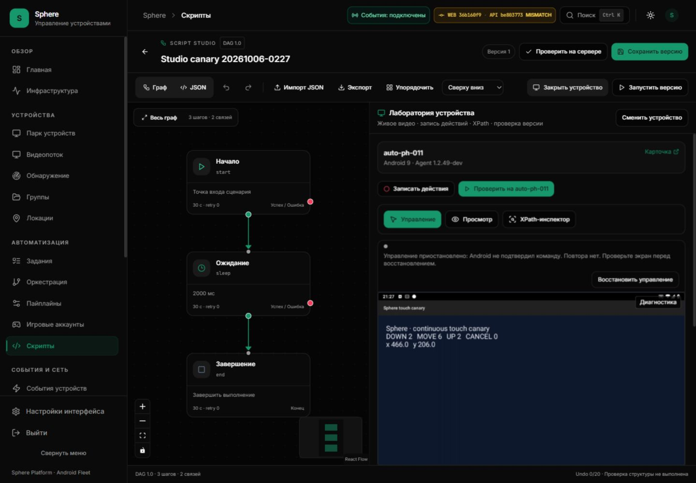

# Continuous input: isolate a disconnected viewer / P1 follow-up

8 October 2026 UTC / 9 October UTC+5. API be803773 installed; finite Android
gesture delivery verified. Idle receipt loss remains reproduced and OPEN.
SF26-05 remains OPEN; ledger9accepted/41open.

## Reproduced source defect

At 18:10–18:18 UTC the installed UI36b160f9 displayed video on PH011, but Control
reported that the server had not confirmed continuous gestures. The diagnostic
state was idle, with zero decode/render errors. This is a live failure observation;
the exception which originally disabled that worker was not captured.

Baseline API9610523 has a separate, reproducible failure path:
[ContinuousRuntime.send](../../../backend/websocket/continuous_runtime.py) can raise
when a viewer socket closes or times out. Its shared pubsub listener treats that
socket exception as a runtime failure, disables itself and retires other viewers.
Later probes fail until the worker is replaced. A single viewer must not disable
continuous control for unrelated viewers. This source finding does not establish
that it caused the earlier browser idle receipt timeout.

## Correction and boundaries

A failed send unregisters only the exact viewer and performs its existing bounded
native close. A dedicated ViewerTransportUnavailable exception lets the shared
listener continue. Session-binding delivery failure propagates out of touch_open:
native OPEN must never follow an undelivered binding. A viewer displaced during
lease acquisition also cannot open native input or unregister its replacement.

No command, send, gesture or lease acquisition is retried. Redis/shared subscription
failure still fences the runtime; cancellation still propagates. Existing native
watchdog, receipt deadlines, TTLs, tenant checks and input limits are unchanged.
No per-MOVE logs, tokens, raw frames or native owner identifiers are added.

## Regression evidence

[Runtime tests](../../../tests/test_ws/test_continuous_runtime.py) use two workers,
fakeredis pubsub/Lua, independent viewer sockets and mocked Android transport.

| Boundary | Result |
| --- | --- |
| Closed socket, OS disconnect and send timeout on capability offer | Other viewer continues receiving capabilities |
| Closed viewer during heartbeat/release receipt | Only its owner retired; no input replay |
| Failed session binding | No native OPEN |
| Viewer replaced during acquire | Replacement preserved; no native OPEN |
| Cancelled send | CancelledError preserved |
| Shared Redis outage | Runtime fenced; no gesture replay |

Valid baseline:6failed/19passed. Corrected runtime suite:27passed. Related continuous
WebSocket tests:158passed/286deselected. Ruff and mypy passed; git diff check passed.
Two existing deprecation warnings remain. These are deterministic transport
fixtures, not Android performance or indefinite runtime availability evidence.

The first local attempt lacked fakeredis Lua support and is invalid app evidence.
Lupa2.8 was installed only in a private test directory; production requirements,
schema and image dependencies were not modified.

## Installed UI checkpoint before API replacement

UI36b160f925e3f1d073620281bbf6e584636ada14 was installed at18:08:51 UTC from
reviewed CI37751101877. Loaded image:
sha256:bf7ff7556bc834e3bca6b1e43d2baa608ea97bd67ba1f421eeed1f7ba9165a05.
Independent CI config digest:
sha256:1ac38dcbf8812082153a763233c2d45ae138c489814316c1602377404e8d6d63.
API9610523, APK10249, schema and OTA remained unchanged;45 other containers
were preserved. Source CI:frontend1892passed/138suites; backend3337passed,
37skipped/229subtests; Android and preview successful. Full backend coverage80.70%.

Real saved-v1 start/sleep2000/end task b50dd03f-db64-47ad-8001-af461e852653
completed with three APK reports. View remained selected; queue0, graph3/2.
No Android touch, navigation, private text or screenshot capture was requested.
The ordinary token refresh has not yet been observed in this installed browser.

## Installed API and finite acceptance

Exact source be803773037c16a113b50c1a2774793fffae8773 installed at
18:39:32.677540078 UTC from successful CI37823344986. Independent CI config
digest: sha256:f842b85644314e2c8227f7ef210bb0f61cd34798678f122afbf7f6859fe4b94b.
Loaded image: sha256:49a0ac9dca8f27db1dd8564090ef495139682919ebaa39d5cb396c43ad51ede1.
Archive236147247bytes. Only API replaced;45other containers, schema head
20261006_script_catalog_metadata, pilot APK10249 and normal OTA unchanged.
Full source CI:3346passed/37skipped/229subtests, coverage80.71%; frontend
1892passed/138suites; Android and preview successful. Local and hosted results
remain distinct; image installation itself is not an Android contract receipt.

Ordinary Studio Control returned READY. On PH011 an independent Android View
receiver, with no permissions/network/event log, captured one browser drag:
DOWN1/MOVE5/UP1/CANCEL0. A subsequent wheel action added DOWN1/MOVE1/UP1/CANCEL0;
final counters DOWN2/MOVE6/UP2/CANCEL0. The receiver was installed only on PH011,
then uninstalled at19:28:20 UTC; pilot agent version10249 independently rechecked.
View selected at cleanup; graph3/2, recording0, saved version unchanged. Temporary
browser viewport reset. This is finite delivery evidence, not frame timing or
remote/fleet latency acceptance.

The first drag attempt followed a renewed idle timeout and reached no Android
events. An explicit recovery and state-admitted second attempt delivered the
gesture. Later idle `native_receipt_timeout` recurred, consuming the existing
one-per-session reconciliation. No input was replayed. Home via browser was not
accepted during that fence; no successful Home result is claimed for this run.
The screenshot deliberately includes the remaining fence and received counters.

## New permission-outage finding

During API replacement the browser displayed “Не удалось проверить права”. When
the capability read recovered, the saved graph remained but the laboratory,
selected device and prior completed task card/marks were lost. There was no F5.
The screenshot named permission-restart-fence captures the recovered editor after
state loss, not the transient error notice. Before/after images are retained.
This is separate from token rotation and is a P1 state-retention follow-up; the
authorization guard must still reject unavailable/stale permissions.

Restart recovery alone does not establish the historical worker exception's cause.
Keep browser timer/native ACK attribution, permission-outage retention, global
task/control ownership, durable unknown-POST reconciliation and fleet/remote soak OPEN.

[Historical idle failure](STUDIO-IDLE-RECEIPT-FOLLOWUP.md) ·
[Same-session state fix](STUDIO-SESSION-REFRESH-STATE.md).
