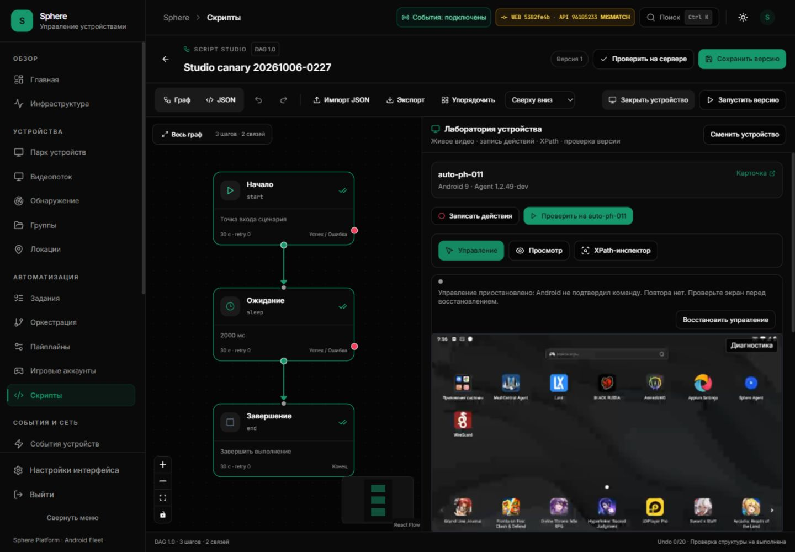

# Studio idle native receipt: reproduced follow-up / P1 OPEN

8 October 2026. Installed UI5382fe4 / API9610523 / PH011 APK10249.
The saved-task preparation fix passed two finite canaries, but later ordinary
Control needed recovery. Do not combine that success with a claim of stable
continuous ownership during indefinite idle.

## Observed failure

The second three-step task completed at 07:53:13 UTC. XPath automatic polling
was paused. After several idle minutes, switching to Control showed
**«Управление приостановлено: Android не подтвердил команду»**. Diagnostics:
`closed`, reason `native_receipt_timeout`, idle reconciliation 1/1 exhausted.
The current video remained present, decoder/render errors 0/0. No touch/key/text
was sent at this failed transition. The observation does not identify which
process, transport boundary or browser scheduling event lost/delayed the ACK.

Explicit **«Восстановить управление»** created a fresh video/control session and
returned READY; one displayed service ACK was 259 ms. No former command replayed.
The final laboratory was left in View. This recovery verifies a usable escape
path, not the cause or correction of the idle failure.

## Finite authenticated service-only timing

At 08:04:58–08:05:59 UTC a separate authenticated viewer waited for its own
binary picture, obtained capability/STARTUP0, sent **240 idle heartbeat4** at
250 ms intervals and received **240 status2 ACKs**. No DOWN/MOVE/UP, navigation,
text, hierarchy, task or screenshot request was sent. Final native RELEASE3
confirmed release; no native owner remains from this probe.

| Scalar measurement | Result |
| --- | --- |
| Median service round trip | 258.37 ms |
| p95 of these 240 samples | 264.77 ms |
| Maximum | 461.92 ms |
| Receipts at or above 500 ms | 0 |
| Native status/startup/release errors | 0 |

This independent client did not run the browser controller's 500 ms retirement
policy. Its binary observation was not a browser canvas/decode check. It therefore
does not reproduce browser idle loss, prove browser timer behavior, or measure
input-to-picture latency. The p95 is a finite canary statistic, not a fleet SLO.
Two earlier timing harness attempts omitted WebSocket authentication and are
invalid app evidence; they were corrected before this accepted probe. Credentials,
native owner/session values and raw frames were not retained in public evidence.

[Scalar samples](STUDIO-IDLE-RECEIPT-TIMING.json).

## Reviewed boundaries and next investigation

Browser [ContinuousPointer](../../../frontend/src/features/stream/continuousPointer.ts)
uses a 500 ms receipt/scheduler fence. Native root pipe separately requires its
ACK within 500 ms. The browser permits one narrow idle-only reconciliation per
video session, only after known RELEASE3 and with no held pointer, pending
terminal or unresolved touch receipt. A second loss intentionally requires
explicit recovery. Changing that budget would conceal repeated transport loss
without locating the cause; no deadline/replay rule was loosened here.

Source review found that a continuous runtime listener exception can fence its
owners and disable that worker's runtime. This is a **candidate failure path**,
not a proven cause of this event. A source observation does not establish that
a Redis/worker exception occurred at the observed time.

Next diagnostic work must correlate bounded scalar timestamps at browser send/
timer/receipt, Redis forwarding, authenticated APK receipt and native pipe ACK.
Record state/oldest pending action/elapsed age at the fence; distinguish idle
heartbeat loss from unknown DOWN/terminal input. Never add unbounded per-MOVE
logs, owner identifiers as metric labels, persisted frames, or command replay.
Test idle gaps, task/mode changes, hidden tabs, process replacement and bounded
transport interruption independently before changing recovery policy.

Task creation, cleanup and completion evidence is in
[installed task acceptance](STUDIO-TASK-INSTALLED-ACCEPTANCE.md).
SF26-05 remains OPEN; ledger9accepted/41open unchanged.
