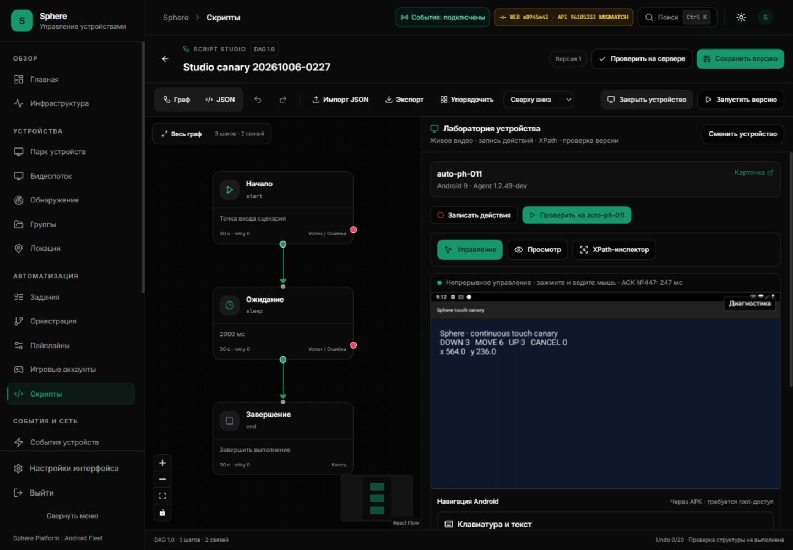
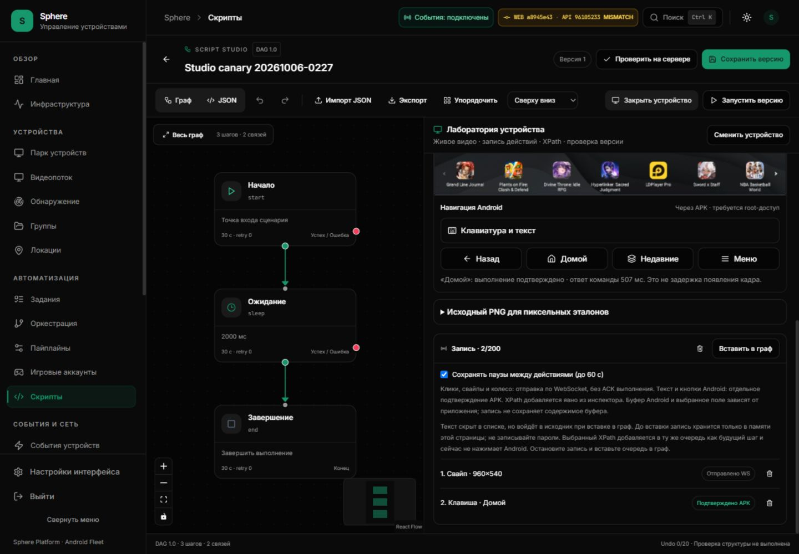
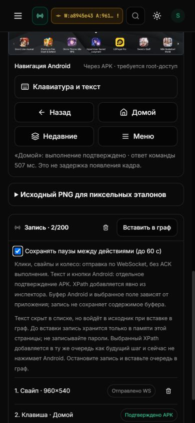

# Studio recorder mode: installed acceptance

8 October 2026, 07:10–07:15 UTC. Port 3015 UI **a8945e4**, API **9610523**,
PH011 APK 10249 preserved. The revision badge correctly reports different commits;
this frontend-only change does not alter the API or Android contract.

## Provenance and checks

Frontend run 37741085745 succeeded: 1869 tests / 138 suites, types, production
build, 26 packaged routes, 73 assets and reviewed image admission. Authenticated
CI log image config digest matched the downloaded archive; no local rebuild.
Loaded Docker image and healthy container were independently read back.
Installer preserved 45 other containers, API and OTA catalog; no schema migration
was performed. All four exact-source workflows succeeded: frontend 37741085745,
backend 37741085461, Android 37741085651 and preview 37741085559. Backend CI
reported 3337 passed, 37 skipped, 2 warnings and 229 subtests in 877.80 seconds;
RLS, lint/types, security, bootstrap and migration-head checks passed. These CI
results are separate from the installed API revision and Android canary.

Local 201 tests / 6 suites and TypeScript passed. Before the fix 6 regressions
failed. The new source separates recorder intent from permanent receipt observers.
[Implementation and remaining boundaries](STUDIO-RECORDER-MODE.md).

## Real browser→APK→independent Android View

The old installed Studio showed discrete-recording mode even while the recorder
was stopped. The new installed Studio automatically reached continuous READY.
A CUA mouse drag produced independent Android View delta DOWN 1 / MOVE 4 / UP 1 /
CANCEL 0. Last MOVE uptime 28187082 precedes terminal 28187088; no recorded action
was created in normal mode. Injector ACK is not the evidence for View delivery.

Two earlier viewport-positioning wheel actions also reached this disposable
receiver. The drag uses its own before/after baseline, not the install baseline.
The receiver overwrites one bounded latest.json rather than storing video/logs.

Start displayed preparation while native ownership was retired; input/navigation
remained disabled until recording became ready. A new drag then produced one
finished WS swipe in the review queue. Native View counters became DOWN4/MOVE21/
UP4/CANCEL0; those MOVE events belong to the discrete Android swipe. They do
not prove live injection during that recorded drag.

Home was submitted and Stop clicked before its result. The stopped queue
showed 2 entries with Home pending, and launch/transfer were disabled. The late
receipt updated the same second slot to APK-confirmed, command reply 507 ms.
Control returned to continuous READY automatically. That reply duration does
not measure picture latency.

Graph remained 3 steps / 2 edges, saved version 1 unchanged. No task created,
version saved or recording transferred. Test queue cleared, receiver uninstalled;
launcher and Sphere APK 10249 independently confirmed.

## Responsive and visual verification

Desktop 1440×1000: graph and laboratory remained visible; mode, queue and
APK result were readable. Mobile 390×844: body/document width 390, no horizontal
page overflow; navigation buttons wrap and the queue retains distinct states.
Temporary viewport override reset at cleanup. Screenshot capture used a fresh
tab screenshot; an earlier wrapper screenshot was stale and excluded from
these Studio acceptance assets.

[Structured receipt](STUDIO-RECORDER-INSTALLED-ACCEPTANCE.json).

## Limits

Start during held touch, unknown release, pending capability and unfinished
discrete drag at Stop are regression fixtures, not destructive live fault tests.
This finite PH011 acceptance does not establish fleet reliability or trajectory/
XPath/crop/pixel recording and correlated playback. Task-launch handoff remains
OPEN. Native root exit1 and storage/corruption incidents remain OPEN.
SF26-05/06 and ledger 9 accepted / 41 open unchanged.
