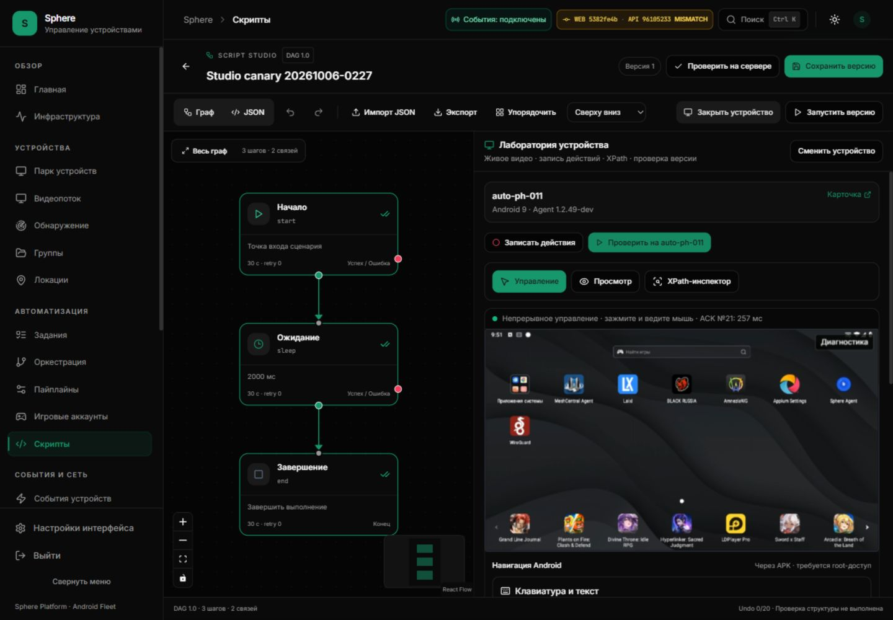
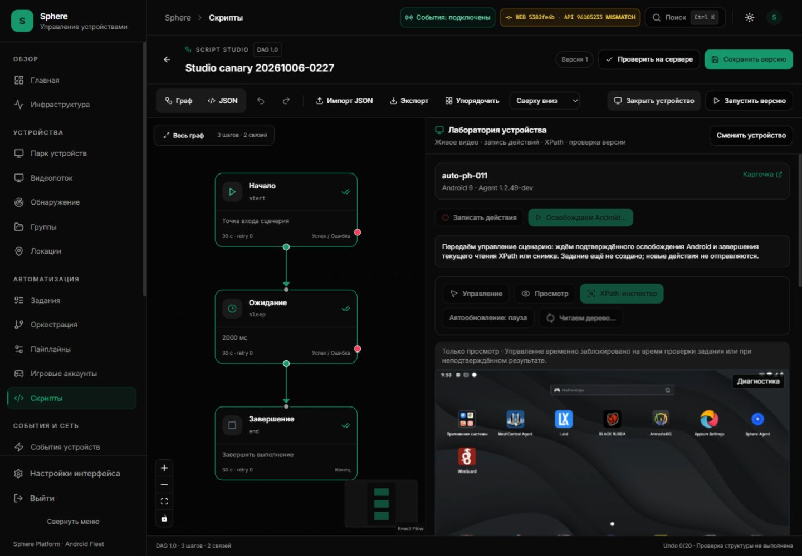
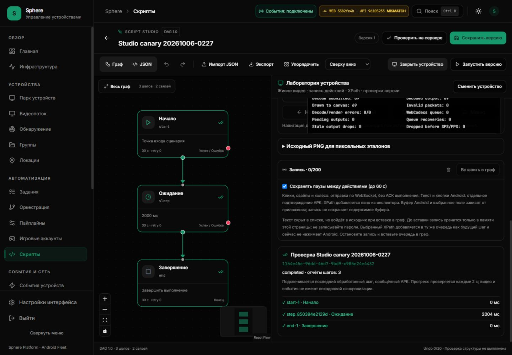
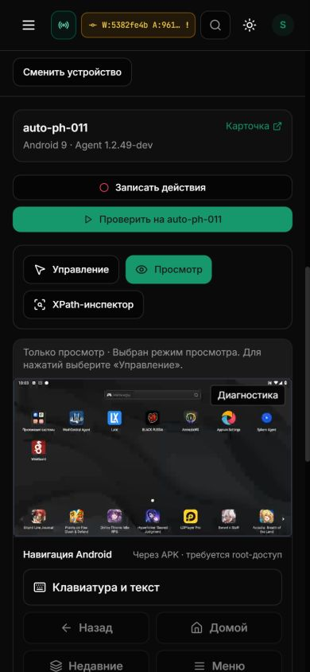
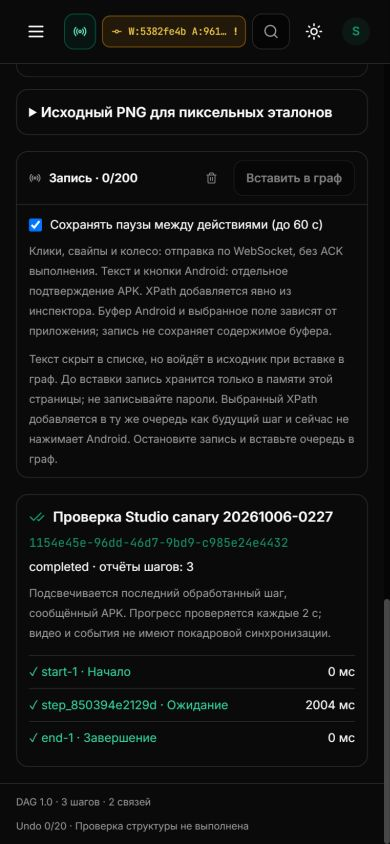

# Studio task preparation: installed evidence

8 October 2026, 07:49–08:06 UTC. Port 3015 frontend **5382fe4**, preserved API
**9610523**, PH011 pilot **1.2.49-dev / 10249**. The two task transitions below
passed. A later idle control fault is OPEN; this is not an all-green session or
closure of SF26-05/06. Audit ledger remains **9 accepted / 41 open**.

## Source, delivery and checks

Source revision `5382fe4bbabbe46b29eea081a8e6916afe1181bd` separates preparation
from task submission. The workbench pins script/version/hash/device/auth, locks
input, retires this viewer's native owner, drains its outstanding hierarchy and
native screenshot verification, then rechecks authority before one `/tasks` POST.
Known release is required; timeout/abort or a successfully sent command is not
release. Pre-POST failure says **«Задание не создано»**; a lost POST result retains
the existing uncertain-result guard and cannot auto-repeat.

[Implementation and regression boundaries](STUDIO-TASK-CONTROL-HANDOFF.md).

| Exact-source workflow | Run | Result |
| --- | --- | --- |
| Frontend | 37744953642 | 1884 tests / 138 suites; types, build, image admission passed |
| Backend | 37744953692 | 3337 passed, 37 skipped, 2 warnings, 229 subtests; 721.32 s |
| Android | 37744953648 | all variants tests, signed release smoke build/signature checks passed |
| Preview | 37744953751 | passed |

Backend lint/types, security, RLS, real-service regressions, Redis persistence/
memory acceptance, packaged bootstrap and migration-head checks passed. These
hosted results do not change the installed API or prove fleet Android behavior.
Local final source: **237 tests / 7 suites**, nonincremental TypeScript passed.
The initial workbench cases reproduced three failures against the prior source.

The admitted CI archive is 120,866,427 bytes. Its logged image config digest is
`sha256:dbc861ad1600ded35b446dcd1558605722bb3f4678f06697817a4a8eb54b051d`.
Docker-loaded image ID is separately
`sha256:573ddbc9293450f83c3c604ffd13424a6a580e063a716b3d89806dd6078d92f7`.
Installer applied that archive at **07:49:15.183680378 UTC**, without local
rebuilding. Independent Docker inspect read back healthy frontend and API.
It preserved 45 other containers, API image, schema and OTA catalog; no migration
or Android deployment. UI/API differing revisions are expected for this UI change.

## Real task from ordinary native control

The existing saved version 1, **Studio canary 20261006-0227**, contains
start → sleep 2000 ms → end. No graph or version was changed. PH011 ordinary
control was READY. Clicking **«Проверить на auto-ph-011»** displayed release
preparation with input/navigation locked and the task not yet created.

Task `8b379054-bc3e-4d05-8d2e-16e82bcb34fe` was created at 07:51:13.532879,
assigned at 07:51:16.078131, and completed successfully at 07:51:18.350884 UTC.
The browser showed three APK step reports, completed graph markers and ordinary
control READY again. The recorder remained empty. No click/swipe command was
part of this canary; a sleep-only task does not prove application touch delivery.

## Real task while a root hierarchy request was pending

XPath returned 46 nodes; automatic refresh was paused. A manual refresh was
started, immediately followed by **«Проверить на auto-ph-011»**. The visible
preparation kept **«Читаем дерево…»**, disabled mode/navigation/recording buttons,
and explicitly stated that no task had been created. The current read drained;
no new inspection read or Android action was added by the test.

Independent installed API logs confirm snapshot
`0a4530e4cedf415c8c0698e9aa73846a` finished at **07:53:08.389375 UTC**:
HTTP 200, 3214 ms, 5 RPCs, cleanup confirmed and lock release confirmed.
Task `1154e45e-96dd-46d7-9bd9-c985e24e4432` was created at
**07:53:08.421286 UTC**, 32 ms after the logged completed cleanup. It was assigned
at 07:53:11.176730 and successfully completed at 07:53:13.668274 UTC.

The browser displayed three reports: start 0 ms, sleep 2004 ms, end 0 ms; all
three graph nodes were marked completed. Those timing fields are APK reports,
not proof of frame-synchronized playback. The log timestamps confirm ordering
for this canary; they do not contain a correlated native RELEASE event.

## Follow-up failure and responsive review

After a few idle minutes, returning to ordinary Control showed
`closed / native_receipt_timeout`, one exhausted idle reconciliation, and required
**«Восстановить управление»**. The picture continued with zero decoder/render
errors. Explicit recovery returned fresh native READY without replaying input.
This subsequent failure is recorded separately and prevents a claim that the
whole session was fault-free: [idle follow-up](STUDIO-IDLE-RECEIPT-FOLLOWUP.md).

Desktop **1440×1000**: preparation, graph and laboratory usable. Mobile
**390×844**: lab controls wrap, task ID fits, all three reports visible;
DOM document/body width 390, no page horizontal overflow. The temporary viewport
override was reset using the browser capability after review.

Cleanup: View selected, no live pointer, recording queue 0/200, graph 3 steps /
2 edges and saved version 1 unchanged. The two task records remain as audit
evidence. No receiver APK was installed and no private text or PNG capture made
in these task canaries. A separate finite service-ACK timing probe sent zero
touches and ended with native RELEASE3.

[Structured acceptance](STUDIO-TASK-INSTALLED-ACCEPTANCE.json) ·
[Canonical runtime](../../operations/CURRENT-STATE.md).

## Not accepted by this evidence

- Exclusive task/native ownership across other viewers or API callers.
- Durable reconciliation of an unknown POST result, or cancellation of remote
  root work just because its HTTP request ended.
- Rich trajectory/XPath/PNG/crop/pixel recording and frame-atomic playback.
- Remote/fleet soak, an input-to-picture SLO, or the cause of idle receipt loss.
- Historical root exit 1, host storage attribution and repeated host Git damage.
