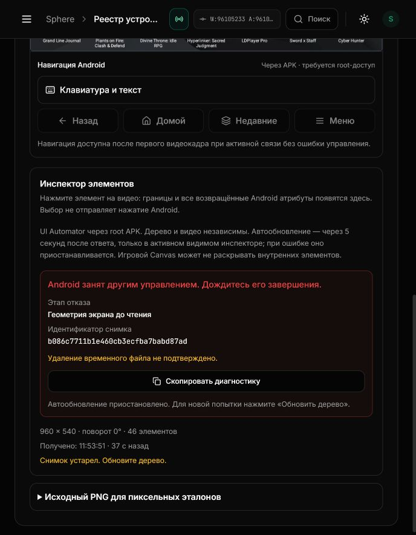
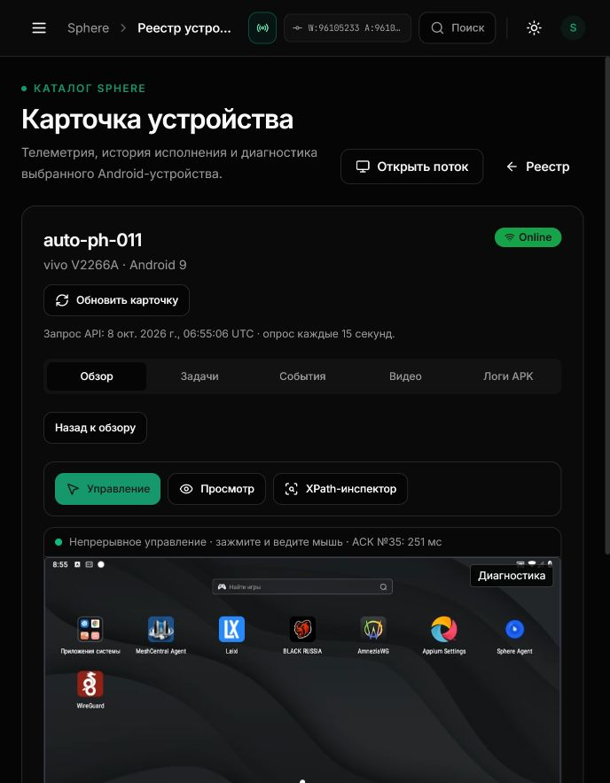

# XPath diagnostics: installed acceptance

8 October 2026, 06:53–06:55 UTC. UI and API on3015: **9610523**.
PH011 remains APK10249; no Android update or normal OTA promotion.

## Installed provenance

Exact-source frontend CI37719924738:1861 tests /138 suites; type checks,
production build,26 packaged pages and73 assets passed. Backend CI37719924634:
3335 passed /37 skipped /229 subtests; RLS, security, types, image bootstrap
and migration checks passed. All four follow-up workflows for5c49f04 also passed.

The reviewed archives were admitted and installed without rebuilding. Independent
Docker readback and browser badges agree on9610523 for both healthy containers.
Each install preserved45 other containers; schema head and OTA digest retained.
Compose history was frozen with a full-model equality check: UI17→2 files,
API10→2. The API installer receipt explicitly did not claim a live Android
contract test; the finite test below supplies that separate evidence.

## Real fault and recovery

1. Browser stream showed the Android launcher; XPath read returned46 nodes.
2. A separate authenticated viewer acquired a native owner without sending
   DOWN, MOVE or UP. A manual inspector refresh returned502/native_input_busy.
3. UI displayed the geometry-before-read stage, exact snapshot ID, unconfirmed
   cleanup, explicit refresh guidance and paused automatic polling. The previous
   tree remained visible with its age; it became stale and was labelled stale.
4. Probe closed with native RELEASE3; its receipt records touchesSent0.
5. Explicit refresh returned46 nodes again. Server confirmed cleanup and
   compare-and-delete lock release. Control resumed automatic native READY;
   the launcher remained visible.

Failed snapshot b086c7711b1e460cb3ecfba7babd87ad matched the scalar server event:
geometry_before/native_input_busy,585ms,2 RPCs, cleanup unconfirmed, lock release
confirmed. Recovery718ced13b2174501a50a1dd9d0e19ad3:200,3150ms,5 RPCs, both
cleanup and lock release confirmed. These durations include independent root
reads and cleanup; they are not touch-to-video latency.

[Machine-readable receipt](UI-INSPECTION-INSTALLED-ACCEPTANCE.json) ·
[Protocol and regression tests](UI-INSPECTION-DIAGNOSTICS.md) ·
[Compose lineage](REVIEWED-COMPOSE-LINEAGE.md).

## Limits and next work

This demonstrates one bounded busy fault and explicit recovery on PH011. It does
not explain the earlier intermittent native SHELL exit1, prove long-term fleet
reliability,20–30FPS or frame-atomic correlation. SF26-05 stays OPEN; ledger
9accepted/41open. Storage loss and repeated host-file corruption remain OPEN.

Next source-proven P1: permanent recorder callbacks disable continuous control
in Studio even when recording is stopped.
[Scope and acceptance](STUDIO-RECORDER-NEXT-P1.md).
