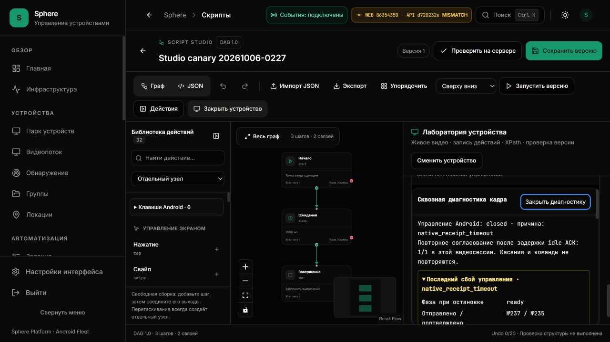
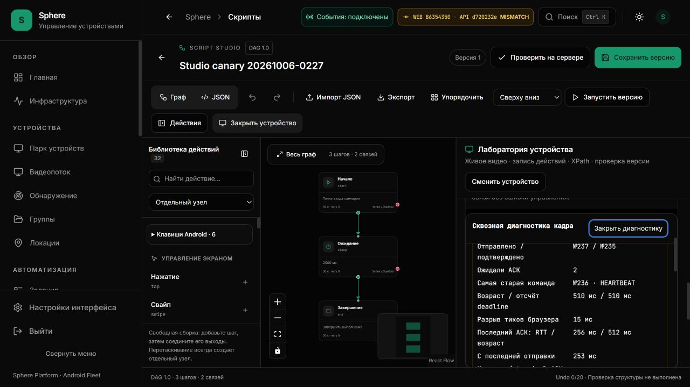

# Continuous input: доставка серверных таймингов и воспроизведение idle-сбоя

Дата среза: 2026-10-09T15:32:01.063638+00:00. [Машинный receipt](CONTINUOUS-SERVER-TIMINGS-INSTALLED.json) · [Действующий статус](../../operations/WORK-STATUS.md) · [Runbook](../../operations/CONTINUOUS-INPUT-TIMINGS.md).

## Итог и границы

На 3015 установлены UI **86354350** / API **d720232e**. Принята доставка ограниченной диагностики;
PH011 **1.2.49-dev / 10249** снова получила `native_receipt_timeout` без касаний.
SF26-05 и EP-020/029 остаются OPEN. Наблюдаемые серверные coroutine завершились быстрее 25 мс;
это исключает медленный **измеренный вызов в данном окне**, но не очередь до callback,
event-loop gap, сеть, APK/native путь или потерю ответа. Причина ещё не локализована.
`browser.finiteAccepted=true` относится только к перечисленному diagnostic evidence,
`idleControlAccepted=false` явно сохраняет провал проверки надёжности. Реестр: 9 принято / 41 открыто; числа не изменены.

## Установка

Все четыре workflow для установленного исходника завершились успешно: backend — 3387 passed,
37 skipped, 233 subtests; полный hosted Ruff/mypy и проверки production bootstrap/metrics/SQL.
Frontend, Android и preview также прошли. Локальные WS/monitoring — 560 tests / 44 subtests —
записаны в [source receipt](CONTINUOUS-SERVER-TIMINGS.md).
Локальное ограничение full mypy сохранено в том историческом receipt; hosted full mypy прошёл.

Архив GitHub (236 229 880 байт) проверен по SHA-256 и независимому image ID из CI job log.
Config `sha256:0d77eadfa4c02d52cac4a1479d5baa0aefc355a44cfa23a429c0e48cb42bc88a`; Docker loaded manifest `sha256:ee2e9dea6466237f9cc30488784524b5aa7590f07fa117b0651cc94fefffe891`.
Backend `7463f441f41cf6d7d39679166d4281db28d8cd009c60c572611b0a079001ef19`, запуск 2026-10-09T15:17:26.705186134Z.
Заменён только backend. Остальные 45 контейнеров сохранены по identity/image/start/status; UI и APK
не заменялись. Head `20261006_script_catalog_metadata` и OTA catalog SHA сохранены. Нет SQL migration,
seed, dependency restart, local image rebuild или общей Docker очистки. В проверенном плане resource findings пусты.

Host installer допускает ровно два новых исходника metrics/continuous_observability в уже
существующей reviewed boundary. 19 конечных тестов сохраняют fences dependency/action-contract hashes,
unreviewed packaged source/schema, container ownership и narrow Compose delta. Это не общий bypass.

## Реальный browser canary

Первое READY прочитано 2026-10-09T15:19:17.607Z; failure snapshot прочитан 2026-10-09T15:20:57.075Z.
Точное wall-clock время возникновения не записано. До чтения сбоя разрешённое idle
согласование было израсходовано (1/1). Последний retained snapshot: offered 237 / ACK 235,
pending 2, oldest sequence 236 — HEARTBEAT, age 510 мс; browser tick 15 мс,
последний actual ACK RTT 256 мс / age 512 мс; last send 253 мс.
Нет удерживаемого указателя или terminal-команды; WS OPEN / buffered 0 B. Decode/render errors: 0/0.

Управление было оставлено без DOWN/UP/text/key/record/save/run. После сбоя выбран View;
Diagnostics, laboratory и временная вкладка закрыты. Queue 0, graph v1 / 3 nodes / 2 edges / Undo 0 сохранены.
Независимое native release confirmation этим browser-срезом не принимается.
13 минут — **план idle**, а не достигнутая стабильность: проверка завершилась сбоем.
Scrape window ниже включает последующие чтения после закрытия control; это не healthy idle soak.

## Серверное окно

2026-10-09T15:18:21.494976+00:00 → 2026-10-09T15:31:21.491012+00:00; 27/27 bounded snapshots,
207 140 байт. Ни одного нового Pub/Sub subscriber, device input или replay от сборщика.
До активности series отсутствовали; после активности — 84 samples = 7 returned label pairs × 12 count/sum/buckets.
Counter reset не наблюдался. Returned означает обычный возврат, в том числе rejected/None/UNKNOWN;
это не Android execution outcome. Durations inclusive и перекрываются, **их нельзя складывать**.

| Stage | Delta count | Mean ms | >25ms observations |
| --- | ---: | ---: | ---: |
| agent_delivery | 403 | 0.528 | 0 |
| agent_reply_relay | 405 | 1.186 | 0 |
| pubsub_dispatch | 2025 | 0.286 | 0 |
| redis_lease_operation | 1348 | 0.389 | 0 |
| viewer_admission | 405 | 0.574 | 0 |
| viewer_receipt_validation | 403 | 0.254 | 0 |
| viewer_socket_send | 407 | 0.103 | 0 |

Гистограммы суммарные для workers; привязка конкретного sequence к конкретной duration
не доказана. До callback очереди, browser delivery, APK/native и network не измерены.
Новые сроки ожидания, retries, wire поля и routing в этом пакете не вводились.

## Ресурсы и диск

В обеих точках — четыре instrumented workers. Metric directory: 17 files / 1 048 578 байт
в обеих точках; 16 mmap data files занимают 1 MiB, owner marker — 2 байта.
Scrape: 25 199 → 25 233 байт. Container memory: 579.5 → 589.6 MiB / limit 2 GiB.
Это конечные snapshots, а не доказательство отсутствия утечки или CPU/RSS soak.

Limited host observer жив: 85 последовательных rows / 1 132 896 байт
на 2026-10-09T15:30:57.052614+00:00; source fingerprint и row/byte counts проверены.
Дедлайн 2026-10-10T12:42:57.051894+00:00, budget 16 MiB. VSS недоступна, kernel writer trace не запущен;
whole-PC writer UNKNOWN. Нет нового autostart, глобального обхода, cleanup или покрытия прежнего gap.

## Следующий шаг

Измерить ограниченные Android transport/native и queue/scheduling границы; использовать
source-fixed labels и агрегаты/один failure snapshot, без per-MOVE logs/coordinates/IDs.
После локализации исправить причину и повторить idle/touch/cancel/ownership проверки и soak.
Увеличение deadlines, повтор unknown input и переход на новый media transport не заменяют этот этап.
