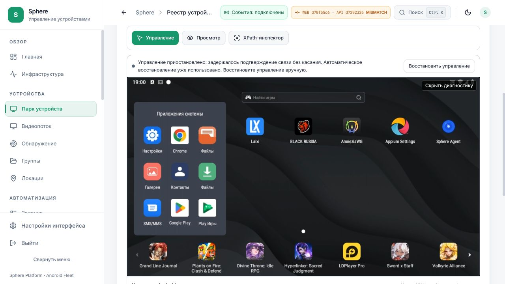

# Управление через туннель: установленный UI и границы результата

Дата: **9 октября 2026**, наблюдение до 17:03 UTC / 22:03 UTC+5.
Это конечная проверка интерфейса предупреждений и доставки UI.
**Задержка, повторный idle timeout и прямое соединение не приняты.**

[Машинный receipt](IDLE-CONTROL-UX-INSTALLED.json) ·
[Исходное воспроизведение и source/test](IDLE-CONTROL-RELAY-REVIEW.md) ·
[Проект прямого транспорта](../../design/BROWSER-DIRECT-TRANSPORT.md) ·
[Действующие работы](../../operations/WORK-STATUS.md).

## Результат поставки

На `http://127.0.0.1:3015` и выбранном публичном Tuna-host работает один UI
**d70f55c6de36a01801af201ea4d6ca42bff53549**. API остаётся
**d720232e3164d278a7322a61a90ba111e205ae3c**. Разные UI/API SHA ожидаемы
для этой UI-only поставки; сами SHA не доказывают здоровье управления.

Повторный timeout, когда ожидаются только heartbeat без удерживаемого пальца
или terminal ACK, теперь показывает задержку подтверждения связи без касания.
Первое автоматическое согласование по-прежнему ограничено одной попыткой и
подтверждённым release; после повторного сбоя input блокируется. При неизвестном
результате DOWN/удерживаемого пальца/terminal прежнее предупреждение сохранено.
Deadline, retry, replay, протокол и Android helper этим исправлением не менялись.

Раскрытая диагностика явно сообщает: видео и управление идут через серверный
WebSocket, прямое соединение с APK пока не подключено. Это описание фактического
транспорта, не новый transport mode.

Первый rollout **227a0c84** исправил wording. Визуальная проверка обнаружила
нечитаемый статус в светлой теме: полупрозрачный фон лежал на чёрной поверхности
видео. Последующий **d70f55c6** использует непрозрачный фон темы, foreground-текст
и перенос длинного сообщения. Кнопка восстановления остаётся видимой.

## Проверенная доставка

| Проверка | Записанный результат |
| --- | --- |
| Exact frontend CI | [37962183606](https://github.com/RootOne1337/sphere-platform/actions/runs/37962183606), success |
| Frontend regression | 139 suites / 1950 tests; types и production build passed |
| Packaged pages/assets | 26 / 73, проверены workflow |
| Targeted pointer/controller | 138 tests passed, включая idle и held/terminal классификацию |
| Artifact | 11632106632, ZIP 120882464 bytes, SHA-256 `31b88b8092f363748a98a4896b063aba1fecce1b89c2b51013bcccd11b7862bf` |
| Независимый CI config image ID | `sha256:fa321a1a5dc3cfc9b141dec05d3b549029db10761edfcb9eee5ad4166c5bd9d1` |
| Loaded manifest image ID | `sha256:f30a661aea04c79758458f02ce73f6e58f9445232734916b5cc4e9360159864b` |
| UI container StartedAt | `2026-10-09T16:58:35.324774492Z` |
| Resource admission | findings `[]` перед установкой |
| Compose admission | полный baseline round-trip, только UI image/build-removal delta |
| Соседние контейнеры | 45 сохранены |
| API/APK/schema/OTA | сохранены; PH011 APK `1.2.49-dev / 10249` |

Два ID image относятся к config и загруженному manifest; installer проверил
их связь с архивом. CI identity получена из авторизованных CI logs независимо
от скачанного receipt. Нельзя просто сравнивать разные виды digest как один ID.
Статусы остальных exact-source CI сохранены собственным срезом в JSON, без
автоматического присвоения success. Backend/APK code этим пакетом не менялись.

Публичный exact-host map, gateway config и API/WS/bootstrap routes не изменялись.
Один UI replacement обновил оба адреса через существующий review gateway.
`/login` вернул 200, anonymous resources — 401, `/metrics` — 404 на обоих адресах.
Это конечные HTTP-проверки, не приёмка всего API или Android.

## Браузерная проверка и повторный отказ

На публичном адресе проверена карточка **PH011** с новой UI/API парой и APK10249.
Открыт один поток; Android-касания, навигация и задания не отправлялись.
Повторный idle timeout показал правильный текст и `idle_receipt_timeout`.
Управление осталось заблокированным. Светлая тема визуально читаема.

| Снимок при остановке | Значение |
| --- | --- |
| Фаза | ready |
| Отправлено / подтверждено | №12 / №10 |
| Ожидали ACK | 2 |
| Старейшая команда | №11, HEARTBEAT |
| Возраст / deadline age | 512 / 512 ms |
| Последний ACK RTT / возраст | 510 / 258 ms |
| Разрыв тиков browser | 15 ms |
| Удерживаемый палец / terminal | нет / нет |
| Browser WS / buffered bytes | OPEN / 0 B |
| Viewer при первом раскрытии | 17 packets / 169869 bytes, 13 decoded/drawn, 0 invalid/decode/render errors |

Числа перенесены из наблюдения CUA раскрытой диагностики. Сохранённый последующий
AX файл является diff и не выдаётся за полный исходный снимок. SHA screenshot
и границы происхождения данных записаны в JSON. Это не синхронные кадры APK и
browser по общему frame ID, не end-to-end frame latency и не steady FPS benchmark.

Промежуточный UI227 показал last ACK RTT526ms / deadline age511ms. Ранее UI863
дал RTT518ms / deadline age503ms. Эти три конечных отказа не являются
статистическим сравнением производительности или доказательством виновности
конкретного участка. Показатель browser buffered0 не исключает очереди APK,
proxy, Redis, OS, native helper или обратного пути.

На промежуточном UI227 повторно загрузился публичный Grafana collection dashboard
с панелями и без captured warning/error; это не новое покрытие метрик.
На финальном локальном UI проверены версия и каталог22. В обеих финальных
вкладках captured warning/error пусты. После проверки public переключён в
«Просмотр», собственные временные вкладки закрыты, пользовательский builder
не менялся. Видеосессия не оставлена фоновой нагрузкой.

## Что остаётся открытым

**SF26-05 / EP-020 / EP-029 остаются OPEN.** Изменение wording/контраста не
устраняет RTT и не продлевает deadline. Общий исходящий APK WS для video/ACK
подтверждён кодом как риск очереди; причинность текущего отказа не установлена.
Нужны коррелированное измерение и контролируемое сравнение transport paths.

Подготовлен проект browser RTCPeerConnection ↔ Android libwebrtc: direct media
и input/native ACK, авторизованное signaling, явный TURN fallback, owner/revocation,
network matrix, resource budgets и rollback gates. Он **не реализован**; точный
Android artifact/ABI provenance ещё не выбран. Новые TURN/ports/VPN/OTA не вводились.
Draft latency targets в design не являются достигнутым SLA.

Product остаётся **9 принято / 41 открыто**; legacy7 — отдельный пересекающийся
scope. Whole-PC storage writer остаётся UNKNOWN. Удалены только два собственных
проверенных ZIP-дубликата, 241761341 bytes; admitted image archives/receipts
сохранены. Docker prune, volume cleanup, SSD repair и fleet OTA не выполнялись.
