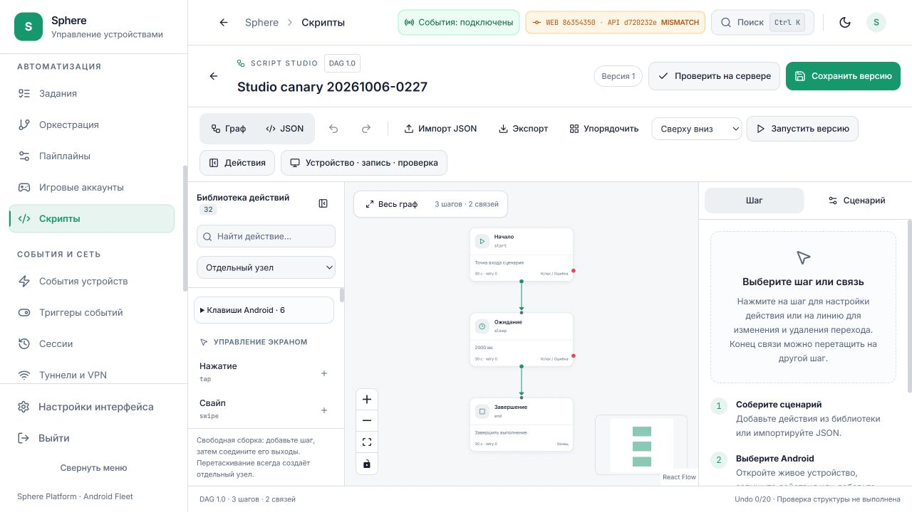
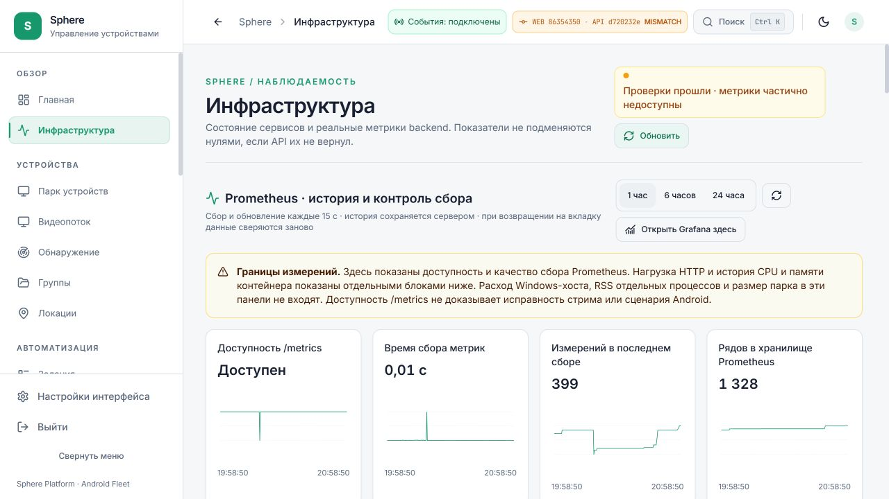

# Новый веб на существующем публичном туннеле

**Дата:** 9 октября 2026. Переключение — 15:53 UTC / 20:53 UTC+5;
конечная проверка — около 16:00 UTC / 21:00 UTC+5.

На [действующем Tuna-адресе](https://sphere-agent-canary-20260927.ru.tuna.am)
теперь работает тот же процесс UI **86354350**, который обслуживает 3015.
API **d720232e** сохранён. Ранее этот адрес отдавал отдельный старый frontend
**8fef5eb**. Разница подтверждена контейнерами, страницами входа и видимыми
версиями после входа; это было реальное расхождение установки.

[Машинный receipt](PUBLIC-WEB-DELIVERY.json) ·
[Текущее состояние](../../operations/CURRENT-STATE.md) ·
[Эксплуатационная процедура](../../operations/REVIEW-GATEWAY.md).

## Что изменено

В [remote-pilot.conf](../../../infrastructure/nginx/remote-pilot.conf) добавлен
выбор UI по точному публичному hostname. Приватный файл
`.local-pilot/remote/public/web-upstream.map` направляет только действующий
Tuna-host на существующий `review-gateway:8080`. Файл не содержит credentials,
не включён в Git и не имеет HTTP location для скачивания.

| Запрос | Маршрут после переключения |
| --- | --- |
| Страницы, Next assets, `/observability/grafana/…` выбранного host | Существующий review gateway → UI86354350 |
| `/api/observability` и его дочерние Next handlers | Тот же UI с прежними проверками доступа |
| Business `/api/…`, `/ws/…`, `/health` | Прежний `nginx:8081` |
| Agent bootstrap и подписанный discovery | Прежние точные aliases; исходные байты сохранены |
| `/metrics` | 404 |
| Остальные host без записи в map | Прежний UI через `nginx:8081` |

Public Host, X-Forwarded-Host, HTTPS indication и WebSocket upgrade сохранены.
На публичном HTTPS ingress cookie `sphere_observability` получает Secure;
HttpOnly, SameSite и короткая зашифрованная сессия остаются в Next handler.
Секреты, пользовательские cookie и bootstrap-содержимое в receipt не включены.

Новый образ не собирался и не загружался. Выполнены `nginx -t` и graceful reload
существующего публичного gateway. Все **46** контейнеров сохранили ID, image,
startup time и running/stopped state как сразу после reload, так и в конечной
проверке. База, OTA и APK не изменялись. Это не измерение отсутствия всех
reconnects или временных ошибок отдельного запроса.

## Проверки и видимый результат

Расширен [изолированный Docker integration test](../../../tests/deployment/test_remote_gateway_host.py).
Реальный Nginx проверяет работу без opt-in/review gateway, адресный opt-in,
query strings, Next assets и observability, сохранение API/WS/Host/bootstrap,
fallback другого host, Secure cookie и запрет `/metrics`.
**1 passed, 10,25 с**; scoped Ruff прошёл. Тестовые контейнеры и сеть удалены
его собственным cleanup; рабочие volumes и images не чистились.
Также прошли **26 documentation regressions**, проверка актуальных UI/API
указателей и local links; inventory содержит **398 Markdown-документов**.

Через обычный браузер на публичном HTTPS выполнены вход и чтение:

- Dashboard: WEB86354350/API d720232e, реальные данные API, события подключены.
- Каталог: **22 сценария** из backend.
- Существующий Studio canary: опубликованная v1, **3 узла / 2 связи**, Undo0,
  библиотека **32 действий**. Save, Run, Record и Android input не выполнялись.
- Monitoring: реальные HTTP, CPU/RAM и fleet данные; встроенный Grafana dashboard открылся.
- Отдельные запросы без авторизации: observability resources **401**,
  Grafana **401**, raw `/metrics` **404**.

При загрузке Grafana наблюдался **временный отказ части monitoring-запросов**.
Интерфейс скрыл неподтверждённые значения; после закрытия Grafana и ручного
обновления графики и fleet данные восстановились. В ограниченном edge-срезе
есть 200 с завершёнными ответами и client-close 499; причина отказа браузера
не установлена. Grafana и новые графики доступны, но непрерывная надёжность
публичного транспорта этим прогоном не принята.

Надпись MISMATCH означает разные source commits UI/API: UI-only и API-only
поставки проверялись раздельно. Она не означает, что туннель всё ещё отдаёт
старый frontend. Предупреждение о частичном покрытии метрик также сохранено:
неподключённые проверки публичного транспорта и активных tunnels не стали нулями.

## Эксплуатация и откат

Публичный UI теперь зависит от существующих review UI и review gateway.
Остановка review stack отключит этот UI; business API/WS/bootstrap используют
отдельный прежний маршрут. Дальнейший UI-only rollout обновляет сразу 3015
и выбранный публичный host, поэтому требует проверки обоих ingress.

Для отката оператор сначала проверяет содержимое и принадлежность конкретного
`web-upstream.map`, убирает только эту запись, выполняет `nginx -t` для
`/etc/nginx/remote-pilot.conf`, затем reload публичного gateway. Без opt-in
конфигурация возвращает старый UI; volumes и API пересоздавать не требуется.
Private plan/previous config находятся в `.local-pilot/remote-web-20261009`.
Откат в рабочем окружении не выполнялся; fallback проверен изолированным тестом.

Cloudflare/SSH fallback hosts этим переключением **не обновлялись и не приняты**.
Не выполнялись новая проверка управления Android через публичный ingress,
load/soak, WebRTC, смена VPN, очистка Docker или disk compaction.
Idle control остаётся OPEN; whole-PC writer UNKNOWN; продуктовый остаток
**9 принято / 41 открыто** не изменился.
