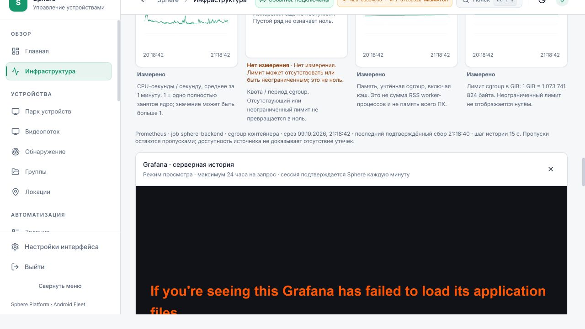
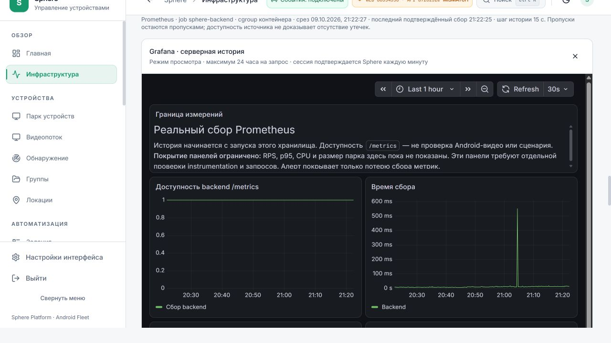

# Дополнительная проверка публичного веба и исправление Grafana

**9 октября 2026, 16:08–16:24 UTC / 21:08–21:24 UTC+5.**
UI **86354350**, API **d720232e**, прежний действующий
[Tuna-адрес](https://sphere-agent-canary-20260927.ru.tuna.am).
[Машинные доказательства](PUBLIC-WEB-SUPPLEMENTAL-QA.json).

Дополнительная проверка нашла реальный отказ Grafana на публичном адресе.
Он исправлен адресным сжатием статических ответов gateway и повторно проверен
в браузере. Остальные проверенные пути не показали ошибок смены origin.
Это конечная проверка чтения и доставки ресурсов, а не полная приёмка продукта.

## Найденный дефект и доказательства

Два открытия публичной Grafana завершились экраном
`Grafana has failed to load its application files`. В консоли обнаружены:

- `7606.e8e4d98948a4bb1cf3bc.js`: `Private field '#t' must be declared in an enclosing class`.
- `6540.acf453ee99146ad315f3.js`: `Unexpected end of input`.

Тот же dashboard через3015 загрузился с рабочими панелями. Соседние публичные
monitoring-панели во время загрузки временно теряли данные, затем восстановились.
Edge одновременно записывал200 и завершённые ответы: HTTP200/OK на ingress
не доказывает получение и исполнение всех байтов браузером.
Точное место повреждения/обрыва представления внутри публичного пути не установлено;
лимит или неисправность самого провайдера Tuna этим опытом не доказаны.

Первый [receipt доставки](PUBLIC-WEB-DELIVERY.md) сохраняется как исторический срез.
Его отметка об открытии Grafana недостаточна для подтверждения загрузки приложения;
актуальная проверка dashboard и уточнение отказа находятся здесь.

## Исправление и установка

В [remote-pilot.conf](../../../infrastructure/nginx/remote-pilot.conf) добавлено
сжатие только `/observability/grafana/public/`: JS/CSS/SVG, gzip level4,
negotiation по Accept-Encoding, Vary и поддержка Via у промежуточного прокси.
Next bridge продолжает проверять сессию и роль для каждого ресурса.
Маршруты API, WebSocket, видео, bootstrap и приватная hostname-map сохранены.

| Большой JS | Передача до, байт | Передача после, байт |
| --- | ---: | ---: |
| 7606 | 4 121 450 | 1 426 838 |
| 6540 | 5 117 648 | 1 666 877 |

Это `body_bytes_sent` gateway→connector, не счётчик клиентских байтов.
После `nginx -t` выполнен graceful reload в **16:21:38 UTC**. Образы не собирались,
контейнеры не пересоздавались. Все46 сохранили ID/image/start/state;
bootstrap и hostname-map — SHA-256. Public readiness вернул200.

Два следующих открытия публичной Grafana показали dashboard, легенды и реальные
ряды; запросы dashboard/datasource дошли до200. Новых console errors/warnings
после reload в проверенной вкладке не обнаружено. Соседние панели восстановились.
Это подтверждение устранения наблюдаемого отказа в двух попытках, не transport SLA.

## Остальная проверка смены адреса

Обычным браузером пройдены **22 уникальные страницы** основного меню:
dashboard, monitoring, devices, stream, discovery, groups, locations, tasks,
orchestration, pipeline-settings, accounts, scripts, events, event-triggers,
sessions, vpn, webhooks, users, audit, logs, updates, settings.
Список, заголовки, признаки загрузки и проверка origin сохранены в JSON.
В этих срезах не обнаружено alert, незавершённой загрузки или ссылок
на localhost/127.0.0.1 в ресурсах и навигации публичной страницы.
Пустые разделы проверены как пустые состояния; операции создания в них не приняты.

- Session восстановилась после F5 на глубокой builder-ссылке с query id.
- Каталог22сценария, его настройки и существующий graph v1/3узла/2связи открылись.
- JSON экспорт скачался:723байта, корректная структура,3узла.
- ELK worker загрузился с200; кнопка раскладки вернулась из pending без console error.
- Событийное подключение показало состояние «подключены».
- Read-only PH011 viewer получил8пакетов/45104байта и отрисовал6кадров,
  invalid/decode/render errors0. Android input не отправлялся.

На неподвижном экране viewer позднее показал предупреждение о10секундах без
новых кадров и heartbeat-отчёт `not_streaming`. Этот короткий просмотр доказывает
прохождение WSS/декодера и первого изображения, но не непрерывный FPS,
свежесть capture telemetry или исправность idle control. Viewer штатно остановлен.
Временные QA-вкладки закрыты; исходная рабочая вкладка пользователя не менялась.

## Проверки и границы

[Docker integration](../../../tests/deployment/test_remote_gateway_host.py):
**1 passed,10,69с**. Добавлены проверка gzip через Via, Vary и SHA-256 совпадение
полностью распакованного JS с исходным; plain-клиент также получает исходные байты.
Прежние API/WS/Host/bootstrap/fallback/cookie/metrics проверки сохранены.
Scoped Ruff прошёл. Live без авторизации: static Grafana401,
observability resources401, `/metrics`404. Auth boundary не расширена.

Save/Run/Record, Android control, массовые подключения, shell/OTA/VPN изменения,
долгий soak и сторонние ingress fallback не выполнялись. PNG-качество не пересматривалось.
Также прошли26 documentation regressions; checker проверил399 Markdown-документов
и действующие указатели runtime. Product **9 принято /41 открыто** и отдельные
idle/disk риски сохраняются.
