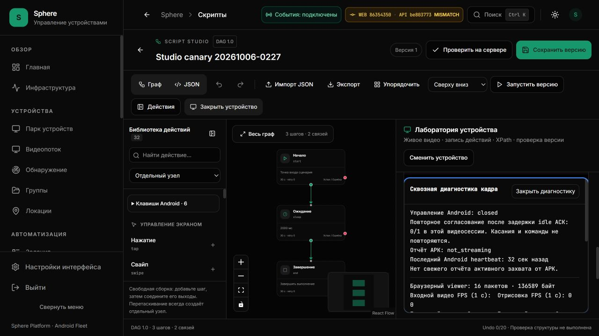

# Установленная диагностика управления и компоновка

9 октября 2026. UI **86354350** установлен на 3015, API **be803773** сохранён.
[Точный image/runtime/CI/browser receipt](STREAM-DIAGNOSTICS-INSTALLED-ACCEPTANCE.json).
[Исходник снимка сбоя](CONTINUOUS-FENCE-DIAGNOSTICS.md) ·
[Дефект компоновки и повторный idle failure](STREAM-DIAGNOSTICS-LAYOUT.md).
[Коррекция высоты](STREAM-DIAGNOSTICS-COMPACT-HEIGHT.md).

## Результат

Перед fencing сохраняется последний bounded scalar snapshot текущего viewer:
pending/oldest/terminal, tick gap, actual ACK RTT/age, WebSocket buffer/held.
Device/auth/socket замена очищает snapshot; нормальный release не создаёт ложный
failure. Нет координат, текста, owner/session IDs, кадров, журнала или нового polling.

Диагностика находится под видео и navigation, вне overflow-hidden поверхности.
Панель ограничена шириной родителя, имеет собственную прокрутку с клавиатуры,
sticky heading и явное закрытие. Закрытие abort-ит запрос и прекращает polling.
Режимы управления, deadlines, recovery count и replay policy не изменены.

## Доставка и конечная проверка

Все четыре CI workflow точного исходника 86354350 завершились успешно:
Frontend, Backend, Android и Preview. Frontend: 1948 тестов в 139 наборах;
TypeScript, build, 26 страниц / 73 assets и packaged image admission passed. Artifact SHA и image
config независимо связаны с authenticated CI log. Применён только готовый UI:
45 остальных контейнеров, схема, OTA и APK сохранены; локальная сборка image не выполнялась.
Container started: `2026-10-09T13:41:17.810174839Z`.

Desktop и phone portrait проверены реальным браузером. Измерения границ панели,
доступность нижних строк, явное закрытие и снимки записаны в JSON. Контрольный
графv1/3узла/2связи/Undo0 и queue0 сохранены; Save/Run/запись не выполнялись.
Viewport reset, View выбран, временная вкладка закрыта. Это конечная visual canary,
не полная accessibility/device matrix и не fleet/soak приёмка.

Высота измерена: 288px desktop, 320px phone; горизонтального overflow нет
(clientWidth=scrollWidth: 386/342px). В исходной оценке compact-height 337.6px
для телефона не был учтён cap 20rem; фактический результат 320px записан здесь.
На обоих размерах pointer-click и Enter закрыли панель; End показал последние
строки, сохранив видимую кнопку закрытия. Границы и hashes снимков находятся в JSON.

[Конец отчёта на ПК](assets/stream-diagnostics/desktop-end.jpg) ·
[Телефон: начало](assets/stream-diagnostics/phone.jpg) ·
[Телефон: конец и видимое закрытие](assets/stream-diagnostics/phone-end.jpg).

## Неустранённый P1

На предыдущем UI0b321d49 за конечное окно13:02:43→13:13:05UTC подтверждён
native_receipt_timeout: heartbeat512ms, tick gap15ms, last ACK RTT248ms,
WS OPEN/0B, held=false/terminal=null; после1idle recovery. Точное время самого
failure неизвестно — записано время наблюдения уже сохранённого события.
Это не подтверждает browser scheduling/буфер как причину данного события.
Участок задержки server/Redis/APK/native/reverse path пока не установлен.
Команды не повторялись, deadline не увеличен. SF26-05/EP-020/029 OPEN.

Ограниченный host observer работает в отдельном конечном окне до10Oct12:42:57UTC,
без VSS/USN/ETW writer attribution и reboot autostart. Disk/RAM leak не закрыта.
Удалены только два дублирующих ZIP этого рабочего цикла после проверки SHA-256:
241762806B; извлечённые проверенные image archives и отчёты сохранены.
Это управление собственными временными файлами, не исправление заполнения C:.
Product9accepted/41open, legacy34source-fixed/7unclosed остаются прежними.

## Проверка действующего указателя

При итоговой сверке обнаружен пробел в checker: версия installed UI проверялась
только для receipts из списка прежних completedCorrections. Новый diagnostic
receipt в этот список не входил. Теперь любой действующий installed receipt
проверяется по normalized SHA-256, UI/API revisions и отдельным признакам
installation/finite acceptance. 23 регрессии проходят; среди них отказ при
неверной версии, пропавшем или повреждённом receipt и source-only доказательстве.
Эта проверка поддерживает согласованность документов и не доказывает runtime SLA.
