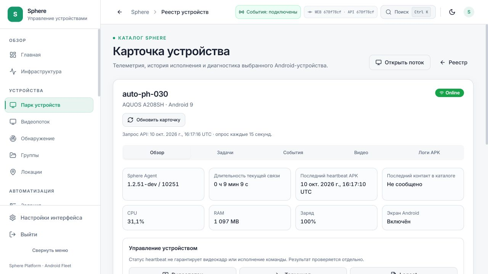

# Автоматическое восстановление допуска управления: установка 10 октября

UI/API `678f78cf` установлены на 3015 и публичном туннеле. PH030 остаётся на
штатно установленном APK1.2.51-dev/10251; нового OTA этим исправлением не выполнялось.

## Что исправлено

- Отказ до выдачи владельца теперь различает занятую вкладку, задачу, истёкшее
  согласование, смену захвата и переподключение агента. Такие отказы запускают
  ограниченный по частоте повтор согласования без остановки видео.
- Временная недоступность сервера допуска восстанавливается автоматически.
  Неизвестный результат уже начатого жеста требует подтверждённого native RELEASE,
  нового viewer/кадра/capability/STARTUP0. Старый жест никогда не повторяется.
- Поздний отказ старого владельца не отменяет таймер новой попытки. Отзыв прав
  остаётся отказом доступа; чужой владелец не вытесняется.
- Открытая панель доступа обновляется по событиям устройства после OTA/reconnect.

## Доказательства и пределы

Все четыре exact-source CI успешны:3513backend tests+272subtests,2134frontend tests.
Установлены готовые проверенные образы;45соседних контейнеров, schema и OTA-каталог
сохранены при каждой установке. Оба адреса подтвердили readiness, anonymous401,
private/no-store и допуск readonly-video толькоPH030. Публичная карточка визуально
подтвердила WEB/API678 и APK10251.

Это конечная приёмка доставки и карточки. Перестановки отказов/ACK/RELEASE проверены
fixtures; новый воспроизведённый пользовательский сбой с native wire trace этим
срезом не получен. Основные видео/управление остаются через сервер, реальное RTP
и localhost/LAN/WAN latency не приняты.

[Машинный receipt](CONTROL-ADMISSION-RECOVERY-INSTALLED.json).
[Предыдущая адресная доставка APK](DIRECT-VIDEO-READONLY-INSTALLED.md).

