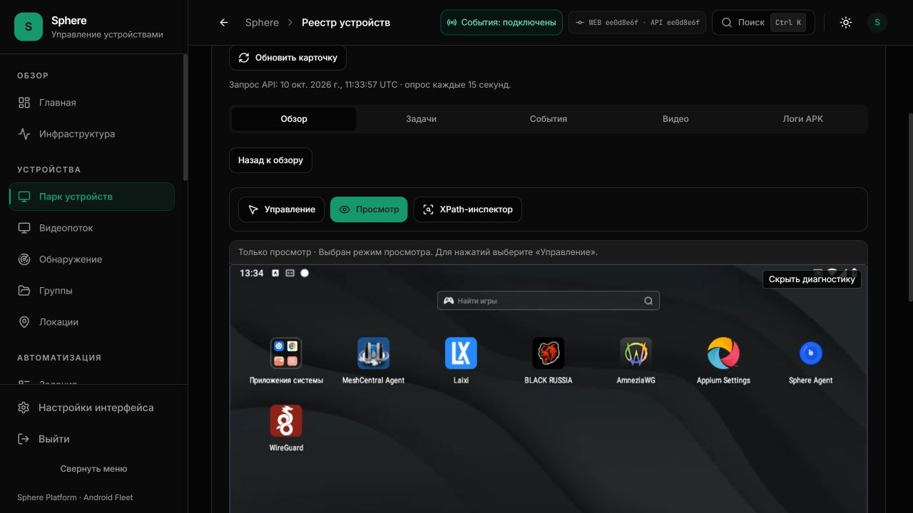

# Прямое видео: UI/API доставлены, native OTA ожидает PH030

Это конечный срез установки UI/API `ee0d8e6f` 10 октября 2026. APK **1.2.51-dev /
10251** собран и подписан, но PH030 офлайн с последним heartbeat 11:16:59 UTC.
На устройстве остаётся ранее проверенный **1.2.50-dev / 10250**. Новый OTA release,
grant и update command не созданы; установка и настоящее RTP-изображение не приняты.

[Машиночитаемый receipt](DIRECT-VIDEO-API-INSTALLED.json) ·
[Исходники и пределы](DIRECT-VIDEO-READONLY-SOURCE.md) ·
[Текущий статус](../../operations/WORK-STATUS.md).

## Что доставлено и проверено

UI и API из прошедших exact-source CI установлены на 3015 и публичном туннеле.
Ровно 45 соседних контейнеров сохранены при каждой установке; schema, host map и
OTA catalog не менялись. Серверный video flag включён только для PH030. Свежая
native session и APK >=10251 требуются дополнительно: HTTP на обоих адресах
возвращает `readonly_video_enabled=false` для текущего offline/10250.

Anonymous 401, private/no-store, echo-профили host/public-STUN, пределы 30s/20
и отсутствие допуска PH011 проверены без создания direct peer. Визуально
подтверждены одинаковые UI/API версии, скрытый неподдерживаемый видеорежим,
мобильная ширина 390 px без overflow и фокус кнопки с клавиатуры. Сам новый RTP
renderer пока не был доступен, его live/mobile rendering этим не принято.

После обновления обычный PH011 viewer в режиме просмотра дал 7 decoded/drawn
кадров 960×540, invalid/decode/render errors 0. Клики Android не отправлялись;
это конечная проверка прежнего WebSocket-видео, не FPS/latency/soak acceptance.
Просмотры закрыты, временный viewport восстановлен.

Backend CI: 3505 passed, 262 subtests, 37 skipped. Frontend: 2124 tests /147 suites.
Signed Android build: dev и enterprise по 1013 tests, 0 failures/errors, 3 skipped;
lint/assemble пройдены. JNI buffer bridge и настоящий RTP decoder требуют живого
теста на обновлённом APK. Hosted run указан в JSON отдельно от локальной сборки.

## Что означает задержка

В обычной панели число сверху — round-trip подтверждения команды или heartbeat
через текущий server WebSocket плюс обработка Android. Подпись уточнена до
«Связь с Android» / «Ответ Android»; это не задержка картинки.

Пользователь отдельно подтвердил laptop browser ↔ PH030: 20/20 echo и p95
25,8 мс, NAT/UDP. Это application round-trip; выбран не доказанный loopback путь.
Ни деление RTT пополам, ни echo сами по себе не измеряют capture-to-display.
[Исходное наблюдение и точные границы](PH030-LAPTOP-CHANNEL-USER-OBSERVATION.md).

## Следующий конкретный шаг

После возвращения PH030 в сеть: один адресный OTA до 10251, actual package SHA,
свежая native session, затем отдельный режим «Видеокадры с APK по WebRTC».
Нужны реальные rendered frames, геометрия, выбранная ICE-пара и результат decoder.
Проверка из браузера основного ПК с VPN не заменяет ноутбучный маршрут.

Основное видео и управление по-прежнему используют серверный WebSocket. Direct
input, основной долгоживущий viewer, ABR, TURN/WAN, reconnect, ресурсы и stable
1.3.0 остаются открытыми. Состояние CHAT-15 — PARTIAL, product9/41 и legacy7
не меняются. Предыдущие receipts сохранены отдельно.

