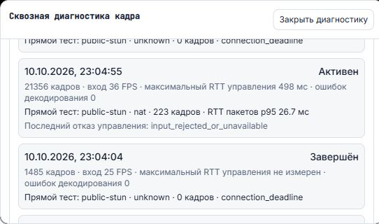

# История сеансов и автоматическая диагностика: установленный срез

UI `a32854e6` / API `c14c3235` установлены на 3015 и публичном туннеле. PH030 сохраняет
APK 1.2.51-dev / 10251; новое OTA этим изменением не выполнялось.

На устройство хранятся последние 10 сеансов. Одиннадцатый вытесняет самый старый
атомарно; поздний report не возвращает удалённый сеанс. JSON ограничен 32 KiB,
неактивная запись истекает через 7 дней. При достижении лимита сокращаются старые
детали; сохраняются свежие срезы и завершение. Redis outage не блокирует ввод.
Здесь нет видеоархива, текста ввода, координат, SDP, IP или credentials.

Открытый одиночный viewer автоматически собирает счётчики и запускает конечную
проверку прямого видео: host, затем не более одной допущенной STUN-попытки.
Видимой вкладке не требуется фокус окна. Скрытая вкладка, запись сценария и
инспектор не запускают тест. Допуск читается после первого кадра отдельно для
этого viewer; временный отказ чтения разрешает только один повтор.
Реальные представленные кадры считаются отдельно от 20 echo-пакетов.
Очистка плеера больше не маскирует сетевой отказ ошибкой renderer.

## Что проверено в установленной версии

Полные CI веба a32854e6 и API c14c3235 успешны. Серверный исходный код в правке
веба не изменился; повторная установка идентичного API не выполнялась. Android source не
изменился относительно установленного APK 10251; состояние дополнительного
Android CI записано отдельно. Оба адреса подтвердили readiness, anonymous 401,
private/no-store и контракт истории. Публичный веб основного ПК действительно
передал browser samples; API вернул их вместе с APK samples и автоматическим
исходом прямой проверки. Это измерение основного ПК с VPN, не браузера ноутбука.
Отдельный пользовательский viewer передавал метрики до открытия моего просмотра.
Пользователь указал ноутбук; физическая топология этим report не проверяется.
После обновления веба новая вкладка автоматически сообщила 223 представленных
кадра WebRTC 960×540, NAT/UDP, ICE/DTLS connected, 20/20 echo и p95 26,7 мс.
Эти кадры получены UI c4826d46. Финальная a32854e6 меняет только контраст
панели диагностики; алгоритм автотеста остаётся тем же.
Начальная host-попытка не установила канал; STUN-попытка получила видео.
APK завершил соответствующий период проверки: 560 access units приняты,
231 переданы, budget/invalid/failure — 0, собственные очереди после закрытия — 0.
Это временная корреляция двух источников; общего frame/session ID здесь нет.
При каждом шаге установки сохранены 45 соседних контейнеров, schema,
OTA-каталог и public host map.

Генерация OpenAPI сверена с закреплёнными серверными FastAPI/Pydantic. Экспортёр
отклоняет другое окружение до импорта приложения; несовпадение библиотек больше
не может незаметно перезаписать канонический контракт.

## Пределы

Основные видео и управление продолжают использовать серверный WebSocket.
В 18:07:03 UTC история пользовательского сеанса сохранила `controller_busy`
на `touch_open`, owner_bound=false, retryable=true; затем семь отказов touch_event.
В это время были открыты два viewer. Мой проверочный viewer не отправлял
касания или навигационные действия, однако режим управления по умолчанию
может занять эксклюзивный lease служебным обменом. Этот отказ не устранён:
нужны явный просмотр без захвата ввода и безопасная передача управления.
Последующие визуальные проверки выполнены в режиме «Просмотр».
Прямое primary media/input, localhost/LAN/WAN/TURN,
reconnect/ownership matrix, ресурсный soak и stable 1.3 не приняты.
Открытый старый веб требует F5 для загрузки нового JavaScript; после этого
кнопки диагностики для автоматического сбора не нужны.

[Контракт](STREAM-SESSION-DIAGNOSTICS.md) ·
[Машинный receipt](STREAM-SESSION-DIAGNOSTICS-INSTALLED.json).

