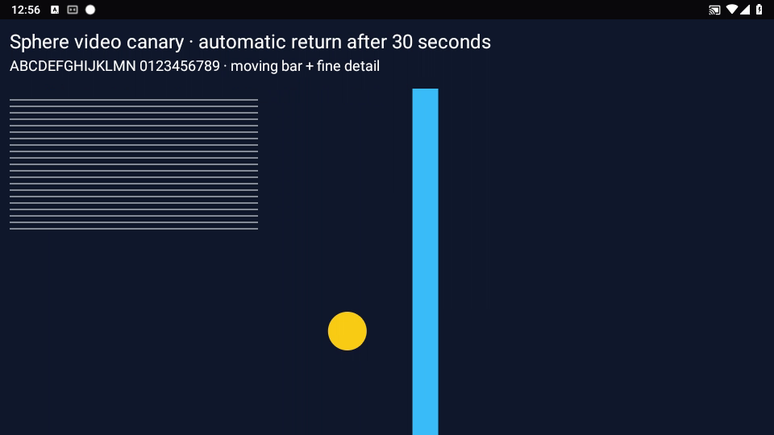

# Android codec input: synthetic control и настоящий capture canary

**Дата:** 1 октября 2026, Asia/Yekaterinburg. **Статус:** finite PH010 capture →
encoder → wire и независимый decode проверены; remote smoothness и browser
draw/input-to-visible acceptance ещё открыты.

[Текущее состояние](CURRENT-STATE.md) · [Video cadence](VIDEO-CADENCE-CANARY.md) ·
[Synthetic measurements](../audits/2026-10-01/PH010-CODEC-INPUT-EVIDENCE.json) ·
[Real capture / OTA / decode evidence](../audits/2026-10-01/PH010-PH025-PLANAR-CAPTURE-EVIDENCE.json)

## Что изменилось в диагнозе

На PH010 / APK 1.2.38 программный `OMX.google.h264.encoder` ранее давал около
6 pictures/s при Surface input. Это не доказывало, что сам алгоритм AVC слишком
медленный: Surface включает графический producer/consumer и преобразование
пикселей. Отдельный процесс `app_process` сравнил Surface и planar YUV input
без MediaProjection, сети, Sphere transport, браузера и реального экрана.

Одинаковые размеры **960×540**, target **30 FPS**, requested **1.5 Mbit/s**,
движущийся квадрат и полосы. Measurement interval — **1.2 s**, warmup — 150 ms.
Выход дожидается всех измеренных PTS не более 1 s. Codec config не считается
picture; `inflight_at_drain_deadline` во всех пяти окончательных controls — 0.
Это короткий синтетический тест, не длительная оценка качества или стабильности.

| Codec / input | Pictures / 1.2 s | Input FPS | Время от input PTS до output callback |
| --- | ---: | ---: | --- |
| AVC / Surface, requested CBR | 8 | 6.67 | 418–488 ms |
| AVC / Surface, VBR | 8 | 6.67 | 419–495 ms |
| VP8 / Surface, CBR | 8 | 6.67 | 716–783 ms |
| AVC / YUV420 planar, requested CBR | 36 | 30 | 1.29–2.46 ms |
| VP8 / YUV420 planar, CBR | 36 | 30 | 1.41–3.56 ms |

Input FPS здесь — число реально полученных encoded pictures с PTS внутри
measurement interval, делённое на его длительность. Это **не browser draw FPS**
и не callback arrival rate. Surface swap — 136–178 ms в окончательной серии;
planar copy/fill — 0.088–0.256 ms. Planar fixture уже содержит YUV и **не включает
RGBA → YUV conversion настоящего захвата**. Цвета близки к Surface fixture, но
не утверждается pixel-identical equivalence после subsampling/codec conversion.

Runtime capabilities для AVC/VP8/VP9 вернули только Google OMX encoders. AVC:
VBR advertised, CBR not advertised, complexity range `[0,0]`; фактический
configure с requested CBR всё же прошёл. VBR не ускорил Surface path. VP8 не
устранил Surface ограничение; менять wire format на VP8 по этим данным незачем.
На API 28 hardware-acceleration flags API 29 не доступны. Ранее прочитанная AVC
библиотека имеет x86 ELF header; это не доказательство идентичности её source AOSP.

Вывод: **на этом устройстве задержка локализована в графическом input path**,
а не в Python backend или чистом AVC encode синтетического YUV. Конкретный
driver/conversion call пока не изолирован. Это не снимает remote network,
source display FPS limit, реальную conversion cost и browser latency gates.

## Инструмент и условия повторения

Исходник: [MediaCodecProbe.java](../../scripts/pilot/android/MediaCodecProbe.java).
Сборка: [build_codec_probe.py](../../scripts/pilot/build_codec_probe.py), JDK 17+
и установленный Android SDK. APK и Gradle dependencies не меняются.

```powershell
python scripts/pilot/build_codec_probe.py --sdk <sdk-directory> --java-home <jdk-directory> --output <fresh-directory>/probe.zip
```

После проверки SHA256 доставленного, только собственного файла на тестовый Android:

```text
CLASSPATH=/data/local/tmp/<owned-probe>.zip app_process /system/bin com.sphereplatform.audit.MediaCodecProbe inventory
CLASSPATH=/data/local/tmp/<owned-probe>.zip app_process /system/bin com.sphereplatform.audit.MediaCodecProbe bench OMX.google.h264.encoder cbr
CLASSPATH=/data/local/tmp/<owned-probe>.zip app_process /system/bin com.sphereplatform.audit.MediaCodecProbe bench OMX.google.h264.encoder vbr
CLASSPATH=/data/local/tmp/<owned-probe>.zip app_process /system/bin com.sphereplatform.audit.MediaCodecProbe bench-planar OMX.google.h264.encoder
```

Не добавлять host ADB / PC Agent как обязательную зависимость продукта. Для этого
control использован существующий authenticated APK root SHELL. Проверены online,
version 10238 и `not_streaming` перед запуском; сторонние Activity и settings не
менялись. Прямой временный LAN payload server оказался недоступен и был закрыт.
Доставка прошла через одну временную exact diagnostic location существующего
gateway. Nginx configuration проверена до reload, затем исходные байты восстановлены
и выполнен graceful reload. Host и Android payload files удалены; private bootstrap,
OTA catalog и tunnel endpoints не изменялись. Не публиковать диагностический путь
постоянно. Unknown shell timeout требует reconciliation, а не повторного запуска.

Каждый benchmark создаёт и освобождает собственный codec; отдельный callback
thread, bounded collections, finite input/drain. API 28 `app_process` требует
подготовки main Looper даже с explicit callback Handler. Первые controls до этой
поправки завершились JSON error и **не являются FPS measurements**. Ошибка JSON
означает неуспех диагностики даже при нулевом process exit code.

## Установленное исправление: debug 1.2.39 / 10239

**Source candidate 1.2.39 / 10239:** путь реализован под
`SPHERE_STREAM_PLANAR_INPUT=true`, только debug artifact; одновременно включать
GPU bridge нельзя. Default — false, release-shaped Gradle tasks с этим canary
flag отклоняются. Вход ImageReader остаётся RGBA, native geometry сохраняется,
буферы RGBA/I420 переиспользуются; нет Bitmap/Canvas/encoder input Surface.
Google AVC planar capability проверяется до создания VirtualDisplay. Если такой
codec/input недоступен, запуск возвращается к прежнему Surface path до расходования
projection token. После runtime capture failure projection не переиспользуется
автоматически ради смены input path.

Planar timestamps берутся из Image producer, повторные/неположительные не создают
новые pictures. Нет свободного codec input — raw skip без blocking wait;
`encoder_input_drops_total` отличает его от FPS throttle и coded-picture loss.
В API/Prometheus extension optional: старый агент означает unknown, а не zero;
устаревшая gauge удаляется. UI диагностики выводит этот счётчик отдельно. API/UI
runtime должны быть обновлены для отображения нового поля; существующий AVC wire
protocol и decoder менять для самого видеопути не требуется.

APK source **8a66afe**, **8464127 bytes**, SHA256
`c9f4a5ef9652a2bb2b14765e4c91fa929d4e1b59e7645703be99ed64f8dcca07`,
прежние pilot package/certificate и v2 signature. Обе configured debug flavors
собраны: **770 tests каждый / 769 passed / 1 skipped / 0 failures / 0 errors**.
43 targeted conversion/codec-input/lifecycle tests и 20 backend diagnostics/metrics
tests прошли. На PH010 и PH025 один адресный grant каждый завершился **completed**,
installed 10239 / recovery-after-process-restart; свежая online version подтверждена.
Глобальный OTA канал и GitHub latest aliases не продвигались.

### Настоящий capture → wire, 1 октября

Каждый trial запускает одну private debug Activity с auto-finish через 30 s на
подтверждённом idle launcher; собственный metadata viewer конечен. Input events,
settings/reboot и global stop отсутствуют. PH010 repeat сохраняет только собственную
тестовую сцену для independent decode. Observer shell в первых trials отмечен явно;
во втором PH025 и PH010 decode-repeat его во время видео нет.

| Trial | Pictures за окно 3..13 s | Первый picture | RGBA → I420 mean | Codec input queue mean |
| --- | ---: | ---: | ---: | ---: |
| PH010, real motion | 300 / 10 s = **30/s** | 0.766 s | 20.754–22.088 ms | 0.133–0.325 ms |
| PH010, independent decode repeat | 299 / 10 s = **29.9/s** | 0.625 s | 20.956–21.434 ms | 0.125–0.169 ms |
| PH025, один CPU observer | 19 / 10 s = **1.9/s** | 6.109 s | 10.797–15.438 ms | 0.891–1.754 ms |
| PH025, без observer shell | 17 / 10 s = **1.7/s** | см. evidence | 5.281–9.347 ms | 0.365–1.581 ms |

Remote 3..13 s windows включают startup до первого picture; steady-state profile
не присваивается. Второй PH025 trial имеет gap **3937 ms arrival / 3943 ms PTS**;
другие 3–4 s gaps также близки. Relative arrival-minus-PTS variation во втором
trial −2..13 ms; это не абсолютная latency. Пропуски возникают до receiver,
но PTS gaps не изолируют compositor, capture, codec-input admission или loss
целых pictures в transport. Source display readback: PH010 ~60 Hz, PH025 **5 Hz**.
Оператор сообщил выбор 10 FPS в LDPlayer; применение этого лимита не подтверждено.

Один PH010 CPU snapshot: APK **80% одного ядра**, codec **12%**, two-core basis
200%; APK также рисует private pattern. Planar path переносит CPU работу из
Surface/codec consumer в APK conversion. Это не бюджет idle APK, не sustained
load profile и не capacity guarantee для десятков одновременно выбранных машин.

Независимый **PyAV 19.0.0** прочитал **462/462 wire pictures**, все **960×540**,
ошибок decode нет. SHA256 собственного bitstream записан в evidence; raw video
не опубликовано. Один decoded frame проверен визуально: тестовый текст, cyan bar,
yellow marker и тонкие линии различимы. Это отдельный sample, не browser screenshot,
не motion-quality/latency acceptance.



### Согласованный API/UI и границы новых counters

Compiled UI **b9a3f29** реально переключён на **3015 → UI 3022** в 15:44:19 UTC+5;
backend **b9a3f29** заменён в 16:01:53 после всех required CI checks. Readiness/build
подтверждены; database head, соседние containers, OTA catalog и artifacts не менялись.
Новый optional `encoder_input_drops_total` дошёл от PH025 до API и уже доступен
в UI diagnostics; absent у старого APK по-прежнему unknown. Последующий 33 s trial
получил 49 pictures, но три API reads вернули один ранний heartbeat: captured=1,
rendered=0, encoded=0. Его input_drops=0 **не доказывает** отсутствие поздних skips.
Нужен свежий post-encoding snapshot в следующем фазово согласованном trial.

Static-frame input defect исправлен отдельно в single-device UI. Возраст кадра
>10 s не блокирует новый tap/swipe по кадру текущего OPEN socket. Disconnect,
error, decoder recovery и новая session без draw блокируют ввод.
[Контракт и tests](STATIC-STREAM-INPUT.md).

### Следующие gates

1. Canary RGBA ImageReader → переиспользуемый I420 buffer → тот же AVC encoder.
   Native resolution, один real input timestamp на кадр, raw drop при отсутствии
   codec input buffer. Coded pictures не выбрасывать из reference chain.
2. Валидация channel order, row/pixel stride, последней строки без padding,
   BT.601 limited-range conversion, 2×2 chroma, input buffer bounds. Lifecycle:
   stop/restart, stale callback, configure failure, input exhaustion.
3. Подтвердить applied source limit на remote, свежий post-encoding heartbeat,
   long-running CPU/RAM/queue profile и reconnect. Проверить browser receive/draw,
   static-input восстановление, motion quality и input-to-visible latency отдельно.
   Finite PH010 30/s не закрывает remote performance и fleet capacity.
4. Default capture и normal/global OTA сохраняются до acceptance. Canary flag не
   должен попадать в release artifact без отдельного подтверждённого этапа.

## Контракты, лицензия и авторство

[Android MediaCodec](https://developer.android.com/reference/android/media/MediaCodec),
[EncoderCapabilities](https://developer.android.com/reference/android/media/MediaCodecInfo.EncoderCapabilities),
[MediaCodecList](https://developer.android.com/reference/android/media/MediaCodecList).
Проверены 1 октября 2026. Это API contracts; числа выше получены с устройства.
Probe и build helper написаны в Sphere, распространяются под [MIT проекта](../../LICENSE).
Код сторонних codec implementations не копировался, новая runtime dependency не добавлена.
Независимый PyAV установлен только в private diagnostic tool directory, product
requirements/lockfiles не менялись. [Официальный parse/decode пример](https://pyav.org/docs/stable/cookbook/basics.html)
проверен 1 октября 2026; PNG показывает собственную Sphere canary scene.
