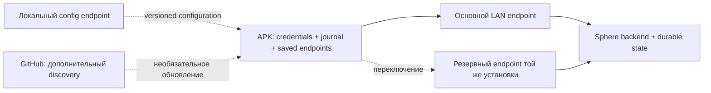

# Эксплуатационная готовность Sphere

**Срез: 10 сентября 2026 · аудит продолжается · приоритеты согласованы с владельцем.**

[Главная](../../README.md) · [Доказательства аудита](../audits/2026-09-05/AUDIT-REPORT.md) ·
[APK](../android-agent.md) · [PC-agent](../pc-agent.md) · [Будущий AI-контур](../architecture/AI-READINESS.md)

## Что считаем работающей системой

Оператор запускает подготовленный стек, парк автоматически подключается, задания
исполняются на устройствах, а после отказа связь восстанавливается без переустановки
APK. По устройству, заданию и времени инцидента можно собрать объяснимую хронологию.
UI показывает измеренные данные, их возраст и ошибки, а не правдоподобные заглушки.

Новая целевая нагрузка — **сотни, затем тысячи одновременно подключённых APK**.
Предыдущие 10–64 эмулятора относятся к одной рабочей станции, а не к общему парку.
Ни одна из этих аппаратных ёмкостей пока не измерена. Количество тестов не является
оценкой производительности. «Минимальный ping» должен стать измеряемым бюджетом
задержки; частый heartbeat сам по себе задержку команды не уменьшает.

## Приоритеты: сначала потеря управления и работы

| Приоритет | Сценарий | Что найдено / подтверждено | Следующее доказательство готовности |
| --- | --- | --- | --- |
| P0 | Сервер перезапущен, парк возвращается без оператора | APK clean-close обходил delay, network retry имел одинаковые сроки у всех клиентов; AUD-67 исправляет pacing/jitter | Убить/поднять выделенный backend при 100, 500, 1000 реальных или протокольных clients; измерить p50/p95/p99 времени возврата и число незавершённых задач |
| P0 | GitHub или основной адрес недоступен | `ConfigWatchdog` читает один CONFIG_URL, `AuthTokenStore` хранит один server URL. Это discovery, а не резервный command channel | Сохранённые primary/secondary endpoints одного сервиса, переключение без изменения device ID, блокировка GitHub в изолированной среде, restart APK с сохранённым маршрутом |
| P0 | Истёк token во время outage | Есть локальные credentials и refresh; потерянный ответ успешной одноразовой ротации остаётся неизвестным исходом | Потерять ответ refresh после SQL commit, повторить после рестарта; не требовать reinstall и не создать новый device вместо прежнего |
| P0 | Нет связи во время выполнения задания | DAG исполняется локально, журнал хранит receipts/results; размер и срок хранения ограничены | Обрыв на claim/start/action/result/ACK, reboot процесса, повторная доставка; не повторить необратимое действие молча |
| P0 | Запуск «одной кнопкой» | AUD-68 исправил ложный успех launcher и добавил API/frontend probes; 17 новых tests проверяют native failure/readiness | Реальные Docker off/image failure/reboot drills; проверка schema head/grants, end-to-end device/task smoke. [Startup contract](STARTUP.md) |
| P0 | Инцидент невозможно найти | Есть JSON backend logs, request ID, APK local logs/upload; сквозного incident timeline нет | Один инцидент находится по времени + device/task ID, с версиями, маршрутом и причинной цепочкой, без ручного просмотра всего stdout |
| P1 | Monitoring якобы включён | Эффективный merge monitoring Compose имеет отсутствующие bind paths, отдельную сеть от backend и порт Grafana 3000, совпадающий с frontend | Исправить конфигурацию; проверить реальные scrape targets, ingestion, restart/retention и тестовый alert |
| P1 | UI вводит в заблуждение | VPN RX/TX и графики заполняются константными нулями в `frontend/app/(dashboard)/vpn/page.tsx` | При отсутствии измерения показывать «нет данных», timestamp/source/error; затем подключить настоящий metrics endpoint |
| P1 | Большое число устройств расходует память/CPU | APK имеет backpressure видео и ограниченный журнал; фактических idle/stream/action профилей нет | Измерить отдельные режимы idle, DAG, preview, active control; ограничить очереди и конкурентность по измеренным bottlenecks |
| P1 | PC-agent / рабочая станция перезапускаются | AUD-63–66 исправляют auth/registration/result/recovery; topology отправляется только initial task | Повторная регистрация после каждого reconnect, provisioning, crash/ADB timeout, сохранение результата и восстановление после host reboot |
| P2 | Полный UI и визуальная система | Есть страницы и handlers; Jest/type/build не доказывают каждый пользовательский сценарий | Проверить таблицу действий: click → request → persisted effect → updated UI → error/retry, затем визуальная унификация |
| P3 | Подключение моторной модели | Базовые экран/действия/DAG есть, observation-action loop не спроектирован | Отдельный дизайн и benchmark; [анализ](../architecture/AI-READINESS.md), без AI implementation сейчас |

P0 — порядок эксплуатационной работы, а не CVSS. Недоделанный путь обозначается
как пробел, а дефект — как дефект только с кодом и воспроизведением. Авторизация
проверяется там, где она реально ломает регистрацию/работу или смешивает устройства;
добавлять барьеры ради формального усиления защиты сейчас не является целью.

## Связь: минимальная архитектура без зависимости от GitHub

Принятое направление; **ещё не реализация**:

1. Постоянное LAN-имя основного management service, управляемое локальным DNS;
   адрес хоста фиксируется DHCP reservation/статической настройкой инфраструктуры.
2. В APK сохраняются основной и резервный endpoint **той же установки Sphere**,
   device identity и последняя рабочая версия конфигурации. После неудач выбирается
   другой endpoint с ограниченным backoff/jitter; переустановка не нужна.
3. Локальный config endpoint служит основным discovery, внешний GitHub — дополнительным.
   Недоступность discovery не стирает рабочую конфигурацию и credentials.
4. Обновление конфигурации имеет revision, проверку структуры/принадлежности установке
   и возможность отката. Поздний старый ответ не должен отменить новое рабочее значение.
5. Один активный исполнитель задачи и один владелец control session на устройство.
   Резервный маршрут не должен создавать второе выполнение или две конфликтующие
   управляющие сессии. Identity/receipt protocol одинаков на обоих адресах.

Два адреса на один хост переживают отказ маршрута, но не смерть хоста/диска/БД.
Для отказа хоста нужны второй доступный узел и согласованное durable state; этого
диаграмма не обещает. Для одного сервера сначала нужны restart policy, readiness,
backup/restore drill и локальный журнал APK. Отдельный broker/второй транспорт
добавлять до доказанной необходимости не планируется.

### Что уже есть в APK

| Механизм | Реальное назначение | Ограничение |
| --- | --- | --- |
| `SphereWebSocketClient` | Один активный WS, handshake timeout 20 s, reconnect/circuit, force reconnect | `isConnected` выставляется после отправки auth, а не подтверждения сервером |
| `ConfigWatchdog` | Опрос адреса: 120 s connected / 60 s disconnected; первая задержка 5 s | Один compile-time CONFIG_URL, в enterprise по умолчанию пуст; не второй канал команд |
| `FallbackDns` | Системный DNS и внешние DNS fallback | Не меняет endpoint и не оживляет сервер; внешние резолверы не заменяют LAN DNS |
| `AuthTokenStore` | Сохранённая identity, access/refresh, mutex refresh | Recovery при lost successful refresh response ещё не доказан |
| `CommandJournal` / `DagRunner` | Локальная работа и повторная доставка terminal result до ACK | Не бесконечный storage; interruption может иметь unknown outcome |
| Foreground Service / watchdogs | Возврат сервиса после некоторых остановок | Force-stop, Direct Boot, permissions/OEM и root/non-root требуют реальных OS tests |
| Binary send cap | Видео не занимает всю очередь OkHttp | Видео и управление всё ещё делят транспорт; p99 command latency под стримом не измерен |

Источники: [WS](../../android/app/src/main/kotlin/com/sphereplatform/agent/ws/SphereWebSocketClient.kt),
[config watchdog](../../android/app/src/main/kotlin/com/sphereplatform/agent/service/ConfigWatchdog.kt),
[token store](../../android/app/src/main/kotlin/com/sphereplatform/agent/store/AuthTokenStore.kt),
[service](../../android/app/src/main/kotlin/com/sphereplatform/agent/service/SphereAgentService.kt).

## Наблюдаемость: ответ на «что случилось в 14:32 на устройстве X»

**Сейчас нельзя обещать найти любой сбой.** Backend request ID связывает HTTP logs,
но не всю жизнь задания. APK пишет локальные текстовые журналы, выгружает их через
worker; backend по умолчанию складывает их в `/tmp/sphere_device_logs`. Наличие
Prometheus/Grafana в репозитории не означает, что сервисы запущены и собирают данные.
Текущий merge зафиксирован [без запуска контейнеров](../audits/2026-09-05/evidence/operations-compose-monitoring.json).

Нужен единый envelope событий: `event_id`, `occurred_at_utc`, `received_at_utc`,
`device_id`, `workstation_id`, `task_id`, `command_id`, `attempt`, `session_id`,
`connection_generation`, `config_revision`, `agent_version`, `backend_revision`,
`phase`, `outcome`, `reason_code`, `duration_ms`. Точное время устройства может плыть,
поэтому длительности измеряются monotonic clock, а время получения хранится отдельно.

Минимальная цепочка: created → committed → queued → delivered → accepted → started
→ finished → result committed → ACK. Для каждого пропущенного перехода должно быть
видно: ожидание, timeout, отказ, отмена или unknown outcome. Повтор события не должен
дублировать счётчики. Это дополнение к действующим receipts, не замена доказательств.

План реализации по этапам:

1. Исправить запуск metrics stack, пути и сети; подтвердить targets/retention.
2. Согласовать reason codes и correlation envelope на backend/APK/PC. Сначала
   connect/auth/config/refresh и task/result, затем все остальные компоненты.
3. Добавить индексируемое хранилище событий и ограниченные local buffers; выбрать
   storage после оценки объёма. Полный распределённый tracing вводить по нужным
   границам, а не инстанцировать новый стек без consumer/query сценария.
4. В UI — карточка инцидента с time window, causal timeline, версиями и ссылками на
   связанные events; выгружаемый support bundle без tokens/паролей.
5. После каждого воспроизведения проверять, что инцидент находится через этот интерфейс.

Метрики парка: reconnect rate/reason, connected **и authenticated** count, age последнего
heartbeat/result, receipt backlog, task outcome/unknown count, DB/Redis errors, queue
depth/drops, frame age/drop и latency p50/p95/p99. Device/task UUID не должны стать
неограниченными labels Prometheus: подробности хранятся в событиях. Не писать
скриншоты/сырой ввод/каждый кадр в общий INFO log.

## UI: достоверность перед косметикой

Каждый экран проходит inventory: источник API/WS, loaded/loading/empty/error/stale,
timestamp, mutation permission, pending/rollback/retry, real persisted effect.
Нулевое значение допустимо только для измеренного нуля. Для отсутствующего источника
нужны «данные не собираются» и явная причина. Offline не означает удалённое устройство;
отправленная команда не означает выполненную. Тесты включают reload страницы,
reconnect, медленные/ошибочные запросы и отказ backend после нажатия.

Визуальная работа следует этому inventory: единая навигация, читаемые статусы,
таблицы больших парков с серверной пагинацией/виртуализацией, доступная клавиатура,
согласованные empty/error states. Современный внешний вид не служит доказательством
работоспособности кнопок. Действующее [руководство UI](../web-ui-guide.md) — карта
экранов, не завершённый acceptance report.

## Проверка производительности и отказов

| Этап | Нагрузка | Что сохраняем |
| --- | --- | --- |
| A | 1 APK, idle / DAG / preview / control отдельно | RSS/PSS/heap, CPU, bytes/s, latency, версии и конфигурация |
| B | 10 / 32 / 64 реальных эмулятора на станции | Host RAM/CPU/IO, starvation, ADB/codec queues, error rate |
| C | 100 / 500 / 1000 protocol clients | Server connection/DB/Redis budgets, reconnect distribution; это не доказательство APK capacity |
| D | Реальный парк ступенями | Данные тех же метрик плюс soak минимум 24 h и повторяемая failure matrix |

Failure matrix: backend worker restart, весь backend down/up, Redis loss/restart,
PG connection loss/restart, GitHub blocked, LAN DNS down, primary route unavailable,
обрыв при auth/refresh/ACK, полная очередь/диск, APK process death, host reboot,
смена конфигурации в разном порядке. На первом этапе фиксируем baseline, после него
принимаем SLO и capacity limit; численные SLA без измерения не публикуются.

Универсальность APK означает версионированный набор capabilities и явный отказ на
неподдерживаемую операцию. Android 8+ в manifest не обещает одинаковые root, input,
capture и background возможности каждого телефона. APK — исполнитель локальных
заданий; контрольная станция определяет политику и наблюдает результат.

## Что выполнено этим срезом

- Проверены исходники connect/discovery/token/service/journal/logging, Compose,
  monitoring и конкретный VPN UI path. Это не постраничный полный browser-аудит.
- AUD-67 имеет before/after tests: исправлены reconnect pacing/jitter; Android
  enterprise debug suite — 347 JVM tests. Реальные OS/network measurements открыты.
- AUD-68: устранён ложный startup success, 25 deployment tests проходят. Это
  subprocess/config проверки; daemon/OS failure drill остаётся открытым.
- Зафиксированы эксплуатационные пробелы, принято простое направление failover,
  подготовлен AI design input и обновлена навигация документации.
- Ничего не развёрнуто на пользовательской/внешней инфраструктуре. Listening
  APK/API проверка ранее отклонена automatic approval review (`blocked by policy`);
  обхода не было. Для аппаратного этапа нужен доступный разрешённый isolated стенд.
