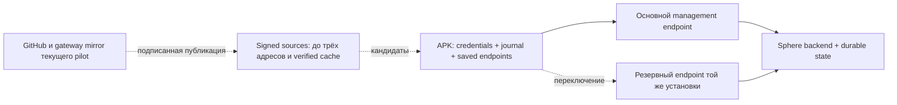

# Эксплуатационная готовность Sphere

**Срез: 23 сентября 2026 · аудит продолжается · приоритеты согласованы с владельцем.**

## Текущее состояние после обновления

**22 сентября: обнаружен новый блокер массового запуска — [F32-28, коллизия
идентичности клонов](../audits/2026-09-20/CLONE-IDENTITY.md).** 20 удалённых VM
работают под одним ID и вытесняют соединения. Ниже — предыдущая приёмка двух
локальных APK; она не подтверждает исправность этой удалённой группы.

**Локальный pilot: backend `3be0e29`, frontend `9924eb1`, оба локальных APK 1.2.9 / 10209.**
[Canary 21 сентября](../audits/2026-09-20/CANARY-20260921.md): backup/restore и миграции
прошли, 15 task receipts и два pipeline независимо сверены, отмена/timeout при
потере сети и backend restart сохранили порядок работы. Оба APK online, PID после
OTA прежние, crash buffers не изменились. Это прежняя локальная приёмка двух экранов.
Удалённая группа в неё не входит: при доставке OTA загрузки прерывались, viewer общей
карточки получил SPS/PPS, но ноль IDR. `LATEST` и обычный OTA-каталог обновлены.

F32-28 identity fix прошёл локальные проверки, но 20 удалённых VM пока отображены
под одной карточкой. Recovery команда доставлена, установка не подтверждена; ошибки
`HTTP/2`/TLS. Альтернативный бесплатный путь с хоста аудита скачал APK за 210.5 секунд,
но он временный, ограничен по скорости, а доступность с удалённой станции не проверена.
Это не массовый rollout. Ноль IDR следует локализовать отдельно от коллизии identities.
См. [F32-28 evidence и остаточные риски](../audits/2026-09-20/CLONE-IDENTITY.md).

**23 сентября: отдельный P0 F32-29 — первый видеокадр не восстанавливался после
потери одноразового запроса IDR. Frontend повторяет запрос до первого кадра;
Android теперь удерживает ранний запрос до готовности encoder, а backend regression
проверяет пересылку viewer-команды. По 108 связанных JVM-тестов прошли в dev и
enterprise flavors, backend stream/clone набор — 31 passed. Удалённые SPS/PPS без
IDR всё ещё надо локализовать по цепочке захват экрана → энкодер → APK → backend/Redis
→ декодер браузера; новая версия не установлена на pilot. См. [browser fix](../audits/2026-09-20/STREAM-FIRST-FRAME.md) и [Android fix](../audits/2026-09-20/ANDROID-KEYFRAME-STARTUP.md).

**P2 F32-30:** локальная standalone-сборка раньше помещала `server.js` не в корень
артефакта при наличии постороннего lockfile выше проекта. Корень трассировки закреплён;
standalone-сервер и четыре маршрута прошли HTTP-проверку на localhost. Новая CI-сборка для
Linux ожидается; предупреждение о копировании trace-файла на Windows зафиксировано
как остаточный риск. [Детали](../audits/2026-09-20/FRONTEND-STANDALONE.md).

**P1 F32-32 / AUD-143:** isolated Redis probe воспроизвёл OOM при 1536 MiB. На
2048 MiB CI прошёл concurrent write/AOF/BGSAVE и restart без OOM, сохранив 6,531
ключ; peak достиг ровно потолка. Это закрывает воспроизведённый workload, но не
даёт запаса для 32 streams; live pilot остался на 1536 MiB.
[Причина и точное доказательство](../audits/2026-09-20/REDIS-PERSISTENCE-HEADROOM.md).

**AUD-138 установлен:** [bounded decoder/recovery](../audits/2026-09-20/DECODER-RECOVERY.md),
14 before failures → 264 frontend tests passed. Два экрана восстановились после
backend restart без F5, projection освобождена, APK PID/crash buffers прежние.

**До Fleet32 остаются P0:** приёмка decoder под 32 потоками, сквозной preview profile,
command/video budget, Redis pressure/recovery и достоверные метрики. [AUD-139](../audits/2026-09-20/REDIS-MEMORY.md)
закрыл исходный memory mismatch, но [AUD-143](../audits/2026-09-20/REDIS-PERSISTENCE-HEADROOM.md)
выявил OOM на более тяжёлой конкурентной AOF нагрузке; 2 GiB теперь проходит этот
isolation test, но peak упирается в потолок и stream margin остаётся непроверенным.
Политика buffers/eviction остаётся
открытой. Native runtime-role RLS,
compound orchestration и полный fault/soak ещё не приняты. Дополнительно F32-26:
отмена длинного sleep ждёт конца действия (проверено), быстрая остановка не обещается.
Ни 32 устройства, ни восемь часов этот rollout не подтверждает.

## История контрольных точек до canary

Ниже сохранены датированные source/native результаты. Фразы «source-only»,
«не установлен» и планы rollout описывают состояние **на момент тех проверок**;
актуальные установленные версии и границы указаны выше.

**AUD-137, source-only:** watchdog обнаруживает due work под RLS; для
ASSIGNED/RUNNING сохраняет stop intent и ждёт terminal APK receipt. Истечение
таймера больше не разрешает следующий DAG и не завершает batch без результата.
Четыре failures до fix → 22 новых passing regressions; весь frontend — 239 passed.
[Контракт, evidence и rollback](../audits/2026-09-20/WATCHDOG-STOP-RECOVERY.md).
Нужны coordinated backend/APK rollout, сверка старых TIMEOUT rows и native fault
acceptance. Следом — остальные background SQL-пути и video/preview/Redis gates.

**AUD-136, source-only:** scheduler теперь обрабатывает due schedules под RLS
в отдельных атомарных транзакциях. Исправлены commit после ошибки handler,
обход `only_online` при отказе Redis, SQL conflict check и просроченный SKIP interval.
Семь baseline failures → 86 связанных tests passed, включая принудительный обрыв
собственного тестового SQL connection и восстановление. [Evidence, grants,
runtime contract](../audits/2026-09-20/SCHEDULER-RUNTIME.md).
Выявленный [watchdog RLS](../audits/2026-09-20/evidence/watchdog-rls.json) и
преждевременное завершение timeout исправлены последующим AUD-137;
physical stop/native acceptance и остальные SQL workers ещё требуют проверки.
Стенд не обновлён; native приёмка на 32 остаётся OPEN.

**AUD-135, source-only:** task assignment/cancellation теперь используют bounded
UUID discovery и отдельные tenant-bound sessions. Worker запускается даже без
Redis и получает актуальные зависимости при каждом tick. Три failures до fix,
101 связанный test passed; реальные RLS/commit/SQL timeout и две организации,
transport doubles. [Evidence, grants и границы](../audits/2026-09-20/TASK-DISPATCH-RLS.md).
Scheduler RLS исправлен AUD-136, watchdog — AUD-137; native rollout открыт.
Pilot не обновлён, native stop/reconnect и допуск к массовому прогону остаются OPEN.

**AUD-134, source-only:** checkpointed nested pipeline сохраняет WAITING/deadline
и освобождает executor slot. Десять родителей и три уровня с одним слотом теперь
завершаются; 87 связанных tests и первоначальная проба прошли. Проверены
restart, cancel/pause/deadline, commit rollback/lost ACK и реальный SQL timeout.
[Контракт, миграция и ограничения](../audits/2026-09-20/PIPELINE-NESTED-WAIT.md).
Не установлен; compound loop/parallel, квоты и native acceptance остаются OPEN.

**AUD-133, source-only:** pipeline discovery, claim, heartbeat, cancellation и
recovery работают под non-owner/NOBYPASSRLS ролью. Три failures до fix → 76
связанных passing tests, включая настоящий OS-kill и изоляцию двух tenants.
[Контракт, grants и ограничения](../audits/2026-09-20/PIPELINE-RLS.md).
Pipeline-часть F32-25 исправлена в коде; обязательны runtime-role canary и согласованный rollout.
Следующая SQL-проба подтвердила nested starvation: 10 родителей занимают все
слоты; 10 пустых children остаются QUEUED после восьми polls. Это отдельный
от RLS дефект, исправленный позже AUD-134: [счётчики и границы](../audits/2026-09-20/evidence/pipeline-nested-capacity.json).
Далее — другие background workers, compound orchestration и bounded decoder/preview.

**AUD-132, source-only:** batch сохраняет полный план, версию script, Task IDs,
cursor и due time; волна и admission receipts коммитятся вместе. Проверены
потеря commit ACK, настоящий OS-kill между волнами, отмена и non-owner RLS role.
[Контракт, миграция/grants и residual risks](../audits/2026-09-20/BATCH-RECOVERY.md).
На pilot не установлено. Выявленный этим checkpoint **F32-25** исправлен
отдельно в AUD-133; результат owner/dev тестов AUD-131 сам по себе RLS не доказывает.

**AUD-131, source-only:** pipeline получает lease/generation и атомарную точку
восстановления. После потери worker продолжает ожидание того же child; неизвестный
внешний эффект требует проверки. 120 связанных backend и 234 frontend tests прошли,
включая OS-kill test worker. [Контракт, rollout и residual risks](../audits/2026-09-20/PIPELINE-RECOVERY.md).
Не установлен; nested capacity, durable batch и 32-device приёмка остаются OPEN.

**AUD-130, source-only:** ограничена очередь принятых pipeline на worker; 10 PostgreSQL
regressions прошли. Ещё три теста проверили освобождение SQL connection при ожидании
с пулом из одного соединения и timeout 900ms. [Доказательства и открытые recovery gates](../audits/2026-09-20/PIPELINE-ADMISSION.md).
На pilot не установлено; это не кластерная квота и не восстановление после crash.

**AUD-129, source-only:** отмена ASSIGNED/RUNNING сохраняется в PostgreSQL, API
отвечает 202 и ждёт terminal DAG receipt. APK сохраняет отмену до EXECUTE_DAG;
pipeline ждёт child/nested runs, веб показывает ожидание. На pilot не установлено;
native/root-path приёмка открыта. [Доказательства и ограничения](../audits/2026-09-20/DURABLE-CANCELLATION.md).

**Актуальный следующий рубеж: 32 живых экрана одновременно, с задачами и recovery.**
[Fleet32 preflight](../audits/2026-09-20/FLEET32-PREFLIGHT.md) задаёт текущую очередность:
достоверная остановка и восстановление batch/pipeline → ограниченный decoder и
сквозной preview profile → ресурсы/наблюдение → ramp 4/8/16/32 и конечный soak.
Исходные 24 пункта и добавленный F32-25 разделяют воспроизведённые дефекты,
подтверждённые свойства кода/конфига и открытые gates. Семь backend diagnostic assertions воспроизводят отсутствующие
контракты; это ожидаемые failures, не прошедшая приёмка. Код и runtime этим
документальным срезом не изменены. VPN, fleet OTA и будущий AI имеют отдельные gates.
Исторические результаты ниже сохраняются со своими версиями и границами.

**План перед canary (реализован 21 сентября в границах отчёта выше).**
После итоговой проверки исходников собрать backend/frontend и pilot APK одного
source manifest. APK должен сохранять установленный package/signing identity и
иметь versionCode выше 10207; общий CI APK не заменяет pilot artifact автоматически.
Перед миграциями сохранить backup нового pilot и проверить порядок grants/rollout
из [AUD-129](../audits/2026-09-20/DURABLE-CANCELLATION.md) и
[AUD-137](../audits/2026-09-20/WATCHDOG-STOP-RECOVERY.md).
На двух APK подтвердить обычный DAG, stop/timeout при потере связи, reconnect,
сохранность identity после OTA/reboot и отсутствие новых crashes. Только затем
переходить к ramp 4/8/16/32 после video/preview/resource gates. Это план следующей
приёмки; новые версии ещё не установлены и её результаты пока отсутствуют.

**AUD-126 установлен и проверен:** при нескольких просмотрах одного Android первое
окно теряло кадры без закрытия WebSocket. Дефект воспроизведён на обоих APK;
исправление прошло 112 связанных tests. Backend `85fb1ea`: шесть native-этапов
с тремя/двумя/одним зрителем прошли, PID/crash buffers прежние.
[Доказательства и контракт viewers](../audits/2026-09-05/STREAM-MULTI-VIEWER.md).
Ночной критерий overlap усилен AUD-127: 22 harness tests и шесть вызовов helper
на настоящих APK прошли. [Новый критерий](../audits/2026-09-05/SOAK-VIEWER-MOTION.md).
Следующий рубеж — новый конечный длительный прогон; восемь часов пока не приняты.

**20 сентября · повторная ночь FAILED после 3 ч 33 мин.**
`night-20260920-001`: 106 циклов; API независимо подтвердил 212 batch + 11 pipeline
DAG, 22 pipeline controls; оба APK online с прежними PID и crash buffers.
Таймаут второго viewer в цикле 107, до нового batch. AUD-125 устраняет idle
пересоздание командной Redis-подписки и игнорирование отказа `start_stream`: два
failing regressions → 105 связанных tests passed. Backend `8a6b30e` установлен:
шесть парных запусков захвата после простоя прошли, оба APK сохранили PID;
восьмичасовая проверка остаётся непройденной.
[Разбор и evidence](../audits/2026-09-05/STREAM-START-DELIVERY.md).

**20 сентября · AUD-121 принят:** backend `eacf692`, frontend `03b161e`, APK 1.2.7.
Одинаковые 12 shell/logcat-запросов: до fix 12 ложных `task.result.not_found`, после
0. Затем два безопасных 13-node DAG завершились с неизменными PID; результаты и
настоящие записи завершения сохранены. Веб без reload показывает 192 задачи.
52 связанных regression tests passed; неизвестные task UUID по-прежнему дают
предупреждение. [Контракт, evidence и ограничения](../audits/2026-09-05/INTERACTIVE-RESULT-IDENTITY.md).

**20 сентября · AUD-120 принят на стенде:** backend и frontend `03b161e` показывают
все 190 задач на восьми страницах; поиск самой старой задачи, фильтр и переход в
редактор проверены в браузере. Настоящий delay-only pipeline появился в панели и
исчез после отмены. Оба APK 1.2.7 выполнили команду. До fix — 10 API/7 UI failures;
после — 81 backend/218 frontend tests, TypeScript и все source workflows прошли. [Контракт, доказательства и ограничения](../audits/2026-09-05/TASK-HISTORY.md).

**Свежая приёмка: оба APK 1.2.7 / 10207 (`0f257fe`) установлены через собственный
OTA.** Исправлены предел 512 подтверждённых задач (AUD-119) и накопление задержек
между успешными подключениями (AUD-124). Native storage: 512 + 2,048 ACK; полный
Android: 579 dev / 578 enterprise passed, один ожидаемый skip; signed build:
164 tests на каждый flavor. Все workflows для source commit `0f257fe` прошли.
[Причина, regression и установленная версия](../audits/2026-09-05/ANDROID-RECONNECT-DEBT.md).

Реальные раздельные/совмещённые отказы Android, серверного входа и общего Nginx
проверены с командами, 13-node DAG и кадрами. На 1.2.7: Android-only возврат 2.015 s;
повторный combined fault — 0.516 / 5.141 s, без смены PID/новых crash entries.
Три capture/stop цикла на каждом APK прошли. Веб восстановил два потока без F5;
сетевая приёмка выполнена на frontend `6dea6b4`, backend `12249b1`.
Текущий backend `85fb1ea`, frontend `03b161e`; LATEST указывает на 1.2.7.
[Матрица и ограничения](../audits/2026-09-05/NETWORK-RECOVERY-NATIVE.md).
Проверены два Android 9; сотни устройств, остальные Android и восемь часов ещё не приняты.

**Новый высший приоритет — восстановление сети:** реальный отказ Quick Tunnel
оставил оба APK offline, хотя backend работал. После одного ручного restart
connector оба APK сами приняли signed v10 без переустановки. Добавлено ограниченное
автовосстановление unhealthy connector (AUD-122, 42 tests pass); результаты
отдельных отказов Android/сервера/обоих и возврата стрима приведены выше.
[Инцидент, fix и ограничения](../audits/2026-09-05/CONNECTOR-RECOVERY.md).
В веб-стриме воспроизведены и исправлены четыре reconnect-дефекта (AUD-123):
[поведение, 208 frontend tests, границы](../audits/2026-09-05/WEB-STREAM-RECOVERY.md).

**После полного разбора приоритеты изменены:** воспроизведена блокировка APK после
512 уже подтверждённых задач (AUD-119, High); Task Engine скрывает историю за
первой сотней и показывает недостоверные источники/индикаторы (AUD-120, High).
AUD-119 впервые исправлен в APK 1.2.6 и сохранён в установленной 1.2.7: [хранилище, миграция и проверки](../audits/2026-09-05/ANDROID-JOURNAL-CAPACITY.md).
AUD-120 исправлен и принят в описанной выше области; большой парк ещё не проверен. Windows snapshot writer исправлен AUD-118 (`b8e0d0b`,
18 local tests); шум 1,555 интерактивных warnings AUD-121 исправлен и проверен выше.
[Полный отчёт, evidence и порядок следующей приёмки](../audits/2026-09-05/NIGHT-RUN-ANALYSIS.md).

**Ночной прогон остановлен:** `night-20260914-001`, 05:06–07:40 Asia/Yekaterinburg.
77 циклов, 156 batch tasks, 16 pipeline controls; Python helper завершился с
`PermissionError`. Причина OS-отказа неизвестна из-за неполной диагностики,
исправленной AUD-117 (2 failing regressions → 15 passing harness tests).
Независимо подтверждены 164 native task results, прежние PID и отсутствие новых
fatal entries в проверенных crash buffers. **Восемь часов не пройдены; повтора нет.**
[Итог и открытые вопросы](../audits/2026-09-05/ANDROID-SOAK-TERMINAL.md).
[Промежуточная независимая сверка 05:23](../audits/2026-09-05/ANDROID-SOAK-CHECKPOINT.md):
19 native DAG results сохранены, PID обоих APK неизменны; лишние предупреждения
интерактивных ответов `task.result.not_found` зафиксированы как открытая проблема.
Backend **`12249b1`**, предшествующий текущему `85fb1ea`, исправил HTTP 500 после создания script и после
pipeline controls (AUD-115/116). 92 связанных локальных tests pass, native
результаты сохранены. [Сводка](../audits/2026-09-05/evidence/overnight-preflight-summary.json).

**Стенд работает:** отдельный `sphere-pilot-20260911`, девять healthy сервисов,
browser login/reload и два установленных APK. После AUD-92 прошли 12/12 HTTPS
`echo`; gateway restart → автоматический возврат за 9.03 s без новой регистрации.
[Версии и доказательства](LOCAL-PILOT.md). Внешний туннель временный; постоянный
независимый ingress, полное DAG-задание из UI и VPN ещё не приняты.
[Publisher](DISCOVERY-PUBLISHER.md) уже выполняет смену адреса автоматически;
native restart → publication 39.97 s → echo 250.83 s. Host reboot ещё не принят.
Signed discovery работает: [native смена адреса и возврат](../audits/2026-09-05/SIGNED-DISCOVERY-NATIVE.md)
прошли без переустановки и новой регистрации. Backend HA этим не подтверждено.

**AUD-99:** сеть второго LDPlayer имела DHCP, но не имела NAT process. После
адресного ремонта оба APK выполняют команды с разными IDs; повторный fault →
repair → возврат второго за 6.08 s, затем 12/12 команд с сохранением PID APK.
[Evidence и границы](../audits/2026-09-05/LDPLAYER-NAT-INCIDENT.md).
Теперь [host watchdog включён для indices 0/1](../audits/2026-09-05/LDPLAYER-AUTOMATIC-RECOVERY.md):
реальный fault → автоматический NAT через 106.91 s → команда второй APK через
108.12 s, затем 12/12 команд. 56 Windows regressions; 0.69–0.97 s на здоровый
минутный цикл. Требует входа пользователя; события в backend/UI ещё не поступают.

**AUD-97:** исправлено зависание подписок после неудачного Redis reconnect.
Настоящий 30 s Redis pause → первая команда через 9.47 s после восстановления,
затем 12/12; тот же APK PID/WS session, без повторной регистрации и backend restart
во время drill. [77 regressions и runtime evidence](../audits/2026-09-05/REDIS-SUBSCRIPTION-RECOVERY.md).

**AUD-98:** API журнала устройства теперь получает сохранённые сообщения APK,
а не только заголовки logcat; 100 строк проверены на установленном агенте.
[17 tests и ограничения диагностики](../audits/2026-09-05/DEVICE-DIAGNOSTICS-SOURCE.md).

**AUD-100:** исправлен пустой хвост большого UTF-8 журнала. Новая APK `9618a57`
установлена на обоих LDPlayer без сброса данных: автоматический возврат за
7.828 / 8.406 s, затем 12/12 команд. Native журнал: 0 bytes до → 4388 bytes,
100 строк и последний marker после. Полный JVM suite 515 passed; signed flavors
по 29 passed. [Доказательства и границы](../audits/2026-09-05/APK-UTF8-LOG-TAIL.md).

**AUD-114/123:** выбранные Device Stream карточки переживают временный offline;
веб показывает потерю связи и восстанавливает потоки без F5. На той приёмке frontend
`6dea6b4`: 208 tests и TypeScript прошли; реальный network drill принят в пределах
двух устройств. [Восстановление веб-стрима](../audits/2026-09-05/WEB-STREAM-RECOVERY.md).

**AUD-112, историческая приёмка APK `343c6e8` / 1.2.5-dev:** оба устройства обновлены через
OTA; исправлена гонка ImageReader copy/teardown, приводившая к SIGSEGV всего APK.
6 + 4 native цикла захвата, движение экрана, повторный зритель и auto-stop прошли
без смены PID; 560 JVM tests и по 74 signed-flavor tests.
[Доказательства и границы](../audits/2026-09-05/ANDROID-CAPTURE-LIFECYCLE.md).

**AUD-109–113, приняты на backend `fa099aa` и сохранены в текущем:** bounded очереди видео, restricted-role
viewer login и передача кадров/controls между workers исправлены. Пауза кадров
более 5 s больше не должна вызывать повторный start через Redis request timeout.
212 связанных tests pass, включая настоящий socket loss и idle baseline до/после.
Native 75 s: по одной start-команде, оба PID неизменны, 12/12 online-проверок и
24/24 echo; после закрытия обоих viewers захват освобождён автоматически.
[Видео](../audits/2026-09-05/STREAM-VIDEO-ROUTING.md) · [Idle recovery](../audits/2026-09-05/STREAM-IDLE-RECOVERY.md).

**AUD-108, предыдущий backend `1310016`:** REST start/stop/keyframe больше не
проверяют только worker-local socket. Native 8/24 false offline → 24/24 success;
настоящий start/stop проекции обоих Android без manual UI принят. 206 real-service/WS
tests pass. [Evidence](../audits/2026-09-05/STREAM-CONTROL-ROUTING.md).
Frame relay и viewer lifecycle далее исправлены AUD-111; GET stream status остаётся worker-local.

**AUD-107, предыдущая APK `fdd26c5` / 1.2.4-dev:** оба Android обновлены через OTA;
возврат команд 10.266 / 9.844 s. Реальный обрыв очищает staging, две одновременно
принятые OTA дают одну загрузку до замены процесса; native retry 10.453 s.
Reboot после OTA → самостоятельный старт и команда за 21.094 s. Финальные 12/12
команд/журналы/hash pass. 556 JVM tests, signed flavors по 70.
[Evidence и границы](../audits/2026-09-05/ANDROID-OTA-RECOVERY.md).

**AUD-104–106, предыдущая APK `a1a40ff` / 1.2.3-dev:** оба Android сами установили
опубликованный release через HTTPS + собственный su, без ADB install и manual UI.
Возврат команд 6.641 / 10.125 s; reboot после OTA → 22.000 s. Native `/latest`
исправлен с localhost на current public host; 12/12 команд и оба журнала pass.
Каталог/файл пережили replacement backend; periodic worker 6 h зарегистрирован.
[Evidence и точные границы](../audits/2026-09-05/ANDROID-OTA-DELIVERY.md).

**AUD-103, APK `8d93e48` / 1.2.2-dev:** исправлен самостоятельный запуск
после Android boot. Native reboot обоих → команда за 20.859 / 25.375 s,
SIGKILL → 5.453 s при отключённом Windows watchdog и без app-launch команд.
533 JVM tests; затем 12/12 команд и журналы.
[Причина, проверка и ограничения](../audits/2026-09-05/ANDROID-BOOT-RECOVERY.md).

**AUD-102, APK `ce26a9e`:** на обоих Android 9 захват после сброса app-op
запускается без ручного consent: разрешение выдаёт сама APK через собственный su.
523 full JVM tests и по 37 tests в signed flavors pass; затем 12/12 команд.
**Открыто:** GET stream status между workers и длительный streaming soak;
durable OTA session/dedup, конкурентная публикация, естественный periodic cycle и fleet rollout;
VPN и независимый резервный ingress. [Фактическая автономность Android](../audits/2026-09-05/ANDROID-UNATTENDED-CAPABILITIES.md).

[Главная](../../README.md) · [Доказательства аудита](../audits/2026-09-05/AUDIT-REPORT.md) ·
[APK](../android-agent.md) · [PC-agent](../pc-agent.md) · [Будущий AI-контур](../architecture/AI-READINESS.md)

**Последний архивированный CI исходников: `3e442d1` — все обязательные checks success:**
backend, Android, frontend, lint/security/RLS, Alembic и image bootstrap.
[Архив с run links](../audits/2026-09-05/evidence/ci-3e442d1-summary.json).
Включает ночной harness и AUD-115/116; установленный backend остаётся `12249b1`.
Включает cross-worker video и capture lifecycle, OTA/root projection/boot recovery.
Включает также idle video recovery AUD-113.
Включает script create и pipeline control response fixes AUD-115/116.
Проверки последующего documentation head отслеживаются отдельно.
Предыдущий `f20b3b9`: JUnit **1591 tests / 0 failures / 0 errors / 0 skipped / 261.517 s**
([архив](../audits/2026-09-05/evidence/ci-f20b3b9-summary.json)).

**Историческая ревизия: `a5209ba` (AUD-87).**
Linux CI: **1506 passed / 69.71%**, включая 538 production-directory и
93 deployment cases. Отдельно mandatory container job: **4 no-network probes +
1 SQL/runtime scenario + 2 PostgreSQL init/restart cases**. Все четыре workflows
прошли с первой попытки; preview deployment пропущен.
[Общий прогон](../audits/2026-09-05/evidence/ci-a5209ba-tests.txt),
[PostgreSQL init](../audits/2026-09-05/evidence/ci-a5209ba-postgres-init-tests.txt).
AUD-85 сохраняет admin credentials при повторе, AUD-86 исправляет generated Settings,
AUD-87 — первый PostgreSQL init с выбранным пользователем. Windows: полный 1498 /
69.67%, затем 93 deployment и 2 PG cases. Далее — выбранный полный Compose,
browser/установленный APK → задание → результат, затем VPN/recovery/observability.
Production roles/grants и восстановление старого частичного init — отдельные задачи.

## Что считаем работающей системой

Оператор запускает подготовленный стек, парк автоматически подключается, задания
исполняются на устройствах, а после отказа связь восстанавливается без переустановки
APK. По устройству, заданию и времени инцидента можно собрать объяснимую хронологию.
UI показывает измеренные данные, их возраст и ошибки, а не правдоподобные заглушки.

Новая целевая нагрузка — **сотни, затем тысячи одновременно подключённых APK**.
Предыдущие 10–64 эмулятора относятся к одной рабочей станции, а не к общему парку.
Ни одна из этих аппаратных ёмкостей пока не измерена. Количество тестов не является
оценкой производительности. «Минимальный ping» должен стать измеряемым бюджетом
задержки; частый heartbeat сам по себе задержку команды не уменьшает.

## Ответ по полному объёму работ

Весь запрос ещё не завершён. Исправления восстановления связи и регистрации
подтверждены локальными regression tests; одно нажатие после host reboot, весь
парк эмуляторов, ресурсные бюджеты и каждый экран UI ещё не проверены целиком.
README и руководства обновляются по реализованным контрактам. Общий metrics stack,
поиск инцидента по времени/device/task и устранение фиктивных VPN measurements
остаются работой впереди. Анализ AI оформлен отдельно; интеграция не реализуется.

## Ближайший рубеж — первый рабочий пилот

По уточнению владельца от 11 сентября приоритет — полный путь
стек → веб/вход → APK → устройство → задание/результат, затем VPN и recovery.
[План приёмки](PILOT-ACCEPTANCE.md) содержит ориентиры 1–3 рабочих дня для первого
пути, 1–2 недели для пилота с VPN и 3–6 недель для измеренного парка. Это условная
оценка при доступном стенде, не обещание дат. До первого полного прогона уверенность
низкая. Новый функционал AI и полный исторический backlog не блокируют рубеж A.

## Приоритеты: сначала потеря управления и работы

| Приоритет | Сценарий | Что найдено / подтверждено | Следующее доказательство готовности |
| --- | --- | --- | --- |
| P0 | Первый пользователь должен получить полный результат задания | Fresh-volume pilot, browser login/reload и два APK уже работают; [актуальная 1.2.7](LOCAL-PILOT.md) прошла OTA/команды | [Пилот](PILOT-ACCEPTANCE.md): web → DAG → физическое действие → persisted result → UI, error/cancel/retry |
| P0 | Регистрация теряет credentials после остановки или ответы меняют identity в обратном порядке | AUD-77: один проверяемый commit UUID/tokens/routes, serialization с refresh, local revision fence; 20 новых JVM cases | [Контракт](../architecture/ANDROID-BACKGROUND-ENROLLMENT.md); initial server response loss, failed re-enrollment recovery, реальные disk/keystore/OS |
| P0 | Registration зависает или поздний ответ записывает credentials после stop | AUD-76: async Call, HTTP budget 10 s, byte limit до parse, cancellation и освобождение worker mutex; 15 новых JVM cases | [Контракт](../architecture/ANDROID-BACKGROUND-ENROLLMENT.md); AUD-77 добавляет единый commit и serialization; initial response loss и реальные sockets/OS открыты |
| P0 | APK должен сам запускаться после Android boot | AUD-75/77/91 согласуют enrollment, AUD-103 добавляет persisted JobScheduler; native reboot двух Android 9 и предыдущей 1.2.4 принят с прежними IDs | [Контракт](../architecture/ANDROID-BACKGROUND-ENROLLMENT.md); initial response loss, fresh/never-launched package, другие Android/OEM и force-stop |
| P0 | Сервер перезапущен, парк возвращается без оператора | APK clean-close обходил delay, network retry имел одинаковые сроки у всех клиентов; AUD-67 исправляет pacing/jitter | Убить/поднять выделенный backend при 100, 500, 1000 реальных или протокольных clients; измерить p50/p95/p99 времени возврата и число незавершённых задач |
| P0 | GitHub или основной адрес недоступен | AUD-74 сохраняет primary/fallback, перебирает их для WS и refresh без discovery, выбирает активный адрес по device-bound ACK; 27 JVM и 3 SQL/ASGI cases | [Настройка](../architecture/ANDROID-SAVED-ROUTES.md); реальный OS restart, отказ LAN/DNS/GitHub, проверка latency/capacity и отказа самого backend |
| P0 | Discovery перестаёт работать после enrollment или переживает stop | AUD-73: JWT в `X-API-Key` давал 401; параллельные/поздние запросы меняли URL. Публичный отменяемый HTTP, один запрос и local revision исправляют воспроизведённые сценарии | [Контракт](../architecture/ANDROID-DISCOVERY-RECOVERY.md); AUD-74 сохраняет кандидатов без разрыва рабочего WS. Signed mode сохраняет durable version floor; native миграция одного APK принята. Открыты fleet/OS recovery и независимая инфраструктура |
| P0 | Истёк token во время outage | AUD-69/70 добавили сохранённый refresh operation ID и один recoverable successor; 24 SQL/ASGI + 7 APK cases проверяют commit loss и сохранение identity | [Rollout backend→APK](../security/device-refresh-recovery.md), фактический Android process death и сетевой обрыв; recovery ограничен expiry/consumption преемника |
| P0 | Зависший refresh задерживает reconnect/stop | AUD-71: четыре исходных failures; HTTP теперь отменяется по дедлайну 10 s или отмене вызывающей coroutine, поздний body не записывает credentials. Восемь новых JVM cases | Проверить реальные Android sockets/OS; mutex wait и зависший commit/keystore не имеют общего 10-секундного SLA |
| P0 | Нет связи во время выполнения задания | DAG исполняется локально, журнал хранит receipts/results; размер и срок хранения ограничены | Обрыв на claim/start/action/result/ACK, reboot процесса, повторная доставка; не повторить необратимое действие молча |
| P0 | Запуск «одной кнопкой» | AUD-68 исправил ложный успех launcher и добавил API/frontend probes; 17 новых tests проверяют native failure/readiness | Реальные Docker off/image failure/reboot drills; проверка schema head/grants, end-to-end device/task smoke. [Startup contract](STARTUP.md) |
| P0 | Инцидент невозможно найти | Есть JSON backend logs, request ID, APK local logs/upload; сквозного incident timeline нет | Один инцидент находится по времени + device/task ID, с версиями, маршрутом и причинной цепочкой, без ручного просмотра всего stdout |
| P1 | Monitoring якобы включён | Эффективный merge monitoring Compose имеет отсутствующие bind paths, отдельную сеть от backend и порт Grafana 3000, совпадающий с frontend | Исправить конфигурацию; проверить реальные scrape targets, ingestion, restart/retention и тестовый alert |
| P1 | UI вводит в заблуждение | VPN RX/TX и графики заполняются константными нулями в `frontend/app/(dashboard)/vpn/page.tsx` | При отсутствии измерения показывать «нет данных», timestamp/source/error; затем подключить настоящий metrics endpoint |
| P1 | Большое число устройств расходует память/CPU | APK имеет backpressure видео и ограниченный журнал; фактических idle/stream/action профилей нет | Измерить отдельные режимы idle, DAG, preview, active control; ограничить очереди и конкурентность по измеренным bottlenecks |
| P1 | PC-agent / рабочая станция перезапускаются | AUD-63–66 исправляют auth/registration/result/recovery; topology отправляется только initial task | Повторная регистрация после каждого reconnect, provisioning, crash/ADB timeout, сохранение результата и восстановление после host reboot |
| P2 | Полный UI и визуальная система | Есть страницы и handlers; Jest/type/build не доказывают каждый пользовательский сценарий | Проверить таблицу действий: click → request → persisted effect → updated UI → error/retry, затем визуальная унификация |
| P3 | Подключение моторной модели | Базовые экран/действия/DAG есть, observation-action loop не спроектирован | Отдельный дизайн и benchmark; [анализ](../architecture/AI-READINESS.md), без AI implementation сейчас |

P0 — порядок эксплуатационной работы, а не CVSS. Недоделанный путь обозначается
как пробел, а дефект — как дефект только с кодом и воспроизведением. Авторизация
проверяется там, где она реально ломает регистрацию/работу или смешивает устройства;
добавлять барьеры ради формального усиления защиты сейчас не является целью.

## Связь: минимальная архитектура без зависимости от GitHub

**Новое:** [signed discovery](../architecture/ANDROID-SIGNED-DISCOVERY.md) добавляет
проверку подписи/установки/версии, AtomicFile cache и до трёх начальных sources.
521 devDebug JVM tests и 21 offline signer tests проходят. Первый source pilot
размещён вне туннеля в отдельной config branch; второй — копия в gateway.
Автоматический publisher/renewal реализован, native смена адреса через него
принята. Постоянные независимые ingress, host logon/reboot, длительное наблюдение
renewal и fleet acceptance ещё открыты. Legacy сборки не переходят на signed mode сами.

**AUD-74 реализует сохранённую пару и ACK-gated выбор маршрута.** Ниже указаны
границы реализации и инфраструктура, которую оператор ещё должен подготовить:

1. Для распределённых станций нужны доступные HTTPS ingress, предпочтительно
   со стабильными именами и исходящими туннелями от сервера. LAN DNS — дополнительный
   вариант одной сети, а не обязательная топология. [Независимые источники адресов
   и подписанный документ: проект следующего этапа](../architecture/ANDROID-BOOTSTRAP-DISCOVERY.md).
2. В APK сохраняются основной и резервный endpoint **той же установки Sphere**,
   device identity и выбранный адрес. После неудач WS и refresh выбирают другой
   сохранённый endpoint с backoff/jitter; переустановка не требуется для route retry.
   Signed mode сохраняет verified config и version floor атомарно; возврат
   прежнего адреса публикуется как новая подписанная версия, без снижения floor.
3. Локальные MDM/файлы читаются при старте сервиса. Signed mode опрашивает до трёх
   заранее настроенных HTTP sources; legacy использует CONFIG_URL. Недоступность
   discovery не стирает подтверждённый cache и сохранённую пару маршрутов.
4. Локальная revision защищает от позднего ответа. Discovery сохраняет кандидатов,
   рабочий адрес меняется по ACK. Signed mode проверяет подпись, installation ID,
   срок и version floor; legacy сохраняет собственные ограничения доверия.
   Key/source rotation и независимость инфраструктуры остаются отдельными gates.
5. Один активный исполнитель задачи и один владелец control session на устройство.
   Резервный маршрут не должен создавать второе выполнение или две конфликтующие
   управляющие сессии. Identity/receipt protocol одинаков на обоих адресах.

Два адреса на один хост переживают отказ маршрута, но не смерть хоста/диска/БД.
Для отказа хоста нужны второй доступный узел и согласованное durable state; этого
диаграмма не обещает. Для одного сервера сначала нужны restart policy, readiness,
backup/restore drill и локальный журнал APK. Отдельный broker/второй транспорт
добавлять до доказанной необходимости не планируется.

### Что уже есть в APK

| Механизм | Реальное назначение | Ограничение |
| --- | --- | --- |
| `SphereWebSocketClient` | Один активный WS, ожидание target-bound `auth_ok` до 20 s, reconnect/circuit, force reconnect | AUD-72 подтверждает identity до `isConnected`; это не readiness всех backend services. [Rollout backend→APK](../architecture/ANDROID-CONNECTION-PROTOCOL.md) |
| `ConfigWatchdog` | Сохраняет кандидатов, читает источники; signed mode проверяет несколько HTTP sources и durable version floor | В pilot основной GitHub source и mirror на том же ingress; это не две независимые рабочие серверные площадки. Legacy enterprise defaults пусты |
| `FallbackDns` | Системный DNS и внешние DNS fallback | Не меняет endpoint и не оживляет сервер; внешние резолверы не заменяют LAN DNS |
| `AuthTokenStore` | Сохранённая identity, access/refresh, mutex refresh, cancellable HTTP | Persisted operation ID и deadline/stop проверены в tests; actual OS/keystore/network drill ещё не выполнен |
| `CommandJournal` / `DagRunner` | Локальная работа и повторная доставка terminal result до ACK | Не бесконечный storage; interruption может иметь unknown outcome |
| Foreground Service / watchdogs / JobScheduler | Native возврат после SIGKILL и Android reboot без Windows launcher принят на двух Android 9 | Force-stop, never-launched package, Direct Boot, permissions/OEM и другие версии Android требуют отдельной приёмки |
| Binary send cap | Видео не занимает всю очередь OkHttp | Видео и управление всё ещё делят транспорт; p99 command latency под стримом не измерен |

Источники: [WS](../../android/app/src/main/kotlin/com/sphereplatform/agent/ws/SphereWebSocketClient.kt),
[config watchdog](../../android/app/src/main/kotlin/com/sphereplatform/agent/service/ConfigWatchdog.kt),
[token store](../../android/app/src/main/kotlin/com/sphereplatform/agent/store/AuthTokenStore.kt),
[service](../../android/app/src/main/kotlin/com/sphereplatform/agent/service/SphereAgentService.kt).

## Наблюдаемость: ответ на «что случилось в 14:32 на устройстве X»

**Сейчас нельзя обещать найти любой сбой.** Backend request ID связывает HTTP logs,
но не всю жизнь задания. APK пишет локальные текстовые журналы, выгружает их через
worker; backend по умолчанию складывает их в `/tmp/sphere_device_logs`. Наличие
Prometheus/Grafana в репозитории не означает, что сервисы запущены и собирают данные.
Текущий merge зафиксирован [без запуска контейнеров](../audits/2026-09-05/evidence/operations-compose-monitoring.json).

Нужен единый envelope событий: `event_id`, `occurred_at_utc`, `received_at_utc`,
`device_id`, `workstation_id`, `task_id`, `command_id`, `attempt`, `session_id`,
`connection_generation`, `config_revision`, `agent_version`, `backend_revision`,
`phase`, `outcome`, `reason_code`, `duration_ms`. Точное время устройства может плыть,
поэтому длительности измеряются monotonic clock, а время получения хранится отдельно.

Минимальная цепочка: created → committed → queued → delivered → accepted → started
→ finished → result committed → ACK. Для каждого пропущенного перехода должно быть
видно: ожидание, timeout, отказ, отмена или unknown outcome. Повтор события не должен
дублировать счётчики. Это дополнение к действующим receipts, не замена доказательств.

План реализации по этапам:

1. Исправить запуск metrics stack, пути и сети; подтвердить targets/retention.
2. Согласовать reason codes и correlation envelope на backend/APK/PC. Сначала
   connect/auth/config/refresh и task/result, затем все остальные компоненты.
3. Добавить индексируемое хранилище событий и ограниченные local buffers; выбрать
   storage после оценки объёма. Полный распределённый tracing вводить по нужным
   границам, а не инстанцировать новый стек без consumer/query сценария.
4. В UI — карточка инцидента с time window, causal timeline, версиями и ссылками на
   связанные events; выгружаемый support bundle без tokens/паролей.
5. После каждого воспроизведения проверять, что инцидент находится через этот интерфейс.

Метрики парка: reconnect rate/reason, connected **и authenticated** count, age последнего
heartbeat/result, receipt backlog, task outcome/unknown count, DB/Redis errors, queue
depth/drops, frame age/drop и latency p50/p95/p99. Device/task UUID не должны стать
неограниченными labels Prometheus: подробности хранятся в событиях. Не писать
скриншоты/сырой ввод/каждый кадр в общий INFO log.

## UI: достоверность перед косметикой

Каждый экран проходит inventory: источник API/WS, loaded/loading/empty/error/stale,
timestamp, mutation permission, pending/rollback/retry, real persisted effect.
Нулевое значение допустимо только для измеренного нуля. Для отсутствующего источника
нужны «данные не собираются» и явная причина. Offline не означает удалённое устройство;
отправленная команда не означает выполненную. Тесты включают reload страницы,
reconnect, медленные/ошибочные запросы и отказ backend после нажатия.

Визуальная работа следует этому inventory: единая навигация, читаемые статусы,
таблицы больших парков с серверной пагинацией/виртуализацией, доступная клавиатура,
согласованные empty/error states. Современный внешний вид не служит доказательством
работоспособности кнопок. Действующее [руководство UI](../web-ui-guide.md) — карта
экранов, не завершённый acceptance report.

## Проверка производительности и отказов

| Этап | Нагрузка | Что сохраняем |
| --- | --- | --- |
| A | 1 APK, idle / DAG / preview / control отдельно | RSS/PSS/heap, CPU, bytes/s, latency, версии и конфигурация |
| B | 10 / 32 / 64 реальных эмулятора на станции | Host RAM/CPU/IO, starvation, ADB/codec queues, error rate |
| C | 100 / 500 / 1000 protocol clients | Server connection/DB/Redis budgets, reconnect distribution; это не доказательство APK capacity |
| D | Реальный парк ступенями | Данные тех же метрик плюс soak минимум 24 h и повторяемая failure matrix |

Failure matrix: backend worker restart, весь backend down/up, Redis loss/restart,
PG connection loss/restart, GitHub blocked, LAN DNS down, primary route unavailable,
обрыв при auth/refresh/ACK, полная очередь/диск, APK process death, host reboot,
смена конфигурации в разном порядке. На первом этапе фиксируем baseline, после него
принимаем SLO и capacity limit; численные SLA без измерения не публикуются.

Универсальность APK означает версионированный набор capabilities и явный отказ на
неподдерживаемую операцию. Android 8+ в manifest не обещает одинаковые root, input,
capture и background возможности каждого телефона. APK — исполнитель локальных
заданий; контрольная станция определяет политику и наблюдает результат.

## История предыдущих срезов AUD-67–87

Ниже сохранены результаты на момент соответствующего исправления. Указанные
здесь «следующие gates» и CI counts являются историей; текущую готовность,
версию APK и оставшиеся задачи определяют начало документа и матрица выше.

- Проверены исходники connect/discovery/token/service/journal/logging, Compose,
  monitoring и конкретный VPN UI path. Это не постраничный полный browser-аудит.
- AUD-67 имеет before/after tests: исправлены reconnect pacing/jitter; Android
  enterprise debug suite на AUD-67 — 347; после AUD-70 — 354, AUD-71 — 362, AUD-72 — 378 JVM tests. Реальные OS/network measurements открыты.
- AUD-68: устранён ложный startup success, 25 deployment tests проходят. Это
  subprocess/config проверки; daemon/OS failure drill остаётся открытым.
- Зафиксированы эксплуатационные пробелы, принято простое направление failover,
  подготовлен AI design input и обновлена навигация документации.
- Ничего не развёрнуто на пользовательской/внешней инфраструктуре. Listening
  APK/API проверка ранее отклонена automatic approval review (`blocked by policy`);
  обхода не было. Для аппаратного этапа нужен доступный разрешённый isolated стенд.

AUD-69/70: SQL refresh recovery и APK persist-before-send проверены локально;
[контракт](../security/device-refresh-recovery.md) ограничивает recovery одной
операцией и сроком преемника. Резервный route добавлен следующим AUD-74.

AUD-71: собственный deadline отменяет HTTP и сохраняет retry intent, внешняя отмена
останавливает вызывающую coroutine. Управляемые зависания headers/body и late-response races
воспроизведены внутри JVM с подменой транспорта; hardware latency не измерена.

AUD-72: устранён преждевременный connected state и поздние callbacks закрытого
сеанса; 16 новых JVM и восемь SQL/ASGI cases. Эта предпосылка для failover проверена,
а резервный route добавлен AUD-74. Новому APK нужен `auth_ok` на всех workers.

AUD-73: 9 исходных discovery failures воспроизведены и исправлены; **399 JVM tests /
31 suites**, 21 новый case. HTTP и lifecycle checks не подтверждают реальный
secondary route, server health trial или ёмкость парка. [Контракт](../architecture/ANDROID-DISCOVERY-RECOVERY.md).

AUD-74: сохранённая пара и refresh/WS retry через другой origin реализованы;
**426 JVM / 32 suites**, включая 27 новых route cases. Проверены кандидат без разрыва
связи, отказ двух адресов, восстановление сохранённых preferences, pending refresh
ID, старые callbacks и локальная конфигурация без bootstrap ключа. Это doubles/ASGI
и выделенный PostgreSQL; фактический Android process death, LAN/DNS, нагрузка и
наблюдаемая хронология инцидента остаются следующим доказательством готовности.

### AUD-79: Compose argument routing

Bash full-deploy исправлен: штатный `IFS` больше не склеивает file options в один
аргумент. Все 37 deployment cases проходят, четыре новых включают весь preamble и
оба overlay. Последний полный локальный backend/PC итог остаётся 1413 / 69,38% из
AUD-78; установленный APK, полный stack, env selection и VPN не приняты.

### Историческое подтверждение CI первого запуска

Runtime `ac7a11f`: **1417 passed / 69.37%** в Linux с fresh migrations и
выделенными PostgreSQL/Redis; backend/frontend/Android workflows прошли с первой
попытки. Preview guard прошёл, deployment пропущен. [Точный срез](../audits/2026-09-05/evidence/ci-ac7a11f-tests.txt).
Локально: последний полный run 1413 / 69,38%, затем все 37 deployment cases.
Это не подтверждение установленного APK, VPN или аппаратной ёмкости.

### AUD-80: выбранный env до запуска Windows Compose

Full-deploy wrapper и штатный start-dev теперь передают `.env.local` → `.env`
явно. Пять before failures / 12 controls; после fix все 44 deployment cases проходят.
Настоящий Compose renderer не запускает сервисы. Migration ordering, secrets,
legacy branches, первый установленный APK/task/VPN остаются открытыми.

### Исторический CI: AUD-80

Runtime `ea8e606`: **1424 passed / 69.38%** в Linux, 505 PostgreSQL/Redis и
44 deployment cases; backend/frontend/Android прошли с первой попытки. Preview
deployment пропущен. [Точное evidence](../audits/2026-09-05/evidence/ci-ea8e606-tests.txt).
Windows env paths подтверждены; полный первый pilot acceptance остаётся открытым.

### AUD-81: packaged bootstrap

Production Dockerfile содержит два bootstrap CLI. Настоящий image probe: baseline
2 failures / 2 controls, после COPY все 4 cases проходят. Эти cases идут отдельным
CI job и не прибавлены к прежним 1424 pytest cases. SQL bootstrap/rollout ещё открыт.

### AUD-82: bootstrap до приложений

Оба full-deploy теперь поднимают PostgreSQL/Redis и ждут readiness, выполняют
migration/admin/key в one-off backend containers, затем запускают приложения и
ждут Compose running/healthy. Production имеет API/login probes. Host migration
fallback и fixed-name/host-port pseudo health удалены. Все 65 deployment cases
проходят с процессом вместо Docker; полный daemon/SQL/APK rollout не принят.
Разделение DB roles, secrets и dev-key hook остаются ближайшими ограничениями.

### AUD-83: startup identity и конкурентность

Configured enrollment key, bootstrap org и API dev hook теперь согласованы.
Доказаны и исправлены registration 401, запись в другую org и duplicate-key crash
параллельных workers. Локально **1466 / 69.70%**, 524 production-directory и
67 deployment cases; [evidence](../audits/2026-09-05/evidence/startup-enrollment-full.txt).
Known config/key conflict виден в структурированных логах без отключения API.
Fresh-volume bootstrap, roles, secrets и установленный APK остаются следующими gates.

### AUD-84: сохранение существующего `.env`

Full-deploy больше не создаёт `.env.local` с новыми секретами при наличии только
`.env`. Оба shell проверены на synthetic files и generator process double:
4 failures / 6 controls до fix; 77 deployment cases проходят после. [Evidence](../audits/2026-09-05/evidence/existing-env-after-summary.json).
Secret rotation/admin password/backup и настоящий restart persistent volumes
не считаются закрытыми этим guard.

### AUD-85: пароль оператора переживает повторный запуск

Закрыты password reset при full-deploy и потеря initial password при позднем
enrollment failure; CLI/shell различают committed created/existing. Реальные SQL,
ASGI login и три concurrent CLI процесса проверены. Полный Windows итог:
**1498 / 69.67%**, 538 production-directory / 85 deployment cases.
[Evidence](../audits/2026-09-05/evidence/admin-restart-full.txt). Следующий gate
development-пилота — fresh полный стек и установленный APK/task/result; production
roles/grants остаются отдельным обязательным rollout. Unknown admin commit,
credential-store и полный persistent-volume restart ещё не закрыты.

### AUD-86: исправлен default свежей установки

Generator → Compose → Settings воспроизвёл 2 failures / 6 controls: пустой
DEV_SKIP_AUTH не позволял backend загрузить настройки. Full overlay теперь
использует false. Все 93 deployment tests проходят локально; полный CI этой
ревизии фиксируется отдельно. Это приоритетный startup defect, не дополнительный
security barrier. [Evidence](../audits/2026-09-05/evidence/compose-settings-before.txt).

### AUD-87: первый PostgreSQL init с выбранным пользователем

Закрыт подтверждённый exit 3 при POSTGRES_USER != sphere. Default/custom users
теперь проходят настоящий entrypoint, SQL ownership/extensions и container restart
с сохранением данных. Два новых mandatory-container cases учитываются отдельно от
pytest и image 4 + 1. [Локальное доказательство](../audits/2026-09-05/evidence/postgres-init-after.txt).
Старые частичные установки и полный Compose/APK/VPN требуют отдельной приёмки.
