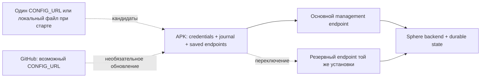

# Эксплуатационная готовность Sphere

**Срез: 12 сентября 2026 · аудит продолжается · приоритеты согласованы с владельцем.**

**Стенд работает:** отдельный `sphere-pilot-20260911`, девять healthy сервисов,
browser login/reload и один установленный APK. После AUD-92 прошли 12/12 HTTPS
`echo`; gateway restart → автоматический возврат за 9.03 s без новой регистрации.
[Версии и доказательства](LOCAL-PILOT.md). Внешний туннель временный; постоянный
независимый ingress, полное DAG-задание из UI и VPN ещё не приняты.
[Publisher](DISCOVERY-PUBLISHER.md) уже выполняет смену адреса автоматически;
native restart → publication 39.97 s → echo 250.83 s. Host reboot ещё не принят.
Signed discovery работает: [native смена адреса и возврат](../audits/2026-09-05/SIGNED-DISCOVERY-NATIVE.md)
прошли без переустановки и новой регистрации. Backend HA этим не подтверждено.

[Главная](../../README.md) · [Доказательства аудита](../audits/2026-09-05/AUDIT-REPORT.md) ·
[APK](../android-agent.md) · [PC-agent](../pc-agent.md) · [Будущий AI-контур](../architecture/AI-READINESS.md)

**Последний архивированный CI: `f61cd5a` — backend, Android и frontend success.**
Backend: **1547 passed / 367.11 s**, обязательные проверки lint/security/RLS и
production image bootstrap прошли. Итоговый Android код `0f1410e` совпадает с этой
ревизией; проверки нового PR head отмечаются отдельно.
[Архив с run links](../audits/2026-09-05/evidence/ci-f61cd5a-summary.json).

**Историческая ревизия: `a5209ba` (AUD-87).**
Linux CI: **1506 passed / 69.71%**, включая 538 production-directory и
93 deployment cases. Отдельно mandatory container job: **4 no-network probes +
1 SQL/runtime scenario + 2 PostgreSQL init/restart cases**. Все четыре workflows
прошли с первой попытки; preview deployment пропущен.
[Общий прогон](../audits/2026-09-05/evidence/ci-a5209ba-tests.txt),
[PostgreSQL init](../audits/2026-09-05/evidence/ci-a5209ba-postgres-init-tests.txt).
AUD-85 сохраняет admin credentials при повторе, AUD-86 исправляет generated Settings,
AUD-87 — первый PostgreSQL init с выбранным пользователем. Windows: полный 1498 /
69.67%, затем 93 deployment и 2 PG cases. Далее — выбранный полный Compose,
browser/установленный APK → задание → результат, затем VPN/recovery/observability.
Production roles/grants и восстановление старого частичного init — отдельные задачи.

## Что считаем работающей системой

Оператор запускает подготовленный стек, парк автоматически подключается, задания
исполняются на устройствах, а после отказа связь восстанавливается без переустановки
APK. По устройству, заданию и времени инцидента можно собрать объяснимую хронологию.
UI показывает измеренные данные, их возраст и ошибки, а не правдоподобные заглушки.

Новая целевая нагрузка — **сотни, затем тысячи одновременно подключённых APK**.
Предыдущие 10–64 эмулятора относятся к одной рабочей станции, а не к общему парку.
Ни одна из этих аппаратных ёмкостей пока не измерена. Количество тестов не является
оценкой производительности. «Минимальный ping» должен стать измеряемым бюджетом
задержки; частый heartbeat сам по себе задержку команды не уменьшает.

## Ответ по полному объёму работ

Весь запрос ещё не завершён. Исправления восстановления связи и регистрации
подтверждены локальными regression tests; одно нажатие после host reboot, весь
парк эмуляторов, ресурсные бюджеты и каждый экран UI ещё не проверены целиком.
README и руководства обновляются по реализованным контрактам. Общий metrics stack,
поиск инцидента по времени/device/task и устранение фиктивных VPN measurements
остаются работой впереди. Анализ AI оформлен отдельно; интеграция не реализуется.

## Ближайший рубеж — первый рабочий пилот

По уточнению владельца от 11 сентября приоритет — полный путь
стек → веб/вход → APK → устройство → задание/результат, затем VPN и recovery.
[План приёмки](PILOT-ACCEPTANCE.md) содержит ориентиры 1–3 рабочих дня для первого
пути, 1–2 недели для пилота с VPN и 3–6 недель для измеренного парка. Это условная
оценка при доступном стенде, не обещание дат. До первого полного прогона уверенность
низкая. Новый функционал AI и полный исторический backlog не блокируют рубеж A.

## Приоритеты: сначала потеря управления и работы

| Приоритет | Сценарий | Что найдено / подтверждено | Следующее доказательство готовности |
| --- | --- | --- | --- |
| P0 | Первый пользователь не может войти или не видит зарегистрированный APK | AUD-78: bootstrap scripts используют существующие DB imports, передают credentials и одну организацию; 23 новых SQL/HTTP/subprocess cases | [Пилот](PILOT-ACCEPTANCE.md); полный fresh-volume Compose, env selection, migration ordering, browser и установленный APK |
| P0 | Регистрация теряет credentials после остановки или ответы меняют identity в обратном порядке | AUD-77: один проверяемый commit UUID/tokens/routes, serialization с refresh, local revision fence; 20 новых JVM cases | [Контракт](../architecture/ANDROID-BACKGROUND-ENROLLMENT.md); initial server response loss, failed re-enrollment recovery, реальные disk/keystore/OS |
| P0 | Registration зависает или поздний ответ записывает credentials после stop | AUD-76: async Call, HTTP budget 10 s, byte limit до parse, cancellation и освобождение worker mutex; 15 новых JVM cases | [Контракт](../architecture/ANDROID-BACKGROUND-ENROLLMENT.md); AUD-77 добавляет единый commit и serialization; initial response loss и реальные sockets/OS открыты |
| P0 | APK не регистрируется после boot или подключается со старым ID | AUD-75: supplied bootstrap key больше не подменяет session; два workers сериализованы, повторяют activation, WS перечитывает назначенный ID; 24 новых JVM cases | [Контракт](../architecture/ANDROID-BACKGROUND-ENROLLMENT.md); AUD-77 закрывает отдельные записи и конкуренцию HTTP registration; response loss и установленный APK boot/recovery открыты |
| P0 | Сервер перезапущен, парк возвращается без оператора | APK clean-close обходил delay, network retry имел одинаковые сроки у всех клиентов; AUD-67 исправляет pacing/jitter | Убить/поднять выделенный backend при 100, 500, 1000 реальных или протокольных clients; измерить p50/p95/p99 времени возврата и число незавершённых задач |
| P0 | GitHub или основной адрес недоступен | AUD-74 сохраняет primary/fallback, перебирает их для WS и refresh без discovery, выбирает активный адрес по device-bound ACK; 27 JVM и 3 SQL/ASGI cases | [Настройка](../architecture/ANDROID-SAVED-ROUTES.md); реальный OS restart, отказ LAN/DNS/GitHub, проверка latency/capacity и отказа самого backend |
| P0 | Discovery перестаёт работать после enrollment или переживает stop | AUD-73: JWT в `X-API-Key` давал 401; параллельные/поздние запросы меняли URL. Публичный отменяемый HTTP, один запрос и local revision исправляют воспроизведённые сценарии | [Контракт](../architecture/ANDROID-DISCOVERY-RECOVERY.md); AUD-74 сохраняет кандидатов без разрыва рабочего WS. Signed mode сохраняет durable version floor; native миграция одного APK принята. Открыты fleet/OS recovery и независимая инфраструктура |
| P0 | Истёк token во время outage | AUD-69/70 добавили сохранённый refresh operation ID и один recoverable successor; 24 SQL/ASGI + 7 APK cases проверяют commit loss и сохранение identity | [Rollout backend→APK](../security/device-refresh-recovery.md), фактический Android process death и сетевой обрыв; recovery ограничен expiry/consumption преемника |
| P0 | Зависший refresh задерживает reconnect/stop | AUD-71: четыре исходных failures; HTTP теперь отменяется по дедлайну 10 s или отмене вызывающей coroutine, поздний body не записывает credentials. Восемь новых JVM cases | Проверить реальные Android sockets/OS; mutex wait и зависший commit/keystore не имеют общего 10-секундного SLA |
| P0 | Нет связи во время выполнения задания | DAG исполняется локально, журнал хранит receipts/results; размер и срок хранения ограничены | Обрыв на claim/start/action/result/ACK, reboot процесса, повторная доставка; не повторить необратимое действие молча |
| P0 | Запуск «одной кнопкой» | AUD-68 исправил ложный успех launcher и добавил API/frontend probes; 17 новых tests проверяют native failure/readiness | Реальные Docker off/image failure/reboot drills; проверка schema head/grants, end-to-end device/task smoke. [Startup contract](STARTUP.md) |
| P0 | Инцидент невозможно найти | Есть JSON backend logs, request ID, APK local logs/upload; сквозного incident timeline нет | Один инцидент находится по времени + device/task ID, с версиями, маршрутом и причинной цепочкой, без ручного просмотра всего stdout |
| P1 | Monitoring якобы включён | Эффективный merge monitoring Compose имеет отсутствующие bind paths, отдельную сеть от backend и порт Grafana 3000, совпадающий с frontend | Исправить конфигурацию; проверить реальные scrape targets, ingestion, restart/retention и тестовый alert |
| P1 | UI вводит в заблуждение | VPN RX/TX и графики заполняются константными нулями в `frontend/app/(dashboard)/vpn/page.tsx` | При отсутствии измерения показывать «нет данных», timestamp/source/error; затем подключить настоящий metrics endpoint |
| P1 | Большое число устройств расходует память/CPU | APK имеет backpressure видео и ограниченный журнал; фактических idle/stream/action профилей нет | Измерить отдельные режимы idle, DAG, preview, active control; ограничить очереди и конкурентность по измеренным bottlenecks |
| P1 | PC-agent / рабочая станция перезапускаются | AUD-63–66 исправляют auth/registration/result/recovery; topology отправляется только initial task | Повторная регистрация после каждого reconnect, provisioning, crash/ADB timeout, сохранение результата и восстановление после host reboot |
| P2 | Полный UI и визуальная система | Есть страницы и handlers; Jest/type/build не доказывают каждый пользовательский сценарий | Проверить таблицу действий: click → request → persisted effect → updated UI → error/retry, затем визуальная унификация |
| P3 | Подключение моторной модели | Базовые экран/действия/DAG есть, observation-action loop не спроектирован | Отдельный дизайн и benchmark; [анализ](../architecture/AI-READINESS.md), без AI implementation сейчас |

P0 — порядок эксплуатационной работы, а не CVSS. Недоделанный путь обозначается
как пробел, а дефект — как дефект только с кодом и воспроизведением. Авторизация
проверяется там, где она реально ломает регистрацию/работу или смешивает устройства;
добавлять барьеры ради формального усиления защиты сейчас не является целью.

## Связь: минимальная архитектура без зависимости от GitHub

**Новое:** [signed discovery](../architecture/ANDROID-SIGNED-DISCOVERY.md) добавляет
проверку подписи/установки/версии, AtomicFile cache и до трёх начальных sources.
521 devDebug JVM tests и 21 offline signer tests проходят. Первый source pilot
размещён вне туннеля в отдельной config branch; второй — копия в gateway.
Постоянные независимые ingress, renewal/publisher automation и fleet acceptance
ещё открыты. Legacy сборки автоматически не переходят на signed mode.

**AUD-74 реализует сохранённую пару и ACK-gated выбор маршрута.** Ниже указаны
границы реализации и инфраструктура, которую оператор ещё должен подготовить:

1. Для распределённых станций нужны доступные HTTPS ingress, предпочтительно
   со стабильными именами и исходящими туннелями от сервера. LAN DNS — дополнительный
   вариант одной сети, а не обязательная топология. [Независимые источники адресов
   и подписанный документ: проект следующего этапа](../architecture/ANDROID-BOOTSTRAP-DISCOVERY.md).
2. В APK сохраняются основной и резервный endpoint **той же установки Sphere**,
   device identity и выбранный адрес. После неудач WS и refresh выбирают другой
   сохранённый endpoint с backoff/jitter; переустановка не требуется для route retry.
   Durable versioned config/rollback ещё не реализован.
3. Локальные MDM/файлы читаются при старте сервиса. HTTP использует один CONFIG_URL:
   можно задать локальный endpoint при enterprise build; список локального и GitHub
   источников ещё не добавлен. Недоступность discovery не стирает сохранённую пару.
4. Локальная revision защищает от позднего ответа. Discovery сохраняет кандидатов,
   рабочий адрес меняется по ACK. Принадлежность установке до отправки credentials
   и rollback серверной версии пока не проверяются: адреса задаёт доверенный оператор.
5. Один активный исполнитель задачи и один владелец control session на устройство.
   Резервный маршрут не должен создавать второе выполнение или две конфликтующие
   управляющие сессии. Identity/receipt protocol одинаков на обоих адресах.

Два адреса на один хост переживают отказ маршрута, но не смерть хоста/диска/БД.
Для отказа хоста нужны второй доступный узел и согласованное durable state; этого
диаграмма не обещает. Для одного сервера сначала нужны restart policy, readiness,
backup/restore drill и локальный журнал APK. Отдельный broker/второй транспорт
добавлять до доказанной необходимости не планируется.

### Что уже есть в APK

| Механизм | Реальное назначение | Ограничение |
| --- | --- | --- |
| `SphereWebSocketClient` | Один активный WS, ожидание target-bound `auth_ok` до 20 s, reconnect/circuit, force reconnect | AUD-72 подтверждает identity до `isConnected`; это не readiness всех backend services. [Rollout backend→APK](../architecture/ANDROID-CONNECTION-PROTOCOL.md) |
| `ConfigWatchdog` | Сохраняет кандидатов, читает локальные источники при старте; HTTP 120 s connected / 60 s disconnected, первая задержка 5 s | Один compile-time CONFIG_URL, в enterprise по умолчанию пуст; нет live reload локального файла или durable config version |
| `FallbackDns` | Системный DNS и внешние DNS fallback | Не меняет endpoint и не оживляет сервер; внешние резолверы не заменяют LAN DNS |
| `AuthTokenStore` | Сохранённая identity, access/refresh, mutex refresh, cancellable HTTP | Persisted operation ID и deadline/stop проверены в tests; actual OS/keystore/network drill ещё не выполнен |
| `CommandJournal` / `DagRunner` | Локальная работа и повторная доставка terminal result до ACK | Не бесконечный storage; interruption может иметь unknown outcome |
| Foreground Service / watchdogs | Возврат сервиса после некоторых остановок | Force-stop, Direct Boot, permissions/OEM и root/non-root требуют реальных OS tests |
| Binary send cap | Видео не занимает всю очередь OkHttp | Видео и управление всё ещё делят транспорт; p99 command latency под стримом не измерен |

Источники: [WS](../../android/app/src/main/kotlin/com/sphereplatform/agent/ws/SphereWebSocketClient.kt),
[config watchdog](../../android/app/src/main/kotlin/com/sphereplatform/agent/service/ConfigWatchdog.kt),
[token store](../../android/app/src/main/kotlin/com/sphereplatform/agent/store/AuthTokenStore.kt),
[service](../../android/app/src/main/kotlin/com/sphereplatform/agent/service/SphereAgentService.kt).

## Наблюдаемость: ответ на «что случилось в 14:32 на устройстве X»

**Сейчас нельзя обещать найти любой сбой.** Backend request ID связывает HTTP logs,
но не всю жизнь задания. APK пишет локальные текстовые журналы, выгружает их через
worker; backend по умолчанию складывает их в `/tmp/sphere_device_logs`. Наличие
Prometheus/Grafana в репозитории не означает, что сервисы запущены и собирают данные.
Текущий merge зафиксирован [без запуска контейнеров](../audits/2026-09-05/evidence/operations-compose-monitoring.json).

Нужен единый envelope событий: `event_id`, `occurred_at_utc`, `received_at_utc`,
`device_id`, `workstation_id`, `task_id`, `command_id`, `attempt`, `session_id`,
`connection_generation`, `config_revision`, `agent_version`, `backend_revision`,
`phase`, `outcome`, `reason_code`, `duration_ms`. Точное время устройства может плыть,
поэтому длительности измеряются monotonic clock, а время получения хранится отдельно.

Минимальная цепочка: created → committed → queued → delivered → accepted → started
→ finished → result committed → ACK. Для каждого пропущенного перехода должно быть
видно: ожидание, timeout, отказ, отмена или unknown outcome. Повтор события не должен
дублировать счётчики. Это дополнение к действующим receipts, не замена доказательств.

План реализации по этапам:

1. Исправить запуск metrics stack, пути и сети; подтвердить targets/retention.
2. Согласовать reason codes и correlation envelope на backend/APK/PC. Сначала
   connect/auth/config/refresh и task/result, затем все остальные компоненты.
3. Добавить индексируемое хранилище событий и ограниченные local buffers; выбрать
   storage после оценки объёма. Полный распределённый tracing вводить по нужным
   границам, а не инстанцировать новый стек без consumer/query сценария.
4. В UI — карточка инцидента с time window, causal timeline, версиями и ссылками на
   связанные events; выгружаемый support bundle без tokens/паролей.
5. После каждого воспроизведения проверять, что инцидент находится через этот интерфейс.

Метрики парка: reconnect rate/reason, connected **и authenticated** count, age последнего
heartbeat/result, receipt backlog, task outcome/unknown count, DB/Redis errors, queue
depth/drops, frame age/drop и latency p50/p95/p99. Device/task UUID не должны стать
неограниченными labels Prometheus: подробности хранятся в событиях. Не писать
скриншоты/сырой ввод/каждый кадр в общий INFO log.

## UI: достоверность перед косметикой

Каждый экран проходит inventory: источник API/WS, loaded/loading/empty/error/stale,
timestamp, mutation permission, pending/rollback/retry, real persisted effect.
Нулевое значение допустимо только для измеренного нуля. Для отсутствующего источника
нужны «данные не собираются» и явная причина. Offline не означает удалённое устройство;
отправленная команда не означает выполненную. Тесты включают reload страницы,
reconnect, медленные/ошибочные запросы и отказ backend после нажатия.

Визуальная работа следует этому inventory: единая навигация, читаемые статусы,
таблицы больших парков с серверной пагинацией/виртуализацией, доступная клавиатура,
согласованные empty/error states. Современный внешний вид не служит доказательством
работоспособности кнопок. Действующее [руководство UI](../web-ui-guide.md) — карта
экранов, не завершённый acceptance report.

## Проверка производительности и отказов

| Этап | Нагрузка | Что сохраняем |
| --- | --- | --- |
| A | 1 APK, idle / DAG / preview / control отдельно | RSS/PSS/heap, CPU, bytes/s, latency, версии и конфигурация |
| B | 10 / 32 / 64 реальных эмулятора на станции | Host RAM/CPU/IO, starvation, ADB/codec queues, error rate |
| C | 100 / 500 / 1000 protocol clients | Server connection/DB/Redis budgets, reconnect distribution; это не доказательство APK capacity |
| D | Реальный парк ступенями | Данные тех же метрик плюс soak минимум 24 h и повторяемая failure matrix |

Failure matrix: backend worker restart, весь backend down/up, Redis loss/restart,
PG connection loss/restart, GitHub blocked, LAN DNS down, primary route unavailable,
обрыв при auth/refresh/ACK, полная очередь/диск, APK process death, host reboot,
смена конфигурации в разном порядке. На первом этапе фиксируем baseline, после него
принимаем SLO и capacity limit; численные SLA без измерения не публикуются.

Универсальность APK означает версионированный набор capabilities и явный отказ на
неподдерживаемую операцию. Android 8+ в manifest не обещает одинаковые root, input,
capture и background возможности каждого телефона. APK — исполнитель локальных
заданий; контрольная станция определяет политику и наблюдает результат.

## Что выполнено этим срезом

- Проверены исходники connect/discovery/token/service/journal/logging, Compose,
  monitoring и конкретный VPN UI path. Это не постраничный полный browser-аудит.
- AUD-67 имеет before/after tests: исправлены reconnect pacing/jitter; Android
  enterprise debug suite на AUD-67 — 347; после AUD-70 — 354, AUD-71 — 362, AUD-72 — 378 JVM tests. Реальные OS/network measurements открыты.
- AUD-68: устранён ложный startup success, 25 deployment tests проходят. Это
  subprocess/config проверки; daemon/OS failure drill остаётся открытым.
- Зафиксированы эксплуатационные пробелы, принято простое направление failover,
  подготовлен AI design input и обновлена навигация документации.
- Ничего не развёрнуто на пользовательской/внешней инфраструктуре. Listening
  APK/API проверка ранее отклонена automatic approval review (`blocked by policy`);
  обхода не было. Для аппаратного этапа нужен доступный разрешённый isolated стенд.

AUD-69/70: SQL refresh recovery и APK persist-before-send проверены локально;
[контракт](../security/device-refresh-recovery.md) ограничивает recovery одной
операцией и сроком преемника. Резервный route добавлен следующим AUD-74.

AUD-71: собственный deadline отменяет HTTP и сохраняет retry intent, внешняя отмена
останавливает вызывающую coroutine. Управляемые зависания headers/body и late-response races
воспроизведены внутри JVM с подменой транспорта; hardware latency не измерена.

AUD-72: устранён преждевременный connected state и поздние callbacks закрытого
сеанса; 16 новых JVM и восемь SQL/ASGI cases. Эта предпосылка для failover проверена,
а резервный route добавлен AUD-74. Новому APK нужен `auth_ok` на всех workers.

AUD-73: 9 исходных discovery failures воспроизведены и исправлены; **399 JVM tests /
31 suites**, 21 новый case. HTTP и lifecycle checks не подтверждают реальный
secondary route, server health trial или ёмкость парка. [Контракт](../architecture/ANDROID-DISCOVERY-RECOVERY.md).

AUD-74: сохранённая пара и refresh/WS retry через другой origin реализованы;
**426 JVM / 32 suites**, включая 27 новых route cases. Проверены кандидат без разрыва
связи, отказ двух адресов, восстановление сохранённых preferences, pending refresh
ID, старые callbacks и локальная конфигурация без bootstrap ключа. Это doubles/ASGI
и выделенный PostgreSQL; фактический Android process death, LAN/DNS, нагрузка и
наблюдаемая хронология инцидента остаются следующим доказательством готовности.

### AUD-79: Compose argument routing

Bash full-deploy исправлен: штатный `IFS` больше не склеивает file options в один
аргумент. Все 37 deployment cases проходят, четыре новых включают весь preamble и
оба overlay. Последний полный локальный backend/PC итог остаётся 1413 / 69,38% из
AUD-78; установленный APK, полный stack, env selection и VPN не приняты.

### Последнее подтверждение CI для первого запуска

Runtime `ac7a11f`: **1417 passed / 69.37%** в Linux с fresh migrations и
выделенными PostgreSQL/Redis; backend/frontend/Android workflows прошли с первой
попытки. Preview guard прошёл, deployment пропущен. [Точный срез](../audits/2026-09-05/evidence/ci-ac7a11f-tests.txt).
Локально: последний полный run 1413 / 69,38%, затем все 37 deployment cases.
Это не подтверждение установленного APK, VPN или аппаратной ёмкости.

### AUD-80: выбранный env до запуска Windows Compose

Full-deploy wrapper и штатный start-dev теперь передают `.env.local` → `.env`
явно. Пять before failures / 12 controls; после fix все 44 deployment cases проходят.
Настоящий Compose renderer не запускает сервисы. Migration ordering, secrets,
legacy branches, первый установленный APK/task/VPN остаются открытыми.

### Текущий CI: AUD-80

Runtime `ea8e606`: **1424 passed / 69.38%** в Linux, 505 PostgreSQL/Redis и
44 deployment cases; backend/frontend/Android прошли с первой попытки. Preview
deployment пропущен. [Точное evidence](../audits/2026-09-05/evidence/ci-ea8e606-tests.txt).
Windows env paths подтверждены; полный первый pilot acceptance остаётся открытым.

### AUD-81: packaged bootstrap

Production Dockerfile содержит два bootstrap CLI. Настоящий image probe: baseline
2 failures / 2 controls, после COPY все 4 cases проходят. Эти cases идут отдельным
CI job и не прибавлены к прежним 1424 pytest cases. SQL bootstrap/rollout ещё открыт.

### AUD-82: bootstrap до приложений

Оба full-deploy теперь поднимают PostgreSQL/Redis и ждут readiness, выполняют
migration/admin/key в one-off backend containers, затем запускают приложения и
ждут Compose running/healthy. Production имеет API/login probes. Host migration
fallback и fixed-name/host-port pseudo health удалены. Все 65 deployment cases
проходят с процессом вместо Docker; полный daemon/SQL/APK rollout не принят.
Разделение DB roles, secrets и dev-key hook остаются ближайшими ограничениями.

### AUD-83: startup identity и конкурентность

Configured enrollment key, bootstrap org и API dev hook теперь согласованы.
Доказаны и исправлены registration 401, запись в другую org и duplicate-key crash
параллельных workers. Локально **1466 / 69.70%**, 524 production-directory и
67 deployment cases; [evidence](../audits/2026-09-05/evidence/startup-enrollment-full.txt).
Known config/key conflict виден в структурированных логах без отключения API.
Fresh-volume bootstrap, roles, secrets и установленный APK остаются следующими gates.

### AUD-84: сохранение существующего `.env`

Full-deploy больше не создаёт `.env.local` с новыми секретами при наличии только
`.env`. Оба shell проверены на synthetic files и generator process double:
4 failures / 6 controls до fix; 77 deployment cases проходят после. [Evidence](../audits/2026-09-05/evidence/existing-env-after-summary.json).
Secret rotation/admin password/backup и настоящий restart persistent volumes
не считаются закрытыми этим guard.

### AUD-85: пароль оператора переживает повторный запуск

Закрыты password reset при full-deploy и потеря initial password при позднем
enrollment failure; CLI/shell различают committed created/existing. Реальные SQL,
ASGI login и три concurrent CLI процесса проверены. Полный Windows итог:
**1498 / 69.67%**, 538 production-directory / 85 deployment cases.
[Evidence](../audits/2026-09-05/evidence/admin-restart-full.txt). Следующий gate
development-пилота — fresh полный стек и установленный APK/task/result; production
roles/grants остаются отдельным обязательным rollout. Unknown admin commit,
credential-store и полный persistent-volume restart ещё не закрыты.

### AUD-86: исправлен default свежей установки

Generator → Compose → Settings воспроизвёл 2 failures / 6 controls: пустой
DEV_SKIP_AUTH не позволял backend загрузить настройки. Full overlay теперь
использует false. Все 93 deployment tests проходят локально; полный CI этой
ревизии фиксируется отдельно. Это приоритетный startup defect, не дополнительный
security barrier. [Evidence](../audits/2026-09-05/evidence/compose-settings-before.txt).

### AUD-87: первый PostgreSQL init с выбранным пользователем

Закрыт подтверждённый exit 3 при POSTGRES_USER != sphere. Default/custom users
теперь проходят настоящий entrypoint, SQL ownership/extensions и container restart
с сохранением данных. Два новых mandatory-container cases учитываются отдельно от
pytest и image 4 + 1. [Локальное доказательство](../audits/2026-09-05/evidence/postgres-init-after.txt).
Старые частичные установки и полный Compose/APK/VPN требуют отдельной приёмки.
