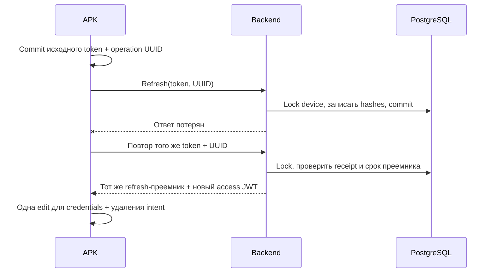

# Device refresh: восстановление потерянного ответа

**10 сентября 2026 · AUD-69 (backend), AUD-70 (APK).**
[Эксплуатационный план](../operations/READINESS.md) ·
[Device bootstrap / RLS](device-credential-bootstrap.md) · [APK](../android-agent.md) ·
[Доказательства](../audits/2026-09-05/AUDIT-REPORT.md).

## Проблема и результат

Сервер мог успешно заменить refresh credential и закоммитить SQL, после чего ответ
терялся. APK сохранял только прежний токен. Его повтор отвергался, и после истечения
access token устройство теряло возможность автоматического входа. Перезапуск APK
не решал расхождение сохранённых credentials.

Теперь клиент заранее сохраняет идентификатор операции. Повтор с тем же исходным
токеном и идентификатором получает **тот же refresh token-преемник**, пока тот активен,
не истёк и не был заменён следующей ротацией/re-enrollment. Access JWT при повторе
выпускается заново; весь HTTP response не является побитно одинаковым. Срок жизни
refresh-преемника при повторе **не продлевается**. Device ID остаётся прежним.

## HTTP-контракт

`POST /api/v1/devices/refresh`:

- Cookie `refresh_token`: исходный opaque bearer, не JWT.
- Необязательный `X-Refresh-Request-Id`: UUID, созданный клиентом до первого запроса.
  При повторе той же операции сохраняется; для следующей ротации создаётся новый.
- Без заголовка остаётся прежняя одноразовая ротация. Повтор исходного токена — 401.
- Некорректный UUID — 422 до расходования credential. Другой token/ID, expired,
  inactive или superseded credential — 401 без нового credential.
- Ответ сохраняет `DeviceRegisterResponse`; новый protocol не меняет WS auth frame.

Это не общий Idempotency-Key для всех API и не замена аутентификации. Proxy должен
передавать Cookie и заголовок без изменений. Совместимость выбранного ingress
проверяется отдельно; TLS и origin restriction сохраняются.

## SQL и конкурентность

Миграция `20260910_device_refresh_retry` добавляет в `devices` два nullable поля:
`refresh_previous_token_hash` (unique) и `refresh_rotation_key_hash`. Текущий hash и
expiry остаются в прежних колонках. На устройство хранится **одна** предыдущая
операция, а не бесконечная история. Старые строки получают NULL и продолжают работу.

`sphere_auth.device_refresh_org(text)` получает возможность найти организацию по
текущему или предыдущему полному SHA-256 hash активного неистёкшего устройства.
Функция по-прежнему возвращает только org UUID, использует защищённый owner,
фиксированный search_path и не доступна PUBLIC. `CREATE OR REPLACE` сохраняет
существующие owner/EXECUTE grants. Дальше приложение связывает tenant и проверяет
credential под обычным RLS.

Device row блокируется `FOR UPDATE`, ORM snapshot обновляется, expiry повторно
проверяется после lock wait. При первой операции запись текущего/предыдущего hash,
ID hash и expiry фиксируется одной SQL-транзакцией. Равные повторы получают одного
преемника; конкурирующие разные ID имеют одного победителя. Re-enrollment тоже
блокирует Device и очищает предыдущую операцию. Отзыв/expiry/re-enrollment, выигравшие
блокировку, не обходятся ожидавшим запросом.

## Как возвращается прежний преемник без хранения plaintext

Используется стандартный HKDF-SHA256 из существующего пакета `cryptography`:

- IKM: UTF-8 исходного высокоэнтропийного refresh token.
- Salt: 16 bytes UUID операции.
- Info: `sphere/device-refresh/v1` + NUL + 16 bytes org UUID + 16 bytes device UUID.
- Output: 32 bytes, base64url без padding.

HKDF предназначен для получения ключевого материала из исходного секрета с
разделением контекстов. [RFC 5869](https://www.rfc-editor.org/rfc/rfc5869).
Приложение использует HKDF как готовый примитив, без собственной реализации crypto.
При восстановлении повторно вычисляется преемник и сравнивается его SHA-256 с
текущим сохранённым hash. SQL не хранит исходный или новый bearer, access JWT либо
зашифрованный HTTP response; отдельный общий recovery encryption key не нужен.

Derivation `v1` — сохраняемый контракт: его нельзя менять при rollout, пока существуют
операции, требующие старого способа восстановления. Будущая смена алгоритма требует
явной совместимости/миграции receipt, а не простой замены функции.

Знание только database hash и UUID не даёт исходный HKDF secret. UUID не считается
самостоятельным секретом или фактором auth. Кража исходного bearer вместе с ID
позволяет восстановление до истечения/замены преемника — их нужно защищать как
credentials. Этот протокол не добавляет device attestation или token-family
compromise detection. Клонирование enrolled app storage создаёт общую identity и
остаётся неподдержанным сценарием.

## APK: порядок записи и защита от устаревшего ответа

В `AuthTokenStore` операция хранится в EncryptedSharedPreferences как
`refresh_rotation_id`. До HTTP выполняется синхронный `commit()` на IO dispatcher.
Если запись неуспешна, запрос не отправляется. Повтор снова делает commit, даже
если ID уже виден в памяти: неуспешный commit мог обновить memory state.

Успешный ответ одной preference edit сохраняет access/refresh/expiry и удаляет
pending ID через `apply()`. Если процесс упал до записи этой edit на диск, там
остаются прежний token и ID, пригодные для серверного восстановления. Перед расходом
следующего токена commit нового ID завершает предыдущие preference writes.
Разница между async apply и commit описана в
[Android SharedPreferences.Editor](https://developer.android.com/reference/android/content/SharedPreferences.Editor).

Сохранение результата проверяет актуальность исходного token/ID под тем же monitor,
что `saveTokens`, `saveApiKey`, `clearTokens`. Если за время HTTP произошла новая
регистрация или очистка, старый ответ не записывается. Возвращается текущее состояние
credentials, а не устаревший token, захваченный до запроса.

## Rollout / rollback

1. Проверить backup и выполнить новую миграцию отдельной migration-ролью.
   Grant contract остаётся прежним; runtime owner/BYPASSRLS не требуется.
2. Обновить **все** backend workers и проверить retry через используемый ingress.
   Старый worker не обслуживает восстановление предыдущего токена.
3. Обновить APK с сохранением app data/device identity и той же signing identity.
   Проверить lost response → retry → WS auth одного изолированного устройства.
4. Расширять rollout после измерений; не переносить enrolled storage на новые AVD.

Старый APK с новым backend сохраняет одноразовый контракт. Новый APK со старым
backend может нормально ротировать, но восстановление потери ответа не гарантируется.
Ранее уже потерянные, не записанные сервером операции восстановить задним числом нельзя.

Сначала откатывается код, затем схема. Downgrade удаляет retry metadata и возвращает
старый lookup; текущий token сохраняется. Pending recovery при этом теряется, поэтому
сначала нужно разрешить ожидающие операции. Транзакционный migration roundtrip
проверен на выделенной БД с последующим rollback; production не мигрировался.

## Проверки и пределы

- Backend: 24 новых real PostgreSQL/non-owner/ASGI cases. Начальные 16 —
  [7 failures / 9 controls до fix](../audits/2026-09-05/evidence/device-refresh-recovery-before.txt).
  [43 related cases проходят](../audits/2026-09-05/evidence/device-refresh-recovery-after.txt):
  lost HTTP response и SQL commit acknowledgement, pool restart, row-lock waiters,
  одинаковые/разные ID, stale/foreign credentials, expiry/re-enroll, rollback,
  migration/grants и восстановленный WS auth.
- APK: [7 failures до fix](../audits/2026-09-05/evidence/android-refresh-recovery-before.txt),
  [354 JVM cases после](../audits/2026-09-05/evidence/android-refresh-recovery-after.txt).
  Memory и disk в новой preference double разделены; HTTP не открывает sockets.

Тесты не заменяют actual Android process death/keystore/disk failure, APK↔server
network drill или массовый парк. Восстановление ограничено сроком существующего
refresh credential (по настройке, сейчас default 7 дней). Нет обещания бессрочной
offline-auth, нового резервного endpoint, восстановления enrollment-ответа или
независимого от PostgreSQL режима. Backend response recovery не использует Redis;
WS/auth и другие компоненты имеют собственные зависимости.

APK cancellation и жёсткий срок blocking HTTP refresh требуют отдельной проверки:
coroutine `withTimeout` сам по себе не доказывает отмену OkHttp `execute()`.
